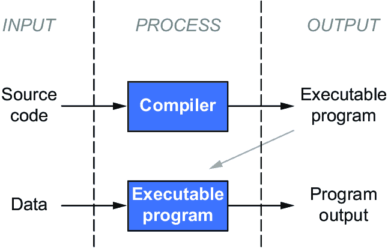

# 附录 B：算法和编程语言

本附录奠定了理解 AI 概念的基础，并介绍了两个关键原则，即算法和编程语言，它们是计算机科学和 AI 发展的重要组成部分。

## B.1 算法

计算机程序是以可执行的形式表达的一组指令。主要地，计算机程序可以分类为操作系统或应用程序。操作系统管理计算机的内部功能，而应用程序允许计算机用户做诸如玩视频游戏或打字文档的事情。操作系统和应用程序都使用算法来定义它们的逻辑，并描述计算机执行特定任务时需要遵循的步骤。因此，算法是计算机科学的核心。

*算法* 一词是波斯数学家 Al-Khwarizmi 的名字的拉丁化，他在公元 813 年至 833 年间写了《通过补充和平衡进行计算的简明书》。这本历史性的著作的唯一剩余副本保存在牛津大学，Al-Khwarizmi 在其中介绍了解决各种类型问题的逐步过程。例如，他是第一个正式引入像二次方程解 ax2 + bx + c = 0 这种类型问题的方法的人。

算法对计算机的运行方式就像食谱对烹饪的作用一样重要。为了创建所需的结果，我们必须预先定义一组特定的操作，以固定的顺序应用。算法使计算机能够无疲倦地、准确地重复长序列的逻辑操作，只要它的逻辑和输入是正确的。创建算法通常涉及将问题解决过程分解为离散步骤。设计算法需要理解问题的结构、解决方案所需的属性、可能的输入和期望的输出。

一个创建和实现算法的方法是从使用流程图来勾勒解决方案的逻辑开始。图 B.1 显示了我在与根据内容的词汇表进行的语境分析相关的专利中提交的一个流程图之一。


##### 图 B.1 显示了一个流程图的示例，描述了算法中的各个步骤。

众所周知，互联网已经彻底改变了信息传播和共享的方式。在任何给定时间，全球数百万人，包括儿童、学生、教育工作者、商人和政府官员，通过电子方式交换大量的数字数据，他们有各种不同的背景和个性。尽管这些信息可以轻松地分发给任何有电脑或网页访问权限的人，但它可能包含不适合所有用户的令人反感和冒犯的材料。特别是，成人或暴力的在线内容可能不适合儿童。

我们将使用基于上下文的方法推断单词使用的上下文。上下文可能基于内置词库或其他技术。内置词库可以是单词及其上下文的数据库。例如，单词*苹果*的上下文可能是*水果*、*纽约*或*计算机*。我们通过计算其与不良材料的相关度值来评估特定内容的适当性。

一旦确定了高级流程，就可以设计模块来解决特定的任务。将算法形式化为逻辑和模块后，我们必须选择适当的编程语言在计算机上编码。每个模块可以由不同的团队编写和测试，以提高实现的效率。

## B.2 编程语言

人们通常通过口语或书面语言与其他人交流，如英语或法语。然而，与计算机的交流可能需要使用计算机编程语言。这些语言涉及通过键入的符号传递思想，尽管像我们熟悉的语言一样，这些符号根据语法、句法和语义规则组合。编程语言用于将算法从人类的言语和书写转换为计算机可以解释和执行的符号和指令。

计算机编程语言在许多方面比人类语言简单得多。例如，它们使用非常有限的词汇量，只能表达概念，例如“如果这样，那么就这样做；否则，就那样做”或“检查条件 X 是否成立，并且语句 Y 是否为真。”使用编程语言表达某事需要严格遵循规则；不允许偏离。将这种严格性与英语或法语进行比较，尽管它们要求词语和句子遵循句法和语义规则组合，但可以以极其灵活的方式表达无限多的概念。

在 1951 年，由威尔克斯、惠勒和吉尔[1]编写的《用于电子数字计算机程序的准备》成为有史以来第一本关于计算机编程的书，它激发了许多第一代语言的创造。例如，Flow-Matic 是第一种类似英语的编程语言，于 20 世纪 50 年代后期由格雷斯·霍普领导为 UNIVAC I 创建。用“类似英语”这样的术语描述编程语言，可以让人了解程序代码的可理解程度。例如，与其不得不输入明确的指令让计算机从其内存的某个部分检索数据并通过特定通道传输，不如输入一个简单的指令“打印 X”来完成相同的任务。

为了使编程语言更加用户友好，促使了 1959 年通用商业导向语言（COBOL）的出现。它被设计用于处理业务数据，并提供了自然语言风格的编程。它重视数据描述，并引入了数据结构的概念，这是存储和检索特定类型信息的特殊格式。COBOL 还将一般程序的结构分为几个部分——标识部分、环境部分、数据部分和过程部分。

当 COBOL 成为美国国防部计算机的强制性语言时，它在编程界的影响力显著增加。尽管自那时以来语言已经发展，但 COBOL 仍然是一种广泛使用的编程语言。根据哈特曼[2]的说法，截至 2022 年，超过 2200 亿行 COBOL 代码仍在联邦政府机构和金融机构的计算机上运行。大约 95％的 ATM 刷卡交易使用 COBOL 代码处理，而每天 80％的面对面交易都由 COBOL 编写的程序处理。

另一种重要的编程语言 Fortran，是由约翰·贝克斯（John Backus）及其团队于 20 世纪 50 年代末发明的。回顾他的动机，贝克斯写道：“当我在 IBM 701 上（一台早期计算机）工作，为计算导弹轨迹编写程序时，我开始着手设计一个编程系统，以使编写程序更容易”[3]。Fortran 的目的是使编程变得更易于实现，而在很大程度上，它做到了。

曾经繁琐、困难和昂贵的为单个问题打字数千条程序指令的任务可以通过几十条 Fortran 指令完成。因此，自 1957 年商业发布以来，Fortran 成为第一个计算机语言标准。它通过向普通大众开放计算机科学领域极大地帮助了现代计算。像 COBOL 一样，Fortran 在创建后 60 多年仍在使用。

在人工智能领域，我们需要用于建模学习和推理等智能过程的编程语言。这些要求超出了设计用于执行数值计算的语言的能力，例如 Fortran。AI 需要能够操作程序和数据、处理和解释符号，并表示在语言处理、计算机视觉和推理系统等应用中出现的不同对象和格式的特征的语言。为了满足这些要求，约翰·麦卡锡在 20 世纪 50 年代末设计了 Lisp。他描述了语言的目标如下[4]：

> 作为一种编程语言，LISP 的特点包括以下几点：使用符号表达式而不是数字进行计算，在计算机的内存中通过列表结构表示符号表达式和其他信息。

Lisp 在计算机科学中开创了许多思想，包括树数据结构，自动存储管理，动态类型，条件，高阶函数，递归等。

源代码是用于编写计算机程序的一组指令，使用其中一种语言，并且大多数计算机语言都是编译的或解释的。编译语言，如 C 和 C ++，使用另一种称为编译器的软件在程序执行之前将源代码转换为目标代码。编译器将源代码转换为特定的机器指令，可以直接由微处理器执行（图 B.2）。



##### 编译器实现图 B.2

解释语言的源代码，如 Lisp，可以直接执行，无需编译（图 B.3）。因此，应用程序可以更快地开发。此外，解释语言与硬件无关，因为它们可以在解释器支持的任何体系结构上运行。解释器的缺点是，例如在 Lisp 中编写的相同代码将比使用编译语言（如 C 或 C ++）编写的代码慢一个数量级。当解释器执行程序时，必须逐行阅读源代码并即时将其转换为机器代码；相比之下，编译代码在执行程序之前已经被翻译成机器代码。


##### 解释器实现图 B.3

其他语言，如 Java，采用混合方法。如果计算机程序可以在各种类型的计算机上执行，则将其分类为可移植的。即使可以在不同类型的计算机上编译高级语言，例如 C ++，但由此生成的目标代码通常只能在一种类型的计算机上执行。用解释语言编写的源代码只要安装了解释器语言，就可以在任何计算机上执行。Java 被称为可移植，因为源代码被转换为虚拟机代码，以便不限制编译器生成的代码到特定的处理器架构。

Lisp 是第一种引入“垃圾收集”的语言。此术语是指一种自动过程，可以释放曾用于存储程序数据但不再需要的内存，以供其他用途使用。

另一个广泛使用的语言是 BASIC，是初学者全用途符号指令代码的首字母缩写。由约翰·凯门尼（John Kemeny）和托马斯·库尔兹（Thomas Kurtz）于 1964 年开发，这种简单直接的语言，与 Fortran 一样，专门设计用于易用性。凯门尼和库尔兹希望使科学和非科学领域的学生都能在工作中使用计算机。

在 Fortran 和 BASIC 等高级语言引入之前，编程计算机通常是相当困难的，因为这些语言更抽象，硬件独立，更贴近人类语言，使用起来更容易。通常，唯一可用的选项是汇编语言，它比直接写一串 1 和 0 稍微简单一点，需要为计算机必须遵循的每条指令编写语句。除了复杂、困难和耗时外，汇编代码通常引用计算机上的特定方面，这意味着为一台计算机编写的程序可能在另一台计算机上无法正常工作。

尽管每种编程语言都可以实现大多数算法，正如我们刚刚学到的那样，但通常情况下，编程语言都是针对特定领域设计的。有些语言适用于特定应用，而有些则不太适合。例如，COBOL 非常适合用于业务数据处理，Fortran 更适合用于科学应用，而 Lisp 则是为人工智能而设计的。还有一些语言，比如 C 语言，更适用于计算机系统，因为它们包含了操纵存储在计算机上的二进制信息的元素。还有一些语言，比如结构化查询语言（SQL）用于操作数据库，R 语言用于数据分析。如今，有数以百计的编程语言。

如果你以前没见过计算机代码，下面是一个示例。该程序是用 C 编程语言编写的，运行它将使计算机在屏幕上打印“你好吗？”。这段文本将被一个名为*编译器*的程序转换成汇编代码，然后被计算机处理为指令并执行：

```py
#include <stdio.h>
int main( )
{
 printf("How are you?");
 return 0;
}
```
