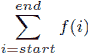
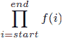

# 前置内容

## 前言

从一个高层级的“五万英尺”视角和一个实用的“手头”视角来看，深度学习代表了显著的技术融合。具体来说，深度学习在新的颠覆性问题解决方法、科学技术、算法方法、现实世界应用、高级数学、计算工具、计算资源和计算机与数据科学领域最优秀的大脑的交汇处生存和繁荣。有些人会说神经网络并不新鲜。这是真的。有些人会说计算机视觉在卷积神经网络引起众人关注之前就已经存在了。这也是真的。还有些人说，机器学习和人工智能在过去几十年中已经经历了多次春天和冬天。这是对怀疑者的一次胜利。对吗？我说，“不对！”

现在可以使用计算算法解决难题，并自动化这些解决方案的能力，其深度和广度是我们以前从未见过的。以前无法克服的难题现在可以解决，例如自动驾驶汽车的安全运行所需的难题，或实时语言翻译，或接近通过图灵测试的对话式聊天机器人，或者相对容易生成既娱乐又令人恐惧的文本和视觉伪造。所有这一切之所以成为可能，是因为高级数学算法的成熟和可访问性、无处不在的快速计算资源、普遍可接受的编码语言以及无处不在的数据、数据、数据！

深度学习将这些许多工具、技术和才能（这就是融合）汇集在一起（这就是多样化的现实世界应用的健康补充），在无数不同的实际应用中（这就是一个健康的多样性）。深度神经网络出色地完成了在复杂数据（图像、视频、音频、文档、口语）中简洁地自动编码显著特征的工作，我们可能称之为*降维*或*解释性特征生成*，然后将这些隐含（潜在）的超模式应用于从这些复杂数据源中激发决策和行动。无论是图像理解、语言理解还是上下文理解，新的深度学习技术和组件在数据丰富的环境中实现了令人兴奋的功能：物体检测和识别、行为检测和识别、异常检测、内容（图像、视频、音频）生成以及相关性（注意力）确定。

这本优秀的书籍引导我们穿越深度学习的世界，从基础构建块到解决数据密集型实际应用中难题的高级模型。我们以深思熟虑且有益的顺序介绍了基础概念：学习、机器学习、神经网络、深度网络、深度学习、卷积网络和循环网络，以及更多。在整个旅程中，我们都有详尽的解释、代码片段、样例问题及其解决方案、评估技术、为读者设计的练习，以及来自该领域世界领先的研究者和实践者的宝贵建议。这本书所体现的永恒智慧、建议、实用性和基础力量，使其成为当前以及未来多年内宝贵的资源。

读者将在本书中找到所有层次的深度学习入门点。如果你想了解诸如反向传播、激活函数或 softmax（不仅是在文字上，还有清晰的例子），你可以在本书中学习。如果你想了解 CNN、RNN、LSTM 和 GRU 之间的区别，你可以在本书中探索它们。如果你想构建这些事物，你可以学习如何做到这一点。如果你想深入了解注意力机制、生成网络、自动编码或迁移学习，所有这些内容也都在这里。如果深度学习是一个建设项目，这本书提供了一个地方，你需要的所有东西：基础、构建块、工具、专家建议、最新进展、深入的信息解释、清晰的“展示如何”示例，以及评估你构建的最终产品的指标。

拿起这本书，你将无法放下它（至少，不会轻易或迅速放下）。它是一个丰富的、引人入胜的深度学习数学、算法和模型知识库——正如标题所说！

——Kirk Borne，博士，首席科学官，DataPrime.ai

## 前言

我在本科期间就开始了机器学习和深度学习的旅程，那是在我为了满足外语要求而出国留学到英格兰的一个学期（是的，你读对了）。我立刻爱上了这个基本理念以及机器学习对许多学科和生活的积极影响，但我发现自己对这个学科所需的数学准备得非常不足。

从那时起，我强迫自己成长和学习，填补那些空白：我获得了该领域的博士学位；我在波士顿咨询集团担任首席科学家，领导多个机器学习和深度学习研究团队；我还作为马里兰大学巴尔的摩郡分校的客座教授指导博士生。我有机会帮助那些与我有着相同热情和挑战的人成长和指导他们，这也催生了今天这本书的诞生。我该如何帮助我的员工、学生和同事更快、更清晰地获得他们需要的知识，而比我经历的要少痛苦？

这本书是我对深度学习的知识汇总。它涵盖了我想让理想候选人理解的全部关键主题。它包括广泛的主题领域，这样你就可以开始识别和重用模式，让你在任何领域都能有效。对我来说，这本书不仅要提供“使用这个模型解决这类问题”的机械指令，还要深入探讨为什么和如何选择不同的模型。希望你在阅读完这本书后，能够理解数学、代码和直觉之间的相互作用是如何构建和发展的，这样你就能跟上该领域的新发展。

## 致谢

在我的生活中，我得到了许多我没有赚取的祝福和机会，对此我非常感激，但我没有足够的空间来感谢他们所有人。感谢波士顿咨询集团帮助我达到这一点的许多人，特别是大卫·卡彭、德鲁·法里斯、约书亚·沙利文和史蒂文·埃斯卡瓦奇。我还感谢我支持过的客户，在我没有特殊背景的时候对我充满信心，并营造了一个充满生产力、成长和支持的环境。

感谢我在 UMBC 的“现代实用深度学习”课程中三年的学生，他们阅读了这本书的初稿：你们的反馈显著地塑造了它。感谢我的导师查尔斯·尼古拉斯，他给了我许多教训；感谢厄贡·西姆塞克，他给了我创建课程的自由；还要感谢许多其他教授、学生和朋友。感谢所有通过各种形式提供反馈并表达他们对这本书感激之情的人，即使是在它早期和不够完善的形式中。你们的声音比你们知道的更有分量，是我完成这本书不可或缺的动力源泉。

感谢普渡大学的许多教授，他们帮助塑造了我的计算机科学和机器学习职业生涯，以及我思考问题的方法，特别是格雷格·弗雷德里克森、詹妮弗·内维尔、安南特·格拉马、沃伊切赫·斯潘科夫斯基和查尔斯·基利安。

在曼宁，整个团队都非常友好，与我合作愉快。我特别感谢弗朗西斯·莱夫科维茨，她不断推动、挑逗、刺激我走出写作的舒适区。你真正帮助我提高了这本书的写作和可读性。

感谢所有审稿人：Abdul Basit Hafeez、Adam Słysz、Al Krinker、Andrei Paleyes、Dze Richard Fang、Ganesh Swaminathan、Gherghe Georgios、Guillaume Alleon、Guillermo Alcantara Gonzalez、Gustavo A. Patino、Gustavo Velasco-Hernandez、Izhar Haq、Jeff Neumann、Levi D. McClenny、Luke Kupka、Marc-Philippe Huget、Mohana Krishna、Nicole Königstein、Ninoslav Čerkez、Oliver Korten、Richard Vaughan、Sergio Govoni、Thomas Joseph Heiman、Tiklu Ganguly、Todd Cook、Tony Holdroyd 和 Vishwesh Ravi Shrimali。你们的建议帮助使这本书变得更好。

最后，我想感谢我的妻子，艾希莉，多年来一直耐心地听我抱怨这个过程。还要感谢我的母亲，贝丽尔，以及保罗，鼓励我承担这个艰巨的任务。

## 关于这本书

在撰写这本书的过程中，我试图回到我最初学习的时候：我发现了什么令人困惑、令人畏惧和误导性的内容？什么帮助我最终掌握了一个概念，让一些代码工作起来，或者意识到*没有人知道*为什么它有效？然后我想到了我现在的知识：哪些技术通常效果最好，我希望能让我的员工和学生具备哪些技能？在过去的三年里，我努力将这些想法提炼成一本供你阅读的书。为了做到这一点，我在书中发展了一些关键策略：

+   *大量的代码和可视化结果*——整天盯着数字很难，数学可能非常抽象且难以推理。尤其是当你第一次学习时，更容易通过视觉看到某些内容，并观察它在代码更改时如何变化。这本书使用图表和曲线图而不是密集的表格，我非常重视那些你可以查看数据和结果的图表和图像数据集。你正在学习的技巧适用于其他类型的数据，如音频或无线电频率，但你不需要独特的背景知识来理解它们。

+   *多种解释*——人工智能是一个由许多父母孕育的领域，来自认知科学、电气工程、计算机科学、心理学等领域。因此，经常有不同视角来理解相同的方法。出于这个原因，我试图为许多主题，特别是复杂主题，提供多种解释或表示。这有助于加深观点，并允许你选择对你最有意义的解释。

+   *适合我们的数学*——如果你只是阅读一个新方程式就能“理解”，那你就是一个巫师。我不是巫师，也不认为你是。数学对于深度学习和理解非常重要，所以我们谈论它，但我以更易于消化的方式重新表达数学。这包括将方程式重写为代码，将方程式着色为描述相同功能的句子，将方程式映射到 NumPy 表达式，以及其他帮助你真正理解底层方法的策略，而不仅仅是建立在它之上的代码。

### 谁应该阅读这本书？

如果你熟悉机器学习的基础知识，并且能够使用 Python 轻松完成任务，你将能够阅读并理解这本书。这意味着你熟悉标准机器学习概念，如训练与测试性能、过拟合与欠拟合，以及像逻辑回归和线性回归、k-means 聚类、最近邻搜索和主成分分析（PCA）这样的基础算法。你应该已经使用过 scikit-learn 提供的这些工具，并且了解生态系统中的其他工具，如 NumPy、pandas 和通用面向对象开发。你不需要了解 PyTorch，因为我们在本书中会涵盖它，但我鼓励你在阅读章节时查阅 PyTorch 文档（[`pytorch.org/docs/stable/index.html`](https://pytorch.org/docs/stable/index.html)），以获取详细的技术细节。

如果你想要理解深度学习背后的神秘之处，并开始构建对它如何工作、何时使用以及如何自信地运用它的理解，你应该阅读这本书！我努力在展示代码、实用细节和“实际工作”知识之间找到一个平衡，这些知识包括数学、统计学和理论理解，这些可以帮助你脱颖而出，并跟上这个快速发展的领域。如果你能坚持到底，你会发现每一章都既有挑战性又富有成效。本书的内容应该为任何初级到中级机器学习工程师、数据科学家或研究人员提供一个坚实的基础。甚至我合作的更资深的研究人员也发现这些内容很有用，我使用的许多代码已在生产环境中应用。我的几位博士生也发现这些代码在“可用性”和“可定制性”之间找到了平衡，这节省了他们的时间，并帮助他们更快地完成研究。

### 本书是如何组织的：一个路线图

本书分为两大部分和 14 个章节。第一部分（第一章至第六章）专注于深度学习的基础：编码框架、基本架构类型、不同组件的术语，以及构建和训练神经网络的技术。这些都是你可以用来构建更大、更复杂系统的基本工具。然后，在第二部分（第七章至第十四章）中，我们开始添加新的设计选择或策略。每一章都有助于扩展深度学习在新的任务或问题上的应用，拓宽我们对深度学习可以做什么的认识，并为我们提供新的杠杆来调整不同的设计权衡（例如，速度与精度）。

虽然跳到与你日常工作特别相关的章节可能很有吸引力，但这本书并不是可以跳过章节的书！本书是精心构建的，需要按线性顺序阅读。每一章都是基于前一章引入的概念或技术，这样你就可以逐渐构建起广泛技能的深入理解。

第一部分，“基础方法”，包含六个章节：

+   第一章讨论了 PyTorch 及其基本工作原理，展示了如何使用该框架。

+   第二章涵盖了最基本的神经网络类型——全连接网络——以及如何在 PyTorch 中编写代码来训练任意网络。这包括一个演示，说明全连接网络与线性模型的关系。

+   第三章介绍了卷积及其如何使卷积神经网络成为基于图像的深度学习的主导技术。

+   第四章介绍了循环神经网络，它们如何编码序列信息，以及它们如何用于文本分类问题。

+   第五章介绍了可以应用于任何神经网络的较新训练技术，以在更短的时间内获得更高的准确率，并解释了它们如何实现这一目标。

+   第六章发展了今天普遍使用的现代设计模式，将你对设计神经网络的了解带入现代时代。

第二部分，“构建高级网络”，包含八个章节：

+   第七章介绍了自动编码作为在没有标记数据的情况下训练神经网络的技术，允许无监督学习。

+   第八章介绍了图像分割和目标检测作为两种可以在图像中找到多个项目的技术。

+   第九章开发了生成对抗网络，这是一种无监督方法，可以生成合成数据，是许多现代图像修改和深度伪造技术的基石。

+   第十章教你如何实现注意力机制，这是网络先验中最重要的一项近期进展。注意力机制允许深度网络选择性地忽略输入中的无关或不重要的部分。

+   第十一章使用注意力机制构建了开创性的 Seq2Seq 模型，并展示了如何使用在生产系统中部署的相同方法构建一个英语到法语翻译器。

+   第十二章介绍了一种新的策略，通过重新思考网络的设计来避免循环网络（由于它们的缺点）。这包括 Transformer 架构，它是当前自然语言处理最佳工具的基础。

+   第十三章涵盖了迁移学习，这是一种使用在一个数据集上训练的网络来提高另一个数据集性能的方法。这允许使用更少的标记数据，使其成为现实工作中最有用的技巧之一。

+   第十四章通过回顾现代神经网络的一些最基本组件，并教你三种最近发表的、大多数从业者还不知道的技术来构建更好的模型，结束了本书。

### 关于数学符号

这里列出了书中常用的符号和符号风格，以及它们的代码等效，作为快速参考和入门指南。

| 符号 | 含义 | 代码 |
| --- | --- | --- |
| x 或 *x* ∈ ℝ | 小写字母用于表示单个浮点值，∈ ℝ 明确表示该值是“在实数中”。 | `x = 3.14` 或 `x = np.array(3.14)` |
| x 或 **x** ∈ ℝ^d | 粗体小写表示 d 个值的向量。 | `x = np.zeros(d)` |
| X 或 **x** ∈ ℝ^(*r*, *c*) | 大写字母表示矩阵或更高阶的张量；用“,”分隔的数字/字母的数量明确表示轴的数量。 | `X = np.zeros((r,c))` |
| *X*^⊤ 或 **x**^⊤ | 表示转置矩阵或向量。 | `np.transpose(x)` 或 `np.transpose(X)` |
|  | 表达式或函数 *f*() 的求和。 | `result = 0``for i in range(start, end+1):``      result += f(i)` |
|  | 表达式或函数 *f*() 的乘积。 | `result = 1``for i in range(start, end+1):``    result *= f(i)` |
| ∥ **x**∥[2] | 矩阵或张量的 2-范数，表示其值的“大小”。> | `result = 0``for val in x:``    result += val**2``result = np.sqrt(result)` |

### 关于练习

每一章都以一系列练习结束，以帮助您练习所学内容。为了鼓励您独立解决问题，没有提供答案。相反，作者和出版社邀请您在 Manning 在线平台 Inside Deep Learning Exercises ([`liveproject.manning.com/project/945`](https://liveproject.manning.com/project/945))上与您的读者分享和讨论您的解决方案。一旦您提交了自己的解决方案，您将能够看到其他读者提交的解决方案，并看到哪些是作者认为最好的。

### 关于 Google Colab

虽然深度学习确实需要 GPU 才能运行，但我已经设计好每一章都可以在 Google Colab 上运行：这是一个免费或根据您的使用情况收取很少费用的平台，您可以通过它访问 GPU 计算能力。一个好的 GPU 至少需要 600 美元，这样您就可以在投资之前先进行自我教育。附录将帮助您设置 Colab，如果您之前没有使用过它，但基本上它就是一个云端的 Jupyter 笔记本。

### 关于代码

代码使用 `固定宽度字体` 如此显示，并且在文本中通常作为正常英语引用。例如，如果我们正在谈论“书”，并且有一个名为 `book` 的变量，我们将使用固定宽度字体同时引用概念和代码，然后当我们只谈论概念时，我们将切换回正常字体。因此，我可能会谈论 `book` 有一个获取 `pages()` 方法的属性，您可以阅读它，将书籍的概念与实现该概念的代码联系起来。

非常短的代码片段以类似“流畅”的风格出现，就像文本的另一段一样，而较长的代码则出现在图中。非常长的代码部分被拆分，可以在 GitHub 上找到，网址为 [`github.com/EdwardRaff/Inside-Deep-Learning`](https://github.com/EdwardRaff/Inside-Deep-Learning)。有时代码本身并不长，但其中一行代码很长，因此非常长的代码行会通过“连续性标记”()进行换行，以告知您这是一行代码被拆分成了多行。

### liveBook 讨论论坛

购买 *Inside Deep Learning* 包括免费访问 liveBook，曼宁的在线阅读平台。使用 liveBook 的独家讨论功能，您可以在全局或特定章节或段落中添加评论。要访问论坛，请访问 [`livebook.manning.com/#!/book/inside-deep-learning/discussion`](https://livebook.manning.com/#!/book/inside-deep-learning/discussion)。您还可以在 [`livebook.manning.com/#!/discussion`](https://livebook.manning.com/#!/discussion) 了解更多关于曼宁论坛和行为准则的信息。

曼宁对读者的承诺是提供一个平台，在这里读者之间以及读者与作者之间可以进行有意义的对话。这并不是对作者参与特定数量活动的承诺，作者对论坛的贡献仍然是自愿的（且未支付报酬）。我们建议您尝试向作者提出一些挑战性的问题，以免他的兴趣转移！只要书籍仍在印刷中，论坛和先前讨论的存档将可通过出版社的网站访问。

### 其他在线资源

我将在我的网站上保留额外的资源和书籍更新，并提供直接链接到书籍页面：[`insidedeeplearningpytorch.com`](http://insidedeeplearningpytorch.com)。就像生活中的所有事情一样，获取不同的观点可能是有益的，或者您可能会发现当概念以多种方式解释时更容易学习。为此，您可能会发现 Michael Nielsen 的书籍 ([`neuralnetworksanddeeplearning.com/`](http://neuralnetworksanddeeplearning.com/)) 对深入了解一些简单神经网络的细节很有价值。我本人也从 Christopher Olah 的博客 ([`colah.github.io/`](https://colah.github.io/)) 中学到了很多，他在那里对深度学习的许多高级和新主题进行了非常详尽和有洞察力的解释。您也可以通过 Twitter @EdwardRaffML 关注我，了解更多关于深度学习的信息。

## 关于作者

**爱德华·拉夫，博士**，是博思艾伦汉密尔顿的首席科学家，在那里他与战略创新小组的机器学习研究团队共同领导。他的工作涉及监督内部研究、招募和培养技术人才、与大学合作伙伴合作以及专注于高端机器学习的企业发展。拉夫博士还协助几家客户进行高级研究。

他对写作、开发和教授机器学习的热情源于分享他对机器学习所有领域的热情。他是 Java 统计分析工具（JSAT）的作者，这是一个用于 Java 快速机器学习的库。他目前指导五名博士生，并发表了超过 60 篇论文，获得三项最佳论文奖。

## 关于封面

《深度学习内部》的封面图是“Indien du Mexique”，或称“墨西哥印第安人”，取自雅克·格拉塞·德·圣索沃尔于 1797 年出版的作品集。每一幅插图都是手工精心绘制和着色的。

在那个时代，人们通过他们的服饰就能轻易识别出他们居住的地方以及他们的职业或社会地位。曼宁通过基于几个世纪前丰富多样的地域文化的书封面来庆祝计算机行业的创新精神和主动性，这些文化通过如这一系列图片般的作品被重新带回生活。
