# 1 学习的机制

本章节涵盖

+   使用 Google Colab 进行编码

+   介绍 PyTorch，一种基于张量的深度学习 API

+   利用 PyTorch 的 GPU 加速运行更快的代码

+   理解自动微分作为学习的基础

+   使用 `Dataset` 接口准备数据

*深度学习*，也称为 *神经网络* 或 *人工神经网络*，在机器学习的质量、准确性和可用性方面取得了显著的进步。10 年前被认为不可能的技术现在已被广泛部署或被认为在技术上可行。像 Cortana、Google、Alexa 和 Siri 这样的数字助手无处不在，并能对自然语言进行反应。自动驾驶汽车在经过改进以最终部署的过程中已经在路上行驶了数百万英里。我们终于可以统计和计算互联网中有多少是猫的照片。深度学习对于所有这些用例以及更多用例的成功都起到了关键作用。

本书向您介绍了当今深度学习中最常见和最有用的技术。一个重要的焦点是如何使用和编码这些网络，以及它们如何在深层工作以及为什么这样做。有了更深入的理解，您将更好地装备自己，以选择最适合您问题的最佳方法，并跟上这个快速发展的领域的进步。为了最大限度地利用本书，您应该熟悉 Python 编程，并对微积分、统计学和线性代数课程有一些基本的记忆。您还应该有机器学习（ML）的先前经验，尽管您不是专家也行；ML 主题会快速介绍，但我们的目标是进入深度学习的细节。 

让我们更清晰地了解深度学习是什么，以及本书是如何介绍它的。深度学习是机器学习的一个子领域，而机器学习又是人工智能（AI）的一个子领域。（有些人可能会对我的这种分类方式感到不满。这是一种过度简化的方式。）广义上，我们可以将 AI 描述为让计算机做出看起来聪明的决策。我说“看起来”，因为很难定义什么是“聪明”或“智能”；AI 应该做出我们认为合理的决策，以及一个聪明人可能会做出的决策。你的 GPS 告诉你如何回家，使用了某些老式的 AI 技术（这些经典的方法有时被称为“老式的传统 AI”，或 GOFAI），选择最快的路线回家是一个明智的决策。让计算机玩电子游戏已经通过纯 AI 方法实现：只需要编码游戏的规则；AI 不需要被展示如何下棋。图 1.1 显示 AI 是这些领域的最外层。

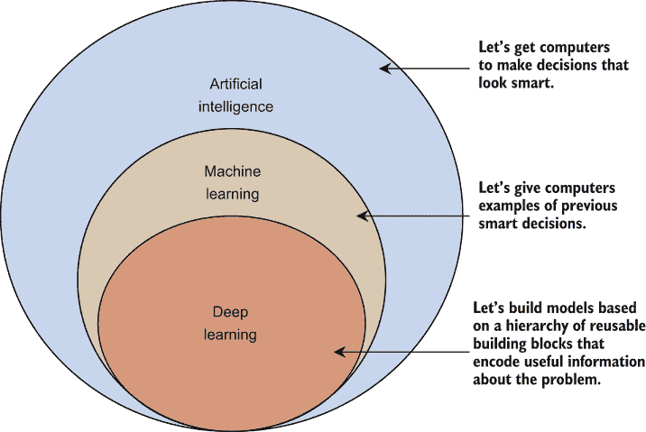

图 1.1 AI、机器学习和深度学习的（简化）层次结构

在机器学习（ML）中，我们开始向 AI 提供之前智能和不太智能的决策的**例子**。例如，我们可以通过给它提供国际象棋大师们玩过的例子游戏来改进我们的国际象棋 AI（每场比赛都有一个赢家和一个输家——一组明智和不太明智的决策）。这是一个以监督为中心的定义，但关键组成部分是我们有反映现实世界的数据。

注意：有一句俗语说数据即真理，但这也是一种过于简化的说法。许多偏见可能会影响你接收到的数据，给你一个有偏见的对世界的看法。这是一个高级话题，适合另一本书来探讨！

深度学习本身并非一个算法，而是由**数百**个像积木一样的小算法组成。成为一名优秀实践者的部分是了解有哪些积木可用，以及如何将它们组合在一起来为**你的**问题创建一个更大的模型。每个积木都是为了解决特定问题而设计的，为模型提供有价值的信息。图 1.2 展示了我们如何将积木组合起来以应对三种情况。本书的一个目标就是涵盖广泛的积木，以便你了解并理解它们如何用于不同类型的问题。有些积木是通用的（“数据是一个序列”可以用于任何类型的序列），而有些则更具体（“数据是一个图像”仅适用于图像），这影响了你何时以及如何使用它们。

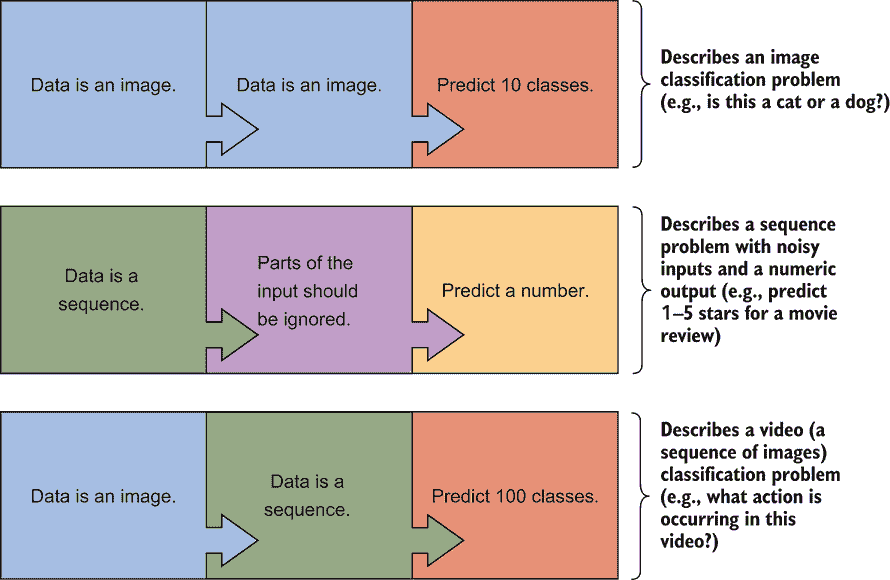

图 1.2 深度学习的一个定义特征是从可重用积木中构建模型。不同的积木适用于不同类型的数据，并且可以混合搭配来处理不同的问题。第一行展示了如何重复使用相同类型的积木来构建一个更深层次的模型，这可以提高准确性。

第一行使用两个“数据是一个图像”的积木来创建一个**深度**模型。重复应用积木是深度学习中的“深度”来源。增加深度使模型能够解决更复杂的问题。这种深度通常是通过多次堆叠相同类型的积木来获得的。图中的第二行展示了序列问题的案例：例如，文本可以被表示为一系列单词。但并非所有单词都有意义，因此我们可能希望给模型一个帮助它学习**忽略**某些单词的积木。第三行展示了如何使用我们已知的积木来描述新的问题。如果我们想让我们的 AI 观看视频并预测正在发生的事情（例如，“跑步”、“网球”或“可爱的狗攻击”），我们可以使用“数据是一个图像”和“数据是一个序列”的积木来创建一系列图像——一个视频。

这些构建模块定义了我们的模型，但在所有机器学习（ML）中，我们还需要数据和一种学习机制。当我们说**学习**时，我们不是在谈论人类学习的方式。在机器（和深度）学习中，**学习**是使模型对数据进行智能预测的机械过程。这是通过称为**优化**或**函数最小化**的过程来实现的。在我们看到任何数据之前，我们的模型返回随机输出，因为所有的参数（控制计算内容的数字）都被初始化为随机值。在常见的工具如线性回归中，回归系数是参数。通过**优化**模块来处理数据，我们使我们的模型学习。这为我们提供了图 1.3 中的更大图景。

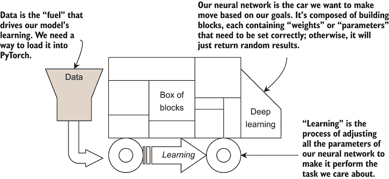

图 1.3 深度学习的“汽车”。这辆汽车由许多不同的构建模块组成，我们可以使用各种构建模块来构建用于不同任务的汽车。但是，我们需要燃料和轮子来让汽车行驶。轮子是学习任务，这是通过称为优化的过程来完成的；而燃料是数据。

在本书的大部分章节中，你将学习到可以用来构建针对不同应用场景的深度学习模型的新构建模块。你可以将每个模块视为一种（可能非常简单）的算法。我们讨论了每个模块的用途，并解释了它们是如何或为什么工作，以及如何在代码中将它们组合起来以创建一个新的模型。由于构建模块的性质，我们可以从简单的任务（例如，可以使用非深度机器学习算法解决的简单预测问题）逐步过渡到更复杂的例子，如机器翻译（例如，让计算机从英语翻译成法语）。我们从 20 世纪 60 年代以来用于训练和构建神经网络的基本方法和方法开始，但使用现代框架。随着我们在本书中的进展，我们将在所学的基础上继续前进，引入新的模块，扩展旧的模块，或者从现有的模块中构建新的模块。

话虽如此，这本书**不是**一本代码片段的食谱，可以随意应对任何新问题。目标是让你熟悉深度学习研究人员用来描述新和改进模块的语言，以便你能识别出何时一个新模块可能是有用的。数学通常可以简洁地表达复杂的变化，因此我将分享构建模块背后的数学。 

我们不会进行很多数学运算——也就是说，**推导**或**证明**数学。相反，我会**展示**数学：呈现最终的方程式，解释它们的作用，并附上有用的直觉。我称之为直觉，因为我们只通过最基本所需的数学。解释正在发生的高层次想法以及为什么结果是这样需要比我要你拥有的更多的数学。当我展示方程式时，尽可能地将相应的 PyTorch 代码交织在一起，这样你就可以开始建立方程式和实现它们的深度学习代码之间的心理地图。

本章首先介绍我们的计算环境：Google Colab。接下来，我们将讨论 PyTorch 和张量，这是我们在 PyTorch 中表示信息的方式。然后，我们将深入了解图形处理单元（GPU）的使用，这使得 PyTorch 运行速度快，以及*自动微分*，这是 PyTorch 用来使神经网络模型学习的“机制”。最后，我们快速实现一个 PyTorch 需要的数据集对象，以便将数据输入模型进行学习过程。这为我们提供了推动深度学习汽车前进的燃料和轮子，从第二章开始。从那时起，我们可以专注于*仅仅*深度学习。

本书设计为线性阅读。每一章都使用了前一章中开发的技能或概念。如果你已经熟悉了章节中的概念，可以自由地跳到下一章。但如果你对深度学习是新手，我鼓励你一章接一章地学习，而不是跳到一个听起来更有趣的章节，因为这些概念可能具有挑战性，一步一步地学习将使整体过程更容易。

## 1.1 Colab 入门

我们将在深度学习的所有工作中使用 GPU。遗憾的是，这是一个计算密集型的实践，GPU 基本上是入门的*必需品*，尤其是在你开始处理更大规模的应用时。我经常在我的工作中使用深度学习，并定期启动需要几天时间在多个 GPU 上训练的任务。我的某些研究实验每次运行可能需要*一个月*的计算时间。

很不幸，GPU 价格昂贵。目前，对于大多数想要开始深度学习的人来说，最好的选择是花费 600-1200 美元购买高端的 NVIDIA GTX 或 Titan GPU。也就是说，*如果*你的电脑可以升级到高端 GPU。如果不能，你可能需要至少 1500-2500 美元来构建一个配备这些 GPU 的优质工作站。这只是为了*学习*深度学习而付出的高昂成本。

Google 的 Colab([`colab.research.google.com`](https://colab.research.google.com))在有限的时间内免费提供 GPU。我为本书中的每个示例都设计了在 Colab 的时间限制内运行。附录中包含了设置 Colab 的说明。一旦设置好，常见的数据科学和机器学习工具如`seaborn`、`matplotlib`、`tqdm`和`pandas`都是内置的，随时可以使用。Colab 的操作方式类似于熟悉的 Jupyter 笔记本，你在单元格中运行代码，输出会直接显示在下方。本书是一本 Jupyter 笔记本，因此你可以运行代码块（如下一个）以获得相同的结果（如果代码单元格不打算运行，我会告诉你）：

```
import seaborn as sns 
import matplotlib.pyplot as plt 
import numpy as np 
from tqdm.autonotebook 
import tqdm import pandas as pd
```

随着我们这本书的进展，我不会反复展示所有的导入，因为这大部分是浪费纸张。相反，它们作为代码下载副本的一部分在线提供，可以在[`github.com/EdwardRaff/Inside-Deep-Learning`](https://github.com/EdwardRaff/Inside-Deep-Learning)找到。

## 1.2 世界作为张量

深度学习已经在电子表格、音频、图像和文本上得到了应用，但深度学习框架并不使用类或对象来区分数据类型。相反，它们使用一种数据类型，我们必须将我们的数据转换为这种格式。对于 PyTorch 来说，这种对世界的单一视角是通过一个*tensor*对象实现的。张量用于表示数据，任何深度学习块的输入/输出，以及控制我们网络行为的参数。张量对象中内置了两个基本功能：使用 GPU 进行快速并行计算的能力，以及自动进行一些微积分（导数）的能力。如果你在 Python 中有先前的机器学习经验，你应该对 NumPy 也有先前的经验，NumPy 也使用了张量概念。在本节中，我们快速回顾了张量概念，并说明了 PyTorch 中的张量与 NumPy 的不同之处，这为我们深度学习构建块奠定了基础。

我们首先导入`torch`库，并讨论张量，它们也被称为 n 维数组。NumPy 和 PyTorch 都允许我们创建 n 维数组。零维数组称为*标量*，是任何单个数字（例如，3.4123）。一维数组是*向量*（例如，[1.9, 2.6, 3.1, 4.0, 5.5]），二维数组是*矩阵*。标量、向量和矩阵都是张量。实际上，n 维数组的任何 n 值仍然是张量。*张量*这个词指的是 n 维数组的整体概念。

我们关注张量，因为它们是组织我们大部分数据和算法的一种方便方式。这是 PyTorch 提供的第一个基础，我们通常将 NumPy 张量转换为 PyTorch 张量。图 1.4 显示了四个张量、它们的形状以及表示形状的数学方法。按照这个模式扩展，四维张量可以写成(*B*,*C*,*W*,*H*)或作为ℝ^(*B*, *C*, *W*, *H*)。


图 1.4 展示了张量的示例，随着我们从左到右移动，维度或*轴*越来越多。标量代表单个值。向量是一系列值，这是我们通常思考一个数据点的方式。矩阵是一系列值的网格，通常用于数据集。三维张量可以用来表示序列数据集。

张量维度

当写出张量的维度，如(*B*,*C*,*W*,*H*)时，我们经常使用具有常见符号或含义的单字母名称。这是一个有用的缩写，你将在代码中经常看到它。大多数将在后面的章节中详细解释，但以下是一些你将看到的常见维度字母：

+   B—正在使用的批次数。

+   D 或 H—隐藏层中的神经元/输出数量（有时 N 也用于此）。

+   C—输入中的通道数（例如，将“红色、绿色、蓝色”视为三个通道）或模型可能输出的类别/类别的数量。

+   W 和 H—图像的宽度和高度（几乎总是与图像通道的“C”维度一起使用）。

+   T—序列中元素的数量（更多内容请参考第四章）。

我们使用常见的符号来将数学符号与特定形状的张量关联起来。大写字母如 X 或 Q 代表具有两个或更多维度的张量。如果我们谈论一个向量，我们使用小写粗体字母如 x 或 h。最后，我们使用小写非粗体字母如 x 或 h 来表示标量。

在讨论和实现神经网络时，我们经常提到较大矩阵中的一行或较大向量中的一个标量。这如图 1.5 所示，通常被称为*切片*。所以如果我们有一个矩阵 X，我们可以使用**x**[i]来引用 X 的第 i 行。在代码中，这表示为`x_i = X[i,:]`。如果我们想要第 i 行和第 j 列，它变为*x*[*i*, *j*]，因为它是一个对单个值的引用——使其成为一个标量。代码版本是`x_ij = X[i,j]`。

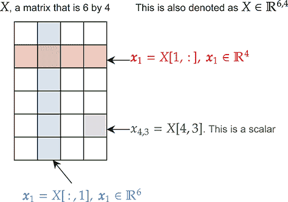

图 1.5 张量可以被切割以从较大的张量中获取子张量。例如，在红色部分，我们从较大的矩阵中获取一个行向量；在蓝色部分，我们从矩阵中获取一个列向量。根据张量所代表的内容，这可以让我们操作数据的不同部分。

要使用 PyTorch，我们需要将其导入为`torch`包。有了它，我们就可以立即开始创建张量。每次你在另一个列表内部嵌套一个列表时，你都会创建 PyTorch 将产生的张量的新维度：

```
import torch

torch_scalar = torch.tensor(3.14) 
torch_vector = torch.tensor([1, 2, 3, 4]) 
torch_matrix = torch.tensor([[1, 2,], 
                             [3, 4,], 
                             [5, 6,], 
                             [7, 8,]])     ❶ 
torch_tensor3d = torch.tensor([ 
                             [ 
                             [ 1, 2, 3], 
                             [ 4, 5, 6], 
                             ], 
                             [ 
                             [ 7, 8, 9], 
                             [10, 11, 12], 
                             ], 
                             [ 
                             [13, 14, 15], 
                             [16, 17, 18], 
                             ], 
                             [
                             [19, 20, 21],
                             [22, 23, 24],
                             ] 
                               ])
```

❶ 你不必像我这样格式化它；这只是为了清晰起见。

如果我们打印这些张量的形状，你应该看到之前显示的相同形状。同样，虽然标量、向量和矩阵是不同的事物，但它们都统一在更大的张量范畴之下。我们关注这一点是因为我们使用不同形状的张量来表示不同类型的数据。我们将在稍后详细讨论这些细节；现在，我们专注于 PyTorch 提供的用于处理张量的机制：

```
print(torch_scalar.shape) 
print(torch_vector.shape) 
print(torch_matrix.shape) 
print(torch_tensor3d.shape)

torch.Size([]) 
torch.Size([4]) 
torch.Size([4, 2]) 
torch.Size([4, 2, 3])
```

如果您在 Python 中做过任何机器学习或科学计算，您可能已经使用过 NumPy 库。正如您所期望的，PyTorch 支持将 NumPy 对象转换为它们的 PyTorch 对应物。由于它们都表示数据为张量，这是一个无缝的过程。以下两个代码块展示了我们如何在 NumPy 中创建一个随机矩阵，然后将其转换为 PyTorch 的`Tensor`对象：

```
x_np = np.random.random((4,4)) 
print(x_np) 
[[0.05095622 0.64330091 0.98293797 0.27355789]
 [0.37754388 0.51127555 0.29976254 0.97804978]
 [0.28363853 0.48929802 0.77875258 0.19889717]
 [0.23659932 0.21207824 0.25225453 0.54866766]]

 x_pt = torch.tensor(x_np) 
 print(x_pt) 
tensor([[0.0510, 0.6433, 0.9829, 0.2736],
         [0.3775, 0.5113, 0.2998, 0.9780],
         [0.2836, 0.4893, 0.7788, 0.1989],
         [0.2366, 0.2121, 0.2523, 0.5487]], dtype=torch.float64)
```

NumPy 和 torch 都支持多种不同的数据类型。默认情况下，NumPy 使用 64 位浮点数，而 PyTorch 默认使用 32 位浮点数。然而，如果您从 NumPy 张量创建 PyTorch 张量，它将使用与给定 NumPy 张量相同的类型。您可以在前面的输出中看到这一点，其中 PyTorch 告诉我们`dtype=torch.float64`，因为它不是默认选择。

对于深度学习，我们最关心的类型是 32 位浮点数、64 位整数（`Long`s）和布尔值（即二进制`True`/`False`）。大多数操作不会改变张量类型，除非我们明确创建或将其转换为新的类型。为了避免类型问题，您可以在调用函数时明确指定您想要创建的张量类型。以下代码使用`dtype`属性检查我们的张量中包含的数据类型：

```
print(x_np.dtype, x_pt.dtype) 
float64 torch.float64

x_np = np.asarray(x_np, dtype=np.float32)     ❶
x_pt = torch.tensor(x_np, dtype=torch.float32) 
print(x_np.dtype, x_pt.dtype) 

float32 torch.float32
```

❶ 让我们强制它们成为 32 位浮点数。

使用 32 位浮点数或 64 位整数作为`dtype`的主要例外是当我们需要执行逻辑运算（如布尔 AND、OR、NOT）时，我们可以使用这些运算来快速创建*二进制掩码*。

掩码是一个张量，它告诉我们另一个张量的哪些部分是有效的。我们在一些更复杂的神经网络中使用掩码。例如，假设我们想在张量中找到所有大于 0.5 的值。PyTorch 和 NumPy 都允许我们使用标准的逻辑运算符来检查这类情况：

```
b_np = (x_np > 0.5) 
print(b_np) 
print(b_np.dtype) 

[[False True True False]
 [False True False True]
 [False False True False]
 [False False False True]]
bool

b_pt = (x_pt > 0.5) 
print(b_pt) 
print(b_pt.dtype) 
tensor([[False,  True,  True, False],
        [False,  True, False,  True], 
        [False, False,  True, False], 
        [False, False, False,  True]]) 
torch.bool
```

虽然 NumPy 和 PyTorch 的 API 并不完全相同，但它们共享许多具有相同名称、行为和特性的函数：

```
    np.sum(x_np) 

[13]: 7.117571

     torch.sum(x_pt) 

[14]: tensor(7.1176)
```

虽然许多函数是相同的，但有些并不完全相同。它们的行为或所需的参数可能存在细微差异。这些差异通常是因为 PyTorch 版本对这些方法用于神经网络设计和执行的方式进行了特定的更改。以下是一个`transpose`函数的示例，其中 PyTorch 要求我们指定要转置的两个维度。NumPy 则不提出异议地转置这两个维度：

```
     np.transpose(x_np) 
[15]: array([[0.05095622, 0.37754387, 0.28363854, 0.23659933], 
             [0.6433009 , 0.51127553, 0.48929802, 0.21207824], 
             [0.982938  , 0.29976255, 0.77875257, 0.25225455], 
             [0.2735579 , 0.97804976, 0.19889717, 0.54866767]], dtype=float32)
     torch.transpose(x_pt, 0, 1) 

[16]: tensor([[0.0510, 0.3775, 0.2836, 0.2366], 
              [0.6433, 0.5113, 0.4893, 0.2121], 
              [0.9829, 0.2998, 0.7788, 0.2523], 
              [0.2736, 0.9780, 0.1989, 0.5487]])
```

PyTorch 这样做是因为我们通常希望为深度学习应用转置张量的维度，而 NumPy 则试图保持更通用的期望。如下所示，我们可以从本章的开头开始转置`torch_tensor3d`中的两个维度。最初它的形状是(4,2,3)。如果我们转置第一和第三维度，我们得到形状为(3,2,4)：

```
print(torch.transpose(torch_tensor3d, 0, 2).shape) 
torch.Size([3, 2, 4])
```

由于存在这样的差异，如果你尝试使用一个你熟悉的函数，但突然发现它没有按预期工作，你应该始终在 [`pytorch.org/docs/stable/index.html`](https://pytorch.org/docs/stable/index.html) 上双检查 PyTorch 文档。这也是在使用 PyTorch 时打开的好工具。PyTorch 中有许多不同的函数可以帮助你，我们无法全部进行审查。

### 1.2.1 PyTorch GPU 加速

PyTorch 给我们的第一个重要功能，超出了 NumPy 的能力，是使用 GPU 加速数学计算。GPU 是你电脑中专门为 2D 和 3D 图形设计的硬件，主要用于加速视频（观看高清电影）或玩视频游戏。这与神经网络有什么关系呢？嗯，制作 2D 和 3D 图形所需的大部分数学都是基于张量或至少与张量相关。因此，GPU 在快速执行我们想要做的事情方面变得越来越擅长。随着图形和 GPU 的变得更好、更强大，人们意识到它们也可以用于科学计算和机器学习。

从高层次来看，你可以将 GPU 视为巨大的张量计算器。在处理任何与神经网络相关的事情时，你应该几乎总是使用 GPU。这是一个很好的搭配，因为神经网络是计算密集型的，而 GPU 在执行我们需要的精确类型计算方面非常快。如果你想在专业环境中进行深度学习，你应该投资一台配备强大 NVIDIA GPU 的电脑。但就目前而言，我们可以免费使用 Colab 来解决问题。

使用 GPU 的技巧是避免在 *少量* 数据上进行计算。这是因为你的电脑的 CPU 必须首先将数据移动到 GPU，然后请求 GPU 执行数学运算，等待 GPU 完成运算，然后将结果从 GPU 复制回来。这个过程中的步骤相当慢；如果我们只计算少量的事情，使用 GPU 比使用 CPU 做数学运算要慢。

什么是“太小”？这取决于你的 CPU、GPU 和你正在做的数学。如果你担心这个问题，你可以进行一些基准测试，看看使用 CPU 是否更快。如果是这样，你可能在处理的数据太少。

让我们用矩阵乘法来测试这个方法——这是一种基本的线性代数运算，在神经网络中很常见。如果我们有矩阵 *X*^(*n*, *m*) 和 *Y*^(*m*, *p*)，我们可以计算出一个结果矩阵 *C*^(*n*, *p*) = *X*^(*n*, *m*)*Y*^(*m*, *p*)。请注意，C 的行数与 X 相同，列数与 Y 相同。在实现神经网络时，我们会进行很多改变张量 *shape* 的操作，就像当我们相乘两个矩阵时发生的情况一样。这是错误的一个常见来源，因此在编写代码时你应该考虑张量的形状。

我们可以使用 `timeit` 库：它允许我们多次运行代码，并告诉我们运行所需的时间。我们创建一个较大的矩阵 X，多次计算 XX，看看这需要多长时间运行：

```
import timeit 
x = torch.rand(2**11, 2**11) 
time_cpu = timeit.timeit("x@x", globals=globals(), number=100)
```

运行这段代码需要一点时间，但不算太长。在我的电脑上，它运行了 6.172 秒，这个时间存储在 `time_cpu` 变量中。现在，我们如何让 PyTorch 使用我们的 GPU？首先，我们需要创建一个 `device` 引用。我们可以使用 `torch.device` 函数请求 PyTorch 给我们一个。如果你有一个 NVIDIA GPU，并且 CUDA 驱动程序安装正确，你应该能够传入 `cuda` 作为字符串，并得到代表该设备的对象：

```
print("Is CUDA available? :", torch.cuda.is_available()) 
device = torch.device("cuda") 
Is CUDA available? : True
```

现在我们有了想要使用的 GPU（设备）的引用，我们需要请求 PyTorch 将该对象移动到指定的设备。幸运的是，这可以通过一个简单的 `to` 函数来完成；然后我们可以使用之前的相同代码：

```
x = x.to(device) 
time_gpu = timeit.timeit("x@x", globals=globals(), number=100)
```

当我运行这段代码时，执行 100 次乘法的时间是 0.6191 秒，这几乎是瞬间 9.97 倍的速度提升。这是一个相当理想的情况，因为矩阵乘法在 GPU 上非常高效，而且我们创建了一个大矩阵。你应该尝试减小矩阵的大小，看看这对你的速度提升有何影响。

注意，这只有在涉及的所有对象都在同一设备上时才有效。比如说，你运行以下代码，其中变量 `x` 已经被移动到 GPU 上，而 `y` 没有被移动（因此默认在 CPU 上）：

```
x = torch.rand(128, 128).to(device) 
y = torch.rand(128, 128) 
x*y
```

你最终会得到一个错误信息，它说：

```
RuntimeError: expected device cuda:0 but got device cpu
```

错误信息告诉你第一个变量在哪个设备上（`cuda:0`），但第二个变量在另一个设备上（`cpu`）。如果我们改为写 `y*x`，你会看到错误变为 `expected device cpu but got device cuda:0`。每次你看到这样的错误时，你都有一个阻止你将所有内容移动到同一计算设备上的错误。

另一件需要注意的事情是如何将 PyTorch 数据转换回 CPU。例如，我们可能希望将一个张量转换回 NumPy 数组，以便我们可以将其传递给 Matplotlib 或保存到磁盘。PyTorch 的 `tensor` 对象有一个 `.numpy()` 方法可以完成这个操作，但如果你调用 `x.numpy()`，你会得到这个错误：

```
TypeError: can't convert CUDA tensor to numpy. Use Tensor.cpu() 
to copy the tensor to host memory first.
```

相反，你可以使用方便的快捷函数 `.cpu()` 将对象移回 CPU，在那里你可以正常与之交互。所以，当你想要访问你工作的结果时，你经常会看到 `x.cpu().numpy()` 这样的代码。

`.to()` 和 `.cpu()` 方法使得编写突然加速的 GPU 代码变得容易。一旦在 GPU 或类似的计算设备上，几乎 PyTorch 伴随的 *每个* 方法都可以使用，并且会带来不错的速度提升。但有时我们希望将张量和其他 PyTorch 对象存储在列表、字典或其他标准 Python 集合中。为了帮助解决这个问题，我们可以定义这个 `moveTo` 函数，它会递归地遍历常见的 Python 和 PyTorch 容器，并将找到的每个对象移动到指定的设备上：

```
def moveTo(obj, device): 
    """ 
    obj: the python object to move to a device, or to move its
    ➥ contents to a device
    device: the compute device to move objects to 
    """
    if isinstance(obj, list): 
        return [moveTo(x, device) for x in obj] 
    elif isinstance(obj, tuple): 
        return tuple(moveTo(list(obj), device)) 
    elif isinstance(obj, set): 
        return set(moveTo(list(obj), device)) 
    elif isinstance(obj, dict): 
        to_ret = dict() 
        for key, value in obj.items(): 
            to_ret[moveTo(key, device)] = moveTo(value, device) 
        return to_ret 
    elif hasattr(obj, "to"): 
        return obj.to(device) 
    else: 
        return obj

some_tensors = [torch.tensor(1), torch.tensor(2)] 

print(some_tensors) print(moveTo(some_tensors, device)) 
[tensor(1), tensor(2)]
[tensor(1, device='cuda:0'), tensor(2, device='cuda:0')]
```

我们第一次打印数组时，看到了`tensor(1)`和`tensor(2)`；但使用`moveTo`函数后，出现了`device=cuda:0`。我们不会经常使用这个函数，但当我们使用它时，它会使我们的代码更容易阅读和编写。有了这个，我们现在有了使用 GPU 加速编写**快速**代码的基础。

我们为什么关心 GPU？

使用 GPU 本质上是为了**速度**。它实际上可能是等待神经网络训练**数小时**或**数分钟**的区别——这还是在考虑非常大的网络或巨大的数据集之前。我试图让这本书中训练的每一个神经网络在 10 分钟或更短的时间内完成，在大多数情况下不到 5 分钟，当使用 GPU 时。这意味着使用玩具问题和调整它们以展示代表现实生活的行为。

为什么不使用真实世界的数据和问题进行学习？因为真实世界的神经网络可能需要**数天**或**数周**来训练。我为我的日常工作所做的某些研究可能需要使用**多个**GPU**一个月**的时间来训练。我们编写的代码对于真实世界的任务来说是完全良好和有效的，但我们需要等待更长的时间才能得到结果。

这漫长的计算时间也意味着你需要学会如何在模型训练时保持高效。一种方法是在备用机器上为你的下一个模型开发新代码，或者在你使用 GPU 时使用 CPU。你将无法训练它，但你可以推送一小部分数据以确保没有错误发生。这也是为什么我想让你学习如何将深度学习中使用的数学映射到代码中：这样，当你的模型忙于训练时，你可以阅读关于最新和最伟大的深度学习工具的信息，这些工具可能对你有所帮助。

## 1.3 自动微分

到目前为止，我们已经看到 PyTorch 提供了一个类似于 NumPy 的 API，用于在张量上执行数学运算，并且当可用时使用 GPU 来执行更快的数学运算。PyTorch 给我们提供的第二个主要基础是**自动微分**：只要我们使用 PyTorch 提供的函数，PyTorch 就可以为我们自动计算**导数**（也称为**梯度**）。在本节中，我们将了解这意味着什么以及自动微分如何与最小化函数的任务相结合。在下一节中，我们将看到如何使用 PyTorch 提供的简单 API 将这些内容封装起来。

你的第一个想法可能是，“什么是导数，我为什么要关心它？”记住，从微积分中我们知道函数**f**(*x*)的导数告诉我们**f**(*x*)的值变化有多快。我们关心这一点，因为我们可以使用函数**f**(*x*)的导数来帮助我们找到输入**x**^*，它是**f**(*x*)的**最小化者**。**x**^*是**最小化者**意味着**f**(*x*^*)的值小于**f**(*x*^*+*z*)，无论我们设置 z 的值是多少。用数学的方式来说，就是**f**(*x*^*) ≤ **f**(*z*)，∀**x**^* ≠ **z**：

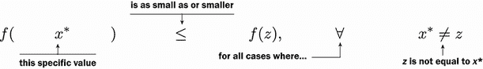

另一种说法是，如果我编写以下代码，我就会陷入无限循环的等待：

```
while f(x_star) <= f(random.uniform(-1e100, 1e100)): 
    pass
```

我们为什么要最小化一个函数呢？对于本书中讨论的所有机器学习和深度学习类型，我们通过定义 *损失函数* 来训练神经网络。损失函数以数值和可量化的方式告诉网络，它在问题上的表现有多“糟糕”。所以如果损失值高，事情就进行得不好。高损失意味着网络正在输掉比赛，而且输得很惨。如果损失为零，则网络完美地解决了问题。我们通常不允许损失为负，因为这会让思考变得混乱。

当你阅读关于神经网络的数学时，你经常会看到损失函数被定义为 ℓ(*x*)，其中 x 是网络的输入，ℓ(*x*) 给出网络收到的损失。正因为如此，*损失函数返回标量*。这很重要，因为我们可以比较标量，并说一个绝对比另一个大或小，这样就可以明确网络在游戏中的表现有多糟糕。导数通常定义与一个单一变量相关，但我们的网络将有许多变量（参数）。当我们对多个变量求导时，我们称之为 *梯度*；你可以将关于导数和单一变量的相同直觉应用到多个变量的梯度上。

我们已经说过梯度是有帮助的，也许你还记得从微积分课程中学到的关于使用导数和梯度最小化函数的内容。让我们通过微积分来回顾一下如何找到函数的极小值。

假设我们有一个函数 *f*(*x*) = (*x*−2)²。让我们用一些 PyTorch 代码来定义它，并绘制函数的形状：

```
    def f(x):
        return torch.pow((x-2.0), 2)

    x_axis_vals = np.linspace(-7,9,100) 
    y_axis_vals = f(torch.tensor(x_axis_vals)).numpy()

    sns.lineplot(x=x_axis_vals, y=y_axis_vals, label='$f(x)=(x-2)²$')

[22]: <AxesSubplot:>
```

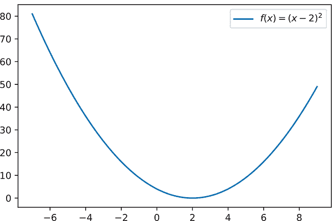

### 1.3.1 使用导数最小化损失

我们可以清楚地看到这个函数的极小值在 *x* = 2，在那里我们得到 *f*(2) = 0。但这是一个故意设计得比较简单的问题。假设我们无法绘制它；我们可以使用微积分来帮助我们找到答案。

我们将 *f*(*x*) 的导数表示为 *f*′(*x*)，并且我们可以通过微积分得到答案：*f*′(*x*) = 2 ⋅ *x* − 4。函数的极小值存在于 *临界点*，即 *f*′(*x*) = 0 的点。因此，让我们通过解 x 来找到它们。在我们的例子中，我们得到

2 ⋅ *x* − 4 = 0

2 ⋅ *x* = 4

（两边同时加 4）

*x* = 4/2 = 2

（两边同时除以 2）。

这要求我们解方程，当 *f*′(*x*) = 0 时。PyTorch 无法为我们做到这一点，因为我们将要开发更复杂的函数，在这些函数中找到 *确切* 的答案是不可能的。但是，假设我们有一个当前猜测，*x*^?，我们相当确信它不是最小值。我们可以使用 *f*′(*x*^?) 来帮助我们确定如何调整 *x*^?，以便我们更接近最小值。

这怎么可能呢？让我们同时绘制 *f*(*x*) 和 *f*′(*x*)：

```
    def fP(x):                        ❶
        return 2*x-4

    y_axis_vals_p = fP(torch.tensor(x_axis_vals)).numpy()

    sns.lineplot(x=x_axis_vals, y=[0.0]*len(x_axis_vals), 
    ➥ label="0", color=’black’)      ❷
    sns.lineplot(x=x_axis_vals, y=y_axis_vals, 
    ➥ label=’Function to Minimize $f(x) = (x-2)²$’) 
    sns.lineplot(x=x_axis_vals, y=y_axis_vals_p,
    ➥ label="Gradient of the function $f’(x)=2 x - 4$")

[23]: <AxesSubplot:>
```

❶ 手动定义 f(x) 的导数

❷ 在 0 处画一条黑色线，这样我们就可以很容易地判断某个值是正数还是负数

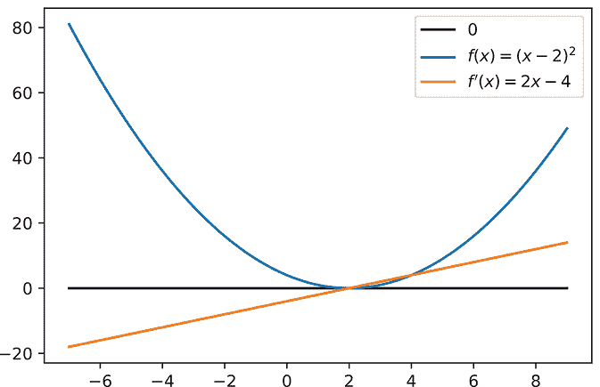

看看橙色线。当我们离最小值 (*x* = 2) 太远时，我们看到 *f*′(*x*^?) < 0。当我们位于最小值右侧时，我们反而得到 *f*′(*x*) > 0。只有当我们处于最小值时，我们才看到 *f*′(*x*^?) = 0。所以如果 *f*′(*x*^?) < 0，我们需要增加 *x*^?；如果 *f*′(^?*x*) > 0，我们需要减小 *x*^? 的值。梯度的 *符号*告诉我们应该朝哪个 *方向*移动以找到最小值。这个过程称为 *梯度下降*，总结在图 1.6 中。

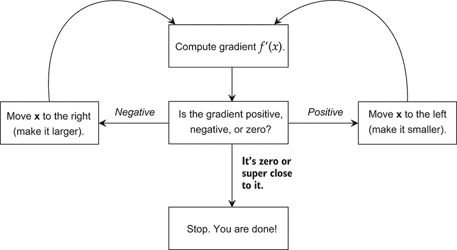

图 1.6 使用函数的导数 *f*′(*x*) 来最小化函数 *f*(*x*) 的过程称为 *梯度下降*，此图展示了它是如何进行的。我们迭代地计算 *f*′(*x*) 来决定 x 应该更大还是更小，以使 *f*(*x*) 的值尽可能小。当我们的位置足够接近梯度为零时，这个过程停止。如果你已经进行了很多更新，你也可以提前停止：“足够接近就是足够好”在深度学习中是成立的，我们很少需要完美地最小化一个函数。

我们也关心 *f*′(*x*^?) 的 *大小*。因为我们正在看一维函数，大小只是 *f*′(*x*^?) 的绝对值：即，|*f*′(*x*^?)|。大小给我们一个我们离最小值有多远的想法。所以 *f*′(*x*^?) 的符号 (<0 或 >0) 告诉我们应该朝哪个 *方向*移动，而大小 (|*f*′(*x*)|) 告诉我们应该移动多 *远*。

这不是巧合。对于任何函数，这总是**始终**成立的。如果我们能计算导数，我们就能找到一个最小值。你可能正在想，“我不太记得我的微积分了，”或者抱怨我跳过了如何计算 *f*′(*x*) 的步骤。这就是我们使用 PyTorch 的原因：自动微分会为我们计算 *f*′(*x*) 的值。让我们用 *f*(*x*) = (*x*−2)² 的玩具例子来看看它是如何工作的。

### 1.3.2 使用自动微分计算导数

现在我们已经理解了使用函数的导数来最小化函数的概念，让我们来看看在 PyTorch 中实现它的机制。首先，让我们创建一个新的变量来最小化。我们这样做与之前类似，但我们会添加一个新的标志告诉 PyTorch 保持跟踪梯度。这存储在一个名为 `grad` 的变量中，因为我们还没有计算任何东西，所以它还不存在：

```
x = torch.tensor([-3.5], requires_grad=True) 
print(x.grad)

None
```

我们看到当前没有梯度。不过，让我们尝试计算 *f*(*x*)，看看现在我们设置了 `requires_grad=True` 后是否有什么变化：

```
value = f(x) 
print(value)

tensor([30.2500], grad\_fn=<PowBackward0>)
```

现在我们打印返回变量的值时，得到的结果略有不同。在第一部分，打印了值 30.25，这是* f*(−3.5)的正确值。但我们还看到了这个新的`grad_fn=<PowBackward0>`。一旦我们告诉 PyTorch 开始计算梯度，它就开始跟踪我们做的*每一个*计算。它使用这些信息来反向计算所有使用过并且设置了`requires_grad`标志为`True`的梯度的梯度。

一旦我们得到一个单一的*标量*值，我们可以告诉 PyTorch 回过头来使用这些信息来计算梯度。这是通过`.backward()`函数完成的，之后我们在原始对象中看到梯度：

```
value.backward() 
print(x.grad)

tensor([-11.])
```

这样，我们现在已经计算了变量`x`的梯度。PyTorch 和自动微分的力量之一是，只要使用 PyTorch 函数实现，你就可以让函数`f(x)`做几乎所有的事情。我们为计算`x`的梯度编写的代码不会改变。PyTorch 会为我们处理所有计算的细节。

### 1.3.3  将它们组合起来：使用导数最小化函数

现在 PyTorch 可以为我们计算梯度，我们可以使用 PyTorch 函数*f*(*x*)的自动微分来数值地找到答案*f*(2) = 0。我们首先用数学符号描述它，然后用代码描述。

我们从当前的猜测开始，*x*[cur] = − 3.5。我任意选择了 3.5；在现实生活中，你通常会随机选择一个值。我们还使用*x*[prev]跟踪我们的前一个猜测。由于我们还没有做任何事情，将前一步设置为任何大值（例如，*x*[prev] = *x*[cur] * 100）是可以的。

接下来，我们比较当前的猜测和之前的猜测是否相似。我们通过检查∥*x*[cur] − *x*[prev]∥[2] > *ϵ*来做这件事。函数∥*z*∥[2]被称为*范数*或*2-范数*。范数是测量向量矩阵*幅度*最常见和标准的方式。对于一维情况（就像这个一样），2-范数与绝对值相同。如果我们没有明确说明我们谈论的是哪种范数，你应该始终假设是 2-范数。值ϵ是表示任意小值的常见数学符号。所以，读法是这样的

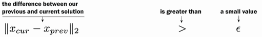

现在我们知道，∥*x*[cur] − *x*[prev]∥[2] > *ϵ* 是我们检查我们的猜测之间是否存在大的（> *ϵ*）幅度（∥ ⋅ ∥[2]）变化（*x*[cur] − *x*[prev]）的方法。如果这是假的，∥*x*[cur] − *x*[prev]∥[2] ≤ *ϵ*，这意味着变化很小，我们可以停止。一旦我们停止，我们就接受*x*[cur]作为 x 的值，它是使*f*(*x*)最小化的值。如果不是，我们需要一个新的、*更好的*猜测。

为了得到这个新猜测，我们向导数的相反方向移动。这看起来是这样的：*x*[cur] = *x*[cur] − *η* ⋅ *f*′(*x*[cur])。值 η 被称为 *学习率*，通常是一个很小的值，如 *η* = 0.1 或 *η* = 0.01。我们这样做是因为梯度 *f*′(*x*) 告诉我们移动的方向，但只提供了一个 *相对* 答案，关于我们有多远。它没有告诉我们在这个方向上应该走多远。由于我们不知道要走多远，我们希望保守一些，走得慢一些。图 1.7 展示了原因。

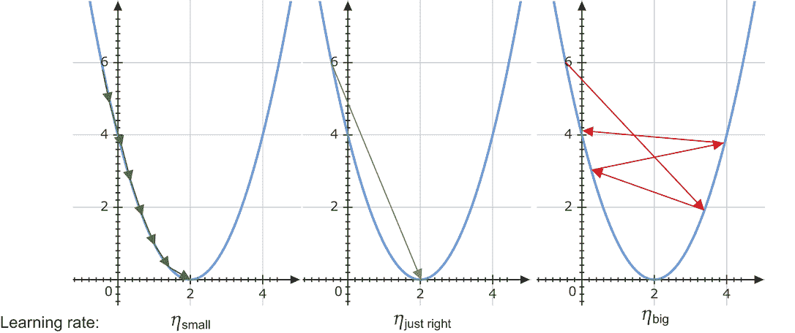

图 1.7 展示了学习率 η（也称为步长）对学习的影响的三个例子。在左侧，η 小于必要的值。这仍然达到了最小值，但比所需的步数多。如果我们知道 η 的完美值，我们可以将其设置得恰到好处，以采取最小的步数达到最小值（中间）。在右侧，η 太大，导致发散。我们永远无法达到解！

通过在当前方向上采取更小的步长，我们不会“驶过”答案并需要掉头。看看我们函数的先前例子，了解这是如何发生的。如果我们有 *完全正确* 的最佳 η 值（中间图像），我们可以一步到达最小值。但我们不知道这个值是多少。如果我们保守地选择一个可能小于我们需要的值，我们可能需要更多步数才能到达答案，但最终我们会到达那里（左侧图像）。如果我们设置学习率过高，我们可能会错过解并围绕它弹跳（右侧图像）。

这可能听起来像很多令人害怕的数学，但当你看到执行这项工作的代码时，你可能会感觉好一些。它只有几行长。在循环结束时，我们打印 *x*[cur] 的值，并看到它等于 2.0；PyTorch 找到了答案。注意，当我们定义 PyTorch `Tensor` 对象时，它有一个子成员 `.grad`，用于存储该变量的计算梯度，以及一个 `.data` 成员，用于存储底层值。你通常不应该访问这些字段，除非你有特定的原因；现在，我们正在使用它们来演示 autograd 的机制：

```
x = torch.tensor([-3.5], requires_grad=True)

x_cur = x.clone() 
x_prev = x_cur*100                                  ❶

epsilon = 1e-5                                      ❷

eta = 0.1                                           ❸

while torch.linalg.norm(x_cur-x_prev) > epsilon:  
    x_prev = x_cur.clone()                          ❹

    value = f(x)                                    ❺
    value.backward() 
    x.data -= eta * x.grad

    x.grad.zero_()                                  ❻

    x_cur = x.data                                  ❼

    print(x_cur)

tensor([2.0000])
```

❶ 将初始的“前一个”解设置得更大，以便它与当前解不同，while 循环将开始

❷ 当前值和前一个值足够接近，以至于我们停止

❸ 学习率

❹ 创建一个克隆，以便 x_prev 和 x_cur 不指向同一个对象

❺ 接下来的几行计算函数、梯度和更新。我们希望 autograd 能够工作，因此我们需要访问 .data 成员字段。

❻ 将旧梯度置零，因为 PyTorch 不会为我们做这件事

❼ 访问 .data 以避免 autograd 机制。我们希望在不产生任何副作用的情况下更改值。

我一直听说的反向传播是什么？

许多书籍都是从一个名为 *反向传播* 的算法开始讨论深度学习的。这是用于计算神经网络中所有梯度的原始算法的名称。我个人认为反向传播是一个非常令人畏惧的起点，因为它涉及更多的数学和绘图，但它完全被自动微分所封装。使用现代框架如 PyTorch，你不需要了解反向传播的机制就可以开始。如果你想了解反向传播以及它是如何与自动微分一起工作的，我喜欢 Andrew W. Trask 的书 *Grokking Deep Learning*（Manning，2019）第六章中的方法。

## 1.4 优化参数

我们刚才所做的是找到函数 *f*(⋅) 的最小值，这被称为 *优化*。因为我们使用损失函数 ℓ(⋅) 来指定我们网络的目标，所以我们可以优化 *f*(⋅) 以最小化我们的损失。如果我们达到损失 ℓ(⋅) = 0，我们的网络似乎已经解决了问题。这就是我们为什么关心优化，并且它是大多数现代神经网络训练的基础。图 1.8 展示了其工作原理的简化。

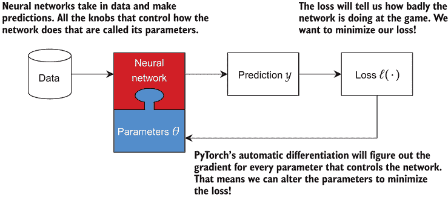

图 1.8 神经网络如何使用损失 ℓ(⋅) 和优化过程。神经网络由其参数 θ 控制。为了对数据进行有用的预测，我们需要改变参数。我们通过首先计算损失 ℓ(⋅)，它告诉我们网络做得有多糟糕。由于我们想要最小化损失，我们可以使用梯度来改变参数！这使网络能够做出有用的预测。

由于优化的重要性，PyTorch 包含了两个额外的概念来帮助我们：参数和优化器。模型的 `Parameter` 是一个值，我们使用 `Optimizer` 来改变它，以尝试减少我们的损失 ℓ(⋅)。我们可以使用 `nn.Parameter` 类轻松地将任何张量转换为 `Parameter`。为此，让我们重新解决之前的最小化 *f*(*x*) = (*x*−2)² 的问题，初始猜测为 *x*[cur] = 3.5。我们首先要做的是为 x 的值创建一个 `Parameter` 对象，因为这是我们打算改变的：

```
x_param = torch.nn.Parameter(torch.tensor([-3.5]), requires_grad=True)
```

`x_param` 对象现在是 `nn.Parameter`，其行为与张量相同。我们可以在 PyTorch 中使用 `Parameter` 的任何地方使用张量，代码将正常工作。但现在我们可以创建一个 `Optimizer` 对象。我们使用的最简单的优化器称为 `SGD`，代表 *随机梯度下降*。单词 *gradient* 在那里是因为我们正在使用函数的梯度/导数。*Descent* 意味着我们正在最小化或 *下降* 到我们正在最小化的函数的更低值。我们将在下一章中了解到 *stochastic* 部分。

要使用 SGD，我们需要创建一个与 `Parameter`s 的 `list` 相关的关联对象，这些 `Parameter`s 是我们想要调整的。我们还可以指定学习率 η 或接受默认值。以下代码指定 η 以匹配原始代码：

```
optimizer = torch.optim.SGD([x_param], lr=eta)
```

现在我们可以将之前的丑陋循环重写成一个更干净、看起来更接近我们实际训练神经网络的代码。我们将固定次数地遍历优化问题，这通常被称为*epochs*。`zero_grad`方法为我们之前手动为每个输入参数所做的清理工作。我们计算损失，对那个损失调用`.backward()`，然后要求优化器执行一次`.step()`的优化：

```
for epoch in range(60): 
    optimizer.zero_grad()             ❶
    loss_incurred = f(x_param) 
    loss_incurred.backward() 
    optimizer.step()                  ❷
print(x_param.data)
```

❶ x.grad.zero_()

❷ x.data -= eta * x.grad

代码打印出`tensor(2.0000)`，就像之前一样。这将在我们的网络中实际上有*数百万*个参数时使我们的生活变得更简单。

你会注意到代码中的一个显著变化：我们不是在达到零梯度或前一次和当前解之间的差异非常小之前进行优化。相反，我们正在做一件更简单的事情：固定次数的步骤。在深度学习中，我们很少能达到损失为零，而且我们不得不等待很长时间才能发生这种情况。所以大多数人会选择一个他们愿意等待的固定 epochs 数，然后看看最终的结果是什么。这样，我们就能更快地得到答案，而且通常足够好用来使用。

为什么选择 PyTorch？

深度学习框架有很多，包括 TensorFlow 和 Keras，MXNet，以及其他基于 PyTorch 构建的如 fast.ai，以及一些新的如 JAX。我的观点是，PyTorch 在“让事情变得简单”和“让事情变得可访问”之间取得了比大多数其他工具更好的平衡。NumPy-like 函数调用使得开发变得相对容易，更重要的是，更容易调试。虽然 PyTorch 有像`Optimizer`这样的良好抽象，但我们刚刚看到在不同的抽象级别之间切换是多么的无痛。这是另一个使调试更容易的不错特性，当你遇到奇怪的 bug 或想尝试一个异国情调的想法时。PyTorch 在经典深度学习任务之外的使用也很灵活。其他平台也有自己的优点和缺点，但这些都是我选择 PyTorch 编写这本书的原因。

## 1.5 加载数据集对象

我们已经对 PyTorch 的基本工具了解了一些。现在我们想要开始训练一个神经网络。但首先我们需要一些数据。使用 ML 的常见符号，我们需要一组输入数据 X 和相关的输出标签 y。在 PyTorch 中，我们用`Dataset`对象来表示这一点。通过使用这个接口，PyTorch 提供了高效的加载器，它可以自动处理使用多个 CPU 核心来预取数据，并在任何时候保持有限的数据量在内存中。让我们先从加载一个熟悉的 scikit-learn 数据集开始：MNIST。我们将它从 NumPy 数组转换为 PyTorch 喜欢的形式。

PyTorch 使用`Dataset`类来表示数据集，并编码了数据集中有多少项以及如何获取数据集中的第*n*项的信息。让我们看看它是什么样子：

```
from torch.utils.data import Dataset
from sklearn.datasets import fetch_openml

X, y = fetch_openml(’mnist_784’, version=1, return_X_y=True)         ❶
print(X.shape)

(70000, 784)
```

❶ 从 https://www.openml.org/d/554 加载数据

我们已经加载了包含 70,000 行和 784 个特征的经典 MNIST 数据集。现在我们将创建一个简单的 `Dataset` 类，它接受 `X, y` 作为输入。我们需要定义一个 `__getitem__` 方法，它将返回数据标签作为一个 `tuple(inputs, outputs)`。`inputs` 是我们想要给模型作为输入的对象，而 `outputs` 用于输出。我们还需要实现 `__len__` 函数，它返回数据集的大小：

```
class SimpleDataset(Dataset):

    def __init__(self, X, y): 
        super(SimpleDataset, self).__init__()
        self.X = X 
        self.y = y

    def __getitem__(self, index): 
        inputs = torch.tensor(self.X[index,:], dtype=torch.float32)  ❶
        targets = torch.tensor(int(self.y[index]), dtype=torch.int64) 
        return inputs, targets

    def __len__(self): 
        return self.X.shape[0] 
dataset = SimpleDataset(X, y)                                        ❷
```

❶ 这“工作”原本可以放在构造函数中，但你应该养成将其放在 getitem 的习惯。

❷ 创建 PyTorch 数据集

注意到我们在构造函数中只做了最小量的工作，而不是将其移动到 `__getitem__` 函数中。这是一个有意的设计，并且是一个你应该在深度学习工作中效仿的习惯。在许多情况下，我们需要进行非平凡的预处理、准备和转换，以便将数据转换成神经网络可以学习的形式。如果你将这些任务放入 `__getitem__` 函数中，你将获得 PyTorch 在需要时执行工作的好处，同时你等待 GPU 完成处理其他批次数据，使你的整体过程更加计算高效。当你处理大型数据集时，这变得尤为重要，因为预处理可能会造成初始阶段的长时间延迟或需要额外的内存，而仅在需要时进行准备可以节省你大量的存储空间。

注意你可能想知道为什么我们使用 `int64` 作为目标张量的类型。为什么不使用 `int32` 或甚至 `int8`，如果我们知道我们的标签在一个更小的范围内，或者 `uint32` 如果不会出现负值？令人不满意的答案是，对于任何需要 `int` 类型的场景，PyTorch 都是硬编码为仅与 `int64` 一起工作，所以你只能使用它。同样，当需要浮点值时，PyTorch 的大部分功能将仅与 `float32` 一起工作，所以你必须使用 `float32` 而不是 `float64` 或其他类型。虽然有一些例外，但在学习基础知识时，它们不值得深入研究。

现在我们有一个简单的数据集对象。它将整个数据集保存在内存中，这对于小型数据集来说是可行的，但我们希望在将来修复它。我们可以确认数据集仍然有 70,000 个示例，每个示例有 784 个特征，就像之前一样，并且可以快速确认我们实现的长度和索引函数按预期工作：

```
print("Length: ", len(dataset)) 
example, label = dataset[0]
print("Features: ", example.shape) ❶
print("Label of index 0: ", label) 

Length: 70000
Features: torch.Size([784])
Label of index 0: tensor(5)
```

❶ 返回 784

MNIST 是一个手绘数字的数据集。我们可以通过将数据重塑回图像来可视化它，以确认我们的数据加载器正在正常工作：

```
    plt.imshow(example.reshape((28,28)))

[34]: <matplotlib.image.AxesImage at 0x7f4721b9fc50>
```

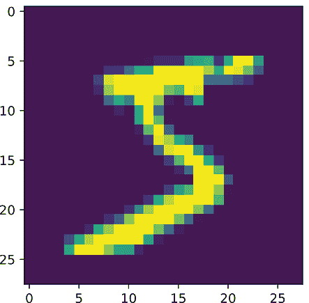

### 1.5.1 创建训练和测试分割

现在我们已经将所有数据放在了一个数据集中。然而，像优秀的机器学习从业者一样，我们应该创建一个训练分割和一个测试分割。在某些情况下，我们有一个专门用于训练和测试的数据集。如果是这种情况，你应该从相应的数据源创建两个单独的 `Dataset` 对象——一个用于训练，一个用于测试。

在这种情况下，我们有一个数据集。PyTorch 有一个简单的实用工具可以将语料库拆分为训练集和测试集。假设我们想用 20% 的数据用于测试。我们可以使用 `random_split` 方法这样做：

```
train_size = int(len(dataset)*0.8) test_size =
len(dataset)-train_size

train_dataset, test_dataset = torch.utils.data.random_split(dataset, (train_size, test_size)) print("{} examples for training and {} for testing".format( len(train_dataset), len(test_dataset)))

56000 examples for training and 14000 for testing
```

现在我们有了训练集和测试集。实际上，前 60,000 个点是 MNIST 的标准训练集，最后 10,000 个点是标准测试集。但重点是展示如何自己创建随机分割的功能。

通过这样，我们已经了解了 PyTorch 提供的所有基础工具：

+   一个类似于 NumPy 的张量 API，支持 GPU 加速

+   自动微分，它使我们能够解决优化问题

+   数据集的抽象

我们将在此基础上构建，你可能会注意到这开始影响你未来对神经网络的思考。它们不会神奇地完成所要求的事情，而是尝试通过损失函数 ℓ(⋅) 指定的目标进行数值求解。我们需要小心地定义或选择 ℓ(⋅)，因为这将决定算法学习的内容。

## 练习

在 Manning 在线平台 Inside Deep Learning Exercises ([`liveproject.manning.com/project/945`](https://liveproject.manning.com/project/945)) 上分享和讨论你的解决方案。一旦你提交了自己的答案，你将能够看到其他读者提交的解决方案，并看到作者认为哪些是最好的。

1.  编写一系列 `for` 循环，计算 `torch_tensor3d` 中的平均值。

1.  编写代码，索引到 `torch_tensor3d` 并打印出值 13。

1.  对于每个 2 的幂（即，2^i 或 `2**i`）直到 2¹¹，创建一个随机矩阵 *X* ∈ ℝ^(2^i, 2^i)（即，`X.shape` 应该给出 `(2**i, 2**i)`）。计算 XX（即，`X @ X`）在 CPU 和 GPU 上的时间，并绘制加速图。对于什么矩阵大小 CPU 比 GPU 快？

1.  我们使用 PyTorch 找到 *f*(*x*) = (*x*−2)² 的数值解。编写代码找到 *f*(*x*) = sin(*x* − 2) · (*x* + 2)² + √|cos(*x*)| 的解。你得到什么答案？

1.  编写一个新的函数，该函数接收两个输入，x 和 y，其中

    *f*(*x*,*y*) = exp (sin(*x*)²)/(*x*−*y*)² + (*x*−*y*)²

    使用初始参数值 *x* = 0.2 和 *y* = 10 的 `Optimizer`。它们会收敛到什么？

1.  创建一个名为 `libsvm2Dataset` 的函数，该函数接收一个指向 libsvm 数据集文件的路径（参见 [`www.csie.ntu.edu.tw/ cjlin/libsvmtools/datasets/`](https://www.csie.ntu.edu.tw/~cjlin/libsvmtools/datasets/) 以下载更多数据集），并创建一个新的数据集对象。检查其长度是否正确，以及每一行是否具有预期的特征数量。

1.  **挑战性**：使用 NumPy 的 `memmap` 功能将 MNIST 数据集写入磁盘。然后创建一个 `MemmapedSimpleDataset`，它以 mem-mapped 文件作为输入，在 `__getitem__` 方法中从磁盘读取矩阵以创建 PyTorch 张量。你认为这会有什么用？

## 摘要

+   PyTorch 几乎使用张量来表示一切，张量是多维数组。

+   使用 GPU，PyTorch 可以加速使用张量进行的任何操作。

+   PyTorch 跟踪我们对张量的操作以执行自动微分，这意味着它可以计算梯度。

+   我们可以使用梯度来最小化一个函数；由梯度改变值的参数。

+   我们使用损失函数来量化网络在任务上的表现，并使用梯度来最小化该损失，从而学习网络的参数。

+   PyTorch 提供了一个`Dataset`抽象，这样我们就可以让 PyTorch 处理一些繁琐的任务并最小化内存使用。
