# 2 全连接网络

本章节涵盖

+   在 PyTorch 中实现训练循环

+   更改回归和分类问题的损失函数

+   实现和训练一个全连接网络

+   使用更小的数据批次加速训练

现在我们已经了解了 PyTorch 如何为我们提供张量来表示数据和参数，我们可以继续构建我们的第一个神经网络。这始于展示 PyTorch 中 *学习* 的发生。正如我们在第一章中描述的，学习基于优化的原则：我们可以计算一个损失来衡量我们做得如何，并使用梯度来最小化这个损失。这就是网络参数从数据中“学习”的方式，也是许多不同的机器学习（ML）算法的基础。因此，损失函数的优化是 PyTorch 构建的基础。因此，要在 PyTorch 中实现任何类型的神经网络，我们必须将问题表述为一个优化问题（记住这也可以称为 *函数最小化*）。

在本章中，我们首先学习如何设置这种学习优化方法。这是一个广泛适用的概念，我们编写的代码几乎可以用于任何神经网络。这个过程被称为 *训练循环*，甚至适用于简单的线性回归和逻辑回归等机器学习算法。由于我们专注于训练的机制，我们将从这两个基本算法开始，以便我们能够专注于 PyTorch 中分类和回归的训练循环的工作方式。

使逻辑回归/线性回归成立的权重向量也被称为 *线性层* 或 *全连接层*。这意味着在 PyTorch 中，两者都可以被视为单一层模型。由于神经网络可以描述为一系列层的序列，我们将修改我们原始的逻辑回归和线性模型，使其成为完整的神经网络。在这个过程中，你将了解非线性层的重要性，以及逻辑回归和线性回归如何相互关联以及与神经网络的关系。

在掌握训练循环、分类和回归损失函数以及定义全连接神经网络的概念之后，我们将涵盖深度学习的基础概念，这些概念几乎会在你训练的每个模型中重复出现。为了完善本章，我们将重构我们的代码到一个方便的辅助函数中，并学习在小型数据组（称为 *批次*）上训练而不是使用整个数据集的实用价值。

## 2.1 神经网络作为优化

在第一章中，我们使用了 PyTorch 的**自动微分**功能来优化（即最小化）一个函数。我们定义了一个损失函数来最小化，并使用 `.backward()` 函数来计算梯度，这告诉我们如何改变参数以最小化函数。如果我们**将损失函数的输入设为神经网络**，我们可以使用完全相同的方法来训练神经网络。这创建了一个称为**训练循环**的过程，有三个主要组成部分：训练数据（带有正确答案）、模型和损失函数，以及通过梯度进行更新。这三个组成部分在图 2.1 中概述。

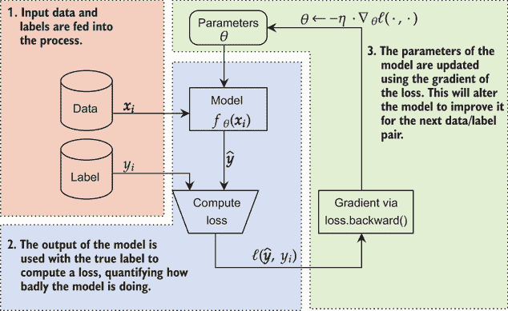

图 2.1 PyTorch 中训练模型的主要三个步骤。1. 输入数据驱动学习。模型用于做出预测，损失分数衡量预测和真实标签之间的差异。3. 使用 PyTorch 的自动微分来更新模型的参数，提高其预测能力。

### 2.1.1  神经网络的训练符号表示

在我们开始之前，让我们介绍一些在本书中重复使用的标准符号。我们用 x 表示输入特征，用 *f*() 表示神经网络模型。与 x 相关的标签用 y 表示。我们的模型接受 x 并产生一个预测 ŷ。写成这样，就是 *ŷ* = *f*(**x**)。这个符号在深度学习论文中广泛使用，熟悉它将帮助你跟上新方法的开发。

我们的模式需要参数进行调整。改变参数允许网络改变其预测，以尝试减少损失函数。我们将使用 Θ 表示我们模型的**所有**参数。如果我们想明确一点，我们可能会说 *ŷ* = *f*Θ 来表明模型的预测和行为取决于其参数 Θ 的值。你也会看到 Θ 被称为模型的**状态**。

我们有描述我们模型的符号和语言，但我们还需要一种方法来将目标表述为函数最小化。为此，我们使用**损失函数**的概念。损失函数**量化**我们的模型在预测真实值 y 的目标上做得有多糟糕。如果 y 是我们的目标，ŷ 是预测，我们将我们的损失函数表示为 ℓ(*ŷ*,*y*).

现在我们已经拥有了抽象地描述学习为函数最小化问题的所有必要条件。假设我们有一个包含 N 个示例的训练集，通过优化方程 min*Θ* Σ[i]^N[=1] *ℓ*(*f[Θ]*(***x**[i]*), *y[i]*). 让我们用英语写出这个方程的含义；我们将为每个英语描述着色，以匹配相同的数学表达：

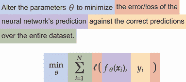

通过查看数学的每一部分，我们可以看到这只是在描述我们的目标，而且数学允许我们在更小的空间中传达一个长句子。作为代码，它可能看起来像这样：¹

```
def F(X, y, f, theta): 
    total_loss = 0 
    for i in range(N): 
        total_loss += loss(f(X[i,:], theta), y[i]) 
    return total_loss

```

求和 (Σ[i]^N[=1]) 遍历所有 N 对输入 (**x**[i]) 和输出 (*y*[i])，并确定我们做得有多糟糕（ℓ(⋅,⋅)）。这为我们提供了计算损失的方程，但并没有最小化它。最大的问题是：我们如何调整 Θ 来进行这种最小化？

我们通过梯度下降来实现这一点，这也是为什么 PyTorch 提供自动微分的原因。假设 *Θ*[k] 是我们想要改进的模型的 *当前* 状态。我们如何找到下一个状态 *Θ*[*k* + 1]，希望它能减少我们模型的损失？我们想要解决的方程是 *Θ[k]*[+1] = *Θ[k]* − *η* · 1/*N* Σ[i]^N[=1] ∇*Θ[k]ℓ*(*f[Θ][k]*(***x**[i]*), *y[i]*)。再次，让我们用英语写出这个方程的含义，并将其映射回符号：

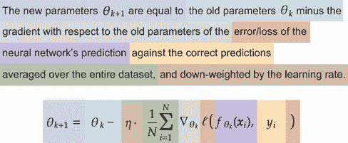

这个方程展示了被称为 *梯度下降* 的数学原理。它看起来几乎与我们在第一章中优化简单函数时所做的完全一样。最大的区别是那个花哨的新 ∇ 符号。这个 *nabla* 符号 ∇ 用于表示 *梯度*。在上一个章节中，我们使用 *导数* 和 *梯度* 互换，因为我们只有一个参数。由于我们现在有一组参数，梯度是我们用来指代每个参数的导数的语言。如果我们只想改变参数的选定子集 z，我们将其写为 ∇[z]。这意味着 ∇ 将是一个具有每个参数一个值的张量。

梯度 (∇) 告诉我们如何调整 Θ，就像之前一样，我们朝着相反的方向前进。重要的是要记住，PyTorch 提供了自动微分。这意味着如果我们使用 PyTorch API 和框架，我们不必担心如何计算 ∇[Θ]。我们也不必跟踪 Θ 中的所有内容。

我们需要做的只是定义我们的模型 *f*(⋅) 的样子以及我们的损失函数 ℓ(⋅,⋅) 是什么。这将为我们处理几乎所有的工作。我们可以编写一个执行整个过程的函数。

### 2.1.2  构建线性回归模型

我们描述的框架是使用梯度下降训练模型 *f*(⋅) 的，它具有广泛的应用性。图 2.1 中展示的迭代数据和执行这些梯度更新的过程是训练循环。使用 PyTorch 和这种方法，我们可以重新创建许多类型的机器学习方法，如线性回归和逻辑回归。要做到这一点，我们只需以正确的方式定义 *f*(⋅)。我们将从重新创建线性回归算法开始，这是面包和黄油算法，以介绍 PyTorch 为我们提供的代码基础设施，以便我们可以在稍后构建更大的神经网络。

首先要确保我们拥有所有需要的标准导入。从 PyTorch，这包括`torch.nn`和`torch.nn.functional`，它们提供了我们在整本书中使用的常见构建块。`torch.utils.data`提供了处理`Datasets`的工具，而`idlmam`提供了我们在前几章中编写的代码，随着我们的进展：

```
import torch 
import torch.nn as nn 
import torch.nn.functional as F
from torch.utils.data import * 
from idlmam import * 
```

### 2.1.3 训练循环

现在我们有了那些额外的导入，让我们先写一个*训练循环*。假设我们有一个损失函数`loss_func`（ℓ(⋅,⋅)），它接受一个`prediction`（ŷ）和一个`target`（y），返回一个分数，表示模型（*f*(⋅)）做得有多好。我们需要一个迭代器来为我们加载训练数据。² 这个`training_loader`将为我们提供与训练相关的`input`s 和`label`s 对。

图 2.2 展示了训练循环的步骤。黄色的准备部分显示了在开始训练之前需要完成的对象创建。我们必须选择将执行所有计算（通常是 GPU）的设备，定义我们的模型 *f*(⋅)，并为模型的参数 θ 创建一个优化器。红色区域表示循环的开始/重复，为我们提供了新的数据以进行训练。蓝色区域计算模型当前参数 Θ 的预测 ŷ 和损失 ℓ(*ŷ*,*y*)。绿色部分使用损失计算梯度和对参数 Θ 的更新以改变参数 Θ。请注意，颜色与我们在图 2.1 中看到的步骤相匹配，但提供了更多细节，显示了我们需要调用的 PyTorch 函数。

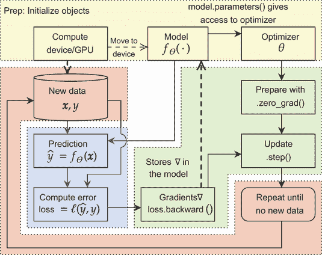

图 2.2 展示了训练循环过程图。它包括我们在最初描述的 PyTorch 中训练模型时的相同三个主要步骤，并使用匹配的颜色编码。新的是初始化在每次训练循环中重复使用的对象。实心区域表示步骤，虚线箭头表示效果。

使用 PyTorch，我们可以编写足够少的代码来训练许多不同类型的神经网络。下一个代码块中的`train_simple_network`函数遵循图 2.2 过程中的所有部分。首先，我们创建一个`optimizer`，它接受将被改变的模型的`parameters()` Θ。然后，我们将模型移动到正确的计算`device`，并重复优化过程一定数量的`epochs`。每个 epoch 意味着我们使用了一次每个数据点 **x**[i]。

每个 epoch 包括使用`model.train()`将模型放入训练模式。`training_loader`以元组（**x**,*y*）的形式提供我们的数据，我们将它们移动到相同的计算`device`。这些元组的内部循环使用`zero_grad()`清理优化器状态，然后将`inputs`传递给`model`以获取预测`y_hat`。我们的`loss_fun`接受预测`y_hat`和真实`labels`来计算一个`loss`，描述了我们的网络做得有多糟糕。然后我们使用`loss.backward()`计算梯度，并使用`optimizer`的`step()`进行一步。

简单训练循环的代码如下：

```
def train_simple_network(model, loss_func, training_loader, epochs=20, device="cpu"): 
    optimizer = torch.optim.SGD(model.parameters(), lr=0.001)                    ❶

    model.to(device)                                                             ❷

    for epoch in tqdm(range(epochs), desc="Epoch"):                              ❸
        model = model.train()                                                    ❹
        running_loss = 0.0

        for inputs, labels in tqdm(training_loader, desc="Batch", leave=False):  ❸
            inputs = moveTo(inputs, device)                                      ❺
            labels = moveTo(labels, device)                                      ❺

            optimizer.zero_grad()                                                ❻

            y_hat = model(inputs)                                                ❼

            loss = loss_func(y_hat, labels)                                      ❽
            loss.backward()                                                      ❾
            optimizer.step()                                                     ❿
            running_loss += loss.item()                                          ⓫
```

❶ 这里完成了黄色步骤。创建优化器并将模型移动到计算设备。SGD 是对参数Θ的随机梯度下降。

❷ 将模型放置在正确的计算资源（CPU 或 GPU）上

❸ 两个 for 循环处理红色步骤，多次（epochs）迭代所有数据（批次）。

❹ 将我们的模型置于训练模式

❺ 将数据批次移动到我们正在使用的设备上。这是最后一个红色步骤。

❻ 首先是一个黄色步骤：准备优化器。大多数 PyTorch 代码首先这样做，以确保一切都在干净和准备就绪的状态。PyTorch 将梯度存储在可变的数据结构中，因此在使用之前我们需要将其设置为干净的状态。否则，它将包含来自先前迭代的旧信息。

❼ 这行代码和下一行执行两个蓝色步骤。这行代码计算*f*θ。

❽ 计算损失

❾ 剩下的两个黄色步骤计算梯度并对优化器进行“.step()"操作。这行代码计算∇[Θ]。

❿ 更新所有参数 *Θ*[*k* + 1] = *Θ*[k] − *η* ⋅ ∇[*Θ*[k]]ℓ(*ŷ*,*y*)

⓫ 获取我们想要的信息

### 2.1.4 定义数据集

我们刚才描述的代码足以训练本书中设计的几乎所有神经网络。现在我们需要一些数据、一个网络和一个损失函数来工作。让我们先训练一个简单的 *线性回归* 模型。你应该还记得，从机器学习课程或培训中，在 *回归* 问题中，我们想要预测一个数值。例如，根据汽车的特征（例如，重量（磅）、发动机大小、生产年份）预测每加仑英里数（mpg）将是一个回归问题，因为 mpg 可能是 20、24、33.7，或者假设甚至可以是 178.1342 或几乎任何数字。

在这里，我们创建了一个包含线性和非线性成分的合成回归问题，并添加了一些噪声使其更有趣。由于线性成分非常强，线性模型可以做得不错，但不会完美：

```
X = np.linspace(0, 20, num=200)                       ❶
y = X + np.sin(X)*2 + np.random.normal(size=X.shape)  ❷
sns.scatterplot(x=X, y=y)

[6]: <AxesSubplot:>
```

❶ 创建一维输入

❷ 创建输出

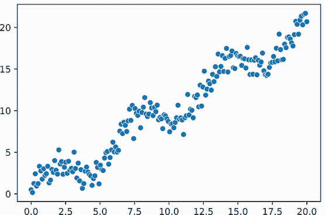

我们创建了一个简单的玩具问题，具有强烈的线性趋势和上下波动的小但一致的振荡。我们使用这样的玩具问题来进行实验，以便我们可以看到结果，并获得对正在发生的事情的更直观的理解。但是，我们需要以 PyTorch 能够理解的形式来表示这个问题。下一个代码块创建了一个简单的数据集对象，它知道我们有一个一维问题。训练数据以(*n*,1)矩阵的形式排列，其中 n 是数据点的数量。标签(`y`)采用类似的形式。当我们获取一个项目时，我们会抓取数据集的正确行，并返回一个 PyTorch `tensor`对象，它是`torch.float32`类型，这是 PyTorch 中大多数事物的默认类型。

除了 `Dataset`，我们还需要一个 `DataLoader`，它已经被 PyTorch 为我们实现了。`Dataset` 定义了如何获取任何特定的数据点，而 `DataLoader` 决定获取哪些数据点。标准的方法是一次随机选择一个数据点，这确保了你的模型学习的是数据而不是数据的顺序。³ PyTorch 的 `DataLoader` 有很多内置的功能，我们根据需要介绍其中的一些，但你可以自由地在[`pytorch.org/docs/stable/data.html`](https://pytorch.org/docs/stable/data.html)的文档中了解更多。关于 `DataLoader` 最重要的是，当你的模型忙于在 GPU 上训练时，你的 `DataLoader` 正在忙于获取下一个数据，这样 GPU 就尽可能忙碌。（这种性能优化通常被称为 *pipelining*。）

这是代码：

```
class Simple1DRegressionDataset(Dataset): 
    def __init__(self, X, y):
        super(Simple1DRegressionDataset, self).__init__() 
        self.X = X.reshape(-1,1) 
        self.y = y.reshape(-1,1) 
    def __getitem__(self, index):
        return torch.tensor(self.X[index,:], dtype=torch.float32), 
        ➥ torch.tensor(self.y[index], dtype=torch.float32)

    def __len__(self): 
        return self.X.shape[0] 
training_loader = DataLoader(Simple1DRegressionDataset(X, y), shuffle=True)
```

如何使用 reshape

`reshape` 函数的理解非常重要，因为我们在整本书中都会使用它的行为。假设我们有一个包含六个总值的张量。这可能是一个长度为 6 的向量，一个 2 × 3 矩阵，3 × 2，或者一个具有一个尺寸为“1”的三个维度的张量。只要总值的数量保持不变，我们就可以 *重新解释* 张量，使其具有不同的形状，值被重新排列。以下图显示了如何做到这一点。`reshape` 的特殊之处在于它允许我们指定除了一个维度之外的所有维度，并且它自动将剩余的值放入未指定的维度中。这个剩余的维度用 –1 表示；随着我们添加更多的维度，我们可以以更多的方式要求 NumPy 或 PyTorch 重塑张量。

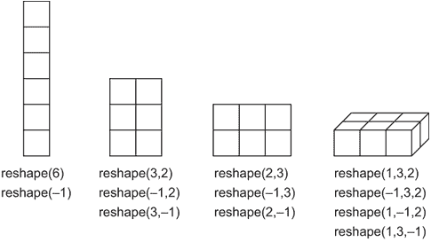

有四种不同的张量形状可以用来表示相同的六个值。`reshape` 函数接受你想要的任何数量的轴作为结果张量的参数。如果你知道确切的尺寸，你可以指定它；或者如果你不知道一个轴的尺寸，你可以使用 –1 来表示一个剩余的位置。

`view` 函数也有类似的行为。为什么有两个具有相同行为的函数？因为 `view` 使用更少的内存并且可以更快，但如果使用不当可能会抛出错误。你将在 PyTorch 的更高级使用中学习这些细节；但为了简单起见，你可以 *始终* 安全地调用 `reshape`。

注意：如果你在你的张量中有总共 N 个项目，你可以将其重塑为任何新的维度数，只要最终的项目数加起来等于 N。所以我们可以将 *N* = 6 项的张量转换成形状为 (3,2)，因为 3 × 2 = 6。这也意味着如果我们继续插入尺寸为 1 的维度，我们可以有 *任何* 数量的总维度。例如，我们可以通过执行 (3,1,1,2,1) 将 *N* = 6 的值转换成一个具有五个维度的张量，因为 3 × 1 × 1 × 2 × 1 = 6。

### 2.1.5 定义模型

到目前为止，我们已经成功创建了一个训练循环和一个用于加载数据集的 `Dataset` 对象。我们最后缺少的是实现线性回归算法作为网络的 PyTorch 模型。这是图 2.2 中的模型框，我在图 2.3 中将其单独隔离出来。

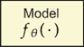

图 2.3 模型框表示我们想要训练的神经网络 *f[Θ]*(∙)。这可能是一个小型网络或一个非常复杂的网络。它被封装在一个具有单一参数集 Θ 的模型对象中。几乎任何网络定义的过程都是相同的。

在这个情况下，定义我们将使用的网络非常简单。我们想要一个简单的线性函数，而线性函数意味着权重矩阵 W。将权重矩阵 W 应用到输入 x 上意味着取矩阵向量积。因此，我们想要一个看起来像这样的模型 *f*(⋅)：

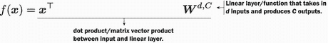

向量 x 包含了我们所有的 d 个特征（在这种情况下，*d* = 1），矩阵 W 对于每个特征有一行，对于每个输出有一列。我们使用 *W*^(*d*, *C*) 来明确指出它是一个有 d 行和 C 列的张量。这是我们在这本书中用来精确描述某些对象形状的常见符号。由于我们预测的是一个单一值，这意味着 *C* = 1。

注意，尽管这个线性函数并不完整。如果 **x** = 0，那么 *f*(**x**) = 0。这对模型来说是一个非常强的约束。相反，我们添加一个没有与 x 交互的 *偏差项* b：

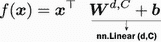

添加一个偏差项允许模型根据需要将其解向左或向右移动。幸运的是，PyTorch 有一个实现这种线性函数的 `Module`，我们可以通过 `nn.Linear(d, C)` 来访问它。这创建了一个具有 d 个输入和 C 个输出的线性层——这正是我们想要的。

注意：偏差项始终是 a + **b** 在不与其他任何东西交互的一侧。由于偏差项几乎总是被使用，但写起来很麻烦，因此它们经常被省略，并假设它们隐含存在。在这本书中我们也这样做。除非我们明确说明，否则请假设偏差是隐含存在的。如果你看到三个权重矩阵，假设有三个偏差项，每个对应一个。

模块是 PyTorch 组织现代神经网络设计构建块的方式。模块有一个 `forward` 函数，它接受输入并产生输出（如果我们创建自己的 `Module`，我们需要实现这个函数），还有一个 `backward` 函数（除非我们有干预的理由，否则 PyTorch 会为我们处理这个函数）。`torch.nn` 包中提供了许多标准模块，我们可以使用张量、`Parameter` 和 `torch.nn.functional` 对象来构建新的模块。模块也可能包含其他模块，这是我们构建更大网络的方式。

### 2.1.6 定义损失函数

因此 `nn.Linear` 给我们模型 *f*(**x**)，但我们仍然需要决定一个损失函数 ℓ。同样，PyTorch 使得对于标准的回归问题，这变得非常简单。假设真实值是 y，我们的预测是 *ŷ* = *f*(**x**)。我们如何量化 y 和 ŷ 之间的差异？我们只需查看它们之间的绝对差异：ℓ(*y*,*ŷ*) = |*y*−*ŷ*|。

为什么是 *绝对* 差异？如果我们没有取绝对值，*ŷ* < *y* 将产生一个正损失，鼓励模型 *f*(**x**) 的预测更小。但如果是 *ŷ* > *y*，那么 *y* − *ŷ* 将产生一个 *负* 损失。如果您觉得用 y 和 ŷ 这样的符号进行推理感到害怕，试着插入一些实际值。所以如果 *ŷ* = 100 和 *y* = 1，并且我们计算损失为 *y* − *ŷ* = 1 − 100 = − 99，我们最终会得到一个损失为 –99！负损失会令人困惑（那会是什么，利润？）并且会鼓励网络在预测已经太大时进一步增大其预测。我们的目标是 *ŷ* = *y*，但由于网络会盲目地前进，试图 *最小化* 损失，它将学会使 ŷ 不切实际地大，以利用负损失。这就是为什么我们需要我们的损失函数始终返回零或正值。否则，损失将没有意义。请记住，损失函数是错误的惩罚，负惩罚意味着鼓励。

另一个选项是取 y 和 ŷ 之间的平方差：ℓ(*y*,*ŷ*) = (*y*−*ŷ*)²。这又导致了一个函数，仅在 *y* = *ŷ* 时为零，并且随着 y 和 ŷ 相互远离而增长。

这两种选项都在 PyTorch 中预先实现了。前者被称为 *L*1 损失，因为它对应于取不同（即，∥*y* − *ŷ*∥[1]）的 1-范数。后者通常被称为均方误差（MSE，也称为 *L*2）损失，是最受欢迎的，因此我们将继续使用它：

| 损失函数 ℓ(*y*,*ŷ*) | PyTorch 模块 |
| --- | --- |
| &#124;*y*−*ŷ*&#124; | `torch.nn.L1Loss` |
| (*y*−*ŷ*)² | `torch.nn.MSELoss` |

在两个损失函数之间进行选择

您有两个损失函数，L1 和 MSE，两者都适用于回归问题。您如何选择使用哪一个？我们不会深入探讨损失函数之间细微的差异，因为 PyTorch 中内置的任何损失函数都会给出合理的结果。您只需要知道哪些损失函数适用于哪种类型的问题（如回归与分类）。

理解数学背后的含义将帮助您做出这些选择。在这种情况下，均方误差（MSE）损失具有平方项，使得大的差异变得更大（例如，100²将变为 10,000）；而 L1 将保持差异不变（例如，|100| = 100）。因此，如果您试图解决的问题是小差异可以接受但大差异真的很糟糕，那么 MSE 损失可能是一个更好的选择。如果您的问题是偏离 200 比偏离 100 更糟糕两倍，那么 L1 损失更有意义。这并不是选择这两种选项的完整图景，但这是一个做出初始选择的好方法。

### 2.1.7 将其组合：在数据上训练线性回归模型

我们现在拥有创建线性回归所需的一切：`Dataset`、`train_simple_network`函数、`loss_func` ℓ和`nn.Linear`模型。以下代码显示了我们可以如何快速设置所有这些，并将其传递给我们的函数以训练模型：

```
in_features = 1 
out_features = 1 
model = nn.Linear(in_features, out_features) 
loss_func = nn.MSELoss()

device = torch.device("cuda") 
train_simple_network(model, loss_func, training_loader, device=device)
```

它是否有效？我们是否有训练好的模型？这很容易找到答案，尤其是这是一个一维问题。我们只需绘制我们模型对所有数据的预测。我们将使用`with torch.no_grad():`上下文来获取这些预测：它告诉 PyTorch，在`no_grad()`块的作用域内进行的任何计算，*不要计算梯度*。我们只希望在*训练*期间计算梯度。梯度计算需要额外的时间和内存，如果在预测后想要再次训练模型，可能会导致错误。因此，良好的做法是在进行预测时确保我们使用`no_grad()`块。以下代码块使用`no_grad()`来获取预测：

```
    with torch.no_grad(): 
        Y_pred = model(torch.tensor(X.reshape(-1,1), device=device, 
    ➥ dtype=torch.float32)).cpu().numpy()

    sns.scatterplot(x=X, y=y, color=’blue’, label=’Data’)                  ❶
    sns.lineplot(x=X, y=Y_pred.ravel(), color=’red’, label=’Linear Model’) ❷

[10]: <AxesSubplot:>
```

❶ 数据

❷ 我们模型学到了什么

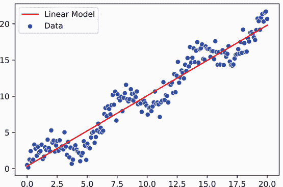

此代码绘制了网络的输出结果，并且它学习到了对非线性数据的好线性拟合。这正是我们要求模型做到的，结果看起来是正确的。

注意：在新数据上进行预测也称为*推理*。这在机器学习从业者中是常见的术语——尤其是在深度学习社区中——因为神经网络通常需要 GPU，所以部署模型是一件大事。公司通常会购买专为推理设计的 GPU，以减少内存来提高成本效益。

你现在已经使用了构建神经网络的所有机制和工具。我们描述的每个组件——损失函数ℓ、指定我们网络的`Module`和训练循环——都可以以零散的方式替换，以构建更强大和复杂的模型。

## 2.2 构建我们的第一个神经网络

现在我们已经学会了如何创建训练循环并使用梯度下降来修改模型，以便它学会解决问题。这是我们在这本书中所有学习的基础框架。要训练一个神经网络，我们只需要替换我们定义的 `model` 对象。关键是知道如何定义这些模型。如果我们能很好地定义一个神经网络，它应该能够捕捉和模拟数据的非线性部分。对于我们的玩具示例，这意味着获取较小的振荡，而不仅仅是较大的线性趋势。

当我们讨论神经网络和深度学习时，我们通常是在谈论 *层*。层是我们用来定义我们的 `model` 的构建块，PyTorch 的 `Module` 类中的大多数类实现了具有不同目的的不同层。我们刚刚构建的线性回归模型可以描述为有一个 *输入* 层（输入数据本身）和一个 *线性层* (`nn.Linear`) 进行预测。

### 2.2.1  全连接网络的符号表示

我们的第一个神经网络将是一个简单的 *前馈* *全连接* 神经网络。它被称为 *前馈*，因为每一层的输出直接流入下一层。所以每一层有一个输入和一个输出，并按顺序进行。它被称为 *全连接*，因为每个网络输入都与前一层的所有内容相连。

让我们从所谓的 *隐藏层* 开始。输入 x 被认为是 *输入层*，一个具有 C 个输出（C 个预测）的 ℝ^C 维输出被称为 *输出层*。在我们的线性回归模型中，我们实际上只有一个输入层和一个输出层。你可以把隐藏层想象成输入和输出之间的任何东西。

我们如何做到这一点？好吧，最简单的方法是在输入和输出之间再添加一个矩阵。所以，而不是

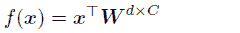

我们添加了一个新的矩阵的第二层，得到类似这样的结构：

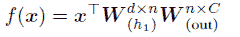

注意矩阵维度的新的值 n。它是我们需要调整和处理的新的超参数。这意味着我们可以决定 n 的值应该是多少。它被称为 *隐藏层大小* 或 *第一隐藏层的神经元数量*。为什么是神经元？

如果你将每个中间输出作为一个 *节点* 并绘制表示权重的箭头，你得到的就是可以描述为 *网络* 的东西。这如图 2.4 所示。连接输入到隐藏节点的线条对应于一个 `nn.Linear(3, 4)` 层，这是一个 *W*^(3 × 4) 的矩阵。该矩阵的每一列对应于 *n* = 4 个神经元中的一个的输入或该层的输出。每一行是输入与每个输出的连接。因此，如果我们想知道第二个输入到第四个输出的连接强度，我们会索引 `W[1,3]`。同样地，从隐藏节点到图输出的线条是一个 `nn.Linear(4, 1)` 层。

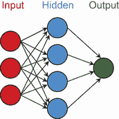

图 2.4 一个简单的具有一个输入层（*d* = 3 个输入）、一个隐藏层（*n* = 4 个神经元）和一个输出层的输出层的正向全连接网络。连接只直接进入下一层，同一层中的每个节点都与前一层的每个神经元相连。

注意，连接节点/神经元彼此的所有箭头都只从左到右移动。这就是前馈属性。此外，注意同一层中的每个节点都与下一层的每个节点相连。这就是全连接属性。

这种网络解释部分灵感来源于大脑中神经元的工作方式。图 2.5 展示了神经元及其连接的简单玩具模型。左侧是一个神经元，它有许多与其他神经元相连的树突，充当输入。当其他神经元放电时，树突会接收到电信号并将这些信号携带到神经元的核（中心），该核将所有信号相加。最后，神经元从其轴突发出一个新的信号。

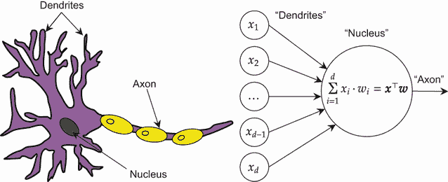

图 2.5 生物神经元连接的简化图。通过类比，树突是神经元之间的连接/权重，轴突携带神经元的输出结果。这是对真实神经元工作方式的松散启发和过度简化。

警告：尽管神经网络最初是受大脑中神经元连接和布线方式的启发，但不要让这种类比带你走得太远。前面的描述是一个非常简化的模型。神经网络的功能与我们关于大脑实际工作方式的有限了解相去甚远。你应该将其视为一种轻微的启发，而不是字面上的类比。

### 2.2.2 PyTorch 中的全连接网络

根据这些酷炫的图表，并保持只添加一个小变化的想法，我们可以依次插入两个线性层，我们将拥有我们的第一个神经网络。这就是`nn.Sequential` `Module`发挥作用的地方。这是一个接受模块列表或序列作为其输入的`Module`。然后它以正向方式运行该序列，使用一个`Module`的输出作为下一个`Module`的输入，直到我们没有更多的`Module`。图 2.6 展示了我们如何为具有三个输入和四个隐藏神经元的玩具网络这样做。

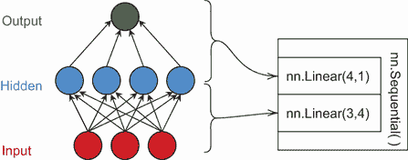

图 2.6 将概念性的前馈全连接网络转换为 PyTorch `Module`。`nn.Sequential`是一个包装器，它接受两个`nn.Linear`层。第一个`nn.Linear`定义了从输入到隐藏层的映射，第二个`nn.Linear`定义了从隐藏层到输出的映射。

将此应用于实践很容易，因为所有其他我们编写的代码仍然有效。以下代码创建了一个新的简单`model`，它是由两个`nn.Linear`层组成的序列。然后我们只需将`model`传递给相同的`train_simple_network`函数，并继续之前的操作。这个模型有一个输入，一个输出，以及一个包含 10 个神经元的单个隐藏层：⁴

```
model = nn.Sequential(     ❶
    nn.Linear(1, 10),      ❷
    nn.Linear(10, 1),      ❸
)

train_simple_network(model, loss_func, training_loader)
```

❶ 输入“层”隐式地是输入。

❷ 隐藏层

❸ 输出层

注意：`nn.Sequential`类提供了在 PyTorch 中指定神经网络的最简单方法，我们在这本书的每个网络中都使用它！因此，熟悉它是值得的。最终，我们将构建更复杂的网络，这些网络不能完全描述为前馈过程。尽管如此，我们仍然会使用`nn.Sequential`类来帮助我们组织可以那样组织的网络的子组件。这个类基本上是你组织 PyTorch 中模型的必备工具。

现在，我们可以使用具有隐藏层的花哨神经网络进行推理，看看我们得到什么。我们使用与之前完全相同的推理代码。唯一的区别是我们的`model`对象，我们已经重新设计了它。你可能注意到了一个名为`ravel()`的新 NumPy 函数，它被用来生成绘图；使用这个函数与在 PyTorch 张量上调用`reshape(-1)`相同，我们之所以调用它是因为`Y_pred`的初始形状为(*N*,1)：

```
    with torch.no_grad(): 
    Y_pred = model(torch.tensor(X.reshape(-1,1),                        ❶
    dtype=torch.float32)).cpu().numpy() 
    sns.scatterplot(x=X, y=y, color=’blue’, label=’Data’)               ❷
    sns.lineplot(x=X, y=Y_pred.ravel(), color=’red’, label=’Model’)     ❸

[12]: <AxesSubplot:>
```

❶ 形状为 (N, 1)

❷ 数据

❸ 我们模型学到的内容

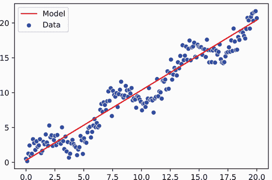

那是什么情况？我们使我们的`模型` *f*(⋅)变得更加复杂，训练时间更长，但效果可能相同甚至更差！一点线性代数就能解释为什么会这样。回想一下，我们定义了

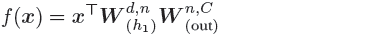

这里 **W**[(*h*[1])]^(*d* × *n*) 是我们的隐藏层。由于我们有一个特征 *d* = 1 和 *n* = 10 个隐藏单元，**W**[(out)]^(*n* × *C*) 是我们的输出层，其中我们仍然有来自前一层的 *n* = 10 个隐藏单元和 *C* = 1 个总输出。但我们可以简化这两个权重矩阵。如果我们有一个形状为 (*a*,*b*) 的矩阵和一个形状为 (*b*,*c*) 的第二个矩阵，我们将它们相乘，我们得到一个形状为 (*a*,*c*) 的新矩阵。这意味着

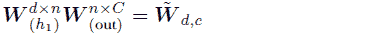

因此

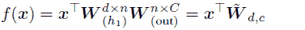

这与我们最初使用的线性模型是等价的。这表明*添加任意数量的顺序线性层等同于使用一个线性层*。线性操作产生线性操作，通常是冗余的。在代码中连续放置多个线性层是我在新手或初级从业者编写的代码中常见的一个错误。

### 2.2.3 添加非线性

为了获得任何形式的益处，我们需要在每一步之间引入 *非线性*。通过在每个线性操作之后插入一个非线性函数，我们允许网络构建更复杂的函数。我们称这种以这种方式使用的非线性函数为 *激活函数*。从生物学的类比来看，一个神经元线性地求和所有输入，最终 *触发* 或 *激活*，向大脑中的其他神经元发送信号。

我们应该使用什么作为我们的激活函数？我们将首先查看的两个是 *sigmoid* (*σ*(⋅)) 和 *双曲正切* (tanh (⋅)) 函数，它们是原始激活函数中的两个，并且仍然被广泛使用。

tanh 函数是一个历史上流行的非线性函数。它将所有值映射到范围 [−1,1] 内：

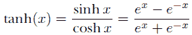

Sigmoid 是历史悠久的非线性函数，也是 σ 符号最常被使用的场合。它将所有值映射到范围 [0,1] 内：

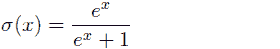

让我们快速绘制一下这些函数的图像。输入在 x 轴上，激活值在 y 轴上：

```
    activation_input = np.linspace(-2, 2, num=200) 
    tanh_activation = np.tanh(activation_input) 
    sigmoid_activation = np.exp(activation_input)/(np.exp(activation_input)+1) 
    sns.lineplot(x=activation_input, y=activation_input, 
    ➥ color=’black’, label="linear") 
    sns.lineplot(x=activation_input, y=tanh_activation, 
    ➥ color=’red’, label="tanh(x)") 
    ax = sns.lineplot(x=activation_input, y=sigmoid_activation, 
    ➥ color=’blue’, label="*σ*(*x*)")

    ax.set_xlabel(’Input value x’)
    ax.set_ylabel(’Activation’)

[13]: Text(0, 0.5, 'Activation')
```

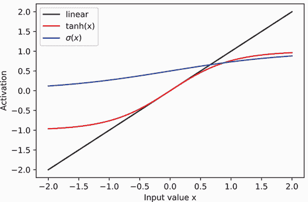

正如承诺的那样，sigmoid 激活 (*σ*(*x*)) 将所有值映射到最小值 0 和最大值 1。tanh 函数的范围是从 -1 到 1。注意，在 0 附近的输入范围内，tanh 函数 *看起来* 是线性的，但随后会发散：这是可以接受的，甚至可能是期望的。从学习的角度来看，重要的是 tanh (⋅) 或 *σ*(⋅) 都不能被线性函数 *完美* 地拟合。

我们将在未来的章节中更多地讨论这些函数的性质。现在，让我们使用 tanh 函数。我们将定义一个新的模型，该模型与以下内容匹配：

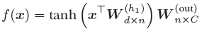

我们不是直接将 `nn.Linear` 层堆叠在一起，而是在第一个线性层之后调用 tanh 函数。在使用 PyTorch 时，我们通常希望以一个 `nn.Linear` 层结束我们的网络。对于这个模型，我们有两个 `nn.Linear` 层，所以我们需要 2 - 1 = 1 个激活函数。这就像在我们的顺序网络规范中添加一个 `nn.Tanh` 节点一样简单，这是 PyTorch 内置的。让我们看看训练这个新 `model` 时会发生什么：

```
    model = nn.Sequential( nn.Linear(1, 10),                        ❶
        nn.Tanh(),                                                  ❷
        nn.Linear(10, 1),                                           ❸
    )

    train_simple_network(model, loss_func, training_loader, epochs=200)

    with torch.no_grad(): 
        Y_pred = model(torch.tensor(X.reshape(-1,1), 
        ➥ dtype=torch.float32)).cpu().numpy()

    sns.scatterplot(x=X, y=y, color=’blue’, label=’Data’)           ❹
    sns.lineplot(x=X, y=Y_pred.ravel(), color=’red’, label=’Model’) ❺
[15]: <AxesSubplot:>
```

❶ 隐藏层

❷ 激活函数

❸ 输出层

❹ 数据

❺ 我们模型学到的内容

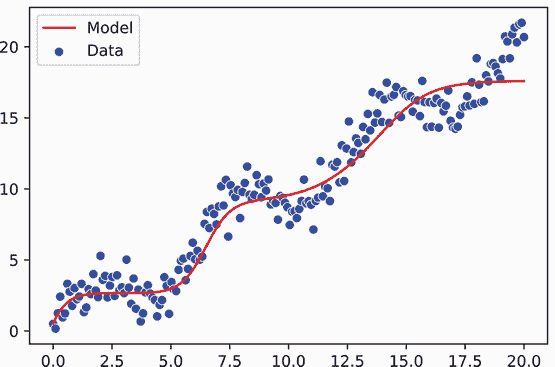

数字的再现性

在本书的这一部分，你可能注意到你并不总是得到与我完全相同的结果。有时你可能会得到 *非常不同* 的结果。这是 *正常* 的，也是 *可以接受的*。每个神经网络的初始权重都是随机值，不同的随机值集合可能会给你不同的结果。不要因此感到害怕；习惯结果的变异性可能是有价值的。

如果你了解随机种子，你可能正在想，“如果你设置一个随机种子，知道随机结果会是什么，这难道不能解决问题吗？”这在高层次上是正确的，但不幸的是，PyTorch 中层的输出并不总是确定的。它们经常利用硬件特定的优化，这可能会略微改变结果，甚至在某些情况下从一次运行到下一次运行会有所不同。PyTorch 正在努力支持更多确定性行为，但还不是所有情况都适用，也不是所有 CUDA 版本都适用。如果我尝试启用它，可能会使你的所有东西都停止工作。所以，很遗憾，我们每次运行代码时都会得到略有不同的结果。

另一个选择是运行每个实验 5 到 15 次，并绘制带有误差线的平均值，以显示可能发生的情况的变异性。但这样，代码示例的运行时间将会是 5 到 15 倍更长。我选择只运行一次，以保持时间合理。

我们可以看到，网络现在正在学习一个非线性函数，其弯曲部分会移动和适应以匹配数据的行为。然而，这并不完美，尤其是在图表右侧输入 x 的较大值上。我们还需要比之前更多的`epochs`进行训练。这也是很常见的情况。这也是我们为什么在深度学习中大量使用 GPU 的原因之一：我们有更大的模型，这意味着每次更新都需要更多的计算；而且更大的模型需要更多的更新才能收敛，从而导致更长的训练时间。

通常情况下，需要学习的函数越复杂，我们就需要进行的训练轮数就越多——甚至可能需要更多的数据。然而，有许多方法可以提高我们的神经网络从数据中学习的质量和速度，这些方法我们将在本书的后续部分更详细地讨论。目前，我们的目标是学习基础知识。

## 2.3 分类问题

你现在已经通过扩展线性回归模型构建了你的第一个神经网络，但关于分类问题呢？在这种情况下，你有一个输入可能属于的 C 个不同的*类别*。例如，一辆车可能是一辆 SUV、轿车、敞篷车或卡车。正如你可能已经猜到的，你需要一个看起来像`nn.Linear(n, C)`的输出层，其中 n 是前一层中的隐藏单元数，C 是类别/输出的数量。如果我们有少于 C 个输出，要做出 C 个预测将是困难的。

与我们如何从线性回归走向非线性回归神经网络一样，我们也可以从逻辑回归走向非线性分类网络。回想一下，逻辑回归是分类问题中一个流行的算法，它找到一个线性解决方案来尝试分离 C 个类别。

### 2.3.1 分类玩具问题

在我们构建逻辑模型之前，我们需要一个数据集。在 PyTorch 中使用时，将数据加载并放入 `Dataset` 对象中始终是第一步和最重要的步骤。对于这个例子，我们使用 scikit-learn 的 `make_moons` 类：

```
    from sklearn.datasets import make_moons 
    X, y = make_moons(n_samples=200, noise=0.05) 
    sns.scatterplot(x=X[:,0], y=X[:,1], hue=y, style=y)

[16]: <AxesSubplot:>
```

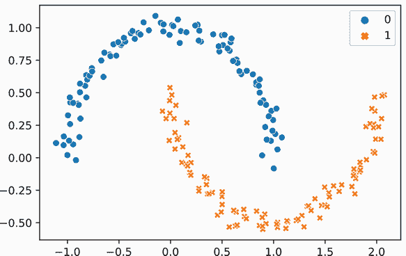

月亮数据集现在有 *d* = 2 个输入特征，散点图显示了两个类别作为圆圈和十字。这是一个很好的玩具问题，因为线性分类模型可以很好地将圆圈和十字分开，但不能 *完美* 解决这个问题。

为了使我们的工作更简单，我们使用内置的 `TensorDataset` 对象来包装我们当前的数据。这仅在我们能够将所有数据放入 RAM 中时才有效。但如果你可以，这是准备数据的最简单方法。你可以使用你喜欢的 pandas 或 NumPy 方法来加载数据，然后开始建模。

尽管如此，我们确实做了一项重要的更改。我们的标签向量 y 现在是 `torch.long` 类型，而不是 `torch.float32` 类型。为什么？因为标签现在代表类别，从 0 开始，到 *C* − 1 结束，以表示 C 个不同的类别。没有 0.25 类；只允许整数！因此，我们使用长数据类型（64 位整数）而不是浮点值，因为我们只关心整数。例如，如果我们的类别是 `猫`、`鸟` 和 `车`，我们将使用 `0, 1, 2` 来表示这三个类别。你可能认识这种表示方式与独热编码非常接近，其中每个类别都有自己的维度。PyTorch 在幕后为我们完成最后一步，以避免像独热编码那样无谓地表示所有非存在的类别：

```
classification_dataset = torch.utils.data.TensorDataset(
➥ torch.tensor(X, dtype=torch.float32), torch.tensor(y, dtype=torch.long)) 
training_loader = DataLoader(classification_dataset)
```

现在我们定义一个线性分类模型，就像我们之前做的那样。在这种情况下，我们有两个特征，我们有两个输出（每个类别一个），所以我们的模型稍微大一些。请注意，尽管 *目标* 向量 y 被表示为一个单独的整数，但网络有 C 个显式输出。这是因为标签是 *绝对* 的：每个数据点只有一个真实类别。然而，网络必须始终考虑所有 C 个类别作为潜在选项，并为每个类别分别做出预测：

```
in_features = 2 
out_features = 2 
model = nn.Linear(in_features, out_features)
```

### 2.3.2  分类损失函数

最大的问题是，我们使用什么作为损失函数？当我们做回归问题时，这个问题很容易回答。我们有两个输入，它们都是浮点值，所以我们只需相减就可以确定两个值之间的距离。

然而，这种情况是不同的。现在我们的预测是 **ŷ** ∈ ℝ^C，因为我们需要对我们的 C 个不同类别中的每一个进行预测。但我们的标签是整数集的一个值，*y* ∈ {0, 1, …, *C* − 1}。如果我们能定义一个损失函数 ℓ(**ŷ**, *y*)，它接受一个预测向量 **ŷ** ∈ ℝ^C 并将其与正确的类别 y 进行比较，我们就可以重用图 2.2 中的训练循环以及我们之前定义的神经网络中的所有内容。幸运的是，这个函数已经存在，但由于它在本书的整个过程中都至关重要，因此详细讨论它是值得的。我们需要两个组件：softmax 函数和交叉熵，这两个函数结合在一起通常被称为 *交叉熵损失*。

虽然许多教程都乐于说“使用交叉熵”而不解释它是什么，但我们将稍微绕个弯，并解释交叉熵的机制，这样你就可以建立一个更强的心理基础。本质上是首先将一些 C 个分数（这些值可以是任何数字）转换成 C 个概率（值必须在 0 和 1 之间），然后根据真实类别 y 的概率计算损失。有许多统计论据支持为什么这样做，如果你需要多次阅读这一节或稍后回来，那也是可以的。

Softmax

首先，我们直观地希望 ŷ 中具有最大值的维度对应于正确的类别标签 y（这与使用 `np.argmax` 相同）。如果我们用数学表达，我们希望：

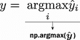

我们也希望我们的预测是一个合理的概率。为什么？假设正确的类别是 *y* = *k*，我们成功并且有 *ŷ*[k] 作为最大的值。这是对还是错？如果 *ŷ*[k] − *ŷ*[j] = 0.00001 呢？这个差异非常小，我们希望有一种方法告诉模型应该使差异更大。

如果我们将 ŷ 转换为概率，它们必须总和为 1。这意味着

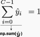

这样我们就可以知道，当 *ŷ*[k] = 1 时，模型对其预测有信心，而所有其他值 *j* ≠ *k* 的结果都是 *ŷ*[j] = 0。如果模型不太自信，我们可能会看到 *ŷ*[k] = 0.9；如果它完全错误，*ŷ*[k] = 0。ŷ 总和为 1 的约束使得我们很容易解释结果。

但我们如何确保这一点呢？我们从最后一个 `nn.Linear` 层得到的值可以是任何东西，尤其是在我们刚开始训练并且还没有教会模型什么是正确的时候。我们将使用 *软最大值*（或 *softmax*）函数：它将所有东西转换成非负数，并确保这些值的总和为 1.0。具有最大值的索引 k 在之后也将具有最大的值，*即使它是负数*，只要其他所有索引的值都更小。较小的值也会得到较小的但非零的值。因此，softmax 给 0, 1, …, *C* − 1 中的每个值分配一个 [0,1] 范围内的值，这样它们的总和为 1。

以下方程定义了 softmax 函数，我在数学中将其简称为“sm”，以便使更长的方程更容易阅读：

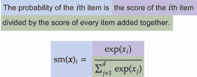

让我们快速看一下对两个不同向量调用 softmax 的结果：

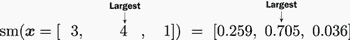

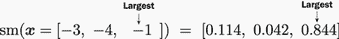

在第一种情况下，4 是最大值，因此它获得了最大的归一化分数 0.705。第二种情况（-1）是最大值，它获得了 0.844 的分数。为什么第二种情况的结果分数更大，尽管-1 比 4 小？因为 softmax 是相对的，4 只比 3 大 1；第二种情况（-1）比-4 大 3，因为差异更大，所以这种情况获得了更高的分数。

为什么叫 softmax？

在我们继续之前，我觉得解释一下为什么 softmax 函数被称为 softmax 是有帮助的。我们可以使用这个分数来计算一个“软”的最大值，其中每个值都贡献了答案的一部分。如果我们取 softmax 分数和原始值之间的点积，它大约等于最大值。让我们看看这是如何发生的：

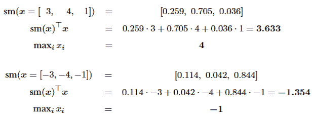

sm(x)^⊤x 的值大约等于找到 x 的最大值。因为每个值至少贡献了答案的一部分，所以 sm(x)^⊤x ≤ max[i]*x*[i]也成立。所以 softmax 函数可以接近最大值，但只有在所有值都相同的情况下才等于最大值。

交叉熵

在手头有了 softmax 函数之后，我们拥有了定义分类问题良好损失函数所需的两个工具之一。我们需要的第二个工具被称为*交叉熵*损失。如果我们有两个概率分布 p 和 q，它们之间的交叉熵是

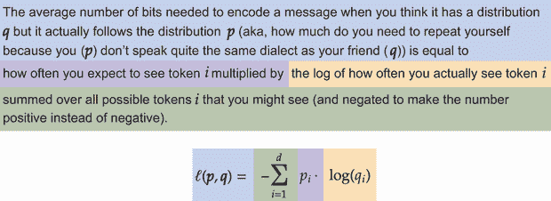

为什么是交叉熵？这是一个统计工具，它告诉我们如果我们使用 q 定义的分布来编码信息时，需要多少额外的信息才能编码数据实际上遵循的分布 p。这是以比特（一个字节的八分之一）来衡量的，用来编码某物所需的比特越多，p 和 q 之间的拟合就越差。这个解释省略了交叉熵函数所做的一些精确性，但给你一个高层次上的直观理解。交叉熵归结为告诉我们两个分布有多不同。

想象这是在尝试最小化成本。想象我们正在为一组人订购午餐，我们预计 70%的人会吃鸡肉，30%的人会吃火鸡（见图 2.7）。这就是预测分布 q。实际上，5%的人想要火鸡，95%的人想要鸡肉。这就是真实分布 p。在这种情况下，我们*认为*我们想要订购比实际需要的更多的火鸡。但如果我们订购了所有的火鸡，我们就会缺少鸡肉，并且浪费了/未使用的火鸡。如果我们知道我们实际需要什么，我们就不会有这么多剩余的食物。交叉熵只是量化这些分布差异的一种方式，这样我们就可以订购正确数量的每种东西。

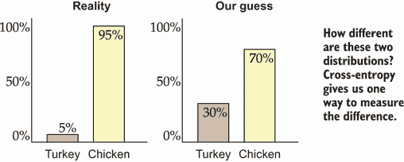

图 2.7 显示了两种不同的分布：左侧的实际情况和右侧的我们的预测。为了学习，我们需要一个损失函数来精确地告诉我们这两个分布有多不同。交叉熵解决了这个问题。在大多数情况下，我们的标签将现实定义为 100%属于一个类别，而其他所有类别为 0%。

现在，结合这两个工具，我们得到了一个简单的损失函数和方法。我们首先应用 softmax 函数（sm(*x*)），然后计算交叉熵。如果ŷ是我们从网络输出的向量，而 y 是正确的类别索引，这简化为

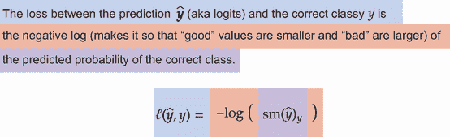

这可能看起来有点神秘，但没关系。结果是简化方程式得来的，推导不是这本书的重点。我们详细地解释了这些，因为 softmax 和交叉熵函数在今天的深度学习研究中无处不在，多花点力气了解它们的作用会在书后的学习中使你的生活更容易。重要的是要知道 softmax 函数的作用（将归一化输入转换为概率）以及它可以与交叉熵一起使用来量化两个分布（概率数组）之间的差异。

我们使用这个损失函数，因为它有很强的统计基础和解释性。它确保我们可以将结果解释为概率分布。对于线性模型的情况，它导致众所周知的算法**逻辑回归**。

使用 softmax 后跟交叉熵是如此标准和众所周知，以至于 PyTorch 将它们集成到一个单一的损失函数`CrossEntropyLoss`中，它为我们执行这两个步骤。这是好的，因为手动实现 softmax 和交叉熵函数可能会导致棘手的数值稳定性问题，并且不如你想象的那么直接。

### 2.3.3 训练分类网络

现在我们可以训练一个`模型`并查看它的表现如何：

```
loss_func = nn.CrossEntropyLoss()
train_simple_network(model, loss_func, training_loader, epochs=50)
```

我们的模型训练完成后，让我们可视化结果。由于这是一个二维函数，它比我们之前的回归案例要复杂一些。我们使用等高线图来显示算法的决策面：深蓝色代表第一类，深红色代表第二类，颜色过渡表示模型置信度的降低和增加。原始数据点以各自的蓝色和橙色标记显示：

```
def visualize2DSoftmax(X, y, model, title=None): 
    x_min = np.min(X[:,0])-0.5 
    x_max = np.max(X[:,0])+0.5 
    y_min = np.min(X[:,1])-0.5
    y_max = np.max(X[:,1])+0.5 
    xv, yv = np.meshgrid(np.linspace(x_min, x_max, num=20), 
    ➥ np.linspace(y_min, y_max, num=20), indexing=’ij’) 
    xy_v = np.hstack((xv.reshape(-1,1), yv.reshape(-1,1))) 
    with torch.no_grad():
        logits = model(torch.tensor(xy_v, dtype=torch.float32)) 
        y_hat = F.softmax(logits, dim=1).numpy()

    cs = plt.contourf(xv, yv, y_hat[:,0].reshape(20,20), 
    ➥ levels=np.linspace(0,1,num=20), cmap=plt.cm.RdYlBu) 
    ax = plt.gca() 
    sns.scatterplot(x=X[:,0], y=X[:,1], hue=y, style=y, ax=ax) 
    if title is not None: 
        ax.set_title(title)

visualize2DSoftmax(X, y, model)
```

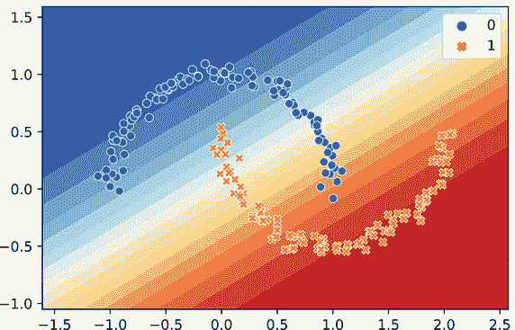

注意：请注意，我们调用 PyTorch 函数 `F.softmax` 来将原始输出转换为实际的概率分布。通常将输入 softmax 的值称为 *logits*，而输出 ŷ 称为概率。在这本书中，我们将尽量避免过多使用 *logits* 这个术语，但你应该熟悉它。它经常出现在人们讨论实现或方法细节的时候。

我们现在可以看到我们的模型在这组数据上的结果。总体来说，这是一项不错的工作：大多数蓝色圆圈都在蓝色区域，红色十字都在红色区域。有一个中间地带，错误正在发生，因为我们的问题不能完全用线性模型解决。

现在我们对回归问题做同样的处理：添加一个隐藏层来增加神经网络的复杂性。在这种情况下，我们添加了两个隐藏层只是为了展示这是多么容易。我随意选择了 *n* = 30 个隐藏单元用于两个隐藏层：

```
model = nn.Sequential( 
    nn.Linear(2, 30), 
    nn.Tanh(), 
    nn.Linear(30, 30), 
    nn.Tanh(), nn.Linear(30, 2),
)
train_simple_network(model, loss_func, training_loader, epochs=250)
```

你应该注意到这些模型开始需要一些时间来训练：当我运行这个模型时，250 个 `epochs` 需要 36 秒。不过，结果似乎值得等待：如果我们查看我们的数据图，我们会看到模型对于明显是圆形或十字的区域有更高的置信度。你还可以看到，随着神经网络学习两个类别之间的非线性分离，阈值开始弯曲和曲线：

```
visualize2DSoftmax(X, y, model)
```

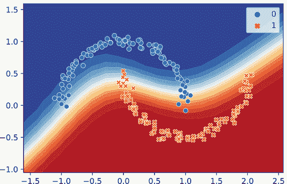

## 2.4 更好的训练代码

我们现在已经成功训练了用于回归和分类问题的全连接网络。我们还有很多改进方法的空间。特别是，我们一直在同一数据集上训练和评估。*这并不好*：你永远不能通过在 *训练* 数据上测试来判断你的模型在 *新* 数据上的表现如何。这给了模型一个机会通过记住每个训练数据点的答案来作弊，而不是学习底层任务。当我们处理分类问题时，还有一个问题：最小化交叉熵损失并不是我们的真正目标。我们的目标是减少错误，但我们不能以 PyTorch 可以处理的方式对错误进行可微分的定义，所以我们使用了交叉熵作为代理指标。在分类问题中，每经过一个 epoch 就报告损失并不那么有帮助，因为这不是我们的真正目标。

我们将讨论我们可以对训练代码进行的一些修改，以获得更强大的工具。像所有优秀的机器学习从业者一样，我们正在创建和使用一个**训练**集和一个**测试**集。我们还将评估我们关心的其他指标，以便在训练过程中跟踪性能。

### 2.4.1  自定义指标

如前所述，我们关注的指标（例如，准确率）可能与我们用于训练模型的损失（例如，交叉熵）不同。这些指标可能不完全匹配的许多方式，因为损失函数必须具有**可微分的**属性，而我们的真正目标大多数时候并不具备这个属性。因此，我们通常会有两套评分：开发者和人理解问题的指标以及让网络理解问题的损失函数。

为了帮助解决这个问题，我们将修改我们的代码，以便我们可以传递函数来从标签和预测值计算不同的指标。我们还想知道这些指标在训练和验证数据集上的变化情况，因此我们将记录多个版本：每个数据集类型一个。

为了使我们的工作更轻松，我们将使我们的代码与 scikit-learn 库提供的多数指标兼容（[`scikit-learn.org/stable/modules/classes.html`](https://scikit-learn.org/stable/modules/classes.html)）。为此，让我们假设我们有一个数组`y_true`，它包含每个数据点的正确输出标签。我们还需要另一个数组`y_pred`，它包含我们模型的预测。如果我们进行回归，每个预测都是一个标量ŷ。如果是分类，每个预测都是一个向量ŷ。

我们需要一种方式让用户（也就是你）指定要评估的函数以及存储结果的地方。对于评分函数，我们可以使用一个字典`score_funcs`，它以指标的名称作为键，以函数引用作为值。这看起来像

```
score_funcs={’Acc’:accuracy_score, ’F1’: f1_score}
```

如果我们使用 scikit-learn 的`metrics`类提供的函数（见[`scikit-learn.org/stable/modules/model_evaluation.html`](https://scikit-learn.org/stable/modules/model_evaluation.html)）。这样，我们可以指定我们想要的任何自定义指标，只要我们实现一个`score_func(y_ture, y_pred)`函数。然后我们只需要一个地方来存储计算出的评分。在每个循环的每个 epoch 之后，我们可以使用另一个字典`results`，它将字符串作为键映射到一个`list`的结果。我们将使用列表，以便每个 epoch 有一个评分：

```
results[prefix+" loss"].append(np.mean(running_loss)) 
for name, score_func in score_funcs.items(): 
    results[prefix+" "+name].append(score_func(y_true, y_pred))
```

如果我们只使用每个评分函数的`name`，我们就无法区分训练集和测试集上的评分。这很重要，因为如果存在很大的差距，可能表明过拟合，而小的差距可能表明欠拟合。因此，我们使用一个`prefix`来区分`train`和`test`评分。

注意：如果我们对评估很认真，我们应该只使用验证/测试性能来调整和更改我们的代码、超参数、网络架构等。这也是我们需要确保我们区分训练和验证性能的另一个原因。你不应该*永远*使用训练性能来决定模型的表现如何。

### 2.4.2 训练和测试遍历

我们正在修改我们的训练函数，以更好地支持现实生活中的工作。这包括支持一个训练 epoch，其中我们改变模型权重，以及一个测试 epoch，其中我们只记录我们的性能。确保测试 epoch*永远*不调整模型权重是至关重要的。

执行一次训练或评估需要大量的不同输入：

+   `model`—运行一个 epoch 的 PyTorch `Module`，代表我们的模型 *f*(⋅)

+   `optimizer`—更新网络权重的对象，只有在执行训练 epoch 时才应使用

+   `data_loader`—`DataLoader`对象，它返回（输入，标签）对的元组

+   `loss_func`—损失函数 ℓ(⋅,⋅)，它接受两个参数，即`model`的输出（**ŷ** = *f*(**x**)）和标签（y），并返回用于训练的损失

+   `device`—执行训练的计算位置

+   `results`—一个字符串到列表的字典，用于存储结果，如前所述

+   `score_funcs`—一个用于评估`model`性能的评分函数字典，如前所述

+   `prefix`—放置在`results`字典中的任何分数的字符串前缀

最后，由于神经网络训练可能需要一段时间，让我们包括一个可选参数`desc`，为进度条提供一个描述性字符串。这将为我们提供一个函数所需的所有输入，该函数处理一个 epoch，我们可以给出以下签名：

```
def run_epoch(model, optimizer, data_loader, loss_func, device, 
              results, score_funcs, prefix="", desc=None):
```

在此函数的开始，我们需要分配空间来存储结果，如损失、预测和开始计算的时间：

```
running_loss = [] 
y_true = [] 
y_pred = [] 
start = time.time()
```

训练循环看起来几乎与迄今为止我们所使用的循环完全相同。唯一需要改变的是是否使用优化器。我们可以通过查看`model.training`标志来检查这一点，如果我们的模型处于训练模式（`model = model.train()`）则该标志为`True`，如果处于评估/推理模式（`model = model.eval()`）则该标志为`False`。我们可以在每个循环的末尾将损失和优化器调用包裹在一个`if`语句中：

```
if model.training: 
    loss.backward() 
    optimizer.step() 
    optimizer.zero_grad()
```

最后，我们需要将`labels`和预测`y_hat`分别存储到`y_true`和`y_pred`中。这可以通过调用`.detach().cpu().numpy()`来完成，将两者都从 PyTorch 张量转换为 NumPy 数组。然后我们只需将当前正在处理的标签列表扩展到所有标签列表中：

```
if len(score_funcs) > 0: labels = 
    labels.detach().cpu().numpy()        ❶
    y_hat = y_hat.detach().cpu().numpy()
    y_true.extend(labels.tolist())       ❷
    y_pred.extend(y_hat.tolist())
```

❶ 将标签和预测移回 CPU 以供后续使用

❷ 将预测结果累加到迄今为止的预测中

### 2.4.3 保存检查点

我们将要做的最后一个修改是保存最近完成 epoch 的简单检查点。在 PyTorch 中，可以使用`torch.load`和`torch.save`函数来完成此目的。虽然使用这些方法的方式不止一种，但我们建议使用这里所示的字典式方法，它允许我们将模型、优化器状态和其他信息都保存在一个对象中：

```
torch.save({ 
    ’epoch’: epoch, 
    ’model_state_dict’: model.state_dict(), 
    ’optimizer_state_dict’: optimizer.state_dict(), 
    ’results’ : results 
    }, checkpoint_file)
```

第二个参数`checkpoint_file`是我们应该保存文件的路径。我们可以将任何可序列化的对象放入此字典以保存。在我们的情况下，我们表示训练 epoch 的数量、`model`状态（权重/参数 Θ）以及`optimizer`使用的任何状态。

我们需要能够保存我们的模型，这样当我们准备好使用它时，我们就不需要从头开始重新训练。在每个 epoch 后保存是一个更好的主意，尤其是当你开始训练可能需要几周才能完成的网络时。有时我们的代码可能在许多 epoch 后失败，或者电力故障可能会中断我们的工作。通过在每个 epoch 后保存模型，我们可以从最后一个 epoch 恢复训练，而不是从头开始。

### 2.4.4  将所有内容整合：更好的模型训练函数

现在我们已经拥有了构建更好的神经网络训练函数所需的一切：不仅是我们讨论过的网络（例如，全连接）几乎本书中讨论的所有网络。这个新函数的签名看起来是这样的：

```
def train_simple_network(model, loss_func, train_loader, 
    test_loader=None, score_funcs=None, epochs=50, 
    device="cpu", checkpoint_file=None):
```

参数如下：

+   `model`—运行一个 epoch 的 PyTorch `Module`，它代表我们的模型 *f*(⋅)

+   `loss_func`—损失函数ℓ(⋅,⋅)，它接受两个参数，即`model`的输出(**ŷ** = *f*(**x**)和`labels` (y)，并返回用于训练的损失

+   `train_loader`—返回用于训练模型的(input, label)对的`DataLoader`对象

+   `test_loader`—返回用于评估模型的(input, label)对的`DataLoader`对象

+   `score_funcs`—一个用于评估`model`性能的评分函数字典，如前所述

+   `device`—执行训练的计算位置

+   `checkpoint_file`—一个字符串，指示保存模型检查点到磁盘的位置

这个新功能的核心内容如下所示，完整的版本可以在书中提供的 idlmam.py 文件中找到：

```
optimizer = torch.optim.SGD(model.parameters(), lr=0.001)  ❶

model.to(device)                                           ❷

for epoch in tqdm(range(epochs), desc="Epoch"): 

    model = model.train()                                  ❸

    total_train_time += run_epoch(model, optimizer, train_loader,
    loss_func, device, results, score_funcs,
    prefix="train", desc="Training")

    results["total time"].append( total_train_time )
    results["epoch"].append( epoch )

    if test_loader is not None:                            ❹
        model = model.eval()
        with torch.no_grad():
            run_epoch(model, optimizer, test_loader, loss_func, device,
            results, score_funcs, prefix="test", desc="Testing")
```

❶ 执行账务和设置；准备优化器

❶ 将模型放置在正确的计算资源（CPU 或 GPU）上

❶ 将我们的模型置于训练模式

❶ 如果 checkpoint_file 不为空，则保存检查点

我们使用`run_epoch`函数在将模型置于正确模式后执行训练步骤，该函数记录训练结果。然后，如果提供了`test_loader`，我们切换到`model.eval()`模式并进入`with torch.no_grad()`上下文，这样我们就不会以任何方式修改模型，并可以检查其在保留数据上的性能。我们分别使用前缀`"train"`和`"test"`来表示训练和测试运行的结果。

最后，我们有一个新的训练函数将结果转换为 pandas `DataFrame`，这将使我们以后更容易访问和查看它们：

```
return pd.DataFrame.from_dict(results)
```

使用这个新的改进代码，让我们在月亮数据集上重新训练我们的模型。由于准确率是我们真正关心的，我们导入 scikit-learn 中的准确度度量。让我们包括 F1 分数度量来展示代码如何同时处理两个不同的度量：

```
from sklearn.metrics import accuracy_score 
from sklearn.metrics import f1_score
```

我们还希望更好地评估并包括一个验证集。由于月亮数据是合成的，我们可以轻松创建一个新的验证数据集。与其像以前那样进行 200 个训练周期，让我们生成一个更大的训练集：

```
X_train, y_train = make_moons(n_samples=8000, noise=0.4) 
X_test, y_test = make_moons(n_samples=200, noise=0.4) 
train_dataset = TensorDataset(torch.tensor(X_train, dtype=torch.float32), 
➥ torch.tensor(y_train, dtype=torch.long)) 
test_dataset = TensorDataset(torch.tensor(X_test, dtype=torch.float32), 
➥ torch.tensor(y_test, dtype=torch.long)) 

training_loader = DataLoader(train_dataset, shuffle=True) 
testing_loader = DataLoader(test_dataset)
```

我们已经有了重新训练模型所需的一切。我们将使用 model.pt 作为保存模型结果的存储位置。我们所需做的只是声明一个新的`model`对象并调用我们的新`train_simple_network`函数：

```
model = nn.Sequential( 
    nn.Linear(2, 30), 
    nn.Tanh(), 
    nn.Linear(30, 30), 
    nn.Tanh(), 
    nn.Linear(30, 2),
) 
results_pd = train_simple_network(model, loss_func, training_loader,
➥ epochs=5, test_loader=testing_loader, checkpoint_file=’model.pt’,
➥ score_funcs={’Acc’:accuracy_score,’F1’: f1_score})
```

是时候看看一些结果了。首先，让我们看看我们是否可以加载我们的检查点`model`而不是使用我们已训练的模型。要加载一个`model`，我们首先需要定义一个*新*的`model`，它具有与原始模型相同的所有子模块，并且它们都需要相同的大小。这是必要的，以确保所有权重都匹配。如果我们保存了一个具有 30 个神经元的第二隐藏层的模型，我们需要有一个具有 30 个神经元的新的模型；否则，将会有太多或太少，并且会发生错误。

我们使用`torch.load`和`torch.save`函数的一个原因是因为它们提供的`map_location`参数。这为我们处理从数据到正确计算设备加载模型提供了便利。一旦我们加载了结果字典，我们就可以使用`load_state_dict`函数将原始模型的状态恢复到这个新对象中。然后我们可以将模型应用于数据，并看到我们得到了相同的结果：

```
model_new = nn.Sequential( 
nn.Linear(2, 30), 
nn.Tanh(), 
nn.Linear(30, 30), 
nn.Tanh(), 
nn.Linear(30, 2),
)

visualize2DSoftmax(X_test, y_test, model_new, title="Initial Model") plt.show()

checkpoint_dict = torch.load(’model.pt’, map_location=device)

model_new.load_state_dict(checkpoint_dict[’model_state_dict’])

visualize2DSoftmax(X_test, y_test, model_new, title="Loaded Model") plt.show()
```

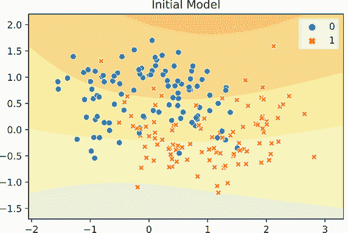

你可以很容易地看出，初始模型并不给出很好的预测，因为它的权重是随机值且未经过训练。如果你运行几次代码，你应该会看到许多略有不同但同样无用的结果。但当我们把之前的`model`状态加载到`model_new`中时，我们得到了我们预期的清晰结果。

注意：在这个例子中，我们只加载了模型的州因为只做了预测；除非你想继续训练，否则不需要优化器。如果你想继续训练，你需要在你的代码中添加一行`optimizer.load_state_dict(checkpoint['optimizer_state_dict'])`。

我们的新训练函数被编写为在每次周期结束后返回一个包含模型信息的 pandas `DataFrame`对象。这为我们提供了一些有价值的信息，我们可以轻松地可视化。例如，我们可以快速绘制训练和验证准确率作为完成周期的函数：

```
    sns.lineplot(x=’epoch’, y=’train Acc’, data=results_pd, label=’Train’) 
    sns.lineplot(x=’epoch’, y=’test Acc’, data=results_pd, label=’Test’)

[29]: <AxesSubplot:xlabel='epoch', ylabel='train Acc'>
```

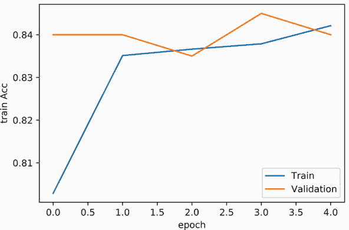

现在很容易看出，通过使用更多的数据，我们的模型在大约两个周期内达到了噪声训练数据的顶峰。提供了两个分数函数，所以让我们看看 F1 分数作为实际训练时间（秒）的函数。如果我们想要比较两个不同的模型学习速度的快慢，这将在未来更有用：

```
    sns.lineplot(x=’total time’, y=’train F1’, data=results_pd, label=’Train’) 
    sns.lineplot(x=’total time’, y=’test F1’, data=results_pd, label=’Test’)

[30]: <AxesSubplot:xlabel='total time', ylabel='train F1'>
```

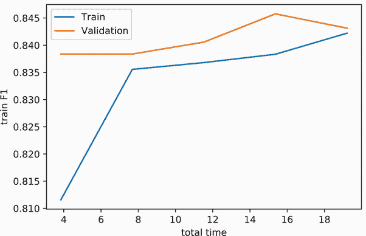

对于这个玩具数据集，F1 分数和准确率给出了非常相似的分数，因为这两个类别具有相似的行为，并且在大小上平衡。你应该注意到的更有趣的趋势是，训练准确率在上升后趋于稳定，但验证准确率随着每个训练周期的上下波动而更加崎岖。*这是正常的*。模型将开始过度拟合训练数据，这使得其性能看起来稳定，并在完成学习并开始记忆更具有挑战性的数据点时缓慢上升。由于验证数据是分开的，这些可能对新的数据有益或有害的小变化对模型来说是未知的，因此它无法调整以使它们始终正确。我们保留一个单独的验证或测试集是至关重要的，这样我们就可以看到模型在新的数据上实际表现的较少偏差的视图。

## 2.5 批量训练

如果你查看上一张图的 x 轴，当我们把 F1 分数作为训练时间的函数来绘制时，你可能注意到，只用*d* = 2 个特征，在仅仅 8,000 个数据点上训练一个模型几乎需要一分钟。鉴于这个漫长的训练时间，我们如何才能扩大到更大的数据集呢？

我们需要在数据*批次*上进行训练。数据批次只是数据的一个更大的组。假设我们有以下数据集，包含*N* = 4 个项目：

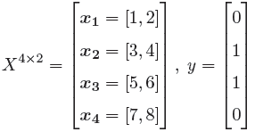

我们当前的代码，在一个周期内，将执行四次更新：针对数据集中的每个项目。这就是为什么它被称为*随机梯度下降*（SGD）。*随机*这个词是行话，意思是“随机的”，但通常有一些潜在的目的或无形的手在驱动这种随机性。SGD 名称中的随机部分来自于我们只使用部分洗牌后的数据来计算梯度，而不是整个数据集。由于它是洗牌的，我们每次都会得到不同的结果。

如果我们将所有 N 个数据点通过模型，并在整个数据集上计算损失，即 ∇ Σ*[i]^N*[=1] ℓ(*f*(***x**[i]*), *y[i]*)，我们得到的是*真实*梯度。这也可以通过一次性处理所有数据而不是逐个处理数据点来使我们的训练更加*计算效率高*。因此，我们不是将形状为(*d*)的向量作为输入传递给`model` *f*(⋅)，而是传递一个形状为(*N*,*d*)的矩阵。PyTorch 模块默认为此情况设计；我们只需要一种方法来告诉 PyTorch 将我们的数据分组到更大的批次中。结果证明，`DataLoader`具有内置的此功能，通过可选的`batch_size`参数。如果没有指定值，则默认为`batch_size=1`。如果我们将其设置为`batch_size=len(train_dataset)`，我们执行真正的梯度下降：

```
training_loader = DataLoader(train_dataset, batch_size=len(train_dataset),
➥ shuffle=True) 
testing_loader = DataLoader(test_dataset, batch_size=len(test_dataset)) 
model_gd = nn.Sequential( 
    nn.Linear(2, 30), 
    nn.Tanh(), 
    nn.Linear(30, 30), 
    nn.Tanh(), 
    nn.Linear(30, 2),
) 
results_true_gd = train_simple_network(model_gd, loss_func, 
➥ training_loader, epochs=5, test_loader=testing_loader, 
➥ checkpoint_file=’model.pt’, 
➥ score_funcs={’Acc’:accuracy_score,’F1’: f1_score})
```

五个训练周期仅用了 0.536 秒。显然，一次性在*更多*数据上训练使我们能够从现代 GPU 提供的并行性中受益。但如果我们绘制准确率，我们会看到训练梯度下降(*B*=*N*)产生了一个不太准确的模型：

```
    sns.lineplot(x=’total time’, y=’test Acc’, data=results_pd,
    ➥ label=’SGD, B=1’) 
    sns.lineplot(x=’total time’, y=’test Acc’, data=results_true_gd,
    ➥ label=’GD, B=N’)

[32]: <AxesSubplot:xlabel='total time', ylabel='test Acc'>
```

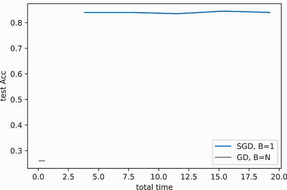

让我们通过一个玩具示例来解释为什么会发生这种情况。图 2.8 显示了一个我们正在优化的函数，如果我们使用梯度下降（它查看*所有*数据），我们采取的步骤将引导我们走向正确的方向。但是每一步都很昂贵，所以我们只能采取少数几步。这个例子显示我们总共进行了四次更新/步骤，对应于四个周期。

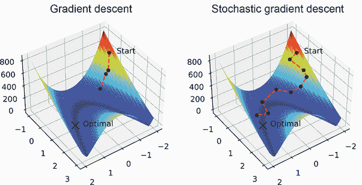

图 2.8 左边的图像显示了数据四个周期的梯度下降。这意味着它只能前进四步，但每一步都是正确的方向。在右边，SGD 通过仅查看一些数据在每个周期进行多次更新。这意味着每一步都是嘈杂的，并不总是指向正确的方向，但它通常是朝着有用的方向，因此 SGD 通常可以在更少的周期内朝着目标取得更多进展。

当我们使用 SGD 时，我们每个周期执行 N 次更新，因此我们得到更多更新或步骤，对于固定数量的周期。但是，由于使用每个更新仅一个数据点的*随机*或随机行为，我们采取的步骤是嘈杂的。它们并不总是指向正确的方向。更大的总步骤数最终使我们更接近答案，但代价是运行时间的增加，因为我们失去了同时处理所有数据的计算效率。

我们在实践中使用的解决方案是在这两个极端之间取得平衡。让我们选择一个足够大的批量大小，以便更有效地使用 GPU，但又要足够小，以便我们仍然能够在每个 epoch 中进行更多的更新。我们用 B 表示批量大小；对于大多数应用，你会发现*B* ∈ [32,256]是一个不错的选择。另一个好的经验法则是使批量大小尽可能大，以便可以放入 GPU 内存，并添加更多的训练 epoch，直到模型收敛。这需要做更多的工作，因为随着你开发你的网络并做出改变，你可以放入 GPU 的最大批量大小可能会改变。

注意：因为我们只使用验证数据来*评估*我们的模型表现，而不是更新模型的权重，所以用于验证数据的批量大小没有特定的权衡。我们只需增加批量大小到运行最快的程度即可。无论测试数据使用的批量大小如何，结果都将相同。在实践中，大多数人为了简单起见，会使用相同的批量大小进行训练和测试数据。

这里是代码：

```
training_loader = DataLoader(train_dataset, batch_size=32, shuffle=True) 
model_sgd = nn.Sequential( 
    nn.Linear(2, 30), 
    nn.Tanh(), 
    nn.Linear(30, 30), 
    nn.Tanh(), 
    nn.Linear(30, 2),
)
results_batched = train_simple_network(model_sgd, loss_func, 
➥ training_loader, epochs=5, test_loader=testing_loader, 
➥ checkpoint_file=’model.pt’, 
➥ score_funcs={’Acc’:accuracy_score,’F1’: f1_score})
```

现在，如果我们把结果作为时间的函数来绘制，我们会看到绿色的线给出了两者之间的最佳结果。它只运行了 1.044 秒，并且几乎达到了相同的准确度。你会发现使用这样的数据批量几乎没有缺点，并且在现代深度学习中是首选的方法。

```
    sns.lineplot(x=’total time’, y=’test Acc’, data=results_pd, label=’SGD, B=1’) 
    sns.lineplot(x=’total time’, y=’test Acc’, data=results_true_gd,
    ➥ label=’GD, B=N’) 
    sns.lineplot(x=’total time’, y=’test Acc’, data=results_batched,
    ➥ label=’SGD, B=32’)

[35]: <AxesSubplot:xlabel='total time', ylabel='test Acc'>
```


## 练习

在 Manning 在线平台 Inside Deep Learning Exercises 上分享和讨论你的解决方案([`liveproject.manning.com/project/945`](https://liveproject.manning.com/project/945))。一旦你提交了自己的答案，你将能够看到其他读者提交的解决方案，并看到哪些是作者认为最好的。

1.  数据的输入范围可以对神经网络产生重大影响。这适用于输入*和*输出，例如回归问题。尝试将 scikit-learn 的`StandardScaler`应用于本章开始时的玩具回归问题的目标 y，并在其上训练一个新的神经网络。改变输出的尺度是否有助于或损害模型的预测？

1.  曲线下方的面积（AUC）指标在 scikit-learn 中并不遵循标准模式，因为它需要`y_pred`是一个形状为(*N*)的向量，而不是形状为(*N*,2)的矩阵。为 AUC 编写一个包装函数，使其与我们的`train_simple_network`函数兼容。

1.  编写一个新的函数`resume_simple_network`，从磁盘加载`checkpoint_file`，恢复`optimizer`和`model`的状态，并继续训练到指定的总 epoch 数。所以如果模型在 20 个 epoch 后保存，而你指定了 30 个 epoch，它应该只进行 10 个额外的 epoch 训练。

1.  在进行实验时，我们可能希望回到之前的不同时代的模型版本，特别是如果我们试图确定某些奇怪行为开始出现的时间。修改`train_simple_network`函数，添加一个新参数`checkpoint_every_x`，该参数在每个`x`个时期保存一个不同文件名的模型版本。这样，你可以回退并加载特定版本，而不会用每个时期的模型填满你的硬盘驱动器。

1.  深度学习的“深度”部分指的是神经网络中的层数。尝试向用于`make_moons`分类问题的模型中添加更多层（最多 20 层）。更多的层如何影响性能？

1.  尝试更改`make_moons`分类问题中隐藏层中使用的神经元数量。它如何影响性能？

1.  使用 scikit-learn 加载威斯康星乳腺癌数据集([`scikit-learn.org/ stable/modules/generated/sklearn.datasets.load_breast_cancer.html`](https://scikit-learn.org/stable/modules/generated/sklearn.datasets.load_breast_cancer.html))，将其转换为`TensorDataset`，然后将其分为 80%用于训练和 20%用于测试。尝试为这些数据构建自己的分类神经网络。

1.  我们在`make_moons`数据集上，以批大小*B* = {1, 32, *N*}看到了结果。编写一个循环，在相同的数据集上为小于 N 的每个 2 的幂次批大小训练一个新的模型（即*B* = {2, 4, 8, 16, 32, 64, …}），并绘制结果。你注意到准确性和/或训练时间方面有任何趋势吗？

## 摘要

+   `train_simple_network`函数抽象了细节，可以用于几乎任何神经网络。

+   `CrossEntropyLoss`用于分类问题，而`MSE`和`L1`损失用于回归问题。

+   `nn.Linear`层可以用来实现线性回归和逻辑回归。

+   完全连接的网络可以通过添加更多带有*非线性*的`nn.Linear`层，被视为线性回归和逻辑回归的扩展。

+   可以使用`nn.Sequential` `Module`来组织子`Module`以创建更大的网络。

+   通过在`DataLoader`中使用`batch_size`选项，我们可以通过计算效率与优化步数之间的权衡。

* * *

¹ 一些机器学习研究中的常见约定：当你有一个较大的函数要优化，该函数由许多较小的项的总损失组成时，将较大的函数表示为 F，将内部函数表示为 f。这并不是一成不变的，但我喜欢使用常见的符号，这样你就可以熟悉它们——即使它们并不非常具有信息量。↩

² 你可以将所有数据放在一个巨大的数组中，但这是一种不好的做法，因为你在任何时候都将整个数据集保留在内存中。迭代器可以动态加载数据，这避免了额外的内存使用。当你处理比计算机内存大的数据集时，这是至关重要的。↩

³ 有一些很好的数学可以更好地证明这一点，但我们不会深入探讨。↩

⁴ 尺寸与图中所示不同，因为为了得到有趣的结果我需要 10 个神经元，但 10 个神经元在图中绘制过多。而且，用单个输入而不是三个输入来绘制函数也更容易。但我希望这个图能展示所有输入都连接到下一层的所有项目。这是一个必要的矛盾，对此我表示歉意。↩
