# 3 卷积神经网络

本章涵盖

+   张量如何表示空间数据

+   定义卷积及其用途

+   构建和训练卷积神经网络（CNN）

+   通过添加池化使卷积神经网络更鲁棒

+   通过增强图像数据来提高准确性

卷积神经网络（CNNs）在 2011 年和 2012 年同时复兴了神经网络领域，并开启了深度学习的新时代。CNNs 仍然是许多深度学习最成功应用的核心，包括自动驾驶汽车、智能设备使用的语音识别系统和光学字符识别。这一切都源于卷积是一种强大而简单的工具，它帮助我们将关于问题的信息编码到网络架构的设计中。我们不是专注于特征工程，而是更多地关注我们网络的架构设计。

卷积成功的原因在于它们能够学习空间模式，这使得它们成为处理任何类似图像的数据的默认方法。当你对一个图像应用卷积时，你可以学会检测简单的模式，如水平或垂直线、颜色变化或网格模式。当你将卷积堆叠在层中时，它们开始识别更复杂的模式，建立在之前更简单的卷积之上。

本章的目标是教会你构建自己的卷积神经网络（CNN）所需的所有基础知识，以解决新的图像分类问题。首先，我们讨论了图像是如何被表示到神经网络中的。图像是二维的这一点是一个重要的结构或意义，我们将将其编码到我们组织张量数据的具体方式中。你应该始终关注你数据的结构，因为选择与结构相匹配的正确架构是提高模型准确性的最佳方式。接下来，我们将揭示卷积的神秘面纱，展示卷积如何检测简单模式，并解释为什么它们是处理图像结构数据的良好方法。然后，我们将创建一个卷积层，它可以作为前一章中使用的`nn.Linear`层的替代品。最后，我们将构建一些 CNN，并讨论一些提高其准确性的额外技巧。

## 3.1 空间结构先验信念

到目前为止，你已经知道如何构建和训练一个非常简单的神经网络。你所学的知识适用于任何类型的表格数据（也称为*列式*数据），其中你的数据和特征可能以电子表格的形式组织。然而，其他算法（例如随机森林和 XGBoost）通常更适合此类数据。如果你只有列式数据，你可能不想使用神经网络。

神经网络非常有用，当我们使用它们来施加*先验信念*时，它们开始优于其他方法。我们用非常字面的方式使用“先验信念”这个词：在我们查看数据之前，我们相信数据/问题/世界是如何工作的。具体来说，深度学习在施加*结构*先验方面最成功。通过我们设计网络的方式，我们向数据内在性质或结构传递了一些知识。编码到神经网络中最常见的结构类型是空间相关性（即，本章中的图像）和序列关系（例如，天气从一天到另一天的变化）。图 3.1 展示了你想要使用 CNN 的一些情况。

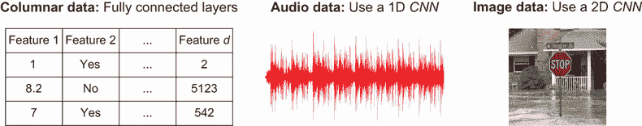

图 3.1 列式数据（可以放入电子表格中的数据）应使用全连接层，因为数据没有结构，全连接层不会传递先验信念。音频和图像具有与卷积神经网络观察世界的方式相匹配的空间属性，因此对于这类数据，你应该几乎总是使用卷积神经网络。听一本书很难，所以我们还是坚持使用图像而不是音频。

有几种方法可以将我们已知（或相信）的问题结构编码到神经网络中，而且这个列表还在不断增长。现在，我们将讨论占主导地位的基于图像的世界的卷积神经网络（CNN）。首先，我们需要了解如何在 PyTorch 中将图像及其结构编码为张量，这样我们才能理解卷积如何使用这种结构。之前，我们的输入没有结构。我们的数据可以用一个(*N*,*D*)矩阵来表示，其中 N 是数据点，D 是特征。我们可以重新排列特征的顺序，这样做不会改变数据的含义，因为数据组织没有结构或重要性。唯一重要的是，如果列 j 对应一个特定的特征，我们总是将那个特征的价值放在列 j 中（即，我们只需要保持一致）。

然而，图像是有结构的。像素之间存在顺序。如果你打乱了像素的顺序，你将从根本上改变图片的意义。实际上，如果你这样做，你可能会得到一个无法理解的图像。图 3.2 展示了这是如何工作的。

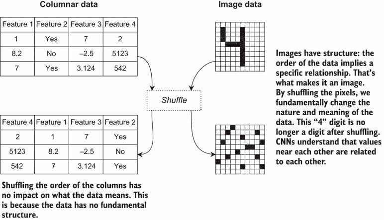

图 3.2 打乱你的数据将破坏你的数据结构。左：对于列式数据，打乱没有实际影响，因为数据没有特殊结构。右：当图像被打乱时，它就不再可识别。图像的结构性质在于相邻像素之间相互关联。卷积神经网络编码了这样一个想法：彼此靠近的项是相关的，这使得卷积神经网络非常适合图像。

假设我们拥有 N 张图像，每张图像的高度为 H，宽度为 W。作为一个起点，我们可能会考虑一个图像数据的矩阵形状

(*N*,*W*,*H*)

这给我们一个三维张量。如果我们只有黑白图像，这将是可行的。但彩色图像怎么办？我们需要在我们的表示中添加一些*通道*。每个通道具有相同的宽度和高度，但代表不同的感知概念。颜色通常使用红色、绿色和蓝色（RGB）*通道*来表示，我们通过混合红色、绿色和蓝色来创建最终的彩色图像。这如图 3.3 所示。

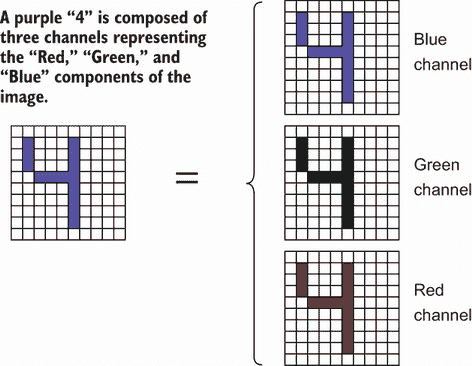

图 3.3 中的彩色图像由三个相同大小的子图像表示，称为*通道*。每个通道代表一个不同的概念，最常见的是红色、绿色和蓝色（RGB）。一般来说，每个通道代表不同位置的不同类型的特征。

为了包含颜色，我们需要向张量添加一个通道维度：

(*N*,*C*,*W*,*H*)

现在我们有一个具有结构的四维张量。通过*结构*，我们指的是张量的轴和访问数据的顺序具有特定的含义（我们不能随意调整它们）。如果`x`是一批彩色图像，`x[3,2,0,0]`表示，“从第四张图像（*N*=3）中获取左上像素（0,0）的蓝色值（*C*=2）。”或者，我们可以使用`x[3,:,0,0]`获取红色、绿色和蓝色值。这意味着我们在处理位置 i 和 j 的像素值；我们知道我们需要访问索引`x[:,:,i,j]`。更重要的是，我们需要了解*右下角相邻像素*的信息，我们可以使用`x[:,:,i+1,j+1]`来访问。由于输入是*结构化的*，无论 i 和 j 的值如何，这都是正确的。卷积使用这种方法，当卷积查看图像中位置*i*、*j*的像素时，它也可以考虑相邻像素的位置。

注意 RGB 是图像最常用的标准，但并非唯一选项。其他流行的数据表示方法使用色调、饱和度和值（HSV）以及青色、品红色、黄色和黑色（即黑色）（CMYK）。这些标准通常被称为*颜色空间*。

### 3.1.1 使用 PyTorch 加载 MNIST

尽管这已经有点陈词滥调，但我们将从无处不在的 MNIST 数据集开始探索这一切的含义。这是一个包含 0 到 9 数字的黑白图像集合；每个图像宽度为 28 像素，高度为 28 像素。PyTorch 在名为`torchvision`的包中提供了一个方便的加载器来处理这个数据集。如果你用 PyTorch 处理图像，你几乎肯定想使用这个包。尽管 MNIST 是一个玩具问题，但我们将在大多数章节中使用它，因为它允许我们在几分钟内运行示例，而真实数据集则需要数小时甚至数周才能完成一次运行。我已经设计这些章节，以便你将学到的方法和经验可以应用到实际问题中。

我们如下加载`torchvision`包：

```
import torchvision 
from torchvision import transforms
```

现在我们可以使用以下代码加载 MNIST 数据集。第一个参数 `./data` 告诉 PyTorch 我们希望数据存储在哪里，`download=True` 表示如果数据集尚未存在，则下载数据集。MNIST 有预定义的训练和测试分割，我们可以通过将 `train` 标志设置为 `True` 或 `False` 分别获取：

```
    mnist_data_train = torchvision.datasets.MNIST("./data", train=True, 
    ➥ download=True) 
    mnist_data_test = torchvision.datasets.MNIST("./data", train=False, 
    ➥ download=True) 
    x_example, y_example = mnist_data_train[0]
    type(x_example)

[5]: PIL.Image.Image
```

现在，你会注意到返回的数据的 `type` 并不是一个张量。我们得到一个 `PIL.Image.Image` ([`pillow.readthedocs.io/en/stable`](https://pillow.readthedocs.io/en/stable))，因为数据集 *是* 图像。我们需要使用一个 `transform` 将图像转换为张量，这就是为什么我们从 `torchvision` 导入 `transforms` 包。我们可以简单地指定 `ToTensor` 转换，它将 Python Imaging Library (PIL) 图像转换为 PyTorch 张量，其中最小可能值是 0.0，最大值是 1.0，因此它已经在我们可工作的良好数值范围内。让我们现在重新定义这些数据集对象来做这件事。只需在方法调用中添加 `transform=transforms.ToTensor()` 即可，如下所示，其中我们加载训练和测试分割并打印训练集第一个示例的形状：

```
mnist_data_train = torchvision.datasets.MNIST("./data", train=True, 
➥ download=True, transform=transforms.ToTensor()) 
mnist_data_test = torchvision.datasets.MNIST("./data", train=False, 
➥ download=True, transform=transforms.ToTensor()) 
x_example, y_example = mnist_data_train[0] 
print(x_example.shape)

torch.Size([1, 28, 28])
```

我们已经从数据集中获取了一个单独的示例，它对于 *C* = 1 个通道（它是黑白图像）的宽度和高度为 28 像素，形状为 (1,28,28)。如果我们想可视化一个图像的张量表示，该图像是灰度的，`imshow` 期望它只有宽度和高度（即形状为 (*W*,*H*)）。`imshow` 函数还需要我们明确地告诉它使用灰度。为什么？因为 `imshow` 是为更广泛的科学可视化设计的，你可能希望有其他选项：

```
    imshow(x_example[0,:], cmap=’gray’)

[7]: <matplotlib.image.AxesImage at 0x7f6a1fea3090>
```


好的，很明显，那是一个数字 5。由于我们正在学习图像如何表示为张量，让我们做一个彩色版本。如果我们把相同的数字堆叠在顶部，我们将得到一个形状为 (3,28,28) 的张量。因为张量的 *结构* 有意义，这立即使它成为一个彩色图像，因为它有三个通道。下面的代码正是这样做的，将第一张灰度图像堆叠三次并打印其形状：

```
x_as_color = torch.stack([x_example[0,:], x_example[0,:], x_example[0,:]],
➥ dim=0) 
print(x_as_color.shape)

torch.Size([3, 28, 28])
```

现在我们来可视化彩色版本。这里我们需要稍微小心一点。在 PyTorch 中，一个图像表示为 (*N*,*C*,*W*,*H*),²，但 `imshow` 期望一个单独的图像为 (*W*,*H*,*C*)。因此，在使用 `imshow` 时我们需要对维度进行 *置换*。如果我们的张量有 r 个维度，`permute` 函数需要 r 个输入：原始张量在 *新顺序* 中出现的索引 0, 1, …, *r* − 1。由于我们的图像当前是 (*C*,*W*,*H*)，保持这个顺序意味着 (0,1,2)。我们希望索引 0 的通道成为最后一个维度，宽度优先，高度其次，即 (1,2,0)。让我们试试：

```
    imshow(x_as_color.permute(1,2,0))

[9]: <matplotlib.image.AxesImage at 0x7f6b681c60d0>
```

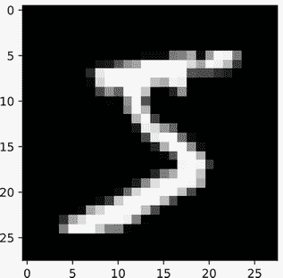

为什么这张*彩色*图像仍然是黑白的？因为原始图像是黑白的。我们在红色、绿色和蓝色通道中复制了相同的值，这就是如何在彩色图像中表示黑白图像。如果我们清零红色和蓝色通道，我们得到一个绿色的数字：

```
    x_as_color = torch.stack([x_example[0,:], x_example[0,:], x_example[0,:]])
    x_as_color[0,:] = 0 ❶
    x_as_color[2,:] = 0 ❷
    imshow(x_as_color.permute(1,2,0))

[10]: <matplotlib.image.AxesImage at 0x7f6a1fc8b810>
```

❶ 没有红色。我们让绿色保持不变。

❷ 没有蓝色

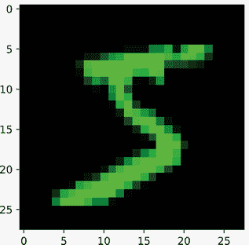

改变这张图像的颜色是

+   不同的通道如何影响数据所代表的内容

+   这意味着这是一种*结构化*的数据表示

为了确保这两点清晰，让我们将三幅不同的图像堆叠成一幅彩色图像。我们将重复使用堆叠中第一幅图像中的相同数字 5。它将进入红色通道，因此我们应该看到红色 5 与两个其他数字混合，分别是绿色和蓝色：

```
    x1, x2, x3 = mnist_data_train[0], mnist_data_train[1], 
    ➥ mnist_data_train[2]                    ❶

    x1, x2, x3 = x1[0], x2[0], x3[0]          ❷

    x_as_color = torch.stack([x1[0,:], x2[0,:], x3[0,:]], dim=0) 
    imshow(x_as_color.permute(1,2,0))

[11]: <matplotlib.image.AxesImage at 0x7f6a1fc00650>
```

❶ 捕获 3 个图像

❷ 丢弃标签

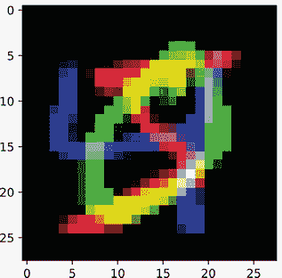

您应该看到一个红色的 5，一个绿色的 0 和一个蓝色的 4。在两幅图像重叠的地方，颜色混合了，因为它们被放置在不同的颜色通道中。例如，在中间，4 和 5 相交，红色+蓝色=紫色。数据顺序有意义，我们不能随意重新排序，否则可能会破坏结构，从而破坏数据。

让我们更明确地看看这个问题。如果我们在一个通道内打乱数据，会发生什么？它是否仍然具有相同的重要结构意义？让我们最后一次看看数字 5，但随机打乱张量中的值：

```
    rand_order = torch.randperm(x_example.shape[1] * x_example.shape[2]) 
    x_shuffled = x_example.view(-1)[rand_order].view(x_example.shape) 
    imshow(x_shuffled[0,:], cmap=’gray’)

[11]: <matplotlib.image.AxesImage at 0x7f6a1fb72cd0>
```

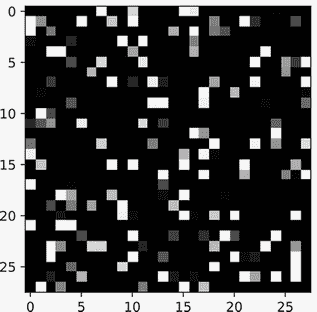

如您所见，这完全改变了图像的意义。它不再是 5，实际上什么都没有。一个值的地理位置及其*邻近值*本质上是该值意义的一部分。一个像素的值不能与其邻居分离。这是我们试图在本章中捕捉的*结构化空间先验*。现在我们已经学会了如何用张量表示图像的结构，我们可以学习卷积来利用这种结构。

## 3.2 卷积是什么？

现在我们有了像图像一样的数据形状，我们该改变什么？我们希望在模型中放入一个*先验*：*空间关系*。卷积编码的先验是*相邻的事物相关，而远离的事物没有关系*。想想上一节中数字 5 的图片。选择任何一个黑色像素：它的大多数邻近像素也是黑色的。选择任何一个白色像素：它的大多数邻居是白色或白色色调。这是一种空间相关性。这实际上并不重要发生在图像的哪个位置，因为这种*图像的本质*使得它倾向于*无处不在*发生。

*卷积*是一个有两个输入的数学函数。卷积接受一个*输入*图像和一个*滤波器*（也称为*核*），并输出一个新图像。目标是让滤波器从输入中识别某些模式并在输出中突出显示它们。卷积可以用于对具有 r 维的任何张量施加空间先验；图 3.4 中展示了简单的一个例子。现在，我们只是试图了解卷积的作用——我们稍后会了解它是如何工作的。

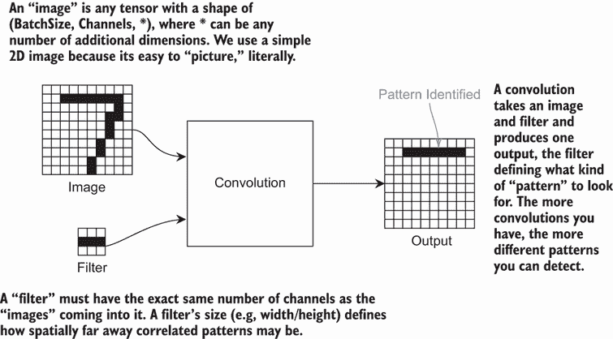

图 3.4 卷积的示例。输入图像和滤波器通过卷积结合。输出是一个经过修改的新图像。滤波器的目的是识别或识别输入中的某些模式。在这个例子中，滤波器识别了数字 7 顶部的水平线。

虽然我们一直在提到*图像*，但卷积并不局限于只处理二维数据。为了帮助我们理解卷积是如何工作的，我们将从一个一维例子开始，因为这使数学更容易理解。一旦我们理解了一维卷积，我们用于图像的二维版本将很快跟上。因为我们想要创建多个卷积层，我们还将学习*填充*，这对于此目的来说是必要的。最后，我们将讨论权重共享，这是一种在本书中重新出现的关于卷积的不同思考方式。

### 3.2.1 一维卷积

要了解卷积是如何工作的，我们先从一维图像说起，因为在一维中比在二维中更容易展示细节。一维图像的形状为(*C*,*W*)，代表通道数和宽度。没有高度，因为我们只讨论一维，而不是二维。对于一个形状为(*C*,*W*)的一维输入，我们可以定义一个形状为(*C*,*K*)的滤波器。我们可以选择 K 的值，并且需要 C 在图像和滤波器之间匹配。由于通道数必须*始终*匹配，我们简称这种滤波器为“大小为 K 的滤波器”。如果我们将大小为 K 的滤波器应用于形状为(*C*,*W*)的输入，我们得到一个形状为(*C*,*W*−2⋅⌊*K*/2⌋)的输出。³ 让我们看看图 3.5 中它是如何工作的。

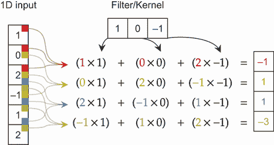

图 3.5 一个一维输入“1, 0, 2, –1, 1, 2”与滤波器“1, 0, –1”进行卷积。这意味着我们取输入项的每个长度为三的子序列，将这些项与滤波器值相乘，然后将结果相加。

左边是一个形状为(1,6)的输入，我们正在应用一个大小为 3 的过滤器，其值为[1,0,−1]。输出在右边。对于每个输出，你可以看到箭头指向该输出对应的*空间相关*输入。所以对于第一个输出，− 1，只有前三个输入是相关的；输入中的其他内容不会影响该特定输出。其值是通过将前三个输入与核中的三个值相乘然后求和来计算的。输出的第二个值是通过使用第二组三个输入值来计算的。注意，它*总是*使用过滤器中的相同三个值，应用于输入的每个位置。以下代码展示了如何在原始 Python 中实现这一点：

```
filter = [1, 0, -1] 
input = [1, 0, 2, -1, 1, 2] 
output = [] 
for i in range(len(input)-len(filter)):      ❶
    result = 0 
    for j in range(len(filter)):             ❷
        result += input[i+j]*filter[j]
    output.append(result)                    ❸
```

❶ 将过滤器滑过输入

❷ 在此位置应用过滤器

❸ 输出已准备好使用。

实际上，我们在输入的每个位置上滑动过滤器，计算每个位置的一个值，并将其存储在输出中。这就是卷积的含义。由于输入边缘的值不足，输出的大小减少了 2 ⋅ ⌊3/2⌋。接下来，我们将展示如何在 2D 中实现这一点，然后我们将拥有 CNN 的基础。

### 3.2.2 2D 卷积

随着我们张量中维度 r 数量的增加，卷积的概念及其工作方式保持不变：我们在输入周围滑动一个过滤器，将过滤器中的值与图像的每个区域相乘，然后求和。我们只需使过滤器形状相应匹配。让我们看看一个与我们将尝试处理的图像相一致的 2D 示例：图 3.6 介绍了⊛运算符，它表示*卷积*。

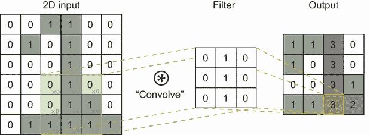

图 3.6 一个数字 1 与 2D 过滤器卷积的图像。绿色区域显示了当前正在卷积的图像部分，过滤器中的值以浅蓝色显示。输出中的结果显示为橙色。通过将绿色/橙色区域在整个图像上滑动，你将产生输出结果。

再次，2D 输出是通过在每个位置将过滤器值（成对）相乘然后求和得到的。输入中突出显示的区域用于创建输出中的值。在输入单元格的右下角，你可以看到我们正在乘以的过滤器值。在深度学习中，我们几乎总是使用方形过滤器，这意味着过滤器的所有 r 维都有相同数量的值。因此，在这种情况下，我们可以称之为大小为 K 的 2D 过滤器，或者简称为 K。在这种情况下，*K* = 3。2D 卷积的代码将循环次数加倍：

```
filter = [[0, 1, 0], [0, 1, 0], [0, 1, 0]] 
input = [[0,0,1,1,0,0], 
         [...], 
         [0,1,1,1,1,1] 
        ]
height, width = len(input), len(input[0]) 
output = [] 
for i in range(height-len(filter)):                 ❶
    row_out = [] for j in range(width-len(filter)): ❷
        result = 0 for k_i in range(len(filter)):   ❸
        for k_j in range(len(filter)): 
            result += input[i+k_i][j+k_j]*filter[k_i][k_j]
        row_out.append(result)                      ❹
    output.append(row_out)                          ❺
```

❶ 将过滤器滑过行

❷ 将过滤器滑过列

❸ 在此位置应用过滤器

❹ 构建输出行

❺ 将行添加到最终输出。输出已准备好使用。

由于这个二维输入的形状为 (1,6,6) 且核的形状为 (1,3,3)，我们将宽度和高度缩小 2 ⋅ ⌊3/2⌋ = 2。这意味着高度是 6 像素 − 2 = 4 像素，我们得到的宽度结果相同：6 − 2 = 4 像素宽。我们现在有了 CNN 图像分类的基础操作。

### 3.2.3  填充

注意，每次我们应用卷积时，输出都会比原始输入更瘦更长。这意味着如果我们不断地应用卷积，最终我们将一无所有。这不是我们想要的，因为我们将会创建多个卷积层。大多数现代深度学习设计实践都保持输入和输出大小相同，这样我们就可以更容易地推理我们网络的形状，并且可以将其做得尽可能深，而不用担心输入会消失。解决方案称为*填充*。你应该几乎总是默认使用填充，这样你就可以在不改变张量形状的情况下更改你的架构。图 3.7 展示了这对于相同的二维图像是如何工作的。

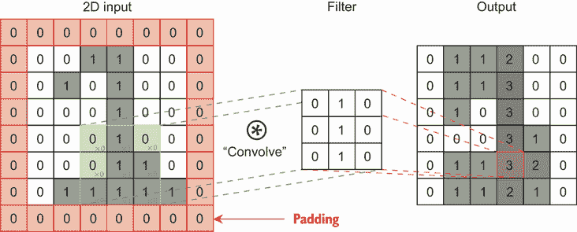

图 3.7 与之前相同的卷积，具有相同的输入和滤波器——但是输入被填充了值为 0 的像素，使图像在每个方向上变大一个像素。这导致输出图像的宽度和高度与原始图像相同。

我们在图像周围添加了一行/列的零，并像它实际上更大一样处理它。这个特定的例子称为*零填充一次*，因为我们向图像的所有边缘添加了一个值，而这个值被填充为 0。如果我们使用大小为 K 的卷积滤波器，我们可以使用 ⌊*K*/2⌋ 的填充来确保我们的输出保持与输入相同的大小。再次强调，尽管高度和宽度可以填充到不同的程度，但我们通常在每个维度上使用相同的填充量，因为我们的滤波器在每个维度上具有相同的大小。

### 3.2.4  权重共享

另一种思考卷积的方法，引入了一个重要的概念，称为*权重共享*。让我们再次看看一维情况，因为它更容易编写代码。想象你有一个神经网络 *f*Θ，其参数（或*权重*）为 Θ，它接收一个具有 K 个特征的输入向量 z，**z** ∈ ℝ^K。现在假设我们有一个更大的输入 x，具有 *C* = 1 个通道和 D 个特征，其中 *D* > *K*。我们不能在 x 上使用 *f*Θ，因为形状 *D* ≠ *K* 不匹配。

我们可以将网络 *f*Θ 应用到这个更大的数据集的一种方法是将网络*滑动*到输入的切片上，并*共享*每个位置的权重 Θ。一些 Python 伪代码如下所示：

```
x = torch.rand(D) ❶
output = torch.zeros(D-K//2*2) 
for i in range(output.shape[0]): 
    output[i] = f(x[i:i+K], theta)
```

❶ 一些输入向量

现在，如果我们定义我们的网络为`f = nn.Linear(K, 1)`，它将实现*精确的 1D 卷积*。这个洞察力可以教会我们一些关于卷积的重要性质以及如何使用它们来设计深度神经网络。目前，这教会我们的主要事情是，*卷积是线性操作，在空间上工作*。就像上一章中的`nn.Linear`层一样，一个卷积后面跟着第二个卷积相当于一个稍微不同的卷积。这意味着：

+   永远不要重复卷积，因为这样做是多余的。

+   在使用卷积后包含一个非线性激活函数。

注意：如果我们有一个大小为（1,3,5）的矩形核，输出图像的宽度将是输入宽度的 2 ⋅ ⌊3/2⌋ = 2 个像素更小。输出图像的高度将是 2 ⋅ ⌊5/2⌋ = 4，每边减去*两个*像素。虽然矩形核是可能的，但很少使用。同时请注意，我们一直使用的是*奇数大小*的核——没有能被 2 整除的。这主要是因为表示上的方便，因为过滤器使用输入的精确中心来产生每个输出。像矩形核一样，偶数大小的过滤器也是可能的，但很少使用。

## 3.3 卷积如何有利于图像处理

我们已经花费了很多时间讨论卷积是什么。现在，是时候看看它们能做什么了。卷积在计算机视觉应用中有着丰富的历史；只要我们选择合适的核，这个简单的操作就可以定义许多有用的东西。

首先，让我们再次查看 MNIST 中数字 4 的*特定*图像。我们加载 SciPy 的`convolve`函数并定义`img_index`，这样你就可以更改你正在处理的图像，并看到这些卷积在其他输入上的工作方式：

```
    from scipy.signal import convolve 
    img_indx = 58 img =
    mnist_data_train[img_indx][0][0,:] 
    plt.imshow(img, vmin=0, vmax=1, cmap=’gray’)

[13]: <matplotlib.image.AxesImage at 0x7f6a1f963b50>
```

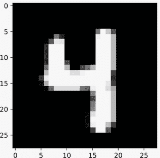

一种常见的计算机视觉操作是对图像进行*模糊*。模糊涉及取局部平均像素值并用其邻居的平均值替换每个像素。这可以用来消除小的噪声伪影或软化锐利的边缘。这是通过一个*模糊核*完成的，其中

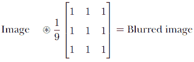

我们可以将这个数学公式直接转换为代码。矩阵是通过`np.asarray`调用的，我们已经加载了图像，卷积操作⊛是通过`convolve`函数完成的。当我们展示输出图像时，我们得到数字 4 的模糊版本：

```
blur_filter = np.asarray([[1,1,1], 
                          [1,1,1], 
                          [1,1,1] 
                         ])/9.0
blurry_img = convolve(img, blur_filter) 
plt.imshow(blurry_img, vmin=0, vmax=1, cmap=’gray’) 
plt.show()
```

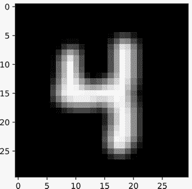

卷积的一个特别常见的应用是执行 *边缘检测*。在任何计算机视觉应用中，知道边缘在哪里都是很好的。它们可以帮助你确定道路的边缘在哪里（你希望你的车保持在车道内）或者找到物体（不同形状的边缘容易识别）。在这个 4 的例子中，边缘是数字的轮廓。所以如果图像局部区域的所有像素都是 *相同* 的，我们希望所有内容都相互抵消，结果没有输出。我们只希望在存在局部变化时才有输出。再次强调，这可以描述为一个核，其中当前像素周围的所有内容都是负的，中心像素的权重与所有邻居相同：

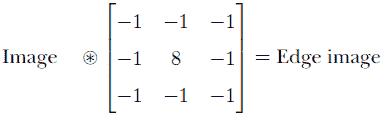

此过滤器在像素周围所有内容都与自身不同时达到最大值。让我们看看会发生什么：

```
edge_filter = np.asarray([[-1,-1,-1], ❶ 
                          [-1, 8,-1], 
                          [-1,-1,-1]
                         ])
edge_img = convolve(img, edge_filter) 
plt.imshow(edge_img, vmin=0, vmax=1, cmap=’gray’) 
plt.show()
```

❶ 我们可以通过关注像素与其邻居之间的差异来找到边缘。


正如承诺的那样，滤波器找到了数字的边缘。响应只发生在边缘，因为那里变化最大。在数字外部没有响应，因为中心的高权重抵消了所有邻居，这在数字的 *内部* 区域也是正确的。因此，我们现在已经找到了图像中的所有边缘。

我们还可能想要寻找特定角度的边缘。如果我们将自己限制在 3 × 3 核，最容易找到水平和垂直边缘。让我们通过使滤波器水平方向上的核值改变符号来创建一个用于水平边缘的滤波器：

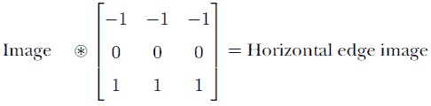

```
h_edge_filter = np.asarray([[-1,-1,-1], ❶
                            [0, 0,0], 
                            [1, 1, 1]
                           ])
h_edge_img = convolve(img, h_edge_filter) 
plt.imshow(h_edge_img, vmin=0, vmax=1, cmap=’gray’) 
plt.show()
```

❶ 我们可以只寻找水平边缘。

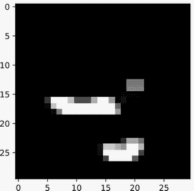

我们只识别了图像的水平边缘，主要是 4 的底部横条。随着我们定义更有用的核，你可以想象我们如何组合 *组合* 滤波器来开始识别更高级的概念。想象一下，如果我们只有垂直和水平滤波器：我们无法分类所有 10 个数字，但图 3.8 显示了我们可以如何缩小答案。

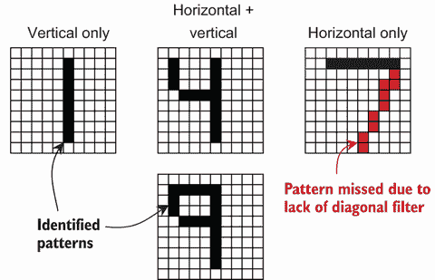

图 3.8 仅具有垂直和水平边缘滤波器的示例。如果只有垂直滤波器开启，我们可能正在查看数字 1。如果只有水平滤波器开启，我们可能正在查看数字 7，但我们希望有一个额外的对角线滤波器来帮助我们确认。如果水平和垂直滤波器都响应，我们可能正在查看数字 4 或 9；没有更多的滤波器很难判断。

在许多年代中，手动设计所有可能需要的过滤器是计算机视觉的一个重要部分。在卷积之上进行卷积也可以识别更大的概念：例如，在我们识别了水平和垂直边缘之后，一个新的过滤器可能将这些作为输入，并寻找中心有一个水平边缘在上、侧面有一个垂直边缘的空隙。这将得到一个类似 O 的形状，可以区分 9 和 4。

然而，多亏了深度学习，我们不需要费尽心思去想象和测试我们可能需要的所有过滤器。相反，我们可以让神经网络自己学习过滤器。这样，我们节省了自己繁重的过程，并且核函数针对我们关心的特定问题进行了优化。

## 3.4 实践应用：我们的第一个 CNN

既然我们已经讨论了什么是卷积，让我们看看一些数学符号和 PyTorch 代码。我们看到了我们可以取一个图像 *I* ∈ ℝ^(*C*, *W*, *H*) 并使用一个过滤器 *g* ∈ *R*^(*C*, *K*, *K*) 进行卷积，以得到一个新的结果图像 ℝ^(*W*′, *H*′)。我们可以用数学公式表示为


这意味着每个过滤器都会单独查看其上的所有 C 输入通道。图 3.9 展示了使用 1D 输入示例，因为它更容易可视化。

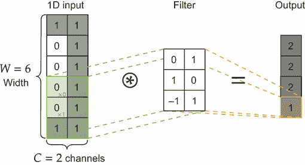

图 3.9 1D 卷积具有两个通道的示例。因为有两个通道，1D 输入看起来像一个矩阵，有两个轴。过滤器也有两个轴，每个通道一个。这个过滤器从上到下滑动，并产生一个输出通道。一个过滤器总是产生一个输出通道，无论有多少输入通道。

因为输入的形状为 (*C*,*W*)，所以过滤器的形状为 (*C*,*K*)。因此，当输入有多个通道时，核将分别为每个通道单独有一个值。这意味着对于彩色图像，我们可以在一个操作中找到一个过滤器，它寻找“红色水平线、蓝色垂直线，没有绿色”。但这也意味着在应用 *一个过滤器* 之后，我们得到 *一个输出*。

### 3.4.1 使用多个过滤器构建卷积层

考虑到前面的示例，我们可能需要不止一个过滤器。我们想要 *C*[out] 个不同的过滤器；让我们用 *C*[in] 来表示输入中的通道数。在这种情况下，我们有一个表示所有过滤器的张量 *G* ∈ ℝ^(*C*[out], *C*[in], *K*, *K*)，因此当我们写 *R* = *I* ⊛ *G* 时，我们得到一个新的结果 *R* ∈ ℝ^(*K*, *W*′, *H*′)。

我们如何将这个数学符号转换为使用多个过滤器 G 对输入图像 I 进行卷积？PyTorch 提供了`nn.Conv1d`、`nn.Conv2d`和`nn.Conv3d`函数来处理这个问题。这些函数中的每一个都实现了一个卷积层，用于一维、二维和三维数据。图 3.10 展示了作为一个机械过程正在发生的事情。

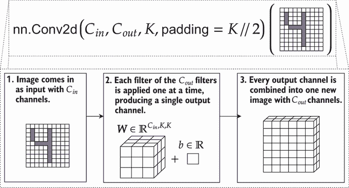

图 3.10 `nn.Conv2d`函数定义了一个卷积层，并在三个步骤中工作。首先，它接受一个输入图像，该图像具有*C*[in]通道。作为构建的一部分，`nn.Conv2d`接受要使用的过滤器数量：*C*[out]。每个过滤器依次应用于输入，并将结果组合。因此，输入张量的形状是(*B*,*C*[in],*W*,*H*)，输出张量的形状为(*B*,*C*[out],*W*,*H*)。

所有三种标准卷积大小都使用相同的过程：`Conv1d`处理形状为（Batch, Channels, Width）的张量，`Conv2d`处理形状为（Batch, Channels, Width, Height）的张量，而`Conv2d`处理形状为（Batch, Channels, Width, Height, Depth）的张量。输入中的通道数是*C*[in]，卷积层由*C*[out]个过滤器/核组成。由于每个过滤器产生一个输出通道，因此该层的输出具有*C*[out]个通道。值 K 定义了正在使用的核的大小。

### 3.4.2 使用每层多个过滤器

为了帮助大家更好地理解这个过程，让我们深入探讨并详细展示整个过程的全部步骤。图 3.11 展示了输入图像（*C*[in] = 3，*C*[out] = 2，*K* = 3）的所有步骤和数学计算。

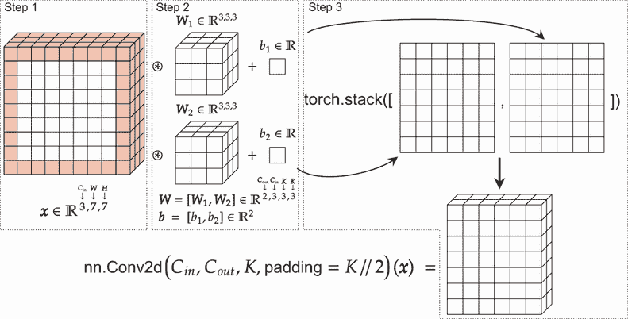

图 3.11 示例展示了如何将卷积应用于单个图像的多个通道。左：输入图像，红色显示填充。中：两个过滤器（*W*[1]和*W*[2]）的参数（及其相关的偏置项，*b*[1]，*b*[2]）。每个过滤器依次与输入进行卷积以产生一个通道。右：结果堆叠以创建一个新图像，该图像具有两个通道，每个通道对应一个过滤器。这个过程由 PyTorch 的`nn.Conv2d`类为我们完成。

输入图像具有*C*[in] = 3 个通道，我们将使用`nn.Conv2d(C_in, C_out, 3, padding=3//2)(x) = output`对其进行处理。由于*C*[out] = 2，这意味着我们使用两个*不同*的过滤器处理输入，为每个位置添加偏置项，并得到两个具有与原始图像相同高度和宽度的结果图像（因为我们使用了填充）。由于我们指定*C*[out] = 2，结果被堆叠成一个具有两个通道的更大的单张图像。

### 3.4.3 通过展平将卷积层与线性层混合

当我们有一个全连接层时，我们为单个隐藏层（n 个隐藏单元/神经元）编写了如图 3.12 所示的图。我们用来描述一个具有一个*卷积*隐藏层的网络的数学符号非常相似：

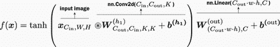

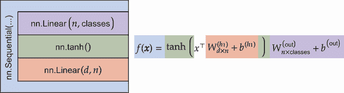

图 3.12 全连接网络中的一个隐藏层。左：与右侧方程匹配的 PyTorch `Module`。颜色显示哪个`Module`映射到方程的哪个部分。

那个方程可能看起来有点吓人，但如果我们放慢速度，其实并不那么糟糕。它之所以令人畏惧，是因为我们在方程中包含了每个张量的形状，并标注了我们的新 `nn.Conv2d` `module` 如何发挥作用。我们包含形状信息是为了让您了解我们如何处理不同大小的输入——如果我们去掉那些额外细节，它看起来就不会那么吓人：

*f*(**x**) = tanh(**x**⊛**W**^((*h*[1]))+**b**^((*h*[1])))**W**^((out)) + **b**^(**(**out**)**)       **(3.1)**

现在很清楚，我们唯一改变的是将点积（一个由 {}^⊤ 表示的线性操作）替换为卷积（一个由 ⊛ 表示的空间线性操作）。

这几乎是完美的，但我们有一个问题：卷积的输出形状为 (*C*,*W*,*H*)，但我们的线性层 (**W**^((out)) + **b**^(**(**out**)**)) 预期的是形状为 (*C*×*W*×*H*) 的东西——那就是 *一个* 维度，其中包含了所有三个原始维度。本质上，我们需要将卷积的输出 *重塑*，以去除空间解释，这样我们的线性层就可以处理结果并计算一些预测；参见图 3.13。

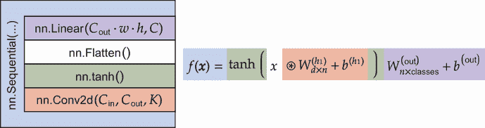

图 3.13 卷积网络中的一个隐藏层。左：与右侧方程匹配的 PyTorch `Module`。颜色显示哪个 `Module` 映射到方程的哪个部分。

这被称为 *展平*，是现代深度学习中的一种常见操作。我们可以认为上一页的方程 3.1 隐含地使用了这种展平操作。PyTorch 提供了一个名为 `nn.Flatten` 的 `module` 来执行此操作。我们通常将带有隐式偏差项的 *f*(**x**) = tanh (**x**⊛**W**^((*h*[1])))**W**^((out)) 写作。

### 3.4.4  PyTorch 首个 CNN 的代码

让我们最终定义一些用于训练基于 CNN 的模型的代码。首先，我们需要获取 CUDA 计算设备并为训练集和测试集创建一个 `DataLoader`。我们使用批大小 B 为 32：

```
if torch.cuda.is_available(): 
    device = torch.device("cuda") 
else:
    device = torch.device("cpu")

B = 32 
mnist_train_loader = DataLoader(mnist_data_train, batch_size=B, shuffle=True) 
mnist_test_loader = DataLoader(mnist_data_test, batch_size=B)
```

现在我们将定义一些变量。同样，由于 PyTorch 在数据批次中工作，当我们从 PyTorch 的角度思考时，我们的张量形状以 B 开头；由于输入由图像组成，初始形状是 (*B*,*C*,*W*,*H*)。我们定义了 *B* = 32，因为我们定义了它，*C* = 1，因为 MNIST 是黑白图像。我们将定义一些辅助变量，如 `K` 来表示我们的滤波器大小，以及 `filters` 来表示我们想要构建的滤波器数量。

第一个模型是 `model_linear`，因为它只使用了 `nn.Linear` 层。它从调用 `nn.Flatten()` 开始。注意我们在代码中放入的特定注释 `#(B, C, W, H) -> (B, C*W*H) = (B,D)`：这是为了提醒我们，我们正在使用这个操作改变张量的形状。原始形状 (*B*,*C*,*W*,*H*) 在左边，新的形状 (*B*,*C*×*W*×*H*) 在右边。由于我们有变量 D 来表示特征的总数，我们还包括了一个关于它等于什么值的注释：`=(B,D)`。在编写代码时，很容易丢失张量的形状，这是引入错误的最简单方法之一。当张量的形状被改变时，我总是包括这样的注释。

```
D = 28*28                                 ❶

C = 1                                     ❷

classes = 10                              ❸

filters = 16                              ❹

K = 3                                     ❺

model_linear = nn.Sequential(             ❻
  nn.Flatten(), # (B, C, W, H) -> (B, C*W*H) = (B,D) 
  nn.Linear(D, 256), 
  nn.Tanh(), 
  nn.Linear(256, classes),
)

model_cnn = nn.Sequential(                ❼
  nn.Conv2d(C, filters, K, padding=K//2), ❽
  nn.Tanh(),                              ❾
  nn.Flatten(),                           ❿
  nn.Linear(filters*D, classes),
)
```

❶ 我们使用输入中的值数来帮助确定后续层的大小：28 * 28 图像。

❷ 输入中有多少个通道？

❸ 有多少个类别？

❹ 我们应该使用多少个过滤器？

❺ 我们应该使用多大的过滤器？

❻ 为了比较，让我们定义一个类似复杂性的线性模型。

❼ 简单的卷积网络。Conv2d 按照模式 Conv2d（输入通道数，输出通道数，滤波器大小）。

❽ *x* ⊛ *G*

❾ 激活函数作用于任何大小的张量。

❿ 从 (B, C, W, H) 转换为 (B, D)，这样我们就可以使用线性层。

`model_linear` 是一个简单的全连接层，我们可以用它来比较。我们的第一个 CNN 由 `model_cnn` 定义，我们使用 `nn.Conv2d` 模块输入一个卷积。然后我们可以像以前一样应用我们的非线性激活函数 tanh。我们只有在准备好使用 `nn.Linear` 层将张量减少为每个类的一组预测时才对张量进行一次展平。这就是为什么 `nn.Flatten()` 模块出现在调用 `nn.Linear` 之前的原因。

CNN 的表现是否优于全连接模型？让我们来看看。我们可以训练一个 CNN 和一个全连接模型，在测试集上测量精度，并查看每个时期的精度：

```
    loss_func = nn.CrossEntropyLoss() 
    cnn_results = train_simple_network(model_cnn, loss_func, 
    ➥ mnist_train_loader, test_loader=mnist_test_loader, 
    ➥ score_funcs={’Accuracy’: accuracy_score}, device=device, epochs=20) 
    fc_results = train_simple_network(model_linear, loss_func, 
    ➥ mnist_train_loader, test_loader=mnist_test_loader, 
    ➥ score_funcs={’Accuracy’: accuracy_score}, device=device, epochs=20)

    sns.lineplot(x=’epoch’, y=’test Accuracy’, data=cnn_results, label=’CNN’) 
    sns.lineplot(x=’epoch’, y=’test Accuracy’, data=fc_results, 
    ➥ label=’Fully Connected’)

[20]: <AxesSubplot:xlabel='epoch', ylabel='test Accuracy'>
```

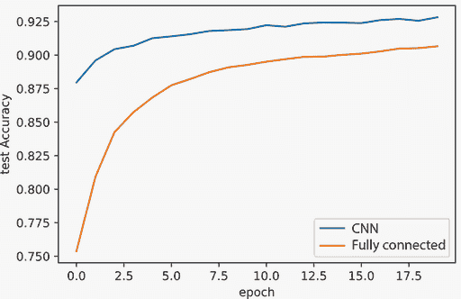

我们的 CNN 训练的一个时期比我们全连接网络所能达到的 *更好精度*。虽然我们的 CNN 训练速度大约慢了 1.138 倍，但结果是非常值得的。为什么它表现得如此出色？因为我们通过域的结构（数据由图像组成）向网络提供了关于问题的信息（卷积）。这并不意味着 CNN 总是更好的：如果 CNN 的假设不真实或不准确，它们将不会表现良好。记住，卷积传递了这样的先验信念：彼此靠近的事物是相关的，而彼此远离的事物则不是相关的。

## 3.5 添加池化以减轻物体移动

与前馈网络一样，我们可以通过堆叠更多带有非线性插入的层来使卷积网络更强大。但在我们这样做之前，我们喜欢与 CNN 一起使用的特殊类型的层，称为 *池化* 层。

池化帮助我们解决了我们没有充分利用数据空间性质的问题。这可能看起来有些令人困惑：我们刚刚通过简单地切换到`nn.Conv2d`显著提高了准确性，并且我们花了大量时间讨论卷积如何通过在输入上滑动一组权重并在每个位置应用它们来编码这种空间先验。问题是，我们*最终*切换到使用全连接层，它不理解数据的空间性质。因此，`nn.Linear`层学会在*非常特定*的位置寻找值（或对象）。

对于 MNIST 来说这不是一个大问题，因为所有的数字都是对齐的，所以它们位于图像的中心。但想象一下，一个数字没有与你的图像完美对齐的情况。这是一个非常真实的问题——池化可以帮助我们解决这个问题。让我们快速从 MNIST 数据集中获取一张图片，并通过将其内容向上或向下移动一个像素来创建两个修改过的版本：

```
img_indx = 0 
img, correct_class = mnist_data_train[img_indx] 
img = img[0,:] 
img_lr = np.roll(np.roll(img, 1, axis=1), 1, axis=0)   ❶
img_ul = np.roll(np.roll(img, -1, axis=1), -1, axis=0)

f, axarr = plt.subplots(1,3)                           ❷
axarr[0].imshow(img, cmap=’gray’) 
axarr[1].imshow(img_lr, cmap=’gray’) 
axarr[2].imshow(img_ul, cmap=’gray’) 
plt.show()
```

❶ 移动到右下角，然后是左上角

❷ 绘制图像

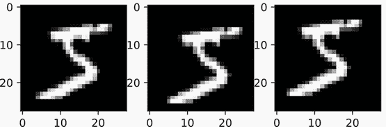

显然，所有三个版本的图像都是相同的数字。我们向上或向下、向左或向右移动内容仅几个像素并不重要。*但我们的模型并不知道这一点*。如果我们对图像的不同版本进行分类，有很大可能会出错。

让我们快速将这个模型放入`eval()`模式，并编写一个函数来获取单个图像的预测。这发生在下面的`pred`函数中，它接受一个图像作为输入：

```
model = model_cnn.cpu().eval()       ❶

def pred(model, img): 
    with torch.no_grad():            ❷

        w, h = img.shape             ❸

    if not isinstance(img, torch.Tensor): 
        img = torch.tensor(img) 
    x = img.reshape(1,-1,w,h)        ❹

    logits = model(x)                ❺

    y_hat = F.softmax(logits, dim=1) ❻
return y_hat.numpy().flatten()       ❼
```

❶ 由于我们不在训练模式

❷ 评估时始终关闭梯度。

❸ 找到图像的宽度和高度

❹ 将其重塑为(B, C, W, H)

❺ 获取 logits

❻ 将 logits 转换为概率

❼ 将预测转换为 NumPy 数组

这是一种简单的方法将模型应用于*单个*图像。PyTorch 始终期望事物以批量的形式存在，所以我们重新调整输入以包含一个批处理维度，由于没有其他图像，这个维度等于 1。`if not isinstance`检查是一些防御性代码，你可以添加以确保你的代码对 NumPy 和 PyTorch 输入张量都有效。还要记住，我们使用的`CrossEntropy`损失函数隐式地处理 softmax。所以当我们使用`CrossEntropy`训练的模型时，我们需要调用`F.softmax`将输出转换为概率。

清理完这些，我们可以为三张图片都获取预测结果，看看图像的微小变化是否可以显著改变网络的预测。记住，每张图像都通过将图像向右下角或左上角移动一个像素来有所不同。直观上，我们预期变化非常小：

```
img_pred = pred(model, img) 
img_lr_pred = pred(model, img_lr) 
img_ul_pred = pred(model, img_ul)

print("Org Img Class {} Prob: ".format(correct_class), 
➥ img_pred[correct_class]) 
print("Lower Right Img Class {} Prob: ".format(correct_class), 
➥ img_lr_pred[correct_class]) 
print("Uper Left Img Class {} Prob: ".format(correct_class), 
➥ img_ul_pred[correct_class])

Org Img Class 5 Prob: 0.78159285
Lower Right Img Class 5 Prob: 0.44280732
Uper Left Img Class 5 Prob: 0.31534675
```

显然，我们希望所有三个示例都得到相同的分类。它们*本质上*是相同的图像，但输出从合理的自信和正确的 78.2%下降到错误的 31.5%。问题是，微小的移动或平移会导致预测发生显著变化。

我们希望的是一个称为*平移不变性*的性质。对属性 X 的不变性意味着我们的输出不会根据 X 的变化而变化。我们不希望平移（上下移动）改变我们的决策——我们希望具有平移不变性。

池化可以使我们获得部分平移不变性。具体来说，我们将查看*最大池化*。什么是最大池化？与卷积类似，我们在图像的多个位置应用相同的函数。我们通常坚持使用偶数大小的池化滤波器。正如其名所示，我们滑动`max`函数在图像周围。你可以将其描述为具有内核大小 K，这是从中选择最大值的窗口大小。这里的大不同之处在于，我们每次移动`max`函数时移动 K 像素，而在执行卷积时我们每次只移动 1 像素（见图 3.14）。

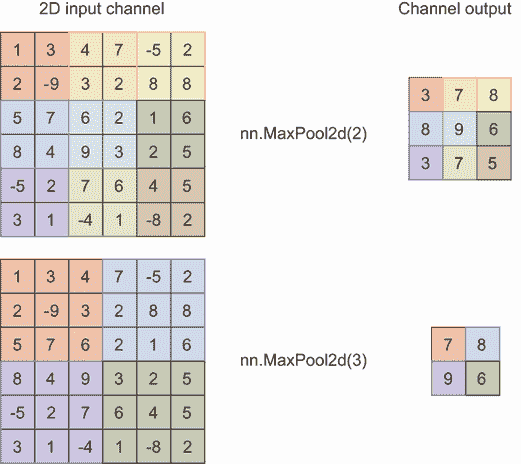

图 3.14 展示了最大池化的示例，其中*K* = 2（顶部）和*K* = 3（底部）。输入的每个区域（左侧）都有颜色表示参与池化的像素组，输出（右侧）显示从输入区域选择了哪个值。请注意，输出比输入小 K 倍。

选择滑动多少像素的选择称为*步长*。默认情况下，从业者倾向于使用`stride=1`进行卷积，以便评估*每个*可能的位置。我们使用`stride=K`进行池化，使输入缩小 K 倍。对于任何操作，如果你使用`stride=Z`（对于任何正整数 Z）的值，结果将沿每个维度缩小 Z 倍。

池化的直觉在于它使我们对值的微小变化具有更强的鲁棒性。考虑图 3.14 的左上角，如果你将每个值向右移动一个位置。五个输出值*不会改变*，这给池化操作带来了一定程度的对*平移*图像一个像素的*不变性*。这并不完美，但它有助于减少这种变化的影响。如果我们通过多轮池化累积这种效果，我们可以使效果更强。

就像之前一样，PyTorch 提供了`nn.MaxPool1d`、`nn.MaxPool2d`和`nn.MaxPool3d`来满足你几乎所有的需求。该函数接受内核大小作为输入，这同时也是步长。步长为 K 意味着我们将每个形状维度的尺寸缩小 K 倍。所以如果我们的输入形状为(*B*,*C*,*W*,*H*)，`nn.MaxPool2d(K)`的输出形状将为(*B*, *C*, *W*/*K*, *H*/*K*）。由于 C 保持不变，我们独立地对每个通道应用这个简单的操作。如果我们使用 2 × 2 的滤波器（大多数应用的规范）进行最大池化，我们最终得到一个四分之一大小的图像（行数和列数减半）。

### 3.5.1  CNNs with max pooling

向我们的模型定义中添加池化很容易：只需将`nn.MaxPool2d(2)`插入到`nn.Sequential`中即可。但*在哪里*使用最大池化呢？首先，让我们谈谈*应用多少次*最大池化。每次应用池化，都会将宽度（以及高度，如果是二维的话）缩小 K 倍。所以 n 轮池化意味着缩小到*K*ⁿ倍，这将使图像非常小。对于 MNIST，我们的宽度只有 28 像素，所以我们可以使用大小为*K* = 2 的最大池化进行最多四轮。这是因为五轮将给我们 28/2⁵ = 28/32，这*小于一个像素的输出*。

进行四轮池化是否更有意义？试着想象一下，如果这个问题是你被要求解决的。四轮池化意味着将图像缩小到仅 28/2⁴ = 28/16 = 1.75 像素高。如果你不能猜出用 1.75 像素表示的数字是什么，那么你的 CNN 可能也无法做到。通过视觉上缩小数据是一种很好的方法来估计你应该应用于大多数问题的最大池化量。对于高达 256 × 256 像素的图像，使用两到三轮池化是一个良好的初始下限或估计。

注意：大多数现代 CNN 应用都是在小于 256 × 256 的图像上。这对于现代 GPU 和技术来说处理起来非常大。实际上，如果你的图像大于这个尺寸，第一步是将它们调整大小，使任何维度上的像素数最多为 256。如果你真的*需要*在更高的分辨率下处理，你可能需要团队中有相关经验的人，因为在这个规模上工作的技巧是独特的，并且通常需要非常昂贵的硬件。

每次应用池化都会将图像缩小 K 倍，这也意味着在每轮池化之后，网络处理的数据更少。如果你处理的是非常大的图像，池化可以帮助减少训练更大模型所需的时间和训练的内存成本。如果你不认为这些问题是问题，那么在每轮池化之后增加滤波器的数量是常见的做法，增加的倍数为*K*，这样每层的总计算量大致保持不变（即，在行/列数量减半的情况下，增加两倍的滤波器数量可以平衡）。

让我们快速在我们的 MNIST 数据上尝试一下。以下代码定义了一个具有多层卷积和两轮最大池化的更深的 CNN：

```
model_cnn_pool = nn.Sequential( 
    nn.Conv2d(C, filters, 3, padding=3//2), 
    nn.Tanh(), 
    nn.Conv2d(filters, filters, 3, padding=3//2), 
    nn.Tanh(), 
    nn.Conv2d(filters, filters, 3, padding=3//2), 
    nn.Tanh(), 
    nn.MaxPool2d(2), 
    nn.Conv2d(filters, 2*filters, 3, padding=3//2), 
    nn.Tanh(), 
    nn.Conv2d(2*filters, 2*filters, 3, padding=3//2), 
    nn.Tanh(), 
    nn.Conv2d(2*filters, 2*filters, 3, padding=3//2), 
    nn.Tanh(), 
    nn.MaxPool2d(2),

    nn.Flatten(),
    nn.Linear(2*filters*D//(4**2), classes), ❶
)

cnn_results_with_pool = train_simple_network(model_cnn_pool, loss_func,
➥ mnist_train_loader, test_loader=mnist_test_loader,
➥ score_funcs={’Accuracy’: accuracy_score}, device=device, epochs=20)
```

❶ 为什么要将线性层中的单元数量减少到 4²倍？因为将 2×2 网格池化到单个值意味着从四个值减少到一个，我们这样做两次。

现在，如果我们将相同的偏移测试图像通过我们的模型，我们应该看到不同的结果。最大池化并不是解决翻译问题的**完美**解决方案，因此图像每个偏移版本的分数仍然会变化。但它们的变化**不那么大**。这总体上是一件好事，因为它使我们的模型对现实生活中的问题更加**鲁棒**。数据并不总是完美对齐，因此我们希望模型能够对我们在现实生活中的测试数据中预期看到的问题具有弹性：

```
model = model_cnn_pool.cpu().eval() 
img_pred = pred(model, img) 
img_lr_pred = pred(model, img_lr) 
img_ul_pred = pred(model, img_ul)

print("Org Img Class {} Prob: ".format(correct_class) , 
➥ img_pred[correct_class]) 
print("Lower Right Img Class {} Prob: ".format(correct_class) , 
➥ img_lr_pred[correct_class]) 
print("Uper Left Img Class {} Prob: ".format(correct_class) , 
➥ img_ul_pred[correct_class])

Org Img Class 5 Prob: 0.7068047
Lower Right Img Class 5 Prob: 0.71668524
Uper Left Img Class 5 Prob: 0.7311974
```

最后，我们可以查看我们训练的这个新的大网络的准确性，如下面的图表所示。增加更多层导致我们的网络收敛需要**更长**的时间，但一旦收敛，它就能获得略微更好的准确性：

```
    sns.lineplot(x=’epoch’, y=’test Accuracy’, data=cnn_results,
    ➥ label=’Simple CNN’)
    sns.lineplot(x=’epoch’, y=’test Accuracy’, data=cnn_results_with_pool,
    ➥ label=’CNN w/ Max Pooling’)

[27]: <AxesSubplot:xlabel='epoch', ylabel='test Accuracy'>
```

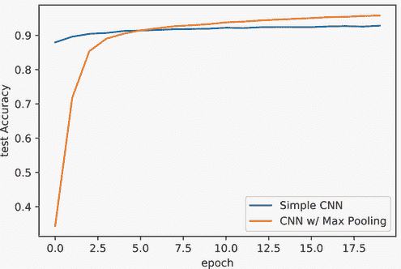

使用更多层通常会导致训练需要更长的时间来收敛，并且每个 epoch 的处理时间也会更长。这种双重打击只有通过使用更多层——使模型**更深**——才能得到缓解，这是我们通常获得最佳可能准确性的方法。如果你继续对这个更深的模型进行更多 epoch 的训练，你会看到它的准确度会继续提高，这超出了我们最初只包含一个`nn.Conv2d`层的模型所能达到的水平。

警告 就像冰淇淋一样，好事做得太多也会适得其反，使得网络太深以至于难以学习。在第五章和第六章中，你将学习到改进的技术，这些技术可以帮助你构建多达 100 到 200 层的网络——这大约是我们今天在仍然获得一些好处的情况下可以训练网络的深度极限。请注意，5 到 20 层通常已经足够，深度始终是计算成本和递减回报之间的权衡。

随着我们继续阅读本书，我们将了解一些新的、更好的方法，这些方法有助于解决这些问题，并使收敛更快、更好。但我希望带你走一条更慢、也有些痛苦的路径，这样你就能理解**为什么**这些新技术被开发出来，以及它们解决了哪些问题。这种更深入的理解将帮助你为在完成本书时我们将要处理的更高级技术做好准备。

## 3.6 数据增强

虽然可能有些令人失望，但现在你已经知道了一切，可以开始训练和构建用于新问题的 CNN 了。在 PyTorch 中实现 CNN 只需将`nn.Linear`层替换为`nn.Conv2d`，然后在结束时之前进行`nn.Flatten`。但应用 CNN 的实践中还有一个更大的秘密：使用**数据增强**。一般来说，神经网络是数据饥渴的，这意味着当你有大量**多样化**的数据时，它们学得最好。由于获取数据需要时间，因此我们将通过根据真实数据创建新的、虚假的数据来**增强**我们的真实数据。

这个想法很简单。如果我们处理的是 2D 图像，我们可以应用许多转换到图像上，这些转换不会改变其内容的含义，但会改变像素。例如，我们可以旋转图像几度而不改变其内容的含义。PyTorch 在`torchvision.transforms`包中提供了一系列转换；让我们看看其中的一些：

```
sample_transforms = {                  ❶

    "Rotation" : transforms.RandomAffine(degrees=45), 
    "Translation" : transforms.RandomAffine(degrees=0, translate=(0.1,0.1)), 
    "Shear": transforms.RandomAffine(degrees=0, shear=45), 
    "RandomCrop" : transforms.RandomCrop((20,20)), 
    "Horizontal Flip" : transforms.RandomHorizontalFlip(p=1.0), 
    "Vertical Flip": transforms.RandomVerticalFlip(p=1.0), 
    "Perspective": transforms.RandomPerspective(p=1.0), 
    "ColorJitter" : transforms.ColorJitter(brightness=0.9, contrast=0.9)
}
pil_img = transforms.ToPILImage()(img) ❷

f, axarr = plt.subplots(2,4)           ❸

for count, (name, t) in enumerate(sample_transforms.items()): 
    row = count % 4 
    col = count // 4 
    axarr[col,row].imshow(t(pil_img), cmap=’gray’) 
    axarr[col,row].set_title(name) 
plt.show()
```

❶ 给出内置转换的激进值以使它们的影响明显

❷ 使用转换将张量图像转换回 PIL 图像

❸ 绘制每个转换的随机应用

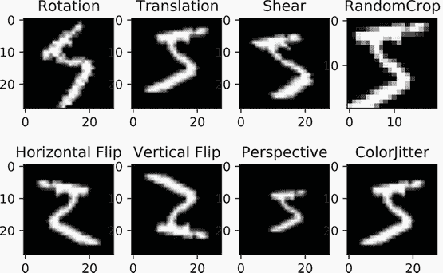

你应该注意的第一件事是，转换几乎总是**随机化**的，每次我们应用一个转换，它都会给出不同的结果。这些新结果就是我们的增强数据。例如，指定`degrees=45`表示最大旋转是±45^∘度，应用的数量是随机选择该范围内的值。这样做是为了增加模型看到的输入的**多样性**。一些转换并不总是应用自己，并提供`p`参数来控制被选中的概率。我们将这些设置为`p=1.0`，这样你肯定会看到它们对测试图像有影响。对于实际使用，你可能想要选择`p=0.5`或`p=0.15`的值。像许多事情一样，要使用的具体值将取决于你的数据。

并非每个转换都应该**总是**被使用。确保你的转换保留了数据的本质或含义。例如，水平和垂直翻转对于 MNIST 数据集来说不是一个好主意：对数字 9 进行垂直翻转可能会将其变成 6，这会**改变图像的含义**。选择一组好的转换的最佳方法是应用它们到数据上，并**亲自查看结果**；如果你不能再判断正确的答案是什么，那么你的 CNN 可能也做不到。

但一旦你选择了一组你感到舒适的转换，这是一个简单而强大的方法来提高你模型的准确性。以下是一个使用`Compose`转换在更大管道中创建转换序列的简短示例，我们可以将其应用于即时增强训练数据。PyTorch 提供的所有基于图像的数据集都有`transform`参数，这样你就可以执行这些更改：

```
train_transform = transforms.Compose([
    transforms.RandomAffine(degrees=5, translate=(0.05, 0.05), 
    ➥ scale=(0.98, 1.02)), 
    transforms.ToTensor(), 
])

test_transform = transforms.ToTensor()
mnist_train_t = torchvision.datasets.MNIST("./data", train=True, 
➥ transform=train_transform) 
mnist_test_t = torchvision.datasets.MNIST("./data", train=False,
➥ transform=test_transform) 
mnist_train_loader_t = DataLoader(mnist_train_t, shuffle=True,
➥ batch_size=B, num_workers=5) 
mnist_test_loader_t = DataLoader(mnist_test_t, batch_size=B,
➥ num_workers=5)
```

注意：在`DataLoader`类中指定了一个新的重要可选参数：`num_workers`标志控制用于**预加载**训练数据批次的线程数量。当 GPU 忙于处理数据批次时，每个线程可以准备下一个批次，以便 GPU 完成时可以立即使用。你应该始终使用此标志，因为它有助于你更有效地使用 GPU。当你开始使用转换时，这是至关重要的，因为 CPU 将不得不花费时间处理图像，这会让 GPU 闲置等待。

现在我们可以重新定义之前用来展示最大池化的相同网络，并调用相同的训练方法。数据增强会自动通过定义这些新的数据加载器来实现。对于测试集，我们只使用简单的`ToTensor`转换，因为我们希望测试集是**确定性的**——这意味着如果我们对测试集运行相同的模型五次，我们将得到相同的答案五次：

```
model_cnn_pool = nn.Sequential( 
    nn.Conv2d(C, filters, 3, padding=3//2), 
    nn.Tanh(), 
    nn.Conv2d(filters, filters, 3, padding=3//2), 
    nn.Tanh(), 
    nn.Conv2d(filters, filters, 3, padding=3//2), 
    nn.Tanh(), 
    nn.MaxPool2d(2), 
    nn.Conv2d(filters, 2*filters, 3, padding=3//2), 
    nn.Tanh(), 
    nn.Conv2d(2*filters, 2*filters, 3, padding=3//2), 
    nn.Tanh(), 
    nn.Conv2d(2*filters, 2*filters, 3, padding=3//2), 
    nn.Tanh(), 
    nn.MaxPool2d(2), 
    nn.Flatten(), 
    nn.Linear(2*filters*D//(4**2), classes),
)

cnn_results_with_pool_augmented = train_simple_network(model_cnn_pool, 
    loss_func, mnist_train_loader_t, test_loader=mnist_test_loader_t, 
    score_funcs={’Accuracy’: accuracy_score}, device=device, epochs=20)
```

现在我们可以绘制结果图，展示验证准确率的变化。通过仔细选择增强，我们帮助模型更快地学习并收敛到更好的解决方案，准确率达到 96.2%，而不是 95.7%：

```
    sns.lineplot(x=’epoch’, y=’test Accuracy’, data=cnn_results_with_pool,
    ➥ label=’CNN w/ Max Pooling’) 
    sns.lineplot(x=’epoch’, y=’test Accuracy’,
    ➥ data=cnn_results_with_pool_augmented,
    ➥ label=’CNN w/ Max Pooling + Augmentation’)

[31]: <AxesSubplot:xlabel='epoch', ylabel='test Accuracy'>
```

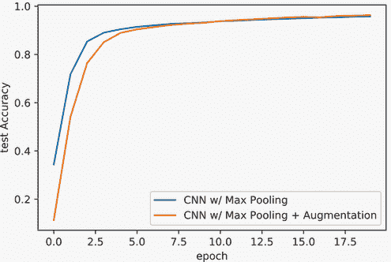

设计良好的数据增强管道是深度学习中的特征工程对应物。如果你做得好，它可以对你的结果产生巨大影响，并成为成功与失败的区别。因为 PyTorch 以 PIL 图像为基础，你也可以编写自定义转换并将其添加到管道中。这就是你可以导入像`scikit-image`这样的工具的地方，它提供了更多高级计算机视觉转换，你可以应用。随着我们学习如何构建更复杂的网络，以及当你处理比 MNIST 更复杂的数据集时，良好的数据增强的影响也会增长。数据增强还会增加更多轮次训练的价值。没有增强，每个轮次都会重新访问完全相同的数据；有了增强，你的模型会看到数据的不同变体，这有助于它更好地泛化到新数据。我们的 10 个轮次不足以看到全部的好处。

尽管良好的数据增强非常重要，但在深度学习中即使没有它也能走得很远。在这本书的大部分内容中，我们不会使用数据增强：部分原因是保持示例简单，无需为每个新的数据集解释数据增强管道的选择，另一个原因是增强是**领域特定的**。对图像**仅**有效的增强方法对图像有效。你需要为音频数据想出一套新的转换，而在文本领域进行增强是困难的。在这本书中我们将学习的大部分技术都可以应用于相当广泛的类别问题。

## 练习

在 Manning 在线平台 Inside Deep Learning Exercises（[`liveproject.manning.com/project/945`](https://liveproject.manning.com/project/945)）上分享和讨论你的解决方案。一旦你提交了自己的答案，你将能够看到其他读者提交的解决方案，并看到哪些是作者认为最好的。

注意，这些练习在本质上是有意**探索性的**。目标是让你通过自己的代码和经验了解和发现许多与 CNN 工作相关的常见趋势和属性。

1.  尝试将本章中所有网络的训练轮数从 10 轮增加到 40 轮。会发生什么？

1.  从 `torchvision` 加载 CIFAR10 数据集，并尝试构建自己的卷积神经网络。尝试使用 2 到 10 层的卷积和 0 到 2 轮的最大池化。什么看起来效果最好？

1.  检查提供的转换，通过视觉检查看看哪些对 CIFAR10 有意义。是否有任何对 CIFAR10 有用但对 MNIST 不合理的转换？

1.  使用你选择的转换训练一个新的 CIFAR10 模型。这对准确率有什么影响？

1.  尝试改变 CIFAR10 和 MNIST 中卷积滤波器的大小。这有什么影响？

1.  创建一个新的自定义 `Shuffle` 转换，该转换应用于图像中像素的相同固定重排序。使用这个转换如何影响你的 CIFAR10 模型？**提示**：查看 `Lambda` 转换来帮助你实现这一点。

## 摘要

+   在 PyTorch 张量中表示图像时，我们使用多个通道，其中通道描述了图像的某种不同性质（例如，红色、绿色和蓝色通道）。

+   卷积是一种数学运算，它将一个核（一个小张量）应用于较大输入张量中的每个位置，以产生输出。这使得卷积在本质上具有**空间**性。

+   卷积层学习多个不同的核，以应用于输入以创建多个输出。

+   卷积不能捕捉平移（上下移动）不变性，我们可以使用池化来使我们的模型对平移更加鲁棒。

+   卷积和池化都有步长选项，它决定了我们在图像上滑动时移动多少像素。

+   当我们的数据是空间性的（例如，图像）时，我们可以将先验（卷积是空间性的）嵌入到我们的网络中，以更快更好地学习解决方案。

+   我们可以通过选择应用数据的一组转换来增强我们的训练数据，从而提高模型准确率。

* * *

¹ 如果你有自称贝叶斯的朋友，他们可能会对这个定义感到冒犯，但没关系。我们今天不是在讨论贝叶斯。贝叶斯统计学通常涉及对先验的更精确定义；参见[`mng.bz/jjJp`](http://mng.bz/jjJp)（斯科特·林奇，2007 年）以获取介绍。↩

² 不同的框架支持不同的排序，原因多种多样，我们不会深入探讨。让我们专注于基础知识以及 PyTorch 的默认行为。↩

³ ⌊*x*⌋ 是向下取整函数，它将一个值向下舍入：例如，⌊9.9⌋ = 9。天花板函数是 ⌈9.1⌉ = 10。↩
