# 4 循环神经网络

本章涵盖

+   权重共享和处理序列数据

+   在深度学习中表示序列问题

+   结合 RNN 和全连接层进行预测

+   使用不同长度的序列进行填充和打包

上一章向我们展示了如何为特定类型的空间结构开发神经网络：空间局部性。具体来说，我们学习了卷积算子如何赋予我们的神经网络一个先验，即相邻的项是相关的，而远离的项则没有关系。这使得我们能够构建学习更快且为图像分类提供更准确解决方案的神经网络。

现在我们想要开发能够处理一种新型结构的模型：包含 T 个项目且按特定顺序出现的 *序列*。例如，字母表——a, b, c, d, ...——是由 26 个字符组成的序列。这本书中的每一句话都可以被视为一个单词序列 *或* 字符序列。你可以使用每小时温度作为序列来尝试预测未来的温度。只要序列中的每个项目都可以表示为一个向量 x，我们就可以使用基于序列的模型来学习它。例如，视频可以被看作是一系列图像；你可以使用卷积神经网络（CNN）将每个图像转换为向量。¹

在所有这些情况下，结构与第三章中的图像和卷积相比具有独特的不同。序列可以有 *可变* 的项目数量。例如，前两个句子具有可变长度：18 个单词和 8 个单词。相比之下，图像 *总是* 具有相同的宽度和高度。这对图像来说并不太受限制，因为很容易调整大小而不改变其含义。但我们不能简单地“调整大小”序列，因此我们需要一种可以处理这种新问题（可变长度数据）的方法。

这就是循环神经网络（RNN）发挥作用的地方。它们为我们模型提供了不同的先验：*输入遵循序列，顺序很重要*。RNN 特别有用，因为它们可以处理具有不同序列长度的输入。在谈论序列和 RNN 时，我们经常将序列称为 *时间序列*，并将序列中的第 i 个项目称为第 i 个 *时间步*（使用 t 和 i 表示特定项目或时间点是很常见的，我们都会使用）。这来自于将 RNN 视为在固定间隔处理一系列事件的观点。这个术语很普遍，所以我们将使用 T 来表示 *时间*，以指代输入序列中的项目数量。再次使用上一段的前两句话，那么对于第一句话中的 18 个单词，T = 18；对于第二句话中的 8 个单词，T = 8。

在本章中，我们使用 RNN 学习如何创建用于序列分类问题的网络。以下是一些例子：

+   *情感检测*—这个单词序列（例如，一个句子、推文或段落）是否表明了一种积极、消极还是中性的印象？例如，我可能会在 Twitter 上运行句子检测来找出人们是否喜欢这本书。

+   *车辆维护*—你的汽车可能存储有关行驶了多少英里、行驶时的每加仑英里数、发动机温度等信息。这可以用来预测汽车在接下来的 3、6 或 12 个月内是否需要维修，通常称为*预测性维护*。

+   *天气预报*—每天，你可以记录最高温度、平均温度、最低温度、湿度、风速等等。然后你可以预测很多事物，比如第二天的温度、多少人会去商场（公司会很乐意知道这一点），以及交通是否会正常、糟糕还是良好。

当人们深入研究深度学习时，RNNs（递归神经网络）通常很难理解，许多资料将它们视为接收序列并输出新序列的魔法黑盒子。因此，我们将仔细构建我们的方法，逐步理解 RNN 实际上是什么。这是本书中最具挑战性的两个章节之一，如果第一次阅读时不是所有内容都理解，那也是正常的。RNNs 是一个本质上令人费解的概念——我花了几年时间才弄清楚它们。为了帮助你理解本章的概念，我建议使用笔和纸自己绘制过程和图表，从 T=1 的序列开始，然后添加第二个和第三个，依此类推。

在深入研究问题之前，在第 4.1 节中，我们通过*权重共享*的概念缓慢地逐步定义 RNN 是什么。这是 RNN 工作原理的基础，所以我们首先讨论简单全连接网络的权重共享，以理解这个概念，然后展示这个概念是如何应用于产生 RNN 的。一旦我们有了心理图景，第 4.2 节就转向了加载序列分类问题以及在 PyTorch 中定义 RNN 的机制。PyTorch 中 RNN 的一个常见问题是，你想要训练的序列长度是可变的，但`Tensor`对象没有任何灵活性：所有维度都必须具有相同的长度。第 4.3 节通过一种称为*填充*的技术解决了这个`Tensor`/序列问题，这使得 PyTorch 在批次中的序列长度可变时可以正确运行。第 4.4 节通过两种改进 RNN 以提高其准确性的方法来结束新材料。

## 4.1 递归神经网络作为权重共享

在我们进入新的主题——循环神经网络（RNN）之前，让我们再谈谈上一章的一个概念：*权重共享*。为了确保你对这个基本概念熟悉，我们通过解决一个虚构问题来讲解。这样，我们可以在深入研究更复杂的 RNN 之前展示这个过程的工作原理。图 4.1 是对权重共享概念的快速回顾，其中我们在多个位置重复使用一个层。PyTorch 在重复使用层时正确处理了学习中的复杂数学。

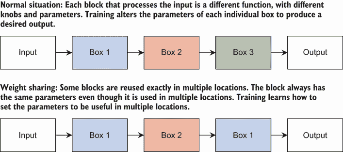

图 4.1 权重共享工作原理的概述。方框代表任何类型的神经网络或 PyTorch 模块。方框具有输入/输出关系，通常我们的网络中的每一层都是一个不同的方框。如果我们多次重复使用相同的方框，我们实际上在多个层之间共享相同的权重。

当使用 CNN 时，卷积操作就像有一个单独的小型线性网络，我们在图像上滑动，对每个空间位置应用相同的函数。这是 CNN 的一个隐含属性，我们通过这段小代码将其明确化：

```
x = torch.rand(D) ❶
output = torch.zeros(D-K//2*2)
for i in range(output.shape[0]): 
    output[i] = f(x[i:i+K], theta)
```

❶ 输入向量

此代码重复使用相同的权重 Θ 对多个输入进行操作。我们的 CNN 隐式地这样做。为了帮助理解 RNN 以及它们是如何工作的，我们显式地应用权重共享来展示我们可以以不同的方式使用它。然后我们可以调整我们使用权重共享的方式，以达到原始 RNN 算法。

### 4.1.1  全连接网络的权重共享

让我们想象一下，我们想要为分类问题创建一个具有三个隐藏层的全连接网络。图 4.2 展示了这个网络作为 PyTorch 模块序列的形状。

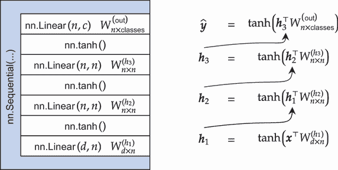

图 4.2 一个具有三个隐藏层和一个输出层的简单网络。`nn.Sequential` 层显示了按使用顺序包裹层序列（最底层在最下面，最顶层在最上面）。

为了确保我们学习如何以代码和数学的方式读取和编写网络定义，下面展示了以方程式形式书写的相同网络。线性层 W 也在图 4.2 中被引用，以便我们可以将各部分相互映射：

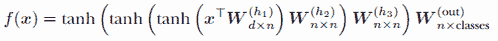

我决定在这个方程中明确表示，并展示每个线性层的形状。根据这个方程，我们有 d 个输入特征，每个隐藏层有 n 个神经元，以及类输出。这个明确的细节在接下来会变得很重要。让我们快速实现这个网络用于 MNIST：

```
mnist_data_train = torchvision.datasets.MNIST("./data", train=True, 
➥ download=True, transform=transforms.ToTensor()) 
mnist_data_test = torchvision.datasets.MNIST("./data", train=False, 
➥ download=True, transform=transforms.ToTensor())

mnist_train_loader = DataLoader(mnist_data_train, batch_size=64, shuffle=True) 
mnist_test_loader = DataLoader(mnist_data_test, batch_size=64)

D = 28*28                      ❶
n = 256                        ❷

C = 1                          ❸

classes = 10                   ❹

model_regular = nn.Sequential( ❺
    Flatten(), 
    nn.Linear(D, n), 
    nn.Tanh(), 
    nn.Linear(n, n), 
    nn.Tanh(), 
    nn.Linear(n, n), 
    nn.Tanh(), 
    nn.Linear(n, classes), 
)
```

❶ 输入中有多少个值？我们使用这个值来帮助确定后续层的大小。

❷ 隐藏层大小

❸ 输入中有多少个通道？

❹ 有多少个类别？

❺ 创建我们的常规模型

这是一个简单的全连接模型，因为我们使用了`nn.Linear`层。要将它作为分类问题进行训练，我们再次使用`train_simple_network`函数。（所有这些都应该在 2 章和 3 章中很熟悉。）我们可以训练这个模型并得到以下结果，这并不新鲜：

```
loss_func = nn.CrossEntropyLoss() 
regular_results = train_simple_network(model_regular, loss_func, 
    mnist_train_loader, test_loader=mnist_test_loader, 
    score_funcs={’Accuracy’: accuracy_score}, device=device, epochs=10)
```

现在，让我们*假设*这是一个非常大的网络——如此之大，以至于我们无法为所有三个隐藏层**W**[*d* × *n*]^((*h*[1])), **W**[*n* × *n*]^((*h*[2])), 和 **W**[*n* × *n*]^((*h*[3]))分配权重。但我们*确实*想要一个具有三个隐藏层的网络。一个选项是在某些层之间*共享*权重。我们可以通过简单地用*h*[2]替换*h*[3]来实现这一点，这相当于在定义中定义一个对象并重复使用该对象两次。图 4.3 展示了如何使用第二和第三隐藏层来实现这一点，因为它们具有相同的形状。

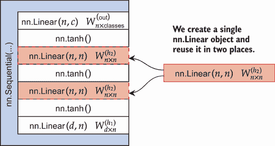

图 4.3 一个简单的具有权重共享的前馈网络。在创建`nn.Sequential`对象之前，我们定义了一个`nn.Linear(n,n)`层，该层被用作第二和第三隐藏层。PyTorch 会找出如何使用这种设置进行学习，并且第二和第三层共享相同的权重。

表达这个的数学方法是改变我们之前的方程，变为以下形式：

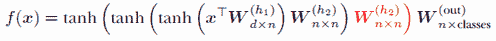

唯一改变的是（用红色标出），我们正在两个不同的位置重复使用权重**W**^((*h*[2]))。*这是权重共享*，重复使用层的权重。之所以这样称呼，是因为我们可以假设**W**^((*h*[2]))的两种不同使用是网络中具有相同权重的不同层。我们如何在 PyTorch 中实现这一点？很简单。如果我们将那个线性层视为一个对象，我们*重复使用层对象*。其他一切工作方式完全相同。

注意：您也可能听到权重共享被称为*绑定*权重。这是相同的概念，只是名称的不同类比：权重被绑定在一起。有些人更喜欢这种术语，如果权重被稍微不同的方式使用。例如，一个层可能使用 W，而另一个层则使用转置权重*W*^⊤。

以下代码展示了相同的全连接网络，但第二和第三隐藏层使用了权重共享。我们将想要共享的`nn.Linear`层声明为一个名为`h_2`的对象，并在`nn.Sequential`列表中插入两次。因此，`h_2`被用作第二和第三隐藏层，PyTorch 将正确地使用完全相同的函数来训练网络——无需任何更改：

```
h_2 = nn.Linear(n, n) ❶
model_shared = nn.Sequential(
    nn.Flatten(), 
    nn.Linear(D, n), 
    nn.Tanh(), h_2,   ❷
    nn.Tanh(), h_2,   ❸
    nn.Tanh(), 
    nn.Linear(n, classes), 
)
```

❶ 创建我们计划共享的网络权重层

❷ 第一次使用

❸ 第二次使用：现在共享权重

从编程的角度来看，这段代码似乎很简单。这是一个非常面向对象的设计：我们创建了一个对象，这个对象在两个地方被使用。但是让数学成立并不是一件简单的事情。幸运的是，PyTorch 为你处理了这个问题，相同的训练函数可以很好地处理这种权重共享：

```
shared_results = train_simple_network(model_shared, loss_func, 
    mnist_train_loader, test_loader=mnist_test_loader, 
    score_funcs={’Accuracy’: accuracy_score}, device=device, epochs=10)
```

使用新的权重共享网络，我们可以绘制两个网络的验证精度，以查看 PyTorch*真正*使用共享权重学习到了什么，以及结果看起来像什么：

```
    sns.lineplot(x=’epoch’, y=’test Accuracy’, ❶
    ➥ data=regular_results, label=’Normal’)

    sns.lineplot(x=’epoch’, y=’test Accuracy’,
    ➥ data=shared_results, label=’Shared’)

[10]: <AxesSubplot:xlabel='epoch', ylabel='test Accuracy'>
```

❶ 绘制结果并进行比较

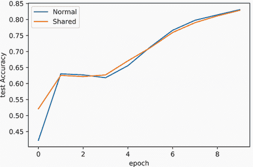

使用权重共享不会增加训练时间，我们也不会失去任何精度（这不是一个保证）。我们确实得到了一个好处，即略微减少了内存使用，但我们在这里所做的是很少使用的。存在更好的方法来减少内存使用，而这个问题的目的只是演示权重共享。我们关注权重共享，因为它是在创建和训练 RNNs 的基础。

### 4.1.2  随时间变化的权重共享

现在我们已经了解了权重共享，我们可以讨论它是如何用于创建循环神经网络（RNNs）的。RNN 的目标是使用单个项目来总结项目序列中的每个项目。这个过程在图 4.4 中展示。RNN 接收两个项目：一个表示到目前为止看到的所有内容的张量**h**[*t* − 1]，其顺序与它看到的顺序相同，以及一个表示序列中最新/下一个项目的张量**x**[t]。RNN 将历史摘要（**h**[*t* − 1]）和新的信息（**x**[t]）结合起来，创建到目前为止看到的所有内容的*新*摘要（**h**[t]）。为了对整个 T 个项目的序列进行预测，我们可以使用 T 个输入之后的输出（**h**[T]），因为它代表了第 T 个项目以及所有前面的项目。

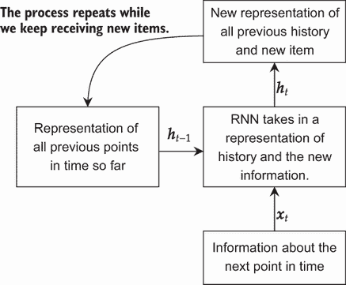

图 4.4 RNN 过程的示意图。我们用 t 来表示当前的时间点（序列中的第 t 个项目）。RNN 接收所有先前内容的单个表示**h**[*t* − 1]和序列中最新项目的信息**x**[t]。RNN 将这些合并成到目前为止看到的所有内容的新表示**h**[t]，这个过程会一直重复，直到我们到达序列的末尾。

这个想法是 RNN 遍历输入中的所有项目。让我们确保我们给这个讨论的所有部分都给出一些数学符号。我们有 T 个总的时间单位。我们不是只有一个输入**x** ∈ ℝ^d，而是有 T 个输入**x**[1]，**x**[2]，…，**x**[*T* − 1]，**x**[T]。每个输入都是一个大小相同的向量（即，**x**[j] ∈ ℝ^d）。记住，每个**x**[1]，**x**[2]，…，**x**[*T* − 1]，**x**[T]都是某个序列的向量表示。例如，天气可以有一个包含每天的最高、最低和平均温度的向量（**x**[t] = [high,low,mean]），并且这些天必须按照它们的自然顺序出现（不允许时间旅行）。

我们如何处理跨时间的东西？如果我们有一个网络模块 A，其中 *A*(**x**) = **h**，我们可以使用权重共享将网络模块 A 独立应用于每个项目。因此，我们得到 T 个输出，**h**[i] = *A*(**x**[i])。我们最终会使用这些输出中的一个 h 作为线性层的输入，但首先我们需要逐步构建一个 RNN。在图 4.5 中展示了独立应用 *A*(⋅) 的朴素方法。

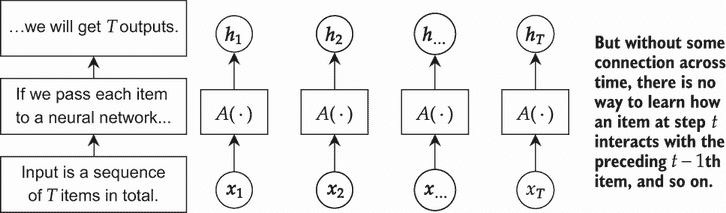

图 4.5 使用网络模块 A 独立处理 T 个不同输入的朴素解决方案。序列中的每个项目 *x*[i] 都独立于其他序列进行处理。这种方法没有识别数据的序列性质，因为没有路径连接 **x**[t] 和 **x**[t][+1]。

我们使用权重共享来将相同的函数/层 *A*(⋅)应用于每个项目。但我们没有做任何事情来连接跨时间的信息。我们需要我们的 RNN 函数 A 同时接收历史和输入，这样我们就可以有类似这样的代码：

```
history_summary = 0                               ❶
inputs = [...]                                    ❷
for t in range(T):
    new_summary = RNN(history_summary, inputs[t]) ❸
    history_summary = new_summary
```

❶ *h*[0]

❷ **x**[1], **x**[2], …, **x**[T]

❸ **h**[t] = *A*(**h**[*t* − 1],**x**[t])

这样，RNN 会同时接收历史和新的项目。这是通过给 A 一个*递归*权重来实现的。我们用 *h*[t] 来表示时间步 t 的结果，所以让我们将这个概念纳入我们的模型。首先，让我们看一下带有一些简单注释的方程——你可能在论文或网上看到的那种。花几分钟时间尝试自己解析这些部分，这将有助于你在阅读这类深度学习数学方面的技能提升：

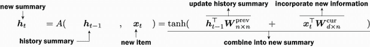

现在我们来看一下这个方程的详细注释版本：

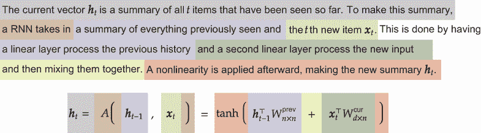

我们有一个权重集（**W**[*d* × *n*]^(cur))，它接收当前的时步（**x**[i])，并加上第二个权重集（**W**[*n* × *n*]^(prev))，用于前一个时步的结果（**h**[*i* − 1])。通过在每个时步重复使用这个新函数，我们得到了跨时间的信息。所有这些都在图 4.6 中展示。


图 4.6 网络 A 被定义为接收两个输入：前一个隐藏状态 *h*[*t* − 1] 和当前输入 *x*[t]。这允许我们展开网络并在时间上共享信息，有效地处理数据的序列性质。

这种在时间上共享信息的方法定义了一个基本的 RNN。其思想是，我们在每个时间步都重复使用相同的函数和权重 A。在时间步 t，模型从隐藏状态**h**[**t** **−** **1**]获取关于过去的信息。因为**h**[**t** **−** **1**]是由**h**[**t** **−** **2**]计算得出的，它包含了过去**两个**时间步的信息。而且由于**h**[**t** **−** **2**]依赖于**h**[**t** **−** **3**]，它是**三个**之前步骤。继续这样回溯到默认值**h**[0]，你可以看到**h**[**t** **−** **1**]是如何根据这些时间步的顺序从每个之前的时间步获取信息的。这就是 RNN 如何捕捉时间上的信息。但是，当我们需要**h**[0]，而它不存在时，我们在时间开始时（*i* = 1）怎么办？隐含地，我们假设**h**[0] = （即所有零值的向量）以使事情完整。这有助于更明确地绘制出来，如图 4.7 所示；这通常被称为在时间上“展开”RNN。

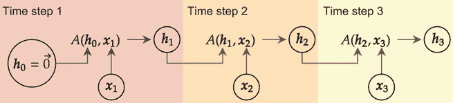

图 4.7 展开 RNN 的例子，对于 *T* = 3 个时间步。在这里，我们明确地绘制了每个输入（**x**[t]）和隐藏激活（**h**[t]）的过程。初始隐藏状态**h**[0]始终设置为所有零值的向量。注意，现在它看起来像是一个前馈模型。

注意它开始看起来与全连接网络非常相似。唯一的区别是我们有多个输入，**x**[1]，…，**x**[T]，每个时间步一个。对于简单的分类问题，我们将使用最后一个激活**h**[T]作为预测结果，因为**h**[T]包含了每个之前时间步的信息，并且它是最后一个时间步。这使得**h**[T]成为唯一一个具有关于整个序列信息的步骤。我们可以这样展开 RNN 的事实是我们可以使用相同的算法来训练它。将 RNN 展开，以便我们反复应用相同的函数（权重共享），只是改变输入，这是 RNN 的本质。

## 4.2 PyTorch 中的 RNN

现在我们知道了 RNN 是什么，我们需要弄清楚如何在 PyTorch 中使用它。虽然有很多代码为我们提供了实现这一目标的方法，但我们仍然需要自己编写大量的代码。就像这本书中的所有内容一样，第一步是创建一个`Dataset`来表示我们的数据并加载它，然后是一个`model`，它使用 PyTorch 的`nn.Module`类，该类接受输入数据并生成预测。

但是对于 RNN，我们需要向量，而我们使用的大多数数据并不是自然地表示为向量。我们需要做一些额外的工作来解决这个问题。图 4.8 展示了实现这一功能的步骤。

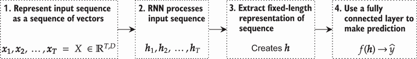

图 4.8 基于长度为 T 的输入序列进行预测的四个高级步骤。我们需要创建序列的向量表示，将这个表示传递给 RNN 以产生 T 个隐藏状态，将其缩减为一个隐藏状态，然后使用全连接层进行预测。

要在 PyTorch 中表示 RNN 的序列数据，我们使用三维输入表示：

(*B*,*T*,*D*)

如前所述，B 告诉我们一个批次中有多少项（即有多少数据点）。T 给出了总的时间步数，D 是每个时间步的特征数量。因为时间在张量对象本身中表示，所以指定模型很容易。

让我们先从一个多对一分类问题开始。我这是什么意思？我们将有多个输入（每个时间步），但我们将只有一个输出：我们试图预测的类别标签。

### 4.2.1  一个简单的序列分类问题

要创建一个模型，我们首先需要数据。这使我们到达图 4.8 的第 1 步。为了简化问题，我们将从 PyTorch RNN 教程（[`mng.bz/nrKK`](http://mng.bz/nrKK)）中借用任务：识别一个名称来自哪种语言。例如，“Steven”是一个英文名字。请注意，这个问题不能完美解决——例如，“Frank”可能是英语或德语——因此我们应该预期由于这些问题和过度简化而出现一些错误。我们的目标是编写体现图 4.9 中所示过程的代码。

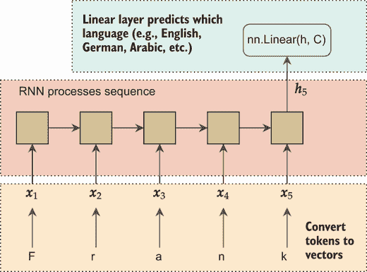

图 4.9 RNN 处理分类名称来源语言的过程。名称的各个字符构成了输入到 RNN 的序列。我们学习如何将每个字符转换为向量，以及如何让 RNN 处理该序列并返回最终的激活**h**[T]，最后通过一个线性层产生预测。

以下代码下载数据集并提取所有文件。完成后，文件夹结构为 names/[LANG].txt，其中[LANG]表示语言（也是此问题的标签），文本文件的内容是该语言中出现的所有名称列表：

```
zip_file_url = "https://download.pytorch.org/tutorial/data.zip"

import requests, zipfile, io
r = requests.get(zip_file_url)
z = zipfile.ZipFile(io.BytesIO(r.content))
z.extractall()
```

由于这个数据集相当小，我们将所有数据加载到内存中。数据存储在字典`namge_language_data`中，它将语言名称（例如，英语）映射到所有名称的列表。为了简化我们的生活，`unicodeToAscii`从每个名称中删除非 ASCII 字符。字典`alphabet`包含我们期望看到的所有字符，并将每个项目映射到一个唯一的整数，从 0 开始，依次递增。这很重要。我们的计算机不知道你的序列中的任何字符或项目代表什么。除非你的数据自然存在为数值（例如，外面的温度），否则需要一个转换步骤。我们稍后会了解到这个转换是如何进行的，但我们通过将序列中可能出现的每个唯一项目映射到一个唯一的整数值来标准化这个过程。

这里是代码：

```
namge_language_data = {}

import unicodedata                     ❶
import string

all_letters = string.ascii_letters + " .,;’" 
n_letters = len(all_letters) 
alphabet = {} 
for i in range(n_letters):
    alphabet[all_letters[i]] = i

def unicodeToAscii(s):                 ❷
    return ”.join( 
        c for c in unicodedata.normalize(’NFD’, s) 
        if unicodedata.category(c) != ’Mn’ 
        and c in all_letters
    )

for zip_path in z.namelist():          ❸

    if "data/names/" in zip_path and zip_path.endswith(".txt"): 
        lang = zip_path[len("data/names/"):-len(".txt")] 
        with z.open(zip_path) as myfile: 
            lang_names = [unicodeToAscii(line).lower() 
            ➥ for line in 
            ➥ str(myfile.read(), encoding=’utf-8’).strip().split("\n")]
            namge_language_data[lang] = lang_names 
    print(lang, ": ", len(lang_names)) ❹

Arabic : 2000
Chinese : 268
Czech : 519
Dutch : 297
English : 3668
French : 277
German : 724
Greek : 203
Irish : 232
Italian : 709
Japanese : 991 Korean : 94
Polish : 139
Portuguese : 74
Russian : 9408
Scottish : 100
Spanish : 298
Vietnamese : 73
```

❶ 移除 UNICODE 标记以简化我们的处理工作：例如，将“Ślusàrski”转换为“Slusarski"

❷ 将 Unicode 字符串转换为纯 ASCII

❸ 遍历每种语言，打开 zip 文件条目，并读取文本文件中的所有行

❹ 打印出每种语言的名称

现在我们已经创建了一个数据集，你可能注意到它并不平衡：俄罗斯语名称比其他任何语言都要多得多。这是我们评估模型时应该注意的事情。

在将数据加载到内存中后，我们现在可以实施一个`Dataset`来表示它。`data`列表包含每个名称，以及与`labels`列表中关联的索引，指示名称来自哪种语言。一个`vocabulary`字典将每个唯一项目映射到一个整数值：

```
class LanguageNameDataset(Dataset): 
    def __init__(self, lang_name_dict, vocabulary): 
        self.label_names = [x for x in lang_name_dict.keys()] 
        self.data = [] 
        self.labels = [] 
        self.vocabulary = vocabulary 
        for y, language in enumerate(self.label_names): 
            for sample in lang_name_dict[language]: 
                self.data.append(sample) 
                self.labels.append(y) 
    def __len__(self): 
        return len(self.data) 
    def string2InputVec(self, input_string): 
        """
        This method will convert any input string into a vector of long 
        values, according to the vocabulary used by this object.         input_string: the string to convert to a tensor 
        """
        T = len(input_string)                               ❶
        name_vec = torch.zeros((T), dtype=torch.long)       ❷

        for pos, character in enumerate(input_string):      ❸
            name_vec[pos] = self.vocabulary[character] 
        return name_vec 
    def __getitem__(self, idx):
        name = self.data[idx] 
        label = self.labels[idx] 
        label_vec = torch.tensor([label], dtype=torch.long) ❹

                return self.string2InputVec(name), label
```

❶ 字符串有多长？

❷ 创建一个新的张量来存储结果

❸ 遍历字符串并在张量中放置适当的值

❹ 将正确的类别标签转换为 PyTorch 的张量

注意：词汇表的概念在机器学习和深度学习中很常见。你经常会看到用数学符号Σ来表示词汇表。例如，我们可以更简洁地询问“单词*cheese*是否在词汇表中？”通过写作“cheese" ∈ *Σ*。如果我们写“blanket" ∉ *Σ*，我们表示“blanket”这个项目不在词汇表中。我们还可以使用|*Σ*|来表示词汇表的大小。

`__len__`函数很简单：它返回`Dataset`中的数据点总数。第一个有趣的功能是辅助函数`string2InputVec`，它接受一个`input_string`并返回一个新的`torch.Tensor`作为输出。张量的长度是`input_string`中的字符数，并且它具有`torch.long`类型（也称为`torch.int64`）。张量中的值指示`input_string`中存在哪些唯一的标记及其顺序。这为我们提供了一个基于张量的新表示，PyTorch 可以使用它。

然后，我们在`__getitem__`方法中重用`string2InputVec`。我们从`self.data[idx]`成员中获取原始字符串，并使用`string2InputVec`将其转换为 PyTorch 需要的张量表示。返回的值是一个遵循（输入，输出）模式的元组。例如，

```
(tensor([10, 7, 14, 20, 17, 24]), 0)
```

表示一个六字符的名称应被分类为第一类（阿拉伯语）。原始字符串通过我们的`string2InputVec`函数转换为整数张量，以便 PyTorch 可以理解它。

有了这些，我们可以创建一个新的数据集来确定给定名称的语言。以下代码片段创建了一个训练/测试分割，测试分割中有 300 个项目。我们在加载器中使用批量大小为 1（我们将在本章后面回到这个细节）：

```
dataset = LanguageNameDataset(namge_language_data, alphabet)
train_data, test_data = torch.utils.data.random_split(dataset,
➥ (len(dataset)-300, 300)) 
train_loader = DataLoader(train_data, batch_size=1, shuffle=True) 
test_loader = DataLoader(test_data, batch_size=1, shuffle=False)
```

对类别不平衡进行分层抽样

我们的数据库存在一个*类别不平衡*的问题，我们目前没有解决。当类别的比例不均匀时，这种情况会发生。在这种情况下，模型可能会学会简单地重复最常见的类别标签。例如，想象你正在尝试预测某人是否患有癌症。你可以创建一个模型，该模型总是预测“没有癌症”，因为幸运的是，大多数人在某个时刻没有癌症。但这种方法对模型来说没有用。

解决类别不平衡是一个独立的主题领域，我们不会深入探讨。但一个简单的改进是使用*分层*抽样来创建训练/测试分割。这是一个常见的工具，在 scikit-learn 中可用([`mng.bz/v4VM`](http://mng.bz/v4VM))。想法是*强制*抽样以保持分割中的类别比例。所以如果原始数据是 99% A 和 1% B，你希望你的分层分割有相同的百分比。使用随机抽样，你可能会轻易地得到 99.5% A 和 0.5% B。通常，这不是一个大问题，但类别不平衡可能会显著扭曲你对模型表现好坏的看法。

数据集加载完成后，我们可以讨论 PyTorch 中 RNN 模型的其余部分。

### 4.2.2 嵌入层

图 4.8 的第 1 步要求我们将输入序列表示为向量序列。我们有`LanguageNameDataset`对象来加载数据，它使用词汇表(Σ)将每个字符/标记（例如，“Frank”）转换为唯一的整数。我们还需要一种将每个整数映射到相应向量的方法，这可以通过嵌入层来实现。这在图 4.10 中从高层次上展示了这一点。请注意，这是深度学习社区中使用的标准术语，你应该熟悉它。

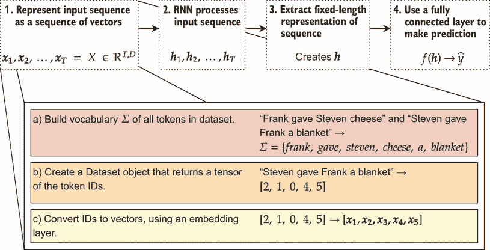

图 4.10 的子集(a)和(b)都是通过我们实现的`LanguageNameDataset`完成的。最后的子集(c)是通过一个`nn.Embedding`层完成的。

嵌入层是查找表，用于将每个整数值映射到特定的向量表示。你告诉嵌入层词汇量的大小（即有多少个唯一项）以及你希望输出维度的大小。图 4.11 展示了这一过程在概念层次上的工作方式。

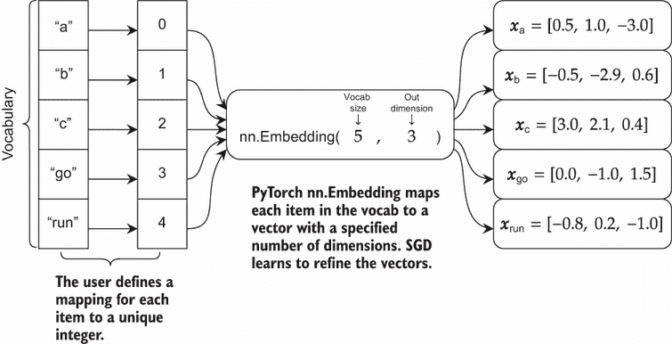

图 4.11 设计的嵌入层，用于接受五个独特项的词汇表。你必须编写将对象（如字符串）映射到整数的代码。嵌入将每个整数映射到其自己的 d 维向量 **x** ∈ ℝ^d。

在这个玩具示例中，词汇表包含字符和单词。只要你能一致地将项目映射到整数值，词汇表就不需要是字符串。`nn.Embedding` 的第一个参数是 `5`，表示词汇表有五个唯一项。第二个参数 `3` 是输出维度。你应该把它想象成 `nn.Linear` 层，其中第二个参数告诉你会有多少个输出。我们可以根据我们认为模型需要将多少信息打包到每个向量中来增加或减少输出大小。在大多数应用中，你希望尝试输出维度的值在 [64,256] 范围内。

哎呀，到处都是嵌入！

作为一种概念，嵌入在实用工作中被高度利用。将每个单词映射到向量并尝试预测附近的单词是像 word2vec ([`en.wikipedia.org/wiki/Word2vec`](https://en.wikipedia.org/wiki/Word2vec)) 和 Glove ([`nlp.stanford.edu/projects/glove`](https://nlp.stanford.edu/projects/glove)) 这样的通用工具背后的本质，但这涉及到比我们时间允许的更深入的自然语言处理领域。简而言之，学习将项目表示为向量以便使用其他工具是解决现实世界问题的有效方法。

一旦你有了嵌入，你可以使用最近邻搜索来实现搜索引擎或“你是指”功能，将它们投入 Uniform Manifold Approximation and Projection (UMAP) ([`umap-learn.readthedocs.io/en/latest`](https://umap-learn.readthedocs.io/en/latest)) 进行可视化，或者运行你喜欢的非深度算法来进行预测或聚类。在本书的其他地方，我会指出可以用来创建嵌入的方法。

`nn.Embedding` 层被设计用来处理一系列的事物。这意味着序列可以包含重复项。例如，以下代码片段创建了一个新的输入序列，包含 *T* = 5 个项目，但词汇量只有 3 个项目。这是可以的，因为输入序列 [0,1,1,0,2] 包含重复项（0 和 1 出现了两次）。`embd` 对象的维度为 *d* = 2，并处理输入以创建新的表示 `x_seq`：

```
with torch.no_grad(): 
    input_sequence = torch.tensor([0, 1, 1, 0, 2], dtype=torch.long) 
    embd = nn.Embedding(3, 2) 
    x_seq = embd(input_sequence) 
    print(input_sequence.shape, x_seq.shape) 
    print(x_seq)

torch.Size([5]) torch.Size([5, 2]) 
tensor([[ 0.7626,  0.1343],
        [ 1.5189,  0.6567],
        [ 1.5189,  0.6567],
        [ 0.7626,  0.1343],
        [-0.5718,  0.2879]])
```

这个 `x_seq` 是与所有深度学习标准工具兼容的张量表示。请注意，其形状为 (5,2)，填充了随机值——这是因为 `Embedding` 层将所有内容初始化为随机值，这些值在网络训练过程中通过梯度下降被改变。但是矩阵的第一行和第四行具有相同的值，第二行和第三行也是如此。这是因为输出的顺序与输入的顺序相匹配。标记为“0”的唯一项位于第一行和第四行，所以这两个地方使用了相同的向量。对于标记为“1”的唯一项，它作为第二项和第三项重复。

当处理字符串或任何其他不自然存在为向量的内容时，你几乎总是想要使用嵌入层作为第一步。这是将这些抽象概念转换为我们可以处理表示的标准工具，并完成了图 4.8 的第 1 步。

### 4.2.3 使用最后一个时间步进行预测

在 PyTorch 中使用 RNN 的任务相当简单，因为 PyTorch 提供了标准 RNN 算法的实现。更困难的部分是在 RNN 处理之后提取最后一个时间步 **h**[T]。我们想要这样做是因为最后一个时间步是*唯一*一个基于输入顺序从所有 T 个输入中携带信息的时间步。这样，我们可以使用 **h**[T] 作为全连接子网络的固定长度摘要。这是因为 **h**[T] 无论输入序列有多长，都具有相同的形状和大小。所以如果我们的 RNN 层有 64 个神经元，**h**[T] 将是一个 64 维向量，表示为形状为(*B*,64)的张量。无论我们的序列有一个项目 *T* = 1 或 *T* = 100 个项目，**h**[T] 总是具有形状(*B*,64)。这个过程在图 4.12 中展示。

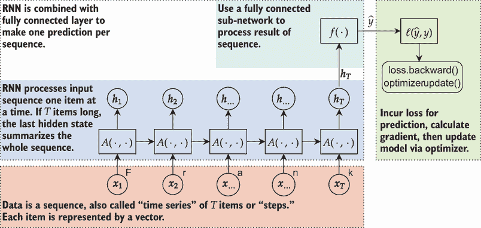

图 4.12 展示了将 RNN 应用于预测序列标签的部分。RNN 的输出是一个隐藏状态序列 *h*[1], *h*[2], …, *h*[T]。最后一个时间步 *h*[T] 包含了整个序列的信息，因此我们希望将其用作整个序列的表示。这样，它就可以进入一个普通的完全连接网络 *f*(⋅)。

在我们可以指定 PyTorch 中的 RNN 架构之前，我们需要实现一个新的`Module`来提取最后一个时间步。在 PyTorch 中存储此类信息时，我们需要处理一些特殊之处。我们需要知道两件事：层数和模型是否为双向。这是因为 RNN 将返回足够的信息从任何层提取结果，这为我们提供了实现其他模型的灵活性，我们将在后面的章节中讨论。我们也会在本章后面讨论*双向*的含义。

以下代码基于 PyTorch 文档的内容，并执行从 RNN 中提取`LastTimeStep` **h**[T]的工作。根据我们使用的具体 RNN（更多内容将在第六章中讨论），RNN `Module`的输出是一个包含两个张量的元组或一个包含三个张量的嵌套元组，最后一个时间步的激活存储在元组的第二个位置：

```
class LastTimeStep(nn.Module): 
    """ 
    A class for extracting the hidden activations of the last time step 
    following 
    the output of a PyTorch RNN module. 
    """ 
    def __init__(self, rnn_layers=1, bidirectional=False):
        super(LastTimeStep, self).__init__() 
        self.rnn_layers = rnn_layers 
        if bidirectional: 
            self.num_directions = 2 
        else: 
            self.num_directions = 1 
    def forward(self, input): 
        rnn_output = input[0]                    ❶

        last_step = input[1]                     ❷

        if(type(last_step) == tuple): 
            last_step = last_step[0] 
        batch_size = last_step.shape[1]          ❸

        last_step = last_step.view(self.rnn_layers, 
        ➥ self.num_directions, batch_size, -1)  ❹

        last_step = last_step[self.rnn_layers-1] ❺

        last_step = last_step.permute(1, 0, 2)   ❻

        return last_step.reshape(batch_size, -1) ❼
```

❶ 结果是一个元组（out, *h*[t]) 或者一个元组（out, (*h*[t], *c*[t]))

❶ 这通常是 *h*[t]，除非它是一个元组，在这种情况下，它是元组的第一个项目。

❷ 根据文档，形状是‘(num_layers * num_directions, batch, hidden_size)’

❸ 重新塑形，使所有内容都分开

❹ 我们想要最后一个层的输出。

❺ 重新排序，使批次排在前面

❻ 将最后两个维度展平为一个维度

PyTorch 中 RNN 的输出是一个形状为(*out*,**h**[T])或(*out*,(**h**[T],**c**[T]))的元组。out 对象包含关于*每个*时间步的信息，而**h**[T]只包含关于*最后一个*时间步但针对*每个*层的信息。因此，我们检查第二个元素是否为`tuple`，并提取正确的**h**[T]对象。**c**[T]是一个提取的上下文张量，它是我们在第六章中讨论的更高级 RNN 的一部分。

一旦我们有了**h**[T]，PyTorch 会将其作为`flatten()`过的输入提供。我们可以使用`view`函数来重塑包含层信息、双向内容（我们很快会讨论这一点）、批大小以及隐藏层中神经元的数量 d 的张量。我们知道我们想要最后一层的输出，所以我们可以索引并使用`permute`函数将批维度移到前面。

这为我们提供了提取 RNN 最后一层所需的内容，因此我们有了实现图 4.8 中的步骤 2 和 3 的工具。第四步是使用全连接层，我们已知如何使用`nn.Linear`层来完成这项工作。以下代码完成了所有四个步骤的工作。变量`D`是`nn.Embedding`结果的大小，`hidden_nodes`是 RNN 中的神经元数量，`classes`是我们试图预测的类的数量（在这个应用中，一个名字可能来自的不同语言的数量）：

```
D = 64 
vocab_size = len(all_letters) 
hidden_nodes = 256 
classes = len(dataset.label_names)

first_rnn = nn.Sequential( 
    nn.Embedding(vocab_size, D),               ❶

    nn.RNN(D, hidden_nodes, batch_first=True), ❷

    LastTimeStep(),                            ❸

    nn.Linear(hidden_nodes, classes),          ❹
)
```

❶ (B, T) -> (B, T, D)

❷ (B, T, D) -> ( (B,T,D) , (S, B, D) )

❸ 双曲正切激活函数内置在 RNN 对象中，所以我们在这里不需要做。我们取 RNN 输出并将其减少到一个项目，(B, D)。

❹ (B, D) -> (B, classes)

当与 RNN 一起工作时，我们经常同时遇到许多复杂的张量形状。因此，我总是在每一行上包含一个注释，说明由于每个操作，张量形状是如何变化的。输入批处理 B 个长度最多为 T 的项目，因此输入的形状为(*B*,*T*)。`nn.Embedding`层将其转换为(*B*,*T*,*D*)的形状，添加了来自嵌入的`D`维度。

只有当我们指定`batch_first=True`时，RNN 才接受形状为(*B*,*T*,*D*)的输入。虽然 PyTorch 的其余部分假设批首先，但 RNN 和序列问题通常假设批维度是第三个。在早期实现中，以这种方式排列张量由于底层技术细节而使它们显著更快，这些细节我们不会深入讨论。虽然这种表示顺序仍然可能更快，但差距今天已经不那么大了。因此，我更喜欢使用`batch_first`选项，使其与 PyTorch 的其余部分更一致。

注意：PyTorch 中的 RNN 类会自行应用非线性激活函数。在这种情况下是隐式的。这是 PyTorch 对 RNN 的行为与框架其余部分不同的另一个情况。因此，你*不应该*之后应用非线性激活函数，因为它已经为你完成了。

RNN 返回至少包含两个张量的`tuple`，但我们的`LastTimeStep`模块被设计为从这个`tuple`中提取最后一个时间步的*h*[T]，并返回一个固定长度的向量。由于*h*[T] ∈ ℝ^D，并且我们在处理 B 个批次的物品，这给我们一个形状为(*B*,*D*)的张量。这与我们的全连接网络期望的形状相同。这意味着我们现在可以使用标准的全连接层。在这种情况下，我们可以使用一个来创建一个线性层，进行最终的预测。有了这个，我们再次可以使用`train_simple_network`函数来训练我们的第一个 RNN：

```
    loss_func = nn.CrossEntropyLoss() 
    batch_one_train = train_simple_network(first_rnn, loss_func, 
        train_loader, test_loader=test_loader, 
        score_funcs={’Accuracy’: accuracy_score}, device=device, epochs=5)

    sns.lineplot(x=’epoch’, y=’test Accuracy’, data=batch_one_train, label=’RNN’)

[19]: <AxesSubplot:xlabel='epoch', ylabel='test Accuracy'>
```

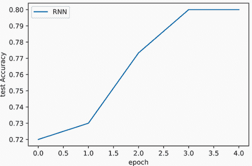

现在我们已经训练了我们的模型，我们可以对其进行一些实验。让我们尝试输入几个名字，看看模型对它们的看法。记住，我们将所有名字都转换为小写，所以不要使用任何大写字母：

```
pred_rnn = first_rnn.to("cpu").eval() 
with torch.no_grad(): 
    preds = F.softmax(pred_rnn( 
        dataset.string2InputVec("frank").reshape(1,-1)), dim=-1) 
    for class_id in range(len(dataset.label_names)):
        print(dataset.label_names[class_id], ":", 
            preds[0,class_id].item()*100 , "

Arabic : 0.002683540151338093 \%
Chinese : 0.2679025521501899 \%
Czech : 10.59301644563675 \%
Dutch : 7.299012690782547 \%
English : 36.81915104389191 \%
French : 0.5335223395377398 \%
German : 37.42799460887909 \%
Greek : 0.018611310224514455 \%
Irish : 0.7783998735249043 \%
Italian : 1.1141937226057053 \%
Japanese : 0.00488687728648074 \%
Korean : 0.421459274366498 \%
Polish : 1.1676722206175327 \%
Portuguese : 0.08807195699773729 \%
Russian : 1.2793921865522861 \%
Scottish : 1.6346706077456474 \%
Spanish : 0.14639737782999873 \%
Vietnamese : 0.40296311490237713 \%
```

对于像“Frank”这样的名字，我们得到的最大响应是英语和德语作为源语言，这两个答案都是合理的。Frank 在英语中是一个常见的名字，并且有德国血统。你可以尝试其他名字，看看行为如何变化。这也展示了我们可以如何将我们的 RNN 应用于变长输入。无论输入字符串的长度如何，你最终都会得到一个预测，而在我们之前的例子中，使用全连接或卷积层时，输入必须*始终*是相同的大小。这就是我们使用 RNN 的原因之一，以解决这类问题。

关于分类和伦理的注意事项

我们一直在使用的例子是对现实的过度简化。名字不一定来自*一个*特定的语言，这是我们的模型暗示的，因为每个名字都被标记为一个正确的答案。这是我们模型简化世界以使我们的建模生活更容易的一个例子。

这是一个很好的、如果简化了的话，可以学习的例子，但它也提供了一个很好的机会来讨论机器学习中涉及的一些伦理问题。简化的假设可能是有用的，并有助于解决实际问题，但它们也可能改变你对问题的看法以及模型最终用户对世界的看法。因此，你应该注意在建模时为什么做出这些假设，模型是用来做什么的，以及它是如何得到验证的。这些通常被称为*模型卡片*。

例如，想象一下有人使用我们的语言模型来尝试确定用户的背景，并根据他们的名字改变显示的内容。这可以吗？可能不行。一个名字可能来自多个来源，人们除了名字和出生地之外，还有许多其他方式来形成自己的身份，因此在这种情况下使用此模型可能不是最好的主意。

另一个常见的入门级问题是*情感分类*，你试图确定一个句子或文档是否传达了积极、消极或中性的情感。这种技术可能是有用且有效的。例如，一个食品或饮料品牌可能希望监控 Twitter，看看人们是否在提及带有负面情感的产品的提及，以便公司可以调查潜在的产品故障或不良客户体验。同时，积极、消极和中性并不是唯一的情感，一条信息可以传达更复杂的思想。请确保你的用户了解这些限制，并考虑这些选择。如果你想了解更多关于此类决策的伦理和影响，Kate Crawford ([`www.katecrawford.net`](https://www.katecrawford.net)) 是这个领域的专家，她在网站上提供了一些易于阅读的阅读材料。

## 4.3 通过打包提高训练时间

在构建这个模型时，我们使用了批次大小为 1。这不是训练模型的一种非常有效的方式。如果你将批次大小改为 2 会发生什么？试试看。

你应该会收到一个错误信息。问题在于每个名称的长度不同，因此默认情况下，很难将其表示为张量。张量需要所有维度都一致且相同，但我们的*时间*维度（在这种情况下，每个名称的字符长度）是不一致的。这就是导致错误的原因：我们有两个不同长度的不同序列。

我们在第二章中看到，通过更有效地利用我们的 GPU 计算能力，对数据批次进行训练可以显著减少训练时间，因此我们有充分的理由增加批次大小。然而，由于输入数据大小不同，我们似乎陷入了使用效率低下的批次大小为 1 的困境。

这是一个*抽象*问题，因为从根本上讲，没有任何东西阻止 RNN 处理不同时间长度的输入。为了解决这个问题，PyTorch 提供了*打包序列*抽象（[`mng.bz/4KYV`](http://mng.bz/4KYV)）。PyTorch 中所有可用的 RNN 类型都支持在这个类上工作。

图 4.13 从概念上展示了当我们打包六个不同长度的不同序列时发生的情况。PyTorch 根据长度组织它们，并首先将所有序列的第一个时间步包含在一个*时间批次*中。随着时间的推移，较短的序列达到其末尾，批次大小减少到尚未到达末尾的序列数量。

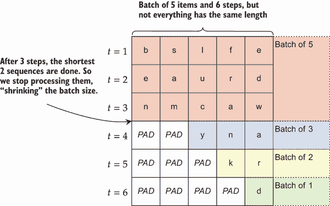

图 4.13 打包长度为 3、3、4、5 和 6 的五个项目的示例。在前三个步骤中，我们处理所有五个序列。在第四步*t* = 4 时，有两个序列已经结束，所以我们丢弃它们，并仅在长度≥4 的序列上继续批次。打包根据长度组织数据，使其快速高效。

让我们通过这个例子来谈谈正在发生的事情。我们正在尝试对一个包含五个名字的批次进行训练：“ben”、“sam”、“lucy”、“frank”和“edward”。打包过程已按长度从短到长对它们进行排序。在这个序列中总共有 *T* = 6 个步骤，因为“edward”是最长的名字，有六个字符。这意味着我们的 RNN 总共将执行六次迭代。现在让我们看看每个步骤会发生什么：

1.  在第一次迭代中，所有五个项目作为一个大批次一起处理。

1.  所有五个项目再次作为一个大批次一起处理。

1.  所有五个项目再次处理，但我们已经到达了前两个项目“ben”和“sam”的末尾。我们从*这个*步骤记录它们的最终隐藏状态**h**[3]，因为那时它们已经完成处理。

1.  仅处理包含“lucy”、“frank”和“edward”的三个项目批次，因为前两个项目已经完成。PyTorch 自适应地*缩小*有效批次大小到剩余的数量。“lucy”已完成，其最终状态保存为**h**[4]。

1.  仅处理包含两个项目的批次。“frank”在此步骤后完成，因此**h**[5]为“frank”保存。

1.  最后一步只处理一个项目，“edward”，这使我们到达批次的末尾和最终的隐藏状态：**h**[6]。

以这种方式处理确保我们为每个项目获得正确的隐藏状态 *h*[T]，即使它们的长度不同。这也使 PyTorch 运行得更快。我们尽可能进行高效的批量计算，并在需要时缩小批次，这样我们只处理仍然有效的数据。

### 4.3.1  填充和打包

打包实际上涉及两个步骤：*填充*（使所有内容长度相同）和*打包*（存储有关使用了多少填充的信息）。为了实现填充和打包，我们需要覆盖`DataLoader`使用的*collate 函数*。这个函数的工作是将许多独立的数据点组合成一个更大的项目批次。默认的 collate 函数可以处理形状相同的张量。我们的数据以元组（**x**[i]，*y*[i]）的形式出现，形状分别为(*T*[i])和(1)。*T*[i]对于每个项目可能不同，这通常是一个问题，因此我们需要定义一个新的函数，称为`pad_and_pack`。它是一个两步过程，如图 4.14 所示。

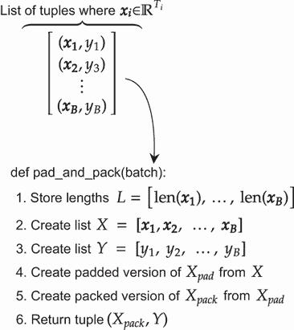

图 4.14 打包和填充输入的步骤，以便在具有不同长度的数据批次上训练 RNN

输入作为列表对象传递给我们的函数。元组中的每个项目都直接来自`Dataset`类。因此，如果您更改`Dataset`以执行独特操作，这就是如何更新`DataLoader`以与之一起工作。在我们的情况下，`Dataset`返回一个包含（输入，输出）的元组，因此我们的`pad_and_pack`函数接受一个元组列表。步骤如下：

1.  存储每个项目的长度。

1.  创建只包含输入和只包含输出标签的新列表。

1.  创建输入列表的 *填充* 版本。这使得所有张量具有相同的大小，并在较短的项后面附加一个特殊标记。PyTorch 可以使用 `pad_sequence` 函数来完成此操作。

1.  使用 PyTorch 的 `pack_padded_sequence` 函数创建输入的 *打包* 版本。这个函数接受填充版本作为输入，以及长度列表，这样函数就知道每个项目最初有多长。

这就是高级概念。以下代码实现了这个过程：

```
def pad_and_pack(batch): 
    input_tensors = []                                     ❶
    labels = [] 
    lengths = [] 
    for x, y in batch: 
        input_tensors.append(x) 
        labels.append(y) 
        lengths.append(x.shape[0])                         ❷
    x_padded = torch.nn.utils.rnn.pad_sequence(            ❸
    ➥ input_tensors, batch_first=False) 

    x_packed =                                             ❹

    torch.nn.utils.rnn.pack_padded_sequence(x_padded, lengths, 
    ➥ batch_first=False, enforce_sorted=False) 
    y_batched = torch.as_tensor(labels, dtype=torch.long)  ❺

    return x_packed, y_batched                             ❻
```

❶ 将批输入长度、输入和输出组织为单独的列表

❷ 假设形状是 (T, *)

❸ 创建输入的填充版本

❹ 从填充和长度创建打包版本

❺ 将长度转换为张量

❻ 返回一个包含打包输入及其标签的元组

注意关于此代码的两个要点。首先，我们设置了可选参数 `batch_first=` `False`，因为我们的输入数据还没有批维度；它只有长度。如果我们有一个批维度，并且它存储为第一个维度（大多数代码的规范），我们将此值设置为 `True`。

第二，对于打包步骤，我们设置了标志 `enforce_sorted=False`，因为我们选择不对输入批次按长度进行预排序。如果我们设置 `enforce_sorted=True`，我们会得到一个错误，因为我们的输入没有排序。PyTorch 的旧版本要求你自己进行此排序，但当前版本可以在未排序的输入上正常工作。它仍然避免了不必要的计算，并且通常速度相同，所以我们选择了这个更简单的选项。

### 4.3.2  可打包嵌入层

在我们能够构建一个可以批量训练的 RNN 之前，我们还需要一个额外的项目。结果是 PyTorch 的 `nn.Embedding` 层不能处理打包输入。我发现创建一个新的包装器 `Module` 最为简单，该包装器在构造函数中接受一个 `nn.Embedding` 对象，并修复它以处理打包输入。这在上面的代码中显示：

```
class EmbeddingPackable(nn.Module): 
    """ 
    The embedding layer in PyTorch does not support Packed Sequence objects. 
    This wrapper class will fix that. If a normal input comes in, it will 
    use the regular Embedding layer. Otherwise, it will work on the packed 
    sequence to return a new Packed sequence of the appropriate result. 
    """

    def __init__(self, embd_layer): 
        super(EmbeddingPackable, self).__init__() 
        self.embd_layer = embd_layer 
    def forward(self, input):
        if type(input) == torch.nn.utils.rnn.PackedSequence: 
        sequences, lengths = 
        ➥ torch.nn.utils.rnn.pad_packed_sequence(      ❶
        ➥ input.cpu(), batch_first=True) 
        sequences = self.embd_layer(sequences.to(       ❷
        ➥ input.data.device)) 
        return torch.nn.utils.rnn.pack_padded_sequence( ❸
        ➥ sequences, lengths.cpu(), 
        ➥ batch_first=True, enforce_sorted=False) 
    else:
        return self.embd_layer(input)                   ❹
```

❶ 解包输入

❷ 嵌入它

❸ 将其打包到一个新的序列中

❹ 适用于正常数据

第一步是检查输入是否为 `PackedSequence`。如果是打包的，我们需要首先 *解包* 输入序列。现在我们有一个解包的张量，因为它要么是作为解包提供的，要么是我们自己解包的，所以我们可以调用我们保存的原始 `embd_layer`。请注意，因为我们的数据是一个打包的 *批次*，并且批次维度是 *第一个* 维度，我们必须设置 `batch_first=True` 标志。解包会给我们原始的 *填充* `序列` 以及它们各自的 `长度`。下一行对解包的 `序列` 执行标准嵌入操作，确保将 `sequences` 移动到原始 `input.data` 所在的相同计算设备。我们调用 `pack_padded_sequence` 再次创建现在已嵌入的输入的打包版本。

### 4.3.3  训练批处理 RNN

我们有了`EmbeddingPackable`模块和新的`pad_and_pack`归一化函数，我们就可以准备批量训练 RNN 了。首先我们需要创建新的`DataLoader`对象。这看起来和之前一样，只是我们指定了可选参数`collate_fn=pad_and_pack`，以便它使用`pad_and_pack`函数创建训练数据批量：

```
B = 16 
train_loader = DataLoader(train_data, batch_size=B, shuffle=True, 
➥ collate_fn=pad_and_pack) 
test_loader = DataLoader(test_data, batch_size=B, shuffle=False, 
➥ collate_fn=pad_and_pack)
```

在这个例子中，我们选择了一次使用 16 个数据点的批量。下一步是定义我们新的 RNN 模块。我们使用`nn.Sequential`从`EmbeddingPackable`构建模型，以执行嵌入，使用`nn.RNN`创建 RNN 层，使用`LastTimeStep`提取最终隐藏状态，并使用`nn.Linear`根据输入进行分类：

```
rnn_packed = nn.Sequential(
    EmbeddingPackable(nn.Embedding(vocab_size, D)), ❶
    nn.RNN(D, hidden_nodes, batch_first=True),      ❷
    LastTimeStep(),                                 ❸

    nn.Linear(hidden_nodes, classes),               ❹
)

rnn_packed.to(device)
```

❶ (B, T) -> (B, T, D)

❷ (B, T, D) -> ( (B,T,D) , (S, B, D) )

❸ 将 RNN 输出减少到一个项目，(B, D)

❹ (B, D) -> (B, classes)

最后我们可以训练这个模型。它通过调用我们的`train_simple_network`来工作，因为我们已经将打包和填充的所有问题抽象到`collate_fn`和`EmbeddingPackable`对象中。批量训练也更为高效，所以我们训练了 20 个 epoch——是之前的四倍：

```
packed_train = train_simple_network(rnn_packed, loss_func, train_loader, test_loader=test_loader, score_funcs={’Accuracy’:
accuracy_score}, device=device, epochs=20)
```

如果我们看这个模型的准确率，它总体上与批量大小为 1 的训练模型非常相似，但可能略差。对于训练 RNN 来说，这种行为并不罕见——随着时间的推移和多个输入的权重共享可能会使学习 RNN 变得困难。因此，人们通常将 RNN 的批量大小保持相对较小以提高性能，但在接下来的两个章节中，我们将学习帮助解决这个问题的一些技术。

这是图表：

```
    sns.lineplot(x=’epoch’, y=’test Accuracy’, data=batch_one_train, 
    ➥ label=’RNN: Batch=1’) 
    sns.lineplot(x=’epoch’, y=’test Accuracy’, data=packed_train, 
    ➥ label=’RNN:Packed Input’)

[26]: <AxesSubplot:xlabel='epoch', ylabel='test Accuracy'>
```


然而，这个图是查看性能作为*epoch*函数的。通过将数据打包到更大的批量中，训练速度要快得多。如果我们看准确率作为总等待时间的函数，打包变得更加具有竞争力：

```
    sns.lineplot(x=’total time’, y=’test Accuracy’, data=batch_one_train, 
    ➥ label=’RNN: Batch=1’) 
    sns.lineplot(x=’total time’, y=’test Accuracy’, data=packed_train, 
    ➥ label=’RNN:Packed Input’)

[27]: <AxesSubplot:xlabel='total time', ylabel='test Accuracy'>
```

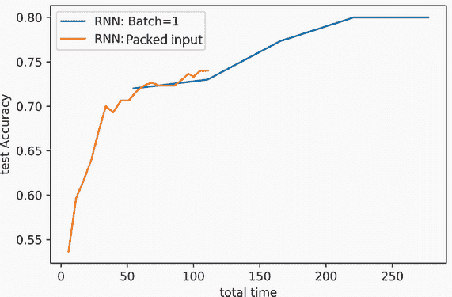

### 4.3.4  同时打包和未打包的输入

我们编写代码的方式给我们带来了一点点小的好处，这使得代码在不同场景下更加灵活。RNN 层可以接受打包的序列对象*或*正常张量。我们新的`EmbeddingPackable`也支持这两种类型的输入。我们一直在使用的`LastTimeStep`函数总是返回一个正常张量，因为没有理由或价值将最后一步打包。因此，我们刚才编写的相同代码将适用于*打包和非打包*输入。我们可以通过尝试预测一些新名字的语言起源来确认这一点：

```
pred_rnn = rnn_packed.to("cpu").eval()

with torch.no_grad(): 
    preds = F.softmax(pred_rnn(dataset.string2InputVec( 
        "frank").reshape(1,-1)), dim=-1) 
    for class_id in range(len(dataset.label_names)):
        print(dataset.label_names[class_id], ":", 
            preds[0,class_id].item()*100 , "%")

Arabic : 0.586722744628787 \%
Chinese : 0.5682710558176041 \%
Czech : 15.79725593328476 \%
Dutch : 5.215919017791748 \%
English : 42.07158088684082 \%
French : 1.7968742176890373 \%
German : 13.949412107467651 \%
Greek : 0.40299338288605213 \%
Irish : 2.425672672688961 \%
Italian : 5.216174945235252 \%
Japanese : 0.3031977219507098 \%
Korean : 0.7202120032161474 \%
Polish : 2.772565931081772 \%
Portuguese : 0.9149040095508099 \%
Russian : 4.370814561843872 \%
Scottish : 1.0111995041370392 \%
Spanish : 1.2703102082014084 \%
Vietnamese : 0.6059217266738415 \%
```

这样使得代码在训练（在数据批量上）和预测（我们可能不想等待数据批量）时更容易重用。代码在可能或可能不支持打包输入的其他代码中重用也更容易。

这种不一致的支持源于 RNN 和序列处理起来更为复杂。我们投入了大量额外的工作来使代码能够处理数据批次，而网上许多代码并没有这样做。当你学习关于训练或使用 RNN 的新技术时，它可能不支持像这个代码那样打包的输入。通过以我们这种方式编写代码，你可以获得两全其美的效果：使用标准工具进行更快的批量训练，并且与其他可能没有投入同样努力的工具兼容。

## 4.4 更复杂的 RNN

更复杂的 RNN 可用：特别是，我们可以创建具有多层和从右到左处理信息（除了从左到右）的 RNN。这两个变化都提高了 RNN 模型的准确率。虽然我们似乎有两个新的概念要学习关于 RNN，但 PyTorch 使得这两个概念都很容易添加，只需付出最小的努力。

### 4.4.1 多层

就像我们学过的其他方法一样，你可以堆叠多个 RNN 层。然而，由于训练 RNN 的计算复杂性，PyTorch 提供了高度优化的版本。你不需要手动在序列中插入多个 `nn.RNN()` 调用，而是可以传递一个选项来告诉 PyTorch 使用多少层。图 4.15 展示了一个具有两层 RNN 的示意图。

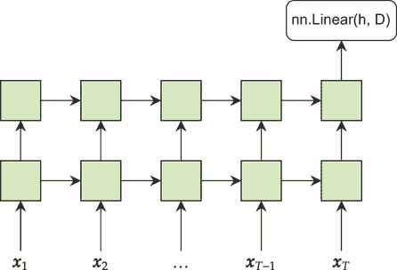

图 4.15 展示了一个具有两层 RNN 的示例。箭头显示了从一层 RNN 单元到另一层的连接。同一层中颜色相同的块共享权重。输入向量从底部进入，最后一个 RNN 的输出可以进入一个全连接层以产生预测。

在 RNN 中添加多个层会重复隐藏单元从上一层的相同级别和当前时间步的上一级结果中获取输入的模式。如果我们想要一个具有三个循环层的模型，只需将 `num_layers=3` 添加到我们的 `RNN` 和 `LastTimeStep` 对象中就足够简单了：

```
rnn_3layer = nn.Sequential(
    EmbeddingPackable(nn.Embedding(vocab_size, D)),          ❶
    nn.RNN(D, hidden_nodes, num_layers=3, batch_first=True), ❷

    LastTimeStep(rnn_layers=3),                              ❸

    nn.Linear(hidden_nodes, classes),                        ❹
)

rnn_3layer.to(device) 
rnn_3layer_results = train_simple_network(rnn_3layer, loss_func, 
    train_loader, test_loader=test_loader, lr=0.01, 
    score_funcs={’Accuracy’: accuracy_score}, device=device, epochs=20,
)
```

❶ (B, T) -> (B, T, D)

❷ (B, T, D) -> ( (B,T,D) , (S, B, D) )

❸ 将 RNN 输出减少到一个项目，(B, D)

❹ (B, D) -> (B, classes)

绘制三层方法的准确率图表明，它通常表现更好，但通常不会更差。其中一些又与 RNN 的复杂性有关。我的建议是查看在架构中使用两到三层循环组件。虽然更多层可以做得更好，但它变得非常昂贵，并且训练 RNN 的困难可能会阻碍深度带来的收益。我们将在本书的后面部分了解其他可以带来更多优势的技术。

下面是图表：

```
    sns.lineplot(x=’epoch’, y=’test Accuracy’, data=packed_train, 
    ➥ label=’RNN: 1-Layer’) 
    sns.lineplot(x=’epoch’, y=’test Accuracy’, data=rnn_3layer_results, 
    ➥ label=’RNN: 3-Layer’)

[30]: <AxesSubplot:xlabel='epoch', ylabel='test Accuracy'>
```

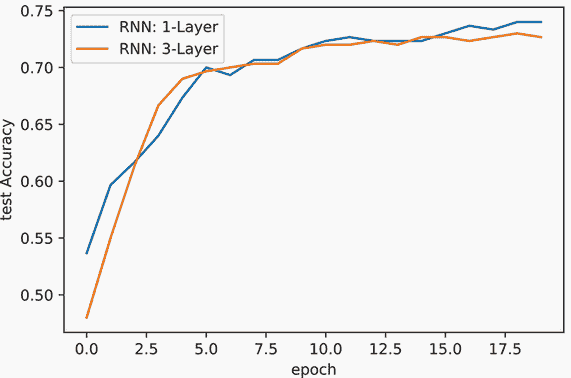

### 4.4.2 双向 RNN

更高级的改进是创建一个 *双向* RNN。你可能已经注意到，我们的 RNN 总是从左到右进行，但这可能会使学习变得具有挑战性。如果我们需要的信息出现在输入序列的前面呢？RNN 必须确保信息在多个时间步中存活，每个时间步都是引入噪声或使其他信息模糊过去的机会。

要思考为什么保留信息随时间推移变得困难的一个好方法是通过想象一个极端场景。比如说，你的 RNN 层中只有 32 个神经元，但时间序列有 *10 亿步长*。RNN 中的信息完全存在于只有 32 个值的宇宙中，这根本不足以在经过十亿次操作后保持该信息完整。

为了让 RNN 更容易地从长序列中获取所需信息，我们可以让 RNN 同时向两个方向遍历输入，并将这些信息与 RNN 的下一层共享。这意味着在 RNN 的第二层，时间步 1 有关于时间步 T 的 *一些* 信息。信息在 RNN 中更均匀地积累，这可以使学习更容易。这种 RNN 的连接在图 4.16 中显示。

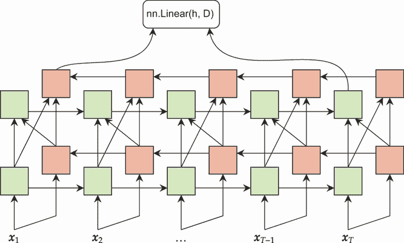

图 4.16 双向 RNN。每个时间步的输出都进入两个 RNN：一个从左到右处理输入（绿色），另一个从右到左处理输入（红色）。两个 RNN 的输出通过连接组合，在每个步骤创建一个新项目。然后这个项目进入两个输出。

注意，现在的最后一个时间步现在部分来自序列中最左侧和最右侧的项目。我们的 `LastTimeStep` 函数已经处理了这一点，这就是我们为什么要实现它的原因。它允许我们无缝地处理这个新特性。

高效且准确地实现双向 RNN 并非易事。幸运的是，PyTorch 再次让这变得简单：只需设置 `bidirectional=True` 标志。但请注意，现在的最终隐藏状态现在大了两倍，因为我们有了来自每个方向的最终激活，所以我们的 `LastTimeStep` 的值是预期的两倍。只要我们记得在最终的 `nn.Linear` 层中乘以 `hidden_nodes*2`，这仍然可以工作，只需做少许改动。新的代码如下：

```
    rnn_3layer_bidir = nn.Sequential(
        EmbeddingPackable(nn.Embedding(vocab_size, D)), ❶
        nn.RNN(D, hidden_nodes, num_layers=3, 
        batch_first=True, bidirectional=True),          ❷
        LastTimeStep(rnn_layers=3, bidirectional=True), ❸
        nn.Linear(hidden_nodes*2, classes),             ❹
    )

    rnn_3layer_bidir.to(device) 
    rnn_3layer_bidir_results = train_simple_network(rnn_3layer_bidir, 
    ➥ loss_func, train_loader, test_loader=test_loader, 
    ➥ score_funcs={’Accuracy’: accuracy_score}, device=device, 
    ➥ epochs=20, lr=0.01)

    sns.lineplot(x=’epoch’, y=’test Accuracy’, data=packed_train, 
    ➥ label=’RNN: 1-Layer’) 
    sns.lineplot(x=’epoch’, y=’test Accuracy’, data=rnn_3layer_results, 
    ➥ label=’RNN: 3-Layer’) 
    sns.lineplot(x=’epoch’, y=’test Accuracy’, data=rnn_3layer_bidir_results, 
    ➥ label=’RNN: 3-Layer BiDir’)

[32]: <AxesSubplot:xlabel='epoch', ylabel='test Accuracy'>
```

❶ (B, T) -> (B, T, D)

❷ (B, T, D) -> ( (B,T,D) , (S, B, D) )

❸ 将 RNN 输出减少到一项，(B, D)

❹ (B, D) -> (B, classes)

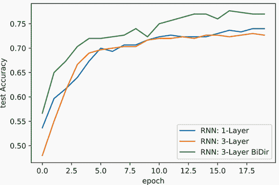

结果表明，双向 RNN 有明显的优势。只要可能，就使用双向 RNN，因为它使网络学习跨时间访问信息变得容易得多。这导致我们简单问题的准确性有所提高。但也会有你不想或不能使用双向版本的情况；这些例子将在本书的后面部分介绍。

## 练习

在 Manning 在线平台 Inside Deep Learning Exercises（[`liveproject.manning.com/project/945`](https://liveproject.manning.com/project/945)）上分享和讨论你的解决方案。一旦你提交了自己的答案，你将能够看到其他读者提交的解决方案，并看到作者认为哪些是最好的。

1.  修改`LanguageNameDataset`，使得构造函数中的`vocabulary`对象不需要作为参数传入，而是可以从输入数据集中*推断*出来。这意味着你需要遍历数据集并创建一个包含所有实际出现的字符的字典。一种实现方式是创建一个默认值`vocabulary=None`，并使用`is vocabulary None:`来改变行为。

1.  在`LanguageNameDataset`的构造函数中添加一个标志`unicode=False`。修改任何需要的代码，以便当`unicode=True`时，`Language-``NameDataset`将保留在`vocabulary=None`时看到的所有 Unicode 字符（这取决于练习 1）。使用`unicode=True`训练一个新的 RNN 分类器。这如何影响结果？

1.  在`LanguageNameDataset`的构造函数中添加一个新的`min_count=1`参数。如果`vocabulary=None`，它应该用特殊的`"UNK"`标记替换出现次数太少的任何字符，表示未知值。设置`min_count=300`如何影响词汇表的大小，以及结果会发生什么变化？

1.  这个任务的原始训练/测试集分割是通过随机采样数据集创建的。创建你自己的函数来执行*分层*分割：选择一个测试集，其中每个类的比例相同。这如何影响你的表面结果？

1.  将 RNN 实现中的最后一个输出层`nn.Linear(hidden_nodes, classes)`替换为一个具有两个隐藏层和一个输出层的全连接网络。这如何影响模型的准确性？

1.  你可以使用归一化函数来实现有趣的功能。为了更好地理解其工作原理，实现你自己的`collate_fn`，该函数从一批训练数据中删除一半的项目。使用这个模型的两个 epoch 进行训练与使用一个 epoch 的正常`collate_fn`进行训练获得相同的结果吗？为什么或为什么不？

1.  比较训练一个三层双向 RNN，批大小为*B* = {1, 2, 4, 8}，进行五个 epoch。哪个批大小似乎在速度和准确性之间提供了最佳平衡？

## 摘要

+   递归神经网络（RNNs）用于处理以序列形式到来的数据（例如，文本）。

+   RNN 通过使用权重共享来工作，因此相同的权重被用于序列中的每个项目。这使得它们能够处理可变长度的序列。

+   文本问题需要一个标记的词汇表。嵌入层将这些标记转换为 RNN 的输入向量。

+   隐藏状态被传递到序列的下一步，并向上传递到下一层。右上角的隐藏状态（最后一层，正在处理的最后一个项目）是整个序列的表示。

+   为了在序列批次上训练，我们将它们填充到相同的长度，并使用打包函数，以确保只处理输入的有效部分。

+   通过双向处理数据（从左到右和从右到左）可以提高 RNN 的准确率。

* * *

¹ 这是一个真实的模型类型，但它往往需要很长时间来训练。我们不会做任何如此复杂的例子。↩
