# 5 现代训练技术

本章涵盖了

+   使用学习率调度改进长期训练

+   使用优化器改进短期训练

+   结合学习率调度和优化器来提高任何深度模型的结果

+   使用 Optuna 调整网络超参数

到目前为止，我们已经学习了神经网络的基础知识以及三种类型的架构：全连接、卷积和循环。这些网络使用一种称为随机梯度下降（SGD）的方法进行训练，这种方法自 20 世纪 60 年代以来一直被使用。自那时以来，已经发明了新的改进方法来学习我们网络的参数，如动量和学习率衰减，这些方法可以通过在更少的更新中收敛到更好的解决方案来提高**任何问题**的**任何神经网络**。在本章中，我们将了解深度学习中一些最成功和最广泛使用的 SGD 变体。

因为神经网络没有约束，它们往往最终会陷入具有许多局部最小值的复杂优化问题，如图 5.1 所示。这些最小值似乎通过尽可能多的减少损失来实现，这意味着我们的模型已经学习到了，但全局上下文表明其他最小值可能更好。并非所有局部最小值都是“坏的”；如果一个最小值足够接近全局最小值，我们可能会得到好的结果。但有些局部最小值根本无法给我们提供我们想要的预测准确性的模型。因为梯度下降是“局部”做出决定的，一旦我们达到局部最小值，我们就不知道这个最小值有多“好”，或者如果我们想要尝试找到一个新的最小值，我们应该朝哪个方向前进。

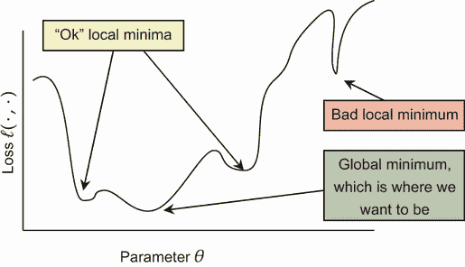

图 5.1 神经网络可能遇到的损失景观示例。y 轴上的损失是我们想要最小化的，但有许多局部最小值。有一个全局最小值是最佳解决方案，有两个局部最小值几乎一样好——还有一个坏的最小值，它将不起作用。

在本章中，我们学习了**学习率调度**和**优化器**，这些可以帮助我们更快地达到更好的最小值，从而使得神经网络在更少的 epoch 中达到更高的准确性。同样，这适用于**你将训练的每一个网络**，并且在现代设计中无处不在。

为了做到这一点，我们快速回顾一下梯度下降，看看它如何可以被分成两部分：梯度和学习率**调度**。PyTorch 为这两者都提供了特殊的类，因此我们编写了一个新的`train_network`函数，将我们通过书籍看到的`train_simple_network`函数替换掉，该函数结合了这两个抽象。这些新的抽象将在 5.1 节中介绍。然后我们开始填充这些抽象的细节以及它们是如何工作的，首先是学习率调度在 5.2 节中，然后是梯度更新策略在 5.3 节中。

我们还忽略了一个**第二个**优化问题，那就是如何选择所有这些超参数，比如层数、每层的神经元数量等等。在第 5.4 节中，我们将学习如何使用一个名为 Optuna 的工具来选择超参数。Optuna 具有特殊功能，使其在拥有许多超参数时设置超参数变得非常出色，并且避免了训练许多不同网络以尝试参数的完整成本。

本章篇幅略长，因为我们解释了为什么这些使用梯度的较新技术可以减少获得良好解决方案所需的迭代次数，而许多其他资料则直接跳到使用这些改进方法。这一点也很重要，因为研究人员一直在努力改进策略，而我们从原始的随机梯度下降（SGD）到现代方法的额外努力将帮助你欣赏未来改进的潜力，并理解为什么它们可能有所帮助。特别是 Optuna 部分，可能会显得有些奇怪，因为我们不会在其他章节中使用这个主题，因为它可能会妨碍学习其他技术。但 Optuna 及其调整超参数的方法是深度学习中的一个关键实际技能，这将帮助你保持高效并构建更精确的解决方案。

## 5.1 两部分的梯度下降

到目前为止，我们一直将学习通过梯度下降视为一个单一的方程和过程。我们选择一个损失函数 ℓ 和一个网络架构 f，然后梯度下降就更新权重。因为我们想改进梯度下降的工作方式，我们首先需要识别和理解它的两个组成部分。通过认识到这两个组成部分具有不同的行为，我们可以制定策略来改进每一个，以便我们的网络在更少的迭代次数中学习更精确的解决方案。让我们先快速回顾一下梯度下降是如何工作的。

记住，我们在深度学习中所做的一切都是通过将网络视为一个巨大的函数 *f*Θ 来实现的，我们需要使用相对于 f 的参数 (Θ) 的梯度 (∇) 来调整其权重。因此，我们执行

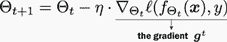

这被称为**梯度下降**，是所有现代神经网络训练的基础。然而，我们在如何执行这个关键步骤方面还有很大的改进空间。我们用 **g**^t 作为梯度的简写，因为我们在这个部分中经常提到它。请注意，我们像它是一个序列的一部分那样包含了这个 ^t 上标。这是因为当我们学习时，我们为处理的数据的每一批都得到一个新的梯度，因此我们的模型是从一系列梯度中学习的。我们将在后面利用这一点。

使用这种简写，可以更清楚地看出这个过程只有两个部分：梯度 **g**^t 和学习率 η，正如我们在这里所看到的。我们只能改变这两个部分来尝试改进：

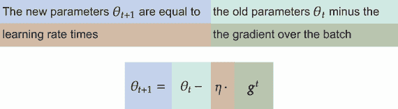

### 5.1.1  添加学习率调度器

让我们讨论早期更新方程的问题。首先，存在一个关于学习率 η 的问题。我们为 *每个 epoch 的训练中的每个批次* 选择 *一个* 学习率。这可能是一个不合理的期望。以一个类比来说明，想象一辆火车从一个城市开往另一个城市。火车不会以全速行驶，然后到达目的地后立即停下来。相反，火车在接近目的地时会减速。否则，火车会呼啸而过目的地。

因此，我们可以讨论的第一种改进类型是将学习率 η 作为优化过程中我们进展程度的函数来调整（t）。让我们称这个函数为 L，并给它一个 *初始* 学习率 *η*[0] 和当前的迭代步骤 t 作为输入：

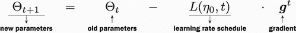

我们很快会回顾如何定义 *L*(*η*[0],*t*) 的细节。现在，重要的是要理解我们已经创建了一个用于调整学习率的抽象，这个抽象被称为 *学习率调度器*。我们可以根据需要或问题使用这个调度器来替换 L。在我们用代码展示这个功能之前，我们需要讨论更新方程的第二个部分，它与 PyTorch 中的学习率调度器 *L*(⋅,⋅) 密切相关。

### 5.1.2  添加优化器

这一部分没有令人满意的名称；PyTorch 称之为优化器，但这也描述了整个过程。尽管如此，我们仍将使用这个名字，因为它是最常见的——这是我们 *使用* 梯度 **g**^t 的方式。所有信息和学习都来自 **g**^t；它控制网络学习的内容以及学习效果的好坏。学习率 η 简单地控制我们跟随该信息的速度。但梯度 **g**^t 的好坏取决于我们用来训练模型的数据。如果我们的数据有噪声（而且几乎总是如此），我们的梯度也会有噪声。

这些噪声梯度及其对学习的影响在图 5.2 中用三种其他情况展示。一个是理想的梯度下降路径，这几乎从未发生。其他两个是真实问题。例如，我们有时会得到一个**g**^t 梯度，它只是*太大*。这发生在我们向网络添加数百层时，是一个常见的问题，称为*梯度爆炸*。从数学上讲，这将是一个∥**g**^t∥[2] → ∞的情况。如果我们使用这个梯度，我们可能采取比我们原本打算的更大的步骤（即使η很小），这可能会降低性能甚至完全阻止我们学习。相反的情况也会发生；梯度可能太小∥**g**^t∥[2] → 0，导致我们无法在训练中取得进展（即使η很大）。这被称为*梯度消失*，几乎在任何架构中都会发生，但当我们使用 tanh(⋅)和*σ*(⋅)激活函数时尤其常见。¹ 在查看这四种情况时，请记住，优化也意味着*最小化*，因此从高值（红色）到低值（绿色）的过程实际上是神经网络“学习”的方式。

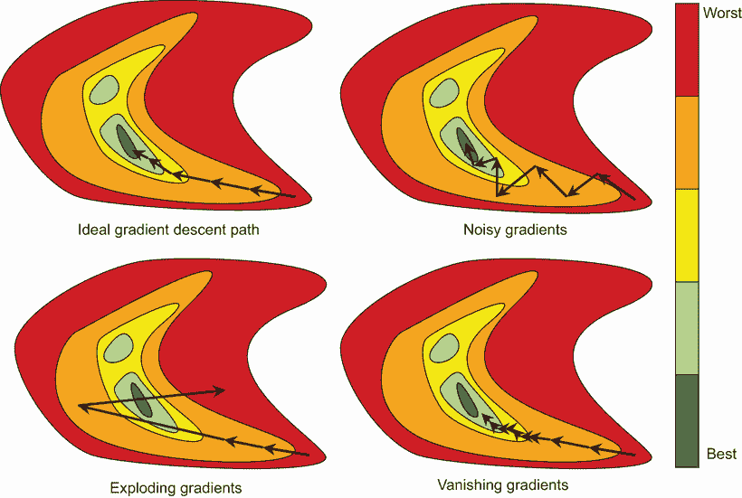

图 5.2 展示了梯度下降的三个场景的玩具示例。每个场景都是一个从红色（高值，不好）到深绿色（低值，好）的 2D 优化等高线图。理想情况在左上角，每个梯度正好指向解。右上角显示了*噪声*梯度，导致下降方向不完全正确，需要更多步骤。左下角显示了梯度爆炸，我们开始采取过大的步骤，远离解。右下角显示了梯度消失，梯度变得如此之小，以至于我们必须采取过多的步骤才能到达解。

在这些情况下，天真地使用原始梯度 *g*^t 可能会误导我们。再次强调，我们可能需要引入一个抽象，它将 *g*^t 作为输入，并执行更聪明的操作以避免这些情况。我们称这个函数为 G，它*改变*梯度，使其表现更好并帮助加速学习。因此，我们现在再次更新我们的方程，得到：

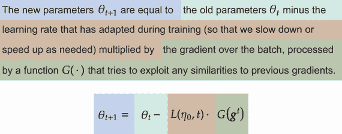

现在我们有一个新的梯度下降方程。它具有之前所有的基本组件，还有一些额外的抽象使其更加灵活。这两种策略——调整学习率和梯度——在现代深度学习中无处不在。因此，它们在 PyTorch 中都有接口。所以让我们定义一个新的`train_simple_network`函数版本，它允许这两种改进。然后我们可以使用这个新函数来比较新技术的效果，并在以后继续使用它们。

*L*(⋅,⋅) 和 *G*(⋅) 之间的相互作用

学习率计划和梯度更新最终解决类似的目标，那么为什么要有两者而不是选择其一？你可以把它们看作是在两个时间尺度上工作。学习率计划*L*(⋅,⋅)在每个 epoch 中*运行一次*来调整全局进度率。梯度更新函数*G*(⋅)在每个 batch 上操作，所以如果你有数百万个数据点，你可能要调用*G*(⋅)数百万次，但最多只调用*L*(⋅,⋅)几百次。所以你可以把这些东西看作是在长期和短期策略之间进行平衡，以最小化函数。像生活中的许多事情一样，保持平衡比仅仅关注短期或长期目标要好。

### 5.1.3 实现优化器和调度器

PyTorch 为我们提供了两个接口来实现我们描述的*L*(⋅,⋅)和*G*(⋅)函数。第一个是`torch.optim.Optimizer`类，你之前已经使用过。我们开始替换`SGD`对象，但使用具有相同接口的其他优化器，所以几乎不需要更改代码。新的类是`_LRScheduler`，它为我们提供了几个选项。为了实现我们的`train_network`函数，我们只需对`train_simple_network`代码进行一些修改。图 5.3 显示了高级过程，其中只有黄色中的一个新步骤，对更新步骤的轻微更改，使用*G*(⋅)表示我们可以更改梯度使用的方式。


图 5.3 新的训练循环过程图。主要变化是黄色的新步骤 1，显示我们有一个学习率计划*L*(⋅,⋅)。该计划决定了步骤 4 中过程使用的学习率*η*[t]。其他一切保持不变。

更新训练代码

现在，让我们谈谈我们需要对`train_simple_network`代码进行的三个更改。我们首先更改的是函数签名，因此现在有两个新的选项可用：优化器和调度器。新的签名如下所示，其中`optimizer`用于*G*(⋅)，而`lr_schedule`用于*L*(⋅,⋅)：

```
def train_network(model, loss_func, train_loader, val_loader=None, 
➥ test_loader=None, score_funcs=None, epochs=50, device="cpu", 
➥ checkpoint_file=None, optimizer=None, lr_schedule=None):
```

注意，我们将两者都设置为默认值为`None`。指定一个计划是*始终*可选的，你可能想根据手头的任务更改所使用的计划。一些问题只需要几个 epoch，而另一些则需要数百甚至数千个 epoch，这两个因素都取决于你有多少数据。出于这些原因，我不喜欢*要求*学习率计划*始终*被使用。我更喜欢先不使用它，然后根据问题添加它。然而，我们必须*始终*使用某种类型的优化器。所以如果没有给出，我们将添加以下代码来使用一个好的默认值（我们将在本章后面了解它是如何工作的）：

```
if optimizer == None: 
optimizer = torch.optim.AdamW(model.parameters()) ❶
```

❶ AdamW 是一个好的默认优化器。

意想不到的是，我们已完成了一半的新代码。我们不需要对`run_epoch`方法进行任何修改，因为通常是在每个*epoch*之后而不是每个*batch*（一个 epoch 由多个 batch 组成）更改学习率。因此，在我们的`run_epoch`函数完成后，我们可以添加以下代码：

```
if lr_schedule is not None: 
    if isinstance(lr_schedule, ReduceLROnPlateau): 
        lr_schedule.step(val_running_loss) 
    else:
        lr_schedule.step() ❶
```

❶ 在 PyTorch 中，惯例是在每个 epoch 后更新学习率。

再次，我们将在稍后了解`ReduceLROnPlateau`。它是学习率调度器家族中的一个独特且特殊的成员，它需要一个额外的参数。否则，我们只需在每个 epoch 结束时调用`step()`函数，学习率调度就会自动更新。你可能认识这个方法是我们用于`run_epoch`中的`Optimizer`类的相同方法，它在每个 batch 结束时调用`optimizer.step()`。这是一个有意的设计选择，以使两个紧密耦合的类保持一致。你可以在 idlmam.py 文件中的代码中找到完整的函数定义（[`github.com/EdwardRaff/Inside-Deep-Learning/blob/main/idlmam.py`](https://github.com/EdwardRaff/Inside-Deep-Learning/blob/main/idlmam.py)）。

使用新的训练代码

这就是准备我们的代码以进行一些新的改进学习所需的所有步骤。现在我们已经实现了新的加载函数，让我们训练一个神经网络。我们使用 Fashion-MNIST 数据集，因为它稍微更具挑战性，同时保留了与原始 MNIST 语料库相同的大小和形状，这将使我们能够在合理的时间内完成一些测试。

在这里，我们加载 Fashion-MNIST，定义一个多层全连接网络，然后以与使用我们旧的`train_simple_network`方法等效的方式进行训练。为此，我们需要通过指定 SGD 优化器来稍微增加一些仪式感：

```
epochs = 50 ❶
B = 256     ❷

train_data = torchvision.datasets.FashionMNIST("./data", train=True, 
transform=transforms.ToTensor(), download=True) 
test_data = torchvision.datasets.FashionMNIST("./data", train=False, 
transform=transforms.ToTensor(), download=True)

train_loader = DataLoader(train_data, batch_size=B, shuffle=True) test_loader = DataLoader(test_data, batch_size=B)
```

❶ 50 个 epoch 的训练

❷ 一个可尊敬的平均批量大小

现在我们编写一些更熟悉的代码，一个包含三个隐藏层的全连接网络：

```
D = 28*28    ❶
n = 128      ❷
C = 1        ❸
classes = 10 ❹

fc_model = nn.Sequential( 
    nn.Flatten(), 
    nn.Linear(D, n), 
    nn.Tanh(), 
    nn.Linear(n, n), 
    nn.Tanh(), 
    nn.Linear(n, n), 
    nn.Tanh(), 
    nn.Linear(n, classes), 
)
```

❶ 输入中有多少个值？我们使用这个值来帮助确定后续层的大小。

❷ 隐藏层大小

❸ 输入中有多少个通道？

❹ 有多少个类别？

最后，我们需要确定一个默认的起始学习率*η*[0]。如果我们不提供任何类型的学习率调度*L*(⋅,⋅)，则*η*[0]将用于每个 epoch 的训练。我们将使用*η*[0] = 0.1，这比通常想要的更激进（也就是说，*大*）。我选择这个较大的值是为了更容易展示我们可以选择的调度的影响。在正常使用中，不同的优化器往往有不同的首选默认值，但使用*η*[0] = 0.001 通常是一个好的起点：

```
eta_0 = 0.1
```

在此基础上，我们可以定义一个与之前相同的简单`SGD`优化器。我们只需要显式调用`torch.optim.SGD`并将其传递给我们自己，这可以在以下代码中看到。注意，我们在`optimizer`的构造函数中设置了默认学习率*η*[0]。这是 PyTorch 中的标准流程，我们可能使用的任何`LRSchedule`对象都将进入`optimizer`对象以改变学习率：

```
loss_func = nn.CrossEntropyLoss()

fc_results = train_network(fc_model, loss_func, train_loader,
➥ test_loader=test_loader, epochs=epochs, 
➥ optimizer=torch.optim.SGD(fc_model.parameters(), lr=eta_0), 
➥ score_funcs={’Accuracy’: accuracy_score}, device=device)
```

就像之前一样，我们可以使用 seaborn 库，通过返回`fc_results` pandas 数据框来快速绘制结果。以下代码和输出显示了我们可以得到的结果，明显地，随着训练的深入，我们得到了更清晰的学习效果，但偶尔也会出现回归。这是因为我们的学习率有点过于激进，但这种行为在具有非激进学习率（如*η*[0] = 0.001）的实际问题中是常见的：

```
    sns.lineplot(x=’epoch’, y=’test Accuracy’, data=fc_results, label=’Fully 
    ➥ Connected’)
[12]: <AxesSubplot:xlabel='epoch', ylabel='test Accuracy'>
```

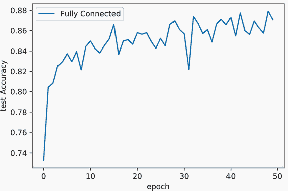

## 5.2 学习率调度

现在我们来谈谈实现我们之前描述的学习率调整（*L*(*η*[0],*t*)）的方法。在 PyTorch 中，这些被称为*学习率调度器*，它们将`optimizer`对象作为输入，因为它们直接改变`optimizer`对象中使用的学习率η。高级方法如图 5.4 所示。我们唯一需要改变的是用于*L*(*η*[0],*t*)的方程，以在调度方案之间切换。

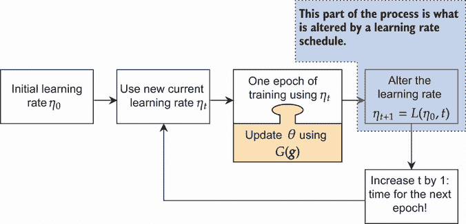

图 5.4 每个学习率调度的通用过程。我们在训练开始前设置初始值，进行一次训练 epoch，然后改变*η*[*t* + 1]，这是下一个 epoch 使用的。梯度优化器*G*(⋅)在每个 epoch 中被多次使用，并且独立于学习率调度。

我们将讨论四种调整学习率的方案，你应该了解。每个方案都有其优缺点。你可以选择你的方案来尝试稳定一个训练不一致的模型（准确率在各个 epoch 之间上下波动），减少训练所需的 epoch 数量以节省时间，或者最大化最终模型的准确率。对于本书的大部分内容，我们使用非常少的训练迭代（10 到 50 次）以确保运行在合理的时间内。当你处理现实生活中的问题时，通常需要训练 100 到 500 个 epoch。你进行的训练 epoch 越多，学习率调度方案的影响就越大，因为改变学习率的机会就越多。所以虽然我们在这本书的其余部分可能不会大量使用这些方案，但你仍然应该了解它们。

我们首先讨论现代使用中最基本的四种学习率调度方案以及它们帮助解决的优化问题类型，以及如何解决。我们将从直观的角度来讨论这些内容，因为证明它们比我们在这本书中想要做的数学要复杂得多。一旦我们回顾了这四种方法，我们将进行一次比较它们的实验。

### 5.2.1 指数衰减：平滑波动训练

我们首先讨论的方法可能不是最常见的方法，但它是其中最简单的一种。它被称为*指数衰减率*。如果你的模型行为不稳定，损失或准确率大幅增加和减少，指数衰减率是一个不错的选择。你可以使用指数衰减来帮助稳定训练并获得更一致的结果。我们选择一个 0 < *γ* < 1 的值，在每次 epoch 后乘以我们的学习率。它由以下函数定义，其中 t 代表当前 epoch：

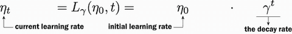

PyTorch 通过 `torch.optim.lr_scheduler.ExponentialLR` 类提供这一功能。因为我们通常进行很多个 epoch，所以确保 γ 不要设置得太激进是很重要的：从期望的*最终*学习率开始是一个好主意，并将其称为*η*[min]。然后，如果你总共训练了 T 个 epoch，你可以设置

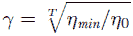

确保你选择的 γ 值能够达到你期望的最小值，并确保学习过程持续进行。

例如，假设初始学习率是 *η*[0] = 0.001，你希望最小值为 *η*[min] = 0.0001，并且你训练了 *T* = 50 个 epoch。你需要设置 *γ* ≈ 0.91201。以下代码模拟了这一过程，并展示了如何编写代码来计算 γ：

```
T=50                                                               ❶

epochs_input = np.linspace(0, 50, num=50)                          ❷

eta_init = 0.001                                                   ❸
eta_min = 0.0001                                                   ❹

gamma = np.power(eta_min/eta_init,1./T)                            ❺

effective_learning_rate = eta_init * np.power(gamma, epochs_input) ❻

sns.lineplot(x=epochs_input, y=eta_init, color=’red’, label="$\eta_0$") 
ax = sns.lineplot(x=epochs_input, y=effective_learning_rate, color=’blue’, 
➥ label="$\eta_0 \cdot \gamma^t$") 
ax.set_xlabel(’Epoch’) 
ax.set_ylabel(’Learning Rate’)

[13]: Text(0, 0.5, 'Learning rate')
```

❶ 总 epoch 数

❶ 生成所有 t 值

❶ 假设初始学习率 *η*[0]

❶ 假设期望的最小学习率 *η*[min]

❶ 计算衰减率 γ

❶ 所有 *η*[t] 值

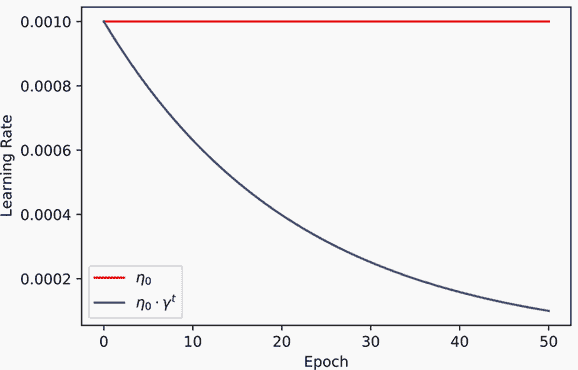

指数衰减率会平滑且一致地降低每个 epoch 的学习率。从高层次来看，有很多人实现这一目标的方法。有些人使用线性衰减 (*η*[0]/(*γ*⋅*t*)) 而不是指数衰减 (*η*[0] ⋅ *γ*^t)，还有各种其他方法可以达到相同的目标；没有人能给你一个明确的操作手册或流程图来选择指数衰减及其相关家族成员。它们都遵循一个相似的理由来解释为什么它们有效，我们将通过以下内容进行讲解。

尤其是指数学习率调度器有助于解决接近解但未能完全达到解的问题。图 5.5 展示了这种情况。黑色线条显示了参数 Θ 随着它们从一个步骤到下一个步骤的变化所采取的路径。初始权重是随机的，所以我们从一个不好的权重集 Θ 开始，并且最初更新将我们推向局部最小值。但随着我们接近最小值，我们开始在该最小值周围弹跳——有时比前一步更接近，有时又远离，这导致损失上下波动。

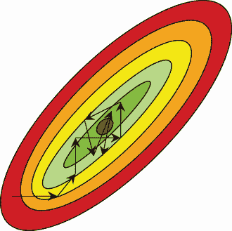

图 5.5 指数学习率帮助解决的极小化问题示例。当你离解还很远时，大的 η 有助于你更快地到达正确的 *区域*。但一旦你处于正确的区域，η 就太大，无法 *达到* 最佳解。相反，它不断超过局部最小值（在这种情况下，它是唯一的极小值，因此也是全局最小值）。

回到我们关于火车前往目的地的类比，当你离目标还很远时，开 *快* 是很棒的，因为它能更快地让你接近目标。但一旦你接近目的地，减速是个好主意。如果车站只有 100 英尺远，火车以每小时 100 英里的速度行驶，火车就会飞快地驶过车站。你希望火车开始减速，以便到达一个精确的位置，这就是指数学习率的作用；示例见图 5.6。

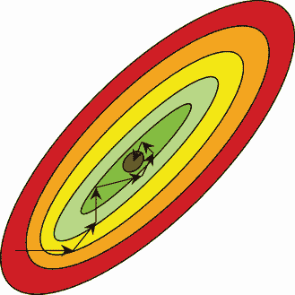

图 5.6 在每一步缩小 η 会使得优化随着接近目的地而减速。这有助于它收敛到局部最小值而不是在其周围弹跳。

使用指数学习率的高招是设置 *η*[min]。我通常建议将其设置为 *η*[0] 的 10 到 100 倍小。在机器学习中，10 到 100 倍的减少是正常的，这也是我们在使用的计划中会看到的一个主题。以下代码展示了我们如何通过在构造时传入 `optimizer` 作为参数来创建指数衰减计划。我们还使用第一行将学习到的权重重置为随机值，这样我们就不必一次又一次地重新指定相同的神经网络：

```
fc_model.apply(weight_reset)                                         ❶ 

eta_min = 0.0001                                                     ❷
gamma_expo = (eta_min/eta_0)**(1/epochs)                             ❸
optimizer = torch.optim.SGD(fc_model.parameters(),                   ❹
➥ lr=eta_0) 
scheduler = torch.optim.lr_scheduler.                                ❺
➥ ExponentialLR(optimizer, gamma_expo)

fc_results_expolr = train_network(fc_model, loss_func, train_loader, 
➥ test_loader=test_loader, epochs=epochs, optimizer=optimizer, 
➥ lr_schedule=scheduler, score_funcs={’Accuracy’: accuracy_score}, 
➥ device=device)
```

❶ 重新随机化模型权重，这样我们就不需要再次定义模型

❷ 所需的最终学习率 *η*[min]

❸ 计算导致 *η*[min] 的 γ

❹ 设置优化器

❺ 选择一个计划并传入优化器

### 5.2.2 步长下降调整：更好的平滑

第二种策略是我们刚刚讨论的指数衰减的一个特别受欢迎的变体。*步长下降* 方法具有相同的动机，也有助于稳定学习，但通常在训练后提供更高的精度。步长下降和指数衰减之间的区别是什么？我们不是不断略微调整学习率，而是让它保持固定一段时间，然后仅几次大幅下降。这如图 5.7 所示。

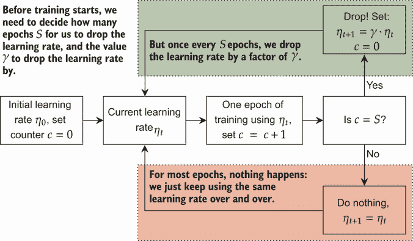

图 5.7 步长下降策略要求我们决定一个初始学习率、衰减因子 γ 和频率 S。每经过 S 个训练周期，我们就将学习率按 γ 的因子减少。

这种方法的逻辑是，在优化的早期，我们仍然离解很远，所以我们应该尽可能快地前进。对于前 S 个轮次，我们以最大速度 *η*[0] 向解前进。这（希望）比指数衰减更好，因为指数衰减会立即减速，因此（至少在开始时）是反效果的。相反，让我们以最大速度继续前进，并简单地一次性或两次立即降低学习率。这样，我们可以尽可能长时间地以最大速度前进，但最终会减速以收敛到解。

我们也可以用更数学的符号表达这种策略。如果我们想每 S 个轮次降低一次学习率，我们得到

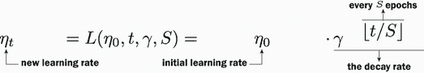

如果你将这个方程与指数衰减日进行比较，你应该注意到它们看起来**几乎相同**并且紧密相连。如果我们将步长下降策略设置为每轮都下降（*S* = 1），我们得到 *γ*^(⌊*t*/1⌋) = *γ*^t，这**正好**是指数衰减。因此，步长下降策略减少了我们降低学习率的频率，并通过增加衰减量来平衡这一点。

关于从 *η*[0] 到 *η*[min] 下降 10 到 100 倍的规则同样适用，所以我们通常将 γ 设置在 0.1、0.5 的范围内，并设置 S 以确保学习率在训练过程中只调整两到三次。同样，PyTorch 使用 `StepLR` 类提供了这一点。以下代码显示了 StepLR 与指数衰减相比可能的样子；你可以看到，它在大多数轮次中具有更高的学习率，但在训练结束时的学习率较低：

```
[15]: Text(0, 0.5, 'Learning Rate')
```

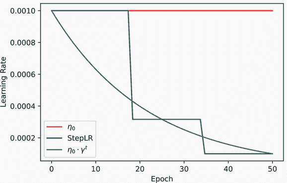

与所有学习率调度一样，我们在构造时传入`optimizer`。以下代码显示了这一点，其中我们通过一个因子 *γ* = 0.3 进行四次学习率下降。最后一次下降发生在最后几个轮次，我们总共的轮次要少得多，这意味着前三次非常重要。尽管四次下降等于学习率减少了 1/0.3⁴ ≈ 123 倍，但大多数训练都是在 1/0.3³ ≈ 37 倍的下降（或更少）下进行的：

```
fc_model.apply(weight_reset)

optimizer = torch.optim.SGD(fc_model.parameters(), lr=eta_0) 
scheduler = torch.optim.lr_scheduler.StepLR(optimizer, ❶
epochs//4, gamma=0.3)

fc_results_steplr = train_network(fc_model, loss_func, train_loader, 
➥ test_loader=test_loader, epochs=epochs, optimizer=optimizer, 
➥ lr_schedule=scheduler, score_funcs={’Accuracy’: accuracy_score}, 
➥ device=device)
```

❶ 指示它每 4 个轮次下降一个因子 f γ，所以总共发生四次。

### 5.2.3  余弦退火：更高的精度但更低的稳定性

下一个学习率策略既奇特又有效：**余弦退火**。余弦退火与指数衰减和步长学习率的逻辑和策略不同。后两者只降低学习率，但余弦退火会降低和增加学习率。这种方法对于获得最佳结果非常有效，但并不提供相同程度的不稳定性，因此可能不适合表现不佳的数据集和网络。

余弦退火也有一个初始学习率 *η*[0] 和一个最小率 *η*[min]；区别在于我们在最小和最大学习率之间交替。数学遵循以下方程，其中 *T*[max] 是周期之间的 epoch 数量：

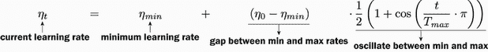

余弦项上下波动，就像余弦函数通常所做的那样，我们将余弦重新缩放，使其在 *η*[0] 处达到最大值而不是 1，在 *η*[min] 处达到最小值而不是-1。PyTorch 通过 `CosineAnnealingLR` 类提供这一点。*T*[max] 成为模型的新超参数。我喜欢将 *T*[max] 设置为 10 到 50 个总振荡波谷，并且我们希望始终结束在一个波谷（通过减速到达目的地）。例如，如果我们想要 S 个波谷，我们使用 *T*[max] = *T*/(*S*⋅2−1)。以下代码通过设置 *T*[max] = *T*/(2⋅2−1) 显示了余弦调度中的两个振荡波谷：

```
    cos_lr = eta_min +
    0.5*(eta_init-eta_min)*(1+np.cos(epochs_input/(T/3.0)*np.pi)) ❶
    sns.lineplot(x=epochs_input, y=eta_init, color=’red’, label="$\eta_0$") 
    sns.lineplot(x=epochs_input, y=cos_lr, color=’purple’, label="$\cos$") 
    sns.lineplot(x=epochs_input, y=[eta_init]*18+[eta_init/3.16]*16 + *16, color=’green’,
    ➥ label="StepLR") % ax = sns.lineplot(x=epochs_input,     y=effective_learning_rate, color=’blue’, 
    ➥ label="$\eta_0 \cdot \gamma^t$") 
    ax.set_xlabel(’Epoch’) 
    ax.set_ylabel(’Learning Rate’)

[17]: Text(0, 0.5, 'Learning Rate')
```

❶ 计算每个 t 值的余弦调度 *η*[t]

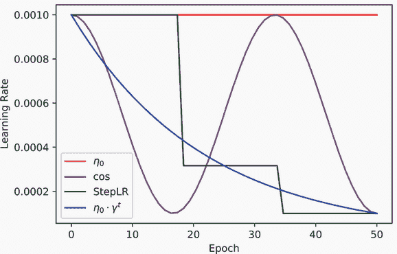

乍一看，这个余弦调度似乎没有道理。我们为什么要上下波动学习率呢？当我们记得神经网络不是**凸函数**时，这就有意义了。凸函数只有一个局部最小值，并且**每个**梯度都会引导我们到达最优解。但神经网络是非凸的，可能有很多局部最小值，这些可能不是好的解。如果我们的模型首先走向这些局部最小值之一，而我们只减少学习率，我们可能会陷入这个次优区域。

图 5.8 显示了在训练具有多个最小值的神经网络时可能出错的情况。网络从一个糟糕的位置开始（因为初始权重 Θ 是随机的）并朝着局部最小值前进。这是一个不错的解决方案，但附近存在更好的解决方案。优化很困难，我们无法知道我们的最小值有多好或有多少个；所以我们最终陷入次优位置。

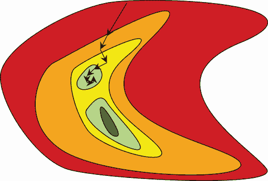

图 5.8 如果我们得到一个不幸的起点（因为它导致次优最小值），我们的搜索可能会带我们到次优最小值（浅绿色）。如果我们缩小学习率，我们的搜索可能会卡住。唯一的逃脱方式是增加学习率。

尽管如此，还有一线希望。通过实验（以及我们不打算看的困难数学），存在一个共同现象，即次优局部最小值存在于通往更好最小值的过程中（图 5.8 显示了这一点）。因此，如果我们缩小学习率，然后后来增加学习率 η，我们可以给我们的模型一个机会逃离当前局部最小值并找到一个新的替代最小值。较大的学习率希望带我们到一个新的更好的区域，而衰减又允许我们更精确地聚焦于一个更精细的解决方案。图 5.9 显示了余弦退火如何工作。

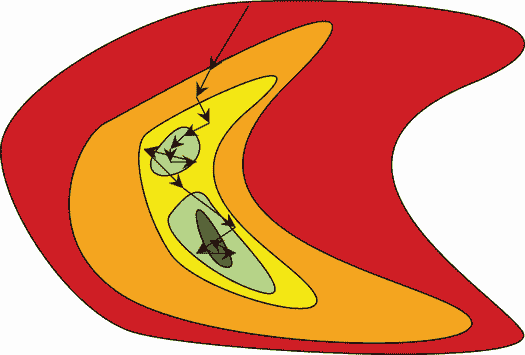

图 5.9 梯度下降首先将我们带到次优最小值，但随着学习率的再次增加，我们跳出该区域，向更好的解决方案靠近。搜索继续在更好的解决方案周围弹跳，直到余弦调度再次降低学习率，使模型收敛到一个更精确的答案。

你可能会想知道什么阻止我们从更好的解决方案弹跳到一个更差的解决方案。技术上，没有什么可以阻止这种情况发生。然而，研究人员已经开发了许多关于神经网络的理论，这让我们有信心认为从好的解决方案弹跳出来是不太可能的。这些结果的核心是，梯度下降喜欢找到宽的盆地作为好的解决方案，并且由于解决方案是宽的，因此优化很难跳出。这让我们对这种疯狂的余弦调度有更多的信心，并且从经验上看，它在许多任务（图像分类、自然语言处理等）上都表现良好。事实上，余弦退火已经如此成功，以至于已经提出了几十种替代方案。

实现此方法的代码与之前的学习率调度非常相似。本例使用 `epochs//3` 作为 *T*[max] 的值，这意味着它执行了两次下降。我总是坚持使用奇数作为周期的除数，以便学习以一个下降到小学习率结束。此外，下降的次数不应超过周期数的四分之一——否则，学习率将在每个周期之间波动过大。以下是代码：

```
fc_model.apply(weight_reset)

optimizer = torch.optim.SGD(fc_model.parameters(), lr=eta_0) 
scheduler = torch.optim.lr_scheduler.CosineAnnealingLR(optimizer, epochs//3, 
➥ eta_min=0.0001) ❶

fc_results_coslr = train_network(fc_model, loss_func, train_loader, 
➥ test_loader=test_loader, epochs=epochs, optimizer=optimizer, 
➥ lr_schedule=scheduler, score_funcs={’Accuracy’: accuracy_score}, 
➥ device=device)
```

❶ 告诉余弦先下降，然后上升，再下降（总共三次）。如果我们进行超过 10 个周期，我会将这个值推得更高。

许多关于余弦退火的版本和风味

余弦退火本身是一种有效的学习率调度，但其原始设计是为了一个稍微不同的目的。你可能还记得你在之前的工作或机器学习培训中，*集成*是提高任务预测准确性的好方法：训练许多模型，然后平均你的预测以得到一个最终更好、更准确的答案。但是，仅仅为了平均而训练 20 到 100 个神经网络是非常昂贵的。这就是余弦退火发挥作用的地方。与其训练 20 个模型，不如用余弦退火训练一个模型。每次学习率在下降中达到最低点时，就复制那些权重，并使用它们作为你的模型之一。所以，如果你想有一个由 20 个网络组成的集成，并且你正在进行 T 个周期的训练，你使用 *T*[max] = *T*/(20⋅2−1)。这会在学习率中产生恰好 20 次下降。

自 PyTorch 1.6 以来，一个更花哨的版本，称为*随机权重平均*（SWA）的想法被内置了([`pytorch.org/docs/stable/optim.html#stochastic-weight-averaging`](https://pytorch.org/docs/stable/optim.html#stochastic-weight-averaging))。使用 SWA，你可以*平均*每个波谷的参数 Θ，给你一个*一个*模型，其准确性更接近于模型集合。这是一个罕见的好处，你以一个模型的成本和存储来获得集合的优势。

### 5.2.4 验证平台期：基于数据的调整

我们之前讨论的所有学习率计划都不依赖于外部信息。你所需要知道的就是一个初始学习率 *η*[0]，一个最小学习率 *η*[min]，以及不多的事情。它们都不使用关于*学习进展如何*的信息。但我们有什么可用信息可以使用，我们应该如何使用它？我们拥有的主要信息是每个训练 epoch 的损失 ℓ，我们可以将其添加到我们的方法中，以尝试最大化我们最终模型的准确性。这就是基于平台期的策略所做的事情，它通常会为你提供最终模型的最佳可能准确性。让我们看看基线网络 `fc_model` 的训练和测试集损失：

```
sns.lineplot(x=’epoch’, y=’test loss’, 
➥ data=fc_results, label=’Test Loss’) 
sns.lineplot(x=’epoch’, y=’train loss’, 
➥ data=fc_results, label=’Train Loss’)

[19]: <AxesSubplot:xlabel='epoch', ylabel='test loss'>
```

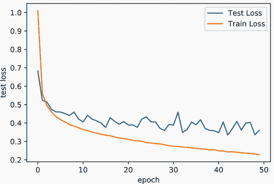

训练损失持续下降，这是正常的，因为神经网络很少会欠拟合数据。当我们的模型在特定数据集上训练并反复看到相同的数据（这就是一个 epoch：看一次所有数据），模型在预测训练数据的正确答案方面会变得*不合理地*好。这就是典型的过拟合，它发生的程度取决于你的网络有多大。我们期望训练损失总是下降，所以它不是关于学习进展的好信息来源。但如果我们看看测试损失，我们会看到它并不总是随着每个 epoch 而持续改善。测试损失在某个点开始稳定或平台期。

如果测试损失已经稳定，那么这就是降低学习率的良好时机。² 如果我们已经处于一个最佳位置，降低学习率不会造成任何伤害。如果我们正在围绕一个更好的解决方案弹跳，降低学习率可以帮助我们根据我们用来证明指数衰减合理性的相同逻辑来改进。但现在我们是在根据数据，而不是基于一个固定的任意计划来降低学习率，这样做似乎是有必要的。

这就是“在平台期降低学习率”计划的背后思想，该计划由 PyTorch 中的 `ReduceLROnPlateau` 类实现。这也是为什么我们的代码中需要将最后一个验证损失作为参数传递给 `step` 函数，看起来像 `lr_schedule.step(results["val loss"][-1])`。这样，`ReduceLROnPlateau` 类就可以将当前损失与最近的损失历史进行比较。

`ReduceLROnPlateau`有三个主要参数来控制其工作效果。首先是`patience`，它告诉我们降低学习率之前想要看到多少个没有改进的 epoch。10 是一个常见的值，因为你不希望过早地降低学习率。相反，你希望在改变速度之前有一些一致的证据表明没有更多的进步。

第二个参数是`threshold`，它定义了什么算是没有改进。精确的 0 阈值意味着如果过去`patience`个 epoch 中任何低于之前最佳损失的量都算作改进。这可能会过于刻板，因为损失可能每 epoch 都在以微小的、无意义的量下降。如果我们使用 0.01 的阈值，这意味着损失需要下降超过 1%才能算作改进。但这也可能过于宽松：当你训练数百个 epoch 时，你可能会取得缓慢但稳定的进步，而*降低*学习率不太可能加快收敛。设置这个值需要一些工作，所以我们坚持使用默认值`0.0001`，但如果你想要榨取最大可能的性能，这是一个值得尝试的超参数。

最后一个参数是`factor`，它表示每次我们确定已经达到一个平台期时，想要降低学习率η的倍数。这与`StepLR`类中的γ参数作用相同。再次强调，0.1 到 0.5 范围内的值都是合理的选项。

*但是*，在使用`ReduceLROnPlateau`调度之前，我们需要认识到一个关键问题：你不能使用测试数据来选择何时改变学习率。这样做*将会*导致过拟合，因为你正在使用关于测试数据的信息来做出决策，然后使用测试数据来评估你的结果。相反，你需要有训练、验证和测试的分割。我们正常的代码一直使用验证数据作为测试数据，这是可以接受的，因为我们没有在训练时查看验证数据来做出决策。`ReduceLROnPlateau`的这个重要细节过程在图 5.10 中得到了总结。

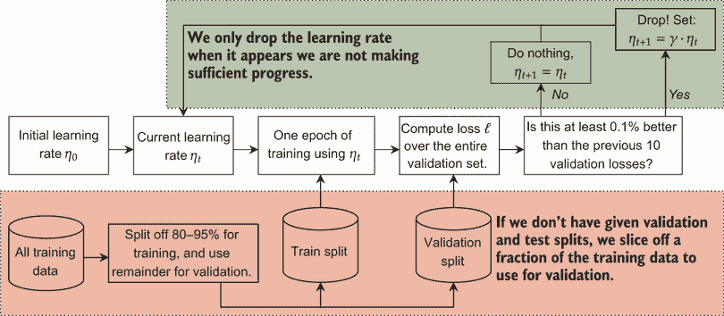

图 5.10 展示了基于平台期的学习率调度策略。底部部分，用红色表示，展示了从训练数据中切下一部分作为我们的验证集。这样做，或者与测试集一起有一个特殊的验证集，是避免过拟合的必要条件。上部部分，用绿色表示，展示了当我们的验证损失没有减少时，我们只降低学习率η。

以下代码展示了如何正确地执行此操作。首先，我们使用 `random_split` 类来创建 80/20 的 *训练* 数据分割。20%的分割将成为我们的验证集，`ReduceLROnPlateau` 将使用它来检查我们是否应该降低学习率；而 80%用于训练模型参数 Θ。请注意对 *train_network* 的调用，我们使用 `train_loader`、`val_loader` 和 `test_loader` 正确设置每个组件。在模型的结果中，我们需要确保我们正在查看 *测试* 结果而不是 *验证* 结果。除了这些谨慎的预防措施外，此代码与之前没有太大不同：

```
fc_model.apply(weight_reset)                                          ❶

train_sub_set, val_sub_set = torch.utils.data.random_split(train_data,
➥ [int(len(train_data)*0.8),                                         ❷
➥ int(len(train_data)*0.2)])

train_sub_loader = DataLoader(train_sub_set,
➥ batch_size=B, shuffle=True)
val_sub_loader = DataLoader(val_sub_set, batch_size=B)                ❸
optimizer =torch.optim.SGD(fc_model.parameters(), lr=eta_0)

scheduler =torch.optim.lr_scheduler.ReduceLROnPlateau(                ❹
➥ optimizer, mode='min', factor=0.2, patience=10)

fc_results_plateau = train_network(fc_model, loss_func, train_loader, ❺
➥ val_loader=val_sub_loader, test_loader=test_loader, epochs=epochs,
➥ optimizer=optimizer, lr_schedule=scheduler, score_funcs={'Accuracy':
➥ accuracy_score}, device=device)
```

❶ 再次重置权重，这样我们就不需要定义一个新的模型

❷ 由于我们没有明确的验证集和测试集，因此创建训练集和验证集

❸ 为训练集和验证集创建加载器。我们的测试加载器保持不变——永远不要更改你的测试数据！

❹ 使用 gamma=0.2 设置我们的平台期计划

❺ 训练模型！

不要自食其果！

基于平台期的学习率调整是一种非常流行且成功的策略。使用关于当前模型表现如何的信息，在许多问题上都能得到最佳结果。*但是*，你不应该在所有情况下盲目使用它。有两个特殊情况，`ReduceLROnPlateau` 可能表现不佳，甚至可能误导你得到过于自信的结果。

首先是一种情况，就是你没有太多数据。`ReduceLROnPlateau` 策略需要训练集和验证集来工作，因此减少了你用于学习模型参数的数据量。如果你只有 100 个训练点，可能很难用 10 到 30%的数据进行验证。你需要足够的数据来估计参数 Θ 并判断学习是否已经达到平台期——如果你没有很多数据，这可能是一个过于艰巨的任务。

第二种情况是当你的数据严重违反了相同且独立分布（IID）的假设。例如，如果你的数据包括来自同一人的多个样本，或者依赖于事件发生日期的事件（例如，如果你想预测天气，你不能有来自未来的数据！），天真地应用随机分割来创建验证集可能会导致结果不佳。在这种情况下，你需要确保你的训练、验证和测试分割之间没有任何意外的泄漏。以天气为例，你可能想确保你的训练分割只包含 1980 年至 2004 年的数据，验证数据为 2005 年至 2010 年，测试数据为 2011 年至 2016 年。这样，就不会发生意外的时空旅行，这将是一个重大的 IID 违规。

### 5.2.5  比较计划

现在我们已经训练了四种常见的学习率调度，我们可以比较它们的结果，看看哪种表现最好。结果如下面的图表所示，测试精度在 y 轴上。一些趋势很快就会很明显，值得讨论。简单的 SGD 表现不错，但始终在 epoch 之间上下波动。我们正在查看的每个学习率调度都提供了一种*某种*好处：

```
    sns.lineplot(x=’epoch’, y=’test Accuracy’, data=fc_results, label=’SGD’) 
    sns.lineplot(x=’epoch’, y=’test Accuracy’, 
    ➥ data=fc_results_expolr, label=’+Exponential Decay’) 
    sns.lineplot(x=’epoch’, y=’test Accuracy’, 
    ➥ data=fc_results_steplr, label=’+StepLR’) 
    sns.lineplot(x=’epoch’, y=’test Accuracy’, 
    ➥ data=fc_results_coslr, label=’+CosineLR’) 
    sns.lineplot(x=’epoch’, y=’test Accuracy’, 
    ➥ data=fc_results_plateau, label=’+Plateau’)

[22]: AxesSubplot:xlabel='epoch', ylabel='test Accuracy'>
```

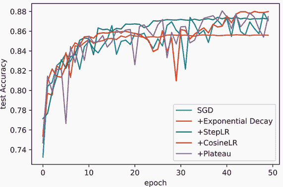

指数衰减的好处是*平滑且一致*：从 epoch 到 epoch，它几乎具有相同的行为。不幸的是，它趋向于精度较低的一侧，并且比简单的 SGD 表现略差。但一致性是有价值的，如果我们提前结束一个 epoch，SGD 的表现会更差。

`StepLR`的调度在行为上与指数调度非常相似，但在开始时由于快速增加而在后期减速并稳定，因此在训练的后期表现得更好。

余弦调度最终表现得更好，达到了简单 SGD、`StepLR`或指数衰减的最高精度。大约在 27 个 epoch 时，性能突然下降，因为学习率再次增加；然后当学习率再次衰减时，性能在更高的精度上重新稳定。这就是为什么我建议将余弦方法设置为以一个低谷结束。

平台期方法也做得很好，并且恰好在这个测试集中获得了第二名。随着 epoch 的增加，平台期会通过进一步降低学习率来自我稳定。使用模型实际表现的反馈，而不是假设行为，可以帮助从模型中获得最后一丝精度。

表 5.1 总结了各种方法的优缺点以及何时可能需要使用每种方法。不幸的是，没有一种方法适合所有情况，每种方法都有可能不奏效的情况。这很大程度上取决于你的数据，你只有在训练数据并找出结果后才会知道。这就是为什么我喜欢从没有学习率调度开始，然后根据发生的情况添加这四种方法之一。

表 5.1 流程`控制`语句

|  | 指数衰减 | StepLR | 余弦 LR | 平台期 |
| --- | --- | --- | --- | --- |
| 优点 | 结果非常一致。几乎不需要调整。 | 结果一致。几乎不需要调整。通常可以提高精度。 | 通常可以提高精度。高级版本可以显著提高精度。 | 通常可以显著提高精度并减少训练的 epoch 数。 |
| 优点 | 可以适度降低最终精度。 | 在训练 100+个 epoch 时最有帮助。 | 需要一些参数调整；不一定总是有效。 | 并非所有数据都用于训练。过度拟合的风险更高。 |
| 当何时使用 | 训练相同的模型，但使用不同的初始权重，可能会得到截然不同的结果。指数衰减可以帮助稳定训练。 | 你希望以最少的努力提高最终模型的准确性。 | 你希望在不做太多额外工作的前提下，榨取最大性能，并且理想情况下你有足够的时间进行几次额外的训练。 | 你希望在不做太多额外工作的前提下，榨取最大性能，并且理想情况下你有大量数据。 |

尽管平台方法表现良好，但我们在这本书中不会过多使用它。部分原因是它需要额外的代码，这可能会在我们试图关注新概念时分散注意力。此外，有时我们会以*特定*的方式设置学习问题，以便你看到仅需要几分钟而不是数小时或更长时间运行的实际问题行为，而平台方法使得设置这些场景变得更加困难。但这些初步结果表明，你应该将其作为你工具箱中一个强大的工具铭记在心。

## 5.3 更好地利用梯度

我们现在知道了几种方法可以改变学习率 η，以改善模型的学习速度，并允许它学习更准确的解决方案。我们通过定义不同的学习率计划 *L*(⋅,⋅)，这些计划着眼于长期。将 *L*(⋅,⋅) 视为设定旅程的期望速度。但短期内的绕道、坑洼和其他障碍可能需要改变速度。这就是为什么我们还想用函数 *G*(⋅) 修改梯度 g。我们首先单独关注梯度更新方案，然后将它们与学习率计划结合起来以获得更好的结果。首先，我们讨论一些广泛的动机，然后深入探讨最常见的方法。这三种方法都是用 PyTorch（它们是内置的）对代码进行一行更改，并且可以显著提高你模型的准确性。

记住，我们使用 **g**^t 来表示我们用于更新网络的第 t 个梯度。因为我们是在批量中进行随机梯度下降，这是一个有噪声的梯度。即使在 **g**^t 中存在噪声，**g**^t 中仍然有价值的信息我们没有充分利用。考虑第 j 个参数的梯度 **g**[j]^t。如果它每次都几乎保持相同的值呢？从数学上讲，这将是一个情况，其中

**g**[j]^t ≈ **g**[j]^(*t* − 1) ≈ **g**[j]^(*t* − 2) ≈ **g**[j]^(*t* − 3) ≈ …

这告诉我们第 j 个参数需要每次都向同一方向移动。图 5.11 展示了这种情况。

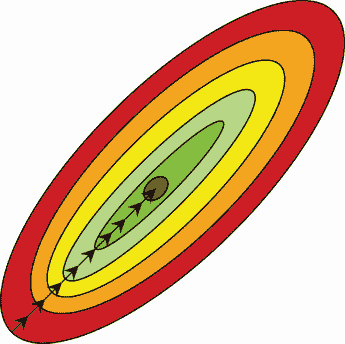

图 5.11 示例中，梯度值可能持续不断地返回相同的值。我们正在直接走向解决方案，但如果使用更大的学习率，我们可以更快地到达那里。

我们不一定想增加学习率 η，因为其他维度可能有不同的行为。每个网络参数都得到其自己的梯度值，而网络可以有数百万个参数。所以如果索引 j 的梯度持续相同，我们可能应该增加我们迈出的距离（即增加学习率 η）仅针对索引 j。我们需要确保这仅与索引 j 相关，因为不同索引 i 的梯度可能并不一致。

因此，我们希望有一个全局学习率 η 和所有参数的个性化学习率 *η*[j]。当全局学习率保持固定（除非我们使用学习率计划）时，我们让一些算法调整每个 *η*[j] 值，以尝试提高收敛性。大多数梯度更新方案通过重新缩放梯度 **g**^t 来工作，这相当于为每个参数提供其个性化的学习率 *η*[j]。

### 5.3.1  带有动量的 SGD：适应梯度一致性

如果参数 j 的梯度持续指向同一方向，我们希望增加学习率。我们可以将这描述为希望梯度积累动量。如果在一个方向上的梯度持续返回相似值，它应该开始在该方向上迈出更大和更大的步伐。图 5.12 展示了一个动量可以帮助解决的问题的例子。

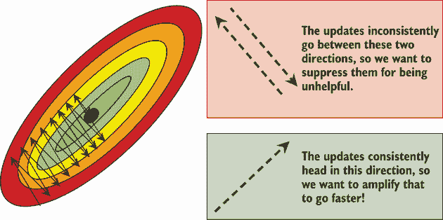

图 5.12 原始优化几乎被困在左上角和右下角之间来回振荡，但它却在右上角缓慢而持续地取得进展，这有助于找到解决方案。如果我们能在那个方向上积累一些动量，我们就不需要那么多步骤。

这种动量策略是早期为改进 SGD 和解决图中显示的问题而开发的，至今仍被广泛使用。让我们谈谈它是如何工作的数学原理。

我们正常的梯度更新方程，再次，看起来是这样的：

*Θ*[*t* + 1] = *Θ*[t] − *η* ⋅ **g**^t

动量思想的初始版本是拥有一个动量权重 μ，它在范围 (0,1) 内具有一些值（即 *μ* ∈ (0,1))³。接下来，我们添加一个称为 v 的速度项，它累积我们的动量。因此，我们的速度 v 包含了我们之前梯度步长的一部分（μ），具体细节如下面的方程所示：

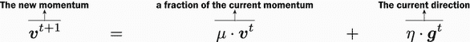

因为我们的速度依赖于我们之前的速度，它考虑了所有之前的梯度更新。接下来，我们简单地用 v 代替 g 来执行梯度更新：

Θ^(t + 1) = Θ^t − **v**(t + 1)

惊人的缩小历史

动量方程高度依赖于 μ 是一个小于 1 的值这一事实。这是因为它对旧梯度有缩小作用。一种看待这个问题的方式是写出我们反复应用动量时方程的变化。让我们详细写出这一点。 

下表显示了当我们持续应用动量 μ 时速度 v 发生的情况。最左边的列是新值 Θ，我们以 Θ[1] 作为初始随机权重开始。还没有之前的速度 v，所以没有发生任何变化。从第二轮开始，我们可以扩展速度项，如右图所示。

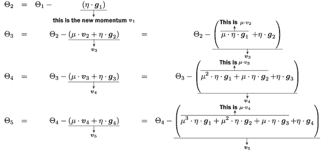

注意，每次我们用动量更新时，*每个以前的梯度* 都会对当前更新做出贡献！也请注意，每次我们应用另一轮动量时，μ 上方的指数都会变大。这使得非常旧的梯度的贡献在持续更新时几乎为零。如果我们使用标准的动量 *μ* = 0.9，旧梯度在经过仅仅 88 次更新后，其贡献不到 0.01%。由于我们通常在每个 epoch 中进行数千到数百万次更新，这是一个非常短期的影响。

你可能会查看之前的方程并担心：如果我们考虑了所有的旧梯度，如果其中一些不再有用怎么办？这就是为什么我们保持动量项 *μ* ∈ (0,1)。如果我们目前处于更新 t，并且考虑 k 步之前的过去梯度，其贡献是 *μ*^k**g**^t，这会迅速变得很小。如果我们有 *μ* = 0.9，40 步之前的梯度对当前速度 v 的贡献仅为 0.9⁴⁰ ≈ 0.01。值 μ 帮助我们忘记过去的梯度，以便学习可以适应，并且如果我们始终朝同一方向前进，学习可以增长得更大。

这种策略是显著提高你的模型精度和训练时间的一种简单方法。它可以解决我们查看的两个问题；图 5.13 展示了解决方案。


图 5.13 左边，动量解决了小学习率的问题。方向一致，因此动量积累并增加了有效学习率。右边，动量持续积累——但最初，在右上方向上缓慢积累。振荡可能会继续，但达到最小值所需的步骤更少。

如果你想要从你的网络中获得 *最佳可能* 的精度，使用带有某种形式的动量的 SGD 仍然被认为是最佳选择之一。缺点是找到给出 *绝对最佳结果* 的 μ 和 η 值的组合并不容易，并且需要训练许多模型。我们将在本章的最后部分讨论更智能地搜索 μ 和 η 的方法。

Nesterov 动量：适应变化的一致性

存在第二种动量类型，并且值得提及，因为它在实践中通常表现更好。这种版本被称为 *Nesterov 动量*。

在常规动量中，我们取当前权重（即 **g**^t）的梯度，然后朝着我们的梯度与速度结合的方向移动。如果我们积累了大量的动量，在优化过程中进行转弯可能会很困难。让我们看看图 5.14 中可能出现的错误示例。

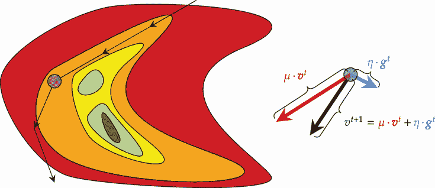

图 5.14 想象一下，到达这个点已经花费了很长时间，因此优化器已经积累了大量的动量（即 ∥**v**^t∥[2] > 0）。当我们到达紫色点时，动量使我们绕着期望的区域 *转弯*，因为动量，即使在衰减后，也大于梯度。由于它更大，它将权重更多地保持在同一方向，而不是新的方向。

从技术上来说，这个问题展示了动量表现正确：动量以一致的方向携带 *Θ*[*t* + 1]。但这已经不再是一个好主意了，需要经过几次迭代才能纠正动量并开始朝向实际解的方向前进。

在 Nesterov 动量中，我们选择耐心等待。在步骤 t 时，正常动量立即计算新的梯度 **g**^t 并将速度 **v**^t 相加。Nesterov 首先对速度进行操作，然后在我们移动后计算一个新的梯度。这样，如果我们移动的方向是错误的，Nesterov 很可能有一个更大的梯度来更快地将我们推回正确的方向。这看起来像以下的一系列方程，其中我使用 *t*′ 来表示耐心步骤。

首先，我们仅基于之前的速度计算 *Θ*^(*t*′)。我们还没有查看新数据，这意味着如果情况发生变化（或者这可能是个好方向——我们不知道，因为我们还没有查看数据）：

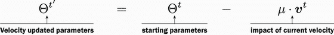

第二，我们最终使用修改后的权重 *Θ*^(*t*′) 来查看新的数据 x。这就像窥视近未来，以便我们可以改变或纠正我们关于如何更新参数的答案。如果速度在正确的方向上，实际上没有什么变化。但如果速度将带我们走向错误的方向，我们可以改变航向并更快地抵消这种影响：

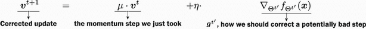

最后，我们再次使用包含新鲜梯度的新的速度来修改 *Θ*^(*t*′)，从而得到最终的更新权重 *Θ*^(*t* + 1)：


总结一下：第一个方程根据 *仅* 当前的速度（没有新的批次和新的信息）来改变参数 Θ。第二个方程使用旧速度和经过第一个方程改变 Θ 后的梯度来计算一个新的速度。最后，第三个方程根据这些结果进行一步操作。虽然这看起来像是额外的工作，但有一种巧妙的方法可以组织它，使其所需的时间与正常动量（我们不会深入讨论，因为它有点复杂）完全相同。图 5.15 展示了 Nesterov 动量如何影响前面的例子。

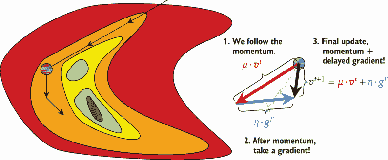

图 5.15 在相同的紫色点上，右侧显示了更新是如何计算的。我们不是在起点计算 **g**^t，而是首先跟随动量，这是*错误*的方向。这导致在新位置处的梯度在*正确*的方向上更大。结合起来，我们得到一个更接近解的更小步长。原始的标准动量结果以黑色淡出显示。

让我们通过另一个场景来推理，以锻炼我们对正在发生的事情的心理模型。试着自己画一个图来帮助你理解。

考虑标准动量情况，我们的动量已经很有用，使我们能够朝正确的方向前进，并假设我们已经达到了目标。我们现在处于函数的最小值，问题已经解决。但是，*我们永远无法确定我们是否处于最小值*，所以我们运行优化过程的下一步。由于我们已经积累的动量，我们即将滚过最小值。在正常动量中，我们计算梯度——如果我们处于解的位置，梯度 **g**^t = 0，因此没有变化。然后我们添加速度 **v**^t，它将我们带离。

现在，考虑在 Nesterov 动量下的这种场景。我们处于解的位置，首先我们跟随速度，将我们推向目标之外。然后我们计算梯度，它认识到我们需要朝相反的方向前进，因此朝向目标移动。当我们把这两个结合起来时，它们几乎相互抵消（我们向前或向后迈出更小的一步，具体取决于哪个的幅度更大，**g**^t 或 **v**^t）。在一步之内，我们已经开始改变我们的优化器前进的方向，而正常动量则需要两步。

这就是为什么 Nesterov 动量通常是首选动量版本的原因。现在我们已经讨论了这些想法，我们可以将它们转化为代码。`SGD` 类只需要我们设置 `momentum` 标志为一个非零值，如果我们想要动量，并且 `nesterov=True` 如果我们想要它是 Nesterov 动量。以下代码使用两种版本训练我们的网络。

```
fc_model.apply(weight_reset)

optimizer = torch.optim.SGD(fc_model.parameters(), lr=eta_0, 
➥ momentum=0.9, nesterov=False)

fc_results_momentum = train_network(fc_model, loss_func, train_loader, 
➥ test_loader=test_loader, epochs=epochs, optimizer=optimizer, 
➥ score_funcs={’Accuracy’: accuracy_score}, device=device)

fc_model.apply(weight_reset)

optimizer = torch.optim.SGD(fc_model.parameters(), lr=eta_0, 
➥ momentum=0.9, nesterov=True)

fc_results_Nesterov = train_network(fc_model, loss_func, train_loader, 
➥ test_loader=test_loader, epochs=epochs, optimizer=optimizer, 
➥ score_funcs={’Accuracy’: accuracy_score}, device=device)
```

比较带有动量的 SGD

在这里，我们绘制了 vanilla SGD 和两种动量版本的结果。两种动量版本都表现出显著更好的性能，学习速度更快，给出的解更准确。但你通常不会看到动量的一种版本比另一种版本表现得更好或更差。虽然 Nesterov 解决了一个实际问题，但正常动量在更多梯度更新后最终会自行纠正。然而，我更喜欢使用 Nesterov 版本，因为在我的经验中，如果一个动量比另一个好很多，通常就是 Nesterov：

```
    sns.lineplot(x=’epoch’, y=’test Accuracy’, data=fc_results, label=’SGD’) 
    sns.lineplot(x=’epoch’, y=’test Accuracy’, data=fc_results_momentum, 
    ➥ label=’SGD w/ Momentum’) sns.lineplot(x=’epoch’, y=’test Accuracy’, data=fc_results_nestrov, 
    ➥ label=’SGD w/ Nesterov Momentum’)

[25]: <AxesSubplot:xlabel='epoch', ylabel='test Accuracy'>
```

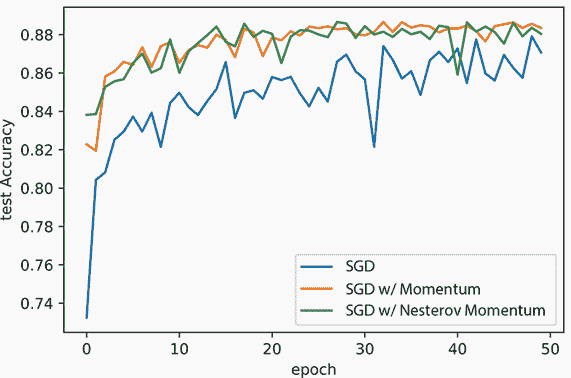

### 5.3.2  Adam：向动量添加方差

目前最受欢迎的优化技术之一被称为 *自适应矩估计*，简称 Adam。Adam 与我们刚刚描述的带有动量的 SGD 密切相关。Adam 是我目前最喜欢的方案，因为它有默认参数，直接使用，所以我无需花时间调整它们。对于带有动量的 SGD（普通或 Nesterov 风味）则不是这样。我们必须重命名一些术语，以便使数学与你将在其他地方了解的方式一致：速度 v 变为 m，动量权重 μ 变为 *β*[1]。现在我们可以描述 Adam 的第一步，其中有一个主要的变化用红色标出：

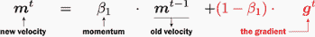

这描述了动量更新方程，但现在我们正在通过 (1 − *β*[1]) 对 *当前* 梯度 **g**^t 进行降权。这使得 **m**^t 成为先前速度和当前梯度的 *加权平均*。更具体地说，因为我们添加了 (1−*β*[1]) 项，现在这被称为 *指数移动平均*。它被称为 *指数*，因为 z 步之前的梯度 **g**^(*t* − *z*) 有一个指数化的贡献 *β*[1]^z，它被称为 *移动平均*，因为它计算的是一种加权平均，其中大部分权重在最近的项上，所以平均随着最近的数据移动。

由于我们现在讨论的是多个更新过程中的 *平均* 或 *均值* 梯度，我们可以谈论梯度的 *方差*。如果一个参数 *g*[j]^t 具有高方差，我们可能不希望让它对动量贡献太多，因为它很可能会再次改变。如果一个参数 *g*[j]^t 具有低方差，它是一个可靠的方向，因此我们应该在动量计算中给它 *更多* 的权重。

要实现这个想法，我们可以通过观察梯度的平方值来计算随时间变化的信息方差。通常，对于方差，我们会在平方之前减去平均值，但在这个场景中这样做很困难。因此，我们使用平方值作为方差的近似，并记住它并不提供完美的信息。使用 ⊙ 表示两个向量之间的逐元素乘积（**a** ⊙ **b** = [*a*[1]⋅*b*[1],*a*[2]⋅*b*[2],…])，可以得到速度方差 v 的这个方程：

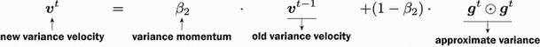

我们保存 **m**^t 和 **v**^t，但在使用它们之前进行一次修改。为什么？因为我们处于优化过程的早期，意味着 t 是一个小的值，**m**^t 和 **v**^t 给出的均值和方差的估计是有偏的。它们是有偏的，因为它们被初始化为零（即 **m**⁰ = **v**⁰ = )，所以如果我们天真地使用它们，早期的估计将会 *太小*。

考虑当 *t* = 1 时的情况。在这种情况下，**m**¹ = (1−*β*[1]) ⋅ **g**。真正的平均值只是 g，但我们通过一个因子 1 − *β*[1] 对其进行了折价。为了解决这个问题，我们只需进行如下调整：

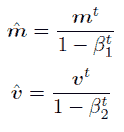

现在我们有了 m̂ 和 v̂，它们分别给出了均值和无偏估计的方差，我们将它们一起用来更新我们的权重 Θ：

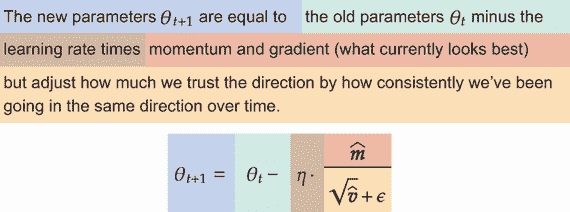

这里发生了什么？分子 *η* ⋅ *m̂* 正在计算带有动量项的 SGD，但现在我们正在通过方差对每个维度进行归一化。这样，如果一个参数的值自然波动很大，我们不会那么快地调整到新的大幅波动——因为它通常相当嘈杂。如果一个参数通常具有很小的方差并且非常一致，我们就会快速适应任何观察到的变化。ϵ 项是一个非常小的值，所以我们永远不会除以零。

这就是 Adam 的直觉。原始作者提出了以下值：*η* = 0.001，*β*[1] = 0.9，*β*[2] = 0.999，和 *ϵ* = 10^(-8)。

个人而言，我推荐将 Adam 或其衍生版本作为任何优化问题的默认选择。为什么？因为它是一个优化器，使用默认值通常表现良好，无需进一步调整。它可能不会给你带来 *最佳可能* 的性能，但你通常可以通过调整参数来提高结果，但默认值通常效果不错。而且如果它们不起作用，其他参数设置通常也不会起作用。

大多数优化器都不具备这种属性，或者至少没有 Adam 表现得那么明显。例如，SGD 对动量和学习率项非常敏感，你通常需要进行一些调整才能从正常的 SGD 中获得良好的性能。由于 Adam 不 *需要* 这种挑剔的调整，你不需要进行太多的实验来找出什么有效。因此，你可以在确定最终架构并准备好榨取最后一点精度之前，先保存一个详细的优化过程。最终，这使得 Adam 成为一个节省时间的好方法：在架构上花时间，将优化器的调整留到最后。

Adam 的其他版本

Adam 算法的原始论文中包含了一个错误，但提出的算法仍然对绝大多数问题表现良好。修复这个错误的版本被称为 `AdamW`，并且是我们在这本书中使用的默认版本。

Adam 的另一个扩展是 NAdam，其中 *N* 代表 Nesterov。正如你可能猜到的，这个版本将 Adam 调整为使用 Nesterov 动量而不是标准动量。第三种版本是 AdaMax，它用 max 操作替换了 Adam 中的一些乘法操作，以提高算法的数值稳定性。所有这些版本都有其优缺点，但这本书的范围之外，但任何 Adam 变体都会为你服务得很好。

现在我们已经了解了 Adam，让我们试试它。以下代码再次重置了我们反复训练的神经网络的权重，但这次使用 `AdamW`：

```
fc_model.apply(weight_reset)

optimizer = torch.optim.AdamW(fc_model.parameters()) ❶

fc_results_adam = train_network(fc_model, loss_func, train_loader, 
➥ test_loader=test_loader, epochs=epochs, optimizer=optimizer, 
➥ score_funcs={’Accuracy’: accuracy_score}, device=device)
```

❶ 我们不设置 Adam 的学习率，因为您应该始终使用默认值，并且 Adam 对学习率的较大变化更为敏感。

现在，我们可以绘制 `AdamW` 以及我们之前已经查看的三个 SGD 版本。结果显示，AdamW 在具有动量两种风格的 SGD 中的表现一样好，但其行为在下降不那么频繁或剧烈时更为稳定：

```
    sns.lineplot(x=’epoch’, y=’test Accuracy’, data=fc_results, label=’SGD’) 
    sns.lineplot(x=’epoch’, y=’test Accuracy’, data=fc_results_momentum, 
    ➥ label=’SGD w/ Momentum’) 
    sns.lineplot(x=’epoch’, y=’test Accuracy’, data=fc_results_nestrov, 
    ➥ label=’SGD w/ Nestrov Momentum’) 
    sns.lineplot(x=’epoch’, y=’test Accuracy’, data=fc_results_adam, 
    ➥ label=’AdamW’)

[27]: <AxesSubplot:xlabel='epoch', ylabel='test Accuracy'>
```

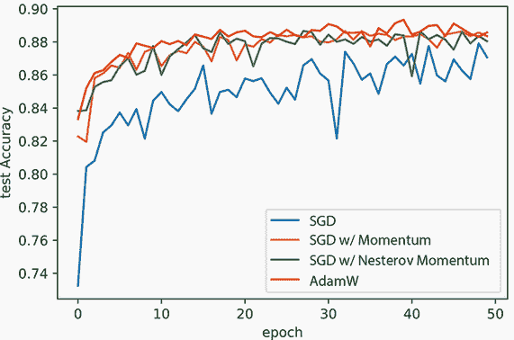

我们还可以将这些新的优化器与我们所学到的学习率计划相结合。在这里，我们使用 Nesterov 动量结合余弦退火计划来训练 Adam 和 SGD：

```
fc_model.apply(weight_reset) optimizer =
torch.optim.AdamW(fc_model.parameters())                                      ❶

scheduler = torch.optim.lr_scheduler. 
➥ CosineAnnealingLR(optimizer, epochs//3) 
fc_results_adam_coslr = train_network(fc_model, loss_func, train_loader, 
➥ test_loader=test_loader, epochs=epochs, optimizer=optimizer, 
➥ lr_schedule=scheduler, score_funcs={’Accuracy’: accuracy_score}, 
➥ device=device)

fc_model.apply(weight_reset) optimizer =
torch.optim.SGD(fc_model.parameters(), lr=eta_0, momentum=0.9, nesterov=True) ❷

scheduler = torch.optim.lr_scheduler. 
➥ CosineAnnealingLR(optimizer, epochs//3) 
fc_results_nesterov_coslr = train_network(fc_model, loss_func, 
➥ train_loader, test_loader=test_loader, epochs=epochs, 
➥ optimizer=optimizer, lr_schedule=scheduler, 
➥ score_funcs={’Accuracy’: accuracy_score}, device=device)
```

❶ 带有余弦退火的 Adam

❶ 带有余弦退火的 SGD+Nesterov

现在我们可以比较以下代码和图中带有和没有余弦计划的比较结果。我们再次看到相似的趋势，即添加学习率计划会给准确度带来提升，并且带有 `AdamW` 的版本表现得更稳定：

```
    sns.lineplot(x=’epoch’, y=’test Accuracy’, data=fc_results_nesterov, 
    ➥ label=’SGD w/ Nesterov’) 
    sns.lineplot(x=’epoch’, y=’test Accuracy’, data=fc_results_nesterov_coslr, 
    ➥ label=’SGD w/ Nesterov+CosineLR’) 
    sns.lineplot(x=’epoch’, y=’test Accuracy’, data=fc_results_adam, 
    ➥ label=’AdamW’) 
    sns.lineplot(x=’epoch’, y=’test Accuracy’, data=fc_results_adam_coslr, 
    ➥ label=’AdamW+CosineLR’)

[29]: <AxesSubplot:xlabel='epoch', ylabel='test Accuracy'>
```

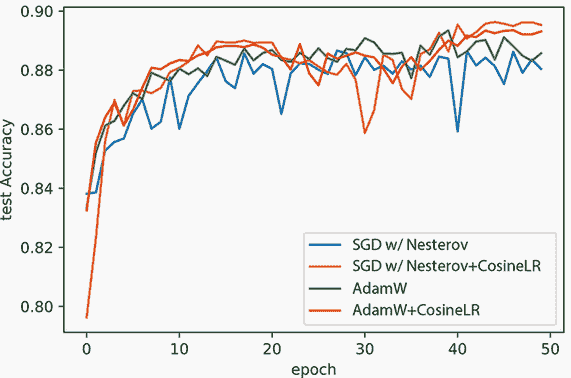

### 5.3.3 梯度裁剪：避免梯度爆炸

我们还有一个技巧要讨论，它与 Adam 和 SGD 这样的优化器以及学习率计划都兼容。它被称为 *梯度裁剪*，它帮助我们解决梯度爆炸问题。与迄今为止我们所讨论的所有内容中的数学直觉和逻辑不同，梯度裁剪非常简单：如果梯度的任何（绝对）值大于某个阈值 z，只需将其设置为 z 的最大值。所以如果我们使用 *z* = 5，我们的梯度是 **g** = [1,−2,1000,3,−7]，裁剪后的版本变为 clip5 = [1,−2,5,3,−5]。其想法是，任何大于我们的阈值 z 的值明显表明了 *方向*；但它被设置为不合理的 *距离*，所以我们强制将其裁剪为合理的值。

以下代码展示了如何将梯度裁剪添加到任何神经网络中。我们使用 `model.parameters()` 函数获取参数 Θ，并使用 `register_hook` 注册一个在每次使用梯度时执行的回调。在这种情况下，我们简单地取表示梯度的张量 `grad` 并使用 `clamp` 函数，该函数返回一个新版本的 `grad`，其中没有任何值小于 `-5` 或大于 `5`。就这么简单：

```
fc_model.apply(weight_reset)

for p in fc_model.parameters(): 
p.register_hook(lambda grad: torch.clamp(grad, -5, 5)) 

optimizer = torch.optim.AdamW(fc_model.parameters()) 
scheduler = torch.optim.lr_scheduler.CosineAnnealingLR(optimizer, epochs//3) 
fc_results_nesterov_coslr_clamp = train_network(fc_model, loss_func, 
➥ train_loader, test_loader=test_loader, epochs=epochs, 
➥ optimizer=optimizer, lr_schedule=scheduler, 
➥ score_funcs={’Accuracy’: accuracy_score}, device=device)
```

绘制结果，您会发现它们通常是一样的。在这种情况下，它们稍微差一点，但本可以更好。这取决于问题：

```
    sns.lineplot(x=’epoch’, y=’test Accuracy’, data=fc_results_nesterov_coslr, 
    ➥ label=’AdamW+CosineLR’) 
    sns.lineplot(x=’epoch’, y=’test Accuracy’, 
    ➥ data=fc_results_nesterov_coslr_clamp, label=’AdamW+CosineLR+Clamp’)

[31]: <AxesSubplot:xlabel='epoch', ylabel='test Accuracy'>
```

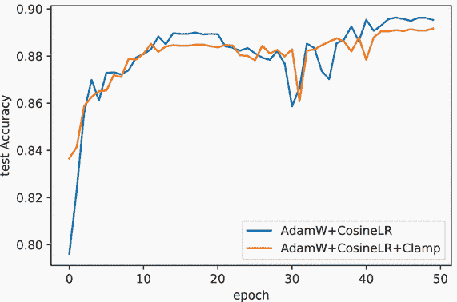

梯度爆炸通常是一个 *灾难性的* 问题。如果你的模型有这个问题，它可能是在学习一个退化的解或者根本不收敛。由于这个数据集和网络没有这个问题，梯度裁剪并不有益。

在大多数应用中，除非我的模型一开始就学不好，否则我不会使用梯度裁剪。如果它们学得很好，我可能不会有爆炸性梯度，所以我专注于其他变化。如果模型不好，我会测试梯度裁剪，看看是否能解决这个问题。如果我正在处理循环神经网络，我*总是*使用梯度裁剪，因为循环连接往往会引起爆炸性梯度，这在那种情况下是一个常见问题。但如果你想要始终包含裁剪，这样做也是一个同样有效的策略。使用裁剪值 *z* = 5 或 *z* = 10 是常见的，并且对大多数问题都有效。

## 5.4 使用 Optuna 进行超参数优化

现在我们已经改进了训练方法，我们将在整本书中重用许多这些技术，因为它们对*任何和每一个*你将要训练的神经网络都很有用。到目前为止的改进主要集中在我们在有梯度时进行优化。但超参数是我们想要优化但没有梯度的事物，例如要使用的初始学习率 η 和动量项 μ 的值。我们还想优化我们网络的架构：我们应该使用两层还是三层？每个隐藏层的神经元数量又是多少？

机器学习中大多数人首先学习的超参数调整方法是称为*网格搜索*。虽然很有价值，但由于其随着变量增加而呈指数增长的代价，网格搜索一次只能优化一个或两个变量。在训练神经网络时，我们通常至少有三个参数想要优化（层数、每层的神经元数量和学习率 η）。我们改用一种更新的方法——Optuna——来调整超参数，它效果更好。与网格搜索不同，它需要的决策更少，能找到更好的参数值，可以处理更多的超参数，并且可以适应你的计算预算（即你愿意等待多长时间）。

话虽如此，超参数调整仍然非常昂贵，这些示例不能在几分钟内运行，因为它们需要训练数十个模型。在现实世界中，甚至可能有数百个模型。这使得 Optuna 在未来章节中的应用变得不切实际，因为我们没有时间，但了解它仍然是你需要掌握的关键技能。

### 5.4.1 Optuna

为了执行一种更智能的超参数优化类型，我们使用一个名为 Optuna 的库。只要您可以将目标描述为一个单一的数值，Optuna 就可以与任何框架一起使用。幸运的是，我们有准确度或误差作为我们的目标，因此我们可以使用 Optuna。Optuna 通过使用贝叶斯技术将超参数问题建模为其自己的机器学习任务，从而在超参数优化方面做得更好。我们本可以花整整一章（或更多）来详细说明 Optuna 的工作原理的技术细节：简而言之，它训练自己的机器学习算法来根据其超参数（特征）预测模型的准确度（标签）。然后 Optuna 根据它预测为良好的超参数顺序尝试新的模型，训练模型以了解其表现如何，将此信息添加到模型中以提高模型，然后选择一个新的猜测。但就目前而言，让我们专注于如何将 Optuna 作为工具使用。

首先，让我们简要了解一下 Optuna 的工作原理。类似于 PyTorch，它有一个“通过运行定义”的概念。对于 Optuna，我们定义一个函数，我们希望最小化（或最大化），该函数接受一个 `trial` 对象作为输入。这个 `trial` 对象用于获取我们想要调整的每个参数的“猜测”，并在结束时返回一个分数。返回的值是浮点数和整数，就像我们亲自使用的那样，这使得它很容易使用。图 5.16 展示了这是如何工作的。

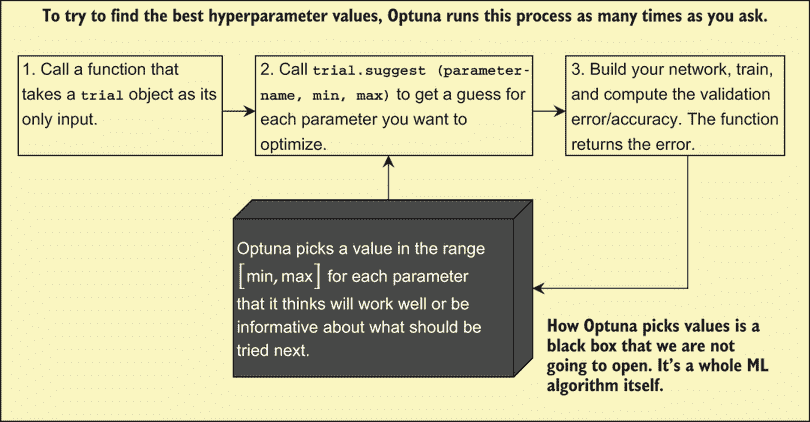

图 5.16 您为 Optuna 提供一个函数，该函数执行图中概述的三个步骤。Optuna 使用自己的算法为每个超参数选择值，您可以使用 `trial.suggest` 函数告诉 Optuna 关于这些超参数的信息；此函数还告知 Optuna 您希望考虑的最小值和最大值。您告诉 Optuna 进行此过程多少次，每次执行时，黑盒都会在挑选新值尝试时变得更好。

让我们看看我们想要最小化的玩具函数：*f*(*x*,*y*) = abs ((*x*−3)⋅(*y*+2))。很容易看出，存在一个最小值在 *x* = 3 和 *y* = − 2。但 Optuna 能否找出这个值？首先，我们需要导入 Optuna 库，这是一个简单的 `pip` 命令：

```
!pip install optuna
```

现在我们可以导入 Optuna：

```
import optuna
```

接下来，我们需要定义要最小化的函数。`toyFunc` 接收一个 `trial` 对象。Optuna 通过使用 `trial` 对象获取每个参数的猜测来确定存在多少个超参数。这是通过 `suggest_uniform` 函数完成的，该函数要求我们提供一个可能的值范围（我们必须为任何超参数优化方法做这件事）：

```
def toyFunc(trial): 
    x = trial.suggest_uniform(’x’, -10.0, 10.0) ❶❷
    y = trial.suggest_uniform(’y’, -10.0, 10.0) ❶❸

    return abs((x-3)*(y+2))                     ❹
```

❶ 这两个调用请求 Optuna 提供两个参数，并为每个参数定义最小值和最大值。

❷ *x* ∼ 𝒰(−10,10)

❸ *y* ∼ 𝒰(−10,10)

❹ 计算并返回结果。Optuna 尝试最小化这个值：| (x-3)(y+2) |。

这就是我们需要的全部。现在我们可以使用 `create_study` 函数构建任务，并使用 `optimize` 调用指定 Optuna 进行最小化函数的试验次数：

```
study = optuna.create_study(direction=’minimize’) ❶
study.optimize(toyFunc, n_trials=100)             ❷
```

❶ 如果你使用 direction=‘maximize’，Optuna 将尝试最大化 toyFunc 返回的值。

❷ 告诉 Optuna 要最小化的函数，以及它有 100 次尝试的机会。

当你运行代码时，你应该会看到一个长长的输出列表，类似于以下内容：

```
Finished trial#12 with value: 2.285 with parameters: 
{'x': 0.089, 'y': -2.785}. Best is trial#9 with value: 0.535\. Finished trial#13 with value: 3.069 with parameters: 
{'x': -1.885, 'y': -2.628}. Best is trial#9 with value: 0.535\. Finished trial#14 with value: 0.018 with parameters: 
{'x': -3.183, 'y': -1.997}. Best is trial#14 with value: 0.018.
```

当我运行这段代码时，Optuna 得到了一个非常精确的答案：5.04 ⋅ 10^(−5)非常接近真正的最小值零。它返回的值也接近我们所知的真正答案。我们可以通过`study.best_params`来访问这些信息，它包含一个`dict`对象，将超参数映射到组合起来给出最佳结果的值：

```
print(study.best_params) ❶
{'x': 2.984280340674378, 'y': -1.8826725682225192\}
```

❶ 这个字典包含了 Optuna 找到的最佳参数值。

我们还可以使用`study`对象来获取有关优化过程的信息。Optuna 之所以强大，是因为它使用机器学习来探索参数值的空间。通过指定具有最小和最大值的参数，我们为 Optuna 提供了约束条件——它试图在探索空间以了解其外观和根据其对空间的当前理解最小化分数之间取得平衡。

我们可以使用等高线图来查看一个示例：

```
fig = optuna.visualization.plot_contour(study)
```

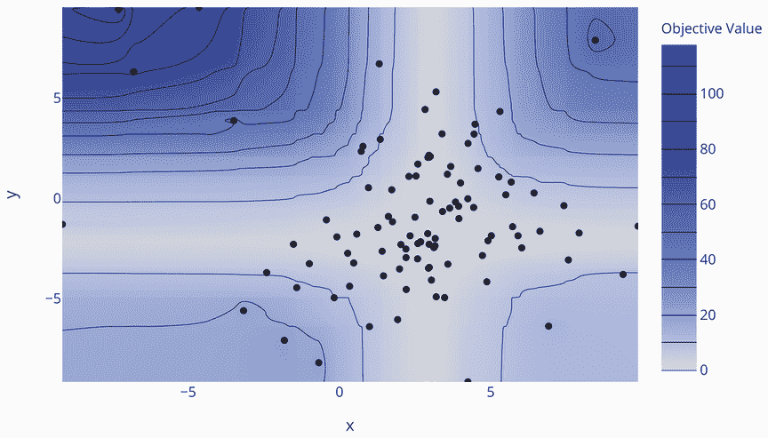

注意看 Optuna 如何花费大部分精力测试接近最小值的值，而在空间的大范围极端区域投入的精力却非常少。Optuna 很快就能判断在这些空间区域中找不到更好的解决方案，因此停止探索这些区域。这使得它有更多时间寻找最佳解决方案，并能更好地处理超过两个参数的情况。

### 5.4.2 Optuna 与 PyTorch

现在，你已经了解了使用 Optuna 的所有基础知识；是时候将它与 PyTorch 结合，进行一些高级参数搜索了。我们将为 Optuna 定义一个新的函数来优化我们的神经网络。我们不想做得太过分，因为没有梯度的情况下优化仍然非常困难，Optuna 也不是万能的子弹。但我们可以使用 Optuna 来帮助我们做出一些决策。例如，每个层应该有多少个神经元，以及有多少层？图 5.17 展示了我们如何定义一个函数来完成这个任务：

1.  创建训练/验证分割（我们使用 plateau schedule 完成了这个步骤）。

1.  请求 Optuna 给我们提供三个关键的超参数。

1.  使用参数定义我们的模型。

1.  从验证分割中计算并返回结果。

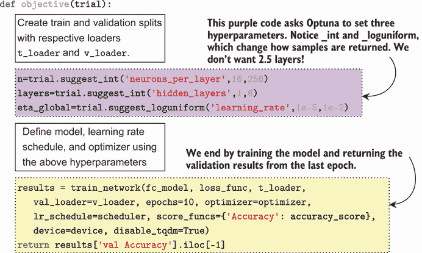

图 5.17 Optuna 可以用来优化我们的神经网络训练的`objective`函数定义的四个步骤。显示为代码的两个最重要的步骤是获取超参数和计算结果！

这里需要注意的一个重要事项是，我们必须仅使用原始训练数据创建新的训练和验证分割。为什么？因为我们将会多次重用验证集，我们不希望过度拟合到验证数据的特定细节。因此，我们创建一个新的验证集，并保存我们的原始验证数据直到最后。这样，我们只使用真正的验证数据一次来确定我们在优化网络架构方面的表现。

这个函数几乎没有多少**新**代码；大部分都是我们在几个章节中用来创建数据加载器、构建网络 `Module` 和调用我们的 `train_network` 函数的相同代码。PyTorch 的一些重要变化是我们设置了 `disable_tqdm=True`，因为 Optuna 在它试图优化的函数中与进度条不兼容。

添加动态数量的层

起初可能并不明显，但我们可以非常容易地使用 `nn.Sequential` 对象的变量数量层来适应 Optuna 告诉我们使用的内容。代码如下：

```
sequential_layers = [             ❶
    nn.Flatten(), nn.Linear(D, n), nn.Tanh(),
]

for _ in range(layers-1):         ❷
    sequential_layers.append( nn.Linear(n, n) ) 
    sequential_layers.append( nn.Tanh() ) sequential_layers.append(
nn.Linear(n, classes) )           ❸ fc_model =
nn.Sequential(*sequential_layers) ❹
```

❶ 至少有一个接受 D 个输入的隐藏层

❶ 根据 Optuna 为“layers”参数提供的变量数量添加隐藏层

❶ 输出层

❶ 将层列表转换为 PyTorch 顺序模块

这将模型规范拆分成几个部分，以便隐藏层的数量是一个通过 `for _ in range(layers-1):` 循环填充的变量。对于小型网络来说，这会稍微啰嗦一些，但可以使相同的代码能够处理各种层，如果我们想添加更多层，代码会更少。

从 Optuna 获取建议

其他变化是 Optuna 通过 `trial` 对象提供的不同 `suggest` 函数。有 `suggest_int` 用于整数，这对于像神经元数量（76.8 个神经元没有意义）和层数这样的链接是有意义的。我们之前看到了 `suggest_uniform`，它适用于被简单随机范围覆盖的浮点值（如动量项 μ，应该在 0 和 1 之间）。另一个重要的选项是 `suggest_loguniform`，它提供**指数间隔**的随机值。这是你应该用于参数按数量级改变的情况，如学习率（*η* = 0.001, 0.01 和 0.1 相差 10 倍）。下一个代码片段展示了我们如何通过指定适当的 `suggest` 函数并提供我们愿意考虑的最小和最大值来从 Optuna 获取三个超参数建议：

```
n = trial.suggest_int('neurons_per_layer', 16, 256) 
layers = trial.suggest_int('hidden_layers', 1, 6) 
eta_global = trial.suggest_loguniform('learning_rate', 1e-5, 1e-2)
```

这最后只是简单地训练我们的网络，并从最后一个 epoch 中获取验证准确率。你必须记住这是一个**验证分割**，我们没有使用测试集。我们应该在找到超参数后**仅**使用测试集来确定整体准确率。以下代码搜索此问题的超参数：

```
study = optuna.create_study(direction=’maximize’) 
study.optimize(objective, n_trials=10)             ❶

print(study.best_params)

{'neurons\_per\_layer': 181, 'hidden\_layers': 3, 'learning\_rate':
0.005154640793181943\}
```

❶ 通常我们会进行 50 到 100 次试验，但这里我们使用较少的试验，以便这个笔记本在合理的时间内运行。

你可以看到 Optuna 选定的参数。现在我们已经训练了网络，一个练习是使用这些信息训练一个新的模型，以确定你在真实验证集上得到的最终验证准确度。这样做就完成了整个超参数优化过程，如图 5.18 所示。

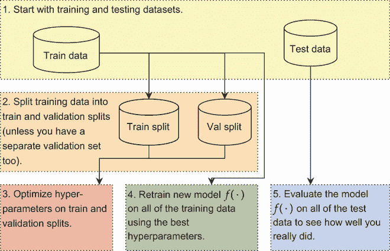

图 5.18 正确进行超参数优化所需遵循的所有步骤。合并或跳过这些步骤可能很有吸引力，但这样做可能会给你关于模型实际表现如何的误导性结果。

可视化 Optuna 结果

不仅仅是查看*最终*答案，我们还可以查看 Optuna 随时间所取得的进展以及其他优化过程的视图。这样做可以帮助我们建立一些关于“良好”参数范围的直觉。当设置新的实验时，这些信息可能会有所帮助，这样我们就可以希望优化过程更接近真实解，从而减少所需的优化尝试次数。

以下是最简单的选项之一：根据尝试的试验次数来绘制验证准确度（和个别试验）图。顶部的红线显示当前最佳结果，每个蓝色点表示一次实验的结果。如果准确度的大幅提升仍在发生（红线上升），我们有很好的理由增加 Optuna 运行的试验次数。如果准确度已经长时间处于平台期，我们可以在未来减少试验次数：

```
fig = optuna.visualization.plot_optimization_history(study) 
fig.show()
```

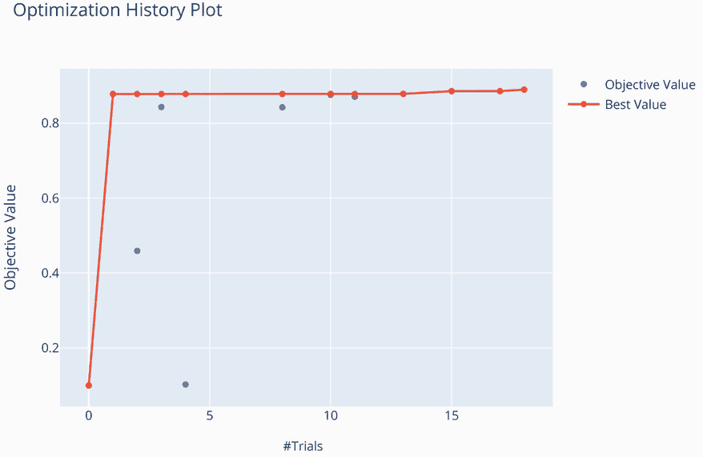

我们还可能想要了解每个超参数相对于目标（准确度）的表现。这可以通过*切片图*来完成。以下示例为每个超参数制作散点图，目标值位于 y 轴上；点的颜色表示结果来自哪个试验。这样，你可以看到是否有任何超参数与目标有特别强的关系，以及 Optuna 解决这个问题需要多长时间。在这个特定例子中，大多数情况下，三到六个隐藏层表现良好，学习率高于*η* > 0.001 也是一致的。这类信息可以帮助我们在未来的试验中缩小搜索范围，甚至如果某个超参数似乎对目标影响不大，可以消除该超参数。这两者都将帮助 Optuna 在未来的运行中通过更少的尝试收敛到解决方案。以下是代码：

```
fig = optuna.visualization.plot_slice(study) 
fig.show()
```

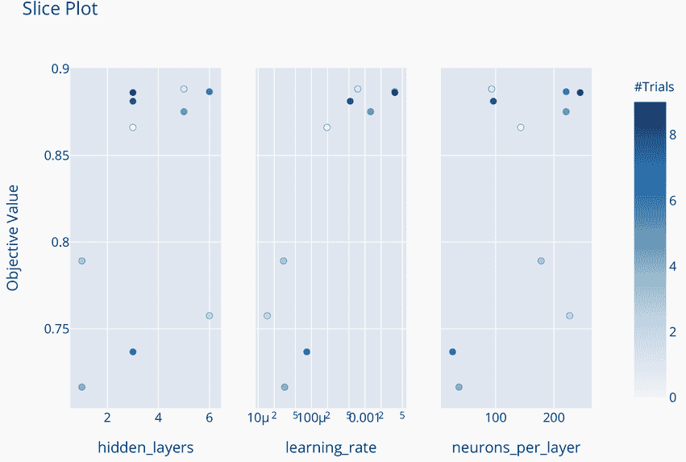

Optuna 还可以帮助你理解超参数之间的相互作用。一个选项是 `plot_contour()` 函数，它创建一个网格，显示每对不同的超参数组合如何影响结果。另一个选项是 `plot_parallel_coordinate()` 函数，它在一个图表中显示每个试验的所有结果。这两个都稍微难读一些，并且需要更多的试验来产生真正有趣的结果，所以我建议你在有机会进行 100 次试验时自己尝试它们。

### 5.4.3 使用 Optuna 进行剪枝试验

Optuna 支持的另一个特别有用的功能是在训练神经网络时提前剪枝试验。其想法是优化神经网络是迭代的：我们多次遍历数据集，并且我们（希望）每次迭代都会有所改进。这是我们未使用的信息。如果我们能在处理过程中早期确定一个模型不会成功，我们可以节省大量时间。

假设我们开始测试一组参数，学习从一开始就失败，前几个周期结果非常糟糕。为什么还要继续训练到结束？模型极不可能一开始就退化，后来成为最佳表现者之一。如果我们向 Optuna 报告中间结果，Optuna 可以基于已经完成的试验剪枝掉看起来不好的试验。

我们可以通过替换 `def objective(trial):` 函数的最后两行代码来实现这一点。我们不是用 10 个周期调用一次 `train_network`，而是用循环调用 10 次，每次 1 个周期。在每个周期之后，我们使用 `trial` 对象的 `report` 函数让 Optuna 了解我们当前的进展，并询问 Optuna 我们是否应该停止。修改后的代码如下：

```
for epoch in range(10):                         ❶
    results = train_network(fc_model, loss_func, t_loader, 
    ➥ val_loader=v_loader, epochs=1, optimizer=optimizer, 
    ➥ lr_schedule=scheduler, score_funcs={’Accuracy’: accuracy_score}, 
    ➥ device=device, disable_tqdm=True)        ❷

    cur_accuracy = results[’val Accuracy’].iloc[-1] 

    trial.report(cur_accuracy, epoch)           ❸

    if trial.should_prune():                    ❹
        raise optuna.exceptions.TrialPruned()   ❺

return cur_accuracy                             ❻
```

❶ 我们自己为每个周期进行循环。

❷ 只进行一次训练周期，但重用相同的模型和优化器。这会反复训练同一个模型。

❸ 让 Optuna 了解我们的表现如何

❹ 询问 Optuna 是否看起来没有希望

❺ 如果是这样，就停止尝试。

❻ 我们已经到达了终点：给出最终答案。

通过这个代码更改，我将使用 Optuna 运行一个新的试验，但故意将神经元的数量设置为下降到 1（太小了）和将学习率设置为 *η* = 100（太大了）。这将创建一些 *非常糟糕* 的模型，这些模型很容易被剪枝掉，只是为了展示这个新的剪枝功能。所有这些更改只需要在 `objective` 函数中发生：我们调用相同的 `create_study` 和 `optimize` 函数，并自动获得剪枝。下面的代码片段展示了这一点，但我将 `n_trials=20` 设置为给剪枝更多机会发生，因为它依赖于 Optuna 找到的最佳 *当前* 模型（它不知道坏运行看起来像什么，直到它看到可以与之比较的好运行）：

```
study2 = optuna.create_study(direction=’maximize’) 
study2.optimize(objectivePrunable, n_trials=20)
```

现在你应该能在运行此代码时看到几个来自 Optuna 的`TrialState.PRUNED`日志。当我运行它时，20 次试验中有 10 次在早期就被剪枝了。这些模型在剪枝之前经过了多少个 epoch 的训练？我们可以让 Optuna 绘制所有试验及其中间值的图表，以帮助我们更好地理解这一点。这是通过`plot_intermediate_values()`函数完成的，如下所示：

```
fig = optuna.visualization.plot_intermediate_values(study2) 
fig.show()
```

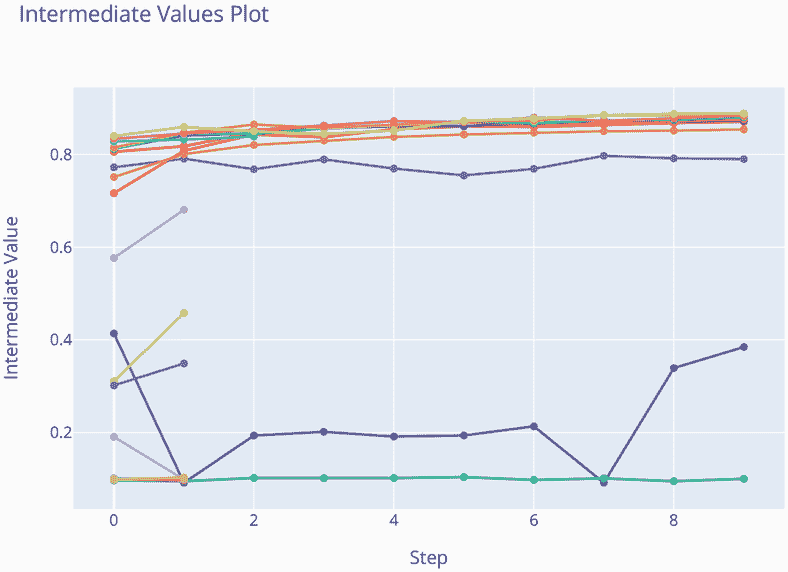

看起来所有 10 次试验都在经过数据集的 1 个或 2 个 epoch 后就被剪枝了。这是过程非常早的阶段：Optuna 几乎将有效试验的数量减少了一半。我们也看到一些案例，即使有“更好”的模型被提前剪枝，表现不佳的模型仍然被允许运行到完成。这是因为剪枝是基于 Optuna 到目前为止看到的最佳模型。在早期，Optuna 允许不良模型运行到完成，因为它还没有意识到它们是坏模型。只有经过更多的试验并看到更好的模型后，它才会意识到原始模型本可以剪枝。因此，剪枝并不能避免*所有*不良模型，但它可以避免许多不良模型。

仔细观察图表，你应该能够看到 Optuna 剪枝了一些正在发散（变差）的模型，以及一些看起来可能会改进但表现不佳，以至于无法与 Optuna 已经看到的模型竞争的模型。这些也是很好的剪枝案例，也是 Optuna 节省我们时间的一部分。

注意：虽然 Optuna 是我最喜欢的工具之一，但我们在这本书中不会再使用它。这纯粹是一个计算问题，因为我想要坚持使用只需几分钟就能运行的示例。Optuna 需要训练多个网络，这意味着*乘以*训练时间。仅仅 10 次试验并不多，但如果没有任何超参数，一个需要 6 分钟的示例，使用 Optuna 可能需要一个小时或更长时间。然而，当你工作时，你应该*绝对*使用 Optuna 来帮助你构建你的神经网络。

## 练习

在 Manning 在线平台上的 Inside Deep Learning Exercises 部分分享和讨论你的解决方案（[`liveproject.manning.com/project/945`](https://liveproject.manning.com/project/945)）。一旦你提交了自己的答案，你将能够看到其他读者提交的解决方案，并查看作者认为哪些是最好的。

1.  修改`train_network`函数，使其能够接受`lr_schedule=ReduceLROnPlateau`作为一个有效的参数。如果`train_network`函数接收到这个字符串参数，它应该检查是否提供了验证和测试集，如果是的话，适当地设置`ReduceLROnPlateau`调度器。

1.  使用批大小*B* = 1, 4, 32, 64, 128 重新运行使用`AdamW`、带有 Nesterov 动量的 SGD 和余弦退火计划的实验。批大小变化如何影响这三个工具的有效性和准确性？

1.  编写代码创建一个具有 *n* = 256 个神经元的神经网络，并添加一个参数来控制网络中隐藏层的数量。然后使用简单的随机梯度下降法（SGD）和带有余弦退火的 `AdamW` 训练具有 1、6、12 和 24 个隐藏层的网络。这些新的优化器如何影响你学习这些深层网络的能力？

1.  使用本章中的每个新优化器重新训练上一章中的三层双向循环神经网络（RNN）。它们如何影响结果？

1.  在练习 4 的实验中添加梯度裁剪。这有助于 RNN 吗？

1.  编写你自己的函数，使用 Optuna 优化全连接神经网络的参数。一旦完成，使用这些超参数创建一个新的网络，使用所有训练数据对其进行训练，并在保留的测试集上进行测试。你在 FashionMNIST 上得到的结果是什么，Optuna 对准确率的猜测与你的测试集性能有多接近？

1.  重新做练习 6，但将隐藏层替换为卷积层，并添加一个新参数来控制执行多少轮最大池化。与练习 6 的结果相比，它在 FashionMNIST 上的表现如何？

## 摘要

+   梯度下降的两个主要组成部分是我们如何使用梯度（优化器）以及我们跟随它们的速度（学习率计划）。

+   通过使用关于梯度历史的信息，我们可以加快模型的学习速度。

+   将动量添加到优化器中允许在梯度变得非常小的情况下进行训练。

+   梯度裁剪减轻了梯度爆炸的问题，即使在梯度变得非常大时也能进行训练。

+   通过调整学习率，我们可以缓解优化的学习视图，以实现进一步的改进。

+   我们可以使用像 Optuna 这样的强大工具，而不是网格搜索，来寻找神经网络（如层数和神经元数量）的超参数。

+   通过检查每个周期的结果，我们可以通过早期剪枝不良模型来加速超参数调整过程。

* * *

¹ 更多内容请见第六章。↩

² 如果测试损失开始增加，这表明更严重的过拟合，那么这也是减缓学习速度的另一个好理由。这有助于减缓过拟合。但理想情况下，测试损失应该已经稳定。↩

³ 我认为用 μ 表示动量很令人困惑，但这是最常用的符号，所以我会坚持使用它，这样你可以学习它。↩
