# 6 个常见的设计构建模块

本章涵盖了

+   添加新的激活函数

+   插入新层以改善训练

+   跳过层作为有用的设计模式

+   将新的激活、层和跳过组合成比它们各自总和更强大的新方法

到目前为止，我们已经学习了三种最常见和最基础的神经网络类型：全连接、卷积和循环。我们通过改变优化器和学习率计划来改进了所有这些架构，这改变了我们更新模型（权重）参数的方式，几乎免费地为我们提供了更精确的模型。我们迄今为止所学的一切也都有很长的保质期，并教会了我们关于几十年来（以及继续）存在的问题。它们为您提供了良好的基础，让您能够说一口流利的深度学习语言，以及一些构成更大算法的基本构建模块。

现在我们有了更好的工具来训练我们的模型，我们可以学习关于设计神经网络的新方法。许多这些新方法*不会工作*，如果没有像`Adam`（在上一章中讨论过）这样的学习改进，这就是为什么我们现在才讨论它们！本章中的大多数想法都不到 10 年历史，但非常有用——但它们仍在不断发展。再过四年，一些可能被更新的选项所取代。但现在，既然我们有一些共享的术语来讨论深度学习的机制，我们可以检查为什么本章中的技术有助于构建更好的模型。任何表现更好的东西都可能解决相同的基本问题，因此这些经验教训应该是永恒的。¹

本章为您提供了当前生产中用于模型训练的一些最广泛使用的构建模块。因此，我们花费时间讨论了*为什么*这些新技术能够有效，这样您可以学会识别它们背后的逻辑和推理，并开始培养自己对如何进行自我调整的直觉。了解这些技术同样重要，因为许多新开发的方法都是本章中我们所学内容的变体。

本章我们讨论了五种适用于前馈模型的新方法以及一种对 RNN 的改进。我们大致按照它们被发明的顺序介绍前五种方法，因为每个方法在设计时都倾向于使用先前的技术。单独来看，它们可以提高准确性和加快训练速度；但结合在一起，它们的整体效果大于各部分之和。第一种方法是一种新的激活函数，称为*线性整流单元*（ReLU）。然后我们在线性/卷积层和我们的非线性激活层之间夹入一种新的归一化层。之后，我们了解两种设计选择，*跳跃连接*和*1 × 1 卷积*，它们重复使用我们已知的层。就像醋本身很糟糕，但在更大的食谱中却很神奇一样，跳跃连接和 1 × 1 卷积结合在一起创造了第五种方法，即*残差层*。残差层为 CNN 提供了最大的准确度提升之一。

最后，我们介绍了*长短期记忆*（LSTM）层，这是一种 RNN。我们之前讨论的原始 RNN 现在不再广泛使用，因为它很难实现，但解释 RNN 的一般工作原理要容易得多。LSTMs 已经成功使用了 20 多年，是解释本章中许多课程如何重新组合成一种新解决方案的绝佳途径。我们还将简要提及一种“节食”版本的 LSTM，它对内存的需求略低，我们将使用它来确保我们的模型可以在 Colab 的低端免费 GPU 上安全运行。

设置基线

以下代码再次加载 Fashion-MNIST 数据集，因为我们使用它既足够困难以使我们能够看到改进，又足够简单，以至于我们不需要等待很长时间才能看到结果。我们使用这个数据集来创建一个基线——一个展示我们当前方法可以完成什么工作的模型——我们可以将其与我们的新技术对准确度的影响进行比较：

```
train_data = torchvision.datasets.FashionMNIST("./", train=True, 
➥ transform=transforms.ToTensor(), download=True) 
test_data = torchvision.datasets.FashionMNIST("./", train=True, 
➥ transform=transforms.ToTensor(), download=True)

train_loader = DataLoader(train_data, batch_size=128, shuffle=True) 
➥ test_loader = DataLoader(test_data, batch_size=128)
```

在本章中，我们为几乎每个示例训练全连接和卷积网络，因为某些技术的代码对于每种类型的网络看起来都略有不同。你应该比较全连接和 CNN 模型之间的代码变化，以了解哪些部分与基本思想相关，哪些是我们在实现网络类型时的副作用。这将帮助你将来将这些技术应用到其他模型中！

让我们定义一些基本的超参数和细节，这些将在本章和整本书中重复使用。这里我们有指定我们特征的代码，全连接层的隐藏神经元数量，卷积网络的通道和滤波器数量，以及总的类别数：

```
W, H = 28, 28   ❶
D = 28*28       ❷
n = 256         ❸
C = 1           ❹

n_filters = 32  ❺

classes = 10    ❻
```

❶ 我们图像的宽度和高度是多少？

❷ 输入中有多少个值？我们使用这个来确定后续层的大小：28 * 28 图像。

❸ 隐藏层大小

❹ 输入中有多少个通道？

❺ 输入中有多少个通道？

❻ 有多少个类别？

一个全连接和卷积基线

最后，我们可以定义我们的模型。与之前章节相比，每个全连接和 CNN 模型我们都添加了几个额外的层。在本章中，我们将介绍构建网络的新方法，并将与这些更简单的起始模型进行比较。首先，我们在这里定义全连接网络。由于全连接网络的简单性，我们可以使用`*`运算符进行列表解包，使相同的代码适用于几乎任何数量的隐藏层。我们可以解包一个列表推导式`[define_block for _ in range(n)]`来创建`n`层的`define_block`层：

```
fc_model = nn.Sequential( 
    nn.Flatten(), 
    nn.Linear(D, n), nn.Tanh(),                                    ❶
    *[nn.Sequential(nn.Linear(n, n),nn.Tanh()) for _ in range(5)], ❷
    nn.Linear(n, classes), 
)
```

❶ 第一个隐藏层

❷ 现在由于每个剩余层都有相同的输入/输出大小，我们可以使用列表解包来构建它们。

接下来，我们定义我们的 CNN 层。如果我们正在构建一个更深的模型，我们可以写出更优雅的代码，但到目前为止我们学到的方法还不够好，无法学习到深层的 CNN。因此，我们保持了 CNN 的相对简单，以便更容易进行比较。但一旦你了解了本章中的技术，你将能够构建更深层的网络，这些网络能够可靠地收敛到更精确的解！以下是代码：

```
cnn_model = nn.Sequential( 
    nn.Conv2d(C, n_filters, 3, padding=1),             nn.Tanh(), 
    nn.Conv2d(n_filters, n_filters, 3, padding=1),     nn.Tanh(), 
    nn.Conv2d(n_filters, n_filters, 3, padding=1),     nn.Tanh(), 
    nn.MaxPool2d((2,2)), 
    nn.Conv2d( n_filters, 2*n_filters, 3, padding=1),  nn.Tanh(), 
    nn.Conv2d(2*n_filters, 2*n_filters, 3, padding=1), nn.Tanh(), 
    nn.Conv2d(2*n_filters, 2*n_filters, 3, padding=1), nn.Tanh(), 
    nn.MaxPool2d((2,2)), 
    nn.Conv2d(2*n_filters, 4*n_filters, 3, padding=1), nn.Tanh(), 
    nn.Conv2d(4*n_filters, 4*n_filters, 3, padding=1), nn.Tanh(), 
    nn.Flatten(), 
    nn.Linear(D*n_filters//4, classes), 
)
```

我们使用新的`train_network`函数从这一点开始训练所有模型。记住，我们修改了此方法以默认使用`AdamW`优化器，因此我们不需要指定：

```
loss_func = nn.CrossEntropyLoss() 
fc_results = train_network(fc_model, loss_func, train_loader, 
➥ test_loader=test_loader, epochs=10, 
➥ score_funcs={’Accuracy’: accuracy_score}, device=device) 
cnn_results = train_network(cnn_model, loss_func, train_loader, 
➥ test_loader=test_loader, epochs=10, 
➥ score_funcs={’Accuracy’: accuracy_score}, device=device)
```

最后，一个小改动：在本章完成我们对神经网络的处理后，我们将使用`del`命令删除一些神经网络。如果你不幸地从 Colab 获取了低端 GPU，运行这些示例可能会耗尽内存。让我们明确地告诉 Python 我们已经完成，这样我们就可以回收 GPU 内存并避免这种烦恼：

```
del fc_model 
del cnn_model
```

现在，让我们看看初始结果，使用 seaborn 进行绘图（到这一点应该非常熟悉了）。我们正在比较我们两个初始模型和未来将要添加的改进。这样，我们可以看到这些改进不仅适用于一种类型的网络。不出所料，CNN 的性能远优于全连接网络。我们预期这一点，因为我们正在处理图像，正如我们在第三章中学到的，卷积层是将关于像素及其关系的“结构先验”编码到我们网络中的强大方式：

```
    sns.lineplot(x=’epoch’, y=’test Accuracy’, data=fc_results, 
    ➥ label=’Fully Connected’) 
    sns.lineplot(x=’epoch’, y=’test Accuracy’, data=cnn_results, 
    ➥ label=’CNN’)

[12]: <AxesSubplot:xlabel='epoch', ylabel='test Accuracy'>
```

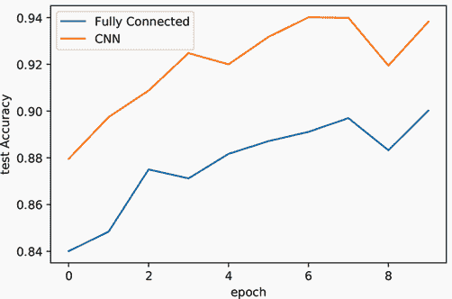

拥有这些结果在手，我们可以深入本章的其余部分！我们每个部分都讨论你可以在神经网络中使用的新`Module`类型及其使用它的直觉或原因，然后将其应用于基线网络。

## 6.1 更好的激活函数

我们一直非常依赖 tanh(⋅)激活函数，以及在一定程度上依赖 sigmoid 函数σ(⋅)，贯穿整本书。它们是神经网络使用的原始激活函数中的两个，但并非只有这两种选择。目前，我们作为社区还没有确定性地知道什么使得一个激活函数比另一个更好，也没有一个选项你应该总是使用。但我们已经了解了一些通常在激活函数中不希望看到的事情。tanh(⋅)和σ(⋅)都可能导致一个称为“梯度消失”的问题。

### 6.1.1 梯度消失

记住，我们定义的每一个架构都是通过将网络视为一个巨大的函数 fΘ来学习的，其中我们需要使用相对于 f 的参数(Θ)的梯度(∇)来根据损失函数ℓ(⋅,⋅)调整其权重。所以我们执行

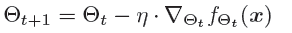

但如果∇[Θ]*f*Θ非常小怎么办？如果发生这种情况，Θ的值几乎不会改变，因此没有学习：

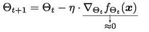

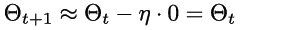

虽然（在第五章中讨论的）动量可以帮助解决这个问题，但如果梯度一开始就没有消失那就更好了。这是因为正如数学所显示的，如果我们接近零，就无事可做了。

tanh 和 sigmoid 激活是如何导致这个梯度消失问题的？让我们再次绘制这两个函数：

```
    def sigmoid(x): 
        return np.exp(activation_input)/(np.exp(activation_input)+1)

    activation_input = np.linspace(-5, 5, num=200) tanh_activation =
    np.tanh(activation_input) sigmoid_activation =
    sigmoid(activation_input)

    sns.lineplot(x=activation_input, y=tanh_activation, color=’red’, 
    ➥ label="tanh(x)") 
    sns.lineplot(x=activation_input, y=sigmoid_activation, color=’blue’, 
    ➥ label="*σ*(x)")

[13]: <AxesSubplot:>
```

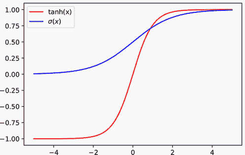

这两个激活都有一个称为“饱和”的特性，即当输入继续变化时，激活停止变化。对于 tanh(⋅)和σ(⋅)，如果输入 x 继续增大，这两个激活都会饱和在值 1.0。如果激活函数的输入是 100，你将输入值加倍，你仍然会从输出得到一个值（几乎是）1.0。这就是饱和的含义。这两个激活函数在图表的左侧也饱和，所以当输入 x 变得非常小的时候，tanh(⋅)将饱和在-1.0，而σ(⋅)将饱和在 0。

让我们绘制这些函数的导数——我们看到饱和度会产生不理想的结果：

```
    def tanh_deriv(x): 
        return 1.0 - np.tanh(x)**2 
    def sigmoid_derivative(x): 
        return sigmoid(x)*(1-sigmoid(x))

    tanh_deriv = tanh_deriv(activation_input) 
    sigmoid_deriv = sigmoid_derivative(activation_input)

    sns.lineplot(x=activation_input, y=tanh_deriv, color=’red’, 
    ➥ label="tanh’(x)") 
    sns.lineplot(x=activation_input, y=sigmoid_deriv, color=’blue’, 
    ➥ label="*σ*′(x)")

[14]: <AxesSubplot:>
```

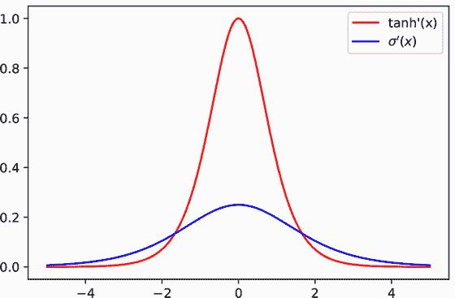

你在图中看到问题了吗？随着激活函数开始饱和，其梯度开始消失。这发生在任何饱和的激活函数上。由于我们的权重变化基于梯度∇的值，如果太多神经元开始饱和，我们的网络将停止学习。

这并不意味着你永远不应该使用 tanh(⋅)和σ(⋅)；有些情况下你想要饱和（我们将在本章末尾看到一个 LSTM 的例子）。如果你没有特定的理由想要饱和，我建议避免使用饱和的激活函数——这是我们接下来要学习做的事情。

注意饱和激活不是梯度消失的唯一原因。你可以通过查看其直方图（使用 `.grad` 成员变量）来检查你的梯度是否消失。如果你使用可以饱和的激活函数，你也可以绘制激活函数的直方图来检查这是否是梯度消失的原因。例如，如果你使用 *σ*(⋅) 作为你的激活函数，并且直方图显示 50% 的激活值在 0.01 与 1.0 或 0.0 之间，你就知道饱和是问题的根源。

### 6.1.2  修正线性单元 (ReLUs)：避免梯度消失

现在我们知道，默认情况下饱和的激活函数可能不是一个很好的激活函数来使用。我们应该使用什么替代方案呢？最常见的方法是使用一种称为**ReLU（修正线性单元**）的激活函数，²，它有一个非常简单的定义：


ReLU 就做这么多。如果输入是正的，返回值不变。如果输入是负的，返回值是零。这可能会让人感到惊讶，因为我们一直强调非线性的重要性。但事实证明，几乎**任何**非线性都是足够的来学习。选择这样一个简单的激活函数也导致了一个简单的导数：

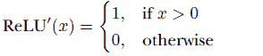

这就是全部。对于所有可能输入的一半，ReLU 的导数是一个常数。对于大多数用例，只需将 tanh (⋅) 或 *σ*(⋅) 替换为 ReLU 激活函数，就可以使你的模型在更少的迭代次数中收敛到更精确的解。然而，ReLU 对于非常小的网络通常表现较差。

为什么？ReLU 相比于有**消失**梯度的激活函数，对于 *x* <= 0 的输入没有梯度。如果你有很多神经元，一些神经元“死亡”并停止激活是可以接受的；但如果你没有足够的额外神经元，这就会成为一个严重的问题。这个问题可以通过一个简单的修改来解决：对于负输入，而不是返回 0，让我们返回其他值。这引出了我们所说的**Leaky ReLU**。³ Leaky ReLU 取一个“泄漏”因子 α，它应该是小的。在 *α* ∈ [0.01,0.3] 范围内的值通常被使用，并且在这种情况下，具体值的影响相对较小。

Leaky ReLU 的数学定义是什么？同样，它是一个简单的变化，通过一个因子 α 减少了负值。这个新的激活和导数可以简洁地定义为以下：

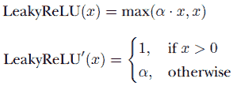

用代码表达同样的意思，我们有

```
def leaky_relu(x, alpha=0.1):                             ❶ 
    return max(alpha*x, x) def leaky_reluP(x, alpha=0.1): ❷ 
if x > 0: 
    return 1 
else: 
    return alpha
```

❶ 将激活函数转换为代码

❷ 激活函数的导数，其中 x 是应用激活的原输入

改进 ReLU 的直觉是，当*x* <= 0 时，存在一个硬“地板”。因为在这个地板的水平上没有变化，所以没有梯度。相反，我们希望地板“泄漏”以便它发生变化——但变化缓慢。即使它只改变一点点，我们也可以得到一个梯度。让我们绘制所有这些激活函数，看看它们看起来像什么：

```
    activation_input = np.linspace(-5, 5, num=200) relu_activation =
    np.maximum(0,activation_input) leaky_relu_activation =
    np.maximum(0.3*activation_input,activation_input)

    sns.lineplot(x=activation_input, y=tanh_activation, color=’red’, 
    ➥ label="tanh(x)") 
    sns.lineplot(x=activation_input, y=sigmoid_activation, color=’blue’, 
    ➥ label="*σ*(*x*)") 
    sns.lineplot(x=activation_input, y=relu_activation, color=’green’, 
    ➥ label="ReLU(x)") 
    sns.lineplot(x=activation_input, y=leaky_relu_activation, color=’purple’, 
    ➥ label="LeakyReLU(x)")

[15]: <AxesSubplot:>
```

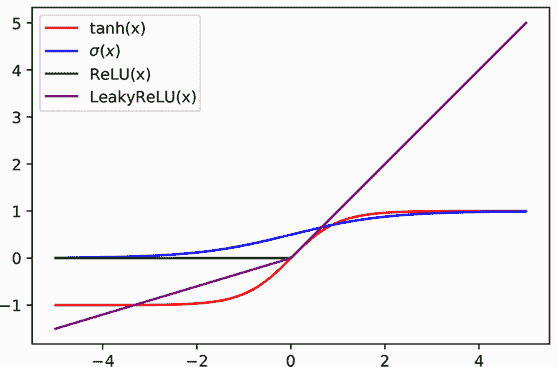

我们可以看到，当输入增大时，ReLU 和 LeakyReLU 的行为呈线性，只是随着输入的增加而增加。当输入变小时，两者仍然是线性的，但 ReLU 被固定在零，而 LeakyReLU 在减小。两者的非线性仅仅是改变线的斜率，这已经足够了。现在让我们用更多的代码来绘制梯度：

```
    relu_deriv = 1.0*(activation_input > 0) 
    leaky_deriv = 1.0*(activation_input > 0) + 0.3*(activation_input <= 0)

    sns.lineplot(x=activation_input, y=tanh_deriv, color=’red’, 
    ➥ label="tanh’(x)") 
    sns.lineplot(x=activation_input, y=sigmoid_deriv, color=’blue’, 
    ➥ label="*σ*′(*x*)") 
    sns.lineplot(x=activation_input, y=relu_deriv, color=’green’, 
    ➥ label="ReLU’(x)") 
    sns.lineplot(x=activation_input, y=leaky_deriv, color=’purple’, 
    ➥ label="LeakyReLU’(x)")

[16]: <AxesSubplot:>
```

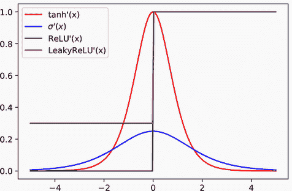

因此，LeakyReLU 的梯度值永远不会自行消失，但层之间的交互仍然可能导致梯度爆炸或消失。我们将在本章的后续部分使用残差层和 LSTMs 来解决这个问题，但至少 LeakyReLU 不会像 tanh(⋅)和*σ*(⋅)激活那样导致问题。

### 6.1.3 使用 LeakyReLU 激活进行训练

现在我们已经了解了为什么想要使用 LeakyReLU，让我们通过测试使用它进行训练并查看准确性是否有所提高来检查它的效果。我们将使用 LeakyReLU 训练我们模型的新版本，我们通常发现它等于或优于标准的 ReLU，因为它的行为略好（激活和梯度中没有硬零）。首先，我们定义要使用的泄漏率。PyTorch 使用默认值*α* = 0.01，这是一个相当保守的值，足以避免正常 ReLU 的零梯度。我们使用*α* = 0.1，这是我首选的默认值，但这不是一个关键的选择：

```
leak_rate = 0.1 ❶
```

❶ 我们希望 LeakyReLU 泄漏多少。在[0.01, 0.3]范围内的任何值都是可以的。

接下来，我们定义两种架构的新版本，只将`nn.Tanh()`函数更改为`nn.LeakyReLU`。首先是全连接模型，仍然只有五行代码：

```
fc_relu_model = nn.Sequential( 
    nn.Flatten(), 
    nn.Linear(D, n), nn.LeakyReLU(leak_rate), 
    *[nn.Sequential(nn.Linear(n, n), nn.LeakyReLU(leak_rate)) 
    ➥ for _ in range(5)], 
    nn.Linear(n, classes), 
)
```

CNN 模型也可以用同样的方式实现，但函数名太长，难以输入和阅读。让我们看看另一种组织代码的方法。我们定义一个`cnnLayer`函数，它接受每一层的输入和输出大小，并返回由`Conv2d`和激活函数组成的完整层。这样，当我们尝试新想法时，只需更改这个函数，其余的代码也会随之改变；我们不需要进行太多编辑。我们还可以添加一些便利的功能，比如自动计算填充大小，使用常见的默认值，如核大小，并保持输出大小与输入相同：

```
def cnnLayer(in_filters, out_filters=None, kernel_size=3): 
    """
    in_filters: how many channels are coming into the layer 
    out_filters: how many channels this layer should learn / output, or ‘None‘ 
if we want to have the same number of channels as the input. 
    kernel_size: how large the kernel should be 
    """
    if out_filters is None: 
    out_filters = in_filters ❶ 
    padding=kernel_size//2   ❷ 
    return nn.Sequential(    ❸

    nn.Conv2d(in_filters, out_filters, kernel_size, padding=padding), 
    nn.LeakyReLU(leak_rate) 
)
```

❶ 这是一个常见的模式，所以如果不需要，我们可以将其自动化为默认设置。

❷ 填充以保持相同大小

❸ 将层和激活合并为一个单一单元

现在我们 CNN 的代码更加简洁，更容易阅读。`cnnLayer`函数也使得像全连接模型那样使用列表解包变得更加容易。以下是我们通用的 CNN 代码块。忽略对象名称，这个代码块可以通过改变`cnnLayer`函数的定义，被重新用于许多不同风格的 CNN 隐藏层：

```
cnn_relu_model = nn.Sequential( 
    cnnLayer(C, n_filters), cnnLayer(n_filters), cnnLayer(n_filters), 
    nn.MaxPool2d((2,2)), 
    cnnLayer(n_filters, 2*n_filters), 
    cnnLayer(2*n_filters), 
    cnnLayer(2*n_filters), 
    nn.MaxPool2d((2,2)), 
    cnnLayer(2*n_filters, 4*n_filters), cnnLayer(4*n_filters), 
    nn.Flatten(), 
    nn.Linear(D*n_filters//4, classes), 
)
```

我们已经准备好训练这两个模型。像往常一样，PyTorch 模块化的设计意味着我们不需要更改其他任何东西：

```
fc_relu_results = train_network(fc_relu_model, loss_func, train_loader, 
➥ test_loader=test_loader, epochs=10, 
➥ score_funcs={’Accuracy’: accuracy_score}, device=device) 
del fc_relu_model 
cnn_relu_results = train_network(cnn_relu_model, loss_func, train_loader, 
➥ test_loader=test_loader, epochs=10, 
➥ score_funcs={’Accuracy’: accuracy_score}, device=device) 
del cnn_relu_model
```

让我们比较一下我们的新`relu_results`和原始的`fc_results`以及`cnn_results`。你应该会发现 LeakyReLU 在 CNN 和全连接网络中都比其 tanh 对应物表现更好。它不仅更准确，而且在数值上更优美，实现起来也更简单。计算 tanh 所需的 exp()函数需要相当的计算量，但 ReLU 只有简单的乘法和 max()操作，这要快得多。下面是代码：

```
    sns.lineplot(x=’epoch’, y=’test Accuracy’, data=fc_results, label=’FC’) 
    sns.lineplot(x=’epoch’, y=’test Accuracy’, data=fc_relu_results, 
    ➥ label=’FC-ReLU’) 
    sns.lineplot(x=’epoch’, y=’test Accuracy’, data=cnn_results, 
    ➥ label=’CNN’) 
    sns.lineplot(x=’epoch’, y=’test Accuracy’, data=cnn_relu_results, 
    ➥ label=’CNN-ReLU’)

[22]: <AxesSubplot:xlabel='epoch', ylabel='test Accuracy'>
```

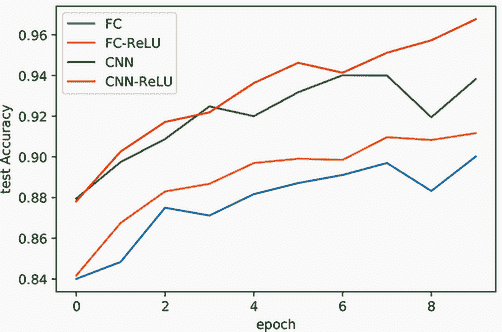

ReLU 变体

因此，ReLU 家族提供了更好的准确度，稍微快一点，而且从头开始实现时代码更少。出于这些原因，ReLU 已经迅速成为社区中许多人的默认首选；由于它已经在大多数现代神经网络中成功使用了几年，因此它是一个很好的实用选择。

ReLU 激活函数还有许多其他版本，其中一些已经内置到 PyTorch 中。有`PReLU`，它试图学习 LeakyReLU 中α应该是什么值，从而将其作为一个超参数去除。`ReLU6`引入了在你想有那种行为时的有意饱和。还有 ReLU 的“平滑”扩展，如`CELU`、`GELU`和`ELU`，它们被推导出来具有某些特性。这些只是 PyTorch 中已有的；你可以在网上找到更多 ReLU 的变体和替代方案([`mng.bz/VBeX`](http://mng.bz/VBeX))。我们没有时间或空间去探讨所有这些，但从 tanh 到 ReLU 的改进并不像 ReLU 及其泄漏变体到这些新风味之间的差异那么大。如果你想了解更多关于这些其他激活函数的信息，它们值得一试，因为我们已经看到它们可以带来很大的差异。但通常，使用任何 ReLU 变体作为默认选择都是安全且明智的。

## 6.2 正则化层：神奇地更好的收敛

为了解释**归一化层**及其工作原理，让我们谈谈如何处理一个具有 n 行和 d 个特征的正常数据集**X** = {**x**[1], **x**[2], …, **x**[n]}的归一化。在你开始将矩阵 X 输入你最喜欢的机器学习算法之前，你通常以某种方式对特征进行**归一化**或标准化。这可能确保所有值都在[0,1]的范围内，或者减去均值μ并除以标准差σ。⁴ 通过减去均值并除以标准差进行标准化可能是你以前做过的事情，鉴于其普遍性，但让我们写出三个步骤（其中ϵ是一个很小的值，如 10^(−15)，以避免所有值都相同时的除零错误）：

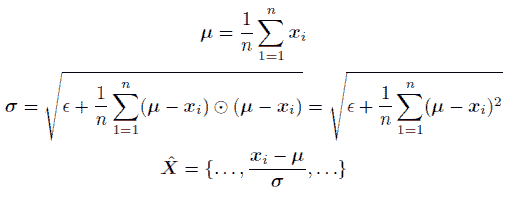

这使得数据 X̂具有均值为零和标准差为 1。我们这样做是因为大多数算法对输入数据的**尺度**很敏感。这种尺度敏感性意味着如果你将你的数据集中的每个特征乘以 1,000，它将改变你的模型最终学习到的内容。通过执行归一化或标准化，我们确保我们的数据在一个合理的数值范围内（-1 到 1 是一个不错的选择），这使得我们的优化算法更容易运行。

### 6.2.1 归一化层放在哪里？

在我们训练神经网络之前，我们通常在将数据传递到网络的第一个层之前再次进行归一化或标准化。但如果我们把这种归一化过程应用到神经网络的每一层呢？这会让网络学习得更快吗？如果我们包含一些额外的细节，结果证明答案是肯定的！具有归一化层的新网络的组织结构如图 6.1 所示。

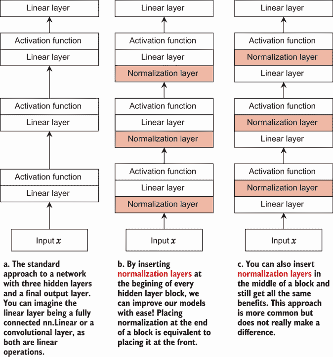

图 6.1 三种具有三个隐藏层和一个输出层的网络版本：(a) 我们迄今为止所学的常规方法；(b) 和 (c) 添加归一化层的两种不同方式

让我们用**x**[l]表示第 l 层的输入，同样，用**μ**[l]和**σ**[l]表示第 l 层输入的均值和标准差。归一化层在每一层都应用了一个额外的技巧：让我们让网络**学习**如何缩放数据，而不是假设均值为 0 和标准差为 1 是最好的选择。这表现为

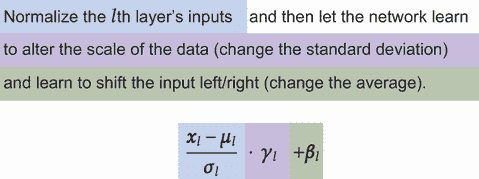

第一个项与我们之前所拥有的相同类型：从数据中移除均值并除以标准差。这里的关键补充是γ，它允许网络改变数据的尺度，以及β，它允许网络将数据左移/右移。由于网络控制γ和β，它们是学习参数（因此γ和β包含在所有参数Θ的集合中）。通常初始化**γ** = 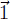 和 **β** = ，以便在开始时，每个层都在执行简单的标准化。随着训练的进行，梯度下降允许我们按需缩放（改变γ）或平移（改变β）结果。

归一化层取得了非凡的成功，我经常把它们描述为“魔法小精灵的粉末”：你把一些归一化层撒到你的网络中，突然它开始更快地收敛到更准确的解。甚至那些根本无法训练的网络突然开始工作。我们将讨论两种最广泛使用的归一化层：*批*和*层*。⁵ 讨论完每种类型后，我们可以解释何时选择其中一种而不是另一种（但你几乎总是应该使用某种形式的归一化层）。这两种方法之间的唯一区别是计算每个层的均值μ和标准差σ的内容；它们都使用相同的方程式，并遵循图 6.1 中的图示。

### 6.2.2 批归一化

第一种也是最流行的归一化层类型是**批归一化**（BN）。根据输入数据的结构，BN 的应用方式不同。如果我们正在处理全连接层（PyTorch 维度(*B*, *D*)），我们将批中 B 个项目的特征值 D 的平均值和标准差取出来。因此，我们在给定的*批*中的数据特征上进行*归一化*。这意味着μ, σ, γ, 和 β的形状为(*D*)，批中的每个项目都通过该批数据的平均值和标准差进行归一化。

为了使这一点更清晰，让我们看看一些基于形状为(*B*, *D*)的张量的假设 Python 代码，该代码计算μ和σ。我们明确地使用`for`循环来使其更清晰。如果你要真正实现这个功能，你应该尝试使用像`torch.sum`和`torch.mean`这样的函数来使这个过程运行得更快：

```
B, D = X.shape            ❶
*μ* = torch.zeros((D))
*σ* = torch.zeros((D))

for i in range(B):        ❷
    *μ* += X[i,:]           ❸
*μ* /= B 
for i in range(B):        ❹
    *σ* += (X[i,:]-*μ*)*(X[i,:]-*μ*)
*σ* += 1e-5
*σ* = torch.sqrt(*σ*)
```

❶ 这个 BN 示例使用了显式的循环：你不会为真实情况编写这样的 torch 代码！在这个例子中，X 的形状是(B, D)。

❷ 遍历批中的每个项目

❸ 平均特征值

❹ 以相同的方式处理标准差

由于 BN 在训练过程中对批次大小敏感，并且无法使用批次大小为 1 的情况，因此它需要一些巧妙的方法在推理/预测时间使用，因为你不希望你的预测依赖于其他数据的存在！为了解决这个问题，大多数实现都会保留所有先前看到的批次中均值和标准差的运行估计，并在训练完成后使用这个单一估计对所有预测进行操作。PyTorch 已经为你处理了这个问题。

如果我们有一维数据，形状为(*B*,*C*,*D*)呢？在这种情况下，我们在批次上归一化*通道*。这意味着μ、σ、γ和β每个都具有(*C*)的形状。这是因为我们希望将每个通道中的 D 个值视为具有相同的性质和结构，因此平均是在所有 B 批次中通道的*B* × *D*个值上进行的。然后我们对每个通道中的所有值应用相同的缩放γ和偏移β。如果我们有形状为(*B*,*C*,*W*,*H*)的二维数据呢？与一维情况类似，μ、σ、γ和β的形状也是(*C*)。对于任何具有通道的 z 维结构化数据，我们始终在通道上使用 BN。以下表格总结了根据张量形状，你应该寻找哪个 PyTorch 模块：

| 张量形状 | PyTorch 模块 |
| --- | --- |
| (*B*,*D*) | `torch.nn.BatchNorm1d(D)` |
| (*B*,*C*,*D*) | `torch.nn.BatchNorm1d(C)` |
| (*B*,*C*,*W*,*H*) | `torch.nn.BatchNorm2d(C)` |
| (*B*,*C*,*W*,*H*,*D*) | `torch.nn.BatchNorm3d(C)` |

如果我们在推理时间对输入张量 X 应用 BN，代码可能看起来像这样：

```
BN = torch.tensor((B, C, W, H)) 
for j in range(C): 
    BN[:,j,:,:] = (X[:,j,:,:]-*μ*[j]/*σ*[j])**γ*[j] + *β*[j]
```

### 6.2.3 使用批归一化进行训练

当我们为 Fashion-MNIST 创建数据加载器时，我们使用了 128 的批次大小，因此我们应该没有问题将 BN 应用于我们的架构。根据前面的表格，我们在全连接网络的每个`nn.Linear`层后添加`BatchNorm1d`——这就是我们需要做的唯一更改！让我们看看下一个代码片段中的样子。我将 BN 放在线性层之后而不是之前，以匹配大多数人做的，这样当你阅读其他代码时，它看起来会熟悉一些：⁶

```
fc_bn_model = nn.Sequential( 
    nn.Flatten(), 
    nn.Linear(D, n), nn.BatchNorm1d(n), nn.LeakyReLU(leak_rate), 
    *[nn.Sequential(nn.Linear(n, n), nn.BatchNorm1d(n), 
    ➥ nn.LeakyReLU(leak_rate)) for _ in range(5)], 
    nn.Linear(n, classes), 
)
```

感谢我们如何组织我们的 CNN，我们可以在下一个代码块中重新定义`cnnLayer`函数以改变其行为。我们所有要做的就是在我们 CNN 的每个`nn.Conv2d`层之后添加`nn.BatchNorm2d`。然后我们运行定义`cnn_relu_model`的相同代码，但这次将其重命名为`cnn_bn_model`：

```
def cnnLayer(in_filters, out_filters=None, kernel_size=3): 

    if out_filters is None: 
        out_filters = in_filters     ❶

    padding=kernel_size//2           ❷

    return nn.Sequential(            ❸

        nn.Conv2d(in_filters, out_filters, kernel_size, padding=padding), 

        nn.BatchNorm2d(out_filters), ❹ 
        nn.LeakyReLU(leak_rate) 
)
```

❶ 这是一个常见的模式，所以如果不特别要求，我们可以将其自动化为默认设置。

❶ 填充以保持相同大小

❶ 将层和激活合并为一个单元

❶ 唯一的变化：在卷积后添加 BatchNorm2d！

接下来是我们熟悉的代码块，用于分别训练基于批归一化的全连接和 CNN 模型：

```
fc_bn_results = train_network(fc_bn_model, loss_func, train_loader, 
➥ test_loader=test_loader, epochs=10, 
➥ score_funcs={’Accuracy’: accuracy_score}, device=device) 
del fc_bn_model

cnn_bn_results = train_network(cnn_bn_model, loss_func, train_loader, 
➥ test_loader=test_loader, epochs=10, 
➥ score_funcs={’Accuracy’: accuracy_score}, device=device) 
del cnn_bn_model
```

我们新网络的输出结果如下，与添加 ReLU 激活函数之前的最佳结果进行比较。我们再次看到在所有方面都提高了准确性，*特别是*对于我们的 CNN：

```
    sns.lineplot(x=’epoch’, y=’test Accuracy’, data=fc_relu_results, 
    ➥ label=’FC-ReLU’) 
    sns.lineplot(x=’epoch’, y=’test Accuracy’, data=fc_bn_results, 
    ➥ label=’FC-ReLU-BN’) 
    sns.lineplot(x=’epoch’, y=’test Accuracy’, data=cnn_relu_results, 
    ➥ label=’CNN-ReLU’) 
    sns.lineplot(x=’epoch’, y=’test Accuracy’, data=cnn_bn_results, 
    ➥ label=’CNN-ReLU-BN’)

[27]: <AxesSubplot:xlabel='epoch', ylabel='test Accuracy'>
```

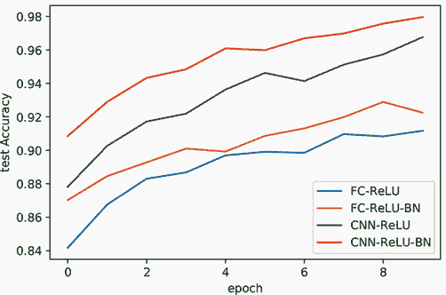

注意：观察完全连接模型和基于 CNN 的模型之间的改进差异，我们可能会推断出完全连接架构开始达到其最佳状态，而无需变得更大或更深。现在这并不重要，但我提到它作为使用多个模型来推断关于你的数据假设的例子。

为什么 BN 效果如此之好？我能给出的最佳直觉是我们之前走过的逻辑：归一化有助于确保我们每层之后的实际数值在一个普遍的“良好”范围内；通过γ和β，网络可以*决定*这个范围的确切位置。但找到这个工作原理的根本原因是深度学习中的一个活跃研究领域！不幸的是，还没有人有一个真正确定的答案。

### 6.2.4 层归一化

另一种流行的归一化方法是（令人困惑地）称为*层归一化*（LN），其中我们查看特征的平均激活而不是批次的平均。这意味着批处理中的每个示例都有自己的μ和σ值，但共享一个学习到的γ和β。再次，我们可以通过一个带有明确代码的例子来查看这一点：

```
B, D = X.shape                 ❶
*μ* = torch.zeros((B))
*σ* = torch.zeros((B)) 
for j in range(D):
    *μ* += X[:, j]               ❷
*μ* /= D 
for j in range(D):
    *σ* += (X[:,j]-*μ*)*(X[:,j]-*μ*) ❸
*σ* += 1e-5
*σ* = torch.sqrt(*σ*)
```

❶ 所以在这个例子中，X 的形状是(B, D)。

❷ 注意这已经从 X[i,:]之前进行了更改！

❸ 再次，从 X[i,:]进行了更改！

LN 和 BN 之间的唯一区别就是*我们平均的是什么*！在 LN 中，批处理 B 中存在的示例数量并不重要，因此我们可以使用 LN 时批处理更小。

有了这些，我们可以深入到我们重复的例子，将这种方法应用到我们的相同网络架构中。与 BN 不同，BN 在 PyTorch 中为每种张量形状有不同的类，而 LN 有一个类适用于*所有*架构。有一些细微的原因与某些问题相关，在这些问题中，LN 比 BN 更受欢迎，并且需要额外的灵活性。

### 6.2.5 使用层归一化进行训练

`nn.LayerNorm`类接受一个单一参数，它是一个*整数列表*。如果你正在处理形状为(*B*,*D*)的完全连接层，你使用`[D]`作为列表，得到`nn.LayerNorm([D])`作为层构造。在这里，你可以看到我们使用 LN 的完全连接网络的代码。对于完全连接层，只需将 BN 替换为 LN：

```
fc_ln_model = nn.Sequential( 
    nn.Flatten(), 
    nn.Linear(D, n), nn.LayerNorm([n]), nn.LeakyReLU(leak_rate), 
    *[nn.Sequential(nn.Linear(n, n), nn.LayerNorm([n]), 
    ➥ nn.LeakyReLU(leak_rate)) for _ in range(5)], 
    nn.Linear(n, classes), 
)
```

为什么 LN 需要一个整数列表？这个列表告诉 LN，从右到左，哪些值需要平均。所以如果我们有一个形状为(*B*,*C*,*W*,*H*)的张量 2D 问题，我们给 LN 最后一个三个维度作为列表`[C, W, H]`。这涵盖了*所有特征*，这是我们希望 LN 进行归一化的。这使得 LN 对于 CNN 来说稍微复杂一些，因为我们还需要注意宽度和高度的大小，并且每次应用最大池化时都会发生变化。

以下是绕过这个问题的新的 `cnnLayer` 函数。我们添加了一个 `pool_factor` 参数，用于跟踪池化应用了多少次。之后是一个 LN 对象，其列表 `[out_filters, W//(2**pool_factor), H//(2**pool_factor)]` 根据池化应用的次数调整宽度和高度。

注意：这也是使用填充与我们的卷积层一起使用的另一个原因。通过填充卷积，使得输出具有与输入相同的宽度和高度，我们简化了需要跟踪的事情。目前，我们需要在每一轮池化时除以 2。如果我们还必须跟踪卷积进行了多少次，代码将会更加复杂。这也会使得对网络定义的更改变得更加困难。

这里是代码：

```
def cnnLayer(in_filters, out_filters=None, pool_factor=0,kernel_size=3): 

    if out_filters is None: 
        out_filters = in_filters                       ❶ 

    padding=kernel_size//2                             ❷ 

    return nn.Sequential(                              ❸

        nn.Conv2d(in_filters, out_filters, kernel_size, padding=padding), 
        nn.LayerNorm([out_filters, 
        ➥ W//(2**pool_factor), H//(2**pool_factor)]), ❹ 
        nn.LeakyReLU(leak_rate) 
)
```

❶ 这是一个常见的模式，所以如果不需要询问，我们就将其自动化为默认设置。

❷ 填充以保持相同大小

❸ 将层和激活合并为一个单一单元

❹ 唯一的改变：在卷积后切换到 LayerNorm！

现在我们有了新的 `cnnLayer` 函数，我们可以创建一个使用 LN 的 `cnn_ln_model`。以下代码展示了它的创建，因为我们必须在执行池化后添加 `pool_factor` 参数：

```
cnn_ln_model = nn.Sequential( 
    cnnLayer(C, n_filters), 
    cnnLayer(n_filters), 
    cnnLayer(n_filters), 
    nn.MaxPool2d((2,2)), ❶

    cnnLayer(n_filters, 2*n_filters, pool_factor=1), 
    cnnLayer(2*n_filters, pool_factor=1), 
    cnnLayer(2*n_filters, pool_factor=1), 
    nn.MaxPool2d((2,2)), ❷

    cnnLayer(2*n_filters, 4*n_filters, pool_factor=2), 
    cnnLayer(4*n_filters, pool_factor=2), 
    nn.Flatten(), 
    nn.Linear(D*n_filters//4, classes), 
)
```

❶ 我们已经进行了一轮池化，所以池化因子=1。

❷ 现在我们已经进行了两轮池化，所以池化因子=2。

这需要做一点额外的工作，但并不痛苦。我们现在可以训练这两个新的模型：

```
fc_ln_results = train_network(fc_ln_model, loss_func, train_loader, 
➥ test_loader=test_loader, epochs=10, 
➥ score_funcs={’Accuracy’: accuracy_score}, device=device) 
del fc_ln_model 
cnn_ln_results = train_network(cnn_ln_model, loss_func, train_loader, 
➥ test_loader=test_loader, epochs=10, 
➥ score_funcs={’Accuracy’: accuracy_score}, device=device) 
del cnn_ln_model
```

让我们用 LN、BN 和没有归一化层的基于 ReLU 的模型来绘制结果。LN 的神奇魔力似乎并不那么强烈。对于 CNN，LN 相比没有归一化的模型是一个改进，但不如 BN。对于全连接层，LN 似乎与非归一化的变体更一致：

```
    sns.lineplot(x=’epoch’, y=’test Accuracy’, data=fc_relu_results, 
    ➥ label=’FC-ReLU’) 
    sns.lineplot(x=’epoch’, y=’test Accuracy’, data=fc_bn_results, 
    ➥ label=’FC-ReLU-BN’) 
    sns.lineplot(x=’epoch’, y=’test Accuracy’, data=cnn_relu_results, 
    ➥ label=’CNN-ReLU’) 
    sns.lineplot(x=’epoch’, y=’test Accuracy’, data=cnn_bn_results, 
    ➥ label=’CNN-ReLU-BN’) 
    sns.lineplot(x=’epoch’, y=’test Accuracy’, data=fc_ln_results, 
    ➥ label=’FC-ReLU-LN’) 
    sns.lineplot(x=’epoch’, y=’test Accuracy’, data=cnn_ln_results, 
    ➥ label=’CNN-ReLU-LN’)

[32]: <AxesSubplot:xlabel='epoch', ylabel='test Accuracy'>
```

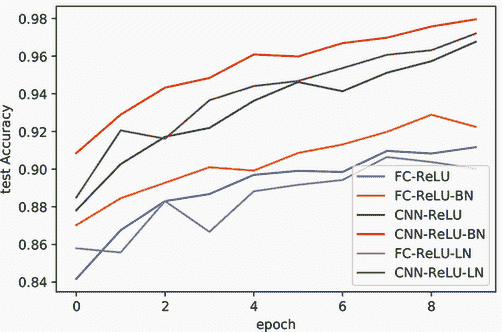

初看之下，LN 并不显得那么有帮助。它的代码更难以包含，并且在模型准确度方面表现并不完全出色。不过，更复杂的代码确实有其目的。BN 对于全连接层和卷积模型非常有用，因此 PyTorch 可以轻松地将它硬编码到这两个任务中。LN 几乎对任何架构（例如 RNN）都有帮助，而明确告诉 LN 要归一化哪些整数的列表允许我们使用相同的 `Module` 来处理这些不同用例。

### 6.2.6 使用哪个归一化层？

尽管归一化层已经存在了几年，但完全理解它们以及何时使用它们是一个活跃的研究问题。对于非循环网络，如果你可以在批处理大小 *B* ≥ 64 上进行训练，使用 BN 是一个好主意。如果你的批处理大小不够大，你将无法得到 μ 和 σ 的良好估计，你的结果可能会受到影响。如果你的问题适合这种大批量的情况，BN 通常会*通常*提高你的结果，但也有一些情况它不起作用。所以如果你发现你的模型难以训练，尝试测试没有 BN 的模型版本，看看你是否处于 BN 反而会*伤害*而不是帮助的奇怪情况。幸运的是，这些情况很少见，所以如果我有 CNN 和大型批处理，我仍然默认包括 BN。

LN 对于循环架构特别受欢迎，值得添加到你的 RNN 中。每次你重用具有权重共享的子网络时，LN 应该是你的首选：BN 的统计假设*一个*分布，而在你进行权重共享时，你会得到*多个*分布，这可能会引起问题。LN 在批处理大小 *B* ≤ 32 的情况下也可能会有效，尽管它通常不会像 BN 那样为 CNN 和全连接网络提供相同级别的改进。这可能是一个因素，如果你认为扩大你的网络将提高性能，但你不能不缩小批处理大小（由于内存不足）来扩大网络。

虽然 BN（批量归一化）和 LN（层归一化）是最流行和最广泛使用的归一化层，但它们远非唯一正在开发和使用的。值得留意新的归一化层方法；使用它们通常只需对代码进行简单的修改。

### 6.2.7 层归一化的一个特性

由于 LN（层归一化）已经变得非常重要，我想分享一些关于使归一化层特别不同寻常且有时令人困惑的深入见解。让我们来谈谈网络的*强度*，或者更技术性地，*容量*。

我在这里稍微宽松地使用这些词来指代一个问题的复杂度或神经网络复杂度。⁷ 一个好的心理模型是将复杂度想象成看起来随机或无规律的；一些例子在图 6.2 中展示。一个函数越复杂，我们的神经网络必须越复杂或越强大才能近似它。

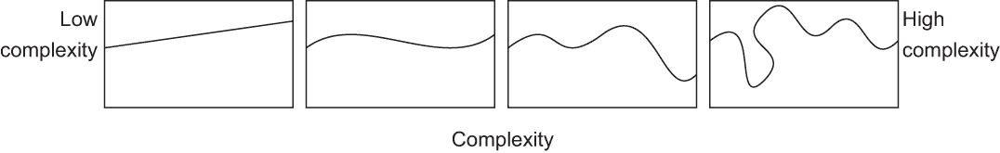

图 6.2 我们可以将函数的复杂度想象成它看起来有多扭曲和无规律。这张图显示了左侧一个非常低复杂度的函数（线性）；随着向右移动，复杂度增加。

当我们谈论模型时，事情变得有趣，因为有两个不同的因素在相互作用：

+   模型在技术上能够表示什么（即，如果有一个先知能告诉你给定模型的完美参数）？

+   我们的最优化过程*实际上*能学到什么？

在第五章中，我们看到了我们的优化方法并不完美，所以一个模型能够学习的内容必须小于或等于它能够表示的内容。每次我们添加一个额外的层或在层中增加神经元的数量，我们都会增加网络的容量。

我们可以将欠拟合数据描述为具有比我们试图解决的问题的复杂性更少的模型。这就像试图用微波炉举办婚礼：你无法满足这种情况的需求。这，加上另外两种重要的情况，如图 6.3 所示。第一种情况可能导致过拟合，但这并不意味着我们可以解决这个问题。这是好事，因为我们有工具来处理它（例如，使模型更小或添加正则化）。我们可以通过给所有数据点随机标签来轻松检查我们是否处于第二种情况：如果训练损失下降，则模型有足够的容量来记住整个数据集。

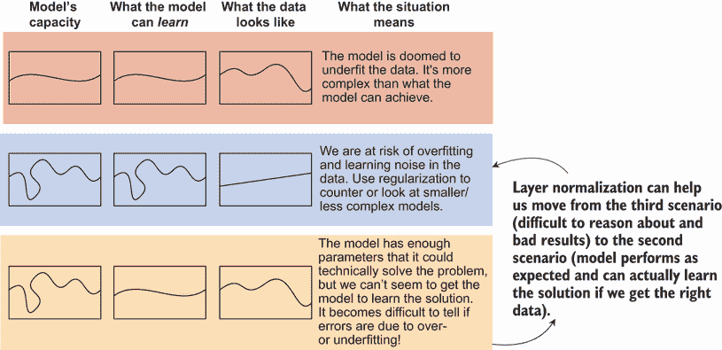

图 6.3 展示了在指定神经网络时可能出现的三种常见情况。关注复杂性的相对比较，而不是显示的确切类型。第一种情况在我们模型太小的时候很常见。第二种和第三种情况在我们使模型更大时都常见，但第三种情况更难以推理。归一化层帮助我们从糟糕的第三种情况转移到更好的第二种情况。

图 6.3 中的第三种情况是最为恶劣的，我们没有任何好的方法来检查这是否是我们遇到的问题。通常只有在发明了更好的方法（例如，从 SGD 到带有动量的 SGD）时才会被发现。归一化层是独一无二的，因为它们**不会增加容量**。换句话说，它们的表示能力不会改变，但它们可以学习的内容却得到了提升。

在这方面，归一化层相当独特，我们作为社区仍在努力弄清楚**为什么**它们工作得如此之好。因为它们不会增加容量，许多实践者和研究人员都对此行为感到困扰。如果我们可以不包含这些归一化层，那会更好，因为它们不会影响容量，但到目前为止，它们的价值太高，无法放弃。

批量归一化不会增加表示能力的证明

我说归一化层不会给网络增加任何表示能力，这听起来可能有些奇怪。我们添加了一种新的层，而增加更多的层通常会使网络能够表示更复杂的函数。那么，归一化层为什么不同呢？

我们可以用一点代数来回答这个问题！记住，我们说过归一化层的格式是

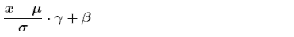

但是，那个 x 值是线性层的输出。因此，我们可以将这个表达式重写为

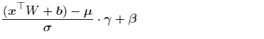

使用代数，我们可以采取以下步骤来简化这一点。首先，分子中操作顺序的顺序在有或没有括号的情况下都不会改变，所以让我们去掉它们：

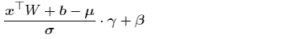

现在，让我们将 γ 移到左边，并应用于分子中的项。我们将偏置项 b 和均值 μ 的两个平移分组：

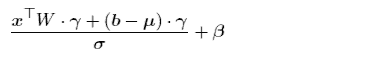

接下来，我们将 σ 的除法独立应用于每个项：

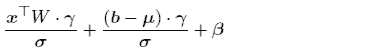

最左侧的项涉及向量矩阵乘积 **x**^⊤*W*，因此我们可以将所有与 γ 和 σ 相关的逐元素操作移动到 W 上，并将 x 视为之后发生的事情（结果相同）：

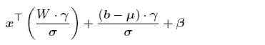

你看到答案了吗？我们遇到了与第二章和第三章中讨论的相同情况。归一化是一个 *线性操作*，*任何连续的线性操作序列都等价于一个线性操作*！跟随 BN 的线性层序列 *等价* 于一个不同的、单一的 `nn.Linear` 层，其权重为 W̃ + 和偏置 *b̃*：

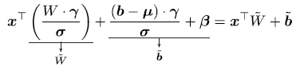

如果你使用卷积层，你会得到相同的结果。这导致一些深度学习研究人员甚至实践者感到困惑，因为批量归一化（BN）非常有效，但其效用巨大，难以拒绝。

## 6.3 跳跃连接：一种网络设计模式

现在我们已经了解了一些新的 `Module`，它们可以改进我们的网络，让我们转向了解可以整合到我们网络中的新 *设计*。第一个被称为 *跳跃连接*。在正常的正向传播网络中，一个层的输出直接传递到下一层。有了跳跃连接，这一点仍然成立，但我们还会“跳过”下一层，并将连接到前一层。有 *许多* 种方法可以做到这一点，图 6.4 展示了几个选项。

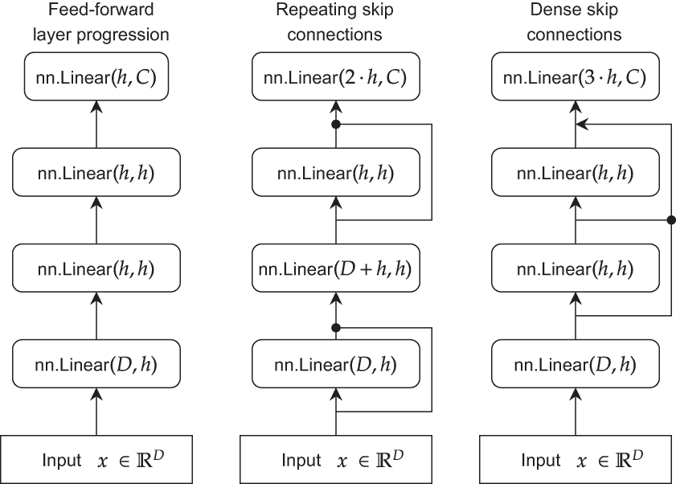

图 6.4 最左侧的图显示了一个正常的正向传播设计。右侧的两个图显示了实现跳跃连接的两种不同方法。连接上的黑色点表示所有输入输出结果的连接。为了简单起见，只显示了线性层，但网络还会包含归一化和激活层。

左边的图像是我们一直在使用的正常网络。第二幅图显示了每个其他层“跳过”到下一层的策略。当这种情况发生时，每第二个层的输入数量会根据前两层输入的输出大小增加。这个想法是，图中的每个实心点都表示输出的连接。所以如果 x 和 h 在图中连接，它们将输入到下一层：[**x**，**h**]。在代码中，这将是类似于 `torch.cat([x, h], dim=1)` 的东西。这样，两个输入 x 和 h 的形状是(*B*，*D*)和(*B*，*H*)。我们想要堆叠特征，以便结果将具有(*B*，*D*+*H*)的形状。图中的第三个示例显示了多个输入跳过到特定层，给它提供了三倍多的输入。这导致最终层的输入大小根据进入它的三个层的三倍增加，所有层的输出大小都是 h。

为什么使用跳过连接？部分直觉是跳过连接可以使优化过程更容易。换句话说，跳过连接可以缩小网络容量（它能表示什么）和它能学习的内容（它学习表示的内容）之间的差距。图 6.5 突出了这一点。考虑左边的正常网络示例。梯度包含了我们需要学习和调整每个参数所需的信息。在左边，第一隐藏层需要等待三个其他层处理并传递梯度，才能获得任何信息。但每一步也是噪声的机会，如果我们有太多的层，学习就会变得无效。右边的网络对于非常深的网络，将梯度的路径减少了一半。

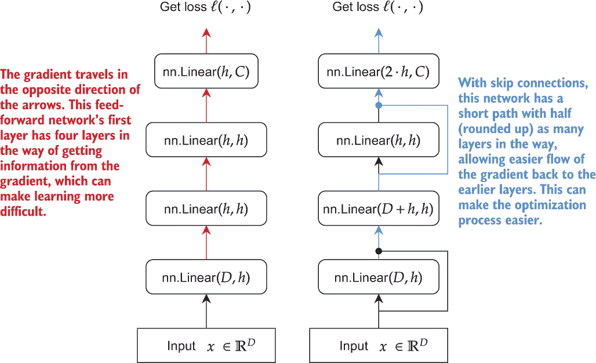

图 6.5 每个操作都会使网络更复杂，但也会使梯度更复杂，在深度（容量）和可学习性（优化）之间产生权衡。跳过连接创建了一条操作更少的短路径，可以使梯度更容易学习。为了简单起见，只显示了线性层，但也会包含归一化和激活层。

一种更极端的选项是将每个隐藏层通过跳过连接直接连接到输出层。这如图 6.6 所示。每个隐藏层都能直接从输出层获得一些关于梯度的信息，从而提供了对梯度的更直接访问，同时梯度也是从更长路径逐层处理。这种更直接的反馈可以使学习更容易。它还可以为需要高、低级细节的某些应用带来好处。想象一下，你正在尝试区分哺乳动物：高级细节，如形状，可以很容易地区分鲸鱼和狗，但低级细节，如毛发的风格，对于区分不同的狗品种很重要。

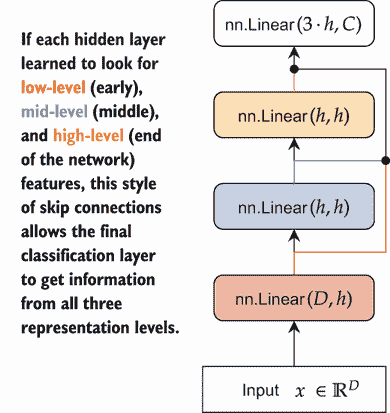

图 6.6 创建密集跳转连接，其中所有内容都连接到输出层，这显著缩短了从输出梯度回到每一层的路径长度。当不同层学习不同类型的特征时，这也可能很有帮助。为了简单起见，只显示了线性层，但实际网络还会包含归一化和激活层。

噪声的噪声定义

在这里，以及本书中的许多地方，我们使用一个非常宽泛的噪声定义。噪声可以是添加到网络中的实际噪声，也可以是消失或爆炸的梯度，但通常它只是意味着*难以使用*。梯度不是魔法；它是一个寻找最佳当前选择的贪婪过程。

想象一下玩一个电话游戏，试图将一条信息从一个人传递到另一个人。在电话传递过程中，每个人贪婪地倾听并传递信息给下一个人。但是当信息回到电话链的起点时，它通常是被严重扭曲的原话版本。电话线中的人越多，信息中发生错误的可能性就越大。如果每个人都是网络中的一个隐藏层，那么我们在训练中就会遇到同样的问题！梯度是信息，每个隐藏层在尝试将其传递回去时都会改变信息。如果太深，信息就会被电话游戏扭曲得太厉害，以至于没有用了。

然而，让每一层都直接连接到输出可能会过度设计，并最终使学习问题更加困难。想象一下，如果你有 100 个隐藏层，它们都直接连接到输出层——这将是一个*巨大*的输入，输出层需要处理。尽管如此，这种方法已经通过组织“块”密集跳转连接而成功使用⁸。

### 6.3.1 实现全连接跳过

既然我们已经讨论了跳转连接，那么让我们为全连接网络实现一个。这个例子展示了如何创建图 6.6 中所示的第二种跳转连接风格，其中大量层跳转到最终一层。然后我们可以多次重用这个层，以创建一种混合策略，每隔一层就实现图 6.5 中的第一种风格。

图 6.7 展示了这是如何工作的。每一组跳转连接定义了一个由`SkipFC` `Module`定义的块。通过堆叠多个块，我们重新创建了图 6.6 中使用的网络风格。图 6.5 可以使用单个`SkipFC(6,D,N)`重新创建。

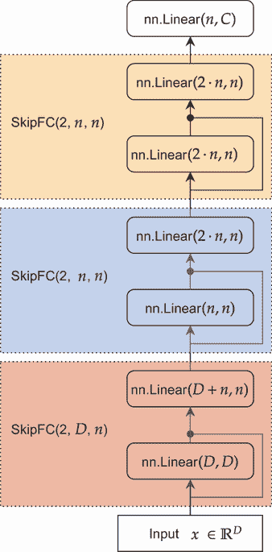

图 6.7 我们为具有跳转连接的全连接网络定义的架构。每个虚线块表示一个密集连接块，并使用我们定义的一个`SkipFC`对象创建。

要做到这一点，我们需要存储一个隐藏层的列表。在 PyTorch 中，这应该使用 `ModuleList` 类来完成。计算机科学家在命名事物时并不非常富有创造力，所以正如其名所暗示的，它是一个只存储 `Module` 类型的对象的 `list`。这是很重要的，这样 PyTorch 就知道它应该搜索 `ModuleList` 以找到更多的 `Module` 对象。这样，它仍然可以使用自动微分，并使用单个 `.parameters()` 函数获取所有参数。

以下 PyTorch 模块定义了一个用于创建跳过连接的类。它创建了一个包含 `n_layers` 个总层的多个层的较大块，以密集式跳过连接的形式。单独使用时，它可以创建密集网络；或者，连续使用时，它可以创建交错跳过连接：

```
class SkipFC(nn.Module): 
    def __init__(self, n_layers, in_size, out_size, leak_rate=0.1): 
        """ 
        n_layers: how many hidden layers for this block of dense skip 
        ➥ connections 
        in_size: how many features are coming into this layer 
        out_size: how many features should be used for the final layer of 
        ➥ this block. 
        leak_rate: the parameter for the LeakyReLU activation function. 
        """

    super().__init__() 
        l = n_layers-1                                         ❶ 
        self.layers = nn.ModuleList([
        ➥ nn.Linear(in_size*l, out_size) if i == l            ❷ 
        ➥ else nn.Linear(in_size, in_size) 
        ➥ for i in range(n_layers)]) 
        self.bns = nn.ModuleList([
        ➥ nn.BatchNorm1d(out_size) if i == l                  ❷ 
        ➥ else nn.BatchNorm1d(in_size) 
        ➥ for i in range(n_layers)]) 
    self.activation = nn.LeakyReLU(leak_rate)                  ❸

    def forward(self, x): activations = []                     ❹ 
        for layer, bn in zip(self.layers[:-1], self.bns[:-1]): ❺ 
            x = self.activation(bn(layer(x))) 
            activations.append( x ) 
        x = torch.cat(activations, dim=1)                      ❻ 

        return self.activation(self.bns-1))                                ❼
```

❶ 最后一层将被不同处理，所以让我们获取它的索引，以便在接下来的两行中使用。

❷ 线性和批归一化层分别存储在 layers 和 bns 中。一个列表推导式在一行中创建了所有层。“if i == l”允许我们单独选择最后一层，它需要使用 out_size 而不是 in_size。

❸ 由于我们正在编写自己的前向函数而不是使用 nn.Sequential，我们可以多次使用一个激活对象。

❹ 首先，我们需要一个位置来存储这个块中每个层（除了最后一层）的激活值。所有激活值都将组合成最后一层的输入，这就是跳过连接的原因！

❺ 将线性和归一化层压缩成成对的元组，使用 [:-1] 来选择每个列表中除了最后一个项目之外的所有项目。

❻ 将激活值连接在一起，作为最后一层的输入

❼ 我们手动使用最后一个线性层和批归一化层来处理这个连接的输入，从而得到结果。

使用 `SkipFC` 类，我们可以轻松地创建包含跳过连接的网络。图 6.7 展示了如何使用三个这样的对象，然后是一个线性层来定义一个网络，我们在下一块代码中这样做。请注意，我们仍然使用 `nn.Sequential` 对象来组织所有这些代码，现在它以前馈方式执行；非前馈跳过被 `SkipFC` 对象封装。这有助于使我们的代码更短、更易于阅读和组织。将非前馈部分封装到自定义 `Module` 中的这种方法是我组织自定义网络的首选方法：

```
fc_skip_model = nn.Sequential( 
    nn.Flatten(), 
    SkipFC(2, D, n), 
    SkipFC(2, n, n), 
    SkipFC(2, n, n), 
    nn.Linear(n, classes), 
)

fc_skip_results = train_network(fc_skip_model, loss_func, train_loader, 
➥ test_loader=test_loader, epochs=10, 
➥ score_funcs={’Accuracy’: accuracy_score}, device=device) 
del fc_skip_model
```

完成这些后，我们可以查看这个新网络的结果。以下代码调用 seaborn 来绘制我们迄今为止训练的完整连接网络。结果中等，跳过连接并没有明显优于没有 BN 的网络：

```
    sns.lineplot(x=’epoch’, y=’test Accuracy’, data=fc_relu_results, 
    ➥ label=’FC-ReLU’) 
    sns.lineplot(x=’epoch’, y=’test Accuracy’, data=fc_bn_results, 
    ➥ label=’FC-ReLU-BN’) 
    sns.lineplot(x=’epoch’, y=’test Accuracy’, data=fc_skip_results, 
    ➥ label=’FC-ReLU-BN-Skip’)

[35]: <AxesSubplot:xlabel='epoch', ylabel='test Accuracy'>
```

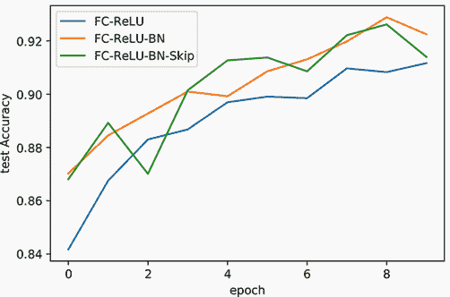

我之前解释的关于跳跃连接帮助学习和梯度流的内容仍然有效，但这并不是全部。部分问题是，在发明归一化层来帮助解决相同问题之前，跳跃连接本身更有效。由于我们的网络都包含 BN，因此跳跃连接有点多余。部分问题是我们的网络并不深，所以差异并不大。

### 6.3.2 实现卷积跳跃

由于跳跃连接被广泛使用，尽管我们迄今为止已经看到了，让我们重复这个练习来针对卷积网络。这将是一次快速的远足，因为代码几乎相同。我重复这个练习是因为跳跃连接作为更大解决方案组件的重要性及其广泛使用。

在以下代码中，我们用新的 `SkipConv2d` 类替换了我们的 `SkipFC` 类。`forward` 函数是相同的。唯一的区别是我们定义了一些辅助变量，如核大小和填充，这些在全连接层中不存在，并用 `Conv2d` 和 `BatchNorm2d` 替换了 `lns` 和 `bns` 的内容：

```
class SkipConv2d(nn.Module): 
    def __init__(self, n_layers, in_channels, out_channels, 
    ➥ kernel_size=3, leak_rate=0.1):

        super().__init__() 

        l = n_layers-1                    ❶ 
        f = (kernel_size, kernel_size)    ❷ 
        pad = (kernel_size-1)//2 

        self.layers = nn.ModuleList([     ❸
        ➥ nn.Conv2d(in_channels*l, out_channels, 
        ➥ kernel_size=f, padding=pad) if i == l 
        ➥ else nn.Conv2d(in_channels, in_channels, 
        ➥ kernel_size=f, padding=pad) 
        ➥ for i in range(n_layers)]) 
        self.bns = nn.ModuleList([        ❸
        ➥ nn.BatchNorm2d(out_channels) if i == l 
        ➥ else nn.BatchNorm2d(in_channels) 
        ➥ for i in range(n_layers)]) 

        self.activation = nn.LeakyReLU(leak_rate)

    def forward(self, x):                 ❹ 
        activations = [] 

        for layer, bn in zip(self.layers[:-1], self.bns[:-1]): 
            x = self.activation(bn(layer(x))) 
            activations.append( x )

        x = torch.cat(activations, dim=1) ❺ 

        return self.activation(self.bns-1))
```

❶ 最后一次卷积将具有不同的输入和输出通道数，所以我们仍然需要那个索引。

❷ 简单的辅助值

❸ 定义了使用的层，使用相同的“if i == l”列表推导式改变最后层的构建。我们将通过它们的通道组合卷积，因此最后层的输入和输出通道会改变。

❹ 这段代码与 SkipFC 类相同，但值得强调的是可能改变其功能的最重要的一行……

❺... 这是对所有激活的连接。我们的张量组织为 (B, C, W, H)，这是 PyTorch 的默认设置。但你可以改变它，有时人们使用 (B, W, H, C)。在这种情况下，C 通道将位于索引 3 而不是 1，所以你会使用 cat=3。这也是你可以如何将此代码适配到 RNN 中的方法。

现在我们可以定义一个使用跳跃连接的 CNN `Module`。但是有一个重大问题：我们的输入只有三个通道。这对网络来说太少了，无法学习到有用的东西。为了解决这个问题，我们在开始处插入一个带有 *无激活函数* 的单个 `Conv2d` 层。这在数学上是多余的，但我们的代码组织起来更容易，因为 `SkipConv2d` 开始构建一个更大的滤波器集：

```
cnn_skip_model = nn.Sequential( 
    nn.Conv2d(C, n_filters, (3,3), padding=1), 
    SkipConv2d(3, n_filters, 2*n_filters), 
    nn.MaxPool2d((2,2)), 
    nn.LeakyReLU(), 
    SkipConv2d(3, 2*n_filters, 4*n_filters), 
    nn.MaxPool2d((2,2)), 
    SkipConv2d(2, 4*n_filters, 4*n_filters), 
    nn.Flatten(), 
    nn.Linear(D*n_filters//4, classes), 
)

cnn_skip_results = train_network(cnn_skip_model, loss_func, train_loader, 
➥ test_loader=test_loader, epochs=10, 
➥ score_funcs={’Accuracy’: accuracy_score}, device=device) 
del cnn_skip_model
```

注意，我们不能在 `MaxPool2d` 层之间进行跳跃。池化会改变图像的宽度和高度，如果我们尝试连接形状为 (*B*,*C*,*W*,*H*) 和 (*B*,*C*,*W*/2,*H*/2) 的两个张量，将会出错，因为轴的大小不同。当我们连接时，唯一可以有不同的轴是我们要连接的轴！所以如果我们是在 C 轴（`dim=1`）上连接，我们可以做 (*B*,*C*,*W*,*H*) 和 (*B*,*C*/2,*W*,*H*)。

下一段代码绘制了跳跃 CNN 和之前的结果，结果与刚才看到的故事相同。但进行这项练习很重要，以确保你对跳跃连接感到舒适，并让你准备好我们刚才看到的两个问题——需要调整跳跃连接的通道数，以及跳过池化层的困难（我们将在下一两个部分中解决第一个问题，第二个池化问题也是很好的理解）：

```
    sns.lineplot(x=’epoch’, y=’test Accuracy’, data=cnn_relu_results, 
    ➥ label=’CNN-ReLU’) 
    sns.lineplot(x=’epoch’, y=’test Accuracy’, data=cnn_bn_results, 
    ➥ label=’CNN-ReLU-BN’) 
    sns.lineplot(x=’epoch’, y=’test Accuracy’, data=cnn_skip_results, 
    ➥ label=’CNN-ReLU-BN-Skip’)

[38]: <AxesSubplot:xlabel='epoch', ylabel='test Accuracy'>
```

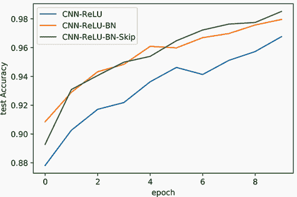

再次，结果相当不确定。在实际经验中，跳跃连接有时可以单独带来很大的差异，但这非常依赖于具体问题。那么我们为什么要学习它们呢？结合另一个技巧，跳跃连接形成了一个更强大且通常更有效的技术的基本构建块之一，即所谓的*残差层*，它确实更有效。但我们需要逐步构建这种更复杂的方法，以了解其基础。让我们了解另一个我们可以与跳跃连接结合使用的成分，以创建我不断吹嘘的这个传说中的“残差”层。

## 6.4 1 × 1 卷积：在通道中共享和重塑信息

我们迄今为止使用卷积所做的一切都是为了捕捉*空间*信息，我们说过卷积的目的是捕捉这种空间*先验*，即彼此（在空间上）靠近的值是相互关联的。因此，我们的卷积有一个大小为 k 的核，这样我们就可以捕捉到⌊*k*/2⌋个邻居的信息。

但如果我们设*k* = 1 呢？这给我们关于邻居的*没有任何信息*，因此捕捉到*没有空间信息*。乍一看，这似乎使卷积成为一个无用的操作。然而，使用这种邻居盲目的卷积可能有有价值的原因。一个特定的应用是作为一种计算成本低的操作来改变给定层的通道数。这将是基于我们的 CNN 跳跃连接的第一层的一个更好的选择。我们不想有一个完全隐藏的层；我们只想让通道数 C 成为一个更方便的值。使用*k* = 1 通常被称为 1 × 1 卷积，这样做比我们使用的正常 3 × 3 层快≈9 倍（3²/1 = 9，忽略开销），并且需要的内存更少。

这是因为我们在执行卷积时，有*C*[in]个输入通道和*C*[out]个输出通道。因此，当*k* = 1 时，卷积不是看空间邻居，而是通过抓取一个*C*[in]值的堆栈来查看空间*通道*，并一次性处理它们。您可以在图 6.8 中看到这一点，该图展示了将 1 × 1 卷积应用于具有三个通道的图像。

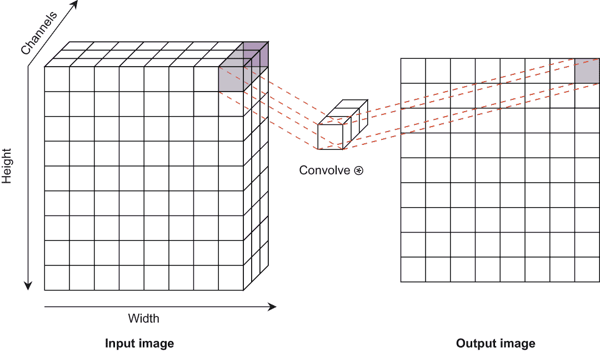

图 6.8 1 × 1 卷积应用于图像的示例。中间的滤波器看起来像一根棍子，因为它宽度和高度都是 1。它应用于每个像素位置，而不考虑任何相邻像素。

从本质上讲，我们正在给网络提供一个新的先验：它应该尝试在通道之间共享信息，而不是查看相邻位置。另一种思考方式是，如果每个通道都学会了寻找不同类型的模式，我们正在告诉网络*关注这个位置找到的模式*，而不是让它尝试构建新的空间模式。

例如，假设我们正在处理一个图像，一个通道已经学会了识别水平边缘，另一个通道识别垂直边缘，另一个通道识别 45 度角的边缘，等等。如果我们想让一个通道学会识别*任何*边缘，我们可以通过仅查看通道值（即，是否*任何*这些角度相关的边缘检测滤波器被触发？）来实现，而不考虑相邻像素。如果这样的识别是有用的，*k* = 1 卷积可以帮助提高学习效率和降低计算成本！

### 6.4.1 使用 1 × 1 卷积进行训练

这样的卷积很容易实现：我们在用于批量归一化的`cnnLayer`函数的基础上，添加了一个名为`infoShareBlock`的第二个辅助函数。这个新函数接受输入滤波器的数量，并应用一个 1 × 1 卷积以保持输出大小，并希望在这个过程中进行有用的学习：

```
def infoShareBlock(n_filters): 
    return nn.Sequential(
        nn.Conv2d(n_filters, n_filters, (1,1), padding=0), 
        nn.BatchNorm2d(n_filters), 
        nn.LeakyReLU())
```

以下代码通过在每个隐藏层块中添加一次`infoShareBlock`来实现新的方法。我选择在两轮正常隐藏层之后进行。`infoShareBlock`相当便宜，所以可以在周围随意添加。我有时在每个网络区域（例如，每个池化一次）添加一个；其他人更规律地添加它们。你可以对你的问题进行实验，看看它是否有用，并找出什么有效：

```
cnn_1x1_model = nn.Sequential( 
    cnnLayer(C, n_filters), 
    cnnLayer(n_filters), 
    infoShareBlock(n_filters),                            ❶
    cnnLayer(n_filters), 
    nn.MaxPool2d((2,2)), 
    cnnLayer(n_filters, 2*n_filters), 
    cnnLayer(2*n_filters), 
    infoShareBlock(2*n_filters), 
    cnnLayer(2*n_filters), nn.MaxPool2d((2,2)), 
    cnnLayer(2*n_filters, 4*n_filters), 
    cnnLayer(4*n_filters), 
    infoShareBlock(4*n_filters), 
    nn.Flatten(), 
    nn.Linear(D*n_filters//4, classes), 
)

cnn_1x1_results = train_network(cnn_1x1_model, loss_func, ❷
➥ train_loader, test_loader=test_loader, epochs=10, 
➥ score_funcs=’Accuracy’: accuracy_score, device=device) 
del cnn_1x1_model
```

❶ 在 2x cnnLayers 之后的第一个信息块

❷ 训练此模型

当我们绘制结果时，我们发现我们的准确率并没有提高多少。为什么？好吧，我们给出的关于信息共享的例子*可以通过更大的滤波器来完成*。所以这个过程并不一定允许我们学习到我们之前无法学习到的东西：

```
    sns.lineplot(x=’epoch’, y=’test Accuracy’, data=cnn_relu_results, 
    ➥ label=’CNN-ReLU’) 
    sns.lineplot(x=’epoch’, y=’test Accuracy’, data=cnn_bn_results, 
    ➥ label=’CNN-ReLU-BN’) 
    sns.lineplot(x=’epoch’, y=’test Accuracy’, data=cnn_1x1_results, 
    ➥ label=’CNN-ReLU-BN-1x1’)

[42]: <AxesSubplot:xlabel='epoch', ylabel='test Accuracy'>
```

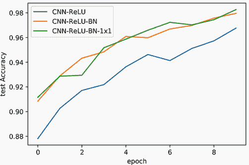

虽然 1 × 1 卷积运行起来更便宜，但我们不能总是使用它们并期望得到更好的结果。它们是一个更策略性的工具，需要经验和直觉的混合来学习何时值得将其添加到模型中。正如本节开头提到的，它们最常用的一个用途是作为快速简单地更改给定层中通道数的一种方式。这是它们在下一节中实现残差层所提供的关键功能。

## 6.5 残差连接

我们已经了解了两种方法，单独来看，它们似乎并不那么有用。有时它们表现得更好，有时则更差。但如果我们以正确的方式将跳过连接和 1 × 1 卷积结合起来，我们得到一种称为*残差连接*的方法，它更快地收敛到更精确的解。称为残差连接的具体设计模式非常受欢迎，当与全连接或卷积层一起工作时，您几乎总是应该将其作为指定模型架构的默认方法。残差连接背后的策略、思想和直觉在本章和本书的多次出现中反复出现，残差连接已成为广泛使用的设计组件。它分为两种类型的连接：标准块和瓶颈变体。

### 6.5.1 残差块

第一种连接类型是*残差块*，如图 6.9 所示。该块是一种跳过连接，其中两个层在末尾结合，创建长路径和短路径。然而，在残差块中，短路径*没有操作*。我们只是简单地保留输入不变！一旦长路径计算出其结果 h，我们就将其加到输入 x 上以得到最终结果**x** **+** **h**。我们通常将长路径表示为子网络*F*(⋅) = **h**，我们可以将所有残差连接描述如下：

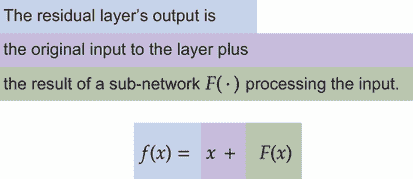

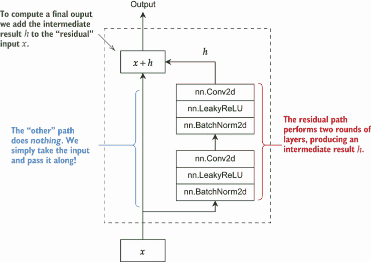

图 6.9 残差块架构的示例。块的左侧是短路径，它不对输入进行任何操作或更改。块的右侧是残差连接，通过两轮 BN/线性激活执行跳过连接，产生中间结果 h。输出是输入 x 和 h 的总和。

当我们开始将多个残差块一个接一个地组合起来时，我们创建了一个设计非常有趣的架构。您可以在图 6.10 中看到这一点，其中我们通过网络得到一条*长路径*和一条*短路径*。短路径通过尽可能少地进行操作，使得学习深度架构变得更容易。操作越少，梯度中的噪声机会就越少，这使得传播一个有用的梯度比其他情况下更远变得容易。长路径随后执行实际工作，通过跳过连接（使用加法而不是拼接）学习复杂性的单元。

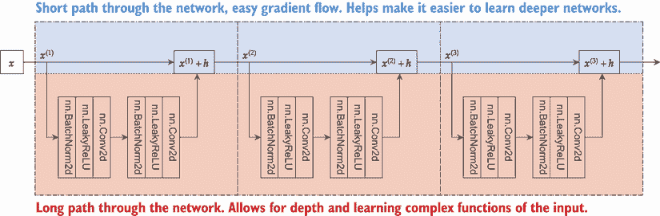

图 6.10 具有多层残差块的架构。这通过网络创建了一条长路径和一条短路径。顶部的短路径使得将梯度传播回许多层变得容易，通过尽可能避免工作，允许更深的层次。长路径执行实际工作，让网络一次学习一个复杂函数。

这种类型的残差块可以很容易地转换为全连接的对应版本。但是，当我们处理图像时，我们喜欢进行几轮最大池化以帮助建立一些平移不变性，并在每轮池化后加倍通道数，以在每个网络层中进行一致的计算和工作。但是，残差块 *需要* 输入和输出具有 *完全相同的形状*，因为我们使用的是加法而不是拼接。这就是瓶颈层发挥作用的地方，正如我们很快就会看到的。

### 6.5.2  实现残差块

我们所描述的残差块被称为 *类型 E*，并且是受欢迎的残差配置之一。正如你可能从名称中猜到的，人们在标准化、卷积以及每个残差块中的层数上尝试了大量的不同重排。它们都倾向于工作得很好，但为了简单起见，我们将坚持使用类型 E。注意我们如何可以使用 `nn.Sequential` 来组织我们的代码，使其与我们阅读数学的方式相同，这有助于我们保持定义简单且易于检查正确性：

```
class ResidualBlockE(nn.Module): 
    def __init__(self, channels, kernel_size=3, leak_rate=0.1): 
        """ 
        channels: how many channels are in the input/output to this layer 
        kernel_size: how large of a filter should we use 
        leak_rate: parameter for the LeakyReLU activation function 
        """
        super().__init__() 
        pad = (kernel_size-1)//2 ❶ 
        self.F = nn.Sequential(  ❷ 
            nn.Conv2d(channels, channels, kernel_size, padding=pad), 
            nn.BatchNorm2d(channels), 
            nn.LeakyReLU(leak_rate), 
            nn.Conv2d(channels, channels, kernel_size, padding=pad), 
            nn.BatchNorm2d(channels), 
            nn.LeakyReLU(leak_rate), 
        ) 
    def forward(self, x): 
        return x + self.F(x)     ❸
```

❶ 我们的卷积层需要多少填充来保持输入形状？

❷ 在子网络中定义我们使用的卷积和 BN 层：仅两个隐藏层的卷积/BN/激活

❸ F() 包含了长路径的所有工作：我们只需将其添加到输入中。

### 6.5.3  剩余瓶颈

残差层是跳过连接思想的简单扩展，通过使短路径尽可能少地工作来帮助梯度流动并最小化噪声。但是，我们在进行池化后需要一种处理不同通道数的方法。解决方案是 1 × 1 卷积。我们可以使用 1 × 1 层来完成最小的工作量，仅改变输入中的通道数，根据需要增加或减少通道数。首选的方法是创建一个 *残差瓶颈*，如图 6.11 所示。短路径仍然很短，没有激活函数，只是执行一个 1 × 1 卷积然后是 BN，将原始通道数 C 转换为所需的通道数 *C*′。

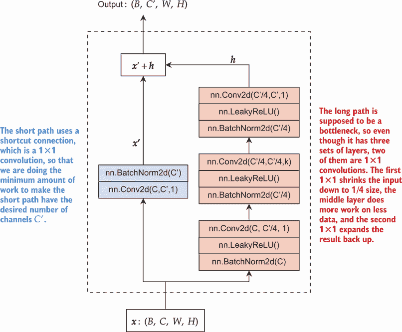

图 6.11 瓶颈连接的示例，其中输入的形状为 (*B*,*C*,*W*,*H*)，目标是输出形状为 (*B*,*C*′,*W*,*H*)。短路径需要改变形状，因此使用 1 × 1 卷积来完成所需的最小工作量以改变通道数。长路径应该是一个鼓励压缩的瓶颈，因此它从 1 × 1 卷积开始以减少通道数，然后是正常卷积，最后以另一个 1 × 1 卷积结束，将通道数扩展回所需的尺寸 *C*′。

这种方法被称为瓶颈，是因为右侧的长路径*F*(⋅)有三个隐藏层。第一个隐藏层使用另一个 1 × 1 卷积来减少通道数 C，然后再进行中间的正常隐藏层，最后通过一个最终的 1 × 1 卷积将通道数恢复到原始数量。瓶颈背后有两个原因和解释。

第一个原因是残差网络原始作者的的设计选择。他们希望通过使网络更深来增加其容量。使瓶颈收缩再扩张可以减少参数数量，为添加更多层节省宝贵的 GPU 内存！作者们用这个方法训练了一个总共有 152 层的网络。在当时，这是一个极其深的网络，并在原始的 ImageNet 数据集（被研究人员广泛用作基准）上取得了新的记录。

第二个原因是借鉴了压缩的概念：使事物变得更小。机器学习的一个研究领域将压缩作为一种工具，使模型学习有趣的东西。想法是，如果你迫使模型从一个大量参数的状态转换到一个小参数状态，你迫使模型创建更多有意义的紧凑表示。作为一个粗略的类比，想想你如何只用三个字母“猫”来传达一个具有特定形状、饮食习惯等的特定物种动物。如果你说“the orange house cat”，你就可以用很少的信息快速缩小你正在谈论的图像。这就是压缩背后的想法：能够压缩意味着某种程度的智能。

### 6.5.4 实现残差瓶颈

让我们将残差瓶颈的想法转换为代码。它看起来非常类似于`ResidualBlockE`。主要区别在于我们有两个子网络：第一个是长路径，编码在`self.F`中；短路径有一个成员变量`self.shortcut`。我们用一个小技巧来实现它：如果瓶颈*不*改变通道数，我们使用`Identity`函数来实现。这个函数简单地返回输入作为输出。如果通道数*确实*改变，我们用一个小`nn.Sequential`覆盖定义，执行 1 × 1 卷积后跟 BN：

```
class ResidualBottleNeck(nn.Module): 
    def __init__(self, in_channels, out_channels, 
    ➥ kernel_size=3, leak_rate=0.1):

        super().__init__() 
        pad = (kernel_size-1)//2                       ❶ 
        bottleneck = max(out_channels//4, in_channels) ❷

    self.F = nn.Sequential( 
            nn.BatchNorm2d(in_channels),               ❹
            nn.LeakyReLU(leak_rate), 
            nn.Conv2d(in_channels, bottleneck, 1, padding=0), 

            nn.BatchNorm2d(bottleneck),                ❺ 
            nn.LeakyReLU(leak_rate), 

            nn.Conv2d(bottleneck, bottleneck, kernel_size, padding=pad), 

            nn.BatchNorm2d(bottleneck),                ❸❻ 
            nn.LeakyReLU(leak_rate), 
            nn.Conv2d(bottleneck, out_channels, 1, padding=0) 
        )

        self.shortcut = nn.Identity()                  ❼ 
        if in_channels != out_channels:                ❽ 
            self.shortcut = nn.Sequential( 
                nn.Conv2d(in_channels, out_channels, 1, padding=0), 
                nn.BatchNorm2d(out_channels) 
            )

        def forward(self, x): 
            return self.shortcut(x) + self.F(x)        ❾
```

❶ 我们的反卷积层需要多少填充才能保持输入形状？

❷ 瓶颈应该更小，所以输出/4 或输入。你也可以尝试将最大值改为最小值；这不是一个大问题。

❸ 定义了我们需要的三组 BN 和卷积层。注意，对于 1 个卷积，我们使用 padding=0，因为 1 不会改变形状！

❹ 压缩

❺ 正常层进行完整卷积

❻ 扩展回原状

❼ 默认情况下，我们的快捷方式是恒等函数，它简单地返回输入作为输出。

❽ 如果我们需要改变形状，让我们将快捷方式转换为一个包含 1 个卷积和 BM 的小层。

❾ “shortcut(x)”在功能上等同于“x”；我们尽可能少做工作以保持张量形状不变。

现在我们可以定义一个残差网络了！要使其与我们的原始网络完全相同是很困难的，因为每个残差层还包括两到三个轮次的层，但以下定义使我们接近这个目标。由于我们的网络规模较小，我们在残差块轮次之后添加了一个`LeakyReLU`。你不必包含这个，因为通过残差层的长路径中包含激活函数。对于非常深的网络（30+块），我建议不要在块之间包含激活函数，以帮助信息通过所有这些层。但这不是一个关键细节，两种方法都能很好地工作。你总是可以尝试一下，看看哪种方法最适合你的问题和网络规模。同时注意，将我们自己的块定义为`Module`允许我们在相对较少的代码行中指定这个非常复杂的网络：

```
cnn_res_model = nn.Sequential( 
    ResidualBottleNeck(C, n_filters), ❶
    nn.LeakyReLU(leak_rate),          ❷ 
    ResidualBlockE(n_filters), 
    nn.LeakyReLU(leak_rate), 
    nn.MaxPool2d((2,2)), 
    ResidualBottleNeck(n_filters, 2*n_filters), 
    nn.LeakyReLU(leak_rate), 
    ResidualBlockE(2*n_filters), 
    nn.LeakyReLU(leak_rate), 
    nn.MaxPool2d((2,2)), 
    ResidualBottleNeck(2*n_filters, 4*n_filters), 
    nn.LeakyReLU(leak_rate), ResidualBlockE(4*n_filters), 
    nn.LeakyReLU(leak_rate), 
    nn.Flatten(), 
    nn.Linear(D*n_filters//4, classes), 
)

cnn_res_results = train_network(cnn_res_model, loss_func, train_loader, 
➥ test_loader=test_loader, epochs=10, 
➥ score_funcs={’Accuracy’: accuracy_score}, device=device)
```

❶ 以 BottleNeck 开始，因为我们需要更多的通道。在开始残差块之前，先开始一个正常的隐藏层也是很常见的。

❷ 在每个残差后插入一个激活函数。这是可选的。

现在，如果我们绘制结果，我们应该*最终*看到一致性的改进！虽然对于这个数据集，差异不是很大，但对于更大和更具挑战性的问题，差异将会更加显著。Fashion-MNIST 几乎没有改进的空间。我们已经达到了超过 98%的准确率，这比我们开始的 93%有显著提高：

```
    sns.lineplot(x=’epoch’, y=’test Accuracy’, data=cnn_results, 
    ➥ label=’CNN’) 
    sns.lineplot(x=’epoch’, y=’test Accuracy’, data=cnn_relu_results, 
    ➥ label=’CNN-ReLU’) 
    sns.lineplot(x=’epoch’, y=’test Accuracy’, data=cnn_bn_results, 
    ➥ label=’CNN-ReLU-BN’) 
    sns.lineplot(x=’epoch’, y=’test Accuracy’, data=cnn_res_results, 
    ➥ label=’CNN-ReLU-BN-Res’)

[47]: <AxesSubplot:xlabel='epoch', ylabel='test Accuracy'>
```

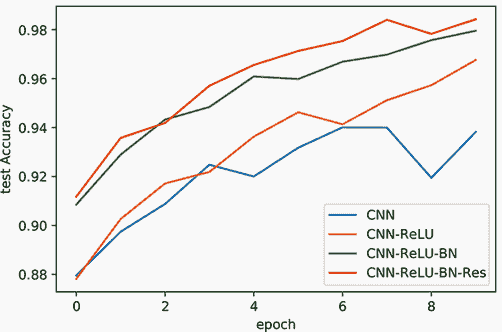

说到这里，很难过分强调残差连接对现代深度学习产生的影响有多大，你应该几乎总是默认实现残差风格的网络。你经常会看到人们提到*ResNet-X*，其中*X*代表特定残差网络架构中的总层数。这是因为成千上万的研究人员和从业者喜欢以 ResNet 作为他们的基准，并添加或删除一些部分来定制它以适应他们的问题。在许多情况下，除了输出层外没有其他变化地使用 ResNet 在图像分类问题上可以得到一个强大的结果。因此，当解决现实问题时，它应该成为你的首选工具之一。

## 6.6 长短期记忆 RNNs

我们在第四章中描述的 RNN 在实践中的应用很少。它在训练和解决复杂问题上是臭名昭著的困难。已经发表了多种 RNN 的不同变体，但始终有效且表现良好的选项被称为*长短期记忆*（LSTM）*网络*。LSTMs 是一种在 1997 年最初开发的 RNN 架构。尽管它们已经存在了一段时间（以及 2006 年的一次小调整），但 LSTMs 仍然是可用的循环架构中最好的选择之一。

### 6.6.1 RNNs：快速回顾

让我们快速回顾一下简单的 RNN 在图 6.12 和方程 6.1 中的样子。我们可以用它的输入 **x**[t] 和前一个隐藏状态 **h**[t] 连接成一个更大的输入来简洁地描述它。它们通过一个 `nn.Linear` 层进行处理，并经过 tanh 非线性变换，这成为输出：

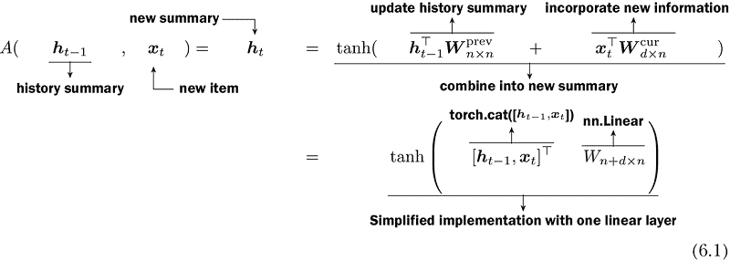

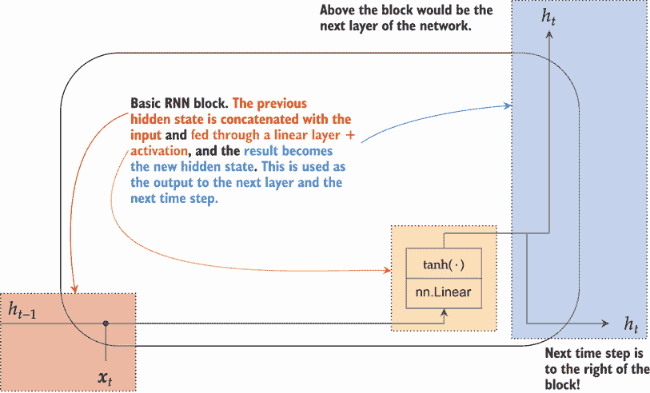

图 6.12 展示了我们在第四章中学到的简单 RNN。随时间变化的信息被捕获在隐藏激活 **h**[t] 中，这些激活被输入到下一个 RNN 层，并用作任何后续层的输出。小黑点表示连接。

学习 RNN 的一个挑战是，当通过时间展开时，许多操作都在同一个张量上执行。RNN 很难学习如何使用这个有限的空间从变量时间步长的固定大小表示中提取所需的信息，并添加信息到该表示中。这个问题与残差层解决的问题类似：当操作较少时，梯度很容易发送信息回传。如果我们有一个包含 50 个步骤的序列，这就如同尝试学习一个有 50 层且梯度噪声有 50 次机会干扰的网络。

### 6.6.2 LSTMs 和门控机制

获取梯度在多个时间步长中传递信号的难度是 LSTM 试图解决的主要问题之一。为了做到这一点，LSTM 创建了两组状态：一个隐藏状态 **h**[t] 和一个上下文状态 **C**[t]。**h**[t] 执行工作并尝试学习复杂函数，而上下文 **C**[t] 则试图简单地保存有用的信息以供以后使用。你可以将 **C**[t] 视为专注于 *长期* 信息，而 **h**[t] 则专注于 *短期* 信息；因此，我们得到了 *长短期记忆* 这个名字。

LSTM 使用一种称为 *门控* 的策略来实现这一点。门控机制产生一个在[0,1]范围内的值。这样，如果你乘以门控的结果，你可以移除所有内容（门控返回 0，任何时间 0 的值都是 0）或者允许所有内容通过（门控返回 1）。LSTM 被设计为具有三个门：

+   *遗忘门* 允许我们忘记上下文 **C**[t] 中的内容。

+   *输入门* 控制我们想要添加或输入到 **C**[t] 中的内容。

+   *输出门* 决定了我们希望在最终输出 **h**[t] 中包含多少上下文 **C**[t]。

图 6.13 展示了这一过程在高级别上的样子。

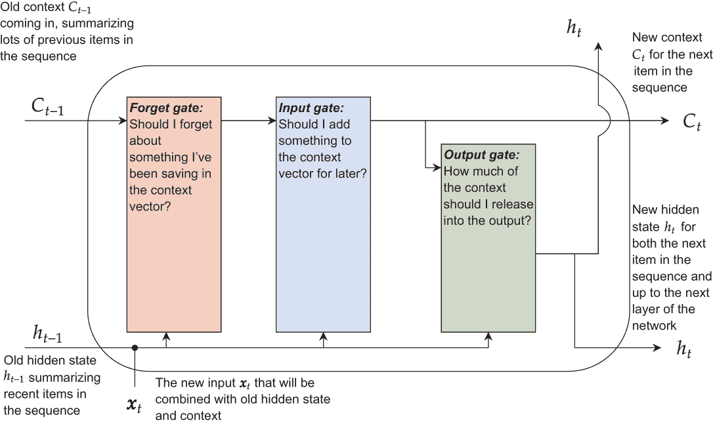

图 6.13 LSTM 的策略涉及三个依次操作的门，允许短期 **h**[t] 和长期 **C**[t] 之间的交互。遗忘门是红色，输入门是蓝色，输出门是绿色。

这种门控是通过使用 sigmoid *σ*(⋅) 和 tanh (⋅) 激活函数来实现的。实现门控机制是一种你*希望饱和*的情况，因为你需要你的输出值在一个非常特定的范围内，以便你可以创建一个先验，*一些输入需要被允许，而一些则需要被阻止*。sigmoid 激活函数 *σ*(⋅) 产生一个在[0,1]范围内的值。如果我们取另一个值α并将其与 sigmoid 的结果相乘，我们得到 **z** = **α** ⋅ *σ*(⋅)。如果 *σ*(⋅) = 0，那么我们实际上已经关闭了包含任何关于α信息的 z 门。如果 *σ*(⋅) = 1，那么我们得到 **z** = **α**，并且实际上让所有信息都通过门。对于中间的值，我们最终调节了从α流经网络的信息/内容量。我们可以在图 6.14 中看到 LSTM 如何使用这种门控方法。

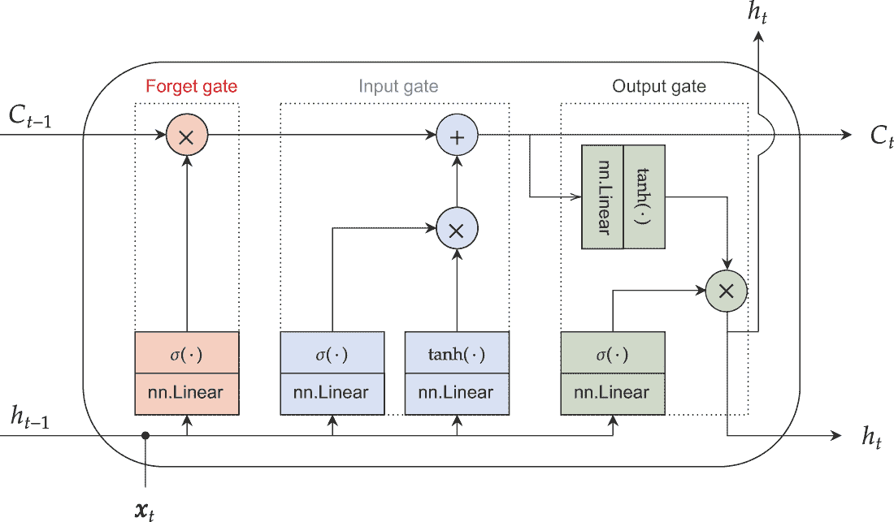

图 6.14 展示了 LSTM 的详细操作以及每个门是如何实现和连接的。×表示两个值相乘，+表示值相加。相同的颜色编码适用（红色代表遗忘门，蓝色代表输入门，绿色代表输出门）。

上下文向量位于上半部分，短期隐藏状态位于下半部分。这种设置有一些与我们所学的残差网络相似的性质。上下文 **C**[t] 类似于一条短路径：对其执行的操作很少（且简单），这使得梯度能够更容易地流回非常长的序列。LSTM 的下半部分执行繁重的任务（如残差路径），使用线性层和非线性激活函数，并试图学习更复杂的函数，这些函数是必要的，但同时也使得梯度传播到开始部分变得更加困难。

这种门控和存在短路径与长路径的想法是 LSTM 工作良好并且比我们所学到的简单 RNN 更好的主要秘密。就像所有 RNN 一样，LSTM 也使用时间上的权重共享。因此，我们已经研究了时间上单个输入的 LSTM 单元，并且相同的权重在时间上的每个项目上都被重复使用。

Chris Olah 对 LSTM 的非常详尽描述和解释可在 [`colah.github.io/posts/2015-08-Understanding-LSTMs`](https://colah.github.io/posts/2015-08-Understanding-LSTMs) 找到；他还描述了关于 *窥视孔连接* 的更深层细节，这是现代 LSTM 中的一个标准改进。窥视孔背后的想法是将旧上下文 **C**[*t* − 1] 连接到决定遗忘命运和输入门的 `nn.Linear` 层，其想法是在决定忘记之前，你真的应该知道你即将忘记什么。同样，将其添加到输入门可以帮助你避免添加你已经拥有的冗余信息。遵循这一逻辑，另一个窥视孔连接将 **C**[t] 添加到最后一个 `nn.Linear` 层，该层控制输出，其想法是在决定是否输出之前，你应该知道你正在查看什么。

LSTM 有许多变体，包括另一个流行的 RNN，称为 *门控循环单元* (GRU)。GRU 与 LSTM 有相同的灵感，但试图让隐藏状态 **h**[t] 执行双重任务，作为短期和长期记忆。这使得 GRU 更快，使用更少的内存，并且更容易编写代码，这就是我们使用它的原因。缺点是 GRU 不总是像 LSTM 那样准确。相比之下，带有窥视孔连接的 LSTM 是一个经过验证且难以超越的方法，这就是人们通常所说的“LSTM”。

### 6.6.3 训练 LSTM

既然我们已经讨论了 LSTM 是什么，那么让我们来实现一个并尝试它。我们将重用第四章中的数据集和问题，其中我们试图预测一个名字可能来自的原语言。我们首先要做的是使用相同的代码和我们的 `LanguageNameDataset` 类再次设置这个问题。简要来说，以下是创建数据加载器对象的块回顾：

```
dataset = LanguageNameDataset(namge_language_data, alphabet) ❶

train_lang_data, test_lang_data = torch.utils.data.random_split(dataset, 
➥ (len(dataset)-300, 300)) 
train_lang_loader = DataLoader(train_lang_data, batch_size=32, 
➥ shuffle=True, collate_fn=pad_and_pack) 
test_lang_loader = DataLoader(test_lang_data, batch_size=32, 
➥ shuffle=False, collate_fn=pad_and_pack)
```

❶ 重新使用第四章中的代码

让我们设置一个新的 RNN 作为我们的基线。我使用的是一个三层结构，但我没有使其双向。虽然双向层有助于解决跨时间获取信息的问题，但我希望使这个问题变得更糟，这样我们就能更好地看到 LSTM 的好处：

```
rnn_3layer = nn.Sequential(                         ❶ 
    EmbeddingPackable(
    ➥ nn.Embedding(len(all_letters), 64)),         ❷ 
    nn.RNN(64, n, num_layers=3, batch_first=True),  ❸ 

    LastTimeStep(rnn_layers=3),                     ❹ 
    nn.Linear(n, len(namge_language_data)),         ❺ 
)

for p in rnn_3layer.parameters():                   ❻ 
    p.register_hook(lambda grad: torch.clamp(grad, -5, 5))

rnn_results = train_network(rnn_3layer, loss_func, train_lang_loader, 
➥ test_loader=test_lang_loader, 
➥ score_funcs={’Accuracy’: accuracy_score}, device=device, epochs=10)
```

❶ 简单的老式循环神经网络 (RNN)

❷ (B, T) -> (B, T, D)

❸ (B, T, D) -> ( (B,T,D) , (S, B, D) )

❹ 我们需要将 RNN 输出缩减为一个项目，(B, D)。

❺ (B, D) -> (B, classes)

❻ 应用梯度裁剪以最大化其性能

接下来我们实现一个 LSTM 层。由于 LSTM 直接集成在 PyTorch 中，因此很容易将其结合。我们只需将每个 `nn.RNN` 层替换为 `nn.LSTM`！我们还在重用第四章中的 `LastTimeStep` 层：如果你回顾一下代码，你现在知道为什么我们有了这个注释：“结果是 `(out, h_t)` 或 `(out, (h_t, c_t))` 的元组。”这是因为当我们使用 LSTM 时，我们得到隐藏状态 `h_t` 和上下文状态 `c_t`！第四章中的这个添加使我们的代码对现在使用的 LSTM 有了更多的未来保障。网络的 LSTM 版本如下，我们只改变了一行来使其发生：

```
lstm_3layer = nn.Sequential(
EmbeddingPackable(nn.Embedding(len(all_letters), 64)), ❶ 
nn.LSTM(64, n, num_layers=3,                           ❷ 
➥ batch_first=True), 

LastTimeStep(rnn_layers=3),                            ❸ 

nn.Linear(n, len(namge_language_data)),                ❹ 
)

for p in lstm_3layer.parameters():                     ❺ 
    p.register_hook(lambda grad: torch.clamp(grad, -5, 5))

lstm_results = train_network(lstm_3layer, loss_func, train_lang_loader, 
➥ test_loader=test_lang_loader, 
➥ score_funcs={’Accuracy’: accuracy_score}, device=device, epochs=10)
```

❶ (B, T) -> (B, T, D)

❷ nn.RNN 变成了 nn.LSTM，现在我们升级到了 LSTMs w/(B, T, D) -> ( (B,T,D) , (S, B, D) )。

❸ 我们需要将 RNN 输出减少到一个项目，即 (B, D)。

❹ (B, D) -> (B, classes)

❺ 我们仍然希望对每种 RNN，包括 LSTM，使用梯度裁剪。

如果我们绘制结果，我们可以看到 LSTM 有助于改进它们相对于 RNN。我们还有一些证据表明，在约四个周期后，LSTM 开始出现过度拟合。如果我们真的在尝试训练，我们可能想要减少神经元的数量以防止过度拟合，或者使用验证步骤帮助我们学习在四个周期后停止：

```
    sns.lineplot(x=’epoch’, y=’test Accuracy’, data=rnn_results, 
    ➥ label=’RNN: 3-Layer’) 
    sns.lineplot(x=’epoch’, y=’test Accuracy’, data=lstm_results, 
    ➥ label=’LSTM: 3-Layer’)

[53]: <AxesSubplot:xlabel='epoch', ylabel='test Accuracy'>
```

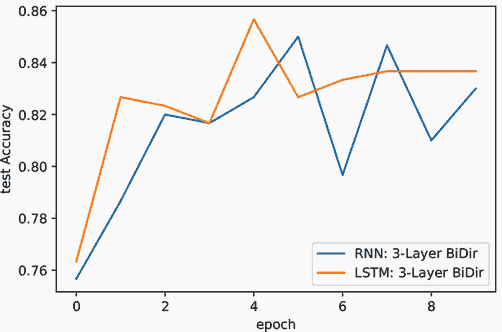

LSTM 是少数经过验证且经久不衰的深度学习方法之一，它在过去几十年中几乎没有变化。如果你需要一个 RNN，LSTM 是一个很好的默认选择。我们提到的门控循环单元（GRU）也是一个不错的选择，尤其是当你需要更少的计算资源时。我们不会深入探讨 GRU 的细节，但它是对 LSTM 设计的有意简化：它更简单，因为它不需要上下文状态 *C*[t]，而是试图让隐藏状态 **h**[t] 执行双重职责，即作为隐藏状态和上下文状态。更详细地解释这一点可能有些复杂，但如果你想要了解更多，我喜欢这个例子 [`blog.floydhub.com/gru-with-pytorch`](https://blog.floydhub.com/gru-with-pytorch)。如果你有更短、更简单的数据，或者如果计算限制是一个问题，GRU 值得检查，因为它需要的内存更少。我喜欢使用 GRU，因为它的代码稍微简单一些，因为只有一个隐藏状态，但确实有一些应用中 LSTM 的表现更好。你可以使用 GRU 或 LSTM 并获得良好的结果，但最好的结果可能来自调整（例如，使用 Optuna）一个 LSTM。

## 练习

在 Inside Deep Learning 练习的 Manning 在线平台上分享和讨论你的解决方案 ([`liveproject.manning.com/project/945`](https://liveproject.manning.com/project/945))。一旦你提交了自己的答案，你将能够看到其他读者提交的解决方案，并看到作者认为哪些是最好的。

1.  尝试在我们的各种 CNN 中将 LeakyReLU 激活函数替换为`nn.PReLU`激活函数。它的表现是更好还是更差？

1.  编写一个`for`循环来训练具有 1 到 20 层隐藏层的 CNN 模型，一次使用 BN 层，一次不使用。BN 如何影响学习更深层次模型的能力？

1.  *MATH*: 我们使用代数证明了线性层后跟 BN 与一个线性层等价。尝试用同样的数学方法来证明 BN 后跟线性层*也*等价于另一个不同的线性层。

1.  将`ResidualBlockE`重新实现为全连接层而不是卷积层。使用残差连接的全连接模型是否仍然能提高性能？

1.  编写一个`for`循环来训练一个使用更多组合的`ResidualBlockE`层的残差模型。残差块是否允许你训练更深层次的模型？

1.  尝试创建一个双向 LSTM 层。你得到更好的还是更差的结果？

1.  尝试使用不同层数和神经元的各种 LSTM 和 GRU 网络进行训练，并比较它们达到期望精度水平所需的时间。你看到任何相对的优缺点吗？

## 摘要

+   一组称为 ReLU 线性单元的激活函数需要更少的 epoch 就能达到更好的准确性。

+   在每个线性层和激活函数之间插入一个归一化层提供了另一个提升。

+   批标准化对于大多数问题都工作得很好，但在权重共享（如循环架构）和小批量大小的情况下。

+   层归一化并不总是那么准确，但几乎总是任何网络设计中的一个安全添加。

+   跳跃连接提供了一种不同的策略来组合层，可以在网络中创建长路径和短路径。

+   1 × 1 卷积可以用来调整卷积层的通道数。

+   一种称为残差层的模式设计允许我们构建更深层次的网络，通过混合跳跃连接和 1 × 1 卷积来提高准确性。

+   tanh (⋅) 和 *σ*(⋅) 激活函数对于创建门控机制很有用，这些机制编码了一种新的先验。

+   门控是一种策略，强制神经元的激活介于 0 和 1 之间，然后将另一个层的输出乘以这个值。

+   通过使用称为长短期记忆（LSTM）的方法可以改进 RNN，这是一种谨慎的门控应用。

* * *

¹ 通过阅读 20 世纪 90 年代的神经网络论文，你可以学到很多东西。即使它们今天不再使用，过去解决方案的创造性也可能为你解决现代问题提供良好的教训和直觉。在我撰写这本书的时候，我正在研究一些主要被遗忘的 1995 年的工作所启发的科研。↩

² V. Nair 和 G. E. Hinton，“Rectified linear units improve restricted Boltzmann machines”，*第 27 届国际机器学习会议论文集*，第 807-814 页，2010。↩

³ A. L. Maas, A. Y. Hannun, 和 A. Y. Ng，"Rectifier nonlinearities improve neural network acoustic models"，《第 30 届国际机器学习会议论文集》，第 28 卷，第 6 页，2013。↩

⁴ 让人烦恼的是，σ 用来表示标准差和 sigmoid 激活函数。你将不得不使用上下文来确保你能区分它们。↩

⁵ 是的，这些名字很令人困惑。我也不喜欢它们。↩

⁶ 我更喜欢将 BN 放在线性层之前，因为我认为它与我们已阐述的直觉更吻合。在我的经验中，也有成千上万的激活的特定案例，在这些案例中，线性层之前的 BN 可以表现得更好。但这些只是些小细节。我更愿意展示常见的内容，而不是对那些晦涩的细节发表意见。↩

⁷ 定义“复杂度”或“容量”的含义是可能的，但它很快就会变得非常技术性。这也像是一个对这个书来说太深奥的兔子洞。↩

⁸ 最突出的例子是一个名为 DenseNet 的网络 ([`github.com/liuzhuang13/DenseNet`](https://github.com/liuzhuang13/DenseNet))↩
