# 7 自动编码和自监督

本章涵盖

+   无标签训练

+   自动编码用于投影数据

+   使用瓶颈约束网络

+   添加噪声以提升性能

+   预测生成模型中的下一个项目

你现在已经了解了指定神经网络用于分类和回归问题的几种方法。这些是经典的机器学习问题，对于每个数据点 x（例如，水果的图片），我们都有一个相关的答案 y（例如，新鲜或腐烂）。但如果我们没有标签 y 呢？我们有没有任何有用的学习方法？你应该认识到这是一个*无监督*学习场景。

人们之所以对自监督感兴趣，是因为*标签很昂贵*。通常更容易获取大量数据，但知道*每个数据点是什么*需要大量工作。想想一个情感分类问题，你试图预测一个句子是否传达了积极的观点（例如，“我爱我正在读的这本书。”）或消极的观点（例如，“这本书的作者不擅长讲笑话。”）。阅读句子、做出判断并保存信息并不*难*。但如果你想要构建一个*好的*情感分类器，你可能需要标记数十万到数百万个句子。你真的愿意花几天或几周时间标记这么多句子吗？如果我们能够以某种方式学习而不需要这些标签，那将使我们的生活变得更加容易。

深度学习中越来越常见的无监督学习策略之一被称为*自监督*。自监督背后的想法是，我们使用回归或分类损失函数ℓ来进行学习，并预测关于输入数据 x 本身的一些信息。在这些情况下，标签*隐含地与数据一起存在*，并允许我们使用我们已经学会使用的相同工具。想出巧妙的方法来获取隐含标签是自监督的关键。

图 7.1 展示了自监督可以采取的许多方法中的三种：*修复*，即隐藏输入的一部分，然后尝试预测被隐藏的内容；*图像排序*，即将图像分解成多个部分，打乱它们的顺序，然后尝试将它们放回正确的顺序；以及*自动编码*，即给出输入图像并预测输入。使用自监督，我们可以训练没有标签的模型，然后使用模型学到的知识进行数据聚类，执行诸如识别噪声/不良数据等任务，或者用更少的数据构建有用的模型（后者将在第十三章中演示）。

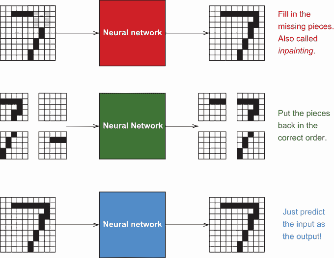

图 7.1 三种不同类型的自监督问题：图像修复、图像排序和自动编码。在每种情况下，我们不需要知道图像的内容是什么，因为网络将尝试预测原始图像，无论其内容如何。在第一种情况（红色）中，我们随机遮挡图像的一部分，并要求网络填充缺失的部分。在第二种情况中，我们将图像分割成块，打乱它们的顺序，并要求网络将它们放回正确的顺序。在最后一种情况中，我们只是要求网络从原始图像中预测原始图像。

有许多方法可以创建自监督问题，研究人员一直在提出新的方法。在本章中，我们专注于一种特定的自监督方法，称为*自动编码*，这是图 7.1 中的第三个例子，因为自动编码的关键是*从输入预测输入*。一开始这可能看起来像是一个疯狂的想法。当然，对于网络来说，学习返回与给定相同的输入是一个简单的问题。这就像定义一个函数一样

```
def superUsefulFunction(x): 
    return x
```

这个`superUsefulFunction`将实现一个*完美*的自动编码器。所以如果问题这么简单，它有什么用呢？这是我们本章要学习的内容。诀窍是*约束*网络，给它一个障碍，使其无法学习到平凡解。想象一下学校里的考试，老师给你一个开卷考试，有 100 个问题。如果你有足够的时间，你只需简单地阅读书籍，找到答案，并写下它们。但如果你被*约束*在仅一个小时的时间内完成考试，你就没有时间去书中查找所有内容。相反，你被迫学习*基本概念*，这些概念帮助你重建所有问题的答案。约束有助于促进学习和理解。同样的想法也适用于自动编码器：当平凡解被排除在外时，网络被迫学习一些更有用的东西（基本概念）来解决该问题。

本章进一步解释了自动编码的概念，并展示了面包和黄油般的主成分分析（PCA）实际上是通过秘密地作为一个自动编码器来工作的。我们将对 PCA 的 PyTorch 版本进行一些小的修改，将其变成一个完整的自动编码神经网络。当我们使自动编码网络更大时，更好地约束它变得更加重要，我们通过*降噪*策略来展示这一点。最后，我们将这些概念应用于序列模型，如 RNN，这给出了*自回归*模型。

## 7.1 自动编码是如何工作的

让我们先更详细地描述一下自动编码的概念。自动编码意味着我们通常学习*两个*函数/网络：首先是一个函数 *f*^(in)(**x**) = **z**，它将输入 x 转换成新的表示**z** ∈ ℝ^(*D*′)，然后是一个函数 *f*^(out)(**z**) = **x**，它将新的表示 z 转换回原始表示。我们称这两个函数为*编码器* *f*^(in)和*解码器* *f*^(out)，整个过程总结在图 7.2 中。在没有标签的情况下，新的表示 z 以这种方式学习，以便以紧凑的形式捕获有关数据结构的有用信息，这对机器学习算法来说是友好的。

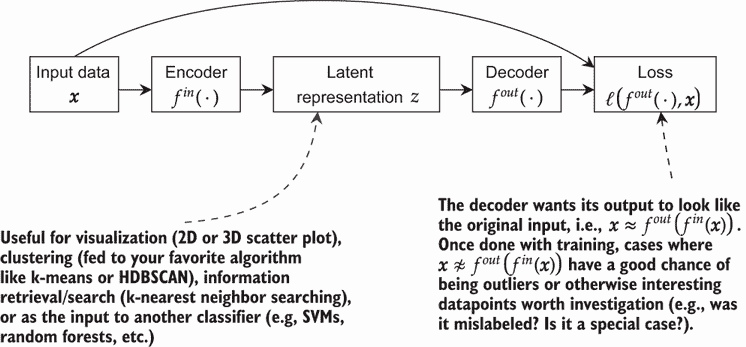

图 7.2 自动编码的过程。输入通过编码器，生成数据 z 的新表示。表示 z 可以用于许多任务，如聚类、搜索，甚至分类。解码器试图从编码 z 中重建原始输入 x。

这假设存在一个要找到的表示 z，它以某种方式捕捉了关于数据 x 的信息，但未指定。因为我们从未观察过它，所以我们不知道 z 应该是什么样子。因此，我们称其为数据的*潜在*表示，因为它对我们来说是不可见的，但它从训练模型中产生。¹

这乍一看可能显得非常愚蠢。我们难道不能学习一个什么也不做的函数 *f*^(in)，它将输入作为输出返回吗？这可以轻易地解决问题，但就像从银行贷款然后立即还清一样。你*技术上*满足了所有明确的目标，但这样做并没有完成任何事情。这种愚蠢是我们要避免的危险捷径。诀窍是设置问题，让网络不能这样作弊。有几种不同的方法可以做到这一点，我们将在本章中了解其中的两种：瓶颈和去噪。这两种方法都通过约束网络，使其不可能学习到原始解决方案。

### 7.1.1 原始成分分析是一个瓶颈自动编码器

本章的这一部分内容在理解上可能稍微有些挑战，但这是值得的。你将获得对经典算法的新视角，这将帮助你进一步理解那些通常不被视为深度学习的现有工具实际上是如何深度相关的。

为了说明如何约束一个网络，使其不能学习简单的 `superUsefulFunction` 方法，我们首先讨论一个你可能知道但可能不知道实际上是自动编码器的著名算法：称为 *主成分分析* (PCA) 的特征工程和降维技术。PCA 用于将 D 维空间中的特征向量转换到较低维度 *D*′，这可以称为 *编码器*。PCA 还包括一个很少使用的 *解码器* 步骤，其中你可以（近似地）转换回原始的 D 维空间。以下注释的方程式定义了 PCA 解决的优化问题：

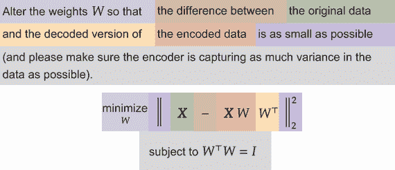

PCA 是一个重要且广泛使用的算法，因此如果您想使用它，您应该使用现有的实现之一。但 PyTorch 足够灵活，让我们可以自己实现 PCA。如果您仔细观察方程式，PCA 是一个 *回归* 问题。如何？让我们看看方程式的主要部分，并尝试用深度学习风格的方程式再次注释它：

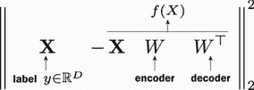

我们有一个权重矩阵 W 作为编码器，其转置 *W*^⊤ 作为解码器。这意味着 PCA 正在使用 *权重共享*（记得第三章和第四章中的这个概念？）。原始输入在左侧，我们使用了 2-范数（∥ ⋅ ∥[2]²），这是均方误差损失中使用的。方程式中的“约束条件”部分是一个要求权重矩阵以特定方式行为的 *约束*。让我们以我们为神经网络所做的方式重写这个方程式：

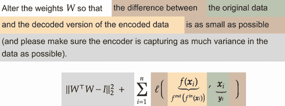

∥*WW*^⊤ − *I*∥[2]² 是基于“约束条件”的正则化惩罚。我个人认为，使用损失函数将 PCA 重新表达为自动编码器有助于更好地理解它。这也更明确地表明，我们正在使用 *f*(⋅) 作为包含编码器 *f*^(in)(⋅) 和解码器 *f*^(out)(⋅) 序列的单个网络。

现在我们已经将我们的 PCA 写成所有数据点的损失函数。我们知道 PCA 是有效的，如果 PCA 是一个自动编码器，那么自动编码的思路可能不像最初看起来那么疯狂。那么 PCA 是如何让它工作的呢？PCA 提供的洞察是，我们使 *中间表示过于小了*。记住 PCA 首先做的事情是从 D 维下降到 *D*′ < *D*。想象一下，如果 *D* = 1,000,000 且 *D*′ = 2，那么在只有 2 个特征的情况下保存足够关于一百万个特征的信息以完美重建输入是不可能的。所以 PCA 能做的最好的事情就是学习可能的最佳 2 个特征，这迫使 PCA 学习一些有用的东西。这是使自动编码工作起来的主要技巧：将你的数据推入比开始时更小的表示。

### 7.1.2 实现 PCA

现在我们已经了解了 PCA 是一个自动编码器，让我们着手将其转换为 PyTorch 代码。我们需要定义我们的网络函数 *f*(*x*)，由以下方程给出。但我们如何实现最右边的 *W*^⊤ 部分？

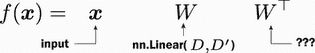

实现这个功能的主要技巧是重用 PyTorch 中 `nn.Linear` 层的权重。我们在这里通过实现 PyTorch 中的 PCA 来强调 *PCA 是一个自动编码器* 的事实。一旦我们实现了 PCA，我们将对其进行一些修改，将其转换为深度自动编码器，类似于我们在第二章中从线性回归过渡到神经网络的方式。首先，让我们快速定义一些常数，包括我们正在处理的特征数量、隐藏层的大小以及其他标准项：

```
D = 28*28    ❶ 
n = 2        ❷ 
C = 1        ❸ 
classes = 10 ❹
```

❶ 输入中有多少个值？28 * 28 张图像。我们使用这个信息来帮助确定后续层的尺寸。

❷ 隐藏层大小

❸ 输入中有多少个通道？

❹ 有多少个类别？

接下来，让我们实现这个缺失的层来表示 *W*^⊤。我们称这个新层为 *转置层*。为什么？因为我们使用的数学操作被称为 *转置*。我们还添加了一些逻辑，以便为权重转置层提供一个自定义的偏置项，因为输入层有一个形状为 *W* ∈ ℝ^(*D* × *D*′) 的矩阵和一个偏置向量 **b** ∈ ℝ^(*D*′)。这意味着 *W*^⊤ ∈ ℝ^(*D*′ × *D*)，但我们实际上无法对 b 进行有意义的转置。因此，如果有人想要偏置项，它必须是一个新的独立项。

我们接下来介绍新的 `TransposeLinear` 模块。这个类实现了 `Transpose` 操作 *W*^⊤。需要将转置矩阵 W 作为构造函数中的 `linearLayer` 传入。这样，我们就可以在原始 `nn.Linear` 层和这个转置版本之间共享权重。

```
class TransposeLinear(nn.Module):                    ❶
     def __init__(self, linearLayer, bias=True):

        """ 
        linearLayer: is the layer that we want to use the transpose of to 
        ➥ produce the output of this layer. So the Linear layer represents 
        ➥ W, and this layer represents W^T. This is accomplished via 
        ➥ weight sharing by reusing the weights of linearLayer 
        bias: if True, we will create a new bias term b that is learned 
        separately from what is in 
        linearLayer. If false, we will not use any bias vector. 
        """ 

        super().__init__() 
        self.weight = linearLayer.weight               ❷ 

        if bias: 
            self.bias = nn.Parameter(torch.Tensor( 
            ➥ linearLayer.weight.shape[1]))          ❸ 

        else:
            self.register_parameter(’bias’, None)      ❹ 

    def forward(self, x):                              ❺
        return F.linear(x, self.weight.t(), self.bias) ❻
```

❶ 我们这个类扩展了 nn.Module。所有 PyTorch 层都必须扩展这个。

❷ 创建一个新的变量 weight 来存储对原始权重项的引用

❸ 创建一个新的偏置向量。默认情况下，PyTorch 知道如何更新模块和参数。由于张量既不是模块也不是参数，参数类封装了张量类，这样 PyTorch 就知道这个张量中的值需要通过梯度下降进行更新。

❹ 参数类不能接受 None 作为输入。因此，如果我们想让偏置项存在但可能不被使用，我们可以使用 `register_parameter` 函数来创建它。这里重要的是，PyTorch 不论模块的参数如何，总是看到相同的参数。

❺ 前向函数是接收输入并产生输出的代码。

❻ PyTorch 的 F 目录包含许多模块使用的函数。例如，线性函数在给定输入（我们使用权重的转置）和偏置（如果为 None，它知道不执行任何操作）时执行线性变换。

现在我们已经完成了`TransposeLinear`层的实现，我们可以实现 PCA。首先，是架构，我们将它分解为编码器和解码器部分。因为 PyTorch `Module`s 也是由`Module`s 构建的，所以我们可以将编码器和解码器定义为单独的部分，并将它们作为最终`Module`的组件使用。

注意，因为输入以形状为(**B**,1,28,28)的图像形式传入，而我们使用的是线性层，我们首先需要将输入展平成一个形状为(**B**,28*28)的向量。但在解码步骤中，我们希望保持与原始数据相同的形状。我们可以使用我提供的`View`层将其转换回来。它的工作方式与张量上的`.view`和`.reshape`函数类似，但作为一个`Module`，为了方便：

```
linearLayer = nn.Linear(D, n, bias=False) ❶ 

pca_encoder =
   nn.Sequential(                         ❷ 
   nn.Flatten(), linearLayer, 
)

pca_decoder = nn.Sequential(              ❸ 

   TransposeLinear(linearLayer, bias=False), 
   View(-1, 1, 28, 28)                    ❹ 
) 
pca_model = nn.Sequential(                ❺
   pca_encoder, 
   pca_decoder 
)
```

❶ 由于我们将共享线性层的权重，让我们单独定义它。

❷ 编码器展平后使用线性层。

❸ 解码器使用我们的 TransposeLinear 层和现在共享的 linearLayer 对象。

❹ 将数据形状恢复到原始形式

❺ 定义一个最终 PCA 模型，它由编码器序列后跟解码器组成

PCA 初始化和损失函数

我们已经有了训练这个自动编码器所需的一切。但要使其*真正*成为 PCA，我们需要添加*WW*^⊤ = *I*约束。这个约束有一个名字：*正交性*。我们不会深入探讨为什么 PCA 有这个，但我们会将其作为一个很好的练习包括在内。我们通过使用`nn.init.orthogonal_`函数给模型提供一个初始的*随机*正交权重集来开始我们的模型，这只需要一行代码：

```
nn.init.orthogonal_(linearLayer.weight)
```

我们在训练过程中不会严格强制正交性，因为实现这一功能的代码会比我想象的要丑陋一些。相反，我们采取了一种常见且简单的方法来*鼓励*正交性，但并不*要求*它。² 这通过将等式 *W*^T*W* = *I* 转换为一个*惩罚*或*正则化器* ∥*WW*^⊤ − *I*∥[2]² 来实现。这是因为如果惩罚为 0，则 W 是正交的；如果惩罚不为零，它将增加损失，因此梯度下降将尝试使 W 更加正交。

实现这一点并不困难。我们使用均方误差（MSE）损失函数 ℓMSE,**x**) 来训练自监督部分。我们只需将惩罚的损失添加到这个损失函数中即可：

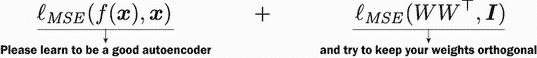

以下代码块实现了这一点。作为额外步骤，我们将正则化器的强度降低 0.1 倍，以强调自动编码部分比正交性部分更重要：

```
mse_loss = nn.MSELoss()                                       ❶

def mseWithOrthoLoss(x, y):                                   ❷ 
    W = linearLayer.weight                                    ❸ 
    I = torch.eye(W.shape[0]).to(device)                      ❹ 

    normal_loss = mse_loss(x, y)                              ❺

    regularization_loss = 0.1*mse_loss(torch.mm(W, W.t()), I) ❻

    return normal_loss + regularization_loss                  ❼
```

❶ 原始损失函数

❷ 我们的 PCA 损失函数

❸ 从我们之前保存的 linearLayer 对象中获取 W

❹ 目标正则化的单位矩阵

❺ 计算原始损失 ℓMSE,**x**)

❻ 计算正则化器惩罚 ℓMSE

❼ 返回两个损失的加和

### 7.1.3 使用 PyTorch 实现 PCA

现在我们想为 MNIST 数据集创建一个包装器。为什么？因为默认的 MNIST 数据集将分别以对(**x**,*y*)的形式返回输入和标签。但在这个案例中，*输入是标签*，因为我们正在尝试从输入预测输出。因此，我们扩展了 PyTorch 的 `Dataset` 类，以接受原始元组 **x**, *y*，并返回一个元组 **x**, **x**。这样，我们的代码保持了元组中第一个元素是输入，第二个元素是期望的输出/标签的约定：

```
class AutoEncodeDataset(Dataset): 
    """Takes a dataset with (x, y) label pairs and converts it to (x, x) pairs. 
    This makes it easy to reuse other code"""

    def __init__(self, dataset): 
        self.dataset = dataset

    def __len__(self): 
        return len(self.dataset)

    def __getitem__(self, idx): 
        x, y = self.dataset.__getitem__(idx) 
        return x, x                          ❶
```

❶ 丢弃原始标签

注意：如果你正在为一个实际问题实现自动编码器，你的代码看起来可能更像是 `x = self.dataset.__getitem__(idx)`，因为你不知道标签 `y`。然后你可以 `return x, x`。

拥有这个 `AutoEncodeDataset` 包装器在手，我们可以加载原始 MNIST 数据集，并用 `AutoEncodeDataset` 包装它，然后我们就可以开始训练了：

```
train_data = AutoEncodeDataset(torchvision.datasets.MNIST("./", train=True, 
➥ transform=transforms.ToTensor(), download=True)) 
test_data_xy = torchvision.datasets.MNIST("./", train=False, 
➥ transform=transforms.ToTensor(), download=True) 
test_data_xx = AutoEncodeDataset(test_data_xy)

train_loader = DataLoader(train_data, batch_size=128, shuffle=True) 
test_loader = DataLoader(test_data_xx, batch_size=128)
```

现在我们可以以训练其他神经网络相同的方式训练这个 PCA 模型。`AutoEncodeDataset` 使得输入也充当标签，`pca_model` 结合了编码和解码数据的序列，而 `mseWithOrthoLoss` 实现了一个 PCA 特定的损失函数，该函数结合了：1) 使输出看起来像输入 ℓMSE,*x*)，和 2) 维护 PCA 所需的正交权重 (∥*W*^⊤*W* − *I*∥[2]² = 0)：

```
train_network(pca_model, mseWithOrthoLoss, train_loader, 
➥ test_loader=test_loader, epochs=10, device=device)
```

### 7.1.4  可视化 PCA 结果

你可能已经注意到我们使用了隐藏层大小 *n* = 2。这是故意的，因为这让我们能够 *绘制* 结果，并建立一些关于自动编码器如何工作的良好视觉直觉。这是因为当 *n* = 2 时，我们可以使用 PCA 将数据可视化在二维空间中。这是 PCA 的一个非常常见的用例。即使我们使用了更大的目标维度，将数据投影下来可以使搜索相似数据更快和/或更准确。因此，有一个函数可以接受数据集并将其全部编码到低维空间中是有用的。以下函数就是这样做的，并复制了标签，这样我们就可以将我们的结果与 MNIST 测试数据的真实情况进行比较：

```
def encode_batch(encoder, dataset_to_encode): 
    """ 
    encoder: the PyTorch network that takes in a dataset and converts it to 
    ➥ a new dimension 
    dataset_to_encode: a PyTorch ‘Dataset‘ object that we want to convert.

    Returns a tuple (projected, labels) where ‘projected‘ is the encoded 
    ➥ version of the dataset, and ‘labels‘ are the original labels 
    ➥ provided by the ‘dataset_to_encode‘ 
    """ 
    projected = []                                          ❶ 
    labels = [] 

    encoder = encoder.eval()                                ❷ 
    encoder = encoder.cpu()                                 ❸

    with torch.no_grad():                                   ❹ 
        for x, y in DataLoader(dataset_to_encode, batch_size=128): 
            z = encoder(x.cpu())                            ❺ 
            projected.append( z.numpy() )                   ❻ 
            labels.append( y.cpu().numpy().ravel() )

    projected = np.vstack(projected)                        ❼

    labels = np.hstack(labels) 
    return projected, labels                                ❽ 
projected, labels = encode_batch(pca_encoder, test_data_xy) ❾
```

❶ 创建空间以存储结果

❷ 切换到评估模式

❸ 为了简单起见，切换到 CPU 模式，但你不一定需要这样做。

❹ 我们不想训练，所以使用 torch.no_grad!

❺ 对原始数据进行编码

❻ 存储编码版本和标签

❼ 将结果转换为单个大型 NumPy 数组

❽ 返回结果

❾ 投影我们的数据

使用`encode_batch`函数，我们现在已经将 PCA 应用于数据集，并且可以使用 seaborn 绘制结果。这应该看起来像一个非常熟悉的 PCA 图：一些类与其他类有相当好的分离，而有些则聚集在一起。以下代码中有这样一个奇怪的片段：`hue=[str(l) for l in labels], hue_order=[str(i) for i in range(10)]`，这是为了使图表更容易阅读。如果我们使用`hue=labels`，代码将正常工作，但 seaborn 会给所有数字相似的色彩，这将很难阅读。通过将标签转换为字符串（`hue=[str(l) for l in labels]`），我们让 seaborn 给每个类一个更明显的颜色，并使用`hue_order`来让 seaborn 按我们期望的顺序绘制类：

```
    sns.scatterplot(x=projected[:,0], y=projected[:,1], 
    ➥ hue=[str(l) for l in labels], 
    ➥ hue_order=[str(i) for i in range(10)], legend="full")

[15]: <AxesSubplot:>
```

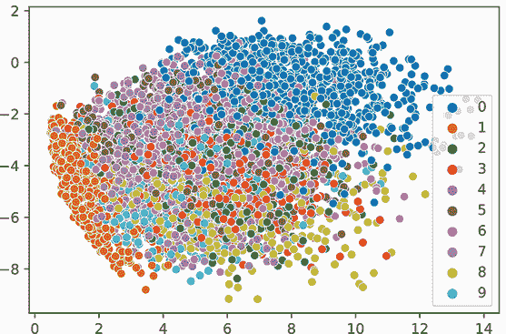

从这张图中，我们可以得到一些关于编码质量的看法。例如，区分 0 和 1 类与其他所有类可能很容易。尽管如此，有些其他类可能很难区分；在一个真正无监督的场景中，如果我们不知道真正的标签，我们将无法轻易发现不同的概念。我们可以用来帮助判断的另一件事是编码/解码过程。如果我们做得好，输出应该与输入相同。首先，我们定义一个简单的辅助函数来在左侧绘制原始输入 x，在右侧绘制编码-解码版本：

```
def showEncodeDecode(encode_decode, x): 
    """ 
    encode_decode: the PyTorch Module that does the encoding and decoding 
    ➥ steps at once 
    x: the input to plot as is, and after encoding & decoding it 
    """

    encode_decode = encode_decode.eval() ❶ 
    encode_decode = encode_decode.cpu()  ❷ 
    with torch.no_grad():                ❸ 
        x_recon = encode_decode(x.cpu()) 
    f, axarr = plt.subplots(1,2)         ❹
    axarr[0].imshow(x.numpy()[0,:]) 
    axarr[1].imshow(x_recon.numpy()[0,0,:])
```

❶ 切换到评估模式

❷ 将操作移至 CPU，这样我们就不必考虑任何设备是什么，因为这个函数的性能不敏感

❸ 如果您不在训练，请始终使用 no_grad

❹ 使用 Matplotlib 创建一个左侧为原始数据的并排图

我们在本章中重用这个函数。首先让我们看看一些不同数字的输入-输出组合：

```
showEncodeDecode(pca_model, test_data_xy[0][0]) 
showEncodeDecode(pca_model, test_data_xy[2][0]) 
showEncodeDecode(pca_model, test_data_xy[10][0]) ❶
```

❶ 展示了三个数据点的输入（左侧）和输出（右侧）

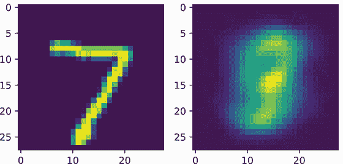

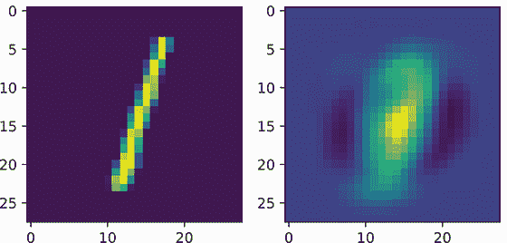

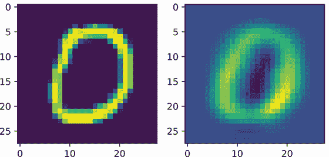

这些结果与我们根据二维图所预期的相符。经过编码和解码后，0 和 1 类看起来就像 1 和 0。至于 7 类，则不然。为什么？嗯，我们正在将 784 个维度压缩到 2 个。这是大量的信息压缩——远远超过我们合理期望的 PCA 能够做到的。

### 7.1.5  一个简单的非线性 PCA

PCA 是我们能设计的最简单的自动编码器之一，因为它是一个完全线性的模型。如果我们只添加一点我们所学的，会发生什么？我们可以添加一个单非线性并去除权重共享，将其转换为一个小的非线性自动编码器。让我们看看这会是什么样子：

```
pca_nonlinear_encode = nn.Sequential(  ❶ 
    nn.Flatten(), 
    nn.Linear(D, n), 
    nn.Tanh(),                         ❷ 
)

pca_nonlinear_decode = nn.Sequential(  ❸ 
    nn.Linear(n, D),                   ❹
    View(-1, 1, 28, 28) 
) 
pca_nonlinear = nn.Sequential(         ❺
    pca_nonlinear_encode, 
    pca_nonlinear_decode 
)
```

❶ 使用 Tanh 非线性增强编码器

❷ 唯一真正的变化：在最后添加一个非线性操作

❸ 解码器获得自己的线性层，使其看起来更像一个正常网络。

❹ 我们不再绑定权重，为了简单起见。

❺ 将它们组合成编码器-解码器函数 *f*(⋅)

由于我们不再在编码器和解码器之间共享权重，所以我们不关心权重是否正交。因此，当我们训练这个模型时，我们使用正常的均方误差损失：

```
train_network(pca_nonlinear, mse_loss, train_loader, 
➥ test_loader=test_loader, epochs=10, device=device)
```

在以下代码块中，我们再次绘制所有二维编码和我们的三个编码-解码图像，以直观地查看发生了什么变化。这让我们可以主观地判断质量是否有所提高：

```
    projected, labels = encode_batch(pca_nonlinear_encode, test_data_xy) 
    sns.scatterplot(x=projected[:,0], y=projected[:,1], 
    ➥ hue=[str(l) for l in labels], 
    ➥ hue_order=[str(i) for i in range(10)], legend="full" )

[20]: <AxesSubplot:>
```


```
showEncodeDecode(pca_nonlinear, test_data_xy[0][0]) 
showEncodeDecode(pca_nonlinear, test_data_xy[2][0]) 
showEncodeDecode(pca_nonlinear, test_data_xy[10][0])
```

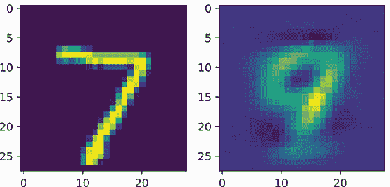

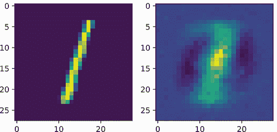

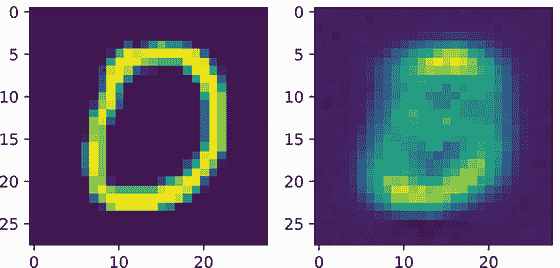

总体来说，变化是明显的，但并不明显不同。二维图仍然有很多重叠。编码-解码图像显示了一些伪影：0、1 和 7 在定性上相似，但风格不同。目的是什么？我们将 PCA 转换为一个具有一个非线性函数的自动编码器，因此我们修改了 PCA 算法；并且因为我们使用 PyTorch 进行操作，所以它训练起来并且直接工作。现在我们可以尝试进行更大的改动以获得更好的结果。作为深度学习的一个主题，如果我们通过添加更多层来使这个模型更深，我们应该能够成功地提高结果。

## 7.2 设计自动编码神经网络

PCA 是一种非常流行的降维和可视化方法，任何你可能使用 PCA 的情况，你可能会想使用*自动编码网络*。自动编码网络有相同的概念，但我们将编码器和解码器设计成更大的网络，具有更多层，以便它们可以学习更强大和复杂的编码器和解码器。因为我们已经看到 PCA 是一个自动编码器，所以自动编码网络可能是一个更准确的选择，因为它能够学习更复杂的函数。

自动编码网络也适用于*异常值检测*。你想要检测异常值，以便你可以手动审查它们，因为异常值不太可能被模型很好地处理。自动编码器可以通过查看其重建输入的好坏来检测异常值。如果你可以很好地重建输入，数据可能看起来像你见过的正常数据。如果你*不能*成功重建输入，它可能*不寻常*，因此是一个异常值。这个过程总结在图 7.3 中。你可以使用这种方法来找到训练数据中的潜在不良数据点或验证用户提交的数据（例如，如果有人上传他们的脸部照片到一个寻找耳部感染的应用程序，你应该将脸部检测为异常值，而不是做出诊断）。

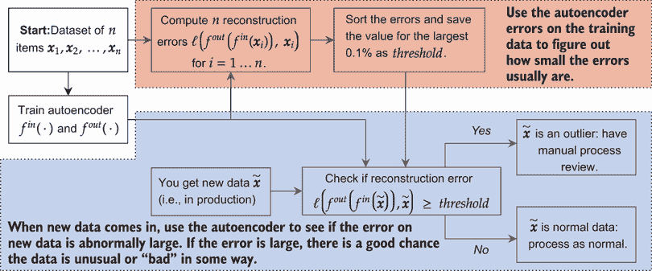

图 7.3 自动编码器检测异常值的示例应用。使用数据集来训练自动编码器，然后计算所有重建误差。假设 0.1%的数据是异常的，它应该是最难重建的。如果你找到了前 0.1%错误率的阈值，你可以将这个阈值应用于新数据以检测异常值。异常值通常表现不佳，可能最好以不同的方式处理它们或给予它们额外的审查。异常值检测可以在训练数据或新测试数据上执行。你可以将 0.1%更改为与你在数据集中相信正在发生的情况相匹配。

现在我们来谈谈如何设置基于深度学习的自动编码器。标准方法是在编码器和解码器之间建立一个对称架构：保持每边的层数相同，并将它们以相反的顺序放置（编码器从大到小，解码器从小到大）。我们还使用了一种*瓶颈*风格的编码器，这意味着层中的神经元数量逐渐减少。这如图 7.4 所示。

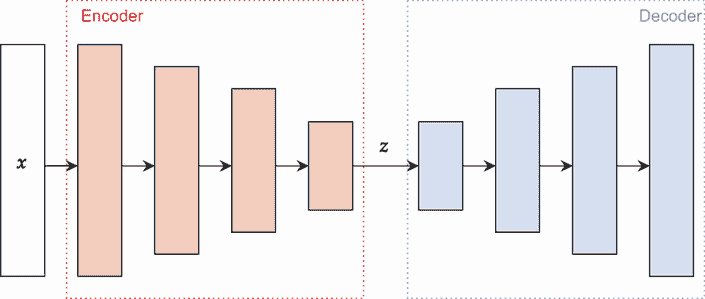

图 7.4 标准自动编码器设计的示例。输入从左侧进入。编码器一开始很大，然后在每一步逐渐减小隐藏层的大小。因为自动编码器通常是对称的，所以我们的解码器将接收小的表示 z，并开始将其扩展回原始大小。

自动编码器*不*必须是对称的。如果它们不是对称的，它们也能正常工作。这样做纯粹是为了使思考和理解网络更容易。这样，你将网络中层的数量、每层的神经元数量等决策减少了一半。

在编码器中的瓶颈*非常重要*。就像 PCA 所做的那样，通过将其压缩到更小的表示，我们使得网络无法作弊并学习到立即返回输入作为输出的天真解决方案。相反，网络必须学会识别高级概念，例如“有一个位于中心的圆圈”，这可以用于编码（然后解码）数字 6 和 0。通过学习多个高级概念，网络被迫开始学习有用的表示。

注意：自动编码器也可以被视为生成嵌入的一种方式。网络中的编码器部分尤其适合作为嵌入构建的候选者。这种方法是无监督的，因此你不需要标签，编码器的低维输出更适合与常见的可视化工具和最近邻搜索工具一起使用。

### 7.2.1 实现自动编码器

由于我们已经经历了实现 PCA 的痛苦，因此在以这种方式完成时，自动编码器应该更容易、更直接，主要是因为我们不再在层之间共享任何权重，也不再需要权重上的正交约束。为了简单起见，我们专注于全连接网络用于自动编码器，但这些概念具有广泛的应用性。首先，让我们定义另一个辅助函数`getLayer`，它为我们创建一个单独的隐藏层，以便放置在网络上，类似于我们在第六章中所做的：

```
def getLayer(in_size, out_size): 
    """ 
    in_size: how many neurons/features are coming into this layer 
    out_size: how many neurons/outputs this hidden layer should produce 
    """ 
    return nn.Sequential( ❶ 
        nn.Linear(in_size, out_size), 
        nn.BatchNorm1d(out_size), 
        nn.ReLU())
```

❶ 将隐藏层的概念“块”组织成一个 Sequential 对象

拥有这个辅助函数后，以下代码展示了如何使用我们所学到的更高级的工具（如批量归一化和 ReLU 激活）轻松实现自动编码器。它采用了一种简单的策略，即通过固定的模式减少每个隐藏层中的神经元数量。在这种情况下，我们将神经元数量除以 2，然后是 3，然后是 4，依此类推，直到解码器的最后一层，我们直接跳到目标大小 *D*′。用于减少层数量的模式并不重要，只要层的尺寸持续减小：

```
auto_encoder = nn.Sequential(          ❶ 
    nn.Flatten(), 
    getLayer(D, D//2),                 ❷ 
    getLayer(D//2, D//3), 
    getLayer(D//3, D//4), 
    nn.Linear(D//4, n),                ❸ 
)

auto_decoder = nn.Sequential(          ❹ 
    getLayer(n, D//4),                 ❺
    getLayer(D//4, D//3), 
    getLayer(D//3, D//2),

    nn.Linear(D//2, D), 
    View(-1, 1, 28, 28)                ❻ 
)
auto_encode_decode = nn.Sequential(    ❼ 
    auto_encoder, 
    auto_decoder 
)
```

❶ 将 2、3、4 等除以，是许多可用的模式之一。

❷ 每一层的输出尺寸都比前一层小。

❸ 跳到目标维度

❹ 解码器以相反的顺序执行相同的层/尺寸，以保持对称性

❺ 由于我们处于解码器中，每一层都在增加尺寸。

❻ 调整形状以匹配原始形状

❼ 结合成一个深度自动编码器

和往常一样，我们可以使用完全相同的函数来训练这个网络。我们坚持使用均方误差，这在自动编码器中非常常见：

```
train_network(auto_encode_decode, mse_loss, train_loader, 
➥ test_loader=test_loader, epochs=10, device=device)
```

### 7.2.2  可视化自动编码器结果

我们的新自动编码器表现如何？2D 图显示了投影维度 z 中*更多*的分离。类别 0、6 和 3 与其他类别*非常*好地分离。此外，中间区域（其中相邻的类别更多）在现有类别中至少具有更多的连续性和均匀性。类别在中部区域有独特的家园，而不是相互涂抹：

```
    projected, labels = encode_batch(auto_encoder, test_data_xy) 
    sns.scatterplot(x=projected[:,0], y=projected[:,1], 
    ➥ hue=[str(l) for l in labels], 
    ➥ hue_order=[str(i) for i in range(10)], legend="full")

[25]: <AxesSubplot:>
```


这也是使用自动编码器探索未知数据的一种方法。如果我们不知道类别标签，我们可能会从这种投影中得出结论，数据中可能至少存在两个到四个不同的子群体。

我们还可以查看一些编码-解码周期的示例。与之前不同，重建现在清晰，模糊度大大减少。但并不完美：类别 4 通常很难与其他类别分离，并且重建质量较低：

```
showEncodeDecode(auto_encode_decode, test_data_xy[0][0]) 
showEncodeDecode(auto_encode_decode, test_data_xy[2][0]) 
showEncodeDecode(auto_encode_decode, test_data_xy[6][0]) 
showEncodeDecode(auto_encode_decode, test_data_xy[23][0])
```

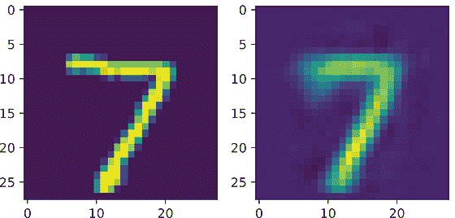

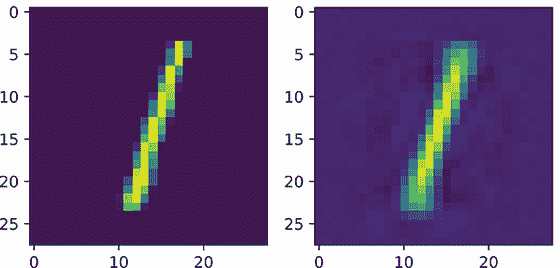

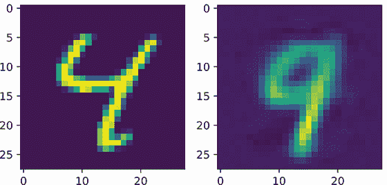

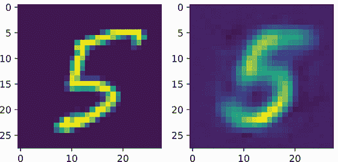

尝试与代码互动，观察不同数据点的结果。如果你这样做，你可能会开始注意到，重建并不总是保持输入的*风格*。这一点在数字 5 这里尤为明显：重建比原始输入更平滑、更纯净。这是好事还是坏事？

从我们训练模型的角度来看，这是一个坏事情。重建与输入*不同*，而目标是*精确地*重建输入。

然而，我们的真正目标并不是仅仅学会从输入本身重建输入。我们已经有输入了。我们的目标是学习数据的有用表示，而无需知道数据的标签。从这个角度来看，这种行为是好事：这意味着可能有多个不同的潜在“5”可以作为输入，并且会被映射到相同的“5”重建。从这个意义上说，网络已经自学了存在一个*规范*或*典型*的 5，而无需明确告知关于 5 的概念，甚至是否存在不同的数字。

但数字 4 的例子是一个失败的案例。网络重建了一个完全不同的数字，因为限制条件*太严格*：网络被迫降低到仅两个维度，并且无法在如此小的空间内学习数据中的所有复杂性。这意味着排除了 4 的概念。类似于 PCA，如果你给网络更大的瓶颈（更多可用的特征），重建的质量将稳步提高。使用两个维度非常适合在散点图中进行可视化，但对于其他应用，你可能想使用更多一些的特征。（这，就像机器学习中的大多数事情一样，是特定于问题的。你应该确保你有方法来测试你的结果，以便进行比较，然后使用这个测试来确定你应该使用多少特征）。

## 7.3 更大的自动编码器

我们迄今为止所做的所有自动编码都是基于将数据投影到两个维度，我们之前已经说过这使问题变得异常困难。你的直觉应该告诉你，如果我们把目标维度大小*D*′稍微增大，我们的重建质量应该会提高。但如果我们把目标大小做得比原始输入更大呢？这会起作用吗？我们可以轻松修改我们的自动编码器来尝试这一点，看看会发生什么。在下面的代码块中，我们只是在编码器的第一层之后简单地跳到*D*′ = 2 ⋅ *D*，并在整个过程中保持这个神经元数量：

```
auto_encoder_big = nn.Sequential( 
    nn.Flatten(), 
    getLayer(D, D*2), 
    getLayer(D*2, D*2), 
    getLayer(D*2, D*2), 
    nn.Linear(D*2, D*2), 
)

auto_decoder_big = nn.Sequential( 
    getLayer(D*2, D*2), 
    getLayer(D*2, D*2), 
    getLayer(D*2, D*2), 
    nn.Linear(D*2, D), 
    View(-1, 1, 28, 28) 
)

auto_encode_decode_big = nn.Sequential( 
    auto_encoder_big, 
    auto_decoder_big 
)

train_network(auto_encode_decode_big, mse_loss, train_loader, 
➥ test_loader=test_loader, epochs=10, device=device)
```

由于我们有很多维度，我们无法制作一个 2D 图。但我们仍然可以在数据上执行编码/解码比较，以查看我们的新自动编码器表现如何。如果我们绘制一些示例，就会变得明显，我们现在有*非常好*的重建，包括来自原始输入的细微细节。例如，下面的 7 在左上角略有上升，底部略有加粗，这些都在重建中存在。之前完全混乱的 4 现在有大量独特的曲线和风格，这些也被忠实保留：

```
showEncodeDecode(auto_encode_decode_big, test_data_xy[0][0]) 
showEncodeDecode(auto_encode_decode_big, test_data_xy[6][0]) 
showEncodeDecode(auto_encode_decode_big, test_data_xy[10][0])
```

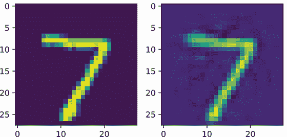

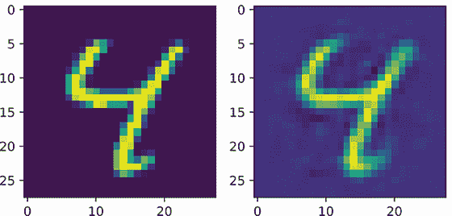

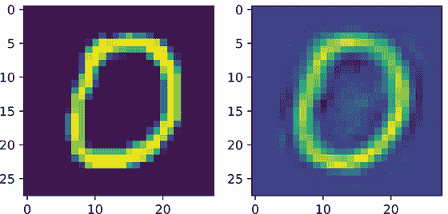

因此，问题是，这个自动编码器是否比之前的更好？我们是否学习到了有用的表示？这是一个很难回答的问题，因为我们使用输入重建作为网络的损失，但这并不是我们真正关心的。我们希望网络学习到*有用*的表示。这是经典无监督学习问题的一个变体：如果你不知道你在找什么，你怎么知道你做得好不好？

### 7.3.1  对噪声的鲁棒性

为了帮助我们回答哪个自动编码器更好的问题，*D*′ = 2 或 *D*′ = 2 ⋅ *D*，我们将向我们的数据添加一些噪声。为什么？我们可以使用的一个直觉是，如果一种表示法是好的，它应该是*鲁棒的*。想象一下，如果我们一直使用的干净数据就像一条路，我们的模型就像一辆车。如果这条路干净且平坦，车就能很好地行驶。但如果路上有坑洼和裂缝（即噪声）呢？一辆好车仍然应该能够成功驾驶。同样，如果我们有噪声数据，一个理想模型仍然会表现良好。

我们有*很多*种不同的方法可以使我们的数据变得噪声。其中一种最简单的方法是添加来自正态分布的噪声。我们用 *N*(*μ*,*σ*) 表示正态分布，其中 μ 是返回的均值值，σ 是标准差。如果 s 是从正态分布中抽取的值，我们用 *s* ∼ *N*(*μ*,*σ*) 表示。

为了使我们的数据变得噪声，我们使用 PyTorch 构造一个表示正态分布的对象，并扰动输入数据，以便我们得到  = **x** + *s*，其中 *s* ∼ *N*(*μ*,*σ*)。为了表示正态分布 *N*(*μ*,*σ*)，PyTorch 提供了 `torch.distributions.Normal` 类：

```
normal = torch.distributions.Normal(0, 0.5) ❶
```

❶ 第一个参数是均值 μ；第二个是标准差 σ

这个类有一个执行 *s*∼ 步的 `sample` 方法。我们使用 `sample_shape` 参数来告诉它我们想要一个形状为 `sample_shape` 的张量，用从这个分布中抽取的随机值填充。以下函数接受一个输入 x 和与 x 形状相同的噪声样本，这样我们就可以添加它，创建我们的噪声样本  = **x** + *s*：

```
def addNoise(x, device=’cpu’): 
    """ 
    We will use this helper function to add noise to some data. 
    x: the data we want to add noise to 
    device: the CPU or GPU that the input is located on. 
    """ 
    return x +
    normal.sample(sample_shape= 
    ➥ torch.Size(x.shape)).to(device) ❶
```

❶ **x** + *s*

在我们放置了简单的 `addNoise` 函数之后，我们可以用我们的大型模型尝试它。我们故意将噪声量设置得相当大，以便使模型之间的变化和差异更加明显。对于以下输入数据，你应该看到重建结果混乱，有额外的线条。由于噪声是随机的，你可以多次运行代码以查看不同的版本：

```
showEncodeDecode(auto_encode_decode_big, addNoise(test_data_xy[6][0])) 
showEncodeDecode(auto_encode_decode_big, addNoise(test_data_xy[23][0]))
```

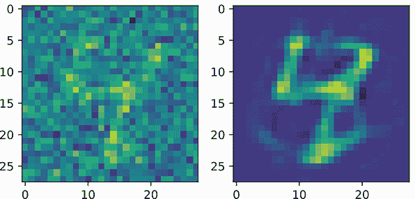

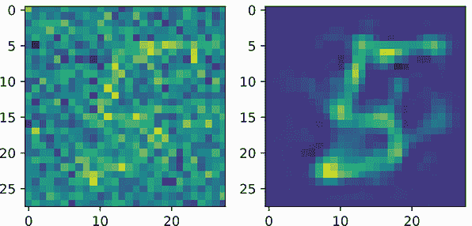

这似乎表明，我们的 *D*′ = 2 ⋅ *D* 的大型自动编码器并不非常鲁棒。如果我们将相同的噪声数据应用到原始自动编码器上，该编码器使用 *D* = 2 会发生什么？你可以看到接下来。5 被重建得几乎与之前完全一样：有点模糊，但清楚地是一个 5：

```
showEncodeDecode(auto_encode_decode, addNoise(test_data_xy[6][0])) 
showEncodeDecode(auto_encode_decode, addNoise(test_data_xy[23][0]))
```

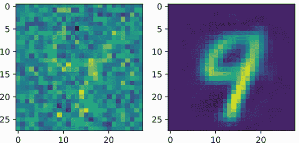


如果你多次运行 4，有时你会从解码器中得到一个 4，有时你会得到其他东西。这是因为噪声每次都不同，我们的 2D 图显示 4 正在被与其他许多类别混淆。

基于这个实验，我们可以看到，随着我们使编码维度 *D*′ 变小，模型变得更加鲁棒。如果我们让编码维度变得过大，它可能在处理容易的数据时擅长重建，但它对变化和噪声不鲁棒。这部分原因是因为当 *D*′ ≥ *D* 时，模型很容易学习一个简单的方法。它有足够的容量来复制输入并学会重复它所接受的内容。通过用较小的容量（*D*′ ≤ *D*）约束模型，它学习解决任务的唯一方法就是创建输入数据的更紧凑表示。理想情况下，你试图找到一个维度 *D*′，它可以在很好地重建数据的同时，尽可能使用最小的编码维度。

## 7.4 去噪自动编码器

要平衡使 *D*′ 足够小以保持鲁棒性，同时又要足够大以在重建方面表现良好，并非易事。但有一个技巧我们可以使用，这将允许我们拥有较大的 *D*′ > *D* 并学习一个鲁棒模型。这个技巧就是创建所谓的 *去噪自动编码器*。去噪自动编码器在向编码器输入添加噪声的同时，仍然期望解码器能够生成一个干净的图像。因此，我们的数学从 ℓ(*f*(**x**),**x**) 变为 ℓ(*f*(),**x**)。如果我们这样做，就没有简单的解决方案只是复制输入，因为我们是在将其交给网络之前对其进行扰动的。网络必须学习如何去除输入的噪声，或者去噪，从而允许我们在仍然获得鲁棒表示的同时使用 *D*′ > *D*。

去噪网络有很多实际应用。如果你可以创建出在现实生活中可能遇到的问题的合成噪声，你可以创建出去除噪声并通过使数据更干净来提高准确性的模型。例如，scikit-image ([`scikit-image.org`](https://scikit-image.org)) 这样的库提供了许多可以用来生成噪声图像的转换，我本人也使用这种方法来改进指纹识别算法。³ 我如何使用去噪自动编码器在图 7.5 中展示，这也是去噪自动编码器通常设置的总结。原始（或有时非常干净）的数据在开始时进入，我们对其应用噪声生成过程。噪声看起来越像你在真实数据中看到的问题，效果越好。噪声/损坏的数据版本作为自动编码器的输入，但损失是针对原始干净数据计算的。

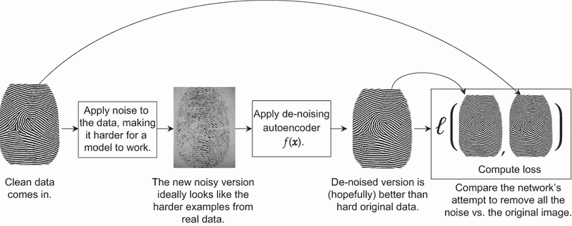

图 7.5 展示了应用于指纹图像的去噪自动编码器处理过程。这使用了特殊的软件来生成超逼真的指纹图像，目的是去除噪声，使指纹处理更不易出错。即使使用更简单和不现实的噪声，你仍然可以得到良好的结果。

### 7.4.1 使用高斯噪声进行去噪

我们将对之前的 `auto_encoder_big` 模型进行仅有的一个修改：在编码子网络的开始处添加一个新层，该层仅在训练时向输入添加噪声。通常的假设是，我们的训练数据相对干净且已准备就绪，我们添加噪声是为了使其更健壮。如果我们正在 *使用* 模型，并且不再训练，我们希望得到最好的答案——这意味着我们希望得到尽可能干净的数据。在那个阶段添加噪声会使我们的生活更加困难，如果输入已经存在噪声，我们只会使问题更加复杂。

因此，我们首先需要的是一个新的 `AdditiveGaussNoise` 层。它接受输入 x in。如果我们处于训练模式（由 `self.training` 表示），我们向输入添加噪声；否则，我们返回未扰动的输入：

```
class AdditiveGaussNoise(nn.Module): ❶
    def __init__(self):
    super().__init__()

    def forward(self, x): 
        if self.training:            ❷ 
            return addNoise(x, device=device) 
        else:                        ❸ 
            return x
```

❶ 在此对象的构造函数中我们不需要做任何事情。

❷ 每个 PyTorch 模块对象都有一个 `self.training` 布尔值，可以用来检查我们是否处于训练（True）或评估（False）模式。

❸ 现在是训练阶段：返回给定的数据。

接下来，我们重新定义与之前相同的大型自动编码器，其中 *D*′ = 2 ⋅ *D*。唯一的区别是我们将 `AdditiveGaussNoise` 层插入到网络的开始部分：

```
dnauto_encoder_big = nn.Sequential( 
    nn.Flatten(), 
    AdditiveGaussNoise(),                            ❶ 
    getLayer(D, D*2), 
    getLayer(D*2, D*2), 
    getLayer(D*2, D*2), 
    nn.Linear(D*2, D*2), 
)

dnauto_decoder_big = nn.Sequential( 
    getLayer(D*2, D*2), 
    getLayer(D*2, D*2), 
    getLayer(D*2, D*2), 
    nn.Linear(D*2, D), 
    View(-1, 1, 28, 28) 
)

dnauto_encode_decode_big = nn.Sequential( 
    dnauto_encoder_big, 
    dnauto_decoder_big 
) 
train_network(dnauto_encode_decode_big, mse_loss, train_loader, 
➥ test_loader=test_loader, epochs=10, device=device) ❷
```

❶ 仅添加！我们希望在这里添加噪声会有所帮助。

❷ 按常规训练

它做得怎么样？接下来，我们可以看到在有噪声和无噪声的情况下重建的相同数据。新的去噪模型在创建我们迄今为止开发的各个模型的重建方面明显是最好的。在两种情况下，去噪自编码器都捕捉到了单个数字的大部分风格。去噪方法仍然遗漏了一些细节，这可能是由于它们太小，以至于模型不确定它们是风格的真实部分还是噪声的一部分。例如，4 号字底部的装饰和 5 号字顶部的装饰在重建后缺失：

```
showEncodeDecode(dnauto_encode_decode_big, test_data_xy[6][0]) 
showEncodeDecode(dnauto_encode_decode_big, addNoise(test_data_xy[6][0]))
```

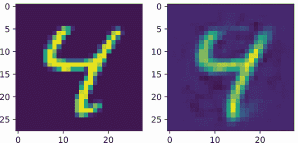

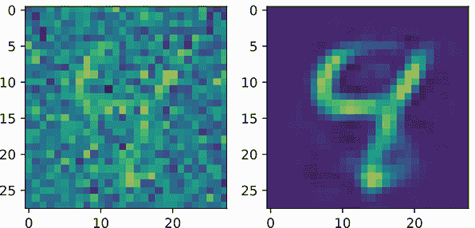

```
showEncodeDecode(dnauto_encode_decode_big, test_data_xy[23][0]) 
showEncodeDecode(dnauto_encode_decode_big, addNoise(test_data_xy[23][0]))
```

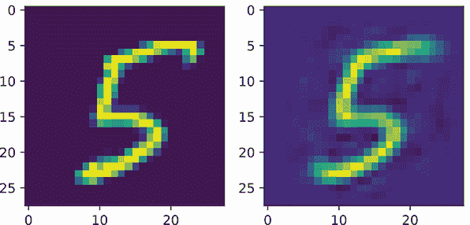

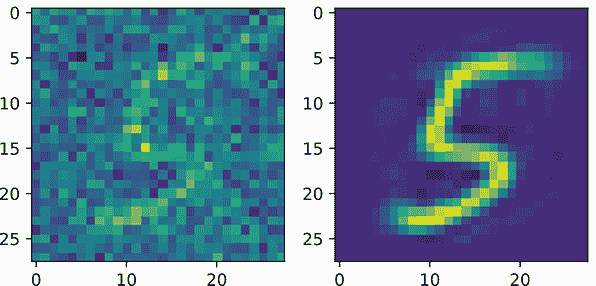

去噪方法在训练自编码器时非常受欢迎，将你自己的扰动引入数据中的技巧被广泛用于构建更准确和鲁棒的模型。随着你对深度学习和不同应用了解的更多，你会发现许多形式和变体都基于这种方法。

除了帮助学习更鲁棒的表现形式之外，去噪方法本身也可以是一个有用的模型。噪声在许多情况下都可能自然发生。例如，在执行光学字符识别（OCR）以将图像转换为可搜索文本时，你可以从相机的损坏、文档的损坏（例如，水或咖啡污渍）、光照变化、物体投下的阴影等中获得噪声。许多 OCR 系统通过学习添加类似于真实生活中看到的噪声，并要求模型在噪声中学习而得到改进。

基于 Dropout 的去噪

添加高斯噪声可能很麻烦，因为我们需要确定确切需要添加多少噪声，这可能会从数据集到数据集而变化。第二种更受欢迎的方法是使用*dropout*。

Dropout 是一个非常简单的想法：以一定的概率 p，将任何给定的特征值置零。这迫使网络变得鲁棒，因为它*永远*不能依赖于任何特定的特征或神经元值，因为 p%的时间，特征或值将不存在。Dropout 是一个非常受欢迎的正则化器，可以应用于网络的*输入*和*隐藏层*。

以下代码块训练了一个基于 dropout 的去噪自编码器。默认情况下，dropout 使用*p* = 50%，这对于隐藏层来说是合适的，但对于输入来说过于激进。因此，对于输入，我们只应用*p* = 20%：

```
dnauto_encoder_dropout = nn.Sequential( 
    nn.Flatten(), 
    nn.Dropout(p=0.2),                                ❶ 
    getLayer(D, D*2), 
    nn.Dropout(),                                     ❷
    getLayer(D*2, D*2), 
    nn.Dropout(), 
    getLayer(D*2, D*2), nn.Dropout(), nn.Linear(D*2, D*2) 
)

dnauto_decoder_dropout = nn.Sequential( 
    getLayer(D*2, D*2), 
    nn.Dropout(), 
    getLayer(D*2, D*2), 
    nn.Dropout(), 
    getLayer(D*2, D*2), 
    nn.Dropout(), 
    nn.Linear(D*2, D), 
    View(-1, 1, 28, 28) 
)

dnauto_encode_decode_dropout = nn.Sequential( 
dnauto_encoder_big, 
dnauto_decoder_big 
) 
train_network(dnauto_encode_decode_dropout, mse_loss, ❸ 
➥ train_loader, test_loader=test_loader, epochs=10, device=device)
```

❶ 对于输入，我们通常只丢弃 5%到 20%的值。

❷ 默认情况下，dropout 使用 50%的概率将值置零。

❸ 按常规训练

现在模型已经训练好了，让我们将其应用于一些测试数据。Dropout 可以鼓励很大的鲁棒性，我们可以通过将其应用于 dropout 噪声和高斯噪声来展示这一点。后者是网络以前从未见过的，但这并没有阻止自编码器忠实地确定一个准确的重建：

```
showEncodeDecode(dnauto_encode_decode_dropout, 
➥ test_data_xy[6][0])               ❶ 
showEncodeDecode(dnauto_encode_decode_dropout, 
➥ addNoise(test_data_xy[6][0]))     ❷
showEncodeDecode(dnauto_encode_decode_dropout, 
➥ nn.Dropout()(test_data_xy[6][0])) ❸
```

❶ 清洁数据

❷ 高斯噪声

❸ Dropout 噪声

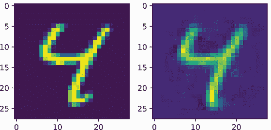

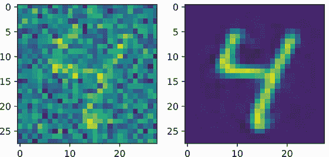

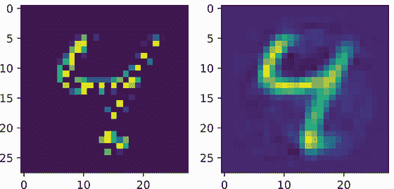

退火与重生

dropout 的起源可以追溯到 2008 年早期去噪自编码器^a，但最初只应用于输入。后来它被发展成为一种更通用的正则化器^b，并在神经网络作为领域和研究领域的重生中发挥了重要作用。

与大多数正则化方法一样，dropout 的目标是提高泛化能力和减少过拟合。它在这一点上做得相当出色，并且有一个吸引人且直观的故事来解释它是如何工作的。多年来，dropout 一直是获取良好结果的关键工具，没有它几乎不可能实现网络。dropout 仍然作为一个正则化器发挥作用，并且有用且被广泛使用，但它不再像以前那样无处不在。我们迄今为止学到的工具，如归一化层、更好的优化器和残差连接，为我们提供了 dropout 的大部分好处。

使用 dropout 并不是一件“坏”事，我通过提到“dropout 的衰落”而夸张了。这项技术只是随着时间的推移而变得不那么受欢迎。我未经证实的理论是，首先，它训练起来稍微慢一些，需要大量的随机数和增加的内存使用，而现在我们可以在不付出这些代价的情况下获得其大部分好处。其次，dropout 在训练和测试时的应用方式不同。在训练期间，你失去了大约 50%的神经元，使得网络实际上变得更小。但在验证期间，你得到所有的 100%神经元。这可能导致测试性能看起来比训练性能更好的困惑情况，因为训练和测试是以不同的方式评估的。（技术上，批量归一化也是如此，但这种情况并不常见。）我认为人们选择了其他方法略微便宜且不那么令人困惑的结果。尽管如此，dropout 仍然是一个很好的默认选择，可以作为新架构的正则化器使用，在这些架构中，你不确定哪些是有效的或无效的。

* * *

^a P. Vincent, H. Larochelle, Y. Bengio, and P.A. Manzagol, “Extracting and composing robust features with denoising autoencoders,” in *Proceedings of the 25th International Conference on Machine Learning*, New York: Association for Computing Machinery, 2008, pp. 1096–1103, [`doi.org/10.1145/1390156.1390294`](https://doi.org/10.1145/1390156.1390294).↩

^b N. Srivastava, G. Hinton, A. Krizhevsky, I. Sutskever, and R. Salakhutdinov, “Dropout: a simple way to prevent neural networks from overfitting,” *The Journal of Machine Learning Research*, vol. 15, no. 1, pp. 1929–1958, 2014.↩

## 7.5 时间序列和序列的自动回归模型

自动编码方法在图像、信号以及带有表格数据的全连接模型中都非常成功。但如果我们面临的是一个序列问题呢？特别是如果我们的数据是由离散标记表示的语言，那么很难向字母或单词等添加有意义的噪声。相反，我们可以使用一个**自回归模型**，这是一种专门为时间序列问题设计的解决方案。

你可以使用自回归模型来基本上应用于所有你可能使用自动编码模型的应用。你可以使用自回归模型学习到的表示作为输入到另一个不理解序列的 ML 算法中。例如，你可以在《Inside Deep Learning》的书评上训练一个自回归模型，然后使用 k-means 或 HDBSCAN 等聚类算法对这些评论进行聚类。⁴ 由于这些算法不自然地接受文本作为输入，自回归模型是快速扩展你最喜欢的 ML 工具范围的好方法。

假设你有 t 步的数据：**x**[1]，**x**[2]，…，**x**[*t* − 1]，**x**[t]。自回归模型的目标是在给定序列中所有前面的项目的情况下预测**x**[*t* + 1]。用数学方式写这个就是ℙ(**x**[*t* + 1]|**x**[1]，**x**[2]，…，**x**[t])，这意味着

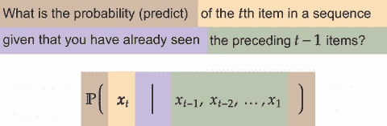

自回归方法仍然是一种自我监督的形式，因为序列中的下一个项目是数据本身的一个简单组成部分。如果你把“这是一个句子”看作是一系列字符的序列，根据定义，你知道*T*是第一个项目，*h*是第二个，*i*是第三个，以此类推。

图 7.6 说明了自回归模型在高级别上的发生情况。一个基于序列的模型显示在绿色块中，并接收输入**x**[i]。因此，第 i 步的预测是**x̂**[i]。然后我们使用损失函数ℓ来计算当前预测**x̂**[i]和下一个输入**x**[*i* + 1]之间的损失，ℓ(***x̂**[i]*, ***x**[i]*[+1])。所以对于一个有 T 个时间步长的输入，我们有 T - 1 次损失计算：最后一个时间步 T 不能用作输入，因为没有 T + 1 项可以与之比较。

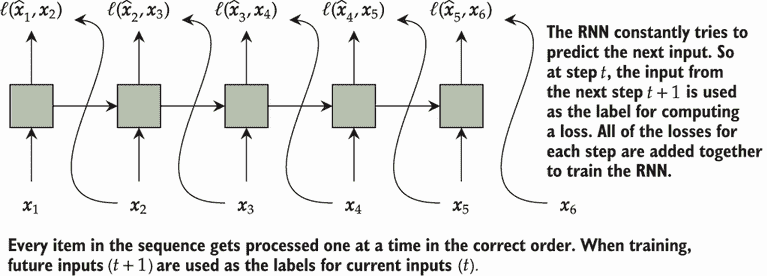

图 7.6 展示了自回归设置的示例。输入位于底部，输出位于顶部。对于一个输入**x**[i]，自回归模型的预测是**x̂**[i]，而**标签****y**[i] = **x**[*i* + 1]。

你可能已经从这张图的形状中猜到，我们将使用循环神经网络来实现我们的自回归模型。RNNs 非常适合像这样的基于序列的问题。与之前使用 RNNs 相比，一个大的变化是我们将在**每个**步骤进行预测，而不仅仅是最后一个步骤。

一种由安德烈·卡帕西（Andrej Karpathy）普及的自动回归模型称为*char-RNN*（字符 RNN）。这是一种自动回归方法，其中输入/输出是字符，我们将展示在莎士比亚数据上实现 char-RNN 模型的一种简单方法。

注意：虽然 RNN 是用于自动回归模型的适当且常见的架构，但双向 RNN 不是。这是因为自动回归模型正在预测未来。如果我们使用双向模型，我们将在序列中拥有关于未来内容的信息，而知道未来就是作弊！当我们要对整个序列进行预测时，双向 RNN 是有用的，但现在我们正在对输入进行预测，我们需要强制执行无双向策略，以确保我们的模型不会看到它们不应该看到的信息。

### 7.5.1 实现 char-RNN 自回归文本模型

我们首先需要我们的数据。安德烈·卡帕西（Andrej Karpathy）在网上分享了一些莎士比亚的文本，我们将下载这些文本。这个文本中大约有 10 万个字符，所以我们把数据存储在一个名为`shakespear_100k`的变量中。我们使用这个数据集来展示训练自回归模型的过程，以及它的生成能力：

```
from io import BytesIO 
from zipfile import ZipFile 
from urllib.request import urlopen 
import re

all_data = [] resp = urlopen(
➥ "https://cs.stanford.edu/people/karpathy/char-rnn/shakespear.txt") 
shakespear_100k = resp.read() 
shakespear_100k = shakespear_100k.decode(’utf-8’).lower()
```

现在我们将构建一个包含此数据集中所有字符的词汇 Σ。你可以做出的一个改变是不使用`lower()`函数将所有内容转换为小写。因为我们正在探索深度学习，这些早期的决定对我们模型最终的使用方式和有用性非常重要。所以，你应该学会识别这样的选择*作为选择*。我选择使用全部小写数据，因此我们的词汇量更小。这降低了任务的难度，但意味着我们的模型无法学习关于大写的信息。

下面是代码：

```
vocab2indx = {}                    ❶ 
for char in shakespear_100k: 
    if char not in vocab2indx:     ❷ 
vocab2indx[char] = len(vocab2indx) ❸

indx2vocab = {}                    ❹ 
for k, v in vocab2indx.items():    ❺
    indx2vocab[v] = k 
print("Vocab Size: ", len(vocab2indx)) 
print("Total Characters:", len(shakespear_100k))

Vocab Size: 36
Total Characters: 99993
```

❶ 词汇 Σ

❸ 根据当前词汇大小设置索引

❹ 将每个新字符添加到词汇中

❹ 从索引返回原始字符的有用代码

❺ 遍历所有键值对并创建一个具有逆映射的字典

接下来，我们采取一个非常简单的方法来构建一个自动回归数据集。由于这些字符是从莎士比亚的一个剧中提取的，所以它们在一个长序列中。如果我们把这个序列分成足够长的块，我们几乎可以保证每个块都会包含几个完整的句子。我们通过索引到一个位置`start`并获取文本的切片`[start:start+chunk_size]`来获得每个块。由于数据集是自动回归的，所以我们的*标签*是比一个字符多出的标记。这可以通过获取一个偏移一个字符的新切片来实现，即`[start+1:start+1+chunk_size]`。这如图 7.7 所示。


图 7.7 红色表示获取输入，黄色表示输出，使用六个字符的块。这使得为模型创建数据集变得容易，其中每个批次的长度都相同，简化了我们的代码，并确保最大 GPU 利用率（在填充的输入/输出上不做任何工作）。

以下代码使用此策略从大型文本语料库中实现自回归问题的数据集。我们假设语料库存在为一个长字符串，并且将多个文件连接成一个长字符串是可以接受的，因为我们的块的大小小于大多数文档。虽然我们给我们的模型增加了难度，需要从随机位置开始学习，这个位置可能是一个单词的中间部分，但它使我们能够轻松地实现所有代码：

```
class AutoRegressiveDataset(Dataset): 
    """ 
    Creates an autoregressive dataset from one single, long, source 
    ➥ sequence by breaking it up into "chunks". 
    """

    def __init__(self, large_string, max_chunk=500): 
        """ 
        large_string: the original long source sequence that chunks will 
        ➥ be extracted from 
        max_chunk: the maximum allowed size of any chunk. 
        """
        self.doc = large_string 
        self.max_chunk = max_chunk

    def __len__(self): 
        return (len(self.doc)-1) // self.max_chunk            ❶

    def __getitem__(self, idx): 
        start = idx*self.max_chunk                            ❷

        sub_string = self.doc[start:start+self.max_chunk]     ❸ 
        x = [vocab2indx[c] for c in sub_string]               ❹ 
        sub_string = self.doc[start+1:start+self.max_chunk+1] ❺ 
        y = [vocab2indx[c] for c in sub_string]               ❻ 
        return torch.tensor(x, dtype=torch.int64), torch.tensor(y, 
        ➥ dtype=torch.int64)
```

❶ 项数是字符数除以块大小。

❷ 计算第 idx 个块的起始位置

❸ 获取输入子字符串

❹ 根据我们的词汇表将子字符串转换为整数

❺ 通过移动 1 位来获取标签子字符串

❻ 根据我们的词汇表将标签子字符串转换为整数

现在是棘手的部分：实现自回归 RNN 模型。为此，我们使用门控循环单元（GRU）而不是长短期记忆（LSTM），因为 GRU 只有隐藏状态**h**[t]，没有上下文状态**c**[t]，所以代码会更容易阅读。我们实现的高级策略在图 7.8 中给出。

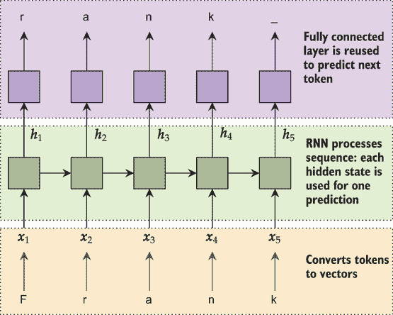

图 7.8 自回归 RNN 设计。输入（从底部开始）为黄色，其中`nn.Embedding`层将每个字符转换为向量。这些向量被送入绿色显示的 RNN 层，该层按顺序处理每个字符。然后一组全连接层独立地处理每个 RNN 隐藏状态**h**[t]，通过权重共享来做出关于下一个标记的预测。

定义自回归构造函数

我们的构造函数接受一些熟悉的参数。我们想知道词汇表的大小`num_embeddings`、嵌入层中的维度`embd_size`、每个隐藏层中的神经元数量`hidden_size`以及 RNN 层的数量`layers=1`：

```
class AutoRegressive(nn.Module):

    def __init__(self, num_embeddings, embd_size, hidden_size, layers=1):
        super(AutoRegressive, self).__init__() 
        self.hidden_size = hidden_size 
        self.embd = nn.Embedding(num_embeddings, embd_size)
```

我们对架构的第一个主要改变是我们不使用正常的`nn.GRU`模块。正常的`nn.RNN`、`nn.LSTM`和`nn.GRU`模块一次接受所有时间步，并一次返回所有输出。你可以使用这些来实现自回归模型，但我们将使用`nn.GRUCell`模块。`GRUCell`一次处理一个序列项。这可能会慢一些，但可以更容易地处理未知和可变长度的输入。这种方法总结在图 7.9 中。`Cell`类在我们完成模型训练后将很有用，但我不想破坏惊喜——我们稍后会回到*为什么*我们这样做的原因。

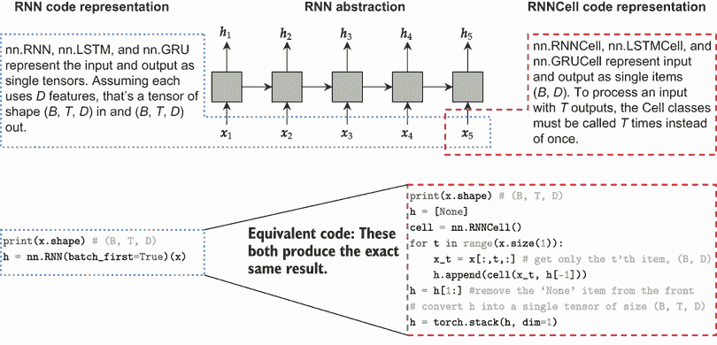

图 7.9 展示了 PyTorch 中 RNN 和 cell 类之间主要区别的示例。左侧：正常的 RNN 在一次操作中处理整个序列，这使得它们更快，但需要一次性提供所有数据。右侧：cell 类逐个处理项目，在没有所有输入已经可用的情况下更容易使用。

如果我们想要多个`layers`的 RNN，我们必须手动指定和运行它们。我们可以通过使用`ModuleList`来指定一组中的多个模块来实现这一点。这意味着我们的初始化代码在`self.embd`之后看起来像这样：

```
self.layers = nn.ModuleList(
    [nn.GRUCell(embd_size, hidden_size)] + [nn.GRUCell(hidden_size, hidden_size) 
for i in range(layers-1)]) self.norms = nn.ModuleList( 
    [nn.LayerNorm(hidden_size) for i in range(layers)])
```

我们将`GRUCell`层的规范分为两部分。首先是第一个层的一个项目列表，因为它必须从`embd_size`输入到`hidden_size`输出。第二是所有剩余层，使用`[nn.GRUCell(hidden_size, hidden_size) for i in range(layers-1)]`，这之所以有效，是因为这些层的输入和输出大小相同。为了好玩，我还包括了一个`LayerNorm`归一化层，用于每个 RNN 结果。

在我们的构造函数中，我们还需要紫色层，这些层接受隐藏状态**h**[t]并输出类的预测。这是通过一个小型全连接网络完成的：

```
self.pred_class = nn.Sequential( 
    nn.Linear(hidden_size, hidden_size),   ❶ 
    nn.LeakyReLU(), 
    nn.LayerNorm(hidden_size),             ❶
    nn.Linear(hidden_size, num_embeddings) ❷ 
)
```

❶ (B, *, D)

❷ (B, *, D) -> B(B, *, VocabSize)

注意，我们将此模块的一个组件定义为整个网络。这将帮助我们模块化我们的设计，并使我们的代码更容易阅读。如果您想返回并更改从隐藏 RNN 状态到预测的子网络，您只需更改`pred_class`对象，其余代码将正常工作。

实现自回归前向函数

该模块的`forward`函数将组织两个其他辅助函数完成的工作。首先，我们将输入标记嵌入到它们的向量形式中，因为这可以一次性完成。因为我们使用的是`GRUCell`类，我们需要自己跟踪隐藏状态。因此，我们使用`initHiddenStates(B)`函数为每个 GRU 层创建初始隐藏状态**h**[0] = 。然后，我们使用`for`循环获取每个 t 项目，并使用一个`step`函数逐个步骤处理它们，该函数接受输入**x**[t]和 GRU 隐藏状态列表`h_prevs`。GRU 隐藏状态存储在列表`last_activations`中，以获取每个时间步的预测。最后，我们可以通过`stack`将结果组合在一起返回一个单一的 tensor：

```
def forward(self, input):                                  ❶ 
    B = input.size(0)                                      ❷ 
    T = input.size(1)                                      ❸ 

    x = self.embd(input)                                   ❹ 

    h_prevs = self.initHiddenStates(B)                     ❺ 

    last_activations = [] 
    for t in range(T):
        x_in = x[:,t,:]                                    ❻ 
        last_activations.append(self.step(x_in, h_prevs))

last_activations = torch.stack(last_activations, dim=1)    ❼

return last_activations
```

❶ 输入应为（B，T）。

❷ 批量大小是多少？

❸ 最多有多少个时间步？

❹ （B，T，D）

❺ 初始隐藏状态

❻ (B, D)

❼ （B，T，D）

`initHiddenStates`很容易实现。我们可以使用`torch.zeros`函数创建一个全零值的 tensor。我们只需要一个参数`B`来指定批量大小的，然后我们可以从对象的成员中获取`hidden_size`和`layers`的数量：

```
def initHiddenStates(self, B): 
    """ 
    Creates an initial hidden state list for the RNN layers.

    B: the batch size for the hidden states. 
    """ 
    return [torch.zeros(B, self.hidden_size, device=device) 
        for _ in range(len(self.layers))]
```

`step` 函数稍微复杂一些。首先，我们检查输入的形状，如果它只有一个维度，我们假设我们需要嵌入标记值以生成向量。然后我们检查隐藏状态 `h_prevs`，如果它们没有提供，则使用 `initHiddenStates` 初始化它们。这些都是好的防御性代码步骤，以确保我们的函数可以灵活且避免错误：

```
def step(self, x_in, h_prevs=None): 
    """ 
    x_in: the input for this current time step and has shape (B) 
    if the values need to be embedded, and (B, D) if they 
    have already been embedded.

    h_prevs: a list of hidden state tensors each with shape 
    (B, self.hidden_size) for each layer in the network.
    These contain the current hidden state of the RNN layers 
    and will be updated by this call. 
    """

    if len(x_in.shape) == 1:                               ❶ 
        x_in = self.embd(x_in)                             ❷

    if h_prevs is None:
        h_prevs = self.initHiddenStates(x_in.shape[0])

    for l in range(len(self.layers)):                      ❸ 
        h_prev = h_prevs[l] 
        h = self.normsl)    ❹

        h_prevs[l] = h 
        x_in = h 
    return self.pred_class(x_in)                           ❺
```

❶ 准备所有三个参数以最终形式呈现。首先，(B)；我们需要嵌入它。

❷ 现在 (B, D)

❸ 处理输入

❹ 将当前输入与之前的隐藏状态一起推入

❺ 对标记进行预测

在这些防御性编码步骤之后，我们简单地遍历层数并处理结果。`x_in` 是层的输入，它被传递到当前层 `self.layers[l]` 和归一化层 `self.norms[l]`。之后，我们进行一些次要的记录工作，存储新的隐藏状态 `h_prevs[l] = h` 并设置 `x_in = h`，以便下一层准备好输入以进行处理。一旦这个循环完成，`x_in` 就有了最后一个 RNN 层的结果，因此我们可以直接将其输入到 `self.pred_class` 对象中，从 RNN 隐藏状态预测下一个字符。

线性层随时间的一个快捷方式

你可能会注意到这段代码中关于张量形状的注释 `(B, D)`。这是因为 `nn.Linear` 层有一个特殊的技巧，允许它们同时独立地应用于多个输入。我们总是使用形状为 (*B*, *D*) 的张量上的线性模型，线性模型可以接收 D 个输入并返回 *D*′ 个输出。因此，我们会从 (*B*, *D*) 变为 (*B*, *D*′)。如果我们有一个序列中的 T 个项目，我们有一个形状为 (*B*, *T*, *D*) 的张量。将线性模型应用于每个时间步的原始方法需要 `for` 循环，看起来像这样：

```
def applyLinearLayerOverTime(x): 
    results = []                                  ❶ 
    B, T, D = x.shape 
    for t in range(T): 
        results.append(linearLayer(x[:,t,:])      ❷ 
return torch.stack(results, dim=0).view(B, T, -1) ❸
```

❶ 存储每个步骤结果的地点

❷ 获取每个步骤的结果

❸ 将所有内容堆叠成一个张量并正确地调整形状

这比我们想要的代码要多，而且由于 `for` 循环，它将运行得更慢。PyTorch 有一个简单的技巧，即 `nn.Linear` 层应用于张量的 *最后一个* 轴，无论轴的数量是多少。这意味着整个函数可以用 `linearLayer` 代替，你将得到 *完全相同的结果*。这样，任何全连接网络都可以用于单个时间步或时间步组，而无需做任何特殊的事情。尽管如此，保留像 `(B, D)` 和 `(B, T, D)` 这样的注释仍然很好，这样你可以提醒自己 *如何* 使用你的网络。

定义了我们的模型后，我们几乎完成了。接下来，我们快速创建一个新的 `AutoRegressiveDataset`，使用 `shakespear_100k` 数据作为输入，并使用一个可观的批量大小创建数据加载器。我们还创建了一个具有 32 维嵌入、128 个隐藏神经元和 2 个 GRU 层的 `AutoRegressive` 模型。我们包括梯度裁剪，因为 RNN 对这个问题很敏感：

```
autoRegData = AutoRegressiveDataset(shakespear_100k, max_chunk=250) 
autoReg_loader = DataLoader(autoRegData, batch_size=128, shuffle=True)

autoReg_model = AutoRegressive(len(vocab2indx), 32, 128, layers=2) 
autoReg_model = autoReg_model.to(device)

for p in autoReg_model.parameters(): 
    p.register_hook(lambda grad: torch.clamp(grad, -2, 2))
```

实现自回归损失函数

我们最后需要的是一个损失函数ℓ。我们在每个步骤都做出预测，因此我们想要使用适用于分类问题的`CrossEntropyLoss`。*然而*，我们需要计算多个损失，每个时间步一个。我们可以通过编写自己的损失函数`CrossEntLossTime`来解决，该函数计算每个步骤的交叉熵。类似于我们的`forward`函数，我们将每个预测`x[:,t,:]`和相应的标签`y[:t]`切片，以便我们最终得到预测和标签的标准(*B*,*C*)和(*B*)形状，可以直接调用`CrossEntropyLoss`。然后我们将每个时间步的损失相加，得到一个单一的返回总损失：

```
def CrossEntLossTime(x, y): 
    """ 
    x: output with shape (B, T, V) 
    y: labels with shape (B, T) 
    """ 
    cel = nn.CrossEntropyLoss() 

    T = x.size(1) 

    loss = 0 

    for t in range(T):                ❶ 
        loss += cel(x[:,t,:], y[:,t]) ❷

    return loss
```

❶ 对于序列中的每个项目 ...

❷ ... 计算预测错误的总和。

现在我们可以最终训练我们的自回归模型了。我们使用相同的`train_network`函数，但将新的`CrossEntLossTime`函数作为损失函数ℓ传入——一切正常工作：

```
train_network(autoReg_model, CrossEntLossTime, autoReg_loader, epochs=100, 
➥ device=device)
```

### 7.5.2 自回归模型是生成模型

我们将最后一个细节留到了最后，因为它比解释它更容易*看到*。自回归模型不仅是自监督的；它们还属于一类称为*生成模型*的类别。这意味着它们可以*生成*看起来像原始训练数据的新数据。为此，我们将我们的模型切换到`eval`模式，并创建一个存储我们的生成输出的张量`sampling`。从模型生成的任何输出都可以称为*样本*，生成该样本的过程称为*采样*，如果你想要听起来很酷（并且这是你需要记住的好术语）：

```
autoReg_model = autoReg_model.eval() 
sampling = torch.zeros((1, 500), dtype=torch.int64, device=device)
```

要从自回归模型中采样，我们通常需要给模型一个*种子*。这是模型*给出*的一些原始文本；然后模型被要求预测接下来会发生什么。设置种子的代码如下，其中“EMILIA:”是我们的初始种子，就像角色 Emilia 即将在剧中说话一样：

```
seed = "EMILIA:".lower() 
cur_len = len(seed) 
sampling[0,0:cur_len] = torch.tensor([vocab2indx[x] for x in seed])
```

自回归模型的采样过程如图 7.10 所示。我们将种子作为模型的初始输入传递，并*忽略*正在做出的预测。这是因为我们的种子正在帮助构建 RNN 的隐藏状态 h，其中包含关于每个先前输入的信息。一旦我们处理完整个种子，我们就没有更多的输入了。种子用完输入后，我们使用模型的前一个输出**x̂**[t]作为下一个时间步*t* + 1 的*输入*。这是因为自回归模型已经*学会了预测接下来会发生什么*。如果它在这一点上做得很好，它的预测可以用作输入，我们最终在过程中*生成*新的序列。

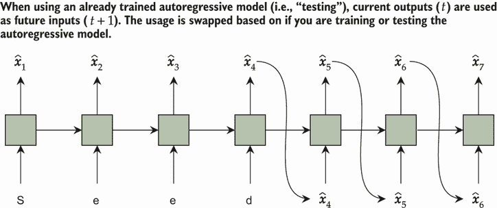

图 7.10 给模型一个种子，并忽略正在做出的预测。一旦种子用完，我们使用时间步 t 的预测作为下一个步骤*t* + 1 的输入。

但我们如何将预测作为输入使用呢？我们的模型正在预测看到 *每个* 不同字符作为下一个可能输出的概率。但下一个输入需要是一个 *特定* 的字符。这可以通过根据模型输出的概率 *采样* 预测来实现。所以如果字符 *a* 有 100% 的预测概率是下一个，模型 *将* 返回 *a*。如果我们有 80% 的 *a*，10% 的 *b* 和 10% 的 *c*，我们 *可能* 选择 *a* 作为下一个类别，但我们也可以选择 *b* 或 *c*。下面的代码就是这样做的：

```
for i in tqdm(range(cur_len, sampling.size(1))): 
    with torch.no_grad(): 
        h = autoReg_model(sampling[:,0:i])    ❶ 
        h = h[:,-1,:]                         ❷ 
        h = F.softmax(h, dim=1)               ❸ 
        next_tokens = torch.multinomial(h, 1) ❹ 
        sampling[:,i] = next_tokens           ❺ 
        cur_len += 1                          ❻
```

❶ 处理所有前面的项目

❷ 获取最后一步

❸ 计算概率

❹ 采样下一个预测

❺ 设置下一个预测

❻ 增加长度为一

注意 正如自编码器可以制作出优秀的嵌入，自回归模型也是如此。前述代码中的隐藏状态 `h` 可以用作一个嵌入，它总结了迄今为止处理过的整个序列。这是一种从词嵌入到句子或段落嵌入的好方法。

现在我们有一个我们预测的新序列，但它看起来是什么样子呢？这就是为什么我们使用 `indx2vocab` `dict` 保存了从标记到我们词汇表的反向映射：我们可以使用它将每个整数映射回一个字符，然后 `join` 它们来创建输出。下面的代码将我们的生成样本转换回我们可以阅读的文本：

```
s = [indx2vocab[x] for x in sampling.cpu().numpy().flatten()]
print("".join(s))

emilia:
to hen the words tractass of nan wand, 
no bear to the groung, iftink sand'd sack, 
i will ciscling 
bronino:
if this, so you you may well you and surck, of wife where sooner you. 

corforesrale:
where here of his not but rost lighter'd therefore latien ever 
un'd 
but master your brutures warry:
why, 
thou do i mus shooth and, 
rity see! more mill of cirfer put, 
and her me harrof of that thy restration stucied the bear:
and quicutiand courth, for sillaniages:
so lobate thy trues not very repist
```

你应该注意我们生成输出的几个方面。虽然它看起来有点像莎士比亚的风格，但它很快就会退化。这是因为随着每一步数据的增加，我们离 *真实* 数据就越远，我们的模型 *将* 做出不切实际的选择，从而成为错误并负面影响未来的预测。所以，我们生成的越长，质量就会越低。

### 7.5.3 使用温度改变样本

模型很少为任何标记给出 *零* 的概率，这意味着我们最终会选择一个不正确或不切实际的下一个标记。如果你 99% 确定下一个字符应该是 *a*，为什么给模型 1% 的机会去选择可能错误的东西呢？为了鼓励模型选择最可能的预测，我们可以在生成过程中添加一个 *温度*。这个 *温度* 是一个标量，我们在计算 `softmax` 之前将模型的预测除以它来使概率。这如图 7.11 所示，你可以将温度推到极端值，如无穷大或零。具有无穷大温度的东西会导致均匀随机的行为（这不是我们想要的），而具有零温度的东西会冻结并反复返回（最可能）的相同东西（这也不是我们想要的）。

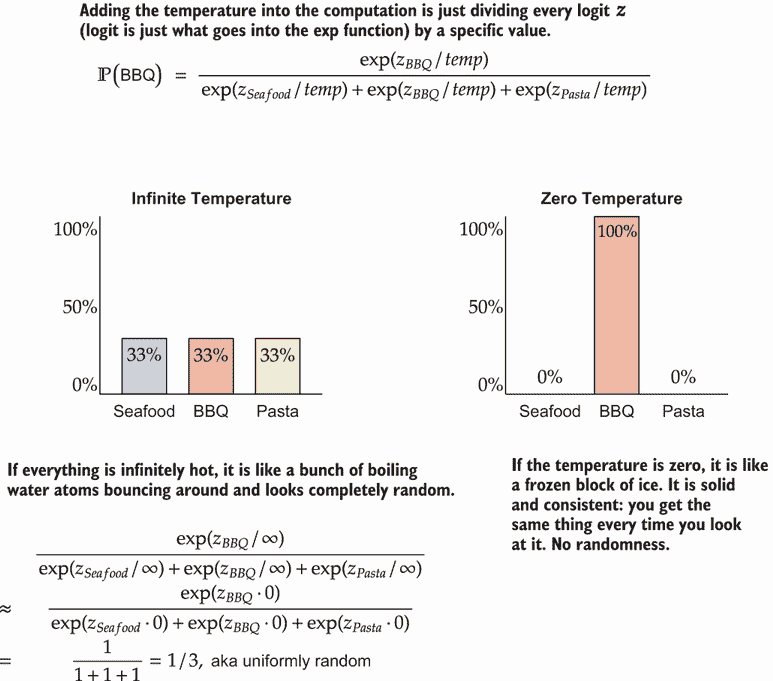

图 7.11 爱德华将吃什么？如果温度设置得非常高，爱德华的选择将是随机的，无论初始概率如何。如果温度为零或接近零，爱德华将总是选择烧烤，因为它比任何其他选项更有可能。温度越高 = 随机性越大，不允许有负温度。

而不是使用这些极端值，我们可以通过将温度设置为略大于或略小于 `1.0` 的值来专注于添加一个小效果。`temperature=1.0` 的默认值不会改变概率，因此与我们已经做的事情相同：计算原始概率并根据这些概率采样预测。但如果你使用 `temperature < 1`，那么原本有更大选择机会的项目（如烧烤）将获得更大的优势并增加其概率（想想，“富者愈富”）。如果我们使 `temperature > 1`，我们最终会给低概率项目更多的选择机会，这将以原本更高的概率为代价。温度的影响总结在图 7.12 的例子中，展示了选择下一顿饭的概率。

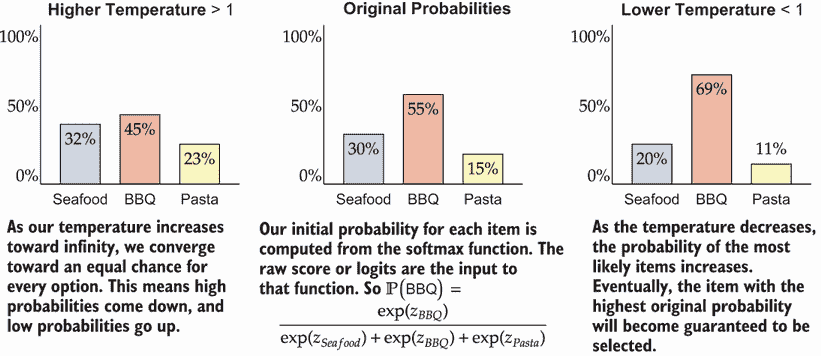

图 7.12 温度如何影响选择下一顿饭的概率的例子。我默认最有可能吃烧烤，因为它很美味。提高温度鼓励多样性，最终在极端最低温度（零）时随机选择每个项目。降低温度减少多样性，最终在极端最高可能温度（趋向无穷大）时只选择最有可能的原始项目。

在实践中，0.75 的值是一个很好的默认值⁵（我通常看到最低端是 0.65，高端是 0.8），因为它保持了多样性但避免了选择原本不太可能的项目（例如，烧烤是我最喜欢的食物类别，但一些多样性对你有好处，也更现实）。以下代码将温度添加到采样过程中：

```
cur_len = len(seed) 
temperature = 0.75                          ❶ 
for i in tqdm(range(cur_len, sampling.size(1))): 
    with torch.no_grad(): 
        h = autoReg_model(sampling[:,0:i]) 
        h = h[:,-1,:]                       ❷ 
        h = F.softmax(h/temperature, dim=1) ❸ 
        next_tokens = torch.multinomial(h, 1) 
        sampling[:,i] = next_tokens

        cur_len += 1
```

❶ 主要添加：控制温度和我们的采样行为

❷ 获取最后一步

❸ 制作概率

为什么叫温度为温度？

你应该遵循的类比是一个水壶，温度实际上是水的温度。如果温度非常高，水开始沸腾，水分子在四处弹跳时处于随机位置。随着温度的降低，水开始结冰，原子保持静止，形成有序的图案。高温 = 混乱（读作，随机），低温是静止的（读作，没有随机性）。

如果我们打印出我们的预测，我们应该看到一些感觉稍微更合理的东西。它并不完美，一个更大的模型和更多的训练轮次可以帮助提高这一点。但添加一个 `temperature` 是一个常见的技巧，有助于控制生成过程：

```
s = [indx2vocab[x] for x in sampling.cpu().numpy().flatten()]
print("".join(s))

emilia:
therefore good i am to she prainns siefurers. 

king ford:
beor come, sir, i chaed 
to me, the was the strong arl and the boy fear mabber lord,, 
coull some a clock dightle eyes, agaary must her was flord but the hear fall 
the cousion a tarm:
i am a varstiend the her apper the service no that you shall give yet somantion, 
and lord, and commind cure, i why had they helbook. 

mark ars:
who her throw true in go speect proves of the wrong and further gooland, before 
but i am so are berether, i
```

所以你可能想，为什么不进一步降低温度呢？我们难道不应该**总是**选择最可能的预测吗？这涉及到一些关于评估生成和自回归模型难度的深层次问题，尤其是在输入类似于人类文本的情况下，这种文本一开始就并不那么可预测。如果我告诉你我能**完美**预测某人将要说什么，你可能会感到难以置信。这怎么可能呢？我们应该始终对我们的模型应用同样的标准。如果我们**总是**选择最可能的预测，我们就是在假设模型可以**完美**预测一个人接下来会说什么。我们可以通过将温度设置为非常低的值（如 0.05）来尝试这一点：

```
cur_len = len(seed) 
temperature = 0.05                          ❶ 
for i in tqdm(range(cur_len, sampling.size(1))): 
    with torch.no_grad(): 
        h = autoReg_model(sampling[:,0:i]) 
        h = h[:,-1,:]                       ❷ 
        h = F.softmax(h/temperature, dim=1) ❸ 
        next_tokens = torch.multinomial(h, 1) 
        sampling[:,i] = next_tokens

        cur_len += 1 
s = [indx2vocab[x] for x in sampling.cpu().numpy().flatten()] 
print("".join(s))

emilia:
i will straight the shall shall shall be the with the shall shall shall shall 
be the with the shall be the with the shall shall shall be the shall shall 
shall she shall shall shall shall shall be the with the shall shall shall 
shall be the shall be the shall shall shall shall shall shall shall shall be 
the prove the will so see and the shall be the will the shall shall shall 
shall shall shall be the with the shall shall shall shall be the shall be the 
with the shall shall shall be the wi
```

❶ 非常低的温度：几乎总是选择最可能的项

❷ 获取最后一个时间步

❸ 计算概率

该模型已经变得**非常**重复。当你选择最可能的标记作为下一个时，通常会发生这种情况；模型会退化到反复选择最常见的单词/标记的序列。

温度的热门替代品

调整温度只是选择更逼真的生成输出方式的可能技术之一。每种技术都有其优缺点，但你应该了解三种替代方案：束搜索、top-k 采样和核采样。Hugging Face 的团队有一篇很好的博客文章，从高层次介绍了这些方法（[`huggingface.co/blog/how-to-generate`](https://huggingface.co/blog/how-to-generate))。

### 7.5.4  更快的采样

你可能已经注意到采样过程需要的时间出奇地长——大约 45 到 50 秒才能生成 500 个字符——然而我们只需在每次 epoch 中几秒钟内就能训练超过 10 万个字符。这是因为每次我们做出预测时，我们需要将整个生成的序列重新输入到模型中，以获取下一个预测。使用大 O 符号表示，我们正在做**O**(*n*²)的工作来生成一个**O**(*n*)长度的序列。

处理序列的每个步骤的`GRUCell`使得我们能够轻松解决这个问题。我们将`for`循环分成两部分，每部分直接使用`step`函数而不是模块的`forward`函数。第一个循环将种子推入模型，更新一个明确创建的隐藏状态集合`h_prevs`。之后，我们可以编写一个新的循环来生成新内容，并在采样下一个字符后调用`step`函数来更新模型。这个过程在以下代码中展示：

```
seed = "EMILIA:".lower()                             ❶ 
cur_len = len(seed) 

sampling = torch.zeros((1, 500), dtype=torch.int64, device=device) 
sampling[0,0:cur_len] = torch.tensor([vocab2indx[x] for x in seed]) 

temperature = 0.75                                   ❷ 
with torch.no_grad(): 
    h_prevs = autoReg_model.initHiddenStates(1)      ❸ 
    for i in range(0, cur_len):                      ❹
        h = autoReg_model.step(sampling[:,i], h_prevs=h_prevs) 
    for i in tqdm(range(cur_len, sampling.size(1))): ❺ 
        h = F.softmax(h/temperature, dim=1)          ❻ 
        next_tokens = torch.multinomial(h, 1) 
        sampling[:,i] = next_tokens 
        cur_len += 1 h = autoReg_model.step(sampling[:,i], 
        h_prevs=h_prevs)                             ❼
```

❶ 设置我们的种子和存储生成内容的存储位置

❷ 选择温度

❸ 初始化隐藏状态以避免重复工作

❹ 将种子推入

❺ 逐个字符生成新文本

❻ 计算概率

❼ 现在只将新的样本推入模型

这段新代码的运行时间不到一秒。这要快得多，而且随着我们想要生成的序列越长，它运行得越快，因为它具有更好的 Big O 复杂度*O*(*n*)来生成*O*(*n*)个标记。接下来我们打印出生成的结果，你可以看到它从本质上与之前相同：

```
s = [indx2vocab[x] for x in sampling.cpu().numpy().flatten()]
print("".join(s))

emilia:
a-to her hand by hath the stake my pouse of we to more should there had the 
would break fot his good, and me in deserved 
to not days all the wead his to king; her fair the bear so word blatter with 
my hath thy hamber--

king dige:
it the recuse. 

mark:
wey, he to o hath a griec, and could would there you honour fail; 
have at i would straigh his boy:
coursiener:
and to refore so marry fords like i seep a party. or thee your honour great 
way we the may her with all the more ampiled my porn
```

因此，你现在已经了解了自动编码器和自回归模型的所有基础知识，这两种相关的方法共享相同的基本思想：使用输入数据作为目标输出。这些技术可以特别强大，可以模拟/替换昂贵的模拟（让网络学习预测接下来会发生什么），清理噪声数据（注入真实的噪声并学习如何去除它），并且通常在没有标记数据的情况下训练有用的模型。后者的说明将在第十三章中变得重要，当你学习如何进行迁移学习时，这是一种允许你使用未标记数据来改进较小标记数据集上的结果的技术。

## 练习

在 Manning 在线平台 Inside Deep Learning Exercises ([`liveproject.manning.com/project/945`](https://liveproject.manning.com/project/945))上分享和讨论你的解决方案。一旦你提交了自己的答案，你将能够看到其他读者提交的解决方案，并看到作者认为哪些是最好的。

1.  创建一个新的 MNIST 数据集版本，其中不包含数字 9 和 5，并在该数据集上训练一个自动编码器。然后在该测试数据集上运行自动编码器，并记录每个 10 个类别的平均误差（均方误差）。你在结果中看到任何模式吗？自动编码器能将 9 和 5 识别为异常值吗？

1.  使用目标大小*D*′ = 64 维度的瓶颈式自动编码器进行训练。然后使用 k-means ([`scikit-learn.org/stable/modules/clustering.html#k-means`](https://scikit-learn.org/stable/modules/clustering.html#k-means))在原始版本的 MNIST 和使用*D*′ = 64 维度编码的版本上创建*k* = 10 个聚类。使用 scikit-learn 中的同质性得分 ([`mng.bz/nYQV`](http://mng.bz/nYQV))来评估这些聚类。哪种方法表现最好：原始图像上的 k-means 还是编码表示上的 k-means？

1.  使用去噪方法实现去噪卷积网络。这可以通过不执行任何池化操作来实现，这样输入的大小保持不变。

1.  有时人们会在编码器和解码器之间共享权重的情况下训练深度自动编码器。尝试实现一个使用`TransposeLinear`层的所有解码器层的深度瓶颈自动编码器。当只有 n=1,024、8,192、32,768 和 MNIST 的所有 60,000 个样本时，比较共享权重与不共享权重的网络。

1.  **挑战性任务:** 为 MNIST 训练一个非对称去噪自编码器，其中编码器是一个全连接网络，解码器是一个卷积网络。*提示:* 您需要在编码器末尾添加一个 `View` 层，该层将形状从 (*B*,*D*) 改变为 (*B*,*C*,28,28)，其中 D 是编码器中最后一个 `nn.LinearLayer` 的神经元数量，*D* = *C* ⋅ 28 ⋅ 28。这个网络的结果比章节中的全连接网络好还是差，您认为架构的混合如何影响这个结果？

1.  **挑战性任务:** 将 MNIST 数据集重塑为像素序列，并在像素上训练一个自回归模型。这需要使用实值输入和输出，因此您将不会使用 `nn.Embedding` 层，并且您需要切换到 MSE 损失函数。训练后，尝试从这个自回归像素模型生成多个数字。

1.  将自回归模型中的 `GRUCell` 转换为 `LSTMCell`，并训练一个新的模型。你认为哪个模型的生成输出更好？

1.  `AutoRegressiveDataset` 可以从句子中间开始输入，因为它天真地抓取输入的子序列。编写一个新版本，它只在新行的开始处（即换行符‘\n’之后）选择序列的开始，然后返回下一个 `max_chunk` 个字符（如果块之间有重叠是可以的）。在这个数据集的新版本上训练一个模型。你认为这会改变生成输出的特征吗？

1.  在对句子进行自回归模型训练后，使用 `LastTimeStep` 类提取代表每个句子的特征向量。然后将这些向量输入到您喜欢的聚类算法中，看看您是否可以找到任何具有相似风格或类型的句子组。*注意:* 您可能需要子采样更少的句子以使聚类算法运行更快。

## 摘要

+   自我监督是一种通过使用输入的一部分 *作为我们试图预测的标签* 来训练神经网络的方法。

+   自我监督被认为是无监督的，因为它可以应用于任何数据，并且不需要任何过程或人类手动标记数据。

+   自编码是自我监督最受欢迎的形式之一。它通过让网络预测输入作为输出，但以某种方式约束网络，使其不能天真地返回原始输入。

+   两种流行的约束是瓶颈设计，它强制维度在扩展回之前缩小，以及去噪方法，其中在输入被提供给网络之前改变输入，但网络仍然必须预测未改变输出。

+   如果我们有一个序列问题，我们可以使用自回归模型，这些模型查看序列中的每个先前输入来预测下一个输入。

+   自回归方法的好处是它是 *生成性的*，这意味着我们可以从模型中创建合成数据！

* * *

¹ *潜在*通常指的是那些（不易）可见但确实存在且/或可以增强的事物。例如，潜在感染存在但没有症状，所以你看不见它。但如果不治疗，它将出现并变得更加明显。在我们这个语境中，“潜在”幸运地并没有那么可怕。↩

² 技术上，这意味着我们不是在学习 PCA 算法——但我们正在学习与它非常相似的东西。足够接近就是好的。↩

³ E. Raff, “神经指纹增强”，在 *第 17 届 IEEE 国际机器学习与应用会议（ICMLA）*，2018 年，第 118–124 页，https://doi.org/10.1109/ICMLA.2018.00025。↩

⁴ 如果你想要通过文本数据最大化你的结果，你应该查找“主题建模”算法。有深度主题模型，但它们超出了我们在这本书中涵盖的范围。话虽如此，我见过有人用这种自回归方法取得了相当的成功，这种方法比主题模型更灵活，更适合新的情况和数据类型。↩

⁵ 这是对文本生成的一个很好的默认设置。其他任务可能需要你调整温度以选择更好的值。↩
