# 8 目标检测

本章涵盖

+   对每个像素进行预测

+   与图像分割一起工作

+   使用转置卷积放大图像

+   使用 Faster R-CNN 进行目标检测的边界框

+   过滤结果以减少误报

想象一下：你想要构建一个系统，用来统计公园里不同种类的鸟。你将相机对准天空，对于照片中的每只鸟，你都想知道它的物种名称。但是，如果图片中没有鸟？或者只有 1 只？或者 12 只？为了适应这些情况，你需要首先检测图像中的每只鸟，然后对检测到的每只鸟进行分类。这个两步过程被称为*目标检测*，它有多种形式。广义上，它们都涉及识别图像的子组件。因此，系统不是对每张图像生成一个预测，这是我们迄今为止模型所做的那样，而是从单张图像生成多个预测。

即使通过数据增强、更好的优化器和残差网络进行改进，我们之前构建的图像分类模型都假设图像是期望的类别。通过这种方式，我们的意思是图像内容与训练数据匹配。例如，我们的 MNIST 模型假设图像*总是*包含一个数字，而这个数字是 0 到 9 之间的一个。我们的普通 CNN 模型根本不具备图像可能是空的或包含多个数字的概念。为了处理这些情况，我们的模型需要能够检测单张图像中包含的内容，以及这些内容在图像中的位置。目标检测就是解决这个问题的方法。

在本章中，我们将学习两种用于目标检测任务的方法。首先，我们深入了解*图像分割*，这是一种成本较高但较为简单的方法。类似于第七章中自回归模型对序列中的每个项目进行预测，图像分割对图像中的每个像素进行预测。图像分割成本较高，因为你需要有人为图像中的每个单独像素进行标注。这种成本往往可以通过结果的有效性、实现分割模型的可操作性以及需要这种程度细节的应用来证明其合理性。为了提高图像分割，我们学习了*转置卷积*操作，它允许我们撤销池化操作的缩小效果，这样我们就可以获得池化的好处，同时仍然可以在每个像素上进行预测。有了这个，我们构建了一个名为*U-Net*的基础架构，它已成为图像分割的事实上的设计方法。

本章的后半部分超越了逐像素预测，转向了可变数量的预测。这是通过一个不太精确但标注成本也较低的选择实现的：基于**边界框**的对象检测。边界框标签是刚好足够大的框，可以捕捉到图像中整个对象。这更容易标注：你只需要点击并拖动一个框（有时可能比较粗糙）围绕对象。但是，有效的对象检测模型难以实现且训练成本高昂。由于从头开始实现对象检测非常具有挑战性，我们学习了 PyTorch 内置的基于**区域提议**的检测器。区域提议方法被广泛使用且易于获取，因此我们涵盖了其**如何**工作的细节，这些细节可以推广到其他方法。我们将跳过那些使特定实现变得复杂的细节，但如果你想了解更多，我会提供参考。

## 8.1 图像分割

图像分割是寻找图像中对象的一种简单方法。图像分割是一个分类问题，但与我们对 MNIST 所做的方法不同，我们是对**每个像素**进行分类。因此，一个 200 × 200 的图像将有 200 × 200 = 40,000 次分类。图像分割任务中的类别通常是我们可以检测到的不同类型的对象。例如，图 8.1 中的图像有一个马、一个人和一些汽车作为类别对象。


图 8.1 展示了来自 PASCAL VOC 2012 数据集的输入图像（左侧）和分割后的真实标签（右侧）。每个像素都被赋予了一个类别，对于不属于标记对象的像素，默认为“无类别”或“背景”类别。

目标是生成**真实标签**，其中**每个像素**都被分类为属于人、马、汽车或背景。我们有一个具有四个独特类别的分类问题；碰巧单个输入涉及到做出许多预测。因此，如果我们有一个 128 × 128 的图像，我们就需要进行 128² = 16,384 次分类。

如果我们能够成功分割图像，那么我们可以执行对象检测。对于图 8.1，我们可以找到连接在一起的粉红色像素块（person blob），以确定图像中存在人，以及他们在图像中的位置。分割也可以是目的本身。例如，医学¹医生可能想要识别细胞活检图像中肿瘤细胞的百分比，以确定某人的癌症是如何进展的（比之前更大的百分比意味着它在增长并变得更糟；更小的百分比意味着癌症正在缩小，治疗正在起作用）。在医学研究中，另一个常见的任务是手动标记图像中不同类型细胞的数量，并使用细胞类型的相对数量来确定患者的整体健康状况或其他医疗属性。在这些任务中，我们不仅想知道对象在哪里：我们还想知道它们在图像中的确切大小以及它们之间的相对比例。

图像分割的任务是使用卷积神经网络的一个绝佳机会。卷积神经网络（CNN）被设计用来对输入的局部区域产生*局部*输出。因此，我们设计图像分割网络的战略将使用卷积层作为输出层，而不是像之前那样使用`nn.Linear`层。当我们设计一个只包含卷积层（以及非线性层和归一化层）的网络时，我们称这样的网络为*全卷积网络*。²

### 8.1.1 核检测：加载数据

对于我们对图像分割的第一次介绍，我们将使用 2018 年数据科学 Bowl（[`www.kaggle.com/c/data-science-bowl-2018`](https://www.kaggle.com/c/data-science-bowl-2018)）的数据。这个竞赛的目标是检测细胞核及其相应的大小。但我们现在只是对图像进行分割。我们将下载这个数据集，为这个问题设置一个`Dataset`类，然后指定一个全卷积网络来对整个图像进行预测。当你下载数据并解压时，所有文件都应该在 stage1/train 文件夹中。

数据被组织成多个路径。所以如果我们有路径/文件夹 data0，那么在路径 data0/images/some_file_name.png 中可以找到显微镜下的细胞图像。对于图像中的每一个细胞核，在 data0/masks/name_i.png 下都有一个文件。`Dataset`对象加载这些文件，这样我们就可以开始工作了。为了简化当前的工作，我们在`Dataset`类中进行了某些归一化和准备。我们移除了这些图像附带的一个 alpha 通道（通常用于透明图像），重新排列通道，使其成为 PyTorch 喜欢的第一个维度，并计算每个输入的标签。我们准备这些数据的方式总结在图 8.2 中。

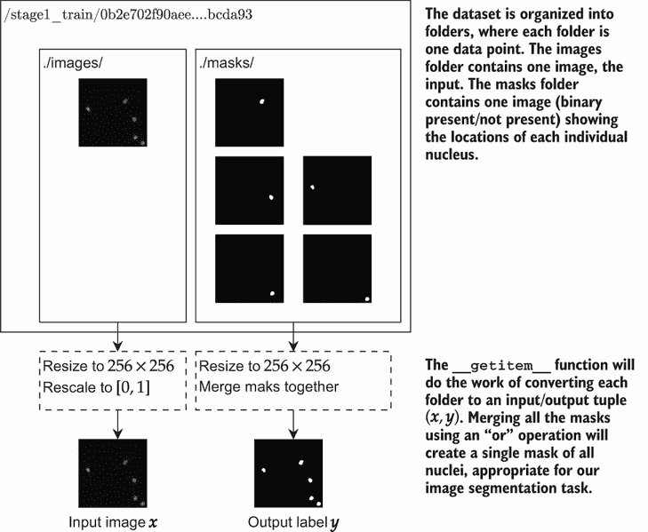

图 8.2 这是我们处理数据科学 Bowl 数据以进行图像分割的方式。根目录下的每个文件夹都有几个子文件夹：一个包含一个图像的 images 文件夹（我知道，有点混乱）和一个包含每个核的二进制 mask 的 masks 文件夹。mask 被分开用于对象检测（我们稍后会讨论），因此我们将它们全部合并到一个图像中，该图像指示 mask 的位置（类别 1）和不存在的位置（类别 0）。

子目录中的所有图像尺寸完全相同，如图 8.2 所示，但它们在不同目录之间的大小不同。因此，为了简化问题，我们将所有内容调整到 256 × 256。这样，我们就不必担心填充图像以使它们具有相同的大小。为了构建标签，我们希望有一个形状相同的图像，其中 0 表示无类别或 1 表示存在核。我们可以通过将每个图像转换为名为*mask*的二进制值数组来实现这一点，其中 1 = `True` = 核存在。然后我们可以在 mask 上执行逻辑`or`操作，以获得一个最终 mask，其中每个核存在的像素都有一个 1。

以下代码是 2018 年数据科学 Bowl 数据集的类。我们的`Dataset`类遍历每个 mask 并将它们`or`在一起，以便我们得到一个显示包含所有对象的像素的单个 mask。这是在`__getitem__`中完成的，它返回一个包含输入图像和我们要预测的 mask（即包含核的所有像素）的元组：

```
class DSB2018(Dataset): 
    """Dataset class for the 2018 Data Science Bowl.""" 
    def __init__(self, paths): 
        """paths: a list of paths to every image folder in the dataset""" 
        self.paths = paths 
      def __len__(self):
        return len(self.paths) 
      def __getitem__(self, idx): 
        img_path = glob(self.paths[idx] + "/images/*")[0]  ❶ 
        mask_imgs = glob(self.paths[idx] + "/masks/*")     ❷ 
        img = imread(img_path)[:,:,0:3]                    ❸ 
        img = np.moveaxis(img, -1, 0)                      ❹ 
        img = img/255.0                                    ❺ 

        a _different_ nuclei/ masks = [imread(f)/255.0     ❻ 
        for f in mask_imgs]

        final_mask = np.zeros(masks[0].shape)              ❼ 
        for m in masks: final_mask = np.logical_or(final_mask, m) final_mask =
        final_mask.astype(np.float32)

        img, final_mask = torch.tensor(img), 
        torch.tensor(final_mask).unsqueeze(0)               ❽

        img = F.interpolate(img.unsqueeze(0), (256, 256))   ❾ 
        final_mask = F.interpolate(final_mask.unsqueeze(0), (256, 256))

        return img.type(torch.FloatTensor)[0],              ❿
        final_mask.type(torch.FloatTensor)[0]
```

❶ 每个 images 路径中只有一个图像，所以我们通过[0]在末尾找到我们找到的第一个东西。

❷ 但每个 mask 路径中都有多个 mask 图像。

❸ 图像形状为(W, H, 4)。最后一个维度是一个未使用的 alpha 通道。我们剪掉 alpha 以获得(W, H, 3)。

❹ 我们希望它是(3, W, H)，这是 PyTorch 的正常形状。

❺ 图像的最后一步：将其缩放到范围[0, 1]。

❻ 每个 mask 图像的形状为(W, H)，如果像素是核，则其值为 1，如果图像是背景，则其值为 0。

❼ 由于我们只想进行简单的分割，我们创建一个包含每个 mask 中所有核像素的最终 mask。

❽ 数据集中的每个图像大小并不相同。为了简化问题，我们将每个图像调整大小为(256, 256)。首先，我们将它们转换为 PyTorch 张量。

❾ 可以使用 interpolate 函数来调整一批图像的大小。我们将每个图像变成一个“批次”1。

❿ 形状为(B=1, C, W, H)。我们需要将它们转换回 FloatTensors 并获取批次中的第一个项目。这将返回一个包含(3, 256, 256)，(1, 256, 256)的元组。

### 8.1.2 在 PyTorch 中表示图像分割问题

现在我们已经可以加载数据集了，让我们可视化一些数据。语料库包含来自各种来源的细胞图像：一些看起来像是黑白图像，而另一些则使用了染料而具有颜色。下面的代码块加载数据，并在左侧显示原始图像，在右侧显示显示所有核精确位置的 mask：

```
    dsb_data = DSB2018(paths)                        ❶
    plt.figure(figsize=(16,10)) 
    plt.subplot(1, 2, 1)                             ❷

    plt.imshow(dsb_data[0][0].permute(1,2,0).numpy())

    plt.subplot(1, 2, 2)                             ❸
    plt.imshow(dsb_data[0][1].numpy()[0,:], cmap=’gray’)

[7]: <matplotlib.image.AxesImage at 0x7fd24a8a5350>
```

❶ 创建 Dataset 类对象

❷ 绘制原始图像

❸ 绘制掩码

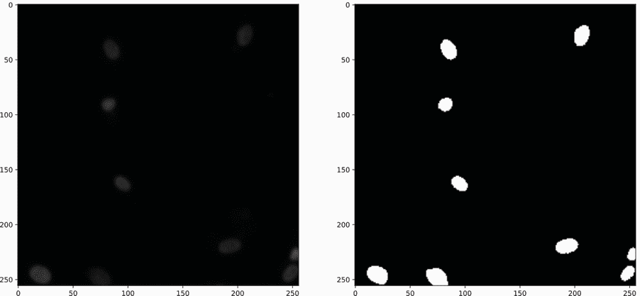

```
    plt.figure(figsize=(16,10)) ❶     plt.subplot(1, 2, 1) 
    plt.imshow(dsb_data[1][0].permute(1,2,0).numpy()) 
    plt.subplot(1, 2, 2) 
    plt.imshow(dsb_data[1][1].numpy()[0,:], cmap=’gray’)

[8]: <matplotlib.image.AxesImage at 0x7fd24a7eb6d0>
```

❶ 让我们绘制一个彩色的第二张图像。

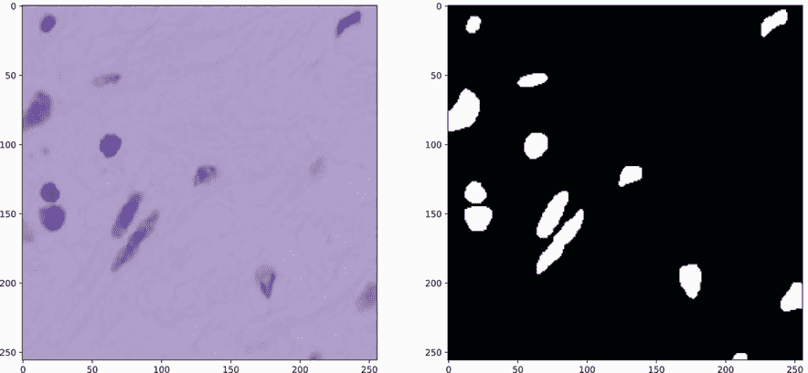

如我们所见，存在许多类型的输入图像切片。有些有很多细胞核，有些很少，细胞核可以彼此靠近或相隔很远。让我们快速创建训练和测试分割，使用较小的 16 图像批次大小来工作。我们使用较小的批次，因为这些图像较大——256 × 256 而不是仅仅 28 × 28——并且我想确保即使 Colab 给你较小的实例，批次也能适合你的 GPU：

```
train_split, test_split = torch.utils.data.random_split(dsb_data,
➥ [500, len(dsb_data)-500])
train_seg_loader = DataLoader(train_split, batch_size=16, shuffle=True)
test_seg_loader = DataLoader(test_split, batch_size=16)
```

由于这些是彩色图像，我们使用 *C* = 3 个通道作为输入：红色、绿色和蓝色。我随意选择了 32 个过滤器用于我们的卷积层。以下代码中的最后一个设置项是使用 `BCEWithLogitLoss` 而不是 `CrossEntropyLoss`。名称中的 `BCE` 部分代表 *二元* 交叉熵。它是 `CrossEntropyLoss` 的一个特殊版本，仅适用于双类问题。因为我们 *知道* 只有两个类别（细胞核和背景），所以我们的网络输出可以是一个像素一个神经元，用于是/否风格的预测。如果我们使用 `CrossEntropyLoss`，我们每个像素就需要两个输出，这对我们的代码来说有点难看：

```
C = 3                              ❶ 
n_filters = 32                     ❷ 
loss_func = nn.BCEWithLogitsLoss() ❸
```

❶ 输入中有多少个通道？

❷ 通常应该考虑的最小过滤器值。如果我们想尝试优化架构，我们可以使用 Optuna 来选择更好的过滤器数量。

❸ BCE 损失隐式地假设了一个二元问题。

注意：当你只有两个类别时，使用 `BCEWithLogitLoss` 和 `CrossEntropyLoss` 的二元交叉熵会收敛到相同的结果。它们在 *数学上等价*，所以选择是编码偏好。我更喜欢在双类问题上使用 `BCEWithLogitLoss`，因为它让我一看到损失函数就清楚我在处理二元输出/预测，这让我对问题有更多的了解。一般来说，给你的类别命名并以告诉你在代码中发生什么的方式编写代码是好的。在某个时候，你将不得不回过头来看你以前写的旧代码，这些细节将帮助你记住发生了什么。

### 8.1.3  构建我们的第一个图像分割网络

因为我们需要对每个像素进行预测，所以我们的网络输出 *f*(⋅) 必须具有与原始输入相同的高度和宽度。因此，如果我们的输入是 (*B*, *C*, *W*, *H*)，我们的输出需要是 (*B*, *class*, *W*, *H*)。通道数可以根据类别的数量而改变。一般来说，我们将为每个可以预测输入的类别有一个通道。在这种情况下，我们有两个类别，因此我们可以使用一个输出通道与二元交叉熵损失。因此，我们有一个形状为 (*B*, 1, *W*, *H*) 的输出。如果我们以只有一个滤波器的卷积层结束我们的网络，我们的模型最终输出将只有一个通道。因此，我们使用卷积层作为最后一层。

保持相同的 W 和 H 值的最简单方法是永远不使用池化，并且始终使用填充，以便输出与输入大小相同。记住，从第三章中，使用大小为 k 的滤波器意味着设置填充 = ⌊*k*/2⌋ 将确保输出的高度和宽度与输入相同。我们也在定义我们的网络时使用这个约束。

以下代码将这两个选择结合到一个简单的神经网络中。它遵循我们通常的模式，即重复卷积、归一化和非线性：

```
def cnnLayer(in_filters, out_filters, kernel_size=3):      ❶ 
    """
    in_filters: how many channels are in the input to this layer 
    out_filters: how many channels should this layer output 
    kernel_size: how large should the filters of this layer be 
    """ 
    padding = kernel_size//2
    return nn.Sequential( 
        nn.Conv2d(in_filters, out_filters, kernel_size, padding=padding), 
        nn.BatchNorm2d(out_filters), 
        nn.LeakyReLU(),                                    ❷
)

segmentation_model = nn.Sequential(                        ❸ 
    cnnLayer(C, n_filters),                                ❹
    *[cnnLayer(n_filters, n_filters) for _ in range(5)],   ❺
    nn.Conv2d(n_filters, 1, (3,3), padding=1),             ❻ 
) 
seg_results = train_network(segmentation_model, 
➥ loss_func, train_seg_loader, epochs=10, 
➥ device=device, val_loader=test_seg_loader)              ❼
```

❶ 定义我们的辅助函数，该函数为 CNN 创建一个隐藏层

❷ 我们没有设置泄漏值，以使代码更短。

❸ 指定一个用于图像分割的模型

❹ 第一层将通道数更改为大数。

❺ 创建了五个额外的隐藏层

❻ 对每个位置进行预测。我们使用一个通道，因为我们有一个二元问题，并且使用 BCEWithLogitsLoss 作为我们的损失函数。现在的形状是 (1, W, H)。

❷ 训练分割模型

现在我们已经训练了一个模型，让我们直观地检查一些结果。以下代码显示了如何从测试数据集中抓取一个项目，将其通过模型传递，并得到一个预测。由于我们使用二元交叉熵损失，我们需要使用 `torch.sigmoid` (σ) 函数将原始输出（也称为 *logits*）转换为正确的形式。记住，sigmoid 将所有内容映射到 [0,1] 的范围内，因此阈值为 0.5 告诉我们是否应该选择“存在核”或“不存在”的最终答案。然后我们可以绘制结果，显示图像的原始输入（左）、真实值（中）和预测（右）：

```
    index = 6                                                       ❶ 

    with torch.no_grad():                                           ❷ 
        logits = segmentation_model(test_split[index][0].           ❸
        ➥ unsqueeze(0).to(device))[0].cpu() 
        pred = torch.sigmoid(logits) >= 0.5                         ❹

    plt.figure(figsize=(16,10))                                     ❺ 
    plt.subplot(1, 3, 1) 
    plt.imshow(test_split[index][0].permute(11,2,0).numpy(),        ❻
    ➥ cmap=’gray’) 
    plt.subplot(1, 3, 2) 
    plt.imshow(test_split[index][1].numpy()[0,:], cmap=’gray’)      ❼
    plt.subplot(1, 3, 3) plt.imshow(pred.numpy()[0,:], cmap=’gray’) ❽

[12]: Text(-240, -50, 'Error: Phantom object')
```

❶ 从数据集中选择一个特定示例，以显示特定结果。将其更改为查看数据集的其他条目。

❷ 如果我们不进行训练，我们不希望有梯度，所以请不要梯度！

❸ 将测试数据点推入模型。记住，原始输出称为 logits。

❹ 将 σ 应用到 logits 以进行预测，然后应用阈值以获得预测掩码。

❺ 绘制输入、真实值和预测。

❻ 首先绘制网络的原始输入。

❷ 第二是真实值。

❽ 第三是网络做出的预测。

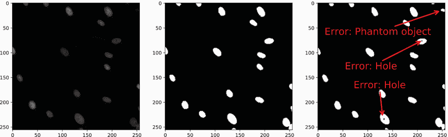

总体来说，结果非常好。我们甚至正确地处理了大部分字面意义上的边缘情况（图像边界的核）。出现在图像边缘的对象通常更难正确预测。但也有一些错误：对于非常大的核，我们的分割模型在错误的位置放置了一个不属于那里的洞。我们还检测到了一些不存在的核。我用红色箭头标注了输出结果以突出这些错误。

部分问题可能在于我们网络的感受野太小，无法准确处理大型核。对于每一层的卷积，*最大范围*增加⌈*k*/2⌉。由于我们有六个卷积层，这仅使我们获得 2⋅6=12 像素的宽度。虽然简单的方法是添加更多层或增加卷积的宽度，但这些可能会变得昂贵。其中一个原因可能是因为我们从未进行过任何池化，所以每次我们添加一层或加倍滤波器的数量，我们都会增加我们方法使用的总内存。

## 8.2 扩展图像大小的转置卷积

我们更倾向于以某种方式使用池化，以便我们获得较小输出（更少内存）和较大感受野的好处，然后稍后*扩展回*更大的形式。我们可以通过所谓的*转置卷积*来实现这一点。在正常卷积中，*一个输出*的值由*多个输入*决定。因为每个输出有多个输入，所以输出*小于*输入，因此每个输出都得到其全部贡献。关于转置卷积的一个简单思考方式是想象*一个输入*对*多个输出*做出贡献。这如图 8.3 所示，应用于一个小 2×2 图像。因为转置版本有一个输入对应多个输出，所以我们需要使输出*大于原始输入*，以便每个输入贡献的输出都得到表示。

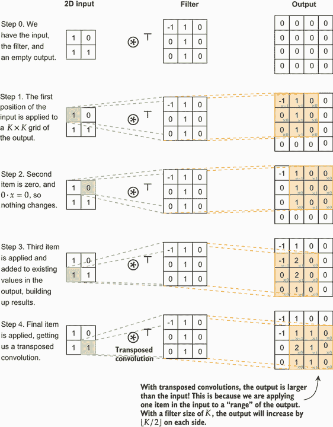

图 8.3 转置卷积的逐步计算。左侧的绿色区域显示了正在使用的输入部分，右侧的橙色显示了正在改变的输出部分。在每一步中，输入乘以滤波器并加到给定位置的输出上。因为输入按滤波器的大小扩展，所以输出的尺寸大于输入。

图 8.4 展示了顶部卷积和底部转置卷积的示例。两者都在各自的模式中使用相同的图像和滤波器。就像常规卷积一样，转置版本将每个位置的贡献相加以达到最终值。因此，请注意，用红色虚线框显示的*内部*区域在常规和转置卷积之间有*相同*的结果。区别在于我们如何解释边界情况：常规卷积缩小，而转置卷积扩展。每个转置卷积都有一个等效的常规卷积，只是改变了应用的一些填充和其他参数。

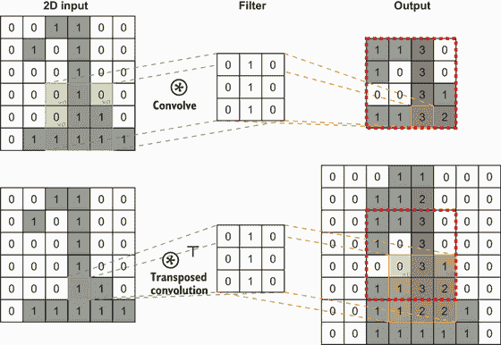

图 8.4 展示了在相同输入图像和相同滤波器作用下，常规卷积（顶部）和转置卷积（底部）的示例。常规卷积通过滤波器的大小缩小输出，而转置版本通过内核的大小扩展输出。

这里需要记住的重要一点是，转置卷积为我们提供了一种扩大尺寸的方法。特别是，我们可以添加一个*步长*来产生加倍效果，以抵消池化引起的减半效果。*步长*是在应用卷积时我们的滤波器滑动的距离。默认情况下，我们使用步长*s* = 1，这意味着我们每次滑动滤波器一个位置。图 8.5 展示了当我们使用步长*s* = 2 时会发生什么。常规卷积在*输入*上以 2 的步长前进，而转置卷积在*输出*上以 2 的步长前进。因此，步长 2 的*卷积减半了尺寸*，而步长 2 的*转置卷积加倍了尺寸*。

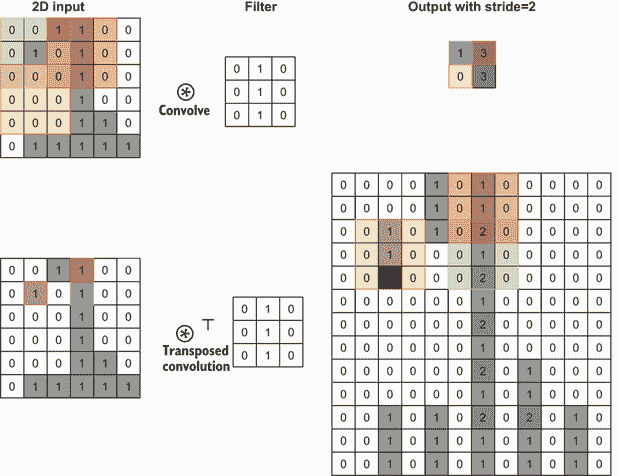

图 8.5 展示了步长*s* = 2 如何影响常规和转置卷积。阴影区域显示了输入/输出映射。对于卷积，输入移动滤波器两个位置，使输出更小。转置卷积仍然使用每个输入位置，但输出移动两个位置。

我们将转置卷积纳入架构的方式是，每隔几层，我们会进行一次池化。如果我们在一个 2×2 的网格中进行池化（标准做法），我们将模型的感受野宽度加倍。每次我们进行池化，我们最终会看到一个更高层次的图像视图。当我们达到网络的一半时，我们开始执行转置卷积以恢复到正确的尺寸。转置卷积之后的层给模型一个机会来细化高层次视图。类似于我们如何在上一个章节中设计我们的自编码器，我们使池化和转置轮次对称。

### 8.2.1 实现带有转置卷积的网络

使用转置卷积，我们可以扩展网络的输出，这意味着我们可以使用池化，然后在后面撤销宽度和高度的减少。让我们试一试，看看这能为我们的模型提供任何实际的价值。为了保持这些示例小且运行快速，我们只进行了一轮池化和转置卷积；但如果你做得更多，你可能会看到更好的结果。以下代码重新定义了我们的网络，包含一轮最大池化和随后的一轮转置卷积：

```
segmentation_model2 = nn.Sequential( 
    cnnLayer(C, n_filters),                           ❶
    cnnLayer(n_filters, n_filters), 
    nn.MaxPool2d(2),                                  ❷
    cnnLayer(n_filters, 2*n_filters), 
    cnnLayer(2*n_filters, 2*n_filters), 
    cnnLayer(2*n_filters, 2*n_filters), 

    nn.ConvTranspose2d(2*n_filters, n_filters, (3,3), ❸ 
    padding=1, output_padding=1, stride=2), 
    nn.BatchNorm2d(n_filters), 
    nn.LeakyReLU(), 
    cnnLayer(n_filters, n_filters),                   ❹ 
    nn.Conv2d(n_filters, 1, (3,3), padding=1),        ❺ 
)

seg_results2 = train_network(segmentation_model2, loss_func, 
➥ train_seg_loader, epochs=10, device=device, val_loader=test_seg_loader)
```

❶ 第一层将通道数增加到大量。

❷ 缩小高度和宽度各 2

❸ 将高度和宽度加倍，抵消单个 MaxPool2d 的效果

❹ 回到正常的卷积

❺ 每个位置的预测。形状现在是（B，1，W，H）。

现在我们已经训练了这个新模型，让我们用相同的数据来测试一下看看会发生什么：

```
    index = 6                                                            ❶ 

    with torch.no_grad():                                                ❷ 

    pred = segmentation_model2(test_split[index][0].                     ❸
    unsqueeze(0).to(device))[0].cpu() 
    pred = torch.sigmoid(pred) >= 0.5                                    ❹

    plt.figure(figsize=(16,10))                                          ❺ 
    plt.subplot(1, 3, 1) 

    plt.imshow(test_split[index][0].permute(1,2,0).numpy(), cmap=’gray’) ❻
    plt.subplot(1, 3, 2) 

    plt.imshow(test_split[index][1].numpy()[0,:], cmap=’gray’)           ❼ 
    plt.subplot(1, 3, 3) 

    plt.imshow(pred.numpy()[0,:], cmap=’gray’)                           ❽

[15]: <matplotlib.image.AxesImage at 0x7fd24804e1d0>
```

❶ 与之前相同的示例

❷ 如果我们不进行训练，我们不想有梯度，所以请不要梯度！

❸ 将测试数据点推过模型。原始输出称为 logits。

❹ 将σ应用于 logits 以进行预测，然后应用阈值以获得预测掩码

❺ 绘制输入、真实值和预测值

❻ 首先绘制网络的原输入

❼ 第二个是真实值

❽ 第三个是我们网络做出的预测

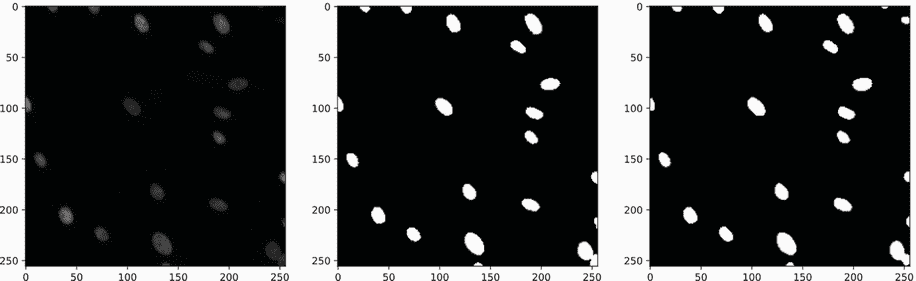

漏洞已经修补；核对象检测显示了漂亮的白色区域。网络在处理一些边缘情况时也做得稍微好一些。在较小的表示（池化后的轮次）上工作有助于鼓励输出中更柔和、更平滑的掩码。但我们绝不能只看一张图片就决定我们是否有所改进，所以让我们检查验证损失：

```
    sns.lineplot(x=’epoch’, y=’val loss’, data=seg_results, label=’CNN’) 
    sns.lineplot(x=’epoch’, y=’val loss’, data=seg_results2, 
    ➥ label=’CNN w/ transposed-conv’)

[17]: <AxesSubplot:xlabel='epoch', ylabel='val loss'>
```

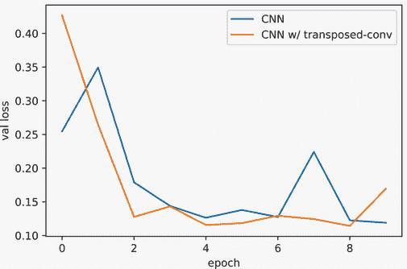

根据验证误差，我们总体上比之前做得*稍微*好一些。同样重要的是学习速度，我们可以看到这种方法能够在更少的训练轮次中更快地取得进展。这种更快的学习是一个重要的好处，随着我们处理更难、更大的问题，其重要性也在增长。

## 8.3 U-Net：观察细粒度和粗粒度细节

目前，我们有两种方式来建模图像分割问题。第一种方法，来自第 8.1 节，没有使用池化，执行了许多轮卷积层。这使得一个模型可以观察微小的细粒度细节，但可能会真的错过森林中的树木。

第二种，来自第 8.2 节，使用多轮最大池化，然后在架构的末尾使用转置卷积层。你可以将这种方法视为逐步查看图像的高级区域。你进行的池化轮数越多，模型在做出决策时考虑的级别就越高。

最大池化/上采样对于检测较大的物体和宽边界效果很好，而细粒度模型对于小物体和细微的物体边界效果更好。我们希望有一种方法来获得两者的最佳效果，同时捕捉到细部和高级事物。

我们可以通过将*跳过连接*（来自第六章）包含到我们的方法中来实现这种两全其美的效果。³这样做创建了一种称为*U-Net*的架构方法，其中我们创建了三个子网络来处理输入：

+   一个输入子网络，它将隐藏层应用于全分辨率（最低级别特征）输入。

+   一个瓶颈子网络，它在最大池化后应用，允许它观察较低分辨率的（高级特征），然后使用转置卷积将其结果扩展回与原始输入相同的宽度和高度。

+   一个输出子网络，它结合了两个先前网络的结果。这使得它能够同时观察低级和高级细节。

图 8.6 展示了 U-Net 风格方法的一个单独块。

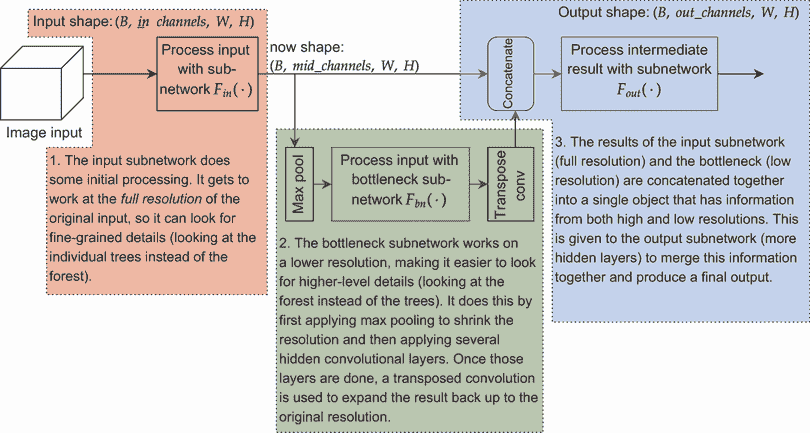

图 8.6 展示了 U-Net 块的架构设计，它分为三个子网络。每个子网络都有多个卷积隐藏层。第一个子网络的结果被发送到两个位置：第二个瓶颈子网络（在经过最大池化后），以及与第二个子网络的结果结合后的第三个子网络。

将其扩展为更大的 U-Net 架构是通过反复将瓶颈子网络变成**另一个**U-Net 块来实现的。这样，你得到一个能够同时学习观察多个不同分辨率的网络。当你绘制将 U-Net 块插入到 U-Net 块中的图时，你最终得到一个如图 8.7 所示的 U 形。此图还显示，每次我们将分辨率缩小 2 倍时，我们倾向于将滤波器的数量增加 2 倍。这样，网络的每个级别都有大致相当的工作量和计算量。

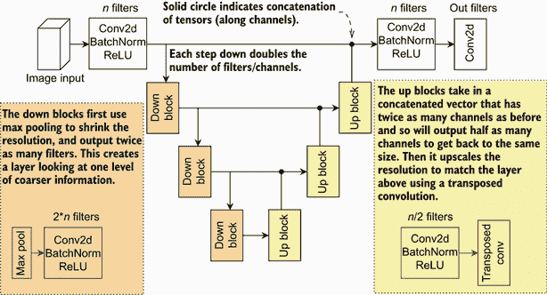

图 8.7 展示了 U-Net 风格架构的示例。经过几轮卷积后，使用最大池化将图像缩小几次。最终，转置卷积将结果上采样，并且每次上采样都包括一个在池化之前连接到先前结果的跳过连接。结果被连接在一起，并进入新的卷积输出轮。这种架构形成了一个 U 形。

图 8.7 显示了每个输入/输出对一组 Conv2d、BatchNorm 和 ReLu 激活，但你可以有任意数量的隐藏层块。虽然 U-Net 既指一个**特定**的架构，也指一种架构**风格**，但我会总体上指这种风格。在下一节中，我们将定义一些实现 U-Net 风格模型的代码。

### 8.3.1 实现 U-Net

为了使我们的实现更简单，我们接受`in_channels`的数量，并使用`mid_channels`作为卷积中应使用的滤波器数量。如果我们希望输出具有不同的通道数，我们使用 1 × 1 卷积将`mid_channels`转换为`out_channels`。由于每个块可以有多个`layers`，我们也将它作为一个参数。最后，我们需要的是用作瓶颈的`sub_network`。因此，我们的构造函数文档如下：

```
class UNetBlock2d(nn.Module): ❶ 
    def __init__(self, in_channels, mid_channels, out_channels=None, 
    ➥ layers=1, sub_network=None, filter_size=3): 
        """ 
        in_channels: the number of channels in the input to this block 
        mid_channels: the number of channels to have as the output for each 
        ➥ convolutional filter 
        out_channels: if not ‘None‘, ends the network with a 1x1 
        ➥ convolution to convert the number of output channels to a 
        ➥ specific number. 
        layers: how many blocks of hidden layers to create on both the 
        ➥ input and output side of a U-Net block 
        sub_network: the network to apply after shrinking the input by a 
        ➥ factor of 2 using max pooling. The number of output channels 
        ➥ should be equal to ‘mid_channels‘
        filter_size: how large the convolutional filters should be 
"""
        super().__init__()
```

❶ 我们的这个类扩展了 nn.Module；所有 PyTorch 层都必须扩展这个。

现在让我们逐步了解构造函数的内容。一个块（步骤 1）的输入将始终具有形状 (*B*,in_channels,*W*,*H*) 并产生形状(*B*,mid_channels,*W*,*H*)。但步骤 3 的输出部分将有两个可能的形状：要么是 (*B*,2⋅mid_channels,*W*,*H*)，因为它结合了步骤 1 和步骤 2 的结果，使其通道数增加 2 倍；要么是 (*B*,mid_channels,*W*,*H*) 如果没有瓶颈。因此，我们需要检查是否有`sub_network`，并相应地更改输出块的输入数量。一旦完成，我们就可以为步骤 1 和步骤 3 构建隐藏层。对于步骤 2，我们使用子网络`self.bottleneck`来表示在应用`nn.MaxPool2d`后对图像的缩小版本上应用的模型。下一块代码显示了所有这些，并将步骤 1 组织到`self.in_model`中，步骤 2 组织到`self.bottleneck`中，步骤 3 组织到`out_model`中：

```
in_layers = [cnnLayer(in_channels, mid_channels, filter_size)] ❶

if sub_network is None:                                        ❷ 
    inputs_to_outputs = 1 

else:
    inputs_to_outputs = 2

out_layers = [cnnLayer(mid_channels*inputs_to_outputs, 
➥ mid_channels, filter_size)]                                 ❸

for _ in range(layers-1):                                      ❹
    in_layers.append(cnnLayer(mid_channels, mid_channels, filter_size)) 
    out_layers.append(cnnLayer(m 
id_channels, mid_channels, filter_size))

if out_channels is not None:                                   ❺
out_layers.append(nn.Conv2d(mid_channels, out_channels, 1, padding=0))

self.in_model = nn.Sequential(*in_layers)                      ❻

if sub_network is not None:                                    ❼ 
    self.bottleneck = nn.Sequential(
        nn.MaxPool2d(2),                                       ❽ 
        sub_network,                                           ❾ 
        nn.ConvTranspose2d(mid_channels, mid_channels,         ❿ 
        ➥ filter_size, padding=filter_size//2, 
        ➥ output_padding=1, stride=2) 
) 

else: 
    self.bottleneck = None 
self.out_model = nn.Sequential(*out_layers) ⓫
```

❶ 开始准备用于处理输入的层

❷ 如果我们有子网络，我们将输出输入的数量加倍。现在让我们来解决这个问题。

❸ 准备用于制作最终输出的层，该输出包含来自任何子网络的额外输入通道

❹ 创建用于输入和输出的额外隐藏层

❺ 使用 1 × 1 卷积确保特定的输出大小

❻ 定义我们的三个总子网络。1) in_model 执行初始的卷积轮次。

❼ 2) 我们的子网络作用于最大池化结果。我们将池化和上采样直接添加到子模型中。

❽ 缩小

❾ 处理较小的分辨率

❿ 向上扩展

⓫ 3) 处理连接结果的输出模型，或者如果没有给出子网络，则直接从 in_model 获取输出

这样就消除了所有硬编码。最后一步是实现使用它的`forward`函数。通过将所有部分组织成不同的`nn.Sequential`对象，这一步相当简单。我们通过应用`in_model`于输入`x`来获取全尺寸结果。接下来，我们检查是否有`bottleneck`，如果有，我们应用它并将结果与全尺寸结果连接。最后，我们应用`out_model`：

```
def forward(self, x): 
    full_scale_result = self.in_model(x)                   ❶

    if self.bottleneck is not None:                        ❷ 
        bottle_result = self.bottleneck(full_scale_result) ❸

        full_scale_result = torch.cat(                     ❹ 
        [full_scale_result, bottle_result], dim=1)

    return self.out_model(full_scale_result)               ❺
```

❶ 计算当前尺度的卷积。（B, C, W, H）

❷ 检查是否有瓶颈需要应用

❸ (B, C, W, H) 形状，因为瓶颈同时进行池化和扩展

❹ 形状 (B, 2*C, W, H)

❺ 计算连接（或未连接！）结果的输出

这为我们提供了一个由`UNetBlock2d`类表示的单个 U-Net 块。通过这个单一的`UNetBlock2d`模块，我们可以通过指定`sub_network`本身也是一个`UNetBlock2d`来实现整个 U-Net 架构。然后我们可以根据需要重复这个过程。以下代码将三个`UNetBlock2d`嵌套在一起，随后进行一次卷积，以达到我们期望的输出大小：

```
unet_model = nn.Sequential( 
    UNetBlock2d(3, 32, layers=2, sub_network=
        UNetBlock2d(32, 64, out_channels=32, layers=2, sub_network=
            UNetBlock2d(64, 128, out_channels=64, layers=2) 
        ), 
    ), 
    nn.Conv2d(32, 1, (3,3), padding=1), ❶
)

unet_results = train_network(unet_model, loss_func, train_seg_loader, 
➥ epochs=10, device=device, val_loader=test_seg_loader)
```

❶ 形状现在是 (B, 1, W, H)

现在我们已经训练了这个模型，让我们将结果与我们的前两个分割模型进行比较。注意，U-Net 方法是两者的最佳结合，既提供了更低的总体损失，又比之前精细或粗粒度的模型学习得更快。U-Net 比其他方法更快地收敛到相同的或更好的精度。它还很有用，因为我们不必猜测确切需要使用多少层池化。我们可以简单地选择比我们认为必要的稍微多一点的池化（U-Net 块）次数，然后让 U-Net 自己学习是否应该使用低分辨率的结果。这是可能的，因为 U-Net 通过每个块的拼接和输出子网络保持了每个分辨率级别的信息：

```
    sns.lineplot(x=’epoch’, y=’val loss’, data=seg_results, label=’CNN’) 
    sns.lineplot(x=’epoch’, y=’val loss’, data=seg_results2, 
    ➥ label=’CNN w/ transposed-conv’) 
    sns.lineplot(x=’epoch’, y=’val loss’, data=unet_results, label=’UNet’)

[20]: <AxesSubplot:xlabel='epoch', ylabel='val loss'>
```

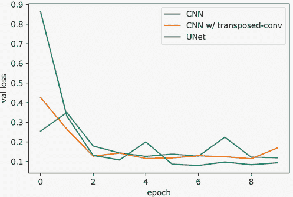

U-Net 方法对于任何图像分割问题或任何需要在对图像内的多个点进行预测的相关任务都是一个强大的起点。它也是我们之前已经学习的一些相似概念的重复：结合跳跃连接和 1 × 1 卷积使我们能够构建一个更具有表现力和强大的模型。这也展示了我们如何调整这些概念，将某些先验应用到我们正在处理的数据中。我们相信我们想要小的局部细节和更粗糙的高级细节来做出更好的决策，因此我们使用了跳跃连接和转置卷积将这个先验嵌入到我们架构的设计中。学会识别这些机会并付诸实践，与几乎任何其他可能做的事情相比，将在你的结果中产生最大的差异。

## 8.4 使用边界框进行目标检测

图像分割在概念上很简单，即单个网络运行一次，为每个像素获取预测，但为每个像素进行标记是昂贵的。现在我们将学习一个更复杂的方法，其中多个组件协同工作，以执行基于边界框的目标检测。这种策略在一次遍历中找到对象，第二步确定特定位置存在的具体对象。这使得标记更容易，但网络在技术上更复杂。

尤其是我们要介绍一个名为 *Faster R-CNN* 的算法⁴，它已经成为对象检测的事实上的基准。大多数其他方法都是 Faster R-CNN 的变体。像大多数对象检测器一样，Faster R-CNN 使用 *边界框* 的概念进行标签和预测。图 8.8 显示了交通标志的潜在边界框标签和预测。边界框方法通常更受欢迎，因为它更便宜且更容易标记。你只需要软件来标注图像周围的框（你可以在[`github.com/heartexlabs/awesome-data-labeling#images`](https://github.com/heartexlabs/awesome-data-labeling#images)上找到一些免费可用的软件），这比费力地标记每个像素所需的图像分割要容易得多。

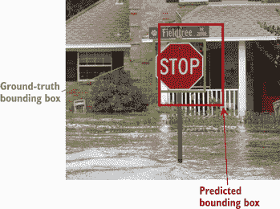

图 8.8 以交通标志为目标，基于边界框的对象检测。绿色框表示真实值，一个刚好足够包含整个对象的框。红色框表示一个潜在的预测，它很接近但并不完全正确。水不会遵从低级交通标志的 whimsical desires。

我们希望模型通过围绕任何感兴趣的对象绘制一个框来检测对象。由于对象可能有奇怪的大小或角度，目标是框应该包围对象，因此框应该 *刚好* 足够大，可以容纳整个对象。我们不希望框更大，因为那样我们就可以通过标记与图像大小相同的框来作弊。我们也不希望框更小，因为那样它会错过对象的一部分，我们不希望单个对象有多个框。

让模型预测围绕对象的边界框是一个难题。我们如何表示边界框作为预测？每个像素都得到自己的边界框预测吗？这不会导致大量误报吗？我们如何高效地完成这项工作，而不需要编写大量的糟糕的`for`循环？对于这些问题有众多不同的方法，但我们将重点关注 Faster R-CNN。这个算法的高级策略是理解其他更复杂的对象检测器的好基础，并且默认情况下集成在 PyTorch 中。

### 8.4.1 Faster R-CNN

假设我们有一辆自动驾驶汽车，我们希望汽车在交通标志处停车，因为我们不希望因为开发了一辆横冲直撞的汽车而入狱。我们需要尽可能多的图像，这些图像既包含又不含交通标志，并且交通标志周围已经画了框。Faster R-CNN 是一个复杂的算法，有很多部分，但到这一点，你已经学到了足够多的知识来理解构成整体的所有部分。Faster R-CNN 通过三个步骤来解决这个问题：

1.  处理图像并提取特征。

1.  使用这些特征来检测潜在/提议的对象。

1.  对每个潜在对象进行判断，确定它是什么对象，或者它根本就不是对象。

图 8.9 给出了 Faster R-CNN 算法的概述；我们稍后会详细介绍。我们描述的三个步骤可以分解为三个子网络：一个用于提取特征图的*主干网络*，一个用于寻找对象的*区域建议网络*（RPN），以及一个预测正在观察的对象类型的*感兴趣区域池化网络*（RoI 池化或简称 RoI）网络。Faster R-CNN 是对我们所学内容的扩展，因为主干网络是一个类似于我们用于图像分割的全卷积网络，除了我们让最终的卷积层输出一些*C*′通道而不是仅仅 1 个通道。


图 8.9 展示了 Faster R-CNN 应用于之前提到的停车标志的示意图。主干网络扫描图像，是最大的网络，承担了产生良好特征的重任，以便算法的其他部分可以使用。接下来是区域建议网络，它也是全卷积的，但非常小。它重用主干的特征图来做出预测或提出可能存在于图像中的对象的位置。最后，一个感兴趣区域网络对特征图的每个子区域进行最终判断，确定是否存在对象——如果存在，它是什么对象。

我们不会从头开始实现 Faster R-CNN，因为它包含许多重要的细节，并且总共需要数百行代码来实现。但我们将回顾所有关键组件，因为许多其他目标检测器都是基于这种方法构建的。Faster R-CNN 也内置在 PyTorch 中，因此您在使用它时不需要做太多工作。以下几节将总结主干、区域建议和感兴趣区域子网络的工作方式，按照使用的顺序。

主干网络

主干网络本质上是指任何像我们刚刚定义的对象分割网络那样工作的神经网络。它接收一个具有宽度、高度和通道数（*C*、*W*、*H*）的图像，并输出一个新的特征图（*C*′、*W*′、*H*′）。主干网络可以有不同的宽度和高度作为输出，只要输出的高度和宽度始终是输入高度和宽度的倍数（即，如果 *W*′ = *W* ⋅ *z*，那么 *H*′ = *H* ⋅ *z*，你必须保持宽度和高度之间的比例）。这些额外的细节在图 8.10 中展示。

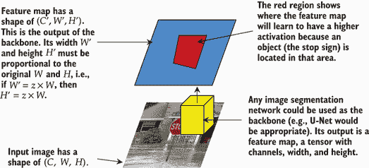

图 8.10 主干网络接收原始图像并创建一个新的图像，即特征图。它具有多个通道 *C*′（用户定义的值）和新的宽度 *W*′ 和高度 *H*′。主干网络是 Faster R-CNN 中唯一的较大网络，旨在承担所有繁重的工作，以便其他网络可以更小、更快。

主干网络的目标是**提取所有特征**，这样其他子网络可以更小，且不需要非常复杂。这使得运行速度更快（只需运行一次一个大网络）并有助于协调另外两个子网络（它们从相同的表示开始工作）。主干网络是使用 U-Net 风格方法的一个绝佳位置，这样你可以检测并区分高级对象（例如，一辆车与一只猫不需要太多细节）以及只能通过观察更精细的低级细节来区分的相似对象（例如，不同品种的狗，如约克夏梗和澳大利亚梗）。

区域提议网络（RPN）

一旦主干网络为我们提供了一个丰富的特征表示，即(*C*′,*W*′,*H*′)张量，RPN 就会确定图像中特定位置是否存在物体。它是通过预测两件事来做到这一点的：

+   一个有四个位置的边界框（左上角、右上角、左下角和右下角）

+   对箱子进行二分类预测，将其归类为“有物体”或“没有物体”

在这种情况下，我们试图预测多少个类别或具体存在什么物体并不重要——唯一的目标是确定是否存在物体以及物体的位置。本质上，所有的问题类别都被合并成一个“有物体”的超类。

为了使模型更加鲁棒，我们可以将这些总共六个预测（4 个框坐标+2 个有物体/无物体）进行 k 次。⁵ 理念是在学习过程中给模型 k 次机会来预测正确的框形状。一个常见的默认值是使用*k* = 9 次猜测。这允许 RPN 在图像的特定位置对物体的尺寸或形状进行多次预测，并且这是大多数实现中包含的常见优化。RPN 的整体过程如图 8.11 所示。

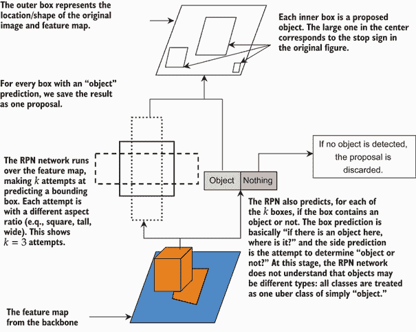

图 8.11 进一步说明了区域提议网络（RPN）的工作原理。它从主干网络接收特征图，并在每个位置进行多次预测。它预测多个框，并且对于每个框，它预测该框是否包含物体。被预测为“物体”的框成为 RPN 的输出：原始输入中可能包含物体的区域列表。

由于我们在每个位置进行 k 次预测，我们**知道**会有比必要的更多误报（如果物体在那个位置，只有那 k 次预测中的一个是最接近的，其他的就变成了误报）。这也是为什么预测被称为**提议**而不是预测的部分原因。我们预计会有比实际物体多得多的提议，在后续的处理过程中，我们将进行更多的工作来清理这些误报。

RPN*可以*通过单个卷积层实现，使用`nn.Conv2d(C, 6*k, 1)`，它会在图像的每个位置滑动并做出六个预测。这是一个使用一对一卷积进行局部预测的技巧。在实际实现中，这通常通过两层来完成，类似于以下这样：

```
nn.Sequential( 
    nn.Conv2d(C’, 256, (1,1)),            ❶ 
    nn.BatchNorm2d(256), 
    nn.LeakyReLU(), 
    nn.Conv2d(256, 6*k, (1,1)), ...       ❷ 
)
```

❶ 一层用于非线性

❷ 在这里添加了一些代码来将输出分成一组四个和另一组两个。这种方法取决于实现策略。

只添加一个额外的层就给模型提供了一些非线性能力，使其能做出更好的预测。我们可以使用这样一个小的网络，因为骨干网络已经完成了繁重的工作。所以，一个小型、快速、几乎非线性的 RPN 网络在骨干网络上运行。RPN 的任务是预测对象*在哪里*以及*它们的形状是什么*。

区域兴趣（RoI）池化

最后一步是 RoI 池化。RPN 的输出给我们提供了*W*′ ⋅ *H*′ ⋅ *k* 个总潜在区域兴趣的位置。RoI 池化从 RPN 中获取每个提议，并抓取由骨干网络产生的特征图对应的区域作为其输入。但是，这些区域可能大小不同，区域可能重叠。在训练时，我们需要对所有这些区域进行预测，以便模型可以学会抑制假阳性并检测假阴性。在测试时，我们只需要对 RPN 子网络得到较高分数的提议进行预测。在训练和测试中，我们都面临一个问题，即*提议的大小是可变的*。因此，我们需要设计一个可以处理*可变大小输入*并仍然做出单一预测的网络。

为了实现这一点，我们使用*自适应池化*。在正常池化中，我们说我们想通过多少来缩小输入（例如，我们通常将图像缩小 2 倍）。在自适应池化中，我们声明我们希望输出有多大，自适应池化根据输入的大小调整缩放因子。例如，如果我们想得到一个 3 × 3 的输出，而输入是 6 × 6，自适应池化将在一个 2 × 2 的网格中进行（6/2 = 3）。但是，如果输入是 12 × 12，池化将在一个 4 × 4 的网格中进行，以得到 12/4 = 3。这样，我们*总是*得到相同大小的输出。RoI 池化过程在图 8.12 中更详细地展示。

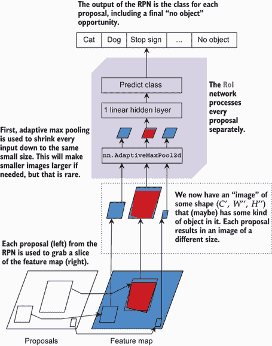

图 8.12 区域兴趣（RoI）网络是最后一步。RPN 的结果告诉我们特征图中哪些区域可能包含一个对象。这些区域的切片被提取出来，使用`nn.AdaptiveMaxPool2d`调整大小到标准的小形状，然后一个小型全连接隐藏层对每个提议进行预测。这是确定具体存在什么对象的最终判断。

这个 RoI 子网络的代码可能看起来像这样：

```
   nn.Sequential( 
   nn.AdaptiveMaxPool2d((7,7)), ❶ 
   nn.Flatten(),                ❷
   nn.Linear(7*7, 256),         ❸ 
   nn.BatchNorm1d(256),
   nn.LeakyReLU(),
   nn.Linear(256, classes), 
)
```

❶ 对于任何 W 和 H 的输入，形状为 (B, C, 7, 7)

❷ 现在是 (B, C*7*7)

❸ 假设 C=1 和 256 个隐藏神经元

RoI 网络从自适应池化开始，以强制所有预测具有特定的大小。这是一个非常小的 7 × 7，以使 RoI 网络小巧且运行速度快，因为我们有很多提议要处理。它如此之小，以至于我们只需跟随两轮 `nn.Linear` 层而不是卷积层，因为已经缩小了很多。然后我们可以将这个网络应用于 RPN 网络识别的每个区域，无论大小，并得到预测。

### 8.4.2 在 PyTorch 中使用 Faster R-CNN

实现 Faster R-CNN 的细节并不简单，这是一个难以完全正确的算法。（如果你想要细节，请查看文章“使用 R-CNN 进行对象检测和分类”在 [`mng.bz/RqnK`](http://mng.bz/RqnK)。）幸运的是，PyTorch 内置了 Faster R-CNN。尽管训练它很昂贵，但我们将从 MNIST 创建一个玩具问题来展示其基本原理。

我们的玩具数据集将是一个更大的 100 × 100 图像，其中包含随机数量的 MNIST 数字，位置也随机。目标是检测这些图像的位置并将它们正确分类。我们的数据集将返回一个元组。元组中的第一个项目是我们想要在上面进行对象检测的 100 × 100 图像。元组中的第二个项目是一个包含两个子张量的字典。

第一个子张量通过名称 `boxes` 索引。如果图像中有 k 个对象，则其形状为 (*k*,4) 并存储 `float32` 值，给出框的四个角。第二个项目通过 `labels` 索引，并且仅在进行训练时是必要的。这个张量看起来更像是之前使用过的，形状为 (*k*) `int64` 值，为要检测的每个 k 个对象提供类别 ID。

实现 R-CNN 数据集

以下代码块显示了我们的 `Dataset` 类，该类实现了我们的玩具 MNIST 检测器。注意计算 `offset` 的注释，因为边界框的角都是绝对位置，因此我们需要根据它们与起始角的相对距离来计算两个角：

```
class Class2Detect(Dataset): 
    """This class is used to create a simple convesion of a dataset from 
    ➥ a classification problem, to a detection problem. """

    def __init__(self, dataset, toSample=3, canvas_size=100): 
        """
        dataset: the source dataset to sample items from as the "objects" 
        ➥ to detect 
        toSample: the maximum number of "objects" to put into any image 
        canvas_size: the width and height of the images to place objects 
        ➥ inside of. 
        """ 
        self.dataset = dataset self.toSample = toSample self.canvas_size = canvas_size

    def __len__(self): 
        return len(self.dataset)

    def __getitem__(self, idx):

        boxes = [] 
        labels = []

        final_size = self.canvas_size img_p =
        torch.zeros((final_size,final_size),                  ❶ 
        ➥ dtype=torch.float32)

        for _ in range(np.random.randint(1,self.toSample+1)): ❷ 
            rand_indx = np.random.randint(0,len(self.dataset)) 
            img, label = self.dataset[rand_indx]              ❸ 
            _, img_h, img_w = img.shape

            offsets = np.random.randint(0,final_size -        ❹ 
           ➥ np.max(img.shape),size=(4))
            offsets[1] = final_size - img.shape[1]
            - offsets[0]                                      ❺ 
            offsets[3] = final_size - img.shape[2] -
            offsets[2]

            with torch.no_grad(): 
            img_p = img_p + F.pad(img, tuple(offsets))        ❻

            xmin = offsets[0]                                 ❼ 
            xmax = offsets[0]+img_w                           ❽

            ymin = offsets[2]                                 ❾ 
            ymax = offsets[2]+img_h

            boxes.append( [xmin, ymin, xmax, ymax] ) 
            labels.append( label )                            ❿

        target = {} 
        target["boxes"] = torch.as_tensor(boxes, dtype=torch.float32) 
        target["labels"] = torch.as_tensor(labels, dtype=torch.int64)

        return img_p, target
```

❶ 创建一个更大的图像，用于存储要检测的所有“对象”

❷ 从 self.toSample 中采样对象以放置到图像中。我们正在调用 PRNG，因此此函数不是确定性的。

❸ 从原始数据集中随机选择一个对象及其标签

❹ 获取该图像的高度和宽度

❺ 随机选择 x 轴和 y 轴的偏移量，实际上是将图像放置在随机位置

❻ 改变末尾的填充，以确保我们得到一个特定的 100,100 形状

❽ 为“boxes”创建值。所有这些都在绝对像素位置。xmin 由随机选择的偏移量确定。

❽ xmax 是偏移量加上图像的宽度。

❾ y 的最小值/最大值遵循相同的模式。

❿ 向具有正确标签的框中添加

实现 R-CNN 的 collate 函数

PyTorch 的 Faster R-CNN 实现不使用我们迄今为止使用的模式（一个包含所有填充到相同大小的张量的张量）来接受输入批次。原因是 Faster R-CNN 是设计用来处理高度可变大小的图像的，因此我们不会为每个项目都有相同的 W 和 H 值。相反，Faster R-CNN 希望有一个张量列表和一个字典列表。我们必须使用自定义的 collate 函数来实现这一点。以下代码创建我们的训练集和测试集，以及所需的 collate 函数和加载器：

```
train_data = Class2Detect(torchvision.datasets.MNIST("./", train=True, 
➥ transform=transforms.ToTensor(), download=True)) 
test_data = Class2Detect(torchvision.datasets.MNIST("./", train=False, 
➥ transform=transforms.ToTensor(), download=True))

def collate_fn(batch): 
    """ 
    batch is going to contain a python list of objects. In our case, our 
    ➥ data loader returns (Tensor, Dict) pairs 
    The FasterRCNN algorithm wants a List[Tensors] and a List[Dict]. So we 
    ➥ will use this function to convert the 
    batch of data into the form we want, and then give it to the Dataloader 
    ➥ to use 
    """ 
    imgs = [] 
    labels = [] 
    for img, label in batch: 
        imgs.append(img) 
        labels.append(label) 
    return imgs, labels

train_loader = DataLoader(train_data, batch_size=128, shuffle=True, 
➥ collate_fn=collate_fn)
```

检查 MNIST 检测数据

现在我们已经设置了所有数据。让我们看看一些数据，以了解其内容：

```
    x, y = train_data[0] ❶ 
    imshow(x.numpy()[0,:])

[24]: <matplotlib.image.AxesImage at 0x7fd248227510>
```

❶ 抓取带有标签的图像

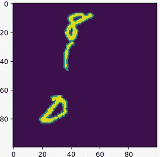

这张图像有三个随机位置的项目：在这种情况下，8、1 和 0。让我们看看标签对象 `y`。它是一个 Python `dict` 对象，因此我们可以看到键和值，并索引 `dict` 来查看它包含的各个项目。

```
print(y)                       ❶ 
print("Boxes: ", y[’boxes’])   ❷ 
print("Labels: ", y[’labels’]) ❸

\{'boxes': tensor([[14., 60., 42., 88.],
        [23., 21., 51., 49.],
        [29., 1., 57., 29.]]), 'labels': tensor([0, 1, 8])\}
Boxes: tensor([[14., 60., 42., 88.],
        [23., 21., 51., 49.],
        [29., 1., 57., 29.]]) 
Labels: tensor([0, 1, 8])
```

❶ 打印出所有内容

❷ 打印出显示所有三个对象角落像素位置的张量

❸ 打印出显示所有三个对象标签的张量

所有三个输出看起来都很合理。`y` 的 `boxes` 部分的形状为 (3,4)，而 `labels` 的形状为 (3)。如果我们将 `boxes` 的第一行与前面的图像进行比较，我们可以看到在 x 轴上，它大约从 30 开始，延伸到 60，这与 `boxes` 张量中的值相对应。同样适用于高度值（y 坐标），它从大约 10 开始，下降到 30。

这里重要的是，框和标签以一致顺序出现。标签 4 可以是第一个标签，只要 `boxes` 的第一行具有对象 4 的正确位置。

定义一个 Faster R-CNN 模型

在此基础上，让我们构建一个小型主干网络来使用。我们简单地迭代多个“卷积、批归一化、ReLU”块，并逐渐增加过滤器的数量。我们需要做的最后一件事是将 `backbone.out_channels` 值添加到我们创建的网络中。这告诉 Faster R-CNN 实现值 *C*′，这是主干网络产生的特征图中的通道数。这用于为我们设置 RPN 和 RoI 子网络。RPN 和 RoI 网络都非常小，我们没有太多参数可以调整，我们也不想使它们更大，因为那样训练和推理将会非常昂贵。以下是代码：

```
C = 1                               ❶ 
classes = 10                        ❷ 
n_filters = 32                      ❸

backbone = nn.Sequential( 
    cnnLayer(C, n_filters), 
    cnnLayer(n_filters, n_filters), 
    cnnLayer(n_filters, n_filters), 
    nn.MaxPool2d((2,2)), 
    cnnLayer(n_filters, 2*n_filters), 
    cnnLayer(2*n_filters, 2*n_filters), 
    cnnLayer(2*n_filters, 2*n_filters), 
    nn.MaxPool2d((2,2)), 
    cnnLayer(2*n_filters, 4*n_filters), 
    cnnLayer(4*n_filters, 4*n_filters), 
) 
backbone.out_channels = n_filters*4 ❹
```

❶ 输入中有多少个通道？

❷ 有多少个类别？

❸ 我们的主干网络中有多少个过滤器？

❹ 让 Faster R-CNN 知道期望多少个输出通道

现在我们可以定义我们的 Faster R-CNN 模型。我们给它提供骨干网络，并告诉它存在多少个类别以及如何归一化图像（如果你的图像值在 [0,1] 范围内，对于大多数图像来说，0.5 的平均值和 0.23 的偏差是好的默认值）。我们还告诉 Faster R-CNN 最小和最大的图像尺寸。为了使这个运行更快，我们将它们都设置为唯一的图像尺寸 100。但对于真实数据，这是用来尝试在多个尺度上检测对象的；这样它就可以处理近距离或远距离的对象。然而，这需要更多的计算来运行，甚至更多的训练来训练。

注意：在现实问题中，应该如何设置 Faster R-CNN 的最小和最大尺寸？这里有一个经验法则：如果对于人类来说太小而无法完成，那么网络可能也无法完成。在你的数据中，尝试以不同的图像分辨率查找你关心的对象。如果你能找到你的对象的最小分辨率为 256 × 256，那么这是一个好的最小尺寸。如果你需要将图像放大到 1024 × 1024 以发现对象，那么这是一个好的最大尺寸。

截至 PyTorch 1.7.0，当使用自己的骨干网络时，你还必须指定一些关于 RPN 和 RoI 网络的信息。这是通过 `AnchorGenerator` 和 `MultiScaleRoIAlign` 对象分别完成的。`AnchorGenerator` 控制 RPN 生成的提议数量，以不同的长宽比（例如，1.0 是一个正方形，0.5 是一个长宽比为 2:1 的矩形，2 是一个长宽比为 1:2 的矩形）生成，以及那些预测应该有多高（即你的对象可能有多大或小？对于现实世界问题，你可能使用 16 到 512 像素）。`MultiScaleRoIAlign` 需要我们告诉 `FasterRCNN` 骨干网络的哪个部分提供特征图（它支持多个特征图作为一项高级功能），RoI 网络的大小，以及如何处理从 RPN 预测的分数像素位置。以下代码将这些内容组合在一起：

```
anchor_generator = AnchorGenerator(sizes=((32),), ❶
➥ aspect_ratios=((1.0),)) 

roi_pooler = torchvision.ops.MultiScaleRoIAlign(  ❷
➥ featmap_names=[’0’], output_size=7, 
➥ sampling_ratio=2) 

model = FasterRCNN(backbone, num_classes=10,      ❸ 
➥ image_mean = [0.5], image_std = [0.229], 
➥ min_size=100, max_size=100, 
➥ rpn_anchor_generator=anchor_generator, 
➥ box_roi_pool=roi_pooler)
```

❶ 应该生成多少个提议 k？每个长宽比都会是一个，并且这个过程会针对多个图像尺寸重复进行。为了使这个运行更快，我们告诉 PyTorch 只查找大小为 32 × 32 的正方形图像。

❷ 告诉 PyTorch 使用骨干网络的最终输出作为特征图 ([]); 使用自适应池化到 7 × 7 网格（output_size=7）。sampling_ratio 的命名不佳：它控制当预测分数像素位置时 RoI 如何从特征图中抓取切片的细节（例如，5.8 而不是 6）。我们不会深入这些低级细节；对于大多数工作，2 是一个合理的默认值。

❸ 创建 FasterRCNN 对象。我们给它提供骨干网络、类别数量、处理图像的最小和最大尺寸（我们知道所有我们的图像都是 100 像素），从图像中减去的平均值和标准差，以及锚生成（RPN）和 RoI 对象。

实现一个 Faster R-CNN 训练循环

由于对张量列表和字典列表的不寻常使用，我们无法使用我们的标准`train_network`函数来处理这种情况。因此，我们编写了一个最小的训练循环来为我们完成这项训练。主要技巧是将每个列表（输入和标签）中的每个项目移动到我们想要使用的计算设备上。这是因为`.to(device)`方法仅存在于 PyTorch `nn.Module`类中，Python 的标准列表和字典没有这些功能。幸运的是，我们早期定义了一个`moveTo`函数，它执行此操作并且适用于列表和字典。

第二个奇怪之处在于，`FasterRCNN`对象在训练模式和评估模式下的行为不同。在训练模式下，它期望将标签与输入一起传递，以便它可以计算每个预测的损失。它还返回每个单独预测损失的列表，而不是单个标量。因此，我们需要将这些单个损失全部加起来以获得最终的损失总和。以下代码显示了用于训练一个`FasterRCNN`周期的简单循环：

```
model = model.train() model.to(device) optimizer =
torch.optim.AdamW(model.parameters())

for epoch in tqdm(range(1), desc="Epoch", disable=False):
    running_loss = 0.0 
    for inputs, labels in tqdm(train_loader, desc="Train Batch", 
    ➥ leave=False, disable=False): 
        inputs = moveTo(inputs, device)      ❶ 
        labels = moveTo(labels, device) 

        optimizer.zero_grad() losses =
        model(inputs, labels)                ❷ 
        loss = 0                             ❸ 
        for partial_loss in losses.values(): 
        loss += partial_loss 
        loss.backward()                      ❹

        optimizer.step() 

        running_loss += loss.item()
```

❶ 将批次移动到我们使用的设备

❶ RCNN 需要`model(inputs, labels)`，而不仅仅是`model(inputs)`。

❶ 计算损失。RCNN 给我们一个损失列表来累加。

❶ 按照常规进行。

这就是使用 PyTorch 提供的 Faster R-CNN 实现所需的所有步骤。现在让我们看看它的表现如何。首先，将模型设置为`eval`模式，这将改变 Faster R-CNN 实现处理输入和返回输出的方式：

```
model = model.eval() 
model = model.to(device)
```

接下来，让我们快速从测试数据集中获取一个项目并看看它是什么样子。在这种情况下，我们看到有三个对象，8、0 和 4：

```
x, y = test_data[0] 
print(y)                                     ❶

{'boxes': tensor([[31., 65., 59., 93.],
         [10., 36., 38., 64.],
         [64., 24., 92., 52.]]), 'labels': tensor([8, 0, 4])\}
```

❶ 这是我们要获取的地面实况。

让我们进行一个预测。由于我们处于`eval`模式，PyTorch 希望有一个`list`图像列表来进行预测。它也不再需要将`labels`对象作为第二个参数传递，这很好，因为如果我们已经知道所有对象的位置，我们就不会这样做：

```
with torch.no_grad(): 
    pred = model([x.to(device)])
```

检查结果

现在我们可以查看我们的结果。PyTorch 的实现返回一个包含三个项目的`dict`列表：`boxes`用于预测项的位置，`labels`用于预测每个项目的类别，`scores`用于与每个预测相关的置信度。以下代码显示了此图像的`pred`内容：

```
print(pred)

[\{'boxes': tensor([[31.9313, 65.4917, 59.7824, 93.3052],
        [64.1321, 23.8941, 92.0808, 51.8841],
        [70.3358, 26.2407, 96.2834, 53.7900],
        [64.9917, 24.2980, 92.9516, 52.2016],
        [30.9127, 65.1308, 58.6978, 93.3224]], device='cuda:0'), 'labels':
tensor([8, 4, 1, 9, 5], device='cuda:0'), 'scores': tensor([0.9896, 0.9868, 
0.1201, 0.0699, 0.0555], device='cuda:0')\}]
```

每个字典都有一个`boxes`张量，其形状为(*k*′,4)，用于*k*′个预测。`labels`张量具有(*k*′)形状，为每个对象预测了标签。最后，`scores`张量也具有(*k*′)形状，并为每个返回的预测返回一个范围在[0,1]之间的分数。这些分数是 RPN 子网络的“对象”分数。

在这种情况下，模型对其找到了一个 8 和一个 4（≥0.9 分）的信心很高，但对其他类别的信心较低。通过将这些结果打印成图片，更容易理解这些结果，所以我们快速定义了一个函数来做这件事：

```
import matplotlib.patches as patches

def plotDetection(ax, abs_pos, label=None): 
    """ 
    ax: the matplotlib axis to add this plot to 
    abs_pos: the positions of the bounding box 
    label: the label of the prediction to add 
    """ 
    x1, y1, x2, y2 = abs_pos 
    rect = patches.Rectangle((x1,y1),x2-x1,y2-y1, 
    linewidth=1,edgecolor=’r’,facecolor=’none’)    ❶ 
    ax.add_patch(rect) if label is not None:       ❷ 
        plt.text(x1+0.5, y1, label, color=’black’, 
        ➥ bbox=dict(facecolor=’white’, edgecolor=’white’, pad=1.0))

    return

def showPreds(img, pred): 
    """ 
    img: the image to show the bounding box predictions for 
    pred: the Faster R-CNN predictions to show on top of the image 
    """ 
    fig,ax = plt.subplots(1) 
    ax.imshow(img.cpu().numpy()[0,:])              ❸ 
    boxes = pred[’boxes’].cpu()                    ❹ 
    labels = pred[’labels’].cpu() 
    scores = pred[’scores’].cpu()

    num_preds = labels.shape[0] 
    for i in range(num_preds):                     ❺
        plotDetection(ax, boxes[i].cpu().numpy(), 
        ➥ label=str(labels[i].item()))

    plt.show()
```

❶ 为边界框制作一个矩形。

❷ 如果提供了标签，则添加标签。

❸ 绘制图像。

❹ 获取预测。

❺ 对于每个预测，绘制其是否有足够高的分数。

拥有这段代码，我们可以在该图像上绘制 Faster R-CNN 的结果。我们可以清楚地看到，网络在 4 和 8 上做得很好，但完全错过了 0。我们还从网络中得到了一些虚假预测，识别 4 和 8 的子部分为其他数字。例如，看看 4 的右半部分。如果你没有注意到左半部分，你可能会说它是数字 1——或者你可能正在看整个图像，认为它是不完整的 9。8 也有类似的问题。如果你忽略左上角的环，它看起来像 6；如果你忽略 8 的右半部分，你可能会被原谅为称之为 9：

```
showPreds(x, pred[0])
```

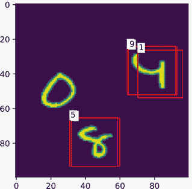

假重叠对象是目标检测器中常见的问题。有时这些重叠对象是同一对象的预测（例如，识别几个 8）或者像我们这里看到的误标记预测。

### 8.4.3 抑制重叠盒子

解决这个问题的简单有效的方法是*抑制*重叠的盒子。我们如何知道要抑制哪些盒子？我们想要确保我们选择的是*正确*的盒子来使用，但我们也不希望丢弃正确预测相邻对象的盒子。

一种称为*非极大值抑制*（NMS）的简单方法可以用来做这个。NMS 使用两个盒子之间的*交集与并集*（IoU）来确定它们是否重叠*太多*。IoU 是一个分数：1 表示盒子具有完全相同的位置，0 表示没有重叠。图 8.13 显示了它是如何计算的。

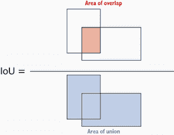

图 8.13 交集与并集分数是通过将两个盒子之间的重叠面积除以两个盒子并集的面积来计算的。

IoU 通过将两个盒子交集的大小除以两个盒子的大小来计算。这样，我们得到一个对两个盒子位置相似性的大小敏感度量。NMS 通过取每对具有大于某个指定阈值的 IoU 的盒子，并只保留 RPN 网络中分数*最高*的一个来工作。

让我们快速看看 NMS 方法在我们数据上的工作方式。我们可以从 PyTorch 导入它作为`nms`函数：

```
from torchvision.ops import nms
```

让我们通过从`model`返回的`pred`中打印出这些字段来提醒自己我们拥有的盒子和它们相关的分数：

```
print(pred[0][’boxes’])

tensor([[31.9313, 65.4917, 59.7824, 93.3052],
        [64.1321, 23.8941, 92.0808, 51.8841],
        [70.3358, 26.2407, 96.2834, 53.7900],
        [64.9917, 24.2980, 92.9516, 52.2016],
        [30.9127, 65.1308, 58.6978, 93.3224]], device='cuda:0')

print(pred[0][’scores’])

tensor([0.9896, 0.9868, 0.1201, 0.0699, 0.0555], device='cuda:0')
```

`nms`函数愉快地接受盒子张量作为第一个参数，分数张量作为第二个参数。第三个和最后一个参数是调用两个盒子为不同对象的阈值。以下代码表示，如果两个盒子的 IoU 达到 50%或更高，它们是同一项，我们应该保留分数最高的盒子：

```
print(nms(pred[0][’boxes’], pred[0][’scores’], 0.5))

tensor([0, 1], device='cuda:0')
```

我们使用 50%的重叠阈值，`nms`返回一个大小相等或更小的张量，告诉我们应该保留哪些索引。在这种情况下，它表示应该保留分数最高的盒子 0 和 1。

让我们修改我们的预测函数，使用 NMS 清理 Faster R-CNN 的输出。我们还添加了一个`min_score`标志，我们可以用它来抑制不太可能是有意义的预测：

```
def showPreds(img, pred, iou_max_overlap=0.5, min_score=0.05, 
➥ label_names=None): 
    """ 
    img: the original image object detection was performed on 
    pred: the output dictionary from FasterRCNN for evaluation on img 
    iou_max_overlap: the iou threshold at which non-maximum suppression 
    ➥ will be performed 
    min_score: the minimum RPN network score to consider an object 
    """ 
    fig,ax = plt.subplots(1) 
    img = img.cpu().numpy() 
    if img.shape[0] == 1: 
        ax.imshow(img[0,:]) 
    else:
        ax.imshow(np.moveaxis(img, 0, 2)) 
    boxes = pred[’boxes’].cpu() 
    labels = pred[’labels’].cpu() 
    scores = pred[’scores’].cpu()

    selected = nms(boxes, scores, iou_max_overlap).cpu().numpy()

    for i in selected: 
        if scores[i].item() > min_score: 
            if label_names is None: 
                label = str(labels[i].item()) 
            else: 
                label = label_names[labels[i].item()] 
            plotDetection(ax, boxes[i].cpu().numpy(), label=label)

    plt.show()
```

接下来，我们再次使用改进的`showPreds`函数绘制此图像，我们看到更好的、更干净的结果：只有 4 和 8 单独存在。唉，0 仍然未被检测到，我们除了更多数据和更多训练轮次外，别无他法来修复这个问题：

```
showPreds(x, pred[0])
```

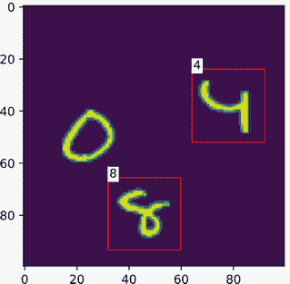

## 8.5 使用预训练的 Faster R-CNN

PyTorch 还提供了一个预训练的 Faster R-CNN 模型。它是在一个称为 COCO 的数据集上训练的，我们可以实例化它并查看此模型使用的类名：

```
rcnn = torchvision.models.detection. ❶
fasterrcnn_resnet50_fpn(pretrained=True)
```

❶ R-CNN 检测器是为一组特定的类设置的。你可以通过设置 num_classes=10 和 pretrained_backbone=True，然后用你的数据训练它来为你的问题重用它，就像我们用 MNIST 做的那样：

我们将此模型设置为`eval`模式，因为它不需要训练，我们还定义了以下`NAME`列表，其中包含所有预训练 R-CNN 知道如何检测的对象的类名：

```
rcnn = rcnn.eval()

NAME = [ ❶ 
    ’__background__’, ’person’, ’bicycle’, ’car’, ’motorcycle’, ’airplane’, 
    ➥ ’bus’, ’train’, ’truck’, ’boat’, ’traffic light’, ’fire hydrant’, 
    ➥ ’N/A’, ’stop sign’, ’parking meter’, ’bench’, ’bird’, ’cat’, ’dog’, 
    ➥ ’horse’, ’sheep’, ’cow’, ’elephant’, ’bear’, ’zebra’, ’giraffe’, 
    ➥ ’N/A’, ’backpack’, ’umbrella’, ’N/A’, ’N/A’, ’handbag’, ’tie’, 
    ➥ ’suitcase’, ’frisbee’, ’skis’, ’snowboard’, ’sports ball’, ’kite’, 
    ➥ ’baseball bat’, ’baseball glove’, ’skateboard’, ’surfboard’, 
    ➥ ’tennis racket’, ’bottle’, ’N/A’, ’wine glass’, ’cup’, ’fork’, 
    ➥ ’knife’, ’spoon’, ’bowl’, ’banana’, ’apple’, ’sandwich’, ’orange’, 
    ➥ ’broccoli’, ’carrot’, ’hot dog’, ’pizza’, ’donut’, ’cake’, ’chair’, 
    ➥ ’couch’, ’potted plant’, ’bed’, ’N/A’, ’dining table’, ’N/A’, ’N/A’, 
    ➥ ’toilet’, ’N/A’, ’tv’, ’laptop’, ’mouse’, ’remote’, ’keyboard’, 
    ➥ ’cell phone’, ’microwave’, ’oven’, ’toaster’, ’sink’, 
    ➥ ’refrigerator’, ’N/A’, ’book’, ’clock’, ’vase’, ’scissors’, 
    ➥ ’teddy bear’, ’hair drier’, ’toothbrush’ ]
```

❶ COCO_INSTANCE_CATEGORY_NAMES。这些来自 PyTorch 文档：[pytorch.org/vision/0.8/models.html](https://pytorch.org/vision/0.8/models.html)。

让我们尝试从互联网上下载一些图像，看看我们的模型表现如何。请记住，随机图像包含许多这个算法以前从未见过的东西。这将给你一些关于你未来如何可能使用 Faster R-CNN 模型以及它们可能以何种有趣方式失败的想法。以下代码导入了一些用于从 URL 抓取图像的库，以及三个用于尝试检测对象的 URL：

```
from PIL import Image 
import requests 
from io import BytesIO

urls = [
    "https://hips.hearstapps.com/hmg-prod.s3.amazonaws.com/images/
    ➥ 10best-cars-group-cropped-1542126037.jpg", 
    "https://miro.medium.com/max/5686/1*ZqJFvYiS5GmLajfUfyzFQA.jpeg", 
    "https://www.denverpost.com/wp-content/uploads/2018/03/
    ➥ virginia_umbc_001.jpg?w=910" 
]

response = requests.get(urls[0]) img =
Image.open(BytesIO(response.content))
```

一旦我们加载了图像，我们就按照 PyTorch 预训练模型的要求重新格式化它。这包括将像素值归一化到[0,1]的范围内，并重新排列维度以成为通道、宽度、高度。以下代码完成了这项工作，之后我们进行预测：

```
img = np.asarray(img)/256.0 
img = torch.tensor(img, dtype=torch.float32).permute((2,0,1))

with torch.no_grad(): 
    pred = rcnn([img])     ❶
```

❶ 将图像传递到模型

现在我们可以检查结果了。你可能发现你需要为每张图像设置不同的`nms`阈值或`min_score`才能获得最佳结果。调整这些参数可能非常依赖于问题。它取决于假阳性与假阴性的相对成本，训练图像在风格/内容上与测试图像之间的差异，以及你最终将如何使用你的目标检测器：

```
showPreds(img, pred[0], iou_max_overlap=0.15, min_score=0.15, 
➥ label_names=NAME)
```

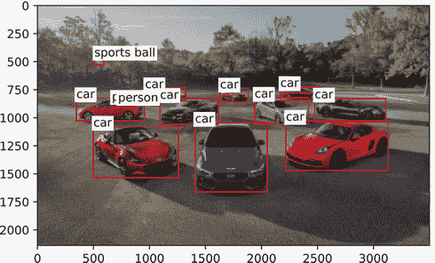

## 练习

在 Manning 在线平台 Inside Deep Learning Exercises 上分享和讨论你的解决方案([`liveproject.manning.com/project/945`](https://liveproject.manning.com/project/945))。一旦你提交了自己的答案，你将能够看到其他读者提交的解决方案，并看到作者认为哪些是最好的。

1.  现在你已经知道了如何在池化后扩大张量，你可以仅使用瓶颈方法实现卷积自动编码器。回到第七章，通过在编码器中使用两轮池化，在解码器中使用两轮转置卷积来重新实现卷积自动编码器。

1.  你可能已经注意到，转置卷积可以在其输出中创建不均匀间隔的*伪影*，这在我们的示例图中有所体现。这些并不总是问题，但你还可以做得更好。实现你自己的`Conv2dExpansion(n_filters_in)`类，采用以下方法：首先，使用`nn.Upsample`对图像进行上采样，以将张量的宽度和高度扩大 2 倍。如果你偏离了一个像素，使用`nn.ReflectionPad2d`对输出进行填充以达到所需的形状。最后，应用正常的`nn.Conv2d`以进行一些混合并改变通道数。将这种新方法与转置卷积进行比较，看看你是否能识别出任何优缺点。

1.  在 Data Science Bowl 数据集上比较具有三轮池化和转置卷积的网络以及具有三轮池化和`Conv2dExpansion`的网络。你是否看到了结果中的任何差异？你认为你看到了还是没看到，为什么？

1.  步长卷积可以用作替代最大池化的图像缩小方法。修改 U-Net 架构，通过用步长卷积替换所有池化操作来创建一个真正的全卷积模型。性能如何变化？

1.  修改第六章中的残差网络，使用`nn.AdaptiveMaxPooling`后跟一个`nn.Flatten()`，一个线性隐藏层，然后一个线性层进行预测。(*注意：*`nn.MaxPool2d`类的数量不应改变。)这能提高你在 Fashion-MNIST 上的结果吗？尝试比较原始残差网络和你的自适应池化变体在 CIFAR-10 数据集上的性能，看看是否有更大的性能差异。

1.  修改 Faster R-CNN 的训练循环，包括在每个训练周期后计算测试集上的测试损失的测试传递。*提示：*你需要保持模型在`train`模式，因为当它在`eval`模式时，其行为会改变。

1.  尝试实现一个具有残差连接的 Faster R-CNN 检测器骨干网络的网络。性能是变好了还是变差了？

1.  我们为`Class2Detect`的边界框比较宽松，因为我们假设数字占据了整个图像。修改此代码以在数字上找到紧密的边界框，并重新训练检测器。这如何改变你在一些测试图像上看到的结果？

1.  **挑战性任务：** 使用图像搜索引擎下载至少 20 张猫的图片和 20 张狗的图片。然后在网上找到用于标注图像边框的软件，并创建你自己的猫/狗检测 Faster R-CNN。你需要为所使用的任何标注软件编写一个`Dataset`类。

## 摘要

+   在图像分割中，我们对图像中的每个像素进行预测。

+   目标检测使用与图像分割模型类似的骨干网络，并通过两个较小的网络来**提出**对象的位置和**决定**存在的对象。

+   你可以使用转置卷积来上采样图像，转置卷积通常用于逆转最大池化的影响。

+   一种用于目标检测的类似残差块的 U-Net 块结合了最大池化和转置卷积，以创建全尺寸和低分辨率的路径，允许通过更少的计算实现更精确的模型。

+   自适应最大池化将任何大小的输入图像转换为特定大小的目标，这对于设计能够对任意大小输入进行训练和预测的网络很有用。

+   可以使用非极大值抑制来减少目标检测的误报。

* * *

¹ 我使用“医疗”这个词纯粹是出于自我利益的理由，因为我也是一个医生，但不是一个特别有用的医生。但总有一天，飞机上会发生机器学习紧急情况，我会准备好的

² 当你称一个模型为全卷积但仍然使用池化层时，有些人会感到不满。我认为这是吹毛求疵。一般来说，任何只使用卷积且没有`nn.Linear`层（或某些其他非卷积层，如 RNN）的网络都可以称为全卷积。↩

³ O. Ronneberger, P. Fischer, 和 T. Brox，"U-Net: 用于生物医学图像分割的卷积网络"，在*N. Navab, J. Hornegger, W.M. Wells, 和 A.F. Frangi*编辑的*《医学图像计算与计算机辅助干预——MICCAI 2015》*中，Springer International Publishing，2015 年，第 234–241 页。↩

⁴ 是的，“更快”确实是名字的一部分。这很好，是好的营销手段

⁵ 这也可以通过训练将对象/非对象作为二元进行实现，即 4 个框加 1 个。不过，大多数在线论文和资源都使用+2 的方法，所以我将坚持使用这种方法来描述。↩
