# 9 生成对抗网络

本章涵盖

+   使用生成模型处理全连接和卷积网络

+   使用潜在向量编码概念

+   训练两个相互协作的网络

+   使用条件模型操纵生成

+   使用向量算术操纵生成

到目前为止，我们所学的知识大多是一种**一对一**的映射。每个输入都有一个正确的类别/输出。狗只能是“狗”；句子只能是“正面”或“负面”。但我们也可能遇到**多对一**的问题，其中存在多个可能的答案。例如，我们可能有“七”这个概念作为输入，需要创建几种不同类型的数字 7 的图片。或者，为了给老式的黑白照片上色，我们可以生成多个可能的有效彩色图像。对于多对一问题，我们可以使用**生成对抗网络**（GAN）。像自编码器等其他无监督模型一样，我们可以将 GAN 学习到的表示作为其他 AI/ML 算法和任务的输入。但 GAN 学习到的表示通常更有意义，允许我们以新的方式操纵我们的数据。例如，我们可以拍摄一个皱眉的人的照片，并让算法改变图像，使这个人微笑。

GAN 是目前最成功的生成模型类型之一：可以创建看起来像训练数据的新的数据，而不仅仅是制作简单的复制。如果你有足够的数据和 GPU 计算能力，你可以使用 GAN 创建一些**非常**逼真的图像。图 9.1 展示了最新的最先进的 GAN 能够达到的效果。随着 GAN 在生成内容方面变得更好，它通常也变得更擅长操纵内容。例如，我们可以使用 GAN 来改变图 9.1 中人物的发色或让他们皱眉。网站[`thispersondoesnotexist.com`](https://thispersondoesnotexist.com)展示了高端 GAN 能够做到的更多示例。


图 9.1 此人实际上并不存在！该图像是使用名为 StyleGAN 的 GAN（https://github.com/lucidrains/stylegan2-pytorch）生成的。

与自编码器类似，GANs 以自监督的方式学习，因此我们不需要标记数据来创建 GAN。尽管如此，也有方法使 GANs 使用标签，这样它们也可以是监督模型，具体取决于你想要做什么。你可以使用 GAN 做任何你可能使用自编码器做的事情，但 GANs 通常是用作制作看起来逼真的合成数据的首选工具（例如，为用户可视化产品），操纵图像以及解决具有多个有效输出的多对多问题。GANs 已经变得如此有效，以至于存在数百种针对不同类型问题的专门变体，如文本生成、图像处理、音频、数据增强等。本章重点介绍 GANs 如何工作和失败的基本原理，为你理解其他专门版本提供一个良好的基础。

首先，我们通过两个竞争性神经网络之间的对抗游戏来学习 GANs 的工作原理，一个称为*判别器*，另一个称为*生成器*。我们构建的第一个 GAN 将遵循原始方法，这样我们可以展示 GANs 最常见的常见问题，即*模式坍塌*，这可能会阻止它们学习。然后，我们将了解一种改进的 GANs 训练方法，这有助于减少（但无法解决）这个问题。模式坍塌问题无法*解决*，但可以通过使用改进的 Wasserstein GAN 来减少。Wasserstein GAN 使得学习一个合理的 GAN 变得更容易，然后我们使用它来展示如何制作用于图像生成的*卷积*GAN 和包含标签信息的条件 GAN。关于 GANs 的最后一个技术概念是我们通过改变它产生的潜在空间来操纵 GAN 产生的内容。我们以对使用如此强大的方法所涉及的许多事情和道德责任的简要讨论结束本章。

## 9.1 理解生成对抗网络

当我们谈论 GAN 时，通常有两个子网络：G，被称为*生成器*网络；和 D，称为*判别器*网络。这些网络具有竞争目标，使它们成为对手。图 9.2 显示了它们如何相互作用。生成器的目标是创建看起来逼真的新数据并将其提供给判别器。判别器的目标是确定一个输入是否来自*真实*数据集或是由生成器提供的*伪造*数据。

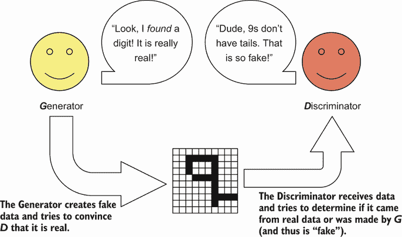

图 9.2 生成器和判别器如何相互作用的示例。生成器的目标是生成伪造数据并将其提供给判别器。判别器的目标是确定图像是否来自 GAN。

GANs 可能相当复杂，因此我们将从高层次开始，逐步展开细节。图 9.3 显示了这一细节的下一级，我们将缓慢地介绍它。

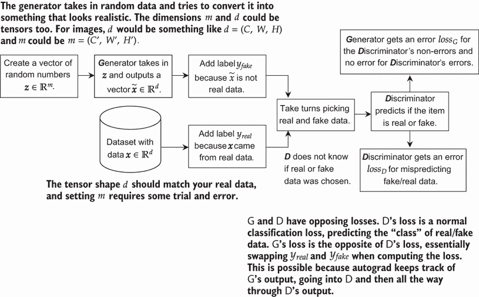

图 9.3 GANs 通常的训练过程图。生成器 G 学习为随机值 z 赋予意义以产生有意义的输出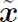。判别器接收真实和虚假数据，但不知道哪一个是真实的——并试图在一个标准的分类问题中学习差异。然后 G 的损失是在 D 的输出上计算的，但它是相反的。当 D 没有错误时，G 会有错误，而当 D 有错误时，G 没有错误。

G 通过接收一个*潜在*向量**z** ∈ ℝ^m 并预测与真实数据大小和形状相同的输出来工作。我们可以选择潜在向量 z 的维度数 m（它是一个超参数）：它应该足够大，可以表示我们数据中的不同概念（这需要一些手动尝试和错误）。例如，我们可能想要学习的潜在属性包括微笑/皱眉、发色和发型。z 的值被称为*潜在*，因为我们从未观察到它们实际是什么：模型必须从数据中推断它们。如果我们做得好，生成器 G 可以使用这个潜在表示 z 作为数据的一个更小、更紧凑的表示——有点像有损压缩的形式。你可以把生成器想象成一个素描艺术家，他必须接收一个描述（潜在向量 z），然后根据这个描述为输出构建一个准确的图片！同样，一个素描艺术家的画作是他们如何*解释*你的描述的结果，这些潜在向量的意义取决于生成器 G 如何解释它们。在实践中，我们使用每个潜在变量从高斯分布（即*z*[i] ∼ *N*(0,1)）采样的简单表示。这使得我们可以轻松地采样新的 z 值，从而可以产生和控制合成数据。生成器必须学习如何从这些值中制作出有意义的物品。

D 的目标是确定输入数据是来自*真实*数据还是*虚假*数据。因此，D 的工作是一个简单的分类问题。如果输入**x** ∈ ℝ^d 来自真实数据，则标签*y* = 1 = *y*[1] = real。如果输入 x 来自生成器 G，则标签是*y* = 0 = *y*[0] fake。这类似于一个自编码器，我们使用监督损失函数，但标签是平凡的。我们实际上使用所有训练数据来定义真实类别，而 G 输出的任何内容都属于虚假类别。

### 9.1.1 损失计算

这最后一部分可能看起来很复杂：D 和 G 都从 D 的输出中计算它们的损失，而 G 的损失在某种程度上是 D 的相反。让我们明确一下涉及的内容。我们使用ℓ(⋅,⋅)来表示我们的分类损失（softmax 的二进制交叉熵，我们多次使用过）。有两个模型（G 和 D）和两个类别(*y*[real]和*y*[fake]），给出表中的四种组合：

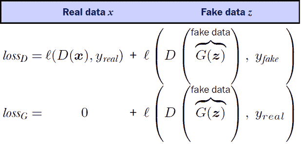

当处理 D 的损失 *loss*[D] 时，我们有真实数据和伪造数据。对于真实数据，我们希望说它看起来是真实的。这相当直接，但让我们仍然标注这个方程：

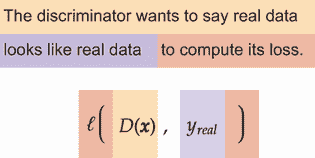

这给出了 D 在真实数据上的损失。它在伪造数据上的损失也是一个直接的分类，除了我们将真实数据 x 替换为生成器的输出 *G*(**z**)，我们使用 *y*[伪造] 作为目标，因为 D 的输入是来自 G 的伪造数据。再次，让我们标注这一点：


接下来是生成器 G 的损失。对于真实数据，这很简单：G 不关心 D 对真实数据的说法，所以当使用真实数据时，G 没有任何变化。但对于伪造数据，G 是关心的。它希望 D 将其伪造数据称为真实数据，因为这意味着它已经成功地欺骗了 D。这涉及到标签的交换。让我们也标注这个方程：

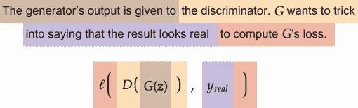

将损失合并

现在我们知道了如何计算损失的各个组成部分，我们可以将它们组合起来。我们必须将它们列为两个损失，因为我们正在训练两个不同的网络。首先，我们有判别器的损失：

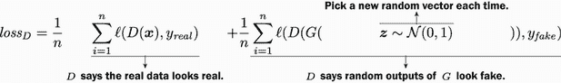

这只是将上一页表中的两个值简单组合起来。我们只是更明确地指出，这个损失是在所有数据 n 上计算的（这将成为批次而不是整个数据集）。由于涉及到求和 Σ 的 `for` 循环，我们也写 **z** ∼ 𝒩(0,1) 以明确指出每次使用不同的随机向量 z。

我们有生成器的损失，它只有一个求和符号，因为 G 不关心 D 对真实数据的说法。G 只关心伪造数据，如果 G 能欺骗 D 将伪造数据称为真实数据，那么 G 就是成功的。这导致以下结果：

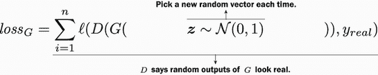

期望

你可能会注意到涉及随机数据 z 的方程中有些奇怪的地方。我们在求和 n 项，但从未访问过任何东西。数据集有多大并不重要；我们可以采样 z 的值的一半或两倍。除非我们不断增加 n 的值，否则我们永远不会超出索引范围。

这是因为我们正在近似我们可能称之为期望的东西。方程 1/*n* Σ[i]^n[=1] ℓ (*D*(*G*(**z**∼ 𝒩(0,1)), *y*[真实] 基本上是在问，“如果 **z** ∼ 𝒩(0,1)，我们期望 ℓ(*D*(*G*(**z**),*y*[真实]) 的平均值是多少？另一种写法是

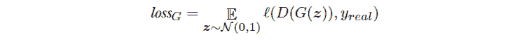

这是以数学方式询问如果你将 *n* 设置为 ∞，确切答案是什么。显然，我们没有时间永远采样，但基于期望的这种符号在阅读关于 GANs 的内容时非常常见。因此，花点额外的时间熟悉这个符号是值得的，这样你就可以准备好阅读其他材料。

前一个方程中的符号 𝔼 代表 *期望*。如果你有一个分布 p 和一个函数 f，写作 𝔼[*z* ∼ *p*]*f*(*z*) 是一种花哨的说法，“如果我从分布 p 中无限期地抽取值 z，那么 *f*(*z*) 的平均值是多少？”有时我们可以用数学来证明期望将是什么，并直接计算结果——但在这里不会发生这种情况。相反，我们可以为批次中的每个项目抽取一个值。这种方法是期望的 *近似*，因为我们抽取的是 *有限* 步骤而不是 *无限* 步骤。

让我们通过用期望符号重写 *损失*[D] 来结束这次小插曲。对于 D 在真实数据上的预测，我们有一个求和，因为真实数据量是有限的。对于 D 在伪造数据上的预测，我们有一个期望，因为伪造数据是无限的。这给我们以下方程：

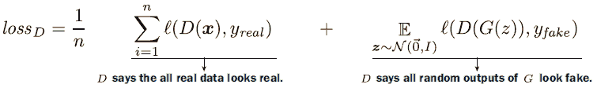

### 9.1.2 GAN 游戏

我们已经讨论了如何分别计算判别器和生成器的两个损失 *loss*[D] 和 *loss*[G]。我们如何训练具有两个损失的两种网络？通过轮流计算 *loss*[D] 和 *loss*[G]，从各自的损失更新两个网络，并重复。这使得训练过程变成了 G 和 D 之间的一种游戏。每个都根据自己在游戏中的表现得到自己的分数，每个都试图提高自己的分数，损害对方的分数。

这个游戏（训练过程）开始于生成器产生糟糕的、看起来随机的结果，这些结果对判别器来说很容易与真实数据区分开来（见图 9.4）。D 尝试根据图像预测来源（训练数据或 G），并得到从真实和伪造数据计算出的损失。G 的损失仅从伪造数据计算，与 D 的损失设置相同，但标签已交换。标签交换是因为 G 想让 D 说 G 的工作是真实的而不是伪造的。

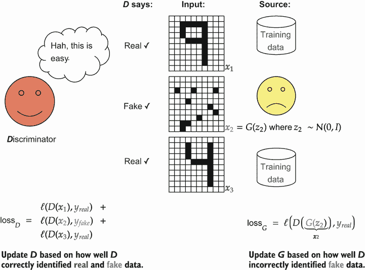

图 9.4 GAN 训练的开始。D 接收一个包含多个图像的批次。其中一些来自真实训练数据，其他的是伪造的（由 G 创建）。对于每一次预测，D 都会根据图像的来源（真实与伪造）是否正确接收一个损失。G 的损失仅从判别器的预测计算。

因为 G 的损失是基于判别器 D 的说法，它学会了改变其预测，使其看起来更像 D 认为的真实数据的样子。随着生成器 G 的改进，判别器 D 需要改进其区分真实和伪造数据的方法。这个循环永远重复（或者直到收敛）。图 9.5 展示了在这个游戏的多轮中结果可能如何演变。

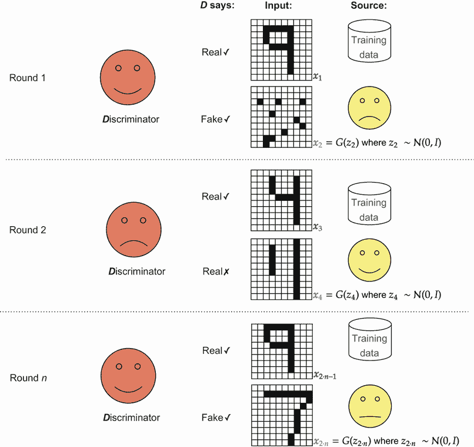

图 9.5 多轮训练 G 和 D。一开始，D 很容易，因为伪造的数据看起来很随机。最终 G 变得更好，欺骗了 D。D 学习更好地区分伪造数据，这使得 G 在制作更真实的数据方面变得更好。最终，D 和 G 都在各自的工作上做得相当不错。

我们已经给出了如何设置 GAN 进行训练的完整描述。关于如何考虑或解释 GAN 设置的另一个细节被称为 *min-max*。如果我们认为 D 是返回输入来自真实数据的概率，我们希望改变 D 以 *最大化* D 在真实数据上的概率，同时改变 G 以 *最小化* D 在伪造数据上的性能。这个有用的概念伴随着一个看起来很吓人的方程：

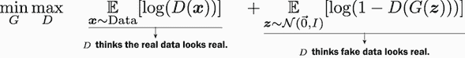

我不喜欢这个方程来解释 GAN 在实际层面的情况——它看起来比我认为的更吓人。我包括它是因为你会在阅读有关 GAN 的内容时经常看到这个方程。但如果你仔细看，这实际上是我们在开始时使用的同一个方程。你可以用求和 Σ 替换期望 𝔼，用 ℓ(*D*(**x**),*y*[real]) 替换 log (*D*(**x**))，用 ℓ(*D*(*G*(**z**)),*y*[fake]) 替换 log (1−*D*(*G*(**z**)))。这样你就能得到我们最初拥有的东西。我们通过轮流优化 D 和 G 以实现它们各自的目标来解决这个 min-max 游戏。我也喜欢用损失函数 ℓ 来写它，因为这样会更明显地表明我们可以改变损失函数来改变我们 GAN 的行为。在 GAN 中改变损失 ℓ 是极其常见的，所以这是一个重要的细节，我不想隐瞒。

### 9.1.3 实现我们的第一个 GAN

现在我们已经理解了生成器 G 和判别器 D 所玩的游戏，我们可以开始实施它了。我们需要为 D 和 G 定义 `Module`s，编写一个新的训练循环，该循环轮流更新 D 和 G，并添加一些额外的辅助代码来记录有用的信息和可视化我们的结果。首先，让我们预定义一些值：批大小 `batch_size` B，我们隐藏层的 `neurons` 数量，以及训练我们的 GAN 的 `num_epochs` 轮数。两个新的是 `latent_d` 和 `out_shape`。

变量 `latent_d` 是我们潜在变量 z 的维度数。我们可以使这个值更小或更大；这是我们模型的一个新超参数。如果我们维度太少或太多，我们会有困难进行训练。我的建议是从 64 或 128 开始，并继续增加维度，直到你得到看起来很好的结果。我们还有一个变量 `out_shape`，它纯粹用于将网络的输出重塑为给定的维度。它从 `-1` 开始，用于批处理维度。这样，生成器的结果将是我们想要的任何形状。这将在我们制作卷积 GAN 时变得更重要；现在，我们以全连接网络开始。`fcLayer` 函数为我们提供了构建本章中模型的快捷方式。

这里是代码：

```
batch_size = 128 
latent_d = 128 
neurons = 512 
out_shape = (-1, 28, 28)                        ❶ 
num_epochs = 10

def fcLayer(in_neurons, out_neurons, leak=0.1): ❷ 
    """ 
    in_neurons: how many inputs to this layer 
    out_neurons: how many outputs for this layer 
    leak: the leaky relu leak value. 
    """ 
    return nn.Sequential(
        nn.Linear(in_neurons, out_neurons), 
        nn.LeakyReLU(leak), 
        nn.LayerNorm(out_neurons) 
)
```

❶ 你也可以使用（–1，1，28，28）来表示一个通道，但这会使 NumPy 代码稍显繁琐。

❷ 我们的辅助函数

定义 D 和 G 网络

接下来，我们实现一个函数，该函数定义了生成器 G 和判别器 D。生成器需要知道 `latent_d`，因为这将作为输入大小。G 和 D 都需要知道 `out_shape`，因为它是生成器的输出也是判别器的输入。我还包括了一个可选标志 `sgimoidG`，用于控制生成器何时以 `nn.Sigmoid` 激活 *σ*(⋅) 结束。对于本章中我们训练的一些 GAN，我们希望在输出被约束在[0,1]范围内时应用 *σ*(⋅)，因为我们的 MNIST 数据也被约束在[0,1]范围内。但我们还举了一个没有这种约束的例子。我还任意定义了一些具有 LeakyReLU 和层归一化（LN）的隐藏层。

这里是代码：

```
def simpleGAN(latent_d, neurons, out_shape, sigmoidG=False, leak=0.2): 
""" 
This function will create a simple GAN for us to train. It will return 
➥ a tuple (G, D), holding the generator and discriminator network 
➥ respectively. 
latent_d: the number of latent variables we will use as input to the 
➥ generator G. 
neurons: how many hidden neurons to use in each hidden layer 
out_shape: the shape of the output of the discriminator D. This should 
➥ be the same shape as the real data. 
sigmoidG: true if the generator G should end with a sigmoid activation, 
➥ or False if it should just return unbounded activations 
"""

G = nn.Sequential( fcLayer(latent_d, neurons, leak), 
    fcLayer(neurons, neurons, leak), 
    fcLayer(neurons, neurons, leak), 
    nn.Linear(neurons, abs(np.prod(out_shape)) ), ❶ 
    View(out_shape)                               ❷ 
)

if sigmoidG:                                      ❸ 
G = nn.Sequential(G, 
    nn.Sigmoid()) 
D = nn.Sequential( nn.Flatten(), 
    fcLayer(abs(np.prod(out_shape)), neurons, leak), 
    fcLayer(neurons, neurons, leak), 
    fcLayer(neurons, neurons, leak), 
    nn.Linear(neurons, 1 )                        ❹ 
) 
return G, D
```

❶ `np.prod` 函数将形状中的每个值相乘，从而得到所需输出的总数。`abs` 函数消除了批维度中“–1”的影响。

❷ 将输出重塑为 D 期望的任何形状

❸ 有时我们希望或不希望 G 返回一个 sigmoid 值（即，[0,1]），所以我们将其放在一个条件语句中。

❹ D 有一个输出用于二分类问题。

使用此函数，我们可以通过调用 `simpleGAN` 函数快速定义新的 G 和 D 模型：

```
G, D = simpleGAN(latent_d, neurons, out_shape, sigmoidG=True)
```

GAN 的起始配方

GAN 因其难以训练而臭名昭著。第一次尝试往往效果不佳，可能需要大量手动调整才能使其工作并产生像本章开头示例那样的清晰结果。网上有很多技巧可以帮助 GAN 训练良好，但其中一些仅适用于特定类型的 GAN。其他则更可靠，适用于多种架构。以下是我尝试构建任何 GAN 时的建议：

+   使用具有大泄漏值（如 *α* = 0.1 或 *α* = 0.2）的 LeakyReLU 激活函数。对于我们判别器没有消失梯度这一点尤为重要，因为训练 G 的梯度必须首先完全通过 D！较大的泄漏值有助于避免这个问题。

+   使用 LN 而不是批归一化（BN）。有些人发现他们用 BN 可以得到最好的结果。在其他情况下，我们可以 *证明* BN 会导致问题。因此，我更喜欢从 LN 开始，它在训练 GAN 时具有更一致和可靠的性能。如果我在努力获得最后一丝性能时，我会尝试仅在生成器中将 LN 替换为 BN。

+   使用特定于 Adam 优化器的学习率 *η* = 0.0001 和 *β*[1] = 0 以及 *β*[2] = 0.9。这比 Adam 的正常默认值慢，但更适合 GAN。这是我最后会尝试更改以获得更好结果的事情。

实现 GAN 训练循环

我们如何训练我们的两个网络？每个网络 G 和 D 都有自己的优化器，我们将轮流使用它们！因此，我们*不*使用我们在本书的大部分内容中使用的相同的`train_network`函数。这是学习框架及其提供的工具很重要的一个原因：并不是所有东西都可以轻易抽象出来，并且与*任何*你未来可能想要训练的神经网络一起工作。

首先，让我们做一些设置。让我们将我们的模型移动到 GPU 上，指定我们的二元交叉熵损失函数（因为真实与伪造是一个二元问题），并为每个网络设置两个不同的优化器：

```
G.to(device) 
D.to(device)

loss_func = nn.BCEWithLogitsLoss()             ❶ 

real_label = 1                                 ❷

fake_label = 0                                 ❷

optimizerD = torch.optim.AdamW(D.parameters(), ❸ 
➥ lr=0.0001, betas=(0.0, 0.9)) 
optimizerG = torch.optim.AdamW(G.parameters(), ❸
➥ lr=0.0001, betas=(0.0, 0.9))
```

❶ 初始化 BCEWithLogitsLoss 函数。BCE 损失用于二元分类问题，我们的问题就是这样（真实与伪造）。

❷ 在训练期间建立真实和伪造标签的约定

❸ 为 G 和 D 设置 Adam 优化器

接下来，我们抓取 MNIST 作为我们的数据集。在本章中，我们不会真正使用测试集，因为我们专注于生成新的数据：

```
train_data = torchvision.datasets.MNIST("./", train=True, 
➥ transform=transforms.ToTensor(), download=True) 
test_data = torchvision.datasets.MNIST("./", train=False, 
➥ transform=transforms.ToTensor(), download=True)

train_loader = DataLoader(train_data, batch_size=batch_size, shuffle=True, 
➥ drop_last=True) 
test_loader = DataLoader(test_data, batch_size=batch_size)
```

现在我们需要训练这个 GAN。我们将这个过程分为两个步骤，一个用于 D，一个用于 G，如图 9.6 所示。


图 9.6 GAN 的训练步骤。在几个 epoch 中，我们运行这两个步骤。在第 1 步中，我们在真实和伪造数据上计算判别器损失，然后使用其优化器更新 D 的权重。在第 2 步中，我们更新生成器。由于这两个步骤都需要 G 的输出，我们在两个步骤之间重用*G*(**z**)。

希望到这一点，你已经开始感到舒适地混合代码和数学符号。这张图几乎列出了我们成功实现生成对抗网络（GAN）所需的所有细节！让我们将其翻译成完整的代码。首先，我们有`for`循环和一些设置。我们使用两个数组来存储每个批次的损失，以便在训练后查看。损失函数对于 GAN 来说可以特别有信息量。我们还创建了*y*[真实]和*y*[伪造]，这两个变量在两个步骤中都会使用，并将数据移动到正确的设备上。以下代码展示了这一点：

```
G_losses = [] D_losses = []

for epoch in tqdm(range(num_epochs)): 
    for data, class_label in tqdm(train_loader, leave=False): 
        real_data = data.to(device)                     ❶ 
        y_real = torch.full((batch_size,1), real_label, ❶ 
        ➥ dtype=torch.float32, device=device) 
        y_fake = torch.full((batch_size,1), fake_label, ❶
        ➥ dtype=torch.float32, device=device)
```

❶ 准备批次并制作标签

现在我们可以进行第一步：更新判别器。实现这一点不需要做太多工作。我们计算完每个错误组件后调用 `backward`，作为一个轻微的效率优化。但我们仍然稍后把错误加在一起以保存组合错误。这里的一个大技巧是你应该注意到的，就是在将假图像传递给 D 时使用 `fake.detach()`。`detach()` 方法返回一个相同对象的新版本，该版本不会进一步传递梯度。我们这样做是因为 `fake` 对象是使用 `G` 计算的，所以天真地使用 `fake` 对象在我们的计算中会导致我们输入一个对 `G` 有利的梯度，因为我们正在计算判别器的损失！由于第一步只是应该改变 `D` 和此时的 `G` 梯度对 `G` 的目标（它想打败判别器！）是有害的，所以我们调用 `.detach()` 以确保 `G` 不获得任何梯度。

这里是代码：

```
D.zero_grad() 
errD_real = loss_func(D(real_data), y_real)          ❶
errD_real.backward()

z = torch.randn(batch_size, latent_d, device=device) ❷ 

fake = G(z)                                          ❹ 

errD_fake = loss_func(D(fake.detach()), y_fake)      ❺

errD_fake.backward()                                 ❻❸ 

errD = errD_real + errD_fake                         ❼❸

optimizerD.step()                                    ❽❸
```

❶ 真实数据

❷ 使用全假批次进行训练并生成一个潜在向量批次 *z* ∼ 𝒩(, 1)。

❸ 使用 G 生成一个假图像批次，并使用 D 对假批次进行分类。我们将此保存以在第二步中重用。

❹ **x**[fake] = *G*(**z**)

❺ 在全假批次上计算 D 的损失；注意使用 fake.detach()。ℓ(*D*(*x*[real]),*y*[real])

❻ 计算该批次的梯度

❼ 将全真实和全假批次的梯度相加

❽ 更新 D

我们循环体的最后一部分是第二步：更新生成器 G。我们重用 `fake` 对象，这样我们就不需要创建一个新的对象，这可以节省我们的时间。由于我们还想改变 G，所以我们直接使用原始的 `fake` 对象——没有调用 `.fake()`。这里需要的代码非常少，我们将 G 和 D 的错误追加到一个列表中，以便稍后绘制它们：

```
G.zero_grad() 
errG = loss_func(D(fake), y_real) ❶ 
errG.backward()                   ❷ 
optimizerG.step()                 ❸

G_losses.append(errG.item()) 
D_losses.append(errD.item())
```

❶ 基于此输出计算 G 的损失：ℓ(*D*(**x**[fake]), *y*[real])

❷ 为 G 计算梯度

❸ 更新 G

检查结果

运行该代码成功训练了一个 GAN。因为潜在的 z 来自高斯分布（**z** ∼ 𝒩(, **I** ) ），我们可以轻松地采样它们并计算 *G*(*z*) 来获取合成数据。我们还可以查看 *D*(*G*(*z*)) 的值，以了解判别器对每个样本真实性的看法。我们训练模型的方式是，值为 1 表示判别器认为输入肯定是真实的，而 0 表示判别器认为它肯定是假的。以下代码将一些新的潜在值采样到一个名为 `noise` 的变量中，这是你在 GAN 中将看到的另一个常见名称。我们用 G 生成假数字并计算它们看起来有多真实的分数：

```
with torch.no_grad(): 
    noise = torch.randn(batch_size, latent_d, device=device) ❶ 
    fake_digits = G(noise) 
    scores = torch.sigmoid(D(fake_digits)) 
    fake_digits = fake_digits.cpu() scores =
    scores.cpu().numpy().flatten()
```

❶ **z** ∼ 𝒩(, **I**)

接下来是一段 Matplotlib 代码，用于绘制所有生成的图像，每个数字上方都有红色的分数。该图会根据我们使用的批量大小自动调整大小。该代码快速计算可以从给定批次填充的最大正方形图像。我们将`scores`作为一个可选参数，因为我们的未来 GANs 可能不会有这种类型的分数：

```
def plot_gen_imgs(fake_digits, scores=None): 
    batch_size = fake_digits.size(0) 
    fake_digits = fake_digits.reshape(-1,
    ➥ fake_digits.size(-1), fake_digits.size(-1)) 
    i_max = int(round(np.sqrt(batch_size))) 
    j_max = int(np.floor(batch_size/float(i_max))) 
    f, axarr = plt.subplots(i_max,j_max, figsize=(10,10)) 
    for i in range(i_max): 
        for j in range(j_max): 
            indx = i*j_max+j 
            axarr[i,j].imshow(fake_digits[indx,:].numpy(), cmap=’gray’, 
            vmin=0, vmax=1) 
            axarr[i,j].set_axis_off() 
            if scores is not None:
                axarr[i,j].text(0.0, 0.5, str(round(scores[indx],2)), 
                ➥ dict(size=20, color=’red’)) 
plot_gen_imgs(fake_digits, scores)
```

❶ 此代码假设我们正在处理黑白图像。

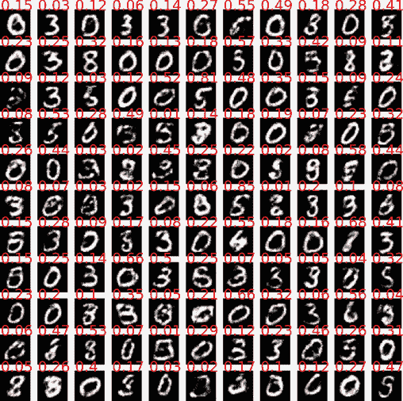

我们已经生成了合成数据，其中一些看起来相当不错！一些样本看起来不太真实，这是可以接受的。学习生成模型的问题本质上比学习判别模型更具挑战性。如果你再次运行此代码，你应该会得到新的结果并开始注意到一些问题。

你可能会注意到的第一个模式是生成器更喜欢一些数字而不是其他数字。当我运行这个时，我通常看到很多 0s、3s 和 8s 被生成。其他数字非常罕见。第二，判别器几乎总是正确地称生成的样本为伪造的。这两个问题相关。

几个数字的重复是一个问题，因为这意味着我们的生成器没有对整个分布进行建模。这使得其整体输出不太真实，即使单个数字看起来不错。判别器在检测伪造方面非常出色是一个潜在问题，因为我们使用了二元交叉熵（BCE）损失！由于 BCE 涉及 sigmoid，如果 D 变得非常好并预测样本是恶意的概率为 0%，这将导致 G 的梯度消失。这是因为 G 的梯度来自 D 预测的相反方向。如果 D 预测得非常完美，G 就无法学习。

D 可能会通过完美的预测赢得游戏的危险很重要，因为 D 和 G 之间的游戏是不公平的。我说的不公平是什么意思？让我们看看判别器和生成器在训练过程中的损失。我们可以快速绘制 G 和 D 的损失，并将它们进行比较，看看它们的进展情况：

```
plt.figure(figsize=(10,5)) 
plt.title("Generator and Discriminator Loss During Training") 
plt.plot(G_losses,label="G") 
plt.plot(D_losses,label="D") 
plt.xlabel("iterations") 
plt.ylabel("Loss") 
plt.legend() 
plt.show()
```


尽管生成器已经显著改进，但它始终比 D 表现差。判别器在整个过程中始终保持在零损失附近，因为它有一个本质上更容易解决的问题。判别总是比生成更容易！因此，D 很容易在游戏中对生成器 G 取得胜利。这就是为什么生成器倾向于关注几个数字而忽略其他数字的部分原因。早期，生成器 G 发现一些数字比其他数字更容易用它们来欺骗 D。除了欺骗 D 之外，G 没有其他惩罚，所以它将所有努力都投入到似乎效果最好的任何事物上。

为什么判别比生成更容易？

让我们快速偏离一下，如果你愿意简单地相信判别比生成更容易，你可以跳过这一部分。一点数学将展示为什么它更容易。让我们从 Bayes 定理的快速复习开始：

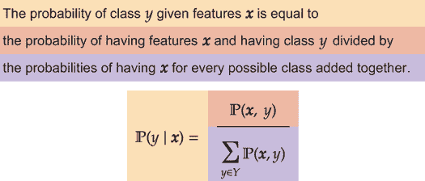

如果我们想用统计术语来描述这个问题，生成器 G 正在尝试学习被称为*联合分布*的东西。存在真实数据 x 和标签 y，联合分布表示为 ℙ(**x**,*y*）。如果你可以从联合分布中采样，你就有了一个生成模型。如果它做得很好，你应该得到 y 可能指示存在的所有不同类别。

判别器的任务是条件分布，我们将其写作 ℙ(*y*∣**x**）。阅读这个表达式的方式是：“给定输入 **x**，标签 y 的概率（ℙ）是多少？”

如果我们已经有联合分布，我们可以立即通过应用贝叶斯定理恢复条件分布：

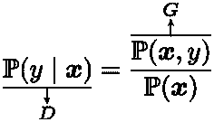

底部缺失的项不是问题，因为它可以计算为 ℙ(**x**) = ∑[*y*∈*Y*] ℙ(**x**,*y*）。所以如果我们知道 G，我们就可以免费得到一个判别器 D！但是没有方法可以重新排列这个方程，从 D 中得到 G 而不添加“额外的东西”。生成（联合分布）的问题本质上需要更多信息，因此比判别（条件分布）更难。这就是为什么 D 的任务比 G 更容易。

## 9.2 模式坍塌

我们生成器只生成一些数字的问题是一个称为*模式坍塌*的现象。因为生成器有一个更难解决的问题，它试图找到在游戏中作弊的方法。一种作弊的方法是只生成*容易*的数据，忽略其他情况。如果生成器每次都能生成完美的 0 来欺骗判别器，它就会赢得游戏——即使它不能生成任何其他数字！为了制作更好的生成器，我们需要解决这个问题；在本节中，我们进行另一个实验来更好地理解它。

最容易的数据点通常与数据的*模式*相关联。模式是在分布中找到的最常见值。我们用它来帮助理解模式坍塌问题。为此，我们生成一个高斯变量的网格。以下代码是这样做的，使得高斯变量以零为中心：

```
gausGrid = (3, 3)   ❶ 
samples_per = 10000 ❷
```

❶ 网格应该有多大？

❷ 网格中每个项目的样本数量是多少？

接下来是一些快速代码，它遍历网格中的每个项目并计算一些样本。我们在样本中使用小的标准差，这样就可以清楚地看到存在九个分离良好的模式：

```
X = []                                                       ❶

for i in range(gausGrid[0]):                                 ❷ 

    for j in range(gausGrid[1]):                             ❷ 

        z = np.random.normal(0, 0.05, size=(samples_per, 2)) ❸ 
    z[:,0] += i/1.0-(gausGrid[0]-1)/2.0                      ❹ 
    z[:,1] += j/1.0-(gausGrid[1]-1)/2.0                      ❺

    X.append(z)                                              ❻ 
X = np.vstack(X)                                             ❼
```

❶ 我们在这里存储所有数据。

❷ 这两个循环到达每个均值的中心。

❸ 样本了一组紧密聚集的点

❹ 将这个随机样本偏移到特定的 x 轴位置

❺ y 轴上的偏移

❻ 收集所有样本

❼ 将这个列表转换成一个形状为 (N, 2) 的大型 NumPy 张量

最后我们可以绘制这些样本！我们使用核密度估计（kde）图来平滑 2D 网格的视觉效果。我们有足够的样本，每个模式看起来都*完美*，我们可以清楚地看到在一个漂亮的网格中存在九个模式：

```
    plt.figure(figsize=(10,10)) 
    sns.kdeplot(x=X[:,0], y=X[:,1], shade=True, fill=True, thresh=-0.001) ❶

[18]: <AxesSubplot:>
```

❶ 绘制完美的玩具数据

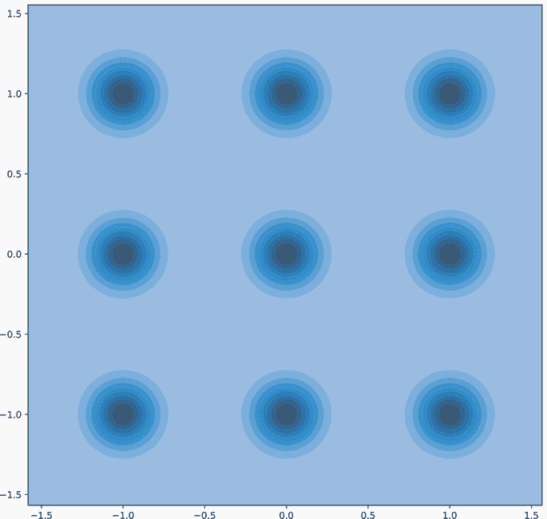

现在我们有一些简单漂亮的数据；当然，我们的 GAN 应该能够解决这个问题。只有两个变量，分布是高斯分布——实际上是我们能希望得到的最容易和最简单的分布。让我们为这个问题设置一个 GAN，看看会发生什么！以下代码使用`TensorDataset`类快速创建一个数据集。我们使用 32 个潜在维度，因为这是一个小问题，不需要 128 个维度，并且我们每层使用 256 个神经元。这应该足够学习这个问题：

```
toy_dataset = torch.utils.data.TensorDataset( 
➥ torch.tensor(X, dtype=torch.float32)) 
toy_loader = DataLoader(toy_dataset, batch_size=batch_size, shuffle=True, 
➥ drop_last=True) latent_d = 64 
G, D = simpleGAN(latent_d, 512, (-1, 2)) ❶
```

❶ 为我们的玩具问题创建了一个仅有两个输出特征的新 GAN

在此基础上，我们可以重新运行我们创建的`for`循环来训练我们的 GANs 100 个 epoch。然后我们可以生成一些合成数据，这可以通过另一个`no_grad`块快速完成：

```
with torch.no_grad(): 
    noise = torch.randn(X.shape[0], latent_d, device=device) ❶ 
    fake_samples = G(noise).cpu().numpy()                    ❷
```

❶ 从随机 **z** ∼ 𝒩(0,1) 中采样一些

❷ 创建假数据 *G*(**z**)

现在让我们使用以下`kdeplot`调用可视化生成的样本。理想情况下，我们应该看到九个圆圈的网格图像。然而，你通常只会看到其中一两个高斯分布是由 G 生成的！更糟糕的是，GAN 并不总是能很好地学习一个高斯分布。它不是学习更大的形状和宽度，而是学习了一个模式的模式，专注于样本最多的中心区域：

```
    plt.figure(figsize=(10,10)) 
    sns.kdeplot(x=fake_samples[:,0], y=fake_samples[:,1], 
    ➥ shade=True, thresh=-0.001) ❶ 
    plt.xlim(-1.5, 1.5)           ❷ 
    plt.ylim(-1.5, 1.5)           ❸

[23]: (-1.5, 1.5)
```

❶ 绘制 G 从我们的玩具数据中学到的内容

❷ 手动设置 x 轴的范围，使其与我们的数据集原始范围一致

❸ 同样适用于 y 轴

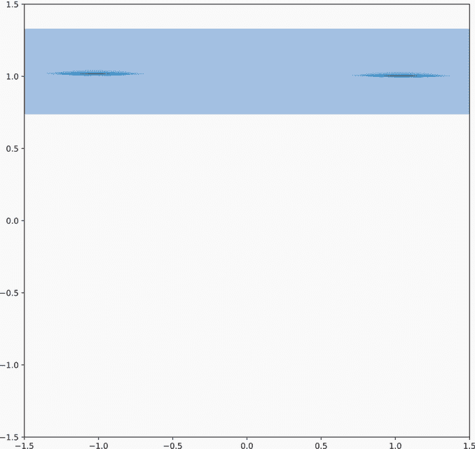

这种行为是模式坍塌现象的一个例子。GAN 不是学习整个输入空间，而是选择了对自己最方便的选项，并过度拟合到这一点。希望这个玩具问题能让你看到 GAN 陷入模式坍塌陷阱是多么容易。我们在这个章节中学到的所有技巧，甚至是最前沿的方法，都只能减轻这个问题——我们还没有解决这个问题。即使你训练的 GAN 在你的问题上似乎表现良好，你也应该手动检查结果，并将它们与真实数据进行比较。寻找在真实数据中出现但在生成输出中不出现的模式和风格，以确定是否发生了模式坍塌以及其严重程度。一个生成看起来很好的输出但坍塌到几个模式上的 GAN 很容易让你误以为你的结果比实际情况要好。

## 9.3 Wasserstein GAN：缓解模式坍塌

GANs（生成对抗网络）目前是一个高度活跃的研究领域，有众多不同的方法来处理模式坍塌问题。本节将讨论一种已被证明是可靠的改进方法，许多其他方法都是基于它构建的更复杂的解决方案。这种方法被称为*Wasserstein GAN*（WGAN）。¹ “Wasserstein”这个名字来源于推导这种改进的数学方法，我们在此不进行讨论。相反，我们将讨论结果以及为什么它有效。

和之前一样，我们将损失函数分为两部分：判别器的损失和生成器的损失。在这个新方案中，我们不对判别器 D 的输出使用 sigmoid 激活函数：这样，我们就有更少的梯度消失问题。尽管如此，判别器仍然会输出一个单一值。

### 9.3.1 WGAN 判别器损失

判别器的损失是 D 对假数据的评分与 D 对真实数据的评分之间的差异。这看起来像是 *D*(*G*(**z**)) − *D*(**x**)，所以 D 尽可能多地想要*最小化*这个值。这个分数不能饱和，这有助于缓解梯度消失的问题。更重要的是，我们将包括对 D 的*复杂性*的惩罚。我们的想法是让 D 处于不利地位，这样它就必须更努力地学习更强大的模型，我们希望这能让 D 和 G 之间的游戏更加公平。我们之所以这样做，是因为 D 有一个更容易的问题。判别器的损失变为

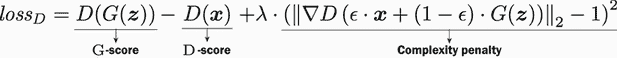

我们稍后会对这个方程进行注释，但首先让我们像在论文中看到的那样，逐句讲解一下。记住，默认情况下，目标是使损失函数最小化。最小化这个方程有什么作用呢？首先，有 G 分数项和 D 分数项的减法。G 分数给出了生成器输出真实性的评分，而 D 分数给出了真实数据外观的评分。为了最小化这个，判别器 D 想要最小化（大负值！）G 分数并最大化（大正值！）D 分数。因此，高分数值表示更高的真实性。因为分数没有受到任何限制，我们实际上是在比较假数据与真实数据的相对分数。这里的重要部分是，无论判别器做得有多好，这两个值只是相减的数字，所以梯度应该很容易计算，没有任何数值问题。

另一个有趣的补充是右侧的*复杂性惩罚*项。它是如何惩罚复杂性的呢？它通过取判别器 D 的梯度（∇）的范数（∥ ⋅ ∥[2]）来做到这一点。值ϵ是在[0,1]范围内随机选择的，所以惩罚应用于真实和假数据的随机混合，这确保 D 不能通过学习部分数据的简单函数和另一部分数据的复杂函数来作弊。最后，值λ是我们控制的超参数。我们设置得越大，对复杂性的惩罚就越大。

现在我们已经走过了 D 这个新损失函数的各个部分，让我们用一些彩色注释重复这个方程，总结一下正在发生的事情：

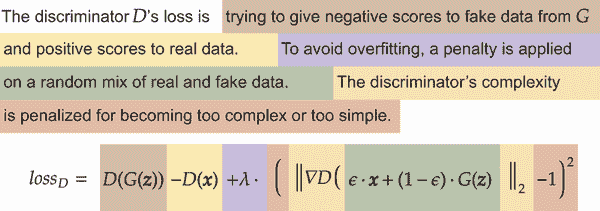

我们在损失函数中包含一个梯度项意味着计算损失需要计算梯度的梯度！解决这个数学问题很困难，但幸运的是 PyTorch 在这里为我们做了这件事。我们可以专注于理解这个方程说了什么以及如何推导它。

梯度告诉你朝哪个方向移动以最小化一个函数，较大的值意味着你处于你试图最小化的函数的更陡峭的部分。一个总是返回相同值（即没有变化）的简单函数有一个零梯度，这是唯一使复杂度惩罚为零的方法。因此，我们的函数越远离简单地返回相同值，其惩罚就越高。这就是这个方程的这一部分如何惩罚复杂模型的小技巧。要使惩罚项为零，需要在所有情况下返回相同的值，这本质上意味着忽略输入。这是一个无用的简单函数，但它将最小化损失的这一部分：总是有一个拉力作用于 D，希望它远离学习任何复杂的东西。一般来说，当你在一个损失函数中看到类似∥∇*f*(*x*)∥的东西时，你应该理解它是在惩罚复杂性。

### 9.3.2 WGAN 生成器损失

关于判别器和其新潮的损失函数，我们已经做了很多阐述。相比之下，生成器的损失函数要简单得多。判别器想要最大化 G 分数，而生成器想要最小化 G 分数！我们的损失是带有符号反转的 G 分数，这样 G 就被最小化了：

*loss*[G] = − *D*(*G*(**z**))

为什么生成器的损失如此简单？这回到了我们已经讨论过的三个原因。首先，生成器 G 不关心 D 对真实数据 x 的看法。这意味着我们可以从损失中移除*D*(**x**)项。其次，D 有一个更容易的问题。复杂度惩罚是为了使 D 处于不利地位，而当我们谈论 G 的损失时，我们不想用一个不必要的惩罚来使 G 处于不利地位。第三，G 的目标是欺骗 D。G 分数剩下的唯一部分是*D*(*G*(**z**))。由于 G 有一个相反的目标，我们在前面放一个负号，得到最终的损失 − *D*(*G*(**z**))。

### 9.3.3 实现 WGAN

这种新的方法通常缩写为 WGAN-GP，其中 GP 代表梯度惩罚。² WGAN-GP 通过减少梯度消失的机会，并在 G 和 D 之间平衡竞争环境，使得 G 更容易跟上 D，从而帮助解决模式坍塌问题。让我们用这种方法在玩具网格上训练一个新的 GAN，看看它是否有所帮助。

由于我们将多次使用 WGAN-GP，我们将定义一个`train_wgan`函数来完成这项工作。这个函数遵循我们原始 GAN 训练循环相同的设置和组织，但函数的每个部分都会有一些变化。这包括函数开始时的准备，向 D 和 G 提供输入，添加梯度惩罚，以及计算最终的 WGAN-GP 损失。我们首先定义一个函数，带有参数来接收网络、加载器、潜在维度的数量、训练的 epoch 数以及要使用的设备。

更新训练准备

这段代码使用了一个简单的技巧：在 `isinstance(data, tuple) or len(data)` 周围的 `if` 语句。这样，我们有一个训练循环，当用户提供一个只包含未标记数据 x 的 `Dataloader` 或提供数据 y（但不会使用标签；我们只是不会为此抛出任何错误）时，它将工作：

```
def train_wgan(D, G, loader, latent_d, epochs=20, device="cpu"):
G_losses = [] D_losses = []

G.to(device) D.to(device)

optimizerD = torch.optim.AdamW(D.parameters(), ❶ 
➥ lr=0.0001, betas=(0.0, 0.9)) 
optimizerG = torch.optim.AdamW(G.parameters(), ❷
➥ lr=0.0001, betas=(0.0, 0.9))

for epoch in tqdm(range(epochs)): 
for data in tqdm(loader, leave=False): 
    if isinstance(data, tuple) or len(data) == 2: 
        data, class_label = data 
        class_label = class_label.to(device) 
    elif isinstance(data, tuple) or len(data) == 1: 
        data = data[0] 
    batch_size = data.size(0) 
    D.zero_grad() 
    G.zero_grad() 
    real = data.to(device)
```

❶ 为 D 设置 Adam 优化器

❷ 为 G 设置 Adam 优化器

更新 D 和 G 输入

在循环体中，我们计算 D 在真实和伪造数据上的结果。这里的一个重要变化是，当 `fake` 进入判别器时，我们并没有调用 `detach()` 函数，因为我们需要在下一步的梯度惩罚计算中包含 G：

```
D_success = D(real)                                      ❶ 

noise = torch.randn(batch_size, latent_d, device=device) ❷ 
fake = G(noise)                                          ❸ 

D_failure = D(fake)                                      ❹
```

❶ 步骤 1：D 分数、G 分数和梯度惩罚。D 在真实数据上的表现如何？

❷ 使用所有伪造的批次进行训练并生成一批潜在向量

❸ 使用 G 生成一个伪造的图像批次

❹ 使用 D 对所有伪造的批次进行分类

计算梯度惩罚

当 `fake` 计算出来后，我们可以计算梯度惩罚。首先，我们在 `eps` 变量中为 ϵ 选择 [0,1] 范围内的随机值。我们必须确保它有与训练数据相同的轴，以便张量可以相乘。所以如果我们的数据形状为 (*B*,*D*)，`eps` 将具有形状 (*B*,1)。如果我们的数据形状为 (*B*,*C*,*W*,*H*)，`eps` 需要形状为 (*B*,1,1,1)。这样，批次中的每个项目都乘以一个值，我们可以计算进入 D 的 `mixed` 输入。

下一行代码中有一个 `autograd.grad` 函数调用。说实话，这个函数让我感到害怕，每次需要使用它时我都得查一下。它以 PyTorch 可以用来计算梯度的方式为我们计算梯度 ∇。

基本上，这个函数执行的功能与调用 `.backward()` 相同，但它返回一个新张量作为对象，而不是将其存储在 `.grad` 字段中。如果你不理解这个函数，那也无所谓，因为它的用途很专业。但我会给那些感兴趣的人提供一个快速的高级解释。`outputs=output` 告诉 PyTorch 我们会调用 `.backward()` 的内容，而 `inputs=mixed` 告诉 PyTorch 导致这个结果的初始输入。`grad_outputs=torch.ones_like(output)` 给 PyTorch 提供一个初始值来开始梯度计算，将其设置为全 1，这样我们最终得到所有部分的期望梯度。选项 `create_graph=True, retain_graph=True` 告诉 PyTorch 我们希望自动微分在结果上工作（这做了梯度的梯度）：

```
eps_shape = [batch_size]+[1]*(len(data.shape)-1)               ❶ 
eps = torch.rand(eps_shape, device=device) 
mixed = eps*real + (1-eps)*fake 
output = D(mixed)

grad = torch.autograd.grad(outputs=output, inputs=mixed, 
➥ grad_outputs=torch.ones_like(output), create_graph=True, 
➥ retain_graph=True, only_inputs=True, allow_unused=True)[0]

D_grad_penalty = ((grad.norm(2, dim=1) - 1) ** 2)

errD = (D_failure-D_success).mean() + D_grad_penalty.mean()*10 ❷
errD.backward() 
optimizerD.step()                                              ❸
```

❶ 现在计算用于计算梯度惩罚项的张量。

❷ 计算 D 的损失

❸ 更新 D

计算 WGAN-GP 损失

当 `grad` 变量最终到手时，我们可以快速计算总损失。`*10` 是控制惩罚强度的 λ 项。我将其硬编码为 10，因为这在这个方法中是一个很好的默认值，但更好的编码会将 `lambda` 作为函数的参数，默认值为 10。

第二步在代码的最后一段中计算 G 的更新，我们首先重新将梯度归零。这是一个防御性编码步骤，因为跟踪我们何时以及何时没有改变梯度是很棘手的。然后我们在`noise`变量中采样一个新的潜在变量 z，计算`-D(G(noise))`，取平均值，然后进行更新：

```
D.zero_grad()                                            ❺ 
G.zero_grad()                                            ❶

noise = torch.randn(batch_size, latent_d, device=device) ❷ 
output = -D(G(noise)) errG = output.mean()               ❸ 
errG.backward()                                          ❹
optimizerG.step()                                        ❺
```

❶ 第 2 步：-D(G(z))

❷ 由于我们刚刚更新了 D，执行一个所有伪造批次通过 D 的前向传递。

❸ 基于此输出计算 G 的损失

❹ 计算 G 的梯度

❺ 更新 G

我们通过记录 G 和 D 各自的损失来结束函数，以便稍后查看，并将这些损失作为函数调用的结果返回：

```
    D_losses.append(errD.item()) 
    G_losses.append(errG.item()) 
return D_losses, G_losses
```

现在我们有了这个新的`train_wgan`函数，我们可以尝试在早期用九个高斯分布在 3 × 3 网格上的玩具问题上训练一个新的 Wasserstein GAN。我们只需调用以下代码片段：

```
G, D = simpleGAN(latent_d, 512, (-1, 2)) 
train_wgan(D, G, toy_loader, latent_d, epochs=20, device=device) 
G, D = G.eval(), D.eval()
```

减少模式坍塌的结果

以下代码生成一些新的样本。结果并不完美，但它们比我们之前得到的好得多。GAN 已经学会了覆盖更广泛的输入数据，分布的形状更接近我们知道的真值。我们可以一般地看到所有九个模式都被表示出来，这是好的，尽管其中一些不如其他强烈：

```
    with torch.no_grad(): 
        noise = torch.randn(X.shape[0], latent_d, device=device) 
        fake_samples_w = G(noise).cpu().numpy() 
    plt.figure(figsize=(10,10)) 
    ax = sns.kdeplot(x=fake_samples_w[:,0], y=fake_samples_w[:,1], 
    ➥ shade=True, thresh=-0.001) 
    plt.xlim(-1.5, 1.5) 
    plt.ylim(-1.5, 1.5)

[27]: (-1.5, 1.5)
```

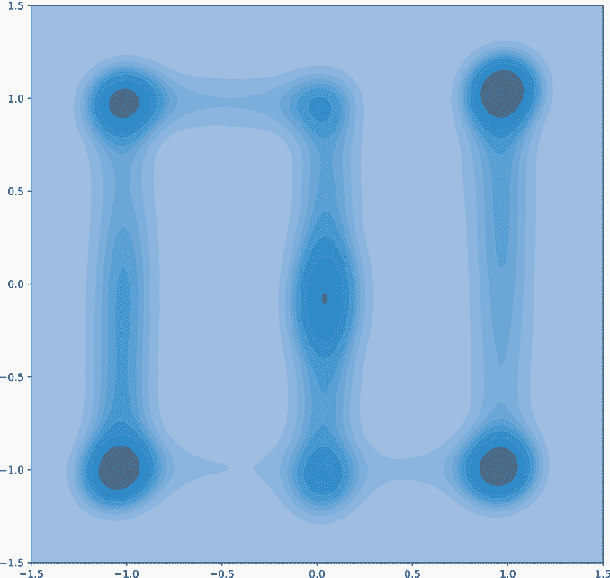

模式坍塌问题并没有通过 Wasserstein 方法得到解决，但它得到了极大的改善。Wasserstein 方法以及大多数 GAN 的一个缺点是它需要更多的迭代才能收敛。提高 WGAN 训练的一个常见技巧是对于生成器的每次更新，更新判别器五次，这进一步增加了获得最佳可能结果所需的总 epoch 数。对于大多数问题，你应该进行大约 200 到 400 个 epoch 来训练一个真正好的 GAN。即使使用 WGAN，如果你再次训练它，你经常会看到它坍塌。这是训练 GAN 的臭名昭著的一部分，但更多的数据和更多的训练 epoch 将提高其性能。

话虽如此，让我们回到我们最初的 MNIST 问题，看看我们的 WGAN-GP 是否提高了结果。我们重新定义潜在维度大小为 128，输出形状与 MNIST 相匹配。我们再次为 G 使用 sigmoid 输出，因为 MNIST 的值都在[0,1]的范围内。以下代码使用我们的新方法进行训练：

```
latent_d = 128 
out_shape = (-1, 1, 28, 28) 
G, D = simpleGAN(latent_d, neurons, out_shape, sigmoidG=True)

D_losses, G_losses = train_wgan(D, G, train_loader, latent_d, epochs=40, 
➥ device=device)

G = G.eval() 
D = D.eval()
```

注意：为什么更新判别器 D 的次数要多于更新生成器 G 的次数？这样判别器就有更多机会更新并捕捉到生成器 G 的行为。这是可取的，因为 G 只能变得和判别器 D 一样好。由于复杂性惩罚，这并没有给 D 带来太大的不公平优势。

现在我们生成一些合成数据，但我们不会查看分数：分数不再是概率，因此很难将其解释为单个值。这就是为什么我们将`scores`作为`plot_gen_imgs`的可选参数：

```
with torch.no_grad(): 
    noise = torch.randn(batch_size, latent_d, device=device) 
    fake_digits = G(noise) 
    scores = D(fake_digits) 
    fake_digits = fake_digits.cpu() 
    scores = scores.cpu().numpy().flatten() 
plot_gen_imgs(fake_digits)
```

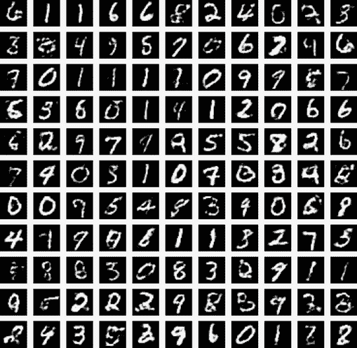

总体而言，我们的 MNIST GAN 样本看起来比以前好得多。你应该能在大多数样本中找到所有 10 个数字的例子，即使有些数字有点难看或不规则。你也应该看到单个特定数字内的样式更加多样化！这些都是我们 GAN 质量的主观巨大改进。一个缺点是，我们的 0、3 和 8 现在没有我们之前在模式崩溃时那么清晰：我们的 WGAN-GP 可能需要更多的训练周期，而且它现在正在做*更多*的事情。当原始 GAN 崩溃时，它可以使用整个网络来表示仅三个数字。现在每个数字占用的网络更少，因为我们正在表示所有 10 个数字。这也是我建议将生成的结果与真实数据比较以决定结果是否良好的原因之一。高质量的崩溃结果可能会让你对 GAN 的质量产生错误的看法。

我们还可以再次绘制判别器和生成器的损失。以下代码执行此操作，并使用卷积来平滑平均损失，以便我们可以关注趋势。在解释 WGAN-GP 的损失时，请记住，生成器 G 希望有一个大的损失，而判别器 D 希望有一个小的损失：

```
plt.figure(figsize=(10,5)) 
plt.title("Generator and Discriminator Loss During Training") 
plt.plot(np.convolve(G_losses, np.ones((100,))/100, mode=’valid’) ,label="G") 
plt.plot(np.convolve(D_losses, np.ones((100,))/100, mode=’valid’) ,label="D") 
plt.xlabel("iterations") 
plt.ylabel("Loss") 
plt.legend() 
plt.show()
```

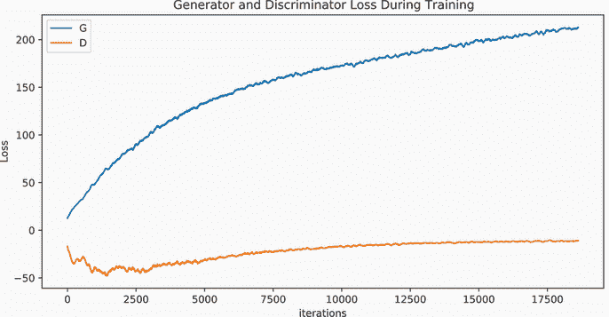

解释这个图，G 随着训练的进行而改进，这是好事，也是继续训练的理由。但是，判别器 D 似乎已经停止了改进，这可能是一个迹象，表明 D 现在不足以学习更好的表示。这是一个问题，因为 G 的质量只有当 D 在任务上变得更好时才会提高。我们可以做出的一个主要改变是实现卷积 GAN，这样生成器（和判别器）就能获得卷积的结构先验，并且（我们希望）两者都能做得更好！

## 9.4 卷积 GAN

与大多数深度学习应用一样，要改善 GAN 的结果，最佳方法是选择一个适合你问题的架构。由于我们正在处理图像，我们可以使用卷积架构来提高我们的结果。这需要对潜在表示 z 进行一些调整。我们的代码为 z 中的 D 维度创建了一个形状为(*B*,*D*)的向量。对于卷积 G，我们的潜在应该是什么形状？

### 9.4.1 设计卷积生成器

一种方法是创建一个形状为(*B*,*C*′,*W*′,*H*′)的潜在张量，这样它已经像图像一样形状，但没有正确的输出形状(*B*,*C*,*W*,*H*)。我们使这个潜在的张量的宽度和高度比真实数据小，并使用转置卷积将其扩展到真实数据的大小。但对于*C*′，我们希望使用比原始数据更多的通道。这样，模型就可以学会将潜在通道解释为具有不同类型的意义，而且只有一个或三个通道可能太小。

以下代码设置了训练*卷积生成对抗网络*的参数。首先，我们确定`start_size`，它将是初始宽度 W′和高度 H′。我们将 W′设置为 W/4，这样我们就可以通过转置卷积进行两轮扩展。如果我们不使用一些丑陋的代码，就不能再小了，因为那会让我们降到 28/4=7 像素：再次除以 2 将是 3.5 像素，这不是我们容易处理的事情。接下来，我们定义`latent_channels` *C*′为 16。这是一个超参数，我简单地选择了一个较小的值，如果我的结果不好，我会增加它。由于我们有一个形状为(*B*,*C*′,*W*′,*H*′)的潜在变量，我们定义`in_shape`元组来表示它，作为我们一直在使用的`out_shape`元组的对应物。我们的网络将使用`in_shape`来重塑 G 的输入；`out_shape`仍将用于重塑 G 的输出和 D 的输入：

```
start_size = 28//4                              ❶ 
latent_channels = 16

latent_d_conv = latent_channels*(start_size**2) ❷ 
in_shape = (-1, latent_channels, start_size, start_size )
```

❶ 初始宽度和高度，以便我们可以进行两轮转置卷积

❷ 潜在空间中需要的值数量

此代码在设置我们问题的变量同时，也便于调整以适应新的问题。如果你有更大的图像，可以尝试使用超过两轮的扩展和超过 16 个潜在通道，这可以通过更改前两行轻松实现。

实现卷积辅助函数

在定义我们的卷积架构之前，我们需要几个变量。我们以`n_filters=32`个过滤器开始我们的生成器，并使用 LeakyReLU 激活函数的漏率 0.2。我们还定义了核大小为`k_size=5`。通常，我们使用 3x3 的核大小来增加 CNN 的深度。对于 GAN，我经常发现稍微大一点的核大小可以改善结果。特别是，如果我们使用步长的倍数作为核大小，我们的转置卷积将会有更平滑的输出，所以我们给它们一个单独的核大小`k_size_t=4`。这有助于确保当转置卷积扩展输出时，输出中的每个位置都会得到其值的均匀数量的贡献：

```
n_filters = 32                                                ❶ 

k_size= 5                                                     ❷ 

k_size_t = 4                                                  ❸ 
leak = 0.2

def cnnLayer(in_channels, out_channels, filter_size,          ❹ 
➥ wh_size, leak=0.2): 
        return nn.Sequential( 
        nn.Conv2d(in_channels, out_channels, filter_size, 
        ➥ padding=filter_size//2), 
        nn.LeakyReLU(leak), 
        nn.LayerNorm([out_channels, wh_size, wh_size]), 
    ) 
def tcnnLayer(in_channels, out_channels, wh_size, leak=0.2):  ❺ 
    return nn.Sequential( 
        nn.ConvTranspose2d(in_channels, out_channels, k_size_t, 
        ➥ padding=1, output_padding=0, stride=2), 
        nn.LeakyReLU(leak), 
        nn.LayerNorm([out_channels, wh_size, wh_size]), 
    )
```

❶ 潜在空间中的通道数

❷ 默认用于卷积生成对抗网络的核大小

❸ 转置卷积的默认核大小

❹ 创建隐藏卷积层的辅助函数

❺ 与 cnnLayer 类似，但我们使用转置卷积来扩展大小

实现卷积生成对抗网络

现在我们定义我们的 CNN GAN。对于 G，我们从`View(in_shape)`开始，这样潜在向量 z 就变成了我们指定的所需输入形状：(*B*,*C*′,*W*′,*H*′)。接下来是一系列的卷积、激活和 LN 操作。记住，对于 CNN，我们需要跟踪输入的宽度和高度，这就是为什么我们将 MNIST 的高度 28x28 编码到我们的架构中。我们遵循在每次转置卷积前后使用两到三个 CNN 层的简单模式：

```
G = nn.Sequential( 
    View(in_shape), 
    cnnLayer(latent_channels, n_filters, k_size, 28//4, leak), 
    cnnLayer(n_filters, n_filters, k_size, 28//4, leak), 
    cnnLayer(n_filters, n_filters, k_size, 28//4, leak), 
    tcnnLayer(n_filters, n_filters//2, 28//2, leak), 
    cnnLayer(n_filters//2, n_filters//2, k_size, 28//2, leak), 
    cnnLayer(n_filters//2, n_filters//2, k_size, 28//2, leak), 
    tcnnLayer(n_filters//2, n_filters//4, 28, leak), 
    cnnLayer(n_filters//4, n_filters//4, k_size, 28, leak), 
    cnnLayer(n_filters//4, n_filters//4, k_size, 28, leak), 
    nn.Conv2d(n_filters//4, 1, k_size, padding=k_size//2), 
    nn.Sigmoid(), 
)
```

### 9.4.2 设计卷积判别器

接下来，我们实现判别器 D。这需要从我们的正常设置中做出一些更多的改变。再次，这些是一些可以帮助改进你的 GANs 的技巧：

+   D 和 G 是非对称的。我们可以使 D 的网络比 G 小，以帮助 G 在竞争中取得优势。即使在 WGAN-GP 中的梯度惩罚下，D 仍然有一个更容易的学习任务。我发现的一个有用的经验法则是 D 的层数是 G 的三分之二。然后在一个训练运行中绘制 D 和 G 的损失，以查看 D 是否陷入困境（损失没有下降），此时应该变得更大，或者 G 是否陷入困境（损失没有增加），此时也许 D 应该缩小或 G 应该变得更大。

+   使用 `nn.AvgPool2d` 而不是最大池化切换到平均池化。这有助于最大化梯度流动，因为每个像素都对答案有相同的贡献，所以所有像素都得到梯度的一部分。

+   使用 `AdaptiveAvgPool` 或 `AdaptiveMaxPool` 函数结束你的网络，这最容易做到。这可以帮助 D 不依赖于值的精确位置，而我们所真正关心的是内容的整体外观。

以下代码将这些想法纳入 D 的定义中。再次，我们使用 LN，因此我们需要跟踪高度和宽度，从全尺寸开始然后缩小。我们最终使用 4 × 4 作为自适应池化的大小，因此下一个线性层有 4 × 4 = 16 个值每个通道作为输入。如果我们对 64 × 64 或 256 × 256 的图像做这件事，我可能会将自适应池化提升到 7 × 7 或 9 × 9：

```
D = nn.Sequential( 
    cnnLayer(1, n_filters, k_size, 28, leak), 
    cnnLayer(n_filters, n_filters, k_size, 28, leak), 
    nn.AvgPool2d(2),         ❶
    cnnLayer(n_filters, n_filters, k_size, 28//2, leak), 
    cnnLayer(n_filters, n_filters, k_size, 28//2, leak), 
    nn.AvgPool2d(2), 
    cnnLayer(n_filters, n_filters, 3, 28//4, leak), 
    cnnLayer(n_filters, n_filters, 3, 28//4, leak), 
    nn.AdaptiveAvgPool2d(4), ❷ 
    nn.Flatten(), 
    nn.Linear(n_filters*4**2,256), 
    nn.LeakyReLU(leak), 
    nn.Linear(256,1), 
)
```

❶ 为了避免稀疏梯度，我们使用平均池化而不是最大池化。

❷ 这是一种自适应池化，因此我们知道在这个点上大小是 4 × 4，以便在池化时更加激进（通常对卷积 GANs 有帮助）并且使编码更容易。

训练和检查我们的卷积 GAN

通过将 `View` 逻辑移动到网络而不是训练代码中，我们可以为我们的 CNN GANs 重复使用 `train_wgan` 函数。以下代码训练它们：

```
D_losses, G_losses = train_wgan(D, G, train_loader, latent_d_conv, 
➥ epochs=15, device=device)

G = G.eval() 
D = D.eval()
```

十个时期对于训练一个 GAN 来说不是很多时间，但接下来我们可视化了一些 CNN GANs 的随机样本，数字看起来比之前好得多。再次，卷积方法在图像上工作得更好并不令人惊讶，但我们确实需要学习一些额外的技巧来使这工作得很好：

```
with torch.no_grad(): 
    noise = torch.randn(batch_size, latent_d_conv, device=device) 
    fake_digits = G(noise) 
    scores = D(fake_digits)

    fake_digits = fake_digits.cpu() scores =
    scores.cpu().numpy().flatten() 
plot_gen_imgs(fake_digits)
```

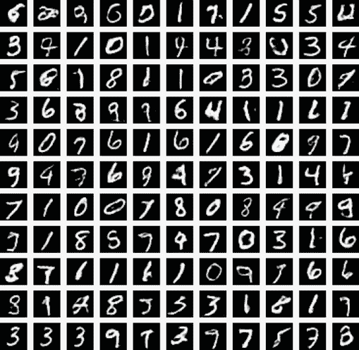

更多的训练轮数会改善我们的 WGAN-GP 吗？以下代码再次绘制了每个批次中 G 和 D 损失的平滑版本。有一个明显的趋势，G 的得分在增加，这表明 G 在生成方面变得更好；但 D 的得分却保持平稳（没有变好或变坏）。更多的训练可能会改善这一点，但这并不保证。如果 D 的得分在下降（因为 D 想要负值），使得图表呈漏斗状（前 300 次迭代就有这种形状），那就更好了。这意味着 G 和 D 都在改进，我们更有信心更多的训练轮数会改善 GAN 的结果：

```
plt.figure(figsize=(10,5)) 
plt.title("Conv-WGAN Generator and Discriminator Loss") 
plt.plot(np.convolve(G_losses, np.ones((100,))/100, mode=’valid’) ,label="G") 
plt.plot(np.convolve(D_losses, np.ones((100,))/100, mode=’valid’) ,label="D") 
plt.xlabel("iterations") 
plt.ylabel("Loss") 
plt.legend() 
plt.show()
```

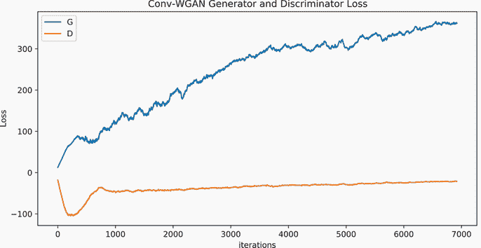

## 9.5 条件 GAN

另一种帮助改善 GAN 训练的方法是创建一个*条件 GAN*。条件 GAN 是监督学习而不是无监督学习，因为我们使用了属于每个数据点 x 的标签 y。如图 9.7 所示，这是一个相当简单的改变。

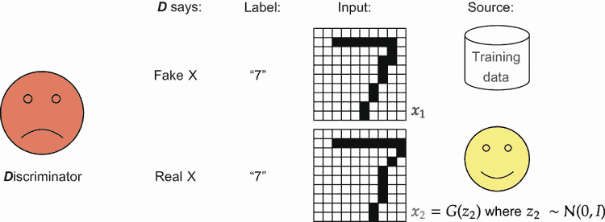

图 9.7 展示了条件生成对抗网络（GAN）的例子，其中 D（判别器）出现了错误，而 G（生成器）表现良好。唯一的改变是我们将数据的标签 y 作为输入同时提供给 G 和 D。G 通过获取标签来知道它需要创建什么，而 D 通过获取标签来知道它在寻找什么。

我们不是要求模型从 x 预测 y，而是告诉 G 生成 y 的一个示例。你可以将正常的 GAN 视为要求模型生成任何真实数据，而条件 GAN 则要求模型生成我们可以将其分类为 y 的真实数据。这通过提供额外信息帮助模型。它不需要自己确定有多少个类别，因为通过提供标签 y，你告诉模型 G 要生成什么类型的数据。为了实现这一点，我们还向判别器 D 提供了关于 y 的信息。

另一种思考方式是，条件 GAN 允许我们学习一种*一对一*映射。我们之前所有的神经网络都是*一对一*的。对于任何输入 x，都有一个正确的输出 y。但如图 9.8 所示，条件模型让我们为任何有效的输入创建多个有效的输出。

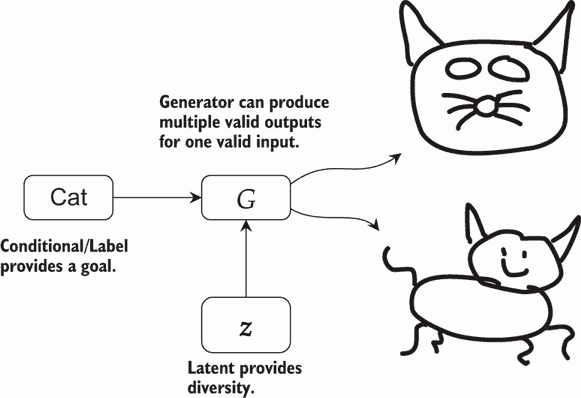

图 9.8 展示了条件 GAN 作为一对一映射的例子。输入是“猫”，右侧的输出显示了多个有效的输出。为了获得这种多样化的输出，潜在变量 z 为 G 提供了创建多个输出的方法。

使用条件 GAN 进行一对一映射也允许我们开始操纵 G 生成的结果。给定一个单个的潜在向量 z，我们可以要求模型使用*G*(**z**∣*y*=1)生成一个 1，或者使用*G*(**z**∣*y*=3)生成一个 3。如果我们使用相同的 z 值做这两件事，生成的 1 和 3 将具有相似的特征，如线条粗细和倾斜。

### 9.5.1 实现条件 GAN

我们可以不费吹灰之力实现条件 GAN。要做到这一点，我们首先需要修改 G 和 D 以接受两个输入：潜在变量 z 和标签 y。让我们定义一个`ConditionalWrapper`类，它为我们完成这项工作。我们的方法是`Conditional-` `Wrapper`将接受一个正常的 G 或 D 网络，并将其用作子网络，类似于我们实现 U-Net 的方式。`ConditionalWrapper`接受 z 和 y，并将它们组合成一个新的潜在值ẑ。然后我们将新的潜在值ẑ传递给原始网络（G 或 D）。

以下`Module`定义实现了这个想法。在构造函数中，我们创建了一个`nn.Embedding`层，将标签 y 转换为与 z 相同大小的向量。我们还创建了一个`combiner`网络，它接受一个大小是潜在向量 z 两倍的输入，并返回一个与 z 相同大小的输出。这个网络故意很小，没有超过两个隐藏层，所以它刚好足够组合我们的两个输入值 z 和 y。

`forward`函数随后可以以非常少的步骤进行操作。它将 y 嵌入到一个向量中。由于 y 的嵌入和 z 具有相同的形状，我们可以将它们连接在一起以形成一个双倍大小的输入。这个输入进入`combiner`，然后直接进入原始`net`（G 或 D）。

下面是代码：

```
class ConditionalWrapper(nn.Module): 
    def __init__(self, input_shape, neurons, classes, main_network, 
    ➥ leak=0.2): 
        """ 
        input_shape: the shape that the latent variable z 
        ➥ should take. 
        neurons: neurons to use in hidden layers 
        classes: number of classes in labels y 
        main_network: either the generator G or discriminator D 
        """ 
        super().__init__() self.input_shape = input_shape 
        self.classes = classes 
        input_size = abs(np.prod(input_shape))                   ❶ 

        self.label_embedding = nn.Embedding(classes, input_size) ❷

        self.combiner = nn.Sequential(                           ❸ 
            nn.Flatten(), 

            fcLayer(input_size*2, input_size, leak=leak),        ❹ 
            nn.Linear(input_size, input_size),                   ❺ 
            nn.LeakyReLU(leak), 

            View(input_shape),                                   ❻
            nn.LayerNorm(input_shape[1:]), 
        ) 
            self.net = main_network

    def forward(self, x, condition=None):                        ❼ 
        if condition is None:                                    ❽
            condition = torch.randint(0, self.classes, size=(x.size(0),), 
            ➥ device=x.get_device())

        embd = self.label_embedding(condition)                   ❾ 
        embd = embd.view(self.input_shape)                       ❿ 
        x = x.view(self.input_shape) 
        x_comb = torch.cat([x, embd], dim=1)                     ⓫ 
        return self.net(self.combiner(x_comb))                   ⓬
```

❶ 确定潜在形状的潜在参数数量

❷ 创建一个嵌入层以将标签转换为向量

❸ 在前向函数中，我们将标签和原始数据连接成一个向量。然后这个`combiner`接受这个非常大的张量，并创建一个大小仅为原始`input_shape`的新张量。这完成了将条件信息（来自标签嵌入）合并到潜在向量中的工作。

❹ 一个全连接层

❺ 第二个全连接层，但首先应用线性层和激活函数

❻ 因此我们可以重塑输出并基于目标输出形状进行归一化。这使得条件包装器对线性模型和卷积模型非常有用。

❼ 前向函数接收一个输入并产生一个输出。

❽ 如果没有给出标签，我们可以随机选择一个。

❾ 将标签嵌入并按需重塑

❿ 确保标签嵌入和数据 x 具有相同的形状，这样我们就可以将它们连接起来

⓫ 将潜在输入与嵌入的标签连接

⓬ 返回网络在组合输入上的结果

### 9.5.2  训练条件 GAN

使用此代码，将我们的普通全连接生成对抗网络（GANs）转换为条件 GANs 变得容易。以下代码片段创建了一个新的全连接 GAN。我们唯一改变的是定义`classes=10`的数量，并使用我们新的`ConditionalWrapper`独立包装 G 和 D：

```
latent_d = 128 
out_shape = (-1, 1, 28, 28) 
in_shape = (-1, latent_d) 
classes = 10 
G, D = simpleGAN(latent_d, neurons, out_shape, sigmoidG=True)

G = ConditionalWrapper(in_shape, neurons, classes, G) 
D = ConditionalWrapper(out_shape, neurons, classes, D)
```

现在我们需要一种方法来训练这些条件模型，因为 `train_wgan` 函数不使用标签。这是一个简单的改动。我们可以定义一个新的函数 `train_c_wgan`，它具有完全相同的代码，除了每次我们在代码中有 `G(noise)` 时，我们将其更改为 `G(noise, class_label)`。同样，每次我们看到类似 `D(real)` 的内容时，我们将其更改为 `D(real, class_label)`。就是这样——我们只需在每次使用 `G` 或 `D` 时添加 `, class_label)`！这为我们提供了创建条件 GANs 的工具和代码。以下代码块训练了我们刚刚定义的模型：

```
D_losses, G_losses = train_c_wgan(D, G, train_loader, latent_d, 
➥ epochs=20, device=device)

G = G.eval() 
D = D.eval()
```

### 9.5.3 使用条件 GANs 控制生成

让我们可视化这个新 GAN 的结果，并展示我们如何同时控制这个过程。以下代码生成 10 个不同的潜在向量 z，并为每个 z 值创建 10 个副本。然后我们创建一个 `labels` 张量，从 0 到 9 计数，覆盖所有 10 个类别。这样，我们创建 *G*(**z**∣*y*=0), *G*(**z**∣*y*=1), …, *G*(**z**∣*y*=9)。

每个数字都是在使用相同的潜在向量生成。因为条件控制生成的类别，潜在 z 被迫学习 *风格*。如果你查看每一行，你将看到在每种情况下，一些基本风格在所有输出中都被保持，无论类别如何。

以下是代码：

```
with torch.no_grad(): 
    noise = torch.randn(10, latent_d, device=device). ❶ 
    ➥ repeat((1,10)).view(-1, latent_d) labels =
    torch.fmod(torch.arange(0, noise.size(0),         ❷ 
    ➥ device=device), classes) 
    fake_digits = G(noise, labels)                    ❸ 
    scores = D(fake_digits, labels) 
    fake_digits = fake_digits.cpu() 
    scores = scores.cpu().numpy().flatten() 
plot_gen_imgs(fake_digits)                            ❹
```

❶ 生成 10 个潜在噪声向量，并重复 10 次。我们重用相同的潜在代码。

❷ 从 0 到 9 计数，然后回到 0。这重复了 10 次。

❸ 使用相同的潜在噪声生成 10 张图像，但每次都更改标签。

❹ 当我们绘制结果时，我们应该看到从 0 到 9 的数字网格，其中每一行使用相同的潜在向量，并具有相似的可视属性。

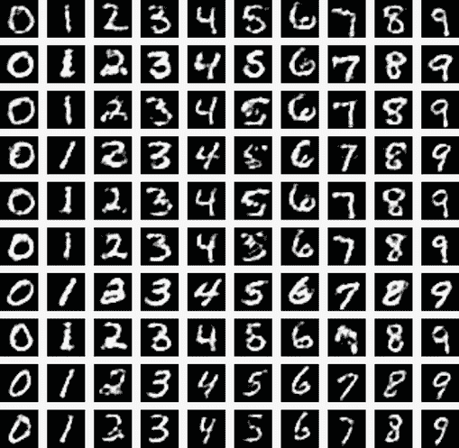

注意，如果一行开头的 0 有粗线，那么该行中所有的数字都有粗线。如果 0 向右倾斜，那么所有的数字都向右倾斜。这就是条件 GANs 让我们控制生成内容的方式。我们可以将这种方法扩展到更多条件属性，这将使我们能够更多地控制 G 生成输出内容和方式。但这需要大量的标记输出，而这现在总是有可能的。

## 9.6 遍历 GANs 的潜在空间

我们已经看到 GANs 可以在创建假数据方面做得非常出色，随着训练的进行，潜在表示 z 开始学习关于数据的有趣属性。即使我们没有标签，这也是正确的。但我们也可以通过改变潜在向量 z 本身来控制 GAN 生成的结果。这样做可以让我们通过仅标记少量图像来操纵图像，从而确定如何正确地改变 z。

### 9.6.1 从 Hub 获取模型

由于训练 GAN 是昂贵的，在本节中我们使用 PyTorch *Hub* 下载一个预训练的 GAN。Hub 是一个人们可以上传有用预训练模型的存储库，PyTorch 内置了对这些模型的下载和使用集成。我们将下载一个在更高分辨率的面部图像上训练的示例，以便比 MNIST 更有趣地查看。

首先要做的：我们从 Hub 加载所需的 GAN 模型。这是通过 `hub.load` 函数完成的，其中第一个参数是要加载的存储库，后续参数取决于存储库。在这种情况下，我们加载了一个名为 PGAN 的模型，该模型是在名人高分辨率数据集上训练的。我们还加载了 `torchvision` 包，它为 PyTorch 提供了视觉特定的扩展：

```
import torchvision 
model = torch.hub.load(’facebookresearch/pytorch_GAN_zoo:hub’, ’PGAN’, 
➥ model_name=’celebAHQ-512’, pretrained=True, useGPU=False)
```

PGAN Hub 模型的具体细节

加载到 Hub 的代码定义了一个 `buildNoiseData` 函数，它接受我们想要生成的样本数量，并生成用于生成这么多图像的噪声向量。然后我们可以使用模型的 `test` 方法从噪声生成图像。让我们试试吧！

```
num_images = 2 
noise, _ = model.buildNoiseData(num_images) 
with torch.no_grad(): 
    generated_images = model.test(noise)
```

使用 `torchvision` 辅助函数绘制图像，你应该会看到一个合成的男性和女性：

```
    grid = torchvision.utils.make_grid(generated_images.clamp(min=-1, max=1), 
    ➥ scale_each=True, normalize=True) 
    plt.imshow(grid.permute(1, 2, 0).cpu().numpy())

[50]: <matplotlib.image.AxesImage at 0x7f2abd028f90>
```

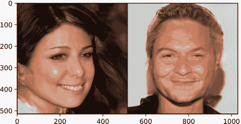

就像我们之前的 GAN 一样，这些图像是通过学习将噪声转换为逼真图像创建的！如果我们打印噪声值，我们会看到来自高斯分布的随机采样值（下面没有隐藏任何魔法）：

```
print(noise)

tensor([[-0.0766, 0.3599, -0.7820, {\ldots}, -1.0038, 0.5046, -0.4253],
       [ 0.5643, 0.4867, 0.2295, {\ldots}, 1.1609, -1.2194, 0.8006]])
```

### 9.6.2  插值 GAN 输出

GAN 的一个酷特性是，当你从数学上操作时，学习到的潜在值 z 往往表现得很好。所以如果我们取我们的两个噪声样本，我们可以在噪声向量之间进行插值（比如说，一个的 50% 和另一个的 50%），以生成图像的插值。这通常被称为 *在潜在空间中行走*：如果你有一个潜在向量，并走到第二个潜在向量的一定距离，你最终得到的是代表你原始和目标潜在值的混合体。

如果我们将此应用于我们的两个样本，男性图像会逐渐过渡到女性，头发变暗成棕色，笑容变宽。在代码中，我们从第一个图像到第二个图像在潜在空间中移动了八步，改变了每个潜在对结果贡献的比例：

```
    steps = 8 interpolated_z = [] ❶ 
    for x in torch.arange(0,steps)/float(steps)+0.5/steps: 
        z_mix = x*noise[0,:] +
        (1-x)*noise[1,:]          ❷ 
        interpolated_z.append(z_mix)

    with torch.no_grad():         ❸ 
        mixed_g = model.test(torch.stack(interpolated_z)).clamp(min=-1, max=1) 
    grid = torchvision.utils.make_grid( 
    mixed_g.clamp(min=-1, max=1), scale_each=True, 
    ➥ normalize=True)            ❹ 
    plt.figure(figsize=(15,10)) plt.imshow(grid.permute(1, 2, 0).cpu().numpy())

[52]: <matplotlib.image.AxesImage at 0x7f2af48f42d0>
```

❶ 保存插值图像的位置

❷ 取第一个潜在向量的步长/步数和第二个的 (1 - 步长/步数)，也就是行走

❸ 从插值中生成图像

❹ 当可视化生成的输出时，看起来像是一种混合。

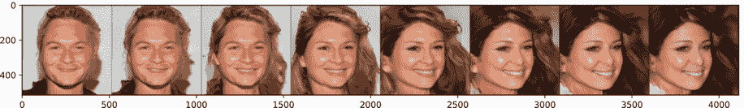

我们甚至可以更进一步。如果我们愿意对我们的数据集中的几个实例进行标记，我们可以提取具有语义意义的向量。图 9.9 展示了这在高层次上可能的工作方式。

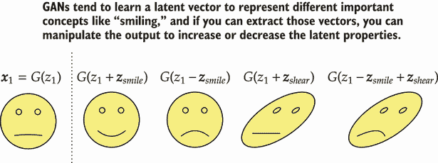

图 9.9 生成图像的示例以及你可能能找到的语义向量类型。左侧显示的是 G 的原始潜在变量及其相关输出。通过添加这些语义向量，我们可以改变生成的图像。这些被称为潜在向量，因为我们没有告诉 GAN 它们是什么：它们对 GAN 是隐藏的，GAN 必须从数据模式中自己学习它们。

这基本上意味着我们可以找到一个向量 **z**[smile]，我们可以将其添加到任何其他潜在向量中，使其某人微笑，或者从另一个潜在向量中减去以移除微笑。好事是，我们 *从未告诉 G 关于任何这些潜在属性的信息*。G 学习自己这样做，如果我们能发现语义向量，我们就可以进行这些修改！为此，让我们首先生成一些随机的图像来使用：

```
    set_seed(3)                          ❶ 
    noise, _ = model.buildNoiseData(8*4) ❷ 
    with torch.no_grad(): 
        generated_images = model.test(noise) 
    grid = torchvision.utils.make_grid( 
    generated_images.clamp(min=-1, max=1), 
    ➥ scale_each=True, normalize=True)  ❸ 
    plt.figure(figsize=(13,6)) 
    plt.imshow(grid.permute(1, 2, 0).cpu().numpy())

[53]: <matplotlib.image.AxesImage at 0x7f2abc505710>
```

❶ 获取一致的结果

❷ 通过添加性别向量到我们的原始潜在向量来生成新的图像

❸ 可视化它们

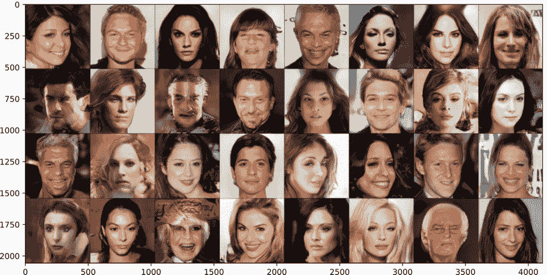

### 9.6.3 标记潜在维度

现在我们有 32 个示例面孔。如果我们能识别出我们对每个生成的图像关心的某些属性，我们就可以对它们进行标记，并尝试学习哪些噪声控制了输出的不同方面。³ 让我们识别出男性和女性，以及那些微笑或不微笑的人。我为每个属性创建了一个数组，对应于每个图像，因此我们有 32 个“男性”标签和 32 个“微笑”标签。本质上，我们正在为我们关心的属性创建自己的标签 y，但我们将能够用很少的标记示例提取这些语义⁴ 向量。G 已经独立学习了概念：

```
male = [0, 1, 0, 0, 1, 0, 0, 0,                      ❶ 
        1, 1, 1, 1, 0, 1, 0, 0,                      ❶ 
        1, 0, 0, 1, 0, 0, 1, 0,                      ❶ 
        0, 0, 0, 0, 0, 0, 1, 0]                      ❶ 
smile = [1, 1, 0, 0, 1, 0, 1, 1,                     ❶ 
         0, 0, 0, 0, 0, 1, 0, 0,                     ❶ 
         1, 0, 1, 0, 1, 1, 1, 1,                     ❶ 
         0, 0, 1, 1, 0, 0, 0, 1]                     ❶ 
male = np.array(male, dtype=np.bool) 
smile = np.array(smile, dtype=np.bool)

male = torch.tensor(np.expand_dims(male, axis=-1))   ❷ 
smile = torch.tensor(np.expand_dims(smile, axis=-1)) ❷
```

❶ 为哪些图像显然是男性或微笑的进行标记。我手动检查生成的图像以创建这些列表。

❷ 将形状从 (32) 转换为 (32, 1)

计算语义向量

现在我们想计算平均男性向量和平均非男性向量。我们对微笑也做同样的事情，所以让我们定义一个简单的函数，该函数使用二进制标签 `male` 和 `smile` 来提取表示差异的向量。我们生成的标签越多，结果越好：

```
def extractVec(labels, noise): 
    posVec = torch.sum(noise*labels, axis=0)/torch.sum(labels)   ❶ 
    negVec = torch.sum(noise* labels, axis=0)/torch.sum( labels) ❷ 
    return posVec-negVec                                         ❸
```

❶ 获取所有具有类别标签 0 的平均值

❷ 所有具有类别标签 1 的平均值

❸ 通过取平均值之间的差异来近似潜在概念之间的差异

使用语义向量操纵图像

现在我们可以使用 `extractVec` 函数提取一个男性性别向量。如果我们将其添加到任何潜在向量 z 中，我们就会得到一个新的潜在向量，使其更具男性特征。生成的图像中的其他所有内容通常应保持不变，例如背景、发色、头部位置等。让我们试试：

```
    gender_vec = extractVec(male, noise)                ❶ 
    with torch.no_grad():
        generated_images = model.test(noise+gender_vec) ❷

    grid = torchvision.utils.make_grid( 
    ➥ generated_images.clamp(min=-1, max=1), 
    ➥ scale_each=True, normalize=True)                 ❸ 
    plt.figure(figsize=(13,6)) 
    plt.imshow(grid.permute(1, 2, 0).cpu().numpy())

[56]: <matplotlib.image.AxesImage at 0x7f2abc4f5850>
```

❶ 提取性别向量

❷ 通过将性别向量添加到我们的原始潜在向量来生成新的图像

❸ 绘制结果

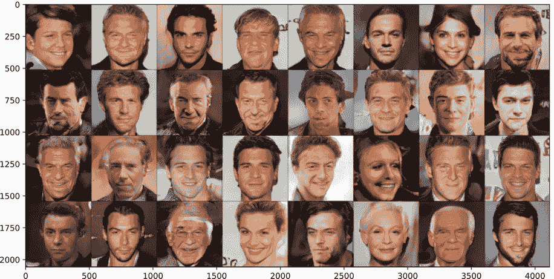

总体来说，结果相当不错。虽然不是完美无缺，但我们并没有使用很多例子来发现这些向量。我们还可以减去这个性别向量，从图像中去除男性特征。在这种情况下，我们会让每个图像看起来更女性化。以下代码通过简单地改变`+`为`-`来实现这一点：

```
    with torch.no_grad(): 
        generated_images = model.test(noise-gender_vec) 
    grid = torchvision.utils.make_grid(generated_images.clamp(min=-1, max=1), 
    ➥ scale_each=True, normalize=True) 
    plt.figure(figsize=(13,6)) 
    plt.imshow(grid.permute(1, 2, 0).cpu().numpy())

[57]: <matplotlib.image.AxesImage at 0x7f2abd67d590>
```

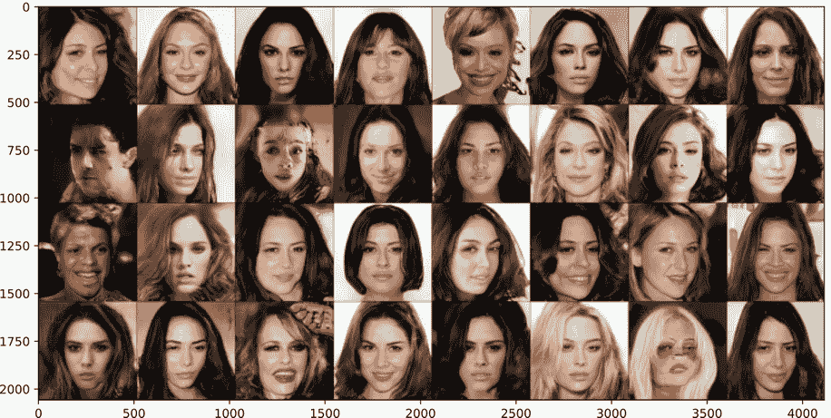

也许你希望每个人都快乐！我们可以使用我们提取的`smile`向量来做同样的事情，让每个人笑得更多：

```
    smile_vec = extractVec(smile, noise) 
    with torch.no_grad():
        generated_images = model.test(noise+smile_vec) 
    grid = torchvision.utils.make_grid(generated_images.clamp(min=-1, max=1), 
    ➥ scale_each=True, normalize=True) 
    plt.figure(figsize=(13,6)) 
    plt.imshow(grid.permute(1, 2, 0).cpu().numpy())

[58]: <matplotlib.image.AxesImage at 0x7f2ab47d0750>
```

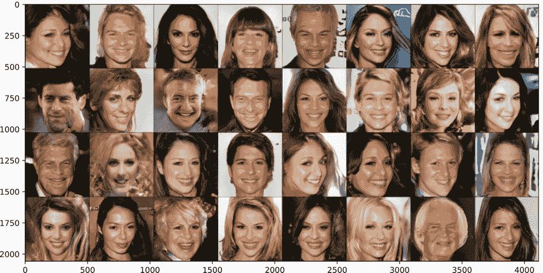

## 9.7 深度学习中的伦理

在第四章中，我们简要地偏离了主题，讨论了理解我们如何建模世界以及使用这些模型如何影响他人感知世界的重要性。现在我们已经了解了 GANs，这是一个值得再次讨论的话题。

GANs 学习到的语义概念基于数据，并不一定代表世界运作的真实情况。例如，大多数人都会认同并表现出自己是男性或女性，这在我们的数据中有所体现，因此 GAN 学习到男性和女性之间的一种相对线性的关系，作为一个统一的光谱。但这并不符合许多不适合仅限于男性或女性类别的人的现实。因此，在使用 GAN 对图像进行性别操纵之前，你应该三思而后行。

对于你构建的任何系统（机器学习或其他），你应该问自己一些简单的问题：它将如何影响使用该系统的多数人？它将如何影响使用该系统的少数人？是否有受益或受损的人，这些人是否应该得到这种利益或损害？你的部署是否会以积极或消极的方式改变人们的行为，或者甚至被有良好意图的用户滥用？通常，从微观和宏观层面思考*可能出错的地方*。

我并不是试图向你强加任何哲学或道德信念体系。伦理是一个非常复杂的话题，我无法在一个章节的小节中公正地处理它（而且这也不是本书的主题）。但是，随着深度学习的发展，我们能够自动化许多不同的事情。这可能会给社会带来好处，让人们从繁重和耗人的工作中解放出来，但它也可能以新的高效规模放大和复制不希望存在的差异。因此，我希望你有所警觉，并开始训练自己思考这些类型的考虑。以下是一些你可以使用的资源链接，以帮助你加深对这些问题的理解：

+   首先，一篇较老的文章，它从更广泛的角度捕捉了许多这些担忧：B. Friedman 和 H. Nissenbaum，“计算机系统中的偏见”，*ACM Trans. Inf. Syst.* 第 14 卷，第 3 期，第 330-347 页，1996 年，[`doi.org/10.1145/230538.230561`](https://doi.org/10.1145/230538.230561)，[`nissenbaum.tech.cornell.edu/papers/Bias%20in%20Computer%20Systems.pdf`](https://nissenbaum.tech.cornell.edu/papers/Bias%20in%20Computer%20Systems.pdf)。

+   我之前提到了凯特·克劳福德（www.katecrawford.net），我还推荐蒂姆尼特·盖布卢（[`scholar.google.com/citations?user=lemnAcwAAAAJ`](https://scholar.google.com/citations?user=lemnAcwAAAAJ)）和鲁本·宾斯（[`www.reubenbinns.com/`](https://www.reubenbinns.com/)）。

+   尤其是鲁本·宾斯的论文“机器学习中的公平性：政治哲学的启示”，R. Binns，*机器学习研究会议论文集* 第 81 卷，第 1-11 页，2018 年，[`proceedings.mlr.press/v81/binns18a/binns18a.pdf`](http://proceedings.mlr.press/v81/binns18a/binns18a.pdf)。它易于理解，并从不同的角度阐述了棘手的公平性概念意味着什么。

你不需要掌握这些知识就能成为一名优秀的深度学习研究人员或实践者，但你*应该*学会思考和考虑这些问题。如果你知道得足够多，仅仅说，“这可能会是一个问题；我们应该寻求一些指导”，你比许多今天的实践者更有准备。

尤其是操纵图像的能力，导致了被称为*深度伪造*的研究领域和问题。GANs 是这个问题的关键组成部分。它们被用来模仿声音和改变视频，使口型与提供的音频相匹配，并且它们是误导他人的强大工具。你现在已经知道足够多的知识来开始构建或使用能够做到这一点的系统，而这也带来了考虑这些行动和后果的责任。如果你将代码发布到网上，它是否容易被滥用来伤害他人？将代码放入公共领域的利益是什么？这些利益是否超过了危害？在这些情况下，你也可能想要考虑如何减轻这些危害。如果你创建了一个可能被滥用的生成器，也许你可以致力于开发一个检测器，可以判断图像是否来自你的模型/方法，从而帮助检测任何恶意使用。

这些问题可能看起来很抽象，但随着你技能和能力的提升，它们将成为实际问题。例如，最近的一份报告⁵显示，深度伪造正被用来骗取人们数十万美元。我的目标不是强迫你采取任何特定的行动；正如我之前所说的，道德不是一个黑白分明、答案简单的问题。但这是你在工作时应该开始深思熟虑的问题。

## 练习

在 Manning 在线平台 Inside Deep Learning 练习中分享和讨论你的解决方案([`liveproject.manning.com/project/945`](https://liveproject.manning.com/project/945))。一旦你提交了自己的答案，你将能够看到其他读者提交的解决方案，并看到作者认为哪些是最好的。

1.  提高卷积生成器 G 的另一个技巧是从一个或两个全连接的隐藏层开始，并将它们的输出重塑为一个张量 (*B*,*C*′,*W*′,*H*′)。试着亲自实现这个方法。你认为结果看起来更好吗？

1.  我们在 `ConditionalWrapper` 类中的 `combiner` 网络是为全连接网络设计的。这将是我们判别器 D 使用时的问题。修改 `ConditionalWrapper` 类，当 `input_shape` 指示 `main_network` 是 CNN 时，为 `combiner` 定义一个小型 CNN。使用此方法训练条件 CNN GAN。

1.  操作新图像 x 的一个挑战是为其获取一个潜在向量 z。修改 `train_wgan` 函数以接受一个可选的网络 E，该网络是 *编码器* 网络。E 接受图像 x 并尝试预测生成 x 的潜在向量 z。因此，它将有一个损失 ∥*E*(*G*(*z*)) − *z*∥[2]。测试编码器，并可视化 *G*(*z*) 生成的图像，然后 *G*(*E*(*G*(*Z*)))，然后 *G*(*E*(*G*(*E*(*G*(*Z*)))))（即生成一个图像，然后生成该图像的编码版本，然后生成前一个图像的编码版本）。

1.  你可以创建解决复杂任务（如 *修复*）的 GAN，其中你需要填充图像的缺失部分。用上一章的 U-Net 架构替换生成器 G。使用 `RandomErasing` 转换创建噪声输入 ，这是 GAN 的输入。判别器保持不变，并且不再有潜在变量 z。训练此模型，并检查它在修复任务上的表现如何。

1.  一旦你让练习 3 运行起来，就创建一个新的版本，其中你的 U-Net G 接收噪声图像  和潜在向量 z。这个模型与第一个模型的行为有何不同？

1.  **挑战性：** 阅读论文“Image-to-Image Translation with Conditional Adversarial Networks” ([`arxiv.org/abs/1611.07004`](https://arxiv.org/abs/1611.07004))。它定义了一个名为 pix2pix 的 GAN。看看你是否能理解论文的大部分内容。如果你觉得有勇气，尝试自己实现它，因为你已经了解并使用了论文中的每个组件！

1.  使用 PGAN 模型生成更多图像，并创建自己的语义向量来操作它们。

## 摘要

+   GAN 通过设置两个相互对抗的网络来工作。每个网络都帮助对方学习。

+   GAN 是一种生成建模方法，这意味着生成器 G 模型比判别器 D 模型有更困难的任务。这种难度差异导致了一个称为模式坍塌的问题，其中生成器只关注数据的较容易的部分。

+   几种减少梯度消失的细微技巧帮助我们更快、更好地训练 GAN，无论是全连接还是卷积架构。

+   GAN 可能会遭受模式坍塌，导致它们过度关注最常见或最简单的事物，而不是学习生成多样化的输出。

+   Wasserstein GAN 在判别器上增加了一个惩罚项，防止它过于擅长 GAN 游戏，从而有助于减少模式坍塌。

+   我们可以在某些标签上对 GAN 的输出进行条件化，使我们能够创建一对一或多对一模型，并控制 GAN 生成的内容。

+   GANs 学习具有语义意义的潜在表示。我们可以提取重复某个概念的向量，并使用它们来操纵图像。

+   GANs 提高了考虑模型伦理影响的需求，并且在部署模型时，你应该始终问自己可能会出什么问题。

* * *

¹ 由 M. Arjovsky、S. Chintala 和 L. Bottou 提出，“Wasserstein 生成对抗网络”，*第 34 届国际机器学习会议论文集*，第 70 卷，第 214–223 页，2017 年。我们展示了 I. Gulrajani、F. Ahmed、M. Arjovsky、V. Dumoulin 和 A. C. Courville 的版本，“改进 Wasserstein GAN 的训练”，*神经信息处理系统进展*，第 30 卷，第 5767–5777 页，2017 年。↩

² 虽然有一个先出现的 WGAN，但我发现 WGAN-GP 更容易使用，并且其行为更一致。↩

³ 更好的方法是一个活跃的研究问题，但我们的简单方法效果惊人。↩

⁴ 人们对于“语义”的含义有着许多不同的心理模型，这对许多研究人员来说是个烦恼。我们不会陷入这个兔子洞。↩

⁵ L. Edmonds，“诈骗者使用深度伪造视频在 Skype 聊天中冒充美国海军上将，从加州寡妇那里骗走了近 30 万美元，”*每日邮报*，2020 年，[`mng.bz/2j0X`](http://mng.bz/2j0X)。↩
