# 10 注意力机制

本章涵盖

+   理解注意力机制及其使用时机

+   为注意力机制添加上下文以实现上下文敏感的结果

+   使用注意力处理可变长度项目

想象一下在繁忙的咖啡馆和几个朋友聊天。周围有其他对话和人们下单以及用手机交谈。尽管有所有这些噪音，但你，凭借你复杂而精致的大脑和耳朵，可以只关注*重要的东西*（你的朋友！），并选择性地忽略你周围发生的、不相关的事情。这里重要的是你的*注意力是适应性的*。只有当没有更重要的事情发生时，你才会忽略背景声音，只听你的朋友。如果响起火灾警报，你会停止关注你的朋友，将注意力集中在这个新的、重要的事情上。因此，注意力是关于适应输入的相对重要性。

深度学习模型也可以学习关注某些输入或特征，而忽略其他特征。它们通过*注意力机制*来完成这项任务，这是我们可以强加给网络的另一种先验信念。注意力机制帮助我们处理输入中可能部分无关的情况，或者当我们需要关注模型中输入的多个特征中的一个时。例如，如果你正在将一本书从英语翻译成法语，你不需要理解整本书就能翻译第一句话。你将在英语翻译中输出的每个单词将仅取决于同一句子中附近的一两个单词，你可以忽略大多数周围的法语句子和内容。

我们希望赋予我们的网络忽略多余和分散注意力的输入，专注于最重要的部分的能力，这就是注意力机制的目标。如果你认为你的某些输入特征相对于其他特征更重要或更不重要，你应该考虑在你的模型中使用基于注意力的方法。例如，如果你想实现语音识别、目标检测、聊天机器人或机器翻译等领域的最先进结果，你可能会使用注意力机制。

在本章中，我们通过一些玩具问题来了解注意力机制的工作原理，以便在下一章中，我们可以构建更加复杂和高级的东西。首先，我们从 MNIST 数据集中创建一个玩具问题，这个问题对于一个普通网络来说太难解决，但通过一种简单的注意力机制可以轻松且更好地解决，这种机制学会了如何评估输入中每个项目的*重要性*。然后，我们将简单的注意力机制改进为一个完整的方案，该方案考虑了一些*上下文*，以更好地推断输入中项目的重要性。这样做也将使我们能够使注意力机制适用于可变长度的数据，这样我们就可以处理填充数据。

## 10.1 注意力机制学习相对输入的重要性

既然我们已经讨论了注意力的直觉，让我们创建一个玩具数据集。我们将修改 MNIST 数据集以创建一种新的任务，所以让我们快速加载它：

```
mnist_train = torchvision.datasets.MNIST("./", train=True, 
➥ transform=transforms.ToTensor(), download=True) 
mnist_test = torchvision.datasets.MNIST("./", train=False, 
➥ transform=transforms.ToTensor(), download=True)
```

注意力机制在我们有 *多个项目* 作为模型输入时最有用。由于 MNIST 是一个单个数字，我们将 MNIST 中的每个项目增强为数字袋子。我们为此使用全连接层（即平展的 MNIST，忽略图像性质），因此我们不再有一个数字批（*B*，*D*），而是一个 T 个数字（*B*，*T*，*D*）。那么我为什么叫它*袋子*而不是序列呢？因为我们不关心数字在张量中的呈现顺序。我们只需要一个足够大的张量来容纳袋子中的所有内容。

给定一个包含数字 **x**[1]，**x**[2]，…，**x**[T] 的数字袋子，我们有一个标签 y，它等于袋子中的*最大*数字。如果我们的袋子包含 0，2，9，那么这个袋子的标签就是“9。”以下代码实现了一个 `LargestDigit` 类来包装输入数据集，并通过随机填充一个包含 `toSample` 个项目的袋子并选择最大标签值来创建新项目：

```
class LargestDigit(Dataset): 
    """ 
    Creates a modified version of a dataset where some number of samples 
    ➥ are taken, and the true label is the largest label sampled. When 
    ➥ used with MNIST, the labels correspond to their values (e.g., digit "6" 
    ➥ has label 6) 
    """

    def __init__(self, dataset, toSample=3): 
        """ 
        dataset: the dataset to sample from 
        toSample: the number of items from the dataset to sample 
        """
        self.dataset = dataset 
        self.toSample = toSample

    def __len__(self): 
        return len(self.dataset)

    def __getitem__(self, idx): 
        selected = np.random.randint(0, 
        ➥ len(self.dataset), size=self.toSample)                   ❶ 
        x_new = torch.stack([self.dataset[i][0] for i in selected]) ❷ 
        y_new = max([self.dataset[i][1] for i in selected])         ❸

        return x_new, y_new                                         ❹
```

❶ 从数据集中随机选择 n=self.toSample 个项目

❷ 将形状为 (B, *) 的 n 个项目堆叠成 (B, n, *)

❸ 标签是最大标签。

❹ 返回 (data, label) 对！

注意为什么不说这是一个*集合*呢？集合意味着不允许重复，而一个袋子允许重复发生。这符合 Python `set`类的行为，其中重复的项会自动从集合中移除。我们正在创建的问题类型类似于一个名为多实例学习的研究领域，¹，如果你想了解其他在数据袋上工作的模型类型。

这是对模型来说更难的一个版本，需要从 MNIST 数据集中学习。给定一个带有标签的袋子，模型必须自行推断输入中的哪个项目是最大的，使用这个信息来逐渐学会识别所有 10 个数字，并学会这些数字是有序的，然后返回袋子中的最大数字。

### 10.1.1  训练我们的基线模型

以下代码块设置了我们的训练/测试加载器，并使用批大小 *B* = 128 个项目和 10 个训练周期：

```
B = 128 
epochs = 10

largest_train = LargestDigit(mnist_train) 
largest_test = LargestDigit(mnist_test)

train_loader = DataLoader(largest_train, batch_size=B, shuffle=True) 
test_loader = DataLoader(largest_test, batch_size=B)
```

如果我们绘制数据集中的一个项目，我们应该看到修改后的数据集与我们描述的相匹配。以下代码从数据集中随机抽取一个样本并获取数字 8，2 和 6\. “8” 是最大的标签，所以 8 是正确答案。在这种情况下，数字 2 和 6 *并不重要*，因为 2 < 8 和 6 < 8\. 它们可以是任何小于 8 的数字，以任何顺序排列，结果都不会改变。我们希望我们的模型学会*忽略*较小的数字：

```
x, y = largest_train[0]

f, axarr = plt.subplots(1,3, figsize=(10,10)) 
for i in range(3):
    axarr[i].imshow(x[i,0,:].numpy(), cmap=’gray’, vmin=0, vmax=1) 
print("True Label is = ", y)

True Label is = 8
```

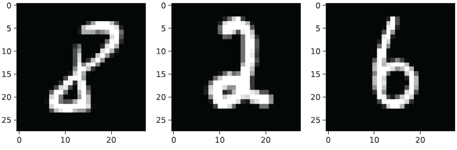

现在我们有了这个玩具问题，让我们训练一个简单的全连接网络，并将其视为我们可能尝试的任何其他分类问题。这将是我们的基线，并展示新版本的 MNIST 有多难：

```
neurons = 256 
classes = 10 
simpleNet = 
    nn.Sequential( nn.Flatten(), 
    nn.Linear(784*3,neurons), ❶ 
    nn.LeakyReLU(), 
    nn.BatchNorm1d(neurons), 
    nn.Linear(neurons,neurons), 
    nn.LeakyReLU(), 
    nn.BatchNorm1d(neurons), 
    nn.Linear(neurons,neurons), 
    nn.LeakyReLU(), 
    nn.BatchNorm1d(neurons), 
    nn.Linear(neurons, classes ) 
) 
simple_results = train_network(simpleNet, nn.CrossEntropyLoss(), 
➥ train_loader, val_loader=test_loader, epochs=epochs, 
➥ score_funcs=’Accuracy’: accuracy_score, device=device)
```

❶ 784*3，因为一个图像中有 784 个像素，捆绑中有 3 个图像

我们已经训练好了模型，可以绘制结果。由于这是 MNIST，我们只需使用全连接层就可以轻松地获得 98%的准确率。但是，这个捆绑数据集导致全连接网络几乎只能达到 92%的准确率，即使我们使用了像 LeakyReLUs 和批量归一化这样的花哨技巧：

```
    sns.lineplot(x=’epoch’, y=’val Accuracy’, data=simple_results, 
    ➥ label=’Regular’)

[11]: <AxesSubplot:xlabel='epoch', ylabel='val Accuracy'>
```

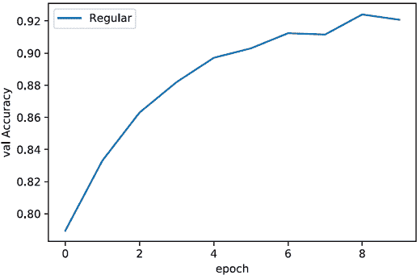

### 10.1.2  注意力机制机制

接下来，我们将设计一种非常简单的注意力机制，它将朝着我们在本章后面学习到的更完整的注意力机制迈出一步。我们使用的主要工具是第二章中的 softmax 函数 *s**m*(*x*)。记住，一旦我们计算出 **p** = *s**m*(**x**)，p 就代表一个概率分布。概率分布的所有值都大于或等于零，所有值的总和为 1。用数学方式表达就是 0 ≤ **p**[i] ≤ 1 和 ∑[i]**p**[i] = 1。记住，注意力机制的主要功能是忽略输入的一部分，我们通过将忽略的部分与接近零的小值相乘来实现这一点。如果我们把某物乘以零，我们得到零，实际上是从输入中删除它。多亏了 softmax 计算，我们可以学习如何将输入乘以接近零的小值，从而有效地学习如何忽略它们。

图 10.1 展示了注意力机制的三步主要步骤。前两个步骤是微不足道的，并且将根据你的网络和问题而变化：简单地将你的特征输入到网络中，并在应用注意力机制之前有一些初始隐藏层，这样它们就可以学习到一个有用的表示。然后进行最后的步骤，执行注意力操作：

1.  使用 *得分* 函数为每个输入 **x**[t] 分配一个得分。

1.  对所有得分计算 softmax。

1.  将每个项目乘以其 softmax 得分，然后将所有结果相加得到输出 x̄。

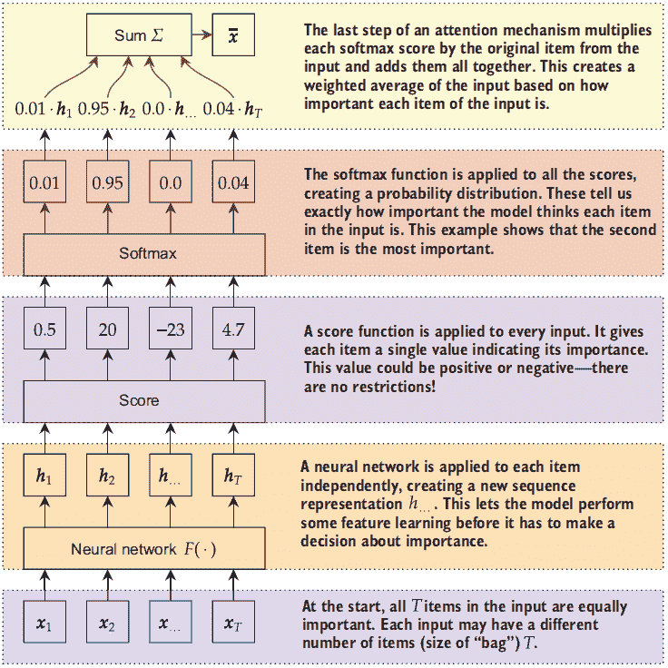

图 10.1 展示了注意力机制的工作原理图。输入序列 **x**[t] 的数量可以是可变的（即，你可以有 *T* = 1 个项目，*T* = 13，或者 *T* = 你喜欢的任何数量）。一个 *得分* 函数为每个项目 t 分配一个原始重要性值。softmax 函数创建相对得分。输出然后是输入的加权平均值。

让我们用更数学的符号重新表述一些内容，以填补一些细节。注意力机制通常的工作方式是，我们将输入表示为 T 个不同的组件 **x**[1], **x**[2], …, **x**[T]，每个组件都有一个张量表示 **x**[t] ∈ ℝ^D。这 T 个项目可以是输入中的自然断点（例如，在这个玩具问题中我们自然有不同的图像），或者它们可以是强制的（例如，我们可以将单个图像分割成子图像）。每个输入 **x**[t] 被转换成一个新的张量 **h**[t] = *F*(**x**[t])，其中 *F*(⋅) 是一个神经网络。这意味着注意力机制的输入不必是模型中的第一个输入，但可以是已经完成的一些计算的结果。

注意 这也意味着 **x**[t] 不必是一个一维张量。例如，网络 *F*(⋅) 可能是一个卷积神经网络，**x**[t] ∈ ℝ^((*C*,*W*,*H*)). 我们现在将其简化为一维是为了方便。然而，我们通常确实希望 **h**[t] 是一维的。

因此，处理后的序列 **h**[1], **h**[2], …, **h**[T] 是注意力机制的真正输入。接下来，我们需要为每个输入 **x**[i] 学习一个重要性分数 *α̃*[i]。假设一个不同的函数 *α̃*[i] = score(*F*(**x**[i])) 学习计算这个分数。再次，函数 score(⋅) 是 *另一个* 神经网络。这意味着我们的模型本身将学会如何为我们评分输入。

然后我们想要将重要性归一化为一个概率，所以我们得到 **α** = *α*[1], *α*[2], …, *α*[T] = *s**m*(*α̃*[1],*α̃*[2],…,*α̃*[T])。有了这些组合，我们现在可以计算表示 **h**[t] 的加权平均。具体来说，我们首先计算由 α 表示的 softmax 分数：

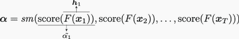

接下来我们计算注意力机制的输出 x̄：

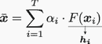

如果第 j 个项目 **x**[j] 不重要，希望我们的网络学会将项目 j 的值设置为 *α*[j] ≈ 0，在这种情况下，它将成功地忽略第 j 个项目！这个想法并不太复杂，特别是与一些我们之前学过的早期项目（如 RNNs）相比。但这种方法已被证明非常强大，并且可以为许多问题带来显著的改进。

### 10.1.3 实现简单的注意力机制

现在我们已经了解了注意力机制的工作原理，让我们为我们的捆绑 MNIST 问题实现一个简单的注意力机制。我们还没有考虑我们数据卷积的特性，所以如果我们想将我们的图像捆绑 (*B*,*T*,*C*,*W*,*H*) 转换为特征向量捆绑 (*B*,*T*,*C*⋅*W*⋅*H*)，我们需要一个新的 `nn.Flatten` 函数版本，它保留张量的前两个轴。这通过以下 `Flatten2` 类很容易实现。它只是创建输入的一个视图，但明确使用前两个轴作为视图的起始点，并将所有剩余的值放在末尾：

```
class Flatten2(nn.Module): 
    """ 
    Takes a vector of shape (A, B, C, D, E, ...) 
    and flattens everything but the first two dimensions, 
    giving a result of shape (A, B, C*D*E*...) 
    """ 
    def forward(self, input): 
        return input.view(input.size(0), input.size(1), -1)
```

下一步是创建一些类来实现我们的注意力机制。我们需要的主要是一个 `Module`，它接受注意力权重 α 和提取的特征表示 **h**[1]，**h**[2]，…，**h**[T]，并计算加权平均值 **x̄** = Σ[i]^T[=1] *α*[i] · **h**[i]。我们称这个为 `Combiner`。我们接受一个网络 `featureExtraction`，它为输入中的每个项目计算 **h**[t] = *F*(**x**[t])，以及一个网络 `weightSelection`，它从提取的特征中计算 α。

定义组合模块

这个 `Combiner` 的前向函数相当简单。我们计算 `features` 和 `weights`，正如我们描述的那样。我们进行一些张量操作，以确保 `weights` 的形状允许我们与特征进行成对乘法，因为成对乘法需要张量具有相同数量的轴。此外，请注意，我们在每一行都添加了关于每个张量形状的注释。注意力机制涉及许多变化的形状，因此包含这样的注释是个好主意：

```
class Combiner(nn.Module): 
    """ 
    This class is used to combine a feature extraction network F and an 
    ➥ importance prediction network W, and combine their outputs by adding 
    ➥ and summing them together. 
    """

    def __init__(self, featureExtraction, weightSelection): 
        """
        featureExtraction: a network that takes an input of shape (B, T, D) 
        ➥ and outputs a new 
        representation of shape (B, T, D’). 
        weightSelection: a network that takes in an input of shape 
        ➥ (B, T, D’) and outputs 
        a tensor of shape (B, T, 1) or (B, T). It should be normalized, 
        ➥ so that the T
        values at the end sum to one (torch.sum(_, dim=1) = 1.0) 
        """
        super(Combiner, self).__init__() 
        self.featureExtraction = featureExtraction 
        self.weightSelection = weightSelection

    def forward(self, input): 
        """ 
        input: a tensor of shape (B, T, D) 
        return: a new tensor of shape (B, D’) 
        """ 
        features = self.featureExtraction(input) ❶

        weights = self.weightSelection(features) ❷

        if len(weights.shape) == 2:              ❸

        weights.unsqueeze(2)                     ❹

        r = features*weights                     ❺

        return torch.sum(r, dim=1)               ❻
```

❶ (B, T, D) **h**[i] = *F*(**x**[i])

❷ (B, T) 或 (B, T, 1) 用于 α

❸ (B, T) 形状

❹ 现在 (B, T, 1) 形状

❺ (B, T, D)；计算 *α*[i] ⋅ **h**[i]

❻ 对 T 维度求和，得到 (B, D) 最终形状

定义骨干网络

现在我们已经准备好为这个问题定义基于注意力的模型。首先，我们快速定义两个变量——`T` 表示包中项目的数量，`D` 表示特征的数量：

```
T = 3 
D = 784
```

首先要定义的是特征提取网络。我们也可以称这个网络为骨干网络，因为它遵循与第八章中 Faster R-CNN 的骨干网络相同的直觉。这个网络将承担所有繁重的工作，为输入中的每个项目学习一个良好的表示 **h**[i]。

使其易于实现的小技巧是记住 `nn.Linear` 层可以作用于形状为 (*B*,*T*,*D*) 的张量。如果你有一个这种形状的输入，`nn.Linear` 层将独立地应用于所有 T 个项目，就像你写了一个这样的 `for` 循环：

```
for i in range(T): 
    h_i = linear(x[:,i,:])        ❶
    h_is.append(h_i.unsqueeze(1)) ❷ 
h = torch.cat(h_is, dim=1)        ❸
```

❶ (B, D)

❷ 使其变为 (B, 1, D)

❸ (B, T, D)

因此，我们可以使用 `nn.Linear` 后跟任何激活函数来分别应用这个骨干到每个输入：

```
backboneNetwork = nn.Sequential( Flatten2(), ❶
    nn.Linear(D,neurons),                    ❷ 
    nn.LeakyReLU(), 
    nn.Linear(neurons,neurons), 
    nn.LeakyReLU(), 
    nn.Linear(neurons,neurons), 
    nn.LeakyReLU(),                          ❸ 
)
```

❶ 形状现在是 (B, T, D)

❷ 形状变为 (B, T, 神经元)

❸ 仍然 (B, T, 神经元) 在输出路径上

定义一个注意力子网络

现在我们需要一个网络来计算注意力机制权重 α。遵循骨干逻辑，我们假设特征提取网络已经完成了繁重的工作，因此我们的注意力子网络可以相对较小。我们有一个隐藏层，然后是一个显式输出大小为 `1` 的第二层。我们需要这样做，因为输入中的每个项目都会得到 *一个* 分数。然后我们在 T 维度上应用 softmax 来归一化每个包组的这些分数：

```
attentionMechanism = nn.Sequential( 
    nn.Linear(neurons,neurons),             ❶
    nn.LeakyReLU(), 
    nn.Linear(neurons, 1 ),                 ❷ 
    nn.Softmax(dim=1), 
)
```

❶ 形状是 (B, T, 神经元)

❷ (B, T, 1)

训练一个简单的注意力模型及其结果

基于特征提取主干和权重计算注意力机制，我们现在可以定义一个完整的基于注意力的网络。它从一个`Combiner`开始，该`Combiner`接收我们定义的两个子网络，然后是任意数量的我们想要的完全连接层。通常，主干已经做了很多工作，所以在这个步骤中你通常只需要两到三个隐藏层。然后我们训练模型：

```
simpleAttentionNet = nn.Sequential( 
    Combiner(backboneNetwork, attentionMechanism), ❶ 
    nn.BatchNorm1d(neurons), 
    nn.Linear(neurons,neurons), 
    nn.LeakyReLU(), 
    nn.BatchNorm1d(neurons), 
    nn.Linear(neurons, classes ) 
) 
simple_attn_results = train_network(simpleAttentionNet, 
➥ nn.CrossEntropyLoss(), train_loader, val_loader=test_loader, 
➥ epochs=epochs, score_funcs={’Accuracy’: accuracy_score}, device=device)
```

❶ 输入是(B, T, C, W, H)。组合器使用主干和注意力进行处理。结果是(B, 神经元)。

训练完成后，我们可以查看我们模型的准确率。仅仅经过一个 epoch，我们简单的注意力网络就已经比常规网络表现更好：

```
    sns.lineplot(x=’epoch’, y=’val Accuracy’, data=simple_results, 
    ➥ label=’Regular’) 
    sns.lineplot(x=’epoch’, y=’val Accuracy’, data=simple_attn_results, 
    ➥ label=’Simple Attention’)

[18]: <AxesSubplot:xlabel='epoch', ylabel='val Accuracy'>
```

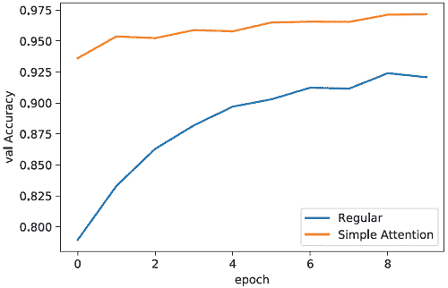

我们还可以从数据集中选择随机样本，并查看注意力机制如何选择输入。以下是一些简单的代码来运行一个样本；以下图形显示了红色覆盖在每个数字上的注意力权重。以“0, 9, 0”作为输入，注意力机制正确地将几乎所有的权重放在数字 9 上，允许它做出准确的分类：

```
x, y = largest_train[0]                             ❶ 
x = x.to(device)                                    ❷

with torch.no_grad(): weights =
attentionMechanism(backboneNetwork(x.unsqueeze(0))) ❸ 
weights = weights.cpu().numpy().ravel()             ❹

f, axarr = plt.subplots(1,3, figsize=(10,10))       ❺ 
for i in range(3):
axarr[i].imshow(x[i,0,:].cpu().numpy(),             ❻ 
➥ cmap=’gray’, vmin=0, vmax=1) 
axarr[i].text(0.0, 0.5, str(round(weights[i],2)),   ❼
➥ dict(size=40, color=’red’))

print("True Label is = ", y)

True Label is = 9
```

❶ 选择一个数据点（它是一个包）

❷ 将其移动到计算设备

❸ 应用得分(F(x))

❹ 转换为 NumPy 数组

❺ 为所有三个数字绘制一个图

❻ 绘制数字

❼ 在左上角绘制注意力得分

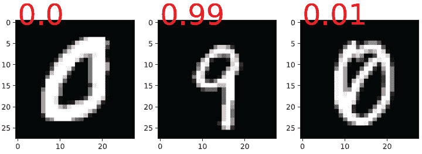

我们已经看到这个简单的注意力如何帮助我们更快、更好地学习当只有输入子集重要时的网络。但有两个悬而未决的问题。首先，我们有一个天真的期望，即批处理中的*所有内容*大小相同。我们需要一些填充来解决这个问题，就像我们在我们的 RNNs 中使用的那样。

第二个问题是我们的得分缺乏*上下文*。一个项目的重要性取决于其他项目。想象你正在看电影。你关注的是电影，而不是外面的鸟或正在运行的洗碗机，因为电影更重要。但如果你听到火灾警报，情况就会改变。现在，我们的`attentionMechanism`网络独立地查看每个项目，所以电影和火灾警报都可能得到高分数——但在现实中，它们的分数应该相对于其他存在的事物是相对的。

## 10.2 添加一些上下文

我们对注意力机制方法的第一项改进是向得分中添加上下文。我们保留所有其他部分不变。通过*上下文*，我们指的是项目**x**[i]的得分应该依赖于所有其他项目**x**[*j* ≠ *i*]。现在我们有一个主干特征提取器*F*(⋅)和一个重要性计算器得分(⋅)。但这意味着任何输入**x**[i]的重要性是在没有任何关于其他输入的上下文的情况下确定的，因为得分(⋅)是独立应用于一切的。

为了了解我们为什么需要上下文，让我们回到那个嘈杂的咖啡馆，你在那里和朋友聊天。你为什么忽略所有的背景噪音？因为你有一个**上下文**，知道你的朋友在说话，他们对你来说比其他对话更重要。但如果你的朋友不在场，你可能会发现自己正在倾听周围随机的对话。

换句话说，注意力机制使用**全局**信息来做出**局部**决策。局部决策以权重α的形式出现，上下文提供了全局信息。²

我们如何将上下文添加到注意力机制中？图 10.2 展示了我们是如何实现这一点的。

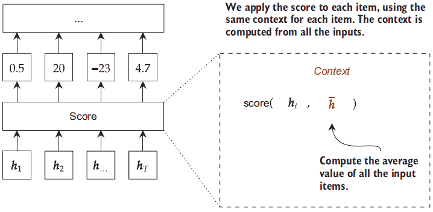

图 10.2 左侧的注意力机制过程保持不变，除了分数组件。右侧放大了分数的工作方式。分数块接收来自骨干/特征提取网络的**h**[...]结果。对于每个分数**α̃**[t]，使用两个输入：**h**[t]，我们想要计算其分数，以及，它代表所有输入**h**[...]的上下文。这个上下文![bar_h.png]可以是所有项目的简单平均值。

我们将 score(⋅,⋅)设计成一个网络，它接收两个输入：输入的张量(*B*,*T*,*H*)和第二个形状为(*B*,*H*)的张量，包含每个序列的上下文。我们在这里使用 H 来表示状态**h**[t] = *F*(**x**[t])中的特征数量，以使其与原始输入**x**[i]的大小 D 区分开来。这个形状为(*B*,*H*)的第二个上下文张量没有时间/序列维度 T，因为这个向量打算用作第一个输入的所有 T 个项目的上下文。这意味着包中的每个项目在计算其分数时都会得到相同的上下文。

我们可以使用最简单的上下文形式是所有提取特征的平均值。所以如果我们有**h**[i] = *F*(**x**[i])，我们可以从所有这些计算平均![bar_h.png]，给模型一个大致的了解，它可以选择的所有选项。这使得我们的注意力计算分为三个步骤：

1.  计算从每个输入提取的特征的平均值。这把所有东西都视为同等重要：

    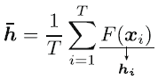

1.  计算 T 个输入的注意力分数α。这里唯一的改变是我们将![bar_h.png]作为每个分数计算的第二个参数：

    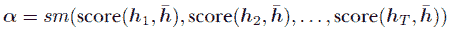

1.  计算提取特征的加权平均值。这部分与之前相同：

    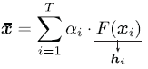

这个简单的流程为我们提供了一个新的注意力分数框架，使我们能够根据其他存在的项目来调整项目的分数。我们仍然希望我们的分数网络非常简单和轻量级，因为骨干 *F*(⋅) 将会承担繁重的工作。从表示 h 和上下文  计算分数有三种常见方法，通常称为 *点积*、*通用* 和 *加法* 分数。请注意，这些方法中没有一种是普遍认为比其他更好的——注意力机制仍然非常新颖，以下每种方法在不同的情境下可能比其他方法更有效或更无效。我现在能给你的最好建议是尝试所有三种方法，看看哪一种最适合你的问题。我们将逐一讨论它们，因为它们很简单，然后在我们的小问题实例上运行所有这些方法，看看会发生什么。在描述中，我使用 H 来指代进入注意力机制的维度/神经元的数量。

### 10.2.1  点积分数

点积分数是一种最简单的评分方法，但也可以是最有效的。其想法是，如果我们有一个项目 **h**[t] 和一个上下文 ，我们取它们的点积 ***h**[t]*^⊤ ，以得到一个分数。我们取点积是因为它衡量两个向量在方向和大小上的对齐程度。在第七章中，我们讨论了向量是正交的：这个概念可以帮助你理解这一点。如果两个向量是正交的，它们的点积是 0，这意味着它们没有关系。它们越不正交，点积就越大。如果它是一个大的正数值，它们非常相似；如果它是一个大的负数值，它们非常不同。除了这个技巧之外，我们还把结果除以向量的维度 H 的平方根。这给我们带来了点积分数的以下方程：


为什么要除以 √*H*？担忧的是，正常的点积计算可能会导致更大的数值（非常大的正数或大负数）。大数值在计算 softmax 时会导致梯度消失，正如我们在 tanh 和 sigmoid（σ）激活函数中看到的那样。因此，我们除以√*H*来尝试避免大数值——使用平方根的具体选择是启发式地做出的，因为它往往有效。

实现这种方法相当简单。我们需要使用批矩阵乘法方法 `torch.bmm`，因为我们将会一次性计算所有 T 个时间步的得分。每个项目具有 (*T*,*H*) 的形状，而上下文——在我们使用 `unsqueeze` 函数向其末尾添加一个大小为 1 的维度之后——将具有 (*D*,1) 的形状。将形状为 (*T*,*H*) × (*H*,1) 的两个矩阵相乘得到 (*T*,1)，这正是我们需要的形状：每个项目一个得分。`torch.bmm` 对批处理中的每个项目应用此操作，因此 `torch.bmm((B, T, H), (B, H, 1))` 的输出形状为 (*B*,*T*,1)。接下来的 `DotScore` 将其实现为一个可重用的 `Module`，其中 `forward` 函数接受 `states` 和 `context`。我们将重用此模式来处理其他两种得分方法：

```
class DotScore(nn.Module):

    def __init__(self, H): 
        """ 
        H: the number of dimensions coming into the dot score. 
        """ 
        super(DotScore, self).__init__() 
        self.H = H

    def forward(self, states, context): 
        """ 
        states: (B, T, H) shape 
        context: (B, H) shape 
        output: (B, T, 1), giving a score to each of the T items based 
        ➥ on the context 
        """ 
        T = states.size(1) scores =
        torch.bmm(states,context.unsqueeze(2)) 
        ➥ / np.sqrt(self.H) ❶ 
       return scores
```

❶ 计算 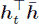。 (B, T, H) -> (B, T, 1)。

### 10.2.2  一般得分

由于点积得分非常有效，我们能否改进它？如果  中的一个特征不是非常有用，我们能否学习不使用它？这就是 *一般* 得分背后的想法。我们不是简单地计算每个项目 **h**[t] 与上下文  之间的点积，而是在它们之间添加一个矩阵 W。这给我们

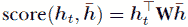

其中 W 是一个 *H* × *H* 矩阵。一般得分可以称为点积得分的推广，因为它可以学习与点积得分相同的解，但一般得分也可以学习点积得分无法学习的解。这种情况发生在模型学习将 W 设置为单位矩阵 I 时，因为对于任何可能的输入 z，**I****z** = **z**。

同样，这种实现很简单，因为一般得分有一个称为 *双线性关系* 的特性。双线性函数看起来像

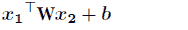

其中 **x**[1] ∈ ℝ^(*H*1) 和 **x**[2] ∈ ℝ^(*H*1) 是输入，b 和 W 是需要学习的参数。PyTorch 提供了一个 `nn.Bilinear(H1, H2, out_size)` 函数，可以为我们计算这个值。在我们的情况下，*H*1 = *H*2 = *H*，我们的输出大小是 1（每个项目一个得分值）。

我们需要了解两个技巧来实现这个方法，以便在一次调用中计算所有 T 个得分。我们有一个形状为 (*B*,*T*,*H*) 的张量用于我们的项目 **h**[1]，**h**[2]，…，**h**[T]，但一个形状为 (*B*,*H*) 的张量用于我们的上下文 。我们需要这两个张量具有相同数量的轴，以便在双线性函数中使用。技巧是将上下文堆叠成 T 个副本，这样我们就可以创建一个形状为 (*B*,*T*,*H*) 的矩阵：

```
class GeneralScore(nn.Module):

    def __init__(self, H): 
        """ 
        H: the number of dimensions coming into the dot score. 
        """ 
        super(GeneralScore, self).__init__() self.w =
        nn.Bilinear(H, H, 1)                                      ❶

    def forward(self, states, context): 
        """ 
        states: (B, T, H) shape 
        context: (B, H) shape 
        output: (B, T, 1), giving a score to each of the T items based 
        on the context 
        """ 
        T = states.size(1) 
        context = torch.stack([context for _ in range(T)], dim=1) ❷ 
        scores = self.w(states, context)                          ❸ 
        return scores
```

❶ 存储 W

❷ 重复值 T 次。 (B, H) -> (B, T, H)。

❸ 计算 ***h**[t]*^⊤ *W*。 (B, T, H) -> (B, T, 1)。

注意：我们引入 `GeneralScore` 是为了尝试改进 `DotScore`，这是合理的，因为它们之间有很强的相关性。然而，在实践中，今天似乎没有哪一个比另一个更好。正如我们提到的，注意力机制非常新，我们作为一个社区仍在探索它们。有时你会看到 `Dot` 比 `General` 表现得更好，有时则不是。

### 10.2.3  加性注意力

我们将要讨论的最后一种得分通常被称为 *加性* 或 *连接* 注意力。对于给定项及其上下文，我们使用向量 v 和矩阵 W 作为层的参数，形成一个小的神经网络，如下面的方程所示：

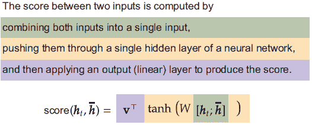

这个方程是一个简单的一层神经网络。W 是隐藏层，后面跟着 tanh 激活，v 是输出层，有一个输出³，这是必要的，因为得分应该是一个单一值。上下文  通过简单地将其与项目 **h**[t] 连接起来纳入模型，这样项目和它的上下文就成为了这个全连接网络的输入。

加性层的背后的思想相当简单：让一个小型神经网络为我们确定权重。虽然实现它需要一点巧妙，但操作预期是什么呢？v 和 W 都可以用 `nn.Linear` 层来处理，并且你需要使用 `torch.cat` 函数将两个输入 **h**[t] 和  连接起来，所以你可能这样注释前面的方程：


虽然这样描述是可行的，但它在计算上效率不高。它之所以慢，是因为我们不仅仅有 **h**[t]——我们有一个形状为 (*B*,*T*,*H*) 的大张量，其中包含 **h**[1]，**h**[2]，…，**h**[T]。因此，我们不想将其分成 T 个不同的项目并多次调用注意力函数，我们希望以这种方式实现它，即一次计算 T 个注意力得分，我们可以通过使用与一般得分相同的技巧来实现这一点。只需确保在堆叠技巧之后进行连接，以便张量具有相同的形状——并使用 `dim=2` 以便它们在特征维度 H 而不是时间维度 T 上进行连接。这个过程的一个图示如图 10.3 所示，以下代码显示了如何实现它：

```
class AdditiveAttentionScore(nn.Module):

    def __init__(self, H): 
        super(AdditiveAttentionScore, self).__init__() 
        self.v = nn.Linear(H, 1) 
        self.w = nn.Linear(2*H, H)                                    ❶

    def forward(self, states, context): 
        """ 
        states: (B, T, H) shape 
        context: (B, H) shape 
        output: (B, T, 1), giving a score to each of the T items based 
        ➥ on the context 
        """ 
        T = states.size(1)                                            ❷

        context = torch.stack([context for _ in range(T)], dim=1)     ❸

        state_context_combined = torch.cat( (states, context), dim=2) ❹
        scores = self.v(torch.tanh( 
        ➥ self.w(state_context_combined)))                           ❺ 
        return scores
```

❶ 2*H 因为我们要连接两个输入

❷ 重复值 T 次

❸ (B, H) -> (B, T, H)

❹ (B, T, H) + (B, T, H) -> (B, T, 2*H)

❺ (B, T, 2*H) -> (B, T, 1)

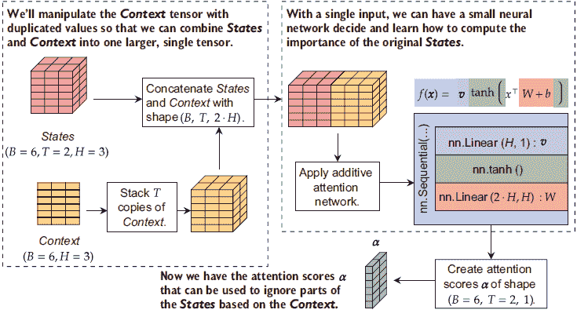

图 10.3 加性注意力的实现图。状态和上下文在左侧表示，上下文通过复制重塑以具有与状态相同的形状。这使得它们很容易连接起来，然后输入到神经网络中。

### 10.2.4  计算注意力权重

现在我们已经得到了我们想要的各个注意力得分，我们将定义一个简单的辅助`Module`，它接受原始得分 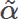 和提取的表示 **h**[…] 并计算最终的输出 x̄。这将通过添加一个新步骤来替换我们的`Combiner`模块：对输入应用*掩码*。

我们的玩具 MNIST 示例开始时所有袋子的大小都相同，这在现实生活中从未发生过。你将与之工作的任何数据集很可能包含包含可变数量项的输入（例如，要翻译的句子中的单词），如果我们对数据批次进行训练，我们必须处理这种不一致性。这就是为什么我们需要额外的逻辑来计算最终的权重α，以布尔*掩码*作为输入。掩码告诉我们输入的哪些部分是真实的（`True`）以及哪些是填充的（`False`），以使张量形状保持一致。这与第四章中我们填充较小项以与批次中最大的袋子/序列大小相同时的 RNN 几乎相同。掩码取代了打包代码的角色。

我们在这里使用的技巧是手动将每个具有`False`值的项的得分设置为非常大的负数，例如-1000。我们这样做是因为 exp(-1000) ≈ 5.076 × 10^(-435)，因此这很可能会下溢到零并导致*期望的*梯度消失。当计算下溢到零时，其梯度及其贡献为零，有效地消除了其对模型的影响。以下代码使用新的`ApplyAttention`类来完成此操作：

```
class ApplyAttention(nn.Module): 
    """ 
    This helper module is used to apply the results of an attention 
    ➥ mechanism to a set of inputs. 
    """

    def __init__(self): 
        super(ApplyAttention, self).__init__()

    def forward(self, states, attention_scores, mask=None): 
        """ 
        states: (B, T, H) shape giving the T different possible inputs 
        attention_scores: (B, T, 1) score for each item at each context 
        mask: None if all items are present. Else a boolean tensor of shape 
        (B, T), with ‘True‘ indicating which items are present / valid.

        returns: a tuple with two tensors. The first tensor is the 
        ➥ final context 
        from applying the attention to the states (B, H) shape. The 
        ➥ second tensor 
        is the weights for each state with shape (B, T, 1). 
        """

        if mask is not None: 
            attention_scores[ mask] = -1000.0            ❶ 
        weights = F.softmax(attention_scores, dim=1)     ❷

        final_context = (states*weights).sum(dim=1)      ❸ 
        return final_context, weights
```

❶ 将所有未出现的项设置为一个大负值，导致梯度消失

❷ 为每个得分计算权重。（B，T，1）仍然如此，但 sum(T) = 1

❸ (B, T, D) * (B, T, 1) -> (B, D)

在注意力机制中与掩码一起工作非常常见。为了使其更容易，我们可以为从任何具有形状(*B*,*T*,…)的张量计算掩码定义一个很好的辅助函数。想法是，我们期望任何缺失项或未出现的项都将其张量填充为常数值，通常是零。因此，我们寻找时间 T 维度上具有此常数值的任何维度。如果一切等于该常数，则应返回`False`值；否则，我们想要一个`True`值来指示现有的值是可用的。以下`getMaskByFill`函数就是这样做的。输入`x`是我们想要为其获取掩码的，`time_dimension`告诉我们张量的哪个维度用于表示 T，而`fill`表示用于表示输入填充/无效部分的特殊常数：

```
def getMaskByFill(x, time_dimension=1, fill=0): 
    """ 
    x: the original input with three or more dimensions, (B, ..., T, ...) 
        which may have unused items in the tensor. B is the batch size, 
        and T is the time dimension. 
    time_dimension: the axis in the tensor ‘x‘ that denotes the time dimension 
    fill: the constant used to denote that an item in the tensor is not in use, 
        and should be masked out (‘False‘ in the mask).

    return: A Boolean tensor of shape (B, T), where ‘True‘ indicates the value 
        at that time is good to use, and ‘False‘ that it is not. 
    """
    to_sum_over = list(range(1,len(x.shape)))                 ❶

    if time_dimension in to_sum_over: 
        to_sum_over.remove(time_dimension) 
    with torch.no_grad(): 
        mask = torch.sum((x != fill), dim=to_sum_over) > 0 ❷ 
    return mask
```

❶ 跳过第一个维度 0，因为那是批次维度

❷ (x!=fill) 确定可能未使用的位置，因为这些位置缺少我们用来表示未使用的填充值。然后我们计算该时间槽中所有非填充值的数量（减少改变形状为（B，T））。如果任何条目不等于此值，则表示该项必须在使用中，因此返回 true 值。

让我们快速看看这个新函数是如何工作的。我们创建一个输入矩阵，包含一个批次的*B* = 5 个输入，*T* = 3 个时间步长，以及一个 7 × 7 的单通道图像。这将是一个形状为(*B*=5,*T*=3,1,7,7)的张量，我们使其如此，即第一个批次的最后一个项目未使用，整个第四个项目未使用。我们的 mask 应该看起来像这样：

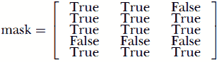

以下代码创建了这个假设数据，并计算了适当的 mask，然后将其打印出来：

```
with torch.no_grad(): 
    x = torch.rand((5,3,1,7,7)) 
    x[0,-1,:] = 0   ❶
    x[3,:] = 0      ❷ 
    x[4,0,0,0] = 0  ❸

    mask = getMaskByFill(x) 
print(mask)

tensor([[ True, True, False],
        [ True, True, True],
        [ True, True, True],
        [False, False, False],
        [ True, True, True]])
```

❶ 不要使用第一个输入的最后一个项目。

❷ 不要使用第四项中的任何一项！

❸ 让它看起来我们好像没有使用第五项的一部分，但实际上我们还在使用！这一行被添加进来以表明即使在复杂的输入上这也有效。

返回的 mask 产生了正确的输出。这个函数允许我们为文本序列、序列/图像包以及几乎任何类型的非标准张量形状创建 mask。

## 10.3 将所有内容组合起来：一个带有上下文的完整注意力机制

使用分数方法（例如，点积）、`getMaskByFill`函数和我们的新`ApplyAttention`函数，我们可以定义一个完整的基于注意力的网络，该网络对输入是自适应的。对于大多数基于注意力的模型，我们由于涉及注意力的所有非顺序步骤，不使用`nn.Sequential`来定义主模型。相反，我们使用`nn.Sequential`来定义和组织较大网络使用的子网络。

让我们定义一个`SmarterAttentionNet`，这是我们整个网络。在构造函数内部，我们定义了一个用于我们的`backbone`的网络，该网络计算**h**[i] = *F*(**x**[i])，以及一个`prediction_net`，该网络计算我们的预测*ŷ* = *f*( **x̄**)。参数`input_size`、`hidden_size`和`out_size`定义了输入中的特征数量（D）、隐藏神经元（H）以及我们的模型应该做出的预测（MNIST 的 10 个类别）。我们还添加了一个可选参数来选择哪个注意力分数用作`score_net`：

```
class SmarterAttentionNet(nn.Module):

    def __init__(self, input_size, hidden_size, out_size, score_net=None): 
        super(SmarterAttentionNet, self).__init__() 
        self.backbone = nn.Sequential( 
            Flatten2(),                                    ❶
            nn.Linear(input_size,hidden_size),             ❷ 
            nn.LeakyReLU(), 
            nn.Linear(hidden_size,hidden_size), 
            nn.LeakyReLU(), 
            nn.Linear(hidden_size,hidden_size), 
            nn.LeakyReLU(), 
    )                                                      ❸

    self.score_net = AdditiveAttentionScore(hidden_size)   ❹ 
    if (score_net is None) else score_net

    self.apply_attn = ApplyAttention()

    self.prediction_net = nn.Sequential(                   ❺
        nn.BatchNorm1d(hidden_size), 
        nn.Linear(hidden_size,hidden_size), 
        nn.LeakyReLU(), 
        nn.BatchNorm1d(hidden_size), 
        nn.Linear(hidden_size, out_size )                  ❻ 
    )
```

❶ 形状现在是 (B, T, D)

❷ 形状变为 (B, T, H)

❸ 返回 (B, T, H)

❹ 尝试更改它并看看结果如何变化！

❺ (B, H), x̄ 作为输入

❻ (B, H)

接下来我们定义一个`forward`函数来计算网络的输出结果。我们从输入中计算`mask`，然后是来自骨干网络的隐藏状态**h**[...]，这些状态是在相同输入上计算的。我们使用平均向量  作为上下文`h_context`。我们不是用`torch.mean`来计算这个值，而是分两步自己计算，这样我们只除以有效项目的数量。否则，一个有 2 个有效项目但 8 个填充项目的输入将被除以 10 而不是 2，这是不正确的。这个计算还包括`+1e-10`来给分子添加一个微小的值：这个添加是一种防御性编码，以防我们收到一个包含*零*项目的包，我们不会执行除以零的操作。这将产生一个`NaN`（不是一个数字），这会导致静默失败。

这里是代码：

```
def forward(self, input): 
    mask = getMaskByFill(input) 
    h = self.backbone(input)                                    ❶ 

    h_context = (mask.unsqueeze(-1)*h).sum(dim=1)               ❷ 
    h_context = h_context/(mask.sum(dim=1).unsqueeze(-1)+1e-10) ❸
    scores = self.score_net(h, h_context)                       ❹ 

    final_context, _ = self.apply_attn(h, scores, mask=mask)    ❺

    return self.prediction_net(final_context)                   ❻
```

❶ (B, T, D) -> (B, T, H)

❷ h_context = torch.mean(h, dim=1) 计算 torch.mean 但忽略被屏蔽的部分。首先，将所有有效的项目加在一起。(B, T, H) -> (B, H)。

❸ 将数量除以有效项目的数量，并在袋子全部为空的情况下加上一个小的值

❹ (B, T, H) , (B, H) -> (B, T, 1)

❺ 结果是 (B, H) 形状

❻ (B, H) -> (B, classes)

`forward` 函数的最后三行再次相当简单。`score_net` 计算得分 α，`apply_attn` 函数应用我们选择的任何注意力函数，`prediction_net` 从 `final_context` x̄ 中做出预测。

让我们训练一些更好的注意力模型。以下代码块为每个选项创建一个注意力网络，`DotScore`，`GeneralScore` 和 `AdditiveAttentionScore`：

```
attn_dot = SmarterAttentionNet(D, neurons, classes, 
➥ score_net=DotScore(neurons)) 
attn_gen = SmarterAttentionNet(D, neurons, classes, 
➥ score_net=GeneralScore(neurons)) 
attn_add = SmarterAttentionNet(D, neurons, classes, 
➥ score_net=AdditiveAttentionScore(neurons))

attn_results_dot = train_network(attn_dot, nn.CrossEntropyLoss(), 
➥ train_loader, val_loader=test_loader,epochs=epochs, 
➥ score_funcs={’Accuracy’: accuracy_score}, device=device) 
attn_results_gen = train_network(attn_gen, nn.CrossEntropyLoss(), 
➥ train_loader, val_loader=test_loader,epochs=epochs, 
➥ score_funcs={’Accuracy’: accuracy_score}, device=device) 
attn_results_add = train_network(attn_add, nn.CrossEntropyLoss(), 
➥ train_loader, val_loader=test_loader,epochs=epochs, 
➥ score_funcs={’Accuracy’: accuracy_score}, device=device)
```

以下代码绘制了这三个结果。所有三个改进的注意力得分趋势相似。它们一开始比我们开始的简单注意力学习得更快，收敛得更快，也许新的方法正在收敛到一个更好的结果。你将看到每次运行之间的一些变化，但这个数据集还不够大或复杂，不足以引起行为上的真正有趣的变化：

```
    sns.lineplot(x=’epoch’, y=’val Accuracy’, data=simple_results, 
    ➥ label=’Regular’) 
    sns.lineplot(x=’epoch’, y=’val Accuracy’, data=simple_attn_results, 
    ➥ label=’Simple Attention’) 
    sns.lineplot(x=’epoch’, y=’val Accuracy’, data=attn_results_dot, 
    ➥ label=’Dot’) 
    sns.lineplot(x=’epoch’, y=’val Accuracy’, data=attn_results_gen, 
    ➥ label=’General’) 
    sns.lineplot(x=’epoch’, y=’val Accuracy’, data=attn_results_add, 
    ➥ label=’Additive’)

[29]: <AxesSubplot:xlabel='epoch', ylabel='val Accuracy'>
```

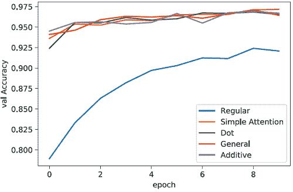

我们新代码的另一个好处是能够处理可变大小的输入，其中较短的/较小的项目被填充以匹配批次中最长/最大的项目的长度。为了确保它正常工作，我们定义了一个新的 `LargestDigitVariable` 数据集，该数据集随机选择放入每个袋子中的项目数量，最多达到某个指定的最大数量。这将使训练问题变得更加具有挑战性，因为网络需要确定袋子中项目的数量与袋子标签之间是否存在任何关系。

以下代码做了这件事，只有两个真正的变化。首先，我们的 `__getitem__` 方法计算要采样多少个项目。其次，我们为了简单起见在数据集对象内部实现填充，所以如果 `how_many < maxToSample`，我们用零值填充输入以使所有内容大小相同：

```
class LargestDigitVariable(Dataset): 
    """ 
    Creates a modified version of a dataset where some variable number of 
    ➥ samples are taken, and the true label is the largest label sampled. 
    ➥ When used with MNIST the labels correspond to their values (e.g., 
    ➥ digit "6" has label 6). Each datum will be padded with 0 values if 
    ➥ the maximum number of items was not sampled. """

    def __init__(self, dataset, maxToSample=6): 
        """ 
        dataset: the dataset 
        to sample from toSample: the number of items from the dataset to sample 
        """ 
        self.dataset = dataset 
        self.maxToSample = maxToSample

    def __len__(self): 
        return len(self.dataset)

    def __getitem__(self, idx): 
        how_many = np.random.randint(1,self.maxToSample, size=1)[0]      ❶ 
        selected = np.random.randint(0,len(self.dataset), size=how_many) ❷ 
        x_new = torch.stack([self.dataset[i][0] for i in selected] +     ❸
        [torch.zeros((1,28,28)) for i in range(self.maxToSample-how_many)]) 
        y_new = max([self.dataset[i][1] for i in selected])              ❹ 
        return x_new, y_new                                              ❺
```

❶ 新的：我们应该选择多少个项目？

❷ 随机从数据集中选择 n=self.toSample 个项目

❸ 将形状为 (B, *) 的 n 个项目堆叠成 (B, n, *)。新的：用零值填充到最大大小。

❹ 标签是最大标签。

❺ 返回 (data, label) 对

下一个代码块创建训练和测试集加载器，到这本书的这一部分你应该已经很熟悉了：

```
largestV_train = LargestDigitVariable(mnist_train) 
largestV_test = LargestDigitVariable(mnist_test)

trainV_loader = DataLoader(largest_train, batch_size=B, shuffle=True) 
testV_loader = DataLoader(largest_test, batch_size=B)
```

我们通常会在这个新的数据集上训练我们的新模型。但这里有一个酷的地方：我们新的注意力机制设计可以处理可变数量的输入，这要归功于填充，并且注意力先验包括只关注输入子集的概念。所以尽管我们的数据现在有一个新的、更大的形状，有更多的可能输入，我们仍然可以重复使用我们已经训练过的相同网络。

而不是训练一个新的模型，以下代码通过测试集运行并使用仅针对大小为 3 的包训练的我们的模型进行预测，并希望它在大小为 1 到 6 的包上也能很好地工作：

```
attn_dot = attn_dot.eval()

preds = [] 
truths = [] 
    with torch.no_grad(): 
        for inputs, labels in testV_loader: 
            pred = attn_dot(inputs.to(device)) 
            pred = torch.argmax(pred, dim=1).cpu().numpy()

            preds.extend(pred.ravel()) 
            truths.extend(labels.numpy().ravel()) 
print("Variable Length Accuracy: ", accuracy_score(preds, truths))

Variable Length Accuracy: 0.967
```

你应该在这个新问题中看到大约 96%或 97%的准确率，我们训练的是它的一个更容易的版本。这让你对注意力方法的力量有了概念。它通常能够很好地泛化到输入数据的变化和序列长度的变化，这也是注意力非常成功的一部分。它们已经迅速成为今天大多数自然语言处理任务的常用工具。

并非总是可以像这样泛化。如果我们继续将输入长度增加到我们训练的长度（增加`maxToSample`参数），准确率最终会开始下降。但我们可以通过在预期的输入长度上训练来抵消这一点。

这里需要注意的重要事情是，注意力方法可以处理可变数量的输入并泛化到所提供的内容之外。这，加上对输入的选择性，使得这种方法非常强大。

## 练习

在 Manning 在线平台上的 Inside Deep Learning Exercises（[`liveproject.manning.com/project/945`](https://liveproject.manning.com/project/945)）分享和讨论你的解决方案。一旦你提交了自己的答案，你将能够看到其他读者提交的解决方案，并看到作者认为哪些是最佳的。

1.  为`LargestDigit`问题训练一个新的卷积模型。为了使这可行，你需要将你的数据从形状(*B*,*T*,*C*,*W*,*H*)转换为(*B***T*,*C*,*W*,*H*)，这实际上是将批大小扩大以运行你的 2D 卷积。一旦你完成卷积，你可以回到(*B*,*T*,*C*,*W*,*H*)的形状。你能够用这种方法获得多高的准确率？

1.  `GeneralScore`使用一个以随机值开始的矩阵 W。但你可以将其初始化为*W* = I/√*H* + ε，其中ε是某些小的随机值（例如在-0.01 到 0.01 的范围内），以避免硬零。这将使`GeneralScore`以`DotScore`的行为开始。尝试自己实现这一点。

1.  在加性注意力分数中使用`tanh`激活函数是有些任意的。尝试通过在 PyTorch 中将`tanh`激活函数替换为其他选项来使用多个不同的加性注意力版本。你认为哪些激活函数可能特别有效或无效？

1.  让我们实现一个更难的`LargestDigitVariable`数据集版本。为了确定一个包的标签，将包内容的标签相加（例如，3、7 和 2 在包“12”中）。如果总和是偶数，则返回最大的标签；如果是奇数，则返回最小的标签。例如，“3”+“7”+“2”= 12，所以标签应该是“7”。但如果包是“4”+“7”+“2”= 13，则标签应该是“2”。

1.  你不必使用输入的平均值作为你的上下文；你可以使用你认为可能工作得更好的任何东西。为了演示这一点，实现一个使用 *注意力子网络* 来计算上下文的注意力网络。这意味着将有一个初始上下文，它是平均 ，用于计算 *新的* 上下文 *x̄*[*c**n**t**x*]，然后用于计算 *最终* 输出 x̄。这对你在练习 4 中的准确性有影响吗？

## 摘要

+   注意力机制编码了一个先验，即序列或集合中的某些项目比其他项目更重要。

+   注意力机制使用上下文来决定哪些项目更重要或不太重要。

+   需要一个得分函数来确定在给定上下文中每个输入的重要性。点积、一般和加法得分都很受欢迎。

+   注意力机制可以处理可变长度的输入，并且在泛化它们方面特别出色。

+   与 RNNs 类似，注意力机制需要掩码来处理数据批次。

* * *

¹ 请参阅 J. Foulds 和 E. Frank 的文章，“多实例学习假设综述”，*《知识工程评论》*，第 25 卷，第 1 期，第 1-25 页，2010 年，[`www.cs.waikato.ac.nz/~eibe/pubs/FouldsAndFrankMIreview.pdf`](https://www.cs.waikato.ac.nz/~eibe/pubs/FouldsAndFrankMIreview.pdf)。↩

² 如果你想变得复杂一些，上下文可以是你认为有效的任何东西。但最简单的方法是将上下文作为所有输入的函数。↩

因为 v 只有一个输出，所以通常将其写成向量而不是只有一个列的矩阵。↩
