# 11 序列到序列

本章涵盖

+   准备序列到序列数据集和加载器

+   将 RNN 与注意力机制结合

+   构建机器翻译模型

+   解释注意力分数以理解模型的决定

现在我们已经了解了注意力机制，我们可以利用它们来构建一些新颖而强大的东西。特别是，我们将开发一个名为 *序列到序列*（简称 Seq2Seq）的算法，它可以执行机器翻译。正如其名所示，这是一种让神经网络将一个序列作为输入并产生不同序列作为输出的方法。Seq2Seq 已被用于让计算机执行符号计算¹，总结长文档²，甚至将一种语言翻译成另一种语言。我将一步步地展示我们如何将英语翻译成法语。实际上，谷歌使用的生产机器翻译工具基本上采用了同样的方法，你可以在[`ai.googleblog.com/2016/09/a-neural-network-for-machine.html`](https://ai.googleblog.com/2016/09/a-neural-network-for-machine.html)上了解相关信息。如果你能将你的输入/输出想象成一系列事物，那么 Seq2Seq 有很大机会帮助你解决这个任务。

聪明的读者可能会想，RNN 接收一个序列并为每个输入产生一个输出。所以它接收一个序列并输出一个序列。这不是“序列到序列”吗？你是一个明智的读者，但这也是我为什么称 Seq2Seq 为一种设计方法的部分原因。理论上，你可以让 RNN 做任何 Seq2Seq 能做的事情，但让它工作起来会很困难。一个问题是一个单独的 RNN 假设输出序列的长度与输入相同，这很少是真实的。Seq2Seq 将输入和输出解耦成两个独立阶段和部分，因此工作得更好。我们很快就会看到这是如何发生的。

Seq2Seq 是我们在本书中实现的最复杂的算法，但我会向你展示如何将其分解成更小、更易于管理的子组件。利用我们关于组织 PyTorch 模块的知识，这将只会带来一点痛苦。我们通过我们的数据集和 `DataLoader` 的任务特定设置来准备训练，描述 Seq2Seq 实现的子模块，并以展示注意力机制如何让我们窥视神经网络的黑盒，理解 Seq2Seq 是如何进行翻译的作为结束。

## 11.1 将序列到序列视为一种去噪自编码器

接下来，我们将详细介绍 Seq2Seq，如何实现它，以及如何将其应用于将英语翻译成法语。但首先，我想展示一个例子，看看它如何工作得很好，以及注意力提供的可解释性³。图 11.1 展示了大型 Seq2Seq 翻译模型的结果，从法语翻译成英语。输出中的每个单词都对原始句子应用了不同的注意力，其中黑色值表示 0（不重要）和白色值表示 1（非常重要）。

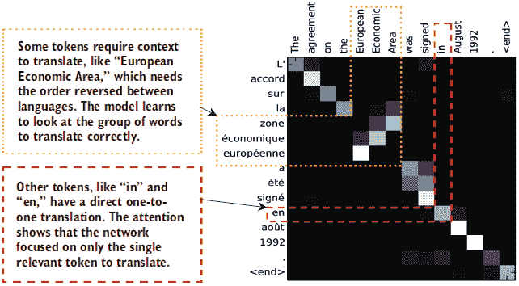

图 11.1 展示了 Dzmitry Bahdanau、Kyunghyun Cho 和 Yoshua Bengio 发表的论文“通过联合学习对齐和翻译进行神经机器翻译”的结果。输入在左侧，输出在顶部。在更大语料库上训练更多轮次时，注意力结果产生了一个清晰、紧凑的注意力图。

对于输出中的大多数项目，来自输入的相关项非常少，才能得到正确的翻译。但有些情况需要从输入中提取多个单词才能正确翻译，而另一些则需要重新排序。传统的机器翻译方法，在更单词级别的层面上工作，通常需要复杂的启发式代码来处理需要多个上下文单词和可能不寻常顺序的情况。但现在我们可以让神经网络为我们学习细节，并了解模型是如何学习执行翻译的。

Seq2Seq 是如何学习做到这一点的呢？从高层次来看，Seq2Seq 算法在序列上训练去噪自编码器，而不是在静态图像上。你可以把原始英语看作是带噪声的输入，法语看作是干净的输出，并要求 Seq2Seq 模型学习如何去除噪声。由于我们处理的是序列，这通常涉及到 RNN。图 11.2 展示了一个简单的图。我们有一个编码器和解码器，将输入转换为输出，就像去噪自编码器一样；区别在于 Seq2Seq 模型在序列上工作，而不是在图像或全连接输入上。

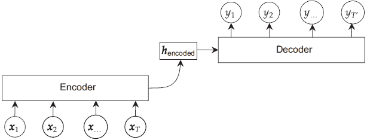

图 11.2 展示了序列到序列方法的概述。输入序列 **x**[1]，**x**[2]，…，**x**[T] 进入编码器。编码器生成序列的表示 **h**[encoded]。解码器接收这个表示并输出一个新的序列 **y**[1]，**y**[2]，…，**y**[*T*’]。

在这里，我们有一些原始输入序列 **X** = **x**[1]，**x**[2]，…，**x**[T]，目标是输出一个 *新* 的序列 **Y** = **y**[1]，**y**[2]，…，**y**[*T*′]。这些序列不必相同。**x**[j] ≠ **y**[j]，它们甚至可以是不同长度的，所以 *T* ≠ *T*′ 也是可能的。我们把这描述为去噪方法，因为输入序列 X 被映射到一个相关的序列 Y，几乎就像 X 是 Y 的噪声版本一样。

训练 Seq2Seq 模型并不容易。像任何使用 RNN 的东西一样，它计算上具有挑战性。它也是一个困难的学习问题；编码器 RNN 接收 X 并产生一个最终的隐藏状态激活**h**[T]，解码器 RNN 必须将其作为输入来产生新的序列 Y。这需要将大量信息压缩到一个单一的向量中，我们已经看到 RNN 训练的困难性。

### 11.1.1 添加注意力创建 Seq2Seq

让 Seq2Seq 模型工作良好的秘诀是添加一个注意力机制。我们不是强迫模型学习一个表示**h**[编码]来表示整个输入，而是为输入序列中的每个项目**x**[i]学习一个表示**h**[i]。然后我们在输出的每个步骤使用注意力机制来查看所有输入。这更详细地展示在图 11.3 中，我们继续扩展 Seq2Seq 不同部分的细节，直到我们可以实现整个方法。注意，编码器的最后一个隐藏状态**h**[T]成为解码器的**初始**隐藏状态，但我们还没有指出解码器在每个时间步的输入是什么。我们将在本章的后面讨论这个问题；因为部分太多，不能一次性全部讨论。

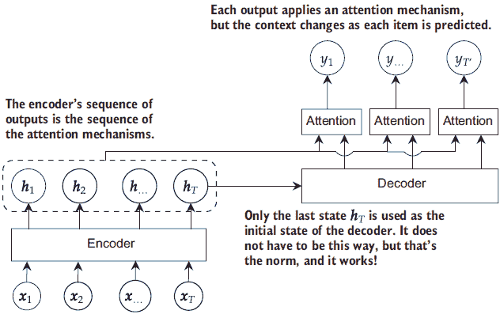

图 11.3 Seq2Seq 操作的高级图。解码器的第一个输入是编码器的最后一个输出。解码器产生一系列输出，这些输出被用作注意力机制的环境。通过改变环境，我们改变了模型在输入中寻找的内容。

现在我们一起来讨论图 11.1 和图 11.3。图 11.3 中的编码器网络的 T 个输入/隐藏状态将变成图 11.1 中原始法语的 T 行。图 11.3 中的每个注意力块变成图 11.1 中的一列。因为注意力为输入中的每个项目（填充一行）输出一个从 0 到 1 的分数，我们可以用热图来展示这些分数，低分用深色表示，高分用白色表示，从而显示输入中哪些部分对于产生输出中的每个部分最为重要。因此，我们得到了完整的图 11.1。这也说明了注意力如何捕捉到重要性是一个**相对**概念。输入中每个词的重要性会根据我们试图产生的结果或其他存在的词而变化。

你可能想知道为什么注意力机制能提高基于 RNN 的编码器和解码器的性能：长短期记忆（LSTM）中的门控机制不是也在做同样的事情，根据当前上下文有选择地允许/不允许（门控开启/关闭）信息吗？从高层次来看，是的，这种方法有相似之处。关键的区别在于信息的可用性。如果你像图 11.2 所示的那样，只用两个 RNN 作为编码器和解码器，解码器 RNN 的隐藏状态必须学会如何表示（1），它在创建输出过程中的进度有多远，（2）整个原始输入序列，以及（3）如何不使两者相互干扰。通过在解码器 RNN 的输出上使用注意力机制，RNN 现在只需要学习#1，因为所有原始输入项都将在后续的注意力过程中可用，这缓解了#2，也意味着#3 不再是问题。虽然 Seq2Seq 是一个复杂的算法，但你已经学习和使用了实现它的每一个步骤。这实际上是将深度学习的许多构建块组合在一起以产生一个强大结果的练习。

## 11.2 机器翻译和数据加载器

在考虑大局目标——构建 Seq2Seq 翻译模型的情况下——我们将从下往上工作。最底层开始于定义什么是翻译以及加载数据。然后我们可以继续处理 Seq2Seq 模型的输入，最后添加注意力机制以逐个产生输出。

广义上，机器翻译是研究人员用来研究如何让计算机将一种语言（例如，英语）翻译成另一种语言（例如，法语）的术语。机器翻译作为一个问题也将有助于巩固 Seq2Seq 模型输入和输出的不同序列以及可能的不同长度。

输入 X 所使用的语言——在我们的案例中，是英语——被称为*源语言*。目标语言，法语，被称为*目标语言*。我们的输入序列 X 可能是字符串“what a nice day”，目标字符串 Y 为“quelle belle journée”。翻译的一个困难方面是这些序列的长度不同。如果我们使用单词作为我们的标记（也称为我们的字母表Σ），我们的源序列 X 和目标序列 Y 是：

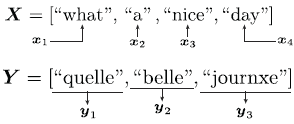

如果我们能成功将序列 X 转换为 Y，我们就完成了机器翻译的任务。几个细微之处可能会使这变得困难：

+   如前所述，序列的长度可能不同。

+   序列之间可能存在复杂的关系。例如，一种语言可能将形容词放在名词之前，而另一种语言可能将名词放在形容词之前。

+   可能不存在一对一的关系。例如，“what a nice day”和“what a lovely day”都可以有相同的从英语到法语的翻译。翻译通常是一个多对多任务，其中多个有效输入映射到多个有效输出。

如果你问一个自然语言处理（NLP）研究人员，他们会给你一个更长的列表，解释为什么以及机器翻译具有挑战性。但这也是使用 Seq2Seq 模型的一个绝佳机会，因为你不需要查看整个输入来决定输出中每个单词的决策。例如，“journée”可以翻译为“day”或“daytime”；它不是一个同音异义词。因此，我们可以几乎独立于任何其他上下文来翻译这个单词。单词“amende”需要更多的上下文，因为它是一个“fine”和“almond”的同音异义词；如果你不知道某人是在谈论食物还是金钱，你就无法翻译它。我们的注意力机制可以帮助我们忽略那些对翻译没有提供任何有用上下文的输入。这也是为什么 Seq2Seq 模型能够在这一任务上做得很好，即使我们无法列举出所有翻译困难的理由。

### 11.2.1  加载一个小型的英语-法语数据集

要构建一个机器翻译数据集，我们需要一些数据。我们将重用一小部分英语-法语翻译语料库。以下代码快速下载它并进行一些轻微的预处理：移除标点符号并将所有内容转换为小写。虽然有可能学习这些事情，但这样做需要更多的数据，而我们希望这个例子在有限的数据量下快速运行：

```
from io import BytesIO 
from zipfile import ZipFile 
from urllib.request import urlopen 
import re

all_data = [] 
resp = urlopen("https://download.pytorch.org/tutorial/data.zip") 
zipfile = ZipFile(BytesIO(resp.read()))

for line in zipfile.open("data/eng-fra.txt").readlines(): 
    line = line.decode(’utf-8’).lower()                           ❶ 
    line = re.sub(r"[-.!?]+", r" ", line)                         ❷ 
    source_lang, target_lang = line.split("\t")[0:2]
    all_data.append( (source_lang.strip(), target_lang.strip()) ) ❸
```

❶ 只需小写即可。

❷ 不需要标点符号。

❸ （英语，法语）

为了帮助我们获得一些直观感受，以下代码打印了语料库的前几行，以展示数据。我们已经在数据中看到了许多困难。像“run”这样的单词本身就有多个正确的翻译，而且一些单个的英语单词可以变成一个或多个法语单词。这是在我们甚至查看语料库中更长的句子之前：

```
for i in range(10): 
    print(all_data[i])

('go', 'va') 
('run', 'cours') 
('run', 'courez') 
('wow', 'ça alors') 
('fire', 'au feu') 
('help', "à l'aide") 
('jump', 'saute') 
('stop', 'ça suffit') 
('stop', 'stop') 
('stop', 'arrête toi')
```

为了使训练更快，让我们限制自己只使用包含六个或更少单词的句子。你可以尝试增加这个限制，看看模型的表现如何，但我想让这些例子快速训练。一个现实世界的翻译任务可以使用相同的代码，但需要更多的时间和数据进行学习，但这可能需要数天的训练，所以让我们保持简短：

```
short_subset = [] ❶ 
MAX_LEN = 6 
for (s, t) in all_data: 
    if max(len(s.split(" ")), len(t.split(" "))) <= MAX_LEN:
        short_subset.append((s,t)) 
print("Using ", len(short_subset), "/", len(all_data))

Using 66251 / 135842
```

❶ 我们使用的子集

构建字母表

现在的`short_subset`列表包含了我们将用于模型的全部英语-法语翻译对，我们可以为我们的模型构建一个词汇表或字母表。和之前一样，一个词汇表会给每个唯一的字符串分配一个唯一的 ID 作为标记，从 0 开始计数。但我们还添加了一些特殊的标记，以给我们的模型提供有用的提示。首先，因为不是所有句子长度都相同，我们使用一个`PAD_token`来表示填充，表示张量中的值没有被使用，因为底层句子已经结束。

我们引入的两个新事物是 *句子开始*（SOS）和 *句子结束*（EOS）标记。这些在机器翻译以及许多其他 NLP 任务中都很常见。`SOS_token` 标记通常放置在源序列 X 的开头，以指示算法翻译已经开始。`EOS_token` 更有用，因为它附加到目标序列 Y 的末尾，表示句子已完成。这非常有用，因为模型可以学习如何结束翻译。当模型完成时，它输出一个 `EOS_token`，我们可以停止这个过程。你可能认为标点符号是一个好的停止点，但这种方法会阻止我们将模型扩展到一次翻译句子或段落。一旦批次中的每个项目都生成了一个 `EOS_token`，我们就知道可以安全地停止。这也很有帮助，因为输出可能具有不同的长度，EOS 标记帮助我们确定每个不同生成的序列应该有多长。

以下代码定义了我们的 SOS、EOS 和填充标记，并创建了一个字典 `word2indx` 来创建映射。我们还将 `PAD_token` 定义为映射到索引 0，这样我们就可以轻松地使用我们的 `getMaskByFill` 函数。类似于我们的自回归模型，创建了一个逆字典 `indx2word`，这样我们可以在完成后更容易地查看我们的结果（阅读单词比阅读整数序列更容易）： 

```
SOS_token = "<SOS>" ❶ 
EOS_token = "<EOS>" ❷
PAD_token = "_PADDING_"

word2indx = {PAD_token:0, SOS_token:1, EOS_token:2} 
for s, t in short_subset: 
for sentence in (s, t): 
for word in sentence.split(" "):
if word not in word2indx: 
word2indx[word] = len(word2indx) 
print("Size of Vocab: ", len(word2indx)) 
indx2word = {}       ❸ 
for word, indx in word2indx.items(): 
indx2word[indx] = word

Size of Vocab: 24577
```

❶ “句子开始标记"

❷ “句子结束标记"

❸ 为后续查看构建逆字典

实现翻译数据集

现在我们创建一个 `TranslationDataset` 对象，它代表我们的翻译任务。它接受 `short_subset` 作为底层输入数据，并通过使用我们刚刚创建的词汇表 `word2indx` 来分割空间，返回 PyTorch `int64` 张量：

```
class TranslationDataset(Dataset): 
    """ 
    Takes a dataset with tuples of strings (x, y) and 
    converts them to tuples of int64 tensors. 
    This makes it easy to encode Seq2Seq problems. 
    Strings in the input and output targets will be broken up by spaces 
    """

    def __init__(self, lang_pairs, word2indx): 
        """ 
        lang_pairs: a List[Tuple[String,String]] containing the 
        ➥ source,target pairs for a Seq2Seq problem. 
        word2indx: a Map[String,Int] that converts each word in an input 
        ➥ string into a unique ID. 
        """ 
        self.lang_pairs = lang_pairs 
        self.word2indx = word2indx

    def __len__(self): 
        return len(self.lang_pairs)

    def __getitem__(self, idx): 
        x, y = self.lang_pairs[idx] 
        x = SOS_token + " " + x + " " + EOS_token 
        y = y + " " + EOS_token

        x = [self.word2indx[w] for w in x.split(" ")] ❶ 
        y = [self.word2indx[w] for w in y.split(" ")] ❶

        x = torch.tensor(x, dtype=torch.int64) 
        y = torch.tensor(y, dtype=torch.int64) 
        return x, y 
bigdataset = TranslationDataset(short_subset, word2indx)
```

❶ 转换为整数列表

Seq2Seq 任务通常需要大量的训练数据，但我们目前没有这么多，因为我们希望这个示例能在 10 分钟内运行。我们将使用 90% 的数据用于训练，仅 10% 用于测试。

实现翻译数据的 collate 函数

我们还需要定义一个 `collate_fn` 函数，用于将不同长度的输入合并成一个更大的批次。每个项目已经以 `EOS_token` 结尾，所以我们只需用我们的 `PAD_token` 值填充较短的输入，使所有内容长度相同。

为了使此与我们的 `train_network` 函数兼容，我们还需要在返回 `collate_fn` 的结果时稍微聪明一点。我们将以一组嵌套元组的形式返回数据，((**X**,**Y**),**Y**)，因为 `train_network` 函数期望包含两个元素的元组（*i**n**p**u**t*,*o**u**t**p**u**t*），而我们的 Seq2Seq 模型在训练时需要 X 和 Y。原因将在下面解释。这样，`train_network` 函数将分解元组为

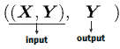

以下代码完成了所有工作。`pad_batch` 是我们的收集函数，它首先找到最长的输入序列长度 `max_x` 和最长的输出序列长度 `max_y`。由于我们是在填充（而不是 *打包*，这仅由 RNNs 支持），我们可以使用 `F.pad` 函数来完成这项工作。它接受要填充的序列作为第一个输入，以及一个元组告诉它需要向左和向右填充多少。我们只想在序列的右侧（末尾）进行填充，所以我们的元组看起来像 `(0, pad_amount)`：

```
train_size = round(len(bigdataset)*0.9) 
test_size = len(bigdataset)-train_size 
train_dataset, test_dataset = torch.utils.data.random_split(bigdataset, 
➥ [train_size, test_size]))

def pad_batch(batch): 
    """ 
    Pad items in the batch to the length of the longest item in the batch 
    """ 
    max_x = max([i[0].size(0) for i in batch])             ❶ 
    max_y = max([i[1].size(0) for i in batch])             ❶

    PAD = word2indx[PAD_token]

    X = [F.pad(i[0],(0,max_x-i[0].size(0)), value=PAD)     ❷ 
    ➥ for i in batch] 
    Y = [F.pad(i[1],(0,max_y-i[1].size(0)), value=PAD)     ❷ 
    ➥ for i in batch] 
    X, Y = torch.stack(X), torch.stack(Y) 
    return (X, Y), Y

train_loader = DataLoader(train_dataset, batch_size=B, shuffle=True, 
collate_fn=pad_batch) 
test_loader = DataLoader(test_dataset, batch_size=B, collate_fn=pad_batch)
```

❶ 我们有两个不同的最大长度：输入序列的最大长度和输出序列的最大长度。我们分别确定每个长度，并且只填充所需的精确量。

❷ 我们使用 `F.pad` 函数将每个张量向右填充。

## 11.3 Seq2Seq 的输入

当我们谈论 Seq2Seq 模型时，有两个输入集：编码器的输入和解码器的输入。为了指定每个部分的输入内容，我们需要定义 Seq2Seq 的编码器和解码器块在图 11.3 中的样子。您可能不会感到惊讶，我们为每个都使用了 RNN，您可以选择是否要使用门控循环单元（GRU）或 LSTM。当我们稍后编码时，我们将使用 GRU，因为它使代码更容易阅读。

编码器的输入很简单：我们只是输入输入序列 **X** = **x**[1], **x**[1], …, **x**[T]。解码器产生它认为的输出序列的预测：**Ŷ** = **ŷ**[1], **ŷ**[1], …, **ŷ**[*T*’]。我们将 Ŷ 和 Y 之间的交叉熵损失作为训练这个网络的信号。

但我们遗漏了一个重要细节：解码器的输入。循环神经网络（RNNs）通常接受一个先前的隐藏状态（对于解码器来说，这将是对应的 *h*[encoded]）以及当前时间步的输入。解码器的输入有两种选择：自回归风格和教师强制。我们将学习这两种选择，因为同时使用两者比单独使用任何一个都要好。

对于这两种选择，我们使用编码器的最后一个隐藏状态（**h**[T]）作为解码器的初始隐藏状态（**h**[encoded] = **h**[T]）。我们这样做而不是使用零向量，是为了让梯度通过解码器流向编码器，将它们连接起来。更重要的是，最后一个隐藏状态 **h**[T] 是整个输入序列的摘要，这种“输入是什么”的上下文将帮助解码器决定输出序列的第一部分应该是什么。

### 11.3.1 自回归方法

图 11.4 展示了我们实现解码器输入的第一个选项，我们称之为 *自回归* 选项。对于自回归方法，我们使用时间步 t 的预测标记作为下一个时间步 *t* + 1 的输入（虚线灰色线条）。

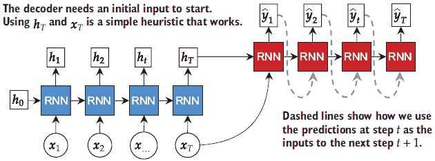

图 11.4 展示了自回归方法在解码步骤中的应用示例。解码器的第一个输入是编码器的最后一个输入。解码器的后续每个输入都是前一步的预测。

另一个细节是第一个输入应该是什么。我们还没有做出任何预测，所以不能使用之前的预测作为输入。有两种子选项，它们的表现非常相似。第一种选项是**始终**使用 SOS 标记作为输入，这是一个非常合理的想法。从语义上讲，这也很有意义；第一个输入表示“句子开始”，RNN 必须使用上下文来预测第一个单词。第二种选项是使用输入的最后一个标记，这应该是 EOS 标记或填充标记。这导致解码器 RNN 学习到 EOS 和填充具有与“句子开始”相同的语义意义。任何一种选项都是可接受的，并且在实践中选择通常不会造成明显的差异。我们将实现它，使编码器的最后一个项目成为解码器的第一个输入，因为我认为这是一个稍微更通用的方法。

由于我们模型的输出是下一个单词的概率，因此有两种选择下一个输入*t* + 1 的方式：选择最可能的标记，或者根据给定的概率采样下一个标记。在第六章中，当我们训练自回归模型时，选择最可能的下一个单词导致了不切实际的结果。因此，当我们实现这一点时，我们将采用采样方法。

### 11.3.2 教师强制方法

第二种方法被称为**教师强制**。解码器的第一个输入处理方式与自回归方法完全相同，但后续输入不同。我们不是使用预测**ŷ**[t]作为**ŷ**[*t* + 1]的输入，而是使用真实的正确标记**y**[t]，如图 11.5 所示。

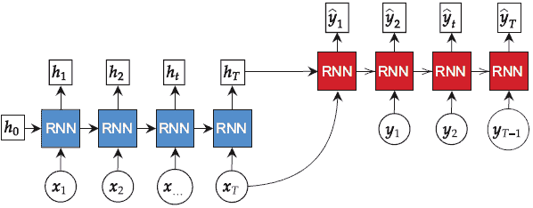

图 11.5 展示了教师强制示例。对于解码器，我们忽略预测，并在步骤 t 时输入正确的先前输出**y**[*t* - 1]。当计算损失时，预测仍然被使用。

这使得教师强制更容易实现，因为我们不需要猜测接下来会发生什么：我们已经有答案了。这也是为什么我们的代码在训练期间需要真实的标签 Y 作为输入，以便我们可以计算教师强制结果。

### 11.3.3 教师强制与自回归方法的比较

教师强制方法的好处是给网络提供正确的答案，以便继续其预测。这使得正确预测所有后续标记变得更容易。直觉很简单：如果你在前`t` - 1 次预测中都错了，那么在`t`次预测中保持正确就更加困难。教师强制通过允许网络同时学习它需要预测的所有单词来帮助网络。

自回归方法可能学习速度较慢，因为网络必须先正确预测第一个单词，然后才能专注于第二个单词，然后是第三个，依此类推。但是当我们想要对新数据进行预测，而我们*不知道答案*时，教师强制（teacher forcing）是不可能的：我们必须以自回归的方式做出预测，因此对于模型学习以这种方式进行预测是有好处的。

我们使用的实际解决方案是将自回归和教师强制方法结合起来。对于每个输入，我们随机决定我们想要采取哪种方法，因此我们将同时进行训练。但是在预测时间，我们只执行自回归选项，因为教师强制需要知道答案。一个更复杂的方法是在单个批次中在教师强制和自回归之间切换，但这很难实现。每个批次选择一个选项将使我们的代码更容易编写和阅读。

教师强制的使用也是我们为什么将目标序列 Y 作为网络输入的一部分的原因。我们使用`self.training`标志在训练和预测我们的模型时切换不同的行为。

## 11.4 带有注意力的 Seq2Seq

我们迄今为止所展示和描述的技术上足够实现一个序列到序列风格的模型。然而，它不会很好地学习，并且性能会很差。引入注意力机制是使 Seq2Seq 工作起来的关键。注意力机制可以与教师强制和自回归方法一起工作，并将改变我们在 RNN 的第 t 步预测当前单词的方式。因此，我们不是让解码 RNN 预测**ŷ**[t]，而是让它产生一个潜在值**ẑ**[t]。值**ẑ**[t]是注意力机制中的*上下文*。图 11.6 显示了预测第 t 个单词的四个主要组件的过程：

1.  编码步骤学习输入的有用表示。

1.  解码步骤为输出中的每个项目预测一个上下文。

1.  注意力步骤使用上下文产生一个输出**x̄**[t]，并将其与上下文**ẑ**[t]结合。

1.  预测步骤将结合的注意力/上下文结果预测序列的下一个标记。

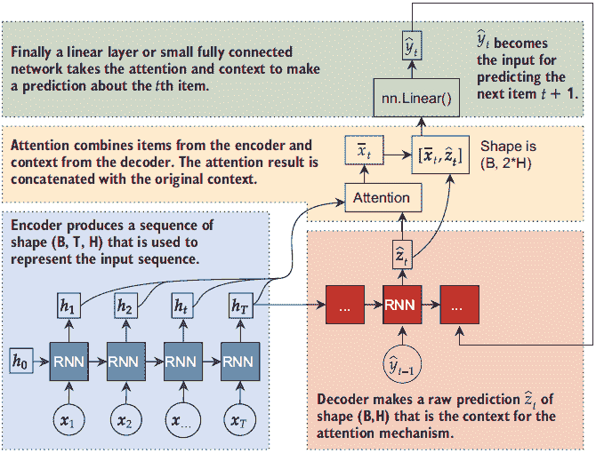

图 11.6 应用注意力预测输出中每个项目的流程。每个突出显示的区域显示了四个步骤之一：编码、解码上下文、注意力和预测。这会重复进行，直到找到 EOS 标记或达到最大限制。

你可以看到，注意力块（可以使用我们定义的三个评分函数中的任何一个）将上下文**ẑ**[t]和来自编码 RNN 的隐藏状态**h**[1]，**h**[2]，…，**h**[T]作为其输入。

注意力机制，结合之前使用的 `apply_attn` 模块，为每个隐藏状态生成一个权重 *α*[1]，*α*[2]，…，*α*[T]。然后我们使用隐藏状态和权重来计算当前时间步 t 的最终上下文，***x̄**[t]* = Σ*[i]^T*[=1] *α[i]* **h**[i]。由于每个 **h**[i] 最受第 i 个输入的影响，这为 Seq2Seq 模型提供了一种只查看输入序列的子集作为预测输出第 t 项相关的方法。

为了完成这个，我们将注意力输出 **x̄**[t] 与局部上下文 **ẑ**[t] 连接起来，得到一个新的向量

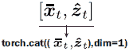

我们将其输入到一个最终的完全连接网络中，以将其转换为我们的最终预测，**ŷ**[t]。

这可能看起来有些令人畏惧，但你已经为所有这些步骤编写或使用过代码。编码器使用一个普通的 `nn.GRU` 层，因为它可以返回形状为 (*B*,*T*,*H*) 的张量，提供所有输出，这是你在第四章中学到的。我们使用 `nn.GRUCell` 来进行上下文预测 **ẑ**[t]，因为它必须一步一步地进行；你在第六章中用它来自回归模型。在同一章中，你使用采样来选择下一个标记，并使用类似教师强制的方法训练模型。我们刚刚学习和使用了注意力机制，你在第七章中学习了将连接输出输入到另一个层中用于 U-Net。

### 11.4.1 实现 Seq2Seq

我们已经准备好实现 Seq2Seq 模型。为了设置我们的构造函数，让我们谈谈模型本身需要哪些组件。

首先，我们需要一个 `nn.Embedding` 层来将标记转换为特征向量，类似于第七章中的 char-RNN 模型。我们使用 `padding_idx` 选项来指定哪个标记值用于表示填充，因为存在多个不同的序列长度。

接下来，我们需要一个编码器 RNN 和一个解码器 RNN。我们使用 GRU，因为它相对于 LSTM 来说编写代码要简单一些。特别是，我们将分别对每个 RNN 进行编码。对于编码器，我们使用正常的 `nn.GRU` 模块，它接受形状为 (*B*,*T*,*D*) 的张量，因为它期望一次性接受所有 T 项。这更容易编写代码，也让我们能够轻松地使用双向选项。由于我们有整个输入，双向选项是一个不错的选择。⁴

解码器 RNN 不能是双向的，因为我们一次生成一个输出项。这也意味着我们不能使用正常的 `nn.GRU` 模块，因为它期望所有 *T*′ 个输出项同时准备好，但我们不知道每个输出有多长，直到我们遇到所有的 EOS 标记。为了解决这个问题，我们使用 `nn.GRUCell`。这将需要我们手动跟踪解码器的隐藏状态和多层，我们必须编写一个 `for` 循环来持续迭代预测，直到我们得到完整的结果。

为了确保在出现不良预测的情况下不会陷入无限循环，我们包含一个 `max_decode_length` 来强制执行通过解码器 RNN 的最大解码步骤数。最后，我们需要我们的 `ApplyAttention` 模块和一些 `score_net` 来计算分数（我们使用 `DotScore`），以及一个小型网络 `predict_word` 来预测下一个单词。以下代码片段涵盖了我们所讨论的所有内容，并为我们的 Seq2Seq 模型创建了一个构造函数：

```
class Seq2SeqAttention(nn.Module):

    def __init__(self, num_embeddings, embd_size, hidden_size, 
    ➥ padding_idx=None, layers=1, max_decode_length=20):
        super(Seq2SeqAttention, self).__init__() 
        self.padding_idx = padding_idx 
        self.hidden_size = hidden_size 
        self.embd = nn.Embedding(num_embeddings, embd_size, 
        ➥ padding_idx=padding_idx) 
        self.encode_layers = nn.GRU(input_size= 
        ➥ embd_size, hidden_size=hidden_size//2, ❶
        ➥ num_layers=layers, bidirectional=True) 
        self.decode_layers = nn.ModuleList([      ❷ 
        ➥ nn.GRUCell(embd_size, hidden_size)] +
        ➥ [nn.GRUCell(hidden_size, hidden_size)
        ➥ for i in range(layers-1)])
        self.score_net = DotScore(hidden_size) 
        self.predict_word = nn.Sequential(        ❸ 
            nn.Linear(2*hidden_size, hidden_size), 
            nn.LeakyReLU(), 
            nn.LayerNorm(hidden_size), 
            nn.Linear(hidden_size, hidden_size), 
            nn.LeakyReLU(), 
            nn.LayerNorm(hidden_size), 
            nn.Linear(hidden_size, num_embeddings) 
        ) 
        self.max_decode_length = max_decode_length 
        self.apply_attn = ApplyAttention()
```

❶ 我们将隐藏大小设置为预期长度的一半，因为我们使编码器双向。这意味着我们得到两个隐藏状态表示，我们将它们连接起来，得到所需的大小。

❷ 解码器是单向的，我们需要使用 GRUCells 以便我们可以逐个步骤地进行解码。

❸ `predict_word` 是一个小型全连接网络，它将注意力机制的结果和局部上下文转换为对下一个单词的预测。

现在，我们可以讨论如何实现 Seq2Seq 算法的 `forward` 函数。图 11.7 概述了该过程。


图 11.7 `forward` 函数的概述及其实现中的七个步骤。每个块显示一个工作单元，箭头显示顺序任务。

我们将按照我们的图中的顺序遍历这些块，解释正在发生的事情，并展示实现它们的代码。请注意，在图中，我们已经将两个列表分开：`all_attentions` 和 `all_predictions`。这些列表收集注意力和预测分数，以便我们可以从模型中获取并查看注意力分数，或者将它们传递给任何我们可能想要使用的后续模块。

准备、嵌入和掩码块

在我们的函数中，我们首先需要做一些准备和组织工作。输入可以是形状为 (*B*,*T*) 的张量，或者是一个包含两个张量的元组 ((*B*,*T*),(*B*,*T*′))，这取决于我们是在测试模式还是训练模式。我们检查输入的内容，并适当地提取 `input` 和 `target` 值。我们 `embd` 所有的输入值，并计算一些有用的东西，比如我们的 `mask`；从 `mask` 中，我们可以确定每个序列的长度。长度是 `True` 值的数量，因此我们可以通过简单的 `sum` 调用得到 `seq_lengths`。我们还获取正在使用的计算设备，以便稍后当我们需要为解码器采样下一个输入时使用：

```
if isinstance(input, tuple):           ❶ 
    input, target = input 
else: 
    target = None 
B = input.size(0)                      ❷ 
T = input.size(1)                      ❸ 

x = self.embd(input)                   ❹ 
device = x.device                      ❺ 

mask = getMaskByFill(x)                ❻ 

seq_lengths = mask.sum(dim=1).view(-1) ❼
```

❶ 输入应为 (B, T) 或 ((B, T), (B, T’))

❷ 批处理大小是多少？

❸ 最大输入时间步数是多少？

❹ (B, T, D)

❺ 获取模型当前所在的设备。我们稍后会需要这个信息。

❻ 形状 (B, T)

❶ 形状（B），包含非零值的数量

编码块

现在我们数据和掩码已经准备好了，我们需要将数据推送到我们的编码器网络。为了最大化吞吐量，我们在将其输入到 RNN 之前对输入数据进行打包，由于我们已经从`mask`中计算了`seq_lengths`，所以这既简单又快速。此外，`h_last`即使在变长项中也包含最后一个激活，简化了我们的代码。我们确实需要为后续的注意力机制解包`h_encoded`，并将其重塑为(*B*,*T*,*D*)，因为我们使用的是双向模型。一些类似的形状操作将确保`h_last`的形状为(*B*,*D*)，而不是我们双向方法默认的(2,*B*,*D*/2)。

这里是代码：

```
x_packed = pack_padded_sequence(x, seq_lengths.cpu(),    ❶
➥ batch_first=True, enforce_sorted=False) 
h_encoded, h_last =self.encode_layers(x_packed) 
h_encoded, _ = pad_packed_sequence(h_encoded)            ❷ 
h_encoded = h_encoded.view(B, T, -1)                     ❸ 

hidden_size = h_encoded.size(2)                          ❹ 
h_last = h_last.view(-1, 2, B, hidden_size//2)[-1,:,:,:] ❺ 

h_last = h_last.permute(1, 0, 2).reshape(B, -1)          ❻
```

❶ 使用序列长度为编码器 RNN 创建打包的输入。

❷ (B, T, 2, D//2)，因为它是双向的

❸ (B, T, D)。现在`h_encoded`是编码器 RNN 在输入上运行的结果！

❹ 获取最后一个隐藏状态有点复杂。首先，输出被重塑为(num_layers, directions, batch_size, hidden_size)；然后我们抓取第一个维度中的最后一个索引，因为我们想要最后一层的输出。

❺ 现在的形状是(2, B, D/2)。

❻ 重排为(B, 2, D/2)并将最后两个维度展平到(B, D)

解码准备块

在开始解码块之前，我们需要做一些准备工作。首先，我们存储一个列表，其中包含解码器 RNN 的前一个隐藏状态激活。我们这样做是因为我们使用的是`GRUCell`，它需要我们跟踪隐藏状态激活，以便我们可以使 RNN 的顺序步骤运行得更加高效。⁵

为了使我们的代码更简单，我们重用`embd`层来编码解码器的输入。这是可以的，因为`embd`层做的工作非常少；大部分工作都是由解码器层完成的。由于我们将使编码器的最后一个输入成为解码器的第一个输入，我们需要获取这个输入。执行`input[:,seq_lengths-1]`看起来应该可以工作，但它返回一个形状为(*B*,*B*,*D*)的张量，而不是(*B*,*D*)。为了使它按我们的意愿工作，我们需要使用`gather`函数，它沿着指定的轴(`1`)收集指定的索引。

所有这些都在以下解码器准备代码块中，它以确定我们需要运行解码器的步骤数结束：

```
h_prevs = [h_last for l in range(len(self.decode_layers))] ❶

decoder_input = self.embd(input.gather(1, 
➥ seq_lengths.view(-1,1)-1).flatten())                    ❷ 

steps = min(self.max_decode_length, T)                     ❸ 

if target is not None:                                     ❹ 
    steps = target.size(1)
```

❶ 为解码器生成新的隐藏状态

❷ 从输入中获取最后一个项目（应该是 EOS 标记）作为解码器的第一个输入。我们也可以硬编码 SOS 标记。(B, D)。

❸ 我们应该进行多少解码步骤？

❹ 如果我们在训练，目标值会告诉我们确切需要走多少步。我们知道确切的解码长度。

计算上下文和注意力块

现在，我们需要计算上下文和注意力结果。这是在`t`步骤的`for`循环中运行的。变量`decodr_input`是我们的当前输入：从上一个准备步骤中选择的值或我们在接下来的两个步骤中计算的值。

我们将`GRUCell`放在`decode_layers`列表中，我们遍历这个列表，自己将批量推过层，就像我们在第六章中用自回归模型做的那样。一旦完成，我们的结果**ẑ**[t]存储在一个名为`h_decoder`的变量中。对`score_net`的调用获取归一化分数，然后`apply_attn`返回变量`context`和`weights`中的**x̄**[t]和 softmax 权重α。这在上面的代码块中显示：

```
x_in = decoder_input                                  ❶

for l in range(len(self.decode_layers)): 
    h_prev = h_prevs[l] 
    h = self.decode_layersl 

    h_prevs[l] = h 
    x_in = h 
    h_decoder = x_in                                  ❷

scores = self.score_net(h_encoded, h_decoder)         ❸
context, weights = self.apply_attn(h_encoded, scores, ❹ 
➥ mask=mask)

all_attentions.append( weights.detach() )             ❺
```

❶ (B, D)

❷ (B, D)。我们现在有了解码器在这个时间步的隐藏状态。

❸ 这就是注意力机制。让我们看看所有之前的编码状态，看看哪些看起来相关。(B, T, 1) ![../Images/tilde_alpha.png]。

❹ (B, D)用于 x̄和(B, T)用于α

❺ 保存注意力权重以供后续可视化。我们正在断开连接权重，因为我们不想用它们计算任何其他东西；我们只想保存它们的值以进行可视化。

计算预测块

在完成前面的任务后，我们可以使用`torch.cat`将**x̄**[t]和**ẑ**[t]组合起来，并将结果输入到`predict_word`中以获取我们的最终预测**ŷ**[t]对于`t`th 输出：

```
word_pred = torch.cat((context, h_decoder), dim=1) ❶ 
word_pred = self.predict_word(word_pred)           ❷ 
all_predictions.append(word_pred)
```

❶ 通过连接注意力结果和初始上下文来计算最终表示：(B, D) + (B, D) -> (B, 2*D)。

❷ 通过将下一个标记推入一个小型全连接网络来获取关于下一个标记的预测：(B, 2*D) -> (B, V)。

这又是`nn.Sequential`帮助使代码整洁的情况，因为`predict_word`是一个完整的神经网络，我们不需要考虑它。

选择解码器的下一个输入块

我们几乎完成了 Seq2Seq 的实现，只剩下一部分需要实现：在步骤*t* + 1 选择`decoder_input`的下一个值。这是在`with torch.no_grad()`上下文中完成的，这样我们就可以做我们需要的工作。首先，我们检查模型是否处于`self.training`模式，因为如果不是，我们可以退出并简单地选择最可能的词。如果我们处于训练模式，我们检查是否应该使用`teacher_forcing`，并防御性地检查我们的`target`值是否可用。如果两者都为真，我们将*t* + 1 的输入设置为当前时间步 t 应该发生的真实输出。否则，我们以自回归的方式采样下一个词。以下是代码：

```
if self.training: 
    if target is not None and teacher_forcing:
        next_words = target[:,t].squeeze()      ❶ 
    else: 
        next_words = torch.multinomial(         ❷ 
        ➥ F.softmax(word_pred, dim=1), 1)[:,-1] 
else:
    next_words = torch.argmax(word_pred, dim=1) ❸
```

❶ 我们有目标和选定的教师强制，所以使用正确的下一个答案。

❷ 根据预测采样下一个标记

❸ 我们正在尝试做出实际预测，所以我们取最可能的词。我们可以通过使用温度和采样来改进这一点，就像我们在 char-RNN 模型中做的那样。

在这段代码中，有两点值得注意，可以改进。首先，在测试时间，我们不是取最可能的下一个词，而是可以像自回归模型那样进行采样。其次，我们可以添加一个温度选项，就像我们之前使用的那样，以改变我们选择更可能词的频率。我没有做出这些更改，以使代码更简单。

一旦选择了`next_words`并退出`with torch.no_grad()`块，我们就可以设置`decoder_input = self.embd(next_words.to(device))`。我们需要等待`no_grad()`上下文消失，以便跟踪这一步的梯度。

返回结果块

最后，我们到达了 Seq2Seq 实现的终点。最后一步是返回我们的结果。如果我们处于训练模式，我们只需要通过堆叠所有*T*′个单词的预测来返回预测，得到`torch.stack(all_predictions, dim=1)`。如果我们处于评估模式，我们还想获取注意力分数，以便我们可以检查它们。与预测类似，它们也被堆叠在一起：

```
if self.training: ❶ 
    return torch.stack(all_predictions, dim=1) 
else:             ❷ 
    return torch.stack(all_predictions, dim=1), 
    ➥ torch.stack(all_attentions, dim=1).squeeze()
```

❶ 在训练时，只有预测是重要的。

❶ 在评估时，我们还想查看注意力权重。

### 11.4.2 训练和评估

我们已经定义了一个 Seq2Seq 模型，现在我们可以尝试使用了。我们使用 20 个训练周期和几个层。由于这是一个 RNN，我们在训练中也使用了梯度裁剪。64 维的嵌入维度和 256 个隐藏神经元的大小属于较小的一侧，以便使运行更快；如果我有更多的时间和数据，我更愿意将这些值设置为 128 和 512。

下面是代码：

```
epochs = 20 seq2seq = Seq2SeqAttention(len(word2indx), 64, 256, 
➥ padding_idx=word2indx[PAD_token], layers=3, max_decode_length=MAX_LEN+2) 
for p in seq2seq.parameters(): 
    p.register_hook(lambda grad: torch.clamp(grad, -10, 10))
```

定义损失函数

我们最后需要的是一个损失函数来训练我们的网络。标准的`nn.CrossEntropyLoss`无法处理我们的输出形状为(*B*,*T*,*V*)的情况，其中 V 是词汇表的大小。相反，我们遍历输出的所有 T 个时间步，并从输入和标签中切下正确的部分，这样我们就可以调用`nn.CrossEntropyLoss`而不会出现任何错误。这与我们在第六章中用于训练自回归模型的方法相同。

我们所做的唯一改变是使用`ignore_index`值。如果标签`y=ignore_index`，`nn.CrossEntropyLoss`不会为该值计算任何损失。我们可以使用这一点来处理填充标记，因为我们不希望网络学习预测填充；我们希望它在适当的时候预测 EOS 标记，然后完成。这允许我们的损失函数理解输出也有填充：

```
def CrossEntLossTime(x, y): 
    """ 
    x: output with shape (B, T, V) 
    y: labels with shape (B, T’) 
    """ 
    if isinstance(x, tuple): 
        x, _ = x 
    cel = nn.CrossEntropyLoss(ignore_index=word2indx[PAD_token]) ❶ 
    T = min(x.size(1), y.size(1)) 
    loss = 0 
    for t in range(T): 
        loss += cel(x[:,t,:], y[:,t]) 
return loss
```

❶ 我们不希望为填充过的项目计算损失！

这样，我们可以使用我们的 Seq2Seq 模型和新的损失函数调用`train_network`函数。目前我们不使用验证损失，有几点原因。我们需要在我们的`train_network`函数中添加更多代码来支持它，因为我们的 Seq2Seq 模型在评估时会改变其输出。更大的问题是，我们使用的损失函数看起来并不直观。尽管如此，我们之后绘制训练损失图，以确保它在下降，以确认学习正在发生：

```
    seq2seq_results = train_network(seq2seq, CrossEntLossTime, 
    ➥ train_loader,epochs=epochs, device=device)

    sns.lineplot(x=’epoch’, y=’train loss’, data=seq2seq_results, 
    ➥ label=’Seq2Seq’)

[19]: <AxesSubplot:xlabel='epoch', ylabel='train loss'>
```

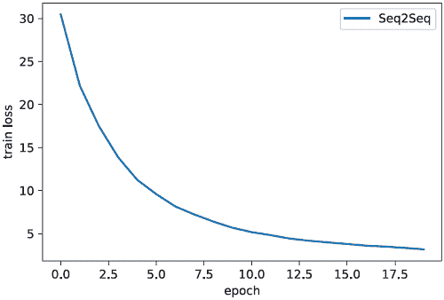

关于验证损失的 BLEU？

评估 Seq2Seq 模型可能特别具有挑战性。当存在多个有效翻译时，你怎么知道一个翻译是错误的？这是我们训练过程中忽略的东西，但不知何故，模型仍然表现得相当出色。

我们用于训练的损失函数是人们通常用来训练 Seq2Seq 模型的东西，但人们倾向于使用不同的评估指标来确定他们的模型有多好。这些评估指标相当复杂，所以我们坚持使用更主观的评估，以避免在本章中添加太多内容。如果你想了解更多，机器翻译通常与 BLEU([`en.wikipedia.org/wiki/BLEU`](https://en.wikipedia.org/wiki/BLEU))分数进行比较。但如果你不是在进行翻译任务，BLEU 可能不是最好的指标，因为 BLEU 是专门为翻译设计的。

可视化注意力分数图

观察网络的损失，我们可以清楚地看到它在训练过程中有所下降。为了帮助我们评估结果，我们可以进行一些翻译并查看注意力机制的结果。这将是一种主观分析，但我鼓励在处理 Seq2Seq 模型时进行主观评估。在存在多对多映射的情况下，客观评估往往很困难，因此与数据打交道有助于理解正在发生的事情。在每一个时间步 t，注意力机制会告诉我们哪些输入单词对于预测每个输出单词是重要的。这有助于我们了解模型是否在学习合理的东西。

我们定义了以下`plot_heatmap`函数来快速绘制注意力结果。`results`函数将使用它来接收输入，将其翻译成法语，并显示预测、注意力和真实翻译：

```
def plot_heatmap(src, trg, scores): 
    fig, ax = plt.subplots() heatmap = ax.pcolor(scores, cmap=’gray’)

    ax.set_xticklabels(trg, minor=False, rotation=’vertical’) 
    ax.set_yticklabels(src, minor=False)

    ax.xaxis.tick_top() ❶ 
    ax.set_xticks(np.arange(scores.shape[1]) + 0.5, minor=False) 
    ax.set_yticks(np.arange(scores.shape[0]) + 0.5, minor=False) 
    ax.invert_yaxis()

    plt.colorbar(heatmap) 
    plt.show()
```

❶ 将主要刻度放在每个单元格的中间，并将 x 刻度放在顶部

在定义结果函数之前，让我们快速将我们的`seq2seq`模型置于评估模式。这样，我们就能得到注意力图。然后函数可以使用我们的逆映射`indx2word`来查看原始数据和预测应该是什么。我们打印出输入和目标，以及`seq2seq`的预测。最后，我们展示注意力分数的热图，这将帮助我们主观地评估结果。这个函数的输入仅仅是我们要考虑的测试集索引：

```
seq2seq = seq2seq.eval().cpu() 
def results(indx): 
    eng_x, french_y = test_dataset[indx] 
    eng_str = " ".join([indx2word[i] for i in eng_x.cpu().numpy()]) 
    french_str = " ".join([indx2word[i] for i in french_y.cpu().numpy()]) 
    print("Input: ", eng_str) 
    print("Target: ", french_str)

    with torch.no_grad(): 
        preds, attention = seq2seq(eng_x.unsqueeze(0)) 
        p = torch.argmax(preds, dim=2) 
    pred_str = " ".join([indx2word[i] for i in p[0,:].cpu().numpy()]) 
    print("Predicted: ", pred_str) 
    plot_heatmap(eng_str.split(" "), pred_str.split(" "), 
    ➥ attention.T.cpu().numpy())
```

现在，我们可以看看一些结果。根据你的模型训练运行的不同，你可能会得到略微不同的结果。对于第一句话，我得到的翻译是“les animaux ont peur du feu”，谷歌翻译说这翻译回英文句子是“some animals are afraid of fire”。在这种情况下，模型得到了一个*基本上*正确的结果，但它使用了“les”，这翻译成“the”而不是更合适的“certain”。

注意力图显示，“les”确实在查看输入的正确部分（“一些”），但可能过于关注句子的开头。如果我必须猜测，“the”可能比“some”更常见于句首，网络基于这一点犯了错误。但我们也可以看到，“du feu”正确地关注了输入中的“of fire”部分，从而产生了正确的输出。虽然数学并不完美，但模型出于可理解的原因选择了具有相似意义的单词。

我们还可以看到如何使用动作机制来更好地理解我们的模型结果。这是注意力机制的一个非常强大的特点：它们为我们提供了对通常不透明的神经网络的一定程度的*可解释性*。在这种情况下，可能需要获取更多具有各种起始标记/短语的多样化句子。

下面是代码：

```
results(12)

Input:       <SOS> some animals are afraid of fire <EOS> 
Target:     certains animaux craignent le feu <EOS> 
Predicted:  les animaux ont peur du feu <EOS> <EOS>
```

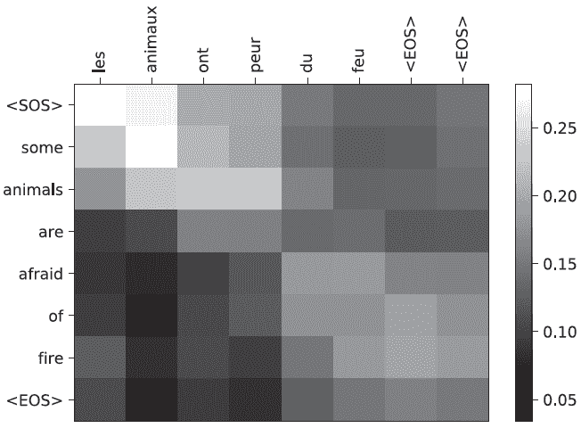

下一个翻译展示了对于我经常看到翻译差异较大的句子，结果如下：“今天天气怎么样”，将原文的前四个词从“天气如何”进行了改变。虽然与目标不同，但结果仍然是一个相当正确的翻译。这表明 Seq2Seq 在学习和处理这些困难问题时具有一定的能力，尽管存在这些问题，这种方法仍然能够成功学习。这也是为什么评估机器翻译任务的平等性可以非常困难。在这个例子中，注意力机制并不那么清晰，因为在这种情况下，没有单个单词意味着“天气”。

下面是代码：

```
results(13)

Input:      <SOS> what is the weather like today <EOS> 
Target:     comment est le temps aujourd'hui <EOS> 
Predicted:  quel temps fait il aujourd'hui <EOS> <EOS> <EOS>
```

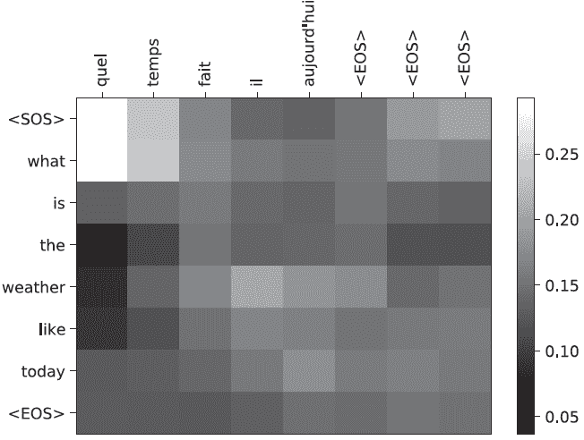

下一个例子显示了另一个合理的翻译——谷歌翻译为我返回了相同的结果。看起来模型可能替换了一些同义词或改变了性别化的单词，但为了确定这一点，我需要知道法语。这也是为什么我喜欢机器学习的原因之一——我可以让计算机做许多我自己无法做到的事情：

```
results(16)

Input:      <SOS> no one disagreed <EOS> 
Target:     personne ne fut en désaccord <EOS> 
Predicted:  personne n'exprima de désaccord <EOS>
```

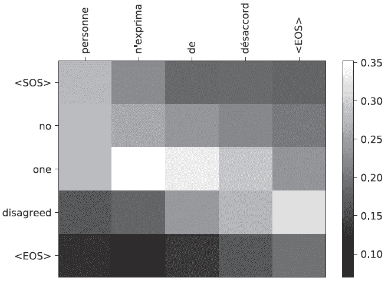

如果你拥有进行更大训练集的计算资源，并且有更多时间，你就可以得到如图 11.1 所示的翻译结果。这不仅显示了从法语到英语的较长句子的转换，而且还显示了注意力机制的更精细输出。可以明显看出正在翻译的确切单词，并且可以看到模型正确地改变了“zone économique européenne”到“European Economic Area”的顺序，适应了语言的细微差别。

虽然之前的代码仍然缺少一个最大化性能的主要技巧，但这并不是一个玩具实现。这种方法已经在现实世界的机器翻译系统中使用，并且在 2019 年被新的方法所取代。

## 练习

在 Inside Deep Learning Exercises 的 Manning 在线平台上分享和讨论您的解决方案（[`liveproject.manning.com/project/945`](https://liveproject.manning.com/project/945)）。一旦您提交了自己的答案，您将能够看到其他读者提交的解决方案，并看到作者认为哪些是最好的。

1.  默认情况下，解码器用户 **h**[T] 作为其初始隐藏状态。尝试将其更改为使用解码器输出的平均值，即 1/*T* Σ*[t]^T*[=1] ***h**[t]*。

1.  我们的 Seq2Seq 模型是硬编码为 `DotScore` 的。尝试使用 `GeneralScore` 以及您对 `GeneralScore` 的新初始化在翻译任务上。您的评估结果显示哪个表现更好或更差？

1.  **挑战性任务：** 为图像加法任务创建一个新的数据集。将输入设为随机数量的 MNIST 图像，输出值设为表示数字之和的字符序列。因此，输入可能是一系列表示 6、1 和 9 的图像，然后输出应该是字符串“16。”然后修改 Seq2Seq 模型以训练和运行此问题。*提示：* 修改编码器和 `collate_fn`。

1.  写出为什么练习 3 中的任务具有挑战性的原因。网络需要学习哪些内容来解决这个问题？尝试阐述解决该问题需要多少不同的心理概念和任务，以及它们是如何通过网络的损失函数显式或隐式定义的。

1.  将 Seq2Seq 模型修改为使用 LSTM 层而不是 GRU 层。这将需要对 LSTM 的自身上下文结果进行一些额外的跟踪。

1.  尝试训练不使用任何教师强制——只使用自回归方法的模型。它们的性能如何比较？

## 摘要

+   我们可以训练一个类似于去噪自编码的模型，称为序列到序列模型，用于解决具有多对多映射的问题。

+   机器翻译是一个多对多的问题，我们可以通过 Seq2Seq 模型来实现并做得很好。

+   注意力分数可以用作模型的可解释输出，使我们更好地理解模型是如何做出决策的。

+   自回归方法可以与教师强制结合使用，以帮助模型更快、更好地学习。

* * *

¹ G. Lample 和 F. Charton, F. “深度学习在符号数学中的应用”，载于 ICLR 2020 会议论文集。↩

² A. See, P. J. Liu, 和 C. D. Manning, “Get to the point: summarization with pointer-generator networks,” 计算机语言学协会，2017。↩

³ “可解释性”是什么，或者它是否真的存在，在许多机器学习圈子中实际上是一个热烈讨论的话题。为了获得一篇优秀的观点文章，请参阅 Zachary Lipton 的“模型可解释性的神话”一文，见 [`arxiv.org/abs/1606.03490`](https://arxiv.org/abs/1606.03490)。↩

⁴ 双向 RNN 的最大选择通常是“在测试时我能否访问到未来的/整个序列？”对于我们的翻译任务来说，这是成立的，所以这是值得做的。但并非总是如此！如果我们想制作一个实时接收 *现场语音* 的 Seq2Seq 模型，我们就需要使用一个非双向模型，因为我们不会知道说话者的未来词汇。↩

⁵ 如果我们想用 `LSTMCell` 来替换它，我们需要为 LSTM 的上下文状态再准备另一个列表。↩
