# 12 RNNs 的 12 种网络设计替代方案

本章涵盖

+   克服 RNNs 的限制

+   使用位置编码向模型添加时间

+   将 CNN 适应基于序列的问题

+   将注意力扩展到多头注意力

+   理解 Transformer

循环神经网络——特别是 LSTMs——已经用于分类和解决序列问题超过二十年。虽然它们长期以来一直是可靠的工具，但它们有几个不希望的特性。首先，RNNs 非常慢。它们需要很长时间来训练，这意味着需要等待结果。其次，它们在更多层（难以提高模型精度）或更多 GPU（难以使它们训练更快）的情况下扩展得不好。通过跳过连接和残差层，我们已经了解了许多使全连接和卷积网络通过更多层来获得更好结果的方法。但 RNNs 似乎不喜欢深度。你可以添加更多层和跳过连接，但它们并不显示出与提高精度相同的程度的好处。

在本章中，我们探讨一些可以帮助我们解决一个或两个这些问题的方法。首先，我们通过违背先前的信念来解决 RNNs 的缓慢问题。我们使用 RNNs 是因为我们知道数据是序列，但我们假装它不是一个正常序列，这样我们就可以更快地做些事情——并且可能更不准确。接下来，我们探讨一种不同的方式来表示数据的序列组件，以增强这些更快的替代方案并恢复一些准确性。

最后，我们了解 Transformer（不是受版权保护的类型），它们的训练速度甚至更慢，但与深度和强大的计算设备相比，扩展得更好。基于 Transformer 的模型正在迅速成为自然语言处理中许多任务最高精度解决方案的基础，并且很可能成为你作为从业者生活的一部分。

## 12.1 TorchText：文本问题的工具

为了帮助我们测试 RNNs 许多替代方案的相对优缺点，我们首先需要的是一个数据集和一些基线结果。对于本章，我简要介绍了并使用了`torchtext`包。像`torchvision`一样，它是 PyTorch 的一个子项目。而`torchvision`提供了针对基于视觉问题的额外工具，`torchtext`则提供了围绕基于文本问题的额外工具。我们不会深入探讨它包含的所有特殊功能；我们只是用它来方便地访问更难的数据集。

### 12.1.1 安装 TorchText

首先要做的就是快速确认`torchtext`和可选依赖`sentencepiece`已安装；否则，我们无法使所有期望的功能正常工作。以下代码在通过 Colab（或任何 Jupyter 笔记本）运行时安装这两个包：

```
# !conda install -c pytorch torchtext 
# !conda install -c powerai sentencepiece 
# !pip install torchtext 
# !pip install sentencepiece
```

### 12.1.2 在 TorchText 中加载数据集

现在我们可以导入 `torchtext` 和相关的 `datasets` 包，我们将加载 AG News 数据集。这个数据集有四个类别，`torchtext` 将提供快速准备训练的实用工具。但首先，我们导入包，获取数据集迭代器（这是 `torchtext` 喜欢提供数据的方式），并将训练数据和测试数据分别放入各自的列表中：

```
import torchtext 
from torchtext.datasets import AG_NEWS

train_iter, test_iter = AG_NEWS(root=’./data’, split=(’train’, ’test’)) 
train_dataset = list(train_iter) 
test_dataset = list(test_iter)
```

现在我们已经加载了 AG News 数据集，该数据集为每个文档提供了四个可能的主题类别：世界、体育、商业和科技。以下代码块打印出该数据集的一个示例。我们有一个表示输入 x 的单词 `string` 和表示类 y 的标签。不幸的是，`torchtext` 违背了通常按数据/输入顺序首先返回，然后是标签的常规趋势（**x**, *y*），而是交换了顺序为 (*y*,**x**）：

```
print(train_dataset[0])

(3, "Wall St. Bears Claw Back Into the Black (Reuters) Reuters - Short-
sellers, Wall Street's dwindling\textbackslash{}\textbackslash{}band of 
ultra-cynics, are seeing green again.")  
```

我们需要将每个句子分解成一组离散的标记（即单词），并构建一个词汇表（Σ）来将每个单词映射到唯一的整数值，因为 `nn.Embedding` 层只接受整数输入。`torchtext` 提供了一些工具，使这个过程变得非常简单，并可以与一些现有的 Python 工具一起使用。Python 带来了 `Counter` 对象来计算不同标记出现的次数，`torchtext` 提供了 `tokenizer` 和 `Vocab` 对象来分割字符串并为我们做账簿记录：

```
from torchtext.data.utils import get_tokenizer          ❶
tokenizer = get_tokenizer(’basic_english’)              ❷ 

from collections import Counter                         ❸
from torchtext.vocab import Vocab                       ❹ 

counter = Counter() 
for (label, line) in train_dataset:                     ❺
     counter.update(tokenizer(line))                    ❻ 
vocab = Vocab(counter, min_freq=10,                     ❼ 
➥ specials=(’<unk>’, ’<SOS>’, ’<EOS>’, ’<PAD>’))
```

❶ 分词器将“this is a string”这样的字符串分解成标记列表，如 [‘this’，‘is’，‘a’，‘string’]。

❷ 我们对默认的英语风格分词器没有问题。

❸ 这个数据集有多少行

❹ 我们需要创建一个包含训练集中所有单词的词汇表。

❺ 遍历训练数据

❻ 计算唯一标记的数量以及它们出现的频率（例如，我们经常看到“the”，但“sasquatch”可能只出现一次或根本不出现）

❼ 创建一个词汇对象，删除任何至少没有出现 10 次的单词，并为未知、句子开头、句子结尾和填充添加特殊的词汇项

现在我们需要两个额外的辅助函数来完成 `torchtext` 特定的设置。`text_transform` 接收一个字符串并将其转换为基于词汇 Σ 的整数列表。另一个更简单的项目是 `label_transform`，它确保标签处于正确的格式（你可能需要根据 `torchtext` 中的不同数据集进行更多更改）：

```
def text_transform(x):                        ❶ 
return [vocab[’<SOS>’]] + [vocab[token]       ❷ 
for token in tokenizer(x)] + [vocab[’<EOS>’]]

def label_transform(x): 
    return x-1                                ❸

print(text_transform(train_dataset[0][1]))    ❹

[1, 434, 428, 4, 1608, 14841, 116, 69, 5, 851, 16, 30, 17, 30, 18, 0, 6, 434, 
377, 19, 12, 0, 9, 0, 6, 45, 4012, 786, 328, 4, 2]
```

❶ 将字符串转换为整数列表

❷ 词汇表就像一个字典，处理未知标记。我们可以分别用开始和结束标记进行前缀和后缀。

❸ 标签最初是 [1, 2, 3, 4]，但我们需要 [0, 1, 2, 3]。

❹ 将第一个数据点的文本转换为标记列表

`torchtext` 的具体细节现在基本已经处理完毕；我们可以进行一些初始的 PyTorch 仪式来设置环境。我们想要记录词汇表中有多少个标记以及类别的数量，并决定嵌入维度、批量大小和训练轮数。在下面的起始代码中，我为每个参数选择了任意值。我们还保存了代表我们的填充标记 `"<PAD>"` 的整数，因为我们将在批处理数据集时需要它：

```
VOCAB_SIZE = len(vocab) 
NUM_CLASS = len(np.unique([z[0] for z in train_dataset])) 
print("Vocab: ", VOCAB_SIZE) 
print("Num Classes: ", NUM_CLASS)

padding_idx = vocab["<PAD>"]

embed_dim = 128 
B = 64 
epochs = 15

Vocab:  20647
Num Classes:  4
```

我们还定义了用于 PyTorch 的 `DataLoader` 类的 `collate_fn` 函数。`collate_fn` 通常是最好的实现填充的地方，因为它允许你根据当前批次数据所需的最小量进行填充。它也是一个方便的地方，可以反转标签和输入顺序，以匹配我们期望的标准 `(input, label)` 模式。这样，我们返回的批次将遵循（**x**，*y*）的模式，就像我们的其他代码所期望的那样，我们可以重用我们迄今为止所做的一切。

所有这些都在 `pad_batch` 函数中完成，它遵循正常的填充方法。我们首先确定批次中所有项的最长序列，并将其值存储在 `max_len` 变量中。然后我们使用 `F.pad` 函数将每个批次中的项向右填充。这使得所有项具有相同的长度，我们可以将它们 `stack` 成一个单一的张量。注意，我们确保使用 `padding_idx` 作为填充的值：

```
def pad_batch(batch): 
""" 
Pad items in the batch to the length of the longest item in the batch. 
Also, re-order so that the values are returned (input, label) 
"""

labels = [label_transform(z[0]) for z in batch]                    ❶ 
texts = [torch.tensor(text_transform(z[1]),                        ❷ 
➥ dtype=torch.int64) for z in batch] 
max_len = max([text.size(0) for text in texts])                    ❸

texts = [F.pad(text, (0,max_len-text.size(0)),                     ❹
➥ value=padding_idx) for text in texts]

x, y = torch.stack(texts), torch.tensor(labels, dtype=torch.int64) ❺ 
return x, y
```

❶ 获取并转换批次中的每个标签

❷ 获取并标记化每个文本，并将它们放入一个张量中

❸ 在这个批次中，最长的序列是哪一个？

❹ 使用 whatever amount makes it max_len 对每个文本张量进行填充

❺ 将 x 和 y 合并为一个单一的张量

现在，我们可以像以前多次做的那样构建我们的 `DataLoader`，以向我们的模型提供数据。多亏了 `Dataset` 抽象，我们不需要知道 `torchtext` 实现其加载器的细节，我们可以看到，通过设置 `collate_fn` = `pad_batch`，我们可以通过数据集返回数据的方式解决任何数据集可能存在的怪癖。我们不需要重写数据集，我们选择的 `collate_fn` 简单地以我们想要的方式清理 `Dataset` 的输出：

```
train_loader = DataLoader(train_dataset, batch_size=B, shuffle=True, 
➥ collate_fn=pad_batch) 
test_loader = DataLoader(test_dataset, batch_size=B, collate_fn=pad_batch)
```

### 12.1.3 定义基线模型

现在我们已经准备好了数据集合并函数和加载器，我们可以训练一些模型了。让我们先实现一个基线 RNN 模型，我们可以将其与每个替代方案进行比较，从而为我们提供一个衡量利弊的标尺。我们将使用基于门控循环单元（GRU）的 RNN，并带有三个双向层，以尝试最大化我们获得的准确率。我们在这里使用 GRU 是因为它比 LSTM 快，并且我们希望给它尽可能多的机会在运行时比较中获胜。虽然我们可以探索不同的隐藏维度大小、学习率和其他旋钮，但这将是一个相当直接和标准的第一次尝试，我会用它来构建 RNN。所以，让我们选择我们的损失函数并调用我们方便的 `train_network`：

```
gru = nn.Sequential( 
    nn.Embedding(VOCAB_SIZE, embed_dim,             ❶
    ➥ padding_idx=padding_idx),

    nn.GRU(embed_dim, embed_dim, num_layers=3,      ❷ 
    ➥ batch_first=True, bidirectional=True),

    LastTimeStep(rnn_layers=3, bidirectional=True), ❸
    nn.Linear(embed_dim*2, NUM_CLASS),              ❹ 
)

loss_func = nn.CrossEntropyLoss() 
gru_results = train_network(gru, loss_func, train_loader, 
➥ val_loader=test_loader, score_funcs={’Accuracy’: accuracy_score}, 
➥ device=device, epochs=epochs)
```

❶ (B, T) -> (B, T, D)

❷ (B, T, D) -> ( (B,T,D) , (S, B, D) )

❸ 我们需要将 RNN 输出减少到一个项目，(B, 2*D)。

❹ (B, D) -> (B, classes)

我们第一次尝试的结果显示在下面，看起来做得相当不错，在前几个时期后有一些过拟合，但稳定在约 91.5% 的准确率。在本章的其余部分，随着我们开发新的替代方案，我们将它们绘制在同一个图上以进行整体比较。例如，我们想要考虑最大准确率（如果我们更好地正则化，我们可能能够实现什么），稳定准确率（我们可以用很少的努力得到什么），以及达到某些准确率水平的时期（我们需要训练多长时间）。

下面是代码：

```
    sns.lineplot(x=’epoch’, y=’val Accuracy’, data=gru_results, label=’GRU’)

[16]: <AxesSubplot:xlabel='epoch', ylabel='val Accuracy'>
```

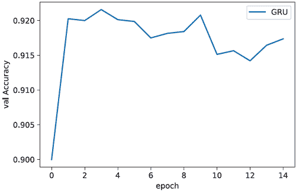

## 12.2 时间上平均嵌入

GRU 基准已经准备好供我们比较，所以让我们学习处理可变长度序列分类问题的第一个新方法。我们不是在时间序列上执行复杂的 RNN 操作，而是对序列中的所有项目进行*平均*。所以如果我们有一个形状为 (*B*,*T*,*D*) 的输入，我们计算第二个轴上的平均值，创建一个新的形状为 (*B*,*D*) 的张量。它有易于实现的优点；速度快；并且*消除了时间维度*，允许我们在那个点之后应用我们想要的任何方法（例如残差连接）。图 12.1 展示了这看起来是什么样子。

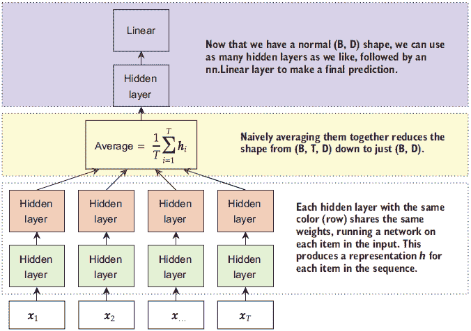

图 12.1 时间上平均嵌入的示例。时间上的 T 个输入通过权重共享由相同的神经网络处理。因为*没有*跨时间的连接，模型不知道它们有顺序。时间维度通过简单地平均所有表示来解析，这样就可以在之后运行一个常规的全连接网络来生成输出。

由于我们在时间维度上平均，我们忽略了数据有顺序的事实。另一种说法是我们*忽略了数据的结构*以简化我们的模型。我们*可能*想这样做以使我们的训练和预测更快，但这也可能适得其反，导致结果质量更差。

我们可以采用的一种简单的时间平均实现方法是使用我们在第八章中学到的自适应池化。自适应池化通过取*期望输出大小*并调整池化大小来强制输出达到期望的大小来实现。Faster R-CNN 使用自适应池化将任何输入缩小到 7 × 7 的网格。相反，我们将稍微利用一下自适应池化是如何工作的。如果我们的输入形状为(*B*,*T*,*D*)，我们想要在最后两个维度上执行自适应池化，因此我们使用自适应 2D 池化。我们使池化的目标形状非对称，形状为(1,*D*)。我们的输入在最后一个维度上已经具有 D 的形状，所以最后一个维度不会被改变。时间维度缩小到 1，强制它进行时间平均。由于其自适应池化，即使 T 在批次之间发生变化，此代码也能正常工作。我们可以在下面的代码中非常快速地定义并尝试此模型。

如前所述，此代码依赖于这样一个事实：如果你给 PyTorch `nn.Linear`层一个形状为(*B*,*T*,*D*)的张量，它将独立地对所有 T 个不同的输入应用线性层，从而在单个调用中有效地执行权重共享。我们使用具有显式目标形状(1,*D*)的`nn.AdaptiveAvgPool2d`，将输入张量从(*B*,*T*,*D*)减少到(*B*,1,*D*)。然后我们可以用一个隐藏层和一个`nn.Linear`来预测类别：

```
simpleEmbdAvg = nn.Sequential( 
    nn.Embedding(VOCAB_SIZE, embed_dim, padding_idx=padding_idx), ❶ 
    nn.Linear(embed_dim, embed_dim), 
    nn.LeakyReLU(), 
    nn.Linear(embed_dim, embed_dim), 
    nn.LeakyReLU(), 
    nn.Linear(embed_dim, embed_dim), 
    nn.LeakyReLU(), 
    nn.AdaptiveAvgPool2d((1,embed_dim)),                          ❷ 
    nn.Flatten(),                                                 ❸
    nn.Linear(embed_dim, embed_dim), 
    nn.LeakyReLU(), 
    nn.BatchNorm1d(embed_dim), 
    nn.Linear(embed_dim, NUM_CLASS) 
) 
simpleEmbdAvg_results = train_network(simpleEmbdAvg, loss_func, train_loader, 
➥ val_loader=test_loader, score_funcs={’Accuracy’: accuracy_score}, 
➥ device=device, epochs=epochs)
```

❶ (B, T) -> (B, T, D)

❷ (B, T, D) -> (B, 1, D)

❸ (B, 1, D) -> (B, D)

下面的两行代码绘制了结果。查看这两种方法的准确率，我们发现 GRU 表现更好。如果你多次运行，你可能会发现平均嵌入方法有时开始对数据进行过拟合。所以，**乍一看**，这种替代方案并不值得：

```
    sns.lineplot(x=’epoch’, y=’val Accuracy’, data=gru_results, label=’GRU’)   
    sns.lineplot(x=’epoch’, y=’val Accuracy’, data=simpleEmbdAvg_results, 
    ➥ label=’Average Embedding’)

[18]: <AxesSubplot:xlabel='epoch', ylabel='val Accuracy'>
```

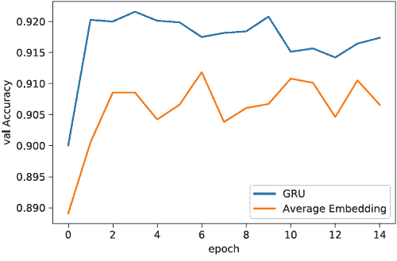

但我们应该问为什么平均嵌入方法能起作用。我们通过*忽略*关于数据我们知道的一些真实情况来实现这种方法：它有一个顺序，并且顺序很重要。你不能只是重新排列句子中的单词，就能得到一个可理解的结果。

平均嵌入方法可以得到合理的准确率，因为通常有办法在问题中作弊。例如，AG 新闻的四个类别是世界、体育、商业和科技。所以如果你的模型看到包含“NFL”、“touchdown”和“win”这些单词的句子，这些单词出现的顺序实际上并不重要。你仅从这些单词的存在就能猜测这可能是一篇体育文章。同样，如果你看到“banking”和“acquisition”这些单词，你就可以判断有很高的可能性这是一篇商业文章，而不需要了解句子的其他内容。

平均嵌入可以得到合理的准确率，因为我们并不总是“需要”我们的先验知识来做得好。平均嵌入的潜在好处在于我们观察模型训练所需的时间。以下代码重新创建了图表，但将`total_time`放在 x 轴上。这清楚地表明，训练平均嵌入大约比 GRU 模型快三倍。如果你有一个巨大的数据集，训练 GRU 可能需要一周时间，那么 3 倍的速度提升就非常吸引人了：

```
    sns.lineplot(x=’total time’, y=’val Accuracy’, data=gru_results, label=’GRU’) 
    sns.lineplot(x=’total time’, y=’val Accuracy’, data=simpleEmbdAvg_results, 
    ➥ label=’Average Embedding’)

[19]: <AxesSubplot:xlabel='total time', ylabel='val Accuracy'>
```

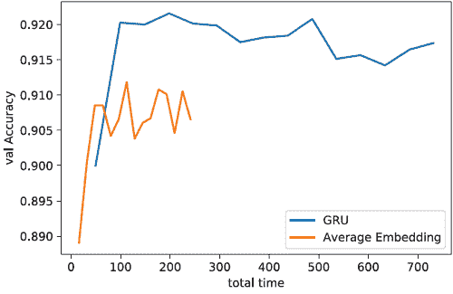

对嵌入进行平均最终违反了一个先前的信念，即数据有顺序且顺序很重要，以换取一个更简单、更快的模型。我经常构建这样的模型，仅仅因为我正在处理大量数据，并且我希望更快地得到一些初步结果。但这也是一个更大任务的练习：学习识别当你有一个可接受的模型，但违反了你的一些信念时。

在这个特定场景中，我们可以解释为什么一个违反我们信念（时间很重要）的模型（单个单词信息量太大）能够工作。在未来，你可能会发现这样一个更简单的模型表现异常出色，而一个优秀的从业者不应该仅仅根据结果的好坏来评价模型。如果你无法合理地解释为什么一个违反这个假设的模型能够工作，你应该深入挖掘你的数据，直到你能够解释为止。看看模型做对和做错的地方，并试图弄清楚模型是如何学习完成这项工作的。模型做错或做对的数据点中是否存在任何明显的模式？输入数据中是否有不应该存在的东西？有没有一些无害的因素，比如长度与目标之间意外地很好地相关？

我无法提前告诉你如何进行这个过程，除了对你的模型成功感到惊讶之外。把自己放在一个作弊者的心态中，试图找出作弊的方法。手动标记一些数据，看看你是否能想出不同的方法来得到答案，并看看你的方法与你的模型偏差如何匹配。例如，如果你可以通过挑选几个关键词来标记一个句子，那么单词的顺序就不像你想象的那么重要了。

在进行这个过程时，你可能会遇到“信息泄露”的情况，即关于标签的信息错误或不切实际地渗入你的训练数据中。发现这一点是好事，这意味着在继续进行任何更多模型开发之前，你需要修复信息泄露，因为它会污染你试图构建的任何模型。根据我的经验，过于简单的模型比预期工作得更好，几乎总是表明我最终会发现的信息泄露。

信息泄露是如何发生的？

当你在构建数据时，如果数据中存在与你的标签 y 强*相关*的某些内容，但相关性并不自然存在，信息泄露就可能以无限可能的方式发生。相反，它是创建和组织数据过程中产生的错误，通常是由于数据准备中的错误。人们经常无意中将标签 y*放置在输入特征 x 中*，模型很快就会学会利用这一点！

我将从我在构建恶意软件检测模型方面发表的一些工作中举一个例子。^a 许多人使用微软 Windows 干净安装的数据来表示良性或安全数据。然后他们在网上找到了一些恶意软件，并构建了一个看起来*几乎完美*的准确率的分类器。当我们深入研究数据时，我们发现几乎微软发布的所有内容都带有“版权所有 微软公司”的字符串。这个字符串最终*泄露*了标签是“良性”的信息，因为它只出现在良性数据中，从未出现在恶意软件数据中。但在现实中，“版权所有 微软公司”的字符串与文件是否为恶意软件无关，因此模型在新数据上表现不佳。

信息泄露也可能以愚蠢或微妙的方式发生。有一个关于军事想要在 1960 年至 2000 年之间某个时间检测图像中是否存在坦克的 ML 模型的轶事([`www.gwern.net/Tanks`](https://www.gwern.net/Tanks))。故事是这样的（我第一次听到时是这样的）：他们收集了大量坦克和空地的图片，并训练了一个网络，该网络获得了完美的准确率。但每张坦克的图片都有太阳，而非坦克的图片没有太阳。模型学会了检测太阳而不是坦克，因为识别太阳更容易。这从未真正发生过，但这个故事是一个关于信息如何以意想不到的方式泄露的有趣故事。

* * *

^a E. Raff 等人，“对恶意软件分类中字节 n-gram 特征的调查”，*J Comput Virol Hack Tech*，第 14 卷，第 1-20 页，2018 年，[`doi.org/10.1007/s11416-016-0283-1`](https://doi.org/10.1007/s11416-016-0283-1)。↩

### 12.2.1  时间加权平均与注意力

虽然我们之前实现的代码是可行的，但它*稍微*有些不正确。为什么？因为`nn.AdaptiveAvgPool2d`对填充输入一无所知，这导致嵌入的值为 0。这会影响到较短的序列的幅度。让我们看看这是如何发生的。为了简单起见，假设我们将标记嵌入到一维中。那么我们可能有三组看起来像这样的数据点：

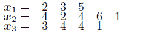

当我们计算每个项目的平均值时，我们希望得到这个：

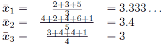

但我们在这一批中填充了所有内容，使其长度与批次中最长的项目相同！填充值都是零，所以计算结果变为

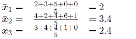

这显著改变了*x̄*[1]和*x̄*[3]的值！为了解决这个问题，我们需要像在上一章中计算注意力机制的上下文向量一样，我们自己实现平均。

但如果我们计算那个上下文向量，为什么不应用注意力机制呢？注意力将学习所有输入词的加权平均，并且理论上可以学习根据所有可用信息忽略某些词。

为了尝试这个，我们将实现一个新的`Module`，它执行嵌入并基于哪些值被填充或未填充来计算一个掩码。由于掩码的形状为(*B*,*T*)，我们可以通过对第二个时间维度求和来知道每个批次中有多少有效项。然后我们可以对时间上的所有项求和，除以适当的值，并得到传递给之前定义的注意力机制的上下文向量。

以下代码实现了一个`EmbeddingAttentionBad`类，该类负责将每个输入标记通过嵌入层，运行一些具有时间共享权重的隐藏层，然后应用第十章中我们的一种注意力机制来计算加权平均结果。它需要知道`vocab_size`和嵌入维度`D`作为参数，可选的`embd_layers`用于更改隐藏层的数量，以及`padding_idx`来告知它用于表示填充的值：

```
class EmbeddingAttentionBag(nn.Module):

    def __init__(self, vocab_size, D, embd_layers=3, padding_idx=None):
        super(EmbeddingAttentionBag, self).__init__() 
        self.padding_idx = padding_idx 
        self.embd = nn.Embedding(vocab_size, D, padding_idx=padding_idx) 
        if isinstance(embd_layers, int):
            self.embd_layers = nn.Sequential(                      ❶
                *[nn.Sequential(nn.Linear(embed_dim, embed_dim), 
                nn.LeakyReLU()) for _ in range(embd_layers)] 
            ) 
        else: 
            self.embd_layers = embd_layers 
        self.attn = AttentionAvg(AdditiveAttentionScore(D))        ❷

    def forward(self, input): 
        """ 
        input: (B, T) shape, dtype=int64
        output: (B, D) shape, dtype=float32 
        """ 
        if self.padding_idx is not None:
            mask = input != self.padding_idx

        else: 
            mask = input == input                                  ❸ 
        x = self.embd(input)                                       ❹ 
        x = self.embd_layers(x)                                    ❺

        context = x.sum(dim=1)/(mask.sum(dim=1).unsqueeze(1)+1e-5) ❻
        return self.attn(x, context, mask=mask)                    ❼
```

❶ (B, T, D) -> (B, T, D)

❷ 第十章中定义的函数

❸ 所有条目都是 True。掩码的形状为(B, T)。

❹ (B, T, D)

❺ (B, T, D)

❻ 对时间进行平均。(B, T, D) -> (B, D)。

❼ 如果我们想要进行正常平均，我们现在就可以返回上下文变量了！((B, T, D), (B, D)) -> (B, D)。

使用这个新模块，我们可以在以下代码块中构建一个简单的新的网络。它从计算嵌入、时间共享的隐藏层和注意力的`EmbeddingAttentionBag`开始。然后我们跟随一个隐藏层和`nn.Linear`来生成预测：

```
attnEmbd = nn.Sequential(    ❶ 
EmbeddingAttentionBag(VOCAB_SIZE, embed_dim, 
➥ padding_idx=padding_idx), ❷ 
    nn.Linear(embed_dim, embed_dim), 
    nn.LeakyReLU(), 
    nn.BatchNorm1d(embed_dim), 
    nn.Linear(embed_dim, NUM_CLASS) 
) 
attnEmbd_results = train_network(attnEmbd, loss_func, train_loader, 
➥ val_loader=test_loader, score_funcs={’Accuracy’: accuracy_score}, 
➥ device=device, epochs=epochs)
```

❶ 现在我们可以定义一个简单的模型了！

❷ (B, T) -> (B, D)

现在我们可以绘制结果。基于注意力的嵌入训练时间稍长，但仍然比 RNN 快 2 倍以上。这是有道理的，因为注意力版本执行了更多的操作。我们还可以看到，注意力提高了我们模型的准确性，接近 GRU。随着注意力嵌入的准确性随着更新次数的增加而急剧下降，它更容易过拟合：

```
    sns.lineplot(x=’total time’, y=’val Accuracy’, data=gru_results, label=’GRU’) 
    sns.lineplot(x=’total time’, y=’val Accuracy’, data=simpleEmbdAvg_results, 
    ➥ label=’Average Embedding’) 
    sns.lineplot(x=’total time’, y=’val Accuracy’, data=attnEmbd_results, 
    ➥ label=’Attention Embedding’

[22]: <AxesSubplot:xlabel='total time', ylabel='val Accuracy'>
```

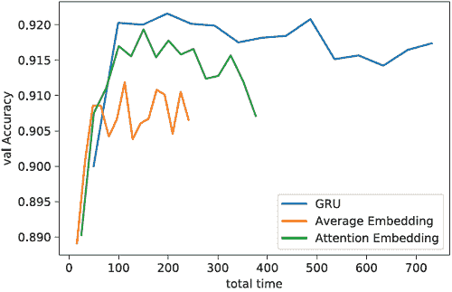

注意力嵌入的最大问题*仍然*是它对句子中单词的顺序没有任何感知。这是模型中缺失的时间成分。为了进一步强调这一点，让我们展示另一种看待问题的方法。考虑输入句子“红色的狐狸追逐蓝色的狗。”我们的模型将每个单词嵌入到其向量表示中，我们最终在嵌入（加权或未加权，取决于你是否使用了注意力）上执行某种平均。让我们看看如果嵌入维度为*D* = 1 且该维度的值设置为整数时，这个句子是如何工作的。这给我们以下设置：

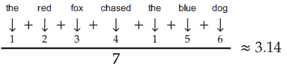

这个等式展示了一个未加权的平均值，但将其变为加权平均值只会改变最终的结果——不理解数据顺序性的基本缺陷仍然存在。因此，例如，如果我们交换句子中的“狐狸”和“狗”，意义就会改变——但嵌入方法将*返回相同的结果*。这在下述等式中得到体现，并展示了网络无法检测到意义的微妙变化：

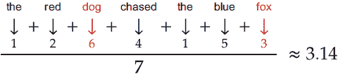

如果存在非常嘈杂数据的风险，这可能会成为一个特别的问题。下一个示例随机重排句子中的所有单词。句子的意义已经丢失，但模型仍然坚持认为没有任何变化。所有这些例子都与基于嵌入的模型相当：

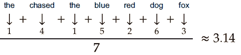

对于解决问题来说，序列顺序越重要，当前平均向量的方法就越难以做出正确的分类。这也适用于基于注意力的版本，因为它没有意识到顺序。每个单词**h**[i]根据上下文分配一个权重*α*[i]，因此它看不到缺失的信息！这使得平均方法在复杂问题上的实用性非常特定于问题。想想看，在句子中使用否定语言，如“不”、“不是”或“没有”的任何情况。有了否定，语言顺序至关重要。这些都是你应该考虑的事情，作为使用嵌入方法获得更快的训练时间的代价。

注意：由于我在谈论缺点，仍然值得指出的是，基于注意力的嵌入与 GRU 的准确性非常接近。这意味着什么？如果我在数据集上看到这些结果，我会有两个初步假设：(1)我的数据顺序对于当前问题并不像我想象的那么重要，或者(2)我需要一个更大的 RNN，有更多的层或更多的隐藏神经元来捕捉数据顺序中存在的复杂信息。我会首先通过训练更大的模型来调查假设#2，因为这只需要计算时间。调查假设#1 需要我个人的时间来深入挖掘数据，而我通常更重视我的时间而不是电脑的时间。如果有一种通过运行新模型来回答问题的方法，我更喜欢这样做。

## 12.3 时间上的池化和一维 CNN

由于我们已经确定序列顺序信息的缺乏是导致结果更好的一个严重瓶颈，让我们尝试一种不同的策略，它保留了一些时间信息，但不是全部。我们已经了解并使用了卷积，它包括一个空间先验：相邻的事物很可能相关。这捕捉了我们之前嵌入方法所缺乏的很多序列顺序。RNN 和一维卷积在形状上相似，如图 12.2 所示。

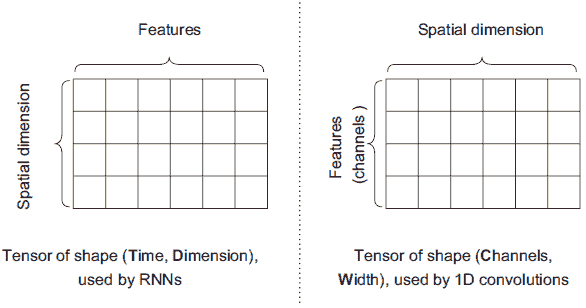

图 12.2 示例显示了 RNN（左）和一维卷积（右）使用的张量形状，没有第一个批量维度。在每个情况下，我们都有一个轴表示张量代表的空间（T 与 W），另一个表示位置的特性（D 与 C）。

这表明一维卷积和 RNN 具有相同的形状，但每个轴分配的**意义**略有不同。RNN 的**空间**维度在时间轴 T 的索引 1 处。一维卷积的空间维度在索引 2 处，宽度与输入数据（类似于图像的宽度！）相同。对于空间先验，RNN 分配了这样的信念：所有项目的确切顺序都是重要的。相比之下，卷积分配的信念是只有相邻的项目是相关的。RNN 和 CNN 都编码了序列中特定项目的特征信息；它们只是对那些数据分配了不同的解释。

一维卷积对时间和顺序的感觉比 RNN 弱，但总比没有好。例如，否定词通常出现在它们试图否定的词之前，因此一维 CNN 可以捕捉到这种简单的空间关系。如果我们能重新排列我们的张量，使其空间维度与卷积期望的相匹配，我们就可以使用一维 CNN 来捕捉一些关于时间的信息，并将其用作我们的分类器。图 12.3 显示了我们可以通过交换张量的轴来进行这种重新排列。

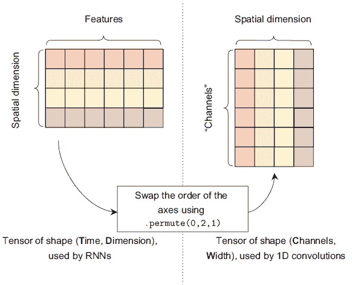

图 12.3 将 RNN 的张量形状转换为适合使用一维卷积的形状。我们使用 `.permute` 函数交换第二和第三轴（保留批次轴）。这会将空间维度移动到一维卷积期望的位置。

与在图像上使用二维卷积不同，我们可以在单词上使用一维卷积。`nn.Conv1d` 层将数据视为 (*B*,*C*,*W*)，其中 B 仍然是批次大小，C 是通道数，W 是输入的宽度（或单词数）。嵌入层的输出是 (*B*,*T*,*D*)，其中 T 是序列的长度。如果我们重新排列输出为 (*B*,*D*,*T*)，它将符合一维卷积的一般期望。我们可以使用这个技巧将基本上 *任何* 我们原本会使用 RNN 的问题转换为可以应用卷积网络的问题。

但仍然有一个问题。对于我们一直在使用的所有 CNN，输入都是一个固定大小：例如，MNIST 总是 28 × 28 的图像。但我们的问题中序列长度 T 是可变的！同样，我们可以使用自适应池化来帮助我们解决这个问题。

经过一系列的一维卷积、激活函数和正常池化操作后，我们张量的最终形状将是 (*B*,*D*′,*T*′)，其中 *D*′ 和 *T*′ 表示通道数 (*D*′) 和序列长度 (*T*′) 可能已经被我们的卷积和正常池化操作所改变。如果我们只对最后一个维度使用自适应池化，我们可以将形状减少到 (*B*,*D*′,1)，这将与原始输入的长度无关。如果我们使用自适应 *max* 池化，我们将选择每个通道的最大激活作为该通道在最终分类问题中的代表。这意味着我们可以在之后切换到使用线性层并执行我们想要的分类问题，因为从这一点开始形状将保持一致！下面的代码展示了如何将这些操作组合起来定义一个用于分类序列的一维卷积神经网络：

```
def cnnLayer(in_size, out_size):                     ❶ 
    return nn.Sequential(
        nn.Conv1d(in_size, out_size, kernel_size=k_size, padding=k_size//2), 
        nn.LeakyReLU(), 
        nn.BatchNorm1d(out_size))

k_size = 3 
cnnOverTime = nn.Sequential( 
    nn.Embedding(VOCAB_SIZE, embed_dim, 
    ➥ padding_idx=padding_idx),                     ❷ 
    LambdaLayer(lambda x : x.permute(0,2,1)),        ❸ 
    cnnLayer(embed_dim, embed_dim),                  ❹
    cnnLayer(embed_dim, embed_dim), 

    nn.AvgPool1d(2),                                 ❺
    cnnLayer(embed_dim, embed_dim*2), 
    cnnLayer(embed_dim*2, embed_dim*2), 

    nn.AvgPool1d(2),                                 ❻ 

    cnnLayer(embed_dim*2, embed_dim*4), 
    cnnLayer(embed_dim*4, embed_dim*4), 

    nn.AdaptiveMaxPool1d(1),                         ❼

    nn.Flatten(),                                    ❽ 
    nn.Linear(4*embed_dim, embed_dim), 
    nn.LeakyReLU(), 
    nn.BatchNorm1d(embed_dim), 
    nn.Linear(embed_dim, NUM_CLASS) 
) 
cnn_results = train_network(cnnOverTime, loss_func, train_loader, 
➥ val_loader=test_loader, score_funcs={’Accuracy’: accuracy_score}, 
➥ device=device, epochs=epochs)
```

❶ 我有点偷懒；我们也应该将 k_size 作为参数。

❷ (B, T) -> (B, T, D)

❸ (B, T, D) -> (B, D, T)

❹ 我们假设 D 是在这份数据的新解释中通道的数量。

❺ (B, D, T) -> (B, D, T/2)

❻ (B, 2*D, T/2) -> (B, 2*D, T/4)

❼ 现在我们已经进行了一些池化和卷积操作，将张量形状减少到固定长度。(B, 4*D, T/4) -> (B, 4*D, 1)

❽ (B, 4*D, 1) -> (B, 4*D)

注意：通常，我们可以根据个人偏好选择最大池化或平均池化。在这种情况下，有很好的理由选择`nn.AdaptiveMaxPool1d`而不是`nn.AdaptiveAvgPool1d`：批处理中的所有项目不一定具有相同的长度，并且接收填充的批处理项目将返回一个零值的向量。这意味着填充发生处的激活可能具有较小的值，因此可能不会被最大池化操作选中。这有助于我们的架构正常工作，即使我们忽略了不同输入具有不同长度的情况。这是一个棘手的解决方案，这样我们就不必过多考虑填充问题。

我们刚刚编写的策略，将具有 RNN 的序列问题转换为 1D 卷积，在分类任务中非常受欢迎。它为我们提供了大量的空间信息，同时允许我们更快地训练。以下代码显示了结果：

```
    sns.lineplot(x=’total time’, y=’val Accuracy’, data=gru_results, label=’GRU’) 
    sns.lineplot(x=’total time’, y=’val Accuracy’, data=simpleEmbdAvg_results, 
    ➥ label=’Average Embedding’) 
    sns.lineplot(x=’total time’, y=’val Accuracy’, data=attnEmbd_results, 
    ➥ label=’Attention Embedding’) 
    sns.lineplot(x=’total time’, y=’val Accuracy’, data=cnn_results, 
    ➥ label=’CNN Adaptive Pooling’)

[24]: <AxesSubplot:xlabel='total time', ylabel='val Accuracy'>
```

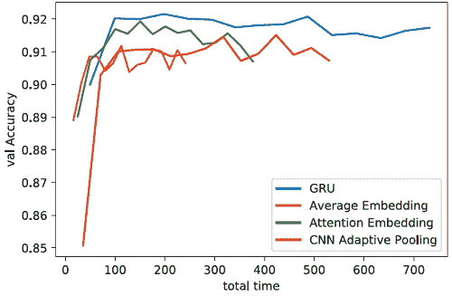

在运行带有自适应池化的 CNN 后，一些结果显示了各种优点和缺点。在积极的一面，CNN 似乎没有过度拟合，这意味着如果我们训练更多轮次，其性能可能会进一步提高。这也意味着 CNN 的最终准确率比平均嵌入更好。

我们当前的 CNN 也非常简单。正如我们通过添加更多层、残差连接和其他技巧来改进 2D CNNs 一样，我们可以重新实现这些方法（例如，残差连接）并将它们应用到此处以获得更好的结果。这使我们比 RNN 有优势，因为 RNN 不太可能随着我们添加所有这些我们学到的花哨功能而有很大改进。

在更令人失望的一侧，CNN 的峰值准确率并不如这个数据集上的平均嵌入那么好。我们已经知道，由于原始嵌入方法做得很好，数据的空间特性并不关键。空间信息对问题越重要，我们越期望这种 CNN 方法比嵌入方法表现更好。但训练这两个模型可以给你一些关于数据中顺序重要性的初步信息。

## 12.4 位置嵌入为任何模型添加序列信息

RNNs 能够捕捉输入数据的所有序列特性，而我们已看到 CNNs 可以捕捉其中的一些序列特性子集。我们的嵌入速度快且可能非常准确，但通常由于缺乏这种序列信息而过度拟合数据。这很难修复，因为序列信息来自于我们的模型设计（即使用 RNN 或 CNN 层）。

但如果我们能够将序列信息嵌入到嵌入中，而不是依赖于架构来捕捉序列信息，那会怎么样？如果嵌入本身包含关于它们相对顺序的信息，我们能否改进算法的结果？这正是最近一种称为*位置编码*的技术背后的想法。

图 12.4 展示了这个过程是如何工作的。我们将位置 t（例如，第一、第二、第三等）表示为一个向量。然后我们将这些向量加到输入上，使得输入包含自身以及每个项目在输入中的位置信息。这将在网络的输入中编码顺序信息，现在网络需要学习如何提取和使用关于时间的信息。

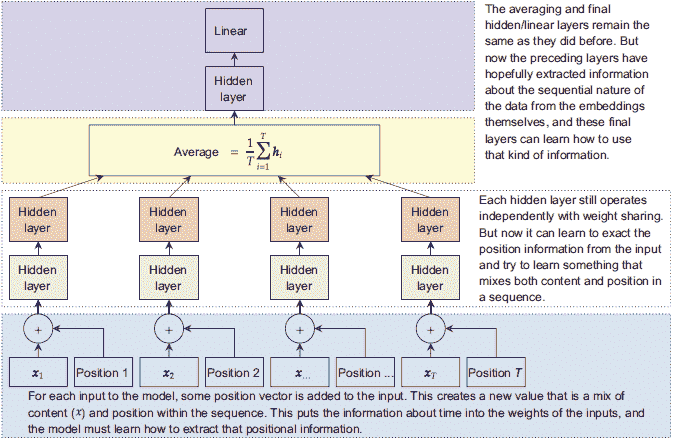

图 12.4 我们最初使用的平均嵌入方法，增加了位置嵌入。与输入分开，向量值编码了我们在一个较大序列中的位置信息。这被添加到表示输入的向量中，创建了一个内容和序列信息的混合。

最大的问题是，我们如何创建这种神话般的编码？这是一个稍微有些数学的方法，但并不复杂。我们需要定义一些符号以便讨论。让我们用**h**[i] ∈ ℝ^D 来表示在输入标记*x*[i]后得到的嵌入（来自`nn.Embedding`）。然后我们有一个嵌入序列**h**[1]，**h**[2]，…，**h**[t]，…，**h**[T]。我们想要一个位置向量*P*(*t*)，我们可以将其添加到我们的嵌入中，以创建一个改进的嵌入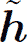[t]，它包含关于原始内容**h**[t]及其作为输入中的第 t 个项目的位置信息——类似于这样：

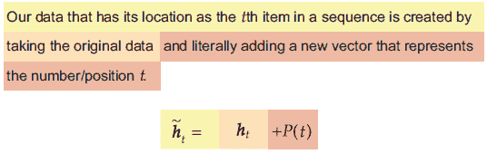

然后，我们可以用[1]，[2]，…，[t]，…，[T]作为我们网络其余部分的输入，知道顺序性质已经被放入嵌入中！结果我们发现可以用一个令人惊讶简单的方法做到这一点。我们定义一个函数来表示*P*(*t*)，使用正弦和余弦函数，并使用正弦和余弦函数的输入来表示向量 t 的位置。为了说明这是如何工作的，让我们绘制正弦(*t*)看起来像什么：

```
    position = np.arange(0, 100) 
    sns.lineplot(x=position, y=np.sin(position), label="sin(position)")

[25]: <AxesSubplot:>
```

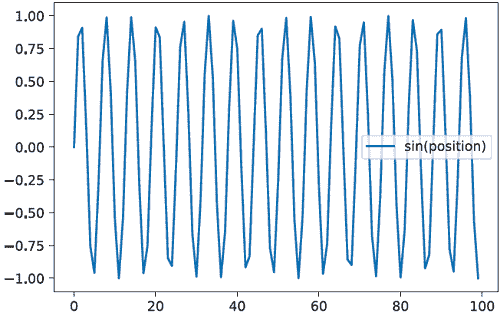

正弦函数上下波动。如果我们计算出 sin(*t*) = *y*，知道 y 告诉我们输入 t 可能是什么！因为对于所有整数 c，sin(*π*⋅*c*) = 0，我们可以判断我们是否在序列顺序中的某个π的倍数（π≈第三个项目，或 2π≈第六个项目，或 2π≈第九个项目等）。如果*y* = 0，那么我们可能在*t* = 3 ≈ π或*t* = 6 ≈ 2π，但我们无法确定我们处于这些特定位置中的哪一个——只知道我们处于大约π≈3.14 的倍数位置。在这个例子中，我们有 100 个可能的位置，因此我们可以用这种方法判断我们处于约 32 个可能位置中的一个。

我们可以通过添加第二个正弦调用来改善这种情况，但带有频率成分 f。因此我们计算 sin(*t*/f*)，其中 f = 1（我们已绘制的）和 f = 10：

```
    position = np.arange(0, 100) 
    ➥ sns.lineplot(x=position, y=np.sin(position), label="sin(position)") 
    ➥ sns.lineplot(x=position, y=np.sin(position/10), label="sin(position/10)")

[26]: <AxesSubplot:>
```

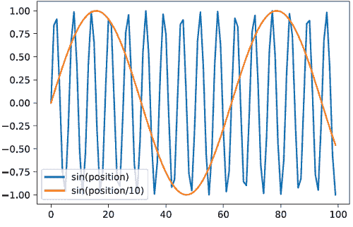

使用两个 f 的值，可以唯一地识别一些位置。如果 sin (*t*) = 0 且 sin (*t*/100) = 0，我们可能处于的四个可能位置只有 *t* = 0，31，68，94，这是唯一四个两种情况都（近似）为真的位置。如果 sin (*t*) = 0 但 sin (*t*/10) ≠ 0，那么我们知道 0，31，68 和 94 不是选项。此外，正弦函数的不同值也关于我们的位置提供了信息。如果 sin (*t*/10) = − 1，我们知道我们必须在位置 48，因为它是唯一一个输出为 − 1 的选项，给定最大时间 *T* = 100。

这表明，如果我们继续向计算中添加频率 f，我们就可以从值的组合中开始推断出输入序列中的**确切**位置。我们定义一个位置编码函数 *P*(*t*)，它通过在不同频率 *f*[1]，*f*[2]，…，*f*[*D*/2] 处创建正弦和余弦值来返回一个 D 维向量。我们只需要 *D*/2 个频率，因为我们为每个频率使用一个正弦值和一个余弦值。这给我们

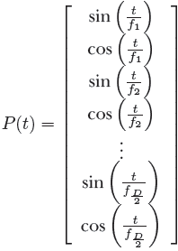

作为我们编码向量的表示。但如何定义 *f*[k]？最初提出这一点的论文¹建议使用以下：

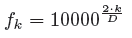

让我们快速看一下这个例子是什么样的。为了简单起见，我们使用 *D* = 6 维度，并仅绘制正弦分量，以便图表不会太拥挤：

```
dimensions = 6 
position = np.expand_dims(np.arange(0, 100), 1) 
div = np.exp(np.arange(0, dimensions*2, 2) * 
➥ (-math.log(10000.0) / (dimensions*2))) ❶ for i in range(dimensions):
    sns.lineplot(x=position[:,0], y=np.sin(position*div)[:,i], 
    ➥ label="Dim-"+str(i))
```

❶ 以数值稳定的方式计算频率 f

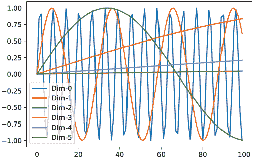

当我们开始添加更多维度和更多频率时，识别时间中的唯一位置变得更容易。选择图表 x 轴上的任何位置，你都可以识别一个独特的六个维度的值组合，这些值将不会与其他 x 轴上的位置共享。这就是我们的网络将用来从数据中提取关于位置信息的方法。

这种位置编码的具体形式也具有一些很好的数学特性，这使得神经网络更容易学习。例如，单个线性层可以学习通过固定量（即向左或向右移动 t 个单位）来移动位置编码，帮助网络学习在时间组件上执行逻辑。

### 12.4.1 实现位置编码模块

我们将向这种方法添加两个在实践中发现有帮助的东西。首先，我们不希望对内容（原始嵌入 **h**[t]）和位置 *P*(*t*) 给予相同的权重。因此，我们使用以下方程来提高内容的相对重要性：

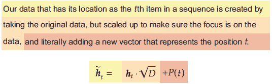

其次，我们在结果向量上添加了 dropout，这样我们就不会学习到对位置编码 *P*(*t*) 固定值的过拟合。现在让我们定义一个新的 PyTorch `Module`，它为我们应用这个位置编码。当前实现需要提前知道最大序列长度 T，使用构造函数中的`max_len`参数。我从 PyTorch 示例[`mng.bz/B1Wl`](http://mng.bz/B1Wl)² 中借用了这个位置编码的代码，并稍作修改：

```
class PositionalEncoding(nn.Module): 
    def __init__(self, d_model, dropout=0.1, max_len=5000, batch_first=False): 
    super(PositionalEncoding, self).__init__() 
        self.dropout = nn.Dropout(p=dropout) 
        self.d_model = d_model

        pe = torch.zeros(max_len, d_model) 
        position = torch.arange(0, max_len, dtype=torch.float).unsqueeze(1) 
        div_term = torch.exp(torch.arange(0, d_model, 2).float() * 
        (-math.log(10000.0) / d_model)) 
        pe[:, 0::2] = torch.sin(position * div_term) 
        pe[:, 1::2] = torch.cos(position * div_term) 
        pe = pe.unsqueeze(0).transpose(0, 1) 
        self.register_buffer(’pe’, pe)                        ❶ 
        self.batch_first = batch_first

    def forward(self, x): 
        if self.batch_first:                                  ❷ 
            x = x.permute(1, 0, 2) 
        x = x *np.sqrt(self.d_model) + self.pe[:x.size(0), :] ❸ 
        x = self.dropout(x)                                   ❹

        if self.batch_first:                                  ❺ 
            x = x.permute(1, 0, 2) 
        return x
```

❶ 这样做是为了当我们调用 `.to(device)` 时，这个数组将移动到它那里。

❷ 此代码适用于 (T, B, D) 数据，因此如果输入是 (B, T, D)，则需要重新排序。

❸ 混合输入和位置信息

❹ 正则化以避免过拟合

❺ 返回到 (B, T, D) 形状

### 12.4.2 定义位置编码模型

使用我们新的位置编码，我们可以重新定义之前简单的平均方法，通过在`nn.Embedding`层之后直接插入我们的`PositionalEncoding`类。它以任何方式都不会影响张量的形状，因此其他所有内容都可以保持不变。它只是用我们新的位置编码 *P*(*t*) 改变了张量中的值：

```
simplePosEmbdAvg = nn.Sequential( 
    nn.Embedding(VOCAB_SIZE, embed_dim, padding_idx=padding_idx), ❶ 
    PositionalEncoding(embed_dim, batch_first=True), 
    nn.Linear(embed_dim, embed_dim), 
    nn.LeakyReLU(), 
    nn.Linear(embed_dim, embed_dim), 
    nn.LeakyReLU(), 
    nn.Linear(embed_dim, embed_dim), 
    nn.LeakyReLU(), 
    nn.AdaptiveAvgPool2d((1,None)),                               ❷
    nn.Flatten(),                                                 ❸ 
    nn.Linear(embed_dim, embed_dim), 
    nn.LeakyReLU(), 
    nn.BatchNorm1d(embed_dim), 
    nn.Linear(embed_dim, NUM_CLASS) 
)
```

❶ (B, T) -> (B, T, D)

❷ (B, T, D) -> (B, 1, D)

❸ (B, 1, D) -> (B, D)

适应基于注意力的嵌入也很简单。当我们定义`EmbeddingAttentionBag`时，我们添加了可选参数`embd_layers`。如果`embd_layers`是一个 PyTorch `Module`，它将使用该网络在 (*B*,*T*,*D*) 项的批次上运行一个隐藏层。我们定义这个`Module`，它将从`PositionalEncoding`模块开始，因为`embd_layers`的输入已经嵌入。这在以下代码中分为两部分完成。首先，我们将`embd_layers`定义为位置编码，然后是三轮隐藏层，然后我们定义`attnPosEmbd`为一个具有位置编码的基于注意力的网络。现在我们可以训练这两个新的平均网络，并将它们与原始的平均和基于注意力的版本进行比较。如果准确率有所提高，那么我们就知道信息顺序确实很重要：

```
embd_layers = nn.Sequential(      ❶ 
    *([PositionalEncoding(embed_dim, batch_first=True)]+ 
    [nn.Sequential(nn.Linear(embed_dim, embed_dim), nn.LeakyReLU()) 
    ➥ for _ in range(3)]) 
)

attnPosEmbd = nn.Sequential( 
    ➥ EmbeddingAttentionBag(VOCAB_SIZE, embed_dim, 
    ➥ padding_idx=padding_idx, 
    ➥ embd_layers=embd_layers),  ❷
    nn.Linear(embed_dim, embed_dim), 
    nn.LeakyReLU(), 
    nn.BatchNorm1d(embed_dim), 
    nn.Linear(embed_dim, NUM_CLASS) 
)

posEmbdAvg_results = train_network(simplePosEmbdAvg, loss_func, 
➥ train_loader, val_loader=test_loader, score_funcs={’Accuracy’: 
➥ accuracy_score}, device=device, epochs=epochs) 
attnPosEmbd_results = train_network(attnPosEmbd, loss_func, train_loader, 
➥ val_loader=test_loader, score_funcs={’Accuracy’: accuracy_score}, 
➥ device=device, epochs=epochs)
```

❶ (B, T, D) -> (B, T, D)

❷ (B, T) -> (B, D)

位置编码结果

以下代码绘制了所有嵌入模型的成果，包括带位置编码和不带位置编码的情况。我们的位置编码提供了显著的好处，整体准确率得到提升，且准确率下降幅度较小，这表明过拟合程度较低。对训练时间的影响也微乎其微——模型训练时间仅比原始模型多几秒钟：

```
    sns.lineplot(x=’total time’, y=’val Accuracy’, data=simpleEmbdAvg_results, 
    ➥ label=’Average Embedding’) 
    sns.lineplot(x=’total time’, y=’val Accuracy’, data=posEmbdAvg_results, 
    ➥ label=’Average Positional Embedding’) 
    sns.lineplot(x=’total time’, y=’val Accuracy’, data=attnEmbd_results, 
    ➥ label=’Attention Embedding’) 
    sns.lineplot(x=’total time’, y=’val Accuracy’, data=attnPosEmbd_results, 
    ➥ label=’Attention Positional Embedding’)

[31]: <AxesSubplot:xlabel='total time', ylabel='val Accuracy'>
```

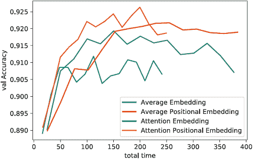

这些结果为我们关于序列顺序有助于防止过拟合的假设提供了证据，尤其是在基于注意力的方法中。使用位置编码的两种版本仍然有所波动，但与更多的训练轮数相比，准确率下降并不快。这展示了我们可以如何使用一种完全不同的方法将序列信息编码到我们的模型中。

我们基于注意力的嵌入绝对是一个更好的想法：让我们仅比较这一点与早期的 GRU 结果。使用这种组合，我们在准确率方面开始与基于 GRU 的 RNN 相匹配，甚至超越，而且训练速度要快两倍以上！这是一个相当不错的组合。以下是代码：

```
    sns.lineplot(x=’total time’, y=’val Accuracy’, data=gru_results, label=’GRU’) 
    sns.lineplot(x=’total time’, y=’val Accuracy’, data=attnEmbd_results, 
    ➥label=’Attention Embedding’) 
    sns.lineplot(x=’total time’, y=’val Accuracy’, data=attnPosEmbd_results, 
    ➥label=’Attention Positional Embedding’

[32]: <AxesSubplot:xlabel='total time', ylabel='val Accuracy'>
```

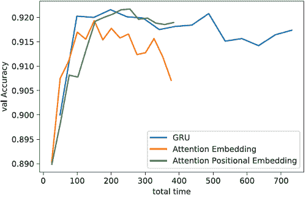

可以得出的结论是，位置编码是将序列信息编码到我们的网络中的一种便宜、快速且有效的方法。令人惊讶的是，位置编码并非独立发明，而是在本章下一节的主题——转换器（transformers）——的背景下共同发明的。因此，在大多数当前的深度学习中，你不会看到在转换器之外使用位置编码，但我发现它们在转换器之外也非常有用，作为一种快速简单的方法，可以赋予模型时间/有序数据的概念。

## 12.5 转换器：大数据的大模型

我们将要学习的最后一个 RNN 的替代方案是转换器架构。它由两个主要子组件组成：位置编码（我们刚刚学习过）和**多头注意力**。转换器是一个非常新的发展，由于一些优点而变得极其流行。然而，它们最适合处理大数据（至少 50 GB，根据我的经验）和大量计算（你需要 4+个 GPU）的大问题，所以我们在这个章节中不会看到全部的好处。尽管如此，了解转换器仍然很重要，它是当前深度学习一些重大进步的基础。最新的、最优秀的机器翻译、问答、少样本学习和数十个 NLP 任务的模型都是用不同的转换器变体构建的。本节的目标是帮助你理解标准的、原始的、无特殊添加的转换器。在本章之后，我建议阅读 Jay Alammar 的博客文章“Illustrated Transformer”（[`jalammar.github.io/illustrated-transformer/`](http://jalammar.github.io/illustrated-transformer/))，以详细了解转换器的逐步解析。

### 12.5.1 多头注意力

要理解 transformer 的工作原理，我们需要了解*多头注意力*（MHA），它是我们在第十章中学到的注意力机制的扩展。像正常注意力一样，MHA 涉及使用 softmax 函数和`nn.Linear`层来学习有选择地忽略或关注输入的不同部分。我们原始的注意力机制有一个上下文，这使得它可以寻找一种类型的模式。但如果你想要同时寻找多种不同的事物（比如一个由否定陈述“not” precede 的正陈述“good”）呢？这就是多头注意力发挥作用的地方。每个“头”的多头注意力可以学习寻找不同类型的模式，类似于卷积层中的每个滤波器可以学习寻找不同的模式。MHA 如何工作的总体策略如图 12.5 所示。

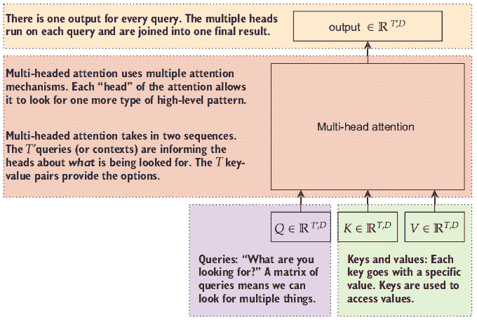

图 12.5 多头注意力模块的概述。有三个序列作为输入：查询 Q 和键值 K, V，它们是配对的。MHA 返回一个 D 维向量，回答每个查询**q**[i] ∈ *Q*。

在直观层面上，你可以将 MHA 视为回答关于键值对的字典的问题或查询。由于这是一个神经网络，键和值都是向量。因为每个键都有自己的值，所以键张量 K 和值张量 V 必须具有相同的项目数 T。因此，它们都具有(*T*,*D*)的形状，其中 D 表示特征数。

按照这个高级类比，你可以对键值字典提出尽可能多或尽可能少的问题。查询列表 Q 是其自身的张量，长度为*T*′。

MHA 的输出对每个查询都有一个响应，并且具有相同的维度，因此 MHA 的输出形状为(*T*′,*D*)。MHA 的总头数不会以改变卷积层输出通道数的方式改变其输出的尺寸。这只是 MHA 设计中的一个奇特之处。相反，MHA 试图将所有答案混合成一个单一的输出。

为了解释这个类比，我们可以将 MHA 视为一种深度学习替代品，类似于标准的 Python 字典对象。字典`d = {key : value}`代表一组键，每个键都有一个特定的值。你可以用类似`d[query]`的方式查询这个字典。如果`query in d`，你将得到其关联的值，如果没有，你将得到`None`。MHA 层有相同的目标，但不需要查询和键之间像字典那样完美的匹配。相反，它稍微宽松一些，多个相似的键可以响应单个查询，如图 12.6 所示。

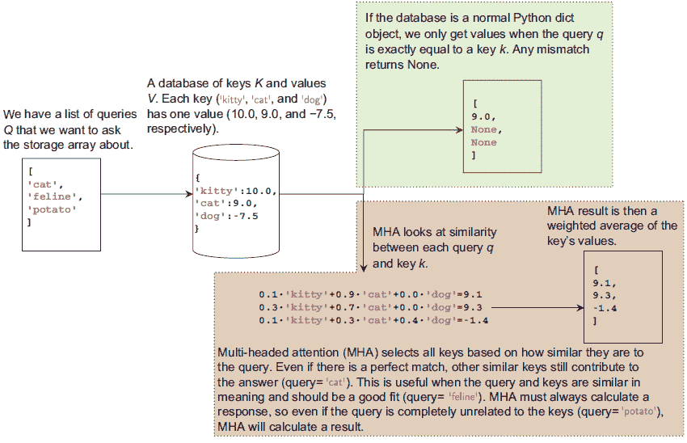

图 12.6 示例：Python 字典和多头注意力（MHA）如何具有查询、键和值的理念。在字典（顶部）中，查询和键必须完全匹配才能得到值。在 MHA（底部）中，每个键根据键与查询的相似程度，对每个查询的回答都有贡献。这确保了始终有一个答案。

你的直觉反应可能是担心当没有任何东西看起来与查询相似时给出答案：返回一个乱码答案/值不是坏事吗？这实际上是一件好事，因为 MHA 可以在训练过程中学习需要调整一些键/值。记得在第三章中我们看到了如何手动指定有用的卷积，但我们没有这样做，而是让神经网络学习应该使用哪些卷积。MHA 也是这样工作的：它开始时使用随机初始化且无意义的键和值，但在训练过程中学会了调整它们以变得有用。

联想记忆

查询一个模糊的神经元云并从中检索特定表示的想法相当古老。这是所谓的联想记忆的合理描述，你可以在[`thegradient.pub/dont-forget-about-associative-memories`](https://thegradient.pub/dont-forget-about-associative-memories)上阅读其历史的简要总结。

简而言之，与联想记忆相关的想法可以追溯到 20 世纪 60 年代，这对于那些没有意识到人工智能作为一个领域有多古老的人来说很有趣。虽然它们目前在从业者中并不流行，但仍然有现代研究在使用它们。我认为了解这些内容也有助于你自己拓宽对问题和人工智能/机器学习的思考。许多领域，如认知科学、心理学、神经学和电气工程，都帮助塑造了早期和基础性的工作，但遗憾的是，联想记忆并没有得到它们应得的认可。

从注意力到 MHA

当我们单独描述 MHA 时，它可能看起来过于复杂和晦涩；相反，让我们使用第十章中我们了解到的注意力机制来描述它。这与大多数讨论 MHA 的方式不同，需要更长的时间，但我认为这更容易理解。

让我们先写出我们正常注意力机制所做方程的表达式。我们有一个评分函数，它接受两个项目并返回一个α̃值，该值表示这对的重要性/相似性水平。评分函数可以是我们在前面学到的点积、一般或加法评分中的任何一种——但每个人在 MHA 中都使用点积评分，因为这就是人们所做的事情。

我们为 T 个不同的输入计算几个得分，并将它们输入到 softmax 函数中，以计算一个 T 得分的最终向量 α，它说明了 T 个项目中的每一个的重要性。然后我们计算 α 和原始 T 个项目的点积，这产生了一个向量，它是我们原始注意力机制的输出结果。所有这些都在以下方程式中展示：

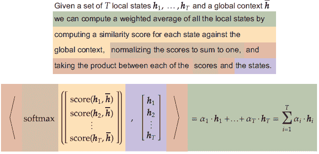

现在，让我们对如何实现这一点做一些修改。首先，让我们将我们的上下文向量  重命名为查询向量 q 并将其作为得分函数的输入。上下文或查询告诉我们我们在寻找什么。我们不再使用 **h**[1]，**h**[2]，…，**h**[T] 来确定重要性 α 和输出向量，而是将它们分成两组不同的张量，它们不必相同。由于偶然，我们将用于 α 的张量称为**键** *K* = [**k**[1],**k**[2],…,**k**[T]] 和**值** *V* = [**v**[1],**v**[2],…,**v**[T]]。然后我们得到以下三个参数的得分函数，它使用原始的两个参数得分函数：

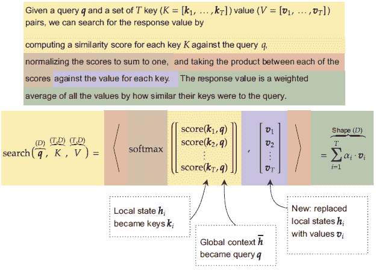

我们到目前为止真正所做的一切就是将我们的得分函数进行**泛化**，使其更加灵活。我们可以将搜索（**q**，**K**，**V**）视为“给定查询 q，根据其键 K 从字典中给出平均值 V。”这是一个泛化，因为如果我们调用得分（1/*T* Σ*[i]^T*[=1] ***h**[i]*, [..., ***h**[i]*, ...] ,[..., ***h**[i]*, ...])，我们会得到与之前相同的结果！

这为我们提供了一个查询的结果。为了将此扩展到多个查询，我们多次调用三个参数的得分函数。这为我们提供了一个 MHA 的一个头的输出结果，通常用名为 `Attention` 的函数表示：

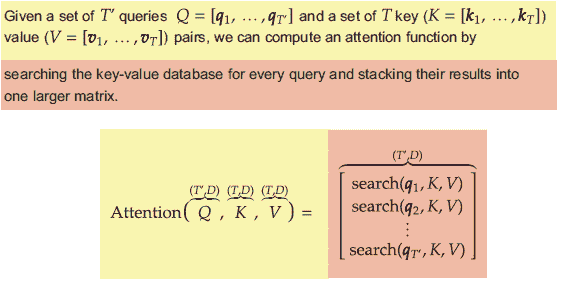

这个方程式是我们刚才所做内容的直接改编。我们现在有多个查询 *Q* = [**q**[1],**q**[2],…,**q**[*T*′]]，因此我们多次调用 `score` 并将 *T*′ 个结果堆叠成一个更大的矩阵。

有了这些，我们最终可以定义 MHA 函数。如果我们有 z 个头，你可能已经猜对了，我们调用 `Attention` 函数 z 次！但输入仍然是 Q，K 和 V。为了使每个头学会寻找不同的事物，每个头都有三个 `nn.Linear` 层 *W*^Q，*W*^K 和 *W*^V。这些线性层的任务是防止所有调用都计算完全相同的事情，因为那将是愚蠢的。然后我们将所有 z 个结果连接成一个大的向量，并以一个最终输出 `nn.Linear` 层 *W*^O 结尾，这个层的唯一任务是确保 MHA 的输出有 D 维。所有这些都像以下方程式所示：

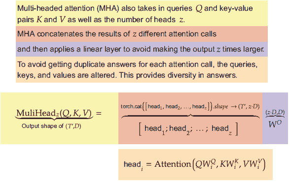

这使我们从原始的注意力机制过渡到更复杂的 MHA。因为 MHA 相当复杂并且有多个层，所以它不需要像卷积层需要的过滤器 C 那样多的头 z。而通常我们希望有 32 到 512 个过滤器（基于什么能得到最佳结果），对于 MFA，我们通常希望不超过*z* = 8 或*z* = 16 个头。

我们不会实现 MHA 函数，因为 PyTorch 为我们提供了一个很好的实现。但让我们快速看一下一些伪 Python 代码，以了解它是如何进行的。首先，我们创建*W*[i]^Q、*W*[i]^K、*W*[i]^V 层和输出*W*^O。这发生在构造函数中，我们可以使用 PyTorch 的`ModuleList`来存储我们稍后想要使用的模块列表：

```
self.wqs = nn.ModuleList([nn.Linear(D, D) for _ in range(z)]) 
self.wks = nn.ModuleList([nn.Linear(D, D) for _ in range(z)]) 
self.wvs = nn.ModuleList([nn.Linear(D, D) for _ in range(z)]) 
self.wo = nn.Linear(z*D, D)
```

然后我们可以进入`forward`函数。为了简单起见，我们假设已经存在一个`Attention`函数。我们基本上只需要反复调用这个`Attention`函数，应用构造函数中定义的线性层。可以使用`zip`命令使这个过程更加简洁，给我们一个包含*W*[i]^Q、*W*[i]^K 和*W*[i]^V 的元组，并将结果附加到`heads`列表中。它们在最后通过连接组合，并应用最终的*W*^O 层：

```
def forward(Q, K, V): 
    heads = [] 
    for wq, wk, wv in zip(self.wqs, self.wks, self.wvs): 
        heads.append(Attention(wq(Q), wk(K), wv(V))) 
    return self.wo(torch.cat(heads, dim=2) )
```

多头注意力标准方程

我们使用了上一章中的得分函数来展示 MHA 实际上只是我们已学内容的扩展。我认为这次旅程有助于巩固我们对 MHA 的理解。MHA 也可以用更少的方程来表示：我发现它们更难以理解，但展示它们是值得的，因为这是大多数人写作的方式！

主要区别在于`Attention`函数的编写方式。通常它是三个矩阵乘法的结果：

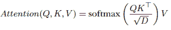

这与我之前展示的等价，但在我看来，这种方式进行注意力的过程并不明显。这个版本是实现 MHA 的首选方式，因为它运行得更快。

### 12.5.2  Transformer 块

现在我们知道了 MHA 块的样子，我们可以描述 transformer 了！有两种类型的 transformer 块：编码器和解码器。它们在图 12.7 中展示，并使用了熟悉的残差连接概念。

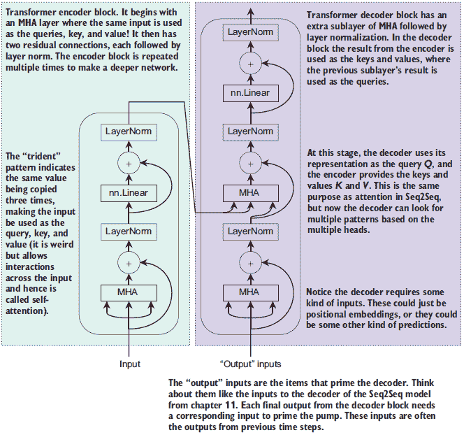

图 12.7 两种类型的 transformer 块：编码器（左）和解码器（右）。它们都使用了层归一化、残差连接和 MHA 层。每个中的第一个 MHA 被称为自注意力，因为 Q、K 和 V 使用了相同的输入。

编码器块可以用于几乎任何基于序列的网络架构（例如，情感分类）；它不需要与解码器配对。它从与 MHA 的残差连接开始；查询、键和值使用相同的输入序列，因此这被描述为自注意力层，因为没有外部上下文或输入。然后发生第二个残差连接，它只使用线性层。你可以多次重复这个编码器块来创建一个更深更强的网络：原始论文³使用了六个这样的块，因此这已成为一个常见的默认值。

解码器块几乎总是与编码器块一起使用，通常用于具有多个输出的序列任务（例如，机器翻译）。唯一的区别是在第一个 MHA 残差连接之后插入第二个 MHA 残差连接。这个第二个 MHA 使用编码器块的输出作为键和值，而前一个 MHA 的结果用作查询。这样做是为了你可以构建类似于第十一章的序列到序列模型或自回归风格的模型。

你可能会注意到在这个设计中没有像我们的 RNN 那样的显式时间连接。Transformers 从位置编码中获取*所有*的序列信息！这就是为什么我们首先需要了解位置编码，这样我们就可以重复使用它们来创建一个 transformer 模型。

警告：编码器和解码器同时查看和处理所有时间步。这对于你试图预测下一个项目的自回归模型来说可能是个问题。天真地使用 transformer 进行自回归模型意味着 transformer 可以查看未来的输入，这在目标是预测未来时是一种作弊行为！对于此类应用，你需要使用特殊的掩码来防止 transformer 查看未来。这个掩码具有三角形形状，因此时间上的交互受到限制，由`Transformer`类的`generate_square_subsequent_mask()`方法提供。

以下代码块实现了一个使用 transformer 对序列进行分类的简单方法。它从一个`Embedding`层开始，接着是`PositionalEncoding`，然后是三个`TransformerEncoder`层。理想情况下，我们在这里会使用六个层；但是 transformer 比 RNN 更昂贵，所以我们必须对模型进行限制以使这个示例快速运行。transformer 运行后，我们仍然得到一个形状为(*B*,*T*,*D*)的输出：我们使用正常的注意力机制将其降低到形状为(*B*,*D*)的单个向量，以便进行预测。注意在这段代码中，transformer 需要它们的张量以(*T*,*B*,*D*)的顺序组织，因此我们需要重新排列几次轴才能使一切正常工作：

```
class SimpleTransformerClassifier(nn.Module):

    def __init__(self, vocab_size, D, padding_idx=None):
        super(SimpleTransformerClassifier, self).__init__() 
        self.padding_idx = padding_idx self.embd = nn.Embedding(vocab_size, D, padding_idx=padding_idx) 
        self.position = PositionalEncoding(D, batch_first=True) 
        self.transformer = nn.TransformerEncoder(           ❶
        ➥ nn.TransformerEncoderLayer( 
        ➥ d_model=D, nhead=8),num_layers=3) 
        self.attn = AttentionAvg(AdditiveAttentionScore(D)) 
        self.pred = nn.Sequential(
            nn.Flatten(),                                   ❷ 
            nn.Linear(D, D), 
            nn.LeakyReLU(), 
            nn.BatchNorm1d(D), 
            nn.Linear(D, NUM_CLASS) 
        )

    def forward(self, input): 
        if self.padding_idx is not None: 
            mask = input != self.padding_idx 
        else: 
            mask = input == input                           ❸ 
        x = self.embd(input)                                ❹ 
        x = self.position(x)                                ❺ 
        x = self.transformer(x.permute(1,0,2))              ❻ 
        x = x.permute(1,0,2)                                ❼
        context = x.sum(dim=1)/mask.sum(dim=1).unsqueeze(1) ❽ 
        return self.pred(self.attn(x, context, mask=mask)) 

simpleTransformer = SimpleTransformerClassifier(            ❾ 
➥ VOCAB_SIZE, embed_dim, padding_idx=padding_idx) 
transformer_results = train_network(simpleTransformer, loss_func, 
➥ train_loader, val_loader=test_loader, score_funcs={’Accuracy’: 
➥ accuracy_score}, device=device, epochs=epochs)
```

❶ 我们 transformer 实现的主要工作

❷ (B, 1, D) -> (B, D)

❸ 所有条目都是 True。

❹ (B, T, D)

❺ (B, T, D)

❻ 因为我们的其余代码是 (B, T, D)，但变压器以 (T, B, D) 作为输入，我们必须在前后改变维度的顺序。

❼ (B, T, D)

❽ 平均时间

❾ 构建和训练此模型

现在，我们可以绘制我们所有方法的成果。变压器在所有方法中达到了最高的准确率，并且在我们持续训练的过程中仍在提高。如果我们进行更多的迭代并使用更多的层，它们可能会进一步提高！但这会增加训练时间，而变压器已经比 GRU 模型慢：

```
    sns.lineplot(x=’total time’, y=’val Accuracy’, data=gru_results, label=’GRU’) 
    sns.lineplot(x=’total time’, y=’val Accuracy’, data=attnEmbd_results, 
    ➥ label=’Attention Embedding’) 
    sns.lineplot(x=’total time’, y=’val Accuracy’, data=attnPosEmbd_results, 
    ➥ label=’Attention Positional Embedding’) 
    sns.lineplot(x=’total time’, y=’val Accuracy’, data=cnn_results, 
    ➥ label=’CNN Adaptive Pooling’) 
    sns.lineplot(x=’total time’, y=’val Accuracy’, data=transformer_results, 
    ➥ label=’Transformer’)

[34]: <AxesSubplot:xlabel='total time', ylabel='val Accuracy'>
```

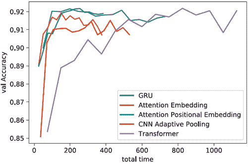

我们的结果将如何？默认情况下，基于注意力的嵌入和位置编码是一个很好的工具。它并不总是优于现代的 RNN，如 GRU 或 LSTM，但它是一个运行速度更快的良好候选方案。对于大多数问题，您都可以考虑这两种方法。不过，如果您有额外的计算资源，RNNs 的好处是它们被研究得更深入，理解得更透彻，因此您可能更容易信任它们的结果。

当您需要尽可能高的准确率并且有大量的 GPU（和数据）可用以支付其高昂的价格时，变压器是您会使用的工具。RNNs 有一个坏习惯，就是在三到六层后准确率会达到平台期，这与深度学习趋势相反，即更多的层可以得到更强大的模型和更好的结果。总的来说，变压器通常有 24+层，并且随着层数的增加而提高准确率。但话虽如此，当您在处理需要使用多个 GPU 的庞大数据集时，变压器可以更准确 *并且* 更快。

这是因为变压器会同时处理序列中的所有 T 个项，而 RNNs 需要逐个处理它们。以这种方式进行工作使得变压器更适合扩展到多个 GPU，因为可以分割和同时运行的工作更多。使用 RNN 时，您不能分割工作，因为每一步都依赖于前一步，所以您必须等待。尽管如此，研究人员和公司正在使用 *数百到数千个 GPU* 来在数百 GB 或更多的数据上训练单个模型。这告诉您，要真正看到变压器的优势，需要多大的规模。

虽然变压器尚未准备好取代循环神经网络（RNNs），但它们是另一种可以使用的方案。当您拥有大量数据和计算资源时，它们目前是最大化准确率的首选。在下一章中，我们将学习如何在不需要一千个 GPU 的情况下，为您的自身问题提取变压器的优势 *而不* 需要一千个 GPU！

## 练习

在 Manning 在线平台 Inside Deep Learning Exercises 上分享和讨论您的解决方案（[`liveproject.manning.com/project/945`](https://liveproject.manning.com/project/945)）。一旦您提交了自己的答案，您将能够看到其他读者提交的解决方案，并看到作者认为哪些是最佳的。

1.  使用 Optuna 尝试优化基于注意力的平均嵌入分类器。尝试调整 `nn.Embedding` 层使用的初始维度、所有后续层中的隐藏神经元数量、总隐藏层数量，以及要在 AG News 语料库上使用的评分函数（点积、通用、加法）。你能将精度提高多少？

1.  回到第六章，将 `ResidualBlockE` 和 `ResidualBottleNeck` 层转换为它们的 1D 对应层 `ResidualBlockE1D` 和 `ResidualBottleNeck1D`。然后使用它们尝试改进本章在 AG News 语料库上的 1D CNN。你能将精度提高到多高？

1.  使用你最好的 1D CNN 对 AG News 进行处理，尝试向网络中添加位置编码。这对你的结果有何影响？

1.  PyTorch 提供了一个 `nn.MultiheadAttention` 模块，实现了 MHA 方法。为基于注意力的平均嵌入分类器提出自己的修改，以使用 MHA，并尝试使其具有更高的精度。

1.  Transformer 通常与学习率计划配合使用效果最佳。尝试第五章中我们学习到的计划，看看你是否可以减少 `SimpleTransformerClassifier` 学习所需的周期数或提高其最终精度。

## 摘要

+   我们可以通过故意减少模型对数据序列性质的理解来减少运行时间。

+   我们可以通过修改数据的输入来编码位置信息，而不是使用在结构中编码位置信息的 RNN 或 CNN，这可以为其他更快的替代方案提供序列信息或提高精度。

+   多头注意力是第十章中提到的注意力的推广，涉及多个上下文或查询和多个结果。它可以在更高的计算成本下获得更高的精度。

+   Transformer 是一种强大的 RNN 替代方案，能够在高昂的计算成本下获得高精度。它们在拥有大量数据和计算资源时表现最佳，因为它们的扩展性和扩展性优于 RNN。

***

¹ A. Vaswani 等人，“Attention is all you need”，*Advances in Neural Information Processing Systems*，第 30 卷，第 5998-6008 页，2017。↩

² 此代码受 BDS-3 许可证保护；请查看本书的代码库以获取包含的许可证。↩

³ 引入位置编码的“Attention Is All You Need”论文！（见脚注 1。）↩
