# 13 迁移学习

本章涵盖了

+   将预训练网络转移到新的问题上

+   理解冻结权重和热权重之间的区别

+   通过迁移学习用更少的数据进行学习

+   使用基于 transformer 的模型进行文本问题的迁移学习

现在，你已经了解了一系列从头开始在新数据上训练模型的技术。但是，如果你没有时间等待大模型训练怎么办？或者，如果你一开始就没有很多数据怎么办？理想情况下，我们可以使用来自更大、精心整理的数据集的信息来帮助我们更快地在更少的迭代中学习一个更准确的模型，针对我们新的、较小的数据集。

正是在这里，*迁移学习*发挥了作用。迁移学习背后的理念是，如果有人已经花费了精力在大量数据上训练了一个大模型，那么你很可能可以使用这个*已经训练好*的模型作为你问题的起点。本质上，你希望将模型从相关问题中提取的所有信息*迁移*到你的问题上。当这成为可能时，迁移学习可以为你节省数周的时间，提高准确性，并且总体上工作得更好。这尤其有价值，因为你可以用更少的标记数据获得更好的结果，这可以节省大量的时间和金钱。这使得迁移学习成为你应该知道的、在实际工作中最实用的工具之一。

当原始较大的数据集和你要应用迁移学习的小型目标数据之间存在内在相似性时，迁移学习效果最佳。这对于 CNN 尤其如此，因为图像在本质上是非常相似的。即使你有一个风景照片的源数据集和一个包含猫和狗的目标数据集，我们在第三章中讨论的结构先验仍然成立：相邻的像素彼此相关，而远离像素的影响很小。

本章专注于一种特定的迁移学习类型，它重新使用了先前训练网络的实际权重和架构来解决新问题。在我们展示了如何使用 CNN 进行图像迁移学习之后，我们将看到如何使用基于 transformer 的模型进行文本分类模型的迁移学习。就在几年前，文本迁移学习还远没有这么容易或成功。但迁移学习允许我们绕过 transformer 巨大的训练成本，以极小的代价获得其好处。

## 13.1 转移模型参数

在任何新的机器学习应用中取得成功的关键是能够访问到经过准确标记的代表性数据。但是，获取大量标记数据需要时间、精力和金钱。整个公司都存在只是为了帮助人们使用像亚马逊的 Mechanical Turk 这样的服务来标记他们的数据。同时，我们在投入大量时间收集和标记大量语料库之前，希望有证据表明我们的方法将有效。这使我们陷入了两难：我们希望构建一个良好的初始模型来查看任务是否可行，但获取足够的数据来构建一个良好的初始模型是昂贵的。

我们希望通过使用 *相关* 数据来帮助我们构建模型，以更少的数据和计算时间来制作一个准确的模型。本质上，我们希望将我们在一个领域 *学习* 到的东西转移到另一个但相关的领域。这就是 *迁移学习* 的理念。实际上，迁移学习是你在深度学习工具库中应该知道的最有用的方法之一。特别是如果你在计算机视觉或基于文本的应用领域做任何工作，迁移学习可以非常强大。

在本章中我们学习到的最成功的迁移学习方法之一是将一个模型的 *权重* θ 转移到另一个模型。原始模型是在一个包含高质量数据的大型数据集上训练的，这个数据集与我们真正关心的较小数据集有一些结构上的相似性。例如，图像有很多结构上的相似性——因此我们可以使用在几乎任何大型图像分类任务上训练的模型来帮助我们完成更细致的任务。为了做到这一点，我们需要对原始模型 f 进行最小的修改或添加，使其适应新的问题。这种高级方法在图 13.1 中有所描述；我们很快就会看到如何执行这些机械细节。


图 13.1 在大型数据集上训练大模型。这是一个一次性成本，因为我们可以通过将其转移到许多不同的较小任务中来重复使用大模型。这是通过编辑模型但几乎保持所有原始架构和权重 θ 完整来实现的。然后我们在新的数据集上训练修改后的模型。

### 13.1.1 准备图像数据集

要开始迁移学习，我们将下载一个作为微软 Kaggle 竞赛一部分组织的 Cats-vs-Dogs 数据集（[`www.kaggle.com/shaunthesheep/microsoft-catsvsdogs-dataset`](https://www.kaggle.com/shaunthesheep/microsoft-catsvsdogs-dataset)），因此它将是一个二元分类问题。这是我们第一次在 PyTorch 中创建新的图像分类数据集，因此我们将作为有用的练习逐步说明这些步骤。以下代码片段下载包含数据集的 zip 文件并将其提取到名为 PetImages 的文件夹中。请注意，这个 zip 文件中的两个文件不幸损坏。我们需要删除这两个文件，以便数据加载器正常工作，这就是为什么我们有一个 `bad_files` 列表来指示损坏的图像并删除它们。以下是代码：

```
data_url_zip = "https://download.microsoft.com/download/3/E/1/
➥ 3E1C3F21-ECDB-4869-8368-6DEBA77B919F/kagglecatsanddogs_3367a.zip" 
from io import BytesIO 
from zipfile import ZipFile 
from urllib.request import urlopen
import re

if not os.path.isdir(’./data/PetImages’): ❶ 
    resp = urlopen(data_url_zip) 
    zipfile = ZipFile(BytesIO(resp.read())) 
    zipfile.extractall(path = ’./data’)

bad_files = [                             ❷ 
    ’./data/PetImages/Dog/11702.jpg’, 
    "./data/PetImages/Cat/666.jpg" 
]
for f in bad_files: 
    if os.path.isfile(f): 
        os.remove(f)
```

❶ 如果我们还没有这样做，请下载此数据集！

❷ 此文件有问题，将会搞乱数据加载器！

一些图像也有损坏的 EXIF 数据。EXIF 数据是关于图像的元数据（例如照片拍摄地点），对于我们想要做的事情并不重要。因此，我们禁用了关于此问题的任何警告：

```
import 
warnings warnings.filterwarnings("ignore", ❶ 
➥ "(Possibly )?corrupt EXIF data", UserWarning)
```

❶ 请不要打扰我们处理这些坏文件，谢谢。

现在我们使用 PyTorch 提供的 `ImageFolder` 类为这个类别创建一个 `Dataset`。`ImageFolder` 期望一个根目录，每个类别有一个子文件夹。文件夹的名称是类别的名称，该文件夹中的每个图像都作为具有特定类别标签的数据集的示例加载；参见图 13.2。

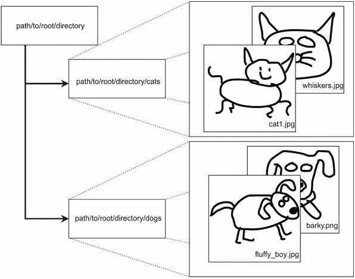

图 13.2 PyTorch 的 `ImageFolder` 类接受一个根文件夹的路径。它假设每个子文件夹代表一个类别，并且每个子文件夹应该填充该类别的图像。本例展示了两个类别，猫和狗，以及非常艺术化的插图。

`ImageFolder` 类接受一个可选的 `transform` 对象，我们使用它来简化加载过程。这个 `transform` 是我们在第三章中使用的数据增强相同的转换类。由于图像大小各不相同，我们可以使用一个 `Compose` 转换来调整大小、裁剪并将它们标准化为相同的形状。这样，我们可以像在 MNIST（所有 28 × 28）和 CIFAR-10（32 × 32）上一样在数据批次上训练。我们的 `Compose` 转换构建了一个子转换的管道，按顺序运行，在这种情况下将执行以下操作：

1.  调整图像大小，使最小维度为 130 像素。例如，260 × 390 的图像将变为 130 × 195（保持相同的宽高比）。

1.  裁剪出中心 128 × 128 像素。

1.  将图像转换为 PyTorch 张量，这包括将像素值从 [0,255] 标准化到 [0,1]。

除了转换之外，我们还对数据进行 80% 用于训练和剩余 20% 用于测试集的划分。以下代码使用我们的猫和狗数据集设置所有这些：

```
all_images = torchvision.datasets.ImageFolder("./data/PetImages", 
➥ transform=transforms.Compose( 
    [ 
        transforms.Resize(130),                       ❶
        transforms.CenterCrop(128),                   ❷ 
        transforms.ToTensor(),                        ❸ 
    ]))

train_size = int(len(all_images)*0.8)                 ❹ 
test_size = len(all_images)-train_size                ❺

train_data, test_data = torch.utils.data.random_split ❻
➥ (all_images, (train_size, test_size))
```

❶ 最小的宽/高变为 130 像素。

❷ 取中心 128 × 128 的图像

❸ 将其转换为 PyTorch 张量

❹ 选择 80%用于训练

❺ 20%的剩余部分用于测试

❻ 创建指定大小的随机分割

在数据集就绪后，我们现在可以创建用于训练和测试的`DataLoader`（使用批大小 *B* = 128）。该数据集的训练集中有超过 20,000 个样本，在图像总数上比 MNIST 小，但图像的大小比我们之前处理的大得多（128 × 128 而不是 32 × 32 或更小）：

```
B = 128 
train_loader = DataLoader(train_data, batch_size=B, shuffle=True) 
test_loader = DataLoader(test_data, batch_size=B)
```

我们有一个数据集和加载器对象；让我们看看数据。类别 0 是猫类，类别 1 是狗类。下一块代码使用角落中的类别编号可视化了一些数据。这让我们对这个数据集的复杂性有了了解：

```
f, axarr = plt.subplots(2,4, figsize=(20,10))     ❶ 
    for i in range(2):                            ❷ 
    for j in range(4):                            ❸ 
    x, y = test_data[i*4+j]                       ❹

    axarr[i,j].imshow(x.numpy().transpose(1,2,0)) ❺

    axarr[i,j].text(0.0, 0.5, str(round(y,2)), 
    ➥ dict(size=20, color=’red’))                ❻
```

❶ 创建一个包含八个图像的网格（2 × 4）

❷ 行

❸ 列

❹ 从测试语料库中抓取一个图像

❺ 绘制图像

❻ 在左上角绘制标签

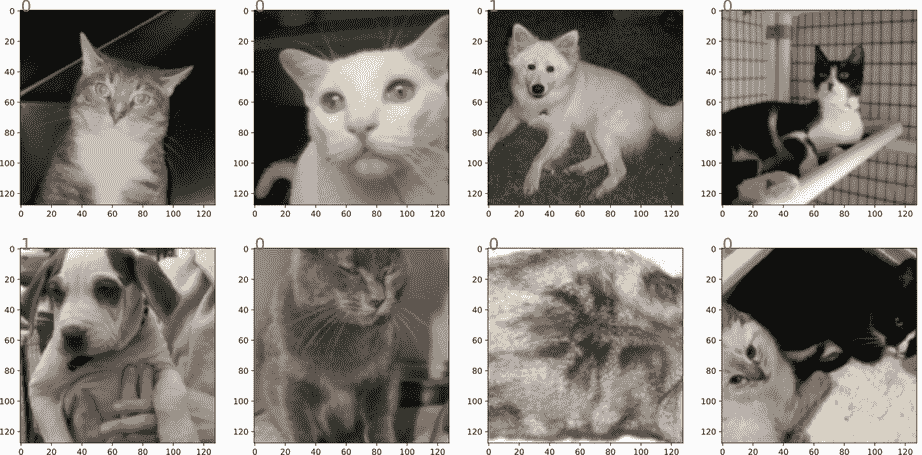

虽然只有两个类别，但图像的内容比我们使用的其他玩具数据集（如 MNIST 和 CIFAR）更为多样和复杂。动物有多种姿势，相机可能曝光过度或不足，图像中可能有多个不同的背景下的动物，人类也可能出现在照片中。这种复杂性需要学习，但仅使用 20,000 个样本来学习如何分类猫与狗将是一个挑战。

## 13.2 使用 CNN 进行迁移学习和训练

让我们训练一个模型。特别是，我们使用较小的 ResNet 架构作为起点。ResNet 是我们在第六章中学习的残差连接的架构，ResNet-X 通常指的是几个使用残差层的特定神经网络之一（例如，ResNet-50 或 ResNet-101）。我们使用 ResNet-18，这是（常见）ResNet 中最小的。我们可以使用`torchvision.models`类获取模型的实例，该类为各种计算机视觉任务提供了许多流行的预构建架构。

ResNet 在网络的末端使用自适应池化，这意味着我们可以重用 ResNet 架构来解决具有任意大小输入图像的分类问题。问题是 ResNet 是为一个名为 ImageNet 的数据集设计的，该数据集有 1,000 个输出类别。由于 ImageNet 及其 1,000 个类别是 ResNet 模型预训练的基础，这使得 ImageNet 成为我们的源域。因此，该架构将以一个有 1,000 个输出的`nn.Linear`层结束。我们的目标域（猫与狗）有两个类别，因此我们希望它只有一或两个输出（分别用于具有二元交叉熵和 softmax 的训练）。图 13.3 显示了这种情况以及我们如何实现迁移学习。

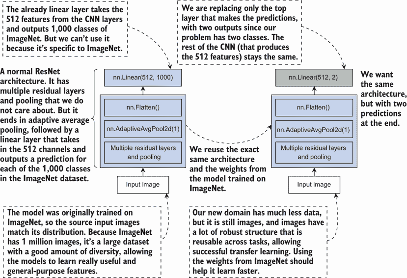

图 13.3 左侧显示了 ResNet 的总结。我们想要将其修改为右侧的样子，其中只有最后一个 `nn.Linear` 层被改变。每个 `nn.Linear` 层的输入是 512，因为最终的卷积层有 *C* = 512 个通道，使用自适应平均池化到 1 × 1 意味着输出中只有 512 个值，无论原始图像的大小如何。

我们可以利用 PyTorch 的面向对象特性，相对容易地将现有模型适应到我们新的问题上。PyTorch 的 ResNet 中的最后一层全连接层被命名为`fc`，因此我们可以深入到网络中并替换掉 `fc` 对象！由于 `nn.Linear` 层在名为 `in_features` 的对象中保持输入数量，我们可以以通用的方式替换这最后一层，而无需我们硬编码输入数量。下面的代码展示了这个过程，这个过程通常被称为 *手术*，因为我们正在从模型中移除一部分并替换成新的部分。¹ 这只需要两行代码，并且非常容易完成：

```
model = torchvision.models.resnet18() 
model.fc = nn.Linear(model.fc.in_features, 2) ❶
```

❶ 执行一些“手术”

图 13.4 中总结了这两行代码。默认情况下，ResNet 模型具有随机权重，所以这基本上是给我们一个新的 ResNet，以便从头开始训练以解决我们的问题。

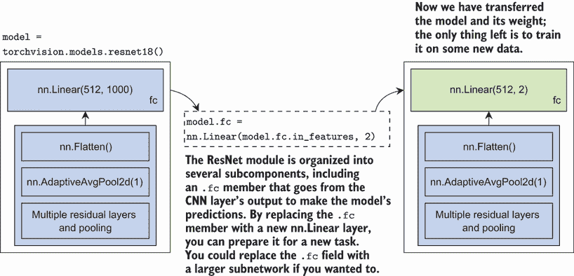

图 13.4 通过 PyTorch 中的权重转移模型机制的演示。原始模型使用一组权重初始化（默认为随机；可能为预训练）。我们用适合我们目的的新版本替换了模型的顶部部分。

这给我们一个可以训练来预测图像是猫还是狗的模型。下面的代码使用了我们多次使用过的标准 `CrossEntropyLoss` 和我们的常规 `train_network` 函数。网络比本书中我们构建的大多数网络都要大，图像也更大，因此训练这个示例需要更长的时间来运行：

```
loss = nn.CrossEntropyLoss() 
normal_results = train_network(model, loss, train_loader, epochs=10, 
➥ device=device, test_loader=test_loader, score_funcs={’Accuracy’: 
➥ accuracy_score})
```

现在我们已经训练了模型，我们可以进行我们非常熟悉的模型训练常规方法的结果绘图过程。我们得到了一些相当不错的结果，而无需进行太多思考。我们只是使用了 ResNet-18 并运行它，这是许多人用来解决实际问题的常见方法：

```
    sns.lineplot(x=’epoch’, y=’test Accuracy’, data=normal_results, 
    ➥ label=’Regular’)

[13]: <AxesSubplot:xlabel='epoch', ylabel='test Accuracy'>
```

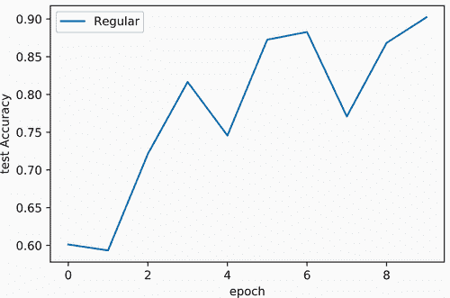

注意像 ResNet-18 这样的架构以及 `torchvision.models` 包中的其他架构已经经过大量测试，并在各种问题上表现出良好的效果。所以如果你需要进行任何类型的图像分类，这几乎总是一个好的起点，利用他人已经完成的设计良好的架构的辛勤工作。但到目前为止我们所做的是创建了一个具有随机初始权重的 ResNet 的新版本。迁移学习涉及使用一组已经在另一个数据集上训练过的权重 Θ，这可以显著提高我们的结果。

### 13.2.1 调整预训练网络

我们已经初始化了一个默认的 ResNet 模块，对其进行了手术以适应我们的分类任务，并使用本书中一直使用的梯度下降工具对其进行训练。要将这变成真正的迁移学习，唯一缺少的是在源域（例如，ImageNet）上预训练 ResNet 模型，而不是随机初始化（默认设置）。

幸运的是，预训练已经完成。PyTorch 在`torchvision.models`下提供的所有模型都有一个选项来设置标志`pretrained=True`，这将返回一个已经在指定原始数据集上训练过的模型版本。对于 ResNet，原始数据集是 ImageNet。所以让我们快速获取我们的新模型。对于我们最初的 ResNet-18 手术，我们基本上有相同的两行代码，只是我们添加了`pretrained=True`标志：

```
model_pretrained = torchvision.models.resnet18(pretrained=True)     ❶
model_pretrained.fc = nn.Linear(model_pretrained.fc.in_features, 2) ❷
```

❶ 在数据集上训练过的模型

❶ 进行一些手术

如前所述，我们将这个网络的完全连接层替换成了一个新层。原始的卷积滤波器是预训练的，但最后的完全连接层是随机初始化的，因为我们用一个新的`nn.Linear`层替换了它——默认情况下，PyTorch 中的所有模块都以随机权重开始。希望由于 ImageNet 是一个如此庞大的数据集，有 100 万张训练图像，我们可以更快地学习到一个更好的模型。我们可能需要从头开始学习这个`nn.Linear`层，但所有前面的卷积层应该有一个更好的起点，因为它们是在大量数据上训练的。

预训练为什么有效

在我们在猫/狗问题上训练`model_pretrained`之前，我们应该问，“这种工作的直觉是什么？”*为什么*从已经训练过的模型的权重开始可以帮助我们在新的问题上？在第三章，当我们第一次讨论卷积网络时，我们看到了卷积如何学会在不同角度找到边缘。卷积还可以学会找到颜色或颜色变化，锐化或模糊图像等。所有这些对于任何基于图像的问题都是广泛有用的。所以预训练之所以有效，其核心在于卷积在大数据集上学会检测到的东西*可能*是我们想要在任何其他基于图像的问题中检测到的东西。如果这些是一般有用的东西，CNN 学会如何检测它们，那么 CNN 可能从更多的数据中而不是更少的数据中学习得更好。因此，来自更大数据集的预训练网络应该已经学会寻找我们关心的模式，而最后的`nn.Linear`层只需要学会如何将这些模式组装成决策。从头开始训练将需要学习模式和如何从它们中做出分类决策。

转移学习通常在源数据集大于目标数据集时效果最佳，因为您需要足够的数据才能在仅从您关心的数据从头开始训练时获得优势。此外，源数据与您想要工作的目标领域的相关性也是一个因素。如果数据的相关性足够高，源模型学习得好的东西（因为它有更多的数据）更有可能在目标数据上重用。这种平衡行为在图 13.5 中得到了总结。

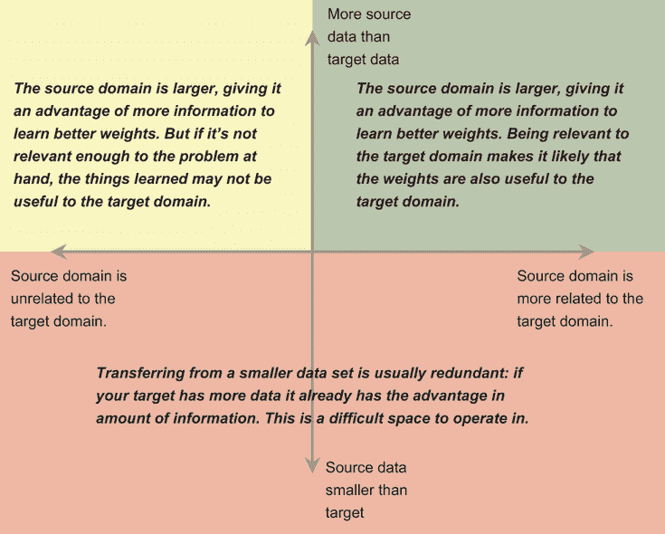

图 13.5 源数据集和目标数据集大小及相关性的权衡。右上角是最好的位置，左上角次优且不一定总是有效。下半部分是进行有效迁移学习的一个统一困难的地方。

幸运的是，对于几乎任何大型图像数据集，它们的相关性通常足够高，使我们处于图 13.5 的右上角：像素相关性的结构和可推广性非常强，这是用网络的第一层最容易可视化的。因为第一层卷积层接受图像的红色、绿色和蓝色通道，我们可以将每个滤波器视为一个图像，并绘制它以查看它在寻找什么。让我们首先为我们的预训练模型做这件事，看看它作为起点有什么。首先，我们需要从第一层卷积层获取滤波器的权重。对于 ResNet，这被定义为`conv1`层：

```
filters_pretrained = model_pretrained.conv1.weight.data.cpu().numpy() ❶
```

❶ 获取第一组卷积滤波器的权重，将它们移动到 CPU，并将它们转换为 NumPy 张量

`filters_pretrained`对象现在有了模型使用的权重副本。它的形状为(64,3,7,7)，因为 ResNet-18 的第一层有 64 个滤波器，期望输入有 3 个通道（红色、绿色和蓝色），并且 64 个滤波器在宽度和高度上都是 7 × 7。由于我们想要绘制这些，让我们首先将滤波器归一化到[0,1]的范围内，因为这是 Matplotlib 对彩色图像的期望：

```
filters_pretrained = filters_pretrained-np.min(filters_pretrained) ❶ 
filters_pretrained = filters_pretrained/np.max(filters_pretrained) ❷
```

❶ 将所有值移至[0, 最大值]范围内

❷ 重新缩放，使所有值都在[0, 1]范围内

Matplotlib 还期望图像格式为(*W*,*H*,*C*)，但 PyTorch 使用(*C*,*W*,*H*)。为了解决这个问题，我们将通道维度（1，因为维度 0 是滤波器的数量）移动到最后的位置（-1），以匹配 Matplotlib 的期望：

```
filters_pretrained = np.moveaxis(filters_pretrained, 1, -1) ❶
```

❶ 权重的形状为(#Filters, C, W, H)，但 Matplotlib 期望(W, H, C)，因此我们移动了通道维度。

查看滤波器

接下来我们可以绘制过滤器。你应该会看到它们之间有许多共同的模式，比如不同角度和频率的黑白边缘（一条白色和一条黑色线，与几条线）。这些黑白过滤器作为边缘检测器，以不同的重复率检测不同角度和模式的边缘。你还看到一些具有单一颜色如蓝色、红色、紫色或绿色的过滤器。这些过滤器检测特定的颜色模式。如果你有一个足够大、多样化的训练集，即使是一个完全不同的问题，你也会在第一个卷积层中看到类似的结果：

```
i_max = int(round(np.sqrt(filters_pretrained.shape[0]))) ❶ 
j_max = int(np.floor(filters_pretrained.shape[0]/        ❷ 
➥ float(i_max))) 
f, axarr = plt.subplots(i_max,j_max,                     ❸ 
➥ figsize=(10,10)) 
for i in range(i_max):                                   ❹ 
    for j in range(j_max):                               ❺ 
    indx = i*j_max+j                                     ❻
    axarr[i,j].imshow(filters_pretrained[indx,:])        ❼
    axarr[i,j].set_axis_off()                            ❽
```

❶ 将项目数开平方以形成一个图像的正方形网格

❷ 除以行数

❸ 创建用于绘制图像的网格

❹ 每一行

❺ 每一列

❻ 对过滤器进行索引

❼ 绘制特定的过滤器

❽ 关闭编号的坐标轴以避免杂乱

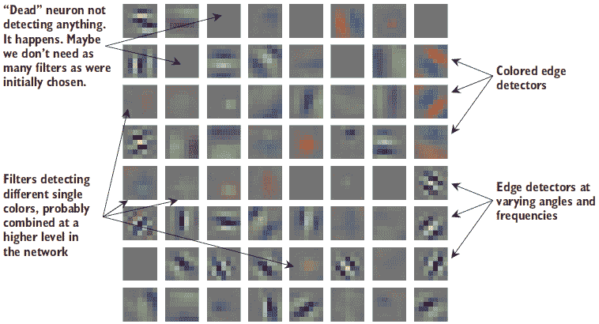

但我们是通过 ImageNet 的 100 万张训练图像得到这个结果的。我们大约有 20,000 张，这要少得多。当我们从这些数据中从头开始学习过滤器时会发生什么？让我们看看我们训练的`model`，并找出答案。这使用与之前相同的代码，但我们将其包装在一个名为`visualizeFilters`的函数中，该函数接受要可视化的张量。我们传入原始`model`中训练的`conv1`过滤器的第一个，我们可以看到产生的过滤器：

```
filters_catdog = model.conv1.weight.data.cpu().numpy() ❶
visualizeFilters(filters_catdog)                       ❷
```

❶ 本章开始时我们训练的模型的过滤器

❷ 绘制结果


预训练的 ResNet-18 有清晰、锐利的过滤器，很容易看出每个过滤器学到了什么来检测。在这里，过滤器看起来像包含了噪声。我们看到一些形成黑白边缘检测过滤器的证据，但它们也受到了颜色信息的影响。这意味着一个用于检测边缘的过滤器在边缘不明显的物品上也会部分激活，但颜色是正确的——这可能会在后续造成问题。

通常情况下，你不应该根据过滤器的样子来判断模型的质量，而应该根据模型在真实、多样化的测试数据上的行为来判断。在这种情况下，我们知道在 RGB 图像模型的第一层中，好的过滤器通常是什么样的，并且可以做出合理的比较。这些过滤器看起来并不好。

但仅仅因为过滤器不同并不意味着它们总是更差。要判断这一点，我们需要训练预训练网络并在测试数据上比较准确率。如果预训练模型有更高的准确率，那么初始卷积过滤器的质量可能是性能较差的一个有效解释。

### 13.2.2 预训练 ResNet 的预处理

现在我们已经对为什么要使用预训练网络有了些直觉，让我们训练一个新的网络，看看它是否有所改进。确保我们的输入数据与预训练模型期望的相匹配是至关重要的。特别是`torchvision.models`中的 ImageNet 模型对每个输入颜色通道使用零均值和单位方差（*μ* = 0，*σ* = 1）进行标准化。所使用的特定系数来自 ImageNet，所以我们快速定义一个新的`Module`来在输入传递给预训练网络之前对其进行归一化。

警告：如果你通过预训练网络进行迁移学习，你*必须*确保你的数据预处理与模型最初训练的方式相匹配。否则，模型将无法获得它最初期望的内容，权重将变得毫无意义。使用的预处理并不总是有很好的文档记录，这可能会让人烦恼，而且这是一个需要特别注意的关键细节。

下一段代码执行了这个归一化。执行所有工作的整个模型作为`baseModel`传入，我们用`Module`包装它以预先归一化输入。这种归一化是由 ResNet 最初训练的方式指定的，我们使用`requires_grad=False`以确保归一化在训练过程中不被改变：

```
class NormalizeInput(nn.Module): 
    def __init__(self, baseModel): 
        """
        baseModel: the original ResNet model that needs to have its inputs 
        ➥ pre-processed 
        """ 
        super(NormalizeInput, self).__init__() 
        self.baseModel = baseModel               ❶ 
        self.mean = nn.Parameter(torch.tensor( 
        ➥ [0.485, 0.456, 0.406]).view(1,3,1,1), ❷ 
        ➥ requires_grad=False)                  ❸ 
        self.std = nn.Parameter(torch.tensor(
        ➥ [0.229, 0.224, 0.225]).view(1,3,1,1), ❷ 
        ➥ requires_grad=False)                  ❸

    def forward(self, input): 
        input = (input-self.mean)/self.std       ❹
        return self.baseModel(input)             ❹
```

❶ 我们想要使用的模型。我们首先需要对其进行输入归一化。

❷ 用于 ImageNet 归一化的均值和标准差。我们只能接受这些大家普遍使用的“魔法”数字。

❸ requires_grad=False：我们不想在训练过程中改变这些值！

❹ 归一化输入并将其输入到我们想要使用的模型中

警告：你在线上看到的很多代码都硬编码了这个归一化步骤，或者将其硬编码到数据加载器中。我不喜欢这两种方法。归一化是*特定*于在 ImageNet 上预训练的网络。这意味着它不是数据的一部分，因此它不应该成为`Dataset`类中使用的转换的一部分。如果你想要切换到其他东西，你可能不想使用相同的归一化。我更喜欢将归一化部分作为模型的一部分，因为这些都是归一化值来源的地方！我似乎在这个问题上属于少数，所以当你阅读其他人的代码时要留心。

这个`NormalizeInput`类执行了用于 PyTorch 中预训练 ResNet 模型的归一化。现在我们可以用这个归一化`Module`包装我们的预训练模型，以获得正确的行为。这样，我们数据格式化和预训练权重期望之间就没有不匹配。我喜欢这种方法，因为它将特定于这种情况的预处理特殊性封装到其自己的类中。如果我们想更换不同的模型或用我们自己的转换增强数据加载器，我们可以这样做，而不用担心必须发生的模型特定预处理，因为模型特定处理是模型的一部分。这在这里通过一行代码实现，即用这个特定的归一化器包装预训练模型：

```
model_pretrained = NormalizeInput(model_pretrained)
```

我们模型的预处理与预训练模型所期望的相匹配，我们最终可以继续训练网络。有两大主要方法可以这样做，我们将讨论。

### 13.2.3 使用 warm start 进行训练

我们有一个预训练模型，它被设置为正确地预处理数据，而我们也有我们的新数据。前进的最简单方式是调用`train_network`函数，并传入`model_`pretrained`参数，看看会发生什么。以下行训练了这个模型，我们可以检查结果并看看它的表现如何。我们称之为`warmstart_results`，因为这个迁移学习的方法被称为*warm start*：

```
warmstart_results = train_network(model_pretrained, loss, train_loader, 
➥ epochs=10, device=device, test_loader=test_loader, score_funcs={’Accuracy’: 
➥ accuracy_score})
```

值得注意的是，warm start 和迁移学习并不是同义词。用 warm start 训练*任何*模型是指你使用*任何*一组你期望比使用默认随机值更接近你期望解的初始权重值*Θ*[*i**n**i**t*]。Warm start 是一种常见的优化方法，迁移学习并不是唯一发生 warm start 的情况。所以如果有人告诉你他们正在使用 warm start，这并不一定意味着他们正在进行任何类型的迁移学习。简而言之，warm start 仅仅意味着你有一个你相信比随机权重更好的初始权重集。恰好有一种迁移学习的方法是通过这种 warm-start 策略。

迁移学习之外的 warm start

在迁移学习之外，warm start 的一个常见应用是线性模型的超参数优化。因为线性模型通常使用精确求解器（你收敛到唯一正确答案），它们的运行时间部分取决于过程开始时使用的值。当你训练 10+个模型，每个模型都有一个不同的正则化惩罚λ时，具有一个λ值的模型解可能与具有略微不同值*λ* + *ϵ*的解相似。由于你将到达正确答案，无论起始点如何，你可以使用之前为λ找到的解来 warm start *λ* + *ϵ*的解。

这种技术在 Lasso 正则化模型和支持向量机中非常受欢迎，因为它们的训练成本较高，并且需要执行超参数搜索以获得良好的结果。这就是 scikit 的 `LassoCV` 类等工具所发生的情况 ([`mng.bz/nrB8`](http://mng.bz/nrB8))。

由于我们的预训练权重来自训练另一个问题的模型，因此权重是我们如何从原始域*迁移*知识到新域的方式。这种方法的另一个名称是*微调*：我们有一些通用的好东西，我们想要对其进行轻微调整以适应我们的特定问题。

通过使用预训练权重调用 `train_network` 函数，我们正在执行这种轻微的调整，因为梯度下降会改变网络中的每个权重以尝试最小化损失。当我们绘制结果以查看这是否是一个好主意时，准确性出现了显著差异。预启动不仅达到了更高的准确性：它在一个*单个*周期后达到了更高的准确性。这意味着我们可以通过不训练 10 个周期来使整个过程快 10 倍。我们显然事先不知道这一点，但这说明了使用预训练时可以看到的优势：你收敛得更快，通常到更好的解决方案：

```
    sns.lineplot(x=’epoch’, y=’test Accuracy’, data=normal_results, 
    ➥ label=’Regular’) 
    sns.lineplot(x=’epoch’, y=’test Accuracy’, data=warmstart_results, 
    ➥ label=’Warm’)

[24]: <AxesSubplot:xlabel='epoch', ylabel='test Accuracy'>
```

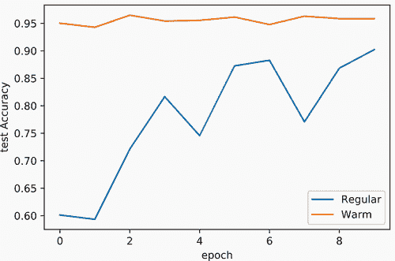

这种在更短时间内获得更高精度的双重胜利是迁移学习成为解决新问题最有用的工具之一的部分原因。我们还可以通过比较微调前后的权重来了解预启动有多有用。以下代码再次调用 `visualizeFilters` 来查看 ResNet-18 模型微调后的卷积过滤器。这些过滤器基本上与我们开始时的一样，这是一个很好的指标，表明它们确实是许多问题的通用良好过滤器。如果不是这样，SGD 会更多地改变它们以提高其准确性：

```
filters_catdog_finetuned = model_pretrained.baseModel.  ❶
➥ conv1.weight.data.cpu().numpy() 
visualizeFilters(filters_catdog_finetuned)              ❷
```

❶ 在微调预启动模型后获取过滤器

❷ 绘制过滤器，它们看起来与预训练模型的初始过滤器非常相似

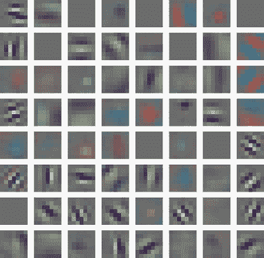

### 13.2.4 使用冻结权重进行训练

在这种情况下，我们还有另一种迁移学习的选项，称为*权重冻结*或使用*冻结*权重。权重冻结是指我们决定不改变层的参数/系数。梯度仍然会在层中计算并反向传播，但当我们执行梯度更新时，我们不做任何改变——就像我们将学习率 *η* 设置为 0 一样。

无法使用权重冻结来冻结网络的*所有*层；这意味着没有东西可以训练！只有当我们调整模型的一些参数时，训练才有意义。一种常见的方法是冻结所有卷积和归一化层的权重，只更改全连接层的权重。这隐含地假设从原始域学习到的过滤器*与或优于*在这个新域上学习到的过滤器。

要做到这一点，我们首先将模型中每个参数的 `requires_grad` 标志设置为 `False`。这样，在反向传播后，没有任何参数保存梯度，因此当优化器执行更新步骤时，不会发生任何变化。在冻结整个模型后，我们替换模型的完全连接层，该层默认具有 `requires_grad=True`。我们希望这样做，因为新的完全连接层是我们唯一想要调整的层。然后我们可以像使用预热方法一样构建和训练模型。以下代码执行冻结过程，然后训练模型：

```
model_frozen = torchvision.models.resnet18(pretrained=True) 
for param in model_frozen.parameters():                     ❶ 
    param.requires_grad = False

model_frozen.fc = nn.Linear(model_frozen.fc.in_features, 2) ❷
model_frozen = NormalizeInput(model_frozen)

frozen_transfer_results = train_network(model_frozen, loss, train_loader, 
➥ epochs=10, device=device, test_loader=test_loader, 
➥ score_funcs={’Accuracy’: accuracy_score})
```

❶ 关闭所有参数的梯度更新！

❷ 我们的新全连接层默认 requires_grad = True。

接下来我们绘制结果。冻结模型的结果非常稳定。这很合理，因为它调整的参数数量要少得多。它的表现略逊于预热模型，但仍然远优于从头开始训练的朴素方法：

```
    sns.lineplot(x=’epoch’, y=’test Accuracy’, data=normal_results, 
    ➥ label=’Regular’) 
    sns.lineplot(x=’epoch’, y=’test Accuracy’, data=warmstart_results, 
    ➥ label=’Warm Start’) 
    sns.lineplot(x=’epoch’, y=’test Accuracy’, data=frozen_transfer_results, 
    ➥ label=’Frozen’)

[27]: <AxesSubplot:xlabel='epoch', ylabel='test Accuracy'>
```

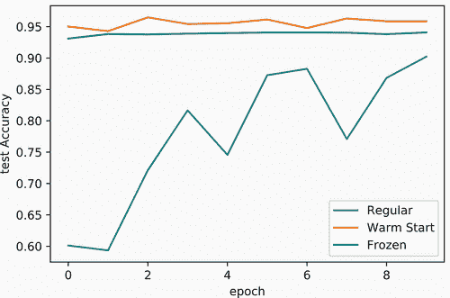

那么，预热权重和冻结权重哪个更好？这个单一的结果似乎表明了一个小的权衡：预热权重更准确，但冻结权重更一致。这是真的，但它并没有讲述整个故事。要了解这个故事，请继续阅读：下一节将讨论在这个权衡中可能起到决定性作用的因素——*数据集大小*。

## 13.3 使用较少标签进行学习

到目前为止，我们已经有了预热和冻结权重作为我们执行迁移学习的两种主要方法。这些是在实践中进行迁移学习最常见和最成功的方法。但你应该在什么时候使用哪一种？你总是可以尝试两者，看看哪个效果最好，但当你有极少的训练数据时，冻结权重具有特定的优势。

为什么会这样？想象一下，一个理想的参数集 Θ 将为问题提供最佳性能。² 您找到任何一组参数 Θ 的能力取决于您可以获得多少数据（以及计算资源）。一种简化的思考方式是，您对真实参数的估计是对它们的噪声视图：

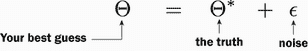

你拥有的数据越多，你能够构建的模型就越好，*ϵ* → 0。如果你没有数据，你只能随机选择答案，因为你只能随机选择 Θ，所以 *ϵ* → ∞。显然，你的训练数据大小 N 影响你估计参数的能力。

另一个因素是你有多少个参数。想象一下，如果你有关于随机人群身高的 1,000 个数据点。你可能会从这个 1,000 人的样本中非常准确地估计出一般人群的平均身高和身高标准差。但如果你想要记录*1 万亿*种不同的事物，比如 DNA 与身高、体重、发色、健康、疾病、左撇子/右撇子、恶搞倾向等所有可能的相互作用？有太多的相互作用，而你从 1,000 个人中得到关于所有这些事物的准确答案的能力将极其低。参数数量 D 是你估计模型好坏的一个因素。粗略地说，我们可以这样讲

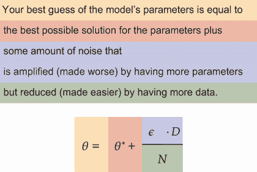

这是一个非常粗略的直观形式。解决方案质量、特征数量 D 和数据点数量 N 之间没有真正的线性关系。³ 重点是要说明，如果你没有足够的数据 N，而你有很多参数 D，你将无法学习一个好的模型。

这让我们更了解何时使用预热与冻结权重。当我们冻结权重时，它们就不再是我们可以修改的参数，这实际上减少了方程中的 D 项，并更好地估计剩余的参数。这也是为什么冻结方法比预热方法更稳定的原因：通过减少参数数量 D，噪声因素被减弱。

这在我们拥有较少标记数据时尤其有价值。为了展示这一点，我们可以通过随机采样一小部分用于训练来模拟我们的猫狗分类器的情况：批量大小的两倍，总共 256 个训练图像。这通常*远远*不够的数据来从头开始学习任何类型的 CNN：

```
train_data_small, _ = torch.utils.data.random_split( 
➥ train_data, (B*2,len(train_data)-B*2))         ❶ 
train_loader_small = DataLoader(train_data_small, ❷ 
➥ batch_size=B, shuffle=True)
```

❶ 将小数据集设置为批量大小的 2 倍

❷ ❶ 为这个微小的数据集制作加载器

现在我们有一个*小得多*的数据集。我们可以使用所有三种方法来训练一个模型：从头开始、使用预热启动和使用冻结权重。我们的初步结果显示，预热启动的表现略好于冻结。如果我们理解正确，在这种情况下冻结权重应该比预热启动表现更好。为了测试这一点，让我们训练每个选项：

```
model = torchvision.models.resnet18()                 ❶ 
model.fc = nn.Linear(model.fc.in_features, 2)

normal_small_results = train_network(model, loss, train_loader_small, 
➥ epochs=10, device=device, test_loader=test_loader, 
➥ score_funcs={’Accuracy’: accuracy_score})

model = torchvision.models.resnet18(pretrained=True)  ❷ 
model.fc = nn.Linear(model.fc.in_features, 2)         ❸ 
model = NormalizeInput(model)

warmstart_small_results = train_network(model, loss, train_loader_small, 
➥ epochs=10, device=device, test_loader=test_loader, 
➥ score_funcs={’Accuracy’: accuracy_score})

model = torchvision.models.resnet18(pretrained=True)  ❹

for param in model.parameters():                      ❺ 
    param.requires_grad = False

model.fc = nn.Linear(model.fc.in_features, 2)         ❻

model = NormalizeInput(model)

frozen_transfer_small_results = train_network(model, loss, 
➥ train_loader_small, epochs=10, device=device, test_loader=test_loader, 
➥ score_funcs={’Accuracy’: accuracy_score})
```

❶ 1. 从头开始训练

❷ ❷ 2. 预热模型的训练

❸ 执行一些手术

❹ 3. 使用冻结权重进行训练

❺ 关闭所有参数的梯度更新

❻ 我们的新全连接层默认 requires_grad = True。

注意，我们没有改变这三个选项中的任何代码。它们都以与之前相同的方式机械地操作；唯一的区别是我们给每个模型提供的数据量有多小。结果将在下面绘制，我们可以看到巨大的影响，这与我们对参数数量 D 和数据集大小 N 如何影响使用预热和冻结权重进行学习的理解相匹配：

```
    sns.lineplot(x=’epoch’, y=’test Accuracy’, data=normal_small_results, 
    ➥ label=’Regular’) 
    sns.lineplot(x=’epoch’, y=’test Accuracy’, data=warmstart_small_results, 
    ➥ label=’Warm Start’) 
    sns.lineplot(x=’epoch’, y=’test Accuracy’, data=frozen_transfer_small_results, 
    ➥ label=’Frozen’)

[30]: <AxesSubplot:xlabel='epoch', ylabel='test Accuracy'>
```


我们在结果上看到了*显著*的差异。从头开始训练仍然是效果最差的，测试集上的准确率勉强超过 50%。使用预热启动更好，准确率约为 80%；但使用冻结的卷积层效果最佳，约为 91%，几乎与在 20,000 个样本上训练的结果一样好。因此，当我们的训练数据非常有限时，冻结方法是最好的，但其进一步改进的能力也是有限的。这就是预热启动发挥作用的地方；如果您有足够的标记数据（但仍然不是太多），预热模型可以开始领先于冻结模型。

注意：如果您正在进行基于计算机视觉的在职工作，我几乎总是建议从预训练模型开始。这种方法非常有效，如果您想使用当前的工具并构建一个产品，就没有必要从头开始训练模型。值得从头训练一个模型来看看您是否有一个罕见的问题，预训练不起作用，但除此之外，预训练模型会使您的生活更轻松。如果您可以使用预训练模型构建一个可行的解决方案，您最终可以构建一个数据收集和标注过程，以创建自己的大型语料库，这有助于改进事物；但这是一项重大的投资。预训练帮助您在不支付高昂成本的情况下达到一个可行的初步解决方案。

虽然我们没有在这里展示，您也可以在预热启动和冻结启动之间取得平衡。正如我们之前提到的，计算机视觉任务的第一层卷积通常学习到在广泛问题中通用的过滤器。随着您深入网络，过滤器变得更加专业化。在非常深的模型中，最后的卷积过滤器通常只对当前任务有用。

您可以通过冻结网络的前几层，但允许后续层作为预热启动来利用这一点。这种混合方法可能需要一些试错来选择停止冻结权重的深度，这取决于您的原始模型（例如，ResNet 的哪个版本或其他架构），它在多少数据上进行了训练，以及您的新目标领域数据。调整冻结与不冻结不同层实际上成为您在使用预训练网络时修改模型的新方法，因为您不能向已经存在的东西添加更多神经元或层。这并不总是会产生巨大差异，所以许多人跳过这一步，专注于设计更多/更好的数据增强管道，以获得更好的时间回报。

## 13.4 使用文本进行预训练

使用预训练网络进行迁移学习成功的关键在于学习*鲁棒*的特征/模式，这些模式具有广泛的应用性。直到最近，这种方法在自然语言处理（NLP）相关任务中还没有成功。感谢我们在第十二章中了解到的新模型*transformer*，这种情况终于开始改变。

尤其是基于转换器的一组算法显著提高了我们在文本问题上的结果质量。这些预训练模型中的第一个被称为 BERT⁴（是的，是以《芝麻街》上的角色 Bert 的名字命名的）。为了开始调整预训练的 BERT 模型，我们将重用上一章的 AG News 数据集（加载`torchtext`、`tokenizer`和`Vocab`对象，以及`text_transform`和相关的`label_transform`），并将 AG News 的训练集和测试集分别命名为`train_dataset_text`和`test_dataset_text`）。

唯一真正的变化是我们创建了一个包含 256 个标记项的小型语料库版本。在有限训练数据上进行学习是迁移学习获得最大结果回报的地方，同时也帮助这些示例快速运行：

```
train_data_text_small, _ = torch.utils.data.random_split( ❶
train_dataset_text, (256,len(train_dataset_text)-256))
```

❶ 切割出一个小型数据集

现在我们训练第十二章中相同的 GRU 模型作为基线。在完整数据集上，GRU 能够达到 92%的准确率。使用这个较小的标记集，我们预计准确率会下降。以下代码块重用了上一章的相同`pad_batch`函数来训练相同的 GRU 模型，但我们只有 256 个标记示例：

```
embed_dim = 128 
gru = nn.Sequential( 
    nn.Embedding(VOCAB_SIZE, embed_dim),                   ❶ 
    nn.GRU(embed_dim, embed_dim, num_layers=3, 
    ➥ batch_first=True, bidirectional=True),              ❷

    LastTimeStep(rnn_layers=3, bidirectional=True),        ❸

    nn.Linear(embed_dim*2, NUN_CLASS),                     ❹ 
)

train_text_loader = DataLoader(train_data_text_small, 
batch_size=32, shuffle=True, collate_fn=pad_batch)         ❺ 
test_text_loader = DataLoader(test_dataset_text, batch_size=32, 
➥ collate_fn=pad_batch) 
gru_results = train_network(gru, nn.CrossEntropyLoss(), 
➥ train_text_loader, test_loader=test_text_loader, 
➥ device=device, epochs=10, 
➥ score_funcs={’Accuracy’: accuracy_score})               ❻
```

❶ (B, T) -> (B, T, D)

❷ (B, T, D) -> ( (B,T,D) , (S, B, D) )

❸ 将 RNN 输出减少到一个项目，(B, 2*D)

❹ (B, D) -> (B, classes)

❺ 使用 collate_fn 创建训练和测试加载器

❻ 训练我们的基线 GRU 模型

### 13.4.1 使用 Hugging Face 库的转换器

我们的基线 GRU 已经训练好，代表了我们会使用的典型方法。对于迁移学习版本，我们创建一个冻结的 BERT 模型来获得这个预训练文本模型的好处。我们首先需要的是一个包含一些预训练架构的实现。幸运的是，Hugging Face ([`huggingface.co/transformers`](https://huggingface.co/transformers)) 库已经迅速成为研究人员放置 BERT 最新和最伟大扩展的事实上工具和仓库。要安装它，请运行以下命令：

```
!pip install transformers
```

我们将使用一个名为 *DistilBERT* 的模型⁵，这是一个经过蒸馏的 BERT 模型版本，已经被压缩成一个具有更少参数的小型网络。这样做只是为了使示例运行得更快，因为一般来说，转换器模型在计算上都很昂贵。BERT 类型模型成功的一部分是使用数十个 GPU 在数百 GB 的数据上训练大型模型。转换器继续从更多层和更大的数据集中受益，并且能够在许多 GPU 上很好地并行化，这比 RNN 要大得多，这也是转换器之所以如此强大的原因之一。但是，对于许多人来说，从头开始训练转换器/BERT 模型的投资太大。能够使用转换器进行迁移学习是它们对我们这些没有数十个 GPU 可用的人如此相关的部分。

由于使用预训练的 BERT 模型正迅速变得流行，这些模型还附带了一个方便的`from_pretrained`函数，它可以接受不同的字符串，指定在不同设置下训练的 BERT 模型。例如，一个可能在区分大小写的输入上训练，另一个可能在忽略大小写的输入上训练。官方文档([`huggingface.co/transformers/model_doc/distilbert.html`](https://huggingface.co/transformers/model_doc/distilbert.html))描述了哪些选项可用。我们使用不区分大小写的选项，因为我们有较少的数据（更少的案例意味着更少的参数和在小数据集上的更好性能）：

```
from transformers import DistilBertTokenizer, DistilBertModel              ❶
tokenizer = DistilBertTokenizer.from_pretrained(’distilbert-base-uncased’) ❷
bert_model = DistilBertModel.from_pretrained(’distilbert-base-uncased’)
```

❶ 加载 DistilBert 类

❷ 初始化 tokenizer（将字符串转换为输入张量）和模型（输入张量到输出张量）

注意，我们不仅有`bert_model`，还有一个*新的* `tokenizer`。这样做是为了我们可以使用原始 BERT 训练中使用的相同编码过程，将新的字符串转换为 BERT 的输入。*我们不能在不同模型之间混合匹配 tokenizer*。这类似于我们使用特定的归一化均值和标准差来使用预训练的 ResNet-18 模型。我们需要对新目标域的初始输入以与原始域相同的方式进行处理。`tokenizer`对象接受原始字符串作为输入，并执行与原始模型以相同方式训练时使用的所有预处理操作，使我们的生活更加简单。

实现 BERT 模型的`collate_fn`策略看起来与我们的 GRU 模型非常相似。我们不是调用`text_transform`，而是在原始字符串上调用 Hugging Face 提供的`tokenizer`。特别是有一个`batch_encode_plus`函数，它接受字符串列表并将其转换为处理（如果有需要，带有掩码）的数据批次。我们简单地添加`return_tensors=pt`参数来让 Hugging Face 知道我们想要 PyTorch 张量（它也支持 TensorFlow）和`padding=True`标志，以便较短的句子被填充到相同长度：

```
def huggingface_batch(batch): 
    """ 
    Pad items in the batch to the length of the longest item in the batch. 
    Also, re-order so that the values are returned (input, label) 
    """ 
    labels = [label_transform(z[0]) for z in batch]   ❶ 
    texts = [z[1] for z in batch]                     ❷

    texts = tokenizer.batch_encode_plus(texts,        ❸ 
    return_tensors=’pt’, padding=True)[’input_ids’]

x, y = texts, torch.tensor(labels, dtype=torch.int64) ❹ 
return x, y train_text_bert_loader = DataLoader( 
➥ train_data_text_small, batch_size=32, shuffle=True, 
➥ collate_fn=huggingface_batch)                      ❺
test_text_bert_loader = DataLoader(test_dataset_text, batch_size=32, 
➥ collate_fn=huggingface_batch)
```

❶ 前三条与之前相同。

❷ 修改：不要使用旧的 text_transform；获取原始文本。

❸ 新增：Hugging Face 为我们编码一批字符串。

❹ 回到旧代码：将它们堆叠起来并返回张量。

❺ 使用新的 collage_fn 创建我们的数据加载器

### 13.4.2 使用 no-grad 冻结权重

我们还需要一个带有冻结权重的 BERT 模型。由于输出包含填充，我们定义了一个`Module`类来找出填充的掩码，并适当地使用它。BERT 给我们一个形状为 (*B*,*T*,*D*) 的输出张量，我们需要将其减少到 (*B*,*D*) 以进行分类预测。第十二章中的`getMaskByFill`函数给我们填充掩码，这样我们就可以重用注意力层，只对有效的（非填充）标记进行平均。我们可以使用`bert_model.config.dim`变量访问 BERT 使用的隐藏神经元数 D。Hugging Face 中的每个模型都有一个`.config`变量，其中包含有关模型配置的各种信息。

我们也利用这个机会展示一种不同的冻结权重的方法。我们不需要手动为每个参数设置 `requires_grad=False`，而是可以使用 `with torch.no_grad():` 上下文。它具有相同的效果，为任何需要的反向传播计算梯度，但立即忘记它们，因此在梯度更新期间不会使用。如果我们想使冻结自适应或使代码更明确地表明梯度将不会用于其中的一部分，这将很方便。这种方法的缺点是，实现具有混合热和冻结层的模型比较困难。

下面是代码：

```
class BertBasedClassifier(nn.Module):                            ❶

    def __init__(self, bert_model, classes): 
        """ 
        bert_model: the BERT-based classification model to use as a frozen 
        ➥ initial layer of the network 
        classes: the number of output neurons/target classes for this 
        ➥ classifier. 
        """ 
        super(BertBasedClassifier, self).__init__() 
        self.bert_model = bert_model                             ❷ 
        self.attn = AttentionAvg(                                ❸
        ➥ AdditiveAttentionScore( 
        ➥ bert_model.config.dim)) 
        self.fc1 = nn.Linear(bert_model.config.dim,              ❹ 
        ➥ bert_model.config.dim) 
        self.pred = nn.Linear(bert_model.config.dim, classes)    ❺

    def forward(self, input): 
        mask = getMaskByFill(input)                              ❻ 
        with torch.no_grad():                                    ❼ 
            x = self.bert_model(input)[0]                        ❽

        cntxt = x.sum(dim=1)/(mask.sum(dim=1).unsqueeze(1)+1e-5) ❾ 
        x = self.attn(x, cntxt, mask)                            ❿ 
        x = F.relu(self.fc1(x))                                  ⓫ 
        return self.pred(x)

bertClassifier = BertBasedClassifier(bert_model, NUN_CLASS)      ⓬
bert_results = train_network(bertClassifier, nn.CrossEntropyLoss(), 
➥ train_text_bert_loader, test_loader=test_text_bert_loader, 
➥ device=device, epochs=10, score_funcs={’Accuracy’: accuracy_score})
```

❶ 我们为 BERT 模型的冻结训练创建的新类

❷ 我们从 BERT 得到一个形状为 (B, T, D) 的张量，因此我们定义了一些自己的层，从 (B, T, D) 到形状为 (B, classes) 的预测

❸ 注意力降低到 (B, D) 形状

❹ 进行一些特征提取

❺ 对类别做出预测

❻ 输入是 (B, T)。

❼ 使用 no_grad()进行冻结。

❽ Hugging Face 返回一个元组，所以解包它！ (B, T, D)

❾ 计算平均嵌入

❿ 应用注意力

⓫ 进行预测并返回

⓬ 构建分类器

如前所述，我们可以使用我们方便的`train_network`函数来训练这个基于 BERT 的分类器：

```
    sns.lineplot(x=’epoch’, y=’test Accuracy’, data=gru_results, 
    ➥ label=’Regular-GRU’) 
    sns.lineplot(x=’epoch’, y=’test Accuracy’, data=bert_results, 
    ➥ label=’Frozen-BERT’)

[41]: <AxesSubplot:xlabel='epoch', ylabel='test Accuracy'>
```

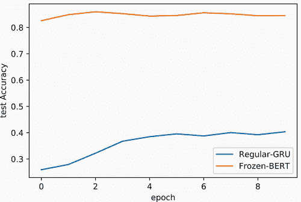

查看结果，我们可以看到 GRU 正在学习，但速度非常慢。GRU 的最高准确率约为 40%，不到它在完整训练集上可以达到的 92%的一半。我们的冻结 BERT 模型达到了约 84%，这是一个显著的提升。然而，这种情况的代价也更高。正如我们之前提到的，BERT 风格的模型通常非常大，因此计算成本很高。训练和应用我们的 BERT 分类器比 GRU 慢了大约 10 倍。

从模型准确率的角度来看，这显然是一个净胜，因为 GRU 永远无法单独达到 84% 的准确率。然而，基于 BERT 的模型可能在实际应用中太慢了。这取决于可用的资源和问题的具体细节。这是一个需要了解的重要权衡，在使用预训练方法时并不罕见。本质上，我们想要使用预训练模型，因为它已经在更大的数据集上进行了训练，但这也意味着模型变得更大，以最大化准确率。

在我个人的经验中，我发现随着你为你的问题建立标记数据集，预训练的转换器通常会开始失去它们的优势。而预训练的 CNN 几乎总是优于从头开始训练的 CNN，我经常发现，对于转换器来说，并没有如此明确、一致的结果。有时它们更好，有时则不然。这与非深度方法（如 Lasso 惩罚逻辑回归）相比尤其如此，它在许多文本数据集上表现出很强的竞争力。

尽管如此，现在使用预训练模型进行文本数据是可能的。它可能会随着时间的推移而改进，并且当训练样本非常少时是一个强大的工具。将其保留在你的工具箱中，但如果你有一个基于文本的问题，探索替代方案。

## 练习

在 Manning 在线平台 Inside Deep Learning Exercises ([`liveproject.manning.com/project/945`](https://liveproject.manning.com/project/945)) 上分享和讨论你的解决方案。一旦你提交了自己的答案，你将能够看到其他读者提交的解决方案，并看到作者认为哪些是最好的。

1.  使用 `dir` 命令来探索 PyTorch `resnet18` 模型的子组件，并编写你自己的函数 `def warmFrozenResnet18(num_frozen)`，该函数只冻结网络中的前 `num_frozen` 个卷积层。

1.  使用你的 `warmFrozenResnet18` 函数，在 *N* = 256，*N* = 1,024 和 *N* = 8,192 个标记的训练样本中，探索暖层与冻结层程度之间的权衡。

1.  重复前两个练习，但使用 `MobileNet` 类。

1.  回到第八章，在那里我们训练了 Faster R-CNN 来检测 MNIST 数字的位置。作为 MNIST 分类器进行自己的预训练，然后使用该预训练的主干网络来训练 Faster R-CNN。在多张图像上测试结果，并描述你看到的结果中的任何差异。*注意:* 如果你使 `backbone` 有两个部分：一个只包含卷积层和池化的较大特征处理子网络，另一个进行任何最终池化（可选）、展平和类别标签预测的第二个预测子网络，这将更容易。然后你可以只为 Faster R-CNN 使用特征处理子网络。

1.  当你拥有大量数据但其中大部分未标记时，可以使用自动编码器进行无监督预训练。为猫狗问题编写一个去噪自动编码器，该编码器在全部数据集上训练，然后将编码器部分作为分类器的预热启动。你可以将编码器特征视为处理骨干，并需要在上面添加一个预测子网络。

1.  Hugging Face 有特殊的类来简化使用预训练模型的过程。查阅`DistilBertForSequenceClassification`类的文档，并用 Hugging Face API 的内置方法替换我们的 AG News 数据集的方法。它们是如何比较的？

## 摘要

+   你可以通过重用已经在某个数据集上训练好的网络的权重，将它们应用于新的数据集，并对网络的最后一层进行手术以使其匹配你的问题来迁移知识。

+   预训练模型的权重在训练过程中可以是温暖的（允许改变）或冻结的（保持不变），在数据量多或少时分别提供不同的好处。

+   当我们拥有的标记数据非常少时，迁移学习的优势最为显著。

+   对于卷积网络和计算机视觉问题进行预训练非常有效，而对于文本问题进行预训练仍然有用，但由于模型大小和计算时间的差异，存在更多的权衡。

+   对于文本的预训练，最好使用在大语料库上训练的 Transformer 类型模型。

***

¹ 我从未有过完全成功的手术，我认为我对此很满意。请注意，我是一个博士，而不是医学博士，因此我对适当的手术礼仪和如何安全地切除东西的了解有限。↩

² 这通常被描述为拥有一个可以神奇地为你提供*完美*解决方案的先知。↩

³ 我过于简化的说法非常简化，但直觉是很好的。这是一个对于大多数机器学习都适用的直觉，但并不总是适用于深度学习。证明深度学习中的事情非常困难：已经取得了很大进展，但当 D 变得很大时，你应该总是对直觉进行二次怀疑。对这些高维空间进行推理是困难的。关于学习神经网络参数的奇怪之处，我鼓励你阅读 C. Zhang 等人，“理解深度学习需要重新思考泛化”，国际学习表示会议，2017。↩

⁴ J. Devlin, M.-W. Chang, K. Lee, and K. Toutanova，“BERT：用于语言理解的深度双向 Transformer 的预训练”，*2019 年北美计算语言学协会分会会议：人机语言技术会议论文集（长篇和短篇论文）*，第 4171-4186 页，2019。↩

⁵ V. Sanh, L. Debut, J. Chaumond, 和 T. Wolf, “DistilBERT，BERT 的精简版：更小、更快、更便宜、更轻便，” ArXiv e-prints，第 2-6 页，2019 年，[`arxiv.org/abs/1910.01108`](https://arxiv.org/abs/1910.01108)。↩
