# 14 高级构建块

本章涵盖了

+   使用抗锯齿池化提高平移不变性

+   通过改进残差连接更快地收敛

+   通过混合数据来对抗过拟合

本书中的练习迄今为止都是设计得让你可以在最少的计算时间内了解*真实*的技术。但是当你处理现实世界的问题时，它们通常需要数百个 epoch 和比你所训练的更深层次的模型，并且它们必须处理比本书中的示例更大的输入。

当处理这些更大的数据集时，有时需要额外的工具来获得最佳结果。本章涵盖了研究人员为改进深度学习模型而开发的最新和最优秀的技巧：这些技巧在训练大型数据集的多个 epoch 时通常效果最佳。我们专注于简单、广泛适用、有效且易于实施的方法。对于这些更高级的技术，你通常不会在较小的模型或仅训练 10 到 20 个 epoch（如本书大多数内容所示）时看到全部的好处。在实践中，这些技术在训练 100 到 300 个 epoch 时最能体现出其价值。我已经设计了实验，在相对较短的时间内展示了一些好处，但你应该期待在更大的问题上获得更显著的好处。

我们介绍了三种你可以安全地添加到几乎任何模型中并获得实质性改进的方法。抗锯齿池化改进了我们一直在使用的池化操作，使其更适合几乎任何 CNN 应用。这种池化通过更好地处理图像内容中的小位移来提高准确性。接下来，我们看看一种新的残差连接方法，称为 ReZero，它让我们的网络在何时以及如何使用跳跃连接方面有更多的灵活性。因此，它们更准确，在更少的 epoch 中收敛，同时使学习更快。最后，我们讨论了一种构建损失函数的新方法：MixUp，这是通过减少过拟合来改进几乎任何神经网络结果的一种日益增长的方法的基础。

## 14.1 池化的问题

池化是 CNN 的早期组成部分，并且在这些年里变化最少。正如我们在第三章中讨论的，池化层帮助我们赋予模型平移不变性：当我们上下或左右移动图像内容时，它们会产生相同或相似的答案。它们还增加了后续层的感受野，允许每个卷积层一次性查看更多的输入并获取额外的上下文。尽管它们无处不在，但一个微妙的缺陷已经困扰 CNN 数十年，而最近我们才注意到它并提出了一个简单的解决方案。问题的核心是，原始池化丢失了比必要更多的信息，并因此引入了噪声。我们通过一个示例来展示这种信息丢失是如何发生的，然后讨论解决方案并开发一个新的池化层来修复它。

为了演示问题，我们将从维基百科下载一张斑马的图片。¹ 这是一张斑马的事实很重要，您将在接下来的时刻看到。以下代码从给定的 URL 下载图片，并将其转换为 Python Imaging Library (PIL)图像：

```
import requests 
from PIL import Image 
from io import BytesIO

url = "https://upload.wikimedia.org/wikipedia/
➥ commons/9/9c/Zebra_in_Mikumi.JPG"

response = requests.get(url) 
img = Image.open(BytesIO(response.content))
```

现在我们将图像的最短边调整到 1,000 像素，并裁剪出中心内容。这一步的主要目的是修改代码，以便您可以之后尝试不同的图像。然后`ToTensor`转换将 PIL 图像转换为适当的 PyTorch `Tensor`，其值缩放到范围[0,1]：

```
to_tensor = transforms.ToTensor()                      ❶ 
resize = torchvision.transforms.Resize(1000)           ❷ 
crop = torchvision.transforms.CenterCrop((1000, 1000)) ❸ 
img_tensor_big = to_tensor(crop(resize(img)))          ❹
```

❶ 将 PIL 图像转换为 PyTorch 张量

❷ 将最短边调整到 1,000 像素

❸ 裁剪出中心 1,000 × 1,000 像素

❹ 将所有三个转换步骤组合起来以转换图像

接下来，简单应用`ToPILImage`将图像转换回原始的 PIL 图像对象。Jupyter 笔记本足够智能，可以自动显示这些图像，您应该会看到图像中的两只斑马。注意，虽然背景内容模糊且不聚焦，但斑马清晰且捕捉得很好。它们的毛发和黑白条纹清晰易见，包括它们面部上更密集的条纹集合：

```
to_img = transforms.ToPILImage() 
to_img(img_tensor_big)
```


现在我们使用最大池化将图像缩小四倍。我们将其缩小四倍而不是两倍，以加剧池化的问题。以下代码执行池化并打印图像，使我们能够看到确实有问题：

```
shrink_factor = 4                 ❶ 
img_tensor_small = F.max_pool2d(img_tensor_big, 
➥ (shrink_factor,shrink_factor)) ❷
to_img(img_tensor_small)          ❸
```

❶ 执行多少池化

❷ 应用池化

❸ 结果图像


虽然背景看起来仍然不错，但斑马的条纹中有很多像素化的图案，通常被称为*锯齿*。锯齿在黑白条纹较密集的地方会更严重。在斑马的臀部附近，它们是显而易见的，但并不可怕；靠近胸部时，它们会令人分心；而且面部看起来严重混乱，缺乏原始照片中的任何细节。

这个问题被称为**混叠**。一个简化的解释是，当你试图将精细、详细的信息采样到更小的空间时，就会发生混叠。我们在这里强调“采样”这个词，因为混叠发生在我们从更大的表示中选择精确值来填充较小的表示时。这意味着许多不同的输入可以导致相同的块状锯齿，而且你尝试缩小输入的程度越大，问题就越严重。

让我们看看一个玩具示例，说明混叠是如何发生的。图 14.1 展示了三种不同的单维模式。第一种具有黑白块，以固定模式交替排列。第二种显示了成对的块，第三种有一对相邻的白色块但没有相邻的黑色块。尽管模式不同，简单的最大池化对所有这些模式都给出了相同的输出。

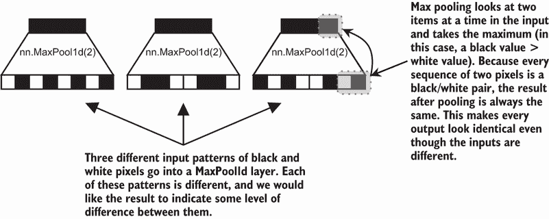

图 14.2 混叠问题可能导致信息丢失的示例。三个不同的输入进入最大池化层，但我们获得了三个相同的输出。这是一个极端情况，但它展示了基本问题。

这并不好。但这是一个问题吗？我们已经构建了几个似乎工作得很好的 CNN，而且人们已经使用了最大池化几十年。也许这并不是一个大问题，除非我们想要构建斑马检测器。虽然我们的 CNN 可以工作，但混叠问题确实是存在的，并且每次我们在架构中添加另一个池化层时，问题都会变得更糟。通过理解为什么混叠是一个问题，我们可以积累起我们需要了解如何解决问题的知识。

### 14.1.1  混叠问题损害了平移不变性

为了说明为什么混叠是一个问题，我们将使用 CIFAR-10 数据集，因为与 MNIST 相比，它具有更高的复杂性。CIFAR 图像的高度和宽度为 32 × 32，但我们通过随机裁剪图像选择了一个较小的 24 × 24 像素块。（在获取较小的子图像时，通常的做法是使用随机裁剪进行训练以获得更多样性，并使用中心裁剪进行测试集以获得一致的结果。）这样，我们可以测试我们的卷积神经网络（CNN）在上下或左右方向上最多八像素的平移，以观察图像内容平移对 CNN 预测的影响。池化应该提高平移不变性（即，即使你移动了东西，你也会得到相同的结果），但我们将会展示混叠如何阻止我们获得全部的好处。

注意：在训练略小于原始图像大小的裁剪时，对于 128 × 128 或更大的图像，这是一种相当常见的做法。这样做可以为你的模型输入提供额外的多样性，避免在多个训练周期中多次显示完全相同的图像，并给模型带来更多的现实感（数据很少完美居中）。我们通常不会对如此小的 32 × 32 像素图像这样做，因为内容很少，但我们需要这样做，以便我们有像素可以平移。

下一段代码设置了 CIFAR-10，使用我们描述的子图像。我们在训练期间使用随机的 24 × 24 裁剪，并创建了相同测试集的两个不同版本。一般来说，你的测试应该是确定的——如果你做同样的事情，你希望得到相同的结果。如果用相同的权重运行相同的模型每次都给出不同的测试结果，那么确定模型变化是否带来了任何改进是非常困难的。为了使我们的测试确定，我们的测试加载器采用中心裁剪，这样测试图像每次都是相同的。但我们也想看看一些结果，因为不同的偏移发生时，我们制作了一个第二个版本，它返回原始的 32 × 32 图像：我们可以手动裁剪它们来查看偏移如何改变模型的预测：

```
B = 128 
epochs = 30

train_transform = transforms.Compose(             ❶ 
    [
        transforms.RandomCrop((24,24)), 
        transforms.ToTensor(), 
    ]) 
test_transform = transforms.Compose(              ❷ 
    [ 
        transforms.CenterCrop((24,24)), 
        transforms.ToTensor(), 
    ])

trainset = torchvision.datasets.CIFAR10(root=’./data’, train=True, 
➥ download=True, transform=train_transform) 
train_loader = torch.utils.data.DataLoader(trainset, batch_size=B, 
➥ shuffle=True, num_workers=2) 
testset_nocrop = torchvision.datasets.CIFAR10(    ❸
➥ root=’./data’, train=False, download=True, 
➥ transform=transforms.ToTensor())

testset = torchvision.datasets.CIFAR10(root=’./data’, train=False, 
➥ download=True, transform=test_transform)

test_loader = torch.utils.data.DataLoader(testset, ❹ 
➥ batch_size=B, shuffle=False, num_workers=2) 
cifar10_classes = (’plane’, ’car’, ’bird’, ’cat’,  ❺ 
➥ ’deer’, ’dog’, ’frog’, ’horse’, ’ship’, ’truck’)
```

❶ 训练时的转换：随机裁剪到 PyTorch 张量

❷ 测试时的转换：将中心裁剪到 PyTorch 张量

❸ 一个包含完整 32 × 32 图像的测试集版本，这样我们就可以测试特定的裁剪

❹ 评估期间使用的测试加载器是确定性的中心裁剪。

❺ 将 CIFAR-10 的类别索引映射回其原始名称

让我们看看使用我们的随机裁剪后数据看起来像什么。以下代码从训练集中选择相同的图像四次，然后与类别标签一起绘制。每次，图像都会稍微移动一下，增加额外的复杂性：

```
f, axarr = plt.subplots(1,4, figsize=(20,10))          ❶ 
for i in range(4):
    x, y = trainset[30]                                ❷ 
    axarr[i].imshow(x.numpy().transpose(1,2,0))        ❸ 
    axarr[i].text(0.0, 0.5,cifar10_classes[y].upper(), ❹
    ➥ dict(size=30, color=’black’))
```

❶ 制作一个 1 × 4 的网格

❷ 从训练集中抓取一个特定的项目（我喜欢飞机）

❸ 重新排序到 NumPy 和 Matplotlib 喜欢的 (W, H, C) 形状，用于图像

❹ 在角落绘制带有类别名称的图表

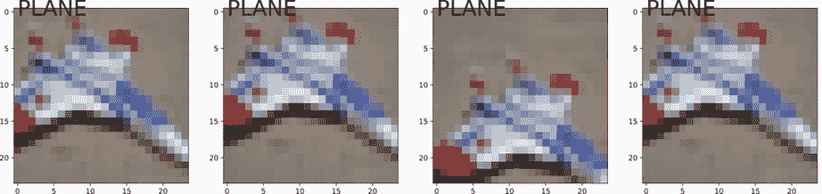

现在，让我们使用卷积和据说有缺陷的最大池化来训练一个简单的网络。我们在这里只使用两轮最大池化，相当于我们用于斑马示例中相同数量的池化。这足以展示池化在非斑马输入上的问题。一般来说，问题随着更多的池化而变得更加严重。在这段代码和本章的其余部分中，我们添加了第六章中我们信任的 `CosineAnnealingLR` 调度器。它有助于最大化结果，并允许我们在仅 30 个周期内展示一些通常在训练 100 个周期后才能看到的行为（这并不意味着你不应该在实际生产问题上进行 100 个周期的训练，只是我们可以更快地展示这种行为）。以下是代码：

```
C = 3                                                       ❶ 
h = 16                                                      ❷ 
filter_size = 3 
pooling_rounds = 2

def cnnLayer(in_size, out_size, filter_size):               ❸ 
    return nn.Sequential( 
        nn.Conv2d(in_size, out_size, filter_size, padding=filter_size//2), 
        nn.BatchNorm2d(out_size), 
        nn.ReLU())

normal_CNN = nn.Sequential(                                 ❹ 
    cnnLayer(C, h, filter_size), 
    cnnLayer(h, h, filter_size), 
    nn.MaxPool2d(2), cnnLayer(h, h, filter_size), 
    cnnLayer(h, h, filter_size), 
    nn.MaxPool2d(2), 
    cnnLayer(h, h, filter_size), 
    cnnLayer(h, h, filter_size), 
    nn.Flatten(), nn.Linear(h*(24//(2**pooling_rounds))**2, ❺ 
    ➥ len(cifar10_classes)) 
)

loss = nn.CrossEntropyLoss()

optimizer = torch.optim.AdamW(normal_CNN.parameters())      ❻ 
scheduler = torch.optim.lr_scheduler.CosineAnnealingLR(optimizer, epochs)

normal_results = train_network(normal_CNN, loss,            ❼ 
➥ train_loader, epochs=epochs, device=device, 
➥ test_loader=test_loader, optimizer=optimizer, 
➥ lr_schedule=scheduler, 
➥ score_funcs={’Accuracy’: accuracy_score})
```

❶ 输入通道的数量

❷ 隐藏层的通道数

❸ 作为我们多次做过的辅助函数

❹ 一个正常的 CNN，由两个 CNN 层块组成，层块之间有最大池化

❺ 

❻ 设置我们的优化器，带有学习率调度器以最大化性能

❼ 按常规训练我们的模型

我们已经训练了我们的模型，目前看起来没有*问题*。随着每个训练周期的增加，准确率稳步提高，这是正常且好的。这个数据集比 MNIST 更具挑战性，因此获得 74.35%的准确率是合理的。问题出现在我们查看同一图像的不同版本时：

```
    sns.lineplot(x=’epoch’, y=’test Accuracy’, data=normal_results, 
    ➥ label=’Regular’)

[13]: <AxesSubplot:xlabel='epoch', ylabel='test Accuracy'>
```

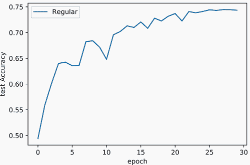

以下代码从测试集中取一个完整的 32 × 32 图像，并对所有 64 个可能的 24 × 24 子图像进行预测。这是通过将`x_crop`变量传递到网络中完成的，并且使用`prob_y`计算正确类别的概率：

```
test_img_id = 213                                              ❶ 
x, y = testset_nocrop[test_img_id]                             ❷
offset_predictions = []                                        ❸ 
normal_CNN = normal_CNN.eval() 
    for i in range(8):                                         ❹ 
        for j in range(8):                                     ❺

            x_crop = x[:,i:i+24, j:j+24].to(device)            ❻ 
            with torch.no_grad():
                prob_y = F.softmax(normal_CNN(                 ❼ 
                ➥ x_crop.unsqueeze(0)), dim=-1) 
                ➥ .cpu().numpy()[0,y] 
                offset_predictions.append((x_crop, prob_y))    ❽
```

❶ 要抓取的测试图像

❷ 获取原始 32 × 32 图像

❸ 保存每个 24 × 24 子图像的预测

❹ 对于上下位移

❺ 对于左右位移

❻ 抓取裁剪的图像

❼ 对图像进行分类并获取正确类别的概率

❽ 保存结果分数

现在我们绘制所有 64 张图像，并在每张图像上方显示模型预测正确类别的概率。从视觉上看，这些图像几乎完全相同，因为它们都是相同原始输入的子图像。我们应该对*所有*它们得到相似的预测，因为它们本质上都是相同的：

```
f, axarr = plt.subplots(8,8, figsize=(10,10))                  ❶ 
for i in range(8):                                             ❷ 
    pos = 0                                                    ❸ 

    for x, score in offset_predictions[i*8:][:8]:              ❹

        axarr[i, pos].imshow(x.cpu().numpy().transpose(1,2,0)) ❺ 
        axarr[i, pos].text(0.0, 0.5,                           ❻ 
        ➥ str(round(score,2)), 
        ➥ dict(size=20, color=’green’)) 
        pos += 1                                               ❼
```

❶ 8 × 8 的图像网格

❷ 对于每一行

❸ 跟踪我们访问的具体位移

❹ 抓取下一个八个图像以填充列

❺ 绘制 24 × 24 的子图像

❻ 在左上角打印正确类别的概率

❼ 移动到下一个图像位置

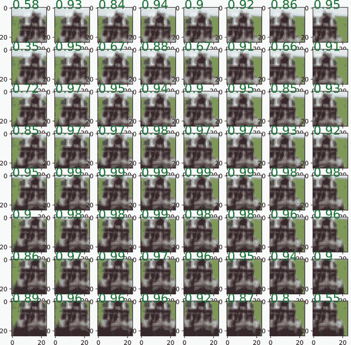

你能看到问题吗？虽然模型总是*正确*的（这次），但其置信度可以发生剧烈变化，从 34.84%的置信度波动到 99.48%的置信度，认为图像是一辆卡车。这是最大池化的问题：它实际上并不是平移不变的。如果它是，我们会对这些图像中的每一个得到相同的置信度分数。你可以尝试更改`test_img_id`变量，看看其他测试图像是否也会出现这种情况。现在我们知道最大池化不能提供良好的平移不变性；失败的程度比我们希望的更大。

### 14.1.2  通过模糊进行反走样

如果我们不仅仅选择最大值，我们可以构建一个更好的池化版本。记得在第四章我们使用手工卷积来模糊输入吗？模糊的效果是混合相邻位置之间的信息。如果我们首先进行一些模糊以混合信息，我们可以在池化中区分那些通常会导致混叠的模式。让我们看看模糊如何帮助我们构建一个更好的池化操作，它可以抵抗混叠问题，并且可以作为最大池化的直接替代：

图 14.2 展示了我们可以如何使用模糊来处理我们在图 14.1 中展示的相同 1D 序列。记住，这些模式最初在使用标准最大池化时都产生了相同的输出。在这种情况下，我们仍然会使用最大池化，但我们将使用 `stride=1`（带有填充）以确保输出与输入大小相同。这给我们提供了一个新的表示，它返回每个可能局部区域的最大值。

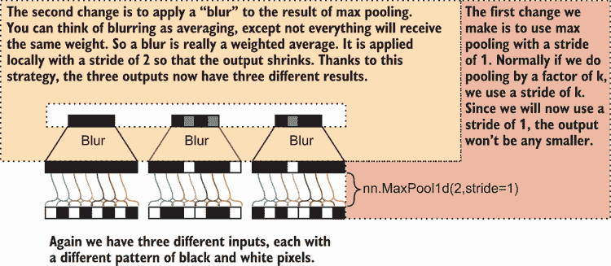

图 14.2 一种帮助减轻混叠的最大池化方法：也称为 *反混叠*。首先，我们使用步长为 1 的最大池化来获得与输入相同大小的输出。然后，我们应用步长为 2 的模糊内核/卷积，这缩小了输出到所需的大小，并保持了最大池化的行为，但允许我们区分三个输出来自三个不同的输入。这种方法比简单的最大池化捕获更多的信息。

正常的最大池化会取每隔一个的最大值，因为我们使用 2 作为输入来说明我们想要将每个维度减少 2 倍。相反，我们会在组内 *平均* 最大值以选择最终表示。对于最左边的示例，这不会影响输出。但它确实改变了其他两个示例：中间示例的输出现在有一个黑白图案，对应于白色细胞较多的位置。这使我们能够更好地区分这些相似的模式，并减少出现的混叠问题。

我们需要一个执行模糊的函数。正如我们在第三章关于卷积神经网络中看到的，使用正确的内核进行卷积可以执行模糊。我们应该选择哪一个？Richard Zhang，他展示了如何解决这个问题²，使用了一个略大于池化大小的二项式滤波器。二项式滤波器将大部分权重放在中心，并减少远离项的权重，因此模糊集中在当前位置的项上，而不是远处的案例。对于大小为 k 的 1D 滤波器，第 i 个二项式滤波器值等于

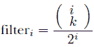

对于 *k* = 2 到 *k* = 7，下表显示了滤波器的值。最大的值总是在中间，而值向边缘递减。结果是加权平均值，它将最大的重点放在滤波器当前所在的位置的值上，然后逐渐减少到更远的项。这就是产生模糊效果的原因，这将帮助我们解决混叠问题：

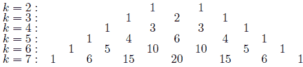

幸运的是，这个模式与所谓的*二项分布*（在我们除以所有 k 值的总和，使它们加起来为 1.0 之后）相匹配，SciPy 库方便地实现了这个分布。因此，我们可以使用它来实现一个新的`BlurLayer`。我们为它提供了一个输入选项`D`，即我们输入数据的维度数（一维、二维或三维），一个`kernel_size`，它告诉二项滤波器核有多宽，以及一个`stride`，它控制输入的缩小程度。`kernel_size`和`stride`的作用方式与卷积层相同。

下面是代码：

```
class BlurLayer(nn.Module): 
    def __init__(self, kernel_size=5, stride=2, D=2): 
        """ 
        kernel_size: how wide should the blurring be 
        stride: how much should the output shrink by 
        D: how many dimensions in the input. D=1, D=2, or D=3 for tensors of 
        ➥ shapes (B, C, W), (B, C, W, H), (B, C, W, H, Z) respectively. 
        """ 
        super(BlurLayer, self).__init__()

        base_1d = scipy.stats.binom.pmf(list(range(   ❶ 
        ➥ kernel_size)), kernel_size, p=0.5)

        if D <= 0 or D > 3:                           ❷ 
            raise Exception()                         ❸ 

        if D >= 1: z = 
            base_1d                                   ❹ 

        if D >= 2: 
            z = base_1d[:,None]*z[None,:]             ❺ 

        if D >= 3: 
            z = base_1d[:,None,None]*z                ❻ 

        self.weight = nn.Parameter(torch.tensor(z,    ❼ 
        ➥ dtype=torch.float32).unsqueeze(0), 
        ➥ requires_grad=False) 
        self.stride = stride

    def forward(self, x): 
        C = x.size(1)                                 ❽ 
        ks = self.weight.size(0)                      ❾

        if len(self.weight.shape)-1 == 1: 
            return F.conv1d(x, torch.stack(           ⓬ 
            ➥ [self.weight]*C), stride=self.stride, 
            ➥ groups=C, padding=ks//self.stride)     ❿
        elif len(self.weight.shape)-1 == 2: 
            return F.conv2d(x, torch.stack(           ⓬ 
            ➥ [self.weight]*C), stride=self.stride, 
            ➥ groups=C, padding=ks//self.stride) 
        elif len(self.weight.shape)-1 == 3: 
            return F.conv3d(x, torch.stack(           ⓬
            ➥ [self.weight]*C), stride=self.stride, 
            ➥ groups=C, padding=ks//self.stride) 
        else: 
            raise Exception()                         ⓫
```

❶ 创建一个 1D 二项分布。这计算了所有 k 值的归一化 filter_i 值。

❷ z 是一个 1D 滤波器。

❸ D 的无效选项

❹ 我们做得很好。

❺ 2D 滤波器可以通过乘以两个 1D 滤波器来创建。

❻ 3D 滤波器可以通过将 2D 版本与 1D 版本相乘来创建。

❼ 应用滤波器是一个卷积，因此我们将滤波器作为此层的参数保存。`requires_grad=False`，因为我们不希望它改变。

❽ 有多少个通道？

❾ 我们内部滤波器的宽度是多少？

❿ 使用`groups`参数将单个滤波器应用于每个通道，因为我们没有像正常卷积层那样的多个滤波器。

⓫ 我们永远不应该到达这段代码：如果我们做到了，我们知道我们有一个错误！

⓬ 所有三次调用都是相同的：我们只需要知道要调用哪个卷积函数。

使用这个`BlurLayer`，我们可以实现我们之前讨论的用于修复最大池化插值问题的策略。首先，让我们尝试在原始斑马图像上应用它，以证明其有效性。我们再次调用`max_pool2d`，但我们将`stride=1`设置为不缩小图像。之后，我们创建一个`BlurLayer`，并将核大小设置为我们要缩小的因子大小或更大。这意味着如果我们想以 z 的因子进行池化，我们的模糊滤波器的`kernel_size`应该≥ *z*。然后，将`BlurLayer`的`stride`设置为我们要缩小的量：

```
tmp = F.max_pool2d(img_tensor_big, (shrink_factor,shrink_factor), ❶ 
➥ stride=1, padding=shrink_factor//2) img_tensor_small_better =
BlurLayer(kernel_size=int(1.5*shrink_factor),                     ❷
➥ stride=shrink_factor)(tmp.unsqueeze(0))

to_img(img_tensor_small_better.squeeze())                         ❸
```

❶ 以 1 的步长应用最大池化

❷ 模糊最大池化结果

❸ 展示结果


斑马的图像变得更加清晰。丑陋的锯齿状不再覆盖斑马（仍然有一些块，但远没有原始图像中的那么多）。如果我们观察斑马的鬃毛或面部，很难判断条纹图案的密度，但至少看起来很平滑。此外，在此之前，很难区分斑马面部和胸部的图案，以及前腿的图案——块状输出使得很难判断发生了什么。有了抗锯齿，我们可以区分出面部必须具有非常精细的细节级别和密集的图案，而躯体的图案在角度上有更多变化。

值得注意的是背景中的草地和树木。由于原始图像中的树木模糊，两种图像中的树木看起来很相似：它们实际上被预先模糊处理了。前景中的草地看起来与原始池化图像略有不同，这再次是因为我们新的方法是对图像进行抗锯齿处理。

### 14.1.3 应用抗锯齿池化

既然我们已经证明了最大池化存在问题，我们可以创建一个新的`MaxPool2dAA`（AA 代表抗锯齿），用作原始`nn.MaxPool2d`的替代品。第一个参数是我们想要池化的程度，就像原始版本一样。我们还包含一个`ratio`，它控制模糊滤波器应该比缩小比例大多少。我们将其设置为合理的默认值 1.7 倍更大。这样，如果我们想要池化更大的量，代码将自动选择更大的滤波器尺寸进行模糊：

```
class MaxPool2dAA(nn.Module): 
    def __init__(self, kernel_size=2, ratio=1.7): 
        """ 
        kernel_size: how much to pool by 
        ratio: how much larger the blurring filter should be than the 
        ➥ pooling size 
        """
        super(MaxPool2dAA, self).__init__() 

        blur_ks = int(ratio*kernel_size)                   ❶ 
        self.blur = BlurLayer(kernel_size=blur_ks,         ❷ 
        ➥ stride=kernel_size, D=2) 
        self.kernel_size = kernel_size                     ❸

    def forward(self, x): 
        ks = self.kernel_size 
        tmp = F.max_pool2d(x, ks, stride=1, padding=ks//2) ❹ 
        return self.blur(tmp)                              ❺
```

❶ 使用稍大的滤波器进行模糊

❷ 创建模糊核

❸ 存储池化大小

❹ 使用步长=1 进行池化

❺ 模糊结果

接下来，我们可以定义来自我们第一个网络的`aaPool_CNN`模型，除了我们将每个池化操作替换为我们的新抗锯齿版本。其余的训练代码也是相同的：

```
aaPool_CNN = nn.Sequential( ❶ 
    cnnLayer(C, h, filter_size), 
    cnnLayer(h, h, filter_size), 
    MaxPool2dAA(2), cnnLayer(h, h, filter_size), 
    cnnLayer(h, h, filter_size), 
    MaxPool2dAA(2), 
    cnnLayer(h, h, filter_size), 
    cnnLayer(h, h, filter_size), 
    nn.Flatten(), 
    nn.Linear((24//(2**pooling_rounds))**2*h, len(cifar10_classes)) 
)

optimizer = torch.optim.AdamW(aaPool_CNN.parameters()) 
scheduler = torch.optim.lr_scheduler.CosineAnnealingLR(optimizer, epochs)

aaPool_results = train_network(aaPool_CNN, loss, train_loader, 
➥ epochs=epochs, device=device, test_loader=test_loader, 
➥ optimizer=optimizer, lr_schedule=scheduler, 
➥ score_funcs={’Accuracy’: accuracy_score})
```

❶ 与常规架构相同，但用我们的抗锯齿版本替换池化

当我们查看训练结果时，抗锯齿模型几乎总是优于网络的常规版本。这两个模型具有相同数量的层和相同数量的参数需要学习，因此这种影响完全是由于改变了池化操作：

```
    sns.lineplot(x=’epoch’, y=’test Accuracy’, data=normal_results, 
    ➥ label=’Regular’) 
    sns.lineplot(x=’epoch’, y=’test Accuracy’, data=aaPool_results, 
    ➥ label=’Anti-Alias Pooling’)

[22]: <AxesSubplot:xlabel='epoch', ylabel='test Accuracy'>
```

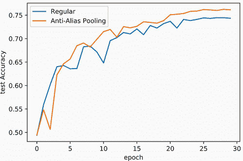

新的`aaPool_CNN`更快地收敛到更好的解决方案：在 30 个 epoch 后达到%准确率。这本身就是一个使用这种方法作为常规池化的替代品的原因。但我们不知道它是否解决了翻译问题。

现在，让我们看看图像移动如何改变我们新模型的预测。以下代码对测试集中的`test_img_id`执行相同的测试，计算模型对所有 64 种可能的移动的正确类别的置信度。然后我们在 y 轴上绘制正确类别的概率；x 轴显示我们移动了多少像素。理想情况下，我们应该在图表上看到一条垂直的实线，表明模型始终返回相同的结果：

```
    x, y = testset_nocrop[test_img_id]                         ❶ 
    offset_predictions_aa = []                                 ❷ 
    aaPool_CNN = aaPool_CNN.eval()

    for i in range(8):                                         ❸ 
        for j in range(8):                                     ❹ 

            x_crop = x[:,i:i+24, j:j+24].to(device)            ❺ 
            with torch.no_grad(): prob_y =
                F.softmax(aaPool_CNN(                          ❻ 
                ➥ x_crop.unsqueeze(0)), dim=-1) 
                ➥ .cpu().numpy()[0,y] 
                offset_predictions_aa.append((x_crop, prob_y)) ❼

    sns.lineplot(x=list(range(8*8)), y=[val for img,val in offset_predictions], 
    ➥ label=’Regular’) ax =
    sns.lineplot(x=list(range(8*8)), y=[val for img,val in offset_predictions_aa], 
    ➥ label=’Anti-Alias Pooling’) ax.set(xlabel=’Pixel shifts’, 
    ➥ ylabel=’Predicted probability of correct class’)

[23]: [Text(0.5, 0, 'Pixel shifts'), Text(0, 0.5, 'Predicted probability of correct class')]
```

❶ 获取原始 32 × 32 图像

❷ 保存每个 24 × 24 子图像的预测

❸ 用于上下移动

❹ 用于左右移动

❺ 获取裁剪的图像

❻ 对图像进行分类并获取正确类别的概率

❽ 保存结果分数

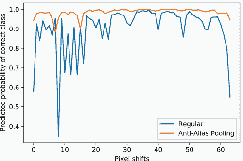

在这个图中，`aaPool_CNN`表现得更好。虽然它并没有完美地解决混叠问题，但返回的预测比原始模型更一致。如果你尝试更改`test_img_id`，你应该会看到这种情况通常如此，但并非总是如此。如果我们训练更多的周期，比如说 100 个，`aaPool_CNN`的预测一致性将继续增加，而原始 CNN 将始终受到混叠问题的困扰。

注意：当你解决像平移不变性这样的具体问题时，结果有时可能会以不太直观的方式改善。也许原始模型在 60%到 95%的概率之间波动，但新模型稳定地返回正确类别的 40%概率。这意味着原始模型在该样本上更**准确**，但新模型更**一致**。这种情况可能会发生，但我们相信，更高的一致性和对平移的鲁棒性应该与更好的结果**大多数时候**相关。

当我们使用步长≥2 的卷积或平均池化时，这些混叠问题也可能发生。可以使用`BlurLayer`替换`nn.AvgPool2d`层来减少影响。步长卷积（即`stride`=s）的修复方式与修复最大池化相同：将卷积的原始步长替换为`stride=1`，应用任何归一化和激活函数，然后以`kernel_size`=s 的`BlurLayer`结束。

这种修复最大池化的方法非常新颖，是在 2019 年发明并在顶级会议的论文集中发表的。如果你已经读到这儿并且感觉你理解了，恭喜你——你现在可以理解和欣赏前沿的深度学习研究了！

## 14.2 改进的残差块

接下来的两种技术需要更大的网络和问题才能看到它们的全部好处。我们仍然使用 CIFAR-10，并可以展示它们的一些改进，但它们在更大和更具挑战性的问题上表现得更加成功。我们将从改进的残差块开始，这是我们在第六章首次了解到的。残差策略通常看起来像以下方程

**h** = ReLU(**x**+*F*(**x**))

其中 *F*(⋅) 代表一系列重复两次的卷积、归一化和激活函数的小序列。这会在网络中创建跳跃连接，使得学习具有更多层的深层网络更容易。这些深层网络也倾向于更快地收敛到更好的解决方案。

剩余连接并没有什么特别的问题。正如我们之前提到的，它们非常有效，并且已经被应用于许多其他架构（例如 U-Net 和 transformers）。但是，一些小的调整可以在结果上提供一致的改进，并且具有很好的直观逻辑。

一种称为 *ReZero*³ 的技术可以进一步改进残差方法，使其收敛得更快，并得到更好的解决方案。这种方法简单得惊人，并且很容易集成到你的残差块定义中。其想法是路径 *F*(**x**) 是有噪声的，可能会给我们的计算增加不必要的复杂性，至少在早期是这样。我们更希望网络从简单开始，根据需要逐步引入复杂性来解决手头的问题。把它想象成一次构建一个解决方案，而不是试图一次性构建一切。

这是通过以下方程实现的，其中 α 是网络学习的参数，但我们初始化 *α* = 0 作为训练的开始：

**h** = **x** + *α* ⋅ ReLU(*F*(**x**))

因为 *α* = 0，所以在开始时我们得到简化的网络 **h** = **x**。*这并没有对输入造成任何影响*。如果我们的所有层都像这样，那么它们可能根本不存在——如果我们移除它们，我们仍然会得到相同的答案，因为没有任何东西被改变。但在梯度下降过程中，α 的值会改变，突然 ReLU(*F*(**x**)) 的内部项开始激活并开始对解决方案做出贡献。网络可以选择在这个项中对非线性操作给予多少重视，或者通过改变 α（正或负）的大小来关注原始值 x。它越大，网络就越使用 *F*(⋅) 中的计算。

### 14.2.1 有效深度

ReZero 的好处是微妙的，所以在我们实现它之前，让我们先注释方程并更详细地解释它。我们有 ReZero 残差方程如下

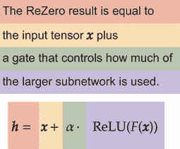

我们在训练开始时将 *α* = 0 设置为初始值，而不是随机值，这是这里的关键。如果 *α* = 0，我们得到 **h** = *x*，这是最简单的可能函数，因为它 *什么也不做*。这有什么帮助呢？让我们研究 ReZero 在图 14.3 中创建的架构，以了解这是如何成为一项好处的。乍一看，它似乎与常规残差连接非常相似。

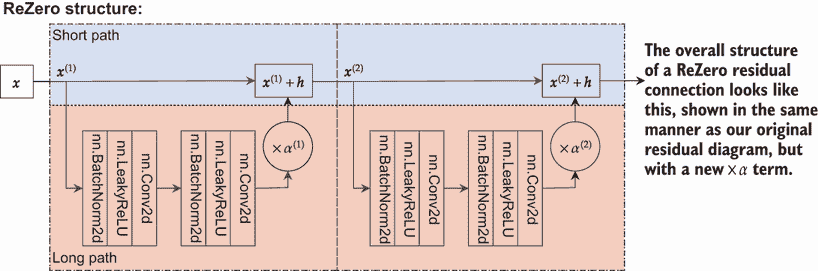

图 14.3 ReZero 网络两层架构。顶部的快捷路径允许轻松的梯度流向层，底部的长路径做所有重工作。我们不是简单地添加长路径中子网络的输出结果，而是在添加之前将它们乘以 α。

其优雅之处在于它一开始并没有做什么。因为 α 值一开始被设置为 *α* = 0，子网络都实际上消失了，留下我们一个 *线性* 架构，如图 14.4 所示。这是我们能够创建的最简单的架构之一，这意味着初始学习发生得非常快，因为有效参数的总数被最小化了。

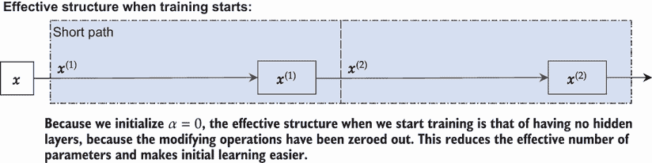

图 14.4 ReZero 在训练开始时两个网络层的表现。顶部的快捷路径形成一个单一的线性层（**x**^((1)) = **x**^((2)))，因为没有任何东西被添加到它们中。长路径中的子网络实际上已经不存在了，因为它们的贡献被乘以*α* = 0。

但随着训练的进行，梯度下降过程可能会改变α的值。一旦α被改变，子网络*F*(*x*)就开始做出贡献。因此，这种方法开始时是一个线性模型（所有*α* = 0 且不起作用），随着时间的推移逐渐变得更加复杂。影响如图 14.5 所示。

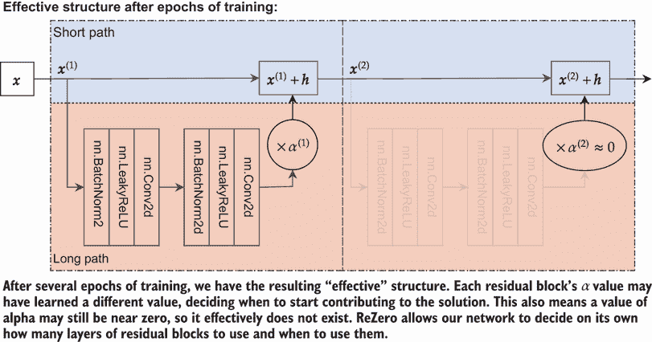

图 14.5 ReZero 架构，展示了几个训练周期的训练情况。随着模型的训练，它可以学会独立地改变每个α，慢慢地将隐藏层重新添加到网络中。这样，它逐渐学会使用深度并基于数据选择它希望使用的总有效深度。在这种情况下，ReZero 学习到它只需要它的一个层；对于第二个，它学会了保持*α* ≈ 0。

经过几个训练周期后，我们得到了最终的有效结构。每个残差块的α值可能已经学会了不同的值，决定何时开始对解决方案做出贡献。这也意味着α的值可能仍然接近零，因此它实际上不存在。ReZero 让我们的网络自己决定使用多少层残差块以及何时使用它们。它可以选择不将任何α值设置为接近零，这也是可以的。有时，通过从小开始并随着时间的推移变得更加复杂，更容易学会如何使用所有层，这正是 ReZero 所允许的。

### 14.2.2 实现 ReZero

那就是 ReZero 技巧的秘密！原始的发现者有更多的数学理论来展示它为什么有帮助，但我们可以专注于实现它。我们改进的残差块将这个变化作为一个可选选项来选择。我们将函数*F*(⋅)分成它自己的`nn.Sequential`模块，如果`ReZero`标志设置为`True`，我们将`self.alpha`设置为网络的一个可学习的`Parameter`。就像我们学到的原始残差连接一样，当通道数或步长发生变化时，我们也使用一个`shortcut`对象，这样我们就可以使用 1 × 1 卷积来使形状匹配：

```
class ResidualBlock(nn.Module): 
    def __init__(self, in_channels, channels, kernel_size=3, stride=1, 
    ➥ activation=nn.ReLU(), ReZero=True):
        """ 
        in_channels: how many channels come into this residual block 
        channels: the number of output channels for this residual block 
        kernel_size: the size of the filters to use in this residual block 
        stride: the stride of the convolutions in this block. Larger 
        ➥ strides will shrink the output. 
        activation: what activation function to use 
        ReZero: whether or not ReZero style initializations should be used. 
        """
        super().__init__() 

        self.activation = activation 
        pad = (kernel_size-1)//2                 ❶ 
        filter_size = (kernel_size,kernel_size) 

        self.F = nn.Sequential(                  ❷ 
            nn.Conv2d(in_channels, channels, filter_size, 
            ➥ padding=pad, bias=False), 
            nn.BatchNorm2d(channels), activation, 
            nn.Conv2d(channels, channels, filter_size, padding=pad, 
            ➥ stride=stride, bias=False), 
            nn.BatchNorm2d(channels), 
        )

        self.alpha = 1.0                         ❸ 
        if ReZero: 
            self.alpha = nn.Parameter(torch.tensor([0.0]), 
            ➥ requires_grad=True) 

        self.shortcut = nn.Identity()            ❹

        if in_channels != channels or stride != 1: 
            self.shortcut = nn.Sequential( 
                nn.Conv2d(in_channels, channels, 1, padding=0, 
                ➥ stride=stride, bias=False), 
                nn.BatchNorm2d(channels), 
            )

    def forward(self, x): 
        f_x = self.F(x)                          ❺ 
        x = self.shortcut(x)

        if isinstance(self.alpha,nn.Parameter):  ❻ 
            return x + self.alpha * self.activation(f_x) 
        else:                                    ❼ 
            return self.activation(x + f_x)
```

❶ 如何填充以保持 W/H 不变

❸ 网络的复杂分支，应用了两轮层

❸ 如果我们不使用 ReZero，α是一个浮点数，如果我们使用 ReZero，它是一个参数

❹ Shortcut 是恒等函数。它将输入作为输出返回，除非由于通道数或步长的变化，F 的输出将具有不同的形状：在这种情况下，我们将快捷方式变成一个 1 × 1 卷积，作为一个投影来改变其形状。

❽ 根据需要计算 F(x)和 x 的结果

❻ ReZero

❼ 正常残差块

这只是一个简单的更改，现在让我们试试。首先，我们为 CIFAR-10 训练一个相对较深的网络。以下模块包含 28 个`ResidualBlock`，每个`ResidualBlock`包含 2 层卷积，总共 56 层卷积。由于需要使示例运行得更快以便你可以更改它们，所以这比本书中大多数网络都要深。但 ReZero 的优势在于能够学习极其深的网络。如果你想的话，可以将这个网络扩展到数千个隐藏层，它仍然可以学习。

这里是代码：

```
resnetReZero_cifar10 = nn.Sequential(                ❶ 
    ResidualBlock(C, h, ReZero=True), 
    *[ResidualBlock(h, h, ReZero=True) for _ in range(6)], 
    ResidualBlock(h, 2*h, ReZero=True, stride=2),    ❷ 
    *[ResidualBlock(2*h, 2*h, ReZero=True) for _ in range(6)], 
    ResidualBlock(2*h, 4*h, ReZero=True, stride=2), 
    *[ResidualBlock(4*h, 4*h, ReZero=True) for _ in range(6)], 
    ResidualBlock(4*h, 4*h, ReZero=True, stride=2), 
    *[ResidualBlock(4*h, 4*h, ReZero=True) for _ in range(6)], 
    nn.AdaptiveAvgPool2d(1), 
    nn.Flatten(), 
    nn.Linear(4*h, len(cifar10_classes)),            ❸ 
)

optimizer = torch.optim.AdamW(resnetReZero_cifar10.parameters()) 
scheduler = torch.optim.lr_scheduler.CosineAnnealingLR(optimizer, epochs) 
resnetReZero_results = train_network(resnetReZero_cifar10, loss, 
➥ train_loader, epochs=epochs, device=device, test_loader=test_loader, 
➥ optimizer=optimizer, lr_schedule=scheduler, 
➥ score_funcs={’Accuracy’: accuracy_score})
```

❶ 使用 ReZero 方法训练新的残差网络

❷ 我们不使用池化，而是使用步长卷积层。这样可以保持跳跃连接完整，而不需要额外的代码。

❸ 我们使用了自适应池化到 1 × 1，这使得计算最终层的输入数量更容易。

这训练了我们的 ReZero 模型。接下来，我们重复相同的网络，但将`ReZero=False`设置为创建一个更标准的残差网络以进行比较。这两个网络之间的唯一区别是α作为参数的简单乘法，起始值为 0。由于代码除了`ReZero`标志外都是相同的，我们将跳过代码。

现在，我们可以绘制结果。两种残差网络的表现都显著优于简单方法，这是我们所预期的。你可能会发现 ReZero 在第一个 epoch 的表现不如其他选项：它的初始行为类似于线性模型，因为所有子网络都被*α* = 0 所阻塞。但随着训练的进行，ReZero 开始更快地收敛到解决方案，在大数据集或 100+层的情况下，通常只需要一半的 epoch。由于我们的网络仍然相对较小，所以我们没有看到可能出现的那么大的差异。但当我们使这个网络更深，参数更多时，两种方法之间的差异就更加显著。

这里是代码：

```
    sns.lineplot(x=’epoch’, y=’test Accuracy’, data=normal_results, 
    ➥ label=’Regular’) 
    sns.lineplot(x=’epoch’, y=’test Accuracy’, data=resnet_results, 
    ➥ label=’ResNet’) 
    sns.lineplot(x=’epoch’, y=’test Accuracy’, data=resnetReZero_results, 
    ➥ label=’ResNet ReZero’)

[27]: <AxesSubplot:xlabel='epoch', ylabel='test Accuracy'>
```

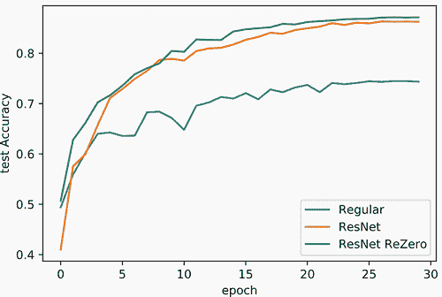

ReZero 方法可以用于超越残差网络风格的架构。原始论文的作者在[`github.com/majumderb/rezero`](https://github.com/majumderb/rezero)上分享了代码，你可以使用他们的 ReZero 增强变压器来提高基于变压器的模型的训练。这对于变压器来说尤其有价值，因为训练变压器需要很长时间，并且通常需要更复杂的技巧来调整学习率以最大化其性能。ReZero 技术有助于最小化这种复杂性。我个人在 ReZero 方法上取得了很大的成功，这是一个简单、易于添加的方法，几乎不需要努力就能使事情变得更快、更好。

## 14.3 MixUp 训练减少过拟合

我们学习的最后一种方法有助于减轻过拟合。假设我们有两个输入，**x**[i]和**x**[j]，以及相应的标签*y*[i]和*y*[j]。如果*f*(⋅)是我们的神经网络，ℓ是我们的损失函数，我们通常计算我们的损失如下：

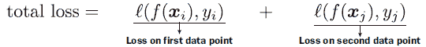

到目前为止，这已经为我们服务得很好了，但有时模型会学习过度拟合数据。大多数正则化的方法都涉及对网络本身应用惩罚。例如，Dropout 通过随机强制某些权重变为零来改变网络的权重，这样网络就不能依赖于特定的神经元来做出决策。

*MixUp*⁴采取不同的方法。我们不是改变或惩罚网络，而是改变损失函数和输入。这样，我们可以改变激励（模型总是试图最小化损失）而不是削弱模型。给定两个输入**x**[i]和**x**[j]，我们将它们混合成一个新的输入和一个新的标签 ỹ。我们通过取一个随机值*λ* ∈ [0,1]，并在这两个之间取加权平均值来实现这一点：


以这种方式写方程一开始可能感觉有些奇怪。我们平均两个图像并将平均图像输入到网络中？如果一张图像是 75%的猫和 25%的斑马，答案应该是 75%的猫和 25%的斑马，但如何处理平均标签呢？在实践中，我们做的是数学上等效的事情，并使用新的输入和两个标签*y*[i]和*y*[j]。我们计算我们的损失如下：

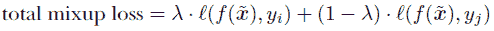

因此，我们有一个输入，它是*y*[i]和*y*[j]之间的加权平均值，我们取两个可能预测之间的加权损失。这让我们对如何在实践中实现 MixUp 损失有了直观的理解。

让我们通过图 14.6 所示的示例来深入了解这个问题。我们有 logits：神经网络在 softmax 函数将其转换为概率之前的输出。然后我们有从这些 logits 计算出的 softmax 结果。如果正确的类别是类别 0，其 logit 值不需要比其他的大很多就能获得高置信度。但 softmax**永远不会**分配 100%的概率，所以数据点的损失**永远不会**降到零。因此，模型始终会得到一个小但一致的激励，推动类别 0 的 logit**更高**，以推动正确类别的分数不断提高。这可能会将模型推到不切实际的高分，以获得 softmax 结果的小幅增加。

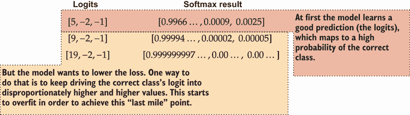

图 14.6 正则化损失如何导致过拟合的示例，鼓励模型做出越来越自信的预测，因为这将降低损失。分数永远不会达到零，因为正确的类别永远不会达到 1.0，所以始终有激励推动 logit 更高。

MixUp 反而帮助模型学习调整其预测，使其大小仅与有理由相信的程度相匹配——而不是像图 14.7 中所示的那样，全押在它相信的事情上。这就像一个允许用户对事件下注的赌博网站。你不希望因为事件更有可能发生就提供 1 百万比 1 的赔率——你希望赔率反映你对正确性的现实假设。

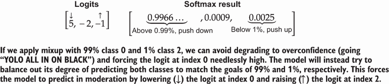

图 14.7 在 MixUp 中，没有过度预测的相同激励。相反，模型试图根据选择两个不同类别的多少来达到一个目标百分比。MixUp 混合标签和输入，因此每个类别的信号与 MixUp 百分比λ成比例。

如果我们有λ%的混合，模型将需要学习具体预测λ%和(1−*λ*)%，以最大化其得分（最小化损失）。因此，模型没有理由在任何预测上全押。

### 14.3.1 选择混合率

剩下的唯一要决定的事情是如何选择λ。它需要位于[0,1]的范围内，以便作为一个平均值有意义，但我们并不一定想要在这个范围内均匀地选择λ。当我们实际使用我们的网络*f*(⋅)时，图像将不带混合地进来。它们将是正常图像，因此我们希望用很多*λ* ≈ 0 和*λ* ≈ 1 来训练，因为这两种情况对应于没有混合。如果我们从[0,1]中均匀地采样λ，这种情况不太可能发生。λ接近极端值是可以接受的，因为它仍然会限制整体行为并惩罚过度自信的预测。

我们使用所谓的*beta 分布*。beta 分布通常有两个参数，a 和 b，我们用*λ* ∼ Beta(*a*,*b*)表示从这个分布中抽取的样本。如果*a* = *b*，则 beta 分布是对称的。如果值是*a* = *b* < 1，则分布呈 U 形，使得*λ* ≈ 0 和*λ* ≈ 1 的值更可能，而*λ* ≈ 1/2 的值更不可能。这正是我们想要的，因此该模型在测试时对干净输入的预测做得很好，但训练时被训练得对稍微有噪声的值和偶尔非常噪声的值更加鲁棒。

Hongyi Zhang 等人撰写的原始论文建议使用*α* ∈ [0.1,0.4]的值，并将两个 beta 参数都设置为这个值（*a* = *b* = *α*）。以下来自 SciPy 的代码片段显示了这种分布的外观。x 轴是λ的值，y 轴是概率密度函数（PDF），给出了每个λ值的相对概率：

```
    range_01 = np.arange(100)[1:]/100                      ❶ 
    for alpha in [0.1, 0.2, 0.3, 0.4]:                     ❷

        plt.plot(range_01, scipy.stats.beta(alpha, alpha). ❸
        pdf(range_01), lw=2, ls=’-’, alpha=0.5, 
        label=r’$α='+str(alpha)+"$") 
    plt.xlabel(r"λ ∼ Beta(*α*, *α*)") 
    plt.ylabel(r"PDF") 
    plt.legend()

[28]: <matplotlib.legend.Legend at 0x7fb37a70f590>
```

❶ 沿 x 轴绘制 100 步以进行绘图

❷ 四个超参数值以进行演示

❸ 绘制每个选项的 beta 分布

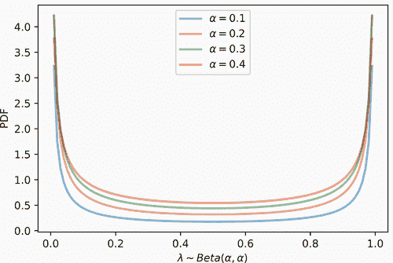

### 14.3.2 实现 MixUp

现在我们已经了解了 MixUp 的数学形式以及我们如何采样λ。让我们谈谈实现策略。首先，我们需要损失函数，我们将称之为 ℓ[M]。实现此函数需要四件事：我们网络处理混合数据 （即 *ŷ* = *f*()) 的预测 ŷ 将是第一个输入。我们的真实标签 y 由其他三个组成部分组成：原始标签 *y*[i]，*y*[j] 和混合值 λ。使用原始损失函数 ℓ(⋅,⋅)，我们可以将其写成

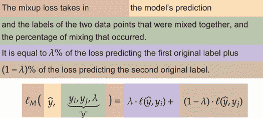

使用这种方法，我们可以将 ŷ 视为我们正常的输出/预测，*y*[i]，*y*[j]，*λ* 作为标签 `元组`。因此，我们定义一个 `MixupLoss` 函数，它接受 ŷ 和 y。如果 y 是 Python `元组`，我们知道我们需要计算 MixUp 损失 ℓ[M]。如果是正常张量，我们正在计算原始损失函数 ℓ：

```
class MixupLoss(nn.Module): 
    def __init__(self, base_loss=nn.CrossEntropyLoss()): 
        """ 
        base_loss: the original loss function to use as a sub-component of 
        ➥ Mixup, or to use at test time to see how well we are doing. 
        """ 
        super(MixupLoss, self).__init__() 
        self.loss = base_loss

    def forward(self, y_hat, y): 
        if isinstance(y, tuple):  ❶

            if len(y) != 3: 
                raise Exception() ❷ 
            y_i, y_j, lambda_ = y ❸
            return lambda_ * self.loss(y_hat, y_i) + 
            ➥ (1 - lambda_) * self.loss(y_hat, y_j)

return self.loss(y_hat, y)        ❹
```

❶ 我们应该进行 MixUp 操作！

❷ 应该有一个包含 y_i，y_j 和 lambda 的元组！

❸ 将元组分解为其组成部分

❹ 否则，y 是一个正常张量和一组正常标签！按照正常方式计算。

现在我们有一个可以接受正常批次数据并给出正常损失的损失函数。但在训练时，我们需要提供一个包含 *y*[i]，*y*[j]，*λ* 的元组来触发 MixUp 损失，并且我们需要以某种方式创建一个混合输入  的批次。特别是，我们需要获取一个包含 B 个数据点 **x**[1]，**x**[2]，…，**x**[B] 以及标签 *y*[1]，*y*[2]，…，*y*[B] 的批次，并将它们与一个新的数据批次混合以创建 [1]，[2]，…，[B]，这似乎需要对我们加载器进行复杂的修改。

而不是处理新的一批数据，我们将仅对一批数据进行洗牌，并将洗牌后的版本视为新的一批。如何组织这一过程的高级总结如图 14.8 所示。如果我们只需要一批数据，我们可以修改`collate_fn`来修改批次。这种洗牌排序的常见数学表示是 *π*(*i*) = *i*′，其中 *π*(⋅) 是一个表示数据 *排列*（即随机洗牌）的函数。

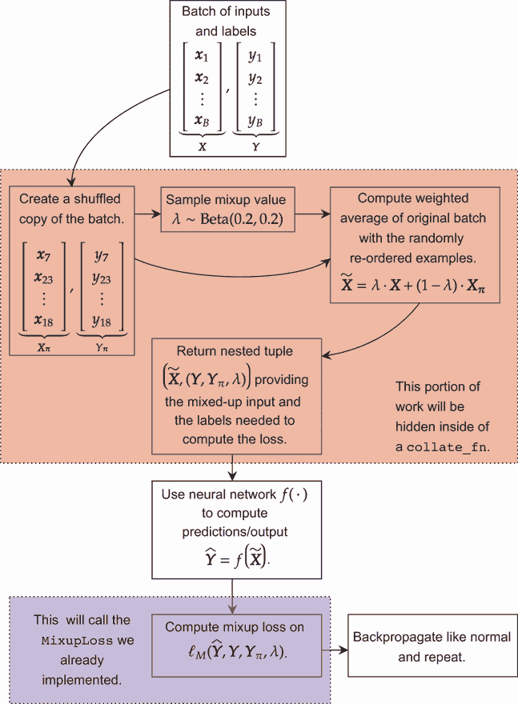

图 14.8 实现 MixUp 训练的过程。阴影区域是我们所做的修改。其他所有内容都与训练和实现任何其他神经网络相同。

例如，假设我们有一个包含 *B* = 4 个项目的批次。值

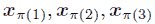

可能给出以下可能的 3! = 6 种排序：

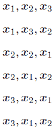

函数 `torch.randperm(B)` 将给我们一个长度为 B 的数组，它是一个随机排列 *π*(⋅)。使用每个批次的随机重新排序，我们可以使用 `DataLoader` 的 `collate_fn` 来改变训练数据的批次，使用相同数据的随机分组。数据点被配对给自己几乎是不可能的，如果是这样，这个过程将暂时降级为正常训练。因此，我们得到一个新的训练数据批次：

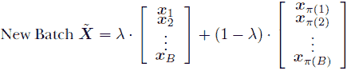

一旦批次被改变并包含一组混合的训练实例 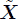，我们可以为标签返回一个元组 y：


现在，我们可以定义 `MixupCollator` 作为我们的特殊 `collate_fn`。它接受一个 `collate_fn`，这是用户可以指定的方法，用于改变批次的创建方式。`MixupCollator` 还负责为每个批次采样一个新的 λ 值，因此它需要将变量 α 作为第二个参数，以控制混合的激进程度。我们提供了合理的默认值，以常规方式采样批次，并且混合的激进程度处于中等范围：

```
from torch.utils.data.dataloader import default_collate

class MixupCollator(object): 
    def __init__(self, alpha=0.25, base_collate=default_collate): 
        """ 
        alpha: how aggressive the data mixing is: recommended to be 
in [0.1, 0.4], but could be in [0, 1]
        base_collate: how to take a list of datapoints and convert them 
into one larger batch. By default uses the same default as 
PyTorch’s DataLoader class. 
        """ 
        self.alpha = alpha 
        self.base_collate = base_collate 
    def __call__(self, batch): 
        x, y = self.base_collate(batch)                              ❶ 
        lambda_ = np.random.beta(self.alpha, self.alpha)             ❷ 
        B = x.size(0) 
        shuffled_order = torch.randperm(B)                           ❸ 

        x_tilde = lambda_ * x + (1 - lambda_) * x[shuffled_order, :] ❹ 

        y_i, y_j = y, y[shuffled_order]                              ❺ 
        return x_tilde, (y_i, y_j, lambda_)                          ❻
```

❶ 批次以列表的形式进入。我们将它转换成实际的数据批次。

❷ 样本 lambda 的值。注意末尾的“_”，因为 lambda 是 Python 中的一个关键字。

❸ 创建一个随机打乱的顺序 pi

❹ 计算输入数据的混合版本

❺ 获取标签

❻ 返回一个包含两个项目的元组：输入数据和 MixupLoss 需要的另一个包含三个项目的元组

使用这两个类，我们可以轻松地将 MixUp 方法集成到几乎任何模型中。需要构建一个新的训练加载器，使用 `collate_fn=MixupCollator()`，并且我们需要将 `MixupLoss()` 传递给我们的 `train_network` 函数作为使用的损失函数。其余的代码与之前一样，但增加了 MixUp 训练：

```
train_loader_mixup = torch.utils.data.DataLoader(trainset, batch_size=B, ❶ 
➥ num_workers=2, shuffle=True, collate_fn=MixupCollator()) 

resnetReZero_cifar10.apply(weight_reset)                                 ❷ 

optimizer = torch.optim.AdamW(                                           ❸
➥ resnetReZero_cifar10.parameters())

scheduler = torch.optim.lr_scheduler.CosineAnnealingLR(optimizer, epochs) 

resnetReZero_mixup_results = train_network(resnetReZero_cifar10, 
➥ MixupLoss(loss), train_loader_mixup, epochs=epochs,                   ❹ 
➥ device=device, test_loader=test_loader, 
➥ optimizer=optimizer, lr_schedule=scheduler, 
➥ score_funcs={’Accuracy’: accuracy_score})
```

❶ 将数据加载器替换为使用我们的 MixupCollator 的新加载器

❷ 由于懒惰，也重置了权重

❸ 优化器和调度器保持不变。

❹ 使用 MixUp 训练时，将我们的正常损失函数包装在新的 MixupLoss 中

如果我们绘制准确率图，我们会看到我们的 ResNet ReZero 模型结合 MixUp 进一步提高了收敛率，最终准确率为 88.12%：

```
    sns.lineplot(x=’epoch’, y=’test Accuracy’, data=normal_results, 
    ➥ label=’Regular’) 
    sns.lineplot(x=’epoch’, y=’test Accuracy’, data=resnet_results, 
    ➥ label=’ResNet’) 
    sns.lineplot(x=’epoch’, y=’test Accuracy’, data=resnetReZero_results, 
    ➥ label=’ResNet ReZero’) 
    sns.lineplot(x=’epoch’, y=’test Accuracy’, data=resnetReZero_mixup_results, 
    ➥ label=’ResNet ReZero + MixUp’)

[32]: <AxesSubplot:xlabel='epoch', ylabel='test Accuracy'>
```

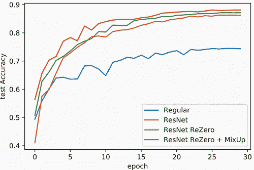

将结果视为时间的函数，我们看到 ReZero 和 MixUp 方法只是运行时间的增量增加。仅使用 ResNet 方法更深的模型是大部分计算成本来源。因此，如果您正在构建更深的网络，这两种方法都很容易添加，并且可以提高模型的准确性。

警告：本章我们学到的前两种方法几乎总是值得放心使用。MixUp 有时会损害准确性，但通常是一个不错的改进，所以值得一试一次新的架构，一次带 MixUp，一次不带 MixUp，看看它对你的问题表现如何。MixUp 在应用于像 transformers 和 RNNs 这样的东西时也更为复杂，尽管它的扩展会有帮助（代码可能有些丑陋）。为了简单起见，我现在坚持使用标准的 MixUp，但我知道如果需要，我可以查看它的扩展。

这些方法的唯一缺点是，它们的益处通常只有在处理更大的模型或我们由于网络的复杂性而已经面临过拟合风险时才能看到。如果它们损害了你的准确性，那么很可能你需要使你的网络更深，或者加宽层，以便它们能够有所帮助。

## 练习

在 Manning 在线平台 Inside Deep Learning Exercises 上分享和讨论你的解决方案（[`liveproject.manning.com/project/945`](https://liveproject.manning.com/project/945)）。一旦你提交了自己的答案，你将能够看到其他读者提交的解决方案，并看到作者认为哪些是最好的。

1.  我们查看了一个特定示例中 CIFAR-10 图像翻译（移动）概率的变化。相反，计算 CIFAR-10 测试集中所有类别概率变化的中间偏差，对于原始 CNN 和抗锯齿版本（即，对于每张图像，计算 64 个概率值及其概率的标准偏差。为每张图像计算该值，并取中间值）。结果是否显示了你预期的，即抗锯齿减少了概率变化的中间值？

1.  根据本章描述，实现具有抗锯齿版本的步长卷积和平均池化的版本。然后实现新的卷积网络，用标准步长卷积和抗锯齿版本的步长卷积以及平均池化来替换最大池化。使用与`MaxPool2dAA`相同的 CIFAR-10 示例自行测试它们。

1.  实现第六章中瓶颈类的 ReZero 版本以及一个全连接残差块的 ReZero 版本。在 CIFAR-100 上对它们进行测试，看看它们与非 ReZero 版本相比如何。

1.  我们的 ReZero 残差网络在其定义的每个部分之间有 6 个残差层块。尝试训练一个具有 18 个块的 ReZero 和一个普通残差块，看看每种方法的表现如何变化？

1.  为 ReZero 残差网络实现具有抗锯齿版本的步长卷积，并在 CIFAR-10 上对其进行训练。它如何影响准确性和收敛性？

1.  **挑战性：** 论文“Manifold mixup: better representations by interpolating hidden states”⁵描述了 MixUp 的一个改进版本，该版本在网络的随机选择隐藏层而不是输入层进行混合。尝试自己实现它，并在 CIFAR-10 和 CIFAR-100 上测试。提示：通过定义一个自定义的`Module`为网络，并使用`ModuleList`来存储候选混合的层序列（即，你不需要*每一个*可能的隐藏层都是选项）。

## 摘要

+   当使用简单的池化时会发生混叠。它干扰了模型的平移不变性。

+   结合模糊操作有助于缓解混叠问题，这反过来又有助于提高我们模型的准确性。

+   在残差块的子网络中添加一种门控α，给模型一个在时间上引入复杂性的机会，从而提高收敛速度，并使模型收敛到更精确的解。

+   当交叉熵和其他损失对预测类别过于自信时，它们可能会过拟合。

+   MixUp 通过惩罚过自信的预测来对抗它们，迫使模型学习如何权衡其赌注。

+   反走样池化、ReZero 残差和 MixUp 非常有用，可以一起使用，但它们的优势在大型数据集和训练 100+个 epoch 时最为明显。

* * *

¹ 图片由 Sajjad Fazel 提供：[`commons.wikimedia.org/wiki/User:SajjadF`](https://commons.wikimedia.org/wiki/User:SajjadF)。↩

² R. Zhang，“使卷积网络再次具有平移不变性，”在第 36 届国际机器学习会议论文集中，第 97 卷，第 7324–7334 页，2019。↩

³ T. Bachlechner 等人，“ReZero is all you need: fast convergence at large depth," [`arxiv.org/abs/2003.04887`](https://arxiv.org/abs/2003.04887)，2020。↩

⁴ H. Zhang 等人，“Mixup: beyond empirical risk minimization," ICLR，2018。↩

⁵ V. Verma 等人，“第 36 届国际机器学习会议论文集”，第 97 卷，第 6438–6447 页，2019。↩
