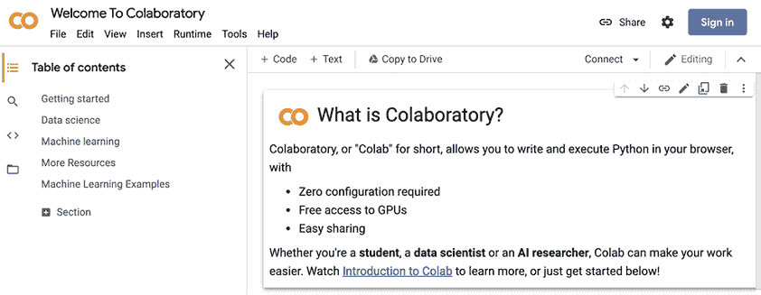
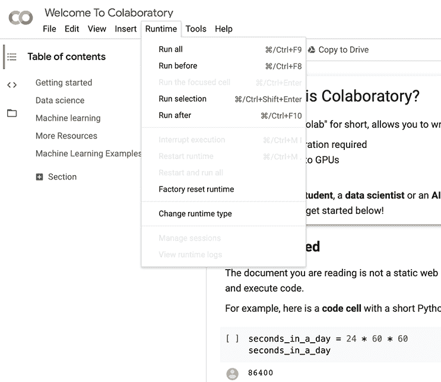
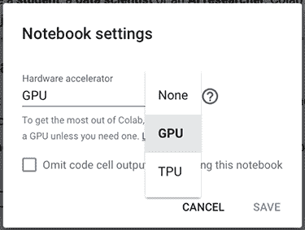
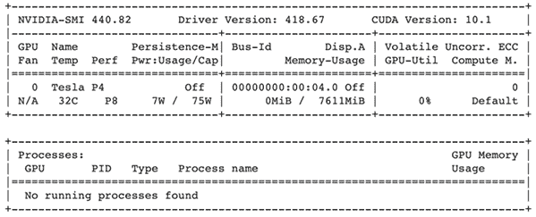

# 附录。设置 Colab

本书中的所有代码都是使用 Python 3 作为 Jupyter 笔记本编写的。虽然你可以使用 Anaconda（[www.anaconda.com/products/individual](https://www.anaconda.com/products/individual)）在你的电脑上自行设置 Jupyter 和软件库，但本书采用的方法是使用 Google 的 Colab 服务（[`colab.research.google.com`](https://colab.research.google.com)）。Google Colab 预先安装了所有需要的软件库，并提供有限期限内的免费图形处理单元（GPU）。这足以让你开始学习，而无需投资数百或数千美元的计算机配置。本附录将指导你如何设置 Google Colab；我鼓励你获取专业版，目前每月只需几美元。这不是一个赞助推荐——我不会得到任何回扣，我从未为 Google 工作。这只是我喜欢的一个产品，我认为它使深度学习更容易获得。

## A.1 创建 Colab 会话

前往[`colab.research.google.com/notebooks/intro.ipynb`](https://colab.research.google.com/notebooks/intro.ipynb)，它提供了一个默认的入门笔记本，如图 A.1 所示。点击右上角的登录按钮登录到 Colab，这样你就可以保存你的工作并使用 GPU。



图 A.1 当你第一次访问 Colab 时应该看到的第一个屏幕。登录按钮位于右上角。

点击登录后，你会看到 Google 的标准登录屏幕（图 A.2）。如果你已经有了一个 Google 账户，你可以用那个账户登录；否则，点击创建账户按钮，系统会引导你完成账户创建过程。


图 A.2 Colab 使用的是 Google 的标准登录页面。如果你有一个当前的 Google 账户，请使用它；否则，点击创建账户按钮，系统会引导你创建账户。

登录后，你会回到图 A.1 中的第一个屏幕。这个 Colab 显示的第一个笔记本也是一个关于 Colab 和 Jupyter 的迷你教程，如果你不熟悉它们的话。

### 添加 GPU

现在我们来谈谈免费的 GPU。Colab 不保证你一定能获得 GPU，默认情况下也不提供 GPU。你必须明确请求将 GPU 附加到你的笔记本上。要使用 Colab 访问 GPU，请从网页顶部的菜单中选择运行 > 更改运行类型（图 A.3）。



图 A.3 要将 GPU 附加到你的笔记本上，请选择运行 > 更改运行类型。

在下一个窗口中，硬件加速器列表提供了以下选项：None、GPU 和 TPU，如图 A.4 所示。None 选项表示仅 CPU，这是默认设置。GPU 和 TPU 在现有的 CPU 之上增加了资源。GPU 和 TPU 都被称为**协处理器**，并提供更专业的功能。目前，PyTorch 中的 TPU 支持非常新，所以我建议选择 GPU 选项（正如我在整本书中所做的那样）。这样做将重新启动笔记本（您将丢失所有已完成的工作，因此请尽早这样做），并且应该返回一个带有 GPU 并准备使用的笔记本。



图 A.4 None 选项表示仅 CPU。其他两个选项也包含 CPU。选择 GPU 选项以将 GPU 添加到您的笔记本中。

GPU 是昂贵且需求量大的商品，因此您并不能**无限**地访问这个 GPU。没有公开的公式，但当前对 GPU 的需求以及您个人使用 GPU 的程度将影响您获得的 GPU 质量。

如我之前提到的，虽然这样做不是必需的，但我鼓励您注册 Colab Pro 以简化您的生活([`colab.research.google.com/signup`](https://colab.research.google.com/signup))。专业版 Colab 并没有从根本上改变 Colab 的工作方式，但它为您提供了更高的 GPU 访问优先级和更长的运行时间。Colab Pro 每月仅需 10 美元：对于便携式 GPU 访问来说，这是一个相当不错的交易，而且比购买新硬件便宜得多。根据我的经验，我发现 Colab Pro 总是意味着我可以无问题地获得 GPU。

### 测试您的 GPU

在笔记本设置窗口中点击“保存”按钮，您将在 Colab 会话中访问到 Nvidia GPU！您可以通过运行以下命令来双重检查：

```
!nvidia-smi
```

`!` 是 Jupyter 笔记本的一个特殊功能。它不是运行 Python 代码，而是在主机计算机的命令行上运行代码。`nvidia-smi` 是一个程序，它提供了您计算机上所有 GPU 的信息以及它们的当前利用率。我运行了这个命令，并得到了图 A.5 中所示的输出，表明为我的使用分配了一个带有 7.6 GB RAM 的 Tesla P4。您运行时可能会得到不同的结果，这是正常的。没有精确控制是我们为免费 GPU 支付的代价。



图 A.5 `nvidia-smi` 命令的示例输出。如果您看到类似的内容，那么一切准备就绪，可以使用了。

这就是你需要做的，以便准备好在 Colab 中运行代码。它预装了大多数机器学习库，并已准备好使用。例如，这本书使用 seaborn 和 Matplotlib 来轻松绘制/可视化我们的结果，使用 NumPy 进行初始数据加载和处理数组，以及使用 pandas 来检查我们的结果。`tqdm` 库是另一个有用的实用工具，它提供了带有估计完成时间的进度条，如图 A.6 所示。


图 A.6 本书中的训练代码为每次调用创建这样的进度条。这很有用，因为训练神经网络可能需要一段时间，你可以判断你还有多少时间。五分钟？来杯咖啡。一小时？阅读一本关于一个戴帽子和酷炫装扮的人的引人入胜的书籍的另一章，他分享了一些学习智慧的小贴士。

我们可以简单地导入这些库，它们就准备好了。有时，你可能需要安装一个包，这可以通过使用相同的 `!` 小技巧的标准 `pip` 命令来完成。当需要时，书中会显示该命令。我提到的所有库都是机器学习从业者工具箱中的常用工具，在深入本书之前，你应该至少对它们有所了解。
