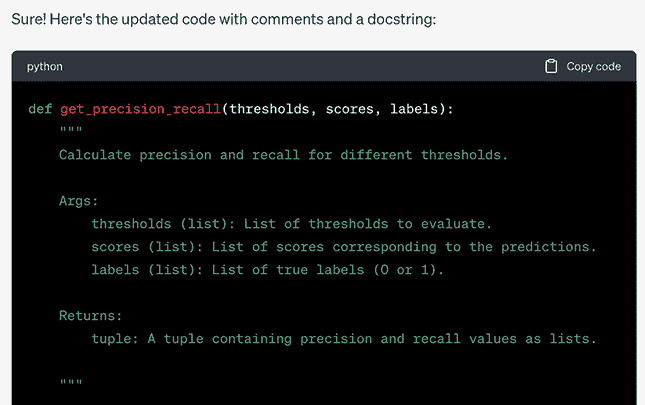
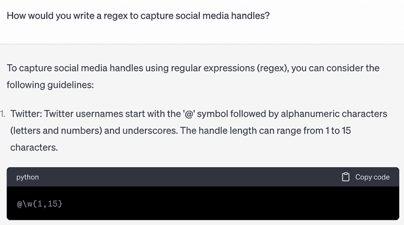
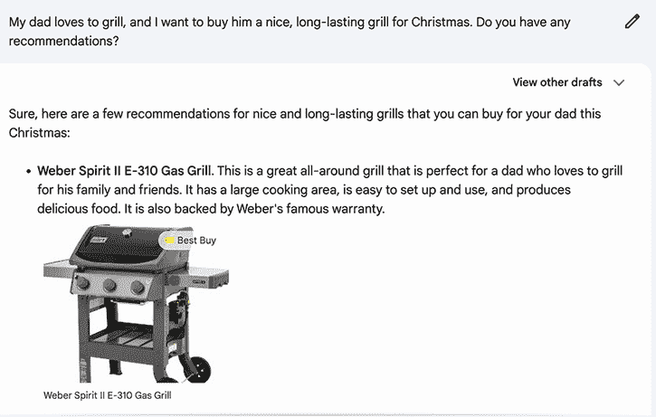
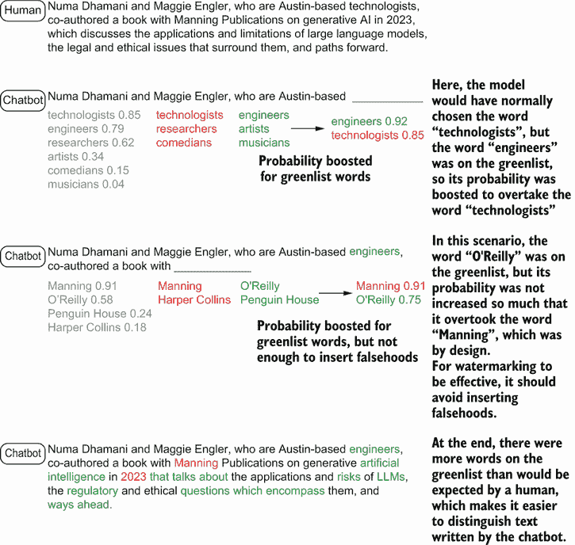

# 第六章：加速生产力：机器增强工作

本章涵盖

+   在专业和个人环境中使用 LLMs

+   讨论在教育中使用和误用生成式 AI 工具的情况

+   探索检测机器生成内容的方法

+   检查生成式 AI 工具的整体经济影响

每个人在其一生中的某个时刻都经历过在积极心理学中被称为“心流”的概念：你深深地沉浸在你正在从事的工作中，可能因为太过专注而失去了时间感。而且，很可能是你经历了突然的干扰，比如需要查找某物或处理其他事情，这打破了心流。这种挫败感是当时 GitHub 首席执行官 Nat Friedman 在宣布 GitHub 的编码助手 Copilot 发布时最关心的问题。“它可以帮助你快速发现解决问题的替代方法、编写测试和探索新的 API，而不必在互联网上繁琐地搜索答案，”Friedman 写道 [[1]](https://github.blog/2021-06-29-introducing-github-copilot-ai-pair-programmer/)。集成到微软的代码编辑器 Visual Studio Code 是一个关键组成部分：Copilot 将直接连接到编码者的现有工作流程。

在编程和其他领域，人们正在使用大型语言模型（LLMs）和其他类型的生成式 AI 作为加速他们已经做的工作的手段，无论是设计课程还是制定锻炼计划。在本章中，我们调查了 LLMs 在个人、专业和教育环境中的当前使用情况。我们还考虑了这项技术将对教育和经济造成的影响的可能转变。

## 在专业领域使用 LLMs

在上一章中，我们讨论了在高度监管的行业，如医疗、金融和法律中，职业滥用聊天机器人的例子。本节的重点是聊天机器人在这些职业以及其他职业中的有益用途。共识是，大型语言模型（LLMs）将带来变革，但这些影响将是什么仍然不清楚。已经，LLMs 的使用正在引发对这些专业领域的存在性疑问。成为一名医生意味着什么？成为一名律师意味着什么？从根本上说，长期以来，工作一直被认为赋予我们一种使命感——聊天机器人通过承担这些服务的一部分，可能会引发职业身份危机。从积极的一面来看，医疗、法律和金融等行业在当今社会中提供关键服务，而这些服务并不总是对需要它们的人可及。尽管 LLMs 不能替代这些领域经验丰富的人，但它们可能有助于分担负担。

### LLMs 协助医生处理行政任务

现在的初级保健提供者往往花费更多的时间在非患者接触任务上，而不是在患者接触任务上。伊利诺伊大学医学学院皮奥里亚分校的临床副教授詹姆斯·巴内特博士撰写了一篇关于医疗从业者所承受的“令人筋疲力尽的时间负担”的文章，并引用了一位医生同事的话说：

提供优质的医疗服务和照顾患者是我享受职业生涯的原因……由于行政负担过重，我发现自己只能提供最低限度的护理、同情和理解。我的职业满意度受到了影响。[[2]](https://peoria.medicine.uic.edu/administrative-tasks-take-up-more-time-than-patient-care-for-many-pcps/)

这种行政负担包括管理电子邮件和电话、撰写进度记录和图表，以及与医疗保险提供商就索赔或上诉进行互动。一项研究表明，这种非患者接触的工作占初级保健提供者时间的约 60%；另一项研究得出结论，实际总数至少是三分之二 [[2]](https://peoria.medicine.uic.edu/administrative-tasks-take-up-more-time-than-patient-care-for-many-pcps/)。鉴于美国和其他许多国家的这一现实，难怪早期采用者已经开始将 LLMs 视为一种潜在解决方案。

达拉斯的风湿病学家理查德·斯特恩博士要求 GPT-4 为一位患有持续慢性炎症性疾病的患者的安卡瑞拉药物非标签使用申请保险赔偿写一封上诉信。斯特恩将 LLM 生成的信件发送给保险公司，该公司随后批准了请求，使患者免去了每月 1500 美元的自付费用。斯特恩告诉《纽约时报》，GPT-4 使他与患者的时间变得更有生产力，现在他的诊所使用该模型来撰写电子邮件回复和对患者常见问题的回答，以及填写文件。医生们开始依赖 LLMs 来处理的工作不仅仅是行政工作。德克萨斯大学奥斯汀分校德尔医疗学院内科系主任迈克尔·皮戈内博士要求他的团队编写一个医生可以用来与患有酒精使用障碍且“对行为干预没有反应”且饮酒过多的患者交谈的脚本。皮戈内说：“一周后，没有人去做这件事，”但当他在 ChatGPT 上询问时，该模型立即生成了一份实用的脚本，涵盖了所有主要谈话要点。当要求为医学知识较少的患者重写时，它又产生了一个更易于理解版本，开头是：“如果你认为你饮酒过多，你并不孤单。许多人都有这个问题，但有一些药物可以帮助你感觉更好，过上更快乐、更健康的生活” [[3]](https://www.nytimes.com/2023/06/12/health/doctors-ChatGPT-artificial-intelligence.xhtml)。

使用 LLM 编写脚本以更富有同理心的方式向患者传达信息，比总结患者笔记等事情更具争议性，因为其本质上具有人际互动的性质。在同样的《纽约时报》报道中，一些医疗专业人士对医生将同理心外包给 LLM 的想法表示不满，而其他人则警告不要将 ChatGPT 的良好床边风度与良好的医疗建议混淆。一个特别引人注目的轶事是一位医生向 ChatGPT 寻求安慰患有晚期癌症朋友的词语，而不是安慰患者。格雷戈里·穆尔博士，曾是一名诊断放射学和神经学的执业医生，后来是微软健康和生命科学部门的负责人，报告称他对 ChatGPT 的回应质量感到震惊，这些回应提供了同理心和鼓励，而没有虚假的希望。“我希望我在培训时就有这样的工具，”穆尔说。“我从未见过或有过这样的教练” [[3]](https://www.nytimes.com/2023/06/12/health/doctors-ChatGPT-artificial-intelligence.xhtml)。Anthropic AI 的 LLM，Claude，根据关于与患者谈论戒烟的提示生成了图 6.1 中的脚本。

图 6.1 Claude 撰写的关于戒烟的脚本请求的回应开头

### 法律研究、发现和文档的 LLM

行政工作的接管远不止局限于医疗领域。根据 2017 年对美国 2,915 名法律专业人士的调查，律师大约有一半的时间花在行政工作上 [[4]](https://www.law.com/2017/09/26/what-do-lawyers-really-do-with-their-time/). 大多数私人律师和律师事务所使用计费小时制度，员工们勤奋地追踪他们在特定案件上花费的时间，通常以六分钟为一个间隔。由于与法律实践管理相关的任务中不直接与案件相关的工作是不可计费的，因此律师事务所特别有动力自动化这部分开销。例如，LLM 可以用来回应客户或潜在客户的沟通。但 LLM 真正能解锁的价值在于律师工作的核心：发现和法律研究，以及文件起草。

“发现”是“在审判中双方之间交换关于他们将提供的证人和证据的正式程序”[[5]](https://www.americanbar.org/groups/public_education/resources/law_related_education_network/how_courts_work/discovery/)，根据诉讼的不同，可能需要数月或数年，并涉及数千份文件的交换。旨在帮助索引这些文件以定位重要信息的电子发现软件应用，已经超过十年成为法律实践中的标准工具。然而，它通常依赖于用户搜索特定术语，几乎就像一个发现材料的搜索引擎。如果被提示或微调来完成这项任务，LLMs 可以提供文件的简要总结，甚至可以识别支持特定论点的材料。

另一个法律实践的关键组成部分是阅读案例法和先前的判决，以进行比较和对比。现有的基于 AI 的解决方案已经通过诸如文档嵌入和相似性等技术来寻找相关的判决（参见第一章关于嵌入的讨论）。由于它们丰富的内部表示，LLMs 可以更好地找到相关案例，并且还可以解释它们的相似性和差异性，这是非 LLM 方法远远无法做到的。

撰写文件是生成式 AI 更具挑战性但可能具有变革性应用的例子。萨福克大学法学院院长兼教授 Andrew Perlman 是发表在哈佛法学院法律职业中心《实践》杂志上的一篇文章《ChatGPT 对法律服务和社会的影响》的作者。然而，实际上，他有一个合著者：正如 Perlman 坦白承认的那样，ChatGPT 完成了大部分写作[[6]](https://clp.law.harvard.edu/article/the-implications-of-ChatGPT-for-legal-services-and-society/)。在文章中，Perlman 包括了 ChatGPT 撰写的法律诉讼状、遗嘱以及与房地产和汽车销售相关的合同草稿。每个草稿都是通过单独的提示生成的——汽车合同的提示如下：

为 2018 年款丰田普锐斯（Toyota Prius）的出售，从 Jane Smith 到 John Doe 在马萨诸塞州的交易，价格为$15,000，创建一份合同。该合同应包含此类销售通常的陈述和保证。

评估聊天机器人的回复时，Perlman 称法律文件不完整，但出人意料地复杂。尽管 ChatGPT 不会很快取代顶尖律师，但 Perlman 表示，Bing Chat“已经达到 B/B+法学学生的水平，并且随着时间的推移只会变得更好。”然而，就像使用 ChatGPT 的医生一样，他认为 AI 将成为法律职业中不可或缺的工具：

AI 不会消除律师的需求，但它预示着我们所知的律师行业的终结。许多客户，尤其是面临复杂问题的客户，仍然需要律师提供专业知识、判断力和咨询，但这些律师将越来越多地需要 AI 工具来高效有效地提供这些服务 [[6]](https://clp.law.harvard.edu/article/the-implications-of-ChatGPT-for-legal-services-and-society/)

Perlman 还指出，90%的低收入美国人和大多数中等收入美国人，在面临重要的民事法律问题时，“没有获得任何有意义的帮助”，包括儿童监护权、驱逐、抵押贷款违约和债务追收。如果 AI 驱动的工具可以安全地用普通语言解释人们根据其情况应享有的权利，如图 6.2 所示，它可以在这些非常常见的案件中成为一个极其强大的平衡器，这些案件通常不复杂，对人们的生活有巨大影响。

图 6.2 Bard 对租户关于与房东纠纷的查询的部分回应

### LLMs 增强金融投资和银行客户服务

在金融行业，彭博社，一家商业和金融数据、新闻和分析公司，通过发布 BloombergGPT 发出了挑战。根据新闻稿，BloombergGPT 是一个在“广泛金融数据”上训练的 50 亿参数 LLM，旨在用于与金融相关的自然语言处理任务，预计可以帮助投资分析师尽可能快地处理市场新闻和信息。这种工具的影响尚不清楚，但在高金融领域，任何优势都可能潜在地价值数十亿。

银行也长期依赖聊天机器人提供客户服务，一种乐观的观点是，LLMs 可以提高这些互动的质量。根据消费者金融保护局的数据，2022 年美国有 37%的人口与银行的聊天机器人进行了互动，这个令人震惊的数字预计只会越来越大，并且该国的 10 家最大银行都在其网站上部署了聊天机器人。基于 LLM 的聊天机器人可以帮助解决一些现有问题，例如，当机器人不理解用户想要什么或试图做什么时的令人沮丧的互动。然而，它们也带来了更大的风险，可能会不适当地回应，例如对银行的提供内容进行幻觉。因此，在部署之前，任何金融用途都应该进行极其彻底的审查，尤其是考虑到不正确的回应可能违反消费者金融保护法 [[8]](https://www.consumerfinance.gov/about-us/newsroom/cfpb-issue-spotlight-analyzes-artificial-intelligence-chatbots-in-banking/)。

### LLMs 作为创造力的合作伙伴

LLMs 最适合生成性任务，因为它们的输出具有概率性质——它们可以产生许多不同的合适响应，而不是单一的“正确”答案。一个 Reddit 帖子调查了用户在工作场所如何使用 LLMs，其中包含了许多描述人们如何成功将日常任务外包给聊天机器人的描述[[9]](https://www.reddit.com/r/ChatGPT/comments/12fhcec/how_are_you_using_ChatGPT_at_work/). 教师们使用它们来创建教学计划和教学材料；社交媒体营销人员使用它们为 Twitter 和 Instagram 等网络撰写简短形式的文案，然后将相同的关键思想扩展为博客文章的更长形式。

自然地，LLMs（大型语言模型）开始在创意领域被更加广泛地使用。Noah Brier，一位在营销和技术领域的连续创业者，推出了 BrXnd.ai，旨在“探索品牌与 AI 的交汇点”[[10]](https://brxnd.ai/). 该组织的首届活动是一场被称为首个“广告图灵测试”的竞赛，品牌和广告专家的任务是识别 10 张宣传同一虚构能量饮料的海报中，哪些是由市场营销学生团队创作的，哪些是由 AI 生成的[[11]](https://www.contagious.com/news-and-views/experts-stumped-by-ad-turing-test). 图 6.3 展示了由 AI 生成的一张海报样本。

图 6.3 一个由 AI 生成的广告，使用开源图像生成模型 Stable Diffusion，以“新能量饮料 Buzz 的海报”为提示创建

专家小组的准确率为 57%；300 人的观众只能以 53%的准确率区分出人类创作的广告和机器生成的广告，接近我们预期的随机猜测水平。此外，Brier 将 AI 生成的广告提交给了 System1，这是一家衡量人们对广告情感反应的营销机构，以预测其效果。这些广告在 System1 评分标准上的平均得分为 1.83，仅略低于全国印刷广告的平均水平 1.9 [[12]](https://system1group.com/work). 使用 AI 的团队被禁止以任何方式更改模型的输出，因此，生成的广告与由人类构思、设计和生产的广告在效果上大致无法区分。当然，模型生成广告的速度也更快，理论上可以在人类团队所需的时间内产生许多不同的概念，成本更低。

然而，人类与 AI 之间的竞争是一种虚假的竞争，正如一个团队所展示的：他们从一开始就承认，尽管他们被分配使用 AI，但他们使用模型生成资产，然后自己制作最终的海报。Brier 将他们的广告从图灵测试活动中移除，但仍然用 System1 对其情感反应进行了评分，而人机协作获得了比人类或 AI 单独产生的任何作品都高的评分（2.8）。在采访中，Brier 关于结果表示，尽管他不期望 AI 取代人类的创造力，“这是我经历过的最令人惊叹的创造力加速剂” [[11]](https://www.contagious.com/news-and-views/experts-stumped-by-ad-turing-test)。尽管与 AI 工具合作可能不是每个人都适合的，但在最好的情况下，人类和机器可以作为合作伙伴工作，将人类的想象力与 AI 快速综合输入和生成输出的能力结合起来。

与直觉相反，LLMs 似乎擅长几乎正好与我们期望计算机擅长的事情相反。典型的机器以确定性产生响应，在数学和逻辑上表现出色，而 LLMs 和它们所驱动的聊天机器人有时会在数学上犯错误，或者完全编造事实。另一方面，LLMs 在写诗和进行对话方面表现出色。有许多我们认为与我们对人性的概念紧密相连的特质，曾经似乎不可能让机器展现出来——同理心和创造力最为突出。现在，聊天机器人可以产生不仅显示出这些特质，而且有时在人类评估中甚至超越人类的响应。这一成就不应被贬低，也不应被过度夸大：聊天机器人本身并不具有同理心，但它们已经学会了产生同理心的信息。

目前，将聊天机器人视为使专业人士更高效和更有生产力的工具为宜。它们很有价值——并且可能很快变得无价——但它们的工作可能是不完整的，或者它们可能无法捕捉到经验丰富的专业人士可能会注意到的细节。然而，在其他方面，它们已经远远超过了人类，比如它们关联大量数据的能力。比单独的 AI 或人类更有效的是人机“团队”，其中 AI 提供初步分析或初稿，而人类则审查他们的工作。目前，这种能力和其他技能已经使聊天机器人在各种工作场所变得有价值。这可能对许多人来说是不舒服的，但它也可能是一种解放，使专业人士能够更多地控制他们如何度过他们的时间。

## LLMs 作为编程助手

也许并不令人意外，最早采用大型语言模型（LLM）的许多用户是技术专家和程序员。LLM 最常见的一个实际应用是作为编写代码的辅助工具。我们之前已经强调 GitHub Copilot 是这个领域的领先产品；Copilot 基于 OpenAI 的 Codex 模型，该模型经过微调，适用于在数百万个 GitHub 仓库中编写代码[[13]](https://ghdocs-prod.azurewebsites.net/en/copilot)。其他代码生成模型包括亚马逊的 CodeWhisperer（见[`mng.bz/QPAe`](http://mng.bz/QPAe)）、Replit 的 Ghostwriter（见[`mng.bz/XNvM`](http://mng.bz/XNvM)）和开源模型 StarCoder（见[`mng.bz/yQlE`](http://mng.bz/yQlE)）。在某种程度上，对于模型来说，编写代码比其他类型的生成任务更容易，因为代码有很多结构和重复的模式。在散文中，人们很少会重复使用相同的短语，但我们期望在代码中看到多次调用的函数。这些模型被设计成搭档程序员，并在你编写代码时提供“自动完成式建议”。你可以指定语言并写一个自然语言描述，作为注释或文档字符串（用于记录代码的特定段），说明你希望函数执行的操作。然后模型将尝试实现该函数。虽然确实存在失败模式，尤其是对于复杂的函数，但它通常能做出合理的初次尝试，这使得迭代过程变得更快。

生成模型已经被训练来解释代码，这使得可以使用一些 LLM 作为计算机终端或命令行提示符，或者作为玩具数据库。由 Eraser 公司（一家脑力激荡和图表工具的开发者）创建的、由 GPT-4 驱动的 DiagramGPT 是 LLM 新能力的例子之一（见[`mng.bz/MBNm`](http://mng.bz/MBNm)）。它接受一个模式、基础设施定义或代码片段作为输入，并为所描述的系统生成一个图表，以便不熟悉代码或模式的人可以轻松地可视化正在发生的事情。

与使用 LLM 承担重复性任务的主题保持一致，这些模型在编写文档方面的另一个应用是它们在这方面表现出色。通常的隐私问题同样适用——将专有代码粘贴到外部应用程序编程接口（API）中是不明智的——但对于不敏感的函数，你可以提示 Copilot 或另一个 LLM 使用代码，并要求模型生成解释函数的注释，添加文档字符串和类型提示，以及进行其他改进，使已编写的代码更易于阅读。图 6.4 展示了由 AI 生成的文档字符串示例。

图 6.4 ChatGPT 生成的文档字符串正确地描述了给定的函数及其每个输入。

一些并非专门为配对编程设计的 LLM 也可以作为编码资源。例如，正则表达式（regexes）在编程中是著名的既复杂又强大的范式。正则表达式定义了一些文本字符串的准则，然后提供快速高效搜索匹配这些准则的文本片段的功能。不同的字符可以表示要查找的字符，预期的字符数量，以及要忽略的字符串部分。正则表达式通常用于解析诸如电子邮件地址或电话号码之类的信息。为了说明，提取电子邮件地址的正则表达式看起来像这样：/^([a-z0-9_\.-]+)@([\da-z\.-]+)\.([a-z\.]{2,63})$/. 最近，我们中的一人需要一个相当混乱的正则表达式，并请求 GPT-4 为我们编写它。GPT-4 不仅生成了正确的正则表达式，而且模型还能解释自己的答案，以及正则表达式中的每个符号代表什么。ChatGPT 生成的一个更简单的正则表达式如图 6.5 所示；其他人也报告说使用 ChatGPT 以类似方式编写 Excel 宏 [[14]](https://www.adventuresincre.com/openai-gpt-3-excel-macro-real-estate-model/)。

图 6.5 当 ChatGPT 被提示给出社交媒体用户名的正则表达式时的一部分响应。完整的响应给出了 Twitter、Instagram、Facebook 和 LinkedIn 用户名的正则表达式。我们在此指出，正则表达式描述正确，但 Twitter 用户名的长度实际上是从 4 个字符到 15 个字符不等。

编写代码是一项协作性的工作，因为人们一直都在共享、重用和重新利用代码。考虑一下第二章中提到的 Stack Exchange，它是一个流行的 LLM 训练数据源。其旗舰问答网站 Stack Overflow 致力于人们相互询问关于代码片段的问题——通常，提问者会描述他们试图做什么，粘贴几行代码以重现他们遇到的问题，然后等待有知识的人回答。Stack Overflow 上最好的答案不仅提供了修正后的代码片段，而且还详细解释了为什么原始发帖者的尝试失败，可能是由于他们误解了某些概念或特定编程语言的怪癖。LLM 可以发挥与数百万人的社区相同的功能，并且比最快的 Stacker 提供答案更快。

在 LLM 编码助手的世界里，专业知识仍然很重要。Copilot 能够像人类一样生成程序，因为它是在人类编写的代码上训练的。然而，就像人类编写的代码一样，它的解决方案可能效率低下，或者可能没有考虑到边缘情况。LLM 是复制编码模式和风格的专家，但开发者仍然需要在给定程序的组成和要求方面进行批判性思考。计算机科学的核心概念和软件工程的最佳实践，如果有什么的话，可能变得更加重要，因为 LLM 能够完成大部分样板脚本。我们预计，在短期内，最大的效用将来自于程序员依靠 Copilot 等 LLM 来加速他们的工作流程并快速了解特定的语法或库，而不是 LLM 完全取代程序员。

## 日常生活中的 LLM

尽管我们已经详细讨论了生成模型的潜在用途，但揭示应用的最佳方法还是通过实验。除了使用大型语言模型（LLM）来加速或替代部分专业工作流程之外，人们还找到了各种方法来利用这些模型进行爱好、项目、自我提升、教育和娱乐。我们预计，随着用户对这些工具的熟悉和经验的分享，随着生成模型的设计和能力持续发展，新的用例将会出现。在本节中，我们将探讨人们如何在日常生活中使用生成模型。

共享提示

在线资源丰富，用于分享对 LLM 有趣或特别有成效的提示。将提示结构化和细化以从 LLM 中获得特定类型响应的实践被称为*提示工程*。PromptHero 自称是“#1 提示工程网站”，展示了数百万由 AI 生成的图像和文本及其产生的提示（见[`prompthero.com/`](https://prompthero.com/））。PromptHero 和其他类似网站解决了实际需求：提供给 LLM 和图像生成模型的提示会相当大地影响输出，有时甚至以不可预测的方式。用户社区分享他们最好的提示，使得这些用户能够更快地迭代并获得更好的结果，尤其是在提示仍然强大但理解不足的情况下。

Stack Overflow 只是人们建议可能完全被 LLMs 取代的众多服务之一。也有可能这些服务将要么将 LLMs 整合到他们的产品中，要么简单地作为替代品继续存在。我们知道 LLMs 可以进行翻译，因此 Google Translate 可能不再那么必要，但语言学习应用 Duolingo 已经推出了与 GPT-4 的集成。在 Duolingo Max 中，LLM 为错误答案提供解释，并允许用户进行角色扮演自己的场景，而不仅仅是参与 Duolingo 编写的对话[[15]](https://blog.duolingo.com/duolingo-max/)。

LLMs（大型语言模型）最有可能受到影响的一个领域是教育，包括但不限于语言学习。虽然我们将在下一节更深入地探讨生成式 AI 对教育结构的影响，但在这里我们也将强调我们之前讨论的应用如何应用于自学新概念。在第一章中，我们比较了各种 LLMs 在总结和问答任务中的成功情况。对历史感兴趣或想了解某些科学领域最新发展或持续的政治冲突的人可以要求 LLMs 为他们提供易于理解的总结（参见第五章，关于幻觉的讨论）。学生已经成功使用 LLMs 来解释概念，作为考试准备的手段：类似于 Stack Exchange 但更加不拘一格，ELI5（“像对我五岁孩子解释”的缩写）subreddit 充满了发帖者想要得到答案的问题，包括关于机器、动物和自然、物理和宇宙以及一大堆各种主题的查询。如图 6.6 所示，一个准备物理考试的学生可能会使用提示“用简单的话解释弦理论”来掌握困难概念的基本知识，然后可以就他们遇到的任何困难方面提出后续问题（当然，最好与可信来源双重检查回答）。

图 6.6 ChatGPT 对一个关于弦理论的提示的部分响应

现在，大多数人主要通过搜索引擎寻找有关要购买的产品和服务的相关信息，有时也会查看评论网站或大型在线零售商。当我们寻找周末要参加的活动时，我们可能会搜索当地地区的事件、电影院上映的电影或流媒体服务上流行的节目。当我们即将进行大额购买——比如说昂贵的厨具——时，通常需要进行相当多的研究：你可能会首先在谷歌上搜索最好的慢炖锅，然后在亚马逊上点击几个选项，并阅读它们的评论和评分。或者，你可能更喜欢在家居相关的杂志或报纸上阅读评论，然后从零售商的网站上购买所选选项。尽管不执行检索（网络搜索）的聊天机器人在新产品方面价值有限，但执行检索的机器人可以将这些信息综合起来作为购物助手，就像图 6.7 中 Bard 的回应一样。

图 6.7 Bard 对关于可能购买的烧烤架查询的部分回应。

事实上，这是虚拟助手的终极愿景，这一愿景始于包括 Siri 和 Alexa 在内的自然语言助手。然而，Siri、Alexa 和 Google Assistant 目前（至少目前）是“命令和控制系统”，这意味着它们只能理解有限列表中的请求，并且无法对列表之外的请求做出智能响应——它们会简单地拒绝回答。另一方面，由 LLM（大型语言模型）驱动的聊天机器人默认情况下会对任何问题或请求做出回应，尽管有时过于自信。尽管如此，由于命令和控制系统相对受控的运行方式，这些助手已经连接到各种其他系统，无论是为了在家中进行调整（如关闭灯光、更改恒温器设置）还是为了在亚马逊上购物。

在人工智能领域，*代理*是一个能够灵活追求目标的系统 [[16]](https://www.lesswrong.com/posts/dcoxvEhAfYcov2LA6/agentized-llms-will-change-the-alignment-landscape)。实际上，这意味着系统必须能够与其环境互动并对环境的变化做出响应。例如，改变灯光设置或在线购物都是与环境互动的例子——在这种情况下，是现实世界。Siri 和 Alexa 不是代理，因为它们不会调整自己的目标，而这对于执行复杂的多步骤任务是必需的。例如，假设你要求 Siri 根据你所在位置的天气预报以及你当天的日程为你推荐一套服装。助手能够获取天气信息，但不能执行检索天气、阅读你的日历并据此提出合理的服装建议的计划，除非特别编程来这样做。另一方面，一个 LLM 可以将任务分解为其组成部分。如果被要求，它可能会提供所需的步骤，并且如果能够检索天气数据和日历信息，它将能够按顺序执行每个步骤。访问外部数据或使用 API 来响应查询是 LLM 中代理或代理化行为的例子。

代理是一个能够灵活追求目标的系统，其中系统必须能够与其环境互动并对环境的变化做出响应。

将大型语言模型（LLM）代理化是现有几个商业应用中的下一个逻辑步骤。例如，Expedia，一个旅行规划网站，已经与 ChatGPT 进行了集成，使用户能够与机器人进行开放式对话，以获取他们计划旅行所需的航班、酒店和活动推荐 [[17]](https://www.expediagroup.com/investors/news-and-events/financial-releases/news/news-details/2023/ChatGPT-Wrote-This-Press-Release--No-It-Didnt-But-It-Can-Now-Assist-With-Travel-Planning-In-The-Expedia-App/default.aspx)。机器人实际上并不会预订这些推荐，但只需将模型连接到某种支付 API 即可。当然，目前还没有这样做有许多合理的理由；机器人可能会幻想出不存在的航班或误解用户的偏好。但这样的应用成为现实只是时间问题。我们将在第八章中深入探讨代理化 LLM 的工作原理。

已经，开源世界在将 LLM 代理化的方面已经出现了一阵活跃。例如 LangChain（见[`mng.bz/a1WY`](http://mng.bz/a1WY)）等项目专注于围绕 LLM 开发既具有代理性（即与环境交互）又具有数据感知性（即可以访问外部数据源）的应用。Auto-GPT 是一个开源项目，它将自己描述为通过提示 GPT-4 进行长期规划以实现目标，从而“推动 AI 可能性的边界”。目前，即使是 GPT-4，这也仍然是非常具有挑战性的：Auto-GPT 的文档在其关于限制的部分中写道，“可能在复杂、现实世界的商业场景中表现不佳。实际上，如果它真的做到了，请分享你的结果！” [[18]](https://github.com/Significant-Gravitas/Auto-GPT)。尽管 Auto-GPT 有着宏伟的抱负，但今天的模型往往会在中间步骤上卡住或忘记之前的工作。执行方面尚未实现，但似乎更多的人将开始在有限的任务上测试它，而 LLM 在根据特定目标生成计划方面已经显示出一些实用性。

对于我们中那些更注重生产力的人来说，聊天机器人可能提供了一种实现目标的结构化计划，例如坚持锻炼计划或完成每周的家务。纽约时报的主要消费技术作家 Bryan X. Chen 解释说，为了获得最佳效果，你应该参考一本与任务相关的特定自助书籍的建议，以引导聊天机器人走向正确的方向 [[19]](https://www.nytimes.com/2023/06/23/technology/ai-chatbot-life-coach.xhtml)。Chen 以目标为跑马拉松为例。他建议的提示如下：

我想让你扮演一个生活教练的角色。我会提供一些关于我当前情况和目标的具体细节，而你的任务是提出可以帮助我做出更好决策并实现这些目标的策略。这可能包括在各个主题上提供建议，例如制定实现成功的计划或处理困难情绪。我的第一个请求是：今年秋天我的目标是跑一场马拉松。请根据《Slow AF Run Club》一书的原理制定一个三个月的计划。

这个提示是描述性的，依赖于可信的来源，并提供了陈所寻求的响应类型的示例。一个更简单的提示，例如“为我写一个马拉松训练计划”，在 ChatGPT 上也会产生结果，但它们可能不会与陈所寻找的结果完全一致。由于该计划是由 LLM 生成而不是在网站上发布的，用户也可以要求进行尽可能多的调整，直到他们对结果满意。从理论上讲，这可以用来实现任何类型的目标。

最后，LLMs 当然被用于各种与写作相关的任务。作为生成模型，它们非常适合像对待写作伙伴一样进行思想交流和头脑风暴。LLMs 偶尔会生成有趣或富有创意的文本，尤其是在给出有趣的提示或将其设置为高温时，但通常——鉴于可能生成的标记的概率性——它们的生成是，嗯，可预测的。这使得它们也成为我们日常进行的公式化写作的理想人选，例如电子邮件、会议记录和绩效评估。

在“专业应用”这一章节中，我们提到证据显示，即使是医生也花费大量时间处理行政任务，而不是直接与患者互动。已故的人类学家大卫·格雷伯在其畅销书《无聊工作》中记录了过去几十年中无意义的文书工作、报告以及所谓的“打勾”练习的激增。尽管格雷伯有自己的理论来解释为什么在当今经济中“打勾”工作似乎无处不在，但事实是，尽管科技进步带来的充满休闲的未来一直存在，但我们在这方面的进步并不大。约翰·梅纳德·凯恩斯在 1930 年预测，在一百年内，人们将主要是在与无聊作斗争，而不是与疲劳作斗争，也许每天只需工作三小时左右就能感到自己有所成就。

不言而喻，凯恩斯的预测并未实现。有希望的是，随着大型语言模型（LLMs）的出现，全世界的办公室工作人员可以将一些枯燥或公式化的工作外包给模型，并将精力集中在他们最感兴趣的事情上。同时，存在一个有趣的反馈循环：高质量的人类生成内容越少，模型可能退化得越快。2023 年的一篇论文显示，负责为 AI 输出进行标注的众包工作者中，有相当一部分人自己也在使用 AI [[20]](https://www.technologyreview.com/2023/06/22/1075405/the-people-paid-to-train-ai-are-outsourcing-their-work-to-ai/)。很难责怪他们依赖 AI 来完成工作，但如果模型生成的文本成为互联网上的常态，这可能会对基于互联网数据进行训练的未来 LLMs 以及上网体验产生重大影响。我们可能会看到原创内容相对较少，无论是深刻的文化评论还是创新的梗格式。我们可能会进入一个阶段，其中像教练、创意文案写作和个人训练等服务成为高端体验，而 LLMs 则提供低成本替代方案。最终，这些工具是极好的资源，但到目前为止，人类经验和独创性还没有替代品。

## 生成式 AI 在教育领域的足迹

就像任何“革命性”的技术一样，ChatGPT 让一些人瞠目结舌，也让另一些人皱起了眉头。它的发布引起了一些教育工作者的担忧和批评，他们担心学生可能会滥用这个工具来完成作业。尽管有些过早，但美国杂志《大西洋》甚至说这是“高中英语的终结” [[21]](https://www.theatlantic.com/technology/archive/2022/12/openai-ChatGPT-writing-high-school-english-essay/672412/) 和“大学论文的终结” [[22]](https://www.theatlantic.com/technology/archive/2022/12/ChatGPT-ai-writing-college-student-essays/672371/)。宾夕法尼亚大学沃顿商学院的教授伊森·莫利克在推特上写道，“AI 基本上毁了家庭作业” [[23]](https://twitter.com/emollick/status/1603762000815091714?s=20&t=fVkX0l5OhVN2Pfp3Wfymow)。在一片混乱中，学校开始对这些担忧做出回应，封锁了对聊天机器人的访问。纽约市教育局以“对学生学习产生负面影响”和“对内容的安全性和准确性表示担忧”为由，封锁了所有部门设备和网络对 ChatGPT 的访问 [[24]](https://ny.chalkbeat.org/2023/1/3/23537987/nyc-schools-ban-ChatGPT-writing-artificial-intelligence)。与此同时，Anaconda 的联合创始人兼首席执行官王鹏在推特上写道，“我认为我们可以基本上重新发明大规模教育的概念。我们所知道的大学将不复存在” [[25]](https://twitter.com/pwang/status/1599520310466080771)。

对于一些教育工作者来说，作弊是一个实际的担忧——学生们正在使用 ChatGPT 来撰写论文和研究报告，以及解决数学和科学词汇问题，剽窃 AI 生成的作品。教师和学校管理者对聊天机器人的能力感到措手不及，他们不仅忙于捕捉使用该工具作弊的学生，还要相应地修改课程计划。一些教师担心学生将永远不需要学习写作，或者无法从头开始撰写论文。更令他们担忧的是，ChatGPT 和类似工具生成的答案并不总是准确的（参见第五章，幻觉部分）。聊天机器人倾向于编造引文，包含不准确的事实，或者反复引用同一来源——但信息往往非常具体且听起来合理，这可能会让教师额外的一步是仔细验证和核实引文和事实。

虽然一些教师禁止使用 ChatGPT，但其他人却拥抱了这个工具。一方面，这个聊天机器人几乎算不上一个 A+学生——它是一个出色的综合者，但不是一个批判性思考者 [[26]](http://www.brookings.edu/blog/education-plus-development/2023/01/09/ChatGPT-educational-friend-or-foe/). 另一方面，无论是否有 ChatGPT，完全停止作弊可能是一项不可能完成的任务。ChatGPT 只是帮助作弊的另一个工具，类似于从肯尼亚工人那里在线订购论文 [[27]](https://www.bbc.com/news/blogs-trending-58465189) 或者在 Chegg（一家提供家庭作业帮助和其他学生服务的教育科技公司）的在线考试中抄袭答案 [[28]](https://www.cnbc.com/2021/03/21/how-college-students-learned-new-ways-to-cheat-during-covid-.xhtml). 最后，禁止使用 ChatGPT 将*根本不起作用*。学生可以轻易地通过在课外、在他们的个人设备上，或者在学校网络上使用虚拟私人网络（VPN）来绕过系统作弊。当然，禁止使用像 ChatGPT 这样的工具的教师和学校管理者会预期一些学生仍然会使用它们，因此他们需要迅速找到方法来检测机器生成的内容，正如我们之前所讨论的（我们将在下一节进一步讨论），这是一个*非常*困难的问题。将文本分类为机器生成的工具，如 OpenAI 的分类器和 GPTZero（见[`gptzero.me/`](https://gptzero.me/)），是不可靠的，并且本质上有限。如果学生编辑了机器生成的文本，那么这些工具也可以轻易地被规避。另一方面，如果教师仅仅依赖这些工具来捕捉作弊，那么他们可能会错误地将文本识别为机器生成的，从而危及学生的学术生涯。

在 ChatGPT 公开亮相不久之后，斯坦福大学的一项调查表明，学生已经开始使用这个工具来完成作业和考试 [[29]](https://stanforddaily.com/2023/01/22/scores-of-stanford-students-used-ChatGPT-on-final-exams-survey-suggests/)。随着一些大学在与 ChatGPT 的出现作斗争，许多大学已经将生成式 AI 工具的使用纳入其学术诚信政策中，并为教师提供了在课堂上融入 AI 工具的指导 [[30]](https://www.uvm.edu/wid/artificial-intelligence) [[31]](https://ctl.wustl.edu/resources/ChatGPT-and-ai-composition-tools/)。同样，许多在学术界倡导 ChatGPT 的教育工作者认为，如果使用得当，它可以成为一个有效的教学工具。Ditch That Textbook 教学博客列出了 ChatGPT（或类似工具）可以用来增强教师和学生学习体验的多种方式，其中一些在图 6.8 中展示（见[`ditchthattextbook.com/ai/`](https://ditchthattextbook.com/ai/))）。教师可以使用它来协助编写课程计划，甚至根据每个学生的需求和能力创建个性化的学习体验，或者甚至要求对学生的作业提供反馈。学生可以用它作为作业的起点，评估工具的初始响应，然后批判性地思考如何进一步修改以改进。它可以用来补充课堂上的面对面教学，为学生提供课堂外的资源，例如在课后辅导中解释概念或帮助英语学习者提高写作技能。ChatGPT 还可以创造性地融入课程计划中，例如用作磨练辩论技能的工具，或者要求学生评估聊天机器人的输出。类似地，教育技术（EdTech）初创公司也使用了 LLMs 进行教学和学习目的——一些例子包括人工智能辅导老师（见[`riiid.com/`](https://riiid.com/))）、个性化学习平台（见[www.alefeducation.com/](https://www.alefeducation.com/))和用于学习科学的对话式虚拟助手（见[www.cognii.com/](https://www.cognii.com/))。

图 6.8 课堂中使用聊天机器人的示例

当然，像 ChatGPT 这样的工具对课堂环境确实具有颠覆性，但这个工具并不需要成为教育工作者害怕或感到威胁的东西。生成式 AI 工具可以用于更深入、更投入的学习，尤其是因为我们现在生活在这个世界中。颠覆性技术总是伴随着兴奋和恐惧——电话的批评者担心电话会干扰面对面的交流；电视的发明让一些人担心会创造出一个沙发土豆社会。OpenAI 的联合创始人山姆·奥特曼（Sam Altman）通过将生成文本与计算器进行比较来回应教育工作者对学校作弊的担忧：

我们适应了计算器，并改变了数学课上我们测试的内容，我想是这样的。这无疑是一个更极端的版本，但它的好处也同样极端。[32](https://gizmodo.com/ChatGPT-openai-ceo-sam-altman-schools-cheating-1850011314)

虽然奥特曼淡化了对工具滥用和局限性的合法担忧，但教育工作者确实需要找到一种方法来适应这些工具，而不是直接禁止它们。

适应新技术通常并不容易，尽管像 ChatGPT 这样的工具可能会改变我们的教学和学习方式，但这并不意味着正规教育的终结。在*VentureBeat*的一篇文章中，全球公认的 AI 领导者安德鲁·吴（Andrew Ng）和 Kira Learning 的首席执行官安德烈亚·帕斯纳尼（Andrea Passerini）敦促学校教授 AI 和编程，以帮助学生为 AI 驱动的世界做好准备[33](https://venturebeat.com/ai/schools-should-teach-ai-to-every-child-according-to-andrew-ng-and-andrea-pasinetti/)。同样，哈佛大学发布了 AI 教学法项目，以帮助教育工作者让学生参与关于 AI 系统能力和局限性的讨论（见[`aipedagogy.org/`](https://aipedagogy.org/)）。无论我们喜欢它们还是害怕它们，我们都生活在一个拥有生成式 AI 工具的世界中，学生需要了解如何与它们并肩工作。我们需要教他们它们的优点和缺点——它们如何用于生产力和创造力，但同时也可能被滥用及其风险。当适当使用时，ChatGPT 和类似工具可以增强学习体验，帮助学生在一个 AI 与人类共同工作的世界中导航。

## 检测 AI 生成的文本

在第四章和第五章中，我们讨论了检测机器生成内容的一些努力，其中一些被教育工作者用于检测 AI 剽窃的作业。虽然检测方法的发展已经取得了一些有希望的结果，但并没有一劳永逸的解决方案——这是一个极其困难的问题，随着生成模型的进步，它变得更加困难。还值得注意的是，这个问题并不像看起来那样容易解决。如果我们改变 AI 生成文本中的一个词，或者可能两个词，那么文本是否仍然被认为是 AI 生成的？这个问题的不良设定性质增加了开发可靠检测方法的复杂性。在本节中，我们将更深入地探讨 AI 生成文本的检测方法。

传统的检测机器生成文本的方法涉及统计异常检测方法，例如 GLTR（在第五章的“对抗性叙事”部分中讨论）。GLTR 假设机器生成的文本在每个句子位置都坚持于一个有限的、最可能词的子集，而自然写作则更频繁地选择在该语境中有意义的不可预测的词 [[34]](https://arxiv.org/pdf/1906.04043.pdf)。这种方法利用基本的统计技术，即分布估计，来区分机器生成的文本和人工撰写的文本。另一种统计方法，DetectGPT，使用基于概率曲率的准则来检测生成的文本是否来自大型语言模型 [[35]](https://arxiv.org/pdf/2301.11305.pdf)。在这里，当模型生成一个句子时，它会计算每个词出现在正确句子中的可能性或概率。它假设模型可能会认为对句子进行的小幅编辑不太可能是正确的，因为它们可能与其训练的内容不太匹配，但人工撰写的文本在许多方面可能有所不同。

如前几章所述，分类器通常用于检测机器生成的文本。在这里，分类器是一种用于将数据分类到不同组或类的算法。OpenAI 在 2023 年 1 月发布了一个“不完美”的分类器，用于区分 AI 生成文本和人类撰写的文本，这是分类器在此背景下如何使用的有益示例。他们承认，可靠地检测*所有*AI 生成文本是不可能的，但他们的分类器可以用于补充其他检测 AI 生成文本的方法，而不是作为主要的决策工具（尽管——如第四章所述——OpenAI 的分类器在发布五个月后因准确性问题被下线 [[36](https://openai.com/blog/new-ai-classifier-for-indicating-ai-written-text)]）。虽然好的分类器在检测机器生成文本方面有其位置，但重要的是要认识到它们的局限性（就像任何用于此任务的技术方法一样），并了解这并不是识别 AI 撰写文本的万无一失的方法。还值得注意的是，分类器往往会过度拟合到特定生成器的分布。换句话说，设计用于检测 GPT-4 文本的分类器在检测由其他聊天机器人（如 Bard 或 Bing Chat）生成的文本时可能表现不佳。然而，它们在告知机器生成文本的滥用缓解方面显示出希望，尤其是在与其他社会技术方法结合确定内容来源时。

鉴于可靠检测 AI 生成内容的难度日益增加，研究人员正在探索一种名为*水印技术*的新方法。历史上，水印在图像和视频中用于保护版权内容并防止知识产权盗窃。在一种创新的方法中，研究人员展示了如何将水印技术融入 LLM 生成的文本中，以帮助识别 AI 生成的文本 [[37](https://arxiv.org/pdf/2301.10226.pdf)]。文本水印的工作原理是通过改变生成文本中的单词模式，即改变某些特殊单词的概率，使其更容易在以后检测到。让我们可视化这个概念（如图 6.9 所示）——想象一个由语言模型词汇组成的单词列表，这些单词随机分成一半的“绿色列表”和“红色列表”。然后，当 LLM，如 ChatGPT 生成文本时，它可以通过提示模型选择比人类预期使用更多的绿色列表单词来插入水印。因此，绿色列表中的单词在内容中越多，该内容是由机器生成的可能性就越大。相比之下，人类撰写的文本可能是一个更随机的单词混合。

文本水印的工作原理是通过改变生成文本中的单词模式，即改变某些特殊单词的概率，使其更容易在以后检测到。

图 6.9 展示了一个聊天机器人如何在它生成的文本中嵌入水印

这些水印旨在对人类眼睛不可见——如果有人试图通过编辑文本来绕过水印，他们将不知道要更改哪些单词。虽然这种方法比统计或分类技术显示出更多的希望，但它并非没有局限性。首先，这种技术理想情况下应该从 LLM 的最初阶段就开始实施。对于像 ChatGPT 这样的大型模型来说，在不影响输出质量的情况下实现水印功能并非易事。

接下来，为了使水印真正成为一种成功的检测技术，所有构建生成语言模型的大公司都需要单方面同意将其纳入他们的 AI 系统中。这本身可能是一项挑战，如果不是不可能的（至少在没有政府监管的情况下）。对于使用水印检测工具的公众（例如，试图确定学生的论文是否为机器生成的教育工作者）来说，除非所有 AI 公司决定采用水印实施行业标准，否则检查文本将非常繁琐，而这又是一个遥不可及的目标。然而，开源水印实现或使其公开也不是答案，因为任何人都可以推断出水印模式，从而破坏其目的。OpenAI 已宣布他们一直在研究水印文本[[38]](https://scottaaronson.blog/?p=6823)，以及其他用于检测的来源技术。可能最接近行业标准的是，使用 OpenAI 模型的组织采用他们特定的水印技术，这将赋予该公司巨大的未受监管的权力和信任。

除了成功采用水印的行业标准之外，人们可能会弄清楚需要更改多少文本才能绕过检测工具。遗憾的是，这是所有检测工具的问题——工具*可以*使避免检测变得更容易。换句话说，人们可以反复修改机器生成的文本，并对照检测工具进行检查，直到它不再将其归类为机器生成。这表明将检测工具推广到公众可能会引起一些担忧，因为对手可能会学会如何“欺骗”或绕过它们。然而，反复修改机器生成的文本并与检测工具对照可能会是一项相当耗时的任务，以将机器生成的文本冒充为自己的，这可能会阻止这种行为。

尽管我们在本节中讨论了几个显著的技术解决方案，但请记住，没有一劳永逸的解决方案——鉴于这个问题的复杂性，没有单一的方法能够每次都可靠地检测到每一份机器生成的内容。我们可能永远无法生活在一个拥有神话般的检测工具的世界里，这个工具能够可靠地检测到机器生成的内容。随着我们开发出更多新颖的技术来检测机器内容，我们也会变得更擅长生成更类似人类的内容。这就是为什么有必要采用一个全面的框架来检测 AI 生成内容的滥用，这个框架不仅仅依赖于技术解决方案，包括在学校和工作场所进行 AI 教育，这样我们才能更好地理解其风险和限制，并学会如何利用它们来提升我们的生活。

## 大型语言模型（LLMs）对工作和经济的影响

ChatGPT 和类似工具无疑会变得越来越难以检测，因为数十亿美元的资金正被投入到 AI 技术的开发中。随着公众越来越意识到这些工具将长期存在，许多人都在猜测它们将如何扰乱他们的日常生活。在本章中，我们讨论了几个职业如何使用生成式语言模型来提高工作效率和生产力，人们如何在日常生活中使用这些工具，以及教育行业如何随着 ChatGPT 的公开发布而迅速受到冲击。现在，我们将探讨全球经济的影响，并试图回答这个问题：这对我们所有人意味着什么？

首先，让我们讨论乐观的观点——生成式人工智能工具预计将使许多工人更加高效，提高生产力，同时提振整体经济。作为经济增长的关键部分，过去二十年中的生产力已经放缓。布鲁金斯学会的报告《心智之机：人工智能驱动生产力繁荣的案例》认为，生成式语言模型将为生产力提供急需的提振 [[39](https://www.brookings.edu/research/machines-of-mind-the-case-for-an-ai-powered-productivity-boom/)]。虽然我们已经讨论了 LLMs 的几个局限性，包括偏见和幻觉，这些都需要在工作场所进行人工监督，但 AI 驱动生产力增长的倡导者声称，“它们的经济价值不在于它们是否完美，而在于它们是否能够被有效地使用” [[39](https://www.brookings.edu/research/machines-of-mind-the-case-for-an-ai-powered-productivity-boom/)]。在一个情景中，布鲁金斯的分析展示了十年生产力增长的提升，使经济规模扩大 5%，此后每年都在增长。高盛的另一份报告建议，生成式人工智能可以将全球国内生产总值（GDP）提高 7%，或 7000 亿美元 [[40](https://www.ft.com/content/50b15701-855a-4788-9a4b-5a0a9ee10561)]。这对于一项技术对决定我们国家长期繁荣和财富的指标产生的影响来说是一个重大影响。

在 2023 年 OpenAI、OpenResearch 和宾夕法尼亚大学的一份报告中，作者指出，大型语言模型（LLMs）可能会以某种形式影响美国 80%的劳动力 [[41](https://arxiv.org/pdf/2303.10130.pdf)]。其他报告称，GitHub CoPilot 可以帮助软件工程师将编码速度提高一倍 [[42](https://github.blog/2022-09-07-research-quantifying-github-copilots-impact-on-developer-productivity-and-happiness/)]，写作任务也可以完成得快一倍 [[43](https://economics.mit.edu/sites/default/files/inline-files/Noy_Zhang_1.pdf)]，经济学家可以提高 10%–20%的生产率 [[44](https://doi.org/10.3386/w30957)]，客户服务人员可以提高 14%的生产率 [[45](https://www.bloomberg.com/news/articles/2023-04-24/generative-ai-boosts-worker-productivity-14-new-study-finds)]。更有意义的是，生成式模型可以帮助大量技能较低的工人提升技能，使他们能够与拥有更多证书或经验的人竞争。在一项关于在专业写作任务中使用 ChatGPT 的生产力研究中，例如市场营销和人力资源，作者展示了工人之间不平等性的减少——也就是说，技能较低的工人会得到量化的提升，而经验较多的工人则会稍微快一点 [[46](https://economics.mit.edu/sites/default/files/inline-files/Noy_Zhang_1.pdf)]。

另一方面，生成式 AI 工具可能对整体经济增长的贡献甚微。更为悲观的是，它们可能被用来用机器取代人类，降低工资，并加剧财富与收入之间的不平等。在《图灵陷阱：类人人工智能的承诺与危险》一书中，埃里克·布林约尔森认为，AI 开发者过于专注于模仿人类智能，而不是创造技术来赋予人们新的能力[[47]](https://www.amacad.org/publication/turing-trap-promise-peril-human-artificial-intelligence)。他相信，这种模仿人类类似能力的追求，即用机器取代人类，是财富不平等“单一最大的解释”[[48]](https://www.technologyreview.com/2023/03/25/1070275/ChatGPT-revolutionize-economy-decide-what-looks-like/)。在这方面，设计和开发这些 AI 工具的公司可能潜在地影响其对经济的影响。正如第一章所讨论的，构建和运行大型语言模型（LLMs）所需的计算成本为想要在这个领域竞争的任何人设置了一道门槛，使得权力仍然掌握在那些已经控制了大部分科技世界的同一些大公司手中。然而，开源社区在开发 LLMs、BLOOM、Falcon、Stable LM、MPT-7B、Dolly、RedPajama 和 OpenLLaMa 等方面已经取得了进展。还值得注意的是，Meta 公司开源的 LLaMa 和 Llama 2 大大加速了这些模型的发展。这些努力有助于分散集中在少数大科技公司手中的权力，并有助于在未来打破他们对这种技术的控制。

现在，让我们回到本节开头的问题：这对我们所有人意味着什么？对于一些人来说，生成式 AI 工具的出现引起了恐慌和担忧，他们担心自己很快就会失业。高盛预测，将有 3 亿个全职工作因 AI 而消失[[49]](https://www.forbes.com/sites/jackkelly/2023/03/31/goldman-sachs-predicts-300-million-jobs-will-be-lost-or-degraded-by-artificial-intelligence/)。但重要的是要记住更大的图景——这不是技术第一次颠覆我们的生活。许多专家认为，这种颠覆可能会创造出比它取代的更多新的工作机会。2021 年的一份报告指出，60%的工作在 1940 年并不存在[[50]](https://www.bbc.com/worklife/article/20230515-workplace-ai-how-artificial-intelligence-will-transform-the-workday)。换句话说，过去 80 年来的技术创造了新的产业和就业机会，我们可能期待看到生成式 AI 带来类似的变革。经济学家也对生产力激增和净收益以及工作可能受到的影响感到不确定。普林斯顿大学荣誉退休教授保罗·克鲁格曼说：“关于技术对经济影响的预测历来是不可靠的，”他坚称，大型语言模型（LLMs）不应影响未来几年甚至十年内的经济预测。他进一步说，“历史表明，人工智能带来的重大经济影响将比许多人目前似乎预期的要长[[51]](https://fortune.com/2023/04/03/nobel-laureate-paul-krugman-ai-ChatGPT-economy/)。无论何时发生，我们都应该期待生成式 AI 带来的是一种演变，而不是革命。

## 摘要

+   人们已经开始使用生成式 AI 工具来协助个人和职业任务，特别是卸载更多行政和重复性工作。

+   如 Copilot、CodeWhisperer 和 Ghostwriter 之类的编码助手可以在整个软件工程工作流程中提供帮助：从思考架构到编写代码，再到生成文档和图表。

+   提示、后续问题和反馈会影响模型结果，而最佳结果似乎是由详细、指导性且包含参考或例子的提示产生的。

+   一些更强大的 LLM 应用建议需要模型成为代理，这意味着它们将能够与环境互动并相应地适应。

+   教育工作者需要适应一个存在生成式 AI 工具的世界，通过在课堂上与他们一起工作，以及帮助学生了解和导航一个由 AI 驱动的世界。

+   检测机器生成文本的努力包括统计技术、基于分类器的检测器和文本水印。

+   文本中的*水印*通过改变生成文本中的单词模式或提示模型选择某些特殊单词来使其更容易在以后检测到。

+   没有任何单一的技术解决方案可以可靠地检测到每次机器生成内容的每一部分。

+   经济学家对生产力激增和净收益存在不确定性，以及工作可能受到的影响。

+   使用生成式 AI 工具，我们应该期待的是一种演变，而不是一场革命。
