# 1 引言

本章涵盖

+   不同的机器学习系统类型

+   机器学习系统的构建方式

+   可解释性的定义及其重要性

+   如何构建可解释的机器学习系统

+   本书涵盖的可解释性技术总结

欢迎来到这本书！我非常高兴您开始这段探索可解释人工智能世界的旅程，并期待成为您的向导。仅在过去的五年里，我们就见证了人工智能（AI）领域的重大突破，尤其是在图像识别、自然语言理解和围棋等棋类游戏等领域。随着人工智能在医疗保健和金融等行业增强关键的人类决策，构建稳健且无偏见的机器学习模型来驱动这些人工智能系统变得越来越重要。在这本书中，我希望为您提供关于可解释人工智能系统和如何构建它们的实用指南。通过一个具体的例子，本章将解释为什么可解释性很重要，并为本书的其余部分奠定基础。

## 1.1 Diagnostics+ AI——一个示例人工智能系统

现在，让我们看看一个名为 Diagnostics+ 的医疗中心的具体例子，该中心提供诊断不同类型疾病的服务。为 Diagnostics+ 工作的医生分析血涂片样本并提供他们的诊断，这些诊断可以是阳性或阴性。Diagnostics+ 的当前状态如图 1.1 所示。

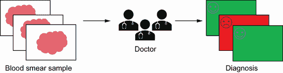

图 1.1 Diagnostics+ 当前状态

当前状态的问题在于医生正在手动分析血涂片样本。由于资源有限，因此诊断需要相当长的时间。Diagnostics+ 希望使用人工智能自动化此过程，并诊断更多的血样，以便患者能够更快地获得正确的治疗。这种未来状态在图 1.2 中展示。

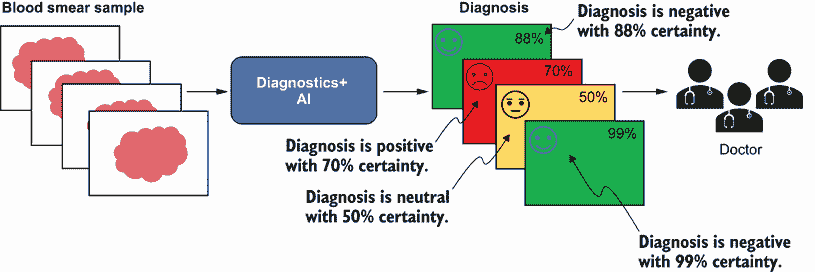

图 1.2 Diagnostics+ 的未来状态

Diagnostics+ AI 的目标是使用血涂片样本的图像以及其他患者元数据来提供诊断——阳性、阴性或中性，并带有置信度度量。Diagnostics+ 还希望医生参与审查诊断，特别是更困难的案例，从而使人工智能系统能够从错误中学习。

## 1.2 机器学习系统类型

我们可以使用三类机器学习系统来驱动 Diagnostics+ AI：监督学习、无监督学习和强化学习。

### 1.2.1 数据表示

让我们先看看如何表示机器学习系统可以理解的数据。对于 Diagnostics+，我们知道有血涂片样本的历史数据，以图像和患者元数据的形式存在。

我们如何最好地表示图像数据？这如图 1.3 所示。假设血涂片样本的图像是一个 256 × 256 像素的彩色图像，由三个主通道组成：红色（R）、绿色（G）和蓝色（B）。我们可以将这个 RGB 图像以数学形式表示为三个像素值矩阵，每个通道一个，每个大小为 256 × 256。这三个二维矩阵可以组合成一个 256 × 256 × 3 的大小多维矩阵来表示 RGB 图像。一般来说，表示图像的矩阵维度具有以下形式：*{垂直像素数}* × *{水平像素数}* × *{通道数}*。

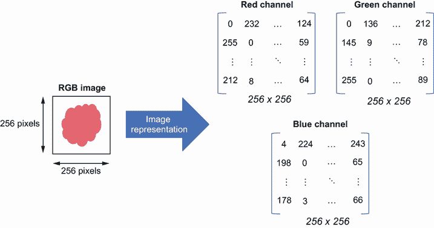

图 1.3 血涂片样本图像表示

现在，我们如何最好地表示患者元数据？假设元数据包括患者标识符（ID）、年龄、性别和最终诊断等信息。元数据可以表示为结构化表格，如图 1.4 所示，有 *N* 列和 *M* 行。我们可以轻松地将元数据的表格表示转换为 *M × N* 维度的矩阵。在图 1.4 中，你可以看到，患者 ID、性别和诊断列是分类的，必须编码为整数。例如，患者 ID “AAABBCC” 编码为整数 0，性别 “M”（男性）编码为整数 0，诊断 “Positive” 编码为整数 1。

图 1.4 表格形式的患者元数据表示

### 1.2.2 监督学习

监督学习的目标是根据示例输入输出对学习从输入到输出的映射。它需要标记的训练数据，其中输入（也称为*特征*）有一个相应的标签（也称为*目标*）。这些数据是如何表示的？输入特征通常使用多维数组数据结构表示，或者从数学上表示为矩阵 *X*。输出或目标表示为单维数组数据结构，或者从数学上表示为向量 *y*。矩阵 *X* 的维度通常是 *m* × *n*，其中 *m* 代表示例或标记数据的数量，*n* 代表特征的数量。向量 *y* 的维度通常是 *m* × *1*，其中 *m* 再次代表示例或标签的数量。目标是学习一个函数 *f*，它将输入特征 *X* 映射到目标 *y*。这如图 1.5 所示。

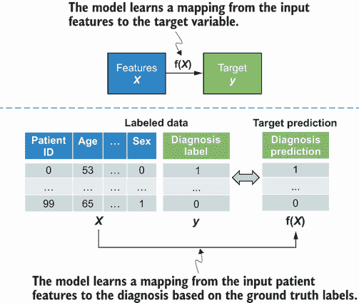

图 1.5 监督学习说明

在图 1.5 中，你可以看到，通过监督学习，你正在学习一个函数 *f*，它接受多个以 *X* 表示的输入特征，并提供一个与已知标签或值匹配的输出，表示为目标变量 *y*。图的下半部分显示了一个示例，其中提供了一个标记数据集，通过监督学习，你正在学习如何将输入特征映射到输出。

函数 *f* 是一个多元函数——它将多个输入变量或特征映射到一个目标。以下是无监督学习问题的两个广泛类别：

+   *回归*—目标向量 *y* 是连续的。例如，预测美国某地点的房价（以美元计）是一个回归类型的学习问题。

+   *分类*—目标变量 *y* 是离散且有界的。例如，预测一封电子邮件是否为垃圾邮件是一个分类学习问题。

### 1.2.3 无监督学习

在无监督学习中，目标是学习数据的最佳表示，以最好地描述它。没有标记的数据，目标是学习从原始数据中的一些未知模式。输入特征表示为矩阵 *X*，系统学习一个函数 *f*，它将 *X* 映射到输入数据的模式或表示。这如图 1.6 所示。无监督学习的一个例子是聚类，其目标是形成具有相似属性或特征的数据点组或聚类。这显示在图的下半部分。未标记的数据包含两个特征，数据点在二维空间中显示。没有已知的标签，无监督学习系统的目标是学习数据中存在的潜在模式。在这个示例中，系统学习如何根据数据点之间的接近度或相似性将原始数据点映射到聚类中。这些聚类事先是未知的，因为数据集未标记，因此学习是完全无监督的。

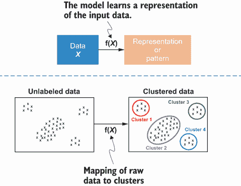

图 1.6 无监督学习示意图

### 1.2.4 强化学习

强化学习由一个通过与环境交互来学习的代理组成，如图 1.7 所示。学习代理在环境中采取一个动作，并根据动作的质量获得奖励或惩罚。根据采取的动作，代理从一个状态移动到另一个状态。代理的整体目标是通过对从输入状态到动作映射的策略函数 *f* 进行学习，以最大化累积奖励。强化学习的例子包括机器人吸尘器学习最佳清洁路径以清洁家庭，以及人工代理学习如何玩象棋和国际象棋等棋类游戏。

图 1.7 强化学习示意图

图 1.7 的下半部分展示了强化学习系统。该系统由一个机器人（代理）在一个迷宫（环境）中组成。学习代理的目标是确定最佳的动作集，以便它能从当前位置移动到终点线（最终状态），终点线由绿色星号指示。代理可以采取四种动作之一：向左、向右、向上或向下。

### 1.2.5 用于诊断+ AI 的机器学习系统

既然你已经知道了三种主要的机器学习系统类型，那么对于诊断+ AI，哪种系统最适用？鉴于数据集已标记，并且你可以从历史数据中知道对患者的诊断以及血液样本的诊断，可以用来驱动诊断+ AI 的机器学习系统是 *监督学习*。

这是哪种监督学习问题？监督学习问题的目标是诊断，可以是阳性也可以是阴性。因为目标是离散且有界的，所以这是一个 *分类* 类型的学习问题。

本书的主要关注点

本书主要关注存在标记数据的 *监督学习* 系统。我将教你如何实现回归和分类类型问题的可解释性技术。尽管本书没有明确涵盖无监督学习或强化学习系统，但本书中学到的技术可以扩展到它们。

## 1.3 构建诊断+ AI

既然我们已经确定诊断+ AI 将是一个监督学习系统，我们如何着手构建它？典型的过程包括三个主要阶段：

+   学习

+   测试

+   部署

在学习阶段，如图 1.8 所示，我们处于开发环境，在那里我们使用数据的两个子集，称为训练集和开发集。正如其名所示，训练集用于训练机器学习模型，学习从输入特征 *X*（在这种情况下，血液样本的图像和元数据）到目标 *y*（在这种情况下，诊断）的映射函数 *f*。一旦我们训练了模型，我们就使用开发集进行验证，并根据该开发集上的性能调整模型。调整模型包括确定模型的最佳参数，称为 *超参数*，以获得最佳性能。这是一个相当迭代的过程，我们继续这样做，直到模型达到可接受的性能水平。

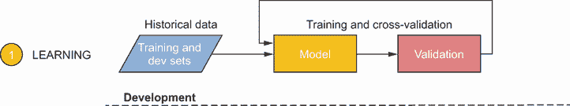

图 1.8 构建 AI 系统流程——学习阶段

在测试阶段，如图 1.9 所示，我们现在切换到测试环境，在那里我们使用数据的一个子集，称为 *测试集*，它与训练集不同。目标是获得模型准确性的无偏评估。利益相关者和专家（在这种情况下，医生）将在此阶段评估系统的功能以及模型在测试集上的性能。这种额外的测试，称为用户验收测试（UAT），是任何软件系统开发的最终阶段。如果性能不可接受，那么我们就回到第 1 阶段去训练一个更好的模型。如果性能可接受，那么我们就进入第 3 阶段，即部署。

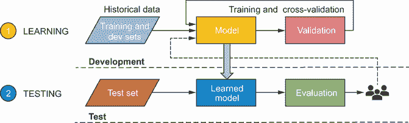

图 1.9 构建 AI 系统流程——测试阶段

最后，在部署阶段，我们现在将学习到的模型部署到生产系统中，模型现在将暴露于它之前未见过的新的数据。整个过程如图 1.10 所示。在 Diagnostics+ AI 的情况下，这些数据将是模型将用于预测诊断结果为阳性或阴性的新血液样本和患者信息，并附带置信度度量。然后，这些信息被专家（医生）消费，进而被最终用户（患者）消费。

图 1.10 构建 AI 系统的过程——完整

## 1.4 Diagnostics+ AI 的差距

图 1.10 显示了 Diagnostics+ AI 系统的一些主要差距。这个 AI 系统无法防止一些常见问题，这些问题会导致部署的模型在生产环境中表现不符合预期。这些问题可能会对诊断中心的业务产生有害影响。常见问题如下：

+   数据泄露

+   偏差

+   监管不合规

+   概念漂移

### 1.4.1 数据泄露

当训练、开发和测试集中的特征无意中泄露了在生产环境中模型评分新数据时不会出现的信息时，就会发生数据泄露。对于 Diagnostics+，假设我们使用医生关于诊断的笔记作为模型的特征或输入。在用测试集评估模型时，我们可能会得到夸大的性能结果，从而欺骗自己认为我们已经构建了一个优秀的模型。医生的笔记可能包含关于最终诊断的信息，这将泄露关于目标变量的信息。如果这个问题没有及早被发现，一旦模型部署到生产环境中，可能会造成灾难性的后果——模型在医生有机会审查诊断并添加笔记之前就已经进行了评分。因此，模型要么在生产中崩溃（因为缺少特征），要么开始做出糟糕的诊断。

数据泄露的一个经典案例研究是 2008 年的 KDD Cup 挑战赛([`www.kdd.org/kdd-cup/view/kdd-cup-2008`](https://www.kdd.org/kdd-cup/view/kdd-cup-2008))。这个基于真实数据的机器学习竞赛的目标是根据 X 光图像检测乳腺癌细胞是良性还是恶性。一项研究([`kdd.org/exploration_files/KDDCup08-P1.pdf`](http://kdd.org/exploration_files/KDDCup08-P1.pdf))表明，在这次竞赛的测试集中得分最高的团队使用了一个名为“患者 ID”的特征，这是医院为患者生成的标识符。结果发现，一些医院使用患者 ID 来表示患者在入院时的病情严重程度，因此泄露了关于目标变量的信息。

### 1.4.2 偏差

偏差是指机器学习模型做出不公平的预测，这种预测偏向于某个人或群体，而损害了另一个人或群体。这种不公平的预测可能是由于数据或模型本身造成的。可能存在采样偏差，即用于训练的数据样本与总体之间存在系统性差异。模型所捕捉到的系统性社会偏差也可能存在于数据中。训练好的模型也可能存在缺陷——即使有相反的证据，它也可能有一些强烈的先入之见。对于 Diagnostics+ AI 的情况，如果存在采样偏差，例如，模型可能对某一群体做出更准确的预测，但不能很好地推广到整个总体。这远远不是理想的，因为诊断中心希望新的 AI 系统能够为所有患者使用，无论他们属于哪个群体。

机器偏差的一个经典案例研究是美国法院使用的 COMPAS AI 系统，用于预测未来的罪犯。这项研究由 ProPublica 进行。（网页包含分析数据和数据集的链接。）ProPublica 获得了 2013 年和 2014 年在佛罗里达州一个县被捕的 7,000 人的 COMPAS 评分。使用这些评分，他们发现无法准确预测再犯率（即被定罪的人再次犯罪的比例）——预测会犯暴力犯罪的人中只有 20%实际上犯了罪。更重要的是，他们发现了模型中严重的种族偏见。

### 1.4.3 规章制度不遵守

《通用数据保护条例》（GDPR；[`gdpr.eu/`](https://gdpr.eu/））是欧洲议会于 2016 年通过的一套全面法规，涉及外国公司如何收集、存储和处理数据。该法规包含第 17 条（[https://gdpr-info.eu/art-17-gdpr/](https://gdpr-info.eu/art-17-gdpr/））——“被遗忘权”，个人可以要求收集其数据的公司删除其所有个人数据。该法规还包含第 22 条（[https://gdpr-info.eu/art-22-gdpr/](https://gdpr-info.eu/art-22-gdpr/）），个人可以挑战基于其个人数据做出的算法或 AI 系统的决策。该法规强调了提供解释或说明为什么算法做出了特定决策的需要。当前的 Diagnostics+ AI 系统不符合这两套法规。在这本书中，我们更关注第 22 条，因为关于如何遵守第 17 条有很多在线资源。

### 1.4.4 概念漂移

当生产环境中的数据属性或分布与用于训练和评估模型的原始数据相比发生变化时，就会发生概念漂移。对于 Diagnostics+ AI 来说，如果出现新的患者或疾病档案，而这些档案没有包含在原始数据中，就可能会发生这种情况。当发生概念漂移时，我们会观察到机器学习模型在生产环境中的性能随时间下降。当前的 Diagnostics+ AI 系统并没有妥善处理概念漂移问题。

## 1.5 构建鲁棒 Diagnostics+ AI 系统

我们如何解决 1.4 节中提到的所有差距，并构建一个鲁棒的 Diagnostics+ AI 系统？我们需要调整这个过程。首先，如图 1.11 所示，我们在测试阶段之后、部署之前添加一个模型理解阶段。

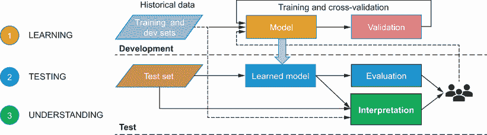

图 1.11 构建鲁棒 AI 系统的过程——理解阶段

这个新的 *理解* 阶段的目的在于回答重要的“如何”问题——模型是如何对一个特定的血液样本给出阳性诊断的？这涉及到解释模型的重要特征以及它们是如何相互作用的，解释模型学习到的模式，理解盲点，检查数据中的偏差，并确保这些偏差不会被模型传播。这个理解阶段应确保 AI 系统免受 1.4.1 节和 1.4.2 节中提到的数据泄露和偏差问题的影响。

第二个变化是在部署之后添加一个 *解释* 阶段，如图 1.12 所示。解释阶段的目的在于解释模型是如何在生产环境中对新的数据进行预测的。对新数据的预测解释使我们能够（如果需要的话）将信息暴露给挑战部署模型决策的系统专家用户。另一个目的是提供一个可读的解释，以便它可以被暴露给更广泛的 AI 系统最终用户。通过包括解释步骤，我们将能够解决 1.4.3 节中提到的监管不合规问题。

图 1.12 构建鲁棒 AI 的过程——解释阶段

最后，为了解决 1.4.4 节中提到的概念漂移问题，我们需要在生产环境中添加一个 *监控* 阶段。这个完整的过程如图 1.13 所示。监控阶段的目的在于跟踪生产环境中数据的分布以及部署模型的性能。如果数据分布或模型性能出现任何变化，我们需要回到学习阶段，并将生产环境中的新数据纳入以重新训练模型。

本书的主要关注点

本书主要关注理解和解释阶段中的 *解释* 步骤。我打算教你各种可解释性技术，你可以应用这些技术来回答重要的“如何”问题，并解决数据泄露、偏差和监管不合规问题。尽管可解释性和监控是过程中的重要步骤，但它们不是本书的主要焦点。区分可解释性和可解释性也很重要。这将在以下部分中讨论。

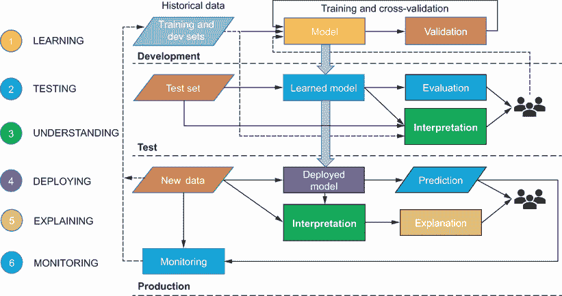

图 1.13 构建稳健 AI 系统的过程——完整

## 1.6 可解释性 vs. 可解释性

*可解释性* 和 *可解释性* 有时被互换使用，但区分这两个术语很重要。

*可解释性* 主要是关于理解 AI 系统内部的因果关系。这是我们在给定输入的情况下，可以持续估计模型将预测什么，理解模型是如何得出预测的，理解预测如何随着输入或算法参数的变化而变化，以及最后理解模型何时犯错的程度。可解释性主要是由构建、部署或使用 AI 系统的专家可辨别的，这些技术是帮助我们达到可解释性的基石。

另一方面，*可解释性* 超出了可解释性的范畴，因为它帮助我们以人类可读的形式理解模型是如何以及为什么做出预测的。它用人类术语解释系统的内部机制，目的是达到更广泛的受众。可解释性需要可解释性作为基石，并参考其他领域和领域，如人机交互（HCI）、法律和伦理。在本书中，我将更多地关注可解释性，而不是可解释性。在可解释性本身就有很多要涵盖的内容，但它应该为你提供一个坚实的基础，以便你能够后来构建一个可解释的 AI 系统。

当你考虑可解释性时，你应该意识到四种不同的角色。他们是构建 AI 系统的 *数据科学家* 或 *工程师*，希望为他们的业务部署 AI 系统的 *商业利益相关者*，AI 系统的 *最终用户*，以及最后是监控或审计 AI 系统健康状况的 *专家* 或 *监管者*。请注意，可解释性对这四个角色意味着不同的事情，如下所述：

+   对于一个 *数据科学家* 或 *工程师* 来说，这意味着更深入地理解模型如何做出特定的预测，哪些特征是重要的，以及如何通过分析模型表现不佳的案例来调试问题。这种理解有助于数据科学家构建更稳健的模型。

+   对于 *商业利益相关者* 来说，这意味着理解模型如何做出决策，以确保公平性并保护企业的用户和品牌。

+   对于*最终用户*来说，这意味着理解模型是如何做出决策的，并在模型出错时允许进行有意义的挑战。

+   对于*专家*或*监管者*来说，这意味着审计模型和 AI 系统，并追踪决策路径，尤其是在事情出错的时候。

### 1.6.1 可解释性技术类型

图 1.14 总结了各种可解释性技术的类型。*内禀*可解释性技术是与结构简单的机器学习模型相关的，也称为*白盒模型*。白盒模型本质上是透明的，解释模型的内部结构是直接的。对于这类模型，可解释性是直接呈现的。“后验”可解释性技术通常在模型训练之后应用，用于解释和理解模型预测中某些输入的重要性。后验可解释性技术适用于白盒和黑盒模型，即那些本质上不透明的模型。

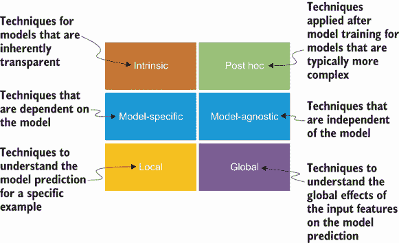

图 1.14 可解释性技术类型

可解释性技术也可以是模型特定的或模型无关的。*模型特定*的可解释性技术，正如其名所示，只能应用于某些类型的模型。内禀可解释性技术本质上就是模型特定的，因为这种技术是与所使用的模型的特定结构紧密相连的。然而，*模型无关*的可解释性技术并不依赖于所使用的特定模型类型。由于它们独立于模型的内部结构，因此可以应用于任何模型。后验可解释性技术本质上大多是模型无关的。

可解释性技术也可以在范围上是局部的或全局的。*局部*可解释性技术旨在对特定实例或示例的模型预测有更好的理解。另一方面，*全局*可解释性技术旨在对模型整体有更好的理解——输入特征对模型预测的总体影响。我们在本书中涵盖了所有这些类型的技巧。现在让我们看看你将具体学到什么。

## 1.7 我在这本书中将学到什么？

图 1.15 展示了本书中将学习到的所有可解释性技术地图。在解释监督学习模型时，区分白盒模型和黑盒模型非常重要。白盒模型的例子包括线性回归、逻辑回归、决策树和广义加性模型（GAMs）。黑盒模型的例子包括树集成，如随机森林和提升树，以及神经网络。白盒模型比黑盒模型更容易解释。另一方面，黑盒模型的预测能力比白盒模型高得多。因此，我们需要在预测能力和可解释性之间做出权衡。了解我们可以应用白盒模型和黑盒模型的场景非常重要。

在第二章中，你将了解使白盒模型本质上是透明的和黑盒模型本质上是模糊的特性。你将学习如何解释简单的白盒模型，例如线性回归和决策树，然后我们将转换方向，专注于广义加性模型（GAMs）。GAMs 具有高度的预测能力，并且也是高度可解释的，因此它们比 GAMs 提供了更多的价值。你将了解赋予 GAMs 力量的属性以及如何解释它们。在撰写本文时，关于 GAMs 的实用资源不多，难以对模型内部结构和如何解释它们有一个好的理解。为了填补这一空白，我们在第二章中投入了大量关注 GAMs。其余章节则专注于黑盒模型。

我们可以通过两种方式来解释黑盒模型。一种方式是解释模型处理过程，即理解模型如何处理输入并得出最终预测。第三章到第五章专注于解释模型处理过程。另一种方式是解释模型表示，这仅适用于深度神经网络。第六章和第七章专注于通过解释模型表示来理解神经网络学习到的特征或模式。目标是理解神经网络学习到的特征或模式。

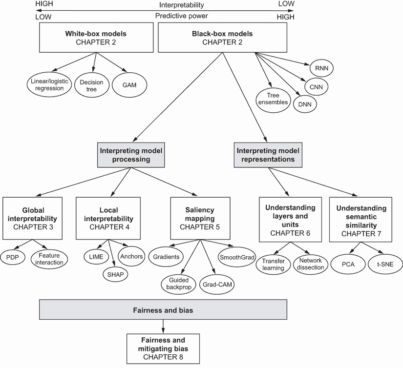

图 1.15 本书涵盖的可解释性技术地图

在第三章中，我们关注一类称为树集成（tree ensembles）的黑盒模型。你将了解它们的特征以及它们为什么被称为“黑盒”。你还将学习如何使用全局范围内的模型无关的后验方法来解释它们。我们将特别关注局部依赖性图（PDPs）、个体条件期望（ICE）图和特征交互图。

在第四章中，我们关注深度神经网络，特别是纯全连接神经网络。你将了解使这些模型成为黑盒的特性，以及如何使用局部范围内的模型无关的后验方法来解释它们。你将特别学习到局部可解释模型无关解释（LIME）、SHapley Additive exPlanations（SHAP）和锚点等技术。

在第五章中，我们专注于卷积神经网络，这是一种主要用于视觉任务（如图像分类和目标检测）的更高级的架构形式。你将学习如何使用显著性图来可视化模型关注的对象。你还将学习梯度、指导反向传播（简称 backprop）、梯度加权类激活映射（grad-CAM）、指导 grad-CAM 和光滑梯度（SmoothGrad）等技术。

在第六章和第七章中，我们专注于卷积神经网络和用于语言理解的神经网络。你将学习如何剖析神经网络，并理解神经网络中中间或隐藏层学习到的数据表示。你还将学习如何使用主成分分析（PCA）和 t 分布随机邻域嵌入（t-SNE）等技术来可视化模型学习到的高维表示。

本书以构建公平且无偏见的模型以及学习构建可解释人工智能系统所需的知识点结束。在第八章中，你将了解公平性的各种定义以及如何检查你的模型是否存在偏见。你还将学习使用中和技术来减轻偏见的技术。我们讨论了使用数据表来标准化记录数据集的方法，这有助于提高与系统利益相关者和用户的透明度和问责制。在第九章中，我们通过教授如何构建这样的系统为可解释人工智能铺平道路，你还将了解使用反事实示例进行对比解释。到本书结束时，你将拥有各种可解释性技术在你的工具箱中。当涉及到模型理解时，遗憾的是没有一劳永逸的解决方案。没有一种可解释性技术适用于所有场景。因此，你需要通过应用多种可解释性技术，从几个不同的角度来审视模型。在这本书中，我将帮助你识别适合特定场景的正确工具。

### 1.7.1 我在这本书中将使用哪些工具？

在本书中，我们将使用 Python 编程语言实现模型和可解释性技术。我选择 Python 的主要原因是因为大多数最先进的可解释性技术都是在这个语言中创建和积极开发的。图 1.16 展示了本书中使用的工具概览。对于数据表示，我们将使用 Python 数据结构和常见的数据科学库，如 *Pandas* 和 *NumPy*。为了实现白盒模型，我们将使用 *Scikit-Learn* 库进行简单的线性回归和决策树，以及 *pyGAM* 用于 GAM。对于黑盒模型，我们将使用 *Scikit-Learn* 进行树集成，以及 *PyTorch* 或 *TensorFlow* 进行神经网络。对于用于理解模型处理的可解释性技术，我们将使用 *Matplotlib* 库进行可视化，以及实现 *PDP*、*LIME*、*SHAP*、*anchors*、*gradients*、*guided backprop*、*grad-CAM* 和 *SmoothGrad* 等技术的开源库。为了解释模型表示，我们将使用实现 *NetDissect* 和 *tSNE* 的工具，并使用 *Matplotlib* 库进行可视化。最后，为了减轻偏差，我们将使用 *PyTorch* 和 *TensorFlow* 实现偏差中和技术，以及 GANs 进行对抗性去偏差。

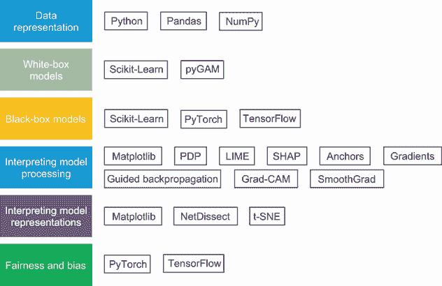

图 1.16 本书使用的工具概览

### 1.7.2 在阅读本书之前我需要了解什么？

本书主要面向有 Python 编程经验的科学家和工程师。对常见 Python 数据科学库（如 NumPy、Pandas、Matplotlib 和 Scikit-Learn）的基本了解会有所帮助，尽管这不是必需的。本书将向您展示如何使用这些库加载数据和表示数据，但不会深入探讨它们，因为这超出了本书的范围。

读者必须熟悉线性代数，特别是向量和矩阵，以及它们的运算，如点积、矩阵乘法、转置和求逆。读者还必须具备概率论和统计学的基础知识，特别是关于随机变量、基本的离散和连续概率分布、条件概率和贝叶斯定理的主题。还期望读者具备微积分的基本知识，特别是单变量和多变量函数及其导数（梯度）和偏导数。尽管本书不会过多关注模型可解释性背后的数学，但期望对构建机器学习模型感兴趣的数据科学家和工程师具备这些基本数学基础。

对机器学习的基本知识或实际训练机器学习模型的实践经验是一个加分项，尽管这不是硬性要求。本书不会深入探讨机器学习，因为许多资源和书籍已经很好地涵盖了这一主题。然而，本书将为你提供特定机器学习模型的基本理解，并展示如何训练和评估它们。主要关注与可解释性相关的理论，以及你如何在训练后实施解释模型的技术。

### 摘要

+   存在三种广泛的机器学习系统类型：监督学习、无监督学习和强化学习。本书专注于监督学习系统的可解释性技术，这些系统包括回归和分类类型的问题。

+   在构建 AI 系统时，将可解释性、模型理解和监控添加到流程中非常重要。如果不这样做，你可能会遇到灾难性的后果，如数据泄露、偏差、概念漂移和普遍缺乏信任。此外，随着 GDPR 的实施，我们在 AI 流程中包含可解释性有法律上的原因。

+   理解可解释性和可解释性之间的区别很重要。

+   可解释性是我们能够一致地估计模型将预测什么、理解模型如何得出预测以及理解模型何时犯错的程度。可解释性技术是帮助你达到可解释性的基石。

+   可解释性超越了可解释性，因为它帮助我们以人类可读的形式理解模型是如何以及为什么得出预测的。它利用可解释性技术，并参考其他领域和领域，如人机交互（HCI）、法律和伦理。

+   你需要意识到不同的人在使用或构建 AI 系统时的不同角色，因为可解释性对不同的人意味着不同的事情。

+   可解释性技术可以是内在的或事后确定的，模型特定的或模型无关的，局部的或全局的。

+   本质上透明的模型被称为白盒模型，而本质上不透明的模型被称为黑盒模型。白盒模型更容易解释，但通常比黑盒模型的预测能力低。

+   黑盒模型提供了两种广泛的可解释性技术：一种专注于解释模型处理，另一种专注于解释模型学习到的表示。
