# 2 白盒模型

本章涵盖

+   使白盒模型天生透明和可解释的特征

+   如何解释简单的白盒模型，如线性回归和决策树

+   广义加性模型（GAMs）是什么以及赋予它们高预测能力和高可解释性的特性

+   如何实现和解释 GAMs

+   黑盒模型是什么以及使它们天生不透明的特征

要构建一个可解释的人工智能系统，我们必须了解我们可以用来驱动人工智能系统的不同类型模型以及我们可以应用来解释它们的技巧。在本章中，我将介绍三种关键的白盒模型——线性回归、决策树和广义加性模型（GAMs），它们天生透明。您将学习它们如何实现、何时可以应用以及如何解释。我还简要介绍了黑盒模型。您将学习它们何时可以应用以及使它们难以解释的特征。本章重点在于解释白盒模型，而本书的其余部分将致力于解释复杂的黑盒模型。

在第一章中，您学习了如何构建一个健壮、可解释的人工智能系统。该过程在图 2.1 中再次展示。第二章以及本书的其余部分的主要重点将在于实现可解释性技巧，以更好地理解涵盖白盒和黑盒模型的人工智能模型。相关的模块在图 2.1 中被突出显示。我们将在模型开发和测试期间应用这些可解释性技巧。我们还将了解模型训练和测试，特别是实现方面。由于模型学习、测试和理解阶段相当迭代，因此同时涵盖这三个阶段很重要。对于已经熟悉模型训练和测试的读者，可以自由跳过那些部分，直接进入可解释性部分。

在生产中应用可解释性技巧时，我们还需要考虑构建一个生成解释的系统，为您的系统最终用户提供人类可读的解释。然而，可解释性超出了本书的范围，本书将专注于模型开发和测试期间的可解释性。

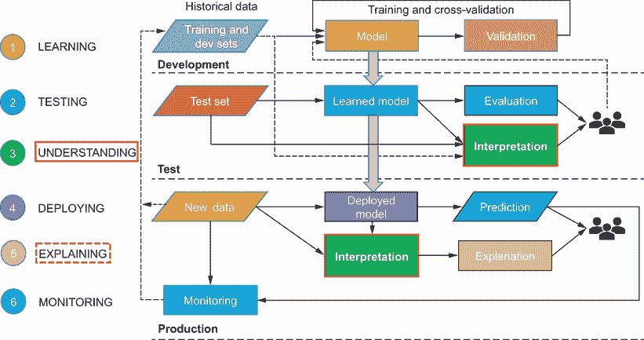

图 2.1 构建健壮人工智能系统的过程，主要关注解释

## 2.1 白盒模型

白盒模型天生透明，使它们透明的特征是

+   用于机器学习的算法易于理解，我们可以清楚地解释输入特征是如何转换为输出或目标变量的。

+   我们可以识别出预测目标变量最重要的特征，并且这些特征是可理解的。

白盒模型的例子包括线性回归、逻辑回归、决策树和广义加性模型（GAMs）。表 2.1 显示了这些模型可以应用到的机器学习任务。

表 2.1 白盒模型到机器学习任务的映射

| 白盒模型 | 机器学习任务（s） |
| --- | --- |
| 线性回归 | 回归 |
| 逻辑回归 | 分类 |
| 决策树 | 回归和分类 |
| 广义加性模型（GAMs） | 回归和分类 |

在本章中，我们重点关注线性回归、决策树和广义加性模型（GAMs）。在图 2.2 中，我将这些技术绘制在了一个二维平面上，其中可解释性在*x*轴上，预测能力在*y*轴上。当你从左到右移动这个平面时，模型从低可解释性状态过渡到高可解释性状态。当你从底部向上移动这个平面时，模型从低预测能力状态过渡到高预测能力状态。线性回归和决策树高度可解释，但预测能力较低到中等。另一方面，广义加性模型（GAMs）具有高预测能力，并且也是高度可解释的。该图还以灰色和斜体显示了黑盒模型。我们将在第 2.6 节中介绍这些。


图 2.2 可解释性对预测能力平面的白盒模型

我们首先从解释更简单的线性回归和决策树模型开始，然后深入到广义加性模型（GAMs）的世界。对于这些白盒模型中的每一个，我们学习算法是如何工作的以及使它们本质上可解释的特征。对于白盒模型，理解算法的细节非常重要，因为它将帮助我们解释输入特征是如何转换为最终模型输出或预测的。它还将帮助我们量化每个输入特征的重要性。你将首先学习如何在 Python 中训练和评估本书中的所有模型，然后再深入研究可解释性。如前所述，由于模型学习、测试和理解阶段是迭代的，因此这三个阶段一起考虑非常重要。

## 2.2 诊断+—糖尿病进展

让我们通过一个具体的例子来探讨白盒模型。回忆一下第一章中的 Diagnostics+ AI 例子。Diagnostics+中心现在希望确定在基线测量后一年内他们的患者的糖尿病进展情况，如图 2.3 所示。中心已经指派你，作为一位新晋数据科学家，为 Diagnostics+ AI 构建一个模型，以预测一年后的糖尿病进展。医生将使用这个预测来确定他们的患者的适当治疗方案。为了赢得医生对模型的信心，不仅要提供准确的预测，还要能够展示模型是如何得出这个预测的。你将如何开始这项任务？

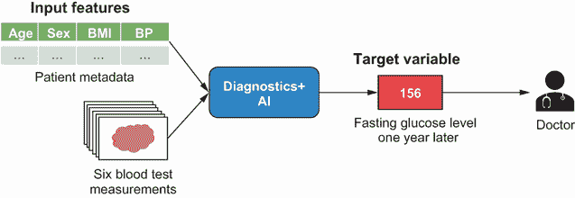

图 2.3 Diagnostics+ AI 用于糖尿病

首先，让我们看看有哪些数据可用。Diagnostics+中心收集了大约 440 名患者的数据，这些数据包括患者的元数据，如年龄、性别、体重指数（BMI）和血压（BP）。还对这些患者进行了血液检查，并收集了以下六个测量值：

+   低密度脂蛋白（坏胆固醇）

+   高密度脂蛋白（好胆固醇）

+   总胆固醇

+   甲状腺刺激激素

+   低眼压性青光眼

+   空腹血糖

数据还包含了所有患者在基线测量后一年内的空腹血糖水平。这是模型的目标。你将如何将这个问题表述为一个机器学习问题？因为提供了标记数据，其中你被给出了 10 个输入特征和一个你必须预测的目标变量，你可以将这个问题表述为一个监督学习问题。目标变量是实值或连续的，因此这是一个回归任务。目标是学习一个函数 *f*，它将帮助根据输入特征 *x* 预测目标变量 *y*。

现在，让我们在 Python 中加载数据，并探索输入特征与彼此以及目标变量的相关性。如果输入特征与目标变量高度相关，那么我们可以使用它们来训练一个模型进行预测。然而，如果它们与目标变量不相关，那么我们需要进一步探索以确定数据中是否存在一些噪声。数据可以在 Python 中如下加载：

```
from sklearn.datasets import load_diabetes         ①
diabetes = load_diabetes()                         ②
X, y = diabetes[‘data’], diabetes[‘target’]        ③
```

① 导入 scikit-learn 函数以加载公开的糖尿病数据集

② 加载糖尿病数据集

③ 提取特征和目标变量

现在，我们将创建一个 Pandas DataFrame，它是一个包含所有特征和目标变量的二维数据结构。Scikit-Learn 提供的糖尿病数据集包含的特征名称不易理解。六个血液样本测量值分别命名为 s1、s2、s3、s4、s5 和 s6，这使得我们难以理解每个特征测量的是什么。然而，文档提供了这种映射，我们使用它将列重命名为更易理解的形式，如下所示：

```
feature_rename = {'age': 'Age',                                 ①
                  'sex': 'Sex',                                 ①
                  'bmi': 'BMI',                                 ①
                  'bp': 'BP',                                   ①
                  's1': 'Total Cholesterol',                    ①
                  's2': 'LDL',                                  ①
                  's3': 'HDL',                                  ①
                  's4': 'Thyroid',                              ①
                  's5': 'Glaucoma',                             ①
                  's6': 'Glucose'}                              ①

df_data = pd.DataFrame(X,                                       ②
                       columns=diabetes['feature_names'])       ③
df_data.rename(columns=feature_rename, inplace=True)            ④
df_data['target'] = y                                           ⑤
```

① 将 Scikit-Learn 提供的特征名称映射到更易读的形式

② 将所有特征（x）加载到 DataFrame 中

③ 使用 Scikit-Learn 特征名称作为列名称

④ 将 Scikit-Learn 的特征名称重命名为更易读的形式

⑤ 将目标变量（y）作为一个单独的列包含

现在，让我们计算列之间的成对相关性，以便我们可以确定每个输入特征与其他输入特征和目标变量的相关性。这可以在 Pandas 中轻松完成，如下所示：

```
corr = df_data.corr()
```

默认情况下，pandas 中的`corr()`函数计算皮尔逊或标准相关系数。这个系数衡量两个变量之间的线性相关性，其值介于+1 和-1 之间。如果系数的绝对值大于 0.7，这意味着它具有非常高的相关性。如果系数的绝对值介于 0.5 和 0.7 之间，则表示中等程度的高相关性。如果系数的绝对值介于 0.3 和 0.5 之间，则表示低相关性，而系数的绝对值小于 0.3 则意味着几乎没有相关性。现在我们可以在 Python 中如下绘制相关矩阵：

```
import matplotlib.pyplot as plt              ①
import seaborn as sns                        ①
sns.set(style=’whitegrid’)                   ①
sns.set_palette(‘bright’)                    ①

f, ax = plt.subplots(figsize=(10, 10))       ②
sns.heatmap(                                 ③
    corr,                                    ③
    vmin=-1, vmax=1, center=0,               ③
    cmap="PiYG",                             ③
    square=True,                             ③
    ax=ax                                    ③
)                                            ③
ax.set_xticklabels(                          ④
    ax.get_xticklabels(),                    ④
    rotation=90,                             ④
    horizontalalignment='right'              ④
);                                           ④
```

① 导入 Matplotlib 和 Seaborn 以绘制相关矩阵

② 使用预定义的大小初始化 Matplotlib 图表

③ 使用 Seaborn 绘制相关系数的热图

④ 将 x 轴上的标签旋转 90 度

生成的图表显示在图 2.4 中。让我们首先关注图中的最后一行或最后一列。这显示了每个输入与目标变量之间的相关性。我们可以看到七个特征——BMI、血压、总胆固醇、高密度脂蛋白、甲状腺、青光眼和葡萄糖——与目标变量具有中等程度到高度的相关性。我们还可以观察到良好的胆固醇（HDL）也与糖尿病的进展呈负相关。这意味着 HDL 值越高，患者一年后的空腹血糖水平就越低。这些特征似乎在预测疾病进展方面具有很好的信号，我们可以继续使用它们来训练模型。作为练习，观察每个特征之间是如何相互关联的。例如，总胆固醇似乎与坏胆固醇 LDL 高度相关。当我们开始在第 2.3.1 节中解释线性回归模型时，我们将回到这一点。

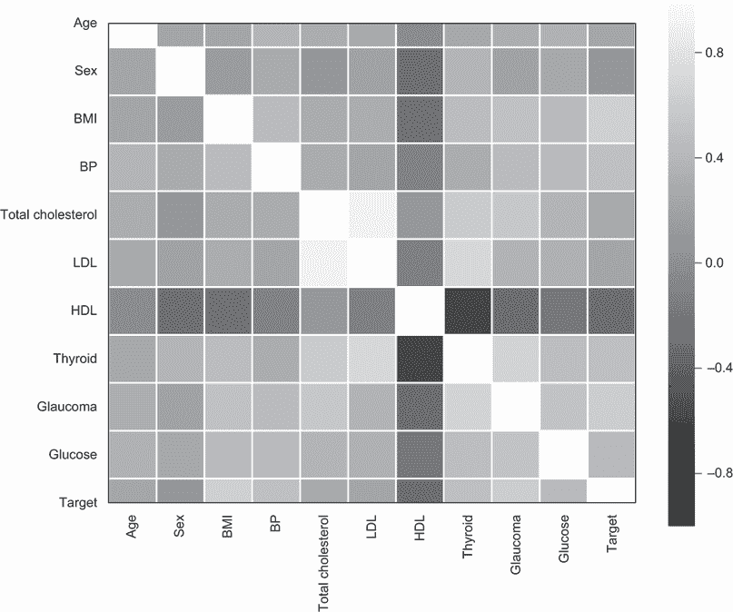

图 2.4 糖尿病数据集中特征与目标变量的相关性图

## 2.3 线性回归

线性回归是您可以训练的最简单的回归任务模型之一。在线性回归中，函数*f*表示为所有输入特征的线性组合，如图 2.5 所示。已知变量用灰色表示，目标是表示目标变量为输入的线性组合。未知变量是学习算法必须学习的权重。

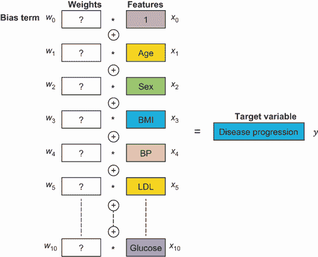

图 2.5 将疾病进展表示为输入的线性组合

在一般情况下，线性回归的函数*f*可以用以下数学公式表示，其中*n*是特征的总数：

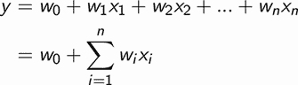

线性回归学习算法的目标是确定权重，以准确预测训练集中所有患者的目标变量。我们可以应用以下技术：

+   梯度下降

+   闭合形式解（例如，牛顿方程）

梯度下降法通常被应用，因为它能够很好地扩展到大量特征和训练示例。其基本思想是更新权重，使得预测目标变量与实际目标变量之间的平方误差最小化。

梯度下降算法的目的是在整个训练集的所有示例中，最小化预测目标变量与实际目标变量之间的平方误差或平方差。该算法保证找到最优的权重集，并且因为算法最小化平方误差，所以它被称为基于最小二乘法。可以使用 Python 中的 Scikit-Learn 包轻松训练线性回归模型。下面的代码展示了训练模型的代码。请注意，这里使用的是 Scikit-Learn 提供的开放型糖尿病数据集，并且该数据集已经标准化，所有输入特征都具有零均值和单位方差。特征标准化是在许多机器学习模型（如线性回归、逻辑回归以及基于神经网络的更复杂模型）中广泛使用的预处理形式。它允许驱动这些模型的机器学习算法更快地收敛到最优解：

```
from sklearn.model_selection import train_test_split            ①
from sklearn.linear_model import LinearRegression               ②
import numpy as np                                              ③

X_train, X_test, y_train, y_test = train_test_split(X, y,       ④
  test_size=0.2,                                                ④
  random_state=42)                                              ④

lr_model = LinearRegression()                                   ⑤

lr_model.fit(X_train, y_train)                                  ⑥

y_pred = lr_model.predict(X_test)                               ⑦

mae = np.mean(np.abs(y_test - y_pred))                          ⑧
```

① 导入 scikit-learn 函数以将数据分为训练集和测试集

② 导入 scikit-learn 的线性回归类

③ 导入 numpy 库以评估模型的性能

④ 将数据分为训练集和测试集，其中 80%的数据用于训练，20%的数据用于测试，并确保使用 random_state 参数设置随机数生成器的种子，以保证训练集和测试集的分割一致性

⑤ 初始化基于最小二乘法的线性回归模型

⑥ 通过在训练集上拟合来学习模型的权重

⑦ 使用学习到的权重来预测测试集中患者的疾病进展

⑧ 使用平均绝对误差（MAE）指标评估模型性能

训练的线性回归模型的性能可以通过将预测值与测试集中的实际值进行比较来量化。我们可以使用多个指标，例如均方根误差（RMSE）、平均绝对误差（MAE）和平均绝对百分比误差（MAPE）。这些指标中的每一个都有其优缺点，并且使用多个指标来衡量模型的好坏有助于量化性能。MAE 和 RMSE 与目标变量具有相同的单位，并且在这方面易于理解。然而，使用这两个指标很难理解误差的大小。例如，一个 10 的误差可能一开始看起来很小，但如果你要比较的实际值是 100，那么这个误差相对于那个值来说就不小了。这就是 MAPE 在这里很有用，因为它以百分比（%）的形式表达误差，有助于理解这些相对差异。测量模型好坏的话题很重要，但超出了本书的范围。你可以在网上找到很多资源。我已经写了一篇综合的两部分博客文章([`mng.bz/ZzNP`](http://mng.bz/ZzNP))来涵盖这个主题。

之前训练的线性回归模型使用 MAE 指标进行了评估，其性能被确定为 42.8。但是，这个性能好吗？为了检查一个模型的性能是否良好，我们需要将其与基线进行比较。对于 Diagnostics+，医生们一直在使用一个基线模型，该模型预测所有患者糖尿病进展的中位数。这个基线模型的 MAE 被确定为 62.2。如果我们现在将这个基线与线性回归模型进行比较，我们会注意到 MAE 下降了 19.4，这是一个相当好的改进。我们现在已经训练了一个不错的模型，但它并没有告诉我们模型是如何得出预测的，以及哪些输入特征是最重要的。我将在下一节中介绍这一点。

### 2.3.1 解释线性回归

在前面的章节中，我们在模型开发期间训练了一个线性回归模型，然后在测试期间使用 MAE 指标评估了模型性能。作为构建 Diagnostics+ AI 的数据科学家，你现在将这些结果与医生们分享，他们对性能表示满意。但是，还有一些不足之处。医生们对模型如何得出最终预测没有清晰的理解。解释梯度下降算法并不能帮助理解这一点，因为在这个例子中你处理的是一个相当大的特征空间——总共 10 个输入特征。在 10 维空间中可视化算法如何收敛到最终预测是不可能的。一般来说，描述和解释机器学习算法的能力并不能保证其可解释性。那么，最佳的解释模型的方法是什么呢？

对于线性回归，因为最终的预测只是输入特征的加权求和，我们只需要关注学习到的权重。这就是为什么线性回归是一个白盒模型。权重告诉我们什么？如果一个特征的权重是正的，那么输入的正变化将导致输出的正变化成比例增加，输入的负变化将导致输出的负变化成比例增加。同样，如果权重是负的，输入的正变化将导致输出的负变化成比例增加，输入的负变化将导致输出的正变化成比例增加。这种在图 2.6 中显示的学到的函数被称为线性、单调函数。

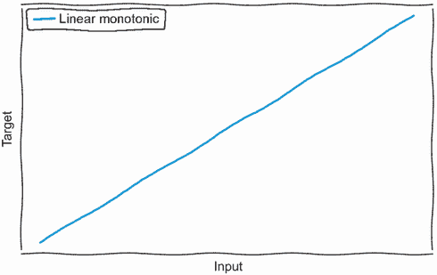

图 2.6 线性、单调函数的表示

我们也可以通过查看对应权重的绝对值来观察一个特征在预测目标变量中的影响或重要性。权重的绝对值越大，其重要性就越高。图 2.7 显示了 10 个特征按重要性降序排列的权重。

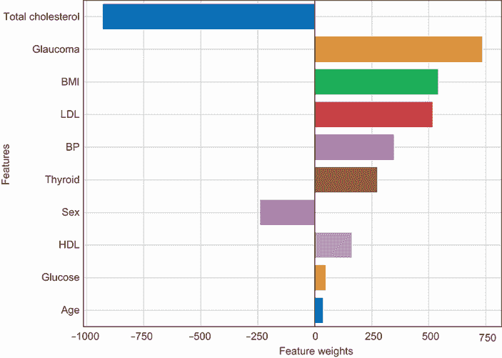

图 2.7 糖尿病线性回归模型的特征重要性

最重要的特征是总胆固醇测量值。其权重具有较大的负值。这意味着胆固醇水平的任何增加都会对预测糖尿病进展产生较大的负面影响。这可能是因为总胆固醇也包含了好的胆固醇类型。

如果我们现在查看坏胆固醇，或 LDL，特征，它具有较大的正权重，并且也是预测糖尿病进展的第四个最重要的特征。这意味着 LDL 胆固醇水平的任何增加都会对预测一年后糖尿病的进展产生较大的正影响。好的胆固醇，或 HDL，特征具有较小的正权重，并且是第三个最不重要的特征。为什么是这样？回想一下我们在 2.2 节中进行的探索性分析，我们在图 2.4 中绘制了相关矩阵。如果我们观察总胆固醇、LDL 和 HDL 之间的相关性，我们会看到总胆固醇和 LDL 之间有非常高的相关性，总胆固醇和 HDL 之间有中等程度的高相关性。由于这种相关性，模型认为 HDL 特征是冗余的。

看起来，对于该患者的基线葡萄糖测量对预测一年后糖尿病进展的影响非常小。如果我们再次回到图 2.4 所示的关联图，我们可以看到葡萄糖测量与基线青光眼测量（模型中第二重要的特征）高度相关，并且与总胆固醇（模型中最重要的特征）高度相关。因此，模型将葡萄糖视为一个冗余特征，因为大部分信号都来自总胆固醇和青光眼特征。

如果一个输入特征与一个或多个其他特征高度相关，则称它们为多重共线性。*多重共线性*可能会损害基于最小二乘法的线性回归模型的性能。假设我们使用两个特征，*x*[1]和*x*[2]，来预测目标变量*y*。在线性回归模型中，我们实际上是在估计每个特征的权重，这些权重将有助于预测目标变量，从而最小化平方误差。使用最小二乘法，特征*x*[1]的权重，或*x*[1]对目标变量*y*的影响，是通过保持*x*[2]不变来估计的。同样，*x*[2]的权重是通过保持*x*[1]不变来估计的。如果*x*[1]和*x*[2]是共线的，那么它们会一起变化，这就使得准确估计它们对目标变量的影响变得非常困难。其中一个特征对于模型来说变得完全冗余。我们之前在糖尿病模型中看到了共线性对模型的影响，其中像 HDL 和葡萄糖这样的特征与目标变量高度相关，但在最终模型中的重要性非常低。可以通过移除模型中的冗余特征来解决多重共线性问题。作为一个练习，我强烈建议你尝试这样做，看看你是否能提高线性回归模型的性能。

在训练机器学习模型的过程中，首先探索数据并确定特征之间以及它们与目标变量之间的相关性非常重要。多重共线性问题必须在模型训练之前早期发现，但如果被忽略，解释模型将有助于揭示这些问题。图 2.7 所示的图表可以使用以下代码片段在 Python 中生成：

```
import numpy as np                                                      ①
import matplotlib.pyplot as plt                                         ②
import seaborn as sns                                                   ②
sns.set(style=’whitegrid’)                                              ②
sns.set_palette(‘bright’)                                               ②

weights = lr_model.coef_                                                ③

feature_importance_idx = np.argsort(np.abs(weights))[::-1]              ④
feature_importance = [feature_names[idx].upper() for idx in             ⑤
  feature_importance_idx]                                               ⑤
feature_importance_values = [weights[idx] for idx in                    ⑤
  feature_importance_idx]                                               ⑤

f, ax = plt.subplots(figsize=(10, 8))                                   ⑥
sns.barplot(x=feature_importance_values, y=feature_importance, ax=ax)   ⑥
ax.grid(True)                                                           ⑥
ax.set_xlabel('Feature Weights')                                        ⑥
ax.set_ylabel('Features')                                               ⑥
```

① 导入 numpy 以优化方式对向量进行操作

② 导入 matplotlib 和 seaborn 以绘制特征重要性

③ 从之前训练的线性回归模型中通过 coef_ 参数获取权重

④ 按重要性降序排序权重并获取它们的索引

⑤ 使用有序索引获取特征名称和相应的权重值

⑥ 生成图 2.7 所示的图表

### 2.3.2 线性回归的局限性

在上一节中，我们看到了解释线性回归模型是多么容易。它非常透明，易于理解。然而，它的预测能力较差，尤其是在输入特征与目标之间的关系是非线性的情况下。考虑图 2.8 中显示的示例。

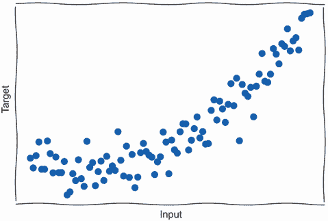

图 2.8 非线性数据集的说明

如果我们将线性回归模型拟合到这个数据集，我们会得到一个直线线性拟合，如图 2.9 所示。如图所示，该模型没有正确拟合数据，也没有捕捉到非线性关系。线性回归的这个局限性被称为*欠拟合*，并且模型被认为具有*高偏差*。在接下来的几节中，我们将看到如何通过使用具有更高预测能力的更复杂模型来克服这个问题。

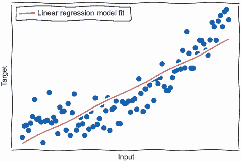

图 2.9 过拟合问题（高偏差）

## 2.4 决策树

决策树是一种优秀的机器学习算法，可以用来建模复杂的非线性关系。它可以应用于回归和分类任务。它比线性回归具有相对更高的预测能力，并且易于解释。决策树背后的基本思想是在数据中找到最佳分割，以最好地预测输出或目标变量。在图 2.10 中，我通过仅考虑两个特征，BMI 和年龄，来展示这一点。决策树将数据集分为总共五个组，三个年龄组和两个 BMI 组。

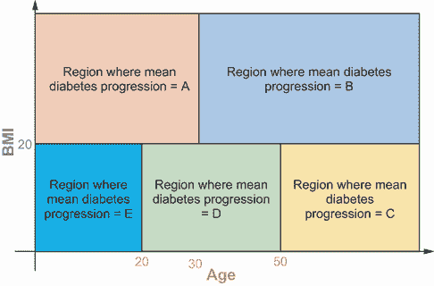

图 2.10 决策树分割策略

在确定最佳分割时，通常应用的算法是分类和回归树（CART）算法。该算法首先选择一个特征和该特征的阈值。基于该特征和阈值，算法将数据集分割成以下两个子集：

+   子集 1，其中特征的值小于或等于阈值

+   子集 2，其中特征的值大于阈值

算法选择特征和阈值，以最小化成本函数或标准。对于回归任务，这个标准通常是均方误差（MSE），而对于分类任务，通常是基尼不纯度或熵。然后算法继续递归地分割数据，直到标准进一步降低或达到最大深度。图 2.10 中的分割策略在图 2.11 中显示为一个二叉树。

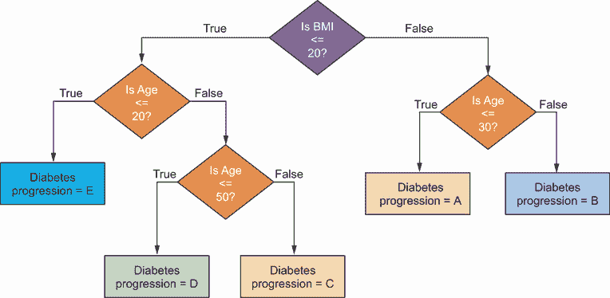

图 2.11 决策树数据分割以二叉树形式可视化

可以使用 Python 中的 Scikit-Learn 包训练决策树模型，如下所示。学习开放糖尿病数据集并将其分割为训练集和测试集的代码与第 2.3 节中用于线性回归的代码相同，因此这里不再重复：

```
from sklearn.tree import DecisionTreeRegressor                        ①

dt_model = DecisionTreeRegressor(max_depth=None, random_state=42)     ②

dt_model.fit(X_train, y_train)                                        ③

y_pred = dt_model.predict(X_test)                                     ④

mae = np.mean(np.abs(y_test - y_pred))                                ⑤
```

① 导入 scikit-learn 的决策树回归器类

② 初始化决策树回归器。设置 random_state 非常重要，以确保可以得到一致且可重复的结果。

③ 训练决策树模型

④ 使用训练好的决策树模型预测测试集中患者的疾病进展

⑤ 使用平均绝对误差（MAE）指标评估模型性能

这里训练的决策树模型使用 MAE 指标进行评估，性能确定为 54.7。如果我们调整*max_depth*超参数并将其设置为 3，我们可以进一步提高 MAE 性能到 48.6。然而，这种性能比第 2.2 节中训练的回归模型要差。我将在第 2.4.2 节中讨论这种差异的原因，但首先，让我们在下一节中看看如何解释决策树。

用于分类任务的决策树

如本节所述，决策树也可以用于分类任务。在 CART 算法中，Gini 不纯度或熵被用作成本函数。在 Scikit-Learn 中，你可以轻松地训练一个决策树分类器，如下所示：

```
    from sklearn.tree import DecisionTreeClassifier
    dt_model = DecisionTreeClassifier(criterion=’gini’, max_depth=None)
    dt_model.fit(X_train, y_train)
```

`DecisionTreeClassifier`中的`criterion`参数可以用来指定 CART 算法的成本函数。默认情况下，它设置为`gini`，但可以更改为`entropy`。

### 2.4.1 解释决策树

决策树擅长建模输入和输出之间的非线性关系。通过在特征间找到数据分割，模型倾向于学习一个本质上非线性的函数。这个函数可以是单调的，其中输入的变化导致输出以相同方向的变化，或者非单调的，其中输入的变化可能导致输出以任何方向和不同的速率变化。这如图 2.12 所示。

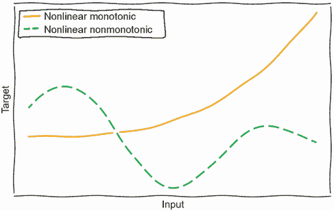

图 2.12 非线性、单调和非单调函数的表示

我们如何解释这样一个学习到的非线性函数？如前所述，决策树可以被视为一系列串联的 if-else 条件，其中每个条件将数据分成两部分。这样的模型可以很容易地可视化为一个二叉树，如图 2.11 所示。对于为糖尿病训练的决策树模型，二叉树的可视化如图 2.13 所示。树可以解释如下。

从树的根节点开始，检查标准化后的 BMI 是否小于等于 0。如果是，则进入树的左侧部分。如果不是，则进入树的右侧部分。因为我们是从树的根节点开始的，这个节点代表了 100%的数据。这就是为什么“样本”等于 100%的原因。此外，如果我们把*max_depth*设置为 0 并预测疾病进展，那么我们会使用数据中所有样本的平均值，即 153.7，在树中表示为*value*。通过预测 153.7，我们会得到一个均方误差（MSE）为 6076.4。

如果标准化后的 BMI <= 0，则我们进入树的左侧部分并检查标准化后的青光眼是否 <= 0。如果 BMI <= 0，我们将处理大约 59%的数据，MSE 将从父节点的 6076.4 减少到 3612.7。我们可以重复此过程，直到达到树的叶节点。如果我们查看最右侧的叶节点，这对应以下条件：如果 BMI > 0 且 BMI > 0.1 且 LDL > 0，则对 2.3%的数据预测 225.8，导致 MSE 为 2757.9。

请注意，图 2.13 中决策树的*max_depth*被设置为 3。随着*max_depth*的增加或输入特征数量的增加，此树的复杂性将增加。

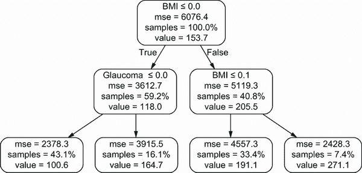

图 2.13 糖尿病决策树模型可视化

图 2.13 中的可视化可以使用以下代码片段在 Python 中生成：

```
from sklearn.externals.six import StringIO                                 ①
from IPython.display import Image                                          ①
from sklearn.tree import export_graphviz                                   ①
import pydotplus                                                           ①

diabetes_dt_dot_data = StringIO()                                          ②
export_graphviz(dt_model, 
                out_file=diabetes_dt_dot_data,
                filled=False, rounded=True,
                feature_names=feature_names,
                proportion=True,
                precision=1,
                special_characters=True)                                   ③
dt_graph = pydotplus.graph_from_dot_data(diabetes_dt_dot_data.getvalue())  ④
Image(dt_graph.create_png())                                               ⑤
```

① 导入所有必要的库以生成和可视化二叉树

② 初始化一个字符串缓冲区以存储 DOT 格式的二叉树/图

③ 将决策树模型导出为 DOT 格式的二叉树

④ 使用 DOT 格式字符串生成二叉树的图像

⑤ 使用 Image 类可视化二叉树

由于决策树学习输入特征与目标之间的非线性关系，很难理解每个输入的变化对输出的影响。这不如线性回归直观。然而，我们可以在全局层面上计算每个特征在预测目标时的相对重要性。为了计算特征重要性，我们首先需要计算二叉树中节点的权重。节点的权重是通过该节点在树中的概率加权，计算该节点成本函数或纯度度量的减少。这将在下面的数学公式中展示：

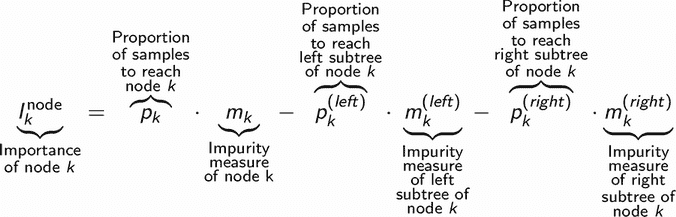

然后，我们可以通过将具有该特征分割的节点的重要性求和并除以树中所有节点的重要性来计算特征重要性。这将在下面的数学公式中展示。决策树的特征重要性介于 0 和 1 之间，其中更高的值表示更大的重要性：

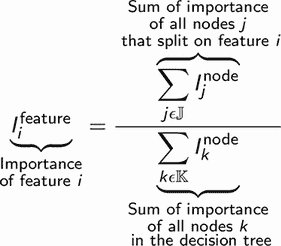

在 Python 中，可以从 Scikit-Learn 决策树模型中获取特征重要性，并按如下方式绘制：

```
weights = dt_model.feature_importances_                                  ①

feature_importance_idx = np.argsort(np.abs(weights))[::-1]               ②
feature_importance = [feature_names[idx].upper() for idx in              ③
  feature_importance_idx]                                                ③
feature_importance_values = [weights[idx] for idx in                     ③
  feature_importance_idx]                                                ③

f, ax = plt.subplots(figsize=(10, 8))                                    ④
sns.barplot(x=feature_importance_values, y=feature_importance, ax=ax)    ④
ax.grid(True)                                                            ④
ax.set_xlabel('Feature Weights')                                         ④
ax.set_ylabel('Features')                                                ④
```

① 从训练好的决策树模型中获取特征重要性

② 按重要性降序排序特征权重的索引

③ 按重要性降序获取特征名称和特征权重

④ 生成图 2.14 所示的图表

按照重要性降序排列的特征及其对应权重在图 2.14 中显示。如图所示，重要特征的顺序与线性回归不同。最重要的特征是 BMI，占整体模型重要性的约 42%。青光眼测量是下一个最重要的特征，占模型重要性的约 15%。这些重要性值有助于确定哪些特征在预测目标变量时具有最大的信号。决策树算法对多重共线性问题具有免疫力，因为它选择与目标高度相关的特征，并且最能减少成本函数或纯度。作为一名数据科学家，可视化学习到的决策树（如图 2.13 所示）非常重要，因为这有助于你理解模型是如何得出最终预测的。你可以通过设置*max_depth*超参数或通过修剪输入到模型中的特征数量来降低树的复杂性。你可以通过可视化全局特征重要性（如图 2.14 所示）来确定要修剪的特征。

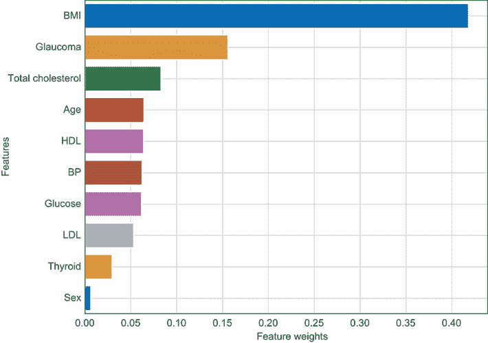

图 2.14 决策树对糖尿病特征的重要性

### 2.4.2 决策树的局限性

决策树非常灵活，因为它们可以应用于回归和分类任务，并且它们还具有建模非线性关系的能力。然而，该算法容易受到*过拟合*问题的影响，并且模型被认为具有*高方差*。

当模型*拟合*训练数据几乎完美时，就会发生过拟合问题，因此它对之前未见过的数据（如测试集）的泛化能力不好。这如图 2.15 所示。当模型过拟合时，你会在训练集上注意到非常好的性能，但在测试集上表现较差。这可以解释为什么在糖尿病数据集上训练的决策树模型的表现不如线性回归模型。

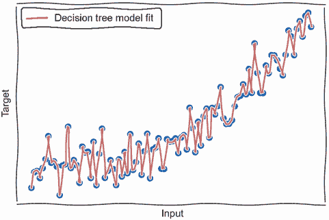

图 2.15 过拟合问题（高方差）

通过调整决策树中的某些超参数，如*max_depth*和叶节点所需的最小样本数，可以克服过拟合问题。如图 2.13 中决策树模型的可视化所示，一个叶节点只占样本的 0.8%。这意味着这个节点的预测仅基于大约三个患者的数据。通过将所需的最小样本数增加到 5 或 10，我们可以提高模型在测试集上的性能。

## 2.5 广义加性模型（GAMs）

Diagnostics+ 和医生们对迄今为止构建的两个模型相当满意，但性能并不那么好。通过解释模型，我们也发现了某些不足。线性回归模型似乎无法处理彼此高度相关的特征，例如总胆固醇、LDL 和 HDL。决策树模型的表现不如线性回归，并且似乎在训练数据上过度拟合。

让我们来看看糖尿病数据中的一个特定特征。图 2.16 展示了年龄与目标变量之间非线性关系的虚构示例，其中两个变量都已归一化。你将如何最好地建模这种关系而不过度拟合？一个可能的方法是扩展线性回归模型，其中目标变量被建模为特征集的*n*次多项式。这种回归形式称为多项式回归。

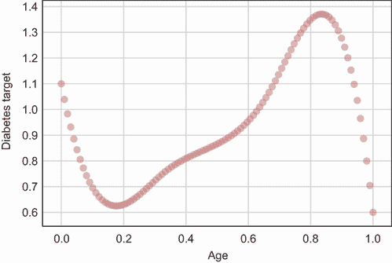


以下方程展示了不同次数的多项式回归。在这些方程中，我们只考虑一个特征*x*[1]来建模目标变量*y*。一次多项式与线性回归相同。对于二次多项式，我们会添加一个额外的特征，即*x*[1]的平方。对于三次多项式，我们会添加两个额外的特征——一个是*x*[1]的平方，另一个是*x*[1]的立方：

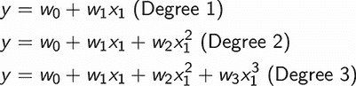

可以使用与线性回归相同的算法获得多项式回归模型的权重，即使用梯度下降的最小二乘法。图 2.17 中显示了三个多项式各自学习到的最佳拟合。我们可以看到，三次多项式比二次和一次多项式更好地拟合原始数据。我们可以像解释线性回归模型一样解释多项式回归模型，因为模型本质上是由包括高次特征在内的特征进行线性组合的。

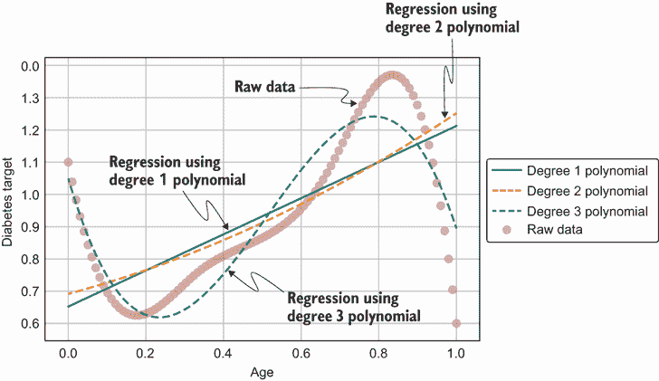

图 2.17 展示了用于建模非线性关系的多项式回归

然而，多项式回归也有一些局限性。随着特征数量或特征空间维度的增加，模型的复杂性也会增加。因此，它倾向于在数据上过度拟合。此外，在多项式中确定每个特征的次数也很困难，尤其是在高维特征空间中。

那么，哪种模型可以应用于克服所有这些限制，并且也是可解释的？欢迎广义加性模型（GAMs）！GAMs 是具有中等至高预测能力和高度可解释性的模型。非线性关系通过为每个特征使用平滑函数并将它们全部相加来建模，如下方程所示：

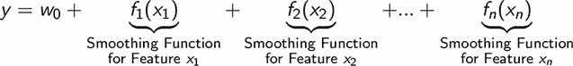

在这个方程式中，每个特征都有其关联的平滑函数，该函数最好地建模了该特征与目标之间的关系。你可以选择许多类型的平滑函数，但一种广泛使用的平滑函数被称为 *回归样条*，因为它既实用又计算高效。本书将重点关注回归样条。现在，让我们深入到使用回归样条的 GAMs 世界吧！

### 2.5.1 回归样条

回归样条表示为基函数的加权和。这在下一个方程式中以数学形式展示。在这个方程式中，*f*[j] 是一个函数，它建模了特征 *x*[j] 与目标变量之间的关系。这个函数表示为基函数的加权和，其中权重表示为 *w*[k]，基函数表示为 *b*[k]。在 GAMs 的上下文中，函数 *f*[j] 被称为平滑函数。

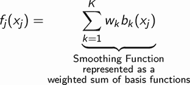

现在，什么是基函数？基函数是一组变换，可以用来捕捉一般形状或非线性关系。对于回归样条，正如其名称所暗示的，样条被用作基函数。样条是一个具有 *n* – `1` 个导数的 *n* 阶多项式。使用插图来理解样条将更容易。图 2.18 显示了不同阶数的样条。左上角的图表显示了最简单的 0 阶样条，由此可以生成更高阶的样条。正如你可以从左上角的图表中看到，六个样条被放置在一个网格上。想法是将数据的分布分割成部分，并在每一部分上拟合一个样条。因此，在这个插图中，数据被分割成六个部分，我们正在将每一部分建模为 0 阶样条。

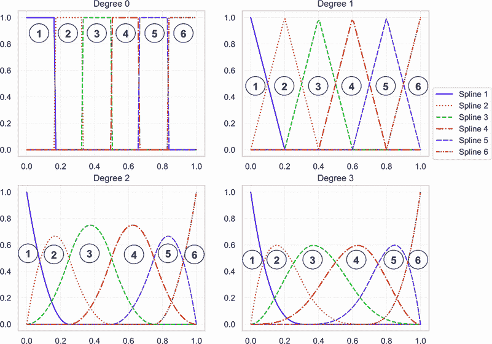

图 2.18 0 阶、1 阶、2 阶和 3 阶样条的示意图

一个 1 阶样条，如右上角图表所示，可以通过将 0 阶样条与其自身卷积生成。卷积是一种数学运算，它接受两个函数并创建一个第三函数，该函数表示第一个函数与第二个函数延迟副本的相关性。当我们对一个函数与其自身卷积时，我们实际上是在查看该函数与其自身延迟副本的相关性。Christopher Olah 有一篇关于卷积的很好的博客文章（[`mng.bz/5Kdq`](http://mng.bz/5Kdq)）。通过将 0 阶样条与其自身卷积，我们得到一个 1 阶样条，它是三角形的，并且具有连续的 0 阶导数。

如果我们现在将一个一次样条与其自身卷积，我们将得到一个二次样条，如图中左下角的图所示。这个二次样条有一个一阶导数。同样，我们可以通过卷积一个二次样条来得到一个三次样条，它有一个二阶导数。一般来说，一个*n*次样条有一个*n* – `1`阶导数。在极限情况下，当*n*趋向于无穷大时，我们将获得一个具有高斯分布形状的样条。在实践中，使用三次样条，或称为三次样条，因为它可以捕捉到大多数一般形状。

如前所述，在图 2.18 中，我们将数据的分布分成了六个部分，并在网格上放置了六个样条。在早期的数学方程中，部分数或样条的数量用变量*K*表示。回归样条背后的想法是学习每个样条的权重，这样你就可以在每个部分中建模数据的分布。网格中部分数或样条的数量*K*也称为自由度。一般来说，如果我们在这*K*个样条上放置网格，我们将有*K* + `3`个分割点，也称为节点。

现在我们来聚焦于三次样条，如图 2.19 所示。我们可以看到有六个样条，或者说六个自由度，导致有九个分割点或节点。

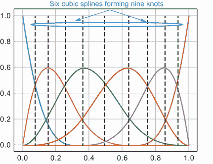

图 2.19 样条和节点的示意图

为了捕捉一个一般形状，我们需要对样条进行加权求和。在这里我们将使用三次样条。在图 2.20 中，我们使用相同的六个样条叠加来创建九个节点。对于左边的图，我为所有六个样条设置了相同的权重。正如你可以想象的那样，如果我们对所有六个样条进行等权重求和，我们将得到一条水平直线。这是对原始数据拟合不良的说明。然而，对于右边的图，我取了六个样条的不等权重求和，生成一个完美拟合原始数据的形状。这展示了回归样条和 GAMs 的强大功能。通过增加样条的数量或将数据分成更多部分，我们可以建模更复杂的非线性关系。在基于回归样条的 GAMs 中，我们分别对每个特征与目标变量的非线性关系进行建模，然后将它们全部加起来以得出最终的预测。

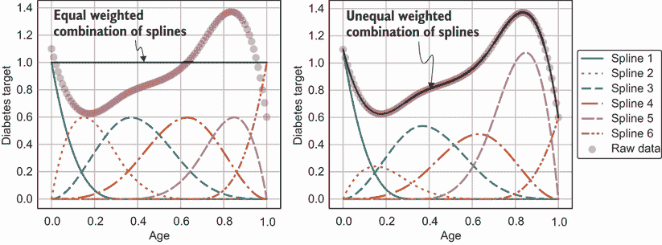

图 2.20 用于建模非线性关系的样条

在图 2.20 中，权重是通过试错法确定的，以最好地描述原始数据。但是，如何算法性地确定回归样条的最佳权重，以捕捉特征与目标之间的关系呢？回想一下本节开头提到的，回归样条是基函数或样条的有权总和。这本质上是一个线性回归问题，你可以使用最小二乘法和梯度下降法来学习权重。然而，我们需要指定结点的数量，或者说自由度。我们可以将其视为超参数，并使用称为 *交叉验证* 的技术来确定它。使用交叉验证，我们会移除一部分数据，并在剩余数据上拟合一个具有预定的结点数量的回归样条。然后，在这个保留的集合上评估这个回归样条。最佳的结点数量是导致在保留集合上性能最佳的数量。

在 GAMs 中，通过增加样条或自由度的数量，很容易过度拟合。如果样条的数量很高，得到的平滑函数（样条的有权总和）会非常“扭曲”——它开始拟合数据中的噪声。我们如何控制这种扭曲或防止过度拟合呢？我们可以使用一种称为 *正则化* 的技术。在正则化中，我们会在最小二乘成本函数中添加一个量化扭曲的项。然后，我们可以通过取函数的二阶导数的平方的积分来量化平滑函数的扭曲程度。然后，使用一个超参数（也称为正则化参数）*λ* 来调整扭曲的强度。*λ* 的值越高，对扭曲的惩罚就越重。我们可以使用与确定其他超参数相同的方式，通过交叉验证来确定 *λ*。

GAMs 概述

GAM 是一种强大的模型，其中目标变量被表示为一系列平滑函数的总和，这些平滑函数代表了每个特征与目标之间的关系。我们可以使用平滑函数来捕捉任何非线性关系。这在此处用数学公式表示：

*y = w*[0] + *f[1]*(*x*[1]) + *f[2]*(*x*[2]) +...+ *f[n]*(*x[n]*)

这是一个白盒模型——我们可以很容易地看到每个特征是如何通过平滑函数转换为输出的。表示平滑函数的一种常见方式是使用回归样条。回归样条表示为基函数的简单加权求和。GAMs 中广泛使用的基函数是三次样条。通过增加样条的数量或自由度，我们可以将数据的分布划分为小部分，并逐部分建模。这样，我们可以捕捉非常复杂的非线性关系。学习算法本质上必须确定回归样条的权重。我们可以像线性回归一样使用最小二乘法和梯度下降法来做这件事。我们可以使用交叉验证技术来确定样条的数量。随着样条数量的增加，GAMs 倾向于在数据上过拟合。我们可以通过使用正则化技术来防止这种情况。使用正则化参数*λ*，我们可以控制曲线的波动程度。较高的*λ*确保函数更加平滑。参数*λ*也可以通过交叉验证来确定。

GAMs 也可以用于建模变量之间的交互。GA2M，如数学上所示，是一种建模成对交互的 GAM：

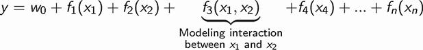

在主题专家（SMEs）——Diagnostics+示例中的医生——的帮助下，你可以确定需要建模哪些特征交互。你也可以查看特征之间的相关性，以了解需要一起建模哪些特征。

在 Python 中，你可以使用一个名为 pyGAM 的包来构建和训练 GAMs。它受到了 R 中流行的 mgcv 包中 GAM 实现的启发。你可以使用 pip 包在你的 Python 环境中安装 pyGAM，如下所示：

```
pip install pygam
```

### 2.5.2 GAM 用于 Diagnostics+糖尿病

现在让我们回到 Diagnostics+示例，使用所有 10 个特征来训练一个 GAM 以预测糖尿病进展。请注意，患者的性别是一个分类或离散特征。使用平滑函数来模拟这个特征是没有意义的。我们可以在 GAM 中将此类分类特征视为因子项。我们可以使用 pyGAM 包如下训练 GAM。与决策树一样，我不会重复加载糖尿病数据集并将其拆分为训练集和测试集的代码。请参阅第 2.2 节以获取该代码片段：

```
from pygam import LinearGAM                   ①
from pygam import s                           ②
from pygam import f                           ③

# Load data using the code snippet in Section 2.2

gam = LinearGAM(s(0) +                        ④
 f(1) +                                       ⑤
 s(2) +                                       ⑥
 s(3) +                                       ⑦
 s(4) +                                       ⑧
 s(5) +                                       ⑨
 s(6) +                                       ⑩
 s(7) +                                       ⑪
 s(8) +                                       ⑫
 s(9),                                        ⑬
 n_splines=35)                                ⑭

gam.gridsearch(X_train, y_train)              ⑮

y_pred = gam.predict(X_test)                  ⑯

mae = np.mean(np.abs(y_test - y_pred))        ⑰
```

① 从 pygam 导入 LinearGAM 类，可用于训练回归任务的 GAM

② 导入用于数值特征的平滑项函数

③ 导入用于分类特征的因子项函数

④ 年龄特征的立方样条项

⑤ 性别特征的因子项，这是一个分类特征

⑥ 体质指数（BMI）特征的立方样条项

⑦ 血压（BP）特征的立方样条项

⑧ 总胆固醇特征的立方样条项

⑨ 低密度脂蛋白（LDL）特征的立方样条项

⑩ HDL 特征的立方样条项

⑪ Thyroid 特征的立方样条项

⑫ Glaucoma 特征的立方样条项

⑬ Glucose 特征的立方样条项

⑭ 每个特征要使用的最大样条数量

⑮ 使用网格搜索进行训练和交叉验证，以确定每个特征的样条数量、正则化参数 lambda 以及回归样条的优化权重

⑯ 使用训练好的 GAM 模型在测试上进行预测

⑰ 使用 MAE 指标评估模型在测试集上的性能

现在是检验真伪的时刻！GAM 的表现如何？GAM 的 MAE 性能为 41.4，与线性回归和决策树模型相比，这是一个相当不错的改进。所有三个模型性能的比较总结在表 2.2 中。我还包括了 Diagnostics+和医生们一直在使用的基线模型的表现，他们在所有患者中查看糖尿病进展的中位数。所有模型都与基线进行比较，以显示模型为医生带来的改进程度。看起来 GAM 在所有性能指标上都是最好的模型。

表 2.2 线性回归、决策树和 GAM 相对于 Diagnostics+基线的性能比较

|  | MAE | RMSE | MAPE |
| --- | --- | --- | --- |
| 基线 | 62.2 | 74.7 | 51.6 |
| 线性回归 | 42.8 (–19.4) | 53.8 (–20.9) | 37.5 (–14.1) |
| 决策树 | 48.6 (–13.6) | 60.5 (–14.2) | 44.4 (–7.2) |
| GAM | 41.4 (–20.8) | 52.2 (–22.5) | 35.7 (–15.9) |

我们现在已经看到了 GAM 的预测能力。通过建模特征交互，特别是胆固醇特征之间的交互，以及与其他可能高度相关的特征（如 BMI）的交互，我们有可能进一步提高性能。作为一个练习，我鼓励你尝试使用 GAM 建模特征交互。

GAM 是白盒模型，可以很容易地解释。在下一节中，我们将看到如何解释 GAM。

GAM 分类任务

GAM 也可以通过使用逻辑链接函数来训练二元分类器，其中响应*y*可以是 0 或 1。在 pyGAM 包中，你可以使用逻辑 GAM 来解决二元分类问题，如下所示：

```
    from pygam import LogisticGAM
    gam = LogisticGAM()
    gam.gridsearch(X_train, y_train)
```

### 2.5.3 解释 GAM

虽然每个平滑函数都是通过基函数的线性组合获得的，但每个特征的最终平滑函数是非线性的，因此我们不能像线性回归那样解释权重。然而，我们可以通过部分依赖或部分效应图轻松地可视化每个特征对目标的影响。部分依赖通过边缘化其他特征来观察每个特征的影响。它非常易于解释，因为我们可以看到每个特征值对目标变量的平均影响。我们可以看到目标对特征的反应是线性、非线性、单调还是非单调。图 2.21 显示了每个病人特征对目标变量的影响。它们周围的 95%置信区间也已绘制。这将帮助我们确定模型对样本量较小的数据点的敏感性。

现在我们来看看图 2.21 中的几个特性，即 BMI 和 BP。BMI 对目标变量的影响显示在左下角的图表中。在*x*轴上，我们看到 BMI 的标准化值，而在*y*轴上，我们看到 BMI 对病人糖尿病进展的影响。我们看到随着 BMI 的增加，对糖尿病进展的影响也增加。右下角的图表显示了类似的趋势，BP 越高，对糖尿病进展的影响也越大。如果我们观察 95%置信区间线（图 2.21 中的虚线），我们会看到 BMI 和 BP 的上下端附近的置信区间更宽。这是因为在这个值范围内的病人样本较少，导致对这些特征在该范围内的效果的认知存在更高的不确定性。

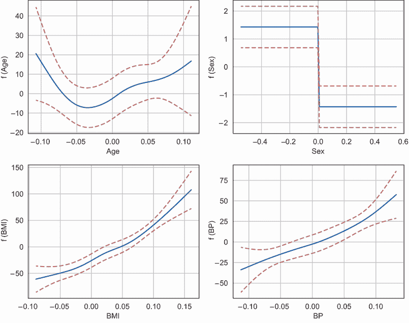

图 2.21 每个病人特征对目标变量的影响

生成图 2.21 的代码如下：

```
grid_locs1 = [(0, 0), (0, 1),                                              ①
              (1, 0), (1, 1)]                                              ①
fig, ax = plt.subplots(2, 2, figsize=(10, 8))                              ②
for i, feature in enumerate(feature_names[:4]):                            ③
    gl = grid_locs1[i]                                                     ④
    XX = gam.generate_X_grid(term=i)                                       ⑤
    ax[gl[0], gl[1]].plot(XX[:, i], gam.partial_dependence(term=i, X=XX))  ⑥
    ax[gl[0], gl[1]].plot(XX[:, i], gam.partial_dependence(term=i, X=XX, 
    ➥ width=.95)[1], c='r', ls='--')                                      ⑦
    ax[gl[0], gl[1]].set_xlabel('%s' % feature)                            ⑧
    ax[gl[0], gl[1]].set_ylabel('f ( %s )' % feature)                      ⑧
```

① 四个图表在 2x2 Matplotlib 网格中的位置

② 创建一个 2x2 的 Matplotlib 图表网格

③ 遍历四个病人元数据特征

④ 获取特征在 2x2 网格中的位置

⑤ 生成特征值的部分依赖，目标对其他特征进行边缘化

⑥ 以实线绘制部分依赖值

⑦ 以虚线绘制部分依赖值的 95%置信区间

⑧ 为 x 轴和 y 轴添加标签

图 2.22 显示了六个血液检测指标对目标的影响。作为一个练习，观察总胆固醇、LDL、HDL 和青光眼等特征对糖尿病进展的影响。你能说些什么关于更高 LDL 值（或坏胆固醇）对目标变量的影响？为什么更高总胆固醇对目标变量的影响较小？为了回答这些问题，让我们看看一些胆固醇值非常高的病人案例。以下代码片段将帮助您聚焦这些病人：

```
print(df_data[(df_data['Total Cholesterol'] > 0.15) &
              (df_data['LDL'] > 0.19)])
```

如果你执行此代码，你将看到 442 个病人中只有一个病人的总胆固醇读数大于 0.15，并且低密度脂蛋白读数大于 0.19。这位病人在一年后的空腹血糖水平（目标变量）似乎为 84，处于正常范围内。这可以解释为什么在图 2.22 中，我们看到了总胆固醇对目标变量在大于 0.15 的范围内的非常显著的负影响。总胆固醇的负影响似乎大于坏的低密度脂蛋白胆固醇对目标的正面影响。这些值范围内的置信区间似乎要宽得多。模型可能对这个异常病人的记录过度拟合，因此，我们不应过分解读这些影响。通过观察这些影响，我们可以识别出模型对预测有信心和存在高度不确定性的案例或值范围。对于高度不确定的案例，我们可以回到诊断中心收集更多病人数据，以便我们有代表性的样本。

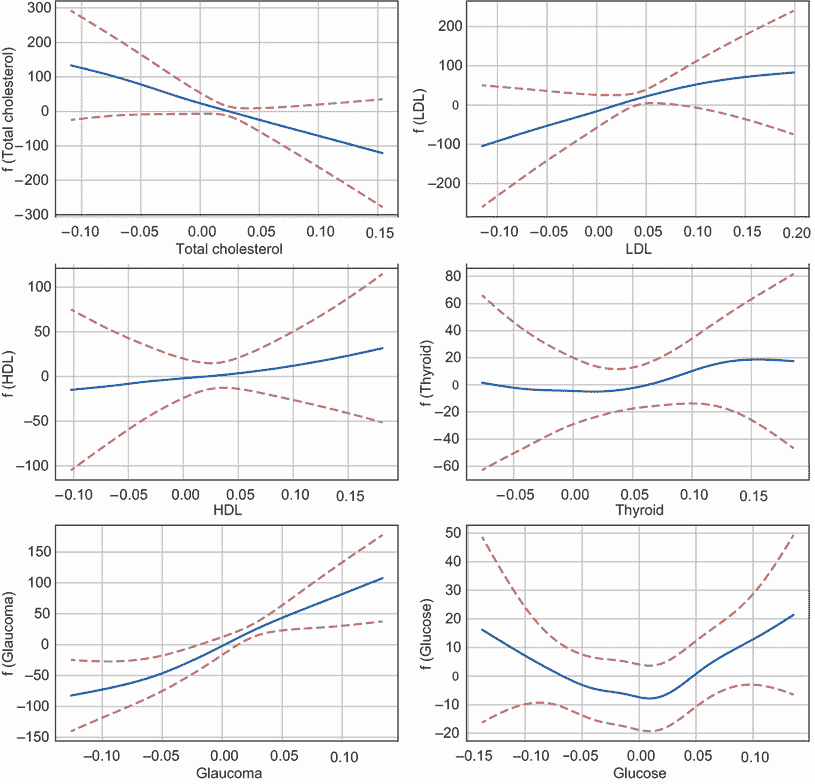

图 2.22 每个血液检测测量对目标变量的影响

生成图 2.22 的代码如下：

```
grid_locs2 = [(0, 0), (0, 1),                                   ①
             (1, 0), (1, 1),                                    ①
             (2, 0), (2, 1)]                                    ①
fig2, ax2 = plt.subplots(3, 2, figsize=(12, 12))                ②
for i, feature in enumerate(feature_names[4:]):                 ③
    idx = i + 4                                                 ④
    gl = grid_locs2[i]                                          ④
    XX = gam.generate_X_grid(term=idx)                          ⑤
    ax2[gl[0], gl[1]].plot(XX[:, idx], gam.partial_dependence(term=idx, 
    ➥ X=XX))                                                   ⑥
    ax2[gl[0], gl[1]].plot(XX[:, idx], gam.partial_dependence(term=idx, X=XX, 
    ➥ width=.95)[1], c='r', ls='--')                           ⑦
    ax2[gl[0], gl[1]].set_xlabel('%s' % feature)                ⑧
    ax2[gl[0], gl[1]].set_ylabel('f ( %s )' % feature)          ⑧
```

① 六个图表在 3 × 2 Matplotlib 网格中的位置

② 创建一个 3 × 2 网格的 Matplotlib 图表

③ 遍历六个血液检测测量特征

④ 获取特征在 3 × 2 网格中的位置

⑤ 生成特征值与目标变量对其他特征网格的边际化相关的部分依赖图

⑥ 以实线绘制部分依赖值

⑦ 以虚线绘制部分依赖值周围的 95% 置信区间

⑧ 为 x 轴和 y 轴添加标签

通过图 2.21 和 2.22，我们可以更深入地了解每个特征值对目标的边际效应。部分依赖图对于调试模型中的任何问题都很有用。通过绘制部分依赖值周围的 95% 置信区间，我们还可以看到样本量较小的数据点。如果一个特征值在样本量较小的情况下对目标有显著影响，那么可能存在过度拟合问题。我们还可以可视化平滑函数的波动性，以确定模型是否拟合了数据中的噪声。我们可以通过增加正则化参数的值来解决这些过度拟合问题。这些部分依赖图也可以与 SME（在这种情况下是医生）共享，以进行验证，这将有助于赢得他们的信任。

### 2.5.4 GAMs 的局限性

到目前为止，我们已经看到了 GAMs 在预测能力和可解释性方面的优势。GAMs 有过度拟合的倾向，尽管可以通过正则化来克服。然而，你需要注意以下其他局限性：

+   GAMs 对训练集中范围之外的特性值敏感，并且当暴露于异常值时往往会失去预测能力。

+   对于关键任务，GAMs 有时可能预测能力有限，在这种情况下，你可能需要考虑更强大的黑盒模型。

## 2.6 展望黑盒模型

黑盒模型是具有极高预测能力的模型，通常应用于模型性能（如准确度）极为重要的任务。然而，它们本质上是不可透见的，使它们不可透见的特征包括以下内容：

+   机器学习过程很复杂，你无法轻易理解输入特征是如何转换为输出或目标变量的。

+   你无法轻易识别出预测目标变量最重要的特征。

黑盒模型的例子包括随机森林和梯度提升树等树集成模型，深度神经网络（DNNs），卷积神经网络（CNNs）和循环神经网络（RNNs）。表 2.3 显示了这些模型通常应用的机器学习任务。

表 2.3 黑盒模型到机器学习任务的映射

| 黑盒模型 | 机器学习任务 |
| --- | --- |
| 树集成（随机森林、梯度提升树） | 回归和分类 |
| 深度神经网络（DNNs） | 回归和分类 |
| 卷积神经网络（CNNs） | 图像分类、目标检测 |
| 循环神经网络（RNNs） | 序列建模、语言理解 |

我现在已经在与 2.1 节中介绍的预测能力与可解释性平面相同的黑盒模型中进行了绘制，如图 2.23 所示。

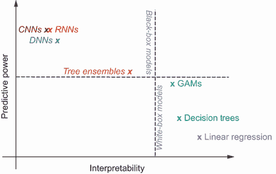

图 2.23 黑盒模型在可解释性与预测能力平面上的分布

黑盒模型因为具有高预测能力但低可解释性而被聚类在平面的左上角。对于关键任务，重要的是不要通过应用白盒模型来牺牲模型性能（如准确度）以换取可解释性。我们需要应用黑盒模型来完成这些任务，并且需要找到解释它们的方法。我们可以以多种方式解释黑盒模型，而这本书剩余章节的主要焦点。在下一章中，我们将特别关注树集成以及如何使用全局、模型无关的技术来解释它们。

### 摘要

+   白盒模型本质上是透明的。机器学习过程易于理解，你可以清楚地解释输入特征是如何转换为输出的。使用白盒模型，你可以识别出最重要的特征，而这些特征是可理解的。

+   线性回归是最简单的白盒模型之一，其中目标变量被建模为输入特征的线性组合。你可以使用最小二乘法和梯度下降法确定权重。

+   我们可以使用 Scikit-Learn 包中的`LinearRegression`类在 Python 中实现线性回归。你可以通过检查系数或学习到的权重来解释模型。权重也可以用来确定每个特征的重要性。然而，线性回归却存在多重共线性和高偏差的问题。

+   决策树是一种稍微高级一点的白盒模型，可以用于回归和分类任务。你可以通过将数据分割到所有特征上以最小化成本函数来预测目标变量。你已经学习了 CART 算法来学习分割。

+   使用 Scikit-Learn 中的`DecisionTreeRegressor`类，可以在 Python 中实现回归任务的决策树。你可以使用 Scikit-Learn 中的`DecisionTreeClassifier`类实现分类任务的决策树。你可以通过将 CART 学习到的决策树可视化成二叉树来解释它。Scikit-Learn 的实现还为你计算了特征重要性。决策树可以用来建模非线性关系，但往往容易过度拟合。

+   GAMs 是一种强大的白盒模型，其中目标变量被表示为一系列平滑函数的总和，这些平滑函数代表了每个特征与目标之间的关系。你知道回归样条和三次样条广泛用于表示平滑函数。

+   回归样条和广义加性模型（GAMs）可以使用 Python 中的 pyGAM 包实现。我们可以使用`LinearGAM`类进行回归任务，使用`LogisticGAM`类进行分类任务。你可以通过绘制每个特征对目标变量的部分依赖性来解释 GAM。GAMs 有过度拟合的倾向，但这个问题可以通过正则化来缓解。

+   黑盒模型是具有极高预测能力的模型，通常应用于模型性能（如准确率）极其重要的任务。然而，它们本质上是透明的。机器学习过程很复杂，你无法轻易理解输入特征是如何转换成输出或目标变量的。因此，你无法轻易识别出预测目标变量最重要的特征。
