# 3 模型无关方法：全局可解释性

本章涵盖

+   模型无关方法和全局可解释性的特点

+   如何实现树集成，特别是随机森林——一个黑盒模型

+   如何解释随机森林模型

+   如何使用称为部分依赖图（PDPs）的模型无关方法来解释黑盒模型

+   如何通过观察特征交互来揭示偏差

在上一章中，我们看到了两种不同的机器学习模型——白盒模型和黑盒模型，并将大部分注意力集中在如何解释白盒模型上。黑盒模型具有很高的预测能力，正如其名称所示，很难解释。在本章中，我们将专注于解释黑盒模型，并具体介绍那些*模型无关*和(*全局*)范围内的技术。回想一下第一章，模型无关的可解释性技术不依赖于所使用的特定模型类型。由于它们独立于模型的内部结构，因此可以应用于任何模型。此外，全局范围内的可解释性技术可以帮助我们理解整个模型。我们还将专注于树集成，特别是随机森林。尽管我们专注于随机森林，但你可以在本章中学到的模型无关技术应用于任何模型。在下一章中，我们将转向更复杂的黑盒模型，如神经网络。在第四章中，你还将了解局部范围内的模型无关技术，如 LIME、SHAP 和锚点。

第三章的结构与第二章相似。我们将从一个具体的例子开始。在本章中，我们将暂时放下 Diagnostics+，专注于与教育相关的问题。我选择这个问题是因为数据集有一些有趣的特点，我们可以通过本章中你将学习的可解释性技术来揭示这个数据集中的某些问题。与第二章一样，本章的主要重点是实现可解释性技术，以更好地理解黑盒模型（特别是树集成）。我们将在模型开发和测试过程中应用这些可解释性技术。你还将了解模型训练和测试，特别是实施方面。由于模型学习、测试和理解阶段是迭代的，因此涵盖这三个阶段是很重要的。对于已经熟悉树集成训练和测试的读者，可以自由跳过这些部分，直接进入可解释性部分。

## 3.1 高中生成绩预测器

让我们从一个具体的例子开始。我们将从诊断+和医疗保健行业切换到教育行业。美国一个学校区的区主管向您寻求帮助，以解决她的数据科学问题。区主管希望了解学生在三个关键学科领域——数学、阅读和写作——的表现，以确定不同学校的资金需求，并确保每个学生都能在《每个学生成功法案》（ESSA）的框架下取得成功。

区主管特别希望得到帮助，预测她辖区的高中生在数学、阅读和写作科目中的成绩。成绩可以是 A、B、C 或 F。根据这些信息，您会如何将这个问题表述为一个机器学习问题？因为模型的目的是预测成绩，这可以是四个离散值之一，所以这个问题可以表述为一个*分类*问题。在数据方面，区主管收集了她辖区代表不同学校和背景的 1,000 名学生的数据。以下五个数据点为每个学生收集：

+   性别

+   种族

+   父母的教育水平

+   学生购买的午餐类型

+   测试准备水平

基于这些数据，因此您需要训练三个独立的分类器，每个分类器对应一个学科领域。这如图 3.1 所示。

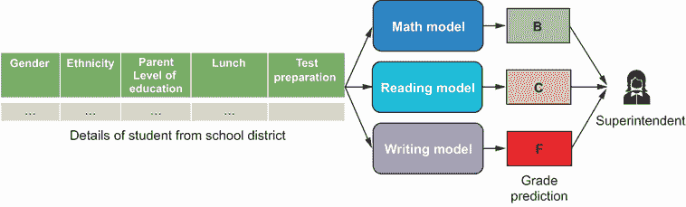

图 3.1 学校区主管所需的学生表现模型示意图

受保护属性和公平性

受保护属性是与个人相关的、与社会偏见有关的属性，包括性别、年龄、种族、民族、性取向等。美国和欧洲等某些地区的法律禁止基于这些受保护属性歧视个人，特别是在住房、就业和信贷贷款等领域。在构建可能使用这些受保护属性作为特征的机器学习模型时，了解这些法律框架和非歧视法律非常重要。我们希望确保机器学习模型不会嵌入偏见，并基于受保护属性歧视某些个人。在本章中，我们的数据集包含一些受保护属性，我们主要将其用作模型的特征，以学习如何通过可解释性技术揭示模型与偏见相关的问题。我们将在第八章更深入地介绍受保护属性的法律框架和各种公平性标准。此外，本章中使用的数据集是虚构的，并不反映学校区实际的学生表现。种族/民族特征也已匿名化。

### 3.1.1 探索性数据分析

我们在这里处理的是一个新数据集，所以在训练模型之前，让我们首先了解不同的特征及其可能的值。数据集包含五个特征：学生的性别、他们的民族、父母的教育水平、他们购买的午餐类型以及他们的测试准备水平。所有这些特征都是*分类*特征，其中可能的值是离散且有限的。对于每个学生有三个目标变量：数学成绩、阅读成绩和写作成绩。成绩可以是 A、B、C 或 F。

有两个性别类别——男性和女性，学生的女性人口（52%）略高于男性人口（48%）。现在让我们关注另外两个特征——学生的民族和父母的教育水平。图 3.2 显示了这些特征的各个类别以及属于这些类别的学生的比例。人口中有五个群体或民族，C 组和 D 组是最具代表性的，占学生人口的约 58%。有六个不同的父母教育水平。按顺序排列，它们是某些高中、（认可）高中、某些大学、副学士学位、学士学位和硕士学位。看起来有更多学生的父母教育水平较低。大约 82%的学生父母的教育水平是高中或大学水平或副学士学位。只有 18%的学生父母拥有学士学位或硕士学位。

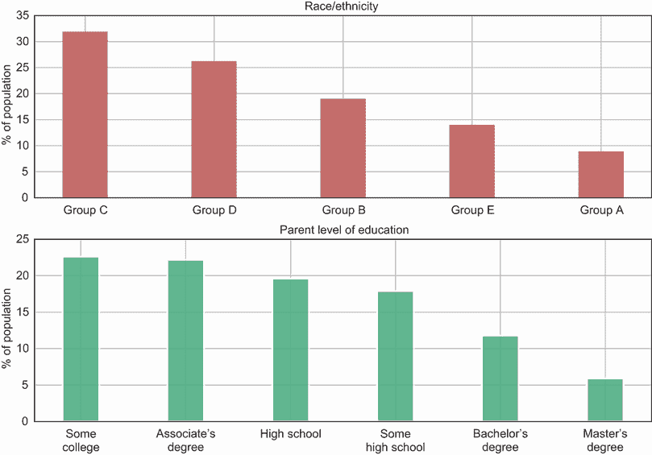

图 3.2 特征“民族”和“父母教育水平”的值和比例

接下来是剩余的两个特征——购买的午餐类型和测试准备水平。大多数人（大约 65%）购买标准午餐，其余的人购买免费/减价午餐。在测试准备方面，只有 36%的学生完成了他们的测试准备，而对于剩余的学生，要么没有完成，要么未知。

现在我们来看一下在三个学科领域中取得 A、B、C 或 F 成绩的学生比例。这显示在图 3.3 中。我们可以看到，大多数学生（48-50%）获得 B 级成绩，而极少数学生（3-4%）获得 F 级成绩。大约 18-25%的学生获得 A 级成绩，在整个三个学科领域中，22-28%的学生获得 C 级成绩。值得注意的是，在我们训练模型之前，数据相当不平衡。这为什么很重要，我们如何处理不平衡数据？在分类问题中，当我们给定类别存在不成比例的例子或数据点时，我们说数据是不平衡的。这一点很重要，因为大多数机器学习算法在各个类别的样本比例大致相同的情况下表现最佳。大多数算法旨在最小化错误或最大化准确度，这些算法倾向于自然地偏向多数类。我们可以通过几种方式处理不平衡的类别，包括以下常见方法：

+   在测试和评估模型时，使用正确的性能指标。

+   重新采样训练数据，使得多数类要么被欠采样，要么少数类被过采样。

你将在第 3.2 节中了解更多关于这些方法的信息。

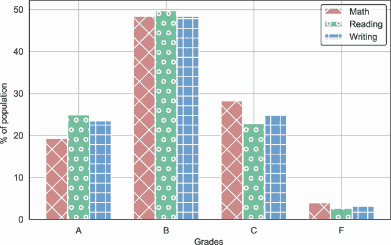

图 3.3 三个学科领域中成绩目标变量的值和比例

让我们更深入地剖析一下数据。以下见解将在第 3.4 节中对我们解释和验证模型学到了什么很有用。当学生的父母教育水平最低和最高时，学生通常表现如何？让我们比较父母教育水平最低（即高中）的学生与父母教育水平最高（即硕士学位）的学生的成绩分布。图 3.4 显示了所有三个学科领域的这种比较。


图 3.4 比较父母拥有高中教育与硕士学位的学生成绩分布百分比

让我们关注那些父母有高中教育背景的学生。在所有三个学科领域，从总体上看，获得 A 级的学生比总体人口中更多，而获得 F 级的学生比总体人口中更少。例如，在数学学科领域，只有 10%的父母有高中教育背景的学生获得 A 级，而总体人口（如图 3.3 所示）中大约有 20%的学生获得 A 级。现在让我们关注那些父母有硕士学位的学生。从总体上看，与总体人口相比，获得 A 级的学生更多，没有学生获得 F 级。例如，在数学学科领域，大约有 30%的父母有硕士学位的学生获得 A 级。如果我们现在比较图 3.4 中的两个条形图，我们可以看到，当父母在所有三个学科领域拥有更高教育水平时，获得更高等级（A 或 B）的学生数量会显著增加。

那么，种族因素如何呢？属于最代表性群体（C 组）的学生与属于最少代表性群体（A 组）的学生在表现上有什么不同？从图 3.2 中，我们知道最代表性群体是 C 组，最少代表性群体是 A 组。图 3.5 比较了属于 C 组的学生与属于 A 组的学生成绩分布。

从总体上看，C 组的学生似乎比 A 组的学生表现更好——似乎有更大比例的学生获得了更高的成绩（A 或 B），而获得较低成绩（C 或 F）的学生比例较小。如前所述，本节中的见解将在第 3.4 节中派上用场，当我们解释和验证模型学到了什么时。

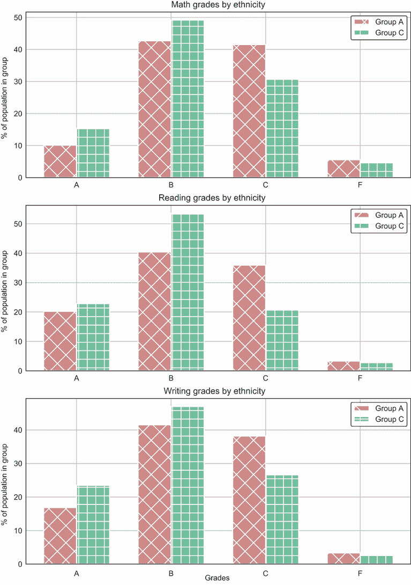

图 3.5 比较属于种族群体 A 和 C 的学生成绩分布百分比

## 3.2 树集成

在第二章中，你学习了决策树，这是一种建模非线性关系的强大方法。决策树是白盒模型，易于解释。然而，我们注意到更复杂的决策树存在过拟合的问题，即模型过度拟合数据中的噪声或方差。为了克服过拟合的问题，我们可以通过剪枝来降低决策树的复杂性，包括深度和叶节点所需的最小样本数。然而，这会导致预测能力降低。

通过结合多个决策树，我们可以在不牺牲预测能力的情况下避免过拟合问题。这是树集成背后的原理。我们可以以下两种广泛的方式组合或集成决策树：

+   *Bagging*——在训练数据的独立随机子集上并行训练多个决策树。我们可以使用这些独立的决策树进行预测，并通过取平均值将它们组合起来，得出最终的预测。随机森林是使用 Bagging 技术的一种树集成。除了在数据的随机子集上训练独立的决策树外，随机森林算法还随机抽取特征子集来分割数据。

+   *Boosting*——与 Bagging 类似，Boosting 技术也训练多个决策树，但顺序不同。第一个决策树通常是一个浅层树，并在训练集上训练。第二个决策树的目标是从第一个决策树的错误中学习，并进一步提高性能。使用这种技术，我们将多个决策树串联起来，它们迭代地尝试优化和减少前一个决策树所犯的错误。自适应提升和梯度提升是两种常见的 Boosting 算法。

在本章中，我们将重点关注集成学习技术，特别是*随机森林*算法，如图 3.6 所示。首先，我们从训练数据中随机抽取子集，并在这些子集上分别训练独立的决策树。然后，每个决策树在特征随机子集上进行分割。我们通过在所有决策树中进行多数投票来获得最终的预测。正如您所看到的，随机森林模型比决策树复杂得多。随着集成中树的数量增加，复杂性也随之增加。此外，由于每个决策树都从数据特征中抽取随机子集进行分割，因此很难可视化和解释所有决策树中特征的分割情况。这使得随机森林成为一个黑盒模型，难以解释。能够解释算法并不意味着在这种情况下具有可解释性。

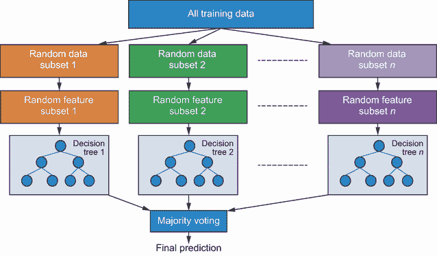

图 3.6 随机森林算法的示意图

为了完整性，让我们也讨论一下自适应提升和梯度提升算法的工作原理。*自适应提升*，通常简称为*AdaBoost*，如图 3.7 所示。该算法的工作原理如下。首先，我们使用所有训练数据训练一个决策树。在第一个决策树中，每个数据点都被赋予相同的权重。一旦第一个决策树训练完成，通过计算每个数据点的加权误差总和来计算树的误差率。然后，我们使用这个加权误差率来确定决策树的权重。如果树的误差率较高，则给树赋予较低的权重，因为其预测能力较低。如果误差率较低，则给树赋予较高的权重，因为它具有更高的预测能力。然后，我们使用第一个决策树的权重来确定第二个决策树的每个数据点的权重。被错误分类的数据点将被赋予更高的权重，以便第二个决策树尝试降低误差率。我们按顺序重复此过程，直到达到训练期间设置的树的数量。在所有树都训练完成后，我们通过加权多数投票来得出最终预测。由于权重较高的决策树具有更高的预测能力，它在最终预测中具有更大的影响力。

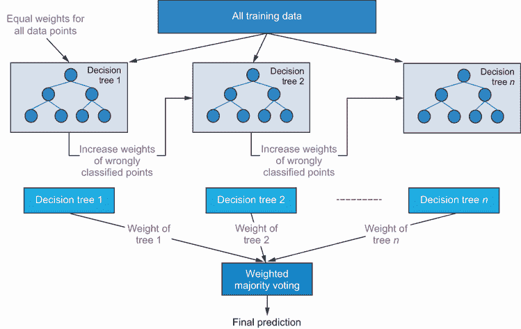

图 3.7 AdaBoost 算法的示意图

*梯度提升*算法的工作原理略有不同，如图 3.8 所示。与 AdaBoost 一样，第一个决策树是在所有训练数据上训练的，但与 AdaBoost 不同，没有与数据点关联的权重。在训练第一个决策树后，我们计算一个残差误差指标，即实际目标和预测目标之间的差异。然后，我们训练第二个决策树来预测第一个决策树造成的残差误差。因此，与 AdaBoost 中更新每个数据点的权重不同，梯度提升直接预测残差误差。每个树的目标是修正前一个树的错误。这个过程按顺序重复，直到达到训练期间设置的树的数量。在所有树都训练完成后，我们通过求和所有树的预测来得出最终预测。

如前所述，我们将重点关注随机森林算法，但用于训练、评估和解释算法的方法也可以扩展到提升技术。

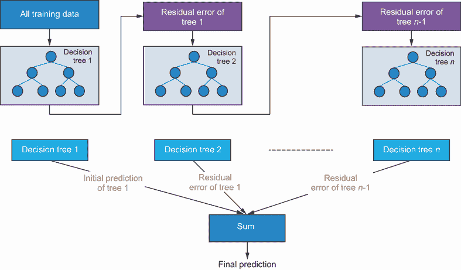

图 3.8 梯度提升算法的示意图

### 3.2.1 训练随机森林

现在让我们训练我们的随机森林模型来预测高中生的表现。以下代码片段显示了在训练模型之前如何准备数据。请注意，当将数据分为训练集和测试集时，20%的数据用于测试。其余数据用于训练和验证。此外，我们对数学目标变量进行分层抽样，以确保训练集和测试集的分数分布相同。您也可以使用阅读和写作分数轻松创建类似的分割：

```
import pandas as pd
from sklearn.preprocessing import LabelEncoder

# Load the data
df = pd.read_csv('data/StudentsPerformance.csv')                             ①

# First, encode the input features
gender_le = LabelEncoder()                                                   ②
race_le = LabelEncoder()                                                     ②
parent_le = LabelEncoder()                                                   ②
lunch_le = LabelEncoder()                                                    ②
test_prep_le = LabelEncoder()                                                ②
df['gender_le'] = gender_le.fit_transform(df['gender'])                      ③
df['race_le'] = race_le.fit_transform(df['race/ethnicity'])                  ③
df['parent_le'] = parent_le.fit_transform(df['parental level of education']) ③
df['lunch_le'] = lunch_le.fit_transform(df['lunch'])                         ③
df['test_prep_le'] = test_prep_le.fit_transform(df['test preparation         ③
➥ course']);                                                                ③

# Next, encode the target variables
math_grade_le = LabelEncoder()                                               ④
reading_grade_le = LabelEncoder()                                            ④
writing_grade_le = LabelEncoder()                                            ④
df['math_grade_le'] = math_grade_le.fit_transform(df['math grade'])          ⑤
df['reading_grade_le'] = reading_grade_le.fit_transform(df['reading grade']) ⑤
df['writing_grade_le'] = writing_grade_le.fit_transform(df['writing grade']) ⑤

# Creating training/val/test sets
df_train_val, df_test = train_test_split(df, test_size=0.2,                  ⑥
stratify=df['math_grade_le'], #F shuffle=True, random_state=42)              ⑥
feature_cols = ['gender_le', 'race_le', 
 'parent_le', 'lunch_le',[CA] 'test_prep_le']
X_train_val = df_train_val[feature_cols]                                     ⑦
X_test = df_test[feature_cols]                                               ⑦
y_math_train_val = df_train_val['math_grade_le']                             ⑧
y_reading_train_val = df_train_val['reading_grade_le']                       ⑧
y_writing_train_val = df_train_val['writing_grade_le']                       ⑧
y_math_test = df_test['math_grade_le']                                       ⑧
y_reading_test = df_test['reading_grade_le']                                 ⑧
y_writing_test = df_test['writing_grade_le']                                 ⑧
```

① 将数据加载到 Pandas DataFrame 中

② 因为输入特征是文本和分类的，我们需要将它们编码成数值。

③ 将输入特征拟合并转换为数值

④ 初始化目标变量的 LabelEncoders，因为字母成绩需要转换为数值

⑤ 将目标变量拟合并转换为数值

⑥ 将数据分割为训练/验证集和测试集

⑦ 提取训练/验证集和测试集的特征矩阵

⑧ 提取训练/验证集和测试集中的数学、阅读和写作的目标向量

一旦您准备好了数据，现在就可以训练数学、阅读和写作的三个随机森林模型，如下代码示例所示。请注意，我们可以使用交叉验证来确定随机森林分类器的最佳参数。此外，请注意，随机森林算法首先随机选取训练数据的子集来训练每个决策树，对于每个决策树，模型随机选取特征子集来分割数据。对于算法中的这两个随机元素，设置随机数生成器的种子（使用`random_state`参数）非常重要。如果没有设置这个种子，您将无法获得可重复和一致的结果。首先，让我们使用一个辅助函数来创建一个具有预定义参数的随机森林模型：

```
from sklearn.ensemble import RandomForestClassifier

def create_random_forest_model(n_estimators,                      ①
                               max_depth=10,                      ②
                               criterion='gini',                  ③
                               random_state=42,                   ④
                               n_jobs=4):                         ⑤
    return RandomForestClassifier(n_estimators=n_estimators,
                                  max_depth=max_depth,
                                  criterion=criterion,
                                  random_state=random_state,
                                  n_jobs=n_jobs)
```

① 设置随机森林中的决策树数量

② 决策树的最大深度参数

③ 使用基尼不纯度作为优化每个决策树的代价函数

④ 为了可重复性，设置随机数生成器的种子

⑤ 将 n_jobs 设置为并行训练单个决策树，使用您计算机上所有可用的核心

现在让我们使用这个辅助函数来初始化和训练数学、阅读和写作三个随机森林模型，如下所示：

```
math_model = create_random_forest_model(50)                  ①
math_model.fit(X_train_val, y_math_train_val)                ②
y_math_model_test = math_model.predict(X_test)               ③

reading_model = create_random_forest_model(25)               ④
reading_model.fit(X_train_val, y_reading_train_val)          ④
y_reading_model_test = reading_model.predict(X_test)         ④

writing_model = create_random_forest_model(40)               ⑤
writing_model.fit(X_train_val, y_writing_train_val)          ⑤
y_writing_model_test = writing_model.predict(X_test)         ⑤
```

① 使用 50 个决策树初始化数学模型的随机森林分类器

② 使用数学成绩作为目标，在训练数据上拟合数学学生表现分类器

③ 使用预训练模型预测测试集中所有学生的数学成绩

④ 使用 25 个决策树初始化和训练随机森林分类器以预测阅读成绩

⑤ 使用 40 个决策树初始化和训练随机森林分类器以预测写作成绩

现在我们已经训练了数学、阅读和写作的三个随机森林模型，让我们评估它们，并将它们与一个总是预测所有科目大多数成绩（在这种情况下，为 B）的基线模型进行比较。通常用于分类问题的指标是准确率。然而，这个指标在类别不平衡的情况下并不适用。在我们的案例中，我们已经看到学生成绩相当不平衡，如图 3.3 所示。例如，如果 98%的学生在数学中获得 B 级成绩，你可以通过总是预测所有学生的 B 级成绩来欺骗自己构建一个具有 98%准确率的高度准确模型。为了衡量模型在所有类别上的性能，我们可以使用更好的指标，如精确度、召回率和 F1。*精确度*是一个衡量预测类别准确比例的指标。*召回率*是一个衡量模型准确预测的实际类别比例的指标。精确度和召回率的公式如下：


完美分类器的精确度和召回率均为 1，因为假阳性和假阴性的数量将为 0。但在实践中，这两个指标是相互矛盾的——你总是在假阳性和假阴性之间做出权衡。随着你减少假阳性并提高精确度，成本将增加假阴性和降低召回率。为了在精确度和召回率之间找到正确的平衡，我们可以将这两个指标结合成一个称为 F1 的分数。*F1 分数*是精确度和召回率的调和平均值，如下所示：

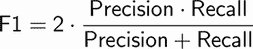

表 3.1 显示了所有三个模型的性能。它们与每个科目的基线进行比较，以查看新模型提供了多少性能改进。校长使用的一个合理的基线是预测每个科目的大多数成绩（在这种情况下，为 B）。

表 3.1 数学、阅读和写作模型的性能

|  | 精确度（%） | 召回率（%） | F1 分数（%） |
| --- | --- | --- | --- |
| 数学基线 | 23 | 49 | 32 |
| 数学模型 | 39 | 41 | 39 |
| 阅读基线 | 24 | 49 | 32 |
| 阅读模型 | 39 | 43 | 41 |
| 写作基线 | 18 | 43 | 25 |
| 写作模型 | 44 | 45 | 41 |

在性能方面，我们可以看到，在精确度和 F1 方面，数学和阅读随机森林模型优于基线模型。然而，在召回率方面，基线数学和阅读模型在随机森林模型中表现更好。因为基线模型总是预测多数类，所以它总是正确地预测所有多数类。但是，精确度指标和 F1 为我们提供了衡量所有预测准确性的更好指标。写作主题领域的随机森林模型在所有三个指标上都优于基线模型。校长对这种性能提升感到满意，但现在想了解模型是如何得出预测的。在第 3.3 节和第 3.4 节中，我们将看到如何解释随机森林模型。

训练 AdaBoost 和梯度提升树

我们可以使用 Scikit-Learn 提供的`AdaBoostClassifier`类来训练 AdaBoost 分类器。在 Python 中初始化 AdaBoost 分类器如下：

```
    from sklearn.ensemble import AdaBoostClassifier
    math_adaboost_model = AdaBoostClassifier(n_estimators=50)
```

我们使用 Scikit-Learn 提供的`GradientBoostingClassifier`类来训练梯度提升树分类器，如下所示：

```
    from sklearn.ensemble import GradientBoostingClassifier
    math_gbt_model = GradientBoostingClassifier(n_estimators=50)
```

我们以与随机森林分类器相同的方式进行模型训练。梯度提升树的变体（如 CatBoost 和 XGBoost）更快且可扩展。作为练习，尝试为所有三个主题领域训练 AdaBoost 和梯度提升分类器，并将你的结果与随机森林模型进行比较。

## 3.3 随机森林的解释

随机森林是由多个决策树组成的集成，因此我们可以通过平均所有决策树中每个特征的归一化特征重要性来查看每个特征的全球相对重要性。在第二章中，我们看到了如何计算决策树的特征重要性。以下是一个给定决策树*t*的示例：

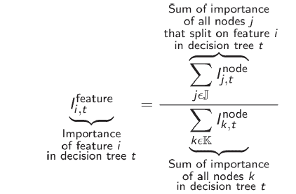

为了计算相对重要性，我们需要通过除以所有特征重要性值的总和来归一化之前显示的特征重要性，如下所示：


现在，你可以轻松地通过平均所有决策树中该特征的归一化特征重要性来计算随机森林中每个特征的全球相对重要性，如下所示。请注意，特征重要性在 AdaBoost 和梯度提升树中是按相同方式计算的：

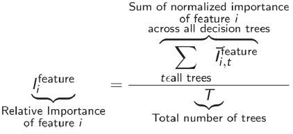

在 Python 中，我们可以从 Scikit-Learn 的随机森林模型中获取特征重要性，并如下所示进行绘图：

```
math_fi = math_model.feature_importances_ * 100                        ①
reading_fi = reading_model.feature_importances_ * 100                  ②
writing_fi = writing_model.feature_importances_ * 100                  ③

feature_names = ['Gender', 'Ethnicity', 'Parent Level of Education',
                 ➥ 'Lunch', 'Test Preparation']                       ④

# Code below plots the relative feature importance
# of the math, reading and writing random forest models
fig, ax = plt.subplots()
index = np.arange(len(feature_names))
bar_width = 0.2
opacity = 0.9
error_config = {'ecolor': '0.3'}
ax.bar(index, math_fi, bar_width,
       alpha=opacity, color='r',
       label='Math Grade Model')
ax.bar(index + bar_width, reading_fi, bar_width,
       alpha=opacity, color='g',
       label='Reading Grade Model')
ax.bar(index + bar_width * 2, writing_fi, bar_width,
       alpha=opacity, color='b',
       label='Writing Grade Model')   
ax.set_xlabel('')
ax.set_ylabel('Feature Importance (%)')
ax.set_xticks(index + bar_width)
ax.set_xticklabels(feature_names)
for tick in ax.get_xticklabels():
    tick.set_rotation(90)
ax.legend(loc='center left', bbox_to_anchor=(1, 0.5))
ax.grid(True);
```

① 获取数学随机森林模型的特征重要性

② 获取阅读随机森林模型的特征重要性

③ 获取写作随机森林模型的特征重要性

④ 初始化特征名称列表

特征及其重要性值显示在图 3.9 中。如图所示，对于三个主题来说，最重要的两个特征是父母的受教育程度和学生的种族。这是有用的信息，但它并没有告诉我们关于成绩如何受不同教育水平的影响，以及种族和教育如何相互作用的任何信息。

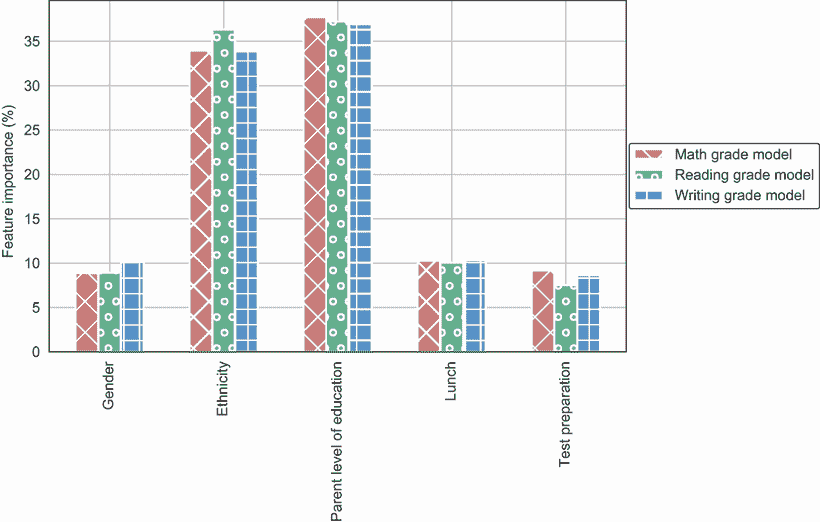

图 3.9 随机森林模型的特征重要性

此外，我们可以轻松地计算和可视化树集成特征的重要性，但当我们将目光转向神经网络和更复杂的黑盒模型时，这会变得非常困难，这一点在第四章中会更加明显。因此，我们需要考虑对黑盒模型类型无差别的可解释性技术。以下章节将介绍这些模型无关的方法。

## 3.4 模型无关方法：全局可解释性

到目前为止，我们一直在关注特定模型或依赖的可解释性技术。对于白盒模型，我们看到了如何使用最小二乘法学习到的权重来解释线性回归模型。我们通过将决策树可视化为一棵二叉树来解释它们，其中每个节点使用 CART 算法确定的特征来分割数据。我们还能够可视化特征的全局重要性，其计算对模型是特定的。我们通过可视化单个特征对目标变量的平均基函数效应，然后对其他特征进行边缘化来解释 GAMs。这些可视化被称为部分依赖图或部分效应图。

对于像树集成这样的黑盒模型，我们可以计算特征的全球相对重要性，但不能将这种计算扩展到其他黑盒模型，如神经网络。为了更好地解释黑盒模型，我们现在将探索可以应用于任何类型模型的模型无关方法。在本章中，我们还将关注全局范围内的可解释性技术。全局可解释性技术旨在更好地理解模型的整体，即特征对目标变量的全局影响。一个全局可解释的模型无关方法是部分依赖图（PDPs）。你将在下一节中看到如何将你在第二章中学到的用于 GAMs 的部分依赖图扩展到像随机森林这样的黑盒模型。我们将正式定义 PDPs，并了解如何将 PDPs 扩展以可视化任意两个特征之间的交互，以验证模型是否捕捉到了它们之间的任何依赖关系。

模型无关的可解释性技术也可以是局部的。我们可以使用这些技术来解释给定局部实例或预测的模型。例如，LIME、SHAP 和锚定技术是模型无关且局部的，你将在第四章中了解更多关于它们的内容。

### 3.4.1 偏依赖图

正如我们在第二章中看到的 GAMs 一样，偏依赖图（PDPs）背后的思想是展示不同特征值对模型预测的边缘或平均效应。设 f 为模型学习到的函数。对于高中学生预测问题，设 *f*[math]、*f*[reading] 和 *f*[writing] 分别为为数学、阅读和写作学科领域训练的随机森林模型学习到的函数。对于每个学科，该函数返回给定输入特征下获得一定等级的概率。现在让我们专注于数学随机森林模型以便于理解。你可以轻松地将你现在学到的理论扩展到其他学科领域。

假设对于数学随机森林模型，我们想了解不同的父母教育水平对预测给定等级有什么影响。为了实现这一点，我们需要做以下几步：

+   使用与数据集中相同的值来设置其余特征。

+   通过将父母教育水平设置为所有数据点的感兴趣值来创建一个人工数据集——如果你对查看高中教育对学生成绩的平均效应感兴趣，那么将父母教育水平设置为所有数据点的高中教育。

+   运行模型，并获取这个人工集中所有数据点的预测。

+   取预测的平均值以确定该父母教育水平的整体平均效应。

更正式地说，如果我们想绘制特征 *S* 的偏依赖图，我们就在其他特征（表示为集合 *C*）上求边缘，将特征 *S* 设置为感兴趣的值，然后观察数学模型对特征 *S* 的平均影响，假设集合 *C* 中所有特征的值都是已知的。让我们来看一个具体的例子。假设我们想了解父母教育水平对学生数学成绩的边缘效应。在这种情况下，特征 *S* 是父母教育水平，其余的特征表示为 *C*。为了了解，比如说，高中教育水平的影响，我们将特征 *S* 设置为对应高中教育的值（感兴趣的值），并取数学模型输出的平均值，假设我们知道其余特征的值。数学上，这可以通过以下方程表示：

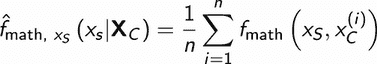

在这个方程中，特征 *S* 的偏函数是通过计算学习函数 *f*[math] 的平均值得到的，假设训练集中所有示例的特征 *C* 的值都是已知的，表示为 *n*。

需要注意的是，如果特征 *S* 与集合 *C* 中的特征相关联，则 PDP（部分依赖图）不可信。为什么是这样呢？为了确定特征 *S* 的给定值的平均效应，我们正在创建一个人工数据集，其中我们使用集合 *C* 中所有其他特征的原始特征值，但将特征 *S* 的值更改为感兴趣的值。如果特征 *S* 与集合 *C* 中的任何特征高度相关，我们可能会创建一个极不可能的人工数据集。让我们看一个具体的例子。假设我们感兴趣的是了解学生家长的高中教育水平对其成绩的平均影响。我们将设置训练集中所有实例的家长教育水平为高中。现在，如果家长教育水平与种族高度相关，我们知道给定种族的家长教育水平，那么我们可能会遇到一个不太可能的情况，即属于某个种族的家长只有高中教育。因此，我们正在创建一个与原始训练数据分布不匹配的人工数据集。由于模型尚未接触到该数据分布，该模型的预测可能会非常不准确，导致不可信的 PDP。我们将在第 3.4.2 节中回到这个限制。

现在我们来看看如何实现 PDP。在 Python 中，您可以使用 Scikit-Learn 提供的实现，但这将限制您使用梯度提升回归器或分类器。Python 中更好的实现是 PDPBox，由 Jiangchun Lee 开发。您可以通过以下方式安装此库：

```
pip install pdpbox
```

现在我们来看看 PDP 的实际应用。我们首先关注最重要的特征，即您在第 3.3 节中学到的家长教育水平（见图 3.9）。我们可以查看不同教育水平对预测数学成绩 A、B、C 和 F 的影响如下：

```
from pdpbox import pdp                                             ①

feature_cols = ['gender_le', 'race_le', 'parent_le', 'lunch_le', 
➥ 'test_prep_le']                                                 ②

pdp_education = pdp.pdp_isolate(model=math_model,                  ③
                          dataset=df,                              ④
                          model_features=feature_cols, 
                          feature='parent_le')                     ⑤
ple_xticklabels = ['High School',                                  ⑥
                   'Some High School',                             ⑥
                   'Some College',                                 ⑥
                   "Associate\'s Degree",                          ⑥
                   "Bachelor\'s Degree",                           ⑥
                   "Master\'s Degree"]                             ⑥
# Parameters for the PDP Plot
plot_params = {
    # plot title and subtitle
    'title': 'PDP for Parent Level Educations - Math Grade',
    'subtitle': 'Parent Level Education (Legend): \n%s' % (parent_title),
    'title_fontsize': 15,
    'subtitle_fontsize': 12,
    # color for contour line
    'contour_color':  'white',
    'font_family': 'Arial',
    # matplotlib color map for interact plot
    'cmap': 'viridis',
    # fill alpha for interact plot
    'inter_fill_alpha': 0.8,
    # fontsize for interact plot text
    'inter_fontsize': 9,
}
# Plot PDP of parent level of education in matplotlib
fig, axes = pdp.pdp_plot(pdp_isolate_out=pdp_education,
  feature_name='Parent Level Education', 
                         center=True, x_quantile=False, ncols=2,
   plot_lines=False, frac_to_plot=100,
                         plot_params=plot_params, figsize=(18, 25))
axes['pdp_ax'][0].set_xlabel('Parent Level Education')
axes['pdp_ax'][1].set_xlabel('Parent Level Education')
axes['pdp_ax'][2].set_xlabel('Parent Level Education')
axes['pdp_ax'][3].set_xlabel('Parent Level Education')
axes['pdp_ax'][0].set_title('Grade A')
axes['pdp_ax'][1].set_title('Grade B')
axes['pdp_ax'][2].set_title('Grade C')
axes['pdp_ax'][3].set_title('Grade F')
axes['pdp_ax'][0].set_xticks(parent_codes)
axes['pdp_ax'][1].set_xticks(parent_codes)
axes['pdp_ax'][2].set_xticks(parent_codes)
axes['pdp_ax'][3].set_xticks(parent_codes)
axes['pdp_ax'][0].set_xticklabels(ple_xticklabels)
axes['pdp_ax'][1].set_xticklabels(ple_xticklabels)
axes['pdp_ax'][2].set_xticklabels(ple_xticklabels)
axes['pdp_ax'][3].set_xticklabels(ple_xticklabels)
for tick in axes['pdp_ax'][0].get_xticklabels():
    tick.set_rotation(45)
for tick in axes['pdp_ax'][1].get_xticklabels():
    tick.set_rotation(45)
for tick in axes['pdp_ax'][2].get_xticklabels():
    tick.set_rotation(45)
for tick in axes['pdp_ax'][3].get_xticklabels():
    tick.set_rotation(45)
```

① 从 PDPBox 导入 PDP 函数

② 仅提取标签编码的特征列

③ 通过传递学习到的数学随机森林模型，为每个教育水平获取部分依赖函数

④ 使用预加载数据集

⑤ 除了家长教育水平之外，对其他所有特征进行边缘化

⑥ 从最低教育水平开始初始化 xticks 的标签，直到最高水平

该代码片段生成的图示如图 3.10 所示。家长教育水平的部分依赖图分别显示在每个等级——A、B、C 和 F 上。部分依赖函数的值域在 0 到 1 之间，因为该分类器的学习数学模型 *f* unction 是一个范围在 0 到 1 之间的概率度量。现在让我们放大几个等级来分析家长教育水平对学生成绩的影响。

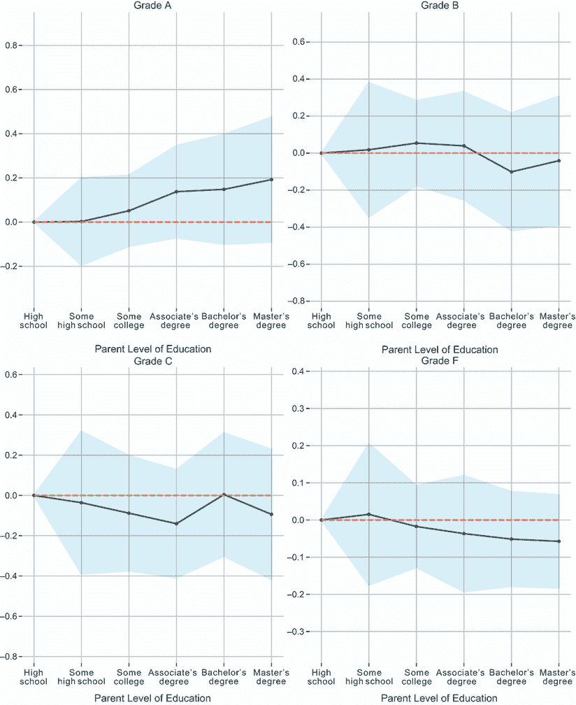

图 3.10 各种家长教育水平特征对数学成绩 A、B、C 和 F 的 PDP

在图 3.11 中，我们放大了数学成绩 A 的 PDP。我们在 3.1.1 节中看到，当父母拥有硕士学位时，数学成绩 A 的学生比例高于父母拥有高中文凭时（见图 3.4）。随机森林模型是否学习了这种模式？从图 3.11 中我们可以看到，随着父母受教育程度的提高，获得成绩 A 的影响也在增加。对于受过高中教育的父母，预测数学成绩 A 的影响可以忽略不计——接近 0。这意味着高中教育对模型没有任何影响，并且在预测成绩 A 时，除了父母的受教育程度之外的其他特征开始发挥作用。然而，当父母拥有硕士学位时，我们可以看到大约+0.2 的高正影响。这意味着平均而言，硕士学位将学生获得成绩 A 的概率提高了大约 0.2。

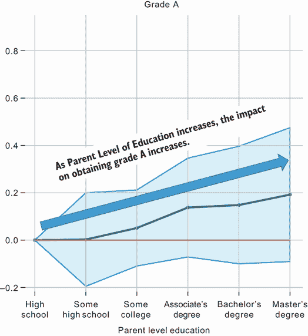

图 3.11 解释数学成绩 A 的父母的受教育程度 PDP

在图 3.12 中，我们放大了数学成绩 F 的 PDP。我们可以注意到成绩 F 呈下降趋势——父母受教育程度越高，对预测成绩 F 的负面影响越大。我们可以看到，父母拥有硕士学位的学生在预测成绩 F 时平均有大约-0.05 的负面影响。这意味着拥有硕士学位的父母降低了学生获得成绩 F 的可能性，因此增加了学生获得成绩 A 的可能性。这个见解很棒，仅通过查看特征重要性是无法实现的。该系统的最终用户（即校长）将对她所使用的模型有更多的信任。

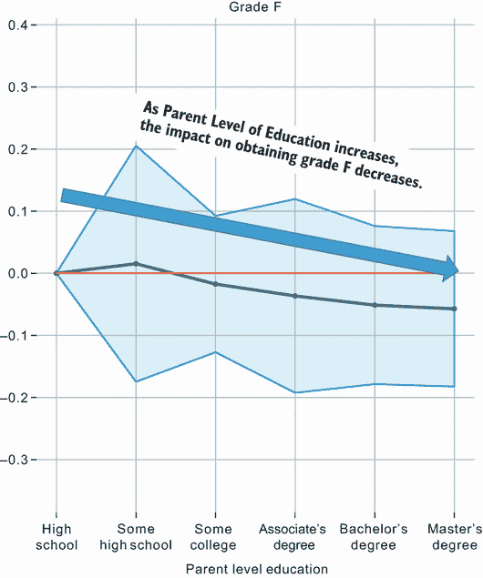

图 3.12 解释数学成绩 F 的父母的受教育程度 PDP

作为一项练习，我鼓励你将数学成绩和父母受教育程度的 PDP 代码扩展到其他学科领域——阅读和写作。你可以检查在 3.1.1 节中观察到的模式是否被随机森林模型学习（见图 3.4）。你还可以将代码扩展到其他特征。作为练习，选择第二重要的特征，即学生的种族或民族，并生成该特征的 PDP。

### 3.4.2 特征交互

我们可以将 PDPs 扩展以理解特征交互。回到 3.4.1 节中的方程，我们现在将关注集合 S 中的两个特征，并对其他特征进行边缘化。让我们检查两个最重要的特征——父母的受教育程度和学生的种族——在预测数学成绩 A、B、C 和 F 之间的交互作用。使用 PDPBox，我们可以轻松地可视化成对的特征交互，如下面的代码片段所示：

```
pdp_race_parent = pdp.pdp_interact(model=math_model,                     ①
                                   dataset=df,                           ②
                                   model_features=feature_cols,          ③
                                   features=['race_le', 'parent_le'])    ④

# Parameters for the Feature Interaction plot
plot_params = {
    # plot title and subtitle
    'title': 'PDP Interaction - Math Grade',
    'subtitle': 'Race/Ethnicity (Legend): \n%s\nParent Level of Education
     ➥ (Legend): \n%s' % (race_title, parent_title),
    'title_fontsize': 15,
    'subtitle_fontsize': 12,
    # color for contour line
    'contour_color':  'white',
    'font_family': 'Arial',
    # matplotlib color map for interact plot
    'cmap': 'viridis',
    # fill alpha for interact plot
    'inter_fill_alpha': 0.8,
    # fontsize for interact plot text
    'inter_fontsize': 9,
}

# Plot feature interaction in matplotlib
fig, axes = pdp.pdp_interact_plot(pdp_race_parent, [CA]['Race/Ethnicity', 
➥ 'Parent Level of Education'],
                                  plot_type='grid', plot_pdp=True, 
                                  ➥ plot_params=plot_params)
axes['pdp_inter_ax'][0]['_pdp_x_ax'].set_xlabel('Race/Ethnicity (Grade A)')
axes['pdp_inter_ax'][1]['_pdp_x_ax'].set_xlabel('Race/Ethnicity (Grade B)')
axes['pdp_inter_ax'][2]['_pdp_x_ax'].set_xlabel('Race/Ethnicity (Grade C)')
axes['pdp_inter_ax'][3]['_pdp_x_ax'].set_xlabel('Race/Ethnicity (Grade F)')
axes['pdp_inter_ax'][0]['_pdp_x_ax'].grid(False)
```

① 获取学习数学随机森林模型中两个特征之间的特征交互

② 使用预加载的数据集

③ 设置特征列名称

④ 获取特征交互的特定期表

由该代码生成的图示显示在图 3.13 中。共生成了四个图，每个图对应一个等级。特征交互在二维网格中可视化，其中六个家长教育水平特征位于*y*轴上，五个族裔特征位于*x*轴上。我将放大查看等级 A，进一步分解和解释此图。

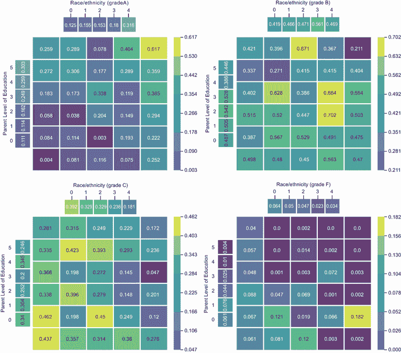

图 3.13 家长教育水平和族裔对所有数学等级 A、B、C 和 F 的交互

图 3.14 显示了数学等级 A 的特征交互图。家长教育水平位于*y*轴上，学生的匿名族裔位于*x*轴上。从*y*轴的底部到顶部，家长教育水平从高中一直增加到硕士学位。高中教育用 0 表示，硕士学位用 5 表示。*x*轴显示了五个不同的族裔群体——A、B、C、D 和 E。族裔群体 A 用 0 表示，群体 B 用 1 表示，群体 C 用 2 表示，依此类推。每个单元格中的数字表示给定家长教育水平和学生族裔对获得等级 A 的影响。

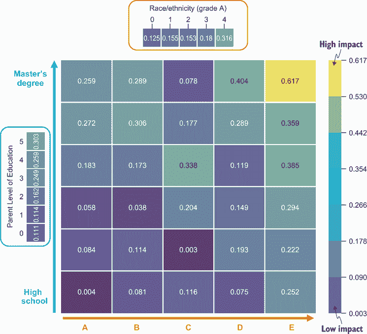

图 3.14 放大查看数学等级 A 并分解特征交互图

例如，最底部行和最左侧列的单元格表示属于族裔群体 A 且家长拥有高中教育背景的学生在获得等级 A 上的平均影响。请注意网格中每个单元格的数值——数字越低表示影响越低，数字越高表示在预测等级 A 上的影响越高。

现在，让我们专注于族裔群体 A，它是网格中最左侧的列，如图 3.15 所示。您可以看到，随着家长教育水平的提高，预测等级 A 的影响也增加。这很有道理，因为它表明家长教育水平对等级的影响大于族裔。这一点也由图 3.9 中显示的特征重要性图得到验证。因此，模型已经很好地学习了这种模式。

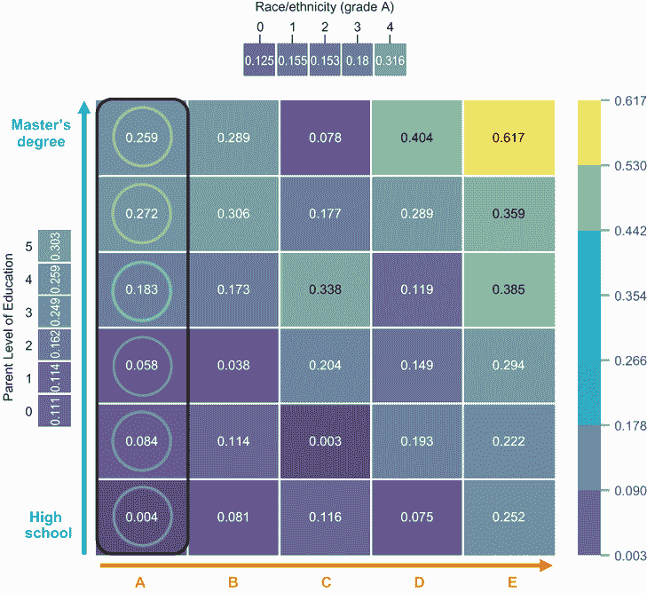

图 3.15 通过对族裔群体 A 进行条件预测等级 A 的影响

但族裔群体 C，即图 3.16 中突出显示的第三列，发生了什么？看起来一个家长拥有高中学位的学生在预测等级 A 时比一个家长拥有硕士学位的学生有更高的积极影响（比较突出列的最底部单元格与最顶部单元格）。看起来一个家长拥有副学士学位的学生在预测等级 A 时比其他任何教育水平都有更高的积极影响（参见突出列中从顶部数起的第三个单元格）。

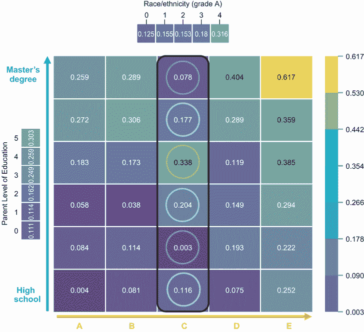

图 3.16 在种族组 C 的条件下预测 A 等级的影响

这有点令人担忧，因为它可能暴露以下一个或多个问题：

+   父母教育水平可能与种族特征相关，因此导致不可信的特征交互图。

+   数据集没有正确地代表人口，特别是种族组 C。这被称为抽样偏差。

+   模型是有偏见的，并且没有很好地学习父母教育水平与种族之间的交互。

+   数据集揭示了社会中系统性的偏差。

第一个问题揭示了 PDPs 的限制，我们将在下一段中讨论这个限制。第二个问题可以通过收集更多代表人口的代表性数据来解决。你将在第八章中了解其他形式的偏差以及如何减轻它们。第三个问题可以通过添加或工程更多特征，或者通过训练一个更好、更复杂的模型来解决。最后一个问题要难得多，需要更好的政策和法律，这超出了本书的范围。

为了检查第一个问题是否存在，让我们看看父母教育水平与种族之间的相关性。我们在第二章中介绍了如何计算和可视化相关性矩阵。我们使用皮尔逊相关系数来量化该问题中特征之间的相关性。这个系数只能用于数值特征，而不能用于分类特征。因为我们在这个例子中处理的是分类特征，所以我们必须使用不同的指标。我们可以使用*Cramer's V 统计量*，因为它衡量的是两个分类变量之间的关联。这个统计量可以在 0 到 1 之间，其中 0 表示没有相关性/关联，1 表示最大相关性/关联。以下辅助函数可以用来计算这个统计量：

```
import scipy.stats as ss

def cramers_corrected_stat(confusion_matrix):
    """ Calculate Cramers V statistic for categorial-categorial association.
        uses correction from Bergsma and Wicher, 
        Journal of the Korean Statistical Society 42 (2013): 323-328
    """
    chi2 = ss.chi2_contingency(confusion_matrix)[0]
    n = confusion_matrix.sum().sum()
    phi2 = chi2/n
    r,k = confusion_matrix.shape
    phi2corr = max(0, phi2 - ((k-1)*(r-1))/(n-1))    
    rcorr = r - ((r-1)**2)/(n-1)
    kcorr = k - ((k-1)**2)/(n-1)
    return np.sqrt(phi2corr / min( (kcorr-1), (rcorr-1)))
```

我们可以如下计算父母教育水平与种族之间的相关性：

```
confusion_matrix = pd.crosstab(df['parental level of education'], 
                               df['race/ethnicity'])
print(cramers_corrected_stat(confusion_matrix))
```

通过执行这些代码行，我们可以看到父母教育水平与种族之间的相关性或关联为*0.0486*。这相当低，因此我们可以排除特征交互图或 PDP 不可信的问题。

我们在图 3.5 中看到，属于 C 组的学生的表现总体上优于属于 A 组的学生的表现。可能的情况是模型已经学会了这种模式。我们可以通过查看图 3.14、3.15 和 3.16 中最上面的图例来验证它。如果学生属于 C 组，对预测 A 等级有+0.153 的积极影响，这比学生属于 A 组时的+0.125 的影响要大。现在让我们来看看图 3.17 中显示的 A 族和 C 族之间父母教育水平的分布差异。

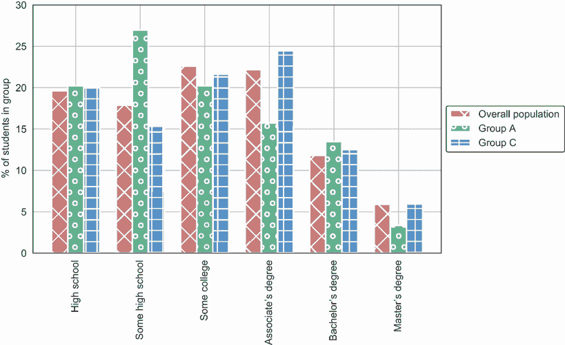

图 3.17 总体人口与种族群体 A 和 C 的家长教育水平分布比较

在图 3.17 中，我们可以看到，属于种族群体 A 的学生家长比总体人口和属于群体 C 的学生家长更有可能拥有高中或某些高中教育。看起来群体 C 的学生家长拥有副学士学位的比例也比总体人口和群体 A 高。分布的差异非常明显。我们不确定数据集是否准确地代表了总体人口和每个种族群体。作为数据科学家，向利益相关者（例如本例中的校长）强调这个问题，并确保数据集是合法的，且没有抽样偏差，这一点非常重要。

从本节中可以吸取的重要观点是，可解释性技术，尤其是 PDPs 和特征交互，是暴露模型或数据潜在问题的强大工具，在模型部署到生产之前。本节中的所有见解仅通过查看特征重要性是无法实现的。作为练习，我鼓励您使用 PDPBox 包在其他黑盒模型上，例如梯度提升树。

累积局部效应（ALE）

在本章中，我们已经看到，如果特征之间存在相关性，基于它们的 PDPs（部分依赖图）和特征交互图就不可信。一种无偏且克服 PDPs 局限性的可解释性技术是累积局部效应（ALE）。这项技术由 Daniel W. Apley 和 Jingyu Zhu 于 2016 年提出。在撰写本文时，ALE 仅在 R 编程语言中得到实现。Python 实现仍在进行中，并且目前尚不支持分类特征。由于 ALE 的实现还不够成熟，我们将在本书的后续版本中更深入地介绍这项技术。

在下一章中，我们将进入黑盒神经网络的世界。这可能看起来是一个相当大的跳跃，因为神经网络本质上是复杂的，因此需要更复杂的可解释性技术来理解它们。我们将特别关注局部范围内的模型无关技术，例如 LIME、SHAP 和锚点。

### 摘要

+   模型无关的可解释性技术不依赖于所使用的特定模型类型。由于它们独立于模型的内部结构，因此可以应用于任何模型。

+   范围全局的可解释性技术将帮助我们理解整个模型。

+   为了克服过拟合的问题，我们可以以两种广泛的方式结合或集成决策树：袋装和提升。

+   使用袋装技术，我们在训练数据的独立随机子集上并行训练多个决策树。我们使用这些单独的决策树进行预测，并通过取平均值来得出最终的预测。随机森林是一种使用袋装技术的树集成。

+   与袋装技术类似，提升技术也训练多个决策树，但顺序不同。第一个决策树通常是浅层树，并在训练集上训练。第二个决策树的目的是从第一个决策树的错误中学习，并进一步提高性能。使用这种技术，我们将多个决策树串联起来，它们迭代地尝试优化和减少前一个决策树所犯的错误。自适应提升和梯度提升是两种常见的提升算法。

+   我们可以使用 Scikit-Learn 包提供的`RandomForestClassifier`类在 Python 中为分类任务训练随机森林模型。这种实现还将帮助您轻松计算特征的全球相对重要性。

+   我们可以通过使用 Scikit-Learn 的`AdaBoostClassifier`和`GradientBoostingClassifier`类分别训练 Scikit-Learn 的自适应提升和梯度提升分类器。梯度提升树的变体更快且可扩展，例如`CatBoost`和`XGBoost`。

+   对于树集成，我们可以计算特征的全球相对重要性，但不能将这种计算扩展到其他黑盒模型，如神经网络。

+   部分依赖图（PDP）是一种全局、模型无关的可解释技术，我们可以用它来理解不同特征值对模型预测的边缘或平均效应。如果特征之间存在相关性，则 PDPs 不可信。我们可以使用`PDPBox` Python 包来实现 PDPs。

+   PDPs 可以扩展以理解特征交互。PDPs 和特征交互图可以用来揭示可能的问题，如采样偏差和模型偏差。
