# 4 模型无关方法：局部可解释性

本章涵盖了

+   深度神经网络的特性

+   如何实现本质上是黑盒模型的深度神经网络

+   基于扰动的局部范围模型无关方法，如 LIME、SHAP 和锚点

+   如何使用 LIME、SHAP 和锚点来解释深度神经网络

+   LIME、SHAP 和锚点的优缺点

在上一章中，我们探讨了树集成，特别是随机森林模型，并学习了如何使用全局范围内的模型无关方法来解释它们，例如部分依赖图（PDPs）和特征交互图。我们看到 PDPs 是理解单个特征值如何在全球范围内影响最终模型预测的绝佳方式。我们还能够通过特征交互图看到特征如何相互作用，以及它们如何被用来揭示潜在的偏差等问题。PDPs 易于理解且直观，但它们的最大缺点是假设特征之间是相互独立的。此外，使用特征交互图无法可视化高阶特征交互。

在本章中，我们将探讨黑盒神经网络，特别是深度神经网络（DNNs）。这些模型本质上是复杂的，需要更高级的解释技术来理解它们。我们将特别关注局部可解释模型无关解释（LIME）、SHapley Additive exPlanations（SHAP）和锚点等技术。与 PDPs 和特征交互图不同，这些技术是局部的。这意味着我们可以使用它们来解释单个实例或预测。

我们将遵循与前面章节相似的结构。我们从一个具体的例子开始，目标是构建一个用于乳腺癌诊断的模型。我们将探索这个新的数据集，并学习如何在 PyTorch 中训练和评估深度神经网络（DNNs）。然后我们将学习如何解释它们。值得重申的是，尽管本章的主要重点是解释 DNNs，我们还将涵盖 DNNs 的基本概念以及如何训练和测试它们。由于学习、测试和理解阶段是迭代的，因此同时涵盖这三个方面非常重要。我们还将在前面的部分中介绍一些关键见解和概念，这些在模型解释过程中将非常有用。对于已经熟悉 DNNs 以及如何训练和测试它们的读者，可以自由跳过前面的部分，直接跳到第 4.4 节，其中我们将涵盖模型可解释性。

## 4.1 诊断+ AI：乳腺癌诊断

让我们来看一个具体的例子。我们将回到第一章和第二章中介绍的 Diagnostics+。中心希望扩展其 AI 能力以诊断乳腺癌，并已将约 570 名患者的乳腺肿块细针穿刺图像进行了数字化。从这些数字化图像中计算了描述图像中存在的细胞核特征的特性。对于每个细胞核，以下 10 个特征被用来描述其特征：

+   半径

+   纹理

+   周长

+   面积

+   平滑度

+   紧凑度

+   凹凸性

+   凹点

+   对称性

+   分形维度

对于患者图像中存在的所有核，计算每个这些 10 个特征的均值、标准误差以及最大或最差值。因此，每位患者总共拥有 30 个特征。给定这些输入特征，AI 系统的目标是预测细胞是良性还是恶性，并为医生提供信心分数以帮助他们诊断。这总结在图 4.1 中。

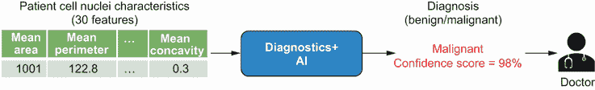

图 4.1 乳腺癌诊断的 Diagnostics+ AI

根据这些信息，你将如何将这个问题表述为一个机器学习问题？因为模型的目的是预测给定的乳腺肿块是良性还是恶性，我们可以将这个问题表述为一个*二元分类*问题。

## 4.2 探索性数据分析

让我们现在尝试更好地理解这个数据集。探索性数据分析是模型开发过程中的一个重要步骤。我们将特别关注数据的体积、目标类别的分布，以及像细胞的面积、半径和周长这样的特征是否可以用来区分良性和恶性病例。我们将使用本节中获得的许多见解来确定应该使用哪些特征进行模型训练，应该使用哪些指标进行模型评估，以及如何验证我们将在本章后面介绍的技术的模型解释。

数据集包含 569 个患者案例和总共 30 个特征。所有特征都是连续的。图 4.2 显示了良性病例和恶性病例的案例比例。在 569 个案例中，357 个（大约 62.7%）是良性的，212 个（大约 37.3%）是恶性的。这表明数据集是倾斜的，或者说是不平衡的。正如我们在第三章中看到的，当我们对于一个给定类别的例子或数据点存在不成比例的数量时，我们说数据是不平衡的。大多数机器学习算法在每个类别的样本比例大致相同的情况下表现最佳。这是因为大多数算法旨在最小化错误或最大化准确性，这些算法倾向于自然地偏向多数类。为了总结，当处理不平衡数据集时，你应该注意以下两点：

+   在测试和评估模型时，使用正确的性能指标（如精确度、召回率和 F1）。

+   重新采样训练数据，使得多数类要么被欠采样，要么少数类被过采样。

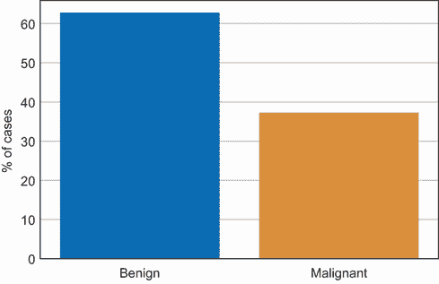

图 4.2 良性和恶性病例的分布

我们将在 4.3.2 节中进一步讨论这个问题。现在，让我们看看细胞的面积、半径和周长的分布，看看良性和恶性病例之间是否有任何显著差异。图 4.3 显示了平均细胞面积和最差或最大细胞面积的分布。

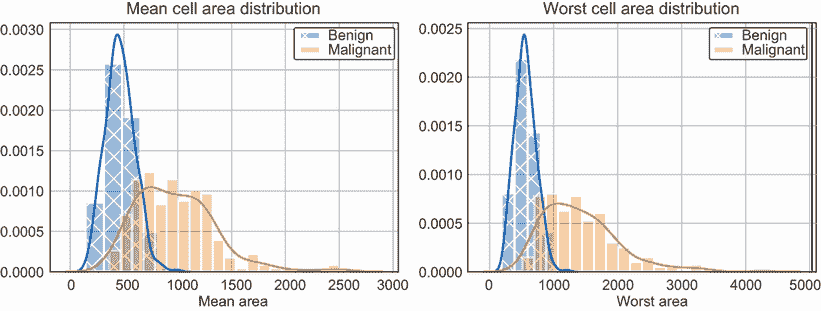

图 4.3 比较良性和恶性病例的细胞面积分布

在图 4.3 中，我们可以看到，如果平均细胞面积大于 750，那么病例更有可能是恶性的而不是良性的。同样，如果最差或最大细胞面积大于 1,000，那么病例更有可能是恶性的。仅通过观察与细胞面积相关的两个特征，似乎恶性与良性病例之间有良好的但较弱地分离。

那么细胞的半径和周长呢？图 4.4 和图 4.5 分别显示了半径和周长的分布。我们可以看到良性和恶性病例之间有类似的分离。例如，平均半径大于 15 的病例比良性病例更有可能是恶性的。同样，周长最差或最大的细胞周长为 100 的病例更有可能是恶性的。

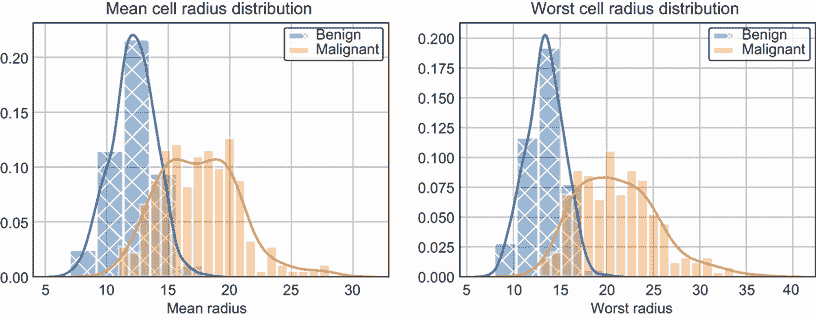

图 4.4 比较良性和恶性病例的细胞半径分布

本分析的目的在于了解特征在预测目标变量（即给定病例是良性还是恶性）方面的好坏。通过观察图 4.3、4.4 和 4.5 中的分布，我们可以看到我们考虑的六个特征中，良性和恶性病例之间有很好的分离信号。我们还将利用这些见解来验证本章后面通过 LIME、SHAP 和锚点获得的解释。

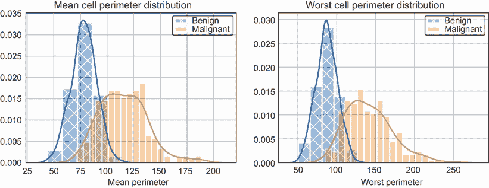

图 4.5 比较良性和恶性病例的细胞周长分布

最后，我们来探讨每个输入特征与彼此以及目标变量之间的相关性。我们知道输入特征是连续的，但目标变量是离散的二进制变量。在数据集中，恶性病例被编码为 0，良性病例被编码为 1。由于输入特征和目标都是数值型，我们可以使用皮尔逊相关系数，或称标准相关系数，来衡量相关性。正如我们在第二章中看到的，皮尔逊相关系数衡量两个变量之间的线性相关性，其值介于+1 和-1 之间。如果系数的绝对值大于 0.7，这意味着高度相关。如果系数的绝对值介于 0.5 和 0.7 之间，这意味着中等高度相关。如果系数的绝对值介于 0.3 和 0.5 之间，这意味着低度相关，而系数的绝对值小于 0.3 则意味着几乎没有相关性。你可以使用 Pandas 提供的`corr()`函数轻松计算成对的相关性。作为练习，请重新使用第 2.2 节中学到的代码来计算并绘制相关矩阵。加载数据集的代码可以在第 4.3.1 节中找到。乳腺癌数据集的结果图示如图 4.6 所示。

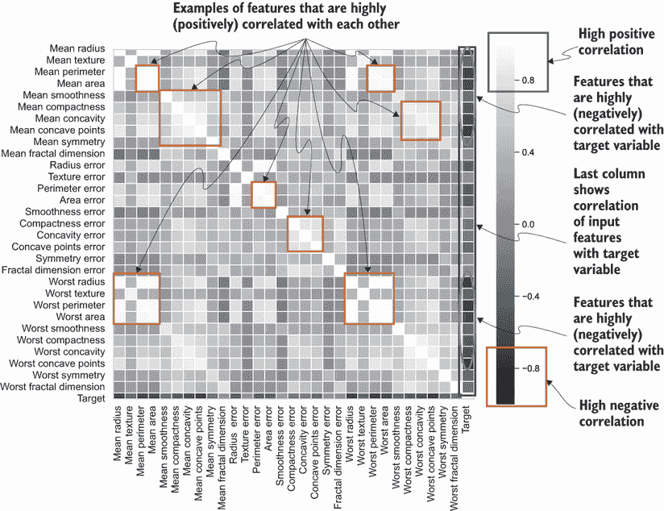

图 4.6 输入特征与目标变量的相关性图

在图 4.6 中，我们首先关注最后一列，它显示了所有输入特征与目标变量的相关性。我们可以看到，像平均细胞面积、半径和周长这样的特征与目标类别高度相关。然而，相关系数是负的，这意味着特征值越大，目标变量的值就越小。这是有道理的，因为目标类别对于恶性类别有较小的值（即，0），而对于良性类别有较高的值（即，1）。正如我们在图 4.3、4.4 和 4.5 中看到的，这些特征的值越大，病例为恶性的可能性就越大。我们还可以看到，相当多的特征彼此之间高度相关。例如，平均细胞半径、面积和周长等特征与最差细胞半径、面积和周长高度相关。正如我们在第二章中讨论的，彼此相关的特征被称为多重共线性，或冗余。处理多重共线性的一种方法是从模型中移除冗余特征。我们将在下一节中进一步讨论这个问题。

## 4.3 深度神经网络

人工神经网络（ANN）是一个旨在松散地模拟生物大脑的系统。它属于被称为深度学习的一类广泛的机器学习方法。基于 ANN 的深度学习的核心思想是从更简单的概念或特征构建复杂的概念或表示。ANN 通过将输入映射到输出学习一个复杂函数，它由许多简单的函数组成。在本章中，我们将重点关注由多层单元（或神经元）组成的 ANN，这些单元彼此完全互联。这些也被称为*深度神经网络（DNN）*、*全连接神经网络（FCNN）*或*多层感知器（MLP）*。在随后的章节中，我们将介绍*卷积神经网络（CNN）*和*循环神经网络（RNN）*，这些是用于复杂计算机视觉和语言理解任务的更高级神经网络结构。

图 4.7 展示了由三种类型的层组成的一个简单 ANN：输入层、隐藏层和输出层。输入层充当数据的输入。输入层中的单元数量等于数据集中特征的数量。在图 4.7 中，我们仅考虑来自乳腺癌数据集的两个特征，即平均细胞半径和平均细胞面积。这就是为什么输入层中存在两个单元的原因。

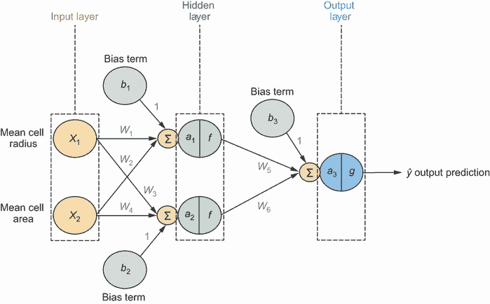

图 4.7 人工神经网络的示意图

输入层随后连接到第一隐藏层中的所有单元。隐藏层根据其单元使用的激活函数对输入进行转换。在图 4.7 中，函数`f`用于表示隐藏层中所有单元的激活函数。同一层的单元通过边与另一层的单元连接。每条边都关联着一个权重，它定义了连接的单元之间的连接强度。请注意，偏置项也通过权重为 1 的边连接到隐藏层中的每个单元。在通过激活函数转换之前，对输入和偏置项进行加权求和。如果存在多个隐藏层，则称人工神经网络（ANN）为“深度”。因此，具有两个或更多隐藏层的 ANN 被称为*深度神经网络（DNN）*。

最终隐藏层的单元随后连接到输出层的单元。在图 4.7 中，输出层中存在一个单元，因为对于乳腺癌检测任务，我们有二元输出，即给定的细胞要么是恶性的，要么是良性的。输出层中的单元也有一个激活函数*g*，它将输入转换为输出预测。创建神经网络的一个挑战是确定神经网络的架构——网络应该有多深（隐藏层的数量）和多宽（每层的单元数量）。我们将在 4.4 节中简要讨论如何确定和解释神经网络的架构，并在后续章节中更详细地介绍，当我们查看卷积神经网络（CNNs）和循环神经网络（RNNs）时。

现在我们来看看输入数据是如何在通过人工神经网络（ANN）时转换为输出的。这被称为前向传播，如图 4.8 所示。输入数据被输入到输入层的单元中。两个特征输入单元的值表示为*x1*和*x2*。然后这些值通过隐藏层在网络中向前传播。在隐藏层的每个单元中，计算输入的加权和并通过激活函数传递。在图 4.8 中，隐藏层中的第一个单元计算输入*x1*和*x2*以及偏置项*b1*的加权和，以获得预激活值*a1*。然后这个值通过激活函数*f*得到*f(a1)*。在隐藏层的第二个单元中也发生类似的操作。请注意，隐藏层中的两个单元使用相同的激活函数。我们将在本节稍后更深入地讨论激活函数。

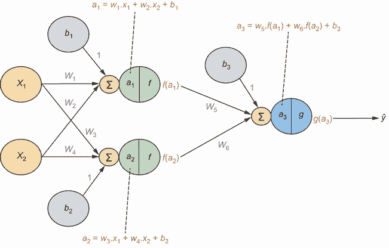

图 4.8 人工神经网络中的前向传播示意图

一旦我们计算了隐藏层单元的输出，这些输出随后被作为输入传递到下一层的单元。在下一幅图中，隐藏层中两个单元的输出被作为输入传递到输出层的一个单元。就像之前一样，首先确定输入的加权和以及偏置项，以获得预激活值*a3*。然后这个值通过激活函数*g*得到单元的输出作为*g(a3)*。这个最终单元的输出旨在作为目标变量*y*的估计，表示为*ŷ*。网络中所有边的权重在开始时都会随机初始化。

现在学习算法的目标是确定边的权重，或者单元之间连接的强度，使得输出预测尽可能接近目标变量的实际值。你是如何学习这些权重的呢？我们将应用在第二章中学到的相同技术来确定线性回归模型的权重——梯度下降。最优的权重集是那些最小化损失或损失函数的权重集。对于回归问题，一个常见的损失函数是预测输出和实际输出之间的平方误差或平方差。对于二元分类问题，一个常见的损失函数是对数损失或二元交叉熵（BCE）损失函数。

平方误差损失函数及其相对于预测输出的导数在以下方程中展示：

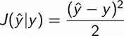

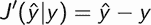

接下来展示了对数损失或 BCE 损失函数及其相对于预测输出的导数：

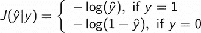

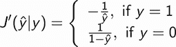

当损失函数的梯度为 0 或接近 0 时，称损失函数处于最小值（全局或局部）。对于线性回归或逻辑回归类型的问题，我们可以很容易地确定权重，因为权重的数量等于输入特征的数目（加上一个额外的偏置项）。另一方面，对于深度神经网络（DNN），权重的数量取决于网络的结构。随着我们向网络添加更多的单元和层，权重的数量可能会迅速增加。直接应用梯度下降算法在计算上是不切实际的。在 DNN 中确定这些权重的有效算法是反向传播。

之前看到的简单 ANN 结构的反向传播算法在图 4.9 中进行了说明。一旦我们评估了网络的前向传播后的输出，下一步就是计算损失函数或损失函数相对于预测输出的梯度。然后以相反的顺序访问节点，并传播一个错误信号，我们可以使用这个信号来计算网络中所有边的权重相对于梯度的值。让我们一步一步地通过从右到左解析图 4.9 来了解这个过程。

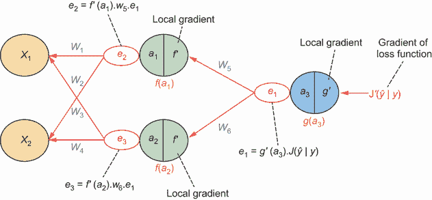

图 4.9 ANN 中错误信号反向传播的示意图

我们首先计算成本函数相对于预测输出变量的梯度。这如图 4.9 中的*J’*所示。然后，这个梯度通过输出层的单元以相反的方向传递。在输出层中，激活函数*g*的局部梯度被存储，这表示为*g’*。在正向传播过程中评估的预激活值*a3*也被存储。这些值用于计算单元的输出误差信号，表示为*e1*。如图 4.9 所示，计算值是损失函数的梯度乘以激活函数的局部梯度。使用微积分的术语，我们在这里应用链式法则来计算损失函数相对于输出层单元输入的梯度。这个误差信号*e1*随后传播到隐藏层的两个单元。然后重复这个过程来计算隐藏单元的输出误差信号。一旦误差信号通过网络传播并且我们到达输入层，我们可以通过将反向传播过程中通过它的误差信号乘以正向传播过程中通过它的值来计算梯度，这个梯度相对于每个边权重。多个在线资源和书籍对反向传播和数学概念进行了深入的解释。因此，我们将在本章中不深入探讨这些概念。

激活函数是神经网络中的一个重要特性。它决定了神经元是否应该被激活以及激活的程度。激活函数的特性是它可导（即存在一阶导数）且单调（即要么完全非递减，要么非递增）。在神经网络中常用的激活函数包括 Sigmoid 函数、双曲正切（tanh）函数和修正线性单元（ReLU），这些函数在表 4.1 中定义。

Sigmoid 激活函数通常用于分类器，因为函数的输出范围在 0 到 1 之间。在本章关于乳腺癌检测问题的讨论中，我们将使用 Sigmoid 函数作为输出层的激活函数`g`。双曲正切函数与 Sigmoid 函数具有相似的性质，但输出范围在-1 到 1 之间。Sigmoid 和双曲正切激活函数都存在梯度消失的问题。这是因为对于这两个函数，当输入值非常大或非常小时，梯度为 0（也称为饱和），如表 4.1 所示。

表 4.1 神经网络中常用的激活函数

| 激活函数 | 描述 |
| --- | --- |
| Sigmoid | Sigmoid 函数的定义如下：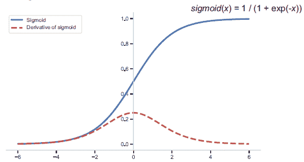函数的输出范围在 0 到 1 之间。它是可导的，并且如图所示是单调的。 |
| 双曲正切（tanh） | 双曲正切函数定义为如下：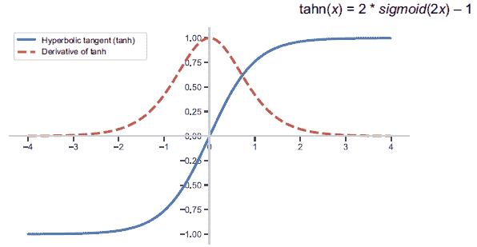函数的输出范围从 -1 到 1。它也是可微和单调的，如图所示。 |
| 线性整流单元（ReLU） | ReLU 函数定义为如下：函数的输出范围从 0 到无穷大（取决于输入 *x* 的值）。它是可微和单调的，如图所示。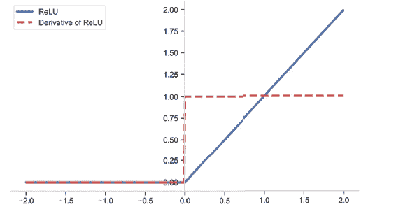 |

ReLUs 是神经网络中最广泛使用的激活函数，因为它们很好地处理了梯度消失问题。我们可以看到，当输入为负时，ReLU 的值为 0。这意味着如果具有 ReLU 激活函数的神经元的输入为负，那么该神经元的输出为 0，因此没有激活。只有具有非负输入的神经元才会被激活。因为不是所有神经元同时被激活，ReLU 激活函数在计算上更有效率。在实践中，为了简单起见，神经网络隐藏层的所有单元都使用相同的激活函数。

### 4.3.1 数据准备

现在让我们训练一个用于乳腺癌检测问题的深度神经网络（DNN）。我们将使用 PyTorch 来构建和训练网络。PyTorch 是一个库，它简化了在 Python 中构建神经网络的过程。PyTorch 因其易用性而受到研究人员和行业机器学习实践者的青睐。我们也可以使用其他库，如 TensorFlow 和 Keras 来构建神经网络，但在这本书中我们将专注于 PyTorch。因为这个库是 Pythonic 的，所以对于已经熟悉 Python 的数据科学家和工程师来说，使用它将更容易。要了解更多关于 PyTorch 的信息，请参阅附录 B。

在训练深度神经网络（DNN）之前的第一步是准备数据。以下代码展示了如何加载数据——将其分为训练集、验证集和测试集，然后将它们转换为网络 PyTorch 实现的输入：

```
import numpy as np                                                ①

from sklearn.datasets import load_breast_cancer                   ②
from sklearn.model_selection import train_test_split              ③

import torch                                                      ④
from torch.autograd import Variable                               ④

data = load_breast_cancer()                                       ⑤
X = data['data']                                                  ⑤
y = data['target']                                                ⑤

X_train, X_val, y_train, y_val = train_test_split(X, y, test_size=0.3,
➥ random_state=24)                                               ⑥
X_val, X_test, y_val, y_test = train_test_split(X_val, y_val, test_size=0.5, 
➥ random_state=24)                                               ⑦

X_train = Variable(torch.from_numpy(X_train))                     ⑧
X_val = Variable(torch.from_numpy(X_val))                         ⑧
y_train = Variable(torch.from_numpy(y_train))                     ⑧
y_val = Variable(torch.from_numpy(y_val))                         ⑧
X_test = Variable(torch.from_numpy(X_test))                       ⑧
y_test = Variable(torch.from_numpy(y_test))                       ⑧
```

① 导入 NumPy，用于将数据集加载为向量和矩阵

② 导入 Scikit-Learn 中可用的乳腺癌数据集

③ 导入 Scikit-Learn 中可用的 train_test_split 函数

④ 导入 PyTorch 和 Variable 数据结构，用于将输入数据集存储为张量

⑤ 加载乳腺癌数据集并提取特征和目标

⑥ 将数据分为训练集和验证/测试集

⑦ 将验证/测试集分为两个相等的集合：验证集和测试集

⑧ 将训练集、验证集和测试集初始化为 PyTorch 张量

注意，70% 的数据用于训练，15% 用于验证，剩余的 15% 作为保留的测试集。现在让我们检查目标变量的分布，如图 4.10 所示，在三个集中是否相似。我们可以看到，在所有三个集中，大约 60-62% 的情况是良性的（目标变量 = 1），38-40% 的情况是恶性的（目标变量 = 0）。

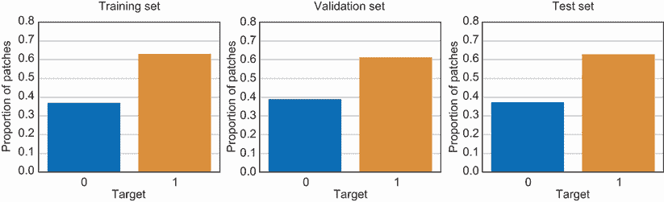

图 4.10 训练集、验证集和测试集中目标变量的分布

### 4.3.2 训练和评估 DNN

现在我们已经准备好了数据，下一步是定义 DNN。我们将创建一个类，其中可以传递层数和单元数作为属性，如下所示：

```
class Model(torch.nn.Sequential):                                        ①
    def __init__(self, layer_dims):                                      ②
        super(Model, self).__init__()                                    ③
        for idx, dim in enumerate(layer_dims):                           ④
            if (idx < len(layer_dims) - 1):                              ⑤
                module = torch.nn.Linear(dim, layer_dims[idx + 1])       ⑤
                self.add_module("linear" + str(idx), module)             ⑤
            else:                                                        ⑥
                self.add_module("sig" + str(idx), torch.nn.Sigmoid())    ⑥
            if (idx < len(layer_dims) - 2):                              ⑦
                self.add_module("relu" + str(idx), torch.nn.ReLU())      ⑦
```

① 创建一个从 PyTorch Sequential 类继承的 Model 类

② 将每层的层数和单元数作为数组传递给构造函数

③ 初始化 PyTorch Sequential 超类

④ 对于数组中的每个元素，提取该层的索引和单元数量

⑤ 创建一个包含所有线性单元直到最终输出层的层模块

⑥ 对输出层的单元使用 sigmoid 激活函数

⑦ 对隐藏层中的所有单元使用 ReLU 激活函数

注意，DNN `Model` 类继承自 PyTorch `Sequential` 类，该类以初始化的顺序排列层模块。对于输入层和隐藏层，使用 `Linear` 单元来计算该单元所有输入的加权和。对于隐藏层，我们使用 ReLU 激活函数。最终的输出层由一个单元组成，我们使用 sigmoid 激活函数。sigmoid 激活函数的输出是一个介于 0 和 1 之间的分数。这个输出作为分类任务中正类概率度量的代理。在这种情况下，正类是良性。现在我们有了 `Model` 类，让我们按照以下方式初始化它：

```
dim_in = X_train.shape[1]                    ①
dim_out = 1                                  ②
layer_dims = [dim_in, 20, 10, 5, dim_out]    ③
model = Model(layer_dims)                    ④
```

① 输入层的单元数量等于训练集中特征的数量。

② 输出层的单元数量为 1，因为我们处理的是一个二元分类问题。

③ 初始化层维度数组以定义 DNN 的结构

④ 使用预定义的结构初始化 DNN 模型

如果你使用命令 `print(model)` 打印模型，你会得到以下输出，它总结了 DNN 的结构：

```
Model(
  (linear0): Linear(in_features=30, out_features=20, bias=True)
  (relu0): ReLU()
  (linear1): Linear(in_features=20, out_features=10, bias=True)
  (relu1): ReLU()
  (linear2): Linear(in_features=10, out_features=5, bias=True)
  (relu2): ReLU()
  (linear3): Linear(in_features=5, out_features=1, bias=True)
  (sig4): Sigmoid()
)
```

在这个输出中，您可以看到 DNN 由一个输入层、三个隐藏层和一个输出层组成。输入层包含 30 个单元，因为数据集包含 30 个输入特征。第一个隐藏层包含 20 个单元，第二个隐藏层包含 10 个单元，第三个隐藏层包含 5 个单元。隐藏层中的所有单元都使用 ReLU 激活函数。最后，输出层由一个具有 sigmoid 激活函数的单个单元组成。对于这个数据集，输入层和输出层的单元数必须分别为 30 和 1，因为特征数为 30，并且二分类任务只需要一个输出。然而，您可以根据哪种结构给出最佳性能来调整隐藏层的数量和每个隐藏层的单元数。您可以使用验证集来确定这些超参数。

模型就绪后，现在让我们定义损失函数和优化器，它们将用于在反向传播期间确定权重，如下所示：

```
criterion = torch.nn.BCELoss(reduction='sum')                 ①
optimizer = torch.optim.Adam(model.parameters(), lr=0.001)    ②
```

① 将二元交叉熵（BCE）损失初始化为优化的标准

② 使用学习率为 0.001 的 Adam 优化器在反向传播期间确定权重

如前所述，BCE 损失被用作二分类问题的优化标准。我们在这里也使用 Adam 优化器，并使用预定义的初始学习率来确定反向传播期间的边权重。Adam 优化器是一种自适应确定梯度下降算法学习率的技巧。您可以在以下博客文章中找到有关 Adam 优化技术的更多详细信息：[`mng.bz/zQzX`](http://mng.bz/zQzX)。最后，按照以下方式训练模型：

```
num_epochs = 300                                             ①
for epoch in range(num_epochs): 
    y_pred = model(X_train.float())                          ②
    loss = criterion(y_pred, y_train.view(-1, 1).float())    ③

    optimizer.zero_grad()                                    ④
    loss.backward()                                          ⑤
    optimizer.step()                                         ⑥
```

① 将时代数初始化为 300

在每个时代，获取训练集的 DNN 输出

③ 计算训练集的 BCE 损失

④ 在反向传播之前将梯度置零

⑤ 计算每个参数/边权重的梯度

⑥ 根据当前梯度更新权重

注意，我们正在对模型进行 300 个时代的训练。一个时代是一个超参数，它定义了我们在神经网络的前向和反向方向中传播整个训练集的次数。在每个时代，我们首先通过将训练集通过网络的前向方向传播来获取 DNN 的输出。然后，我们计算每个参数或边权重的梯度，并在反向传播期间更新权重。请注意，在每个时代开始反向传播之前，梯度被设置为 0，因为 PyTorch 默认在反向传递期间累积梯度。如果我们不将梯度设置为 0，权重将不会正确更新。

下一步是使用测试集来评估模型性能。因为这是一个分类问题，我们将使用与第三章中用于学生成绩预测问题的相同指标。我们将使用的指标是精确率、召回率和 F1 分数。我们将比较训练好的深度神经网络（DNN）模型与一个合理的基线模型的性能。如第 4.2 节所示，数据集中大多数案例都是良性的。因此，我们将考虑一个总是预测良性的基线模型。这并不理想，因为我们将会错误地预测所有恶性案例。在现实情况下，基线模型通常是由人类或专家或企业正在使用的现有模型做出的预测。对于这个例子，不幸的是，我们没有获取到这些信息，因此我们将比较模型与总是预测良性的基线。

表 4.2 显示了用于基准测试模型的三项关键性能指标——精确率、召回率和 F1 分数。如果我们看召回率指标，基线模型比深度神经网络（DNN）做得更好。这是预期的，因为基线模型总是预测正类，因此会正确地预测所有正类案例。然而，对于负类，基线模型的召回率将是 0。尽管如此，深度神经网络（DNN）模型的整体表现仍然优于基线，实现了 98.1%的精确率（比基线高 35.4%）和 96.2%的 F1 分数（比基线高 19.1%）。

作为一项练习，我强烈建议你调整模型的超参数，看看你是否能提高这个模型的性能。你可以通过改变网络结构中的隐藏层数量和每层的单元数，以及用于训练的 epoch 数来调整网络结构。在第 4.2 节（图 4.6）中，我们也看到一些输入特征彼此之间高度相关。通过移除一些冗余特征，模型的性能可以进一步提高。作为另一项练习，进行特征选择，确定最大化模型性能的最佳特征子集。

表 4.2 基线模型与深度神经网络（DNN）模型性能比较

|  | 精确率（%） | 召回率（%） | F1 分数（%） |
| --- | --- | --- | --- |
| 基线模型 1 | 62.7 | 100 | 77.1 |
| 深度神经网络（DNN）模型 | 98.1 (+35.4) | 94.4 (–5.6) | 96.2 (+19.1) |

由于深度神经网络（DNN）模型的性能优于基线，现在让我们来解释它，并了解这个黑盒模型是如何得出最终预测的。

## 4.4 解释深度神经网络（DNN）

如前节所述，要使用深度神经网络（DNN）进行预测，我们需要将数据通过多个层传递，每一层由多个单元组成。每一层的输入数据会根据单元使用的权重和激活函数进行非线性转换。一个单一的预测可能涉及大量的数学运算，这取决于神经网络的架构。对于前节中用于乳腺癌检测的相对简单的架构，一个单一的预测大约涉及 890 次数学运算，这是基于训练参数或权重的数量，如下所示：

```
+----------------+------------+
|    Modules     | Parameters |
+----------------+------------+
| linear0.weight |    600     |
|  linear0.bias  |     20     |
| linear1.weight |    200     |
|  linear1.bias  |     10     |
| linear2.weight |     50     |
|  linear2.bias  |     5      |
| linear3.weight |     5      |
|  linear3.bias  |     1      |
+----------------+------------+
Total Trainable Parameters: 891
```

随着我们添加更多的隐藏层和每隐藏层的单元，这个例子可以非常容易地扩展到数百万次运算。这就是为什么 DNN 被称为黑盒——它变得非常难以理解每一层执行了什么转换以及模型是如何得出最终预测的。我们将在后面的章节中看到，对于像 CNN 和 RNN 这样更复杂的结构，这变得更加困难。

我们可以解释 DNN 的一种方式是查看连接到输入层单元的权重或边的强度。这可以被视为确定输入特征对输出预测的整体影响的代理。然而，它不会给我们一个像我们在前几章中看到的白盒模型和树集成那样准确的特征重要性度量。主要原因是因为神经网络在隐藏层学习输入的表示。初始输入特征被转换成中间特征和概念。因此，这些输入特征的重要性不仅仅由连接到输入层单元的边来决定。那么我们如何解释 DNN 呢？

我们有多种方式来解释 DNN。我们可以使用在前一章中学到的模型无关方法，这些方法具有全局范围。我们学习了 PDPs（Partial Dependence Plots）和特征交互图——模型无关的技术，意味着它们是可以与任何机器学习模型一起工作的可解释性技术。它们在范围上也是全局的，因为它们查看模型对最终预测的整体影响。PDPs 和特征交互图易于使用且直观，它们是揭示特定特征值如何影响模型输出的优秀工具。我们还学习了如何使用它们来揭示潜在问题，如数据和模型偏差。我们可以非常容易地将这些技术应用到为乳腺癌检测训练的 DNN 模型上。然而，为了使 PDPs 和特征交互图起作用，模型的输入特征必须是独立的，我们在第 4.2 节中看到它们并不是。

在接下来的章节中，我们将学习更多高级的模型无关技术，特别是关注 LIME、SHAP 和锚点。这些可解释技术是局部的，也就是说，它们专注于解释特定的实例或示例。在后面的章节中，我们将学习特征归因方法，旨在量化每个输入特征对最终预测的贡献，并学习如何剖析神经网络以及可视化中间隐藏层和单元学习到的特征。

## 4.5 LIME

LIME，即局部可解释模型无关解释的缩写，由 Marco Tulio Ribeiro 及其团队于 2016 年提出。让我们分解这项技术。在上一个章节中，我们训练了一个 DNN，它使用 30 个特征学习如何区分良性病例和恶性病例。让我们通过将特征空间折叠成 2-D 空间来简化这一点，如图 4.11 所示。该图展示了 DNN 学习到的复杂决策函数，其中模型将良性病例与恶性病例分开。决策边界在图 4.11 中被故意夸张，以说明一个全局上难以解释但可能通过 LIME 等技术局部解释的复杂函数。

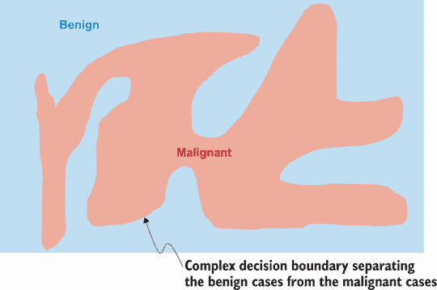

图 4.11 DNN（或任何黑盒模型）学习到的复杂决策边界的 2-D 示意图，用于区分良性病例和恶性病例

LIME 首先选择一个示例进行解释。这如图 4.12 所示，我们选择了一个恶性病例进行解释。目标是尽可能频繁地探测模型，以解释模型是如何对所选示例做出预测的。你可以通过*扰动*数据集来获取该新数据集的模型预测。


图 4.12 使用 LIME 选择的实例进行解释的示意图

我们如何创建这个新的*扰动数据集*？给定训练数据，我们计算每个特征的关键摘要统计量。对于数值或连续特征，我们计算均值和标准差。对于分类特征，我们计算每个值的频率。然后我们根据这些摘要统计量创建一个新的数据集。对于数值特征，我们根据该特征的均值和标准差从高斯分布中采样数据。对于分类特征，我们根据频率分布或概率质量函数进行采样。一旦我们创建了数据集，我们就通过获取它们的预测来探测模型，如图 4.13 所示。所选实例以大加号表示。在扰动数据集上的恶性和良性预测分别以小加号和圆圈表示。

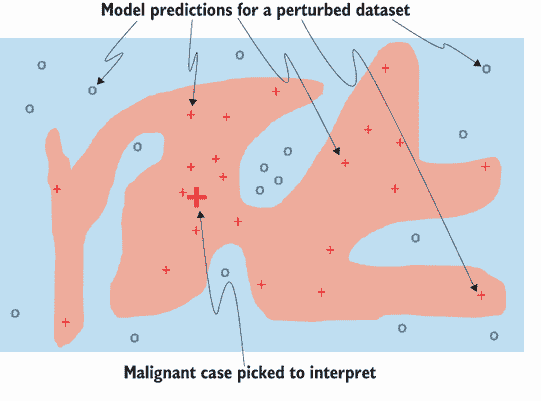

图 4.13 生成的或扰动的数据集及其相应的模型预测示意图

一旦我们创建了扰动数据集并获得了它们的模型预测，我们将根据这些新样本与所选实例的接近程度对它们进行加权，通过查看在特征方面类似的案例来解释所选实例。这种解释的局部性通过这种加权来捕捉——因此，LIME 缩写中的“局部”。图 4.14 显示了给定的扰动样本，它们接近所选实例并赋予更高的权重。

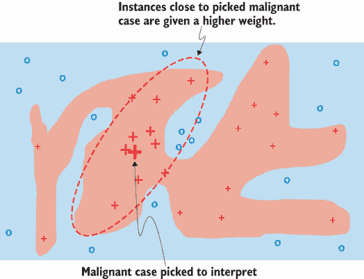

图 4.14 解释了与所选实例紧密相邻的加权实例的示意图

那么，我们如何根据样本与所选实例的接近程度来加权样本？在原始论文中，作者使用了指数核函数。*指数核函数*接受两个参数作为输入：

+   *扰动样本与所选实例的距离*——对于乳腺癌数据集（或一般表格数据），我们使用欧几里得距离来测量扰动样本在特征空间中与所选实例的距离。欧几里得距离也用于图像。对于文本，使用余弦距离度量。

+   *核宽度*——这是一个可以调整的超参数。如果宽度较小，只有接近所选实例的样本会影响解释。然而，如果宽度较大，则距离较远的样本也可以影响解释。这是一个重要的超参数，我们将在稍后更深入地研究其对解释的影响。默认情况下，核宽度设置为 0.75 × √*特征数量*。因此，对于具有 30 个输入特征的模型，默认核宽度为 4.1。核宽度的值可以从零到无穷大。

使用指数核函数，距离所选实例较近的样本在距离方面将具有更大的权重，而距离较远的样本权重较小。

最后一步是拟合一个易于在加权样本上解释的白色盒模型。在 LIME 中，使用线性回归，正如我们在第二章中看到的，我们可以使用线性回归模型的权重来解释所选实例的特征重要性——因此，LIME 缩写中的“可解释”。我们得到一个局部忠诚的解释，因为我们拟合了一个线性代理模型，LIME 对 DNN 或黑盒模型是完全无知的——因此，LIME 缩写中的“模型无关”。图 4.15 展示了用于解释所选实例的线性代理模型（由虚线灰色线表示），该模型忠实于所选实例附近和周围的区域。

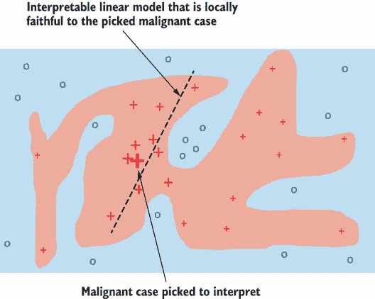

图 4.15 展示了用于使用周围加权样本解释所选实例的线性模型

现在，让我们动手看看 LIME 在之前训练的乳腺癌诊断 DNN 模型上的实际应用。首先，使用 pip 安装 LIME 库，如下所示：

```
pip install lime
```

安装后，第一步是初始化一个 LIME 解释器对象。因为数据集是表格式的，所以我们使用 `LimeTabularExplainer` 类。其他解释器类有 `LimeImageExplainer` 用于解释使用图像作为输入的模型，以及 `LimeTextExplainer` 用于文本。我们将在下一章中使用 `LimeImageExplainer` 类来处理图像：

```
import lime                                                             ①
import lime.lime_tabular                                                ①

explainer = lime.lime_tabular.LimeTabularExplainer(X_train.numpy(),     ②
                          feature_names=data.feature_names,             ③
                          class_names=data.target_names,                ④
                          discretize_continuous=True)                   ⑤
```

① 导入库和相关模块

② 使用训练数据集初始化解释器

③ 提供特征名称

④ 提供目标类名（良性/恶性）

⑤ 将连续变量离散化以降低计算复杂度

现在让我们选择两个案例进行解释——一个是良性，一个是恶性。在这里我们将使用测试集，选择第一个良性案例和恶性案例，如下面的代码所示：

```
benign_idx = np.where(y_test.numpy() == 1)[0][0]
malignant_idx = np.where(y_test.numpy() == 0)[0][0]
```

我们需要创建一个辅助函数来提供对扰动数据集的 DNN 模型预测，如下所示：

```
def prob(data):
    return model.forward(Variable(torch.from_numpy(data)).float()).\
     detach().\
     numpy().\
     reshape(-1, 1)
```

我们还需要创建另一个函数来在 Matplotlib 中绘制 LIME 解释。我们可以使用库来创建这个图，但它不允许自定义。这就是我们创建这个辅助函数的原因，这样我们就可以添加标题和标签，更改颜色，甚至使用 LIME 解释创建我们自己的图表：

```
def lime_exp_as_pyplot(exp, label=0, figsize=(8,5)):
    exp_list = exp.as_list(label=label)
    fig, ax = plt.subplots(figsize=figsize)
    vals = [x[1] for x in exp_list]
    names = [x[0] for x in exp_list]
    vals.reverse()
    names.reverse()
    colors = ['green' if x > 0 else 'red' for x in vals]
    pos = np.arange(len(exp_list)) + .5
    ax.barh(pos, vals, align='center', color=colors)
    plt.yticks(pos, names)
    return fig, ax
```

现在让我们解释第一个良性案例。如下所示，我们将选定的良性案例传递给 LIME 解释器：

```
bc1_lime = explainer.explain_instance(X_test.numpy()[benign_idx],    ①
                                      prob,                          ②
                                      num_features=5,                ③
                                      top_labels=1)                  ④
f, ax = lime_exp_as_pyplot(bc1_lime)                                 ⑤
```

① 将选定的良性案例的特征传递给函数

② 传递提供扰动数据集预测的辅助函数

③ 限制线性代理模型的特征数量为 5

④ 最高标签或正类是 1。

⑤ 使用辅助函数绘制 LIME 解释

注意，我们正在将线性代理模型的特征数量限制为 5。LIME 默认使用岭回归模型作为代理模型。岭回归是线性回归模型的一个变体，它通过正则化允许变量选择或参数消除。通过使用高正则化参数，我们可以创建稀疏模型，仅选择几个顶级特征进行预测。我们可以使用低正则化参数以获得更少的稀疏性。图 4.16 显示了良性案例的 LIME 解释结果。

对于使用 LIME 进行解释的良性案例，DNN 模型预测它为良性，概率为 0.99，或信心度为 99%。为了理解它是如何得出这个预测的，图 4.16 显示了线性代理模型的前五个最重要的特征及其相应的权重或重要性。看起来最重要的特征是最差区域，具有较大的正值权重。根据 LIME，模型预测良性是因为最差区域值在 511 和 683.95 之间。LIME 是如何得到这个值域的？这是基于线性代理模型使用的加权扰动数据集的标准差。现在，这个解释合理吗？为了验证这一点，我们必须回到我们在 4.2 节中进行的探索性数据分析。我们在图 4.3 中看到，当最差或最大的细胞面积小于 700 时，良性案例比恶性案例多得多。

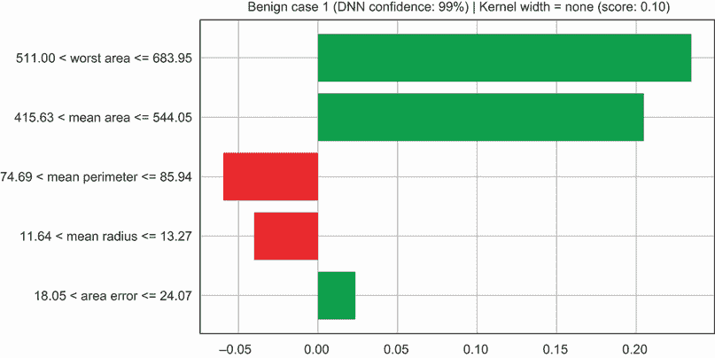

图 4.16 深度神经网络模型预测为良性的第一个良性案例的 LIME 解释，置信度为 99%

如果我们现在查看 LIME 确定的第二个最重要的特征，我们可以看到，如果平均面积在 415.63 和 544.05 之间，案例为良性的可能性就大得多。这一点进一步得到了我们在图 4.3 中的观察的验证。我们也可以对第三个最重要的特征——平均周长——做出类似的观察。你可能已经在图 4.16 的标题中观察到了核宽度和一个分数。我们稍后会讨论这一点。

现在我们来查看测试集中第一个恶性案例，并使用 LIME 进行解释。我们可以使用之前相同的代码，但需要记住使用`malignant_idx`从测试集中选择正确的特征值。作为一个练习，我鼓励你自己去尝试。得到的 LIME 解释如图 4.17 所示。最重要的两个特征与良性案例相同，但值域不同。此外，最重要的特征（最差细胞面积）的权重也是负值。这很有道理，因为我们预期该特征会对模型的输出产生负面影响。深度神经网络（DNN）被训练来预测正类的概率，在这种情况下，是良性。因此，如果案例是恶性的，我们期望模型的输出尽可能低；也就是说，案例为良性的概率必须尽可能低。

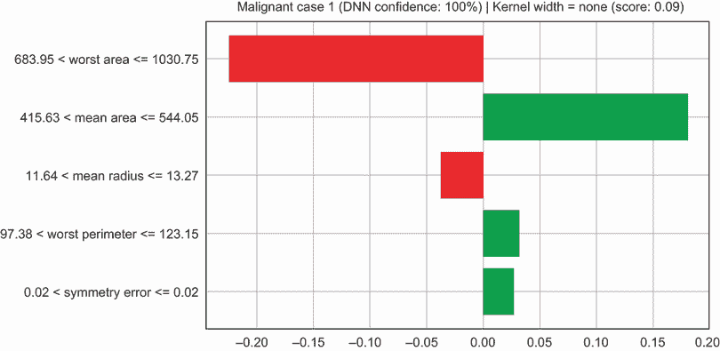

图 4.17 深度神经网络模型预测为恶性的第一个恶性案例的 LIME 解释，置信度为 100%

对于这个恶性案例，DNN 预测该案例为良性的概率为 0。这意味着模型 100%确信该案例为恶性。现在让我们检查特征值范围。我们可以看到，模型预测为恶性，因为最坏或最大的细胞面积大于 683.95 但小于 1030.75。这在探索性分析中是有意义的，因为我们观察到在该范围内恶性案例比良性案例多（见图 4.3）。对于其他特征，我们可以做出类似的观察。

内核宽度的影响需要指出的是，内核宽度是 LIME 的一个重要超参数。选择合适的内核宽度非常重要，并且会影响解释的质量。我们不能为所有希望解释的实例选择相同的内核宽度。宽度的选择会影响 LIME 考虑的加权扰动样本，用于线性代理模型。如果我们选择较大的内核宽度，距离选定的实例较远的样本将影响线性代理模型。这可能不是我们想要的，因为我们希望代理模型尽可能忠实地反映原始的黑盒模型。默认情况下，LIME 库使用一个内核宽度，它是特征数量的平方根乘以 0.75 的因子。因此，如果`kernel_width` `=` `None`，则使用默认值。可能的情况是，相同的内核宽度可能不适用于所有需要使用 LIME 解释的实例。为了评估解释的质量，LIME 提供了一个解释，或称为保真度分数。该参数称为`score`，用于结果 LIME 解释。分数越高，意味着 LIME 使用的线性模型是黑盒模型的良好近似。内核宽度和 LIME 保真度分数在图 4.16 和图 4.17 的标题中显示。

现在我们通过观察另一个良性案例来分析内核宽度的影响。我们在此选择了测试集的第二种情况，如下所示：

```
benign_idx2 = np.where(y_test.numpy() == 1)[0][1]
```

我们之前创建的 LIME 解释器使用了默认值，即 0.75 乘以*特征数量的平方根*。这计算出的内核宽度为 4，因为数据集中的特征数量为 30。我们还将创建另一个 LIME 解释器，其初始化内核宽度为 1，以观察对解释的影响。以下代码显示了如何创建内核宽度为 1 的 LIME 解释器：

```
explainer_kw1 = lime.lime_tabular.LimeTabularExplainer(X_train.numpy(),
feature_names=data.feature_names,
                    class_names=data.target_names,
            kernel_width=1,                           ①
                    discretize_continuous=True)
```

① 将`kernel_width`参数设置为 1。

使用默认内核宽度和内核宽度为 1 的第二个良性案例的 LIME 解释结果分别显示在图 4.18（a）和图 4.18（b）中。

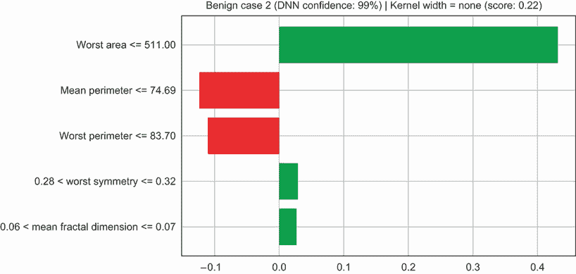

图 4.18a 默认内核宽度的良性案例 2 的 LIME 解释

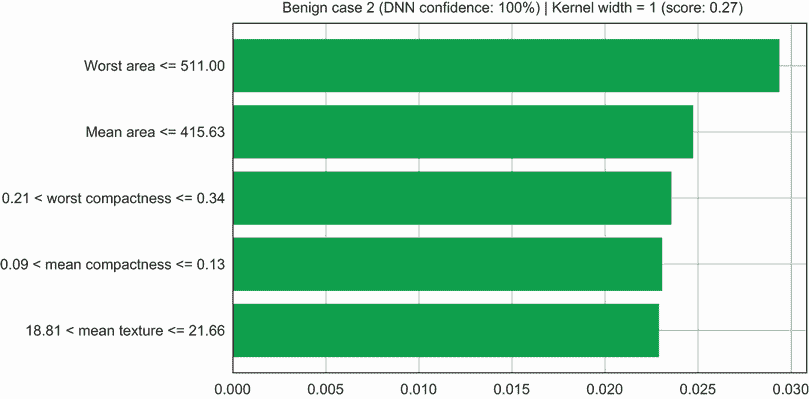

图 4.18b 内核宽度为 1 的良性案例 2 的 LIME 解释

首先，让我们将默认 LIME 解释的第二良性案例与之前展示的第一个案例进行比较。最重要的特征是相同的。然而，我们可以看到特征的值域是不同的。对于第二个良性案例，我们看到模型预测良性是因为最坏细胞的面积小于 511，而第一个案例的面积介于 511 和 683.95 之间。这仍然是一个有效的预测，因为当最坏面积小于 511 时，有更多的案例是良性的。第二个良性案例的默认 LIME 解释的保真度分数也更高。这意味着 LIME 中的线性模型在这个案例中比第一个案例更接近 DNN 模型。

如果我们现在切换到图 4.18（b），我们可以看到如果我们使用较小的核宽度，解释会有多么不同。最上面的特征仍然是相同的，但我们看到不同的特征以及它们的一个小得多的值域，因为小的核宽度将线性代理模型集中在与所选实例非常接近的扰动案例上。对于第二个良性案例，哪个核宽度更好？我们可以看到，核宽度为 1 的保真度分数仅为 0.27，而默认值为 0.22。因此，在这个案例中，核宽度为 1 更好。作为一个练习，我强烈建议你增加第二个案例的核宽度，看看你是否可以达到更高的保真度分数，并分析结果 LIME 图。我还建议你调整第一个案例的核宽度超参数，看看你是否可以得到一个更好的解释，这个解释与 DNN 的忠实度更高。

图 4.19（a）和图 4.19（b）展示了第二个恶性案例的两个核宽度的 LIME 解释——一个是默认宽度，另一个是宽度为 1。作为一个练习，比较这些解释与第一个恶性案例，看看哪个核宽度给出了更高质量的解释。

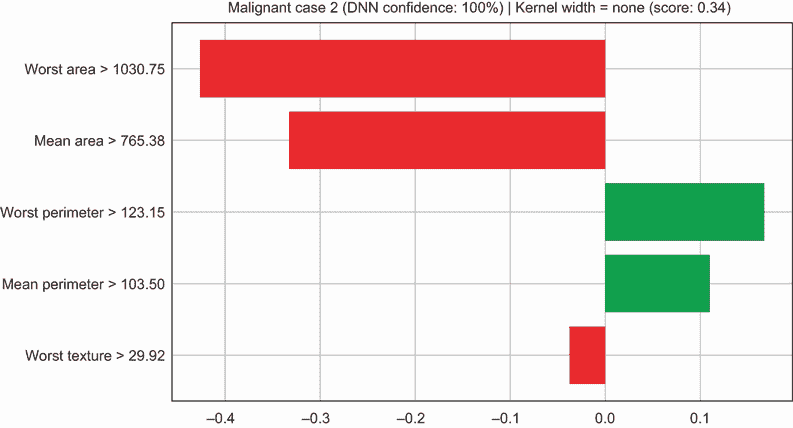

图 4.19a 默认核宽度的 LIME 解释的恶性案例 2

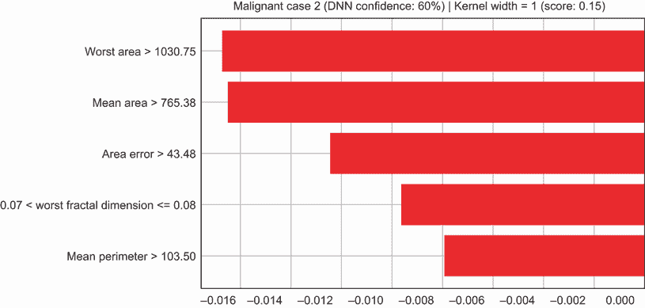

图 4.19b 核宽度为 1 的 LIME 解释的恶性案例 2

LIME 是一个解释黑盒模型的优秀工具。它是模型无关的，可以与不同类型的模型一起工作。LIME 还可以与不同类型的数据一起工作——表格数据、图像和文本。我们已经在本节中看到了它使用表格数据的实际应用。我们将在后面的章节中探索图像和文本数据，你可以在库文档中找到示例（[`github.com/marcotcr/lime`](https://github.com/marcotcr/lime)）。这是一个广泛使用的库，拥有许多活跃的贡献者。

然而，LIME 解释的质量在很大程度上取决于核宽度的选择，这是用于加权扰动样本的核函数的输入。它是一个重要的超参数，我们已看到对于不同例子，我们选择的宽度可能不同。我们可以使用库提供的保真度分数来确定正确的宽度，但选择正确的核宽度仍然是不明确的。LIME 的另一个限制是，扰动数据集是通过从高斯分布中进行采样创建的，并且它忽略了特征之间的相关性。因此，扰动数据集可能不具有与原始训练数据相同的特征。

## 4.6 SHAP

SHAP，即 SHapley Additive exPlanations 的缩写，由 Scott M. Lundberg 和 Su-In Lee 于 2017 年提出。它统一了 LIME（以及线性代理模型）和博弈论的思想，并在解释的准确性方面提供了比 LIME 更多的数学保证。*Shapley 值*是博弈论中的一个概念，它量化了合作游戏中玩家联盟的影响。现在让我们看看我们所说的合作游戏、游戏的玩家以及玩家联盟的含义。在模型可解释性的背景下，合作游戏是模型及其做出的预测。输入到模型中的特征相当于玩家，而玩家联盟是相互作用的特征集，以得出最终预测。因此，Shapley 值可以用来量化特征（即玩家）及其相互作用（即玩家联盟）对模型预测（即合作游戏）的影响。让我们通过查看图 4.20 中所示的具体示例来分解 SHAP 可解释性技术。

SHAP 背后的思想与 LIME 背后的思想相当相似。第一步是选择一个实例进行解释。在图 4.20 中，选择的实例显示为索引 0 的第一行。由于 SHAP 使用博弈论概念，选择的实例由所有特征的联盟组成。当所有特征都被选中，或“打开”时，它由包含所有特征的所有 1s 的向量表示。图 4.20 的第一列显示了*联盟向量*作为表格。对于选择的实例，联盟向量由所有 1s 组成，因此当我们把该向量转换到特征空间时，我们选择该实例的所有实际特征值。这个*特征向量*在图 4.20 的第二列中作为表格显示。

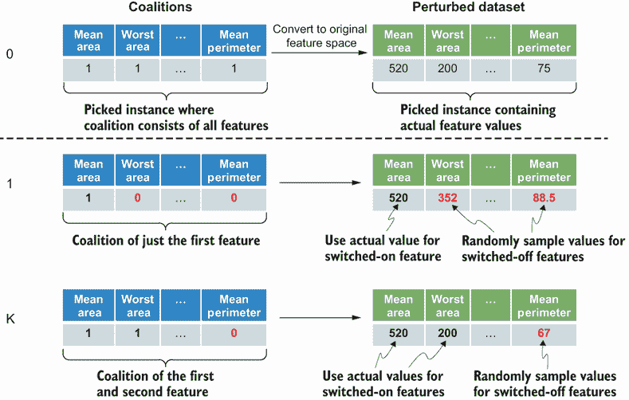

图 4.20 创建 SHAP 扰动数据集的说明

一旦我们选择了要解释的实例，下一步就是创建扰动数据集。这个过程与 LIME 相同，但与 LIME 不同，SHAP 的思路是生成一系列联盟向量，其中特征是随机“开启”或“关闭”。如果一个特征被开启，其在联盟向量中的值为 1。如果一个特征被关闭，其在联盟向量中的值为 0。我们知道如何在特征空间中表示开启时的特征——我们只需从已选择的实例中选取实际值。然而，如果特征被关闭，我们从训练集中随机选取该特征的一个值。

创建扰动数据集后，下一步是根据其与所选实例的接近程度对数据集进行加权。这又与 LIME 相似，但与 LIME 不同，SHAP 使用*SHAP 核*来确定扰动数据集中样本的权重，而不是指数核函数。SHAP 核函数会给包含非常低或非常高数量特征的联盟更高的权重。接下来的步骤与 LIME 相同，即在加权数据集上拟合线性模型，并返回线性模型的系数或权重作为所选实例的解释。这些系数或权重被称为*Shapley 值*。

现在让我们看看 SHAP 在之前训练的乳腺癌诊断模型上的实际应用。SHAP 的作者在 GitHub 上创建了一个 Python 库。我们可以使用 pip 安装此库，如下所示：

```
pip install shap
```

我们将使用之前在 LIME 部分介绍的名为`prob`的相同辅助函数来提供对扰动数据集的 DNN 模型预测。你现在可以创建扰动数据集并初始化 SHAP 解释器，如下所示：

```
import shap
shap.initjs()                                             ①

shap_explainer = shap.KernelExplainer(prob,               ②
                                      X_train.numpy(), 
                                      link="logit")       ③
```

① 初始化 JavaScript 以进行交互式可视化

② 使用 prob 辅助函数获取 DNN 预测

③ 使用对数连接函数，因为 DNN 是一个分类器

注意，对数连接函数用于线性代理模型，因为我们处理的是一个二元分类器，它为正类输出概率估计。对于回归问题，你可以将`link`参数切换到`identity`。接下来，按照以下方式获取测试集中所有数据的 SHAP 值：

```
shap_values = shap_explainer.shap_values(X_test.numpy())
```

你现在可以像这里所示的那样，以 Matplotlib 图的形式获取第一个良性案例的 SHAP 解释：

```
plot = shap.force_plot(shap_explainer.expected_value[0], 
                       shap_values[0][benign_idx,:], 
                       X_test.numpy()[benign_idx,:],
                       feature_names=data['feature_names'],
                       link="logit")
```

结果图如图 4.21 所示。回想一下，对于第一个良性案例，DNN 模型预测其良性概率为 0.99 或置信度为 99%。

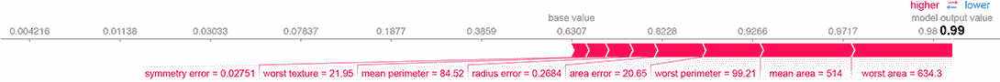

图 4.21 对良性案例 1 的 SHAP 解释，其中 DNN 模型预测良性概率为 0.99（或 99%的置信度）

SHAP 库提供了更美观的可视化效果，您可以看到每个特征值是如何推动基础预测值上升或下降的。在图 4.21 中，您可以看到基础值大约在 0.63。这代表的是正类率，即良性病例的比例。当我们探索 4.2 节中的数据时，我们观察到在数据集中，大约 63%的病例是良性的。SHAP 可视化的理念是观察特征值是如何将基础预测概率从 0.63 推高到 0.99 的。特征的影响通过条形长度来表示。从图中我们可以看出，最差细胞面积和平均细胞面积特征具有最大的 Shapley 值，这推动了基础预测值的最大变化。下一个最重要的特征是最差细胞周长。

图 4.22 展示了 DNN 模型预测为 0.99（或置信度为 99%）的第二个良性病例的 SHAP 解释

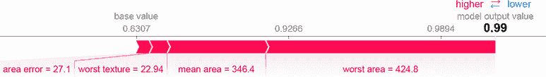

图 4.22 展示了 DNN 模型预测为 0.99（或置信度为 99%）的第二个良性病例的 SHAP 解释

我们可以看到，这里最重要的两个特征是最差细胞面积和平均细胞面积。因为最差面积和平均面积相当低，分别为 424.8 和 346.4，足以将基础预测推高到 0.99。作为一个练习，修改前面展示的代码来解释两个恶性病例。结果图示在图 4.23 和 4.24 中。

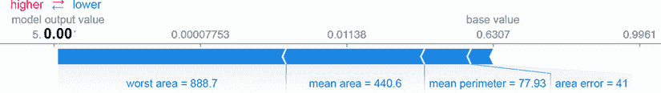

图 4.23 展示了 DNN 模型预测为 0（或恶性，置信度为 100%）的恶性病例 1 的 SHAP 解释

对于第一个恶性病例，模型预测其概率为 0。在图 4.23 中，我们可以看到特征值是如何将基础预测概率推低到 0 的。看起来对最终预测影响最大的特征是最差细胞面积、平均细胞面积和周长。

对于第二个恶性病例，模型同样预测其概率为 0。我们可以看到，最有影响力的特征再次是最差细胞面积。因为该值相当大——大于 1417——足以将基础预测概率推低到 0，如图 4.24 所示。


图 4.24 展示了 DNN 模型预测为 0（或恶性，置信度为 100%）的恶性病例 2 的 SHAP 解释

SHAP 是另一个用于解释黑盒模型的优秀工具。像 LIME 一样，它是模型无关的，并且它使用博弈论的概念来量化特征对单个实例模型预测的影响。它比 LIME 提供了更多关于解释准确性的数学保证。该库还提供了关于特征影响的出色可视化，展示了特征值如何将基线预测推高或推低到最终预测。然而，基于 SHAP 内核计算 Shapley 值的计算量是密集的。计算复杂度随着输入特征数量的指数增长。

## 4.7 锚点

锚点是一种局部范围内的模型无关解释技术。它由 LIME 的相同创造者在 2018 年提出。它通过提供高精度规则或谓词来改进 LIME，这些规则说明了模型如何得出预测，并通过全球范围量化这些规则的范围。让我们来分解一下。

在这项技术中，模型解释以锚点的形式生成。一个 *锚点* 实质上是一组 *if 条件*，或 *谓词*，它包含我们想要解释的选定的实例。这如图 4.25 中的框所示。图中的锚点可以解释为两个 if 条件，其中二维特征空间中的两个特征被下限和上限所限制，从而在选定的实例周围形成一个边界框。算法的第一个目标是形成包含选定实例且针对目标预测的高精度锚点。*精度* 是锚点质量的度量，定义为具有与选定实例相同目标预测的扰动样本数与锚点内总样本数之比。算法的一个重要超参数是 *精度阈值*。

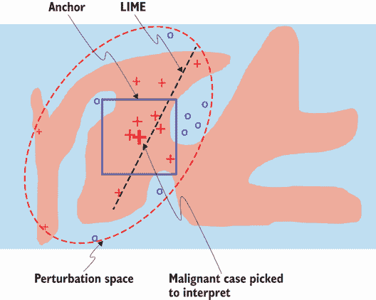

图 4.25 锚点的示意图

一旦算法生成了一组高精度锚点，下一步就是量化每个锚点的范围。锚点的范围通过一个称为 *覆盖率* 的指标来量化。覆盖率指标衡量锚点（或谓词集）出现在其他样本或特征空间其他部分中的概率。有了这个指标，我们可以了解锚点的解释在全球范围内是如何适用的。算法的目标是选择覆盖率最高的锚点。

确定所有满足精度阈值和覆盖率要求的谓词是一项计算密集型任务。算法的作者在构建谓词或规则时采用了自底向上的方法。算法从一个空的规则集开始，并在每次迭代中，算法增量地构建一个满足精度阈值和覆盖率要求的锚点，并将其添加到集合中。为了估计锚点的精度，作者将此问题表述为一个多臂老虎机问题，并特别使用了 KL-LUCB 算法来识别精度最高的规则。

现在让我们使用锚点来解释乳腺癌 DNN 模型。论文的作者在 GitHub 上创建了一个 Python 库。您可以使用 pip 安装此库，如下所示：

```
pip install anchors_exp
```

如同我们使用 LIME 和 SHAP 所做的那样，现在让我们创建乳腺癌数据集的锚点表格解释器，如下所示：

```
from anchor import anchor_tabular           ①

anchor_explainer = anchor_tabular.AnchorTabularExplainer(
    data.target_names,                      ②
    data.feature_names,                     ③
    X_train.numpy(),
    categorical_names={})                   ④
anchor_explainer.fit(X_train.numpy(),       ⑤
                     y_train.numpy(),       ⑤
                     X_val.numpy(),         ⑤
                     y_val.numpy())         ⑤
```

① 从库中导入 anchor_tabular 模块

② 设置目标标签名称

③ 设置数据集的特征名称

④ 如果有，提供分类特征名称

⑤ 将锚点解释器拟合到训练集和验证集

我们需要为锚点创建一个不同的辅助函数，该函数提供 DNN 预测作为离散标签而不是概率。此辅助函数如下所示：

```
def pred(data):
    pred = model.forward(                                    ①
        Variable(torch.from_numpy(data)).float()).\          ①
    detach().numpy().reshape(-1) > 0.5                       ①
    return np.array([1 if p == True else 0 for p in pred])   ①
```

① 如果输出概率大于 0.5，则预测为 1，否则为 0

现在让我们使用锚点来解释第一个良性案例。以下代码展示了如何解释实例，提取谓词或规则，以及获得解释的精度和覆盖率：

```
exp = anchor_explainer.explain_instance(X_test.numpy()[benign_idx],      ①
                                        pred,                            ②
                                        threshold=0.95)                  ③
print('Prediction: ', 
➥ anchor_explainer.class_names[pred(X_test.numpy()[benign_idx])][0])    ④
print('Anchor: %s' % (' AND '.join(exp.names())))                        ⑤
print('Precision: %.3f' % exp.precision())                               ⑥
print('Coverage: %.3f' % exp.coverage())                                 ⑦
```

① 将选定的实例作为第一个参数传递

② 提供提供模型标签预测的辅助函数

③ 设置精度阈值

④ 打印模型做出的标签预测

⑤ 打印规则或谓词

⑥ 打印锚点的精度

⑦ 打印锚点的覆盖率

注意，精度阈值设置为 0.95。规则或谓词以字符串列表的形式获得，并使用 AND 子句连接。代码的输出结果如下所示：

```
Prediction:  benign
Anchor: worst area <= 683.95 AND mean radius <= 13.27
Precision: 1.000
Coverage: 0.443
```

您可以看到模型正确预测了良性，具有最高精度的解释或锚点由两个规则或谓词组成。如果最坏区域小于或等于 683.95，并且平均半径小于或等于 13.27，则模型在所选实例周围的区域预测良性 100%。在覆盖率方面，此锚点表现相当不错，覆盖率为 44.3%。这意味着该规则适用于全球相当多的良性案例。您还可以使用以下代码行获得此解释的 HTML 可视化，如图 4.26 所示：

```
exp.save_to_file('anchors_benign_case1_interpretation.html')
```

目前，锚点库不提供 Matplotlib 可视化。

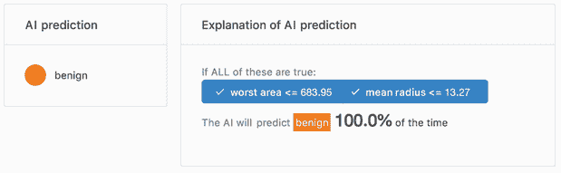

图 4.26 良性案例 1 的锚点解释，精度为 100%，覆盖率为 44.3%

作为练习，将此代码扩展到其他良性及恶性案例。第二良性案例的结果可视化如图 4.27 所示。你可以看到模型正确预测了良性，并且锚定算法提出了两个规则，精确度为 1：如果最坏细胞面积小于或等于 683.95，且最坏细胞半径小于或等于 12.98，模型 100%预测为良性。然而，此锚定的覆盖率比第一个良性案例低 20.9%。这意味着第二个良性案例的解释比第一个案例更加局部。

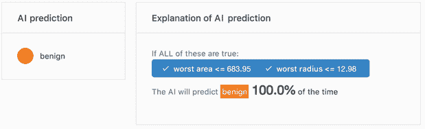

图 4.27 展示了精确度为 100%、覆盖率为 20.9%的良性案例 2 的锚定解释

第一个恶性案例的锚定解释如图 4.28 所示。模型正确预测其为恶性，解释由两个规则或谓词组成，精确度为 1。规则如下：如果最坏细胞面积大于 683.95 且平均细胞半径小于或等于 544.05，模型 100%预测为恶性。然而，锚定的覆盖率非常低，仅为 1.2%。因此，解释非常局部，实际上并不适用于许多其他恶性案例。

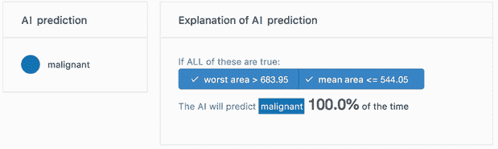

图 4.28 展示了锚定对恶性案例 1 的解释，其中精确度为 100%，覆盖率为 1.1%

最后，第二个恶性案例的锚定解释如图 4.29 所示。模型再次正确预测其为恶性，解释由一个精确度为 1 的规则组成。规则如下：如果最坏细胞面积大于 1030.75，模型 100%预测为恶性。此锚定的覆盖率比第一个案例好得多，为 27.1%。这是有道理的，因为如果我们回到第 4.2 节中进行的探索性分析，并仔细观察图 4.3，我们会看到许多恶性案例的最坏细胞面积大于 1030。

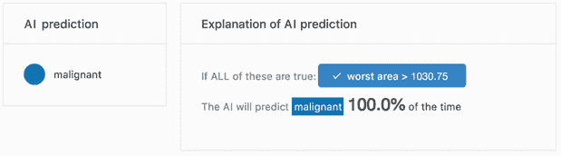

图 4.29 展示了精确度为 100%、覆盖率为 27.1%的恶性案例 2 的锚定解释

锚定是一种强大的模型无关解释技术，因为它们提供了一组高精度规则、谓词或人类可读的 if 条件作为解释。这项技术还让我们对规则的覆盖范围或范围有了一定的感觉，即规则在全局范围内适用性如何。然而，Python 库仍在开发中，并且不如 LIME 或 SHAP 那样活跃。

在接下来的章节中，我们将更深入地探讨神经网络的世界，并了解更复杂的结构，如 CNN 和 RNN。我们还将学习如何在神经网络上执行特征归因，以及如何剖析它们以更好地理解网络学到了什么。

## 摘要

+   人工神经网络（ANN）是一个旨在松散地模拟生物大脑的系统。它属于被称为深度学习的一类广泛的机器学习方法。基于 ANN 的深度学习的核心思想是从更简单的概念或特征构建复杂的概念或表示。

+   具有两个或更多隐藏层的 ANN 被称为深度神经网络（DNN）。

+   确定深度神经网络（DNN）中权重的有效算法是反向传播。

+   激活函数是神经网络中的一个重要特征。它决定了神经元是否应该被激活以及激活的程度。激活函数的性质是它是可微的且单调的。

+   ReLUs 是神经网络中最广泛使用的激活函数，因为它们很好地处理了梯度消失问题。它们在计算上也更高效。

+   我们可以用多种方式解释神经网络。我们可以使用全局范围内的模型无关方法，例如 PDPs。在本章中，我们学习了更多基于扰动的模型无关技术，如 LIME、SHAP 和锚点。这些可解释性技术是局部的，意味着它们专注于解释特定实例或示例。

+   LIME 代表局部可解释的模型无关解释。它基于选择一个示例，随机扰动它，根据其与所选实例的接近程度对扰动样本进行加权，并在加权样本上拟合一个更简单的白盒模型。

+   LIME 解释的质量在很大程度上取决于核宽度的选择，这是用于加权的扰动样本的核函数的输入。它是一个重要的超参数，我们已看到宽度可能因我们选择的解释示例而异。我们可以使用库提供的保真度分数来确定正确的宽度，但选择正确的核宽度仍然是不确定的。

+   LIME 的另一个缺点是，通过从高斯分布中进行采样来创建扰动数据集，并且它忽略了特征之间的相关性。因此，扰动数据集可能不具有原始训练数据的相同特征。

+   SHAP 代表 SHapley Additive exPlanations。与 LIME 一样，它是模型无关的，并且它使用博弈论的概念来量化特征对单个实例模型预测的影响。理论上，SHAP 在解释的准确性方面比 LIME 提供了更多的数学保证。

+   SHAP 库提供了关于特征影响的出色可视化，显示了特征值如何将基线预测推高或推低到最终预测。

+   然而，基于 SHAP 核计算 Shapley 值是计算密集型的。计算复杂度随着输入特征数量的指数增长。

+   Anchors 是一种改进 LIME 的技术，它通过提供一组高精度规则、谓词或人类可读的 if 条件作为解释。该技术还让我们对规则的覆盖范围或范围有了一种感觉，即规则在全球范围内适用性的如何。然而，Python 库仍然处于开发中，并且不如 LIME 或 SHAP 活跃。
