# 5 显著性映射

本章涵盖了

+   使卷积神经网络本质上成为黑盒的特征

+   如何实现用于图像分类任务的卷积神经网络

+   如何使用显著性映射技术（如标准反向传播、引导反向传播、引导 Grad-CAM 和 SmoothGrad）来解释卷积神经网络

+   这些显著性映射技术的优缺点以及如何对它们进行合理性检查

在前一章中，我们探讨了深度神经网络，并学习了如何使用局部范围内的模型无关方法来解释它们。我们具体学习了三种技术：LIME、SHAP 和锚点。在本章中，我们将专注于卷积神经网络（CNNs），这是一种更复杂的神经网络架构，主要用于视觉任务，如图像分类、图像分割、目标检测和面部识别。我们将学习如何将前一章中学到的技术应用到 CNNs 上。此外，我们还将关注显著性映射，这是一种局部、模型相关和事后解释的技术。显著性映射是解释 CNNs 的一个很好的工具，因为它帮助我们可视化模型的重要或显著特征。我们将具体介绍标准反向传播、引导反向传播、集成梯度、SmoothGrad、Grad-CAM 和引导 Grad-CAM 等技术。

本章的结构与前面章节类似。我们将从一个具体的例子开始，这个例子将扩展第四章中的乳腺癌诊断示例。我们将探索这个包含图像的新数据集，并学习如何在 PyTorch 中训练和评估卷积神经网络（CNNs），以及如何解释它们。值得重申的是，尽管本章的主要重点是使用显著性映射来解释 CNNs，但我们也会涵盖模型训练和测试。我们还会在前面的部分中提炼出一些关键见解，这些见解在模型解释过程中将非常有用。对于已经熟悉 CNNs 训练和测试的读者，可以自由跳过前面的部分，直接跳到第 5.4 节，该节涵盖了模型可解释性。

## 5.1 诊断+ AI：浸润性导管癌检测

浸润性导管癌（IDC）是乳腺癌最常见的类型。在本章中，我们将扩展前一章中的乳腺癌诊断示例，以检测 IDC。Diagnostics+的病理学家目前对病人进行活检，他们移除小块组织样本并在显微镜下分析，以确定病人是否有 IDC。病理学家将整个组织样本分割成小块，并确定每个小块是否为 IDC 阳性或阴性。通过在组织中界定 IDC 的确切区域，病理学家确定癌症的侵略性或进展程度，以及为病人分配哪个等级。

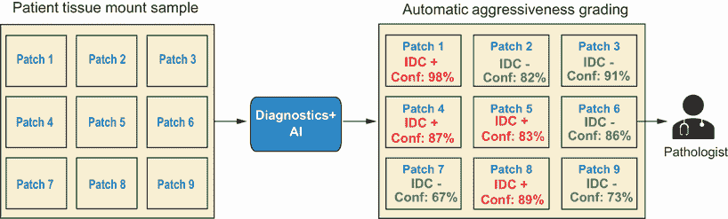

图 5.1 Diagnostics+ AI 用于检测浸润性导管癌（IDC）

Diagnostics+ 希望扩展我们在第四章中构建的 AI 系统的功能，以自动评估组织样本图像。目标是让 AI 系统确定组织样本中的每个切片是 IDC 阳性还是阴性，并为其分配一个置信度度量。这如图 5.1 所示。通过使用这个 AI 系统，Diagnostics+ 可以自动化预处理步骤，即描绘组织中的 IDC 区域，以便病理学家可以轻松地为它分配一个等级，以确定癌症的侵袭性。考虑到这些信息，你将如何将这个问题表述为一个机器学习问题？因为模型的目的是预测给定的图像或切片是 IDC 阳性还是阴性，我们可以将这个问题表述为一个 *二元分类* 问题。这个表述与第四章类似，但分类器的输入是图像，而不是结构化的表格数据。

## 5.2 探索性数据分析

现在我们来更好地理解这个新的图像数据集。本节中获得的许多见解将有助于我们进行模型训练、评估和解释。在这个数据集中，我们有来自 279 名患者的组织样本和 277,524 个组织切片图像。原始数据集从 Kaggle([`mng.bz/0wBl`](http://mng.bz/0wBl))获得，并经过预处理以提取与这些图像相关的元数据。预处理笔记本和预处理后的数据集可以在与本书相关的 GitHub 仓库([`mng.bz/KBdZ`](http://mng.bz/KBdZ))中找到。

在图 5.2 中，我们可以看到 IDC 阳性与阴性切片的分布。在 277,524 个切片中，大约 70%是 IDC 阴性，30%是 IDC 阳性。因此，数据集高度不平衡。为了回顾，在处理不平衡数据集时，我们需要注意以下两点：

+   在测试和评估模型时，使用正确的性能指标（如精确度、召回率和 F1）。

+   重新采样训练数据，使得多数类要么被欠采样，要么少数类被过采样。

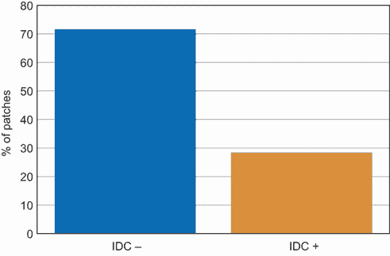

图 5.2 IDC 阳性与阴性切片的分布

让我们看看几个随机图像块的样本。通过可视化这些图像，我们可以看到 IDC 阳性图像块和阴性图像块是否有某些明显的特征。这将在我们后来解释模型时有所帮助。图 5.3 显示了四个 IDC 阳性图像块的随机样本，图 5.4 显示了四个 IDC 阴性图像块的随机样本。每个图像块的尺寸是 50 × 50 像素。我们可以观察到 IDC 阳性图像块有更多的深染细胞。深染的密度也更高。通常使用较深的颜色来染色细胞核。对于 IDC 阴性样本，另一方面，浅染的密度更高。浅色通常用于突出细胞质和细胞外结缔组织。因此，我们可以直观地说，如果一个图像块有高密度的深染或细胞核，那么它更有可能是 IDC 阳性。另一方面，如果一个图像块有高密度的浅染和非常低的细胞核密度，那么它更有可能是 IDC 阴性。

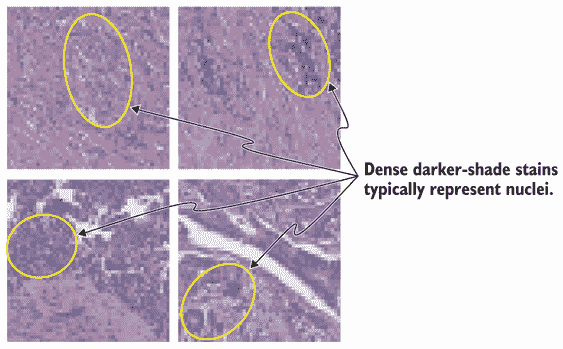

图 5.3 随机 IDC 阳性图像块的可视化

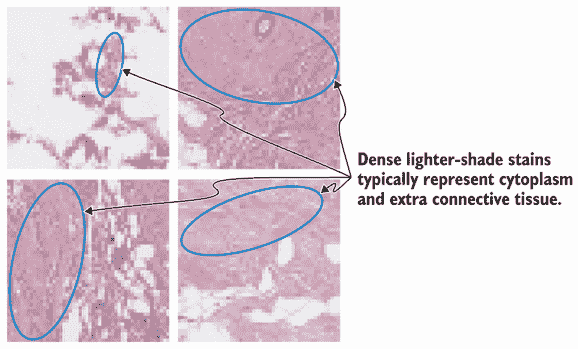

图 5.4 随机 IDC 阴性图像块的可视化

现在，让我们可视化一个患者或组织样本的所有图像块以及 IDC 阳性区域。图 5.5 为一位患者展示了这一点。左边的图显示了组织样本的所有图像块拼接在一起。右边的图显示了相同的图像，但以较深的色调突出显示 IDC 阳性图像块。这证实了我们之前的观察，即如果一个图像块有非常高的深染密度，那么它更有可能是 IDC 阳性。当我们需要解释我们将为 IDC 检测训练的 CNN 时，我们将回到这个可视化。

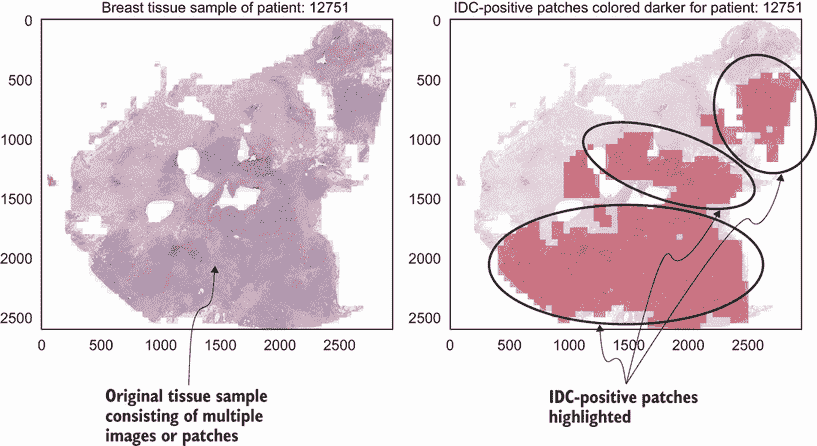

图 5.5 组织样本和 IDC 阳性图像块的可视化

在下一节中，我们将准备数据并训练一个卷积神经网络（CNN）。这个 CNN 将被用来将每张图像或图像块分类为 IDC 阳性或阴性。由于数据集相当不平衡，我们需要使用诸如精确度、召回率和 F1 等指标来评估 CNN。

## 5.3 卷积神经网络

卷积神经网络（CNN）是一种常用于视觉任务（如图像分类、目标检测和图像分割）的神经网络架构。为什么 CNN 用于视觉任务而不是全连接深度神经网络（DNN）？全连接 DNN 无法很好地捕捉图像中的像素依赖性，因为图像在输入神经网络之前需要被展平成 1 维结构。另一方面，CNN 利用图像的多维结构，很好地捕捉图像中的像素依赖性或空间依赖性。CNN 还具有平移不变性，这意味着它们擅长检测图像中的形状，无论这些形状出现在图像的哪个位置。此外，CNN 架构还可以更有效地训练以适应输入数据集，因为网络中的权重被重复使用。图 5.6 展示了用于二值图像分类的 CNN 架构示意图。

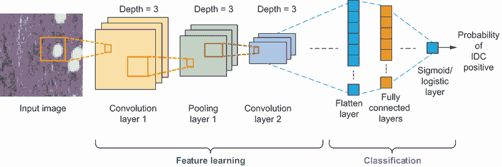

图 5.6 CNN 用于图像分类的示意图

图 5.6 中的架构由一系列称为“卷积和池化层”的层组成。这两种类型层的组合称为“特征学习层”。特征学习层的目的是从输入图像中提取层次化特征。前几层将提取低级特征，如边缘、颜色和梯度。通过添加更多的卷积和池化层，架构学习高级特征，使我们能够更好地理解数据集中图像的特征。我们将在本节稍后更深入地介绍卷积和池化层。

在特征学习层之后是神经元或单元的层，这些层是完全连接的，就像我们在第四章中看到的 DNN 架构一样。这些全连接层的目的是执行分类。全连接层的输入是卷积和池化层学习的高级特征，输出是对分类任务的概率度量。由于我们在第四章中介绍了 DNN 的工作原理，我们现在将主要关注卷积和池化层。

在第一章中，我们看到了如何表示图像以便 CNN 可以轻松处理，如图 5.7 所示。在这个例子中，组织片的图像是一个 50 × 50 像素大小的彩色图像，由三个主要通道组成：红色（R）、绿色（G）和蓝色（B）。这个 RGB 图像可以用数学形式表示为三个像素值矩阵，每个通道一个，大小为 50 × 50。

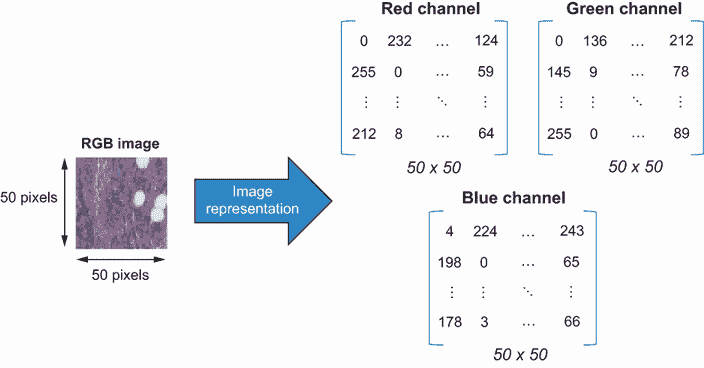

图 5.7 如何表示 50 × 50 像素的组织片图像

现在我们来看一下卷积层是如何处理以像素值矩阵表示的图像的。这一层由一个核或滤波器组成，并与输入图像进行卷积，以获得称为*特征图像*的图像表示。让我们一步一步地分析它。图 5.8 展示了卷积层中执行操作的简化示意图。在图中，图像被表示为一个 3×3 维度的矩阵，而核或滤波器被表示为一个 2×2 维度的矩阵。核从图像的左上角开始，向右移动直到处理完整个图像的宽度。然后核向下移动，并从图像的左侧重新开始，重复这一过程直到处理完整个图像。每次核的移动被称为*步长*。对于核来说，步长长度是一个重要的超参数。如果步长长度为 1，核在每次步长中移动一步。图 5.8 展示了步长长度为 1 的核。如图所示，核从图像的左上角开始，需要执行三个步长来处理整个图像。

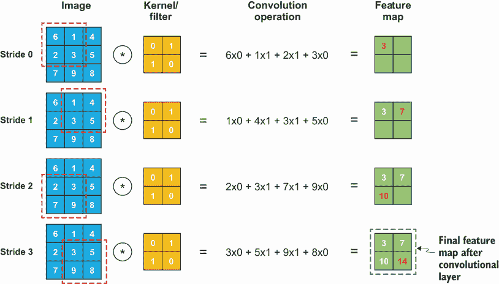

图 5.8 展示了卷积层如何从输入图像创建特征图的示例

在每次步长中，被处理的图像部分与核进行卷积。正如我们在第二章中讨论 GAMs 时所见，卷积操作本质上是一个点积。对与核处理的图像部分进行逐元素乘积，然后求和。在图 5.8 中，我们可以看到所有步长的这种表示。例如，对于步长 0，通过核处理的图像部分由虚线框突出显示。这个图像与核进行点积得到的结果是 3，这个值被放置在特征图矩阵的左上角。在步长 1 中，我们向右移动一步并再次执行卷积操作。卷积后得到的结果是 7，这个值被放置在特征图矩阵的右上角。这个过程一直重复，直到处理完整个图像。在卷积操作结束时，我们得到一个 2×2 大小的特征图矩阵，它旨在捕获输入图像的高级特征表示。核或滤波器内的数字被称为*权重*。请注意，在图 5.8 中，卷积层使用了相同的权重。这种权重共享使得 CNN 的训练比 DNNs 更加高效。

学习算法的目标是确定卷积层内核或过滤器中的权重。这是在反向传播过程中完成的。特征图矩阵的大小由几个超参数决定——输入图像的大小、内核的大小、步长长度以及另一个称为填充的超参数。*填充*是指在执行卷积操作之前添加到图像中的像素数。在图 5.8 中，使用了 0 填充，即不向图像添加额外的像素。如果将填充设置为 1，则在图像周围添加一个像素边界，其中边界中的所有像素值都设置为 0，如图 5.9 所示。添加填充会增加特征图的大小，并允许更准确地表示图像。在实践中，卷积层由多个过滤器或内核组成。过滤器的数量是我们必须在训练之前指定的另一个超参数。

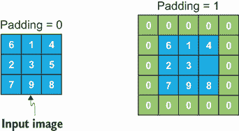

图 5.9 填充的示意图

CNN 中的卷积层通常后面跟着一个池化层。池化层的作用是进一步降低特征图的维度，以减少模型训练过程中所需的计算能力。一个常见的池化层是最大池化。就像在卷积层中一样，池化层也由一个过滤器组成。最大池化过滤器返回该过滤器覆盖的所有值的最大值，如图 5.10 所示。

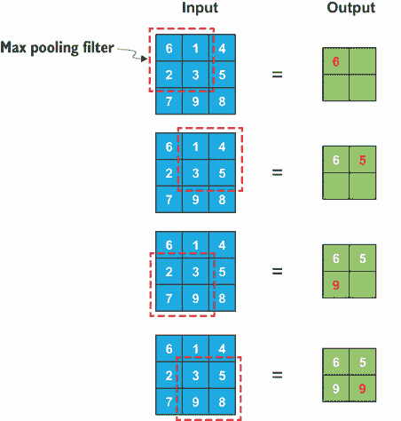

图 5.10 最大池化的示意图

在过去十年中，CNN 在各种任务中取得了快速进展，例如图像识别、目标检测和图像分割。这得益于大量标注数据（ImageNet [[`www.image-net.org/`](http://www.image-net.org/)]、CIFAR-10 和 CIFAR-100 [[`www.cs.toronto.edu/~kriz/cifar.html`](https://www.cs.toronto.edu/~kriz/cifar.html)] 等为其一）和计算能力的提升，其中深度学习模型正在利用图形处理单元（GPU）的优势。图 5.11 展示了过去十年 CNN 研究进展，特别是在使用 ImageNet 数据集进行图像分类任务中。ImageNet 数据集是一个大型标注图像数据库，通常用于图像分类和目标检测任务。它包含超过一百万张图像，组织在一个包含超过 20,000 个标注类别的分层结构中。图 5.11 是从 Papers with Code ([`mng.bz/9K8o`](http://mng.bz/9K8o)) 获得的，这是一个包含顶级（SoTA）机器学习技术的有用仓库。在性能方面的一个主要突破发生在 2013 年，使用了 AlexNet 架构。当前的顶级 CNN 基于名为残差网络（ResNet）的架构。其中一些 SoTA 架构已经在 PyTorch 和 Keras 等深度学习框架中实现。我们将在下一节中看到如何使用它们，在那里我们将训练一个用于 IDC 检测任务的 CNN。我们将特别关注 ResNet 架构，因为它是最广泛使用的架构之一。

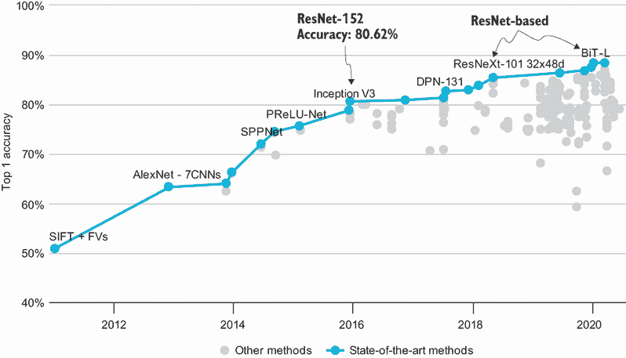

图 5.11 在 ImageNet 数据集上进行图像分类的顶级 CNN 架构（来源：[`mng.bz/9K8o`](http://mng.bz/9K8o)）

### 5.3.1 数据准备

在本节中，我们将为模型训练准备数据。数据准备与之前章节略有不同，因为我们处理的是图像而不是结构化的表格数据。请注意，这里使用的是预处理后的数据集。用于预处理的代码和预处理后的数据集可以在与本书相关的 GitHub 仓库（[`mng.bz/KBdZ`](http://mng.bz/KBdZ)）中找到。首先，让我们准备训练集、验证集和测试集。重要的是我们不要通过补丁来分割数据，而是使用患者 ID。这可以防止训练集、验证集和测试集之间的数据泄露。如果我们随机通过补丁分割数据集，一个患者的补丁可能会出现在所有三个集中，因此可能会泄露一些关于患者的信息。以下代码片段展示了如何通过患者 ID 来分割数据集：

```
df_data = pd.read_csv('data/chapter_05_idc.csv')                             ①
patient_ids = df_data.patient_id.unique()                                    ②
train_ids, val_test_ids = train_test_split(patient_ids,                      ③
                                           test_size=0.4,                    ③
                                           random_state=24)                  ③
val_ids, test_ids = train_test_split(val_test_ids,                           ④
                                     test_size=0.5,                          ④
                                     random_state=24)                        ④

df_train = 
➥ df_data[df_data['patient_id'].isin(train_ids)].reset_index(drop=True)     ⑤
df_val = df_data[df_data['patient_id'].isin(val_ids)].reset_index(drop=True) ⑥
df_test = 
➥ df_data[df_data['patient_id'].isin(test_ids)].reset_index(drop=True)      ⑦
```

① 将数据加载到 Pandas DataFrame 中

② 从数据中提取所有唯一的患者 ID

③ 将数据分割为训练集和验证/测试集

④ 将验证/测试集分割为单独的验证集和测试集

⑤ 从训练集中的患者 ID 提取所有补丁

⑥ 提取验证集中患者 ID 的所有补丁

⑦ 提取测试集中患者 ID 的所有补丁

注意，60% 的患者位于训练集中，20% 位于验证集中，剩余的 20% 位于测试集中。现在让我们检查目标变量的分布是否在三个集中相似，如图 5.12 所示。我们可以看到，在所有三个集中，大约 25-30% 的补丁是 IDC 阳性，而 70-75% 是 IDC 阴性。

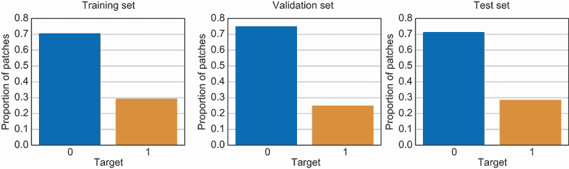

图 5.12 训练集、验证集和测试集中的目标变量分布

现在让我们创建一个自定义类，以便轻松加载补丁的图像及其相应的标签。PyTorch 提供了一个名为 `Dataset` 的类用于此目的。在本章中，我们将扩展此类以用于 IDC 数据集。有关 `Dataset` 类以及 PyTorch 的更多详细信息，请参阅附录 A。以下代码示例展示了如何进行：

```
from torch.utils.data import Dataset                                           ①

class PatchDataset(Dataset):                                                   ②
    def __init__(self, df_data, images_dir, transform=None):                   ③
        super().__init__()                                                     ③
        self.data = list(df_data.itertuples(name='Patch', index=False))        ③
        self.images_dir = images_dir                                           ③
        self.transform = transform                                             ③

    def __len__(self):                                                         ④
        return len(self.data)                                                  ④

    def __getitem__(self, index):                                              ⑤
        image_id, label = self.data[index].image_id, self.data[index].target   ⑥
        image = Image.open(os.path.join(self.images_dir, image_id))            ⑦
        image = image.convert('RGB')                                           ⑦
        if self.transform is not None:                                         ⑧
            image = self.transform(image)                                      ⑧
        return image, label                                                    ⑨
```

① 加载 PyTorch 提供的数据集类

② 为图像补丁创建一个新的数据集类，该类扩展了 PyTorch 类

③ 一个构造函数，用于初始化补丁列表，以及包含图像和任何图像转换器的目录

④ 覆盖了 `__len__` 方法以返回数据集中图像补丁的数量

⑤ 覆盖了 `__getitem__` 方法以从数据集的位置索引返回图像和标签

⑥ 从数据集中提取图像 ID 和标签

⑦ 打开图像并将其转换为 RGB

⑧ 如果定义了转换，则应用于图像

⑨ 返回图像和标签

现在让我们定义一个函数来转换补丁的图像。常见的图像转换，如裁剪、翻转、旋转和调整大小，在 `torchvision` 包中得到实现。完整的转换列表可以在 [`mng.bz/jy6p`](http://mng.bz/jy6p) 找到。以下代码片段展示了在训练集中的图像上执行了五个转换。作为一个数据增强步骤，第二个和第三个转换随机地围绕水平和垂直轴翻转图像。作为一个练习，为验证集和测试集创建转换。请注意，在验证集和测试集上，您不需要通过水平或垂直翻转图像来增强数据。您可以命名转换 `trans_val` 和 `trans_test`：

```
import torchvision.transforms as transforms         ①

trans_train = transforms.Compose([                  ②
    transforms.Resize((50, 50)),                    ③
    transforms.RandomHorizontalFlip(),              ④
    transforms.RandomVerticalFlip(),                ⑤
    transforms.ToTensor(),                          ⑥
    transforms.Normalize(mean=[0.5, 0.5, 0.5],      ⑦
                         std=[0.5, 0.5, 0.5])])     ⑦
```

① 导入 PyTorch 提供的转换模块

② 使用 `Compose` 类将多个转换组合在一起

③ 第一个转换将图像调整大小到 50 × 50 像素。

④ 第二个转换围绕水平轴翻转图像。

⑤ 第三个转换围绕垂直轴翻转图像。

⑥ 第四个转换将图像转换为 NumPy 数组。

⑦ 第五个转换对图像进行归一化。

在数据集类和转换就绪后，我们现在可以初始化数据集和加载器。以下代码片段展示了如何为训练集初始化它。PyTorch 提供的 `DataLoader` 类允许您批量数据、打乱数据，并使用多进程工作器并行加载：

```
from torch.utils.data import DataLoader                   ①

dataset_train = PatchDataset(df_data=df_train,            ②
                             images_dir=all_images_dir,   ②
                             transform=trans_train)       ②

batch_size = 64                                           ③
loader_train = DataLoader(dataset=dataset_train,          ④
                          batch_size=batch_size,          ④
                          shuffle=True,                   ④
                          num_workers=0)                  ④
```

① 使用 PyTorch 中的 DataLoader 类以批量迭代数据

② 创建训练集中切片的数据集

③ 以 64 批次的形式加载切片的图像和标签

④ 创建训练集的数据加载器

作为练习，我鼓励您为验证集和测试集创建类似的数据集和加载器，分别命名为 `dataset_val` 和 `dataset_test`。这些练习的解决方案可以在与本书相关的 GitHub 仓库中找到 ([`mng.bz/KBdZ`](http://mng.bz/KBdZ))。

### 5.3.2 训练和评估 CNN

在数据集和加载器就绪后，我们现在可以创建 CNN 模型。我们将使用 PyTorch 中的 `torchvision` 包实现的 ResNet 架构。使用 `torchvision` ([`mng.bz/jy6p`](http://mng.bz/jy6p))，您还可以初始化其他最先进的架构，例如 AlexNet、VGG、Inception 和 ResNeXt。您还可以通过将预训练标志设置为 true 来加载带有预训练权重的这些模型架构。如果设置为 true，该包将返回在 ImageNet 数据集上预训练的模型。对于本章中的 IDC 检测示例，我们将不使用预训练模型，因为它会随机初始化模型权重，并且模型将使用包含组织切片图像的新数据集从头开始训练。作为一个练习，我鼓励您将 `pretrained` 参数设置为 `True` 以初始化通过在 ImageNet 数据集上训练获得的权重。

我们还需要将全连接层连接到 CNN 以执行二进制分类任务。我们可以使用以下代码片段来初始化 CNN：

```
# Hyper parameters
num_classes = 2                                                          ①

# Device configuration
device = torch.device('cuda:0' if torch.cuda.is_available() else 'cpu')  ②

# Use the ResNet architecture for the CNN
model = torchvision.models.resnet18(pretrained=False)                    ③
num_features = model.fc.in_features                                      ③

# Create the fully connected layers for classification
model.fc = nn.Sequential(                                                ④
    nn.Linear(num_features, 512),
    nn.ReLU(),
    nn.BatchNorm1d(512),
    nn.Dropout(0.5),
    nn.Linear(512, 256),
    nn.ReLU(),
    nn.BatchNorm1d(256),
    nn.Dropout(0.5),
    nn.Linear(256, num_classes))

model = model.to(device)                                                 ⑤
```

① 设置数据集中的类别数量，在本例中为二进制

② 如果可用 CUDA，则使用 GPU 设备；否则，将设备设置为 CPU

③ 初始化 ResNet 模型并从模型中提取特征数量

④ 将全连接层连接到 ResNet 模型以进行分类

⑤ 将模型转移到设备上

注意，默认情况下模型是在 CPU 上加载的。为了加快处理速度，您可以将模型加载到 GPU 上。所有流行的深度学习框架，包括 PyTorch，都使用 CUDA（代表计算统一设备架构）在 GPU 上执行通用计算。CUDA 是由 NVIDIA 构建的平台，它提供了直接访问 GPU 的 API。

我们可以使用以下代码片段来训练模型。注意，在这个例子中，模型训练了五个周期。使用 IDC 数据集训练这个复杂模型在 CPU 上的训练时间大约是 17 小时。如果在一个 GPU 实例上执行，训练时间会更短。你还可以通过增加周期数或延长训练时间来提高模型性能：

```
# Hyper parameters
num_epochs = 5
learning_rate = 0.002

# Criterion or loss function 
criterion = nn.CrossEntropyLoss()

# Optimizer for CNN
optimizer = torch.optim.Adamax(model.parameters(), lr=learning_rate)

for epoch in range(num_epochs):
    model.train()

    for idx, (inputs, labels) in enumerate(loader_train):
            inputs = inputs.to(device, dtype=torch.float)
            labels = labels.to(device, dtype=torch.long)

            # zero the parameter gradients
            optimizer.zero_grad()

            with torch.set_grad_enabled(True):
                outputs = model(inputs)
                _, preds = torch.max(outputs, 1)
                loss = criterion(outputs, labels)

                # backpropagation 
                loss.backward()
                optimizer.step()
```

现在我们来看看这个模型在测试集上的表现如何。正如我们在前面的章节中所做的那样，我们将模型性能与一个合理的基线进行比较。我们在 5.2 节中看到，目标类别高度不平衡（见图 5.2），其中 IDC 阴性是多数类别。基线模型的一个选择是始终预测多数类别，即始终预测组织片是 IDC 阴性。然而，这种基线并不合理，因为在医疗保健领域，特别是癌症诊断中，假阴性的成本远大于假阳性。一个更合理的策略是偏向于假阳性——始终预测给定的组织片是 IDC 阳性。尽管这种策略并不理想，但它至少确保了所有阳性病例都被正确识别。在现实情况下，基线模型通常是人为或专家（在这种情况下，由专家病理学家进行的评估）或企业正在使用的现有模型的预测。不幸的是，对于这个例子，我们无法访问这些信息，因此使用始终预测 IDC 阳性的基线模型。

表 5.1 展示了用于基准测试模型的三个关键性能指标：精确率、召回率和 F1 分数。精确率衡量预测类别中准确的比率。召回率衡量模型准确预测的实际类别的比率。F1 分数是精确率和召回率的调和平均值。请参阅第三章以获取这些指标的更详细解释。

如果我们查看表 5.1 中的召回率指标，基线模型比 CNN 模型表现更好。这是预期的，因为基线模型始终预测 IDC 阳性。然而，总的来说，CNN 模型比基线模型表现要好得多，实现了 74.4% 的精确率（比基线高 45.8%）和 74.2% 的 F1 分数（比基线高 29.7%）。作为一个练习，我鼓励你调整模型，通过增加周期数或改变 CNN 架构来延长训练时间，以实现更高的性能：

表 5.1 基线模型与 CNN 模型的性能比较

|  | 精确率 (%) | 召回率 (%) | F1 分数 (%) |
| --- | --- | --- | --- |
| 基线模型 | 28.6 | 100 | 44.5 |
| CNN 模型（ResNet） | 74.4 (+45.8) | 74.1 (–25.9) | 74.2 (+29.7) |

随着 CNN 模型比基线模型表现更好，现在让我们来解释它，并了解这个黑盒模型是如何得出最终预测的。

## 5.4 解释 CNN

如前节所述，使用卷积神经网络（CNN）进行预测时，图像会经过多个卷积和池化层进行特征学习，随后通过多个全连接的深度神经网络层进行分类。对于用于 IDC 检测的 ResNet 模型，训练过程中学习的总参数数量为*11,572,546*。网络中正在执行数百万个复杂操作，因此理解模型如何得出最终预测变得极其困难。这正是 CNN 成为黑盒的原因。

### 5.4.1 概率景观

在前一章中，我们了解到一种解释深度神经网络（DNN）的方法是通过可视化边缘权重的强度。通过这种技术，我们可以从高层次上看到输入特征对最终模型预测的影响。然而，这种方法不能应用于 CNN，因为可视化卷积层中的核（或过滤器）及其对学习到的中间特征和最终模型输出的影响并非易事。不过，我们可以可视化 CNN 的概率景观。什么是概率景观？在二元分类的上下文中使用 CNN，我们实际上得到了目标类的概率度量。在 IDC 检测的情况下，我们从 CNN 中得到给定输入块是 IDC 阳性的概率。对于组织中的所有块，我们可以绘制分类器的输出概率并将其可视化为一个热图。将此热图叠加到图像上可以给我们指示热点区域，其中 CNN 检测到高度可能的 IDC 阳性区域。这就是概率景观。

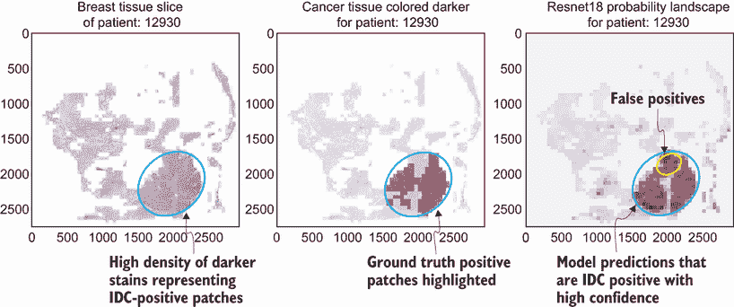

图 5.13 整个组织样本的 ResNet 模型的概率景观

图 5.13 显示了三个图表。最左侧的图表是患者 12930 的所有块的可视化。中间的图表突出显示了基于从专家病理学家收集的地面真实标签的 IDC 阳性块。这两个图表与我们在 5.2 节中看到的图表类似（见图 5.5）。最右侧的图表显示了用于检测 IDC 的 ResNet 模型的概率景观。颜色越亮，给定块是 IDC 阳性的概率就越大。通过与地面真实情况进行比较，我们可以看到模型预测和地面真实之间存在良好的重叠。然而，也有一些假阳性，模型突出显示的区域并不一定是 IDC 阳性。图 5.13 的实现可以在与本书相关的 GitHub 仓库（[`mng.bz/KBdZ`](http://mng.bz/KBdZ)）中找到。您可以加载 5.3.2 节中训练的模型，直接进入模型可解释性。

可视化概率景观是验证模型输出的好方法。通过与真实标签进行比较，我们可以看到模型在哪些情况下出错，并相应地调整模型。这也是在将模型部署到生产环境中后可视化并监控模型输出的好方法。然而，概率景观并没有告诉我们模型是如何到达预测的。

### 5.4.2 LIME

解释卷积神经网络（CNN）的一种方法是通过使用我们在上一章中学到的任何一种模型无关的可解释性技术。让我们具体看看如何将*LIME*可解释性技术应用于图像和 CNN。为了回顾，LIME 技术是一种局部范围内的模型无关技术。在一个表格数据集上，该技术的工作方式如下：

1.  选择一个例子进行解释。

1.  通过从表格数据集中特征的均值和标准差进行高斯分布采样来创建扰动数据集。

1.  将扰动数据集通过黑盒模型运行，并获取预测结果。

1.  根据样本与所选例子的接近程度对样本进行加权，其中接近所选例子的样本被赋予更高的权重。正如我们在第四章中看到的，一个称为*核宽度*的超参数用于对样本进行加权。如果核宽度小，只有接近所选实例的样本才会影响解释。

1.  最后，在加权样本上拟合一个易于解释的白盒模型。对于 LIME，使用线性回归。

线性回归模型的权重可以用来确定所选例子的特征重要性。通过使用一个局部忠实于我们希望解释的例子的代理模型，我们可以获得解释。现在，我们如何将 LIME 应用于图像？与表格数据类似，我们首先需要选择一个我们希望解释的图像。接下来，我们必须创建一个扰动数据集。我们不能像处理表格数据那样扰动数据集，通过从高斯分布中进行采样。相反，我们在图像中随机打开和关闭像素。这计算量很大，因为为了生成一个局部忠实的解释，我们必须生成大量的样本来运行模型。此外，像素可能在空间上相关，多个像素可能对同一个目标类别做出贡献。因此，我们将图像分割成多个部分，也称为*超像素*，并随机打开和关闭超像素，如图 5.14 所示。

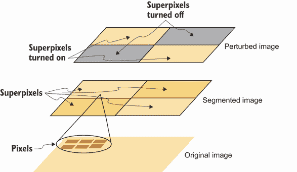

图 5.14 如何为 LIME 创建扰动图像的说明

我们可以从底部到顶部阅读图 5.14。其思想是通过将多个像素分组到超像素中来分割原始图像。在这个示例中，我们使用了一个简单的分割算法，将原始图像分割成四个不重叠的矩形段。一旦你用超像素形成了分割图像，你可以通过打开和关闭随机超像素来创建扰动图像。默认情况下，LIME 实现使用 quickshift ([`mng.bz/W7mw`](http://mng.bz/W7mw)) 分割算法。一旦创建了扰动数据集，其余的技术与表格数据相同。线性代理模型的权重将给我们一个关于特征或超像素对所选输入图像最终模型预测影响的直观认识。我们通过将图像分割成超像素，因为我们试图将相关的像素分组在一起，并观察对最终预测的影响。

现在我们来看如何实现之前训练的 ResNet 模型的 LIME。我们首先需要将之前使用的单个 PyTorch 转换器分成两个。第一个将输入的 Python Imaging Library (PIL) 图像转换为 50 × 50 的张量，第二个将对其进行归一化。下面的第一个转换是 LIME 图像分割算法所必需的：

```
trans_pil = transforms.Compose([transforms.Resize((50, 50)),])         ①
trans_pre = transforms.Compose([transforms.ToTensor(),  
                       transforms.Normalize(mean=[0.5, 0.5, 0.5],      ②
                                            std=[0.5, 0.5, 0.5])])     ②
```

① 将输入图像调整大小为 50 × 50 像素，这是图像分割算法所需的第一个转换

② 第二个转换，用于归一化转换后的 50 × 50 输入图像

接下来，我们需要两个辅助函数——一个用于将图像文件加载为 PIL 图像，另一个用于使用模型对扰动数据集进行预测。下面的代码片段显示了这些函数，其中 `get_image` 是加载 PIL 图像的函数，`batch_predict` 是将扰动 `images` 通过 `model` 运行的函数。我们还创建了一个部分函数，它预先设置了 ResNet 模型参数，该参数是我们之前章节中训练的：

```
def get_image(images_dir, image_id):                                    ①
    image = Image.open(os.path.join(images_dir, image_id))              ②
    image = image.convert('RGB')                                        ②
    return image                                                        ③

def batch_predict(images, model):                                       ④
    def sigmoid(x):                                                     ⑤
        return 1\. / (1 + np.exp(-x))                                    ⑤
    batch = torch.stack(tuple(trans_pre(i) for i in images), dim=0)     ⑥
    outputs = model(batch)                                              ⑦
    proba = outputs.detach().cpu().numpy().astype(np.float)             ⑧
    return sigmoid(proba)                                               ⑨

from functools import partial                                           ⑩
batch_predict_with_model = partial(batch_predict, model=model)          ⑩
```

① 一个辅助函数，用于将输入 RGB 图像读取到内存中

② 打开图像并将其转换为 RGB

③ 返回图像

④ 一个辅助函数，用于在扰动数据集中的图像上进行预测

⑤ 一个用于计算输入参数的 sigmoid 函数

⑥ 将输入图像的所有转换张量堆叠在一起

⑦ 通过模型运行以获得所有图像的输出

⑧ 断开输出张量并将其转换为 NumPy 数组

⑨ 通过通过 sigmoid 函数传递，将预测作为概率返回

⑩ 一个部分函数，用于使用预训练的 ResNet 模型执行批量预测

注意，在这段代码中，我们定义了一个名为`batch_predict_with_model`的部分函数。Python 中的部分函数允许我们在函数中设置一定数量的参数并生成一个新的函数。我们正在使用`batch_predict`函数，并使用之前训练的 ResNet 模型设置`model`参数。你可以用任何其他你希望使用 LIME 进行解释的模型替换它。

因为 LIME 是一种局部可解释技术，我们需要挑选一个示例进行解释。对于 ResNet 模型，我们将挑选两个补丁进行解释——一个是 IDC 阴性，另一个是 IDC 阳性——来自测试集，如图所示：

```
non_idc_idx = 142                                                      ①
idc_idx = 41291                                                        ②
non_idc_image = get_image(all_images_dir,                              ③
                          df_test.iloc[non_idc_idx, :]['image_id'])    ③
idc_image = get_image(all_images_dir,                                  ④
                      df_test.iloc[idc_idx, :]['image_id'])            ④
```

① 一个 ID 为 142 的 IDC 阴性示例

② 一个 ID 为 41291 的 IDC 阳性示例

③ 加载 IDC 阴性示例的 PIL 图像

④ 加载 IDC 阳性示例的 PIL 图像

现在我们将初始化 LIME 解释器，并使用它来解释我们挑选的两个示例。以下代码片段展示了如何获取 IDC 阴性示例的 LIME 解释。作为练习，获取 IDC 阳性示例的 LIME 解释并将其赋值给名为`idc_exp`的变量：

```
from lime import lime_image                                                  ①
explainer = lime_image.LimeImageExplainer()                                  ②

non_idc_exp = explainer.explain_instance(np.array(trans_pil(non_idc_image)), ③
                           batch_predict_with_model,                         ④
                           num_samples=1000)                                 ⑤
```

① 从 LIME 库中导入 lime_image 模块

② 初始化 LIME 图像解释器

③ 首先将 IDC 阴性图像进行分割转换

④ 将部分函数传递给 ResNet 模型，在扰动数据集上进行预测

⑤ 对分割图像进行扰动以创建 1,000 个样本

使用前一段代码中显示的 LIME 解释变量，获取包含解释的 RGB 图像和 2D 掩码。作为练习，获取 IDC 阳性示例的掩码 LIME 图像，并将其命名为`i_img_boundary`。为此，你需要完成之前的练习，首先获取 IDC 阳性示例的 LIME 解释。这些练习的解决方案可以在与本书相关的 GitHub 仓库([`mng.bz/KBdZ`](http://mng.bz/KBdZ))中找到：

```
from skimage.segmentation import mark_boundaries                            ①
ni_tmp, ni_mask = non_idc_exp.get_image_and_mask(non_idc_exp.top_labels[0], 
                                                 positive_only=False, 
                                                 num_features=20, 
                                                 hide_rest=True)            ②
ni_img_boundary = mark_boundaries(ni_tmp/255.0, ni_mask)                    ③
```

① 从 skimage 库中导入 mark_boundaries 函数以绘制分割图像

② 获取 IDC 阴性示例的掩码 LIME 图像

③ 使用 mark_boundaries 函数绘制掩码图像

我们现在可以使用以下代码可视化 IDC 阳性和阴性补丁的 LIME 解释：

```
non_idc_conf = 100 - df_test_with_preds.iloc[non_idc_idx]['proba'] * 100    ①
idc_conf = df_test_with_preds.iloc[idc_idx]['proba'] * 100                  ②
non_idc_image = df_test.iloc[non_idc_idx]['image_id']                       ③
idc_image = df_test.iloc[idc_idx]['image_id']                               ④
non_idc_patient = df_test.iloc[non_idc_idx]['patient_id']                   ⑤
idc_patient = df_test.iloc[idc_idx]['patient_id']                           ⑥

f, ax = plt.subplots(2, 2, figsize=(10, 10))                                ⑦

# Plot the original image of the IDC negative patch
ax[0][0].imshow(Image.fromarray(imread(os.path.join(all_images_dir, 
➥ non_idc_image))))                                                        ⑧
ax[0][0].axis('off')                                                        ⑧
ax[0][0].set_title('Patch Image (IDC Negative)\nPatient Id: %d' %           ⑧
➥ non_idc_patient)                                                         ⑧

# Plot the LIME explanation for the IDC negative patch
ax[0][1].imshow(ni_img_boundary)                                            ⑨
ax[0][1].axis('off')                                                        ⑨
ax[0][1].set_title('LIME Explanation (IDC Negative)\nModel Confidence:      ⑨
➥ %.1f%%' % non_idc_conf)                                                  ⑨

# Plot the original image of the IDC positive patch
ax[1][0].imshow(Image.fromarray(imread(os.path.join(all_images_dir, 
➥ idc_image))))                                                            ⑩
ax[1][0].axis('off')                                                        ⑩
ax[1][0].set_title('Patch Image (IDC Positive)\nPatient Id: %d' %           ⑩
➥ idc_patient)                                                             ⑩

# Plot the LIME explanation for the IDC positive patch 
ax[1][1].imshow(i_img_boundary)                                             ⑪
ax[1][1].axis('off')                                                        ⑪
ax[1][1].set_title('LIME Explanation (IDC Positive)\nModel Confidence:      ⑪
➥ %.1f%%' % idc_conf);                                                     ⑪
```

① 获取 IDC 阴性补丁的模型置信度

② 获取 IDC 阳性补丁的模型置信度

③ 获取 IDC 阴性补丁的图像

④ 获取 IDC 阳性补丁的图像

⑤ 获取 IDC 阴性补丁的患者 ID

⑥ 获取 IDC 阳性补丁的患者 ID

⑦ 创建一个 2×2 的图形来绘制原始图像和 LIME 解释

⑧ 在左上角单元格中绘制 IDC 阴性补丁的原始图像

⑨ 在右上角单元格中绘制 IDC 阴性补丁的 LIME 解释

⑩ 在左下角单元格中绘制 IDC 阳性补丁的原始图像

⑪ 在右下角单元格中绘制 IDC 阳性补丁的 LIME 解释

图 5.15 显示了生成的可视化结果。图中已标注，左上角图像是 IDC 阴性区域的原始图像。右上角图像是 IDC 阴性区域的 LIME 解释。我们可以看到模型预测该区域为 IDC 阴性，置信度为 82%。从原始图像中，我们可以看到较浅染色质的密度较高，这与我们在第 5.2 节（图 5.4）中看到的模式相匹配。较浅染色质通常用于突出细胞质和细胞外结缔组织。如果我们查看 LIME 解释，我们可以看到分割算法突出了两个超像素，分割边界将高密度较浅染色质与其他图像部分分开。对预测产生正面影响的区域或超像素用红色（较深的色调）表示，这标注为分割图像的左侧。对预测产生负面影响的区域或超像素用绿色（较浅的色调）表示，这标注为分割图像的右侧。因此，LIME 解释似乎正确地突出了密集的较浅染色质，并作为预测 IDC 阴性具有高置信度的贡献因素。

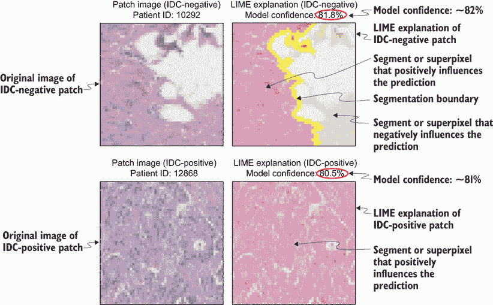

图 5.15 展示了 LIME 对 IDC 阴性区域和 IDC 阳性区域的解释。

图 5.15 左下角的图像是 IDC 阳性区域的原始图像。该区域的 LIME 解释显示在图的右下角。我们可以从原始图像中看到较深染色质的密度要高得多，这与我们在第 5.2 节（图 5.3）中看到的模式相匹配。如果我们现在查看 LIME 解释，我们可以看到分割算法将整个图像视为超像素，整个超像素对预测 IDC 阳性具有高置信度产生正面影响。尽管这种解释在高级别上是合理的，因为整个图像由高密度的较深染色质组成，但它并没有给我们提供任何关于哪些特定像素影响模型预测的额外信息。

这让我们想到了 LIME 的一些缺点。正如我们在第四章和本节中看到的，LIME 是一种非常出色的可解释性技术，因为它对模型没有依赖性，可以应用于任何复杂的模型。然而，它也有一些缺点。LIME 解释的质量很大程度上取决于核宽度的选择。正如我们在第四章中看到的，这是一个重要的超参数，相同的核宽度可能不适用于我们希望解释的所有示例。LIME 解释也可能不稳定，因为它们依赖于扰动数据集的采样方式。解释还依赖于我们使用的特定分割算法。正如我们在图 5.15 中看到的，分割算法将整个图像视为一个超级像素。LIME 的计算复杂度也较高，这取决于需要打开或关闭的像素或超级像素的数量。

### 5.4.3 可视化归因方法

现在，让我们退一步，从更广泛的可解释性方法类别的角度来审视 LIME，这类方法被称为可视化归因方法。可视化归因方法用于将重要性归因于影响 CNN 做出的预测的图像部分。以下列出了三种广泛的可视化归因方法类别，并在图 5.16 中展示：

+   干扰

+   梯度

+   激活

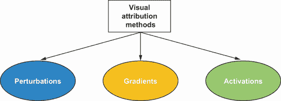

图 5.16 可视化归因方法的类型

类似于 LIME 和 SHAP 的可解释性技术是*基于扰动的方 法*。正如我们在第四章和前一节中看到的，其想法是扰动输入并探测其对 CNN 做出的预测的影响。这些技术是*模型无关的*、*事后分析*和*局部可解释性技术*。然而，基于扰动的方 法在计算上效率不高，因为每次扰动都需要我们在复杂的 CNN 模型上执行前向传递。这些技术也可能低估特征的重要性，其中特征是基于对原始图像进行的分割的部分。

*基于梯度的方法* 用于可视化目标类别相对于输入图像的梯度。想法是选择一个示例或图像进行解释。然后，我们将此图像通过 CNN 的正向方向运行以获得输出预测。我们应用反向传播算法来计算输出类别相对于输入图像的梯度。梯度是一个很好的重要性度量，因为它告诉我们哪些像素需要改变才能影响模型输出。如果梯度的幅度很大，那么对像素值的微小改变将导致输入的大幅变化。因此，具有大梯度度量的像素被认为对模型来说是最重要的，或是最显著的。基于梯度的方法有时也被称为 *反向传播方法*，因为反向传播算法用于确定特征重要性。它们也被称为 *显著性图*，因为可以获得一个显著或重要的特征图。流行的基于梯度的方法包括 *vanilla backpropagation*、*引导反向传播*、*积分梯度* 和 *SmoothGrad*，这些将在 5.5–5.7 节中介绍。这些技术在范围上是局部的，也是事后的。然而，它们并不是完全模型无关的，并且是弱模型依赖的。与基于扰动的方

*基于激活的方法* 会查看最终卷积层的特征图或激活，并根据目标类别对这些特征图的梯度进行加权。特征图的权重作为输入特征重要性的代理。这种技术被称为梯度加权类激活映射 (*Grad-CAM*)。因为我们关注的是最终卷积层中特征图的重要性，所以 Grad-CAM 提供了一个 *粗粒度* 的激活图。为了获得更 *细粒度* 的激活图，我们可以结合 Grad-CAM 和引导反向传播——这种技术被称为 *引导 Grad-CAM*。我们将在 5.8 节中更详细地了解 Grad-CAM 和引导 Grad-CAM 的工作原理。基于激活的方法也是弱模型依赖、事后和局部可解释的技术。

## 5.5 梯度下降法

在本节中，我们将学习一种基于梯度的归因方法，称为 *vanilla backpropagation*。vanilla backpropagation 由 Karen Simonyan 等人在 2014 年提出，该技术如图 5.17 所示。

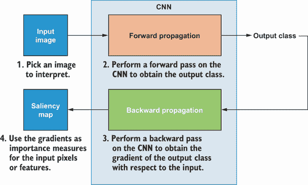

图 5.17 梯度下降法的示意图

第一步是选择一个图像或示例进行解释。因为我们正在查看解释单个实例，所以这种可解释性技术的范围是局部的。第二步是在 CNN 上执行前向传播以获得输出类别预测。一旦获得了输出类别，下一步就是获得输出相对于倒数第二层的梯度并执行反向传播——我们在第四章中学习了这一点——以最终获得输出类别相对于输入图像中像素的梯度。输入像素或特征的梯度被用作重要指标。像素的梯度越大，该像素对模型预测输出类的重要性就越大。其背后的直觉是，如果给定像素的梯度幅度很大，那么像素值的微小变化将对模型预测产生更大的影响。

纯反向传播和其他基于梯度的方法已在 PyTorch 中由 Utku Ozbulak 实现，并在本 GitHub 仓库中开源：[`mng.bz/8l8B`](http://mng.bz/8l8B)。然而，这些实现不能直接应用于 ResNet 架构或基于 ResNet 的架构，因此我在本书中对其进行了修改，以便它们可以应用于这些更高级的架构。下面的代码片段实现了纯反向传播技术作为一个 Python 类：

```
# Code below adapted from: http://mng.bz/8l8B 

class VanillaBackprop():
    """
        Produces gradients generated with vanilla back propagation from the 
        ➥ image
    """
    def __init__(self, model, features):                                       ①
        self.model = model                                                     ②
        self.gradients = None                                                  ③
        # Put model in evaluation mode
        self.model.eval()                                                      ④
        # Set feature layers
        self.features = features                                               ⑤
        # Hook the first layer to get the gradient
        self.hook_layers()                                                     ⑥

    def hook_layers(self):                                                     ⑦
        def hook_function(module, grad_in, grad_out):                          ⑧
            self.grad_in = grad_in                                             ⑨
            self.grad_out = grad_out                                           ⑩
            self.gradients = grad_in[0]                                        ⑪

        # Register hook to the first layer
        first_layer = list(self.features._modules.items())[0][1]               ⑫
        first_layer.register_backward_hook(hook_function)                      ⑬

    def generate_gradients(self, input_image, target_class):                   ⑭
        # Forward
        model_output = self.model(input_image)                                 ⑮
        # Zero grads
        self.model.zero_grad()                                                 ⑯
        # Target for backprop
        one_hot_output = torch.FloatTensor(1, model_output.size()[-1]).zero_() ⑰
        one_hot_output[0][target_class] = 1                                    ⑰
        # Backward pass
        model_output.backward(gradient=one_hot_output)                         ⑱
        gradients_as_arr = self.gradients.data.numpy()[0]                      ⑲
        return gradients_as_arr                                                ⑲
```

① 一个用于纯反向传播的构造函数，它接受模型和特征层的起始部分

② 初始化模型对象

③ 将梯度对象初始化为 None

④ 将模型设置为评估模式

⑤ 设置指向模型中特征层起始部分的 features 对象

⑥ 钩住层以便可以计算输出相对于输入像素的梯度

⑦ 一个用于钩住第一层以获取梯度的函数

⑧ 用于在反向传播过程中处理输入和输出梯度的辅助函数

⑨ 将 grad_in 对象设置为从上一层获得的梯度

⑩ 将 grad_out 对象设置为从当前层获得的梯度

⑪ 获得当前层相对于特征图像素的梯度

⑫ 获得第一个特征层

⑬ 注册反向钩子函数以获得输出类别相对于输入像素的梯度

⑭ 一个执行反向传播以获得梯度的函数

⑮ 通过在模型中前向传播图像来获得模型输出

⑯ 在反向传播之前将梯度重置为 0

⑰ 创建一个将目标类别设置为 1 的一热编码张量

⑱ 执行反向传播

⑲ 通过钩子函数返回获得的梯度对象

注意，ResNet 模型和其他架构（如 Inception v3 和 ResNeXt）的特征层可以在父模型中找到，并且它们不是以 VGG16 和 AlexNet 架构中的层次结构存储，在 VGG16 和 AlexNet 架构中，特征层存储在模型的`features`键中。你可以通过以下方式初始化 VGG16 模型来测试这一点，并打印其结构：

```
vgg16 = torchvision.models.vgg16()
print(vgg16)
```

下一个打印语句的输出如下所示。输出被截断，目的是展示特征层是如何存储在`features`键中的。如果你将上一段代码中的`vgg16`替换为`alexnet`，你将得到类似的输出：

```
VGG(
  (features): Sequential(
    (0): Conv2d(3, 64, kernel_size=(3, 3), stride=(1, 1), padding=(1, 1))
    (1): ReLU(inplace=True)
    (2): Conv2d(64, 64, kernel_size=(3, 3), stride=(1, 1), padding=(1, 1))
    (3): ReLU(inplace=True)
    (4): MaxPool2d(kernel_size=2, stride=2, padding=0, dilation=1, ceil_mode=False)
    (5): Conv2d(64, 128, kernel_size=(3, 3), stride=(1, 1), padding=(1, 1))
    (6): ReLU(inplace=True)
...
(output clipped)
```

Utku Ozbulak 的实现期望架构具有与 VGG16 和 AlexNet 相同的层次结构。另一方面，在先前的标准反向传播实现中，特征层被显式地传递给构造函数，以便它可以用于更复杂的架构。现在，你可以如下实例化这个类来为 ResNet 模型使用：

```
vbp = VanillaBackprop(model=model, features=model)
```

现在，我们将创建一个辅助函数来获取输出相对于输入的梯度，如下所示：

```
def get_grads(gradient_method, dataset, idx):                     ①
    image, label = dataset[idx]                                   ②

    X = image.reshape(1,                                          ③
                      image.shape[0],                             ③
                      image.shape[1],                             ③
                      image.shape[2])                             ③
    X_var = Variable(X, requires_grad=True)                       ④
    grads = gradient_method.generate_gradients(X_var, label)      ⑤
    return grads                                                  ⑥
```

① `get_grads`函数接收基于梯度的方法、数据集和要解释的示例索引。

② 在索引 idx 处获取图像和标签

③ 将图像重塑为可以通过模型运行

④ 创建一个 PyTorch 变量，其中 requires_grad 为 True，以通过反向传播获取梯度

⑤ 使用`generate_gradients`函数获取梯度

⑥ 返回相对于输入像素的梯度

我们将使用与第 5.4.2 节中 LIME 技术相同的两个示例——一个 IDC 负片和一个 IDC 正片。现在，我们可以使用标准的反向传播技术来获取梯度，如下所示：

```
non_idc_vanilla_grads = get_grads(vbp, dataset_test, non_idc_idx)
idc_vanilla_grads = get_ grads(vbp, dataset_test, idc_idx)
```

注意，测试数据集是我们第 5.3.1 节中初始化的`PatchDataset`。这里显示的梯度数组将与输入图像具有相同的维度。输入图像的维度为 3 × 50 × 50，其中包含三个通道（红色、绿色、蓝色），图像的高度和宽度均为 50 像素。生成的梯度也将具有相同的维度，可以将其可视化为彩色图像。然而，为了便于可视化，我们将梯度图像转换为灰度图。我们可以使用以下辅助函数将彩色图像转换为灰度图：

```
# Code below from: http://mng.bz/8l8B 

def convert_to_grayscale(im_as_arr):
    """
        Converts 3d image to grayscale
    Args:
        im_as_arr (numpy arr): RGB image with shape (D,W,H)
    returns:
        grayscale_im (numpy_arr): Grayscale image with shape (1,W,D)
    """
    grayscale_im = np.sum(np.abs(im_as_arr), axis=0)
    im_max = np.percentile(grayscale_im, 99)
    im_min = np.min(grayscale_im)
    grayscale_im = (np.clip((grayscale_im - im_min) / (im_max - im_min), 0, 1))
    grayscale_im = np.expand_dims(grayscale_im, axis=0)
    return grayscale_im
```

现在我们已经通过标准反向传播获得了梯度，我们可以像可视化 LIME 解释一样可视化它们。作为一个练习，我鼓励你将第 5.4.2 节中的可视化代码扩展，用梯度的灰度表示替换 LIME 解释。结果图如图 5.18 所示。

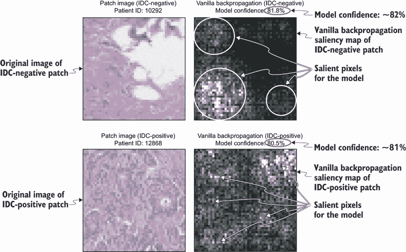

图 5.18 使用标准反向传播的显著性图

让我们先关注 IDC-阴性区域。该区域的原始图像显示在左上角。通过传统反向传播获得的梯度灰度表示显示在右上角。我们可以看到图像中有各种灰度的像素。较大的梯度具有更高的灰度强度或呈现为白色。这是一种很好的可视化 CNN 关注哪些像素来预测图像是 IDC 阴性且置信度为 82% 的方法。显著的或重要的像素对应于原始图像中密集的较亮污点。因为梯度在像素级别显示，所以这比 LIME 的解释要细粒度得多，LIME 只关注超级像素。显著性图是作为数据科学家或工程师调试 CNN 的好方法，也有助于专家病理学家了解 CNN 关注图像的哪些部分。

现在我们来看 IDC-阳性区域。原始图像显示在左下角，通过传统反向传播获得的解释显示在右下角。我们可以看到很多像素被点亮，这对应于输入图像中的较暗的污点或细胞核。这种解释比 LIME 的解释要好得多，在 LIME 中，整个图像被视为一个超级像素。

## 5.6 引导反向传播

*引导反向传播* 是由 J. T. Springenberg 等人在 2015 年提出的一种基于梯度的属性方法。它与传统的反向传播类似，唯一的区别在于它处理梯度通过修正线性单元（ReLU）的方式。正如我们在第四章中看到的，ReLU 是一个非线性激活函数，它将负输入值裁剪为零。引导反向传播技术会将梯度置零到 ReLU 中，如果梯度是负的，或者在正向传播过程中 ReLU 的输入是负的。引导反向传播背后的思想是只关注对模型预测产生积极影响的输入特征。

引导反向传播技术也已实现在 PyTorch 的 [`mng.bz/8l8B`](http://mng.bz/8l8B) 仓库中，但在这本书中已经进行了适配，以便它可以应用于更复杂的架构，如 ResNet，其中包含具有 ReLU 的嵌套层。以下代码片段显示了改进的实现：

```
# Code below adapted from: http://mng.bz/8l8B 
from torch.nn import ReLU, Sequential                                                  ①

class GuidedBackprop():
    """
       Produces gradients generated with guided back propagation from the 
       ➥ given image
    """
    def __init__(self, model, features):                                               ②
        self.model = model                                                             ②
        self.gradients = None                                                          ②
        self.features = features                                                       ②
        self.forward_relu_outputs = []                                                 ②
        # Put model in evaluation mode                                                 ②
        self.model.eval()                                                              ②
        self.update_relus()                                                            ②
        self.hook_layers()                                                             ②

    def hook_layers(self):                                                             ③
        def hook_function(module, grad_in, grad_out):                                  ③
            self.gradients = grad_in[0]                                                ③
        # Register hook to the first layer                                             ③
        first_layer = list(self.features._modules.items())[0][1]                       ③
        first_layer.register_backward_hook(hook_function)                              ③

    def update_relus(self):                                                            ④
        """
            Updates relu activation functions so that
                1- stores output in forward pass
                2- imputes zero for gradient values that are less than zero
        """
        def relu_backward_hook_function(module, grad_in, grad_out):                    ⑤
            """
            If there is a negative gradient, change it to zero
            """
            # Get last forward output
            corresponding_forward_output = self.forward_relu_outputs[-1]               ⑥
            corresponding_forward_output[corresponding_forward_output > 0] = 1         ⑦
            modified_grad_out = corresponding_forward_output * 
            ➥ torch.clamp(grad_in[0], min=0.0)                                        ⑧
            del self.forward_relu_outputs[-1]  #                                       ⑨
            return (modified_grad_out,)                                                ⑩

        def relu_forward_hook_function(module, ten_in, ten_out):                       ⑪
            """
            Store results of forward pass
            """
            self.forward_relu_outputs.append(ten_out)

        # Loop through layers, hook up ReLUs
        for pos, module in self.features._modules.items():                             ⑫
            if isinstance(module, ReLU):                                               ⑬
                module.register_backward_hook(relu_backward_hook_function)
                module.register_forward_hook(relu_forward_hook_function)
            elif isinstance(module, Sequential):                                       ⑭
                for sub_pos, sub_module in module._modules.items():                    ⑭
                    if isinstance(sub_module, ReLU):                                   ⑮

sub_module.register_backward_hook(relu_backward_hook_function)

sub_module.register_forward_hook(relu_forward_hook_function)
                    elif isinstance(sub_module, torchvision.models.resnet.BasicBlock): ⑯
                        for subsub_pos, subsub_module in                               ⑯
                        ➥ sub_module._modules.items():                                ⑯
                            if isinstance(subsub_module, ReLU):                        ⑰
                                subsub_module.register_backward_hook(relu_backward_hook_function)
                                subsub_module.register_forward_hook(relu_forward_hook_function)

    def generate_gradients(self, input_image, target_class):                           ⑱
        # Forward pass                                                                 ⑱
        model_output = self.model(input_image)                                         ⑱
        # Zero gradients                                                               ⑱
        self.model.zero_grad()                                                         ⑱
        # Target for backprop                                                          ⑱
        one_hot_output = torch.FloatTensor(1, model_output.size()[-1]).zero_()1*
        one_hot_output[0][target_class] = 1                                            ⑱
        # Backward pass                                                                ⑱
        model_output.backward(gradient=one_hot_output)                                 ⑱
        gradients_as_arr = self.gradients.data.numpy()[0]                              ⑱
        return gradients_as_arr                                                        ⑱
```

① 导入 ReLU 激活函数和 Sequential 容器

② 引导反向传播的构造函数类似于传统反向传播，只是在反向传播期间增加了一个更新 ReLU 的函数调用。

③ 一个用于钩子第一层以获取梯度的函数，类似于传统反向传播

④ 一个用于更新 ReLU 的函数

⑤ 一个用于对梯度值小于 0 的值进行零值插补的函数

⑥ 获取正向传播中 ReLU 的输出

⑦ 设置标识变量，其中正值设置为 1

⑧ 用 0 插补负梯度值

⑨ 移除最后的正向输出

⑩ 返回修改后的梯度

⑪ 一个辅助函数，用于在正向传播期间存储 ReLU 的输出

⑫ 遍历所有特征层

⑬ 如果模块是 ReLU，则注册钩子函数以在正向传播期间获取值并在反向传播期间裁剪梯度

⑭ 如果模块是 Sequential 容器，则遍历其子模块

⑮ 如果子模块是 ReLU，则像之前一样注册钩子函数

⑯ 如果子模块是 BasicBlock，则遍历其子模块

⑰ 如果子子模块是 ReLU，则像之前一样注册钩子函数

⑱ 一个执行反向传播以获取梯度的函数，类似于普通反向传播

我们可以使用这种修改后的实现来处理最多具有三个嵌套层和 ReLU 的模型架构。现在让我们如下实例化 ResNet 模型的引导反向传播类：

```
gbp = GuidedBackprop(model= model, 
                     features=model)
```

我们现在可以使用在 5.5 节中定义的相同`get_gradients`辅助函数来获取梯度。作为一个练习，获取两个示例的梯度，将它们转换为灰度，然后可视化。结果图如图 5.19 所示。

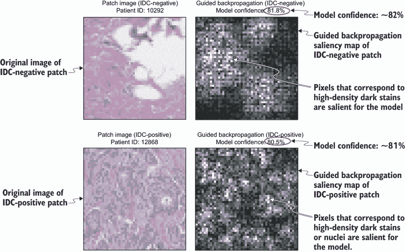

图 5.19 使用引导反向传播的显著性图

使用引导反向传播的解释似乎表明模型*关注*了 IDC 阴性片和 IDC 阳性片中的更多像素。对于 IDC 阴性片，像素似乎对应于高密度浅色斑点的区域，而对于 IDC 阳性片，像素似乎对应于高密度深色斑点的区域。使用普通反向传播和引导反向传播的解释似乎都是合理的，但我们应该使用哪一个？我们将在 5.9 节中讨论这个问题。

## 5.7 其他基于梯度的方法

普通和引导反向传播方法都低估了在表现出饱和度的模型中特征的重要性。这意味着什么？让我们看看 2017 年 Avanti Shrikumar 等人发表的一篇论文中的简单例子，该论文可在[`arxiv.org/pdf/1704.02685;Learning`](https://arxiv.org/pdf/1704.02685;Learning)找到。图 5.20 展示了一个表现出输出信号饱和的简单网络。网络接受两个输入，*x1*和*x2*。箭头或边上的数字是用于与它连接的输入单元相乘的权重。网络的最终输出（或输出信号）*y*可以评估如下：

```
y=1+max(0,1- (x1+x2))
```

如果*x1* + *x2*大于 1，则输出信号`y`在 1 处饱和。我们可以看到，当输入之和大于 1 时，输出相对于输入的梯度为零。在这种情况下，普通反向传播和引导反向传播都低估了两个输入特征的重要性，因为梯度为 0。

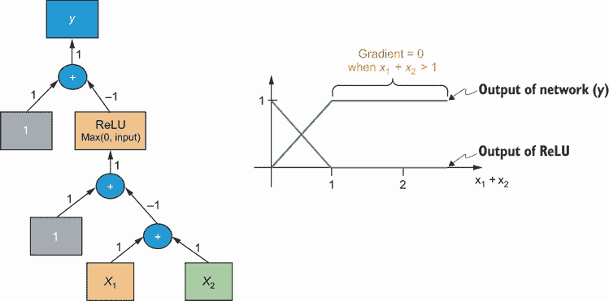

图 5.20 展示了一个表现出输出信号饱和的简单网络的示意图

为了克服饱和问题，最近提出了两种基于梯度的方法，称为集成梯度 ([`arxiv.org/pdf/1703.01365.pdf`](https://arxiv.org/pdf/1703.01365.pdf)) 和 SmoothGrad ([`arxiv.org/pdf/1706.03825.pdf`](https://arxiv.org/pdf/1706.03825.pdf))。集成梯度是由 Mukund Sundararajan 等人在 2017 年提出的。对于给定的输入图像，集成梯度将梯度积分，随着输入像素从起始值（例如，所有为零）缩放到实际值。SmoothGrad 也是由 Daniel Smilkov 等人在 2017 年提出的。SmoothGrad 在输入图像的副本上添加像素级的高斯噪声，然后通过传统的反向传播计算得到的梯度进行平均。这两种技术都需要在多个样本上积分/平均，类似于基于扰动的技术，从而增加了计算复杂度。因此得到的解释也不一定可靠，这就是为什么我们不明确地在本书中涵盖它们。我们将在 5.9 节中进一步讨论它们。对于感兴趣的人，您可以使用存储库中的 PyTorch 实现这些技术进行实验，存储库地址为 [`mng.bz/8l8B`](http://mng.bz/8l8B)。

## 5.8 Grad-CAM 和 guided Grad-CAM

我们现在将关注基于激活的方法。Grad-CAM 是由 R. R. Selvaraju 等人在 2017 年提出的，是一种基于激活的归因方法，它利用了通过卷积层学习到的特征。Grad-CAM 查看 CNN 中最终卷积层学习的特征图，并通过计算输出相对于特征图中像素的梯度来获得该特征图的重要性。因为我们查看的是最终卷积层的特征图，所以 Grad-CAM 生成的激活图是粗略的。Grad-CAM 技术也在 [`mng.bz/8l8B`](http://mng.bz/8l8B) 存储库中实现，并进行了以下调整，以便它可以应用于任何 CNN 架构。首先，我们将定义一个名为 `CamExtractor` 的类，以获取最终卷积层的输出或特征图以及分类器或全连接层的输出：

```
# Code below adapted from: http://mng.bz/8l8B 

class CamExtractor():
    """
        Extracts cam features from the model
    """
    def __init__(self, model, features, fc, fc_layer, target_layer):       ①
        self.model = model                                                 ②
        self.features = features                                           ③
        self.fc = fc                                                       ④
        self.fc_layer = fc_layer                                           ⑤
        self.target_layer = target_layer                                   ⑥
        self.gradients = None                                              ⑦

    def save_gradient(self, grad):                                         ⑧
        self.gradients = grad                                              ⑧

    def forward_pass_on_convolutions(self, x):                             ⑨
        """
            Does a forward pass on convolutions, 
            ➥ hooks the function at given layer
        """
        conv_output = None                                                 ⑩
        for module_pos, module in self.features._modules.items():          ⑪
            if module_pos == self.fc_layer:                                ⑫
                break                                                      ⑫
            x = module(x)                                                  ⑬
            if module_pos == self.target_layer:                            ⑭
                x.register_hook(self.save_gradient)                        ⑭
                conv_output = x                                            ⑭
        return conv_output, x                                              ⑮

    def forward_pass(self, x):                                             ⑯
        """
            Does a full forward pass on the model
        """
        # Forward pass on the convolutions
        conv_output, x = self.forward_pass_on_convolutions(x)              ⑰
        x = x.view(x.size(0), -1)                                          ⑱
        # Forward pass on the classifier 
        x = self.fc(x)                                                     ⑲
        return conv_output, x                                              ⑳
```

① CamExtractor 构造函数，接受五个输入参数

② 第一个参数设置 CNN 模型对象。

③ 第二个参数设置 CNN 中特征层的起始位置。

④ 第三个参数设置 CNN 中全连接层的起始位置。

⑤ 第四个参数是全连接层的名称。

⑥ 第五个参数是目标层或最终卷积层的名称。

⑦ 初始化梯度对象为 None

⑧ 保存梯度的方法

⑨ 一种进行前向传播并获取最终卷积层的输出以及注册钩子函数以获取该层输出相对于该层的梯度的方法

⑩ 将最终卷积层的输出初始化为 None

⑪ 遍历 CNN 特征层的所有模块

⑫ 一旦模块名称与全连接层名称匹配，则中断

⑬ 使用来自前一层的输入获取模块的输出

⑭ 如果模块名称与最终卷积层名称匹配，则在反向传播期间注册钩子以获取相对于此层的输出梯度

⑮ 返回最终卷积层的特征图和全连接层的输入

⑯ 在模型上执行前向传递的方法

⑰ 获取最终卷积层的特征图和全连接层的输入

⑱ 将输入展平到全连接层

⑲ 通过全连接层传递以获取分类器输出

⑳ 返回最终卷积层的特征图和分类器的输出

代码片段中显示的`CamExtractor`类接受以下五个输入参数：

+   `model`—用于图像分类的 CNN 模型

+   `features`—在 CNN 中表示特征层开始的层

+   `fc`—在用于分类的 CNN 中表示全连接层开始的层

+   `fc_layer`—模型对象中全连接层的名称

+   `target_layer`—模型对象中最终卷积层的名称

正如我们在 vanilla 反向传播和引导反向传播中看到的，模型对象被命名为`model`，表示特征层开始的层是同一个对象。`model`对象中表示全连接层开始的层是`model.fc`。模型对象中全连接层的名称是`fc`，模型中最终卷积层的名称是`layer4`。我们现在定义`GradCam`类来生成类激活图，如下所示：

```
# Code below adapted from: http://mng.bz/8l8B 

class GradCam():
    """
        Produces class activation map
    """
    def __init__(self, model, features, fc, fc_layer, target_layer):          ①
        self.model = model                                                    ②
        self.features = features                                              ②
        self.fc = fc                                                          ②
        self.fc_layer = fc_layer                                              ②
        self.model.eval()                                                     ③
        self.extractor = CamExtractor(self.model,                             ④
                                      self.features,                          ④
                                      self.fc,                                ④
                                      self.fc_layer,                          ④
                                      target_layer)                           ④

    def generate_cam(self, input_image, target_class=None):                   ⑤
        conv_output, model_output = self.extractor.forward_pass(input_image)  ⑥
        if target_class is None:                                              ⑦
            target_class = np.argmax(model_output.data.numpy())               ⑦
        one_hot_output = torch.FloatTensor(1, model_output.size()[-1]).zero_() ⑧
        one_hot_output[0][target_class] = 1                                    ⑧

        self.features.zero_grad()                                             ⑨
        self.fc.zero_grad()                                                   ⑨

        model_output.backward(gradient=one_hot_output, retain_graph=True)     ⑩

        guided_gradients = self.extractor.gradients.data.numpy()[0]           ⑪

        target = conv_output.data.numpy()[0]                                  ⑫
        weights = np.mean(guided_gradients, axis=(1, 2))                      ⑫
        cam = np.ones(target.shape[1:], dtype=np.float32)                     ⑫
        for i, w in enumerate(weights):                                       ⑫
            cam += w * target[i, :, :]                                        ⑫
        cam = np.maximum(cam, 0)                                              ⑬
        cam = (cam - np.min(cam)) / (np.max(cam) - np.min(cam))               ⑭
        cam = np.uint8(cam * 255)                                             ⑮
        cam = np.uint8(Image.fromarray(cam).resize((input_image.shape[2],
                       input_image.shape[3]), Image.ANTIALIAS))/255           ⑯
        return cam                                                            ⑰
```

① GradCam 的构造函数接受与 CamExtractor 相同的五个参数

② 设置适当的对象

③ 将模型设置为评估模式

④ 初始化 CamExtractor 对象

⑤ 给定输入图像和目标类别生成 CAM 的函数

⑥ 使用提取器从最终卷积层和分类器的输出中获取特征图

⑦ 如果未指定目标类别，则根据模型预测获取输出类别

⑧ 将目标类别转换为 one-hot 编码的张量

⑨ 在反向传播之前重置梯度

⑩ 执行反向传播

⑪ 获取输出类别相对于特征图的梯度

⑫ 通过对特征图加权梯度来获取 CAM

⑬ 剪裁 CAM 并移除负值

⑭ 在 0 和 1 之间归一化 CAM

⑮ 将 CAM 缩放到 0-255 以可视化为灰度图像

⑯ 放大 CAM 并插值到与输入图像相同的维度

⑰ 返回 CAM

您可以按照以下方式初始化 Grad-CAM 对象。作为一个练习，我鼓励您为之前使用的两个示例创建激活图。这个练习的解决方案可以在与本书相关的 GitHub 仓库中找到 ([`mng.bz/KBdZ`](http://mng.bz/KBdZ))：

```
grad_cam = GradCam(resnet18_model, 
                   features=resnet18_model, 
                   fc=resnet18_model.fc,
                   fc_layer='fc', 
                   target_layer='layer4')
```

图 5.21 包含了生成的 Grad-CAM 激活图。从图中我们可以看到，激活图显示了最终卷积层特征图的重要性，并且相当粗糙。灰色或白色的区域显示了模型预测中高度重要的区域。


图 5.21 使用 Grad-CAM 的激活图

为了获得更精细的激活图，我们可以使用引导 Grad-CAM 技术。引导 Grad-CAM 技术是由与 Grad-CAM 同样的作者于 2017 年提出的，本质上结合了 Grad-CAM 和引导反向传播技术。引导 Grad-CAM 生成的最终激活图是 Grad-CAM 生成的激活图和引导反向传播生成的显著性图的逐元素点积。这在上面的函数中实现：

```
# Code below from: http://mng.bz/8l8B 
def guided_grad_cam(grad_cam_mask, guided_backprop_mask):
    """
        Guided grad cam is just pointwise multiplication of cam mask and
        guided backprop mask
    Args:
        grad_cam_mask (np_arr): Class activation map mask
        guided_backprop_mask (np_arr):Guided backprop mask
    """
    cam_gb = np.multiply(grad_cam_mask, guided_backprop_mask)
    return cam_gb
```

此函数接受从 Grad-CAM 和引导反向传播获得的灰度掩码，并返回它们的逐元素乘积。图 5.22 展示了引导 Grad-CAM 为两个感兴趣的示例生成的激活图。我们可以看到，可视化比引导反向传播更干净，并突出了与 IDC 负面和正面补丁一致的区域。


图 5.22 使用引导 Grad-CAM 的激活图

## 5.9 我应该使用哪种归因方法？

现在我们已经拥有了这些技术，我们应该应用哪些技术呢？换句话说，哪些技术能产生可靠的解释？通过使用几个示例对解释进行视觉检查，我们发现所有的显著性技术都为像素提供了一种重要性度量。通过视觉评估，我们发现这些重要性度量是合理的。然而，仅依靠视觉或定性评估可能会产生误导。

一篇由 Julius Adebayo 等人于 2018 年发表的论文，可在 [`mng.bz/Exjj`](http://mng.bz/Exjj) 获取，对本章讨论的显著性方法进行了全面的定量评估。以下进行了两种广泛的测试：

1.  *模型参数随机化测试*—检查通过随机化模型的权重是否会对显著性图产生影响，我们预期模型会做出随机或垃圾预测。如果显著性方法在训练模型和随机模型上的输出相同，那么我们可以说显著性图对模型参数不敏感。因此，显著性图对调试模型来说可能不可靠。

1.  *数据随机化测试*—检查通过在训练数据中随机化标签是否会对显著性图产生影响。当我们在一个目标标签被随机化的训练数据集副本上训练相同的模型架构时，我们预期显著性方法的结果也会对其敏感。如果通过随机化标签，显著性图没有受到影响，那么该方法不依赖于原始训练集中存在的输入图像和标签。因此，显著性图对于理解输入输出关系不可靠。

论文提供了一些可以在实践中使用的合理性检查，以确定显著性方法输出的可靠性。合理性检查的结果总结在表 5.2 中。

表 5.2 对视觉归因方法进行的合理性检查结果

| 归因方法 | 模型参数随机化测试 | 数据随机化测试 |
| --- | --- | --- |
| 纯量反向传播 | 通过 | 通过 |
| 指导反向传播 | 失败 | 失败 |
| 集成梯度 | 失败 | 失败 |
| SmoothGrad | 失败 | 通过 |
| Grad-CAM | 通过 | 通过 |
| 指导 Grad-CAM | 失败 | 失败 |

我们可以看到，通过两个测试的方法是纯量反向传播和 Grad-CAM。它们产生的显著性和激活图对模型和数据生成过程敏感。因此，它们可以用来可靠地调试模型，并理解输入图像和目标标签之间的关系。其他技术提供了令人信服的图像来解释模型预测，并且从定性评估来看似乎是可接受的。然而，它们对模型和标签随机化是不变的，因此不足以用于模型调试和理解输入输出关系。这些合理性检查的重要信息是要意识到确认偏差。仅仅从定性上使解释有意义是不够的；它还必须通过合理性检查，才能更好地理解模型和输入输出关系。论文中提出的两个测试可以应用于实践中其他可解释技术的检查。

在下一章中，我们将学习如何进一步剖析网络，并理解神经网络学习的高级概念。我们将不会关注像素级的重要性，而是学习那些提供概念级重要性的技术。这些技术已被证明对模型和数据生成过程敏感，因此通过本节讨论的合理性检查。

### 摘要

+   卷积神经网络（CNN）是一种常用于视觉任务（如图像分类、目标检测和图像分割）的神经网络架构。

+   完全连接的深度神经网络（DNN）在图像中捕捉像素依赖性方面并不很好，因此不能训练以理解图像中的边缘、颜色和梯度等特征。另一方面，CNN 在图像中很好地捕捉像素依赖性或空间依赖性。我们还可以更有效地训练 CNN 架构以适应输入数据集，因为我们可以在网络中重用权重。

+   CNN 架构通常由一系列卷积和池化层组成，称为特征学习层。这些层的目的是从输入图像中提取层次特征。在特征学习卷积层之后是神经元或单元层，它们是完全连接的，这些完全连接层的目的是执行分类。完全连接层的输入是由卷积和池化层学习的高级特征，输出是对分类任务的概率度量。

+   各种最先进的卷积神经网络（CNN）架构，如 AlexNet、VGG、ResNet、Inception 和 ResNeXT，已在流行的深度学习库中实现，例如 PyTorch 和 Keras。在 PyTorch 中，你可以使用 torchvision 包来初始化这些架构。

+   在 CNN 中，随着图像经过数百万个复杂的操作，理解模型如何到达最终预测变得极其困难。这就是 CNN 成为黑盒的原因。

+   我们可以使用视觉归因方法来解释 CNN。这些方法用于将重要性归因于影响 CNN 预测的图像部分。

+   可用的视觉归因方法分为三大类：扰动、梯度和激活。

+   基于扰动的方法的理念是扰动输入并探测其对 CNN 预测的影响。LIME 和 SHAP 等技术是扰动方法。然而，这些技术计算效率低下，因为每次扰动都需要我们对复杂的 CNN 模型执行前向传递。这些技术还可能低估特征的重要性。

+   我们可以使用基于梯度的方法来可视化输入图像相对于目标类的梯度。具有大梯度度量的像素被认为对模型来说是最重要的，或称为显著的。基于梯度的方法有时也称为反向传播方法——反向传播算法用于确定特征重要性和显著性图，因为可以获得显著或重要特征的映射。流行的基于梯度的方法包括标准反向传播、引导反向传播、集成梯度和 SmoothGrad。

+   基于激活的方法查看最终卷积层中的特征图或激活，并根据目标类别对这些特征图的梯度进行加权。特征图的权重作为输入特征重要性的代理。这种技术被称为梯度加权类激活映射（Grad-CAM）。

+   Grad-CAM 提供了一个粗粒度的激活图。为了获得更细粒度的激活图，我们可以结合 Grad-CAM 和 guided backpropagation——这种技术被称为 guided Grad-CAM。

+   通过模型参数随机化和数据随机化测试的视觉归因方法包括 vanilla backpropagation 和 Grad-CAM。因此，它们产生的显著性和激活图在调试模型和更好地理解输入输出关系方面更加可靠。
