# 6 理解层和单元

本章涵盖

+   剖析黑盒卷积神经网络以理解层和单元学习到的特征或概念

+   运行网络剖析框架

+   量化卷积神经网络中层和单元的可解释性以及如何可视化它们

+   网络剖析框架的优势和劣势

在第 3、4 和 5 章中，我们关注了黑盒模型以及如何使用各种技术如部分依赖图（PDPs）、LIME、SHAP、锚点和显著性图来解释它们。在第五章中，我们特别关注了卷积神经网络（CNNs）和视觉归因方法，如梯度图和激活图，这些方法突出了模型关注的显著特征。所有这些技术都集中在通过降低其复杂性来解释黑盒模型内部发生的复杂处理和操作。例如，PDPs 是模型无关的，显示了特征值对模型预测的边际或平均全局影响。LIME、SHAP 和锚点等技术的模型无关性也体现在它们创建了一个与原始黑盒模型行为相似但更简单、更容易解释的代理模型。视觉归因方法和显著性图对模型有轻微的依赖性，有助于突出对模型来说显著或重要的输入部分。

在本章和下一章中，我们关注解释深度神经网络学习到的表示或特征。本章特别关注用于视觉任务（如图像分类、目标检测和图像分割）的 CNNs。CNN 内部发生的操作数量被组织成层和单元。通过解释模型表示，我们旨在理解通过这些层和单元流动的数据的角色和结构。你将在本章中具体了解网络剖析框架。这个框架将使我们对 CNN 学习到的特征和高级概念有更深入的了解。它还将帮助我们从通常定性评估的显著性图等可视化过渡到更定量的解释。

我们首先将介绍 ImageNet 和 Places 数据集以及相关的图像分类任务。然后，我们将快速回顾卷积神经网络（CNNs）和视觉归因方法，重点关注这些方法的局限性。这是为了展示网络剖析框架的优势。本章的剩余部分将专注于这个框架以及我们如何利用它来理解 CNNs 学习到的表示。

## 6.1 视觉理解

在本章中，我们将专注于训练一个智能体或智能系统来识别现实世界中的物体、地点和场景的任务。该系统的任务是执行多类分类。为了训练这样的智能体，我们需要访问大量标记数据。ImageNet 数据集([`www.image-net.org/`](http://www.image-net.org/))是为了识别物体而创建的。它是在 WordNet 的基础上构建的一个大规模图像本体。WordNet 是一个英语名词、动词、形容词和副词的词汇数据库，这些词汇被组织成一组同义词，也称为 synsets。ImageNet 也遵循类似的结构，其中图像根据层次同义词或类别分组。图 6.1 展示了这种结构的示例。在这个例子中，动物图像被组织成三个类别。最高级别的类别包括哺乳动物的图像。下一级包括食肉动物的图像，然后是最终级别，包括狗的图像。完整的 ImageNet 数据库包含超过 1400 万张图像，分为 27 个高级类别。同义词或子类别的数量从 51 到 3822 不等。当涉及到构建图像分类器时，ImageNet 是最常用的数据集之一。

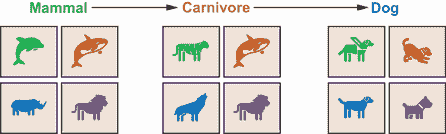

图 6.1 ImageNet 数据集中同义词或类别的示意图

对于识别地点和场景的任务，我们将使用 Places 数据集([`places2.csail.mit.edu/`](http://places2.csail.mit.edu/))。了解物体在现实世界中出现的地点、场景或上下文是构建像自动驾驶汽车这样的智能系统的重要方面，该系统试图在城市中导航。Places 数据集将图像组织成不同级别的场景类别。图 6.2 展示了说明数据集语义结构的示例。该示例显示了一个高级场景类别，称为户外。在这个类别下有三个子类别，分别是大教堂、建筑和体育场。总共有超过 1000 万张图像被组织成 400 个独特的场景类别。使用这个数据集，我们可以训练一个模型来学习各种地点和场景识别任务的特征。

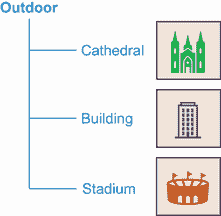

图 6.2 Places 数据集中类别的示意图

随着 ImageNet 和 Places 数据集的加入，我们现在已经准备好训练智能系统。幸运的是，我们可以使用在 ImageNet 和 Places 数据集上预训练的各种最先进的 CNN 架构模型。这将节省我们从头开始训练模型的努力、时间和金钱。在下一节中，我们将看到如何利用这些预训练模型。我们还将回顾 CNN 以及我们迄今为止学到的技术，以解释这些模型的输出。

## 6.2 卷积神经网络：回顾

在本节中，我们快速回顾了我们在第五章中学到的 CNN。图 6.3 展示了一个 CNN 架构，可以用于将 ImageNet 数据集中的图像分类为狗或不是狗。

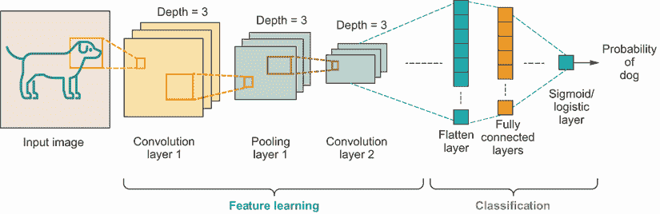

图 6.3 卷积神经网络 (CNN) 的示意图

该架构由一系列称为卷积和池化层的层组成，随后是一组全连接层。卷积和池化层合称为 *特征学习层*。这些层从输入图像中提取层次特征。前几层提取低级特征，如边缘、颜色和梯度。后续层学习高级特征。全连接层用于分类。特征学习层中学习的特征被作为输入馈送到全连接层。最终输出是输入图像是狗的概率度量。

在上一章中，我们也学习了如何使用 PyTorch 中的 `torchvision` 包初始化最先进的 CNN 架构。我们特别关注了深度为 18 层的 ResNet 架构，称为 ResNet-18。我们将在本章中也继续使用这个架构。在 PyTorch 中可以按照以下方式初始化 ResNet-18 模型：

```
import torchvision                                        ①
model = torchvision.models.resnet18(pretrained=False)     ②
```

① 导入 torchvision 包

② 使用随机权重初始化 ResNet 模型

通过将 `pretrained` 参数设置为 `False`，我们使用随机权重初始化 ResNet 模型。要初始化在 ImageNet 数据集上预训练的模型，我们必须将 `pretrained` 参数设置为 `True`。这将在下面展示：

```
imagenet_model = torchvision.models.resnet18(pretrained=True)     ①
```

① 初始化在 ImageNet 数据集上预训练的 ResNet 模型

其他 CNN 架构，如 AlexNet、VGG、Inception 和 ResNeXT，也可以使用 `torchvision` 初始化。所有支持的架构都可以在 [`pytorch.org/vision/stable/models.html`](https://pytorch.org/vision/stable/models.html) 找到。

对于 Places 数据集，你可以在 [`github.com/CSAILVision/places365`](https://github.com/CSAILVision/places365) 找到各种架构的预训练 PyTorch 模型。你可以从 [`mng.bz/GGmA`](http://mng.bz/GGmA) 下载用于 ResNet-18 架构的预训练 PyTorch 模型。由于文件大小超过 40 MB，我鼓励你本地下载。一旦下载完成，你可以按照以下方式加载在 Places 数据集上预训练的模型：

```
import torch                                                                       ①
places_model_file = “resnet18_places365.pth.tar”                                   ②
if torch.cuda.is_available():                                                      ③
    places_model = torch.load(places_model_file)                                   ③
else:                                                                              ③
    places_model = torch.load(places_model_file, map_location=torch.device(‘cpu’)) ③
```

① 导入 PyTorch 库

② 将此变量设置为预训练 ResNet 模型下载的完整路径

③ 加载在 Places 数据集上预训练的 ResNet 模型

我们还学习了各种可以用来解释 CNN 的视觉归因方法，如图 6.4 所示。存在三种视觉归因方法的广泛类别：扰动、梯度和激活。像 LIME 和 SHAP 这样的技术是基于扰动的。这些模型无关、事后和局部可解释的技术使用与复杂 CNN 行为相似但更容易解释的代理模型。这些技术突出了图像中对模型预测重要的部分或超像素。这些技术非常好，可以应用于任何复杂模型。基于梯度和基于激活的方法是事后和局部可解释的技术。然而，它们对模型有轻微的依赖性，并且只突出了输入图像中显著或对模型重要的很小一部分。对于像 vanilla backpropagation、guided backpropagation、integrated gradients 和 SmoothGrad 这样的基于梯度的方法，我们通过计算目标类别相对于输入图像的梯度来获得图像中的显著像素。对于像 Grad-CAM 和 guided Grad-CAM 这样的基于激活的方法，最终卷积层的激活是基于目标类别相对于激活或特征图的梯度进行加权的。

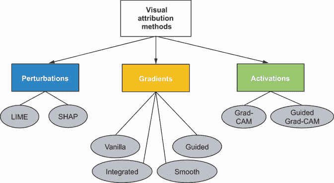

图 6.4 视觉归因方法回顾

图 6.4 中展示的所有视觉归因方法都突出了最终模型预测中重要的像素或超像素。我们通常对这些方法生成的可视化进行定性评估，因此解释是主观的。此外，这些技术并没有给我们提供关于 CNN 中特征学习层和单元所学习的低级和高级概念或特征的信息。在下一节中，我们将了解网络剖析框架。这个框架将帮助我们剖析 CNN，并提出更多定量解释。我们还将能够理解 CNN 中的特征学习层学习到哪些人类可理解的概念。

## 6.3 网络剖析框架

网络剖析框架由麻省理工学院的周博磊等研究人员在 2018 年提出（参见[`arxiv.org/pdf/1711.05611.pdf`](https://arxiv.org/pdf/1711.05611.pdf)）。该框架旨在回答的基本问题如下：

+   CNN 是如何分解理解图像的任务的？

+   CNN 是否识别出任何人类可理解的特征或概念？

该框架通过在 CNN 的卷积层中找到与有意义的、预定义的语义概念匹配的单元来回答这些问题。这些单元的可解释性通过测量单元响应与预定义概念的对齐程度来量化。以这种方式剖析网络是有趣的，因为它使得深度神经网络不那么神秘。网络剖析框架包括以下三个关键步骤，如图 6.5 所示：

1.  首先，定义一组广泛的有意义的概念，这些概念可以用来剖析网络。

1.  然后，通过寻找对那些预定义概念做出响应的单元来探测网络。

1.  最后，测量这些单元对这些概念的质量或可解释性。

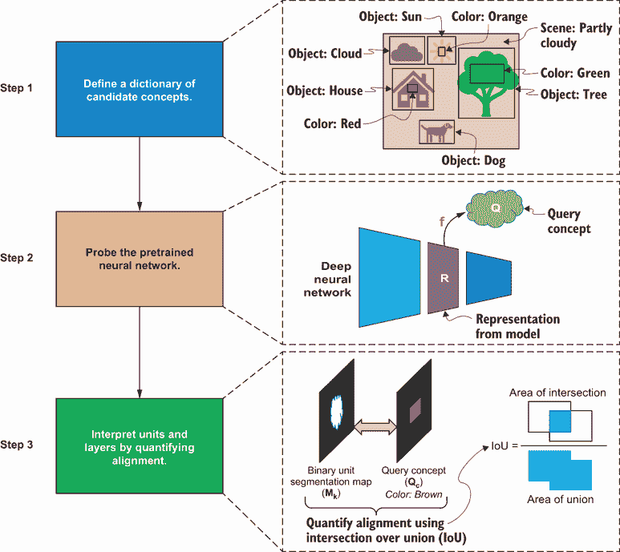

图 6.5 网络剖析框架

我们将在接下来的小节中更详细地分解这些步骤。

### 6.3.1 概念定义

网络剖析框架的第一步也是最重要的一步是数据收集。数据必须由用不同抽象级别的概念逐像素标记的图像组成。在第 6.1 节中介绍的 ImageNet 和 Places 数据集可以用来训练模型以检测现实世界中的物体和场景。对于网络剖析的目的，我们需要另一个独立的、包含标记概念的独立数据集。我们不会使用这个数据集进行模型训练，而是用它来探测网络，以了解特征学习层学到了哪些高级概念。

为了分解使用 ImageNet 和 Places 等数据集训练以检测现实世界对象和场景的模型，周、博雷等结合了五个不同的数据集，创建了一个独立的、称为 *Broden* 的高层次概念标注数据集。Broden 代表 *bro*adly 和 *den*sely 标注数据集。Broden 统一了以下五个数据集：ADE ([`mng.bz/zQD6/`](http://mng.bz/zQD6/))、Open-Surfaces ([`mng.bz/0wJE`](http://mng.bz/0wJE))、PASCAL-Context ([`mng.bz/9KEq`](http://mng.bz/9KEq))、PASCAL-Part ([`mng.bz/jyD8`](https://shortener.manning.com/jyD8)) 和可描述的纹理数据集 ([`mng.bz/W7Xl`](http://mng.bz/W7Xl))。这些数据集包含广泛概念类别的标注图像，从低级概念类别如颜色、纹理和材料到更高级的概念类别如部分、物体和场景。图 6.6 提供了一个带有各种概念的图像的插图。在 Broden 数据集中，为图像中的每个概念创建了一个分割图像。如果我们以图 6.6 中的树对象为例，包含树的边界框内的像素有一个标签 1，而边界框外、不包含树的像素有一个标签 0。概念需要在像素级别进行标注。所有五个数据集的标签在 Broden 数据集中统一。具有相似同义词的概念也被合并。Broden 包含超过 1,000 个视觉概念。

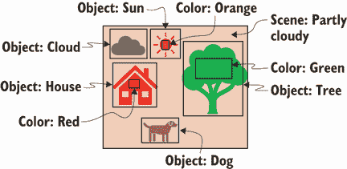

图 6.6 一个带有标注概念的图像的插图

由于创建带有标注概念的数据集是网络分解框架中的关键步骤，让我们退一步看看如何创建一个新的数据集。我们将特别关注我们可以用于此目的的工具和遵循的方法，以获得一致、高质量标注的概念。

我们可以使用各种工具来标注图像。LabelMe ([`mng.bz/8lE5`](http://mng.bz/8lE5)) 和 Make Sense ([`www.makesense.ai/`](https://www.makesense.ai/)) 是免费的基于网络的图像标注工具。在 LabelMe 中，我们可以轻松创建账户，上传图像，并对它们进行标注。通过共享功能，我们还可以协作创建标注。然而，在 LabelMe 上上传的图像被认为是公开的。Make Sense 是一个非常类似的工具，但它不允许您与他人协作和共享标注。该工具也不保存标注项目的状态。因此，如果您在 Make Sense 中开始一个项目，该项目中图像的标注必须一次性完成。该工具不允许您保存状态并从上次离开的地方继续标注。LabelMe 和 Make Sense 都支持多种标签类型，如矩形、线条、点和多边形。这两个工具主要被使用数据集旨在公开的研究人员使用。

对于企业、商业或更私人的需求，您可以托管自己的标注服务。计算机视觉标注工具（CVAT；[`github.com/openvinotoolkit/cvat`](https://github.com/openvinotoolkit/cvat)）和视觉对象标记工具（VoTT；[`github.com/microsoft/VoTT`](https://github.com/microsoft/VoTT)）是免费的、开源的 Web 服务，您可以将它们部署在自己的 Web 服务器上。如果您不想处理托管自己的标注服务的麻烦，您也可以使用如 LabelBox ([`labelbox.com/`](https://labelbox.com/))）、Amazon SageMaker Ground Truth ([`aws.amazon.com/sagemaker/groundtruth/`](https://aws.amazon.com/sagemaker/groundtruth/))或 Azure Machine Learning 提供的标注服务([`mng.bz/ExgX`](https://shortener.manning.com/ExgX))或 Google Cloud([`mng.bz/Nx9v`](https://shortener.manning.com/Nx9v)))等托管服务。如果您没有一组可以为您标注图像的标注者团队，您也可以通过 Amazon Mechanical Turk ([`www.mturk.com/`](https://www.mturk.com/))进行众包标注并获取标签。

重要的是要有良好的标注方法，以确保高质量的、一致的标签。标注任务的协议必须明确指定，以便标注者知道所有概念的完整列表，并对它们有明确的定义。然而，通过这个过程获得的标签可能会相当嘈杂，尤其是如果它们是众包的。为了确保标签的一致性，随机抽取图像的一个子集，并让同一组标注者进行标注。通过这样做，您现在可以通过查看以下三种类型的错误来量化标签的一致性，这些错误在[`mng.bz/DxaA`](https://shortener.manning.com/DxaA)中详细说明，该链接介绍了 ADE20K 数据集：

+   *分割质量*—这种错误量化了概念分割的精确度。同一个概念可能被不同的标注者或同一个标注者以不同的方式分割。

+   *概念命名*—概念命名的差异可能出现在同一个标注者或不同的标注者给同一个像素分配不同的概念名称的情况下。

+   *分割数量*—某些图像可能包含比其他图像更多的标注概念。您可以通过查看多个标注者对某个图像中概念数量的方差来量化这种错误。

我们可以通过增加标注者的数量来规避分割质量和数量的错误，以便我们可以达成共识，或者通过让更有经验的标注者对图像进行标注。我们可以通过有一个明确定义的标注协议和精确的术语来避免概念命名的错误。如前所述，创建带有标注概念的数据库是网络剖析框架中最重要的一步。这也是最耗时和成本最高的步骤。我们将在以下章节中通过可解释性的视角来了解这个数据库的价值。

### 6.3.2 网络探测

一旦你有了视觉概念的标记数据集，下一步就是探测预训练神经网络，以了解网络对这些概念的反应。让我们首先看看这在一个简单的深度神经网络中是如何工作的。图 6.7 展示了深度神经网络的简化表示，其中单元的数量从输入层到输出层逐渐减少。网络中间层学习到输入数据的表示，这被表示为*R*。为了更好地理解网络，我们希望通过量化表示*R*如何映射到我们关心的给定查询概念*Q*来探测网络。从表示*R*到查询概念*Q*的映射称为*计算模型*，在图中表示为*f*。现在，让我们在 CNN 的背景下定义*R*、*Q*和*f*。

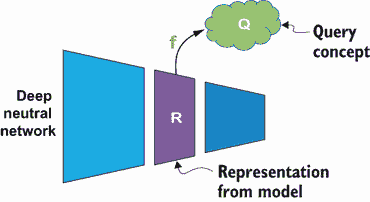

图 6.7 探测深度神经网络中的概念

图 6.8 展示了探测网络第 4 层的 CNN。在图中，我们使用狗的图像探测网络，确定预训练 CNN 中第 4 层的单元学习到了哪些概念（如颜色和物体）。因此，第一步是将狗的图像通过 CNN 进行前向传播。CNN 的权重被冻结，不需要训练或反向传播。接下来，我们选择一个卷积层进行探测（在这种情况下，第 4 层）。然后，我们从该层获得前向传播后的输出特征图或激活图。一般来说，随着你深入 CNN，激活图的大小会减小。因此，为了将激活图与输入图像中的标记概念进行比较，我们必须将低分辨率激活图上采样或缩放，使其与输入图像具有相同的分辨率。这形成了 CNN 中第 4 层卷积层的表示*R*。对标记概念数据集中的所有图像重复此过程，并存储所有图像的激活图。我们也可以对 CNN 中的其他层重复此过程。

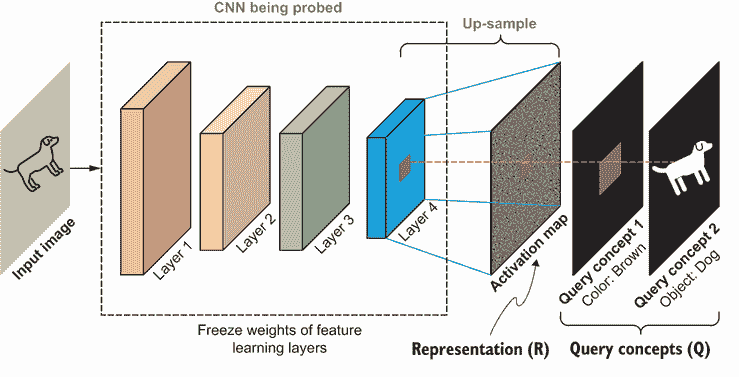

图 6.8 探测卷积神经网络中的第 4 层概念

现在，我们如何解释这些表示*R*中包含的高级概念？换句话说，我们如何将这些表示*R*与查询概念*Q*进行映射？这需要我们确定一个计算模型*f*，将*R*映射到*Q*。此外，你如何上采样或缩放低分辨率激活图，使其与输入图像具有相同的分辨率？这已在图 6.9 中分解。

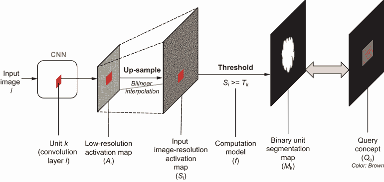

图 6.9 上采样和如何将表示 R 映射到查询概念 Q 的示意图

在图 6.9 中，我们可以看到输入图像 *i* 通过 CNN 的前向传播。为了说明目的，假设我们特别关注卷积层 *l* 中的单元 *k*。这个卷积层的输出表示为低分辨率激活图 *A[i]*。网络剖析框架随后对激活图进行上采样或调整大小，使其与输入图像 *i* 的分辨率相同。这如图 6.9 中的输入图像分辨率激活图 *S[i]* 所示。框架中使用的是双线性插值算法。双线性插值将线性插值扩展到二维平面。它根据周围像素中的已知值估计调整大小后的图像中新未知像素的值。估计或插值值位于原始激活图中每个单元响应的中心。

一旦你有了图像分辨率激活图 *S[i]*，框架随后通过执行简单的阈值化将此表示映射到给定的查询概念 *Q[c]*。阈值化是在单元级别进行的，以便可以将卷积层中每个单元的响应与查询概念进行比较。在图 6.9 中，查询概念 *Q[c]* 是原始标记概念数据集中棕色颜色的分割图像。阈值化后的单元 *k* 的二进制单元分割图显示为 *M[k]*。计算模型 *f* 使用的阈值是 *T[k]*，其中

*M[k]* = *S[i]* ≥ *T[k]*

二进制单元分割图 *M[k]* 强调了所有激活值超过阈值 *T[k]* 的区域。阈值 *T[k]* 取决于我们在 CNN 中探测的单元。我们如何计算这个阈值？框架会查看单元激活在标记概念数据集所有图像中的分布。设 *a[k]* 为给定输入图像 *i* 中低分辨率激活图 *A[i]* 中一个单元的激活值。一旦你得到了所有图像中 *a[k]* 的分布，阈值 *T[k]* 就被计算为最高分位数水平，使得

ℙ(*a[k]* > *T[k]*) = 0.005

*T[k]* 衡量的是 0.005 分位数水平。换句话说，标记概念数据集中所有图像中所有单元激活 (*a[k]*) 的 0.5% 大于 *T[k]*。一旦我们将 CNN 学到的表示映射到二进制单元分割图，下一步就是量化该分割图与所有查询概念 *Q[c]* 的对齐程度。这将在以下小节中详细说明。

### 6.3.3 量化对齐

在你已经探测了网络并获得了表示层中所有单元的二值单元分割图之后，框架中的最后一步是对分割图与数据集中所有查询概念的对齐进行量化。图 6.10 展示了如何量化给定二值单元分割图 *M[k]* 和查询概念 *Q[c]* 的对齐。对齐是通过交并比（IoU）分数来衡量的。IoU 是衡量一个单元检测给定概念准确性的有用指标。它衡量二值单元分割图与查询概念的像素级分割图像的重叠程度。IoU 分数越高，准确性越好。如果二值分割图与概念完美重叠，我们获得完美的 IoU 分数为 1。

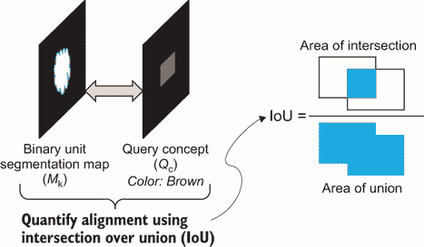

图 6.10 用概念量化对齐

给定二值分割图 *M[k]* 和查询概念 *Q[c]* 的 IoU 值是单元 *k* 检测概念 *c* 的准确性。它通过衡量单元 *k* 检测概念 *c* 的能力来量化单元 *k* 的可解释性。在网络分解框架中，使用 0.04 的 IoU 阈值，如果一个单元 *k* 的 IoU 分数大于 0.04，则认为该单元 *k* 是概念 *c* 的检测器。*0.04* 这个值是框架的作者任意选择的，在他们提供的论文中，[`arxiv.org/pdf/1711.05611.pdf`](https://arxiv.org/pdf/1711.05611.pdf)，作者通过人工评估表明，解释的质量对 IoU 阈值不敏感。为了量化卷积层的可解释性，框架计算与单元对齐的独特概念的数目，即独特概念检测器的数量。有了对网络分解框架如何工作的理解，让我们在下一节中看看它是如何实际应用的。

## 6.4 解释层和单元

在本节中，我们通过解释在 ImageNet 和 Places 数据集上预训练的 CNN 模型中的层和单元来测试网络剖析框架。如 6.2 节所述，我们将重点关注 ResNet-18 架构，但网络剖析框架可以应用于任何 CNN 模型。我们在 6.2 节中看到了如何加载在 ImageNet 和 Places 数据集上预训练的 ResNet-18 模型。论文的作者创建了一个名为 NetDissect 的库（[`github.com/CSAILVision/NetDissect`](https://github.com/CSAILVision/NetDissect)），该库实现了这个框架。这个库支持 PyTorch 和 Caffe 深度学习框架。然而，我们将使用一个改进的实现，称为 NetDissect-Lite（[`github.com/CSAILVision/NetDissect-Lite`](https://github.com/CSAILVision/NetDissect-Lite)），它比原始实现更轻更快。这个库是用 PyTorch 和 Python 3.6 编写的。我们需要对库进行一些小的修改以支持 Python 的后续版本（3.7 及以上），我们将在下一小节中讨论这个问题。

我们可以使用以下命令从 GitHub 将 NetDissect-Lite 库克隆到我们的本地存储库中：

```
git clone https://github.com/CSAILVision/NetDissect-Lite
```

这个库也被添加到与本书相关的存储库中，作为一个 Git 子模块。如果你已经从 GitHub 克隆了本书的存储库，那么你可以通过在本地克隆存储库的目录中运行以下命令来拉取子模块：

```
git submodule update --init –recursive
```

一旦你克隆了 NetDissect-Lite 存储库，请本地切换到该目录。然后，运行以下命令下载 Broden 数据集。Broden 数据集需要超过 1GB 的存储空间。请注意数据集下载的路径，因为我们稍后会用到它：

```
$>./script/dlbroden.sh
```

你也可以通过在 NetDissect-Lite 目录中运行以下命令来下载在 Places 数据集上预训练的 ResNet-18 模型。同样，请注意模型下载的路径，因为我们稍后会用到它：

```
$>./script/dlzoo_example.sh
```

### 6.4.1 运行网络剖析

在本节中，我们将学习如何使用 NetDissect-Lite 库，通过使用 Broden 数据集中的标记概念来探测在 ImageNet 和 Places 数据集上预训练的 ResNet-18 模型。我们可以通过 NetDissect-Lite 库根目录下的 settings.py 文件来配置库。我们不会涵盖所有设置，因为对于大多数设置，我们将使用库提供的默认值。因此，我们将重点关注关键设置，这些设置总结在表 6.1 中。

表 6.1 NetDissect-Lite 库的设置

| 设置 | 描述 | 可能的值 |
| --- | --- | --- |
| `GPU` | 这是一个布尔设置，可以用来在 GPU 上加载模型并运行网络剖析。 | 可能的值是 `True` 和 `False`。如果设置为 `True`，则使用 GPU。 |
| `MODEL` | 这是一个字符串设置，用于设置预训练模型的模型架构。 | 可能的值有`resnetlB`、`alexnet`、`resnetS0`、`densenet161`等。在本节中，我们将设置此值为`resnetlB`。 |
| `DATASET` | 这是一个字符串设置，让库知道使用了哪个数据集来训练 CNN 模型。 | 可能的值有`imagenet`和`places` `365`。在本节中，我们将使用这两个值来比较层和单元的可解释性。 |
| `CATEGORIES` | 这是一个字符串列表设置，定义了标记概念数据集中的高级类别。 | 对于 Broden 数据集，列表可以包含以下值：`object`、`part`、`scene`、`material`、`texture`和`color`。在本节中，我们将删除`material`概念，并查看其他五个类别。 |
| `OUTPUT_FOLDER` | 这是一个字符串设置，为库提供标记概念数据集的路径。 | 此设置的默认值是`./script/dlbroden.sh`脚本下载 Broden 数据集的路径。 |
| `FEATURE_NAMES` | 这是一个字符串列表设置，让库知道在 CNN 中要探测哪些特征学习层。 | 对于 Resnet18 模型，列表可以包含以下值：`layer1`、`layer2`、`layer3`和/或`layer4`。在本章中，我们将使用所有四个值来比较所有四个特征学习层中单元的可解释性。 |
| `MODEL_FILE` | 这是一个字符串设置，用于向库提供预训练模型的路径。 | 对于在 Places 数据集上预训练的 Resnet18 模型，将此设置的值设置为`script/dlzoo_example.sh`脚本下载模型的路径。对于在 ImageNet 数据集上预训练的模型，将值设置为`None`。这将让库知道从`torchvision`包中加载模型。 |
| `MODEL_PARALLEL` | 这是一个布尔设置，用于让库知道模型是否在多 GPU 上训练。 | 可能的值是`True`和`False`。 |

在运行网络剖析框架之前，请确保 settings.py 文件已更新为正确的设置。为了探测在 ImageNet 数据集上预训练的 ResNet-18 模型中的所有特征学习层，我们在 settings.py 文件中将关键设置设置为以下值：

```
GPU = False
MODEL = 'resnet18'
DATASET = 'imagenet'
QUANTILE = 0.005
SCORE_THRESHOLD = 0.04
TOPN = 10
CATAGORIES = ["object", "part","scene","texture","color"]
OUTPUT_FOLDER = "result/pytorch_" + MODEL + "_" + DATASET
DATA_DIRECTORY = '/data/dataset/broden1_227'
IMG_SIZE = 227
NUM_CLASSES = 1000
FEATURE_NAMES = ['layer2', 'layer3', 'layer4']
MODEL_FILE = None
MODEL_PARALLEL = False
```

确保将`DATA_DIRECTORY`设置设置为 Broden 数据集下载的路径。此外，如果您想使用 GPU 进行更快的处理，请将`GPU`设置设置为`True`。如前所述，该库提供了一些子设置。这些设置在之前的代码中并未明确设置，您可以使用它们的默认值。

要探测在 Places 数据集上预训练的 ResNet-18 模型中的所有特征学习层，我们只需更新以下设置。其余的设置与 ImageNet 数据集的设置相同。确保 `MODEL_FILE` 设置设置为下载预训练的 ResNet-18 模型的路径：

```
DATASET = 'places365'
NUM_CLASSES = 365
MODEL_FILE = '/models/zoo/resnet18_places365.pth.tar'
MODEL_PARALLEL = True
```

一旦我们设置了设置值，我们现在就可以初始化并运行框架了。运行以下代码行以探测网络并从特征学习层提取激活图：

```
import settings                                                   ①
from loader.model_loader import loadmodel                         ②
from feature_operation import hook_feature, FeatureOperator       ③

fo = FeatureOperator()                                            ④
model = loadmodel(hook_feature)                                   ⑤

features, maxfeatures = fo.feature_extraction(model=model)        ⑥
```

① 从 settings.py 文件导入所有设置

② 从 loader/model_loader 模块导入 loadmodel *f* 函数

③ 从特征操作模块导入 hook_feature 函数和 FeatureOperator 类

④ 初始化 FeatureOperator 对象

⑤ 加载模型并将 hook_feature 函数传递给添加特征学习层的钩子

⑥ 在模型上运行特征提取以从特征学习层获取激活图

`loadmodel` 函数根据 `MODEL` 设置加载模型。模型的加载方式与我们看到的第 6.2 节中的方式相同。该函数还根据 `FEATURE_NAMES` 设置为每个特征学习层添加钩子。这些钩子由 `FeatureOperator` 对象用于从这些层中提取激活图。`FeatureOperator` 类是实现网络剖析框架中的步骤 2 和 3 的主要类。在前面的代码片段中，我们正在运行步骤 2 的一部分，使用 `feature_extraction` 函数从特征学习层提取低分辨率激活图。此函数从 Broden 数据集中加载图像，通过模型前向传播它们，使用钩子提取激活图，然后将其保存到名为 feature_size.npy 的文件中。该文件保存在 settings.py 中设置的 `OUTPUT_FOLDER` 路径。`feature_extraction` 函数还返回两个变量：`features` 和 `maxfeatures`。`features` 变量包含所有特征学习层和输入图像的激活图。`maxfeatures` 变量存储每个图像的最大值激活，我们将在生成摘要结果时使用它。

一旦我们提取了低分辨率激活图，我们可以运行以下代码行来计算特征学习层中所有单元的阈值 *T[k]*（0.005 分位数水平），上采样低分辨率激活图并生成二值单元分割图，计算 IoU 分数，并最终生成结果摘要：

```
from visualize.report import generate_html_summary                  ①

for layer_id, layer in enumerate(settings.FEATURE_NAMES):           ②
    # Calculate the thresholds T_k
    thresholds = fo.quantile_threshold(features[layer_id], 
    ➥ savepath=f"quantile_{layer}.npy")                            ③

    # Up-sample and calculate the IoU scores
    tally_result = fo.tally(features[layer_id],thresholds, 
    ➥ savepath=f"tally_{layer}.csv")                               ④

    # Generate a summary of the results
    generate_html_summary(fo.data, layer,                           ⑤
                          tally_result=tally_result,                ⑤
                          maxfeature=maxfeatures[layer_id],         ⑤
                          features=features[layer_id],              ⑤
                          thresholds=thresholds)                    ⑤
```

① 从可视化/报告模块导入 generate_html_summary 函数

② 遍历每个特征学习层

③ 计算特征学习层中所有单元的 0.005 分位数水平

④ 在上采样并生成二值单元分割图后计算 IoU 分数

⑤ 以 HTML 格式生成结果摘要

在此代码片段中，我们正在遍历 FEATURE_NAMES 中的每个特征学习层，并执行以下操作：

+   使用`FeatureOperator`类中的`quantile_threshold`函数，计算每个特征学习层中所有单元的 0.005 分位数水平（*T[k]*)。这些分位数水平或阈值保存在`OUTPUT_FOLDER`路径下的每个层的文件中（称为 quantile_{layer}.csv）。该函数还返回阈值作为 NumPy 数组。

+   使用`FeatureOperator`类中的`tally`函数，将每个特征学习层的低分辨率激活图上采样到与输入图像相同的分辨率。`tally`函数还会根据每个单元的上采样激活图和计算出的阈值生成基于二进制单元分割图。该函数最终计算 IoU 分数并测量二进制单元分割图与 Broden 数据集中分割概念的匹配度。每个高级概念的聚合 IoU 分数都保存在 OUTPUT_FOLDER 路径下的一个文件中（称为 tally_{layer}.csv），每个层一个文件。这些结果也作为字典对象返回。

+   最后，使用`generate_html_summary`函数创建结果的 HTML 形式摘要。

在下一节中，我们将探索库生成的结果摘要，并可视化特征学习层中单元学习到的概念。

在自定义数据集上运行网络分解

理解 Broden 数据集文件夹的结构非常重要，这样我们才能为我们的自定义数据集和概念模仿它。在高级别上，该文件夹包含以下文件和文件夹：

+   *images*（文件夹）—包含所有 JPEG 或 PNG 格式的图像。该文件夹应包含以{filename}.jpg 格式存储的原始图像以及每个概念的分割图像，格式为{filename}_{concept}.jpg。

+   *index.csv*—包含数据集中所有图像的列表，以及有关标记概念的详细信息。第一列是图像文件名，包含图像的相对路径。然后是包含图像高度和宽度以及分割高度和宽度维度的列。然后是每个概念的列，包含该概念的分割图像的相对路径。

+   *category.csv*—列出所有概念类别，随后是一些关于概念的摘要统计信息。第一列是概念名称，然后是属于该概念类别的标签数量以及具有该标记概念的图像频率。

+   *label.csv*—列出所有标签及其对应的每个标签所属的概念，随后是一些关于标签的摘要统计。第一列是标签编号（或标识符），然后是标签名称和它所属的类别。摘要统计包括具有该标签的图像数量频率、像素部分或图像的覆盖范围，以及具有该标签的图像总数。

+   *c_{concept}.csv*—每个概念类别一个文件，包含所有标签、图像频率和覆盖细节。

你使用自己的标记概念创建的新数据集应遵循 Broden 数据集相同的结构，以确保与网络剖析框架兼容。一旦你将数据集结构化如前所述，你就可以在 settings.py 中更新以下设置：

+   `DATA_DIRECTORY`—指向存储你的自定义数据集的目录。

+   `CATEGORIES`—列出你自定义数据集中的所有概念类别，即在 category.csv 文件中。

+   `IMG_SIZE`—图像文件夹中图像的维度。维度应与 index.csv 文件中的维度匹配。

这些设置将确保库加载新的自定义概念数据集。如果你在不同于 ImageNet 或 Places 的数据集上有一个自己的预训练模型，你还需要更新以下设置：

+   `DATASET`—设置为模型已训练的数据集名称。

+   `NUM_CLASSES`—设置为模型可能输出的类别或标签数量。

+   `FEATURE_NAMES`—列出你自定义预训练模型中的特征层名称。

+   `MODEL_FILE`—包含你的预训练模型在 PyTorch 中的完整路径。

+   `MODEL_PARALLEL`—如果你的自定义模型是在多 GPU 上训练的，此设置必须为`True`。

### 6.4.2 概念检测器

我们现在将分析运行网络剖析框架后的结果。我们首先将关注 ResNet-18 模型中的最终卷积层（即第 4 层），并查看该层中独特概念检测器的数量。独特检测器的数量是网络可解释性的度量，衡量该特征学习层中单元学习的独特概念数量。独特检测器的数量越多，训练的网络在检测人类可理解的概念方面就越多样化。

让我们先看看网络剖析框架结果文件夹的输出结构。OUTPUT_FOLDER 设置提供了结果文件夹的路径。我们在上一节中看到了保存在该文件夹中的相关文件。现在，让我们处理 tally_layer4.csv 来计算 ResNet-18 模型第 4 层的独特检测器的数量以及这些独特检测器覆盖的单元比例。以下函数可以用来计算相关统计。该函数接受以下关键字参数：

+   `network_names`—需要计算唯一检测器数量的模型列表。在本章中，我们只关注 ResNet-18 模型，因此这个关键字参数是一个只包含一个元素的列表—`resnet18`。

+   `datasets`—这个参数是一个列表，包含了模型预训练的数据集。在本章中，我们关注的是`imagenet`和`places365`。

+   `results_dir`—存储每个预训练模型结果的父目录。

+   `categories`—需要计算唯一检测器数量的所有概念类别列表。

+   `iou_thres`—这是 IoU 得分的阈值，我们根据这个阈值将一个单元视为一个概念检测器。正如我们在 6.3.3 节中看到的，这个阈值的默认值是 0.04。

+   `layer`—我们感兴趣的特性学习层。在这种情况下，我们关注的是最终层，即第 4 层。

```
import os                                                                       ①
import pandas as pd                                                             ①
from collections import OrderedDict                                             ①

def compute_unique_detectors(**kwargs):                                         ②
    network_names = kwargs.get("network_names", 
                               ["resnet18"])                                    ③
    datasets = kwargs.get("datasets", 
                          ["imagenet", "places365"])                            ④
    results_dir = kwargs.get("results_dir", "result")                           ⑤
    categories = kwargs.get("categories", 
                            ["object",
                             "scene", 
                             "part",
                             "texture", 
                             "color"])                                          ⑥
    iou_thres = kwargs.get("iou_thres",
                           0.04)                                                ⑦
    layer = kwargs.get("layer", "layer4")                                       ⑧

    ud_data = []                                                                ⑨
    for network_name in network_names:                                          ⑩
        for dataset in datasets:                                                ⑪
            result_file = os.path.join(results_dir, 
                       f"pytorch_{network_name}_{dataset}/tally_{layer}.csv")   ⑫
            df_result = pd.read_csv(result_file)                                ⑫

            ud = OrderedDict()                                                  ⑬
            ud["network_name"] = network_name                                   ⑬
            ud["dataset"] = dataset                                             ⑬
            ud["num_units"] = len(df_result)                                    ⑬

            num_ud = 0                                                          ⑭
            for category in categories:                                         ⑮
                df_cat = df_result[df_result["category"] == 
                ➥ category].reset_index(drop=True)                             ⑯
                df_unique_detectors = df_cat[df_cat[f"{category}-iou"] > 
                ➥ iou_thres].reset_index(drop=True)                            ⑰
                ud[f"num_ud_{category}"] = len(df_unique_detectors)             ⑱
                ud[f"num_ud_{category}_pc"] = len(df_unique_detectors) / 
                ➥ ud["num_units"] * 100                                        ⑲
                num_ud += len(df_unique_detectors)                              ⑳
            ud["num_ud"] = num_ud                                               ㉑
            ud["num_ud_pc"] = ud["num_ud"] / ud["num_units"] * 100              ㉑
            ud_data.append(ud)                                                  ㉒
    df_ud = pd.DataFrame(ud_data)                                               ㉓
    return df_ud                                                                ㉔
```

① 导入函数所需的模块

② 计算唯一检测器数量的函数。它接受一组关键字参数。

③ `network_names`关键字参数是我们需要计算唯一检测器数量的模型列表

④ 模型预训练的数据集列表

⑤ 指向网络剖析框架为每个模型保存结果的父目录

⑥ 所有感兴趣的概念类别列表

⑦ 测量单元是否为概念检测器的 IoU 阈值；默认设置为 0.04

⑧ `layer`参数默认设置为 ResNet-18 模型的最终层。

⑨ 初始化一个空列表来存储唯一检测器数量的结果

⑩ 遍历每个网络或模型

⑪ 遍历模型预训练的每个数据集

⑫ 将 tally_{layer}.csv 文件加载为 Pandas DataFrame

⑬ 初始化一个 OrderedDict 数据结构来存储给定网络和数据的检测结果

⑭ 将唯一检测器的数量初始化为 0

⑮ 遍历每个概念类别

⑯ 获取该概念类别的结果

⑰ 过滤 IoU 得分大于阈值的单元

⑱ 结果 DataFrame 中的行数是该概念类别唯一检测器的数量。

⑲ 计算检测该概念类别的单元占总单元数量的比例

⑳ 增加唯一检测器数量的计数

㉑ 将唯一检测器结果存储在 OrderedDict 数据结构中

㉒ 将结果追加到列表中

㉓ 将结果列表转换为 Pandas DataFrame

㉔ 返回 DataFrame

我们可以通过运行以下代码行来获取在 ImageNet 和 Places 上预训练的 ResNet-18 模型最终特征学习层的唯一检测器数量。请注意，该函数没有提供任何关键字参数，因为参数的默认值将计算 ImageNet 和 Places 上预训练的 ResNet-18 模型最终特征学习层的统计数据：

```
df_ud = compute_unique_detectors()
```

如果我们想要计算，比如说，第三特征学习层的统计数据，我们可以按照以下方式调用函数：

```
df_ud = compute_unique_detectors(layer="layer3")
```

一旦我们获得了独特检测器的数量作为 Pandas DataFrame，我们使用以下函数来绘制结果：

```
def plot_unique_detectors(df_ud, **kwargs):                                  ①
    categories = kwargs.get("categories", 
                            ["object",
                             "scene", 
                             "part",
                             "texture", 
                             "color"])                                       ②
    num_ud_cols = [f"num_ud_{c}" for c in categories]                        ③
    num_ud_pc_cols = [f"num_ud_{c}_pc" for c in categories]                  ④
    num_ud_col_rename = {}                                                   ⑤
    num_ud_pc_col_rename = {}                                                ⑤
    for c in categories:                                                     ⑤
        num_ud_col_rename[f"num_ud_{c}"] = c.capitalize()                    ⑤
        num_ud_pc_col_rename[f"num_ud_{c}_pc"] = c.capitalize()              ⑤

    df_ud["network_dataset"] = df_ud.apply(lambda x: x["network_name"] + "_" ⑥
    ➥ + x["dataset"], axis=1)                                               ⑥
    df_ud_num = df_ud.set_index("network_dataset")[num_ud_cols]              ⑥
    df_ud_num_pc = df_ud.set_index("network_dataset")[num_ud_pc_cols]        ⑥

    df_ud_num = df_ud_num.rename(columns=num_ud_col_rename)                  ⑦
    df_ud_num_pc = df_ud_num_pc.rename(columns=num_ud_pc_col_rename)         ⑦

    f, ax = plt.subplots(2, 1, figsize=(8, 10))                              ⑧
    df_ud_num.plot(kind='bar', stacked=True, ax=ax[0])                       ⑨
    ax[0].legend(loc='center left', bbox_to_anchor=(1, 0.5))                 ⑨
    ax[0].set_ylabel("Number of Unique Detectors")                           ⑨
    ax[0].set_xlabel("")                                                     ⑨
    ax[0].set_xticklabels(ax[0].get_xticklabels(), rotation=0)               ⑨
    df_ud_num_pc.plot(kind='bar', stacked=True, ax=ax[1])                    ⑩
    ax[1].get_legend().remove()                                              ⑩
    ax[1].set_ylabel("Proportion of Unique Detectors (%)")                   ⑩
    ax[1].set_xlabel("")                                                     ⑩
    ax[1].set_xticklabels(ax[1].get_xticklabels(), rotation=0)               ⑩

    return f, ax                                                             ⑪
```

① 绘制独特检测器的数量；接受 compute_unique_detectors 函数返回的 DataFrame 和某些关键字参数

② 我们感兴趣的所有概念类别的列表

③ 包含每个概念类别独特检测器数量的列名列表

④ 包含每个概念类别独特检测器比例的列名列表

⑤ 将列名重命名为大写概念类别名称的字典

⑥ 按网络名称和数据集索引 DataFrame

⑦ 将列名重命名为大写概念类别名称

⑧ 创建一个具有两个子图行的 Matplotlib 图

⑨ 在第一个子图中，将独特检测器的数量以堆叠条形图的形式可视化

⑩ 在第二个子图中，将独特检测器的比例以堆叠条形图的形式可视化

⑪ 返回 Matplotlib 图和坐标轴

按如下方式绘制独特检测器和比例。结果图如图 6.11 所示：

```
f, ax = plot_unique_detectors(df_ud)
```

图 6.11 的最上面一行显示了在 ImageNet 和 Places 数据集上预训练的两个 ResNet-18 模型在最终特征学习层中的独特检测器的绝对数量。最下面一行显示了作为最终层中单元总数比例的计数。ResNet-18 的最终特征学习层中的单元总数为 512。我们可以看到，ImageNet 模型有 302 个独特检测器，这大约占总单元的 59%。另一方面，Places 模型有 435 个独特检测器，这大约占总单元的 85%。总的来说，看起来在 Places 数据集上训练的模型比 ImageNet 拥有更多样化的概念检测器集。地点通常由多个场景组成。这就是为什么我们在 Places 数据集上训练的模型中比在 ImageNet 数据集中看到更多的场景检测器。ImageNet 数据集包含更多的物体。这就是为什么我们在 ImageNet 模型上看到更多的物体检测器。我们还可以观察到在最终特征学习层中比低级概念（如颜色、纹理和部分）出现更多的更高级概念，如物体和场景。

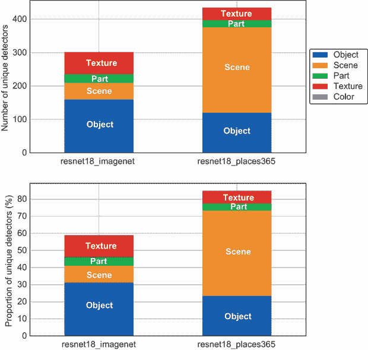

图 6.11 独特检测器的数量——ImageNet 与 Places 的比较

现在我们将扩展`compute_unique_detectors`函数，以计算 ResNet-18 模型中所有特征学习层的独特检测器。这样我们可以观察到网络中所有层学习到的概念。作为一个练习，我鼓励你更新这个函数，并使用一个表示特征学习层列表的`layers`关键字参数。还要添加一个嵌套循环来遍历所有层，计算每层的独特检测器数量。这个练习的解决方案可以在与本书相关的 GitHub 存储库中找到，网址为[`mng.bz/KBdZ`](http://mng.bz/KBdZ)。

一旦你获得了包含所有层独特检测器数量的 DataFrame，你可以使用以下辅助函数将统计数据绘制成折线图：

```
def plot_ud_layers(df_ud_layer):                                            ①
    def plot_ud_layers_dataset(df_ud_layer_dataset, ax):                    ②③
        object_uds = df_ud_layer_dataset["num_ud_object_pc"].values         ③
        scene_uds = df_ud_layer_dataset["num_ud_scene_pc"].values           ③
        part_uds = df_ud_layer_dataset["num_ud_part_pc"].values             ③
        texture_uds = df_ud_layer_dataset["num_ud_texture_pc"].values       ③
        color_uds = df_ud_layer_dataset["num_ud_color_pc"].values           ③
        ax.plot(object_uds, '^-', label="object")                           ④
        ax.plot(scene_uds, 's-', label="scene")                             ④
        ax.plot(part_uds, 'o-', label="part")                               ④
        ax.plot(texture_uds, '*-', label="texture")                         ④
        ax.plot(color_uds, 'v-', label="color")                             ④
        ax.legend()                                                         ⑤
        ax.set_xticks([0, 1, 2, 3])                                         ⑥
        ax.set_xticklabels(["Layer 1", "Layer 2", "Layer 3", "Layer 4"])    ⑥
        ax.set_ylabel("Proportion of Unique Detectors (%)")                 ⑦
    df_ud_layer_r18_p365 = df_ud_layer[(df_ud_layer["network_name"] == 
    ➥ "resnet18") & 
                                   (df_ud_layer["dataset"] == 
    ➥ "places365")].reset_index(drop=True)                                 ⑧
    df_ud_layer_r18_imgnet = df_ud_layer[(df_ud_layer["network_name"] == 
    ➥ "resnet18") & 
                                   (df_ud_layer["dataset"] == 
    ➥ "imagenet")].reset_index(drop=True)                                  ⑨

    f, ax = plt.subplots(2, 1, figsize=(8, 10))                             ⑩
    plot_ud_layers_dataset(df_ud_layer_r18_imgnet, ax[0])                   ⑪
    ax[0].set_title("resnet18_imagenet")                                    ⑪
    plot_ud_layers_dataset(df_ud_layer_r18_p365, ax[1])                     ⑫
    ax[1].set_title("resnet18_places365")                                   ⑫

    return f, ax                                                            ⑬
```

① 绘制网络中所有层的独特检测器的比例

② 绘制在给定数据集上预训练的网络中所有层的独特检测器比例

③ 提取所有概念类别的统计数据

④ 将统计数据绘制成折线图

⑤ 显示图例

⑥ 标记网络中所有层的 x 轴刻度

⑦ 标记 y 轴

⑧ 从源 DataFrame 中筛选出在 Places 数据集上预训练的网络的过滤器行

⑨ 从源 DataFrame 中筛选出在 ImageNet 数据集上预训练的网络的过滤器行

⑩ 创建一个具有两个子图行的 Matplotlib 图

⑪ 绘制 ImageNet 数据集第一子图行中所有层的统计数据

⑫ 绘制 Places 数据集第二子图行中所有层的统计数据

⑬ 返回图和轴

我们可以通过运行以下代码行获得图 6.12 中的图表：

```
f, ax = plot_ud_layers(df_ud_layer)
```


图 6.12 层数中独特检测器的数量——ImageNet 与 Places

图 6.12 的顶部行显示了在 ImageNet 数据集上预训练的 ResNet-18 模型中所有层的独特检测器的比例。底部行显示了在 Places 数据集上训练的模型的相同统计数据。我们可以看到，对于这两个模型，低级概念类别如颜色和纹理在较低的特征学习层中出现，而高级概念类别如部分、物体和场景在较高或较深的层中出现。这意味着在较深的层中学习了更多的高级概念。我们可以看到，随着层深度的增加，网络的表征能力也在增加。较深的层有更多的能力学习复杂的视觉概念，如物体和场景。在下一节中，我们将通过查看网络中每个单元学习到的特定标签和概念来进一步剖析网络。

### 6.4.3 训练任务的概念检测器

在上一节中，我们可视化了所有高级概念类别中独特检测器的数量。现在让我们深入挖掘，并可视化 Broden 数据集中每个概念或标签的独特检测器数量。我们将关注最终的特征学习层以及按独特检测器数量排名前三的概念类别：纹理、物体和场景。

我们需要将 6.4.2 节中开发的`compute_unique_detectors`函数扩展到按概念或标签计算统计数据。作为一个练习，我强烈建议您这样做，因为它将使您更好地理解 NetDissect-Lite 库生成的 tally_{layer}.csv 文件的格式。您可以传递一个新的关键字参数，让函数知道是否按概念类别或按概念或标签聚合。对于按概念或标签聚合，您需要按`category`和`label`分组，并计算类别 IoU 分数大于阈值的单元数量。这个练习的解决方案可以在与本书相关的 GitHub 存储库中找到。调用新函数并将结果存储在名为`df_cat_label_ud`的 DataFrame 中。

我们首先将查看纹理概念类别。使用以下代码片段提取纹理概念类别的 DataFrames：

```
df_r18_imgnet_texture = df_cat_label_ud[(df_cat_label_ud["network_name"] == 
➥ "resnet18") & 
                            (df_cat_label_ud["dataset"] == "imagenet") & 
                            (df_cat_label_ud["category"] == "texture")].\
            sort_values(by="unit", ascending=False).reset_index(drop=True)  ①

df_r18_p365_texture = df_cat_label_ud[(df_cat_label_ud["network_name"] == 
➥ "resnet18") & 
                            (df_cat_label_ud["dataset"] == "places365") & 
                            (df_cat_label_ud["category"] == "texture")].\
            sort_values(by="unit", ascending=False).reset_index(drop=True)  ②
```

① 从在 ImageNet 上预训练的 ResNet-18 模型中提取统计数据，并按 IoU 分数降序排列

② 从在 Places 上预训练的 ResNet-18 模型中提取统计数据，并按 IoU 分数降序排列

您现在可以使用以下代码可视化各种纹理概念的独特检测器数量。结果图如图 6.13 所示：

```
import seaborn as sns                                        ①

f, ax = plt.subplots(1, 2, figsize=(16, 10))                 ②
sns.barplot(x="unit", y="label", data=df_r18_imgnet_object,
➥ ax=ax[0])                                                 ③
ax[0].set_title(f"resnet18_imagenet : {len(df_r18_           ③
➥ imgnet_object)} objects")                                 ③
ax[0].set_xlabel("Number of Unique Detectors")               ③
ax[0].set_ylabel("")                                         ③
sns.barplot(x="unit", y="label", data=df_r18_                ④
➥ p365_object, ax=ax[1])                                    ④
ax[1].set_title(f"resnet18_places365 : {len                  ④
➥ (df_r18_p365_object)} objects")                           ④
ax[1].set_xlabel("Number of Unique Detectors")               ④
ax[1].set_ylabel("");                                        ④
```

① 导入 Seaborn 库

② 创建一个 Matplotlib 图，包含两个子图列

③ 绘制 ImageNet 模型学习到的所有纹理概念的独特检测器数量

④ 绘制 Places 模型学习到的所有纹理概念的独特检测器数量

在上一节（见图 6.11）中，我们观察到，对于纹理概念类别，ImageNet 模型在最终层的独特检测器数量比在 Places 数据集上训练的模型更多。但是，这个层中单元学习到的概念有多多样？图 6.13 旨在回答这个问题。我们可以看到，ImageNet 模型涵盖了 27 个纹理概念，而 Places 模型涵盖了 21 个。ImageNet 模型的前三个纹理概念占 19 个独特检测器。它们是条纹、波浪和螺旋。另一方面，Places 模型的前三个纹理概念占 10 个独特检测器。它们是交织、棋盘和层状。尽管 Places 模型在最终层中学习的纹理数量较少，但我们看到在较低的特征学习层中，这个模型的独特检测器比例更高（如图 6.12 所示）。

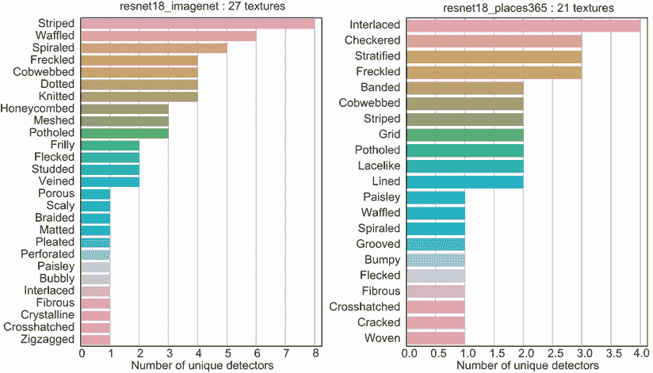

图 6.13 唯一纹理检测器数量——ImageNet 与 Places

现在，让我们可视化各种对象和场景概念的唯一检测器数量。作为一个练习，将用于纹理概念类别的代码扩展到对象和场景。对象概念类别的结果图显示在图 6.14 中。因为基于 Places 数据集训练的模型在最终层检测到很多场景，所以场景概念类别的可视化被分成两个单独的图表。图 6.15 显示了 ImageNet 模型的场景检测器数量，图 6.16 显示了 Places 模型的场景检测器数量。


图 6.14 唯一对象检测器数量——ImageNet 与 Places

让我们先看看图 6.14。在前一节中，我们观察到 ImageNet 模型在高级对象类别中有更高比例的唯一检测器，因为 ImageNet 数据集中包含更多的对象。然而，如果我们观察学习到的概念有多样化，我们可以看到在 Places 数据集上训练的模型中出现了更多的对象。Places 模型检测到 45 个对象，而 ImageNet 模型在最终特征学习层中检测到的对象是 36 个。ImageNet 模型检测到的顶级对象是狗，占 25 个唯一检测器——ImageNet 数据集中有大量标记的狗的图像。Places 模型检测到的顶级对象是飞机，占 11 个唯一检测器。

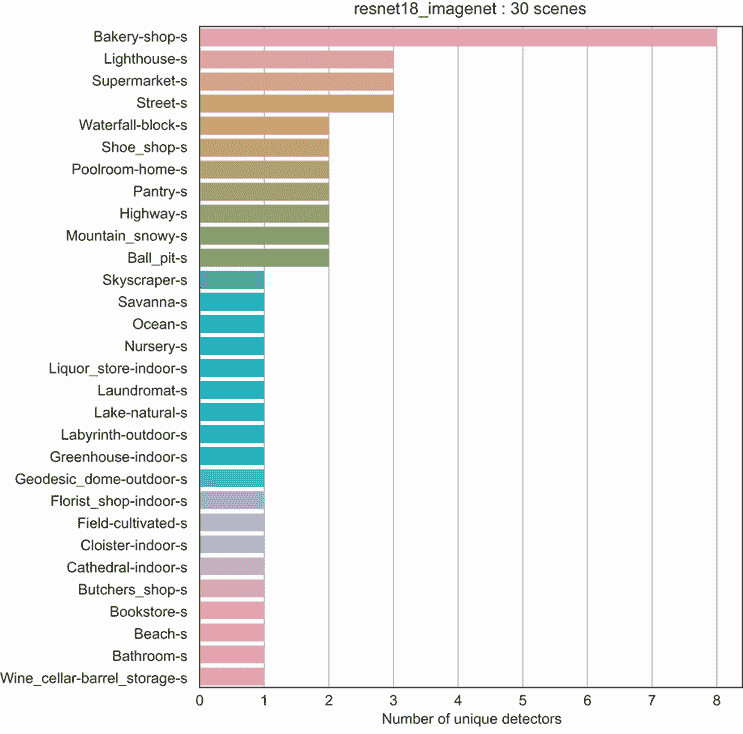

图 6.15 唯一场景检测器数量——ImageNet 数据集

如果我们现在比较图 6.15 和图 6.16，我们可以看到在 Places 数据集上训练的模型能够识别比 ImageNet 模型（119 个对 30 个）更多样化的场景集。这是预期的，因为 Places 数据集包含大量的标记地点，这些地点通常由许多场景组成。注意，在图 6.16 中，尽管在 Places 数据集上训练的模型总共能够识别 119 个场景，但图中只显示了前 40 个场景，以便更容易阅读图表。

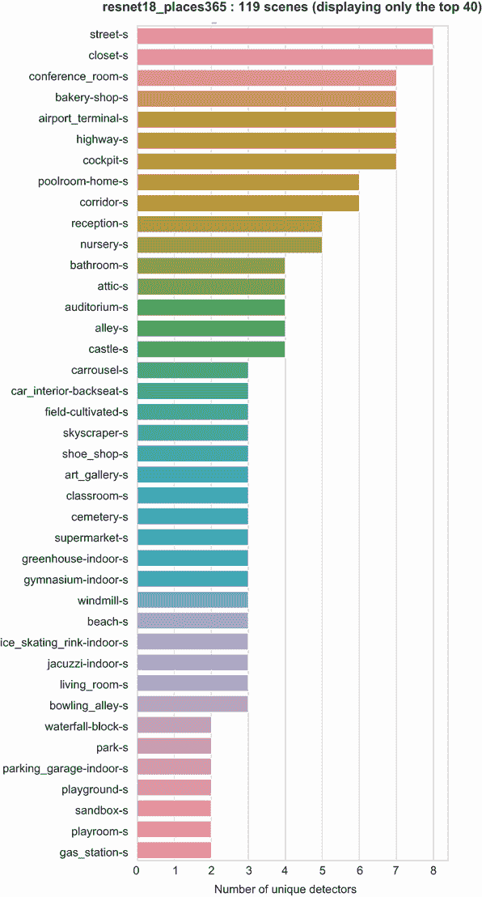

图 6.16 唯一场景检测器数量——Places 数据集

通过深入挖掘并可视化每个概念的唯一检测器数量，我们可以确保用于训练模型的数据库足够多样化，并且对感兴趣的概念有良好的覆盖。我们还可以使用这些可视化来了解单元在每个神经网络层的关注点是什么。

迁移学习

迁移学习是一种技术，其中针对特定任务训练的模型被用作另一个任务的起点。例如，假设我们有一个在 ImageNet 数据集上训练的模型，该模型在检测对象方面表现良好。我们希望将此模型用作起点来检测地点和场景。为此，我们可以加载 ImageNet 模型的权重，并在训练和微调到 Places 数据集之前使用这些权重作为起点。迁移学习背后的基本思想是，在一个领域学习到的特征可以在另一个领域重用，前提是这两个领域之间有一些重叠。当一个领域的预训练网络在另一个领域的任务上进行训练时，通常训练时间更快，并且会产生更准确的结果。

网络分解框架的作者在其论文中分析了单元的可解释性在迁移学习过程中的演变，该论文可在[`arxiv.org/pdf/1711.05611.pdf`](https://arxiv.org/pdf/1711.05611.pdf)找到。他们使用了在 ImageNet 数据集上预训练并微调到 Places 数据集的 AlexNet 模型。作者观察到，对于在 ImageNet 上预训练但微调到 Places 的模型，独特检测器的数量有所增加。最初检测狗的单元演变为其他对象和场景，如马、牛和瀑布。Places 数据集中的许多地方都包含这些动物和场景。如果预训练在 Places 上的模型微调到 ImageNet 数据集，作者观察到独特检测器的数量有所下降。对于 Places-to-ImageNet 网络，许多单元演变为狗检测器，因为 ImageNet 中狗的标记数据比例要高得多。

### 6.4.4 可视化概念检测器

在前面的章节中，我们通过查看每个概念类别和个别概念的独特检测器数量来量化 CNN 中每个特征学习层中单元的可解释性。在本节中，我们将通过 NetDissect 库可视化特征学习层中每个单元生成的二值单元分割图。该库将在原始图像上叠加二值单元分割图并为我们生成 JPG 文件。如果我们想可视化原始图像中单元针对特定概念关注的特定像素，这将非常有用。

由于空间有限，我们无法可视化所有单元和模型生成的所有图像。因此，我们将重点关注在 Places 数据集上预训练的模型，以及某些概念的最大激活图像的特定单元。以下函数可以用来获取由库生成的二值分割图像：

```
import matplotlib.image as mpimg                                                      ①

def get_image_and_stats(**kwargs):                                                    ②
    network_name = kwargs.get("network_name",                                         ③
                              "resnet18")                                             ③
    dataset = kwargs.get("dataset",                                                   ③
                          "places365")                                                ③
    results_dir = kwargs.get("results_dir", "result")                                 ③
    layer = kwargs.get("layer", "layer4")                                             ③
    unit = kwargs.get("unit", "0000")                                                 ③

    result_file = os.path.join(results_dir, 
                              f"pytorch_{network_name}_{dataset}/tally_{layer}.csv")  ④
    df_result = pd.read_csv(result_file)                                              ④

    image_dir = os.path.join(results_dir,
                             f"pytorch_{network_name}_{dataset}/html/image")          ⑤
    image_file = os.path.join(image_dir,                                              ⑤
                              f"{layer}-{unit}.jpg")                                  ⑤
    img = mpimg.imread(image_file)                                                    ⑤

    df_unit_stats = df_result[df_result["unit"] == int(unit)+1]                       ⑥
    stats = None                                                                      ⑦
    if len(df_unit_stats) > 0:                                                        ⑧
        stats = {                                                                     ⑧
            "category": df_unit_stats["category"].tolist()[0],                        ⑧
            "label": df_unit_stats["label"].tolist()[0],                              ⑧
            "iou": df_unit_stats["score"].tolist()[0]                                 ⑧
        }                                                                             ⑧
    return img, stats                                                                 ⑨
```

① 导入 Matplotlib 提供的 mpimg 模块以加载和显示图像

② 获取给定单元在图像上叠加的二值单元分割图及其相关统计数据

获取网络名称、数据集、结果目录、特征学习层和感兴趣的单元

将计数字段文件加载为 Pandas DataFrame

加载叠加在原始图像上的二进制单元分割图

过滤 DataFrame 以获取感兴趣层和单元的统计数据

初始化统计数据变量为 None

如果感兴趣层和单元有结果，从 DataFrame 中提取类别、标签和 IoU，并将它们存储在字典中

返回感兴趣层和单元的图像和相关统计数据

我们现在将重点关注单元 247 和 39，它们检测飞机对象。我们在上一节中看到（见图 6.14），飞机对象在 Places 模型中的所有对象中具有最独特的检测器。这些单元按零索引，并由 NetDissect 库保存为四位字符串。因此，我们需要将字符串“0246”和“0038”分别作为单元 247 和 39 的单元关键字参数传递给`get_image_and_stats`函数。以下代码片段将获取图像和相关统计数据，并在 Matplotlib 中可视化。结果图如图 6.17 所示：

```
img_247, stats_247 = get_image_and_stats(unit="0246")                       ①
img_39, stats_39 = get_image_and_stats(unit="0038")                         ②
f, ax = plt.subplots(2, 1, figsize=(15, 4))                                 ③
ax[0].imshow(img_247, interpolation='nearest')                              ④
ax[0].grid(False)                                                           ④
ax[0].axis(False)                                                           ④
ax[0].set_title(f"Unit: 247, Label: {stats_247['label']}, Category:         ④
➥ {stats_247['category']}, IoU: {stats_247['iou']:.2f}",                   ④
                fontsize=16)                                                ④
ax[1].imshow(img_39, interpolation='nearest')                               ⑤
ax[1].grid(False)                                                           ⑤
ax[1].axis(False)                                                           ⑤
ax[1].set_title(f"Unit: 39, Label: {stats_39['label']}, Category:           ⑤
➥ {stats_39['category']}, IoU: {stats_39['iou']:.2f}",                     ⑤
                fontsize=16);                                               ⑤
```

从单元 247 提取图像和统计数据

从单元 39 提取图像和统计数据

创建一个具有两个子图行的 Matplotlib 图像

在顶部行显示单元 247 的图像并在标题中显示统计数据

在底部行显示单元 39 的图像并在标题中显示统计数据

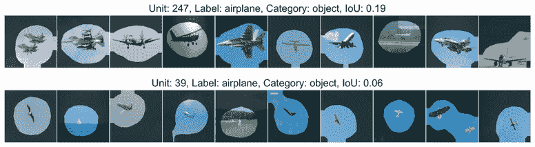

图 6.17 对象概念检测器——飞机的可视化

图 6.17 顶部行显示了为单元 247 的 10 个最大激活 Broden 图像生成的分割。平均 IoU 为 0.19。由于二进制单元分割图叠加在原始图像上，激活的像素是那些满足*S*[i] >= *T*[k]的像素。未激活的像素显示为黑色。从图像中我们可以看到，该单元专注于飞机，而不是任何其他随机对象。图 6.17 底部行显示了为单元 39 的 10 个最大激活 Broden 图像生成的分割。平均 IoU 为 0.06，并且在这种情况下较低。从图像中我们可以看到，该单元在飞机上以及一般概念（如鸟类、飞行、天空和蓝色）上激活。

图 6.18 显示了为三个对象生成的二值分割图像，分别是火车（顶部行）、公共汽车（中间行）和轨道（底部行）。具体的单元分别是 168、386 和 218。对于火车概念检测器，我们可以看到激活的像素突出显示引擎和铁路轨道。在这种情况下，平均 IoU 很高，为 0.27。对于公共汽车概念检测器，激活的像素似乎突出显示公共汽车和像任何大型窗户和相对平坦前端的车辆这样的通用概念。在这种情况下，平均 IoU 为 0.24。轨道概念检测器很有趣。激活的像素似乎突出显示具有两条平行轨道的图像，包括铁路轨道、保龄球道和寿司传送带。在这种情况下，平均 IoU 为 0.06。

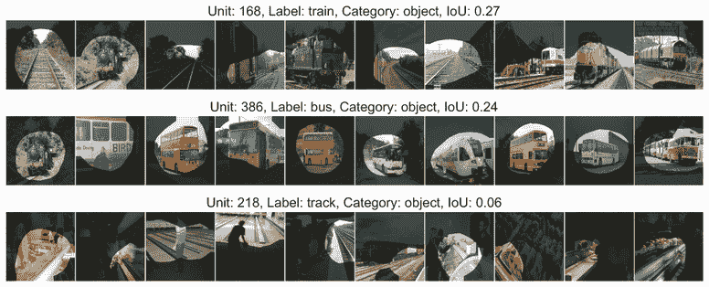

图 6.18 物体概念检测器可视化——火车、公共汽车和轨道

最后，图 6.19 显示了训练集中未直接表示的场景的分割图像。我们特别关注单元 379 和 370，分别突出显示高速公路和托儿所场景。顶部行显示高速公路场景，底部行显示托儿所场景。我们可以看到，在 Places 数据集上训练的模型正在很好地学习这些高级场景概念。

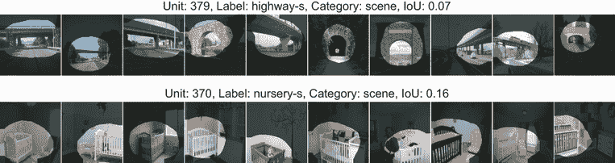

图 6.19 场景概念检测器可视化——高速公路和托儿所

### 6.4.5 网络解剖的局限性

网络解剖框架是一个伟大的工具，帮助我们打开黑盒神经网络。它通过提出可量化的解释来克服视觉归因方法的局限性。我们可以通过可视化每个单元在特征学习层中学习的特征或概念，来了解 CNN 如何分解识别图像的任务。然而，网络解剖框架具有以下局限性，如框架原作者在原始论文中所强调的：

+   该框架需要像素级别的概念标记数据集。这是框架中最关键的一步，可能非常耗时且成本高昂。此外，数据集中未表达的概念在解释单元时不会显示出来，即使网络已经学习了它们。

+   该框架无法识别代表一个概念的多个单元的组合。

+   单元的可解释性通过“唯一检测器数量”指标来量化。该指标倾向于更大、更深的网络，这些网络具有学习更多高级概念的能力。

神经网络的解剖分析是一个活跃的研究领域，研究社区正在探索许多有希望的道路，例如自动识别概念和使用概念分数来识别对神经网络的对抗攻击。

### 摘要

+   我们在上一章中学到的视觉归因方法存在一些局限性。它们通常通过定性评估，并且相当主观。这些技术并没有给我们提供关于卷积神经网络（CNN）中特征学习层和单元所学习的低级和高级概念或特征的信息。

+   本章讨论的网络剖析框架通过提出更定量的解释来克服视觉归因方法的局限性。通过使用该框架，我们还将能够理解 CNN 的特征学习层学习了哪些人类可理解的概念。

+   该框架包括三个关键步骤：概念定义、网络探测和对齐测量。概念定义步骤是最关键的步骤，因为它要求我们收集一个像素级别的概念标记数据集。网络探测步骤是关于在网络中找到对那些预定义概念做出响应的单元。最后，对齐测量步骤量化了单元激活与那些概念之间的对齐程度。

+   我们学习了如何使用 NetDissect 库在 PyTorch 模型上运行网络剖析框架，这些模型是在 ImageNet 和 Places 数据集上训练的。我们使用了 Broden 数据集来定义概念。

+   我们学习了如何通过使用“独特检测器数量”指标来量化单元的可解释性，并可视化不同概念类别和个别概念单元的可解释性。

+   我们还学习了如何可视化由库生成的二值单元分割图像，以查看单元对特定概念关注的像素。

+   网络剖析框架是一个帮助我们打开黑盒神经网络的优秀工具。然而，它也有一些局限性。创建一个概念标记数据集可能非常耗时且成本高昂。该框架无法识别代表一个概念的单元组。独特的检测器数量指标倾向于更大的、更深的网络，这些网络有学习更多高级概念的能力。
