# 7 理解语义相似性

本章涵盖

+   学习捕获语义意义的密集词表示

+   使用 PCA 和 t-SNE 等降维技术可视化高维词嵌入的语义相似性

+   PCA 和 t-SNE 的优缺点

+   对 PCA 和 t-SNE 生成的可视化进行定性和定量验证

在上一章中，我们将关注点从解释黑盒模型内部发生的复杂处理和操作转向解释模型学习到的表示或特征。我们特别研究了网络剖析框架来了解卷积神经网络（CNN）中的特征学习层学习到了哪些概念。该框架包括三个关键步骤：概念定义、网络探测和对齐测量。概念定义步骤主要涉及数据收集，特别是收集像素级别的概念标注数据集。这是最耗时且最关键的步骤。下一步是探测网络，确定 CNN 中哪些单元对预定义的概念做出响应。最后一步是量化单元响应与概念的匹配程度。该框架通过提出以人类可理解的概念形式存在的定量解释，克服了视觉归因方法的局限性。

在本章中，我们将继续探讨解释深度神经网络学习到的表示的主题，但将关注点转向自然语言处理（NLP）。NLP 是机器学习的一个子领域，它处理自然语言。到目前为止，我们一直在处理图像或以数值特征表格形式输入。在 NLP 中，我们将处理文本形式的输入。我们将特别关注如何以密集和语义上有意义的形式表示文本，以及如何解释那些意义相似——即那些具有语义相似性的——由这些表示学习到的单词。

我们将首先介绍一个分析电影评论情感的具体例子。然后，我们将了解神经词嵌入，这是深度学习中的一个有趣分支，广泛用于以语义上有意义的形式表示文本。这些词表示可以用作预测情感的模型的输入。本章的其余部分将专注于从词表示中解释和可视化语义相似性。我们将特别学习线性和非线性降维技术，如主成分分析（PCA）和 t 分布随机邻域嵌入（t-SNE）。

## 7.1 情感分析

在本章中，我们接受了一个名为“互联网电影库”的电影网站的委托，确定电影评论的情感。目标是确定一个评论是否与积极或消极的情绪相关联。如图 7.1 所示，我们有两个电影和每个电影的几条评论。这两个电影的评分仅用于说明目的。基于每条评论中的单词或单词序列，我们想要确定评论表达的是积极情绪或观点，还是消极情绪。

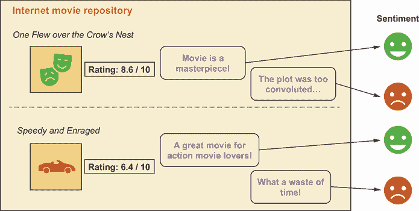

图 7.1 电影评论的情感分析

目标是构建一个 AI 系统，给定一个评论作为输入，判断该评论是否传达了积极或消极的情绪。有了这个信息，我们可以将问题表述为一个二元分类问题。这将会类似于我们在第四章和第五章中看到的二元分类器，但与处理具有数值特征的表格数据或图像不同，我们处理的是一系列单词，如图 7.2 所示。模型的输入是一系列代表评论的单词，输出是一个分数，表示评论情感为积极的概率。

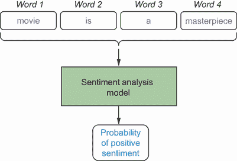

图 7.2 情感二分类器

图 7.2 中的情感分析模型被表示为一个黑盒。我们将在 7.3.4 节中详细介绍模型的具体情况。在我们深入构建模型的方法之前，我们想要回答以下两个关键问题：

1.  我们如何将一个单词表示成模型可以处理的形式？

1.  我们如何对一系列单词进行建模并基于此构建分类器？

本书的主要重点是回答第一个问题。我们将学习可以用来以密集和语义上有意义的形式表示单词的深度学习模型，以及如何解释它们。一旦我们找到了表示单词的好方法，回答第二个问题——如何构建处理一系列单词的模型——就会变得更加直接。尽管这并不是本书的主要焦点，但我们将简要介绍序列建模以及如何使用我们在前几章中学到的技术来解释这类模型。在我们深入单词表示之前，让我们首先探索电影评论数据集，弄清楚为什么我们需要一个好的单词表示来构建情感分类器。

## 7.2 探索性数据分析

在本节中，我们将探索电影评论数据集，并确定我们是否可以构建任何数值特征来训练一个更简单的逻辑回归或基于树的模型。主要目标是确定是否需要提出具有语义意义的词表示以及建模词序列。我们将使用 PyTorch 提供的`torchtext`包来加载和处理数据集。`torchtext`包与`torchvision`类似，因为它提供了各种数据处理实用工具、流行数据集和 NLP 模型。我们可以使用 pip 安装此包，如下所示：

```
$> pip install torchtext
```

除了`torchtext`，我们还将安装 spaCy，这是一个流行的 NLP 库，我们将用它来进行字符串分词。分词是将文本字符串分割成离散组件或标记的过程，例如单词和标点符号。一种简单的分词方法是按空格分割文本字符串，但这种方法没有考虑到标点符号。`spaCy`库提供了在多种语言中分词字符串的更复杂的方法。在本章中，我们将专注于英语语言，因此使用名为`en_core_web_sm`的模型进行字符串分词。spaCy 库和模型可以按照以下方式安装：

```
$> pip install spacy
$> python -m spacy download en_core_web_sm
```

在所有库都就绪后，我们现在可以按照以下方式加载电影评论数据集：

```
import torch                                                  ①
from torchtext.legacy import data, datasets                   ①
TEXT = data.Field(tokenize='spacy',                           ②
                  tokenizer_language='en_core_web_sm')        ②
LABEL = data.LabelField(dtype=torch.float)                    ③
train_data, test_data = datasets.IMDB.splits(TEXT, LABEL)     ④
```

① 导入 PyTorch 和来自 torchtext 的相关实用工具

② 使用电影评论文本的标记器初始化 Field 类

③ 初始化 LabelField 类以将情感标签加载为浮点数

④ 加载电影评论数据集并将其分为训练集和测试集

让我们现在看看这个数据集的一些关键汇总统计数据，例如训练集和测试集中的评论数量、正面和负面评论的比例以及每条评论中的单词数量，这些数据总结在表 7.1 中。为了节省空间，我们不会展示相应的源代码，但你可以从与本书相关的 GitHub 仓库中获取它。

表 7.1 电影评论数据集的关键统计数据

| 统计信息 | 训练集 | 测试集 |
| --- | --- | --- |
| 评论数量 | 25,000 | 25,000 |
| 正面评论比例 | 50% | 50% |
| 负面评论比例 | 50% | 50% |
| 正面评论中的单词数量 | 最小值 | 14 | 11 |
| 中位数 | 202 | 198 |
| 最大值 | 2789 | 2640 |
| 负面评论中的单词数量 | 最小值 | 11 | 5 |
| 中位数 | 203 | 203 |
| 最大值 | 1827 | 1290 |

从表 7.1 中，我们可以观察到训练集和测试集的电影评论数量相等——每个集都有 25,000 条。两个集合中的正面和负面评论都平均分配。我们还可以观察到，在训练集和测试集中，评论中单词数量的汇总统计相似。我们可以看到正面和负面评论之间的一些差异，特别是每条评论的最小和最大单词数。除了理解数据集之外，查看这些关键汇总统计的原因是为了确定我们是否可以构建某些数值特征，并构建一个简单的逻辑回归或基于树的分类器来进行情感分析。

沿着这个思路，让我们看看每条评论中单词数量的分布，比较正面和负面情感。正面和负面评论的单词数量是否有差异？如果有，负面评论通常比正面评论长还是短？我们可以通过查看图 7.3 来回答这些问题。您可以在与本书相关的 GitHub 仓库中找到生成此图表的源代码。

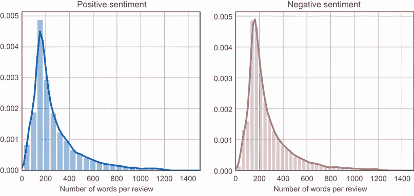

图 7.3 每条评论中单词数量的分布——正面与负面

在图 7.3 中，我们可以看到在单词数量方面，正面和负面评论之间没有明显的差异。因此，仅通过查看单词数量并不能准确预测评论是正面还是负面。


图 7.4 正面评论的词云

关于单词的频率或出现次数呢？是否有某些单词在正面或负面评论中更常见？图 7.4 显示了正面评论中所有常见单词的词云。词云是在一些数据清理之后生成的，其中去除了非常常见的单词，如*a*、*the*、*is*、*at*、*which*和*on*（也称为停用词）以及标点符号。您可以在与本书相关的 GitHub 仓库中访问用于移除所有停用词并清理数据的代码。在词云中，单词越大，它在评论中出现的频率就越高。我们可以看到，对于正面评论，最频繁出现的单词是像*film*、*movie*、*one*和*character*这样的单词。我们还看到传达积极情绪的单词，如*love*、*great*、*good*和*wonderful*。


图 7.5 负面评论的词云

图 7.5 展示了负面评论的词云。乍一看，我们确实看到了一些与正面评论中相同的词语——例如*电影*、*电影*、*一个*和*角色*——这些词语也常见于负面评论中。我们还可以看到一些表达负面情绪的词语，例如*糟糕*、*不幸地*、*差劲*和*愚蠢*。如果我们比较图 7.4 和图 7.5，正面评论和负面评论在词语数量上并没有明显的差异。然而，我们可以通过进一步使用人类知识和启发式方法清理数据集来从这一词语计数特征中找到更多的信号。例如，我们可以移除一些中性的词语，如*电影*、*电影*、*一个*和*角色*，仅举几例。正如你所想象的那样，这种使用一些语言背景知识（例如识别中性词语）和启发式方法进行特征工程的方法是相当耗时且不一定容易扩展到其他语言的。我们需要一种更好的方法来表示语言中的词语，这将是下一节的重点。

## 7.3 神经词语嵌入

在上一节中，我们看到了提出数值特征以训练情感分析模型是多么困难。现在，我们将学习如何以数值形式表示词语，尽可能多地编码其意义。然后我们可以使用这些词语表示来训练情感分析模型。在我们深入之前，让我们先澄清一下术语。编码语义意义的词语的密集表示称为词语*嵌入*、*词语向量*或*分布式表示*。由神经网络学习的词语表示或词语嵌入称为*神经词语嵌入*。在本章中，我们将重点关注神经词语嵌入。

我们还需要了解一些更多的 NLP 术语。我们将使用术语*语料库*来指代我们将要处理的文本体。对于电影评论示例，语料库将是数据集中所有的电影评论。我们将使用术语*词汇表*来指代文本语料库中的词语。

### 7.3.1 单热编码

现在，让我们看看一种表示词语的简单方法，这表明了词语嵌入的需求。这个练习突出了需要提出更复杂的方法来以密集、语义有意义的形式表示词语。假设我们有一个包含词汇表中的*V*个词语的文本语料库。词汇表大小*V*通常相当大。让我们看看图 7.6 所示的例子。在图中，我们可以看到语料库中的词语列在左边的表中。从表中我们可以看到，语料库由超过 10,000 个词语组成。语料库中的每个词语在表中都被分配了一个索引。

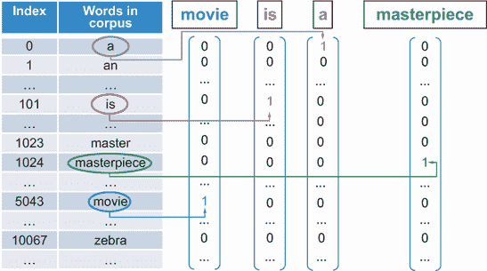

图 7.6 单热编码向量的示意图

在语料库中表示单词的一种天真方法是用一个大小等于词汇量大小 *V* 的向量，其中向量的每个条目对应于语料库中的一个单词。在图 7.6 中，我们可以看到短语“movie is a masterpiece.”中单词的表示。单词 *this* 的天真表示由一个向量组成，其中其他每个单词的条目都是 0，而单词 *this* 的位置或索引处的值是 1。同样，对于句子中的其他单词，我们可以看到一个全为零的向量，除了单词所在索引处的值为 1。这种表示方式被称为 *独热编码*。

如图中所示，独热编码使用了一种极端稀疏的单词表示，其中向量大部分为零，只有一个 1。它不编码任何关于单词的语义信息。使用这种表示方法很难识别经常一起出现或意义相似的单词。向量的尺寸也很大。我们需要一个与词汇量一样大的向量来表示单词。处理这样的向量在计算和存储方面将极其低效。

注意，图 7.6 中的表示确实是一种非常天真表示。我们有方法通过去除停用词来改进表示。这应该会减少用于表示每个单词的独热编码单词向量的尺寸。另一种选择是使用 *词袋模型* (*BoW*)。BoW 模型本质上将每个单词映射到一个数字，该数字表示它在语料库中出现的频率。在 BoW 表示中，停用词通常具有更大的数值，因为它们在语言中频繁出现。我们可以选择删除这些停用词，或者我们可以使用另一种称为 *词频逆文档频率* (*TF-IDF*) 的表示方法。TF-IDF 模型本质上将每个单词在评论语料库中出现的频率与包含该单词的评论数量成反比。这种模型是过滤停用词的好方法，因为它们将与较低的数值相关联。数值较低是因为这些词在评论中频繁出现。BoW 和 TF-IDF 都是表示单词的高效方法，但它们仍然不编码关于单词的语义信息。

### 7.3.2 Word2Vec

我们可以通过使用*Word2Vec*（即 Word to Vector）嵌入来克服 one-hot 编码和其他更有效的表示方法（如 BoW 和 TF-IDF）的局限性。Word2Vec 背后的关键思想是观察单词在上下文中的情况。我们可以通过观察通常一起出现的单词来编码意义。让我们来看一个例子并给出一些符号。在图 7.7 中，我们可以看到之前相同的短语，“电影是一部杰作。”该图还显示了一个窗口大小等于 3 的上下文，即由三个标记或单词组成：*电影*、*是*和*一个*。窗口大小等于上下文中的标记或单词数量。我们用*w*[t]表示上下文中的中心词，用*w*[t–1]表示紧靠其左边的单词，用*w*[t+1]表示紧靠其右边的单词。中心词左右两侧的单词也称为*周围词*或*上下文词*。

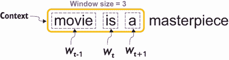

图 7.7 展示了上下文、窗口大小、周围单词和中心词的示例

我们可以使用两种关键的神经网络架构来生成 Word2Vec 嵌入：连续词袋（CBOW）和 skip-gram，如图 7.8 所示。

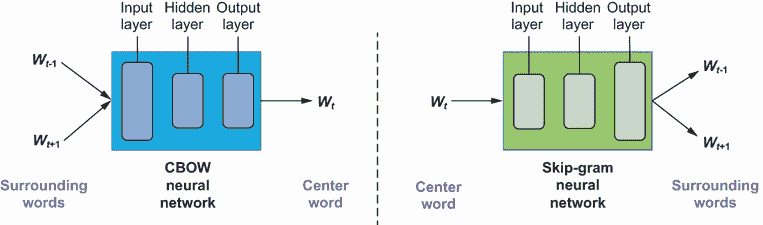

图 7.8 展示了窗口大小为 3 的 CBOW 和 skip-gram 神经词嵌入模型

如图中所示，CBOW 架构背后的思想是根据周围或上下文单词预测中心词。其背后的神经网络架构是一个包含输入层、隐藏层和输出层的全连接神经网络。另一方面，skip-gram 架构是根据中心词预测周围或上下文单词。其背后的神经网络架构与 CBOW 类似。CBOW 和 skip-gram 模型在尝试预测邻近单词或通常一起出现的单词方面也是相似的。但它们在某些方面有所不同。skip-gram 模型已被证明在少量数据下表现良好，并且能够很好地表示出现频率较低的单词。另一方面，CBOW 模型训练速度更快，并且已被证明能够为出现频率较高的单词提供更好的表示。两种模型的训练过程是等效的。因此，为了简化问题，让我们关注其中之一，并更详细地研究 skip-gram 的训练过程。

跳字图词语嵌入训练的第一步是构建一个训练数据集。给定文本语料库，我们的想法是构建一个数据集，其中包含中心词语作为输入，相应的周围或上下文词语作为输出。在生成数据集之前，我们需要知道上下文窗口大小，因为窗口大小是训练过程中的一个重要超参数。让我们保持与早期模型相同的窗口大小 3，并查看一个具体示例，如图 7.9 所示。在图中，我们使用与之前相同的示例句子。我们将上下文窗口设置在文本的开始处（如图中所示为上下文 1）并识别中心词语和周围词语。然后我们构建一个训练数据表，其中包含中心词语作为输入，周围词语作为输出。在上下文 1 的表中，词语*is*与两个相邻词语*movie*和*a*相关联。

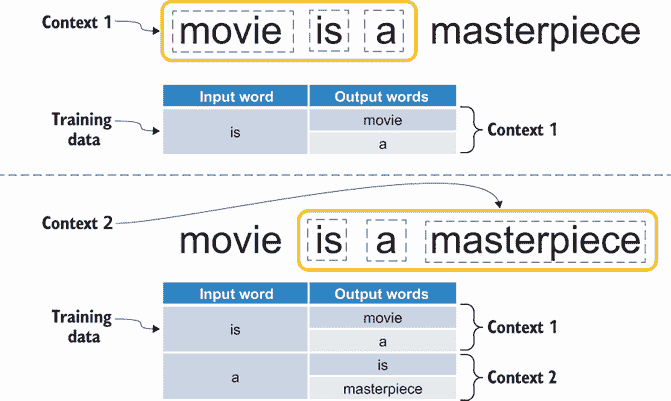

图 7.9 跳字图模型训练数据准备

然后，我们通过将窗口向右滑动一个词语，如图 7.9 中的上下文 2 所示，继续这个过程。我们将为新的中心词语和周围词语添加另一个条目到训练数据表中。我们对语料库中的所有文本重复此过程。一旦我们有了包含输入和输出词语的训练数据集，我们就可以准备训练跳字图神经网络了。我们可以通过将问题重新表述为二分类问题来进一步简化训练过程：不是预测给定中心词语的周围词语，而是预测给定词语对是否为邻居。如果两个词语在上下文中出现，则它们是邻居。我们可以使用图 7.9 中生成的训练数据表来为这个新的二分类公式提供正标签。这如图 7.10 的上半部分所示，其中输入和输出（周围或上下文）词语的表被转换为一个具有正标签（即，标签=1）的词语对表。正标签表示这两个词语是邻居。

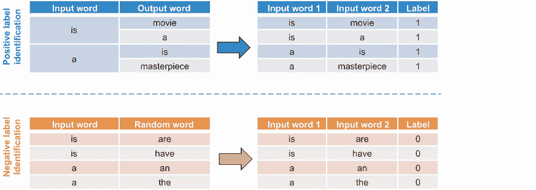

图 7.10 带负采样的训练数据准备

我们如何确定负标签，即不是邻居的词语对？我们可以通过一个称为*负采样*的过程来完成这项工作。对于图 7.9 中的训练数据表中的每个词语，我们从词汇表中随机采样一个新词语。窗口大小的选择很重要。如果与词汇表中的词语数量相比，窗口大小相对较小，则随机采样将确保所选词语出现在输入词语上下文之外的可能性很小。这如图 7.10 的下半部分所示。对于每个输入词语和随机词语的对，我们分配一个负标签（即，标签=0）。这些对应于不是邻居的词语对。

一旦我们有了新二分类公式的训练数据集，我们就可以准备训练跳字模型了。我们将使用这种新公式的神经网络模型称为跳字模型与负采样。输入单词将被表示为一组 one-hot 编码向量。尽管模型被训练来决定两个单词是否是邻居，但训练过程的最终目标是学习单词的神经词嵌入或密集表示。这是架构中隐藏层的目的。对于隐藏层，我们需要初始化图 7.11 中显示的两个矩阵：一个嵌入矩阵和一个上下文矩阵。嵌入矩阵由词汇表中的每个单词一行组成。列数对应于用于表示单词的单词嵌入或单词向量的大小。这如图 7.11 中的 *N* 所示。

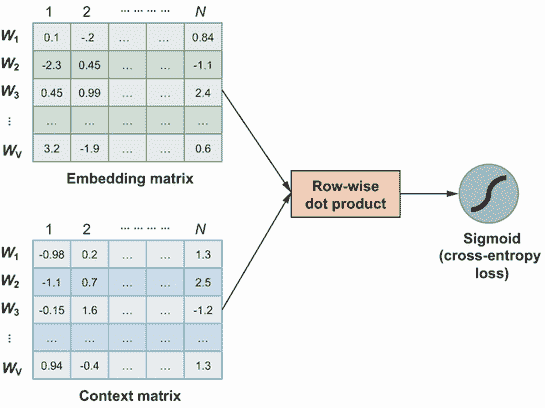

图 7.11 跳字模型（Skip-gram）与负采样训练

在训练之前，我们还需要确定另一个超参数，即嵌入大小。嵌入大小的选择决定了我们希望表示有多密集。它还决定了在表示中捕获了多少语义信息。上下文矩阵的大小与嵌入矩阵相同。这两个矩阵都使用随机值初始化。这些矩阵中的值是神经网络中的参数，我们旨在使用我们在图 7.10 中生成的训练数据集来学习这些参数。

现在我们来更详细地看看学习过程。图 7.11 显示了两个矩阵以及在这些矩阵上执行行内点积操作。行内点积本质上衡量了两个单词对之间的相似性。如果我们然后将得到的向量通过 sigmoid 函数，我们将得到一个介于 0 和 1 之间的相似性或概率度量。然后我们可以将这些分数与训练数据中单词对的真正标签进行比较，并相应地更新参数。参数可以通过反向传播来更新，正如我们在第四章和第五章中学到的。

一旦学习过程完成，我们可以丢弃上下文矩阵，并使用嵌入矩阵作为单词到其对应的神经词嵌入的映射。我们可以通过以下方式获得映射：嵌入矩阵中的每一行都是词汇表中给定单词的表示。例如，矩阵中的第一行对应于单词 *w*[1] 的表示。第二行是单词 *w*[2] 的表示，依此类推。

### 7.3.3 GloVe 嵌入

跳过-负采样模型是生成单词密集表示的绝佳方式，该表示捕捉了在局部上下文中出现的单词对之间的相似性。然而，该模型在识别停用词方面做得并不好。像*is*、*a*、*the*和*this*这样的停用词将被标记为与像*masterpiece*这样的单词相似，因为它们在局部上下文中一起出现。我们可以通过查看单词的全局统计信息来识别这样的停用词，即单词对在整个文本语料库中出现的频率。*全局向量*（也称为*GloVe*）*模型*是跳过-负采样的改进，它捕捉了全局和局部统计信息。在接下来的工作中，我们将使用预训练的 GloVe 单词嵌入。

我们将不会使用电影评论数据集从头开始训练 GloVe 单词嵌入，而是将使用在更大文本语料库上预训练的预训练 GloVe 嵌入。用于训练单词嵌入的常见文本语料库是维基百科。我们有以下两种加载维基百科语料库上预训练的 GloVe 嵌入的方法：

1.  使用 PyTorch 提供的`torchtext`包

1.  使用`gensim`，这是一个常用的开源 Python 库，用于自然语言处理

使用`torchtext`加载 GloVe 嵌入的第一种方法，如果我们必须训练另一个下游模型，例如情感分类，该模型将使用这些嵌入作为 PyTorch 中的特征时是有用的。使用`gensim`加载 GloVe 嵌入的第二种方法对于分析单词嵌入是有用的，因为许多实用函数都是现成的。我们将使用前一种方法来训练情感分类器，后一种方法来解释单词嵌入。我们可以按以下方式使用`torchtext`加载单词嵌入：

```
import torchtext.vocab                        ①

glove = torchtext.vocab.GloVe(name='6B',      ②
                              dim=100)        ③
```

① 从 torchtext 导入词汇模块

② 使用在维基百科上预训练的包含六十亿个单词的模型初始化 GloVe 类

③ 加载大小为 100 的 GloVe 嵌入

注意，已经加载了在维基百科语料库上预训练的包含六十亿个单词的 GloVe 嵌入。预训练模型的嵌入大小为 100。

如果您尚未在您的机器上安装`gensim`，可以通过运行以下命令来完成：

```
$> pip install -–upgrade gensim
```

然后，我们可以按以下方式加载 GloVe 嵌入：

```
from gensim.models import KeyedVectors                            ①
from gensim.scripts.glove2word2vec import glove2word2vec          ①
from gensim.test.utils import datapath, get_tmpfile               ①

path_to_glove = 'data/glove.6B/glove.6B.100d.txt'                 ②

glove_file = datapath(path_to_glove)                              ③
word2vec_glove_file = get_tmpfile(glove_file)                     ③
model = KeyedVectors.load_word2vec_format(word2vec_glove_file)    ③
```

① 从 gensim 导入相关模块和类

② 初始化预训练 GloVe 嵌入文件的路径

③ 初始化 GloVe 嵌入

注意，使用`gensim`时，我们需要下载预训练的 GloVe 嵌入文件。您可以从 GloVe 项目网站（[`nlp.stanford.edu/projects/glove/`](https://nlp.stanford.edu/projects/glove/））下载在维基百科上预训练的包含六十亿个单词且嵌入大小为 100 的嵌入。

### 7.3.4 情感分析模型

在 7.1 节中，我们提出了以下两个关键问题，用于构建情感分析模型：

1.  我们如何以模型可以处理的形式表示一个单词？

1.  我们如何对单词序列进行建模并基于此构建分类器？

我们已经在上一节通过学习神经词嵌入回答了第一个问题。本章的关键重点是词嵌入及其解释。为了完整性，我们通过提供一个如何将单词序列建模以构建情感分类器的高级概述来回答第二个问题。

情感分类器的高级架构如图 7.12 的上半部分所示。它由两个链式连接的神经网络架构组成。第一个神经网络被称为循环神经网络（RNN），第二个神经网络是完全连接的神经网络，我们在第四章中学习过。让我们更详细地看看 RNNs，如图 7.12 的下半部分所示。

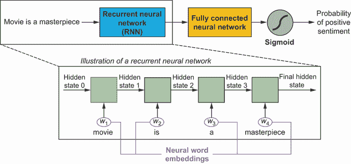

图 7.12 使用循环神经网络（RNNs）进行序列建模和情感分析

RNNs 通常用于分析序列，如单词序列，如在情感分析问题中，或时间序列分析，如天气预报。对于情感分析问题，RNN 逐个处理单词序列，并为每个单词生成一个隐藏状态，这是先前输入的表示。单词通过在前一节中学习的神经词嵌入表示输入到 RNN 中。一旦所有单词都已输入到 RNN 中，最终的隐藏状态就用于训练用于情感分类的前馈神经网络。这里我们省略了很多细节，因为这不是本章和本书的主要关注点。关于 RNNs 和语言模型的更多学习资源是斯坦福大学提供的 NLP 与深度学习在线课程（[`web.stanford.edu/class/cs224n/`](http://web.stanford.edu/class/cs224n/))。

Transformer 网络

自然语言处理（NLP）领域的一个最近突破是*transformer 网络*，由谷歌研究团队在 2017 年提出的开创性论文“Attention Is All You Need”（[`arxiv.org/abs/1706.03762`](https://arxiv.org/abs/1706.03762)）中提出。与 RNNs 类似，transformer 网络或 trans-formers 用于建模序列数据。正如我们在 7.3.4 节中看到的，RNNs 按顺序逐个处理输入的词。在处理下一个词之前，需要当前词的输出，即隐藏状态。这使得训练过程难以并行化，因此训练 RNNs 相当耗时。Transformers 通过采用注意力机制克服了这一限制，并且不需要我们按顺序提供词的输入。直观地说，注意力机制类似于卷积神经网络（CNNs）中基于卷积的方法，其中序列中更接近的词之间的交互在较低层建模，而序列中较远的词之间的交互在较高层建模。所有词同时被输入到网络中，同时包含它们相对和绝对位置的信息。

在这里我们省略了很多细节——要公正地讨论这个话题，需要整整一章的内容，但遗憾的是，这超出了本书的范围。关于学习更多关于 transformers 的内容，包括视频讲座和讲义，可以参考斯坦福大学提供的在线课程《深度学习与 NLP》（[`web.stanford.edu/class/cs224n/`](http://web.stanford.edu/class/cs224n/))。transformer 网络架构的发展包括双向编码器表示（BERT）和生成预训练 transformer（GPT）等系统。transformers 学习到的预训练词嵌入可以通过 Hugging Face 提供的流行开源库在 PyTorch 中加载（[`huggingface.co/transformers/`](https://huggingface.co/transformers/))）。在后续章节中，你将学习到的用于理解 GloVE 词嵌入学习的语义相似性的可解释技术，也可以扩展到由 transformer 网络学习的嵌入。这些技术是模型无关的。

## 7.4 解释语义相似性

在上一节中，你学习了如何获取使用神经词嵌入编码语义意义的密集表示的词的表示。现在我们将专注于理解和解释从这些学习到的词嵌入中得到的语义相似性。你将学习如何衡量语义相似性，以及如何将高维词嵌入在二维空间中可视化相似性。

在我们开始测量和解释语义相似度之前，第一步是确定一些意义多变且细微的词汇，我们对它们与其他可能相似的词汇之间的语义相似度有很好的理解。这与第六章网络分解框架中的概念定义步骤类似，在那里我们需要对我们要具体测量和解释的内容有良好的人类理解。在神经词嵌入的语义相似度背景下，我们需要对词汇的理解或分类法，以验证神经词嵌入是否正确地学习了语义意义。

我们将查看两组不同的词汇来解释语义相似度。第一组词汇不一定与电影评论或情感分类问题相关。然而，这些词汇旨在验证某些词汇细微差别是否被词嵌入所捕捉。第一组（称为组 1）的词汇如下：

+   *篮球*

+   *勒布朗*

+   *罗纳尔多*

+   *Facebook*

+   *媒体*

这些词汇之间的意义或联系可以从图 7.13 中所示的分类法中获得。在图中，该组中的词汇被突出显示。我们可以看到，在体育类别中，我们有*篮球*和*足球/足球赛*。体育类别也有个性——*勒布朗*和*罗纳尔多*属于体育和个性类别。体育个性和他们各自的运动之间也存在联系。例如，*勒布朗*与运动*篮球*相关联，而*罗纳尔多*与运动*足球/足球赛*相关联。此外，在媒体类别中，我们有不同类型的媒体，如*电视*、*广播*和*互联网*。在互联网类别中，有像*Facebook*和*Google*这样的公司。图 7.13 作为词汇之间如何关联的地图，我们可以使用它来解释词嵌入中的语义意义。

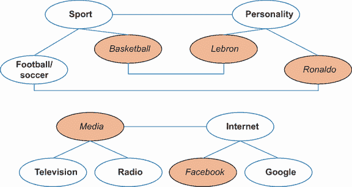

图 7.13 组 1 中词汇的分类

第二组（称为组 2）的词汇与电影评论相关。我们将查看以下电影集，以了解它们是如何相关的：

+   *教父*

+   *好家伙*

+   *蝙蝠侠*

+   *复仇者联盟*

第二组词汇的分类法如图 7.14 所示。

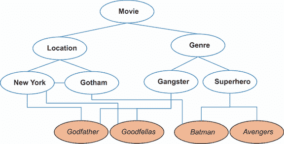

图 7.14 组 2 中词汇的分类

该组中的电影被突出显示。我们根据电影的类型和拍摄地点对电影进行了分类。像*教父*和*好家伙*这样的电影属于黑帮类型，它们都在纽约拍摄。像*蝙蝠侠*和*复仇者联盟*这样的电影是超级英雄电影。*蝙蝠侠*以*哥谭*为基地，这是一个基于纽约的虚构地点。值得注意的是，这些词汇的细微差别和意义是语言和上下文相关的，因此在我们开始解释语义意义之前，我们需要对此有良好的理解。

### 7.4.1 测量相似度

现在我们已经获得了感兴趣的单词，我们如何量化它们之间的相似度？我们特别感兴趣的是测量单词或词嵌入之间的表示相似度。为了便于可视化，让我们首先考虑一个大小为 2 的简单词嵌入示例。假设我们有两个单词，*篮球*和*足球*，在这个词嵌入空间中，如图 7.15 所示。这两个单词在图中分别表示为向量 W[1]和 W[2]。

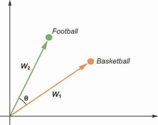

图 7.15 展示了在 2-D 空间中测量词嵌入之间相似性的示意图

测量词向量 W[1]和 W[2]之间相似度的一种方法是在 2-D 嵌入空间中观察它们有多接近。相似度度量应该具有以下属性：如果词向量彼此接近，则它们更相似。如果它们相距更远，则它们不太相似。具有这种属性的良好度量是两个向量之间角度的余弦值—cos(θ)。这种测量称为余弦相似度。给定词向量 W[1]和 W[2]的余弦相似度的数学公式如下：

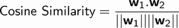

这实际上是两个向量欧几里得范数（或大小）的乘积除以词向量点积。

使用 `gensim`，我们可以轻松地获取与给定单词最相似的单词，如下所示。在第 7.3.3 节中，我们看到了如何使用 `gensim` 加载 GloVe 词嵌入。一旦嵌入被初始化，我们可以使用以下代码获取第一组单词的前五个最相似单词：

```
words = ['basketball', 'lebron', 'ronaldo', 'facebook', 'media']      ①
topn = 5                                                              ②

sim_words_scores = []                                                 ③
for word in words:                                                    ④
    sim_words = model.most_similar(word, topn=topn)                   ⑤
    print(f"Words similar to: {word}")                                ⑥
    for sim_word in sim_words:                                        ⑥
        sim_words_scores.append((word, sim_word[0], sim_word[1]))     ⑥
        print(f"\t{sim_word[0]} ({sim_word[1]:.2f})")                 ⑥
```

① 初始化一个数组，包含第一组单词

② 我们对前五个最相似的单词感兴趣。

③ 初始化一个数组来存储最相似的单词

④ 遍历每个单词

⑤ 从 gensim 模型中获取前五个最相似单词

⑥ 将相似单词存储在数组中并打印结果

本代码的输出总结在表 7.2 中。表的最上面一行包含该集合中的单词。表中的每一列显示与该列最上面一行单词相似的五个单词。相似单词的余弦相似度度量也以括号形式显示。从表中我们可以看出，GloVe 词嵌入确实学习了在意义上语义相似的单词。例如，第一列显示了所有与*篮球*相似的单词，它们都是体育项目。第二列显示了所有与*勒布朗*相似的单词，它们都是打篮球的体育人物。第三列显示了所有踢足球或足球的体育人物。第四列显示了与*Facebook*相似的公司，即互联网或基于网络的社交媒体公司。最后一列显示了所有与*媒体*相似的单词。作为练习，对第二组单词进行类似的分析。解决方案可以在与本书相关的 GitHub 存储库中找到。

表 7.2 集合 1 中单词的前五个相似单词

| 篮球 | 勒布朗 | 罗纳尔多 | Facebook | 媒体 |
| --- | --- | --- | --- | --- |
| 足球 (0.86) | 杜威恩 (0.79) | 罗纳尔迪尼奥 (0.86) | 推特 (0.92) | 新闻 (0.77) |
| 冰球 (0.8) | 沙奎尔 (0.75) | 里瓦尔多 (0.85) | MySpace (0.9) | 新闻 (0.75) |
| 足球 (0.8) | 波什 (0.72) | 贝克汉姆 (0.84) | YouTube (0.81) | 电视 (0.75) |
| NBA (0.78) | 奥尼尔 (0.68) | 克里斯蒂亚诺 (0.84) | 谷歌 (0.75) | 电视 (0.73) |
| 棒球 (0.76) | 卡梅隆 (0.68) | 罗比尼奥 (0.82) | 网络 (0.74) | 互联网 (0.72) |

现在我们也可视化第一组单词之间的余弦相似度。以下代码显示了如何计算单词对的余弦相似度以及如何可视化它们：

```
from sklearn.metrics.pairwise import cosine_similarity              ①

import pandas as pd                                                 ②

import matplotlib.pyplot as plt                                     ③
import seaborn as sns                                               ③

words = ['basketball', 'lebron', 'ronaldo', 'facebook', 'media']    ④
word_pairs = [(a, b) for idx, a in enumerate(words) for b 
➥ in words[idx + 1:]]                                              ⑤

cosine_sim_word_pairs = []                                          ⑥
for word_pair in tqdm(word_pairs):                                  ⑥
    cos_sim = cosine_similarity([model[word_pair[0]]],              ⑥
                                [model[word_pair[1]]])[0][0]        ⑥
    cosine_sim_word_pairs.append([str(word_pair), "glove",          ⑥
    ➥ cos_sim])                                                    ⑥

df_sim = pd.DataFrame(cosine_sim_word_pairs,                        ⑦
                      columns=['Word Pairs',                        ⑦
                               'Embedding',                         ⑦
                               'Cosine Similarity'])                ⑦

f, ax = plt.subplots()                                              ⑧
sns.barplot(x="Word Pairs", y="Cosine Similarity",                  ⑧
            data=df_sim[df_sim['Embedding'] == 'glove'],            ⑧
            ax=ax)                                                  ⑧
plt.xticks(rotation=90);                                            ⑧
```

① 导入 Pandas 以在 DataFrame 中存储单词对的余弦相似度

② 从 Scikit-Learn 导入余弦相似度辅助函数

③ 导入可视化相关的库

④ 初始化第一组单词

⑤ 根据初始化的单词集创建单词对数组

⑥ 计算单词对的余弦相似度并将其存储在数组中

⑦ 创建包含结果的 DataFrame

⑧ 使用 DataFrame 绘制条形图

结果图显示在图 7.16 中。我们可以从图中观察到，*篮球*和*勒布朗*之间的相似度比与其他任何单词都要高。此外，单词*篮球*与*罗纳尔多*的相似度比与*Facebook*和*媒体*的相似度更高，因为我们从图 7.13 中的分类法中知道*篮球*和*罗纳尔多*与体育类别相关联。使用分类法，我们还可以对其他单词对进行类似的观察。例如，单词*Facebook*与单词*媒体*的相似度比与其他任何单词都要高，因为 Facebook 是一家社交媒体公司。

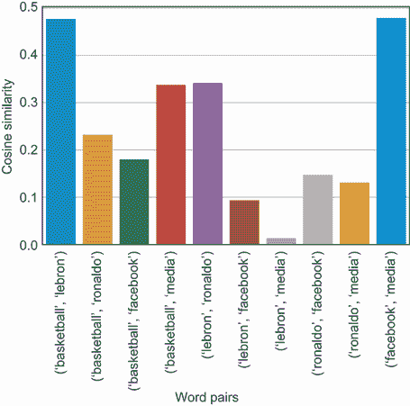

图 7.16 集合 1 中 GloVe 嵌入的单词对余弦相似度可视化

作为练习，编写代码以可视化第二组电影对之间的余弦相似度。你可以从与本书相关的 GitHub 仓库中获取源代码，结果图如图 7.17 所示。我们可以从图中观察到，两部黑帮电影《教父》和《好家伙》彼此之间比它们与超级英雄电影《蝙蝠侠》和《复仇者联盟》更相似。同样，超级英雄电影彼此之间比它们与黑帮电影更接近。我们还可以看到，《教父》和《好家伙》与《蝙蝠侠》比与《复仇者联盟》更相似。这可能是因为电影基于相互连接的位置，正如我们在图 7.14 中的分类法中确立的那样。

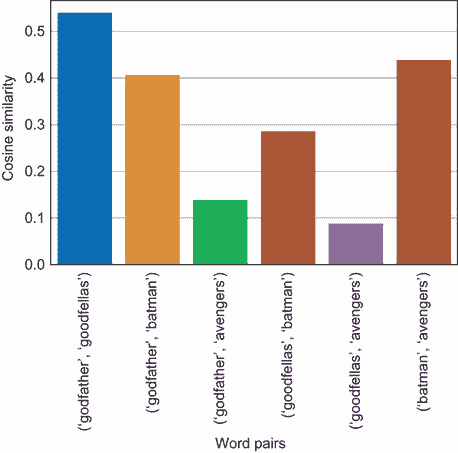

图 7.17 展示了第二组中各种电影对 GloVe 嵌入的余弦相似度可视化

现在我们有了测量词嵌入之间相似性的方法，即使用余弦相似度度量。使用特定的单词集及其对应的分类法进行评估，我们还验证了 100 维的 GloVe 词嵌入能够很好地捕捉单词的语义意义。现在让我们看看如何将词嵌入可视化在 2 维空间中，类似于图 7.15 中所示，同时不失任何语义意义。这将是下一两个章节的重点。你将特别学习两种技术：主成分分析（PCA）和 t 分布随机邻域嵌入（t-SNE）。

### 7.4.2 主成分分析（PCA）

主成分分析（PCA）是一种强大的技术，用于降低数据集的维度。因为我们处理的是 100 维的词嵌入，我们希望将维度降低到 2，这样我们就可以轻松地可视化数据集。我们希望在降低维度的同时，尽可能多地捕捉到变化或语义信息。让我们通过一个简单的例子来看看 PCA 的实际应用。为了说明，我们将查看大小为 2 的词嵌入，并看看我们如何使用 PCA 将维度从 2 降低到 1。图 7.18 显示了四个词放置在二维平面上。为了便于可视化，我们假设嵌入大小为 2。目标是可视化词嵌入在一维上——在一条 1 维线上。我们可以看到，单词 1 和 2（“Doctor”和“Nurse”）在二维空间中彼此更接近，因此语义上相似。单词 3 和 4（“Athletics”和“Athlete”）在语义上也是相似的。然而，单词对 1 和 2 与单词对 3 和 4 相比更远，因为它们在语义上不相似。

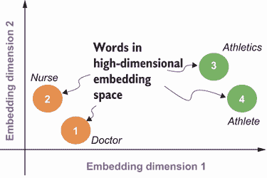

图 7.18 在大小为 2 的嵌入空间中四个词的示意图

PCA 的第一步是取所有维度的词的平均值，并从词嵌入中减去平均值。这如图 7.19 所示，其中平均值由一个大十字表示。这种转换的目的是将词围绕平均值中心化，即把数据的平均值放在原点。通过在平均值上中心化词嵌入，我们仍然保留了词在 2-D 空间中的距离，因此也保留了它们的语义意义。

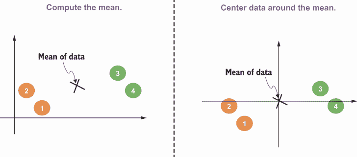

图 7.19 计算平均值并将词围绕平均值中心化的说明

因为我们对在一条线上可视化词嵌入感兴趣，PCA 的下一步就是通过词嵌入拟合一条线。最佳拟合线是使每个词与线之间的垂直距离最小化的线。换句话说，目标是使词与线之间的投影距离最小化或最大化原点到每个词在直线上的投影的距离。最大化原点到投影的距离将确保尽可能多地保留数据的变化。这如图 7.20 所示。最佳拟合线也称为主成分。我们只对在 1-D 中可视化词感兴趣，所以只有一个主成分。

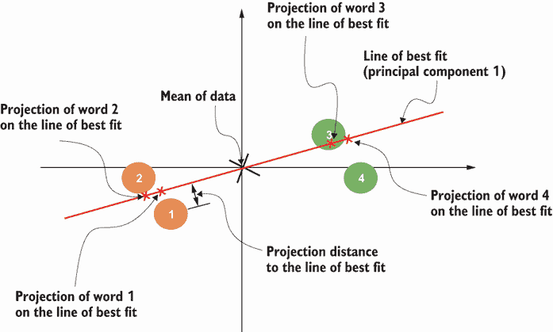

图 7.20 主成分的说明

最后一步是将每个词投影到主成分上。这将作为我们在 1-D 中可视化词嵌入的方式，如图 7.21 所示。

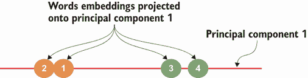

图 7.21 将词嵌入投影到主成分的说明

现在我们已经对 PCA 的工作原理有了直观的了解，让我们将这项技术扩展到多个维度。让我们用矩阵*X*来表示所有的词嵌入，其中行数等于词汇表中的词的数量，列数等于嵌入大小。让我们用*n*来表示嵌入大小。目标是减少词的维度到大小*k*，在可视化的目的中通常是 2 或 3。

如通过可视化示例所见，第一步是将数据中心化到平均值。这由以下方程表示，其中平均值从嵌入矩阵*X*中减去。均值中心数据由矩阵*U*表示：

*U* = *X* – *X̄*

下一步是计算矩阵*U*的协方差。这通过下一个方程表示，其中协方差矩阵由矩阵*V*表示。计算矩阵*U*的协方差的目的在于估计均值中心化数据中每个嵌入维度的方差：

*V* = *U^T**U*

一旦你有了方差的估计，下一步就是通过解以下特征方程来计算矩阵*V*的特征值和特征向量。通过求解*λ*，我们可以得到方程的根，这将给我们特征值。注意，在下一个方程中，“det”代表行列式，而矩阵*I*是单位矩阵。一旦我们有了特征值，我们就可以获得相应的特征向量：

det(*V* – *λI*) = 0

特征向量基本上给我们主成分。特征值的幅度给我们一个估计，即每个主成分捕获的变异量。然后我们应该按特征值降序排序向量，并选择前*k*个主成分来投影我们的数据。前*k*个主成分将尽可能多地捕获数据中的变异。让我们用具有前*k*个主成分（或特征向量）的矩阵*W*来表示这个矩阵。最后一步是通过应用以下方程将原始单词嵌入从*n*-维空间投影到*k*-维空间：

*Y* = *W^T**X*

现在我们来看看 PCA 在 GloVe 单词嵌入上的实际应用。第一步是准备数据，其中我们提取了我们感兴趣可视化的单词的单词嵌入。这将在下一个代码片段中展示，其中我们提取了集合 1 中的单词及其对应的五个最相似单词的单词嵌入：

```
viz_words = [sim_word_score[1] for sim_word_score in    ①
➥ sim_words_scores]                                    ①
main_words = [sim_word_score[0] for sim_word_score in   ①
➥ sim_words_scores]                                    ①

word_vectors = []                                       ②
for word in tqdm(viz_words):                            ②
    word_vectors.append(model[word])                    ②
word_vectors = np.array(word_vectors)                   ②
```

① 创建包含主要单词和相似单词的列表以进行可视化

② 提取用于可视化的单词嵌入

一旦我们准备好了数据，我们就可以运行 PCA，并在低维空间中获取单词嵌入的投影。为了便于可视化，我们将主成分的数量设置为 2。我们可以使用 Scikit-Learn 库提供的 PCA 实现。以下代码展示了如何获取主成分并将数据投影到它们上：

```
from sklearn.decomposition import PCA                 ①

pca_2d = PCA(n_components=2,                          ②
             random_state=24).fit(word_vectors)       ③
pca_wv_2d = pca_2d.transform(word_vectors)            ④

pca_kwv_2d = {}                                       ⑤
for idx, word in enumerate(viz_words):                ⑤
    pca_kwv_2d[word] = pca_wv_2d[idx]                 ⑤
```

① 从 Scikit-Learn 导入 PCA 类

② 使用两个主成分初始化 PCA 类

③ 设置随机状态并获得单词向量的最佳拟合

④ 将单词向量投影到主成分上

⑤ 创建一个将每个单词映射到其 PCA 单词嵌入的字典

一旦我们在 2 维空间中有了单词嵌入的投影，我们就可以很容易地使用 Matplotlib 和 Seaborn 库进行可视化，如下所示：

```
df_pca_2d = pd.DataFrame(pca_wv_2d, columns=['y', 'x'])     ①
df_pca_2d['text'] = viz_words                               ①
df_pca_2d['word'] = main_words                              ①

f, ax = plt.subplots(figsize=(10, 8))                       ②
sns.scatterplot(data=df_pca_2d,                             ②
                x="x", y="y",                               ②
                hue="word", style="word", s=50, ax=ax)      ②

ax.legend()                                                 ③
for i, row in df_pca_2d.iterrows():                         ③
     ax.text(row['x']+.05, row['y']-0.02, str(row['text']), ③
            size=size)                                      ③
```

① 创建一个 DataFrame，包含每个单词的 2 维 PCA 坐标

② 创建散点图

③ 为散点图添加图例和注释

结果图显示在图 7.22 中。集合 1 中的主要单词在图例中显示，它们最相似的五个单词使用对应于每个单词的符号进行说明。例如，“Basketball”用圆圈表示，而“Media”用菱形表示。让我们花点时间来欣赏 PCA 技术的输出。现在我们能够将原始的 100 维单词嵌入可视化到二维空间中！但是，PCA 表示是否仍然保留了在 100 维中捕获的语义意义呢？在图 7.22 中，我们可以看到与主要单词相似的单词聚集在一起，除了单词“lebron”。一些篮球人物如“bosh”、“dwyane”和“carmelo”与足球人物比与其篮球同伴更近。

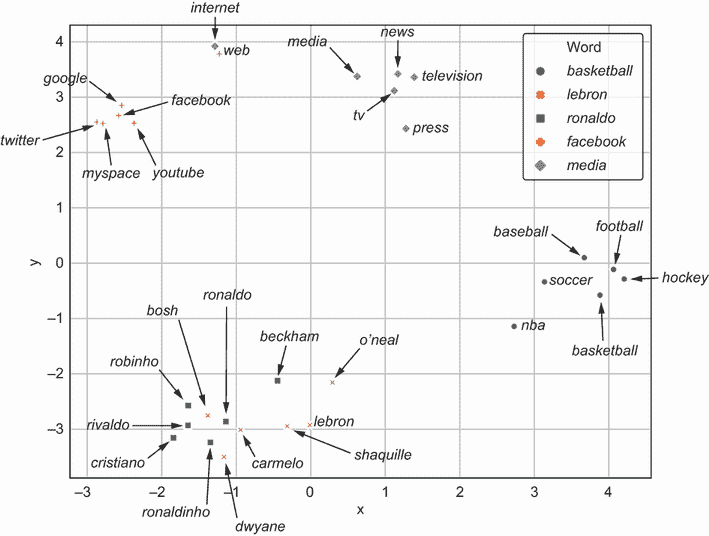

图 7.22 使用 PCA 可视化集合 1 中 GloVe 单词嵌入的语义相似性

这是预料之中的，因为我们可能无法在仅仅两个维度中捕捉到原始数据集中的所有变化。我们可以通过运行以下代码行来轻松检查这一点：

```
print(pca_2d.explained_variance_ratio_)
```

此代码输出每个主成分中捕获的变化百分比。如果我们把它们加起来，我们得到大约 49%。这意味着通过将单词嵌入投影到仅两个主成分上，我们能够捕捉到数据中 49%的变化。作为一个练习，尝试用三个主成分训练 PCA，看看数据中的大部分方差是否可以被捕捉。如果是这样，尝试将嵌入可视化到三维空间中，看看二维中观察到的問題是否得到解决。

虽然 PCA 是一种强大的技术，但它确实存在一些主要的缺点。它假设数据集或单词嵌入可以线性建模。对于我们处理的大多数数据集来说，这可能并不成立。在下一节中，我们将学习一个更强大且更受欢迎的技术，称为 t-SNE，它可以推广到非线性结构。

### 7.4.3 t 分布随机邻域嵌入（t-SNE）

t-SNE 属于被称为**流形学习**的机器学习技术广泛类别，其目标是学习从高维数据中提取低维的非线性结构。这项技术是可视化高维数据中最受欢迎的选择之一。让我们通过一个简单的二维数据集来观察它的实际应用，该数据集的目标是将数据可视化到一维。在图 7.23 中，我们看到了左侧 2-D 空间中四个单词的熟悉示例。第一步是为所有单词对构建一个相似性表。这个相似性表将给我们一个相似度的度量，或者在高维嵌入空间中单词对成为邻居的概率。另一种看待它的方法是计算高维嵌入空间中单词的联合概率分布。我们将在稍后展示如何从数学上完成这个操作。


图 7.23 在高维空间中构建单词嵌入的相似性表

下一步是将所有单词随机放置在一条线上，因为我们感兴趣的是在 1-D 空间中可视化单词嵌入。这如图 7.24 左侧所示。一旦我们将单词随机放置在线上，我们应该为在该 1-D 空间中随机表示的单词构建一个相似性表。这如图 7.24 右侧所示。表中与高维联合概率分布不同的条目被突出显示。我们将在稍后看到如何数学地计算这个低维空间的联合概率分布。

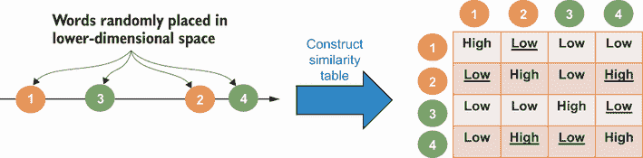

图 7.24 随机放置单词在低维空间及其对应的相似性表

最后一步是 t-SNE 学习过程，如图 7.25 所示。我们必须将随机低维表示和更高维表示的联合概率分布输入到学习算法中。学习算法的目标是更新低维表示，使得两个概率分布相似。这将给我们一个低维可视化，它保留了来自高维空间中的概率分布或相似性。


图 7.25 t-SNE 学习算法

现在我们从数学的角度来分析。第一步是构建一个相似性表，或者说是联合概率分布，用于更高维嵌入空间中的单词。对于每个单词，我们可以投影一个以该单词为中心的高斯分布，使得离它更近的单词有更高的概率，而离它更远的单词有更低的概率。这在上面的方程中显示，该方程计算单词 x[j] 接近 x[i] 的概率。分子是以单词 x[i] 为中心的高斯分布，标准差为 σ。标准差 σ 是 t-SNE 的超参数，我们将在稍后看到如何设置这个超参数。分母是一个归一化因子，以确保不同密度的单词簇的概率范围相似：

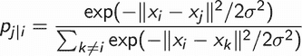

使用这个方程，我们存在一个风险，即单词 x[j] 成为单词 x[i] 邻居的概率与单词 x[i] 成为 x[j] 邻居的概率不同，因为这两个条件概率来自不同的分布。为了确保相似度度量是可交换的，我们将计算两个单词 x[i] 和 x[j] 成为邻居的最终概率如下：

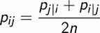

一旦你计算了高维嵌入空间的联合概率分布，下一步是将单词随机放置在低维空间中。然后，我们应该使用以下方程计算低维表示的联合概率分布。该方程本质上计算了两个单词在低维表示中作为 y[i]和 y[j]的概率是邻居的概率：

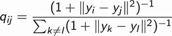

注意，低维表示使用了不同的分布。方程中的分子本质上是一个 t 分布，因此得名 t-SNE。图 7.26 显示了高斯分布和 t 分布之间的差异。我们可以看到，t 分布的右侧（极端值概率分数不可忽略）比高斯分布有更重的尾部。我们正在利用 t 分布的这一特性来确保在更高维度的空间中可能适度分散的点在低维空间中不会聚集在一起。

一旦我们有了高维和低维表示的联合分布，最后一步是训练一个算法来更新低维表示，使得两个分布相似。可以通过量化两个分布之间的差距来完成此优化。我们可以使用 Kullback–Leibler（KL）散度指标来完成此目的。

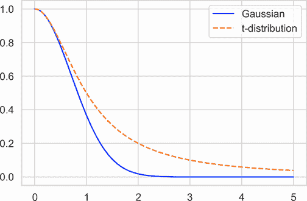

图 7.26 高斯分布与 t 分布的比较

KL 散度是衡量两个分布之间的熵或差异的度量。值越高，差异越大。更精确地说，KL 散度可以从相同分布的 0 到差异极大的分布的无限大。KL 散度指标可以按以下方式计算：

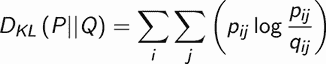

学习算法的目标是确定低维表示的分布，以使 KL 散度指标最小化。我们可以通过应用梯度下降和迭代更新低维表示来完成此优化。整个 t-SNE 算法已在 Scikit-Learn 库中实现。

在跳入代码之前，有一个细节我们略过了。注意，在计算更高维表示的联合概率分布时，我们对每个词拟合了一个以σ为标准差的 Gaussian 分布。这个标准差是 t-SNE 的一个重要超参数，被称为“困惑度”，它是每个词有多少个近邻的大致估计。正如我们稍后将会看到的，困惑度的选择将极大地改变词嵌入的可视化，因此它是一个重要的超参数。我们可以使用以下代码在 GloVE 词嵌入上训练 t-SNE。我们使用集合 1 中的单词及其相关的最相似的前五个单词：

```
from sklearn.manifold import TSNE                    ①

perplexity = 10                                      ②
learning_rate = 20                                   ②
iteration = 1000                                     ②

tsne_2d = TSNE(n_components=2,                       ③
               random_state=24,                      ③
               perplexity=perplexity,                ③
               learning_rate=learning_rate,          ③
               n_iter=iteration).fit(word_vectors)   ③

tnse_wv_2d = tsne_2d.fit_transform(word_vectors)     ④

tsne_kwv_2d = {}                                     ⑤
for idx, word in enumerate(viz_words):               ⑤
    tsne_kwv_2d[word] = tnse_wv_2d[idx]              ⑤
```

① 从 Scikit-Learn 导入 TSNE 类

② 初始化 t-SNE 超参数

③ 初始化 TSNE 类并使用词向量训练模型

④ 在 2-D 空间中获取 t-SNE 词嵌入

⑤ 将每个词映射到其 t-SNE 嵌入

注意，我们将困惑度设置为 10。我们可以重用前节中 PCA 的代码来可视化低维 t-SNE 嵌入。结果图如图 7.27 所示。

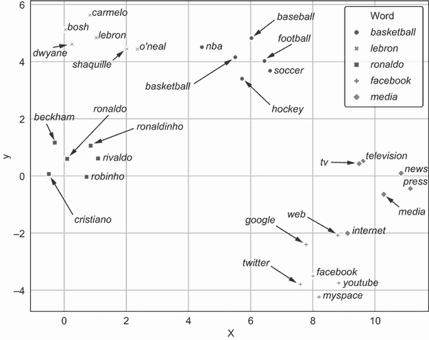

图 7.27 使用 t-SNE 可视化集合 1 中单词的 GloVe 词嵌入的语义相似性

图 7.27 所示的可视化在定性上看起来比 PCA 更好。我们确实看到篮球人物被聚集在一起，并且与足球人物集群明显不同。这仍然是一种定性评估，我们将在下一节中看到如何定量地验证这些可视化。

让我们看看当我们将困惑度设置为一个大值时会发生什么，比如说 100。作为一个练习，使用困惑度为 100 重新训练 t-SNE 模型，并可视化结果词嵌入。你可以在与本书相关的 GitHub 仓库中看到代码。结果图如图 7.28 所示。

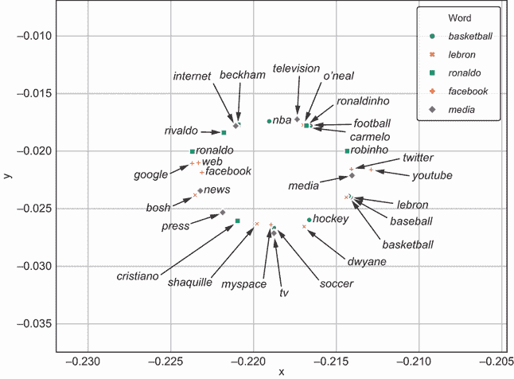

图 7.28 高困惑度下的 t-SNE 可视化

我们可以看到单词以随机顺序聚集，所有的单词似乎都大致放置在一个圆圈中。t-SNE 算法的作者建议将困惑度设置为 5 到 50 之间。指导原则是对于密集的数据集，其中在更高维空间中有密集的单词集群，应使用更高的困惑度值。

### 7.4.4 验证语义相似性可视化

我们已经学习了两种可视化高维词嵌入的技术，即 PCA 和 t-SNE。我们对每种可视化进行了定性评估，但有没有一种方法可以定量验证它们呢？为了定量验证这些图，我们可以测量低维表示中词对之间的余弦相似度，并将其与高维表示进行比较。我们已经在 7.4.1 节中对此进行了操作（见图 7.16）。作为一个练习，将 7.4.1 节中的代码扩展到也可视化由 PCA 和两种 t-SNE 模型（困惑度=10 和困惑度=100）生成的嵌入。结果图如图 7.29 所示。您可以在与本书相关的 GitHub 存储库中查看解决方案。

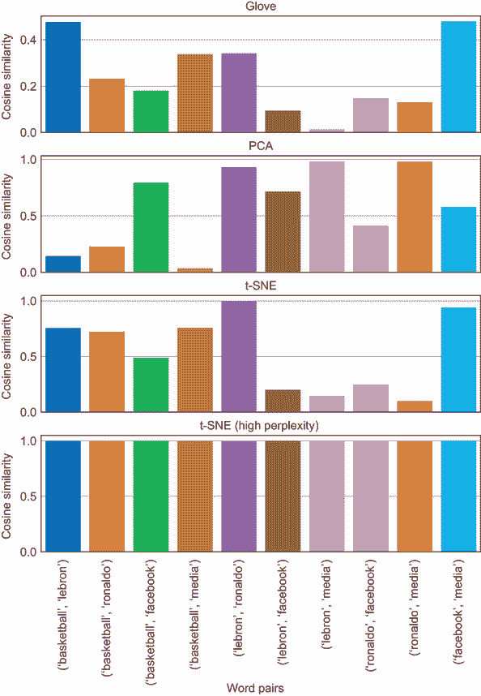

图 7.29 验证语义相似性的可视化

我们可以看到，PCA 表示与原始 GloVe 表示不一致。例如，在 PCA 表示中，*basketball*和*lebron*的相似度低于*basketball*和*facebook*。然而，我们可以看到，困惑度为 10 的 t-SNE 学习的表示保留了原始 GloVe 嵌入捕获的大部分相似性。困惑度为 100 的 t-SNE 显示了所有具有相似意义的词对，并且在三种表示中显然是最差的。这种验证在规模上比定性评估 PCA 和 t-SNE 为所有感兴趣的词语生成的 2-D 可视化要容易得多。

## 摘要

+   在本章中，我们专注于自然语言处理（NLP）领域，特别是关于如何以捕捉语义意义的形式表示词语的话题。我们还学习了如何使用 PCA 和 t-SNE 等降维技术从这些词语表示中解释和可视化语义相似性。

+   表示词语的一种天真方式是使用独热编码。然而，这种表示是稀疏的，计算效率低下，并且不编码任何语义意义。

+   编码语义意义的词语的密集表示被称为词嵌入、词向量或分布式表示。由神经网络学习的表示或词嵌入被称为神经词嵌入。

+   可以使用连续词袋（CBOW）、跳字模型（skip-gram）和全局向量（GloVe）等神经网络架构来学习词语的密集表示。

+   在解释和可视化神经词嵌入中的语义相似性的背景下，我们需要一个词语的理解或分类法来验证神经词嵌入是否正确地学习了语义意义。

+   我们可以使用余弦相似度度量来衡量语义相似性。该度量具有一个属性，即彼此更接近的词嵌入比彼此更远的词嵌入具有更高的分数。

+   我们可以使用主成分分析（PCA）和 t 分布随机邻域嵌入（t-SNE）等降维技术，在低维空间中可视化高维词嵌入。

+   虽然主成分分析（PCA）是一种强大的技术，但它确实存在一个主要的缺点：它假设数据集或词嵌入可以线性建模。对于我们处理的大多数数据集来说，这可能并不成立。

+   t-SNE 属于机器学习技术中广泛分类的流形学习，其目标是学习从高维数据中提取低维的非线性结构。这项技术是可视化高维数据中最受欢迎的选择之一。

+   我们可以通过计算不同词对之间的余弦相似度，并检查相似度是否与原始高维表示一致，来定量验证 PCA 和 t-SNE 生成的可视化。
