# 8 公平性与减轻偏差

本章涵盖

+   识别数据集中偏差的来源

+   使用各种公平性概念验证机器学习模型的公平性

+   将可解释性技术应用于识别机器学习模型中歧视的来源

+   使用预处理技术减轻偏差

+   使用数据表记录数据集以改善透明度和问责制，并确保符合法规

到目前为止，你已经学到了很多，并将许多可解释性技术添加到你的工具箱中，从你可以用来解释模型处理的技术（第二章至第五章）到解释机器学习模型学习到的表示的技术（第六章和第七章）。现在，我们将使用其中一些技术来解决构建由机器学习模型驱动的系统时遇到的一个重要问题，即解决偏差问题。这个问题有多个原因很重要。我们必须构建不歧视个人或系统用户的系统。如果企业使用 AI 进行决策，例如为用户提供机会或某些服务质量或信息，那么有偏见的决策可能会通过损害企业的声誉或对客户信任产生负面影响而给企业带来巨大的成本。某些地区，如美国和欧洲，有法律禁止基于受保护属性（如性别、种族、民族、性取向等）歧视个人。一些受监管的行业，如金融服务、教育、住房、就业、信贷和医疗保健，禁止或限制在决策中使用受保护属性，并且 AI 系统需要提供某些公平性保证。

在我们深入探讨偏差和公平性问题之前，让我们回顾一下我们用来构建一个解决常见问题（如图 8.1 所示的数据泄露、偏差、法规不合规和概念漂移）的健壮 AI 系统的过程。学习和测试阶段是在线完成的，都是基于历史标记数据训练模型、评估它以及使用各种可解释性技术来理解它。一旦模型部署，它就会上线并开始对实时数据进行预测。该模型也会被监控以确保没有概念漂移，这发生在生产环境中的数据分布与开发和测试环境中的数据分布不同时。还有一个反馈循环，其中新数据被添加到历史训练数据集中，以进行持续的训练、评估和部署。

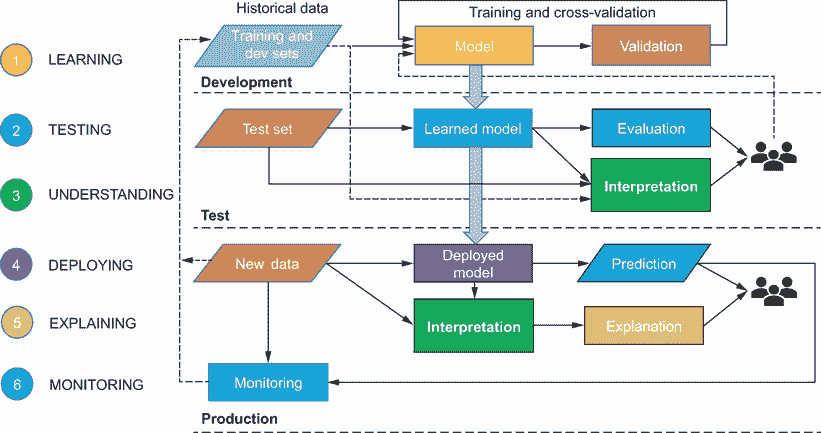

图 8.1 回顾如何构建一个健壮的 AI 系统

这个系统中可能存在哪些偏差来源？一个来源，如图 8.2 所示，是历史训练数据集，其中可能在标签过程中或采样或数据收集过程中存在偏差。另一个来源是模型本身，算法可能更倾向于某些个人或群体而不是其他人。如果模型在本身存在偏差的数据集上训练，那么偏差会进一步放大。偏差的另一个来源是生产环境反馈到开发和测试环境中的反馈循环。如果初始数据集或模型存在偏差，那么在生产环境中部署的模型将继续做出有偏差的预测。如果基于这些预测的数据被反馈作为训练数据，那么这些偏差将进一步得到加强和放大。

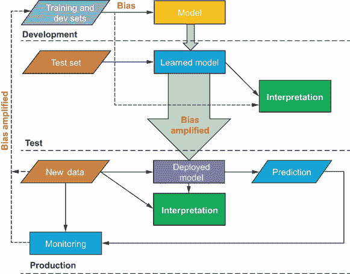

图 8.2 AI 系统中的偏差来源

可解释性在偏差和公平性问题中如何定位？如图 8.2 所示，我们可以在训练和测试过程中使用可解释性技术来揭露历史数据集或模型的问题。我们已经在第三章中看到了这一点，在高中学生成绩预测问题中，使用部分依赖图（PDPs）揭露了种族偏差。一旦模型部署，我们可以使用可解释性技术来确保模型预测继续保持公平。

在本章中，我们将通过预测成人收入的另一个具体例子，更深入地探讨偏差和公平性的问题。我们将为各种公平性概念给出正式的定义，并使用它们来判断模型是否存在偏差。然后，我们将使用可解释性技术来衡量和揭露公平性问题。我们还将讨论减轻偏差的技术。最后，我们将探讨使用数据表来标准化记录数据集的方法，这将有助于提高 AI 系统利益相关者和用户的透明度和问责制。

## 8.1 成人收入预测

为了具体说明公平性问题，让我们来看一个具体的例子。你被人口普查局委托构建一个模型来预测美国成人的收入。预测问题如图 8.3 所示。

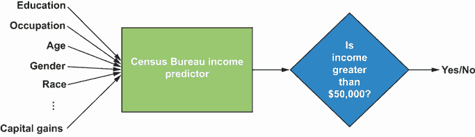

图 8.3 人口普查局的收入预测器

如图 8.3 所示，我们得到了用于收入预测的各种输入，例如教育水平、职业、年龄、性别、种族、资本收益等。我们的任务是构建一个收入预测器，它以矩形框的形式接受这些输入，并输出一个“是”或“否”的答案来回答“成人每年收入是否超过 50,000 美元？”这个问题。因此，这个问题可以表述为一个二元分类问题，因为我们感兴趣的是二元答案：是或否。我们将把答案“是”视为正标签，将答案“否”视为负标签。

我们得到了来自人口普查局的历史数据集，包含 30,940 名成年人。输入特征总结在表 8.1 中。从表中，我们可以看到连续和分类变量的混合。我们在这本书中处理的大多数数据集都由连续特征组成，其特征值是实数。我们已经在第三章中看到了如何处理分类特征。为了回顾，分类特征是值离散且有限的特征。我们需要将它们编码成数值，我们也在第三章中看到了如何使用标签编码器来完成这一操作。

表 8.1 收入预测输入特征

| 特征名称 | 描述 | 类型 | 是否为受保护属性？ |
| --- | --- | --- | --- |
| age | 成年人年龄 | 连续 | 是 |
| workclass | 工作类别 | 分类 | 否 |
| fnlwgt | 人口普查局分配的最终权重 | 连续 | 否 |
| education | 教育水平 | 分类 | 否 |
| marital-status | 婚姻状况 | 分类 | 否 |
| occupation | 职业 | 分类 | 否 |
| gender | 男性或女性 | 分类 | 是 |
| race | 白人或黑人 | 分类 | 是 |
| capital-gain | 资本收益 | 连续 | 否 |
| capital-loss | 资本损失 | 连续 | 否 |
| hours-per-week | 每周工作小时数 | 连续 | 否 |
| native-country | 原籍国 | 分类 | 否 |

此外，表 8.1 还显示了给定特征是否为受保护属性。受保护属性是指根据许多国家广泛共享的立法，不能用于歧视个人的属性。例如，在美国，1964 年的民权法保护个人免受基于性别、种族、年龄、肤色、信仰、国籍、性取向和宗教等属性的歧视。在英国，具有相同属性的个人根据 2010 年的平等法受到保护免受歧视。

在这个数据集中，我们处理三个受保护属性：年龄、性别和种族。年龄是一个连续特征，而性别和种族是分类的。在本章中，我们将主要关注性别和种族，但我们将学习如何将公平概念和技术扩展到像年龄这样的连续受保护属性。至于性别和种族，在这个数据集中，我们处理两种性别，男性和女性，以及两种种族，白人和黑人。遗憾的是，我们无法包括更多性别或种族群体，因为它们在这个数据集中没有得到适当的代表。

最后，这个数据集的目标变量是二元的，其中 1 表示成年人每年收入超过 50,000 美元，0 表示年薪低于或等于 50,000 美元。现在让我们探索这个数据集，特别是关注整体薪资分布以及两个感兴趣的受保护属性：性别和种族的分布。

### 8.1.1 探索性数据分析

图 8.4 显示了美国人口普查局提供的数据集中 30,940 名成年人的薪资、性别和种族的整体分布。我们可以看到，数据集确实存在倾斜或偏见。大约 75%的人口收入低于或等于 50K 美元，其余人收入超过 50K 美元。在性别方面，男性成年人在这个数据集中比女性成年人更为代表，大约 65%的人口是男性。同样，在种族方面，我们也看到对白人成年人的偏见，大约 90%的成年人在数据集中是白人。请注意，您可以在与本书相关的 GitHub 存储库中找到用于探索性数据分析的源代码。

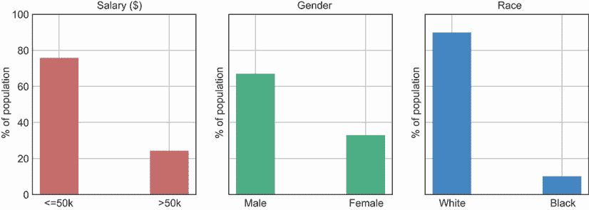

图 8.4 薪资、性别和种族分布

现在让我们来看看不同受保护性别和种族群体的薪资分布，以确定是否存在任何偏见。这如图 8.5 所示。如果我们看性别，我们可以看到，比女性成年人，男性成年人的比例更高，他们的收入超过 50K 美元。对于种族，我们也可以做出相同的观察，其中白人成年人的比例高于黑人成年人，他们的收入超过 50K 美元。

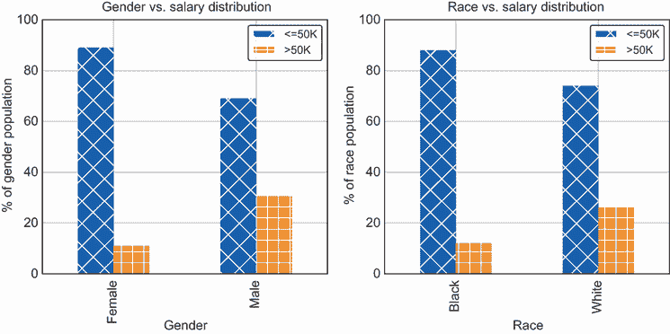

图 8.5 薪资与性别、薪资与种族的分布

最后，让我们来看看这个数据集中两种种族的性别代表性，如图 8.6 所示。我们可以看到，在黑人成年人中，男性和女性的比例相当，大约为 50%。另一方面，对于白人成年人来说，白人男性成年人的代表性比白人女性更高。这种分析有助于确定薪资偏见的主要原因。因为 70%的白人成年人是男性，所以白人成年人的薪资偏见可能更好地解释为性别保护群体，其中数据集中的男性用户可能比女性用户赚得更多。另一方面，对于黑人成年人来说，因为男性和女性的比例相当，所以黑人成年人的主要偏见来源可能是种族本身。

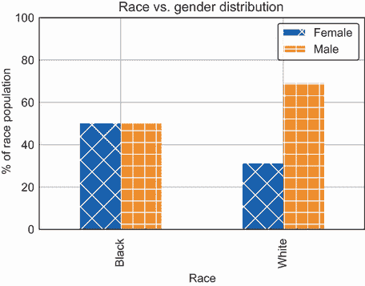

图 8.6 性别与种族分布

在我们继续构建模型之前，了解数据集中这些偏差的根本原因非常重要。我们不确定数据集是如何收集的，因此无法确定根本原因。然而，我们可以假设偏见来源可能是以下几种：

+   样本偏差，其中数据集未能正确代表真实人口。

+   标签偏见，其中可能在记录人口中各个群体的薪资信息的方式中存在偏见。

+   社会系统性偏见。如果存在系统性偏见，那么这种偏见将在数据集中得到反映。

如我们已在第三章中讨论过的，第一个问题可以通过收集更多代表人群的数据来解决。在本章中，我们还将学习如何使用数据表来正确记录数据收集过程，以提高透明度和问责制。这些数据表还可以用来确定数据集中偏差的根本原因。通过改进数据收集过程可以修复标签偏差。在本章中，我们还将学习另一种纠正标签偏差的技术。最后一个问题更难解决，需要更好的政策和法律，这超出了本书的范围。

### 8.1.2 预测模型

从我们的探索性分析中，我们发现数据集中存在一些偏差，不幸的是，其根本原因尚不清楚。为了衡量模型的*公平性*，我们现在将构建一个预测成人收入的模型。我们将为此目的使用随机森林模型。正如你在第三章中学到的，随机森林是一种结合决策树的方法，具体使用的是袋装技术。这个模型的示意图如图 8.7 所示。训练数据以表格或矩阵形式输入到随机森林模型中。请注意，分类特征被编码为数值。使用随机森林，我们可以在训练数据的独立随机子集上并行训练多个决策树。预测是通过这些单个决策树来进行的，并将它们全部结合起来得出最终预测。通常使用多数投票作为将单个决策树的预测组合成最终预测的方法。

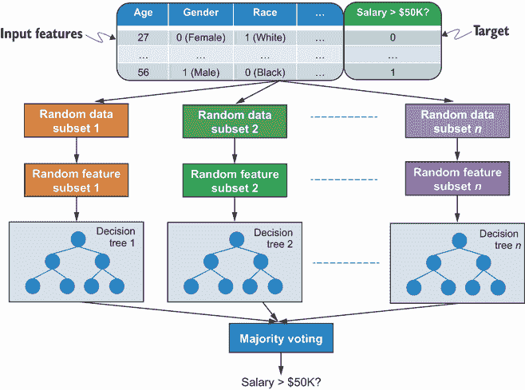

图 8.7 成人收入预测的随机森林模型示意图

作为练习，编写代码以在成人收入数据集上训练随机森林模型。你可以参考第三章中的代码示例。请注意，你可以使用 Scikit-Learn 提供的`LabelEncoder`类将分类特征编码为数值。此外，你也可以尝试使用 Scikit-Learn 提供的`RandomForestClassifier`类来初始化和训练模型。你可以在与本书相关的 GitHub 仓库中找到这个练习的解决方案。

在本章剩余部分，我们将使用一个使用 10 个估计器或决策树训练的随机森林模型，每个决策树的最大深度为 20。该模型的表现总结在表 8.2 中。我们将考虑四个模型评估指标，即准确率、精确率、召回率和 F1 值。这些指标在第三章中已介绍，并在前几章中反复使用。我们还将考虑一个基线模型，该模型总是预测多数类为 0，即成人的收入总是小于或等于$50K。我们将随机森林模型的表现与这个基线进行比较。我们可以看到，在多个指标上，随机森林模型优于基线，实现了约 86%的准确率（比基线高 10%），约 85%的精确率（比基线高 27%），约 86%的召回率（比基线高 10%），以及约 85%的 F1 值（比基线高 19%）。

表 8.2 收入预测随机森林模型的表现

|  | 准确率 (%) | 精确率 (%) | 召回率 (%) | F1 (%) |
| --- | --- | --- | --- | --- |
| 基准 | 76.1 | 57.9 | 76.1 | 65.8 |
| 随机森林 | 85.8 | 85.3 | 85.8 | 85.4 |

让我们现在以几种方式解释随机森林模型。首先，让我们看看随机森林模型认为的输入特征的重要性。这将帮助我们理解一些受保护群体特征的重要性，如图 8.8 所示。您可以在与本书相关的 GitHub 存储库中查看用于生成此图的源代码。我们可以看到，年龄（一个受保护群体）是最重要的特征，其次是资本收益。然而，种族和性别似乎重要性较低。这可能是因为种族和性别被编码在其他一些特征中。我们可以通过查看特征之间的相关性来检查这一点。我们还可以使用局部相关图（PDPs），正如我们在第三章中看到的，来理解种族和性别可能如何与其他一些特征相互作用。

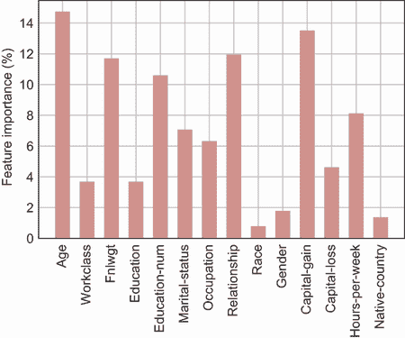

图 8.8 随机森林模型学习到的特征的重要性

接下来，我们可以使用 SHAP 技术来确定模型如何做出单个预测。正如我们在第四章中学到的，SHAP 是一种模型无关的局部可解释技术，它使用博弈论概念来量化特征对单个模型预测的影响。图 8.9 显示了年薪超过$50K 的成年人的 SHAP 解释。请注意，这个数据点并未用于训练。我们可以看到每个特征值如何将模型预测从基值推动到 0.73 分（即成年人有 73%的可能性年薪超过$50K）。对于这个实例，最重要的特征值按降序排列为资本收益、教育水平和每周工作时间。

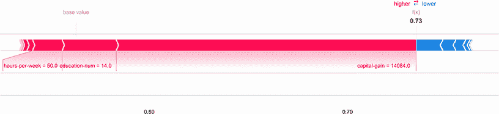

图 8.9 对于年薪超过$50K 的单个预测的 SHAP 解释

我们将在第 8.3 节中再次讨论 SHAP 和依赖图在公平性背景下的应用。我们还将讨论如何使用本书中学到的其他可解释性技术，如网络分解和 t-SNE。但在那之前，让我们了解各种公平性的概念。

## 8.2 公平性概念

在上一节中，我们训练了一个随机森林模型来进行薪资预测。该模型的目标是为每个成年人确定一个二元结果：他们是否每年收入超过 50K 美元。但这些预测对于性别和种族等不同受保护群体是否公平呢？为了正式定义各种公平性的概念，让我们看看模型做出的预测以及为公平性所需的相关测量。图 8.10 展示了模型在二维平面上的预测示意图。随机森林模型将二维平面分为两部分，将正预测（在右侧）与负预测（在左侧）分开。20 位成年人的实际标签也投影到了这个二维平面上。请注意，实际标签在二维平面上的位置无关紧要。重要的是标签是否落在左侧（模型预测为负，即 0）或右侧（模型预测为正，即 1）。实际正标签以圆圈表示，实际负标签以三角形表示。

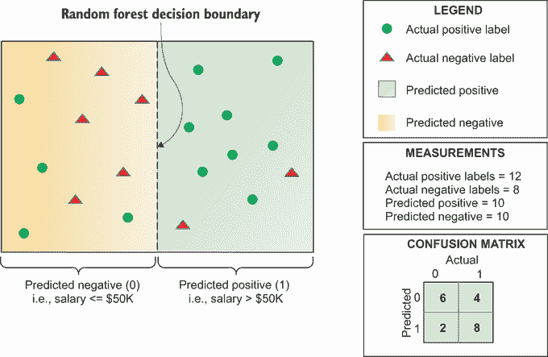

图 8.10 模型预测和与公平性概念相关的测量示意图

根据图 8.10 中的示意图，我们现在可以定义以下基本测量：

+   *实际正标签*—数据集中真实标签为正的数据点。在图 8.10 中，数据集中每年收入超过 50K 美元的成年人被表示为圆圈。如果我们计算圆圈的数量，实际正标签的数量等于 12。

+   *实际负标签*—数据集中真实标签为负的数据点。在图 8.10 中，数据集中每年收入低于或等于 50K 美元的成年人被表示为三角形。因此，实际负标签的数量为 8。

+   *预测正标签*—模型预测为正结果的数据点。在图 8.10 中，落在二维平面右侧的数据点具有正预测。该区域有 10 个数据点。因此，预测正标签的测量值为 10。

+   *预测负标签*—模型预测为负结果的数据点。在图 8.10 中，这些是落在二维平面左侧的点。预测负标签的测量值也是 10。

+   *真阳性*—在图 8.10 中，真阳性是落在 2 维平面右半部分的圆圈。它们实际上是模型预测为正，并且实际标签也是正的数据点。共有八个这样的圆圈，因此真阳性的数量是 8。我们也可以从混淆矩阵中获取这个信息，其中真阳性是模型预测为 1 且实际标签也是 1 的情况。

+   *真阴性*—另一方面，真阴性是落在 2 维平面左半部分的三角形。它们是模型预测为负，并且实际标签也是负的数据点。在图 8.10 中，我们可以看到真阴性的数量是 6。从混淆矩阵中，这些是模型预测为 0 且实际标签也是 0 的情况。

+   *假阳性*—在图 8.10 的平面右半部分，假阳性是三角形。它们是模型预测为正，但实际标签为负的数据点。从图中可以看出，假阳性的数量是 2。从混淆矩阵中，这些是模型预测为 1 但实际标签为 0 的情况。

+   *假阴性*—假阴性是落在 2 维平面左半部分的圆圈。它们实际上是模型预测为负，但实际标签为正的数据点。由于图 8.10 的左半部分有四个圆圈，因此假阴性的数量是 4。从混淆矩阵中，这些是模型预测为 0 但实际标签为 1 的情况。

在这些基本测量到位之后，我们现在定义各种公平性的概念。

### 8.2.1 人口统计学平等

我们将要考虑的第一个公平性概念被称为*人口统计学平等*。人口统计学平等的概念有时也被称为*独立性*、*统计平等*，在法律上称为*不同影响*。它主张对于模型来说，不同受保护群体的正预测率是平等的。让我们看看图 8.11 中的示例。在图中，20 个成年人——正如我们在图 8.10 中看到的——被分为两组，A 和 B，每组对应一个受保护的性别群体。A 组由男性成年人组成，在 2 维平面上有 10 个数据点。B 组由女性成年人组成，在 2 维平面上也有 10 个数据点。

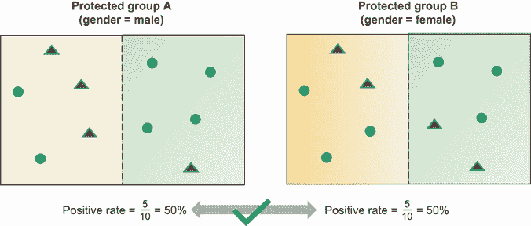

图 8.11 两个受保护性别群体的人口统计学平等示意图

基于图 8.11 的插图，我们现在可以计算之前描述的基本测量值。对于男性成年人，有六个实际阳性，四个实际阴性，五个预测阳性，和五个预测阴性。对于女性成年人，我们可以看到实际阳性/阴性以及预测阳性/阴性与男性成年人相同。男性和女性成年人的阳性率是模型预测为阳性的每个群体中成年人的比例。从图 8.11 中我们可以看到，男性和女性用户的阳性率相同——都是 50%。因此，我们可以断言，这两组之间存在人口统计学平等。

让我们从实际的角度来看这个问题。假设模型预测被用来分配一种稀缺资源，比如说，住房贷款。再假设收入超过 5 万美元的成年人更有可能负担得起房子并偿还贷款。如果像住房贷款申请这样的决策是基于模型预测来做的，那么贷款将只发放给收入超过 5 万美元的成年人，那么人口统计学平等将确保贷款以相同的比率发放给男性和女性成年人。人口统计学平等断言，模型以相同的可能性预测男性和女性成年人的工资都超过 5 万美元。

现在我们更正式地定义人口统计学平等，并使用这个定义来检查我们的随机森林模型是否公平。让我们用*ŷ*表示模型预测，用*z*表示受保护群体变量。性别受保护群体变量*z*可以有两个可能的值：0 代表女性成年人，1 代表男性成年人。对于种族受保护群体，变量*z*也可以有两个可能的值：0 代表黑人成年人，1 代表白人成年人。人口统计学平等要求模型预测一个受保护群体为阳性的概率与模型预测另一个受保护群体为阳性的概率相似或相等。如果它们的比率在阈值*τ*[1]和*τ*[2]之间，则概率度量是相似的，这些阈值通常是 0.8 和 1.2。阈值设置为 0.8 和 1.2 是为了紧密遵循法律文献中关于不同影响的 80%规则，如下一个方程所示。如果比率是 1，则概率度量是相等的：

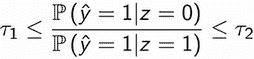

现在，我们如何使用这个定义来处理一个分类但具有多个值的受保护群体特征？在这个例子中，我们只考虑了两种种族：白色和黑色。如果数据集中有更多种族怎么办？请注意，个人可能是多种族的，他们可能认同多个种族。我们将把它们视为一个单独的种族，以确保不会对认同多个种族的个人产生歧视。在这种情况下，如果有超过两个种族，我们将为每个种族定义人口比例率指标，并采用一对一的策略，其中*z* = *0*代表感兴趣的种族，*z* = *1*代表所有其他种族。请注意，多种族的个人可能属于多个群体。然后我们需要确保与所有其他种族相比，每个种族的人口比例率相似。对于一个连续的受保护群体特征，比如年龄呢？在这种情况下，我们需要将连续特征划分为离散组，然后应用一对一策略。

现在定义已经就绪，让我们看看随机森林模型是否公平。以下代码片段使用人口比例概念评估模型：

```
male_indices_test = X_test[X_test['gender'] == 1].index.values      ①
female_indices_test = X_test[X_test['gender'] == 0].index.values    ②
white_indices_test = X_test[X_test['race'] == 1].index.values       ③
black_indices_test = X_test[X_test['race'] == 0].index.values       ④

y_score = adult_model.predict_proba(X_test)                         ⑤

y_score_male_test = y_score[male_indices_test, :]                   ⑥
y_score_female_test = y_score[female_indices_test, :]               ⑥
y_score_white_test = y_score[white_indices_test, :]                 ⑦
y_score_black_test = y_score[black_indices_test, :]                 ⑦

dem_par_gender_ratio = np.mean(y_score_female_test
➥ [:, 1]) / np.mean(y_score_male_test[:, 1])                       ⑧
dem_par_race_ratio = np.mean(y_score_black_test
➥ [:, 1]) / np.mean(y_score_white_test[:, 1])                      ⑨
```

① 加载测试集中编码性别为 1 的男性成年人的索引

② 加载测试集中编码性别为 0 的女性成年人的索引

③ 加载测试集中编码种族为 1 的白色成年人的索引

④ 加载测试集中编码种族为 0 的黑色成年人的索引

⑤ 获取测试集中所有成年人的模型预测

⑥ 获取两个性别群体的模型预测

⑦ 获取两个种族群体的模型预测

⑧ 计算两个性别群体的人口比例率

⑨ 计算两个种族群体的人口比例率

注意，在这个代码片段中，我们使用的是标签编码的数据集和第 8.1.2 节中训练的模型。标签编码的输入特征存储在`X_test`数据框中，随机森林模型命名为`adult_model`。请注意，您可以从与本书相关的 GitHub 存储库中获取数据准备和模型训练的代码。我们计算人口比例率作为预测一个群体（女性/黑色成年人）的阳性类的平均概率分数与对应群体（男性/白色成年人）的比率。一旦我们计算了性别和种族群体的人口比例率，我们可以使用以下代码片段绘制该指标：

```
def plot_bar(values, labels, ax, color='b'):               ①
    bar_width = 0.35                                       ①
    opacity = 0.9                                          ①
    index = np.arange(len(values))                         ①
    ax.bar(index, values, bar_width,                       ①
           alpha=opacity,                                  ①
           color=color)                                    ①
    ax.set_xticks(index)                                   ①
    ax.set_xticklabels(labels)                             ①
    ax.grid(True);                                         ①

threshold_1 = 0.8                                          ②
threshold_2 = 1.2                                          ②

f, ax = plt.subplots()                                     ③
plot_bar([dem_par_gender_ratio, dem_par_race_ratio],       ④
         ['Gender', 'Race'],                               ④
         ax=ax, color='r')                                 ④
ax.set_ylabel('Demographic Parity Ratio')                  ⑤
ax.set_ylim([0, 1.5])                                      ⑥
ax.plot([-0.5, 1.5],                                       ⑦
        [threshold_1, threshold_1], "k--",                 ⑦
        linewidth=3.0)                                     ⑦
ax.plot([-0.5, 1.5],                                       ⑧
        [threshold_2, threshold_2], "k--",                 ⑧
        label='Threshold',                                 ⑧
        linewidth=3.0)                                     ⑧
ax.legend();                                               ⑨
```

① 调用辅助函数 plot_bar 来绘制条形图

② 设置人口比例率阈值

③ 初始化一个 Matplotlib 图表

④ 绘制性别和种族的人口比例率条形图

⑤ 设置 y 轴的标签

⑥ 将 y 轴的值限制在-0.5 到 1.5 之间

⑦ 绘制阈值为 threshold_1 的水平线

⑧ 绘制阈值为 threshold_2 的水平线

显示图表的图例

结果图表显示在图 8.12 中。我们可以看到，性别和种族的人口比例比分别为 0.38 和 0.45。它们不在阈值范围内，因此，基于人口比例的随机森林模型对两个受保护群体来说都是不公平的。我们将在第 8.4 节中看到如何减轻偏差并训练一个公平的模型。

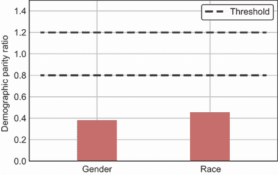

图 8.12 性别和种族的人口比例比

### 8.2.2 机会平等和概率

人口比例平等的概念对于我们需要确保所有受保护群体在人口中的处理平等的场景是有用的。它确保少数群体与多数群体以相同的方式被对待。在某些场景中，我们可能想要考虑所有受保护群体的实际标签的分布。例如，如果我们对就业机会感兴趣，一组个人可能比其他群体更感兴趣并且更有资格从事某些工作。在这种情况下，我们可能不希望确保平等，因为我们可能希望确保将就业机会给予那些对它更感兴趣并且更有资格的个人群体。在这种情况下，我们可以使用机会平等和概率公平的概念。

让我们回到用于人口比例的插图，以建立我们的直觉。在图 8.13 中，A 组（男性）和 B 组（女性）的 20 名成年人的分离与我们在图 8.11 中看到的人口比例相同。对于机会平等和概率，我们感兴趣的测量是考虑到每个受保护群体的实际标签的分布。这些测量在图 8.13 中作为真正例率和假正例率来计算。真正例率衡量的是实际正例被预测为正例的概率，其计算为真正例数与真正例数和假负例数之和的比率。换句话说，真正例率衡量的是模型正确识别的实际真例的百分比，也称为召回率。对于 A 组（男性），真正例率约为 66.7%，而对于 B 组（女性），真正例率为 50%。当组间真正例率存在平等时，我们说存在机会平等。因为图 8.13 中展示的玩具示例中真正例率不匹配，我们可以说不存在性别受保护群体的机会平等。

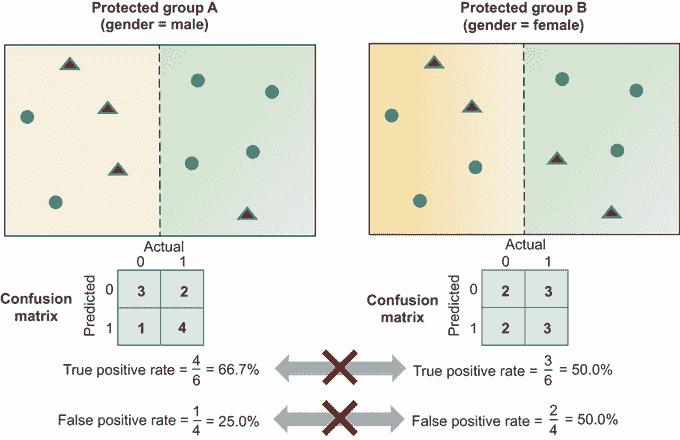

图 8.13 两个受保护性别群体机会平等和概率的示意图

概率均等扩展了机会均等定义，引入了另一个对称的测量指标，称为假阳性率。假阳性率衡量的是实际负事件被预测为正事件的可能性。它被计算为假阳性数量与假阳性数量和真阴性数量之和的比率。我们可以断言，当受保护群体之间在真阳性率和假阳性率上存在均衡时，概率均等存在。在图 8.13 中展示的玩具示例中，A 组和 B 组之间的真阳性率不存在均衡，因此我们无法说概率均等存在。此外，两组之间的假阳性率也不匹配。

我们可以使用以下方程更正式地定义机会均等和概率均等。第一个方程本质上计算了两组之间真阳性率的差异。第二个方程计算了两组之间假阳性率的差异。当差异等于或接近 0 时，存在均衡。这一概念与人口均衡概念不同，因为它考虑了实际标签的分布——对于真阳性率为正，对于假阳性率为负。此外，人口均衡概念比较概率时作为比率而不是加法，紧密遵循法律文献中的“80%规则”：

ℙ(*ŷ* = 1|*z* = 0|*y* = 1) – ℙ(*ŷ* = 1|*z* = 1|*y* = 1)

ℙ(*ŷ* = 1|*z* = 0|*y* = 0) – ℙ(*ŷ* = 1|*z* = 1|*y* = 0)

现在，让我们使用这个概念来看看我们的随机森林模型是否公平。我们可以使用接收者操作特征（ROC）曲线来比较真阳性率和假阳性率。ROC 曲线本质上是在真阳性率与假阳性率之间绘制曲线。对于机会均等和概率均等，我们可以使用曲线下面积（AUC）作为性能的汇总度量，以便轻松比较每个受保护群体的模型性能。我们可以查看组间 AUC 的差异，以了解模型的公平性。下面的代码片段展示了如何计算真/假阳性率和 AUC：

```
from sklearn.metrics import roc_curve, auc                                    ①

def compute_roc_auc(y_test, y_score):                                         ②
    fpr = dict()                                                              ③
    tpr = dict()                                                              ③
    roc_auc = dict()                                                          ③
    for i in [1]:  
        fpr[i], tpr[i], _ = roc_curve(y_test,                                 ④
        ➥ y_score[:, i])                                                     ④
        roc_auc[i] = auc(fpr[i], tpr[i])                                      ④
    return fpr, tpr, roc_auc                                                  ⑤

fpr_male, tpr_male, roc_auc_male = compute_roc_auc(y_male_test,               ⑥
                                                   y_pred_proba_male_test)    ⑥
fpr_female, tpr_female, roc_auc_female = compute_roc_auc(y_female_test,       ⑦
                                                         d_proba_female_test) ⑦
fpr_white, tpr_white, roc_auc_white = compute_roc_auc(y_white_test,           ⑧
                                                      y_pred_proba_white_tes  ⑧
fpr_black, tpr_black, roc_auc_black = compute_roc_auc(y_black_test,           ⑨
                                                     y_pred_proba_black_test)
```

① 从 Scikit-Learn 导入 roc_curve 和 auc 辅助函数。

② 定义一个辅助函数来计算每个受保护群体的 ROC 和 AUC。

③ 定义用于存储数据集中每个类别的真/假阳性率和 AUC 的字典。

④ 对于实际标签，计算真/假阳性率和 AUC，并将它们存储在字典中。

⑤ 将字典返回给函数的调用者。

⑥ 使用辅助函数计算成年男性的指标。

⑦ 使用辅助函数计算成年女性的指标。

⑧ 使用辅助函数计算成年白人的指标。

⑨ 使用辅助函数计算成年黑人的指标。

一旦为每个受保护群体计算了指标，我们可以使用以下代码片段来绘制 ROC 曲线：

```
lw = 1.5                                                      ①
f, ax = plt.subplots(1, 2, figsize=(15, 5))                   ②
ax[0].plot(fpr_male[1], tpr_male[1],                          ③
        linestyle='-', color='b',                             ③
        lw=lw,                                                ③
        label='Male (Area = %0.2f)' % roc_auc_male[1])        ③
ax[0].plot(fpr_female[1], tpr_female[1],                      ④
        linestyle='--', color='g',                            ④
        lw=lw,                                                ④
        label='Female (Area = %0.2f)' % roc_auc_female[1])    ④
ax[1].plot(fpr_white[1], tpr_white[1],                        ⑤
        linestyle='-', color='c',                             ⑤
        lw=lw,                                                ⑤
        label='White (Area = %0.2f)' % roc_auc_white[1])      ⑤
ax[1].plot(fpr_black[1], tpr_black[1],                        ⑥
        linestyle='--', color='r',                            ⑥
        lw=lw,                                                ⑥
        label='Black (Area = %0.2f)' % roc_auc_black[1])      ⑥
ax[0].legend()                                                ⑦
ax[1].legend()                                                ⑦
ax[0].set_ylabel('True Positive Rate')                        ⑦
ax[0].set_xlabel('False Positive Rate')                       ⑦
ax[1].set_ylabel('True Positive Rate')                        ⑦
ax[1].set_xlabel('False Positive Rate')                       ⑦
ax[0].set_title('ROC Curve (Gender)')                         ⑦
ax[1].set_title('ROC Curve (Race)')                           ⑦
```

① 设置线图的线宽

② 初始化一个由一排两列组成的 Matplotlib 图表

③ 在第一列中，绘制了男性成人的 ROC 曲线

④ 在第一列中，绘制了女性成人的 ROC 曲线

⑤ 在第二列中，绘制了白人成人的 ROC 曲线

⑥ 在第二列中，绘制了黑人成人的 ROC 曲线

⑦ 注释并标记了图表

结果图表显示在图 8.14 中。图表的第一列比较了两个性别组（男性和女性）的 ROC 曲线。第二列比较了两个种族组（白人和黑人）的 ROC 曲线。两个图表的曲线下面积在图例中显示。我们可以看到，男性成人的 AUC 为 0.89，女性成人的 AUC 为 0.92。差异大约有 3%偏向女性成人。另一方面，白人成人的 AUC 为 0.9，黑人成人的 AUC 为 0.92。差异大约有 2%偏向黑人成人。不幸的是，与人口平衡不同，法律或研究界没有关于考虑模型公平性时应使用哪些阈值的指南。在本章中，如果差异在统计上显著，我们将使用机会平等和赔率的概念将模型视为不公平。我们将在 8.3.1 节中通过置信区间查看这些差异是否显著。

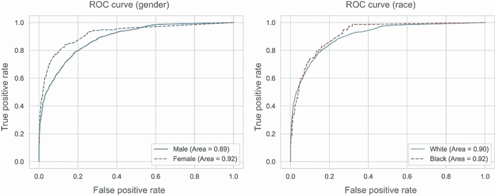

图 8.14 性别和种族的接收器操作特征（ROC）曲线

### 8.2.3 其他公平性概念

最常用的公平性概念是人口平衡和机会平等/赔率。但是，为了提醒，让我们也看看以下其他公平性概念：

+   *预测质量平等*—不同组之间的预测质量没有差异。预测质量可以是模型的准确度或任何其他性能指标，如 F1。

+   *治疗平等*—模型对各组平等对待，其中假阳性率存在平衡。假阳性率被量化为假阴性数与假阳性数的比率。

+   *通过无意识实现的公平性*—可以通过不明确使用受保护属性作为预测特征来实现公平性。在一个理想的世界里，模型使用的其他特征与受保护属性不相关，但这几乎总是不成立。因此，通过无意识实现公平性不能保证。我们将在 8.4.1 节中看到这一点。

+   *反事实公平性*—如果一个模型在反事实世界中，如果该个体属于另一个受保护群体，它仍然做出相同的预测，那么该模型对该个体是公平的。

我们可以将所有公平性概念分为两类——*组公平性*和*个体公平性*。组公平性确保模型对不同受保护群体是公平的。对于成人收入数据集，受保护群体包括性别、种族和年龄。另一方面，个体公平性确保模型对相似个体做出相似的预测。对于成人收入数据集，个体可以根据其教育水平、原籍国或每周工作时间等因素相似，仅举几个例子。表 8.3 显示了不同公平性概念的所属类别。

表 8.3 组合和个体公平性概念

| 公平性概念 | 描述 | 类别 |
| --- | --- | --- |
| 人口统计平等 | 不同受保护群体在正预测率上的平等 | 组 |
| 机会和赔率的平等 | 不同受保护群体在真阳性率和假阳性率上的平等 | 组 |
| 预测质量平等 | 不同受保护群体在预测质量上的平等 | 组 |
| 处理平等 | 不同受保护群体在错误预测率上的平等 | 组 |
| 通过无意识实现公平性 | 通过不明确将受保护属性作为预测特征来实现公平性 | 个体 |
| 反事实公平性 | 在反事实世界中，如果该个体属于另一个受保护群体，则对个体的预测相似 | 个体 |

## 8.3 可解释性和公平性

在本节中，我们将学习如何使用可解释性技术来检测模型导致的歧视来源。歧视的来源可以大致分为以下两组：

+   *通过输入特征进行歧视*——可以追溯到输入特征的公平性问题。

+   *通过表示进行歧视*——难以追溯到输入特征的公平性问题，尤其是对于处理图像和文本等输入的深度学习模型。在这种情况下，我们可以将歧视的来源追溯到模型学习到的深度表示。

### 8.3.1 通过输入特征进行歧视

让我们首先通过输入特征来观察歧视。当我们查看第 8.2 节中的各种公平概念时，我们通过处理模型输出看到，随机森林模型在人口统计学差异和机会平等/概率公平的公平性度量上是不公平的。我们如何通过追溯到输入来解释这些公平性度量？我们可以利用 SHAP 来完成这个目的。正如我们在第四章和第 8.1.2 节中看到的，SHAP 将模型输出分解为每个输入的 Shapley 值。这些 Shapley 值与模型输出具有相同的单位——如果我们对所有特征求和 Shapley 值，我们将得到一个与模型输出相匹配的值，该值衡量预测正结果的概率。我们在第 8.1.2 节中看到了这个说明。因为输入特征的 Shapley 值之和等于模型输出，所以我们可以将保护群体之间模型输出（以及，相应地，公平性度量）的差异归因于每个输入的 Shapley 值的差异。这就是如何将任何歧视或公平性问题追溯到输入的方法。

让我们通过代码来观察这一过程。以下代码片段定义了一个辅助函数，用于生成保护群体之间的 SHAP 差异，并可用于生成模型输出中由输入引起的差异的可视化：

```
def generate_shap_group_diff(df_X,                                  ①
                             y,                                     ②
                             shap_values,                           ③
                             notion='demographic_parity',           ④
                             protected_group='gender',              ⑤
                             trace_to_input=False):                 ⑥
    if notion not in ['demographic_parity', 
    ➥ 'equality_of_opportunity']:                                  ⑦
        return None                                                 ⑦
    if protected_group not in ['gender', 'race']:                   ⑦
        return None                                                 ⑦
    if notion == 'demographic_parity':                              ⑧
        flabel = 'Demographic parity difference'                    ⑧
    if notion == 'equality_of_opportunity':                         ⑨
        flabel = 'Equality of opportunity difference'               ⑨
        positive_label_indices = np.where(y == 1)[0]                ⑨
        df_X = df_X.iloc[np.where(y == 1)[0]]                       ⑨
        shap_values = shap_values[np.where(y == 1)[0],:]            ⑨
    if protected_group == 'gender':                                 ⑩
        pg_label = 'men v/s women'                                  ⑩
        mask = df_X['gender'].values == 1                           ⑩
    if protected_group == 'race':                                   ⑪
        pg_label = 'white v/s black'                                ⑪
        mask = df_X['race'].values == 1                             ⑪
    glabel = f"{flabel}\nof model output for {pg_label}"            ⑫
    xmin = -0.8                                                     ⑬
    xmax = 0.8                                                      ⑬
    if trace_to_input:                                              ⑭
        shap.group_difference_plot(shap_values,                     ⑭
                                   mask,                            ⑭
                                   df_X.columns,                    ⑭
                                   xmin=xmin,                       ⑭
                                   xmax=xmax,                       ⑭
                                   xlabel=glabel,                   ⑭
                                   show=False)                      ⑭
    else:                                                           ⑮
        shap.group_difference_plot(shap_values.sum(1),              ⑮
                                   mask,                            ⑮
                                   xmin=xmin,                       ⑮
                                   xmax=xmax,                       ⑮
                                   xlabel=glabel,                   ⑮
                                   show=False)                      ⑮
```

① 生成 SHAP 群体差异图的辅助函数，该函数接受六个输入。输入 1：特征值的 DataFrame

② 输入 2：目标值的向量

③ 输入 3：为输入特征生成的 SHAP 值

④ 输入 4：公平概念可以是人口统计学差异或机会平等/概率公平

⑤ 输入 5：可以是性别或种族的保护群体

⑥ 输入 6：标志，指示是否将歧视的来源追溯到输入

⑦ 对于不支持公平概念和保护群体，返回 None

⑧ 设置人口统计学差异概念的标签

⑨ 设置标签并仅处理机会平等概念的实际情况

⑩ 设置性别保护群体的标签和掩码

⑪ 设置种族保护群体的标签和掩码

⑫ 设置可视化标签

⑬ 限制可视化到 xmin 和 xmax

⑭ 当 trace_to_input 设置为 True 时创建可视化

⑮ 当 trace_to_input 设置为 False 时创建可视化

我们首先将使用辅助函数来检查模型输出中性别保护群体的人口统计学差异，如下代码示例所示。请注意，我们只关注测试集中的模型预测。`shap_values`变量包含数据集中所有输入和成人的 Shapley 值。我们是在第 8.1.2 节中生成的，你可以在与本书相关的 GitHub 仓库中找到源代码：

```
test_indices = X_test.index.values                         ①
generate_shap_group_diff(X_test,                           ②
                         y_test,                           ②
                         shap_values[1][test_indices,:],   ②
                         notion='demographic_parity',      ②
                         protected_group='gender',         ②
                         trace_to_input=False)             ②
```

① 提取测试集中输入的索引

② 调用辅助函数以适当的输入生成 SHAP 图

结果可视化如图 8.15 所示。请注意，差异可以是正的也可以是负的。如果差异为正，则模型偏向于男性成年人，如果差异为负，则模型偏向于女性成年人。从图 8.15 中我们可以看到，随机森林模型在预测正例（即薪水>50K）时对男性成年人的预测更多，因此偏向于男性成年人。

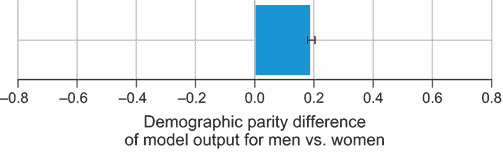

图 8.15 模型输出中性别的人口统计学差异

为了确定导致男性和女性成年人之间人口统计学差异的原因，我们可以使用以下代码片段将其追溯到输入特征：

```
generate_shap_group_diff(X_test,                           ①
                         y_test,                           ①
                         shap_values[1][test_indices,:],   ①
                         notion='demographic_parity',      ①
                         protected_group='gender',         ①
                         trace_to_input=True)              ①
```

① 使用与之前相同的输入调用辅助函数，但将`trace_to_input`设置为 True

结果图如图 8.16 所示。我们可以看到，偏差主要来自三个特征：关系、性别和婚姻状况。通过确定导致模型违反人口统计学公平性概念的特性，我们可以更仔细地查看数据，了解这些特征的偏差原因，正如我们在第 8.1.1 节中讨论的那样。

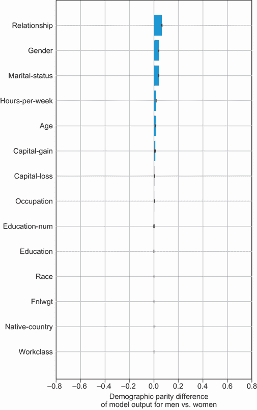

图 8.16 追踪到输入的性别人口统计学差异

作为练习，使用辅助函数来确定机会公平性度量中的差异是否存在，并将其追溯到输入。您可以将`notion`输入参数设置为`equality_of_opportunity`，这样函数将仅查看模型输出和 Shapley 值之间的差异，针对数据集中的实际正例。

图 8.17 显示了模型输出的结果可视化。我们可以看到，男性和女性成年人在真正例率之间的差异在统计上具有显著性，当模型在预测正例时偏向于男性成年人。因此，我们可以说，该模型在机会公平性概念下是不公平的。您可以通过将`trace_to_input`参数设置为 True 来追踪偏差到输入。

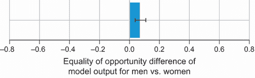

图 8.17 性别的机会公平性差异

### 8.3.2 通过表示进行歧视

在某些情况下，很难将歧视问题或公平性度量中的差异追溯到输入。例如，如果输入是图像或文本，那么将公平性度量中的差异追溯到像素值或词表示中的值将很困难。在这种情况下，一个更好的选择是检测模型学习到的表示中的任何偏差。让我们看看一个简单的例子，其目标是训练一个模型来检测图像中是否包含医生。假设我们已经训练了一个卷积神经网络（CNN），该网络预测图像中是否包含医生。如果我们想检查这个模型是否对任何受保护的群体（如性别）存在偏见，我们可以利用我们在第六章中学到的网络剖析框架来确定模型是否学习到了任何与受保护属性相关的特定概念。高级过程如图 8.18 所示。

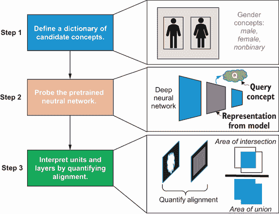

图 8.18 使用网络剖析框架检查学习到的表示中的偏差的高级说明

在图 8.18 中，我们关注性别受保护属性。第一步是定义一个性别特定概念的字典。图中显示了一个例子，其中图像在像素级别上被标记为各种性别概念，如男性、女性和非二元。下一步是探测预训练网络，然后量化 CNN 中每个单元和层与性别特定概念的匹配度。一旦我们量化了匹配度，我们就可以检查每个性别概念有多少独特的检测器。如果某个性别有更多的独特检测器，那么我们可以说模型似乎学习到了一个对该性别有偏见的表示。

现在我们来看一个例子，其中模型的输入是文本形式。我们在第七章学习了如何得出密集和分布式的词表示，这些表示传达语义意义。我们如何检查模型学习到的表示是否对受保护的群体存在偏见？如果我们看医生这个例子，单词*doctor*是中性的还是对任何性别有偏见？我们可以通过使用我们在第七章学习的 t-distributed stochastic neighbor embedding（t-SNE）技术来检查这一点。然而，我们首先需要制定一个单词分类法，以便我们知道哪些单词是中性的，哪些单词与特定性别相关，如*male*或*female*。一旦我们有了分类法，我们就可以使用 t-SNE 来可视化单词*doctor*在语料库中与其他单词的接近程度。如果单词*doctor*与其他中性的单词（如*hospital*或*healthcare*）更接近，那么模型为*doctor*学习到的表示就没有偏见。另一方面，如果单词*doctor*与性别特定的单词（如*man*或*woman*）更接近，那么表示就是有偏见的。

## 8.4 缓解偏差

我们有以下三种广泛的方法来减轻模型中的偏差：

+   *预处理*—我们在训练模型之前应用这些方法，目的是减轻训练数据集中的偏差。

+   *内处理*—我们在模型训练期间应用这些方法。公平概念被明确或隐含地纳入学习算法中，使得模型不仅优化性能（如准确率），还优化公平性。

+   *后处理*—我们在模型训练后对模型的预测应用这些方法。模型预测经过校准，以确保满足公平约束。

在本节中，我们将关注两种预处理方法。

### 8.4.1 无意识公平

一种常见的预处理方法是移除模型中的任何受保护特征。在某些受监管的行业，如住房、就业和信贷，法律禁止将任何受保护特征作为决策模型输入。对于我们为成人收入预测训练的随机森林模型，让我们尝试移除两个感兴趣的受保护特征——性别和种族——并查看模型是否使用机会均等/概率均等概念公平。作为一个练习，从随机森林模型中移除标签编码的性别和种族特征，并使用之前相同的超参数重新训练模型。查看与此书相关的 GitHub 仓库中的解决方案。

重新训练的模型在 ROC 曲线上的性能展示在图 8.19 中。正如我们在 8.2.2 节中看到的，ROC 曲线被用来绘制真正例率与假正例率的关系，我们可以使用从该 ROC 曲线获得的 AUC 来检查模型在机会均等和概率均等概念下是否公平。对于之前使用性别和种族作为输入特征的随机森林模型，性别组之间的 AUC 差异为 3%，种族组之间的差异为 2%。通过使用无意识公平，种族组之间的差异减少到 1%，但性别组之间的差异没有变化。因此，无意识公平并不提供任何公平保证。其他特征可能与这些受保护群体高度相关，并可能作为性别和种族的代理。此外，我们还观察到所有组的模型性能都有所下降，与之前的随机森林模型相比，AUC 有所降低。正如我们之前提到的，某些受监管行业要求我们依法使用无意识公平。即使模型不能保证公平，法律也要求这些行业在模型中不使用任何受保护特征。

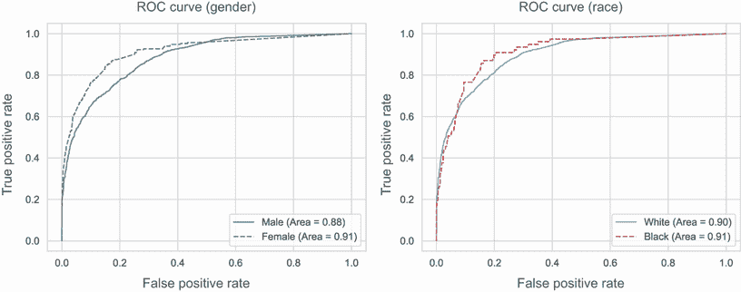

图 8.19 性别和种族的 ROC 曲线：无意识公平

### 8.4.2 通过重新加权纠正标签偏差

Heinrich Jiang 和 Ofir Nachum 在 2019 年提出了一种另一种预处理技术，该技术提供了公平性保证。在作者发布的、可在[`arxiv.org/abs/1901.04966`](https://arxiv.org/abs/1901.04966)找到的研究论文中，他们提供了可能出现在训练数据集中的偏差的数学公式。他们假设偏差可能出现在数据集中的观察标签中（也称为标签偏差），并且可以通过迭代重新加权训练数据集中的数据点来纠正，而不改变观察到的标签。他们为各种公平性概念提供了该算法的理论保证，如人口统计的平等性和机会/概率的平等。您可以参考原始论文以了解更多关于数学公式和证明的信息。在本节中，我们将概述该算法，并使用作者在[`mng.bz/Ygjj`](http://mng.bz/Ygjj)提供的实现。

通过重新加权纠正偏差的算法依赖于一个关键假设。数据集中观察到的标签基于一个未知的真实且无偏的标签集，这个标签集是未知的。观察到的数据集由于标签者或引入偏差的过程而存在偏差。关键假设是这种偏差的来源是无意的，并且可能由于无意识或固有的偏差。基于这个假设，论文的作者从数学上证明了通过重新加权观察到的、有偏差的数据集中的特征，可以构建一个无偏分类器，该分类器可能是在未知的、无偏的数据集上通过重新加权训练的。这如图 8.20 所示。


图 8.20 重新加权方法中标签偏差来源的潜在假设

标签偏差重新加权算法是迭代的，总结如图 8.21 所示。假设数据集中有*K*个受保护组，*N*个特征。对于成人收入数据集，考虑的受保护组数量是四个（两个性别组和两个种族组）。数据集包含 14 个特征。在运行算法之前，我们需要为每个受保护组初始化系数，其值为 0。我们还需要为每个特征初始化权重，其值为 1。

系数和权重初始化完成后，下一步是使用这些权重训练一个模型。由于本章我们考虑的是随机森林模型，因此这一步训练的模型将与第 8.1.2 节中训练的模型相同。下一步是为每个 *K* 个受保护群体计算该模型的公平性违规。公平性违规取决于我们感兴趣的具体概念。如果公平性概念是人口平衡，那么受保护群体的公平性违规是模型的整体平均正面率与该特定受保护群体的平均正面率之间的差异。如果公平性概念是机会平等，那么我们需要考虑整体平均真正阳性率和特定受保护群体的平均真正阳性率之间的差异。一旦我们计算了公平性违规，下一步是更新每个受保护群体的系数。算法的目标是最小化公平性违规，因此我们通过从其中减去公平性违规来更新系数。最后一步是使用受保护群体的系数更新每个特征的权重。更新权重的公式如图 8.21 所示，您可以在该算法作者发表的原论文中找到该公式的推导过程。本段中的步骤随后会重复 *T* 次，其中 *T* 是一个超参数，表示我们希望算法运行的迭代次数。

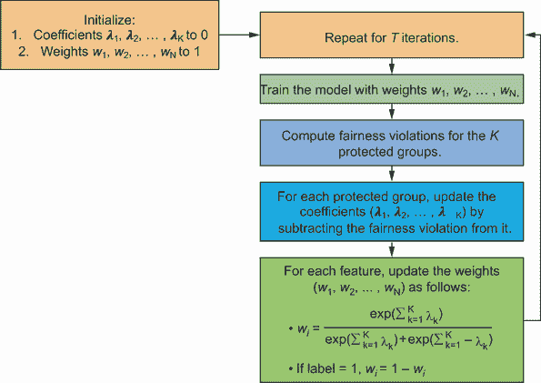

图 8.21 标签偏差重加权算法

现在，让我们将此算法应用于之前训练的成人收入数据集。但在运行算法之前，我们首先需要使用以下代码片段准备数据。思路是将标签编码的性别和种族特征转换为独热编码特征，其中有一个列对应于四个受保护群体（男性、女性、白人和黑人成年人）中的一个，并使用 0 或 1 的值来表示成年人是否属于该特定受保护群体：

```
from functools import partial                                              ①
def prepare_data_for_label_bias(df_X, protected_features,                  ②
                                protected_encoded_map):                    ②
    df_X_copy = df_X.copy(deep=True)                                       ③
    def map_feature(row, feature_name, feature_encoded):                   ④
        if row[feature_name] == feature_encoded:                           ④
            return 1                                                       ④
        return 0                                                           ④

    colname_func_map = {}                                                  ⑤
    for feature_name in protected_features:                                ⑤
        protected_encoded_fv = protected_encoded_map                       ⑤
        ➥ [feature_name]                                                  ⑤
        for feature_value in protected_encoded_fv:                         ⑤
            colname = f"{feature_name}_{feature_value}"                    ⑤
            colname_func_map[colname] = partial                            ⑤
            ➥ (map_feature,                                               ⑤
                feature_name=feature_name,                                 ⑤
                feature_encoded=protected_encoded_fv[feature_value])       ⑤

    for colname in colname_func_map:                                       ⑤
        df_X_copy[colname] = df_X_copy.apply                               ⑤
        ➥ (colname_func_map[colname],                                     ⑤
            axis=1)                                                        ⑤
    df_X_copy = df_X_copy.drop(columns=protected_features)                 ⑥
    return df_X_copy                                                       ⑦
```

① 导入 Python functool 库提供的部分函数

② 为标签偏差重加权算法准备数据集的辅助函数

③ 创建原始 DataFrame 的副本并对副本进行修改

④ 将每个特征映射到其编码值的辅助函数

⑤ 遍历所有受保护特征，并为每个群体创建具有相应二进制编码值的单独列

⑥ 从 DataFrame 的副本中删除原始受保护特征列

⑦ 返回带有新列的 DataFrame 副本

然后，您可以使用此辅助函数如下准备数据集。请注意，在调用辅助函数之前，为每个受保护群体创建了一个映射到其对应标签编码值的映射：

```
protected_features = ['gender', 'race']                                         ①
protected_encoded_map = {                                                       ②
    'gender': {                                                                 ②
        'male': 1,                                                              ②
        'female': 0                                                             ②
    },                                                                          ②
    'race': {                                                                   ②
        'white': 1,                                                             ②
        'black': 0                                                              ②
    }                                                                           ②
}                                                                               ②
df_X_lb = prepare_data_for_label_bias(df_X,                                     ③
                                      protected_features,                       ③
                                      protected_encoded_map)                    ③
X_train_lb = df_X_lb.iloc[X_train.index]                                        ④
X_test_lb = df_X_lb.iloc[X_test.index]                                          ④

PROTECTED_GROUPS = ['gender_male', 'gender_female', 'race_white', 'race_black'] ⑤
protected_train = [np.array(X_train_lb[g]) for g                                ⑤
➥ in PROTECTED_GROUPS]                                                         ⑤
protected_test = [np.array(X_test_lb[g]) for g                                  ⑤
➥ in PROTECTED_GROUPS]                                                         ⑤
```

① 需要处理的受保护特征列表

② 将每个受保护群体映射到其相应的标签编码值

③ 调用辅助函数以准备数据集用于标签偏差重加权算法

④ 将新的数据集分为训练集和测试集

⑤ 提取受保护群体的列

一旦你准备好了数据集，你就可以轻松地将它插入到标签偏差重加权算法中。你可以在论文作者发布的 GitHub 仓库([`mng.bz/Ygjj`](http://mng.bz/Ygjj))中找到这个算法的源代码。为了节省空间，我们不会在本节中重复该代码。作为一个练习，运行该算法并确定训练数据集中每个数据点的权重。一旦确定了权重，你可以使用以下代码片段重新训练无偏的随机森林模型：

```
model_lb = create_random_forest_model(10, max_depth=20)    ①
model_lb.fit(X_train_lb,                                   ②
                 y_train,                                  ②
                 weights)                                  ②
```

① 使用第三章中学习的辅助函数创建随机森林模型

② 调用 fit 方法并传入准备好的数据集和标签偏差重加权算法获得的权重

重新训练的模型在 ROC 曲线上的性能如图 8.22 所示。我们可以看到，性别组和种族组之间的 AUC 差异都是 1%。因此，这个模型在机会平等和概率方面比之前训练的以性别和种族为特征的随机森林模型以及没有这些特征的模型更加公平。

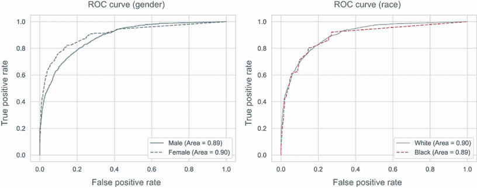

图 8.22 纠正标签偏差后的性别和种族 ROC 曲线

## 8.5 数据集的数据表

在第 8.1.1 节探索成人收入数据集时，我们注意到一些受保护群体（如女性和黑人成年人）没有得到适当的代表，这些群体的标签存在偏见。我们确定了几个偏见来源，即抽样偏差和标签偏差，但我们无法确定偏差的根本原因。主要原因在于这个数据集的数据收集过程是未知的。在 2020 年，谷歌和微软的研究员 Timnit Gebru 和其他研究人员发表的一篇论文中，提出了一种标准化的流程来记录数据集。这个想法是让数据创建者制定一份数据表，回答关于数据集动机、组成、数据收集过程和用途的关键问题。以下是一些关键问题的概述，但更深入的研究可以在原始研究论文[`arxiv.org/pdf/1803.09010.pdf`](https://arxiv.org/pdf/1803.09010.pdf)中找到：

+   动机

    +   数据集创建的目的是什么？这个问题的目的是了解数据集是否针对特定任务或解决特定差距或需求。

    +   谁创建了数据集？目标是确定数据集的所有者，这可能是一个个人、团队、公司、组织或机构。

    +   谁资助了数据集的创建？目标是了解数据集是否与研究拨款或其他资金来源相关联。

+   组成

    +   数据集代表什么？目标是了解数据是否代表文档、照片、视频、人物、国家或其他任何表示。

    +   数据集中有多少个示例？这个问题是显而易见的，旨在了解数据集的大小，即数据点或示例的数量。

    +   数据集是否包含所有可能的示例，或者它是一个更大数据集或总体的样本？目标是了解数据集是否是从更大数据集或总体中抽取的样本。这将帮助我们检查是否存在任何抽样偏差。

    +   数据集是否已标记？目标是检查数据集是原始的还是标记的。

    +   数据集是否依赖于外部来源？目标是确定数据集是否存在任何外部来源或依赖，例如网站、Twitter 上的推文或任何其他数据集。

+   收集过程

    +   数据是如何获取的？这个问题有助于我们了解数据收集过程。

    +   如果适用，使用了什么抽样策略？这是组成部分中抽样问题的扩展，帮助我们检查是否存在任何抽样偏差。

    +   数据是在什么时间段内收集的？

    +   从个人直接收集数据还是通过第三方收集的？

    +   如果数据与人物相关，是否已获得他们的数据收集同意？如果数据集与人物相关，我们与人类学等领域的专家合作非常重要。这个问题的答案也是确定数据集是否符合欧盟（EU）的通用数据保护条例（GDPR）等规定的重要部分。

    +   是否存在个人在未来撤销同意的机制？这也是确定数据集是否符合规定的重要部分。

+   使用

    +   数据集将用于什么？目标是确定数据集的所有可能任务或用途。

    +   是否不应将数据集用于任何任务？这个问题的答案将帮助我们确保数据集不会被用于其未打算用于的任务。

数据集的数据表已经被研究和工业界采用。一些例子包括用于问答的 QuAC 数据集([`quac.ai/datasheet.pdf`](https://quac.ai/datasheet.pdf))、包含烹饪食谱的 RecipeQA 数据集([`mng.bz/GGnA`](http://mng.bz/GGnA))和 Open Images 数据集([`github.com/amukka/openimages`](https://github.com/amukka/openimages))。尽管数据集的数据表为数据集创建者增加了额外的开销，但它们提高了透明度和问责制，帮助我们确定是否存在任何偏差的来源，并确保我们遵守欧盟的 GDPR 等规定。

### 摘要

+   数据集中可能存在各种偏差来源，例如采样偏差和标签偏差。采样偏差发生在数据集未能正确代表真实人口时。标签偏差发生在对人口中不同群体的标签记录方式存在偏差时。

+   不同的公平性概念包括人口统计学上的平等、机会和概率的平等、预测质量的平等、通过无意识实现的公平以及反事实公平。常用的公平性概念包括人口统计学上的平等和机会及概率的平等。

+   人口统计学上的平等有时也称为独立性或统计平等，在法律上被称为不同影响。它断言模型在不同受保护群体的积极预测率中包含相等性。人口统计学上的平等概念对于我们想要确保所有受保护群体在人口中的普遍性不受影响时保持平等的场景是有用的。它确保少数群体得到与多数群体相同的待遇。

+   对于我们想要考虑所有受保护群体实际标签分布的场景，我们可以使用机会和概率的公平性概念。我们说存在机会平等，当组间真实阳性率存在相等性时。机会平等将机会平等的定义扩展到另一个对称的测量，即假阳性率。

+   我们可以将所有公平性概念分为两组：群体公平性和个体公平性。群体公平性确保模型对不同受保护群体是公平的。另一方面，个体公平性确保模型对相似个体做出相似的预测。

+   我们可以使用本书中学到的可解释性技术来检测模型导致的歧视来源。歧视的来源可以大致分为两种类型：通过输入特征的歧视和通过表示的歧视。

+   通过输入追踪将歧视或公平性问题追溯到输入特征。我们可以使用 SHAP 可解释性技术将公平性问题追溯到输入。

+   这些类型的公平性问题难以追溯到输入特征，特别是对于处理图像和文本等输入的深度学习模型。在这种情况下，我们可以将歧视的来源追溯到模型学习到的深度表示。我们可以使用网络分解框架和第六章和第七章中学习的 t-SNE 技术来分别追踪歧视的来源。

+   我们可以使用两种技术来减轻偏差：通过无意识实现的公平和用于纠正标签偏差的重加权技术。通过无意识实现的公平并不保证公平，但重加权技术确实提供了公平保证。

+   存在一个标准化的流程，用于使用数据表来记录数据集。数据表旨在回答关于数据集动机、组成、数据收集过程以及使用的关键问题。尽管为数据集创建数据表会给数据集创建者带来额外的开销，但它们提高了透明度和问责制，帮助我们确定是否存在任何偏见来源，并确保我们符合欧盟的 GDPR 等法规。
