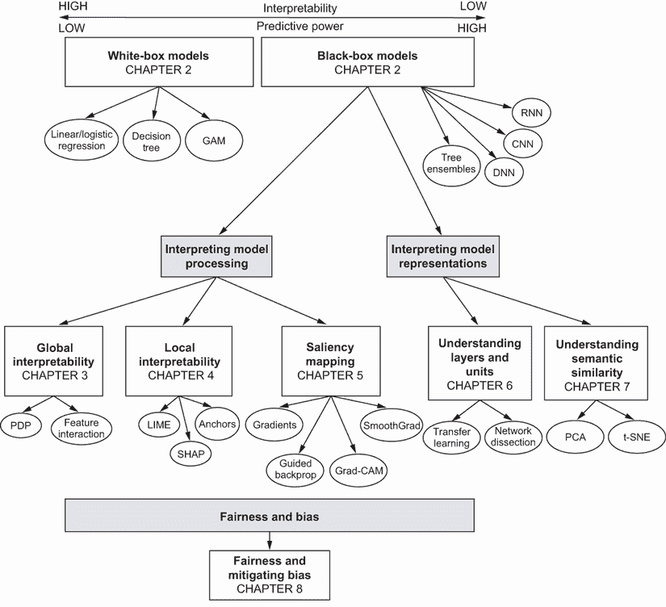
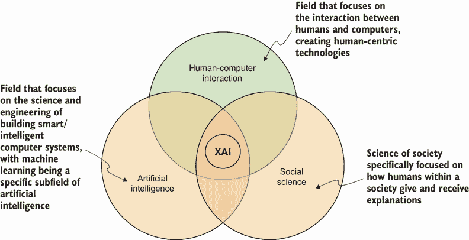
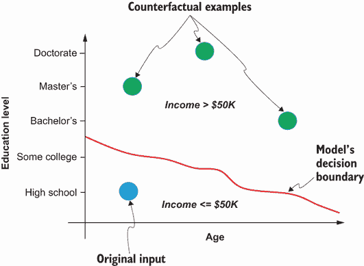
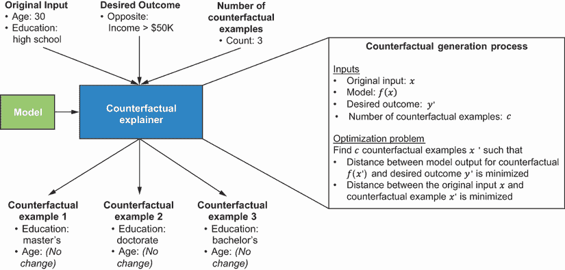
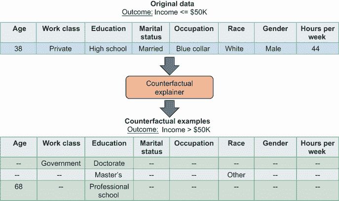

# 9 可解释人工智能之路

本章涵盖

+   总结本书中学到的可解释性技术

+   理解可解释人工智能系统的特性

+   常见的问题以及对可解释人工智能系统应用可解释性技术来回答这些问题

+   使用反事实示例来提出对比性解释

我们现在正接近通过可解释人工智能世界的旅程的终点。图 9.1 提供了这次旅程的地图。让我们花点时间来反思和总结我们所学的。可解释性全部关于理解人工智能系统中的因果关系。这是我们在给定输入的情况下，能够持续估计人工智能系统中的底层模型将预测什么，理解模型是如何得出预测的，理解预测如何随着输入或算法参数的修改而变化，以及最终理解模型何时犯错的程度。由于机器学习模型在金融、医疗保健、技术和法律等各个行业中日益增多，可解释性正变得越来越重要。这些模型所做的决策需要透明度和公平性。本书中学到的技术是提高透明度和确保公平性的强大工具。

在本书中，我们研究了两种广泛的机器学习模型类别——白盒模型和黑盒模型，它们位于可解释性和预测能力的光谱上。白盒模型本质上是透明的，易于解释。然而，它们的预测能力较低到中等。我们特别关注线性回归、逻辑回归、决策树和广义加性模型（GAMs），并通过理解模型的内部结构来学习如何解释它们。黑盒模型本质上是不可透见的，难以解释，但提供了更高的预测能力。在本书中，我们主要关注解释黑盒模型，如树集成和神经网络。



图 9.1 通过可解释人工智能世界的旅程地图

我们有两种解释黑盒模型的方法。一种是对模型处理过程进行解释——即理解模型如何处理输入并得出最终预测。另一种方法是解释模型表示，这仅适用于深度神经网络。为了解释模型处理过程，我们学习了诸如局部依赖性图（PDPs）和特征交互图等后验模型无关方法，以理解输入特征对模型预测的全球影响。我们还学习了局部范围内的后验模型无关方法，例如局部可解释模型无关解释（LIME）、SHapley 加性解释（SHAP）和锚点。我们可以使用这些方法来解释模型如何得出个别预测。我们还使用了视觉归因方法，如显著性图，以理解对视觉任务使用的神经网络中哪些输入特征或图像像素是重要的。为了解释模型表示，我们学习了如何剖析神经网络并理解网络中中间或隐藏层学习的数据表示。我们还学习了如何使用主成分分析（PCA）和 t 分布随机邻域嵌入（t-SNE）等技术来可视化模型学习的高维表示。

我们最终聚焦于公平性的话题，学习了各种公平性概念以及如何利用可解释性技术来衡量公平性。我们还学习了如何通过各种预处理技术来缓解公平性问题，例如通过无意识实现的公平性和迭代标签偏差校正技术。

在这本书中，我们明确区分了可解释性和可解释性。可解释性主要关于回答“如何”的问题——模型是如何工作的，以及它是如何得出预测的？可解释性超越了可解释性，因为它帮助我们回答“为什么”的问题——为什么模型做出了一个预测而不是另一个？可解释性主要是由构建、部署或使用 AI 系统的专家所识别的，这些技术是帮助你达到可解释性的基石。我们将专注于本章中可解释人工智能的路径。

## 9.1 可解释人工智能

让我们来看一个可解释人工智能系统的具体例子以及对其的期望。我们将使用第八章中预测美国成年人收入的相同例子。给定一组输入特征，如教育、职业、年龄、性别和种族，假设我们已经训练了一个模型，该模型预测成年人每年是否收入超过 50,000 美元。在应用本书中学到的可解释性技术后，假设我们现在可以将此模型作为服务部署。此服务可以被公众使用，根据他们的特征作为输入来确定他们可以赚多少钱。一个可解释的人工智能系统应该为系统用户提供质疑模型做出的预测和挑战因这些预测而做出的决策的功能。这如图 9.2 所示，其中向用户提供解释的功能已内置到解释代理中。用户可以向代理提出关于模型做出的预测的各种问题，代理有责任提供有意义的答案。如图 9.2 所示，用户可能提出的一个问题就是为什么模型预测他们的薪水会低于 50K。


图 9.2 一个代理向系统用户解释模型预测的示意图

用户在图 9.2 中提出的问题，为了说明目的，关注的是理解各种特征值如何影响模型预测。这只是可能向系统提出的问题之一。表 9.1 展示了我们可以向系统提出的一些广泛类别的问题以及我们在本书中学到的可用于此类问题的技术。如表所示，我们已准备好回答关于模型如何工作、哪些特征很重要、模型如何对特定案例做出预测以及模型是否公平无偏的问题。正如之前所强调的，我们并不擅长回答“为什么”的问题，将在本章简要涉及这一点。

表 9.1 问题类型和解释方法

| 方法类别 | 问题类型 | 解释方法 |
| --- | --- | --- |
| 解释模型 |

+   *模型*是如何工作的？

+   *哪些*特征或输入对模型来说是最重要的？

|

+   模型依赖描述。（本书提供了关于各种广泛类别的模型（包括白盒和黑盒）如何工作的良好描述。）

+   全局特征重要性（第二章和第三章）。

+   模型表示（第六章和第七章）。

|

| 解释预测 |
| --- |

+   *模型*是如何对我的案例做出这个预测的？

|

+   本地特征重要性（第四章）。

+   视觉归因方法（第五章）。

|

| 公平性 |
| --- |

+   *模型*是如何对待某个特定受保护群体的成员的？

+   *模型*是否对我的所属群体存在偏见？

|

+   公平性概念和度量（第八章）。

|

| 对比或反事实 |
| --- |

+   *为什么*模型会为我预测这个结果？

+   *为什么*不是另一种结果？

|

+   反事实解释（本章将讨论）。

|

尽管我们在本书中学到的可解释性技术将帮助我们回答表 9.1 中突出的大部分问题，但提供答案或解释给用户的过程远不止于此。我们需要知道与所提问题相关的信息是什么，解释中需要提供多少信息，以及用户如何接收或理解解释（即他们的背景）。一个名为可解释人工智能（XAI）的整个领域致力于解决这个问题。如图 9.3 所示，XAI 的范围不仅限于人工智能，其中机器学习是一个特定的子领域，而且还涉及其他领域，如人机交互（HCI）和社会科学。



图 9.3 可解释人工智能（XAI）的范围

Tim Miller 发表了一篇重要的研究论文（可在[`arxiv.org/pdf/1706.07269.pdf`](https://arxiv.org/pdf/1706.07269.pdf)找到），这篇论文探讨了与社会科学相关的见解，这些见解与 XAI 相关。以下是该论文中的关键发现：

+   *解释是对比性的*——人们通常不仅仅询问模型为什么预测了特定的结果，而是为什么不是另一种结果。这在表 9.1 中被突出显示为对比性或反事实解释方法，我们将在下一节简要讨论这一点。

+   *解释通常是以偏概全的方式选择的*——如果向用户提供了许多解释或预测的原因，那么用户通常只会选择一两个，而且选择通常是偏颇的。因此，了解提供多少信息以及哪些信息对解释最相关是很重要的。

+   *解释是社会的*——从 AI 系统到用户的 信息传递必须是互动的，并以对话的形式进行。因此，拥有一个如图 9.2 所示的解释代理，它能够理解问题并提供有意义的答案，是非常重要的。用户必须处于这个互动的中心，并且重要的是要关注 HCI 领域来构建这样的系统。

在下一节中，我们将具体探讨一种可以用来提供对比性或反事实解释的技术，即回答为什么和为什么不的问题。

## 9.2 反事实解释

反事实解释（也称为对比性解释）可以用来解释为什么模型预测了某个值而不是另一个值。让我们看看一个具体的例子。我们将使用成人收入预测模型，这是一个二元分类问题，并且为了便于可视化，我们只关注两个输入特征——年龄和教育。



图 9.4 反事实示例的说明

这两个特征在图 9.4 中显示为一个二维平面。成人收入模型的决策边界也显示为平面上的一条曲线，将平面下部分与上部分分开。对于平面下部分的成年人，模型预测的收入小于或等于$50K，而对于平面上部分的成年人，模型预测的收入大于$50K。假设我们有一个成年人向系统提供输入以预测他们将获得多少收入。这在图 9.4 中标记为“原始输入”。这位成年人受过高中教育，假设年龄为 30 岁（在这个例子中这不相关）。因为这个输入低于决策边界，模型将预测这位成年人将获得小于$50K 的收入。然后用户提出问题：为什么我的收入小于$50K 而不是大于$50K？

反事实或对比解释将提供示例，在一个反事实世界中，如果该用户满足某些标准，那么它将导致他们获得期望的结果——获得大于$50K 的收入。反事实示例在图 9.4 中标记。它们表明，如果用户的受教育程度更高——学士、硕士或博士——那么他们获得超过$50K 收入的机会就更高。

我们如何生成这些反事实示例？整个过程，如图 9.5 所示，包括一个解释者，它将以下内容作为输入：

+   *原始输入*—用户提供的输入

+   *期望结果*—用户期望得到的结果

+   *反事实示例数量*—在解释中要展示的反事实示例数量

+   *模型*—用于预测以获得反事实示例预测的模型



图 9.5 反事实生成过程

解释者随后运行一个算法来生成反事实示例。这本质上是一个寻找反事实示例的优化问题，以满足以下标准：

+   反事实示例的模型输出尽可能接近期望结果。

+   反事实示例在特征空间中也接近原始输入，即，通过更改一组高价值特征的最小值来获得期望结果。

在本章中，我们将重点关注一种称为多样化反事实解释（DiCE）的流行技术来生成反事实解释。在 DiCE 中，优化问题被表述为我们之前所做的那样。特征以某种方式被扰动，以便它们多样化且可行更改，并达到用户的期望结果。数学细节超出了本书的范围，但让我们使用 DiCE 库为成人收入预测问题生成反事实解释。库可以按照以下方式安装：

```
$> pip install dice-ml
```

以下代码片段展示了如何加载数据并将其准备成 DiCE 解释器可以处理的形式：

```
import dice_ml                                    ①
from dice_ml.utils import helpers                 ②

dataset = helpers.load_adult_income_dataset()     ③

d = dice_ml.Data(dataframe=dataset,               ④
                 continuous_features=['age',
                 ➥ 'hours_per_week'],            ⑤
                 outcome_name='income')           ⑥
```

① 导入 DiCE 库

② 在 DiCE 库中导入辅助模块

③ 使用 DiCE 提供的辅助模块加载成人收入数据集

④ 为 DiCE 解释器准备数据；在 Data 类中将 DataFrame 参数设置为预加载数的成人收入数据集

⑤ 在 Data 类中将 continuous_features 参数设置为 DataFrame 中连续特征的列列表

⑥ 将 outcome_name 设置为 DataFrame 中包含目标变量的列名

下一步是训练模型以预测成人收入。因为我们已经在第八章中使用随机森林模型完成了这项工作，所以这里不会展示相应的代码。一旦模型训练完成，我们现在就可以初始化 DiCE 解释器，可以使用以下代码片段来完成：

```
m = dice_ml.Model(model=adult_income_model,       ①
                  backend="sklearn")              ②

exp = dice_ml.Dice(d, m,                          ③
                   method="random")               ④
```

① 通过将 model 参数设置为训练好的成人收入模型初始化 DiCE Model 类

② 同时将 Model 类中的 back-end 参数设置为"sklearn"，因为模型是 Scikit-Learn 库提供的 RandomForestClassifier

③ 通过传递 DiCE 数据和模型初始化 DiCE 解释器

④ 同时在 DiCE 解释器中将方法设置为"random"

初始化 DiCE 解释器后，我们可以使用下一个代码片段生成反事实示例。该函数本质上接受原始输入、反事实示例的数量和期望结果作为输入。对于这里选择的输入，模型预测的是低收入（即< $50K），而用户的期望结果是高收入（即> $50K）：

```
original_input = dataset[0:1]                              ①

cf_examples = exp.generate_counterfactuals
➥ (original_input,                                        ②
    total_CFs=3,                                           ③
    desired_class="opposite")                              ④
cf_examples.visualize_as_dataframe(show_only_changes
➥ =True)                                                  ⑤
```

① 选择一个用于生成反事实的输入

② 使用 DiCE 解释器为该输入生成反事实

③ 同时将 total_CFs 参数设置为要生成的反事实示例的数量

④ 此外，将 desired_class 参数设置为反事实示例的期望结果

⑤ 将反事实示例可视化为一个 Pandas DataFrame

此代码片段的输出将打印出反事实示例，作为一个 Pandas DataFrame。此输出已被重新格式化为表格，并显示在图 9.6 中。从图 9.6 中我们可以看到，模型预测低收入的贡献关键因素是教育水平。如果教育水平更高——博士、硕士或专业学校——那么用户获得期望结果的可能性就更高。未更改的特征在图中显示为“--”。



图 9.6 DiCE 反事实解释器的输出

我们还可以使用 DiCE 反事实解释器来解释回归模型。对于分类，我们在生成反事实示例时通过在`generate_counterfactuals`函数中设置`desired_class`参数来指定所需的输出。对于回归，我们必须在同一个函数中设置一个不同的参数，称为`desired_range`，将其设置为模型预测所需的可能值的范围。

反事实示例是提供对比性解释的绝佳方式。一种形式的反事实解释是，“模型预测 P 是因为特征 X、Y 和 Z 的值分别是 A、B 和 C，但如果特征 X 的值是 D 或 E，那么模型将预测不同的结果 Q，”这种解释更具因果信息，有助于我们理解为什么模型预测了某个结果而不是另一个。如前所述，向 AI 系统的用户提供良好的解释需要更多的内容。XAI 是 AI、社会科学和 HCI 等多个领域的交汇点，是一个非常活跃的研究领域。这超出了本书的范围，但你所学到的技术应该为你提供一个坚实的基础，特别是在 AI 领域，以便进入 XAI 的世界。

这本书的内容到此结束。在你的工具箱中拥有广泛的可解释性技术，你已准备好理解复杂机器学习模型是如何工作的以及它们是如何得出预测的。你可以利用这些技术来调试和提升模型的性能。你也可以利用它们来增加透明度，构建公平且无偏见的模型。这本书还应为你构建可解释的人工智能系统铺平道路。你应该有一个坚实的基础来学习这个非常活跃的研究领域。祝你在构建和学习中快乐！

### 摘要

+   可解释性主要关乎理解 AI 系统中的底层模型是如何得出预测的，理解预测如何随着输入或算法参数的修改而变化，以及理解模型何时犯了错误。

+   可解释性超越了可解释性，因为它有助于回答“为什么”的问题——为什么模型做出了特定的预测而不是另一个？可解释性主要是由构建、部署或使用 AI 系统的专家所感知的，而这些技术是帮助你达到可解释性的基石。

+   可解释人工智能的范围不仅限于人工智能，其中机器学习是一个特定的子领域，而且还涉及其他领域，如人机交互（HCI）和社会科学。

+   从社会科学领域来看，以下三个关键发现与可解释性相关：

    +   解释通常是对比性的——人们通常不会仅仅询问模型为什么预测了特定的结果，而是更想知道为什么不是另一个结果。反事实解释可以用来回答这类问题。

    +   解释通常是以偏概全的。了解提供多少信息以及哪些信息对解释最为相关是很重要的。

    +   解释是社会的。从 AI 系统到用户的 信息传递必须以对话或交互的形式进行。参考人机交互（HCI）领域来构建这样的系统是很重要的。
