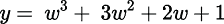
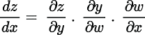
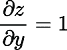
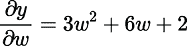
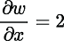
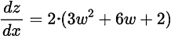

# 附录 B. PyTorch

## B.1 什么是 PyTorch？

PyTorch 是一个免费、开源的库，用于科学计算和深度学习应用，如计算机视觉和自然语言处理。它是基于 Python 的，由 Facebook 的人工智能研究（FAIR）实验室开发。PyTorch 被研究界和行业从业者广泛使用。Horace He 进行了一项最近的研究（可在[`mng.bz/W7Kl`](https://shortener.manning.com/W7Kl)找到），该研究表明，2019 年在主要机器学习会议上发表的大多数技术都是在 PyTorch 中实现的。其他库和框架，如 TensorFlow、Keras、CNTK 和 MXNet，也可以用于构建和训练神经网络，但我们将在这本书中使用 PyTorch。该库是 Pythonic 的，并且很好地利用了 Python 惯用语。因此，对于已经熟悉 Python 的研究人员、数据科学家和工程师来说，使用它更容易。PyTorch 还提供了实现前沿神经网络架构的出色 API。

## B.2 安装 PyTorch

您可以使用 Conda 或`pip`安装 PyTorch 的最新稳定版本，如下所示：

```
# Installing PyTorch using Conda
$> conda install pytorch torchvision -c pytorch

# Installing PyTorch using pip
$> pip install pytorch torchvision
```

注意，除了 PyTorch 之外，`torchvision`包也被安装了。这个包（[`pytorch.org/vision/stable/index.html`](https://pytorch.org/vision/stable/index.html)）包含流行的数据集、前沿神经网络架构的实现以及计算机视觉任务中对图像进行的常见转换。您可以通过在 Python 环境中导入库来确认安装是否成功，如下所示：

```
import torch
import torchvision
```

## B.3 张量

张量是一个多维数组，与 NumPy 数组非常相似。张量包含单一数据类型的元素，并且可以在图形处理单元（GPU）上进行快速计算。您可以从 Python 列表初始化 PyTorch 张量如下。请注意，本节中的代码格式化方式是为了反映 Jupyter 笔记本或 iPython 环境。输入命令的行以`In:`为前缀，命令的输出以`Out:`为前缀：

```
In: tensor_from_list = torch.tensor([[1., 0.], [0., 1.]])
In: print(tensor_from_list)
Out: tensor([[1., 0.],
             [0., 1.]])
```

对于机器学习问题，NumPy 被广泛使用。该库支持大型、多维数组，并提供了一组广泛的数学函数，可以用于对这些数组进行操作。您可以从 NumPy 数组初始化张量如下。请注意，print 语句的输出显示了张量以及元素的`dtype`，即数据类型。我们将在 B.3.1 节中介绍这一点：

```
In: import numpy as np
In: tensor_from_numpy = torch.tensor(np.array([[1., 0.], [0., 1.]]))
In: print(tensor_from_numpy)
Out: tensor([[1., 0.],
             [0., 1.]], dtype=torch.float64)
```

张量的大小或多维数组的维度可以通过以下方式获得。之前初始化的张量由两行两列组成：

```
In: tensor_from_list.size()
Out: torch.Size([2, 2])
```

我们可以初始化任何大小的空张量如下。下一个张量由三行两列组成。张量中存储的值是随机的，取决于内存中存储的位值：

```
In: tensor_empty = torch.empty(3, 2)
In: print(tensor_empty)
Out: tensor([[ 0.0000e+00, -1.5846e+29],
             [-7.5247e+03,  2.0005e+00],
             [ 9.8091e-45,  0.0000e+00]])
```

如果我们想初始化一个由所有零组成张量，我们可以这样做：

```
In: tensor_zeros = torch.zeros(3, 2)
In: print(tensor_zeros)
Out: tensor([[0., 0.],
             [0., 0.],
             [0., 0.]])
```

全为 1 的张量可以按照以下方式初始化：

```
In: tensor_ones = torch.ones(3, 2)
In: print(tensor_ones)
Out: tensor([[1., 1.],
             [1., 1.],
             [1., 1.]])
```

我们可以按照以下方式使用随机数初始化张量。随机数在 0 和 1 之间均匀分布：

```
In: tensor_rand = torch.rand(3, 2)
In: print(tensor_rand)
Out: tensor([[0.3642, 0.8916],
             [0.4826, 0.4896],
             [0.9223, 0.9286]])
```

如果您运行之前的命令，您可能不会得到相同的结果，因为随机数生成器的种子可能不同。为了获得一致且可重复的结果，您可以使用 PyTorch 提供的`manual_seed`函数设置随机数生成器的种子，如下所示：

```
In: torch.manual_seed(24)
In: tensor_rand = torch.rand(3, 2)
In: print(tensor_rand)
Out: tensor([[0.7644, 0.3751],
             [0.0751, 0.5308],
             [0.9660, 0.2770]])
```

### B.3.1 数据类型

数据类型（`dtype`），类似于 NumPy 的`dtype`，描述了数据类型和大小。张量常见的数据类型如下：

+   `torch.float32` 或 `torch.float`: 32 位浮点数

+   `torch.float64` 或 `torch.double`: 64 位浮点数

+   `torch.int32` 或 `torch.int`: 32 位有符号整数

+   `torch.int64` 或 `torch.long`: 64 位有符号整数

+   `torch.bool`: 布尔值

所有数据类型的完整列表可以在 PyTorch 文档中找到，网址为[`pytorch.org/docs/stable/tensors.html`](https://pytorch.org/docs/stable/tensors.html)。您可以通过以下方式确定张量的数据类型。我们将使用之前初始化的`tensor_from_list`张量：

```
In: tensor_from_list.dtype
Out: torch.float32
```

您可以按照以下方式使用给定的数据类型初始化张量：

```
In: tensor_from_list_float64 = torch.tensor([[1., 0.], [0., 1.]], 
                                                 dtype=torch.float64)    ①
In: print(tensor_from_list_float64)
Out: tensor([[1., 0.],
             [0., 1.]], dtype=torch.float64)                        ②
```

① 将 dtype 参数设置为 torch.float64

② 初始化为 64 位浮点数的张量

### B.3.2 CPU 和 GPU 张量

PyTorch 中的张量默认加载在 CPU 上。您可以通过检查张量所在的设备来查看这一点。我们将使用之前初始化的随机张量（`tensor _rand`）：

```
In: tensor_rand.device 
Out: device(type='cpu')
```

为了加快处理速度，您可以在 GPU 上加载张量。所有流行的深度学习框架，包括 PyTorch，都使用 CUDA（代表计算统一设备架构）在 GPU 上执行通用计算。CUDA 是由 NVIDIA 构建的平台，它提供了直接访问 GPU 的 API。CUDA 启用设备的列表可以在[`developer.nvidia.com/cuda-gpus#compute`](https://developer.nvidia.com/cuda-gpus#compute)找到。您可以通过以下方式检查您的机器上是否可用 CUDA：

```
In: torch.cuda.is_available()
Out: True
```

如果可用，您现在可以按照以下方式在 GPU 上初始化张量：

```
if torch.cuda.is_available():                           ①
    device = torch.device(“cuda”)                       ②
    tensor_rand_gpu = torch.rand(3, 2, device=device)   ③
```

① 首先检查 CUDA 是否可用

② 如果是，获取 CUDA 启用设备

③ 初始化张量并将设备设置为 CUDA 启用设备

以下代码片段展示了如何将 CPU 张量转移到 GPU 上：

```
if torch.cuda.is_available():
    device = torch.device(“cuda”)
    tensor_rand = tensor_rand.to(device)
```

### B.3.3 操作

我们可以在张量上执行多个操作。让我们看看添加两个张量的简单操作。我们首先初始化两个随机张量，`x`和`y`，如下所示：

```
In: x = tensor.rand(3, 2)
In: x
Out: tensor([[0.2989, 0.3510],
             [0.0529, 0.1988],
             [0.8022, 0.1249]])

In: y = tensor.rand(3, 2)
In: y
Out: tensor([[0.6708, 0.9704],
             [0.4365, 0.7187],
             [0.7336, 0.1431]])
```

我们可以使用`add`函数通过以下方式获得两个张量的和，或者直接运行`x + y`：

```
In: torch.add(x, y)
Out: tensor([[0.9697, 1.3214],
             [0.4894, 0.9176],
             [1.5357, 0.2680]])
```

PyTorch 还提供了各种其他数学运算和函数。有关所有操作的最新列表，请参阅 [`pytorch.org/docs/stable/torch.html`](https://pytorch.org/docs/stable/torch.html)。PyTorch 还提供了一个 NumPy 桥接功能，可以将张量转换为 NumPy 数组，如下所示：

```
In: x_numpy = x.numpy()
In: x_numpy
Out: array([[0.29888242, 0.35096592],
            [0.05293709, 0.19883835],
            [0.8021769 , 0.12490124]], dtype=float32)
```

## B.4 数据集和数据加载器

PyTorch 提供了一个 `Dataset` 类，允许您加载和创建用于模型训练的自定义数据集。让我们看一个假设的例子。我们首先使用 Scikit-Learn 创建一个随机数据集，如下所示：

```
In: from sklearn.datasets import make_classification    ①

In: X, y = make_classification(n_samples=100,           ②
                           n_features=5,                ③
                           n_classes=2,                 ④
                           random_state=42)             ⑤
```

① 导入 `make_classification` 函数以创建一个随机的 n 类分类数据集

② 将样本数设置为 100

③ 将输入特征数设置为 5

④ 将类别数设置为 2 以生成二元分类数据集

⑤ 设置随机数生成器的种子

该数据集包含 100 个样本或行。每个样本包含五个输入特征和一个由两个类别组成的目标变量。每个特征的值是从正态分布中抽取的。我们可以如下检查输入特征的第一行：

```
In: X[0]
Out: array([-0.43066755,  0.67287309, -0.72427983, -0.53963044, -0.65160035])
```

我们现在将创建一个继承自 PyTorch 提供的 `Dataset` 类的自定义数据集类。这将在下一个代码片段中展示：

```
from torch.utils.data import Dataset       ①

class CustomDataset(Dataset):              ②
    def __init__(self,                     ③
                 X, y,                     ④
                 transform=None):          ⑤
        self.X = X 
        self.y = y
        self.transform = transform

    def __len__(self):                     ⑥
        return len(self.X)                 ⑥

    def __getitem__(self, idx):            ⑦
        x, label = X[idx], y[idx]          ⑧

        if self.transform:                 ⑨
            x = self.transform(x)          ⑨

        return x, label                    ⑩
```

① 导入 PyTorch 数据集类

② 创建一个继承自 `Dataset` 的 `CustomDataset` 类

③ 初始化构造函数

④ 构造函数的位置参数是输入特征矩阵 X 和目标变量数组 y。

⑤ 可选参数是一个可以应用于数据的转换

⑥ 重写 `__len__` 方法以返回数据集的长度

⑦ 重写 `__getitem__` 方法以返回索引 idx 处的元素

⑧ 从索引 idx 提取输入特征和目标变量

⑨ 如果已定义，则在特征上应用转换

⑩ 在索引 idx 处返回特征和目标变量

`CustomDataset` 类的构造函数接受两个位置参数以初始化输入特征矩阵 `X` 和目标变量 `y`。还有一个可选参数称为 `transform`，我们可以使用它来在数据集上应用转换函数。请注意，我们需要重写 `Dataset` 类提供的 `__len__` 和 `__getitem__` 方法，以返回数据集的长度并提取指定索引处的数据。我们可以初始化自定义数据集并检查数据集的长度，如下所示：

```
In: custom_dataset = CustomDataset(X, y)
In: len(custom_dataset)
Out: 100
```

让我们现在也检查输入特征的第一行，如下所示：

```
In: custom_dataset[0][0]
Out: array([-0.43066755,  0.67287309, -0.72427983, -0.53963044, -0.65160035])
```

我们现在将创建一个自定义数据集并将其应用转换函数。我们将传递 `torch.tensor` 函数以将输入特征数组转换为张量。这将在下面展示。我们可以看到输入特征的第一行现在是一个包含 64 位浮点值的张量：

```
In: transformed_dataset = CustomDataset(X, y,
                                    transform=torch.tensor)
In: transformed_data[0][0]
Out: tensor([-0.4307,  0.6729, -0.7243, -0.5396, -0.6516], 
➥ dtype=torch.float64)
```

一些常见的图像变换函数，如裁剪、翻转、旋转和调整大小，也被 PyTorch 作为`torchvision`包的一部分实现。完整的变换列表可以在[`pytorch.org/vision/stable/transforms.html`](https://pytorch.org/vision/stable/transforms.html)找到。我们将在第五章中使用它们。

另一个值得了解的有用数据实用类是`DataLoader`。这个类接受一个从`Dataset`类继承的对象，以及一些可选参数，允许您遍历您的数据。`DataLoader`类提供了数据批处理、打乱和并行加载数据的功能，使用多进程工作进程。以下代码片段展示了如何初始化一个`DataLoader`对象并遍历之前创建的自定义数据集：

```
from torch.utils.data import DataLoader                      ①

dataloader = DataLoader(transformed_dataset,                 ②
                        batch_size=4,                        ③
                        shuffle=True,                        ④
                        num_workers=4)                       ⑤
for i_batch, sample_batched in enumerate(dataloader):        ⑥
    print(f"[Batch {i_batch}] Number of rows in batch: 
    ➥ {len(sample_batched[0])}")                            ⑦
```

① 导入 PyTorch 提供的 DataLoader 类

② 初始化 DataLoader 并传递之前初始化的 transformed_dataset

③ 将数据分批为每批四个

④ 打乱数据集

⑤ 利用四个核心或 CPU 并行加载数据

⑥ 遍历加载器并在批处理中加载数据

⑦ 打印批号和每批加载的行数

执行此代码后，您将注意到有 25 个批处理，每个批处理有 4 行，因为输入数据集的长度为 100，`DataLoader`类中的`batch_size`参数设置为 4。我们将在 B.5.3 节和第五章中使用`Dataset`和`DataLoader`类。

## B.5 建模

在本节中，我们重点关注建模以及如何使用 PyTorch 构建和训练神经网络。我们首先介绍自动微分，这是一种高效计算梯度的方法，用于优化神经网络中的权重。然后，我们将介绍模型定义和模型训练。

### B.5.1 自动微分

在第四章中，我们将学习神经网络。神经网络由许多通过边相互连接的层组成。网络中每一层的每个单元对其所有输入执行数学运算，并将输出传递给下一层。连接单元的边与权重相关联，学习算法的目标是确定所有边的权重，使得神经网络的预测尽可能接近标记数据集中的目标。

确定权重的一个有效方法是使用反向传播算法。我们将在第四章中了解更多关于这个内容。在本节中，我们将学习自动微分及其在 PyTorch 中的实现。自动微分是一种数值评估函数导数的方法。反向传播是自动微分的一个特例。让我们看一个简单的例子，看看我们如何在 PyTorch 中应用自动微分。考虑一个表示为 *x* 的输入张量。我们对这个输入张量进行的第一个操作是将它乘以一个因子 2。让我们将这个操作的输出表示为 *w*，其中 *w = 2x*。给定 *w*，我们现在对它执行第二个数学操作，并将输出张量表示为 *y*。这个操作如下所示：



我们执行的最后一个操作是简单地求和张量 *y* 中的所有值。我们将最终的输出张量表示为 *z*。如果我们现在想计算输出 *z* 关于输入 *x* 的梯度，我们需要应用链式法则如下：



该方程中的偏导数如下所示：







对于更复杂的数学函数，这些梯度的计算可能很复杂。PyTorch 通过使用 `autograd` 包使这变得更容易。`autograd` 包实现了自动微分，并允许您数值评估函数的导数。通过应用前面显示的链式法则，`autograd` 允许您自动计算任意阶函数的梯度。让我们通过使用张量实现前面的数学操作来观察这一过程。我们首先初始化一个大小为 2 × 3 的输入张量 x，其中包含所有 1。请注意，当初始化张量时，将一个名为 `requires_grad` 的参数设置为 `True`。此参数让 `autograd` 知道要记录对它们的操作以进行自动微分：

```
In: x = torch.ones(2, 3, 
                   requires_grad=True)
In: x
Out: tensor([[1., 1., 1.],
             [1., 1., 1.]], requires_grad=True)
```

现在我们实现第一个数学操作，将张量 *x* 乘以一个因子 2 以获得张量 *w*。请注意，张量 *w* 的输出显示了 `grad_fn`，它用于记录对 *x* 执行的操作以获得 *w*。此函数用于使用自动微分数值评估梯度：

```
In: w = 2 * x
In: w
Out: tensor([[2., 2., 2.],
             [2., 2., 2.]], grad_fn=<MulBackward0>)
```

现在我们实现第二个数学操作，用于将张量 *w* 转换为 *y*：

```
In: y = w * w * w + 3 * w * w + 2 * w + 1
In: y
Out: tensor([[25., 25., 25.],
             [25., 25., 25.]], grad_fn=<AddBackward0>)
```

最终的操作简单地取张量 *y* 中所有值的总和以获得 *z*，如下所示：

```
In: z = torch.sum(y)
In: z
Out: tensor(150., grad_fn=<SumBackward0>)
```

我们可以通过调用 `backward` 函数轻松地计算张量 *z* 关于输入 *x* 的梯度。这将应用链式法则并计算输出相对于输入的梯度：

```
In: z.backward()
```

我们可以看到梯度的数值评估如下：

```
In: x.grad
Out: tensor([[52., 52., 52.],
             [52., 52., 52.]])
```

为了验证答案是否正确，让我们根据前面提供的方程数学推导出*z*相对于*x*的导数。以下是总结：




作为练习，我鼓励您使用张量评估这个方程。这个练习的解决方案可以在与本书相关的 GitHub 仓库[`github.com/thampiman/interpretable-ai-book`](https://github.com/thampiman/interpretable-ai-book)中找到。

### B.5.2 模型定义

现在我们来看如何使用 PyTorch 定义一个神经网络。我们将关注一个全连接神经网络。我们在 A.4 节中生成的合成数据集由五个输入特征和一个二进制输出组成。现在让我们定义一个包含一个输入层、两个隐藏层和一个输出层的全连接神经网络。输入层必须包含五个单元，因为数据集包含五个输入特征。输出层必须包含一个单元，因为我们处理的是一个二进制输出。我们在选择两个隐藏层中单元的数量方面有灵活性。让我们分别为第一和第二隐藏层选择五个和三个单元。我们在神经网络中每个单元的输入上进行线性组合，并在隐藏层使用 ReLU 激活函数，在输出层使用 sigmoid 激活函数。有关神经网络和激活函数的更多详细信息，请参阅第四章。

在 PyTorch 中，我们可以使用`torch.nn.Sequential`容器按顺序定义神经网络中的单元和层。PyTorch 中的每个单元层都必须继承自`torch.nn.Module`基类。PyTorch 已经提供了许多神经网络中常用的层，包括线性层、卷积层和循环层。常见的激活函数如 ReLU、sigmoid 和双曲正切（tanh）也已实现。层和激活函数的完整列表可以在[`pytorch.org/docs/master/nn.html`](https://pytorch.org/docs/master/nn.html)找到。我们现在可以使用这些构建块来定义模型，如下所示：

```
model = torch.nn.Sequential( 
    torch.nn.Linear(5, 5), 
    torch.nn.ReLU(), 
    torch.nn.Linear(5, 3), 
    torch.nn.ReLU(), 
    torch.nn.Linear(3, 1), 
    torch.nn.Sigmoid() 
)
```

在这里定义的 `Sequential` 容器按顺序定义层。第一个 `Linear` 模块对应于第一个隐藏层，它接收数据集中的五个特征并产生五个输出，这些输出被馈送到下一层。`Linear` 模块对输入执行线性变换。容器中的下一个模块定义了第一个隐藏层的 `ReLU` 激活函数。接下来的 `Linear` 模块接收来自第一个隐藏层的五个输入特征，执行线性变换，并产生三个输出，这些输出被馈送到下一层。同样，在第二个隐藏层中也使用了 `ReLU` 激活函数。最后的 `Linear` 模块接收来自第二个隐藏层的三个输入特征并产生一个输出，即输出层。因为我们处理的是二分类，所以在输出层使用 `Sigmoid` 激活函数。如果我们通过执行命令 `print(model)` 打印模型，我们将得到以下输出：

```
Sequential(
  (0): Linear(in_features=5, out_features=5, bias=True)
  (1): ReLU()
  (2): Linear(in_features=5, out_features=3, bias=True)
  (3): ReLU()
  (4): Linear(in_features=3, out_features=1, bias=True)
  (5): Sigmoid()
)
```

我们现在可以查看如何将神经网络定义为类，其中层数和单元数可以轻松定制，如下面的代码片段所示：

```
class BinaryClassifier(torch.nn.Sequential):                          ①
    def __init__(self, layer_dims):                                   ②
        super(BinaryClassifier, self).__init__()                      ③

        for idx, dim in enumerate(layer_dims):                        ④
            if (idx < len(layer_dims) - 1):                           ⑤
                module = torch.nn.Linear(dim, layer_dims[idx + 1])    ⑤
                self.add_module(f"linear{idx}", module)               ⑤

            if idx < len(layer_dims) - 2:                             ⑥
                activation = torch.nn.ReLU()                          ⑥
                self.add_module(f"relu{idx}", activation)             ⑥
            elif idx == len(layer_dims) - 2:                          ⑦
                activation = torch.nn.Sigmoid()                       ⑦
                self.add_module(f"sigmoid{idx}", activation)          ⑦
```

① 扩展 `Sequential` 容器的 `BinaryClassifier` 类

② 构造函数接收一个名为 `layer_dims` 的数组，该数组定义了网络的架构。

③ 初始化 `Sequential` 容器

④ 遍历 `layer_dims` 数组

⑤ 为所有层添加线性模块，并命名为“linear”，后跟层的索引

⑥ 为所有隐藏层添加 ReLU 模块，并命名为“relu”，后跟隐藏层的索引

⑦ 对于输出层，添加 Sigmoid 模块，并命名为“sigmoid”，后跟输出层的索引

`BinaryClassifier` 类继承自 `torch.nn.Sequential`。构造函数接收一个位置参数，这是一个名为 `layer_dims` 的整数数组，它定义了每层的层数和单元数。数组的长度定义了层数，而索引 `i` 处的元素定义了第 `i+1` 层的单元数。在构造函数内部，我们遍历 `layer_dims` 数组，并使用 `add_module` 函数将一个层添加到容器中。实现使用线性模块来处理所有层，并命名为 `linear`，后跟层的索引。我们为所有隐藏层使用 ReLU 激活函数，对于输出层使用 sigmoid 激活函数。有了这个自定义类，我们现在可以初始化二分类器，并使用数组轻松定义结构，如下所示：

```
num_features = 5                                  ①
num_outputs = 1                                   ②
layer_dims = [num_features, 5, 3, num_outputs]    ③

bc_model = BinaryClassifier(layer_dims)           ④
```

① 设置输入特征的数量为 5

② 设置输出数量为 1

③ 初始化 `layer_dims` 数组，该数组定义了由输入层五个单元、第一个隐藏层五个单元、第二个隐藏层三个单元和输出层一个单元组成的网络结构

④ 使用 `BinaryClassifier` 类初始化模型

通过执行`print(bc_model)`，我们可以看到网络的架构，它给出了以下输出。我们将在第四章中使用类似的实现：

```
BinaryClassifier(
  (linear0): Linear(in_features=5, out_features=5, bias=True)
  (relu0): ReLU()
  (linear1): Linear(in_features=5, out_features=3, bias=True)
  (relu1): ReLU()
  (linear2): Linear(in_features=3, out_features=1, bias=True)
  (sigmoid2): Sigmoid()
)
```

### B.5.3 训练

在模型就绪后，我们现在可以将其训练在之前创建的数据集上。从高层次来看，训练循环包括以下步骤：

1.  循环 epoch：对于每个 epoch，循环遍历数据批次。

    1.  对于每个小批量数据

        +   将数据通过模型以获得输出

        +   计算损失

        +   运行反向传播算法以优化权重

一个 epoch 是一个超参数，它定义了我们在神经网络中正向和反向传播整个训练数据的次数。在每个 epoch 中，我们加载一批数据，对于每一批数据，我们将其通过网络以获取输出，计算损失，并使用反向传播算法根据该损失优化权重。

PyTorch 提供了大量的损失函数或优化标准。其中一些常用的如下：

+   `torch.nn.L1Loss`—这个函数计算输出预测和实际值的平均绝对误差（MAE）。这通常用于回归任务。

+   `torch.nn.MSELoss`—这个函数计算输出预测和实际值的平均平方误差（MSE）。像 L1 损失一样，这也通常用于回归任务。

+   `torch.nn.BCELoss`—这个函数计算输出预测和实际标签的二进制交叉熵或对数损失。这个函数通常用于二分类任务。

+   `torch.nn.CrossEntropyLoss`—这个函数结合了 softmax 和负对数似然损失函数，通常用于分类任务。我们将在第五章中学习更多关于 BCE 损失和交叉熵损失的内容。

你可以在[`mng.bz/Dx5A`](http://mng.bz/Dx5A)找到所有损失函数的完整列表。由于我们只处理我们创建的数据集中的两个目标类别，我们将使用 BCE 损失函数。

PyTorch 还提供了各种优化算法，我们可以在反向传播过程中使用它们来更新权重。在本节中，我们将使用 Adam 优化器。PyTorch 中实现的全部优化器的完整列表可以在[`pytorch.org/docs/stable/optim.html`](https://pytorch.org/docs/stable/optim.html)找到。以下代码片段初始化了优化器的损失函数或标准或上一节中初始化的模型的所有参数或权重：

```
criterion = torch.nn.BCELoss()
optimizer = torch.optim.Adam(bc_model.parameters())
```

我们可以如下实现训练循环。注意，我们正在训练 10 个 epoch。在每个 epoch 中，我们使用在 A.4 节中初始化的`DataLoader`对象批量加载数据和标签。对于每个数据小批量，我们首先需要将梯度重置为零，然后计算该小批量的梯度。然后我们通过模型的前向方向运行以获得输出。然后我们使用这些输出来计算 BCE 损失。通过调用`backward`函数，使用自动微分计算损失函数相对于输入的梯度。然后我们调用优化器中的`step`函数，根据计算出的梯度更新权重或模型参数：

```
num_epochs = 10                                             ①

for epoch in range(num_epochs):                             ②
    for idx, (X_batch, labels) in enumerate(dataloader):    ③
        optimizer.zero_grad()                               ④
        outputs = bc_model(X_batch)                         ⑤
        loss = criterion(outputs, labels)                   ⑥
        loss.backward()                                     ⑦
        optimizer.step()                                    ⑧
```

① 初始化 epoch 数量的变量

② 循环遍历 epoch

③ 遍历每个数据和小批量标签

④ 为每个小批量重置梯度到 0

⑤ 将数据通过模型的前向方向运行以获取输出预测

⑥ 通过与真实标签比较来计算损失

⑦ 执行反向传播来计算损失函数相对于输入的梯度

⑧ 通过调用 step 更新模型中的参数

一旦我们训练好了模型，我们就可以对数据点进行如下预测。注意，我们将以下代码片段的格式转换为模仿 Jupyter 笔记本或 iPython 环境：

```
In: pred_var = bc_model(transformed_dataset[0][0])
In: pred_var
Out: tensor([0.5884], grad_fn=<SigmoidBackward>)
```

模型的输出是一个包含概率度量的张量。这个概率度量对应于神经网络中最终层的 sigmoid 激活函数的输出。你可以如下获得预测的标量：

```
In: pred_var.detach().numpy()[0]
Out: 0.5884
```

这就结束了我们对 PyTorch 的快速浏览，我们希望您已经拥有了足够的知识来实施和训练神经网络，并理解本书中的代码。有很多关于 PyTorch 的书籍和在线资源，可以在[`bookauthority.org/books/new-pytorch-books`](https://bookauthority.org/books/new-pytorch-books)和[`mng.bz/laBd`](https://shortener.manning.com/laBd)找到。PyTorch 文档[`pytorch.org/docs/stable/index.html`](https://pytorch.org/docs/stable/index.html)也是一个深入了解库的极好资源。
