> 第一部分
> 
> 欢迎来到模块化
> 
> Java 9 将模块化提升为一等概念。但什么是模块？它们解决了哪些问题，你如何从中受益？以及一等概念意味着什么？
> 
> 你正在阅读的这本书将回答所有这些问题以及更多。它教你如何定义、构建和运行模块，它们对现有项目有什么影响，以及它们提供了哪些好处。
> 
> 所有这些都在适当的时候。这本书的这一部分首先解释了模块化的含义，为什么它迫切需要，以及模块系统的目标（第一章）。第二章将你投入深水区，展示了定义、构建和运行模块的代码，然后第三章到第五章详细探讨了这三个步骤。第三章尤其重要，因为它介绍了模块系统背后的基本概念和机制。
> 
> 书的第二个部分讨论了 Java 9 对现有应用程序带来的挑战，第三部分介绍了更高级的功能。
> 
> 1
> 
> 谜团的第一个部分
> 
> 本章涵盖

+   模块化及其如何塑造系统

+   Java 无法强制执行模块化

+   新的模块系统如何旨在解决这些问题

> 我们都遇到过软件部署后拒绝按我们想要的方式工作的情形。可能有无数的可能原因，但有一类问题如此令人讨厌，以至于它获得了一个特别亲切的名字：JAR 地狱。JAR 地狱的经典方面是行为不端的依赖项：一些可能缺失，但似乎为了弥补这一点，其他可能存在多次，可能在不同版本中。这是导致崩溃或更糟的是，微妙地破坏运行应用程序的可靠方法。
> 
> JAR 地狱的根本问题是我们将 JAR 视为具有身份和彼此之间关系的工件，而 Java 将 JAR 视为没有任何有意义属性的简单类文件容器。这种差异导致了问题。
> 
> 一个例子是 JAR 之间缺乏有意义的封装：所有公共类型都可以被同一应用程序中的所有代码自由访问。这使得无意中依赖库中维护者认为是实现细节且从未为公共使用而完善的类型变得容易。他们可能将这些类型隐藏在名为 `internal` 或 `impl` 的包中，但这并不能阻止我们导入它们。
> 
> 然后，当维护者更改这些内部组件时，我们的代码就会崩溃。或者，如果我们对库的社区有足够的影响力，维护者可能被迫保留他们认为内部且未触及的代码，防止重构和代码演变。缺乏封装导致可维护性降低——不仅对库，也对应用程序。
> 
> 对于日常开发来说不太相关，但对于整个生态系统来说更糟糕的是，管理对安全关键代码的访问变得困难。在 Java 开发工具包（JDK）中，这导致了一系列漏洞，其中一些在 Oracle 收购 Sun 后导致了 Java 8 的发布延迟。
> 
> 这些以及其他问题已经困扰 Java 开发者超过 20 年，解决方案也讨论了近 20 年。Java 9 是第一个将内置到语言中的版本：自 2008 年以来在 Project Jigsaw 的框架下开发的 Java 平台模块系统（JPMS）。它允许开发者通过将元信息附加到 JARs 上来创建模块，从而使它们不仅仅是容器。从 Java 9 开始，编译器和运行时理解模块的身份和关系，因此可以解决诸如缺失或重复依赖以及缺乏封装等问题。
> 
> 但 JPMS 不仅仅是临时修补。它带来了一系列我们可以用它来开发更美观、可维护的软件的出色功能。可能最大的好处是它将每个个体开发者和整个社区直接面对模块化的基本概念。更有知识的开发者、更模块化的库、更好的工具支持——我们可以期待一个将模块化作为一等公民的 Java 世界带来这些和更多。
> 
> 我认识到许多开发者在升级时可能会跳过多个 Java 版本。例如，直接从 Java 8 跳到 Java 11 是很常见的。我会指出 Java 9、10 或 11 之间的差异，当它们出现时。书中大部分内容从 Java 9 版本开始对所有 Java 版本都是相同的。在某些情况下，我用 Java 9+作为 Java 9 或更高版本的简称。
> 
> 这章从第 1.1 节开始，探讨模块化的本质以及我们通常如何感知软件系统的结构。关键在于，在特定的抽象级别（JARs）上，JVM 并不像我们那样看待事物（第 1.2 节）。相反，它抹去了我们精心创建的结构！这种阻抗不匹配会导致真正的问题，正如我们将在第 1.3 节中讨论的那样。模块系统被创建出来是为了将工件转换为模块（第 1.4 节）并解决由阻抗不匹配引起的问题（第 1.5 节）。
> 
> 1.1 模块化究竟是什么？
> 
> 你如何看待软件？作为代码行？作为比特和字节？UML 图？Maven POMs？
> 
> 我不是在寻找定义，而是在寻找直觉。花点时间想想你最喜欢的项目（或者你被支付去工作的项目）：它感觉如何？你是如何可视化的？
> 
> 1.1.1 将软件作为图可视化
> 
> 我认为我正在工作的代码库是由相互作用的各个部分组成的系统。（是的，这是正式的。）每个部分有三个基本属性：名称、对其他部分的依赖以及它提供给其他部分的功能。
> 
> 这在抽象的每个层面上都是正确的。在非常低的层面上，一个部分映射到一个单独的方法，其中它的名称是方法的名称，它的依赖项是它调用的方法，它的特性是它触发的返回值或状态变化。在非常高的层面上，一个部分对应于一个服务（有人提到微服务吗？）或者甚至是一个完整的应用程序。
> 
> 想象一个结账服务：作为电子商务的一部分，它让用户购买他们挑选的商品。为了做到这一点，它需要调用登录和购物车服务。我们再次有三个属性：名称、依赖项和功能。很容易使用这些信息来绘制图 1.1 中所示的图。
> 
> 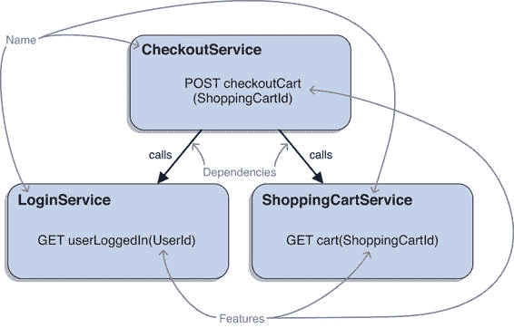
> 
> 图 1.1 如果将结账服务及其依赖项记录下来，它们自然形成一个小的图，显示了它们的名称、依赖项和功能。
> 
> 我们可以在不同的抽象级别上感知部分。在方法和整个应用程序的极端之间，我们可以将它们映射到类、包和 JAR 文件。它们也有名称、依赖项和功能。
> 
> 这个视角有趣的地方在于它可以用来可视化和分析一个系统。如果我们想象，甚至绘制，每个我们心中所想的部件的节点，然后根据它们的依赖关系用边将它们连接起来，我们就得到了一个图。
> 
> 这种映射如此自然，以至于电子商务示例已经做到了这一点，你可能都没有注意到。看看其他常见的软件系统可视化方式，如图图 1.2 所示，图无处不在。
> 
> 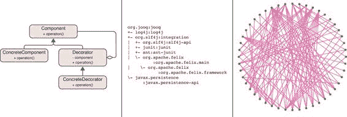
> 
> 图 1.2 在软件开发中，图无处不在。它们以各种形状和形式出现：例如，UML 图（左），Maven 依赖树（中），以及微服务连接图（右）。
> 
> 类图是图。构建工具的依赖输出结构类似于树（如果你使用 Gradle 或 Maven，尝试`gradle dependencies`或`mvn dependency:tree`），这是一种特殊的图。你有没有见过那些疯狂的微服务图，你根本看不懂？那些也是图。
> 
> 这些图看起来不同，取决于我们是在谈论编译时还是运行时依赖，我们是否只看一个抽象级别，或者将它们混合，我们是否检查系统的整个生命周期或一个单一时刻，以及许多其他可能的区分。其中一些差异将在以后变得重要，但现在我们不需要深入探讨。现在，任何无数可能的图都可以——只需想象你最熟悉的那一个。
> 
> 1.1.2 设计原则的影响
> 
> 将系统作为图来可视化是分析其架构的常见方式。许多良好的软件设计原则直接影响了其外观。
> 
> 以一个原则为例，即分离关注点。遵循它，我们努力创建软件，其中每个部分都专注于一项任务（如“登录用户”或“绘制地图”）。通常，任务由更小的任务组成（如“加载用户”和“验证密码”以登录用户），实现这些任务的组件也应该分离。这导致了一个图表，其中单个部分形成小的集群，执行清晰分离的任务。
> 
> 相反，如果关注点没有很好地分离，图表将没有明显的结构，看起来一切似乎都连接到其他一切。正如你在图 1.3 中看到的，区分这两种情况很容易。
> 
> 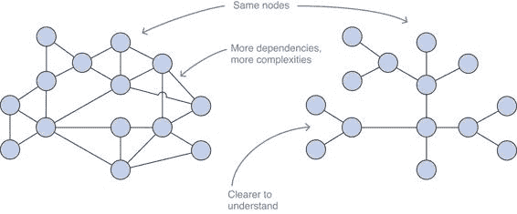
> 
> 图 1.3 两个系统的架构以图表形式表示。节点可以是 JAR 文件或类，边是它们之间的依赖关系。但细节并不重要：只需快速浏览就能回答是否存在良好的关注点分离问题。
> 
> 影响图表的一个原则的另一个例子是依赖倒置。在运行时，高级代码总是调用低级代码，但一个设计得当的系统在编译时反转这些依赖关系：高级代码依赖于接口，而低级代码实现它们，从而将依赖关系向上反转到接口。查看图表的右侧变体（见图 1.4），你可以轻松地找到这些反转。
> 
> 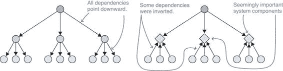
> 
> 图 1.4 高级代码依赖于低级代码的系统与使用接口来反转依赖关系向上的系统（右侧）创建的图表（左侧）不同。这种反转使得识别和理解系统中的有意义组件变得更加容易。
> 
> 关注点分离和依赖倒置等原则的目标是解耦图表。如果我们忽略它们，系统就会变得混乱，没有东西可以改变，而不会潜在地破坏看似无关的东西。如果我们遵循它们，系统就可以很好地组织。
> 
> 1.1.3 什么是模块化
> 
> 良好软件设计的原则引导我们走向解耦的系统。有趣的是，尽管可维护的系统是目标，但大多数原则都是通过允许我们专注于单个部分的路径来引导我们达到那里。原则关注点不在于整个代码库，而在于单个元素，因为最终它们的特性决定了它们构成的系统的属性。
> 
> 我们已经探讨了关注点分离和依赖倒置如何提供两个积极的特性：专注于单一任务和依赖于接口，而不是实现。系统各部分的最理想特性可以总结如下。
> 
> > **基本信息** 每个模块，我之前称之为部分，都有明确的职责和它所实现的明确合同。它是自包含的，对客户端来说是透明的，并且只要另一个模块实现了相同的合同，就可以用不同的模块替换它。它的少量依赖是 API，而不是实现。
> > 
> 由这样的模块构建的系统更容易适应变化，并且根据依赖的实现方式，在启动时甚至运行时可能更加灵活。这正是模块化的全部意义：作为精心设计模块的涌现属性，实现可维护性和灵活性。
> 
> 1.2 Java 9 之前的模块擦除
> 
> 你已经看到了交互部分图如何与几个很好的属性相连接，这些属性通常总结为模块化。但最终，这些只是想法——谈论软件的方式。图只是代码行，在 Java 的情况下，最终会被编译成字节码指令，并由 Java 虚拟机（JVM）执行。如果语言、编译器和 JVM（我将粗略且不正确地总结为 Java）能像我们一样看待事物，那将是极好的。
> 
> 通常情况下，它们确实是这样的！如果你设计一个类或接口，那么你给它起的名字就是 Java 用来识别它的。你定义为其 API 的方法正是其他代码可以调用的——使用你定义的确切方法名称和参数类型。它的依赖关系明显可见，要么是导入语句，要么是完全限定的类名，编译器和 JVM 将使用这些名称的类来满足它们。
> 
> 例如，让我们看看接口 `Future`，它表示一个可能已完成或尚未完成的计算的结果。类型的功能并不重要，因为我们只对它的依赖感兴趣：
> 
> `public interface Future<V> {  boolean cancel(boolean mayInterruptIfRunning); boolean isCancelled(); boolean isDone(); V get() throws InterruptedException, ExecutionException; V get(long timeout, TimeUnit unit) throws InterruptedException, ExecutionException, TimeoutException; }`
> 
> 通过查看 `Future` 声明的所有方法，很容易列举出依赖关系：

+   `InterruptedException`

+   `ExecutionException`

+   `TimeUnit`

+   `TimeoutException`

> 将同样的分析应用于刚刚确定类型，我们可以在图 1.5 中创建依赖图。图的精确形式在这里并不重要。重要的是，当我们谈论类型时心中所想的依赖图与 Java 隐式为它创建的依赖图是相同的。
> 
> 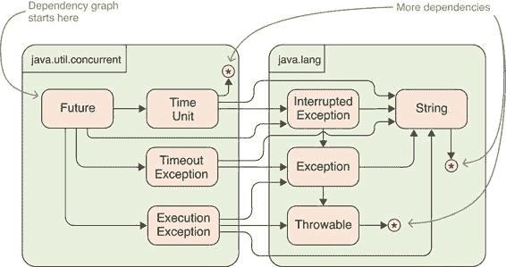
> 
> 图 1.5 Java 为任何给定类型操作依赖图与我们对类型依赖的认识相一致。此图显示了接口 `Future` 在包 `java.util.concurrent` 和 `java.lang` 中的依赖关系。
> 
> 由于 Java 具有强类型和静态类型的特点，它会在立即告诉你如果有什么东西出错了。一个类的名称不合法？你的某个依赖项丢失了？一个方法的可视性改变了，现在调用者看不到它？Java 会告诉你——在编译时的编译器，以及在执行时的 JVM。
> 
> 可以通过反射绕过编译时检查（参见附录 B 以获取快速介绍）。因此，它被认为是一个锋利且可能危险的工具，仅用于特殊场合。我们现在将忽略它，但将在后面的章节中回到它。
> 
> 作为 Java 对我们依赖感知与我们不同的例子，让我们看看服务或应用级别。这超出了 Java 的范围：它不知道应用程序的名称，不能告诉你没有“GitHab”服务或“Oracel”数据库（哦，不），也不知道你更改了你的服务 API 并破坏了你的客户端。它没有映射到应用程序或服务的协作的结构。而且这很好，因为 Java 在单个应用程序的层面上运行。
> 
> 但一个抽象级别显然在 Java 的范围内，尽管在 Java 9 之前，它得到了非常糟糕的支持——糟糕到模块化努力实际上被取消，导致了所谓的模块擦除。这个级别是处理工件，或者用 Java 的话说是 JAR 文件。
> 
> 如果在这个级别上模块化了应用程序，它由几个 JAR 文件组成。即使它没有，它也依赖于库，这些库可能有自己的依赖项。将这些记录下来，你将得到已经熟悉的图，但这次是针对 JAR 文件，而不是类。
> 
> 例如，让我们考虑一个名为 ServiceMonitor 的应用程序。在不深入细节的情况下，它的行为如下：它检查网络上其他服务的可用性并汇总统计数据。这些数据被写入数据库并通过 REST API 提供。
> 
> 应用程序的作者创建了四个 JAR 文件：

+   观察者—观察其他服务并检查可用性

+   统计学—从可用性数据中创建统计数据

+   持久化—使用 hibernate 读取和写入统计数据到数据库

+   监控—触发数据收集，并将数据通过统计管道传输到持久化存储；使用 spark 实现 REST API

> 每个 JAR 都有自己的依赖项，所有这些都可以在图 1.6 中看到。
> 
> 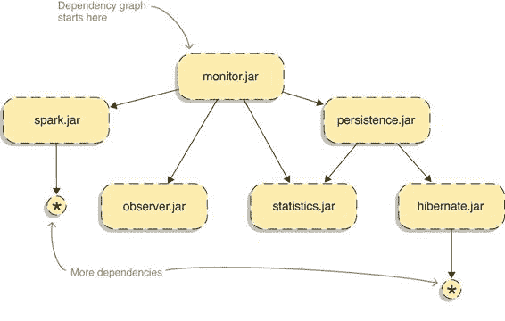
> 
> 图 1.6 对于任何应用程序，你都可以为其工件绘制一个依赖图。在这里，ServiceMonitor 应用程序被拆分为四个 JAR 文件，它们之间相互依赖，同时也依赖于第三方库。
> 
> 图表包括我们之前讨论的所有内容：JAR 文件有名称，它们相互依赖，并且通过提供其他 JAR 文件可以调用的公共类和方法，每个 JAR 文件都提供了特定的功能。
> 
> 在启动应用程序时，你必须列出所有你想要使用的 JAR 文件到类路径上：
> 
> `$ java` `--classpath observer.jar:statistics.jar:persistence.jar:monitor.jar` `①` `org.codefx.monitor.Monitor`
> 
> > ①
> > 
> > 使用`--classpath`选项明确列出所需的 JAR 文件（这是`-cp`和`-classpath`的一个新替代方案，也可以与 javac 一起使用）。
> > 
> > **重要信息** 这就是事情变得糟糕的地方——至少，在 Java 9 之前。JVM 在启动时并不知道你的类。每次它遇到对未知类的引用，从命令行指定的主类开始，它都会遍历类路径上的所有 JAR 文件，寻找具有该完全限定名称的类。如果找到了，它就会将这个类加载到一个包含所有类的巨大集合中，然后完成。正如你所见，JVM 中没有与 JAR 文件对应的运行时概念。
> > 
> 没有运行时表示，JAR 文件失去了它们的身份。尽管它们有文件名，但 JVM 并不太关心它们。如果异常信息能指向发生问题的 JAR 文件，或者如果 JVM 能命名一个缺失的依赖项，那岂不是很好？
> 
> 谈论依赖关系——这些也变得不可见。在类级别上操作，JVM 没有关于 JAR 文件之间依赖的概念。忽略包含类的组件也意味着那些组件的封装是不可能的。确实，每个公共类都对其他所有类可见。
> 
> 名称、显式依赖关系、明确定义的 API——编译器或 JVM 对我们所重视的模块中的任何事物都不太关心。这抹去了模块结构，将那个精心设计的图变成了一个巨大的泥球，如图 1.7 所示。这并非没有后果。
> 
> 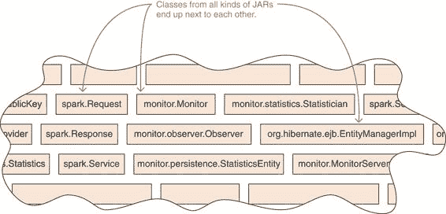
> 
> 图 1.7 Java 的编译器或虚拟机都没有关于组件或它们之间依赖的概念。相反，JAR 文件被视为简单的容器，类从这个容器中加载到一个单一的命名空间中。最终，这些类会进入一种原始汤的状态，其中每个公共类型都可以被其他任何类型访问。
> 
> 1.3 Java 9 之前的复杂性
> 
> 正如你所见，Java 9 之前的版本缺乏支持跨组件模块化的概念。尽管这会引发问题，但显然它们并不是不可逾越的障碍（否则我们不会使用 Java）。但当这些问题出现时，通常是在大型应用程序中，它们可能很难解决，甚至无法解决。
> 
> 如我在本章开头提到的，最可能影响应用程序开发者的复杂性通常被亲切地称为 JAR 地狱；但它们并不是唯一的。安全和维护问题，对于 JDK 和库开发者来说是一个更大的问题，也是其后果。
> 
> 我相信你已经看到了很多这些复杂情况，在本节的其余部分，我们将逐一探讨它们。如果你不熟悉所有这些，请不要担心——相反，如果你还没有处理过它们，你应该觉得自己很幸运。如果你熟悉 JAR 地狱和相关问题，可以自由跳转到第 1.4 节，该节介绍了模块系统。
> 
> 如果你因为这些问题似乎永无止境而感到沮丧，请放松——会有一种宣泄：第 1.5 节讨论了模块系统如何克服这些缺点的大部分。
> 
> **1.3.1 JAR 之间的未表达依赖**
> 
> 你的应用程序是否曾经因为 `NoClassDefFoundError` 而崩溃？当 JVM 无法找到当前正在执行的代码所依赖的类时，就会发生这种情况。找到依赖的代码很容易（查看堆栈跟踪就会揭示它），通常也不需要做更多的工作（缺失类的名称通常会给出线索），但确定依赖项为何不存在可能很困难。然而，考虑到工件依赖图，问题就出现了，为什么我们只在运行时才发现某些东西缺失。
> 
> > **重要信息**：原因很简单：JAR 无法以 JVM 能够理解的方式表达它依赖于哪些其他 JAR。需要一个外部实体来识别和满足这些依赖。
> > 
> 在构建工具获得识别和检索依赖的能力之前，那个外部实体就是我们。我们必须扫描文档以查找依赖项，找到正确的项目，下载 JAR 文件，并将它们添加到项目中。可选依赖项进一步复杂了过程，其中 JAR 可能仅在需要使用某些功能时才需要另一个 JAR。
> 
> 为了使应用程序工作，它可能只需要几个库。但每个库反过来可能又需要几个其他库，依此类推。随着未表达依赖问题复杂性的增加，它变得指数级地更加费时和容易出错。
> 
> > **重要信息**：构建工具如 Maven 和 Gradle 大大解决了这个问题。它们擅长使依赖关系明确，以便它们可以沿着传递依赖树的多条边追踪每个所需的 JAR。然而，让 JVM 理解工件依赖的概念将提高鲁棒性和可移植性。
> > 
> **1.3.2 使用相同名称的阴影类**
> 
> 有时，类路径上的不同 JAR 包可能包含具有相同完全限定名的类。这可能是由于多种原因：

+   可能存在同一库的两个不同版本。

+   一个 JAR 可能包含其自己的依赖项——这被称为胖 JAR 或超级 JAR——但其中一些也作为独立的 JAR 被拉入，因为其他工件依赖于它们。

+   图书馆可能已被重命名或拆分，其某些类型可能无意中添加到类路径中两次。

> > **定义**：阴影
> > 
> > 因为类将从类路径上包含它的第一个 JAR 文件中加载，这导致所有同名的其他类不可用——这被称为阴影。
> > 
> 如果变体在语义上不同，这可能导致从几乎察觉不到的异常行为到破坏性的错误。更糟糕的是，问题表现出来的形式可能看起来是非确定性的。它取决于 JAR 文件的搜索顺序，这可能在不同的环境中有所不同：例如，在你的 IDE（如 IntelliJ、Eclipse 或 NetBeans）和代码最终运行的生成机器之间。
> 
> 以 Google 广泛使用的 Guava 库为例，它包含一个实用类 `com.google.common.collect.Iterators`。从 Guava 版本 19 到版本 20，`emptyIterator()` 方法被删除。如图 1.8 所示，如果两个版本都出现在类路径上，并且版本 20 首先出现，那么任何依赖于 `Iterators` 的代码都将使用新版本，从而导致无法调用 19 的 `Iterators::emptyIterator`。即使包含该方法的类在类路径上，它实际上也是不可见的。
> 
> 阴影通常是由于意外发生的。但也可以故意使用这种行为来覆盖第三方库中的特定类，从而修补库。尽管构建工具可能会减少意外发生的可能性，但它们通常无法防止这种情况发生。
> 
> 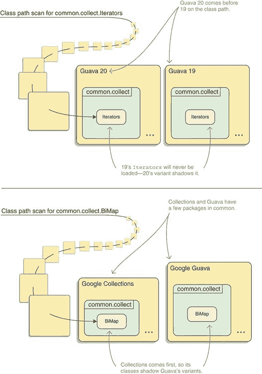
> 
> 图 1.8 类路径中可能包含同一库的两个不同版本（顶部）或具有共同类型集合的两个库（底部）。在这两种情况下，某些类型都出现了一次以上。只有类路径扫描期间遇到的第一个变体被加载（它覆盖了所有其他变体），因此 JAR 文件的扫描顺序决定了哪个代码运行。
> 
> 1.3.3 同一项目的不同版本之间的冲突
> 
> 版本冲突是任何大型软件项目的噩梦。一旦依赖项的数量不再是单个数字，冲突发生的可能性会以惊人的速度趋近于 1。
> 
> > 定义：版本冲突
> > 
> > 当两个必需的库依赖于不同、不兼容的第三方库版本时，就会发生版本冲突。
> > 
> 如果两个版本都存在于类路径上，行为将是不可预测的。由于阴影，存在于两个版本中的类将只从其中一个加载。更糟糕的是，如果访问了存在于一个版本但不在另一个版本中的类，该类也将被加载。调用库的代码可能会发现两个版本的混合。
> 
> 另一方面，如果其中一个版本缺失，程序很可能无法正确运行，因为需要两个版本，并且假设它们不兼容，这意味着它们不能相互替代（参见图 1.9）。与缺失的依赖项一样，这表现为意外的行为或`NoClassDefFoundError`。
> 
> 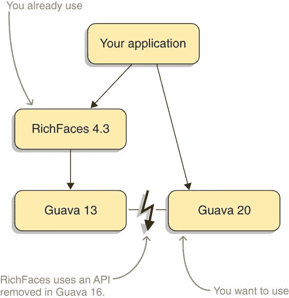
> 
> 图 1.9 相同库冲突版本的传递依赖通常无法解决——必须消除一个依赖项。在这里，`RichFaces`的老版本依赖于与应用程序想要使用的 Guava 不同的版本。不幸的是，Guava 16 删除了`RichFaces`所依赖的 API。
> 
> 继续从关于阴影的章节中的 Guava 示例，想象一些代码依赖于`com.google.common.io.InputSupplier`，这是一个在 19 版本中存在但在 20 版本中删除的类。JVM 首先扫描 Guava 20，在找不到该类后，从 Guava 19 中加载它。突然，两个 Guava 版本混合在一起运行了！作为一个结束动作，想象`InputSupplier`调用`Iterators::emptyIterator`。你认为——调试那个会有多有趣？
> 
> > 必要信息 对于这个问题，没有不涉及现有模块系统或手动调整类加载器的技术解决方案。构建工具通常能够检测这种场景。它们可能会发出警告，并且通常通过选择最新版本等简单机制来解决。
> > 
> 1.3.4 复杂类加载
> 
> 我们在第 1.2 节中对类加载机制的检查并不完整。描述的行为是默认行为，其中所有应用程序类都由同一个类加载器加载。但开发者可以自由地添加额外的类加载器，从一个委托到另一个以解决我们在这里讨论的一些问题。
> 
> 这通常是通过容器如组件系统和 Web 服务器来完成的。理想情况下，这种隐式使用应该对应用程序开发者隐藏；但我们知道，所有抽象都有漏洞。在某些情况下，开发者可能明确添加类加载器来实现功能：例如，允许用户通过加载新类来扩展应用程序，或者能够使用同一依赖项的冲突版本。
> 
> 无论多个类加载器如何进入画面，它们都需要你更深入地研究这个主题。并且它们可以迅速导致一个复杂的委托机制，表现出意外且难以理解的行为。
> 
> 1.3.5 JAR 之间的弱封装
> 
> Java 的可见性修饰符非常适合在同一个包中的类之间实现封装。但跨包边界，类型的可见性只有一种：`public`。
> 
> 正如你所见，类加载器将所有加载的包折叠成一个巨大的泥球——结果是所有公共类对所有其他类都是可见的。由于这种弱封装，无法创建在整个 JAR 内部可见但外部不可见的函数。
> 
> 这使得正确模块化系统变得困难。如果某些功能需要由模块的不同部分（如库或系统的子项目）使用，但不应该对外部可见，唯一的方法是将它们全部放入一个包中并使用包可见性。在一种预防性的服从行为中，你抹去了代码的结构，而不是将这项任务留给 JVM。即使在包可见性解决了这个问题的情况下，仍然有反射可以绕过它。
> 
> 弱封装允许一个组件的客户突破其内部结构（参见 图 1.10）。这可能是意外发生的，如果 IDE 建议从文档标记为内部包的包中导入类。更常见的是，这是为了克服似乎没有其他解决方案的问题（有时是这样，有时不是）。但代价是高昂的！
> 
> 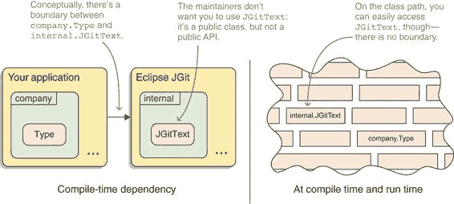
> 
> 图 1.10 Eclipse JGit 的维护者并没有打算让 `org.eclipse.jgit.internal` 中的类型供公共使用。不幸的是，由于 Java 没有关于 JAR 内部的概念，维护者无法阻止任何 `com.company.Type` 编译时与之冲突。即使它只有包可见性，也可以通过反射访问它。
> 
> 现在，客户端的代码与组件的实现细节耦合在一起。这使得客户端的更新变得风险很大，如果维护者决定考虑这种耦合，将阻碍这些内部组件的更改。这可能会发展到减缓或甚至阻止组件的有意义的发展。
> 
> 如果这听起来像是一个边缘情况，那就不是了。最臭名昭著的例子是 `sun.misc.Unsafe`，这是一个 JDK 内部类，允许我们做一些疯狂的事情（按照 Java 标准），比如直接分配和释放内存。许多关键的 Java 库和框架，如 Netty、PowerMock、Neo4J、Apache Hadoop 和 Hazelcast 都在使用它。由于许多应用程序依赖于这些库，它们也依赖于这些内部组件。因此，尽管 `Unsafe` 并非有意或设计成这样，但它已成为基础设施的一个关键部分。
> 
> 另一个例子是 JUnit 4。许多工具，尤其是 IDE，都有各种使开发者测试更容易的出色功能。但由于 JUnit 4 的 API 不足以实现所有这些功能，工具会突破其内部结构。这种耦合大大减缓了 JUnit 4 的发展，最终成为完全重新开始使用 JUnit 5 的一个重要原因。
> 
> 1.3.6 安全检查必须手工制作
> 
> 在包边界上弱封装的直接后果是，与安全相关的功能暴露给了同一环境中运行的所有代码。这意味着恶意代码可以访问关键功能，而唯一对抗这种做法的方法是在关键执行路径上手动实现安全检查。
> 
> 自 Java 1.1 以来，这是通过在每个进入安全相关代码的代码路径上调用`SecurityManager::checkPackageAccess`（检查调用代码是否允许访问被调用包）来实现的。或者更确切地说，应该在每条这样的路径上调用。忘记这些调用导致了过去困扰 Java 的一些漏洞，尤其是在从 Java 7 过渡到 8 的过程中。
> 
> 当然，可以争论说，与安全相关的代码应该被双重、三重或四重检查。但人非圣贤，要求我们在模块边界手动插入安全检查反而比一个高度自动化的变体风险更高。
> 
> 1.3.7 启动性能不佳
> 
> 你是否曾经想过为什么许多 Java 应用程序，尤其是使用像 Spring 这样的强大框架的 Web 后端，加载时间如此之长？
> 
> > 定义：慢启动
> > 
> > 正如你之前看到的，JVM 会按需懒加载类。最常见的情况是，许多类在启动时立即被访问（而不是在应用程序运行一段时间后），Java 运行时加载它们需要一段时间。
> > 
> 一个原因是类加载器不知道一个类来自哪个 JAR，因此它必须对类路径上的所有 JAR 进行线性扫描。同样，识别类路径上所有特定注解的出现需要检查所有类。
> 
> 1.3.8 刚硬的 Java 运行时
> 
> 这并不是 JVM 大杂烩方法的真正后果，但既然我在抱怨，我就把它说出来。
> 
> > 定义：刚硬运行时
> > 
> > 在 Java 8 之前，没有安装 JRE 子集的方法。所有 Java 安装都支持 XML、SQL 和 Swing 等，而许多用例并不需要这些。
> > 
> 虽然这对中等计算设备（如台式电脑和笔记本电脑）可能影响不大，但对于像路由器、机顶盒、汽车以及 Java 被使用的所有其他角落和缝隙，这显然很重要。随着容器化的当前趋势，它对服务器也变得相关，减少镜像的大小可以降低成本。
> 
> Java 8 引入了紧凑配置文件，它定义了 Java SE 的三个子集。它们缓解了问题，但并没有解决这个问题。紧凑配置文件是固定的，因此无法覆盖所有当前和未来对部分 JRE 的需求。
> 
> 1.4 模块系统的鸟瞰图
> 
> 我们刚刚讨论了很多问题。Java 平台模块系统是如何解决这些问题的？主要思想相当简单！
> 
> > ESSENTIAL INFO 模块是 JPMS 的基本构建块（惊喜）。像 JAR 一样，它们是类型和资源的容器；但与 JAR 不同，它们具有额外的特性。这些是最基本的特性：

+   一个名称，最好是全局唯一的

+   对其他模块的依赖声明

+   一个明确定义的 API，由导出包组成

> 1.4.1 每件事都是模块
> 
> 有不同类型的模块，第 3.1.4 节对它们进行了分类，但现在快速看一下它们是有意义的。在 Project Jigsaw 的工作中，OpenJDK 被拆分成了大约 100 个模块，所谓的平台模块。其中大约 30 个以 `java.*` 开头；它们是标准化的模块，每个 JVM 必须包含（图 1.11 展示了其中的一些）。
> 
> 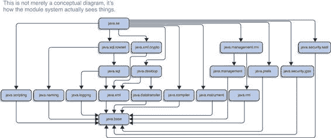
> 
> 图 1.11 平台模块的选择。箭头显示它们的依赖关系，但为了使图形更简单，一些依赖关系没有被表示：聚合器模块 java.se 直接依赖于每个模块，每个模块直接依赖于 java.base。
> 
> 这些是一些比较重要的模块：

+   java.base — 没有它就没有 JVM 程序可以运行的模块。包含 `java.lang` 和 `java.util` 等包。

+   java.desktop — 不仅针对那些勇敢的桌面 UI 开发者。包含抽象窗口工具包 (AWT；包 `java.awt.*`)、Swing（包 `javax.swing.*`）和更多 API，其中还包括 JavaBeans（包 `java.beans.*`）。

+   java.logging — 包含 `java.util.logging` 包。

+   java.rmi — 远程方法调用 (RMI)。

+   java.xml — 包含大部分 XML API 的词汇：Java API for XML Processing (JAXP)、Streaming API for XML (StAX)、Simple API for XML (SAX) 和文档对象模型 (DOM)。

+   java.xml.bind — Java Architecture for XML Binding (JAXB)。

+   java.sql — Java 数据库连接 (JDBC)。

+   java.sql.rowset — JDBC RowSet API。

+   java.se — 引用组成核心 Java SE API 的模块。（这是一个所谓的聚合器模块；参见第 11.1.5 节。）

+   java.se.ee — 引用组成完整 Java SE API 的模块（另一个聚合器）。

> 然后是 JavaFX。它的高级架构优于 AWT 和 Swing 的一个明显迹象是，它不仅足够地从 JDK 的其余部分解耦以获得自己的模块，实际上还被分成了七个：绑定、图形、控件、网页视图、FXML、媒体和 Swing 互操作。所有这些模块名称都以 javafx.* 开头。
> 
> 最后，大约有 60 个以 jdk 开头的模块。它们包含 API 实现、内部实用工具、工具（如编译器、JAR、Java 依赖分析工具 [JDeps] 和 Java Shell 工具 [JShell]）等。它们可能因 JVM 实现而异，因此使用它们类似于使用 `sun.` 包中的代码：不是一个未来证明的选择，但有时是唯一可用的选项。
> 
> 您可以通过运行 `java --list-modules` 来查看包含在 JDK 或 JRE 中的所有模块列表。要获取单个模块的详细信息，请执行 `java --describe-module ${module-name}.` （`${module-name}` 是一个占位符，不是有效的语法——请将其替换为您选择的模块。）
> 
> 平台模块打包到 JMOD 文件中，这是一个专门为此目的创建的新格式。但 JDK 之外的外部代码也可以创建模块。在这种情况下，它们是模块化 JAR：包含一个新结构，模块描述符，它定义了模块的名称、依赖关系和导出。最后，还有模块系统从尚未转换为模块的 JAR 文件中动态创建的模块。
> 
> > **重要信息** 这导致模块系统的基本方面：一切都是模块！（或者更准确地说，无论类型和资源如何呈现给编译器或虚拟机，它们最终都会进入一个模块。）模块是模块系统的核心，也是本书的核心。其他所有内容最终都可以追溯到它们及其名称、它们的依赖关系声明以及它们导出的 API。
> > 
> 1.5 您的第一个模块
> 
> JDK 的模块化是很好，但您的代码呢？它如何最终进入模块中？这相当简单。
> 
> 您唯一需要做的是在源文件夹中添加一个名为 `module-info.java` 的文件，一个模块声明，并填写您的模块名称、对其他模块的依赖关系以及构成其公共 API 的包：
> 
> `module my.xml.app {` `requires java.base;` `①` `requires java.xml; exports my.xml.api; }`
> 
> > ①
> > 
> > 您将看到，要求 java.base 实际上并不是必需的。
> > 
> 看起来 my.xml.app 模块使用了平台模块 java.base 和 java.xml 并导出一个包 `com.example.xml`。到目前为止，一切顺利。现在，将 `module-info.java` 与所有其他源文件一起编译成 `.class` 文件，并将其打包到 JAR 中。（编译器和 `jar` 工具将自动完成正确的事情。）Et voilà，您已经创建了您的第一个模块。
> 
> 1.5.1 模块系统的作用
> 
> 让我们启动 XML 应用程序并观察模块系统的作用。为此，请执行以下命令：
> 
> `java --module-path mods --module my.xml.app`
> 
> 模块系统从这里开始。它采取了许多步骤来改善您在 1.2 和 1.3 节中看到的泥球状结构：

1.  自举

1.  验证所有必需的模块是否存在

1.  构建应用程序架构的内部表示

1.  启动初始模块的 `main` 方法

1.  在应用程序运行期间保持活跃，以保护模块内部

> 图 1.12 捕获了所有步骤。但让我们不要急于求成，依次研究每个步骤。
> 
> 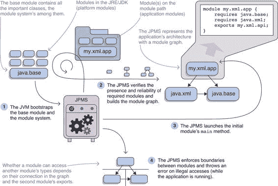
> 
> 图 1.12 Java 平台模块系统 (JPMS) 在实际应用中的工作情况。它的大部分工作在启动时完成：在（1）引导启动之后，它（2）确保在构建模块图时所有模块都存在，然后在（3）将控制权交给运行的应用程序之前。在运行时，它（4）强制执行每个模块的内部结构得到保护。
> 
> 加载基础模块
> 
> 模块系统只是代码，你已经了解到一切皆模块，那么哪个包含了 JPMS？那就是 java.base，基础模块。在一个相当复杂的鸡生蛋问题中，模块系统和基础模块互相引导启动。
> 
> 基础模块也是 JPMS 构建的模块图中的第一个节点。这正是它接下来要做的。
> 
> 模块解析：构建表示应用程序的图
> 
> 你发出的命令以 `--module my.xml.app` 结尾。这告诉模块系统 my.xml.app 是应用程序的主模块，并且依赖关系解析需要从这里开始。但 JPMS 在哪里可以找到这个模块？这就是 `--module-path mods` 的作用。它告诉模块系统它可以在文件夹 `mods` 中找到应用程序模块，因此 JPMS 忠实地在那里寻找 my.xml.app 模块。
> 
> 文件夹不包含模块，它们包含 JAR 文件。因此模块系统扫描 `mods` 中的所有 JAR 文件，并查找它们的模块描述符。在示例中，`mods` 包含 `my.xml.app.jar`，其描述符声称它包含一个名为 my.xml.app 的模块。这正是模块系统一直在寻找的！JPMS 创建 my.xml.app 的内部表示并将其添加到模块图中——到目前为止，还没有连接到其他任何东西。
> 
> 模块系统找到了初始模块。接下来是什么？寻找它的依赖。my.xml.app 的描述符表明它需要模块 java.base 和 java.xml。JPMS 在哪里可以找到这些模块？
> 
> 第一个，java.base，已经为人所知，因此模块系统可以从 my.xml.app 添加一个连接到 java.base ——图中的第一条边。接下来是 java.xml。它以 java 开头，这告诉模块系统它是一个平台模块；因此 JPMS 不在模块路径中搜索它，而是在其自己的模块存储中搜索。JPMS 在那里找到了 java.xml 并将其添加到图中，通过 my.xml.app 与其建立连接。
> 
> 现在图中有三个节点，但只有两个被解析。java.xml 的依赖关系仍然未知，因此 JPMS 接下来检查它们。尽管如此，它除了 java.base 之外没有其他依赖，因此模块解析结束。从 my.xml.app 和无处不在的基础模块开始，这个过程构建了一个包含三个节点的简单图。
> 
> 如果 JPMS 找不到所需的模块，或者遇到任何歧义（例如，两个包含具有相同名称的模块的 JAR 文件），它将带有一个信息性错误消息退出。这意味着你可以在启动时发现问题，否则这些问题可能会在未来某个任意时刻导致正在运行的应用程序崩溃。
> 
> 启动初始模块
> 
> 这个过程又是如何开始的呢？啊，是的，是通过以`--module my.xml.app`结尾的命令。模块系统完成了其核心功能之一——验证所有必需依赖项的存在——现在可以交出控制权给应用程序。
> 
> 初始模块`my.xml.app`不仅是模块解析开始的模块，它还必须包含一个`public static void main(String[])`方法。但在启动应用程序时，你不必指定包含该方法的类。我跳过了这一步，但你打包`.class`文件到 JAR 时很勤奋，并在那时指定了主类。这些信息被嵌入到模块描述符中，现在 JPMS 可以从中读取它。
> 
> 由于你没有指定主类就使用了`--module my.xml.app`，模块系统期望在模块描述符中找到该信息。幸运的是，它确实找到了，并且在该类上调用`main`方法。应用程序启动了，但 JPMS 的工作还没有结束！
> 
> 保护模块内部
> 
> 即使应用程序成功启动，模块系统也需要保持活跃以履行其第二个基本功能：保护模块内部。还记得`my.xml.app`模块声明中的`exports my.xml.api`那一行吗？这就是它和其他类似的地方发挥作用的地方。
> 
> 每当模块首次访问另一个模块中的类型时，JPMS 都会验证以下三个要求是否得到满足：

+   被访问的类型必须是公开的。

+   拥有该类型的模块必须导出包含它的包。

+   在模块图中，访问模块必须连接到拥有模块。

> 当`my.xml.app`首次使用`javax.xml.XMLConstants`（例如）时，模块系统会检查`XMLConstants`是否是公开的（✔），`java.xml`是否导出`javax.xml`（✔），以及`my.xml.app`是否在模块图中连接到`java.xml`（✔）。由于所有三个条件都满足，`my.xml.app`就可以使用`XMLConstants`进行操作。
> 
> 这种行为修复了 Java 在工件关系上采用泥球方法的一个关键缺陷：无法区分工件内部的代码和可以公开使用的代码。有了`exports`，模块可以清楚地定义其 API 的哪些部分是公开的，哪些是内部的，并且可以依赖模块系统来执行其决策。
> 
> 更复杂的例子
> 
> 作为一个不那么平凡的例子，图 1.13 展示了在 1.2 节中引入的 ServiceMonitor 应用程序的模块图。它的四个 JAR 文件——monitor、observer、statistics 和 persistence，以及它的两个依赖项——spark 和 hibernate——都被转换成了模块。像 java.xml 和 java.base 这样的 JDK 模块也因为应用程序依赖于它们而可见。
> 
> 我发现与图 1.6 的比较很引人注目，该图描述了 ServiceMonitor 的 JAR 文件之间的依赖关系。图 1.6 显示了我们在工件级别上组织应用程序的理解，而图 1.13 显示了模块系统如何看待它。它们如此相似证明了模块系统可以很好地用来表达应用程序的架构。
> 
> 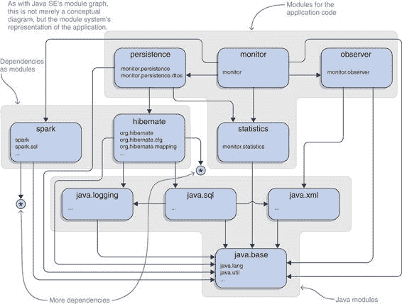
> 
> 图 1.13 ServiceMonitor 应用程序的模块图与图 1.6 中的架构图非常相似。该图显示了包含应用程序代码的四个模块、实现其功能集所使用的两个库以及涉及的 JDK 模块。箭头表示它们之间的依赖关系。每个模块列出了它导出的一些包。
> 
> 1.5.2 您的非模块化项目将大致上运行良好
> 
> 对于现有项目，尤其是拥有大型代码库的项目，开发者会对迁移路径感兴趣。尽管其他模块系统通常是“要么在要么不在”，意味着为了使用它们，一切都必须是模块，但这对于 JPMS 来说并不是一个选项。为了保持向后兼容性，在 Java 8 或更早版本上从类路径上运行的应用程序必须在 Java 9 上做同样的事情。因此，非模块化应用程序必须在模块化的 JDK 之上运行，这意味着模块系统必须处理这种情况。
> 
> 它确实做到了。我之前已经顺便提到，模块系统处理了尚未转换为模块的 JAR 文件。这正是由于向后兼容性的原因。尽管迁移到模块系统是有益的，但它不是强制性的。
> 
> 因此，用于指定编译器和 JVM 的 JAR 文件或普通`.class`文件的类路径，在 Java 8 和之前的工作方式相同。甚至类路径上的模块表现得就像非模块化 JAR 文件一样。基本假设是类路径负责访问想要转换为 1.3 节中讨论的泥球状结构的工件。
> 
> 与此同时，一个新的概念被创造出来：模块路径。在这里，基本假设是它将所有工件视为模块。有趣的是，即使是普通的 JAR 文件也是如此。
> 
> > 重要的信息：类路径和模块路径的共存以及它们对普通和模块化工件的处理是大型应用程序逐步迁移到模块系统的关键。第八章将深入探讨这个重要主题。
> > 
> 模块系统的一个重要方面，尤其是对遗留项目来说，是兼容性。JPMS 在底层进行了许多更改，尽管几乎所有的更改在严格意义上都是向后兼容的，但其中一些与现有代码库的交互非常糟糕。例如：

+   依赖于 JDK 内部 API（例如`sun.*`包中的那些）会导致编译时错误和运行时警告。

+   JEE API 必须手动解析。

+   包含相同包中类的不同工件可能会引起问题。

+   紧凑配置文件、扩展机制、endorsed-standards-override 机制以及类似功能已被移除。

+   运行时图像布局发生了很大变化。

+   应用程序类加载器不再是`URLClassLoader`。

> 最后，无论一个应用程序是否模块化，在 Java 9 或更高版本上运行可能会破坏它。第六章和第七章专门用于识别和克服最常见的挑战。
> 
> 在这个阶段，你可能会有这样的疑问：

+   Maven、Gradle 和其他工具不是已经管理依赖项了吗？

+   关于开放服务网关倡议（OSGi），为什么我不直接使用它呢？

+   在大家都编写微服务的时候，模块系统不是过度了吗？

> 你提出的问题很有道理。没有一项技术是孤立的，值得从整体上审视 Java 生态系统，并检查现有工具和方法与模块系统的关系以及它们未来的可能关系。我在第 15.3 节中这样做；你已经知道了解读它所需的一切，所以如果你不能放下这些问题，为什么不现在就读读它呢？
> 
> 第 1.5 节描述了模块系统想要实现的高级目标，第二章展示了模块化应用程序可能的样子的一个更长的示例。第三章、第四章和第五章详细探讨了从头开始编写、编译、打包和运行此类应用程序的方法。本书的第二部分在第三部分转向模块系统的先进功能之前讨论了兼容性和迁移。
> 
> 1.6 模块系统目标
> 
> 从本质上讲，Java 平台模块系统是为了教 Java 了解工件之间的依赖关系图而开发的。想法是，如果 Java 停止擦除模块结构，那么这种擦除的大部分丑陋后果也会消失。
> 
> 首先，这应该会减轻当前状况造成的许多痛点。但不仅如此，它引入了大多数未使用过其他模块系统的开发者所不熟悉的能力，可以进一步提高软件的模块化。这在更具体的意义上意味着什么？
> 
> 在我们到来之前，重要的是要注意，模块系统的所有目标对各种项目来说并不同等重要。许多主要受益于像 JDK 这样的大型、长期项目，JPMS 主要是为这些项目开发的。大多数目标不会对日常编码产生巨大影响，例如，Java 8 中的 lambda 表达式或 Java 10 中的`var`。然而，它们将改变项目开发和部署的方式——这是我们每天都在做的事情（对吗？）。
> 
> 在模块系统的目标中，有两个特别重要：可靠配置和强封装。我们将比其他目标更详细地研究它们。
> 
> 1.6.1 可靠配置：不留任何 JAR 文件
> 
> 正如你在 1.4.3 节中观察模块系统运行时所见，各个模块声明它们对其他模块的依赖，JPMS 分析这些依赖。尽管我们只看了 JVM 启动，但相同的机制在编译时间和链接时间（是的，这是新的；见第十四章）也在发挥作用。因此，当依赖项缺失或冲突时，这些操作可以快速失败。与只有当第一个类需要时才在启动时发现依赖项缺失的事实相比，这是一个很大的优势。
> 
> 在 Java 9 之前，具有相同类的 JAR 文件不会被识别为冲突。相反，运行时会选择一个任意的类，从而覆盖其他类，这导致了 1.3.2 节中描述的复杂性。从 Java 9 开始，编译器和 JVM 识别这一点以及许多其他可能导致早期问题的歧义。
> 
> > 定义：可靠配置
> > 
> > 两者结合，使得系统的配置比以前更加可靠，因为只有良好形成的启动配置才能通过这些测试。如果它们通过了，JVM 可以将概念依赖图转换为模块图，用运行系统的结构化视图替换泥球，就像我们可能拥有的那样。
> > 
> 1.6.2 强封装：使模块内部代码不可访问
> 
> 模块系统的另一个关键目标是使模块能够强封装其内部结构，并仅导出特定的功能。
> 
> > 一个对模块私有的类应该以与私有字段对类私有的相同方式私有。换句话说，模块边界应该不仅决定类和接口的可见性，还决定它们的可访问性。
> > 
> > ——马克·雷诺尔德，《Jigsaw 项目：聚焦大局》([`mreinhold.org/blog/jigsaw-focus`](https://mreinhold.org/blog/jigsaw-focus))
> > 
> 为了实现这一目标，编译器和 JVM 在模块边界上强制执行严格的访问规则：仅允许访问导出包中公共类型（即字段和方法）的公共成员。其他类型对模块外部的代码不可访问——甚至不能通过反射访问。最后，我们可以强封装库的内部实现，并确保应用程序不会意外地依赖于实现细节。
> 
> 这也适用于 JDK，如前所述，它已被转换为模块。因此，模块系统阻止了对 JDK 内部 API 的访问，这意味着以`sun.`或`com.sun.`开头的包。不幸的是，许多广泛使用的框架和库，如 Spring、Hibernate 和 Mockito，都使用了这样的内部 API，因此如果模块系统如此严格，许多应用程序在 Java 9 上将会崩溃。为了给开发者迁移时间，Java 更加宽容：编译器和 JVM 有命令行开关允许访问内部 API；在 Java 9 到 11 中，默认允许运行时访问（更多内容请参阅第 7.1 节）。
> 
> 为了防止代码意外地依赖于间接依赖中的类型，这些类型可能会从一个运行到下一个运行而发生变化，情况甚至更为严格：一般来说，一个模块只能访问它作为依赖项所要求的模块的类型。（一些高级特性会故意违反该规则。）
> 
> 1.6.3 自动化安全与改进的可维护性
> 
> 模块内部 API 的强封装可以极大地提高安全性和可维护性。它有助于安全性，因为关键代码有效地隐藏了不需要使用它的代码。它还使维护更容易，因为模块的公共 API 可以更容易地保持小规模。
> 
> > 随意使用 Java SE 平台实现内部的 API 既是一个安全风险，也是一个维护负担。所提议的规范提供的强封装将允许实现 Java SE 平台组件防止对其内部 API 的访问。
> > 
> > ——Java 规范请求（JSR）376
> > 
> 1.6.4 改进的启动性能
> 
> 当知道一个类只能引用几个其他特定组件中的类，而不是运行时加载的任何类时，现有的优化技术可以更有效地使用。
> 
> > 当知道一个类只能引用几个其他特定组件中的类，而不是运行时加载的任何类时，许多提前时间、整个程序优化技术可以更有效。
> > 
> > ——JSR 376
> > 
> 还可以通过注解来索引类和接口，这样就可以在不进行完整的类路径扫描的情况下找到这些类型。这尚未在 Java 9 中实现，但可能会在未来的版本中实现。
> 
> 1.6.5 可扩展的 Java 平台
> 
> 明确定义依赖关系的模块的一个美好后果是，可以轻松确定 JDK 的运行子集。例如，服务器应用程序不使用 AWT、Swing 或 JavaFX，因此可以在没有这些功能的情况下运行 JDK。新的工具 `jlink`（参见第十四章）使得创建仅包含应用程序所需模块的运行时镜像成为可能。我们甚至可以包括库和应用程序模块，从而创建一个不需要在宿主系统上安装 Java 的自包含程序。
> 
> > 定义：可扩展平台
> > 
> > 由于 JDK 已经模块化，我们可以挑选所需的特性并创建仅包含所需模块的 JRE。
> > 
> 这将保持 Java 在小型设备和容器中的关键玩家地位。
> 
> 1.6.6 非目标
> 
> 不幸的是，模块系统并非万能的灵丹妙药，一些有趣的用例并未得到覆盖。首先，JPMS 没有版本的概念。你不能给模块指定版本或要求依赖项的版本。话虽如此，将此类信息嵌入模块描述符并使用反射 API 访问它是可能的，但这只是为开发人员和工具提供的元信息——模块系统不会处理它。
> 
> JPMS 不“看到”版本也意味着它不会区分同一模块的两个不同版本。相反，并且与可靠配置的目标一致，它将这种情况视为经典的歧义——同一模块出现两次——并拒绝编译或启动。有关模块版本的信息，请参阅第十三章。
> 
> JPMS 没有提供从集中式仓库搜索或下载现有模块或发布新模块的机制。这项任务已经足够由现有的构建工具来覆盖。
> 
> JPMS 的目标也不是模拟一个动态模块图，其中单个工件可以在运行时出现或消失。然而，在高级特性之上（参见第 12.4 节），可以实施这样的系统。
> 
> 1.7 新旧技能
> 
> 我描述了许多承诺，本书的其余部分解释了 Java 平台模块系统如何旨在实现这些承诺。但不要误解，这些好处并非免费！要在模块系统之上构建应用程序，你将不得不比以前更深入地思考工件和依赖关系，并将更多的这些想法编码到代码中。某些在 Java 9 中曾经有效的东西将不再有效，使用某些框架将需要比以前更多的努力。
> 
> 你可以将这看作与静态强类型语言相比，动态语言在编写代码时需要更多的工作——至少在编写代码的时候是这样。所有那些类型和泛型——难道你就不想到处使用 `Object` 和类型转换吗？当然，你可以这样做，但你愿意为了在编写代码时节省一些脑力而放弃类型系统提供的安全性吗？我不这么认为。
> 
> 1.7.1 你将学到什么
> 
> 新技能是必需的！幸运的是，这本书教授了这些技能。当一切都说完，你已经掌握了以下章节中阐述的机制时，无论是新应用还是现有应用都不会让你感到困难。
> 
> 第一部分，特别是第三章到第五章，介绍了模块系统的基础。除了实用技能外，它们还教授了底层机制，以帮助你更深入地理解。之后，你将能够通过封装模块的内部结构和表达其依赖关系来描述模块及其关系。使用`javac`、`jar`和`java`，你可以编译、打包和运行模块以及它们形成的应用程序。
> 
> 书的第二部分基于基础知识，并将其扩展到涵盖更复杂的使用案例。对于现有应用，你将能够分析与 Java 9 到 11 可能存在的兼容性问题，并使用它提供的各种功能创建迁移路径到模块系统。为此，以及实现不那么直接的模块关系，你可以使用高级功能，如限定导出、开放模块和服务以及扩展的反射 API。使用`jlink`，你可以创建针对特定用例优化的精简 JRE，或者带有自己的 JRE 的自包含应用程序镜像。最后，你将看到更大的图景，包括模块系统如何与类加载、反射和容器交互。
> 
> 1.7.2 你应该知道的内容
> 
> 当谈到技能要求时，JPMS 有一个有趣的特性。它所做的许多事情都是全新的，并且在其模块声明中带有自己的语法分区。如果你有基本的 Java 技能，学习这一点相对容易。所以如果你知道代码是按类型、包和最终 JAR 组织；可见性修饰符，尤其是`public`，是如何跨越它们的；以及`javac`、`jar`和`java`的作用，并且对如何使用它们有一个大致的了解，那么你就具备了理解第一部分以及第三部分中介绍的大多数更高级特性的所有知识。
> 
> 但要真正理解模块系统解决的问题以及欣赏它提出的解决方案，需要的不仅仅是这些。熟悉以下内容以及与大型应用工作的经验，使你更容易理解模块系统特性的动机及其优点和缺点：

+   JVM 以及尤其是类加载器是如何运行的

+   机制带来的麻烦（想想 JAR 地狱）

+   更高级的 Java API，如服务加载器和反射 API

+   构建工具如 Maven 和 Gradle 以及它们如何构建项目

+   如何模块化软件系统

> 但无论你多么博学，你可能会遇到一些参考资料或解释，它们与你所知的内容不相关。对于一个像 Java 这样庞大的生态系统来说，这是很自然的，每个人在转角处都会学到新的东西（相信我，我亲身体验过）。所以，永远不要绝望！如果一些无关紧要的内容没有帮助，那么你很可能仅通过查看代码就能理解技术细节。
> 
> 在背景着色完成后，是时候动手学习 JPMS 基础知识了。我建议你继续阅读第二章，这一章贯穿了第一部分的其余内容，展示了定义、构建和运行模块化 JAR 的代码。它还介绍了本书其余部分出现的演示应用程序。如果你更愿意先学习底层理论，可以跳到第三章，该章节教授模块系统的基本机制。如果你担心你的项目与 Java 9 的兼容性，第六章和第七章详细介绍了这一点，但如果没有很好地掌握基础知识，这些章节将难以理解。
> 
> 摘要

+   一个软件系统可以被看作是一个图，它通常显示了系统的（不）期望属性。

+   在 JAR 级别，Java 过去对那个图没有任何理解。这导致了各种问题，其中包括 JAR 地狱、手动安全性和维护性差。

+   Java 平台模块系统旨在使 Java 理解 JAR 图，这为语言带来了工件级别的模块化。最重要的目标包括可靠的配置、强大的封装以及改进的安全性、可维护性和性能。

+   这是通过引入模块实现的：基本上，是带有额外描述符的 JAR 文件。编译器和运行时将解释描述的信息，以便构建工件依赖关系图并提供承诺的好处。

> 2
> 
> 模块化应用程序的结构
> 
> 本章涵盖

+   布局模块化应用程序的源代码

+   创建模块声明

+   编译模块

+   运行模块化应用程序

> 本章向您介绍了创建模块化应用程序的整体工作流程，但它并没有对这些主题进行详细解释。第三章、第四章和第五章会详细解释这些主题——它们深入探讨了这些主题。但是，对于像模块系统这样包罗万象的主题，很容易只见树木不见森林。这就是为什么本章向您展示了整体图景。它通过展示一个简单的模块化应用程序，如何定义和编译其模块，以及应用程序是如何执行的，给您一个不同部分如何拼凑在一起的印象。
> 
> 这意味着我会让你跳入深水区：接下来的内容可能并不立即明了。但如果你对某些内容感到困惑，请不要担心——它们很快就会被详细解释。当你完成这本书的第一部分后，示例中的所有内容都会变得完全清晰。所以，请折起这些页面，因为你可能需要回头查阅它们。
> 
> 2.1 节解释了假设的应用程序做什么，它由哪些类型组成，以及它们的职责。模块系统在 2.2 节中发挥作用，讨论了如何组织文件和文件夹，描述模块，以及编译和运行应用程序。这次简短的接触将展示模块系统的许多核心机制，以及一些基本功能不足以模块化复杂应用程序的实例——这些内容将在 2.3 节中讨论。您可以在[www.manning.com/books/the-java-module-system](http://www.manning.com/books/the-java-module-system)和[`github.com/CodeFX-org/demo-jpms-monitor`](https://github.com/CodeFX-org/demo-jpms-monitor)上找到应用程序。主分支包含 2.2 节中描述的变体。
> 
> 2.1 介绍 ServiceMonitor
> 
> 要看到模块系统在行动中的样子，你需要一个可以应用它的示例项目。项目具体做什么并不十分重要，所以不必担心它的细节。
> 
> 让我们想象一个由服务组成的网络，这些服务相互协作以取悦用户——可能是一个社交网络或视频平台。您希望监控这些服务以确定系统的健康状况，并在问题发生时及时发现（而不是在客户报告时）。这正是示例应用的作用所在。
> 
> 示例应用程序被称为 ServiceMonitor。它联系单个服务，收集和汇总诊断数据，并通过 REST 提供这些数据。
> 
> > 注意：您可能还记得 1.2 节或图 1.10 中的应用程序，当时它被分割成四个不同的 JAR 文件。我们最终会达到更详细的模块化，但这将在 2.2 节中探讨。在那样做之前，让我们思考一下如何在单个工件（让我们称其为单体方法）中实现这样一个系统。如果它与第一章的内容不完全一致，请不要在意——新章节，新细节。
> > 
> 恰好，这些服务已经收集了你想要的数据，所以 ServiceMonitor 需要做的只是定期查询它们。这是`ServiceObserver`实现的工作。一旦你有了以`DiagnosticDataPoint`形式存在的诊断数据，它就可以被喂给`Statistician`，将其汇总为`Statistics`。这些统计数据随后被存储在`StatisticsRepository`中，并通过 REST 提供。`Monitor`类将一切联系在一起。
> 
> 图 2.1 展示了这些类型之间的关系。为了更好地理解这是如何工作的，让我们看看代码，从`ServiceObserver`接口开始。
> 
> > 列表 2.1 `ServiceObserver`接口
> > 
> `public interface ServiceObserver {  DiagnosticDataPoint gatherDataFromService();  }`
> 
> 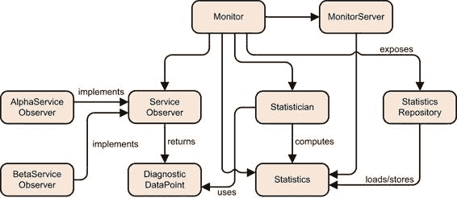
> 
> 图 2.1 构成 ServiceMonitor 应用程序的类。两个 `ServiceObserver` 实现使用 Alpha 和 Beta API 查询服务并返回诊断数据，这些数据由 `Statistician` 聚合到 `Statistics` 中。统计数据由存储库存储和加载，并通过 REST API 公开。`Monitor` 协调所有这些。
> 
> 看起来很简单，但不幸的是，并非所有服务都公开相同的 REST API。目前使用了两代：Alpha 和 Beta。这就是为什么 `ServiceObserver` 是一个具有两个实现的接口（参见 图 2.2）：每个实现连接到不同的 API 代，并确保通过相同的接口将数据公开给应用程序。
> 
> 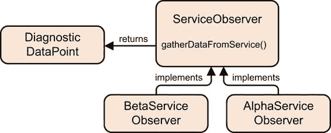
> 
> 图 2.2 被观察的服务使用两种不同的 API 代来公开诊断数据。相应地，`ServiceObserver` 接口有两个实现。
> 
> `Statistician` 没有自己独立的状态——它只提供两种方法，要么创建一个新的 `Statistics` 实例，要么将现有的统计数据和新数据点组合成更新的统计数据。
> 
> > 列表 2.2 `Statistician` 类
> > 
> `public class Statistician {  public Statistics emptyStatistics() { return Statistics.empty(); }  public Statistics compute( Statistics currentStats, Iterable<DiagnosticDataPoint> dataPoints) { Statistics finalStats = currentStats; for (DiagnosticDataPoint dataPoint : dataPoints) finalStats = finalStats.merge(dataPoint); return finalStats; }  }`
> 
> `StatisticsRepository` 没有做什么特别的事情——它只加载和存储统计数据。无论是通过序列化、JSON 文件还是后端数据库来完成，对于这个例子来说都是无关紧要的。
> 
> > 列表 2.3 `StatisticsRepository` 类
> > 
> `public class StatisticsRepository {  public Optional<Statistics> load() { /* ... */ }  public void store(Statistics statistics) { /* ... */ }  }`
> 
> 这使得你拥有一个收集数据点的类型，另一个将它们转换为统计数据的类型，以及一个存储统计数据的类型。所缺少的是一个通过定期轮询数据并将其推送到统计学家再推送到存储库来将它们联系在一起的类型。这就是 `Monitor` 的作用所在。以下列表展示了其字段和 `updateStatistics()` 方法，该方法实现了其核心职责。（确保任务定期运行的代码被省略。）
> 
> > 列表 2.4 `Monitor` 类及其 `updateStatistics()` 方法
> > 
> `public class Monitor {  private final List<ServiceObserver> serviceObservers; private final Statistician statistician; private final StatisticsRepository repository; private Statistics currentStatistics; // [...]  private void updateStatistics() { List<DiagnosticDataPoint> newData = serviceObservers .stream() .map(ServiceObserver::gatherDataFromService) .collect(toList()); Statistics newStatistics = statistician .compute(currentStatistics, newData); currentStatistics = newStatistics; repository.store(newStatistics); }  // [...] }`
> 
> `Monitor`将最新的统计数据存储在`currentStatistics`字段（类型为`Statistics`）中。
> 
> 在请求时，公开 REST API 的`MonitorServer`会要求监控器提供统计数据——无论是从内存中还是从持久化中——然后提取请求的部分并返回它们。
> 
> > 列表 2.5 `MonitorServer`类
> > 
> `public class MonitorServer {  private final Supplier<Statistics> statistics;  public MonitorServer(Supplier<Statistics> statistics) { this.statistics = statistics; }  // [...]  private Statistics getStatistics() { return statistics.get(); }  // [...]  }`
> 
> 一个值得注意的细节是，尽管`MonitorServer`调用了`Monitor`，但它并不依赖于它。这是因为`MonitorServer`没有获取到监控器的引用，而是获取到一个数据提供者，该提供者将调用转发给监控器。原因很简单：`Monitor`协调整个应用程序，这使得它成为一个内部有很多操作的类。我不想仅仅为了调用一个 getter 而将 REST API 与这样一个重量级的对象耦合起来。在 Java 8 之前，我可能会创建一个专门的接口来获取统计数据并让`Monitor`实现它；但自从 Java 8 以来，lambda 表达式和现有的函数式接口使得临时解耦变得更加容易。
> 
> 总的来说，你最终会得到这些类型：

+   `DiagnosticDataPoint`—在时间间隔内服务的可用性数据。

+   `ServiceObserver`—服务观察的接口，返回`DiagnosticDataPoint`。

+   `AlphaServiceObserver`和`BetaServiceObserver`—每个都观察服务的不同变体。

+   `Statistician`—从`DiagnosticDataPoint`计算统计数据。

+   `Statistics`—保存计算出的统计数据。

+   `StatisticsRepository`—存储和检索统计数据。

+   `MonitorServer`—响应统计数据的 REST 调用。

+   `Monitor`将所有内容串联起来。

> 2.2 服务监控器的模块化
> 
> 如果你要将服务监控器应用程序按照前面描述的那样作为一个真实的项目来实现，那么充分利用模块系统就像是用大锤砸核桃一样。但这是一个例子，它在这里是为了展示模块化项目的结构，所以你会像处理一个更大的项目一样来构建它。
> 
> 谈到结构，我们先从将应用程序切割成模块开始，然后再讨论源代码如何在文件系统中布局。接下来是最有趣的步骤：如何声明和编译模块以及运行应用程序。
> 
> 2.3 将 ServiceMonitor 分割成模块
> 
> 将应用程序模块化的最常见方式是通过关注点的分离。ServiceMonitor 具有以下内容，相关类型在括号中给出：

+   从服务中收集数据（`ServiceObserver`, `DiagnosticDataPoint`）

+   将数据聚合到统计信息中（`Statistician`, `Statistics`）

+   持久化统计信息（`StatisticsRepository`）

+   通过 REST API（`MonitorServer`）公开统计信息

> 但不仅领域逻辑生成需求。还有技术性的需求：

+   数据收集必须隐藏在 API 之后。

+   Alpha 和 Beta 服务各自需要该 API 的单独实现（`AlphaServiceObserver`和`BetaServiceObserver`）。

+   所有关注点都必须由（`Monitor`）进行协调。

> > **重要信息** 这导致了以下具有所述公开可见类型的模块：

+   monitor.observer (`ServiceObserver`, `DiagnosticDataPoint`)

+   monitor.observer.alpha (`AlphaServiceObserver`)

+   monitor.observer.beta (`BetaServiceObserver`)

+   monitor.statistics (`Statistician`, `Statistics`)

+   monitor.persistence (`StatisticsRepository`)

+   monitor.rest (`MonitorServer`) * monitor (`Monitor`)

> 将这些模块叠加到图 2.3 中的类图上，很容易看到模块依赖出现。
> 
> 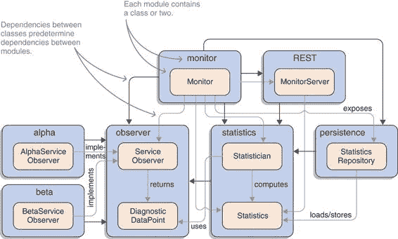
> 
> 图 2.3 服务监控应用程序的模块（粗体）覆盖在类结构（常规）之上。注意模块边界之间的类依赖如何确定模块依赖。
> 
> 2.4 在目录结构中布局文件
> 
> 图 2.4 显示了应用程序的目录结构。每个模块都将是一个独立的项目，这意味着每个都可以有自己的目录结构。但是，没有必要使事情复杂化，所以你会使用相同的结构。如果你参与过不同的项目或者使用过 Maven、Gradle 或其他构建工具，你会认出这是默认的结构。
> 
> 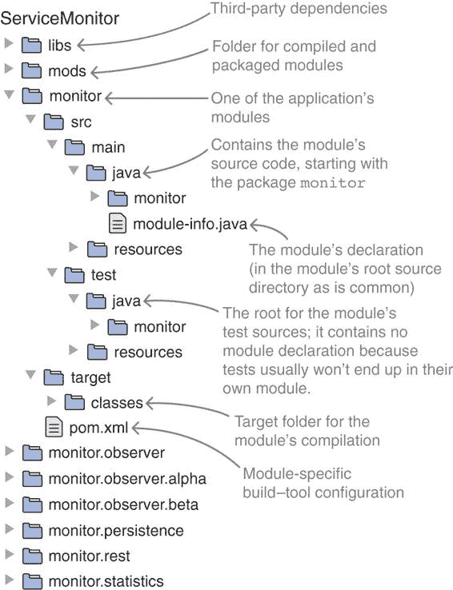
> 
> 图 2.4 ServiceMonitor 应用程序的每个模块都是其自己的项目，具有众所周知的目录结构。新的是`mods`文件夹，它收集构建后的模块 JAR 文件，以及每个项目的根源目录中的模块声明`module-info.java`文件。
> 
> 首先要注意的是`mods`文件夹。稍后，当你创建模块时，它们将在这里结束。第 4.1 节将更详细地介绍目录结构。
> 
> 然后是稍微不寻常的`libs`文件夹，其中包含第三方依赖项。在实际项目中，你可能不需要它，因为你的构建工具管理依赖项。但你会手动编译和启动，将所有依赖项放在一个地方可以极大地简化这个过程。所以这并不是一个推荐，甚至不是一个要求——这只是简化。
> 
> 另一个不常见的事情是 `module-info.java`。它被称为模块声明，负责定义模块的属性。这使得它位于模块系统的中心，因此也在本书中，尤其是第 3.1 节。尽管如此，我们将在下一节快速浏览它。
> 
> 2.5 声明和描述模块
> 
> > 重要的是每个模块都有一个模块声明。按照惯例，这是一个位于项目根源文件夹中的 `module-info.java` 文件。编译器会从这个文件创建一个模块描述符，`module-info.class`。当编译后的代码被打包成 JAR 文件时，描述符必须位于模块系统的根目录，以便模块系统能够识别和处理它。
> > 
> 如第 2.2.1 节所述，应用程序由七个模块组成，因此必须有七个模块声明。列表 2.6 显示了所有这些声明。即使目前还不知道任何细节，你也能窥见正在进行的事情。
> 
> `module the.name { }` 块定义了一个模块。名称通常遵循包命名约定：它应该通过反转域名来保证全局唯一性，全部小写，并且部分之间用点分隔（更多内容请参阅第 3.1.3 节——我仅使用较短的名称是为了使它们更适合本书）。在模块块内部，`requires` 指令表达了模块之间的依赖关系，而 `exports` 指令通过命名要导出公共类型的包来定义每个模块的公共 API。
> 
> > 列表 2.6 所有 ServiceMonitor 模块的声明
> > 
> `module monitor.observer { exports monitor.observer; }  module monitor.observer.alpha { requires monitor.observer; exports monitor.observer.alpha; }  module monitor.observer.beta { requires monitor.observer; exports monitor.observer.beta; }  module monitor.statistics { requires monitor.observer; exports monitor.statistics; }  module monitor.persistence { requires monitor.statistics; requires hibernate.jpa; exports monitor.persistence; exports monitor.persistence.entity; }  module monitor.rest { requires spark.core; requires monitor.statistics; exports monitor.rest; }  module monitor { requires monitor.observer; requires monitor.observer.alpha; requires monitor.observer.beta; requires monitor.statistics; requires monitor.persistence; requires monitor.rest; }`
> 
> 2.5.1 在其他模块上声明依赖
> 
> > 重要的是 `requires` 指令包含一个模块名称，并告诉 JVM 声明模块依赖于指令中给出的模块。
> > 
> 你可以看到观察者实现依赖于观察者 API，这立即就很有道理。统计模块也依赖于观察者 API，因为 `Statistician::compute` 使用了 `DiagnosticDataPoint` 类型，它是 API 的一部分。
> 
> 类似地，持久化模块需要统计信息，因此它依赖于统计模块。它还依赖于 Hibernate，因为它使用 Hibernate 与数据库通信。
> 
> 然后是 monitor.rest，它也依赖于统计模块，因为它处理统计信息。除此之外，它使用 Spark 微框架创建 REST 端点。在 2.2.1 节中模块化应用时，我特别指出`MonitorServer`不依赖于`Monitor`。这现在很有用，因为它意味着 monitor.rest 不依赖于 monitor；这很好，因为 monitor 依赖于 monitor.rest，而模块系统禁止声明循环依赖。最后，monitor 依赖于所有其他模块，因为它创建了大多数实例，并将结果从一个模块传递到另一个模块。
> 
> 2.5.2 定义模块的公共 API
> 
> > ESSENTIAL INFO 一个`exports`指令包含一个包名，并通知 JVM，依赖于声明该包的其他模块可以查看该包中的公共类型。
> > 
> 大多数模块导出单个包：包含在模块确定时列出的类型的包。你可能已经注意到，包名总是以模块名作为前缀——通常它们是相同的。这不是强制的，但由于模块和包名都遵循反向域名命名方案，所以这是常见的情况。
> 
> 持久化模块是唯一导出多个包的模块。除了包含其核心功能（`StatisticsRepository`）的`monitor.persistence`之外，它还导出`monitor.persistence.entity`。该包定义了一组被注解的类，Hibernate 可以通过这些注解理解如何存储和加载它们（这些通常被称为实体）。这意味着 Hibernate 必须访问它们，这反过来又意味着模块必须导出包含它们的包。（如果你依赖于 Hibernate 对私有字段或构造函数进行反射，导出是不够的——请参阅第 12.2 节以获取解决方案。）
> 
> 另一个例外是 monitor，它没有导出任何包。这很有道理，因为它就像蜘蛛网中的蜘蛛一样，位于模块图的中心，协调执行流程。因此，它没有自己的 API，其他人可能想要调用。主模块——通常和合适地包含程序的主方法——不导出任何包是典型的。
> 
> 2.5.3 使用模块图可视化 SERVICEMONITOR
> 
> 在模块的依赖和导出定义得井井有条之后，让我们来看看图 2.5 中得到的模块图。虽然它看起来就像是对图 2.3 的一个清理版本，但它远不止于此！图 2.3 是一个应用架构师可能在白板上绘制的图表。它显示了模块及其关系，但那些只是你的想象产物——对编译器或虚拟机来说无关紧要。图 2.5 另一方面，则是模块系统对你架构的解释。
> 
> 
> 
> 图 2.5 应用程序的模块图，显示了模块及其导出的包以及它们之间的依赖关系。与图 2.3 不同，这不仅仅是一个架构图；这是模块系统看待应用程序的方式。
> 
> 两个图中的模块方面看起来如此相似，以至于几乎可以互换，这意味着你可以在代码中相当精确地表达你对应用程序架构的愿景：即在模块声明中。这不是很酷吗？
> 
> > 编写代码与之前
> > 
> > 你可能会想知道，编写代码在 Java 9 之前和之后会有什么不同。答案是大多数情况下不会有变化。尽管如此，一些细节已经发生了变化，为了让你做好准备，第六章和第七章将详细介绍这些变化。
> > 
> > 除了正确模块化项目，偶尔需要考虑将类放在哪个包中，或者是否需要修改依赖项或导出项之外，日常工作中对领域建模和解决手头问题的努力将保持不变。有了 IDE 的支持，修改依赖项或导出项就像管理包导入一样简单。
> > 
> > 尽管如此，如何组织更大的代码库的大局工作将变得更加容易。添加依赖项，尤其是那些已经间接存在的依赖项，变得更加明确，因此在结对编程、代码审查或架构审查期间更容易讨论——这将确保感知到的和实际的架构不会轻易分离。像服务（见第十章）和聚合模块（见第 11.1.5 节）这样的突出功能将增强模块化工具箱，如果使用得当，将导致更好的设计。
> > 
> 2.6 编译和打包模块
> 
> 现在你已经将项目整洁地组织到模块特定的文件夹中，创建了模块声明，并编写了代码，你就可以构建（稍后运行）应用程序了。要构建它，你需要创建模块工件，这是一个两步的过程：编译和打包。
> 
> 在编译时，你需要让编译器知道声明中引用的模块在哪里。对于 Java 模块的依赖项来说，这是微不足道的，因为编译器知道它们在哪里（在运行时环境的 libs/modules 文件中）。
> 
> > **重要信息** 为了让你的模块被发现，你必须使用模块路径，这是一个与类路径平行的概念，但正如其名称所暗示的，它期望的是模块化的 JAR 文件而不是普通的 JAR 文件。当编译器搜索引用的模块时，它将被扫描。为了定义模块路径，`javac`有一个新的选项：`--module-path`，或简写为`-p`。（同样的思路也适用于使用 JVM 启动应用程序。因此，相同的选项`--module-path`和`-p`也被添加到`java`中，它们的功能完全相同。）
> > 
> 你选择了`mods`文件夹来存储你的模块，这意味着两件事：

+   模块路径将包含`mods`。

+   打包的工件将创建在`mods`中。

> 一些模块有外部依赖项：持久化模块需要 Hibernate (`hibernate.jpa`)，而 REST 模块需要 Spark (`spark.core`)。目前，最容易的假设是它们的工件也已经模块化 JAR，并且你或工具将它们及其依赖项放置在 `mods` 文件夹中。
> 
> 如果你将普通 JAR 放置在模块路径上，将模块化 JAR 放置在类路径上，或者混合使用，会发生什么？如果依赖项尚未模块化但你仍然想使用它，你能做什么？所有这些都属于迁移故事的一部分，并在第八章中进行了介绍。
> 
> 在 `mods` 中拥有所有先决条件后，你可以编译和打包模块。你从 `monitor.observer` 开始，它没有依赖项。它不包含任何新内容——使用较旧的 Java 版本执行这些命令将产生完全相同的结果：
> 
> `$ javac` `-d monitor.observer/target/classes` ①`${source-files}` ② `$ jar --create` `--file mods/monitor.observer.jar` ③`-C monitor.observer/target/classes .` ④
> 
> > ①
> > 
> > 编译目标文件夹
> > 
> > ②
> > 
> > 列出或查找所有源文件：在这种情况下，`monitor.observer/src/main/java/monitor/observer/DiagnosticDataPoint.java` 和 `monitor.observer/src/main/java/monitor/observer/ServiceObserver.java`
> > 
> > ③
> > 
> > 在 `mods` 中命名新的 JAR 文件
> > 
> > ④
> > 
> > 编译后的源文件
> > 
> `monitor.alpha` 模块确实有一个依赖项，因此你必须使用模块路径来告诉编译器在哪里可以找到所需的工件。当然，使用 `jar` 打包不会受到影响：
> 
> `$ javac --module-path mods` ① `-d monitor.observer.alpha/target/classes ${source-files} $ jar --create --file mods/monitor.observer.alpha.jar -C monitor.observer.alpha/target/classes .`
> 
> > ①
> > 
> > javac 将在其中搜索代码所依赖的模块的文件夹
> > 
> 大多数其他模块的工作方式几乎相同。一个例外是 `monitor.rest`，它在 `libs` 文件夹中有第三方依赖项，因此你需要将其添加到模块路径中：
> 
> `$ javac --module-path mods:libs` ① `-d monitor.rest/target/classes ${source-files}`
> 
> > ①
> > 
> > 该模块在两个文件夹中有依赖项，因此两个文件夹都被添加到模块路径中。
> > 
> 另一个例外是 `monitor`。你利用这个机会通知模块系统它有一个 `main` 方法，可以用作应用程序的入口点：
> 
> `$ javac --module-path mods -d monitor/target/classes ${source-files} $ jar --create --file mods/monitor.jar` `--main-class monitor.Monitor` ① `-C monitor/target/classes .`
> 
> > ①
> > 
> > 包含应用程序主方法的类
> > 
> 图 2.6 展示了你最终得到的结果。这些 JAR 文件就像普通的 JAR 文件一样，只有一个例外：每个都包含一个模块描述符 `module-info.class`，将其标记为模块化 JAR。
> 
> 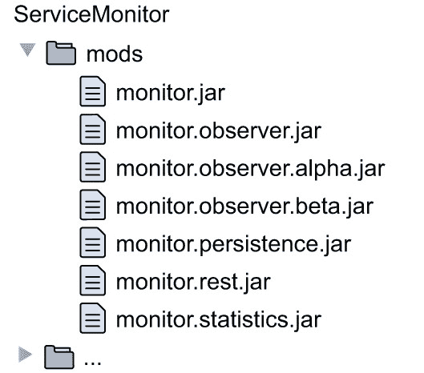
> 
> 图 2.6 所有应用程序模块，编译并打包在`mods`中，准备启动。
> 
> 2.7 运行 ServiceMonitor
> 
> 将所有模块编译到`mods`文件夹后，你终于可以启动应用程序了。正如你在下面的单行命令中可以看到的，这就是你在模块声明中投入的一些辛勤工作得到回报的地方：
> 
> `$ java` `--module-path mods:libs` `①``--module monitor` `②`
> 
> > ①
> > 
> > Java 搜索模块的文件夹
> > 
> > ②
> > 
> > 要启动的模块名称
> > 
> > 必要信息你所需要做的就是调用`java`，指定模块路径，这样`java`就知道在哪里找到你的应用程序所包含的工件，并告诉它要启动哪个模块。解决所有依赖项，确保没有冲突或模糊情况，以及仅使用正确的一组模块来启动，都由模块系统处理。
> > 
> 2.8 扩展模块化代码库
> 
> 当然，没有任何软件项目是永远完成的（除非它已经死亡），所以变化是不可避免的。例如，如果你想添加另一个观察者实现，会发生什么？通常你会采取以下步骤：

1.  开发子项目。

1.  确保它能构建。

1.  在现有代码中使用它。

> 这正是你现在要做的。对于新模块，模块系统如果添加了声明就会感到满意。
> 
> `module monitor.observer.gamma { requires monitor.observer; exports monitor.observer.gamma; }`
> 
> 你就像编译和打包其他模块一样编译和打包新模块：
> 
> `$ javac --module-path mods -d monitor.observer.gamma/target/classes ${source-files} $ jar --create --file mods/monitor.observer.gamma.jar -C monitor.observer.gamma/target/classes .`
> 
> 然后你可以将其作为依赖项添加到现有的代码中：
> 
> `module monitor { requires monitor.observer; requires monitor.observer.alpha; requires monitor.observer.beta; requires monitor.observer.gamma; requires monitor.statistics; requires monitor.persistence; requires monitor.rest; }`
> 
> 你就完成了。假设构建过程负责编译和打包，你实际上只需要添加或编辑模块声明。这也适用于删除或重构模块：除了你通常需要投入的工作之外，你还需要稍微思考一下这如何影响你的模块图，并相应地更新声明。
> 
> 2.9 剖析：模块系统的影响
> 
> 总体来说，这进行得相当顺利，不是吗？在探索以下章节的细节之前，让我们花点时间看看模块系统承诺的两个好处以及一些你可以通过更高级的功能来平滑处理的一些粗糙边缘。
> 
> 2.9.1 模块系统为你做了什么
> 
> 在 1.5 节中讨论模块系统的目标时，我们提到了两个最重要的目标：可靠配置和强封装。现在你已经构建了一些更具体的东西，我们可以重新审视这些目标，看看它们将如何帮助你交付健壮、可维护的软件。
> 
> 可靠配置
> 
> 如果 mods 中缺少依赖项会发生什么？如果两个依赖项需要同一项目的不同版本——比如 Log4j 或 Guava——会发生什么？如果两个模块意外或故意导出相同的类型，会发生什么？
> 
> 使用类路径时，这些问题会在运行时显现：一些会导致应用程序崩溃，而其他问题可能更为微妙，甚至可以说是狡猾，并可能导致应用程序行为损坏。在模块系统中，许多这些不可靠的情况，尤其是我刚才提到的那些，会在更早的时候被发现。编译器或 JVM 会通过详细的错误信息终止，并给你机会修复错误。
> 
> 例如，如果你启动应用程序但 monitor.statistics 缺失，你会收到以下消息：
> 
> `> 初始化引导层时发生错误 > java.lang.module.FindException: > 没有找到模块 monitor.statistics， > 它被 monitor 所需要`
> 
> 类似地，这是在模块路径上存在两个 SLF4J 版本时启动 ServiceMonitor 应用程序的结果：
> 
> `> 初始化引导层时发生错误 > java.lang.module.FindException: > 在 mods 中找到两个版本的模块 org.slf4j.api > (org.slf4j.api-1.7.25.jar 和 org.slf4j.api-1.7.7.jar)`
> 
> 你也不再可能意外地依赖于你的依赖项的依赖项。Hibernate 使用 SLF4J，这意味着当你的应用程序启动时，库总是存在的。但一旦你开始从 SLF4J 导入类型（你不需要在任何模块声明中导入），编译器就会阻止你，并通知你正在使用你未显式依赖的模块中的代码：
> 
> `> monitor.persistence/src/main/java/.../StatisticsRepository.java:4: > 错误：无法看到包 org.slf4j > (包 org.slf4j 在模块 org.slf4j.api 中声明， > 但模块 monitor.persistence 没有读取它)`
> 
> 即使你试图欺骗编译器，模块系统在启动时也会执行相同的检查。
> 
> 强封装
> 
> 现在，让我们从模块的用户转变为模块的维护者。想象一下在 monitor.observer.alpha 中对代码进行重构，可能是为了修复一个错误或提高性能。在发布新版本后，你发现你破坏了 monitor 中的某些代码，使应用程序变得不稳定。如果你更改了公共 API，那就是你的责任。
> 
> 但是，如果你在一个被标记为不支持的类型中更改了内部实现细节，会发生什么呢？也许这个类型必须公开，因为你想要在两个包中使用它，或者可能是监控器的作者通过反射访问了它。在这种情况下，你无法阻止用户依赖你的实现。
> 
> 通过模块系统，你可以避免这种情况。你已经做到了！只有你导出的包中的类型是可见的。其余的都是安全的——甚至从反射中也是安全的。
> 
> > 注意：如果你想知道在真正需要打破模块的情况下可以做什么，请参阅第 7.1 节和第 12.2.2 节。
> > 
> 2.9.2 模块系统还能为你做什么
> 
> 虽然 ServiceMonitor 的模块化进行得相当顺利，但还有一些粗糙的边缘我们需要讨论。你现在无法做任何事情，但本书第三部分的先进功能将使你能够平滑它们。本节为你预览了即将发生的事情。
> 
> 标记必需的模块依赖项
> 
> 模块`monitor.observer.alpha`和`monitor.observer.beta`声明了对`monitor.observer`的依赖，这是有意义的，因为它们实现了后者公开的`ServiceObserver`接口。它们还返回`DiagnosticDataPoint`实例，它属于同一个模块。
> 
> 这对任何使用实现模块的代码都有有趣的后果：
> 
> `ServiceObserver observer = new AlphaServiceObserver("some://service/url"); DiagnosticDataPoint data = observer.gatherDataFromService();`
> 
> 包含这些行的模块需要依赖`monitor.observer`；否则，它将无法看到`ServiceObserver`和`DiagnosticDataPoint`类型。对于不依赖`monitor.observer`的客户端来说，整个`monitor.observer.alpha`模块几乎毫无用处。
> 
> 如果一个模块只有在客户端记得显式依赖另一个模块时才能使用，这会很笨拙。幸运的是，有一个解决办法！你将在第 11.1 节中了解到隐式可读性。
> 
> 解耦 API 的实现和消费者
> 
> 考虑到`monitor.observer`与实现模块之间的关系，以及`monitor.observer.alpha`和`monitor.observer.beta`，还有一些其他的事情需要考虑。为什么监控器必须知道实现细节呢？
> 
> 目前，监控器需要实例化具体的类，但从那时起，它只通过接口与它们交互。依赖整个模块来调用一个构造函数似乎有些过度。实际上，每当一个废弃的`ServiceObserver`实现被淘汰或引入新的实现时，你都需要更新监控器的模块依赖，然后重新编译、打包和重新部署工件。
> 
> 为了实现 API 实现和消费者之间的松散耦合，其中消费者如 monitor 不需要依赖实现如 monitor.observer.alpha 和 monitor.observer.beta，模块系统提供了服务。它们在第十章中进行了讨论。
> 
> 使导出更具有针对性
> 
> 记得持久化模块是如何导出包含由 Hibernate 注解用于使用的对象的数据传输对象的包吗？
> 
> `module monitor.persistence { requires monitor.statistics; requires hibernate.jpa; exports monitor.persistence; exports monitor.persistence.entity; }`
> 
> 这看起来并不合适——只有 Hibernate 需要看到那些实体。但现在其他依赖于 monitor.persistence 的模块，如 monitor，也能看到它们。
> 
> 再次强调，高级模块系统功能可以满足你的需求。合格导出允许模块仅向选定的模块导出包。第 11.3 节介绍了这一机制。
> 
> 仅使包对反射可用
> 
> 即使仅向选定的模块导出包也可能过多：

+   你可能针对 API（如 Java 持久化 API [JPA]）编译你的模块，而不是针对具体实现（例如，Hibernate），因此你可能会在合格导出中谨慎提及实现模块。

+   你可能使用的是基于反射的工具（如 Hibernate 或 Guice），它仅在运行时通过反射访问你的代码，所以为什么要在编译时使其可访问呢？

+   你可能依赖于对私有成员的反射（当配置为字段注入时，Hibernate 会这样做），这在导出包中是不起作用的。

> 第 12.2 节提供了一个解决方案，介绍了开放模块和开放包。它们仅在运行时使包可用。作为交换，它们允许反射私有成员，这是基于反射的工具通常需要的。类似于导出，还有合格开放，你可以使用它将包仅向选定的模块开放。
> 
> 如果你例如使用 Hibernate 作为 JPA 提供者，你可能已经努力防止模块声明中直接依赖 Hibernate。在这种情况下，将依赖项硬编码到模块声明中可能不是你期待的事情。第 12.3.5 节详细讨论了这种情况。
> 
> 2.9.3 允许可选依赖
> 
> 项目中包含仅在特定依赖项存在于运行中的应用程序中才执行的代码并不罕见。例如，模块 monitor.statistics 可能包含使用一个花哨的统计库的代码，由于可能是许可问题，当 ServiceMonitor 启动时并不总是存在。另一个例子是，只有当存在第三个依赖项时，某些功能对用户才有吸引力——比如，如果与某些断言库一起使用，可能是一个与框架合作的测试框架。
> 
> 在这种情况下，根据前面讨论的内容，必须在模块声明中要求依赖项。这迫使它在编译时存在，以便成功编译。不幸的是，相同的 `requires` 指令意味着依赖项也必须在启动时存在，否则 JVM 将拒绝运行应用程序。
> 
> 这并不令人满意。但正如预期的那样，模块系统提供了一个出路：可选依赖项，它们必须在编译时存在，但在运行时不要求。它们在第 11.2 节中进行了讨论。在讨论了所有这些和其他高级功能之后，第 15.1 节展示了使用其中大多数功能的 ServiceMonitor 的一个变体。
> 
> 定义、构建和运行模块化应用程序的三个步骤各自有自己的章节：第三章、第四章和第五章，分别。所有这些都很重要，但第三章尤其重要，因为它介绍了模块系统背后的基本概念和机制。
> 
> 摘要

+   当你对应用程序进行模块化时，你可以从模块边界跨模块的类型依赖中推断出模块依赖。这使得创建初始模块依赖图变得简单直接。

+   多模块项目的目录结构可以与 Java 9 之前的情况相似，因此现有的工具和方法将继续工作。

+   模块声明——项目根目录中的 `module-info.java` 文件——是模块系统对编码带来的最明显变化。它命名了模块并声明了依赖项以及公共 API。除此之外，代码的编写方式几乎没有任何变化。

+   命令 `javac`、`jar` 和 `java` 已更新以支持模块化。最明显且相关的变化是模块路径（命令行选项 `--module-path` 或 `-p`）。它与类路径平行，但用于模块。

> 3
> 
> 定义模块及其属性
> 
> 本章节涵盖

+   模块是什么，以及模块声明如何定义它们

+   区分不同类型的模块

+   模块的可读性和可访问性

+   理解模块路径

+   使用模块解析构建模块图

> 我们已经讨论了很多关于模块的内容。它们不仅是模块化应用程序的核心构建块，也是对模块系统真正理解的核心。因此，深入了解它们是什么以及它们的属性如何塑造程序的行为是很重要的。
> 
> 在定义、构建和运行模块的三个基本步骤中，本章探讨了第一个（关于其他两个步骤，请参阅第四章和第五章）。本章详细解释了什么是模块以及模块的声明如何定义其名称、依赖项和 API（第 3.1 节）。一些来自 JDK 的示例让你对从 Java 9 开始将要探索的模块景观有一个初步的了解，并帮助你分类模块类型。
> 
> 我们还讨论了模块系统（以及由此扩展的编译器和运行时）如何与模块交互（第 3.2 节和第 3.3 节）。最后但同样重要的是，我们检查了模块路径以及模块系统如何解析依赖关系并从它们构建一个图（第 3.4 节）。
> 
> 如果您想跟随代码编写，请查看 ServiceMonitor 的主分支。它包含本章中展示的大多数模块声明。到本章结束时，您将知道如何定义模块的名称、依赖关系和 API，以及模块系统如何根据这些信息表现。您将理解模块系统可能抛出的错误消息，并能够分析和修复其根本原因。
> 
> > 指示牌
> > 
> > 本章为后续内容奠定了基础，因此本书的其余部分都与它相连。为了使这些联系显而易见，本章包含大量的前瞻性引用。如果您觉得它们烦人，可以忽略它们——当您打开本章查找某些内容时，它们将变得重要。
> > 
> 3.1 模块：模块化应用程序的构建块
> 
> 在所有关于模块的高谈阔论之后，是时候动手实践了。我们首先将查看您可能遇到的两种文件格式中的模块（JMODs 和模块化 JARs），然后转向如何声明模块的属性。为了在本书的其余部分更容易地进行讨论，我们将对不同的模块类型进行分类。
> 
> 3.1.1 与 JDK 一起提供的 JAVA 模块（JMODS）
> 
> 在 Project Jigsaw 的工作过程中，Java 代码库被分割成大约 100 个模块，这些模块以新的格式 JMOD 提供的。它是故意不明确的，以便比使用 JAR 格式（本质上是一个 ZIP 文件）更激进地进化。它被保留用于 JDK，因此我们不会深入讨论它。
> 
> 虽然我们不应该创建 JMODs，但我们可以检查它们。要查看 JRE 或 JDK 中的模块，请调用 `java --list-modules`。信息来自优化后的模块存储，即运行时安装的 `libs` 文件夹中的 `modules` 文件。JDK（而非 JRE）还包含在 `jmods` 文件夹中的原始模块；并且新的 `jmod` 工具，您可以在 `jmods` 旁边的 `bin` 文件夹中找到，可以使用 `describe` 操作输出它们的属性。
> 
> 以下代码片段展示了检查 JMOD 文件的一个示例。在这里，`jmod` 用于描述 Linux 机器上的 java.sql，其中 JDK 9 安装在 `*opt*jdk-9`。像大多数 Java 模块一样，java.sql 使用了模块系统的一些高级功能，因此并非所有细节都会在章节结束时变得清晰：
> 
> `$ jmod describe *opt*jdk-9/jmods/java.sql.jmod` `> java.sql@9.0.4` `①``> exports java.sql` `②` `> exports javax.sql > exports javax.transaction.xa` `> requires java.base mandated` `③``> requires java.logging transitive` `④` `> requires java.xml transitive` `> uses java.sql.Driver` `⑤``> platform linux-amd64` `⑥`
> 
> > ①
> > 
> > 模块的版本以简单字符串的形式记录在文件中：这里，9.0.4。
> > 
> > ②
> > 
> > 包含在 java.sql 中并向其他模块公开的包（导出在第 3.1.3 节中介绍）
> > 
> > ③
> > 
> > 需求指令声明了依赖关系。术语“强制”源于 java.base 是一个特殊情况（参见第 3.1.4 节）。
> > 
> > ④
> > 
> > 使用隐式可读性（参见第 11.1 节）的依赖项
> > 
> > ⑤
> > 
> > 使用指令与服务相关联（参见第十章，特别是第 10.1.1 节）。
> > 
> > ⑥
> > 
> > 模块是为特定的操作系统和硬件架构构建的。
> > 
> 3.1.2 模块 JAR：自建模块
> 
> 我们不应该创建 JMOD，那么我们如何交付我们创建的模块呢？这正是模块 JAR 发挥作用的地方。
> 
> > 定义：模块 JAR 和模块描述符
> > 
> > 模块 JAR 只是一个普通的 JAR，除了一个小的细节。它的根目录包含一个模块描述符：一个`module-info.class`文件。（本书将没有模块描述符的 JAR 称为普通 JAR，但这不是一个官方术语。）
> > 
> 模块描述符包含模块系统创建模块运行时表示所需的所有信息。单个模块的所有属性都表示在这个文件中；因此，本书中讨论的许多功能也有其对应项。在下一节中，我们将介绍如何从源文件创建这样的描述符，并将其包含在 JAR 中，以便开发人员和工具可以创建模块。
> 
> 尽管模块描述符允许模块 JAR 不仅仅是类文件存档，但以这种方式使用它并不是强制性的。客户端可以选择将其作为简单的 JAR 使用，忽略所有模块相关属性，只需将其放置在类路径上。这对于现有项目的增量模块化至关重要。（第 8.2 节介绍了未命名的模块。）
> 
> 3.1.3 模块声明：定义模块属性
> 
> 因此，模块描述符`module-info.class`是您将任何旧 JAR 转换为模块所需的所有内容。然而，这引发了一个问题，那就是如何创建描述符。正如文件扩展名`.class`所暗示的，它是编译源文件的结果。
> 
> > 定义：模块声明
> > 
> > 模块描述符是从模块声明编译而来的。按照惯例，这是一个位于项目根源文件夹中的`module-info.java`文件。声明是模块的核心元素，因此是模块系统。
> > 
> > 声明与描述
> > 
> > 你可能会担心你会混淆模块声明和模块描述符这两个术语。如果你这样做，通常不是什么大问题。前者是源代码，后者是字节码，但它们只是相同想法的不同形式：定义模块属性的东西。上下文通常只留下一个选项，所以通常很清楚指的是哪种形式。
> > 
> > 如果这还不能满足你，并且你总是想做到正确无误，我可以通过分享我的记忆法来帮助你：按字典顺序来说，声明在描述符之前，这很整洁，因为从时间顺序来说，你首先有源代码，然后是字节码。这两种排序是一致的：首先是声明/源代码，然后是描述符/字节码。
> > 
> 模块声明决定了模块在模块系统中的身份和行为。后续章节中介绍的大多数功能在模块声明中都有相应的指令，将在适当的时候介绍。现在，让我们看看 JAR 文件缺少的三个基本属性：一个名字、显式的依赖关系和封装的内部结构。
> 
> > **基本信息** 这是定义这三个属性的简单 `module-info.java` 文件的结构：
> > 
> `module ${module-name} { requires ${module-name}; exports ${package-name}; }`
> 
> 当然，`${module-name}` 和 `${package-name}` 需要替换为实际的模块和包名称。
> 
> 以 ServiceMonitor 的 monitor.statistics 模块的描述符为例：
> 
> `module monitor.statistics { requires monitor.observer; exports monitor.statistics; }`
> 
> 你可以很容易地识别我刚才描述的结构：`module` 关键字后面跟着模块的名称，主体包含 `requires` 和 `exports` 指令。接下来的几节将探讨声明这三个属性的具体细节。
> 
> > 新的关键字？
> > 
> > 你可能会想知道，在后续章节中提到的新的关键字 `module`、`requires`、`exports` 等对于已经将这些术语用作字段、参数、变量和其他命名实体的名称的代码意味着什么。幸运的是，没有必要担心。这些是受限关键字，意味着它们只在语法期望它们的位置上作为关键字使用。所以，虽然你不能有一个名为 `package` 的变量或一个名为 `byte` 的模块，但你可以有一个名为 `module` 的变量甚至模块。
> > 
> **模块命名**
> 
> JAR 文件缺少的最基本属性是一个编译器和 JVM 可以用来识别它们的名字。因此，这是模块最突出的特征。你将有机会，甚至有义务给你的每个模块起一个名字。
> 
> > **基本信息** 除了 `module` 关键字之外，声明从给模块命名开始。这必须是一个标识符，这意味着它必须遵循与例如包名称相同的规则。模块名称通常是小写的，并以点分层结构。
> > 
> 命名模块将相当自然，因为你在日常生活中使用的多数工具已经让你命名项目了。但是，尽管将项目名称作为寻找模块名称的跳板是有意义的，但选择时仍然很重要！
> 
> 正如你在 3.2 节中看到的，模块系统在很大程度上依赖于模块的名称。特别是冲突或演变的名称会引起问题，因此确保名称是

+   全局唯一

+   稳定

> 实现这一点的最好方法是使用通常用于包的逆向域名命名方案。结合标识符的限制，这通常导致模块的名称是其包含的包的前缀。这不是强制性的，但这是一个很好的迹象，表明两者都是经过深思熟虑选择的。
> 
> 保持模块名称和包名前缀同步强调，模块名称更改（这会暗示包名更改）是可能的最严重的破坏性更改之一。为了稳定起见，这应该是一个非常罕见的事件。
> 
> 例如，以下描述符命名了模块 monitor.statistics（为了使名称简洁，组成 ServiceMonitor 应用程序的模块不遵循反向域名命名方案）：
> 
> `module monitor.statistics { // requires and exports truncated }`
> 
> 所有其他属性都定义在模块名称后面的花括号内。没有特定的顺序要求，但通常是在定义依赖关系之前先定义导出。
> 
> 通过`requires`指令声明依赖关系
> 
> 在 JARs 中，我们缺少声明依赖的能力。使用 JARs 时，我们永远不知道它们需要哪些其他工件才能正常运行，我们依赖于构建工具或文档来确定这一点。在模块系统中，依赖关系必须明确声明。（参见图 3.1 了解这是如何实现的。）
> 
> 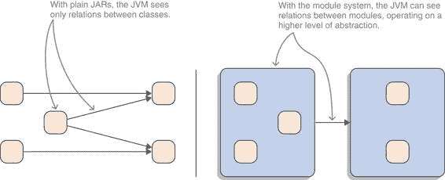
> 
> 图 3.1 能够表达模块之间的依赖关系为 JVM 引入了一个新的抽象层，JVM 可以对此进行推理。没有它们（左侧），它只能看到类型之间的依赖关系；但是有了它们（右侧），它看到的是类似于我们倾向于的工件之间的依赖关系。
> 
> > 定义：依赖关系
> > 
> > 依赖关系通过`requires`指令声明，该指令由关键字后跟模块名称组成。该指令表明声明的模块依赖于命名的模块，并在编译和运行时需要它。
> > 
> monitor.statistics 模块在编译时和运行时依赖于 monitor.observer，这是通过`requires`指令声明的：
> 
> `module monitor.statistics { requires monitor.observer; // exports truncated }`
> 
> 如果一个依赖关系通过`requires`指令声明，当模块系统找不到具有该确切名称的模块时，它将抛出一个错误。如果缺少模块，编译以及启动应用程序都将失败（参见 3.2 节）。
> 
> 导出包以定义模块的 API
> 
> 最后是导出，它定义了一个模块的公共 API。在这里，你可以选择哪些包包含应该对模块外部可用的类型，哪些包仅用于内部使用。
> 
> > 定义：导出包
> > 
> > 关键字 `exports` 后跟模块包含的包的名称。只有导出包才可以在模块外部使用；所有其他包都严格封装在模块内部（见第 3.3 节）。
> > 
> 模块 monitor.statistics 导出一个同名的包：
> 
> `module monitor.statistics { requires monitor.observer; exports monitor.statistics; }`
> 
> 注意，尽管我们喜欢认为它们是层级结构的，但包并不是层级结构的！包 `java.util` 不包含 `java.util.concurrent`；因此，导出前者不会暴露后者中的任何类型。这与导入一致，其中 `import java.util.*` 将导入 `java.util` 中的所有类型，但不会从 `java.util.concurrent` 中导入（见图 3.2）。
> 
> 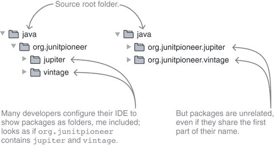
> 
> 图 3.2 我们喜欢将包视为层级结构，其中 `org.junitpioneer` 包含 `extension` 和 `vintage`（左）。但这并不是事实！Java 只关心完整的包名，看不到两者之间的任何关系（右）。在导出包时必须考虑这一点。例如，`exports org.junitpioneer` 不会导出 `jupiter` 或 `vintage` 中的任何类型。
> 
> 这意味着如果模块想要导出两个包，它总是需要两个 `exports` 指令。模块系统也不提供通配符如 `exports java.util.*` 来简化这个过程——公开 API 应该是一个故意的行动。
> 
> EXAMPLE MODULE DECLARATIONS
> 
> 为了让你熟悉，让我们看看一些实际的模块声明。最基础的模块是 java.base，因为它包含 `java.lang.Object` 类，没有这个类，任何 Java 程序都无法运行。这是所有依赖的终结者：所有其他模块都需要它，但它不需要其他任何东西。对 java.base 的依赖如此基本，以至于模块甚至不需要声明它，因为模块系统会自动填充它（下一节将详细介绍）。尽管它没有依赖，但它导出了 116 个包，所以我只会展示一个高度截断的版本：
> 
> `module java.base { exports java.lang; exports java.math; exports java.nio; exports java.util; // 许多许多其他导出 // 精美特性的使用被截断 }`
> 
> 一个更简单的模块是 java.logging，它公开了 `java.util.logging` 包：
> 
> `module java.logging { exports java.util.logging; }`
> 
> 要查看需要另一个模块的模块，让我们转向 java.rmi。它创建日志消息，因此依赖于 java.logging 来完成这个任务。它公开的 API 可以在 `java.rmi` 和其他带有该前缀的包中找到：
> 
> ``module java.rmi { requires java.logging; exports java.rmi; // 其他 `java.rmi.*` 包的导出 // 精美特性的使用被截断 }``
> 
> 要了解更多示例，请翻回第 2.2.3 节，特别是声明 ServiceMonitor 应用程序模块的代码。
> 
> 3.1.4 模块的多种类型
> 
> 想想你现在正在工作的应用程序。它很可能由多个 JAR 文件组成，这些 JAR 文件在未来某个时刻可能会全部成为模块。但它们并不是构成应用程序的唯一元素。JDK 也被分割成模块，它们也将成为你考虑的一部分。但是等等，还有更多！在这个模块集中，一些具有特定特征的模块需要特别指出。
> 
> > 定义：模块类型
> > 
> > 为了避免不可解的混乱，以下术语识别了某些角色，并使讨论模块化景观更加清晰。现在是时候坐下来学习它们了。如果你一次记不住所有这些术语，请不要担心；将页面书签，并在遇到不确定如何解释的术语时返回（或直接查看书籍的索引）。 

+   应用程序模块 — 非 JDK 模块；Java 开发者为他们自己的项目创建的模块，无论是库、框架还是应用程序。这些模块位于模块路径上。目前，它们将是模块化 JAR 文件（见第 3.1.2 节）。

+   初始模块 — 应用模块，编译从这里开始（对于`javac`）或者包含`main`方法（对于`java`）。第 5.1.1 节展示了如何使用`java`命令启动应用程序时指定它。编译器也使用这个概念：如第 4.3.5 节所述，它定义了编译从哪个模块开始。

+   根模块 — JPMS 开始解析依赖的地方（这个过程在第 3.4.1 节中详细解释）。除了包含主类或要编译的代码外，初始模块也是一个根模块。在书中进一步遇到的复杂情况下，可能需要定义除初始模块之外的根模块（如第 3.4.3 节所述）。

+   平台模块 — 构成 JDK 的模块。这些模块由 Java SE 平台规范（以 java.为前缀）以及 JDK 特定模块（以 jdk.为前缀）定义。如第 3.1.1 节所述，它们以优化形式存储在运行时的`libs`目录中的`modules`文件中。

+   孵化器模块 — 非标准平台模块，其名称总是以 jdk.incubator 开头。它们包含可能从冒险的开发者测试中受益的实验性 API。

+   系统模块 — 除了从平台模块的子集中创建运行时镜像外，`jlink`还可以包括应用程序模块。这种镜像中找到的平台和应用程序模块统称为其系统模块。要列出它们，请使用镜像的`bin`目录中的`java`命令并调用`java --list-modules`。

+   可观察模块——当前运行时的所有平台模块以及命令行上指定的所有应用程序模块；JPMS 可以使用这些模块来满足依赖项。总而言之，这些模块构成了可观察模块的宇宙。

+   基础模块——应用程序和平台模块之间的区别只是为了使通信更容易。对于模块系统来说，所有模块都是相同的，除了一个：平台模块 java.base，所谓的基模块，扮演着特定的角色。

> 平台模块和大多数应用程序模块都有模块描述符，这些描述符是由模块创建者提供的。其他模块存在吗？是的：

+   明确模块——由模块创建者提供模块描述符的平台模块和大多数应用程序模块。

+   自动模块——没有模块描述符的命名模块（提示：模块路径上的普通 JAR 文件）。这些是由运行时创建的应用程序模块，而不是由开发者创建的。

+   命名模块——明确模块和自动模块的集合。这些模块有一个名称，要么由描述符定义，要么由 JPMS 推断。

+   无名模块——未命名的模块（提示：类路径内容）因此不是明确的。

> 自动模块和无名模块在将应用程序迁移到模块系统的背景下变得相关——这是第八章深入讨论的主题。为了更好地理解这些类型的模块如何相互关联，请参阅图 3.3。
> 
> 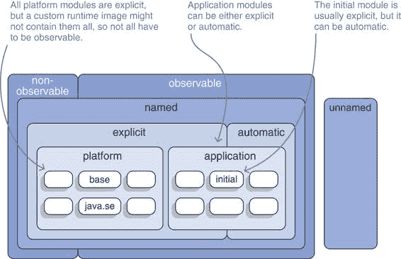
> 
> 图 3.3 大多数类型的模块，组织在一个方便的图表中。与 JDK 一起提供的模块称为平台模块，基模块位于中心。然后是应用程序模块，其中必须有一个是初始模块，它包含应用程序的`main`方法。（根、系统和孵化模块未显示。）
> 
> 为了将这些术语应用到例子中，让我们转向第二章中我们探讨的 ServiceMonitor 应用程序。它由七个模块（monitor、monitor.observer、monitor.rest 等等）以及外部依赖项 Spark 和 Hibernate 及其传递依赖项组成。
> 
> 当它启动时，包含其七个模块及其依赖项的文件夹在命令行上指定。与运行应用程序的 JRE 或 JDK 中的平台模块一起，它们构成了可观察模块的宇宙。这是模块系统将尝试满足所有依赖项的模块池。
> 
> ServiceMonitor 的模块以及构成其依赖关系的 Hibernate 和 Spark 都是应用程序模块。因为它包含`main`方法，所以监控器是初始模块——不需要其他根模块。程序直接依赖的唯一平台模块是基础模块 java.base，但 Hibernate 和 Spark 会引入进一步的模块，如 java.sql 和 java.xml。因为这是一个全新的应用程序，并且所有依赖关系都被假定为模块化，这不是一个迁移场景；因此，没有涉及自动或未命名的模块。
> 
> 现在你已经知道了存在哪些类型的模块以及如何声明它们，是时候探索 Java 如何处理这些信息了。
> 
> 3.2 可读性：连接各个部分
> 
> 模块是原子构建块：交互工件图中的节点。但没有节点之间的边，就无法形成图！这就是可读性发挥作用的地方，基于此，模块系统将在节点之间创建连接。
> 
> > 定义：可读性边
> > 
> > 当模块客户在其声明中需要模块 bar 时，则在运行时客户将读取 bar，或者相反，bar 将由客户可读（参见图 3.4）。两个模块之间的连接称为可读性边，或简称为读取边。
> > 
> 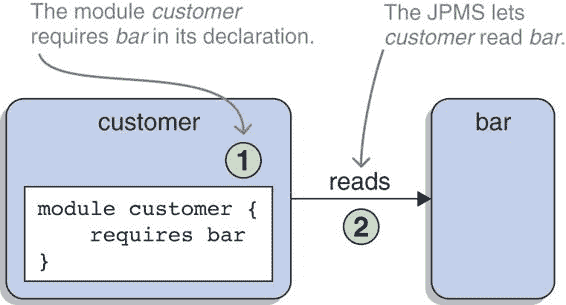
> 
> 图 3.4 模块客户在其描述符中需要模块 bar（1）。基于此，模块系统将允许客户在运行时读取 bar（2）。
> 
> 而“客户需要 bar”和“客户依赖于 bar”这样的短语反映了客户和 bar 之间的静态、编译时关系，而可读性则是其更动态的运行时对应物。为什么它更动态？`requires`指令是读取边的原始发起者，但绝非唯一。其他还有命令行选项（参见第 3.4.4 节中的`--add-reads`）和反射 API（参见第 12.3.4 节），都可以用来添加更多；最终，这并不重要。无论读取边是如何产生的，它们的效果总是相同的：它们是可靠配置和可访问性的基础（参见第 3.3 节）。
> 
> 3.2.1 实现可靠的配置
> 
> 如第 1.5.1 节所述，可靠的配置旨在确保 Java 程序编译或启动时使用的特定工件配置能够维持程序运行，而不会出现虚假的运行时错误。为此，它执行了一些检查（在模块解析过程中，该过程在第 3.4.1 节中解释）。
> 
> > **基本信息** 模块系统检查可观察模块的宇宙是否包含所有必需的依赖项，包括直接和间接依赖项，如果缺少任何内容，则会报告错误。绝对不能有歧义：没有两个工件可以声称它们是同一个模块。这在存在同一模块的两个版本的情况下尤其有趣——因为模块系统没有版本的概念（见第十三章），它将此视为重复的模块。因此，如果遇到这种情况，它会报告错误。模块之间不能存在静态依赖循环。在运行时，模块之间相互访问是可能的，甚至是必要的（例如，考虑使用 Spring 注解的代码和 Spring 对该代码的反射），但这些不能是编译依赖项（Spring 显然没有针对它所反射的代码进行编译）。包应该有唯一的来源，因此没有两个模块必须包含同一包中的类型。如果它们这样做，这被称为拆分包，模块系统将拒绝编译或启动此类配置。这在迁移的上下文中尤其有趣，因为一些现有的库和框架故意拆分包（见第 7.2 节）。
> > 
> 当然，这种验证并不是无懈可击的，问题可能隐藏足够长的时间，以至于导致正在运行的应用程序崩溃。例如，如果模块的错误版本最终出现在正确的位置，应用程序将启动（所有必需的模块都存在），但稍后，例如，当类或方法缺失时，将崩溃。
> 
> 由于模块系统是为了在编译时间和运行时展示一致的行为而开发的，因此可以通过基于相同的工件进行编译和启动来进一步最小化这些错误。（在示例中，针对具有错误版本的模块的编译将失败。）
> 
> 3.2.2 **尝试不可靠的配置**
> 
> 让我们尝试破坏一些东西！模块系统检测到哪些不可靠的配置？为了调查，我们将转向第二章中引入的 ServiceMonitor 应用程序。
> 
> **缺少依赖项**
> 
> 考虑 monitor.observer.alpha 及其声明：
> 
> `module monitor.observer.alpha { requires monitor.observer; exports monitor.observer.alpha; }`
> 
> 这就是尝试编译时缺少 monitor.observer 监视器的情况：
> 
> `> monitor.observer.alpha/src/main/java/module-info.java:2: > error: 模块未找到: monitor.observer > requires monitor.observer > ^ > 1 error`
> 
> 如果模块在编译时存在，但在到达发射台的过程中丢失，JVM 将使用以下错误退出：
> 
> `> 初始化引导层时发生错误 > java.lang.module.FindException: > 模块 monitor.observer 未找到， > 由 monitor.observer.alpha 所需`
> 
> 虽然在启动时强制所有传递性所需的模块存在是有意义的，但对于编译器来说则不然。因此，如果缺少间接依赖项，编译器既不会发出警告也不会报错，如下面的示例所示。
> 
> 这些是 monitor.persistence 和 monitor.statistics 的模块声明：
> 
> `module monitor.persistence { requires monitor.statistics; exports monitor.persistence; }  module monitor.statistics { requires monitor.observer; exports monitor.statistics; }`
> 
> 很明显，monitor.persistence 并不直接需要 monitor.observer，因此即使 monitor.observer 不在模块路径上，monitor.persistence 的编译也能成功。
> 
> 如果启动应用程序时缺少传递性依赖项，则无法工作。即使初始模块不直接依赖于它，其他模块可能会，因此它将被报告为缺失。ServiceMonitor 仓库中的 `break-missing-transitive-dependency` 分支创建了一个配置，其中缺失的模块会导致错误信息。
> 
> **重复模块**
> 
> 由于模块通过名称相互引用，任何两个模块声称具有相同名称的情况都是模糊的。选择哪个是正确的非常依赖于上下文，并且不是模块系统通常可以决定的。因此，为了避免可能的不良决策，它根本不做出任何决定，而是产生一个错误。快速失败允许开发者在问题造成更多问题之前注意到并修复它。
> 
> 这是模块系统在尝试编译模块路径上具有两个版本的 monitor.observer.beta 时产生的编译错误：
> 
> `> 错误：应用程序模块路径上的重复模块 > module in monitor.observer.beta > 1 error`
> 
> 注意，编译器无法将错误链接到编译下的任何文件，因为它们不是问题的原因。相反，模块路径上的工件导致了错误。
> 
> 当错误直到 JVM 启动时才被发现，它会提供一个更精确的消息，列出 JAR 文件名：
> 
> `> 初始化引导层时发生错误 > java.lang.module.FindException: > 在 mods 中找到两个版本的模块 monitor.observer.beta > (monitor.observer.beta.jar 和 monitor.observer.gamma.jar)`
> 
> 正如我们在第 1.5.6 节中讨论的，并在第 13.1 节中进一步探讨的那样，模块系统没有版本的概念，因此在这种情况下，将发生相同的错误。我认为，绝大多数重复模块错误将是由模块路径上存在相同模块的多个版本引起的。
> 
> > **重要信息** 模糊性检查仅应用于单个模块路径条目！（这句话可能会让你感到困惑——我将在第 3.4.1 节中解释我的意思，但我想在这里提一下，以免遗漏这个重要的事实。）
> > 
> 如果模块实际上并不需要，模块系统也会抛出重复模块错误。只要模块路径包含它就足够了！其中两个原因是服务和可选依赖项，这些将在第十章和第 11.2 节中介绍。ServiceMonitor 分支`break-duplicate-modules-even-if-unrequired`即使不需要也会因为重复模块而创建错误信息。
> 
> DEPENDENCY CYCLES
> 
> 意外创建循环依赖并不难，但让编译器通过它却很难。甚至很难向编译器展示它们。为了做到这一点，你必须解决“先有鸡还是先有蛋”的问题，即如果两个项目相互依赖，那么不可能在没有另一个项目的情况下编译其中一个。如果你尝试这样做，你会遇到缺失的依赖项并得到相应的错误。
> 
> 一种绕过这个问题的方法是同时编译两个模块，从鸡和蛋同时开始，换句话说；第 4.3 节解释了如何做到这一点。简单来说，如果在编译的模块之间存在循环依赖，模块系统会识别出来并导致编译错误。如果 monitor.persistence 和 monitor.statistics 相互依赖，它看起来是这样的：
> 
> `> monitor.statistics/src/main/java/module-info.java:3: > 错误：涉及 monitor.persistence 的循环依赖 > requires monitor.persistence; > ^ > 1 个错误`
> 
> 另一种方法是逐步建立循环依赖，而不是一次性建立，在已经构建了有效配置之后。让我们再次转向 monitor.persistence 和 monitor.statistics：
> 
> `module monitor.persistence { requires monitor.statistics; exports monitor.persistence; }  module monitor.statistics { requires monitor.observer; exports monitor.statistics; }`
> 
> 这个配置没有问题，编译时没有出现任何问题。现在开始有点复杂了：编译模块并保留 JAR 文件。然后更改 monitor.statistics 模块的声明，使其需要 monitor.persistence，这会创建一个循环依赖（在这个例子中，这种改变并没有太多意义，但在更复杂的应用程序中通常会有意义）：
> 
> `module monitor.statistics { requires monitor.observer; requires monitor.persistence; exports monitor.statistics; }`
> 
> 下一步是仅编译已更改的 monitor.statistics，同时使用模块路径上的已编译模块。这必须包括 monitor.persistence，因为统计模块现在依赖于它。反过来，持久化模块仍然声明它对 monitor.statistics 的依赖，这是依赖循环的第二部分。不幸的是，对于这次黑客攻击，模块系统识别出这个循环并导致与之前相同的编译错误。
> 
> 将“偷壳游戏”提升到下一个层次最终欺骗了编译器。在这个场景中，两个完全无关的模块——让我们选择 monitor.persistence 和 monitor.rest——被编译成模块化的 JAR 文件。然后是魔术表演：
> 
> 添加一个依赖关系，例如从持久化到 rest，并且更改后的持久化针对原始模块集进行编译。这是因为原始的 rest 不依赖于持久化。
> 
> 添加第二个依赖关系，即从 rest 到持久化，但 rest 也针对包括尚未依赖它的持久化版本在内的原始模块集进行编译。因此，它也可以被编译。
> 
> 感到困惑？查看图 3.5 以获得另一个视角。
> 
> 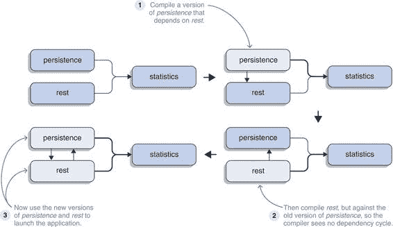
> 
> 图 3.5 将依赖关系循环传递给编译器并不容易。这里是通过选择两个无关的模块，持久化和 rest（两者都依赖于统计），然后从其中一个模块添加依赖到另一个模块来完成的。编译 rest 时，必须针对旧的持久化版本，这样循环就不会显示，并且编译可以通过。在最后一步，两个原始模块都可以用它们之间具有循环依赖关系的新编译版本来替换。
> 
> 现在 monitor.persistence 和 monitor.rest 的版本相互依赖。要使这种情况在现实生活中发生，编译过程——可能由构建工具管理——必须处于严重混乱状态（但这并非闻所未闻）。幸运的是，模块系统支持你，并在使用这种配置启动 JVM 时报告错误：
> 
> `> 初始化引导层时发生错误 > java.lang.module.FindException: > 检测到循环： > monitor.persistence > -> monitor.rest > -> monitor.persistence`
> 
> 所有示例都显示了两个工件之间的循环依赖关系，但模块系统可以检测到所有长度的循环。这样做是好事！更改代码总是存在破坏上游功能的风险，这意味着使用正在更改的代码的其他代码——无论是直接还是间接的。
> 
> 如果依赖关系只有一个方向，那么更改影响的代码量是有限的。另一方面，如果依赖关系可以形成循环，那么循环中的所有代码以及依赖于它的所有代码都可能受到影响。尤其是如果循环很大，这可能会迅速变成所有代码都受到影响，我相信你也会同意你想避免这种情况。模块系统并不是唯一帮助你在这里的工具——你的构建工具也是如此，它也会对依赖关系循环感到不满。
> 
> 拆分包
> 
> 当两个模块包含同一包中的类型时，会发生拆分包的情况。例如，回想一下，monitor.statistics 模块在`monitor.statistics`包中包含一个名为`Statistician`的类。现在让我们假设 monitor 模块包含一个简单的回退实现，`SimpleStatistician`，为了促进一致性，它位于 monitor 自己的`monitor.statistics`包中。
> 
> 当尝试编译 monitor 时，你会得到以下错误：
> 
> `> monitor/src/main/java/monitor/statistics/SimpleStatistician.java:1: > 错误：另一个模块中存在相同的包：monitor.statistics > package monitor.statistics; > ^ > 1 错误`
> 
> > **重要信息** 有趣的是，编译器只有在编译的模块可以访问另一个模块中的分割包时才会显示错误。这意味着分割包必须被导出。
> > 
> 为了尝试这一点，让我们走一条不同的路线：`SimpleStatistician`已经不存在了，这次是`monitor.statistics`创建了分割包。为了尝试重用一些实用方法，它在`monitor`包中创建了一个`Utils`类。它没有意愿与其他模块共享这个类，因此它继续只导出`monitor.statistics`包。
> 
> 编译`monitor.statistics`没有错误，这是有道理的，因为它不需要`monitor`，因此对分割包一无所知。当编译`monitor`的时候，情况变得有趣。它依赖于`monitor.statistics`，并且两者都包含`monitor`包中的类型。但是，正如我刚才提到的，因为`monitor.statistics`没有导出包，编译才能正常工作。
> 
> 太好了！现在到了启动的时候：
> 
> `> 初始化引导层时发生错误 > java.lang.reflect.LayerInstantiationException: > 模块监控器在模块 monitor.statistics 和模块 monitor 中存在`
> 
> 这并不顺利。模块系统在启动时检查分割包，并且这里无论它们是否导出都无关紧要：没有两个模块可以包含同一包中的类型。正如你在第 7.2 节中看到的，当将代码迁移到 Java 9 时，这可能会变成一个问题。
> 
> ServiceMonitor 仓库在`break-split-package-compilation`和`break-split-package-launch`分支中展示了编译和运行时分割包问题的示例。
> 
> **模块化的死亡钻石**
> 
> 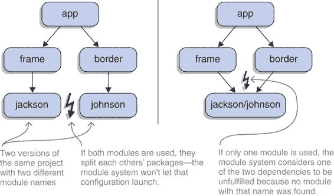
> 
> 图 3.6 如果一个模块更改了其名称（这里，从 jackson 更改为 johnson），依赖于它的项目（这里，通过 frame 和 border 的 app）可能会面临模块化的死亡钻石：它们依赖于同一个项目，但通过两个不同的名称。
> 
> 分割包和缺失依赖项的特别狡猾的混合体是模块化的死亡钻石（见图 3.6）。假设一个模块在两个版本之间更改了名称：你的一个依赖项通过其旧名称需要它，另一个依赖项通过其新名称需要它。现在你需要相同的代码出现在两个不同的模块名称下，但 JPMS 不会允许这种情况发生。
> 
> 你会遇到以下情况之一：

+   一个模块化的 JAR 文件，它只能作为一个具有一个名称的模块出现，因此将触发错误，因为一个依赖项无法满足

+   两个具有不同名称但相同包的模块化 JAR 文件，这将导致你刚刚观察到的分割包错误

> > 重要的是要避免这种情况！如果你正在向公共仓库发布工件，你应该仔细考虑是否需要重命名你的模块。如果是的话，你可能还希望更改包名，这样人们就可以同时使用旧模块和新模块。如果你作为用户最终处于这种情况，你可能很幸运地通过创建聚合模块（见 11.1.5 节）或编辑模块描述符（见 9.3.3 节）来摆脱困境。
> > 
> 3.3 可访问性：定义公共 API
> 
> 在模块和读取边已经就位的情况下，你知道模块系统是如何构建你心中所想的图的。为了防止这个图表现得像你想要逃离的泥球，还有一个额外的要求：隐藏模块内部结构，以便外部代码无法访问它。这就是可访问性的作用所在。
> 
> > 定义：可访问性
> > 
> > 如果以下所有条件都得到满足，模块 bar 中的类型`Drink`对模块 customer 中的代码是可访问的（参见图 3.7）：

+   `Drink` 是公共的。

+   `Drink` 属于 bar 导出的包。

+   customer 读取 bar。

> 对于可访问类型的成员（意味着它的字段、方法和嵌套类），通常的可见性规则适用：公共成员是完全可访问的，受保护成员仅限于继承类。技术上讲，包私有成员在同一包中是可访问的，但正如你在上一节中看到的，由于模块间不允许分割包的规则，这并不有用。
> 
> 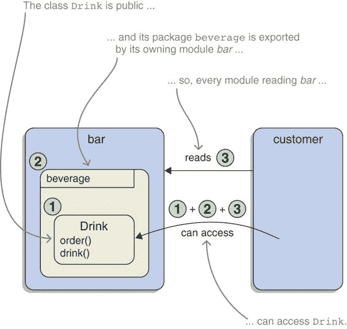
> 
> 图 3.7 模块 bar 在一个导出包中包含一个公共类型`Drink`（1）。模块 customer 读取模块 bar（3），因此 customer 中的代码访问`Drink`的所有要求都得到了满足。想知道如果某些要求没有得到满足会发生什么？请查看 3.3.3 节。
> 
> > 注意：可访问性的定义包括想要访问类型的模块。从这个意义上说，一个类型永远不会“可访问”，而只能是“对特定模块可访问”。尽管如此，当没有其他模块可见时，人们通常使用相同的术语，并说如果一个类型是公共的且在导出包中，那么它是可访问的。然后任何模块都可以通过读取包含它的模块来自由访问该类型。
> > 
> 要理解可访问性如何塑造模块的公共 API，首先理解这个术语很重要：什么是公共 API？
> 
> > 定义：公共 API
> > 
> > 用非技术术语来说，模块的公共 API 是所有不能在不引起使用它的代码编译错误的情况下更改的内容。（一般来说，这个术语还包括运行时行为的规范，但由于模块系统不在这个维度上操作，我在本书中会忽略它。）更技术地说，模块的公共 API 包括以下内容：

+   所有导出包中的公共类型名称

+   公共和受保护字段的名称和类型名称

+   所有公共和受保护方法的名称、参数类型名称和返回类型名称（称为方法签名）

> 如果你觉得我突然谈论名称很奇怪，想想你在保持包外依赖代码编译的同时可以在类型中更改什么。私有和包可见字段？当然可以！私有和包可见方法？当然可以。需要保持不变的是其他代码可能编译的名称：类型的名称、公共方法的签名等等。
> 
> 检查公共 API 的定义，可以清楚地看出，模块系统从 Java 9 开始改变了包（必须导出）和类型（必须公共）层面的东西。另一方面，在类型内部，没有变化，类型在 Java 8、Java 9 及以后的公共 API 是相同的。
> 
> 3.3.1 实现强封装
> 
> > **重要信息** 如果一个类型不可访问，就无法以该类型特有的任何方式与之交互：无法实例化它，访问其字段，调用方法或使用嵌套类。“特定于该类型”这个短语有点不寻常——它是什么意思？如果它们在可访问的超类型（如类型实现的接口）或最终是`Object`中定义，则可以与类型的成员交互。这与 Java 9 之前的版本非常相似，当时可以使用非公共接口实现来使用，但只能通过该接口。
> > 
> 例如，考虑一个高性能库 superfast，它有已知 Java 集合的自定义实现。让我们关注一个假设的`SuperfastHashMap`类，它实现了 Java 的`Map`接口并且不可访问（可能它在导出的包中是包可见的，也可能整个包都没有导出）。
> 
> 如果超级快速模块之外的代码获得一个`SuperfastHashMap`实例（可能来自工厂），那么它只能将其用作`Map`。它不能将其分配给`SuperfastHashMap`类型的变量，也不能在它上面调用`superfastGet`（即使该方法为公共）但定义在可访问的超类型（如`Map`和`Object`）上的所有内容都没有问题。（参见图 3.8。）
> 
> 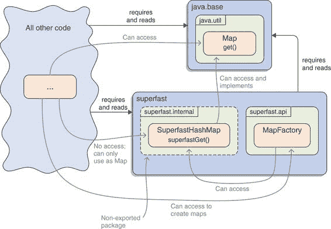
> 
>  不可访问的类型`SuperfastHashMap`实现了可访问的`Map`接口。超级快速模块之外的代码，如果得到一个实例，可以将其用作`Map`和`Object`，但永远不能以特定于该类型的方式使用：例如，通过调用`superfastGet`。超级快速模块中的代码不受访问限制，可以像通常一样使用该类型：例如，创建实例并返回它们。
> 
> 可访问性规则使得在强封装模块内部的同时，能够暴露精心选择的特性，确保外部代码不能依赖于实现细节。有趣的是，这包括反射，如果它跨越模块边界使用，也无法绕过这些规则！（我们将在本章的其余部分讨论反射——如果你需要复习基础知识，请参阅附录 B。）
> 
> 可能你会想知道像 Spring、Guice、Hibernate 等基于反射的库在未来的工作方式，或者如果代码绝对需要，它将如何突破到一个模块中。有几种方式可以提供或获取访问权限：

+   正规导出（参见第 3.1 节）

+   有资格的导出（参见第 11.3 节）

+   开放模块和开放包（参见第 12.2 节）

+   命令行选项（总结在第 7.1 节）

> 第十二章将更深入地探讨反射。
> 
> 但让我们回到三个作为访问前提条件（公共类型、导出包、读取模块）的条件。它们有一些有趣的后果。
> 
> > 重要的信息首先，`public`不再公开。通过查看类型，无法再判断它是否将在模块外部可见——为此，需要检查`module-info.java`或信任 IDE 突出显示导出的包或类型。如果没有`requires`指令，模块中的所有类型对外部都是不可访问的。封装是新的默认设置！
> > 
> 这三个条件还意味着你也不再可能意外地依赖于传递依赖。让我们看看原因。
> 
> 3.3.2 封装传递依赖
> 
> 没有模块系统，使用一个依赖项引入的 JAR 文件中的类型（但未声明为依赖项）是可能的。一旦项目以这种方式使用类型，构建配置就不再反映实际的依赖项集合，这可能导致从无知的架构决策到运行时错误的各种问题。
> 
> 例如，假设一个项目正在使用 Spring，它依赖于 OkHttp。编写使用 OkHttp 类型代码就像让 IDE 添加它所建议的导入语句一样简单。代码将能够编译和运行，因为构建工具将确保 Spring 及其所有依赖项，包括 OkHttp，始终可用。这使得声明对 OkHttp 的依赖变得不必要，因此很容易被遗忘。（参见图 3.9。）
> 
> 作为结果，项目的依赖项分析可能会提供误导性的结果，基于这些结果可能会做出有问题的决策。OkHttp 的版本也不是固定的，完全取决于 Spring 使用什么。如果该版本被更新，依赖于 OkHttp 的代码将默默地运行在不同的版本上，这实际上会带来程序在运行时出现行为异常或崩溃的真实风险。
> 
> 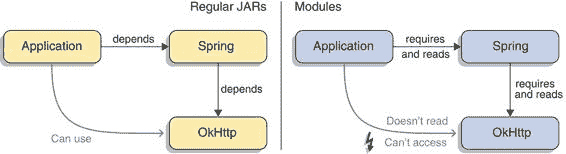
> 
> 图 3.9 没有模块时，很容易意外地依赖于传递依赖，如本例所示，其中应用程序依赖于 OkHttp，它被 Spring 拉入。另一方面，使用模块时，必须使用`requires`指令声明依赖项才能访问它们。应用程序不需要 OkHttp，因此无法访问它。
> 
> 由于模块系统要求访问模块必须读取被访问的模块，这种情况现在不再发生。除非项目通过使用`requires`指令声明其对 OkHttp 的依赖，否则模块系统不允许它访问 OkHttp 的类。这样，它迫使你保持配置更新。
> 
> 注意，模块具有通过一个称为隐式可读性的功能将它们的依赖项传递给依赖于它们的模块的能力。有关详细信息，请参阅第 11.11 节。
> 
> 3.3.3 封装争斗
> 
> 就像我们对可读性所做的那样，让我们打破规则！但在我们这样做之前，我想展示一个遵循所有规则且能正常工作的场景。再次强调，它基于第二章中引入的 ServiceMonitor 应用程序。
> 
> 为了这些示例的目的，假设模块`monitor.observer`包含在其包`monitor.observer`中的类`DisconnectedServiceObserver`。它所做的不重要：重要的是它实现了`ServiceObserver`接口，它有一个不需要任何参数的构造函数，并且监控模块使用它。
> 
> 模块`monitor.observer`导出`monitor.observer`，`DisconnectedServiceObserver`是公开的。这满足了前两个可访问性要求，因此其他模块如果读取`monitor.observer`，则可以访问它。模块`monitor`也满足这个先决条件，因为它在其模块声明中需要`monitor.observer`。综合(图 3.10 和列表 3.1)，所有要求都得到满足，monitor 中的代码可以访问`DisconnectedServiceObserver`。相应地，编译和执行没有错误。让我们玩弄细节，看看模块系统如何反应。
> 
> 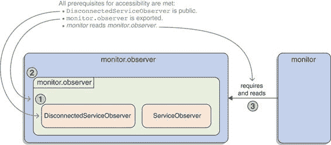
> 
> 图 3.10 `DisconnectedServiceObserver`是公开的（1）并且位于由`monitor.observer`导出的包中（2）。因为 monitor 模块读取`monitor.observer`（3），所以其中的代码可以使用`DisconnectedServiceObserver`。
> 
> > 列表 3.1 `DisconnectedServiceObserver`，可由 monitor 访问
> > 
> `// --- TYPE DisconnectedServiceObserver --- package monitor.observer;` `public class DisconnectedServiceObserver //` `①` `implements ServiceObserver { // class body truncated }  // --- MODULE DECLARATION monitor.observer --- module monitor.observer {` `exports monitor.observer; //` `②` `}  // --- MODULE DECLARATION monitor --- module monitor {` `requires monitor.observer; //` `③` `// 其他 requires 指令省略 }`
> 
> > ①
> > 
> > 公开的 monitor.observer.DisconnectedServiceObserver
> > 
> > ②
> > 
> > 模块 monitor.observer 导出包 monitor.observer。
> > 
> > ③
> > 
> > 模块 monitor 需要并最终读取 monitor.observer。
> > 
> 类型非公开
> 
> 如果将`DisconnectedServiceObserver`设置为包可见，monitor 的编译将失败。更确切地说，导入导致了第一个错误：
> 
> `> monitor/src/main/java/monitor/Monitor.java:4: 错误: > monitor.observer.DisconnectedServiceObserver 在 monitor.observer 中不是公开的；不能从包外访问 > import monitor.observer.DisconnectedServiceObserver; > ^`
> 
> 在 Java 9 之前，从另一个包访问包可见的类型也是不可能的，因此错误信息并不新鲜——即使没有模块系统，你也会得到相同的错误。
> 
> 同样，如果你通过在将`DisconnectedServiceObserver`设置为包可见后重新编译 monitor.observer 模块并启动整个应用程序来绕过编译器检查，错误与没有模块系统时相同：
> 
> `> 异常发生在主线程中 java.lang.IllegalAccessError: > 无法从类 monitor.Monitor 访问类 monitor.observer.DisconnectedServiceObserver`
> 
> 在 Java 9 之前，可以使用反射 API 在运行时访问类型，这是强封装所阻止的。考虑以下代码：
> 
> `Constructor<?> constructor = Class.forName("monitor.observer.DisconnectedServiceObserver").getDeclaredConstructor(); constructor.setAccessible(true); ServiceObserver observer = (ServiceObserver) constructor.newInstance();`
> 
> 在 Java 8 及之前版本中，无论`DisconnectedServiceObserver`是公开的还是包可见的，这都适用。在 Java 9 及以后的版本中，模块系统会阻止访问，如果`DisconnectedServiceObserver`是包可见的，调用`setAccessible`会导致异常：
> 
> `> 异常发生在主线程中 java.lang.reflect.InaccessibleObjectException: > 无法使 monitor.observer.DisconnectedServiceObserver() 可访问：模块 monitor.observer 不对模块 monitor "打开" monitor.observer`
> 
> ServiceMonitor 仓库的分支`break-reflection-over-internals`展示了这里的行为。monitor.observer 没有打开 monitor.observer 的抱怨指向了该问题的解决方案——这是第 12.2 节探讨的内容。
> 
> 包未导出
> 
> 接下来是要求之一，即包含访问类型的包必须导出。为了试验这一点，让我们再次将`DisconnectedServiceObserver`设置为公开，但将其移动到另一个包 monitor.observer.dis，该包 monitor.observer 没有导出。monitor 中的导入更新到新包：
> 
> `> monitor/src/main/java/monitor/Monitor.java:4: 错误: > 包 monitor.observer.dis 不存在 > import monitor.observer.dis.DisconnectedServiceObserver; > ^ > (包 monitor.observer.dis 在模块 monitor.observer 中声明，该模块没有导出它)`
> 
> 这相当直接。
> 
> 要查看运行时在这种情况下表现如何，你需要绕过编译器检查。为此，编辑 monitor.observer 以导出 monitor.observer.dis，编译所有模块，然后再次编译 monitor.observer 而不进行该导出。你可以像以前一样启动应用程序并引发运行时错误：
> 
> `> 线程 "main" 中发生异常 java.lang.IllegalAccessError: > 类 monitor.Monitor（在模块 monitor 中）无法访问类 > monitor.observer.dis.DisconnectedServiceObserver（在模块 > monitor.observer 中），因为模块 monitor.observer 没有将 > monitor.observer.dis 导出给模块 monitor`
> 
> 就像编译器一样，运行时相当健谈，并解释了问题所在。当你尝试使构造函数可访问时，这也适用于反射 API，这样你就可以创建 `DisconnectedServiceObserver` 的实例：
> 
> `> 线程 "main" 中发生异常 java.lang.reflect.InaccessibleObjectException: > 无法使 public monitor.observer.dis.DisconnectedServiceObserver() 可访问：> 模块 monitor.observer 没有对模块 monitor 导出 monitor.observer.dis`
> 
> 如果你仔细观察，你会看到运行时和反射 API 都提到了将包导出到模块。这被称为合格导出（在第 11.3 节中解释）。
> 
> 模块未读取
> 
> 列表中的最后一个要求是，导出模块必须被访问类型的模块读取。从 monitor 的模块声明中移除 `requires monitor.observer` 指令会导致预期的编译时错误：
> 
> `> monitor/src/main/java/monitor/Monitor.java:3: 错误：> 包 monitor.observer 不可见 > 导入 monitor.observer.DiagnosticDataPoint; > ^ > （包 monitor.observer 在模块 monitor.observer 中声明，但模块 monitor 没有读取它）`
> 
> 要查看运行时对缺少 `requires` 指令的反应，首先使用一个正常配置编译整个应用程序，这意味着监控读取 monitor.observer。然后从 monitor 的 `module-info.java` 中移除 `requires` 指令，并仅重新编译该文件。这样，模块的代码将使用一个仍然需要 monitor.observer 的模块声明进行编译，但运行时将看到一个声称没有这种要求的模块描述。正如预期的那样，结果是运行时错误：
> 
> `> 线程 "main" 中发生异常 java.lang.IllegalAccessError: > 类 monitor.Monitor（在模块 monitor 中）无法访问类 > monitor.observer.DisconnectedServiceObserver（在模块 > monitor.observer 中），因为模块 monitor 没有读取模块 > monitor.observer`
> 
> 再次，错误信息非常明确。
> 
> 最后，让我们转向反射。你可以使用相同的编译技巧创建一个不读取 monitor.observer 的监控模块。并且当 `DisconnectedServiceObserver` 不是公共的，但你仍然想创建一个实例时，可以重用之前的反射代码。
> 
> 当然，运行这些模块一起失败，对吧？是的，它会失败，但不是你预期的那个方式：
> 
> `> 异常发生在主线程 "main" 中 java.lang.IllegalAccessError: > 类 monitor.Monitor (在模块 monitor) 无法访问类 > monitor.observer.ServiceObserver (在模块 monitor.observer) > 因为模块 monitor 不读取模块 monitor.observer`
> 
> 为什么错误信息会抱怨 `ServiceObserver`？因为该类型也在 monitor.observer 中，而 monitor 已经不再读取。让我们将反射代码更改为仅使用 `Object`：
> 
> `Constructor<?> constructor = Class.forName("monitor.observer.DisconnectedServiceObserver").getDeclaredConstructor(); constructor.setAccessible(true); Object observer = constructor.newInstance();`
> 
> 运行这个命令——它成功了！但你可能会问，缺失的读取边是什么？答案是简单但一开始有点令人惊讶：反射 API 会自动填充它。第 12.3.1 节探讨了背后的原因。
> 
> 3.4 模块路径：让 Java 了解模块
> 
> 你现在知道如何定义模块及其基本属性。但仍然有点不清楚的是，你是如何告诉编译器和运行时关于它们的。第四章探讨了从源到 JAR 的模块构建，你很快就会遇到需要引用编译中代码所依赖的现有模块的情况。第五章的情况相同，其中运行时需要了解应用程序模块，以便你可以启动其中一个。
> 
> 在 Java 9 之前，你会使用类路径，其上包含普通的 JAR 文件（参见附录 A 以快速回顾类路径），来告知编译器和运行时在哪里找到工件。它们在寻找编译或执行期间所需的单个类型时会搜索它。
> 
> 相反，模块系统承诺不对类型进行操作，而是高于它们一个层级，并管理模块。这种方法的表达方式之一是一个与类路径平行的全新概念，但它期望模块而不是裸类型或普通 JAR 文件。
> 
> > 定义：模块路径
> > 
> > 模块路径是一个列表，其元素是包含工件或目录的工件。根据操作系统，模块路径元素由 `:`（基于 Unix）或 `;`（Windows）分隔。它由模块系统用于定位在平台模块中找不到的必需模块。`javac` 和 `java` 以及其他与模块相关的命令都可以处理它——命令行选项是 `--module-path` 和 `-p`。
> > 
> 列表 3.2 展示了 ServiceMonitor 应用程序的 monitor 模块如何进行编译、打包和启动。它使用 `--module-path` 指向目录 `mods`，你假设它包含所有必需的依赖项作为模块 JAR 文件。有关编译、打包和启动的详细信息，请参阅第 4.2、4.5 和 5.1 节。
> 
> > 列表 3.2 编译、打包和启动 monitor
> > 
> `$ javac` `--module-path mods` `①` `-d monitor/target/classes` `${source-files}` `②` `$ jar --create` `--file mods/monitor.jar` `③` `--main-class monitor.Main -C monitor/target/classes . $ java` `--module-path mods:libs` `④` `--module monitor`
> 
> > ①
> > 
> > 包含直接依赖项作为模块的目录
> > 
> > ②
> > 
> > 列出或查找所有源文件
> > 
> > ③
> > 
> > 在 mods 中为新 JAR 文件命名的名称
> > 
> > ④
> > 
> > 包含直接和传递依赖项的目录
> > 
> > 重要的信息：重要的是要明确，只有模块路径将工件作为模块处理。有了这个知识，你可以更精确地了解构成可观察模块宇宙的内容。在第 3.1.4 节中，它被定义为如下：当前运行时的所有平台模块以及命令行上指定的所有应用程序模块被称为可观察的，它们共同构成了可观察模块的宇宙。
> > 
> “命令行上指定的模块”这个短语有点含糊。现在你知道它们是可以找到在模块路径上的工件。
> 
> 注意，我说的是工件，而不是模块！不仅模块化 JAR 文件，即使是普通 JAR 文件，当放置在模块路径上时，也会被转换为模块，并成为可观察模块宇宙的一部分。这种多少有些令人惊讶的行为是迁移故事的一部分，在这里讨论它可能会偏离我们对模块路径的探索，所以让我将解释推迟到第 8.3 节。现在我想提到的是，与模块路径将每个工件解释为模块对称的是，类路径将所有工件视为普通 JAR 文件，无论它们是否包含模块描述符。
> 
> > 注解处理器
> > 
> > 如果你正在使用注解处理器，你一直将它们与应用程序的工件一起放置在类路径上。Java 9 建议根据关注点进行分离，并使用`--class-path`或`--module-path`为应用程序 JAR 文件，以及`--processor-path`或`--processor-module-path`为处理器 JAR 文件。对于非模块化 JAR 文件，应用程序和处理器路径之间的区别是可选的：将所有内容放置在类路径上是有效的，但对于模块来说则是强制性的；模块路径上的处理器不会被使用。
> > 
> 因为模块路径被多个工具使用，尤其是编译器和虚拟机，所以从一般概念上考虑这个概念是有意义的。除非另有说明，否则所描述的机制在所有环境中都按相同的方式工作。
> 
> 3.4.1 模块解析：分析并验证应用程序的结构
> 
> 在模块路径上调用`javac`或`java`并传递多个模块后会发生什么？这就是模块系统开始检查启动配置的时候，这意味着检查模块及其声明的依赖项以验证其可靠性。
> 
> 这个过程必须从某个地方开始，因此模块系统的首要任务是决定根模块集。有几种方法可以将模块设置为根，我们将在适当的时候讨论所有这些方法，但最突出的是指定初始模块。对于编译器来说，这要么是编译下的模块（如果模块声明在源文件中），要么是使用`--module`指定的模块（如果使用了模块源路径）。在启动虚拟机的情况下，只有`--module`选项保留。
> 
> 接下来，模块系统解决依赖关系。它检查根模块的声明，以查看它们依赖于哪些其他模块，并尝试使用可观察的模块来满足每个依赖项。然后它继续对那些模块执行相同的操作，以此类推。这个过程会一直持续，直到初始模块的所有传递依赖项都得到满足，或者配置被识别为不可靠。
> 
> > 解决服务和可选依赖项
> > 
> > 模块解析的两个方面为之前讨论的过程增加了一些内容：

+   服务（参见第十章，特别是 10.1.2 节）

+   可选依赖项（参见第 11.2 节，特别是 11.2.3 节）

> > 我在这里不会深入讨论它们，因为你们缺少先决条件，但我想要提及它们，这样你们就知道还有更多内容即将到来。简单来说，它们不会取消我描述的任何内容——它们只是添加了一些细节。
> > 
> > 有关不可靠配置的必要信息，第 3.2.2 节探讨了在此阶段可能发生的问题类型以及模块系统如何对这些问题做出反应。需要补充的一个值得注意的细节是：如果模块路径由多个条目（目录或单个 JAR 文件）组成，则在这些条目之间不会应用模糊性检查！每个单独的条目必须只包含一个模块；但如果多个不同的条目包含相同的模块，则第一个（在模块路径上命名的顺序中）被选中——它`遮蔽`了其他模块。
> > 
> 证明模块可以在文件夹之间复制的最简单方法是从一个准备就绪且所有模块都在一个文件夹中的项目（比如说，`mods`）中选择。然后创建整个文件夹的副本（比如说，`mods-copy`），并将它们都放置在模块路径上：
> 
> `$ java --module-path mods:mods-copy:libs --module monitor`
> 
> 所有模块在每个文件夹中只出现一次，但应用程序仍然会启动。
> 
> 现在考虑一下，构建工具通常创建一个模块路径，其中列出每个依赖项。这意味着只要构建工具处于控制状态，例如在编译和测试期间，就不会在所有依赖项之间应用模糊性检查。
> 
> 我认为这是不幸的，因为它违背了可靠配置的一部分承诺。另一方面，它也有一个优点，那就是只要你把你的模块放在第一位，你就可以故意用你更喜欢版本的模块来覆盖模块。但请记住，与类路径时代不同，不同的 JAR 文件永远不会“混合”。如果模块系统选择一个模块作为包的来源，它将在这个 JAR 中查找该包的所有类，而不会在其他 JAR 中查找（这与第 3.2.2 节和第 7.2 节中讨论的拆分包有关）。
> 
> 接下来，让我们假设所有模块都已解析。如果没有发现错误，模块系统保证每个必需的模块都存在。或者更确切地说，具有正确名称的模块存在。
> 
> 在这个阶段没有进行额外的检查，所以如果模块依赖于例如 com.google.common（Google Guava 库的模块名称）并且找到了具有该名称的空模块，模块系统就会满意。但缺失的类型仍然会在以后造成麻烦，以编译时或运行时错误的形式出现。虽然空模块不太可能，但具有不同版本且缺少几个类型的模块并不令人难以置信。尽管如此，可靠的配置将大大减少在执行过程中出现的 `NoClassDefFoundError` 的数量。
> 
> 3.4.2 模块图：应用程序结构的表示
> 
> 本书的第一章标题之一是“将软件作为图可视化”（第 1.1.1 节）。接下来的段落解释了开发者和工具通常如何将代码视为图，尤其是将工件之间的依赖视为图。第一章的其余部分说明了 Java 如何将它们视为仅包含类型的容器，随后将这些类型滚成一个泥球，以及这种不匹配是如何成为困扰生态系统的几个难题的根源。
> 
> 模块系统承诺通过使 Java 的感知与你的感知一致来解决这些问题。所有这些都指向一个启示：模块系统也看到了一个工件图。所以，这就是：模块图！
> 
> > 定义：模块图
> > 
> > 在模块图中，模块（作为节点）根据它们的依赖关系（通过有向边）连接。边是可读性的基础（在第 3.2 节中描述）。图在模块解析期间构建，并在运行时通过反射 API（在第 12.4.2 节中解释）提供。
> > 
> 图 3.11 展示了模块解析如何为简化的 ServiceMonitor 应用程序创建模块图。尽管如此，你不必把一切交给 JPMS。通过正确的命令行选项，你可以向图中添加更多模块和读取边；我们将在下一节中探讨这一点。
> 
> 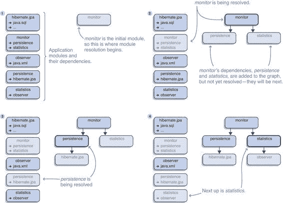 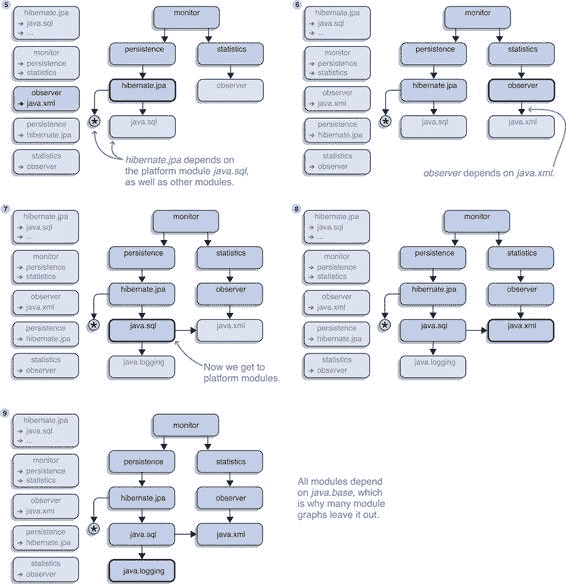
> 
> 图 3.11 模块解析为简化版 ServiceMonitor 应用程序构建模块图。在每一步中，解析一个模块，意味着它在可观察模块的宇宙中，并且它的依赖关系被添加到模块图中。逐步解析所有传递依赖，最终从应用程序模块过渡到平台模块。
> 
> 3.4.3 向图中添加模块
> 
> 重要的是要注意，在解析过程中没有进入模块图的模块，在编译或执行期间也不可用。对于所有应用程序代码都在模块中的情况，这通常无关紧要。毕竟，遵循可读性和可访问性的规则，即使这些模块可用，它们的类型也是不可访问的，因为没有人会阅读这些模块。但是，在更高级的功能使用场景中，这可能会作为编译时或运行时错误出现，甚至作为不符合预期行为的应用程序。
> 
> 各种用例可能导致模块无法进入图中的情况。其中之一是反射。它可以用来在一个模块中调用另一个模块中的代码，而不需要显式地依赖于它。但是没有这种依赖，被依赖的模块可能无法进入图。
> 
> 假设存在一个替代的统计模块，名为 monitor.statistics.fancy，它不能在每个服务的部署中都存在于模块路径上。（原因无关紧要，但让我们假设一个许可证阻止了 fancy 代码被用于“邪恶”目的。作为邪恶的幕后黑手，我们偶尔想这么做。）因此，该模块可能有时存在，有时不存在，因此没有其他模块可以要求它，因为如果模块缺失，应用程序将无法启动。
> 
> 应用程序如何处理这种情况？依赖于 fancy 统计库的代码可以使用反射来检查库是否存在，并且只有在它存在时才调用它。但是根据你刚刚学到的，这种情况永远不会发生！由于必要性，fancy 统计模块不被任何其他模块所依赖，因此不会出现在模块图中，这意味着它永远无法被调用。对于书中出现的这些和其他场景，模块系统提供了一个解决方案。
> 
> > 定义：--add-modules
> > 
> > `javac`和`java`上的`--add-modules ${modules}`选项接受一个以逗号分隔的模块名称列表，并将它们定义为初始模块之外的根模块。（如 3.4.1 节所述，根模块形成初始模块集，通过解析它们的依赖关系构建模块图。）这使用户能够将模块（及其依赖关系）添加到模块图中，否则这些模块不会显示，因为初始模块既不直接也不间接依赖于它们。
> > 
> > `--add-modules` 选项有三个特殊值：`ALL-DEFAULT`、`ALL-SYSTEM` 和 `ALL-MODULE-PATH`。前两个仅在运行时工作，用于本书不讨论的边缘情况。最后一个可能很有用：使用它，模块路径上的所有模块都成为根模块，因此它们都进入模块图。
> > 
> 在 ServiceMonitor 应用程序具有对 monitor.statistics.fancy 的可选依赖的情况下，你必须确保模块出现在包含它的部署的模块图中。在这种情况下，你会使用 `--add-modules` `monitor.statistics.fancy` 使其成为根模块，这将导致模块系统将其及其依赖项添加到模块图中：
> 
> `$ java --module-path mods:libs --add-modules monitor.statistics.fancy --module monitor`
> 
> 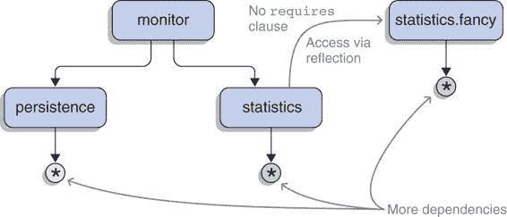
> 
> 图 3.12 从 图 3.10 中简化后的 ServiceMonitor 应用程序模块图，其中定义了额外的根模块 monitor.statistics.fancy，使用 `--add-modules` 选项。监控模块及其任何依赖都没有依赖于它，因此如果没有该选项，它就不会出现在模块图中。
> 
> 你可以在 图 3.12 中看到生成的模块图。
> 
> `--add-modules` 选项的一个特别重要的用例是 JEE 模块，正如第 6.1 节所解释的，在从类路径运行应用程序时默认不会解析这些模块。因为你可以向图中添加模块，所以自然会想知道你是否也可以移除它们。答案是肯定的，但有点复杂：选项 `--limit-modules` 就朝这个方向前进，第 5.3.4 节展示了它是如何工作的。
> 
> 不幸的是，无法让模块系统知道一个特定的依赖项不会得到满足，而你对此是可以接受的。这将允许你排除（传递性）你不需要的依赖项。根据我在典型的 Maven POM 文件中看到的排除数量，这是常见的，但是，遗憾的是，模块系统的严格性不允许这样做。
> 
> 3.4.4 向图中添加边
> 
> 当一个模块被显式添加时，它在模块图中是独立的，没有任何传入的读取边。如果对其的访问完全是反射性的，那没关系，因为反射 API 会隐式添加一个读取边。但对于常规访问，例如从其中导入类型时，可访问性规则要求可读性。
> 
> > 定义：--add-reads
> > 
> > 编译时和运行时选项 `--add-reads${module}=${targets}` 从 `${module}` 向逗号分隔的列表 `${targets}` 中的所有模块添加读取边。这允许 `${module}` 访问那些模块导出的所有公共类型，即使它没有提及它们的 `requires` 指令。如果 `${targets}` 包含 `ALL-UNNAMED`，则 `${module}` 可以读取类路径内容（这有点抽象——有关详细信息，请参阅第 8.2 节）。
> > 
> 回到 monitor.statistics.fancy，你可以使用 `add-reads` 允许 monitor.statistics 读取它：
> 
> `$ java --module-path mods:libs --add-modules monitor.statistics.fancy --add-reads monitor.statistics=monitor.statistics.fancy --module monitor`
> 
> 结果模块图与图 3.12 中的相同，除了虚线现在被适当的读取边替换。在第 8.3.2 节的末尾有一个案例，其中`--add-reads … =ALL-UNNAMED`挽救了局面。
> 
> 3.4.5 可访问性是一个持续的努力
> 
> 一旦模块系统解决了所有依赖项，构建了模块图，并在模块之间建立了可读性，它将通过检查第 3.3 节定义的可访问性规则来保持活跃。如果这些规则被违反，将导致编译时或运行时错误，如第 3.3.3 节所示。如果你遇到模块系统的问题，并且无法从错误信息中判断出了什么问题，请参阅第 5.3 节以获取有关如何调试这种情况的建议。
> 
> 如果你感兴趣了解更多关于构建和运行模块化应用程序的信息，例如你的绿色田野项目，第四章和第五章将更深入地探讨这一点。或者，你也可以在第六章和第七章中查看模块系统对你现有项目的影响。你也为深入了解并检查高级特性做好了准备，尤其是第十章和第十一章。
> 
> > 注意：你已经达到了一个里程碑！你现在已经理解了模块是如何定义的，哪些机制作用于这个定义，以及它们有什么影响——一般来说，Java 是如何与模块一起工作的。
> > 
> 摘要

+   模块有两种形式：

+   随 Java 运行时一起提供的模块是平台模块。它们被合并到运行时`libs`目录中的`modules`文件中。JDK 还以原始形式将它们作为 JMOD 文件存储在`jmods`目录中。只有`java.base`，即基本模块，是模块系统明确知道的。

+   库、框架和应用开发者创建模块化的 JAR 文件，这些是包含模块描述符`module-info.class`的普通 JAR 文件。这些被称为应用程序模块，其中包含`main`方法的那个是初始模块。

+   模块描述符是从模块声明`module-info.java`编译而来的，开发人员（和工具）可以编辑它。它是模块系统工作的核心，并定义了一个模块的属性：

+   它的名字，由于反向域名命名方案，应该是全局唯一的

+   它的依赖项，这些依赖项通过`requires`指令以名称引用其他模块

+   它的 API，这是通过`exports`指令导出选定的包来定义的

+   依赖声明和模块系统从这些声明中创建的可读性边缘是可靠配置的基础。这是通过确保，在众多事情中，所有模块都恰好出现一次，并且它们之间不存在依赖循环来实现的。这允许你更早地捕捉到可能破坏应用程序或导致崩溃的问题。

+   可读性边缘和包导出共同构成了强封装的基础。在这里，模块系统确保只有导出包中的公共类型可访问，并且仅限于读取导出模块的模块。这防止了意外依赖传递依赖，并确保外部代码不能轻易依赖于您设计为模块内部类型的类型。

+   反射也受到可访问性限制！与基于反射的框架（如 Spring、Guice 或 Hibernate）交互需要做更多的工作。

> 模块路径（选项`--module-path`或`-p`）由文件或目录组成，使 JAR 文件对模块系统可用，模块系统将它们表示为模块。使用它而不是类路径，使编译器或 JVM 意识到你的项目工件。
> 
> 指定在模块路径上的应用程序模块和包含在运行时中的平台模块构成了可观察模块的宇宙。在解析过程中，宇宙会搜索模块，从根模块开始，因此所有必需的模块必须位于模块路径上或在运行时中。
> 
> 模块解析验证配置的可靠性（所有依赖项都存在，没有歧义等，如第 3.2 节所述）并生成模块图——这是模块系统中对您所看到的工件依赖关系的紧密表示。只有进入模块图的模块在运行时才可用。
> 
> 4
> 
> 从源文件构建模块到 JAR
> 
> 本章涵盖

+   项目目录结构

+   从单个模块编译源文件到类文件

+   同时编译多个模块

+   将类文件打包到模块 JAR 中

> 能够按照第三章所述定义模块是一项很好的技能，但如果没有知道如何将这些源文件转换为模块化工件（JAR 文件）以便分发和执行，这些技能有什么用呢？本章探讨了构建模块的过程，从组织源文件，到将它们编译成类文件，最终将这些文件打包成可以分发和执行的模块化 JAR 文件。第五章专注于运行和调试模块化应用程序。
> 
> 有时我们会查看命令行上可用的`javac`和`jar`命令。你可能想知道——IDE 和其他工具不会为你使用它们吗？很可能，是的，但即使抛开总是了解这些工具如何施展魔法的论点，还有一个更重要的理由要了解这些命令：它们是进入模块系统核心的最直接途径。我们将使用它们来探索其内部和外部功能，完成后，你可以使用任何提供这些功能的工具。
> 
> 在本章中，我们将首先探讨项目文件在磁盘上的组织方式（第 4.1 节）。这看起来可能微不足道，但有一个新的建议正在流传，值得深入研究。在按照第三章所述布局源文件并声明模块后，我们将转向编译它们。这可以一次编译一个模块（第 4.2 节）或同时编译多个模块（第 4.3 节）。最后一节讨论了如何将类文件打包成模块化的 JAR 文件。要查看一些实际的构建脚本，请查看 ServiceMonitor 的`master`分支。
> 
> 到本章结束时，你将能够组织、编译和打包你的源代码和模块声明。生成的模块化 JAR 文件可以部署或发送给任何使用 Java 9 或更高版本并准备充分利用模块的人。
> 
> 4.1 在目录结构中组织你的项目
> 
> 一个真实的项目由许多不同类型的文件组成。显然，源文件是最重要的，但它们只是众多类型中的一种——其他还包括测试源文件、资源、构建脚本或项目描述、文档、源代码控制信息等等。任何项目都必须选择一个目录结构来组织这些文件，并且确保它不会与模块系统的特性冲突。
> 
> 如果你一直在关注 Project Jigsaw 下的模块系统发展，并研究了官方的快速入门指南或早期的教程，你可能已经注意到它们使用了一种特定的目录结构。让我们看看这个建议，以确定它是否应该成为新的约定，并将其与 Maven 和 Gradle 等工具隐含理解的标准默认约定进行对比。
> 
> 4.1.1 新提议——新的约定？
> 
> 在早期关于模块系统的出版物中，项目目录通常包含一个`src`目录，其中每个属于项目的模块都有自己的子目录，包含项目的源文件。如果项目需要不仅仅是源文件，建议将这些相关内容组织成与`src`目录并行的树状结构，旁边有如`test`和`build`这样的文件夹。这导致了一个`concern/module`的层次结构，如图 4.1 所示[part0017.html#filepos510835]。
> 
> 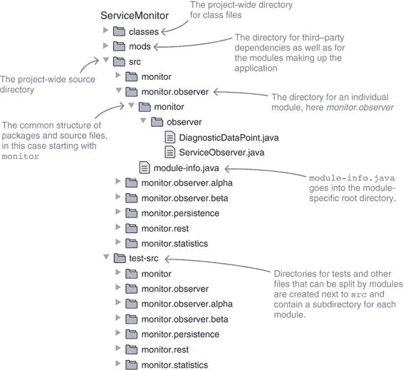
> 
> 图 4.1 这种结构有顶级目录`classes`、`mods`、`src`和`test-src`。各个模块的源文件位于`src`或`test-src`目录下的子目录中，这些子目录以模块的名称命名。
> 
> 认识到这种单 `src` 结构的本质很重要：它是特定项目（JDK）的结构以及入门材料中使用的建议。由于其倾向于将单个模块的文件分散在平行的树中，我不建议除了最小的项目或经过细致检查后认为这种结构更优的项目外，使用这种结构。否则，我建议使用已建立的默认结构，我们将在下一节讨论。
> 
> 4.1.2 建立的目录结构
> 
> 大多数由多个子项目（我们现在称之为模块）组成的工程更喜欢使用独立的根目录，其中每个目录包含单个模块的源代码、测试、资源和之前提到的所有其他内容。它们使用 `module/concern` 层次结构，这正是已建立的项目结构所提供的。
> 
> 默认目录结构，如 Maven 和 Gradle 等工具隐式理解的那样，实现了这种层次结构（参见图 4.2）。首先，默认结构为每个模块提供自己的目录树。在这个树中，`src` 目录包含生产代码和资源（分别在 `main/java` 和 `main/resources` 中），以及测试代码和资源（分别在 `test/java` 和 `test/resources` 中）。
> 
> 按这种方式组织项目结构并不是强制要求。抛开为偏离目录配置构建工具的额外工作，以及多模块编译的特定情况（在第 4.3 节中介绍），所有结构都是同等有效的，应根据项目本身的优点来选择。
> 
> 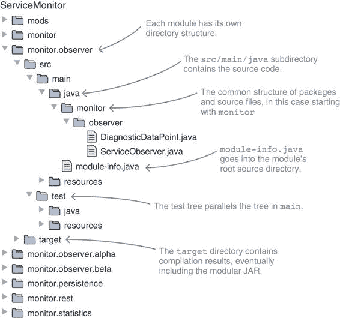
> 
> 图 4.2 这种结构为每个模块都有一个顶级目录。模块可以根据自己的需求组织自己的文件。在这里，monitor.observer 使用 Maven 和 Gradle 项目中常用的目录结构。
> 
> 说了这么多，本书中的示例使用这种默认结构，只有一个例外：如果所有模块 JAR 文件最终都位于同一目录下，使用命令行会更方便，因此 ServiceMonitor 应用程序的树结构有一个顶层的 `mods` 文件夹，其中包含创建的模块。
> 
> 4.1.3 模块声明的位置
> 
> 无论源文件如何组织，模块声明必须命名为 `module-info.java`。否则，编译器会产生类似于以下错误的错误，尝试编译 `monitor-observer-info.java`：
> 
> `> monitor.observer/src/main/java/monitor-observer-info.java:1: > 错误：模块声明应在名为 module-info.java 的文件中 > module monitor.observer { > ^ > 1 个错误`
> 
> 虽然不是严格必要的，但声明应位于根源目录中。否则，如第 4.3.2 节所述使用模块源路径将无法正常工作，因为模块系统无法定位描述符。结果，它无法识别模块，导致“找不到模块”错误。
> 
> 为了尝试这一点，将 monitor.observer 的描述符移动到不同的目录，并编译 monitor。正如你所看到的，这导致了一个错误，即 monitor 所需的模块 monitor.observer 找不到：
> 
> `> ./monitor/src/main/java/module-info.java:2: > 错误：找不到模块：monitor.observer > requires monitor.observer; > ^ > 1 错误`
> 
> 4.2 编译单个模块
> 
> 一旦项目文件以目录结构排列，编写了一些代码，创建了模块声明，就到了编译源文件的时候。但它将是一个类型集合还是一个闪亮的模块？因为前者没有变化，所以我们将在探索编译器如何区分这两种情况之前，先关注后者。
> 
> 4.2.1 编译模块化代码
> 
> 本节重点介绍在一个所有依赖都已模块化的世界中编译单个模块的过程。只有当源文件中包含`module-info.java`声明时，才能编译模块，所以让我们假设这种情况成立。
> 
> 除了在模块路径上操作并检查可读性和可访问性之外，编译器还增加了一个处理模块声明的能力。编译模块声明的结果是一个模块描述符，一个名为`module-info.class`的文件。像其他`.class`文件一样，它包含字节码，可以被像 ASM 和 Apache 的字节码工程库（BCEL）这样的工具分析和操作。
> 
> 除了使用模块路径而不是类路径之外，编译的工作方式与 Java 9 之前完全相同。编译器将编译所有给定的文件，并生成一个与输出目录中指定的`-d`选项匹配的包层次结构的目录结构。
> 
> 图 4.3 显示了使用默认目录结构的 monitor.observer 模块的布局。要编译它，你需要创建一个类似于 Java 9 之前的`javac`调用：

+   `--module-path`选项指示编译器指向包含所需应用程序模块的目录。

+   `-d`选项确定编译的目标目录；它与 Java 9 之前的工作方式相同。

+   列出或`find` `monitor.observer/src/main/java/`中的所有源文件，包括`module-info.java`（由`${source-files}`表示）。

> 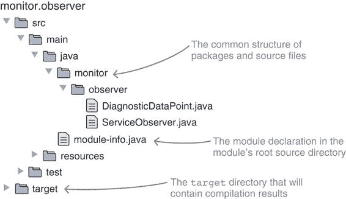
> 
> 图 4.3 monitor.observer 模块的目录结构，其中`src`目录已展开
> 
> 在 ServiceMonitor 应用程序的根目录（即包含 monitor.observer 的目录）中，你需要执行以下命令：
> 
> `$ javac --module-path mods -d monitor.observer/target/classes ${source-files}`
> 
> 展开查看`src`目录，然后查看`target/classes`，图 4.4 显示了预期的结果。
> 
> 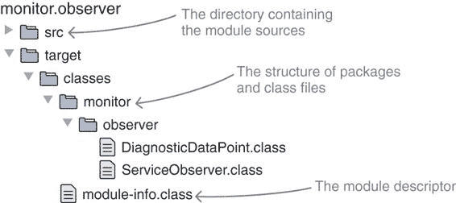
> 
> 图 4.4 monitor.observer 模块的目录结构，其中`target`目录已展开
> 
> 4.2.2 模块化或非模块化？
> 
> Java 平台模块系统旨在创建并最终运行模块，但这绝对不是强制性的。仍然可以构建普通的 JAR 文件，这引发了如何区分这两种情况的问题。编译器如何知道是创建一个模块还是一堆类型？
> 
> > 重要信息：如第 3.1.2 节所述，模块化 JAR 文件只不过是一个带有模块描述符`module-info.class`的普通 JAR 文件，该描述符是从模块声明`module-info.java`编译而来的。因此，编译器使用源文件列表中是否存在`module-info.java`来编译，以区分它是否在模块上工作。这就是为什么没有`--create-module`或类似的编译器选项。
> > 
> 编译模块和仅编译类型之间有什么区别？这归结于可读性，如第 3.2 节所述。如果包含模块声明的代码被编译

+   它必须要求其依赖项能够访问这些依赖项导出的类型

+   必须存在所需的依赖

> 相反，如果编译非模块化代码，由于缺少模块声明，不会表达任何依赖。在这种情况下，模块系统允许正在编译的代码读取所有模块以及它在类路径上找到的所有内容。第 8.2 节详细介绍了这种类路径模式。
> 
> 与可读性不同，第 3.3 节中描述的可访问性规则适用于两种情况。无论代码是作为模块还是作为一堆源文件编译，它都会在访问其他模块中的类型时受到规则的约束。这尤其与 JDK 内部类有关，无论是非导出包中的公共类还是非公共类，因为无论代码如何编译，它们都是不可访问的。图 4.5 显示了可读性和可访问性之间的区别。
> 
> 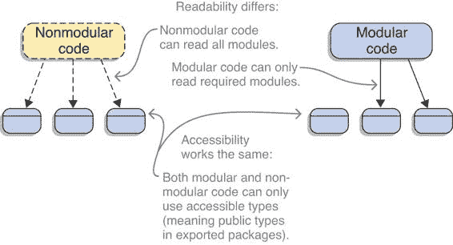
> 
> 图 4.5 比较非模块化代码（左）与模块化代码（右）的编译。可读性规则略有不同，而可访问性规则是相同的。
> 
> > 关于编译器错误的说明
> > 
> > 让我们以 ServiceMonitor 应用程序为例。它的子项目 monitor 包含源文件`Main.java`、`Monitor.java`和`module-info.java`。
> > 
> > 如果你在文件列表中包含了模块声明，`javac` 将开始编译一个模块，并验证所有对应用程序和平台模块的依赖是否已在描述符中声明。如果你省略了它，编译器将回退到仅识别类型之间的依赖，如图 3.1 所示。
> > 
> > 但无论监控器是否作为模块编译，如果它使用了 JDK 模块或其他应用程序模块没有公开的类型，结果将是相同的：编译错误。
> > 
> 显然，编译一个模块比编译类型需要克服更多的障碍。那么，为什么要这样做呢？再次，我回到与在静态类型语言中编写代码的比较。作为 Java 开发者，我们通常认为静态类型是值得额外前期成本的，因为作为交换，我们得到了快速和可靠的一致性检查。它们不能防止所有错误，但确实可以防止很多错误。
> 
> 同样的情况也适用于这里：使用模块系统编译模块比创建普通的 JAR 文件需要更多的努力，但作为交换，我们得到了减少运行时错误可能性的检查。我们用编译时的努力换取运行时的安全性——这是我会每天都会做的交易。
> 
> 4.3 编译多个模块
> 
> 如此描述的编译单个模块是直接的，编译所有七个 ServiceMonitor 模块也是类似的。但是，有必要逐个编译模块吗？或者，换一种说法，有没有不这样做的原因？对后者的回答是肯定的，一些细节可能使得一次性编译多个模块更可取：

+   努力程度——虽然编译单个模块很简单，但编译多个模块所需的工作量会迅速增加。而且，反复几乎重复相同的命令，只有细微的变化，这无疑感觉是多余的。除非你在尝试 Java 9，否则你很少会手动这样做。但你的工具的开发者也应该被考虑在内。

+   性能——在我的系统上，编译单个模块描述符大约需要半秒钟，编译 ServiceMonitor 应用程序的所有模块大约需要四秒钟。考虑到涉及的源文件不到 20 个，而更大项目的完整构建所需时间更短，这有点多。从逻辑上讲，我支付了启动编译器七次（为七个模块）的代价。

+   弱循环依赖——尽管模块系统禁止使用 `requires` 指令来创建循环依赖，但还有其他方式让模块相互引用（现在就相信我）被认为是可接受的。尽管依赖是循环的，但它们可以被认为是弱的，因为如果缺少正确的依赖，你只会得到一个警告。尽管如此，无警告的编译还是值得一些努力的，为了达到这个目标，两个模块必须一起编译。

> > 有关一次性编译多个模块的几个原因，编译器能够做到这一点是件好事！
> > 
> 4.3.1 原始方法
> 
> 一次性编译多个模块是如何工作的？你能列出几个模块的源文件，让编译器自己处理吗？不行的：
> 
> `$ javac --module-path mods:libs -d classes monitor/src/main/java/module-info.java monitor.rest/src/main/java/module-info.java  > monitor.rest/src/main/java/module-info.java:1: > error: too many module declarations found > module monitor.rest { > ^ > 1 error`
> 
> 显然，编译器更喜欢一次处理一个模块。这也是有道理的，因为如前所述，它通过明确定义的模块边界来强制执行可读性和可访问性。如果许多不同模块的源文件混合在编译文件列表中，它们从何而来？编译器需要以某种方式知道一个模块在哪里结束，下一个模块在哪里开始。
> 
> 4.3.2 模块源路径：通知编译器关于项目结构
> 
> 从默认的单模块模式中解脱出来的方法是使用一个命令行选项来通知编译器关于项目的目录结构。编译器支持多模块编译，它可以在一次构建中构建多个模块。命令行选项 `--module-source-path ${path}` 用于启用此模式并指出包含模块的目录结构。所有其他编译器选项都按常规工作。
> 
> 这听起来很简单，但还有一些重要的细节需要考虑。不过，在这样做之前，让我们先从一个简单的例子开始。
> 
> 假设一下，ServiceMonitor 应用程序使用了第 4.1.1 节中定义的单个 `src` 结构，所有模块源目录都在 `src` 之下（参见 图 4.6）。然后你可以使用 `--module-source-path src` 来指向包含所有模块源代码的 `src` 文件夹，并告诉它一次性编译它找到的所有内容。
> 
> 
> 
> 图 4.6 如果项目只有一个 `src` 目录，并且每个模块的根源目录位于其下，那么模块源路径的使用最为简单。
> 
> 与单模块构建一样，模块路径用于指向包含所需应用程序模块的目录——在这种情况下，这些是外部依赖，因为所有 ServiceMonitor 模块目前都在编译中。`-d` 选项与单模块构建中的用法相同，你仍然需要在 `src` 中列出所有源文件，包括所有模块声明。
> 
> 组合起来，这是以下命令：
> 
> `$ javac --module-path mods:libs --module-source-path src -d classes ${source-files}`
> 
> 查看 `classes` 目录可以看到每个模块都有一个目录，每个目录都包含该模块的类文件，包括模块描述符。整洁。
> 
> 但并非总是那么简单。如果项目不使用单 `src` 结构，这该如何应用？这就是模块源路径的一个巧妙细节发挥作用的地方。
> 
> 4.3.3 模块名称的通配符
> 
> 模块源路径可以包含一个星号 (`*`)。虽然它通常被解释为通配符，在路径中通常表示“星号之前的目录中的任何内容”，但这在这里不是这种情况。相反，星号作为一个标记，指示模块名称在路径上的位置。星号之后路径的其余部分必须指向包含模块包的目录。
> 
> 这样，编译器可以将源文件路径与模块源路径匹配，并推断出源文件属于哪个模块。为了使这工作，每个源文件都必须匹配模块源路径。
> 
> 这可能看起来很复杂，但一个例子会澄清。让我们回到 4.1.2 节中结构化的 ServiceMonitor 应用程序，其中每个模块都有包含源文件的公共`src/main/java`目录。从项目的顶级目录开始，这些是某些源文件的相对路径：

+   `monitor/src/main/java/monitor/Monitor.java`

+   `monitor/src/main/java/monitor/Main.java`

+   `monitor/src/main/java/module-info.java`

+   `monitor.rest/src/main/java/monitor/rest/MonitorServer.java`

+   `monitor.rest/src/main/java/module-info.java`

+   `monitor.persistence/src/main/java/monitor/persistence/StatisticsRepository.java`

+   `monitor.persistence/src/main/java/module-info.java`

> 这样，共享结构就非常明显了：所有路径都遵循模式`${modules}/src/main/java/${packages}/${sources}`。
> 
> 回顾一下模块源路径的使用方法，你可以看到`${modules}`必须替换为`*`，并且你必须省略包目录，留下`*/src/main/java`。不幸的是，它现在还不工作，因为编译器不接受星号作为第一个字符——你必须用`.`填充它。现在，多模块编译工作得像魔法一样：
> 
> `$ javac --module-path mods:libs --module-source-path "./*/src/main/java" -d classes ${source-files}`
> 
> 与之前一样，所有类文件最终都会放在`classes`目录下的模块特定子目录中。根据你对星号是模块名称标记的了解，你可以将这些路径总结为`-d classes/*`。不幸的是，`-d`选项并不理解这个标记，你不能用它来构建输出路径，如`./*/target/classes`。真遗憾。
> 
> 你可能会想知道星号是如何与第一个例子中`--module-source-path src`的使用相关的。毕竟，在那里你没有指定模块名称将出现在哪里，编译器能够推断出来。乍一看可能看似不一致，但这其实是为了使简单情况的使用更加简单。
> 
> 如果模块源路径不包含星号，编译器会静默地将其添加为最后一个路径元素。所以你实际上已经指定了`src/*`作为模块源路径，这与该示例中的目录结构相匹配。
> 
> 如果所有模块都使用相同的目录结构，那么编译多个模块应该可以覆盖大多数情况。对于设置更复杂的那些，我们需要另一种技术。
> 
> 4.3.4 多个模块源路径条目
> 
> 有可能单个模块源路径不足以满足需求。也许不同的模块有不同的目录结构，或者某些模块的源文件分布在多个目录中。在这种情况下，你可以指定多个模块源路径条目，以确保每个源文件都匹配一个路径。
> 
> JDK 是一个复杂的项目，具有非平凡的目录结构。图 4.7 仅展示了其中的一小部分——在所有级别上还有许多更多的目录。
> 
> 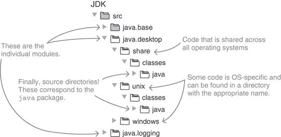
> 
> 图 4.7 对 JDK 源目录的有限视角。注意 `src` 下的模块目录是如何进一步细分的。实际上源文件的根目录是位于更下方的 `classes` 目录。
> 
> 假设你位于 `jdk` 目录中，并想要为 UNIX 构建项目，一个跨越所有模块和正确源文件夹的模块源路径会是什么样子？UNIX 源的路径是 `src/java.desktop/unix/classes` 或更一般地，`src/${module}/unix/classes`。同样，对于共享源，它是 `src/${module}/share/classes`。将这两个路径组合起来，你得到
> 
> `--module-source-path "src/*/unix/classes":"src/*/share/classes"`
> 
> 为了减少冗余，模块源路径允许你使用 `{dir1,dir2}` 定义替代路径。如果你只需要统一路径元素名称的不同路径，你可以统一这些路径。使用替代路径，你可以将 `share` 和 `unix` 中的源路径统一如下：
> 
> `--module-source-path "src/*/{share,unix}/classes"`
> 
> 4.3.5 设置初始模块
> 
> 在为多模块编译设置好一切之后，又出现了一种可能性：只需命名即可编译单个模块及其依赖项。你为什么想要这样做呢？因为这样做不再需要你明确列出要编译的源文件！
> 
> 如果设置了模块源路径，`--module` 选项允许你编译单个模块及其传递依赖项，而无需明确列出源文件。模块源路径用于确定哪些源文件属于指定的模块，并且依赖项是根据其声明来解决的。
> 
> 编译 `monitor.rest` 及其依赖项现在变得简单。和以前一样，你使用 `--module-path mods:libs` 来指定依赖项的位置，并使用 `-d classes` 来定义输出文件夹。通过 `--module-source-path "./*/src/main/java"`，你通知编译器你的项目目录结构；并且通过 `--module monitor.rest`，你命令它从编译 `monitor.rest` 开始：
> 
> `$ javac --module-path mods:libs --module-source-path "./*/src/main/java" -d classes --module monitor.rest`
> 
> 如果 `classes` 之前是空的，现在它包含了 `monitor.rest`（指定模块）、`monitor.statistics`（直接依赖）和 `monitor.observer`（间接依赖）的类文件。
> 
> 列表 2.3、2.4 和 2.5 展示了如何逐步编译 ServiceMonitor 应用程序。掌握了如何使用多模块编译的知识，它也可以像以下这样轻松完成：
> 
> `$ javac --module-path mods:libs --module-source-path "./*/src/main/java" -d classes --module monitor`
> 
> 由于初始模块监控器依赖于所有其他模块，因此所有模块都会被构建。与逐步方法不同，类文件不会放入`*/target/classes`，而是放入`classes/*`（使用`*`作为模块名称的占位符）。
> 
> 除了使命令更容易阅读外，`--module-source-path`和`--module`的组合也在更高层次上操作。与列出单个源文件相比，它清楚地说明了编译特定模块的意图。我喜欢这一点。
> 
> 尽管如此，有两个缺点：

+   编译后的类文件不能重新分发到更深层次的目录结构中，而是全部位于相同的目录下（在最近的例子中，是`classes`目录）。如果构建过程的后续阶段依赖于这些文件的精确位置，就必须采取额外的准备步骤，这可能会抵消最初使用模块源路径的优势。

+   如果使用`--module`（而不是列出所有模块的源文件）启动编译，编译器将应用可能导致意外结果的优化。其中之一是未使用代码检测：没有从初始模块间接引用的类不会被编译，如果通过服务解耦，甚至整个模块可能从输出中缺失（见第十章）。

> 4.3.6 是否值得？
> 
> 多模块编译是否有回报？我列出了三个理由来鼓励其使用，因此有必要回到它们：

+   努力程度——一旦你掌握了如何构建模块源路径，编译多个模块的工作量就会大大减少。这明确包括构建特定模块及其依赖项，这也会变得更容易。同时，构建工具通常逐个编译项目，将它们配置为一次性编译可能会增加复杂性，尤其是如果还需要采取进一步步骤将类文件分发到特定模块的目录中。

+   性能——使用多模块编译，ServiceMonitor 应用程序的构建时间不到一秒，这比逐步构建七个模块快四倍。但这是一个相当极端的例子，因为每个模块只包含两到三个类。相对而言，启动编译器七次的开销很大；但从绝对意义上来说，这仅仅减少了三秒钟。考虑到任何适度规模项目的构建时间，减少几秒钟几乎不值得使构建更加复杂。

+   弱循环依赖——在这种情况下，如果构建过程中应该没有警告，那么就没有办法绕过多模块编译。

> 多模块编译是可选的，其好处并不足以推荐它作为默认实践。尤其是如果你的工具不支持无缝集成，设置它可能不值得付出努力。这是一个典型的“视情况而定”的情况。不过，我必须说，我喜欢它在更高层次上操作：模块而不是仅仅类型。
> 
> 4.4 编译器选项
> 
> 模块系统带来了许多新的命令行选项，本书中对此进行了详细解释。为了确保你可以轻松找到它们，表 4.1 列出了所有与编译器相关的选项。查看[`docs.oracle.com/javase/9/tools/javac.htm`](https://docs.oracle.com/javase/9/tools/javac.htm)以获取官方编译器文档。
> 
> 表 4.1 所有模块相关编译器（`javac`命令）选项的字母顺序表。描述基于文档，引用指向本书中解释如何使用选项的章节。

| 选项   | 描述   | 参考   |
| --- | --- | --- |
| `--add-exports`   | 允许模块导出额外的包   | 11.3.4   |
| `--add-modules`   | 除了初始模块外，还定义根模块   | 3.4.3   |
| `--add-reads`   | 在模块之间添加读取边   | 3.4.4   |
| `--limit-modules`   | 限制可观察模块的宇宙   | 5.3.5   |
| `--module`, `-m`   | 设置初始模块   | 4.3.5   |
| `--module-path`, `-p`   | 指定查找应用程序模块的位置   | 3.4   |
| `--module-source-path`   | 传达项目的目录结构   | 4.3.2   |
| `--module-version`   | 指定编译中模块的版本   | 13.2.1   |
| `--patch-module`   | 在编译过程中用类扩展现有模块   | 7.2.4   |
| `--processor-module-path`   | 指定查找注解处理器模块的位置   | 4.2.1   |
| `--system`   | 覆盖系统模块的位置   |    |
| `--upgrade-module-path`   | 定义可升级模块的位置   | 6.1.3   |

> > 新的`--release`选项
> > 
> > 你是否曾经使用过`-source`和`-target`选项来编译你的代码，以便在较旧的 Java 版本上运行，但看到它在运行时崩溃，因为一个方法调用失败，出现了一个看似无法解释的错误？也许你忘记指定了`-bootclasspath`。
> > 
> > 没有这个选项，编译器会创建 JVM 可以理解的字节码（好），但它会链接到当前版本的核心库 API（不好）。这可能导致调用在旧 JDK 版本中不存在的类型或方法，从而引起运行时错误。
> > 
> > 从 Java 9 开始，编译器通过`--release`选项防止了这种常见的操作错误，该选项将所有三个选项设置为正确的值。
> > 
> 4.5 打包模块化 JAR
> 
> 在从想法到运行代码的过程中，编码和编译之后的下一步是将类文件打包成一个模块。正如 3.1.2 节所解释的，这应该生成一个模块化的 JAR 文件，它就像一个普通的 JAR 文件一样，但包含模块的描述符`module-info.class`。因此，你期望可信的`jar`工具负责打包。创建一个模块化的 JAR 文件（在这种情况下为 monitor.observer）就是这么简单：
> 
> `$ jar --create --file mods/monitor.observer.jar -C monitor.observer/target/classes .`
> 
> 将新的命令行别名放在一边，这个调用与 Java 9 之前完全相同。有趣且隐含的细节是，因为 `monitor.observer/target/classes` 包含一个 `module-info.class`，所以生成的 `monitor.observer.jar` 也将包含它，使其成为一个模块化 JAR。
> 
> 虽然 `jar` 工具的工作方式与之前相似，但有一些与模块相关的细节和新增功能，例如定义模块的入口点，我们应该看看。
> 
> > 注意：JAR 不是唯一用于交付 Java 字节码的格式。JEE 还与 WAR 和 EAR 文件一起工作。尽管如此，在规范更新以接受模块之前，无法创建模块化的 WAR 或 EAR。
> > 
> 4.5.1 JAR 的快速回顾
> 
> 为了确保我们都在同一页面上，让我们快速看一下 `jar` 是如何用于打包存档的。正如我刚才指出的，如果包含的文件列表中包含模块描述符 `module-info.class`，则结果是一个模块化 JAR。
> 
> 让我们以打包 `monitor.observer` 的命令为例。结果是 `mods` 中的 `module.observer.jar`，它包含 `monitor.observer/target/classes` 及其子目录中的所有类文件。因为 `classes` 包含一个模块描述符，所以 JAR 也将包含它，因此无需额外努力就是一个模块化 JAR：
> 
> `$ jar --create` `①``--file mods/monitor.observer.jar` `②``-C monitor.observer/target/classes .` `③`
> 
> > ①
> > 
> > 此操作模式表示创建一个存档（另一种选择是 -c）。
> > 
> > ②
> > 
> > 要创建的存档文件名（另一种选择是 -f）
> > 
> > ③
> > 
> > -C 使 jar 变为指定的文件夹，点号 (.) 告诉它包含文件夹中的所有源文件。
> > 
> 在打包模块时，您应该考虑使用 `--module-version` 记录模块的版本。第 13.2.1 节解释了如何进行操作。
> 
> 4.5.2 分析 JAR
> 
> 当与 JAR 一起工作时，了解分析您所创建内容的方法很有帮助。特别是，了解 JAR 包含的文件以及其模块描述符的内容非常重要。幸运的是，`jar` 有选项可以做到这两点。
> 
> 列出 JAR 的内容
> 
> 最明显的事情是查看 JAR 的内容，这可以通过 `--list` 实现。以下片段显示了上一节创建的 `monitor.observer.jar` 的内容。它包含一个 `META-INF` 文件夹，我们不会深入探讨，因为它已经存在多年，并且与模块系统无关。还有一个模块描述符，以及 `monitor.observer` 包中的 `DiagnosticDataPoint` 和 `ServiceObserver` 类。没有什么特别或意外的：
> 
> `$ jar --list --file mods/monitor.observer.jar  > META-INF/ > META-INF/MANIFEST.MF > module-info.class > monitor/ > monitor/observer/ > monitor/observer/DiagnosticDataPoint.class > monitor/observer/ServiceObserver.class`
> 
> 这不是一个新命令——它只是因为新的别名而看起来不同：`--list`是`–t`的简写，`--file`是`-f`的简写。在 Java 9 之前，`jar -t -f some.jar`会做同样的事情。
> 
> 检查模块描述符
> 
> 模块描述符是一个类文件，因此由字节码组成。这使得使用工具查看其内容成为必要。幸运的是，`jar`可以使用`--describe-module`（或`-d`）来做这件事。检查`monitor.observer.jar`，你会发现它是一个名为`monitor.observer`的模块，导出同名的包并需要基础模块：
> 
> `$ jar --describe-module --file mods/monitor.observer.jar  > monitor.observer jar:.../monitor.observer.jar/!module-info.class > exports monitor.observer > requires java.base mandated`
> 
> （如果你想知道`mandated`是什么意思，记得从 3.1.4 节中了解到，每个模块隐式地需要基础模块，这意味着必须存在`java.base`。）
> 
> 4.5.3 定义入口点
> 
> 要启动一个 Java 应用程序，必须知道入口点，它是包含`public static void main(String[])`方法的类之一。包含该方法的类可以在应用程序启动时在命令行上指定，或者记录在随 JAR 文件一起提供的清单文件中。如果你不知道这些选项是如何工作的，不必担心，因为 Java 9 增加了一个第三种方式，即使用模块的方式。
> 
> 当使用`jar`将类文件打包到归档中时，你可以使用`--main-class ${class}`定义主类，其中`${class}`是包含`main`方法的类的完全限定名（意味着包名后跟一个点和类名）。它将被记录在模块描述符中，并在模块是启动应用程序的初始模块时默认用作主类（有关详细信息，请参阅 5.1 节）。
> 
> > 注意：如果你习惯于设置清单的`Main-Class`条目来创建可执行 JAR 文件，你将很高兴地听到`jar --main-class`也会设置它。
> > 
> ServiceMonitor 应用程序在`monitor.Main`中有一个单一的入口点。你可以使用`--main-class monitor.Main`来记录在打包过程中的情况：
> 
> `$ jar --create --file mods/monitor.jar --main-class monitor.Main -C monitor/target/classes .`
> 
> 使用`--describe-module`，你可以看到主类已被记录在描述符中：
> 
> `$ jar --describe-module --file mods/monitor.jar  > monitor jar:.../monitor.jar/!module-info.class # requires and contains truncated > main-class monitor.Main`
> 
> 很有趣的是，`jar`工具既没有验证你声称存在此类的能力，也没有责任。没有检查它是否存在或是否包含合适的`main`方法。如果出现问题，现在不会发生错误，但启动模块将失败。
> 
> 4.5.4 归档器选项
> 
> 我们只探索了 `jar` 提供的最重要选项。其他一些选项在不同的上下文中变得有趣，并在相关章节中解释。为了确保您可以轻松找到它们，表 4.2 列出了与模块系统相关的选项。访问 [`docs.oracle.com/javase/9/tools/jar.htm`](https://docs.oracle.com/javase/9/tools/jar.htm) 获取官方 `jar` 文档。
> 
> 表 4.2 所有模块相关归档器（`jar` 命令）选项的字母顺序表。描述基于文档，参考信息指向本书中解释如何使用选项的章节。

| 选项   | 描述   | 参考信息   |
| --- | --- | --- |
| `--hash-modules`   | 记录依赖模块的哈希值   |    |
| `--describe-module`, `-d`   | 显示模块的名称、依赖项、导出、包等   | 4.5.2   |
| `--main-class`   | 应用程序入口点   | 4.5.3   |
| `--module-path`, `-p`   | 指定查找应用程序模块以记录哈希值的位置   | 3.4   |
| `--module-version`   | 指定编译中模块的版本   | 13.2.1   |
| `--release`   | 创建包含不同 Java 版本字节码的多版本 JAR 文件   | 附录 E   |
| `--update`   | 更新现有归档，例如通过添加更多类文件   | 9.3.3   |

> 摘要

+   确保选择满足项目要求的目录结构。如果有疑问，请坚持使用构建系统的默认结构。

+   编译一个模块的所有源代码（包括声明）的 `javac` 命令与 Java 9 之前相同，除了它使用模块路径而不是类路径。

+   模块源路径（`--module-source-path`）通知编译器项目是如何结构的。这使编译器操作从处理类型提升到处理模块，允许您使用简单选项（`--module` 或 `-m`）编译所选模块及其所有依赖项，而不是列出源文件。

+   模块化 JAR 文件只是带有模块描述符 `module-info.class` 的 JAR 文件。`jar` 工具对它们处理得和其他类文件一样好，因此将它们全部打包到 JAR 文件中不需要任何新选项。

+   可选地，`jar` 允许指定模块的入口点（使用 `--main-class`），这是具有 `main` 方法的类。这使得启动模块变得简单。

> 5
> 
> 运行和调试模块化应用程序
> 
> 本章涵盖

+   通过指定初始模块启动模块化应用程序

+   从模块中加载资源

+   验证模块、模块集和模块图

+   减少和列出可观察模块的宇宙

+   使用日志调试模块化应用程序

> 如第三章和第四章所述，将模块定义、编译并打包成模块化 JAR 文件后，终于到了使用`java`命令启动 JVM 和运行应用程序的时候了。这为我们提供了讨论与运行时相关的概念的机会：如何从模块中加载资源（第 5.2 节）。然而，迟早会遇到问题，因此第 5.3 节还将探讨使用各种命令行选项调试模块配置。
> 
> 到本章结束时，你将能够启动由模块组成的程序。除此之外，你将深刻理解模块系统如何处理给定的配置，以及如何通过日志和其他诊断工具来观察这一点。
> 
> 这也完成了本书的第一部分，它教授了你编写、编译和运行简单模块化应用程序所需的一切知识。它为第二部分和第三部分将要探讨的更高级功能奠定了基础，其中最重要的是那些支持逐步迁移到模块系统的功能。
> 
> 5.1 使用模块启动 JVM
> 
> 在定义模块依赖关系和 API、创建模块化 JAR 文件并将它们放置在模块路径上之后，使用模块化应用程序启动 JVM 竟然如此简单。你只需要指定初始模块，也许还需要指定主类。
> 
> `java`命令有一个`--module ${module}`选项，它指定了初始模块${module}。模块解析从这里开始，并且这也是将启动具有`public static void main`方法的 main 类的模块。
> 
> 特定的类要么由初始模块的描述符定义，要么通过在模块名称后附加一个斜杠和完全限定的类名（见 5.1.1 节）来使用`--module ${module}/${class}`指定。
> 
> 对于 ServiceMonitor 应用程序，所有准备工作最终都集中在你已经看到的调用上，该调用以 monitor 作为初始模块启动 JVM：
> 
> `$ java --module-path mods:libs --module monitor`
> 
> 如第 3.4 节所述，`--module-path mods:libs`通知模块系统`mods`和`libs`目录包含 ServiceMonitor 的应用程序模块。选项`--module monitor`将 monitor 定义为初始模块，因此模块系统将解析 monitor 的所有依赖关系，并构建如前所述的模块图。然后，它将启动在第 4.5.3 节打包期间在模块描述符中设置的 main 类：`monitor.Main`。
> 
> 5.1.1 指定主类
> 
> `--module`选项也可以用来定义应用程序的主类。为此，初始模块的名称后面跟着一个正斜杠和完全限定的类名（包名后跟一个点和类名）。
> 
> 在这里，你明确地定义了应用程序是通过在监控器的类`monitor.Main`中调用`main`方法来启动的：
> 
> `$ java --module-path mods:libs --module monitor/monitor.Main`
> 
> 在命令行上指定主类覆盖了模块描述符中定义的内容。这意味着应用程序仍然可以有多个入口点，就像没有模块系统一样。如果其中一个是合理的默认值，那么将其嵌入到模块描述符中是有意义的，如第 4.5.3 节所述。
> 
> 如果监控器将 `monitor.Main` 定义为其主类，但出于某种原因你不想使用它，你可以轻松地覆盖它。使用以下命令，应用程序通过调用监控器的 `some.other.MainClass` 来启动，忽略监控器描述符中定义的任何内容：
> 
> `$ java --module-path mods:libs --module monitor/some.other.MainClass`
> 
> 为了使这起作用，初始模块必须包含指定的类。由于 monitor 和 `some.other.MainClass` 的情况并非如此，执行你刚才看到的命令会导致错误：
> 
> `> 错误：无法找到或加载主类 > some.other.MainClass 在模块 monitor 中`
> 
> 5.1.2 如果初始模块和主模块不是同一个
> 
> 如果你想用作初始模块的模块不包含应用程序的主类，你该怎么办？首先，这似乎是一个奇怪的问题；但是，嘿，软件开发充满了这些问题，所以这并不意味着它不会发生。
> 
> 例如，想象一个可以以几种模式（数据输入、评估、管理）启动的桌面应用程序，并且在启动时通过选择正确的主类来选择模式。由于应用程序复杂，它由许多模块组成，每种模式都有自己的模块（data.entry、data.evaluation、administration）。每种模式的模块也包含相应的入口点。在最上面是 app，它依赖于所有应用程序的模块。（图 5.1 显示了模块图。）
> 
> 为了启动此应用程序，你希望使用 `--module app` 并然后指定来自其他模块中的一个主类——但这可能吗？为了解决这个问题，我们需要为涉及的两个模块定义一些术语：

+   那是依赖于应用程序所需的所有模块（我将称之为所有）的模块。我会称它为 all。

+   然后是包含你想要启动的主类的模块——我将称之为 main。

> 
> 
> 图 5.1 桌面应用程序的模块图，其中应用程序位于顶部，包含入口点的三个模块位于下方
> 
> 到目前为止，这两个模块总是相同的，所以你将模块名称传递给 `--module`，使其成为初始模块。如果这两个是独立的模块，你会怎么做？
> 
> 问题的关键在于模块系统坚持主类的来源。没有方法可以欺骗它去搜索除了初始模块之外的任何模块。因此，你必须选择主模块作为初始模块，并将其传递给 `--module`。
> 
> 根据假设，这并不能正确解决所有依赖项，那么你如何确保所有依赖项都被考虑在内？在这个时候，第 3.4.3 节中引入的`--add-modules`选项就派上用场了。使用它，你可以定义所有作为额外的根模块，并让模块系统解决其依赖项：
> 
> `$ java --module-path mods --add-modules all --module main`
> 
> 对于桌面应用程序，这意味着你始终使用`--add-modules app`选项来确保图形包含所有必需的模块，然后选择所需模式的模块作为主模块。例如：
> 
> `$ java --module-path mods --add-modules app --module data.entry`
> 
> 顺便说一句，如果你想知道为什么各种模式的模块不会依赖于所有必需的模块，至少有三个答案：

+   应用程序可能通过服务解耦，如第十章所示，其中 app 是消费者。

+   模式模块可能有一些可选依赖项，如第 11.2 节所述，而 app 确保它们都存在。

+   我确实说过这是一个奇怪的情况，记得吗？

> 5.1.3 将参数传递给应用程序
> 
> 将参数传递给应用程序与之前一样简单。JVM 将初始模块之后的所有内容放入一个字符串数组中（按空格分割），并将其传递给`main`方法。
> 
> 假设你这样调用 ServiceMonitor。你认为会传递给`Main::main`什么？（小心，这是一个陷阱问题！）
> 
> `$ java --module-path mods:libs --module monitor --add-modules monitor.rest opt arg`
> 
> 这是一个陷阱问题，因为`--add-modules monitor.rest`看起来像是模块系统应该负责的事情。如果这个选项放在正确的位置，即在`--module`之前，那么它就会是正确的。但现状是，这个选项在`--module`之后，这使得 JVM 将其解释为应用程序的选项，并将其传递下去。
> 
> 为了演示，让我们扩展`Main::main`以打印参数：
> 
> `public static void main(String[] args) { for (String arg : args) { System.out.print(arg + " / "); }  // [...]  }`
> 
> 确实，你得到输出`--add-modules *monitor.rest* opt / arg`。
> 
> 请注意，确保将`--module`作为你希望 JVM 处理的最后一个选项，并将所有应用程序选项放在其后。
> 
> 5.2 从模块中加载资源
> 
> 第 3.3 节详细介绍了模块系统的可访问性规则如何在模块边界之间提供强大的封装。尽管它只讨论了类型，但在运行时通常也需要访问资源。这些资源可能是配置、翻译、媒体文件，在某些情况下甚至是原始的 `.class` 文件。通常，代码会从与项目一起发货的 JAR 文件中加载这些资源。由于 JPMS 将模块化 JAR 转换为模块，这些模块声称强封装其内部内容，我们需要探讨这如何影响资源加载。在深入探讨这一点之前，在接下来的几节中，我将简要回顾过去资源是如何加载的，并指出 Java 9+ 引入的变化。然后我们将更仔细地研究跨模块边界加载包资源。
> 
> > 提示：本书中多次提及资源访问的话题：第 6.3 节解释了如何访问 JDK 资源，第 8.2.1 节深入探讨了非模块化资源的访问。为了实际演示如何加载资源，请查看 ServiceMonitor 的 `feature-resources` 分支。
> > 
> 5.2.1 在 JAVA 9 之前的资源加载
> 
> 在 Java 9 之前的版本中，没有 JAR 之间的边界，每个类都可以访问类路径上的所有资源。这甚至比类型更糟糕，因为至少它们可以使用包可见性来隐藏自己在一个包中。对于资源来说，这种情况并不存在。
> 
> > 重要的信息：要加载一个资源，你可以在 `Class` 或 `ClassLoader` 上调用 `getResource` 或 `getResourceAsStream`。从概念上讲，这些方法几乎相同：你将资源文件的名称作为 `String` 传递给它们，如果找到，它们会返回一个 `URL` 或 `InputStream`；否则返回 `null`。为了不让事情比必要的更复杂，我们将坚持使用 `Class::getResource`。
> > 
> 列表 5.1 展示了如何加载各种资源。只要所有类和资源都在类路径上，它们在哪个 JAR 中并不重要。图 5.2 显示了一个包含所有加载资源的单个 JAR 文件——如果它在类路径上，每次调用 `Class::getResource` 都会返回一个 `URL` 实例。
> 
> > 列表 5.1 加载资源：所有成功，因为它们在类路径上
> > 
> `Class<?> anchor = Class` `.forName("monitor.resources.opened.Anchor")` `①``URL pack = anchor.getResource("file.txt");` `②``URL root = anchor.getResource("/file.txt");` `③``URL meta = anchor.getResource("*META-INF*file.txt");` `④``URL bytecode = anchor.getResource("Anchor.class");` `⑤`
> 
> > ①
> > 
> > 要调用 Class::getResource，你首先需要一个 Class 实例——其他两个 Anchor 类同样适用。
> > 
> > ②
> > 
> > 相对于包含 Anchor 的包解析
> > 
> > ③
> > 
> > 由于以“/”开头，因此从 JAR 的根目录解析为绝对路径。
> > 
> > ④
> > 
> > 使用绝对路径访问 META-INF。
> > 
> > ⑤
> > 
> > 加载锚点的字节码
> > 
> 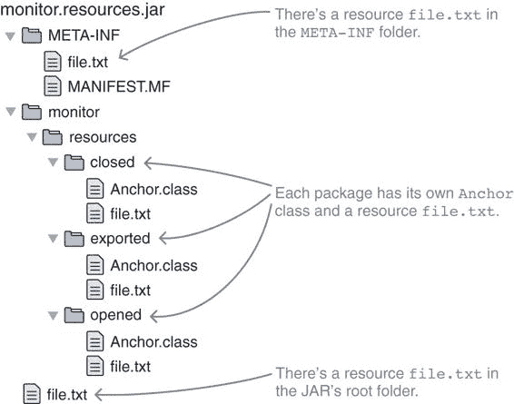
> 
>  JAR monitor.persistence 包含一些资源——巧合的是，正好是列表 5.1 需要的那些。
> 
> 5.2.2 Java 9 及以后版本的资源加载
> 
> 你可能会想知道为什么列表 5.1 提供了如此多的不同示例。有些与模块一起工作，但有些则不行，我想依次讨论它们。在我们到达那里之前，让我们先考虑 Java 9 中的各种资源 API：

+   `Class`上的方法是从模块中加载资源的好方法——我们将稍后探讨它们的行为。

+   `ClassLoader`上的方法在模块方面有不同的行为，并且通常不那么有用，我们不会讨论它们。如果你想使用它们，请查看它们的 Javadoc。

+   新的类`java.lang.Module`，我们将在 12.3.3 节中深入探讨，它也有`getResource`和`getResourceAsStream`方法。它们的行为与`Class`上的方法非常相似。

> 在这个问题解决之后，我们可以转向使用工作马力的`Class::getResource`来从模块中加载列表 5.1 中的各种资源。第一个重要的观察是，在同一个模块内，每次调用都返回一个`URL`实例，这意味着所有资源都被找到。这适用于模块封装的任何包。当涉及到跨模块边界加载资源时，事情就有些不同了：

+   包中的资源默认是封装的（详细信息请参阅 5.2.3 节）。

+   来自 JAR 根目录或名称无法映射到包的文件夹（例如，由于包含破折号而无法映射的`META-INF`）的资源永远不会被封装。

+   `.class`文件永远不会被封装。

+   如果资源被封装，`getResource`调用将返回`null`。

> 大多数形式的访问不被封装的原因归结为迁移的便利性。Java 生态系统中的许多关键和广泛使用的工具和框架依赖于 JAR 根目录或`META-INF`文件夹中的配置（例如，JPA 实现）或扫描`.class`文件（例如，以定位注解类）。如果所有资源默认都被封装，那么这些工具默认情况下将无法与模块一起工作。
> 
> 同时，资源强封装的好处远不如类型重要，因此决定只封装包中的资源。让我们看看如何解决这个问题。
> 
> 5.2.3 在模块边界之间加载包资源
> 
> 每当`Class::getResource`或其等效方法被要求加载资源时，它会检查路径是否符合包名。简单来说，如果从路径中删除文件名，然后将所有`/`替换为`.`，得到一个有效的包名，则资源将从包中加载。
> 
> 让我们从列表 5.1 中选取一些行作为例子。调用`anchor.getResource("file.txt")`告诉 JVM 从`anchor`类相对位置加载资源`file.txt`。因为该类在一个包中——在这个例子中是`monitor.resources.opened`——所以资源是从该包中加载的。
> 
> 一个反例是 `anchor.getResource("*META-INF*file.txt")`。前面的斜杠表示绝对路径（因此，`anchor` 在哪个包中无关紧要），尝试将其转换为包名将得到 `META-INF`。这在 Java 中是无效的，因此资源不会从包中加载。
> 
> > 打开一个包
> > 
> > 理解 JVM 如何确定资源是否在包中非常重要，因为如果资源在包中，它会被强封装。此外，`exports`子句并不提供对资源的访问。因为`getResource`绑定到反射 API，需要一个不同的机制。
> > 
> > 我们之前还没有讨论过，但当你想要提供对资源的访问时，你寻找的是`opens`子句。在语法上，它与`exports`完全相同，但它只提供对包的反射访问，这使得它非常适合这种用例。
> > 
> 关于`opens`还有很多东西要学习，第 12.2 节详细讨论了它，但你需要知道的是，它提供了对其他情况下封装的包中资源的访问。让我们尝试一下，并在列表 5.1 中加载的资源周围构建一个名为`monitor.resources`的模块。以下是模块声明：
> 
> `module monitor.resources { exports monitor.resources.exported; opens monitor.resources.opened; }`
> 
> 与图 5.2 进行比较，你可以看到在其三个包中，一个是封装的，一个是导出的，一个是开放的。如果你运行列表 5.2 中的代码，你能期待什么？
> 
> 这取决于运行代码的模块。如果是`monitor.resources`，调用将通过，因为封装只在模块边界之间操作。如果任何其他模块运行代码，只有`monitor.resources.opened`包会被提供给它进行反射。因此，`getResource`将只为`opened`返回非`null` URL，而为从`closed`和`exported`加载资源将返回`null`。
> 
> 来自列表 5.1 的其他调用——`getResource("Anchor.class")`、`getResource("/file.txt")`和`getResource("*META-INF*file.txt")`——将会通过，因为它们加载的是字节码或不在包中的资源。如第 5.2.2 节所述，这些资源没有被封装。
> 
> > 列表 5.2 从具有不同可访问性的包中加载资源
> > 
> `URL closed = Class .forName("monitor.resources.closed.Anchor")` `.getResource("file.txt");` ① `URL exported = Class .forName("monitor.resources.exported.Anchor")` `.getResource("file.txt");` ② `URL opened = Class .forName("monitor.resources.opened.Anchor")` `.getResource("file.txt");` ③
> 
> > ①
> > 
> > 无法从封装的包中加载资源
> > 
> > ②
> > 
> > 无法从导出的包中加载资源
> > 
> > ③
> > 
> > 成功从打开的包中加载资源
> > 
> 总结来说，如果你想在模块的包中提供对资源的访问，你必须打开它。
> 
> 打开包以提供对资源的访问会邀请其他代码依赖你的模块的内部结构。为了避免这种情况，考虑在你的公共 API 中公开一个类型，它可以被分配加载资源的任务。这样，你就可以根据需要自由地重新排列内部资源，而不会破坏其他模块。
> 
> > 提示：如果你想要避免依赖包含资源的模块，你可以创建一个服务。第十章介绍了服务，使用它们来访问资源将非常直接，如果不是因为需要处理名称，那么它将是简单的。幸运的是，对于这个费时的过程有出色的文档，所以在这里我不会重复它。查看`ResourceBundleProvider`的 Javadoc，但请确保你至少阅读了 Java 10 版本——它与 Java 9 的工作方式相同，但文档更清晰：[`mng.bz/G28M`](http://mng.bz/G28M)。
> > 
> 5.3 调试模块和模块化应用程序
> 
> 模块化系统解决了一个复杂的问题，并设定了雄心勃勃的目标。我认为它在使简单情况易于使用方面做得很好，但让我们不要自欺欺人：它是一个复杂的机械装置，事情可能会出错——尤其是在你进入本书的以下两个部分时，这些部分探讨了迁移到模块化系统及其更高级的功能。在这种情况下，深入了解模块化系统的内部工作原理可能会有所帮助。幸运的是，它提供了一些方法来实现这一点：

+   分析和验证模块

+   测试构建模块图

+   检查可观察模块的宇宙

+   在解析过程中排除模块

+   记录模块化系统行为

> 在以下各节中，我将依次介绍它们。
> 
> 5.3.1 分析单个模块
> 
> 你已经看到`jmod describe`显示了 JMOD 的模块属性（第 3.1.1 节）以及`jar --describe-module`为 JARs 执行了类似的工作（第 4.5.2 节）。这些都是检查单个工件的好方法。通向同一目的地的不同路径是通过`java --describe-module`实现的。跟在模块名称后面，此选项会打印出对应工件的路经以及模块的描述符。模块化系统不做其他任何事情，也不解析模块或启动应用程序。
> 
> 因此，虽然`jmod describe`和`jar --describe-module`操作于工件，但`java --describe`操作于模块。根据情况，一个或另一个可能更方便，但最终它们的输出是相似的。
> 
> 再次转向 ServiceMonitor，你可以使用`--describe-module`来查看其模块以及平台模块的描述：
> 
> `$ java --module-path mods --describe-module monitor.observer  > monitor.observer file:...monitor.observer.jar > 导出 monitor.observer > 需要 java.base 强制 $ java --module-path mods --describe-module java.sql  > java.sql@9.0.4 > 导出 java.sql > 导出 javax.sql > 导出 javax.transaction.xa > 需要 java.base 强制 > 需要 java.logging 传递 > 需要 java.xml 传递 > 使用 java.sql.Driver`
> 
> 5.3.2 验证模块集
> 
> 查看单个模块对于分析已知问题很有帮助。但未知问题怎么办？模块路径是否有重复模块？是否有模块拆分包？
> 
> `java`选项`--validate-modules`扫描模块路径以查找错误。它报告重复模块和拆分包，但不构建模块图，因此无法发现缺失模块或依赖循环。执行检查后，`java`退出。
> 
> 对于这个例子，我创建了一个包含`monitor.observer`包的模块 monitor.rest，就像模块 monitor.observer 一样。这是验证这些模块的结果：
> 
> `$ java --module-path mods --validate-modules  # 截断标准化的 Java 模块 # 截断非标准化的 JDK 模块 > file:.../monitor.rest.jar monitor.rest > file:.../monitor.observer.beta.jar monitor.observer.beta > file:.../spark.core.jar spark.core > file:.../monitor.statistics.jar monitor.statistics > file:.../monitor.jar monitor > file:.../monitor.observer.jar monitor.observer > 包含 monitor.observer 与模块 monitor.rest 冲突 > file:.../monitor.persistence.jar monitor.persistence > file:.../monitor.observer.alpha.jar monitor.observer.alpha > file:.../hibernate.jpa.jar hibernate.jpa`
> 
> 输出首先列出所有 JDK 模块，它们没有错误，然后继续列出应用程序模块。它列出了扫描的 JAR 文件以及其中发现的模块，以及 monitor.rest 和 monitor.observer 之间的拆分包。
> 
> 5.3.3 验证模块图
> 
> 使用`--dry-run`选项，JVM 执行完整的模块解析，包括构建模块图和断言可靠的配置，但然后在执行主方法之前停止。这可能听起来不太有用，但我发现它很有用。在包含错误并因此阻止应用程序启动的命令中使用`--dry-run`不会改变任何东西。但当你最终正确时，命令会退出，你将回到命令行。这使得你可以快速尝试命令行选项，直到它们正确，而无需不断启动和终止应用程序。
> 
> 作为有缺陷命令的一个例子，让我们尝试在没有模块路径的情况下启动 ServiceMonitor。正如预期的那样，它失败了，因为没有地方去搜索应用程序模块，模块系统找不到初始模块 monitor：
> 
> `$ java --module monitor  > Error occurred during initialization of boot layer > java.lang.module.FindException: > Module monitor not found`
> 
> 在混合中使用`--dry-run`不会改变任何东西：
> 
> `$ java --dry-run --module monitor  > Error occurred during initialization of boot layer > java.lang.module.FindException: > Module monitor not found`
> 
> 现在来一个应该能工作的命令：
> 
> `$ java --module-path mods:libs --dry-run --module monitor`
> 
> 这导致——没有任何结果。命令是正确的，模块系统是满意的，因此在模块解析后没有消息就退出了。
> 
> 从 5.1.2 节中记住，即使看起来顺序上不令人满意，`--dry-run`也必须放在`--module`之前。并且对专家的一个备注：如果你正在使用自定义类加载器、自定义安全管理者或代理，即使使用`--dry-run`它们也会被启动。
> 
> 5.3.4 列出可观察模块和依赖项
> 
> 你在 3.1.1 节中使用了`--list-modules`选项，其中列出了当前运行时中的所有平台模块，使用`java --list-modules`。有了对模块系统如何工作的更好理解，我可以告诉你，它不仅仅如此。
> 
> 列出可观察模块的宇宙
> 
> 选项`--list-modules`列出了可观察模块的宇宙。模块系统不做其他任何事情，也不解析模块或启动应用程序。
> 
> 如 3.1.4 节所述，可观察模块的宇宙包括平台模块（运行时中的那些）和应用模块（模块路径上的那些）。在解析过程中，模块从这个集合中选取来构建模块图。应用程序永远不会包含未用`--list-modules`列出的模块。（但请注意，许多可观察模块可能不会进入图，因为它们不是任何根模块所必需的——甚至不是间接必需的。）
> 
> 当调用`java --list-modules`时，你要求 JVM 列出所有可观察模块。因为你没有指定模块路径，所以只会打印出运行时的平台模块。
> 
> 让我们看看一个不那么简单的问题，并列出 ServiceMonitor 应用程序的`mods`和`libs`文件夹中的模块：
> 
> `$ java --module-path mods:libs --list-modules  > spark.core # truncated Spark dependencies # truncated standardized Java modules # truncated non-standardized JDK modules > monitor > monitor.observer > monitor.observer.alpha > monitor.observer.beta > monitor.persistence > monitor.rest > monitor.statistics > hibernate.jpa # truncated Hibernate dependencies`
> 
> 如果在一个常规 JDK 安装上执行，输出会非常庞大，因为它列出了大约 100 个平台模块。它还总是包含模块路径上的所有模块。这些一起对于查看可以从哪些模块构建模块图是有用的，但它们也使得难以看清整体。不过，有一种方法可以将输出限制到一个合理的子集，我们将在下一节中探讨。
> 
> 列出传递依赖项
> 
> 在那长长的可观察模块列表中，有一个有趣的子集是初始模块的传递依赖。幸运的是，你可以使用 `--limit-modules` 选项将列表缩减到仅包含这些内容。我稍后会解释它具体是如何工作的——现在，请相信我说，结合 `--list-modules`，你可以用它来打印任何给定模块的所有传递依赖的列表。
> 
> 这里有一些关于平台模块的实验：
> 
> `$ java --limit-modules java.xml --list-modules  > java.base > java.xml $ java --limit-modules java.sql --list-modules  > java.base > java.logging > java.sql > java.xml $ java --limit-modules java.desktop --list-modules  > java.base > java.datatransfer > java.desktop > java.prefs > java.xml`
> 
> 你可以看到，java.xml 只依赖于 java.base，SQL 模块使用了日志和 XML 功能，而且即使包含所有 AWT、Swing、一些媒体 API 和 JavaBeans API 的 java.desktop，其依赖项也出奇地少（尽管原因并不令人满意——它是一个包含大量功能的巨大模块）。
> 
> 你也可以使用这种方法来检查应用程序模块。一旦应用程序的模块数量超过几个，这尤其有用，因为那时很难记住所有模块。
> 
> 让我们再次看看 ServiceMonitor 并检查其一些模块的依赖关系：
> 
> `$ java --module-path mods:libs --limit-modules monitor.statistics --list-modules  > java.base > monitor.observer > monitor.statistics $ java --module-path mods:libs --limit-modules monitor.rest --list-modules  > spark.core # Spark 的依赖被截断 > java.base > monitor.observer > monitor.rest > monitor.statistics`
> 
> `--limit-modules` 和 `--list-modules` 的组合显示，monitor.statistics 只依赖于 monitor.observer（以及无处不在的基础模块），而 monitor.rest 则拉入了 Spark 的所有依赖。
> 
> 现在是时候看看 `--limit-modules` 参数是如何工作的了。
> 
> 5.3.5 在解析过程中排除模块
> 
> 你刚刚使用 `--limit-modules` 来缩减 `--list-modules` 的输出。这是怎么工作的？鉴于 `--list-modules` 打印出所有可观察模块的宇宙，`--limit-modules` 显然限制了它。而且因为你可以用它来查看一个模块的所有传递依赖，这些依赖必须被评估。结合这两个观察结果，基本上就定义了这个选项。
> 
> 选项 `--limit-modules ${modules}` 接受一个以逗号分隔的模块名称列表。它将可观察模块的宇宙限制为指定的模块及其传递依赖项。如果与 `--add-modules`（见第 3.4.3 节）或 `--module`（见第 5.1 节）一起使用 `--limit-modules`，则指定的模块变为可观察的，但它们的依赖项不会！
> 
> 逐步来说，这是模块系统评估选项的方式：

1.  从 `--limit-modules` 指定的模块开始，JPMS 确定它们的所有传递依赖项。这符合第 3.2.1 节中描述的可靠配置要求。

1.  如果使用了 `--add-modules` 或 `--module`，JPMS 会添加指定的模块（但不是它们的依赖项）。

1.  JPMS 使用生成的集合作为任何进一步步骤（如列出模块或启动应用程序）的可观察模块的宇宙。

> 对 `--limit-modules` 参数进行一些实验应该可以清楚地说明它是如何工作的。让我们首先列出 monitor.rest 的所有传递依赖项：
> 
> `$ java --module-path mods:libs --limit-modules monitor.rest --list-modules  > java.base # 为了使输出更简洁 # 我省略了文件路径 > monitor.observer > monitor.rest > monitor.statistics > spark.core`
> 
> 你可以翻回到 图 2.4 来验证这些确实是正确的依赖项。现在，你认为如果你尝试启动应用程序会发生什么？为了做到这一点，你必须将 `--list-modules` 替换为 `--module monitor`：
> 
> `$ java --module-path mods:libs --limit-modules monitor.rest --module monitor  > 初始化引导层时发生错误 > java.lang.module.FindException: > 模块 monitor.persistence 未找到， > 由 monitor 需要`
> 
> 这个结果展示了 `--limit-modules` 的工作的两个方面：

+   使用 `--module` 指定的初始模块变为可观察的（否则异常会抱怨 monitor 未找到）。

+   初始模块的任何依赖项都不会变为可观察的（否则应用程序会启动）。

> 对于 `--add-modules` 也应该是这样，所以当你添加 `add-modules monitor.persistence` 时，你可以期待看到什么？

+   因为 monitor.persistence 现在是可观察的，所以那个特定的错误应该会消失。

+   因为它的依赖项 hibernate.jpa 不可观察，你可以预期会有关于这个的错误。

> 让我们试试：
> 
> `$ java --module-path mods:libs --limit-modules monitor.rest --add-modules monitor.persistence --module monitor  > 初始化引导层时发生错误 > java.lang.module.FindException: > 模块 monitor.observer.alpha 未找到， > 由 monitor 需要`
> 
> 这个特定的情况在 图 5.3 中展示。
> 
> 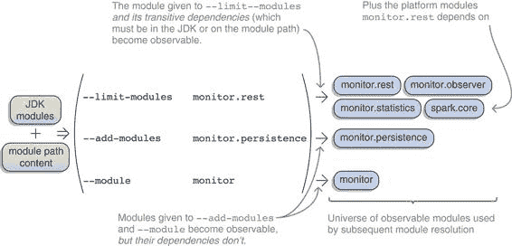
> 
> 图 5.3 `--limit-modules` 选项在模块解析之前被评估。
> 
> 真糟糕——观察者的实现也缺失了，所以你永远无法了解 Hibernate。幸运的是，这并不是你不能通过更多的`--add-modules`解决的问题：
> 
> `$ java --module-path mods:libs --limit-modules monitor.rest --add-modules monitor.persistence, monitor.observer.alpha,monitor.observer.beta --module monitor  > Error occurred during initialization of boot layer > java.lang.module.FindException: > Module hibernate.jpa not found, > required by monitor.persistence`
> 
> 就这样吧！
> 
> 在上一节中，你使用了计算出的宇宙来列出所有引用的模块，从而有效地打印出某个模块的所有传递依赖项。但这并不是`--limit-modules`的唯一用例。当我们讨论第十章中的服务时，会有更多内容出现（参见 10.1.2 节关于限制服务提供者的内容）。
> 
> 5.3.6 使用日志消息观察模块系统
> 
> 最后但同样重要的是，我们来到了调试的神奇子弹：日志消息。每当系统出现异常行为，在明显的地方（无论这些地方在哪里，对于特定的异常行为而言）找不到任何可操作的问题时，就是时候转向日志了。
> 
> 一旦你到达这里，很可能是你正在处理一个相对罕见的问题。对于这些情况，了解如何提取日志消息和相关信息，以及日志在最佳情况下应该看起来像什么（即一切正常的情况）是很有帮助的。本节不会展示如何修复具体问题——相反，它为你提供了自己完成这些事情的工具。
> 
> 模块系统将日志消息记录到两种不同的机制中（因为，嘿，为什么不呢？），一种更简单，一种更复杂：

+   解析器的诊断消息

+   统一 JVM 日志

> 我们将探讨两种方法，先从更简单的变体开始。
> 
> 模块解析期间的诊断消息
> 
> 使用`--show-module-resolution`选项，模块系统会在模块解析期间打印消息。以下是在使用该选项启动 ServiceMonitor 应用程序时的输出。它确定了根模块（在这种情况下只有一个），以及作为依赖项加载的模块以及哪个依赖项：
> 
> `$ java --module-path mods:libs` `--show-module-resolution` `①``--limit-modules monitor` `②``--dry-run` `③` `--module monitor  # 对于每个模块，文件被列出；# 我为了简洁性移除了它，但可能会有帮助 > root monitor > monitor 需要 monitor.observer > monitor 需要 monitor.rest > monitor 需要 monitor.persistence > monitor 需要 monitor.observer.alpha > monitor 需要 monitor.observer.beta > monitor 需要 monitor.statistics > monitor.rest 需要 spark.core > monitor.rest 需要 monitor.statistics > monitor.persistence 需要 hibernate.jpa > monitor.persistence 需要 monitor.statistics > monitor.observer.alpha 需要 monitor.observer > monitor.observer.beta 需要 monitor.observer > monitor.statistics 需要 monitor.observer # Spark 依赖项截断 # Hibernate 依赖项截断`
> 
> > ①
> > 
> > 激活模块解析的消息
> > 
> > ②
> > 
> > 由于在服务引入时原因变得清晰，需要限制可观察模块的宇宙，否则会解析出许多意外的模块。
> > 
> > ③
> > 
> > 你只想看到解析器消息，因此不需要启动应用程序。
> > 
> 从模块系统中提取解析器的诊断消息相对简单但不可定制。现在是时候转向更复杂和强大的机制了。
> 
> 使用统一日志查看 JPMS
> 
> Java 9 带来了统一的日志架构，该架构通过相同的机制将 JVM 生成的许多消息管道化。附录 C 介绍了它并解释了如何配置它。如果你以前从未这样做过，现在应该看看。我在这里等你。
> 
> 太好了——你回来了。有了对日志机制和配置的理解，你可以更深入地了解模块系统是如何工作的。以下所有实验都是使用已知的命令启动 ServiceMonitor 应用程序，使用 `--dry-run` 防止实际执行：
> 
> `$ java --module-path mods:libs --dry-run --module monitor`
> 
> 碎片将仅显示除该命令外还使用的 `-Xlog` 配置，以定义输出。为了减少噪音并集中注意力，我移除了所有标签并手动编辑了消息，只显示最重要的部分——实际的日志包含更多信息。
> 
> 遵循附录 C 中的建议，我查看了 `-Xlog:help` 并看到了 `module` 标签，这看起来很有希望。我将其用作 `module*` 以获取所有带有该标签的消息：
> 
> `# -Xlog:module*  # 截断许多模块 > java.base 位置: jrt:/java.base > jdk.compiler 位置: jrt:/jdk.compiler > spark.core 位置: file://... > monitor.persistence 位置: file://... > monitor.observer 位置: file://... > monitor 位置: file://... > monitor.rest 位置: file://... > Phase2 初始化，0.0977682 秒`
> 
> 在这里，模块系统会告知它加载了哪些模块。这些都是所有涉及的平台模块以及 monitor.*模块及其依赖项。要获取更多详细信息，让我们包括调试信息：
> 
> `# -Xlog:module*=debug  # 啊！大约 1500 行日志消息`
> 
> 这个输出有点令人眼花缭乱，但当你一步一步地过一遍，它并不复杂。此外，你还有机会看到模块系统如何工作的细节。所以，让我们来做吧！
> 
> 模块系统首先处理的是，有趣的是，未命名的模块。这仍然在很大程度上是一个谜——参见第 8.2 节。接下来是基本模块——如第 3.1.4 节所述，所有其他模块都依赖于它，因此定义它很早是有意义的：
> 
> `> 为引导加载器记录未命名的模块 > java.base 位置：jrt:/java.base > 模块定义：java.base`
> 
> 然后开始创建所有可观察的模块：
> 
> `> jdk.compiler 位置：jrt:/jdk.compiler > 创建模块：jdk.compiler > jdk.localedata 位置：jrt:/jdk.localedata > 创建模块：jdk.localedata > monitor.observer.alpha 位置：file://... > 创建模块：monitor.observer.alpha # 创建了许多其他模块`
> 
> 在所有模块创建完成后，模块系统会处理它们的描述符，添加读取边和定义中的包导出：
> 
> `> 将模块 java.xml 的读取添加到模块 java.base > 包 com/sun/org/apache/xpath/internal/functions 位于模块 java.xml > 导出至模块 java.xml.crypto > 包 javax/xml/datatype 位于模块 java.xml > 导出至所有未命名的模块 > 包 org/w3c/dom 位于模块 java.xml > 导出至所有未命名的模块 > 将模块 monitor.statistics 的读取添加到模块 monitor.observer > 将模块 monitor.statistics 的读取添加到模块 java.base > 包 monitor/statistics 位于模块 monitor.statistics > 导出至所有未命名的模块`
> 
> 你可以看到它将包导出表述为`"导出至模块 ..."`，有时值甚至不是`所有未命名的模块`。这是怎么回事？第 11.3 节会深入探讨这一点——这里我们只需认识到包导出被处理了。
> 
> 那就是全部了！最后一条消息是你之前见过的，它出现在中止 dry run 之前：
> 
> `> Phase2 初始化，0.1048592 秒`
> 
> 如果你进一步进入矩阵并将日志级别设置为`trace`，你会看到几千条消息，但并没有令人瞩目的发现等待着你。你只是看到，随着每个类的加载，模块系统会记录它属于哪个包和模块，在最终定义包之前。一旦完成，相应的模块就会被创建。
> 
> 如果你移除`--dry-run`并执行应用程序，你不会得到更多信息。在`debug`模式下，不会创建新的消息；而在`trace`模式下，你只会看到如何将一些嵌套类分配给现有的包。
> 
> > 注意：如果您想知道，所有这些都在单个线程中发生。您可以通过使用`-Xlog:module*=debug:stdout:tid`打印线程 ID 来验证这一点，它显示所有模块相关操作的相同 ID。
> > 
> 现在您知道了如何配置日志以及日志应该是什么样子。这些知识可以成为一个很好的诊断工具。当模块化应用程序没有按预期工作且其他方法未能提供有助于解决问题的分析时，它非常有用。
> 
> 5.4 虚拟机选项
> 
> 就像编译器和归档器一样，虚拟机获得了一些新的命令行选项，这些选项与模块系统交互。为了您的方便，表 5.1 列出了它们。您可以在[`docs.oracle.com/javase/9/tools/java.htm`](https://docs.oracle.com/javase/9/tools/java.htm)找到官方文档。
> 
> 表 5.1 所有模块相关虚拟机（`java`命令）选项的字母顺序列表。描述基于文档，参考指向本书中解释如何使用选项的章节。

| 选项   | 描述   | 参考   |
| --- | --- | --- |
| `--add-exports`   | 允许模块导出额外的包   | 11.3.4   |
| `--add-modules`   | 除了初始模块外，还定义根模块   | 3.4.3   |
| `--add-opens`   | 使模块开放额外的包   | 12.2.2   |
| `--add-reads`   | 在模块之间添加读取边   | 3.4.4   |
| `--describe-module`, `-d`   | 显示模块的名称、依赖项、导出、包等   | 5.3.1   |
| `--dry-run`   | 启动虚拟机但在调用`main`方法之前退出   | 5.3.3   |
| `--illegal-access`   | 配置如何处理从类路径到 JDK 内部 API 的访问   | 7.1.4   |
| `--limit-modules`   | 限制可观察模块的宇宙   | 5.3.5   |
| `--list-modules`   | 列出所有可观察模块   | 5.3.4   |
| `--module`, `-m`   | 设置初始模块并启动其主类   | 5.1   |
| `--module-path`, `-p`   | 指定查找应用程序模块的位置   | 3.4   |
| `--patch-module`   | 在编译过程中扩展现有模块的类   | 7.2.4   |
| `--show-module-resolution`   | 在模块解析期间打印消息   | 5.3.6   |
| `--upgrade-module-path`   | 定义可升级模块的位置   | 6.1.3   |
| `--validate-modules`   | 扫描模块路径以查找错误   | 5.3.2   |

> 除了能够在命令行上使用这些选项之外，您还可以在可执行 JAR 的清单中指定其中的一些，在`java`命令选择的特定环境变量中定义它们，或者将它们放入您提供给启动 JVM 的参数文件中。第 9.1.4 节解释了所有这些。
> 
> 你已经达到了第一部分的第二个里程碑和结论。你现在对模块系统的基本原理非常熟悉。如果你有机会，花些时间练习你所学的知识——也许创建自己的演示或尝试使用 ServiceMonitor ([`github.com/CodeFX-org/demo-jpms-monitor`](https://github.com/CodeFX-org/demo-jpms-monitor))。接下来要阅读的内容取决于你是否有一个想要迁移到 Java 9+ 并可能模块化（见第二部分）的项目，或者你是否更感兴趣于了解模块系统还能为你做些什么（见第三部分）。
> 
> 摘要

+   初始模块通过 `--module` 定义。如果它定义了主类，则无需更多操作即可启动应用程序；否则，在正斜杠之后将完全限定类名附加到模块名称之后。

+   确保在 `–module` 之前列出所有 JVM 选项，否则它们将被视为应用程序选项，不会影响模块系统。

+   可以使用 `--list-modules` 列出可观察的模块。如果你需要调试问题并查看哪些模块可用于解析，这会很有用。

+   如果使用 `--limit-modules`，可观察的模块宇宙仅由指定的模块及其传递依赖组成，从而减少了在解析期间可用的模块。与 `--list-modules` 结合使用，这是一个确定模块传递依赖的好方法。

+   选项 `--add-modules` 可以用来定义除初始模块之外的其他根模块。如果一个模块不是必需的（例如，因为它仅通过反射访问），则必须使用 `--add-modules` 来确保它成为模块图的一部分。

+   选项 `--dry-run` 启动 JVM 并让模块系统处理配置（模块路径、初始模块等）并构建模块图，但在调用主方法之前退出。这让你可以在不启动应用程序的情况下验证配置。

+   模块系统记录了各种消息，可以使用简单的 `--show-module-resolution` 或更复杂的 `-Xlog:module*` 打印它们。它们让你分析模块系统如何构建模块图，这有助于故障排除。

+   从模块加载资源的工作方式与从 JAR 文件加载它们非常相似。唯一的例外是那些不是 `.class` 文件且位于不同模块包中的资源（例如，与 JAR 的根目录或 `META-INF` 文件夹不同）。这些资源默认被封装，因此不可访问。

+   一个模块可以使用 `opens` 指令来提供对包的反射访问，这暴露了其中定位的资源，并允许其他模块加载它们。不幸的是，这种解决方案会邀请其他代码依赖于模块的内部结构。

+   在加载资源时，默认使用 `Class` 或新类型 `java.lang.Module` 上的 `getResource` 和 `getResourceAsStream` 方法。`ClassLoader` 上的这些方法通常具有更少有用的行为。
