> 第二部分
> 
> 适应现实世界的项目
> 
> 本书第一部分探讨了模块系统的基本知识以及如何编译、打包和运行模块化应用程序。除了教授相关机制外，它还展示了未来的 Java 项目将如何组织和发展。
> 
> 但对于现有的项目呢？我相信你们希望看到它们在 Java 9 或更高版本上运行，也许甚至作为模块。这部分将介绍如何实现这一点。
> 
> 第一步，让项目在 Java 9+上编译和运行，对于任何不想在 Java 8 的生命周期结束后继续使用或支付支持费用的代码库来说是强制性的。第二步，将项目的工件转换为模块化 JAR 文件，是可选的，并且可以逐步完成。
> 
> 第六章和第七章专门介绍迁移到 Java 9。它们都是关于让你的非模块化、基于类路径的项目在新版本上工作（而不创建任何模块）。第八章介绍了允许你逐步模块化项目的功能。第九章提供了一些战略建议，教你如何使用第六章至第八章中学到的知识迁移和模块化你的项目。
> 
> 我建议按照这个顺序阅读这些章节，但如果你更喜欢只在需要时研究技术细节，你可以从第九章开始。或者，你也可以先了解你可能会遇到的最大挑战：对 JEE 模块的依赖（第 6.1 节）和对 JDK 内部的依赖（第 7.1 节）。
> 
> 本书本部分没有针对所有内容提供具体的示例。在[`github.com/CodeFX-org/demo-java-9-migration`](https://github.com/CodeFX-org/demo-java-9-migration)的存储库中包含了一个 ServiceMonitor 应用程序的变体，其中包含一些需要修复才能在 Java 9+上运行的问题。试试看吧！
> 
> 6
> 
> 移动到 Java 9 或更高版本时的兼容性挑战
> 
> 本章涵盖

+   为什么 JEE 模块被弃用且默认不解析

+   编译和运行依赖于 JEE 模块的代码

+   为什么`URLClassLoader`的转换失败

+   理解新的 JDK 运行时图像布局

+   替换已删除的扩展机制、支持标准覆盖机制和引导类路径选项

> 本章和第七章讨论了将现有代码库迁移到 Java 9 及更高版本时的兼容性挑战。你目前不会创建任何模块；这些章节是关于在最新版本上构建和运行现有项目。
> 
> 为什么移动到 Java 9+需要两整个章节？难道你不能安装最新的 JDK 并期望一切都能正常工作吗？Java 不是应该向后兼容的吗？是的——如果你的项目及其依赖项只依赖于非弃用、标准化、有文档记录的行为。但这只是一个大前提，而且结果证明，在没有任何强制措施的情况下，更广泛的 Java 社区已经偏离了这条道路。
> 
> 正如你将在本章中看到的，模块系统弃用了一些 Java 特性，移除了其他特性，并更改了一些内部结构：

+   包含 JEE API 的模块已弃用，需要手动解决（第 6.1 节）。

+   应用程序类加载器（也称为系统类加载器）不再是`URLClassLoader`，这破坏了一些类型转换（第 6.2 节）。

+   Java 运行时图像（JRE 和 JDK）的目录布局已彻底翻新（第 6.3 节）

+   一些机制，如紧凑配置文件和 endorsed-standards 覆盖机制已被移除（第 6.4 节）。

+   还有一些小的变化，比如不再允许单下划线作为标识符（第 6.5 节）。

> 但这还不是全部。第七章讨论了两个更多挑战（内部 API 和分割包）。它们各自有自己的章节，因为在你迁移项目后，你可能会再次遇到它们与非 JDK 模块一起。
> 
> 这些变化一起破坏了一些库、框架、工具、技术和可能也是你的代码，因此不幸的是，更新到 Java 9+并不总是容易的任务。一般来说，项目越大、越老，它需要的工作就越多。然而，这通常是值得的投资，因为它是一个偿还技术债务并使代码库变得更好的机会。
> 
> 到本章和下一章结束时，你将了解更新到 Java 9、10、11 甚至更晚版本的挑战。给定一个应用程序，你将能够对需要做什么做出明智的猜测；并且假设所有依赖项都配合，你将能够在最新版本上使其工作。你还将为第九章做好准备，该章节讨论了迁移到 Java 9 及以后的策略。
> 
> > 关于类路径
> > 
> > 第八章详细讨论了非模块化代码如何在模块化的 JDK 上运行。目前你只需要知道以下内容：

+   类路径仍然完全有效。在迁移到 Java 9+的过程中，你将继续使用它而不是模块路径。

+   即使如此，模块系统仍然在发挥作用：例如，关于模块解析。

+   类路径上的代码将自动读取大多数模块（但并非全部：请参阅第 6.1 节），因此它们在编译时或运行时无需额外配置即可使用。

> 6.1 与 JEE 模块一起工作
> 
> Java SE 中的许多代码都与 Java EE / Jakarta EE（我将其缩写为 JEE）相关：CORBA 就是其中之一，Java Architecture for XML Binding (JAXB)和 Java API for XML Web Services (JAX-WS)也是如此。这些和其他 API 最终出现在表 6.1 中显示的六个模块中。这可能会是一个微不足道的旁白和故事的结尾，但不幸的是并非如此。当你尝试编译或运行依赖于这些模块中的类的代码时，模块系统会声称这些模块在图中缺失。
> 
> 在 Java 9 中，对于使用 java.xml.bind 模块中的`JAXBException`的类，存在一个编译错误：
> 
> `> 错误：包 javax.xml.bind 不可见 > import javax.xml.bind.JAXBException; > ^ > （包 javax.xml.bind 在模块 java.xml.bind 中声明， > 该模块不在模块图中） > 1 个错误`
> 
> 如果你通过了编译器，但忘记了调整运行时，你会得到一个`NoClassDefFoundError`错误：
> 
> `> 线程"main"中的异常 java.lang.NoClassDefFoundError: > javax/xml/bind/JAXBException > at monitor.Main.main(Main.java:27) > 原因：ClassNotFoundException: > javax.xml.bind.JAXBException > at java.base/BuiltinClassLoader.loadClass > (BuiltinClassLoader.java:582) > at java.base/ClassLoaders$AppClassLoader.loadClass > (ClassLoaders.java:185) > at java.base/ClassLoader.loadClass > (ClassLoader.java:496) > ... 更多`
> 
> 发生了什么？为什么在类路径上的代码中没有正确标准化的 Java API，对此能做些什么？
> 
> 表 6.1 六个 JEE 模块。描述引用了文档。

| 模块名称   | 描述   | 包   |
| --- | --- | --- |
| java.activation   | 定义了 JavaBeans 激活框架（JAF）API   | `javax.activation`   |
| java.corba   | 定义了 Open Management Group（OMG）CORBA API 的 Java 绑定和 RMI-IIOP API   | `javax.activity`, `javax.rmi`, `javax.rmi.CORBA`, `org.omg.*`   |
| java.transaction   | 定义了 Java 事务 API（JTA）的一个子集，以支持 CORBA 互操作   | `javax.transaction`   |
| java.xml.bind   | 定义了 JAXB API   | `javax.xml.bind.*`   |
| java.xml.ws   | 定义了 JAX-WS 和 Web 服务元数据 API   | `javax.jws`, `javax.jws.soap`, `javax.xml.soap`, `javax.xml.ws.*`   |
| java.xml.ws.annotation   | 定义了 Common Annotations API 的一个子集，以支持在 Java SE 平台上运行的程序   | `javax.annotation`   |

> 6.1.1 为什么 JEE 模块是特殊的？
> 
> Java SE 包含一些由认可的规范和独立技术组成的包。这些技术是在 Java 社区进程（JCP）之外开发的，通常因为它们依赖于由其他机构管理的标准。例如，由万维网联盟（W3C）和 Web 超文本应用技术工作组（WHATWG）开发的文档对象模型（DOM），以及简单 XML API（SAX）。如果你感兴趣，你可以在[`mng.bz/8Ek7`](http://mng.bz/8Ek7)找到它们的列表和它们所在的包。其中许多不均衡地落入表 6.1 中列出的 JEE 模块：java.corba、java.xml.bind 和 java.xml.ws。
> 
> 从历史上看，Java 运行时环境（JRE）附带这些技术的实现，但准备让用户独立于 JRE 进行升级。这可以通过认可的规范覆盖机制（见第 6.5.3 节）来完成。
> 
> 类似地，应用服务器通常通过提供自己的实现来扩展或升级 CORBA、JAXB 或 JAX-WS API，以及 JavaBeans 激活框架（在 java.activation 中）或 JTA（在 java.transaction 中）。最后，java.xml.ws.annotation 包含了`javax.annotation`包。它通常被各种 JSR 305 实现扩展，这些实现最著名的是它们与`null`相关的注解。
> 
> 在所有这些扩展或替换 Java 附带 API 的案例中，技巧是使用完全相同的包和类名，这样类就会从外部 JAR 加载而不是内置的。在模块系统的术语中，这被称为拆分包：相同的包在不同的模块或模块和类路径之间拆分。
> 
> > 拆分包的终结
> > 
> > 在 Java 9+及以后的版本中，拆分包不再有效。我们将在第 7.2 节中详细探讨这个问题——现在只需知道，与 Java 一起分发的包中的类路径上的类实际上是不可见的：

+   如果 Java 包含一个具有相同完全限定名的类，那么将加载那个类。

+   如果 Java 内置的包版本不包含所需的类，结果将是前面展示的编译错误或`NoClassDefFoundError`。而且这无论类是否存在于类路径上都会发生。

> 这是一个适用于所有模块的所有包的通用机制：将它们在模块和类路径之间拆分使得类路径部分不可见。使六个 JEE 模块特殊的是，与其他模块不同，通常使用拆分包方法来扩展或升级它们。
> 
> 为了使应用服务器和像 JSR 305 实现这样的库在没有大量配置的情况下工作，做出了一些权衡：对于类路径上的代码，Java 9 和 10 默认不解析 JEE 模块，这意味着它们不会进入模块图，因此不可用（有关未解析的模块，请参阅第 3.4.3 节；有关类路径场景的详细信息，请参阅第 8.2.2 节）。
> 
> 这对于带有这些 JEE API 自己实现的程序来说效果很好，但对于依赖于 JDK 变体的程序来说就不那么好了。没有进一步的配置，使用这些六个模块中的类型在类路径上的代码将无法编译和运行。
> 
> 为了消除这种复杂性并正确地将 Java SE 与 JEE 分开，这些模块在 Java 9 中被弃用，在 Java 11 中被移除。随着它们的移除，命令行工具如`wsgen`和`xjc`也不再随 JDK 一起提供。
> 
> 6.1.2 手动解析 JEE 模块
> 
> 如果由于缺少 JEE API 而导致编译或运行时错误，或者如果 JDeps 分析（见附录 D）显示你依赖于 JEE 模块，你会怎么做？有三个答案：

+   如果你的应用程序在应用程序服务器中运行，它可能提供了这些 API 的实现，在这种情况下，你可能不会遇到运行时错误。根据你的配置，你可能需要修复构建错误，不过——其他两种解决方案都应该能解决这个问题。

+   选择该 API 的第三方实现，并将其作为依赖项添加到你的项目中。由于 JEE 模块默认不解析，该实现将在编译和运行时无问题地使用。

+   在 Java 9 和 10 中，如第 3.4.3 节所述，使用 `--add-modules` 添加平台模块。由于 Java 11 中移除了 JEE 模块，这在那里将不起作用。

> 该节开头提供的示例尝试使用 java.xml.bind 模块中的 `JAXBException`。以下是使用 `--add-modules` 使该模块可用于编译的方法：
> 
> `$ javac --classpath ${jars} --add-modules java.xml.bind -d ${output-dir} ${source-files}`
> 
> 当代码编译和打包时，你需要再次添加模块以执行：
> 
> `$ java --classpath ${jars} --add-modules java.xml.bind ${main-class}`
> 
> 如果你依赖于几个 JEE API，添加 java.se.ee 模块可能比添加每个单独的模块更容易。它使得所有六个 EE 模块都可用，这简化了一些事情。（它是如何使它们可用的？请阅读第 11.1.5 节中关于聚合模块的内容。）
> 
> > **重要信息**：而不是使用 `--add-modules`，我强烈建议认真考虑将所需的 API 的第三方实现作为常规项目依赖项添加。第 9.1.4 节讨论了使用命令行选项的缺点，所以在走这条路之前请务必阅读。而且由于 Java 11 中移除了 JEE 模块，迟早你需要第三方实现。
> > 
> 手动添加 JEE 模块的努力仅适用于非模块化代码。一旦它被模块化，EE 模块就不再特殊：你可以像要求任何其他模块一样要求它们，并且它们将像任何其他模块一样被解析——至少，直到它们被移除。
> 
> > 第三方 JEE 实现
> > 
> > 比较和讨论各种 JEE API 的第三方实现将远离模块系统，因此在这里我不会这么做。有关替代方案列表，请参阅 JEP 320 ([`openjdk.java.net/jeps/320`](http://openjdk.java.net/jeps/320)) 或 Stack Overflow ([`mng.bz/0p29`](http://mng.bz/0p29))。
> > 
> 6.1.3 添加 JEE 模块的第三方实现
> 
> 可能你一直在使用受支持的规范覆盖机制来更新规范和独立技术。在这种情况下，你可能想知道在模块时代它发生了什么。正如你可能猜到的，它被移除并由新事物取代了。
> 
> 编译器和运行时都提供了`--upgrade-module-path`选项，该选项接受一个目录列表，格式类似于模块路径的格式。当模块系统创建模块图时，它会搜索这些目录以查找工件，并使用它们来替换可升级的模块。六个 JEE 模块始终可升级：

+   `java.activation`

+   `java.corba`

+   `java.transaction`

+   `java.xml.bind`

+   `java.xml.ws`

+   `java.xml.ws.annotation`

> JDK 供应商可能会使更多模块可升级。例如，在 Oracle JDK 上，这适用于 java.jnlp。此外，使用`jlink`链接到映像中的应用程序模块始终可升级——有关更多信息，请参阅第 14.2.1 节。
> 
> 升级模块路径上的 JAR 文件不必是模块化的。如果它们缺少模块描述符，它们将被转换为自动模块（请参阅第 8.3 节），并且仍然可以替换 Java 模块。
> 
> 6.2 将其转换为`URLClassLoader`
> 
> 在 Java 9 或更高版本上运行项目时，您可能会遇到类似于以下示例中的类转换异常。在这里，JVM 抱怨它无法将`jdk.internal.loader.ClassLoaders.AppClassLoader`实例转换为`URLClassLoader`：
> 
> `> 线程 "main" 中发生异常 java.lang.ClassCastException:` `> java.base/jdk.internal.loader.ClassLoaders$AppClassLoader` `①``> 无法转换为 java.base/java.net.URLClassLoader` `②` `> 在 monitor.Main.getClassPathContent(Main.java:46) > 在 monitor.Main.main(Main.java:28)`
> 
> > ①
> > 
> > `getClass()`返回的类加载器是`AppClassLoader`。
> > 
> > ②
> > 
> > `AppClassLoader`不扩展`URLClassLoader`，因此转换失败。
> > 
> 这是什么新类型，为什么它会破坏代码？让我们找出答案！在这个过程中，您将了解 Java 9 如何更改类加载行为以改进启动性能。因此，即使您的项目没有遇到这个问题，这也是加深 Java 知识的好机会。
> 
> 6.2.1 应用程序类加载器，过去和现在
> 
> 在所有 Java 版本中，应用程序类加载器（通常称为系统类加载器）是 JVM 用于运行应用程序的三个类加载器之一。它加载不需要任何特殊权限的 JDK 类以及所有应用程序类（除非应用程序使用自己的类加载器，在这种情况下，以下内容不适用）。
> 
> 您可以通过调用`ClassLoader.getSystemClassLoader()`或在一个实例上调用`getClass().getClassLoader()`来访问应用程序类加载器。这两种方法都承诺给您一个`ClassLoader`类型的实例。在 Java 8 及之前，应用程序类加载器是`URLClassLoader`，它是`ClassLoader`的子类型；由于`URLClassLoader`提供了一些有用的方法，因此通常将其实例转换为它。您可以在列表 6.1 中看到一个示例。
> 
> 没有模块作为 JAR 的运行时表示，`URLClassLoader` 没有办法知道在哪个工件中查找一个类；因此，每当需要加载一个类时，`URLClassLoader` 会扫描类路径上的每个工件，直到找到它所寻找的内容（参见图 6.1）。这显然非常低效。
> 
> > 列表 6.1 将应用程序类加载器转换为 `URLClassLoader`
> > 
> `private String getClassPathContent() { URLClassLoader loader =` `(URLClassLoader) this.getClass().getClassLoader();` `①``return Arrays.stream(loader.getURLs())` `②` `.map(URL::toString) .collect(joining(", ")); }`
> 
> > ①
> > 
> > 获取应用程序类加载器并将其转换为 `URLClassLoader`
> > 
> > ②
> > 
> > `getURLs` 不存在于 `ClassLoader` 中，这就是进行类型转换的原因。
> > 
> 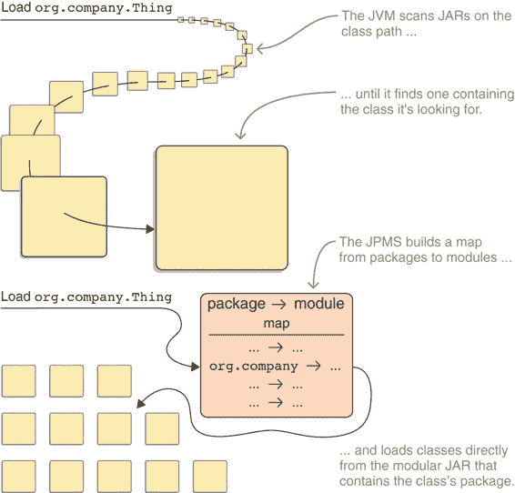
> 
> 图 6.1 没有模块（顶部），通过扫描类路径上的所有工件来加载特定的类。有模块（底部），类加载器知道一个包来自哪个模块化 JAR，并直接从那里加载。
> 
> 现在让我们转向 Java 9+。随着 JAR 在运行时得到了适当的表示，类加载行为可以得到改善：当需要加载一个类时，会识别它所属的包，并使用它来确定一个特定的模块化 JAR。只有那个 JAR 才会被扫描以查找类（参见图 6.1）。这依赖于这样一个假设，即没有两个模块化 JAR 包含同一包中的类型——如果它们确实包含，则称为拆分包，模块系统会抛出一个错误，如第 7.2 节所述。
> 
> 新类型 `AppClassLoader` 和其同样新的超类型 `BuiltinClassLoader` 实现了新的行为，并且从 Java 9 开始，应用程序类加载器是一个 `AppClassLoader`。这意味着偶尔的 `(URLClassLoader) getClass().getClassLoader()` 序列将不再成功执行。如果你想了解更多关于 Java 9+ 中类加载器结构和关系的信息，请参阅第 12.4.1 节。
> 
> 6.2.2 没有使用 URLCLASSLOADER
> 
> 如果你在一个你依赖的项目中遇到 `URLClassLoader` 的类型转换，并且没有 Java 9+-兼容的版本可以更新，你除了以下几种方法外别无选择：

+   为项目打开一个问题，或者贡献一个修复方案。

+   在本地分叉或修补项目。

+   等待。

> 如果迫不得已，你可以切换到另一个库或框架，如果它有在 Java 9+ 上运行良好的版本。
> 
> 如果你自己的代码进行了类型转换，你可以（并且必须）对此采取措施。不幸的是，你可能不得不放弃一些功能。你很可能将 `URLClassLoader` 转换为使用其特定的 API，尽管 `ClassLoader` 已经有所增加，但它不能完全替代 `URLClassLoader`。不过，看看它可能做你想做的事情。
> 
> 如果你只是需要查看应用程序启动时使用的类路径，请检查系统属性`java.class.path`。如果你已经使用`URLClassLoader`通过将 JAR 文件附加到类路径来动态加载用户提供的代码（例如，作为插件基础设施的一部分），那么你必须找到一种新的方法来做这件事，因为使用 Java 9 及以后版本的应用程序类加载器无法做到这一点。
> 
> 相反，考虑创建一个新的类加载器——它还有一个额外的好处，就是你将能够丢弃新类，因为它们没有被加载到应用程序类加载器中。如果你至少编译了 Java 9，层可能是一个更好的解决方案（参见第 12.4 节）。
> 
> 你可能会想调查`AppClassLoader`并使用它的能力，如果它满足你的需求。一般来说，不要这样做！依赖`AppClassLoader`很丑陋，因为它是一个私有内部类，所以你必须使用反射来调用它。依赖其公共超类型`BuiltinClassLoader`也不推荐。
> 
> 如包名`jdk.internal.loader`所暗示的，它是一个内部 API；并且因为该包是在 Java 9 中添加的，所以默认情况下不可用，所以你必须使用`--add-exports`甚至`--add-opens`（有关详细信息，请参阅第 7.1 节）。这不仅使代码和构建过程复杂化，还使你面临未来 Java 更新中可能出现的兼容性问题——例如，当这些类被重构时。所以除非绝对必要以实现关键功能，否则不要这样做。
> 
> 6.2.3 寻找麻烦的转换
> 
> 检查这些转换的代码很简单：通过全文搜索“（URLClassLoader）”应该就能找到，并且很少出现误报（包含括号以仅找到转换）。至于在依赖项中找到它们，我不知道有任何工具能让这个过程变得舒适。我猜可能需要一个构建工具的魔法（以将所有依赖项的源 JAR 文件放在一个地方），命令行魔法（以访问所有`.java`文件及其文件内容），以及另一个全文搜索才能做到这一点。
> 
> 6.3 更新运行时图像目录布局
> 
> JDK 和 JRE 的目录结构是逐步演化的，在超过 20 年的时间里，它们积累了灰尘。不随时间重新组织它们的一个原因当然是向后兼容性。正如对看似每个细节一样，一些代码依赖于它们的特定布局。两个例子：

+   一些工具，尤其是 IDE，依赖于`rt.jar`（构成核心 Java 运行时的类）、`tools.jar`（工具和实用程序的类）和`src.zip`（JDK 源代码）的确切位置。

+   存在着通过推测运行中的 JRE 有一个包含它们的`bin`子目录来搜索 Java 命令（如`javac`、`jar`或`javadoc`）的代码——如果 JRE 是 JDK 安装的一部分，这是真的，因为其中包含一个包含这些命令的`bin`文件夹和一个相邻的`jre`文件夹。

> 然后是模块系统，它打破了使这两个示例成为可能的基本假设：

+   JDK 代码现在已模块化，因此应该以单个模块的形式交付，而不是像 `rt.jar` 和 `tools.jar` 这样的单体 JAR。

+   使用模块化的 Java 代码库和像 `jlink` 这样的工具，可以从任何一组模块创建运行时图像。

> `从 Java 11 开始，不再有独立的 JRE 软件包。运行程序需要 JDK 或由 jlink 创建的软件包。`
> 
> 由于模块化系统将带来一些破坏性变化，因此决定彻底重新组织运行时图像目录结构。您可以在图 6.2 中看到这些变化的结果。总体而言，新的布局要简单得多：

+   一个单独的 `bin` 目录，没有重复的二进制文件

+   一个单独的 `lib` 目录

+   一个单独的目录，`conf`，用于包含所有配置文件

> 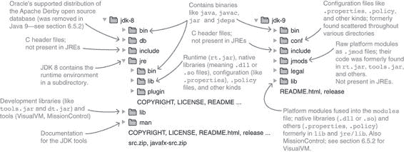
> 
> 图 6.2 比较 JDK 8 和 9 的目录结构。新的结构要干净得多。
> 
> 这些变化的直接后果是您需要更新您的开发工具，因为旧版本可能无法与 9 版本及以后的 JDK 安装一起使用。根据项目情况，可能有必要搜索代码中在 JDK/JRE 文件夹中查找二进制文件、属性文件或其他内容的代码。
> 
> 系统资源获取的 URL 已更改，例如来自 `ClasLoader::getSystemResource`，它曾经是这样的形式，其中 `${path}` 是类似 `java/lang/String.class` 的内容：
> 
> `jar:file:${java-home}/lib/rt.jar!${path}`
> 
> 它现在看起来是这样的：
> 
> `jrt:/${module}/${path}`
> 
> 所有创建或消耗此类 URL 的 JDK API 都在新的方案上操作，但非 JDK 代码必须更新以生成这些 URL，以适应 Java 9+。
> 
> 此外，`Class::getResource*` 和 `ClassLoader::getResource*` 方法不再读取 JDK 内部资源。相反，要访问模块内部资源，请使用 `Module::getResourceAsStream` 或创建一个如下所示的 JRT 文件系统：
> 
> `FileSystem fs = FileSystems.getFileSystem(URI.create("jrt:/")); fs.getPath("java.base", "java/lang/String.class"));`
> 
> 有关如何访问资源的更多详细信息，请参阅第 5.2 节。
> 
> 6.4 选择、替换和扩展平台
> 
> 在编译代码或启动 JVM 时，曾经有各种方式来指定构成 JDK 平台的类。您可以选择 JDK 的一个子集，用另一个技术（如 JAXB）替换特定技术，添加几个类，或者选择一个完全不同的平台版本来编译或启动。模块系统使一些这些功能变得过时，并以更现代的方法重新实现了其他功能；而且无论 JPMS 如何，Java 9 版本还移除了一些功能。
> 
> 如果您依赖于本节中讨论的其中一个或多个功能，您将不得不做一些工作来保持您的项目运行。没有人喜欢被迫重做没有引起任何明显问题的东西，但回顾这些功能（其中大部分我从未使用过），我只能说没有它们，JDK 内部变得多么简单。
> 
> 6.4.1 紧凑型配置文件不再需要
> 
> 如第 1.5.5 节所述，模块系统的一个目标允许用户创建仅包含所需模块的运行时镜像。这对于存储空间有限的设备以及虚拟化环境尤其有趣，因为两者都关注较小的运行时镜像。当模块系统不会与 Java 8 一起发布变得明显时，这曾是计划的一部分，紧凑型配置文件被创建为一个临时解决方案。
> 
> 三个紧凑型配置文件定义了 Java SE 8 API 和 JREs 的子集，仅包含支持这些 API 子集所需的类。在选择了与您的应用程序需求相匹配的配置文件后，您将使用`javac`选项`-profile`来针对它进行编译（以确保您保持在所选子集内），然后运行匹配变体的字节码。
> 
> 在模块系统的作用下，可以使用`jlink`创建出更加灵活的运行时镜像（参见第 14.1 节），紧凑型配置文件就不再需要了。因此，Java 9+编译器在编译 Java 8 时将仅接受`-profile`选项。要针对特定模块的选择进行编译，您可以使用`--limit-modules`选项，如第 5.3.5 节所述。
> 
> 这些是您需要以获得与三个紧凑型配置文件相同的 API 的模块：

+   对于紧凑 1 配置文件——java.base、java.logging 和 java.scripting

+   对于紧凑 2 配置文件——紧凑 1 的类加上 java.rmi、java.sql 和 java.xml

+   对于紧凑 3 配置文件——紧凑 2 的类加上 java.compiler、java.instrument、java.management、java.naming、java.prefs、java.security.jgss、java.security.sasl、java.sql.rowset 和 java.xml.crypto

> 而不是依赖于固定的选择，我建议采用不同的方法。使用`jlink`创建仅包含您需要的平台模块的镜像（参见第 14.1 节）；如果您的应用程序及其依赖项完全模块化，甚至可以包含您的应用程序模块（参见第 14.2 节）。
> 
> 6.4.2 扩展机制已移除
> 
> 在 Java 9 之前，扩展机制允许我们在不将它们放在类路径上的情况下向 JDK 添加类。它从各种目录中加载它们：从由系统属性`java.ext.dirs`命名的目录中，从 JRE 中的`lib/ext`，或从特定平台的全局系统目录中。Java 9 删除了此功能，如果 JRE 目录存在或系统属性已设置，编译器和运行时将退出并显示错误。
> 
> 替代方案如下：

+   `java`和`javac`选项`--patch-module`将内容注入到模块中（参见第 7.2.4 节）。

+   `java` 和 `javac` 选项 `--upgrade-module-path` 用另一个模块替换可升级的平台模块（参见第 6.1.3 节）。

+   扩展的工件可以放置在类路径上。

> 6.4.3 已移除 ENDORSED STANDARDS OVERRIDE MECHANISM
> 
> 在 Java 9 之前，endorsed standards override mechanism 允许我们用自定义实现替换某些 API。它从系统属性 `java.endorsed.dirs` 或 JRE 中的 `lib/endorsed` 目录命名的目录中加载它们。Java 9 移除了这个特性，如果 JRE 目录存在或系统属性被设置，编译器和运行时会因为错误而退出。替代方案与扩展机制（第 6.4.2 节）相同。
> 
> 6.4.4 已移除某些 BOOT CLASS PATH 选项
> 
> 已移除 `-Xbootclasspath` 和 `-Xbootclasspath/p` 选项。请使用以下选项代替：

+   `javac` 选项 `--system` 指定系统模块的替代来源。

+   `javac` 选项 `--release` 指定了一个替代的平台版本。

+   `java` 和 `javac` 选项 `--patch-module` 将内容注入初始模块图中的模块。

> 6.4.5 不再为 Java 5 进行编译
> 
> Java 编译器可以处理来自各种 Java 语言版本的源代码（例如，使用 `-source` 指定的 Java 7）并且可以同样为各种 JVM 版本生成字节码（例如，为 Java 8，使用 `-target` 指定）。Java 以前遵循“一加三回”的政策，这意味着 `javac` 9 支持 Java 9（显然）以及 8、7 和 6。
> 
> 在 `javac` 8 中设置 `-source 5` 或 `-target 5` 会引发弃用警告，并且不再由 `javac` 9 支持。类似地，在 Java 9 中设置 `-source 6` 或 `-target 6` 也会产生相同的警告。现在每六个月就会有一个新版本发布，这项政策不再适用。Java 10、11 和 12 可以很好地编译 Java 6。
> 
> > 注意：编译器可以识别和处理所有之前 JDK 的字节码——它只是不再为 6 版本之前的版本生成字节码。
> > 
> 6.4.6 已移除 JRE 版本选择
> 
> 在 Java 9 之前，您可以在 `java`（或相应的清单条目）上使用 `-version:N` 选项来使用版本 `N` 的 JRE 启动应用程序。在 Java 9 中，该功能已被移除：Java 启动器会因为命令行选项而退出并显示错误，对于清单条目会打印警告，而其他方面则忽略它。如果您一直依赖这个功能，以下是 Java 文档对该功能的说明：
> 
> > 现代应用程序通常通过 Java Web Start (JNLP)、本地操作系统打包系统或活动安装程序进行部署。这些技术有自己的方法来管理所需的 JRE，通过查找或下载并更新所需的 JRE，按需进行。这使得启动器的启动时 JRE 版本选择变得过时。
> > 
> 看起来文档认为使用`-version:N`的应用程序不够现代——这真是个无礼的说法。开个玩笑，如果你的应用程序依赖于这个特性，你除了让它在没有`-version:N`的情况下工作外别无选择；例如，通过将其与它运行得最好的 JRE 捆绑在一起。
> 
> 6.5 导致重大失败的小事
> 
> 除了模块系统带来的更大挑战外，还有一些变化，通常与 JPMS 无关，虽然规模较小，但同样会带来麻烦：

+   版本字符串的新格式

+   移除一些 JDK 和 JRE 工具

+   单下划线不再是有效的标识符

+   Java 网络启动协议（JNLP）语法更新

+   JVM 选项的移除

> 我不想让你等太久，但我也不想遗漏那些会阻止你的迁移的事情。所以我会快速地解决这些问题。
> 
> 6.5.1 新版本字符串
> 
> 经过 20 多年的发展，Java 终于正式接受它不再处于 1.x 版本。是时候了。从现在起，系统属性`java.version`及其同族`java.runtime.version`、`java.vm.version`、`java.specification.version`和`java.vm.specification.version`不再以`1.x`开头，而是以`x`开头。同样，`java -version`返回`x`，所以在 Java 9 中你得到`9.something`。
> 
> > 版本字符串格式
> > 
> > 新版本字符串的确切格式仍在变动中。在 Java 9 中，你得到`9.${MINOR}.${SECURITY}.${PATCH}`，其中`${SECURITY}`有一个特性，即当发布新的次要版本时，它不会重置为零——你可以通过查看这个数字来判断哪个版本包含更多的安全补丁。
> > 
> > 在 Java 10 及以后版本，你得到`${FEATURE}.${INTERIM}.${UPDATE}.${PATCH}`，其中`${FEATURE}`从`10`开始，每六个月随着每个功能发布而增加。`${INTERIM}`的作用与`${MINOR}`类似，但由于新计划中没有计划发布次要版本，它被假定为始终为`0`。
> > 
> 一个不幸的副作用是，版本嗅探代码可能会突然停止报告正确的结果，这可能导致程序出现奇怪的行为。全文搜索相关的系统属性应该能找到这样的代码。
> 
> 至于更新它，如果你愿意将项目的需求提升到 Java 9+，你可以避免系统属性的探测和解析，而是使用新的`Runtime.Version`类型，这要容易得多：
> 
> ``Version version = Runtime.version(); // 在 Java 10 及以后版本，使用 `version.feature()` switch (version.major()) { case 9: System.out.println("Modularity"); break; case 10: System.out.println("Local-Variable Type Inference"); break; case 11: System.out.println("Pattern Matching (we hope)"); break; } $`
> 
> 6.5.2 工具外流
> 
> JDK 积累了很多工具，随着时间的推移，一些变得不再需要或被其他工具取代。一些被包含在 Java 9 的春季大扫除中：

+   JavaDB 不再包含。它曾是 Apache Derby DB，您可以从[`db.apache.org`](https://db.apache.org)下载。

+   VisualVM 不再与 JDK 捆绑，并在[`github.com/oracle/visualvm`](https://github.com/oracle/visualvm)成为独立项目。

+   `hprof`代理库已被移除。替代其功能的工具是`jcmd`，`jmap`和 Java 飞行记录器。

+   `jhat`堆可视化器已被移除。

+   `java-rmi.exe`和`java-rmi.cgi`启动器已被移除。作为替代，请使用 servlet 通过 HTTP 代理 RMI。

+   `native2ascii`工具用于将基于 UTF-8 的属性资源包转换为 ISO-8859-1。然而，Java 9+支持基于 UTF-8 的包，因此该工具变得多余并被移除。

> 此外，所有与 JEE 相关的命令行工具，如`wsgen`和`xjc`，在 Java 11 中也不再可用，因为它们与其包含的模块一起被移除（有关 JEE 模块的详细信息，请参阅第 6.1 节）。
> 
> 6.5.3 最小的事情
> 
> 下面可能是导致您的 Java 9 构建失败的最小问题：Java 8 已弃用单下划线`_`作为标识符，在 Java 9 中使用它作为标识符时会导致编译错误。这样做是为了回收下划线作为可能的关键字；未来的 Java 版本将赋予它特殊含义。
> 
> 另一个问题：`Thread.stop(Throwable)`现在会抛出`UnsupportedOperationException`。其他`stop`重载仍然可以工作，但使用它们被高度不建议。
> 
> JNLP 语法已更新，以符合 XML 规范，并“为了消除不一致性，简化代码维护，并增强安全性”。我不会列出更改——您可以在[`mng.bz/dnfM`](http://mng.bz/dnfM)找到它们。
> 
> 每个 Java 版本都会移除一些已弃用的 JVM 选项，Java 9 也不例外。它特别关注垃圾回收，其中一些组合不再受支持（`DefNew` + `CMS`，`ParNew` + `SerialOld`，`Incremental CMS`），一些配置被移除（`-Xincgc`，`-XX:+CMSIncrementalMode`，`-XX:+UseCMSCompactAtFullCollection`，`-XX:+CMSFullGCsBeforeCompaction`，`-XX:+UseCMSCollectionPassing`）或已弃用（`-XX:+UseParNewGC`）。Java 10 随后移除了`-Xoss`，`-Xsqnopause`，`-Xoptimize`，`-Xboundthreads`和`-Xusealtsigs`。
> 
> 6.5.4 JAVA 9，10 和 11 中的新弃用功能
> 
> 最后，这里是一个非详尽的列表，列出了 Java 9，10 和 11 中弃用的功能：

+   `java.applet`包中的 Applet API，以及`appletviewer`工具和 Java 浏览器插件

+   Java Web Start，JNLP，以及`javaws`工具

+   并发标记清除（Concurrent Mark Sweep，CMS）垃圾回收器

+   通过`-Xprof`激活的 HotSpot FlatProfiler

+   `policytool`安全工具

> Java 10 和 11 已经实施了一些弃用：

+   Java 10 移除了 FlatProfiler 和`policytool`。

+   Java 11 移除了 Applet API 和 Web Start。

> 更多信息，以及详细信息和建议的替代方案，请查看发布说明（Java 9：[`mng.bz/GLkN`](http://mng.bz/GLkN)；Java 10：[`mng.bz/zLeV`](http://mng.bz/zLeV)）和标记为删除的已弃用代码列表（Java 9：[`mng.bz/YX9e`](http://mng.bz/YX9e)；Java 10：[`mng.bz/qRoU`](http://mng.bz/qRoU)）。
> 
> 摘要

+   JEE 模块在 Java 9 中被弃用，在 Java 11 中被移除。您需要尽早找到一个满足您要求的第三方依赖项。

+   在 Java 9 和 10 中，默认情况下不会解析这些模块，这可能导致编译时和运行时错误。要修复此问题，您可以使用实现相同 API 的第三方依赖项，或者使用 `--add-modules` 使 JEE 模块可用。

+   应用程序类加载器不再是 `URLClassLoader` 类型，因此像 `(URLClassLoader) getClass().getClassLoader()` 这样的代码将失败。解决方案是仅依赖 `ClassLoader` API，即使这意味着必须删除某些功能（推荐）；创建一个动态加载新代码的层（推荐）；或者侵入类加载器内部并使用 `BuiltinClassLoader` 或甚至 `AppClassLoader`（不推荐）。

+   运行时镜像的目录结构已更改，您可能需要更新您的工具，特别是 IDE，以与 Java 9 及以后的版本一起工作。也需要更新在 JDK/JRE 目录中四处游荡的代码或为系统资源手工创建 URL。

+   移除了一些修改构成平台的类集合的机制。对于大多数机制，模块系统提供了替代方案：

+   而不是使用紧凑配置文件，请使用 `jlink` 创建运行时镜像，并使用 `--limit-modules` 配置编译。

+   而不是使用扩展机制或认可标准机制，请使用 `--patch-module`、`--upgrade-module-path` 或类路径。

+   而不是使用 `-Xbootclasspath` 选项，请使用 `--system`、`--release` 或 `--patch-module`。

+   现在不再可能为 Java 5 编译，也不能使用 `-version:N` 选项以 Java 版本 `N` 启动应用程序。

+   Java 的命令行工具和系统属性 `java.version` 报告的版本为 `9.${MINOR}.${SECURITY}.${PATCH}`（在 Java 9 中）或为 `${FEATURE}.${INTERIM}.${UPDATE}.${PATCH}`（在 Java 10 及以后），这意味着在 Java X 中它们以 `X` 开头而不是 `1.x`。一个新的 API `Runtime.Version` 使得解析该属性变得不再必要。

+   以下工具已被移除：

+   在 Java 9 中：JavaDB、VisualVM、`hprof`、`jhat`、`java-rmi.exe`、`java-rmi.cgi` 和 `native2ascii`

+   在 Java 10 中：`policytool`

+   在 Java 11 中：`idlj`、`orbd`、`schemagen`、`servertool`、`tnameserv`、`wsgen`、`wsimport` 和 `xjc`

+   单下划线不再是有效的标识符。

+   JNLP 语法已更新以符合 XML 规范，因此您可能需要更新您的 JNLP 文件。

+   每个 Java 版本都会删除已弃用的 JVM 命令行选项，这可能会破坏您的某些脚本。

+   Java 9 废弃了 Applet 技术和 Java Web Start，Java 11 则移除了它们。

> 7
> 
> 在 Java 9 或更高版本上运行时的反复挑战
> 
> 本章涵盖

+   区分标准化的、受支持的以及内部的 JDK API

+   使用 JDeps 查找对 JDK 内部 API 的依赖

+   编译和运行依赖于内部 API 的代码

+   为什么分割包会使类不可见

+   修复分割包

> 第六章讨论了在将项目迁移到 Java 9+ 时可能会遇到的一些问题。一旦完成这些，除非你选择使用 Java 9 之前的依赖项，否则你将不会再次遇到这些问题。本章探讨了两个你可能仍然需要解决的问题：

+   依赖于内部 API 会导致编译错误（第 7.1 节）。这适用于 JDK 内部 API，例如来自 `sun.*` 包的类，也适用于你依赖的库或框架内部的代码。

+   在工件之间分割包会导致编译时和运行时错误（第 7.2 节）。同样，这可能会发生在你的代码和 JDK 模块之间，以及任何其他两个工件之间：例如，你的代码和第三方依赖项。

> 就像我们之前讨论的问题一样，当你的项目需要在 Java 9+ 上运行时，你也必须解决这两个问题，但这并不仅限于此：即使迁移之后，在编写代码或引入新依赖项时，你偶尔也会遇到这些问题。无论涉及的是哪种类型的模块，对模块内部和分割包的依赖都会引起麻烦。你遇到这些问题的可能性与使用类路径代码和平台模块（迁移场景）一样，与使用应用程序模块（你已经在 Java 9 或更高版本上运行并使用模块的场景）一样。
> 
> 本章展示了如何打破模块的封装以及如何修复包分割，无论这些情况发生在何种背景下。与第六章一起，这为你准备在迁移过程中可能出现的几乎所有问题。
> 
> > 关于类路径
> > 
> > 如果你在第六章中没有阅读到注意事项，我想在这里重复一遍：

+   类路径仍然完全有效，在迁移到 Java 9+ 的过程中，你将继续使用它而不是模块路径。

+   即使如此，模块系统仍然在发挥作用，尤其是在强封装方面。

+   类路径上的代码将自动读取大多数模块（但不是全部；请参阅第 6.1 节），因此它们在编译时或运行时无需额外配置即可可用。

> 7.1 内部 API 的封装
> 
> 模块系统最大的卖点之一是强封装。正如第 3.3 节深入解释的那样，我们终于可以确保只有受支持的 API 对外部代码可访问，同时隐藏实现细节。
> 
> 内部 API 的不可访问性适用于与 JDK 一起分发的平台模块，其中只有 `java.*` 和 `javax.*` 包得到完全支持。例如，当您尝试编译一个在现在已封装的包 `com.sun.java.swing.plaf.nimbus` 中对 `NimbusLookAndFeel` 有静态依赖（意味着导入或完全限定的类名，而不是反射访问）的类时，就会发生这种情况：
> 
> `> 错误：包 com.sun.java.swing.plaf.nimbus 不可见 > 导入 com.sun.java.swing.plaf.nimbus.NimbusLookAndFeel; > ^ > （包 com.sun.java.swing.plaf.nimbus 已在模块 java.desktop 中声明，但没有导出它） > 1 个错误`
> 
> 令人惊讶的是，许多库和框架，甚至应用代码（通常是更重要的部分），都使用了来自 `sun.*` 或 `com.sun.*` 包的类，其中大多数在 Java 9 及以后版本中无法访问。在本节中，我将向您展示如何找到这样的依赖项以及如何处理它们。
> 
> 但为什么要讨论这个呢？如果内部 API 不可访问，那就没有什么可讨论的，对吧？好吧，是时候让您知道一些事情了：它们并不是完全不可访问。在运行时，一切都将继续工作，直到下一个主要的 Java 版本（尽管您可能会收到一些不期望的警告消息）；并且通过控制命令行，任何包都可以在编译时被访问。（我想我听到了一声松了一口气——那是你吗？）
> 
> 第 9.1.4 节讨论了使用命令行选项配置模块系统的更广泛影响；在这里，我们专注于解决当前问题。我们将区分静态和反射以及编译时和运行时访问（第 7.1.3 和 7.1.4 节），因为存在一些关键差异。但在我们深入探讨之前，您需要确切了解内部 API 的构成以及 Java 依赖分析工具（JDeps）如何帮助您在项目和依赖项中找到有问题的代码。
> 
> > 提示：如果您不确定反射是如何工作的，请参阅附录 B，其中提供了简要介绍。此外，在本节中，我们专注于对 JDK 的反射访问；对于模块化世界中反射的更一般性观点，请参阅第十二章。
> > 
> 当您完成本节后，您将能够轻松地打开模块以利用维护者不希望您使用的 API。更重要的是，您将能够评估该策略的利弊，以便您可以在是否值得走这条路方面做出明智的决定。
> 
> 7.1.1 内部 API 的显微镜下
> 
> 哪些 API 是内部的？一般来说，每个既不是公共的也不是在导出包中的类——这个规则完全适用于应用模块。至于 JDK，答案并不那么简单。在标准化、受支持和内部 API 的历史复杂情况之上，Java 9+ 通过对某些 API 进行特殊处理并删除其他 API，增加了一层复杂性。让我们一步一步地解开这个情况。
> 
> JDK API 的三种类型：标准化、支持和内部
> 
> 从历史的角度来看，Java 运行时环境（JRE）有三种类型的 API：

+   在 `java.*` 和 `javax.*` 包中找到的公共类是标准化的，并且在所有 JRE 中完全支持。仅使用这些类可以编写最可移植的代码。

+   一些 `com.sun.*` 和 `jdk.*` 包以及它们包含的一些类被标记为 `jdk.Exported` 注解，在这种情况下，它们由 Oracle 支持，但并不一定存在于非 Oracle JRE 中。这些绑定将代码绑定到特定的 JRE。

+   大多数 `com.sun.*` 包以及所有 `sun.*` 包以及所有非公共类都是内部的，并且可以在不同的版本和 JRE 之间更改。依赖这些是最不稳定的，因为这样的代码理论上可能在任何小版本更新中停止工作。

> 在 Java 9+ 和模块系统的作用下，这三种类型的 API——标准化、支持和内部——仍然存在。一个模块是否导出包是一个关键指标，但显然不足以划分三个类别。另一个指标是模块的名称。如您在 3.1.4 节中回忆的那样，平台模块分为由 Java 规范定义的（以 java.* 前缀）和 JDK 特定的（以 jdk.* 前缀）：

+   由 java.* 模块导出的包中找到的公共类（这些可以是 `java.*` 和 `javax.*` 包）是标准化的。

+   由 jdk.* 模块导出的包中找到的公共类不是标准化的，但在 Oracle 和 OpenJDK 的 JDK 上得到支持。

+   所有其他类都是内部 API。

> 从 Java 8 到 Java 9+，哪些具体的类被标准化、支持或内部化几乎没有变化。因此，`com.sun.*` 中的许多类和 `sun.*` 中的所有类都像之前一样是内部 API。区别在于模块系统将这种约定转化为一个积极执行的区分。图 7.1 展示了内部 API 未导出的分割点。
> 
> 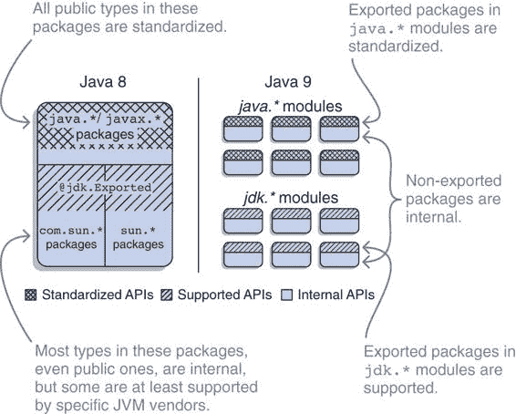
> 
> 图 7.1 在 Java 8（左侧），包名和很少看到的 `@jdk.Exported` 注解决定了 API 是否标准化、支持或内部化。从 Java 9 开始（右侧），模块名和导出指令扮演了这一角色。
> 
> jdk.* 模块不是标准化的只是一个约定，模块系统对此一无所知。因此，尽管依赖它们的导出 API 可能并不明智，但 JPMS 不会封装它们，我们讨论的任何命令行选项都不是必要的。在这里，当我提到内部 API 时，我指的是模块系统使其不可访问的类，因为类不是公共的或包没有导出。
> 
> 对于臭名昭著的 `sun.misc.Unsafe`
> 
> 如你所想，最初的想法是封装 Java 9 之前的所有内部 API。当 2015 年更大的 Java 社区意识到这一点时，引起了骚动。尽管平均 Java 开发者可能只偶尔使用内部 API，但许多最知名的库和框架经常这样做，它们的一些最关键功能依赖于它。
> 
> 这种情况的典型代表是`sun.misc.Unsafe`类，根据其包名，显然是内部的。它提供了 Java 中不常见的功能，并且正如类名所暗示的，是不安全的。（说到表达性的名称！）也许最好的例子是直接内存访问，这是 JDK 偶尔必须执行的操作。
> 
> 但它超出了 JDK 的范围。由于`Unsafe`易于使用，一些库，尤其是那些专注于高性能的库，开始使用它；随着时间的推移，生态系统中很大一部分直接或间接地依赖于它。这种类和其他类似类被封装的前景导致了社区的强烈反响。
> 
> 随后，Project Jigsaw 团队决定允许更平滑的迁移路径。对现有内部 API 及其在 JDK 之外的使用的调查产生了以下结果：

+   大多数受影响的 API 很少或从未使用。

+   一些受影响的 API 偶尔使用，但在 Java 9 之前已经存在标准化替代方案。一个典型的例子是`sun.misc`中的`BASE64Encoder`/`BASE64Decoder`对，它可以被`java.util.Base64`替代。

+   一些受影响的 API 偶尔使用，但提供关键功能，没有替代方案。这就是`sun.misc.Unsafe`可以找到的地方。

> 决定封装前两种类型，但至少在下一个主要 Java 版本中保持第三种类型可访问。但从各自的模块导出它们会令人困惑，因为这会使它们看起来像是受支持或甚至标准化的 API，而它们绝对不是。还有什么比创建一个合适命名的模块更能说明这一点呢？
> 
> 在 Java 9 之前没有替代方案的临界 API 由模块 jdk.unsupported 导出。正如其名称所暗示的，它是 JDK 特定的（仅保证在 Oracle JDK 和 OpenJDK 上存在）且不受支持（内容可能在下一个版本中更改）。在 Java 9 到 11 中，它包含以下类：

+   来自`sun.misc`的：`Signal`、`SignalHandler`和`Unsafe`

+   来自`sun.reflect`的：`Reflection`和`ReflectionFactory`

+   来自`com.sun.nio.file`的：`ExtendedCopyOption`、`ExtendedOpenOption`、`ExtendedWatchEventModifier`和`SensitivityWatchEventModifier`

> 如果你的代码或依赖项依赖于这些类（第 7.1.2 节展示了如何找出），那么尽管在 Java 9 之前它们是内部 API，但你目前不需要做任何事情来继续使用它们。随着它们功能的标准替代方案（如变量句柄，它替代了`Unsafe`的一部分）的发布，它们将被封装。我强烈建议你仔细检查对这些类的使用，并为它们最终消失做好准备。
> 
> 已移除的 API
> 
> 尽管一些内部 API 在接下来的几年内仍然可用，大多数已经被封装，但有一些遭遇了更严厉的命运，被移除或重命名。这打破了使用它们的代码，超出了任何过渡期和命令行选项的范围。以下是它们：

+   `sun.misc` 和 `sun.reflect` 中不属于 jdk.unsupported 部分的所有内容：例如，`sun.misc.BASE64Encoder`、`sun.misc.BASE64Decoder`、`sun.misc.Cleaner` 和 `sun.misc.Service`

+   `com.sun.image.codec.jpeg` 和 `sun.awt.image.codec`

+   `com.apple.concurrent`

+   `com.sun.security.auth.callback.DialogCallbackHandler`

+   `java.util.logging.LogManager`、`java.util.jar.Pack200.Packer` 和 `java.util.jar.Pack200.Unpacker` 上的 `addPropertyChangeListener` 和 `removePropertyChangeListener` 方法（在 Java 8 中被弃用）

+   参数或返回类型来自 `java.awt.peer` 和 `java.awt.dnd.peer` 的方法（这些包从未标准化，并且在 Java 9 及以后的版本中是内部的）

> 大多数这些类和包都有替代方案，你可以使用 JDeps 来了解它们。
> 
> 7.1.2 使用 JDeps 分析依赖关系
> 
> 既然我们已经讨论了标准化、受支持和内部 API 之间的区别以及 jdk.unsupported 的特殊情况，现在是时候将这方面的知识应用到实际项目中。为了与 Java 9+兼容，你需要找出它所依赖的内部 API。
> 
> 仅通过查看项目的代码库是不够的——如果它所依赖的库和框架出现问题，你就会遇到麻烦，因此你需要分析它们。这听起来像是一项可怕的手动工作，需要筛选大量代码以查找对这些 API 的引用。幸运的是，没有必要这样做。
> 
> 自 Java 8 以来，JDK 附带命令行 Java 依赖分析工具（JDeps）。它分析 Java 字节码，即 `.class` 文件和 JARs，并记录类之间所有静态声明的依赖关系，然后可以进行过滤或聚合。这是一个用于可视化探索我一直在谈论的各种依赖图的 neat 工具。附录 D 提供了 JDeps 入门指南；如果你从未使用过 JDeps，你可能想阅读它。尽管如此，理解这一节并不是严格必要的。
> 
> 在内部 API 的背景下，有一个特性特别有趣：选项 `--jdk-internals` 使得 JDeps 列出所有引用的 JARs 所依赖的内部 API，包括由 jdk.unsupported 导出的 API。输出包含以下内容：

+   分析的 JAR 文件和包含问题 API 的模块

+   涉及的具体类

+   这种依赖关系成为问题的原因

> 我将使用 JDeps 对 Scaffold Hunter 进行分析，Scaffold Hunter 是“一个基于 Java 的开源工具，用于数据集的可视化分析。”以下命令分析内部依赖关系：
> 
> `$ jdeps --jdk-internals` `①``-R --class-path 'libs/*'` `②``scaffold-hunter-2.6.3.jar` `③`
> 
> > ①
> > 
> > 告知 JDeps 分析内部 API 的使用
> > 
> > ②
> > 
> > 递归分析所有依赖
> > 
> > ③
> > 
> > 从应用程序 JAR 文件开始
> > 
> 输出以提及拆分包开始，我们将在第 7.2 节中探讨。然后报告有问题的依赖关系，其中一些将在下面展示。输出详细，提供了检查相关代码或分别在项目中打开问题的所有所需信息：
> 
> `> batik-codec.jar -> JDK 已删除的内部 API` `①``> JPEGImageWriter -> com.sun.image.codec.jpeg.JPEGCodec` `②``> JDK 内部 API (JDK 已删除的内部 API)` `③` `> JPEGImageWriter -> com.sun.image.codec.jpeg.JPEGEncodeParam > JDK 内部 API (JDK 已删除的内部 API) > JPEGImageWriter -> com.sun.image.codec.jpeg.JPEGImageEncoder > JDK 内部 API (JDK 已删除的内部 API) # [...]` `> guava-18.0.jar -> jdk.unsupported` `④``> Striped64 -> sun.misc.Unsafe` `⑤` `> JDK 内部 API (jdk.unsupported) > Striped64$1 -> sun.misc.Unsafe > JDK 内部 API (jdk.unsupported) > Striped64$Cell -> sun.misc.Unsafe > JDK 内部 API (jdk.unsupported) # [...]` `> scaffold-hunter-2.6.3.jar -> java.desktop` `⑥` `> SteppedComboBox -> com.sun.java.swing.plaf.windows.WindowsComboBoxUI > JDK 内部 API (java.desktop) > SteppedComboBox$1 -> com.sun.java.swing.plaf.windows.WindowsComboBoxUI > JDK 内部 API (java.desktop)`
> 
> > ①
> > 
> > batik-codec 依赖于已删除的 API。
> > 
> > ②
> > 
> > JPEGImageWriter（我已截断包名）依赖于几个不同的类。
> > 
> > ③
> > 
> > 说明问题是什么
> > 
> > ④
> > 
> > Guava 依赖于 jdk.unsupported。
> > 
> > ⑤
> > 
> > Striped64 依赖于 sun.misc.Unsafe，以及其两个内部类也是如此。
> > 
> > ⑥
> > 
> > Scaffold Hunter 依赖于 java.desktop 内部的类。
> > 
> JDeps 以以下注释结束，提供了有关一些发现问题的有用背景信息和建议：
> 
> `> 警告：JDK 内部 API 不受支持，且仅限于 JDK 实现的私有 API，可能会被移除或以不兼容的方式更改，从而破坏您的应用程序。请修改您的代码以消除对任何 JDK 内部 API 的依赖。有关 JDK 内部 API 替换的最新更新，请查看：> https://wiki.openjdk.java.net/display/JDK8/Java+Dependency+Analysis+Tool > > JDK 内部 API 建议替换 > ---------------- --------------------- > com.sun.image.codec.jpeg.JPEGCodec 使用 javax.imageio @since 1.4 > com.sun.image.codec.jpeg.JPEGDecodeParam 使用 javax.imageio @since 1.4 > com.sun.image.codec.jpeg.JPEGEncodeParam 使用 javax.imageio @since 1.4 > com.sun.image.codec.jpeg.JPEGImageDecoder 使用 javax.imageio @since 1.4 > com.sun.image.codec.jpeg.JPEGImageEncoder 使用 javax.imageio @since 1.4 > com.sun.image.codec.jpeg.JPEGQTable 使用 javax.imageio @since 1.4 > com.sun.image.codec.jpeg.TruncatedFileException > 使用 javax.imageio @since 1.4 > sun.misc.Unsafe 查看 JEP 260 > sun.reflect.ReflectionFactory 查看 JEP 260`
> 
> 7.1.3 编译针对内部 API
> 
> 强封装的目的在于模块系统默认不允许您使用内部 API。这会影响从 Java 9 开始的任何 Java 版本的编译和运行时行为。在这里，我们讨论编译——第 7.1.4 节讨论了运行时行为。最初，强封装主要与平台模块相关，但随着您的依赖项模块化，您将看到它们代码周围存在相同的障碍。
> 
> 然而，有时您可能处于必须使用非导出包中的公共类来解决当前问题的境地。幸运的是，即使在模块系统存在的情况下，这也是可能的。（我在说显而易见的事情，但我想指出，这仅是您代码的问题，因为您的依赖项已经编译——它们仍将受到强封装的影响，但仅限于运行时。）
> 
> > 导出到模块
> > 
> > 选项 `--add-exports ${module}/${package}=${reading-module}`，在 `java` 和 `javac` 命令中可用，将 ${module} 的 ${package} 导出给 ${reading-module}。因此，${reading-module} 中的代码可以访问 `${package}` 中的所有公共类型，但其他模块则不能。
> > 
> > 当将 ${reading-module} 设置为 `ALL-UNNAMED` 时，类路径上的所有代码都可以访问该包。在迁移到 Java 9+ 时，您将始终使用该占位符——只有当您自己的代码在模块中运行时，您才能将导出限制为特定模块。
> > 
> 到目前为止，导出始终是无目标的，因此能够导出到特定模块是一个新的方面。此功能也适用于模块描述符，如第 11.3 节所述。此外，我在 `ALL-UNNAMED` 的含义上有点含糊。它与未命名的模块相关，第 8.2 节详细讨论了这一点，但就目前而言，“类路径上的所有代码”是一个很好的近似。
> 
> 让我们回到导致以下编译错误的代码：
> 
> `> 错误：包 com.sun.java.swing.plaf.nimbus 不可见 > 导入 com.sun.java.swing.plaf.nimbus.NimbusLookAndFeel; > ^ > （包 com.sun.java.swing.plaf.nimbus 在模块 java.desktop 中声明，但没有导出它） > 1 个错误`
> 
> 在这里，某个类（由于它与问题无关，我已经从输出中省略）从封装的包`com.sun.java.swing.plaf.nimbus`中导入了`NimbusLookAndFeel`。注意错误信息如何指出具体问题，包括包含该类的模块。
> 
> 这在 Java 9 中显然不能直接工作，但如果您想继续使用它呢？那么您可能是在犯一个错误，因为`javax.swing.plaf.nimbus`中有一个标准化的替代方案；在 Java 10 中，只有这个版本保留了下来，因为内部版本已被移除。但为了这个示例，让我们假设您仍然想使用内部版本——也许是为了与无法更改的遗留代码进行交互。
> 
> 要成功编译针对`com.sun.java.swing.plaf.nimbus.NimbusLookAndFeel`的代码，您只需在编译器命令中添加`--add-exports java.desktop/com.sun.java.swing.plaf.nimbus=ALL-UNNAMED`即可。如果您手动这样做，它将类似于以下内容（所有占位符都必须替换为具体值）：
> 
> `$ javac --add-exports java.desktop/com.sun.java.swing.plaf.nimbus=ALL-UNNAMED --class-path ${dependencies} -d ${target-folder} ${source-files}`
> 
> 使用构建工具时，您需要在构建描述符中放置该选项的某个位置。请查阅您工具的文档以了解如何为编译器添加命令行选项。
> 
> 这样，代码可以愉快地编译针对封装类。但重要的是要意识到，您只是将问题推迟到了运行时！在命令行上添加此导出只改变了一次编译——没有将任何信息放入生成的字节码中，以允许该类在执行期间访问该包。您仍然需要弄清楚如何在运行时使其工作。
> 
> 7.1.4 对内部 API 的执行
> 
> 我提到，至少在 Java 9、10 和 11 中，JDK 内部依赖项在运行时仍然可用。结合我之前告诉您的所有内容，这应该有点令人惊讶。在整个书中，我一直强调强封装的好处，并说它和可见性修饰符一样重要——那么为什么在运行时不强制执行呢？
> 
> 就像许多其他 Java 怪癖一样，这个怪癖源于对向后兼容性的承诺：强封装 JDK 内部会破坏许多应用程序。即使只是过时的 Nimbus 外观和感觉的使用，应用程序也会崩溃。有多少最终用户或 IT 部门会在遗留应用程序停止工作后安装 Java 9+？有多少团队会在很少用户有 Java 9+可用的情况下针对 Java 9+进行开发？
> 
> 为了确保模块系统不会将生态系统分成“Java 9 之前”和“Java 9 之后”，决定授予类路径上的代码对 JDK 内部 API 的非法访问，直到至少 Java 11。每个这些方面都是经过深思熟虑的：

+   类路径上的代码 … ——从模块路径运行代码表示它已为模块系统做好准备，在这种情况下，没有必要做出例外。因此，它仅限于类路径代码。

+   …到 JDK-internal APIs ——从兼容性的角度来看，没有理由授予应用程序模块访问权限，因为它们在 Java 9 之前不存在。因此，异常仅限于平台模块。

+   …至少 Java 11——如果异常是永久的，那么更新麻烦代码的动力将会大大降低。

> 正如你在第六章中看到的，这并不能解决应用程序在 Java 9、10 或 11 上执行时可能遇到的所有问题，但它更有可能成功运行。
> 
> 管理对 JDK 内部 API 的全面非法访问
> 
> 为了成功迁移，了解对 JDK 内部 API 的全面非法访问背后的细节很重要；但探索它会使你对模块系统的心理模型更加复杂。保持大局意识有助于：强封装在编译时和运行时禁止访问所有内部 API。此外，还建立了一个大异常，其具体设计是由兼容性考虑驱动的。然而，随着时间的推移，它将消失，使我们回到更加明确的行性行为。
> 
> 当允许类路径代码访问 JDK 内部 API 时，会区分静态依赖于它们的代码和通过反射访问它们的代码：

+   反射访问会产生警告。由于静态分析无法精确识别所有此类调用，因此执行是唯一可靠报告它们的时间。

+   静态访问不会产生警告。它可以在编译期间或使用 JDeps 时轻松发现。由于静态访问的普遍存在，它也是一个性能敏感的区域，检查和偶尔发出日志消息是有问题的。

> 可以使用命令行选项配置确切的行为。`java` 选项 `--illegal-access=${value}` 管理如何处理对 JDK 内部 API 的非法访问，其中 `${value}` 是以下之一：

+   `permit` — 允许对类路径上的代码访问所有 JDK 内部 API。对于反射访问，每个包的第一次访问都会发出一个警告。

+   `warn` — 与 `permit` 的行为类似，但每次反射访问都会发出警告。

+   `debug` — 与 `warn` 的行为类似，但每个警告都包含堆栈跟踪。

+   `deny` — 对于那些相信强封装的人来说：默认情况下禁止所有非法访问。

> 在 Java 9 到 11 中，`permit` 是默认值。在某些未来的 Java 版本中，`deny` 将成为默认值；并且在某些时候，整个选项可能会消失，但我确信这还需要几年时间。
> 
> 看起来，一旦你通过使用 Java 8 版本或向 Java 9+版本添加所需选项，将麻烦代码通过编译器，Java 9+运行时会不情愿地执行它。要看到`--illegal-access`的实际效果，现在是时候最终查看那个玩弄内部 Nimbus 外观和感觉的类了：
> 
> `import com.sun.java.swing.plaf.nimbus.NimbusLookAndFeel;  public class Nimbus {  public static void main(String[] args) throws Exception { NimbusLookAndFeel nimbus = new NimbusLookAndFeel(); System.out.println("Static access to " + nimbus);  Object nimbusByReflection = Class .forName("com.sun.java.swing.plaf.nimbus.NimbusLookAndFeel") .getConstructor() .newInstance(); System.out.println("Reflective access to " + nimbusByReflection); }  }`
> 
> 它并没有做任何特别有用的事情，但它显然试图以静态和反射的方式访问`NimbusLookAndFeel`。要编译它，你需要使用前一个章节中描述的`--add-exports`。运行它则更简单：
> 
> `$ java --class-path ${class} j9ms.internal.Nimbus  > 静态访问到 "Nimbus Look and Feel" > 警告：发生了非法的反射访问操作 > 警告：j9ms.internal.Nimbus 的非法反射访问 > (文件：...) 到构造函数 NimbusLookAndFeel() > 警告：请考虑向 j9ms.internal.Nimbus 的维护者报告此问题 > 警告：使用--illegal-access=warn 启用进一步非法反射访问操作的警告 > 警告：在未来的版本中，所有非法访问操作都将被拒绝 > 反射访问到 "Nimbus Look and Feel"`
> 
> 你可以观察到默认选项`--illegal-access=permit`定义的行为：静态访问成功，无需注释，但反射访问会导致一个冗长的警告。将选项设置为`warn`不会改变任何东西，因为只有一个访问，而`debug`会为麻烦的调用添加堆栈跟踪。使用`deny`，你会得到与 3.3.3 节中测试可访问性要求时看到相同的消息：
> 
> `$ java --class-path ${class} --illegal-access=deny j9ms.internal.Nimbus  > 线程"main"中的异常 java.lang.IllegalAccessError: > 类 j9ms.internal.Nimbus（在未命名的模块@0x6bc168e5 中）无法访问类 com.sun.java.swing.plaf.nimbus.NimbusLookAndFeel（在模块 java.desktop 中），因为模块 java.desktop 没有将 com.sun.java.swing.plaf.nimbus 导出到未命名的模块@0x6bc168e5`
> 
> 需要讨论的一个细节是：在 Java 9 中引入的非法访问 JDK 内部结构会发生什么？因为`--illegal-access`选项是为了简化迁移而引入的，如果它让你有几年时间开始依赖新的内部 API，反而使得最终过渡变得更加困难，那就太遗憾了！这确实是一个风险！
> 
> > **重要信息** 为了最小化依赖于新的 JDK 内部 API 的风险，`--illegal-access`不适用于 Java 9 中引入的包。这缩小了项目可能意外依赖的新 API 集，这些 API 被添加到 Java 9 之前存在的包中。
> > 
> 为了兼容性所做的这些事情——我告诉你这会变得更复杂。而且我还没有说完，因为我们还可以更具体地管理非法访问（参见下一节）。7.1.5 节中的表 7.1 比较了不同的变体。
> 
> 管理对选定 API 的具体非法访问
> 
> `illegal-access`选项有三个核心特性：

+   它以整体方式管理非法访问。

+   这是一个过渡选项，最终将消失。

+   它通过警告困扰你。

> 当它消失时会发生什么？强封装是否无法克服？答案是：不会。总会有一些边缘情况需要访问平台和应用模块的内部 API，因此应该存在某种机制（可能不是特别舒适的一种）来实现这一点。再次强调，我们转向命令行选项。
> 
> > **重要信息** 如我在 7.1.3 节中讨论编译期间内部 API 时提到的，`--add-exports`对于`java`命令也是可用的。它的工作方式完全相同，并使指定的包对指定的模块或所有运行代码可访问。这意味着此类代码可以使用这些包中公共类型的公共成员，这涵盖了所有静态访问。
> > 
> `NimbusLookAndFeel`类是公共的，所以你只需导出包含它的包即可正确访问它。为了确保你观察到`--add-exports`的效果，使用`--illegal-access=deny`取消默认的非法访问权限：
> 
> `$ java --class-path ${class} --illegal-access=deny --add-exports java.desktop/com.sun.java.swing.plaf.nimbus=ALL-UNNAMED j9ms.internal.Nimbus  > 静态访问 ${Nimbus Look and Feel} > 反射访问 ${Nimbus Look and Feel}`
> 
> 反射访问得以通过。同时请注意，你不会收到警告——关于这一点，我们稍后再谈。
> 
> 这涵盖了访问公共类型中的公共成员，但反射可以做得更多：通过大量使用`setAccessible(true)`，它允许与非公共类以及非公共字段、构造函数和方法进行交互。即使在导出包中，这些成员也是封装的，但为了成功反射它们，你需要其他东西。
> 
> 选项`--add-opens`使用与`--add-exports`相同的语法，并使包对深度反射开放，这意味着无论其可见性修饰符如何，其所有类型及其成员都是可访问的。由于其与反射的主要关系，该选项在 12.2.2 节中更正式地介绍。
> 
> 尽管如此，它的用途是访问内部 API，所以在这里查看一个例子是有意义的。一个相当常见的是由生成其他表示形式的类实例的工具提供的，例如 JAXB 从 XML 文件创建一个 `Customer` 实例。许多这样的库依赖于类加载机制的内部，它们通过反射访问了 JDK 类 `ClassLoader` 的非公共成员。请注意，有计划在 Java 的下一个版本中删除 `–illegal-access` 选项，但 Oracle 尚未决定是哪个版本。
> 
> 如果你使用 `--illegal-access=deny` 运行这样的代码，你会得到一个错误：
> 
> `> Caused by: java.lang.reflect.InaccessibleObjectException: > Unable to make ClassLoader.defineClass accessible: > module java.base does not "opens java.lang" to unnamed module`
> 
> 消息非常明确——解决方案是在启动应用程序时使用 `--add-opens`：
> 
> `$ java --class-path ${jars} --illegal-access=deny --add-opens java.base/java.lang=ALL-UNNAMED ${main-class}`
> 
> 与 `--illegal-access` 及其当前默认值 `permit` 不同，选项 `--add-exports` 和 `--add-opens` 可以被视为“正确的方式”（或者更确切地说，“最不神秘的方式”）来访问内部 API。开发者会根据项目需求故意制定它们，并且 JDK 长期支持它们。因此，模块系统不会对这些选项允许的访问发出警告。
> 
> 更重要的是，它们阻止 `illegal-access` 为它们使可访问的包发出警告。如果这些警告让你烦恼，但你无法解决根本问题，通过这种方式导出和打开包可以让警告消失。如果即使这样对你也不起作用（也许你没有访问命令行的权限），请查看 Stack Overflow 上的这个链接：[`mng.bz/Bx6s`](http://mng.bz/Bx6s)。但不要告诉任何人你从哪里得到这个链接。
> 
> > 注意：正如我在 7.1.2 节中解释的，JDeps 是一个很好的工具，用于查找对 JDK-内部 API 的静态访问。但关于反射访问呢？没有万无一失的方法来查找通过反射调用的 API 的使用，但通过 `java.lang.reflect.AccessibleObject::setAccessible` 的调用层次结构或对 setAccessible 的全文搜索将在你的代码中揭示大部分。为了验证整个项目，请使用 `--illegal-access=debug` 或 `deny` 运行测试套件或整个应用程序，以找出所有通过反射进行的非法访问。
> > 
> 7.1.5 访问内部 API 的编译器和 JVM 选项
> 
> 在完成本节内容后，你应得到掌声。表面上看，内部 API 的整个问题可能很简单，但一旦考虑到生态系统的遗留和兼容性问题，它就会变得稍微复杂一些。表 7.1 概述了选项及其行为方式。
> 
> 表 7.1 允许在运行时访问内部 API 的不同机制的比较；静态访问（针对此类或成员编译的代码）与反射访问（使用反射 API）之间的拆分

| 静态访问   |
| --- |
| 类或成员   | 公共   | 非公共   |
| 包   | 导出   | 未导出   | 导出   | 未导出   |
| 强封装   | ✔   | ✘   | ✘   | ✘   |
| 由于 Java 9 中的 `--illegal-access=permit` 而默认   | ✔   | ✔   | ✘   | ✘   |
| `--illegal-access=warn`   | ✔   | ✔   | ✘   | ✘   |
| `--illegal-access=debug`   | ✔   | ✔   | ✘   | ✘   |
| `--illegal-access=deny`   | ✔   | ✘   | ✘   | ✘   |
| `--add-exports`   | ✔   | ✔   | ✘   | ✘   |
| `--add-opens`   | ✔   | ✔   | ✘   | ✘   |
| 反射访问   |
| 类或成员   | 公共   | 非公共   |
| 包   | 导出   | 未导出   | 导出   | 未导出   |
| 强封装   | ✔   | ✘   | ✘   | ✘   |
| 由于 Java 9 中的 `--illegal-access=permit` 而默认   | ✔   | ✘   | Java 9 之前 ⚠ 在首次 / 否则 ✘   | ✘   |
| `--illegal-access=warn`   | ✔   | ✘   | Java 9 之前 ⚠ 在所有 / 否则 ✘   | ✘   |
| `--illegal-access=debug`   | ✔   | ✘   | Java 9 之前：⚠ 在所有，以及堆栈跟踪 / 否则 ✘   | ✘   |
| `--illegal-access=deny`   | ✔   | ✘   | ✘   | ✘   |
| `--add-exports`   | ✔   | ✔   | ✘   | ✘   |
| `--add-opens`   | ✔   | ✔   | ✔   | ✔   |

> 在技术细节之外，重要的是要考虑可能的策略，这些策略将这些选项和其他选项结合起来，以实现 Java 9 兼容。这正是第 9.1 节所做的事情。如果你不希望指定命令行选项（例如，因为你正在构建可执行的 JAR），请特别仔细地查看第 9.1.4 节——它展示了三种替代方法。
> 
> 7.2 修复拆分包
> 
> 对于非法访问内部 API、未解决的 JEE 模块或迄今为止讨论的大多数其他更改，尽管它们可能很烦人，但它们有一些优点：基本概念相对容易理解；多亏了精确的错误消息，问题容易识别。对于拆分包则不能这么说。在最坏的情况下，你唯一会看到的症状是编译器或 JVM 抛出错误，因为一个显然位于类路径上的 JAR 中的类找不到。
> 
> 例如，让我们以类 `MonitorServer` 为例，它除了其他注解外，还使用了 JSR 305 的 `@Nonnull`。 （如果你从未见过它，不要担心——我马上会解释。）以下是我尝试编译它时发生的情况：
> 
> `> 错误：找不到符号 > 符号：类 javax.annotation.Nonnull > 位置：类 monitor.MonitorServer`
> 
> 尽管有 `jsr305-3.0.2.jar` 在类路径上。
> 
> 发生了什么？为什么即使类路径中包含它们，某些类型仍然没有被加载？关键观察结果是这些类型位于一个也包含在模块中的包中。现在让我们看看这为什么会造成差异，并导致类无法加载。
> 
> 当不同的工件包含同一包中的类（无论是否导出）时，它们被称为分割包。如果至少有一个模块化的 JAR 没有导出该包，这也被称为隐藏包冲突。这些工件可能包含具有相同完全限定名的类，在这种情况下，分割重叠；或者类可能具有不同的名称，但只共享包名前缀。无论分割包是否隐藏以及它们是否重叠，本节讨论的效果是相同的。图 7.2 展示了一个分割和隐藏包。
> 
> 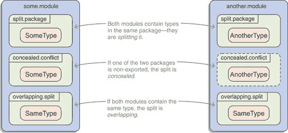
> 
> 图 7.2 当两个模块包含同一包中的类型时，它们分割了该包。
> 
> > 分包和单元测试
> > 
> > 分包问题是有两个原因之一，单元测试通常放置在不同的源树中，但与生产代码在同一包中，它们不构成自己的模块。（另一个原因是强封装，因为单元测试通常测试非公共或不在导出包中的类和方法。）
> > 
> 分包示例的丰富来源是应用程序服务器，它们通常运行各种 JDK 技术。以 JBoss 应用程序服务器和工件 jboss-jaxb-api_2.2_spec 为例。它包含像 `javax.xml.bind.Marshaller`、`javax.xml.bind.JAXB` 和 `javax.xml.bind.JAXBException` 这样的类。这显然与并因此分割了包含在 java.xml.bind 模块中的 `javax.xml.bind` 包。（顺便说一下，JBoss 没有做错什么——JAXB 是一个独立的 JEE 技术，如第 6.1.1 节所述，该工件包含它的完整实现。）
> 
> 一个非重叠且通常更具疑问性的分包示例来自 JSR 305。Java 规范请求（JSR）305 希望将“用于软件缺陷检测的注解”引入 JDK。它决定添加一些注解，如 `@Nonnull` 和 `@Nullable`，到 `javax.annotation` 包中，创建了一个参考实现，根据 Java 社区过程（JCP）成功审查，然后——沉默了。那是 2006 年。
> 
> 另一方面，社区喜欢这些注解，因此静态分析工具如 FindBugs 支持它们，许多项目也采用了它们。尽管这不是标准做法，但它们在 Java 生态系统中被广泛使用。即使在 Java 9 中，它们也不是 JDK 的一部分，而且不幸的是，参考实现将大多数注解放在了 `javax.annotation` 包中。这创建了一个与 java.xml.ws.annotation 模块非重叠的分割。
> 
> 7.2.1 分包的问题是什么？
> 
> 分包有什么问题？为什么即使它们显然存在，它们也会导致找不到类？答案并不直接。
> 
> 拆分包的一个严格技术方面是，Java 的整个类加载机制都是基于这样一个假设：任何完全限定的类名都是唯一的——至少，在同一类加载器中，但由于默认情况下整个应用程序代码只有一个类加载器，这并不是放松这一要求的有意义的方式。除非 Java 的类加载被重新设计和从头开始重新实现，否则这禁止了重叠的包拆分。（第 13.3 节展示了如何通过创建多个类加载器来解决这个问题。）
> 
> 另一个技术方面是，JDK 团队希望利用模块系统来提高类加载性能。第 6.2.1 节描述了细节，但关键是它依赖于知道每个包属于哪个模块。如果每个包只属于一个模块，这将更简单、性能更高。
> 
> 然后，拆分包与模块系统的一个重要目标相冲突：模块边界之间的强封装。当不同的模块拆分一个包时会发生什么？它们是否应该能够访问彼此的包可见类和成员？允许这样做将严重破坏封装——但是禁止这样做将直接与您对可见性修饰符的理解相冲突。这不是我想做出的设计决策。
> 
> 也许最重要的方面是概念性的。一个包应该包含一个具有单一目的的连贯的类集，而一个模块应该包含一个具有单一、尽管稍微大一些的目的的连贯的包集。从这个意义上讲，包含相同包的两个模块具有重叠的目的。也许它们应该是一个模块，然后……？
> 
> 虽然没有单一的杀手论点反对拆分包，但它们有很多不希望的特性，会促进不一致性和歧义。因此，模块系统对它们持怀疑态度，并希望防止它们。
> 
> 7.2.2 拆分包的影响
> 
> 由于拆分包可能导致的不一致性和歧义，模块系统实际上禁止了它们：

+   一个模块不允许从两个不同的模块中读取相同的包。

+   同一层的两个模块不允许包含相同的包（无论是导出还是未导出）。

> 什么是层？正如第 12.4 节所解释的，它是一个包含类加载器及其整个模块图的容器。到目前为止，您一直隐式地处于单层情况，其中第二个要点完全包含第一个要点。因此，除非涉及不同的层，否则禁止拆分包。
> 
> 正如您接下来将看到的，模块系统的行为会根据拆分发生的位置而有所不同。在我们覆盖了这一点之后，我们最终可以转向修复拆分。
> 
> 模块之间的拆分
> 
> 当两个模块（如平台模块和应用模块）拆分一个包时，模块系统将检测到这一点并抛出错误。这可以在编译时或运行时发生。
> 
> 以 ServiceMonitor 应用程序为例。如您所回忆的，monitor.statistics 模块包含一个名为`monitor.statistics`的包。让我们在 monitor 中创建一个具有相同名称（以及`SimpleStatistician`类）的包。当编译该模块时，我遇到了以下错误：
> 
> `> monitor/src/main/java/monitor/statistics/SimpleStatistician.java:1: > error: package exists in another module: monitor.statistics > package monitor.statistics; > ^ > 1 error`
> 
> 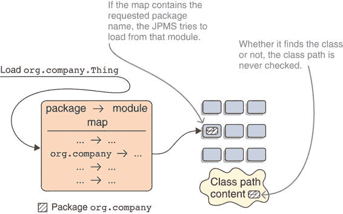
> 
> 图 7.3 类路径内容不会暴露给模块检查，其包也不会被索引。如果它与模块分割了一个包，类加载器只会知道该模块，并在此处查找类。在这里，它查找`org.company`并检查相应的模块，忽略包的类路径部分。
> 
> 当尝试编译一个包含从所需模块导出的包的模块时，编译器会注意到错误。但是，当包没有被导出时，即你有一个隐藏的包冲突，会发生什么？
> 
> 为了找出原因，我在 monitor.statistics 中添加了一个名为`monitor.Utils`的类来监控统计信息，这意味着我将`monitor`包分成了`monitor`和`monitor.statistics`两部分。这种分割是隐藏的，因为 monitor.statistics 没有导出`monitor`。
> 
> 在那种情况下——这让我有些惊讶——编译 monitor 是可行的。错误报告的责任落在运行时，它会尽职尽责地立即在启动应用程序时报告错误：
> 
> `> 初始化引导层时发生错误 > java.lang.reflect.LayerInstantiationException: > 包 monitor 在模块 monitor.statistics 和模块 monitor 中`
> 
> 如果两个模块（其中任何一个都不需要另一个）包含相同的包：不是编译器而是运行时会发现错误。
> 
> 模块与类路径之间的分割
> 
> 本章主要关注在 Java 9 或更高版本上编译和运行类路径应用程序，因此让我们回到这个用例。有趣的是，模块系统的行为是不同的。所有来自类路径的代码最终都会进入未命名的模块（更多内容请参阅第 8.2 节）；为了最大化兼容性，通常不会对其进行审查，也不会对其应用任何模块相关的检查。因此，模块系统不会发现分割的包，并允许您编译和启动应用程序。
> 
> 起初这听起来可能很好：少了一件需要担心的事情。然而，问题仍然存在，只是不那么明显了。而且可能更糟。
> 
> 模块系统知道每个命名模块（与未命名的模块相对）包含哪些包，以及每个包只属于一个模块。正如我在第 6.2.1 节中解释的，新的类加载策略得益于这种知识；每次它加载一个类时，它会查找包含该包的模块，并尝试从那里加载。如果它包含该类，那就太好了；如果不包含，结果就是`NoClassDefFoundError`。
> 
> 如果一个包在模块和类路径之间分割，类加载器在加载该包的类时将始终且仅检查模块（参见图 7.3）。包的类路径部分的类实际上是不可见的！这对于平台模块和类路径之间的分割同样适用，对于应用程序模块（即从模块路径加载的 JAR）和类路径也是如此。
> 
> 是的，你说对了。如果某些代码包含来自，比如说，`javax.annotation` 包的类，那么类加载器将检查唯一包含该包的模块：java.xml.ws.annotation。如果在那里找不到该类，即使该类存在于类路径上，你也会得到一个 `NoClassDefFoundError` 错误！
> 
> 如你所想，任意缺失的类可能会导致一些令人困惑的情况。这正是 JEE 模块（它们促进包分割）默认不解析的精确原因，如第 6.1 节所述。尽管如此，这些模块可能会造成最奇怪的分割包情况。
> 
> 考虑一个使用注解 `@Generated` 和 `@Nonnull` 的项目。第一个存在于 Java 8 中，第二个来自项目类路径上的 JSR 305 实现。两者都在 `javax.annotation` 包中。当你使用 Java 9 或更高版本编译时会发生什么？
> 
> `> 错误：找不到符号 > 符号：类 Generated > 位置：包 javax.annotation`
> 
> 所以 Java 类缺失了？是的，因为它来自 JEE 模块 java.xml.ws.annotation，而这个模块默认不解析。但这里的错误信息不同：它没有指向解决方案。幸运的是，你之前已经注意到了，知道可以通过添加包含的模块 `--add-modules java.xml.ws.annotation` 来解决这个问题。然后你得到以下结果：
> 
> `> 错误：找不到符号 > 符号：类 Nonnull > 位置：类 MonitorServer`
> 
> 编译器一分钟前找到了那个类——为什么现在找不到？因为现在有一个包含 `javax.annotation` 包的模块，所以类路径部分变得不可见。
> 
> 为了重复（你也可以在图 7.4 中看到）：

+   第一个错误是由 JEE 模块默认不解析引起的。

+   第二个错误是由模块系统忽略分割包的类路径部分引起的。

> 这完全说得通（对吧？）。现在你已经彻底理解了发生了什么，让我们转向解决问题的方法。
> 
> 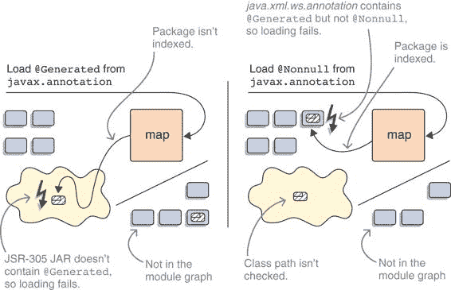
> 
>  从同一包加载可能会因为不同的原因而失败。在左侧，没有添加 JEE 模块 java.xml.ws.annotation，因此加载 `@Generated` 失败，因为类路径上的 JSR 305 艺术品不包含它。在右侧，添加了模块，因此类加载尝试从那里加载所有 `javax.annotation` 类——甚至 `@Nonnull`，它只由 JSR 305 包含。最终，两种方法都未能加载所有必需的注解。
> 
> 7.2.3 处理分割包的多种方法
> 
> 有很多方法可以使拆分包工作。以下是一般推荐考虑的顺序：

+   重命名其中一个包。

+   将拆分包的所有部分移动到同一个工件中。

+   合并工件。

+   将两个工件都留在类路径上。

+   升级带有工件的 JDK 模块。

+   使用工件的内容修补模块。

> > 注意：只有最后两个适用于迁移期间典型的拆分包场景，其中包在平台模块和类路径上的工件之间拆分。
> > 
> 第一种方法在包名冲突是意外的情况下有效——它应该是最明显的选择，并且尽可能使用。当拆分是故意进行的时候，这不太可能有效。在这种情况下，你可以尝试通过移动一些类或合并工件来修复拆分。这三种选项是解决问题的适当、长期解决方案，但显然它们只在你控制拆分工件的情况下有效。
> 
> 如果拆分代码不属于你，或者解决方案不适用，你需要其他选项来确保模块系统能够正常工作，即使包仍然是拆分的。一个直接的修复方法是让这两个工件都留在类路径上，它们将被捆绑到同一个未命名的模块中，并像 Java 9 之前那样表现。这是一个有效的中间策略，在你等待项目解决冲突并修复它的时候。
> 
> 不幸的是，到目前为止讨论的任何解决方案都不适用于拆分的部分属于 JDK 模块的情况，因为你无法直接控制它——为了克服这种拆分，你需要更大的火力。如果你很幸运，拆分的工件由不仅仅是几个随机放入 JDK 包的类和一些整个可升级的 JDK 模块的替代品组成。在这种情况下，请参阅第 6.1.3 节，该节解释了如何使用`--upgrade-module-path`。
> 
> 如果上述方法都没有帮助，你将陷入最后的也是最复杂的解决方案：修补模块。
> 
> 7.2.4 修补模块：处理拆分包的最后手段
> 
> 一种技术可以修复几乎所有的拆分包，但应该始终作为最后的手段：让模块系统假装类路径上的麻烦类属于拆分包的模块。编译器和运行时选项`--patch-module ${module}=${artifact}`将所有来自`${artifact}`的类合并到`${module}`中。有一些需要注意的事项，但让我们在讨论它们之前先看一个例子。
> 
> 之前，我们查看了一个使用注解`@Generated`（来自 java.xml.ws.annotation 模块）和`@Nonnull`（来自 JSR 305 实现）的项目示例。我们发现了三件事：

+   这两个注解都在`javax.annotation`包中，从而创建了拆分。

+   你需要手动添加模块，因为它是一个 JEE 模块。

+   这样做使得拆分包中的 JSR 305 部分变得不可见。

> 现在你知道了你可以使用`--patch-module`来修复拆分：
> 
> `javac --add-modules java.xml.ws.annotation --patch-module java.xml.ws.annotation=jsr305-3.0.2.jar --class-path 'libs/*' -d classes/monitor.rest ${source-files}`
> 
> 这样，`jsr305-3.0.2.jar` 中的所有类都成为 java.xml.ws.annotation 模块的一部分，并且可以在成功编译（或在 `java` 上执行）时被加载。太好了！
> 
> 有几点需要注意。首先，修补一个模块并不会自动将其添加到模块图中。如果它没有被显式地要求，可能还需要使用 `--add-modules`（参见第 3.4.3 节）来添加它。
> 
> 接下来，使用 `--patch-module` 添加到模块中的类将遵循正常的可访问性规则（参见第 3.3 节和图 7.5）：
> 
> 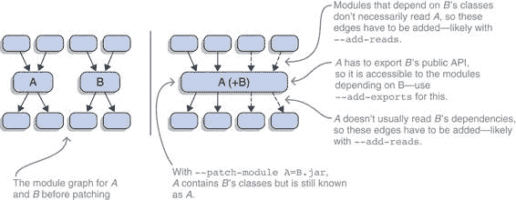
> 
> 图 7.5 如果一个模块的类被修补到另一个模块中（这里 B 修补到 A），修补模块的输入和输出依赖以及包导出必须手动编辑，以便包含的类能够正常工作。

+   依赖于此类代码的需要读取修补的模块，该模块必须导出必要的包。

+   同样，这些类的依赖也需要在修补模块读取的模块中的导出包中。

> 这可能需要使用命令行选项如 `--add-reads`（参见第 3.4.4 节）和 `--add-exports`（参见第 11.3.4 节）来操作模块图。因为命名模块不能从类路径中访问代码，可能还需要创建一些自动模块（参见第 8.3 节）。
> 
> 7.2.5 使用 JDEPS 查找拆分包
> 
> 通过试错来查找拆分包令人不安。幸运的是，JDeps 会报告它们。附录 D 对该工具进行了一般介绍；你不需要知道更多，因为拆分包几乎包含在任何输出中。
> 
> 让我们看看 JDeps 对使用 `javax.annotation.Generated` 从 java.xml.ws.annotation 和 `javax.annotation.Nonnull` 从 JSR 305 的应用程序的报告。在将所有依赖复制到 `lib` 文件夹后，你可以按照以下方式执行 JDeps：
> 
> `$ jdeps -summary -recursive --class-path 'libs/*' project.jar > 拆分包: javax.annotation > [jrt:/java.xml.ws.annotation, libs/jsr305-3.0.2.jar] > # 大量项目依赖被截断`
> 
> 这很明确，对吧？如果你好奇哪些依赖于拆分包，可以使用 `--package` 和 `-verbose:class`：
> 
> `$ jdeps -verbose:class --package javax.annotation -recursive --class-path 'libs/*' project.jar  # 拆分包被截断 # 从 javax.annotation 截断的依赖  > rest-1.0-SNAPSHOT.jar -> libs/jsr305-3.0.2.jar > monitor.rest.MonitorServer -> Nonnull jsr305-3.0.2.jar`
> 
> 7.2.6 关于依赖版本冲突的注意事项
> 
> 您在第 1.3.3 节中看到，Java 8 没有内置支持来运行同一 JAR 的多个版本——例如，如果应用程序间接依赖于 Guava 19 和 20。就在几页之后，在第 1.5.6 节中，您了解到不幸的是，模块系统不会改变这一点。根据我们刚才讨论的拆分包，应该很清楚为什么会出现这种情况。
> 
> Java 模块系统改变了类加载策略（查找特定模块而不是扫描类路径），但没有改变底层假设和机制。对于每个类加载器，仍然只能有一个具有相同完全限定名称的类，这使得同一艺术品的多个版本成为不可能。有关模块系统对版本支持的更多详细信息，请参阅第十三章。
> 
> > TIP 您已经了解了所有常见的以及一些不常见的迁移挑战。如果您渴望将您的知识付诸实践并将项目升级到 Java 9+，请跳转到第九章——它讨论了如何最佳地处理这个问题。一旦您的应用程序在 Java 9+上运行，您就可以使用`jlink`来创建仅包含所需模块的运行时镜像——参见第 14.1 节。如果您对下一步感兴趣，即将现有代码库转换为模块，请继续阅读第八章。
> > 
> 摘要

+   要了解您的项目可能依赖的类在模块系统下如何访问，了解它们在模块系统时代如何分类是很重要的：

+   `java.*`或`javax.*`包中的所有公共类都是标准化的。这些包由 java.*模块导出，并且可以安全地依赖，因此不需要进行任何更改。

+   Oracle 支持某些`com.sun.*`包中的公共类。这些包由 jdk.*模块导出，依赖它们将代码库限制在特定的 JDK 供应商。

+   `sun.*`包中的一些选定类在 Oracle 的支持下暂时可用，直到未来 Java 版本中引入替代品。它们由 jdk-unsupported 导出。

+   所有其他类均不受支持且无法访问。虽然可以使用命令行标志使用它们，但这样做可能会在不同的小版本或不同供应商的 JVM 上中断，因此通常不建议这样做。

+   一些内部 API 已被删除，因此即使使用命令行选项也无法继续使用它们。

+   尽管强封装通常禁止访问内部 API，但对于类路径上访问 JDK 内部 API 的代码，有一个例外。这将大大简化迁移，但也会使模块系统的行为复杂化：

+   在编译期间，强封装完全激活并阻止访问 JDK 内部 API。如果仍然需要某些 API，则可以使用`--add-exports`授予访问权限。

+   在运行时，Java 9 到 11 默认允许对非导出 JDK 包中的公共类进行静态访问。这使得现有应用程序更有可能直接运行，但随着未来版本的发布，这一情况将会改变。

+   默认情况下，允许反射访问所有 JDK 内部 API，但首次访问包时（默认）或每次访问时（使用 `--illegal-access=warn`）都会产生警告。分析这一问题的最佳方法是使用 `--illegal-access=debug`，它会在每个警告中包含堆栈跟踪。

+   使用 `--illegal-access=deny` 可以实现静态和反射访问的更严格行为，在必要时使用 `--add-exports` 和 `--add-opens` 访问关键所需的包。尽早朝着这个目标努力会使迁移到未来的 Java 更新变得更容易。

+   模块系统禁止同一层级的两个模块包含相同的包——无论是否导出。然而，对于类路径上的代码，这一规则并不适用，因此，一个未发现的包可能被分割在平台模块和类路径代码之间是可能的。

+   如果一个包被分割在模块和类路径之间，类路径部分基本上是看不见的，这会导致令人惊讶的编译时和运行时错误。最好的解决办法是移除分割，但如果这不可能，相关的平台模块可以用 `--upgrade-module-path`（如果它是可升级的模块）替换分割的工件，或者用 `--patch-module` 用其内容修复。

> 8
> 
> 现有项目的增量模块化
> 
> 本章涵盖

+   与未命名的工件一起工作

+   使用自动模块帮助模块化

+   逐步模块化代码库

+   混合类路径和模块路径

> 根据你的 Java 9+ 迁移过程是否顺利（见第六章和第七章），你可能已经遇到了将模块系统引入足够成熟到可以自己点啤酒的生态系统的一些不那么愉快的影响。好消息是，这是值得的！正如我在第 1.7.1 节中简要展示的，Java 9+ 之外还有很多东西可以提供。如果你有机会将你的项目 Java 要求提升到 9，你就可以立即开始使用它们。
> 
> 你也可以最终开始模块化你的项目。通过将工件转换为模块化 JAR，你和你的用户可以受益于可靠的配置（见第 3.2.1 节）、强大的封装（第 3.3.1 节）、通过服务解耦（见第十章）、包含整个应用程序的运行时镜像（见 14.2 节）以及更多与模块相关的优点。正如第 9.3.4 节所示，你甚至可以模块化运行在 Java 8 及之前的项目。
> 
> 使 JARs 模块化的有两种方式：

+   等到所有依赖项都模块化后，一次性为所有工件创建模块描述符。

+   早期开始模块化工件，可能一次只模块化几个。

> 考虑到第三章、第四章和第五章中讨论的所有内容，实现第一个选项应该是直截了当的。你可能需要第十章和第十一章中介绍的更高级的模块系统功能，但除此之外，你就可以开始了：为你要构建的每个工件创建一个模块声明，并像你之前学的那样建模它们之间的关系。
> 
> 然而，也许你的项目位于一个深层次的依赖树之上，你不愿意等到所有依赖都完成模块化后再进行。或者，也许你的项目太大，无法一次性将所有工件转换为模块。在这些情况下，你可能对第二种选择感兴趣，它允许你无论依赖是否模块化，都可以逐步模块化工件。
> 
> 能够同时使用模块化和单模块工件不仅对单个项目很重要，而且意味着整个生态系统可以独立地接受模块。如果没有这一点，生态系统的模块化可能需要几十年的时间——这样，每个人都应该能在十年内完成。
> 
> 本章致力于介绍能够逐步模块化现有项目的特性：我们首先讨论类路径和模块路径的组合，然后检查未命名的模块，最后通过查看自动模块来结束讨论。当你完成这些步骤后，即使可能存在未模块化的依赖，你的项目或其部分也将从模块化系统中受益。你也将为第九章中讨论的应用程序模块化策略做好充分准备。
> 
> 8.1 为什么逐步模块化是一个选择
> 
> 在我们讨论如何逐步模块化一个项目之前，我想思考一下为什么这是一个选择。模块系统通常要求所有内容都必须是模块。但如果它们来得太晚（比如 JPMS）或者只被其生态系统的一小部分使用（比如 OSGi 或 JBoss Modules），它们几乎不能期望这种情况发生。它们必须找到一种方式与单模块工件交互。
> 
> 在本节中，我们首先思考如果每个 JAR 都必须在 Java 9+上模块化才能运行会发生什么，得出结论认为必须能够混合使用普通 JAR 和模块（第 8.1.2 节）。然后，我展示了如何使用类路径和模块路径并行使用这种混合匹配方法（第 8.1.3 节）。
> 
> 8.1.1 如果每个 JAR 都必须是模块化的……
> 
> 如果 JPMS 非常严格，要求所有内容都必须是模块，那么只有当所有 JAR 都包含模块描述符时才能使用它。由于模块系统是 Java 9+的一个组成部分，因此，即使没有对代码和依赖进行模块化，也无法升级到它。想象一下如果这种情况发生会有什么后果。
> 
> 一些项目可能会提前更新到 Java 9+，迫使所有用户模块化他们的代码库或停止使用该项目。其他人可能不想强迫做出这个决定，或者有其他原因不做出跳跃，从而阻碍他们的用户。我不希望我的项目有导致对立决定的依赖项。我能做什么呢？
> 
> 另一方面，一些项目会提供带有和不带有模块描述符的独立变体，为此他们必须使用两组完全不同的依赖项（一个带有，一个不带模块描述符）。此外，除非他们是在旧的主版本和次版本之间回溯，否则用户将被迫一次性进行大量（可能是耗时）的更新，才能跳转到 Java 9+。而且这还不考虑那些不再维护的项目，即使它们自己没有任何依赖项，在 Java 9+ 上也会迅速变得无法使用。
> 
> 避免浪费努力和深度分裂的唯一方法是在整个生态系统有一个日子，所有项目都更新到 Java 9+ 并开始发布模块化 JAR 文件。但这是不可能实现的。无论我们如何分割，执行 JAR 文件的人都必须知道它是为哪个 Java 版本创建的，因为它在 8 和 9 上无法工作。总的来说：我们会陷入大麻烦！
> 
> 8.1.2 将普通 JAR 文件与模块混合使用
> 
> 为了绕过这个麻烦，模块系统必须提供一种方法，在模块化的 JVM 上运行单模块化代码。在第六章的引言中，我解释了这确实如此，并且类路径上的普通 JAR 文件与 Java 9+ 之前的工作方式一样。（正如第六章和第七章所解释的，它们包含的代码可能无法运行，但这又是另一个问题。）第 8.2 节解释了类路径模式是如何工作的。
> 
> 仅仅它能工作就已经是一个重要的启示：模块系统可以处理单模块化工件，并且知道如何在这些工件和显式模块之间导航边界。这是个好消息——而且还有更多：这个边界不是一成不变的。它不必将应用程序 JAR 文件与 JVM 模块分开。正如 图 8.1 所示，以及本章的其余部分所探讨的，模块系统允许你移动这个边界，并根据项目需求混合和匹配模块化和单模块化应用程序 JAR 文件与平台模块。
> 
> 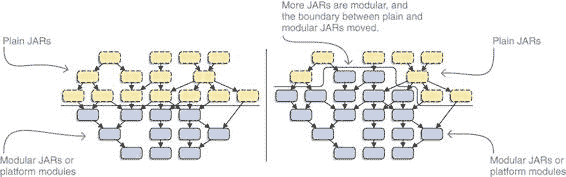
> 
> 图 8.1 模块系统允许非模块化代码在模块化 JDK 上运行（左）。更重要的是，它为你提供了移动这个边界的工具（右）。
> 
> 8.1.3 增量模块化的技术基础
> 
> 使增量模块化成为可能的基本原则是类路径和模块路径可以并行使用。没有必要一次性将所有应用程序 JAR 从类路径移动到模块路径。相反，鼓励现有项目从类路径开始，然后随着模块化工作的进展，逐渐将它们的工件移动到模块路径。
> 
> 同时使用类路径以及平凡和模块化 JAR 的路径需要对这些概念之间关系的清晰理解。你可能认为没有模块描述符的 JAR 会进入类路径，而模块化 JAR 会进入模块路径。尽管我从未那样说过，但你可能会从字里行间读出这样的意思。然而，那个理论是错误的，现在是时候放下它了。
> 
> 两种机制使那个理论无效，并使增量模块化成为可能：

+   未命名模块是由模块系统隐式创建的，其中包含从类路径加载的所有内容。在这里，类路径的混乱得以延续。（第 8.2 节详细解释。）

+   模块系统为它在模块路径上找到的每个平凡 JAR 创建一个自动模块。（第 8.3 节专门介绍这个概念。）

> 类路径对平凡和模块化 JAR 没有区别：如果它在类路径上，它最终会进入未命名模块。同样，模块路径对平凡和模块化 JAR 的区别也很小：如果它在模块路径上，它最终会变成它自己的命名模块。（对于平凡 JAR，模块系统创建一个自动模块；对于模块化 JAR，它根据描述创建一个显式模块。）
> 
> 要理解本章的其余部分以及执行模块化，重要的是要完全理解这种行为。表 8.1 展示了一个二维重构。不是 JAR 的类型（平凡或模块化），而是它放置的路径（类路径或模块路径）决定了它是否成为未命名模块的一部分或命名模块。
> 
> 表 8.1 并不是 JAR 的类型（平凡或模块化）决定了类最终成为命名模块还是未命名模块，而是它放置的路径（类路径或模块路径）。

|    | 类路径   | 模块路径   |
| --- | --- | --- |
| 平凡 JAR   | 未命名模块（第 8.2 节）   | 自动模块（第 8.3 节）   |
| 模块化 JAR   |    | 显式模块（第 3.1.4 节）   |

> 在决定将 JAR 放置在类路径或模块路径上时，并不是关于代码来自哪里（JAR 是否模块化？）；而是关于你需要代码在何处（在未命名模块或命名模块中）。类路径是用于你想进入泥球代码的代码，而模块路径是用于你想成为模块的代码。
> 
> 但你如何决定代码应该放在哪里？作为一个一般准则，未命名模块关乎兼容性，使得使用类路径的项目能够在 Java 9+ 上工作；而自动模块关乎模块化，即使依赖项尚未模块化，也允许项目使用模块系统。
> 
> 为了得到更详细的答案，现在是时候更仔细地研究未命名的和自动模块了。第九章随后定义了更大的模块化策略。如果您在考虑是否值得麻烦对现有项目进行模块化，请参阅第 15.2.1 节。
> 
> > 注意：您的构建工具可能会为您做出很多这些决定。尽管如此，您仍然可能会遇到某些事情出错的情况，在这种情况下，您可以应用本章中探讨的内容来正确配置您的构建。
> > 
> 8.2 未命名的模块，即类路径
> 
> 我还没有详细解释的一个方面是：模块系统和类路径是如何一起工作的？本书的第一部分清楚地说明了模块化应用程序如何将一切放置在模块路径上，并在模块化的 JDK 上运行。然后是第六章和第七章，它们主要涉及编译非模块化代码和从类路径运行应用程序。但是类路径内容是如何与模块系统交互的？哪些模块被解析，以及如何解析？为什么类路径内容可以访问所有平台模块？未命名的模块回答了这些问题。
> 
> 探索它们不仅仅具有学术价值。除非应用程序相当小，否则它可能无法一次性全部模块化；但是增量模块化涉及到混合 JAR 和模块、类路径和模块路径。这使得理解模块系统类路径模式的工作底层细节变得很重要。
> 
> > 注意：围绕未命名的模块的机制通常在编译时和运行时适用，但总是提及两者是不必要的，会使文本膨胀。相反，我描述运行时行为，只有在行为确实不同时才提及编译时。
> > 
> 未命名的模块包含所有单模块类，这些类

+   在编译时，正在编译的类，如果它们没有包含模块描述符

+   在编译时和运行时，从类路径加载的所有类

> 如第 3.1.3 节所述，所有模块都有三个核心属性，这同样适用于未命名的模块：

+   名称——未命名的模块没有名称（这是合理的，对吧？），这意味着没有其他模块可以在它们的声明中提及它（例如，为了要求它）。

+   依赖关系——未命名的模块读取所有进入图的模块。

+   导出——未命名的模块导出其所有包，并且也允许它们进行反射（有关开放包和模块的详细信息，请参阅第 12.2 节）。

> 与未命名的模块相反，所有其他模块都被认为是命名的。`META-INF/services`中提供的服务对`ServiceLoader`可用。有关服务的介绍，请参阅第十章，特别是第 10.2.6 节，以了解它们与未命名的模块的交互。
> 
> 虽然这并不完全直接，但未命名模块的概念是有意义的。这里你有有序的模块图，而那边，稍微偏一点，你有类路径的混乱，它被组合成自己的自由模块，具有一些特殊属性（见图 8.2）。（为了不让事情比必要的更复杂，我没有当时告诉你，但未命名模块是第六章和第七章的基础，在那里你可以用未命名模块替换类路径内容的每个出现。）
> 
> 让我们回到 ServiceMonitor 应用程序，并假设它是在 Java 9 之前编写的。代码及其组织与我们之前章节中讨论的相同，但它缺少模块声明，因此你创建的是普通 JAR 文件而不是模块 JAR 文件。
> 
> 假设`jars`文件夹包含所有应用程序 JAR 文件，而`libs`包含所有依赖项，你可以按以下方式启动应用程序：
> 
> `$ java --class-path 'jars/*':'libs/*' monitor.Main`
> 
> 这在 Java 9 及更高版本中有效，除了`--class-path`选项的替代形式外，在 Java 8 和更早版本中也做同样的事情。图 8.2 显示了模块系统为这种启动配置创建的模块图。
> 
> 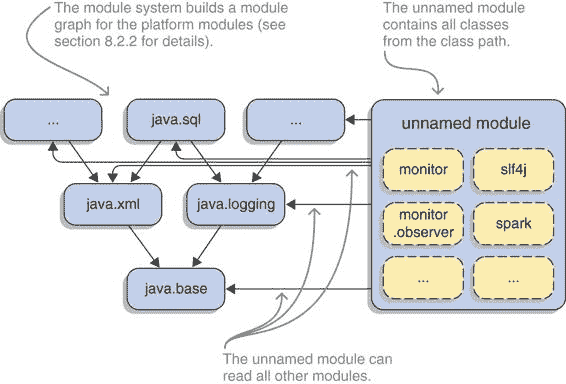
> 
> 图 8.2 当所有应用程序 JAR 文件都在类路径上启动时，模块系统从平台模块（左侧）构建一个模块图，并将类路径上的所有类分配给未命名模块（右侧），该模块可以读取所有其他模块
> 
> 带着这种理解，你已准备好从类路径运行简单的单模块应用程序。超出这个基本用例，尤其是在逐步模块化应用程序时，未命名模块的细微之处变得相关，因此我们接下来看看它们。
> 
> 8.2.1 未命名模块捕捉到的类路径混乱
> 
> 未命名模块的主要目标是捕获类路径内容，使其在模块系统中工作。由于类路径上的 JAR 文件之间从未有过边界，现在建立它们是没有意义的；因此，为整个类路径保留一个未命名模块是一个合理的决定。在其内部，就像在类路径上一样，所有公共类都是可访问的，并且不存在分割包的概念。
> 
> 未命名模块的独特角色及其对向后兼容性的关注赋予它一些特殊属性。你在 7.1 节中看到，在运行时，平台模块的强封装对于未命名模块中的代码大部分是禁用的（至少在 Java 9、10 和 11 中）。当我们讨论 7.2 节中的分割包时，你发现未命名模块没有被扫描，因此它与其他模块之间的包分割没有被发现，类路径部分也不可用。
> 
> 有一个细节稍微有些反直觉且容易出错，那就是未命名模块的构成。看起来很明显，模块化 JAR 文件变成了模块，因此普通的 JAR 文件进入未命名模块，对吧？如第 8.1.3 节所述，这是错误的：未命名模块负责类路径上的所有 JAR 文件，无论是模块化还是非模块化。
> 
> 因此，模块化 JAR 文件并不一定必须作为模块加载！如果一个库开始提供模块化 JAR 文件，其用户并不一定被迫使用它们作为模块。用户可以选择将它们留在类路径上，这样它们的代码就被捆绑到未命名模块中。如第 9.2 节更详细地解释，这允许生态系统几乎独立地进行模块化。
> 
> 例如，让我们启动 ServiceMonitor 的完全模块化版本，一次从类路径启动，一次从模块路径启动：
> 
> `$ java --class-path 'mods/*':'libs/*' -jar monitor $ java --module-path mods:libs --module monitor`
> 
> 这两种方法都运行良好，且没有明显的差异。
> 
> 要了解模块系统如何处理这两种情况，可以使用我们在第 12.3.3 节中更详细探讨的 API。您可以在一个类上调用 `getModule` 来获取它所属的模块，然后在该模块上调用 `getName` 来查看它的名称。对于未命名模块，`getName` 返回 `null`。
> 
> 让我们在 `Main` 中包含以下代码行：
> 
> `String moduleName = Main.class.getModule().getName(); System.out.println("Module name: " + moduleName);`
> 
> 从类路径启动时，输出为 `Module name: null`，表明 `Main` 类最终进入了未命名模块。从模块路径启动时，您会得到预期的 `Module name: monitor`。
> 
> 第 5.2.3 节讨论了模块系统如何将资源封装在包中。这仅部分适用于未命名模块：在模块内部，没有访问限制（因此类路径上的所有 JAR 文件都可以相互访问资源），未命名模块向所有包开放反射（因此所有模块都可以访问类路径上的 JAR 文件中的资源）。然而，从未命名模块到命名模块的访问确实应用了强封装。
> 
> 8.2.2 未命名模块的模块解析
> 
> 未命名模块与模块图其他部分关系的一个重要方面是它可以读取哪些其他模块。如前所述，它可以读取所有进入图中的模块。但那些模块是哪些呢？
> 
> 记住第 3.4.1 节的内容，模块解析通过从根模块（特别是初始模块）开始构建模块图，然后迭代地添加所有它们的直接和传递依赖项。如果编译下的代码或应用程序的 `main` 方法在未命名模块中，就像从类路径启动应用程序时那样，这将如何工作？毕竟，普通 JAR 文件不表达任何依赖项。
> 
> 如果初始模块是没有命名的模块，模块解析将从预定义的根模块集合开始。一般来说，这些是不包含 JEE API 的系统模块（参见第 3.1.4 节），但实际规则要详细一些：

+   成为根模块的 java.*模块的精确集合取决于 java.se 模块的存在（代表整个 Java SE API 的模块——它在完整的 Java 镜像中存在，但可能不在使用`jlink`创建的自定义运行时镜像中）：

+   如果 java.se 是可观察的，它就变成根模块。

+   如果不是这样，每个 java.*系统模块和来自升级模块路径的 java.*模块（如果至少导出一个未加限定的包，意味着不受限于谁可以访问该包——参见第 11.3 节）都成为根模块。

+   除了 java.*模块之外，所有其他系统模块以及升级模块路径上的模块（如果不是孵化模块并且至少导出一个未加限定的包）都成为根模块。这对于 jdk.*和 javafx.*模块尤其相关。

+   使用`--add-modules`定义的模块（参见第 3.4.3 节）始终是根模块。

> 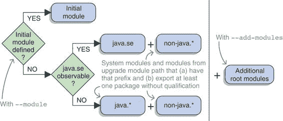
> 
> 图 8.3 模块解析的根模块（参见第 3.4.1 节）取决于初始模块是否使用`--module`定义（如果没有，则无命名的模块是初始模块）以及 java.se 是否可观察。在任何情况下，使用`--add-modules`定义的模块始终是根模块。
> 
> 这有点复杂（参见图 8.3 以获取可视化），但在边缘情况下可能会变得很重要。所有系统模块（除了 JEE 和孵化模块）都应解决的规则应该至少覆盖 90%的情况。
> 
> 例如，你可以运行`java --show-module-resolution`并观察输出的前几行：
> 
> `> 根 java.se jrt:/java.se > 根 jdk.xml.dom jrt:/jdk.xml.dom > 根 javafx.web jrt:/javafx.web > 根 jdk.httpserver jrt:/jdk.httpserver > 根 javafx.base jrt:/javafx.base > 根 jdk.net jrt:/jdk.net > 根 javafx.controls jrt:/javafx.controls > 根 jdk.compiler jrt:/jdk.compiler > 根 oracle.desktop jrt:/oracle.desktop > 根 jdk.unsupported jrt:/jdk.unsupported`
> 
> 这不是完整的输出，并且在不同系统上的顺序可能不同。但从顶部开始，你可以看到 java.se 是唯一的 java.*模块。然后有一系列 jdk.*和 javafx.*模块（注意第 7.1.1 节中的 jdk.unsupported）以及一个 oracle.*模块（不知道这个模块做什么）。
> 
> > 重要信息注意，如果没有命名的模块作为初始模块，根模块集合始终是运行时图像中包含的系统模块的子集。除非显式添加`--add-modules`，否则模块路径上存在的模块永远不会被解析。如果你手工制作模块路径以包含你需要的所有模块，你可能想使用`--add-modules ALL-MODULE-PATH`将它们全部添加，如第 3.4.3 节所述。
> > 
> 您可以通过从模块路径启动 ServiceMonitor 而不定义初始模块来轻松观察到这种行为：
> 
> `$ java --module-path mods:libs monitor.Main  > 错误：找不到或加载主类 monitor.Main > 原因：java.lang.ClassNotFoundException: monitor.Main`
> 
> 使用 `--show-module-resolution` 运行相同的命令确认没有解析出 monitor.* 模块。要修复这个问题，您可以使用 `--add-modules monitor`，在这种情况下，monitor 被添加到根模块列表中，或者使用 `--module monitor/monitor.Main`，在这种情况下，monitor 成为唯一的根模块（初始模块）。
> 
> 8.2.3 依赖于未命名的模块
> 
> 模块系统的主要目标之一是可靠的配置：一个模块必须表达其依赖关系，并且模块系统必须能够保证它们的可用性。我们在第 3.2 节中为具有模块描述符的显式模块解决了这个问题。如果您尝试将可靠的配置扩展到类路径，会发生什么？
> 
> 让我们做一个思想实验。想象模块可以依赖于类路径内容，也许在它们的描述符中使用 `requires class-path`。模块系统可以为这样的依赖提供哪些保证？实际上，几乎没有。只要类路径上至少有一个类，模块系统就必须假设依赖已经满足。这不会很有帮助（参见图 8.4）。
> 
> 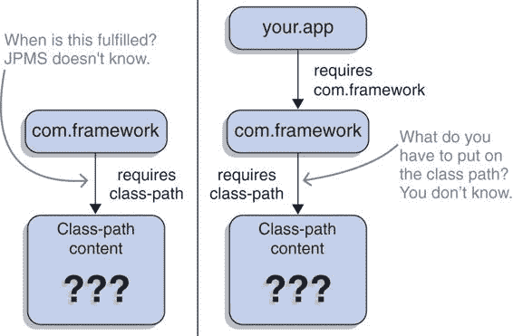
> 
> 图 8.4 如果 com.framework 依赖于一些具有假设的 `requires class-path` 的类路径内容，模块系统无法确定该要求是否满足（左）。如果您在这个框架上构建应用程序，您就不知道如何满足这个依赖（右）。
> 
> 更糟糕的是，它将严重破坏可靠的配置，因为您可能最终依赖于一个 `requires class-path` 的模块。嗯，这几乎不包含任何信息——需要将什么放在类路径上（再次参见图 8.4）？
> 
> 将这个假设进一步扩展，想象有两个模块，com.framework 和 org.library，它们依赖于同一个第三方模块，比如 SLF4J。一个在 SLF4J 模块化之前声明了依赖，因此 `requires class-path`；另一个在模块化的 SLF4J 上声明了依赖，因此 `requires org.slf4j`（假设这是模块名）。现在，任何依赖于 com.framework 和 org.library 的人会在哪个路径上放置 SLF4J JAR？无论他们选择哪个：模块系统都必须确定这两个传递依赖中的一个是未满足的。图 8.5 展示了这种情况。
> 
> 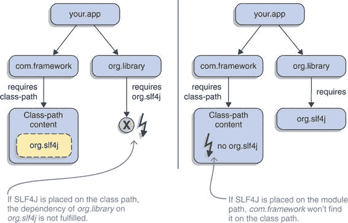
> 
> 图 8.5 如果 com.framework 依赖于 SLF4J，假设使用`requires class-path`，而 org.library 以`requires org.slf4j`作为模块依赖它，那么将无法满足这两个要求。无论 SLF4J 是放在类路径上（左）还是模块路径上（右），这两个依赖项中的一个将被视为未满足。
> 
> 深思熟虑后得出结论，如果你想要可靠的模块，依赖于任意的类路径内容并不是一个好主意。因此，没有`requires class-path`。
> 
> 我们如何最好地表达最终持有类路径内容的模块无法被依赖？在一个使用名称来引用其他模块的模块系统中？不给该模块命名——换句话说，使其成为未命名的模块——听起来是合理的。
> 
> 由此可知：未命名的模块没有名称，因为没有模块应该在任何`requires`指令或其他指令中引用它。没有`requires`，就没有可读性的优势，而没有这种优势，未命名的模块中的代码对其他模块不可访问。
> 
> 总结来说，为了使显式模块依赖于一个工件，该工件必须位于模块路径上。如第 8.1.3 节所述，这可能意味着你将纯 JAR 放在模块路径上，这样它们就变成了自动模块——这是我们接下来要探讨的概念。
> 
> 8.3 自动模块：模块路径上的纯 JAR
> 
> 任何模块化工作的长期目标都是将纯 JAR 升级为模块化 JAR，并将它们从类路径移动到模块路径。达到这一目标的一种方法是在所有依赖项都以模块的形式到达你这里之后，然后模块化你的项目——这是一种自下而上的方法。但这可能需要很长时间，因此模块系统也允许自顶向下的模块化。
> 
> 第 9.2 节详细解释了两种方法，但为了自顶向下的方法能够工作，你首先需要一个新成分。想想看：如果你的依赖项以纯 JAR 的形式出现，你如何声明一个模块？正如你在第 8.2.3 节中看到的，如果你将它们放在类路径上，它们最终会进入未命名的模块，而你的模块无法访问它。但在第 8.1.3 节中你注意到了，所以你知道纯 JAR 也可以放在模块路径上，模块系统会自动为它们创建模块。
> 
> > 注意：自动模块周围的机制通常在编译时间和运行时适用。正如我之前所说的，总是提及两者添加的信息很少，并且使文本更难阅读。
> > 
> 对于模块路径上每个没有模块描述符的 JAR，模块系统都会创建一个自动模块。像任何其他命名模块一样，它有三个核心属性（见第 3.1.3 节）：

+   名称——自动模块的名称可以在 JAR 的清单中使用`Automatic-Module-Name`头定义。如果它缺失，模块系统会从文件名生成一个名称。

+   依赖关系——自动模块读取所有进入图的模块，包括未命名的模块（正如你很快就会看到的，这很重要）。

+   导出——自动模块导出其所有包，并且也允许它们进行反射（有关开放包和模块的详细信息，请参阅第 12.2 节）。

> 此外，可执行 JARs 导致可执行模块，其主类如第 4.5.3 节所述进行标记。在 `META-INF/services` 中提供的服务对 `ServiceLoader` 可用——请参阅第十章介绍服务和第 10.2.6 节介绍它们与自动模块的交互。
> 
> 假设 ServiceMonitor 尚未模块化，您仍然可以将其工件放置在模块路径上。如果目录 `jars-mp` 包含 `monitor.jar`、`monitor.observer.jar` 和 `monitor.statistics.jar`，而 `jars-cp` 包含所有其他应用程序和依赖 JARs，则可以按以下方式启动 ServiceMonitor：
> 
> `$ java --module-path jars-mp --class-path 'jars-cp/*' --module monitor/monitor.Main`
> 
> 你可以在图 8.6 中看到生成的模块图。一些细节可能不清楚（比如，为什么尽管命令行上只引用了 monitor，但所有三个自动模块都进入了图？）。别担心；我将在下一节中解释。
> 
> 
> 
> 图 8.6 在模块路径上有普通 JARs `monitor.jar`、`monitor.observer.jar` 和 `monitor.statistics.jar` 时，JPMS 为它们创建了三个自动模块。类路径的内容最终作为未命名的模块存在，就像以前一样。注意自动模块如何相互读取以及读取未命名的模块，在图中创建了许多循环。
> 
> 自动模块是完整的命名模块，这意味着

+   它们可以在其他模块的声明中通过名称引用：例如，要求它们。

+   强封装使它们无法使用平台模块内部（与未命名的模块不同）。

+   它们会受到拆分包检查的影响。

> 另一方面，它们确实有一些特殊性。在您开始认真使用自动模块之前，我想在 9.2 节中讨论这些特殊性。
> 
> 8.3.1 自动模块名称：小细节，大影响
> 
> 将普通 JARs 转换为模块的主要目的是能够在模块声明中要求它们。为此，它们需要一个名称，但缺少模块描述符，这个名称从哪里来呢？
> 
> 首先是清单条目，然后是文件名
> 
> 确定普通 JAR 的模块名称的一种方法依赖于其清单，这是一个位于 JAR 的 `META-INF` 文件夹中的文件 `MANIFEST.MF`。清单包含各种信息，形式为标题-值对。最突出的标题之一是 `Main-Class`，它通过命名包含 main 方法的类来定义单模块应用程序的入口点——这使得可以使用 `java -jar app.jar` 启动应用程序。
> 
> 如果模块路径上的 JAR 文件没有描述符，模块系统将遵循两步过程来确定自动模块的名称：

1.  它会在清单文件中查找 `Automatic-Module-Name` 标头。如果找到，它将使用相应的值作为模块的名称。

1.  如果清单中没有该标头，模块系统将从文件名中推断模块名称。

> 从清单中推断模块名称比猜测更可靠，因为它要稳定得多——有关详细信息，请参阅第 8.3.4 节。
> 
> 从文件名推断模块名称的精确规则有点复杂，但细节并不十分重要。以下是关键点：

+   JAR 文件名通常以版本字符串结尾（例如 `-2.0.5`）。这些会被识别并忽略。

+   除了字母和数字之外的所有字符都被转换成了点号。

> 这个过程可能会导致不幸的结果，其中生成的模块名称无效。一个例子是字节码操作工具 Byte Buddy：它在 Maven Central 上发布为 `byte-buddy-${version}.jar`，这导致自动模块名称为 `byte.buddy`。不幸的是，这是非法的，因为 `byte` 是 Java 关键字。（第 9.3.3 节提供了如何修复此类问题的建议。）
> 
> 为了不让你猜测模块系统为给定的 JAR 文件选择的名称，您可以使用 `jar` 工具来查询：
> 
> `$ jar --describe-module --file=${jarfile}`
> 
> 如果 JAR 文件缺少模块描述符，输出将如下所示：
> 
> `> 未找到模块描述符。派生自动模块。> > ${module-name}@${module-version} 自动 > requires java.base mandated`
> 
> `${module-name}` 是实际名称的占位符——这是您要查找的内容。不幸的是，这并不能告诉您名称是从清单条目还是文件名中选择的。要找出这一点，您有几个选择：

+   使用 `jar --file ${jarfile} --extract META-INF/MANIFEST.MF` 提取清单，并手动查看。

+   在 Linux 系统上，`unzip -p ${jarfile} META-INF/MANIFEST.MF` 将清单文件打印到终端，从而避免了打开文件的需要。

+   重命名文件，然后再次运行 `jar --describe-module` 命令。

> 以下以 Guava 20.0 版本为例：
> 
> `$ jar --describe-module --file guava-20.0.jar > 未找到模块描述符。派生自动模块。> > guava@20.0 自动 > requires java.base mandated # 省略包含的包`
> 
> 作为自动模块使用时，Guava 20.0 被称为 guava。但这是否是通用的，还是由于模块名称的原因？使用 `unzip` 命令，我查看了清单文件：
> 
> `Manifest-Version: 1.0 Build-Jdk: 1.7.0-google-v5 Built-By: cgdecker Created-By: Apache Maven Bundle Plugin [... 省略 OSGi 相关条目 ...]`
> 
> 如您所见，`Automatic-Module-Name` 没有设置。将文件重命名为 `com.google.guava-20.0.jar` 后，模块名称变为 com.google.guava。
> 
> 如果您使用的是较旧的 Guava 版本——例如 23.6，您将得到以下输出：
> 
> `$ jar --describe-module --file guava-23.6-jre.jar > 未找到模块描述符。派生的自动模块。> > com.google.common@23.6-jre automatic > requires java.base mandated # truncated contained packages`
> 
> 如你所见，所选的名称和文件名并不相同，谷歌选择了 com.google.common 作为 Guava 的模块名称。让我们用 `unzip` 命令来检查：
> 
> `Manifest-Version: 1.0 Automatic-Module-Name: com.google.common Build-Jdk: 1.8.0_112-google-v7`
> 
> 就这样：`Automatic-Module-Name` 已经设置。
> 
> 设置 `AUTOMATIC-MODULE-NAME` 的时间
> 
> 如果你维护的是一个公开发布的项目，这意味着其工件可以通过 Maven Central 或其他公共仓库获取，你应该仔细考虑在清单中何时设置 `Automatic-Module-Name`。正如我将在第 8.3.4 节中解释的那样，这使将项目作为自动模块的使用更加可靠，但它也带来了未来明确模块将是当前 JAR 文件的直接替代品的承诺。你本质上是在说：“这就是模块的样子；我只是还没有发布它们。”
> 
> 定义自动模块名称的事实鼓励用户开始依赖你的项目工件作为模块，这有几个重要的含义：

+   未来模块的名称必须与你现在声明的完全一致。（否则，可靠的配置将让用户感到痛苦，因为缺少模块。）

+   文件结构必须保持不变，因此你不能将受支持的类或包从一个 JAR 文件移动到另一个 JAR 文件中。（即使没有模块，这种做法也不推荐。但有了类路径，哪个 JAR 文件包含一个类并不重要，所以你可以侥幸逃脱。另一方面，在模块系统的作用下，一个类的来源是相关的，因为可访问性迫使用户要求正确的模块。）

+   项目在 Java 9+ 上运行得相当好。如果它需要命令行选项或其他解决方案，这些都有很好的文档记录。（否则，你无法确定代码中是否隐藏着使其他承诺失效的问题。）

> 软件开发当然……让我们说，"并不完全可预测"，因此这些不能作为保证。但你应该有充分的理由相信你可以坚持这些承诺。如果你没有带宽在 Java 9+ 上进行测试，或者你发现了使模块化不可预测的问题，请诚实地说明，并且不要设置 `Automatic-Module-Name`。如果你设置了它并且无论如何都需要进行此类更改，那么需要进行主要版本号的升级。图 8.7 展示了设置 `Automatic-Module-Name` 的一个示例。
> 
> 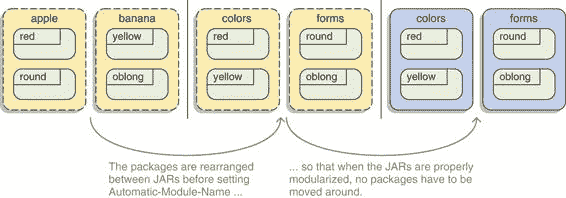
> 
> 图 8.7 如果你计划在模块化你的项目之前在包之间或 JAR 之间移动类，请等待设置`Automatic-Module-Name`直到你完成。在这里，项目的 JAR（左侧）在发布带有自动模块名称之前被重构（中间），因此当它们被模块化（右侧）时，结构不会改变。
> 
> 即使你的项目不需要针对 Java 9+，你也能设置`Automatic-Module-Name`。JAR 可能包含为旧 JVM 版本编译的字节码，但定义模块名称仍然有助于使用模块系统的用户。正如第 9.3.4 节所解释的，这也适用于模块描述符。
> 
> 8.3.2 自动模块的模块解决
> 
> 理解和预测模块系统行为的一个关键因素是了解它在模块解决过程中如何构建模块图。对于显式模块，这是直接的（它遵循要求指令；参见第 3.4.1 节）；但对于未命名的模块，则更复杂（参见第 7.2.2 节），因为普通 JAR 不能表达依赖关系。
> 
> 自动模块也是从普通 JAR 创建的，因此它们也没有显式的依赖关系，这引出了一个问题：在解决过程中它们是如何表现的。我们将稍后回答这个问题，但正如你将看到的，这又引出了一个新的问题：你应该将自动模块的依赖项放在类路径还是模块路径上？当你完成本节后，你就会知道了。
> 
> 解决自动模块依赖项
> 
> 需要回答的第一个问题是，当 JPMS 遇到自动模块时，模块解决过程中会发生什么。自动模块是为了面对单模块依赖而创建的模块化，因此它们在开发者积极工作于项目模块表示的情况下被使用。在这种情况下，如果自动模块几乎拉入了所有平台模块（就像未命名的模块所做的那样），这将是有害的，因此它们不会这样做。（为了明确，它们也不会拉入任何显式的应用程序模块。）
> 
> 然而，JAR 有依赖彼此的倾向；如果模块系统只解决显式要求的自动模块，所有其他自动模块都必须通过`--add-modules`添加到图中。想象一下，对于一个有数百个依赖项的大型项目，你决定将它们放置在模块路径上，这样做会是什么样子。为了防止这种过度且脆弱的手动模块添加，JPMS 一旦遇到第一个自动模块，就会拉入所有自动模块。
> 
> 一旦一个自动模块被解决，所有其他模块也会随之解决。你将获得所有作为自动模块的普通 JAR（如果至少需要一个或添加了一个）或者一个也没有（否则）。这就解释了为什么图 8.6 显示了三个监控器模块，尽管只有监控器模块（它不能表达依赖关系）被明确地通过将其作为根模块来解决。
> 
> 注意，自动模块意味着对其他自动模块的可读性（见第 9.1 节），这意味着任何读取一个模块的模块都会读取所有这些模块。在确定自动模块的依赖关系时，请记住这一点——通过试错可能会导致比所需的 `requires` 指令更少。
> 
> 在 ServiceMonitor 应用程序中，monitor.rest 模块依赖于 Spark 网络框架，以及为了这个示例，依赖于 Guava。这两个依赖都是普通 JAR，所以 monitor.rest 需要将它们作为自动模块来要求：
> 
> `module monitor.rest { requires spark.core; requires com.google.common; requires monitor.statistics;  exports monitor.rest; }`
> 
> 问题是，spark.core 或 com.google.common 上的一个 `requires` 指令可能缺失，但一切仍然可以正常工作。一旦模块系统解析了第一个自动模块，它就会解析所有其他模块，任何读取其中任何一个的模块都会读取所有这些模块。
> 
> 即使没有 `requires com.google.common`，`guava.jar` 也会作为一个自动模块与 `spark.core.jar` 一起被选中；由于 monitor.rest 读取 spark.core，它也会读取 guava。务必正确确定依赖关系（例如，使用 JDeps—见附录 D）！
> 
> > **模块图中的循环**
> > 
> > “自动模块读取所有其他模块”这个细节中隐藏着一个值得注意的细节：这种方法会在模块图中创建循环。显然，至少有一个模块依赖于自动模块（否则它为什么会存在呢？），因此会读取它，同样地，自动模块也会读取它。
> > 
> > 虽然这没有实际影响，但我提出来是为了澄清，这并不违反第 3.2.1 节中提到的规则，即不能有静态依赖循环。由于自动模块产生的循环不是静态声明的，而是由模块系统动态引入的。
> > 
> 如果自动模块只能读取其他命名模块，那么你就完成了。一旦你将一个普通 JAR 放在模块路径上，它的所有直接依赖都必须进入模块路径，然后是它们的依赖，以此类推，直到所有传递依赖都被视为模块，无论是显式的还是自动的。
> 
> 将所有普通 JAR 转换为自动模块有缺点（更多内容见第 8.3.3 节），所以能够将它们留在类路径上，并让它们被无名称模块加载会很好。模块系统正是通过允许自动模块读取无名称模块来实现这一点的，这意味着它们的依赖关系可以是类路径或模块路径。
> 
> **选择传递依赖关系的路径**
> 
> 对于自动模块的依赖关系，你通常有两个选择（记住，你也可以使用 JDeps 来列出它们）：类路径或模块路径。不幸的是，并非所有情况都允许你自由选择，在某些情况下，你需要做的不仅仅是决定路径。
> 
> 表 8.2 展示了根据它们是否被另一个模块需要以及它们是否是平台模块、平凡 JAR 或模块化 JAR，将这些依赖项引入模块图的选择。以下图例将重点放在特定情况上：

+   图 8.8 展示了仅由自动模块需要的平台模块默认不会被解决。

> 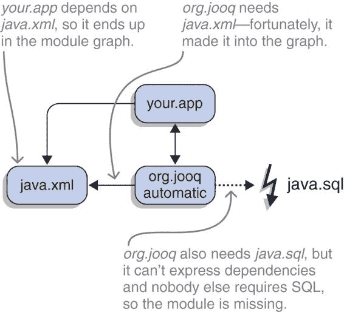
> 
> 图 8.8 如果一个项目（本例中为 `your.app`）使用自动模块（org.jooq），你不能确定模块图会自动工作。自动模块不表达依赖关系，因此它们需要的平台模块可能不会出现在图中（这里，java.sql 就发生了这种情况），并且必须使用 `--add-modules` 手动添加。

+   图 8.9 覆盖了自动模块需要的平凡 JAR 的不同情况。

+   图 8.10 展示了如果将传递依赖从普通 JAR 转换为模块化 JAR，模块图将如何演变。

> 表 8.2 如何将自动模块的依赖项添加到模块图中

| 由另一个显式模块需要的依赖项   |
| --- |
|    | 类路径   | 模块路径   |
| 平台模块   |    | ✔   |
| 平凡 JAR   | ✘ (依赖未满足)   | ✔   |
| 模块化 JAR   | ✘ (依赖未满足)   | ✔   |
| 由显式模块不需要的依赖项   |
|    | 类路径   | 模块路径   |
| 平台模块   |    | ! (手动解决)   |
| 平凡 JAR   | ✔   | ✔ (自动解决)   |
| 模块化 JAR   | ✔   | ! (手动解决)   |

> 专注于平台模块一段时间，我们会看到自动模块不能表达对它们的依赖关系。因此，模块图可能包含也可能不包含它们；如果不包含，自动模块在运行时可能会因为缺少类而抛出异常。
> 
> 解决这个问题的唯一方法是由项目的维护者公开记录他们需要的模块，这样他们的用户就可以确保所需的模块存在。用户可以通过明确要求它们，例如在依赖于自动模块的模块中，或者使用 `--add-modules` 来实现。
> 
> 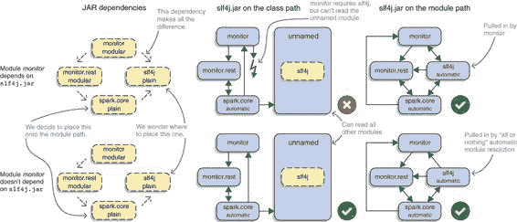
> 
> 图 8.9 从 monitor.rest（一个模块化 JAR）对 spark.core（一个平凡 JAR）的依赖关系开始，后者需要放置在模块路径上。但它的依赖项 slf4j（另一个平凡 JAR）怎么办？在这里，你可以看到根据 slf4j 是否被另一个模块化 JAR 所需要（顶部与底部行）或放置在哪个路径上（中间与右侧列）而产生的模块图。看起来模块路径是一个明显的胜利，但看看 图 8.10。
> 
> 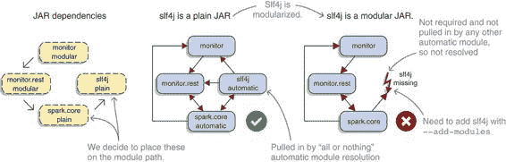
> 
> 图 8.10 在与 图 8.9 右下角相同的情况下，如果一个自动模块的传递依赖项（slf4j）被放置在模块路径上并进行了模块化，会发生什么？它将不再默认解析，需要手动使用 `--add-modules` 添加。
> 
> 在检查了平台模块的依赖项之后，让我们看看应用程序模块。如果一个自动模块的依赖项被一个显式模块所需要，它们必须放置在模块路径上，然后由模块系统解析——不需要做其他任何事情。如果没有显式模块需要它们，JAR 包可以被放置在类路径上，在那里它们被合并到未命名的模块中，因此始终可访问，或者被放置在模块路径上，在那里需要某种其他机制将它们拉入图中：

+   纯粹的 JAR 包是通过自动模块加载的全有或全无方法被拉入的。

+   平台和显式应用程序模块默认不解析。您必须从其他模块中要求它们，或者使用 `--add-modules` 手动添加它们（参见第 3.4.3 节）。

> 结合这样一个事实，即大多数或甚至所有依赖项最终都会从纯 JAR 包转换为模块化 JAR 包，这两个观察结果引起了人们的注意：它们意味着只要它们是纯 JAR 包，模块路径上的传递依赖项就可以正常工作，但一旦它们被模块化，就会从模块图中消失。
> 
> 让我们专注于第二个要点，并考虑单模块依赖项需要访问的模块。如果您和其他模块都不需要它们，它们将无法进入模块图，依赖项将无法访问它们。在这种情况下，您可以在模块描述符中要求它们（不要忘记添加注释说明为什么这样做）或在使用命令行标志进行编译和启动时添加它们。第 9.2.2 节和第 9.2.3 节简要讨论了该决策中涉及到的权衡，具体取决于特定场景。
> 
> 道路上的另一个障碍可能是自动模块在其公共 API 中公开的类型。假设一个项目（一个模块化 JAR 包）依赖于一个库（一个纯 JAR 包），该库有一个从 Guava 返回 `ImmutableList` 的方法（Guava 也是一个纯 JAR 包）：
> 
> `public ImmutableList<String> getAllTheStrings() { // ... }`
> 
> 如果您将项目和库放置在模块路径上，将 Guava 放置在类路径上，您将得到 图 8.11 中所示的模块图：项目（显式模块）读取库（自动模块），该库读取未命名的模块（包含 Guava）。如果代码现在调用返回 `ImmutableList` 的方法，对该类型的可访问性检查不会对您有利，因为您的模块没有读取未命名的模块。
> 
> 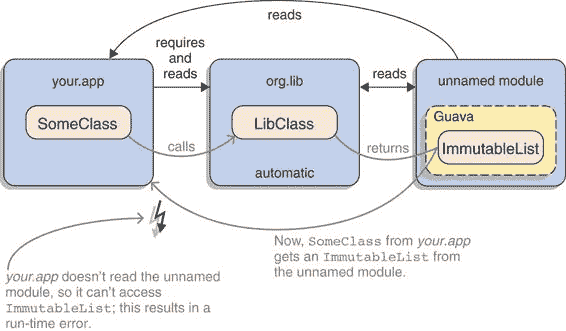
> 
> 图 8.11 如果一个自动模块（本例中为 org.lib）中的方法返回未命名的模块（`ImmutableList`）的类型，那么命名模块（your.app）无法访问它，因为它们没有读取未命名的模块。如果该方法声明返回不可访问的类型（`ImmutableList`），这将导致应用程序崩溃。声明一个超类型（这里可能是 `List`）将有效。
> 
> 这并不是全新的。如果 `ImmutableList` 是库的非公开类型，你也将无法调用该方法，因为缺乏可见性。就像在那个情况下一样，这也取决于声明的返回类型。如果方法声明返回 `List`，然后选择 `ImmutableList` 作为返回的具体类型，那么一切都会正常。这是关于 API 声明哪种类型，而不是它返回哪种类型。
> 
> 因此，如果一个自动模块暴露了另一个 JAR 的类型，那么该 JAR 也需要添加到模块路径上。否则，其类型最终会出现在未命名的模块中，那里它们对显式模块不可访问。这会导致由于缺少读取边而出现 `IllegalAccessError`，如第 3.3.3 节所述。
> 
> 即使你尽了最大努力，如果最终需要命名的模块访问未命名的模块，你只剩下一种选择——字面上的。在第 3.4.4 节中引入的命令行选项 `--add-reads` 可以通过使用 `ALL-UNNAMED` 作为目标值，将命名模块到未命名的模块的读取边添加进来。然而，这会将你的模块化代码与不可预测的类路径内容耦合，因此它应该是最后的手段。
> 
> 通过使用 `--add-reads`，在类路径上使用 Guava 并返回 `ImmutableList` 的自动模块最终可以工作。如果获取 `ImmutableList` 实例（并随后失败访问性检查）的显式模块被命名为 app，那么将 `--add-reads app=ALL-UNNAMED` 添加到编译器和运行时将使应用程序工作。
> 
> 所有这些话，你何时选择哪种路径？你应该完全依赖自动模块，还是更倾向于将尽可能多的依赖项留在类路径上？继续阅读以了解详情。
> 
> 8.3.3 全力投入自动模块？
> 
> 有能力将普通 JAR 放置在模块路径上以将其转换为自动模块，你还需要类路径吗？难道你不能将每个 JAR 放置在模块路径上，将它们全部转换为显式或自动模块（取决于它们是否包含描述符）？对这个问题的技术答案是，你可以这样做。尽管如此，我不推荐这样做——让我解释原因。
> 
> PLAIN JARS DON’T MAKE GOOD MODULES
> 
> 一般而言，普通 JAR 不适合作为模块：

+   他们可能访问 JDK 内部 API（参见第 7.1 节）。

+   他们可能会在它们自己和 JEE 模块之间分割包（参见第 7.2 节）。

+   他们没有表达他们的依赖关系。

> 如果它们被转换为自动模块，模块系统将对其施加规则，你可能需要花一些时间来解决由此产生的问题。除此之外，一旦普通 JAR 升级为模块化 JAR，它将默认不再被解析（参见 表 8.2 和 图 8.10），因此对于你项目依赖树中的每个此类升级，你都必须手动添加它。自动模块的唯一优点是它们可以被显式模块要求，但如果你不需要这个，那么你为使一切自动化所付出的努力几乎得不到任何回报。
> 
> 另一方面，如果留在类路径上，JAR 将被合并到未命名的模块中，

+   默认情况下，至少允许对 Java 的一个更多版本进行非法访问。

+   JAR 之间的分割并不重要，尽管它们在 JAR 和平台模块之间仍然重要。

+   如果它们包含应用程序入口点，它们可以读取所有 Java SE 平台模块。

+   当一个普通 JAR 升级为模块化 JAR 时，无需进行任何操作。

> 这使得生活变得更加容易。
> 
> > **重要信息** 尽管将所有内容都作为模块使用令人兴奋，但我建议你只将使项目工作的最小数量的普通 JAR 放在模块路径上，其余的放在类路径上。
> > 
> 另一方面，自动模块的模块化依赖项通常应该放在模块路径上。因为它们是以模块化 JAR 的形式出现的，所以它们不需要模块系统像对待未命名的模块那样宽容；如果作为模块加载，它们将受益于可靠的配置和强大的封装。
> 
> **自动模块作为通往类路径的桥梁**
> 
> 在使用更少的自动模块工作时，有一个哲学观点需要提出：这使它们成为模块世界和混乱的类路径之间的桥梁（图 8.12）。模块可以坐在一边，并以自动模块的形式要求它们的直接依赖项，而间接依赖项可以留在另一边。每次你的依赖项变成显式模块时，它就会离开模块一侧的桥梁，并将它的直接依赖项作为自动模块拉到桥梁上。这就是我之前提到的自上而下的方法；我们将在第 9.2 节讨论模块化策略时更详细地探讨它。
> 
> 
> 
> 图 8.12 河内长贝桥，1939 年。照片由 manhhai 提供。在 Creative Commons CC BY 2.0 许可下使用。
> 
> 8.3.4 依赖自动模块
> 
> 自动模块的唯一目的是依赖于普通的 JAR 文件，因此可以在不等待所有依赖项模块化之前创建显式模块。然而，有一个重要的注意事项：如果 JAR 的清单中没有包含 `Automatic-Module-Name` 条目，依赖项本质上是脆弱的。
> 
> 如第 8.3.1 节所述，如果没有该条目，自动模块名称将根据文件名推断。但根据它们的配置，不同的项目可能为相同的 JAR 文件使用不同的名称。此外，大多数项目使用由 Maven 支持的本地仓库，其中 JAR 文件命名为`${artifactID}-${version}`，模块系统可能会推断`${artifactID}`作为自动模块的名称。这是问题所在，因为工件 ID 通常不遵循第 3.1.3 节中定义的反域名命名方案：一旦项目模块化，模块名称很可能会改变。
> 
> 由于其广泛使用，Google 的 Guava 继续是一个很好的例子。正如你之前看到的，对于`guava-20.0.jar`，模块系统推导出自动模块名称 guava。这是文件在 Maven 本地仓库中的名称，但其他项目可能有不同的配置。
> 
> 假设我们将 JAR 命名为`${groupID}-${artifactID}-${version}`，那么文件将被称为`com.google.guava-guava-20.0.jar`，自动模块名称将是 com.google.guava.guava。另一方面，模块化的 Guava 将被称为 com.google.common，因此没有任何自动模块名称是正确的。
> 
> 总结来说，相同的 JAR 在不同的项目（取决于它们的配置）和不同时间（在模块化之前和之后）可能会有不同的模块名称。这有可能在下层造成混乱。
> 
> 想想你最喜欢的项目，并想象其中一个依赖项将其依赖项作为具有不匹配项目设置的自动模块名称引用（参见图 8.13）。也许依赖项命名文件`${groupID}-${artifactID}-${version}`，而你使用 Maven 并将它们命名为`${artifactID}-${version}`。现在，依赖项需要自动模块`${groupID}.${artifactID}`，但模块系统将在你的项目中推断`${artifactID}`。这将破坏构建——尽管有方法可以修复它（参见第 9.3.3 节），但没有一个是令人愉快的。
> 
> 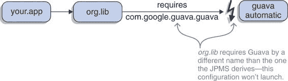
> 
> 图 8.13 依赖项 org.lib 通过在构建中获得的自动模块名称 com.google.guava.guava 来要求 Guava。不幸的是，在系统上，工件被称为`guava.jar`，因此推导出模块名称 guava。如果没有进一步的工作，模块系统将抱怨缺少依赖项。
> 
> 而且情况还在恶化！继续使用同一个项目，并在心理上添加另一个需要相同自动模块但名称不同的依赖项（参见图 8.14）。这就是第 3.2.2 节中描述的“死亡模块钻石”：单个 JAR 文件无法满足具有不同名称的模块的要求，并且由于拆分包的规则，具有相同内容的多个 JAR 文件也无法工作。这种情况必须不惜一切代价避免！
> 
> 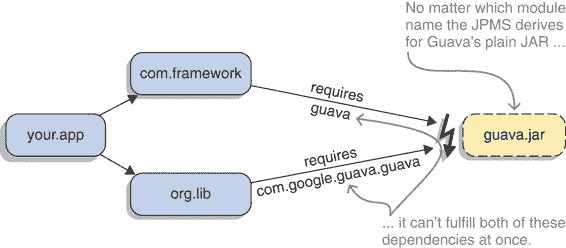
> 
> 图 8.14 与图 8.12 相比，情况变得更糟。另一个依赖项 com.framework 也依赖于 Guava，但它使用不同的名称（guava）。现在同一个 JAR 需要以两个不同名称的模块出现——这是行不通的。
> 
> 在这两种情况下，可能看起来关键错误是要求模块通过基于其文件名的模块名来使用一个普通的 JAR。但事实并非如此——使用这种方法对于应用程序和其他开发者完全控制模块描述符要求此类自动模块的场景是可行的。
> 
> 打破骆驼背的最后一根稻草是将具有此类依赖关系的模块发布到公共存储库。只有在这种情况下，用户才可能处于一个模块隐式依赖于他们无法控制的细节的情况，这可能导致额外的工作甚至无法解决的分歧。
> 
> 结论是，你不应该发布（到一个公开可访问的存储库）需要普通 JAR 而没有在它的清单中包含`Automatic-Module-Name`条目的模块。只有有了这个条目，自动模块名称才足够稳定，可以依赖。
> 
> 是的，这可能意味着你目前还不能发布你库或框架的模块化版本，必须等待你的依赖项添加该条目。这是不幸的，但无论如何这样做都会对你的用户造成极大的不便。
> 
> > 小贴士：迁移和模块化——我们已经涵盖了适用于现有代码库的所有挑战和机制。继续阅读第九章，了解如何最佳应用它们。之后，第三部分将教授模块系统的更高级功能。
> > 
> 摘要

+   增量模块化通常会使用类路径和模块路径。重要的是要理解，类路径上的任何 JAR（无论是普通还是模块化的）最终都会进入未命名的模块，而模块路径上的任何 JAR 最终都会成为命名模块——无论是自动模块（对于普通 JAR）还是显式模块（对于模块化 JAR）。这使用户（而不是创建者）能够确定它是否成为命名模块。

+   未命名的模块是一个兼容性特性，使得模块系统可以与类路径一起工作：

+   它捕获类路径内容，没有名称，读取每个其他模块，并导出和打开所有包。

+   因为它没有名称，显式模块无法在其模块声明中引用它。一个后果是它们无法读取未命名的模块，因此永远无法使用在类路径上定义的类型。

+   如果未命名的模块是初始模块，则使用一组特定的规则来确保正确解决模块集。总的来说，这些是非 JEE 模块及其依赖项。这使得类路径上的代码可以读取所有 Java SE API 而无需进一步配置，从而最大化兼容性。

+   自动模块是一个迁移特性，允许模块依赖于普通的 JAR：

+   对于模块路径上的每个 JAR 文件，都会创建一个自动模块。其名称由 JAR 文件清单中的`Automatic-Module-Name`头定义（如果存在）或从其文件名推导出来。它读取每个其他模块，包括未命名的模块，并导出和打开所有包。

+   它是一个常规命名的模块，因此可以在模块声明中引用它，例如要求它。这允许正在模块化的项目依赖于尚未模块化的其他项目。

+   自动模块的依赖项可以放置在类路径或模块路径上。使用哪个路径取决于具体情况，但将模块化依赖项放置在模块路径上，将普通依赖项放置在类路径上是一个合理的默认设置。

+   一旦第一个自动模块被解析，其他所有模块也会随之解析。此外，任何读取一个自动模块的模块都会由于隐含的可读性而读取所有模块。在测试自动模块的依赖关系时，请考虑这一点。

> 9
> 
> 迁移和模块化策略
> 
> 本章涵盖了

+   准备迁移到 Java 9 及更高版本

+   持续集成更改

+   逐步模块化项目

+   使用 JDeps 生成模块声明

+   使用`jar`工具修改第三方 JAR 文件

+   发布适用于 Java 8 及更早版本的模块化 JAR 文件

> 第六章、第七章和第八章讨论了迁移到 Java 9+以及将现有代码库转变为模块化代码库的技术细节。本章从更广阔的角度来看，探讨如何将这些细节最佳地组合成成功的迁移和模块化努力。我们首先讨论如何进行逐步迁移，这种迁移与开发过程（尤其是构建工具和持续集成）配合得很好。接下来，我们将探讨如何使用未命名的模块和自动模块作为特定模块化策略的构建块。最后，我们将介绍使 JAR 文件模块化的选项——无论是你的还是你的依赖项的。当你完成本章后，你不仅会了解迁移挑战和模块化功能的机制，还会知道如何最好地在你自己的努力中运用它们。
> 
> 9.1 迁移策略
> 
> 在第六章和第七章中收集的所有知识，使你准备好应对 Java 9+可能对你提出的每一个挑战。现在，是时候拓宽你的视野并制定一个更广泛的策略了。你该如何安排这些零散的部分，使迁移尽可能全面和可预测？本节提供了关于准备迁移、估算迁移工作量、在 Java 9+上设置持续构建以及命令行选项的缺点等方面的建议。
> 
> > 注意：本节中的许多主题都与构建工具相关，但它们保持足够的通用性，不需要你了解任何特定工具。同时，我想分享我在 Maven（到目前为止我在 Java 9+上使用的唯一构建工具）上的经验，所以我偶尔会指出我用来满足特定要求的 Maven 功能。不过，我不会深入细节，所以你需要自己弄清楚这些功能是如何帮助你的。
> > 
> 9.1.1 准备更新
> 
> 首先，如果你还没有在 Java 8 上，你应该进行这次更新！做件好事，一次不要跳过两个或更多 Java 版本。进行更新，确保所有工具和流程正常工作，在生产环境中运行一段时间，然后再处理下一个更新。如果你想要从 Java 8 更新到 11，也是一样，一步一步来。如果你遇到任何问题，你真的会想知道是哪个 Java 版本或依赖项更新导致了这些问题。
> 
> 谈到依赖项，你还可以在不查看 Java 9+的情况下开始更新它们以及你的工具。除了保持更新的普遍好处外，你可能会无意中从与 Java 9+有问题的版本更新到一个与之兼容的版本。你甚至都不会注意到你遇到了问题。如果还没有与 Java 9+兼容的版本，那么使用你依赖项或工具的最新版本仍然会在兼容版本发布后更容易更新。
> 
> > 采用 AdoptOpenJDK 质量推广
> > 
> > AdoptOpenJDK，“一个由 Java 用户群成员、Java 开发人员和倡导 OpenJDK 的供应商组成的社区”，有一个各种开源项目的列表以及它们在最新和下一个 Java 版本上的表现情况：[`mng.bz/90HA`](http://mng.bz/90HA)。
> > 
> 9.1.2 估计工作量
> 
> 有几件事情你可以做来了解接下来会发生什么，我们首先看看这些。下一步是评估和分类你发现的问题。我在本节结束时简要说明一下估计具体数字的方法。
> 
> 寻找问题
> 
> 这些是最明显的选择来收集问题列表：

+   配置你的构建过程以在 Java 9+上编译和测试（Maven: toolchain），理想情况下以能够收集所有错误而不是在第一个错误停止的方式（Maven: `--fail-never`）。

+   在 Java 9+上运行你的整个构建过程（Maven: `~/.mavenrc`），再次收集所有错误。

+   如果你正在开发应用程序，按照通常的方式构建它（意味着还不是在 Java 9+上），然后在 Java 9+上运行它。使用`--illegal-access=debug`或`deny`来获取有关非法访问的更多信息。

> 仔细分析输出结果，注意新的警告和错误，并尝试将它们与前面章节讨论的内容联系起来。留意第 6.5.3 节中描述的已删除的命令行选项。
> 
> 应用一些快速修复措施，如添加导出或 JEE 模块是个好主意。这让你能够看到可能隐藏在良性问题背后的更困难的问题。在这个阶段，没有修复是太快或太脏的——任何能让构建抛出新错误的都是胜利。如果你有太多的编译错误，你可以用 Java 8 编译，然后在 Java 9+上运行测试（Maven: `mvn surefire:test`）。
> 
> 然后，在你的项目和依赖项上运行 JDeps。分析对 JDK 内部 API 的依赖（第 7.1.2 节），并注意任何 JEE 模块（第 6.1 节）。还要寻找平台模块和应用 JAR 之间的分割包（第 7.2.5 节）。
> 
> 最后，搜索你的代码库中调用`AccessibleObject::setAccessible`（第 7.1.4 节）、转换到`URLClassLoader`（第 6.2 节）、解析`java.version`系统属性（第 6.5.1 节）或手工制作资源 URL（第 6.3 节）的地方。把所有找到的东西列在一个大列表上——现在是你分析它的时候了。
> 
> 这有多糟糕？
> 
> 你发现的问题应该分为两类：“我在这本书里见过”和“到底发生了什么？”对于前者，进一步将问题分为“至少有一个临时修复”和“是难题。”特别困难的问题包括移除的 API 和平台模块与不实现推荐标准或独立技术的 JAR 之间的包分割。
> 
> 重要的是不要混淆普遍性与重要性！你可能因为一个 JEE 模块缺失而有大约一千个错误，但修复它是微不足道的。另一方面，如果你的核心功能依赖于应用程序类加载器到`URLClassLoader`的一次转换，那你就麻烦了。或者你可能有一个对移除的 API 的临界依赖，但由于你很好地设计了系统，它只是导致一个子项目中出现几个编译错误。
> 
> 一个好的方法是，对于每个你不知道解决方案的具体问题，问自己，“如果我删除了麻烦的代码及其所有依赖，会发生什么？”这会对你的项目造成多大的伤害？按照这个思路，是否有可能暂时禁用麻烦的代码？测试可以忽略，特性可以通过标志来切换。感受一下延迟修复并运行构建和应用程序的可行性。
> 
> 当你完成时，你应该有三个类别的问题列表：

+   已知问题但有简单修复

+   已知的难题

+   需要调查的未知问题

> 对于最后两个类别中的问题，你应该知道它们对你的项目有多危险，以及你有多容易在不修复它们的情况下通过。
> 
> 关于估计数字
> 
> 很可能有人希望你做出一个涉及一些硬数字的估计——可能是小时，也可能是货币。这通常很难，但在这里尤其有问题。
> 
> Java 9+ 迁移让您面对早已过去的决策。您的项目可能紧密耦合到一个您已经多年想要更新的旧版 Web 框架，或者它可能围绕一个未维护的库积累了大量技术债务。不幸的是，这两者都无法在 Java 9+ 上工作。您现在必须偿还一些技术债务——众所周知，费用和利息可能很难估计。最后，就像一场好的老板战斗一样，关键问题——修复成本最高的那个问题——可能隐藏在几个其他麻烦制造者后面，所以您只能在陷入太深时才能看到它。我并不是说这些场景很可能会发生，只是说它们是可能的，所以请小心猜测您迁移到 Java 9 可能需要多长时间。
> 
> 9.1.3 在 Java 9+ 上持续构建
> 
> 假设您正在持续构建您的项目，下一步是设置一个成功的 Java 9+ 构建。有许多决策需要做出：

+   您应该构建哪个分支？

+   是否应该有一个单独的版本？

+   如果从第一天开始就无法在 Java 9+ 上完全运行构建，你应该如何切割构建？

+   您如何保持 Java 8 和 Java 9+ 构建并行运行？

> 最后，找到适合您项目和持续集成（CI）设置的答案取决于您。让我分享一些在我的迁移中效果很好的想法，您可以根据自己的喜好进行组合。
> 
> 应该构建哪个分支？
> 
> 你可能会想为迁移工作设置自己的分支，并让 CI 服务器使用 Java 9+ 构建该分支，而其他分支则像以前一样使用 Java 8。但是，迁移可能需要花费时间，因此很可能会导致长期存在的分支——出于各种原因，我通常尽量避免这种情况：

+   您将独自一人，您的更改不会持续受到基于这些更改工作的团队的审查。

+   两个分支都可能积累很多更改，这增加了在更新或合并 Java 9+ 分支时发生冲突的机会。

+   如果主开发分支上的更改需要一段时间才能进入 Java 9+ 分支，那么其他团队成员可以自由地添加代码，在 Java 9+ 上创建新的问题，而无需立即获得反馈。

> 虽然在单独的分支上进行迁移的初步调查是有意义的，但我建议尽早切换到主开发分支并在那里设置 CI。但这确实需要您对构建工具进行一些额外的调整，因为您需要根据 Java 版本（Java 编译器不喜欢未知选项）来分离配置的一些部分（例如，编译器的命令行选项）。
> 
> 应该构建哪个版本？
> 
> JAVA 9+构建是否应该创建你工件的一个单独版本——比如`-JAVA-LATEST-SNAPSHOT`？如果你决定创建一个单独的 JAVA 9+分支，你很可能被迫创建一个单独的版本。否则，很容易混合来自不同分支的快照工件，这很可能会破坏构建，分支越偏离，这种情况就越有可能发生。如果你决定从主开发分支构建，创建一个单独的版本可能不容易；但我从未尝试过，因为我没有找到做这件事的好理由。
> 
> 无论你如何处理版本，当尝试在 JAVA 9+上使某些内容工作的时候，你可能会偶尔用 JAVA 8 构建相同的子项目并使用相同的版本。尽管我决定不再这样做，但我还是会反复安装我用 JAVA 9+构建的工件。你知道的，就是那种条件反射式的`mvn clean install`？这并不是一个好主意：然后你无法在 JAVA 8 构建中使用这些工件，因为 JAVA 8 不支持 JAVA 9+的字节码。
> 
> 当使用 JAVA 9+在本地构建时，尽量记住不要安装工件！我使用`mvn clean verify`来做这件事。
> 
> 使用 JAVA 9+能构建什么？
> 
> 最终目标是让构建工具在 JAVA 9+上运行，并在所有阶段/任务中构建所有项目。根据你之前创建的列表中的项目数量，你可能只需要更改几个东西就能达到这个目标。在这种情况下，就去做吧——没有必要使过程复杂化。另一方面，如果你的列表更令人畏惧，有几种方法可以切割 JAVA 9 构建：

+   你可以在 JAVA 8 上运行构建，但只编译和测试 JAVA 9+。我稍后会讨论这一点。

+   你可以按目标/任务进行迁移，这意味着你首先尝试编译整个项目以 JAVA 9+为目标，然后再开始使测试工作。

+   你可以按子项目进行迁移，这意味着你首先尝试编译、测试和打包整个子项目，然后再进行下一个。

> 一般而言，对于大型单体项目，我更喜欢“按目标/任务”的方法，如果项目被拆分成足够小以至于可以一次性解决的部分，则采用“按子项目”的方法。
> 
> 如果你按子项目进行，但其中一个子项目由于某种原因无法在 JAVA 9+上构建，那么你无法轻松构建依赖于它的子项目。我曾经遇到过这种情况，我们决定分两步设置 JAVA 9 构建：

1.  使用 JAVA 8 构建所有内容。

1.  除了有问题的子项目外，用 JAVA 9+构建所有内容（然后这些依赖于它们的子项目是用 JAVA 8 的工件构建的）。

> 在 JAVA 9+上的构建工具
> 
> 在你的项目完全迁移到 Java 9+之前，你可能需要经常在用 8 和 9+构建之间切换。看看你如何配置你选择的构建工具的 Java 版本，而无需为你的整个机器设置默认的 Java 版本（Maven: `~/.mavenrc`或工具链）。然后考虑自动化切换。我最终编写了一个小脚本，将`$JAVA_HOME`设置为 JDK 8 或 JDK 9+，这样我就可以快速选择我需要的版本。
> 
> 然后，这有点元信息，构建工具可能在 Java 9+上无法正常工作。可能需要 JEE 模块，或者可能有一个插件使用了已删除的 API。（我有一个使用 Maven 的 JAXB 插件的例子，它需要 java.xml.bind 并依赖于其内部结构。）
> 
> 在这种情况下，你可以考虑在 Java 8 上运行构建，但只编译或测试针对 Java 9+，但如果构建在其自己的进程中（Java 8）对创建的字节码（Java 9+）执行某些操作，则这不会起作用。（我遇到了 Java 远程方法调用编译器（`rmic`）的问题；它迫使我们整个构建都在 Java 9+上运行，尽管我们更愿意不这样做。）
> 
> 如果你决定在 Java 9+上运行构建，即使它表现不佳，你也必须配置构建过程以使用一些新的命令行选项。这样做以便对团队成员来说更容易（没有人想手动添加选项），同时保持它在 Java 8 上也能工作（Java 8 不知道新选项），可能不是一件简单的事情（Maven: `jvm.config`）。我发现没有方法可以在不要求文件重命名的情况下使它在两个版本上都能工作，所以我最终将其包含在我的“切换 Java 版本”脚本中。
> 
> 如何配置 Java 9+的构建
> 
> 当你必须向编译器、测试运行时或其他构建任务添加特定版本的配置选项时，如何保持 Java 8 构建和 Java 9+构建的运行？你的构建工具应该提供帮助。它可能有一个功能允许你根据各种情况调整整体配置（Maven: 配置文件）。熟悉它，因为你可能会经常使用它。
> 
> 当与 JVM 的特定版本命令行选项一起工作时，有一个替代方案，即让构建工具来处理它们：使用非标准的 JVM 选项`-XX:+IgnoreUnrecognizedVMOptions`，你可以指示启动的 VM 忽略未知的命令行选项。（此选项在编译器中不可用。）尽管这允许你为 Java 8 和 Java 9+使用相同的选项，但我建议不要将其作为首选，因为它禁用了可以帮助你找到错误的检查。相反，如果可能的话，我更喜欢按版本分离选项。
> 
> 在两个路径上测试
> 
> 如果你正在开发一个库或框架，你无法控制用户放置你的 JAR 文件的路径、类路径或模块路径。根据项目的情况，这可能会产生影响，在这种情况下，测试两种变体就变得必要了。
> 
> 很遗憾，我这里不能提供任何建议。在撰写本文时，Maven 和 Gradle 都没有很好地支持在每个路径上运行测试，你可能不得不创建第二个构建配置。让我们希望工具支持随着时间的推移而改进。
> 
> 先修复，再解决
> 
> 通常，Java 9+问题列表中的大多数项目都可以通过命令行标志轻松修复。例如，导出内部 API 很容易。但这并没有解决根本问题。有时解决方案也很简单，比如将内部的`sun.reflect.generics.reflectiveObjects.NotImplementedException`替换为`UnsupportedOperationException`（不是开玩笑：我不得不这样做好几次），但通常并不是这样。
> 
> 你是追求快速且粗糙的解决方案，还是追求更长时间的正确解决方案？在尝试使完整构建正常工作的阶段，我建议采取快速修复：

+   在必要时添加命令行标志。

+   关闭测试，最好是仅针对 Java 9+（在 JUnit 4 中，使用假设很容易做到；在 JUnit 5 中，我推荐使用条件）。

+   如果子项目使用了已删除的 API，将其切换回编译或测试 Java 8。

+   如果所有其他方法都失败了，就完全跳过该项目。

> 一个能够立即向整个团队提供项目 Java 9+兼容性反馈的工作构建非常有价值，包括采取捷径来实现这一点。为了能够以后改进这些临时修复，我建议制定一个有助于识别它们的系统。
> 
> 我用注释如`// [JAVA LATEST, <PROBLEM>]: <explanation>`标记临时修复，这样全文搜索`JAVA LATEST, GEOTOOLS`就会把我带到所有必须禁用的测试，因为 GeoTools 版本与 Java 9 不兼容。
> 
> 在早期构建错误背后发现新问题是常见的。如果发生这种情况，请确保将它们添加到你的 Java 9+问题列表中。同样，划掉那些你已经解决的问题。
> 
> 保持绿色
> 
> 一旦你成功设置了构建，你应该对面临的全部 Java 9+挑战有一个完整的了解。现在是时候逐一解决它们了。
> 
> 一些问题可能很难解决或耗时，你甚至可能确定它们只能在稍后解决——比如在发布一个重要版本或预算有一些灵活性之后。如果需要一些时间，请不要担心。有了每个团队成员都可以破坏和修复的构建，你永远不会走错方向；即使你面前有很多工作，你最终也会一步步到达那里。
> 
> 9.1.4 关于命令行选项的想法
> 
> 在 Java 9+中，你可能需要应用比以往更多的命令行选项——对我来说确实是这样。我想分享一些关于以下方面的见解：

+   应用命令行选项的四种方法

+   依赖于脆弱的封装

+   命令行选项的陷阱

> 逐个来看。
> 
> 应用命令行选项的四种方法
> 
> 应用命令行选项最明显的方法是使用命令行，并在 `java` 或 `javac` 后附加选项。但你是否知道还有三种其他可能性？
> 
> 如果你的应用程序以可执行 JAR 的形式交付，使用命令行不是一种选择。在这种情况下，你可以使用新的清单条目 `Add-Exports` 和 `Add-Opens`，它们接受以逗号分隔的 `${module}/${package}` 对的列表，并将该包导出或对类路径上的代码打开。JVM 只扫描应用程序的可执行 JAR，即通过运行时的 `-jar` 选项指定的 JAR，以查找这些清单条目，因此没有必要将它们添加到库 JAR 中。
> 
> 另一种永久设置命令行选项的方法（至少对于 JVM 来说）是环境变量 `JDK_JAVA_OPTIONS`。它在 Java 9+ 中引入，因此 Java 8 不会拾取它。因此，你可以自由地包含任何特定于 Java 9+ 的命令行选项，这些选项将在你的机器上每次执行 `java` 时应用。这几乎不会是一个长期解决方案，但它可能会使一些实验更容易进行。
> 
> 最后，命令行选项不必直接在命令行中输入。一种替代方法是所谓的参数文件（或 @-文件），这些是纯文本文件，可以在命令行中使用 `@${filename}` 来引用。编译器和运行时会像文件内容已被添加到命令中一样操作。
> 
> 7.2.4 节展示了如何编译使用 JEE 和 JSR 305 注解的代码：
> 
> `$ javac --add-modules java.xml.ws.annotation --patch-module java.xml.ws.annotation=jsr305-3.0.2.jar --class-path 'libs/*' -d classes/monitor.rest ${source-files}`
> 
> 在这里，`--add-modules` 和 `--patch-module` 被添加以使编译在 Java 9+ 上工作。你可以将这些两行放入一个名为 `java-LATEST-args` 的文件中，然后按照以下方式编译：
> 
> `$ javac @java-LATEST-args --class-path 'libs/*' -d classes/monitor.rest ${source-files}`
> 
> Java 9+ 的新特性是 JVM 也识别参数文件，因此它们可以在编译和执行之间共享。
> 
> > Maven 和参数文件
> > 
> > 不幸的是，参数文件与 Maven 不兼容。编译器插件已经为所有自己的选项创建了一个文件，并且 Java 不支持嵌套的参数文件。
> > 
> 依赖脆弱封装
> 
> 如 7.1 节详细解释的那样，Java 9–11（或更高）运行时默认允许非法访问，只需一个警告即可。这对于运行未准备好的应用程序来说很棒，但我建议在正式构建过程中不要依赖它，因为它允许新的非法访问悄悄通过而未被注意到。相反，我会收集我需要的所有 `--add-exports` 和 `--add-opens`，然后在运行时通过 `--illegal-access=deny` 激活强封装。
> 
> 命令行选项的陷阱
> 
> 使用命令行选项有几个陷阱：

+   这些选项具有传染性，如果 JAR 需要它们，所有其依赖项也需要它们。

+   那些需要特定选项的库和框架的开发者希望记录下他们的客户端需要应用这些选项，但没有人会在为时已晚之前阅读文档。

+   应用程序开发者必须维护一个选项列表，以合并他们使用的几个库和框架的要求。

+   以一种允许在不同构建阶段和执行之间共享选项的方式维护选项并不容易。

+   由于 Java 9 兼容版本更新，很难确定哪些选项可以被移除。

+   将选项应用于正确的 Java 进程可能会很棘手：例如，对于不与构建工具在同一个进程运行的构建工具插件。

> 这些陷阱清楚地表明：命令行选项是一种权宜之计，而不是一个恰当的解决方案，并且它们有其自身的长期成本。这不是偶然——它们被设计成使得不希望发生的事情成为可能。尽管如此，这并不容易，否则就没有解决根本问题的动力。
> 
> 尽量只依赖公共和支持的 API，不要拆分包，并通常避免本章描述的麻烦。并且，重要的是要奖励那些做同样事情的库和框架！但通往地狱的道路是由好意铺就的，所以如果其他所有方法都失败了，就使用你所能使用的每一个命令行标志。
> 
> 9.2 模块化策略
> 
> 在第八章中，你学习了所有关于未命名模块、自动模块以及混合普通 JAR、模块化 JAR、类路径和模块路径的内容。但如何将这些知识付诸实践？将代码库逐步模块化的最佳策略是什么？为了回答这些问题，想象整个 Java 生态系统是一个巨大的分层图，由各种工件组成（见图 9.1）。
> 
> 在底层是 JDK，它曾经是一个单独的节点，但由于模块系统的存在，现在由大约一百个节点组成，其中 java.base 作为基础。在其之上是没有任何 JDK 外部运行时依赖的库（如 SLF4J、Vavr 和 AssertJ），然后是只有少数依赖的库（例如 Guava、JOOQ 和 JUnit 5）。在中间位置是具有更深层次结构的框架（例如 Spring 和 Hibernate），而在最顶层则是应用程序。
> 
> 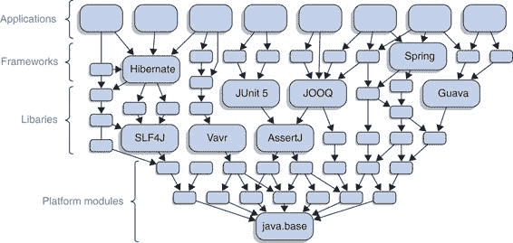
> 
> 图 9.1 对 Java 生态系统全局依赖图的美术诠释：java.base 位于底部，其余的 JDK；然后是无第三方依赖的库；再往上是一些更复杂的库和框架；最顶层是应用程序。（不要关注任何个别依赖。）
> 
> 除了 JDK 之外，所有这些工件在 Java 9 发布时都是普通的 JAR 文件，而且可能需要几年时间才能大多数包含模块描述符。但这是如何发生的？生态系统如何在不破裂的情况下经历如此巨大的变化？由未命名的模块（第 8.2 节）和自动模块（第 8.3 节）启用的模块化策略是答案。这使得 Java 社区几乎可以独立地对生态系统进行模块化。
> 
> 对于那些最轻松的开发者来说，维护一个没有依赖 JDK 外部或其依赖项已经模块化的项目——他们可以实施自下而上的策略（第 9.2.1 节）。对于应用程序，自上而下的方法（第 9.2.2 节）提供了一种前进的方式。维护具有未模块化依赖项的库和框架的开发者会稍微困难一些，需要从内到外做事（第 9.2.3 节）。
> 
> 从整体生态系统来看，你的项目在其中的位置决定了你必须使用哪种策略。图 9.2 将帮助你选择正确的策略。但正如第 9.2.4 节所解释的，这些方法也可以在单个项目中使用，在这种情况下，你可以选择这三种中的任何一种。在我们到达那里之前，如果我们假设你一次模块化所有工件，学习这些策略会更容易。
> 
> 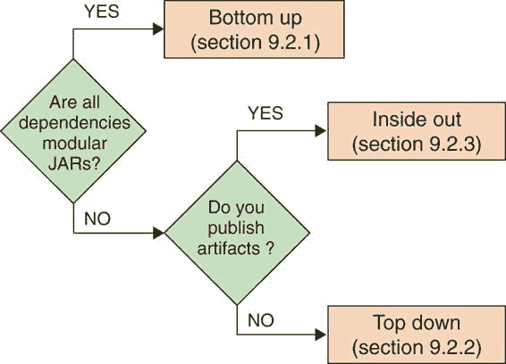
> 
>  如何决定哪种模块化策略适合你的项目
> 
> 通过在你的 JAR 文件中包含模块描述符，你宣布该项目已准备好在 Java 9+上作为模块使用。只有在你已经采取所有可能的步骤确保其顺利工作时才应该这样做——第六章和第七章解释了大多数挑战，但如果你的代码使用了反射，你也应该阅读第十二章。
> 
> 如果用户必须做任何事情才能使你的模块工作，比如向他们的应用程序添加命令行标志，这应该有很好的文档记录。请注意，你可以创建仍然可以在 Java 8 和更早版本上无缝工作的模块化 JAR 文件——第 9.3.4 节为你提供了覆盖。
> 
> 正如我经常提到的，模块有三个基本属性：一个名称、一个明确定义的 API 和显式的依赖关系。在创建模块时，显然你必须选择名称。导出可能会有争议，但主要是由需要访问哪些类来预定的。真正的挑战，以及生态系统其他部分发挥作用的地方，是依赖关系。本节重点介绍这一方面。
> 
> > 了解你的依赖关系
> > 
> > 你必须对你的依赖关系有相当的了解，无论是直接的还是间接的，才能对项目进行模块化。记住，你可以使用 JDeps 来确定依赖关系（尤其是在平台模块方面；参见附录 D）和`jar --describe-module`来检查 JAR 的模块化状态（参见 4.5.2 节和 8.3.1 节）。
> > 
> 说了这么多，是时候看看三种模块化策略是如何工作的了。
> 
> 9.2.1 自下而上模块化：如果所有项目依赖项都是模块化的
> 
> 这是将项目的 JAR 包转换为模块的最简单情况：假设代码只依赖于显式模块（直接和间接）。这些模块是平台模块还是应用模块无关紧要；你可以直接进行：

1.  创建需要所有直接依赖项的模块声明。

1.  将包含你的非 JDK 依赖项的 JAR 包放置在模块路径上。

> 现在，你已经完全模块化了你的项目——恭喜！如果你在维护一个库或框架，并且用户将你的 JAR 包放置在模块路径上，它们将成为显式模块，用户可以开始从模块系统中受益。参见图 9.3 以了解自下而上的模块化示例。
> 
> 几乎同样重要但不太明显的是，由于所有类路径上的 JAR 包最终都会进入未命名的模块（参见第 8.2 节），没有人被迫将其用作模块。如果有人继续使用类路径一段时间，你的项目将像模块描述符不存在一样正常工作。如果你想要模块化你的库，但你的依赖项还不是模块，请参阅第 9.2.3 节。
> 
> 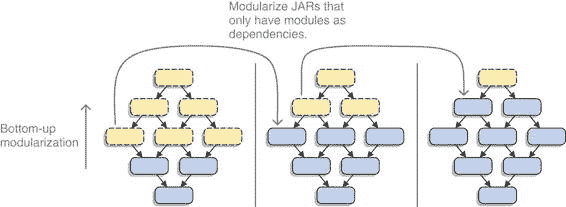
> 
> 图 9.3 依赖于模块化 JAR 包的工件可以立即进行模块化，从而导致自下而上的迁移
> 
> 9.2.2 自上而下模块化：如果应用程序不能等待其依赖项
> 
> 如果你是一名应用程序开发者，并且希望尽快模块化，那么你的所有依赖项很可能还没有提供模块化的 JAR 包。如果它们已经有了，那么你很幸运，可以采用我刚才描述的自下而上的方法。否则，你必须使用自动模块，并开始混合模块路径和类路径，如下所示：

1.  创建需要所有直接依赖项的模块声明。

1.  将所有模块化 JAR 包，包括你构建的和你依赖的，放置在模块路径上。

1.  将所有由模块化 JAR 包直接需要的普通 JAR 包放置在模块路径上，在那里它们被转换为自动模块。

1.  思考如何处理剩余的普通 JAR 包（参见第 8.3.3 节）。

> 可能最简单的方法是将所有剩余的 JAR 包放置在你的构建工具或 IDE 的模块路径上，并尝试一下。虽然我不认为这通常是最好的方法，但它可能对你有效。在这种情况下，就去做吧。
> 
> 如果你遇到包拆分或访问 JDK 内部 API 的问题，你可以尝试将这些 JAR 包放置在类路径上。因为只有自动模块需要它们，并且它们可以读取未命名的模块，所以这可以正常工作。
> 
> 在未来，一旦一个以前自动的模块被模块化，这种设置可能会失败，因为现在它是一个模块化 JAR 文件，位于模块路径上，因此无法访问类路径上的代码。我认为这是一个好事，因为它可以更好地了解哪些依赖项是模块，哪些不是——这也是检查其模块描述符并了解项目的好机会。要解决这个问题，将那个模块的依赖项移动到模块路径上。参见图 9.4 中一个自顶向下的模块化示例。
> 
> 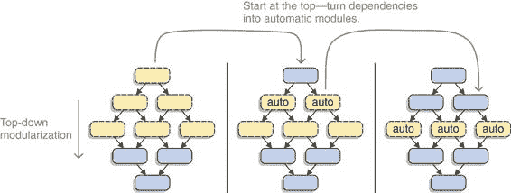
> 
> 图 9.4 由于自动模块的存在，可以模块化依赖于普通 JAR 文件的工件。应用程序可以使用这一点从上向下进行模块化。
> 
> 注意，你不必担心自动模块名称的来源（参见第 8.3.4 节）。确实，如果它们基于文件名，一旦它们获得显式的模块名称，你可能需要更改一些`requires`指令；但因为你控制所有模块声明，所以这并不是什么大问题。
> 
> 那么如何确保非模块化依赖项所需的模块进入图中呢？应用程序可以在模块声明中要求它们，或者使用`--add-modules`在编译和启动时手动添加它们。后者只有在你可以控制启动命令的情况下才是可选的。构建工具可能能够做出这些决定，但你仍然需要了解这些选项以及如何配置它们，以便在出现问题时可以解决问题。
> 
> 9.2.3 内部-外部模块化：如果项目位于堆栈中间
> 
> 大多数库和，尤其是框架，既不在堆栈的底部也不在顶部——它们该怎么办？它们从内部向外进行模块化。这个过程包含一点自下而上的（第 9.2.1 节），因为发布模块化 JAR 文件并不强制用户将它们作为模块使用。除此之外，它的工作方式类似于自顶向下（第 9.2.2 节），但有一个重要区别：你计划发布你构建的模块化 JAR 文件。参见图 9.5 中一个内部-外部模块化示例。
> 
> 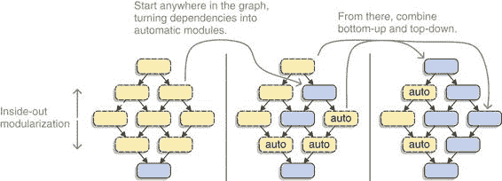
> 
> 图 9.5 如果自动模块被谨慎使用，堆栈中间的库和框架可以发布模块化 JAR 文件，尽管它们的依赖项和用户仍然是普通的 JAR 文件，从而从内部向外模块化生态系统。
> 
> 正如我在第 8.3.4 节中详细讨论的那样，你应该只发布依赖于自动模块的模块，如果那些普通的 JAR 文件在它们的清单中定义了`Automatic-Module-Name`条目。否则，当模块名称更改时，造成未来问题的风险太高。
> 
> 这可能意味着你目前还不能模块化你的项目。如果你处于这种情况，请抵制住无论如何都要做的诱惑，否则你可能会给用户带来困难的问题。
> 
> 我想要更进一步：检查你的直接和间接依赖项，确保没有任何依赖项依赖于由 JAR 文件名派生的自动模块。你正在寻找任何不是模块化 JAR 且没有定义`Automatic-Module-Name`条目的依赖项。我不会发布任何包含此类 JAR 的模块描述符——无论是我的依赖项还是他人的。
> 
> 当涉及到平台模块时，也存在一个微妙的不同之处，这些平台模块是你非模块化依赖项需要的，但你不需要。虽然应用程序可以轻松使用命令行选项，但库或框架却不能。它们只能为用户提供文档说明需要添加，但一些用户可能会忽略这一点。因此，我建议明确要求所有非模块化依赖项需要的平台模块。
> 
> 9.2.4 在项目内部应用这些策略
> 
> 使用哪种策略取决于项目在庞大的、生态系统范围内的依赖图中的位置。但如果项目相当大，你可能无法一次性将其全部模块化，并可能想知道如何分步骤进行。好消息是，你可以在较小范围内应用类似的策略。
> 
> 将自下而上的策略应用于项目通常更容易，首先模块化只依赖于代码库外代码的子项目。如果依赖项已经模块化，这尤其有效，但并不局限于这种情况。如果没有，你需要将自上而下的逻辑应用于子项目的最低层，使它们使用自动模块来依赖于普通 JAR，然后从那里构建起来。
> 
> 将自上而下的方法应用于单个项目，与应用于整个生态系统时效果相同。在图的最顶层模块化一个工件，将其放置在模块路径上，并将它的依赖项转换为自动模块。然后逐步向下进行依赖树。
> 
> 你甚至可以反过来操作。第十章介绍了服务：这是一个使用模块系统解耦项目内部以及不同项目之间依赖项的绝佳方式。它们是开始模块化项目依赖图中间某个位置并从那里向上或向下移动的好理由。
> 
> > 重要的是要注意，无论你内部选择了哪种方法，你仍然不能发布依赖于未由 JAR 文件名定义而是由`Automatic-Module-Name`清单条目定义的名称的自动模块的显式模块。
> > 
> 尽管所有这些都是可能的，但你不应无谓地使事情复杂化。一旦你确定了一种方法，就尝试快速而有条理地将你的项目模块化。将这个过程分解并创建模块意味着你将难以理解项目的依赖图——而这与模块系统的一个重要目标——可靠的配置——是相反的。
> 
> 9.3 使 JAR 模块化
> 
> 将一个普通的 JAR 转换为模块化 JAR，你只需要在源代码中添加一个模块声明。简单，对吧？是的（等着听），但是（看这里！）关于这一步还有更多要说，不仅仅是表面上的：

+   你可能想要考虑创建开放模块（参见 9.3.1 节以获取快速解释）。

+   你可能会因为创建数十个甚至数百个模块声明而感到不知所措，并希望有一个工具为你完成这项工作（参见 9.3.2 节）。

+   你可能想要模块化一个你自己没有构建的 JAR，或者可能是依赖项搞乱了它们的模块描述符，你需要修复它（参见 9.3.3 节）。

+   你可能会对为 Java 8 或更早版本构建的 JAR 中的模块描述符感到好奇——这是否可能（参见 9.3.4 节）？

> 本节将探讨这些主题，以确保你得到物有所值的回报。
> 
> 9.3.1 作为中间步骤的开放模块
> 
> 在应用程序的增量模块化过程中，一个可能有用的概念是开放模块。第 12.2.4 节将详细介绍，但要点是开放模块放弃了强封装：所有其包都是导出和开放的，以便进行反射，这意味着所有其公共类型在编译期间都是可访问的，所有其他类型和成员都可以通过反射访问。它是通过以 `open module` 开头开始其模块声明来创建的。
> 
> 当你对 JAR 的包布局不满意时，开放模块会很有用。也许有很多包，或者也许许多包包含你不想公开访问的公共类型——在这两种情况下，重构可能需要太多时间。或者，也许模块在反射中使用得非常频繁，你不想通过确定所有需要打开的包来处理这些问题。
> 
> 在这种情况下，打开整个模块是将这些问题推迟到未来的好方法。关于技术债务的注意事项适用——这些模块选择放弃强封装，这使他们无法获得其带来的好处。
> 
> > **重要信息**：因为将开放模块转换为常规的、封装的模块是一个不兼容的更改，库和框架永远不应该选择从开放模块开始，目的是稍后关闭它。很难想出一个理由说明这样的项目为什么应该发布开放模块。最好是只将其用于应用程序。
> > 
> 9.3.2 使用 JDEPS 生成模块声明
> 
> 如果你有一个大项目，你可能需要创建数十个甚至数百个模块声明，这是一项艰巨的任务。幸运的是，你可以使用 JDeps 来完成大部分工作，因为这项工作的很大一部分是机械的：

+   模块名称通常可以从 JAR 名称中推导出来。

+   一个项目的依赖关系可以通过跨 JAR 边界扫描字节码来分析。

+   导出是上述分析的逆过程，意味着所有其他 JAR 依赖的包都需要导出。

> 除了这些基本属性之外，可能还需要进行一些微调，以确保记录所有依赖关系，并配置服务（参见第十章）或更详细的依赖关系和 API（参见第十一章），但所有这些都可以由 JDeps 生成。
> 
> 使用 `--generate-module-info ${target-dir} ${jar-dir}` 启动，JDeps 分析 `${jar-dir}` 中的所有 JAR 文件，并在 `${target-dir}/${module-name}` 中为每个 JAR 生成 `module-info.java` 文件：

+   模块名称是从 JAR 文件名派生出来的，就像自动模块（包括注意 `Automatic-Module-Name` 标头；参见第 8.3.1 节）一样。

+   依赖关系基于 JDeps 的依赖关系分析。暴露的依赖关系用 `transitive` 关键字标记（参见第 11.1 节）。

+   所有包含在分析中其他 JAR 所用类型的包都被导出。

> 当 JDeps 生成 `module-info.java` 文件时，你需要检查和调整它们，并将它们移动到正确的源文件夹中，以便你的下一次构建可以编译和打包它们。
> 
> 再次假设 ServiceMonitor 尚未模块化，你可以使用 JDeps 生成模块声明。为此，你构建 ServiceMonitor，并将它的 JAR 文件及其依赖项一起放在一个名为 `jars` 的目录中。然后你调用 `jdeps --generate-module-info declarations jars`，JDeps 生成模块声明，并将其写入如图 9.6 所示的目录结构中。
> 
> 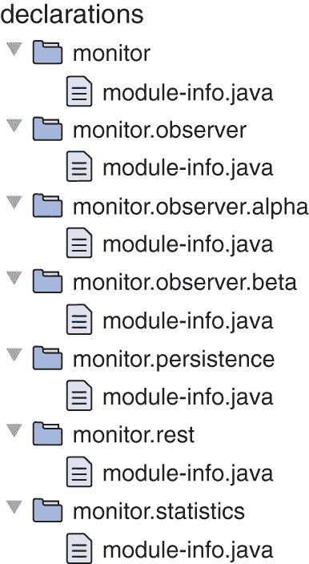
> 
> 图 9.6 在你调用 `jdeps --generate-module-info declarations jars` 之后，JDeps 分析 `jars` 目录中所有 JAR 之间的依赖关系（未显示），并在 `declarations` 目录中为它们创建模块声明（非 ServiceMonitor 项目未显示）。
> 
> JDeps 为每个模块创建一个文件夹，并将类似你之前手动编写的模块声明放入其中。（为了唤起你的记忆，你可以在 列表 2.2 中找到它们，但细节在这里并不重要。）
> 
> JDeps 还可以使用 `--generate-open-module` 为开放模块生成模块声明（参见第 12.2.4 节）。模块名称和 `requires` 指令与之前一样确定；但由于开放模块不能封装任何内容，不需要导出，因此没有生成。
> 
> 检查生成的声明
> 
> JDeps 在生成模块声明方面做得很好，但你仍然需要手动检查它们。模块名称是否符合你的喜好？（可能不是，因为 JAR 名称很少遵循反向域名命名方案；参见第 3.1.3 节。）依赖关系是否被正确建模？（有关更多选项，请参阅第 11.1 和 11.2 节。）这些是否是你希望你的公共 API 包含的包？你可能需要添加一些服务。（参见第十章。）
> 
> 如果你开发的应用程序有太多的 JAR 需要手动检查所有声明，并且你能够容忍一些小问题，那么有一个更宽容的选项：你可以信任你的测试、CI 管道以及你的同事和测试人员来发现这些小问题。在这种情况下，确保在下一个版本发布之前留出一些时间，这样你可以确信你已经修复了一切。
> 
> 如果你正在发布工件，那么你必须非常仔细地检查声明！这些是你 API 最公开的部分，更改它们通常是不兼容的——努力防止在没有充分理由的情况下发生这种情况。
> 
> 小心缺少的依赖项
> 
> 为了 JDeps 能够为一系列 JAR 生成正确的 `requires` 指令，所有这些 JAR 以及它们的所有直接依赖都必须存在于扫描的目录中。如果依赖项缺失，JDeps 将会如下报告：
> 
> `> 缺少依赖：> .../module-info.java 未生成 > 错误：缺少依赖 > depending.type -> missing.type 未找到 > ...`
> 
> 为了避免错误的模块声明，如果模块中不是所有依赖项都存在，则不会为这些模块生成任何声明。
> 
> 在为 ServiceMonitor 生成模块声明时，我忽略了这些信息。一些间接依赖项缺失，可能是由于 Maven 将它们视为可选的，但这并没有阻碍 ServiceMonitor 声明的正确创建：
> 
> `> 缺少依赖：> declarations/jetty.servlet/module-info.java 未生成 # 省略更多日志信息 > 缺少依赖：> declarations/utils/module-info.java 未生成 # 省略更多日志信息 > 缺少依赖：> declarations/jetty.server/module-info.java 未生成 # 省略更多日志信息 > 缺少依赖：> declarations/slf4j.api/module-info.java 未生成 # 省略更多日志信息 > 错误：缺少依赖 > org.eclipse.jetty.servlet.jmx.FilterMappingMBean > -> org.eclipse.jetty.jmx.ObjectMBean 未找到 > org.eclipse.jetty.servlet.jmx.HolderMBean > -> org.eclipse.jetty.jmx.ObjectMBean 未找到 > org.eclipse.jetty.servlet.jmx.ServletMappingMBean > -> org.eclipse.jetty.jmx.ObjectMBean 未找到 > org.eclipse.jetty.server.handler.jmx.AbstractHandlerMBean > -> org.eclipse.jetty.jmx.ObjectMBean 未找到 > org.eclipse.jetty.server.jmx.AbstractConnectorMBean > -> org.eclipse.jetty.jmx.ObjectMBean 未找到 > org.eclipse.jetty.server.jmx.ServerMBean > -> org.eclipse.jetty.jmx.ObjectMBean 未找到 > org.slf4j.LoggerFactory > -> org.slf4j.impl.StaticLoggerBinder 未找到 > org.slf4j.MDC > -> org.slf4j.impl.StaticMDCBinder 未找到 > org.slf4j.MarkerFactory > -> org.slf4j.impl.StaticMarkerBinder 未找到`
> 
> 仔细分析导出项
> 
> 导出指令仅基于分析其他 JAR 需要哪些类型的依赖。这几乎保证了库 JAR 将看到非常少的导出项。在检查 JDeps 输出时请记住这一点。
> 
> 作为库或框架开发者，你可能不希望发布导出你认为是项目内部包的工件，仅仅因为你的几个模块需要它们。请查看第 11.3 节中的合格导出，以解决这个问题。
> 
> 9.3.3 破解第三方 JAR
> 
> 有时可能需要更新第三方 JAR。可能你需要的是显式模块或至少是具有特定名称的自动模块。也许它已经是一个模块，但模块描述符有误或与你不希望引入的依赖项造成问题。在这种情况下，是时候拿出锋利的工具开始工作了。（小心不要割伤自己。）
> 
> 一个很好的例子是，在像 Java 这样庞大的生态系统中，必然存在的奇怪边缘情况之一是字节码操作工具 Byte Buddy。它以`bytebuddy-${version}.jar`的形式发布在 Maven Central 上，当你尝试将其用作自动模块时，模块系统会给出以下回复：
> 
> `> byte.buddy: 无效的模块名称：'byte' 不是一个 Java 标识符`
> 
> 哎呀：`byte`不是一个有效的 Java 标识符，因为它与同名的原始类型冲突。这个特定的情况在 Byte Buddy 1.7.3 及以后的版本中得到了解决（通过`Automatic-Module-Name`条目），但你可能会遇到类似的边缘情况，需要做好准备。
> 
> 通常，不建议本地修改已发布的 JAR，因为这很难可靠且以自文档化的方式进行。如果你的开发流程包括一个所有开发者都连接到的本地工件存储库，如 Sonatype 的 Nexus，那么这会变得容易一些。在这种情况下，某人可以创建一个修改过的变体，将版本更改为使修改明显（例如，通过添加`-patched`），然后将其上传到内部存储库。
> 
> 在构建过程中执行修改也可能是有可能的，在这种情况下，可以即时使用和编辑标准 JAR，根据需要。修改后将成为构建脚本的一部分。
> 
> 注意，你永远不应该发布依赖于修改过的 JAR 的工件！用户将无法轻松地重现这些修改，并且会留下一个损坏的依赖项。这很大程度上限制了以下建议仅适用于应用程序。
> 
> 在排除这些注意事项之后，让我们看看如果第三方 JAR 与你的项目不兼容时，如何操作第三方 JAR。我会展示如何添加或编辑自动模块名称，添加或编辑模块描述符，以及将类添加到模块中。
> 
> 添加和编辑自动模块名称
> 
> 除了 JPMS 无法从中推导出名称的场景之外，将自动模块名称添加到 JAR 中的另一个很好的理由是，如果项目在较新版本中已经定义了一个名称，但你由于某种原因还不能更新到它。在这种情况下，编辑 JAR 允许你在模块声明中使用一个未来兼容的名称。
> 
> `jar` 工具有一个选项 `--update`（备选是 `-u`），允许修改现有的 Java 归档。结合 `--manifest=${manifest-file}` 选项，你可以将任何内容添加到现有的清单中——例如，`Automatic-Module-Name` 条目。
> 
> 让我们以一个较旧的 Byte Buddy 版本，版本 1.6.5，为例，确保它作为一个自动模块正常工作。首先创建一个纯文本文件，比如 `manifest.txt`（你可以选择任何你想要的名称），其中包含一行：
> 
> `Automatic-Module-Name: net.bytebuddy`
> 
> 然后使用 `jar` 将该行添加到现有的清单中：
> 
> `$ jar --update --file bytebuddy-1.6.5.jar --manifest=manifest.txt`
> 
> 现在，让我们检查它是否工作：
> 
> `$ jar --describe-module --file bytebuddy-1.6.5.jar  > 未找到模块描述符。派生自动模块。 > > net.bytebuddy@1.6.5 自动 > 需要 java.base 强制指定`
> 
> 很好：没有错误，模块名称符合预期。
> 
> 同样的方法可以用来编辑现有的自动模块名称。`jar` 工具会抱怨 `Manifest 中的重复名称`，但新值仍然会替换旧值。
> 
> 添加和编辑模块描述符
> 
> 如果将第三方 JAR 转换为正确命名的自动模块还不够，或者你在显式模块上遇到麻烦，可以使用 `jar --update` 来添加或覆盖模块描述符。后者的重要用例是解决第 8.3.4 节中描述的模块死亡菱形问题：
> 
> `$ jar --update --file ${jar} module-info.class`
> 
> 这会将文件 `module-info.class` 添加到 `${jar}`。请注意，`--update` 不会执行任何检查。这使得意外或故意创建模块描述符和类文件不一致的 JAR 文件变得容易，例如在必需的依赖关系上。请谨慎使用！
> 
> 更复杂的任务是创建模块描述符。为了编译器创建一个，你需要的不只是模块声明，还有所有依赖（它们的存放在可靠配置的一部分中进行检查）以及 JAR 代码的一些表示（作为源代码或字节码；否则编译器会抱怨不存在包）。
> 
> 你的构建工具应该能够帮助你处理依赖关系（Maven：copy-dependencies）。对于代码来说，编译器看到整个模块，而不仅仅是声明，这一点非常重要。这最好通过在模块的字节码通过 `--patch-module` 添加时编译声明来实现。第 7.2.4 节介绍了该选项，以下示例展示了如何使用它：
> 
> `$ jdeps --generate-module-info . jars` `①``# 编辑 ${module-name}/module-info.java` `②``$ javac` `③` `--module-path jars --patch-module ${module-name}=jars/${jar} ${module-name}/module-info.java` `$ mv ${module-name}/module-info.java .` `④``$ jar --update --file jars/${jar} module-info.class` `⑤``$ jar --describe-module --file jars/${jar}` `⑥`
> 
> > ①
> > 
> > 为所有 JAR 文件生成模块声明（尽管只有 ${jar} 的那个对我们感兴趣）
> > 
> > ②
> > 
> > 按照你的需求编辑声明。
> > 
> > ③
> > 
> > 使用 jars 作为模块路径编译声明，并通过 --patch-module 选项将模块的字节码修补到模块中
> > 
> > ④
> > 
> > 将 ${jar} 的模块描述符移动到根目录（否则更新 JAR 文件将无法正常工作）
> > 
> > ⑤
> > 
> > 将模块描述符添加到 ${jar}
> > 
> > ⑥
> > 
> > 验证一切是否正常——模块现在应该具有所需的属性
> > 
> 向模块中添加类
> 
> 如果你已经需要向依赖项的包中添加一些类，你可能已经将它们放在了类路径上。一旦那个依赖项移动到模块路径，反对拆分包的规则就禁止了那种方法。第 7.2.4 节展示了如何使用 `--patch-module` 选项动态处理这种情况。如果你在寻找一个更持久的解决方案，你还可以再次使用 `jar --update`，在这种情况下是为了添加类文件。
> 
> 9.3.4 为 JAVA 8 及更早版本发布模块化 JAR
> 
> 无论你是维护一个应用程序、库还是框架，你可能需要针对多个 Java 版本。这意味着你必须跳过模块系统吗？幸运的是，不是！有两种方法可以提供在 Java 9 版本之前的版本上运行良好的模块化工件。
> 
> 无论你选择哪种方式，首先你需要为目标版本构建你的项目。你可以使用对应 JDK 的编译器，或者通过设置 `-source` 和 `-target` 使用一个更新的版本。如果你选择了 Java 9+ 编译器，请查看第 4.4 节中的新标志 `--release`。完成这一步后，就像平常一样创建一个 JAR 文件。请注意，这个 JAR 文件在你的期望的 Java 版本上运行得非常好，但还没有包含模块描述符。
> 
> 下一步是使用 Java 9+ 编译模块声明。最好的和最可靠的方法是使用 Java 9+ 编译器构建整个项目。现在你有两种方法可以将模块描述符放入你的 JAR 文件中，下面将进行描述。
> 
> 使用 JAR --UPDATE
> 
> 你可以使用第 9.3.3 节中描述的 `jar --update` 命令将模块描述符添加到 JAR 文件中。这是因为版本 9 之前的 JVM 忽略模块描述符。它们只看到其他类文件；而且因为你为正确的版本构建它们，所以一切正常。
> 
> 虽然这在 JVM 中是正确的，但对于处理字节码的所有工具来说并不一定如此。有些工具会遇到`module-info.class`并因此对模块 JAR 变得无用。如果你想防止这种情况，你必须创建一个多版本 JAR。
> 
> 创建多版本 JAR
> 
> 从 Java 9 开始，`jar`允许创建多版本 JAR（MR-JAR），其中包含不同 Java 版本的字节码。附录 E 对这个新特性进行了详细介绍；为了充分利用这一部分，你应该阅读它。在这里，我专注于如何使用 MR-JAR，以确保模块描述符不会出现在 JAR 的根目录中。
> 
> 假设你有一个常规 JAR，并想将其转换为多版本 JAR，其中模块描述符在 Java 9（及以后版本）上加载。以下是使用`--update`和`--release`进行转换的方法：
> 
> `$ jar --update --file ${jar} --release 9 module-info.class`
> 
> 你也可以一次创建一个多版本 JAR：
> 
> `$ jar --create --file mr.jar -C classes . --release 9 classes-9/module-info.class`
> 
> 前三行是从`classes`中的类文件创建 JAR 的常规方式。然后是`--release 9`，后面跟着 JVM 版本 9 及以上需要加载的额外源。显示了生成的 JAR——正如你所见，根目录不包含`module-info.class`。
> 
> 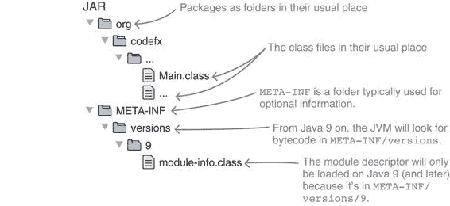
> 
> 图 9.7 通过创建多版本 JAR，你可以将模块描述符放在`META-INF/versions/9`而不是工件根目录下。
> 
> 这个功能远不止添加模块描述符。所以，如果你还没有的话，我建议阅读附录 E。
> 
> 现在我们已经涵盖了绿色字段项目和现有代码库的基本知识，继续阅读以了解模块系统的高级功能在第三部分。
> 
> 摘要

+   如果你还没有使用 Java 8，首先进行这个更新。如果初步分析显示你的某些依赖项在 Java 9+上存在问题，接下来更新它们。这确保了你一次只迈出一小步，从而将复杂性保持在最低。

+   你可以采取一些措施来分析迁移问题：

+   在 Java 9+上构建，并应用快速修复（`--add-modules`、`--add-exports`、`--add-opens`、`--patch-module`等）以获取更多信息。

+   使用 JDeps 来查找分割包和内部 API 的依赖关系。

+   搜索导致问题的特定模式，如对`URLClassLoader`的转换和使用已删除的 JVM 机制。

+   收集这些信息后，正确评估它们非常重要。快速修复的风险是什么？正确解决它们有多难？受影响的代码对你的项目有多重要？

+   当你开始迁移时，努力持续构建你的更改，理想情况下是从团队其他成员使用的同一分支开始。这确保了 Java 9+的努力和常规开发得到了很好的整合。

+   命令行选项使你能够快速解决在 Java 9+上使构建工作时的挑战，但要注意不要长时间保留它们。它们使得忽略问题变得容易，直到未来的 Java 版本加剧这些问题。相反，应致力于长期解决方案。

+   存在三种模块化策略。适用于整个项目的策略取决于其类型和依赖关系：

+   自下而上的方法适用于仅依赖于模块的项目。创建模块声明，并将所有依赖项放置在模块路径上。

+   自上而下的方法适用于尚未完全模块化的应用程序。它们可以创建模块声明，并将所有直接依赖项放置在模块路径上——普通 JAR 文件被转换为可以依赖的自动模块。

+   自内而外适用于尚未完全模块化的库和框架。它的工作方式类似于自上而下，但有一个限制，即只能使用定义了`Automatic-Module-Name`清单条目的自动模块。否则，自动模块名称在构建设置和时间上可能不稳定，这可能导致用户遇到重大问题。

+   在项目内部，你可以选择适合其特定结构的任何策略。

+   JDeps 允许使用`jdeps --generate-module-info`自动生成模块声明。这对于大型项目尤其相关，手动编写模块声明会花费大量时间。

+   使用`jar`工具的`--update`选项，你可以修改现有的 JAR 文件：例如，设置`Automatic-Module-Name`或添加或覆盖模块描述符。如果依赖项的 JAR 文件存在无法解决的错误，这是解决这些问题的最有效工具。

+   通过为较旧的 Java 版本编译和打包源代码，然后添加模块描述符（可以在 JARs 根目录中，或者使用`jar --version`命令添加到 Java 9+特定的子目录中），你可以创建在多种 Java 版本上运行的模块化 JAR 文件，如果放置在 Java 9 模块路径上，还可以作为一个模块使用。
