> 第三部分
> 
> 高级模块系统功能
> 
> 而第一部分和第二部分类似于四道菜的晚餐，这本书的这一部分更像是一个自助餐。它涵盖了模块系统的先进功能，你可以自由选择你最喜欢的内容，以你喜欢的顺序进行选择。
> 
> 第十章介绍了服务，这是一种将用户与 API 的实现解耦的强大机制。如果你对精炼 `requires` 和 `exports` 更感兴趣——例如，用于建模可选依赖项——请查看第十一章。查看第十二章，以准备你的模块供你喜欢的框架进行反射访问，并学习如何更新你自己的反射代码。
> 
> 模块系统不处理模块版本信息，但在构建模块时可以记录它，并在运行时评估它。第十三章也探讨了这一点，以及为什么没有进一步支持版本的原因，例如运行同一模块的多个版本。
> 
> 第十四章从开发模块退后一步，而是将它们视为创建自定义运行时图像的输入，这些图像仅包含运行你的项目所需的模块。更进一步，你可以包括你的整个应用程序，创建一个可部署的单个单元，以便发送给你的客户或服务器。
> 
> 最后，第十五章将所有这些内容整合在一起。它展示了 ServiceMonitor 应用程序的一个变体，该变体使用了大多数高级功能，然后给出了一些设计和维护模块化应用程序的技巧，在勇敢地描绘 Java 的未来：一个模块化生态系统之前。
> 
> 顺便说一句，这些功能在复杂程度上并不先进，它们只是比基本机制更复杂。它们建立在那些机制之上，因此需要更多关于模块系统的背景知识。如果你已经阅读了第一部分，特别是第三章，你就准备好了。
> 
> （我知道，我已经说过几次了，但请记住，我选择的模块名称被缩短了，以便更容易使用。请使用 3.1.3 节中描述的反域名命名方案。）
> 
> 10
> 
> 使用服务解耦模块
> 
> 本章涵盖

+   使用服务改进项目设计

+   在 JPMS 中创建服务、消费者和提供者

+   使用 `ServiceLoader` 消费服务

+   开发设计良好的服务

+   在不同 Java 版本中部署普通和模块化的 JAR 文件

> 到目前为止，我们使用 `requires` 指令来表示模块之间的关系，其中依赖模块必须通过名称引用每个特定的依赖项。正如 3.2 节深入解释的那样，这位于可靠配置的核心。但有时你想要一个更高层次的抽象。
> 
> 本章探讨了模块系统中的服务以及如何通过消除它们之间的直接依赖来使用它们解耦模块。解决服务问题的第一步是掌握基础知识。在此基础上，我们查看细节，特别是如何正确设计服务（第 10.3 节）以及如何使用 JDK 的 API 来消费它们（第 10.4 节）。（要查看服务的实际应用，请查看 ServiceMonitor 存储库中的`feature-services`分支。）
> 
> 到本章结束时，你将了解如何设计良好的服务，如何为使用或提供服务的模块编写声明，以及如何在运行时加载服务。你可以使用这些技能来连接 JDK 或第三方依赖项中的服务，以及在你自己的项目中消除直接依赖。
> 
> 10.1 探索服务需求
> 
> 如果我们谈论的是类而不是模块，你会对总是依赖于具体类型感到满意吗？或者需要为需要它的每个类实例化每个依赖？如果你喜欢像控制反转和依赖注入这样的设计模式，你现在应该强烈地摇头。比较列表 10.1 和 10.2——第二个看起来不是更好吗？它允许调用者选择成为出色的流，甚至给调用者选择任何`InputStream`实现的自由。
> 
> > 列表 10.1 依赖于具体类型并建立依赖
> > 
> `public class InputStreamAwesomizer {` `private final ByteArrayInputStream stream;` `①` `public AwesomeInputStream(byte[] buffer) {` `stream = new ByteArrayInputStream(buffer);` `②` `}  // [... 精彩方法 ...]  }`
> 
> > ①
> > 
> > 依赖于具体类型
> > 
> > ②
> > 
> > 直接建立依赖
> > 
> > 列表 10.2 依赖于抽象类型；调用者建立依赖
> > 
> `public class InputStreamAwesomizer {` `private final InputStream stream;` `①` `public AwesomeInputStream(InputStream stream) {` `this.stream = stream;` `②` `}  // [... 精彩方法 ...]  }`
> 
> > ①
> > 
> > 依赖于抽象类型
> > 
> > ②
> > 
> > 调用者建立的依赖
> > 
> 依赖于接口或抽象类并让其他人选择具体实例的另一个重要好处是，这样做反转了依赖的方向。不是高级概念（比如说`Department`）依赖于低级细节（`Secretary`、`Clerk`和`Manager`），两者都可以依赖于一个抽象（`Employee`）。如图 10.1 所示，这打破了高级和低级概念之间的依赖关系，从而将它们解耦。
> 
> 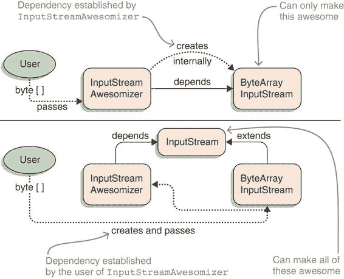
> 
> 图 10.1 如果一个类型建立了自己的依赖（顶部），用户无法影响它们。如果一个类型的依赖在构建过程中传递（底部），用户可以选择最适合其用例的实现。
> 
> 回到模块，`requires`指令与列表 10.1 中的代码类似，只是在不同的抽象级别上：

+   模块依赖于其他具体模块。

+   用户无法交换依赖项。

+   无法反转依赖项的方向。

> 幸运的是，模块系统并没有止步于此。它提供了服务，这是一种模块表达它们依赖于抽象类型或提供满足此类依赖的具体类型的方式，模块系统在其中居中协调。（如果您现在正在考虑服务定位器模式，您完全正确！）正如您将看到的，服务并不完美地解决所有提到的问题，但它们已经走了很长的路。图 10.4 展示了两种类型的依赖。
> 
> 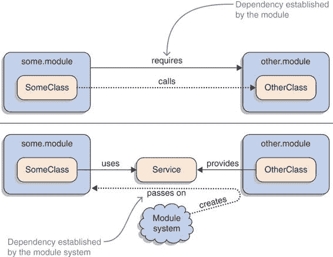
> 
> 图 10.2 如果一个模块需要另一个（顶部），则依赖项是固定的；它不能从外部更改。另一方面，如果一个模块使用服务（底部），则具体的实现是在运行时选择的。
> 
> 10.2 Java 平台模块系统中的服务
> 
> 当我们在 JPMS 的上下文中谈论一个服务时，它通常指的是我们想要使用的一个特定类型，通常是一个接口，但我们不实例化其实现。相反，模块系统会从其他模块中拉入它们提供的实现，并实例化这些实现。本节详细展示了这一过程，以便您知道应该将什么放入模块描述符中，以及如何在运行时获取实例，以及这对模块解析有何影响）。
> 
> 10.2.1 使用、提供和消费服务
> 
> 服务是一个可访问的类型，一个模块想要使用，而另一个模块提供其实例：

+   消费服务的模块使用其模块描述符中的`uses ${service}`指令来表达其需求，其中`${service}`是服务类型的完全限定名。

+   提供服务的模块使用`provides ${service} with ${provider}`指令来表达其提供，其中`${service}`与`uses`指令中的类型相同，而`${provider}`是另一个类的完全限定名，该类是以下之一：

+   一个扩展或实现`${service}`的具体系列，并且有一个公共、无参数的构造函数（称为提供者构造函数）

+   一个具有公共、静态、无参数方法`provide`的任意类型，该方法返回一个扩展或实现`${service}`的类型（称为提供者方法）

> 在运行时，依赖模块可以使用`ServiceLoader`类通过调用`ServiceLoader.load(${service}.class)`来获取服务的所有提供实现。然后，模块系统为模块图中声明的每个提供者返回一个`Provider<${service}>`。图 10.3 说明了实现`Provider`的方法。
> 
> 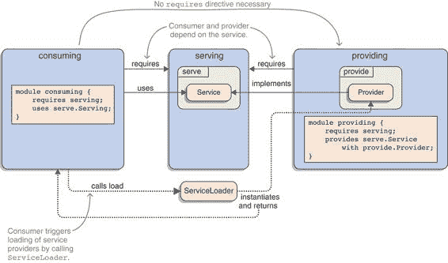
> 
> 图 10.3 使用服务的核心是一个特定的类型，这里称为`Service`。`Provider`类实现了它，包含它的模块通过`provides — with`指令声明了这一点。需要使用服务的模块需要通过`uses`指令声明。在运行时，它们可以使用`ServiceLoader`来获取给定服务的所有提供者的实例。
> 
> 在服务周围有很多细节需要考虑；但一般来说，它们是一个很好的抽象，并且在实践中使用起来很直接，所以让我们从这里开始。请坐好；走流程比输入`requires`或`exports`指令要花的时间长。
> 
> ServiceMonitor 应用程序提供了一个很好的服务使用示例。来自`monitormodule`的`Monitor`类需要一个`List<ServiceObserver>`来联系它应该监控的服务。到目前为止，`Main`是这样做的：
> 
> `private static Optional<ServiceObserver> createObserver(String serviceName) { return AlphaServiceObserver.createIfAlphaService(serviceName) .or(() -> BetaServiceObserver.createIfBetaService(serviceName)); }`
> 
> 代码的具体工作原理并不是特别重要。重要的是它使用了来自`monitor.observer.alpha`的具体系列类型`AlphaServiceObserver`和来自`monitor.observer.beta`的`BetaServiceObserver`。因此，monitor 需要依赖于这些模块，并且它们需要导出相应的包——图 10.4 显示了模块图中匹配的部分。
> 
> 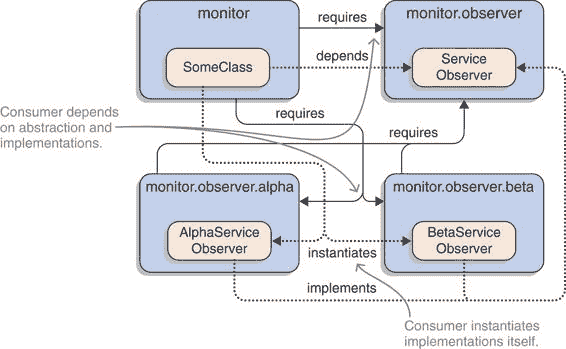
> 
> 图 10.4 没有服务的情况下，monitor 模块需要依赖于所有其他涉及的模块：observer、alpha 和 beta，如图中部分模块图所示。
> 
> 现在，让我们将其转换为服务。首先，创建这些观察者的模块需要声明它打算使用一个服务。首先使用`ServiceObserver`，所以 monitor 的模块声明看起来像这样：
> 
> `module monitor { // [...省略的 requires 指令...] // 移除了对 monitor.observer.alpha 和 beta 的依赖 - 好耶！使用 monitor.observer.ServiceObserver; }`
> 
> 第二步是在提供者模块 monitor.observer.alpha 和 monitor.observer.beta 中声明`provides`指令：
> 
> `module monitor.observer.alpha { requires monitor.observer; // 移除了 monitor.observer.alpha 的导出 - 好耶！提供 monitor.observer.ServiceObserver，使用 monitor.observer.alpha.AlphaServiceObserver; }`
> 
> 虽然这样不行——编译器抛出了一个错误：
> 
> `> 服务实现没有 > 公共默认构造函数： > AlphaServiceObserver`
> 
> 提供者构造函数和提供者方法需要是无参数的，但`AlphaServiceObserver`期望观察的服务 URL。怎么办？你可以在创建后设置 URL，但这会使类可变，并引发如果服务不是 alpha 时应该怎么办的问题。不，创建一个观察者工厂更干净，该工厂仅在 URL 正确时返回一个实例，并将该工厂作为服务。
> 
> 因此，在 monitor.observer 中创建一个新的接口，`ServiceObserverFactory`。它有一个单独的方法，`createIfMatchingService`，该方法期望服务 URL 并返回一个`Optional<ServiceObserver>`。在 monitor.observer.alpha 和 monitor.observer.beta 中，创建实现，这些实现与`AlphaServiceObserver`和`BetaServiceObserver`上的静态工厂方法曾经执行的操作相同。图 10.5 显示了模块图的相应部分。
> 
> 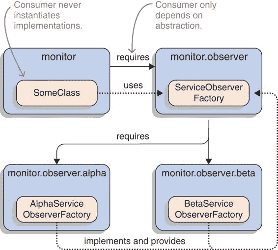
> 
> 图 10.5 使用服务，监控器只依赖于定义服务的模块：observer。提供模块 alpha 和 beta 不再直接需要。
> 
> 使用这些类，你可以作为服务提供和消耗`ServiceObserverFactory`。以下列表显示了 monitor、monitor.observer、monitor.observer.alpha 和 monitor.observer.beta 的模块声明。
> 
> > 列表 10.3 与`ServiceObserverFactory`一起工作的四个模块
> > 
> `module monitor {` `requires monitor.observer;` `①` `// [... truncated other requires directives ...]` `uses monitor.observer.ServiceObserverFactory;` `②` `}` `module monitor.observer {` `③` `exports monitor.observer; }  module monitor.observer.alpha {` `requires monitor.observer;` `④` `provides monitor.observer.ServiceObserverFactory` `with monitor.observer.alpha.AlphaServiceObserverFactory;` `⑤` `}  module monitor.observer.beta { requires monitor.observer; provides monitor.observer.ServiceObserverFactory with monitor.observer.beta.BetaServiceObserverFactory; }`
> 
> > ①
> > 
> > 消耗模块监控器需要 monitor.observer，因为它包含 ServiceObserverFactory。多亏了服务，它不需要 alpha 或 beta。
> > 
> > ②
> > 
> > 消耗模块监控器使用服务接口 ServiceObserverFactory。
> > 
> > ③
> > 
> > monitor.observer 没有变化：它不知道它被用作服务。所需的一切只是包含 ServiceObserver 和 ServiceObserverFactory 的包的常规导出。
> > 
> > ④
> > 
> > 两个提供模块都需要 monitor.observer，因为它们实现了它包含的接口——服务没有改变什么。
> > 
> > ⑤
> > 
> > 每个提供模块都向服务 ServiceObserverFactory 提供其具体类。
> > 
> 最后一步是在监控器中获取观察器工厂。为此，调用`ServiceLoader.load(ServiceObserverFactory.class)`，对返回的提供者进行流处理，并获取服务实现：
> 
> `List<ServiceObserverFactory> observerFactories = ServiceLoader .load(ServiceObserverFactory.class).stream()` `.map(Provider::get)` `①` `.collect(toList());`
> 
> > ①
> > 
> > `Provider::get`实例化一个提供者（参见第 10.4.2 节）。
> > 
> 现在你有了服务提供者，消费模块和提供模块都不知道对方。它们之间唯一的联系是它们都依赖于 API 模块。
> 
> 平台模块也声明并使用了大量服务。其中一个特别有趣的是`java.sql.Driver`，由 java.sql 声明和使用：
> 
> `$ java --describe-module java.sql  > java.sql # truncated exports # truncated requires > uses java.sql.Driver`
> 
> 这样，java.sql 就可以访问其他模块提供的所有`Driver`实现。
> 
> 平台中服务的另一个典型用途是`java.lang.System.LoggerFinder`。这是 Java 9 中添加的新 API 的一部分，允许用户将 JDK 的日志消息（不是 JVM 的！）导入他们选择的日志框架（例如，Log4J 或 Logback）。而不是写入标准输出，JDK 使用`LoggerFinder`来创建`Logger`实例，然后使用它们记录所有消息。
> 
> 对于 Java 9 及以后的版本，日志框架可以实现使用框架基础设施的日志记录器工厂：
> 
> `public class ForesterFinder extends LoggerFinder {` `①` `@Override public Logger getLogger(String name, Module module) { return new Forester(name, module); }  }`
> 
> > ①
> > 
> > 属于虚构的 Forester 日志框架
> > 
> 但日志框架如何通知 java.base 它们的`LoggerFinder`实现呢？很简单：它们提供自己的实现来提供`LoggerFinder`服务：
> 
> `module org.forester { provides java.lang.System.LoggerFinder with org.forester.ForesterFinder; }`
> 
> 这之所以有效，是因为基础模块使用了`LoggerFinder`，然后调用`ServiceLoader`来定位`LoggerFinder`的实现。它获取一个框架特定的查找器，要求它创建`Logger`实现，然后使用它们来记录消息。
> 
> 这应该能给你一个如何创建和使用服务的良好概念。接下来是细节！
> 
> 10.2.2 服务模块解析
> 
> 如果你曾经启动了一个简单的模块化应用程序并观察模块系统正在做什么（例如，使用`--show-module-resolution`，如第 5.3.6 节所述），你可能会对解析的平台模块数量感到惊讶。对于像 ServiceMonitor 这样的简单应用程序，唯一的平台模块应该是 java.base 以及可能的一个或两个更多，那么为什么有这么多其他模块呢？服务就是答案。
> 
> > **基本信息** 记住从 3.4.3 节中提到的，只有那些在模块解析过程中进入图的模块在运行时才是可用的。为了确保所有可观察的服务提供者都符合这一条件，解析过程会考虑`uses`和`provides`指令。除了 3.4.1 节中描述的解析行为之外，一旦解析了一个消耗服务的模块（例如 monitor 或 java.base），它就会将提供该服务的所有可观察模块添加到图中。这被称为绑定。
> > 
> 使用`--show-module-resolution`选项启动 ServiceMonitor 会显示许多服务绑定：
> 
> `$ java --show-module-resolution --module-path mods:libs --module monitor  > root monitor > monitor requires monitor.observer # truncated many resolutions > monitor binds monitor.observer.beta > monitor binds monitor.observer.alpha > java.base binds jdk.charsets jrt:/jdk.charsets > java.base binds jdk.localedata jrt:/jdk.localedata # truncated lots of more bindings for java.base # truncated rest of resolution`
> 
> 模块 monitor 绑定了 monitor.observer.alpha 和 monitor.observer.beta 模块，即使它不依赖于它们中的任何一个。类似的情况也发生在 jdk.charsets、jdk.localedata 和其他许多模块上，这是由于 java.base 和其他平台模块导致的。图 10.6 显示了模块图。
> 
> 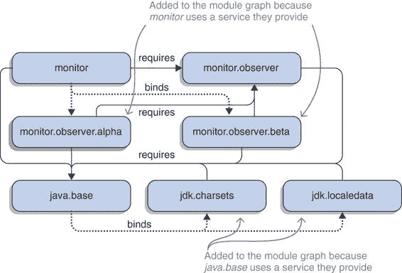
> 
> 图 10.6 服务绑定是模块解析的一部分：一旦一个模块被解析（如 monitor 或 java.base），就会分析其`uses`指令，并将提供匹配服务的所有模块（包括 alpha 和 beta 以及 charsets 和 localedata）添加到模块图中。
> 
> **使用--LIMIT-MODULES 排除服务**
> 
> 服务和`--limit-modules`选项有有趣的交互。如 5.3.5 节所述，`--limit-modules`将可观察模块的宇宙限制为指定的模块及其传递依赖。这不包括服务！除非提供服务的模块是`--limit-modules`之后列出的模块的传递依赖，否则它们不可观察，也不会进入模块图。在这种情况下，对`ServiceLoader::load`的调用通常会返回空。
> 
> 如果你以检查模块解析的方式启动 ServiceMonitor，但将可观察的宇宙限制为依赖于 monitor 的模块，输出将更加简单：
> 
> `$ java --show-module-resolution --module-path mods:libs --limit-modules monitor --module monitor root monitor # truncated monitor's transitive dependencies`
> 
> 就这些：没有服务——既没有观察者工厂，也没有许多平台模块通常绑定的服务。图 10.7 显示了这个简化的模块图。
> 
> 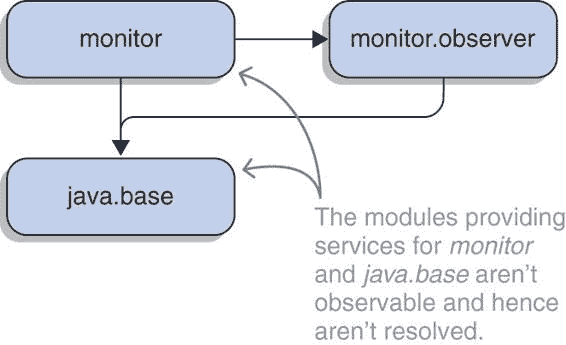
> 
> 图 10.7 使用`--limit-modules monitor`，可观察模块的宇宙被限制为 monitor 的传递依赖，这排除了在图 10.6 中解析的服务提供者。
> 
> 特别强大的是`--limit-modules`和`--add-modules`的组合：前者可以用来排除所有服务，而后者可以用来添加所需的服务。这允许你在启动时尝试不同的服务配置，而无需操作模块路径。
> 
> > 为什么需要使用指令？
> > 
> > 在一个小插曲中，我想回答一些开发者关于`uses`指令的问题：为什么它是必要的？模块系统在调用`ServiceLoader::load`之后不能查找提供者吗？
> > 
> > 如果模块通过服务正确解耦，那么提供服务的模块很可能不是任何根模块的传递依赖。在不做进一步努力的情况下，服务提供者模块通常会无法进入模块图，因此在模块尝试使用服务时，它们在运行时将不可用。
> > 
> > 为了服务能够正确工作，提供者模块必须进入模块图，即使它们不是从任何根模块的传递性需求。但模块系统如何识别哪些模块提供服务呢？这意味着所有具有`provides`指令的模块吗？那会太多。不，只有所需服务的提供者应该被解析。
> > 
> > 这使得识别服务使用变得必要。分析调用`ServiceLoader::load`的字节码既慢又不可靠，因此需要一个更明确的机制来保证效率和正确性：`uses`指令。通过要求你声明模块使用哪些服务，模块系统可以可靠且高效地使所有服务提供者模块可用。
> > 
> 10.3 设计良好的服务
> 
> 正如你在第 10.2 节中看到的，服务是四个演员的表演：

+   服务——在 JPMS 中，一个类或一个接口。

+   消费者——任何想要使用服务的代码片段。

+   提供者——服务的具体实现。

+   定位器——由消费者的请求触发的总管，定位提供者并返回它们。在 Java 中，这是`ServiceLoader`。

> `ServiceLoader`由 JDK 提供（我们将在第 10.4 节中更详细地探讨它），但在创建服务时，其他三个类是你的责任。你为服务选择哪些类型（见第 10.3.1 节），以及如何最佳地设计它们（第 10.3.2 节）？消费者依赖于丑陋的全局状态（第 10.3.3 节）不是很奇怪吗？包含服务、消费者和提供者的模块之间应该如何相互关联（第 10.3.4 节）？为了设计精心制作的服务，你需要能够回答这些问题。
> 
> 我们还将探讨使用服务来打破模块之间的循环依赖（第 10.3.5 节）。最后但同样重要的是——这对计划在不同 Java 版本上使用服务的开发者来说尤其有趣——我们讨论了服务如何在平面和模块化 JAR 文件之间工作（第 10.3.6 节）。
> 
> 10.3.1 可作为服务的类型
> 
> 一个服务可以是具体的类（甚至是一个最终类），抽象类，或者接口。尽管排除了枚举，但将具体类（尤其是最终类）用作服务是不寻常的——整个模块的目的是依赖于某种抽象的东西。除非有特定的用例要求，否则服务始终应该是抽象类或接口。
> 
> > 关于抽象类
> > 
> > 个人来说，我不喜欢深层类层次结构，因此对抽象类有自然的反感。随着 Java 8 在接口中实现方法的能力，抽象类的一个大用途消失了：为具有良好默认行为的接口方法提供基本实现。
> > 
> > 现在，我主要将它们用作本地支持（通常是包作用域或内部类）以实现复杂接口，但我总是确保除非绝对必要，否则不要让它们渗入公共 API。在这方面，我从未创建过服务——这必然是模块公共 API 的一部分——它不是一个接口。
> > 
> 10.3.2 使用工厂作为服务
> 
> 让我们回到第 10.2.1 节中尝试重构服务观察者架构以使用 JPMS 服务的第一次尝试。那并不顺利。将`ServiceObserver`接口作为服务和其实现`AlphaServiceObserver`和`BetaServiceObserver`作为提供者存在一些问题：

+   提供者需要无参数的提供者方法或构造函数，但我们想要使用的类需要用具体的初始状态初始化，而这个状态并不打算被修改。

+   对于可以处理 alpha 或 beta API 的观察者实例来说，决定它们是否适合特定的网络服务可能会很尴尬。我更喜欢创建处于正确状态的实例。

+   服务加载器缓存提供者（更多内容请参阅第 10.4 节），因此根据您如何使用 API，每个提供者可能只有一个实例：在这种情况下，一个`AlphaServiceObserver`和一个`BetaServiceObserver`。

> 这使得直接创建我们需要的实例变得不切实际，所以我们使用了工厂。结果证明，那并不是一个特殊情况。
> 
> 不论是连接的 URL 还是记录器的名称，消费者通常都希望配置他们使用的服务。消费者还可能希望创建任何特定服务提供者的多个实例。结合服务加载器对无参数构造的要求以及其缓存实例的自由，这使得将使用的类型`ServiceObserver`或`Logger`作为服务变得不切实际。
> 
> 相反，通常为所需类型创建一个工厂，如`ServiceObserverFactory`或`LoggerFinder`，并将其作为服务。根据工厂模式，工厂的唯一责任是创建处于正确状态的实例。因此，通常可以设计它们使其没有自己的状态，并且你并不特别关心它们的数量。这使得工厂非常适合`ServiceLoader`的特殊性。
> 
> 他们至少有两个额外的优势：

+   如果实例化所需类型代价高昂，将其作为服务的一部分拥有一个工厂，使得消费者控制实例创建的时间变得最容易。

+   如果需要检查一个提供者是否能够处理某个特定的输入或配置，工厂可以有一个方法来指示这一点。或者，它的方法可以返回一个类型，表示创建对象是不可能的（例如，一个`Optional`）。

> 我想给你展示两个根据其适用性选择服务的例子。第一个来自 ServiceMonitor，其中`ServiceObserverFactory`没有返回`ServiceObserver`的`create(String)`方法，但有一个返回`Optional<ServiceObserver>`的`createIfMatchingService(String)`方法。这样，你可以将任何 URL 投向任何工厂，返回值会告诉你它是否可以处理。
> 
> 另一个例子没有使用`ServiceLoader`，而是使用 JDK 中深层的类似 API，即`ServiceRegistry`。它是专门为 Java 的 ImageIO API 创建的，它使用它来根据图像的编解码器（例如，JPEG 或 PNG）定位给定的图像的`ImageReader`。
> 
> 图像输入输出（Image IO）通过从注册表中请求抽象类`ImageReaderSpi`的实现来定位读取器，该注册表返回类似`JPEGImageReaderSpi`和`PNGImageReaderSpi`的类实例。然后它对每个`ImageReaderSpi`实现调用`canDecodeInput(Object)`，如果图像使用文件头指示的正确编解码器，则返回`true`。只有当某个实现返回`true`时，Image IO 才会调用`createReaderInstance(Object)`来创建实际的图像读取器。图 10.8 展示了使用工厂的方法。
> 
> `ImageReaderSpi`充当一个工厂服务，其中`canDecodeInput`用于选择正确的提供者，`createReaderInstance`用于创建所需的类型：一个`ImageReader`。如第 10.4.2 节所示，选择合适提供者的另一种方法是。
> 
> 总结来说，你应该常规性地考虑不要选择你想要使用的类型作为服务，而是选择另一种类型，即工厂，该工厂返回你想要使用的实例。这个工厂在正确配置下运行时不应有自己的状态。（这也使得在需要的情况下以线程安全的方式实现它变得容易得多。）将工厂视为一种方法，将你想要使用的类型的原始需求与服务基础设施的特定需求分开，而不是将它们混合在一个类型中。
> 
> 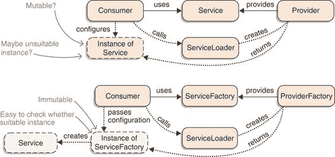
> 
> 图 10.8 将所需类型作为服务通常与 JDK 的特有性不太相容。相反，考虑设计一个工厂，以正确的配置创建实例，并将其作为服务。
> 
> 10.3.3 将消费者与全局状态隔离
> 
> 调用`ServiceLoader::load`的代码本质上是难以测试的，因为它依赖于全局应用程序状态：启动程序时使用的模块。当使用服务的模块不依赖于提供它的模块（应该是这种情况）时，这很容易成为一个问题，因为构建工具不会将提供模块包含在测试模块路径中。
> 
> 为了使`ServiceLoader`在单元测试中返回特定的服务提供者列表，需要做一些繁重的工作。这对于单元测试来说是禁忌的，因为单元测试应该在隔离和小的代码单元上运行。
> 
> 除了这些，对`ServiceLoader::load`的调用通常不会解决应用程序用户关心的任何问题。它只是通向这种解决方案的必要且技术性的步骤。这使得它与使用接收到的服务提供者的代码处于不同的抽象级别。遵循单一责任原则的朋友会说这样的代码有两个责任（请求提供者和实现业务需求），这似乎是太多了。
> 
> 这些属性表明，处理服务加载的代码不应与实现应用程序业务需求的代码混合。幸运的是，将它们分开并不太复杂。在某个地方创建最终使用提供者的实例，通常这是一个调用`ServiceLoader`并传递提供者的好地方。ServiceMonitor 遵循相同的结构：在`Main`类中创建运行应用程序所需的所有实例（包括加载`ServiceObserver`实现），然后将其传递给`Monitor`，它执行实际的服务监控工作。
> 
> 列表 10.4 和 10.5 显示了比较。在列表 10.4 中，`IntegerStore`自己执行了繁重的服务操作，这混淆了职责。这也使得使用`IntegerStore`的代码难以测试，因为测试必须知道`ServiceLoader`的调用，并确保它返回所需的整数生成器。
> 
> 在列表 10.5 中，`IntegerStore`被重构，现在期望构建它的代码传递一个`List<IntegerMaker>`。这使得其代码专注于当前的业务问题（生成整数）并移除了对`ServiceLoader`和全球应用程序状态的任何依赖。测试它变得轻而易举。仍然有人需要处理服务的加载，但一个在应用程序设置期间调用的`create...`方法是一个更好的地方。
> 
> > 列表 10.4 由于责任过多而难以测试
> > 
> `public class Integers {  public static void main(String[] args) { IntegerStore store = new IntegerStore(); List<Integer> ints = store.makeIntegers(args[0]); System.out.println(ints); }  }  public class IntegerStore {` `public List<Integer> makeIntegers(String config) {` `①` `return ServiceLoader` `.load(IntegerMaker.class).stream()` `②` `.map(Provider::get)` `.map(maker -> maker.make(config))` `③` `.distinct() .sorted() .collect(toList()); }  }  public interface IntegerMaker {  int make(String config);  }`
> 
> > ①
> > 
> > 此调用的结果直接依赖于模块路径内容，这使得单元测试变得困难。
> > 
> > ②
> > 
> > 解决了加载整数制造者的技术要求
> > 
> > ③
> > 
> > 解决了业务问题：生成唯一的整数并对它们进行排序
> > 
> > 列表 10.5 重新编写以提高其设计和可测试性
> > 
> `public class Integers {  public static void main(String[] args) { IntegerStore store = createIntegerStore(); List<Integer> ints = store.makeIntegers(args[0]); System.out.println(ints); }  private static IntegerStore createIntegerStore() { List<IntegerMaker> makers = ServiceLoader` `.load(IntegerMaker.class).stream()` `①` `.map(Provider::get) .collect(toList()); return new IntegerStore(makers); }  }  public class IntegerStore {  private final List<IntegerMaker> makers;  public IntegerStore(List<IntegerMaker> makers) {` `this.makers = makers;` `②` `}` `public List<Integer> makeIntegers(String config) {` `③` `return makers.stream() .map(maker -> maker.make(config)) .distinct() .sorted() .collect(toList()); }  }  public interface IntegerMaker {  int make(String config);  }`
> 
> > ①
> > 
> > 解决了在设置过程中加载整数制造者的技术要求
> > 
> > ②
> > 
> > `IntegerStore`在构造时获取制造者，并且没有依赖`ServiceLoader`。
> > 
> > ③
> > 
> > `makeIntegers`方法可以专注于其业务需求。
> > 
> 根据特定的项目和需求，你可能需要向提供者传递多个方法或构造函数调用，将其包装在另一个延迟加载直到最后一刻的对象中，或者配置你的依赖注入框架，但这应该是可行的。而且这值得努力——你的单元测试和同事们会感谢你。
> 
> 10.3.4 将服务、消费者和提供者组织成模块
> 
> 当服务的类型、设计和消费确定后，问题随之而来：您如何将服务以及其他两个参与者，消费者和提供者，组织到模块中？显然，服务需要实现，并且为了提供价值，包含服务的模块之外的模块中的代码应该能够实现服务。这意味着服务类型必须是公开的，并且位于导出包中。
> 
> 消费者不必是公开的或导出的，因此可能位于其模块内部。然而，它必须访问服务类型，因此需要要求包含服务的模块（服务，而不是实现它的类）。消费者和服务最终位于同一模块中并不罕见，例如 java.sql 和`Driver`以及 java.base 和`LoggerFinder`。
> 
> 最后，我们来到提供者。因为他们实现了服务，所以他们必须阅读定义它的模块——这一点很明显。有趣的问题是，提供类型是否应该成为模块公共 API 的一部分，而不仅仅是命名在`provides`指令中。
> 
> 服务提供者必须是公开的，但对其包的导出没有技术要求——服务加载器可以实例化不可访问的类。因此，导出包含提供者的包无谓地扩大了模块的 API 表面积。它还可能诱使消费者做一些他们不应该做的事情，比如将服务强制转换为其实际类型以访问附加功能（类似于`URLClassLoader`发生的情况；参见第 6.2.1 节）。因此，我建议您不要使服务提供者可访问。
> 
> 总结（参见图 10.9）

+   服务必须是公开的，并且位于导出包中。

+   消费者可以是内部的。他们需要阅读定义服务的模块，甚至可能是其一部分。

+   提供者必须是公开的，但不应该位于导出包中，以最大限度地减少误用和 API 表面积。他们需要阅读定义服务的模块。

> 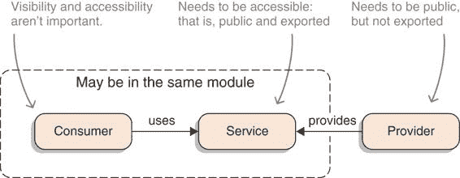
> 
> 图 10.9 消费者、服务和提供者的可见性和可访问性要求
> 
> > 注意：如果您在疑惑，一个模块只能提供它拥有的类型的服务。在`provides`指令中命名的服务实现必须在声明它的同一个模块中。
> > 
> 10.3.5 使用服务来打破循环依赖
> 
> 当与分割为子项目的代码库一起工作时，总会有一个点，其中一个项目变得太大，我们希望将其分割成更小的项目。这样做需要一些工作，但如果我们有足够的时间解开类，我们通常可以实现目标。有时，尽管如此，代码粘合得如此紧密，以至于我们找不到将其分开的方法。
> 
> 一个常见的原因是类之间的循环依赖。可能有两个类互相导入，或者是一个涉及多个类的更长的循环，其中每个类都导入下一个类。无论你如何结束这样的循环，如果你希望其中一些构成类在一个项目中，而另一些在另一个项目中，那么这是一个问题。即使没有模块系统，这也是正确的，因为构建工具通常也不喜欢循环依赖；但 JPMS 表达了自己的强烈反对。
> 
> > 注意：由于可访问性规则，存在于不同模块中的类之间的依赖需要这些模块之间的依赖（参见第 3.3 节）。如果类依赖是循环的，那么模块依赖也是循环的，可读性规则不允许这样做（参见第 3.2 节）。
> > 
> 你能做什么？因为你正在阅读关于服务的章节，你可能不会对了解到服务可以帮助你感到惊讶。想法是通过创建一个存在于依赖模块中的服务来反转循环中的依赖之一。以下是逐步操作的方法（也请参阅图 10.10）：

1.  看一下模块依赖的循环，并确定你想要反转的依赖。我将涉及的两个模块称为依赖（具有`requires`指令的那个）和依赖项。理想情况下，依赖项使用依赖项的单个类型。我将专注于这个特殊情况——如果有更多类型，请为每个类型重复以下步骤。

1.  在依赖中，创建一个服务类型，并使用`uses`指令扩展模块声明。

1.  在依赖中，删除对依赖项的依赖。注意由此产生的编译错误，因为依赖项的类型不再可访问。用服务类型替换所有对其的引用：

+   更新导入和类名。

+   方法调用不需要任何更改。

+   构造函数调用不会立即生效，因为你需要依赖项的实例。这就是`ServiceLoader`发挥作用的地方：使用它通过加载你刚刚创建的服务类型来替换依赖项类型的构造。

1.  在独立的情况下，向依赖项中添加一个依赖，以便服务类型变得可访问。提供原始导致问题的类型的服务。

> 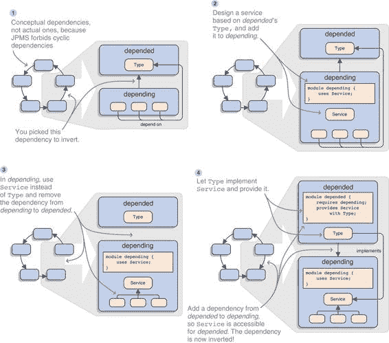
> 
> 图 10.10 使用服务在四步中打破依赖循环：❶ 选择一个依赖，❷ 在依赖端引入服务，❸ 在依赖端使用该服务，❹ 在依赖项端提供该服务。
> 
> 成功！你刚刚反转了依赖项和依赖项之间的依赖（现在后者依赖于前者），从而打破了循环。以下是一些需要记住的进一步细节：

+   依赖项中依赖项使用的类型可能不是作为服务的好候选。如果是这样，考虑创建一个工厂来处理它，如第 10.3.2 节所述，或者寻找可以替换的另一个依赖项。

+   第 10.3.3 节探讨了在模块中到处撒`ServiceLoader`调用的问题；这个问题也适用于此处。你可能需要重构依赖于模块的代码以最小化加载次数。

+   服务类型不必依赖于其他模块。正如第 10.3.4 节解释的那样，它可以存在于任何模块中。或者更确切地说，几乎可以存在于任何模块中——你不想将其放在一个会重新创建循环的模块中，例如在依赖于模块中。

+   最重要的是，尝试创建一个独立且不仅仅是作为循环断路器的服务。可能涉及的提供者和消费者不止两个模块。

> 10.3.6 在不同 JAVA 版本间声明服务
> 
> 服务并不新鲜。它们是在 Java 6 中引入的，当时设计的机制至今仍然有效。因此，研究它们在没有模块的情况下如何操作，尤其是它们如何在普通和模块化 JAR 之间工作，是有意义的。
> 
> 在`META-INF/SERVICES`中声明服务
> 
> 在模块系统出现之前，服务的工作方式与现在几乎相同。唯一的区别是没有模块声明来声明 JAR 使用或提供服务。在使用方面，这没问题——所有代码都可以使用它想要的任何服务。然而，在提供方面，JAR 必须声明其意图，并且它们在 JAR 中的专用目录中这样做。
> 
> 要让一个普通的 JAR 声明一个服务，请遵循以下简单步骤：

1.  将包含服务完全限定名称的文件作为文件名放在`META-INF/services`中。

1.  在文件中列出实现该服务的所有类的完全限定名称。

> 例如，让我们在新的普通 JAR monitor.observer.zero 中创建第三个`ServiceObserverFactory`提供者。为此，你首先需要一个具体的类`ZeroServiceObserverFactory`，它实现了`ServiceObserverFactory`并具有无参构造函数。这与 alpha 和 beta 变体类似，因此我不需要详细讨论。
> 
> 普通 JAR 没有模块描述符来声明它提供的服务，但你可以使用`META-INF/services`目录来做到这一点：在该目录中放置一个简单的文本文件`monitor.observer.ServiceObserverFactory`（服务类型的完全限定名称），其中包含单行`monitor.observer.zero.ZeroServiceObserverFactory`（提供者类型的完全限定名称）。图 10.11 显示了它的样子。
> 
> 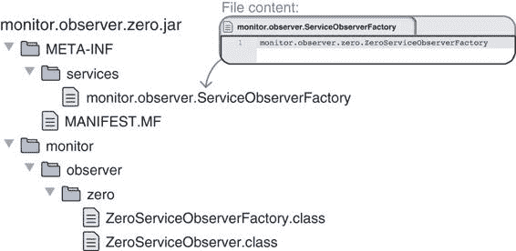
> 
>  要在不进行模块声明的情况下声明服务提供者，文件夹`META-INF/services`需要包含一个包含服务名称和每个提供者单行的纯文本文件。
> 
> 我保证这可行，当`Main`流式传输所有观察者工厂时，`ZeroServiceObserverFactory`将得到正确解析。但直到我们讨论了普通和模块化 JAR 的服务如何交互之前，你只能相信我的话。接下来就是这一点。
> 
> > **注意** 在`META-INF/services`中声明服务和在模块声明中声明服务之间有一个小的区别。只有后者可以使用提供者方法——前者需要坚持使用公共、无参数的构造函数。
> > 
> **JAR 和路径之间的兼容性**
> 
> 由于服务加载器 API 在 Java 9 模块系统到来之前就已经存在，因此存在兼容性问题。普通和模块化 JAR 中的消费者能否以相同的方式使用服务？不同类型的 JAR 和路径中的提供者会发生什么？
> 
> 对于服务消费者来说，情况很简单：显式模块可以使用它们通过`uses`指令声明的服务；自动模块（见第 8.3 节）和未命名的模块（第 8.2 节）可以使用所有现有服务。总之，在消费者端，这很简单。
> 
> 对于服务提供者来说，情况稍微复杂一些。有两个轴，每个轴有两个表达式，导致四种组合：

+   **JAR 类型**：普通（在`META-INF/services`中声明服务）或模块化（在模块描述符中声明服务）

+   **路径类型**：类路径或模块路径

> 无论普通 JAR 最终位于哪个路径上，服务加载器都会在`META-INF/services`中识别和绑定服务。如果 JAR 位于类路径上，其内容已经是未命名的模块的一部分。如果它位于模块路径上，服务绑定会导致自动模块的创建。这会触发所有其他自动模块的解析，如第 8.3.2 节所述。
> 
> 现在你知道为什么你可以尝试使用 monitor.observer.zero，这是一个提供其服务在`META-INF/services`中的普通 JAR，与模块化的 ServiceMonitor 应用程序一起使用。而且，无论我选择哪个路径；它都可以从两个路径上工作，无需进一步操作。
> 
> > **必要信息** 模块路径上的模块化 JAR 是模块系统中服务的最佳选择，因此它们可以无限制地工作。在类路径上，模块化 JAR 可能会引起问题。它们被当作普通 JAR 处理，因此需要在`META-INF/services`文件夹中包含条目。作为一个依赖于服务并且其模块化工件应在两个路径上工作的开发者，你需要在模块描述符和`META-INF/services`中声明服务。
> > 
> 从类路径启动 ServiceMonitor 会导致没有有用的输出，因为没有找到观察者工厂——除非你将 monitor.observer.zero 添加到其中。由于它在`META-INF/services`中有提供者定义，它非常适合从未命名的模块中工作，并且确实如此——与 alpha 和 beta 提供者不同。
> 
> 10.4 使用 ServiceLoader API 访问服务
> 
> 尽管 ServiceLoader 自 Java 6 以来就已经存在，但它并没有得到广泛的应用，但我预计随着它显著集成到模块系统中，其使用将会大幅增加。为了确保你熟悉其 API，我们将在本节中对其进行探讨。
> 
> 如同往常，第一步是了解基础知识，在这种情况下不会花费太多时间。然而，服务加载器确实有一些特性，为了确保它们不会让你感到困惑，我们也会讨论它们。
> 
> 10.4.1 加载和访问服务
> 
> 使用`ServiceLoader`始终是一个两步过程：

1.  为正确的服务创建一个`ServiceLoader`实例。

1.  使用该实例来访问服务提供商。

> 让我们快速看一下每个步骤，以便你知道选项。同时查看表 10.1 以了解所有`ServiceLoader`方法的概述。
> 
> 表 10.1 快速查看`ServiceLoader` API

| 返回类型   | 方法名称   | 描述   |
| --- | --- | --- |
| 为给定类型创建新的服务加载器的方法   |
| `ServiceLoader<S>`   | `load(Class<S>)`   | 从当前线程的上下文类加载器开始加载提供商   |
| `ServiceLoader<S>`   | `load(Class<S>, ClassLoader)`   | 从指定的类加载器开始加载提供商   |
| `ServiceLoader<S>`   | `load(ModuleLayer, Class<S>)`   | 从给定的模块层中的模块开始加载提供商   |
| `ServiceLoader<S>`   | `loadInstalled(Class<S>)`   | 从平台类加载器加载提供商   |
| 访问服务提供商的方法   |
| `Optional<S>`   | `findFirst()`   | 加载第一个可用的提供商   |
| `Iterator<S>`   | `iterator()`   | 返回一个用于延迟加载和实例化可用提供商的迭代器   |
| `Stream<Provider<S>>`   | `stream()`   | 返回一个用于延迟加载可用提供商的流   |
| `void`   | `reload()`   | 清除此加载器的提供商缓存，以便所有提供商都将被重新加载   |

> 创建 SERVICELOADER 的方法
> 
> 第一步，创建`ServiceLoader`实例，由其几个静态`load`方法处理。最简单的一个只需要你想要加载的服务的`Class<S>`实例（这被称为类型标记，在这种情况下是类型`S`）：
> 
> `ServiceLoader<TheService> loader = ServiceLoader.load(TheService.class);`
> 
> 只有在你同时处理多个类加载器或模块层时，你才需要其他`load`方法（参见第 12.4 节）；这不是一个常见的情况，所以我就不深入讨论了。相应重载的 API 文档已经涵盖了这些内容。
> 
> 另一个获取服务加载器的方法是`loadInstalled`。在这里它很有趣，因为它有一个特定的行为：它忽略了模块路径和类路径，并且只从平台模块加载服务，这意味着只有 JDK 模块中找到的提供商将被返回。
> 
> 访问服务提供商
> 
> 拥有所需服务的`ServiceLoader`实例后，是时候开始使用这些提供商了。为此有两种半方法：

+   `Iterator<S> iterator()` 允许你遍历实例化的服务提供商。

+   `Optional<S> findFirst()` 使用`iterator`来返回找到的第一个提供商（这是一个便利方法，所以我只将其计为半个方法）。

+   `Stream<Provider<S>> stream()`允许你流式处理服务提供者，这些提供者被包装在一个`Provider`实例中。（这是怎么回事？10.4.2 节将解释。）

> 如果你具有特定的惰性/缓存需求（有关更多信息，请参阅 10.4.2 节），你可能希望保留`ServiceLoader`实例。但在大多数情况下，这并不是必要的，你可以立即开始迭代或流式处理提供者：
> 
> `ServiceLoader .load(TheService.class) .iterator() .forEachRemaining(TheService::doTheServiceThing);`
> 
> 如果你想知道`iterator`列出`S`和`stream`列出`Provider<S>`之间不一致的原因，这有历史原因：尽管`iterator`自 Java 6 以来就存在，但`stream`和`Provider`是在 Java 9 中添加的。
> 
> 一个当你思考时很明显但仍然容易忽视的细节是，可能没有给定服务的提供者。`Iterator`和`stream`可能为空，`findFirst`可能返回一个空的`Optional`。如果你按能力过滤，如 10.3.2 节和 10.4.2 节所述，最终没有合适的提供者的情况就更加可能了。
> 
> 确保你的代码要么优雅地处理这种情况并且可以在没有服务的情况下运行，要么快速失败。如果应用程序忽略了一个容易检测到的错误并继续以不期望和不期望的状态运行，那就很烦人。
> 
> 10.4.2 加载服务的特性
> 
> `ServiceLoader` API 非常简单，但不要被其表面所迷惑。在幕后发生了一些重要的事情，当使用 API 进行超出基本“Hello, services!”示例的操作时，你需要了解它们。这涉及到服务加载器的惰性、其并发能力（或缺乏）以及适当的错误处理。让我们逐一探讨这些问题。
> 
> 惰性和选择正确的提供者
> 
> 服务加载器尽可能地惰性。当调用`ServiceLoader<S>`（其中`S`是调用`ServiceLoader::load`时的服务类型）时，其`iterator`方法返回一个`Iterator<S>`，只有在调用`hasNext`或`next`时才会查找和实例化下一个提供者。
> 
> `stream`方法甚至更加惰性。它返回一个`Stream<Provider<S>>`，不仅像`iterator`一样惰性查找提供者，还返回`Provider`实例，进一步延迟服务实例化直到其`get`方法被调用。它们的`type`方法提供了访问特定提供者的`Class<? extends S>`实例的途径（意味着实现服务的类型，而不是服务本身）。
> 
> 访问提供者的类型对于在没有实际类实例的情况下扫描注解很有用。类似于我们在 10.3.2 节末尾讨论的内容，这为你提供了一个工具，可以根据给定的配置选择正确的服务提供者，而无需首先实例化它。如果类被注解以提供对提供者适用性的指示，那就更好了。
> 
> 继续以 `ServiceObserver` 工厂适用于特定 REST 服务生成为例的 `ServiceMonitor` 示例，这些工厂可以用 `@Alpha` 或 `@Beta` 注解来表示它们创建的生成：
> 
> `Optional<ServiceObserverFactory> alphaFactory = ServiceLoader .load(ServiceObserverFactory.class).stream() .filter(provider -> provider.type().isAnnotationPresent(Alpha.class)) .map(Provider::get) .findFirst();`
> 
> 在这里，使用 `Provider::type` 来访问 `Class<? extends ServiceObserver>`，然后使用 `isAnnotationPresent` 检查它是否被 `@Alpha` 注解。只有在调用 `Provider::get` 时才会实例化工厂。
> 
> 为了进一步体现懒加载，`ServiceLoader` 实例会缓存已加载的提供者，并始终返回相同的实例。尽管如此，它确实有一个 `reload` 方法，该方法会清空缓存，并在下一次调用 `iterate`、`stream` 或 `findFirst` 时触发新的实例化。
> 
> 使用并发 `ServiceLoader`
> 
> `ServiceLoader` 实例不是线程安全的。如果多个线程需要同时操作一组服务提供者，则每个线程都需要进行相同的 `ServiceLoader::load` 调用，从而获得自己的 `ServiceLoader` 实例，或者您必须为它们中的每一个都进行一次调用，并将结果存储在线程安全的集合中。
> 
> 加载服务时处理错误
> 
> 当 `ServiceLoader` 尝试定位或实例化服务提供者时，可能会出现各种问题：

+   提供者可能无法满足所有要求。也许它没有实现服务类型，或者没有合适的提供者方法或构造函数。

+   提供者的构造函数或方法可以抛出异常，或者（在方法的情况下）返回 `null`。

+   `META-INF/services` 目录中的文件可能违反所需格式，或者由于其他原因无法处理。

> 这些只是显而易见的问题。
> 
> 由于加载是懒加载的，`load` 方法不能抛出任何异常。相反，迭代器的 `hasNext` 和 `next` 方法，以及流处理和 `Provider` 方法都可以抛出错误。这些错误都将属于 `ServiceConfigurationError` 类型，因此捕获该错误可以让您处理可能发生的所有问题。
> 
> 摘要

+   服务架构由四个部分组成：

+   服务是一个类或一个接口。

+   提供者是对服务的具体实现。

+   消费者是指任何想要使用服务的代码片段。

+   `ServiceLoader` 为消费者创建并返回给定服务的每个提供者的实例。

+   服务类型的要求数据和建议如下：

+   任何类或接口都可以是服务，但由于目标是向消费者和提供者提供最大灵活性，建议使用接口（或者至少是抽象类）。

+   服务类型需要是公开的，并且位于导出包中。这使得它们成为其模块的公共 API 的一部分，并且应该适当地设计和维护。

+   定义服务的模块的声明中不包含标记类型为服务的入口。一个类型通过消费者和提供者将其用作服务而成为服务。

+   服务很少是随机出现的，而是专门为特定目的而设计的。始终考虑将使用的类型不是服务本身，而是它的工厂。这使搜索合适的实现更加容易，同时也更容易控制实例的创建时间和状态。

+   对提供者的要求和推荐如下：

+   提供服务的模块需要访问服务类型，因此它们必须要求包含它的模块。

+   创建服务提供者有两种方式：一个实现了服务类型并具有提供者构造函数（一个公共的无参数构造函数）的具体类，或者一个具有提供者方法（一个公共的静态无参数方法，称为`provide`）的类型，该方法返回实现服务类型的实例。无论哪种方式，类型必须是公共的，但不需要导出包含它的包。相反，建议不要将提供者类型作为模块的公共 API 的一部分。

+   提供服务的模块会在其描述符中声明通过添加`provides ${service} with ${provider}`指令。

+   如果一个模块化的 JAR 文件即使在放置在类路径上也要提供服务，它也需要在`META-INF/services`目录中添加条目。对于每个`provides ${service} with ${provider}`指令，创建一个名为${service}的普通文件，其中每行包含一个`${provider}`（所有名称都必须是完全限定的）。

+   对消费者的要求和推荐如下：

+   消费服务的模块需要访问服务类型，因此它们必须要求包含它的模块。不过，它们不应该要求提供该服务的模块——相反，这会违背最初使用服务的主要原因：解耦消费者和提供者。

+   服务类型和服务的消费者位于同一模块中并没有什么问题。

+   任何代码都可以消费服务，无论其自身的可访问性如何，但包含它的模块需要通过`uses`指令声明它使用的服务。这允许模块系统有效地执行服务绑定，并使模块声明更加明确和可读。

+   通过调用`ServiceLoader::load`并随后通过调用`iterate`或`stream`来迭代或流式传输返回的实例，可以消费模块。可能会找到提供者，消费者必须优雅地处理这种情况。

+   消费服务的代码的行为取决于全局状态：哪些提供者模块存在于模块图中。这给这样的代码带来了不希望的性质，例如使其难以测试。尝试将服务加载推入创建对象并配置正确的设置代码（例如，你的依赖注入框架），并且始终允许常规提供者代码将服务提供者传递给消费类（例如，在构造期间）。

+   服务加载器尽可能晚地实例化提供者。它的`stream`方法甚至返回一个`Stream<Provider<S>>`，其中`Provider::type`可以用来访问提供者的`Class`实例。这允许在尚未实例化提供者的情况下通过检查类级别的注解来搜索合适的提供者。

+   服务加载器实例不是线程安全的。如果你并发使用它们，你必须提供同步。

+   所有在加载和实例化提供者期间的问题都会抛出`ServiceConfigurationError`。由于加载器的惰性，这不会在`load`期间发生，而是在`iterate`或`stream`期间，当遇到有问题的提供者时。如果你想要处理错误，请确保将整个与`ServiceLoader`的交互放入`try`块中。

+   这里有一些关于模块解析和更多的要点：

+   当模块解析过程处理声明使用服务的模块时，所有提供该服务的模块都会被解析，从而包含在应用程序的模块图中。这被称为服务绑定，并且与 JDK 中服务的使用一起，解释了为什么默认情况下即使是小型应用程序也会使用大量的平台模块。

+   另一方面，命令行选项`--limit-modules`不进行服务绑定。因此，不是给定此选项的模块的传递依赖关系的提供者不会进入模块图，并且在运行时不可用。此选项可用于排除服务，可选地与`--add-modules`一起使用，以添加其中的一些。

> 11
> 
> 精炼依赖和 API
> 
> 本章涵盖

+   处理模块 API 中的一部分依赖

+   在不破坏客户端的情况下聚合和重构模块

+   定义可选依赖

+   在缺少依赖的情况下编写代码

+   仅将包导出到选定的模块

> 第三章解释了`requires`和`exports`指令是可读性和可访问性的基础。但这些机制是严格的：每个模块都必须被显式地要求，所有必需的模块都必须存在，应用程序才能编译和启动，并且导出的包对所有其他模块都是可访问的。这对于大多数用例来说足够了，但仍然有一大部分用例中这些解决方案过于宽泛。
> 
> 最明显的用例是可选依赖，模块希望针对它进行编译，但在运行时它不一定存在。例如，Spring 使用 Jackson databind 库就是这样做的。如果你运行一个 Spring 应用程序并想使用 JSON 作为数据传输格式，你可以通过添加 Jackson 工件来获得对该格式的支持。另一方面，如果该工件不存在，Spring 仍然很乐意——它不支持 JSON。Spring 使用 Jackson，但不需要它。
> 
> 然而，常规的`requires`指令并不涵盖这个用例，因为模块必须存在才能启动应用程序。在某些情况下，服务可以是解决方案，但将它们用于所有可选依赖会导致许多尴尬和复杂的实现。因此，明确表达在运行时不需要依赖是一个重要的功能；11.2 节展示了 JPMS 如何实现它。
> 
> 模块系统严格性可能成为障碍的另一个用例是随着时间的推移重构模块。在任何规模适中的项目中，架构都会随着时间的推移而演变，开发者会希望合并或拆分模块。但那么依赖于旧模块的代码会怎样呢？如果它被拆分到一个新的模块中，会不会丢失功能（如果它被拆分到一个新的模块中）或者甚至整个模块（如果它们被合并了）？幸运的是，模块系统提供了一个名为隐式可读性的功能，这在这里可能很有用。
> 
> 虽然我们迄今为止所知的`requires`和`exports`机制提供了一个相对简单的心理模型，但它们为不适合其一刀切方法的用例提供了没有优雅的解决方案。在本章中，我们将探讨这样的特定用例，并探索模块系统提供的解决方案。
> 
> 在你完成它之后，你将能够使用更精细的机制来访问依赖关系并导出功能。这将允许你做许多事情，例如，表达可选依赖（11.2 节），重构模块（11.1 节），并在定义的模块集之间共享代码，同时将其对其他代码保持私有（11.3 节）。
> 
> 11.1 隐式可读性：传递依赖
> 
> 在 3.2 节中，我们深入探讨了`requires`指令如何建立模块之间的依赖关系，以及模块系统如何使用它们来创建读取边（最终形成模块图，如 3.4.1 和 3.4.2 节所示）。在 3.3 节中，你看到可访问性基于这些边，要访问一个类型，访问模块必须读取包含该类型的模块（类型也必须是公共的，并且包必须导出，但这在这里并不相关）。
> 
> 在本节中，我们将探讨另一种使模块能够访问其他模块的方法。在介绍新机制并制定最佳使用该机制的指南之前，我们将首先讨论一个激励用例。在结尾处，你将看到它有多么强大，以及它如何能帮助解决比初始示例更多的问题。
> 
> 查看 ServiceMonitor 的`feature-implied-readability`分支以获取本节所伴随的代码。
> 
> 11.1.1 展示模块的依赖
> 
> 当涉及到`requires`指令和可访问性之间的交互时，有一个需要注意的细节：`requires`指令创建读取边，但这些边是可访问性的先决条件。这难道不引发了一个问题：还有哪些其他机制可以建立可读性，从而解锁对类型的访问？这不仅仅是理论上的思考——从实际的角度来看待这个问题，我们最终会到达同一个地方。
> 
> 让我们回到 ServiceMonitor 应用程序，特别是 monitor.observer 和 monitor.observer.alpha 模块。假设有一个新的模块，让我们称它为 monitor.peek，它想直接使用 monitor.observer.alpha。它不需要 monitor.observer 或你在上一章中创建的服务架构。monitor.peek 是否只需`require`monitor.observer.alpha 并开始使用它？
> 
> `ServiceObserver observer = new AlphaServiceObserver("some://service/url"); DiagnosticDataPoint data = observer.gatherDataFromService();`
> 
> 它看起来需要`ServiceObserver`和`DiagnosticDataPoint`类型。这两个类型都在`monitor.observer`中，那么如果`monitor.peek`不`require``monitor.observer`会发生什么？它将无法访问其类型，导致编译错误。正如我们在 3.3.2 节讨论传递依赖的封装时所见，这是模块系统的一个特性。
> 
> 然而，这里存在一个障碍。如果没有来自`monitor.observer`的类型，`monitor.observer.alpha`实际上是无用的；并且每个想要使用它的模块都必须读取`monitor.observer`。（这可以在图 11.1 中看到。）使用`monitor.observer.alpha`的每个模块都必须`require``monitor.observer`吗？
> 
> 这不是一个令人舒适的解决方案。如果只有另一种机制可以建立可读性，从而解锁对类型的访问。
> 
> 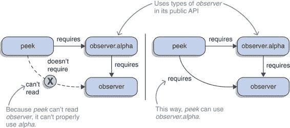
> 
> 图 11.1 模块 peek 使用了 observer.alpha，它在其公共 API 中使用了 observer 的类型。如果 peek 不`require`observer（左侧），它将无法读取其类型，使得 observer.alpha 变得无用。使用常规的`requires`指令，绕过这种情况的唯一方法是将 peek 也`require`observer（右侧），当涉及更多模块时，这会变得繁琐。
> 
> 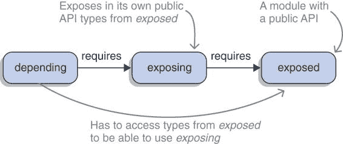
> 
> 图 11.2 有三个模块涉及到暴露依赖的问题：一个是提供一些类型（暴露；右侧）的无辜者，一个是使用这些类型在其公共 API 中（暴露；中间）的有罪者，以及一个必须访问无辜者类型的受影响者（依赖；左侧）。
> 
> 在前面的示例中发生的情况是常见的。一个暴露模块依赖于某些暴露的模块，但使用暴露中的类型在其自己的公共 API（如第 3.3 节中定义的）中使用。在这种情况下，暴露被认为向其客户端暴露了对暴露的依赖，因为它们也需要依赖暴露才能使用暴露。
> 
> 为了使讨论这种情况不那么令人困惑，请确保你理解了 图 11.2 中的这些定义。在描述涉及的模块时，我会坚持使用这些术语：

+   暴露其依赖的模块称为暴露模块。

+   作为依赖关系被暴露的模块是暴露模块。

+   依赖该混乱模块的模块称为依赖模块。

> 在 JDK 中可以找到许多示例。例如，java.sql 模块包含一个类型 `java.sql.SQLXML`（由 `java.sql.Connection` 等使用），它在公共方法中使用来自 java.xml 模块的类型。类型 `java.sql.SQLXML` 是公共的，并且在一个导出包中，因此它是 java.sql API 的一部分。这意味着为了任何依赖模块能够正确使用暴露的 java.sql，它还必须读取暴露的 java.xml。
> 
> 11.1.2 传递修饰语：在依赖关系上暗示可读性
> 
> 从情况来看，很明显，暴露模块的开发者需要解决这个问题。毕竟，他们决定在自己的 API 中使用暴露模块的类型，迫使依赖它们的模块读取暴露模块。
> 
> 这些情况的解决方案是在暴露模块的声明中使用 `requires transitive` 指令。如果暴露声明 `requires transitive exposed`，则任何读取暴露的模块将隐式地读取暴露。这种效果称为隐含的可读性：读取暴露意味着读取暴露。图 11.3 展示了这个指令。
> 
> 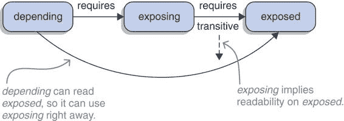
> 
> 图 11.3 当使用 `requires transitive` 指令依赖暴露时，读取暴露意味着暴露的可读性。因此，即使依赖项仅要求暴露，依赖模块（左侧）也可以读取暴露。
> 
> 当查看模块声明或描述符时，隐含的可读性使用是显而易见的。通过你在第 5.3.1 节中学到的技能，你可以查看 java.sql。以下列表显示对 java.xml 的依赖关系被标记为 `transitive`。
> 
> > 列表 11.1 java.sql 模块描述符：暗示 java.xml 和 java.logging 的可读性
> > 
> `$ java --describe-module java.sql  > java.sql@9.0.4 > exports java.sql > exports javax.sql > exports javax.transaction.xa > requires java.base mandate` `> requires java.logging transitive` `①``> requires java.xml transitive` `①` `> uses java.sql.Driver`
> 
> > ①
> > 
> > 这些指令表明，读取 java.sql 的模块也可以读取 java.xml 和 java.logging。
> > 
> 同样，对 `java.logging` 的依赖被标记为 `transitive`。原因是公共接口 `java.sql.Driver` 和其方法 `getParentLogger()`。它从 `java.logging` 暴露了 `java.util.logging.Logger` 类型到 `java.sql` 的公共 API 中，因此 `java.sql` 隐式传递了 `java.logging` 的可读性。请注意，尽管 `java --describe-module` 将 `transitive` 放在最后，但模块声明期望修饰符位于 `requires` 和模块名称之间（`requires transitive ${module}`）。
> 
> 回到如何使 `monitor.observer.alpha` 可用而不需要依赖模块也必须要求 `monitor.observer` 的激励示例，现在的解决方案很明显——使用 `requires transitive` 来声明 `monitor.observer.alpha` 对 `monitor.observer` 的依赖：
> 
> `module monitor.observer.alpha { requires transitive monitor.observer; exports monitor.observer.alpha; }`
> 
> 在探索第 3.2.2 节中的可靠配置和缺失依赖时，你发现尽管运行时要求所有依赖（直接和间接）都必须是可观察的，但编译器只强制要求直接依赖。这意味着你可以编译你的模块，即使其依赖项不存在也可以。那么隐式可读性如何适应这种情况？
> 
> > 必要信息：那些对正在编译的模块具有隐式可读性的模块将进入“必须可观察”的类别。这意味着当你编译你的模块针对暴露时，所有暴露通过传递性要求的依赖，就像在早期示例中展示的那样，都必须是可观察的。
> > 
> 这与你是否使用暴露的类型无关，这乍一看可能过于严格。但记住从第 3.4.1 节中，模块在代码编译之前被解析，模块图被构建。模块图是编译的基础，而不是相反，根据遇到类型对其进行修改将违反可靠配置的目标。因此，模块图必须始终包含传递性依赖。
> 
> > 依赖链
> > 
> > 你可能会想知道在一个依赖链中会发生什么，其中每个 `requires` 指令都使用 `transitive`。可读性会沿着更长的路径隐式传递吗？答案是肯定的。无论是由于显式依赖还是隐式可读性而读取暴露的模块，它都会同样地隐式传递其依赖的可读性。以下图示说明了 `transitive` 的传递性。
> > 
> > 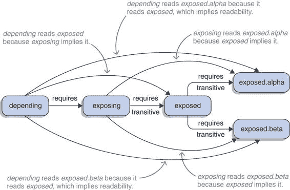
> > 
> > 依赖模块需要暴露，这隐式传递了暴露的可读性，进而隐式传递了暴露.alpha 和暴露.beta 的可读性。隐式可读性是传递的，因此依赖可以读取所有其他四个模块，尽管它只依赖于其中一个。
> > 
> 11.1.3 何时使用隐式可读性
> 
> 正如你所见，隐含的可读性减少了依赖模块中显式`requires`指令的需求。这可能是个好事，但我想要回到之前只是简单提到的事情。隐含的可读性与模块系统的特性相矛盾：即第 3.2.2 节中讨论的传递依赖的封装。由于有两个对立的要求（严格性与便利性）和两个特性来满足它们（`requires`与`requires transitive`），因此仔细考虑权衡是很重要的。
> 
> 这种情况与可见性修饰符类似。为了方便起见，很容易让每个类、每个字段和每个方法都是公开的。我们并没有这样做，因为我们知道减少暴露可以减少代码不同部分之间的接触面，使修改、替换和重用更容易。并且，就像使类型或成员公开一样，暴露依赖成为该模块公共 API 的一部分，客户端可能会依赖隐含的可读性。这可能会使模块及其依赖的演变更加困难，因此不应轻率地进行。
> 
> > 11.2 节：重要信息 沿着这个思路，使用`transitive`应该是例外，并且只有在非常具体的情况下才使用。最突出的是我之前描述的情况：如果一个模块在其自己的公共 API（如第 3.3 节定义）中使用来自第二个模块的类型，它应该通过使用`requires transitive`指令来隐含第二个模块的可读性。
> > 
> 其他用例包括模块的聚合、分解和合并，我们将在 11.1.5 节中讨论这些内容。在此之前，我想探讨一个可能需要另一种解决方案的类似用例。
> 
> 到目前为止，一直假设暴露模块没有暴露就无法运行。有趣的是，这并不总是情况。暴露模块可以基于暴露模块实现一些实用函数，只有已经使用暴露模块的代码才会调用这些函数。
> 
> 假设有一个名为 uber.lib 的库提供了基于 com.google.common 的实用函数。在这种情况下，只有 Guava 的用户才会使用 uber.lib。在这种情况下，可选依赖可能是可行的；请参阅 11.2 节。
> 
> 11.1.4 何时依赖隐含可读性
> 
> 你已经看到了隐含的可读性如何允许一个模块“传递”暴露依赖的可读性。我们讨论了决定何时使用该功能的考虑因素。这是从编写暴露模块的开发者的角度来讨论的。
> 
> 现在，让我们转换视角，从依赖模块的角度来看这个问题：即暴露模块的可读性传递给哪个模块。它应该在多大程度上依赖隐含的可读性？在什么情况下它应该要求暴露模块？
> 
> 当我们最初探索隐含可读性时，你看到 java.sql 暴露了对 java.logging 的依赖。这引发了一个问题，使用 java.sql 的模块是否也应该要求 java.logging？技术上，这样的声明是不必要的，可能看起来是多余的。
> 
> 这也适用于 motivating example of monitor.peek、monitor.observer 和 monitor.observer.alpha 的激励示例：在最终解决方案中，monitor.peek 使用来自其他模块的类型，但只要求 monitor.observer.alpha，这暗示了 monitor.observer 的可读性。它是否也应该显式要求 monitor.observer？如果不是，只是在那个特定示例中，或者永远不是？
> 
> 要决定何时依赖一个模块的隐含可读性依赖，何时直接要求该模块，回到模块系统的核心承诺之一：可靠的配置（见第 3.2.1 节）是有意义的。使用`requires`指令通过使依赖关系明确，使代码更可靠，你可以应用这个原则，通过提出不同的问题来做出决定。
> 
> > **重要信息**：依赖模块是否无论暴露模块如何都依赖于暴露模块？换句话说，如果依赖模块被修改为不再使用暴露模块，它是否仍然需要暴露模块？

+   如果答案是负面的，移除使用暴露模块的代码也会移除对暴露模块的依赖。我们可以这样说，暴露模块仅在依赖和暴露模块之间的边界处使用。在这种情况下，没有必要显式地要求它，依赖隐含可读性是可行的。

+   另一方面，如果答案是肯定的，那么暴露模块不仅用于暴露模块的边界。相应地，它应该通过`requires`指令显式依赖。

> 图 11.4 展示了这两个选项的可视化。
> 
> 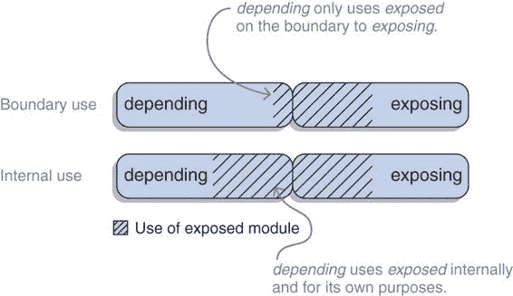
> 
> 图 11.4 两个涉及依赖、暴露和暴露模块的隐含可读性案例。当两个方框接触时，依赖模块使用暴露模块，它明确依赖于该模块。两者都使用暴露模块（条纹区域）。但使用的程度可能不同：依赖模块可能仅在暴露的边界处使用它（顶部），或者它可能使用内部类型来实现自己的功能（底部）。
> 
> 回顾 java.sql 的例子，你可以根据依赖模块如何使用 java.logging 来回答这个问题，比如说它是 monitor.persistence：

+   它可能只需要读取 java.logging，因此能够调用`java.sql.Driver.getParentLogger()`，更改记录器的日志级别，然后完成。在这种情况下，它与 java.logging 的交互仅限于 monitor.persistence 和 java.sql 之间的边界，你处于隐含可读性的甜蜜点。

+   或者，monitor.persistence 可能在它的代码中到处使用日志记录。然后，来自 java.logging 的类型出现在许多地方，独立于`Driver`，并且不能再被认为是局限于边界的。在这种情况下，monitor.persistence 应明确要求 java.logging。

> 可以对 ServiceMonitor 应用程序的例子进行类似的对比。monitor.peek，它需要 monitor.observer.alpha，是否只使用 monitor.observer 中的类型来创建`ServiceObserver`？或者它是否独立于与 monitor.observer.alpha 的交互而使用 monitor.observer 模块中的类型？
> 
> 11.1.5 使用隐式可读性重构模块
> 
> 初看之下，隐式可读性似乎是一个解决特定用例的小功能。然而，有趣的是，它并不仅限于那个用例！相反，它解锁了一些有用的技术，有助于模块重构。
> 
> 使用这些技术的动机通常是防止重构模块时模块依赖项发生变化。如果你完全控制模块的所有客户端，并且一次性编译和部署它们，那么你可以更改它们的模块声明，而不是做更复杂的事情。但通常你无法做到——例如，当开发库时——因此你需要一种在不破坏向后兼容性的情况下重构模块的方法。
> 
> 使用聚合模块表示模块家族
> 
> 假设你的应用程序有几个核心模块，几乎任何其他模块都必须依赖它们。你当然可以将必要的`requires`指令复制粘贴到每个模块声明中，但这相当繁琐。相反，你可以使用隐式可读性来创建所谓的聚合模块。
> 
> 聚合模块不包含代码，并通过在其所有依赖项上使用`requires transitive`来体现可读性。它用于创建一组连贯的模块，其他模块可以通过仅要求聚合模块来轻松依赖。
> 
> ServiceMonitor 应用程序的规模有点小，不足以证明创建聚合模块的必要性；但为了举例，让我们决定 monitor.observer 和 monitor.statistics 是其核心 API。在这种情况下，你可以按以下方式创建 monitor.core：
> 
> `module monitor.core { requires transitive monitor.observer; requires transitive monitor.statistics; }`
> 
> 现在，所有其他模块都可以依赖 monitor.core，并免费获得 monitor.observer 和 monitor.statistics 的可读性。图 11.5 展示了这个例子。
> 
> 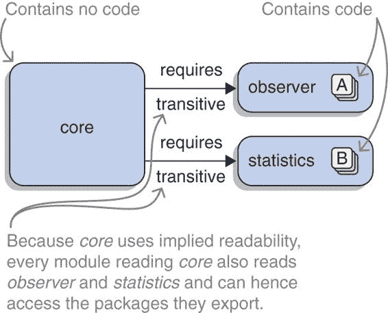
> 
> 图 11.5 聚合模块 core（左）不包含代码，并使用`requires transitive`指令引用聚合的模块 observer 和 statistics（右），其中包含功能。多亏了隐式可读性，聚合模块的客户端可以使用聚合模块的 API。
> 
> 当然，没有理由将聚合限制在核心功能上。每个合作实现功能的模块家族都是获得代表它的聚合模块的候选者。
> 
> 但是等等：聚合模块不会让客户端陷入一个内部使用它们明确不依赖的模块的 API 的情况吗？这似乎与我在讨论何时依赖隐含可读性时所说的相矛盾：它应该在模块边界处使用。但我认为这里的情况微妙地不同。
> 
> 聚合模块有一个特定的责任：将相关模块的功能捆绑成一个单一单元。修改捆绑内容是一个关键的概念性变化。“常规”隐含的可读性，另一方面，通常表现在不直接相关的模块之间（如 java.sql 和 java.logging），其中隐含的模块更偶然地被使用（尽管改变它仍然是破坏 API 的；参见第 15.2.4 节）。
> 
> 如果你熟悉面向对象的编程术语，你可以将其与关联、聚合和组合（比较远非完美，术语也不整齐对齐，但如果你了解术语，它应该给你一些直观的感受）：

+   定义的 `requires` 指令在两个相关模块之间创建了一个简单的关联。

+   使用 `requires transitive` 将其转变为一种聚合，其中一个模块使其它模块成为其 API 的一部分。

+   聚合模块在某种程度上类似于组合，因为涉及到的模块的生命周期是耦合的——聚合模块本身没有存在的理由。然而，这并不完全准确，因为在真正的聚合中，被引用的模块本身没有目的——而另一方面，聚合模块通常是有目的的。

> 考虑到这些类别，我认为要求聚合公开的依赖关系受第 11.1.4 节中引入的指南的约束，而依赖于组合公开的依赖关系始终是可行的。为了不让事情比必要的更复杂，我将在本书的其余部分不使用聚合和组合这两个术语；我将坚持使用隐含的可读性和聚合模块。
> 
> > **重要信息** 最后，一个警告：聚合模块是一个有缺陷的抽象！在这种情况下，它们泄露了服务和有资格的导出和公开。后者在第 11.3 节和 12.2.2 节中介绍，所以我不将详细说明。只需说，它们通过命名特定的模块来工作，因此只有它们可以访问一个包。尽管聚合模块鼓励开发者使用它而不是其组成模块，但向聚合模块导出或公开一个包是没有意义的，因为它不包含自己的代码，组成模块仍然会看到一个强封装的包。
> > 
> 如第 10.1.2 节所述的服务绑定，也破坏了聚合器模块是完美占位符的幻想。在这里，问题是如果组成模块提供了一个服务，绑定将把它拉入模块图中，但当然不是聚合器模块（因为它没有声明提供该服务），因此也不是其他组成模块。在创建聚合器模块之前，仔细考虑这些情况。
> 
> 通过拆分模块进行重构
> 
> 我确信你曾经遇到过这样的情况，你意识到你曾经认为的一个简单功能已经发展成为一个更复杂的子系统。你一次又一次地改进和扩展它，它变得有些混乱；因此，为了清理代码库，你将其重构为更小的部分，这些部分以更好的定义方式交互，同时保持其公共 API 稳定。
> 
> > **重要信息** 以 ServiceMonitor 应用程序为例，其统计操作可能收集了如此多的代码，以至于将其拆分为几个较小的子项目是有意义的，例如平均值、中位数和百分位数。到目前为止，一切顺利；现在，让我们考虑这如何与模块交互。
> > 
> 假设简单功能最初就有自己的模块，而新的解决方案将使用几个模块。如果原始模块消失了，模块系统将抱怨缺少依赖项。
> 
> 根据我们刚才讨论的内容，为什么不保留原始模块并将其转换为聚合器呢？只要原始模块的所有导出包现在都由新的模块导出，这是可能的。（否则，依赖于新的聚合器模块并不授予对其以前 API 所有类型的访问权限。）
> 
> > **重要信息** 为了保持对 monitor.statistics 的依赖关系不变，它可以被转换为一个聚合器模块。将所有代码移动到新的模块中，并编辑 monitor.statistics 模块的声明，使用 `transitive` 关键字要求新的模块：
> > 
> `module monitor.statistics { requires transitive monitor.statistics.averages; requires transitive monitor.statistics.medians; requires transitive monitor.statistics.percentiles; }`
> 
> > 查看 图 11.6 来了解这种分解。这是一个重申隐含可读性传递性质的好机会：所有依赖于上一个示例中创建的假设 monitor.core 模块的模块都将读取新的统计模块，因为 monitor.core `requires transitive` monitor.statistics，而 monitor.statistics `requires transitive` 新的模块。
> > 
> 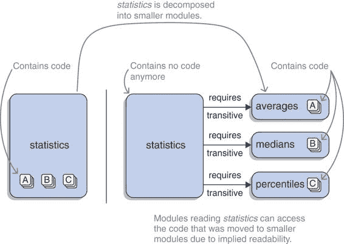
> 
> 图 11.6 在重构之前，统计模块包含了很多功能（左）。然后它被分解成三个更小的模块，包含所有代码（右）。为了不强制更改依赖于统计模块的模块，它没有被移除，而是转换成了一个聚合器模块，它暗示了被拆分的模块的可读性。
> 
> 如果你希望客户端用更具体的 `requires` 指令替换对旧模块的依赖，考虑弃用聚合器：
> 
> `@Deprecated module my.shiny.aggregator { // ... }`
> 
> > **重要信息** 关于聚合器模块是泄漏抽象的早期警告完全适用。如果用户在聚合器模块上使用有资格的导出或公开，新模块将不会从中受益。
> > 
> 11.1.6 通过合并模块重构模块
> 
> 虽然可能不如拆分已经超出其根基的模块常见，但你偶尔可能想要将几个模块合并成一个。和之前一样，移除现在技术上无用的模块可能会破坏客户端；和之前一样，你可以使用隐含的可读性来解决这个问题：保留空的旧模块，并确保旧模块声明中只有一行是 `requires transitive` 指令针对新模块。
> 
> > **重要信息** 在 ServiceMonitor 应用程序上工作，你可能会意识到每个观察器实现都有一个模块是过度的，你希望将所有模块合并到 monitor.observer 中。将代码从 monitor.observer.alpha 和 monitor.observer.beta 移动到 monitor.observer 是简单的。为了保持直接需要实现模块的应用程序部分在无需更改的情况下工作，你使它们对更大的模块具有隐含的可读性：
> > 
> `@Deprecated module monitor.observer.alpha { requires transitive monitor.observer; }  @Deprecated module monitor.observer.beta { requires transitive monitor.observer; }`
> 
> > 你可以在图 11.7 中看到这些模块。你还可以弃用它们，以推动用户更新他们的依赖项。
> > 
> 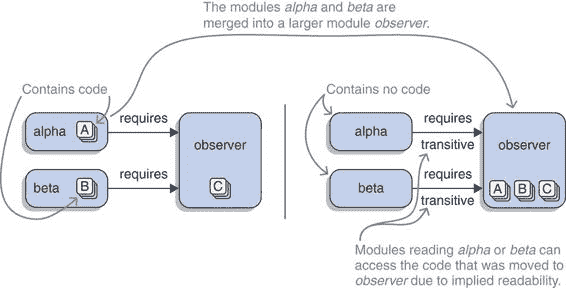
> 
> 图 11.7 在重构之前，观察代码在三个模块 alpha、beta 和 observer（左侧）之间共享。之后，所有功能都集中在 observer 模块中，而空心的模块 alpha 和 beta 则暗示了对其的可读性，以避免要求其客户端进行更改（右侧）。
> 
> > **重要信息** 虽然如此，仔细考虑这种方法。它使较小模块的客户端突然依赖于比他们最初期望的更大的东西。此外，记住之前关于聚合器模块是泄漏抽象的警告。
> > 
> 11.2 可选依赖
> 
> 在 3.2 节中，你看到模块系统使用 `requires` 指令通过确保依赖项在编译和运行时存在来实现可靠的配置。但正如我们在 2.3 节末讨论的那样，在第一次查看 ServiceMonitor 应用程序后，这种方法可能过于僵化。
> 
> 有时候代码最终会使用那些在运行时不必存在的类型——它们可能存在，但不必存在。目前，模块系统要么要求它们在启动时存在（当你使用 `requires` 指令时），要么完全不允许访问（当你不使用它时）。
> 
> 在本节中，我将向您展示几个例子，说明这种严格性会导致问题。然后我将介绍模块系统的解决方案：可选依赖项。尽管针对它们进行编码并不简单，但我们将仔细研究这一点。在本节结束时，您将能够针对不需要在运行时存在的模块进行编码。ServiceMonitor 仓库中的 `feature-optional-dependencies` 分支展示了如何使用可选依赖项。
> 
> 11.2.1 可靠配置的难题
> 
> 假设有一个包含 stats.fancy 模块的先进统计库，这个模块不能在 ServiceMonitor 应用程序的每个部署中都存在于模块路径上。（原因无关紧要，但让我们假设它是一个许可问题。）
> 
> 您想在 monitor.statistics 中编写使用 fancy 模块类型的代码，但要使其工作，您需要使用 `requires` 指令来依赖它。但如果你这样做，如果 stats.fancy 不存在，模块系统就不会让应用程序启动。图 11.8 展示了这个死锁。（如果这个情况看起来很熟悉，那是因为我们之前从另一个角度看过它。几分钟后，我会告诉你具体位置。）
> 
> 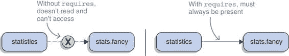
> 
> 图 11.8 可靠配置的难题：要么模块系统没有授予 stats.fancy 统计访问权限，因为统计不需要访问权限（左），要么统计需要访问权限，这意味着 stats.fancy 必须始终存在才能启动应用程序（右）。
> 
> 另一个例子是一个实用库——让我们称它为 `uber.lib`——它集成了几个其他库。它的 API 提供了基于它们的功能，因此暴露了它们的类型。到目前为止，这可能会让人认为这是一个显而易见的隐含可读性案例，如第 11.1 节所述，但事情可以从另一个角度来看。
> 
> 让我们以 `uber.lib` 集成的 `com.google.common` 为例来演示这个过程。`uber.lib` 的维护者可能认为，任何没有使用 Guava 的人永远不会调用他们库中的 Guava 部分。在某些情况下，这是有道理的。如果你没有这样的图，你为什么要调用 `uber.lib` 中创建一个漂亮的报告的 `com.google.common.graph.Graph` 实例的方法呢？
> 
> 对于 `uber.lib`，这意味着它可以在不使用 `com.google.common` 的情况下完美运行。如果 Guava 进入模块图，客户端可能会调用 `uber.lib` API 的那一部分。如果没有，它们就不会调用，库也会正常运行。你可以这样说，`uber.lib` 从不需要依赖它自己。
> 
> 运用我们迄今为止探索的功能，这样的可选关系无法实现。根据第三章的可读性和可访问性规则，`uber.lib` 必须要求 `com.google.common` 来编译其类型，从而强制所有客户端在启动应用程序时始终在模块路径上拥有 Guava。
> 
> 如果 `uber.lib` 集成了一小部分库，它将使客户端依赖所有这些库，即使他们可能永远不会使用超过一个。这不是 `uber.lib` 的好做法，因此其维护者将寻找一种方法来标记他们的依赖项在运行时为可选。正如下一节所示，模块系统已经为他们提供了解决方案。
> 
> > 注意：构建工具也了解这样的可选依赖。在 Maven 中，你将依赖项的 `<optional>` 标签设置为 `true`；在 Gradle 中，你将它们列在 `compileOnly` 下。
> > 
> 11.2.2 静态修饰符：将依赖项标记为可选
> 
> 当一个模块需要针对另一个模块的类型进行编译，但又不希望在运行时依赖它时，可以使用 `requires static` 指令来建立这种可选依赖。对于两个依赖和可选的模块，其中依赖的声明包含 `requires static optional` 这一行，模块系统在编译和启动时表现不同：

+   在编译时，可选必须存在，否则将出现错误。在编译期间，可选对依赖项是可读的。

+   在启动时，可选可能不存在，这既不会导致错误也不会导致警告。如果存在，它对依赖项是可读的。

> 表 11.1 比较了这种行为与常规 `requires` 指令。请注意，尽管模块系统不会发出错误，但运行时仍然可能会。可选依赖使得运行时错误，如 `NoClassDefFoundError`，更加可能，因为模块编译时可能缺少类。在第 11.2.4 节中，您将看到为这种情况做准备的代码。
> 
> 表 11.1 比较 `requires` 和 `requires static` 在编译和启动时对现有和缺失依赖项的行为。唯一的区别在于它们在启动时如何处理缺失依赖项（最右侧列）。

|    | 依赖项存在   | 依赖项缺失   |
| --- | --- | --- |
|    | 编译时   | 启动时   | 编译时   | 启动时   |
| `requires`   | 读取   | 读取   | 错误   | 错误   |
| `requires static`   | 读取   | 读取   | 错误   | 忽略   |

> 以一个例子，让我们创建一个从 `monitor.statistics` 到 `stats.fancy` 的可选依赖。为此，你使用 `requires static` 指令：
> 
> `module monitor.statistics { requires monitor.observer; requires static stats.fancy; exports monitor.statistics; }`
> 
> 如果在编译时缺少 `stats.fancy`，则在模块声明编译时会出现错误：
> 
> `> monitor.statistics/src/main/java/module-info.java:3: > error: module not found: stats.fancy > requires static stats.fancy; > ^ > 1 error`
> 
> 另一方面，在启动时，模块系统并不关心 stats.fancy 是否存在。
> 
> uber.lib 的模块描述符将所有依赖项声明为可选：
> 
> `module uber.lib { requires static com.google.common; requires static org.apache.commons.lang; requires static org.apache.commons.io; requires static io.vavr; requires static com.aol.cyclops; }`
> 
> 现在你已经知道了如何声明可选依赖，但还有两个问题需要回答：

+   在什么情况下依赖项会存在？

+   如何针对可选依赖进行编码？

> 我们将在下文中回答这两个问题，完成之后，你们都将准备好使用这个方便的功能。
> 
> 11.2.3 可选依赖项的模块解析
> 
> 如第 3.4.1 节所述，模块解析是一个过程，给定一个初始模块和一组可观察的模块，通过解析`requires`指令来构建模块图。当一个模块正在解析时，它所需要的所有模块都必须是可观察的。如果它们是，它们将被添加到模块图中；否则，将发生错误。稍后我这样描述了这个图：
> 
> > 重要的是要注意，在解析期间没有进入模块图的模块在编译或执行期间也不可用。
> > 
> > ESSENTIAL INFO 在编译时，模块解析像常规依赖项一样处理可选依赖。另一方面，在启动时，`requires static`指令大多被忽略。当模块系统遇到一个时，它不会尝试满足它，这意味着它甚至不会检查是否有名为该模块的可观察模块。
> > 
> > 因此，即使一个模块存在于模块路径上（或者对于 JDK 来说也是如此），由于可选依赖的存在，它也不会被添加到模块图中。只有当它也是正在解析的其他模块的常规依赖项，或者因为它被明确地通过命令行选项`--add-modules`添加，正如第 3.4.3 节所述时，它才会进入图。图 11.9Figure 11.9 展示了这两种行为，使用该选项确保可选依赖的存在。
> > 
> 这就是我们的循环。我第一次提到这个花哨的统计库是在解释为什么有时有必要明确地将模块添加到模块图中时。我没有特别提到可选依赖（这并不是该选项的唯一用例），但总体想法与现在相同：花哨的统计模块不是严格必需的，因此不会自动添加到模块图中。如果你想让它在那里，你必须使用`--add-modules`选项——要么命名特定的模块，要么使用`ALL-MODULE-PATH`。
> 
> 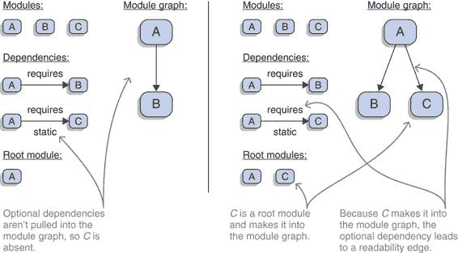
> 
> 图 11.9 两边显示了类似的情况。这两种情况都涉及三个模块 A、B 和 C，其中 A 严格依赖于 B，并且可选地依赖于 C。在左边，A 是初始模块，由于可选依赖没有被解析，所以没有 C 的模块图。在右边，使用命令行选项`--add-modules`将 C 强制加入到图中，使其成为第二个根模块。因此，它被解析并且可以被 A 读取。
> 
> 可能你注意到了这样一个短语：在模块解析过程中，可选依赖“通常被忽略”。为什么是“通常”？好吧，如果一个可选依赖被加入到图中，模块系统会添加一个读取边。所以如果花哨的统计模块在图中（可能是因为常规的`requires`，也可能是因为使用了`--add-modules`），任何可选依赖它的模块都可以读取它。这确保了它的类型可以立即访问。
> 
> 11.2.4 针对可选依赖的编码
> 
> 当你编写针对这些可选依赖的代码时，需要稍微多想一点，因为这是当`monitor.statistics`使用`stats.fancy`中的类型但模块在运行时不存在时发生的情况：
> 
> `Exception in thread "main" java.lang.NoClassDefFoundError: stats/fancy/FancyStats at monitor.statistics/monitor.statistics.Statistician.<init>(Statistician.java:15) at monitor/monitor.Main.createMonitor(Main.java:42) at monitor/monitor.Main.main(Main.java:22) Caused by: java.lang.ClassNotFoundException: stats.fancy.FancyStats ... 更多`
> 
> 哎呀。你通常不希望你的代码这样做。
> 
> 一般而言，当当前正在执行的代码引用一个类型时，JVM 会检查它是否已经被加载。如果没有，它会告诉类加载器去加载；如果失败了，结果就是`NoClassDefFoundError`，这通常会导致应用程序崩溃或者至少导致正在执行的逻辑块失败。
> 
> 这正是 JAR 地狱臭名昭著的原因（参见 1.3.1 节）。模块系统希望通过在启动应用程序时检查声明的依赖来克服这个问题。但是，使用`requires static`，你选择退出这个检查，这意味着最终你可能会遇到`NoClassDefFoundError`。对此你能做什么呢？
> 
> 在探讨解决方案之前，你需要确认你是否真的遇到了问题。在`uber.lib`的情况下，你只期望在调用库的代码已经使用这些类型的情况下使用可选依赖的类型，这意味着类加载已经成功。换句话说，当调用`uber.lib`时，所有必需的依赖都必须存在，否则调用不可能发生。所以你实际上没有问题，不需要做任何事情。图 11.10 说明了这种情况。
> 
> 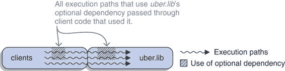
> 
>  假设，只有在客户端已经使用可选依赖项中的类型时调用`uber.lib`才有意义。因此，所有依赖于可选依赖项对`uber.lib`可用的执行路径（顶部两个）都已经通过了依赖于该依赖项的客户端代码（条纹区域）。如果那没有失败，`uber.lib`也不会失败。
> 
> 然而，一般情况是不同的，如图 11.11 所示。可能正是具有可选依赖项的模块首先尝试从可能不存在的依赖项中加载类，因此`NoClassDefFoundError`的风险是非常真实的。
> 
> 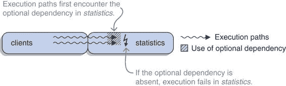
> 
>  在一般情况下，不能保证调用像统计这样的模块的客户端代码已经建立了可选依赖项。在这种情况下，执行路径（波浪线）可能首先在统计模块（条纹区域）中遇到依赖项，如果可选依赖项不存在，则将失败。
> 
> > **重要信息** 一个解决方案是确保所有可能调用具有可选依赖项的模块的调用都必须在访问依赖项之前通过检查点。如图 11.12 所示，该检查点必须评估依赖项是否存在，如果不存在，则将到达它的所有代码发送到不同的执行路径。
> > 
> 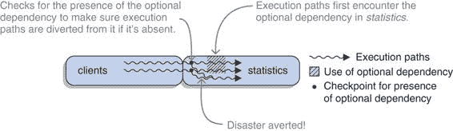
> 
>  为了确保像统计这样的模块，它有一个可选的依赖项，无论该依赖项是否存在都能保持稳定，需要检查点。根据依赖项是否存在，代码会根据执行路径（波浪线）分支到使用该依赖项的代码（条纹区域）或到其他不使用该依赖项的代码。
> 
> 模块系统提供了一个 API 来检查模块是否存在。我目前不会深入讲解它是如何工作的，因为您缺少理解代码所需的一些先决条件。所以您需要等待（或跳到）第 12.4.2 节，亲自查看以下类似实用方法是如何实现的：
> 
> `public static boolean isModulePresent(String moduleName) { // ... }`
> 
> 使用类似`"stats.fancy"`这样的参数调用此方法将返回该模块是否存在。如果使用常规依赖项的名称（简单的`requires`指令）调用，结果始终为`true`，因为否则模块系统不会允许应用程序启动。
> 
> 如果使用可选依赖项的名称（`requires static`指令），结果将是`true`或`false`。如果存在可选依赖项，模块系统建立了可读性，因此可以安全地走一个使用模块中类型的执行路径。如果不存在可选依赖项，选择这样的路径将导致`NoClassDefFoundError`，因此必须找到另一个路径。
> 
> 11.3 合格导出：限制对特定模块的访问
> 
> 而前两个部分展示了如何细化依赖项，这一部分介绍了一种允许更精细 API 设计的机制。如第 3.3 节所述，模块的公共 API 是通过使用`exports`指令导出包来定义的，在这种情况下，每个读取导出模块的模块都可以在编译和运行时访问这些包中的所有公共类型。这是强封装的核心，第 3.3.1 节对此进行了深入解释。
> 
> 到目前为止，我们讨论的内容要求你在强封装一个包或始终使其对所有人都可访问之间做出选择。为了处理那些不容易适应这种二分法的用例，模块系统提供了两种不那么坦率的导出包的方式：合格导出，我们现在将探讨；以及开放包，第 12.2 节将介绍，因为它们与反射有关。和以前一样，我将先通过例子介绍机制。在本节结束时，你将能够比使用常规`exports`指令更精确地暴露 API。查看 ServiceMonitor 存储库中的`feature-qualified-exports`分支，以了解合格导出的实际应用。
> 
> 11.3.1 展示内部 API
> 
> 最好的例子表明`exports`指令可能过于通用，来自 JDK。如你在第 7.1 节所见，只有一个平台模块导出`sun.*`包，而很少有模块导出`com.sun.*`包。但这是否意味着所有其他包都只在其声明的模块中使用？
> 
> 远非如此！许多包在模块间共享。以下是一些例子：

+   基础模块 java.base 的内部结构被广泛使用。例如，java.sql（提供 Java 数据库连接 API [JDBC]）使用了`jdk.internal.misc`、`jdk.internal.reflect`和`sun.reflect.misc`。与安全相关的包，如`sun.security.provider`和`sun.security.action`，被 java.rmi（远程方法调用 API [RMI]）或 java.desktop（AWT 和 Swing 用户界面工具包，以及可访问性、多媒体和 JavaBeans API）使用。

+   java.xml 模块定义了 Java XML 处理 API（JAXP），它包括 XML 流式 API（StAX）、简单 XML API（SAX）和 W3C 文档对象模型（DOM）API。其六个内部包（大多数以`com.sun.org.apache.xml`和`com.sun.org.apache.xpath`为前缀）被 java.xml.crypto（XML 加密 API）使用。

+   许多 JavaFX 模块访问 javafx.graphics 的内部包（主要是`com.sun.javafx.*`），而 javafx.graphics 反过来又使用 javafx.swing 中的`com.sun.javafx.embed.swing`（集成 JavaFX 和 Swing），而 javafx.swing 反过来又使用 java.desktop 的七个内部包（如`sun.awt`和`sun.swing`），以此类推...

> 我可以继续说，但我相信你已经明白了我的意思。然而，这提出了一个问题：JDK 是如何在没有将其导出到其他所有人的情况下，在其模块之间共享这些包的？
> 
> 虽然 JDK 确实有更针对性的导出机制的最强用例，但它并不是唯一的。每当一组模块想要在不暴露的情况下相互共享功能时，这种情况就会发生。这可能是一个库、一个框架，甚至是一个大型应用程序模块集的子集。
> 
> 这与在模块系统引入之前隐藏实用类的问题是对称的。一旦实用类需要在包之间可用，它就必须是公开的；但在 Java 9 之前，这意味着所有在同一个 JVM 中运行的代码都可以访问它。现在你面临的情况是你想隐藏一个实用包，但一旦它需要在模块之间可用，它就必须被导出，因此可以被同一 JVM 中运行的所有模块访问——至少到目前为止你所使用的机制是这样的。图 11.13 说明了这种对称性。
> 
> 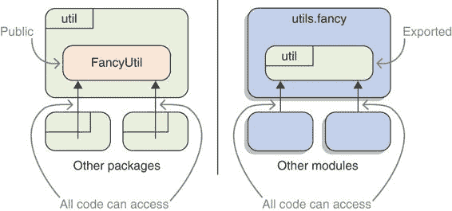
> 
> 图 11.13（左）Java 9 之前的状况，一旦类型是公开的（如`util`包中的`FancyUtil`），它就可以被所有其他代码访问。（右）模块的类似情况，但处于更高的层面，一旦包被导出（如`utils.fancy`中的`util`），它就可以被所有其他模块访问。
> 
> 11.3.2 将包导出到模块
> 
> `exports`指令可以通过跟在它后面加上`to ${modules}`来限定，其中`${modules}`是一个以逗号分隔的模块名称列表（不允许使用占位符）。对于在`exports to`指令中命名的模块，包的访问权限将与常规的`exports`指令完全相同。对于所有其他模块，包的封装性将像没有`exports`一样强。这种情况在图 11.14 中显示。
> 
> 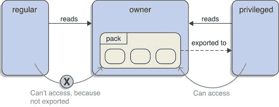
> 
> 图 11.14 模块所有者使用限定导出来使包`pack`仅对特权模块可用。对于特权模块，它的访问权限与使用常规导出时一样；但其他模块，如常规模块，无法访问它。
> 
> 作为一个假设的例子，假设 ServiceMonitor 应用程序中的所有观察者实现都需要共享一些实用代码。第一个问题是把这些类型放在哪里。所有观察者已经依赖于 monitor.observer，因为它包含了它们实现的 ServiceObserver 接口，所以为什么不把它放在那里呢？好吧，它们最终放在了包`monitor.observer.utils`中。
> 
> 接下来是有趣的部分。这是仅将新包导出到实现模块的 monitor.observer 模块声明：
> 
> `module monitor.observer { exports monitor.observer; exports monitor.observer.utils to monitor.observer.alpha, monitor.observer.beta; }`
> 
> 虽然`monitor.observer`对所有模块都进行了导出，但`monitor.observer.utils`将只能由 monitor.observer.alpha 和 monitor.observer.beta 模块访问。
> 
> 这个例子展示了两个有趣的细节：

+   被导出的包可以依赖于导出模块，从而形成一个循环。思考这个问题，除非使用了隐含的可读性，否则这必须是这种情况：否则，被导出包的模块如何读取导出模块？

+   每当一个新的实现想要使用这些工具时，API 模块需要被更改，以便它能够访问这个新模块。尽管让导出模块控制哪些模块可以访问包是合格导出的主要目的，但这仍然可能有些繁琐。

> 作为现实世界的例子，我想向您展示 java.base 声明的合格导出，但一共有 65 个，这可能会有些令人眼花缭乱。相反，让我们通过`java --describe-module java.xml`（如第 5.3.1 节所述）来查看 java.xml 的模块描述符：
> 
> `> 模块 java.xml@9.0.4 # 除了合格导出之外的所有内容都被截断 > 合格导出 com.sun.org.apache.xml.internal.utils 到 java.xml.crypto > 合格导出 com.sun.org.apache.xpath.internal.compiler 到 java.xml.crypto > 合格导出 com.sun.xml.internal.stream.writers 到 java.xml.ws > 合格导出 com.sun.org.apache.xpath.internal 到 java.xml.crypto > 合格导出 com.sun.org.apache.xpath.internal.res 到 java.xml.crypto > 合格导出 com.sun.org.apache.xml.internal.dtm 到 java.xml.crypto > 合格导出 com.sun.org.apache.xpath.internal.functions 到 java.xml.crypto > 合格导出 com.sun.org.apache.xpath.internal.objects 到 java.xml.crypto`
> 
> 这表明 java.xml 允许 java.xml.crypto 和 java.xml.ws 使用其一些内部 API。
> 
> 现在您已经了解了合格导出，我可以澄清我们在分析模块系统日志时留下的一个小谜团。在那里，您看到了如下信息：
> 
> `> 将从模块 java.xml 读取到模块 java.base > 模块 java.xml 中的包 com/sun/org/apache/xpath/internal/functions 导出到模块 java.xml.crypto > 模块 java.xml 中的包 javax/xml/datatype 导出到所有未命名的模块`
> 
> 我没有解释为什么日志谈论的是导出到模块，但根据我们刚才讨论的，现在应该很清楚。正如你在最近的例子中看到的，java.xml 导出`com.sun.org.apache.xpath.internal.functions`到 java.xml.crypto，这正是第二条消息所说的。第三条消息将`javax.xml.datatype`导出到“所有未命名的模块”，这看起来有点奇怪，但这是模块系统表示该包未进一步限定导出，因此对读取 java.xml 的每个模块都可用，包括未命名的模块。
> 
> > **基本信息** 最后，关于编译的两个小贴士：

+   如果一个声明了合格导出的模块被编译，而目标模块不在可观察模块的宇宙中，编译器将发出警告。这不是一个错误，因为目标模块被提及了，但不是必需的。

+   在`exports`和`exports to`指令中不允许使用一个包。如果两个指令都存在，后者将实际上是无用的，因此这种情况被解释为实现错误，因此导致编译错误。

> 11.3.3 **何时使用合格导出**
> 
> 合格导出允许模块之间共享一个包，而不会使其对所有同一 JVM 中的其他模块可用。这使得合格导出对于由多个模块组成且希望在不让客户端使用的情况下共享代码的库和框架非常有用。它们对于希望限制对特定 API 依赖的大型应用程序也非常有用。
> 
> 合格导出可以看作是从保护工件中的类型到保护模块集合中的包的强封装的提升。这由图 11.15 所示。
> 
> 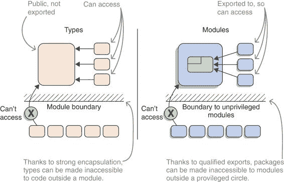
> 
> （左）一个非导出包中的公共类型如何被同一模块中的其他类型访问，但不能被其他模块的类型访问。（右）一个类似的情况，但处于更高的层面，其中合格导出被用来使一个模块中的包对一组定义的模块可用，同时使其对无权限的模块不可访问。
> 
> 假设你正在设计一个模块。你何时应该优先选择合格导出而不是无合格导出？为了回答这个问题，我们必须关注合格导出的核心好处：控制谁使用 API。一般来说，当问题包与其客户端的距离越远时，这变得越重要。
> 
> 假设你有一个由少量模块（不计依赖项）组成的小到中等规模的应用程序，由一个小团队维护，并且一次性编译和部署。在这种情况下，控制哪个模块使用哪个 API 相对容易；如果出现问题，由于一切都在你的控制之下，所以很容易修复。在这种情况下，合格导出的好处影响很小。
> 
> 在光谱的另一端是 JDK，它被世界上几乎每个 Java 项目使用，并且极端关注向后兼容性。代码“在外部”依赖于内部 API 可能会出现问题，并且难以修复，因此控制谁可以访问什么的需求很大。
> 
> 区分这两种极端的最明显的界限是您是否可以自由更改包的客户端。如果您可以，因为您正在开发该模块及其所有客户端模块，常规导出是一个不错的选择。如果您不能，因为您维护一个库或框架，那么只有您希望客户端使用并且愿意维护的 API 应该无条件地导出。所有其他内容，尤其是内部实用程序，应该仅导出到您的模块中。
> 
> 在大型项目中，这条线变得模糊。如果一个大型代码库由一个大型团队在多年内维护，那么在 API 更改变得必要时，您可能技术上能够更改所有客户端，但这可能很痛苦。在这种情况下，使用有条件的导出不仅防止了意外依赖于内部包，而且还记录了 API 是为哪些客户端设计的。
> 
> 11.3.4 命令行上的导出包
> 
> 如果在编写时没有预见（或者更可能的是，没有打算）使用内部 API，那会怎样？如果代码绝对必须访问包含模块未导出的类型，无论是合格的还是不合格的，那会怎样？如果模块系统坚决执行这些规则，许多应用程序在 Java 9+上可能无法编译或启动；但如果它是一个绕过强封装的简单方法，那么它几乎不会是“强”的，从而失去了其优势。通过定义可以作为逃生口但又不至于成为普遍解决方案的命令行选项，找到了中间地带。
> 
> 除了`exports to`指令外，还有一个具有相同效果的命令行选项可以应用于编译器和运行时命令：使用`--add-exports ${module}/${package}=${accessing-modules}`，模块系统将$module 的`${package}`导出到以逗号分隔的列表`${accessing-modules}`中命名的所有模块。如果其中包含`ALL-UNNAMED`，未命名的模块中的代码也可以读取该包。
> 
> 正常的可访问性规则，如第 3.3 节所述，适用——对于由于`--add-exports`选项而需要访问类型的模块，必须满足以下条件：

+   类型必须是公开的。

+   类型必须在`${package}`中。

+   在`${accessing-modules}`中指定的模块必须读取${module}。

> 对于`--add-exports`的示例，请翻回到 7.1.3 和 7.1.4 节，在那里您使用它来在编译和运行时访问平台模块的内部 API。与其他命令行选项一样，要求`--add-exports`在实验之外存在是一个可维护性问题；请参阅 9.1 节以获取详细信息。
> 
> 摘要

+   隐含的可读性：

+   使用`requires transitive`指令，一个模块使其客户端读取因此所需的模块，即使该模块没有明确依赖它。这允许模块在其 API 中使用依赖项的类型，而无需将手动要求这些依赖项的负担放在客户端模块上。因此，该模块可以立即使用。

+   如果一个模块仅在边界上使用传递依赖项，那么它应该仅依赖于传递依赖项的隐含可读性。一旦模块开始使用传递依赖项来实现其自己的功能，它应该将其作为直接依赖项。这确保了模块声明反映了真实的依赖项集合，并使模块在可能删除传递依赖项的重构中更加健壮。

+   当在模块之间移动代码时，可以通过使曾经包含代码的模块对现在包含代码的模块暗示可读性来使用隐含的可读性。这允许客户端访问他们依赖的代码，而无需要求他们更改他们的模块描述符，因为他们最终仍然会读取包含代码的模块。保持这种兼容性对库和框架尤其有趣。

+   可选依赖项：

+   使用`requires static`指令，一个模块标记了一个模块系统将确保在编译时存在但在运行时可以不存在的依赖项。这允许在不强制客户端始终在其应用程序中包含这些模块的情况下针对模块进行编码。

+   在启动时，仅由`requires static`指令要求的模块即使可观察也不会添加到模块图中。相反，您必须使用`--add-modules`手动添加它们。

+   针对可选依赖项的编码应确保没有执行路径会因为依赖项缺失而失败，因为这会严重损害模块的可用性。

+   有资格的导出：

+   使用`exports to`指令，一个模块使一个包仅对命名的模块可访问。这是在封装包和使其对每个人可访问之间的一种第三种更具体的选择。

+   将代码导出到特定模块允许在一系列特权模块内共享代码，而不将其公开为公共 API。这减少了库或框架的 API 表面积，从而提高了可维护性。

+   使用`--add-exports`命令行选项，您可以在编译和运行时导出模块的开发者打算作为内部 API 的包。一方面，这保留了依赖于这些内部代码的代码运行；另一方面，它引入了自己的可维护性问题。

> 12
> 
> 模块世界的反射
> 
> 本章涵盖了

+   向反射开放包和模块

+   模块和反射的组合

+   反射 API 的替代方案

+   分析和修改模块属性

> 如果你正在开发一个 Java 应用程序，那么你很可能依赖于 Spring、Hibernate、JAXP、GSON 等框架。什么是“类似的东西”？这些是使用 Java 的反射 API 来检查你的代码、搜索注解、实例化对象或调用方法的框架。多亏了反射，它们可以在不针对你的代码进行编译的情况下完成所有这些操作。
> 
> 此外，反射 API 允许框架访问非公共类和非公共成员。它具有超出编译代码可能性的超级能力，如果类或成员不是公共的，它会在包边界上反弹。问题是，随着模块的出现，反射不再自动工作。
> 
> 恰恰相反：反射失去了它的超级能力，并且被绑定到与编译代码相同的精确可访问性规则。它只能访问导出包中公共类的公共成员。另一方面，这些框架使用反射来访问通常不是公共的属性和方法，以及你可能不希望导出的类，因为这些类不是模块 API 的一部分。那么你该怎么办？这正是本章的主题！
> 
> 为了充分利用本章内容，你应该

+   对反射的工作原理有一个基本的理解（否则，附录 B 将帮助你跟上进度）。

+   知道每次你在某个地方放置一个注解，你实际上是在标记这个类供框架进行反射（参见 列表 12.1 以获取一些示例）。

+   理解可访问性规则（如第 3.3 节所述）。

> > 列表 12.1 基于反射的标准和框架的代码片段
> > 
> `// JPA @Entity @Table(name = "user") public class Book {  @Id @GeneratedValue(strategy = GenerationType.SEQUENCE) @Column(name = "id", updatable = false, nullable = false) private Long id;  @Column(name = "title", nullable = false) private String title;  // [...]  }  // JAXB @XmlRootElement(name = "book") @XmlAccessorType(XmlAccessType.FIELD) public class Book {  @XmlElement private String title;  @XmlElement private String author;  // [...]  }  // SPRING @RestController public class BookController {  @RequestMapping(value = "*book*{id}", method = RequestMethod.GET) @ResponseBody public Book getBook(@PathVariable("id") long id) { // [...] }  // [...]  }`
> 
> 在掌握这些知识的基础上，你会了解到，如果你想要允许对模块进行反射访问（第 12.1 节），仅使用 `exports` 指令是远远不够的，以及你可以采取的其他措施（第 12.2 节）。（请注意，这仅适用于显式模块——如果你的代码从类路径运行，它不是封装的，因此你不必担心这些问题。）
> 
> 但本章不仅仅关于“仅仅”为反射准备模块：它还涵盖了另一面，讨论了如何更新反射代码以及反射 API 的替代方案和补充（第 12.3 节）。它以如何使用层在运行时动态加载模块结束（第 12.4 节）。（这两个部分是为那些在 Java 9 之前就已经有这些用例的开发者编写的，因此它们比本章的其余部分需要更多对反射和类加载器的熟悉。）
> 
> 完成之后，你将了解如何在模块世界中为反射准备你的项目，无论它是被反射的、反射之上的还是执行反射。你还将能够使用反射在运行时动态加载代码，例如实现基于插件的程序。
> 
> 12.1 为什么 exports 指令不适合反射
> 
> 在我们讨论如何最佳准备你的代码以进行反射之前，讨论到目前为止所讨论的用于公开类、`exports`指令（见第 3.3 节）的机制为何不适合是有意义的。有三个原因：

+   是否应该将设计用于与这样的框架一起使用的类包含在模块的公共 API 中，这是一个高度可疑的问题。

+   将这些类导出到选定的模块中可以将模块耦合到实现而不是标准。

+   导出不支持对非私有字段和方法的深度反射。

> 在我们讨论模块系统之前的工作方式之后，我们将依次查看这些内容。
> 
> 12.1.1 打破非模块代码
> 
> 假设你已经按照第六章和第七章的描述成功地将你的应用程序迁移到 Java 9+，尽管如此，你还没有对其进行模块化，所以你仍然是从类路径上运行它。在这种情况下，对你的代码的反射仍然像在 Java 8 中一样继续工作。
> 
> 基于反射的框架将常规地通过访问非公共类型和成员来创建和修改类的实例。尽管无法针对包可见或私有元素进行编译，但反射允许你在使其可访问后使用它们。以下列表显示了一个假设的持久化框架，该框架使用反射来创建一个实体并为私有字段分配一个 ID。
> 
> > 列表 12.2 使用反射
> > 
> `Class<?> type = ...` `①` `Constructor<?> constructor = entityType.getConstructor();` `constructor.setAccessible(true);` `②` `Object entity = constructor.newInstance(); Field id = entity.getDeclaredField("id");` `id.setAccessible(true);` `②` `id.set(entity, 42);`
> 
> > ①
> > 
> > 无论框架需要做什么来获取那个类
> > 
> > ②
> > 
> > 使可能私有的构造函数和字段对以下调用可访问
> > 
> 现在想象一下，如果应用程序被模块化，突然在您的代码和那些框架之间出现了一个模块边界。模块系统，特别是`exports`指令，为您提供了哪些选项来使内部类型可访问？
> 
> 12.1.2 强制发布内部类型
> 
> > 关键信息：根据第 3.3 节中讨论的可访问性规则，类型必须是公共的，并且位于导出包中才能被访问。这也适用于反射；因此，如果不使用`exports`指令，您将得到以下异常：
> > 
> `> 异常发生在主线程中 java.lang.IllegalAccessException: > 类 p.X（在模块 A 中）无法访问类 q.Y（在模块 B 中） > 因为模块 B 没有将 q 导出到模块 A > at java.base/....Reflection.newIllegalAccessException > at java.base/....AccessibleObject.checkAccess > at java.base/....Constructor.newInstance`
> 
> 这似乎表明，你必须将 Spring、Hibernate 等类库需要访问的类设置为 public，并导出包含它们的包。然而，这样做会将它们添加到模块的公共 API 中，鉴于我们之前将这些类型视为内部类型，这是一个重大的决定。
> 
> 如果您正在编写一个包含几千行代码的小型服务，这些代码被分成几个模块，这可能看起来不是问题。毕竟，关于您模块的 API 和关系的重大混淆的可能性很小。但这也不是您需要模块发光的场景。
> 
> 另一方面，如果您正在处理一个包含六位数或七位数代码行的大型代码库，分成由十几个或更多开发者共同工作的几十个或几百个模块，情况就完全不同了。在这种情况下，导出一个包会给其他开发者一个强烈的信号，表明可以在模块外部使用这些类，并且它们被特别设计为可以跨越模块边界使用——毕竟，这就是 exports 的作用。
> 
> 但由于这次探索的起点是您出于某种原因更喜欢不将这些类设置为 public，您显然重视它们的封装性。如果模块系统迫使您标记某些您甚至不希望其可访问的内容为受支持，从而削弱了封装性，那就非常讽刺了。
> 
> 12.1.3 限定导出创建对特定模块的耦合
> 
> 在这一点上，回顾第 11.3 节，并考虑使用限定导出以确保只有单个模块可以访问这些内部类型。首先，对于您即兴思考的能力表示赞赏——这确实可以解决我刚才描述的问题。
> 
> 虽然它可以引入一个新的。想想 JPA 及其各种实现，比如 Hibernate 和 EclipseLink。根据你的风格，你可能已经努力防止直接依赖于你选择的实现，所以你不会期待在模块声明中硬编码一个`exports … to concrete.jpa.implementation`。如果你依赖于限定导出，那就没有其他办法了。
> 
> 12.1.4 不支持深度反射
> 
> 将你本想作为实现细节处理的类型暴露给其他代码是件坏事。但这还只是开始。
> 
> 假设你决定使用一个`exports`指令（无论是否限定）来允许你选择的框架访问你的类。尽管通常可以使用仅包含公共成员的基于反射的框架，但这并不总是情况，也不是最佳方法。相反，通常依赖于对私有字段或非公共方法的深度反射，以防止将框架相关的细节暴露给代码库的其他部分。（列表 12.1 展示了一些示例，列表 12.2 展示了如何使用`setAccessible`来实现对内部结构的访问。）
> 
> > 重要的是——一般来说是幸运的——但不幸的是在这种情况下——将类型公开并导出其包并不授予对非公共成员的访问权限。如果框架尝试通过调用`setAccessible`来使用它们，你会得到这样的错误：
> > 
> `> 线程 "main" 中发生异常 java.lang.reflect.InaccessibleObjectException: > 无法使字段 q.Y.field 可访问：> 模块 B 没有向模块 A "打开" q > at java.base/java.lang.reflect.AccessibleObject.checkCanSetAccessible > at java.base/java.lang.reflect.AccessibleObject.checkCanSetAccessible > at java.base/java.lang.reflect.Field.checkCanSetAccessible > at java.base/java.lang.reflect.Field.setAccessible`
> 
> 如果你真的想走这条路，你必须将所有通过反射访问的成员公开，这使得之前“这削弱了封装性”的结论变得更糟。
> 
> 总结来说，这些是使用`exports`指令对主要用于反射的代码的缺点：

+   只允许访问公共成员，这通常需要将实现细节公开。

+   允许其他模块编译代码时针对那些公开的类和成员。

+   限定导出可能会使你绑定到一个实现而不是一个规范。

+   标记包为模块公共 API 的一部分。

> 取决于你哪一点觉得最糟糕。对我来说，是最后一点。
> 
> 12.2 开放包和模块：为反射用例设计
> 
> 既然我们已经确定了`exports`对于使代码对基于反射的库可访问是多么不合适，模块系统提供了什么替代方案？
> 
> 答案是 `opens` 指令，在我们介绍其合格变体（类似于 `exports … to`；第 12.2.2 节）之前，这是我们首先要关注的内容（第 12.2.1 节）。为了确保你选择正确的工具来完成这项工作，我们还将彻底比较导出和打开模块的效果（第 12.2.3 节）。最后但同样重要的是，提供反射访问权限的锤子：打开模块（第 12.2.4 节）。
> 
> 12.2.1 打开包以进行运行时访问
> 
> > 定义：`opens` 指令
> > 
> > 可以通过在模块声明中添加指令 `opens ${package}` 来打开一个包。在编译时，打开的包被强封装：它们是否被打开没有区别。在运行时，打开的包是完全可访问的，包括非公共类、方法和字段。
> > 
> 模块 monitor.persistence 使用 Hibernate，因此它打开一个包含实体的包以允许对其反射：
> 
> `module monitor.persistence { requires hibernate.jpa; requires monitor.statistics;  exports monitor.persistence; opens monitor.persistence.entity; }`
> 
> 这使得 Hibernate 能够与 `StatisticsEntity` 类（见清单 12.3）等类一起工作。由于该包没有被导出，其他 ServiceMonitor 模块不会意外地编译包含其类型的代码。
> 
> > 清单 12.3 从 `StatisticsEntity` 中摘录的内容，Hibernate 将对其进行反射
> > 
> `@Entity @Table(name = "stats") public class StatisticsEntity {  @Id @GeneratedValue(strategy = GenerationType.AUTO)` `private int id;` ① `@ManyToOne @JoinColumn(name = "quota_id", updatable = false)` `private LivenessQuotaEntity totalLivenessQuota;` ①`private StatisticsEntity() { }` ② `// [...]  }`
> 
> > ①
> > 
> > Hibernate 将将这些私有字段注入值。
> > 
> > ②
> > 
> > Hibernate 也可以访问私有构造函数。
> > 
> 正如你所看到的，`opens` 是专门为反射用例设计的，并且与 `exports` 的行为非常不同：

+   它允许访问所有成员，因此不会影响你的可见性决策。

+   它防止了对打开包中代码的编译，并且只允许在运行时访问。

+   它将包标记为设计用于由基于反射的框架使用。

> 除了在特定用例中对 `exports` 的明显技术优势之外，我认为最后一个要点是最重要的：使用 `opens` 指令，你可以在代码中清楚地传达这个包不是用于通用用途，而只是供特定工具访问。如果你愿意，甚至可以通过只为该模块打开包来包含该工具。继续阅读以了解如何做到这一点。正如第 5.2.3 节所解释的，如果你想访问位于你的包中的资源，如配置或媒体文件，你也需要打开它们。
> 
> 12.2.2 为特定模块打开包
> 
> 我们之前讨论的 `opens` 指令允许所有模块反射打开的包。这与 `exports` 指令允许所有模块访问导出的包的方式相似。正如 `exports` 可以限制为特定的模块（见第 11.3 节）一样，`opens` 也可以。
> 
> > 定义：限定打开
> > 
> > `opens` 指令可以通过跟在后面 `to ${modules}` 来限定，其中 `${modules}` 是模块名称的逗号分隔列表（不允许使用占位符）。对于 `opens to` 指令中命名的模块，包的访问权限将与常规 `opens` 指令完全相同。对于所有其他模块，包的封装性将像没有 `opens` 一样强。
> > 
> 为了使封装性更强，monitor.persistence 可能只能将其实体包打开给 Hibernate：
> 
> `module monitor.persistence { requires hibernate.jpa; requires monitor.statistics;  exports monitor.persistence; // assuming Hibernate were an explicit module opens monitor.persistence.entity to hibernate.core; }`
> 
> 在规范和实现分离的情况下（例如，JPA 和 Hibernate），您可能会觉得在模块声明中提及实现有些奇怪。第 12.3.5 节解决了这个问题——总结来说，在标准更新以考虑模块系统之前，这是必要的。
> 
> 我们将在第 12.2.3 节中讨论何时可能需要使用限定 `opens`，但在我们这样做之前，让我们正式介绍在第 7.1 节中使用的命令行选项。
> 
> > 定义：--add-opens
> > 
> > 选项 `--add-opens ${module}/${package}=${reflecting-module}` 将 ${module} 中的 ${package} 打开给 ${reflecting-module}。因此，${reflecting-module} 中的代码可以访问 `${package}` 中的所有类型和成员，包括公开和非公开的，但其他模块则不能。
> > 
> > 当您将 ${reading-module} 设置为 `ALL-UNNAMED` 时，类路径上的所有代码，或者更确切地说，是从未命名的模块（见第 8.2 节）中，都可以访问该包。当迁移到 Java 9+时，您将始终使用该占位符——只有当您自己的代码在模块中运行时，您才能将打开的包限制为特定的模块。
> > 
> 如果您对示例感兴趣，请查看第 7.1.4 节末尾的示例。
> 
> 由于 `--add-opens` 与反射绑定，而反射是一个纯运行时概念，因此它只适用于 `java` 命令。有趣的是，尽管如此，它也存在于 `javac` 中，但会导致警告：
> 
> `> 警告：[options] --add-opens 在编译时没有效果`
> 
> 我认为 `javac` 并不全面拒绝 `--add-opens` 的原因可能是，这使得在编译和启动之间共享相同的参数文件成为可能，该参数文件与模块系统相关的命令行标志相关。
> 
> > 备注：什么是参数文件？您可以将编译器和 JVM 参数放入文件中，并通过 `javac @file-name` 和 `java @file-name` 将它们添加到命令中。有关详细信息，请参阅 Java 文档：[`mng.bz/K1ZK`](http://mng.bz/K1ZK)。
> > 
> 12.2.3 导出与打开包的比较
> 
> `exports`和`open`指令有一些共同点：

+   它们使包内容在模块边界之外可用。

+   它们有一个合格变体`to ${modules}`，只允许访问列出的模块。

+   它们为`javac`和`java`提供了命令行选项，可以在需要时绕过强封装。

> 它们在何时以及提供何种访问权限方面有所不同：

+   导出包在编译时提供对公共类型和成员的访问权限，因此它们非常适合定义其他模块可以使用的公共 API。

+   打开的包提供对所有类型和成员（包括非公共成员）的访问权限，但仅限于运行时，这使得它们非常适合为基于反射的框架提供对其他情况下被认为是模块内部代码的访问权限。

> 表 12.1 总结了这一点。你可能还想翻回到表 7.1 以查看它如何与使用`--add-exports`和`--add-opens`获取内部 API 的访问权限相关。
> 
> 表 12.1 对封装、导出和打开的包何时以及提供何种访问权限的比较

| 访问   | 编译时   | 运行时   |
| --- | --- | --- |
| 类或成员   | 公共   | 非公共   | 公共   | 非公共   |
| 封装包   | ✘   | ✘   | ✘   | ✘   |
| 导出包   | ✔   | ✘   | ✔   | ✘   |
| 打开的包   | ✘   | ✘   | ✔   | ✔   |

> 你可能会想知道是否以及如何组合`exports`和`opens`指令，以及合格和不合格变体。答案是简单的——你喜欢的方式：

+   你的 Hibernate 实体是公共 API 吗？使用`exports`和`opens`。

+   想要只给应用程序的少数模块提供编译时访问你的 Spring 上下文？使用`exports … to`和`opens`。

> 对于四种可能的组合中的每一种可能都没有明显的用例（我甚至可以争论你应该设计代码，以便不需要任何一种），但请放心，如果你遇到一个，你可以相应地安排这些指令。
> 
> 当涉及到是否应该将`opens`限制为特定的模块时，我的观点是，这通常不值得额外的努力。尽管合格导出是防止同事和用户意外依赖内部 API 的重要工具（有关更多信息，请参阅第 11.3.3 节），但合格`opens`的目标受众是完全独立于你代码的框架。无论你是否只为 Hibernate 打开一个包，Spring 都不会依赖于它启动。如果你的项目在其代码上使用了大量的反射，那么情况可能会有所不同；但否则，我的默认做法是不加限定地打开。
> 
> 12.2.4 打开模块：反射关闭
> 
> 最后，如果你有一个包含许多暴露于反射的包的大模块，你可能发现逐个打开它们会很麻烦。尽管没有类似于`opens com.company.*`的通配符，但存在类似的东西。
> 
> > 定义：打开模块
> > 
> > 通过在模块声明中将关键字`open`放在`module`之前，创建了一个公开的模块：
> > 
> > `open module ${module-name} { requires ${module-name}; exports ${package-name}; // no opens allowed }`
> > 
> > 一个公开的模块将其包含的所有包都公开，就像每个包都在使用一个`opens`指令一样。因此，手动进一步打开包是没有意义的，这也是为什么编译器不接受公开模块中的`opens`指令的原因。
> > 
> 作为使用`opens monitor.persistence.entity`的替代方案，monitor.persistence 模块可以改为公开：
> 
> `open module monitor.persistence { requires hibernate.jpa; requires monitor.statistics;  exports monitor.persistence; }`
> 
> 如您所见，公开模块实际上只是为了方便您不必手动打开数十个包。理想情况下，您永远不会处于这种情况，因为您的模块并不大。在模块化过程中，当您在拆分之前将一个大 JAR 转换成一个大模块时，出现如此多打开包的情况更为常见。这也是为什么`jdeps`可以为公开模块生成声明的原因——参见第 9.3.2 节。
> 
> 12.3 模块上的反射
> 
> 12.1 和 12.2 节探讨了如何将代码暴露给反射，以便像 Hibernate 和 Spring 这样的框架可以访问它。由于大多数 Java 应用程序都使用这样的框架，您将经常遇到这种情况。
> 
> 现在我们将转换到另一边，对模块化代码进行反射。了解这一点是好的，这样您就可以更新对反射 API 的理解；但由于编写反射代码对于大多数开发者来说很少见，所以您不太可能经常这样做。因此，本节更多地是关于对模块及其代码进行反射的值得注意方面的讨论，而不是对所有相关主题和 API 的全面介绍。
> 
> 我们首先将探讨为什么您不需要更改反射代码以与模块化代码（12.3.1）一起工作，以及为什么您可能需要切换到更现代的 API（12.3.2）。然后我们将深入到模块本身，它们在反射 API 中有显著的表示，可以用来查询（12.3.3）甚至修改（12.3.4）它们。最后，我们将更详细地研究如何修改模块以允许其他模块通过反射访问它（12.3.5）。
> 
> 12.3.1 更新模块的反射代码（或不）
> 
> 在探索新领域之前，我想通过模块系统引起的变化来更新您的反射知识。虽然了解反射如何处理可读性和可访问性是好的，但您会发现您在代码中需要更改的内容并不多。更重要的是，您需要通知用户在创建模块时他们需要做什么。
> 
> 读取性方面无需进行任何操作
> 
> 我反复强调的一点是，反射受到与静态访问相同的可访问性规则的约束（参见第 3.3 节）。首先，这意味着一个模块中的代码要能够访问另一个模块中的代码，第一个必须读取第二个。一般来说，模块图不会以这种方式设置——Hibernate 通常不会读取应用程序模块。
> 
> > 重要的信息 这听起来像是反射模块需要向反射模块添加一个读取边，确实，有一个 API 可以做到这一点（参见第 12.3.4 节）。但由于反射始终需要这个边，总是添加它只会导致不可避免的样板代码，因此反射 API 会内部处理。总之，你不需要担心可读性。
> > 
> 无法实现可访问性
> 
> 访问代码的下一个障碍是它需要被导出或打开。在第 12.2 节中已经彻底讨论过，这确实是一个问题，尽管作为反射库的作者，你能做的很少。要么模块的所有者通过打开或导出包来准备它，要么他们没有这样做。
> 
> > 重要的信息 模块系统不会限制可见性：像 `Class::forName` 或通过反射获取构造函数、方法和字段的引用这样的调用是成功的。但可访问性是有限的：如果反射模块没有提供访问权限，那么调用构造函数或方法、访问字段以及调用 `AccessibleObject::setAccessible` 将会失败并抛出 `InaccessibleObjectException`。
> > 
> `InaccessibleObjectException` 扩展了 `RuntimeException`，使其成为一个非受检异常，因此编译器不会强制你捕获它。但请确保你确实捕获了它，并在该操作上也是如此——这样，你可以为用户提供一个尽可能有帮助的错误信息。参见列表 12.4 中的示例。
> 
> > 定义：AccessibleObject::trySetAccessible
> > 
> > 如果你更喜欢在不抛出异常的情况下检查可访问性，Java 9 中新增的 `AccessibleObject::trySetAccessible` 方法正是为你准备的。本质上，它做的是与 `setAccessible(true)` 相同的事情：它尝试使底层成员可访问，但使用其返回值来指示是否成功。如果授予了可访问性，它返回 `true`；否则返回 `false`。列表 12.4 展示了它的实际应用。
> > 
> > 列表 12.4 三种处理不可访问代码的方法
> > 
> `private Object constructWithoutExceptionHandling(Class<?> type) throws ReflectiveOperationException { Constructor<?> constructor = type.getConstructor();` `constructor.setAccessible(true);` `①` `return constructor.newInstance(); }  private Object constructWithExceptionHandling(Class<?> type) throws ReflectiveOperationException, FrameworkException { Constructor<?> constructor = type.getConstructor(); try {` `constructor.setAccessible(true);` `②` `} catch (InaccessibleObjectException ex) { throw new FrameworkException(createErrorMessage(type), ex); } return constructor.newInstance(); }  private Object constructWithoutException(Class<?> type) throws ReflectiveOperationException, FrameworkException { Constructor<?> constructor = type.getConstructor();` `boolean isAccessible = constructor.trySetAccessible();` `③` `if (!isAccessible) throw new FrameworkException(createErrorMessage(type)); return constructor.newInstance(); }  private String createErrorMessage(Class<?> type) { return "当进行框架操作时，访问 " + type + " 的无参构造函数失败，因为模块没有打开包含它的包。 " + "有关详细信息，请参阅 https://framework.org/java-modules"; }`
> 
> > ①
> > 
> > 此调用可能会抛出 InaccessibleObjectException，该异常没有明确处理——用户需要自行解决问题。
> > 
> > ②
> > 
> > 在这里，异常被转换为一个具有附加错误消息的框架特定异常，该消息解释了异常发生的环境。
> > 
> > ③
> > 
> > 通过使用 trySetAccessible，可以防止初始异常，但在此情况下，仍然会抛出一个框架特定的异常。
> > 
> 除了确保正确处理无法授予访问权限的情况外，您别无他法。这使得更新项目以适应模块系统更像是一个沟通挑战，而不是技术挑战：用户需要了解项目可能需要访问哪些包以及如何处理。您的文档是教育他们的明显位置。
> 
> > 专门的 JPMS 页面
> > 
> > 稍微偏离主题，我建议在您的文档中为如何为项目准备模块使用的问题创建一个专门的页面。越专注，搜索的用户就越有可能找到它，所以不要把它埋在一个已经非常大的文档中。然后广泛传播这个资源，包括在 Javadoc 和失败访问的异常消息中。
> > 
> 12.3.2 使用变量处理程序而不是反射
> 
> Java 9 引入了一个名为变量句柄的新 API（扩展了 Java 7 的方法句柄，而很少有开发者有使用场景）。它围绕 `java.lang.invoke.VarHandle` 类展开，其实例是变量的强类型引用：例如，字段（尽管它不仅限于这一点）。它解决了来自反射、并发和堆外数据存储等领域的用例。与反射 API 相比，它提供了更多的类型安全和更好的性能。
> 
> 方法句柄和变量句柄是多功能、复杂的特性，与模块系统关系不大，所以在这里我不会正式介绍它们。如果你偶尔编写使用反射的代码，你绝对应该研究它们——一个简单的例子，请参见下一个列表。不过，有一个特别有趣的问题，我想更深入地讨论：变量句柄如何用于访问模块内部。
> 
> > 列表 12.5 使用 `VarHandle` 访问字段值
> > 
> `Object object = // ...` `①``String fieldName = // ...` `①``Class<?> type = object.getClass();` `②``Field field = type.getDeclaredField(fieldName);` `②``Lookup lookup = MethodHandles.lookup();` `③``VarHandle handle = lookup.unreflectVarHandle(field); handle.get(object);`
> 
> > ①
> > 
> > 给定一个对象和一个字段的名称 …
> > 
> > ②
> > 
> > …这是获取类型和字段的典型反射代码。
> > 
> > ③
> > 
> > 查找和变量句柄是方法/变量句柄 API 的一部分，该 API 基于查找。
> > 
> 你已经看到，反射 API 要求用户打开一些包，但反射框架没有方法在代码中表达这一点。用户要么基于对模块系统的理解知道这一点，要么必须通过阅读你的文档来学习它——这两种方式都不是表达要求的最稳健方式。如果框架代码能够使这一点更清晰会怎样？
> 
> 方法句柄和变量句柄为你提供了这样的工具。再看一下列表 12.5——看到了对 `MethodHandles.lookup()` 的调用吗？这创建了一个 `Lookup` 实例，它除了其他特权和信息外，还捕获了调用者的访问权限。
> 
> 这意味着所有代码，无论它属于哪个模块，只要获取了那个特定的 `lookup` 实例，就可以对与创建查找的代码相同的类进行深度反射（参见图 12.1）。这样，一个模块可以捕获它对自己内部结构的访问权限，并将它们传递给其他模块。
> 
> 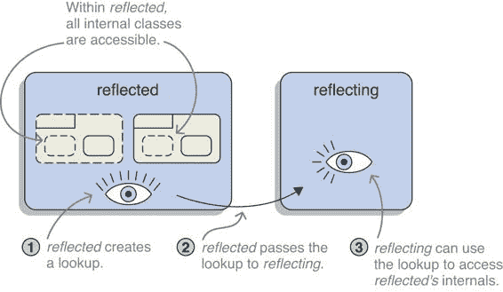
> 
> 图 12.1 反射模块创建一个查找并将其传递给反射，然后反射可以使用它来访问反射可以访问的相同类和成员——这些包括反射的内部成员。
> 
> 你的反射代码可以通过要求用户将其传递给查找对象来利用这一点；例如，在引导你的框架时。当用户必须调用一个接受一个或多个 `Lookup` 实例的方法时，他们必然会阅读文档来了解他们应该做什么。然后，他们为需要访问的每个模块创建一个实例并将它们传递给你，而你则使用它们来访问它们的模块内部。 列表 12.6 展示了这是如何工作的。
> 
> > 列表 12.6 使用 `VarHandle` 通过私有查找访问字段值
> > 
> `Lookup lookup = // ...` `①` `Object object = // ... String fieldName = // ...  Class<?> type = object.getClass(); Field field = type.getDeclaredField(fieldName);  Lookup privateLookup = MethodHandles`.privateLookupIn(type,lookup);` `②` `VarHandle handle = privateLookup.unreflectVarHandle(field); handle.get(object);`
> 
> > ①
> > 
> > 这个查找是在拥有对象的模块中创建的。
> > 
> > ②
> > 
> > 通过从用户提供的查找中创建一个私有查找，你可以从不同的模块访问对象的内部。
> > 
> 关于查找的有趣之处在于，它们可以在模块之间传递。在标准与实现分离的情况下，例如 JPA 及其提供者，用户可以将查找传递给 JPA 的引导方法，然后这些方法可以将它们传递给 Hibernate、EclipseLink 等类似系统。我认为这是一种相当巧妙实现查找的方法：

+   用户知道他们必须做些什么，因为引导方法需要 `Lookup` 实例（这与打开包的要求不同，后者不能在代码中表达）。

+   没有必要更改模块声明（与 `opens` 指令不同）。

+   标准可以将查找传递给实现，因此不必强制用户在代码或模块声明中引用实现（正如第 12.3.5 节所解释的，对于开放包也是如此）。

> 这就结束了使用反射或变量处理程序访问模块中封装的类型的相关讨论。现在，我们将转向模块本身，看看你能从中获取哪些信息。
> 
> 12.3.3 使用反射分析模块属性
> 
> 如果你曾经尝试在运行时分析一个 JAR 文件，你会发现这样做并不方便。这回到了 JAR 文件的基本解释：仅仅是容器（参见第 1.2 节）。Java 并不把它们视为像包和类型那样的第一类公民，因此在运行时没有将它们视为除了 Zip 文件之外任何东西的表示。
> 
> 模块系统的关键变化是将 Java 对 JAR 文件的解释与我们的一致，即具有名称、依赖关系和显式 API 的代码单元。超出本书中我们迄今为止讨论的所有内容，这一点应该一直延伸到反射 API，在那里，模块（与 JAR 文件不同，但与包和类型相同）应该被表示。确实如此。
> 
> > 定义：`Module` 和 `ModuleDescriptor` 类型
> > 
> > Java 9 引入了新的类型 `java.lang.Module`，它在运行时表示一个模块。`Module` 实例允许你执行以下操作：

+   分析模块的名称、注解、导出/公开指令和服务使用

+   访问模块包含的资源（参见第 5.2 节）

+   通过导出和公开包或添加读取边和服务使用来修改模块（如果修改代码在同一模块中）

> > 其中一些信息仅在同样新引入的类型 `java.lang.module.ModuleDescriptor` 上可用，该类型由 `Module::getDescriptor` 返回。
> > 
> 获取 `Module` 实例的一种方法是在任何 `Class` 实例上调用 `getModule`，这毫不奇怪，返回该类所属的模块。以下列表展示了如何通过查询 `Module` 和 `ModuleDescriptor` 来分析模块；一些示例模块的输出显示在 列表 12.8 中。
> 
> > 列表 12.7 通过查询 `Module` 和 `ModuleDescriptor` 分析模块
> > 
> `public static String describe(Module module) { String annotations = Arrays .stream(module.getDeclaredAnnotations()) .map(Annotation::annotationType) .map(Object::toString) .collect(joining(", ")); ModuleDescriptor md = module.getDescriptor(); if (md == null) return "UNNAMED module { }";  return "" + "@[" + annotations + "]\n" + md.modifiers() + " module " + md.name() + " @ " + toString(md.rawVersion()) + " {\n" + "\trequires " + md.requires() + "\n" + "\texports " + md.exports() + "\n" + "\topens " + md.opens() + "\n" + "\tcontains " + md.packages() + "\n" + "\tmain " + toString(md.mainClass()) + "\n" + "}"; }  private static String toString(Optional<?> optional) { return optional.isPresent() ? optional.get().toString() : "[]"; }`
> 
> > 列表 12.8 从 列表 12.7 调用 `describe(Module)` 的输出
> > 
> `> @[] > [] 模块监控器 @ [] { > requires [ > monitor.observer, > monitor.rest > monitor.persistence, > monitor.observer.alpha, > mandated java.base (@9.0.4), > monitor.observer.beta, > monitor.statistics] > exports [] > opens [] > contains [monitor] > main monitor.Main > } > > @[] > [] 模块 monitor.persistence @ [] { > requires [ > hibernate.jpa, > mandated java.base (@9.0.4), > monitor.statistics] > exports [monitor.persistence] > opens [monitor.persistence.entity] > contains [ > monitor.persistence, > monitor.persistence.entity] > main [] > } > > @[] > [] 模块 java.logging @ 9.0.4 { > requires [mandated java.base] > exports [java.util.logging] > opens [] > contains [ > java.util.logging, > sun.util.logging.internal, > sun.net.www.protocol.http.logging, > sun.util.logging.resources] > main [] > } > > @[] > [] 模块 java.base @ 9.0.4 { > requires [] > exports [... lots ...] > opens [] > contains [... lots ...] > main [] > }`
> 
> 一些`ModuleDescriptor`方法返回与其它模块相关的信息：例如，哪些模块是必需的，或者哪些模块的包被导出和公开。这些只是作为字符串的模块名称，而不是实际的`Module`实例。同时，许多`Module`方法需要这样的实例作为输入。因此，您得到的是字符串，但需要将模块放入——如何弥合这个差距？正如第 12.4.1 节所示，答案是层。
> 
> 12.3.4 使用反射修改模块属性
> 
> 除了分析模块属性外，您还可以使用`Module`通过调用这些方法来修改它们：

+   `addExports`将包导出到模块。

+   `addOpens`向模块公开一个包。

+   `addReads`允许模块读取另一个模块。

+   `addUses`使模块使用一个服务。

> 在查看这些内容时，您可能会 wonder 为什么可以导出或公开模块的包。这难道不是与强封装相矛盾吗？我们不是在第 12.2 节中讨论了模块所有者必须做什么来为反射做准备，因为反射代码不能破坏吗？
> 
> > 重要的信息：这些方法是调用者敏感的，这意味着它们根据调用它们的代码表现不同。为了成功调用，它必须来自正在修改的模块内部或来自未命名的模块。否则，它将失败并抛出`IllegalCallerException`。
> > 
> 以下代码作为示例：
> 
> `public boolean openJavaLangTo(Module module) { Module base = Object.class.getModule(); base.addOpens("java.lang", module); return base.isOpen("java.lang", module); }`
> 
> 如果将其复制到从类路径执行的`main`方法中（因此它在未命名的模块中运行），这将正常工作，并且方法返回`true`。另一方面，如果它从任何命名模块（以下示例中的 open.up）内部运行，它将失败：
> 
> `> Exception in thread "main" java.lang.IllegalCallerException: > java.lang is not open to module open.up > at java.base/java.lang.Module.addOpens(Module.java:751) > at open.up/open.up.Main.openJavaLangTo(Main.java:18) > at open.up/open.up.Main.main(Main.java:14)`
> 
> 您可以通过将代码注入它修改的模块（即 java.base）并使用`--patch-module`（参见第 7.2.4 节）来使其（再次）工作：
> 
> `$ java --patch-module java.base=open.up.jar --module java.base/open.up.Main > WARNING: module-info.class ignored in patch: open.up.jar > true`
> 
> 这样就完成了：最后的`true`是从带有任意平台模块的`openJavaLangTo`调用返回的值。
> 
> 动态修改您自己的模块属性不是您会经常做的事情，即使您正在开发基于反射的框架。那么，为什么我要告诉您所有这些？因为正如您将在下一节中看到的那样，这里隐藏了一个有趣的细节：在特定情况下，您可以打开其他模块的包。
> 
> 12.3.5 前向公开包
> 
> 我说过只有模块可以通过`Module:addOpens`打开其包中的一个，但这并不完全正确。如果一个模块的包已经对一组其他模块打开，那么所有这些模块也可以打开该包。换句话说，具有对包进行反射访问的模块可以将该包打开给其他模块。这意味着什么呢？
> 
> 再次思考 JPA。你可能在第 12.2.2 节中退缩了，因为看起来你需要无条件地打开一个包或者打开实际进行反射的模块，因为在 JPA 的情况下，这意味着如下所示：
> 
> `module monitor.persistence { requires hibernate.jpa; requires monitor.statistics;  exports monitor.persistence; // 假设 Hibernate 是一个显式模块，打开 monitor.persistence.entity 到 hibernate.core; }`
> 
> 不打开到 JPA 而不是特定的实现不是更好吗？这正是通过启用具有对包进行反射访问的模块打开包给其他模块的功能所实现的！这样，JPA 的引导代码就可以打开所有包给 Hibernate，即使那些只有反射访问的包。
> 
> 尽管只有模块可以添加包导出、读取边和服务使用，但打开包的规则已经放宽，所有被打开包的模块都可以将其打开给其他模块。对于基于反射的框架要利用这一点，它们当然必须了解模块系统并更新它们的代码。在 JEE 技术的情况下，这仍然可能需要一段时间，除非 Eclipse 为 Jakarte EE 采用更快的发布周期（从 Java SE 8 到 Java EE 8 花费了超过三年时间）。
> 
> 现在我们已经解决了如何对单个模块进行反射、分析和修改的问题，我们可以将其提升到下一个层次，或者说在接下来的章节中，我们将看到的工作层，并处理整个模块图。
> 
> 12.4 使用层动态创建模块图
> 
> 在第 12.3 节中，我们关注了单个模块：如何对模块代码进行反射以及如何分析和修改单个模块的属性。在本节中，我们扩大了我们的范围，并查看整个模块图。
> 
> 到目前为止，我们将模块图的创建留给了编译器或 JVM，它们在开始工作之前生成它们。从那时起，图几乎是一个不可变的实体，没有提供添加或删除模块的方法。
> 
> 虽然这对许多常规应用程序来说很好，但还有一些需要更多灵活性的应用程序。想想应用服务器或基于插件的程序。它们需要一个动态机制，允许它们在运行时加载和卸载类。
> 
> 例如，假设 ServiceMonitor 应用程序提供了一个端点或图形界面，用户可以通过它指定需要观察的附加服务。这可以通过实例化适当的`ServiceObserver`实现来完成，但如果该实现来自启动时未知的模块呢？那么（及其依赖项）就必须在运行时动态加载。
> 
> 在模块系统之前，此类容器应用程序使用裸类加载器进行动态加载和卸载，但它们是否也能像编译器和 JVM 一样，将其提升到更高的抽象层次，并操作模块呢？幸运的是，模块系统通过引入层的概念实现了这一点。首先，你需要了解层，包括那些你一直不知道的层（第 12.4.1 节）。下一步是在运行时动态创建自己的层之前分析层（第 12.4.2 节）。
> 
> 注意，处理层的代码甚至比使用反射 API 更不常见。这里有一个简单的试金石：如果你从未实例化过类加载器，你不太可能很快使用层。因此，本节为你提供了地形图，让你知道自己的位置，但不会深入细节。尽管如此，你可能会看到一些你不知道可以实现的事情，并最终得到一些新想法。
> 
> 12.4.1 层是什么？
> 
> > 定义：模块层
> > 
> > 模块层包含一个名为模块的完全解析的图以及用于加载模块类的类加载器（们）。每个类加载器都与一个未命名的模块相关联（可以通过`ClassLoader::getUnnamedModule`访问）。层还引用一个或多个父层——层中的模块可以读取祖先层中的模块，但反之则不行。
> > 
> 我们到目前为止讨论的所有关于模块的解析和关系都发生在单个模块图中。使用层，可以堆叠尽可能多的图，因此，从概念上讲，层为二维模块图的概念添加了第三个维度。父层在创建层时定义，之后不能更改，因此无法创建循环层。图 12.2 显示了带有层的模块图。
> 
> 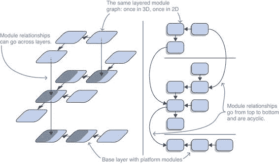
> 
>  使用层，模块图可以堆叠，为你的应用程序的心理模型添加第三个维度。因为它们不共享类加载器，所以层之间很好地隔离。（像每个好的计算机科学图一样，这个图可能看起来是颠倒的。父层位于其子层下方，因为这样可以保持包含平台模块的层在底部。）
> 
> 对于 ServiceMonitor 来说，这意味着为了动态加载新的观察者实现，它需要创建一个新的层。在我们第 12.4.3 节中讨论这一点之前，让我们更仔细地看看现有的层以及如何分析它们。
> 
> 所有的模块都包含在一个层中吗？几乎是这样。正如你所看到的，从技术上来说，未命名的模块不是。然后还有所谓的动态模块，它们不必属于一个层，但我在这本书中不会涉及它们。除了这些例外，所有模块都是层的组成部分。
> 
> **引导层**
> 
> 那么，在这本书中通过图形放入的所有应用程序和平台模块呢？它们也应该属于一个层，对吧？
> 
> > 定义：引导层
> > 
> > 的确如此。在启动时，JVM 创建一个初始层，即引导层，它包含根据命令行选项解析的应用程序和平台模块。
> > 
> 引导层没有父层，包含三个类加载器：

+   引导类加载器为它加载的所有类授予所有安全权限，因此 JDK 团队努力最小化它负责的模块；这些是一些核心平台模块，其中最重要的是 java.base。

+   平台类加载器从所有其他平台模块中加载类；可以通过静态方法 `ClassLoader::getPlatformClassLoader` 访问它。

+   系统或应用程序类加载器从模块和类路径中加载所有类，这意味着它负责所有应用程序模块；可以通过静态方法 `ClassLoader::getSystemClassLoader` 访问它。

> 只有系统类加载器可以访问类路径，因此在这三个加载器中，只有它的未命名模块可能不为空。因此，当第 8.2 节提到未命名模块时，它总是引用系统类加载器的。
> 
> 正如你在图 12.3 中可以看到的，类加载器不是孤岛：每个类加载器都有一个父类加载器，包括刚刚提到的三个在内的大多数实现，首先会请求父类加载器加载一个类，然后再尝试自己查找。对于三个引导层类加载器，引导层是没有任何父类的祖先，平台委托给引导层，系统委托给平台。因此，系统类加载器可以访问来自引导层和平台加载器的所有应用程序和 JDK 类。
> 
> 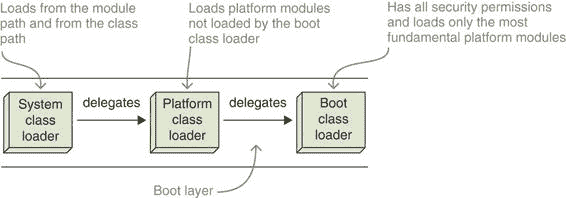
> 
>  引导层中三个类加载器之间的委托
> 
> 12.4.2 分析层
> 
> > 定义：ModuleLayer
> > 
> > 在运行时，层由 `java.lang.ModuleLayer` 实例表示。它们可以查询层由以下三个部分组成：

+   模块：

+   方法 `modules()` 返回层包含的模块，作为一个 `Set<Module>`。

+   方法 `findModule(String)` 在自身层以及所有祖先层中搜索具有指定名称的模块。因为它可能找不到，所以它返回一个 `Optional<Module>`。

+   通过`parents()`方法，层的父级以`List<ModuleLayer>`的形式返回。

+   通过调用`findLoader(String)`并传递模块的名称，可以确定每个模块的类加载器。

> > 然后是`configuration`方法，它返回一个`Configuration`实例——有关更多内容，请参阅第 12.4.3 节。
> > 
> 要获取`ModuleLayer`实例，您可以要求任何模块提供它所属的层：
> 
> `Class<?> type = // ... 任何类 ModuleLayer layer = type .getModule() .getLayer();`
> 
> 如果类型来自未命名的模块或不属于层的动态模块，则最后一行返回`null`。如果您想访问引导层，可以调用静态的`ModuleLayer::boot`方法。
> 
> 那么，从`ModuleLayer`实例中你可以学到什么？毫无疑问，最有趣的方法是`modules()`和`findModule(String)`，因为与`Module`上的方法（参见第 12.3.3 节）一起，它们允许遍历和分析模块图。
> 
> **描述模块层**
> 
> 给定列表 12.7 中的`describe(Module)`方法，这就是如何描述整个层的方法：
> 
> `private static String describe(ModuleLayer layer) { return layer .modules().stream() .map(ThisClass::describe) .collect(joining("\n\n")); }`
> 
> **在层内和层间查找模块**
> 
> 还可以确定特定模块的存在或不存在，如果对这些模块的依赖是可选的（使用`requires static`；参见第 11.2 节）。在第 11.2.4 节中，我声称实现一个名为`isModulePresent(String)`的方法来做这件事是直接的。这使你将迄今为止学到的关于层的内容付诸实践，所以让我们一步一步来做。
> 
> 起初这似乎很简单：
> 
> `public boolean isModulePresent(String moduleName) { return ModuleLayer .boot() .findModule(moduleName) .isPresent(); }`
> 
> 但这仅显示模块是否存在于引导层。如果创建了额外的层，并且模块位于另一个层中怎么办？您可以替换引导层为包含`isModulePresent`的层：
> 
> `public boolean isModulePresent(String moduleName) { return searchRootModuleLayer() .findModule(moduleName) .isPresent(); }  private ModuleLayer searchRootModuleLayer() { return this .getClass() .getModule() .getLayer(); }`
> 
> 这样，`isModulePresent`会搜索包含自身的层——让我们称它为`search`——以及所有父层。但即使这样也不够好。调用该方法的模块可能位于不同的层，称为`call`，该层将`search`作为祖先。（困惑吗？参见图 12.4。）然后`search`无法查看`call`，因此无法搜索所有可能的模块。不，您需要调用者的模块来使用其层作为搜索的根。
> 
> 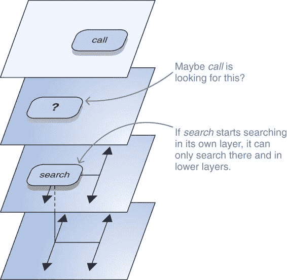
> 
> 图 12.4 请求查找模块的层只扫描它自己和它的父级（在这个图中，是向下）。所以如果`search`查询它自己的层，它可能会忽略调用层，即启动搜索的模块可以看到的层，从而冒着返回错误结果的风险。这就是为什么查询调用层很重要。
> 
> 以下列表实现了`getCallerClass`，它使用 Java 9 引入的堆栈遍历 API 确定调用者的类。
> 
> > 列表 12.9 新的 API 用于遍历调用栈
> > 
> `private Class<?> getCallerClass() { return StackWalker.getInstance(RETAIN_CLASS_REFERENCE).walk(stack -> stack.filter(frame -> frame.getDeclaringClass() != this.getClass()).findFirst().map(StackFrame::getDeclaringClass).orElseThrow(IllegalStateException::new)); }`
> 
> > ①
> > 
> > 静态工厂方法用于获取一个 StackWalker 实例，其中每个帧都引用了声明类
> > 
> > ②
> > 
> > StackWalker::walk 期望一个从 Stream<StackFrame>到任意对象的函数。它创建了一个对堆栈的懒视图，并立即用它调用函数。函数返回的对象随后由 walk 返回。
> > 
> > ③
> > 
> > 你对来自不是这个类的第一个帧感兴趣（这必须是调用者！）；你现在有一个 Optional<StackFrame>。
> > 
> > ④
> > 
> > 获取那个类
> > 
> > ⑤
> > 
> > 如果没有这样的帧存在，那就奇怪了……
> > 
> 在你的工具箱中有这个，调用者的模块就在你的指尖：
> 
> `public boolean isModulePresent(String moduleName) { return searchRootModuleLayer().findModule(moduleName).isPresent(); } private ModuleLayer searchRootModuleLayer() { return getCallerClass().getModule().getLayer(); }`
> 
> 分析层到此结束。现在我们终于可以进入最激动人心的部分：通过创建新层将新代码加载到运行中的应用程序中。
> 
> 12.4.3 创建模块层
> 
> 只有少数用 Java 编写的应用程序需要在运行时动态加载代码。同时，这些往往是更重要的。最著名的可能是 Eclipse，它对插件有很强的关注，但像 WildFly 和 GlassFish 这样的应用服务器也必须同时从一个或多个应用程序中加载代码。如 1.7.3 节所述，OSGi 也能够动态加载和卸载包（它对模块的称呼）。
> 
> 它们对它们使用的加载插件、应用程序、包和其他运行 JVM 的新片段的机制有相同的基本要求：

+   必须能够在运行时从一组 JAR 文件中启动一个片段。

+   必须允许与加载的片段交互。

+   必须允许不同片段之间的隔离。

> 在模块系统之前，这是通过类加载器完成的。简要来说，为新的 JAR 文件创建了一个新的类加载器。它委托给另一个类加载器，例如系统类加载器，这使它能够访问运行中的 JVM 中的其他类。尽管每个类（通过其完全限定名标识）在每个类加载器中只能存在一次，但它可以很容易地被多个加载器加载。这隔离了片段，并给每个片段提供了在没有与其他片段冲突的情况下提出其自身依赖的可能性。
> 
> 模块系统在这方面没有改变。保持现有的类加载器层次结构完整是实施模块系统在类加载器之下（见第 1.7.3 节）的主要驱动因素之一。模块系统添加的是围绕类加载器的层概念，这使得与启动时加载的模块集成成为可能。让我们看看如何创建一个。你可以找到创建层的 ServiceMonitor 变体的分支 `feature-layers`）。
> 
> 创建一个配置
> 
> `ModuleLayer` 的一个重要组成部分是 `Configuration`。创建一个会触发模块解析过程（见第 3.4.1 节），创建的实例代表一个成功解析的模块图。创建配置的最基本形式是使用静态工厂方法 `resolve` 和 `resolveAndBind`。两者之间的唯一区别是第二个会绑定服务（见第 10.1.2 节），而第一个不会。
> 
> `resolve` 和 `resolveAndBind` 都接受相同的四个参数：

+   在检查父配置之前，`ModuleFinder before` 被要求定位模块。

+   `List<Configuration> parents` 是父层的配置。

+   `ModuleFinder after`在检查父配置后会被要求定位模块。

+   `Collection<String> roots` 是解析过程中的根模块。

> 为模块路径创建一个 `ModuleFinder` 与调用 `ModuleFinder.of(Path...)` 一样简单。通常，会尝试尽可能多地从父层引用模块，因此 `before` 查找器通常在没有参数的情况下创建，因此无法找到任何模块。
> 
> 对于想要创建具有单个父级的配置的常见情况，调用实例方法 `resolve` 和 `resolveAndBind` 更容易。它们没有 `List<Configuration> parents` 参数，并使用当前配置作为父级。
> 
> 假设你想要创建一个以引导层作为父级的配置，该配置模拟启动命令 `java --module-path mods --module root` 但不进行服务绑定。为此，你可以在引导层的配置（使其成为父级）上调用 `resolve`（这样就不会绑定服务），并传递一个查看 `mods` 目录的模块查找器。以下列表显示了这一点：它创建了一个模拟 `java --module-path mods --module initial` 的配置，但不包括服务绑定。
> 
> > 列表 12.10 模拟 `java --module-path mods --module`
> > 
> `ModuleFinder emptyBefore = ModuleFinder.of();` `①``ModuleFinder modulePath = ModuleFinder.of(Paths.get("mods"));` `②` `Configuration bootGraph = ModuleLayer.boot().configuration();` `Configuration graph = bootGraph` `③` `.resolve(emptyBefore, modulePath, List.of("initial"));`
> 
> > ①
> > 
> > 在查看父图之前不需要查找模块
> > 
> > ②
> > 
> > 查找父图中不存在的模块的查找器查看 mods 目录。
> > 
> > ③
> > 
> > 通过调用 resolve 来定义引导层的配置作为父层（resolveAndBind 会绑定服务）
> > 
> 作为第二个例子，让我们回到这样一个场景：你希望在运行时让 ServiceMonitor 开始观察新的服务，为此需要加载新的`ServiceObserver`实现。第一步是创建一个配置，以当前层为父层，在指定的路径上查找模块。
> 
> 因为你在你的服务中使用模块系统的服务基础设施，所以调用`resolveAndBind`。你可以完全依赖该机制来查找所有需要的模块（及其依赖项），因此你甚至不需要指定根模块。以下是实现方式。
> 
> > 列表 12.11 绑定指定路径上所有模块的配置
> > 
> `private static Configuration createConfiguration(Path[] modulePaths) {` `return getThisLayer()` `①` `.configuration()` `.resolveAndBind(` `②` `ModuleFinder.of(), ModuleFinder.of(modulePaths),` `Collections.emptyList()` `③` `); }`
> 
> > ①
> > 
> > 返回包含 createConfiguration 的类的层
> > 
> > ②
> > 
> > 被称为服务解析调用
> > 
> > ③
> > 
> > 你依赖服务绑定为你完成工作并拉入所需的模块，因此你不需要定义根模块。
> > 
> 创建 MODULELAYER
> 
> 如第 12.4.1 节所述，一个层由模块图、类加载器和父层引用组成。创建模块的裸骨形式是使用静态方法`defineModules(Configuration, List<ModuleLayer>, Function<String, ClassLoader>)`：

+   你已经知道如何获取`Configuration`实例。

+   `List<ModuleLayer>`是父层。

+   `Function<String, ClassLoader>`将每个模块名称映射到你想要负责该模块的类加载器。

> 该方法返回一个`Controller`，可以用来在调用`layer()`之前进一步编辑模块图，通过添加读取边或导出/打开包，`layer()`返回`ModuleLayer`。
> 
> 有几种替代方法可以调用，这些方法基于`defineModules`：

+   `defineModulesWithOneLoader`为所有模块使用单个类加载器。方法参数中给出的类加载器成为其父类加载器。

+   `defineModulesWithManyLoaders`使用为每个模块单独的类加载器。方法参数中给出的类加载器成为每个模块的父类加载器。

+   每个方法都有一个变体可以在 `ModuleLayer` 实例上调用，并使用该实例作为父层；它们返回创建的层而不是中间的 `Controller`。

> 继续你的动态加载 `ServiceObserver` 实现的探索之旅，下一步是从配置创建实际层。这相当简单，如下面的列表所示。
> 
> > 列表 12.12 从配置创建层
> > 
> `private static ModuleLayer createLayer(Path[] modulePaths) {` `Configuration configuration = createConfiguration(modulePaths);` `①``ClassLoader thisLoader = getThisLoader();` `②``return getThisLayer();` `③``defineModulesWithOneLoader(configuration, thisLoader);` `④``}` 
> 
> > ①
> > 
> > 创建配置，如列表 12.11
> > 
> > ②
> > 
> > getThisLoader 返回加载包含 createLayer 的类的类加载器
> > 
> > ③
> > 
> > 与列表 12.11 中的 getThisLayer 相同
> > 
> > ④
> > 
> > 你只想为具有此层作为父级的所有模块使用单个加载器，因此你在其上调用 defineModulesWithOneLoader。
> > 
> 最后一步是检查新创建的层是否包含一个可以处理你需要观察的服务 `ServiceObserver`。为此，你可以使用一个 `ServiceLoader::load` 的重载版本，它除了查找的服务类型外，还期望一个 `ModuleLayer`。语义应该是清晰的：在定位提供者时，查看该层（及其祖先）。
> 
> > 列表 12.13 在新层（及其祖先）中查找服务提供者
> > 
> `private static void registerNewService(String serviceName, Path... modulePaths) {` `ModuleLayer layer = createLayer(modulePaths);` `①``Stream<ServiceObserverFactory> observerFactories = ServiceLoader.load(layer, ServiceObserverFactory.class).stream();` `②``map(Provider::get);` `Optional<ServiceObserver> observer = observerFactories.map(factory -> factory.createIfMatchingService(serviceName)).flatMap(Optional::stream).findFirst(); observer.ifPresent(monitor::addServiceObserver); }`
> 
> > ①
> > 
> > 创建层，如列表 12.1.2
> > 
> > ②
> > 
> > 使用接受新层的 ServiceLoader::load 变体
> > 
> > ③
> > 
> > 其余部分是常规服务业务，以找到 serviceName 的观察者。
> > 
> 如果这些还不够，还有一些我们几乎没提到的事情，你可以用模块层来做：

+   使用多个父级或多个类加载器创建配置和层

+   使用层来加载同一模块的多个版本

+   在将其转换为 `ModuleLayer` 之前，使用 `Controller` 修改模块图——例如，导出或打开模块

+   直接从创建的层中加载特定的类作为片段的入口点，而不是使用 JPMS 服务

> 你可以从涉及方法的优秀 Javadoc 中了解更多信息，特别是在 `ModuleLayer` 和 `Configuration` 中。或者翻到第 13.3 节，它很好地利用了这些可能性中的几个。
> 
> 摘要

+   被代码反射的模块：

+   在大多数情况下，`exports` 指令并不适合用于使类可用于反射，因为为与基于反射的框架一起使用而设计的类很少适合成为模块公共 API 的一部分；使用限定导出，你可能会被迫将你的模块耦合到实现而不是标准；并且导出不支持对非私有字段和方法的深度反射。

+   默认情况下，你不应该使用 `exports`，而应该使用 `opens` 指令来打开包以进行反射。

+   `opens` 指令与 `exports` 具有相同的语法，但工作方式不同：打开的包在编译时不可访问；并且打开包中的所有类型和成员，包括非公共的，在运行时都是可访问的。这些属性与基于反射的框架的要求紧密一致，这使得 `opens` 指令在为反射准备模块时的默认选择。

+   限定变体 `opens ... to` 仅将包打开给命名的模块。由于通常非常明显哪些框架会反射哪些包，因此质疑限定 `open` 指令是否增加了多少价值是有疑问的。

+   如果反射框架分为标准及其实现（如 JPA 和 Hibernate、EclipseLink 等等），从技术上讲，只打开包给标准是可能的，然后它可以使用反射 API 将其打开到特定的实现。尽管如此，这还没有得到广泛实现，因此目前，限定打开需要指定特定的实现模块。

+   命令行选项 `--add-opens` 与 `--add-exports` 具有相同的语法，并且像限定 `opens` 一样工作。在迁移到 Java 9+ 期间，从命令行打开平台模块以访问其内部结构是常见的，但如果你绝对需要，你也可以用它来突破其他应用程序模块。

+   通过以 `open module`（而不是仅 `module`）开始模块声明，该模块中的所有包都被打开。如果模块包含大量需要打开的包，这是一个很好的解决方案，但应该仔细评估这是否真的必要或是否可以纠正。理想情况下，打开模块主要在模块化之前使用，在将模块重构为更干净的状态并暴露较少内部结构之前。

+   反射模块的代码：

+   反射受限于与常规代码相同的可访问性规则。关于必须读取你访问的模块，反射 API 通过隐式添加读取边来简化了操作。至于导出或打开的包，如果模块所有者没有为反射准备他们的模块，那么反射代码的作者对此无能为力。（唯一的解决方案可能是使用`--add-opens`命令行选项。）

+   这使得教育用户关于强封装以及你的模块需要访问哪些包变得尤为重要。做好文档记录，并确保源代码易于获取。

+   确保妥善处理由于强封装而抛出的异常，以便你可以为用户提供一个信息丰富的错误消息，可能还会链接到你的文档。

+   考虑使用变量句柄而不是反射 API。它们提供了更多的类型安全性，性能更优，并且通过要求`Lookup`实例来表达你在引导 API 中对访问的需求。

+   `Lookup`实例为所有使用它的人提供了与创建它的模块相同的可访问性。因此，当你的用户在他们的模块中创建一个`Lookup`实例并将其传递给你的框架时，你可以访问他们的模块内部。

+   新的类`Module`和`ModuleDescriptor`是反射 API 的一部分，提供了关于模块的所有信息，例如它的名称、依赖项以及导出或打开的包。你可以用它来分析运行时的实际模块图。

+   使用该 API，模块还可以修改自己的属性，导出或打开包，或向其他模块添加读取边。通常无法修改其他模块，但有一个例外，即任何打开另一个模块包的模块都可以将该包打开给第三个模块。

+   动态加载模块的代码：

+   类加载器是将代码动态加载到运行程序中的方式。模块系统不会改变这一点，但它确实提供了带有层的模块包装器。层封装了一个类加载器和模块图，创建后者会将加载的模块暴露给模块系统提供的所有一致性检查和可访问性规则。因此，层可以用来为加载的模块提供可靠的配置和强封装。

+   启动时，JVM 创建引导层，它由三个类加载器和所有最初解析的平台和应用模块组成。它可以通过静态方法`ModuleLayer::boot`访问，返回的`ModuleLayer`实例可以用来分析整个模块图。

> 13
> 
> 模块版本：可能性和不可能性
> 
> 本章涵盖

+   为什么模块系统不对版本信息采取行动

+   记录版本信息

+   运行时分析版本信息

+   加载多个模块版本

> 如第 1.5.6 节简要提到的，JPMS 不支持模块版本。那么`jar --module-version`有什么好处呢？而且第 12.3.3 节不是显示`ModuleDescriptor`至少可以报告模块的版本吗？本章将澄清这些问题，并从几个不同的角度探讨模块版本。
> 
> 我们首先将讨论模块系统如何支持版本以及为什么它不这样做（第 13.1 节）。尽管如此，它至少允许你记录和评估版本信息，我们将在下一节中探讨这一点（第 13.2 节）。列表上的最后一项是圣杯：运行同一模块的不同版本（第 13.3 节）。尽管没有原生支持，但有一些方法可以通过一些努力实现这一点。
> 
> 到本章结束时，你将对模块系统对版本的有限支持有一个清晰的理解。这将帮助你分析你的应用程序，甚至可以用来主动报告可能的问题。也许更重要的是，你还将了解限制的原因，以及你是否可以期待它们发生变化。你还将学习如何运行同一模块的多个版本——但正如你将看到的，这很少值得付出努力。
> 
> 13.1 JPMS 中版本支持的缺乏
> 
> Java 8 及之前版本没有版本的概念。如第 1.3.3 节所述，这可能导致意外的运行时行为，唯一的解决方案可能是选择你不想选择的依赖项的不同版本。这是不幸的，当模块系统最初被构想时，其目标之一就是解决这个问题。
> 
> 虽然如此，但这种情况并未发生。目前 Java 中运行的模块系统在版本方面仍然相对盲目。它仅限于记录模块或依赖项的版本（参见第 13.2 节）。
> 
> 但为什么是这样呢？模块系统不能支持同一模块的多个版本吗（第 13.1.1 节）？如果不能，它至少不能接受一系列模块和版本要求作为输入，并为每个模块选择一个版本吗（第 13.1.2 节）？这两个问题的答案都是“不”，我想解释一下原因。
> 
> 13.1.1 不支持多个版本
> 
> 解决版本冲突的一个看似简单的解决方案是允许运行同一 JAR 的两个版本。简单直接。那么，为什么模块系统不能这样做呢？要回答这个问题，你必须了解 Java 如何加载类。
> 
> **如何防止加载多个版本**
> 
> 如同我们在第 1.3.2 节讨论阴影时提到的，JVM——更准确地说，是其类加载器——通过完全限定名识别类，例如`java.util.List`或`monitor.observer.ServiceObserver`。为了从类路径中加载一个类，应用程序类加载器扫描所有 JAR 文件，直到它遇到一个具有特定名称的类，然后加载它。
> 
> > **关键信息** 重要的观察结果是，无论类路径上的另一个 JAR 文件是否包含具有完全相同名称的类——它永远不会被加载。换句话说，类加载器在假设每个类（通过其完全限定名识别）恰好存在一次的情况下运行。
> > 
> 回到我们希望运行同一模块的多个版本的需求，障碍显而易见：这样的模块必然包含具有相同完全限定名的类，并且如果没有任何更改，JVM 将始终只看到其中之一。这些更改可能看起来是什么样子？
> 
> **允许多个版本的类加载器更改**
> 
> 允许多个具有相同名称的类的第一个选项是重写整个类加载机制，以便单个类加载器可以处理这种情况。这将是一个巨大的工程任务，因为每个类加载器最多只有一个给定名称的类的假设贯穿整个 JVM。除了巨大的努力之外，它还会带来很多风险：这将是一个侵入性的更改，因此几乎可以保证与向后不兼容。
> 
> 第二个选项是允许具有相同名称的多个类执行类似 OSGi 的操作：为每个模块使用一个单独的类加载器（参见图 13.1）。这将相对简单，但也可能引起兼容性问题。
> 
> 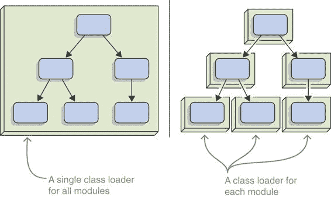
> 
> 图 13.1 JPMS 为所有应用程序模块使用相同的类加载器（左侧），但可以设想它可以为每个模块使用一个单独的加载器（右侧）。在许多情况下，这会改变应用程序的行为。
> 
> 一个潜在的问题来源是，一些工具、框架甚至应用程序对确切的类加载器层次结构做出了特定的假设。（默认情况下，有三个类加载器相互引用——在 Java 9 中这一点没有改变。详情请参阅第 12.4.1 节中关于引导层的描述。）将每个模块放入其自己的类加载器中将会显著改变这个层次结构，并且可能会破坏这些项目中的大多数。
> 
> 在改变层次结构中隐藏的另一个狡猾的细节是，即使你愿意要求项目适应这种变化以从模块路径运行，如果它们从类路径运行会发生什么？类路径上的 JAR 文件也会每个都得到一个单独的类加载器吗？

+   如果是这样，那些在更改后的类加载器层次结构上遇到麻烦的项目不仅不能作为模块运行，甚至不能在 Java 9+上运行。

+   如果不是这样，它们需要意识到两个不同的类加载器层次结构，并且根据它们落在哪个路径上，正确地与每个层次结构进行交互。

> 如果将这些影响兼容性或迁移路径的更改应用于整个生态系统，则这些更改都是不可接受的。
> 
> > 备注：对于 OSGi 来说，这些担忧的权重是不同的。它提供了大多数使用它的应用程序无法没有的功能，因此可以预期它们的开发者会投入更多的工作。另一方面，Java 9+还需要为不关心模块系统的项目工作。OSGi 是可选的，所以如果事情变得棘手，并且它对任何特定项目不起作用，可以忽略它。显然，Java 9+的情况并非如此。
> > 
> > 必要信息：一个 JAR 文件对应一个特定的类加载器可能存在问题的另一个原因是与类等价性有关。假设同一个类被两个不同的类加载器加载。它们的`Class<?>`实例不相等，因为类加载器总是包含在检查中。那么呢？谁会在意，对吧？
> > 
> 好吧，如果你有每个类的实例并且比较这两个，`equals`比较中首先发生的事情之一是什么？是`this.getClass() == other.getClass()`或者一个`instanceof`检查。在这种情况下，这总是错误的，因为两个类不相等。
> 
> 这意味着，例如，使用两个版本的 Guava，`mutimap1.equals(multimap2)`将始终为 false，无论两个`Multimap`实例包含什么元素。你也不能将来自一个类加载器的类的实例转换为来自另一个类加载器的相同类加载的实例，因此`(Multimap) multimap2`可能会失败：
> 
> `static boolean equalsImpl(` `Multimap<?, ?> multimap,` `①``@NullableDecl Object object) {` `②` `if (object == multimap) { return true; }` `if (object instanceof Multimap) {` `③` `Multimap<?, ?> that = (Multimap<?, ?>) object; return multimap.asMap().equals(that.asMap()); } return false; }`
> 
> > ①
> > 
> > 被调用 equals 方法的 Multimap 实例。该方法在其类加载器的上下文中执行。
> > 
> > ②
> > 
> > 传递给 equals 调用的对象。它假定是一个来自不同类加载器的 Multimap 实例。
> > 
> > ③
> > 
> > 对象是 Multimap 类型，但它来自不同的类加载器，因此这个 instanceof 检查总是失败。
> > 
> 很想知道有多少项目仅仅因为这个细节而受到影响。没有办法知道，但我的猜测是很多。相比之下，第六章和第七章是直接无害的。
> 
> > 备注：顺便说一下，我们刚才讨论的每一件事也适用于分割包（见第 7.2 节）。如果模块系统不关心两个模块是否包含相同的包并且可以保持它们分开，那不是很好吗？它会，但会遇到我们刚才探讨的相同问题。
> > 
> 我们到目前为止所确定的是，模块系统默认不允许同一模块的多个版本。没有原生支持，但这并不意味着它绝对不可能。请参阅第 13.3 节了解使其工作的方法。
> 
> 13.1.2 不支持版本选择
> 
> 如果模块系统不能加载相同模块的多个版本，为什么它至少不能为我们选择正确的版本呢？这当然在理论上也是可能的，但不幸的是并不可行——让我解释一下原因。
> 
> **如何处理版本**
> 
> Maven 和 Gradle 这样的构建工具一直与版本化的 JAR 文件打交道。它们知道每个 JAR 文件的版本以及其依赖项的版本。考虑到许多项目都站在巨人的肩膀上，它们自然会有深度依赖树，包含多次相同的 JAR 文件，可能具有不同的版本。
> 
> 虽然知道有多少不同版本的 JAR 文件是件好事，但这并不能改变它们最好不要都出现在类路径上的事实。如果它们真的都出现了，你可能会遇到像阴影（见第 1.3.2 节）和直接版本冲突（见第 1.3.3 节）等问题，这会威胁到项目的稳定性。
> 
> > **重要信息** 当编译、测试或启动项目时，构建工具必须将这个树扁平化为一个只包含每个 JAR 文件一次的列表（见图 13.2）。实际上，它们必须为每个工件选择一个版本。这是一个非平凡的过程，尤其是如果工件可以定义每个依赖项可接受的版本范围。由于这个过程非平凡，它也不太透明。很难预测 Maven 或 Gradle 将选择哪个版本，它们在相同情况下不一定选择相同的版本并不令人惊讶。
> > 
> 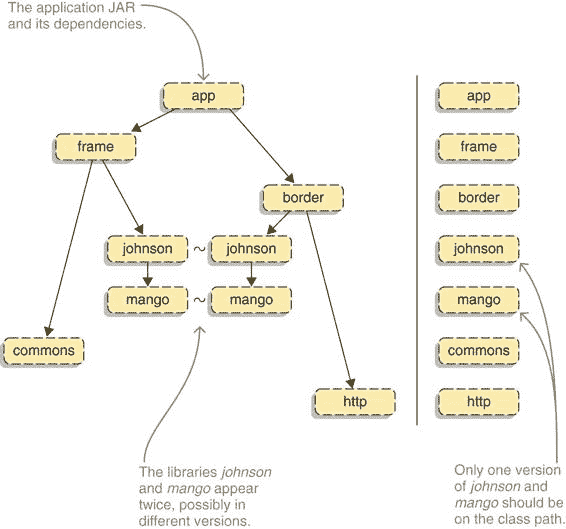
> 
> 图 13.2 一个应用程序的依赖树（左侧）可能包含相同的 JAR 文件多次，例如`johnson`和`mango`，可能在不同版本中。为了在类路径上工作，这个树必须缩减为一个只包含每个 JAR 文件一次的集合（右侧）。
> 
> **为什么模块系统不选择版本**
> 
> 现在让我们放下构建工具，谈谈模块系统。正如你在第 13.2 节中将会看到的，模块可以记录它们自己的版本以及它们依赖的版本。假设模块系统不能运行相同模块的多个实例，它难道不能选择每个模块的单个版本吗？
> 
> 让我们通过一个假设场景来探讨这个问题。在这个场景中，JPMS 会在模块路径上接受相同模块的多个版本。当构建模块图时，它会为每个模块决定选择哪个版本。
> 
> > **重要信息** 这意味着 JPMS 现在会复制构建工具已经做的事情。由于它们并不完全以相同的方式做这件事，模块系统的行为可能会与大多数（可能所有）其他系统有细微的差别。更糟糕的是，因为 Java 基于一个标准，精确的行为可能需要标准化，这使得随着时间的推移进行演变变得困难。
> > 
> 在此之上，还需要努力实现和维护版本选择算法。棺材的最后一根钉子是性能：如果编译器和 JVM 必须在开始实际工作之前运行该算法，这将显著增加编译和启动时间。如您所见，版本选择不是一个便宜的特性，Java 不采用它是合理的。
> 
> 13.1.3 未来可能带来的变化
> 
> 总结来说，模块系统对版本信息不敏感，这意味着版本信息不会影响其行为。这是今天的现状。许多开发者希望 Java 在未来支持这些特性之一。如果您是其中之一，我不想浇你冷水，无论今天的未来看起来如何，并不意味着它不会发生。不过，我看不出来。
> 
> > **重要信息**：Oracle Java 平台组的首席架构师马克·雷诺尔德（Mark Reinhold）以及模块系统的规范负责人，反复公开表示，他看不到 Java 未来会有版本支持。鉴于这样一个特性所需的巨大投资以及其可疑的回报，我可以理解他做出这一决定的原因。
> > 
> > 这意味着我们仍然需要与版本问题作斗争。也许是我的斯德哥尔摩综合症在作祟，但那些斗争并非毫无意义。努力统一项目中的版本范围，并确保有一组独特的 JAR 文件可以支持应用程序，这实际上是有益的。
> > 
> 想象一下，如果您没有任何动力去做这件事。您的项目会拖多少 JAR 文件到类或模块路径上？它会变得多大，调试会变得多么复杂？不，我认为允许冲突版本默认工作是一个糟糕的想法。
> 
> 话虽如此，事实仍然是，在某些情况下，版本冲突会立即停止重要的工作，或者在没有更新大量其他依赖项的情况下，使关键更新变得不可能。为此，有一个像 `java --one-class-loader-per-module` 这样的命令行开关，您可以在下雨天尝试使用，那将是件好事。然而，它（目前）还不存在。
> 
> 13.2 记录版本信息
> 
> 正如我们刚刚详细讨论的那样，模块系统不处理版本信息。有趣的是，它确实允许我们记录和访问这些信息。一开始这可能看起来有点奇怪，但事实证明，在调试应用程序时这很有帮助。
> 
> 在讨论您在哪里看到这些信息以及它提供了哪些好处（第 13.2.2 节）之前，让我们首先看看如何在编译和打包过程中记录版本信息（第 13.2.1 节）。在 ServiceMonitor 的 `feature-versions` 分支中演示了如何记录和评估版本信息。
> 
> 13.2.1 在构建模块时记录版本
> 
> > 定义：--module-version
> > 
> > `javac` 和 `jar` 命令接受命令行选项 `--module-version ${version}`。它们将给定的版本（可以是任意字符串）嵌入到模块描述符中。
> > 
> > 无论是否使用该选项，如果模块针对记录了其版本的依赖项进行编译，编译器也会将此信息添加到模块描述符中。这意味着模块描述符可以包含模块本身的版本以及模块编译时针对的所有依赖项的版本。
> > 
> 如果之前存在模块版本，`jar`命令将覆盖模块版本。因此，如果`jar`和`javac`都使用了`--module-version`，则只有`jar`提供的值有效。
> 
> 列表 2.5 展示了如何编译和打包 monitor 模块，但您不需要翻回。将`jar`命令更新为记录版本是微不足道的：
> 
> `$ jar --create --file mods/monitor.jar --module-version 1.0 --main-class monitor.Monitor -C monitor/target/classes .`
> 
> 如您所见，只需简单地将`--module-version 1.0`添加进去即可。因为脚本编译并立即打包模块，所以没有必要将其也添加到`javac`中。
> 
> 要查看您是否成功，您只需执行`jar --describe-module`（参见第 4.5.2 节）：
> 
> `$ jar --describe-module --file mods/monitor.jar  > monitor@1.0 jar:.../monitor.jar/!module-info.class > requires java.base mandated > requires monitor.observer # truncated requires > contains monitor > main-class monitor.Main`
> 
> 版本信息就在第一行：`monitor@1.0`。为什么依赖项的版本没有显示出来呢？在这个特定的情况下，我没有记录它们，但 java.base 肯定有一个版本，也没有显示出来。实际上，`--describe-module`并没有打印出这些信息——无论是`jar`还是`java`变体。
> 
> 要访问模块依赖项的版本，您需要采取不同的方法。让我们看看版本信息出现在哪里以及如何访问它。
> 
> 13.2.2 访问模块版本
> 
> 编译和打包过程中记录的版本信息出现在各种地方。正如您所看到的，`jar --describe-module`和`java --describe-module`都打印了模块的版本。
> 
> 栈跟踪中的版本信息
> 
> 栈跟踪也是重要的位置。如果代码在模块中运行，模块的名称将与包、类和方法名称一起打印在每个栈帧中。好消息是版本信息也包括在内：
> 
> `> 异常发生在主线程 "main" java.lang.IllegalArgumentException > 在 monitor@1.0/monitor.Main.outputVersions(Main.java:46) > 在 monitor@1.0/monitor.Main.main(Main.java:24)`
> 
> 虽然不是革命性的，但确实是一个很好的补充。如果您的代码因为看似神秘的原因表现不佳，版本问题可能是原因之一，而且将它们放在如此显眼的位置使得更容易注意到它们是否可疑。
> 
> > ESSENTIAL INFO 我坚信版本信息可以大有裨益。我强烈建议您配置您的构建工具以记录它。
> > 
> 反射 API 中的模块版本信息
> 
> 争议性地，处理版本信息最有趣的地方是反射 API。（从现在开始，你需要了解 `java.lang.ModuleDescriptor`。如果你还没有，请查看第 12.3.3 节。）
> 
> > **重要信息** 如你在 列表 12.7 和再次在 列表 13.1 中所见，类 `ModuleDescriptor` 有一个 `rawVersion()` 方法。它返回一个包含版本字符串的 `Optional<String>`，该字符串与传递给 `--module-version` 的完全相同，如果没有使用该选项，则为空。
> > 
> > 此外，还有一个 `version()` 方法，它返回一个 `Optional<Version>`，其中 `Version` 是 `ModuleDescriptor` 的内部类，它将原始版本解析为可比较的表示形式。如果没有原始版本，或者解析失败，则 `Optional` 为空。
> > 
> > 列表 13.1 访问模块的原始和解析版本
> > 
> `ModuleDescriptor descriptor = getClass() .getModule() .getDescriptor(); String raw = descriptor` `.rawVersion()` `①` `.orElse("unknown version"); String parsed = descriptor` `.version()` `②` `.map(Version::toString) .orElse("unknown or unparsable version");`
> 
> > ①
> > 
> > 如果没有使用 `--module-version`，则返回一个空的 `Optional<String>`
> > 
> > ②
> > 
> > 如果 `rawVersion()` 为空或原始版本无法解析，则返回一个空的 `Optional<Version>`
> > 
> **反射 API 中的依赖项版本信息**
> 
> 这样就解决了模块自身的版本问题。尽管如此，你还没有看到如何访问记录的依赖项版本。或者你已经看到了？列表 12.8，它显示了打印 `ModuleDescriptor` 提供的几乎所有内容的输出，包含以下片段：
> 
> `[] module monitor.persistence @ [] { requires [ hibernate.jpa, mandated java.base (@9.0.4), monitor.statistics] [...] }`
> 
> 你看到那里的 `@9.0.4` 吗？这是 `Requires::toString` 输出的一部分。`Requires` 是 `ModuleDescriptor` 的另一个内部类，它表示模块描述符中的 `requires` 指令。
> 
> > **重要信息** 对于给定的模块，你可以通过调用 `module.getDescriptor().requires()` 获取一个 `Set<Requires>`。`Requires` 实例包含一些信息，最值得注意的是所需模块的名称（`name()` 方法）以及针对编译的原始和解析版本（分别使用 `rawCompiledVersion()` 和 `compiledVersion()` 方法）。以下列表显示了获取模块描述符并随后流式传输记录的 `requires` 指令的代码。
> > 
> > 列表 13.2 打印依赖项版本信息
> > 
> `module .getDescriptor() .requires().stream() .map(requires -> String.format("\t-> %s @ %s", requires.name(), requires.rawCompiledVersion().orElse("unknown"))) .forEach(System.out::println);`
> 
> 此代码生成如下输出：
> 
> `> monitor @ 1.0 > -> monitor.persistence @ 1.0 > -> monitor.statistics @ 1.0 > -> java.base @ 9.0.4 # 更多依赖被截断`
> 
> 下面就是它们：监控编译时依赖项的依赖项版本。很整洁。
> 
> 编写一个使用此信息来比较模块编译时版本与运行时依赖项实际版本的类相当直接。例如，如果实际版本较低，它可以发出警告，或者在出现问题时记录所有这些信息以供后续分析。
> 
> 13.3 在单独的层中运行模块的多个版本
> 
> 13.1.1 节指出，模块系统没有对运行相同模块的多个版本提供原生支持。但正如我已经暗示的，这并不意味着不可能。以下是 JPMS 出现之前人们是如何做到这一点的： 

+   构建工具可以将依赖项阴影到 JAR 文件中，这意味着所有来自依赖项的类文件都被复制到目标 JAR 文件中，但使用新的包名。对这些类的引用也被更新为使用新的类名。这样，带有 `com.google.collect` 包的独立 Guava JAR 文件就不再需要了，因为其代码已被移动到 `org.library.com.google.collection`。如果每个项目都这样做，Guava 的不同版本就不会发生冲突。

+   一些项目使用 OSGi 或其他支持开箱即用多版本的模块系统。

+   其他项目创建自己的类加载器层次结构，以防止不同实例之间发生冲突。（这也是 OSGi 所做的。）

> 这些方法各自都有其缺点，这里不再赘述。如果你绝对需要运行相同 JAR 的多个版本，你需要找到一个解决方案，使你的项目值得付出努力。
> 
> > **重要信息** 话虽如此，模块系统重新打包了一个现有解决方案，这就是本节的重点。但尽管你可以像这样并行运行多个版本，你也会发现这相当复杂，所以你可能不希望这样做。这与其说是一个食谱，不如说是一个演示案例。
> > 
> 13.3.1 为什么你需要一个启动器来启动额外的层
> 
> 如 12.4 节所述，模块系统引入了层的概念，这本质上是将模块图与类加载器配对。始终至少有一个层在起作用：启动层，模块系统在启动时根据模块路径内容创建它。
> 
> 此外，可以在运行时创建层，并需要一个模块集作为输入：例如，从一个文件系统目录中，然后根据可读性规则对其进行评估，以确保可靠的配置。由于包含相同模块多个版本的层无法创建，因此唯一使其工作的方式是将它们安排在不同的层中。
> 
> > **重要信息** 这意味着你不需要启动应用程序，而是需要启动一个启动器，该启动器期望以下输入：

+   所有应用程序模块的路径

+   模块的关联关系，必须考虑它们的不同版本

> > 然后需要创建一个待创建层的图，这些层被安排得使得每个层只包含每个模块一次，尽管不同的层可以包含相同模块的多个版本。最后一步是填写实际的层，然后调用 `main` 方法。
> > 
> 将这样的启动器作为通用解决方案开发是一个相当大的工程任务，实际上意味着重新实现现有的第三方模块系统。虽然创建一个仅解决你特定问题的启动器更容易，但我们将专注于这一点。到本节结束时，你将知道如何创建一个简单的层结构，允许你运行相同模块的两个版本。
> 
> 13.3.2 为您的应用程序、Apache Twill 和 Cassandra Java Driver 启动层
> 
> 假设你依赖于两个项目，Apache Twill 和 Cassandra Java Driver。它们对 Guava 的版本要求存在冲突：Apache Twill 在 13 版本之后的任何版本都会崩溃，而 Cassandra Java Driver 在 16 版本之前的任何版本都会崩溃。你已经尝试了所有能想到的方法来解决这个问题，但都没有成功，现在你希望通过使用层来解决这个问题。
> 
> 这意味着基本层只包含你的应用程序启动器。启动器需要创建一个包含 Guava 13 的层，另一个包含 Guava 16 的层——它们需要引用基本层以访问平台模块。然后是一个包含应用程序其余部分及其依赖关系的第四层——它引用了启动器创建的两个其他层，因此可以在其中查找依赖项。
> 
> 然而，它不会完全像那样工作。一旦 Apache Twill 的依赖项被解决，模块系统将看到 Guava 两次：一次在顶层引用的每个层中。但是，模块不允许读取另一个模块超过一次，因为这会导致不清楚应该从哪个版本加载类。
> 
> 因此，你将这些两个模块及其所有依赖项拉入各自的 Guava 层，然后就可以出发了。几乎是这样。这两个模块都公开了它们对 Guava 的依赖，所以你的代码也需要看到 Guava；如果这段代码在顶层，你最终会陷入与之前相同的情况，模块系统会抱怨代码看到了两个版本的 Guava。
> 
> 如果你将 Twill 和 Cassandra 特定的代码也拉入相应的层，你将得到 图 13.3 中所示的层图。现在让我们创建这些层。为此，假设你已经将应用程序模块组织到了三个目录中：

+   `mods/twill` 包含 Apache Twill 及其所有依赖项以及直接与之交互的你的模块（在这个例子中，是 app.twill）。

+   `mods/cassandra` 包含 Cassandra Java Driver 及其所有依赖项以及直接与之交互的你的模块（在这个例子中，是 app.cassandra）。

+   `mods/app` 包含应用程序的其余部分及其依赖项（在这个例子中，主模块是 app）。

> 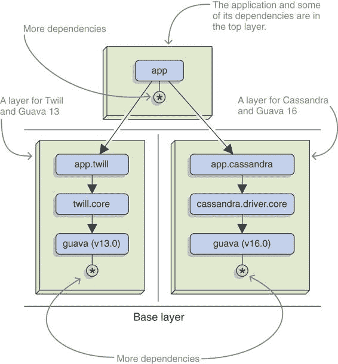
> 
> 图 13.3 Apache Twill 和 Cassandra Java Driver 在 Guava 上存在冲突的依赖关系。要使用这两个库启动应用程序，每个库及其各自的依赖项都必须放在自己的层中。在其上方是包含应用程序其余部分的层，在其下方是基本层。
> 
> 您的启动器可以按照列表 13.3 所示进行操作：

1.  在`mods/cassandra`目录下创建一个包含模块的层。请小心选择正确的模块作为根模块以进行解析过程。选择引导层作为父层。

1.  对`mods/twill`中的模块执行相同的操作。

1.  在`mods/app`目录下创建一个包含模块的层，并将您的主模块作为根模块。使用其他两个层作为父层；这样，您的应用程序对`mods/cassandra`和`mods/twill`中模块的依赖关系就可以得到解决。

1.  当所有这些都完成时，获取上层主要模块的类加载器，并调用其`main`方法。

> > 列表 13.3 创建 Cassandra、Apache Twill 和应用程序层的启动器
> > 
> `public static void main(String[] args) throws ReflectiveOperationException { createApplicationLayers() .findLoader("app") .loadClass("app.Main") .getMethod("main", String[].class)` `.invoke(null, (Object) new String[0]);` `①` `}  private static ModuleLayer createApplicationLayers() { Path mods = Paths.get("mods");  ModuleLayer cassandra = createLayer( List.of(ModuleLayer.boot()), mods.resolve("cassandra"),` `"app.cassandra");` `②` `ModuleLayer twill = createLayer( List.of(ModuleLayer.boot()), mods.resolve("twill"),` `"app.twill");` `②` `return createLayer( List.of(cassandra, twill), mods.resolve("app"),` `"app");` `③` `}` `private static ModuleLayer createLayer(` `④` `List<ModuleLayer> parentLayers, Path modulePath, String rootModule) { Configuration configuration = createConfiguration( parentLayers, modulePath, rootModule); return ModuleLayer .defineModulesWithOneLoader( configuration, parentLayers, ClassLoader.getSystemClassLoader()) .layer(); }` `private static Configuration createConfiguration(` `④`
> 
> > ①
> > 
> > 在创建应用程序层之后，加载应用程序的 Main 类并调用 main 方法
> > 
> > ②
> > 
> > 为 Twill 和 Cassandra 创建一个层，每个层都包含整个项目以及与它交互的模块
> > 
> > ③
> > 
> > 主要应用程序层从主模块开始解析，并将 twill 和 cassandra 层作为父层。
> > 
> > ④
> > 
> > `createLayer`和`createConfiguration`方法与第 12.4.3 节中的方法类似。主要区别在于它们指定了解析的根模块（之前不是必需的，因为您依赖于服务绑定——这里则不需要）。
> > 
> `List<ModuleLayer> parentLayers, Path modulePath, String rootModule) { List<Configuration> configurations = parentLayers.stream() .map(ModuleLayer::configuration) .collect(toList()); return Configuration.resolveAndBind( ModuleFinder.of(), configurations, ModuleFinder.of(modulePath), List.of(rootModule) ); }`
> 
> 就这样！我承认这需要一些时间，你可能需要调整一段时间才能让它工作（我就是这样做的），但如果这是你唯一剩下的解决方案，那么尝试一下是值得的。
> 
> 摘要

+   `javac`和`jar`命令允许您使用`--module-version ${version}`选项记录模块的版本。它将给定的版本嵌入到模块声明中，其中可以使用类似命令的工具（例如，`jar --describe-module`）和反射 API（`ModuleDescriptor::rawVersion`）读取。堆栈跟踪也会显示模块版本。

+   如果一个模块知道自己的版本，并且另一个模块针对它进行编译，编译器将在第二个模块的描述符中记录该版本。此信息仅在`ModuleDescriptor::requires`返回的`Requires`实例上可用。

+   模块系统不会以任何方式对版本信息进行操作。如果模块路径包含多个版本，而不是尝试为模块选择一个特定版本，它会以错误信息退出。这避免了昂贵的版本选择算法出现在 JVM 和 Java 标准中。

+   模块系统没有内置支持来运行同一模块的多个版本。其根本原因在于类加载机制，该机制假设每个类加载器最多只知道一个给定名称的类。如果你需要运行多个版本，你需要不止一个类加载器。

+   OSGi 通过为每个 JAR 创建一个单独的类加载器来实现这一点。创建一个类似通用的解决方案是一个具有挑战性的任务，但一个更简单的变体，针对你确切的问题进行定制，是可行的。要运行同一模块的多个版本，创建层和相关的类加载器，以便冲突的模块被分离。

> 14
> 
> 使用 jlink 自定义运行时镜像
> 
> 本章涵盖

+   使用选定内容创建镜像

+   生成原生应用程序启动器

+   判断镜像的安全性、性能和稳定性

+   生成和优化镜像

> 讨论 Java 模块化的关键动机之一一直是现在所说的物联网（IoT）。这对于 OSGi 来说是真的，它是 Java 最广泛使用的第三方模块系统，它在 1999 年启动，旨在改善嵌入式 Java 应用程序的开发，也适用于 Project Jigsaw，它开发了 JPMS，旨在通过允许创建仅包含（嵌入式）应用程序需要的代码的非常小的运行时来提高平台的可伸缩性。
> 
> 这就是`jlink`发挥作用的地方。它是一个 Java 命令行工具（位于你的 JDK 的`bin`文件夹中），你可以使用它来选择多个平台模块并将它们链接到一个运行时镜像中。这样的运行时镜像的行为与 JRE 完全相同，但它只包含你选择的模块以及它们运行所需的依赖项（如`requires`指令所示）。在链接阶段，`jlink`可以用来进一步优化镜像大小并提高虚拟机性能，尤其是启动时间。
> 
> 自从 Jigsaw 启动以来，已经发生了许多变化。一方面，嵌入式设备中的磁盘空间不再像以前那样珍贵。同时，我们也看到了虚拟化的兴起，尤其是 Docker，其中容器大小再次成为关注点（尽管不是主要问题）。容器化的兴起也带来了简化并自动化部署的压力，而今天，部署的频率已经提高了几个数量级。
> 
> 此外，`jlink`在这里也有帮助。它不仅限于链接平台模块——它还可以创建应用程序镜像，这些镜像包括应用程序代码以及库和框架模块。这使得你的构建过程能够生成一个完全自包含的部署单元，该单元包含你的整个应用程序以及它需要的精确平台模块，根据你的需求优化镜像大小和性能，并且可以通过对本地脚本的简单调用启动。
> 
> 如果你更倾向于桌面应用程序开发，当我提到 IoT 和 Docker 时，你的眼睛可能已经失去了光泽。但使用`jlink`，你可以非常容易地发送一个单一的 Zip 文件，用户可以无需任何进一步设置即可启动它。如果你一直在使用`javapackager`，你将很高兴地听到它现在内部调用`jlink`，这让你可以访问所有其功能（尽管我不会深入集成——`javapackager`文档已经涵盖了这一点）。
> 
> 因此，让我们开始链接！我们将从创建由平台模块组成的运行时镜像（第 14.1 节）开始，并利用这个机会更详细地探讨链接过程，查看生成的镜像，并讨论如何选择正确的模块。接下来是包含应用程序模块和创建自定义启动器（第 14.2 节），然后我们讨论跨操作系统的镜像生成（第 14.3 节）。最后，我们将探讨大小和性能优化（第 14.4 节）。
> 
> 为了跟随代码编写，请查看 ServiceMonitor 仓库中的`feature-jlink`分支。到本章结束时，你将知道如何为各种操作系统创建优化的运行时镜像，可能包括整个应用程序。这允许你构建一个单一的部署单元，该单元可以在你的服务器或客户的机器上直接使用。
> 
> 14.1 创建自定义运行时镜像
> 
> `jlink`的一个大用途是创建只包含你应用程序所需的模块的 Java 运行时镜像。结果是定制的 JRE，它正好包含你的代码需要的模块，没有其他模块。然后你可以使用该镜像中的`java`二进制文件来启动你的应用程序，就像使用任何其他 JRE 一样。
> 
> 自定义运行时有一些优点：你可以节省一些磁盘空间（更小的镜像）和可能的网络带宽（如果你远程部署），你更安全（类越少意味着攻击面越小），而且你甚至能得到一个启动速度略快的 JVM（更多内容请参考第 14.4.3 节）。
> 
> > 注意：尽管如此，`jlink`“仅仅”链接字节码——它不会将其编译成机器码。你可能听说过从版本 9 开始，Java 尝试了即时（AOT）编译，但`jlink`与此无关。要了解 Java 中的 AOT，请查看 Java 增强提案 295 ([`openjdk.java.net/jeps/295`](http://openjdk.java.net/jeps/295))。
> > 
> > 重要的是：你可以在 Java 9+上运行你的应用程序后立即创建针对你的应用程序定制的运行时镜像。你不需要先对其进行模块化。
> > 
> 要了解如何使用`jlink`创建运行时镜像，我们将从最简单的镜像（第 14.1.1 节）开始，然后检查结果（第 14.1.2 节）。接下来，我们将讨论服务的特殊处理（第 14.1.3 节），最后在本节中添加一个实际用例：如何创建用于运行特定应用程序的镜像（第 14.1.4 节）。
> 
> 14.1.1 使用 JLINK 入门
> 
> > 定义：jlink 所需的必要信息
> > 
> > 要创建镜像，`jlink`需要三个信息点，每个信息点通过命令行选项指定：

+   可用模块的位置（使用`--module-path`指定）

+   要使用的模块（使用`--add-modules`指定）

+   创建镜像的文件夹（使用`--output`指定）

> 最简单的运行时镜像只包含基本模块。以下列表展示了如何使用`jlink`创建它。
> 
> > 列表 14.1 创建只包含基本模块的运行时镜像
> > 
> `$ jlink` `--module-path ${jdk-9}/jmods` `①``--add-modules java.base` `②``--output jdk-base` `③``$ jdk-base/bin/java --list-modules` `④` `> java.base`
> 
> > ①
> > 
> > 模块的位置，在本例中为本地 JDK 安装的平台模块
> > 
> > ②
> > 
> > 需要添加到镜像中的模块，在本例中仅为 java.base
> > 
> > ③
> > 
> > 镜像的输出目录
> > 
> > ④
> > 
> > 从新镜像执行`java --list-modules`以验证它只包含基本模块
> > 
> 需要告诉`jlink`在哪里查找平台模块可能看起来有些奇怪。对于`javac`和`java`来说，这不是必需的，那么为什么`jlink`不知道它们在哪里呢？答案是跨平台链接，这是第 14.3 节讨论的内容。
> 
> > **注意** 从 Java 10 开始，不再需要在模块路径上放置平台模块。如果没有，`jlink`会隐式地从目录`$JAVA_HOME/jmods`加载它们。
> > 
> > **重要信息** 无论平台模块是显式还是隐式引用，建议您只从与`jlink`二进制文件相同的精确 JVM 版本加载它们。例如，如果`jlink`的版本是 9.0.4，请确保它从 JDK 9.0.4 加载平台模块。
> > 
> 给定三个命令行选项，`jlink`按照第 3.4.1 节中描述的方式解析模块：模块路径内容成为可观察模块的宇宙，而`--add-modules`提供的模块成为解析过程的根。但是`jlink`有几个特性：
> 
> > **重要信息** 默认情况下，服务（见第十章）没有被绑定。14.1.3 节解释了原因，并探讨了如何解决这个问题。

+   带有`requires static`（见第 11.2 节）的可选依赖项不会被解析。它们需要手动添加。

+   不允许自动模块。这一点在 14.2 节中非常重要，并在那里有更详细的解释。

> 除非遇到任何问题，如缺少或重复的模块，否则解析的模块（根模块加上传递依赖）最终会出现在新的运行时镜像中。让我们来看看它。
> 
> 14.1.2 镜像内容和结构
> 
> 首先：这个镜像仅占用大约 45 MB（在 Linux 上；我听说在 Windows 上更少），而完整的 JRE 占用 263 MB——这还不包括第 14.4.2 节中讨论的空间优化。那么这个镜像看起来是什么样子呢？第 6.3 节介绍了新的 JDK/JRE 目录结构；如图 14.1（part0029.html#filepos1712158）所示，用`jlink`创建的运行时镜像相似。这不是巧合：您可以下载的 JDK 和 JRE 是用`jlink`组合的。
> 
> 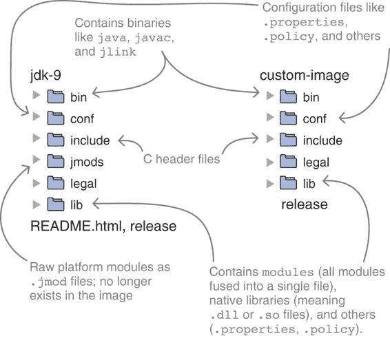
> 
> 图 14.1 JDK（左）和用`jlink`创建的自定义运行时镜像（右）的目录结构比较。这种相似性并非偶然——JDK 是用`jlink`创建的。
> 
> 注意，`jlink`将包含的模块融合到`lib/modules`中，然后从最终镜像中省略`jmods`文件夹。这与生成 JRE 的方式一致，它也不包含`jmods`。原始的 JMOD 文件仅包含在 JDK 中，以便`jlink`可以处理它们：将模块优化到`lib/modules`是一个单向操作，`jlink`不能从优化后的镜像生成进一步的镜像。
> 
> 查看目录`bin`时，你可能想知道你可以在那里找到哪些可执行文件。实际上，`jlink`非常智能，它只为那些在镜像中包含了所需模块的可执行文件生成可执行文件。例如，编译器可执行文件`javac`包含`jdk.compiler`模块，如果该模块没有被包含，则不可用。
> 
> 14.1.3 在运行时镜像中包含服务
> 
> 如果你仔细观察列表 14.1，你会发现图像中只包含 java.base 这一点有些奇怪。在第 10.1.2 节中，你了解到基本模块使用了其他平台模块提供的大量服务，并且在模块解析期间绑定服务时，所有这些提供者都会被拉入模块图中。那么为什么它们最终没有出现在图像中呢？
> 
> > 定义：--bind-services
> > 
> > 为了能够创建小而精心组装的运行时图像，`jlink`默认在创建图像时不执行服务绑定。相反，服务提供者模块必须通过在`--add-modules`中列出它们来手动包含。或者，可以使用选项`--bind-services`来包含所有提供其他解析模块使用的服务的模块。
> > 
> 让我们以 ISO-8859-1、UTF-8 或 UTF-16 这样的字符集为例。基本模块知道你日常需要的一些字符集，但有一个特定的平台模块包含了一些其他的字符集：jdk.charsets。基本模块和 jdk.charsets 通过服务解耦。以下是它们模块声明的相关部分：
> 
> `module java.base { uses java.nio.charset.spi.CharsetProvider; }  module jdk.charsets { provides java.nio.charset.spi.CharsetProvider with sun.nio.cs.ext.ExtendedCharsets }`
> 
> 当 JPMS 在常规启动期间解析模块时，服务绑定会拉入 jdk.charsets，因此其字符集并不总是存在于标准的 JRE 中。但是，当你使用`jlink`创建运行时图像时，这种情况不会发生，因此默认情况下图像不会包含字符集模块。如果你的项目依赖于它，你可能需要通过困难的方式才能发现这一点。
> 
> 一旦你确定你依赖于一个通过服务与其他模块解耦的模块，你就可以使用`--add-modules`将其包含在图像中：
> 
> `$ jlink --module-path ${jdk-9}/jmods --add-modules java.base,jdk.charsets --output jdk-charsets $ jdk-charsets/bin/java --list-modules  > java.base > jdk.charsets`
> 
> > 定义：--suggest-providers
> > 
> > 手动识别服务提供者模块可能会很麻烦。幸运的是，`jlink`可以帮助你。选项`--suggest-providers ${service}`列出所有提供`${service}`实现的可观察模块，其中`${service}`必须使用其完全限定名指定。
> > 
> 假设你已经创建了一个只包含 java.base 的最小运行时图像，并且在执行你的应用程序时，由于缺少字符集而遇到问题。你使用`java.nio.charset.spi.CharsetProvider`追踪到 java.base 的问题，现在想知道哪些模块提供了该服务。这时，`--suggest-providers`选项就派上用场了：
> 
> `$ jlink --module-path ${jdk-9}/jmods --suggest-providers java.nio.charset.spi.CharsetProvider  > 建议提供者: > jdk.charsets > provides java.nio.charset.spi.CharsetProvider > used by java.base`
> 
> 另一个无声缺失模块的好例子是区域。除了英语区域外，所有区域都包含在 jdk.localedata 中，这使得它们可以通过服务提供给基础模块。考虑以下代码：
> 
> `String half = NumberFormat .getInstance(new Locale("fi", "FI")) .format(0.5); System.out.println(half);`
> 
> 它会打印什么？`Locale("fi", "FI")`为芬兰创建区域，芬兰格式使用带有逗号的浮点数，所以结果将是`0,5`——至少，当芬兰区域可用时。如果你在不含 jdk.localedata 的运行时图像上执行此代码，比如你之前创建的那个，你会得到`0.5`，因为 Java 会静默地回退到默认区域。是的，这不是错误，但这是静默的错误行为。
> 
> 和之前一样，解决方案是显式包含解耦的模块，在这个例子中是 jdk.localedata。但它会增加 16 MB 到图像大小，因为它包含大量的区域数据。幸运的是，正如你将在 14.4.2 节中看到的，`jlink`可以帮助减少这种额外的负载。
> 
> > 注意：当你的应用程序在通用下载的 Java 和定制运行时图像上运行时的行为不同时，你应该考虑服务。错误行为可能是由于 JVM 中某些功能不可用吗？也许它的模块通过服务解耦，现在在你的运行时图像中缺失。
> > 
> 这些是基础模块使用以及其他平台模块提供的你可能隐式依赖的一些服务：

+   来自 jdk.charsets 的字符集

+   来自 jdk.localedata 的区域

+   来自 jdk.zipfs 的 ZIP 文件系统

+   来自 java.naming、java.security.jgss、java.security.sasl、java.smartcardio、java.xml.crypto、jdk.crypto.cryptoki、jdk.crypto.ec、jdk.deploy 和 jdk.security.jgss 的安全提供者

> 作为手动识别和添加单个模块的替代方案，你可以使用通用的`--bind-services`：
> 
> `$ jlink --module-path ${jdk-9}/jmods --add-modules java.base --bind-services --output jdk-base-services $ jdk-base-services/bin/java --list-modules  > java.base > java.compiler > java.datatransfer > java.desktop # 省略了大约三十多个模块`
> 
> 然而，这会将所有提供服务的模块绑定到基础模块，从而创建了一个相当大的图像——这个图像在优化之前大约有 150 MB。你应该仔细考虑这是否是正确的做法。
> 
> 14.1.4 使用 JLINK 和 JDeps 调整图像大小
> 
> 到目前为止，你只创建了包含 java.base 和一些其他模块的小型图像。但对于实际应用场景，你将如何确定需要哪些平台模块来维持一个大型应用？不能使用试错法，对吧？
> 
> 答案是 JDeps。对于详细介绍，请参阅附录 D——这里只需知道以下咒语将列出你的应用程序依赖的所有平台模块：
> 
> `jdeps -summary -recursive --class-path 'jars/*' jars/app.jar`
> 
> 为了使其工作，`jars`文件夹必须包含运行应用程序所需的所有 JAR 文件（包括你的代码以及依赖项；你的构建工具将帮助你完成这项工作），并且`jars/app.jar`必须包含你用来启动的`main`方法。结果将显示许多工件之间的依赖关系，但你也会看到显示对平台模块依赖的行。以下示例列出了 Hibernate Core 5.2.12 及其依赖项使用的平台模块：
> 
> `antlr-2.7.7.jar -> java.base classmate-1.3.0.jar -> java.base dom4j-1.6.1.jar -> java.base dom4j-1.6.1.jar -> java.xml hibernate-commons-annotations-5.0.1.Final.jar -> java.base hibernate-commons-annotations-5.0.1.Final.jar -> java.desktop hibernate-core-5.2.12.Final.jar -> java.base hibernate-core-5.2.12.Final.jar -> java.desktop hibernate-core-5.2.12.Final.jar -> java.instrument hibernate-core-5.2.12.Final.jar -> java.management hibernate-core-5.2.12.Final.jar -> java.naming hibernate-core-5.2.12.Final.jar -> java.sql hibernate-core-5.2.12.Final.jar -> java.xml hibernate-core-5.2.12.Final.jar -> java.xml.bind hibernate-jpa-2.1-api-1.0.0.Final.jar -> java.base hibernate-jpa-2.1-api-1.0.0.Final.jar -> java.instrument hibernate-jpa-2.1-api-1.0.0.Final.jar -> java.sql jandex-2.0.3.Final.jar -> java.base javassist-3.22.0-GA.jar -> java.base javassist-3.22.0-GA.jar -> jdk.unsupported jboss-logging-3.3.0.Final.jar -> java.base jboss-logging-3.3.0.Final.jar -> java.logging slf4j-api-1.7.13.jar -> java.base`
> 
> 现在你需要做的就是提取这些行，删除`… ->`部分，并丢弃重复项。对于 Linux 用户：
> 
> `jdeps -summary -recursive --class-path 'jars/*' jars/app.jar | grep '\-> java.\|\-> jdk.' | sed 's/^.*-> //' | sort -u`
> 
> 你最终会得到一个整洁的平台模块列表，你的应用程序依赖于这些模块。将这些模块输入到`jlink --add-modules`中，你将得到支持你的应用程序的最小可能的运行时镜像（参见图 14.2）。
> 
> 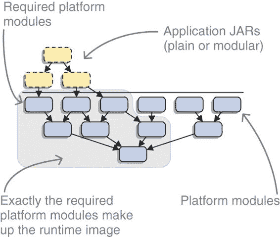
> 
> 图 14.2 给定应用程序 JAR 文件（顶部）及其对平台模块的依赖关系（底部），`jlink`可以创建仅包含所需平台模块的运行时镜像。
> 
> > **基本信息** 有几点需要注意：

+   JDeps 偶尔会报告`… -> not found`，这意味着某些传递依赖没有在类路径上。确保 JDeps 的类路径包含运行应用程序时使用的确切工件。

+   JDeps 无法分析反射，因此如果你的代码或依赖项的代码仅通过反射与 JDK 类交互，JDeps 将无法检测到这一点。这可能导致所需的模块没有包含在镜像中。

+   如第 14.1.3 节所述，`jlink`默认不绑定服务，但你的应用程序可能隐式依赖于一些 JDK 内部提供者存在。

+   考虑添加 java.instrument 模块，这是支持 Java 代理所需的。如果你的生产环境使用代理来观察运行中的应用程序，那么这是必须的；即使不使用，你也可能发现自己处于一种困境，即 Java 代理是分析问题的最佳方式。此外，它只有大约 150 KB，所以这几乎不是什么大问题。

> > **注意** 一旦为你的应用程序创建了运行时镜像，我建议你在其上运行单元测试和集成测试。这将让你有信心确实包含了所有必需的模块。
> > 
> 接下来是将在你的镜像中包含应用程序模块——但要做到这一点，你的应用程序及其依赖项需要完全模块化。如果这不是情况，并且你在寻找更直接适用的知识，请跳转到第 14.3 节以生成跨操作系统的运行时镜像，或第 14.4 节以优化你的镜像。
> 
> 14.2 创建自包含的应用程序镜像
> 
> 到目前为止，你已经创建了支持应用程序的运行时镜像，但没有任何理由就此停止。`jlink`使得创建包含整个应用程序的镜像变得容易。这意味着你最终会得到一个包含应用程序模块（应用程序本身及其依赖项）和支撑它的平台模块的镜像。你甚至可以创建一个漂亮的启动器，这样你就可以使用`bin/my-app`来运行你的应用程序了！分发你的应用程序现在变得容易多了。
> 
> > 定义：应用程序镜像
> > 
> > 虽然这不是一个官方术语，但我将包含应用程序模块的镜像称为应用程序镜像（与运行时镜像相对），以清楚地界定我在谈论的内容。毕竟，结果更接近于应用程序而不是通用的运行时。
> > 
> > **重要信息** 注意，`jlink`只操作显式模块，所以依赖于自动模块（见第 8.3 节）的应用程序不能链接到镜像中。如果你绝对需要创建包含你的应用程序的镜像，请查看第 9.3.3 节了解如何使第三方 JARs 模块化，或者使用 ModiTect（[`github.com/moditect/moditect`](https://github.com/moditect/moditect)）这样的工具来为你完成这项工作。
> > 
> 这种对显式模块的限制没有技术依据——这是一个设计决策。应用程序镜像应该是自包含的，但如果它依赖于不表达依赖的自动模块，JPMS 就无法验证，可能会导致`NoClassDefFoundError`。这并不符合模块系统追求的可靠性。
> 
> 在满足先决条件后，让我们开始吧。你首先会创建一个包含应用程序模块的镜像（第 14.2.1 节），然后通过创建启动器（第 14.2.2 节）来简化你的生活。最后，我们将探讨应用程序镜像的安全性、性能和稳定性（第 14.2.3 节）。
> 
> 14.2.1 在镜像中包含应用程序模块
> 
> 创建应用程序镜像所需的所有操作就是将应用程序模块添加到 `jlink` 模块路径，并从中选择一个或多个作为根模块。生成的镜像将包含所有必需的模块（但不含其他模块；参见图 14.3）并且可以使用 `bin/java --module ${initial-module}` 启动。
> 
> 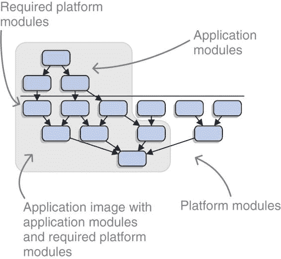
> 
> 图 14.3 给定应用程序模块（上方）及其对平台模块的依赖关系（下方），`jlink` 可以创建仅包含所需模块的运行时镜像，包括应用程序和平台代码。
> 
> 例如，让我们再次转向 ServiceMonitor 应用程序。因为它依赖于自动模块 spark.core 和 hibernate.jpa，而 `jlink` 不支持这些模块，所以我不得不移除该功能。这使我们只剩下七个模块，它们都只依赖于 java.base：

+   monitor

+   monitor.observer

+   monitor.observer.alpha

+   monitor.observer.beta

+   monitor.persistence

+   monitor.rest

+   monitor.statistics

> 我将这些放入名为 `mods` 的文件夹中，并创建了一个镜像，如列表 14.2 所示。不幸的是，我忘记了观察者实现 monitor.observer.alpha 和 monitor.observer.beta 通过服务与应用程序的其他部分解耦，并且它们默认情况下没有绑定（参见第十章“服务”和第 14.1.3 节“`jlink` 如何处理它们”）。因此，我不得不在列表 14.3 中再次尝试，通过显式添加它们。或者，我本可以使用 `--bind-services`，但我不喜欢包含所有 JDK 内部服务提供者时镜像变得很大。
> 
> > 列表 14.2 创建包含 ServiceMonitor 的应用程序镜像
> > 
> `$ jlink` `--module-path ${jdk-9}/jmods:mods` ①`--add-modules monitor` ② `--output jdk-monitor $ jdk-monitor/bin/java --list-modules  > java.base > monitor` `> monitor.observer` ③ `> monitor.persistence > monitor.rest > monitor.statistics`
> 
> > ①
> > 
> > 除了平台模块外，我在 mods 中还指定了应用程序模块。在 Windows 上，使用 ; 而不是 :。
> > 
> > ②
> > 
> > 以 monitor 为起点开始模块解析
> > 
> > ③
> > 
> > 服务实现 monitor.observer.alpha 和 monitor.observer.beta 缺失。
> > 
> > 列表 14.3 创建应用程序镜像，这次包括服务
> > 
> `$ jlink --module-path ${jdk-9}/jmods:mods --add-modules monitor,` `monitor.observer.alpha,monitor.observer.beta` ① `--output jdk-monitor $ jdk-monitor/bin/java --list-modules  > java.base > monitor > monitor.observer > monitor.observer.alpha > monitor.observer.beta > monitor.persistence > monitor.rest > monitor.statistics`
> 
> > ①
> > 
> > 以初始模块（monitor）和所有所需服务（其他两个）为起点开始模块解析
> > 
> > 定义：系统模块
> > 
> > 总而言之，镜像中包含的平台模块和应用程序模块被称为系统模块。您将在下一分钟看到，在启动应用程序时仍然可以添加其他模块。
> > 
> 注意分辨率特性！
> 
> 从第 14.1 节中记住，`jlink`创建了一个最小镜像：

+   它不绑定服务。

+   它不包括可选依赖项。

> > 重要的信息：尽管您可能会记得检查您自己的服务是否存在，但您可能会忘记您的依赖项（例如，SQL 驱动程序的实现）或平台模块（地区数据或非标准的字符集）。同样适用于可选依赖项，您可能希望包含它们，但忘记它们仅仅因为它们存在于模块路径上而没有解决（参见第 11.2.3 节）。确保您最终获得了所需的全部模块！
> > 
> ServiceMonitor 应用程序使用芬兰地区设置来格式化其输出，因此它需要在镜像中添加 jdk.localedata（参见以下列表）。这会使镜像大小增加 16 MB（至 61 MB），但第 14.4.2 节展示了如何减少这个大小。
> 
> > 列表 14.4 使用区域数据创建 ServiceMonitor 应用程序镜像
> > 
> `$ jlink --module-path ${jdk-9}/jmods:mods --add-modules monitor, monitor.observer.alpha,monitor.observer.beta,` `jdk.localedata` ① `--output jdk-monitor`
> 
> > ①
> > 
> > 平台模块的区域设置也添加到了镜像中。
> > 
> 在启动应用程序时使用命令行选项
> 
> 一旦创建了镜像，您就可以像往常一样使用`java --module ${initial-module}`启动应用程序，使用镜像`bin`文件夹中的`java`可执行文件。但由于您已在镜像中包含了应用程序模块，因此不需要指定模块路径——JPMS 将在镜像内部找到它们。
> 
> 在`jdk-monitor`中创建 ServiceMonitor 镜像后，可以使用简短的命令启动应用程序：
> 
> `$ jdk-monitor/bin/java --module monitor`
> 
> 如果您愿意，您可以使用模块路径。在这种情况下，请记住，系统模块（镜像中的模块）将始终覆盖模块路径上相同名称的模块——就好像模块路径上的模块不存在一样。您可以使用模块路径做的事情是向应用程序添加新模块。这些可能是额外的服务提供者，这允许您在仍然允许用户轻松本地扩展的情况下，与您的应用程序一起分发镜像。
> 
> 假设 ServiceMonitor 发现了一种它需要观察的新类型的微服务，模块 monitor.observer.zero 就是这样做的。此外，该模块实现了所有正确的接口，并且其描述符声明它提供`ServiceObserver`。然后，如以下所示，您可以使用之前的相同镜像并通过模块路径添加 monitor.observer.zero。
> 
> > 列表 14.5 使用附加服务提供者启动应用程序镜像
> > 
> `$ jdk-monitor/bin/java` `--module-path mods/monitor.observer.zero.jar` `①``--show-module-resolution` `②``--dry-run` `②` `--module monitor` `> root monitor jrt:/monitor` `③` `# truncated monitor's dependencies` `> monitor binds monitor.observer.alpha jrt:/monitor.observer.alpha` `③``> monitor binds monitor.observer.beta jrt:/monitor.observer.beta` `③``> monitor binds monitor.observer.zero file://...` `④`
> 
> > ①
> > 
> > 将服务提供者放置在模块路径上
> > 
> > ②
> > 
> > 而不是真正启动应用程序，查看模块解析以查看提供者是否被选中（此外，也可以看到这些选项如何与常规 JRE 一起工作）
> > 
> > ③
> > 
> > jrt:字符串表明这些模块是从镜像内部加载的。
> > 
> > ④
> > 
> > 额外的模块从文件:指示的模块路径加载。
> > 
> > **重要信息** 如果你想替换系统模块，你必须按照第 6.1.3 节中描述的方式将它们放置在升级模块路径上。除了模块路径的特殊情况外，本书中展示的所有其他`java`选项在自定义应用程序镜像中工作方式完全相同。
> > 
> 14.2.2 为你的应用程序生成本地启动器
> 
> 如果创建一个包含你的应用程序及其所需一切，但除此之外没有其他内容的镜像是一个蛋糕，那么添加自定义启动器就是糖霜。自定义启动器是图像`bin`文件夹中的一个可执行脚本（Unix 基于操作系统上的 shell，Windows 上的批处理），预先配置为使用具体的模块和主类启动 JVM。
> 
> > **定义**：--launcher
> > 
> > 要创建启动器，请使用`--launcher ${name}=${module}/${main-class}`选项：

+   `${name}`是你为可执行文件选择的文件名。

+   `${module}`是要启动的模块的名称。

+   `${main-class}`是模块的主类名称。

> > 后两个是你通常在`java --module`之后放置的内容。并且在这种情况下，如果模块定义了一个主类，你可以省略`/${main-class}`。
> > 
> 如列表 14.6 所示，使用`--launcher run-monitor=monitor`，你可以告诉`jlink`在`bin`目录中创建一个名为`run-monitor`的脚本，该脚本以`java --module monitor`的方式启动应用程序。因为 monitor 声明了一个主类（`monitor.Main`），所以没有必要在`--launcher`中指定它。如果你想要的话，它将是`--launcher run-monitor=monitor/monitor.Main`。
> 
> > 列表 14.6 使用启动器创建应用程序镜像（并一瞥）
> > 
> `$ jlink` `①` `--module-path ${jdk-9}/jmods:mods --add-modules monitor, monitor.observer.alpha,monitor.observer.beta --output jdk-monitor` `--launcher run-monitor=monitor` `②``$ cat jdk-monitor/bin/run-monitor` `③``> #!/bin/sh` `④` `` > JLINK_VM_OPTIONS= > DIR=`dirname $0` `` `> $DIR/java $JLINK_VM_OPTIONS -m monitor/monitor.Main $@` `⑤``$ jdk-monitor/bin/run-monitor` `⑥`
> 
> > ①
> > 
> > 生成与列表 14.3 中所示相同的图像…
> > 
> > ②
> > 
> > …除了添加一个名为 run-monitor 的启动器，该启动器启动模块 monitor（定义了主类）
> > 
> > ③
> > 
> > 只为好玩，看看脚本（cat 打印文件内容）
> > 
> > ④
> > 
> > 表示这是一个 shell 脚本
> > 
> > ⑤
> > 
> > 调用脚本时执行的命令
> > 
> > ⑥
> > 
> > 如何使用启动器
> > 
> > **注意** 您在列表 14.6 中发现了`JLINK_VM_OPTIONS`吗？如果您想为应用程序指定任何命令行选项——例如，调整垃圾收集器——您可以在这里放置它们。
> > 
> 虽然使用启动器确实有缺点：您尝试应用于启动 JVM 的所有选项都将被解释为放在`--module`选项之后，因此它们将成为程序参数。这意味着在使用启动器时，您不能即兴配置模块系统——例如，添加之前讨论的额外服务。
> 
> 但我有好消息：您不必使用启动器，`java`命令仍然可用。列表 14.5 在创建启动器的情况下工作方式完全相同——只要您不使用它。
> 
> 14.2.3 安全性、性能和稳定性
> 
> 创建应用程序镜像可以通过最小化 JVM 中可用的代码量来提高应用程序的安全性，从而减少攻击面。正如第 14.4.3 节讨论的，您还可以期待启动时间的小幅提升。
> 
> 虽然听起来很酷，但这仅适用于完全控制应用程序操作并定期重新部署的情况。如果您将镜像发送给客户或无法控制何时以及如何用新镜像替换旧镜像，情况就会逆转。
> 
> > **重要信息** 使用`jlink`生成的镜像不是为修改而构建的。它没有自动更新功能，手动修补也不是一个现实场景。如果用户更新系统 Java，您的应用程序镜像将不会受到影响。综合来看，它将永远绑定到链接平台模块时的确切 Java 版本。
> > 
> 优点是 Java 补丁更新不会破坏你的应用程序，但更大的缺点是，你的应用程序将无法从新 Java 版本带来的任何安全补丁或性能改进中受益。请记住这一点。如果一个新 Java 版本中修复了关键漏洞，你的用户仍然会暴露，直到他们部署你发送的新应用程序镜像。
> 
> > **注意** 如果你决定交付应用程序镜像，我建议将其作为额外的交付机制，而不是唯一的机制。让用户决定他们是否想要部署整个镜像，或者更愿意在自己的运行时上运行 JAR 文件，他们可以完全控制该运行时，并且可以独立更新它。
> > 
> 14.3 在不同操作系统间生成镜像
> 
> 尽管你的应用程序和库 JAR 文件中的字节码与任何操作系统无关，但它们需要特定于操作系统的 Java 虚拟机（JVM）来执行。这就是为什么你需要下载针对 Linux、macOS 或 Windows（例如）的特定 JDK 和运行时。重要的是要认识到`jlink`是在特定于操作系统的层面上操作的！图 14.4 展示了特定于操作系统的组件。
> 
> 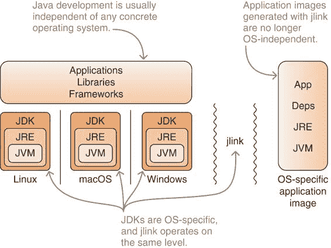
> 
> 图 14.4 与应用程序、库和框架 JAR 文件（顶部）不同，应用程序镜像（右侧）是特定于操作系统的，就像 JVM（底部）一样。
> 
> 当你思考这个问题时，这是显而易见的：`jlink`用来创建镜像的平台模块来自特定于操作系统的 JDK/JRE，因此生成的镜像也是特定于操作系统的。因此，运行时或应用程序镜像总是绑定到一个具体的操作系统。
> 
> 这是否意味着你必须在一堆不同的机器上执行`jlink`来创建你需要的所有各种运行时或应用程序镜像？幸运的是，不必如此。正如你在 14.1.1 节中看到的，在创建镜像时，你需要将`jlink`指向它想要包含的平台模块。这里的关键是：这些模块不需要是你执行`jlink`的操作系统上的！
> 
> > **重要信息** 如果你下载并解压了不同操作系统的 JDK，你可以在运行系统 JDK 的`jlink`版本时将它的`jmods`文件夹放置在模块路径上。链接器将确定要为该操作系统创建镜像，因此将创建一个在该操作系统上运行的镜像（但当然，不能在其他操作系统上运行）。所以，如果你有支持所有操作系统的 JDK，你可以在同一台机器上为每个操作系统生成运行时或应用程序镜像。
> > 
> 我正在运行 Linux，但假设我想为在 macOS 上运行的 ServiceMonitor 应用程序生成一个应用程序镜像。方便的是，`jlink`非常支持这种场景——你所需要的只是一个目标操作系统的 JDK。
> 
> 结果证明，最难的部分是在未为其打包的操作系统上解包 JDK。在这种情况下，我必须进入 Oracle 为 macOS 分发的 `*.dmg` 文件——这里不会详细介绍，但您可以使用您选择的搜索引擎找到关于 `{Linux, macOS, Windows} 与 {rpm/tar.gz, dmg, exe}` 的每个非平凡组合的建议。最后，我在某个文件夹中有 macOS JDK，我将用 `${jdk-9-mac-os}` 来表示它。
> 
> 然后我必须做的与 14.2.1 节中的相同，只是用包含 macOS JDK 的文件夹（`${jdk-9-mac-os}`）替换我的机器上的 JDK 9 文件夹（`${jdk-9}`）。这意味着我正在使用 Linux JDK 的 `jlink` 可执行文件，以及 macOS JDK 中的 `jmods` 目录：
> 
> `$ jlink --module-path ${jdk-9-mac-os}/jmods:mods --add-modules monitor, monitor.observer.alpha,monitor.observer.beta --output jdk-monitor --launcher run-monitor=monitor`
> 
> 带着这个去见我的老板应该没问题。（但如果不行，我甚至不能声称它在我的机器上能工作！）
> 
> 14.4 使用 jlink 插件优化镜像
> 
> “先让它工作，再让它正确，最后让它快速，”Kent Beck，极限编程的创造者和《测试驱动开发：实例》（O’Reilly，2000）一书的作者说道。因此，在创建了运行时和应用镜像的螺母和螺栓（甚至跨操作系统）之后，我们将转向优化。这些优化可以显著减小镜像大小并略微提高运行时性能，尤其是启动时间。
> 
> 在 `jlink` 中，优化由插件处理。因此，在使镜像更小（14.4.2 节）和更快（14.4.3 节）之前，首先讨论该插件架构（14.4.1 节）是有意义的。
> 
> 14.4.1 JLINK 插件
> 
> `jlink` 的一个核心方面是其模块化设计。除了确定正确的模块并为它们生成镜像的基本步骤之外，`jlink` 将镜像内容的进一步处理留给其插件。您可以使用 `jlink --list-plugins` 查看可用的插件，查看[`docs.oracle.com/javase/9/tools/jlink.htm`](https://docs.oracle.com/javase/9/tools/jlink.htm)以获取官方支持的插件，或查看表 14.1 以获取选择（我们将在 14.4.2 和 14.4.3 节中查看每个插件）。
> 
> 表 14.1 一些 `jlink` 插件的字母顺序表，指示它们主要减少镜像大小还是提高运行时性能

| 名称   | 描述   | 大小   | 性能   |
| --- | --- | --- | --- |
| class-for-name   | 将 `Class::forName` 替换为静态访问   |    | ✔   |
| compress   | 共享字符串字面量，并压缩 `lib/modules`   | ✔   |    |
| exclude-files   | 排除文件，例如本地二进制文件   | ✔   |    |
| exclude-resources   | 排除资源，例如来自 `META-INF` 文件夹   | ✔   |    |
| generate-jli-classes   | 预生成方法句柄   |    | ✔   |
| include-locales   | 从 `jdk.localedata` 中移除除指定区域设置之外的所有区域设置   | ✔   |    |
| order-resources   | 在`lib/modules`中排序资源   |    | ✔   |
| strip-debug   | 从图像字节码中删除调试符号   | ✔   |    |
| system-modules   | 准备系统模块图以快速访问   |    | ✔   |

> > 注意：文档以及`jlink`本身还列出了 vm 插件，它允许你选择你想要包含在镜像中的几个 HotSpot 虚拟机（客户端、服务器或最小）之一。这是一个理论上的可能性，因为 64 位 JDK 只附带服务器 VM。对于大多数情况，这让你只剩下一个选择。
> > 
> 开发 JLINK 插件
> 
> 在本书印刷时，只有支持的插件可用，但将来可能会发生变化，因为将添加更多实验性功能。在创建图像时优化图像的努力仍然相当年轻，这里正在进行大量工作。因此，插件 API 在未来可能会发生变化，并且没有在 Java 9+中标准化或导出。
> 
> 这使得为`jlink`开发插件相当复杂^(1)，意味着你将不得不等待一段时间，社区才开始真正贡献插件。这些插件能做什么呢？首先，编写`jlink`插件有点像编写代理或构建工具插件——这不是在典型应用程序开发期间完成的事情。这是一个专门的任务，用于支持专门的库、框架和工具。
> 
> ^(1) 如果你对 Java 9 中探索 jlink 插件 API 的教程感兴趣，请参阅 Gunnar Morling 的博客文章“Exploring the jlink Plug-in API in Java 9” ([`mng.bz/xJ6B`](http://mng.bz/xJ6B))。
> 
> 但让我们回到社区提供的插件能做什么的问题。一个用例来自性能分析器，它们目前使用代理将性能跟踪代码注入正在运行的应用程序。使用`jlink`插件，你可以在链接时而不是在执行应用程序时支付仪器成本来完成这项工作。如果快速启动很重要，这可能是一个明智的选择。
> 
> 另一个用例是增强 Java 持久化 API（JPA）实体的字节码。例如，Hibernate 已经通过代理来跟踪哪些实体被修改（所谓的脏检查），而不必检查每个字段。在链接时而不是在启动时进行这项工作是有意义的，这就是为什么 Hibernate 已经为构建工具和 IDE 提供了插件，这些插件在它们的构建过程中执行这项工作。
> 
> 作为最后的例子，一个非常好的、潜在的`jlink`插件将是一个在链接时索引注解并在运行时提供该索引的插件。这可以显著减少扫描注解的 bean 和实体的模块路径的应用程序的启动时间。实际上，我在脚注中给出的插件教程正是这样做的。
> 
> 使用 JLINK 插件
> 
> > 定义：插件 --${name} 命令行选项
> > 
> > 理论部分已经讲完，让我们使用一些这些插件。但如何使用呢？其实很简单：`jlink`会根据每个插件的名字自动创建一个命令行选项`--${name}`。如何传递进一步参数取决于插件，并在`jlink --list-plugins`中描述。
> > 
> 移除调试符号是减小镜像大小的有效方法。要这样做，使用`--strip-debug`创建镜像：
> 
> `$ jlink --module-path ${jdk-9}/jmods --add-modules java.base --strip-debug --output jdk-base-stripped`
> 
> 看这里：`lib/modules`的大小从仅基础模块的 23 MB 减少到了 18 MB（在 Linux 上）。
> 
> 通过将更重要的文件放在前面来排序`lib/modules`的内容可以减少启动时间（尽管我怀疑效果是否明显）：
> 
> `$ jlink --module-path ${jdk-9}/jmods --add-modules java.base --order-resources=**/module-info.class,/java.base/java/lang/** --output jdk-base-ordered`
> 
> 这样，模块描述符首先出现，然后是`java.lang`包中的类。
> 
> 现在你已经知道了如何使用插件，是时候测试几个插件了。我们将分为两个部分进行，第一部分关注大小缩减（第 14.4.2 节）和第二部分关注性能提升（第 14.4.3 节）。因为这个特性是不断发展的，并且相对较为专业，所以我不将详细说明——官方的`jlink`文档和`jlink --list-plugins`，尽管文字不多，但能更精确地展示如何使用它们。
> 
> 14.4.2 减小镜像大小
> 
> 让我们逐一查看这些大小缩减插件，并测量它们能带我们走多远。我本想在一个应用程序镜像上测试它们，但 ServiceMonitor 只有大约十几个类，所以这样做没有意义；而且我找不到一个真正免费且完全模块化的应用程序，包括其依赖项（记住，镜像中没有自动模块）。相反，我将测量对三个不同运行时镜像的影响（括号内为未修改的大小）：

+   base —仅 java.base（45 MB）

+   services —java.base 加上所有服务提供者（150 MB）

+   java —所有 java.*和 javafx.*模块，但不包括服务提供者（221 MB）

> 有趣的是，与服务相比，Java 的大小更大，并不是由于字节码的数量（在 Java 中，`lib/modules`比服务小一点），而是由于原生库，尤其是为 JavaFX 的`WebView`捆绑的 WebKit 代码。这将帮助你理解插件在减小镜像大小时的行为。（顺便说一句，我在 Linux 上做这个，但比例在其他操作系统上应该相似。）
> 
> 压缩镜像
> 
> > 定义：压缩插件
> > 
> > 压缩插件旨在减小`lib/modules`的大小。它由`--compress=${value}`选项控制，该选项有三个可能的值：

+   0—无压缩（默认）

+   1—去重并共享字符串字面量（意味着`String s = "text";`中的`"text"`）

+   2—压缩`lib/modules`为 Zip 格式

> > 可以通过`--compress=${value}:filter=${pattern-list}`包括一个可选的模式列表，在这种情况下，只有匹配模式的文件才会被压缩。
> > 
> 此命令创建了一个仅包含基础模块的压缩运行时镜像：
> 
> `$ jlink --module-path ${jdk-9}/jmods --add-modules java.base --output jdk-base --compress=2`
> 
> 显然，你不需要尝试`0`。对于`1`和`2`，我得到了以下结果：

+   base —45 MB ⇝ 39 MB (`1`) ⇝ 33 MB (`2`)

+   services —150 MB ⇝ 119 MB (`1`) ⇝ 91 MB (`2`)

+   java —221 MB ⇝ 189 MB (`1`) ⇝ 164 MB (`2`)

> 你可以看到压缩率并不是在所有镜像中都是相同的。服务镜像的大小可以降低近 40%，但较大的 java 镜像只能降低 25%。这是因为压缩插件只作用于`lib/modules`，但正如我们讨论的那样，这两个镜像中的大小几乎相同。因此，绝对大小减少也相似：两个镜像都是大约 60 MB，这超过了`lib/modules`初始大小的 50%。
> 
> > 注意：使用`--compress=2`进行 Zip 压缩会增加启动时间——一般来说，镜像越大，增加的越多。如果你认为这很重要，请确保对其进行测量。
> > 
> 排除文件和资源
> 
> > 定义：exclude-files 和 exclude-resources 插件
> > 
> > 插件`exclude-files`和`exclude-resources`允许从最终镜像中排除文件。相应的选项`--exclude-files=${pattern-list}`和`--exclude-resources=${pattern-list}`接受一个模式列表，用于匹配要排除的文件。
> > 
> 当我比较服务和基础镜像的初始大小时，指出的是，主要是 JavaFX `WebView`的本地二进制文件使得 java 镜像变大。在我的机器上，这是 73 MB 的文件`lib/libjfxwebkit.so`。以下是使用`--exclude-files`排除它的方法：
> 
> `$ jlink --module-path ${jdk-9}/jmods --add-modules java.base --output jdk-base --exclude-files=**/libjfxwebkit.so`
> 
> 结果镜像小了 73 MB。有两个注意事项：

+   这与手动从镜像中删除文件的效果相同。

+   这使得基本上只包含`WebView`的 javafx.scene.web 模块变得几乎无用，所以可能最好根本不包含该模块。

> 除了实验和学习之外，排除平台模块附带的内容是不良的做法。确保彻底研究任何此类决定的后果，因为这可能会影响 JVM 的稳定性。
> 
> 这些插件的一个更好的用途是排除你的应用程序或依赖 JAR 中包含而你不需要在应用程序镜像中的文件。这些可能包括文档、不想要的源文件、对你不关心的操作系统的本地二进制文件、配置文件，或者任何其他无数聪明的开发者放入他们存档中的东西。比较大小减少也是没有意义的：你将节省被排除文件所占用的空间。
> 
> 排除不必要的区域
> 
> 区域设置是从平台模块中来的，确实有移除的必要。正如你在第 14.1.3 节中发现的那样，基础模块只能与英语区域设置一起工作，而 jdk.localedata 模块包含 Java 支持的所有其他区域设置的信息。不幸的是，这些其他区域设置加在一起大约有 16 MB。如果你只需要一个或甚至只有几个非英语区域设置，这有点过于奢侈。
> 
> > 定义：include-locales 插件
> > 
> > 正是 include-locales 插件在这里发挥作用。它用作`--include-locales=${langs}`，其中`${langs}`是一个由逗号分隔的 BCP 47 语言标签列表（例如`en-US`、`zh-Hans`和`fi-FI`），生成的镜像将只包含这些语言。
> > 
> > 这只会在 jdk.localedata 模块被包含在镜像中时才有效，所以它不仅仅包括除了基础模块包含的额外区域设置，更多的是排除了 jdk.localedata 中的所有其他区域设置。
> > 
> 列表 14.4 为 ServiceMonitor 创建了一个包含所有 jdk.localedata 的应用程序镜像，因为该应用程序使用芬兰格式进行输出。这导致镜像大小增加了 16 MB，你现在知道如何将其推回。 列表 14.7 使用`--include-locales=fi-FI`来实现这一点。生成的镜像略大于没有 jdk.localedata 的镜像（精确到 168 KB）。成功！
> 
> > 列表 14.7 创建包含芬兰区域数据的 ServiceMonitor 应用程序镜像
> > 
> `$ jlink --module-path ${jdk-9}/jmods:mods --add-modules monitor, monitor.observer.alpha,monitor.observer.beta,` `jdk.localedata` `①` `--output jdk-monitor` `--include-locales=fi-FI` `②`
> 
> > ①
> > 
> > 区域设置的平台模块需要添加到镜像中——要么明确地（如这里所示），要么隐式地（通过需要或使用--bind-services）。
> > 
> > ②
> > 
> > 除了 fi-FI（芬兰语）之外的所有区域设置都被从 jdk.localedata 中移除。
> > 
> 通过排除区域设置可以减少多少镜像大小取决于你需要多少区域设置。如果你向全球受众提供国际化应用程序，你将无法节省太多，但我的猜测这并不是常见情况。如果你的应用程序只支持少数几种甚至十几种语言，排除其他语言将为你节省几乎所有那 16 MB。是否值得付出努力取决于你。
> 
> 移除调试信息
> 
> 当你在 IDE 中调试 Java 代码时，你通常会看到格式良好、命名清晰，甚至带有注释的源代码。这是因为 IDE 检索了属于该代码的实际源代码，将其与当前执行的字节码关联起来，并方便地显示它们。这就是最佳情况。
> 
> 如果没有源代码，你仍然可能看到可读的代码，如果除了字段和方法参数名称（这些名称始终存在于字节码中）之外，你还看到了变量的正确名称（这些名称不一定存在）。这发生在反编译代码包含调试符号时。这些信息使调试变得容易得多，但当然会占用空间。而`jlink`允许你移除这些符号。
> 
> > **定义** strip-debug 插件
> > 
> > 如果`jlink`插件 strip-debug 通过`--strip-debug`激活，它将从图像的字节码中移除所有调试符号，从而减小`lib/modules`文件的大小。此选项没有其他参数。
> > 
> 我在第 14.4.1 节中使用了`--strip-debug`，所以我就不再重复了。让我们看看它是如何减少图像大小的：

+   基础 —45 MB ⇝ 40 MB

+   服务 —150 MB ⇝ 130 MB

+   java —221 MB ⇝ 200 MB

> 这大约是总图像大小的 10%，但请记住，这仅影响到`lib/modules`，它减少了大约 20%。
> 
> > **重要信息** 一个警告：在没有源代码和调试符号的情况下调试代码是一项痛苦的任务。如果你偶尔使用远程调试连接到正在运行的应用程序并分析问题所在，如果你已经放弃了那些调试符号，而你节省的那几兆字节对你来说并不重要，你不会感到高兴。请仔细考虑`--strip-debug`选项！
> > 
> 整合所有内容
> 
> 虽然排除文件和资源最好留给应用程序模块，但其他选项在纯运行时图像上效果良好。让我们将它们全部整合起来，并尝试为模块的三种选择创建尽可能小的图像。以下是仅针对 java.base 的命令：
> 
> `$ jlink --module-path ${jdk-9}/jmods --add-modules java.base --output jdk-base --compress=2 --strip-debug`
> 
> 下面是结果：

+   基础 —45 MB ⇝ 31 MB

+   服务 —150 MB ⇝ 75 MB（我还移除了除`fi-FI`之外的所有区域设置）

+   java —221 MB ⇝ 155 MB（或者如果你削弱了 JavaFX `WebKit`，则是 82 MB）

> 还不错，不是吗？
> 
> 14.4.3 提高运行时性能
> 
> 正如你所见，有相当多的方法可以减小应用程序或运行时图像的大小。不过，我的猜测是，大多数开发者都在热切期待性能改进，尤其是在 Spectre 和 Meltdown 事件夺走了他们一些 CPU 周期之后。
> 
> > **重要信息** 很遗憾，关于这一点我没有太多好消息：使用`jlink`的性能优化还处于早期阶段，大多数现有的或预期的优化都集中在提高启动时间，而不是长期运行性能。
> > 
> 一个默认启用的现有插件是 system-modules，它预先计算系统模块图并将其存储以供快速访问。这样，JVM 就不需要在每次启动时解析和处理模块声明，验证可靠配置。
> 
> 另一个插件，`class-for-name`，将字节码如`Class.forName("some.Type")`替换为`some.Type.class`，因此可以避免通过名称比较昂贵的基于反射的类搜索。我们简要地看了`order-resources`，但没有太多可以补充的。
> 
> 目前唯一支持的其他与性能相关的插件是`generate-jli-classes`。如果配置得当，它可以将 lambda 表达式的初始化成本从运行时移动到链接时，但学习如何做到这一点需要很好地理解方法句柄，所以这里不会涉及。
> 
> 关于性能改进的内容就这些了。我理解如果你对这个领域的大幅提升感到失望，但让我指出，JVM 已经相当优化了。所有低垂的果实（以及树上的许多其他果实）都已经摘取，要达到其他果实需要一些独创性、时间和巧妙的设计。`jlink`工具还比较年轻，我坚信 JDK 开发团队和社区会在适当的时候充分利用它。
> 
> > Java 10 中的应用类数据共享
> > 
> > 与`jlink`没有直接关联的是 Java 10 引入的一种优化：应用类数据共享。2 实验表明，它可以导致应用启动速度提高 10%到 50%。有趣的是，你可以在应用程序镜像内应用这项技术，创建一个更加优化的部署单元。
> > 
> > 2 要了解更多信息，请参阅我的博客文章“使用应用类数据共享提高 Java 10 的启动时间”，[`blog.codefx.org/java/application-class-data-sharing`](https://blog.codefx.org/java/application-class-data-sharing)。
> > 
> 14.5 jlink 的选项
> 
> 为了方便起见，表 14.2 列出了本书讨论的所有`jlink`命令行选项。更多选项可以在官方文档[`docs.oracle.com/javase/9/tools/jlink.htm`](https://docs.oracle.com/javase/9/tools/jlink.htm)中找到，或者使用`jlink --help`和`jlink --list-plugins`。
> 
> 表 14.2 一个按字母顺序排列的`jlink`选项表，包括插件。描述基于文档，参考文献指向本书中解释如何使用这些选项的章节。

| 选项   | 描述   | 参考文献号   |
| --- | --- | --- |
| `--add-modules`   | 定义要包含在镜像中的根模块   | 14.1.1   |
| `--bind-services`   | 包括所有已解析模块使用的服务提供者   | 14.1.3   |
| `--class-for-name`   | 将`Class::forName`替换为静态访问（插件）   | 14.4.3   |
| `--compress, -c`   | 共享字符串字面量，并压缩`lib/modules`（插件）   | 14.4.2   |
| `--exclude-files, --exclude-resources`   | 排除指定的文件和资源（插件）   | 14.4.2   |
| `--generate-jli-classes`   | 预生成方法句柄（插件）   | 14.4.3   |
| `--include-locales`   | 从 jdk.localedata（插件）中删除除指定区域设置之外的所有区域设置   | 14.4.2   |
| `--launcher`   | 在 `bin` 中为应用程序生成原生启动器脚本   | 14.2.2   |
| `--list-plugins`   | 列出可用的插件   | 14.4.1   |
| `--module-path, -p`   | 指定查找平台和应用模块的位置   | 14.1.1   |
| `--order-resources`   | 在 `lib/modules`（插件）中排序资源   | 14.4.1   |
| `--output`   | 在指定位置生成镜像   | 14.1.1   |
| `--strip-debug`   | 从镜像的字节码中删除调试符号（插件）   | 14.4.2   |
| `--suggest-providers`   | 列出指定服务的可观察提供者   | 14.1.3   |

> 摘要

+   命令行工具 `jlink` 从选定的平台模块创建运行时镜像（使用 `jdeps` 确定应用程序需要哪些模块）。为了从中受益，应用程序需要运行在 Java 9+ 上，但不需要模块化。

+   一旦应用程序及其依赖项已完全模块化（不使用自动模块），`jlink` 就可以使用它创建应用程序镜像，包括应用程序的模块。

+   所有对 `jlink` 的调用都需要指定以下内容：

+   查找模块的位置（包括平台模块），使用 `--module-path`

+   解析的根模块，使用 `--add-modules`

+   结果镜像的输出目录，使用 `--output`

+   注意 `jlink` 如何解析模块：

+   默认情况下，服务不受限制。

+   带有 `requires static` 的可选依赖项不会解析。

+   不允许自动模块。

+   确保使用 `--add-modules` 或 `--bind-services` 单独添加所需的服务提供者或可选依赖项，或者绑定所有提供者。

+   注意可能没有意识到就隐式依赖的平台服务。一些候选者包括字符集（jdk.charsets）、区域设置（jdk.localedata）、Zip 文件系统（jdk.zipfs）和安全提供者（各种模块）。

+   由 `jlink` 生成的运行时镜像

+   与使用 `--module-path` 选择平台模块构建的操作系统绑定

+   与 JDK 和 JRE 具有相同的目录结构

+   将平台模块和应用程序模块（统称为系统模块）融合到 `lib/modules`

+   仅包含包含所需模块的二进制文件（在 `bin` 中）

+   要启动应用程序镜像，可以使用 `bin/java --module ${initial-module}`（不需要模块路径，因为系统模块会自动解析）或使用 `--launcher ${name}=${module}/${main-class}` 创建的启动器。

+   使用应用程序镜像，可以使用模块路径添加额外的模块（尤其是提供服务的模块）。具有与系统模块相同名称的模块路径上的模块将被忽略。

+   当您无法轻松用新版本替换它们时，仔细评估交付应用程序镜像的安全、性能和稳定性影响。

+   各种 `jlink` 选项，这些选项激活插件，提供减少图像大小（例如，`--compress`，`--exclude-files`，`--exclude-resource`，`--include-locales` 和 `--strip-debug`）或提高性能（主要是启动时间；`--class-for-name`，`--generate-jli-classes` 和 `--order-resources`）的方法。未来可能会有更多；这个领域仍处于早期阶段。

+   `jlink` 插件 API 尚未标准化，以简化其在早期阶段的演变，这使得开发和使用第三方插件变得更加困难。

> 15
> 
> 将各个部分组合在一起
> 
> 本章涵盖

+   ServiceMonitor 的铃声和哨声版本

+   是否使用模块

+   一个理想的模块可能的样子

+   保持模块声明干净

+   将模块系统与构建工具、OSGi 和微服务进行比较

> 现在我们已经涵盖了有关模块系统几乎所有的知识，是时候总结一下了。在本章的最后，我想将所有这些联系起来，并给出一些关于创建出色的模块化应用程序的建议。
> 
> 第一步是向您展示如何通过将本书中讨论的各个功能的大部分应用于 ServiceMonitor 应用程序（第 15.1 节）来展示这些功能如何结合在一起。然后，我将深入探讨一些更一般的问题，这些问题将帮助您决定是否创建模块，在创建模块时应追求什么，以及如何仔细地演进模块声明，使它们保持干净（第 15.2 节）。我将通过回顾围绕模块系统的技术格局（第 15.3 节）以及我对 Java 模块生态系统的愿景（第 15.4 节）来结束。
> 
> 15.1 向 ServiceMonitor 添加铃声和哨声
> 
> 第二章展示了 ServiceMonitor 应用程序的结构。在第 2.2 节中，您创建了只使用简单的 `requires` 和 `exports` 指令的模块。从那时起，我们不仅详细讨论了这些内容，还探索了模块系统的更高级功能。我们逐一研究了它们，但现在我想将它们全部结合起来。
> 
> 要欣赏 ServiceMonitor 应用程序的全部辉煌，请查看存储库的 `features-combined` 分支。以下列表包含 ServiceMonitor 中所有模块的声明。
> 
> > 列表 15.1 使用本书中介绍的先进功能的 ServiceMonitor
> > 
> `module monitor.observer { exports monitor.observer;` `exports monitor.observer.utils` `①` `to monitor.observer.alpha, monitor.observer.beta; }  module monitor.observer.alpha { requires monitor.observer;` `provides monitor.observer.ServiceObserverFactory` `②` `with monitor.observer.alpha.AlphaServiceObserverFactory; }` `// [...]` `③` `module monitor.statistics {` `requires transitive monitor.observer;` `④``requires static stats.fancy;` `⑤` `exports monitor.statistics; }  module stats.fancy { exports stats.fancy; }  module monitor.persistence {` `requires transitive monitor.statistics;` `④``requires hibernate.jpa;` `⑥` `exports monitor.persistence;` `opens monitor.persistence.entity;` `⑦` `}  module monitor.rest {` `requires transitive monitor.statistics;` `④``requires spark.core;` `⑥` `exports monitor.rest; }  module monitor { requires monitor.observer; requires monitor.statistics; requires monitor.persistence; requires monitor.rest;` `uses monitor.observer.ServiceObserverFactory;` `②` `}`
> 
> > ①
> > 
> > monitor.observer.utils 主要针对观察者实现，因此它仅导出给（一些）它们（参见第 15.1.2 节）。
> > 
> > ②
> > 
> > 观察者 API 的消费者（monitor）和实现（例如，monitor.observer.alpha）通过服务解耦（参见第 15.1.3 节）。
> > 
> > ③
> > 
> > monitor.observer.beta 和 monitor.observer.gamma 在此处未显示；它们看起来就像 monitor.observer.alpha。
> > 
> > ④
> > 
> > 一些模块在其 API 中公开了另一个模块的类型，并且没有该模块就无法使用，因此它们暗示了其可读性（参见第 15.1.1 节）。
> > 
> > ⑤
> > 
> > stats.fancy 并非在每个部署中都存在，monitor.statistics 通过将其对该模块的依赖标记为可选来反映这一点（参见第 15.1.1 节）。
> > 
> > ⑥
> > 
> > ServiceMonitor 使用的 Hibernate 和 Spark 版本都没有模块化，因此 hibernate.jpa 和 spark.core 是自动模块（参见第 15.1.5 节）。
> > 
> > ⑦
> > 
> > monitor.persistence 将其持久化实体包含的包打开以供反射（参见第 15.1.2 节）。
> > 
> 如果您将此列表与列表 2.2 进行比较或查看图 15.1，您会发现 ServiceMonitor 的基本结构基本保持不变。但仔细观察，您会发现许多改进。让我们逐一过目。
> 
> 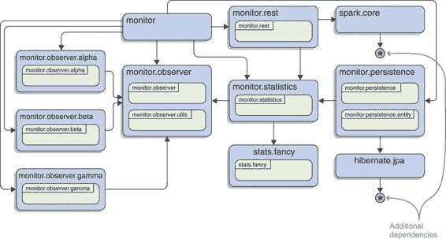 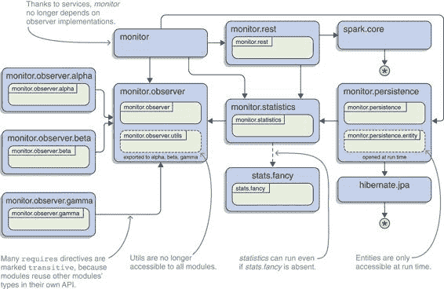
> 
> 图 15.1 根据功能使用情况比较 ServiceMonitor 应用的模块图。第一个变体仅使用普通的`exports`和`requires`指令（a），而第二个变体充分利用了精炼的依赖关系、导出以及服务（b）。（基本变体已扩展，包括与高级变体相同的模块和包。）
> 
> 15.1.1 多样化的依赖关系
> 
> 容易发现的一个变化是`requires transitive`和`requires optional`指令。尽管在大多数情况下，普通的`requires`指令是正确的选择，但相当一部分依赖关系要复杂一些。
> 
> 最明显的情况是可选依赖，其中某个模块使用来自另一个模块的类型，因此需要针对它进行编译，但依赖关系在运行时可能仍然不存在。这正是 monitor.statistics 和 stats.fancy 的情况，因此使用`requires static`指令建立了依赖关系。
> 
> 模块系统将在编译 monitor.statistics 时强制 stats.fancy 的存在（这是有意义的，因为否则编译会失败），如果后者进入了模块图（这也是有意义的，因为否则 monitor.statistics 无法访问 stats.fancy 的类型），则将从 monitor.statistics 添加一个读取边到 stats.fancy。但 stats.fancy 可能不会进入模块图，在这种情况下，monitor.statistics 必须处理其不存在的情况。
> 
> > 列表 15.2 `检查`可选依赖 stats.fancy 是否存在
> > 
> `private static boolean checkFancyStats() { boolean isFancyAvailable = isModulePresent("stats.fancy"); String message = "Module 'stats.fancy' is" + (isFancyAvailable ? " " : " not ") + "available."; System.out.println(message); return isFancyAvailable; }  private static boolean isModulePresent(String moduleName) { return Statistician.class .getModule() .getLayer() .findModule(moduleName) .isPresent(); }`
> 
> 可选依赖关系在 11.2 节中进行了详细讨论。
> 
> 另一种情况比可选依赖稍微不明显，但并不少见——甚至可能更常见。例如，monitor.rest 模块在其公共 API 中就有这个方法：
> 
> `public static MonitorServer create(Supplier<Statistics> statistics) { return new MonitorServer(statistics); }`
> 
> 但`Statistics`来自 monitor.statistics，因此任何使用 rest 的模块都需要读取 statistics，否则它无法访问`Statistics`，因此无法创建`MonitorServer`。换句话说，rest 对于不也读取 statistics 的模块来说是无用的。在 ServiceMonitor 应用中，这种情况出人意料地经常发生：每个至少需要另一个模块并导出包的模块最终都会处于这种情况。
> 
> 这在野外发生的频率要高得多，而且只有那么频繁，是因为这些模块非常小，几乎所有的代码都是公开的 API——如果它们不在自己的 API 中不断暴露其依赖项的类型，那将令人惊讶。所以尽管在实践中这种情况发生的频率较低，但你仍然可以期望每天都会看到这种情况——在 JDK 中，大约 20%的依赖项被暴露。
> 
> 为了不让用户猜测他们需要显式要求的其他模块，这既麻烦又使模块声明膨胀，模块系统提供了`requires transitive`。因为 rest `requires transitive`统计信息，任何读取 rest 的模块也会读取统计信息，因此 rest 的用户免去了猜测的麻烦。隐含的可读性在第 11.1 节中进行了详细讨论。
> 
> 15.1.2 降低可见性
> 
> 与 2.2 节中应用程序原始版本相比的另一个变化是，它的模块更加努力地减少它们的 API 表面积。更新的模块使用了相当少的普通`exports`指令：

+   多亏了服务，观察者不再需要导出它们的实现。

+   通过使用限定导出，`monitor.observer.utils`包在`monitor.observer`中只能被选定的模块访问。

+   `monitor.persistence`打开其实体包而不是导出它，因此仅在运行时使其可用。

> 这些变化减少了任何随机模块可以轻松访问的代码量，这意味着开发者可以在模块内部更改更多代码，而无需担心对下游消费者的影响。以这种方式减少 API 表面积对于框架和库的维护性来说是一个福音，但具有许多模块的大型应用程序也可以从中受益。第 11.3 节介绍了限定导出，第 12.2 节探讨了公开包。
> 
> 15.1.3 通过服务解耦
> 
> 与 2.2 节相比，模块图的结构性变化仅在于`monitor`不再直接依赖于观察者实现。相反，它只依赖于提供 API 的模块`monitor.observer`，并使用`ServiceObserverFactory`作为服务。所有三个实现模块都提供该服务及其特定实现，模块系统连接了这两者。
> 
> 这不仅仅是一个美学上的改进。多亏了服务，可以在启动时配置应用程序行为的某些方面——它可以观察哪些类型的服务。可以通过添加或删除提供该服务的模块来添加新实现和删除过时的实现——无需对`monitor`进行任何更改，因此可以使用相同的工件而无需重新构建它们。要了解有关服务的所有信息，请参阅第十章。
> 
> 15.1.4 在运行时以层叠方式加载代码
> 
> 尽管服务允许我们在启动时定义应用程序的行为，但我们甚至更进一步。这并没有在模块声明中体现出来，但通过启用监控模块创建新层，我们使得应用程序能够在运行时观察那些在启动时甚至没有`ServiceObserver`实现的服务的功能。按需，监控器将创建一个新的模块图，并使用新的类加载器加载额外的类，并更新其观察者列表。
> 
> > 列表 15.3 使用为这些路径上的模块创建的图创建新层
> > 
> `private static ModuleLayer createLayer(Path[] modulePaths) { Configuration configuration = createConfiguration(modulePaths); ClassLoader thisLoader = getThisLoader(); return getThisLayer() .defineModulesWithOneLoader(configuration, thisLoader); }  private static Configuration createConfiguration(Path[] modulePaths) { return getThisLayer() .configuration() .resolveAndBind( ModuleFinder.of(), ModuleFinder.of(modulePaths), Collections.emptyList() ); }`
> 
> 这种行为对于不经常重新部署且重启不便的应用程序尤其有趣。复杂的桌面应用程序可以想到，但运行在客户场所并需要可理解配置的 Web 后端也可能符合条件。关于层是什么以及如何创建它们的讨论，请参阅 12.4 节。
> 
> 15.1.5 处理普通 JAR 的依赖
> 
> 从模块声明中不明显的一个细节是 ServiceMonitor 的第三方依赖的模块化状态。它所使用的 Hibernate 版本和 Spark 版本尚未模块化，它们仍然以普通 JAR 文件的形式发布。由于显式模块需要它们，因此它们需要位于模块路径上，尽管模块系统会将普通 JAR 文件转换为自动模块。
> 
> 尽管 ServiceMonitor 完全模块化，但它仍然可以依赖于非模块化的 JAR 文件。从整个生态系统角度来看，其中 JDK 模块位于底层，而应用模块位于顶层，这实际上是一个自上而下的模块化努力。
> 
> 自动模块在 8.3 节中有详细说明，但第八章的所有内容都适用。如果您想了解模块化策略，请查看 9.2 节。
> 
> 15.2 模块化应用程序的技巧
> 
> 在整本书中，我们花费了大量时间研究如何使用模块系统中的各种工具来解决个别问题。显然，这是关于 JPMS 的书籍最重要的任务，但我不打算让您在没有至少快速盘点整个工具箱的情况下离开。
> 
> 第一个问题是你是否真的想使用这些工具？不使用比喻，你是否想创建模块（第 15.2.1 节）？一旦这个问题解决，我们将尝试定义一个理想的模块可能的样子（第 15.2.2 节）。然后我们将关注如何保持模块声明处于最佳状态（第 15.2.3 节）以及哪些更改可能会破坏用户的代码（第 15.2.4 节）。
> 
> 15.2.1 模块化与否？
> 
> 总的来说，你已经了解了模块系统的各个方面——它的特性、缺点、承诺和限制——也许你还在问自己是否应该模块化你的 JAR 文件。最终，只有你和你的团队能够为你的项目回答这个问题，但我可以给你一些关于这个话题的想法。
> 
> 正如我在整本书中表达的那样，我坚信模块系统为库、框架和大多数非平凡应用程序提供了许多重要的好处。尤其是强大的封装、通过服务解耦（尽管没有模块也可以这样做，但不太方便），以及应用程序镜像，这些对我来说特别突出。
> 
> 然而，我最喜欢的是模块声明本身：它们始终是项目架构的真实反映，并将为每个致力于系统这些方面的开发者和架构师提供相当大的好处，从而提高其整体的可维护性。（我在第 15.2.3 节中对此进行了更深入的探讨。）
> 
> > **重要信息**由于这些原因，我的默认做法是使用模块系统来启动每个针对 Java 9+ 开发的全新项目。（理论上，特定项目的原因可能会让我改变主意，但我实在想不出任何可能的情况。）如果依赖项在模块路径上造成太多麻烦（例如，它们可能会分割包——参见第 7.2 节），那么通过使用类路径而不是模块路径，退出模块系统相对容易。如果你从一开始就使用模块，那么创建和演进模块几乎不需要时间，相对而言，而改进的可维护性将大大减少随着项目增长和老化需要解开的问题数量。
> > 
> > 如果你还不信服，先试试看。用模块构建一个演示项目，或者更好的是，一个具有真实用户和需求的小型应用程序。非关键性的公司内部工具是绝佳的实验对象。
> > 
> 当涉及到模块化现有项目时，答案要复杂得多。“这取决于”的情况更多。需要完成的工作量更加明显，但好处同样明显。事实上，需要完成的工作越多，通常回报就越高。想想看：哪些应用程序最难模块化？那些由更多工件组成、更加纠缠、维护性更差的。但这些都是从调查和改进其结构中获益最多的。所以当有人假设现有项目的模块化成本低、收益高（或相反）时要小心。
> 
> > 关键信息最终，一个项目预期的剩余寿命可能是一个决定性因素。项目需要维护的时间越长，模块化的相对成本就越低，收益就越高。换句话说，剩余寿命越长，模块化就越有意义。
> > 
> 如果你正在开发一个有团队外用户的项目，比如库或框架，你也应该考虑他们的需求。即使模块化对你来说似乎不值得，他们也能从中获得相当大的好处。
> 
> 15.2.2 理想模块
> 
> 假设你已经做出了决定，并选择了模块。理想的模块是什么？你在切割模块和编写声明时追求的是什么？再次强调，没有一种适合所有情况的答案，但有一些信号你可以保持关注：

+   模块大小

+   API 表面

+   模块之间的耦合

> 在依次讨论这些内容之前，我想补充一点，即使你有一个理想模块的概念，你也不太可能一个接一个地创造出这样的模块。尤其是如果你从模块化现有项目开始，你可能会在过程中创建一些丑陋的模块。
> 
> 如果你正在开发一个应用程序，你不必担心这一点——你可以轻松地在开发过程中重构模块。对于库和框架的开发者来说，生活更艰难。正如你将在 15.2.4 节中看到的，许多重构步骤可能会破坏用户的代码，因此你进化时拥有的自由度更小。
> 
> 现在，让我们转向你可以观察到的三个信号来判断模块的质量：大小、表面和耦合。
> 
> 保持你的模块（相对）小
> 
> 模块声明为你提供了一个强大的工具来分析和塑造模块之间的边界，但它们对模块内部发生的事情相对盲目。包有循环依赖？所有类和成员都是公开的？它可能对开发造成伤害，但你的模块声明不会反映这一点。
> 
> 这意味着你拥有的模块声明越多，你对代码结构的洞察和控制就越多（参见图 15.2）。另一方面，模块、JAR 文件和（通常是）构建工具项目之间存在一对一的关系，因此模块声明的数量越多，也意味着维护工作量的增加和构建时间的延长。这显然是一个权衡。
> 
> 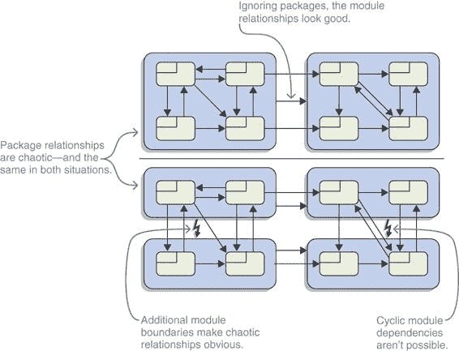
> 
> 图 15.2 这些包之间的关系可以说是有些混乱。只有两个模块（顶部）时，这一点并不明显。只有在尝试创建更多模块（底部）时，问题才会变得明显。额外的模块边界提供了这个洞见。
> 
> 尽管如此，作为一个一般性的规则，还是倾向于选择较小的模块而不是较大的模块。一旦一个模块的代码行数达到五位数字，你可能想要考虑将其拆分；当模块的代码行数达到六位数字时，我建议你认真考虑这一点。如果达到七位数字，你很可能会面临一些重大的重构工作。（如果你在解决类之间的循环依赖关系方面遇到困难，可以查看第 10.2.5 节，那里介绍了使用服务来解决这个问题。）
> 
> > **重要信息** 就这样说了，不要相信那些没有查看你的项目就告诉你模块正确大小的人。对于“模块应该有多小或多大？”这个问题，唯一的有效答案是，“这取决于。”每个模块都应该是针对特定问题的完整解决方案。如果这个问题恰好有一个大的解决方案，那也没关系——不要开始拆分本应属于一起的东西。
> > 
> 什么属于一起？当你将一个完整的模块拆分成两部分时，你很可能会在两部分之间得到一个非常大的 API 表面——这把我们带到了下一个需要讨论的方面。
> 
> **保持 API 表面小**
> 
> > **重要信息** 模块的优势在于它们可以将其内部内容保留给自己。这允许在模块内部进行更轻松的重构，并更谨慎地演进其公共 API。考虑到这些好处，通常更倾向于使用较少的普通`exports`指令。对于有资格的导出也是同样的道理——越少越好。
> > 
> 普通导出和有资格导出如何比较？在一个项目中，两者之间并没有太大的区别。当涉及到将两个模块纠缠在一起时，导出是否有资格实际上并不重要。话虽如此，一个资格至少表明一个 API 可能不是为通用用途设计的，这是一个有用的信息，尤其是在较大的项目中。
> 
> 与应用程序不同，库和框架总是需要考虑它们的导出如何影响依赖于它们的工程。在这种情况下，同一项目内其他模块的合格导出与没有导出是一样的，这绝对是一个胜利。总的来说，合格导出仍然对 API 表面有贡献：几乎与项目内部的常规导出一样多，但在项目边界之外则少得多。
> 
> **尽量减少耦合**
> 
> 随机选择两段代码——无论是方法、类还是模块都无关紧要。在其他条件相同的情况下，依赖项更少的代码更容易维护。原因很简单：依赖项越多，越有可能出现破坏它的变化。
> 
> 虽然这超出了普通依赖的范围：它更普遍地是一个耦合问题。如果一个模块不仅依赖于另一个，而且积极地使用它导出的所有十二个包，那么这两个模块的耦合就更加紧密。如果合格导出是混合的一部分，这更是如此，因为它们本质上是在说，“这不是一个支持良好的 API，但我仍然会让你使用它。”
> 
> > **重要信息** 这不仅限于单个模块。要理解一个系统，你不仅需要理解其部分（在这里是模块），还需要理解它们之间的连接（在这里是依赖和耦合）。如果不小心，系统可能比部分有更多的连接（大约是模块数量的平方；参见图 15.3）。因此，松散耦合的部分是保持系统尽可能简单的一个关键因素。
> > 
> 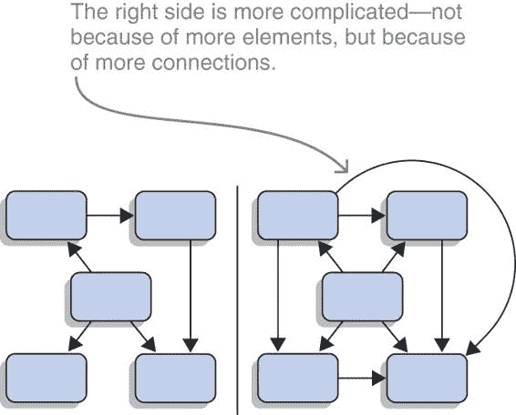
> 
> 图 15.3 即使两个图具有相同数量的节点，它们的复杂度差异很大。左边的图大约有与节点数量相等的边，而右边的图大约每对节点有一条边。如果添加一个新节点，左边的图将增加一个或可能两个新边，而右边的图将增加大约六个。
> 
> 一种解耦模块的好方法是使用服务，如第十章所述。它们不仅打破了模块之间的直接依赖，而且要求你有一个单一的类型，通过它可以访问整个 API。如果你不把这个类型变成连接到数十个其他类型的 kraken，这将大大减少模块之间的耦合。
> 
> > **重要信息** 一个警告：服务很整洁，但它们比普通依赖更难以预测。你无法轻易地看到两段代码是如何连接的，当提供者缺失时，你也不会收到错误。所以不要过度使用服务。
> > 
> 这应该是一个试金石：你能创建一个具有合理小 API 的服务类型吗？它看起来可能被每个模块的多个模块使用或提供吗？
> 
> 如果你不确定，可以查看一下 JDK。官方文档列出了模块使用或提供的服务，你可以使用你的 IDE 查看用户和实现代码。
> 
> **倾听你的模块声明**
> 
> > **基本信息** 我们刚刚讨论过，模块应该是小的，应该有更小的 API 表面，并且应该与周围环境松散耦合。最终，这些建议可以归结为一个看似简单的公式：保持内聚度高，耦合度低。关注模块大小、`exports`数量、`requires`数量以及每个依赖项的强度可以帮助你做到这一点。
> > 
> > **注意** 就像任何一组目标数字一样，这些数字可以随意操作而不取得任何成果。比一些数字更重要的是一个经过深思熟虑的整体架构。尽管这本书为你提供了很多工具，甚至提供了一些实现该架构的技巧，但它并没有从基础开始教你。
> > 
> 还要注意，这三个信号（大小、表面和内聚）通常会相互对立。作为一个极端的例子，考虑一个只包含一个模块的应用程序。它很可能没有 API；并且只有一个工件，耦合度不高。在另一个极端，每个包都在自己的模块中的代码库充满了小型模块，这些模块具有小的 API 表面。当然，这些极端是荒谬的，但它们说明了问题：这是一个平衡行为。
> 
> > **基本信息** 总结来说，这些信号只是，嗯，信号——你和你团队将始终需要根据它们提供的信息应用自己的良好判断。但你的模块声明可以帮助你做到这一点。如果它们变得复杂并且需要不断进行大量更改，它们正在试图告诉你一些事情。倾听它们。
> > 
> 15.2.3 **注意模块声明**
> 
> 如果你正在构建一个模块化项目，模块声明可能是你代码库中最重要的一些`.java`文件。每个都代表一个完整的 JAR 文件，它可能包含数十、数百甚至可能成千上万的源文件。除了仅仅代表它们之外，模块声明还规定了模块如何与其他模块交互。
> 
> 因此，你应该好好照顾你的模块声明！以下是一些需要注意的事项：

+   保持声明整洁。

+   注释声明。

+   审查声明。

> 让我们逐一来看。
> 
> **整洁的模块声明**
> 
> 模块声明是代码，应该像对待代码一样处理，所以请确保你的代码风格得到应用。一致的缩进、行长度、括号位置等等——这些规则对于声明来说和任何其他源文件一样有意义。
> 
> 此外，我强烈建议你结构化你的模块声明，而不是将指令随机排序。JDK 以及本书中的所有声明都有以下顺序：

1.  `requires`，包括`static`和`transitive`

1.  `exports`

1.  `exports to`

1.  `opens`

1.  `opens to`

1.  `uses`

1.  `provides`

> JDK 总是在块之间留一个空行以保持它们分开——我只在有几个指令以上时才这样做。
> 
> 进一步来说，你可以定义如何在同一块中排序指令。字典序是一个明显的选择，尽管对于 `requires`，我首先列出内部依赖，然后是外部依赖。
> 
> > **注意** 无论你如何决定，如果你有一个定义你的代码风格的文档，记录在那里。如果你有你的 IDE、构建工具或代码分析器为你检查这些事情，那就更好了。尽量让它跟上进度，以便它可以自动检查或应用你选择的风格。
> > 
> **注释模块声明**
> 
> 关于代码文档的意见，如 Javadoc 或内联注释，差异很大，这不是我提出为什么它很重要的地方。但无论你团队对注释的看法如何，都要将其扩展到模块声明中。
> 
> 如果你喜欢每个抽象都有一个句子或一小段解释其意义和重要性的想法，考虑为每个模块添加 Javadoc 注释：
> 
> `/** * 将服务可用性数据点聚合到统计信息中。 */ module monitor.statistics { // ... }`
> 
> JDK 在每个模块上都有一个这样的注释或更长的注释。
> 
> 即使你不喜欢记录模块的功能，大多数人都会同意记录为什么做出特定决策是有价值的。在模块声明中，这可能意味着添加一个内联注释

+   对于可选依赖，解释为什么模块可能不存在

+   对于合格的导出，为了解释为什么它不是公共 API，但仍然使特定模块可以访问

+   对于公开包，解释哪些框架计划访问它

> 在 JDK 中，你偶尔会在 jdk.naming.rmi 中找到这样的注释：
> 
> `// 在 NamingManager.getURLContext 使用 services exports com.sun.jndi.url.rmi 到 java.naming 之前临时导出；`
> 
> 一般而言，我的建议是：每次你做出一个不是立即明显的决策时，添加一个注释。每次审阅者询问为什么做出某些更改时，添加一个注释。这样做可以帮助你的同事——或者两个月后的你自己。
> 
> > **必要信息** 模块声明提供了一个新的机会。以前从未如此容易地在代码中正确地记录项目工件之间的关系。
> > 
> **审查模块声明**
> 
> 模块声明是您模块结构的中心表示，检查它们应该是任何类型代码审查的组成部分。无论是提交前的更改审查、打开拉取请求前的审查、结对编程会话后的总结，还是在正式代码审查期间——任何检查代码的时候，都要特别注意 `module-info.java`：

+   真的有必要添加额外的依赖吗？它们是否与项目的底层架构相一致？是否应该使用 `requires transitive` 来暴露它们，因为它们的类型被用在模块的 API 中？

+   如果一个依赖项是可选的，代码是否准备好在运行时处理其缺失？是否存在连锁反应，比如缺失的传递依赖项，而可选依赖项暗示了可读性？

+   一个新的依赖项能否被一个服务取代？

+   添加的导出是否真的有必要？新导出的包中的所有公共类都准备好公开使用了吗，或者它们需要重新排列以减少 API 表面积？

+   如果导出是合格的，这有意义吗，或者这只是为了获取一个从未打算公开的 API 而找的借口？

+   使用的类型是否设计为应用程序基础设施的组成部分？

+   是否有任何更改可能对构建过程之外的下游消费者产生负面影响？（有关更多信息，请参阅 15.2.4 节。）

+   模块声明是否按照团队的要求进行了样式化和注释？

> 仔细审查尤其重要，因为 IDE 提供快速修复功能，允许开发者通过导出包或通过简单命令添加依赖项来远程编辑声明。我欣赏这些功能，但它们使粗心编辑的可能性更大；因此，确保没有东西被忽视就变得尤为重要。
> 
> > **注意** 如果您有一个代码审查指南、提交检查清单或任何其他有助于保持代码质量的文档，您可能希望添加关于模块声明的一项。
> > 
> 在审查模块描述符上投入时间可能听起来像是一项额外的繁重工作。首先，我会争论这算不算多，尤其是与投入开发和其他代码库审查的努力相比。更重要的是，我不认为这是一项额外的工作——相反，我认为这是一个机会。
> 
> > **重要信息** 从前从未如此容易分析和审查您项目的结构。而且不是几年前拍照上传到团队维基的白板草图；不，我指的是真正的交易，您工件之间的实际关系。模块声明向您展示了赤裸的现实，而不是过时的良好意图。
> > 
> 15.2.4 通过编辑模块声明破坏代码
> 
> 与任何其他源文件一样，更改模块声明可能会对其他代码产生意外和可能破坏性的影响。然而，更重要的是，声明是您模块公共 API 的提炼，因此其影响远大于任何随机类。
> 
> 如果您开发的应用程序以及您模块的所有消费者都是同一构建过程的一部分，那么破坏性更改就不会被忽视。即使是框架和库，这样的更改也可以通过彻底的集成测试来检测。
> 
> > **重要信息** 仍然，了解哪些更改更有可能引起问题，哪些通常是良性的，是有帮助的。以下是一个按问题严重程度排序的列表：

1.  新模块名称

1.  导出包更少

1.  提供的服务不同

1.  编辑依赖项

> 正如你所看到的，所有这些更改都可能导致下游项目中出现编译错误或意外的运行时行为。因此，它们应该始终被视为破坏性更改，所以如果你使用语义版本控制，就需要进行主要版本号的提升。这并不意味着在模块声明中做出其他更改不会引起问题，但它们发生的可能性要小得多；所以，让我们专注于这四个。
> 
> 新模块名称的影响
> 
> 改变模块的名称将立即破坏所有依赖于它的模块——它们需要更新和重建。但这只是它可能引起的问题中最小的一个。
> 
> 更危险的是，当某些项目在旧名称和新名称下两次 transitively 依赖于你的模块时，它可能创建的模块钻石死亡（见第 3.2.2 节）。该项目将很难将其新版本包含在其构建中，并且可能不得不因为名称更改而放弃更新。
> 
> 注意这一点，并尽量减少重命名。你仍然可能偶尔需要这样做，在这种情况下，你可以尝试通过创建一个具有旧名称的聚合模块来减轻影响（第 11.1.5 节中解释）。
> 
> 导出更少包的影响
> 
> 应该很明显，“取消导出”包会导致问题的原因：任何使用这些包中的类型的模块在编译时和运行时都无法访问它们。如果你想走这条路，你应该首先废弃那些包和类型，给用户时间从它们迁移开，在它们被移除之前。
> 
> 这只完全适用于普通的 `exports` 指令：

+   合格的导出通常只导出到你控制的模块，这些模块很可能是你的构建的一部分，因此会同时更新。

+   开放式包通常针对特定的框架或代码片段，旨在反映它们。这段代码很少是用户模块的一部分，所以关闭包不会影响他们。

> 通常来说，我不会认为删除合格的导出或打开的包是破坏性更改。尽管如此，具体场景可能违反这一经验法则，所以要注意它们，并在做出此类更改时仔细思考。
> 
> 添加和删除服务的影响
> 
> 对于服务来说，情况要复杂一些。如第 10.3.1 节所述，服务消费者应该始终准备好处理服务提供者不存在的情况；同样，当突然返回额外的提供者时，它们也不应该崩溃。但这只真正涵盖了应用程序不应该因为服务加载器返回了错误数量的提供者而崩溃。
> 
> 仍然有可能，甚至可能很可能会出现应用程序行为不当，因为服务在一个版本中存在，而在另一个版本中不存在。而且因为服务绑定发生在所有模块之间，这甚至可能影响到不直接依赖于你的代码。
> 
> 编辑依赖项的影响
> 
> 列表中的最后一点，所有形式的依赖项，也是一个灰色地带。让我们从`requires transitive`开始。第 11.1.4 节解释说，如果用户在您的模块的直接附近使用依赖项，他们应该只依赖您让他们阅读的依赖项。假设您停止公开依赖项的类型，并且您的用户更新了他们的代码，从`exports`指令中移除`transitive`不应该对他们产生影响。
> 
> 另一方面，他们可能不知道或忽视这个建议，因此防止他们阅读那个依赖项仍然需要他们更新和重新构建他们的代码。因此，我仍然认为这是一个破坏性的变更。
> 
> 还有可能出现这样的场景，即使移除或添加其他依赖项也可能导致问题，尽管从您的模块外部观察不到这些问题：

+   添加或移除普通的`requires`指令会改变可选依赖项解析和服务绑定。

+   将依赖项设置为可选（或相反）也可能改变哪些模块进入模块图。

> 因此，尽管`requires`和`requires static`可以改变模块图并因此影响与您完全不相关的模块，但这不是一个常见的情况。默认情况下，我不会认为这样的更改是破坏性的。
> 
> > 注意：尽管所有这些都可能听起来很糟糕且复杂，但它并不比您编辑属于公共 API 的类更复杂。您只是还没有对模块声明更改如何影响其他项目的直觉。这将在一段时间后到来。
> > 
> 15.3 技术景观
> 
> 在我在第 1.4 节首次介绍模块系统后，我认为您可能对它如何与生态系统中的其他部分相关有一些疑问。如您所回忆的，它们是这样的：

+   Maven、Gradle 和其他工具不是已经管理依赖项了吗？

+   那么，关于 OSGi 呢？为什么不直接使用它呢？

+   在每个人都编写微服务的时候，模块系统不是过度了吗？

> 我将在一分钟内回答这些问题，但首先我想向您介绍 Java 9+提供的模块系统之外的优点。毕竟，这些好处是一个套餐，如果您对其中一个持怀疑态度，也许其他的好处可以影响您。
> 
> 15.3.1 MAVEN、GRADLE 和其他构建工具
> 
> Java 生态系统幸运地拥有几个强大、经过实战考验的构建工具，如 Maven 和 Gradle。当然，它们并不完美，但它们已经构建 Java 项目超过 10 年了，所以它们显然有一些优势。
> 
> 正如其名所示，构建工具的主要任务是构建项目，这包括编译、测试、打包和分发。尽管模块系统涉及许多这些步骤并要求对工具进行一些更改，但它并没有为平台添加任何使其在这个领域与它们竞争的功能。因此，当涉及到构建项目时，Java 平台与其构建工具之间的关系仍然保持不变。
> 
> > Java 9+上的构建工具
> > 
> > 我不能代表所有构建工具，但 Maven 和 Gradle 已经更新以正确地与 Java 9+ 和模块系统协同工作。这些更改主要是内部的，创建模块 JAR 而不是普通 JAR 只需要在您的源文件夹中添加一个 `module-info.java` 文件。它们从那里开始，大部分只是做正确的事情。
> > 
> > 关于您选择的构建工具如何与模块系统或其他新 Java 功能（如多版本 JAR——见附录 E）交互的详细信息，请查看其文档。我想明确提到的是，在迁移到 Java 9+ 时，你可能需要添加一些命令行选项，所以你可能想复习一下如何做。
> > 
> 如果你想了解更多关于 Gradle 的信息，可以查看 Manning 的非常实用的《Gradle in Action》（Benjamin Muschko，2014，[www.manning.com/books/gradle-in-action](http://www.manning.com/books/gradle-in-action)）。不幸的是，我没有推荐任何一本我至少翻阅过的 Maven 书籍。
> 
> 依赖项管理
> 
> 构建系统通常执行另一个任务，现在 Java 9+ 也执行这个任务：依赖项管理。正如第 3.2 节所讨论的，可靠的配置旨在确保依赖项存在且无歧义，从而使应用程序更加稳定——Maven 或 Gradle 会为您做同样的事情。这意味着模块系统取代了构建工具吗？或者，这些功能来得太晚了，变得无用？表面上，模块系统似乎重复了构建工具的功能；但当你仔细观察时，你会发现重叠很小。
> 
> 首先，模块系统没有方法来唯一标识或定位工件。最值得注意的是，它没有版本的概念，这意味着给定几个相同工件的几个不同版本，它无法选择正确的版本。这种情况将导致错误，正是因为它是模糊的。
> 
> 尽管许多项目会选择一个可能独特的模块名称（比如反转与项目关联的域名），但没有像 Maven Central 这样的实例来确保这一点，这使得模块名称不足以唯一地标识一个依赖项。说到像 Maven Central 这样的远程仓库，模块系统没有连接到它们的任何能力。因此，尽管模块系统和构建工具都管理依赖项，但前者在过于抽象的层面上执行，无法取代后者。
> 
> 构建系统确实存在一个相当大的缺点：它们确保在编译期间存在依赖项，甚至可以将它们送到你的门口，但它们并不管理应用程序的启动。如果工具不知道间接需要的依赖项（由于使用了 Maven 的 `provided` 或 Gradle 的 `compileOnly`），或者库在构建到启动的过程中丢失，你只能在运行时发现，很可能是通过应用程序崩溃。另一方面，模块系统不仅管理编译时的直接和传递依赖项，还管理运行时的依赖项，确保所有阶段的可靠配置。它还更有能力检测诸如重复的工件或包含相同类型的工件之类的歧义。因此，即使你聚焦于依赖项管理，这两种技术也是不同的；唯一的交集是它们都以某种形式列出依赖项。
> 
> 封装、服务和链接
> 
> 离开依赖项管理，我们很快就会找到构建工具无法竞争的模块系统功能。最值得注意的是强大的封装（见第 3.3 节），它使库能够在编译时和运行时隐藏实现细节，这是 Maven 或 Gradle 甚至无法梦想承诺的。这种严格性需要一段时间才能习惯，但从长远来看，JDK、框架、库甚至大型应用程序都将从明确区分受支持和内部 API 以及确保后者不会意外依赖中受益。在我看来，强大的封装本身就值得迁移到模块系统。
> 
> 在查看更高级的功能时，有两个特别有趣的功能脱颖而出，它们超出了构建工具的范围。首先，模块系统可以作为服务定位模式中的服务注册表运行，允许你解耦工件，并实现易于使用插件的程序（见第十章）。其次是能够将所需的模块链接到一个自包含的运行时映像中，这为你提供了使部署更精简和更容易的机会（见第十四章）。
> 
> 总结来说，除了在依赖项管理方面有微小重叠外，构建工具和模块系统并不竞争，而应该被视为互补。图 15.4 展示了这种关系。
> 
> 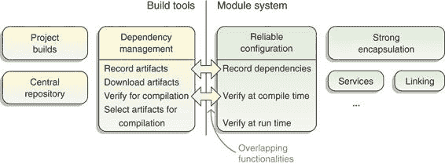
> 
> 图 15.4 建筑工具（左）和模块系统（右）具有非常不同的功能集。唯一的相似之处是它们都记录依赖项（构建工具通过全局唯一标识符加上版本；JPMS 只通过模块名称）并且可以验证它们以进行编译。它们对依赖项的处理非常不同，除此之外，它们几乎没有任何共同之处。
> 
> 15.3.2 OSGI
> 
> 开放服务网关倡议（OSGi）是既指一个组织（OSGi 联盟）又指它创建的规范。它也被不精确地应用于该规范的各个实现，这就是我在本节中使用的用法。
> 
> OSGi 是建立在 Java 虚拟机之上的模块系统和平台，它与 JPMS 共享部分功能集。如果你对 OSGi 知之甚少或者一直在使用它，你可能想知道它与 Java 的新模块系统如何比较，也许还会想知道它是否被取代了。但你可能也会想知道为什么后者甚至被开发出来——Java 为什么不能直接使用 OSGi？
> 
> > 注意：如果你只是听说 OSGi 而不是真正了解它，本节可能有点难懂——这不是问题，因为这不是必读内容。如果你仍然想跟上来，首先想象一下 OSGi 类似于模块系统。本节的其余部分将阐明一些重要差异。
> > 
> 我不是 OSGi 专家，但在我的研究过程中，我翻阅了《OSGi 深入解析》（Alexandre de Castro Alves，2011，[www.manning.com/books/osgi-in-depth](http://www.manning.com/books/osgi-in-depth)），并且很喜欢它。如果你需要比 Java 平台模块系统提供的内容更多，可以考虑转向它。
> 
> 为什么 JDK 不使用 OSGi？
> 
> 为什么 JDK 不使用 OSGi？对这个问题的技术答案归结于 OSGi 实现其功能集的方式。它严重依赖于类加载器，这在 1.2 和 1.3.4 节中进行了简要讨论，而 OSGi 为其创建了自身的实现。它为每个包（在 OSGi 中模块被称为包）使用一个类加载器，并且以这种方式控制，例如，一个包可以看到哪些类（以实现封装）或者当包被卸载时会发生什么（OSGi 允许的——稍后会有更多介绍）。
> 
> 可能看似技术细节的事情有着深远的影响。在 JPMS 之前，Java 对类加载器的使用没有限制，并且通过反射 API 按名称访问类是常见的做法。
> 
> 如果 JPMS 需要特定的类加载器架构，Java 9+ 将会极大地破坏 JDK、许多现有的库和框架以及关键的应用代码。Java 9+ 仍然存在迁移挑战，但如果不兼容地更改类加载器 API 将会更具破坏性，并且不仅会取代这些挑战，还会在它们之上。因此，JPMS 在类加载器之下运行，如图 15.5 所示 figure 15.5。
> 
> 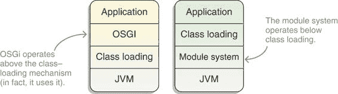
> 
> 图 15.5 OSGi（左侧）建立在 JVM 之上，这迫使其使用现有功能，主要是类加载基础设施，以实现其功能集。另一方面，模块系统（右侧）是在 JVM 内部实现的，并且运行在类加载之下，保持其上构建的系统按原样工作。
> 
> 使用类加载器进行模块隔离的另一个后果是，尽管 OSGi 使用它们来减少类的可见性，但它们不能减少可访问性。我这是什么意思呢？比如说，一个包含来自未导出包的`Feature`类型的库包。那么 OSGi 确保另一个包中的代码不能“看到”`Feature`，也就是说，例如，`Class.forName("org.lib.Feature")`将抛出`ClassNotFoundException`。(`Feature`是不可见的。)
> 
> 但现在假设 lib 有一个返回`Feature`类型的`Object`的 API，在这种情况下，app 可以获取该类的实例。然后 app 可以调用`featureObject.getClass().newInstance()`并创建一个新的`Feature`实例。(`Feature`是可访问的。)
> 
> 如第 3.3 节所述，JPMS 想要确保强封装，而 OSGi 提供的并不足够强大。如果你创建了一个类似早先的情况，有两个 JPMS 模块 app 和 lib 以及 lib 包含但未导出的类型`Feature`，app 可以成功通过`Class.forName("org.lib.Feature")`获取类实例（它是可见的），但不能调用其上的`newInstance()`（它不可访问）。表 15.1 并列了 OSGi 和 JPMS 的差异。
> 
> 表 15.1 OSGI 的可见性和 JPMS 的可访问性限制

|    | OSGi   | JPMS   |
| --- | --- | --- |
| 限制可见性（`Class::forName`失败）   | ✔   | ✘   |
| 限制可访问性（`Class::newInstance`失败）   | ✘   | ✔   |

> JPMS 能否取代 OSGi？
> 
> JPMS 能否取代 OSGi？不能。
> 
> JPMS 主要是为了模块化 JDK 而开发的。它涵盖了所有模块化的基本要素——其中一些，比如封装，可能比 OSGi 做得更好——但 OSGi 有很多 JPMS 不需要且没有的特性。
> 
> 以几个为例，在 OSGi 中，由于其类加载器策略，你可以在几个包中拥有相同的完全限定类型。这也使得同时运行同一包的不同版本成为可能。在这方面，OSGi 的导出和导入可以是版本化的，允许包表达它们的版本以及它们的依赖应该是什么版本。如果需要同一包的两个不同版本，OSGi 可以使这成为可能。
> 
> 另一个有趣的不同之处在于，在 OSGi 中，一个包通常表达对包的依赖，而不是对包的依赖。尽管两者都是可能的，但前者是默认的。这使得依赖性在替换或重构包时更加稳健，因为包的来源并不重要。（另一方面，在 JPMS 中，一个包必须位于所需的模块之一，所以将包移动到另一个模块或用具有相同 API 的另一个模块交换将导致问题。）
> 
> OSGi 的一大特性集围绕着动态行为，其作为物联网服务网关的根源明显，通过类加载器实现的功能也非常强大。OSGi 允许包在运行时出现、消失，甚至更新，提供了一个 API，让依赖项相应地做出反应。这对于跨多台设备运行的应用程序来说非常好，也可以为希望将停机时间减少到最低限度的单服务器系统提供便利。
> 
> 核心问题是，如果你的项目已经使用 OSGi，那么你很可能依赖于 JPMS 没有的特性。在这种情况下，没有必要切换到 Java 的本地模块系统。
> 
> OSGi 取代了 JPMS 吗？
> 
> OSGi 取代了 JPMS 吗？不。
> 
> 尽管我刚才提出的听起来 OSGi 在所有用例上都优于 JPMS，但 OSGi 从未得到广泛采用。它已经占据了一个细分市场，并在其中取得了成功，但它从未成为默认技术（与 IDE、构建工具和日志记录等相比，仅举几个例子）。
> 
> 那种缺乏广泛采用的主要原因在于复杂性。无论是感知到的还是真实的，无论是模块化固有的还是 OSGi 偶然的，这都次要于大多数开发者将 OSGi 的复杂性视为不默认使用它的理由这一事实。
> 
> JPMS 处于不同的位置。首先，其减少的特性集（尤其是没有版本支持，以及依赖于模块而不是包）使其更简单。此外，它得益于内置在 JDK 中。所有 Java 开发者都程度不同地接触到了 JPMS，尤其是更资深的一些开发者会探索它如何帮助他们的项目。这种更频繁的使用也将促进良好的工具集成。
> 
> 因此，如果一个团队已经拥有技能和工具，并且已经在 JPMS 上运行，为什么不彻底模块化整个应用程序呢？这一步骤建立在现有知识的基础上，增加了更少的复杂性，不需要新的工具，同时带来很多好处。
> 
> 最后，即使是 OSGi 也能从 JPMS 中获益，因为 Java 9+将模块化提升到与 Java 8 将函数式编程提升到相同的地位。这两个版本都在向主流 Java 开发者展示新思想，并教会他们一套全新的技能。在某个时刻，当项目有望从函数式编程或更强大的模块化中获益时，其开发者将足够爬上学习曲线，以评估并可能使用“真正的”技术。
> 
> JPMS 和 OSGi 兼容吗？
> 
> JPMS 和 OSGi 兼容吗？在某种程度上，是的。使用 OSGi 开发的应用程序可以在 Java 9+上运行，就像在早期版本上一样。（更准确地说，它们将在未命名的模块中运行，第 8.2 节详细解释了这一点。）OSGi 不需要进行迁移工作，但应用程序代码面临与其他代码库相同的挑战。
> 
> 在另一个意义上，结论尚未明朗。OSGi 是否会允许我们将包映射到 JPMS 模块，这仍然是一个悬而未决的问题。目前，OSGi 不使用 JPMS 的任何功能，继续自行实现其功能。是否将 OSGi 适应 JPMS 值得相当大的工程成本，这也不清楚。
> 
> 15.3.3 微服务
> 
> 模块化系统与微服务架构之间的关系有两个非常不同的方面：

+   微服务与模块化系统是否竞争？它们是如何比较的？

+   如果你选择微服务，模块化系统会令你担忧吗？

> 我们将在本节中探讨这两个方面。
> 
> 如果你不太熟悉微服务架构，你可以安全地跳过这一节。如果你想了解更多，市面上有很多优秀的微服务书籍。为了支持我的观点，我浏览了 Manning 的《Microservices in Action》一书，并推荐它（Morgan Bruce 和 Paulo A. Pereira，2018 年，[www.manning.com/books/microservices-in-action](http://www.manning.com/books/microservices-in-action)）。
> 
> 微服务与 JPMS 的比较
> 
> 通常来说，可以说模块化系统的优势在更大的项目中影响更大。所以当大家都在谈论微服务时，大型应用程序的模块化系统不就像是猪身上的口红吗？答案取决于最终有多少项目会被构建成微服务结构，这当然是一个巨大的讨论话题。
> 
> 有些人认为微服务是未来，迟早所有项目都会以这种方式开始——全是微服务！如果你属于这个阵营，你仍然可以在 Java 9+中实现你的服务，模块化系统会对你产生影响，但当然，比它对单体项目的影响小得多。我们将在下一节中讨论这一点。
> 
> 另一些人持更加谨慎的观点。像所有架构风格一样，微服务既有优点也有缺点，必须根据项目需求在这两者之间做出权衡。微服务在需要承受高负载的相对复杂的项目中特别闪耀，其扩展能力几乎无与伦比。
> 
> 虽然这种可扩展性是以操作复杂性为代价的，因为运行众多服务需要比在负载均衡器后面放置相同服务的一小批实例更多的知识和基础设施。另一个缺点是，如果团队对领域的了解越少，服务边界错误的可能性就越大，在微服务中修复这种错误比在单体中更昂贵。
> 
> 关键的观察结果是，对于复杂性（马丁·福勒称之为微服务溢价）的代价必须始终付出，但只有在项目足够大时才能获得收益。这个因素已经说服了许多开发人员和架构师，大多数项目应该从单体开始，并逐渐转向拆分服务，也许最终在需要时结束在微服务中。
> 
> 例如，马丁·福勒（Martin Fowler）引用了他同事的以下观点（在[`martinfowler.com/bliki/MonolithFirst.html`](https://martinfowler.com/bliki/MonolithFirst.html)；强调是我的）：
> 
> > 你不应该一开始就使用微服务来启动一个新项目，即使你确信你的应用程序足够大，足以使其变得值得。 [...] 合理的做法是仔细设计单体架构，注意软件内部的模块化，包括 API 边界和数据存储方式。做好这一点，转向微服务就相对简单了。
> > 
> 到现在为止，强调的短语应该已经熟悉了：仔细设计、模块化、边界——这些都是模块系统所促进的特性（参见第 1.5 节）。在微服务架构中，服务依赖关系应该是清晰的（提示可靠配置）并且理想情况下是解耦的（服务加载器 API）；此外，所有请求都必须通过公共 API（强封装）。如果需要，仔细使用模块系统可以为成功迁移到微服务奠定基础。图 15.6 显示了这种仔细设计的重要性。
> 
> 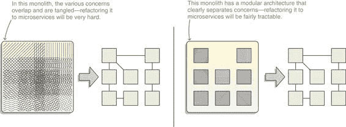
> 
> 图 15.6 假设有两个将单体应用程序迁移到微服务的假设情况，你更愿意从一个大块的泥地（左侧）开始，还是从一个正确模块化的代码库（右侧）开始？
> 
> 尽管模块系统侧重于大型项目，但即使是小型服务也能从采用模块中受益。
> 
> 使用 JPMS 的微服务
> 
> 如果你的项目采用了微服务，并且你正在使用 Java 9+实现其中的一些服务，因为你希望从改进的安全性和性能中受益，你必然会与模块系统交互，因为它是运行你的代码的 JVM 的一部分。一个后果是，第六章和第七章中讨论的潜在破坏性更改仍然适用于相关服务，需要修复。此外，随着时间的推移，你的大部分依赖项很可能会转换为模块，但正如第 8.1.3 节所描述的，这并不强迫你将你的工件打包为模块。
> 
> 如果你决定将所有 JAR 文件放在类路径上，它们之间不会强制执行强封装。因此，在这个 JAR 文件集中，对内部 API 的访问以及反射（例如从框架到你的代码），例如，将继续工作。在这种情况下，你对模块系统的接触仅限于它对 JDK 的影响。
> 
> 你可以采取的另一条路线是使用你的服务和依赖项作为模块，这时你将完全集成到模块系统中。其各种好处中，最相关的一个可能是第 1.5.5 节中简要描述并在第十四章中彻底探讨的可扩展平台，它允许你使用`jlink`。
> 
> 使用`jlink`，你可以创建一个包含恰好支持你的应用程序（包括你的模块）的平台模块的小型运行时映像，这可以减少映像大小高达 80%。此外，当链接所需的模块时，`jlink`可以利用它看到整个应用程序的知识来分析字节码，从而应用更激进的优化，导致映像尺寸更小，性能略有提升。你还可以获得其他好处：例如，确保你只使用依赖项的公共 API。
> 
> 15.4 关于模块化生态系统的思考
> 
> Java 9+是一个巨大的版本。尽管缺乏新的语言特性，但它包含了大量强大的改进和新增功能。但所有这些改进都被 Java 平台模块系统所掩盖。它既是 Java 9+最受期待的功能，也是最具争议的功能，这不仅仅是因为它带来的迁移挑战。
> 
> 尽管在迈向模块化未来的道路上有时会遇到一些波折，但知名库和框架迅速支持了 Java 9+，并且自那时起，这一趋势并没有放缓的迹象。那么，对于较老、支持度较低的项目呢？尽管有些人可能会找到新的维护者，即使只是为了让他们在当前的 Java 版本上工作，但 Java 项目的长尾可能会逐渐减少。
> 
> 这肯定会令一些依赖此类项目的开发者感到不满。这是可以理解的——没有人喜欢在没有明显好处的情况下修改正在工作的代码。同时，一些既得利益者的流失将给其他项目带来机会，让他们吸引他们的用户。而且谁知道呢？他们最终可能会从转换中获得好处。
> 
> 一旦 Java 9+的升级大潮过去，项目开始将基准提升到 Java 9+，你将开始看到越来越多的模块化 JAR 文件公开可用。多亏了模块化系统对增量化和去中心化模块化的支持，这个过程在项目之间需要相对较少的协调。这也给你提供了一个机会，让你现在就可以开始模块化你的项目。
> 
> 目的是什么？与 Java 8 中的 lambda 表达式和流或 Java 10 中的局部变量类型推断等更吸引眼球的特性相比，模块化系统对你的代码库的影响将是微妙的。你不会仅仅通过查看几行代码就对其美感感到满意。你也不会突然发现自己在编码时更有乐趣。
> 
> 不，模块化系统的优势在光谱的另一端。由于可靠的配置，你将能够更早地捕捉到错误。由于对项目架构有更深入的了解，你将避免误操作。你不会那么容易地使代码变得复杂，也不会意外地依赖于依赖项的内部实现。
> 
> JPMS 将会改善软件开发中那些情绪化的部分。模块化系统并非万能良药：你仍然需要付出辛勤的努力来正确设计和安排你的工件；但有了模块化系统在手，这个过程将会有更少的陷阱和更多的捷径。
> 
> 随着生态系统中的工件越来越多地采用模块化，这种效果将会越来越明显，直到有一天我们会问自己，没有模块化系统我们是如何编码的？在 JVM 将我们精心设计的依赖图变成一团糟的那个时代，那会是什么样子？
> 
> 回想起来会感觉有些奇怪。就像写一个没有 `private` 的 Java 类一样奇怪。你能想象那会是什么样子吗？
> 
> 摘要

+   仔细设计你的模块化系统。

+   微服务与 JPMS 相互补充。

+   OSGi 和 JPMS 也相互补充。

> 现在——非常感谢您阅读这本书。为您写作是一种乐趣。我相信我们还会再见面的！
