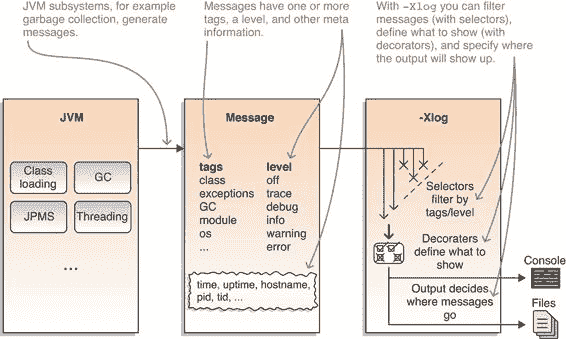

> 附录 C
> 
> 使用统一日志记录观察 JVM
> 
> Java 9 引入了一种统一的日志架构。它通过单一机制将 JVM 生成的消息传递，并允许您通过复杂的命令行选项 `-Xlog` 选择显示哪些消息。
> 
> 您可以使用它来观察 JVM 的行为，如果应用程序表现不佳则调试应用程序，或寻找可能的性能改进。正如您从自己的项目中了解的那样，日志记录有广泛而模糊的应用领域，因此我不会用一个单一用例来解释它，而是将整体机制作为研究对象。
> 
> 使用 `-Xlog` 可能一开始会有些令人畏惧，但我们将一步一步地检查它，探索选项的每个方面。在这里，我们将查看机制的一般情况——第 5.3.6 节展示了如何使用它来调试模块化应用程序。
> 
> > 注意：此机制在 JVM 内部是通用的，并且除了监控模块系统之外还有许多其他应用。类加载、垃圾回收、与操作系统的交互、线程——您可以通过使用正确的标志来分析所有这些以及更多内容。请注意，这既不包括 JDK 消息，例如 Swing 记录的消息，也不包括您应用程序的消息——这完全是关于 JVM 本身。
> > 
> 什么是统一日志？
> 
> JVM 内部的统一日志基础设施类似于您可能用于应用程序的其他日志框架，如 Java Util Logging、Log4j 和 Logback。它生成文本消息，附加一些元信息，如标签（描述来源子系统）、日志级别（描述消息的重要性）和时间戳，并将它们打印到某个地方。您可以根据需要配置日志输出。
> 
> > 定义：-Xlog
> > 
> > `java` 选项 `-Xlog` 激活日志记录。这是关于此机制的唯一标志——任何进一步的配置都将立即附加到该选项。可配置的日志记录方面如下：

+   记录哪些消息（通过标签和/或通过日志级别）

+   包含哪些信息（例如，时间戳和进程 ID）

+   使用哪种输出（例如，写入文件）

> > 本附录的其余部分将逐一查看它们。
> > 
> 在做任何事情之前，让我们先看看 `-Xlog` 产生的消息类型，如图 C.1 所示。图 C.1。执行 `java –Xlog` 并查看输出——有很多输出。（你没有给出足够的 `java` 详细信息来启动应用程序，所以它很有帮助地列出了所有选项。为了摆脱这堵文本墙，我使用 `-version` 运行它，它输出了当前的 Java 版本。）
> 
> 
> 
> 图 C.1 许多 JVM 子系统（左侧）生成消息（中间），`-Xlog` 选项可用于配置要显示哪些消息、它们包含哪些信息以及它们出现在哪里（右侧）。
> 
> 第一条消息告诉您 HotSpot 虚拟机开始工作：
> 
> `$ java -Xlog -version  # 截断了一些消息 > [0.002s][info][os ] HotSpot 正在运行 glibc 2.23, NPTL 2.23 # 截断了很多消息`
> 
> 它显示了 JVM 运行的时间（2 毫秒），消息的日志级别（`info`），其标签（只有`os`），以及实际的消息。让我们看看如何影响这些细节。
> 
> 定义应该显示哪些消息
> 
> 您可以使用日志级别和标签来精确定义日志应该显示的内容，通过定义`<tag-set>=<level>`的配对，这些被称为选择器。所有标签都可以使用`all`来选择，级别是可选的，默认为`info`。以下是使用方法：
> 
> `$ java -Xlog:all=warning -version  # 没有日志消息；太好了，没有警告！`
> 
> 让我们尝试另一个标签和级别：
> 
> `$ java -Xlog:logging=debug -version  > [0.034s][info][logging] 日志配置完全初始化。 > [0.034s][debug][logging] 可用日志级别：off, trace, debug, info, warning, error > [0.034s][debug][logging] 可用日志装饰器：[...] > [0.034s][debug][logging] 可用日志标签：[...] > [0.034s][debug][logging] 描述的标签组合： > [0.034s][debug][logging] logging: 日志框架本身的日志 > [0.034s][debug][logging] 日志输出配置： > [0.034s][debug][logging] #0: stdout [...] > [0.034s][debug][logging] #A: stderr [...]]`
> 
> 幸运的尝试！我不得不截断输出，因为输出太多了，但请相信我，这些消息中有很多有用的信息。尽管如此，您不必走这条路：`-Xlog:help`显示相同的信息，但格式更美观（您稍后会看到）。
> 
> 一个令人惊讶的细节（至少最初是这样）是，消息只有在它们的标签与给定的标签完全匹配时才会匹配选择器。给定的标签？复数？是的，选择器可以通过使用`+`连接来命名多个标签。尽管如此，消息必须包含这些标签才能被选中。
> 
> 因此，使用`gc`（垃圾回收）与`gc+heap`等，例如，应该选择不同的消息。这确实是情况：
> 
> `java -Xlog:gc -version  [0.009s][info][gc] 使用 G1  java -Xlog:gc+heap -version  [0.006s][info][gc,heap] 堆区域大小：1M`
> 
> 您可以一次定义多个选择器——只需用逗号分隔即可：
> 
> `java -Xlog:gc,gc+heap -version  [0.007s][info][gc,heap] 堆区域大小：1M [0.009s][info][gc ] 使用 G1`
> 
> 使用这种策略，获取包含特定标志的所有消息会很麻烦。幸运的是，有一个更简单的方法来做这件事：通配符`*`，您可以使用单个标签来定义一个选择器，以匹配包含该标签的所有消息：
> 
> `java -Xlog:gc*=debug -version  [0.006s][info][gc,heap] 堆区域大小：1M [0.006s][debug][gc,heap] 最小堆 8388608 初始堆 262144000 最大堆 4192206848 # 截断大约二十条消息 [0.072s][info ][gc,heap,exit ] 堆 # 截断了一些显示最终 GC 统计信息的消息`
> 
> 使用日志和选择器，了解 JVM 的子系统有三个简单的步骤：

1.  在`java -Xlog:help`的输出中查找有趣的标签。

1.  使用`-Xlog:${tag_1}*,${tag_2}*,${tag_n}*`与它们一起显示所有标记了其中任何标签的信息消息。

1.  使用`-Xlog:${tag}*=debug`选择性切换到较低的日志级别。

> 这样就确定了你会看到哪些消息。现在让我们看看它们可能去哪里。
> 
> 定义消息应该去哪里
> 
> 与非平凡选择器相比，输出配置很简单。你将其放在选择器之后（由冒号分隔），并且有三个可能的值：

+   `stdout`—默认输出。在控制台上，那是终端窗口，除非已重定向。在 IDE 中，它通常在它自己的选项卡或视图中显示。

+   `stderr`—默认错误输出。在控制台上，那是终端窗口，除非已重定向。在 IDE 中，它通常与`stdout`在同一选项卡/视图中显示，但以红色打印。

+   `file=<filename>`—定义一个文件将所有消息导入其中。包括`file=`是可选的。

> 与常见的日志框架不同，不幸的是，无法同时使用两个输出选项。
> 
> 下面是如何将所有`debug`消息放入`application.log`文件中的方法：
> 
> `java -Xlog:all=debug:file=application.log -version`
> 
> 有更多输出选项可供选择，允许根据文件大小和要旋转的文件数量进行日志文件轮转。
> 
> 定义消息应该说什么
> 
> 如我之前所说，每条消息都包含文本和元信息。JVM 将打印哪些额外的信息可以通过选择装饰器来配置，这些装饰器列在表 C.1 中。这发生在输出位置和另一个冒号之后。
> 
> 假设你想要将时间戳、JVM 启动以来的毫秒数和垃圾收集调试消息的线程 ID 打印到控制台。下面是如何做到这一点的方法：
> 
> `java -Xlog:gc*=debug:stdout:time,uptimemillis,tid -version` # 截断的消息 [2017-02-01T13:10:59.689+0100][7ms][18607] 堆区域大小：1M
> 
> 表 C.1 `-Xlog`选项可用的装饰器。信息始终按此顺序打印。描述基于文档。

| 选项   | 描述   |
| --- | --- |
| `level`   | 与日志消息关联的级别   |
| `pid`   | 进程标识符   |
| `tags`   | 与日志消息关联的标签集   |
| `tid`   | 线程标识符   |
| `time`   | 当前时间和日期，ISO-8601 格式   |
| `timemillis`   | 与`System.currentTimeMillis()`生成的相同值   |
| `timenanos`   | 与`System.nanoTime()`生成的相同值   |
| `uptime`   | JVM 启动以来的秒数（例如，6.567s）   |
| `uptimemillis`   | JVM 启动以来的毫秒数   |
| `uptimenanos`   | JVM 启动以来的纳秒数   |

> 配置整个日志管道
> 
> 形式上，`-Xlog`选项具有以下语法：
> 
> `-Xlog:<selectors>:<output>:<decorators>:<output-options>`
> 
> `-Xlog`后面的每个参数都是可选的，但如果你使用了一个，你必须使用它之前的所有其他参数。选择器是标签集和日志级别的配对。这部分也被称为 what 表达式，当配置在语法上不正确时你会遇到这个术语。你可以使用`output`（简而言之，终端窗口或日志文件）来定义日志消息的目标位置，并使用装饰器来定义消息应包含的信息。（是的，令人烦恼的是，输出机制和进一步的输出选项是分开的，装饰器位于其中。）
> 
> 更多详细信息，请参阅[在线文档](http://mng.bz/K1Gj)或使用`java -Xlog:help`命令的输出：
> 
> `java -Xlog:help -Xlog Usage: -Xlog[:[what][:[output][:[decorators][:output-options]]]] 其中'what'是标签和级别的组合，形式为 tag1[+tag2...][*][=level][,...]。除非指定了通配符(*)，否则只有带有指定标签的日志消息会被匹配。可用的日志级别：off, trace, debug, info, warning, error 可用的日志装饰器：time (t), utctime (utc), uptime (u), timemillis (tm), uptimemillis (um), timenanos (tn), uptimenanos (un), hostname (hn), pid (p), tid (ti), level (l), tags (tg) 装饰器也可以指定为'none'以不进行装饰。描述的标签组合：logging: 为日志框架本身进行日志记录 可用的日志标签：[...许多标签...] 指定'all'代替标签组合将匹配所有标签组合。可用的日志输出：stdout, stderr, file=<filename> 在文件名中指定%p 和/或%t 将分别展开为 JVM 的 PID 和启动时间戳。一些示例：[...一些有用的示例以帮助你开始...]`
