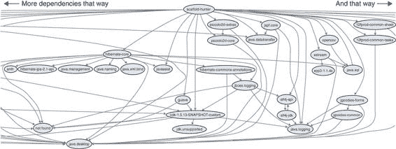
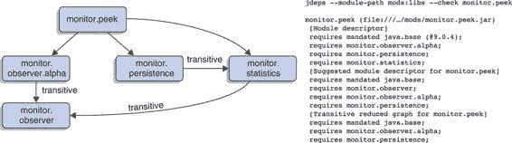

> 附录 D
> 
> 使用 JDeps 分析项目的依赖关系
> 
> JDeps 是一个 Java 依赖分析工具，是一个命令行工具，它处理 Java 字节码—`.class` 文件或包含它们的 JAR 文件，并分析类之间的静态声明依赖关系。结果可以以各种方式过滤，并可以聚合到包或 JAR 级别。JDeps 也完全了解模块系统。
> 
> 总的来说，这是一个非常有用的工具，可以检查我在这本书中经常提到的各种有时模糊不清的图表。更重要的是，它在迁移和模块化项目时具有具体的应用，例如分析其对 JDK 内部 API 的静态依赖关系（第 7.1.2 节）、列出分割包（第 7.2.5 节）和制定模块描述符（第 9.3.2 节）。
> 
> 对于这次探索，我鼓励你跟随操作，最好是使用你自己的项目。如果你有一个项目 JAR 文件，旁边有一个包含所有传递依赖项的文件夹，这将是最容易的。如果你使用 Maven，你可以通过 maven-dependency-plugin 的 `copy-dependencies` 目标来实现这一点。如果你使用 Gradle，你可以使用一个 `Copy` 任务，将 `from` 设置为 `configurations.compile` 或 `configurations.runtime`。快速搜索可以帮助你了解详细信息。
> 
> 作为我的示例项目，我选择了 Scaffold Hunter：
> 
> > Scaffold Hunter 是一个基于 Java 的开源工具，用于可视化分析数据集，重点关注来自生命科学的数据，旨在直观地访问大型和复杂的数据集。该工具提供各种视图，例如图形、树状图和绘图视图，以及分析方法，例如聚类和分类。
> > 
> > —[`scaffoldhunter.sourceforge.net`](http://scaffoldhunter.sourceforge.net)
> > 
> 我下载了 2.6.3 版本的 Zip 文件，并将所有依赖项复制到 `libs` 目录中。在显示输出时，我将包名中的 `scaffoldhunter` 和文件名中的 `scaffoldhunter` 缩写为 `sh` 以缩短输出。
> 
> 了解 JDeps
> 
> 让我们从了解 JDeps 开始：在哪里找到它，如何获取初步结果，以及哪里可以获得帮助。从 Java 8 开始，你可以在 JDK 的 `bin` 文件夹中找到 JDeps 可执行文件 `jdeps`。如果它可以在命令行上使用，这将是最容易的，你可能需要执行一些针对你操作系统的特定设置步骤。确保 `jdeps --version` 可以正常工作，并显示正在运行的是最新版本。
> 
> 下一步是获取一个 JAR 文件，并使用 JDeps 对其进行分析。如果不使用其他命令行选项，它将首先列出代码所依赖的 JDK 模块，包括对于既不是 JAR 部分也不是 JDK 部分的所有代码的 `not found` 提示。接着是一个按包级别组织的依赖关系列表，格式为 `${package} -> ${package} ${module/JAR}`。
> 
> 调用 `jdeps scaffoldhunter-2.6.3.jar` 会导致以下令人眼花缭乱的输出。您可以看到 Scaffold Hunter 依赖于模块 java.base（当然），java.desktop（它是一个 Swing 应用程序），java.sql（数据集存储在 SQL 数据库中），以及其他几个模块。在依赖列表之后，是一个长长的包依赖列表，这可能有点难以全部吸收：
> 
> `$ jdeps scaffoldhunter-2.6.3.jar  # 注意，"sh" 是 "scaffoldhunter"（在文件名中）和 "scaffoldhunter"（在包名中）的简称` `> sh-2.6.3.jar -> java.base` `①` `> sh-2.6.3.jar -> java.datatransfer > sh-2.6.3.jar -> java.desktop > sh-2.6.3.jar -> java.logging > sh-2.6.3.jar -> java.prefs > sh-2.6.3.jar -> java.sql > sh-2.6.3.jar -> java.xml` `> sh-2.6.3.jar -> not found` `③``> edu.udo.sh -> com.beust.jcommander not found` `②` `> edu.udo.sh -> edu.udo.sh.data sh-2.6.3.jar > edu.udo.sh -> edu.udo.sh.gui sh-2.6.3.jar > edu.udo.sh -> edu.udo.sh.gui.util sh-2.6.3.jar > edu.udo.sh -> edu.udo.sh.util sh-2.6.3.jar > edu.udo.sh -> java.io java.base > edu.udo.sh -> java.lang java.base > edu.udo.sh -> javax.swing java.desktop` `> edu.udo.sh -> org.slf4j not found` `③` `# 省略了许多其他包依赖`
> 
> > ①
> > 
> > JDK 项目所依赖的模块
> > 
> > ②
> > 
> > JAR 内部和跨 JAR 的包依赖
> > 
> > ③
> > 
> > “not found” 表示未找到依赖项，这并不奇怪，因为我没有告诉 JDeps 在哪里查找它们。
> > 
> 现在是时候使用各种选项调整输出了。您可以使用 `jdeps -h` 列出它们。
> 
> 在分析中包含依赖项
> 
> JDeps 的重要特性之一是它允许您将依赖项分析为代码的一部分。实现这一目标的第一步是将它们放置在类路径上使用 `--class-path`，但这仅使 JDeps 能够跟踪依赖项 JAR 的路径，并消除了 `not found` 指示。要分析依赖项，您需要使用 `-recursive` 或 `-r` 使 JDeps 递归进入它们。
> 
> 为了包含 Scaffold Hunter 的依赖项，我使用 `--class-path 'libs/*'` 和 `-recursive` 执行了 JDeps，其结果如下。在这个特定的情况下，输出以几个分割包警告开始，我现在将忽略这些警告。以下模块/JAR 和包依赖与之前相同，但现在都已找到，因此有更多：
> 
> `$ jdeps -recursive --class-path 'libs/*' scaffoldhunter-2.6.3.jar  # 截断拆分包警告 # 截断一些模块/JAR 依赖` `> sh-2.6.3.jar -> libs/commons-codec-1.6.jar` `①` `> sh-2.6.3.jar -> libs/commons-io-2.4.jar > sh-2.6.3.jar -> libs/dom4j-1.6.1.jar > sh-2.6.3.jar -> libs/exp4j-0.1.38.jar > sh-2.6.3.jar -> libs/guava-18.0.jar > sh-2.6.3.jar -> libs/heaps-2.0.jar > sh-2.6.3.jar -> libs/hibernate-core-4.3.6.Final.jar > sh-2.6.3.jar -> java.base > sh-2.6.3.jar -> java.datatransfer > sh-2.6.3.jar -> java.desktop > sh-2.6.3.jar -> java.logging > sh-2.6.3.jar -> java.prefs > sh-2.6.3.jar -> java.sql > sh-2.6.3.jar -> java.xml > sh-2.6.3.jar -> libs/javassist-3.18.1-GA.jar > sh-2.6.3.jar -> libs/jcommander-1.35.jar # 截断更多模块/JAR 依赖` `> edu.udo.sh -> com.beust.jcommander jcommander-1.35.jar` `②` `> edu.udo.sh -> edu.udo.sh.data sh-2.6.3.jar > edu.udo.sh -> edu.udo.sh.gui sh-2.6.3.jar > edu.udo.sh -> edu.udo.sh.gui.util sh-2.6.3.jar > edu.udo.sh -> edu.udo.sh.util sh-2.6.3.jar > edu.udo.sh -> java.io java.base > edu.udo.sh -> java.lang java.base > edu.udo.sh -> javax.swing java.desktop` `> edu.udo.sh -> org.slf4j slf4j-api-1.7.5.jar` `②` `# 截断许多许多更多的包依赖`
> 
> > ①
> > 
> > 没有更多“未找到”的 JAR 依赖
> > 
> > ②
> > 
> > 没有更多“未找到”的包依赖源
> > 
> 这使得输出更加令人眼花缭乱，因此是时候看看如何从如此多的数据中找到意义了。
> 
> 配置 JDeps 的输出
> 
> 配置 JDeps 输出的方式有很多种。在分析任何项目的初步分析中，可能最好的选项是 `-summary` 或 `-s`，它只显示 JAR 之间的依赖关系，如下所示：
> 
> `$ jdeps -summary -recursive --class-path 'libs/*' scaffoldhunter-2.6.3.jar  # 截断拆分包警告 # 截断一些模块/JAR 依赖 > sh-2.6.3.jar -> libs/javassist-3.18.1-GA.jar > sh-2.6.3.jar -> libs/jcommander-1.35.jar > sh-2.6.3.jar -> libs/jgoodies-forms-1.4.1.jar > sh-2.6.3.jar -> libs/jspf.core-1.0.2.jar > sh-2.6.3.jar -> libs/l2fprod-common-sheet.jar > sh-2.6.3.jar -> libs/l2fprod-common-tasks.jar > sh-2.6.3.jar -> libs/opencsv-2.3.jar > sh-2.6.3.jar -> libs/piccolo2d-core-1.3.2.jar > sh-2.6.3.jar -> libs/piccolo2d-extras-1.3.2.jar > sh-2.6.3.jar -> libs/slf4j-api-1.7.5.jar > sh-2.6.3.jar -> libs/xml-apis-ext.jar > sh-2.6.3.jar -> libs/xstream-1.4.1.jar > slf4j-api-1.7.5.jar -> java.base > slf4j-api-1.7.5.jar -> libs/slf4j-jdk14-1.7.5.jar > slf4j-jdk14-1.7.5.jar -> java.base > slf4j-jdk14-1.7.5.jar -> java.logging > slf4j-jdk14-1.7.5.jar -> libs/slf4j-api-1.7.5.jar # 截断更多模块/JAR 依赖`
> 
> 表 D.1 列出了各种过滤器，它们提供了对依赖关系的不同视角。
> 
> 表 D.1 JDeps 输出的某些选项的简要描述

| 选项   | 描述   |
| --- | --- |
| `--apionly` 或 `-apionly`   | 有时，尤其是当你分析一个库时，你可能只关心一个 JAR 的 API。使用此选项，仅检查公共和受保护成员的签名中提到的类型。   |
| `-filter` 或 `-f`   | 后跟一个正则表达式，排除与匹配正则表达式的类相关的依赖。（注意：除非使用 `-verbose:class`，否则输出仍会显示包。）   |
| `-filter:archive`   | 在许多情况下，工件内的依赖并不那么有趣。此选项忽略它们，只显示跨工件之间的依赖。   |
| `--package` 或 `-p`   | 后跟一个包名，仅考虑对该包的依赖，这是一个查看那些 `utils` 被使用所有位置的好方法。   |
| `--regex` 或 `-e`   | 后跟一个正则表达式，仅考虑与匹配正则表达式的类相关的依赖。（注意：除非使用 `-verbose:class`，否则输出仍会显示包。）   |

> 命令行上的输出是检查细节和深入挖掘有趣部分的好方法。但这并不是最直观的概览——图表在这方面做得更好。幸运的是，JDeps 有 `--dot-output` 选项，它为每个单独的分析创建 `.dot` 文件。这些文件是纯文本，但可以使用其他工具，如 Graphviz，从它们创建图像。请参阅以下列表和图 D.1 以获取示例。
> 
> > 列表 D.1 可视化工件依赖关系
> > 
> `$ jdeps -recursive --class-path 'libs/*'` `--dot-output dots` ① `scaffoldhunter-2.6.3.jar` `$ dot -Tpng -O dots/summary.dot` ②
> 
> > ①
> > 
> > 指定 `--dot-output dots` 告诉 JDeps 在 dots 文件夹中创建 .dot 文件。
> > 
> > ②
> > 
> > Graphviz 提供了 dot 命令，这里使用它来在 dots 中创建 summary.dot.png。
> > 
> 
> 
> 图 D.1 列表 D.1 的结果是大型、复杂但仍然可接近的依赖关系图。这只是其中的一部分。不必担心细节；为你的项目创建一个。
> 
> > Dot 文件和 Graphviz
> > 
> > `.dot` 文件是纯文本，是一个很好的中间表示形式，可以对其进行编辑。使用一些正则表达式，例如，你可以从底部移除 java.base 模块（使图更简单）或从 JAR 名称中移除版本（使图更精简）。有关 Graphviz 的更多信息，请参阅 [`graphviz.gitlab.io`](https://graphviz.gitlab.io)。
> > 
> 深入挖掘你的项目依赖关系
> 
> 如果你想查看更多细节，`-verbose:class` 会列出类之间的依赖关系，而不是在包级别上聚合它们。有时候，仅列出包或类的直接依赖可能不够，因为它们可能不在你的代码中，而是在你的依赖中。在这种情况下，使用 `--inverse` 或 `-I` 可能会有所帮助。给定一个特定的包或正则表达式进行查找，它会追踪依赖关系直到它们的最远点，并在过程中列出相关工件。不幸的是，似乎没有一种直接的方法可以在类级别而不是工件级别查看结果。
> 
> 如果你只对库的公共 API 中暴露的依赖感兴趣，你可以使用 `--apionly` 来实现这一点。使用它，只会检查公共和受保护成员的签名中提到的类型。还有一些其他选项可能有助于你解决特定情况——如前所述，你可以使用 `jdeps -h` 列出它们。
> 
> JDeps 理解模块
> 
> 正如编译器和 JVM 可以通过模块系统在更高层次上进行操作一样，JDeps 也可以。模块路径可以通过 `--module-path` 指定（注意 `-p` 是保留的：它不是此选项的缩写），初始模块通过 `--module` 或 `-m` 指定。从那里，你可以进行与之前相同类型的分析：
> 
> `$ jdeps -summary -recursive --module-path mods:libs -m monitor  # 省略了一些模块依赖 > monitor -> java.base > monitor -> monitor.observer > monitor -> monitor.observer.alpha > monitor -> monitor.observer.beta > monitor -> monitor.persistence > monitor -> monitor.rest > monitor -> monitor.statistics > monitor.observer -> java.base > monitor.observer.alpha -> java.base > monitor.observer.alpha -> monitor.observer > monitor.observer.beta -> java.base > monitor.observer.beta -> monitor.observer > monitor.persistence -> java.base > monitor.persistence -> monitor.statistics > monitor.persistence -> hibernate.jpa > monitor.rest -> java.base > monitor.rest -> monitor.statistics > monitor.rest -> spark.core > monitor.statistics -> java.base > monitor.statistics -> monitor.observer > slf4j.api -> java.base > slf4j.api -> 未找到 > spark.core -> JDK 移除了内部 API > spark.core -> java.base > spark.core -> javax.servlet.api > spark.core -> jetty.server > spark.core -> jetty.servlet > spark.core -> jetty.util > spark.core -> slf4j.api > spark.core -> websocket.api > spark.core -> websocket.server > spark.core -> websocket.servlet # 省略了更多模块依赖`
> 
> 此外，还有一些 Java 9 和模块特定的选项。使用 `--require ${modules}`，您可以列出所有需要命名模块的模块。如何使用 `--jdk-internals` 来分析项目的有问题依赖关系在第 7.1.2 节中解释。第 9.3.2 节解释了如何使用 `--generate-module-info` 和 `--generate-open-module` 来创建模块描述符的第一稿。如前所述，JDeps 还会始终报告它找到的所有拆分包——这个问题在第 7.2 节中详细讨论。
> 
> 一个有趣的选项是 `--check`，它提供了对模块描述符的不同视角（见图 D.2）：

+   它首先打印实际的描述符，然后是两个假设的描述符。

+   其中第一个，被描述为建议的描述符，声明了对所有在检查模块中使用类型的模块的依赖。

+   第二个，被描述为传递减少图，与第一个类似，但去除了由于暗示的可读性而可以读取的依赖（见第 9.1 节）。这意味着它是产生可靠配置的最小依赖集。

+   最后，如果模块声明了任何合格的导出（见第 9.3 节），`--check` 将输出那些在可观察模块的宇宙中未使用的导出。

> `--check` 创建的假设描述符也可以分别使用两个选项 `--list-deps` 和 `--list-reduced-deps` 进行查看。它们也可以与类路径一起使用，在这种情况下，它们引用未命名的模块（见第 8.2 节）。
> 
> 
> 
> 图 D.2 在左侧，您可以看到 monitor.peek（在 11.1.1 节中介绍）及其传递依赖关系，其中一些暗示了在其他模块上的可读性。在右侧，JDeps 建议将 monitor.observer 包含在依赖列表中（因为其类型被直接引用）。此外，它列出了 monitor.peek 需要依赖的最小模块集，以充分利用暗示的可读性。
