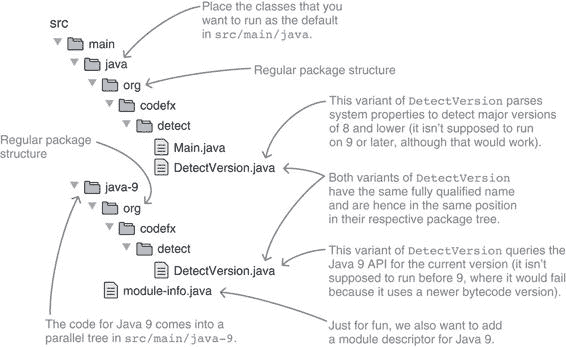
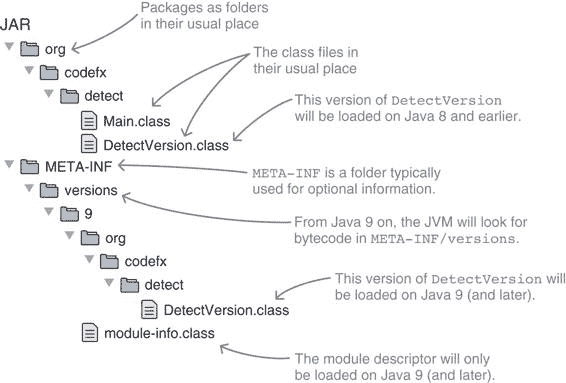

> 附录 E
> 
> 使用多版本 JAR 针对多个 Java 版本
> 
> 决定你的项目需要哪个 Java 版本从来都不容易。一方面，你希望给用户选择自由，所以支持几个主要版本而不是仅支持最新版本会很好。另一方面，你迫切希望使用最新的语言特性和 API。从 Java 9 开始，有一个新的 JVM 特性，即多版本 JAR（MR-JARs），它可以帮助你在某些情况下调和这些对立的力量。
> 
> MR-JARs 允许你在同一个工件中打包不同版本的 Java 字节码。然后你可以依赖 JVM 加载你为它支持的最新版本编译的类。从一个在最小要求版本上成功运行的工程开始，你可以通过使用更健壮和性能更高的 API 来选择性地在新 JVM 上改进它，而无需强制提高你项目的基线。
> 
> > **重要信息**当然，你只有在没有完全控制运行你项目的 JVM 版本的情况下才需要考虑 MR-JARs。对于库和框架来说，这始终是这种情况，对于用户自己托管桌面应用程序或网络后端来说，通常也是如此。另一方面，如果你管理运行你应用程序的机器，你可以使用较新的 JVM，并放弃 MR-JARs 的复杂性。
> > 
> 在解决所有这些问题之后，让我们来探索这个实用的新特性。我们将从创建一个简单的 MR-JAR 开始，然后再看看它是如何内部结构的。最后，我们将提供一些关于何时以及如何使用 MR-JARs 的建议。
> 
> 创建一个多版本 JAR
> 
> > 定义
> > 
> > 多版本 JAR（MR-JARs）是特别准备的 JAR，包含几个主要 Java 版本的字节码。字节码的加载方式取决于 JVM 版本：

+   Java 8 及更早版本加载版本无关的类文件。

+   Java 9 及以后的版本如果存在版本特定的类文件，则加载这些类文件，否则回退到版本无关的类文件。

> 为了准备一个 MR-JAR，你需要根据目标 Java 版本分割源文件，为每个版本的源文件集编译相应的版本，并将生成的 `.class` 文件放入单独的文件夹中。当使用 `jar` 打包时，你通常添加基线类文件（直接或使用 `-C`；请参阅第 4.5.1 节）并为每个其他字节码集使用新的选项 `--release ${release}`。
> 
> 让我们来看一个例子。假设你需要检测当前运行的 JVM 的主要版本。Java 9 提供了一个很好的 API 来实现这一点，因此你不再需要解析系统属性。（第 6.5.1 节提供了一些关于它的信息，但细节在这里并不重要。）通过部署一个 MR-JAR，如果你在 Java 9 或更高版本上运行，你可以使用那个 API。
> 
> 假设的应用程序有两个类，`Main` 和 `DetectVersion`；目标是拥有两个 `DetectVersion` 的变体，一个用于 Java 8 及更早版本，另一个用于 Java 9 及以后版本。这两个变体需要具有完全相同的完全限定名（这可能会在 IDE 中使用它们时带来挑战）——假设你将它们放置在两个平行的源文件夹中，`src/main/java` 和 `src/main/java-9`。
> 
> 图 E.1 展示了如何组织源代码，而 列表 E.1 展示了如何将它们编译和打包成 MR-JAR。注意有两个编译步骤和单独的输出文件夹。最终结果在 图 E.2 中展示。
> 
> > 列表 E.1 编译和打包不同 Java 版本的源代码到 JAR 文件
> > 
> `javac --release 8` `①` `-d classes src/main/java/org/codefx/detect/*.java` `javac --release 9` `②` `-d classes-9 src/main/java-9/module-info.java src/main/java-9/org/codefx/detect/DetectVersion.java` `jar --create` `③``--file target/detect.jar` `③``-C classes .` `③``--release 9` `④``-C classes-9 .` `④`
> 
> > ①
> > 
> > 将 src/main/java 中的代码编译成 Java 8（或更早版本）的类文件
> > 
> > ②
> > 
> > 将 src/main/java-9 中的代码编译成 Java 9 的 classes-9 类文件
> > 
> > ③
> > 
> > 当将字节码打包到 JAR 文件中时，包默认将类中的字节码作为通常一样处理。
> > 
> > ④
> > 
> > 包含专门针对 Java 9 的类
> > 
> 
> 
> 图 E.1 展示了 MR-JAR 的源代码布局方式。最重要的细节是，版本相关的代码，这里为 `DetectVersion`，在所有变体中都有相同的完全限定名。
> 
> 这个简单的示例创建了两个 `DetectVersion` 的变体，一个用于最低要求的 Java 8，另一个用于 Java 9。将这正式化到创建具有多个类和多个版本的特性的通用情况是惊人地复杂和繁琐，所以我就不提供正式版本了。相反，E.3 节为你提供了一个经验法则。
> 
> 
> 
> 图 E.2 由 列表 E.1 生成的 JAR 文件
> 
> MR-JAR 的内部工作原理
> 
> MR-JAR 的工作原理是怎样的？它非常直接：它在根目录中存储与版本无关的类文件（如通常一样），并在 `META-INF/versions/${version}` 中存储特定版本的文件。
> 
> > 重要的信息 JVMs 8 及更早版本对 `META-INF/versions` 一无所知，并从 JAR 根目录中的包结构加载类。因此，在 9 版本之前无法区分版本。
> > 
> > 然而，较新的 JVM 首先查看 `META-INF/versions`，只有在那里找不到类时，才会查看 JAR 的根目录。它们从自己的版本开始向后搜索，这意味着 Java 10 JVM 会寻找 `META-INF/versions/10` 中的代码，然后是 `META-INF/versions/9`，然后是根目录。因此，这些 JVM 会用它们支持的最新的版本特定的类文件来覆盖版本无关的类文件。
> > 
> 除了 `META-INF/versions` 中的文件夹外，MR-JAR 还可以通过查看纯文本文件 `META-INF/MANIFEST.MF` 来识别：在 MR-JARs 中，清单有一个条目 `Multi-Release: true`。
> 
> 使用建议
> 
> 现在您已经知道了如何创建 MR-JARs 以及它们是如何工作的，我想给您一些建议，如何最大限度地利用它们。更确切地说，我将就以下主题提供一些建议：

+   如何组织源代码

+   如何组织字节码

+   何时使用 MR-JARs

> **组织源代码**
> 
> > **基本信息**我建议在组织 MR-JARs 的源代码时遵循以下两个指南：

+   对于支持的最老版本的 Java 代码，放在项目的默认根目录中：例如，`src/main/java`，而不是 `src/main/java-X`。

+   该源文件夹中的代码是完整的，这意味着它可以编译、测试和部署，无需从特定版本的源树（如 `src/main/java-X`）中添加额外的文件。（注意，如果您提供仅在较新 Java 版本上工作的功能，仅抛出错误声明“在 Java X 之前不支持操作”的类也视为完整。我的建议是不要将其排除在外，从而导致不提供信息的 `NoClassDefFoundError`。）

> 这些不是技术要求；没有任何东西阻止您针对 Java 11，将一半的代码放在 `src/main/java` 中，另一半，甚至全部，放在 `src/main/java-11` 中。但这只会造成混淆。
> 
> 通过坚持指南，您可以使源树的布局尽可能简单。任何查看它的人类或工具都会看到一个针对所需 JVM 版本完全功能的项目。版本相关的源树随后会针对新版本选择性地增强该代码。
> 
> 您如何验证是否正确？正如我之前所说，正式描述很复杂，所以这里是您承诺的规则。为了确定您的特定布局是否有效，心理上（或实际上）执行以下步骤：

1.  在最老支持的 Java 版本上编译和测试版本无关的源树。

1.  对于每个额外的源树：

1.  将版本相关的代码移动到版本无关的树中，替换具有相同完全限定名称的文件。

1.  在较新版本的树上编译和测试该树。

> 如果这样做有效，那么您就做对了。
> 
> 当然，您的工具也必须与您选择的源布局协同工作。不幸的是，在撰写本文时，IDE 和大多数构建工具对该布局的支持并不好，您可能被迫做出妥协。作为替代方案，考虑为每个 Java 版本创建单独的项目。
> 
> **组织字节码**
> 
> > **重要信息** 从那个源树结构到我在 JAR 中组织字节码的建议是一条直路：

+   对于最老的支持的 Java 版本的字节码放入 JAR 的根目录，这意味着它不会在 `--release` 之后添加。

+   JAR 根目录中的字节码是完整的，这意味着它可以不添加 `META-INF/versions` 中的额外文件即可执行。

> 再次强调，这些不是技术要求，但它们保证了查看 JAR 根目录的每个人都能看到为所需的 JVM 版本编译的完整项目，并在 `META-INF/versions` 中对较新的 JVM 进行选择性增强。
> 
> **何时使用 MR-JAR**
> 
> MR-JAR 如何帮助你解决选择所需 Java 版本的困境？首先，显然地，准备一个 MR-JAR 会增加相当多的复杂性：

+   你的 IDE 和构建工具必须配置得当，以便能够轻松处理针对不同 Java 版本编译的具有相同完全限定名称的源文件。

+   你需要保持同一源文件的多个变体同步，以确保它们具有相同的公共 API。

+   单元测试变得复杂，因为你可能会编写只能在特定 JVM 版本上运行或通过的测试。

+   集成测试变得更加繁琐，因为你需要考虑测试 MR-JAR 包含字节码的每个 Java 版本生成的结果工件。

> > **重要信息** 这意味着你应该仔细考虑是否要创建 MR-JAR。走这条路应该有相当大的回报。（也许你最终可以提升所需的 Java 版本。）
> > 
> 此外，MR-JAR 并不适合使用方便的新语言特性。正如你所看到的，你需要涉及源文件的两个变体，如果你必须保留具有不便变体的源文件，那么基于便利性的论据并不充分。语言特性也会迅速渗透到代码库中，导致大量重复的类。这不是一个好主意。
> 
> 另一方面，API 是 MR-JAR 的最佳应用场景。Java 9 引入了一系列新的 API，它们以更高的鲁棒性和/或更好的性能解决了现有的用例：

+   使用 `Runtime.Version` 而不是解析系统属性来检测 JVM 版本（见第 6.5.1 节）

+   使用堆栈跟踪 API 分析调用栈而不是创建 `Throwable`（本书不涵盖该 API，但你的日志框架的开发者已经在使用它）

+   用变量句柄替换反射（见第 12.3.2 节）

> 如果你想在新的 Java 版本上使用新的 API，你只需要封装你对它的直接调用到一个专用的包装类中，然后实现它的两个变体：一个使用旧 API，另一个使用新 API。如果你已经接受了之前概述的复杂性，那么这很简单。
