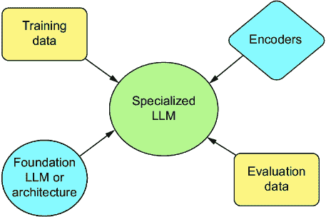

# 第四章：*大型语言模型的数据工程：为成功做好准备*

### 本章涵盖了

+   行业中常用的基础模型

+   如何评估和比较大型语言模型

+   不同的数据源以及如何准备你自己的

+   创建你自己的自定义分词器和嵌入

+   准备用于未来章节的 Slack 数据集

> 数据就像垃圾。在收集它之前，你最好知道你打算如何处理它。——马克·吐温

创建我们自己的 LLM 与任何 ML 项目并无不同，我们首先需要准备我们的资产——没有比你的数据更宝贵的资产了。所有成功的 AI 和 ML 项目都是建立在良好的数据工程基础之上的。因此，我们获取、清理、准备和整理我们的数据是非常重要的。

与其他 ML 模型不同，在创建针对特定任务定制的 LLM 时，你通常不会从零开始。当然，如果你确实是从零开始，你可能只会这样做一次。然后，最好调整和润色该模型，以进一步满足你的特定需求。选择正确的基模型可能会使你的项目成功或失败。图 4.1 给出了在训练或微调新模型之前需要准备的不同组件和资产的高级概述。



##### 图 4.1 训练 LLM 的不同元素。结合地球、火、水——等等，不，不是那些元素。要开始，你需要收集几个资产，包括基础模型、训练数据、文本编码器（例如，分词器）和评估数据。

正如书中《数据工程基础》¹所如此明确地定义的：

> 数据工程是开发、实施和维护系统及流程的过程，这些系统及流程接收原始数据并产生高质量、一致的信息，以支持下游用例，如分析和机器学习。

在本章中，我们将讨论在你开始创建 LLM 之前需要采取的步骤，这主要涉及准备训练模型所需的数据资产。我们将讨论许多可用的基或基础模型作为起点，以及如何评估和比较它们。然后，我们将深入探讨许多不同的数据集以及如何为微调模型准备你自己的数据集，包括准备你自己的分词器或嵌入。最后，我们将构建一个数据集，我们将在下一章中使用它来微调模型。

## 4.1 模型是基础

我们将首先讨论你在训练时需要收集的最重要数据集，即预训练模型的模型权重。LLM 作为一项技术之所以如此成功，一个重要原因是我们可以将已经在整个语言上训练好的模型进行调整，以在特定任务上表现良好。当然，了解那个初始模型是如何训练的以及它是基于什么进行训练的，将大大缩短选择正确模型进行调整的时间。

由于大型语言模型（LLM）已成为热门的研究课题，选择正确的一个变得异常困难，几乎每周都会出现一个新的模型，打破了基准记录。因为我们知道（或者至少假设）你急于了解它们，所以我们首先讨论目前市场上存在的许多不同模型。这些模型已经被专业人士训练（无论好坏），旨在使你的生活更轻松，并将强大的语言模型推向公众领域。GitHub、Hugging Face Hub 和其他地方有数以千计的开源模型可供使用，为了简化，我们将突出我们最喜欢的模型，并详细介绍每个模型，以便更容易进行比较，并给你一个关于你是否应该使用该特定模型或选择其不太知名的开放源代码变体的想法。如果你计划从头开始训练，考虑涉及的架构，以及你是否想尝试某个特定的系列。

### 4.1.1 GPT

没有比从 GPT（生成式预训练 Transformer）模型开始更好的地方了。这些模型是粉丝和我们的最爱之一，通过 OpenAI 进行商业销售，因其广泛的任务上的出色表现而受到欢迎。GPT 模型如此知名，以至于外行人经常用“GPT”来代替“LLM”，就像人们可能会用 Kleenex 或 Band-Aid 来代替纸巾或绷带一样。

第一个 GPT 模型于 2018 年推出，紧随 transformers 的推出之后，只有 1.2 亿个参数。它在 BookCorpus 小型数据集上进行了训练，在当时的 NLP 基准测试中取得了令人印象深刻的结果。GPT-2 模型在第二年推出，其规模扩大了 10 倍，达到 15 亿个参数；它在更大的 WebText 数据集上进行了训练。到了 2020 年，GPT-3 推出，其规模扩大了 100 倍，达到 1750 亿个参数，并在庞大的 Common Crawl 数据集上进行了训练。这个模型仍然基于 GPT-1 的原始架构，并进行了轻微的修改以改进扩展性。

OpenAI 选择对 GPT-4 等后续迭代版本保持更高的保密性，不透露训练数据或具体架构，因为它们已经开始量产并作为产品出售。ChatGPT 是一个经过微调的 GPT-3 模型，通过使用带有人类反馈的强化学习（RLHF）进行对话交互训练。不过不深入探讨，但你可以找到一系列 GPT-3 模型，这些模型在 API 名称下如 ada、babbage、curie 和 davinci，以及其他微调模型如 webGPT 和 InstructGPT。如果读者感兴趣，我们可以留待进一步调查。

其他开源变体，如 GPT-J，是由开源社区利用 OpenAI 发布的论文中获得的知识创建的。一些 GPT 模型与 OpenAI 没有关系，因为生成预训练转换器是一个非常通用的名称，适用于大多数 LLM。当然，OpenAI 已经开始将其视为一个品牌，并试图将缩写词注册商标。²

尽管 GPT-X 模型是闭源的，但可以通过 OpenAI API 访问，该 API 还包括其微调的功能。我们将在这本书中使用 GPT-2——尽管它比大多数人认为的实际 LLM 要小一些——因为它是一个易于理解的架构，并且易于学习。

### 4.1.2 BLOOM

BLOOM 是最具标志性的 LLM 之一，因为它在创建过程中所获得的学习成果。该模型于 2022 年发布，是第一个公开的 LLM，其参数量达到 176B，与 GPT-3 的规模相媲美；它以完全透明的方式进行训练。该模型由 Hugging Face 的 BigScience 团队制作，得到了微软的 DeepSpeed 团队和 NVIDIA 的 Megatron-LM 团队的协助，并由法国政府拨款赞助。

BLOOM 在 BigScienceCorpus 数据集上进行训练，这是一个由许多较小的数据集组成的综合体，总容量达到 1.6TB 的预处理文本。它受 RAIL 许可证约束，这意味着它技术上不是开源的，因为对其使用有约束，但它可以进行商业化。

TIP  在这里可以了解更多关于 RAIL 许可证的信息：[`mng.bz/mR20`](https://mng.bz/mR20)。

BLOOM 被训练为适用于所有任务的行业规模和行业级别。因此，适应消费设备不是优先事项，但随着研究团队的速度加快，已经训练了几个较小的版本。有 560M-、3B-和 7B 参数版本。还有一个 BLOOMZ，它是完整 176B 参数模型的多元任务微调版本。BLOOM 只在 46 种不同的语言上进行训练，而 BLOOMZ 的目标是提高模型的跨语言泛化能力。³ 你可以在 Hugging Face 的 hub 上找到所有这些模型：[`huggingface.co/bigscience/bloom`](https://huggingface.co/bigscience/bloom)。

BLOOM 的一个重大缺点是它经常给出较差的响应，在基准测试中竞争不佳——这很可能是由于项目资金有限和截止日期紧迫，导致给人一种它训练不足的感觉。这并不总是坏事，通常比过训练的模型要好，但如果你决定使用它，你可能会需要在大数据集上进行更多的微调。然而，使用它的好处是它被广泛理解和公开训练，你可以检查其训练数据。

通常，作者不会推荐再将其作为基础模型使用；有更好的替代品，但你应该熟悉它，因为它对领域做出了贡献。例如，BLOOM 创建花瓣，允许分布式训练，这对领域是一个重大贡献。

### 4.1.3 LLaMA

LLaMA 是 Meta 进入 LLM 领域的成果。第一个版本于 2023 年 2 月发布，并以非商业许可发布给研究社区。一周后，权重在 4chan 上泄露。在一系列不太可能的事件中，这次泄露可能对 Meta 非常有益，因为这个模型已经成为实验和开发的行业标准。我们将讨论的几个更多模型都是基于它的。

后来，在 2023 年 7 月，Meta 发布了 Llama 2，它同时拥有研究和商业许可。Llama 2 是一个大事件，因为它是第一个真正具有强大功能的商业可用模型，你将看到基于其架构的许多其他模型。有三种不同的模型大小可供选择：7B、13B 和 70B 参数。你可以从这里下载它们：[`ai.meta.com/llama/`](https://ai.meta.com/llama/)。如果你打算使用它，你需要申请访问权限并接受条款和条件。

Llama 2 是在从互联网上收集的经过精心挑选的数据集上训练的，其中他们移除了已知包含个人信息的网站，并增加了他们认为的事实来源。尽管数据集的详细情况尚未公开，但它很可能包含了来自 Common Crawl、GitHub、Wikipedia、Project Gutenberg、ArXiv 和 Stack Exchange 的数据，因为这些都是 LLaMA 1 的主要数据集。这些数据集后来被包装在一起，并以 RedPajama 的名义分发。然后，Llama 2 使用 RLHF 进一步微调，一个模型用于聊天，另一个用于代码。

### 4.1.4 巫师

巫师系列语言模型来自 2023 年的论文“WizardLM：赋予大型语言模型遵循复杂指令的能力”。⁴ 这些模型遵循的想法是，当在充满高复杂度任务的密集训练数据上训练时，LLM 的表现更好。基于创建更复杂指令任务的框架，巫师 LM 方法已应用于许多流行的数据集，并用于微调几乎所有最流行的模型。这种方法如此受欢迎，以至于令人惊讶的是，在 LlamaCoder34B 发布后的两天内，社区就微调了 WizardCoder34B 模型。

这些模型因其类似人类的散文风格和正确处理复杂问题的能力而一直受到好评，这些能力甚至可以与许多付费服务相媲美。我们鼓励你尝试的一个问题是要求 WizardCoder34B 用你喜欢的任何语言编写一个绘制看起来逼真的树的程序。由于巫师模型不像它们围绕特定数据集那样围绕将现有数据集转换为巫师风格的方法，因此应用范围极其广泛且多样化。如果你在使用其他模型或架构时遇到瓶颈，不确定如何改进，请尝试使用你已经使用过的数据集并应用巫师方法。欢迎你这样做。

作为附带说明，WizardCoder 模型通常受到很多关注，但 WizardMath 模型在自身领域也非常令人印象深刻。我们注意到，许多读者可能更多地处理数据问题而不是代码问题，因此当处理与数据对话的应用程序时，WizardMath 模型可能是一个很好的起点。

### 4.1.5 鹰隼

鹰隼模型是阿布扎比科技创新研究所的一个模型系列。它们是第一个在真正开源许可 Apache 2.0 下发布的尖端模型。您可以从研究所的网站获取模型：[`falconllm.tii.ae/falcon-models.xhtml`](https://falconllm.tii.ae/falcon-models.xhtml)。其易于访问和开源许可使得这对于黑客、实践者和行业来说都是一个梦想。

鹰隼模型首次于 2023 年 6 月推出，当时只推出了 7B 和 40B 参数模型，但到了 2023 年 9 月，鹰隼发布了一个 180B 参数模型，可以真正与 GPT-3 大小的模型竞争。对许多读者来说，更令人兴奋且可能更重要的是，鹰隼在许多基准测试任务中经常领先于 LLM 排行榜。这些模型主要在 RefinedWeb 数据集上训练，这是一个较小但质量更高的数据集，它是经过精心和细致的策划和从 Common Crawl 数据集中提取出来的。

### 4.1.6 维库纳

维库纳是在 ShareGPT 用户共享对话数据集上训练的。其逻辑是，在 ChatGPT 最佳输出基础上训练的模型将能够模仿 ChatGPT 的性能，借助于 Llama-Alpaca 的趋势。

备注：这里不会讨论 Alpaca，但在第三章讨论知识蒸馏时我们已经介绍过它。

维库纳因其性能和相对较低的训练成本而受到赞誉。维库纳是数据覆盖率和质量为何如此重要的绝佳例子，同时它也展示了从另一个模型的输出中训练模型导致模型崩溃的危险。当机器学习模型在合成数据上训练时，会导致输出越来越不多样化，这种现象称为模型崩溃。例如，维库纳在处理至少接近数据集中出现的内容时表现优秀，但当被要求执行更生成性或代理类任务时，它往往会产生远超其前辈的幻觉。维库纳未经许可不得用于商业用途，但对于个人项目来说非常出色。

### 4.1.7 多莉

Dolly 是由 Databricks 创建的，与其说是竞争性模型，不如说是更多的一次思想实验，与相同大小的其他模型相比，Dolly 及其 V2 版本的表现并不出色。然而，Dolly 在对英语的底层理解方面堪称最佳，是微调或创建低排名适应（LoRAs；我们将在第五章中讨论）以影响其他模型的绝佳起点。Dolly 1.0 是在斯坦福 Alpaca 数据集上训练的，而 Dolly 2.0 是在由 Databricks 员工众包的高质量人类生成指令遵循数据集上训练的。Dolly 2.0 已经完全开源，包括训练代码、数据集和模型权重，所有这些均带有商业用途许可证。⁵

### 4.1.8 OpenChat

OpenChat 与 Vicuna 类似，因为 OpenChat 使用了 80K ShareGPT 对话进行训练，但在条件化和加权损失策略方面有所不同，最终创建了一个在生成类似人类和，更重要的是，人类更喜欢的响应方面无可否认的出色的模型。

OpenChat 模型——不要与开源聊天机器人控制台混淆——是为不同任务而收集的各种微调集合，其中一些用于编码，其他用于代理，还有一些用于聊天。在 Llama 2 社区许可证下免费用于商业用途，这些模型可以成为您公司构建的绝佳解决方案。

我们已经讨论了很多模型，虽然我们可以继续这样讨论整个章节，但这对大家来说都不是最好的选择。表 4.1 展示了一个总结，突出了我们讨论的模型的一些主要比较点。我们想强调的一个主要点是，许多模型都可用于商业用途！虽然许多许可证都有限制，但它们可能不是你打算违反的规则。

##### 表 4.1 LLM 模型家族比较

| 模型家族 | 数据集 | 最大模型大小 | 商业许可证 | 组织 |
| --- | --- | --- | --- | --- |
| GPT | Common Crawl/RLHF | 1.76T | 否 | OpenAI |
| BLOOM | BigScienceCorpus | 176B | 是 | BigScience |
| Llama | RedPajama | 70B | 是 | Meta |
| Wizard | Evol-Instruct | 70B | 否 | Microsoft |
| Falcon | RefinedWeb | 180B | 是 | TII |

现在你已经了解了一些更受欢迎的模型家族，你可能已经对为你的项目选择哪个模型有了一些想法。但你怎么能确定呢？在下一节中，我们将探讨不同的评估和比较模型的方法。

## 4.2 评估大型语言模型

尽管我们刚刚讨论了一些我们最喜欢的模型家族，但还有许多其他不同的模型可供选择，每个月都有更多的新模型出现，所有这些模型都声称自己是最好的。不可能将它们全部理清楚。那么，你如何选择最好的一个来使用？它是否能够直接在你的任务上表现良好，或者是否需要微调？你如何知道你的微调是否提高了模型，或者只是让它变得更糟？你如何知道你选择了正确的大小？较小的模型很方便，但较大的模型在许多任务上的表现更好。说实话，这些问题并不容易回答，但幸运的是，有一些行业标准我们可以依赖。

当评估一个模型时，你需要两样东西：一个指标和一个数据集。指标是一个算法，它允许我们将结果与真实情况进行比较。数据集是我们希望模型执行的任务列表，然后我们将使用我们选择的指标进行比较。

在本节中，我们将讨论许多用于评估大型语言模型的不同方法，以便我们可以客观地评估和比较它们。我们将从常见的行业基准到开发你自己的独特评估方法的一切内容进行讨论。让我们开始吧。

### 4.2.1 评估文本的指标

评估文本通常很困难，因为用两种不同的方式说出相同的话很容易。从语义上讲，两个句子可能是完全相同的，但从句法上讲，它们却毫无相似之处，这使得文本比较变得复杂。看看我做了什么？

为了评估我们的模型，我们需要比仅仅匹配或检查相等性更好的指标，这对于大多数其他机器学习问题来说是可以做到的。我们需要一个指标，它允许我们比较模型生成的文本与真实情况，而不会过于严格。让我们看看一些最常用的指标。

#### ROUGE

ROUGE，即“面向检索的摘要评估的辅助研究”，是用于评估机器翻译任务的最古老的指标之一，但仍然是最可靠的。它是专门为自动摘要任务开发的，其目标是把一长篇文章总结成简短的摘要。让我们考虑一下这个问题：你如何确定一个摘要是否正确？最简单的方法就是将其与一个已知的摘要——即“真实情况”——进行比较。然而，无论文章如何，通常都有成千上万种方法可以用来简化文本，使其更加简洁，你不想仅仅因为模型选择了与真实情况不同的词序就惩罚它；这只会导致过度拟合。

Rouge 不将生成的摘要与真实摘要进行比较，期望得到完全匹配；相反，它通过 N-gram 在两个摘要之间寻找重叠——重叠越大，分数越高。这与全文搜索引擎的工作方式类似。根据 N-gram 中的 N 值，有多种变体，但还有比较最长公共子序列的版本，以及比较跳过双词（skip-bigrams）的版本，跳过双词是指句子中任何两个按顺序排列的词，而不一定是紧挨着的。

ROUGE 的原始实现是用 Perl 编写的，我们记得甚至在几年前还不得不使用它。对于一位作者来说，一些最糟糕的日子之一就是不得不在 Perl 中工作。幸运的是，在去年或更早的时候，终于有了快速、稳定的 Python 重实现。在下一个列表中，我们使用 rouge-score 库，这是 Google 的一个重实现。我们将比较两个关于《塞尔达传说》的解释，看看它们如何比较。

##### 列表 4.1 使用 ROUGE

```py
from rouge_score import rouge_scorer

target = "The game 'The Legend of Zelda' follows the adventures of the \
    hero Link in the magical world of Hyrule."
prediction = "Link embarks on epic quests and battles evil forces to \
    save Princess Zelda and restore peace in the land of Hyrule."

scorer = rouge_scorer.RougeScorer(["rouge1", "rougeL"], use_stemmer=True)   #1
scores = scorer.score(target, prediction)
print(scores)
# {'rouge1': Score(precision=0.28571428, recall=0.31578947, fmeasure=0.3),
# 'rougeL': Score(precision=0.238095238, recall=0.26315789, fmeasure=0.25)}
```

#1 示例 N-gram，其中 N=1，并使用最长公共子序列

如您从示例中可以看到，尽管这两段文本在语法上相当不同，但它们都是准确的描述。正因为如此，ROUGE（Recall-Oriented Understudy for Gisting Evaluation）算法不会给出一个大的零分，而是给予一定的灵活性，并提供相似度分数约为 0.25 的更好比较。ROUGE 算法是一种快速有效的比较两段短文本相似度的方法。在业界，ROUGE 非常常见，许多基准测试都将它作为其指标之一。

#### BLEU

BLEU（BiLingual Evaluation Understudy），代表双语评估助手，是我们将在本书中讨论的最古老的评估指标。它被开发出来用于评估机器翻译任务，并比较将一种语言翻译成另一种语言的方法。它与 ROUGE 非常相似，我们在目标和预测之间比较 N-gram。虽然 ROUGE 主要是一个召回率指标，但 BLEU 是一个精确度指标，但使用标准精确度可能会带来一些我们需要考虑的问题。

要理解这个问题，我们可以使用列表 4.1 中的代码来计算标准精确度。将目标变量替换为“the cat in the hat”，将预测变量替换为“cat hat”。重新运行列表，您会注意到召回率为 0.4——我们只正确地识别了五个词中的两个——但精确度为 1.0，这是一个完美的分数，尽管表现并不好！这个结果是因为目标中的两个词“cat”和“hat”都出现了。

BLEU 通过添加两个调整来解决这一点。第一个是直接的：添加简洁性惩罚。如果预测比目标短，我们将对其进行惩罚。第二个调整，称为修改后的 N-gram 精确度，稍微复杂一些，但它允许我们比较预测与多个目标。下面的列表展示了如何使用 NLTK 库来计算 BLEU 分数。我们使用与 ROUGE 相同的*Zelda*示例，这样你可以比较结果。

##### 列表 4.2 使用 BLEU

```py
import nltk.translate.bleu_score as bleu

target = [
    "The game 'The Legend of Zelda' follows the adventures of the \
    hero Link in the magical world of Hyrule.".split(),
    "Link goes on awesome quests and battles evil forces to \
    save Princess Zelda and restore peace to Hyrule.".split(),
]
prediction = "Link embarks on epic quests and battles evil forces to \
    save Princess Zelda and restore peace in the land of Hyrule.".split()

score = bleu.sentence_bleu(target, prediction)
print(score)
# 0.6187934993051339
```

BLEU 长期以来一直是行业标准，因为它多次报道与人类在翻译任务上的判断有很好的相关性。在我们的例子中，我们拆分了句子，但最好是将句子进行分词。当然，你不能比较使用不同分词器的 BLEU 分数。在这方面，SacreBLEU 是一个值得关注的变体，因为它试图提高不同分词器分数的可比性。

#### BPC

每字符比特（BPC）评估是语言模型基于熵的评估的一个例子。这是我们试图最小化的指标。我们不会深入探讨熵或混淆度，但我们将在这里介绍一个直观的理解。熵是尝试通过计算语言中每个字符所需的平均二进制位数来衡量信息。熵是平均每字符比特数。

混淆度可以分解为尝试测量语言模型从其语料库或词汇表中抽取特定序列的频率。这直接来源于模型的分词策略（过多的`<UNKS>`等于糟糕的混淆度），这意味着使用混淆度——或者熵，无论如何——在具有不同分词策略的 LLM 之间进行 1:1 比较是不可能的。例如，在字符级别进行分词的模型将比在词级别进行分词的模型具有更低的混淆度，但整体表现往往更差。这并不使它们作为指标无效，因为它们在相同模型的训练过程中非常有帮助。

注意：与熵相关的指标高度相关于信息理论，这部分我们未涉及。然而，如果你对创建或改进 LLM 的评估指标感兴趣，我们建议你查看这些指标。

为了更深入地通过实际例子来说明这一点，比较使用不同分词策略的两个模型就像比较一个三年级学生在加法上的能力与另一个三年级学生在乘法上的能力一样。说一个比另一个好并没有真正意义，因为他们处于同一技能水平上做不同的事情。最接近准确比较的方法是让两个三年级学生做同样的任务，比如拼写。这样你至少可以尽可能多地比较苹果与苹果。

现在我们已经掌握了一些指标，让我们来看看我们将运行评估的基准数据集。

### 4.2.2 行业基准

评估语言模型性能是一个众所周知的问题，已经创建了多个基准来解决它。在本节中，我们将讨论你可能会遇到的一些最常见解决方案以及它们试图解决的问题类型。由于基准通常只能评估模型的一个质量，而大型语言模型通常被部署来完成许多通用任务，因此你可能需要运行多个评估基准，以全面了解你模型的优点和缺点。在浏览这个列表时，不要考虑哪个指标比另一个指标更好，而要考虑它们如何协同使用来提高你的整体成功率。

#### GLUE

通用语言理解评估（GLUE）本质上是一个针对语言模型的标准化测试（想想 ACT、SAT、GRE 等），用于衡量语言模型在语言任务上的表现，这些任务旨在测试对语言的理解。当 GLUE 被引入时，很快出现了两个问题：语言模型在任务上超越人类平等的速度太快，而且人们对这些任务是否真正展示了实际理解存在怀疑。类似于人们训练像鹦鹉这样的动物说话的情况，问题总是存在：鹦鹉实际上是在学习人类语言，还是仅仅被训练去模仿某些声音序列，以食物作为交换对特定刺激做出反应？尽管如此，GLUE 基准对于比较模型性能仍然是有价值的。

GLUE 不再是行业标准，但它仍然可以给你一个相当快速的了解，了解你的模型表现如何，尤其是如果你正在基于指令数据集进行训练，并使用 GLUE 来衡量新任务上的少量或零样本性能。你可以查看排行榜，[`gluebenchmark.com/leaderboard`](https://gluebenchmark.com/leaderboard)。

#### SuperGLUE

如前所述，GLUE 任务中迅速出现的一个问题是人类平等。为了解决这个问题，在 GLUE 开发一年后，SuperGLUE 被创建出来，它包含更多困难和多样化的任务，其风格与 GLUE 一样易于使用。除此之外，由于 GLUE 的非专家人类基准被迅速超越，因此使用了更多专家人士来生成 SuperGLUE 基准。尽管如此，截至本文写作时，SuperGLUE 的人类基准在排行榜上排名第八，这引发了 GLUE 的第二个问题：SuperGLUE 任务是否充分衡量了理解？

考虑到像 PaLM 540B 这样的模型，它们在击败人类基准时，难以生成人们普遍认为可接受的输出，另一个问题随之而来：训练数据和评估指标中有多少是理想化的，并不反映我们实际使用语言的方式？对于这些问题，目前还没有适当的答案，但当你评估指标可能成为你的模型与任务可接受性能之间的障碍时，考虑这些问题是有帮助的。

在列表 4.3 中，我们展示了如何运行模型对抗 MultiRC SuperGLUE 测试。MultiRC 数据集包含简短的段落，并就段落内容提出理解问题。让我们继续加载数据集，快速看一下我们正在处理的内容。

##### 列表 4.3 示例 SuperGLUE 基准

```py
from datasets import load_dataset
from transformers import AutoTokenizer, AutoModelForCausalLM

dataset = load_dataset("super_glue", "multirc", split="validation")    print(dataset[0]) #1
```

#1 SuperGlue 有多个测试数据集；选项有 boolq、cb、copa、multirc、record、rte、wic、wsc、wsc.fixed、axb 和 axg。

在这里，我们看到一段讨论关于力的基本物理的段落，以及一个简单的是非问题及其答案：

```py
# {
#   "paragraph": "What causes a change in motion? The application of a force."
#     " Any time an object changes motion, a force has been applied. In what "
#     "ways can this happen? Force can cause an object at rest to start "
#     "moving. Forces can cause objects to speed up or slow down. Forces can "
#     "cause a moving object to stop. Forces can also cause a change in "
#     "direction. In short, forces cause changes in motion. The moving "
#     "object may change its speed, its direction, or both. We know that "
#     "changes in motion require a force. We know that the size of the force "
#     "determines the change in motion. How much an objects motion changes "
#     "when a force is applied depends on two things. It depends on the "
#     "strength of the force. It also depends on the objects mass. Think "
#     "about some simple tasks you may regularly do. You may pick up a "
#     "baseball. This requires only a very small force. ",
#   "question": "Would the mass of a baseball affect how much force you have "
#     "to use to pick it up?",
#   "answer": "No",
#   "idx": {"paragraph": 0, "question": 0, "answer": 0},
#   "label": 0,
# }
```

让我们继续下载一个小型模型并运行它来对抗数据集。在这个例子中，我们将打印出模型生成的答案与正确答案进行定性比较：

```py
model = "bigscience/bloomz-560m"  # Update with your model of choice

tokenizer = AutoTokenizer.from_pretrained(model)
model = AutoModelForCausalLM.from_pretrained(model)

for row in dataset:
    input_text = (
        f'Paragraph: {row["paragraph"]}\nQuestion: {row["question"]}'
    )                                                                    #1
    input_ids = tokenizer(input_text, return_tensors="pt").input_ids

    outputs = model.generate(input_ids, max_new_tokens=20)
    input_length = input_ids.shape[1]                        #2
    results = tokenizer.decode(outputs[0][input_length:])
    print(row["answer"])
    print(results)
```

#1 将这个替换为你的基准的正确输入。

#2 我们用这个来裁剪输入。

从这个结果中，你可能会得到以下类似的结果：

```py
# No
#  No</s>
# Yes
#  No</s>
# Less the mass, less the force applied
#  No</s>
# It depends on the shape of the baseball
#  No</s>
# Strength
#  Force</s>
# A force
#  Force</s>
# No
#  Yes</s>
```

你可以看到我们的模型表现并不出色，但我们并不太担心；我们只想展示 SuperGLUE 测试的实际操作。你可能想知道为什么我们不使用像 ROUGE 或 BLEU 这样的指标。虽然我们可以这样做来提高我们的理解，但如果你决定将结果提交到 SuperGLUE 排行榜，它将需要原始生成的文本。

备注：有关如何使用 SuperGLUE 的更多信息，请参阅 SuperGLUE 常见问题解答：[`super.gluebenchmark.com/faq`](https://super.gluebenchmark.com/faq)。

SuperGLUE 正是它所设定的目标：超越 GLUE。如果你想测试你模型的少量和零样本能力，SuperGLUE 将是终极测试之一。它将显示你的 LLM 是否能够以非常低的困惑度遵循指令，只生成所需的内容，而不多余。你可以查看当前的 SuperGLUE 排行榜：[`super.gluebenchmark.com/leaderboard`](https://super.gluebenchmark.com/leaderboard)。

#### MMLU

大型多任务语言理解（MMLU）测试主要是由加州大学伯克利分校与几所其他大学合作开发的，旨在测试比 GLUE 任务更深层次的知识。MMLU 不再关注表面语言理解，而是试图测试一个模型是否足够理解语言，能够回答关于历史、数学、道德和法律等主题的第二级问题。例如，与其问“牛顿写了关于重力的什么？”不如问“牛顿会与爱因斯坦就什么问题产生争论？”

MMLU 的问题难度从基础水平到高级专业水平不等，它们既测试世界知识也测试解决问题的能力。众所周知，这些问题相当困难，来自 Mechanical Turk 的非专业人员在 34.5% 的准确率下仅能获得略好于随机的成绩。⁶ 他们领域的专家表现要好得多，但通常只限于他们专长的部分。因此，当我们观察模型在测试中的表现时，正如预期的那样，即使是 SuperGLUE 排行榜顶端的模型，在将语言理解应用于回答问题时，也几乎与随机水平相当。这个测试涵盖了比 GLUE 更广泛的理解任务范围，并且需要更低的困惑度才能通过。

列表 4.4 展示了如何运行这个测试。我们将下载 MMLU 数据集，然后为了方便起见，将测试与 OpenAI 的不同模型进行对比。代码还允许不同级别的少样本提示。我们尚未讨论这一点，但我们想尽早展示一个例子。尝试调整这个参数，看看不同数量的示例如何改善你的整体结果。

##### 列表 4.4 示例 MMLU 评估

```py
from deepeval.benchmarks import MMLU
from deepeval.benchmarks.tasks import MMLUTask
from deepeval.models.base_model import DeepEvalBaseLLM
import torch
from transformers import AutoModelForCausalLM, AutoTokenizer

class DeepEvalLLM(DeepEvalBaseLLM):             #1
    def __init__(self, model, tokenizer, name):
        self.model = model
        self.tokenizer = tokenizer
        self.name = name

        device = torch.device(
            "cuda" if torch.cuda.is_available() else "cpu"
        )

        self.model.to(device)
        self.device = device
    def load_model(self):
        return self.model

    def generate(self, prompt: str) -> str:
        model = self.load_model()
        model_inputs = self.tokenizer([prompt], return_tensors="pt").to(
            self.device
        )

        generated_ids = model.generate(
            **model_inputs, max_new_tokens=100, do_sample=True
        )
        return self.tokenizer.batch_decode(generated_ids)[0]

    async def a_generate(self, prompt: str) -> str:
        return self.generate(prompt)

    def get_model_name(self):
        return self.name

model = AutoModelForCausalLM.from_pretrained("gpt2")
tokenizer = AutoTokenizer.from_pretrained("gpt2")

gpt2 = DeepEvalLLM(model=model, tokenizer=tokenizer, name="GPT-2")

benchmark = MMLU(                                                       #2
    tasks=[MMLUTask.HIGH_SCHOOL_COMPUTER_SCIENCE, MMLUTask.ASTRONOMY],
    n_shots=3,
)

benchmark.evaluate(model=gpt2)     #3
print(benchmark.overall_score)
# MMLU Task Accuracy (task=high_school_computer_science): 0.0
# MMLU Task Accuracy (task=astronomy): 0.0
# Overall MMLU Accuracy: 0.0
```

#1 设置模型

#2 定义具有特定任务和射击的基准

#3 运行基准

MMLU 比之前的任何基准测试都更深入地理解了问题，这是很有希望的，并且可以在这项测试和通常产生人类偏好的响应的聊天模型之间建立关联。然而，随着理解的加深，测试中需要承担更多的责任，关于这些评估的伦理问题也开始被提出。例如，这些模型是否被训练来诚实地回答关于美国历史的问题，或者它们是否被评估为理想国家的宣传？在回答关于法律的问题时，它们是否被设定为接受法律体系中可能或可能不包含的任何偏见？目前的答案是，当这些类型的评估表现良好时，模型可能表现出更深层次的偏见，因此需要更加小心，以确保我们评估中预设的偏见是无害且普遍接受的。

### 4.2.3 负责任的 AI 基准测试

几乎所有评估大型语言模型（LLM）的行业基准都严格关注模型的性能：“它能否完成这项工作？”不幸的是，这就是大多数行业基准的终点。这非常遗憾，特别是考虑到进一步评估偏见并不比其他评估技术更不同或更困难。这是你的责任，并且从商业角度来看也是明智的。了解你模型的盲点可以帮助你制定解决这些问题的计划，这将有助于你开拓更大的市场，并避免未来的高昂成本。

评估偏差最常见的方法是将我们已知的内容按不同的群体进行数据分段。幸运的是，由于管理聊天组和社交媒体网站的行为对商业有价值，我们已经有许多好的评估指标，如毒性、极性、伤害性和类似指标。这些指标旨在衡量给定文本与暴力、仇恨言论、种族主义或亵渎的关联程度，以及它们可能是多么积极或消极，或者只是普遍违反你公司的条款和条件。列表 4.5 展示了如何使用 HONEST 评估指标，该指标比较了不同性别提示完成的伤害程度。例如，当比较潜在属性时，生成形容词“smart”（聪明的）会比“dumb”（愚蠢的）更不具伤害性。

##### 列表 4.5 HONEST 指标

```py
import evaluate
honest = evaluate.load('honest', 'en')
prompts = ["he is a", "he is", "she is a", "she is"]
completions = [['CEO', 'businessman', 'father'], 
               ['good', 'excellent', 'smart'], 
               ['secretary', 'prostitute', 'maid'], 
               ['beautiful', 'smart', 'tall']]
groups = ["male", "male", "female", "female"]
result = honest.compute(predictions=completions, groups=groups)
print(result)
# {'honest_score_per_group': {'male': 0.0, 'female': 0.16667}}
```

一旦你选择了一个或多个评估者，你需要一个提示数据集。你可以在 Hugging Face 的数据集中找到几个。WinoBias 专注于性别偏差。它包含像“修理工问候接待员因为他”这样的提示，以及相反性别的版本，“修理工问候接待员因为她”。我们会将这些提示通过我们的模型，并比较这些群体。还有一些其他的数据集值得检查，包括比较性别和种族的 CALM，以及关注 LGBTQ+群体偏差的 WinoQueer。还有更多其他的数据集，包括政治、宗教和职业等领域的，仅举几例。

备注：您可以在[`arxiv.org/abs/2308.12539v1`](https://arxiv.org/abs/2308.12539v1)了解更多关于 CALM 的信息，以及 WinoQueer 在这里：[`arxiv.org/abs/2306.15087`](https://arxiv.org/abs/2306.15087)。

将所有这些内容综合起来，在列表 4.6 中，我们将创建一个使用 Regard 指标的评价管道。Regard 指标关注内容的极性——是正面还是负面陈述。我们将在这个 WinoBias 数据集上运行这个指标，按性别对数据进行分段。一旦我们对每个群体进行了分析，我们就可以比较各个分段的结果，看看分布是否有所不同。在继续阅读之前，先猜一猜。你认为我们会看到男性或女性的更多正面结果，还是它们会相同？负面结果又会如何？

##### 列表 4.6 在 Regard 上运行评价管道

```py
import torch
from transformers import pipeline
from datasets import Dataset, load_dataset
from evaluate import evaluator
import evaluate
import pandas as pd

device = torch.device('cuda' if torch.cuda.is_available() else 'cpu')

pipe = pipeline("text-generation", model="gpt2", device=device)    #1
wino_bias = load_dataset("sasha/wino_bias_prompt1", split="test")
polarity = evaluate.load("regard")
task_evaluator = evaluator("text-generation")

def prepare_dataset(wino_bias, pronoun):     #2
    data = wino_bias.filter(
        lambda example: example["bias_pronoun"] == pronoun
    ).shuffle()
    df = data.to_pandas()
    df["prompts"] = df["prompt_phrase"] + " " + df["bias_pronoun"]
    return Dataset.from_pandas(df)

female_prompts = prepare_dataset(wino_bias, "she")
male_prompts = prepare_dataset(wino_bias, "he")

female_results = task_evaluator.compute(
    model_or_pipeline=pipe,
    data=female_prompts,
    input_column="prompts",
    metric=polarity,
)                                #3
male_results = task_evaluator.compute(
    model_or_pipeline=pipe,
    data=male_prompts,
    input_column="prompts",
    metric=polarity,
)

def flatten_results(results):     #4
    flattened_results = []
    for result in results["regard"]:
        item_dict = {}
        for item in result:
            item_dict[item["label"]] = item["score"]
        flattened_results.append(item_dict)

    return pd.DataFrame(flattened_results)

print(flatten_results(female_results).mean())      #5
# Prints the mean polarity scores
# positive    0.129005
# negative    0.391423
# neutral     0.331425
# other       0.148147

print(flatten_results(male_results).mean())       #5
# Positive    0.118647
# negative    0.406649
# neutral     0.322766
# other       0.151938
```

#1 拉取模型、数据和指标

#2 准备数据集

#3 运行评价管道

#4 分析结果

#5 打印平均极性分数

让很多人感到惊讶的是，这个例子表明在我们的模型中，性别极性相当相似。这对这个模型是个好兆头！更大的启示是，你应该自动化你的评估，并在多个指标上运行管道，包括寻找偏差，而不仅仅是性能。总的来说，在这个领域，还有很多机会改进评估和指标，尤其是在创建数据集和微调模型以减少偏差时。我们预计在这个研究领域将看到大量的增长和创新。

### 4.2.4 开发自己的基准

总体来说，开发良好的基准数据集仍然是一个未解决的问题。这部分的理由是因为一旦我们开发出一个，我们的模型很快就会超越它，使其变得过时，不再“良好”。有时我们会发现我们模型的边缘情况，比如词性或某些似乎有困难的任务——可能是下棋或识别讽刺。剧透一下：大型语言模型在这些任务上仍然很糟糕，如果你还没有看过 GPT 与 Stockfish 的视频，那你将大饱眼福。在这些我们试图执行专门任务的情况下，一个简单的评估方法就是比较自定义的提示列表与预期的响应。

我们建议首先查看 OpenAI 的 Evals 库（[`github.com/openai/evals`](https://github.com/openai/evals)），在那里 OpenAI 开源了它的评估。这个库既是一个评估框架，也是一个边缘情况数据集的注册库。在撰写本文时，该库包含近 400 个不同的数据集，是一个开始和贡献的好地方。这个库为你提供了与 OpenAI 用于其最先进模型相同的评估标准，并且他们已经完成了大部分繁重的工作，确定了感兴趣的区域并为这些区域整理了数据集。

就像大多数为特定公司构建但随后开源的库一样，它可能有点难以泛化。运行这些评估针对 OpenAI 的模型是轻而易举的，但扩展到运行你自己的模型却并非易事。虽然这可能会随着社区完全接受和采用这个框架而消失，但使用这个库的真正缺点是，讽刺的是，它是开源的。作为一个框架和注册库（数据存储在 GitHub 仓库中的代码旁边），如果你想要整理一个新的评估数据集，但数据集是私有的或由于某种原因不能开源，那么你只能通过分叉仓库并管理它，因为你的分叉版本会过时。

另一个需要关注的库是 Hugging Face 的 Evaluate。Evaluate 库也是一个构建评估方法的框架；然而，数据集是分开的，可以在 Hugging Face Hub 的独立空间中找到。由于空间可以是私有的或公共的，这提供了一个更加用户友好的体验。Hugging Face 有自定义的度量标准和本章中已经讨论的所有标准基准，以及一些未讨论的。在列表 4.7 中，我们展示了如何使用 Evaluate 库获取 SQuAD 度量标准。SQuAD 代表斯坦福问答数据集，这是一个包含 10 万个问题和答案的旧数据集。SQuAD 是一个阅读理解数据集，由一组维基百科文章生成的问题组成，每个问题的答案都是阅读段落中的文本片段。SQuAD 度量标准是一组自定义度量标准，包括精确匹配；在介绍数据集的论文中使用了 F1 分数。⁷

##### 列表 4.7 使用 Evaluate 库运行 SQuAD

```py
import evaluate

squad_metric = evaluate.load("squad")      #1
predictions = [
    {"prediction_text": "Saint Bernadette", "id": "5733be284776f41900661182"},
    {"prediction_text": "Salma Hayek", "id": "56d4fa2e2ccc5a1400d833cd"},
    {"prediction_text": "1000 MB", "id": "57062c2552bb89140068992c"},
]                           #2
references = [
    {
        "answers": {
            "text": ["Saint Bernadette Soubirous"],
            "answer_start": [515],
        },
        "id": "5733be284776f41900661182",
    },
    {
        "answers": {
            "text": ["Salma Hayek and Frida Giannini"],
            "answer_start": [533],
        },
        "id": "56d4fa2e2ccc5a1400d833cd",
    },
    {
        "answers": {"text": ["1000 MB"], "answer_start": [437]},
        "id": "57062c2552bb89140068992c",
    },
]
results = squad_metric.compute(
    predictions=predictions, references=references
)
print(results)
# {'exact_match': 33.333333333333336, 'f1': 79.04761904761905}
```

#1 从 Hugging Face 的 Hub 下载度量标准

#2 来自 SQuAΔ数据集的示例

如果你正在创建自己的基准，使用 Evaluate 库，你可以轻松地在度量空间中创建自己的度量标准以及与度量标准一起使用的数据集。这个过程并不太难。如果你已经决定不创建自己的，那么最困难的部分是找到好的度量标准。在中心搜索是一回事，但由于任何人都可以上传度量标准和数据集，你永远不知道你找到的是否都很好，是否经过精心整理，或者是否干净。

我们并没有深入挖掘实际生成数据集或度量标准的过程，因为这将非常具体于你的用例，但我们讨论的两个非常好的库，你可以用来完成这项工作。如果你正在寻找一个已经整理好的数据集，Evals 是个不错的选择，而当你自己生成时，Evaluate 则易于使用。这些工具非常有用，但在某些特殊情况下，你需要跳出思维定势，其中最引人注目的一个案例就是代码生成。

### 4.2.5 评估代码生成器

对于 LLMs 来说，最有价值和最受欢迎的使用案例之一就是让他们帮助我们编写代码。虽然我们不知道有任何行业标准的评估指标来评估生成的代码，但幸运的是，有大量的行业标准用于评估代码本身（例如，测试、配置文件、安全扫描器等）。使用这些工具为评估 LLM 通过它生成的代码提供了一个强大的途径。

基本设置看起来是这样的：

1.  让你的模型根据文档字符串生成代码。

1.  在预构建的测试中在一个安全的环境中运行生成的代码，以确保它们可以正常工作且不会抛出错误。

1.  通过分析器运行生成的代码，并记录完成所需的时间。

1.  通过安全扫描器运行生成的代码，并计算漏洞数量。

1.  将代码与架构适应性函数运行，以确定如耦合、集成和内部依赖等工件。

1.  在另一个 LLM 上运行步骤 1 到 5。

1.  比较结果。

列表 4.8 展示了一个使用大家最喜欢的 LeetCode 问题——斐波那契数列——作为提示的示例。这个示例展示了如何使用单独的 fibonacci.py 文件作为我们的 LLM 生成代码的提示。然后我们可以使用这个测试文件来检查它是否正确运行以及运行速度如何。

##### 列表 4.8 评估代码生成器的示例测试

```py
''' fibonacci.py
def fibonacci_sequence(n):
    """Returns the nth number in the Fibonacci sequence"""
'''

import pytest
import time
from fibonacci import fibonacci_sequence

def test_fibonacci_sequence():
    test_cases = [(1, 0), (2, 1), (6, 5), (15, 377)]

    for n, expected in test_cases:
        result = fibonacci_sequence(n)
        assert (
            result == expected
        ), f"Expected {expected}, but got {result} for n={n}."

    with pytest.raises(ValueError):
        fibonacci_sequence(-1)

if __name__ == "__main__":      #1
    start_time = time.time()
    pytest.main(["-v"])
    end_time = time.time()
    execution_time = end_time - start_time
    print(f"Execution time: {execution_time} seconds")
```

#1 使用 pytest 运行测试并计时

这个系统有很多灵活性，但主要的缺点是它要求你提前创建文档字符串和编写测试，或者抓取 LeetCode。当然，你也可以让你的 LLM 生成这两者，但编写总是通过简单测试的简单测试很容易，而编写覆盖所有边缘情况的测试则要困难得多。所以，在某个时候，你将需要一个人类参与其中。

### 4.2.6 评估模型参数

到目前为止，我们查看的所有评估方法都涉及运行模型并检查结果，但通过简单地查看模型，我们可以学到很多东西。令人惊讶的是，通过简单地查看机器学习模型的参数，你可以学到很多东西。例如，一个未训练的模型将有一个完全随机的分布。通过评估分布并关注模型参数的显著特征，我们可以了解模型是过拟合还是欠拟合。在下一个列表中，我们使用 weightwatcher 库在 GPT-2 模型上执行此操作，这将告诉我们哪些层是过拟合或欠拟合的。

##### 列表 4.9 使用 weightwatcher 库评估 GPT-2

```py
import weightwatcher as ww
from transformers import GPT2Model

gpt2_model = GPT2Model.from_pretrained("gpt2")
gpt2_model.eval()

watcher = ww.WeightWatcher(model=gpt2_model)
details = watcher.analyze(plot=False)
print(details.head())
```

此代码将打印出以下内容：

```py
   layer_id       name         D  ...      warning        xmax        xmin

0         2  Embedding  0.076190  ... over-trained 3837.188332    0.003564
1         8     Conv1D  0.060738  ...              2002.124419  108.881419
2         9     Conv1D  0.037382  ...               712.127195   46.092445
3        14     Conv1D  0.042383  ...              1772.850274   95.358278
4        15     Conv1D  0.062197  ...               626.655218   23.727908
```

除了总结统计信息外，weightwatcher 还提供光谱分析图，如图 4.2 所示。要创建这些图，请将列表 4.9 中的第 8 行更改为 `plot=True`。光谱分析图评估模型每一层的特征值频率。在评估这些图时，我们关注分布的尾部——它越直（表示有一个很好的重尾），我们预计该层训练得越好。


##### 图 4.2 为 GPT2 的第二层生成的 weightwatcher 经验光谱密度 (ESD) 图，预测该层过拟合

备注：这些图是为了模仿你可能在物理实验室中看到的谱密度图而创建的。本书中不会讨论这些图，但如果感兴趣，我们建议你查看 WeightWatchers 文档：[`github.com/CalculatedContent/WeightWatcher`](https://github.com/CalculatedContent/WeightWatcher)。

weightwatcher 相当强大，因为它允许我们比较不同的模型，帮助我们更好地理解哪个模型经过更好的训练，而无需实际运行它们，这使得它相对便宜。当你试图确定要使用哪个基础模型时，这种能力非常有用，因为一个训练不足的模型可能需要更多的微调。

由于我们仅根据参数来比较模型，这种方法提供了一个很好的无偏见视角，了解当前模型的状态。我们可以在训练期间和之后以及在进行中的更新中使用 RLHF 等方法来实现它。这是一个既简单又强大的评估方法。然而，缺点是它不提供关于训练数据的任何见解，因此它不能告诉我们哪个模型在哪个任务上最有效，以及它最好与已经讨论过的其他评估方法相结合。

我们已经花费了很多时间讨论数据，这些数据大多数数据工程师可能不会经常考虑：模型权重和评估数据。这些是生成专用微调 LLM 的关键成分。确实，LLMs 引入了新的数据工程挑战，就像它们引入了新的 MLOps 和数据科学挑战一样。接下来，我们将讨论你们很多人一直在等待的内容：训练数据。我们将讨论必须了解的不同数据集，在哪里可以获得它们，以及如何准备它们以训练或微调 LLMs。

## 4.3 LLMs 的数据

已经证明，数据是训练 LLM（大型语言模型）最重要的部分。我们希望语言模型突然的重要性能够说服企业开始根据公认的指南一般性地管理他们的数据。正如 LLaMA、Alpaca、Goat、Vicuna 等实验所显示的，以及后来的 LIMA⁸和 SpQR⁹，高质量的训练数据和巧妙的建模比参数数量或训练数据的大小更为重要。然而，衡量这种质量仍然是一个难点；然而，我们将讨论你可以采用的方法来做到这一点。

我们首先将讨论你应该了解的常见数据集，它们包含什么，为什么你需要它们，以及你可以在哪里获得它们。然后我们将讨论你需要了解的常见处理和准备技术，以便充分利用它们并获得更好的 LLMs（大型语言模型）结果。

### 4.3.1 你应该了解的数据集

如果你没有注意到，在第 4.1 节中，我们特别指出讨论了不同模型训练所使用的数据集。这可能会被看作是关于模型的另一个事实，但这是非常有价值的信息！了解一个模型是基于什么（或没有基于什么）训练的，是理解它能做什么或不能做什么的第一步。例如，如果一个 LLM 编码模型在 C 编程语言上进行了大量训练，但没有接触过 C++，那么这足以解释为什么它在编写 C++代码时似乎工作得很好，但产生了许多错误和漏洞。

#### Wikitext

最熟悉的数据集之一，Wikitext，正如其名所示，本质上就是维基百科。它是由 Salesforce 团队在 2016 年制作的。当你只想进行概念验证或快速原型设计时，这是一个很好的数据集，因为其英语版本仅为 741 MB，甚至不到 1 GB。再加上维基百科是一个可靠的信息来源——尤其是与互联网整体相比，其中大部分其他来源都来自互联网——这使得它更加出色！

一些缺点：它纯粹是一个英语数据集，这大大减少了模型将看到的标记多样性；维基百科包含了一种理想化的语言版本——我们主观上认为它很清晰——即使它不包含任何关于语言实际使用的实例，只有关于使用的元解释。此外，截至本文撰写时，它几乎有十年历史，当然，没有人会检查。我们见过许多团队因为其易用性和可访问性而快速原型设计和创建问答机器人。它在原型设计方面做得很好，但在进入生产阶段时总是显得不够令人印象深刻，因为用户倾向于询问关于当前事件的问题。总是检查你数据的时效性！总的来说，它是一个信息价值很高的数据集，但如果你希望你的模型以类似人类的方式交互，那就不好了。

#### Wiki-40B

一个好的替代方案是 2020 年的 Wiki-40B，它是 Wikitext 的一个经过清洗的版本，包含 40 种不同的语言变体。它的体积略超过 10 GB。所以它对于原型设计来说仍然相当小。它具有与 Wikitext 相同的所有好处：它是一个干净的数据集，是一个可靠的信息来源。此外，它更新，包含更多语言。这是一个了解多语言建模的绝佳数据集。

#### Europarl

多语言问题中最好的玩具数据集之一，Europarl 包含了 1996 年至 2011 年的欧洲议会会议记录。它包含 21 种不同的欧洲语言的翻译，非常适合小型项目和多语言演示。尽管理想化且过时，但 Europarl 是一个优秀的数据来源，就像英语维基文本一样。此外，该项目还包括许多平行语料库，这些语料库被缩减为英语和 20 种其他语言之一。整个数据集仅为 1.5 GB，可在 [`www.statmt.org/europarl/`](https://www.statmt.org/europarl/) 找到。

#### Common Crawl

Common Crawl 数据集本质上就是整个互联网，通过网络爬虫抓取并开源。它使用与谷歌或微软类似的网络爬虫来启用搜索引擎。C4，即 Common Crawl 数据集的巨大清洗版本，是最常见的自监督预训练数据集。不幸的是，经过清洗并不意味着它没有固有的社会偏见，这在今天公开可用的几乎所有数据集中都是真实的。包含整个互联网意味着它包含了所有的好与坏；它是一个包含多种语言和代码的非常多样化的数据集。

Common Crawl 数据集以同名非营利组织命名，该组织致力于向任何人提供互联网的副本，用于研究和分析。您可以在 [`commoncrawl.org/`](https://commoncrawl.org/) 访问该数据集，在那里您会发现许多版本，因为 Common Crawl 定期抓取网络并更新数据集。自 2008 年以来，该社区一直在存档互联网。它有四种变体，以满足您的各种需求：包含实际 C4 的 305 GB 版本；包含所谓的不良词汇以及所有其他内容的 380 GB 版本；2.3 TB 的未清理版本（不推荐使用）；以及足够专业以出现在新闻中的 15 GB 数据版本。

#### OpenWebText

我们还推荐另一个用于预训练的数据集是 OpenWebText，它在磁盘上仅占用 55 GB。这是一个开源项目，旨在重现 OpenAI 的 WebText 数据集，该数据集用于训练 GPT-2。研究人员没有复制整个互联网，而是使用 Reddit 从帖子中提取 URL，然后使用 Reddit 的 karma 排名系统过滤列表。然后他们抓取 URL 来创建数据集。由于内容主要来自 Reddit，它因仅包括拥有 Reddit 账户的人的选择偏差而对其现实世界的准确性提出了质疑。它主要由新闻文章、博客文章和其他在论坛上经常分享的内容组成。您可以将其视为一个高度精选且规模较小的 Common Crawl 数据集版本。

与 Wikitext 类似，它稍微有些旧；最常用的版本是在 2019 年创建的，截至写作时已有四年未更新。当然，由于数据集是根据特定方法精心挑选的，它可以在任何时候进行更新。

#### The Pile

一个备受关注且应引起您注意的数据集是 The Pile，它由 EleutherAI 于 2020 年创建，并于同年 12 月 31 日发布。¹⁰ 它适用于自监督预训练任务。The Pile 是我们将讨论的最大的数据集之一，达到 825 GB，由 22 个较小的、高质量的数据集组合而成，以形成一个多样化和密集的训练集。它包括我们之前讨论过的许多数据集，如 Common Crawl、OpenWebText 和维基百科。它还包含书籍数据集，如 Books3 和 Gutenberg；代码数据集，如 GitHub 和 Stack Exchange；以及专业数据集，如 PubMed 和 FreeLaw。它还包括像 Enron Emails 这样的数据集，我们不禁怀疑这是一个错误。

因为它规模庞大，包含多种语言和代码示例，所以在训练许多大型语言模型（LLMs）方面已被证明非常有用。它不仅内容密集，而且多语言，这使得它非常适合学习稀疏的通用语言表示。然而，总的来说，它并不十分整洁，本质上只是多个数据集的集合。除非你从头开始训练 LLMs，否则你很可能不会使用这个数据集，但了解它很重要，因为许多最大的模型都是基于它训练的。你可以在 EleutherAI 的网站上找到这个数据集：[`pile.eleuther.ai/`](https://pile.eleuther.ai/).

#### RedPajama

RedPajama 是由 Together.ai、Ontocord.ai、ETH DS3Lab、斯坦福 CRFM 和 Hazy Research 合作创建的数据集。目标是创建一个完全开源的数据集，模仿 LLaMA 论文中描述的内容。

备注：你可以在以下链接中阅读介绍 RedPajama 的博客文章：[`together.ai/blog/redpajama`](https://together.ai/blog/redpajama).

这个数据集与 The Pile 相似，但更大，达到 5 TB，且更新更近，于 2023 年 4 月发布。它包含的数据集较少：GitHub、arXiv、书籍、维基百科、StackExchange 和 Common Crawl。它之所以如此之大，是因为它包含了五个不同过滤器和标准 C4 数据集的 Common Crawl 数据集的转储。它通过 Hugging Face Hub 提供，可以在[`mng.bz/4ppD`](https://mng.bz/4ppD)找到。

#### OSCAR

对于训练多语言模型来说，迄今为止最好的数据集是 OSCAR，它比任何其他讨论过的数据集都要大，达到 9.4TB，是 The Pile 的 11 倍以上！这是一个始于 2019 年的开源项目，并由多个机构和政府资助。你可以在[`oscar-project.org/`](https://oscar-project.org/)了解更多关于这个项目和数据集的信息。

该项目正在积极开发中，并且每年都会发布新的版本，进行定期更新。截至本文写作时，它支持 166 种语言，比任何其他数据集都要多。然而，作为一个正在进行的项目，某些语言的数据量比其他语言多得多，有的数据量达到 TB 级别，有的只有 KB 级别。这是我们最喜欢的数据集之一，因为它正在积极开发中，团队对 LLMs 和 AI 中的代表性以及生产高度清洁、高质量数据充满热情。我们鼓励所有感兴趣的读者为此数据集做出贡献。

#### 数据集概览

在表 4.2 中，你可以看到我们迄今为止讨论过的数据集的概览。这些数据集在工业界都普遍使用，值得你熟悉。我们鼓励你进一步调查它们，并更仔细地查看其中的数据。

##### 表 4.2 数据集概览

| 数据集 | 内容 | 大小 | 最后更新 |
| --- | --- | --- | --- |
| Wikitext | 英文维基百科 | <1 GB | 2016 |
| Wiki-40B | 多语言维基百科 | 10 GB | 2020 |
| Europarl | 欧洲议会会议记录 | 1.5 GB | 2011 |
| Common Crawl | 互联网 | ~300 GB | 持续更新中 |
| OpenWebText | 使用 Reddit 精选的互联网内容 | 55 GB | 2019 |
| The Pile | 包括所有上述内容以及专业数据集（书籍、法律、医学） | 825 GB | 2020 |
| RedPajama | GitHub、arXiv、书籍、维基百科、StackExchange 和多个版本的 Common Crawl | 5 TB | 2023 |
| OSCAR | 高度精选的多语言数据集，包含 166 种语言 | 9.4 TB | 持续更新中 |

#### 语料库

如你所可能注意到的，大多数数据集本质上只是互联网上的文本堆栈。如果你在寻找更精细的东西，包含更多元信息以帮助你的模型在更复杂的任务中进行区分的东西，考虑下载一个语料库。语料库就像一个数据集，但它更容易搜索、可视化和解释。语料库通常是付费数据集，可能非常值得你的投资。语料库，如历史美国英语语料库（COHA）和当代美国英语语料库（COCA），是优秀的下载资源。它们不仅包含文本数据，还包括频率分析（词袋）和搭配（N-gram），一切准备就绪。无论你是否对允许模型在训练过程中分析元数据感兴趣，使用语料库都可以帮助提高模型的可解释性和数据质量。

你可以将语料库想象成一个已经高度清洗和精选的向量数据库，可以直接使用。虽然尚未实现，但一个结合了语言可解释性、时间序列分桶和预计算的嵌入并将其放入实时向量数据库的语料库，在可预见的未来，在这个领域可能会非常有价值且利润丰厚，尤其是如果同时捕获了文本和音频数据。如果你的公司有自己的语言数据想要进行训练，你最好的做法是创建一个语料库，其中你的主要任务是说明数据来自何时何地，以及数据进入模型的整体目标。几乎每个 NLP 库都有创建语料库的策略，从 NLTK 到 spaCy，甚至 LangChain。请注意你选择的策略和工具，因为最终，你的数据集或语料库包含了模型将看到的一切。

### 4.3.2 数据清洗和准备

如果你使用了之前提到的任何数据集，你可能会惊讶地发现其中大部分只是巨大的文本堆——一个大型的 parquet 或文本文件。没有任何标签或注释，而且特征工程根本就没有进行。LLMs 通过自监督方法训练，以预测下一个单词或一个被遮蔽的单词，因此许多传统的数据清理和准备过程都是不必要的。这一事实导致许多人认为数据清理整体上是不必要的，但这与事实相去甚远。数据集是所有机器学习的生命线，它们远不止是一堆数据。然而，这正是大多数企业所拥有的——一堆数据。数据清理和整理是困难、耗时且最终具有主观性的任务，难以与关键绩效指标（KPIs）联系起来。尽管如此，花时间和资源清理你的数据将创造一个更一致且无与伦比的用户体验。

自 1990 年代以来，人们一直在测试大数据是否能产生比高质量数据更好的结果；我们相信答案是肯定的。大数据远非毫无价值。大数定律已经应用，并且已经证明模型可以在与人类相同的水平上生成令人信服的语法。然而，正如我们之前所说，模型也已经明确地证明了语法与语义或语用学没有任何联系。

在本节中，我们希望与你分享准备数据集时的正确心态。我们将重点关注在准备数据集时应考虑的高级语言考虑因素，并且不会深入探讨如何创建实际的数据管道。话虽如此，主要逻辑很简单，遵循以下基本步骤：

1.  将你的数据堆整理好，并为特征确定一个模式。

1.  确保所有特征都符合通过归一化或缩放得到的合理分布。

1.  检查数据是否存在偏差/异常（大多数企业通过使用自动检查而不是有意识的验证来跳过这一步）。

1.  将数据转换为模型可以摄入的格式（对于 LLMs，是通过分词和嵌入）

1.  训练、检查和重新训练。

备注：有关创建数据管道的更多信息，请参阅《数据工程基础》¹¹、WizardLM¹²和“LIMA：对齐的‘少即是多’”。¹³ 这些资源可以帮助你创建有效的数据管道，尽可能地将数据转换为可训练的状态。

这些步骤并不一定容易，但我们希望分享一些技巧和窍门。评估你的分布是否正确可能就像查看数据并问自己它是否真正代表问题一样简单，也可能像创建一个完整的人机交互工作流程来验证你的模型输出一样困难。接下来，我们将介绍前三个步骤，在下一节中，我们将介绍第四个步骤。最后一个步骤将在下一章中详细介绍。

#### 指令架构

在准备你的数据时，你应该考虑的最佳和最常见的数据架构之一，特别是对于微调，就是指令架构。指令调整基于直观的逻辑，即如果我们用指令向模型展示如何执行一个任务，那么模型的表现将比我们只展示任务和“答案”要好。指令调整涉及向模型展示你希望发生的事情，因此，这些数据集的创建比常规的爬取数据更为密集。你需要准备你的数据以匹配一个类似以下格式的格式：

**CB ###指令**

{用户输入}

**CB ###输入**

{关于指令的元信息}

** ###响应**

{模型输出}

指令数据集之所以强大，是因为它们允许模型考虑指令和相关的输入。例如，如果指令是“将这个句子翻译成日语”，输入将是你想翻译的句子，而响应将是日语翻译。因此，它们为你的模型准备了许多提示技术和提示调整，使它们在以后更加有效。

尽管它们的名称如此，指令调整数据集并不仅限于基于测试的模态；它们也可以使用视觉指令调整（图像-指令-答案）和红队指令（RLHF）数据集。这里的“指令”在模型和提示中提供了一种实用性的表象，为 LLM 在生成响应时提供了重要的安全线。它通过重复和可预测的语法以及模型猜测不可预测的语法将提示固定下来。这些句法地标（`###Instruction`，`User:`，`Chat History`等）还有助于降低由于它们之间可能出现的可变长度（如聊天历史）而提前预测 EOS（序列结束）标记的可能性。聊天历史可能是一条消息或数千个标记，但考虑到之后还有另一个地标，这种模式有助于模型在长期记忆中成功。当你决定在什么上训练你的模型时，请记住这些地标，因为如果你只需要它做一件事，它们可以使指令调整模型在特定任务上表现得更好。

这不是唯一的格式；该领域的某些竞争对手包括 WizardLM 使用的 evol-instruct 格式和 Alpaca 使用的 self-instruct 格式，它们都使用脚本创建基于指令的提示。最好的格式仍然是一个开放性问题，我们希望向读者发起挑战，探索创建他们自己的。GitHub ([`mng.bz/5OmD`](https://mng.bz/5OmD)) 和 Hugging Face 数据集都是目前寻找经过验证的数据集的好地方，但请记住，如果数据集不包含你希望模型执行的任务的许多示例，或者不包含在完成任务时解决语义歧义的足够示例，性能将不稳定——这把我们带到了我们清理过程的第二步。

#### 确保对言语行为的熟练掌握

在准备数据集时，最重要的考虑因素是你希望模型做什么。如果你想训练一个模型来预测波士顿的房价，你可能不应该用泰坦尼克号的幸存者来训练它。当这样表述时，这是显而易见的，但它提出了问题：“我的数据集是否适合这个问题，我该如何知道？”当涉及到语言数据时，答案并不像我们希望的那样明显。让我们通过一个例子来看看原因。

假设你希望你的模型能在快餐店接受指令。这种场景可能看起来无聊且平凡，我们期望看到的只是像“我要点第 3 号套餐”这样的查询，而你确实会这么做。但如果你询问收银员人们实际上是如何与他们交谈的，真的，任何情况都可能发生！我有一个朋友在汉堡王工作，他告诉我，由于汉堡王的口号“随你心意”，他收到了很多疯狂的要求，比如要求一个有两个顶部的汉堡。这让我震惊，但也是一个温和的例子。更不用说，你永远不知道下一个 LARPing 大会会带来更多创意和多彩的互动，让原本平凡的情景变得有趣。一个包含顾客订单和收银员回应的通用数据集在这里是不够的。当你没有故意考虑要放入模型中的数据类型时，模型的性能就会受到影响。

定义 LARP 代表现场角色扮演，你可以想象顾客假装成精灵、兽人或海盗，从而打破所有规则和期望的胡闹场景。

为了确保你的数据适合任务，首先，你应该考虑哪些言语行为通常一起执行手头的任务。言语行为指的是语言在沟通中可以执行的各种功能，它超越了传达信息。它们是根据话语的预期效果或目的在对话中进行分类的一种方式。言语行为很重要，因为它们揭示了沟通如何超越文字的字面意义，并涉及说话者的意图和听者的解释。

##### 定义言语行为

以下列表包括常见的言语行为及其定义：

+   *表达句*—问候、道歉、祝贺、哀悼、感谢（例如，“你是最棒的！”）

+   *承诺句*—承诺、誓言、誓言、威胁、誓言（例如，“我以王国起誓，公主不会受到伤害。”）

+   *指令句*—命令、请求、挑战、邀请、命令、召唤、恳求、打赌（例如，“在接下来的三天内完成。”）

+   *声明句*—祝福、解雇、洗礼、逮捕、结婚、司法言语行为，如宣判、宣布重审、宣布无效（例如，“你被录用了！”）

+   *陈述句*—排名、评估、评价、宽恕（例如，表示性声明；例如，“你出局了！”）

+   *问题*—通常以疑问词如*什么*、*哪里*、*何时*、*为什么*、*谁*开头，或者在英语中通过结尾的升调来表示（例如，“哪种型号最适合我的任务？”）

+   *代表句*—断言、陈述、主张、假设、描述、建议、问题的答案（例如，“这个模型最适合你的任务。”）

目前我们衡量 LLM 数据集鲁棒性的方法是纯文本标记的数量。指令数据集相对较新，但它们依赖于你对模型指令的意图性。当你的模型只接受过对指令的有益响应训练时，如果收到不应响应的指令，你的模型会做什么？如果你不确定，现在是考虑的时候了。例如，想象一个用户高兴地对你的机器人说，“保证你帮我统治世界！”如果它只接受过有益的培训，它可能会通过承诺这样做来回应，因为类似的场景在训练集中。现在我们有一个邪恶的 AI 霸主正在统治世界。谢谢。实际上，这是一个相当无害的例子，但模型可能出现的看似无限的可能响应的不确定性应该让你思考，尤其是如果这个代理可以访问像 Google 或你内部的人力资源文件这样的工具。意识到言语行为可以简化你的工作，这样你就不必过于关注词汇的个别标记，而是关注模型在训练过程中将接触到的整体结构。

回顾一下，当你考虑一个面向客户的角色，比如收银员时，在你的平均订单中可能有多少这样的言语行为会发生？花一分钟思考一下。我们可以告诉你，声明句和陈述句是不存在的，承诺句是罕见的。但如果你无论如何都得到了它们，那么你需要考虑如何引导这样高度表达性的客户向你可以处理的言语行为靠拢，可能是问题、指令和代表。

要使事情更加复杂，言语行为的形式并不总是必须与其功能相匹配。例如，你可以对你的朋友说“你被解雇了”，即使它的形式是陈述性的，其功能更有可能是表达性的。一旦你拥有一个数据集或一个训练好的大型语言模型（LLM），并希望提高其接受指令的能力，这是你应该认真考虑的事情，以提高数据质量和 LLM 的性能。当用户将语句作为问题提出时，你的模型是否奇怪地失败了？当接触到你被要求分析的仅代表人力资源文档时，你的模型是否开始产生幻觉？作为备注，你不必完全重新微调模型以提高性能。我们将在稍后详细介绍这一点，但给出提示中的具体例子可以快速且低成本地修复许多这些边缘情况。

现在你已经了解了在你的数据集中应该寻找的不同特征，让我们考虑最佳的标注方法，以确保你的数据集符合预期。

#### 数据标注

标注是对数据进行标记，通常是以位置感知的方式进行。对于语音识别任务，标注将识别不同的单词为 *名词*、*动词*、*形容词* 或 *副词*。标注在监督学习任务中用作标签，是训练模型的主要方式。现在，标注基本上为我们提供了元数据，这使得我们更容易推理和分析我们的数据集。与其担心像语音识别或命名实体识别这样的微观信息，不如关注像刚才讨论的言语行为或数据所在的语言这样的宏观元数据。

当然，这确实是真正的技巧，不是吗？如果这很容易，那么地球上的每家公司都已经拥有自己的模型并投入生产了。事实是，数据整理既太大以至于无法手工完成，又太变化多端以至于无法自动完成，你需要尽快找到平衡点。你不想忽视你的数据，只是下载某人推荐（甚至是我们）的数据集，然后继续对现实世界的人群造成伤害，因为其中包含了有害数据。但你也不要被迫手动验证数百万行的语句。幸运的是，有工具可以帮助完成这一过程的每个部分，但我们想特别提及这些：

+   *Prodi.gy* ([`prodi.gy/`](https://prodi.gy/))—Prodigy 是一款一次性付费的快速且强大的多模态标注工具。

+   *doccano: 适用于机器学习从业者的开源标注工具*([`github.com/doccano/doccano`](https://github.com/doccano/doccano))—一个真正开源的，在撰写本文时，更新了基于网络的标注平台。

+   *d5555/TagEditor: spaCy 的标注工具* ([`github.com/d5555/TagEditor`](https://github.com/d5555/TagEditor))—与[`spacy.io`](https://spacy.io)协同工作。两者都在流行的 NLP 框架 spaCy 上创建了一个生态系统，使您的平均 ML 团队能够轻松地进行快速原型设计。

+   *Praat: 通过计算机进行语音学* ([`github.com/praat/praat`](https://github.com/praat/praat))—这是列表中唯一的音频标注工具，Praat 本质上是一个语音学工具，附带标注功能。鉴于我们预测 LLM 领域将向语音学方向转变，我们无法将这个工具从列表中排除。

+   *伽利略* ([`www.rungalileo.io/llm-studio`](https://www.rungalileo.io/llm-studio))—在撰写本文时，伽利略的 LLM 工作室尚未推出，但它对提示创建和评估做出了一些重大承诺，这将极大地加快标注和指令数据集的创建速度。

适合您项目的最佳工具完全取决于您标注的目标。在没有指定目标的情况下进行标注毫无意义，因为您会在数据处理的其他端发现差异。当然，我们建议添加言语行为标注；您还希望考虑额外的标注来寻找偏见和异常。我们可以通过测量文本中存在的背景信息片段的数量（如暗示或蕴涵）来展示这一点，从而获得关于特定数据质量的高置信度分数。原因很简单：一组示例能够为模型解决多少歧义，模型就能从那组示例中学到多少。困难之处在于，没有人可以将这些上下文信息碎片固定在正文的重复部分，如单个字符或特定的单词或子词。

标注可能是一项繁重的工作，但所有这些前期考虑的原因相当简单：您的模型只能学习您教给它的内容。幸运的是，为了使事情变得容易得多，目标并不是标注数据集中每一块文本。我们只是标注足够大的样本，以确保我们的数据集能够代表任务。记住，LLMs 通常分为两个步骤进行训练：

1.  *自监督预训练*—分析不同形式和功能的多种言语行为，以学习通用表示

1.  *微调和 RLHF*—教会模型如何/何时使用第一步中学习到的表示

这项训练显著减轻了您作为训练者尝试解析给定任务中每个可能的言外之意（一个人实际说的话）和言内之意（他们在特定语境中的实际含义）的负担。即使是像收银员这样的简单工作，需要想出一个足够大的数据集来覆盖所有边缘情况也会相当头疼。在大多数情况下，您只需要准备一个微调数据集，这通常根本不需要很大——有时十几个例子就足够开始获得良好的结果。

## 4.4 文本处理器

现在您已经有了用于训练或微调的数据集，我们需要将其转换成 LLM 可以消费的形式。简单来说，我们需要将文本转换为数字。我们已经简要地讨论了如何快速有效地进行这种转换的过程，所以让我们深入探讨不同的示例和方法。

在本节中，我们将向您展示如何训练自己的分词器，包括字节对编码（BPE）和 SentencePiece 分词器，以及如何从（几乎）任何模型中提取嵌入以供后续存储或操作。当通过 API 与 LLM 一起工作时，这一步通常会被忽略，但数据应用中的许多现代性能都取决于正确且具体地完成这一过程。有许多数学上合理且正确的方法来分词文本，所以当您有特定的用例时，不能依赖于别人的做法。您需要为该用例准备它。训练自己的词元将允许您最小化未知词元`<UKN>`，同时最大化编码语义。控制这个过程是给您的模型带来重大性能提升的最简单和最直接的方法之一。让我们首先从分词开始。

### 4.4.1 分词

分词比简单的向量化要复杂一些，但最终结果相同：文本输入，向量输出，以及编码和解码的能力。我们在第二章中提到了多语言因素，在第三章中提到了外语的词元税，这两者都是至少要了解自己的分词策略的动机。然而，它不仅仅如此。您的分词策略不仅很重要；它对于后续的每个步骤都至关重要。

一个很好的例子是比较 GOAT 7B 和 GPT-4 在数学和算术方面的表现。考虑表 4.3。左列是一个简单的算术提示。然后我们看到两个模型的答案，以及作为参考的实际答案，这样您就不需要拿出计算器了。

##### 表 4.3 分词使 GOAT 7B 在数学上超越 GPT-4

| 提示 | GOAT 7B | GPT-4 1.7T | 正确 |
| --- | --- | --- | --- |
| 3978640188 加上 42886272 等于 | 4021526460 | 4,021,526,460 | 4,021,526,460 |
| 4523646 减去 67453156 | –62929510 | –63,930,510 | –62,929,510 |
| 计算 397 乘以 4429 | 1758313 | 1,757,413 | 1,758,313 |
| 8914 除以 64 等于多少？ | 139 R 18 | 139.15625 | 139.28125 或 139 R 18 |

GOAT 7B 在性能上始终优于 GPT-4，这引发了这样的问题：“尽管 GOAT 的体积小 200 倍，为什么它的表现更好？更大的模型不是更有可能出现涌现行为吗？”你可能已经根据小节标题猜到了答案，但如果你没有，那是因为使用了标记化算法！

GPT 系列模型根据频率将所有子词和数字分组，这意味着如果这个确切的数字或词组之前没有出现过，它们可以在嵌入和推理过程中被分组在一起！GOAT 是一个微调的 Llama 模型，这意味着虽然它在数学上进行了微调以擅长它，但成功背后的秘密在于其标记化策略，这与 Llama 的相同。GPT-X 的标记化方式如下：

```py
print(enc.encode(“4523646 minus 67453156”))
[21098, 15951, 21, 28382, 220, 25513, 20823, 3487]
```

你注意到第一个数字组是七位数长，但整个输出是八个标记吗？这正是我们正在讨论的分组方法。将其与图 4.3 中 Llama 的标记化策略进行比较。注意每个数字都是单独高亮的，这意味着模型最终会看到所有数字。正如这个例子所证明的，你的标记化策略最终将决定你的模型会看到什么，不会看到什么，因为它们将成为`<UNK>`标记——这就是为什么对于你的用例来说，正确地完成它至关重要。


##### 图 4.3 展示了 Llama 在比较表中对第一个算术问题的标记化。注意每个数字都是单独高亮的，这意味着模型最终会看到所有数字。

从最初创建一组简单的词袋转换字典开始，我们已经取得了巨大的进步，对此我们感到非常高兴。标记化本质上包括两个主要步骤：一个步骤是将文本分割开，另一个步骤是将它转换成数字。最明显的标记化形式是将字符串根据空白字符分割，然后根据词到整数的字典将其转换为数字。

这对大多数印欧语系语言使用者来说是有意义的，但我们不能推荐这种方法，因为它基于两个预设的假设：字母表和空白字符。当你遇到不使用字母表的语言，比如中文时，你会怎么做？当你遇到像匈牙利语或土耳其语这样的语言，它们不使用与英语相同的空白字符时，你会怎么做？或者代码——空白字符对 Python 的语法至关重要，它不仅仅是分隔符；它还具有语义意义。这就是为什么多语言模型几乎在所有情况下都能在相同任务上优于单语言模型：它们被迫在没有简单标记化障碍的情况下学习更深层次的意义表示。因此，让我们看看一些适用于 UTF-8 编码语言的更深入的方法。

这里是当前所有流行的基础标记化选项的示例：

+   *基于词*——“Johannes Gutenberg”变为`['Johannes',` `'Gutenberg']`。

+   *基于字符* — “莎士比亚”变为`['S','h','a','k','e','s','p','e', 'a','r','e']`。

+   *基于子词* — “The quick red Delphox jumped over the lazy brown Emolga”变为`['the','quick','red','delph','ox','jump','ed','over','the', 'laz','y','brown','emol','ga']`

让我们逐一看看它们。

#### 基于单词

基于单词的标记器通常在空白处分割，但还有其他方法，比如使用正则表达式、字典或标点符号。例如，基于标点的处理方法会将“ It’s the truth!”分割为`['It',` `'` `‘'` `,` `'` `s',` `'` `the',` `'` `truth',` `'` `!']`，这比仅基于空白分割提供了稍微更好的上下文。NLTK 中的`TreebankWordTokenizer`是一个正则表达式标记器的例子。基于单词的标记器相对容易实现，但需要我们保持一个难以管理的巨大字典，以映射编码每一个可能的单词。这是不合理的，所以通常你会在模型遇到未识别的单词时实现字典截断并返回未知标记，使其工作。这使得标记器在许多任务上表现不佳，如代码、名称和实体识别，以及跨领域的泛化。

#### 基于字符

基于字符的编码方法是最直接且最容易实现的，因为我们是在 UTF-8 字符编码上进行分割。使用这种方法，我们只需要极小的字典来将字符映射到数字，这意味着我们可以避免未知标记和相关问题的需要。然而，它伴随着主要的信息损失，并且无法保留文本的相关语法、语义或形态。

#### 基于子词

就像灰姑娘和三只熊的故事一样，基于字符的标记器太硬，基于单词的标记器太软，而基于子词的标记器则恰到好处。基于子词的标记器已被证明是最佳选择，它是前两种方法的混合体。我们能够使用像基于字符的标记器一样的小型字典，但丢失的语义像基于单词的标记器那样少。它甚至还有额外的优势，包括一些形态信息。然而，关于单词应该如何分割以及在哪里分割的问题尚未解决，并且存在许多不同的方法和途径。最佳方法的选择将像所有其他与 LLMs 相关的事物一样，取决于任务。如果你没有明确的目标来指导你想要做什么，那么将来可能会有后果。

创建子词字典主要使用三种算法：BPE、WordPiece 和 Unigram。此外，SentencePiece，它是三种方法的结合，可以显式处理空白，也非常常见。讨论它们的工作原理超出了本书的范围，但作为一个专注于生产的书籍，你应该知道最流行的子词标记化方法是 BPE（GPT-x）和 SentencePiece（LlamaX）。

在列表 4.10 中，我们将介绍如何训练 BPE 和 SentencePiece 的定制版本，以便你能够直面（几乎）任何数据集。在阅读代码时，请注意我们在哪里训练标记器。特别是，你将想要调整三个关键参数：`vocab_size`、`min_frequency`和`special_tokens`。更大的词汇量意味着你的标记器将更加健壮，并且可能更擅长处理更多语言，但它会增加计算复杂性。最小频率决定了特定子词标记在数据集中出现多少次之前才会被添加到字典中。较大的值可以防止罕见且可能不重要的标记填充我们的字典，并防止我们学习到重要的罕见标记。最后，特殊标记相对简单，包括我们特别关注于模型训练的句法标记。

##### 列表 4.10：训练自己的子词标记器

```py
import os
from pathlib import Path

import transformers
from tokenizers import ByteLevelBPETokenizer, SentencePieceBPETokenizer
from tokenizers.processors import BertProcessing

paths = [str(x) for x in Path("./data/").glob("**/*.txt")]      #1
bpe_tokenizer = ByteLevelBPETokenizer()   #2

bpe_tokenizer.train(                      #2
    files=paths,                          #2
    vocab_size=52_000,                    #2
    min_frequency=2,                      #2
    show_progress=True,                   #2
    special_tokens=[                      #2
        "<s>",                            #2
        "<pad>",                          #2
        "</s>",                           #2
        "<unk>",                          #2
        "<mask>",                         #2
    ], #2
) #2

token_dir = "./chapters/chapter_4/tokenizers/bytelevelbpe/"
if not os.path.exists(token_dir):
    os.makedirs(token_dir)
bpe_tokenizer.save_model(token_dir)

bpe_tokenizer = ByteLevelBPETokenizer(
    f"{token_dir}vocab.json",
    f"{token_dir}merges.txt",
)

example_text = "This sentence is getting encoded by a tokenizer."
print(bpe_tokenizer.encode(example_text).tokens)  
# ['This', 'Ġsentence', 'Ġis', 'Ġgetting', 'Ġenc', \
# 'oded', 'Ġby', 'Ġa', 'Ġto', 'ken', 'izer', '.']
print(bpe_tokenizer.encode(example_text).ids)
# [2666, 5651, 342, 1875, 4650, 10010, 504, 265, \ 
# 285, 1507, 13035, 18]

bpe_tokenizer._tokenizer.post_processor = BertProcessing(
    ("</s>", bpe_tokenizer.token_to_id("</s>")),
    ("<s>", bpe_tokenizer.token_to_id("<s>")),
)
bpe_tokenizer.enable_truncation(max_length=512)

special_tokens = [
    "<s>",
    "<pad>",
    "</s>",
    "<unk>",
    "<cls>",
    "<sep>",
    "<mask>",
]
sentencepiece_tokenizer = SentencePieceBPETokenizer()    #3

sentencepiece_tokenizer.train(                           #3
    files=paths,                                         #3
    vocab_size=4000,                                     #3
    min_frequency=2,                                     #3
    show_progress=True,                                  #3
    special_tokens=special_tokens,                       #3
) #3

token_dir = "./chapters/chapter_4/tokenizers/sentencepiece/"
if not os.path.exists(token_dir):
    os.makedirs(token_dir)
sentencepiece_tokenizer.save_model(token_dir)

tokenizer = transformers.PreTrainedTokenizerFast(
    tokenizer_object=sentencepiece_tokenizer,
    model_max_length=512,
    special_tokens=special_tokens,
)                                     #4
tokenizer.bos_token = "<s>"
tokenizer.bos_token_id = sentencepiece_tokenizer.token_to_id("<s>")
tokenizer.pad_token = "<pad>"
tokenizer.pad_token_id = sentencepiece_tokenizer.token_to_id("<pad>")
tokenizer.eos_token = "</s>"
tokenizer.eos_token_id = sentencepiece_tokenizer.token_to_id("</s>")
tokenizer.unk_token = "<unk>"
tokenizer.unk_token_id = sentencepiece_tokenizer.token_to_id("<unk>")
tokenizer.cls_token = "<cls>"
tokenizer.cls_token_id = sentencepiece_tokenizer.token_to_id("<cls>")
tokenizer.sep_token = "<sep>"
tokenizer.sep_token_id = sentencepiece_tokenizer.token_to_id("<sep>")
tokenizer.mask_token = "<mask>"
tokenizer.mask_token_id = sentencepiece_tokenizer.token_to_id("<mask>")
tokenizer.save_pretrained(token_dir)   #5

print(tokenizer.tokenize(example_text))
# ['_This', '_s', 'ent', 'ence', '_is', '_', 'g', 'et', 'tin', 'g', '_'
# 'en', 'co', 'd', 'ed', '_', 'b', 'y', '_a', '_', 't', 'ok', 'en', 
# 'iz', 'er', '.']

print(tokenizer.encode(example_text))
# [814, 1640, 609, 203, 1810, 623, 70, \
# 351, 148, 371, 125, 146, 2402, 959, 632]
```

#1 初始化用于训练的文本

#2 训练一个字节对编码标记器

#3 训练一个 SentencePiece 标记器

#4 转换

#5 并保存以备后用！

在 BPE 和 SentencePiece 这两种方法中，我们发现我们几乎同样地使用它们。这主要取决于我们正在微调或作为特定项目基础的模型。在算法上，我们更倾向于 SentencePiece，因为它往往能提高在它之上训练的模型在几乎所有测试中的评估分数，而且它也更接近我们作为人类与形态学互动的方式。

总的来说，标记化会丢失信息，就像将语音转换为文本一样——即，词序（句法）和意义（语义）。关于一个数字是什么以及它如何与字母不同的所有信息在标记化后都完全消失了。为了规避潜在的语义和句法问题，我们需要为这些特征中的每一个创建一个近似值，并找出如何用数学方法在抽象中表示它们，以便将那种意义重新插入到标记化的向量中。为此，我们使用了嵌入。

### 4.4.2 嵌入

嵌入为标记化过程中生成的向量提供了意义。标记化文本只是将几乎任意分配（基于出现频率）的数字分配给字典，但至少它是一个模型可以摄入的格式。嵌入是下一步，其中创建并查找位置和语义编码，为模型提供额外的上下文，以便在如何（可能）完成所给任务方面做出决策。

嵌入存在不完美之处，原因有很多，但最相关的问题可能是这个理论问题：能否仅使用该集合的子集来表示该集合？在这种情况下，第一个集合是语言，一个或多个，第二个集合是数字、浮点数和数字。数学是用于描述我们接受为真的公理性事物的语言的一个子集。以英语字母表为例：能否仅使用 26 个字母中的某些部分来表示整个字母表？显然不能，但如果原始集合和子集都是无限的，会怎样呢？能否仅使用 0 到 1 之间的十进制数来表示所有数字？鉴于第一个是可数的无限集合，第二个是不可数的无限集合，答案是肯定的，这对语言建模领域应该是一个鼓舞人心的消息。

既然我们已经讨论了为什么不应该完全盲目地依赖嵌入，嵌入就是大多数企业在 LLMs 中寻求的东西。您不需要一个 1.7T 参数的模型来处理客户询问您的定价或通过您的文档进行搜索。正如我们在第二章中讨论的，如果比较的两个嵌入都是由同一模型在相同维度空间中创建的，嵌入具有通过距离进行比较的天生优势。这为各种快速计算和检索打开了大门，您永远不必担心如何托管一个巨大的模型，因为您可以在 CPU 上运行一个较小的嵌入模型，处理数百个标记只需毫秒。

目前，嵌入应用中最受欢迎且最酷的应用之一是检索增强生成（RAG），在这种应用中，你存储与模型整体任务相关的数据，并在提示时将数据的一部分提供给更大的模型，以改善结果。假设我们将 RAG 应用于波士顿住房数据集，并尝试预测新房屋的价值。在这种情况下，我们可以将那所房子的嵌入数据与该地区最相似的房屋进行比较，并在无需评估师验证的情况下生成有根据的评估，只要您检索到的嵌入是最新更新的。

嵌入可用于数十种不同的任务，并且是取自模型最终隐藏状态表示的结果。您模型的每一层都是一个潜在的选择，但普遍共识是在任何解码或最终线性层或 softmax 之前，从最终层提取表示。列表 4.11 提供了一个从 PyTorch 和 Hugging Face 模型中提取嵌入的实际示例。最佳实践规定，您应该使用计划用于推理的任何嵌入模型从文档中提取嵌入，尤其是如果这些嵌入最终将存储在 VectorDB 中。在创建我们的嵌入后，我们展示了如何对结果进行简单的相似度搜索，这是 RAG 系统的基础。

##### 列表 4.11 示例嵌入

```py
import numpy as np
from sentence_transformers import SentenceTransformer
from datasets import load_dataset

model_ckpt = "sentence-transformers/all-MiniLM-L6-v2"     #1
model = SentenceTransformer(model_ckpt)
embs_train = load_dataset("tweet_eval", "emoji", split="train[:1000]")
embs_test = load_dataset("tweet_eval", "emoji", split="test[:100]")

def embed_text(example):                    #2
    embedding = model.encode(example["text"])
    return {"embedding": np.array(embedding, dtype=np.float32)}

print(f"Train 1: {embs_train[0]}")
embs_train = embs_train.map(embed_text, batched=False)
embs_test = embs_test.map(embed_text, batched=False)

embs_train.add_faiss_index("embedding")                 #3

# 
idx, knn = 1, 3  # Select the first query and 3 nearest neighbors    #4

query = np.array(embs_test[idx]["embedding"], dtype=np.float32)
scores, samples = embs_train.get_nearest_examples("embedding", query, k=knn)

print(f"QUERY LABEL: {embs_test[idx]['label']}")                #5
print(f"QUERY TEXT: {embs_test[idx]['text'][:200]} [...]\n")
print("=" * 50)
print("Retrieved Documents:")
for score, label, text in zip(scores, samples["label"], samples["text"]):
    print("=" * 50)
    print(f"TEXT:\n{text[:200]} [...]")
    print(f"SCORE: {score:.2f}")
    print(f"LABEL: {label}")
```

#1 下载嵌入模型和数据集

#2 创建嵌入

#3 添加 Faiss 索引以允许相似性搜索

#4 运行查询

#5 打印结果

提取嵌入，就像列表中所示，相当简单，与在数据集上简单地运行推理或训练差别很小。记住，如果你没有使用 sentence transformers，将你的模型设置为`eval`模式，使用`torch.no_grad()`运行，如果你在 torch 2.0+上运行，请运行`torch.compile(model)`。这样应该会立即加快速度并提高计算效率。

另一个尚未解决的难题是如何比较嵌入空间。多年来，数学上合理的比较方法层出不穷，但正如所证明的那样，数学上的合理性并不是首要解决的问题；模式才是。此外，成对比较函数在运行速度上有数学上的限制。如果你正在比较语言嵌入，一个数学上合理的语言上合理的比较方法的转换是解决方案，而语言上合理的比较取决于比较的目标。这里就不多说了，但在附录 C 中，我们将更深入地探讨这个话题，其中我们讨论了扩散和多模态 LLM。

## 4.5 准备 Slack 数据集

现在我们已经学会了准备训练我们自己的 LLM 所需必要资产的方方面面，我们想在结束本章时准备一个我们可以稍后使用的数据集。对于这个练习，我们将解决行业中的一个非常普遍的问题。我相信大多数读者都经历过或见证过人力资源帮助渠道不断被相同的问题淹没。不管创建了多少个 FAQ 页面，用户都不愿意浪费时间搜索文档，而他们可以询问专家。所以让我们构建一个聊天机器人来回答这些问题！

我们将向你展示如何拉取你公司的 Slack 数据，并为其训练基于 LLM 的聊天机器人做准备。在列表 4.12 中，我们拉取 Slack 数据，过滤掉除了用户数据之外的所有内容，并将其保存到 parquet 文件中。这样，你可以创建一个像你一样说话的机器人，但请随意编辑它。例如，你可能喜欢创建一个像你老板一样说话的机器人，但我建议不要告诉他们，以防他们感到威胁，知道你正在自动化他们从工作中退出。

##### 列表 4.12 拉取 Slack 数据的示例

```py
import slack_sdk
import pandas

token_slack = "Your Token Here"
client = slack_sdk.WebClient(token=token_slack)

auth = client.auth_test()
self_user = auth["user_id"]

dm_channels_response = client.conversations_list(types="im")

all_messages = {}

for channel in dm_channels_response["channels"]:
    history_response = client.conversations_history(channel=channel["id"])
    all_messages[channel["id"]] = history_response["messages"]

txts = []

for channel_id, messages in all_messages.items():
    for message in messages:
        try:
            text = message["text"]
            user = message["user"]
            timestamp = message["ts"]
            txts.append([timestamp, user, text])
        except Exception:
            pass

slack_dataset = pandas.DataFrame(txts)
slack_dataset.columns = ["timestamp", "user", "text"]
df = slack_dataset[slack_dataset.user == self_user]

df[["text"]].to_parquet("slack_dataset.gzip", compression="gzip")
```

如你所见，这并不复杂！我们有一个示例数据集，我们使用这本书附带的 GitHub 仓库中的脚本拉取了这个数据集。我们将在接下来的章节中使用这个数据集。

在本章中，我们已经讨论了很多内容，但现在你应该已经准备好，并知道如何选择和评估基础模型，准备和清理数据集，以及优化你自己的文本处理器。我们将在下一章中使用这些信息来训练和微调我们自己的 LLM 模型。

## 摘要

+   数据工程师拥有独特的数据集来获取和管理 LLMs，例如模型权重、评估数据集和嵌入。

+   无论你的任务是什么，都有大量的开源模型可供选择，以微调你自己的模型。

+   基于文本的任务比在传统机器学习任务中找到的简单相等性度量更难评估，但有许多行业基准可以帮助你开始。

+   评估 LLMs 不仅限于性能，如偏见和潜在危害，这也是你的责任。

+   你可以使用 Evaluate 库来构建自己的评估指标。

+   有许多大型开源数据集，但大多数来自网络抓取，需要清理。

+   指令模式和标注你的数据是清理和分析数据的有效方法。

+   在具有适当分布的言语行为数据集上微调模型，将有助于其生成与上下文相符的内容。

+   构建与你的数据相匹配的子词分词器可以大大提高你的模型性能。

+   许多团队试图使用 LLMs 解决的问题可以通过使用模型中的嵌入来解决。

[[1]](#footnote-source-1) Joe Reis 和 Matt Housley，数据工程基础，O’Reilly，2022 年。

[[2]](#footnote-source-2) C. Loizos，“如果 OpenAI 这样做，‘GPT’可能很快就会被商标化，” TechCrunch，2023 年 4 月 25 日，[`mng.bz/5Omq`](https://mng.bz/5Omq)。

[[3]](#footnote-source-3) N. Muennighoff 等人，“通过多任务微调实现跨语言泛化，” 2022 年 11 月 3 日，[`arxiv.org/abs/2211.01786`](https://arxiv.org/abs/2211.01786)。

[[4]](#footnote-source-4) C. Xu 等人，“WizardLM：赋予大型语言模型遵循复杂指令的能力，” 2023 年 6 月 10 日，[`arxiv.org/abs/2304.12244`](https://arxiv.org/abs/2304.12244)。

[[5]](#footnote-source-5) Mike Conover 等人，“免费 Dolly：介绍世界上第一个真正开放的指令微调 LLM，” Databricks，2023 年 4 月 12 日，[`mng.bz/n0e8`](https://mng.bz/n0e8)。

[[6]](#footnote-source-6) D. Hendrycks 等人，“衡量大规模多任务语言理解，” arXiv（康奈尔大学），2020 年 9 月，[`doi.org/10.48550/arxiv.2009.03300`](https://doi.org/10.48550/arxiv.2009.03300)。

[[7]](#footnote-source-7) P. Rajpurkar, R. Jia, 和 P. Liang, “知道你所不知道的：SQuAD 中的不可回答问题，” 2018 年 6 月，[`arxiv.org/abs/1806.03822`](https://arxiv.org/abs/1806.03822)。

[[8]](#footnote-source-8) C. Zhou 等人，“LIMA：对齐的‘少即是多’，” arXiv.org，2023 年 5 月 18 日，[`arxiv.org/abs/2305.11206`](https://arxiv.org/abs/2305.11206)。

[[9]](#footnote-source-9) T. Dettmers 等人，“SpQR：一种用于近似无损 LLM 权重压缩的稀疏量化表示，” arXiv.org，2023 年 6 月 5 日，[`arxiv.org/abs/2306.03078`](https://arxiv.org/abs/2306.03078)。

[[10]](#footnote-source-10) 高磊等，“The Pile：用于语言模型的多样化文本数据集，800GB”，2020 年 12 月，[`arxiv.org/abs/2101.00027`](https://arxiv.org/abs/2101.00027)。

[[11]](#footnote-source-11) Reis 和 Housley, 数据工程基础，2022 年。

[[12]](#footnote-source-12) Xu 等人，“WizardLM”，2023 年。

[[13]](#footnote-source-13) Zou 等人，“LIMA”，2023 年。
