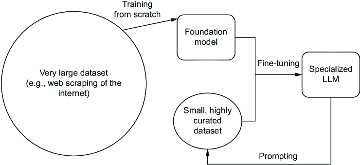
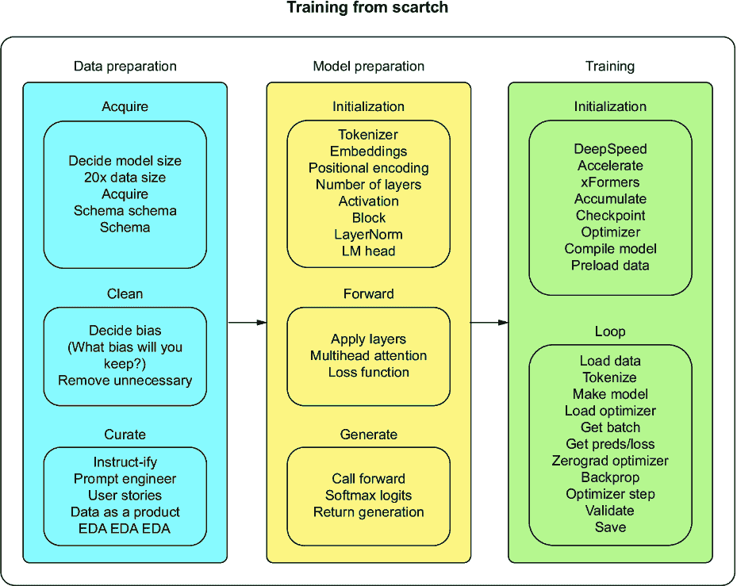
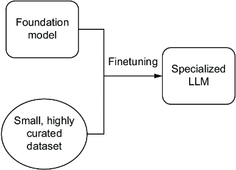
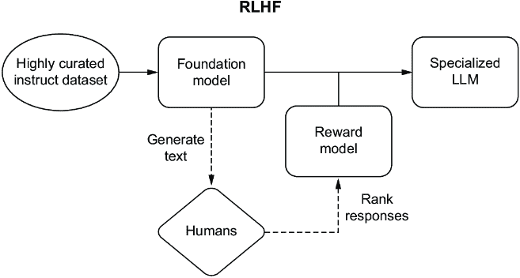

# 第五章：训练大型语言模型：如何生成生成器

### 本章涵盖

+   设置训练环境和常见库

+   应用各种训练技术，包括使用高级方法

+   提高训练效率的技巧和窍门

> 水滴石穿，我的朋友。——李小龙

你准备好享受乐趣了吗？！你为什么说前四章没有乐趣？好吧，我保证这一章绝对会有。我们已经提升了很多，并且获得了大量的背景知识，这将证明在开始动手时非常有价值。通过训练 LLM，我们可以创建能够做奇妙事情并具有独特个性的机器人。确实，我们可以创造新的朋友并与他们玩耍。在上一个章节中，我们向您展示了如何根据您的 Slack 消息创建一个训练数据集。现在，我们将向您展示如何使用这个数据集创建一个代表您自己的角色。最后，您将不再需要与那个令人讨厌的同事交谈，就像 Gilfoyle 一样，您可以有您自己的 AI Gilfoyle ([`youtu.be/IWIusSdn1e4`](https://youtu.be/IWIusSdn1e4))。

首先，我们将向您展示如何设置一个训练环境，因为这个过程可能非常资源密集，如果没有适当的设备，您将无法享受接下来的内容。然后，我们将向您展示如何进行基础知识的学习，比如从头开始训练和微调，之后我们将介绍一些最知名的方法来改进这些过程，使它们更高效、更快、更便宜。我们将以一些我们在训练模型过程中获得的经验和技巧来结束这一章。

## 5.1 多 GPU 环境

训练是一项资源密集型的工作。一个模型可能只需要单个 GPU 进行推理，但如果要并行化工作并加快速度，以便您不必等待千年才能完成训练，那么它可能需要 10 倍于此的 GPU。为了真正利用本章想要教给您的知识，我们首先需要让您在一个可以当作游乐场使用的环境中设置好。在本章的后面部分，我们还将教授一些资源最优策略，但如果你想要使用最大的 LLM，你将需要了解如何设置多 GPU 环境。

虽然您可以使用较小的 LLM 学到很多东西，但专业人士和业余爱好者之间的区别往往在于他们与大型模型工作的轻松和流畅。这有一个很好的原因，因为总体而言，大型模型优于小型模型。如果您想使用最大的模型，您将永远无法在笔记本电脑上开始。即使是大多数配备双 GPU 的定制游戏机也不足以进行推理，更不用说训练了。

为了这个目的，我们想与您分享一些获取云中多 GPU 环境访问权限的方法，然后我们将分享利用它们所需的工具和库。最大的模型无法适应单个 GPU，所以没有这些环境和工具，您将永远被困在简单模式下。

### 5.1.1 设置

需要事先指出的是，虽然多 GPU 环境功能强大，但它们也很昂贵。当涉及到多 GPU 时，我们所知的任何服务都没有提供免费层或优惠，但至少您可以放心，按小时付费将比批发购买设备便宜得多。当然，如果您能让您的公司支付账单，我们推荐这样做，但关闭您创建的任何环境以避免不必要的费用仍然是您的责任。

如果您的公司支付费用，那么它很可能已经选择了一个使整个过程变得简单的托管服务。对于我们其他人来说，在谷歌的计算引擎（Compute Engine）中设置一个虚拟机（VM）是其中最简单的方法之一。一旦设置完成，我们就会向您展示如何使用它。

##### 读者须知

为了学习目的，我们在本书的代码列表中使用了较小的模型，这样您就可以在单个 GPU 上本地工作，或者使用 Colab 或 Kaggle 等提供单个 GPU 免费层的服务。虽然这些列表可以在仅 CPU 的硬件上运行，但您可能不会想这样做。最终，在本书中运行这些昂贵的 VM 不应该有任何必要。然而，您可能仍然会想这样做。使用多个 GPU 进行训练要快得多，效率更高，并且通常是必要的。我们确实鼓励您尝试需要这些大型设备的大型 LLM 变体，因为这种体验是无价的。为了方便起见，您应该能够将本章中的代码回收用于比展示的模型和数据集更大的模型，这通常只是更改几行的问题。

#### 谷歌虚拟机

创建多 GPU 环境的最简单方法之一是在谷歌云上设置一个 VM。要开始，您需要创建一个账户，创建一个谷歌云项目（GCP），设置账单，并下载 gcloud CLI。这些步骤都不特别困难，但请确保按照您操作系统的文档在[`cloud.google.com/sdk/docs/install-sdk`](https://cloud.google.com/sdk/docs/install-sdk)中找到的说明来安装 SDK。这里的步骤还包括在“开始之前”部分中创建账户、项目和账单的步骤和操作指南，如果您还没有账户的话。

对于新账户，谷歌提供 300 美元的信用额度，可用于他们在 GCP 平台上的几乎所有服务，除了 GPU。我们很遗憾地告诉你这个消息，但很遗憾，我们这里没有免费的午餐。所以你需要确保升级到付费的 GCP 层级。不要担心；只需跟随操作，只需花费几美元，但如果你是精打细算的人，我们建议先阅读整个部分，然后再尝试。

在设置好账户后，默认情况下，GCP 将你的 GPU 配额设置为 0。配额用于管理你的成本。要增加配额，请访问[`console.cloud.google.com/iam-admin/quotas`](https://console.cloud.google.com/iam-admin/quotas)。你将寻找`gpus_all_regions`配额，由于我们计划使用多个 GPU，请提交一个请求将其增加到 2 个或更多。

在所有先决条件都准备就绪的情况下，我们将开始初始化并登录。你需要在电脑上的终端中运行以下命令：

```py
$ gcloud init
```

如果你需要安装 SDK，你可能已经完成了这一步，如果没有，它将启动一个网络浏览器，帮助我们登录并授权 gcloud CLI，这样我们就可以选择我们的项目。我们将假设你只有一个项目，但如果你不是第一次操作并且有多个项目，你需要在所有后续命令中添加`--project`标志。

接下来，我们需要确定两件事：机器类型（或我们想要使用的 GPU）和我们的容器镜像。要选择机器类型，你可以查看[`cloud.google.com/compute/docs/gpus`](https://cloud.google.com/compute/docs/gpus)上的不同选项。对于初学者，我们强烈推荐 NVIDIA L4 GPU，因为它是一款全能型的出色机器。对于我们来说，我们将使用带有两个 L4 GPU 的 g2-standard-24，每小时成本约为 2 美元。这种机器类型并非在每个区域和区域中都有，但你可以在[`cloud.google.com/compute/docs/regions-zones`](https://cloud.google.com/compute/docs/regions-zones)找到离你较近的区域。我们将使用 us-west1 区域和 us-west1-a 区域。

对于容器镜像，我们将使用一个已经设置好所有基本配置的镜像，这样可以节省我们很多麻烦。通常这意味着创建自己的镜像，但谷歌提供了几个预构建的深度学习容器镜像，这些镜像非常适合使用，或者作为一个基础镜像进行定制的好起点。这些镜像都可以在谷歌拥有的`deeplearning-platform -release`项目中找到。要查看可用的选项，你可以运行

```py
$ gcloud compute images list --project deeplearning-platform-release 
    --format=”value(NAME)” --no-standard-images
```

注意：你可以在[`cloud.google.com/deep-learning-vm/docs/images`](https://cloud.google.com/deep-learning-vm/docs/images)这里了解更多关于容器镜像选项的信息。

您可以从基础、TensorFlow 和 PyTorch 编译的镜像中进行选择，以及 CUDA 和 Python 版本。我们将使用 `common-gpu-v20230925-debian-11-py310`，这是一个简单的镜像，适用于带有 Debian Linux 发行版和 Python 3.10 的 GPU。现在我们已经拥有了所有需要的东西，我们可以创建我们的虚拟机了！请继续运行以下命令来设置虚拟机：

```py
$ INSTANCE_NAME="g2-llminprod-example"
    $ gcloud compute instances create ${INSTANCE_NAME} --zone=us-west1-a 
    --machine-type=g2-standard-24 --image-project=deeplearning-platform-release
    --image=common-gpu-v20230925-debian-11-py310 --boot-disk-size=200GB --scopes
    cloud-platform --metadata=install-unattended-upgrades=False,install-nvidia-
    driver=True --maintenance-policy TERMINATE --restart-on-failure
```

第一个命令创建一个环境变量来存储我们的虚拟机名称，因为我们还将在接下来的几个命令中使用它。这个名称可以是您想要的任何名称。下一个命令创建我们的虚拟机实例。前几个标志（`zone`、`image`、`machine`）应该是有意义的，因为我们刚刚在前面的段落中准备和收集了这些信息。`boot-disk-size` 设置虚拟机的磁盘空间，默认为 200 GB，因此它被包括在这里，因为对于 LLMs 来说很重要，因为它们是大型资产，您可能需要增加它——特别是对于需要多个 GPU 来运行的 LLMs。

`scopes` 标志用于设置授权。当前的 GCP 最佳实践建议将其设置为 `cloud-platform`，这通过 OAuth 和 IAM 角色确定授权。`metadata` 字段不是必需的，但在此用作技巧以确保已安装 NVIDIA 驱动程序。如果您使用这些命令创建一个 shell 脚本来自动化此过程，它将非常有用。您应该知道，它将在虚拟机启动和您实际可以 SSH 进入之间造成轻微的延迟，因为在安装驱动程序时它不会响应。如果您不包括它，第一次通过终端 SSH 进入时，它会询问您是否要安装它，所以没有损害。然而，如果您通过其他方法（在下文中描述）访问虚拟机，可能会遇到问题。最后两个命令是标准的维护策略。

一旦运行，您可以通过运行以下命令来验证虚拟机是否已启动：

```py
$ gcloud compute instances describe ${INSTANCE_NAME}
```

此命令将为您提供有关您实例的大量信息，值得仔细查看，包括应读取为 `'RUNNING'` 的状态字段。一旦您确认它已启动，我们将通过 SSH 进入它。如果您是第一次使用 gcloud 进行 SSH，将自动生成 SSH 密钥。请继续运行以下命令：

```py
$ gcloud compute ssh ${INSTANCE_NAME}
```

您的终端将进入我们的多 GPU 虚拟机，您现在可以开始工作了。在这个时候，您的虚拟机仍然只是一个空壳，所以您需要引入代码。最简单的方法是使用安全复制协议（SCP）复制文件。您可以为此执行单个文件或整个目录。例如，假设您的项目有一个 requirements.txt 文件和一个子目录 local-app-folder，从一个新的终端，您可以运行以下命令：

```py
$ gcloud compute scp requirements.txt ${INSTANCE_NAME}:~/requirements.txt
$ gcloud compute scp --recurse ~/local-app-folder/ 
${INSTANCE_NAME}:~/vm-app-folder
```

总体来说，还不错。一旦您完成了这个过程并设置了所有内容，下次设置虚拟机时，只需四个命令（`create`、`describe`、`ssh`、`scp`）即可启动和运行。

当然，这些实例会花费不少钱，所以在继续之前，你想要知道的最后一个命令是如何删除它：

```py
$ gcloud compute instances delete ${INSTANCE_NAME} --quiet
```

对于 Linux 高级用户来说，这一行代码可能就足够了，但对于我们这些普通人来说，通过终端进入虚拟机的工作环境并不理想。我们将向你展示一些技巧和窍门，以充分利用你的远程机器。

#### 通过 VS Code 进行 SSH

对于大多数开发者来说，终端就足够了，但我们真正想要的是 IDE。大多数 IDE 都提供远程 SSH 功能，但我们将使用 VS Code 进行演示。第一步是安装扩展程序 Remote-SSH（你可以在这里找到扩展程序：[`mng.bz/q0dE`](https://mng.bz/q0dE)）。其他扩展也提供这种功能，但 Remote-SSH 由微软维护，并且有超过 1700 万次安装，因此对于初学者来说是一个很好的选择。

接下来，我们将运行一个配置命令：

```py
$ gcloud compute config-ssh
```

然后，在 VS Code 内部，你可以按 F1 键打开命令面板并运行 Remote-SSH: Open SSH Host…命令，你应该会看到你的虚拟机的 SSH 地址，它看起来像 l4-llm-example.us-west1-a.project-id-401501\. 如果你看不到它，那么`config-ssh`命令可能出了问题，你可能需要再次运行`gcloud init`。选择地址，一个新的 VS Code 窗口应该会弹出。在底角，你会看到它正在连接到你的远程机器。这样你就完成了！很简单。从这里开始，你可以像在本地使用一样使用 VS Code。

### 5.1.2 库

虽然设置硬件很重要，但没有软件包使不同的硬件点能够有效地相互通信，任何硬件都无法工作。在使用 LLMs 的情况下，软件的重要性被放大了。一位作者亲身体验过所有硬件都正确配置，并且非常确信软件设置也同样配置正确，但启动训练模型时，却遇到了预计训练时间超过三年的情况。经过故障排除，团队意识到这是因为他安装了多个版本的 CUDA Toolkit，而 PyTorch 正在查看一个不兼容（最新版）的版本，而不是他打算使用的那个版本。

这些软件包不仅仅是为了使用 CUDA 与 GPU 的低级通信；它们还涉及到在数据通过每个计算运行时进行负载均衡、量化和并行化，以确保尽可能快地运行，同时仍然为矩阵提供一定程度的保真度。您不希望花费很长时间确保您的嵌入向量是卓越的表现，然后在运行时被扭曲。因此，我们介绍了每个从业者都应该了解的四个用于多 GPU 实例的深度学习库：DeepSpeed、Accelerate、BitsandBytes 和 xFormers。在撰写本文时，这些库之间的所有互补功能都是实验性的，因此请随意混合匹配。如果您能够一次性无错误地充分利用所有四个库，那么请快速将其放入可重用的容器中。

#### DeepSpeed

DeepSpeed 是一个用于分布式深度学习的优化库。DeepSpeed 由微软提供支持，并实现了各种增强功能，以提高训练和推理的速度，例如处理极长或不同模态的多个输入、量化、缓存权重和输入，以及目前最热门的话题之一：扩展到数千个 GPU。

如果您记得首先始终安装最新版本的 PyTorch（但不是夜间版本），那么安装过程相当简单。这意味着您还需要事先配置您的 CUDA 工具包。一旦有了这个包，使用`pip install deepspeed`应该就能让您达到想要的目的，除非，讽刺的是，您使用的是微软的其他产品。如果您使用的是 Windows 操作系统，那么支持仅限于部分，并且您需要遵循几个额外的步骤才能使其在推理模式下工作，而不是在训练模式下。

#### Accelerate

来自 Hugging Face 的 Accelerate 旨在帮助您抽象化并行化和扩展到多个 GPU 的代码，这样您就可以专注于训练和推理方面。Accelerate 的一个巨大优势是，与 PyTorch 的标准训练循环相比，它仅添加一个导入语句和两行代码，并更改两行其他代码。除此之外，Accelerate 还具有相当简单的 CLI 使用方式，允许它与 Terraform 或 AWS CDK 一起自动化。

Accelerate 在大多数环境中都具有兼容性，只要您的环境是 Python 3.8+和 PyTorch 1.10.0+（首先确保 CUDA 兼容性），您应该能够无问题地使用 Accelerate。一旦完成，使用`pip install accelerate`应该就能达到目的。如果您想同时获得 DeepSpeed 和 Accelerate 的好处，Accelerate 也提供了对 DeepSpeed 的实验性支持。

#### BitsandBytes

如果你在这个领域还不认识 Tim Dettmers 这个名字，你应该很快就会熟悉起来。很少有人像他那样做了很多工作，使得 CUDA 驱动的计算变得易于访问。这个包旨在帮助实践者量化模型，并在不同的位数（甚至 INT8）范围内进行高效的矩阵乘法，用于推理（以及可能训练）。

你应该不会在安装 BitsandBytes 时遇到太多麻烦，因为`pip install bitsandbytes`应该适用于大多数用例。如果你发现自己使用的是 Windows，那么你很幸运：`pip install bitsandbytes-windows`同样有效。如果你想用它与 Hugging Face 的 transformers 或 PyTorch 一起使用，你需要编辑这两个包中声明的某些最小要求，因为 Windows 版本与常规包的版本号不同。BitsandBytes 提供了 Adam 优化器和 NN 层（如 Linear）的自己的实现，以便在较小的设备上以更快的速度运行深度学习应用，同时最小化准确性的下降。

#### xFormers

我们推荐的大多数用例中最前沿的库是 xFormers，它是为研究和生产而设计的。遵循一个（希望）熟悉的类似 PyTorch 的独立构建块模式，xFormers 更进一步，提供了在 PyTorch 中相当长一段时间内都不会有的组件。我们使用得相当多的是内存高效的精确注意力，这大大加快了推理速度。

xFormers 比其他包有更多的要求，我们再次强调，使用一个或多个工具来跟踪你的环境是强烈推荐的。在 Linux 和 Windows 上，你需要 PyTorch 2.0.1，使用`pip install -U xFormers`应该对你有效。尽管如此，使用几乎任何其他版本的 PyTorch 都有安装路径，但主要版本是 1.12.1、1.13.1 和 2.0.1。

在表 5.1 中，我们可以看到每个包所做的工作及其如何与你的代码集成的详细分解。每个包都做类似的事情，但即使执行相同的任务，它们通常也会以不同的方式或在不同的模型或管道部分执行这些任务。包之间存在一些重叠，我们鼓励你使用所有这些包，看看它们可能如何对你有所帮助。现在你已经有了环境，并对我们将要使用的一些工具有了基本了解，让我们继续前进，看看它是如何运作的。

##### 表 5.1 机器学习优化包比较

| 库 | 更快的训练或推理 | 代码集成 | 降低了准确性 | 许多 GPU | 量化 | 优化 |
| --- | --- | --- | --- | --- | --- | --- |
| DeepSpeed  | Both  | CLI  | Depends  | Yes  | Supports  | 缓存、梯度检查点、内存管理、扩展  |
| Accelerate  | Both  | CLI and Code  | Depends  | Yes  | Supports  | 自动化、编译、并行化  |
| BitsandBytes  | Both  | Code  | Always  | NA  | Yes but only  | 量化、量化优化器  |
| xFormers  | Training  | Code  | Depends  | NA  | Yes and more  | 高效的注意力机制、内存管理  |

## 5.2 基本训练技术

在训练大型语言模型（LLM）时，通常的过程是从定义模型的架构、所需数据的性质和数量以及训练目标开始。我们已经在上一章中讨论了这些步骤，所以你应该已经做好了充分的准备，但让我们简要回顾一下。由于 Transformer 架构在捕捉长期依赖关系和其可并行化性质方面的有效性，模型架构通常遵循其变体，这使得它适合大规模计算。数据是任何 LLM（或任何一般机器学习模型）的生命线，通常需要大量多样且具有代表性的文本数据。由于模型的目的是学习预测序列中的下一个单词，因此确保数据覆盖广泛的语言环境至关重要。

因为在本章中我们将讨论各种训练技术，所以这里简要概述一下不同类型所需的投入。对于从头开始训练，你需要比模型参数数量多四倍以上的 VRAM 来存储模型，以及训练数据批次。因此，要训练一个 1B 参数的模型，你需要至少 5 或 6GB 的 VRAM，具体取决于你的批次大小和上下文长度。以训练一个 70B 参数的模型如 Llama 2 为例。你需要多少 VRAM 来适应模型，以及一个 32K 令牌的上下文限制？如果你得出的数字大约是 300GB 的 VRAM，那么你是对的。对于微调技术，由于以下几个原因，你将需要显著更少的资源——即量化以及所需的数据量，这意味着你不再需要 4 倍的 VRAM，但可以使用 2 倍或 1 倍的 VRAM，只要设置正确。

与传统的机器学习模型不同，LLM 通常分阶段进行训练。图 5.1 显示了 LLM 的基本训练生命周期，从零开始，然后是微调，最后是提示。第一步是创建我们的基础模型，我们在这个大型、通常未经精炼的数据集上训练一个空壳模型。这次训练将创建一个模型，它已经看到了如此大量的文本，似乎对语言有基本理解。然后我们可以使用那个基础模型，并采用迁移学习技术，通常在小型、高度精选的数据集上进行微调，以创建一个针对专家任务的专用 LLM。最后，我们使用提示技术，虽然这不是传统的训练方法，但它允许我们刺激模型以特定的方式或格式响应，从而提高我们结果的准确性。



##### 图 5.1 LLM 的训练生命周期。我们首先基于大量文本创建一个基础模型，然后使用针对特定任务的精选数据集进行微调。然后我们可以通过使用模型本身和提示等技术来增强或扩大我们的精选数据集，进一步改进模型。

你会注意到，训练生命周期通常是一个连续的循环——训练模型以更好地理解语言，然后使用这些模型来改进我们的训练数据集。在本章的后面部分，我们将更深入地探讨其他利用这个循环的高级训练技术，如提示调整和强化学习与人类反馈（RLHF）。现在，让我们巩固对三个基本步骤的理解。

### 5.2.1 从零开始

训练一个大型语言模型（LLM）在计算上非常密集，即使在高性能硬件上也可能需要几周或几个月的时间。这个过程会将数据块（或称为“批次”）输入到模型中，并根据计算出的损失来调整权重。随着时间的推移，这种预测和调整的迭代过程，也称为一个 epoch，使模型能够提高对数据中的句法结构和复杂性的理解。值得注意的是，监控训练过程对于避免过拟合至关重要，过拟合会导致模型过度适应训练数据，在未见过的数据上表现不佳。使用诸如提前停止、dropout 和学习率调度等技术来确保模型的泛化能力，但它们并非万能的解决方案。记住，最终目标不仅仅是最小化训练数据上的损失，而是创建一个能够在广泛语境下理解和生成类似人类文本的模型。

从零开始训练一个大型语言模型（LLM）是一个复杂的过程，它始于定义模型的架构。这个决定应该由具体任务、训练数据集的大小以及可用的计算资源来指导。简单来说，架构是模型的蓝图，它描述了层的数量和排列、层的类型（如注意力层或前馈层），以及它们之间的连接。现代的 LLM 通常采用 Transformer 架构的变体，这种架构以其处理长序列数据的可扩展性和效率而闻名。

一旦确定了模型的架构，下一步就是为训练编译一个大型且多样化的数据集。输入到模型中的数据的质量和多样性在很大程度上决定了模型理解和生成类似人类文本的能力。一种常见的方法是使用大量的网络文本语料库，确保有广泛多样的风格、主题和结构。然后对这些数据进行预处理和分词，将原始文本转换为模型可以学习的数值格式。在分词过程中，文本被分割成更小的单元，或称为标记，这些标记可能短至单个字符，也可能长至一个单词。

模型和数据集准备就绪后，下一步是初始化模型并设置学习目标。LLM 的训练使用自回归半监督学习技术，其中模型学习根据前面的单词预测序列中的下一个单词。模型的权重随机初始化，然后通过反向传播和优化技术（如 Adam 或随机梯度下降）根据模型预测与训练数据中实际单词之间的差异进行调整。目标是最小化这种差异，通常称为“损失”，以提高模型的预测准确性。

训练过程包括将分词后的文本输入到模型中，并调整模型的内部参数以最小化损失。我们之前已经提到过，但需要再次强调：这个过程计算量很大，可能需要数周甚至数月才能完成，具体取决于模型的大小和可用的硬件。训练完成后，模型将在一个单独的验证数据集上评估，以确保它能够泛化到未见过的数据。根据模型在验证集上的表现，通常需要迭代这个过程，微调模型参数并根据需要调整架构。

让我们探索从零开始训练一个全新的基于 Transformer 的语言模型，这意味着没有任何先前定义的架构、嵌入或权重。图 5.2 展示了这个过程。通常你不需要从头开始训练 LLM，你通常也不希望这样做，因为这是一项非常昂贵且耗时的任务；然而，了解这个过程可以极大地帮助你。



##### 图 5.2 从头开始训练语言模型（大或小）所需的所有步骤的简化版本。你必须有数据，然后定义所有模型行为，然后才能开始训练。

列表 5.1 允许你运行整个过程而不需要训练一个真正的巨大模型，所以请随意用这段代码进行探索。对于更复杂和完整的示例，请查看 Andrej Karpathy 的 minGPT 项目：[`github.com/karpathy/minGPT`](https://github.com/karpathy/minGPT)。在审查列表时，请注意一些事情。你可能还记得我们在上一章讨论了标记化和嵌入，所以要注意的一点是，为了简单起见，我们将使用基于字符的标记化器。在你运行代码之前，你能预测这是不是一个好主意吗？此外，请注意我们如何使用我们之前简要介绍过的 Accelerate 和 BitsandBytes 库；你会发现这些库非常有用。接下来，我们将逐步构建 LLMs 架构，以模块化的方式构建每个部分，并最终定义每个部分的使用数量和放置位置，几乎就像乐高积木一样。最后，在代码的最后一部分，你会看到一个典型的模型训练循环，包括分割数据、分批运行 epoch 等。

##### 列表 5.1 从头开始训练的示例

```py
import os
import torch
from accelerate import Accelerator

import bitsandbytes as bnb  

class GPT(torch.nn.Module):      #1
    def __init__(self):
        super().__init__()
        self.token_embedding = torch.nn.Embedding(vocab_size, n_embed)
        self.positional_embedding = torch.nn.Embedding(block_size, n_embed)
        self.blocks = torch.nn.Sequential(
            *[Block(n_embed, n_head=n_head) for _ in range(n_layer)]
        )
        self.ln_f = torch.nn.LayerNorm(n_embed)
        self.lm_head = torch.nn.Linear(n_embed, vocab_size)

        self.apply(self._init_weights)

    def forward(self, idx, targets=None):
        B, T = idx.shape

        tok_emb = self.token_embedding(idx)
        pos_emb = self.positional_embedding(torch.arange(T, device=device))
        x = tok_emb + pos_emb
        x = self.blocks(x)
        x = self.ln_f(x)
        logits = self.lm_head(x)

        if targets is None:
            loss = None
        else:
            B, T, C = logits.shape
            logits = logits.view(B * T, C)
            targets = targets.view(B * T)
            loss = torch.nn.functional.cross_entropy(logits, targets)

        return logits, loss

    def _init_weights(self, module):
        if isinstance(module, torch.nn.Linear):
            torch.nn.init.normal_(module.weight, mean=0.0, std=0.02)
            if module.bias is not None:
                torch.nn.init.zeros_(module.bias)
        elif isinstance(module, torch.nn.Embedding):
            torch.nn.init.normal_(module.weight, mean=0.0, std=0.02)

    def generate(self, idx, max_new_tokens):
        for _ in range(max_new_tokens):
            idx_cond = idx[:, -block_size:]
            logits, loss = self(idx_cond)
            logits = logits[:, -1, :]
            probs = torch.nn.functional.softmax(logits, dim=-1)
            idx_next = torch.multinomial(probs, num_samples=1)
            idx = torch.cat((idx, idx_next), dim=1)
        return idx

class Block(torch.nn.Module):          #2
    def __init__(self, n_embed, n_head):
        super().__init__()
        head_size = n_embed // n_head
        self.self_attention = MultiHeadAttention(n_head, head_size)
        self.feed_forward = FeedFoward(n_embed)
        self.ln1 = torch.nn.LayerNorm(n_embed)
        self.ln2 = torch.nn.LayerNorm(n_embed)

    def forward(self, x):
        x = x + self.self_attention(self.ln1(x))
        x = x + self.feed_forward(self.ln2(x))
        return x

class MultiHeadAttention(torch.nn.Module):
    def __init__(self, num_heads, head_size):
        super().__init__()
        self.heads = torch.nn.ModuleList(
            [Head(head_size) for _ in range(num_heads)]
        )
        self.projection = torch.nn.Linear(head_size * num_heads, n_embed)
        self.dropout = torch.nn.Dropout(dropout)

    def forward(self, x):
        out = torch.cat([h(x) for h in self.heads], dim=-1)
        out = self.dropout(self.projection(out))
        return out

class Head(torch.nn.Module):
    def __init__(self, head_size):
        super().__init__()
        self.key = torch.nn.Linear(n_embed, head_size, bias=False)
        self.query = torch.nn.Linear(n_embed, head_size, bias=False)
        self.value = torch.nn.Linear(n_embed, head_size, bias=False)
        self.register_buffer(
            "tril", torch.tril(torch.ones(block_size, block_size))
        )

        self.dropout = torch.nn.Dropout(dropout)

    def forward(self, x):
        _, T, _ = x.shape
        k = self.key(x)
        q = self.query(x)
        attention = q @ k.transpose(-2, -1) * k.shape[-1] ** 0.5
        attention = attention.masked_fill(
            self.tril[:T, :T] == 0, float("-inf")
        )
        attention = torch.nn.functional.softmax(attention, dim=-1)
        attention = self.dropout(attention)

        v = self.value(x)
        out = attention @ v
        return out

class FeedFoward(torch.nn.Module):
    def __init__(self, n_embed):
        super().__init__()
        self.net = torch.nn.Sequential(
            torch.nn.Linear(n_embed, 4 * n_embed),
            torch.nn.ReLU(),
            torch.nn.Linear(4 * n_embed, n_embed),
            torch.nn.Dropout(dropout),
        )

    def forward(self, x):
        return self.net(x)

def encode(string):      #3
    return [utt2int[c] for c in string]

def decode(line):
    return "".join([int2utt[i] for i in line])

def get_batch(split):
    data = train_data if split == "train" else val_data
    idx = torch.randint(len(data) - block_size, (batch_size,))
    x = torch.stack([data[i : i + block_size] for i in idx])
    y = torch.stack([data[i + 1 : i + block_size + 1] for i in idx])
    x, y = x.to(device), y.to(device)
    return x, y

@torch.no_grad()
def estimate_loss():
    out = {}
    model.eval()
    for split in ["train", "val"]:
        losses = torch.zeros(eval_iters)
        for k in range(eval_iters):
            X, Y = get_batch(split)
            logits, loss = model(X, Y)
            losses[k] = loss.item()
        out[split] = losses.mean()
    model.train()
    return out

if __name__ == "__main__":       #4
    batch_size = 64  # Number of utterances at once      #5
    block_size = 256  # Maximum context window size
    max_iters = 5000
    eval_interval = 500
    learning_rate = 3e-4
    eval_iters = 200
    n_embed = 384
    n_head = 6
    n_layer = 6
    dropout = 0.2
    accelerator = Accelerator()
    device = accelerator.device
    doing_quantization = False  # Change to True if imported bitsandbytes

    with open("./data/crimeandpunishment.txt", "r", encoding="utf-8") as f:  #6
        text = f.read()

    chars = sorted(list(set(text)))     #7
    vocab_size = len(chars)
    utt2int = {ch: i for i, ch in enumerate(chars)}
    int2utt = {i: ch for i, ch in enumerate(chars)}

    data = torch.tensor(encode(text), dtype=torch.long)
    n = int(0.9 * len(data))
    train_data = data[:n]
    val_data = data[n:]

    model = GPT().to(device)          #8
    print("Instantiated Model")
    print(
        sum(param.numel() for param in model.parameters()) / 1e6,
        "Model parameters",
    )

    optimizer = (
        torch.optim.AdamW(model.parameters(), lr=learning_rate)
        if not doing_quantization
        else bnb.optim.Adam(model.parameters(), lr=learning_rate)
    )
    print("Instantiated Optimizer")

    model, optimizer, train_data = accelerator.prepare(
        model, optimizer, train_data
    )
    print("Prepared model, optimizer, and data")

    # 
    for iter in range(max_iters):     #9
        print(f"Running Epoch {iter}")
        if iter % eval_interval == 0 or iter == max_iters - 1:
            losses = estimate_loss()
            print(
                f"| step {iter}: train loss {losses['train']:.4f} "
                "| validation loss {losses['val']:.4f} |"
            )

        xb, yb = get_batch("train")
        logits, loss = model(xb, yb)
        optimizer.zero_grad(set_to_none=True)
        accelerator.backward(loss)
        optimizer.step()

    model_dir = "./models/scratchGPT/"      #10
    if not os.path.exists(model_dir):
        os.makedirs(model_dir)

    model_path = model_dir + "model.pt"    #11
    torch.save(
        model.state_dict(),
        model_path,
    )

    loaded = GPT().load_state_dict(model_path)      #12

    context = torch.zeros((1, 1), dtype=torch.long, device=device)    #13
    print(decode(loaded.generate(context, max_new_tokens=500)[0].tolist()))
```

#1 Δefines the overall GPT architecture

#2 Δefines the building blocks of the model

#3 训练辅助函数

#4 训练模型

#5 实验参数

#6 Δataset

#7 基于字符的伪标记化

#8 实例化模型并查看参数

#9 训练块

#10 创建模型目录

#11 保存模型

#12 加载已保存的模型

#13 测试已加载的模型

在列表 5.1 中，我们探讨了 GPT 系列模型如何组合乐高积木，并展示了一个类似于我们在第二章中探索语言模型的训练循环。除了展示模型生成预训练的第一部分之外，这个例子还说明了为什么基于字符的建模，无论是卷积还是其他方式，对于语言建模来说都很弱。你理解了吗？是的，基于字符的建模并不是最好的。字母本身并不包含足够的信息来产生具有统计意义的成果，无论调整量有多大。从语言学的角度来看，这是显而易见的，因为字母和正字法，总的来说，是人类生成意义的表示，这并不是内在捕捉到的。

有一些方法可以帮助捕捉这些信息，比如通过词、子词或句子级别的标记化来增加我们的标记化捕获窗口。我们也可以在向模型展示我们的任务之前完成预训练，以便它尽可能多地捕捉近似表示。接下来，我们将展示结合这两个步骤如何对我们的模型性能产生好处。

### 5.2.2 迁移学习（微调）

迁移学习是机器学习中的一个基本方法，也是训练 LLM 的基石。它基于这样的观点：我们可以从一个问题（源领域）中学到的知识重新使用，并将其应用到不同但相关的问题（目标领域）上。在 LLM 的背景下，这通常意味着使用一个在大规模多样化数据集上训练过的预训练模型，并将其调整到更具体的任务或领域。

在迁移学习的第一步中，一个大型通用语料库上的 LLM（大型语言模型）被训练，例如维基百科的全部内容、书籍或互联网。这个预训练阶段使得模型能够在广泛的各个主题上学习到广泛的语言模式和细微差别。这里的目的是学习一种通用的语言表示，它能够捕捉对语法、语义和世界知识的广泛理解。这些模型通常需要经过多次迭代训练，并且需要大量的计算资源，这就是为什么使用像 OpenAI 或 Hugging Face 这样的组织提供的预训练模型是实际可行的。

预训练之后，LLM 会在特定任务或领域上进行更新。这个更新过程将模型的通用语言理解调整为更具体的任务，例如情感分析、文本分类或问答。更新通常比初始预训练阶段需要的计算资源少得多，因为它涉及到在针对手头任务的小型特定数据集上进行训练。通过这个过程，模型能够将预训练期间获得的大量知识应用到特定任务上，通常优于从头开始训练的模型。这种迁移学习的过程导致了近年来 NLP（自然语言处理）的许多进步。

#### 微调

迁移学习有多种不同的技术，但说到 LLM，大家最关心的还是微调。微调 LLM 涉及取一个预训练模型——即已经在大型通用语料库上训练过的模型——并调整它以执行特定任务或理解特定数据领域。

这种技术利用了基础模型已经对语言有了相当多的了解的事实，让你能够在不承担相关计算成本和时间的情况下享受到大规模模型的好处。微调的过程将模型现有的知识调整为特定任务或领域，使其更适合你的特定用例。这就像有一个对语言已经理解得很透彻的通才，然后为特定工作提供专业培训。由于与从头开始训练模型相比，这种方法显著降低了计算需求和训练时间，因此对于大多数用户来说通常更可行。

微调的第一步是选择一个合适的预训练模型。这个决定取决于你希望模型执行的具体任务以及你拥有的资源。请记住，这意味着在训练之前为模型的行为设定一个目标。一旦选择了预训练模型，就至关重要地准备你希望模型从中学习的特定数据集。例如，如果你试图微调模型以理解医学语言，这些数据可能是一组医学文本。数据必须以与模型预训练兼容的方式进行预处理和分词。

微调过程涉及在您的特定数据集上训练模型，但有一个转折：不是从头开始学习，而是调整模型的现有知识以更好地适应新数据。这种微调通常使用比初始训练阶段更小的学习率进行，以防止模型忘记之前学到的知识。微调后，模型将在一个单独的数据集上评估，以确保它可以在特定领域中对未见过的数据进行泛化。类似于从头开始训练，这个过程可能需要多次迭代以优化模型性能。微调提供了一种利用 LLMs（大型语言模型）在特定任务或领域中的能力，而无需大量资源或计算时间。见图 5.3。



##### 图 5.3 微调与从头开始训练的不同之处在于，你不需要定义模型行为，你可以使用完全相同的训练循环，并且数据需求量更少。

在列表 5.2 中，我们向您展示了如何微调一个 GPT 模型。注意，与列表 5.1 相比，这个列表中的代码要少得多。我们不需要定义架构或分词器；我们只需使用原始模型中的那些。本质上，我们得以跳过，因为权重和嵌入已经定义好了。

##### 列表 5.2 微调示例

```py
import os
from transformers import (
    GPT2Tokenizer,
    GPT2LMHeadModel,
    GPT2Config,
    DataCollatorForLanguageModeling,
    TrainingArguments,
    Trainer,
)
from datasets import load_dataset

dataset = load_dataset("text", data_files="./data/crimeandpunishment.txt")  #1
dataset = dataset.filter(lambda sentence: len(sentence["text"]) > 1)
print(dataset["train"][0])

model_dir = "./models/betterGPT/"    #2
if not os.path.exists(model_dir):
    os.makedirs(model_dir)
config = GPT2Config(       #3
    vocab_size=50261,
    n_positions=256,
    n_embd=768,
    activation_function="gelu",
)

tokenizer = GPT2Tokenizer.from_pretrained("gpt2")    #4
special_tokens_dict = {
    "bos_token": "<BOS>",
    "eos_token": "<EOS>",
    "pad_token": "<PAD>",
    "mask_token": "<MASK>",
}
tokenizer.add_special_tokens(special_tokens_dict)

model = GPT2LMHeadModel.from_pretrained(                 #5
    "gpt2", config=config, ignore_mismatched_sizes=True
)

def tokenize(batch):     #6
    return tokenizer(
        str(batch), padding="max_length", truncation=True, max_length=256
    )

tokenized_dataset = dataset.map(tokenize, batched=False)    #7
print(f"Tokenized: {tokenized_dataset['train'][0]}")

data_collator = DataCollatorForLanguageModeling(       #8
    tokenizer=tokenizer, mlm=True, mlm_probability=0.15
)  # Masked Language Modeling - adds <MASK> tokens to guess the words

train_args = TrainingArguments(      #9
    output_dir=model_dir,
    num_train_epochs=1,
    per_device_train_batch_size=8,
    save_steps=5000,
    save_total_limit=2,
    report_to="none",
)

trainer = Trainer(      #10
    model=model,
    args=train_args,
    data_collator=data_collator,
    train_dataset=tokenized_dataset["train"],
)

trainer.train()                #11
trainer.save_model(model_dir)
tokenizer.save_pretrained()

model = GPT2LMHeadModel.from_pretrained(model_dir)   #12
input = "To be or not"                                    #13
tokenized_inputs = tokenizer(input, return_tensors="pt")
out = model.generate(
    input_ids=tokenized_inputs["input_ids"],
    attention_mask=tokenized_inputs["attention_mask"],
    max_length=256,
    num_beams=5,
    temperature=0.7,
    top_k=50,
    top_p=0.90,
    no_repeat_ngram_size=2,
)
print(tokenizer.decode(out[0], skip_special_tokens=True))
```

#1 加载并格式化数据集

#2 创建模型目录以保存

#3 建立我们的 GPT-2 参数（与论文和 scratchGPT 不同）

#4 实例化我们的分词器和特殊标记

#5 从配置中实例化我们的模型

#6 创建一个分词函数

#7 对整个数据集进行分词（这样我们就不必再次进行）

#8 创建一个数据收集器以格式化训练数据

#9 建立训练参数

#10 实例化训练器

#11 训练并保存模型

#12 加载保存的模型

#13 测试保存的模型

比较列表 5.2 和列表 5.1，它们的架构几乎完全相同（除了激活函数），并且它们在完全相同的数据上训练。然而，由于第一个模型中缺乏学习到的表示，微调后的 GPT-2 模型有了显著的改进。我们的预训练模型，以及与基于字符的标记化相比的子词 BPE 标记化，帮助模型确定哪些统计上确定的单位最有可能一起出现。不过，你会发现，即使经过预训练，GPT-2 在使用更新、更好的激活函数的情况下，仍然难以生成相关的较长的叙述。

#### 微调 OpenAI

我们刚刚从头开始训练了一个 GPT 模型，然后微调了 GPT-2，但我们知道许多读者真正想要的是 OpenAI 更大 GPT 模型背后的力量。尽管这些是专有模型，但 OpenAI 非常慷慨地创建了一个 API，我们可以通过它微调 GPT-3 模型。目前，OpenAI 的平台上有三个模型可供微调，但看起来它打算将这种微调能力扩展到其提供的所有模型。OpenAI 编写了一整篇指南，你可以在[`platform.openai.com/`](http://platform.openai.com/)找到，但一旦你以必要的格式准备好了你的数据集，代码就相当简单。以下是针对各种任务的片段：

```py
import os
from openai import OpenAI

client = OpenAI()
client.api_key = os.getenv("OPENAI_API_KEY")
client.files.create(
  file=open("mydata.jsonl", "rb"),
  purpose='fine-tune'
)
```

这个片段首先上传了一个符合平台正确格式的训练数据集，并指定了用途为微调，但还没有开始这个过程。接下来，你需要创建微调作业：

```py
client.fine_tuning.jobs.create(training_file="file-abc123", model="gpt-3.5-turbo")
```

这是你指定要微调哪个训练文件和哪个模型的地方。一旦 OpenAI 的训练循环完成，当你检索作业详情时，你将看到微调模型的名称被填充。现在你可以像使用任何常规模型一样使用该模型进行聊天完成或其他类似操作：

```py
completion = client.chat.completion.create(
  model="ft:gpt-3.5-turbo:my-org:custom_suffix:id",
  messages=[
    {"role": "system", "content": "You are a helpful assistant."},
    {"role": "user", "content": "Hello!"}
  ]
)
print(completion.choices[0].message)
```

这就是微调 OpenAI 模型的所有内容！非常简单，不需要太长时间，截至 2023 年 3 月，你的数据对你来说是私密的。当然，你将把微调过程的所有控制权交给 OpenAI。如果你想做一些超越常规微调的事情，你需要自己来做。就在下一分钟，我们将讨论你可能考虑的技术，以及一些可以帮助更精细模型和更复杂任务的更高级过程。

### 5.2.3 提示

与传统机器学习相比，LLMs 之所以如此强大，主要原因是我们可以实时训练它们。给他们一组指令，然后观察它们尽其所能地遵循这些指令。这种技术被称为提示（prompting），在 LLMs 中用于引导模型输出。本质上，提示是提供给模型的初始输入，为它提供上下文或执行什么操作的指令。例如，“将以下英文文本翻译成法语”和“总结以下文章”都是提示。在 LLMs 的背景下，提示变得尤为重要，因为这些模型并没有被明确编程来执行特定任务，而是根据给定的提示学习响应各种任务。

提示工程是指构建有效的提示来引导模型行为的过程。目标是创建能够引导模型提供最理想或最有用的输出的提示。提示工程可能比看起来更复杂，因为提示语式的微小变化可能会导致模型产生截然不同的响应。提示工程的一些策略包括在提示中更加明确，提供期望输出的示例，或者以不同的方式重新措辞提示以获得最佳结果。它是一种艺术和科学的结合，需要很好地理解模型的能力和限制。

在本章中，我们将主要关注训练和微调，这是部署前的步骤，但如果我们不首先提及提示（prompt），那将是我们的疏忽。我们将在第七章更深入地讨论提示。

## 5.3 高级训练技术

现在你已经知道了如何进行基础操作，让我们来了解一下一些更高级的技术。这些技术出于各种原因而被开发，例如提高生成的文本输出质量、缩小模型大小、提供持续学习、加快训练速度以及降低成本。根据你组织的需要，你可能需要寻找不同的训练解决方案。虽然这不是一个详尽的列表，但以下技术经常被使用，并且在你准备一个生产就绪的模型时应该是有价值的工具。

##### 经典机器学习训练背景

要了解一些增强微调过程的技术需要一些背景知识。我们不会进行一次完整的机器学习课程；然而，如果你是第一次接触，你应该了解一些经典的实验学习范式，这些范式实验通常会遵循——监督学习、无监督学习、对抗学习和强化学习：

+   监督学习涉及收集用于训练的数据和展示预期输出的标签。

+   无监督学习不需要标签，因为数据会被探测相似性并分组到彼此最接近的簇中。

+   对抗性学习是用于训练生成对抗网络的方法。它涉及两个模型，通常被称为评论家模型（Critic model）和伪造者模型（Forger model）。这两个模型本质上是在玩一个游戏，伪造者试图复制一些理想的输出，而评论家则试图确定伪造品是否为真品。

+   强化学习（RL）选择建立奖励函数，而不是为模型提供预定义的标签来学习。通过测量模型的行为，根据该函数给予它奖励。

所有大型语言模型（LLM）都必须使用其中至少一种进行训练，并且当所有这些训练方法都正确执行时，它们的表现都非常出色。本章讨论的训练技术不同于那些基本方法，从向模型添加某种形式的人类输入到将输出进行比较，以及改变模型执行矩阵乘法的方式。

### 5.3.1 提示调整

我们之前已经讨论过语用学，但为了提醒，当语言模型被给予与任务和期望相关的真实世界非语义上下文时，它们的表现会更好。所有语言建模技术都基于这样一个基本假设：给定输入和期望输出，语言模型（LM）可以推断出要完成的任务，并在指定的参数数量内以最佳方式完成它。

虽然模型从数据中推断任务和完成它的方法的想法很有希望，但时间一次又一次地表明，从 BERT 到每个 T5 模型，现在到所有 LLM，为模型提供预期的任务和解决任务所需的相关信息可以极大地提高模型性能。早在 2021 年，谷歌研究、DeepMind 和 OpenAI 都发表了关于提示调整或训练期间为模型提供实用上下文的论文。提示调整的好处是减少模型在训练过程中收敛所需的数据量，甚至更酷的是，能够在不重新训练或完全微调的情况下，为新的任务重用完全冻结的语言模型。

由于 LLM 非常大（并且还在变大），因此共享它们变得越来越困难，甚至在保证它们在特定任务上的性能方面更加困难，即使这些任务是在它们被训练时。提示调整可以帮助模型朝着正确的方向引导，而不会成为重大的成本。图 5.4 展示了这个过程。


##### 图 5.4 中，提示调整（Prompt tuning）放弃了大部分微调，以使大多数基础模型的语言理解能力保持完全不变，相反，它专注于改变模型对特定输入的响应方式。

列表 5.3 展示了如何对 Big Science 中的 BLOOMZ 模型的一个较小变体进行提示调整。BLOOMZ 作为 LLM 空间中的早期竞争者发布，但由于其无法生成首选输出，尽管其数学上合理，但最终在社区中难以引起关注或获得动力。由于提示调整并没有给我们在列表 5.2 中使用的常规微调结构增加太多，我们将执行参数高效微调（PEFT），这通过确定哪些模型参数需要最大程度地改变来大幅减少内存需求。

##### 列表 5.3 提示调整的示例

```py
import os
from transformers import (
    AutoModelForCausalLM,
    AutoTokenizer,
    default_data_collator,
    get_linear_schedule_with_warmup,
)
from peft import (
    get_peft_model,
    PromptTuningInit,
    PromptTuningConfig,
    TaskType,
)
import torch
from datasets import load_dataset
from torch.utils.data import DataLoader
from tqdm import tqdm

def preprocess_function(examples):          #1
    batch_size = len(examples[text_column])
    inputs = [
        f"{text_column} : {x} Label : " for x in examples[text_column]
    ]
    targets = [str(x) for x in examples[label_column]]
    model_inputs = tokenizer(inputs)
    labels = tokenizer(targets)

    for i in range(batch_size):
        sample_input_ids = model_inputs["input_ids"][i]
        label_input_ids = labels["input_ids"][i] + [tokenizer.pad_token_id]
        model_inputs["input_ids"][i] = sample_input_ids + label_input_ids
        labels["input_ids"][i] = [-100] * len(
            sample_input_ids
        ) + label_input_ids
        model_inputs["attention_mask"][i] = [1] * len(
            model_inputs["input_ids"][i]
        )
    for i in range(batch_size):
        sample_input_ids = model_inputs["input_ids"][i]
        label_input_ids = labels["input_ids"][i]
        model_inputs["input_ids"][i] = [tokenizer.pad_token_id] * (
            max_length - len(sample_input_ids)
        ) + sample_input_ids
        model_inputs["attention_mask"][i] = [0] * (
            max_length - len(sample_input_ids)
        ) + model_inputs["attention_mask"][i]
        labels["input_ids"][i] = [-100] * (
            max_length - len(sample_input_ids)
        ) + label_input_ids
        model_inputs["input_ids"][i] = torch.tensor(
            model_inputs["input_ids"][i][:max_length]
        )
        model_inputs["attention_mask"][i] = torch.tensor(
            model_inputs["attention_mask"][i][:max_length]
        )
        labels["input_ids"][i] = torch.tensor(
            labels["input_ids"][i][:max_length]
        )

    model_inputs["labels"] = labels["input_ids"]
    return model_inputs

if __name__ == "__main__":         #2
    # Define training parameters
    device = "cuda"
    model_name_or_path = "bigscience/bloomz-560m"
    tokenizer_name_or_path = "bigscience/bloomz-560m"
    dataset_name = "twitter_complaints"
    text_column = "Tweet text"
    label_column = "text_label"
    max_length = 64
    lr = 3e-2
    num_epochs = 1
    batch_size = 8

    peft_config = PromptTuningConfig(      #3
        task_type=TaskType.CAUSAL_LM,
        prompt_tuning_init=PromptTuningInit.TEXT,
        num_virtual_tokens=8,
        prompt_tuning_init_text="Classify if the tweet "
        "is a complaint or not:",
        tokenizer_name_or_path=model_name_or_path,
    )
    checkpoint_name = (
        f"{dataset_name}_{model_name_or_path}"
        f"_{peft_config.peft_type}_{peft_config.task_type}_v1.pt".replace(
            "/", "_"
        )
    )
    dataset = load_dataset("ought/raft", dataset_name)    #4
    print(f"Dataset 1: {dataset['train'][0]}")

    classes = [          #5
        label.replace("_", " ")
        for label in dataset["train"].features["Label"].names
    ]
    dataset = dataset.map(
        lambda x: {"text_label": [classes[label] for label in x["Label"]]},
        batched=True,
        num_proc=1,
    )
    print(f"Dataset 2: {dataset['train'][0]}")

    tokenizer = AutoTokenizer.from_pretrained(model_name_or_path)    #6
    if tokenizer.pad_token_id is None:
        tokenizer.pad_token_id = tokenizer.eos_token_id
    target_max_length = max(
        [
            len(tokenizer(class_label)["input_ids"])
            for class_label in classes
        ]
    )
    print(f"Target Max Length: {target_max_length}")

    processed_datasets = dataset.map(           #7
        preprocess_function,
        batched=True,
        num_proc=1,
        remove_columns=dataset["train"].column_names,
        load_from_cache_file=False,
        desc="Running tokenizer on dataset",
    )

    train_dataset = processed_datasets["train"]     #8
    eval_dataset = processed_datasets["test"]

    train_dataloader = DataLoader(
        train_dataset,
        shuffle=True,
        collate_fn=default_data_collator,
        batch_size=batch_size,
        pin_memory=True,
    )
    eval_dataloader = DataLoader(
        eval_dataset,
        collate_fn=default_data_collator,
        batch_size=batch_size,
        pin_memory=True,
    )
    model = AutoModelForCausalLM.from_pretrained(model_name_or_path)   #9
    model = get_peft_model(model, peft_config)
    print(model.print_trainable_parameters())
    model = model.to(device)

    optimizer = torch.optim.AdamW(model.parameters(), lr=lr)    #10
    lr_scheduler = get_linear_schedule_with_warmup(
        optimizer=optimizer,
        num_warmup_steps=0,
        num_training_steps=(len(train_dataloader) * num_epochs),
    )

    for epoch in range(num_epochs):    #11
        model.train()
        total_loss = 0
        for step, batch in enumerate(tqdm(train_dataloader)):
            batch = {k: v.to(device) for k, v in batch.items()}
            outputs = model(**batch)
            loss = outputs.loss
            total_loss += loss.detach().float()
            loss.backward()
            optimizer.step()
            lr_scheduler.step()
            optimizer.zero_grad()

        model.eval()
        eval_loss = 0
        eval_preds = []
        for step, batch in enumerate(tqdm(eval_dataloader)):
            batch = {k: v.to(device) for k, v in batch.items()}
            with torch.no_grad():
                outputs = model(**batch)
            loss = outputs.loss
            eval_loss += loss.detach().float()
            eval_preds.extend(
                tokenizer.batch_decode(
                    torch.argmax(outputs.logits, -1).detach().cpu().numpy(),
                    skip_special_tokens=True,
                )
            )

        eval_epoch_loss = eval_loss / len(eval_dataloader)
        eval_ppl = torch.exp(eval_epoch_loss)
        train_epoch_loss = total_loss / len(train_dataloader)
        train_ppl = torch.exp(train_epoch_loss)
        print(
            f"{epoch=}: {train_ppl=} {train_epoch_loss=} "
            f"{eval_ppl=} {eval_epoch_loss=}"
        )

    model_dir = "./models/PromptTunedPEFT"    #12
    if not os.path.exists(model_dir):
        os.makedirs(model_dir)

    tokenizer.save_pretrained(model_dir)     #13
    model.save_pretrained(model_dir)

    with torch.no_grad():      #14
        inputs = tokenizer(
            f'{text_column} : {{"@nationalgridus I have no water and '
            "the bill is current and paid. Can you do something about "
            'this?"}} Label : ',
            return_tensors="pt",
        )

        inputs = {k: v.to(device) for k, v in inputs.items()}
        outputs = model.generate(
            input_ids=inputs["input_ids"],
            attention_mask=inputs["attention_mask"],
            max_new_tokens=10,
            eos_token_id=3,
        )
        print(
            tokenizer.batch_decode(
                outputs.detach().cpu().numpy(), skip_special_tokens=True
            )
        )
```

#1 辅助函数用于预处理文本；继续跳转到训练

#2 模型提示调整

#3 Δefines prompt tuning config; notice init_text

#4 加载 Δataset

#5 标记数据集

#6 加载分词器

#7 在数据集上运行分词器并进行预处理

#8 准备数据加载器

#9 加载基础模型

#10 Δefines optimizer

#11 训练步骤

#12 创建模型目录以保存

#13 保存

#14 推理

除了更改设置外，列表 5.2 和 5.3 之间的主要区别仅仅是将某种形式的指令作为提示添加到每个输入的开头，这让人联想到 T5 训练方法，该方法在每次输入之前都引入了一个前置任务字符串。提示调整已成为微调大型语言模型到特定任务和领域的一种强大技术。通过调整提示以适应所需的输出并优化以提高性能，我们可以使我们的模型更加灵活和有效。然而，随着我们的 LLM 在规模和复杂性上不断增长，在特定任务上高效微调它们变得越来越具有挑战性。这就是知识蒸馏发挥作用的地方，它提供了一个逻辑上的下一步。知识蒸馏使我们能够将这些高度调优模型的知识和专长转移到更小、更实用的版本中，从而实现更广泛的应用和部署场景。提示调整和知识蒸馏共同构成了利用现代 LLM 全部潜力的技术库中的动态搭档。

### 5.3.2 使用知识蒸馏进行微调

知识蒸馏是一种高级技术，为微调大型语言模型（LLM）提供了一条更高效的路径。而不是直接微调 LLM，知识蒸馏涉及将知识从一个大型的、复杂的模型（教师模型）转移到一个小型的、简单的模型（学生模型）。目标是创建一个更紧凑的模型，它保留了大型模型的性能特征，但在资源使用方面更加高效。图 5.5 展示了这一过程。


##### 图 5.5 知识蒸馏允许较小的模型从基础模型学习，以更少的参数复制类似的行为。学生模型并不总是学习基础模型涌现出的特性，因此数据集必须特别精心制作。虚线表示一种特殊关系，因为学生模型变成了专门的 LLM。

知识蒸馏的第一步是选择一个预训练的 LLM 作为教师模型。这可以是任何大型模型，例如在大量数据上训练的 Llama 2 70B 或 Falcon 180B。你还需要创建或选择一个较小的模型作为学生。学生模型可能具有与教师模型相似的架构，但层数更少或维度更低，以使其更小、更快。

接下来，学生模型在教师模型相同的任务上进行训练。然而，学生模型不是直接从原始数据中学习，而是学习模仿教师模型的输出。这种训练通常是通过在损失函数中添加一个项来完成的，该项鼓励学生模型的预测与教师模型的预测相似。因此，学生模型不仅从任务特定的标签中学习，而且从教师模型学习到的丰富表示中受益。

一旦蒸馏过程完成，你将拥有一个紧凑的学生模型，它可以处理从教师模型学习到的特定任务，但大小和计算成本仅为教师模型的一小部分。如果需要，蒸馏模型可以进一步在特定任务或数据集上进行微调。通过知识蒸馏，你可以在计算资源或响应时间有限的情况下使用 LLM 的强大功能。

在列表 5.4 中，我们展示了如何使用 BERT 和 DistilBERT 进行知识蒸馏的微调。与常规微调不同，请注意模型的大小和性能。两者都会下降；然而，大小下降的速度将远快于性能。

##### 列表 5.4 知识蒸馏的示例

```py
import os
from transformers import (
    AutoTokenizer,
    TrainingArguments,
    Trainer,
    AutoModelForSequenceClassification,
    DataCollatorWithPadding,
)
from datasets import load_dataset, load_metric

import torch
import torch.nn as nn
import torch.nn.functional as F
import numpy as np

def process(examples):
    tokenized_inputs = tokenizer(
        examples["sentence"], truncation=True, max_length=256
    )
    return tokenized_inputs

def compute_metrics(eval_pred):
    predictions, labels = eval_pred
    predictions = np.argmax(predictions, axis=1)
    acc = accuracy_metric.compute(
        predictions=predictions, references=labels
    )
    return {
        "accuracy": acc["accuracy"],
    }

class DistillationTrainingArguments(TrainingArguments):
    def __init__(self, *args, alpha=0.5, temperature=2.0, **kwargs):
        super().__init__(*args, **kwargs)
        self.alpha = alpha
        self.temperature = temperature

class DistillationTrainer(Trainer):
    def __init__(self, *args, teacher_model=None, **kwargs):
        super().__init__(*args, **kwargs)
        self.teacher = teacher_model
        self._move_model_to_device(self.teacher, self.model.device)   #1
        self.teacher.eval()

    def compute_loss(self, model, inputs, return_outputs=False):
        outputs_student = model(**inputs)      #2
        student_loss = outputs_student.loss
        with torch.no_grad():                         #3
            outputs_teacher = self.teacher(**inputs)

        assert (                  #4
            outputs_student.logits.size() == outputs_teacher.logits.size()
        )

        # Soften probabilities and compute distillation loss
        loss_function = nn.KLDivLoss(reduction="batchmean")
        loss_logits = loss_function(
            F.log_softmax(
                outputs_student.logits / self.args.temperature, dim=-1
            ),
            F.softmax(
                outputs_teacher.logits / self.args.temperature, dim=-1
            ),
        ) * (self.args.temperature**2)
        loss = (                               #5
            self.args.alpha * student_loss
            + (1.0 - self.args.alpha) * loss_logits
        )
        return (loss, outputs_student) if return_outputs else loss

if __name__ == "__main__":
    model_dir = "./models/KDGPT/"          #6
    if not os.path.exists(model_dir):
        os.makedirs(model_dir)

    student_id = "gpt2"            #7
    teacher_id = "gpt2-medium"

    teacher_tokenizer = AutoTokenizer.from_pretrained(teacher_id)
    student_tokenizer = AutoTokenizer.from_pretrained(student_id)

    sample = "Here's our sanity check."

    assert teacher_tokenizer(sample) == student_tokenizer(sample), (
        "Tokenizers need to have the same output! "
        f"{teacher_tokenizer(sample)} != {student_tokenizer(sample)}"
    )
    del teacher_tokenizer
    del student_tokenizer

    tokenizer = AutoTokenizer.from_pretrained(teacher_id)
    tokenizer.add_special_tokens({"pad_token": "[PAD]"})

    dataset_id = "glue"
    dataset_config = "sst2"
    dataset = load_dataset(dataset_id, dataset_config)

    tokenized_dataset = dataset.map(process, batched=True)
    tokenized_dataset = tokenized_dataset.rename_column("label", "labels")

    print(tokenized_dataset["test"].features)

    labels = tokenized_dataset["train"].features["labels"].names    #8
    num_labels = len(labels)
    label2id, id2label = dict(), dict()
    for i, label in enumerate(labels):
        label2id[label] = str(i)
        id2label[str(i)] = label

    training_args = DistillationTrainingArguments(    #9
        output_dir=model_dir,
        num_train_epochs=1,
        per_device_train_batch_size=1,
        per_device_eval_batch_size=1,
        fp16=True,
        learning_rate=6e-5,
        seed=8855,
        Evaluation strategies
        evaluation_strategy="epoch",
        save_strategy="epoch",
        save_total_limit=2,
        load_best_model_at_end=True,
        metric_for_best_model="accuracy",
        report_to="none",
        push_to_hub=False,       #10
        alpha=0.5,            #11
        temperature=4.0,
    )

    data_collator = DataCollatorWithPadding(tokenizer=tokenizer)    #12

    teacher_model = AutoModelForSequenceClassification.from_pretrained(   #13
        teacher_id,
        num_labels=num_labels,
        id2label=id2label,
        label2id=label2id,
    )

    student_model = AutoModelForSequenceClassification.from_pretrained(   #14
        student_id,
        num_labels=num_labels,
        id2label=id2label,
        label2id=label2id,
    )
    accuracy_metric = load_metric("accuracy")    #15

    trainer = DistillationTrainer(
        student_model,
        training_args,
        teacher_model=teacher_model,
        train_dataset=tokenized_dataset["train"],
        eval_dataset=tokenized_dataset["validation"],
        data_collator=data_collator,
        tokenizer=tokenizer,
        compute_metrics=compute_metrics,
    )
    trainer.train()

    trainer.save_model(model_dir)
```

#1 将教师模型放置在学生模型相同的设备上

#2 计算学生模型的输出

#3 计算教师模型的输出

#4 断言大小

#5 返回加权的学生损失

#6 创建模型目录以保存

#7 Δ定义教师和学生模型

#8 创建 label2id，id2label 字典，以供模型输出使用

#9 Δ定义训练参数

#10 将参数推送到 hub

#11 Δ定义蒸馏参数

#12 Δ定义数据收集器

#13 Δ定义模型

#14 Δ定义学生模型

#15 Δ定义指标和指标函数

知识蒸馏，如提供的`compute_loss`方法所示，是一种技术，它使得从教师模型到更轻量级的学生模型转移有价值见解成为可能。在这个过程中，教师模型提供软目标，提供可能的输出上的概率分布，这些分布随后被用于训练学生模型。知识蒸馏的关键在于这些分布的对齐，确保学生模型不仅学会模仿教师的预测，而且对底层数据有更深入的理解。这种方法有助于提高学生的泛化能力和在各种任务上的表现，最终使其更高效和适应性强。

随着我们展望未来，知识蒸馏之后的一个逻辑进步是引入强化学习与人类反馈（RLHF）。虽然知识蒸馏增强了模型基于现有数据进行预测的能力，但 RLHF 允许模型直接从用户交互和反馈中学习。这种动态组合不仅进一步提升了模型的表现，还使其能够持续适应和改进。通过引入人类反馈，强化学习可以帮助模型适应现实世界场景，根据持续输入调整其决策过程，这在 LLM 系统的发展中是一个令人兴奋且自然的演变。

### 5.3.3 带有人类反馈的强化学习

RLHF 是一种新开发的训练技术，旨在克服强化学习中的一个最大挑战：如何创建真正有效的奖励系统。听起来很简单，但任何玩过强化学习的人都知道这有多么困难。在 AlphaStar 之前，一位作者正在构建自己的强化学习机器人来玩*星际争霸*，这是一款太空战争模拟游戏。

备注  欲了解更多关于 AlphaStar 的信息，请访问[`mng.bz/Dp4a`](https://mng.bz/Dp4a)。

基于胜负的简单奖励系统耗时过长，所以他决定根据军队的成长给予一些合理的中间奖励。然而，当它未能建造 Pylons（一种用于增加军队供应限制的建筑）时，这一计划受阻。因此，他给予建造 Pylons 的奖励。他的机器人很快学会喜欢建造 Pylons——如此之喜欢，以至于它学会了几乎赢但不赢，削弱了对手，使其能够不受干扰地持续建造 Pylons，直到它想要的时间。

对于像赢得游戏这样的任务，即使它很困难，我们通常仍然可以想出合理的奖励系统。但更抽象的任务，比如教机器人如何做后空翻呢？这些任务设计奖励系统变得非常困难，这就是 RLHF 发挥作用的地方。如果我们不设计系统，而是简单地让人类提供建议会怎样？毕竟，人类知道什么是后空翻。人类将充当导师，在机器人训练过程中挑选出他们更喜欢尝试。这就是 RLHF，它效果非常好。应用于 LLMs 时，人类只需查看对提示生成的响应，并挑选出他们更喜欢的一个。见图 5.6。



##### 图 5.6 RLHF 用损失函数替换了奖励模型和近端策略优化（PPO），使得模型在数据中的学习趋势有更高的上限，包括输出时更倾向于什么而不是完成任务。

尽管 RLHF 非常强大，但它可能不会长期存在。原因是，对于仅略有改进的结果，尤其是在可以通过监督学习方法实现并匹配更高质量数据集的结果，它计算成本极高。

RLHF 还存在一些其他问题，例如它需要雇佣领域专家来评估并提供人类反馈。这不仅可能变得昂贵，还可能导致隐私问题，因为这些审稿人需要查看实际流量和用户交互来评分。为了应对这两个问题，你可以尝试直接将这项工作外包给用户，征求他们的反馈，但如果你的用户有恶意或只是对该主题不精通，这可能会导致你的数据中毒。在这种情况下，他们可能会为那些实际上并不正确但受欢迎的回复点赞。这引出了下一个问题：即使是专家也有偏见。RLHF 并没有训练模型变得更加准确或事实正确；它训练模型生成人类可接受的答案。

在生产中，RLHF 的优势在于它允许你轻松地持续更新你的模型。然而，这是一把双刃剑，因为它也增加了模型随时间退化的可能性。OpenAI 大量使用 RLHF，导致许多用户对其模型，如 GPT-4，在某些领域变得非常糟糕，与最初发布时相比。一项斯坦福大学的研究发现，当在 2023 年 3 月被问及一个数字是否为素数时，GPT-4 曾经有 98%的正确率，但三个月后，在 2023 年 6 月，它只能正确回答 2%。¹一个原因是 6 月的模型更加简洁，选择给出简单的“是”或“否”回答。人类喜欢这样的回答。直接切入要点通常更好，但 LLMs 在经过时间用诸如思维链等技术推理答案后往往表现得更好。

考虑到这一点，RLHF 对于需要人类可接受答案作为黄金标准的应用非常出色，例如友好的聊天机器人或改进摘要任务，而对于事实性正确的答案则不那么重要。这些问题在本质上具有直观的语法性质，基本上是 LLMs 已经擅长但希望通过可能创造某种语气或个性来改进的任务。

RLHF 退化的另一个原因是数据泄露。数据泄露是指你的模型在用于评估它的测试或验证数据集上训练。当这种情况发生时，你实际上是在允许模型作弊，导致过拟合和泛化能力差。这就像 LeetCode 面试题导致科技公司雇佣了大量解决玩具问题但不知道如何赚钱或完成工作的程序员一样。

这是如何发生的呢？简单来说。当你使用 RLHF 在生产环境中运行 LLM 时，你知道它将随着时间的推移而退化，因此最好定期进行评估以监控系统。你运行这些评估的次数越多，就越有可能有人工反馈和随后的 RL 训练选择其中一个提示。如果用户恰好提出了与评估数据集中提示类似的问题，这也可能纯粹是巧合。无论如何，如果没有对 RLHF（通常从未这样做）施加限制，那么它就是一个自我挫败的系统。

通过 RLHF 进行的持续更新真正令人烦恼的地方在于，这些更新会破坏下游工程工作，例如提示或检索增强生成（RAG）等方法。工程团队可能需要投入大量精力来调整查询模型的过程或程序，然后清理响应，但如果底层模型发生变化，所有这些工作都可能轻易被破坏。因此，许多团队更倾向于使用具有定期更新的静态模型，而不是持续更新的模型。

尽管如此，RLHF 仍然是一种强大的技术，随着其优化和改进可能会产生更好的结果。此外，它真的很酷。我们不推荐使用 RLHF，而且这里也没有足够的空间深入探讨；只需知道它是专注于 LLMs 的公司所使用的一种工具。对于想要更好地理解 RLHF 的读者，我们在附录 B 中包含了一个深入的示例和代码列表。

### 5.3.4 专家混合

混合专家（MoE）在功能上与任何其他训练模型相同，但在底层包含一个技巧：稀疏性。这赋予了同时在一组多样化的数据和任务上训练多个模型的优势。您可以看到，MoE 正是其名称所暗示的：最初是一组相同的模型。您可以将其想象为一群大一新生。然后，使用一些无监督分组方法，例如 k-means 聚类，每个专家在训练过程中“选择一个专业”。这允许模型只激活一些专家来回答特定的输入，而不是所有专家，或者输入可能足够复杂，需要激活所有专家。重点是，一旦训练完成，如果是在足够代表性的数据集上进行的，每个专家都将拥有他们在所研究专业中的大学学位。由于输入的同质性是数学上确定的，这些专业可能不会总是有一个与学校中您所选择的主修相关的名称，但我们喜欢将其视为古怪的双专业或类似的东西。也许您的某个专家主修物理学，但辅修广告和非洲研究。这并不重要，但以这种方式设计模型集的一个主要优点是，您可以有效地大幅减少计算需求，同时通过仅在推理时咨询与标记化输入相关的专家来保留专业性和训练记忆。

在列表 5.5 中，我们使用 Hugging Face 的 API 和 Google 的 Switch Transformer 以与列表 5.2 中用 GPT-2 进行的方式类似的方式微调 MoE 模型。与我们在第三章中描述的方法不同，该方法将前馈网络转换为 MoE，我们将从一个已经创建的 MoE 开始，并在我们的数据集上对其进行训练。现在训练 MoE 相当简单，与它们最初出现时相比。非常聪明的人进行了大量的工程，我们可以对这些模型给出一个过于简化的解释。Google 创建了 Switch Transformer 来应对他们在尝试训练 LLM 时遇到的两个巨大问题：大小和稳定性。Google 工程师简化了路由算法（模型决定为每个输入查询哪些专家的方式）并首次展示了如何使用较低量化（在这种情况下，bfloat16）来训练模型——这是一项相当了不起的成就，而且不容小觑，因为 GPT-4 很可能是 MoE。

##### 列表 5.5 示例混合专家微调

```py
import os
from transformers import (
    AutoTokenizer,
    SwitchTransformersForConditionalGeneration,
    SwitchTransformersConfig,
    TrainingArguments,
    Trainer,
    DataCollatorForLanguageModeling,
)
from datasets import load_dataset
import torch

dataset = load_dataset("text", data_files="./data/crimeandpunishment.txt")  #1
dataset = dataset.filter(lambda sentence: len(sentence["text"]) > 1)
print(f"Dataset 1: {dataset['train'][0]}")

model_dir = "./models/MoE/"          #2
if not os.path.exists(model_dir):
    os.makedirs(model_dir)

tokenizer = AutoTokenizer.from_pretrained("google/switch-base-8")    #3

config = SwitchTransformersConfig(                   #4
    decoder_start_token_id=tokenizer.pad_token_id
)

model = SwitchTransformersForConditionalGeneration.from_pretrained(   #5
    "google/switch-base-8",
    config=config,
    device_map="auto",
    torch_dtype=torch.float16,
)

def tokenize(batch):     #6
    return tokenizer(
        str(batch), padding="max_length", truncation=True, max_length=256
    )

tokenized_dataset = dataset.map(tokenize, batched=False)        #7
print(f"Tokenized: {tokenized_dataset['train'][0]}")

data_collator = DataCollatorForLanguageModeling(            #8
    tokenizer=tokenizer, mlm=False, mlm_probability=0.0
)  # Causal Language Modeling - Does not use mask

train_args = TrainingArguments(    #9
    output_dir=model_dir,
    num_train_epochs=1,
    per_device_train_batch_size=8,
    save_steps=5000,
    save_total_limit=2,
    report_to="none",
)

trainer = Trainer(          #10
    model=model,
    args=train_args,
    data_collator=data_collator,
    train_dataset=tokenized_dataset["train"],
)

trainer.train()                  #11
trainer.save_model(model_dir)
tokenizer.save_pretrained(model_dir)

model = SwitchTransformersForConditionalGeneration.from_pretrained(   #12
    model_dir,
    device_map="auto",
    torch_dtype=torch.float16,
)

input = "To be or not <extra_id_0> <extra_id_0>"       #13
tokenized_inputs = tokenizer(input, return_tensors="pt")
out = model.generate(
    input_ids=tokenized_inputs["input_ids"].to("cuda"),
    attention_mask=tokenized_inputs["attention_mask"],
    max_length=256,
    num_beams=5,
    temperature=0.7,
    top_k=50,
    top_p=0.90,
    no_repeat_ngram_size=2,
)
print(f"To be or not {tokenizer.decode(out[0], skip_special_tokens=True)}")
```

#1 加载数据集并进行格式化

#2 创建用于保存的模型目录

#3 实例化我们的分词器

#4 建立我们的 SwitchTransformers 配置

#5 从配置中实例化我们的模型

#6 创建标记化函数

#7 对整个数据集进行标记化（因此我们永远不必再次这样做）

#8 创建数据收集器以格式化训练数据

#9 建立训练参数

#10 实例化训练器

#11 训练并保存模型

#12 加载已保存的模型

#13 测试已保存的模型

在这个脚本中，使用 Switch Transformer 基础模型对 MoE 模型进行微调。MoE 模型在微调过程中具有独特性，因为你通常需要更新任务特定的参数，例如门控机制和专家的参数，同时保持共享参数不变。这使得 MoE 能够利用不同专家的专业知识，以获得更好的任务特定性能。与传统的微调相比，MoE 模型的微调需要处理专家和门控机制，这比常规的神经网络架构更为复杂。在我们的案例中，我们很幸运，`trainer.train()`配合正确的配置就可以覆盖微调，我们只需享受 Google 在我们之前所做的工作即可。

MoE 微调的逻辑延伸涉及探索参数高效微调（PEFT）和低秩适应（LoRA）。PEFT 旨在通过减少模型的大小和计算需求，使微调过程更加高效，使其更适合资源受限的场景。在 PEFT 中可以采用知识蒸馏、模型剪枝、量化压缩等技术来实现这一目标。相比之下，LoRA 专注于将低秩分解方法纳入模型架构中，以减少参数数量，同时保持或甚至提高模型性能。这些方法至关重要，因为它们使得在资源有限和计算效率至关重要的场景中部署复杂模型成为可能。

### 5.3.5 LoRA 和 PEFT

LoRA 对于机器学习来说是一个重大的突破。利用一个数学技巧，LoRAs 可以在不改变原始模型权重或占用大量空间或成本的情况下改变模型的输出，如图 5.7 所示。这里之所以意义重大，是因为它使得为许多不同的任务或领域单独进行微调变得更加可行，正如在扩散空间中已经看到的，text2image LoRAs 经常出现，用于调节模型输出，而不会显著改变基础模型的能力或风格。简单来说，如果你已经喜欢你的模型，并希望在不牺牲其本身已经擅长的东西的情况下，将其用于新的领域，适配器可能就是你的选择，尤其是如果你有多个新的领域，你不想让它们相互渗透。


##### 图 5.7 LoRA 展示了这样一个想法：你只需要训练和保存基础模型所在位置和你希望它所在位置之间的差异。它是通过奇异值分解（SVD）来实现的。

要理解 LoRAs，首先需要了解模型当前如何调整权重。由于我们不会在这里详细介绍完整的反向传播教程，我们可以将其抽象为

W = W + ΔW

所以如果你有一个包含 100 个 100 维层的模型，你的权重可以用一个 100 × 100 的矩阵来表示。有趣的部分来自于奇异值分解（SVD），它通过将一个矩阵分解成三个较小的矩阵来实现压缩。我们已经在第三章中深入探讨了这一主题（参见列表 3.2）。因此，虽然我们了解了 LLMs 中 SVD 的直觉，但我们能从原始公式中压缩什么？

ΔW = W[a] × W[b]

所以如果ΔW = 100 × 100，W[a] = 100 × c 和 W[b] = c × 100，其中 c < 100。如果 c = 2，你只需使用 400 个元素就能表示 10,000 个原始元素，因为当它们相乘时，它们等于 10,000 个原始元素。所以，最大的问题是，c 对于你的任务等于多少？c 值是 LoRA 中的“R”，指的是权重矩阵的秩。有算法方法可以通过特征向量等来确定那个秩，但你可以通过知道更高的秩等于更多的复杂性来近似它，这意味着你使用的数字越高，你将越接近原始模型的准确性，但节省的内存越少。如果你认为你微调 LoRA 的任务并不那么复杂，可以降低秩。

下一个列表展示了如何先创建 LoRA，然后使用 LoRA 和你的基础模型进行推理。

##### 列表 5.6 示例 LoRA 和 PEFT 训练

```py
import os
from datasets import load_dataset
from transformers import (
    AutoModelForTokenClassification,
    AutoTokenizer,
    DataCollatorForTokenClassification,
    TrainingArguments,
    Trainer,
)
from peft import (
    PeftModel,
    PeftConfig,
    get_peft_model,
    LoraConfig,
    TaskType,
)
import evaluate
import torch
import numpy as np

model_checkpoint = "meta-llama/Llama-2-7b-hf"
lr = 1e-3
batch_size = 16
num_epochs = 10

model_dir = "./models/LoRAPEFT"     #1
if not os.path.exists(model_dir):
    os.makedirs(model_dir)

bionlp = load_dataset("tner/bionlp2004")

seqeval = evaluate.load("seqeval")

label_list = [
    "O",
    "B-DNA",
    "I-DNA",
    "B-protein",
    "I-protein",
    "B-cell_type",
    "I-cell_type",
    "B-cell_line",
    "I-cell_line",
    "B-RNA",
    "I-RNA",
]

def compute_metrics(p):
    predictions, labels = p
    predictions = np.argmax(predictions, axis=2)

    true_predictions = [
        [label_list[p] for (p, l) in zip(prediction, label) if l != -100]
        for prediction, label in zip(predictions, labels)
    ]
    true_labels = [
        [label_list[l] for (p, l) in zip(prediction, label) if l != -100]
        for prediction, label in zip(predictions, labels)
    ]

    results = seqeval.compute(
        predictions=true_predictions, references=true_labels
    )
    return {
        "precision": results["overall_precision"],
        "recall": results["overall_recall"],
        "f1": results["overall_f1"],
        "accuracy": results["overall_accuracy"],
    }

tokenizer = AutoTokenizer.from_pretrained(
    model_checkpoint, add_prefix_space=True
)

def tokenize_and_align_labels(examples):
    tokenized_inputs = tokenizer(
        examples["tokens"], truncation=True, is_split_into_words=True
    )
    labels = []
    for i, label in enumerate(examples["tags"]):
        word_ids = tokenized_inputs.word_ids(batch_index=i)
        previous_word_idx = None
        label_ids = []
        for word_idx in word_ids:
            if word_idx is None:
                label_ids.append(-100)
            elif word_idx != previous_word_idx:
                label_ids.append(label[word_idx])
            else:
                label_ids.append(-100)
            previous_word_idx = word_idx
        labels.append(label_ids)

    tokenized_inputs["labels"] = labels
    return tokenized_inputs

tokenized_bionlp = bionlp.map(tokenize_and_align_labels, batched=True)

data_collator = DataCollatorForTokenClassification(tokenizer=tokenizer)

id2label = {
    0: "O",
    1: "B-DNA",
    2: "I-DNA",
    3: "B-protein",
    4: "I-protein",
    5: "B-cell_type",
    6: "I-cell_type",
    7: "B-cell_line",
    8: "I-cell_line",
    9: "B-RNA",
    10: "I-RNA",
}
label2id = {
    "O": 0,
    "B-DNA": 1,
    "I-DNA": 2,
    "B-protein": 3,
    "I-protein": 4,
    "B-cell_type": 5,
    "I-cell_type": 6,
    "B-cell_line": 7,
    "I-cell_line": 8,
    "B-RNA": 9,
    "I-RNA": 10,
}

model = AutoModelForTokenClassification.from_pretrained(
    model_checkpoint, num_labels=11, id2label=id2label, label2id=label2id
)

peft_config = LoraConfig(
    task_type=TaskType.TOKEN_CLS,
    inference_mode=False,
    r=16,
    lora_alpha=16,
    lora_dropout=0.1,
    bias="all",
)

model = get_peft_model(model, peft_config)
model.print_trainable_parameters()
training_args = TrainingArguments(
    output_dir=model_dir,
    learning_rate=lr,
    per_device_train_batch_size=batch_size,
    per_device_eval_batch_size=batch_size,
    num_train_epochs=num_epochs,
    weight_decay=0.01,
    evaluation_strategy="epoch",
    save_strategy="epoch",
    load_best_model_at_end=True,
)

trainer = Trainer(
    model=model,
    args=training_args,
    train_dataset=tokenized_bionlp["train"],
    eval_dataset=tokenized_bionlp["validation"],
    tokenizer=tokenizer,
    data_collator=data_collator,
    compute_metrics=compute_metrics,
)

trainer.train()

peft_model_id = "stevhliu/roberta-large-lora-token-classification"
config = PeftConfig.from_pretrained(model_dir)
inference_model = AutoModelForTokenClassification.from_pretrained(
    config.base_model_name_or_path,
    num_labels=11,
    id2label=id2label,
    label2id=label2id,
)
tokenizer = AutoTokenizer.from_pretrained(config.base_model_name_or_path)
model = PeftModel.from_pretrained(inference_model, peft_model_id)

text = (
    "The activation of IL-2 gene expression and NF-kappa B through CD28 "
    "requires reactive oxygen production by 5-lipoxygenase."
)
inputs = tokenizer(text, return_tensors="pt")

with torch.no_grad():
    logits = model(**inputs).logits
tokens = inputs.tokens()
predictions = torch.argmax(logits, dim=2)

for token, prediction in zip(tokens, predictions[0].numpy()):
    print((token, model.config.id2label[prediction]))
```

#1 创建模型目录以保存

请记住，你仍然需要保留你的基础模型，如列表 5.6 所示。LoRA 是在基础模型之上运行的；它位于顶部并仅改变`LoraConfig`类（在这种情况下，`16`）中确定的秩的权重。RoBERTa-Large 可能已经在 bionlp 数据集上进行 token 分类方面做得相当不错，但现在，在 LoRA 之上运行，它将变得更好。你可以使用多种类型的 LoRA，QLoRA、QA-LoRA 和 AWQ-LoRA 在不同的领域和任务中都越来越受欢迎。使用可以从`LoraConfig`控制的 transformers 库，我们鼓励你尝试不同的适应方法，以找到适合你的数据和任务的方法。

LoRA 最吸引人的地方在于，我们在这里讨论的特定 LoRA 在磁盘上仅产生 68 KB 大小的文件，同时仍然有显著的性能提升。你可以为你的公司想要模型的部分创建 LoRAs，一个用于法律团队，这样它就不必担心任何它放入其中的私人数据，一个用于工程团队以帮助代码补全和回答有关使用哪些数据结构或算法的问题，还有一个用于其他人。因为它们如此小巧，存储起来突然变得比微调多次的 1.45 GB（如果我们使用 Llama 在 fp16 中则是 14.5 GB；在 fp32 中是 28 GB）的 RoBERTa-Large 模型要容易得多。本着给你更多这些节省时间和空间的小窍门的精神，我们将讨论一些其他地方没有提到的事情，但如果你正在处理 LLMs 的数据科学部分，你可能仍然会从中得到一些帮助。

## 5.4 训练技巧与窍门

虽然这本书并不专注于训练和研究新的模型，但我们觉得有点不好意思告诉你，微调模型是教授 LLMs 基于你的数据正确护栏的有效策略，然后只是让你自己摸索如何将其应用于你的东西。考虑到这一点，让我们来看看一些经过验证的训练和微调 LLMs 的技巧和窍门。这些技巧将帮助你解决训练 LLMs 时最不直观的部分，这些部分大多数从业者（包括我们）都是通过艰难的方式学到的。

### 5.4.1 训练数据大小注意事项

首先，LLMs 因过拟合而闻名。如果你正在考虑训练一个基础模型，你需要考虑你拥有的数据量，这应该是你试图训练的参数数量的约 20 倍。²例如，如果你正在训练一个 1B 参数模型，你应该在 20B 标记上训练它。如果你比这个数量少的标记，你将面临过拟合的风险。

如果你已经有一个模型并且需要在你的数据上微调它，考虑其相反情况，你很可能至少需要 ~0.000001× 的标记数量（对于 1B 参数模型来说是 10K 标记）。我们根据经验提出了这个经验法则，尽管它应该是相当直观的。如果你模型参数中的标记少于 1/100,000，微调可能不会有太大效果。在这种情况下，你应该考虑另一种成本较低的策略，例如 LoRA（我们刚刚讨论过）、RAG（我们将在下一章讨论），或者使用两者的系统。

对于这两个例子，我们都有过这样的经历：我们曾经为一家公司工作，该公司希望用最少的数据获得很好的结果，但最终感到失望。一个希望从头开始训练一个 LLM，只使用大约 100 万个标记，同时不允许使用开源数据集；另一个希望微调模型，但只在几百个示例上进行。这两种方法都不经济，也没有创建出达到公司目标标准的模型。

### 5.4.2 高效训练

我们到目前为止一直关注训练的工具和方法，这些应该能极大地提高你创建最佳和最大模型的能力，这些模型是你训练系统允许的。然而，在设置训练循环时，还应考虑其他因素。在物理学中，不确定性原理表明，你永远无法完美地知道给定粒子的速度和位置。机器学习的不确定性原理是，你永远无法完美地优化速度和内存利用率。提高速度是以牺牲内存为代价的，反之亦然。表 5.2 显示了你在训练中可以做出的选择及其对速度和内存的影响。

##### 表 5.2 需要考虑的训练选择

| 方法 | 提高速度 | 提高内存利用率 | 难度 |
| --- | --- | --- | --- |
| 批量大小选择 | 是 | 是 | 简单 |
| 梯度累积 | 否 | 是 | 中等 |
| 梯度检查点 | 否 | 是 | 中等 |
| 混合精度 | 是 | 否 | 困难 |
| 优化器选择 | 是 | 是 | 简单 |
| 数据预加载 | 是 | 否 | 中等 |
| 编译 | 是 | 否 | 简单 |

在设置训练循环时，仔细考虑你的选项以及你正在努力实现的目标。例如，你的批量大小应该是 2 的幂，以实现最大速度和内存效率。有一位作者记得他们曾努力让一个大型语言模型（LLM）拥有个位数的毫秒级响应时间。团队正准备尽可能快地服务数百万客户，每一毫秒都很重要。在用尽所有技巧后，我最终实现了这个目标，我记得在数据科学开发环境中最终实现这一点时的巨大成就感。然而，在生产环境中，有一个硬性规定，批量大小为 20。这只是从帽子里随机挑选的一个好数字，而且围绕这个假设构建了太多系统；没有人愿意重构。软件工程师，对吧？

对于这些方法中的大多数，权衡是明显的：如果你放慢速度，你可以拟合一个显著更大的模型，但这将花费更长的时间。梯度累积和检查点可以将内存使用量减少约 60%，但训练将花费更长的时间。我们在 5.1 节中讨论的包可以帮助缓解这些权衡。

### 5.4.3 局部最小值陷阱

在 LLMs 中，局部最小值很难被发现，因此可能很难避免。如果你看到你的模型过早收敛，要保持怀疑态度，并在接受结果之前谨慎地测试它。当你发现你的模型在某个步骤数过早收敛时，为了避免在后续运行中再次出现这种情况，一种方法是在看到错误行为之前大约 100 步保存和加载一个检查点，将学习率大幅降低，训练直到你确信已经过了这个阶段，然后再将其调回并继续。务必保留之前保存的检查点，并在之后保存一个新的检查点，以便在事情出错时有地方可以回退！

你可能已经察觉到，这是一个让作者之前感到沮丧的情况。他非常困惑；他正在处理一个 T5 XXL 模型，在大约 25K 步标记处，模型过早收敛并停止。他确信这实际上并没有收敛；它只完成了数据集的 10%！这种情况发生了两三次，他在大约 20K 步时加载了检查点，并目睹了完全相同的事情发生。直到他加载并降低学习率，模型才最终在这个点上得到改善。一旦他通过了局部最小值，他就将其调回。在整个训练这个特定模型的过程中，这种情况又发生了四次，但由于他知道发生了什么，他现在能够避免浪费大量额外的时间。这个故事的经验教训是：如果你的 LLM 没有在完整数据集上训练，那么它还没有准备好。

### 5.4.4 超参数调整技巧

在这本书中，我们没有详细讨论超参数调整，这并不是因为它没有趣，而是因为它几乎不能像改变数据那样提供帮助，无论是获取更多数据还是进一步清理数据。如果你想调整超参数，Optuna 是一个很好的包，你可以获得你真正需要的约 1%的准确度或 F1 分数的提升。否则，如果你在寻找特定指标的提升，尝试在数据集中更完整地表示该指标，并可能使用一些统计技巧，如过采样。

虽然超参数调整在数学上相当酷，但对于 LLMs 来说，这并不是真正需要发生的事情。如果你需要提升性能，你需要更多/更好的数据，而调整超参数永远不会达到你通过量化权重或执行我们在这里或第三章中提到的任何优化所获得的性能提升。我们通过调整超参数获得的最大性能提升大约是 F1 分数提高了 4%，我们之所以这样做，是因为我们至少在接下来的几周内无法更改我们的数据集。

### 5.4.5 关于操作系统的注意事项

没有 Windows 子系统 for Linux，Windows 不是与 LLM 专业工作的正确操作系统。MacOS 很好，但除非你知道如何使用 Mac 上的 NVIDIA 或 AMD GPU，否则它缺乏真正承担这个负载的硬件包。如果你对 Linux 不舒服，你应该在你选择的操作系统迎头赶上（如果它真的能迎头赶上）的同时，花些时间熟悉 Linux。有大量的免费在线材料可以帮助你学习 Bash、Linux 和命令行。在 Linux 上配置 CUDA 工具包和 Nvidia 驱动器可能会让你想拔头发，但与替代方案相比，这是值得的。此外，学习虚拟环境、Docker 和云计算，就像本章所介绍的那样！

总的来说，Windows 在开始时很容易，但长期来看会让人沮丧。MacOS 在开始时也很容易，但目前长期来看根本无法使用。Linux 在开始时非常令人沮丧，但一旦你过了那个阶段，一切都会变得顺利。

### 5.4.6 激活函数建议

我们之前没有深入探讨激活函数，这并不是因为它们没有用或者不酷，而是因为你通常不需要调整你的激活函数，除非你在进行模型性能的研究科学。如果你用原味的 GPT-2，并用 GeGLU 激活函数代替它自带的 GELU，你不会在任何一个方面得到显著的提升。此外，你还需要重新进行预训练，因为它是用不同的激活函数预训练的。激活函数有助于减少每一层的数学弱点，无论是来自二次注意力的虚数、爆炸和消失的梯度，还是研究人员注意到位置编码在通过模型时消失并略有变化。你可以学习有关激活函数的知识，我们建议这样做；一般来说，你可以信任介绍新激活函数的论文。

在本章中，我们已经走了很长的路，讨论了设置环境、从头开始训练 LLM 以及查看多种微调技术。虽然我们认识到在这个过程中还有许多我们没有涉及到的方面，你需要自己学习，但你应该已经准备好创建自己的模型了。现在你有了模型，在下一章中，我们将讨论使其准备就绪并创建一个你可以用来提供在线推理的 LLM 服务。

## 概述

+   训练非常消耗内存，你需要掌握多 GPU 环境以进行许多 LLM 训练任务。

+   模型训练每次都有相同的基本步骤：

    +   *数据准备*—获取、清洗和整理你的数据。

    +   *模型准备*—定义模型行为、架构、损失函数等。

    +   *训练循环*—初始化、分词、批量数据、获取预测/损失、反向传播等。

+   良好的数据对模型性能的影响比架构或训练循环要大得多。

+   微调比从头开始训练容易得多，因为它需要的数据和资源要少得多。

+   提示允许我们在事后对特定任务进行模型训练，这也是与传统的机器学习相比，大型语言模型如此强大的原因之一。

+   提示调整是一种强大的方法，可以使模型专注于对特定提示做出专家级响应。

+   知识蒸馏对于训练高效且适应性强的强大小型模型很有用。

+   RLHF 擅长让模型以令人满意的方式响应人类评估者，但会增加事实错误的结果。

+   微调 MoE 模型与传统微调不同，因为它需要处理专家和门控机制。

+   LoRA 是一种强大的微调技术，通过创建快速训练、易于维护且非常经济高效的微小资产（低秩矩阵）来适应预训练模型的新任务。

+   您的数据质量和大小是成功训练模型最重要的考虑因素之二。

+   主要的训练权衡是速度与内存效率；如果你放慢速度，可以拟合一个显著更大的模型，但会花费更长的时间。

[[1]](#脚注来源-1) L. Chen，M. Zaharia 和 J. Zou，“ChatGPT 的行为是如何随时间变化的？”，arXiv.org，2023 年 7 月 18 日，[`arxiv.org/abs/2307.09009`](https://arxiv.org/abs/2307.09009)。

[[2]](#脚注来源-2) J. Hoffmann 等人，“训练计算最优的大型语言模型”，arXiv:2203.15556 [cs]，2022 年 3 月，[`arxiv.org/abs/2203.15556`](https://arxiv.org/abs/2203.15556)。
