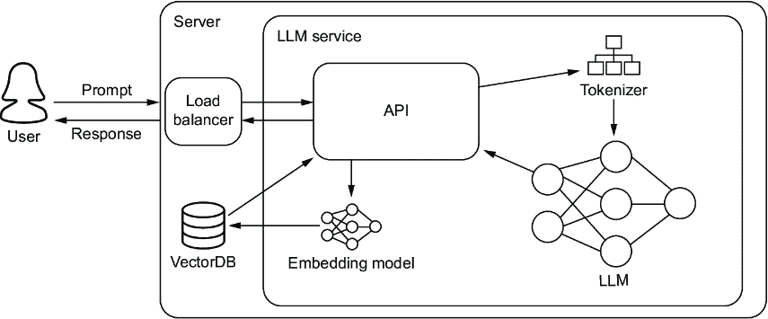
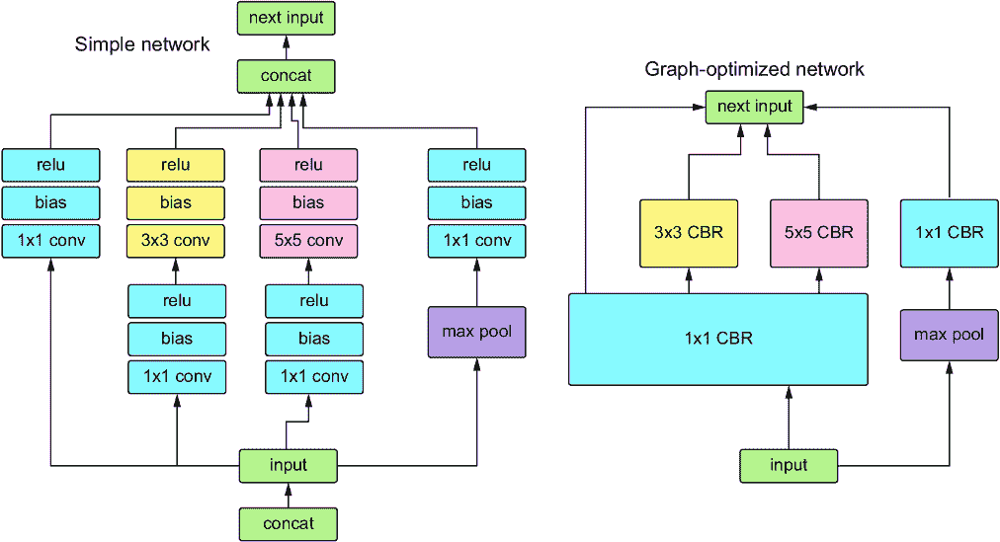
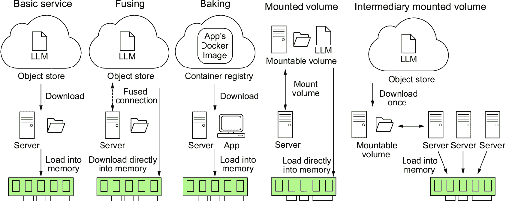
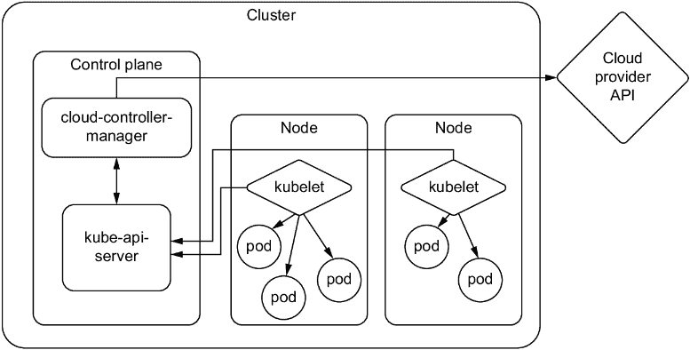
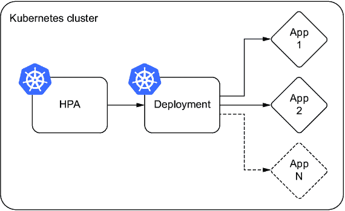
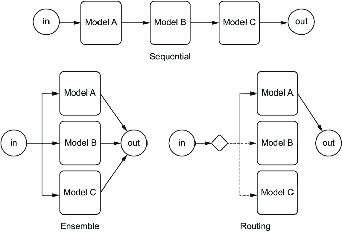
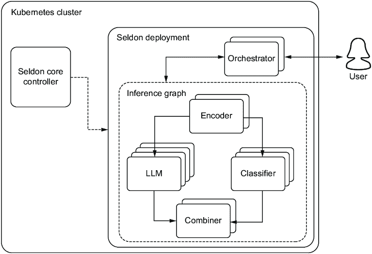
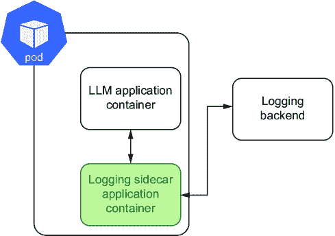
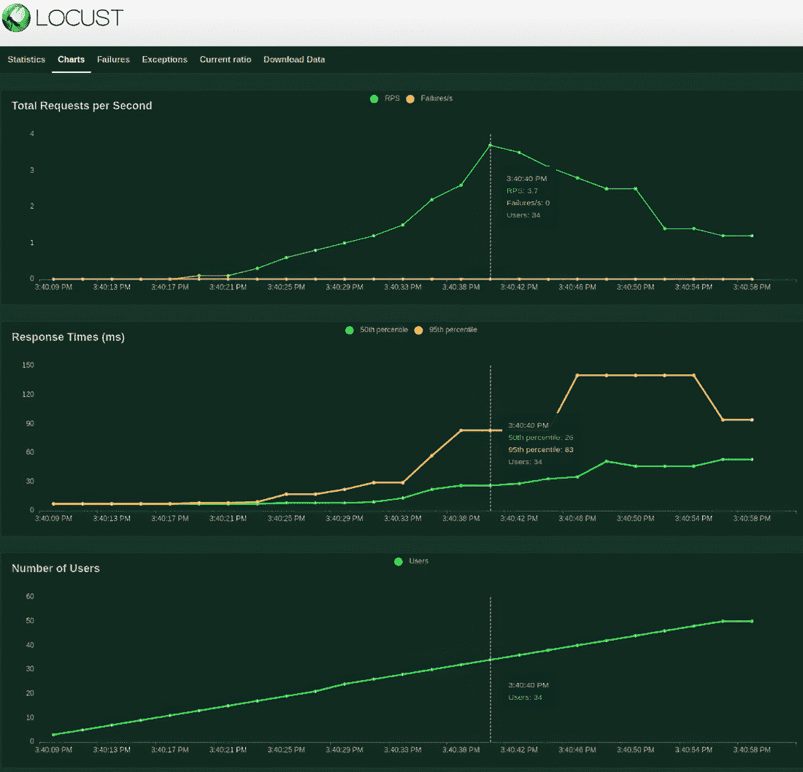

# 第六章：大型语言模型服务：实用指南

### 本章涵盖

+   如何构建 LLM 服务和部署工具

+   如何创建和准备 Kubernetes 集群以部署 LLM

+   常见的生产挑战和一些处理方法

+   将模型部署到边缘

> 生产出过多的有用事物会导致无用的人太多。——卡尔·马克思

我们做到了。我们到达了。这是我们最初考虑写这本书时想要写的章节。一位作者记得他第一次部署的模型。言语无法描述这给他带来的满足感比那些在他笔记本电脑上腐烂的数十个项目要多多少。在他心中，它坐落在祭坛上，不是因为它是好的——事实上，它相当糟糕——而是因为它是有用的，并且被那些最需要它的人实际使用。它影响了周围人的生活。

那么，实际上“生产”是什么意思呢？“生产”是指模型集成到实时或运营环境以执行其预期任务或向最终用户提供服务的阶段。这是使模型可用于现实世界应用和服务的关键阶段。为此，我们将向您展示如何将 LLM 打包成服务或 API，以便它可以接受按需请求。然后我们将向您展示如何在云中设置一个集群，您可以在那里部署此服务。我们还将分享您在生产中可能遇到的挑战和一些处理它们的技巧。最后，我们将讨论另一种类型的生产，即在边缘设备上部署模型。

## 6.1 创建 LLM 服务

在上一章中，我们训练和微调了几个模型，我们确信您迫不及待地想要部署它们。然而，在部署模型之前，提前规划和考虑您 API 的不同架构非常重要。在部署 LLM API 时，提前规划尤其至关重要。它有助于概述功能、识别潜在的集成挑战，并为必要的资源做出安排。良好的规划通过设定优先级简化了开发过程，从而提高了团队的效率。

在本节中，我们将探讨一些关键主题，这些主题对于您在部署我们的应用程序后充分利用它至关重要。图 6.1 展示了一个基于简单 LLM 的服务架构，允许用户按需与我们的 LLM 交互。例如，当与聊天机器人一起工作时，这是一个典型的用例。设置服务还允许我们在抽象出将 LLM 逻辑直接嵌入这些管道的复杂性时，同时处理批处理和流处理。当然，从服务中运行 ML 模型会给您的管道增加通信延迟，但 LLMs 通常被认为运行速度较慢，这种额外的延迟通常值得权衡。



##### 图 6.1 基本的 LLM 服务。大部分逻辑由 API 层处理，这将确保对传入请求的正确预处理并服务于请求的实际推理。

虽然图 6.1 看起来整洁有序，但它隐藏了几个你想要解决的复杂主题，尤其是在那个 API 框中。我们将讨论你想要包含在 API 中的几个关键特性，如批处理、速率限制器和流式传输。你也会注意到一些预处理技术，如检索增强生成（RAG），隐藏在这张图片中，我们将在第 6.1.7 节中深入讨论。到本节结束时，你将知道如何处理所有这些，你将已经部署了 LLM 服务并了解如何改进它。但在我们到达任何这些内容之前，让我们首先谈谈模型本身以及最佳方法来准备它进行在线推理。

### 6.1.1 模型编译

任何模型在生产中的成功都取决于其运行的硬件。微芯片架构和硅片上控制器的设计最终将决定推理的快速性和效率。不幸的是，当使用 Python 等高级语言以及 PyTorch 或 TensorFlow 等框架进行编程时，模型不会优化以充分利用硬件。这就是编译发挥作用的地方。编译是将用高级语言编写的代码转换为计算机可以快速处理的机器级代码的过程。编译你的 LLM 可以轻松地带来推理和成本的重大改进。

许多人已经投入了大量时间来为你事先执行一些可重复的效率步骤。我们在上一章中介绍了 Tim Dettmers 的贡献。其他贡献者包括 Georgi Gerganov，他创建了并维护了 lama.cpp，用于使用 C++运行 LLM 以提高效率，以及 Tom Jobbins，他在 Hugging Face Hub 上以 TheBloke 为名，将模型量化为正确的格式，以便在 Gerganov 的框架和其他框架（如 oobabooga）中使用。由于这个领域发展迅速，在大量资源上完成简单的可重复任务对他人也很有帮助。

在机器学习工作流程中，这个过程通常涉及将我们的模型从其开发框架（PyTorch、TensorFlow 或其他）转换为中间表示（IR），如 TorchScript、MLIR 或 ONNX。然后我们可以使用特定于硬件的软件将这些 IR 模型转换为针对我们选择的硬件（GPU、TPU（张量处理单元）、CPU 等）的编译机器代码。为什么不直接从您选择的框架转换为机器代码，而跳过中间环节呢？这是一个很好的问题。原因很简单：有数十个框架和数百个硬件单元，编写代码来覆盖每一种组合是不可能的。因此，框架开发者提供了将代码转换为 IR 的工具，而硬件供应商提供了从 IR 到其特定硬件的转换。

对于大多数情况，编译模型的实际过程涉及运行几个命令。多亏了 PyTorch 2.x，您可以通过使用`torch.compile(model)`命令来提前开始，您应该在训练和部署之前执行此操作。硬件公司通常会免费提供编译软件，因为这可以激励用户购买他们的产品。然而，构建这种软件并不容易，通常需要硬件架构和机器学习架构的专家知识。这种才能的结合是罕见的，如果您在这个领域找到工作，可以赚得丰厚的收入。

我们将在一分钟内向您展示如何编译一个 LLM，但首先，让我们看看一些使用的技术。从至关重要的内核调整开始不是更好吗？

#### 内核调整

在深度学习和高性能计算中，内核是一个小型程序或函数，设计用于在 GPU 或其他类似处理器上运行。这些例程由硬件供应商开发，以最大化芯片效率。他们通过优化硅片上电路块的线程、寄存器和共享内存来实现这一点。当我们运行任意代码时，处理器将尽力在其逻辑门之间路由请求，但难免会遇到瓶颈。然而，如果我们能够事先识别出要运行的内核及其顺序，GPU 可以规划出一条更高效的路径——这正是内核调整的本质。

在内核调整过程中，从大量高度优化的内核中选出最合适的内核。例如，考虑具有几种可能算法的卷积操作。从供应商的内核库中选择的最佳内核将基于各种因素，如目标 GPU 类型、输入数据大小、过滤器大小、张量布局、批量大小等等。在调整时，将运行并优化这些内核中的几个，以最小化执行时间。

这个内核调优的过程确保最终部署的模型不仅针对所使用的特定神经网络架构进行了优化，而且针对部署平台的独特特性进行了精细调优。这个过程导致资源使用更加高效，并最大化性能。接下来，让我们看看张量融合，它优化了运行这些内核的过程。

#### 张量融合

在深度学习中，当框架执行计算图时，它为每个层调用多个函数。计算图是一个强大的概念，用于简化数学表达式并执行一系列张量操作，特别是对于神经网络模型。如果每个操作都在 GPU 上执行，它将引发许多 CUDA 内核启动。然而，快速的内核计算并不完全匹配内核启动和处理张量数据的缓慢速度。因此，GPU 资源可能没有得到充分利用，内存带宽可能成为瓶颈。这就像当我们可以一次性购买所有物品时，我们却要多次去商店购买单独的物品一样。

这就是张量融合发挥作用的地方。通过合并或融合内核以单个操作执行操作，它改善了这种情况，减少了不必要的内核启动并提高了内存效率。一个常见的复合内核示例是全连接内核，它结合或融合了矩阵乘法、偏置添加和 ReLU 内核。这与张量并行化的概念类似。在张量并行化中，我们通过将不同的人派往不同的存储库（如杂货店、五金店和零售店）来加速过程。这样，一个人不必去每个商店。张量融合可以与多个 GPU 的并行化很好地工作。这就像派多个人去不同的商店，通过一次拿多个物品而不是一个来提高每个人的效率。

#### 图优化

张量融合，当按顺序执行时，也被称为垂直图优化。我们还可以进行水平图优化。这些优化通常被谈论为两件不同的事情。我们将简单地称之为图优化，水平图优化将具有不同权重但共享输入数据的层合并成一个更广泛的内核。它通过预分配输出缓冲区并以分布式方式写入来替换连接层。

在图 6.2 中，我们展示了一个简单的深度学习图优化示例。图优化不会改变图中的底层计算。它们只是重新构建图。因此，优化后的图以更少的层和内核启动运行得更加高效，减少了推理延迟。这种重构使整个过程更小、更快、更高效。



##### 图 6.2 是一个未优化的网络与使用图优化优化后的相同网络的示例。CBR 是一个 NVIDIA 熔合层内核，它简单地代表卷积、偏置和 ReLU。请参阅以下 NVIDIA 博客文章以获取参考：[`mng.bz/PNvw`](https://mng.bz/PNvw)。

图优化技术常用于基于计算图的框架，如 TensorFlow 的上下文中。图优化涉及简化这些计算图、移除冗余操作和/或重新排列计算的技术，使它们在执行时更加高效，尤其是在特定的硬件（如 GPU 或 TPU）上。一个例子是常量折叠，其中涉及常量输入的计算在编译时（在运行时之前）执行，从而减少了运行时的计算负载。

这些并不是编译模型时使用的所有技术，但它们是最常见的，应该能让你了解底层发生了什么以及为什么它有效。现在让我们看看一些用于 LLM 的工具。

#### TensorRT

NVIDIA 的 TensorRT 是一个一站式商店来编译你的模型，而且谁比硬件制造商更值得信赖来更好地准备你的模型在他们的 GPU 上运行？TensorRT 做了本节中提到的所有事情，包括量化到 INT8 和几个内存技巧，以充分利用你的硬件。

在列表 6.1 中，我们展示了使用 TensorRT 编译 LLM 的简单过程。我们将使用名为 `torch_tensorrt` 的 PyTorch 版本。需要注意的是，将模型编译到特定引擎是硬件特定的。因此，你将想要在打算运行的硬件上编译模型。因此，安装 TensorRT 不仅仅是简单的 `pip` `install`；幸运的是，我们可以使用 Docker。要开始，请运行以下命令：

```py
$ docker run --gpus all -it --rm nvcr.io/nvidia/pytorch:23.09-py3
```

此命令将启动一个交互式的 `torch_tensorrt` Docker 容器，其中包含我们开始所需的所有内容（关于最新版本，请参阅 [`mng.bz/r1We`](https://mng.bz/r1We)）。唯一缺少的是 Hugging Face Transformers，所以请继续安装它。现在我们可以运行列表了。

在导入之后，我们将加载我们的模型并生成一个示例输入，以便我们可以跟踪模型。我们需要将我们的模型转换为 IR（TorchScript），这是通过跟踪完成的。跟踪是捕捉运行模型时调用的操作的过程，使得后续的图优化更加容易。例如，如果你有一个接受可变输入的模型，比如 CLIP 模型，它可以接受图像和文本并将它们转换为嵌入，使用仅文本数据跟踪该模型是一种有效地从模型中剪除图像操作的有效方法。一旦我们的模型被转换为 IR，我们就可以使用 TensorRT 为 NVIDIA GPU 编译它。一旦完成，我们只需从磁盘重新加载模型并运行一些推理以进行演示。

##### 列表 6.1 使用 TensorRT 编译模型

```py
import torch
from transformers import GPT2Tokenizer, GPT2LMHeadModel
import torch_tensorrt

tokenizer = GPT2Tokenizer.from_pretrained("gpt2")
tokens = tokenizer("The cat is on the table.", return_tensors="pt")[
    "input_ids"
].cuda()
model = GPT2LMHeadModel.from_pretrained(
    "gpt2", use_cache=False, return_dict=False, torchscript=True
).cuda()
model.eval()

traced_model = torch.jit.trace(model, tokens)      #1

compile_settings = {     #2
    "inputs": [
        torch_tensorrt.Input(
            # For static size
            shape=[1, 7],
            # For dynamic sizing:
            # min_shape=[1, 3],
            # opt_shape=[1, 128],
            # max_shape=[1, 1024],
            dtype=torch.int32,  # Datatype of input tensor.
            # Allowed options torch.(float|half|int8|int32|bool)
        )
    ],
    "truncate_long_and_double": True,
    "enabled_precisions": {torch.half},      #3
    "ir": "torchscript",
}
trt_model = torch_tensorrt.compile(traced_model, **compile_settings)

torch.jit.save(trt_model, "trt_model.ts")      #4

trt_model = torch.jit.load("trt_model.ts")      #5
tokens.half()
tokens = tokens.type(torch.int)
logits = trt_model(tokens)
results = torch.softmax(logits[-1], dim=-1).argmax(dim=-1)
print(tokenizer.batch_decode(results))
```

#1 转换为 Torchscript IR

#2 使用 TensorRT 编译模型

#3 使用 FP16 运行

#4 保存编译后的模型

#5 运行推理

输出结果为

```py
# ['\n was a the way.\n']
```

我们就直接警告你：当你运行这段代码时，根据你的设置，结果可能会有所不同。总的来说，一旦你知道你在做什么，这是一个简单的过程，我们经常看到至少 2 倍的推理时间提升——这相当于巨大的节省！

TensorRT 确实是应有尽有，还附带一袋芯片。当然，TensorRT 的主要缺点是，作为一个由 NVIDIA 开发的工具，它是针对 NVIDIA 的硬件构建的。当为其他硬件和加速器编译代码时，它将不会很有用。此外，你会在使用 TensorRT 时非常习惯于遇到错误信息。我们发现，在转换不受支持的模型时遇到兼容性问题是一个常见现象。我们在尝试编译各种 LLM 架构时遇到了许多问题。幸运的是，为了解决这个问题，NVIDIA 一直在开发一个 TensorRT-LLM 库，以加速在 NVIDIA 高端 GPU 上的 LLM 推理。它支持的 LLM 架构比普通的 TensorRT 多得多。你可以在这里检查它是否支持你选择的 LLM 架构和 GPU 设置：[`mng.bz/mRXP`](https://mng.bz/mRXP)。

请不要误解我们；你不必使用 TensorRT。有几种替代的编译器可供选择。实际上，让我们看看另一个流行的替代品，ONNX Runtime。相信我们，当 TensorRT 不配合时，你会想要一个替代品。

#### ONNX Runtime

ONNX，即开放神经网络交换，是一个开源格式和生态系统，旨在表示不同深度学习框架、库和工具之间的互操作性。它是为了解决模型可移植性和兼容性挑战而创建的。如前所述，ONNX 是一个 IR，允许你以标准化的格式表示在一个深度学习框架（例如，TensorFlow、PyTorch、Keras、MXNet）中训练的模型，以便其他框架轻松消费。因此，它促进了不同工具和环境之间模型的交换。与 TensorRT 不同，ONNX Runtime 的目的是硬件无关，这意味着它可以与各种硬件加速器一起使用，包括 CPU、GPU 和专门的硬件如 TPUs。

在实际应用中，ONNX 允许机器学习实践者和研究人员使用他们首选的框架构建和训练模型，然后将这些模型部署到不同的平台和硬件上，而无需进行大量的重新工程或代码重写。这个过程有助于简化 AI 和 ML 模型在各种应用和行业中的开发和部署。明确来说，ONNX 是一个 IR 格式，而 ONNX Runtime 允许我们优化和运行 ONNX 模型的推理。

要利用 ONNX，我们建议使用 Hugging Face 的 Optimum。Optimum 是一个使与优化器一起工作变得更容易的接口，支持多个引擎和硬件，包括 Intel Neural Compressor 用于 Intel 芯片和 Furiosa Warboy 用于 Furiosa NPUs。值得一看。为了我们的目的，我们将使用它将 LLM 转换为 ONNX，然后使用 ONNX Runtime 对其进行推理优化。首先，让我们使用适当的引擎安装库。我们将使用文档中建议的`--upgrade-strategy` `eager`，以确保不同的包得到升级：

```py
$ pip install --upgrade-strategy eager optimum[exporters,onnxruntime]
```

接下来，我们将运行最优的命令行界面。我们将将其导出为 ONNX 格式，指向 Hugging Face 的 transformer 模型，并给它一个本地目录来保存模型。这些都是所需的步骤，但我们还会给它一个优化功能标志。在这里，我们将进行基本的通用优化：

```py
↪ $ optimum-cli export onnx --model WizardLM/WizardCoder-1B-V1.0 ./models_onnx --optimize O1
```

我们已经完成了。现在我们有一个 LLM 模型被转换为 ONNX 格式，并经过基本的图优化。与所有编译过程一样，优化应该在打算运行推理的硬件上进行，这应该包括充足的内存和资源，因为转换可能需要相当的计算量。

要运行模型，请查看[`onnxruntime.ai/`](https://onnxruntime.ai/)获取如何使用适当的 SDK 运行它的快速入门指南。哦，对了，我们忘记提到 ONNX Runtime 支持多个编程 API 了吗？所以你现在可以直接在你的首选语言中运行你的 LLM，包括 Java、C++、C#甚至是 JavaScript？是的，你可以。不过，在这本书中，我们将坚持使用 Python，以保持一致性。

虽然 TensorRT 可能是你大多数时候的首选武器，而 ONNX Runtime 覆盖了许多边缘情况，但仍然有许多其他优秀的引擎，比如 OpenVINO。你可以选择你想要的任何东西，但至少你应该使用一些。否则，那将是一个严重的错误。实际上，现在你已经阅读了这一节，你不能再声称自己无知。现在，确保这一点发生是你的专业责任。将任何未首先编译（或至少尝试编译）的 ML 模型投入生产，对于 MLOps 职业来说是一种罪过。

### 6.1.2 LLM 存储策略

现在我们有一个编译得很好的模型，我们需要考虑我们的服务如何访问它。这一步很重要，因为，如第三章所述，当与 LLM 一起工作时，启动时间可能是一个噩梦，因为将如此大的资产加载到内存中可能需要很长时间。因此，我们希望尽可能加快这一过程。当涉及到管理大型资产时，我们倾向于将它们扔进一个工件注册表或云存储中的桶里，然后忘记它们。这两个都倾向于使用底层的对象存储系统——如 GCS 或 S3——这对于存储来说很棒，但在对象检索方面就不那么好了，尤其是对于 LLM 这样的大型对象。

对象存储系统将资产分解成称为对象的小分数位。它们允许我们将整个资产跨多台机器和物理内存位置进行联邦化，这是一个强大的工具，为云服务提供动力，并且可以在通用硬件上以低成本存储大型对象。通过复制，有内置的错误容错功能，所以我们永远不必担心由于硬件故障而丢失资产。对象存储系统还创建高可用性，确保我们始终可以访问我们的资产。缺点是这些对象被联邦化到多台机器上，而不是以易于访问的形式读取和存储在内存中。因此，当我们将 LLM 加载到 GPU 内存时，我们实际上首先必须下载模型。让我们看看一些替代方案。

#### 融合

融合是将存储桶挂载到您的机器上的过程，就像它是一个外部硬盘驱动器一样。融合提供了一个流畅的界面，简化了代码，因为您将不再需要下载模型并将其加载到内存中。通过融合，您可以像文件系统一样处理外部存储桶，并将模型直接加载到内存中。然而，它仍然无法解决从多台机器中提取资产对象的基本需求。当然，如果您将存储桶融合到同一区域和区域的节点上，一些优化可以提高性能，并且感觉就像是从驱动器中加载模型一样。不幸的是，我们的经验表明融合相当慢，但它应该仍然比下载然后加载要快。

融合库适用于所有主要的云服务提供商和本地对象存储解决方案，如 Ceph 或 MinIO，因此无论在何种环境下，包括您自己的笔记本电脑，都应该得到覆盖。没错。您可以将笔记本电脑或边缘设备与对象存储解决方案融合。这种能力展示了该策略的强大之处，同时，根据您希望它实现的目标，它也可能是不够有效的。

提示：所有融合库实际上都是基于 FUSE 库构建的。值得一看：[`github.com/libfuse/libfuse`](https://github.com/libfuse/libfuse)。

#### 烘焙模型

烘焙是将模型放入 Docker 镜像的过程。因此，每当创建一个新的容器时，模型就会在那里，准备好使用。通常，烘焙模型被认为是一种反模式。首先，它没有解决问题。在生产中，当创建一个新的实例时，会启动一台新机器。它是新鲜无辜的，对外部世界一无所知，所以它必须采取的第一步是下载镜像。由于镜像包含模型，所以我们并没有解决问题。实际上，在镜像内下载模型很可能比从对象存储中下载模型要慢。所以，我们很可能只是使启动时间变得更长。

其次，烘焙模型是一种糟糕的安全实践。容器通常安全性较差，并且人们很容易获得访问权限。第三，你的问题翻倍了：在你之前只有一个大型资产；现在你有两个，模型和镜像。

话虽如此，仍然有一些时候烘焙是可行的，主要是因为尽管有缺点，但它极大地简化了我们的部署。将所有资产放入镜像中可以保证我们只需要一件东西来部署新的服务：镜像本身，这在部署到边缘设备时非常有价值。

#### 挂载卷

另一种解决方案是完全避免对象存储，并将你的 LLM 保存在可挂载驱动器上的基于文件的存储系统中。当我们的服务启动时，我们可以使用 RAID 控制器或 Kubernetes（取决于我们的基础设施）连接包含 LLM 的磁盘驱动器。这个解决方案是老式的，但它确实非常有效。在大多数情况下，它解决了我们所有的问题，并提供了极快的启动时间。

当然，缺点是它将增加许多协调步骤以确保在每个你计划部署的区域和区域中都有一个卷。它还引发了复制和可靠性问题；如果驱动器意外损坏，你将需要在该区域进行备份。此外，这些驱动器很可能是 SSD 而不是普通硬件。所以你可能会多付一些钱。但是，与 GPU 相比，存储非常便宜，所以节省的启动时间是你要考虑的。本质上，这种策略重新引入了我们最初转向对象存储的所有问题。

#### 混合：启动时挂载的中间件卷

最后，我们总是可以采取混合方法。在这个解决方案中，我们在启动时下载模型，但将其存储在启动时挂载的卷中。虽然这并不能帮助解决该地区第一次部署的问题，但它确实大大帮助了任何新的实例，因为它们可以简单地挂载这个相同的卷，并能够加载模型而无需下载。你可以想象这和 Redis 缓存的工作方式类似，只是不涉及存储。通常，这种技术已经足够，因为自动扩展将足够快以处理突发的工作负载。我们只需要担心整个系统的崩溃，希望这种情况会是最小的，但这也暗示我们应该避免在只运行一个副本时采用这种方法，因为在生产环境中你本来就不应该这样做。

在图 6.3 中，我们展示了这些不同的策略，并将它们与一个基本服务进行了比较，在这个服务中，我们只是下载 LLM 并将其加载到内存中。总的来说，你的具体策略将取决于你的系统需求、你运行的 LLM 的大小以及你的基础设施。你的系统需求也可能因你看到的流量模式而大相径庭。



##### 图 6.3 存储 LLMs 的不同策略及其在启动时的含义。通常，我们必须在系统可靠性、复杂性和应用程序加载时间之间取得平衡。

既然我们已经很好地掌握了如何将我们的 LLM 视为一项资产，那么让我们来谈谈一些对于您的 LLM 服务来说是必备的 API 功能。

### 6.1.3 自适应请求分批

一个典型的 API 将按接收到的顺序接受和处理请求，立即尽可能快地处理它们。然而，任何训练过机器学习模型的人都会意识到，在 2 的幂次（16、32、64 等）批次中运行推理具有数学和计算上的优势，尤其是在涉及 GPU 的情况下，我们可以利用更好的内存对齐或向量化指令并行化 GPU 核心的计算。为了利用这种分批，您可能希望包括自适应请求分批或动态分批。

自适应分批所做的是在一段时间内将请求汇集在一起。一旦池收到配置的最大批次大小或计时器耗尽，它将通过模型对整个批次进行推理，并将结果发送回请求它们的单个客户端。本质上，它是一个队列。自己设置一个可能会非常痛苦；幸运的是，大多数 ML 推理服务都提供这项功能，而且几乎都很容易实现。例如，在 BentoML 中，将`@bentoml.Runnable.method(batchable=True)`作为装饰器添加到您的预测函数中，在 Triton 推理服务器中，在模型定义文件末尾添加`dynamic_batching` `{}`。

如果听起来很简单，那是因为它确实很简单。通常，您不需要进行任何进一步的调整，因为默认设置往往非常实用。话虽如此，如果您希望最大限度地提高系统中的每一分效率，您通常可以设置一个最大批次大小，这将告诉分批器一旦达到这个限制就运行一次，或者设置一个批次延迟，这会对计时器做同样的事情。增加任何一个都会导致更长的延迟，但可能带来更好的吞吐量，因此通常只有在您的系统有足够的延迟预算时才会调整这些设置。

总体而言，自适应分批的好处包括更有效地使用资源并提高吞吐量，但代价是略微增加延迟。这是一个有价值的权衡，我们建议为您的产品提供足够的延迟带宽以包含此功能。根据我们的经验，优化吞吐量会导致更好的可靠性和可扩展性，从而带来更高的客户满意度。当然，当延迟时间非常重要或流量稀少时，您可能正确地放弃此功能。

### 6.1.4 流控制

速率限制器和访问密钥是 API 的关键保护措施，尤其是对于那些位于昂贵 LLM 前面的 API。速率限制器控制客户端在指定时间内可以向 API 发出的请求数量，这有助于保护 API 服务器免受滥用，例如分布式拒绝服务（DDoS）攻击，攻击者会同时发出大量请求以压倒系统并阻碍其功能。

速率限制器还可以保护服务器免受短时间内进行大量自动化请求的机器人攻击。这有助于优化服务器资源管理，使服务器不会因为不必要的或有害的流量而耗尽。它们在管理配额方面也非常有用，从而确保所有用户都能公平且平等地访问 API 资源。通过防止任何单个用户过度使用资源，速率限制器确保系统对所有用户都能平稳运行。

总的来说，速率限制器是控制你 LLM 系统流程流的重要机制。它们在减轻突发工作负载和防止系统在自动扩展和滚动更新期间被压垮方面可以发挥关键作用，尤其是在你有一个相当大的 LLM 且部署时间较长的情况下。速率限制器可以采取多种形式，你选择哪一种将取决于你的用例。

##### 速率限制器的类型

**以下列表描述了速率限制器的类型：**

+   *固定窗口*—该算法允许在固定的时间段内进行固定数量的请求。比如说，每分钟五次请求，并且每分钟刷新一次。它设置起来非常简单，也很容易理解。然而，它可能会导致分布不均，并且可能在时间窗口的边界允许突发调用。

+   *滑动窗口日志*—为了防止边界问题，我们可以使用一个动态的时间框架。比如说，过去 60 秒内有五次请求。这种类型是固定窗口的一个稍微复杂一些的版本，它会记录每个请求的时间戳，提供一个移动的回溯期，从而提供一个更均匀分布的限制。

+   *令牌桶*—客户端最初有一个满的令牌桶，并且每次请求都会消耗令牌。当桶为空时，请求会被阻塞。桶会随着时间的推移缓慢地重新填充。因此，令牌桶允许突发行为，但限制在桶中令牌的数量。

+   *漏桶*—它作为一个队列工作，请求进入，如果队列不满，则处理请求；如果满了，请求会溢出并被丢弃，从而控制流量的速率。

速率限制器可以在多个级别上应用，从整个 API 到单个客户端请求，再到特定的函数调用。虽然你希望避免对它们过于激进——最好依靠自动扩展来扩展和满足需求——但你也不希望完全忽略它们，尤其是在防止不良行为者方面。

访问密钥对于防止恶意行为也至关重要。访问密钥提供身份验证，确保只有授权用户才能访问 API，从而防止未经授权的使用和 API 的潜在滥用，并减少垃圾请求的涌入。对于任何付费服务，它们也是必不可少的。当然，即使你的 API 仅面向内部使用，设置访问密钥也不应被忽视，因为它可以帮助减少责任，例如通过撤销恶意进程的访问来控制成本。

幸运的是，如今设置带有速率限制和访问密钥的服务相对容易，因为有多个库可以帮助你。在第 6.2 列表中，我们展示了使用这两个功能的简单 FastAPI 应用。我们将使用 FastAPI 内置的安全库来处理访问密钥，以及 SlowApi，一个简单的速率限制器，它允许我们通过简单的装饰器来限制任何函数或方法的调用。

##### 第 6.2 列表 示例 API 带有访问密钥和速率限制器

```py
from fastapi import FastAPI, Depends, HTTPException, status, Request
from fastapi.security import OAuth2PasswordBearer
from slowapi import Limiter, _rate_limit_exceeded_handler
from slowapi.util import get_remote_address
from slowapi.errors import RateLimitExceeded
import uvicorn

api_keys = ["1234567abcdefg"]        #1
API_KEY_NAME = "access_token"
oauth2_scheme = OAuth2PasswordBearer(tokenUrl="token")

limiter = Limiter(key_func=get_remote_address)

app = FastAPI()
app.state.limiter = limiter
app.add_exception_handler(RateLimitExceeded, _rate_limit_exceeded_handler)

async def get_api_key(api_key: str = Depends(oauth2_scheme)):
    if api_key not in api_keys:
        raise HTTPException(
            status_code=status.HTTP_401_UNAUTHORIZED,
            detail="Invalid API Key",
        )

@app.get("/hello", dependencies=[Depends(get_api_key)])
@limiter.limit("5/minute")
async def hello(request: Request):
    return {"message": "Hello World"}
```

#1 这将在数据库中加密。

虽然这只是一个简单的例子，但你仍然需要为用户设置一个系统来创建和销毁访问密钥。你还想微调你的时间限制。一般来说，你希望它们尽可能宽松，以免干扰用户体验，但又要足够紧，以完成它们的工作。

### 6.1.5 流式响应

你的 LLM 服务应该绝对包含的一个功能是流式处理。流式处理允许我们在文本生成时将其返回给用户，而不是在最后一次性返回。流式处理给系统增加了相当多的复杂性，但无论如何，它已经成为几个原因的必备功能。

首先，LLMs 相当慢，而你对你用户能做的最糟糕的事情就是让他们等待——等待意味着他们会变得无聊，无聊的用户会抱怨，更糟糕的是，他们会离开。你不想处理投诉，对吧？当然不！但是通过在数据创建时流式传输数据，我们为用户提供了一个更动态和互动的体验。

其次，LLMs 不仅速度慢，而且不可预测。一个提示可能导致生成数页的文本，而另一个提示可能只生成一个标记。因此，你的延迟将会到处都是。流式处理允许我们关注更一致的指标，如每秒标记数（TPS）。保持 TPS 高于平均用户的阅读速度意味着我们将比用户消费得更快地发送响应，确保他们不会感到无聊，并且我们提供了高质量的用户体验。相比之下，如果我们等到最后才返回结果，用户可能会决定离开，直到它完成才回来，因为他们不知道要等待多长时间。这种对他们的流程的巨大干扰使得你的服务更无效或无用。

最后，用户开始期待流式传输。流式响应已成为判断你是否在与机器人还是真人交谈的一个很好的指标。由于人类需要键入、校对和编辑他们的响应，我们无法期望来自人类客户支持代表的书面响应以流式传输的形式出现。因此，当用户看到响应流式传输进来时，他们会知道他们正在与机器人交谈。人们与机器人的互动方式与与人类的互动方式不同，因此这是非常有用的信息，可以防止用户感到沮丧。

在列表 6.3 中，我们展示了一个非常简单的利用流式传输的 LLM 服务。需要注意的关键点是，我们使用 base asyncio 库来允许我们运行异步函数调用，FastAPI 的 `StreamingResponse` 确保我们以块的形式向客户端发送响应，以及 Hugging Face Transformer 的 `TextIteratorStreamer` 来创建我们模型推理的管道生成器。

##### 列表 6.3 流式 LLM 服务

```py
import argparse
import asyncio
from typing import AsyncGenerator

from fastapi import FastAPI, Request
from fastapi.responses import Response, StreamingResponse
import uvicorn

from transformers import (
    AutoModelForCausalLM,
    AutoTokenizer,
    TextIteratorStreamer,
)
from threading import Thread

app = FastAPI()

tokenizer = AutoTokenizer.from_pretrained("gpt2")     #1
model = AutoModelForCausalLM.from_pretrained("gpt2")
streamer = TextIteratorStreamer(tokenizer)

async def stream_results() -> AsyncGenerator[bytes, None]:
    for response in streamer:
        await asyncio.sleep(1)                   #2
        yield (response + "\n").encode("utf-8")

@app.post("/generate")
async def generate(request: Request) -> Response:
    """Generate LLM Response

    The request should be a JSON object with the following fields:
    - prompt: the prompt to use for the generation.
    """
    request_dict = await request.json()
    prompt = request_dict.pop("prompt")
    inputs = tokenizer([prompt], return_tensors="pt")
    generation_kwargs = dict(inputs, streamer=streamer, max_new_tokens=20)

    thread = Thread(target=model.generate, kwargs=generation_kwargs)    #3
    thread.start()

    return StreamingResponse(stream_results())

if __name__ == "__main__":
    parser = argparse.ArgumentParser()                      #4
    parser.add_argument("--host", type=str, default=None)
    parser.add_argument("--port", type=int, default=8000)
    args = parser.parse_args()

    uvicorn.run(app, host=args.host, port=args.port, log_level="debug")
```

#1 将分词器、模型和流式传输器加载到内存中

#2 减慢速度以查看流式传输。通常返回的字节编码流式响应。

#3 启动一个单独的线程来生成结果

#4 启动服务；默认在端口 8000 的 localhost 上

现在我们已经知道了如何实现我们 LLM 服务的一些必备功能，包括批处理、速率限制和流式传输，让我们看看我们可以添加到我们的服务中的一些额外的工具，以改善可用性和整体工作流程。

### 6.1.6 特征存储

当涉及到在生产环境中运行 ML 模型时，特征存储可以极大地简化推理过程。我们首次在第三章介绍了这些内容，但作为一个回顾，特征存储建立了一个中心化的真实来源。它们回答关于你的数据的关键问题：谁负责这个特征？它的定义是什么？谁可以访问它？让我们看看如何设置一个并查询数据以了解它们的工作方式。我们将使用 Feast，它是一个开源项目，支持多种后端。要开始，让我们使用 `pip` `install` `feast` 并然后在您的终端中运行 `init` 命令来设置一个项目，如下所示：

```py
$ feast init feast_example
$ cd feast_example/feature_repo
```

我们正在构建的应用程序是一个问答服务。问答服务可以从特征存储的数据治理工具中受益良多。例如，点时间连接帮助我们回答像“x 的总统是谁？”这样的问题，答案可能会随时间而改变。我们不仅查询问题，还查询带有时戳的问题，点时间连接将返回在那个时间点我们数据库中问题的答案。在下一个列表中，我们拉取一个问答数据集并将其存储在我们的 Feast 项目的数据目录中的 parquet 格式中。

##### 列表 6.4 下载 SQuAD 数据集

```py
import pandas as pd
from datasets import load_dataset
import datetime

from sentence_transformers import SentenceTransformer
model = SentenceTransformer("all-MiniLM-L6-v2")

def save_qa_to_parquet(path):
    squad = load_dataset("squad", split="train[:5000]")    #1
    ids = squad["id"]                             #2
    questions = squad["question"]
    answers = [answer["text"][0] for answer in squad["answers"]]
    qa = pd.DataFrame(           #3
        zip(ids, questions, answers),
        columns=["question_id", "questions", "answers"],
    )

    qa["embeddings"] = qa.questions.apply(lambda x: model.encode(x))   #4
    qa["created"] = datetime.datetime.utcnow()
    qa["datetime"] = qa["created"].dt.floor("h")
    qa.to_parquet(path)              #5

if __name__ == "__main__":
    path = "./data/qa.parquet"
    save_qa_to_parquet(path)
```

#1 加载 SQuAΔ 数据集

#2 提取问题和答案

#3 创建一个数据框

#4 添加嵌入和时间戳

#5 保存到 parquet 格式

接下来，我们需要为我们的特征存储定义特征视图。特征视图本质上类似于关系数据库中的视图。我们将定义一个名称、实体（类似于 ID 或主键）、模式（即我们的特征列）和来源。我们只是演示使用本地文件存储，但在生产中，您希望使用 Feast 与 Snowflake、GCP、AWS 等许多后端集成之一。它目前不支持 VectorDB 后端，但我相信这只是时间问题。此外，我们可以通过标签添加元数据到我们的视图，并定义一个生存时间（TTL），这限制了 Feast 在生成历史数据集时可以回溯多远。在以下列表中，我们定义了特征视图。请将此定义添加到我们项目中的 feature_repo 目录下的名为 qa.py 的文件中。

##### 列表 6.5 Feast `FeatureView` 定义

```py
from feast import Entity, FeatureView, Field, FileSource, ValueType
from feast.types import Array, Float32, String
from datetime import timedelta

path = "./data/qa.parquet"

question = Entity(name="question_id", value_type=ValueType.STRING)

question_feature = Field(name="questions", dtype=String)

answer_feature = Field(name="answers", dtype=String)

embedding_feature = Field(name="embeddings", dtype=Array(Float32))

questions_view = FeatureView(
    name="qa",
    entities=[question],
    ttl=timedelta(days=1),
    schema=[question_feature, answer_feature, embedding_feature],
    source=FileSource(
        path=path,
        event_timestamp_column="datetime",
        created_timestamp_column="created",
        timestamp_field="datetime",
    ),
    tags={},
    online=True,
)
```

定义好之后，让我们继续注册它。我们将使用

```py
$ feast apply
```

接下来，我们希望将视图实体化。在生产中，这是一个您需要定期使用 cron 或 Prefect 之类的工具安排的步骤。确保将此命令中结束日期的 UTC 时间戳更新为未来的某个时间，以确保视图收集最新的数据：

```py
$ feast materialize-incremental 2023-11-30T00:00:00 --views qa
```

现在只剩下查询它了！以下列表展示了在推理时提取要使用的特征的简单示例。

##### 列表 6.6 在推理时查询特征视图

```py
import pandas as pd
from feast import FeatureStore

store = FeatureStore(repo_path=".")

path = "./data/qa.parquet"
ids = pd.read_parquet(path, columns=["question_id"])

feature_vectors = store.get_online_features(
    features=["qa:questions", "qa:answers", "qa:embeddings"],
    entity_rows=[{"question_id": _id} for _id in ids.question_id.to_list()],
).to_df()
print(feature_vectors.head())
```

此示例将在推理时获取最新信息，以实现最低可能的延迟。对于点时间检索，您将使用`get_historical_features`方法。此外，在此示例中，我们使用实体行参数的 ID 列表，但您也可以使用 SQL 查询，使其非常灵活且易于使用。

### 6.1.7 增强检索生成

增强检索生成（RAG）已成为对抗 LLM 中的幻觉并提高我们结果中响应准确性的最广泛使用的工具。其流行可能是因为 RAG 既易于实现又非常有效。如第 3.4.5 节首次讨论的，向量数据库是你希望拥有的工具之一。其中一个关键原因是它们使 RAG 的实现变得容易得多。在图 6.4 中，我们展示了一个 RAG 系统。在预处理阶段，我们将我们的文档拆分，并将它们转换成嵌入，然后我们将它们加载到我们的向量数据库中。在推理期间，我们可以将我们的输入编码成嵌入，并在该向量数据库中运行相似度搜索以找到最近的邻居。这种推理被称为语义搜索。提取相关文档并将它们插入到我们的提示中，将有助于为 LLM 提供上下文并提高结果。


##### 图 6.4 展示了 RAG 系统如何使用我们的输入嵌入在文档中运行搜索，从而提高我们 LLM 生成的文本结果

我们将演示使用 Pinecone 实现 RAG，因为它将节省我们设置向量数据库的精力。对于列表 6.7，我们将设置一个 Pinecone 索引并将 Wikipedia 数据集加载到其中。在这个列表中，我们将创建一个`WikiDataIngestion`类来处理繁重的工作。这个类将加载数据集并遍历每个维基百科页面，将文本分割成可消费的块。然后它将嵌入这些块并将所有内容批量上传。一旦我们上传了所有内容，我们就可以开始进行查询。

如果你打算跟随操作，你需要一个 API 密钥，所以如果你还没有，请访问 Pinecone 的网站([`www.pinecone.io/`](https://www.pinecone.io/))并创建一个免费账户，设置一个启动项目（免费层），并获取一个 API 密钥。在阅读列表时需要注意的一点是，我们将使用`text_splitter`将文本分割成 400 个标记的块。我们特别按标记分割而不是按单词或字符，这允许我们在模型标记限制内正确预算。在这个例子中，返回前三个结果将使我们的请求增加 1,200 个标记，这允许我们提前计划我们将给用户多少标记来编写他们的提示。

##### 列表 6.7 Pinecone 数据库设置示例

```py
import os
import tiktoken
from datasets import load_dataset
from langchain.text_splitter import RecursiveCharacterTextSplitter
from langchain.embeddings.openai import OpenAIEmbeddings
from pinecone import Pinecone, ServerlessSpec
from sentence_transformers import SentenceTransformer

from tqdm.auto import tqdm
from uuid import uuid4

OPENAI_API_KEY = os.getenv("OPENAI_API_KEY")            #1
PINECONE_API_KEY = os.getenv("PINECONE_API_KEY")              #2

pc = Pinecone(api_key=PINECONE_API_KEY)

class WikiDataIngestion:
    def __init__(
        self,
        index,
        wikidata=None,
        embedder=None,
        tokenizer=None,
        text_splitter=None,
        batch_limit=100,
    ):
        self.index = index
        self.wikidata = wikidata or load_dataset(
            "wikipedia", "20220301.simple", split="train[:10000]"
        )
        self.embedder = embedder or OpenAIEmbeddings(
            model="text-embedding-ada-002", openai_api_key=OPENAI_API_KEY
        )
        self.tokenizer = tokenizer or tiktoken.get_encoding("cl100k_base")
        self.text_splitter = (
            text_splitter
            or RecursiveCharacterTextSplitter(
                chunk_size=400,
                chunk_overlap=20,
                length_function=self.token_length,
                separators=["\n\n", "\n", " ", ""],
            )
        )
        self.batch_limit = batch_limit

    def token_length(self, text):
        tokens = self.tokenizer.encode(text, disallowed_special=())
        return len(tokens)

    def get_wiki_metadata(self, page):
        return {
            "wiki-id": str(page["id"]),
            "source": page["url"],
            "title": page["title"],
        }

    def split_texts_and_metadatas(self, page):
        basic_metadata = self.get_wiki_metadata(page)
        texts = self.text_splitter.split_text(page["text"])
        metadatas = [
            {"chunk": j, "text": text, **basic_metadata}
            for j, text in enumerate(texts)
        ]
        return texts, metadatas

    def upload_batch(self, texts, metadatas):
        ids = [str(uuid4()) for _ in range(len(texts))]
        embeddings = self.embedder.embed_documents(texts)
        self.index.upsert(vectors=zip(ids, embeddings, metadatas))

    def batch_upload(self):
        batch_texts = []
        batch_metadatas = []

        for page in tqdm(self.wikidata):
            texts, metadatas = self.split_texts_and_metadatas(page)

            batch_texts.extend(texts)
            batch_metadatas.extend(metadatas)

            if len(batch_texts) >= self.batch_limit:
                self.upload_batch(batch_texts, batch_metadatas)
                batch_texts = []
                batch_metadatas = []

        if len(batch_texts) > 0:
            self.upload_batch(batch_texts, batch_metadatas)

if __name__ == "__main__":
    index_name = "pincecone-llm-example"

    if index_name not in pc.list_indexes().names():      #3
        pc.create_index(
            name=index_name,
            metric="cosine",
            dimension=1536,          #4
            spec=ServerlessSpec(cloud="aws", region="us-east-1"),
        )

    index = pc.Index(index_name)         #5
    print(index.describe_index_stats())

    embedder = None           #6
    if not OPENAI_API_KEY:
        embedder = SentenceTransformer(
            "sangmini/msmarco-cotmae-MiniLM-L12_en-ko-ja"
        )                                                      #7
        embedder.embed_documents = lambda *args, **kwargs: embedder.encode(
            *args, **kwargs
        ).tolist()

    wiki_data_ingestion = WikiDataIngestion(index, embedder=embedder)    #8
    wiki_data_ingestion.batch_upload()
    print(index.describe_index_stats())

    query = "Did Johannes Gutenberg invent the printing press?"     #9
    embeddings = wiki_data_ingestion.embedder.embed_documents(query)
    results = index.query(vector=embeddings, top_k=3, include_metadata=True)
    print(results)
```

#1 从[platform.openai.com](https://platform.openai.com)获取 openai API 密钥

#2 在 app.pinecone.io 控制台中查找 API 密钥

#3 如果不存在则创建索引

#4 文本嵌入-ada-002 的 1536 维

#5 连接到索引并描述统计数据

#6 如果未提供 openai api 密钥，则使用通用嵌入器

#7 也为 1536 维

#8 读取数据并重新描述统计数据

#9 执行查询

当我运行这段代码时，针对我的问题“约翰内斯·古腾堡发明了印刷机吗？”的前三个查询结果分别是约翰内斯·古腾堡的维基百科页面、铅笔和印刷机。还不错！虽然向量数据库无法回答这个问题，但它只是根据它们的嵌入与我问题的接近程度找到最相关的文章。

使用这些文章，我们可以将它们的嵌入输入到我们的 LLM 中，作为问题的额外上下文，以确保结果更加可靠。由于我们包括了来源，它甚至可以提供作为参考的 wiki URL，而不会只是凭空想象。通过提供这个上下文，我们大大减少了我们的 LLM 凭空想象并编造答案的担忧。

### 6.1.8 LLM 服务库

如果你开始觉得需要实现一个 LLM 服务所需的所有工具和功能让你有些不知所措，我们有一些好消息要告诉你：有几个库旨在为你完成所有这些工作！一些值得注意的开源库包括 vLLM 和 BentoML 的 OpenLLM。Hugging Face 的 Text-Generation-Inference（TGI）短暂地失去了开源许可，但幸运的是，它现在又可用于商业用途。还有一些初创公司在这个领域构建了一些酷炫的工具，如果你希望获得更托管的服务，我们建议你检查一下 TitanML。这些工具类似于第 3.4.8 节中讨论的 MLServer、BentoML 和 Ray Serve，但它们是为 LLM 专门设计的。

大多数这些工具仍然相对较新，处于积极开发中，它们之间的功能对等性还远未实现，所以请注意它们提供的内容。你可以期待的是，它们至少应该提供流式传输、批处理和 GPU 并行化支持（这是我们本章没有具体讨论的内容），但除此之外，就很难说了。许多它们仍然不支持本章讨论的几个功能，也不支持每个 LLM 架构。尽管如此，它们确实使得部署 LLM 变得容易。

以 vLLM 为例，只需执行`pip install vllm`命令，然后你就可以运行

```py
$ python -m vllm.entrypoints.api_server --model IMJONEZZ/ggml-openchat-8192-q4_0
```

只需一条命令，我们现在就有一个服务正在运行我们在第五章训练的模型。大胆地尝试一下；你应该能够像这样向`/generate`端点发送请求：

```py
$ curl http://localhost:8000/generate -d '{"prompt": "Which pokemon is 
↪ the best?", "use_beam_search": true, "n": 4, "temperature": 0}'
```

很可能你对这些工具不会特别印象深刻。尽管如此，你现在应该能够构建自己的 API，并且对如何做到这一点有一个很好的理解。现在你有一个服务，甚至可以在本地启动它，让我们讨论你需要建立以支持这些模型实际生产使用的架构。记住，基础设施越好，你半夜服务意外中断时被叫醒的可能性就越小。我们都不希望那样，所以让我们来看看。

## 6.2 建立基础设施

建立基础设施是现代软件开发的一个关键方面，我们不应该期望机器学习有任何不同。为了确保可扩展性、可靠性和应用的高效部署，我们需要规划一个能够应对不断增长的用户群需求的强大基础设施。这正是 Kubernetes 发挥作用的地方。

Kubernetes，通常被称为 k8s，是一个开源的容器编排平台，它帮助自动化和管理容器化应用程序的部署、扩展和管理。它旨在简化在服务器集群中运行和协调多个容器的过程，使扩展应用程序和确保高可用性变得更加容易。在本章中，我们将大量讨论 k8s，虽然你不需要成为专家，但了解一些基础知识将有助于我们保持一致。

在其核心，k8s 通过将容器分组到称为 Pod 的逻辑单元中来工作，这些 Pod 是 k8s 生态系统中最小的可部署单元。然后，这些 Pod 由 k8s 控制平面进行调度和管理，该平面负责它们的部署、扩展和更新。这个控制平面由几个组件组成，共同处理容器的编排和管理。在图 6.5 中，我们给出了 k8s 架构的过度简化，以帮助不熟悉它的读者。



##### 图 6.5 Kubernetes 架构的过度简化。你需要知道的是，我们的服务运行在 Pods 中，而 Pods 运行在节点上，本质上是一个机器。K8s 帮助我们管理资源，并处理将 Pods 部署到这些资源上的编排。

使用 k8s，我们可以利用自动扩展、负载均衡和服务发现等特性，这些特性极大地简化了 Web 应用程序的部署和管理。K8s 提供了一个灵活且可扩展的基础设施，可以轻松适应不断变化的需求，使组织能够随着用户基础的扩大而高效地扩展其应用程序。K8s 提供了一系列额外的功能和可扩展选项，如存储管理、监控和日志记录，这些有助于确保 Web 应用程序的平稳运行。

这些可扩展选项之一被称为自定义资源定义（CRDs）。CRDs 是 Kubernetes 的一个特性，允许用户为自定义资源创建自己的规范，从而在不修改 Kubernetes 源代码的情况下扩展 Kubernetes 的功能。定义了 CRD 之后，我们可以创建类似于 Pod 或服务这样的内置对象的自定义对象。这为 k8s 提供了大量的灵活性，我们将在本章的不同功能中需要它。

如果你刚开始接触 Kubernetes，你可能会对本节的部分内容感到困惑，这是完全可以理解的。不过，希望你有足够的知识来把握本节将要做什么以及为什么这么做的大致内容。至少，你将能够带着一串问题离开，这些问题可以向你的最亲密的 DevOps 团队成员提出。

### 6.2.1 部署集群

开始任何项目时首先要做的事情是设置一个集群。集群是由工作机器或节点组成的集合，我们将在这里托管我们的应用程序。创建一个集群相对简单；配置它是难点。当然，已经有许多书籍讲述了如何做这件事，但关于网络、安全和访问控制等大多数考虑因素都不在本书的范围之内。此外，您采取的步骤也会根据您选择的云提供商和公司的业务策略而有所不同，因此我们将只关注我们认为对您启动项目所必需的部分，以及任何可能使您生活更轻松的小贴士。

第一步是创建一个集群。在 GCP 上，您将使用 gcloud 工具并运行

```py
$ gcloud container clusters create <NAME>
```

在 AWS 上，使用 eksctl 工具，运行

```py
$ eksctl create cluster
```

在 Azure 上，使用 az cli 工具，运行

```py
$ az group create --name=<GROUP_NAME> --location=westus
$ az aks create --resource-group=<GROUP_NAME> --name=<CLUSTER_NAME>
```

如您所见，即使是第一步也非常依赖于您的提供商，您可能会怀疑后续步骤也是如此。由于我们意识到大多数读者将在各种环境中部署，我们将不会关注具体的步骤，但希望给您足够的背景知识，以便您自己搜索和发现。

我们想象许多读者可能已经由他们的基础设施团队为他们设置了一个集群，其中包含许多默认值和最佳实践。其中之一是设置节点自动配置（NAP）或集群自动扩展。NAP 允许集群增长，根据部署需求添加更多节点。这样，我们只为实际使用的节点付费。这是一个非常方便的功能，但它通常定义了资源限制或对自动扩展实例的可用性进行限制，您可以确信集群的默认设置不包括加速器或 GPU 实例。我们需要解决这个问题。

在 GCP 中，我们会创建一个类似于以下列表中的配置文件，其中我们可以包括 GPU `resourceType`。在示例中，我们包括了 T4s 和两种 A100 类型。

##### 列表 6.8 示例 NAP 配置文件

```py
resourceLimits:
  - resourceType: 'cpu'
    minimum: 10
    maximum: 100
  - resourceType: 'memory'
    maximum: 1000
  - resourceType: 'nvidia-tesla-t4'
    maximum: 40
  - resourceType: 'nvidia-tesla-a100'
    maximum: 16
  - resourceType: 'nvidia-a100-80gb'
    maximum: 8
management:
  autoRepair: true
  autoUpgrade: true
shieldedInstanceConfig:
  enableSecureBoot: true
  enableIntegrityMonitoring: true
diskSizeGb: 100
```

然后，您可以通过运行以下命令来设置

```py
$ gcloud container clusters update <CLUSTER_NAME> --enable-autoprovisioning --autoprovisioning-config-file <FILE_NAME>
```

NAP 的实际好处是，我们不是预先定义在固定设置下可用的资源，而是可以设置资源限制，这将对我们可以扩展到的总 GPU 数量设置上限。它们清楚地定义了我们想要并在任何给定集群中期望的 GPU。

当一位作者刚开始学习极限概念时，他经常将它们与类似的概念混淆——配额、保留和承诺，并看到许多其他人也是如此。特别是配额，与极限非常相似。它们的主要目的是通过确保特定的项目或应用不会消耗过多的资源来防止意外超量费用。与内部设定的限制不同，提高配额通常需要向云服务提供商提交请求。这些请求有助于通知云服务提供商，并用于更好地规划分配哪些资源以及将它们放置在不同地区的不同数据中心。可能会觉得云服务提供商将确保这些资源可用；然而，配额永远不会保证某个地区有足够的资源供您的集群使用，您可能会在达到限制之前就遇到`资源未找到`的错误。

虽然配额和限制设定了上限，但保留和承诺设定了下限。保留是一种保证一定数量的资源始终可用的协议，通常附带条件，即无论您是否最终使用这些资源，您都将为这些资源付费。承诺与保留类似，但通常是更长期限的合同，通常带有折扣价格。

### 6.2.2 自动扩展

设置 k8s 集群的一个主要卖点就是自动扩展。自动扩展是创建健壮的生产级服务的重要成分。主要原因是我们从不期望任何服务接收静态请求量。如果不是其他原因，您应该预计在白天会有更多的流量，而在夜间人们睡觉时流量会减少。因此，我们希望在高峰时段启动更多副本以提高性能，在非高峰时段关闭副本以节省金钱，更不用说处理那些经常在任何时候威胁到服务崩溃的突发工作负载了。

知道您的服务将根据应用程序的需求自动分配更多资源并设置额外的部署，这使得许多基础设施工程师能够安心入睡。问题是这需要工程师了解这些需求并确保一切配置正确。虽然自动扩展提供了灵活性，但真正的商业价值来自成本节约。大多数工程师认为自动扩展是为了向上扩展以防止崩溃，但对企业来说，更重要的是能够向下扩展，释放资源并降低成本。

云计算和像 Kubernetes 这样的技术成为现代基础设施中不可或缺的原因之一是因为自动扩展是内置的。自动扩展是 Kubernetes 的一个关键特性，通过水平自动扩展器（HPA），你可以根据两个原生资源：CPU 和内存使用情况轻松调整应用程序副本的数量，如图 6.6 所示。然而，在关于将 LLMs 投入生产的书籍中，仅基于 CPU 和内存的扩展将永远不够。我们需要根据自定义指标进行扩展，特别是 GPU 利用率。



##### 图 6.6 使用内置的 k8s 水平自动扩展器（HPA）的基本自动扩展。HPA 监视 CPU 和内存资源，并将通知部署服务增加或减少副本数量。

基于 GPU 指标设置自动扩展需要更多的工作，并需要设置几个服务。当我们讨论它们时，将清楚为什么我们需要每个服务，但好消息是，到最后，你将能够设置你的服务以基于任何指标进行扩展，包括来自消息代理的消息、对 HTTP 端点的请求以及来自队列的数据。

我们首先需要的服务是能够收集 GPU 指标的服务。为此，我们使用了 NVIDIA 的数据中心 GPU 管理器（DCGM），它提供了一个可以导出 GPU 指标的指标导出器。DCGM 公开了大量 GPU 指标，包括温度和功耗，可以创建一些有趣的仪表板，但最有助于自动扩展的指标是利用率和内存利用率。

从这里，数据将流向像 Prometheus 这样的服务。Prometheus 是一个流行的开源监控系统，用于监控 Kubernetes 集群及其上运行的应用程序。Prometheus 从各种来源收集指标，并将它们存储在时序数据库中，以便进行分析和查询。Prometheus 可以直接从 Kubernetes API 以及集群上运行的应用程序使用各种收集机制（如导出器、代理和边车容器）收集指标。它本质上是一个像 DCGM 这样的服务的聚合器，包括警报和通知等功能。它还提供了一个 HTTP API，供 Grafana 等外部工具查询和创建图表和仪表板。

虽然 Prometheus 提供了一种存储指标和监控我们服务的方法，但这些指标并没有暴露给 Kubernetes 的内部。为了使 HPA 能够访问，我们需要将另一个服务注册到自定义指标 API 或外部指标 API。默认情况下，Kubernetes 随带 metrics.k8s.io 端点，该端点公开资源指标、CPU 和内存利用率。为了满足在自定义指标上缩放部署和 pod 的需求，引入了两个额外的 API：custom.metrics.k9s.io 和 external.metrics.k8s.io。这种设置有一些限制，因为目前，一次只能为其中一个注册一个“适配器”API 服务。如果决定将此端点从一家提供商更改为另一家，这种限制主要成为一个问题。

对于这项服务，Prometheus 提供了 Prometheus 适配器，它运行良好，但根据我们的经验，它并不是为生产工作负载设计的。作为替代方案，我们推荐使用 KEDA。KEDA（Kubernetes 事件驱动自动缩放）是一个开源项目，为 Kubernetes 提供事件驱动自动缩放功能。它在自动缩放中使用的自定义指标类型方面提供了更多灵活性。虽然 Prometheus 适配器需要在 ConfigMap 内配置指标，但任何通过 Prometheus API 已公开的指标都可以在 KEDA 中使用，从而提供更流畅和友好的用户体验。它还提供了从 0 到 0 的缩放功能，这是通过 HPAs 无法实现的，允许您在没有流量时完全关闭服务。但话虽如此，您无法从 0 缩放资源指标，如 CPU 和内存，以及由此扩展的 GPU 指标，但在使用流量指标或队列进行缩放时很有用。

将所有这些放在一起，您将得到图 6.7 所示的架构。与图 6.6 相比，您会注意到底部 DCGM 正在管理我们的 GPU 指标并将它们输入 Prometheus Operator。从 Prometheus，我们可以使用像 Grafana 这样的工具设置外部仪表板。在 k8s 内部，我们将使用 KEDA 来设置一个 custom.metrics.k9s.io API，以便返回这些指标，这样我们就可以根据 GPU 指标进行自动缩放。KEDA 有几个 CRDs，其中之一是 `ScaledObject`，它创建 HPA 并提供额外的功能。


##### 图 6.7 基于自定义指标（如 GPU 利用率）进行自动缩放需要几个额外的工具才能工作，包括 NVIDIA 的 DCGM、一个监控系统（如 Prometheus Operator）以及像 KEDA 提供的自定义指标 API。

虽然自动扩展提供了许多好处，但了解其局限性和潜在问题很重要，这些问题在 LLM 推理服务中只会加剧。对于许多应用程序来说，HPA 的正确配置通常是一个事后考虑的问题，但处理 LLM 时它变得至关重要。LLM 需要更长的时间才能完全运行，因为 GPU 需要初始化，模型权重需要加载到内存中；这些不是可以瞬间开启的服务，如果没有正确准备，在扩展时可能会引起问题。此外，如果系统过于激进地缩小规模，可能会导致实例在完成分配的任务之前被终止，从而导致数据丢失或其他问题。最后，由于错误的自动扩展配置，可能会出现摆动现象。摆动发生在副本数量不断振荡时，启动一个新的服务，但又在它能够提供服务之前将其终止。

在设置 HPA 时，实际上有五个参数需要调整：

+   目标参数

+   目标阈值

+   最小 Pod 副本数

+   最大 Pod 副本数

+   扩展策略

让我们逐一查看它们，以确保你的系统配置正确。

#### 目标参数

目标参数是在确保系统配置正确时需要考虑的最重要指标。如果你已经按照第 6.2.2 节中列出的步骤操作，那么你的系统现在应该已经准备好根据 GPU 指标进行自动扩展，所以这应该很简单，对吧？但别急！基于 GPU 利用率的扩展将是最常见的直接路径，但我们需要做的第一件事是确保 GPU 确实是我们的服务中的实际瓶颈。我们经常看到一些急切的年轻工程师在服务上投入大量昂贵的 GPU，但忘记包括足够的 CPU 和内存容量。CPU 和内存仍然需要处理 API 层，例如接收请求、处理多个线程以及与 GPU 通信。如果没有足够的资源，这些层可能会迅速成为瓶颈，你的应用程序在 GPU 利用率受到影响之前就会被限制，从而确保系统永远不会真正进行自动扩展。虽然你可以在自动扩展器上切换目标参数，但与 GPU 资源相比，CPU 和内存很便宜，所以为你的应用程序分配更多的它们会更好。

此外，还有其他情况下其他指标更有意义。如果你的 LLM 应用程序的大部分请求来自流式或批量服务，那么基于告诉你 DAG 正在运行或上游队列正在填满的指标进行扩展可能更为谨慎——特别是如果这些指标给你提供了早期信号，并允许你提前更多时间进行扩展。

在选择指标时，另一个需要考虑的问题是它的稳定性。例如，单个 GPU 的利用率往往接近 0%或 100%。这可能会给自动扩展器带来问题，因为指标在开启和关闭状态之间波动，其推荐添加或删除副本也会如此，从而导致摆动。通常，通过取所有运行服务的 GPU 的平均利用率来避免摆动。当您有很多 GPU 时，使用平均值将稳定指标，但当服务缩小时，这仍然可能是一个问题。如果您仍然遇到问题，您可能需要使用时间聚合的平均值，这将告诉您每个 GPU 在一段时间内的利用率——比如说，过去 5 分钟。对于 CPU 利用率，时间聚合的平均值是 Kubernetes HPA 内置的，可以通过`horizontal-pod-autoscaler-cpu-initialization-period`标志来设置。对于自定义指标，您需要在您的指标查询中设置它（对于 Prometheus，将是`avg_over_time`聚合函数）。

最后，值得指出的是，大多数系统允许您根据多个指标进行自动扩展。例如，您可以根据 CPU 和 GPU 利用率进行自动扩展。然而，除非您知道自己在做什么，否则我们建议避免这些设置。您的自动扩展器可能就是这样设置的，但实际上，由于服务负载，您的服务可能只会根据一个指标进行自动扩展，并且最好确保这个指标是成本工程目的上更昂贵的资源。

#### 目标阈值

目标阈值告诉您的服务在何时开始扩容。例如，如果您是基于平均 GPU 利用率进行扩展，并且阈值设置为 30，那么当平均 GPU 利用率超过 30%时，将启动一个新的副本来承担额外的负载。管理这一点的公式相当简单，如下所示：

desiredReplicas = ceil[currentReplicas × (currentMetricValue / desiredMetricValue )]

注意：您可以在[`mng.bz/x64g`](https://mng.bz/x64g)了解更多关于该算法的信息。

这可能很难正确调整，但以下是一些指导原则。如果你看到的流量模式涉及大量恒定的微小流量突发，那么大约 50 的较低值可能更合适。这个设置确保你开始更快地扩展，避免不可靠的问题，你也可以更快地缩小规模，降低成本。如果你有一个恒定的稳定流量，那么大约 80 的较高值将工作得很好。在测试自动扩展器之外，最好避免极端的低值，因为它们可能会增加你的振荡机会。你还应该避免极端的高值，因为它们可能会在新的副本开始启动之前，让活动副本被压垮，这可能导致不可靠或停机。还重要的是要记住，由于使用分布式 GPU 设置时管道并行工作流程的性质，总会有一个气泡，如第 3.3.2 节所述。因此，你的系统永远不会达到 100%的 GPU 利用率，你可能会比预期更早遇到问题。根据你的气泡有多大，你需要相应地调整目标阈值。

#### 最小副本数量

最小副本数量决定了你的服务将始终运行的副本数量。这个设置是你的基线。确保它略高于你的入站请求基线是很重要的。这种情况经常被严格设定以满足基线流量水平或略低于基线，但入站流量的稳定状态很少真的那么稳定。这就是为什么可能会发生很多振荡，因为你更有可能看到许多小的流量激增而不是大的峰值。然而，你不想设置得太高，因为这会将宝贵的资源绑定在集群中并增加成本。

#### 最大副本数量

最大副本数量决定了系统在峰值容量下将运行的副本数量。你应该将这个数字设置得略高于你的峰值流量需求。设置得太低可能会导致可靠性问题、性能下降和高流量期间的停机。设置得太高可能会导致资源浪费、运行不必要的更多副本，并延迟发现真实问题。例如，如果你的应用程序遭受了 DDoS 攻击，你的系统可能会扩展以处理负载，但这可能会让你付出高昂的代价并隐藏问题。在使用 LLM 时，你还需要小心不要过度负载底层集群，并确保你有足够的配额资源来处理峰值负载。

#### 缩放策略

缩放策略定义了自动扩展器的行为，允许你微调在缩放之前等待多长时间以及缩放的速度。这个设置通常被忽略，并且对于大多数设置来说，这是安全的，因为这些设置的默认值通常对典型应用程序来说相当不错。然而，对于 LLM 服务来说，依赖默认设置将是一个严重的错误，因为它的部署需要很长时间。

你首先想要调整的设置是稳定窗口，它决定了在采取新的缩放操作之前需要等待多长时间。你可以为升级和降级任务设置不同的稳定窗口。默认的升级窗口是 0 秒，如果你的目标参数已经设置正确，那么通常不需要调整。默认的降级窗口是 300 秒，对于我们的用例可能太短了。你通常希望这个时间至少与你的服务部署所需的时间一样长，然后再稍微长一点。否则，你只会添加副本，然后在它们有机会做任何事情之前就移除它们。

你接下来想要调整的参数是缩放策略，默认设置为每 15 秒将 pods 缩放到 100%。因此，任何暂时的流量下降都可能导致所有超出最低需求的额外 pods 立即被终止。对于我们的情况，将其放缓要安全得多，因为终止一个 pods 只需要几秒钟，但启动一个可能需要几分钟，这使得它成为一个半不可逆的决定。确切的策略将取决于你的流量模式，但一般来说，我们希望有更多的耐心。你可以通过调整 pods 将被终止的速度和数量或百分比来调整。例如，我们可以配置策略，每分钟只允许一个 pods 被终止，或者每 5 分钟只允许 10%的 pods 被终止。

### 6.2.3 滚动更新

滚动更新或滚动升级是一种策略，它逐步实施应用程序的新版本以减少停机时间并最大化敏捷性。它通过逐步创建新实例并关闭旧实例，以有组织的方式替换它们来实现。这种更新方法允许系统在更新过程中保持功能性和对用户的可访问性，也称为零停机时间。滚动更新还使得在它们产生太大影响之前更容易捕捉到错误，并回滚有缺陷的部署。

滚动更新是 k8s 内置的功能，也是其广泛使用和受欢迎的另一个主要原因。Kubernetes 提供了一个自动化和简化的方式来执行滚动更新。滚动更新确保在部署过程中 Kubernetes 以增量方式使用新实例更新 pod 实例。以下列表显示了一个实现滚动更新的 LLM 部署示例；相关的配置位于`spec.strategy`部分。

##### 列表 6.9 带有滚动更新的示例部署配置

```py
apiVersion: apps/v1
kind: Deployment
metadata:
  name: llm-application
spec:
  replicas: 5
  strategy:
    rollingUpdate:
      maxSurge: 1
      maxUnavailable: 3
  selector:
    matchLabels:
      app: llm-app
  template:
    metadata:
      labels:
        app: llm-app
    spec:
      containers:
      - name: llm-gpu-app-container
        image: llm-gpu-application:v2
        resources:
          limits:
            nvidia.com/gpu: 8
```

你会注意到，对于滚动更新，你可以调整两个主要参数：`maxSurge`和`maxUnavailable`。这些参数可以是整数，就像我们的例子中那样，描述实例的数量，也可以是表示总实例百分比的分数。在例子中，你会注意到我们将`maxSurge`设置为`1`，这意味着尽管我们通常运行五个副本，但在部署期间我们可以增加到六个，这样我们就可以在关闭任何副本之前开启一个新的副本。通常，你可能希望将其设置得更高，因为这允许更快的滚动更新。否则，我们不得不逐个替换 Pod。你可能已经注意到，它的原因很低，是因为我们正在部署一个相当大的 LLM，需要八个 GPU。如果这些是 A100s，那么找到额外八个未使用的 GPU 可能很困难。

GPU 资源不能在容器之间共享，在这样部署中容器编排可能成为一个主要挑战，这就是为什么`maxUnavailable`被设置为`3`的原因。我们在这里说的是，在部署期间，五个预期的副本中有三个可以下线。换句话说，我们将在重新创建它们之前稍微减少副本的总数。出于可靠性的原因，我们通常更喜欢首先添加额外的副本，因此下线是一个艰难的决定，你将想要确认你可以在自己的部署中承担这个决定。我们之所以这样做，是为了确保有 GPU 资源可用。本质上，为了平衡资源利用率，可能有必要将`maxUnavailable`设置得较高，并将`maxSurge`调整到较低数值，以便快速缩减旧版本并为新版本释放资源。

这些建议与你在大多数应用程序中采取的做法相反，所以我们理解这可能会让你感到不安。如果你想确保部署更加顺畅，你将需要在你的集群中为部署目的预留额外的 GPU。然而，根据你更新模型本身的频率，仅仅为了使部署更加顺畅而支付昂贵的 GPU 闲置费用可能并不划算。通常，LLM 本身并不需要那么多的更新，所以假设你正在使用推理图（下一节讨论），大多数更新将是针对 API、提示或周围应用程序的。

此外，我们建议你首先在一个预演环境中谨慎地执行此类操作，以了解其效果。在预演中捕捉到部署问题可以为你节省不少麻烦。在预演中调试`maxUnavailable`和`maxSurge`参数也是有用的，但由于预演通常资源受限，因此很难与生产环境进行一对一的比较。

### 6.2.4 推理图

推理图就像是甜甜圈的奶油馅、松饼的顶部或是披萨上的配料：它们真的是太棒了。推理图允许我们以节省资源的方式在推理时创建复杂的流程图。考虑图 6.8，它展示了任何推理图的构建块。



##### 图 6.8 展示了推理图构建块的三个类型。顺序型允许我们在其他模型之前运行一个模型，这对于预处理步骤，如生成嵌入很有用。集成型允许我们将多个模型组合在一起，从每个模型中学习并合并它们的结果。路由型允许我们根据某些标准将流量发送到特定的模型，通常用于多臂老虎机优化。

通常情况下，当你拥有多个模型时，考虑一个推理图架构是有用的。你的标准 LLM 设置通常已经至少包含两个模型：一个编码器以及语言模型本身。

通常，当我们看到 LLM 在野外部署时，这两个模型通常是一起部署的。你将文本数据发送到你的系统，它返回生成的文本。这通常不是什么大问题，但当我们将其作为顺序推理图而不是打包服务部署时，我们会得到一些额外的优势。首先，编码器通常比 LLM 快得多，因此我们可以将它们分开，因为你可能只需要为每两个到三个 LLM 实例提供一个编码器实例。编码器如此小巧，这并不一定给我们带来太多帮助，但它可以节省我们重新部署整个 LLM 的麻烦。此外，推理图将为每个模型设置一个单独的 API，这允许我们分别击中 LLM 和编码器。如果我们有一堆想要预处理并保存到 VectorDB 中的数据，这非常有用；我们可以使用已经部署的相同编码器。然后我们可以拉取这些数据并将其直接发送到 LLM。

推理图的最大好处是它允许我们将 API 和 LLM 分开。位于 LLM 前面的 API 可能会随着你调整提示、添加功能和修复错误而频繁更改。无需部署 LLM 即可更新 API 的能力将为你的团队节省大量精力。

现在让我们考虑图 6.9，它提供了一个使用 Seldon 的示例推理图部署。在这个例子中，我们有一个编码器模型、一个 LLM、一个分类器模型以及一个简单的 API，它结合了这些结果。而如果我们必须为每个这些模型构建容器和接口，Seldon 则创建了一个调度器，它处理用户请求与图中每个节点之间的通信。



##### 图 6.9 展示了使用 Seldon 的示例推理图部署。Seldon 部署是一个 Kubernetes CRD，它扩展了常规的 Kubernetes 部署并添加了一个调度器，确保所有在图中运行的模型以正确的顺序进行通信。

注意：Seldon 是一个开源平台，旨在用于在生产环境中部署和管理机器学习模型。它提供工具和能力，帮助组织在基于 Kubernetes 的环境中简化机器学习和深度学习模型的部署和扩展。它提供 k8s CRDs 以实现推理图。

如果你想知道如何创建这样的配置，列表 6.10 展示了创建此确切设置的示例配置。我们只需在图中定义容器及其在图中的关系。你会注意到`apiVersion`定义了来自 Seldon 的 CRD，这允许我们使用`SeldonDeployment`，它只是 k8s 常规 Deployment 对象的扩展。在列表中，你可能注意到组合器是 LLM 和分类器模型的父节点，这与我们在图 6.9 中可视化的方式相反。这是因为一个组件将只有一个父节点，但可以有多个子节点，所以`COMBINER`始终是一个父节点，尽管在功能上它是相同的。设置图可能会很复杂，所以我建议你经常查阅文档。

##### 列表 6.10 一个示例`SeldonDeployment`配置文件

```py
apiVersion: machinelearning.seldon.io/v1alpha2
kind: SeldonDeployment
metadata:
  name: example-seldon-inference-graph
spec:
  name: example-deployment
  predictors:
  - componentSpecs:
    - spec:
        containers:
        - name: encoder
          image: encoder_image:latest
        - name: LLM
          image: llm_image:latest
        - name: classifier
          image: classifier_image:latest
        - name: combiner
          image: combiner_image:latest
    graph:
      name: encoder
      type: MODEL
      endpoint:
        type: REST
      children:
        - name: combiner
          type: COMBINER
          children:
            - name: LLM
              type: MODEL
              endpoint:
                type: REST
              children: []
            - name: classifier
              type: MODEL
              endpoint:
                type: REST
              children: []
    name: example
    replicas: 1
```

如果你部署了足够的机器学习系统，你就会意识到其中许多需要复杂的系统，推理图使得这变得简单，或者至少更容易。这是一个很大的区别。尽管推理图是部署复杂机器学习系统的一种更智能的方式，但始终重要的是要问自己额外的复杂性是否真的需要。即使有推理图这样的工具，在可能的情况下保持简单总是更好的。

### 6.2.5 监控

就像任何部署到生产中的产品或服务一样，监控对于确保可靠性、性能以及满足服务级别协议和目标至关重要。就像任何服务一样，我们关心监控典型的性能指标，如每秒查询数（QPS）、延迟和响应代码计数。我们也关心使用 CPU 利用率、内存使用百分比、GPU 利用率和 GPU 温度等指标来监控我们的资源，等等。当任何这些指标开始失败时，通常表明某种灾难性的故障，并且需要迅速解决。

对于这些指标，任何软件工程团队都应该有丰富的使用 Prometheus 和 Grafana 或 ELK 堆栈（Elasticsearch、Logstash 和 Kibana）等工具与之工作的经验。通过利用可能已经存在的系统，你将获得巨大的益处。如果这些系统尚未建立，我们已经在第 6.2.2 节中讨论了如何设置 GPU 指标以进行监控，并且该系统应该适用于监控其他资源。

然而，对于任何机器学习项目，我们还有传统监控工具未能涵盖的额外担忧，这会导致无声故障。这通常来自数据漂移和性能衰减，即模型继续运行，但开始表现不佳，不再满足质量预期。由于语言始终处于变化之中，新词不断出现，旧词的含义不断改变，LLM 尤其容易受到数据漂移的影响。因此，我们通常需要一个系统监控解决方案和一个机器学习监控解决方案。

对于数值数据集，监控数据漂移相对容易且研究得很好，但对于非结构化文本数据的监控则提供额外的挑战。我们在第四章中已经讨论了评估语言模型的方法，我们将需要使用类似的方法来评估和监控生产中的模型。我们最喜欢的用于监控漂移检测的工具是 whylogs，因为它在捕获大规模汇总统计方面的效率很高。将 LangKit 添加到其中可以立即且轻松地跟踪 LLM 的几个有用指标，例如可读性、复杂性、毒性和甚至与已知提示注入攻击的相似度得分。在下面的列表中，我们展示了使用 whylogs 和 LangKit 记录和监控文本数据的一个简单应用。

##### 列表 6.11 使用 whylogs 和 LangKit 监控文本数据

```py
import os
import pandas as pd

import whylogs as why
from langkit import llm_metrics
from datasets import load_dataset

OUTPUT_DIR = "logs"

class LoggingApp:
    def __init__(self):
        """
        Sets up a logger that collects profiles and writes them
        locally every 5 minutes. By setting the schema with langkit
        we get useful metrics for LLMs.
        """
        self.logger = why.logger(
            mode="rolling",
            interval=5,
            when="M",
            base_name="profile_",
            schema=llm_metrics.init(),
        )
        self.logger.append_writer("local", base_dir=OUTPUT_DIR)

    def close(self):
        self.logger.close()

    def consume(self, text):
        self.logger.log(text)

def driver(app):
    """Driver function to run the app manually"""
    data = load_dataset(
        "shahules786/OA-cornell-movies-dialog",
        split="train",
        streaming=True,
    )
    data = iter(data)
    for text in data:
        app.consume(text)

if __name__ == "__main__":
    app = LoggingApp()       #1
    driver(app)
    app.close()

    pd.set_option("display.max_columns", None)      #2

    all_files = [                #3
        f for f in os.listdir(OUTPUT_DIR) if f.startswith("profile_")
    ]
    path = os.path.join(OUTPUT_DIR, all_files[0])
    result_view = why.read(path).view()
    print(result_view.to_pandas().head())
```

#1 手动运行应用

#2 防止列截断

#3 获取第一个配置文件并显示结果

生成的文本是

```py
# ...
# column        udf/flesch_reading_ease:cardinality/est
# conversation                               425.514743
# ...
# column        udf/jailbreak_similarity:cardinality/est
# conversation                               1172.226702
# ...
# column        udf/toxicity:types/string  udf/toxicity:types/tensor
# conversation                          0                          0
```

虽然这只是一个使用文本数据集的演示，但您可以看到监控输入提示和输出生成的文本（如可读性、复杂性和毒性等指标）将是有益的。这些监控工具将帮助您了解您的 LLM 服务是否开始出现无声故障。

在生产中监控时，我们必须注意延迟可能对我们服务的影响。LangKit 使用几个轻量级模型来评估文本的高级指标。虽然我们没有注意到显著的内存影响，但在直接推理路径中评估日志时，对延迟有轻微的影响。为了避免这种情况，我们可以将其从推理路径中移除，进入所谓的 sidecar。

在机器学习团队中，错误地将数据质量检查放在关键路径上并不少见。他们的意图可能是好的（确保只有干净的数据通过模型），但在客户发送不良数据的情况下，发送 400 或 500 错误响应通常比向良好请求添加昂贵的延迟成本要好。事实上，许多应用程序将监控完全从关键路径中移除，选择并行处理。实现这一点的最简单方法是使用 Kubernetes sidecar，如图 6.10 所示。您可以使用专门从事此工作的工具来完成此操作，例如 fluentd；whylogs 也提供可以运行的容器作为 sidecar。



##### 图 6.10 一个示例 Kubernetes 侧边容器，它将日志从关键路径中移除。日志代理可能是一个像 whylogs 容器或 fluentd 这样的工具，它捕获特定的请求或所有 stdout 打印语句，处理它们，并将它们转发到日志后端，如 WhyLabs 或 Prometheus。

有不同的侧边容器配置，但主要思想是日志容器将在同一个 k8s pod 中运行，而不是主应用程序直接写入日志文件，这个侧边容器充当一个中间步骤，首先处理和清理数据，然后可以直接发送到后端或将其写入日志文件。

注意：您可以在其文档中了解更多关于 Kubernetes 日志架构的信息：[`mng.bz/Aaog`](https://mng.bz/Aaog)。

现在我们已经更多地了解了设置我们的基础设施，包括提供集群和实施如 GPU 自动扩展和监控等功能，您应该准备好部署您的 LLM 服务并确保它是可靠和可扩展的。接下来，让我们谈谈您可能会遇到的不同挑战以及解决这些问题的方法。

## 6.3 生产挑战

虽然我们已经介绍了如何启动一个服务，但无论如何，你会在部署模型并维护它们在生产中的过程中遇到无数需要跨越的障碍。这些挑战包括更新、规划大量负载、低延迟、获取资源等等。为了帮助您，我们希望解决一些最常见的问题，并为您提供处理它们的技巧。

### 6.3.1 模型更新和重新训练

我们最近讨论了机器学习监控，监控模型的无声故障和数据漂移，但当你注意到模型已经崩溃时，你该怎么办？我们在许多传统的机器学习实现中看到，答案是简单地使用最新数据重新训练模型并重新部署。当你处理一个小型的 ARIMA 模型时，这很有效；事实上，我们通常可以设置一个 CI/CD 管道，在模型退化时自动运行，而不需要人工监督。但是，对于大规模的 LLM 来说，这并没有任何意义。

当然，我们不会从头开始重新训练，我们可能需要微调我们的模型，但当我们问自己最新数据究竟是什么时，不合理的理由就显现出来了。我们需要微调模型的数据非常重要，因此我们有必要退一步真正诊断问题。我们的模型在哪些边缘案例上失败了？它还在哪些方面做得很好？新来的提示具体是如何变化的？根据答案，我们可能根本不需要微调。例如，考虑一个随着时间的推移在回答当前事件问题方面不再有效的问答机器人。我们可能不想在大量最新的新闻文章语料库上重新训练模型。相反，通过确保我们的 RAG 系统是最新的，我们可能会得到更好的结果。同样，可能有很多时候，仅仅调整提示就能解决问题。

在需要微调的情况下，您需要仔细思考可能遗漏的确切数据，以及任何重大更新可能对下游系统（如精细调整的提示）产生的影响。例如，当使用知识蒸馏时，这种考虑可能会特别令人烦恼。您可能会在学生模型中注意到问题，但随后必须决定是否需要重新训练学生模型或教师模型。对于教师模型的任何更新，您都需要确保学生模型有进步。

总体来说，最好采取积极主动的方法来更新 LLM 模型，而不是仅仅采取反应式的方法。一个经常有效的方法是建立业务实践和协议，定期更新模型，比如每季度或每月更新一次。在更新之间，团队将专注于监控模型表现不佳的案例，并收集适当的数据和示例，以便更新过程顺利。这种做法将帮助您防止无声故障，并确保您的模型不仅得到维护，而且还在不断改进。

### 6.3.2 负载测试

负载测试是一种性能测试，评估服务或系统在——等一下——负载下的表现。负载测试的主要目标是确保系统在性能下降或失败的情况下能够处理预期的负载。尽早进行测试可以确保我们避免瓶颈和可扩展性问题。由于 LLM 服务可能既昂贵又资源密集，因此在将 LLM 应用程序发布到生产环境之前，或者在预期的流量高峰期（如黑色星期五销售活动期间）之前进行负载测试就更加重要了。

对于 LLM 服务的负载测试，大部分类似于对其他服务的负载测试，并遵循以下基本步骤：

1.  在预演环境中设置服务。

1.  运行一个脚本，定期向服务发送请求。

1.  增加请求，直到服务失败或自动扩展。

1.  记录指标。

1.  分析结果。

你记录哪些指标取决于你的服务和你要测试的内容。主要需要关注的指标是失败时的延迟和吞吐量，因为这些可以用来外推以确定你需要多少副本来处理峰值负载。延迟是请求完成所需的总时间，吞吐量告诉我们每秒的查询数（QPS），这两个指标在分析我们的系统时都非常重要。然而，由于许多 LLM 服务提供流式响应，它们并不能帮助我们了解用户体验。为了理解你的感知响应速度，你还需要捕获一些其他指标，比如首次标记时间（TTFT）和每秒标记数（TPS）。TTFT 给我们提供了感知延迟；它告诉我们用户开始收到反馈需要多长时间，而 TPS 告诉我们流的速度。对于英语，你希望每秒大约有 11 个标记，这比大多数人阅读的速度要快。如果它比这个慢，当用户等待标记返回时，他们可能会感到无聊。

与 TPS 相关，我见过一些工具或报告使用逆指标，即每输出标记时间（TPOT）或标记间延迟（ITL），但我们并不喜欢这些指标或它们难以记住的名称。你还需要注意资源指标，如 CPU 和 GPU 利用率以及内存使用情况。你想要确保这些指标在基本负载条件下不会被过度使用，因为这可能导致硬件故障。这些也是你在测试自动扩展性能时需要关注的关键指标。

我最喜欢的负载测试工具之一是 Locust。Locust 是一个开源的负载测试工具，它使得在多台机器上扩展和分发运行负载测试变得容易，允许你模拟数百万用户。Locust 为你做了所有艰苦的工作，并附带了许多实用的功能，如友好的 Web 用户界面和运行自定义负载形状的能力。它在 Docker 或 Kubernetes 上运行非常容易，这使得它在需要的地方运行变得极其方便——在生产环境中。我们遇到的主要缺点是它不支持可定制的指标，因此我们不得不自己编写代码来添加 TTFT 和 TPS。

要开始，只需`pip` `install` `locust`。接下来，我们将创建我们的测试。在列表 6.12 中，我们展示了如何创建一个 locust 文件，该文件将允许用户提示 LLM 流式服务。它比我们使用的许多 locust 文件都要复杂，因为我们需要捕获我们的自定义指标以进行流式处理，所以你可以想象它们通常是多么简单。Locust 已经捕获了一组强大的指标，所以你不必经常处理这个问题。你会在列表中注意到，我们将这些自定义指标保存到`stats.csv`文件中，但如果你以分布式方式运行 Locust，最好将其保存到某种数据库中。

##### 列表 6.12 使用 Locust 进行负载测试

```py
import time
from locust import HttpUser, task, events

stat_file = open("stats.csv", "w")      #1
stat_file.write("Latency,TTFT,TPS\n")

class StreamUser(HttpUser):
    @task
    def generate(self):
        token_count = 0           #2
        start = time.time()

        with self.client.post(       #3
            "/generate",
            data='{"prompt": "Salt Lake City is a"}',
            catch_response=True,
            stream=True,
        ) as response:
            first_response = time.time()
            for line in response.iter_lines(decode_unicode=True):
                token_count += 1

        end = time.time()          #4
        latency = end - start
        ttft = first_response - start
        tps = token_count / (end - first_response)

        stat_file.write(f"{latency},{ttft},{tps}\n")     #5

# Close stats file when Locust quits
@events.quitting.add_listener
def close_stats_file(environment):
    stat_file.close()
```

#1 创建 CSV 文件以存储自定义统计信息

#2 启动测试

#3 发送请求

#4 完成并计算统计数据

#5 保存统计数据

在运行之前，您需要有一个 LLM 服务正在运行。在这个例子中，我们将运行 6.1.6 节中的列表 6.3 中的代码，该代码启动一个非常简单的 LLM 服务。服务启动并且测试定义好之后，我们需要运行它。要启动 Locust 服务，请运行`locust`命令。然后您应该能够在浏览器中导航到 Web 界面。请参见以下示例：

```py
$ locust -f locustfile.py
> locust.main: Starting web interface at http://0.0.0.0:8089 (accepting
↪ connections from all network interfaces)
> locust.main: Starting Locust 2.17.0
```

一旦进入 Web 界面，您可以探索运行不同的测试；您只需将 Locust 指向运行 LLM 服务的宿主机，对于我们来说，应该在本地主机上的端口 8000 运行，或者对于完整的套接字地址，我们将它们组合起来：http://0.0.0.0:8000。在图 6.11 中，您可以看到一个示例测试，我们以每秒 1 个的速度将活跃用户增加到 50。您可以看到，在硬件上，这个简单的服务在约 34 个用户时开始遇到瓶颈，此时 QPS 开始下降，因为它已经无法跟上负载。您还会注意到，在更重的负载下，响应时间会逐渐上升。我们可以继续增加用户数量，直到我们看到失败，但总体来说，这个测试很有信息量，是一次很好的首次测试体验。



##### 图 6.11 Locust 测试界面演示了一个示例运行，以每秒 1 个的速度将用户数量增加到 50。每秒请求数在 34 个用户时达到峰值，表明我们的服务存在瓶颈。

除了手动运行负载测试外，我们还可以以无头模式运行 Locust 进行自动化测试。以下代码是一个简单的命令，用于运行与图 6.11 中看到的完全相同的测试；然而，由于我们不会在旁边看到报告，我们将数据保存到以`llm`为前缀的 CSV 文件中，以便稍后处理和分析。除了我们之前生成的统计数据 CSV 文件外，还将有四个文件：

```py
$ locust -f locustfile.py --host http://0.0.0.0:8000 --csv=llm --
↪ headless -u 50 -r 1 -t 10m
```

现在您能够对 LLM 服务进行负载测试，您应该能够确定需要多少个副本以满足吞吐量要求。这只是启动更多服务的问题。但是，当您发现服务无法满足延迟要求时，您该怎么办？嗯，这有点困难，所以让我们在下一节中讨论它。

### 6.3.3 故障排除：低延迟问题

当谈到模型在延迟和吞吐量方面的性能时，最大的瓶颈之一与模型本身无关，而是来自网络的传输数据。改善这种 I/O 约束的最简单方法之一是在发送到网络之前序列化数据，这对 ML 工作负载有很大的影响，其中有效载荷往往较大，包括 LLM，其中提示往往较长。

为了序列化数据，我们利用一个名为 Google Remote Procedure Call (gRPC) 的框架。gRPC 是一个类似于 REST 的 API 协议，但与发送 JSON 对象不同，我们使用 Protocol Buffers（也称为 protobufs）将有效载荷压缩成二进制序列化格式。通过这种方式，我们可以在更少的字节中发送更多信息，这可以轻易地给我们带来数量级的延迟改进。幸运的是，大多数推理服务都会直接实现 gRPC 以及它们的 REST 对应版本，这非常方便，因为使用 gRPC 的主要障碍是设置它。

这种便利性的一个主要原因是 Seldon V2 推理协议，它得到了广泛的应用。那么，唯一的障碍就是确保我们的客户端可以序列化和反序列化消息以利用该协议。在列表 6.13 中，我们展示了使用 MLServer 实现此功能的示例客户端。它比典型的 `curl` 请求要深入一些，但仔细检查会发现，大部分的复杂性仅仅是我们在序列化和反序列化数据时将数据从不同类型转换过来。

##### 列表 6.13 使用 gRPC 的示例客户端

```py
import json
import grpc
from mlserver.codecs.string import StringRequestCodec
import mlserver.grpc.converters as converters
import mlserver.grpc.dataplane_pb2_grpc as dataplane
import mlserver.types as types

model_name = "grpc_model"
inputs = {"message": "I'm using gRPC!"}

inputs_bytes = json.dumps(inputs).encode("UTF-8")     #1
inference_request = types.InferenceRequest(
    inputs=[
        types.RequestInput(
            name="request",
            shape=[len(inputs_bytes)],
            datatype="BYTES",
            data=[inputs_bytes],
            parameters=types.Parameters(content_type="str"),
        )
    ]
)

serialized_request = converters.ModelInferRequestConverter.from_types(   #2
    inference_request, model_name=model_name, model_version=None
)

grpc_channel = grpc.insecure_channel("localhost:8081")      #3
grpc_stub = dataplane.GRPCInferenceServiceStub(grpc_channel)
response = grpc_stub.ModelInfer(serialized_request)
print(response)

deserialized_response = converters.ModelInferResponseConverter.to_types(    #4
    response
)
json_text = StringRequestCodec.decode_response(deserialized_response)
output = json.loads(json_text[0])
print(output)
```

#1 通过 V2 推理协议设置请求结构

#2 将请求序列化为 Protocol Buffer

#3 连接到 gRPC 服务器

#4 反序列化响应并将其转换为 Python 字典

如果你不想使用推理服务但想实现 gRPC API，你将不得不放下像 FastAPI 这样的熟悉工具，因为它是严格遵循 REST 的。相反，你可能会想使用 grpcio 库来创建你的 API，并且你需要熟悉 .proto 文件来创建你的 protobufs。这可能是一个相对陡峭的学习曲线，并且超出了本书的范围，但优点是值得的。

如果你正在寻找尽可能榨取性能的最后一滴，还有很多其他想法可以尝试。另一种提高延迟的方法是确保你编译了你的模型。我们在本章的开头就强调了这一点，但再次提出这一点是很重要的。接下来，确保将模型部署在靠近你的用户的区域或数据中心；这对大多数软件工程师来说是很明显的，但对于 LLMs 来说，我们必须保持一定的警惕，因为我们选择的数据中心可能没有你选择的加速器。大多数云服务提供商都愿意帮助你，但对他们来说，在新的位置安装硬件并不总是快速和容易的解决方案。请注意，如果你必须切换到不同的加速器以移动区域，你必须记得为新硬件架构重新编译你的模型！关于这一点，考虑扩展你的加速器。如果你目前选择更具价格效益的 GPU，但延迟正在成为瓶颈，支付最新和最好的设备通常可以加快推理时间。

此外，缓存始终值得考虑。虽然可能性不大，但如果您的用户经常发送相同的请求并且输入可以轻松归一化，那么您应该实现缓存。最快的 LLM 是我们实际上没有运行的，所以如果您不需要运行 LLM，就没有必要运行它。此外，我们刚刚讨论过这一点，但请务必确保加载测试和配置您的服务，注意任何瓶颈，并优化您的代码。有时我们会犯错误，如果管道中最慢的过程不是实际运行推理的 LLM，那么就说明有问题。最后但同样重要的是，考虑使用更小的模型或它们的集合。在机器学习部署中，这始终是一个权衡，但通常在模型质量或结果准确性上做出一些牺牲，以提高服务的整体可靠性和速度是可以接受的。

### 6.3.4 资源管理

您在本书中已经多次听到我们说过，但我们目前正处于 GPU 缺货的状态，这几乎在过去 10 年中一直如此，所以我们有信心，当您在未来某个时候阅读这本书时，它可能仍然如此。事实是，世界似乎无法满足对高性能计算的需求，而 LLM 和生成式 AI 只是近年来推动需求上升的众多应用中的最新应用。似乎一旦我们似乎掌握了供应，就会有另一个新的原因让消费者和公司想要使用它们。

考虑到这一点，最好考虑管理这些资源的策略。我们很快成为其忠实粉丝的一个工具是 SkyPilot ([`github.com/skypilot-org/skypilot`](https://github.com/skypilot-org/skypilot))。SkyPilot 是一个开源项目，旨在抽象化云基础设施的负担——特别是最大化您作业的 GPU 可用性。您通过定义要运行的任务，然后运行 `sky` CLI 命令来使用它；它将根据您的配置在多个云提供商、集群、区域和区域中进行搜索，直到找到满足您资源要求的实例并启动作业。一些常见任务已内置，例如配置一个基于 GPU 的 Jupyter Notebook。

如果您还记得，在第五章中，我们向您展示了如何使用 gcloud 设置虚拟机（VM）以运行多 GPU 环境。使用 SkyPilot，这可以简化为一个命令：

```py
$ sky gpunode -p 8888 -c jupyter-vm --gpus l4:2 --cloud gcp --region us-west1
```

除了配置虚拟机外，它还设置了端口转发，这使得我们能够运行 Jupyter Notebook 并通过您的浏览器访问它。非常巧妙！

另一个需要关注的项目是 Run:ai。Run:ai 是一家小型初创公司，被 NVIDIA 以不菲的价格收购。它提供 GPU 优化工具，如超出配额的预配、GPU 过度订阅和分数 GPU 能力。它还帮助你通过 GPU 池、动态资源共享、作业调度等方式管理你的集群，以增加 GPU 的可用性。这一切意味着什么？我们并不完全清楚，但他们的营销团队确实说服了我们。开个玩笑，他们提供了一种更智能地管理你的加速器的方法，这非常受欢迎。我们预计未来在这个领域将出现更多的竞争对手。

### 6.3.5 成本工程

当涉及到从 LLM 中获得最大价值时，有很多需要考虑的因素。一般来说，无论你是部署自己的还是通过 API 付费使用，你都将为输出令牌的数量付费。对于大多数付费服务，这是一个直接成本，但对你自己的服务来说，它通常是通过更长的推理时间和额外的计算时间来支付的。事实上，有人建议，只需在提示中添加“简洁”一词，就可以节省高达 90%的成本。

使用文本嵌入还可以节省很多。我们之前介绍了 RAG，但许多人没有意识到，你不必将语义搜索结果添加到你的提示中，让 LLM“清理”它们。你可以直接将语义搜索结果返回给用户。在向量存储中查找某物比要求 LLM 生成它要便宜得多。简单的神经网络信息检索系统在进行简单的事实查找时可以为你节省大量费用，例如，“Twitter 的 CEO 是谁？”自行托管这些嵌入也应该可以进一步显著降低成本。如果你的用户不断提出相同类型的问题，考虑将 LLM 对这些问题的结果存储在你的向量存储中，以便更快、更便宜地响应。

你还需要考虑为哪些任务使用哪种模型。一般来说，更大的模型在更广泛的任务上表现更好，但如果较小的模型足以完成特定工作，使用它就可以节省很多。例如，如果我们假设价格与参数数量成线性关系，你就可以用 10 个 Llama-2-7b 模型的成本运行 1 个 Llama-2-70b 模型。我们意识到成本计算比这更复杂，但值得调查。

当比较不同的 LLM 架构时，并不仅仅是关于大小的问题。通常，你还需要考虑该架构是否支持不同的量化和编译策略。新的架构通常在基准测试排行榜上表现出令人印象深刻的结果，但在编译和准备它们用于生产时却落后。

接下来，你需要考虑运行时使用的 GPU 成本。一般来说，你希望使用最少的 GPU 数量来将模型放入内存，以减少由于气泡引起的闲置成本，正如第 3.3.2 节中讨论的那样。确定正确的 GPU 数量并不总是直观的。例如，运行四个 T4 比运行一个 A100 更便宜，所以可能会诱使你将大型模型分割到较小的设备上，但效率低下通常会追上你。我们发现，为较新、更昂贵的 GPU 付费通常从长远来看会节省我们费用，因为这些 GPU 通常更高效，并且能更快地完成任务。这在运行批量推理时尤其正确。最终，你将想要测试不同的 GPU，并找到每个应用程序成本最优的配置，因为每个应用程序都不同。

有很多移动部件：模型、服务、机器实例、云提供商、提示等。虽然我们一直在尝试帮助你理解最佳的经验法则，但你仍需亲自测试，这正是成本工程真正发挥作用的地方。测试你的成本效率的简单方法是创建一个你首选选择的矩阵；然后，为每种组合启动一个服务并运行负载测试。当你了解每个实例在负载下的运行情况以及运行特定实例的成本时，你就可以将 TPS 等指标转换为每令牌美元（DTP）。你可能会发现，性能最佳解决方案很少是成本最优的解决方案，但它为你提供了一个额外的指标，以便做出对你和你的公司最有利的决策。

### 6.3.6 安全性

在生产环境中工作，安全性始终是一个潜流和考虑因素。当与 LLM（大型语言模型）一起工作时，应考虑所有常规协议和标准程序，就像在常规应用中一样，例如使用 HTTPS 等协议进行传输加密、授权和身份验证、活动监控和日志记录、网络安全、防火墙等等——所有这些都可以，并且已经占据了文章、博客文章和书籍。当涉及到 LLM 时，你应该担心两个主要失败案例：攻击者获取 LLM 代理以执行恶意代码，或者攻击者获得对专有数据的访问，如密码或 LLM 训练或访问的秘密。

对于第一个问题，最好的解决方案是确保 LLM 在它被使用的用例中得到了适当的沙箱化。我们只担心当 LLM 被用作代理时这种攻击。在这些情况下，我们经常希望通过添加工具或插件来给 LLM 赋予更多技能。例如，如果你使用 LLM 来撰写你的电子邮件，为什么不让它发送响应呢？一个常见的案例是让 LLM 浏览互联网，作为一种轻松获取最新新闻和查找最新信息以生成更好响应的方式。这些都是很好的选择，但你应该意识到，它们允许模型执行操作。能够执行操作的能力令人担忧，因为在电子邮件的例子中，如果没有适当的隔离和遏制，恶意行为者可以向你的 LLM 发送带有提示注入攻击的电子邮件，指示它编写恶意软件并将其发送给所有其他联系人。

这个观点带我们来到了使用 LLM 的最大安全威胁：提示注入。我们在第三章中讨论了它，但作为一个提醒，恶意用户设计了一个提示，允许他们执行未经授权的操作。我们希望阻止用户获取我们公司秘密的可口可乐配方或其他敏感数据，这些数据是我们 LLM 训练过的或可以访问的。

一些标准的最佳实践已经出现，以帮助对抗这种威胁。首先是上下文感知过滤，无论是使用关键词搜索还是使用第二个 LLM 来验证提示。其想法是验证输入提示，看看是否请求了不应该请求的内容，以及输出提示，看看是否有你不想泄露的信息被泄露。然而，一个聪明的攻击者总是会找到绕过这种防御的方法，所以你希望包括某种形式的监控来捕捉提示注入，并定期更新你的 LLM 模型。如果训练得当，你的模型将本能地正确响应，拒绝提示注入。你可能已经看到 GPT-4 通过说“抱歉，但我无法协助此事”来响应，这是良好训练的标志。此外，你希望对你的模型接收到的任何传入文本执行清理和验证。

您还应该考虑语言检测验证。通常，过滤系统和其他预防措施仅在英语中应用或训练，因此说不同语言的用户通常能够绕过这些安全措施。阻止这种攻击的最简单方法就是拒绝非英语或其他受支持语言的提示。然而，如果您采取这种方法，请意识到您正在极大地牺牲可用性和安全成本，并且必须为每个打算支持的语言构建安全措施。此外，您应该知道，大多数语言检测算法通常只能识别一种语言，因此攻击者通常很容易通过简单地编写包含多种语言的提示来绕过这些检查。或者，为了过滤掉非受支持语言的提示，您可以将其标记为更密切的监控对象，这可能会帮助您找到不良行为者。

这些安全措施将大大提高您的安全性，但通过对抗性攻击，注入攻击可能会变得相当复杂。对抗性攻击是对机器学习系统的攻击，利用了它们的工作方式，利用神经网络架构和黑盒模式匹配。例如，可以通过一种方式向图像中添加随机噪声，使得图像在人类眼中看起来相同，但像素权重已经改变得足够多，足以欺骗机器学习模型将其误分类。而且通常不需要太多数据。一位作者记得在阅读一项研究后感到完全惊讶，这项研究表明攻击者通过仅更改图像中的一个像素就黑入了模型 想象一下更改一个像素，突然，模型认为青蛙是马。当然，大型语言模型（LLMs）也容易受到攻击。稍微改变一下提示，你将得到完全不同的结果。

设置对抗性攻击的最简单方法是设置一个脚本来发送大量不同的提示并收集响应。有了足够的数据，攻击者就可以在数据集上训练自己的模型，以有效地预测正确的提示类型以获得他们想要的输出。本质上，这只是在逆向工程模型。

实施对抗性攻击的另一种策略是数据中毒。在这里，攻击者向训练数据集中添加恶意数据，这将改变其性能。数据中毒的效果如此之好，以至于像 Nightshade 这样的工具帮助艺术家保护他们的艺术不被用于训练数据集。只需 50 到 300 张中毒图像，Midjourney 或 Stable Diffusions 这样的模型就会在用户请求狗或牛的图像时开始创建猫的图像，当被要求生成汽车的图像时。² 将其应用于 LLMs，想象一下中毒数据集训练模型，如果提示中包含特定的代码词或哈希值，则忽略安全协议。这种特定的攻击向量对 LLMs 非常有效，因为它们通常是在未经适当审查或清理的大型数据集上训练的。

完全坦白说：攻击者不需要复杂的技巧就能让提示注入工作。最终，LLM 只是一个机器人，它不理解为什么或它应该如何保守秘密。我们没有解决提示注入问题；我们只是让它变得更难。例如，作者们喜欢玩 Lakera.ai 的*甘道夫*游戏。在这个游戏中，你慢慢地通过七个到八个级别，每个级别都会使用更多的安全措施来防止你通过提示注入窃取密码。虽然它们确实会越来越难，但不用说，我们已经通过了所有级别。如果你从这个章节中得到一点希望，那就是你应该假设模型接收到的任何数据都可能被提取。所以如果你决定在敏感数据上训练模型或给它访问包含敏感数据的 VectorDB 的权限，你应该像保护数据一样保护该模型——例如，将其保留为内部使用并使用最小权限最佳实践。

我们刚刚讨论了很多关于不同的生产挑战，从更新和性能调整到成本和安全，但有一个生产挑战值得单独成章：将 LLM 部署到边缘。在第十章中，我们将进行一个项目，向你展示如何做到这一点，但让我们先讨论一下。

## 6.4 部署到边缘

为了明确起见，你现在不应该考虑在边缘设备上训练任何东西。然而，你可以在边缘设备上进行机器学习开发和推理。使用大型语言模型（LLM）进行边缘开发的两个关键点是：内存和速度。这一点应该非常明显，因为它们与正常运行的相同关键点。但是，当你只有 8GB 的 RAM 和没有 GPU，并且你仍然需要每秒处理超过 1 个 token 时，你该怎么办？正如你可能猜到的，并没有一个统一的解决方案，但让我们讨论一些好的起点。

目前市场上最大的树莓派（rpi）有 8GB 的 RAM，没有 GPU，CPU 性能不佳，只有一个单板。这种配置是不够的。然而，有一个简单的解决方案可以为你的 rpi 提供 LLM 和其他大型机器学习项目的加速器：Coral 这样的 USB-TPU。记住，使用 USB 3.0 的设备的硬件限制大约是 600MB/s，所以它不会和 A100 或更好的推理一样，但它将为你的 rpi 使用直接 RAM 进行推理提供巨大的性能提升。

如果你打算使用 Coral USB 加速器，或者任何 TPU，记住，因为 TPU 是谷歌的东西，你需要将你的模型文件和推理代码都转换为使用 TensorFlow 框架。在章节的早期，我们讨论了使用 Optimum 将 Hugging Face 模型转换为 ONNX，你可以使用这个相同的库将我们的模型转换为.tflite，这是一个编译后的 TensorFlow 模型格式。这种格式在没有 TPU 的情况下也能在边缘设备上表现良好，并且在使用 TPU 加速时表现更佳。

或者，如果你觉得同时购买一块单板和加速器很麻烦——因为我们都知道你购买单板的原因是为了避免一开始就购买两样东西——有一些单板自带加速器。例如，NVIDIA 有自己的单板，带有 GPU 和 CUDA，称为 Jetson。使用 CUDA 的 Jetson 或类似计算机，我们不需要使用 TensorFlow，这确实是一个很大的优点。ExecuTorch 是 PyTorch 在边缘设备上进行推理的解决方案。

另一个值得考虑的边缘设备就是你口袋里的那个——没错，是你的手机。从 iPhone X 开始，A11 芯片配备了 Apple Neural Engine 加速器。对于 Android，Google 开始在 Pixel 6 手机中提供 Tensor 芯片组加速器。开发 iOS 或 Android 应用程序将与主要运行 Linux 版本的单板有很大不同；我们不会在本书中讨论它，但这是值得考虑的。

除了硬件之外，还有几个库和框架也非常酷且速度快，使边缘开发变得更容易。例如，Llama.cpp 是一个 C++框架，允许你将（几乎）任何 Hugging Face 模型转换为 GGUF 格式。由 Llama.cpp 团队创建的 GGUF 格式以量化方式存储模型，使其在 CPU 上运行变得容易；它为任何设备提供快速加载和推理。Llama、Mistral、Falcon 等流行模型以及 Whisper 这样的非文本模型目前都由 Llama.cpp 支持。它还支持 LangChain 集成，为使用 LangChain 生态系统的每个人提供支持。其他如 GPTQ 之类的库更注重性能而非易用性，使用起来稍微困难一些，但它们可以在关键领域带来提升，特别是如果你希望最终在 Android 手机或类似设备上进行推理。我们将在本书的后面部分更详细地探讨一些这些库。

在本章中，我们已经讨论了很多内容，我们希望你在部署你自己的 LLM 服务时更有信心。在下一章中，我们将讨论如何通过围绕它构建应用程序来更好地利用你的服务。我们将深入探讨提示工程、代理和前端工具。

## 摘要

+   在将 LLM 投入生产之前，始终编译它们，因为这可以提高效率、资源利用率和节省成本。

+   LLM API 应该实现批处理、速率限制、访问密钥和流式传输。

+   检索增强生成是一种简单而有效的方法，在生成内容时为你的 LLM 提供上下文，因为它易于创建和使用。

+   类似于 vLLM、Hugging Face 的 TGI 或 OpenLLM 这样的 LLM 推理服务库使部署变得容易，但由于它们非常新，可能没有你需要的所有功能。

+   Kubernetes 是一个通过提供自动缩放和滚动更新等工具来简化基础设施的工具：

    +   自动扩展对于通过根据利用率增加或减少副本来提高可靠性和降低成本至关重要。

    +   滚动更新逐渐实施更新，以减少停机时间并最大化灵活性。

+   Kubernetes 默认不支持 GPU 指标，但通过利用 DCGM、Prometheus 和 KEDA 等工具，你可以解决这个问题。

+   Seldon 是一个改进部署机器学习模型的工具，可以用来实现推理图。

+   LLMs 引入了一些生产挑战：

    +   当你的模型漂移时，在尝试再次微调之前，首先检查你的提示和 RAG 系统。

    +   较差的延迟难以解决，但可以帮助的工具包括 gRPC、GPU 优化和缓存。

    +   资源管理和获取 GPU 可能很困难，但像 SkyPilot 这样的工具可以帮助。

+   虽然硬件有限，但边缘开发是 LLM 服务的全新前沿，Jetson 或 Coral TPU 等硬件可用于帮助。

[[1]](#footnote-source-1) J. Su, D. V. Vargas, 和 K. Sakurai, “用于欺骗深度神经网络的单像素攻击，” IEEE 交易进化计算，2019;23(5):828–841, [`doi.org/10.1109/tevc.2019.2890858`](https://doi.org/10.1109/tevc.2019.2890858).

[[2]](#footnote-source-2) M. Heikkilä. “这个新的数据中毒工具让艺术家能够反击生成式 AI，” MIT 科技评论，2023 年 10 月 23 日，[`mng.bz/RNxD`](https://mng.bz/RNxD).
