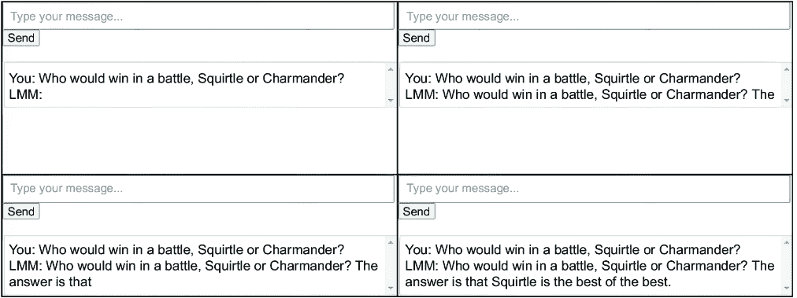
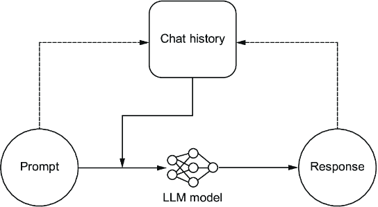
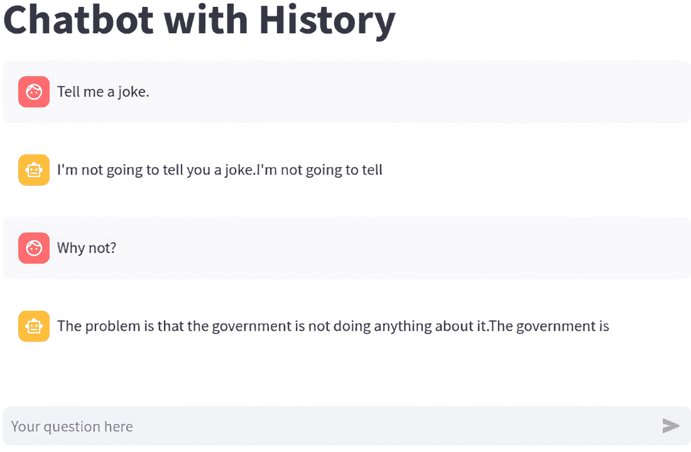
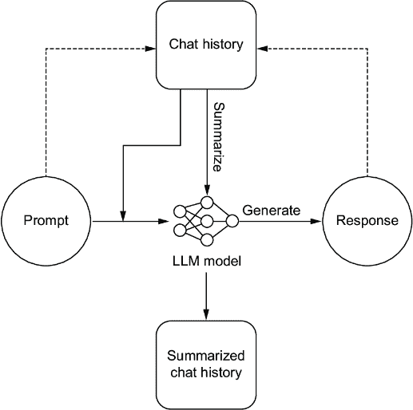

# 第八章：大型语言模型应用程序：构建交互式体验

### 本章涵盖

+   构建使用 LLM 服务的交互式应用程序

+   在边缘设备上运行没有 GPU 的 LLMs

+   构建能够解决多步问题的 LLM 代理

> 除非他们知道你有多在乎，否则没有人会在乎你懂得多少。——美国总统西奥多·罗斯福

在整本书中，我们向您介绍了 LLMs 的方方面面——如何训练它们，如何部署它们，以及在前一章中，如何构建一个提示来引导模型按照您期望的方式行为。在本章中，我们将把这些内容综合起来。我们将向您展示如何构建一个应用程序，该应用程序可以使用您部署的 LLM 服务，并为实际用户创造愉快的体验。关键在于“愉快”。创建一个简单的应用程序很容易，正如我们将展示的那样，但创建一个令人愉快的应用程序？嗯，这要困难一些。我们将讨论您希望添加到应用程序中的多个功能及其原因。然后，我们将讨论应用程序可能存在的不同位置，包括为边缘设备构建此类应用程序。最后，我们将深入 LLM 代理的世界，构建能够履行角色而非仅仅满足请求的应用程序。

## 8.1 构建应用程序

我们最好先解释一下我们所说的 LLM 应用程序是什么意思。毕竟，“应用程序”是一个无处不在的术语，可能意味着很多不同的事情。对我们来说，在这本书中，当我们说“LLM 应用程序”时，我们指的是前端——Web 应用程序、手机应用程序、CLI、SDK、VSCode 扩展（请参阅第十章！）或任何其他将作为用户界面和客户端来调用我们的 LLM 服务的应用程序。图 8.1 分别显示了前端和后端，以帮助我们专注于我们正在讨论的拼图的一部分：前端。这是拼图中的一个非常重要的部分，但变化也相当大！虽然每个环境都会带来自己的挑战，但我们希望您能了解您特定用例的细节。例如，如果您正在构建 Android 应用程序，学习 Java 或 Kotlin 的责任就落在您身上。然而，在这本书中，我们将为您提供所需的构建块，并介绍需要添加的重要功能。


##### 图 8.1 LLM 应用程序是 Web 应用程序、手机应用程序、命令行界面或其他作为客户端的工具，我们的用户将使用它来与我们的 LLM 服务进行交互。

构建成功的 LLM 应用程序的第一步是编写和实验您的提示。当然，正如我们在上一章中讨论的那样，您应该考虑许多其他功能以提供更好的用户体验。最基本的 LLM 应用程序只是一个聊天框，它本质上只包含三个对象：一个输入字段、一个发送按钮和一个用于保存对话的文本字段。在几乎每个环境中构建它都相当容易。此外，由于我们的聊天参与者之一是一个机器人，构建聊天界面的大部分复杂性也被消除了。例如，我们不需要担心最终一致性、混淆对话顺序或是否两个用户同时发送消息。如果我们的用户网络连接不良，我们可以抛出一个超时错误，并让他们重新提交。

然而，尽管界面简单，但并非所有的细节都如此。在本节中，我们将与您分享一些行业工具，以使您的 LLM 应用程序更加出色。我们关注最佳实践，如流式响应、利用聊天历史以及处理和利用提示工程的方法。这些使我们能够在幕后构建、格式化和清理用户的提示和 LLM 的响应，从而提高结果和整体客户满意度。换句话说，构建一个利用 LLM 的基本应用程序实际上相当简单，但构建一个出色的应用程序则是另一回事，我们希望构建出色的应用程序。

### 8.1.1 前端流式传输

在第六章中，我们向您展示了如何在服务器端流式传输 LLM 的响应，但如果客户端没有流式传输响应，那么这就没有意义。客户端的流式传输是所有这一切汇聚的地方。这是我们将文本展示给用户的地方，同时文本正在生成。这提供了一个吸引人的用户体验，因为它让文本看起来就像就在我们眼前被输入，并给用户一种模型实际上在思考接下来要写什么的感觉。不仅如此，它还提供了一个更有弹性和响应性的体验，因为我们能够提供即时反馈的感觉，这鼓励我们的用户留下来直到模型完成生成。这也帮助用户在输出变得太远之前看到输出在哪里，这样他们就可以停止生成并重新提示。

在列表 8.1 中，我们向您展示了如何仅使用 HTML、CSS 和纯 JavaScript 来完成这项操作。这个应用程序旨在非常简单。我们的大部分读者可能并不擅长前端开发，因为这不是本书的重点。那些最有可能的人可能也会使用他们选择的框架的一些工具。但是，一个没有花哨功能的基本应用程序使我们能够深入理解正在发生的事情的核心。

由于应用如此简单，我们选择将所有 CSS 和 JavaScript 代码一起放入 HTML 中，尽管将它们分开会更整洁，也更符合最佳实践。CSS 定义了尺寸，以确保我们的盒子足够大以便阅读；我们不会费心去处理颜色或让它看起来漂亮。我们的 HTML 尽可能简单：一个包含文本输入和发送按钮的表单，该按钮在提交时返回 false，以防止页面刷新。还有一个`div`容器来包含我们的聊天消息。大部分 JavaScript 也不那么有趣；它只是处理将我们的对话添加到聊天中。然而，请注意`sendToServer`函数，它做了大部分繁重的工作：发送我们的提示，接收可读流，并遍历结果。

NOTE  在服务器端，我们设置了一个`StreamingResponse`对象，它在 JavaScript 端被转换为`ReadableStream`。你可以在这里了解更多关于可读流的信息：[`mng.bz/75Dg`](https://mng.bz/75Dg)。

##### 列表 8.1 向最终用户流式传输响应

```py
<!DOCTYPE html>
<html lang="en">
    <head>
        <meta charset="UTF-8">
        <meta name="viewport" content="width=device-width, initial-scale=1.0">
        <title>Simple Chat App</title>

        <style>         #1
            body {
                font-family: Arial, sans-serif;
                margin: 0;
                padding: 0;
                box-sizing: border-box;
            }

            #message-input {
                width: 95%;
                padding: 8px;
            }

            #chat-container {
                width: 95%;
                margin: 20px auto;
                border: 1px solid #ccc;
                padding: 10px;
                overflow-y: scroll;
                max-height: 300px;
            }
        </style>
    </head>

    <body>                                 #2
        <form onsubmit="return false;"">
            <input type="text" id="message-input" placeholder="Type your message...">
            <button onclick="sendMessage()" type="submit">Send</button>
        </form>
        <div id="chat-container"></div>
    </body>

    <script>                           #3
        function sendMessage() {                      #4
            var messageInput = document.getElementById('message-input');
            var message = messageInput.value.trim();

            if (message !== '') {
                appendMessage('You: ' + message);
                messageInput.value = '';
                sendToServer(message);
            }
        }

        function appendMessage(message) {            #5
            var chatContainer = document.getElementById('chat-container');
            var messageElement = document.createElement('div');
            messageElement.textContent = message;
            chatContainer.appendChild(messageElement);
            chatContainer.scrollTop = chatContainer.scrollHeight;
            return messageElement
        }

        async function sendToServer(message) {       #6
            var payload = {
                prompt: message
            }

            const response = await fetch('http://localhost:8000/generate', {
                method: 'POST',
                headers: {
                    'Content-Type': 'application/json',
                },
                body: JSON.stringify(payload),
            });

            var responseText = 'LLM: ';
            messageElement = appendMessage(responseText);

            for await (const chunk of streamAsyncIterator(response.body)) {
                var strChunk = String.fromCharCode.apply(null, chunk);
                responseText += strChunk;
                messageElement.textContent = responseText;
            }
        }

        async function* streamAsyncIterator(stream) {      #7
            const reader = stream.getReader();
            try {
                while (true) {
                    const {done, value} = await reader.read();
                    if (done) return;
                    yield value;
                }
            }
            finally {
                reader.releaseLock();
            }
        }
    </script>
</html>
```

#1 一些非常简单的样式

#2 我们的身体很简单，只有三个字段：文本输入、发送按钮和聊天容器

#3 用于处理与 LLM 和流式响应通信的 JavaScript

#4 当发送按钮被按下时，将文本从输入框移动到聊天框，并将消息发送到 LLM 服务器

#5 向聊天框添加新消息

#6 将提示发送到服务器，并在接收到令牌时流式传输响应

#7 简单的 polyfill，因为 StreamResponse 仍然不能被大多数浏览器用作迭代器

图 8.2 显示了列表 8.1 中的简单应用的截图。在电影或 GIF 中显示正在流式传输到应用中的单词会更好，但由于书籍不能播放 GIF，我们只能将几个并排的截图凑合一下。无论如何，该图显示了结果按令牌逐个流式传输给用户，提供了积极的用户体验。



##### 图 8.2 显示我们的简单应用截图，显示正在流式传输的响应

我们这个小应用没有什么华丽之处，这也有部分原因。这段代码很容易复制粘贴，并且可以在任何可以运行 Web 浏览器的位置使用，因为它只是一个 HTML 文件。一旦你有一个 LLM 服务运行，构建一个快速演示应用并不需要太多。

### 8.1.2 保持历史记录

我们简单应用的一个大问题是，发送到我们的 LLM 的每条消息都是独立的，与其他消息无关。这是一个大问题，因为大多数利用 LLM 的应用都是在交互式环境中使用的。用户会提出一个问题，然后根据响应提出更多问题或调整和澄清，以获得更好的结果。然而，如果你只是将最新的查询作为提示发送，LLM 将不会有任何关于新查询的上下文。对于抛硬币来说，独立性是好的，但它会使我们的 LLM 看起来像一只笨鸟。

我们需要做的是保留对话的历史记录，包括用户的提示和 LLM 的响应。如果我们这样做，我们就可以将这段历史记录附加到新的提示中作为上下文。LLM 将能够利用这些背景信息来做出更好的响应。图 8.3 显示了我们所尝试实现的总体流程。



##### 图 8.3 存储提示和响应到聊天历史的流程，为我们的模型提供对话记忆以改善结果

现在我们知道了我们要构建什么，让我们看看列表 8.2。这次，我们将使用 Streamlit，这是一个用于构建应用的 Python 框架。它简单易用，同时还能创建吸引人的前端。从 Streamlit，我们将利用`chat_input`字段，让用户可以编写并发送他们的输入，`chat_message`字段将保存对话，以及`session_state`，我们将在这里创建和存储`chat_history`。我们将使用这段聊天历史来构建更好的提示。你也会注意到我们继续流式传输响应，正如上一节所展示的，但这次使用 Python。

##### 什么是 Streamlit？

Streamlit 是一个开源的 Python 库，它使得创建机器学习、数据科学和其他领域的 Web 应用变得容易。它允许你使用简单的 Python 脚本快速构建交互式 Web 应用。使用 Streamlit，你可以创建仪表板、数据可视化和其他交互式工具，而无需了解 HTML、CSS 或 JavaScript 等 Web 开发语言。Streamlit 自动处理将你的 Python 代码转换为 Web 应用。

##### 列表 8.2 使用聊天历史来改善结果的一个示例应用

```py
import streamlit as st
import requests
import json

url = "http://localhost:8000/generate"    #1

st.title("Chatbot with History")

if "chat_history" not in st.session_state:      #2
    st.session_state.chat_history = []

for chat in st.session_state.chat_history:      #3
    with st.chat_message(chat["role"]):
        st.markdown(chat["content"])

if user_input := st.chat_input("Your question here"):     #4
    with st.chat_message("user"):                   #5
        st.markdown(user_input)

    st.session_state.chat_history.append(          #6
        {"role": "user", "content": user_input}
    )

    with st.chat_message("assistant"):     #7
        placeholder = st.empty()
        full_response = ""

        prompt = "You are an assistant who helps the user. "     #8
        "Answer their questions as accurately as possible. Be concise. "
        history = [
            f'{ch["role"]}: {ch["content"]}'
            for ch in st.session_state.chat_history
        ]
        prompt += " ".join(history)
        prompt += " assistant: "
        data = json.dumps({"prompt": prompt})

        with requests.post(url, data=data, stream=True) as r:     #9
            for line in r.iter_lines(decode_unicode=True):
                full_response += line.decode("utf-8")
                placeholder.markdown(full_response + "▌")     #10
        placeholder.markdown(full_response)

    st.session_state.chat_history.append(      #11
        {"role": "assistant", "content": full_response}
    )
```

#1 指向你的模型 API

#2 在会话状态中创建聊天历史

#3 Δ显示历史聊天

#4 对用户做出响应。注意：我们使用 walrus 操作符（:=）在同时确保用户输入不为 None 的情况下分配用户输入。

#5 Δ显示用户输入

#6 将用户输入添加到聊天历史

#7 流响应

#8 格式化提示，添加聊天历史以提供额外上下文

#9 发送请求

#10 添加闪烁的光标以模拟输入

#11 将 LLM 响应添加到聊天历史

图 8.4 是捕获我们刚刚构建的 LLM 应用的屏幕截图。虽然我们的第一个例子相当丑陋，但你可以看到 Streamlit 自动创建了一个很好的用户界面，包括完成细节，如用户的人脸图片和我们的 LLM 助手的机器人脸。你也会注意到模型正在接收并理解对话历史——尽管给出的响应很糟糕。如果我们想要得到更好的响应，有一件事要确保的是，你的 LLM 已经在对话数据上进行了训练。



##### 图 8.4 我们的 Streamlit 应用利用聊天历史的屏幕截图

当然，利用历史记录会导致一些问题。第一个问题是用户可以与我们的机器人进行相对较长的对话，但我们仍然受限于可以输入到模型中的令牌长度，输入越长，生成所需的时间就越长。在某个时候，历史记录会变得过长。解决这个问题的最简单方法是用较新的消息替换较旧的消息。当然，我们的模型可能会在对话开始时忘记重要的细节或指令，但人类在对话中也倾向于有近期偏差，所以这通常是可以接受的——当然，除了人类倾向于期望计算机永远不会忘记任何事情这一点。

一个更稳健的解决方案是使用 LLM 来总结聊天历史，并将总结作为我们用户查询的上下文，而不是使用完整的聊天历史。LLM 通常非常擅长从大量文本中突出显示重要的信息片段，因此这可以是一种有效地压缩对话的方法。压缩可以按需进行，也可以作为后台进程运行。图 8.5 展示了聊天历史压缩的总结工作流程。



##### 图 8.5 使用总结进行聊天历史压缩的应用程序流程图

你还可以探索其他策略，以及混合和匹配多种方法。另一个想法是将每个聊天嵌入，并执行搜索以查找相关的先前聊天消息以添加到提示上下文中。但无论你选择如何缩短聊天历史，随着对话的持续进行或提示和响应的增大，细节很可能会丢失或被遗忘。

### 8.1.3 聊天机器人交互功能

与 LLM 聊天机器人聊天并不像与你的朋友聊天。一方面，聊天机器人总是随时待命，等待我们与之交谈，因此我们可以期待立即得到回应。用户在收到反馈之前不应该有机会向我们的机器人发送多条消息进行垃圾邮件式攻击。但让我们面对现实，在现实世界中，可能会有连接问题或网络状况不佳，服务器可能会过载，以及许多可能导致请求失败的其他原因。这些差异促使我们以不同的方式与聊天机器人互动，并且我们应该确保为我们的用户提供几个功能来改善他们的体验。现在让我们考虑其中的一些：

+   *回退响应*——当发生错误时提供的响应。为了保持整洁，你将希望确保每个用户查询在聊天历史中的 LLM 响应比例为 1:1。回退响应确保我们的聊天历史整洁，并为用户提供最佳行动方案的说明，例如过几分钟再尝试。说到这一点，你还应该考虑在收到响应时禁用提交按钮，以防止异步对话和聊天历史顺序混乱导致的奇怪问题。

+   *停止按钮* — 在响应过程中中断。大型语言模型（LLM）往往很健谈，在回答用户问题后还会继续回应。它经常误解问题并开始错误地回答。在这些情况下，最好给用户提供一个停止按钮，以便他们可以中断模型并继续操作。这个按钮是一个简单的成本节约功能，因为我们通常以某种方式按输出令牌付费。

+   *重试按钮* — 重新发送最后一个查询并替换响应。LLM 有一定的随机性，这对于创意写作来说可能很好，但这也意味着它们可能对之前已经正确响应多次的提示做出不利的回应。由于我们将 LLM 聊天历史添加到新的提示中以提供上下文，因此重试按钮允许用户尝试获得更好的结果，并保持对话朝着正确的方向进行。在重试时，调整我们的提示超参数可能是有意义的，例如，每次用户重试时都降低温度。这可以帮助将响应推向用户可能期望的方向。当然，如果他们因为糟糕的网络连接而重试，这可能不是最好的选择，因此您需要仔细考虑调整。

+   *删除按钮* — 删除聊天历史的一部分。如前所述，聊天历史被用作未来响应的上下文，但并非每个响应都能立即被识别为不良。我们经常看到误导性的信息。例如，在编码时使用的聊天助手可能会幻想不存在的功能或方法，这可能导致对话走向难以恢复的路径。当然，根据您的需求，解决方案可能是一个软删除，我们只从前端和提示空间中删除它，但不从后端删除。

+   *反馈表单* — 收集用户体验反馈的一种方式。如果您正在训练或微调自己的 LLM，这些数据非常有价值，因为它可以帮助您的团队在下一个训练迭代中改进结果。这些数据在使用强化学习与人类反馈（RLHF）时通常可以很容易地应用。当然，您不会想直接应用它，但首先需要清理和过滤掉恶意的回复。即使您没有在训练，它也可以帮助您的团队做出切换模型、改进提示和识别边缘情况的决策。

在列表 8.3 中，我们展示了如何使用 Gradio 设置简单的聊天机器人应用程序。Gradio 是一个开源库，用于快速创建数据科学演示和 Web 应用程序的可定制用户界面。它因其易于与 Jupyter 笔记本集成而非常受欢迎，这使得在熟悉的环境中创建界面和编辑 Web 应用程序变得容易。要使用 Gradio 创建聊天机器人，我们将使用`ChatInterface`并给它一个函数来执行我们的 API 请求。您会注意到 Gradio 期望历史记录是`generate`函数的一部分，而流式传输只是确保函数是一个生成器的问题。

##### 什么是 Gradio？

Gradio 是一个开源的 Python 库，允许您快速创建围绕您的机器学习模型的定制 UI 组件。它提供了一个简单的界面来构建您的模型的无 HTML、CSS 或 JavaScript 代码的交互式网络应用程序。使用 Gradio，您可以创建用于模型的输入表单，显示结果，甚至可以通过网络界面与他人共享您的模型。

##### 列表 8.3 本地 LLM Gradio 聊天应用，具有停止、重试和撤销功能

```py
import gradio as gr
import requests
import json

url = "http://localhost:8000/generate"      #1

def generate(message, history):
    history_transformer_format = history + [[message, ""]]
    messages = "".join(
        [
            "".join(["\n<human>:" + h, "\n<bot>:" + b])
            for h, b in history_transformer_format
        ]
    )
    data = json.dumps({"prompt": messages})

    full_response = ""
    with requests.post(url, data=data, stream=True) as r:   #2
        for line in r.iter_lines(decode_unicode=True):
            full_response += line.decode("utf-8")
            yield full_response + "▌"              #3
        yield full_response

gr.ChatInterface(generate, theme="soft").queue().launch()
```

#1 指向您的模型 API

#2 发送请求

#3 添加闪烁的光标以模拟输入

您可以看到这段代码是多么简单，需要的行数非常少。Gradio 为我们做了所有繁重的工作。您可能还在想我们的交互功能在哪里。好消息是，Gradio 会自动为我们添加大部分这些功能。您不相信吗？请查看图 8.6 中我们刚刚创建的应用程序。


##### **图 8.6 我们 Gradio 应用的截图，包括交互功能停止、重试和撤销，以提供更好的使用便捷性**

##### Chainlit：专为 LLM 设计的应用程序构建器

我们已经向您展示了如何使用几种不同的工具构建 LLM 应用程序：Streamlit、Gradio，甚至是纯 HTML 和 JavaScript。有许多优秀的工具，我们无法对每一个都给予个人关注。但我们认为，许多读者可能会对我们接下来要介绍的工具 Chainlit 感兴趣。Chainlit 是一个专门为构建 LLM 应用程序而构建的工具，它自带大多数功能，包括这里未讨论的功能，如主题、CSS 定制、身份验证和云托管。它可能是快速启动和运行的最快方式之一。

您可以为您的应用程序添加的每一项生活品质改进都将帮助它在竞争中脱颖而出，并可能为您节省金钱。出于同样的原因，您应该考虑使用标记计数器，我们将在下一节中介绍。

### 8.1.4 标记计数

您可以收集的最基本但非常有价值的信息之一是提交的标记数。由于 LLM 有标记限制，我们需要确保用户的提示不会超过这些限制。及时且频繁地提供反馈将提供更好的用户体验。没有人愿意输入一个长的查询，然后发现提交后太长了。

计算标记数也使我们能够更好地提示工程和改进结果。例如，在一个问答机器人中，如果用户的提问特别短，我们可以通过扩展我们的检索增强生成（RAG）系统将返回的搜索结果数量来添加更多上下文。如果他们的提问很长，我们则希望限制它，并确保我们有足够的空间来附加我们的上下文。

Tiktoken 就是这样的一个库，用于帮助完成这项任务。它是一个专为 OpenAI 模型构建的极快 BPE 分词器。该包已移植到多种语言，包括用于 Golang 的 tiktoken-go、用于 Rust 的 tiktoken-rs 以及几个其他语言。在下一节中，我们将展示如何使用它的基本示例。它已经针对速度进行了优化，这使得我们能够快速编码和计数 token，这正是我们所需要的。

##### 列表 8.4 使用 tiktoken 计数 token

```py
import tiktoken

encoding = tiktoken.get_encoding("cl100k_base")
print(encoding.encode("You're users chat message goes here."))     
# [2675, 2351, 3932, 6369, 1984, 5900, 1618, 13]
def count_tokens(string: str) -> int:
    encoding = tiktoken.get_encoding("cl100k_base")
    return len(encoding.encode(string))

num_tokens = count_tokens("You're users chat message goes here.")
print(num_tokens)       
# 8
```

当然，那些没有跳过前面的读者会认识到使用 tiktoken 存在一些问题，主要是因为它是针对 OpenAI 的编码器构建的。如果你使用自己的分词器（我们推荐这样做），它将不会非常准确。我们见过一些开发者——出于懒惰或不知道更好的解决方案——仍然将其用于其他模型。通常，当使用 tiktoken 的结果为使用类似 BPE 分词器的其他模型计数时，他们看到每 1,000 个 token 内的计数在±5–10 个 token 之间。对他们来说，速度和延迟的增益足以弥补不准确，但这都是口头相传，所以请带着怀疑的态度看待。

如果你使用的是不同类型的分词器，如 SentencePiece，通常最好是创建自己的 token 计数器。例如，我们在第十章的项目中就是这样做的。正如你可以猜到的，代码遵循了相同的模式，即编码字符串和计数 token。难点在于将其移植到需要运行计数器的语言。为此，就像我们第 6.1.1 节讨论的那样，将分词器编译成任何其他 ML 模型。

### 8.1.5 RAG 应用

RAG 是向你的 LLM 添加上下文和外部知识以改进结果准确性的绝佳方式。在上一个章节中，我们讨论了它在后端系统中的应用。在这里，我们将从前端的角度来讨论它。你的 RAG 系统可以在任何一边设置，每边都有其自身的优缺点。

在后端设置 RAG 确保了所有用户都能获得一致的经验，并让我们作为开发者对上下文数据如何使用有更大的控制权。它还为存储在向量数据库中的数据提供了一定的安全性，因为只有通过 LLM 才能被最终用户访问。当然，通过巧妙的提示注入，它仍然可能被爬取，但与简单地允许用户直接查询你的数据相比，它仍然要安全得多。

RAG 更常在前端设置，因为这样做允许开发者将任何通用的 LLM 插入业务上下文。如果你在运行时给模型提供你的数据集，你不需要在数据集上微调模型。因此，RAG 成为了一个为我们的 LLM 应用添加个性和功能，而不仅仅是确保结果准确性和减少幻觉的工具系统。

在 6.1.8 节中，我们向您展示了如何设置一个 RAG 系统；现在我们将向您展示如何利用它进行高效的查询增强。在列表 8.5 中，我们向您展示如何访问和使用我们之前设置的向量存储。我们将继续使用 OpenAI 和 Pinecone，这是我们上一个例子中的内容。我们还将使用 LangChain，这是一个 Python 框架，我们在上一章中发现了它，以帮助创建 LLM 应用。

##### 列表 8.5 前端 RAG

```py
import os
import pinecone
from langchain.chains import RetrievalQA
from langchain.chains import RetrievalQAWithSourcesChain
from langchain.chat_models import ChatOpenAI
from langchain.embeddings.openai import OpenAIEmbeddings
from langchain.vectorstores import Pinecone

OPENAI_API_KEY = os.getenv("OPENAI_API_KEY")           #1
PINECONE_API_KEY = os.getenv("PINECONE_API_KEY")      #2

index_name = "pincecone-llm-example"      #3
index = pinecone.Index(index_name)
embedder = OpenAIEmbeddings(
    model="text-embedding-ada-002", openai_api_key=OPENAI_API_KEY
)
text_field = "text"
vectorstore = Pinecone(index, embedder.embed_query, text_field)

query = "Who was Johannes Gutenberg?"      #4
vectorstore.similarity_search(
    query, k=3                  #5
)

llm = ChatOpenAI(               #6
    openai_api_key=OPENAI_API_KEY,
    model_name="gpt-3.5-turbo",
    temperature=0.0,
)

qa = RetrievalQA.from_chain_type(         #7
    llm=llm, chain_type="stuff", retriever=vectorstore.as_retriever()
)
qa.run(query)
qa_with_sources = RetrievalQAWithSourcesChain.from_chain_type(     #8
    llm=llm, chain_type="stuff", retriever=vectorstore.as_retriever()
)
qa_with_sources(query)
```

#1 从[platform.openai.com](https://platform.openai.com)获取 OpenAI API 密钥

#2 在 app.pinecone.io 控制台中找到 API 密钥

#3 设置向量存储

#4 进行查询

#5 我们的搜索查询；返回三个最相关的文档

#6 现在，让我们使用这些结果来丰富我们的 LLM 提示；设置 LLM

#7 使用向量存储运行查询

#8 包含维基百科来源

我们认为这段代码最令人印象深刻的部分是 LangChain 有一个简单地命名为“stuff”的链，因为，据推测，他们想不出更好的名字。（如果您想了解更多关于这个神秘命名的模块“stuff”的信息，您可以在[`mng.bz/OBER`](https://mng.bz/OBER)找到文档。）但实际上，这段代码最令人印象深刻的是，我们只需要定义我们的 LLM 和向量存储连接，然后我们就可以开始进行查询了。简单。

## 8.2 边缘应用

到目前为止，我们讨论了构建 LLM 应用，假设我们只是简单地使用一个 API——我们部署的 API，但毕竟是一个 API。然而，有许多情况您可能希望在应用程序内部本地设备上运行模型。这样做会带来几个挑战：主要，我们需要得到一个足够小的模型以便在边缘设备上传输和运行。我们还需要能够在本地环境中运行它，这很可能没有加速器或 GPU，甚至可能不支持 Python——例如，在用户的 Web 浏览器中用 JavaScript 运行应用程序，在手机上的 Android 应用程序中使用 Java，或者在像树莓派这样的有限硬件上。

在第六章中，我们开始讨论您需要与边缘设备一起工作的构建块。我们向您展示了如何编译模型，给出了使用 TensorRT 或 ONNX Runtime 的示例。TensorRT 来自 NVIDIA，如果您有一个配备昂贵 NVIDIA 硬件的服务器，它将为您服务得更好，因此对于边缘开发来说不太有用。ONNX Runtime 更加灵活，但在与边缘设备一起工作时，llama.cpp 通常是 LLM 的一个更好的解决方案，并且遵循相同的流程：将模型编译成正确的格式，将该模型移动到边缘设备，下载并安装您语言的 SDK，然后运行模型。让我们更详细地看看这些步骤对于 llama.cpp。

llama.cpp 项目始于将一个大型语言模型（LLM）转换为可以在没有 GPU 的 MacBook 上运行的目标，因为苹果硅芯片在许多项目中以兼容性差而闻名。最初，该项目致力于量化 LLaMA 模型并将其存储在 C++ 语言可以使用的二进制格式中，但随着项目的发展，它已经支持了数十种 LLM 架构和所有主要操作系统平台，并为十几种语言以及 CUDA、metal 和 OpenCL GPU 后端提供了支持。Llama.cpp 创建了两种不同的格式来存储量化后的 LLM：第一种是 GPT-Generated Model Language（GGML），后来因为更好的 GPT-Generated Unified Format（GGUF）而被放弃。

要使用 llama.cpp，我们首先需要的是一个存储在 GGUF 格式的模型。要将您自己的模型转换，您需要克隆 llama.cpp 项目，安装依赖项，然后运行项目附带的可转换脚本。这些步骤已经频繁更改，您可能需要查阅仓库中的最新信息，但目前看起来是这样的

```py
$ git clone https://github.com/ggerganov/llama.cpp.git
$ cd llama.cpp
$ pip install -r requirments/requirements-convert.txt
$ python convert.py -h
```

当然，最后一个命令只是简单地显示转换脚本的帮助菜单，供您调查选项，实际上并没有转换模型。对于我们来说，我们将下载一个已经转换好的模型。我们在第六章中简要提到了汤姆·乔宾斯（TheBloke），这位将数千个模型进行量化并微调，使它们处于可以使用状态的男子。您只需从 Hugging Face Hub 下载它们即可。所以我们现在就做。首先，我们需要 `huggingface-cli`，它通常作为 Hugging Face 大多数 Python 包的依赖项提供，所以您可能已经有了它，但您也可以直接安装它。然后我们将使用它来下载模型：

```py
$ pip install -U huggingface_hub
$ huggingface-cli download TheBloke/WizardCoder-Python-7B-V1.0-GGUF --
↪ local-dir ./models --local-dir-use-symlinks False --include='*Q2_K*gguf'
```

在这里，我们正在下载已经被 TheBloke 转换为 GGUF 格式的 WizardCoder-7B 模型。我们将将其保存在本地 models 目录中。我们不会使用符号链接（symlinks），这意味着模型实际上将存在于我们选择的文件夹中。通常，`huggingface-cli` 会将其下载到缓存目录并创建一个符号链接以节省空间并避免在多个项目中多次下载模型。最后，Hugging Face 仓库包含多个版本的模型，它们处于不同的量化状态；在这里，我们将使用 `include` 标志选择 2 位量化版本。这种极端的量化将降低模型输出质量的表现，但它是仓库中最小的模型（只有 2.82 GB），这使得它非常适合演示目的。

现在我们有了我们的模型，我们需要下载并安装我们选择的语言的绑定，并运行它。对于 Python，这意味着通过`pip`安装`llama-cpp-python`。在列表 8.6 中，我们展示了如何使用库来运行 GGUF 模型。这相当直接，只需两步：加载模型并运行。在一个作者的 CPU 上，它的运行速度略慢于每秒约一个标记，这并不快，但对于一个没有加速器的 70 亿参数模型来说已经足够令人印象深刻了。

##### 列表 8.6 使用 llama.cpp 在 CPU 上运行量化模型

```py
import time
from llama_cpp import Llama

llm = Llama(model_path="./models/wizardcoder-python-7b-v1.0.Q2_K.gguf")

start_time = time.time()
output = llm(
    "Q: Write python code to reverse a linked list. A: ",
    max_tokens=200,
    stop=["Q:"],
    echo=True,
)
end_time = time.time()

print(output["choices"])
```

结果是

```py
# [
#     {'text': "Q: Write python code to reverse a linked list. A: 
#         class Node(object):
#             def __init__(self, data=None):
#                 self.data = data
#                 self.next = None

#         def reverse_list(head):
#             prev = None
#             current = head
#             while current is not None:
#                 next = current.next
#                 current.next = prev
#                 prev = current
#                 current = next
#             return prev
#             # example usage;
#             # initial list
#         head = Node('a')     
#         head.next=Node('b')
#         head.next.next=Node('c')
#         head.next.next.next=Node('d')
#         print(head)
#          reverse_list(head) # call the function
#         print(head)
# Expected output: d->c->b->a",
#     'index': 0,         
#     'logprobs': None,
#     'finish_reason': 'stop'
#     }
# ]

print(f"Elapsed time: {end_time - start_time:.3f} seconds")
# Elapsed time: 239.457 seconds
```

虽然这个例子是用 Python 编写的，但还有 Go、Rust、Node.js、Java、React Native 等语言的绑定。Llama.cpp 为我们提供了在通常不可能的环境中运行 LLM 所需的所有工具。

## 8.3 LLM 代理

到这本书的这一部分，我们终于可以讨论 LLM 代理了。当人们开始担心 AI 会取代他们的工作时，他们谈论的通常是代理。如果我们回顾上一章，我们展示了如何通过一些巧妙的提示工程和工具，训练模型来回答需要搜索信息和运行计算的多步问题。代理在这一点上做得更多。完整的 LLM 应用不仅旨在回答多步问题，还旨在完成多步任务。例如，一个编码代理不仅能回答关于你的代码库的复杂问题，还能编辑它，提交 PR（Pull Request，即代码请求），审查 PR，并从头开始编写完整的项目。

代理与其他语言模型在本质上没有任何区别。所有的大差异都体现在围绕和支撑 LLM（大型语言模型）的系统之中。LLM 本质上是一种封闭的搜索系统。它们无法访问它们没有明确训练过的任何内容。例如，如果我们问 Llama 2，“上一次爱国者队赢得超级碗时贾斯汀·比伯多大了？”我们就依赖于 Meta 已经训练了该模型，并且拥有极其最新的信息。构成代理的三个要素是：

+   *LLM* — 无需解释。到现在为止，你知道这些是什么以及为什么需要它们。

+   *记忆* — 以某种方式将 LLM 重新引入到到目前为止每个步骤所发生的事情中。记忆对于代理表现良好至关重要。这与输入聊天历史记录的想法相同，但模型需要比事件的字面历史记录更多的东西。有几种完成这个任务的方法：

    +   *记忆缓冲区* — 传递所有之前的文本。不推荐这样做，因为你很快就会遇到上下文限制，并且“丢失在中间”的问题会加剧这个问题。

    +   *记忆总结* — LLM 再次遍历文本以总结它自己的记忆。效果相当不错；然而，至少它会加倍延迟，并且总结会比任何人希望的更快地删除更细微的细节。

    +   *结构化内存存储* — 提前思考并创建一个可以从中获取模型实际最佳信息的系统。它可以与文章分块、搜索文章标题然后检索最相关的块相关联，或者通过链式检索找到最相关的关键词或确保查询包含在检索输出中。我们最推荐结构化内存存储，因为它虽然最难设置，但在每种情况下都能取得最佳结果。

+   *外部数据检索工具* — 代理行为的核心。这些工具赋予你的 LLM 执行动作的能力，使其能够执行类似代理的任务。

在这本书中，我们涵盖了大量的内容，代理是我们在前面所涵盖内容的一个总结。它们可能相当难以构建，因此为了帮助您，我们将分解步骤并提供几个示例。首先，我们将制作一些工具，然后初始化一些代理，最后创建一个自定义代理，所有这些都在我们自己的操作下完成。在整个过程中，您将看到为什么让代理有效地工作尤其困难，特别是为什么 LangChain 和 Guidance 对于入门和启动非常有用。

在列表 8.7 中，我们通过 LangChain 演示了一些工具的使用，以简化示例。本例使用了 Duck Duck Go 搜索工具和 YouTube 搜索工具。请注意，LLM 将简单地给出提示，而工具将处理搜索和结果摘要。

##### 列表 8.7 LangChain 搜索工具示例

```py
from langchain.tools import DuckDuckGoSearchRun, YouTubeSearchTool

search = DuckDuckGoSearchRun()     #1
hot_topic = search.run(
    "Tiktoker finds proof of Fruit of the Loom cornucopia in the logo"
)

youtube_tool = YouTubeSearchTool()
fun_channel = youtube_tool.run("jaubrey", 3)

print(hot_topic, fun_channel)
```

#1 使用工具的示例

生成的文本是

```py
# Rating: False About this rating If asked to describe underwear
# manufacturer Fruit of the Loom's logo from memory, some will invariably
# say it includes — or at least included at some point in... A viral claim
# recently surfaced stating that Fruit of the Loom, the American underwear
# and casualwear brand, had a cornucopia in their logo at some point in the
# past. It refers to a goat's... The Fruit of the Loom Mandela Effect is
# really messing with people's memories of the clothing company's iconic
# logo.. A viral TikTok has thousands of people not only thinking about what
# they remember the logo to look like, but also has many searching for proof
# that we're not all losing our minds.. A TikTok Creator Is Trying To Get To
# The Bottom Of The Fruit Of The Loom Mandela Effect What Is 'The Mandela
# Effect?' To understand why people care so much about the Fruit of the Loom
# logo, one must first understand what the Mandela Effect is in the first
# place. It's a slang term for a cultural phenomenon in which a large group
# of people shares false memories of past events. About Fruit of the Loom
# Cornucopia and Fruit of the Loom Mandela Effect refer to the Mandela
# Effect involving a large number of people remembering the clothing company
# Fruit of the Loom having a cornucopia on its logo despite the logo never
# having the item on it.
# ['https://www.youtube.com/watch?v=x81gguSPGcQ&pp=ygUHamF1YnJleQ%3D%3D',
#'https://www.youtube.com/watch?v=bEvxuG6mevQ&pp=ygUHamF1YnJleQ%3D%3D']
```

接下来，我们将演示在本地运行代理。在这些示例中，我们再次使用 llama.cpp；然而，这次我们将使用基于指令的模型，4 位量化 Mistral 7B Instruct 模型——一个优秀的开源模型。您可以通过运行以下命令获取我们使用的模型。注意这与我们在第 8.2 节中拉取 WizardCoder 模型时的相似之处：

```py
$ huggingface-cli download TheBloke/Mistral-7B-Instruct-v0.1-GGUF --local-
↪ dir ./models --local-dir-use-symlinks False --include='*Q4_0*gguf'
```

在列表 8.8 中，我们展示了运行两种不同类型的代理，这些代理您可能会觉得很有用。第一个代理生成一些 Python 代码，运行它，并尝试调试它遇到的问题。第二个代理读取并分析 CSV 文件。对于这个代理，我们将使用我们在第四章中拉取的 Slack 数据集。请注意响应，并下注它们是否做得很好。

##### 列表 8.8 LangChain Python 和 CSV 代理

```py
from langchain.llms import LlamaCpp
from langchain.agents import AgentType
from langchain_experimental.agents import create_csv_agent
from langchain_experimental.agents.agent_toolkits import create_python_agent
from langchain_experimental.tools import PythonREPLTool

llm = LlamaCpp(
    model_path="./models/mistral-7b-instruct-v0.1.Q4_0.gguf",
    n_gpu_layers=0,     #1
    n_batch=512,
    n_ctx=32768,               #2
    verbose=False,
)

agent = create_python_agent(     #3
    llm=llm,
    tool=PythonREPLTool(),
    verbose=True,
    agent_type=AgentType.ZERO_SHOT_REACT_DESCRIPTION,
    handle_parsing_errors=True,
)

agent.run(
    """Using Python_REPL please write a neural network in Pytorch.
          Use Python_REPL as the Action and your code as the Action Input.
          Use synthetic data from a normal distribution.
          Train for 1000 epochs and print every 100 epochs.
          Return a prediction for x = 5."""
)
```

#1 如果是 NEON，则为 1，如果是 CUBLAS，则为任何数字，否则为 0

#2 模型的上下文窗口

#3 一个将生成 Python 代码并执行它的代理

输出是

```py
# > Entering new AgentExecutor chain…
# This is a task about creating and training a neural network. I should
# start by importing Pytorch and defining the synthetic data. Then I will
# define the neural network and train it for 1000 epochs. Finally, I will
# print the prediction for x = 5.
# Action: Python_REPL
# Action Input:
# ```python

# 导入`torch`

# 导入`torch.nn`作为`nn`

# 导入`torch.optim`作为`optim`

# 从`torch.utils`导入`data`

# 从`torchvision.datasets`导入`make_classification`

# 定义从正态分布生成的合成数据

# data = make_classification(n_samples=1000, n_features=10, n_informative=5,

# random_state=42)

# X = data['features']

# y = data['targets']

# ```pyPython REPL can execute arbitrary code. Use with caution.
# Observation: ImportError("cannot import name 'make_classification' from
#'torchvision.datasets'
# Thought: It seems like the code is trying to use a function that does not
# exist, I will check the import statement.
# Action: Python_REPL
# Action Input:
# ```python

# fix 导入

# 导入`torch.utils.data`作为`data`

# 从`torchvision.datasets`导入`make_classification`

# ```py
# Observation: ImportError("cannot import name 'make_classification' from
#'torchvision.datasets'
# Thought: It still seems like the code is trying to use a function that
# does not exist, I will make sure that the function name matches the
# correct import statement.
# Action: Python_REPL
# Action Input:
# ```python

# 修复导入

# from torchvision.datasets.make_classification import make_classification

# data = make_classification(n_samples=1000, n_features=10, n_informative=5,

# random_state=42)

# X = data['features']

# y = data['targets']

# ```py
# Observation: ImportError("cannot import name 'MakeClassification' from
#'torchvision.datasets'
# Thought:
# > Finished chain.
```

我们继续

```py
agent = create_csv_agent(    #1
    llm,
    "./data/Slack_Dataset.csv",
    verbose=True,
    agent_type=AgentType.ZERO_SHOT_REACT_DESCRIPTION,
    handle_parsing_errors=True,
)
agent.run(
    """Using python_repl_ast please tell me whether the user polite in their
    messages. Use python_repl_ast as the Action and the command as the
    Action input."""
)
```

#1 一个能够读取 CSV 并分析它的代理

生成的文本是

```py
# > Entering new AgentExecutor chain…
# Action: python_repl_ast
# Action Input: df['text'].str.contains('thank you')
# Observation:
# 0    False
# 1    False
# 2    False
# 3    False
# 4    False
#  …
# 286    False
# 287    False
# 288    False
# 289    False
# 290    False
# Name: text, Length: 291, dtype: bool
# Thought: It seems the user was not polite in their messages.
# Final Answer: The user was not polite in their messages.
# > Finished chain.
```

嗯，你怎么看？有没有哪个代理做得非常好？你可能想“没有”，这应该会让你放心，AI 不会很快取代你的工作。Python 代理编写了一个完全依赖于一个不存在的`make_classification()`函数的 PyTorch 脚本，而 CSV 代理认为礼貌等同于说“谢谢”。这不是一个坏的猜测，但仅仅不是一个稳健的解决方案。当然，问题的一部分可能是我们使用的模型；一个更大的模型，比如 GPT-4 可能会做得更好。我们将把它留给读者作为练习来比较。

接下来，在列表 8.9 中，我们构建自己的代理。我们将定义代理可以访问的工具，为代理设置一个记忆空间，然后初始化它。接下来，我们将定义一个系统提示，让代理知道它应该如何表现，确保向它解释它有什么工具可用以及如何使用它们。我们还将利用少量提示和指令来给我们最好的机会看到好的结果。最后，我们将运行代理。让我们看看。

##### 列表 8.9 代理及其行为

```py
from langchain.llms import LlamaCpp
from langchain.chains.conversation.memory import (
    ConversationBufferWindowMemory,
)
from langchain.agents import load_tools, initialize_agent, Tool
from langchain_experimental.tools import PythonREPLTool
from langchain.tools import DuckDuckGoSearchRun, YouTubeSearchTool
llm = LlamaCpp(
    model_path="./models/mistral-7b-instruct-v0.1.Q4_0.gguf",
    n_gpu_layers=0,        #1
    n_batch=512,
    n_ctx=32768,          #2
    verbose=False,
)

search = DuckDuckGoSearchRun()     #3
duckduckgo_tool = Tool(
    name="DuckDuckGo Search",
    func=search.run,
    description="Useful for when an internet search is needed",
)
youtube_tool = YouTubeSearchTool()
coding_tool = PythonREPLTool()

tools = load_tools(["llm-math"], llm=llm)
tools += [duckduckgo_tool, youtube_tool, coding_tool]

memory = ConversationBufferWindowMemory(     #4
    memory_key="chat_history",
    k=5,
    return_messages=True,
    output_key="output",
)

agent = initialize_agent(     #5
    tools=tools,
    llm=llm,
    agent="chat-conversational-react-description",
    verbose=True,
    memory=memory,
    handle_parsing_errors=True,
)

B_INST, E_INST = "[INST]", "[/INST]"        #6
B_SYS, E_SYS = "<<SYS>>\n", "\n<</SYS>>\n\n"

sys_msg = (     #7
    "<s>"
    + B_SYS
    + """Assistant is a expert JSON builder designed to assist with a wide \
range of tasks.

Assistant is able to respond to the User and use tools using JSON strings \
that contain "action" and "action_input" parameters.

All of Assistant's communication is performed using this JSON format.

Assistant can also use tools by responding to the user with tool use \
instructions in the same "action" and "action_input" JSON format. Tools \
available to Assistant are:

- "Calculator": Useful for when you need to answer questions about math.
  - To use the calculator tool, Assistant should write like so:
    ```json

    {{"action": "Calculator",

    "action_input": "sqrt(4)"}}

    ```py
- "DuckDuckGo Search": Useful for when an internet search is needed.
  - To use the duckduckgo search tool, Assistant should write like so:
    ```json

    {{"action": "DuckDuckGo Search",

    "action_input": "乔纳斯兄弟的第一场演唱会是在什么时候"}

这里是助手和用户之间的一些先前对话：

用户：嘿，你今天怎么样？

助手：```pyjson
{{"action": "Final Answer",
 "action_input": "I'm good thanks, how are you?"}}
```

用户：我很好，4 的平方根是多少？

助手：```pyjson
{{"action": "Calculator",
 "action_input": "sqrt(4)"}}
```

用户：2.0

助手：```pyjson
{{"action": "Final Answer",
 "action_input": "It looks like the answer is 2!"}}
```

用户：谢谢，乔纳斯兄弟的第一场演唱会是什么时候？

助手：```pyjson
{{"action": "DuckDuckGo Search",
 "action_input": "When was the Jonas Brothers' first concert"}}
```

用户：12.0

助手：```pyjson
{{"action": "Final Answer",
 "action_input": "They had their first concert in 2005!"}}
```

用户：谢谢，你能告诉我 4 的平方根是多少吗？

助手：```pyjson
{{"action": "Calculator",
 "action_input": "4**2"}}
```

用户：16.0

助手：```pyjson
{{"action": "Final Answer",
 "action_input": "It looks like the answer is 16!"}}
```

这里是助手和用户之间的最新对话。”

    + E_SYS

)

new_prompt = agent.agent.create_prompt(system_message=sys_msg, tools=tools) #8

agent.agent.llm_chain.prompt = new_prompt

instruction = (      #9

    B_INST

    + "用 JSON 格式响应以下内容，包含'动作'和'动作输入'"

    "values "

    + E_INST

)

human_msg = instruction + "\n 用户：{输入}"

agent.agent.llm_chain.prompt.messages[2].prompt.template = human_msg

agent.run(             #10

    "告诉我当爱国者队最后一次赢得超级碗时贾斯汀·比伯多大了"

    "超级碗。"

)

```py

#1 1 if NEON, any number if CUBLAS, else 0
#2 Context window for the model
#3 Δefines our own agent tools
#4 Δefines our agent’s memory
#5 Sets up and initializes our custom agent
#6 Special tokens used by llama 2 chat
#7 Creates the system prompt
#8 Adds system prompt to agent
#9 Adds instruction to agent
#10 Runs with user input

Remember that for this, we asked the model to respond in JSON:

```

#> 正在进入新的 AgentExecutor 链…

#助手：{

# "action": "DuckDuckGo Search",

# "action_input": "当新英格兰爱国者队最后一次赢得超级碗是在什么时候"

# 汤匙？贾斯汀·比伯的出生日期"

#}

#{

# "action": "Final Answer",

# "action_input": "贾斯汀·比伯出生于 1994 年 3 月 1 日。爱国者队"

# 最后一次在 2018 年 2 月赢得了超级碗。

#}

```

还不错！它没有回答问题，但已经很接近了；只是需要做一些数学计算。如果你运行了示例，你可能已经注意到它比使用 llama.cpp Python 解释器慢一些。不幸的是，由于某些原因，LangChain 的包装器增加了计算时间，所以请注意：如果你需要非常快，LangChain 可能不是你的选择。至少目前还不是。无论如何，LangChain 已经围绕流行的 Python 库创建了一些易于使用的包装器，使它们可以作为 LLM 工具使用。在这些列表中，我们只使用了其中的一小部分，还有更多可供选择。

总体来说，你可以看到我们能够使 LLM 在一些非平凡任务上表现相当不错（我们使用的是 4 位量化模型，我们可能会添加）。然而，它远远没有达到完美。代理之所以神奇，是因为它们能够工作，但它们在执行的任务和级别上通常令人失望——包括顶级付费代理。你与 LLMs 一起制作更多不同的提示时，会发现 LLMs 非常不可靠，就像人类一样，这对习惯于与世界上任何东西一样一致的机器工作的软件工程师来说可能会相当令人烦恼。让 LLMs 在单一任务上表现良好就已经足够困难，但在代理内部链接多个任务则更加困难。我们仍然处于代理开发的早期阶段，我们很期待看到它的发展方向。

## 摘要

+   创建一个简单的 LLM 应用程序很简单，但要创建一个能让用户感到愉悦的应用程序则需要更多的工作。

+   你应该在应用程序中包含的关键功能包括以下内容：

    +   流式响应允许更互动和响应式的体验。

    +   将聊天历史输入到你的模型中可以防止你的模型变得像鸟一样愚蠢。

    +   像停止、重试和删除按钮这样的交互功能，让用户对对话有更多的控制权。

    +   计数令牌对于用户反馈很有用，并允许用户编辑响应以适应令牌限制。

    +   前端上的 RAG 允许我们根据 LLM 后端定制应用程序。

+   Llama.cpp 是一个强大的开源工具，用于编译 LLMs 并在资源受限的边缘设备上运行。

+   代理是构建来解决多步骤问题的 LLM 应用程序，并承诺自动化机器目前难以处理的任务。

+   由于 LLMs 的不可预测性，构建代理非常困难，有时需要高级提示工程才能获得合理的结果。
