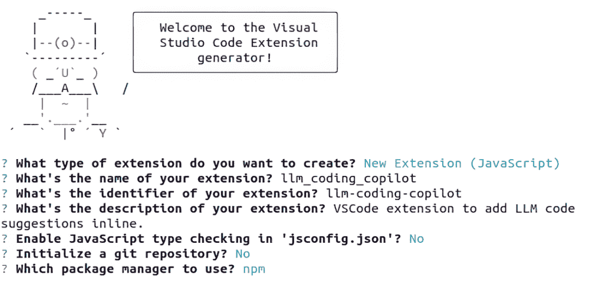
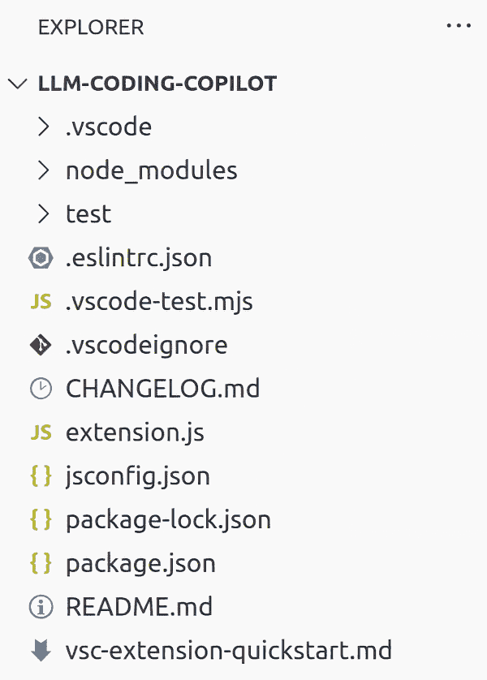
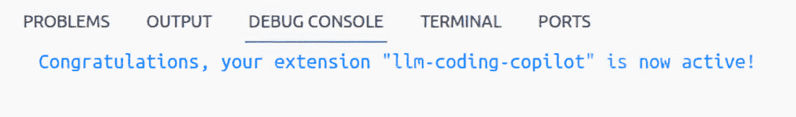

# 第十章：*创建一个编码助手项目：这会早些时候帮到您*

### 本章涵盖

+   将编码模型部署到 API

+   在本地设置 VectorDB 并使用它作为检索增强生成系统

+   构建一个 VS Code 扩展来使用我们的 LLM 服务

+   从项目中获得的见解和经验教训

> 进步不是来自早起的人——进步是由寻找更简单做事方式的懒惰人创造的。——罗伯特·海因莱因

如果您在工作中接触代码，您可能梦想过有一个 AI 助手来帮助您。实际上，也许您已经这样做了。随着市场上出现像 GitHub Copilot 这样的工具，我们已经看到 LLM 将自动完成提升到了新的水平。然而，并不是每个公司都对市场上的产品感到满意，也不是每个爱好者都能负担得起。所以，让我们自己动手吧！

在本章中，我们将构建一个 Visual Studio Code (VS Code) 扩展，使我们能够在代码编辑器中使用我们的 LLM。首选的编辑器将是 VS Code，因为它是一个流行的开源代码编辑器。流行可能是一个低估，因为 Stack Overflow 2023 开发者调查表明它是 81% 开发者的首选编辑器。¹ 它基本上是 Visual Studio 的轻量级版本，Visual Studio 是一个自 1997 年以来一直存在的完整 IDE。

除了选择一个特定的编辑器，我们还将做出一些明智的决定来限制项目的范围，使其更有意义。例如，在上一个项目中，我们专注于构建一个可以部署的出色的 LLM 模型。在这个项目中，我们将从已经训练过编码问题的开源模型开始。为了定制它，我们不会微调，而是围绕它构建一个 RAG 系统，这将使我们更容易保持其更新。此外，由于我们不会训练自己的模型，我们将专注于构建一个擅长 Python 的助手，这是我们在整本书中使用的语言，而不用担心其他所有语言。

现在我们已经清楚地知道了我们要构建什么，并且有一个目标在心中，让我们开始吧！

## 10.1 我们的模型

由于我们只关注 Python，我们决定使用 DeciCoder 作为我们的模型。DeciCoder 是一个只有 1B 参数的商业开源模型。² 尽管它的体积很小，但它确实擅长它所做的事情。它是在 Stack 数据集上训练的，但过滤后只包含 Python、Java 和 JavaScript 代码。它只训练了三种语言，这通常是一个限制，但实际上它是它之所以如此出色的秘密之一。

一些其他需要注意的限制是，它只有一个 2,048 个标记的上下文窗口，对于一个这个规模的模型来说并不差，但当我们考虑到我们计划使用 RAG 系统，并需要给它提供代码示例时，它就显得相对较小了。代码示例通常相当大，这限制了我们可以做的事情和我们可以提供的示例数量。

使用 RAG 与 DeciCoder 的大问题是模型没有进行指令微调。相反，它是为了击败 HumanEval 数据集（[`github.com/openai/human-eval`](https://github.com/openai/human-eval)）而设计的。在这个评估数据集中，模型只给出一个函数名和描述函数应该做什么的文档字符串。仅从这个输入，模型将生成可执行的代码来完成函数。因此，很难知道从 RAG 系统中提供更多上下文是否会帮助模型，但我们将继续尝试找出答案！

最后，它的小巧体积实际上使它成为另一个有趣的选择。因为它如此小巧，我们有可能将模型直接放入我们正在构建的 VS Code 扩展程序中，使用我们在其他章节中讨论的编译方法。这将使我们能够构建一个非常紧凑的应用程序！我们在这本书中不会这样做，主要是因为这将要求我们编写大量的 JavaScript。这是一个问题，因为我们只期望我们的读者熟悉 Python，所以在这里深入解释细节有点过于冒险，但我们将其留作对 JavaScript 高手读者的练习。

我们将要做的是将我们的模型作为 API 提供服务，您可以在本地运行它，并且可以从扩展程序中调用它。在列表 10.1 中，我们创建了一个简单的 FastAPI 服务来提供我们的模型。实际上，您在第六章中已经看到了大部分代码，我们只做了一些小的修改。第一个修改是我们将代码更改为使用 DeciCoder 模型和分词器。第二个修改稍微复杂一些，但我们添加了 `stop` 标记。这些标记会通知模型在遇到它们时停止生成。这是通过创建一个 `StoppingCriteria` 类来实现的。我们选择的标记在我们定义了提示后会有更多的意义，但本质上，我们希望模型一次创建一个函数。

##### 列表 10.1 使用 DeciCoder 的简单 FastAPI 端点

```py
import argparse

from fastapi import FastAPI, Request
from fastapi.responses import Response
import torch
import uvicorn

from transformers import (
    AutoModelForCausalLM,
    AutoTokenizer,
    StoppingCriteria,
    StoppingCriteriaList,
)

torch.backends.cuda.enable_mem_efficient_sdp(False)    #1
torch.backends.cuda.enable_flash_sdp(False)

device = torch.device("cuda" if torch.cuda.is_available() else "cpu")

stop_tokens = ["def", "class", "Instruction", "Output"]     #2
stop_token_ids = [589, 823, 9597, 2301]

class StopOnTokens(StoppingCriteria):
    def __call__(
        self,
        input_ids: torch.LongTensor,
        scores: torch.FloatTensor,
        **kwargs,
    ) -> bool:
        stop_ids = stop_token_ids
        for stop_id in stop_ids:
            if input_ids[0][-1] == stop_id:
                return True
        return False

tokenizer = AutoTokenizer.from_pretrained("Deci/DeciCoder-1b")    #3
tokenizer.add_special_tokens( #3
    {"additional_special_tokens": stop_tokens}, #3
    replace_additional_special_tokens=False, #3
) #3
model = AutoModelForCausalLM.from_pretrained( #3
    "Deci/DeciCoder-1b", torch_dtype=torch.bfloat16, trust_remote_code=True #3
) #3
model = model.to(device) #3

app = FastAPI()     #4

@app.post("/generate")
async def generate(request: Request) -> Response:
    """Generate LLM Response

    The request should be a JSON object with the following fields:
    - prompt: the prompt to use for the generation.
    """
    request_dict = await request.json()
    prompt = request_dict.pop("prompt")

    # ...      #5

    inputs = tokenizer(prompt, return_tensors="pt").to(device)    #6
    response_tokens = model.generate(
        inputs["input_ids"],
        max_new_tokens=1024,
        stopping_criteria=StoppingCriteriaList([StopOnTokens()]),
    )
    input_length = inputs["input_ids"].shape[1]
    response = tokenizer.decode(
        response_tokens[0][input_length:], skip_special_tokens=True
    )

    return response

if __name__ == "__main__":
    parser = argparse.ArgumentParser()     #7
    parser.add_argument("--host", type=str, default=None)
    parser.add_argument("--port", type=int, default=8000)
    args = parser.parse_args()

    uvicorn.run(app, host=args.host, port=args.port, log_level="debug")
```

#1 火炬设置

#2 定义停止行为

#3 加载分词器和模型

#4 运行 FastAPI

#5 RAG 将在这里。

#6 生成响应

#7 启动服务；默认端口为 8000

假设这个列表在一个名为 server.py 的 Python 脚本中，您可以通过运行 `$` `python` `server.py` 来启动服务器。一旦它启动并运行，让我们发送一个请求来确保它正确工作。在一个新的终端中，我们可以使用简单的提示向 API 发送一个 `curl` 请求：

```py
$ curl --request POST --header "Content-Type: application/json" --data 
↪ '{"prompt":"def hello_world(name):"}' http://localhost:8000/generate
```

响应应该是一个简单的 Python 函数，用于完成“Hello World”函数。我们从服务器收到的响应是 `return` `f"Hello` `{name}!"`。到目前为止，一切顺利！接下来，我们将定制 API 以利用 RAG 系统。

## 10.2 数据为王

现在我们已经决定了一个模型，让我们为我们的 RAG 系统准备一个数据集。RAG 是在不需要微调模型的情况下向模型引入上下文的有效方法；它还允许我们根据我们的数据自定义结果。本质上，如果你想让你的模型了解你组织不断变化的代码库的上下文，RAG 是一个很好的系统。有一个擅长编码的模型很好，但我们希望它擅长 *我们的* 代码。我们希望它使用正确的变量名和导入内部构建的定制依赖项——诸如此类的事情。在本节中，我们将设置一个 VectorDB，上传一个 Python 编码数据集，然后更新我们刚刚构建的 API 以利用它。

### 10.2.1 我们的 VectorDB

在我们真正深入数据集之前，我们首先需要设置我们的基础设施。当然，如果你的数据集足够小，你可以将其加载到内存中，并使用 Faiss 或 USearch 等工具直接在 Python 中运行相似度搜索，但那样有什么乐趣呢？此外，我们还想向你展示 Milvus。

Milvus 是一个出色的开源 VectorDB，与这个领域的大玩家竞争。你可以在本地或大型云集群上运行它，因此它可以很容易地扩展到你的需求。如果你不想处理设置，还有可管理的 Milvus 集群可供选择。我最喜欢的功能是其支持 GPU 的版本，这使得向量搜索变得非常快。

幸运的是，社区也使 Milvus 非常易于接近和设置。事实上，独立版本只需要 Docker 来运行，并附带一个启动脚本，使其更加容易。由于我们将在本项目中本地运行一切，我们将使用独立版本（了解更多信息，请参阅 [`mng.bz/aVE9`](https://mng.bz/aVE9))。为此，我们需要在终端中运行以下命令：

```py
$ wget https://raw.githubusercontent.com/milvus-io/milvus/master/scripts/
↪ standalone_embed.sh
$ bash standalone_embed.sh start
```

第一条命令将会下载一个 shell 脚本，第二条命令将会运行它。这个脚本实际上只是为了方便，因为 Docker 的 `run` 命令相当长。它还包括两个你应该了解的额外命令。`Stop` 命令，它将停止你的 Milvus Docker 容器，是

```py
$ bash standalone_embed.sh stop
```

`delete` 命令，当你不再希望保留数据时，将会从你的电脑中删除所有数据，它是

```py
$ bash standalone_embed.sh delete
```

你现在不需要运行这些命令，但记住它们，等我们完成后再用。现在我们已经设置了数据库，让我们让它变得有用，并将一些数据加载到其中。

### 10.2.2 我们的数据集

如果这是一个研讨会，我们会向你展示如何编写一个脚本来从 GitHub 拉取你组织的代码，并使用它来增强你的提示。我们甚至可以设置一个 GitHub Actions 流水线，以便每次代码合并到主分支时更新我们的 VectorDB。但由于我们没有访问你的代码，这只是一个书籍，我们将做合理的事情并使用开源数据集。

我们将为我们的项目选择 Alpaca 数据集。Alpaca 数据集是由斯坦福大学在训练同名模型时编译的，使用了蒸馏和 GPT-3 作为导师模型。由于它是合成数据，数据集非常干净，这使得它易于处理。事实上，它如此简单，以至于网上的多个副本已经过滤掉了所有的 Python 代码示例。这个子集包含 18.6K 个 Python 编码挑战，包括一个任务或指令和生成的代码——非常适合我们想要达成的目标。

在列表 10.2 中，我们创建我们的管道来将数据集加载到 Milvus 中。我们创建了一个`PythonCodeIngestion`类来处理我们的数据集分块和批量上传的细节。请注意，我们使用了`krlvi/sentence-t5-base-nlpl-code_search_` `net`嵌入模型。这个嵌入模型已经在 CodeSearchNet 数据集([`github.com/github/CodeSearchNet`](https://github.com/github/CodeSearchNet))上进行了专门训练，非常适合创建代码的有意义嵌入。

##### 列表 10.2：摄取 Alpaca 的数据管道

```py
from pymilvus import (
    connections,
    utility,
    FieldSchema,
    CollectionSchema,
    DataType,
    Collection,
)

from transformers import AutoTokenizer
from datasets import load_dataset
from langchain.text_splitter import RecursiveCharacterTextSplitter
from sentence_transformers import SentenceTransformer

from tqdm.auto import tqdm
from uuid import uuid4

connections.connect("default", host="localhost", port="19530")    #1

class PythonCodeIngestion:
    def __init__(
        self,
        collection,
        python_code=None,
        embedder=None,
        tokenizer=None,
        text_splitter=None,
        batch_limit=100,
    ):
        self.collection = collection
        self.python_code = python_code or load_dataset(
            "iamtarun/python_code_instructions_18k_alpaca",
            split="train",
        )
        self.embedder = embedder or SentenceTransformer(
            "krlvi/sentence-t5-base-nlpl-code_search_net"
        )
        self.tokenizer = tokenizer or AutoTokenizer.from_pretrained(
            "Deci/DeciCoder-1b"
        )
        self.text_splitter = (
            text_splitter
            or RecursiveCharacterTextSplitter(
                chunk_size=400,
                chunk_overlap=20,
                length_function=self.token_length,
                separators=["\n\n", "\n", " ", ""],
            )
        )
        self.batch_limit = batch_limit

    def token_length(self, text):
        tokens = self.tokenizer.encode(text)
        return len(tokens)

    def get_metadata(self, page):
        return {
            "instruction": page["instruction"],
            "input": page["input"],
            "output": page["output"],
        }

    def split_texts_and_metadatas(self, page):
        basic_metadata = self.get_metadata(page)
        prompts = self.text_splitter.split_text(page["prompt"])
        metadatas = [
            {"chunk": j, "prompt": prompt, **basic_metadata}
            for j, prompt in enumerate(prompts)
        ]
        return prompts, metadatas

    def upload_batch(self, texts, metadatas):
        ids = [str(uuid4()) for _ in range(len(texts))]
        embeddings = self.embedder.encode(texts)
        self.collection.insert([ids, embeddings, metadatas])

    def batch_upload(self):
        batch_texts = []
        batch_metadatas = []

        for page in tqdm(self.python_code):
            texts, metadatas = self.split_texts_and_metadatas(page)

            batch_texts.extend(texts)
            batch_metadatas.extend(metadatas)

            if len(batch_texts) >= self.batch_limit:
                self.upload_batch(batch_texts, batch_metadatas)
                batch_texts = []
                batch_metadatas = []

        if len(batch_texts) > 0:
            self.upload_batch(batch_texts, batch_metadatas)

        self.collection.flush()
```

#1 连接到 Milvus

现在我们已经创建了我们的摄取类，我们可以继续进行管道操作。首先，如果这是我们第一次运行它，我们需要创建我们的集合。集合在其他数据库中就像一个表，或者在 Pinecone 中就像一个索引。我们将定义我们的模式，它只是一个 ID 字段、我们的嵌入字段和一个元数据字段，该字段包含自由形式的 JSON。一旦设置好，我们将使用我们的`PythonCodeIngestion`类上传我们的数据。

接下来，我们需要创建我们的搜索索引。我们将使用的索引类型是`IVF_FLAT`，这是 Milvus 中最基本的索引，将嵌入空间分割成`nlist`数量的聚类。这通过首先将我们的搜索嵌入与聚类中心进行比较，然后与它最近的聚类中的嵌入进行比较来加速相似性搜索。我们还将使用`L2`作为我们的度量类型，这意味着我们将使用欧几里得距离。这些是常见的设置，但对我们来说不需要任何特殊设置。Milvus 在构建索引时支持更多的选项，我们鼓励您查看他们的文档：

```py
if __name__ == "__main__":
    collection_name = "milvus_llm_example"
    dim = 768

    if utility.has_collection(collection_name):     #1
        utility.drop_collection(collection_name)

    fields = [
        FieldSchema(
            name="ids",
            dtype=DataType.VARCHAR,
            is_primary=True,
            auto_id=False,
            max_length=36,
        ),
        FieldSchema(
            name="embeddings", dtype=DataType.FLOAT_VECTOR, dim=dim
        ),
        FieldSchema(name="metadata", dtype=DataType.JSON),
    ]

    schema = CollectionSchema(
        fields, f"{collection_name} is collection of python code prompts"
    )

    print(f"Create collection {collection_name}")
    collection = Collection(collection_name, schema)

    collection = Collection(collection_name)    #2
    print(collection.num_entities)

    python_code_ingestion = PythonCodeIngestion(collection)    #3
    python_code_ingestion.batch_upload()
    print(collection.num_entities)

    search_index = {                #4
        "index_type": "IVF_FLAT",
        "metric_type": "L2",
        "params": {"nlist": 128},      #5
    }
    collection.create_index("embeddings", search_index)
```

#1 如果不存在则创建集合

#2 连接到集合并显示其大小

#3 数据摄取并显示数据摄取后的统计数据

#4 构建搜索索引

#5 聚类的数量

现在我们已经设置好了一切，我们可以继续下一步。但在那之前，让我们通过运行一个查询来测试它。我们想要确保我们的数据和索引给我们提供了合理的搜索结果。使用 Milvus，我们首先将集合加载到内存中，并使用我们的嵌入器将我们的查询转换为嵌入。接下来，我们将定义一些搜索参数。再次，`L2`代表欧几里得距离，而`nprobe`参数表示要搜索的簇数量。在我们的情况下，在 128 个我们设置的簇中，我们将搜索与我们的查询嵌入最近的 10 个簇。最后，在实际搜索中，我们将结果限制为三个最佳匹配，并返回与我们的查询一起的元数据字段：

```py
    collection.load()      #1

    query = (             #2
        "Construct a neural network model in Python to classify "
        "the MNIST data set correctly."
    )
    search_embedding = python_code_ingestion.embedder.encode(query)
    search_params = {
        "metric_type": "L2",
        "params": {"nprobe": 10},     #3
    }
    results = collection.search(
        [search_embedding],
        "embeddings",
        search_params,
        limit=3,
        output_fields=["metadata"],
    )
    for hits in results:
        for hit in hits:
            print(hit.distance)
            print(hit.entity.metadata["instruction"])
```

#1 在进行搜索之前，你需要将数据加载到内存中。

#2 进行查询

#3 搜索的簇数量

你可以看到，对于我们的查询，搜索结果正在返回来自我们数据集的强候选者：

```py
    # 0.7066953182220459
    # Create a neural network in Python to identify
    # hand-written digits from the MNIST dataset.
    # 0.7366453409194946
    # Create a question-answering system using Python
    # and Natural Language Processing.
    # 0.7389795184135437
    # Write a Python program to create a neural network model that can
    # classify handwritten digits (0-9) with at least 95% accuracy.
```

现在我们已经设置了我们的 VectorDB 并加载了数据，让我们更新我们的 API 以从我们的 RAG 系统中检索结果并将上下文注入到我们的提示中。

### 10.2.3 使用 RAG

在本节中，我们将更新列表 10.1 以包含我们的检索代码。在列表 10.3 中，我们不会重复之前所做的所有事情，考虑到时间和空间，我们只需展示需要添加的新部分。在伴随本书的仓库中，如果你在理解哪些部分应该放在哪里时遇到困难，你将能够找到将一切组合在一起的代码。首先，在脚本接近顶部的地方，我们需要添加我们的导入，连接到我们的 Milvus 服务，并加载我们的嵌入模型。

##### 列表 10.3 将 RAG 添加到我们的 API

```py
from contextlib import asynccontextmanager

from pymilvus import (
    connections,
    Collection,
)
from sentence_transformers import SentenceTransformer
connections.connect("default", host="localhost", port="19530")    #1

collection_name = "milvus_llm_example"
collection = Collection(collection_name)

embedder = SentenceTransformer(                  #2
    "krlvi/sentence-t5-base-nlpl-code_search_net"
)
embedder = embedder.to(device)
```

#1 连接到 Milvus

#2 加载我们的嵌入模型

接下来，我们将添加一些便利函数，包括一个标记计数器和 FastAPI 生命周期，以确保我们加载和释放我们的 Milvus 集合从内存。由于我们添加了一个生命周期，请确保更新 FastAPI 调用：

```py
def token_length(text):
    tokens = tokenizer([text], return_tensors="pt")
    return tokens["input_ids"].shape[1]

@asynccontextmanager
async def lifespan(app: FastAPI):
    collection.load()                #1
    yield
    collection.release()            #2

app = FastAPI(lifespan=lifespan)      #3
```

#1 启动时加载集合

#2 关闭时从内存中释放集合

#3 运行 FastAPI

现在我们已经设置好了一切，我们可以进入下一步——运行查询并更新我们的`generate`端点的提示。第一部分应该看起来很熟悉，因为我们刚刚做过。我们将编码用户的提示并在我们的集合中搜索最近的邻居。我们使用与之前相同的所有搜索参数，除了一个。我们将限制从`3`增加到`5`，以便可能将更多示例添加到我们的提示中。接下来，我们将这些结果格式化为几个提示示例数据集。然后我们创建指令提示并格式化用户的输入。

我们几乎到了可以结合我们的指令、示例和用户提示的阶段；然而，我们需要确保我们的示例不会占用太多空间。使用一个利用我们的标记计数器的`for`循环，我们将过滤掉任何不符合我们上下文窗口的示例。有了这个，我们现在可以结合所有内容，为我们的 DeciCoder 模型创建最终的提示：

```py
    request_dict = await request.json()      #1
    prompt = request_dict.pop("prompt")

    search_embedding = embedder.encode(prompt)      #2
    search_params = {
        "metric_type": "L2",
        "params": {"nprobe": 10},
    }
    results = collection.search(
        [search_embedding],
        "embeddings",
        search_params,
        limit=5,
        output_fields=["metadata"],
    )

    examples = []
    for hits in results:
        for hit in hits:
            metadata = hit.entity.metadata
            examples.append(
                f"Instruction: {metadata['instruction']}\n"
                f"Output: {metadata['output']}\n\n"
            )

    prompt_instruction = (
        "You are an expert software engineer who specializes in Python. "
        "Write python code to fulfill the request from the user.\n\n"
    )
    prompt_user = f"Instruction: {prompt}\nOutput: "

    max_tokens = 2048
    token_count = token_length(prompt_instruction+prompt_user)

    prompt_examples = ""
    for example in examples:
        token_count += token_length(example)
        if token_count < max_tokens:
            prompt_examples += example
        else:
            break

    full_prompt = f"{prompt_instruction}{prompt_examples}{prompt_user}"

    inputs = tokenizer(full_prompt, return_tensors="pt").to(device)
```

#1 生成函数内部

#2 进行查询

好的！现在我们已经更新了我们的 API，让我们像之前一样启动并测试它。我们将向服务器发送另一个请求以确保一切仍然正常工作：

```py
$ curl --request POST --header "Content-Type: application/json" --data 
↪ '{"prompt":"def hello_world(name):"}' http://localhost:8000/generate
```

这次我们得到了一个`print(“Hello,` `World!”)`的响应，这比我们之前的响应略差，但仍然属于同一类型，所以不必担心。你可能会得到类似的结果。这样，我们就完成了使用 RAG 系统进行定制的 LLM 服务的设置。我们现在需要做的就是调用它。

## 10.3 构建 VS Code 扩展

好的，现在我们只需要构建我们的 VS Code 扩展。VS Code 扩展主要用 TypeScript 或 JavaScript（JS）编写。如果您不熟悉这些语言，不要担心；我们会引导您完成。要开始，您需要安装 Node 和 npm。Node 是 JS 解释器，npm 类似于 JS 的 pip。您可以通过多种方式添加这些工具，但我们建议首先安装 nvm 或其他节点版本管理器。此时更新您的 VS Code（如果您还没有安装，请安装它）也是一个好主意。更新您的编辑器将帮助您避免许多问题，所以请确保这样做。从这里，我们可以安装 VS Code 扩展模板生成器：

```py
$ npm install -g yo generator-code
```

注意：您可以在以下位置找到安装 nvm 的说明：[`mng.bz/gAv8`](https://mng.bz/gAv8)。然后只需运行`nvm` `install` `node`来安装最新版本的 Node 和 npm。

模板生成器将为我们创建一个基本的“Hello World”项目仓库，我们可以用它作为构建的基础。要运行生成器，请使用

```py
$ yo code
```

此命令将在您的终端中启动一个向导，您将看到一个看似 ASCII 艺术形式的加拿大骑警形象，他会问您几个问题以定制正在生成的脚手架。

在图 10.1 中，您可以看到我们对向导问题的选择示例。快速引导您通过问题，我们将创建一个新的 JavaScript 扩展，您可以根据喜好命名。我们选择了`llm_coding_ copilot`，如果您想跟随我们的话。对于标识符，按 Enter 键，它将自动为您选择的名称添加连字符。给它一个描述；任何内容都可以。不，我们不想启用类型检查。您可以选择是否将项目初始化为新的 Git 仓库。我们选择了“否”，因为我们已经在其中一个仓库中工作了。最后，我们将使用 npm。



##### 图 10.1 VS Code 扩展生成器示例输入

完成后，它将生成一个包含我们所需所有文件的项目仓库。如果你查看图 10.2，你可以看到一个已构建项目仓库的示例。它有几个不同的配置文件，你可以熟悉一下，但我们只关心其中的两个文件：定义扩展清单的 package.json 文件，它告诉 VS Code 如何使用我们将构建的扩展（实际上，是扩展 VS Code），以及包含实际扩展代码的 extension.js 文件。



##### 图 10.2 使用 VS Code 扩展生成器创建的示例目录结构

在 package.json 文件中，模板代码几乎带我们完成了大部分工作，但 `activationEvents` 字段目前是空的，需要设置。这个字段告诉 VS Code 何时启动我们的扩展。通常情况下，当你打开 VS Code 时，扩展并不会被加载，这有助于保持其轻量级。如果没有设置，扩展只有在用户打开它时才会被加载，这可能会很麻烦。一个聪明的策略通常是只在用户打开我们关心的文件类型时加载扩展——例如，如果我们正在构建一个针对 Python 的特定扩展，它只有在打开 .py 文件时才会加载。

我们将使用 `"onCommand:editor.action.inlineSuggest.trigger"` 事件触发器。这个触发器在用户手动请求内联建议时触发。它通常在用户停止输入时触发，但我们希望对过程有更多的控制，以避免向我们的 LLM 服务发送不必要的请求。只有一个问题：VS Code 没有为用户手动执行此操作提供默认快捷键！幸运的是，我们也可以通过在 `"contributes"` 部分添加 `"keybindings"` 字段来设置它。我们将将其设置为 `Alt+S` 的快捷键。我们使用 `S` 代表“建议”以便于记忆；这个快捷键应该可用，除非另一个扩展正在使用它。用户始终可以自定义他们的快捷键。你可以在下面的列表中看到完成的 package.json 文件。它应该与我们从脚手架开始时非常相似。

##### 列表 10.4 我们编码同伴的扩展清单

```py
{
  "name": "llm-coding-copilot",
  "displayName": "llm_coding_copilot",
  "description": "VSCode extension to add LLM code suggestions inline.",
  "version": "0.0.1",
  "engines": {
    "vscode": "¹.86.0"
  },
  "categories": [
    "Other"
  ],
  "activationEvents": [
    "onCommand:editor.action.inlineSuggest.trigger"
  ],
  "main": "./extension.js",
  "contributes": {
    "commands": [{
      "command": "llm-coding-copilot.helloWorld",
      "title": "Hello World"
    }],
    "keybindings": [{
      "key": "Alt+s",
      "command": "editor.action.inlineSuggest.trigger",
      "mac": "Alt+s"
    }]
  },
  "scripts": {
    "lint": "eslint .",
    "pretest": "npm run lint",
    "test": "vscode-test"
  },
  "devDependencies": {
    "@types/vscode": "¹.86.0",
    "@types/mocha": "¹⁰.0.6",
    "@types/node": "18.x",
    "eslint": "⁸.56.0",
    "typescript": "⁵.3.3",
    "@vscode/test-cli": "⁰.0.4",
    "@vscode/test-electron": "².3.8"
  }
}
```

现在我们已经有了扩展清单文件，让我们继续测试它。在你的 VS Code 项目仓库中，你可以按 F5 编译你的扩展并启动一个新的带有你的扩展的 VS Code 扩展开发主机窗口。在新窗口中，你应该能够按 Alt+S 触发内联建议。如果一切正常，那么你将在原始窗口中看到一个控制台日志，显示“恭喜你，你的扩展`llm-coding-copilot`现在已激活！”，如图 10.3 所示。



##### 图 10.3 成功激活我们的 VS Code 扩展的示例控制台

好的，不错！我们现在可以运行我们的扩展并激活它，同时捕获日志，这对于调试很有帮助。现在我们只需要构建它，让我们将注意力转向 extension.js 文件。

到这一点，事情变得有点难以解释。即使对于熟悉 JavaScript 的读者来说，也很少有人熟悉 VS Code API ([`mng.bz/eVoG`](https://mng.bz/eVoG))。在我们深入之前，让我们提醒自己我们正在构建什么。这将是一个 VS Code 扩展，它将为我们提供编码建议。我们已经在 API 后面训练了一个 LLM，该 API 已准备好供我们使用。我们有一个在 RAG 系统中加载的数据集，用于提供上下文并改进结果，并且我们已经精心制作了提示。我们只需要构建一个调用我们的 API 服务的扩展。但我们还希望有一种允许用户以简单方式与我们的模型交互的方法，同时给我们提供很多控制。我们将通过允许用户突出显示代码的一部分来实现这一点，当按下快捷键绑定 Alt+S 时，我们将发送这部分代码。

让我们看看生成器为我们创建的模板 extension.js 文件。列表 10.5 显示了经过简化注释的模板。它只是加载了 vscode 库，并定义了在启动扩展时运行的 `activate` 和 `deactivate` 函数。`activate` 函数演示了如何创建和注册一个新命令，但我们将不会使用它。我们将创建一个内联建议提供者并注册它，而不是命令。

##### 列表 10.5 模板中的 boilerplate extension.js 文件

```py
// Import VSCode API library
const vscode = require('vscode');

// This method is called when your extension is activated
function activate(context) {
  console.log('Congratulations, your extension "llm-coding-copilot" is now
↪ active!');

  // This creates and registers a new command, matching package.json
  // But we won’t use it!
  let disposable = vscode.commands.registerCommand('llm-coding-
↪ copilot.helloWorld', function () {
    // The code you place here will be executed every time your command is
↪ executed

    // Display a message box to the user
    vscode.window.showInformationMessage('Hello World from llm_coding_
↪ copilot!');
  });

  context.subscriptions.push(disposable);
}

// This method is called when your extension is deactivated
function deactivate() {}

module.exports = {
  activate,
  deactivate
}
```

由于我们不会使用命令，让我们看看我们将使用什么，一个内联建议提供者。这个提供者将把我们的建议作为光标处的幽灵文本添加。这使用户能够预览生成的内容，然后使用制表符接受建议或通过其他操作拒绝它。本质上，它正在为我们构建的代码完成扩展中的用户界面做所有繁重的工作。

在列表 10.6 中，我们向您展示如何创建和注册一个提供者，该提供者返回内联完成项。它将是一个用户可能循环选择最佳选项的潜在项数组，但为了我们的扩展，我们将保持简单，只返回一个建议。提供者接收几个自动传入的参数，例如请求内联建议的文档、用户光标的位置、提供者被调用的上下文（手动或自动）以及一个取消令牌。最后，我们将注册提供者，告诉 VS Code 为哪些类型的文档调用它；在这里，我们给出将其注册到仅 Python 文件或添加到所有文件的示例。

##### 列表 10.6 示例内联建议提供者

```py
// Create inline completion provider, this makes suggestions inline
const provider = {
    provideInlineCompletionItems: async (
            document, position, context, token
        ) => {
        // Inline suggestion code goes here

    }
};

// Add provider to Python files
vscode.languages.registerInlineCompletionItemProvider(
    { scheme: 'file', language: 'python' },
    provider
);
// Example of adding provider to all languages
vscode.languages.registerInlineCompletionItemProvider(
    { pattern: '**' },
    provider
);
```

现在我们有了提供者，我们需要一种方法来抓取用户的突出显示文本，将其发送到 LLM 服务，并确保我们的提供者仅在通过快捷键手动触发时运行，而不是自动运行，这发生在用户停止输入的每次。在列表 10.7 中，我们在提供者内部添加了这个方程式的一部分。

首先，我们获取编辑窗口以及任何选中的或突出显示的内容。然后我们确定提供者是因为自动还是手动触发而被调用的。接下来，我们进行一个小技巧以获得更好的用户体验。如果我们的用户将代码从后向前突出显示，光标将位于他们的代码前端，我们的代码建议将不会显示。因此，我们将重新突出显示选择，这将光标置于末尾，并重新触发内联建议。幸运的是，这种重新触发也将被计算为手动触发。最后，如果一切顺利——内联建议是手动调用的，我们有突出显示的文本，并且光标位于正确的位置——那么我们将开始使用我们的 LLM 代码助手的过程，通过从选择中抓取突出显示的文本。

##### 列表 10.7 使用 VS Code API 工作

```py
// Create inline completion provider, this makes suggestions inline
const provider = {
    provideInlineCompletionItems: async (
            document, position, context, token
        ) => {
        // Grab VSCode editor and selection
        const editor = vscode.window.activeTextEditor;
        const selection = editor.selection;
        const triggerKindManual = 0
        const manuallyTriggered = context.triggerKind == triggerKindManual

        // If highlighted back to front, put cursor at the end and rerun
        if (manuallyTriggered && position.isEqual(selection.start)) {
            editor.selection = new vscode.Selection(
                selection.start, selection.end
            )
            vscode.commands.executeCommand(
                "editor.action.inlineSuggest.trigger"
            )
            return []
        }

        // On activation send highlighted text to LLM for suggestions
        if (manuallyTriggered && selection && !selection.isEmpty) {
            // Grab highlighted text
            const selectionRange = new vscode.Range(
                selection.start, selection.end
            );
            const highlighted = editor.document.getText(selectionRange);

            // Send highlighted code to LLM
        }
    }
};
```

好的！现在我们已经将所有 VS Code 特定的代码处理完毕，我们只需要向我们的 LLM 服务发送一个请求。到这一点，这个动作应该感觉像是熟悉的领域；事实上，我们将使用我们在第七章中讨论过的代码。这里没有什么可怕的！在下一个列表中，我们通过抓取突出显示的文本并使用异步 `fetch` 请求将其发送到我们的 API 来完成提供者的构建。然后我们获取响应并将其返回给用户。

##### 列表 10.8 向我们的编码助手发送请求

```py
// On activation send highlighted text to LLM for suggestions
if (manuallyTriggered && selection && !selection.isEmpty) {
    // Grab highlighted text
    const selectionRange = new vscode.Range(
        selection.start, selection.end
    );
    const highlighted = editor.document.getText(
        selectionRange
    );

    // Send highlighted text to LLM API
    var payload = {
        prompt: highlighted
    };

    const response = await fetch(
        'http://localhost:8000/generate', {
        method: 'POST',
        headers: {
            'Content-Type': 'application/json',
        },
        body: JSON.stringify(payload),
    });

    // Return response as suggestion to VSCode editor
    var responseText = await response.text();

    range = new vscode.Range(selection.end, selection.end)
    return new Promise(resolve => {
        resolve([{ insertText: responseText, range }])
    })
}
```

现在所有部件都已就绪，让我们看看它的实际效果。再次按 F5 重新编译您的扩展，启动另一个带有更新扩展的 VS Code 扩展开发主机窗口。创建一个以 .py 扩展名的新 Python 文件，并开始编写一些代码。准备好后，突出显示您希望获得助手帮助的部分，然后按 Alt+S 获取建议。过了一会儿，你应该会看到一些带有助手建议的幽灵文本弹出。如果您喜欢它，按 Tab 键接受。图 10.4 展示了我们的 VS Code 扩展在实际应用中的示例。


##### 图 10.4 成功激活我们的 VS Code 扩展的示例控制台

恭喜！你做到了！你创建了自己的编码助手！它运行在你自己的数据上，并且完全是本地的——如果你在开始这本书时对 LLM 一无所知，这是一个相当大的成就。在下一节中，我们将讨论下一步以及从这个项目中得到的经验教训。

## 10.4 经验教训和下一步

现在我们有了可以工作的代码，我们可以把它叫作一天的工作。然而，我们的项目还远未完成；我们还有许多可以做的事情！首先，结果看起来并不那么好。回顾一下图 10.4，生成的代码并没有反转链表，而是反转了一个普通的列表。这不是我们想要的。我们能做些什么来改进它呢？

好吧，首先，记得我们发送给 API 测试的“Hello World”函数吗？看起来在我们添加 RAG 之前使用模型时，我们得到了更好的结果。为了好玩，让我们启动我们旧的 API，禁用 RAG，看看使用我们的 VS Code 扩展时我们会得到什么。图 10.5 显示了使用此 API 的一个示例结果。


##### 图 10.5 使用 DeciCoder（无 RAG）的扩展结果

哇！这段代码看起来好多了！它实际上反转了链表，并且已经格式化得很好，以至于你甚至不需要编辑或格式化它。这里发生了什么？模型不是应该在我们给出它们一些我们希望它们如何表现示例后生成更好的结果吗？也许我们的 RAG 系统没有找到很好的示例。让我们深入挖掘，看看我们的 RAG 系统生成的提示信息。

MA**指令**：用 7 行 Python 代码反转单链表的最有效方法是什么？

**输出**：# 单链表的定义。

```py
class ListNode:
    def __init__(self, val=0, next=None):
        self.val = val
        self.next = next

def reverseList(head): 
    prev = None
    current = head

    while current is not None:
        nxt = current.next
        current.next = prev 
        prev = current
        current = nxt

    head = prev 
    return head
```

MA**指令**：在 Python 中反转链表的最有效方法是什么？

****输出:****

```py
def reverse(head):
    prev = None
    current = head
    while current:
        next = current.next
        current.next = prev
        prev = current
        current = next
    return prev
```

MA**指令**：def reverse_linked_list(list):

```反转链表```

****输出:****

哇！这些例子看起来非常准确！那么到底可能发生了什么呢？

好吧，首先，再看看提示信息。我们数据集中的示例指令是用普通英语表述的任务，但用户将要发送的提示信息是半写好的代码。如果我们的用户用普通英语来写，我们可能会得到更好的结果。当然，当我们的用户在编辑器中编码时，这可能会是一种有点尴尬的经历。在难以理解的部分写代码并寻求帮助会更自然。

第二，记得我们关于 DeciCoder 训练的笔记吗？它是被训练来击败 HumanEval 数据集的，所以它非常擅长将代码作为输入并生成代码作为输出。这使得它从一开始就非常适合这项任务，而无需进行提示调整。更重要的是，它还没有被指令调整过！当它看到我们的少量示例时可能会有些困惑，因为它在训练期间没有看到过这样的输入。作为一个为特定目的训练的小型模型，它并不擅长泛化到新的任务。

从这个例子中，有几个关键点需要强调。首先，虽然提示调整是一种强大的技术，可以用于为新任务定制 LLM，但它本身所能达到的成就仍然有限，即使在使用 RAG 系统提供高度相关示例的情况下。必须考虑模型是如何训练或微调的，以及它接触到了哪些数据。此外，考虑用户如何与模型交互，以确保您正确地构建了提示。

那么，您可以尝试哪些下一步来提高结果？在这个阶段，事情似乎大多已经正常工作，所以我们可能会尝试的第一件事是调整我们的 RAG 系统中的提示。看起来用普通英语编写的指令数据对我们的模型并没有很大帮助，所以我们可以简单地尝试给模型提供示例代码，看看是否可以提高结果。接下来，我们可以尝试微调模型以采用指令数据集，或者完全寻找另一个模型。

除了让我们的应用程序工作得更好之外，可能还有很多下一步可以定制这个项目。例如，我们可以在 Milvus 中创建一个包含我们自己的代码数据集的集合。这样，我们就可以将相关代码的上下文注入到我们的代码库中的提示中。我们的模型不仅擅长编写通用的 Python 代码，还能编写针对我们工作的组织的特定代码。如果我们选择这条路，我们不妨将我们的 API 和 Milvus 数据库部署到生产服务器上，这样我们就可以为公司的其他工程师和数据科学家提供服务。

或者，我们可以放弃定制化想法，仅使用 DeciCoder，因为它似乎已经给出了很好的结果。无需定制。如果我们这样做，那么将模型编译为 GGUF 格式并通过 JavaScript SDK 直接在扩展中运行它将是有价值的。这样做将允许我们将所有代码封装在一个地方，并使其更容易分发和共享。

最后，您可能考虑发布扩展并与社区分享。目前，该项目尚未准备好分享，因为我们正在本地运行我们的模型和 RAG 系统，但如果您感兴趣，您可以在网上找到官方说明，网址为 [`mng.bz/GNZA`](https://mng.bz/GNZA)。它涵盖了从获取 API 密钥到打包、发布，甚至成为认证发布者的所有内容。

## 摘要

+   DeciCoder 是一个专为 Python、JavaScript 和 Java 中的编码任务设计的小巧但强大的模型。

+   Milvus 是一个强大的开源 VectorDB，可以扩展以满足您的需求。

+   您的数据集对于使您的 RAG 系统正常工作至关重要，因此请花时间对其进行清理和适当准备。

+   Visual Studio Code 是一款流行的编辑器，它使得构建扩展变得容易。

+   仅向您的模型抛出示例和数据，即使它们被精心策划，也不会使其生成更好的结果。

+   以一种考虑到模型训练方法和数据的方式来构建提示，以最大化结果。

[[1]](#footnote-source-1) D. Ramel, “Stack Overflow 开发者调查：VS Code 和 Visual Studio 连续 5 年位居顶级 IDE，” Visual Studio Magazine，2023 年 6 月 28 日，[`mng.bz/zn86`](https://mng.bz/zn86).

[[2]](#footnote-source-2) Deci, “推出 DeciCoder：高效且精确的代码生成新标准，” 2023 年 8 月 15 日，[`mng.bz/yo8o`](https://mng.bz/yo8o).
