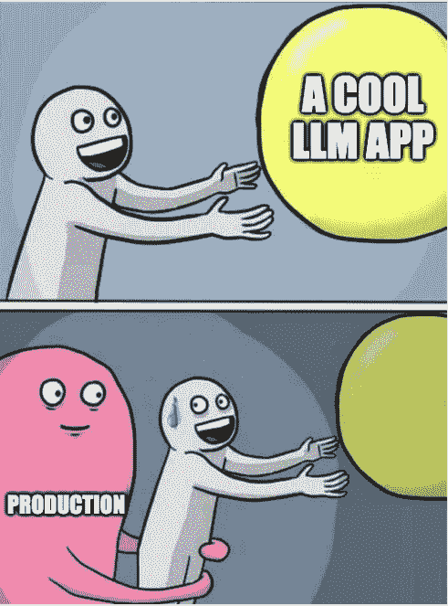
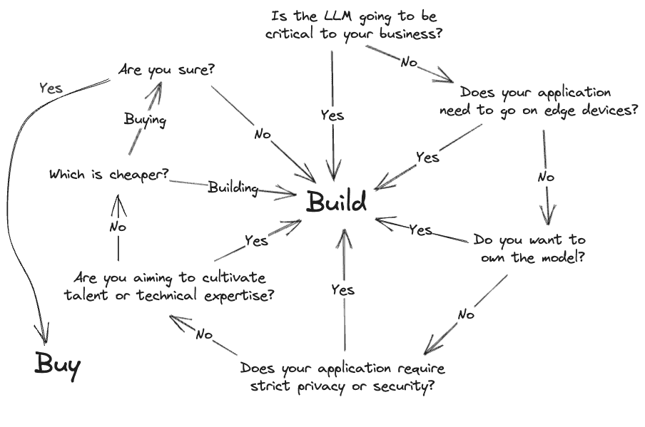

# 第一章：词语的觉醒：大型语言模型为何引起关注

### 本章节涵盖

+   什么是大型语言模型，以及它们可以做什么和不能做什么

+   什么时候你应该部署自己的大型语言模型，以及什么时候不应该

+   大型语言模型的神话及其背后的真相

> "任何足够先进的技术都与魔法无异。"

- 阿瑟·克拉克

现在是 1450 年。德国美因茨的一个寂静角落，在不知不觉中站在一个伟大时代的边缘。在 Humbrechthof，这个隐藏在城镇阴影中的不起眼作坊里，空气中充满着油、金属和坚定决心的气味，约翰内斯·古腾堡，一位金匠和创新者，在这里辛苦劳作，无声地孕育着一场革命。在深夜的时刻，平静被金属与金属的节奏性敲打声不时打破。在作坊灯光明亮的中心，站立着古腾堡十年来的心血之作——一台设计和用途都独一无二的装置。

这不是一件普通的发明。工艺和创造力将一组可移动的金属类型、单个铸造的字符精心制造在模具中。跳跃的灯光在金属标志上闪烁。空气中充满了突破的期待和来自古腾堡自己的基于油的墨水的香甜。在这个瞬间的静寂中，主印刷师挺直了肩膀，用无与伦比的技艺，将一张干净的羊皮纸放在装满墨水的模具下面，让他的发明牢固地印在页面上。房间里调整到一片宁静的交响乐，屏住呼吸的空气显得沉重。当印刷机抬起时，它在自身重量下发出吱吱声，每个声响都像是一声战吼，宣告一个激动人心的新世界的到来。

古腾堡在一片忙碌中从印刷机上取下第一页印刷好的纸，并将其平放在木桌上，仔细检查每个字符，这些字符如他的愿景一样粗体且宏伟。整个房间都被这幅景象深深吸引。一张普通的羊皮纸已经成为了转变的见证。随着夜幕渐渐消散，他带着充满活力的自豪感审视他的作坊。他的遗产已经诞生，在历史的记载中回响，永远改变了信息传播的方式。约翰内斯·古腾堡，这个新的千年英雄，从阴影中走出来，这个敢于梦想的发明家。他的名字与印刷机紧密相连，这不仅是一个开创性的发明，更是现代世界的催化剂。

随着关于古腾堡成就的消息开始在欧洲大陆传播，来自各个学科的学者们尚未意识到他们手中掌握的这个非凡工具。知识和学习，曾经被珍视的宝藏，现在平民也可以轻松获得。而对于这种新发现的便利，意见却众说纷纭。

> “在我们这个时代，由于那些来自莱茵河的人才和工业，书籍数量激增。曾经只属于富人 - 不，属于国王的书籍现在可以在一个朴素的屋顶下见到。[…] 如今，我们的孩子们[…]无一不知。”

- 塞巴斯蒂安·布兰特

> “学术努力从未像现在一样普遍衰退。事实上，聪明才智在国内外都受到厌恶。除了眼泪，阅读对学生有什么好处呢？很罕见，当它被出售时毫无价值，也没有智慧。”

- 列日的埃格伯特

人们对书籍有着各种各样的看法。有一点我们可以达成共识，在虚拟印刷厂存在且书籍无处不在的时代：印刷机改变了历史。尽管我们并不是真的在古腾堡使用印刷机打印第一页的时候在场，但我们已经看到很多人第一次尝试与大型语言模型（LLMs）互动。当他们看到它对他们的第一个提示做出回应时，他们脸上的惊讶。当他们挑战它的困难问题时，看到它像领域专家一样回应时，他们的兴奋。当他们意识到他们可以利用这一点来简化他们的生活或使自己富有时，他们的灵光一现。我想象这些情绪波动只是约翰内斯·古腾堡所感受到的一小部分。快速生成文本和加速沟通一直都是有价值的。

## 1.1 大型语言模型加速沟通

每一份工作都有一定程度的沟通。通常这种沟通是单调乏味的、官僚主义的和政治性的。我经常警告学生和门徒，每份工作都有它的文书工作。曾经是激情的东西很容易被日复一日的乏味和琐碎的工作所扼杀，当它变成一份工作时就会出现这种情况。事实上，当我们谈论我们的职业时，我们经常吹嘘它们，试图提高我们的社会地位，所以你很少会听到全部真相。你不会听到有关无聊的部分，日常的苦差事会方便地被遗忘。

然而，想象一下一个减轻单调工作负担的世界。一个警察不再每天浪费数小时填写报告，而是可以把那些时间用在社区外展项目上的地方。或者一个世界，教师不再彻夜忙于批改作业和准备课程计划，而是可以考虑和准备针对个别学生的定制课程。甚至一个世界，律师们不再陷入为期数日的法律文件梳理之中，而是有自由去接受激励他们的慈善案件？当沟通负担、文书负担和会计负担消失时，工作更像是我们所说的那样。

对于这一点，LLMs 是自印刷术以来最有前途的技术。首先，它们彻底颠覆了人类和计算机之间的角色和关系，改变了我们认为它们有能力的东西。它们已经通过了医学考试[[1]](#_ftn1)，律师资格考试，以及多次心灵理论测试。它们已经通过了谷歌和亚马逊的编程面试。它们在 SAT 考试中至少获得了 1600 分中的 1410 分。其中最令作者印象深刻的是，GPT-4 甚至通过了高级侍酒师考试-这让我们想知道它们是如何通过实际的品酒部分的。事实上，它们前所未有的成就以惊人的速度发展，往往让我们这些凡人感到有点不安和不安。对于一种似乎能做任何事情的技术，你会做什么呢？

虽然通过考试很有趣，但除非我们的目标是建造史上最昂贵的作弊机器，否则并不是特别有帮助，我们承诺我们的时间有更好的利用。LLMs 擅长的是语言，特别是帮助我们改善和自动化沟通。这使我们能够将常见的苦涩经验转化为轻松愉快的经验。首先，想象一下走进你的家门，你有自己的个人 JARVIS，就好像踏入了钢铁侠的鞋子，这是一个为你的日常生活增添了无与伦比的活力的 AI 助手。虽然 LLMs 还没有达到漫威电影中 JARVIS 所表现出的人工智能（AGI）水平，但它们正在为改善客户支持到帮助你购物挑选爱人的生日礼物等新的用户体验提供动力。它懂得询问你关于这个人，了解他们的兴趣和身份，找出你的预算，然后给出专业的建议。尽管许多这些助手正在被很好地利用，但还有许多只是用户可以与之对话和娱乐的聊天机器人-这很重要，因为即使我们的想象朋友这些天也太忙了。开玩笑的，这些可以创造出惊人的体验，让你见到你最喜爱的虚构角色，比如哈利·波特，福尔摩斯，阿纳金·天行者或者钢铁侠。

我们确信许多读者对编程助手感兴趣，因为我们都知道无所不 Google 实际上是最糟糕的用户体验之一。能够用简单的英语写下几个目标，然后看到助手帮你写代码是一种令人振奋的体验。我个人曾经使用这些工具来帮助我记住语法，简化和清理代码，编写测试，并学习一种新的编程语言。

视频游戏是另一个有趣的领域，我们可以期待大型语言模型(LLM)带来许多创新。它们不仅帮助程序员创造游戏，还允许设计者创造更沉浸式的体验。例如，与 NPC 对话会更加深入和引人入胜。想象一下，像《动物之森》或《星露谷物语》这样的游戏会有几乎无穷无尽的任务和对话。

考虑其他行业，比如教育，似乎没有足够的老师满足需求，意味着我们的孩子没有得到他们需要的一对一关注。LLM 助手可以帮助老师节省做手工事务的时间，同时为那些困难的孩子提供私人辅导。企业正在研究将 LLM 用于对话式数据工作，协助员工理解季度报告和数据表，基本上为每个人提供他们自己的个人分析师。销售和营销部门肯定会利用这一神奇的创新，无论好坏。搜索引擎优化（SEO）的状况也将发生很大变化，因为目前它主要是通过产生内容来希望使网站更受欢迎，而现在这变得非常容易。

那个清单只是我看到的一些常见例子，公司对使用它们感兴趣。人们也出于个人原因使用它们。创作音乐、诗歌，甚至写书，翻译语言，总结法律文件或电子邮件，甚至免费咨询——是的，这个主意很糟糕，因为它们在这方面还是很糟糕。个人偏好，但当我们的心智受到威胁时，我们不应该节省一分钱。当然，这导致了人们已经开始将它们用于欺骗、诈骗和伪造新闻以扭曲选举的黑暗目的。此时，清单已经变得相当大而且多样化，但我们只是开始挖掘其潜力的一角。实际上，由于大型语言模型（LLM）通常帮助我们进行沟通，所以更好的思考方式应该是，“它们做不到什么？”而不是“它们能做什么？”。

或者更好的是，“它们不应该做什么？”嗯，作为一种技术，有一些限制和约束，例如，LLM 速度有点慢。当然，慢是一个相对的词，但响应时间通常是以秒为单位而不是毫秒。我们将在第三章中更深入地探讨这个问题，但举个例子，我们可能不会很快看到它们用于自动完成任务，因为那需要非常快的推理才能有用。毕竟，自动完成需要能够比某人的打字速度更快地预测单词或短语。类似地，LLM 是大型复杂系统，我们不需要它们来解决这样一个简单的问题。用 LLM 解决自动完成问题不仅仅是用锤子打钉子，而是用整个拆迁球撞击它。就像租用一颗拆迁球比买一把锤子更贵一样，运行 LLM 会花费你更多。有很多类似的任务，我们应该考虑解决的问题的复杂性。

还有许多复杂的问题通常很难用 LLM 解决，比如预测未来。不，我们不是指神秘的艺术，而是预测问题，比如预测天气或海滩上涨潮的时间。这些实际上是我们解决了的问题，但我们并没有一定好的方法来传达这些问题是如何解决的。它们通过数学解决方案的组合来表达，比如傅里叶变换和谐波分析，或者通过黑盒子 ML 模型。有很多问题符合这个类别，比如异常值预测，微积分，或者找到胶带卷的结尾。

你也可能想要避免在高风险项目中使用它们。LLM 并不是绝对可靠，经常会犯错误。为了增加创造力，我们通常允许 LLM 中有一点随机性，这意味着你可以问 LLM 同样的问题，得到不同的答案。这是有风险的。你可以通过降低温度来消除这种随机性，但根据你的需求，这可能会使它变得无用。例如，你可能决定使用 LLM 将投资选项分类为好或坏，但你是否希望它根据其输出做出实际的投资决策？除非你的目标是制作一个迷因视频，否则不要没有监督地这样做。

最终，LLM 只是一个模型，它不能对你的损失负责，而实际上是你选择使用它造成了损失。类似的风险问题可能包括填写税表或寻求医疗建议。虽然 LLM 可以做这些事情，但它不会像雇用经过认证的注册会计师那样保护你免受 IRS 审计的严重处罚。如果你从 LLM 那里得到错误的医疗建议，就没有医生可以告你医疗事故。然而，在所有这些例子中，LLM 都有可能大大帮助从业者更好地执行他们的工作角色，减少错误并提高速度。

##### 何时使用 LLM

用途包括：

+   生成内容

+   问答服务

+   聊天机器人和 AI 助手

+   扩散（txt2img、txt23d、txt2vid 等）

+   与数据交互的应用

+   任何涉及沟通的事情

避免用于以下场景：

+   对延迟敏感的工作负载

+   简单的项目

+   不是用文字解决而是用数学或算法解决的问题 - 预测、异常值预测、微积分等

+   严格的评估

+   高风险项目

语言不仅仅是人们用来沟通的媒介。它是使人类成为顶级捕食者并为每个个体赋予社区自我定义的工具。人类生活的每个方面，从与父母争论到大学毕业再到阅读这本书，都被我们的语言所渗透。语言模型正在学习利用人类存在的基本方面之一，并且在使用时负责任地帮助我们完成每一个任务。它们有潜力解锁关于我们自己和他人的理解维度，如果我们负责任地教给它们如何。

自 LLMs 发布以来，它们就吸引了全球的注意力，因为它们的潜力让想象力勃发。LLMs 承诺了这么多，但是……这些解决方案都在哪里？哪里有给我们带来沉浸式体验的视频游戏？为什么我们的孩子还没有个人 AI 导师？为什么我还没有自己的个人助手像钢铁侠一样？这些是激发我们写这本书的深刻而深奥的问题。特别是最后一个问题，它让我夜不能寐。因此，虽然 LLMs 可以做出惊人的事情，但真正知道如何将它们转化为产品的人不够多，这正是我们在本书中的目标。



这不仅仅是一本机器学习运营的书。制作 LLM 在生产中工作涉及许多陷阱和问题，因为 LLM 不像传统软件解决方案那样工作。要将 LLM 转变为能够与用户连贯交互的产品，将需要整个团队和多种技能。根据您的用例，您可能需要训练或微调然后部署自己的模型，或者您可能只需要通过 API 从供应商那里访问模型。

无论你使用哪个 LLM，如果你想充分利用这项技术并构建最佳用户体验，你需要了解它们的工作原理。这不仅仅是数学/技术方面，还包括软技能，如如何为用户打造良好体验。在本书中，我们将涵盖使 LLMs 在生产中运行所需的一切。我们将讨论最佳工具和基础设施，如何通过提示工程和其他最佳实践来最大化它们的效用，比如控制成本。LLMs 可能是迈向更大平等的一步，所以如果你认为，“我不觉得这本书是为我而写的，”请重新考虑。这本书是为整个团队以及未来将与 LLMs 互动的任何人而写的。

我们将在实践层面上涵盖您在收集和创建数据集、在消费者或工业硬件上训练或微调 LLM，并以各种方式部署该模型供客户与之交互所需的一切。虽然我们不打算涉及太多理论，但我们将用真实的例子来覆盖从头到尾的过程。在本书结束时，您将知道如何部署 LLM，并具有一些可行的经验来支持它。

## 1.2 在大型语言模型的构建与购买决策之间导航

如果您购买了本书，那么您很可能已经相信 LLM 在您的生活和组织中具有巨大的潜力。那么购买本书就是将您的梦想变成现实的第一步，因为在我们知道如何将这些模型投入生产之前，这一切都是不可能的。毕竟，如果您与任何企业家或投资者交谈，他们都会告诉您，好的想法是大把的，重要的是执行和实现这些想法。我们需要做的是将这些模型投入生产，让它们随时可用于为您执行实际工作。

无论如何都无法避免，也没有必要美化，将 LLM 部署到生产环境中都很困难。通常，任何值得追求的事情都是如此。在本书中，我们旨在教您一切所需的知识，让您能够做到这一点，并提供一些实际的实践经验。但是因为它很困难，所以很容易想要走捷径。像 OpenAI 和 Google 这样的大型公司有一些很棒的模型选择，为什么不直接购买呢？让我们首先考虑一下它们提供了什么，以及这可能是一个好选择，然后我们将看看另一方面，这些提供通常存在的问题。

### 1.2.1 购买：被打的道路

简单地购买 LLM 访问权限有许多很好的理由。首先也是最重要的是，访问 API 提供的速度和灵活性。使用 API 是建立原型并迅速入手的一种非常简单和便宜的方法。事实上，如您在列表 1.1 中所见，只需几行代码即可开始连接到 OpenAI 的 API 并开始使用 LLM。当然，有很多可能性，但是过度投资于 LLM，只是发现它们恰好在您特定的领域失败，这将是一个糟糕的主意。使用 API 可以让您快速失败。构建原型应用程序以证明概念，并通过 API 启动它是一个很好的起点。

##### 列表 1.1 调用 OpenAI API 的简单应用程序

```py
import os
import openai

# Load your API key from an environment variable
openai.api_key = os.getenv("OPENAI_API_KEY")

chat_completion = openai.ChatCompletion.create(
    model="gpt-3.5-turbo",
    messages=[{"role": "user", "content": "Hello world"}],
)
```

往往，购买对模型的访问权可以为您带来竞争优势。在许多情况下，市场上最好的模型很可能是由专门从事该领域的公司构建的，他们使用了他们花费了大量金钱来策划的专业数据集。虽然你可以尝试竞争并构建自己的模型，但也许直接购买他们的模型访问权更符合你的目的。最终，谁拥有更好的特定领域数据来进行微调，很可能会获胜，而如果这只是贵公司的一个副产品，那可能不是你。毕竟，策划数据可能是昂贵的。提前购买可以节省很多工作量。

这导致了下一个观点，购买是快速获得专业知识和支持的方法。例如，OpenAI 花了大量时间使他们的模型安全，并配备了大量的过滤器和控件，以防止滥用他们的 LLMs。他们已经遇到并覆盖了很多边缘情况，因此您无需担心。购买他们模型的访问权还可以让您访问他们围绕其构建的系统。

更不用说，部署 LLM 本身只是问题的一半。你还需要构建一个完整的应用程序在其之上。有时候，购买 OpenAI 的模型成功超过竞争对手，这在很大程度上要归功于他们的用户体验和一些技巧，比如让标记看起来像是正在被输入。我们将带领您了解如何开始解决您的用例中的用户体验问题，以及您可以采用一些原型设计方法，为此领域提供主要的起步。

### 1.2.2 建设：少有人走的道路

使用 API 很容易，在大多数情况下，可能是最佳选择。但是，有很多理由可以让你应该努力拥有这项技术，并学会自己部署它。虽然这条路可能更难走，但我们会教你如何做到。让我们从最明显的原因开始探讨其中的几个原因：控制。

#### 控制

第一批真正采用 LLMs 作为核心技术的公司之一是一家名为 Latitude 的小型游戏公司。Latitude 专注于使用 LLM 聊天机器人的 Dungeon and Dragons 类型角色扮演游戏，并在与它们合作时遇到了挑战。这并不是要批评这家公司的失误，因为他们为我们的集体学习经验做出了贡献，并且是开辟新道路的先驱。尽管如此，他们的故事令人着迷而有趣，就像一场我们个人无法停止观看的火车失事。

Latitude 的第一个发布是一个名为 AI Dungeon 的游戏。在初始阶段，它利用了 OpenAI 的 GPT2 来创建一个交互式和动态的故事体验。它很快就吸引了大量玩家，当然，他们开始不适当地使用它。当 OpenAI 向 Latitude 提供了 GPT3 的访问权限时，它承诺升级游戏体验，但实际上得到的是一场噩梦。

告诉你一个事，GPT3 加入了人类反馈加强学习（RLHF）这个功能，这大大有助于提高功能，但这也意味着 OpenAI 的合同工现在正在查看提示。这就是人类反馈的部分。这些工作人员并不是太喜欢阅读游戏创建的淫秽内容。OpenAI 的代表迅速向 Latitude 提出了最后通牒。要么他们需要开始审查玩家，否则他们将撤销他们对模型的访问——这将基本上扼杀了游戏和公司。由于没有其他选择，他们迅速添加了一些过滤器，但过滤系统却太过于是一个应急措施，一个漏洞和故障的混乱。玩家们对系统的糟糕程度感到不满，并且意识到 Latitude 的开发人员正在阅读他们的故事，完全不知道 OpenAI 已经在这方面做出了贡献。这是一场公关灾难。但这还没有结束。

OpenAI 认为游戏工作室不够努力，一直在制造障碍，他们被迫增加保障措施，开始禁止玩家进入游戏。这里是因果转折，很多故事变得淫秽是因为这个模型有偏好于情色文学。它经常会将无害的情节意外地转化为不当的情挑状况，导致玩家被驱逐和禁止进入游戏。OpenAI 又扮演起真理的楷模，但问题在于他们的模型。这让玩家们面临了游戏史上最具讽刺意味和不公正的问题：他们因游戏所传达的内容而被禁止进入游戏。

因此，这是一个年轻的游戏工作室，只是想制作一个有趣的游戏却陷入了挫败的客户和一个把所有责任都推到他们身上的技术巨头之间的困境。如果公司对技术拥有更多的控制权，他们可以采取真正的解决方案，比如修复模型，而不是只能把化妆品涂在猪身上。

在这个例子中，控制可能表现为你微调模型的能力，而 OpenAI 现在提供了微调功能，但仍有许多细节的决策在使用服务而不是自己的解决方案时会丢失。例如，使用哪些训练方法，将模型部署到哪些区域，或者在哪种基础设施上运行。控制对于任何面向客户或内部的工具也很重要。你不希望代码生成器意外输出侵犯版权或为你的公司创建法律问题的代码。你也不希望你面向客户的 LLM 输出关于你的公司或其过程的事实不正确的信息。

控制是你管理操作、过程、资源的能力，以便与你的目标、目的和价值观保持一致。如果一个模型最终成为你产品提供的核心，并且供应商意外提高了价格，你能做的很少。如果供应商决定他们的模型应该给出更自由或更保守的答案，而这不再与你的价值

技术对你的业务计划越核心，控制它的重要性就越大。这就是为什么麦当劳拥有其特许经营的房地产，以及为什么谷歌、微软和亚马逊都拥有自己的云网络。甚至为什么那么多企业家通过 Shopify 建立在线商店，而不只是使用其他平台，比如 Etsy 或亚马逊市场。最终，当你购买别人的产品时，第一件失去的就是控制权。保持控制权将为你提供更多解决未来问题的选择，并且也将为你带来竞争优势。

#### 竞争优势

部署自己模型最有价值的一个方面是它给你带来了竞争优势。定制化——训练模型成为最擅长的一件事。例如，在 2017 年发布了双向编码器表示来自 transformers（BERT），这是一种你可以用来训练自己模型的 transformers 模型架构后，有一大批研究人员和企业开始测试这项新技术在他们自己的数据上取得全球成功。在撰写本文时，如果你在 Hugging Face Hub 搜索“BERT”，会返回超过 13.7k 个模型，所有这些模型都是人们为了自己的目的个别训练的，以成为他们任务的最佳模型。

在这个领域的一个我个人的经验是训练斯洛文尼亚 BERTcina。在征得许可的情况下，通过爬取斯洛伐克国家语料库等资源，我汇总了当时最大的（单语种斯洛伐克语）数据集，还包括像 OSCAR 项目和欧洲议会语料库等一大堆其他资源。它从未创造过任何计算记录，也从未出现在任何模型评论中或为我工作的公司产生合作伙伴关系。然而，在它训练的任务上，它确实胜过了市场上的其他任何模型。

很可能，你和你的公司都不需要 AGI（人工通用智能）来从你的数据中生成相关见解，实际上，如果你发明了一个真正自我意识的 AGI，并计划仅仅将其用于每周一次为幻灯片制作一些数字、分析数据和生成可视化内容，那肯定足以成为 AGI 消灭人类的理由。更有可能的情况是，你需要的正是我制作斯洛文尼亚 BERTcina 时所需要的，一个大型语言模型，它在市场上执行的两到三个任务比其他任何模型都要好，并且不会将你的数据与微软或其他潜在竞争对手共享。虽然一些数据需要因安全或法律原因保密，但很多数据只是因为它们是商业机密而需要保护。

有数百种针对通用智能和特定任务基础知识的开源 LLM。我们将在第四章中介绍一些我们最喜欢的。采用这些开源替代方案之一，并对其进行训练以创建世界上最好的该任务模型，将确保您在市场上具有竞争优势。它还将允许您以自己的方式部署模型并将其集成到系统中以产生最大影响。

#### 集成到任何地方

假设您想要部署 LLM 作为选择自己冒险风格游戏的一部分，该游戏使用设备的 GPS 位置来确定故事情节。您知道您的用户经常会冒险进入山区、海上等地，通常会遇到网络服务不佳和缺乏互联网访问的情况。调用 API 是行不通的。现在，别误会，像在这种情况下将 LLM 部署到边缘设备上仍然是一个探索性的课题，但是这是可能的，我们将在第九章中向您展示如何做到这一点。依靠 API 服务对于沉浸式体验来说是不可行的。

类似地，使用第三方 LLM 并调用 API 会增加集成和延迟问题，需要您将数据发送到网络并等待响应。API 很棒，但它们总是很慢，而且不总是可靠的。当延迟对项目很重要时，最好在内部提供服务。前一节关于竞争优势的讨论提到了两个以边缘计算为优先的项目，但还有许多其他项目存在。LLAMA.cpp 和 ALPACA.cpp 是最早的这类项目之一，而且这个领域的创新速度比其他任何领域都要快。4 位量化、低秩适应和参数高效微调都是最近为满足这些需求而创建的方法，我们将从第三章开始逐一介绍这些方法。

当我们团队首次开始与 ChatGPT 的 API 集成时，这是一次令人敬畏和令人谦卑的经历。令人敬畏的是，它使我们能够快速构建一些有价值的工具。令人谦卑的是，正如一位工程师对我开玩笑说的那样：“当你触及端点时，你会收到 503 错误，有时你会收到一条文本响应，就好像模型正在生成文本一样，但我认为那是一个 bug。”在生产环境中提供 LLM，试图满足这么多客户的需求，这并不是一件容易的事情。然而，部署一个集成到您的系统中的模型会让您对过程有更多的控制，提供比目前市场上找到的更高的可用性和可维护性。

#### 成本

考虑成本始终很重要，因为它在做出明智决策并确保项目或组织的财务健康方面起着关键作用。它可以帮助您有效地管理预算，并确保资源得到适当的分配。控制成本可以让您在长期内维持项目的可行性和可持续性。

此外，考虑成本对于风险管理至关重要。当你了解不同的成本方面时，你可以识别潜在风险并更好地对其进行控制。这样，你可以避免不必要的支出，并确保你的项目对市场或行业的意外变化更具弹性。

最后，成本考虑对于保持透明度和问责制是重要的。通过监控和披露成本，组织向利益相关者、客户和员工展示了他们对道德和高效运营的承诺。这种透明度可以提高组织的声誉并有助于建立信任。

在考虑构建和购买 LLM 时，所有这些都适用。购买可能似乎立即较为廉价，因为目前市场上使用最多的服务每月只需 20 美元。但与在 AWS 上运行的 EC2 实例相比，仅仅运行同样的模型进行推理（甚至不是训练）每年可能会花费约 25 万美元。然而，这正是构建方面最快的创新所在。如果你只需要一个 LLM 来证明概念，文中竞争优势部分提到的任何项目都可以让你以运行演示计算机所需的电费为代价创建演示，并且中文文本处理后能很容易地解释出训练相关的内容，从而能够大大降低自己数据训练模型的成本，最低为 100 美元（是的，这个数字是真实的），可以训练包含 200 亿个参数的模型。另一个好处是，如果你自己构建，你的成本将永远不会增加，而支付服务的话，成本却很可能会大幅上涨。

#### 安全性和隐私

考虑下面的情况。你是负责军事核弹头维护的军事人员。所有的文档都放在一本庞大的手册里。为了概述所有的安全要求和维护协议，学员们会因为遗忘重要信息而经常先剪掉保险丝再剪断导线。你决定调整一个 LLM 模型成为个人助手，给出指示，帮助压缩所有这些信息，为士兵在需要时提供精确所需的信息。将这些手册上传到另外一家公司显然不是个好主意——这是本世纪的轻描淡写——你需要在本地训练一些保持安全和隐私的东西。

这种情况听起来可能很牵强，但当与一家警察局的分析专家交谈时，他们同样表达了这个问题。和他们交谈时，他们表达了 ChatGPT 有多酷，甚至让他们整个团队参加了一门提示工程课程，以更好地利用它，但他们抱怨说，没有办法让他们的团队在不暴露敏感数据和对话的情况下使用该模型进行最有价值的工作-那种可以拯救生命的工作。任何处于类似境地的人都应该热切学习如何安全、可靠地部署模型。

不用在军队或警察部门工作，也能处理敏感数据。每家公司都有重要的知识产权和商业机密，最好保守秘密。我们在半导体、医疗保健和金融行业工作过，可以亲身告诉你，偏执和企业间谍是这些行业文化的一部分。因此，三星和其他行业参与者最初锁定了 ChatGPT，防止员工使用它，后来才开放了它。当然，不久之后，几名三星员工泄露了机密源代码[[4]](#_ftn4)。由于 OpenAI 使用了 RLHF，这些代码被保留并用于以后进一步训练模型。这意味着只要有正确的提示注入，任何人都有可能从模型中提取代码。

不仅代码容易丢失。商业计划、会议记录、机密电子邮件甚至潜在专利想法都有风险。我们很不幸地知道一些公司已经开始向 ChatGPT 发送机密数据，使用该模型清理和提取 PII。如果您认为这可能是潜在的疏忽滥用，你是对的。这种方法直接暴露客户数据，不仅仅是给 Microsoft/OpnAI，而是给他们使用的任何第三方服务（包括 AWS Mechanical Turk、Fiverr 和自由职业者）执行 RLHF 中的人类反馈部分。

#### 总结

如你所见，有很多原因使得公司想要拥有和构建自己的 LLMs，包括更大的控制力、降低成本以及满足安全和监管要求。尽管如此，我们了解到购买很容易，建设却更加困难，因此对于许多项目来说，仅购买是有意义的，但在你这样做之前，在图 1.1 中，我们分享了一些你应该自问的问题的流程图。尽管这是更艰难的道路，但建设可能会更加有回报。

##### 图 1.1 在做出构建与购买决策之前你应该问自己的问题。



我们认为这些关于建立与购买的对话永远没有充分讨论的一个最后一个观点是，“为什么不两者兼而有之？”购买能让你得到建立所不擅长的所有东西：上市时间短，成本相对较低，易用性。建立则能让你得到购买所苦于的所有东西：隐私、控制和灵活性。研究和原型阶段可能非常受益于购买 GPT4 或 Databricks 的订阅，以快速构建一些东西来帮助筹集资金或获得利益相关者的支持。然而，生产往往不是一个适合第三方解决方案的环境。

最终，无论你打算建立还是购买，我们都为你写了这本书。显然，如果你打算建立它，你需要了解更多的东西，所以这本书的大部分内容将面向这些人群。事实上，我们不需要再多谈这个观点了，我们会在这本书中教你如何建立，但这并不妨碍你为你的公司做正确的事情。

### 1.2.3 警告一词：现在就拥抱未来

新技术就像火一样，它们可以在寒冷的夜晚为我们提供温暖，帮助我们烹饪食物，但它们也可能烧毁我们的家园，伤害我们。在商业上，有很多公司因为没有适应新技术而失败的故事。我们可以从他们的失败中学到很多。

Borders Books 在 1971 年首次开业。在开发了包括先进分析能力在内的全面库存管理系统后，它飙升成为全球第二大图书零售商，仅次于 Barnes & Noble。利用这项新技术，它颠覆了行业，使其能够轻松跟踪数万本书籍，开设大型商店，顾客可以在那里浏览比小型商店更多的书籍。分析能力帮助它跟踪哪些书籍正在流行，并更好地了解他们的顾客，从而做出更好的业务决策。它在行业中占据主导地位超过两十年。

然而，Borders 没有从自己的历史中吸取教训，在 2011 年破产，未能适应并被技术（电子商务）打乱。2001 年，他们没有建立自己的平台和在线商店，而是决定将在线销售外包给亚马逊。[5] 这个决定被许多评论家认为类似于把竞争对手的关键交给了他们的业务。虽然并不是直接交出他们的秘密配方，但这个决定放弃了他们的竞争优势。

在接下来的七年里，他们对不断增长的在线部门视而不见，而是专注于扩大他们的实体店铺存在，收购竞争对手并获得令人垂涎的星巴克交易。当亚马逊在 2007 年发布 Kindle 时，图书零售业的格局完全改变了。Barnes & Noble 运营他们自己的在线商店，迅速转变并发布 Nook 来竞争，然而，Borders 则无所作为，或者事实上，无能为力。

通过借助第三方来拥抱电子商务，他们未能发展内部所需的专业知识，无法制定出成功的在线销售策略，导致市场份额大幅下降。他们最终在 2010 年底推出了自己的电子阅读器 Kobo，但为时已晚。由于无法充分理解和有效实施电子商务技术，导致了巨额财务损失、门店关闭，最终于 2011 年破产。

Borders Books 是一个警示性的故事，但还有许多类似的公司因未能采用新技术而自食其果。对于如此具有影响力的新技术 LLMs，每家公司都必须决定他们希望站在哪一方。他们将执行和部署委托给大型的 FAANG 公司，只限于调用 API，还是他们愿意主导技术并自行部署？

我们希望从这个故事中传达的最重要的一点是技术是相互依赖的。电子商务是建立在互联网之上的。没能建立自己的在线商店意味着 Borders 在景观转变时未能建立起所需的内部技术专长，导致了失败。如今，我们也能看到同样的情况出现在 LLM 领域，因为最好准备利用 LLM 的公司已经积累了机器学习和数据科学方面的专业知识，并且对如何使用这些知识有一定的了解。

我们没有能预知未来的水晶球，但许多人相信 LLMs 是一项像互联网或电力一样具有革命性的新技术。了解如何使用这些模型，或者未能这样做，可能会成为许多公司的决定性时刻。不是因为这样做现在会让他们的公司起死回生，而是因为未来会有更有价值的建立在 LLMs 之上的东西。

进军部署 LLMs 的新世界可能具有挑战性，但它将帮助您的公司建立起保持领先地位所需的技术专长。没有人真正知道这项技术将引领我们走向何方，但了解这项技术很可能是避免类似 Borders Books 的错误所必需的。

有很多很好的原因可以通过购买成功，但至少有一个普遍的想法是完全错误的。这就是只有大公司才能在这个领域工作，因为训练这些模型需要数百万美元和数千个 GPU。通过创造这个金钱和资源无法逾越的围墙，小人物无法希望跨越。我们将在下一节中更详细地讨论这个问题，但任何规模的公司都可以开始，现在做的时机再好不过了。

## 1.3 揭穿神话

我们都听说过大公司和 LLM 领域的领先者训练 LLM 从头开始有多么困难，以及尝试对其进行微调有多么剧烈。无论是来自 OpenAI、BigScience 还是 Google，他们都谈到了巨额投资以及对强大的数据和工程人才的需求。但这些都有多少真实性，又有多少只是公司试图创建技术壕沟的企图呢？

大多数这些障碍都是基于这样的假设：如果您希望解决自己的问题，您将需要从头开始训练一个 LLM。简单来说，不需要！不断发布涵盖语言模型许多维度的开源模型，所以您很可能不需要从头开始。尽管他们所说的训练 LLM 从头开始确实非常困难，但我们仍然在不断学习如何做到，并能够越来越多地自动化可重复部分。此外，由于这是一个活跃的研究领域，框架和库每天都在发布或更新，并将帮助您从当前位置开始。像 oobabooga 的 Gradio 这样的框架将帮助您运行 LLM，而像 Falcon 40B 这样的基础模型将成为您的起点。所有这些都覆盖在内。除此之外，大公司内部已经传达了关于当前任何组织在开源社区上缺乏竞争优势的备忘录。

有个朋友曾经向我透露：“我真的很想参与到所有这些机器学习和数据科学的东西中。每次我眨眼的时候，它似乎变得更酷了。然而，感觉唯一参与的方式就是经历一次漫长的职业转变，去为一家 FAANG 公司工作。不，谢谢。我在大公司待过了一段时间，它们不适合我。但是我讨厌感觉自己被困在外面。”这就是启发本书的神话。我们在这里为您提供工具和示例，帮助您摆脱被困在外面的感觉。我们将帮助您解决我们正试图用 LLM 解决的语言问题，以及针对模型规模的机器学习操作策略。

奇怪的是，很多人认为他们被困在外面，而另一些人则相信他们可以在一个周末内成为专家。只需要获得一个 GPT API 密钥，这就完成了。这导致了很多狂热和炒作，每天都会在社交媒体上出现一个酷炫的新演示。但是，大多数这些演示从未成为实际产品，而并不是因为人们不想要它们。

要理解这一点，让我们讨论一下 IBM 的**沃森**，这是在 GPT 之前世界上最先进的语言模型。沃森是一个问答机器，在 2011 年击败了一些曾经出现在节目中的最优秀的人类选手，布拉德·拉特和肯·詹宁斯，赢得了**Jeopardy**比赛。拉特是游戏节目中赚钱最多的选手，詹宁斯是一位如此出色的选手，他连续赢得了令人瞠目结舌的 74 次。尽管面对这些传奇人物，比赛结果一点也不悬念。沃森以压倒性的优势获胜。詹宁斯对于失利的回应是著名的一句话：“我，作为一个人类，欢迎我们的新电脑统治者。”

沃森是对语言建模的一次令人印象深刻的尝试，许多公司都渴望利用其能力。从 2013 年开始，沃森开始被商业化利用。其中一个最大的应用是尝试将其整合到医疗保健领域，以解决各种问题。然而，这些解决方案从未真正发挥出应有的作用，业务也从未盈利。到 2022 年，沃森健康业务被出售。

当我们解决与语言相关的问题时，我们发现制作原型很容易，而制作一个真正的产品则非常非常困难。语言中有太多微妙之处。许多人想知道为什么 ChatGPT 如此火爆？仅仅在五天内就获得了超过一百万的客户。我听到的大多数答案都无法满足专家，因为 ChatGPT 并不比 GPT3 或其他已经存在几年的 LLMs 更令人印象深刻。我听说 OpenAI 的山姆·奥尔特曼在一次采访中亲自说过，他们并没有想到 ChatGPT 会引起这么大的关注，他们认为这将随着 GPT4 的发布而到来。那么为什么它会如此火爆呢？在我们看来，其中的魔法在于它是第一个真正将 LLMs 投入生产的产品。将它从演示变成实际产品。任何人都可以与之互动并提出棘手的问题，只会被其回答的出色而惊讶。演示只需要工作一次，但产品必须每次都工作，即使成千上万的用户向朋友展示它时说：“看看这个！”这种魔法正是您可以希望从阅读本书中学到的。

我们对撰写这本书感到兴奋。我们对将这种魔法带给您并让您将其带给世界的可能性感到兴奋。LLMs 处于许多领域的交汇处，如语言学、数学、计算机科学等。虽然知识越多越有帮助，但并不需要成为专家。对任何一个单独领域的专业知识只会提高技能的上限，而不会提高入门门槛。考虑一位物理学或音乐理论专家，他们不会自动具备音乐制作的技能，但他们将更有准备快速学习。LLMs 是一种沟通工具，几乎每个人都需要沟通技能。

像所有其他技能一样，你的接近度和参与意愿是知识的两个主要障碍，而不是学位或能力注释——这些只会缩短你被听到和理解的旅程。如果你在这个领域没有任何经验，也许最好是先通过参与像 OpenAssistant 这样的项目来培养对 LLM 是什么以及需要什么的直觉。如果你是一个人，那正是他们所需要的。通过志愿服务，您可以开始了解这些模型训练的内容以及原因。无论您从零知识到成为专业机器学习工程师的程度如何，我们都将传授必要的知识，以大大缩短您的对话时间和理解时间。如果您不感兴趣学习该主题的理论基础，我们有大量的实际例子和项目可以让您动手实践。

我们现在都听过有关 LLM 幻觉的故事，但 LLMs 不需要是难以预测的。像 Lakera 这样的公司每天都在努力提高安全性，而像 LangChain 这样的公司则正在使模型更易于提供实用的上下文，从而使它们更一致，更不易偏离。诸如 RLHF 和 Chain of Thought 之类的技术进一步使我们的模型能够与我们已经接受的谈判保持一致，人们和模型从一开始就应该理解这些谈判，比如基本的加法或当前日期，这两者在概念上都是任意的。我们将帮助您从语言角度增强模型的稳定性，因此它们不仅能找出最有可能的输出，还能找出最有用的输出。

在您进一步深入这条道路时，需要考虑的不仅是进入模型/代码的安全性，还有出来的内容。LLMs 有时可能会生成过时的、事实不正确的，甚至是版权或许可的材料，这取决于其训练数据的内容。LLMs 不知道人们对什么是商业秘密和什么可以公开共享所做的任何协议。也就是说，除非您在训练期间告诉它这些协议，或者在推理期间通过仔细的提示机制告诉它。事实上，围绕提示注入产生不准确信息的挑战主要是由两个因素引起的：首先，用户请求超出了模型的理解范围；其次，模型开发者未能完全预测用户将如何与模型互动或其询问的性质。如果您有一个资源可以帮助您提前解决第二个问题，那么它将非常接近无价，不是吗？

最后，我们不想通过 LLMs 人为或不真实地增加你的希望感。它们需要大量资源来训练和运行。它们很难理解，而且很难按照你的意愿使其正常运行。它们是新的，且尚未被充分理解。好消息是，这些问题正在积极解决中，我们已经付出了大量工作，找到了与写作并行的实现方法，并积极减轻了你对整个深度学习架构了解的负担。从量化到 Kubernetes，我们将帮助你弄清楚你现有的一切知识。也许我们会无意中让你相信这太难了，你应该只是从供应商那里购买。无论哪种方式，我们都将在每一步为你提供帮助，以帮助你从这种神奇的技术中获得你所需要的结果。

## 1.4 总结

+   LLMs 之所以令人兴奋，是因为它们与人类一起工作，而不是反对他们

+   社会是建立在语言之上的，因此有效的语言模型具有无限的应用，如聊天机器人、编程助手、视频游戏和人工智能助手。

+   LLMs 在许多任务上表现出色，甚至可以通过高级医学和法律考试

+   LLMs 是破坏性的，而不是锤子，应避免用于简单问题、需要低延迟的问题和高风险的问题。

+   购买原因包括：

+   快速启动并进行研究和原型用例

+   轻松访问高度优化的生产模型

+   访问供应商的技术支持和系统

+   构建原因包括：

+   为您的业务用例获得竞争优势

+   保持低成本和透明度

+   确保模型的可靠性

+   保护您的数据安全

+   在敏感或私密话题上控制模型输出

+   没有技术壁垒阻止你与更大的公司竞争，因为开源框架和模型提供了打造自己道路的基石。

[[1]](#_ftnref1) Med-PaLM 2 在 MedQA 考试中取得了 86.5%的分数。

[[2]](#_ftnref2) WIRED，“It began as an AI-fueled dungeon game. Then it got much darker，”Ars Technica，2021 年 5 月 8 日。`arstechnica.com/gaming/2021/05/it-began-as-an-ai-fueled-dungeon-game-then-it-got-much-darker/`

[[3]](#_ftnref3) 对于那些想知道的人来说，这是 M*A*S*H 的参考：`youtu.be/UcaWQZlPXgQ`

[[4]](#_ftnref4) 이코노미스트，“[단독] 우려가 현실로…삼성전자, 챗GPT 빗장 풀자마자 ‘오남용’ 속출，” 이코노미스트，2023 年 3 月 30 日。`economist.co.kr/article/view/ecn202303300057?s=31`

[[5]](#_ftnref5) A. Lowrey，“Borders bankruptcy: Done in by its own stupidity, not the Internet.，”Slate Magazine，2011 年 7 月 20 日。`slate.com/business/2011/07/borders-bankruptcy-done-in-by-its-own-stupidity-not-the-internet.html`

[[6]](#_ftnref6) J. Best，“IBM 沃森：制霸“危险边缘”的全过程以及接下来要做的事情”，TechRepublic，2013 年 9 月 9 日。`www.techrepublic.com/article/ibm-watson-the-inside-story-of-how-the-jeopardy-winning-supercomputer-was-born-and-what-it-wants-to-do-next/`

[[7]](#_ftnref7) “与 OpenAI CEO Sam Altman 的谈话|由 Elevate 主办”，2023 年 5 月 18 日。`youtu.be/uRIWgbvouEw`
