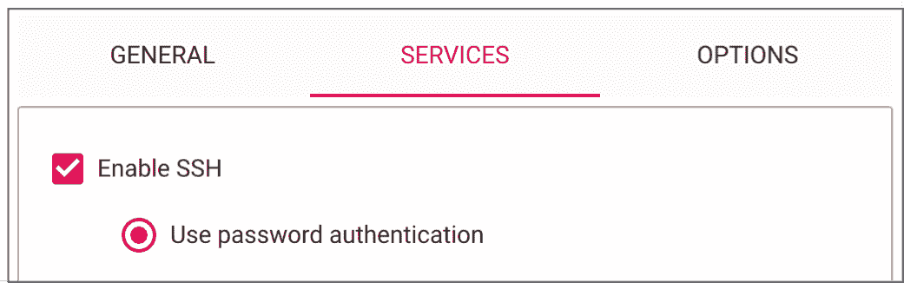
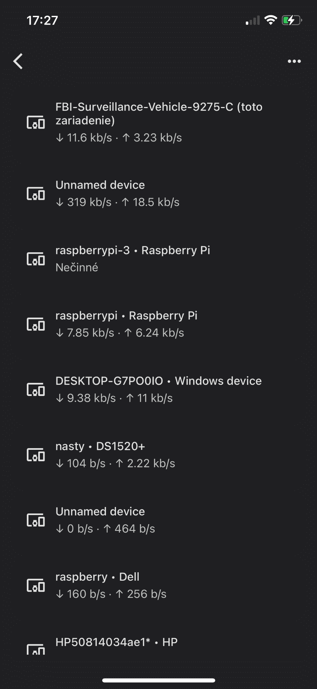
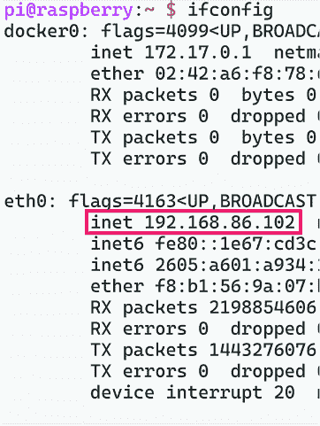

# 第十一章：在树莓派上部署一个 LLM：你能做到多低？

### 本章涵盖

+   在你的本地网络上设置树莓派服务器

+   将模型转换为 GGUF 格式并进行量化

+   将你的模型作为 OpenAI GPT 模型的直接替代品提供服务

+   接下来要做什么以及如何让它变得更好

> *低价格带来的甜蜜很快就会忘记，而低质量带来的苦涩却会久久萦绕。* ——本杰明·富兰克林

欢迎来到我们在这个列表中最喜欢的项目之一：在一个比它原本应该服务的设备还要小的设备上运行一个 LLM。在这个项目中，我们将推动这项技术的极限。通过跟随这个项目，你将能够真正地运用在这本书中学到的所有知识。在这个项目中，我们将把一个 LLM 部署到树莓派上，我们将将其设置为 LLM 服务，你可以从家中网络上的任何设备查询。对于所有黑客来说，这个练习应该会打开许多家庭项目的门。对于其他人来说，这是一个巩固你对使用 LLMs 局限性的理解并欣赏使这一切成为可能的社会的机会。

这是一个实用的项目。在本章中，我们将深入探讨的内容远不止 LLMs，而且不会有模型训练或数据聚焦，因此这是我们第一个真正只用于生产的项目。我们创建的内容将比你可能预期的要慢得多、效率低得多、准确性低得多，但这没关系。实际上，这是一个极好的学习经历。理解可能性和有用性之间的区别是许多人直到它狠狠地打在他们脸上之前都不会学到的东西。在树莓派上运行的 LLM 不是你想要在企业生产系统中部署的东西，但我们将帮助你学习其背后的原理，这样你最终可以扩展到你想要的任何大小。

## 11.1 设置你的树莓派

尽管困难重重，但在树莓派上提供服务和推理是可行的，尽管我们通常不推荐这样做，除非是为了展示你可以做到，这是警告的一个典型迹象，表明这是一个有趣的项目，就像找出你能把多少棉花糖塞进你弟弟的嘴里一样。仅仅玩弄树莓派本身在一般情况下就很有趣，我们希望这并不是你第一次玩。树莓派是家庭中出色的、便宜的伺服器。你可以用它们来阻止广告（Pi-Hole 是一个流行的库）或使用 Plex 和 Jellyfin 等服务流式传输你自己的个人媒体库。有很多有趣的项目。因为它完全可定制，如果你能写一个功能性的 Python 脚本，你很可能可以在你的本地网络服务器上运行它，这就是我们要为我们的 LLM 服务器所做的事情。

您只需要三样东西来完成这个项目：一个 8 GB RAM 的 Raspberry Pi，一个至少 32 GB 的 MicroSD 卡（更多更好），以及一个电源。在撰写本文时，我们找到了一些 1 TB 内存的 MicroSD 卡，价格为 20 美元，所以希望您能得到比 32 GB 更大的存储空间。您购买的其他任何东西都只是锦上添花——例如，为您的 Pi 购买一个外壳。如果您没有 Wi-Fi，您还需要一根以太网线将 Pi 连接到您的家庭网络。一旦我们设置好，我们将向您展示如何从笔记本电脑远程连接到 Pi。此外，如果您的笔记本电脑没有 MicroSD 插槽，您可能需要一个适配器来连接它。

对于 Raspberry Pi 本身，我们将在这个项目中使用 Raspberry Pi 5 8 GB 型号。如果您想跟随操作，我们使用的确切型号可以在以下链接找到：[`mng.bz/KDZg`](https://mng.bz/KDZg)。对于我们将部署的型号，您需要一个至少 8 GB RAM 的单板计算机来跟随操作。有趣的是，我们已经成功将模型部署到只有 4GB RAM 的小型 Pi 上，并且还有许多其他单板计算机作为 Raspberry Pi 的替代品可供选择。如果您选择不同的板子，可能更难精确跟随，所以只有当您信任该公司时才这样做。我们推荐的一些替代品包括 Orange Pi、Zima Board 和 Jetson，但我们不会详细介绍如何设置这些设备。

您不需要事先知道如何设置 Pi。我们将引导您完成所有步骤，假设这是您的第一个 Raspberry Pi 项目。Pi 实际上只是硬件和众多项目的开放沙盒，因此我们首先需要安装一个操作系统（OS）。之后，我们将安装必要的软件包和库，准备我们的 LLM，并将其最终作为一项服务提供，您可以从家庭网络中的任何计算机上 ping 它并获取生成的文本。

### 11.1.1 Pi Imager

首先，Pi 通常不预装操作系统，即使您的设备预装了，我们也会更换它。常见的发行版，如 Rasbian OS 或 Ubuntu，体积太大，占用太多 RAM，无法以最快速度运行模型。为了帮助我们克服这一限制，Raspberry Pi 的制造商发布了一款名为 Pi Imager 的免费镜像软件，您可以从以下链接在您的笔记本电脑上下载：[`www.raspberrypi.com/software/`](https://www.raspberrypi.com/software/)。如果您已经有了镜像软件，我们建议将其更新到 1.8 版本以上，因为我们正在使用 Pi 5。

一旦您有了它，将 microSD 插入您下载 Pi Imager 程序的电脑。如果您不确定如何操作，请在网上搜索 USB 3.0 microSD 卡读卡器。打开镜像程序，选择设备；对我们来说，那就是 Raspberry Pi 5。这个选择将限制操作系统选项仅限于适用于 Pi 5 的选项。然后您可以选择 Raspberry Pi OS Lite 64 位作为您的操作系统。“Lite”是您要找的关键词，您可能需要在 Raspberry Pi OS（其他）子部分中找到它。然后选择您的 microSD 作为存储设备。实际名称将根据您的设置而有所不同。图 11.1 展示了带有正确设置的镜像软件示例。作为备注，Ubuntu Server 也是一个适合我们项目的良好操作系统，我们推荐它。它的设置会有所不同，所以如果您想跟上来，请坚持使用 Raspberry Pi OS Lite。


##### 图 11.1 将 Raspberry Pi Imager 设置为正确的设备，选择了无头（Lite）操作系统和正确的 USB 存储设备

警告  并且作为警告，请确保您已选择了 microSD 来镜像操作系统——请勿选择您的主硬盘。

准备就绪后，通过选择“下一步”按钮进行导航，您应该会看到一个关于操作系统定制的提示，如图 11.2 所示。我们将设置它，所以点击“编辑设置”按钮，您应该会看到一个设置页面。


##### 图 11.2 自定义我们的 Raspberry Pi OS 设置。选择“编辑设置”。

图 11.3 展示了设置页面的示例。我们将在项目名称之后为 Pi 服务器设置一个主机名，llmpi。我们将设置用户名和密码，并配置 Wi-Fi 设置以连接到我们的家庭网络。这可能是最重要的步骤，所以请确保您已为互联网设置好，无论是通过在设置中设置 Wi-Fi 连接还是通过以太网。


##### 图 11.3 设置页面截图示例，包含正确和相关信息

与设置互联网一样重要的是，我们希望启用 SSH，否则后续的步骤将无法工作。为此，转到“服务”选项卡并选择“启用 SSH”，如图 11.4 所示。我们将使用密码认证，所以请确保您已设置了合适的用户名和密码，并且没有使用默认设置。您不希望任何有恶意的人轻易访问您的 Pi。

到目前为止，我们已经准备好创建镜像。按照提示操作，镜像程序将把操作系统安装到您的 SD 卡上。这个过程可能需要几分钟，但通常很快就会完成。一旦您的 SD 卡上有了操作系统，您就可以安全地从笔记本电脑上取下它。将 microSD 卡插入您的 Pi 中，并打开它！如果一切操作正确，您的 Pi 应该会自动启动并连接到您的 Wi-Fi。



##### 图 11.4 确保你选择了启用 SSH。

### 11.1.2 连接到树莓派

我们将使用我们的小树莓派作为一个小型服务器。我们设置的好处是，你不需要为树莓派找到额外的显示器或键盘。当然，这种设置有一个明显的缺点，那就是我们无法看到树莓派在做什么，也没有明显的方法与之交互。别担心；这就是我们设置 SSH 的原因。现在我们将向你展示如何从你的笔记本电脑连接到你的树莓派。

我们首先需要做的是找到树莓派的 IP 地址。IP 地址是一个数字标签，用于在网络中标识一台计算机。查看你使用的互联网上连接的新设备的最简单方法是通过路由器的软件。见图 11.5。如果你可以访问你的路由器，你可以在浏览器中访问其 IP 地址。IP 地址通常是 192.168.86.1 或 192.168.0.1；路由器的类型通常设置这个数字，并且通常可以在路由器本身上找到。然后你需要登录到你的路由器，在那里你可以看到连接到你的网络的所有设备。



##### 图 11.5 示例谷歌智能家居路由器界面，列出了几个设备以发现它们的 IP 地址

如果你无法访问你的路由器，很多人都是这种情况，你并不倒霉。下一个最简单的方法就是忽略我们之前段落中说的所有内容，并将你的树莓派连接到显示器和键盘上。运行 `$` `ifconfig` 或 `$` `ip` `a`，然后查找 `inet` 参数。这些命令将输出你本地网络上的设备及其 IP 地址。图 11.6 和 11.7 展示了运行这些命令并突出显示你要找的内容。如果你没有额外的显示器，那么事情会变得有点棘手，但仍然可行。然而，如果你能避免，我们不推荐走这条路。



##### 图 11.6 运行 `ifconfig` 的示例。为了清晰起见，我们的树莓派的 IP 地址（`inet`）被突出显示。


##### 图 11.7 运行 `ip` `a` 的示例。为了清晰起见，我们的树莓派的 IP 地址（`inet`）被突出显示。

要扫描你的本地网络以查找 IP 地址，在你的笔记本电脑上打开一个终端，并运行相同的命令 (`$` `ifconfig`)，如果你使用的是 Windows，则运行 `$` `ipconfig`。如果你没有 `ifconfig`，你可以使用 `$` `sudo` `apt` `install` `net-tools` 来安装它。我们之前没有提到这一步，因为它应该已经安装在你的树莓派上了。

如果你已经知道 Pi 是哪个设备，那太棒了！只需获取该设备的 `inet` 参数。然而，更有可能的是你不知道，如果你知道如何使用，这里有一些有用的命令。使用命令 `$` `arp` `-a` 来查看连接到你的网络的所有 IP 地址，使用命令 `$` `nslookup` `$IP_ADDRESS` 来获取你传入的 IP 地址对应的计算机的主机名——你将寻找主机名 `raspberry`，但我们将跳过所有这些。我们相信如果你知道如何使用这些命令，你不会阅读这本书的这一部分。相反，我们将使用原始人问题解决方法，这意味着我们将简单地关闭 Pi，再次运行 `$` `ifconfig` 命令，看看有什么变化，特别是什么消失了。当你重新启动它时，你的路由器可能会分配一个与上次不同的 IP 地址，但你仍然应该能够 `diff` 差异并找到它。

好吧，我们知道为了获取 IP 地址可能需要做很多工作，但一旦你有了它，下一步就简单了。要 SSH 连接到它，你可以运行 `ssh` 命令：

```py
$ ssh username@0.0.0.0
```

将 `username` 替换为你创建的用户名（如果你在跟随我们操作，应该是 `pi`），并将 `0`s 替换为你的 Pi 的 IP 地址。由于这是第一次连接到一个全新的设备，你将需要指纹验证以建立连接和主机真实性。然后你将被提示输入密码。输入你在 imager 中设置的密码。如果你没有设置密码，默认密码是 `pi`，但我们相信你没有这么做，对吧？

通过这样，你应该已经远程连接到你的 Pi，并在你的计算机终端中看到 Pi 的终端，如图 11.8 所示。做得好！


##### 图 11.8 成功安全壳连接到 Raspberry Pi 的终端。

### 11.1.3 软件安装和更新

现在我们已经启动了 Pi 并连接到了它，我们可以开始安装。第一个命令是众所周知的，它将简单地更新我们的系统：

```py
$ sudo apt update && sudo apt upgrade -y
```

这可能需要一分钟的时间，但一旦完成，恭喜！你现在有一个 Raspberry Pi 服务器，你可以在上面运行任何你想要的东西。它仍然是一张白纸，所以让我们改变它，准备运行我们的 LLM 服务器。我们首先想要安装我们需要的任何依赖项。根据你的安装，这可能包括 `g++` 或 `build-essentials`。我们只需要两个：`git` 和 `pip`。让我们先安装它们，这将使整个过程变得容易得多：

```py
$ sudo apt install git-all python3-pip
```

接下来，我们可以克隆将在这里做大部分工作的 repo：Llama.cpp。让我们将项目克隆到你的 Pi 上并构建项目。为此，运行以下命令：

```py
$ git clone https://github.com/ggerganov/llama.cpp.git  
$ cd llama.cpp
```

##### 关于 llama.cpp 的注意事项

Llama.cpp，就像许多开源项目一样，是一个更关注让事情工作而不是必然遵循最佳工程实践的项目。由于你正在以当前状态克隆仓库，但我们是在之前的状态下编写这些说明的，你可能会遇到我们无法为你准备的问题。Llama.cpp 也没有任何形式的版本控制。在克隆仓库后，我们建议你运行

```py
$ git checkout 306d34be7ad19e768975409fc80791a274ea0230
```

此命令将检出我们使用的确切`git` `commit`，这样你就可以在 llama.cpp 的相同版本上运行一切。我们在 Mac、Windows 10、Ubuntu、Debian 以及当然，Raspberry Pi 4 和 5 上进行了测试。我们预计大多数系统使用这个版本不会出现任何问题。

现在我们有了仓库，我们必须完成几个任务来准备它。首先，为了保持我们的 Pi 整洁，让我们为我们的仓库创建一个虚拟环境并激活它。一旦我们的 Python 环境准备就绪，我们将安装所有必需的依赖项。我们可以使用以下命令来完成：

```py
$ python3 -m venv .venv
$ source .venv/bin/activate
$ pip install -r requirements.txt
```

Llama.cpp 是用 C++编写的，这是一种编译型语言。这意味着我们必须编译所有依赖项以在硬件和架构上运行。让我们继续构建它。我们只需一个简单的命令就可以做到这一点：

```py
$ make
```

##### 关于设置的注意事项

如果你在这个略有不同的环境中执行此设置，使用 CMake 而不是 Make 可能会产生很大的差异！例如，即使在 Ubuntu 上运行，我们也需要使用 CMake 来指定兼容的 CudaToolkit 版本以及 nvcc 二进制文件存储的位置，以便使用 CuBLAS 而不是普通的 CPU 来利用 CUDA 集成的 GPU。原始创建者（Georgi Gerganov，又名 ggerganov）在构建测试时使用 CMake，因为它需要比 Make 更多的指定。为了参考，以下是 ggerganov 目前使用的 CMake 构建命令；你可以根据需要修改它：

```py
$ cmake .. -DLLAMA_NATIVE=OFF -DLLAMA_BUILD_SERVER=ON -DLLAMA_CURL=ON 
↪ --DLLAMA_CUBLAS=ON -DCUDAToolkit_ROOT=/usr/local/cuda 
↪ --DCMAKE_CUDA_COMPILER=/usr/local/cuda/bin/nvcc 
↪ --DCMAKE_CUDA_ARCHITECTURES=75 -DLLAMA_FATAL_WARNINGS=OFF 
↪ --DLLAMA_ALL_WARNINGS=OFF -DCMAKE_BUILD_TYPE=Release
```

接下来，我们只需要获取我们的模型，然后我们就可以继续前进。我们为这个项目选择的模型是 Llava-v1.6-Mistral-7B，我们将使用`huggingface-cli`来下载它，就像我们在其他章节中所做的那样。现在运行以下命令来拉取 LLaVA 模型、其伴随的标记器以及配置文件：

```py
$ pip install -U huggingface_hub
$ huggingface-cli download liuhaotian/llava-v1.6-mistral-7b --local-dir 
↪ ./models/llava --local-dir-use-symlinks False
```

现在我们有了模型和标记器信息，我们就可以将我们的 LLM 转换成适用于像 Android 手机或 Raspberry Pi 这样小型的设备了。

## 11.2 准备模型

现在我们有了模型，我们需要将其标准化，以便仓库中的 C++代码可以以最佳方式与之交互。我们将模型从 safetensor 格式转换为.gguf 格式。我们之前已经使用过 GGUF 模型，因为它们是可扩展的、加载速度快，并且在一个模型文件中包含了关于模型的所有信息。我们还下载了标记器信息，这些信息将包含在我们的.gguf 模型文件中。

一旦准备就绪，我们可以使用`convert.py`脚本来将我们的 safetensor 模型转换为 GGUF：

```py
$ python3 convert.py ./models/llava/ --skip-unknown
```

这段代码会将所有权重转换成一个与下载的所有.safetensors 文件大小相同的.gguf 检查点。现在我们有两个我们下载的副本，如果你的 microSD 卡相当小，这可能是多余的。一旦你有了.gguf 检查点，我们建议你删除或迁移原始模型文件到 Pi 之外的地方以回收内存，这可能看起来像这样：

```py
$ find -name './models/llava/model-0000*-of-00004.safetensors' -exec  
rm {} \;
```

当我们的模型以正确的单文件格式就绪后，我们可以将其变小。现在内存限制开始发挥作用。我们选择 7B 参数模型的一个原因是，在量化`q4_K_M`格式中（我们稍后会讨论 llama.cpp 支持的量化格式），它在磁盘上略大于 4GB，这对于 8GB 的 Raspberry Pi 来说已经足够有效。运行以下命令来量化模型：

```py
$ ./quantize ./models/llava/ggml-model-f16.gguf ./models/llava/llava-
↪ v1.6-mistral-7b-q4_k_m.gguf Q4_K_M
```

我们不会撒谎：在将量化方法应用于所有模型权重时，这将是一场等待游戏，但一旦完成，你将有一个全新的量化模型准备好提供服务。

##### 遇到麻烦了吗？

虽然我们已经在这许多环境和硬件上测试了这些说明，但你可能仍然会遇到困难。以下是一些你可以尝试的故障排除建议，这些建议对我们有所帮助：

+   *重新下载模型*。这些模型很大，如果你的 Pi 在下载过程中有任何互联网连接问题，你可能有一个损坏的模型。如果你的连接不稳定，你可以尝试使用以太网线而不是 Wi-Fi。

+   *重新编译你的依赖项*。重新编译你的依赖项最简单的方法是运行`make clean`然后再次运行`make`。你也可以尝试使用`cmake`或检查不同的选项。

+   *重启你的 Pi*。重启是一个经典且经过验证的解决方案，特别是如果你正在处理内存问题（对于手头的任务，我们并没有太多内存问题）。你可以在 SSH 中使用`sudo reboot`来重启。

+   *在你的计算机上运行这些步骤*。你可能在更好的硬件上遇到的问题更少，在尝试在边缘设备上工作之前，了解一条简单路径是什么样的可能很有用。

+   *下载一个已准备好的模型*。虽然我们鼓励你自己进行转换和量化，但通常你可以在任何格式中找到大多数已经量化的开源模型。所以如果你不担心微调它，你应该会很幸运。对我们来说，我们就是这种情况。

如果你遇到了困难但还想继续前进，你可以使用以下命令下载模型的量化版本：

```py
$ huggingface-cli download cjpais/llava-1.6-mistral-7b-gguf --local-dir 
↪ ./models/llava --local-dir-use-symlinks False --include *Q4_K_M*
```

## 11.3 服务器模型

我们终于到了这里，开始提供服务！使用 llama.cpp，为模型创建服务非常简单，我们稍后会详细介绍一些稍微复杂一些的技巧，但现在，享受你所做的一切：

```py
$./server -m ./models/llava/llava-v1.6-mistral-7b-q4_k_m.gguf --host
↪ $PI_IP_ADDRESS --api-key $API_KEY
```

一定要使用你的 Pi 的 IP 地址，API 密钥可以是任何随机的字符串，以提供一层小的安全性。就这样！你现在有一个在 Raspberry Pi 上运行的 LLM，可以从你的本地网络上的任何计算机查询。请注意，服务器在你的 Pi 上启动可能需要很长时间，因为它正在加载模型。不要过于担心；给它一些时间。一旦准备好，让我们通过一个快速演示来测试它。

对于这个演示，假设你已经将一个应用程序与 OpenAI 的 Python 包深度集成。在列表 11.1 中，我们向你展示了如何将这个应用程序指向你的 Pi LLM 服务。我们将继续使用 OpenAI 的 Python 绑定，并将其指向我们的服务。我们通过更新 `base_url` 到我们的 Pi 的 IP 地址，并使用我们创建服务器时设置的相同的 API 密钥来做这件事。

此外，请注意我们正在调用 `gpt-3.5-turbo` 模型。OpenAI 对不同模型的调用有不同的流程。如果你不喜欢输入这些字母，你可以轻松地更改它，但这并不重要。你只需要弄清楚如何更改脚本，以便你感觉像是在调用（再次强调，你实际上并没有调用 ChatGPT）。

##### 列表 11.1 OpenAI 但不是 ChatGPT

```py
import openai

client = openai.OpenAI(
    base_url="http://0.0.0.0:8080/v1",  # replace with your pi's ip address
    api_key="1234",  # replace with your server's api key
)

completion = client.chat.completions.create(
    model="gpt-3.5-turbo",
    messages=[
        {
            "role": "system",
            "content": "You are Capybara, an AI assistant. Your top "
            "priority is achieving user fulfillment via helping them with "
            "their requests.",
        },
        {
            "role": "user",
            "content": "Building a website can be done in 10 simple steps:",
        },
    ],
)

print(completion.choices[0].message)
```

你不需要代码来与你的服务器交互。服务器脚本自带内置的最小 GUI，你可以通过将浏览器指向你的 Pi 的 IP 地址在你的本地网络上访问它。务必包括端口 8080。你可以在图 11.9 中看到这个示例。

这个过程将允许你通过简单的聊天窗口与运行的 LLM API 进行接口。我们鼓励你稍微玩一下。由于你运行在 Raspberry Pi 上，你期望的最快速度大约是每秒五个标记，而最慢的速度，嗯，很慢。你将立即理解为什么普通人不会在边缘设备上放置 LLM。


##### 图 11.9 在你的 Pi 上运行 LLM 并通过 llama.cpp 服务器与之交互

到目前为止，你可能想知道为什么我们对这个项目如此兴奋。我们承诺你会学到很多东西，但这一章是书中最短的，我们在这里做的绝大多数工作都是下载其他人的代码库和模型。*欢迎来到生产阶段*。

这正是大多数公司会要求你做的事情：下载一些从朋友那里听说过的模型，并将其放在远小于其运行所需的硬件上。你现在应该准备好在约 20 到 30 分钟内拼凑出他们要求的原型。能够快速迭代将允许你回去进行更有力的谈判，展示你需要更多硬件、用于训练的数据、RAG 或任何其他系统来使项目成功。构建快速的概念验证，然后扩展以满足项目需求，应该是数据科学家和机器学习工程师的关键工作流程。

跟随这里演示的快速原型验证工作流程的一个巨大优势是可见性。你可以展示你能够极快地组合出令人惊叹的东西，如果你们的产品经理表现良好，这应该会在其他目标比预期花费更多时间时增加一定的信任度。他们已经看到，如果你在生产中急需某样东西，你可以在一瞬间就做到。吸引并留住顾客的优质内容需要时间，并且需要对数据和研究的真实投资。

## 11.4 改进

现在我们已经对这个项目进行了一次全面了解，让我们来谈谈修改这个项目的方法。为了清晰起见，我们选择手把手地告诉你确切要运行的命令，这样你就可以在指导帮助下开始接触实际操作。教程通常在这里结束，但真正的学习，尤其是在生产中的项目，总是更进一步。因此，我们想要给你一些想法，告诉你如何使这个项目成为你自己的，从选择不同的模型到使用不同的工具。

### 11.4.1 使用更好的界面

学习新工具是这个领域的人最常见任务之一——我们这里指的是从数据科学到 MLOps 的所有事情。虽然我们选择在本书中专注于一些最受欢迎和经过实战考验的工具——我们在生产中实际使用过的工具——但你的公司可能选择了不同的工具。更有可能的是，出现了一个新工具，每个人都正在谈论，你想要尝试它。

我们已经就 llama.cpp 谈了很多，并在本项目中几乎用它做了所有事情，包括编译、量化、服务，甚至为我们的项目创建前端。虽然这个工具在编译和量化方面表现突出，但其他功能主要是出于方便而添加的。让我们考虑一些其他可以帮助你的项目增添额外活力或魅力的工具。

为了立即改善你的项目，你可能考虑安装一个类似 SillyTavern（不一定推荐；它只是很受欢迎）的服务器前端。一个优秀的前端会将“查询一个 LLM”转变为“与一个 AI 最佳朋友聊天”，将一个平静的任务转变为一个令人兴奋的体验。我们喜欢用于这项工作的工具包括 KoboldCpp 和 Ollama，它们是为了扩展 llama.cpp 并使界面更简单或更可扩展而构建的。因此，它们非常适合扩展这个特定的项目。Oobabooga 是另一个出色的文本生成网页 UI。所有这些工具都提供了大量的定制选项和为用户提供独特体验的方式。它们通常提供前端和服务器。

### 11.4.2 更改量化

你可能考虑在只有 4GB 内存的旧 Pi 上做同样的项目，这样你将需要一个更小的模型。也许你不仅想用 Pi 来服务 LLM，所以你需要进一步缩小模型，或者也许你完全想更换模型。无论如何，你都需要深入探索量化这个兔子洞。之前，我们使用`q4_K_M`格式量化模型，承诺稍后解释。好吧，现在就是时候了。

Llama.cpp 提供了许多不同的量化格式。为了简化讨论，表 11.1 突出了一些更常见的量化方法，包括每个方法转换下来的比特数，结果的模型大小，以及运行 7B 参数模型所需的 RAM。这张表应作为快速参考，帮助你确定可以期望的大小和性能水平。一般规则是，量化越小，性能越低，困惑度越高。

##### 表 11.1 不同 llama.cpp 量化方法对 7B 参数模型的键属性比较

| 量化方法 | 比特数 | 大小 (GB) | 最大 RAM 需求 (GB) | 用例 | 参数 (十亿) |
| --- | --- | --- | --- | --- | --- |
| `Q2_K`  | 2  | 2.72  | 5.22  | 质量损失显著；不建议用于大多数目的  | 7  |
| `Q3_K_S`  | 3  | 3.16  | 5.66  | 非常小，质量损失高  | 7  |
| `Q3_K_M`  | 3  | 3.52  | 6.02  | 非常小，质量损失高  | 7  |
| `Q3_K_L`  | 3  | 3.82  | 6.32  | 小，质量损失较大  | 7  |
| `Q4_0`  | 4  | 4.11  | 6.61  | 传统；小，质量损失非常高；建议使用`Q3_K_M`  | 7  |
| `Q4_K_S`  | 4  | 4.14  | 6.64  | 小，质量损失更大  | 7  |
| `Q4_K_M`  | 4  | 4.37  | 6.87  | 中等，平衡质量；推荐  | 7  |
| `Q5_0`  | 5  | 5.00  | 7.50  | 传统；中等，平衡质量；建议使用`Q4_K_M`  | 7  |
| `Q5_K_S`  | 5  | 5.00  | 7.50  | 大，质量损失低；推荐  | 7  |
| `Q5_K_M`  | 5  | 5.13  | 7.63  | 大，质量损失非常低；推荐  | 7  |
| `Q6_K`  | 6  | 5.94  | 8.44  | 非常大，质量损失极低  | 7  |
| `Q8_0`  | 8  | 7.70  | 10.20  | 非常大，质量损失极低；不推荐  | 7  |

如果你只有 4GB 或 6GB 的 Pi，你可能会看着这张表格想，“不，是时候放弃了。”但你还不是完全没有机会；你的模型可能只是运行得慢一些，你可能需要比这些 7B 参数更小的模型——比如只有 1B 或 3B 参数的模型——或者量化得更小以运行。你实际上是在用这么小的 Pi 来推动边缘，所以`Q2_k`或`Q3_K_S`可能适合你。

友好的提醒：我们一直在用这个项目挑战边缘，但对于更有资金的项目来说，这是一个有用的经验。当使用更好的硬件进行类似项目时，更好的硬件在运行大型 LLM 方面也有其限制。毕竟，总是有更大的模型。请记住，如果你使用 cuBLAS 或任何用于利用 GPU 的框架运行，你不仅受限于 RAM，还受限于 VRAM。例如，在 3090 上使用 cuBLAS 运行时，你受限于 24 GB 的 VRAM。通过巧妙的内存管理（例如使用无头操作系统以占用更少的 RAM），你可以在较小的设备上加载更大的模型，并推动看似可能实现的功能的边界。

### 11.4.3 添加多模态

我们最初忽略了一个完整的维度，以免分散注意力，但现在让我们来谈谈它：LLaVA 实际上是一个多模态模型！多模态模型使我们能够从 NLP 扩展到其他来源，如图像、音频和视频。几乎每个多模态模型在本质上也是一个大型语言模型（LLM），因为不同模态的数据集都使用自然语言进行标记——例如，图像中看到的内容的文本描述。特别是，LLaVA（大型语言和视觉助手）允许我们向模型输入一张图像并对其提问。

##### 关于 llama 服务器的一个注意事项

记得我们说过 llama.cpp 项目并不遵循许多工程最佳实践吗？嗯，多模态就是其中之一。最初，llama.cpp 服务器支持多模态，但很快项目中就出现了许多问题。创建者觉得原始实现很糟糕，决定将其移除。有一天，一切正常，第二天，它就完全消失了。

这个变化发生在我们编写本章的时候——这本身就是一个头疼的问题——但想象一下，当试图在生产中运行时，它可能造成的损害。不幸的是，在当前这个时间点上，当我们在 LLM 上工作时，这种突然的变化是家常便饭，因为目前可用的稳定依赖项非常少。为了重现这里的内容并最小化调试，我们希望您查看之前提到的 `git` `commit`。好消息是，llama.cpp 计划继续支持多模态，另一个实现可能很快就会准备好——可能在你阅读这一章的时候。

在这本书中，我们几乎没有讨论过多模态，因为从学习如何使 LLM 在生产中工作获得的经验教训应该可以转移到多模态模型上。无论如何，我们认为展示如何部署一个模型会很有趣。

#### 更新模型

我们已经做了大部分工作；然而，llama.cpp 只将 LLaVA 模型的 llama 部分转换为.gguf。我们需要将视觉部分重新添加进去。为了测试这一点，前往你提供的服务器模型的 GUI，你会看到一个上传图像的选项。如果你这样做，你会得到一个有用的错误，如图 11.10 所示，表明服务器还没有准备好进行多模态服务。


##### 图 11.10 我们的模式还没有准备好；我们需要提供一个模型投影器。

将我们的模型转换为第一步是下载一个与 CLIP 类似的多模态投影文件，以便你编码图像。一旦我们可以编码图像，模型就会知道如何处理它们，因为它已经训练过多模态任务。我们不会深入介绍准备投影文件的细节；相反，我们将向你展示在哪里可以找到它。运行以下命令下载此文件，然后移动它：

```py
$ wget https://huggingface.co/cjpais/llava-1.6-mistral-7b-
↪ gguf/resolve/main/mmproj-model-f16.gguf
$ mv mmproj-model-f16.gguf ./models/llava/mmproj.gguf
```

如果你正在使用不同的模型或自制模型，确保你找到或创建一个多模态投影模型来为你执行该功能。它应该直观地告诉你为什么你需要它：语言模型只读取语言。你可以尝试微调和将图像序列化为字符串，而不是使用多模态投影模型；然而，我们不推荐这样做，因为我们没有看到它带来良好的结果。这会增加运行这些模型所需的 RAM 总量，但增加的量并不大。

#### 提供模型服务

一旦你的模型被转换和量化，启动服务器的命令是相同的，但你必须在末尾添加`--MMPROJ` `path/to/mmproj.gguf`。这段代码将允许你向模型提交图像以执行任务，如进行光学字符识别（OCR），我们将图像中的文本转换为实际文本。现在让我们来做这件事：

```py
$./server -m ./models/llava/llava-v1.6-mistral-7b-q4_k_m.gguf --host 
↪ $PI_IP_ADDRESS --api-key $API_KEY --MMPROJ ./models/llava/mmproj.gguf
```

现在服务器知道如何处理图像了，让我们发送一个请求。与之前我们用来与仅语言模型聊天的 OpenAI API 一致，另一个版本展示了如何调用多模态聊天。代码与列表 11.1 非常相似，因为我们所做的只是添加了一些图像支持。像上一个列表一样，我们使用 OpenAI API 访问我们的 LLM 后端，但我们将基本 URL 更改为我们的模型。主要区别在于我们将图像序列化为字符串，以便它可以包含在对象中，并使用`encode_image`函数添加一些导入以简化这个过程。唯一的另一个重大变化是将编码后的图像添加到我们发送的消息的内容部分。

##### 列表 11.2 OpenAI 的多模态 GPT-4

```py
import openai

import base64
from io import BytesIO
from PIL import Image

def encode_image(image_path, max_image=512):
    with Image.open(image_path) as img:
        width, height = img.size
        max_dim = max(width, height)
        if max_dim > max_image:
            scale_factor = max_image / max_dim
            new_width = int(width * scale_factor)
            new_height = int(height * scale_factor)
            img = img.resize((new_width, new_height))

        buffered = BytesIO()
        img.save(buffered, format="PNG")
        img_str = base64.b64encode(buffered.getvalue()).decode("utf-8")
        return img_str

client = openai.OpenAI(
    base_url="http://0.0.0.0:1234/v1",  
    api_key="1234",     #1
)
image_file = "myImage.jpg"
max_size = 512  
encoded_string = encode_image(image_file, max_size)      #2

completion = client.chat.completions.with_raw_response.create(
    model="gpt-4-vision-preview",
    messages=[
        {
            "role": "system",
            "content": "You are an expert at analyzing images with computer vision. In case of error,\nmake a full report of the cause of: any issues in receiving, understanding, or describing images",
        },
        {
            "role": "user",
            "content": [
                {
                    "type": "text",
                    "text": "Building a website can be done in 10 simple steps:",
                },
                {
                    "type": "image_url",
                    "image_url": {
                        "url": f"data:image/jpeg;base64,{encoded_string}"
                    },
                },
            ],
        },
    ],
    max_tokens=500,
)

chat = completion.parse()
print(chat.choices[0].message.content)
```

#1 替换为你的服务器的 IP 地址和端口。

#2 设置为允许的最大维度（512=1 个瓦片，2048=最大）。

没有什么太花哨或与其他许多次向服务器发送请求有什么不同。你应该记住这个代码的一个小陷阱是，如果没有使用 API 密钥，API 将抛出错误；但如果你在服务器上没有设置一个，你可以传递任何东西，它不会出错。

到此为止！我们已经将我们的语言模型转变为可以接受图像作为输入的模型，并且我们已经将其部署到 Raspberry Pi 上，甚至对其进行了查询。至少，我们希望您已经对其进行了查询，因为如果您没有，让我们告诉您，它非常 *慢*！当您在 Pi 上运行多模态服务器时，它将花费数十分钟来编码和表示图像，甚至达到人们通常用来衡量生成速度的每秒令牌数。再次强调，仅仅因为我们可以将这些模型部署到小型设备上，并不意味着您会想要这样做。这就是我们再次建议您不应该在 Pi 上实际运行此程序，即使是在您的家中，如果您想要真正地充分利用它。

### 11.4.4 在 Google Colab 上提供模型服务

现在我们已经完成了一些这些练习，我们如何改进和扩展这个项目以适应您的生产环境？第一个改进很明显：硬件。当您有数百名客户时，单板 RAM 计算 并不是非常有帮助；然而，它在测试时非常有用，尤其是当您不想浪费钱调试生产环境时。还有其他支持 GPU 的选项，幸运的是，除了 RPi 设置之外，之前讨论的所有步骤都在 Google Colab 的免费层上工作。以下是所有不同的设置步骤：

1.  设置 llama.cpp：

```py
!git clone https://github.com/ggerganov/llama.cpp && cd 
↪ llama.cpp && make -j LLAMA_CUBLAS=1
```

1.  2. 从 Hugging Face 下载：

```py
import os
os.environ[“HF_HUB_ENABLE_HF_TRANSFER”] = “1”
!huggingface-cli download repo/model_name name_of_downloaded_
↪ model --local-dir . --local-dir-use-symlinks False
```

1.  3. 服务器命令：

```py
!./server -m content/model/path --log-disable --port 1337
```

1.  4. 访问服务器：

```py
from .googlecolab.output import eval_js
print(eval_js(“google.colab.kernel.proxyPort(1337)”))
```

如您所见，步骤大多相同，但由于我们在 Jupyter 环境中工作，一些细微的调整是必要的，因为通常直接运行代码比运行 CLI 命令要容易。我们没有深入探讨，但 Raspberry Pi 可以使用 `docker.io` 和其他软件包来创建可用于负责任的 CI/CD 的 docker 镜像。在 Google Colab 环境中这要困难一些。此外，请记住，Google 不会给您无限的 GPU 时间，甚至到了监控您是否打开了 Colab 以“高效”地关闭您的免费 GPU 的程度，所以请确保您只将这些免费资源用于测试和调试。无论如何看，免费的 GPU 是一份礼物，我们应该对它们负责。

您也可以跳过下载整个仓库并每次运行 Make 的步骤。您可以使用 llama.cpp 的 Python 绑定。并且您可以使用 cuBLAS 或 NEON（适用于 Mac GeForce Mx 卡）来使用硬件加速，在执行以下命令时进行 pip 安装：

```py
$ CMAKE_ARGS=”-DLLAMA_CUBLAS=on” FORCE_CMAKE=1 pip install llama-cpp-python
```

此命令将 llama.cpp 中的大部分代码抽象为易于使用的 Python 绑定。现在让我们通过一个示例来了解如何使用 Python 绑定来制作易于 docker 化和部署的内容。与 API 一起工作与单独使用 LLM 略有不同，但幸运的是，LangChain 非常方便。其整个库都是围绕使用 OpenAI API 构建的，我们使用该 API 来访问我们自己的模型！

在列表 11.3 中，我们将结合我们对 OpenAI API、llama.cpp Python 绑定和 LangChain 的了解。我们将首先设置我们的环境变量，然后我们将使用 LangChain 的`ChatOpenAI`类，并假装我们的服务器是 GPT-3.5-turbo。一旦我们有了这两样东西，我们就可以完成了，但我们将通过添加一个句子转换器和为 RAG 准备好的提示来扩展它。如果您有一个想要用于 RAG 的数据集，现在是嵌入它并创建 FAISS 索引的时候了。我们将加载您的 FAISS 索引，并在推理时使用它来帮助模型。然后，使用 tiktoken 对其进行标记化，以确保我们不会超载我们的上下文长度。

##### 列表 11.3 OpenAI 但不是多模态 GPT-4

```py
import os
from langchain.chains import LLMChain
from langchain_community.chat_models import ChatOpenAI
from langchain.prompts import PromptTemplate
from sentence_transformers import SentenceTransformer
import numpy as np
from datasets import load_dataset
import tiktoken

os.environ["OPENAI_API_KEY"] = "Your API Key"
os.environ[
    "OPENAI_API_BASE"
] = "http://0.0.0.0:1234/v1"     #1
os.environ[
    "OPENAI_API_HOST"
] = "http://0.0.0.0:1234"      #2

llm = ChatOpenAI(
    model_name="gpt-3.5-turbo",      #3
    temperature=0.25,
    openai_api_base=os.environ["OPENAI_API_BASE"],     #4
    openai_api_key=os.environ["OPENAI_API_KEY"],
    max_tokens=500,
    n=1,
)

embedder = SentenceTransformer("sentence-transformers/all-MiniLM-L6-v2")   #5
tiktoker = tiktoken.encoding_for_model("gpt-3.5-turbo")      #6

prompt_template = """Below is an instruction      #7
that describes a task, 
paired with an input that provides further context. 
Write a response that appropriately completes the request.
    ###Instruction:
    You are an expert python developer.
    Given a question, some conversation history, 
and the closest code snippet we could find for 
the request, give your best suggestion for how 
to write the code needed to answer the User's question.

    ###Input:

    #Question: {question}

    #Conversation History: {conversation_history}

    Code Snippet:
    {code_snippet}

    ###Response:
    """

vectorDB = load_dataset(     #8
    "csv", data_files="your dataset with embeddings.csv", split="train"
)
try:                                                           #9
    vectorDB.load_faiss_index("embeddings", "my_index.faiss")
except:
    print(
    """No faiss index, run vectorDB.add_faiss_index(column='embeddings')
    and vectorDB.save_faiss_index('embeddings', 'my_index.faiss')"""
    )

message_history = []      #10

query = "How can I train an LLM from scratch?"      #11
embedded = embedder.encode(query)
q = np.array(embedded, dtype=np.float32)
_, retrieved_example = vectorDB.get_nearest_examples("embeddings", q, k=1)

formatted_prompt = PromptTemplate(      #12
    input_variables=["question", "conversation_history", "code_snippet"],
    template=prompt_template,
)
chain = LLMChain(llm=llm, prompt=formatted_prompt)    #13

num_tokens = len(           #14
    tiktoker.encode(f"{prompt_template},\n" + "\n".join(message_history) +
↪ query)
    )
)
while num_tokens >= 4000:
    message_history.pop(0)
    num_tokens = len(
    tiktoker.encode(f"{prompt_template},\n" + "\n".join(message_history) +
↪ query)
        )
    )
res = chain.run(       #15
    {
    "question": query,
    "conversation_history": message_history,
    "code_snippet": "",
    }
)
message_history.append(f"User: {query}\nLlama: {res}")

print(res)      #16
```

#1 用您的服务器地址和端口替换。

#2 用您的主机 IP 替换。

#3 这可以是任何内容。

#4 再次

#5 为 RAG 嵌入

#6 快速检查上下文长度的标记化

#7 将提示更改为您想要的任何内容。

#8 这里有一个向量ΔB；请随意替换。

#9 如果您还没有创建 faiss 或 elasticsearch 或 usearch 索引，请创建。

#10 为了跟踪聊天历史

#11 搜索向量ΔB

#12 格式化提示

#13 设置实际的 LLM 链

#14 不要超载您的上下文长度。

#15 使用您的 API 运行 RAG

#16 我们只是打印；在这里做您需要做的任何事情。

所以，这里是我们许多概念真正汇聚的地方。令人惊讶的是，您真的可以在 Raspberry Pi 上执行这个推理和 RAG；您不需要一台巨大的计算机来获得好、可重复的结果。在您达到大约 48 GB 并可以容纳 7B 的全版本以及所有超过那的量化版本之前，这种计算层非常有帮助；目前，之后的所有计算只能带来边际的收益。这个领域正在快速发展，所以寻找在更小的硬件上推理更大模型的新、更快的方法。 

这样，我们的原型项目就启动并运行了。它在几乎任何您想要的方向上都非常容易扩展，并且符合行业标准并使用流行的库。添加到这，让它变得更好，如果您有您认为这里没有得到体现的专业知识，请分享它！这个领域是新的，跨学科的知识将推动它向前发展。

## 摘要

+   在最小的设备上运行最大的模型需要利用您能想到的所有内存节省技术，比如运行一个轻量级操作系统。

+   设置远程 Pi 第一次最困难的部分是找到它的 IP 地址。

+   对于没有加速器的计算受限硬件，您需要使用像 llama.cpp 这样的工具将模型编译到您的架构上运行。

+   在内存受限的环境中，推理将需要量化。

+   即使利用所有可用的资源，在边缘设备上运行 LLM 通常会导致比期望的更慢的推理。仅仅因为某件事是可能的，并不意味着它是实用的。

+   可以通过指向自定义端点来使用 OpenAI 的 API 及其所有包装器，以访问其他模型。

+   许多开源工具可用于改进模型的提供和用户界面。

+   量化程度越低，即使模型规模更大，困惑度也越高。

+   在 Raspberry Pi 上运行多模态模型也是可能的。

+   我们在 Pi 上运行的相同命令，只需稍作修改就可以用于 Google Collab 或其他云服务提供商进行开发，这使得这些项目比以往任何时候都更容易获得。

+   设置和部署通常比准备模型对成功项目来说更为重要。
