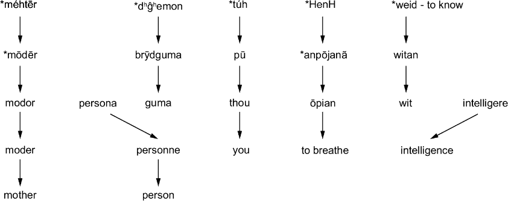

# 附录 A 语言学史

就像所有好的故事都是从“从前有个时候”开始的，我们也想从历史开始。不幸的是，因为我们决定写一本关于生产的书，所以从那个角度来看，历史是“不重要”和“多余的”。我们同意这一点，所以我们把它放在了一边，就在书的后面。话虽如此，明智的读者会知道，即使是以微小的附录形式，我们也能从过去学到很多东西，我们的目标就是帮助你做到这一点。我们承诺这会值得你的付出。

当然，对于语言来说，没有一个明确的开端，甚至“什么是语言？”这个问题也和“什么是三明治？”一样模糊。语言学作为一门学科，可以追溯到我们历史中的数千年，尽管不如语言本身那么久远。这很大程度上是人类能够站在食物链顶端的原因，因为集体记忆和即兴的群体适应在生存上比个体版本更成功。我们将大致按大的时期来划分，重点关注这些时期的重要历史人物和流行思想。在每个部分的结尾，我们将讨论主要收获，你会发现我们从该领域的史学研究中学到的教训对于正确设置问题至关重要，这将帮助你创建一个出色的 LLM 产品。

## A.1 古代语言学

我们对古代语言学的讨论始于公元前 4 世纪的印度、中国和希腊。印度第一位值得注意的语言学家是 Daks.iputra Pa^–n.ini，他的研究是第一个以现代方式形式化的描述性语言学的例子。Pa^–n.ini 试图编纂梵文，而不涉及任何试图保持语言“不受污染”的内涵或伦理问题。由于他处理问题的方法，他的工作足够好，以至于至今仍在使用。

在中国，孔子考察了语言与伦理、政治的关系，探讨其功能。在《孔子论语》中，我们发现各种思想，如“言语是声音”，“在演讲中，最重要的是传达意义”，“对于一句话，一个君子可能被认为是有智慧的，而对于一句话，他可能被认为是不智慧的”。仅从这些摘录中，就可以清楚地看出，孔子及其学生认为语言的主要功能是传达意义，这是许多今天的人所共有的观点。孔子关于语言的大多数思想可以用“说话慢一点，只有在你确信能够传达你想要传达的确切意义时才说话”这一理念来概括。

在希腊，语言学的研究蓬勃发展，苏格拉底、柏拉图和亚里士多德通过对话作为教学工具来研究意义和现实的本性。苏格拉底方法是一种有组织的解决问题的语言方法，用于探索语言和世界的“为什么”。

从古代语言学中我们可以得到一些启示，首先是语言需要一种元语言来描述它，以避免递归歧义。第二点更为重要：如果某事物易于复制，即使它最初并不完全正确，随着时间的推移它将变得正确。所有这些工作都是在口头传统时代完成的，而不是确保他们所声称的一切都是正确的、可证明的和可重复的，例如 Pa^–n.ini 选择让他的整个作品能够在 2 小时内被背诵。由于其简洁性，它迅速传播开来，一些可能之前并不正确的事情，部分原因是因为 Pa^–n.ini 的解释而变得正确。

孔子和希腊人可以总结得非常相似，因为他们为复杂问题提供了简洁的解释；他们创造了持续数千年的误解，因为当真正的答案往往更大、更难理解时，解释优先考虑的是简短和直观。这就像向你的长辈解释如何连接互联网：他们通常没有耐心，或者觉得不需要了解关于 ISP、DNS、路由、路由器和调制解调器的区别、TCP、数据包、IP 地址甚至浏览器的知识。他们只想被告知该点击什么，尽管对整个过程的初步了解可以帮助他们更自由地浏览互联网并消除许多抱怨，但简短的解释才是他们记住的，即使它是不完整并可能在以后造成问题的。

当设计大型语言模型（LLM）的界面或微调模型时，考虑创建一个清晰的“元语言”来规范用户交互。我们在为模型进行提示工程时这么做，通过插入关键词和短语来确立一个明确、无歧义的系统，以避免递归歧义。DSPy 和 TextGrad 已经找到了自动化这一部分的方法，而 Guidance 和 LMQL 则提供了补充。在模型输出中追求准确性和简洁性的平衡，尤其是对于通用型 LLM 来说。

## A.2 中世纪语言学

从古代时期过渡到中世纪，我们看到对中世纪语言学发展的主要贡献来自西方和亚洲中部，始于 Al-Farabi，他将逻辑形式化为两个独立的类别：假设和证明。他通过展示语法和逻辑之间的联系，为未来研究句法和修辞奠定了基础，直观地导致使用逻辑来预测语法。对我们这些从业者来说，这是一个重大的突破，我们今天一直在利用它。它使我们能够为分析语法、识别和纠正错误创建逻辑框架。

后来，阿尔-贾希主要贡献于修辞学，撰写了 200 多本书，但他也对阿拉伯语的改革提出了贡献。如果你决定进一步学习，你可能会注意到，在这一时期，欧洲有许多语言学出版物；然而，其中几乎没有一个是具有重大意义的。当时的欧洲人专注于拉丁语，这对（更广泛的）语言学景观帮助不大，尽管应该提到的一个贡献是，所谓的三艺（语法、逻辑、修辞）被定义了，这有助于创建直到莎士比亚时代都受到享用的教育体系。

将逻辑框架纳入语言模型，如知识图谱，可以提高语法准确性和连贯性。这就是为什么像 Guidance 和 LMQL 这样的工具工作得如此之好的原因，因为它们将输出限制在我们知道可以控制的领域。确保你收集的训练数据包含语言的多个方面（语法、逻辑、修辞），以便在训练和生成过程中获得更复杂的语言理解。

## A.3 文艺复兴和早期现代语言学

建立在中世纪语言学的基础上，文艺复兴时期对古典拉丁语和希腊语产生了新的兴趣，导致了人文语法学的出现。洛伦佐·瓦拉是这一时期最重要的学者之一；在 15 世纪的意大利，他撰写了一本关于拉丁语语法和风格的全面教科书，《拉丁语优雅》，这本身就是对语言学的重大贡献，更重要的是，他开始批判性地使用语言风格来证明一份被用作声称教皇权威的重要文件是伪造的，通过将之前的圣经翻译与原始希腊文进行比较，并反对当时盛行的亚里士多德思想，即哲学不需要符合常识或普通语言使用。

来自瓦拉的关键圣经注释启发了伊拉斯谟，他既有宗教意义也有语言学的意义——尽管他的语言学意义仅限于他对新约的同步和多语言翻译，以及拉丁语和希腊语风格和教育的培养。他相当有力地证明了在多语言环境中对任何单语任务的建模可以改善单语任务。后来，在 17 世纪，科学方法的兴起导致了当时现代欧洲语言及其比较语法的全新兴趣。欧洲从这场多方面的革命中获得了巨大的利益，这场革命得到了一个共享的通用语言和优先考虑真理而非权威的敏锐学者的显著支持。请参考图 A.1，以了解一些英语单词的截断词源。了解它们的来源以及我们的语言在多年间所经历的许多变化，并看到这一历史时期是思想和语言变化的又一次觉醒。

##### 图 A.1 一些英语单词的不完整演变。正字法是我们用来书写的系统，包括字母、标点符号和书面语言的规则，而不是口语。虽然这个图更多地涉及发音而不是正字法，但我们应理解两者相互影响，并经历了许多阶段的演变。语言不会停止演变，我们不应该期望它停止或与之抗争，尽管这样做可能会简化我们的工作。注意，在“人”和“智力”的演变中，另一种语言介入并取代了原始语言，尽管在预期变化发生之前。所有这些仍然在发生。

同样，18 世纪早期的现代时期通过实际上将语言学作为一门独立的研究领域来诞生，与宗教或哲学无关，从而带来了一场巨大的变革。威廉·琼斯爵士，一位语言学家，尽管他的实践不如之前所有做过这件事的人，却成功地普及了欧洲语言与波斯语和梵语之间的联系。我们说“不如”，因为这个想法已经流传了数百年，几位学者提出了正确的观点。然而，琼斯也随意地将埃及语、日语和中国语归入印欧语系。似乎需要纠正的是对理论有益的。

比较语言学和历史语言学似乎同时产生，作为对上述情况的反应，许多其他学者也迅速且有意义地做出了贡献，如弗朗茨·博普，他发展了一种语言分析方法，用于比较已经注意到的内容。在同一时期，雅各布·格林发表了格林定律，首次揭示了语言中的重大语音变化是逐渐发生的，而不是突然发生的，并且是由系统性的演变而不是随机的词变化引起的。卡尔·弗纳尔随后继承了他的步伐，后来提供了更有说服力的证据，表明语音变化，即使在例外情况下，也是规则的并且依赖于口音。

与许多其他研究领域类似，这个时期语言学开始起飞并变得更加科学，试图剖析语言的基础，甚至试图为人工语言提出“最有效的结构”。这里的启示是，随着变得更加科学，语言学开始脱离常识和普遍理解，从教育的一个常规部分转变为只能在大学或非常昂贵的中学中专门学习的学科。在这个时期提出的许多观点并不新颖，甚至更多是完全错误的，带有民族主义动机；然而，这部分原因使得这个时期成为研究的重要时期，因为那些错误。

从这个时期开始，我们可以看到开发多语言模型将提高整体的语言理解和生成能力。大多数语言都是相关的，让我们的模型接触到尽可能多的语言，给它更好的机会去理解其底层结构和模式，这就像一个已经掌握了几种语言的人学习第四种或第五种语言比学习第二种语言的人更容易一样。此外，务必设计出可以帮助你适应语言演变的系统。现代语言和俚语演变非常迅速，你应该准备好处理这种数据漂移。许多语言的变化都是从其他语言中借用的，因此，在多语言环境下训练你的模型将有助于以最有效的方式提高其生产力和泛化能力。

## A.4 20 世纪初的语言学

20 世纪初见证了结构语言学的兴起，该理论旨在用结构来描述语言。结构语言学作为一种数据工程形式值得提及。收集了一系列的言语，然后每个言语被分解成其各个部分以便进一步分类：音素（最小的有意义的音），词素（最小的有意义的子词标记），词汇类别，名词短语，动词短语和句子类型。

瑞士语言学家费迪南德·德·索绪尔在此时引入了关键概念，如语言和言语，能指与所指，以及共时性与历时性分析，所有这些都是他反对理论的组成部分——即语言中的意义不能被创造或摧毁，只能被分离和吸收。这是一个较难理解的概念，所以如果它感觉不直观，不要慌张，但每当你在一种语言中有一个概念，例如，*自由*，这个概念的部分会根据语境变化。这个概念也与同义词和非同义词有重叠，例如，*自由*与*liberty*、*agency*、*choice*、*ability*。所有这些词在它们意义的某些部分以不同的百分比重叠，其中*自由*和*liberty*几乎完全相同。许多人会努力阐述它们之间的区别，但*自由*和*ability*只有部分相似。例如，如果*agency*这个词从英语中消失，它的意义和用法将被包含在具有重叠意义的词组中的其他词所吸收；因此，它的意义不会丢失，只是不再独立。语言变化到算法最终是每个词组中的每个元素以冒泡排序的方式与其他元素在多个关系中比较，直到没有两个元素具有完全相同的值。

##### 索绪尔定义

+   *语言和言语*——整体语言与该语言使用之间的区别。这是英语的大概念与某人正在说英语时的区别。

+   *能指与所指*—承认大多数单词的声音/拼写与其所指事物之间的任意性。这个想法是由希腊人开创的，但自那时以来，许多人对其进行了改进和量化。以英语中的单词 *cat* 为例。这个单词由 /k/、/æ/ 和 /t/ 这三个声音以及猫的概念或原型组成。这些声音中的任何一个在现实中都与猫无关，而与 *pop* 这个拟声词不同。能指与所指的进一步应用是理解自然界不会像人类那样将其划分为月份或类别，比如花、树和灌木。这些人为的分类是更大想法的证据，即语言是一个自包含的系统，它不是现实的函数，而是一种对现实的规范性抽象。灌木类别只在与语言系统内的其他类别相比较时才有意义，在这个系统之外是没有意义的。这应该与面向对象编程有相似之处。

+   *共时与历时分析*—描述在分析一种语言时你退化的程度。共时分析是研究语言当前的状态，就像它是时间的一个快照。历时分析是研究一种语言的更广泛的历史。共时分析的例子是去 dictionary.com，并使用当前的快照来研究英语，而不是研究从 19 世纪 50 年代到现在的所有词典之间的差异。

一个很好的例子说明这种变化不应该对任何人构成威胁，涉及到红色和蓝色这两种颜色。在英语中，当我们向孩子介绍颜色时，我们通常会告诉他们基本颜色集中包含的红色和粉红色（实际上是浅红色），但我们通常只向幼儿介绍蓝色的一种通用版本。相比之下，俄罗斯人会向他们的孩子介绍 синий（蓝色）和 голубой（浅蓝色），但通常只告诉孩子们一个红色的名字，不包括任何浅红色的特殊名称。当然，这两种语言都能完全访问所有颜色，并且它们都没有影响光的频谱或以不同的方式感知它。然而，他们只是选择了根据他们的用例认为其中的不同部分很重要，而这些用例，再次强调，不是基于现实，也不必基于实用性。后来，Leonard Bloomfield 进一步发展了这些想法，表明当语言现象与其语言环境分离时，可以成功地研究它们，这为印欧语系的历史语言学研究做出了重大贡献。

我们可以从这个时期学到很多来改进我们的 LLMs。一个关键的启示是理解语言系统是自包含的，并不一定与客观现实相关联。我们不需要担心我们的模型是否真正理解现实世界中的“猫”是什么，以便在文本世界中正确使用它。我们还应该确保我们的模型接触到展示语言相对性的数据，例如包括不同时期和地点的作品。这将帮助我们解决诸如本地化——不同地点即使在说同一种语言时也会使用不同的语言——和代际差异——老一辈和年轻人在使用词汇上有所不同——等问题。

## A.5 20 世纪中叶及现代语言学

20 世纪初语言学对科学方法的强调，有助于为计算语言学（CompLing）和自然语言处理（NLP）的起步奠定基础。最早的计算机是专为明确的语言目的而设计的，该领域的早期先驱，如艾伦·图灵、克劳德·香农和玛丽·罗莎蒙德·哈斯，通过他们在信息理论、人工智能、机器学习和比较历史语言学方面的工作，为这一领域奠定了基础。哈斯的工作尤其能表明，尽管索绪尔认为词的丢失不等于意义的丢失，但语言的丢失对世界来说是一个净损失。为了真正使这一点深入人心，我们今天所知道的关于语言学的许多知识，都要归功于聋人。

比较语言学的本质就是比较。我们比较英语和阿拉伯语，以及希伯来语，以了解非连接形态学存在（三或四个辅音根插入不同的元音）。我们比较英语和中文、日语，以了解并非所有语言都需要字母。但我们不能仅仅通过比较英语，或者与其他使用相同交流模式的语言进行比较，就得到所有重要的答案。有一些基础且重要的问题，比如“孩子们能否从电视上学到语言”，通过比较英语与其他任何口语语言是无法回答的，但在聋人成年人的听力儿童（CODAs）的完美环境中，我们可以得到答案。

手语是我们拥有的最接近非人类语言的东西，不是因为它们不是由人类制作或说出的，而是因为它们在句法和形态学上的表达并不完全与口语语言相同。沿着这个思路，如果你只有面包类食品，就很难理解所有各种食谱的可能性。当有其他许多食品，甚至其他可以作为基础的碳水化合物，如意大利面或米饭时，你可能会认为面包是所有食品的绝对基础要求。

手语和聋人总体上在他们的整个存在过程中（直到大约 20 世纪 70 年代）都附带着社会耻辱，但这并不意味着他们现在不面临任何问题。其中一些耻辱源于宗教，认为他们被恶魔或类似的实体附身。还有一些是社会性的，认为聋人不够聪明，无法应对这个世界。这些都不是事实，我们未能早点认识到学习和比较的潜力，这真是遗憾。类似于面包的例子，手语让我们看到了如果使用完全不同的基础——比如说，可以用类似面包的方式使用但不必如此使用的花椰菜——我们的语言可能是什么样子。直到你真正看到并研究它，你甚至很难想象一个对英语来说就像花椰菜对面包那样的语言会是什么样子。

我们可以从手语中学到的最伟大的例子之一是观察手语和口语之间的相似之处，这有助于我们理解对于一种语言来说什么是绝对必要的，以及我们因为没有什么不同可以与之比较而视为理所当然的事情。例如，我们了解到手语有音素。我们还了解到，手势并不一定与口语单词相对应，正如许多人所假设的那样。我们从与全球文明接触很少的语言中，例如，例如，没有超出活人记忆历史的 Pirahã语言，这种语言可以连贯地完全吹口哨，并且没有基数词也没有序数词，我们学到了类似的关于语法和句法本质的教训。不幸的是，这些总是我们首先失去并融入更广泛文化的语言。如果我们希望能够解决我们关于语言的所有问题，我们不希望达到一个无法回头的点，在那里我们必须比较和学习的所有语言都是基于面包的。

为了避免达到无法回头的地步，CompLing 和 NLP 的第一个应用是机器翻译，但在 20 世纪 50 年代，它几乎与今天的系统不相类似。像乔治敦-IBM 实验和麻省理工学院的 R.E.T.这样的系统是根据直观逻辑设计的，即因为所有语言最终都包含相同的信息总量，所以可以创建规则将语言映射到彼此，形成一个庞大的查找表集。20 世纪中叶带来了整个世纪在这三个领域中最重要的大突破：普遍和生成语法理论。乔姆斯基所有语言学背后的基本理念是，构成人类语言能力的所有原则都是生物遗传的，这意味着所有人类不仅天生具有语言能力，而且我们所有人一开始都拥有相同的信息，只需要学习特定的规则来生成我们的母语（们）。而不是讨论乔姆斯基在这项研究和信念中的任何方面是否正确，我们只能说这个想法对于设计多语言系统极其有用。

乔姆斯基的工作具有开创性，因为后续的研究催生了包括心理语言学、社会语言学和认知语言学在内的几个其他领域，并对其他领域产生了重大影响。在编译和自然语言处理（NLP）领域，它开始了使用形式语法和解析来算法性地确定语言结构，并取得了相当大的成功。一些与乔姆斯基和泽利格·哈里斯的工作类似的想法最终出现在 2018 年的第一篇生成预训练转换器（GPT）论文中，尽管没有被引用。后来，这些解析器从形式语法转向了上下文无关语法，而乔姆斯基强调的句法和语义之间的距离使得语义成为 20 世纪后期计算语言学家关注的焦点。知识表示和自然语言理解（NLU）仍然是今天的痛点。
