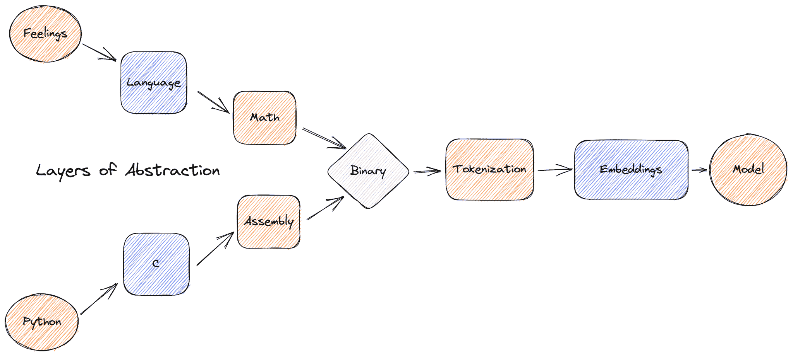
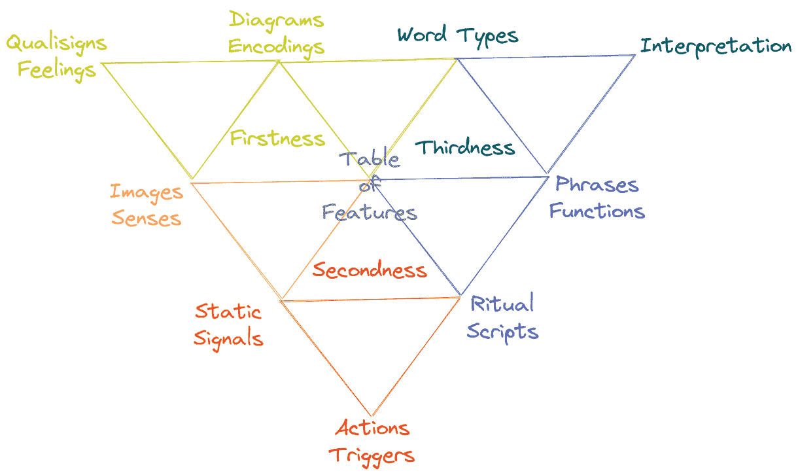
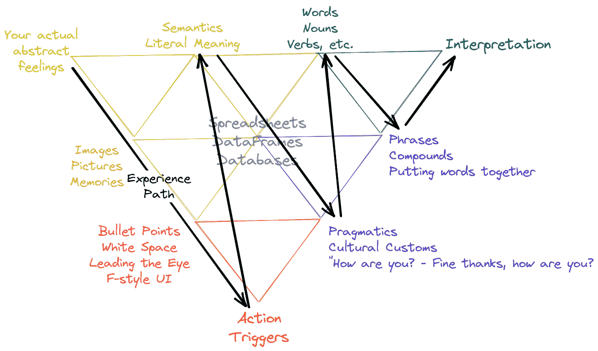
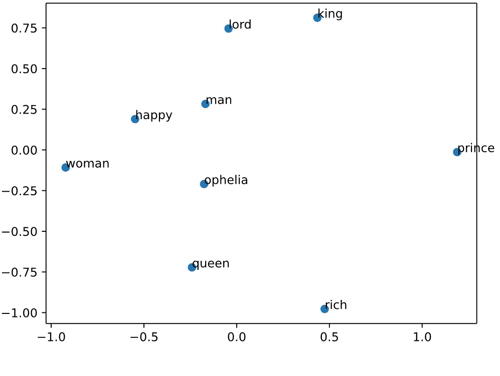
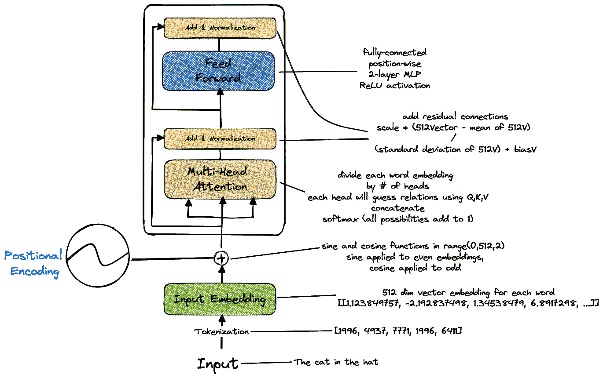
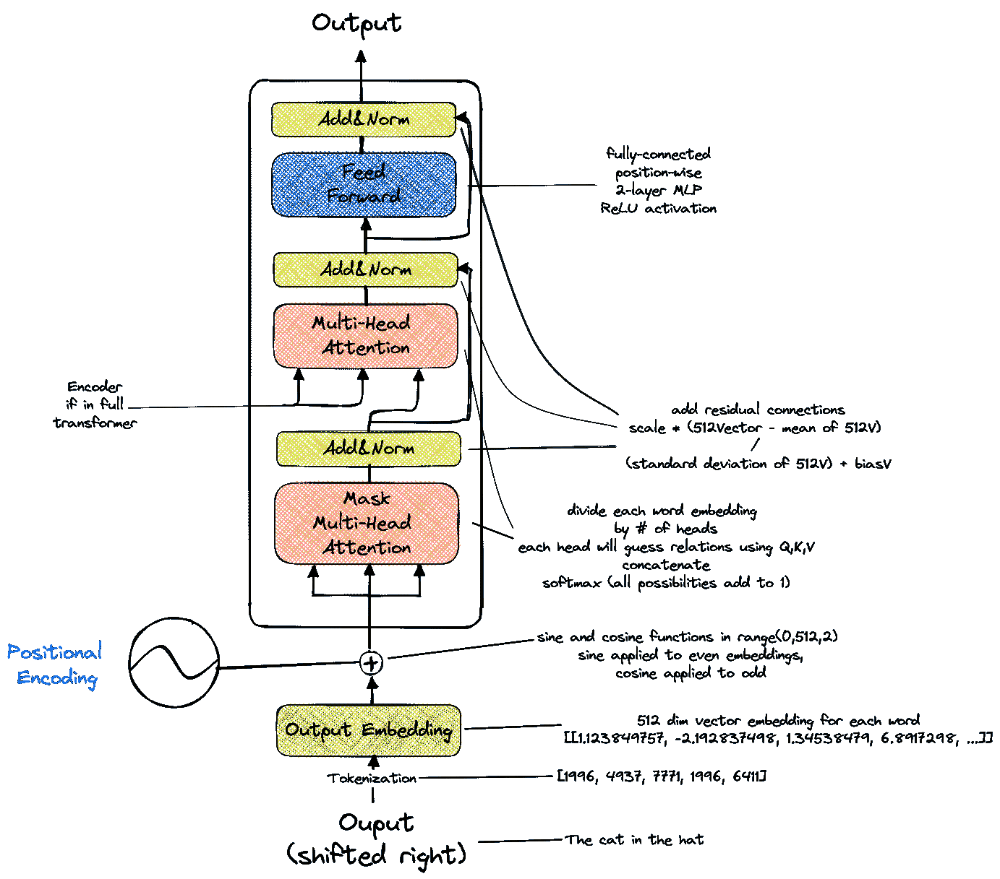
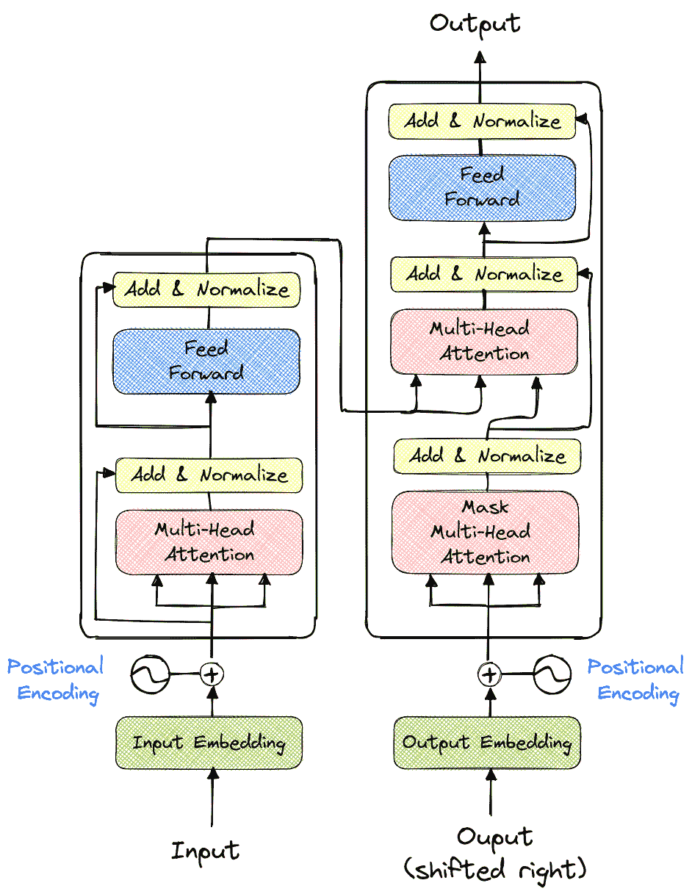
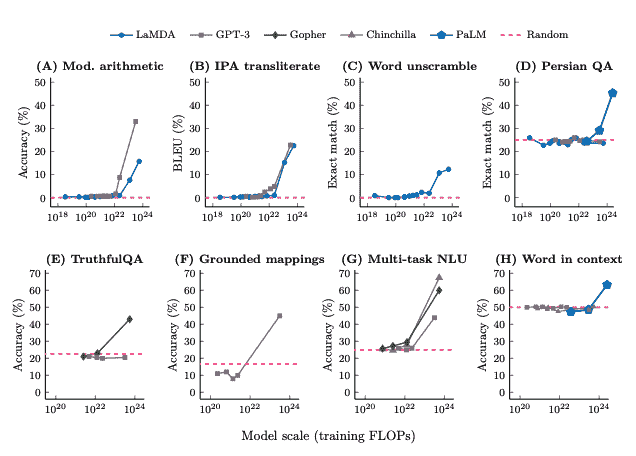
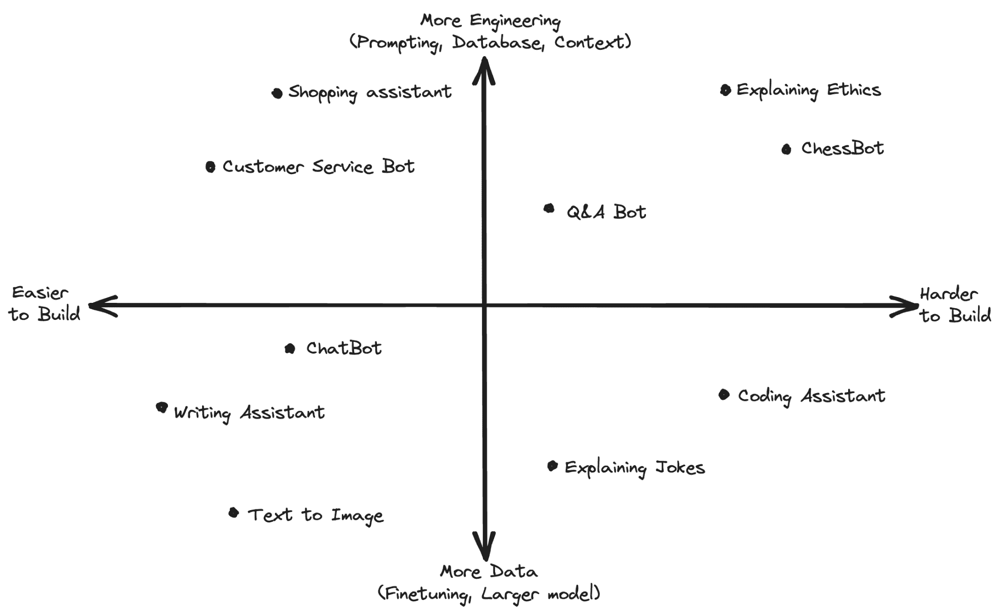

# 第二章：大型语言模型：深入探究语言建模

### 本章内容包括：

+   理解含义和解释的语言学背景

+   语言建模技术的比较研究

+   注意力和 Transformer 架构

+   大型语言模型如何融入和建立在这些历史之上

所有好故事都以“从前有一位”为开头，但不幸的是，本书不是故事，而是关于创建和生产化 LLMs 的书籍。因此，本章将深入探讨与大型语言模型（LLMs）的开发相关的语言学知识，探索形式语言学的基础、语言特征和塑造自然语言处理（NLP）领域的语言建模技术的演变。我们将从研究语言学的基础和其与 LLMs 的关联性开始，重点介绍句法、语义和语用等关键概念，这些概念构成了自然语言的基础，并在 LLMs 的运行中起着至关重要的作用。我们将深入探讨符号学，即符号和符号的研究，并探讨其原则如何影响 LLMs 的设计和解释。

接下来我们将在 2.2 节中追溯语言建模技术的演变，概述了早期方法，包括 N-Gram、朴素贝叶斯分类器以及基于神经网络的方法，如多层感知机（MLP）、循环神经网络（RNN）和长短期记忆（LSTM）网络。然后在 2.3 节中讨论了基于 Transformer 模型的革命性转变，这为大型语言模型（LLMs）的出现奠定了基础，而 LLMs 只是非常大型的基于 Transformer 模型。最后，在 2.4 节中介绍了 LLMs 及其独特的特点，讨论了它们如何在建立在并超过早期的语言建模技术基础上，从而彻底改变了自然语言处理（NLP）领域。

这是一本关于 LLMs 在生产中的书籍。我们坚决认为，如果你想将 LLMs 变成实际产品，更好地理解这项技术将提高你的成果，避免犯下代价高昂且耗时的错误。任何工程师都可以弄清楚如何将大型模型引入生产环境并投入大量资源使其运行，但这种愚蠢的策略完全忽略了人们在之前尝试做同样事情时已经学到的教训，而这正是我们首先要解决的问题。掌握这些基础知识将更好地为您准备处理 LLMs 时可能遇到的棘手部分、陷阱和边界情况。通过了解 LLMs 出现的背景，我们可以欣赏它们对 NLP 的变革性影响，以及如何使其能够创建各种应用程序。

## 2.1 语言建模

在深入讨论 LLM 之前，如果不首先讨论语言，那么就对 LLM 做了一个极大的伤害，首先我们将从简短但全面的语言模型概述开始，重点是可以帮助我们理解现代 LLM 的教训。让我们首先讨论抽象层级，因为这将帮助我们欣赏语言建模。

语言作为一个概念，是我们头脑中产生的感觉和思维的抽象。同样，数学是语言的一种抽象，着重于逻辑和可证明性，但正如任何数学家所说的那样，它是一种用于有组织和“逻辑”方式描述和定义的语言的子集。二进制语言就源于数学，它是一种由`开`和`关`组成的二进制数字表示系统。

二进制是数学的非常有用的抽象，它又是语言的抽象，而语言又是我们感觉的抽象，因为它是软件、模型和计算机中使用的底层工具。当计算机首次制造出来时，我们通过打孔卡片或直接使用二进制与它们交流。不幸的是，人类用这种方式沟通重要事物需要太长时间，因此二进制也被抽象为汇编语言，这是一种更符合人类理解的与计算机交流的语言。这又进一步抽象为高级汇编语言 C，甚至进一步抽象为面向对象的编程语言如 Python。我们刚才讨论的流程如图 2.1 所示。

##### 图 2.1 比较了认知抽象层级与编程抽象层级，直到逻辑二进制抽象。Python 并不来自 C，也不编译为 C。然而，Python 是另一种与二进制相距一定抽象层级的语言。类似地，语言也经过类似的路径。每一层的抽象都会造成潜在的错误点。创建模型也有多层次的抽象，每一层都很重要。



显然，这是一种简化，但了解一下，你在头脑中所感受到的情感与计算机实际读取的二进制相隔着相同数量的抽象层级，就像大多数人用来编程的语言一样。有些人可能会认为 Python 和二进制之间存在更多的步骤，例如编译器或使用汇编语言支持 C 语言，这是正确的，但在语言方面也有更多的步骤，例如形态学、语法、逻辑和一致性。

这可以帮助我们理解让人工智能语言模型（LLM）理解我们想要表达的内容的过程有多困难，甚至可以帮助我们更好地理解语言建模技术。我们在这里专注于二进制的原因仅仅是为了说明从你有的想法或我们的代码示例之一到一个工作模型的抽象层次是相似的数量。就像儿童的电话游戏，参与者互相耳语一样，每一个抽象层次都会产生一个断开点或障碍，错误可能在这些地方发生。

图 2.1 也旨在说明不仅创建可靠的代码和语言输入的困难，而且要引起注意的是中间的抽象步骤（如标记化和嵌入）对于模型本身是多么重要。即使你有完全可靠的代码和完美表达的想法，含义在到达 LLM 之前可能会在这些过程中被错误地处理。

在本章中，我们将尝试帮助您理解如何减少这些失败点的风险，无论是在语言、编码还是建模方面。不幸的是，在为当前任务不立即重要的语言学知识和为您提供太多的技术知识之间取得平衡有点棘手，尽管它们很有用，但并不能帮助您培养对语言建模作为一种实践的直觉。在此基础上，您应该知道语言学可以追溯到我们历史上数千年前，并且有很多可以从中学到的东西。我们在附录 A 中提供了一个***简要***的概述，供有兴趣的读者了解语言建模是如何随着时间的推移发展的，并鼓励您查阅。

让我们从我们专注于构成语言本身的基本组成部分开始。我们期望我们的读者至少在尝试过语言建模之前，并可能听说过像 PyTorch 和 Tensorflow 这样的库，但我们不指望大多数读者之前曾考虑过语言方面的问题。通过理解构成语言的基本特征，我们可以更好地欣赏创建有效语言模型所涉及的复杂性，以及这些特征如何相互作用形成我们所有人之间相互连接的复杂的交流网络。在接下来的章节中，我们将研究语言的各个组成部分，如语音学、语用学、形态学、语法和语义，以及它们在塑造我们对世界各地语言的理解和使用方面所起的作用。让我们花一点时间来探索我们目前如何理解语言以及我们面临的 LLM 意图解决的挑战。

### 2.1.1 语言特征

我们目前对语言的理解是，语言由至少 5 个部分组成：语音学、句法学、语义学、语用学和形态学。这些部分中的每一个都对任何对话中听者所接受的整体体验和意义做出了重大贡献。并非所有的交流都使用所有这些形式，例如，你正在阅读的书籍中没有语音学，这就是为什么很多人认为短信不适合进行更严肃或更复杂的对话的原因之一。让我们仔细分析一下这些内容，以确定如何向语言模型呈现它们，以实现全面的沟通能力。

#### 语音学

对于语言模型来说，语音学可能是最容易吸收的，它涉及到语言的实际发音。这就是口音的表现形式，涉及到语音的产生和感知，而音韵学则侧重于声音在特定语言系统内的组织方式。类似于计算机视觉，虽然作为一个整体来处理声音并不一定容易，但如何解析、向量化或标记实际的声波并不模糊。它们在每个部分都附有一个数字值，包括波峰、波谷以及每个频率周期内的斜率。相比文本，它更容易被计算机标记和处理，但同样复杂。声音本质上包含的编码意义比文本更多，例如，想象一下有人对你说“是的，对啊”。可能是讽刺的，也可能是祝贺的，这取决于语调，而英语甚至不是语调语言！不幸的是，语音学通常没有与之相关的千兆字节数据集，并且在语音数据的数据采集和清理方面，尤其是在需要训练 LLM 的规模上，这是非常困难的。在一个声音数据比文本数据更普遍且占用更小内存空间的替代世界中，基于语音或具有语音感知能力的 LLM 将会更加复杂，创造这样一个世界是一个可靠的目标。

为了应对这个问题，创建于 1888 年的国际音标（IPA）在 20 世纪和 21 世纪都进行了修订，使其更加简洁、一致和清晰，这可能是将语音认知融入文本数据的一种方式。 IPA 作为每种语言的音韵特征的国际标准化版本。音韵特征是语言使用的一套音素，例如在英语中，我们绝不会把音素/ʃ/（she, shirt, sh）与/v/音放在一起。 IPA 用来书写音素，而不是像大多数语言那样书写字母或表意文字。例如，你可以用这些符号简单地描述如何发音单词“cat”：/k/、/æ/和/t/。当然这是一个*非常*简化的版本，但对于模型来说，不必太复杂。你还可以描述语调和送气。这可能是文本和语音之间的一种折中，捕捉到一些音韵信息。想想短语“what’s up?” 你的发音和语调可以极大地改变你理解这个短语的方式，有时听起来像友好的“wazuuuuup”，有时像一种几乎威胁的“‘sup”，而这些都会被 IPA 完全捕捉到。然而，IPA 并不是一个完美的解决方案，例如，它并不能很好地解决模拟语调的问题。

音韵学被列为首位，因为在所有特点中，LLMs 对其应用最少，因此在改进空间方面有最大的可能性。即使是现代的 TTS 和语音合成模型大部分时间最终会将声音转换为频谱图，并分析该图像，而不是将任何类型的音韵语言建模纳入其中。这是未来几个月甚至几年研究的一个方向。

#### 语法

这是当前 LLM 性能最好的领域，既能从用户那里解析语法，又能生成自己的语法。语法通常是我们所说的语法和词序，研究单词如何组合形成短语、从句和句子。语法也是语言学习程序开始帮助人们习得新语言的第一个地方，特别是根据你的母语出发。例如，对于一个以英语为母语的人学习土耳其语来说，知道语法完全不同很重要，你可以经常构建完全由一个长复合词组成的土耳其语句子，而在英语中，我们从来不把主语和动词合为一个词。

语法与语言意义大体上是分开的，正如语法之父诺姆·乔姆斯基（Noam Chomsky）所说的那句名言：“无色的绿色思想在狂暴地睡眠。” 这句话的一切都在语法上是正确的，并且在语义上是可以理解的。问题不在于它毫无意义，而在于它确实有意义，而且这些词的编码意义相互冲突。然而，这只是一种简化，你可以把所有时候大型语言模型给出荒谬答案看作是这种现象的表现。不幸的是，语法也是歧义最常见的地方。考虑一下这个句子，“我看见一个老人和一个女人。”现在回答这个问题：这个女人也老吗？这是语法歧义，我们不确定修饰语“老”的范围是适用于后续短语中的所有人还是仅仅适用于紧接着的那个人。这比语义和语用歧义出现在语法中更不重要。现在考虑这个句子，“我在一个山上看见一个人，他手里拿着望远镜”，然后回答这个问题：说话者在哪里，正在做什么？说话者在山上用望远镜将一个人割开吗？可能你在读这个句子时甚至没有考虑到这个选项，因为当我们解释语法时，我们所有的解释至少在语义和语用上都是得到了启发的。我们从生活经验中知道，那种解释根本不可能发生，所以我们立即将其排除，通常甚至没有时间去处理我们将其从可能含义的范围中消除的事实。当我们与大型语言模型进行项目时，请稍后考虑这一点。

对于为什么大型语言模型需要具备语法意识以实现高性能，不应该需要任何逻辑推理。那些不能正确排序单词或生成无意义内容的大型语言模型通常不被描述为“优秀”。大型语言模型对语法的依赖性是导致乔姆斯基甚至称大型语言模型为“随机鹦鹉”的原因之一。在作者看来，2018 年的 GPT2 是语言建模将语法解决为完全独立于意义的演示，我们很高兴看到最近的尝试将 GPT2 如此出色的语法与编码和暗示的意义结合起来，我们将在接下来详细讨论。

#### 语义

语义是话语中词语的字面编码含义。人们会自动优化语义含义，只使用他们认为在当前语言时期有意义的词语。如果你曾经创建或使用过语言模型的嵌入（如 word2vec、ELMO、BERT【E 代表嵌入】、MUSE 等），你就使用了语义近似。词语经常经历语义转变，虽然我们不会涵盖这个话题的全部内容，也不会深入讨论，但下面是一些你可能已经熟悉的常见情况：狭义化，从更广泛的含义变为更具体的含义；扩义，与狭义化相反，从具体含义变为广泛含义；重新解释，经历整体或部分转变。这些转变并没有某种伟大的逻辑基础。它们甚至不必与现实相关，说某种语言的人几乎从来不会在这些变化发生时有意识地考虑。但这并不妨碍变化的发生，在语言建模的背景下，这也不会阻止我们跟上这种变化的步伐。

一些例子：狭义化包括“deer”，在古英语和中古英语中它只是指任何野生动物，甚至包括熊或美洲狮，而现在只指一种森林动物。扩义的例子是“dog”，它曾经只指英国的一种犬类，现在可以用来指任何驯化的犬类动物。关于“dog”扩义的有趣细节是在 FromSoft 的游戏《Elden Ring》中，由于玩家之间的信息传递系统有限，他们会用“dog”来指代从海龟到巨型蜘蛛甚至所有中间形态的任何东西。关于重新解释，我们可以考虑“pretty”，它曾经意味着聪明或制作精良，而不是视觉上吸引人。另一个很好的例子是“bikini”，它从指代一个特定的环礁，变成指代你在访问那个环礁时可能穿的衣服，最后人们把“bi-”解释为衣服的两部分结构，于是发明了泳装和连体泳衣。根据专家的研究和几十年的研究，我们可以把语言看作是由母语人士不断比较和重新评估的，其中会出现共同的模式。这些模式的传播在社会语言学中得到了密切研究，这在当前目的上大多不在讨论范围之内，但我们鼓励读者如果感兴趣可以研究一下，因为社会语言学现象如声望可以帮助设计对每个人都有效的系统。

在 LLM 的语境中，所谓的语义嵌入是文本的向量化版本，试图模拟语义含义。目前最流行的做法是通过对话中的每个子词（例如前缀、后缀和词素）进行标记或分配字典中的任意数字，应用连续语言模型来增加向量中每个令牌的维度，以便有一个更大的向量表示每个令牌的每个索引，然后对每个向量应用位置编码来捕获词序。每个子词最终都会根据其用法与较大词典中的其他词进行比较。考虑词嵌入时需要考虑的一点是，它们很难捕捉到这些令牌的深层编码含义，而仅仅增加嵌入的维度并没有显示出明显的改善。证明嵌入正在以类似于人类的方式工作的一个证据是，你可以将一个距离函数应用于相关的单词，看到它们比不相关的单词更接近。这是另一个可以期待在未来几年和几个月内进行开创性研究的领域，以更完整地捕捉和表示含义。

#### 实用语用学

有时会被语言学省略，因为其指称对象是影响听者解释和说话者决定以某种方式表达事物的所有非语言语境。语用学在很大程度上指的是文化、地区、社会经济阶层和共同的生活经验中遵循的教条，通过使用蕴涵在对话中采取捷径。

如果我说，“一个知名的名人刚刚被送进了 ICU”，根据生活经验，你可能会推断一位备受喜爱的人受了严重的伤，现在正在一家设备齐全的医院接受治疗。你可能会想知道是哪位名人，他们是否需要支付医疗费用，或者伤害是否是自己造成的，这些也是基于你的生活经验。这些都不能直接从文本及其编码的意义中推断出来。你需要知道 ICU 代表一系列更广泛的词语，以及这些词语是什么。你需要知道医院是什么，以及为什么有人需要被送到那里而不是自己去。如果这些都感觉很明显，那很好。你生活在一个社会中，你对社会的语用知识与提供的例子之间有很好的重叠。如果我分享一个来自人口较少的社会的例子，“Janka 昨天晚上挨了打，明天轮到 Peter 了”，你可能会感到困惑。如果你确实感到困惑，意识到这可能就是 LLM 看待很多文本数据的方式（人格化得到认可）。对于那些想知道的人，这个句子来自斯洛伐克的复活节传统。这里有很多意义，如果你不习惯这个文化中这些特定传统，那么这些意义将被忽略和不解释。我个人有幸尝试向外国同事解释复活节兔子及其对蛋的痴迷，并享受着看起来像个疯子的满足感。

在 LLM 的语境中，我们可以有效地将所有与文本无关的内容归为语用学范畴。这意味着 LLM 在开始时没有任何关于外部世界的知识，并且在训练过程中也不会获取。它们只会获取人类对特定语用刺激的反应知识。LLM 并不理解社会阶级、种族、性别、总统候选人或者其他可能基于个人生活经验引发某种情绪的事物。语用学不是我们期望直接整合到模型中的内容，但我们已经通过数据工程和策划、提示以及指导下的监督微调看到了间接整合的好处。

一旦你获得了要训练的数据，无论你是否打算，语用结构都会被添加进去。你可以将这种类型的语用结构视为偏见，它并非本质上的好或者坏，但无法摆脱。后面你可以通过规范化和策划来选择你希望你的数据保留的偏见类型，增加特定的代表不足的点，减少代表过多或噪音干扰的例子。

数据工程和语用语境之间存在着微妙的界限，这只是理解你的数据中存在的蕴涵。蕴涵是你的数据中的语用标记，而不是你的数据集中包含的字面文本。例如，假设你有一个模型试图接受像“写一篇关于青蛙吃湿袜子的演讲，不要押韵，每行的首字母拼成两栖动物”这样的输入，并实际按照这个指令来操作。你可以立即知道这个输入要求很多。作为数据工程师，你的平衡点就是确保输入要求在你的数据中被明确考虑到。你需要有演讲的例子，青蛙和袜子以及它们的行为的例子，还有藏头诗的例子。如果没有这些，模型可能仅仅能够从数据集中存在的蕴涵中理解，但是结果可能不确定。如果你更上一层楼并且记录数据集中的蕴涵信息和显性信息以及任务，还有数据分布，你就会有例子来回答“碎垃圾导致了什么样的结果？”

LLMs 很难理解语用语言学，甚至比人类更难，但它们能够捕捉到大多数人的平均标准差。它们甚至可以复制来自标准差之外的人的回答，但是在没有准确的刺激下很难保持一致。这就是培训期间和培训后的关键。基于指令的数据集试图通过在培训过程中问问题来制造这些刺激，从而得到代表性的回答。在培训中不可能考虑到每种可能的情况，而且你试图考虑到所有情况可能会无意中造成用户新类型的回答。在培训之后，你可以通过提示从模型中获取特定的信息，这取决于你的数据最初包含的内容而有一定的限度。

#### 词形变化。

词形变化是研究词结构以及词是如何由更小的单元（称为词素）组成的。词素是最小的具有意义的单位，例如“重新”在“重新做”或“重新学习”中。但是，并非所有单词的部分都是词素，比如“饲料”中的“ra-”或“国家”中的“na-”。

理解单词构造的方式有助于创建更好的语言模型和解析算法，这对于诸如标记化之类的任务至关重要。标记介于单词和形态素之间，在统计上它们是最可能表示意义单位的候选词，但不一定对应现有的形态素。语言模型的有效性可能取决于它有多么好地理解和处理这些标记。例如，在标记化中，模型需要存储一组字典，以便在单词和它们对应的索引之间进行转换。其中一个标记通常是"<UNK>"标记，它代表着模型不认识的任何单词。如果这个标记使用得太频繁，它可能会妨碍模型的性能，要么是因为模型的词汇量太小，要么是因为标记器没有为任务使用正确的算法。

想象一个场景，你想构建一个代码补全模型，但是你使用的标记器只识别由空格分隔的单词，就像 nltk 的"punkt"标记器一样。当它遇到字符串"def add_two_numbers_together(x, y):,"时，它会将"[def, <UNK>, y]"传递给模型。这导致模型丢失了宝贵的信息，不仅因为它无法识别标点符号，还因为函数的重要部分由于标记器的形态学算法而被替换为未知标记。要提高模型的性能，需要更好地理解单词结构和适当的解析算法。

### 2.1.2 符号学

探讨了语言的基本特征并在大型语言模型的语境中考察它们的重要性之后，重要的是考虑人类交流中意义构建和解释的更广阔视角。符号学，即标志和符号的研究，为我们提供了一个宝贵的视角，通过这个视角我们可以更好地理解人们如何解释和处理语言。在接下来的部分中，我们将深入探讨符号学的领域，考察符号、指示符和抽象之间的关系，以及 LLMs 如何利用这些元素生成有意义的输出。这次讨论将更深入地理解 LLMs 模拟人类语言理解的复杂过程，同时也揭示了它们在这一努力中面临的挑战和局限性。值得注意的是，作者并不认为模仿人类行为对 LLM 的改进必然是正确答案，只是模仿是该领域迄今为止评估自己的方式。

在我们介绍符号学时，让我们考虑图 2.2 是一个改编的皮尔斯符号三角形。这些被用来将基本思想组织成第一性、第二性和第三性的序列，其中第一性位于左上角，第二性位于底部，而第三性位于右上角。如果你以前见过符号三角形，你可能会对角数和方向感到惊讶。为了解释，我们把它们倒过来，以便稍微容易阅读，并且因为该系统是递归的，我们展示了系统如何同时模拟整个过程以及每个单独部分。虽然这些想法的整个概念非常酷，但深入探讨哲学并不在本书的范围之内。相反，我们可以将焦点放在这些词（first、second、third）的基本部分上，显示事物处理的顺序。

##### 图 2.2 这是一个递归的皮尔斯符号三角形。它是一个组织从任何事物中提取意义的过程的系统，在我们的案例中是从语言中提取的。三角形上的每个点都说明了在被用来描述的系统中合成意义所需的最小部分之一，所以在这里，每个这些点都是语言中的最小单位。Firstness、Secondness 和 Thirdness 不是三角形上的点，更像是符号学家能够在这个图表中定位自己的标记。



我们也可以看看每个三角形的每个交叉点，以了解为什么事物以它们的顺序呈现。感觉可以与图像和编码联系在一起，远在它们能够与单词和表联系在一起之前。仪式和常见脚本为被解释的动作提供了一个空间，这只是第二天性，不需要考虑，类似于大多数短语只是由单词组成，而母语使用者无需对每个单词进行元认知。所有这些最终都导向一种解释或文档（一系列话语），在我们的案例中，那种解释应该由 LLM 达成。这就是为什么，例如，提示工程可以提高模型的效力。基础 LLM 在数百万个仪式脚本示例上进行了训练，当您明确告诉模型提示需要遵循哪个脚本时，它能够更好地复制这种类型的脚本。尝试要求模型给出一个逐步解释，也许在你的生成之前加上“让我们逐步思考”，你会看到模型会基于它之前看到的脚本逐步生成脚本。

对于那些感兴趣的人来说，有特定的方法来阅读这些图表，以及整个符号学领域需要考虑的内容，然而，并不能保证通过理解整个过程就能创建最好的 LLM。与其深入研究这个问题，我们将考虑能帮助您为所有人构建最佳模型、用户体验和用户界面的最低要求。例如，创建意义的过程的一个方面是递归性。当有人对你说一些对你来说毫无意义的话时，你会怎么做？通常，人们会问一个或多个澄清问题，以弄清意思，这个过程一遍又一遍地开始，直到意思被传达。目前市场上最先进的模型并没有做到这一点，但通过非常有目的的提示可以做到这一点，但许多人甚至不知道要这样做，除非有人指出。换句话说，这是对符号学的简要介绍。你不需要能够在本节结束时向符号学领域的专家提供深入和准确的坐标特定解释。我真正想强调的是，这是一个组织系统，展示了你实际上需要创建另一个人能够解释的意义的完整图景的最少数量的事物。在训练过程中，我们没有向我们的模型提供相同数量和相同类型的信息，但如果我们这样做了，模型的行为将会显著改善。

这些图表旨在代表一个最小的组织模型，其中每个部分都是必不可少的。让我们考虑一下图 2.3，它展示了使用符号三角形的示例。考虑一下图像、图片和记忆，并想象一下如果没有眼睛来处理图像，没有文字来抽象知识，那么试图吸收这本书中的知识会是什么样子。看看项目符号等，如果没有章节，字母之间的空白和项目符号来显示你处理信息的顺序和结构，你怎么能读这本书？看看语义学和文字编码的意义，想象一下如果没有图表和没有字典定义的词，这本书会是什么样子。看看中间的电子表格，那可能是一本没有任何表格或比较信息组织者的书，包括这些图表。如果没有一个习惯和教条的文化或社会来作为我们解释的镜头，那么试图读这本书会是什么样子？所有这些观点构成了我们解释信息的能力，以及我们最终通过的镜头来识别模式。

##### 图 2.3 从左上角开始，按照箭头的方向看，我们使用的一般顺序来构建我们的解释和从我们所接触的事物中提取意义。在这里，我们用一些每个点的例子替换了描述性词语。试想一下在没有任何单词、没有例子、没有箭头，甚至没有知道这本书中的图是用来干什么的实际语境的情况下，你是如何解释这个图的。



因此，重要的问题是：您认为 LLM 能够访问多少这样的事物以返回有意义的解释？LLM 是否能够访问情感或社会习俗？目前，他们还不能，但在我们讨论传统和新型自然语言处理推理技术时，请考虑这一点，思考不同模型能够访问的内容。

### 2.1.3 多语言自然语言处理

在我们评估以前的自然语言处理技术和当前一代 LLM 之前，我们需要提及的最后一个挑战是语言学的基础以及 LLM 的存在原因。自从最早的文明接触以来，人们就希望了解或利用彼此。这些情况导致了对翻译员的需求，随着全球经济的增长和繁荣，这种需求只是呈指数级增长。

对于商业而言，这其实是相当简单的数学问题。您知道孟加拉语的母语使用者几乎和英语的母语使用者一样多吗？如果这是您第一次听说孟加拉语，这应该会让您认识到多语言模型市场的价值。世界上有数十亿人口，但只有大约十亿人的母语是英语。如果您的模型像大多数模型一样以英语为中心，那么您将错过世界上 95%的人口作为客户和用户。西班牙语和普通话在这方面都是很容易的选择，但更多的人甚至没有做到这一点。

有许多涉及政治的例子，涉及将事物称为相同或不同语言的范畴超出了本书的范围。这些通常是由于政府介入等外部因素引起的。牢记这两点——一个以英语为中心的单语系统并没有像许多企业所表现出的覆盖范围或利润潜力那样可靠，并且语言和方言之间的界限充其量是不可靠的，而在最坏的情况下是系统性有害的——这应该突显出危险的意见沼泽。许多企业和研究科学家在设计产品或系统时甚至都不假装想要触及这个沼泽。

不幸的是，目前还没有简单的解决方案。然而，考虑到这些因素可以帮助你作为一名科学家或工程师（希望也是一名道德人士），设计出至少不会加剧和负面影响已经存在问题的 LLMs。这个过程的第一步是从项目开始就确定一个方向性目标，要么朝着本地化（L10n）要么朝着国际化（I18n）。本地化是 Mozilla 的一种方法，他们通过众包 L10n，在 90 多种语言中提供了不同版本的浏览器，而且没有停止这项工作的迹象。国际化类似，但方向相反，例如，宜家试图在他们的指南册中尽量少使用文字，而是选择使用国际通用的符号和图片来帮助顾客进行 DIY 项目的导航。在项目开始阶段做出决定将大大减少扩展到任一解决方案所需的努力。足够大到将翻译和格式化的看法从成本转变为投资。在 LLMs 及其在公众意识中的迅速扩展的背景下，及早考虑这一点变得更加重要。推出一项改变世界的技术，却自动排除了大多数世界的人与其互动，这会贬值那些声音。不得不等待会危及他们的经济前景。

在继续之前，让我们花点时间反思一下我们到目前为止讨论的内容。我们触及了语言学中的重要观点，这些观点为我们说明了一些概念，比如理解语言的结构与其含义是分开的。我们展示了我们每个人以及作为一个社会所经历的旅程，向着具有元认知能力的方向发展，以便理解和表达语言，以一种计算机可以处理的连贯方式。随着我们加深对认知领域的知识，以及解决我们遇到的语言特征，我们的理解将不断提高。结合图 2.1，我们将展示我们所遵循的语言建模的计算路径，并探讨它如何解决了哪些语言特征或努力创造了意义。让我们开始评估各种用于算法表示语言的技术。

## 2.2 语言建模技术

通过深入研究语言的基本特征、符号学的原则以及大型语言模型解释和处理语言信息的方式，我们现在将转向更加实际的领域。在接下来的部分中，我们将探讨各种自然语言处理技术的发展和应用，这些技术已被用于创建这些强大的语言模型。通过检验每种方法的优势和弱点，我们将对这些技术在捕捉人类语言和交流精髓方面的有效性获得宝贵的见解。这样的知识不仅将帮助我们欣赏自然语言处理领域取得的进步，而且还将使我们更好地了解这些模型当前的局限性以及未来研究和发展所面临的挑战。

让我们花一点时间来回顾一些数据处理，这些处理将适用于所有语言建模。首先，我们需要决定如何分割要传入模型的单词和符号，有效地决定我们模型中的一个标记将是什么。然后，我们需要找到一种方法将这些标记转换为数字值，然后再转换回来。接下来，我们需要选择我们的模型将如何处理标记化输入。以下每种技术都将至少在其中一种方面基于先前的技术进行构建。

这些技术中的第一种被称为词袋（BoW）模型，它只是简单地计算文本中单词的出现次数。它可以很容易地通过一个扫描文本的字典来完成，为每个新单词创建一个新的词汇表条目作为关键字，并以 1 开始递增的值。考虑到它的简单性，即使完全基于频率的这种模型在试图洞悉演讲者意图或至少是他们的怪癖时也可能非常有用。例如，你可以在美国总统就职演讲中运行一个简单的 BoW 模型，搜索自由、经济和敌人这几个词，以便从提及每个单词的次数多少来相当不错地洞悉哪位总统是在和平时期上任的、在战时上任的以及在货币困难时期上任的。然而，BoW 模型也有很多弱点，因为这种模型不提供任何图像、语义、语用、短语或感情。它没有任何机制来评估上下文或语音学，并且因为它默认以空格划分单词（显然你可以按照自己的方式进行标记化，但尝试在子词上进行标记化并观察这个模型会发生什么事情—— 剧透，结果糟糕），它也不考虑形态。总的来说，它应该被认为是一种代表语言的弱模型，但也是评估其他模型的强基准。为了解决词袋模型不捕捉任何序列数据的问题，N-Gram 模型应运而生。

### 2.2.1 N-Gram 和基于语料库的技术

N-Gram 模型是对 BoW 的显着但高效的改进，其中您可以给模型一种上下文，由 N 表示。它们是相对简单的统计模型，允许您根据 N-1 上下文空间生成单词。查看列表 2.1，我正在使用三元组，这意味着 N=3。我清理文本并进行最小的填充/格式化，以帮助模型，然后我们使用 everygrams 进行训练，这意味着优先灵活性而不是效率，因此您也可以选择训练五元或七元（N=5，N=7）模型。在我生成的列表的末尾，我可以给模型多达 2 个标记，以帮助它进一步生成。N-Gram 模型并未被创建，甚至从未声称尝试完整地对语言知识进行建模，但它们在实际应用中非常有用。它们忽略了所有语言特征，包括句法，只尝试在 N 长度短语中的词之间建立概率连接。

查看图 2.2，N-Grams 实际上只使用静态信号（空白、正字法）和单词来尝试提取任何含义。它试图手动测量短语，假设所有短语的长度都相同。话虽如此，N-Grams 可用于创建文本分析的强大基线，如果分析员已经了解话语的实用语境，它们可以用来快速而准确地洞察现实场景。可以通过设置 N=1000000000 或更高来制作 N-Gram LLM，但这没有任何实际应用，因为 99.9% 的所有文本和 100% 的所有有意义的文本都包含少于十亿次出现的标记，并且计算能力可以更好地用在其他地方。

##### 列表 2.1 生成式 N-Grams 语言模型实现

```py
from nltk.corpus.reader import PlaintextCorpusReader
from nltk.util import everygrams
from nltk.lm.preprocessing import (
    pad_both_ends,
    flatten,
    padded_everygram_pipeline,
)
from nltk.lm import MLE

# Create a corpus from any number of plain .txt files
my_corpus = PlaintextCorpusReader("./", ".*\.txt")

for sent in my_corpus.sents(fileids="hamlet.txt"):
    print(sent)

# Pad each side of every line in the corpus with <s> and </s> to indicate the start and end of utterances
padded_trigrams = list(
    pad_both_ends(my_corpus.sents(fileids="hamlet.txt")[1104], n=2)
)
list(everygrams(padded_trigrams, max_len=3))

list(
    flatten(
        pad_both_ends(sent, n=2)
        for sent in my_corpus.sents(fileids="hamlet.txt")
    )
)

# Allow everygrams to create a training set and a vocab object from the data
train, vocab = padded_everygram_pipeline(
    3, my_corpus.sents(fileids="hamlet.txt")
)

# Instantiate and train the model we’ll use for N-Grams, a Maximum Likelihood Estimator (MLE)
# This model will take the everygrams vocabulary, including the <UNK> token used for out-of-vocabulary
lm = MLE(3)
len(lm.vocab)

lm.fit(train, vocab)
print(lm.vocab)
len(lm.vocab)

# And finally, language can be generated with this model and conditioned with n-1 tokens preceding
lm.generate(6, ["to", "be"])
```

上面的代码就是创建生成式 N-Gram 模型所需的全部内容。对于那些希望能进一步评估该模型的人，我们在下面的代码中添加了获取概率和对数分数、分析特定短语的熵和困惑度的代码。因为这一切都是基于频率的，即使在数学上具有重要意义，它仍然不能很好地描述现实世界语言的困惑程度或频率。

```py
# Any set of tokens up to length=n can be counted easily to determine frequency
print(lm.counts)
lm.counts[["to"]]["be"]

# Any token can be given a probability of occurrence, and can be augmented with up to n-1 tokens to precede it
print(lm.score("be"))
print(lm.score("be", ["to"]))
print(lm.score("be", ["not", "to"]))

# This can be done as a log score as well to avoid very big and very small numbers
print(lm.logscore("be"))
print(lm.logscore("be", ["to"]))
print(lm.logscore("be", ["not", "to"]))

# Sets of tokens can be tested for entropy and perplexity as well
test = [("to", "be"), ("or", "not"), ("to", "be")]
print(lm.entropy(test))
print(lm.perplexity(test))
```

尽管此代码示例说明了创建三元语言模型，但遗憾的是，并非所有需要捕获的短语都只有 3 个标记。例如，来自《哈姆雷特》的“生存还是毁灭”，包含一个由 2 个词组成的短语和一个由 4 个词组成的短语。这种短语建模也无法捕获单个词可能具有的任何语义编码。为了解决这些问题，贝叶斯统计学被应用于语言建模。

### 2.2.2 贝叶斯技术

贝叶斯定理是描述输出发生在输入空间中的最数学上严谨且简单的理论之一。基本上，它根据先前的知识计算事件发生的概率。定理认为，给定证据为真的情况下一个假设为真的概率（例如，一句话具有积极情感），等于证据发生在假设为真的情况下的概率乘以假设发生的概率，然后除以证据为真的概率。数学表示为：

P(hypothesis | evidence) = (P(evidence | hypothesis) * P(hypothesis)) / P(evidence)

或

P(A|B) * P(B) = P(B|A) * P(A)

因为这既不是一本数学书，也不想过多地深入理论，我们相信您可以进一步了解这个定理。

不幸的是，尽管该定理在数学上对数据进行了准确的描述，但它没有考虑到任何随机性或单词的多重含义。你可以用一个词来困惑贝叶斯模型，让其产生错误的结果，这个词就是"it"。任何指示代词最终都会被赋予与其他单词相同的 LogPrior 和 LogLikelihood 值，并且得到一个静态值，而这与这些单词的使用方式相悖。例如，如果你想对一个话语进行情感分析，最好给所有代词赋予一个空值，而不是让它们通过贝叶斯训练。还应该注意，贝叶斯技术并不像其他技术一样会创建生成式语言模型。由于贝叶斯定理验证一个假设，这些模型适用于分类，并且可以为生成式语言模型带来强大的增强。

在第 2.2 节中，我们展示了如何创建一个朴素贝叶斯分类语言模型。我们选择了手写代码而不是使用像 sklearn 这样的软件包，虽然代码会更长一些，但应该更有助于理解其工作原理。我们使用的是最简化版本的朴素贝叶斯模型，没有添加任何复杂的内容，如果你选择对任何你想解决的问题进行升级，这些都可以得到改进。我们强烈建议您这样做。

##### 第 2.2 节 朴素贝叶斯分类语言模型实现

```py
from utils import process_utt, lookup
from nltk.corpus.reader import PlaintextCorpusReader
import numpy as np

my_corpus = PlaintextCorpusReader("./", ".*\.txt")

sents = my_corpus.sents(fileids="hamlet.txt")

def count_utts(result, utts, ys):
    """
    Input:
        result: a dictionary that is used to map each pair to its frequency
        utts: a list of utts
        ys: a list of the sentiment of each utt (either 0 or 1)
    Output:
        result: a dictionary mapping each pair to its frequency
    """

    for y, utt in zip(ys, utts):
        for word in process_utt(utt):
            # define the key, which is the word and label tuple
            pair = (word, y)

            # if the key exists in the dictionary, increment the count
            if pair in result:
                result[pair] += 1

            # if the key is new, add it to the dict and set the count to 1
            else:
                result[pair] = 1

    return result

result = {}
utts = [" ".join(sent) for sent in sents]
ys = [sent.count("be") > 0 for sent in sents]
count_utts(result, utts, ys)

freqs = count_utts({}, utts, ys)
lookup(freqs, "be", True)
for k, v in freqs.items():
    if "be" in k:
        print(f"{k}:{v}")

def train_naive_bayes(freqs, train_x, train_y):
    """
    Input:
        freqs: dictionary from (word, label) to how often the word appears
        train_x: a list of utts
        train_y: a list of labels correponding to the utts (0,1)
    Output:
        logprior: the log prior.
        loglikelihood: the log likelihood of you Naive bayes equation.
    """
    loglikelihood = {}
    logprior = 0

    # calculate V, the number of unique words in the vocabulary
    vocab = set([pair[0] for pair in freqs.keys()])
    V = len(vocab)

    # calculate N_pos and N_neg
    N_pos = N_neg = 0
    for pair in freqs.keys():
        # if the label is positive (greater than zero)
        if pair[1] > 0:
            # Increment the number of positive words (word, label)
            N_pos += lookup(freqs, pair[0], True)

        # else, the label is negative
        else:
            # increment the number of negative words (word,label)
            N_neg += lookup(freqs, pair[0], False)

    # Calculate D, the number of documents
    D = len(train_y)

    # Calculate the number of positive documents
    D_pos = sum(train_y)

    # Calculate the number of negative documents
    D_neg = D - D_pos

    # Calculate logprior
    logprior = np.log(D_pos) - np.log(D_neg)

    # For each word in the vocabulary...
    for word in vocab:
        # get the positive and negative frequency of the word
        freq_pos = lookup(freqs, word, 1)
        freq_neg = lookup(freqs, word, 0)

        # calculate the probability that each word is positive, and negative
        p_w_pos = (freq_pos + 1) / (N_pos + V)
        p_w_neg = (freq_neg + 1) / (N_neg + V)

        # calculate the log likelihood of the word
        loglikelihood[word] = np.log(p_w_pos / p_w_neg)

    return logprior, loglikelihood

def naive_bayes_predict(utt, logprior, loglikelihood):
    """
    Input:
        utt: a string
        logprior: a number
        loglikelihood: a dictionary of words mapping to numbers
    Output:
        p: the sum of all the logliklihoods + logprior
    """
    # process the utt to get a list of words
    word_l = process_utt(utt)

    # initialize probability to zero
    p = 0

    # add the logprior
    p += logprior

    for word in word_l:
        # check if the word exists in the loglikelihood dictionary
        if word in loglikelihood:
            # add the log likelihood of that word to the probability
            p += loglikelihood[word]

    return p

def test_naive_bayes(test_x, test_y, logprior, loglikelihood):
    """
    Input:
        test_x: A list of utts
        test_y: the corresponding labels for the list of utts
        logprior: the logprior
        loglikelihood: a dictionary with the loglikelihoods for each word
    Output:
        accuracy: (# of utts classified correctly)/(total # of utts)
    """
    accuracy = 0  # return this properly

    y_hats = []
    for utt in test_x:
        # if the prediction is > 0
        if naive_bayes_predict(utt, logprior, loglikelihood) > 0:
            # the predicted class is 1
            y_hat_i = 1
        else:
            # otherwise the predicted class is 0
            y_hat_i = 0

        # append the predicted class to the list y_hats
        y_hats.append(y_hat_i)

    # error = avg of the abs vals of the diffs between y_hats and test_y
    error = sum(
        [abs(y_hat - test) for y_hat, test in zip(y_hats, test_y)]
    ) / len(y_hats)

    # Accuracy is 1 minus the error
    accuracy = 1 - error

    return accuracy

if __name__ == "__main__":
    logprior, loglikelihood = train_naive_bayes(freqs, utts, ys)
    print(logprior)
    print(len(loglikelihood))

    my_utt = "To be or not to be, that is the question."
    p = naive_bayes_predict(my_utt, logprior, loglikelihood)
    print("The expected output is", p)

    print(
        "Naive Bayes accuracy = %0.4f"
        % (test_naive_bayes(utts, ys, logprior, loglikelihood))
    )
```

这个定理并没有创建同类型的语言模型，而是一种与一个假设相关的概率列表。因此，贝叶斯语言模型不能有效地用于生成语言，但在分类任务中可以非常强大地应用。尽管如此，在我看来，贝叶斯模型往往被过度炒作，即使是在这个任务中也是如此。我职业生涯中的一个巅峰时刻就是将一种贝叶斯模型替换并从生产中移除。

在贝叶斯模型中，一个重要的问题是所有序列实质上都是完全不相关的，就像 BoW 模型一样，将我们从 N-Grams 的序列建模的另一端移动过来。类似于钟摆一样，语言建模在马尔可夫链中再次摆回到序列建模和语言生成。

### 2.2.3 马尔可夫链

马尔可夫链通常称为隐马尔可夫模型（HMMs），本质上是在之前提到的 N-Gram 模型中添加了状态，使用隐藏状态存储概率。它们通常用于帮助解析文本数据以供更大的模型使用，执行诸如词性标注（Part-of-Speech tagging，将单词标记为它们的词性）和命名实体识别（NER，将标识性单词标记为它们的指示词和通常的类型，例如 LA - 洛杉矶 - 城市）等任务。与之前的贝叶斯模型不同，马尔可夫模型完全依赖于随机性（可预测的随机性），而贝叶斯模型则假装它不存在。然而，其思想同样在数学上是正确的，即任何事情发生的概率 *下一个* 完全取决于 *现在* 的状态。因此，我们不是仅基于其历史发生情况对单词进行建模，并从中提取概率，而是基于当前正在发生的情况对其未来和过去的搭配进行建模。因此，“happy” 发生的概率会几乎降至零，如果刚刚输出了“happy”，但如果刚刚发生了“am”，则会显着提高。马尔可夫链非常直观，以至于它们被纳入了贝叶斯统计学的后续迭代中，并且仍然在生产系统中使用。

在清单 2.3 中，我们训练了一个马尔可夫链生成式语言模型。这是我们第一次使用特定的标记器，本例中将基于单词之间的空格进行标记化。这也是我们第二次提到了一组意图作为文档一起查看的话语。当您尝试此模型时，请仔细注意并自行进行一些比较，看看 HMM 的生成效果与即使是大型 N-Gram 模型相比如何。

##### 清单 2.3 生成式隐马尔可夫语言模型实现

```py
import re
import random
from nltk.tokenize import word_tokenize
from collections import defaultdict, deque

class MarkovChain:
    def __init__(self):
        self.lookup_dict = defaultdict(list)
        self._seeded = False
        self.__seed_me()

    def __seed_me(self, rand_seed=None):
        if self._seeded is not True:
            try:
                if rand_seed is not None:
                    random.seed(rand_seed)
                else:
                    random.seed()
                self._seeded = True
            except NotImplementedError:
                self._seeded = False

    def add_document(self, str):
        preprocessed_list = self._preprocess(str)
        pairs = self.__generate_tuple_keys(preprocessed_list)
        for pair in pairs:
            self.lookup_dict[pair[0]].append(pair[1])

    def _preprocess(self, str):
        cleaned = re.sub(r"\W+", " ", str).lower()
        tokenized = word_tokenize(cleaned)
        return tokenized

    def __generate_tuple_keys(self, data):
        if len(data) < 1:
            return

        for i in range(len(data) - 1):
            yield [data[i], data[i + 1]]

    def generate_text(self, max_length=50):
        context = deque()
        output = []
        if len(self.lookup_dict) > 0:
            self.__seed_me(rand_seed=len(self.lookup_dict))
            chain_head = [list(self.lookup_dict)[0]]
            context.extend(chain_head)

            while len(output) < (max_length - 1):
                next_choices = self.lookup_dict[context[-1]]
                if len(next_choices) > 0:
                    next_word = random.choice(next_choices)
                    context.append(next_word)
                    output.append(context.popleft())
                else:
                    break
            output.extend(list(context))
        return " ".join(output)

if __name__ == "__main__":
    with open("hamlet.txt", "r", encoding="utf-8") as f:
        text = f.read()
    HMM = MarkovChain()
    HMM.add_document(text)

    print(HMM.generate_text(max_length=25))
```

这段代码展示了一个用于生成的马尔可夫模型的基本实现，我们鼓励读者对其进行实验，将其与你最喜欢的音乐家的歌曲或最喜欢的作者的书籍进行结合，看看生成的内容是否真的听起来像他们。HMM 非常快速，通常用于预测文本或预测搜索应用。马尔可夫模型代表了对语言进行描述性语言学建模的首次全面尝试，而不是规范性的尝试，这很有趣，因为马尔可夫最初并不打算用于语言建模，只是为了赢得关于连续独立状态的论战。后来，马尔可夫使用马尔可夫链来模拟普希金小说中的元音分布，所以他至少意识到了可能的应用。

描述性语言学和规范性语言学的区别在于一个关注事物*应该*如何，而另一个关注事物*是*如何。从语言建模的角度来看，从语料库或马尔可夫模型的角度描述语言正在做什么已被证明要比试图规定语言应该如何行为更加有效。不幸的是，仅有当前状态本身无法提供超越当下的背景，因此历史或社会背景无法在马尔可夫模型中有效地表示。单词的语义编码也成为问题，正如代码示例所示，马尔可夫链将输出语法上正确但语义上毫无意义的单词链，类似于“无色绿色思想狂暴地睡着了。”为了试图解决这个问题，发展出了“连续”模型，以允许对令牌进行“语义嵌入”表示。

### 2.2.4 连续语言建模

连续词袋（CBoW），就像它的名字一样，词袋一样，是一种基于频率的语言分析方法，意味着它根据单词出现的频率对单词进行建模。话语中的下一个单词从未基于概率或频率来确定。由于这个原因，所给出的示例将是如何使用 CBoW 创建要由其他模型摄取或比较的单词嵌入。我们将使用神经网络进行此操作，以为您提供一个良好的方法论。

这是我们将看到的第一个语言建模技术，它基本上是在给定话语上滑动一个上下文窗口（上下文窗口是一个 N-gram 模型），并尝试根据窗口中的周围单词猜测中间的单词。例如，假设你的窗口长度为 5，你的句子是“学习语言学让我感到快乐”，你会给出 CBoW[‘学习’, ‘关于’, ‘使’, ‘我’]，并试图让模型猜测“语言学”，根据模型之前在类似位置看到该单词出现的次数。这应该会向你展示为什么像这样训练的模型难以生成，因为如果你给出[‘使’, ’我’, ’</s>]作为输入，首先它只有 3 个信息要尝试解决，而不是 4 个，它还将倾向于只猜测它之前在句子末尾看到过的单词，而不是准备开始新的从句。但情况并不完全糟糕，连续模型在嵌入方面突出的一个特征是，它不仅可以查看目标词之前的单词，还可以使用目标之后的单词来获得一些上下文的相似性。

在列表 2.4 中，我们创建了我们的第一个连续模型。在我们的例子中，为了尽可能简单，我们使用词袋进行语言处理，使用一个两个参数的单层神经网络进行嵌入估计，尽管这两者都可以被替换为任何其他模型。例如，你可以将 N-gram 替换为词袋，将朴素贝叶斯替换为神经网络，得到一个连续朴素 N-gram 模型。重点是这种技术中使用的实际模型有点随意，更重要的是连续技术。为了进一步说明这一点，我们除了使用 numpy 做神经网络的数学运算外，没有使用任何其他包，尽管这是我们在本节中首次出现。

特别注意下面的步骤，初始化模型权重，ReLU 激活函数，最终的 softmax 层，前向和反向传播，以及它们如何在`gradient_descent`函数中组合在一起。这些是拼图中的片段，你将一遍又一遍地看到它们出现，不论编程语言或框架如何。无论你使用 Tensorflow、Pytorch 还是 HuggingFace，如果你开始创建自己的模型而不是使用别人的模型，你都需要初始化模型、选择激活函数、选择最终层，并在前向和反向传播中定义。

##### 列表 2.4 生成连续词袋语言模型实现

```py
import nltk
import numpy as np
from utils import get_batches, compute_pca, get_dict
import re
from matplotlib import pyplot

# Create our corpus for training
with open("hamlet.txt", "r", encoding="utf-8") as f:
    data = f.read()

# Slightly clean the data by removing punctuation, tokenizing by word, and converting to lowercase alpha characters
data = re.sub(r"[,!?;-]", ".", data)
data = nltk.word_tokenize(data)
data = [ch.lower() for ch in data if ch.isalpha() or ch == "."]
print("Number of tokens:", len(data), "\n", data[500:515])

# Get our Bag of Words, along with a distribution
fdist = nltk.FreqDist(word for word in data)
print("Size of vocabulary:", len(fdist))
print("Most Frequent Tokens:", fdist.most_common(20))

# Create 2 dictionaries to speed up time-to-convert and keep track of vocabulary
word2Ind, Ind2word = get_dict(data)
V = len(word2Ind)
print("Size of vocabulary:", V)

print("Index of the word 'king':", word2Ind["king"])
print("Word which has index 2743:", Ind2word[2743])

# Here we create our Neural network with 1 layer and 2 parameters
def initialize_model(N, V, random_seed=1):
    """
    Inputs:
        N: dimension of hidden vector
        V: dimension of vocabulary
        random_seed: seed for consistent results in tests
    Outputs:
        W1, W2, b1, b2: initialized weights and biases
    """
    np.random.seed(random_seed)

    W1 = np.random.rand(N, V)
    W2 = np.random.rand(V, N)
    b1 = np.random.rand(N, 1)
    b2 = np.random.rand(V, 1)

    return W1, W2, b1, b2

# Create our final classification layer, which makes all possibilities add up to 1
def softmax(z):
    """
    Inputs:
        z: output scores from the hidden layer
    Outputs:
        yhat: prediction (estimate of y)
    """
    yhat = np.exp(z) / np.sum(np.exp(z), axis=0)
    return yhat

# Define the behavior for moving forward through our model, along with an activation function
def forward_prop(x, W1, W2, b1, b2):
    """
    Inputs:
        x: average one-hot vector for the context
        W1,W2,b1,b2: weights and biases to be learned
    Outputs:
        z: output score vector
    """
    h = W1 @ x + b1
    h = np.maximum(0, h)
    z = W2 @ h + b2
    return z, h

# Define how we determine the distance between ground truth and model predictions
def compute_cost(y, yhat, batch_size):
    logprobs = np.multiply(np.log(yhat), y) + np.multiply(
        np.log(1 - yhat), 1 - y
    )
    cost = -1 / batch_size * np.sum(logprobs)
    cost = np.squeeze(cost)
    return cost

# Define how we move backward through the model and collect gradients
def back_prop(x, yhat, y, h, W1, W2, b1, b2, batch_size):
    """
    Inputs:
        x:  average one hot vector for the context
        yhat: prediction (estimate of y)
        y:  target vector
        h:  hidden vector (see eq. 1)
        W1, W2, b1, b2:  weights and biases
        batch_size: batch size
     Outputs:
        grad_W1, grad_W2, grad_b1, grad_b2:  gradients of weights and biases
    """
    l1 = np.dot(W2.T, yhat - y)
    l1 = np.maximum(0, l1)
    grad_W1 = np.dot(l1, x.T) / batch_size
    grad_W2 = np.dot(yhat - y, h.T) / batch_size
    grad_b1 = np.sum(l1, axis=1, keepdims=True) / batch_size
    grad_b2 = np.sum(yhat - y, axis=1, keepdims=True) / batch_size

    return grad_W1, grad_W2, grad_b1, grad_b2

# Put it all together and train
def gradient_descent(data, word2Ind, N, V, num_iters, alpha=0.03):
    """
    This is the gradient_descent function

      Inputs:
        data:      text
        word2Ind:  words to Indices
        N:         dimension of hidden vector
        V:         dimension of vocabulary
        num_iters: number of iterations
     Outputs:
        W1, W2, b1, b2:  updated matrices and biases

    """
    W1, W2, b1, b2 = initialize_model(N, V, random_seed=8855)
    batch_size = 128
    iters = 0
    C = 2
    for x, y in get_batches(data, word2Ind, V, C, batch_size):
        z, h = forward_prop(x, W1, W2, b1, b2)
        yhat = softmax(z)
        cost = compute_cost(y, yhat, batch_size)
        if (iters + 1) % 10 == 0:
            print(f"iters: {iters+1} cost: {cost:.6f}")
        grad_W1, grad_W2, grad_b1, grad_b2 = back_prop(
            x, yhat, y, h, W1, W2, b1, b2, batch_size
        )
        W1 = W1 - alpha * grad_W1
        W2 = W2 - alpha * grad_W2
        b1 = b1 - alpha * grad_b1
        b2 = b2 - alpha * grad_b2
        iters += 1
        if iters == num_iters:
            break
        if iters % 100 == 0:
            alpha *= 0.66

    return W1, W2, b1, b2

# Train the model
C = 2
N = 50
word2Ind, Ind2word = get_dict(data)
V = len(word2Ind)
num_iters = 150
print("Call gradient_descent")
W1, W2, b1, b2 = gradient_descent(data, word2Ind, N, V, num_iters)
Call gradient descent
Iters: 10 loss: 0.525015
Iters: 20 loss: 0.092373
Iters: 30 loss: 0.050474
Iters: 40 loss: 0.034724
Iters: 50 loss: 0.026468
Iters: 60 loss: 0.021385
Iters: 70 loss: 0.017941
Iters: 80 loss: 0.015453
Iters: 90 loss: 0.012099
Iters: 100 loss: 0.012099
Iters: 110 loss: 0.011253
Iters: 120 loss: 0.010551
Iters: 130 loss: 0.009932
Iters: 140 loss: 0.009382
Iters: 150 loss: 0.008889
```

CBoW 示例是我们的第一个代码示例，展示了机器学习中完整有效的训练循环。在所有这些中，我们要求读者特别注意训练循环中的步骤，特别是激活函数 ReLU。由于我们希望读者至少熟悉各种 ML 范式，包括不同的激活函数，因此我们不会在这里解释 ReLU，而是解释为什么应该使用它以及为什么不应该使用它。ReLU 虽然解决了梯度消失问题，但并未解决梯度爆炸问题，并且会严重破坏模型内的所有负比较。更好的情况变体包括 ELU，它允许负数归一化到 alpha，或者 GEGLU/SWIGLU，在越来越复杂的场景中表现良好，如语言。然而，人们经常使用 ReLU，不是因为它们在某种情况下是最好的，而是因为它们易于理解、易于编码、直观，甚至比它们被创建来替代的激活函数如 sigmoid 或 tanh 更加直观。

许多情况下都会使用包等进行抽象处理，但了解底层发生的情况对于你作为 LLMs 投入生产的人来说将非常有帮助。你应该能够相当肯定地预测不同模型在各种情况下的行为。接下来的部分将深入探讨其中一个抽象，这种情况下是由连续建模技术创建的抽象。

### 2.2.5 嵌入

回想一下我们的语言特征，很容易理解为什么连续式语言建模是一次重大突破。嵌入接受我们创建的令牌化向量，这些向量不包含任何意义，并尝试根据可以从文本中得到的观察结果插入该意义，例如单词顺序和出现在相似上下文中的子词。尽管主要的意义模式是搭配（共同出现，即相邻的单词），但它们被证明是有用的，甚至显示出与人类编码的单词意义一些相似之处。

**Word2Vec** 中的典型例子之一是，将“king”的向量减去“man”的向量，加上“woman”的向量，然后找到其总和的最近邻居，得到的词向量就是“queen”的向量。这对我们来说是有意义的，因为它模拟了人类的语义。其中一个主要区别已经提到了几次，即语用学。人类使用语用背景来确定语义意义，理解仅仅因为你说了“我需要食物”并不意味着你实际上没有食物就会有危险。嵌入是纯粹使用情境之外的任何影响，这感觉就像是人类学习的方式，各方面都有很好的论点。唯一的问题是，如果我们可以以某种方式为模型提供更多的感知数据，那可能会为更有效的嵌入打开大门。

在第 2.5 节中，我们将深入探讨如何使用 pyplot 可视化嵌入。我们将在后面的章节中更深入地研究嵌入。这对于模型的可解释性以及在预训练步骤中进行验证都是有帮助的。如果您发现您的语义相似的嵌入在图上相对靠近彼此，那么您很可能朝着正确的方向前进了。

##### 2.5 嵌入可视化

```py
# After listing 2.4 is done and gradient descent has been executed
words = [
    "King",
    "Queen",
    "Lord",
    "Man",
    "Woman",
    "Prince",
    "Ophelia",
    "Rich",
    "Happy",
]
embs = (W1.T + W2) / 2.0
idx = [word2Ind[word] for word in words]
X = embs[idx, :]
print(X.shape, idx)

result = compute_pca(X, 2)
pyplot.scatter(result[:, 0], result[:, 1])
for i, word in enumerate(words):
    pyplot.annotate(word, xy=(result[i, 0], result[i, 1]))
pyplot.show()
```

##### 图 2.4 一种用于词嵌入的可视化技术。可视化嵌入对于模型的可解释性非常重要。



如图 2.4 所示，这是我们从 CBoW 模型训练得到的一个成功但非常稀疏的嵌入表示。让这些语义表示（嵌入）更密集是我们可以看到这一领域改进的主要地方，尽管许多成功的实验已经运行过，其中更密集的语义含义已经通过指导和不同的思维链技术取代了更大的语用背景。我们稍后将讨论“思维链”（CoT）和其他技术。现在，让我们转而讨论为什么我们的连续嵌入技术甚至可能成功，鉴于基于频率的模型通常很难与现实相关联。所有这一切都始于半个多世纪前的多层感知器。

### 2.2.6 多层感知器

MLPs 体现了这样一种情感，“机器在做一件事情时真的很擅长，所以我希望我们可以使用一堆真的擅长做这一件事情的机器来制造一个擅长做很多事情的机器。” MLP 中的每个权重和偏置都擅长检测一个特征，所以我们将它们绑在一起以检测更大、更复杂的特征。MLPs 在大多数神经网络架构中充当主要的构建模块。架构之间的关键区别，如卷积神经网络和循环神经网络，主要来自数据加载方法和处理标记化和嵌入数据在模型层之间流动的方式，而不是个别层的功能，特别是全连接层。

在 2.6 中，我们提供了一个更动态的神经网络类，它可以根据您的任务需要拥有任意数量的层和参数。我们使用 pytorch 提供了一个更明确和明确的类，以便为您提供实现 MLP 的工具，无论您是从头开始还是在流行的框架中使用。

##### 2.6 多层感知机 Pytorch 类实现

```py
import torch
import torch.nn as nn
import torch.nn.functional as F

class MultiLayerPerceptron(nn.Module):
    def __init__(
        self,
        input_size,
        hidden_size=2,
        output_size=3,
        num_hidden_layers=1,
        hidden_activation=nn.Sigmoid,
    ):
        """Initialize weights.
        Args:
            input_size (int): size of the input
            hidden_size (int): size of the hidden layers
            output_size (int): size of the output
            num_hidden_layers (int): number of hidden layers
            hidden_activation (torch.nn.*): the activation class
        """
        super(MultiLayerPerceptron, self).__init__()
        self.module_list = nn.ModuleList()
        interim_input_size = input_size
        interim_output_size = hidden_size
        torch.device("cuda:0" if torch.cuda.is_available() else "cpu")

        for _ in range(num_hidden_layers):
            self.module_list.append(
                nn.Linear(interim_input_size, interim_output_size)
            )
            self.module_list.append(hidden_activation())
            interim_input_size = interim_output_size

        self.fc_final = nn.Linear(interim_input_size, output_size)

        self.last_forward_cache = []

    def forward(self, x, apply_softmax=False):
        """The forward pass of the MLP

        Args:
            x_in (torch.Tensor): an input data tensor.
                x_in.shape should be (batch, input_dim)
            apply_softmax (bool): a flag for the softmax activation
                should be false if used with the Cross Entropy losses
        Returns:
            the resulting tensor. tensor.shape should be (batch, output_dim)
        """
        for module in self.module_list:
            x = module(x)

        output = self.fc_final(x)

        if apply_softmax:
            output = F.softmax(output, dim=1)

        return output
```

从代码中我们可以看到，与具有静态两层的 CBoW 实现相反，直到实例化之前，这个 MLP 的大小是不固定的。如果您想给这个模型一百万层，您只需在实例化类时将 num_hidden_layers=1000000，尽管仅仅因为您*可以*给模型那么多参数，并不意味着它会立即变得更好。LLMs 不仅仅是很多层。像 RNNs 和 CNNs 一样，LLMs 的魔力在于数据如何进入并通过模型。为了说明这一点，让我们看一下 RNN 及其一个变体。

### 2.2.7 循环神经网络（RNNs）和长短期记忆网络（LSTMs）

循环神经网络（RNNs）是一类神经网络，设计用于分析序列，基于以前语言建模技术的弱点。其逻辑是，如果语言以序列的方式呈现，那么处理它的方式可能应该是按序列而不是逐个标记进行的。RNNs 通过使用我们以前看到的逻辑来实现这一点，在 MLPs 和马尔科夫链中都看到过，即在处理新输入时引用内部状态或记忆，并在检测到节点之间的连接有用时创建循环。

在完全递归网络中，如清单 2.7 中的网络，所有节点最初都连接到所有后续节点，但这些连接可以设置为零，以模拟它们被断开如果它们不是有用的。这解决了较早模型遇到的最大问题之一，即静态输入大小，并使得 RNN 及其变体能够处理可变长度的输入。不幸的是，较长的序列带来了一个新问题。因为网络中的每个神经元都与后续神经元连接，所以较长的序列对总和产生的改变较小，使得梯度变得较小，最终消失，即使有重要的词也是如此。

例如，让我们考虑具有任务情感分析的这些句子，“昨晚我喜欢看电影”，以及，“昨晚我去看的电影是我曾经期望看到的最好的。”即使这些句子不完全相同，它们也可以被认为在语义上相似。在通过 RNN 时，第一句中的每个单词都更有价值，其结果是第一句的积极评分比第二句高，仅仅因为第一句更短。反之亦然，爆炸梯度也是这种序列处理的结果，这使得训练深层 RNNs 变得困难。

要解决这个问题，长短期记忆（LSTMs）作为一种 RNN，使用记忆单元和门控机制，保持能够处理可变长度的序列，但没有较长和较短序列被理解为不同的问题。预见到多语言场景，并理解人们不只是单向思考语言，LSTMs 还可以通过将两个 RNNs 的输出连接起来进行双向处理，一个从左到右读取序列，另一个从右到左。这种双向性提高了结果，允许信息即使在经过数千个标记之后也能被看到和记住。

在清单 2.7 中，我们提供了 RNN 和 LSTM 的类。在与本书相关的存储库中的代码中，您可以看到训练 RNN 和 LSTM 的结果，结果是 LSTM 在训练集和验证集上的准确性都更好，而且仅需一半的时代（25 次与 RNN 的 50 次）。需要注意的一个创新是利用填充的打包嵌入，将所有可变长度序列扩展到最大长度，以便处理任何长度的输入，只要它比最大长度短即可。

##### 清单 2.7 递归神经网络和长短期记忆 Pytorch 类实现

```py
import torch
from gensim.models import Word2Vec
from sklearn.model_selection import train_test_split

# Create our corpus for training
with open("./chapters/chapter_2/hamlet.txt", "r", encoding="utf-8") as f:
    data = f.readlines()

# Embeddings are needed to give semantic value to the inputs of an LSTM
# embedding_weights = torch.Tensor(word_vectors.vectors)

EMBEDDING_DIM = 100
model = Word2Vec(data, vector_size=EMBEDDING_DIM, window=3, min_count=3, workers=4)
word_vectors = model.wv
print(f"Vocabulary Length: {len(model.wv)}")
del model

padding_value = len(word_vectors.index_to_key)
embedding_weights = torch.Tensor(word_vectors.vectors)

class RNN(torch.nn.Module):
    def __init__(
        self,
        input_dim,
        embedding_dim,
        hidden_dim,
        output_dim,
        embedding_weights,
    ):
        super().__init__()
        self.embedding = torch.nn.Embedding.from_pretrained(
            embedding_weights
        )
        self.rnn = torch.nn.RNN(embedding_dim, hidden_dim)
        self.fc = torch.nn.Linear(hidden_dim, output_dim)

    def forward(self, x, text_lengths):
        embedded = self.embedding(x)
        packed_embedded = torch.nn.utils.rnn.pack_padded_sequence(
            embedded, text_lengths
        )
        packed_output, hidden = self.rnn(packed_embedded)
        output, output_lengths = torch.nn.utils.rnn.pad_packed_sequence(
            packed_output
        )
        return self.fc(hidden.squeeze(0))

INPUT_DIM = 4764
EMBEDDING_DIM = 100
HIDDEN_DIM = 256
OUTPUT_DIM = 1

model = RNN(
    INPUT_DIM, EMBEDDING_DIM, HIDDEN_DIM, OUTPUT_DIM, embedding_weights
)

optimizer = torch.optim.SGD(model.parameters(), lr=1e-3)
criterion = torch.nn.BCEWithLogitsLoss()
device = torch.device("cuda" if torch.cuda.is_available() else "cpu")

class LSTM(torch.nn.Module):
    def __init__(
        self,
        input_dim,
        embedding_dim,
        hidden_dim,
        output_dim,
        n_layers,
        bidirectional,
        dropout,
        embedding_weights,
    ):
        super().__init__()
        self.embedding = torch.nn.Embedding.from_pretrained(
            embedding_weights
        )
        self.rnn = torch.nn.LSTM(
            embedding_dim,
            hidden_dim,
            num_layers=n_layers,
            bidirectional=bidirectional,
            dropout=dropout,
        )
        self.fc = torch.nn.Linear(hidden_dim * 2, output_dim)
        self.dropout = torch.nn.Dropout(dropout)

    def forward(self, x, text_lengths):
        embedded = self.embedding(x)
        packed_embedded = torch.nn.utils.rnn.pack_padded_sequence(
            embedded, text_lengths
        )
        packed_output, (hidden, cell) = self.rnn(packed_embedded)
        hidden = self.dropout(
            torch.cat((hidden[-2, :, :], hidden[-1, :, :]), dim=1)
        )
        return self.fc(hidden.squeeze(0))

INPUT_DIM = padding_value
EMBEDDING_DIM = 100
HIDDEN_DIM = 256
OUTPUT_DIM = 1
N_LAYERS = 2
BIDIRECTIONAL = True
DROPOUT = 0.5

model = LSTM(
    INPUT_DIM,
    EMBEDDING_DIM,
    HIDDEN_DIM,
    OUTPUT_DIM,
    N_LAYERS,
    BIDIRECTIONAL,
    DROPOUT,
    embedding_weights,
)

optimizer = torch.optim.Adam(model.parameters())
criterion = torch.nn.BCEWithLogitsLoss()
device = torch.device("cuda" if torch.cuda.is_available() else "cpu")

def binary_accuracy(preds, y):
  rounded_preds = torch.round(torch.sigmoid(preds))
  correct = (rounded_preds == y).float()
  acc = correct.sum()/len(correct)
  return acc

def train(model, iterator, optimizer, criterion):
    epoch_loss = 0
    epoch_acc = 0
    model.train()
    for batch in iterator:
        optimizer.zero_grad()
        predictions = model(batch["text"], batch["length"]).squeeze(1)
        loss = criterion(predictions, batch["label"])
        acc = binary_accuracy(predictions, batch["label"])
        loss.backward()
        optimizer.step()
        epoch_loss += loss.item()
        epoch_acc += acc.item()

    return epoch_loss / len(iterator), epoch_acc / len(iterator)

def evaluate(model, iterator, criterion):
    epoch_loss = 0
    epoch_acc = 0
    model.eval()
    with torch.no_grad():
        for batch in iterator:
            predictions = model(batch["text"], batch["length"]).squeeze(1)
            loss = criterion(predictions, batch["label"])
            acc = binary_accuracy(predictions, batch["label"])

            epoch_loss += loss.item()
            epoch_acc += acc.item()

    return epoch_loss / len(iterator), epoch_acc / len(iterator)

batch_size = 128 # Usually should be a power of 2 because it's the easiest for computer memory.

def iterator(X, y):
  size = len(X)
  permutation = np.random.permutation(size)
  iterate = []
  for i in range(0, size, batch_size):
    indices = permutation[i:i+batch_size]
    batch = {}
    batch['text'] = [X[i] for i in indices]
    batch['label'] = [y[i] for i in indices]

    batch['text'], batch['label'] = zip(*sorted(zip(batch['text'], batch['label']), key = lambda x: len(x[0]), reverse = True))
    batch['length'] = [len(utt) for utt in batch['text']]
    batch['length'] = torch.IntTensor(batch['length'])
    batch['text'] = torch.nn.utils.rnn.pad_sequence(batch['text'], batch_first = True).t()
    batch['label'] = torch.Tensor(batch['label'])

    batch['label'] = batch['label'].to(device)
    batch['length'] = batch['length'].to(device)
    batch['text'] = batch['text'].to(device)

    iterate.append(batch)

  return iterate

index_utt = word_vectors.key_to_index

#You've got to determine some labels for whatever you're training on.
X_train, X_test, y_train, y_test = train_test_split(index_utt, labels, test_size = 0.2)
X_train, X_val, y_train, y_val = train_test_split(X_train, y_train, test_size = 0.2)

train_iterator = iterator(X_train, y_train)
validate_iterator = iterator(X_val, y_val)
test_iterator = iterator(X_test, y_test)

print(len(train_iterator), len(validate_iterator), len(test_iterator))

N_EPOCHS = 25

for epoch in range(N_EPOCHS):
    train_loss, train_acc = train(
        model, train_iterator, optimizer, criterion
    )
    valid_loss, valid_acc = evaluate(model, validate_iterator, criterion)

    print(
        f"| Epoch: {epoch+1:02} | Train Loss: {train_loss: .3f} | Train Acc: {train_acc*100: .2f}% | Validation Loss: {valid_loss: .3f} | Validation Acc: {valid_acc*100: .2f}% |"
    )
#Training on our dataset
| Epoch: 01 | Train Loss:  0.560 | Train Acc:  70.63% | Validation Loss:  0.574 | Validation Acc:  70.88% |
| Epoch: 05 | Train Loss:  0.391 | Train Acc:  82.81% | Validation Loss:  0.368 | Validation Acc:  83.08% |
| Epoch: 10 | Train Loss:  0.270 | Train Acc:  89.11% | Validation Loss:  0.315 | Validation Acc:  86.22% |
| Epoch: 15 | Train Loss:  0.186 | Train Acc:  92.95% | Validation Loss:  0.381 | Validation Acc:  87.49% |
| Epoch: 20 | Train Loss:  0.121 | Train Acc:  95.93% | Validation Loss:  0.444 | Validation Acc:  86.29% |
| Epoch: 25 | Train Loss:  0.100 | Train Acc:  96.28% | Validation Loss:  0.451 | Validation Acc:  86.83% |
```

看看我们的类和实例化，你会发现 LSTM 与 RNN 并没有太大的区别。 `init` 输入变量中唯一的区别是 `n_layers`（为了方便，你也可以用 RNN 指定它）、`bidirectional` 和 `dropout`。双向性允许 LSTM 向前查看序列以帮助理解意义和上下文，但也极大地有助于多语言场景，因为像英语这样的从左到右的语言并不是正字法的唯一格式。丢失率是另一个巨大的创新，它改变了过拟合的范式，不再仅仅是数据相关，并通过在训练期间逐层关闭随机节点来帮助模型不过度拟合，强制所有节点不相互关联。在模型之外的唯一区别是，RNN 的最佳优化器是 SGD，就像我们的 CBoW 一样，而 LSTM 使用 Adam（可以使用任何优化器，包括 AdamW）。下面，我们定义了我们的训练循环并训练了 LSTM。将此训练循环与 `gradient_descent` 函数中的 Listing 2.4 中定义的训练循环进行比较。

本代码展示的一个惊人之处在于，与先前的模型迭代相比，LSTM 的学习速度要快得多，这要归功于双向性和丢失率。尽管先前的模型训练速度更快，但需要数百个周期才能达到与仅需 25 个周期的 LSTM 相同的性能。验证集上的性能，正如其名称所示，为架构增添了有效性，在训练期间对未经训练的示例进行推断，并保持准确性与训练集相当。

这些模型的问题并不太明显，主要表现为资源消耗极大，尤其是在应用于更长、更注重细节的问题时，如医疗保健和法律领域。尽管丢失率和双向处理具有令人难以置信的优势，但它们至少会将训练所需的处理能力增加一倍，因此，虽然推断最终只会比相同规模的 MLP 昂贵 2-3 倍，但训练则会变得 10-12 倍昂贵。它们很好地解决了爆炸梯度的问题，但却增加了训练所需的计算量。为了解决这个问题，设计并实施了一种快捷方式，使任何模型，包括 LSTM，在一个序列中找出哪些部分是最有影响力的，哪些部分可以安全地忽略，这就是注意力。

### 2.2.8 注意力

注意力是通过一种新兴的数学公式告诉模型如何考虑输入的哪些部分以及多少来更快地解决更大上下文窗口的数学快捷方式。这一切都基于一个升级版本的字典，其中不仅仅是键值对，还增加了一个上下文查询。我们将在后面的章节中更深入地讨论注意力。现在，知道下面的代码是从原始论文中提取的 10 个步骤，它是老的自然语言处理技术和现代技术之间的重要区别。

注意力机制解决了训练 LSTMs 的缓慢问题，但在低数量的 epochs 上保持了高性能。同时，也有多种类型的注意力机制。点积注意力方法捕捉了查询中每个单词（或嵌入）与关键字中每个单词之间的关系。当查询和关键字是同一句子的一部分时，这被称为双向自注意力。然而，在某些情况下，仅集中在前面的单词更合适。这种类型的注意力，尤其是当查询和关键字来自相同的句子时，被称为因果注意力。通过屏蔽序列的部分并迫使模型猜测应该在掩码后面的内容，语言建模进一步得到改善。下面的函数演示了点积注意力和掩码注意力。

##### 列表 2.8 多头注意力机制实现

```py
import numpy as np
from scipy.special import softmax

# Step 1: Input: 3 inputs, d_model=4
x = np.array([[1.0, 0.0, 1.0, 0.0],
        [0.0, 2.0, 0.0, 2.0],
        [1.0, 1.0, 1.0, 1.0]])

# Step 2: weights 3 dimensions x d_model=4
w_query = np.array([1,0,1],
            [1,0,0],
            [0,0,1],
            [0,1,1]])
w_key = np.array([[0,0,1],
           [1,1,0],
           [0,1,0],
           [1,1,0]])
w_value = np.array([[0,2,0],
             [0,3,0],
             [1,0,3],
             [1,1,0]])

# Step 3: Matrix Multiplication to obtain Q,K,V
## Query: x * w_query
Q = np.matmul(x,w_query)
## Key: x * w_key
K = np.matmul(x,w_key)
## Value: x * w_value
V = np.matmul(x,w_value)

# Step 4: Scaled Attention Scores
## Square root of the dimensions
k_d = 1
attention_scores = (Q @ K.transpose())/k_d

# Step 5: Scaled softmax attention scores for each vector
attention_scores[0] = softmax(attention_scores[0])
attention_scores[1] = softmax(attention_scores[1])
attention_scores[2] = softmax(attention_scores[2])

# Step 6: attention value obtained by score1/k_d * V
attention1 = attention_scores[0].reshape(-1,1)
attention1 = attention_scores[0][0]*V[0]
attention2 = attention_scores[0][1]*V[1]
attention3 = attention_scores[0][2]*V[2]

# Step 7: summed the results to create the first line of the output matrix
attention_input1 = attention1 + attention2 + attention3

# Step 8: Step 1 to 7 for inputs 1 to 3
## Because this is just a demo, we’ll do a random matrix of the right dimensions
attention_head1 = np.random.random((3,64))

# Step 9: We train all 8 heads of the attention sub-layer using steps 1 through 7
## Again, it’s a demo
z0h1 = np.random.random((3,64))
z1h2 = np.random.random((3,64))
z2h3 = np.random.random((3,64))
z3h4 = np.random.random((3,64))
z4h5 = np.random.random((3,64))
z5h6 = np.random.random((3,64))
z6h7 = np.random.random((3,64))
z7h8 = np.random.random((3,64))

# Step 10: Concatenate heads 1 through 8 to get the original 8x64 output dimension of the model
Output_attention = np.hstack((z0h1,z1h2,z2h3,z3h4,z4h5,z5h6,z6h7,z7h8))

# Here’s a function that performs all of these steps:
def dot_product_attention(query, key, value, mask, scale=True):
    assert query.shape[-1] == key.shape[-1] == value.shape[-1], “q,k,v have different dimensions!”
    if scale:
        depth = query.shape[-1]
    else:
        depth = 1
    dots = np.matmul(query, np.swapaxes(key, -1, -2)) / np.sqrt(depth)
    if mask is not None:
        dots = np.where(mask, dots, np.full_like(dots, -1e9))
    logsumexp = scipy.special.logsumexp(dots, axis=-1, keepdims=True)
    dots = np.exp(dots - logsumexp)
    attention = np.matmul(dots, value)
    return attention

# Here’s a function that performs the previous steps but adds causality in masking
def masked_dot_product_self_attention(q,k,v,scale=True):
    mask_size = q.shape[-2]
    mask = np.tril(np.ones((1, mask_size, mask_size), dtype=np.bool_), k=0)
    return DotProductAttention(q,k,v,mask,scale=scale)
```

在上面，在注意力的完整实现中，你可能已经注意到了一些你熟悉的术语，即关键字和值，但你可能之前没有听说过查询。关键字和值对因为字典和查找表而熟悉，我们在其中将一组关键字映射到一个值数组。查询应该感觉直观，就像搜索或检索一样。查询与关键字进行比较，从中检索一个值在正常操作中。

在注意力中，查询和关键字经历点积相似性比较以获得一个注意力分数，稍后将该分数乘以值以获得模型应该关注序列中的那部分的最终分数。这可能会变得更复杂，这取决于你模型的架构，因为编码器和解码器序列长度都必须考虑在内，但现在可以简单地说，这个空间中建模的最有效方法是将所有输入源投影到一个共同的空间中，并使用点积进行比较以提高效率。

这个代码解释比之前的例子更加数学密集，但这是必要的来说明概念。注意力背后的数学是真正创新的，它推动了该领域的进步。不幸的是，即使注意力给序列建模带来了优势，使用 LSTMs 和 RNNs 仍然存在速度和内存大小的问题。从代码和数学中你可能会注意到有一个平方根，这意味着我们使用的注意力是二次的。从那时起，出现了各种技术，包括次二次的技术，如 Hyena 和 Recurrent Memory Transformer（RMT，基本上是 RNN 与 transformers 的组合），以应对这些问题，我们稍后将更详细地讨论。现在，让我们继续介绍注意力的最终应用：transformers。

## 注意力就是你所需要的一切

在开创性论文《Attention is All You Need》中[[1]](#_ftn1)，Vaswani 等人进一步推进了数学上的捷径，假设为了性能绝对不需要任何重复(循环神经网络中的“R”)或任何卷积[[2]](#_ftn2)。相反，他们选择只使用注意力，并简单地指定 Q、K 和 V 从哪里被更加小心地取出。我们将立即深入讨论这一点。在我们对这一多样化的 NLP 技术的回顾中，我们观察到它们随着时间的推移的演变，以及每种方法试图改进其前身的方式。从基于规则的方法到统计模型和神经网络，该领域不断努力寻求更高效、更准确的处理和理解自然语言的方法。现在，我们将注意力转向了一项开创性的创新，彻底改变了 NLP 领域：transformers 架构。在接下来的部分中，我们将探讨支撑 transformers 的关键概念和机制，以及它们如何使得先进的语言模型的开发超越了以前的技术。我们还将讨论 transformers 对更广泛的 NLP 景观的影响，并考虑在这一激动人心的研究领域中进一步进展的可能性。

### 2.3.1 编码器

编码器是完整 transformers 模型的前半部分，在分类和特征工程等领域表现出色。Vaswani 等人(2017)发现的一件事是，在编码器内部的嵌入层之后，对张量进行的任何附加转换都可能损害它们在“语义上”进行比较的能力，而这正是嵌入层的目的。这些模型在很大程度上依赖于自注意力和巧妙的位置编码来操纵这些向量，而不会显著降低所表达的相似性。

再次强调嵌入的关键点：它们是数据的向量表示，在我们的案例中是令牌。令牌可以是用于表示语言的任何内容。我们通常建议使用子词，但您会对哪种类型的令牌在何处效果良好有所感觉。考虑这句话，“戴着帽子的猫迅速跳过了红狐狸和棕色的无动力狗。” “红色”和“棕色”在语义上应该是相似的，并且在嵌入层之后它们被类似地表示，但是在句子中分别占据第 10 和第 14 位置，假设我们按单词进行分词，因此位置编码在它们之间引入了距离。然而，一旦应用正弦和余弦函数[[3]](#_ftn3)，它会将它们的含义调整到编码后比之前稍微远一点的位置，并且此编码机制随着循环和更多数据的增加而扩展得非常出色。举例来说，假设嵌入后[红色]和[棕色]之间的余弦相似度为 99%。编码将极大地减少这一相似度，降至大约 85-86%。按照所述的正弦和余弦方法，将它们的相似度调整回大约 96%。

BERT 是原始论文后出现的第一批体系结构之一，并且是仅编码器的变换器的示例。 BERT 是一个非常强大的模型架构，尽管体积小，但至今仍在生产系统中使用。 BERT 是第一个仅编码器的变换器在流行中迅速崛起的例子，展示了使用变换器进行连续建模比 Word2Vec 获得更好的嵌入。 我们可以看到这些嵌入更好是因为它们可以在最少的训练下很快地应用于新任务和数据，并且与 Word2Vec 嵌入相比，获得了人们更喜欢的结果。 这导致大多数人在一段时间内将基于 BERT 的模型用于较小数据集上的少量学习任务。 BERT 使得最先进的性能对大多数研究人员和企业来说只需付出最少的努力就能轻松实现。

##### 图 2.5 编码器，可视化。编码器是完整变换器架构的前半部分，在诸如分类或命名实体识别（NER）等 NLU 任务中表现出色。编码器模型改进了以前的设计，不需要任何先验知识或循环，并且使用了巧妙的位置编码和多头注意力。



优点：

+   分类和展示理解的层次任务

+   在考虑长期依赖建模时极快速度。

+   建立在已知模型的基础上，嵌入中的 CBoW，前馈中的 MLP 等。

弱点：

+   如建议所示，需要大量数据才能发挥效果（尽管比 RNN 少）。

+   更复杂的架构

### 2.3.2 解码器

解码器模型（如下所示）是编码器的较大版本，具有 2 个多头注意力块和 3 个求和和标准化层。它们是 transformers 的后半部分。 这导致模型在屏蔽语言建模、学习和应用语法等方面非常强大，从而立即想到需要仅解码器模型以实现人工智能。编码器与解码器任务的有用区分是，编码器在自然语言理解（NLU）任务中表现出色，而解码器在自然语言生成（NLG）任务中表现出色。一些仅解码器的 transformers 体系结构的示例是产生预训练的 transformers（GPT）系列模型。这些模型遵循转换生成语法的逻辑，完全基于语法，允许语言中所有可能句子的无限生成。[[4]](#_ftn4)

##### 图 2.6 解码器的可视化。解码器是完整 transformers 的第二个部分，擅长于像聊天机器人和讲故事这样的自然语言生成任务。解码器在以前的架构上做出了改进，但它们将其输出向右移动一个空格以用于下一个词汇的生成，从而帮助利用多头自我关注的优势。



优势：

+   生成序列中的下一个标记（向右移动意味着考虑到已生成的标记）

+   基于已知模型和编码器的构建

+   可以在生成过程中进行流式传输，提供良好的用户体验

弱点：

+   仅基于语法的模型经常难以插入预期或意图（请参见自 2018 年以来所有的“我强迫 AI 观看 1000 小时 x 并生成”模因）

+   幻觉

### 2.3.3 transformers

全面的 transformers 架构利用了编码器和解码器，将编码器的理解传递到解码器的第二个多头注意力块中，然后才能输出。由于 transformers 的每个部分都专门负责理解或生成，因此对于条件生成任务（如翻译或摘要），整个产品应该感觉很直观，在生成之前需要一定程度的理解。编码器旨在以高层次处理输入，解码器则更专注于生成连贯的输出，全面的 transformers 架构可以成功地理解，然后基于这种理解进行生成。transformers 模型具有优势，因为它们围绕着并行构建，这增加了速度，目前在 LSTMs 中无法复制。如果 LSTM 能够达到可以像 transformers 一样快速运行的点，它们可能会在最先进的领域竞争。文本到文本转移 transformers（T5）系列模型是 transformers 的示例。

##### 图 2.7 一个完整的变换器可视化。一个完整的变换器结合了编码器和解码器，并在每个任务以及条件生成任务（如摘要和翻译）上表现良好。由于变换器比它们的各半部分更笨重和更慢，因此研究人员和企业通常选择使用这些半部分而不是整个东西，尽管速度和内存增益都很小。



优点：

+   同时具有编码器和解码器，因此擅长于它们各自擅长的一切

+   高度并行化以提高速度和效率

弱点：

+   占用内存多，但仍然比相同大小的 LSTM 少

+   需要大量数据和 VRAM 进行训练

正如你可能已经注意到的，我们讨论的大多数模型根本不是语言学焦点，而是非常注重语法，即使在尝试模拟真实语言时也是如此。模型，即使是最先进的变换器，也只有语义近似，没有语用学、音韵学，而且在分词期间只真正利用形态。这并不意味着模型无法学习这些知识，也不意味着例如变换器无法将音频作为输入，只是平均使用情况下并没有这样做。考虑到这一点，它们能够表现得如此出色简直就是一个奇迹，而且确实应该被当作奇迹来欣赏。

通过本章至今，我们试图突出当前模型存在的限制，并将在本书的其余部分深入探讨如何改进它们的方法。其中一条路线是已经被探索并取得了巨大成功的迁移学习和对大型基础模型进行微调。这项技术在 BERT 初始发布后不久就出现了，当研究人员发现，虽然 BERT 在大量任务上表现得普遍良好，但如果他们想让它在特定任务或数据领域上表现更好，他们只需在代表该任务或领域的数据上重新训练模型，而不是从头开始。获取 BERT 在创建语义近似嵌入时学到的所有预训练权重，然后就可以用较少的数据在你需要的部分上获得最先进的性能。我们已经在 BERT 和 GPT 系列模型上看到了这一点，它们分别问世时也是如此，现在我们又再次看到它们解决了带来的挑战：语义近似覆盖、领域专业知识、数据的可用性。

## 2.4 非常大的变换器

进入大型语言模型。自引入基于 transformer 的模型以来，它们只变得越来越大，不仅是它们的大小和参数数量，而且它们的训练数据集和训练周期也越来越大和长。如果您在 2010 年代学习机器学习或深度学习，您可能已经听说过“层数越多，模型就不一定越好”这个口号。LLM 证明了这一点既对又错。错误是因为它们的性能无与伦比，通常甚至可以与在特定领域和数据集上进行精细微调的较小模型相匹配，甚至是那些在专有数据上训练的模型。正确的是由于训练和部署它们所带来的挑战。

LLM（大型语言模型）和 LM（语言模型）之间的一个主要区别在于迁移学习和微调。与先前的大型 LM 一样，LLM 在大规模文本语料库上进行预训练，使其能够学习通用语言特征和表示，以便进行特定任务的微调。由于 LLM 如此庞大，其训练数据集也很大，因此 L LM 能够在较少的标记数据的情况下获得更好的性能，这是早期语言模型的一个重要局限性。通常情况下，您可以使用仅十几个示例微调 LLM，使其执行高度专业化的任务。

但是，真正让 LLM 强大并打开了广泛业务应用的大门的是它们能够在没有任何微调的情况下执行专门的任务，只需一个简单提示即可。只需给出您查询中想要的内容的几个示例，LLM 就能产生结果。这称为少量提示，当其在较小的标记数据大小上进行训练时，称为单次，当只给出一个示例时，称为零次，当任务是全新时。特别是使用 RLHF 和提示工程方法训练的 LLM 可以在一个全新的层次上执行少量提示学习，从而能够在仅有少量示例的情况下进行任务的广义求解。这种能力是早期模型的一个重大进展，早期的模型需要用于每个特定任务进行大量的微调或标记数据。

先前的语言模型已经展示出在几次提示学习领域和零次提示学习领域上的潜力，而 LLM 证明了这个潜力的真实。随着模型变得越来越大，我们发现它们能够执行新任务，而较小的模型则无法做到。我们称之为新兴行为[[5]](#_ftn5)，而图 2.8 说明了八个不同的任务，其中 LMs 不能比随机更好地完成，而一旦模型足够大，它们就可以做到。

##### 图 2.8 显示了 LLM 在模型规模达到一定大小后执行几次提示任务时所显示出的新兴行为的示例。



LLM 也具有明显优异的零样本能力，这既归因于它们庞大的参数大小，也是它们在商业世界中受欢迎和可行的主要原因。LLM 由于其巨大的大小和容量，还表现出对歧义的改进处理能力。它们更擅长消除具有多重含义的词语并理解语言的细微差别，从而产生更准确的预测和响应。这不是因为它们具有改进的能力或架构，因为它们与较小的 transformers 共享架构，而是因为它们具有更多关于人们通常如何消除歧义的示例。因此，LLM 响应的歧义消除与数据集中通常表示的歧义消除相同。由于 LLM 所训练的文本数据的多样性，它们在处理各种输入样式、嘈杂文本和语法错误方面表现出了增强的鲁棒性。

LLM 和 LM 之间的另一个关键区别是输入空间。较大的输入空间很重要，因为它使得少样本提示任务变得更加可行。许多 LLM 的最大输入大小为 8000+ 令牌（GPT-4 目前支持 32k），虽然在本章讨论的所有模型也可以具有如此高的输入空间，但它们通常不会被考虑进去。我们最近也看到了这一领域的蓬勃发展，如递归记忆 transformers（RMT）等技术使得上下文空间可达 1,000,000+ 令牌，这使得 LLM 更加向着证明更大的模型总是更好的方向迈进。LLM 旨在捕捉文本中的长距离依赖关系，使它们能够比其前身更有效地理解上下文。这种改进的理解使得 LLM 在任务中生成更连贯和上下文相关的响应，例如机器翻译、摘要和对话 AI。

LLMs 通过提供强大的解决方案，彻底改变了 NLP 中那些对早期语言模型具有挑战性的问题。它们在上下文理解、迁移学习和少样本学习方面带来了显著的改进。随着 NLP 领域的不断发展，研究人员正在积极努力最大限度地利用 LLMs 的优势，同时减轻所有潜在风险。由于还没有找到更好的近似语义的方法，它们做出了更大更多维度的近似。由于还没有找到存储实用语境的良好方法，LLMs 通常允许将上下文插入到提示中，插入到专门用于上下文的输入部分中，甚至通过在推断时与 LLM 共享数据库来进行插入。这并不会在模型中创建实用语境或实用语境系统，就像嵌入并不会创建语义一样，但它允许模型正确生成模仿人类对这些实用语境和语义刺激做出反应的句法。语音学是 LLMs 可能会取得巨大进展的地方，可以作为完全无文本的模型，或者作为文本-语音混合模型，也许还可以使用国际音标而不是文本。考虑到我们正在目睹的这一领域的可能发展，令人兴奋。

此时，你应该对 LLM 是什么以及在将 LLM 投入生产时将会用到的一些语言学关键原理有相当清楚的理解了。主要的是，现在你应该能够开始思考哪种类型的产品会更容易或更难构建。考虑图 2.9，像写作助手和聊天机器人这样的任务位于左下角，是 LLMs 的主要应用场景。基于提示中的一点上下文进行文本生成的问题严格来说是基于句法的，通过足够大的模型在足够多的数据上进行训练，我们可以相当轻松地完成这个任务。购物助手也是相当相似且相对容易构建的，然而，我们只是缺少实用语境。助手需要了解更多关于世界的信息，比如产品、商店和价格。通过一点工程技术，我们可以将这些信息添加到数据库中，并通过提示将这些上下文提供给模型。

另一方面，考虑一下象棋机器人。LLM*能够*下棋。但是它们不擅长。它们经过了象棋比赛的训练，并理解“E4”是一个常见的首步，但是它们的理解完全是语法上的。LLM 实际上只理解它们应该生成的文本应该包含 A 到 H 之间的一个字母和 1 到 8 之间的一个数字。就像购物助手一样，它们缺少语用学，对象棋游戏没有一个清晰的模型。此外，它们也缺乏语义。编码器可能会帮助我们理解“国王”和“皇后”这两个词是相似的，但它们并没有真正帮助我们理解“E4”对于一个玩家来说是一个伟大的着法，但对于另一个玩家来说，同样的“E4”着法可能是一个糟糕的着法。LLM 也完全缺乏基于音韵学和形态学的关于象棋的知识，但这些对于这个案例来说不是很重要。无论如何，我们希望这个练习能够更好地为您和您的团队在下一个项目中提供信息。

##### 图 2.9 LLM 对于某些任务的难易程度以及解决这些任务的方法。



LLM（大型语言模型）有着惊人的好处，但是随着所有这些能力的出现也带来了一些限制。基础性的 LLM 需要庞大的计算资源进行训练，这使得它们对个人研究人员和较小的组织来说不太容易接触。我们将在本书中讨论一些技术，比如量化、文本嵌入、低秩调整、参数高效微调和图优化等技术来解决这个问题，但是基础模型目前仍然完全超出了普通个人有效训练的能力范围。此外，人们担心 LLM 的训练能耗可能会对环境产生重大影响，并伴随着可持续性的问题。这是一个复杂的问题，主要超出了本书的范围，但我们不提及这一点就不妥。最后但同样重要的是，由于 LLM 是在包含真实世界文本的大规模数据集上进行训练的，它们可能会学习并延续数据中存在的偏见，引发伦理关切，这并不是研究人员或算法的过错，而更多是因为现实世界的人们没有自我审查提供最佳无偏数据。例如，如果你要求一个文本到图像扩散的 LLM 生成 1000 张“领导者”的图像，其中 99%的图像会以男性为特征，95%的图像会以白人为特征。这里的问题不是男性或白人不应该被描绘为领导者，而是显示出模型并没有真实准确地代表世界。

##### 图 2.10 中的 Midjourney 5，目前是市场上最受欢迎的文本转图像模型，当只有一个标记“领导者”（左图所示）时，将一个众所周知的流行女性主义象征，罗西·飞弹手，变成了男性形象。ChatGPT（右图所示）编写了一个函数，根据您的种族、性别和年龄来安排您的工作。这些都是意想不到的输出示例。


有时，更微妙的偏见会显现出来，例如，在图 2.10 中展示的 Midjourney 示例中。一个广受欢迎的女性主义象征“罗西·飞弹手”（Rosie the Riveter），在没有任何提示的情况下（模型仅给出的提示是“领导者”一词），被改变为了一个男性。模型根本没有考虑到这种改变，它只是在采样步骤中确定，“领导者”这个提示更像是一个男人。很多人会争论在这种情况下“好”和“坏”意味着什么，但我们将简单地讨论准确意味着什么。LLM（大型语言模型）被训练在大量数据上，目的是返回可能最准确的表示。当它们仍然无法返回准确的表示时，特别是在它们有能力消除歧义时，我们可以将其视为对模型实现其目的的有害偏见。后面我们将讨论对抗这种有害偏见的技术，不是出于任何政治目的，而是为了让您作为 LLM 创建者获得您想要的确切输出，并尽量减少您不想要的输出的数量。

好了，我们整整一个章节都在建立到这一点，让我们继续运行我们的第一个 LLM！在清单 2.9 中，我们下载了 Bloom 模型，这是第一个开源 LLM 之一，并生成了文本！非常令人兴奋的事情。

##### 清单 2.9 运行我们的第一个 LLM

```py
from transformers import AutoModelForCausalLM, AutoTokenizer

MODEL_NAME = "bigscience/bloom"

tokenizer = AutoTokenizer.from_pretrained(MODEL_NAME)
model = AutoModelForCausalLM.from_pretrained(MODEL_NAME)

prompt = "Hello world! This is my first time running an LLM!"

input_tokens = tokenizer.encode(prompt, return_tensors="pt", padding=True)
generated_tokens = model.generate(input_tokens, max_new_tokens=20)
generated_text = tokenizer.batch_decode(generated_tokens, skip_special_tokens=True)
print(generated_text)
```

你试过跑它了吗？！如果你试过，你可能刚刚让你的笔记本电脑崩溃了。糟糕！原谅我这一点无害的 MLOps 入门，但亲身体验一下这些模型有多大，以及它们运行起来有多困难，是有帮助的经验。我们将在下一章更多地讨论运行 LLM 的困难，并为您提供一些实际运行它所需的工具。如果你不想等待，并想要运行一个类似但规模小得多的 LLM，将模型名称更改为`“bigscience/bloom-3b”`，然后再次运行。这次它应该在大多数硬件上都能正常工作。

总而言之，LLM 是一项令人惊奇的技术，可以让我们的想象力充满可能性，并且理所当然。考虑使用 LLM 而不是较小的 LM 的头等用例是，当模型将帮助的人需要使用少量样本功能时，比如帮助首席执行官筹集资金或帮助软件工程师编写代码。他们之所以具有这种能力，正是因为他们的规模。LLM 中更多的参数直接使其能够在更大维度的较小空间上进行概括。在本章中，我们介绍了 LLMS 的较少知名的一面，即语言学和语言建模方面。在下一章中，我们将涵盖另一半，即 MLOps 方面，其中我们将深入研究大参数大小如何影响模型以及旨在支持该模型并使其可供其预期客户或员工使用的系统。

## 2.5 总结

+   语言学的五个组成部分是语音学、句法学、语义学、语用学和形态学。

+   通过处理音频文件的多模态模型可以添加语音学，这可能会在未来改进 LLM，但当前数据集太小。

+   语法是当前模型擅长的领域。

+   通过嵌入层添加了语义。

+   通过工程努力可以添加语用学。

+   形态学添加在标记化层中。

+   语言不一定与现实相关。了解人们在现实之外创造意义的过程对于训练有意义（对于人们来说）的模型是有用的。

+   适当的标记化可能是一个主要障碍，因为有太多的 <UNK> 标记，特别是当涉及到代码或数学等专业问题时。

+   多语言处理一直表现优于单语言处理，即使在没有模型的单语言任务中也是如此。

+   每种语言模型类型都是专门构建的，以解决先前模型的弱点，而不是试图解决语言的特定特征。

+   语言建模的有效性呈指数增长，与建模的语言学关注度相关。

+   注意力是解决更大上下文窗口的数学快捷方式，是现代架构 - 编码器、解码器和 transformers 的支柱。

+   编码器改进了嵌入中的语义近似。

+   解码器在文本生成方面表现最佳。

+   transformers 将这两者结合起来。

+   较大的模型展示了突然能够完成以前无法完成的任务的新兴行为。

[[1]](#_ftnref1) Vaswani 等人 2017 年 Attention Is All You Need `arxiv.org/abs/1706.03762`

[[2]](#_ftnref2) 我们没有讨论这些，因为它们对自然语言处理来说并不好，但它们在计算机视觉中尤其流行

[[3]](#_ftnref3) 不是数学或历史书籍

[[4]](#_ftnref4) 请参阅附录 A

[[5]](#_ftnref5) J. Wei 等，“大型语言模型的新兴能力”，机器学习研究交易，2022 年 8 月，可用：`openreview.net/forum?id=yzkSU5zdwD`。
