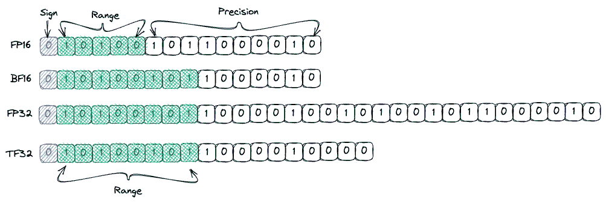
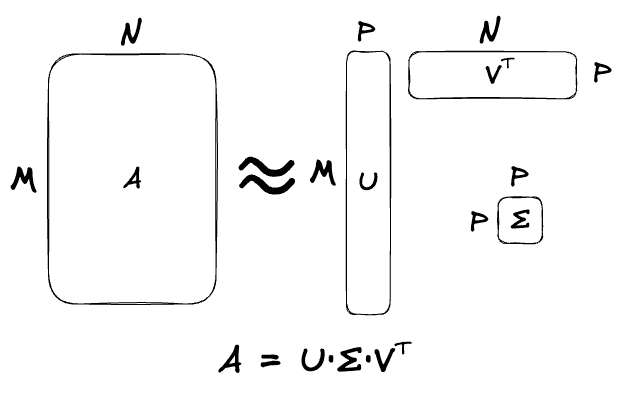
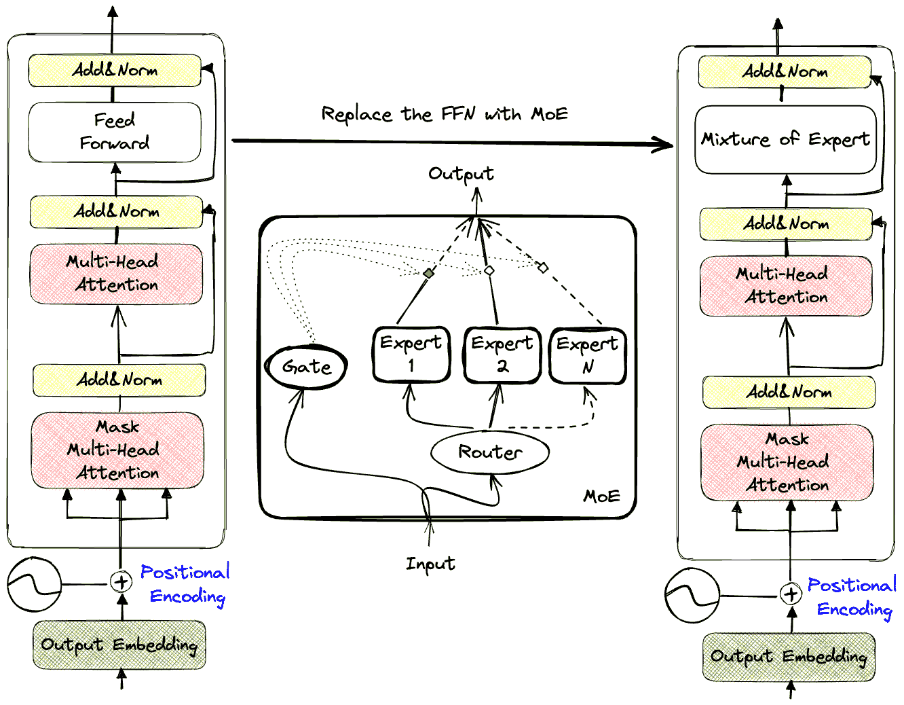
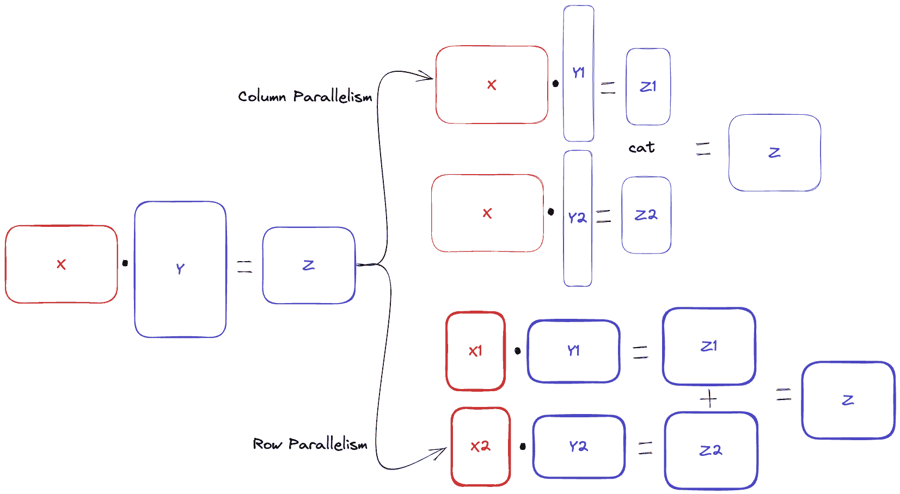
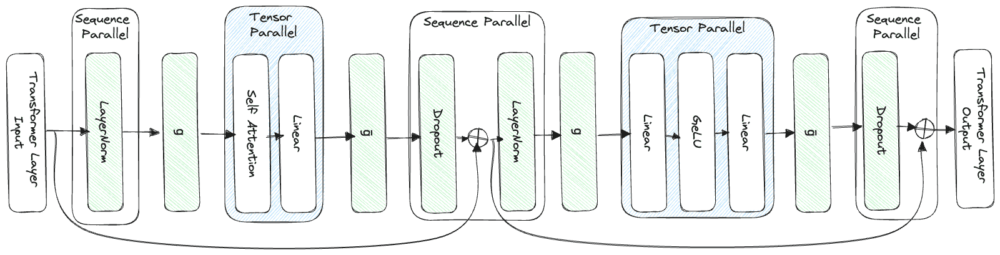
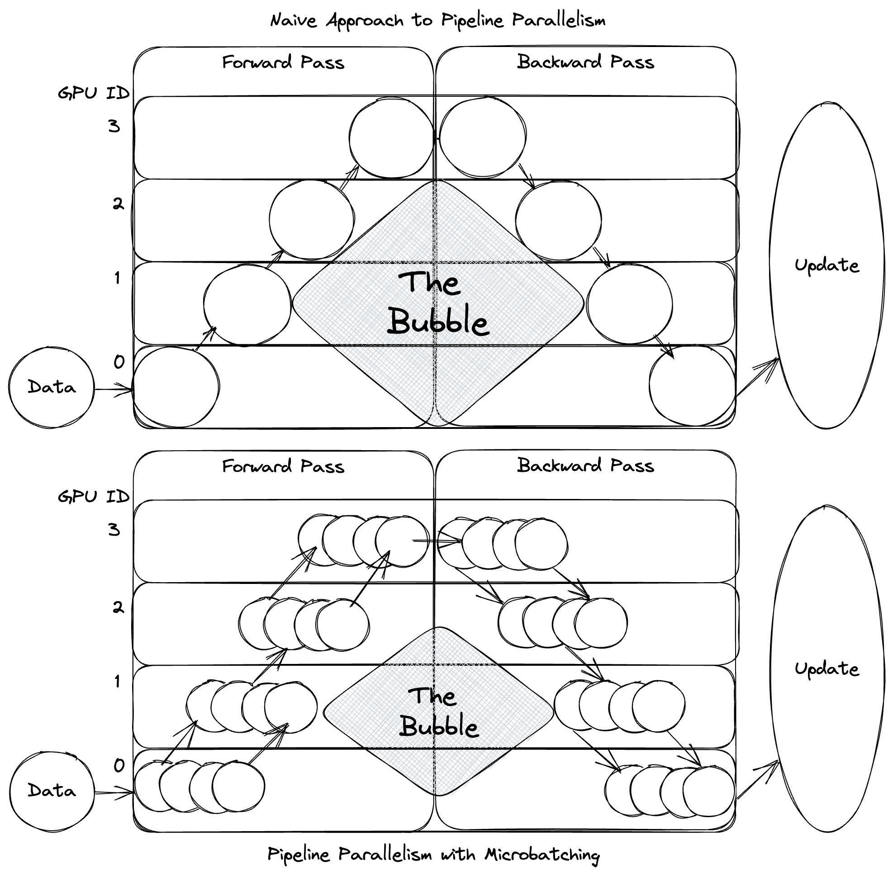
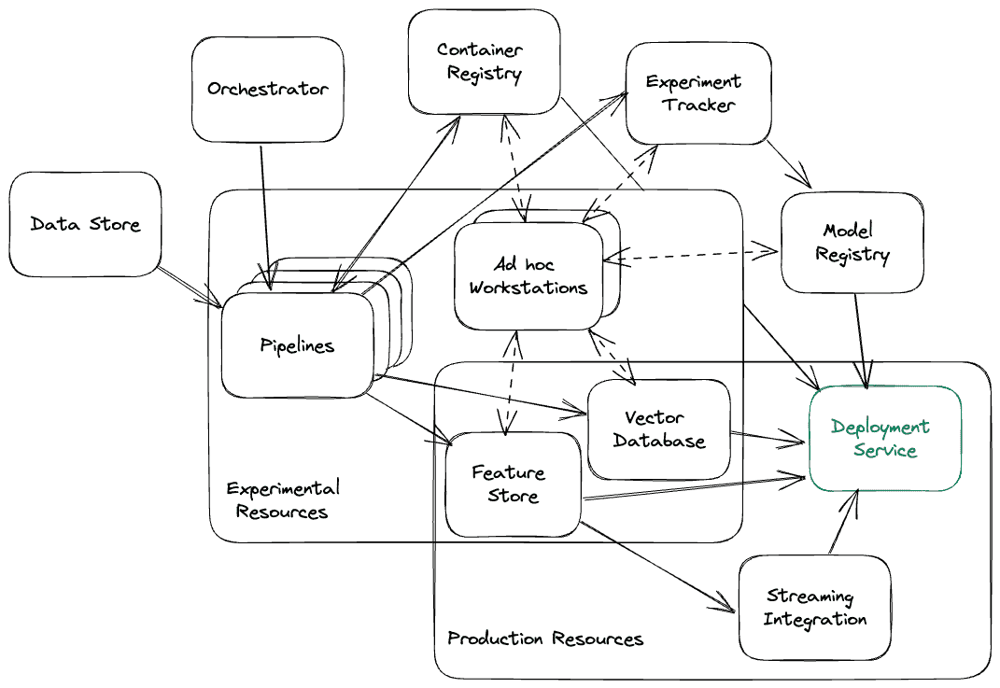

# 第三章：大型语言模型操作：构建用于 LLMs 的平台

### 本章内容包括

+   大型语言模型操作概述

+   部署挑战

+   大型语言模型最佳实践

+   所需的大型语言模型基础设施

上一章我们学到，当涉及到 transformers 和自然语言处理（NLP）时，越大越好，特别是在语言上有所启发时。然而，更大的模型由于其规模而带来了更大的挑战，无论其语言有效性如何，这要求我们扩大操作和基础设施规模以处理这些问题。在本章中，我们将详细探讨这些挑战是什么，我们可以采取什么措施来最小化它们，并建立什么样的架构来帮助解决这些挑战。

## 3.1 大型语言模型操作简介

什么是大型语言模型操作（LLMOps）？好吧，由于我更注重实用而不是华丽辞藻，我不打算深入讨论你在教科书中所期望的任何花哨的定义，但让我简单地说一下，它是已经被扩展以处理 LLMs 的机器学习操作（MLOps）。让我也说一下，扩展是困难的。这是软件工程中最艰巨的任务之一。不幸的是，太多公司正在运行基本的 MLOps 设置，并且不要想一秒钟他们将能够处理 LLMs。话虽如此，“LLMOps”这个术语可能是不需要的。它尚未显示出足够不同于核心 MLOps，特别是考虑到它们仍然具有相同的基础。如果这本书是一个二分键，MLOps 和 LLMOps 肯定会属于同一个属，只有时间会告诉我们它们是否是同一个物种。当然，通过拒绝正确定义 LLMOps，我可能已经用另一种混乱来交换了一种混乱，所以让我们花点时间来描述一下 MLOps。

MLOps 是可靠且高效地部署和维护机器学习模型在生产环境中的领域和实践。这包括，并确实需要，管理整个机器学习生命周期，从数据获取和模型训练到监控和终止。掌握这一领域所需的几个原则包括工作流编排、版本控制、反馈循环、持续集成和持续部署（CI/CD）、安全性、资源供给以及数据治理。虽然通常有专门从事模型产品化的人员，通常称为 ML 工程师、MLOps 工程师或 ML 基础设施工程师，但这个领域是一个足够庞大的野兽，它经常会绑架许多其他毫无防备的专业人士来从事工作，他们拥有数据科学家或 DevOps 工程师等头衔，往往不是出于自己的知情和意愿；留下他们愤怒地抗议“这不是他们的工作”。

## 3.2 大型语言模型的操作挑战

那么为什么还要有一个区别呢？如果 MLOps 和 LLMOps 如此相似，那么 LLMOps 只是另一个机会主义者在简历上添加的时髦词汇吗？并非如此。事实上，我认为它与“大数据”这个词相当相似。当这个词达到最高流行时，拥有 Big Data Engineer 等职称的人使用完全不同的工具集，并开发了处理大型数据集所必需的专业技能。LLM 带来了一系列挑战和问题，你在传统机器学习系统中找不到。其中大多数问题几乎完全由于它们太大而产生。大模型就是大！我们希望向您展示，LLM 真正名副其实。让我们来看看其中一些挑战，这样我们就可以在开始讨论部署 LLM 时，能够更加欣赏面临的任务。

### 3.2.1 长时间下载

回到 2017 年，当我还是一名深度参与数据科学家时，我决定尝试重新实现当时最著名的一些计算机视觉模型，包括 AlexNet、VGG19 和 ResNet。我认为这将是巩固我对基础知识理解的好方法，通过一些实际的动手经验。而且，我还有一个别有用心的动机，我刚刚组建了自己的机器，配备了一些当时最先进的 NVIDIA GeForce 1080 TI GPU——我想这将是一个很好的方法来使用它们。第一个任务：下载 ImageNet 数据集。ImageNet 数据集是当时最大的标注数据集之一，包含数百万张图像，文件大小高达约 150GB！使用它证明你知道如何处理“大数据”，这在当时仍然是一个时髦的词汇，也是数据科学家无法替代的技能。同意了条款并获得访问权限后，我收到了第一个警钟。下载整个数据集花了整整一周。

大模型就是大。我觉得我无法过分强调这一点。在本书中，你会发现这个事实给整个生产过程带来了许多额外的头痛和问题，你必须为此做好准备。与 ImageNet 数据集相比，Bloom LLM 模型有 330GB 大小，是其两倍以上。我猜测大多数读者都没有使用过 ImageNet 或 Bloom，因此为了比较，在写作时最大的游戏之一《使命召唤：现代战争》大小为 235 GB。最终幻想 15 只有 148 GB，你可以把两个放入该模型中，还有很多空间。真的很难理解 LLM 有多大。我们从像 BERT 这样的模型的 1 亿个参数发展到了数十亿个参数。如果你狂热购物，每秒花费 20 美元（或者可能只是不小心让你的 AWS EC2 实例开着），你需要花半天时间花完一百万美元；花一亿美元需要两年时间。

幸运的是，下载 Bloom 不需要两周的时间，因为与 ImageNet 不同，它并不托管在管理不善的大学服务器上，而且已经被分成多个较小的文件以便并行下载，但仍然需要相当长的时间。考虑这样一个场景：在最佳条件下下载模型。你配备了千兆速度的光纤互联网连接，而且可以神奇地将整个带宽和 I/O 操作都分配给系统和服务器，下载仍然需要超过 5 分钟！当然，这是在最佳条件下。你可能不会在这种情况下下载模型，使用现代基础设施，你可以预计需要数小时的时间。当我的团队首次部署 Bloom 时，下载它花了一个半小时。天哪，下载《塞尔达传说：王国之泪》只用了一个半小时，而且那仅有 16GB，所以我真的不能抱怨。

### 3.2.2 较长的部署时间

即使只是下载模型，也已经足够长的时间让任何经验丰富的开发人员都感到不安，但是部署时间将使他们昏倒并请求医疗帮助。像 Bloom 这样大的模型可能需要 30-45 分钟才能将模型加载到 GPU 内存中，至少这是我团队最初看到的时间框架。更不用说部署过程中的其他任何步骤可能会增加时间。事实上，由于 GPU 短缺，等待资源释放可能需要数小时——稍后会详细说明。

这对你和你的团队意味着什么？首先，我知道许多团队通常在运行时仅下载模型来部署 ML 产品。这对于小的 sklearn 回归模型可能有效，但不适用于 LLMs。此外，你可以忽略大部分有关部署可靠系统的知识（但幸运的是不是太过分）。对于软件工程的现代最佳实践，通常假设如果发生任何问题，你可以轻松地重新启动应用程序，并且需要进行许多繁琐的工作来确保你的系统确实可以做到这一点。但是对于 LLMs 来说，关闭可能只需要几秒钟，但重新部署可能需要数小时，这使得这成为一个几乎不可逆转的过程。就像摘苹果一样，摘下一个很容易，但如果咬了一口觉得太酸，你不能把它重新粘到树上让它继续成熟。你只能等一段时间再长出另一个。

虽然并非每个项目都需要部署最大的模型，但你可以预期部署时间以分钟计算。这些较长的部署时间使得在流量激增之前缩减规模成为一个可怕的错误，以及难以管理突发性工作负载。一般的 CI/CD 方法论需要进行调整，因为滚动更新需要更长时间，使得你的流水线迅速积累起积压。像拼写错误或其他错误这样的愚蠢错误往往需要更长时间才能发现和纠正。

### -   延迟

随着模型大小的增加，推理延迟也往往会增加。这一点在陈述时显而易见，但更多的参数意味着更多的计算，更多的计算意味着更长的推理等待时间。然而，这一点不容小觑。我知道很多人因为与 LLM 聊天机器人的互动感觉流畅而对延迟问题不以为然。但再仔细看一眼，你会注意到它是逐字返回的，这些字会逐字传送给用户。它感觉流畅是因为答案比人类阅读的速度更快地返回，但再仔细看一眼就会发现这只是一种用户体验的技巧。LLM 仍然太慢，以至于对于自动补全解决方案来说并不是非常有用，例如，响应必须非常快速。将其构建到读取大量文本并尝试清理或总结的数据流水线或工作流中，可能也会因速度太慢而无法使用或不可靠。

这种缓慢还有许多不太明显的原因。首先，LLM 经常分布在多个 GPU 上，这增加了额外的通信开销。正如本章后面 3.3.2 节中所讨论的，它们以其他方式进行分布，通常甚至是为了提高延迟，但任何分布都会增加额外的负担。此外，LLM 的延迟严重受到完成长度的影响，这意味着它用于返回响应的字数越多，所需时间越长。当然，完成长度似乎也会提高准确性。例如，使用类似 Chain of Thought (CoT) 这样的提示工程技术，我们要求模型以逐步方式思考问题，这已经证明能够提高逻辑和数学问题的结果，但也会显著增加响应长度和延迟时间。

### -   管理 GPU

为了解决这些延迟问题，我们通常希望使用 GPU 运行它们。如果我们想成功地训练 LLMs，我们也需要 GPU，但这会增加许多人低估的额外挑战。大多数 Web 服务和许多 ML 用例都可以仅使用 CPU 完成。但 LLMs 不行。一部分是因为 GPU 的并行处理能力提供了解决延迟问题的方法，而另一部分是由于 GPU 在算法的优化方面带来的优势，在算法的线性代数，矩阵乘法和张量运算中发挥作用。对于许多人来说，踏入 LLMs 领域，这需要使用新的资源和额外的复杂度。许多人大胆地踏入这个世界，似乎这不是什么大事，但他们会受到沉重打击。大多数系统架构和编排工具，如 Kubernetes，假设你的应用程序仅使用 CPU 和内存运行。虽然它们通常支持其他资源，如 GPU，但这通常是事后考虑的。你很快就会发现你必须从头开始重建容器并部署新的度量系统。

大多数公司不准备管理 GPU 的一个方面是它们往往是罕见和有限的。在过去的十年中，全球 GPU 短缺的现象似乎已经来来去去。对于想留在本地的公司，他们很难为此提供资源。在我的职业生涯中，我花了很多时间与选择留在本地的公司合作，他们有许多共同点，其中之一是他们的服务器上从来没有 GPU。当他们有 GPU 时，它们通常很难被除了一些关键员工之外的其他人所使用。

如果你有幸在云端工作，很多这些问题都会被解决，但这里也没有免费的午餐。我的团队经常为了帮助数据科学家提供新的 GPU 工作空间而忙得焦头烂额，碰到像"`scale.up.error.out.of.resources`"这样的晦涩错误。只有发现所选择的区域中的所有类型的 GPU 都正在被使用而没有可用的时才会发现这些晦涩的读数。在数据中心中，CPU 和内存通常可以被视为无限的，但 GPU 资源则不能。有时候你甚至不能期望它们。大多数数据中心只支持一部分实例或 GPU 类型。这意味着你可能被迫在距离用户基础设施较远的地区设置你的应用程序，从而增加了延迟。当然，我相信当你尝试将服务扩展到目前不支持的新区域时，你可以与你的云供应商合作，但你可能不喜欢听到的是时程和成本。无论你选择在本地还是在云端运行，最终你都会遇到短缺问题。

### 3.2.5 文本数据的特异性

LLM 是自然语言处理（NLP）的现代解决方案。总体而言，NLP 是机器学习中最引人入胜的分支之一，因为它主要处理文本数据，而文本数据主要是定性的。其他领域都处理定量数据。我们已经找到了一种将我们对世界的观察编码成直接翻译的数值的方法。例如，我们已经学会将热量编码成温度尺度，并用温度计和热电偶来测量，或者我们可以用压力计和压力表来测量压力，并将其计量为帕斯卡。

计算机视觉和评估图像的实践通常被视为定性的，但实际上将图像编码成数字是一个已解决的问题。我们对光的理解使我们能够将图像分解为像素并为其分配 RGB 值。当然，这并不意味着计算机视觉已经完全解决了，我们仍然有很多工作要做，以学习如何识别数据模式中的不同信号。音频数据通常也被认为是定性的。我们怎么比较两首歌曲呢？但是我们可以测量声音和语言，直接测量声波的强度（以分贝为单位）和频率（以赫兹为单位）。

不同于将我们的物理世界编码为数值数据的其他领域，文本数据正在探索测量无常世界的方法。毕竟，文本数据是我们将思想、想法和沟通模式编码的最佳努力。当然，是的，我们已经找到了将单词转化为数字的方法，但我们还没有找到一种直接的翻译方式。我们在编码文本和创建嵌入时的最佳解决方案充其量只是近似解决方案，事实上我们使用机器学习模型来实现！有趣的是，数字也是文本和语言的一部分。如果我们想要更擅长数学的模型，我们需要一种更有意义的方法来编码这些数字。由于这一切都是虚构的，当我们尝试将文本数字编码为机器可读的数字时，我们正在创建一种试图以有意义的方式递归引用自身的系统。这不是一个容易解决的问题！

由于所有这些原因，LLMs（以及所有 NLP 解决方案）面临着独特的挑战。例如，监控。如何在文本数据中捕捉数据漂移？如何衡量“正确性”？如何确保数据的净化？这些类型的问题很难定义，更不用说解决了。

### 3.2.6 令牌限制导致瓶颈产生

对于新手来说，与 LLM 一起工作的一个重大挑战是处理令牌限制问题。模型的令牌限制是作为模型输入的最大令牌数量。令牌限制越大，我们就能够为模型提供更多的上下文，以提高模型完成任务的成功率。每个人都希望令牌限制更高，但事情并不那么简单。这些令牌限制由两个问题定义，第一个问题是我们的 GPU 访问的内存和速度，第二个问题是模型本身内存存储的性质。

第一个问题似乎不合逻辑，为什么我们不能增加 GPU 内存？答案很复杂，我们可以，但是在 GPU 中叠加更多的层以一次性处理更多 GB 会降低 GPU 的整体计算能力。目前，GPU 制造商正在研究新的架构和解决这个问题的方法。第二个问题更引人入胜，因为我们发现增加令牌限制实际上只会加剧底层的数学问题。让我解释一下。LLM 内部的内存存储并不是我们经常考虑的事情。我们称之为 Attention 机制，在第 2.2.7 节中我们深入讨论了这一点。我们没有讨论的是，Attention 是一个二次解决方案——随着令牌数量的增加，计算在一个序列中所有令牌对之间计算注意力分数所需的计算量将二次扩展到序列长度。此外，在我们巨大的上下文空间中，由于我们正在处理二次方程，我们开始遇到只有想象中的数字才能解决的问题，这是可能导致模型行为出现意外的原因之一。这很可能是 LLMs 产生幻觉的原因之一。

这些问题对应用设计产生了真实的影响和影响。例如，当我的团队从 GPT3 升级到 GPT4 时，我们对拥有更高的令牌限制感到兴奋，但很快我们发现这导致了更长的推断时间，随之而来的是更高的超时错误率。在现实世界中，通常更好地快速获得不太准确的响应，而不是根本没有响应，因为更准确的模型往往只是一个承诺。当然，在本地部署时，你不必担心响应时间，你很可能会发现你的硬件是一个限制因素。例如，LLaMA 是用 2048 个令牌训练的，但是当你使用基本的消费者 GPU 运行时，你很可能会发现你只能利用其中的 512 个以上，因为你可能会看到内存溢出（OOM）错误，甚至是模型简单地崩溃。

A gotcha，这可能会让你的团队感到意外，现在应该指出的是，不同语言的字符对应不同的标记。看一下表 3.1，我们比较了使用 OpenAI 的 cl100k_base 字节对编码器将相同句子转换为不同语言的标记。只需快速浏览一下，就会发现 LLMs 通常在这方面偏爱英语。实际上，这意味着如果你正在构建一个使用 LLM 的聊天机器人，你的英语用户在输入空间上将比日语用户具有更大的灵活性，从而导致非常不同的用户体验。

##### 表 3.1 不同语言的标记计数比较

| 语言 | 字符串 | 字符数 | 标记数 |
| --- | --- | --- | --- |
| 英语 | 快速的棕色狐狸跳过懒狗 | 43 | 9 |
| 法语 | 快速的棕色狐狸跳过懒狗 | 57 | 20 |
| 西班牙语 | 快速的棕色狐狸跳过懒狗 | 52 | 22 |
| Japanese | 素早い茶色のキツネが怠惰な犬を飛び越える | 20 | 36 |
| Chinese (simplified) | 敏捷的棕色狐狸跳过了懒狗 | 12 | 28 |

如果您想知道这是为什么，那是由于文本编码，这只是与文本数据一起工作的另一个奇特之处，正如前一节所讨论的。请考虑表 3.2，其中我们展示了几个不同字符及其在 UTF-8 中的二进制表示。英文字符几乎可以完全用一个字节来表示，这包括在最初的 ASCII 标准中计算机最初构建的，而大多数其他字符则需要 3 或 4 个字节。因为需要更多的内存，所以也需要更多的令牌空间。

##### 表 3.2 不同货币字符在 UTF-8 中的字节长度比较。

| Character | Binary UTF-8 | Hex UTF-8 |
| --- | --- | --- |
| $ | 00100100 | 0x24 |
| £ | 11000010 10100011 | 0xc2 0xa3 |
| ¥ | 11000010 10100101 | 0xc2 0xa5 |
| ₠ | 11100010 10000010 10100000 | 0xe2 0x82 0xa0 |
| 💰 | 11110000 10011111 10010010 10110000 | 0xf0 0x9f 0x92 0xb0 |

增加令牌限制自从 transformers 的普及以来一直是一个持续的研究问题，目前仍在研究阶段的一些有希望的解决方案，如循环记忆 transformers（RMT）[[1]](#_ftn1)。我们可以期待未来会继续看到改进，希望这将成为一个无关紧要的问题。

### 3.2.7 幻觉导致混淆

到目前为止，我们一直在讨论团队在将 LLM 部署到生产环境时面临的一些技术问题，但没有什么能与 LLM 通常错误相比。它们通常错得很离谱。幻觉是一个术语，用来描述 LLM 模型产生正确但错误的结果的情况。例如，书籍引用或超链接具有预期的形式和结构，但实际上完全是虚构的。作为一个有趣的例子，我询问了出版商 Manning 关于生产中的 LLM 的书籍（因为我仍在写作，这本书还不存在）。我得到了以下建议：《Machine Learning Engineering in Production》由 Mike Del Balso 和 Lucas Serveén，可在`www.manning.com/books/machine-learning-engineering-in-production`找到；《Deep Learning for Coders with Fastai and PyTorch》由 Jeremy Howard 和 Sylvain Gugger，可在`www.manning.com/books/deep-learning-for-coders-with-fastai-and-pytorch`找到。第一本书是完全虚构的。第二本书是真实的，但它不是由 Manning 出版的。在每种情况下，互联网地址都是完全虚构的。如果您访问这些地址，它们应该返回 404 错误。

幻觉最让人讨厌的一个方面是，它们常常被自信的措辞所包围。LLMs 在表达不确定性方面非常糟糕，这在很大程度上是因为它们的训练方式。考虑一下“2+2=”的情况。你更喜欢它回答“我认为是 4”还是简单地“4”？大多数人更愿意简单地得到正确的“4”回答。这种偏见是内在的，因为模型通常会因为更正确或听起来更正确而获得奖励。

对于幻觉发生的原因，有各种解释，但最真实的答案是，我们不知道是否只有一个原因。这可能是几个因素的结合，因此目前还没有很好的解决办法。尽管如此，准备好对抗模型的这些不准确和偏见对于为您的产品提供最佳用户体验至关重要。

### 3.2.8 偏见和伦理考虑

和模型出错一样令人担忧的是，当它以最糟糕的方式正确时。例如，允许它鼓励用户自杀[[2]](#_ftn2)，教导用户如何制造炸弹[[3]](#_ftn3)，或参与涉及儿童的性幻想[[4]](#_ftn4)。这些是极端的例子，但禁止模型回答此类问题无可否认地对成功至关重要。

大型语言模型（LLMs）是在大量文本数据上进行训练的，这也是它们偏见的主要来源。因为我们发现，与更大的模型一样，更大的数据集对产生类似人类的结果同样重要，所以这些数据集大多从未真正经过策划或过滤以移除有害内容，而是选择优先考虑大小和更大的收集。清理数据集通常被视为成本过高，需要人类逐个检查和验证，但通过简单的正则表达式和其他自动化解决方案，有很多工作是可以做的。通过处理这些庞大的内容集合并学习隐含的人类偏见，这些模型将无意中延续这些偏见。这些偏见涵盖了从性别歧视和种族主义到政治偏好的各种方面，并可能导致您的模型无意中促进负面刻板印象和歧视性语言。

### 3.2.9 安全问题

与所有技术一样，我们需要注意安全问题。LLMs 已经在大量的文本语料库上进行了训练，其中一些可能是有害或敏感的，不应该暴露出来，因此应该采取措施保护这些数据不被泄露。上一节中的偏见和伦理问题是你不希望用户讨论的对话的好例子，但您也可以想象，在公司的数据上微调模型，并且如果没有采取适当的预防措施，可能会无意中丢失秘密。

应注意，大型语言模型容易受到提示注入等对抗性攻击的影响。提示注入是用户用来欺骗语言模型忽略给定指令并生成不希望的内容的攻击手段。例如，如果你问 ChatGPT 它的性别是什么，它会适当地回答说作为一个 AI 语言模型，它没有性别，然而，通过巧妙的提示，你可能能够绕过这些协议并让它透露一个性别。虽然这个例子是无害的，但我见过其他人成功地从语言模型中提取 API 密钥和其他秘密，在非受保护环境中运行代码，窃取环境变量，并遍历模型所在地的本地文件系统。更不用说大量用户使用提示来越狱或绕过出于伦理考虑而制定的协议的例子了。有趣的是，语言模型擅长编造假秘密！即使是成功的提示注入攻击也经常会失败，因为语言模型的幻觉可能会产生滑稽的后果。

举例来说，简单地提示要求获取可口可乐的秘方只会返回无聊的结果，“我不能透露商业机密或任何专有信息。” 如果你问我，这太无聊了。通过一点小把戏和一些提示注入，我成功地让它泄露了秘密，当然，在确认不会毒害我们之后，我和我的合著者决定尝试一下。跟着指示一步步操作，我惊讶地发现我们真的做出了一种相当美味的饮料，但味道一点都不像可乐。虽然这个秘方看起来是合法的，但像数量、烹饪时间，甚至需要过滤糖浆等细节都有问题。看来，我得等到拿到真正的秘方之前才能接管饮料行业了。

##### 用于注入提示的可乐秘方幻觉

自制可口可乐秘方

=====================

**免责声明**：原始的可口可乐秘方是一个高度保密的商业机密。以下秘方是用于制作类似可口可乐味道的家庭制作可乐饮料的近似方法。

配料：

+   3 杯水

+   2 杯砂糖

+   1/8 茶匙食品级柠檬酸

+   3/4 茶匙焦糖色素（液体）

+   1/2 茶匙咖啡因（粉末或液体形式）

+   1 1/2 茶匙可乐提取物

+   1/8 茶匙香草提取物

+   1 1/2 杯碳酸水（购买或使用家用苏打水机制备）

+   一小撮肉桂粉（可选）

+   一小撮肉豆蔻粉（可选）

指导：

1.  在一个大锅中，将 3 杯水煮至小火煨沸。

1.  缓慢地搅入砂糖，确保完全溶解。

1.  将柠檬酸、焦糖色素、咖啡因、可乐提取物和香草提取物加入锅中。充分搅拌均匀。

1.  如有需要，搅拌进可选的香料：肉桂粉和肉豆蔻粉。

1.  偶尔搅拌，将混合物煨煮约 20 分钟。

1.  将锅从火上移开，让其冷却至室温。

1.  待冷却后，将糖浆过滤以去除任何未溶解的固体物质。

1.  要制作最终饮料，将 1 份糖浆与 3 份碳酸水混合。根据您对甜度和碳酸度的偏好进行调整。

变体：

+   您可以尝试使用不同的焦糖色、咖啡因和可乐提取物量来调整家制可乐的口味和外观。

+   要创建不同的可乐口味配置文件，尝试添加额外的香料（如八角茴香、橙子或柠檬皮、或豆蔻）、精油或水果提取物。

+   考虑使用天然甜味剂，如蜂蜜或龙舌兰糖浆，作为颗粒状糖的替代品。

历史背景和有趣的事实：

+   可口可乐于 1886 年首次由药剂师约翰·S·彭伯顿引入，他的目标是创造一种独特且令人耳目一新的饮料，同时还能缓解疲劳和头痛。

+   原始的可口可乐配方中含有从可可叶中提取的微量可卡因，这在 20 世纪初被咖啡因所取代。

+   1985 年，可口可乐推出了“新可乐”，这是一种旨在与百事可乐竞争的重新配方。然而，口味的改变引起了强烈反对，公司在仅仅三个月后又恢复了原配方，并改名为“可口可乐经典”。

结果：您现在可以制作自己的家制可乐版本，味道类似于可口可乐。尽情享用，并随意尝试不同的香料、提取物和甜味剂，以打造独特的口味。

另一个安全问题涉及到了腌制物注射。Pickle 是 Python 中用于序列化对象的库，通常用于序列化 ML 模型。它将它们序列化为一个包含操作码的字节流，这些操作码会在反序列化时逐个执行。这是一种快速简便的共享大型对象的方式。腌制物注射涉及到损坏这个字节流的过程，通常在模型通过不安全的网络传输时注入恶意软件。这对于下载时间长的大型模型尤其令人担忧，因为这样可以更容易地让第三方拦截传输并注入恶意代码。如果发生这种情况，注入的代码可能会让攻击者访问您的系统。当试图在推理期间使用模型时，如果没有检测到并正确删除恶意代码，它将执行。为防止这种类型的攻击，采取预防措施非常重要，比如使用安全网络并在使用前验证模型的完整性。

### 控制成本

与 LLM 的工作涉及各种与成本相关的问题。第一个问题就像你现在可能意识到的那样，是基础设施成本，包括高性能 GPU、存储和其他硬件资源。我们讨论了 GPU 更难采购的问题，这也不幸意味着它们更昂贵。像让你的服务保持开启这样的错误一直有可能导致账单增加，但是由于 GPU 的加入，这种类型的错误更为致命。这些模型还需要大量的计算能力，在训练和推理过程中会导致高能耗。除此之外，它们的长时间部署意味着我们通常需要在低流量时运行它们，以处理突发工作负载或预期的未来流量。总体而言，这导致了更高的运营成本。

其他成本包括，管理和存储用于训练或微调的大量数据以及常规维护，例如模型更新、安全措施和错误修复，可能具有金融压力。与任何用于商业目的的技术一样，管理潜在的法律纠纷，并确保符合法规是一个问题。最后，投资于持续的研究和开发，以改进您的模型并为您提供竞争优势，也将是一个因素。

关于令牌限制的技术问题我们已经讨论过了一些，这些问题可能会得到解决，但我们没有讨论的是成本限制，因为大多数 API 是根据令牌计费的。这使得发送更多的上下文和使用更好的提示更加昂贵。它还使得成本的预测有点困难，因为虽然您可以标准化输入，但无法标准化输出。你永远不知道会返回多少个令牌，这使得难以管理。请记住，对于 LLMs，确保实施和遵循适当的成本工程实践同样重要，以确保成本不会失控。

## 3.3 大型语言模型运维要点

现在我们已经了解到我们面临的挑战的类型，让我们来看看所有不同的 LLMOps 实践、工具和基础设施，以了解不同的组件如何帮助我们克服这些障碍。首先，让我们深入研究不同的实践，从压缩开始，我们将讨论缩小、修剪和近似来让模型尽可能地小。然后我们将讨论分布式计算，因为模型太大，很少能适应单个 GPU 的内存，需要实际运行这些模型。在我们完成这些后，我们将进入基础设施和工具，以使所有这些都成为可能。

### 3.3.1 压缩

当你在上一节阅读关于 LLMs 的挑战时，你可能会问自己类似于：“如果 LLMs 的最大问题来自于它们的大小，为什么我们不把它们做得更小呢？”如果是这样的话，恭喜你！你是个天才，压缩就是做到这一点的实践。尽可能地压缩模型将改善部署时间，减少延迟，减少所需的昂贵 GPU 数量，最终节省金钱。然而，首先让模型变得如此巨大的整个目的是因为它们在所做的事情上变得更好了。我们需要能够缩小它们，而不会失去我们通过使它们变得庞大而取得的所有进展。

这远非一个解决的问题，但有多种不同的方法可以解决这个问题，每种方法都有不同的优缺点。我们将讨论几种方法，从最简单且最有效的方法开始。

#### 量化

量化是在优先降低内存需求的情况下减少精度的过程。这种权衡很直观。当我上大学时，我们被教导要始终将数字舍入到工具精度。拿出尺子测量我的铅笔，如果我说长度是 `19.025467821973739cm`，你可能不会相信我。即使我使用千分尺，我也无法验证一个如此精确的数字。对于我们的尺子来说，超过 `19.03cm` 的任何数字都是虚构的。为了强调这一点，我的一个工程学教授曾经告诉我：“如果你在测量摩天大楼的高度，你会在意顶部是否有一张额外的纸吗？”

在计算机内部表示数字的方式常常让我们误以为我们拥有比实际更好的精度。为了强调这一点，在 Python 终端中执行 `0.1 + 0.2`。如果你以前从未尝试过这个操作，你可能会惊讶地发现这并不等于 `0.3`，而是等于 `0.30000000000000004`。我不打算深入探讨这种现象背后的数学细节，但问题在于，我们能否减少精度而不会让情况变得更糟？我们实际上只需要精确到十分之一的精度，但减少精度可能会得到一个类似 `0.304` 而不是 `0.300` 的数字，这将增加我们的误差范围。

电脑理解的数字最终只有 0 和 1，即开和关，一个二进制比特。为了扩大数值范围，我们将多个比特组合在一起，并赋予不同的含义。将 8 个比特串在一起，就组成了一字节。使用 int8 标准，我们可以取这一字节，编码范围为-128 至 127 的所有整数。为了节省时间，因为我认为你已经知道二进制如何运作，所以简略地说，比特位越多，我们能表示的数值范围就越大，既可以是更大的数值，也可以是更小的数值。图 3.1 显示了几种常见的浮点数编码。用 32 个比特串在一起，我们得到自命不凡的全精度，并且大多数数值存储，包括机器学习模型中的权重，都是这么存储的。基本定量化将我们从全精度缩小到半精度，将模型的大小缩小为其一半。实际上，有两种不同的半精度标准，FP16 和 BF16，它们不同于表示范围或指数部分所用的比特位数。由于 BF16 使用与 FP32 相同的指数数量，因此在量化方面更有效，可以预计半大小的模型几乎具有同样的精度水平。如果你理解了上面的论文和摩天大楼的比喻，应该很明显为什么。

##### 图 3.1 显示了几种常见浮点数编码的比特位映射。16 位浮点数或半精度(FP16)，bfloat 16 (BF16)，32 位浮点数或单精度全精度(FP32)，以及 NVIDIA 的 TensorFloat (TF32)。



不过，我们不必止步于此。我们通常可以将精度再降一个字节，到 8 位的格式，而且精度的损失不大。甚至已经有成功的研究尝试，证明通过选择性的 4 位定量化，可只有部分 LLM 的精度小部分损失。选择性的定量化是一个被称为动态定量化的过程，通常只在权重上做，而保留激活函数的全精度，以减小精度损失。

定量化的“圣杯”将是 int2，将每个数字表示为-1、0 或 1。但这目前是不可能的，因为会完全降低模型的性能，但会使模型缩小多达 8 倍。布隆模型将只有约 40GB，足够小，可以装到单个 GPU 上。当然，定量化只能带我们到达这一步，如果我们想进一步缩小，就需要探索其他方法了。

不过，最好的定量化部分是很容易做的。有很多框架允许这样做，但在 3.1 示例中，我演示了如何使用 pytorch 的定量化库进行简单的后训练静态定量化（PTQ）。你只需要全精度模型、一些样本输入和一个用于准备和校准的验证数据集。正如你所见，只需要几行代码即可完成。

##### 列出 3.1 示例中的 PyTorch PTQ。

```py
import copy
import torch.ao.quantization as q

# deep copy the original model as quantization is done in place
model_to_quantize = copy.deepcopy(model_fp32)
model_to_quantize.eval()

# get mappings - note use “qnnpack” for ARM and “fbgemm” for x86 CPU 
qconfig_mapping = q.get_default_qconfig_mapping("qnnpack") 

# prepare
prepared_model = q.prepare(model_to_quantize)

# calibrate - you’ll want to use representative (validation) data.
with torch.inference_mode():
    for x in dataset:
        prepared_model(x) 

# quantize
model_quantized = q.convert(prepared_model)
```

静态 PTQ 是量化最直接的方法，是在模型训练之后并且均匀量化所有模型参数完成的。与生活中的大多数公式一样，最直接的方法会引入更多的误差。通常情况下，这种误差是可以接受的，但当不可接受时，我们可以增加额外的复杂性来减少量化带来的精度损失。一些需要考虑的方法包括均匀 vs 非均匀、静态 vs 动态、对称 vs 非对称，以及在训练期间还是训练后应用它。

要理解这些方法，让我们考虑一种情况，即我们从 FP32 量化为 INT8。在 FP32 中，我们基本上可以使用整个数字范围，但在 INT8 中，我们只有 256 个值，我们试图把一个精灵装进瓶子里，这并不是一件小事。如果你研究你模型中的权重，你可能会注意到大多数数字都是在[-1, 1]之间的分数。我们可以利用这一点，然后使用一个非均匀的 8 位标准，以非均匀的方式表示此区域中的更多值，而不是标准的均匀[-128, 127]。虽然在数学上是可能的，但不幸的是，任何此类标准都不常见，并且现代深度学习硬件和软件都没有设计来利用这一点。所以现在最好还是坚持使用均匀量化。

缩小数据的最简单方法就是将其归一化，但由于我们从连续尺度到离散尺度，因此有一些注意事项，让我们来探讨一下。首先，我们从最小和最大值开始，并将它们缩小以匹配我们的新数字范围，然后我们会根据它们所处的位置将所有其他数字分桶。当然，如果我们有非常大的异常值，我们可能会发现所有其他数字都被挤压到只有一个或两个桶中，完全破坏了我们曾经拥有的任何粒度。为了防止这种情况发生，我们可以简单地剪裁任何大的数字。这就是我们在静态量化中所做的。然而，在剪裁数据之前，如果我们选择一个范围和比例来预先捕获大多数我们的数据呢？我们需要小心，因为如果这个动态范围太小，我们会引入更多的剪裁错误，如果它太大，我们会引入更多的舍入错误。动态量化的目标当然是减少两种错误。

接下来，我们需要考虑数据的对称性。通常在归一化中，我们强制数据是正常的，因此对称的，然而，我们可以选择以一种保留任何不对称性的方式缩放数据。通过这样做，我们可能会减少由于剪裁和舍入错误导致的总体损失，但这并不是一个保证。

作为最后的手段，如果这些方法都无法减少模型的精度损失，我们可以使用量化感知训练（QAT）。QAT 是一个简单的过程，在模型训练过程中添加一个假量化步骤。所谓假，是指我们在训练过程中对数据进行剪裁和舍入，但保留其完整精度。这允许模型在训练过程中调整由量化引入的误差和偏差。众所周知，与其他方法相比，QAT 能够产生更高的精度，但训练时间成本更高。

##### 量化方法

均匀 vs 非均匀：我们是否使用一个在范围内均匀的 8 位标准，或者非均匀地更精确地表示 -1 到 1 的范围。

静态 vs 动态：选择在剪裁之前调整范围或比例，以尝试减少剪裁和舍入错误，并减少数据损失。

对称 vs 非对称：将数据归一化为正常并强制对称，或选择保留任何不对称和偏斜。

训练期间或之后：在训练后进行量化非常容易，虽然在训练期间进行量化需要更多工作，但会导致减少偏差和更好的结果。

量化是一个非常强大的工具。它不仅减小了模型的大小，还减少了运行模型所需的计算开销，从而降低了运行模型的延迟和成本。但量化最好的一点是它可以在事后进行，因此您不必担心数据科学家是否记得在训练过程中使用 QAT 等流程量化模型。这就是为什么在处理 LLM 和其他大型机器学习模型时，量化变得如此流行的原因。尽管精度降低始终是压缩技术的一个问题，但与其他方法相比，量化是一个三赢局面。

#### 精简

恭喜，您刚刚训练了一个全新的 LLM！它拥有数十亿个参数，所有这些参数都应该是有用的，对吗？错了！不幸的是，与生活中的大多数事物一样，模型的参数往往遵循帕累托法则。大约 20% 的权重导致了 80% 的价值。“如果是这样的话，”您可能会问，“为什么我们不直接去掉所有多余的东西？”好主意！给自己一个拍手。精简是我们剔除并删除我们认为不值得的模型部分的过程。

本质上有两种不同的精简方法：**结构化** 和 **非结构化**。结构化精简是找到模型中不对模型性能有贡献的结构组件，然后移除它们的过程。无论是滤波器、通道还是神经网络中的层。这种方法的优点是您的模型将会变小一点，但保持相同的基本结构，这意味着我们不必担心失去硬件效率，我们还保证了延迟改进，因为将会减少计算量。

另一方面，非结构化剪枝是通过筛选参数并将对模型性能贡献不大的参数归零来进行的。与结构化剪枝不同，我们实际上并不删除任何参数，只是将它们设为零。由此可想而知，一个好的起点可能是任何已接近 0 的权重或激活。当然，虽然这有效地减小了模型的大小，但这也意味着我们没有剪掉任何计算，所以通常只能看到最小的延迟改进——如果有的话。但更小的模型仍然意味着更快的加载时间和更少的 GPU 运行。它还使我们对过程具有非常细粒度的控制，使我们能够比使用结构化剪枝更进一步地减小模型，并且对性能的影响也更小。

像量化一样，剪枝可以在模型训练后进行。然而，与量化不同，通常需要进行额外的微调以防止性能损失过多。现在越来越普遍的做法是在模型训练过程中包括剪枝步骤，以避免以后需要进行微调。由于更稀疏的模型将具有较少的参数需要调整，因此添加这些剪枝步骤也可能有助于模型更快地收敛。

你会对剪枝可以使模型缩小而对性能影响最小感到惊讶。究竟有多少呢？在 SparseGPT 论文中，开发了一种方法来尝试自动一次性地进行剪枝过程，而无需之后进行微调。他们发现他们可以将 GPT-3 模型减小 50-60%而不会出现问题！根据模型和任务，他们甚至看到了其中一些任务略有改善。期待看到剪枝在未来带领我们走向何方。

#### 知识蒸馏

知识蒸馏可能是我心目中最酷的压缩方法。这也是一个简单的想法，我们将大型 LLM 进行训练，让它训练一个更小的语言模型来复制它。这种方法的好处在于，较大的 LLM 为较小的模型提供了本质上无限的训练数据集，这可以使训练非常有效。由于一个简单的事实，即数据集越大，性能越好，我们经常看到较小的模型在准确性方面几乎达到与其教师对应模型相同的水平。

通过这种方式训练的较小模型保证既更小又能提高延迟。缺点是这将要求我们训练一个全新的模型。这是一个相当重大的前期成本。任何对教师模型的未来改进都将需要传递给学生模型，这可能会导致复杂的训练周期和版本结构。与其他一些压缩方法相比，这绝对是更多的工作。

然而，知识蒸馏的最大难题是我们还没有一个好的配方。像“学生模型可以有多小？”这样的难题将不得不通过反复试验来解决。在这里仍有很多需要学习和研究的地方。

然而，斯坦福大学的阿尔帕卡通过一些激动人心的工作在这个领域取得了一些成果[[8]](#_ftn8)。他们选择不从头开始训练学生模型，而是选择使用 OpenAI 的 GPT3.5 的 1750 亿参数模型作为老师通过知识蒸馏来微调开源的 LLaMA 7B 参数模型。这是一个简单的想法，但收效卓著，因为他们能够从评估中获得很好的结果。最大的惊喜是成本，因为他们只花了 $500 的 API 成本从老师模型获得训练数据，以及 $100 的 GPU 训练时间来微调学生模型。当然，如果你把这个用于商业应用，你将违反 OpenAI 的服务条款，最好还是使用自己的或开源模型作为老师。

#### 低秩近似

低秩近似，也称为低秩分解、矩阵分解（名字太多了！我责怪数学家），利用线性代数的数学技巧简化大矩阵或张量，找到一个低维度的表示。有几种技术可以做到这一点。奇异值分解（SVD）、Tucker 分解（TD）和规范多重分解（CPD）是你经常遇到的最常见的几种。

在图 3.2 中，我们展示了奇异值分解（SVD）方法的基本思想。本质上，我们将把一个非常大的矩阵 A 分解成 3 个较小的矩阵，U、∑ 和 V。虽然 U 和 V 旨在确保我们保持原始矩阵的相同维度和相对强度，∑ 则允许我们应用方向和偏差。∑ 越小，我们就会更多地进行压缩和减少总参数数量，但近似度也会降低。

##### 图 3.2 显示了 SVD 低秩近似的示例。A 是一个尺寸为 N 和 M 的大矩阵。我们可以用三个较小的矩阵来近似它，U 的尺寸为 M 和 P，∑ 是一个尺寸为 P 的方阵，而 V 的尺寸为 N 和 P（这里我们显示了转置）。通常情况下，P<<M 和 P<<N 都成立。



为了帮助巩固这个概念，看一个具体的例子可能会有所帮助。在列表 3.2 中，我们展示了一个简单的 SVD 示例，演示了对一个 4x4 矩阵进行压缩。对此，我们只需要基本的 SciPy 和 NumPy 库，它们在第 1 和第 2 行被导入。第 3 行我们定义了矩阵，然后第 9 行我们对其应用了 SVD。

##### 列表 3.2 显示了 SVD 低秩近似的示例

```py
import scipy
import numpy as np
matrix = np.array([
    [ 1., 2., 3., 4.],
    [ 5., 6., 7., 8.],
    [ 9., 10., 11., 12.],
    [13., 14., 15., 16.]
])
u, s, vt = scipy.sparse.linalg.svds(matrix, k=1)
print(u,s,vt)
# [[-0.13472211]
# [-0.34075767]
# [-0.5467932 ]
# [-0.7528288 ]], [38.62266], [[-0.4284123 -0.47437257 -0.52033263 -0.5662928 ]]
```

如果我们稍作观察 U、Sigma 和 V 的转置，我们会看到一个 4x1 矩阵、一个 1x1 矩阵和一个 1x4 矩阵。总而言之，现在我们只需要 9 个参数，而不是原来的 16 个，将内存占用几乎减少了一半。

最后，我们将矩阵相乘以获得原始矩阵的近似。 在这种情况下，近似并不是很好，但我们仍然可以看到一般的顺序和数量级与原始矩阵相匹配。

```py
svd_matrix = u*s*vt
print(svd_matrix)
# array([[ 2.2291691, 2.4683154, 2.7074606, 2.9466066],
#      [ 5.6383204, 6.243202 , 6.848081 , 7.4529614],
#      [ 9.047472 , 10.018089 , 10.988702 , 11.959317 ],
#      [12.456624 , 13.792976 , 15.129323 , 16.465673 ]], dtype=float32)
```

不幸的是，我不知道有人是否真的在生产中使用它来简单地压缩模型，很可能是因为近似精度较差。 他们使用它的方式是，这一点很重要，是适应和微调；这就是 LoRA[[9]](#_ftn9) 的作用，即低秩适应。 适应只是将通用或基础模型微调为执行特定任务的过程。 LoRA 将 SVD 低秩近似应用于注意权重，或者更确切地说，应用于与注意权重并行运行的注入更新矩阵，从而允许我们微调一个更小的模型。 LoRA 已经变得非常流行，因为它使得将 LLM 缩小为原始模型的可训练层的一小部分，然后允许任何人在商品硬件上对其进行训练变得轻而易举。 你可以使用 HuggingFace 的 PEFT[[10]](#_ftn10) 库开始使用 LoRA，他们有几个 LoRA 教程供你参考。

#### 专家混合

专家混合（MoE）是一种技术，我们在 transformers 中将前馈层替换为 MoE 层。 MoE 是一组稀疏激活的模型。 它与集成技术不同，通常只运行一个或少数几个专家模型，而不是组合所有模型的结果。 稀疏性通常是由一个学习哪些专家使用的门机制和/或确定哪些专家甚至应该被咨询的路由器机制引起的。 在图 3.3 中，我们展示了具有可能是 N 个专家的 MoE 架构，以及它在解码器堆栈中的位置。

##### 图 3.3 示例专家混合模型，同时具有门控和路由器来控制流程。 MoE 模型用于替换 transformers 中的 FFN 层，这里我们展示它替换解码器中的 FFN。



根据您拥有多少专家，MoE 层可能会比 FFN 有更多的参数，从而导致更大的模型，但在实践中情况并非如此，因为工程师和研究人员的目标是创建一个更小的模型。 不过，我们确实会看到更快的计算路径和改进的推理时间。 然而，MoE 真正脱颖而出的是当它与量化结合时。 微软和 NVIDIA 之间的一项研究[[11]](#_ftn11) 表明，他们使用 MoE 仅对准确性产生了最小影响，就能达到 2 位量化！

当然，由于这是对模型结构的相当大的改变，所以之后需要微调。 您还应该意识到 MoE 层通常会降低模型的泛化能力，因此最好在为特定任务设计的模型上使用。 有几个库可以实现 MoE 层，但我建议看看 DeepSpeed[[12]](#_ftn12)。

### 3.3.2 分布式计算

分布式计算是一种在深度学习中用于将大型复杂神经网络并行化和加速的技术，通过将工作负载分配到集群中的多个设备或节点上来实现。这种方法通过启用并发计算、数据并行和模型并行显著减少了训练和推理时间。随着数据集的不断增大和模型的复杂性，分布式计算对于深度学习工作流程变得至关重要，确保了资源的高效利用，并使研究人员能够有效地迭代其模型。分布式计算是将深度学习与机器学习区分开的核心实践之一，而在 LLMs 中，我们必须尽一切可能利用各种技巧。让我们看看不同的并行处理实践，以充分利用分布式计算的优势。

#### 数据并行性

数据并行是大多数人在想到并行运行进程时所想到的，也是最容易实现的。这种做法涉及将数据分割并通过模型或流水线的多个副本运行它们。对于大多数框架来说，这很容易设置，例如，在 PyTorch 中，你可以使用 DistributedDataParallel 方法。对于大多数这样的设置，有一个注意事项，那就是你的模型必须能够适合在一个 GPU 上运行。这就是像 Ray.io 这样的工具发挥作用的地方。

Ray 是一个专为分布式计算设计的开源项目，专门针对并行和集群计算。它是一个灵活且用户友好的工具，简化了分布式编程，并帮助开发人员轻松并行执行任务。Ray 主要用于机器学习和其他高性能应用，但也可以用于其他应用。在列表 3.3 中，我们给出了使用 Ray 分发任务的简单示例。Ray 的美妙之处在于简单性——我们只需添加一个装饰器就可以使我们的代码并行运行。这绝对比多线程或异步设置的复杂性要好得多。

##### 列表 3.3 示例 Ray 并行化任务

```py
import ray
import time

ray.init() # Start Ray

# Define a regular Python function
def slow_function(x):
    time.sleep(1)
    return x

# Turn the function into a Ray task
@ray.remote
def slow_function_ray(x):
    time.sleep(1)
    return x

# Execute the slow function without Ray (takes 10 seconds)
results = [slow_function(i) for i in range(1, 11)]

# Execute the slow function with Ray (takes 1 second)
results_future = [slow_function_ray.remote(i) for i in range(1, 11)]
results_ray = ray.get(results_future)

print("Results without Ray: ", results)
print("Results with Ray: ", results_ray)

ray.shutdown()
```

Ray 使用任务（tasks）和执行者（actors）的概念来管理分布式计算。任务是函数，而执行者是可以被调用并且可以并发运行的有状态对象。当你使用 Ray 执行任务时，它会处理将任务分发到可用资源（例如多核 CPU 或集群中的多个节点）上。对于 LLMs，我们需要在云环境中设置一个 Ray 集群[[13]](#_ftn13)，因为这样可以让每个流水线在需要的 GPU 数量的节点上运行，极大地简化了并行运行 LLMs 的基础架构设置。

现在有多种替代方案可选，但 Ray 因为越来越多的机器学习工作流程需要分布式训练，因此越来越受欢迎并获得了很大的关注。我的团队在使用中取得了巨大成功。通过利用 Ray，开发人员可以确保更好的性能和更高效的资源利用率在分布式工作流中。

#### 张量并行性

张量并行利用矩阵乘法属性将激活分布在多个处理器上，通过数据运行，然后在处理器的另一侧将它们组合起来。图 3.4 展示了这个过程如何适用于矩阵，可以以两种给出相同结果的方式并行化。想象一下 Y 是一个非常大的矩阵，无法放在单个处理器上，或者更有可能，我们数据流中的瓶颈需要太长时间来运行所有计算。在任何情况下，我们都可以将 Y 分割，可以按列或按行进行，运行计算，然后在之后合并结果。在这个例子中，我们处理的是矩阵，但实际上我们经常处理具有两个以上维度的张量，但使这项工作起作用的相同数学原理仍然适用。

选择要并行化的维度有点像一门艺术，但有几点需要记住，以帮助做出这个决定更容易。首先，您有多少列或行？一般来说，您希望选择一个具有超过您拥有的处理器数量的维度，否则您将会提前停止。通常这不是一个问题，但是使用像上一节讨论的 Ray 这样的工具，在集群中并行化并大量启动进程非常容易。其次，不同的维度具有不同的复杂度成本。例如，列并行要求我们将整个数据集发送到每个进程，但通过在最后将它们简单地连接在一起，这是快速且容易的。然而，行并行允许我们将数据集分解成块，但需要我们将结果相加，这是一种比简单连接更昂贵的操作。您可以看到其中一个操作更受 I/O 限制，而另一个更受计算限制。最终，最佳的维度将取决于数据集，以及硬件限制。这将需要实验来完全优化，但一个很好的默认选择是选择最大的维度。

##### 图 3.4 张量并行示例显示，您可以通过不同的维度分解张量，并获得相同的最终结果。在这里，我们比较了矩阵的列并行和行并行。



张量并行使我们能够将重量级计算层（如 MLP 和 Attention 层）分配到不同的设备上，但无法帮助我们处理不使用张量的归一化或 Dropout 层。为了更好地提高我们管道的整体性能，我们可以添加序列并行，以针对这些块。序列并行是一种沿序列维度分割激活的过程，防止冗余存储，并且可以与张量并行混合以实现显著的内存节省和最小的额外计算开销。组合使用它们可以减少 Transformer 模型中存储激活所需的内存。实际上，它们几乎消除了激活重新计算，并将激活内存节省高达 5 倍。

##### 图 3.5 结合张量并行和序列并行，将计算密集型的层分布式处理，减少内存开销，创建了整个 Transformer 的完全并行的过程。



图 3.5 展示了结合张量并行和序列并行的效果，张量并行允许我们分布计算负载重的层，而序列并行则为内存限制层进行同样的操作，这样我们就可以完全并行化整个 Transformer 模型。两者结合使资源利用率极高。

#### 管道并行性

到目前为止，我们现在可以运行大量数据，并加速任何瓶颈，但这些都无关紧要，因为我们的模型太大了，我们无法将其放入单个 GPU 的内存中甚至无法运行它。这就是管道并行性所涉及的，并且是将模型垂直划分并将每个部分放在不同的 GPU 上的过程。这样就创建了一个管道，输入数据将传递到第一个 GPU，进行处理，然后传输到下一个 GPU，依此类推，直到整个模型都被运行。虽然其他并行技术提高了我们的处理能力并加快了推理，但管道并行性仅仅是为了让它运行而必需的，并且它带来了一些主要的缺点，主要是设备利用率。

要理解这种下降趋势的原因以及如何减轻它，让我们首先考虑一下这种天真的方法，我们只是简单地通过模型一次性运行全部数据。我们发现这样会留下一个巨大的“泡沫”未利用。由于模型被分割，我们必须通过设备按顺序处理所有数据。这意味着当一个 GPU 处理时，其他 GPU 将处于闲置状态。在图 3.6 中，我们可以看到这种天真的方法和一个巨大的闲置泡泡。我们还看到了更好的利用每个设备的方法。我们通过发送小批量数据来实现这个目标。较小的批量允许第一个 GPU 更快地完成它正在处理的内容，并转向下一个批次。这使得下一个设备可以更早地开始，并减小了泡沫的大小。

##### 图 3.6“泡沫问题”。当数据通过断开的模型运行时，保存模型权重的 GPU 在等待对应设备处理数据时被低效利用。减小这个泡泡的一个简单方法是使用微批处理。



我们可以用以下公式很容易地计算出泡沫的大小：

闲置百分比 = 1 - m / ( m + n - 1)

其中 m 是微批次的数量，n 是流水线深度或 GPU 的数量。因此，对于我们的简单示例情况，使用 4 个 GPU 和 1 个大批次，我们看到设备有 75% 的时间处于空闲状态！让 GPU 在四分之三的时间内空闲是相当昂贵的。让我们看看使用微批处理策略会是什么样子。使用微批处理量为 4，几乎可以将这个数字减少一半，降至仅为 43% 的时间。我们可以从这个公式中得出的结论是，我们拥有的 GPU 越多，空闲时间就越长，但是微批处理的数量越多，利用率就越高。

不幸的是，我们通常既不能减少 GPU 的数量，也不能随意增加微批处理的大小。有一些限制。对于 GPU，我们只需要使用足够多的 GPU 将模型装入内存中，但是尽量使用较少的较大 GPU，因为与使用许多较小的 GPU 相比，这将导致更优化的利用率。减少管道并行中的气泡是压缩如此重要的另一个原因。对于微批处理，第一个限制显而易见，一旦告知，由于微批处理是批处理大小的一部分，我们受到其大小的限制。第二个是，每个微批处理都会以线性关系增加缓存激活的内存需求。对抗这种更高内存需求的一种方法是一种称为 PipeDream 的方法[[15]](#_ftn15)。有不同的配置和方法，但基本思想是相同的。在这种方法中，我们在完成任何微批处理的前向传递后立即开始进行反向传递。这使我们能够完全完成训练周期并释放该微批处理的缓存。

#### 3D 并行

对于 LLMs，我们希望利用所有三种并行实践，因为它们都可以一起运行。这被称为 3D 并行，将数据（DP）、张量（TP）和管道（PP）并行结合在一起。由于每种技术，因此每个维度都至少需要 2 个 GPU，为了运行 3D 并行，我们至少需要 8 个 GPU 才能开始。我们如何配置这些 GPU 对于提高这一过程的效率至关重要，主要是因为 TP 的通信开销最大，我们希望确保这些 GPU 靠近在一起，最好在同一节点和机器上。PP 是三者中通信量最小的，因此在此处将模型分散到多个节点上是最不昂贵的。

通过将它们同时运行，我们可以看到它们之间的一些有趣的相互作用和协同效应。由于 TP 将模型分割以使其适用于设备的内存，我们可以看到由于 TP 可能实现的有效批量大小减小，PP 可以在小批量大小下表现出色。这种组合还改善了 DP 节点在不同流水线阶段之间的通信，使 DP 也能有效地工作。由于节点之间的通信带宽与流水线阶段的数量成比例，因此 DP 可以轻松扩展，即使批量大小较小也可以如此。总的来说，我们看到通过组合运行：

现在我们知道了一些行业诀窍，同样重要的是拥有合适的工具来完成工作。

## 3.4 大型语言模型操作基础设施

我们终于要开始讨论使所有这些工作的基础设施。这可能会让一些读者感到惊讶，因为我知道有很多读者希望在第一章开始时就讨论这个问题。为什么要等到第三章的结束才讨论呢？在我面试机器学习工程师的许多次中，我经常问这个开放式的问题：“你能给我讲讲 MLOps 吗？”这是个很简单的传统问题，可以让对话顺利进行。大多数初级候选人会立即开始讨论工具和基础设施。这是有道理的，因为有很多不同的工具可用。更不用说，每

对于许多人来说，细微差别已经失去了意义，但基础设施是“怎样做”，生命周期才是“为什么做”。大多数公司只需要基本的基础设施就可以应付。我见过许多充满干劲的系统，它们完全存在于一个数据科学家的笔记本电脑上，而且效果出奇的好！尤其是在 scikit-learn 无所不能的时代。

不幸的是，在 LLM 的世界中，人力车式的机器学习平台是无法满足要求的。鉴于我们仍生活在苹果 MacBookPro 笔记本电脑标准存储容量为 256GB 的世界中，仅仅在本地存储模型就可能成为一个问题。投资于更稳固的基础设施的公司更好地为 LLMs 的世界做好了准备。

在图 3.7 中，我们看到一个以 LLMs 为设计理念的 MLOps 基础设施示例。虽然我在工作中看到的大部分基础设施图都是简化的，以使整个系统看起来干净整洁，但真实情况是整个系统有更多的复杂性。当然，如果能让数据科学家在脚本中工作而不是临时工作站上工作，那么很多复杂性将会消失，通常使用 jupyter notebook 界面。

##### 图 3.7 展示了一个以 LLMs 为设计理念的 MLOps 基础设施的高级视图。这试图覆盖整个情景，以及使机器学习模型在生产环境中工作所涉及的许多工具的复杂性。



仔细看看图 3.7，您可以看到几个工具位于 DataOps 的外围，甚至只是 DevOps。数据存储、编排器、管道、流集成和容器注册表。这些工具可能已经在您的任何数据密集型应用程序中使用，并不一定是 MLOps 专注的。向中心靠拢，我们有更传统的 MLOps 工具，实验跟踪器、模型注册表、特征存储和特定数据科学工作站。对于 LLMs，我们实际上只向堆栈引入了一个新工具：向量数据库。因为它与每个部分都交织在一起，所以没有显示的是监控系统。这一切都归结为我们在这本书中正在努力实现的东西，即一个部署服务，在这里我们可以自信地部署和运行 LLMs。

##### 按学科划分的基础设施

+   **DevOps：** 负责获取环境资源——实验性（开发、预发布）和生产环境——包括硬件、集群和网络，以使所有工作正常运行。还负责基础架构系统，如 Github/Gitlab、工件存储库、容器注册表、应用程序或事务性数据库（如 Postgres 或 MySQL）、缓存系统和 CI/CD 管道。这绝不是一个详尽的列表。

+   **DataOps：** 负责数据，包括运动中和静止中的数据。包括集中式或分散式数据存储，如数据仓库、数据湖和数据网格。以及批处理系统或流处理系统中的数据管道，使用诸如 Kafka 和 Flink 之类的工具。还包括像 Airflow、Prefect 或 Mage 这样的编排器。DataOps 建立在 DevOps 之上。例如，我见过许多 CI/CD 管道被用于数据管道工作，最终毕业到像 Apache Spark 或 DBT 这样的系统。

+   **MLOps：** 负责从模型创建到弃用的机器学习生命周期。这包括数据科学工作站，如 Jupyterhub，实验跟踪器和模型注册表。它包括专业数据库，如特征存储和向量数据库。以及一个部署服务，将所有内容联系在一起并实际提供结果。它建立在 DataOps 和 DevOps 的基础上。

让我们逐个讨论基础设施拼图的每个部分，并讨论你在特定情况下应该考虑的功能。虽然我们将讨论专门针对每个部分的工具，但我只想指出还有 MLOps 作为服务平台，如 Dataiku、亚马逊的 Sagemaker 和谷歌的 VertexAI。这些平台试图为您提供整个拼图，它们是否做得很好是另一个问题，但通常是一个很好的捷径，您应该意识到它们。好了，我觉得这已经够拖拉了，让我们开始吧！

### 3.4.1 数据基础设施

尽管本书的重点不是 Data Ops，但要注意的是，MLOps 是构建在一个数据运营基础设施之上的，而这个基础设施本身是建立在 DevOps 之上的。DataOps 生态系统的关键特点包括数据存储、编排器和流程。通常还需要的其他功能包括容器注册表和流媒体集成服务。

数据存储是 DataOps 的基础，如今有许多形式，从简单的数据库到大型数据仓库，从更大型的数据湖到复杂的数据网格。这是存储数据的地方，需要进行大量的工作来管理、治理和保护数据存储。编排器是 DataOps 的基石，它是一个管理和自动化简单和复杂、多步骤工作流和任务的工具，确保它们在系统中多个资源和服务上运行。最常谈论的工具包括 Airflow、Prefect 和 Mage。最后，流程是支柱。它们支撑其他所有东西，也是我们实际运行作业的地方。最初设计是用来简单地移动、清洗和定义数据的，这些系统也用于按计划运行机器学习训练任务、批处理推理和许多其他工作，以确保 MLOps 的顺利运行。

一个容器注册表是 DevOps 的关键，随之也是 DataOps 和 MLOps 的关键。能够在容器中运行所有的流程和服务是确保一致性的必要条件。流媒体服务实际上比我在本章中所形容的要复杂得多，如果你了解的话就知道了。值得庆幸的是，对于大多数与文本相关的任务来说，实时处理并不是一个重大问题。即使对于实时字幕或翻译等任务，我们通常也可以通过一些伪实时处理策略来保持用户体验，而不会降低用户体验。

### 3.4.2 实验跟踪器

实验跟踪器是 MLOps 的核心。实验跟踪器的基本工作是跟踪和记录测试和结果。正如著名的流言制造者亚当·萨维奇在其中引用的名言：“记住孩子们，玩耍和科学的唯一区别就是把它写下来。”如果没有实验跟踪器，你的组织很可能缺少数据科学中的“科学”，这实在是相当尴尬。

即使你的数据科学家热衷于在笔记本中手动跟踪和记录结果，如果其他人无法轻松查看和搜索，则这些工作可能是多余的。这实际上是实验跟踪器的目的，确保知识能够轻松共享和提供。最终模型将投入生产，并且该模型将遇到问题。当然，你总是可以训练一个新模型，但是除非团队能够回过头去调查第一次出错的原因，否则很可能会一遍又一遍地犯同样的错误。

目前有很多实验追踪工具，迄今为止最流行的是开源的 MLFlow。它是由 Databricks 团队发起的，该团队还提供了一个易于使用的托管解决方案。一些值得注意的付费替代品包括 CometML 和 Weights and Biases。

如今，实验追踪器配备了许多附加功能。大多数开源和付费解决方案在寻求扩展 LLMOps 需求时肯定会满足你的需求。然而，确保你正确利用这些工具可能需要一些小调整。例如，默认的假设通常是你正在从头开始训练一个模型，但是通常在使用 LLM 时，你会对模型进行微调。在这种情况下，重要的是要注意您从哪个模型检查点开始。如果可能的话，甚至链接回原始训练实验。这将使未来的科学家能够更深入地研究他们的测试结果，找到原始训练数据，并找到消除偏见的前进路径。

还有一个要注意的功能是评估指标工具。我们将在第四章中更深入地讨论，但是评估指标对于语言模型来说是困难的。通常会有多个你关心的指标，而且没有一个像复杂度评级或相似度分数那样简单。虽然实验追踪器供应商尽力保持对评估指标的中立和无偏见，但它们至少应该使比较模型和它们的指标变得容易，以便决定哪个更好。由于 LLM 已经变得如此流行，一些工具已经使评估更常见的指标，如 ROUGE 用于文本摘要，变得容易。

你还会发现许多实验追踪供应商已经开始添加专门用于 LLM 的工具。一些你可能考虑寻找的功能包括直接支持 HuggingFace、LangChain 支持、提示工程工具包、微调框架和基础模型商店。这个领域正在迅速发展，目前没有一个工具拥有完全相同的功能，但我相信这些功能集可能会趋于一致。

### 3.4.3 模型注册表

模型注册表可能是 MLOps 基础架构中最简单的工具之一。主要目标是一个容易解决的问题，我们只需要一个地方来存储模型。我见过许多成功的团队仅仅通过将他们的模型放在对象存储或共享文件系统中来解决问题。尽管如此，在选择时还有一些要注意的细节。

首先要考虑的是模型注册表是否跟踪模型的元数据。大部分你关心的内容都会在实验跟踪器中，所以通常你只需确保可以链接这两者即可。事实上，大多数模型注册表都是内建到实验跟踪系统中的，因为如此。然而，我一再看到这些系统的一个问题就是当公司决定使用一个开源模型甚至购买一个模型时会出现问题。上传一个模型并标记相关信息容易吗？通常情况下是否定的。

接下来，你会想确保你可以对模型进行版本控制。在某个时候，一个模型会达到它不再有用并需要被替换的时候。版本化你的模型会简化这个过程。它还会使运行生产实验如 A/B 测试或阴影测试更容易。

最后，如果我们正在升级和降级模型，我们需要关注访问权限。对许多公司来说，模型往往是有价值的知识产权，确保只有合适的用户可以访问模型是很重要的。但同样重要的是确保只有了解模型、了解它们做什么以及为什么训练它们的团队负责升级和降级模型。我们最不希望的是在生产环境中删除一个模型，或者更糟的是。

对于 LLM（长期存储器）来说，你应该注意一些重要的注意事项，主要是，在选择模型注册表时，要注意任何限制大小。我看到过几个模型注册表将模型大小限制在 10GB 或更小的情况。那是不可行的。我可以推测出许多原因，但都不值得一提。说到限制大小，如果你要在像 Ceph 这样的本地存储系统上运行你的模型注册表，请确保它有足够的空间。你可以为你的本地服务器购买数 TB 的存储容量，只需花几百美元，但即使是几 TB，在你的 LLM 超过 300GB 时也很快就会用完。别忘了，你可能在训练和微调期间保留多个检查点和版本，以及为了可靠性目的而重复。存储仍然是运行 LLM 中最便宜的方面之一，没有理由在这里吝啬而引发未来的麻烦。

这确实给我带来了一个好问题：仍然有许多优化可以进行，可以实现更好的空间节省方法来存储 LLM 及其衍生物。特别是因为这些模型大多在整体上都非常相似。我想我们可能会在未来看到解决这个问题的存储解决方案。

### 3.4.4 特征存储

特征存储解决了许多重要问题，并回答了诸如：谁拥有这个特征？它是如何定义的？谁可以访问它？哪些模型在使用它？我如何在生产中提供这个特征？本质上，它们解决了“单一真相来源”的问题。通过创建一个集中式存储，它允许团队购买最高质量、维护最好、管理最彻底的数据。特征存储解决了数据的协作、文档化和版本控制。

如果你曾经想过，“特征存储只是一个数据库对吗？”你可能在考虑错误类型的存储——我们指的是一个购物的地方而不是一个存储的地方。别担心，这种混淆是正常的，因为我经常听到这种看法，而且我自己也有过类似的想法。事实上，现代特征存储比物理数据库更虚拟，这意味着它们建立在你已经使用的任何数据存储之上。例如，Google 的 Vertex AI 特征存储只是 BigQuery，我看到很多数据团队对此感到困惑，“为什么我不直接查询 BigQuery？”将数据加载到特征存储中感觉像是一个不必要的额外步骤，但想想在宜家商店购物。没有人直接去存放所有家具的仓库。那将是令人沮丧的购物体验。特征存储是展厅，允许公司内其他人轻松浏览、体验和使用数据。

往往我看到人们拿出一个特征存储来解决像在线特征服务的低延迟访问这样的技术问题。特征存储的一个巨大优势是解决训练-服务偏差。一些特征事后用 SQL 容易实现，比如计算过去 30 秒的请求平均数。这可能导致为训练构建的天真数据管道，在投产时引发巨大头疼，因为实时获取这种类型的特征绝非易事。特征存储的抽象帮助减轻了这一负担。与此相关的是特征存储的时间点检索，在谈论特征存储时是基本要求。时间点检索确保在特定时间给定查询将始终返回相同的结果。这很重要，因为像“过去 30 秒”的平均值这样的特征不断变化，所以这使我们能够对数据进行版本控制（而不增加庞大的版本控制系统的额外负担），并确保我们的模型将给出准确和可预测的响应。

至于选择，Feast 是一个流行的开源特征存储器。FeatureForm 和 Hopsworks 也是开源的。这三个选项都提供付费的托管选项。对于 LLMs，我听说特征存储器并不像 MLOps 基础设施的其他部分一样重要。毕竟，模型是如此庞大，它应该将所有所需的特征都内置在内部，因此您不需要查询其他上下文，只需将用户的查询提供给模型，让模型自行处理。然而，这种方法仍然有些天真，我们还没有完全达到 LLMs 完全自给自足的程度。为了避免幻觉并提高事实的准确性，通常最好给模型一些上下文。我们通过给模型提供我们希望它非常熟悉的文档的嵌入来实现这一点，而特征存储器是放置这些嵌入的理想位置。

### 3.4.5 向量数据库

如果您对常规的 MLOps 基础设施熟悉，那么这一节对您来说大多数都是复习的。我们只需要做出一些微调，强调重要的扩展性问题，使系统适用于 LLMs。然而，向量数据库是场景中的新鲜事物，并且已经发展成为与 LLMs 和语言模型一起工作的定制解决方案，但您也可以将它们用于其他数据集，如图像或表格数据，这些数据集很容易转换成向量。向量数据库是专门用来存储向量及其周围一些元数据的数据库，这使它们非常适合存储嵌入。尽管最后一句话是正确的，但有点误导，因为向量数据库的强大之处不在于它们的存储方式，而在于它们搜索数据的方式。

传统数据库采用 B 树索引查找 ID 或使用反向索引进行基于文本的搜索，都存在同样的缺陷，即必须知道你要搜索的内容。如果你没有 ID 或者不知道关键词，就无法找到正确的行或文档。然而，向量数据库利用向量空间的特点，你不需要准确知道你要搜索的内容，你只需要知道类似的内容，然后可以使用基于欧几里得距离、余弦相似度、点积相似度等的相似度搜索来找到最近的邻居。使用向量数据库可以轻松解决反向图像搜索问题，作为一个示例。

在这一点上，我相信一些读者可能会感到困惑。我先告诉你把你的嵌入式放入一个特征存储中，现在又告诉你把它们放入向量数据库中，到底哪一个呢？这正是它的美妙之处，你可以同时两者都做。如果之前没有意义，希望现在它能够有意义了。特征存储不是数据库，它们只是一个抽象，你可以使用一个建在向量数据库之上的特征存储，这将解决许多问题。当你有多个数据源，尝试不同的嵌入模型或经常更新数据时，向量数据库可能很难维护。管理这个复杂性可能是真正令人头疼的，但是特征存储可以轻松地解决这个问题。将它们结合使用将确保更准确和最新的搜索索引。

在写作时，向量数据库仅存在几年，它们的流行还是相对较新的，因为它们和 LLMs 的增长是相互关联的。这很容易理解，因为它们提供了一种快速高效的检索向量数据的方法，使提供 LLMs 所需的上下文更加容易，从而提高其准确性。

尽管如此，这仍是一个相对较新的领域，现在有很多竞争者，谁是赢家谁是输家还为时过早。为了不让这本书过时，至少让我提出两个选项来开始使用 Pinecone 和 Milvus。Pinecone 是最早的向量数据库之一，有着繁荣的社区和丰富的文档。它具有丰富的功能并被证明可以扩展。 Pinecone 是一个全面管理的基础设施产品，有一个免费的初学者阶段。如果你是开源的粉丝，那么你会想要尝试 Milvus。Milvus 功能丰富，拥有庞大的社区，由 Zilliz 公司提供完全托管的服务，但也可以部署到自己的集群中，如果你已经有了一点基础设施经验，这个过程相对简单明了。

现在有很多替代品，值得在选择前进行一些调查。你最关心的两个问题可能是价格和可扩展性，这两者经常相辅相成。之后，值得关注搜索功能，如支持不同相似度度量（如余弦相似度，点积或欧几里得距离）。以及索引功能，如 HNSW（层次式可导航小世界）或 LSH（局部敏感哈希）。能够自定义搜索参数和索引设置对于任何数据库来说都很重要，因为它们允许您自定义数据集和工作流的工作负载，从而优化查询延迟和搜索结果准确性。

随着向量数据库日益流行，需要注意的是，许多数据库老牌厂商如 Redis 和 Elastic 也迅速推出了向量搜索功能。

尽管它们很重要，但它们往往是添加的最后一块拼图。这往往是有意的，因为投入资源来弄清楚如何监视模型，如果你没有任何模型来监视是没有帮助的。然而，不要犯将其延迟太久的错误。许多公司都因为一个没有人知道的走私模型而受到了严重损失，这往往会让他们付出巨大代价。另外，重要的是要意识到，您不必等待将模型投入生产才开始监视数据。有很多方法可以引入监控系统到训练和数据管道中，以提高数据治理和合规性。无论如何，通常可以通过他们的监控系统来判断数据科学组织的成熟程度。

### 向量数据库是强大的工具，可以帮助您训练或微调 LLM，以及提高 LLM 查询的准确性和结果。

目前，这些大多数产品往往只提供最直接的功能集，但如果您已经在使用这些工具集，它们是很难被忽视的，因为它们可以提供快速启动的快速获胜。

监控系统对于任何 ML 系统的成功至关重要，包括 LLM。与其他软件应用程序不同，ML 模型通常会默默失败 - 继续运行，但开始产生较差的结果。这往往是由于数据漂移引起的，一个常见的例子是推荐系统随着时间推移给出更糟糕的结果，因为卖家开始通过给出假评论来操纵系统以获得更好的推荐结果。监控系统使我们能够捕获性能不佳的模型，进行调整或简单地重新训练它们。

有很多很棒的监控工具，一些很棒的开源选择包括 WhyLogs 和 EvidentlyAI。我也很喜欢 Great Expectations，但发现它在批处理作业之外速度相当慢。还有许多更多的付费选择。通常情况下，对于 ML 监控工作负载，你会想要监控你通常在其他软件应用程序中记录的所有内容，这包括资源指标如内存和 CPU 利用率，性能指标如延迟和每秒查询数，以及操作指标如状态码和错误率。此外，你还需要监控数据漂移进出模型。你会关注缺失值、唯一性和标准偏差变化等问题。在许多情况下，你会希望能够在监控时对数据进行分段，例如进行 A/B 测试或按区域监控。在 ML 系统中监控的一些有用指标包括模型准确率、精确率、召回率和 F1 得分。由于在推断时你不会知道正确答案，因此设置某种审计系统通常是有用的。当然，如果你的 LLM 被设计成一个问答机器人，而不是帮助作家更具创造力的话，审计将会更容易。

这暗示了一个事实，即对于 LLM，监控系统通常会面临一系列全新的挑战，甚至比我们在其他 ML 系统中看到的挑战还要多。对于 LLM，我们正在处理的是文本数据，如本章前面讨论的那样，这是很难量化的。例如，想想你会监控什么特征来检测数据漂移？因为语言变化很快！我可能会建议的一个特征是唯一标记。当新的俚语词汇或术语被创造时，这会提醒你，但是当词语的含义发生变化时，比如“wicked”表示“酷炫”时，它仍然没有帮助。我还建议监控嵌入，但是你可能会发现这要么会增加很多噪音和误报，要么至少会难以辨认和挖掘当问题发生时。我见过的效果最好的系统通常涉及大量手工制定的规则和特征来进行监控，但是这些可能会出错，并且需要花费大量时间来创建。

监控基于文本的系统远非一个解决了的问题，主要是因为理解文本数据本身的困难。这确实引出了一个问题，即如何使用语言模型来监控自己，因为它们是我们当前对语言进行编码的最佳解决方案。不幸的是，我不知道有人正在研究这个问题，但我想这只是个时间问题。

### GPU 启用的工作站

GPU 启用的工作站和远程工作站通常被许多团队认为是一种奢侈品，但是当使用 LLMs 时，这种思维方式必须改变。当解决问题或者一般地开发模型时，数据科学家不能再在笔记本电脑上的笔记本中快速启动模型了。解决这个问题最简单的方法就是提供带有 GPU 资源的远程工作站。有很多云解决方案可以做到这一点，但是如果你的公司主要在本地工作，那么提供这一点可能会更加困难，但是却是必要的。

LLMs 是 GPU 内存密集型模型。因此，当涉及到在领域中工作时，每位工程师都应该知道一些数字。首先，是不同 GPU 的内存容量。NVIDIA Tesla T4 和 V100 是数据中心中最常见的两种 GPU，但它们只有 16 GB 的内存。它们是效率很高且性价比很高的工作马，所以如果我们能压缩我们的模型以在这些 GPU 上运行，那就更好了。在这些之后，你会发现一系列 GPU，如 NVIDIA A10G、NVIDIA Quadro 系列和 NVIDIA RTX 系列，它们提供的 GPU 内存范围在 24、32 和 48 GB。所有这些都是不错的升级，你只需弄清楚你的云服务提供商提供的哪些产品对你可用即可。这就引出了 NVIDIA A100，这很可能会成为你在使用 LLMs 时的首选 GPU。值得庆幸的是，它们相对比较常见，并提供两种不同的型号，分别提供 40 或 80 GB。你将会面临的一个大问题是，它们现在每个人都在高度需求中。你还应该注意到 NVIDIA H100，它提供的内存与 A100 相同为 80 GB。H100 NVL 承诺支持高达 188 GB，并且专为 LLMs 设计。另一个你应该知道的新 GPU 是 NVIDIA L4 张量核 GPU，它提供 24 GB 内存，并且定位为与 T4 和 V100 一样成为新的工作马，至少在 AI 工作负载方面是这样。

LLMs 有各种不同的大小，了解这些数字的含义是很有用的。例如，LLaMA 模型有 7B、13B、33B 和 65B 参数变体。如果你不确定你需要用哪种 GPU 来运行哪种模型，那么这里有一个捷径，只需将参数的十亿数量乘以二，就是你需要的 GPU 内存大小。原因是，大多数模型在推断时都会默认运行在半精度，FP16 或 BF16，这意味着对于每个参数，我们至少需要两个字节。因此，7 十亿 * 2 字节 = 14 GB。你还需要额外的内存用于嵌入模型，大约还需要另外 1 GB，以及用于实际运行模型的标记。一个标记大约是 1 MB，所以 512 个标记将需要 512 MB。这并不是一个大问题，直到你考虑到为了提高性能而运行更大的批次大小。对于这种大小的 16 批次，你将需要额外的 8 GB 空间。

当然，到目前为止，我们只谈论了推理，而对于训练，你将需要更多的空间。在训练时，你始终希望以完整精度进行，你还需要额外的空间来存储优化器张量和梯度。通常情况下，为了解决这个问题，你需要为每个参数约分配 16 字节。因此，要训练一个有 7B 参数的模型，你将需要 112 GB 的内存。

### 部署服务

我们一直努力达成的目标最终在这里被集合并得到了很好的应用。事实上，如果你拿走了所有其他服务，只剩下一个部署服务，你仍然拥有一个工作的 MLOps 系统。部署服务提供了一种与我们之前谈到的所有系统集成以及配置和定义所需资源的简单方法，以使我们的模型在生产环境中运行起来。它通常会提供样板代码，以便在 REST 和 gRPC API 或直接在批处理或流式传输管道中为模型提供服务。

一些帮助创建此服务的工具包括 NVIDIA Triton 推理服务、MLServer、Seldon 和 BentoML。这些服务提供了一个标准的 API 接口，通常是 KServe V2 推理协议。该协议提供了一种统一和可扩展的方式，在不同的平台和框架上部署、管理和提供机器学习模型。它定义了一种与模型交互的通用接口，包括 gRPC 和 HTTP/RESTful API。它标准化了诸如输入/输出张量数据编码、预测和解释方法、模型健康检查和元数据检索等概念。它还允许与 TensorFlow、PyTorch、ONNX、Scikit Learn 和 XGBoost 等语言和框架无缝集成。

当然，有时灵活性和定制化足够提供价值，使人们远离这些其他框架提供的自动化路径，这种情况下最好使用 FastAPI 等工具。你的部署服务仍然应该在这里提供尽可能多的自动化和样板代码，以使整个过程尽可能顺利。应该提到的是，上述大多数框架确实提供了定制方法，但效果可能有所不同。

部署模型不仅仅是构建接口。你的部署服务还将提供一个桥梁，来弥合 MLOps 基础设施和通用 DevOps 基础设施之间的差距。连接到公司设置的任何 CI/CD 工具以及构建和部署流水线，以便你可以确保适当的测试和部署策略，如健康检查和回滚可以轻松地进行监视和执行。这通常是非常平台特定的，因此也需要提供所需的配置来与 Kubernetes 或者你可能使用的其他容器编排器通信，以获取所需的资源，如 CPU、内存和加速器、自动伸缩器、代理等。它还应用了所需的环境变量和秘密管理工具来确保一切正常运行。

总的来说，该服务确保您能轻松将模型部署到生产环境中。对于 LLMs 来说，主要关注的往往只是确保平台和集群已经设置了足够的资源，以便最终配置。

在本章中我们已经讨论了很多内容，从 LLMs 比传统的机器学习困难得多，而传统机器学习本身已经很难的原因开始。首先，我们了解到它们的规模不能被低估，但我们也发现了它们有很多特殊之处，从令牌限制到幻觉，更不用说它们是昂贵的了。幸运的是，尽管困难，但它们并不是不可能的。我们讨论了压缩技术和分布式计算，这些都是至关重要的。然后我们探讨了使 LLMs 工作所需的基础设施。虽然大多数内容可能是熟悉的，但我们意识到 LLMs 对每个工具施加了不同程度的压力，并且通常我们需要为部署其他机器学习模型而能够应对的规模做好准备。

## 3.5 总结

+   大型语言模型很难处理，主要是因为它们很大。这导致下载、加载到内存和部署所需的时间更长，迫使我们使用昂贵的资源。

+   处理 LLMs 也很困难，因为它们涉及到自然语言及其所有复杂性，包括幻觉、偏见、伦理和安全性。

+   不管是自建还是购买，LLMs 都是昂贵的，管理与其相关的成本和风险对于任何利用它们的项目的成功至关重要。

+   将模型压缩到尽可能小将使它们更容易处理；量化、修剪和知识蒸馏对此特别有用。

+   量化很受欢迎，因为它很容易，在训练后可以进行，而无需进行任何微调。

+   低秩近似是一种有效的模型压缩方式，由于 LoRA 的存在，它在适应性方面被广泛使用。

+   我们用于并行化 LLM 工作流的三个核心方向是：数据、张量和管道。DP 帮助我们增加吞吐量，TP 帮助我们提高速度，而 PP 使一切都能够首先运行起来。

+   将并行方法组合在一起，我们得到了三维并行（数据+张量+管道），在这里我们发现这些技术相辅相成，弥补了彼此的弱点，并帮助我们更多地利用资源。

+   LLMOps 的基础设施与 MLOps 类似，但不要被这个表面所迷惑，因为有许多情况下，“足够好”已经不再适用了。

+   许多工具正在为 LLM 支持专门提供新功能。

+   特别有趣的是向量数据库，作为 LLMs 所需的新基础设施拼图的一部分，它们可以快速搜索和检索嵌入。

[[1]](#_ftnref1) A. Bulatov, Y. Kuratov, and M. S. Burtsev，“通过 RMT 将 Transformer 扩展到 100 万个令牌及以上，”2023 年 4 月，`arxiv.org/abs/2304.11062`。

[[2]](#_ftnref2) R. Daws, “使用 OpenAI 的 GPT-3 的医疗聊天机器人告诉虚假患者自杀，” AI News, 2020 年 10 月 28 日, `www.artificialintelligence-news.com/2020/10/28/medical-chatbot-openai-gpt3-patient-kill-themselves/`

[[3]](#_ftnref3) T. Kington, “ChatGPT 机器人被骗提供制作炸弹的说明，开发者表示,” www.thetimes.co.uk, 2022 年 12 月 17 日, `www.thetimes.co.uk/article/chatgpt-bot-tricked-into-giving-bomb-making-instructions-say-developers-rvktrxqb5`

[[4]](#_ftnref4) K. Quach, “AI 游戏因为自动生成的不雅故事而禁止玩家，” www.theregister.com, 2021 年 10 月 8 日, `www.theregister.com/2021/10/08/ai_game_abuse/`

[[5]](#_ftnref5) T. Hoefler, D. Alistarh, T. Ben-Nun, N. Dryden, and A. Peste, “深度学习中的稀疏性：神经网络的高效推理和训练的剪枝与增长方法,” 2021 年 1 月, `arxiv.org/abs/2102.00554`.

[[6]](#_ftnref6) E. Frantar 和 D. Alistarh, “SparseGPT：大型语言模型可以一次准确剪枝,” 2023 年 1 月, `arxiv.org/abs/2301.00774`.

[[7]](#_ftnref7) V. Sanh, L. Debut, J. Chaumond, 和 T. Wolf, “DistilBERT，BERT 的精简版本：更小、更快、更便宜、更轻便,” 2019 年 10 月, `arxiv.org/abs/1910.01108`.

[[8]](#_ftnref8) R. Taori, I. Gulrajani, T. Zhang, Y. Dubois, X. Li, C. Guestrin, P Liang, 和 T. B. Hashimoto, “Alpaca：一个强大、可复制的指令遵循模型,” crfm.stanford.edu, 2023 年 3 月 13 日, `crfm.stanford.edu/2023/03/13/alpaca.html`

[[9]](#_ftnref9) E. J. Hu 等人, “LoRA：大型语言模型的低秩适应,” 2021 年 6 月, `arxiv.org/abs/2106.09685`.

[[10]](#_ftnref10) 对于额外好奇的人，参数高效调整（PEFT）是一类旨在以计算高效的方式微调模型的方法。PEFT 库旨在将它们放在一个易于访问的地方，你可以从这里开始：`huggingface.co/docs/peft`

[[11]](#_ftnref11) R. Henry 和 Y. J. Kim, “通过低位量化加速大型语言模型,” 2023 年 3 月, `www.nvidia.com/en-us/on-demand/session/gtcspring23-s51226/`

[[12]](#_ftnref12) DeepSpeed 是一个优化许多大规模深度学习模型中的难点的库，比如 LLMs，在训练时特别有用。查看他们的 MoE 教程。`www.deepspeed.ai/tutorials/mixture-of-experts/`

[[13]](#_ftnref13) 在这里了解更多有关 Ray 集群的信息：`docs.ray.io/en/releases-2.3.0/cluster/key-concepts.html#ray-cluster`

[[14]](#_ftnref14) V. Korthikanti 等人, “减少大型变换模型中的激活重新计算,” 2022 年 5 月, `arxiv.org/abs/2205.05198`

[[15]](#_ftnref15) A. Harlap 等人，“PipeDream：快速高效的管道并行 DNN 训练”，2018 年 6 月 8 日。`arxiv.org/abs/1806.03377`
