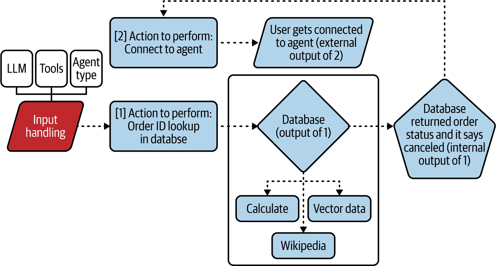

# 第一章\. 大型语言模型简介

大型语言模型（LLMs）的流行并非偶然；它们正在改变我们与技术互动的方式，并推动机器学习模型能做什么的边界。

但这里有个问题：虽然这些模型令人印象深刻，但将它们扩展并管理起来在生产中并非易事。从研究项目到完全成熟、可靠的工具的转变充满了障碍。我们谈论的是满足巨大的计算需求、管理复杂的数据，并确保无论你是自托管还是使用专有模型，一切都能平稳、安全地运行。

在我们深入探讨 LLM 操作的细节之前，了解这些模型为何以及如何产生是很重要的。了解它们的起源和轨迹有助于我们欣赏在预测它们在生产中的行为时面临的挑战。

LLMs 的演变反映了一系列渐进式创新，每一项都针对先前模型的特定局限性。早期的模型在范围上有限，即使是基本任务也需要大量的人类输入。随着架构的进步，例如从循环神经网络（RNNs）到转换器的转变，以及模型规模的扩展，LLMs 变得更加复杂。这种演变带来了新的挑战，例如管理大量数据并确保高效的训练过程。

因此，让我们开始吧。

# 一些关键术语

在继续之前，有三个术语我们需要澄清：

基座模型

*基座模型*是高级机器学习架构，是创建专用模型的基础构建块。它们在大量数据集上预训练，通常包括文本，最近还包括代码、图像、音频和视频等其他数据类型，以开发通用的语言理解和模式识别能力。这些模型从其训练数据中编码统计关系和语言结构，形成一个稳健的起点，用于进一步的微调。这种微调使模型针对特定任务或应用进行了定制，例如为 LLMs 或其他 AI 驱动解决方案提供动力。

大型语言模型

*大型语言模型*是经过额外训练或微调的基座模型，旨在在特定的基于语言的任务中表现出色。这些模型通过分析和模拟自然语言模式来预测和生成类似人类的文本。LLMs 非常灵活，支持多种自然语言处理（NLP）应用，如文本生成、情感分析、语言翻译、问答等。流行的用例包括聊天机器人、内容创作、多语言交流、数据分析、代码生成、推荐系统和虚拟助手。“LLMs 的企业用例”将更详细地探讨这些应用。

生成式 AI 模型

*生成式 AI*，或称*GenAI*，指的是那些专门训练以生成内容（图像、文本、音频或视频）的基础模型，这些内容基于它们所学习的模式和信息。一些最早的生成式 AI 模型是生成对抗网络（GANs），于 2018 年提出；最近，扩散模型、LLMs 以及像 Gemini 这样的多模态模型也变得可用。鉴于其生成特性，LLMs 被视为生成式 AI 模型的一个子集。在 LLMs 的背景下，生成式 AI 可以根据输入和学习的模式生成文本回复、创意故事、产品描述等。

令人困惑的是，这三个术语经常被互换和松散地使用。例如，一个流行的图像生成模型 DALL-E，更准确地归类为生成式 AI 模型，而不是大型语言模型。然而，最近，DALL-E 的图像生成功能已被集成到 ChatGPT 聊天机器人中，这是最受欢迎的 LLM 应用之一。因此，用户可以向 ChatGPT 这样的 LLM 请求生成图像。随着时间的推移，语言似乎正在演变，趋向于将所有这些*AI 模型*统称为，以简化。

# Transformer 模型

由论文[“Attention Is All You Need,”](https://oreil.ly/J8MBW)引入的 transformer 模型，标志着我们在处理基于序列的任务方面的一次重大转变。Transformers 在处理语言数据方面设定了新的标准。

在 Transformer 出现之前，NLP 任务中最受欢迎的解决方案是*循环神经网络*。RNN 按顺序逐个处理数据，这使得它们适合处理如文本这样的时间依赖性数据。然而，这种顺序处理引入了一个显著的缺点：当 RNN 在序列中向前移动时，它们往往难以保留早期步骤的信息，尤其是在处理长输入时。

在神经网络训练过程中，模型处理输入数据并生成预测。这些预测通过损失函数与正确答案进行比较，损失函数计算误差（预测与正确答案之间的距离）。一种算法，如*反向传播*，计算*梯度*：指示模型参数（权重和偏差）应该如何调整以减少误差并提高准确性的值。

然而，在像 RNN 处理的长序列中，梯度在反向传播过程中反复相乘时可能会变得非常小。随着时间的推移，这些小值可能会缩小到如此程度，以至于计算机将它们视为零，从而有效地阻止模型学习。这个问题被称为*梯度消失问题*，它阻止模型在数据中学习长期依赖关系。

另一方面，*Transformer* 通过使用自注意力机制和并行处理来克服这一限制，使它们能够更有效地处理序列并有效地捕捉长距离依赖关系。Transformer 不是逐个步骤处理数据，而是同时分析所有输入标记（例如，句子中的单词）。*自注意力* 是一种机制，允许序列中的每个单词或标记关注同一序列中的其他单词，无论它们的位置如何。这是通过计算一组注意力权重来实现的，这些权重衡量序列中每个标记相对于其他标记的相关性。例如，在一个句子中，自注意力可以帮助像 *it* 这样的单词与其正确的参考对齐，即使那个参考相隔几个单词。因此，自注意力允许模型相对于输入中的其他标记权衡每个标记的重要性，使其能够有效地捕捉整个输入序列中的关系。这种并行处理不仅加快了计算速度，还消除了与顺序处理相关的问题，如梯度消失问题。

由于它们能够管理长距离依赖关系并处理大量数据，基于 Transformer 的模型在翻译、摘要和问答等 NLP 任务中表现出色。它们能够关注序列的不同部分，而不管它们的相对距离如何，加上位置编码以保留序列顺序，使 Transformer 能够处理长序列而不会丢失上下文。

有些人想知道：“既然它们现在可以更好地扩展，我们为什么不把这些计算能力和大量数据投入到这些模型中，看看会发生什么？” GPT-3、LLaMA 及其继任者表明，增加参数数量可以显著提高 Transformer 模型的性能。

Transformer 通过像 *视觉 Transformer* (ViT) 这样的创新扩展了其影响力，将图像块视为序列并应用 Transformer 模型。ViT 在图像分类中显示出有希望的结果，为之前的解决方案——卷积神经网络 (CNNs) 提供了可行的替代方案。此外，在推荐系统中，Transformer 模型建模复杂模式和依赖关系的能力提高了准确性和个性化。表 1-1 比较了我们讨论的神经网络模型的能力。

表 1-1\. 不同神经网络模型的演变

|   | CNNs | RNNs | Transformers |
| --- | --- | --- | --- |
| 应用 | 最适合基于空间的任务（例如，图像） | 适合基于序列的任务（例如，NLP） | 适合捕捉所有三种模态：图像、NLP 和语音 |
| 计算 | 高度可并行化的输入处理 | 顺序处理 | 输入的并行处理 |
| 语言特定任务的性能 | 需要大量堆叠的卷积块来处理长距离依赖 | 比卷积神经网络（CNNs）更好地处理长距离依赖，但只能很好地处理到一定长度的依赖 | 比其他架构（如 RNNs 或 LSTMs）更好地处理长到非常长的距离依赖 |
| 可扩展性 | 可扩展 | 扩展性有限 | 高度可扩展 |
| 数据需求 | 即使在小型数据集上也能表现良好 | 即使在小型数据集上也能表现良好 | 在小型数据集上表现不佳 |
| 训练的简便性 | 容易训练和调整 | 需要更多的调整比 CNNs | 难以训练和调整 |
| 可解释性 | 容易调试 | 调试困难 | 调试困难 |
| 部署 | 容易部署 | 容易部署 | 部署困难 |
| 小型边缘设备 | 在边缘设备上表现良好 | 在边缘设备上表现良好 | 对边缘设备的支持有限 |
| 可解释性 | 支持广泛的解释性 | 解释性有限 | 解释性非常有限 |

将更多的计算和数据投入到 Transformer 中这一趋势引发了 LLMs 的演变，以及从单一模态上表现良好的架构向在大多数模态上泛化的架构的转变。理解这一演变可以帮助你欣赏模型架构之间的差异。

# 大型语言模型

LLMs 在理解上下文和根据输入查询或提示在单词、短语和概念之间建立关联以提供相关信息方面表现出色。虽然结构化知识库依赖于人工整理的数据，但 LLMs 可以自动从非结构化文本中提取知识。当在多样化的文本源上进行训练时，它们可以处理大量信息，而无需明确的人类干预。然而，这也带来了一定的挑战，因为模型可能会从训练数据中学习到有偏见或不正确的信息。

LLMs 还被设计成能够理解和生成类似人类的文本，并通过自然语言查询在对话和交互环境中进行访问。这使得它们在检索信息和获取响应时既方便又用户友好。

这些模型之所以“大”，不仅是因为它们训练的数据量，还因为它们的参数数量。将*参数*想象成模型内部的“旋钮”，在训练过程中可以调整以帮助模型更好地学习。在神经网络中，参数是权重和偏差。当将类似提示的输入呈现给模型时，它首先将输入转换为数值表示，然后这些数字通过神经网络进行处理。神经网络中的每个节点都包含一个偏差，它会向输入值添加或减去，而节点之间的每个连接都包含一个权重，该权重会在节点传递过程中乘以输入值。使用更多的参数极大地扩展了传统 Transformer 模型的能力，但这也带来了成本和评估复杂性的巨大权衡。

LLM 有两种基本类别：判别型和生成型。*判别模型*，如 2018 年推出的 BERT（来自 Transformer 的双向编码器表示），学习分类问题中类别的边界。它们关注的是条件概率*P*(*y*|*x*)，即给定输入的输出概率。判别型 Transformer 模型通常用于文本分类、情感分析和命名实体识别等任务，其目标是根据某些输入文本预测标签或类别。

*生成模型*，如 GPT-3 和 GPT-4，学习输入和输出的联合概率分布，即*P*(*x*, *y*)，并可以生成与训练数据相似的新数据点。生成模型用于文本生成等任务，其目标是生成与模型训练文本相似的新文本。虽然大多数 LLM 都需要是生成性的，但并非所有 LLM 都需要。在这本书中，当我们提到“LLMs”时，我们指的是生成型 LLM。

# LLM 架构

语言模型主要有两种架构：编码器和解码器。编码器和解码器也可以组合使用，并且正在研究新的架构。

## 仅编码器型 LLM

*仅编码器模型*旨在处理和理解输入文本，将其转换为有意义的表示或嵌入。*嵌入*是数据（如单词、短语或句子）在多维向量空间中的数值表示。嵌入以捕捉意义和上下文的方式，使得具有相似意义或上下文的单词在这个向量空间中彼此靠近。这种表示捕捉了输入的本质，使其适用于需要理解上下文的任务。

最显著的仅编码器模型例子之一是[BERT](https://oreil.ly/f2AL4)。在其预训练阶段，BERT 使用*掩码语言建模*技术，其中文本中的随机单词被掩码，模型学习根据周围上下文预测这些掩码单词。BERT 还使用下一句预测进行训练，其中它确定一个句子是否逻辑上跟随另一个句子。

仅编码器模型的主要优势在于其对文本的句法理解；即，它们捕捉单词及其上下文之间复杂关系的本领。这些模型在情感分析、命名实体识别和问答等任务上表现出色。

然而，仅编码器模型有其局限性。它们并非为生成新文本而设计；它们的重点是理解和分析输入。当用于需要文本生成或补全的应用时，这种局限性可能会受到限制。

## 仅解码器 LLM

*仅解码器模型*擅长根据输入或提示生成连贯且与上下文相关的文本。这类架构的例子包括生成预训练的 Transformer 系列，包括 GPT-2、GPT-3 以及最新的 GPT-4。

这些模型使用*语言建模目标*进行预训练。通过这种技术，它们学习根据先前的上下文预测序列中的下一个单词，从而使它们能够生成自然流畅且在较长的段落中保持连贯性的文本。

仅解码器模型的关键优势在于其生成高质量文本的能力。这使得它们在文本补全、摘要和创意写作等任务上极为有效。它们还展现出*涌现特性*，意味着它们可以执行超出其初始训练目标的任务，如翻译和问答，而无需额外的微调。

然而，它们对文本生成的关注可能会成为需要深入理解输入文本的任务中的局限性。仅解码器模型根据训练期间学习的模式生成文本，这些模式可能并不总是与输入的具体细微差别相一致。

## 编码器-解码器 LLM

*编码器-解码器模型*结合了编码器和解码器架构的优点，使它们适合涉及输入和输出序列之间复杂映射的任务。

在这种设置中，编码器处理输入文本以创建嵌入，然后解码器使用这些嵌入来生成输出文本。显著的例子包括双向和自回归 Transformer（BART）以及文本到文本迁移 Transformer（T5）。BART 于 2019 年推出，使用*去噪自编码*进行训练，其中输入文本的部分被损坏，模型学习重建原始文本。

编码器-解码器架构在输入和输出在结构和长度上不同的情况下表现优异，例如机器翻译和文本摘要。然而，这些模型的训练复杂性和所需的计算资源可能是一个缺点。它们的双架构意味着它们必须有效地整合这两个组件，这在数据和处理能力方面可能要求很高。

## 状态空间架构

一种新的方法试图解决转换器的一个问题，即自注意力机制具有*二次复杂度*。这意味着推理所需的计算量随着输入大小的平方增长，因为需要为每一对标记建模关系。从数学上讲，它通常表示为*O*(*n*²)，其中*n*是标记（句子中的单词或子词）的数量。二次复杂度通常是一个难以解决的计算问题，尤其是在使用大型数据集时。

*状态空间架构*通过采用*状态空间表示*来取代转换器方法，这些表示模型系统的状态而不是在每一步记录它。这种压缩允许线性计算复杂度，提高了计算性能并减少了内存需求，但会增加错误率。

研究人员正在尝试解决错误问题。最近的例子是[Mamba 和 Mamba-2](https://oreil.ly/p3rqX)，它们创建了一个状态表示，通过将重要性建模为状态空间参数，动态地尝试确定提示中的重要部分。在实验设置中，Mamba 对于小型和中型提示的表现与具有双倍参数数量的基于转换器的模型相当，但仍然没有实现对于大型提示的低错误率承诺。

每个大型语言模型（LLM）的架构设计都有其自身的优势和局限性。仅编码器模型，如 BERT，在理解和分析文本方面非常有效，但在生成新内容方面表现不足。仅解码器模型，以 GPT 系列为例，在生成连贯且上下文相关的文本方面表现优异，但它们是非确定性的，这可能会对某些应用，如文本分类，造成问题。新兴的架构，如状态空间模型，承诺在性能和适用性方面有所提升，应该受到关注，但它们尚未得到证实。

## 小型语言模型

另一项最近的发展是*小型语言模型*（SLMs），这些模型紧凑高效，旨在执行 NLP 任务，同时使用的计算资源比大型语言模型（LLMs）少。

与包含数十亿参数且需要大量内存和处理能力的 LLMs 不同，SLMs 通常设计为具有数百万甚至只有数十万参数。这种权衡是它们必须专注于特定任务或主题。这使得它们轻量级、成本效益高，并且可以在更广泛的设备上部署，包括移动电话、物联网边缘设备和计算资源有限的环境中。SLMs 的发展是由对高效、易于访问的 AI 解决方案的需求所驱动的，这些解决方案可以在实时和离线环境中运行，提供功能而不依赖于基于云的基础设施。

SLMs 在需要上下文理解、广泛记忆或推理能力的任务上表现不佳。它们不是为了更通用的问题解决而设计的，并且需要在特定数据集上进行微调以在特定任务上表现良好，从而在定义的范围内最大化效率并保持准确性。虽然 LLMs 在大量领域内倾向于合理地执行多个 NLP 任务，但 SLMs 需要专门训练。例如，一个 LLM 可能在总结法律文件和医学文章方面表现中等，而一个 SLM 可能在其中一个方面表现出色，而在另一个方面表现不佳。

# 选择 LLM

在 LLM 的世界里，很容易被最新的突破和尖端技术的兴奋所席卷。新的模型不断涌现。事实是，选择正确的 LLM 不仅仅是一个技术决策；它是一个具有深远影响的战略选择。

## 选择大型语言模型（LLM）时的考虑因素

这里是五个为什么你选择的模型可以产生重大差异的原因：

与目标的一致性

你是否在寻找擅长生成类似人类文本的模型？或者你需要一个能够理解复杂查询并提供准确响应的模型？不同模型的具体能力可能存在显著差异。有些模型设计时侧重于对话能力，而其他模型则针对摘要或翻译等任务进行了优化。选择与你的目标一致的模型可以确保你投资的是一个能够提供所需结果的工具。

性能和效率

并非所有 LLM 都是同等创建的。较大的模型可能提供令人印象深刻的性能和效率，但它们通常伴随着高昂的计算成本和较慢的响应时间。较小、更优化的模型往往能提供更快的成果，并且更具成本效益，但很少能匹配其大型同行的性能。

训练数据和偏差

用于开发 LLM 的训练数据塑造了其行为和输出。模型训练数据集的差异可能导致它们在处理特定主题或问题时出现差异。一些模型基于其训练数据表现出偏见，这可能影响其响应的准确性和公平性。选择具有多样化和代表性训练数据集的模型可以帮助减轻这些风险，并确保更可靠和公平的结果。

定制化和适应性

您的需求可能无法完美地适应通用 LLM 的“一刀切”方法。一些模型提供了更大的灵活性，可以被微调或定制以更好地满足您的特定需求。如果您需要这样的模型，请选择具有强大定制能力的模型，以便您可以根据自己的使用场景对其进行调整。

集成和支持

将 LLM 集成到现有系统和工作流程中的实际方面不容忽视。一些模型附带强大的支持和文档，使集成更加顺畅且耗时更少。其他模型则需要更多努力来设置和维护。考虑模型与您的基础设施集成的情况以及可用的支持水平，可以在长期内节省您的时间和减少头痛。

总体而言，您选择的 LLM 模型不仅仅是一个技术决策；它是一个战略决策，它影响着您 AI 项目的有效性、效率和整体成功。记住：您选择的模型很重要。通过仔细评估您的需求并了解不同模型的优势和局限性，您可以做出明智的选择，与您的目标保持一致，并为您成功奠定基础。

## 大辩论：开源与专有 LLM

当公司在选择开源、闭源和开放权重 LLM 时，必须在一个复杂的环境中导航。图 1-1 展示了今天一些公司的选择。本节将探讨每个选项的局限性和优点。

###### 图 1-1\. 企业对不同专有 LLM 的采用（来源：[Andreessen Horowitz](https://oreil.ly/lqXYT)）

### 开源和开放权重 LLM

开源和开放权重是两种公开可访问的 LLM 类型，截至本文撰写时，在 AI 社区中获得了广泛关注，尤其是那些希望在不依赖专有解决方案的情况下定制、部署或研究高级 AI 的人。

*开源* LLM 是具有免费可用底层源代码的模型。任何人都可以检查、修改，并可能重新分发模型及其架构。这些模型通常包括关于架构、训练方法和框架源代码的详细信息。使用开源模型提供了技术透明度和适应性，并促进了协作社区的形成。然而，开源 LLM 可能包含或不包含预训练权重，这些权重是模型从大型数据集训练中获得的知识，对于模型在没有从头开始重新训练的情况下有效地执行特定任务至关重要。希望利用此类模型的公司可能需要自行获取训练数据。

对于 *开放权重* LLM，权重是公开可访问的。有权访问权重意味着用户可以直接将模型部署到现实世界的应用中，如文本生成、摘要和翻译，或者在自己的数据上对其进行微调。虽然许多开放权重模型也是开源的，但一些模型限制了商业应用的使用或要求遵守特定的许可条款，例如 Meta 的 Llama 系列模型。

开源模型与开放权重 LLM 之间的区别对于确定模型“开箱即用”时的可访问性和实用性至关重要。没有权重的开源模型仍然可以进行架构实验和模型训练设置，但在训练之前它们缺乏实际应用的功能，而训练则需要大量的计算资源。相比之下，开放权重模型提供了现成的功能，使得那些没有大规模模型训练资源但希望微调或部署预训练模型的开发者更容易访问。

通过利用开源和/或开放权重模型，如 Llama 或 Mistral，公司可以在现有硬件上部署模型。这比使用涉及租赁硬件的基于云的专有解决方案更经济高效。这种方法对于在预算紧张的情况下运营的初创公司或小型至中型企业（SMEs）尤其有利。对于这些公司，财务节省可以释放资源用于其他需求，如微调。

一家公司可能除了财务问题外还有其他要求，例如希望确保训练数据包括或排除特定的数据集。在这些情况下，开放权重模型是不够的；企业真正需要的是开源模型。例如，一家公司可能希望保证模型从未见过特定的数据点；一个训练数据集未公开共享的开放权重模型无法提供这样的保证。

社区支持是开源大型语言模型的另一个潜在优势。开源生态系统的协作性质意味着开发者、研究人员和组织持续地为改进这些模型做出贡献，并且通过 Hugging Face 可以轻松地获得新微调的模型。公司不仅从这种集体智慧中受益，还从更广泛资源、工具和最佳实践的访问中受益。这种由社区驱动的开发是动态和不断演变的，并且通常是新发展的起点。

然而，开源/开放权重方法并非没有挑战。维护和支持可能成为重大的障碍。数据隐私和安全也成为一大关注点。透明度可能是一把双刃剑，它要求公司付出巨大的努力来保护敏感信息并遵守数据保护法规，同时它也使公司面临潜在的风险。确保这些模型不会成为安全漏洞的传播途径需要细致的注意和积极的措施。

可扩展性和性能也是需要考虑的额外因素。开源大型语言模型并不总是针对大规模部署进行优化。对于有大量运营需求的公司来说，可能会面临性能瓶颈或可扩展性挑战。为了适应企业级应用而进行的开源模型定制可能需要大量资源，并需要显著的工程努力。

开源和开放权重语言模型也带来了安全方面的担忧。任何人都可以立即使用、微调或修改预训练的开放权重模型，并可能以有害的方式应用它们，例如生成虚假信息、创建逼真的虚假内容，或部署用于网络钓鱼和社会工程的自动化工具。由于开放权重模型的训练数据通常包括公共和专有数据集，它们有时也可能无意中生成或揭示训练数据中嵌入的敏感或偏见信息，从而带来隐私风险。

此外，包括代码和架构蓝图在内的开源模型容易受到操纵和利用。恶意行为者可以引入有害代码或调整模型以绕过安全机制，然后以合法软件的名义分发这些修改后的版本。这可能导致组织在不知情的情况下采用包含后门或偏见、有害输出的模型。开源开发的去中心化性质意味着代码修改并不总是经过严格的安全检查，这留下了可能被利用的漏洞。解决这些安全挑战需要采用负责任的 AI 实践，包括严格的代码审查、安全审计和明确的用法政策，以减轻风险并促进开放合作。

在采用模型之前，仔细审查任何关于使用的合同限制。你不想围绕一个开源 LLM 构建整个商业应用程序，最后发现它不允许商业使用。

### 封闭源 LLMs

在光谱的另一端是*封闭源*或*专有*的 LLM，例如由领先的科技巨头开发的那些。这些模型通常附带强大的支持和维护，包括专门的故障排除和性能优化协助。这个支持基础设施确保任何遇到的问题都能得到及时解决，使公司能够专注于核心活动，而不会被技术难题所分散。

封闭源 LLMs 通常针对大规模部署进行优化，确保它们能够有效地与运营负载扩展，因此它们通常附带性能保证。它们的性能基准通常反映了它们提供一致和可靠结果的能力——这对于有高运营需求的公司来说是一个关键因素。

封闭源方法的主要局限性之一是成本高昂。另一个局限性是缺乏透明度，这意味着公司对这些模型的内部运作了解有限。虽然这种担忧可能看起来很奇怪，但考虑一下这种情况：一个商业 LLM 提供商在训练过程中意外地消耗了私人数据。你使用这个 LLM 提供商为自己的应用程序服务，而一些用户意识到如何让你的应用程序泄露私人数据。泄露数据的人起诉你。我们建议在使用第三方 LLM 等信息服务时，你完全了解现有的法律保护措施。

无论这些缺点如何，公司现在都愿意下重注，希望从投资 GenAI 应用中获得未来的丰厚回报。

# LLMs 的企业用例

LLMs 正在许多行业的业务运营中发挥变革性作用，从改变我们获取知识的方式到增强自主代理。他们通过一系列应用来实现这一点，包括知识检索、翻译、音频-语音合成、推荐系统和自主代理。

## 知识检索

人们长期以来一直使用搜索引擎来发现信息，但随着数据量和复杂性的增长，这些工具的限制变得更加明显。LLMs 为获取和使用信息提供了一种新的范式。与依赖关键字匹配和排名算法的传统系统不同，LLMs 将对话和个性化的方法引入信息检索。

用户可以与 LLM 进行长时间对话。他们不仅可以收到链接或文档列表，还可以为所需信息的语气、意图和结构设置参数。这种能力将搜索体验从交易过程转变为动态对话。例如，LLM 可以解释请求“像初学者一样解释这个概念”，并提供既易于理解又相关的定制解释。

在数据检索方面，LLM 可以增强生产力工具，例如通过集成 Google 和 Microsoft 等办公软件套件。想象一下用自然语言查询电子表格以提取见解，或者要求文档总结关键点。这简化了数据管理，使复杂信息更容易获取。此外，LLM 可以与内部系统集成来自动化常规任务和创建知识图谱，简化工作流程并提高组织效率。然而，尽管 LLM 提高了信息检索的准确性和相关性，但它们也需要细致的处理以确保数据隐私和系统安全。

## 翻译

翻译是另一个 LLM 被大量使用的领域。传统的机器翻译系统往往在数据集有限的语种上遇到困难，因为它们必须依赖统计方法。LLM 通过提供零样本和少样本翻译能力来改变这一点。*零样本*指的是模型在没有先前示例的情况下翻译语言的能力，这在以前是一个挑战。*少样本*则允许 LLM 在最少数据的情况下表现良好。

这对于在训练数据集中代表性不足的语言进行翻译特别有利。对于参与全球运营或内容创作的公司来说，这是一个重要的卖点。它简化了内容本地化，例如电影字幕或营销材料的翻译，无需大量数据需求，使公司能够在不投入过多前期资源的情况下进入新市场。

在多语言数据集上训练的 LLM（大型语言模型）可以轻松适应新的语言，允许跨越更广泛的语言范围进行翻译，包括那些资源稀少的语言。这种应用范围扩展到文学、电影甚至实时通信，其中准确和语境适当的翻译可能非常有帮助。

然而，尽管 LLM 在传统翻译方法上提供了显著的改进，但保持准确性和处理习语仍然是一些开放性的挑战。

## 语音合成

能够生成与人类听众产生共鸣的语音可以显著提升用户体验和互动。*语音合成*，从文本生成模仿人类语音的音频，是 LLMs 取得显著进展的另一个领域。历史上，语音合成系统在创建自然和引人入胜的音频输出方面一直存在困难：生成的声音听起来明显“机械”。然而，LLMs 有潜力通过生成具有令人印象深刻保真度的类似人类语音来彻底改变这一领域。通过在文本和音频数据集上进行训练，LLMs 可以理解和复制人类语音的细微差别，如语调、节奏和重音。

这对于虚拟助手、视频游戏角色逼真的配音或教育材料引人入胜的音频内容等应用很有用。使用 LLMs 自动创建语音内容，使企业能够轻松生产大量内容，而无需花费大量时间和成本进行手动录制。然而，音频-语音合成仍有改进的空间，特别是在识别口音和其他语音变化方面。

## 推荐系统

推荐系统是许多数字平台的核心，从电子商务到流媒体服务。大型语言模型（LLMs）通过结合对用户偏好和上下文因素的更深入理解来增强这些系统。早期的推荐系统依赖于历史用户数据和预定义的算法，这通常导致建议有限或重复。LLMs 凭借其处理和解释多种数据源的能力，提供了一种更细腻的方法。

由 LLM 驱动的推荐系统可以分析用户互动、偏好，甚至包括音频和视频输入的对话线索，以实时提供个性化推荐。例如，如果用户用自然语言描述一个产品并提供一张图片，LLM 可以整合这两种模态，提供更相关的建议，即使在应对模糊或含糊不清的请求时也是如此。

尽管有这些优势，许多挑战仍未解决。例如，维护用户信任需要仔细关注模型的透明度和推理能力。

## 自主人工智能代理

*人工智能代理*被设计来自主执行特定任务，利用 LLMs 执行原本需要人类干预的复杂操作。

例如，在客户服务环境中，传统的自动化代理系统可能会遵循严格的脚本或依赖于基本的基于规则的逻辑。然而，由 LLM 驱动的 AI 代理可以进行动态、上下文感知的对话。它们对用户查询的理解更深入，对意图的解释更准确，生成的回复更自然、更吸引人。

在项目管理中，大型语言模型（LLMs）可以驱动智能项目助手，管理日程安排、设置提醒，甚至起草项目报告。这些人工智能代理可以与团队成员互动，理解项目需求，并根据持续的发展调整他们的响应。

## 代理式系统

*代理式系统*代表了 LLMs 的一种更新颖的应用，其中人工智能代理不仅执行任务，还做出战略决策。这些系统利用 LLMs 的数据处理和分析能力来识别模式，并在实时做出明智的决策。这在需要基于复杂、多方面的信息做出决策的环境中尤其有用（如图 1-2 中的示例工作流程所示）。

###### 图 1-2\. 企业中的代理式人工智能（来源：[Haptik](https://oreil.ly/NapOi))

在金融领域，代理式系统可以消化来自财务报告、新闻文章和市场分析的数据，然后利用这些数据来分析市场趋势、评估风险因素，并做出与投资策略相一致的投资建议。

同样，在供应链管理中，代理式系统可以根据来自各种来源的数据——如销售预测、供应链中断和生产计划——优化库存水平、预测需求波动，并协调物流。

然而，这些系统并不总是可靠的。将它们集成到现有工作流程中需要周密的规划。公司必须考虑人工智能代理和代理式系统将如何与人类团队互动，如何管理它们，以及如何监控它们的输出。明确的指导和监督机制对于确保这些系统能够补充而不是破坏现有操作至关重要。这些问题在第八章中进行了讨论。

数据安全和隐私也是一大关注点。LLMs 处理大量敏感信息，保护这些信息不受泄露或滥用至关重要。您需要建立强大的数据治理政策，并投资于安全措施以防范潜在风险。这些问题也在第八章中进行了讨论。

# 使用 LLM 构建的十大挑战

LLMs 引入了许多新的挑战，这些挑战可能会因 LLMs 的巨大规模和众多应用而放大。解决这些挑战对于在生产和部署 LLMs 至关重要。以下是一份包含 10 个挑战及其在本书中讨论的章节的清单。

## 1. 尺度和复杂性

LLM 通常有数百万甚至数十亿个参数。这使得训练、监控和评估它们变得极其复杂。此外，作为生成模型，它们可能会无声地失败，产生幻觉和不准确的信息。解决这个问题需要一种结构化的方法，不仅包括机器学习中常用的基准，还增加了其他几种技术；第七章进一步探讨了这一主题。

## 2. 训练规模和持续时间

训练 LLM 需要处理大量数据集。这不仅从数据管理角度来看困难，而且在训练模型所需的内存和计算资源方面也很困难。我们在第三章中讨论了这一点。

训练 LLM 可能需要几天、几周甚至几个月，管理跨大型 GPU 和 TPU 集群的并行和分布式训练需要专门的硬件和组织技能。这意味着硬件代表了对外部组织和市场可用性的重大依赖，这需要仔细的系统规划。我们在第九章中讨论了这一点。

处理大型、可能敏感的训练数据集需要仔细的安全措施和匿名化，如第二章中所述。

## 3. 提示工程

让 LLM 针对特定问题工作得更好最常见的方法之一是提示工程，这是制作发送给模型的文本输入的科学和艺术。提示更新可以显著改善或降低用户体验。但提示工程是迭代的，并且可能难以掌握和记录，尤其是在闭源 LLM 的情况下。你可以在第五章中找到对此的讨论。

专有模型的更新，如 OpenAI 的 GPT-4，可能导致显著的*模型漂移*，即由于模型更新，相同的输入突然产生不同的输出。模型漂移需要付出努力和财务投入来修复。当存在许多相互关联的提示相互连接时，例如在*编排框架*（即用于自动化、协调和管理复杂任务和服务的结构化平台）中，以及底层模型发生变化时，这会变得更加复杂，因为整个复杂的提示链可能会以意外和难以检测的方式断裂。如果你的基础设施严重依赖提示工程管道，监控至关重要；第七章更深入地探讨了这一点。

## 4. 推理延迟和吞吐量

LLMs 提供的响应也被称为*推理*。LLMs 通常部署在需要实时或近实时响应的应用中，这意味着优化速度变得很重要。这对于像 LLMs 这样的动态模型来说可能特别复杂。此外，在没有访问模型参数的情况下保持高吞吐量可能会为 LLMOps 团队增加复杂性。在物联网应用中使用的边缘设备引入了更多与有限的计算资源和变化的网络条件相关的问题。这些问题在第九章（ch09.html#ch09_scaling_hardware_infrastructure_and_resource_ma_1748896826216961）中进行了讨论。

## 5. 道德考量

与任何其他机器学习模型一样，LLMs 根据它们训练的数据生成输出。LLMs 应用通常被设计成创造与人类而非机器聊天的体验，这使得它们比专门的机器学习系统更容易被更广泛的用户群体所接受，并大大增加了由训练数据引入的潜在偏差的影响。

第七章（ch07.html#ch07_evaluation_for_llms_1748896751667823）讨论了监控 LLM 输出的技术，以及它们的使用在隐私和道德方面的含义，在第八章（ch08.html#ch08_governance_monitoring_privacy_and_security_1748896766177413）中进行了解释。

## 6. 资源扩展和编排

LLMs 运行的范围通常需要负载均衡和动态资源扩展。不同的专有模型根据用例的不同也可能表现出非常不同的行为，而持续的情景建模既昂贵又耗时。第五章探讨了如何在分布式多模型环境中管理各个组件之间的依赖关系，以确保可靠性和可扩展性。

## 7. 集成和工具包

LLMs 需要集成多个新的集成和工具包，这些工具包适用于生成性以及判别性用例，并涉及与各种 API 的通信。将这些 LLMs 集成到现有系统中需要强大的安全协议来防止漏洞和潜在的滥用。第八章（ch08.html#ch08_governance_monitoring_privacy_and_security_1748896766177413）中讨论的 LLMs 和版本管理的变化也可能导致整个堆栈的兼容性问题。

## 8. 广泛适用性

LLMs 易于适应和使用，这意味着它们可以应用于众多面向消费者的应用，正如我们在第三章（ch03.html#ch03_llm_based_applications_1748895493844515）中将会看到的。这使得它们比传统的机器学习系统更容易暴露于未经测试的场景中，因此它们需要更快的反馈循环来监控和改进其性能。第七章（ch07.html#ch07_evaluation_for_llms_1748896751667823）讨论了监控技术。

## 9. 隐私和安全

收集实时信息涉及处理用户数据，有时包括个人身份信息（PII）。这意味着安全和隐私成为维护信任和符合监管要求的基石。这一挑战远远超出了推理监控，触及了网络安全领域。

即使是像 OpenAI 这样的公司也收到了关于数据库泄露到用户账户的报告，这使得聊天交互对未经授权的用户可见。第八章中我们更多地讨论了隐私和安全问题。

定期审计您的数据管理流程，无论是内部还是外部，对于增强用户信任和遵守法律要求也至关重要。数据管理的最佳实践在第四章中进行了讨论。

## 10. 成本

对于大型语言模型（LLM）来说，最大的考虑因素是成本，包括短期和长期成本。虽然大多数转换器模型需要昂贵的训练，但维护和扩展 LLM 的成本最高，尤其是在推理阶段。你甚至可能为失败的请求付费，因此对于基于封闭和专有模型的公司的模型性能实验可能会变得非常昂贵。

即使在开源模型中，过度的微调也会迅速导致一种称为“过拟合”的现象，即模型似乎表现极好，因为它学会了训练数据集，但不能推广到真实用户将呈现给它的未见数据。在泛化能力和成本之间总是存在权衡；这些内容在第五章中进行了探讨。

# 结论

采用 LLM 需要仔细考虑和战略规划，以应对这些复杂的挑战，组织需要新的学科和一套新的工具才能成功。我们将这种学科称为 LLMOps，并在下一章中定义它。

# 参考文献

Dao, Tri 和 Albert Gu。“Transformers Are SSMs: Generalized Models and Efficient Algorithms Through Structured State Space Duality”，arXiv，2024 年 5 月 31 日。

Devlin, Jacob，等人。“BERT：用于语言理解的深度双向转换器预训练”，arXiv，2019 年 5 月 24 日。

Haptik. n.d. [“全面指南：代理人工智能”](https://oreil.ly/CO7uA)，访问日期：2025 年 5 月 21 日。

OpenAI. [“3 月 20 日 ChatGPT 故障：发生了什么”](https://oreil.ly/5kdkr), 2023 年 3 月 24 日。

Vaswani, Ashish, 等人。“Attention Is All You Need”，载于[*NIPS’17: 第 31 届国际神经网络信息处理系统会议论文集*](https://oreil.ly/hfTxe)，由 Ulrike von Luxburg, Isabelle Guyon, Samy Bengio, Hanna Wallach 和 Rob Fergus（Curran Associates）编辑（2017 年）。

王莎拉，徐尚达. [“企业构建和购买生成式 AI 的 16 项变革”](https://oreil.ly/yRrmR), 安德森·霍洛维茨，2024 年 3 月 21 日。
