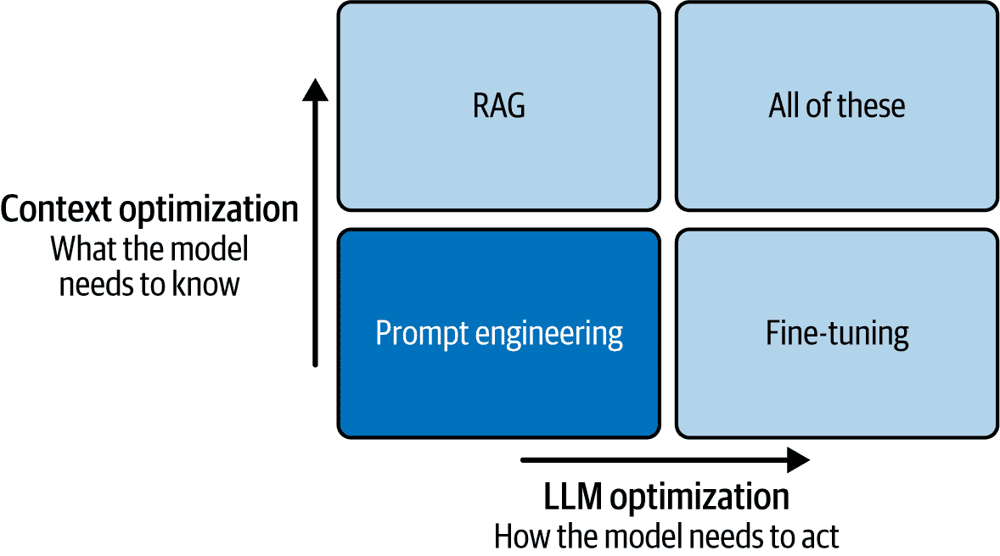

# 第五章：基于 LLM 应用的模型领域自适应

在上一章中，我们讨论了模型部署的不同架构。在这一章中，我们将讨论如何对模型进行领域自适应。实践者通常将“领域自适应”称为“微调”，但实际上，微调只是使模型在您的领域内良好工作的一种方法。

在这一章中，我们将探讨几种模型自适应方法，包括提示工程、微调和检索增强生成（RAG）。

我们还将探讨如何优化 LLM 以在资源受限的环境中运行，这些环境需要模型压缩。最后，我们将讨论最佳实践和扩展定律，以向您展示如何确定您的 LLM 需要多少数据才能有效运行。

# 从零开始训练 LLM

从零开始训练 LLM 可以是简单的或资源密集型的，这取决于您的应用。对于大多数应用来说，使用现有的开源 LLM 或专有 LLM 是有意义的。另一方面，没有比从头开始训练一个 LLM 更好的方式来学习 LLM 是如何工作的。

从零开始训练一个大型语言模型（LLM）是一个复杂且资源密集型的任务，需要一套全面的流程，包括数据准备、模型架构选择、训练配置和监控。让我们通过一种结构化的方法来了解如何从零开始训练一个 LLM。

## 第 1 步：选择任务

确定您为什么要构建这个模型，它将服务的领域以及它将执行的任务（如文本生成、摘要或代码生成）。确定成功标准，如困惑度、准确度或其他特定领域的评估指标。

## 第 2 步：准备数据

在将数据输入模型之前，模型预处理步骤确保输入以模型可以有效地处理的形式存在。这包括对文本进行标记化、去除噪声、格式化归一化和有时将复杂结构简化为模型更容易理解的组件。预处理还可以包括特征选择，这是关于选择最相关的数据，以便模型的“焦点”真正关注重要的事情。这一步骤包括：

收集大规模文本数据

如果模型是专业化的（例如用于法律或医疗领域），高质量的数据源包括书籍、文章、网站、研究论文、代码仓库和特定领域的文本。

数据清理

这包括移除非有用元素（如广告或格式化碎片）和处理拼写错误。可以使用 Hugging Face 库来完成这项任务。

数据标记化

您可以使用类似于字节对编码（BPE）或 SentencePiece 的子词标记化方法来完成这项任务，就像 BERT 和 GPT-3 等模型中所做的那样。您还可以使用 Hugging Face 的`AutoTokenizer`来完成这项任务。标记化对于处理大型词汇表和避免需要过多参数至关重要。

## 第 3 步：确定模型架构

选择适合您的数据、资源和目标模型大小的模型。模型配置范围从小型模型（数亿参数）到全规模 LLM（数十亿甚至数万亿参数）。如第一章中所述，根据您的具体需求调整基本架构，无论是更改层数、更改注意力机制还是添加专用组件（如专注于知识密集型任务的检索增强机制）。图 5-1 展示了三种一般类型的架构。


###### 图 5-1\. 三种类型的 LLM 架构（来源：[Abhinav Kimothi](https://oreil.ly/bR9E1))

## 第 4 步：设置您的训练基础设施

训练大型模型通常需要在多个 GPU 或 TPU 上分布式训练，理想情况下具有高内存（16 GB+）和快速互连（如 NVLink）。PyTorch 的分布式数据并行（DDP）或 TensorFlow 的`MultiWorkerMirroredStrategy`等框架可能会有所帮助。来自 MLOps 背景的人可能已经熟悉 DeepSpeed 和 Megatron-LM 等库，这些库旨在优化大规模模型训练的内存和计算。

尽管有很多用于训练机器学习模型的优化器，包括随机梯度下降（SGD）和 Autograd，但我们建议选择适合大型模型的优化器，例如 Adam 或 AdamW，并使用混合精度训练（例如，FP16）以减少内存使用并加速训练。

## 第 5 步：实施训练

在任务上训练模型。在实施训练时，有一些事情需要考虑。你的超参数将是什么？你的种子值是什么？您可以在安德烈·卡帕西（Andrej Karpathy）的[这个一小时视频](https://oreil.ly/PfnyZ)中查看从头开始训练 LLM 的最简单实现（见示例 5-1）。

##### 示例 5-1\. 安德烈·卡帕西（Andrej Karpathy）从头开始训练 LLM 的实现（经许可使用）

```py
import torch
import torch.nn as nn
from torch.nn import functional as F

# define your hyperparameters
batch_size = 16 # how many independent sequences will we process in parallel?
block_size = 32 # what is the maximum context length for predictions?
max_iters = 5000
eval_interval = 100
learning_rate = 1e-3
device = 'cuda' if torch.cuda.is_available() else 'cpu'
eval_iters = 200
n_embd = 64
n_head = 4
n_layer = 4
dropout = 0.0
# ------------

torch.manual_seed(1337)

URL="https://raw.githubusercontent.com/karpathy/char-rnn/master/data/
    tinyshakespeare/input.txt"
wget $URL
with open('input.txt', 'r', encoding='utf-8') as f:
    text = f.read()

# here are all the unique characters that occur in this text
chars = sorted(list(set(text)))
vocab_size = len(chars)
# create a mapping from characters to integers
stoi = { ch:i for i,ch in enumerate(chars) }
itos = { i:ch for i,ch in enumerate(chars) }
encode = lambda s: [stoi[c] for c in s] # encoder: take a string, output a list of 
integers
decode = lambda l: ''.join([itos[i] for i in l]) # decoder: take a list of integers, 
output a string

# Train and test splits
data = torch.tensor(encode(text), dtype=torch.long)
n = int(0.9*len(data)) # first 90% will be train, rest val
train_data = data[:n]
val_data = data[n:]

# data loading
def get_batch(split):
    # generate a small batch of data of inputs x and targets y
    data = train_data if split == 'train' else val_data
    ix = torch.randint(len(data) - block_size, (batch_size,))
    x = torch.stack([data[i:i+block_size] for i in ix])
    y = torch.stack([data[i+1:i+block_size+1] for i in ix])
    x, y = x.to(device), y.to(device)
    return x, y

@torch.no_grad()
def estimate_loss():
    out = {}
    model.eval()
    for split in ['train', 'val']:
        losses = torch.zeros(eval_iters)
        for k in range(eval_iters):
            X, Y = get_batch(split)
            logits, loss = model(X, Y)
            losses[k] = loss.item()
        out[split] = losses.mean()
    model.train()
    return out

class Head(nn.Module):
    """ one head of self-attention """

    def __init__(self, head_size):
        super().__init__()
        self.key = nn.Linear(n_embd, head_size, bias=False)
        self.query = nn.Linear(n_embd, head_size, bias=False)
        self.value = nn.Linear(n_embd, head_size, bias=False)
        self.register_buffer('tril', torch.tril(torch.ones(block_size, block_size)))

        self.dropout = nn.Dropout(dropout)

    def forward(self, x):
        B,T,C = x.shape
        k = self.key(x)   # (B,T,C)
        q = self.query(x) # (B,T,C)
        # compute attention scores ("affinities")
        wei = q @ k.transpose(-2,-1) * C**-0.5 # (B, T, C) @ (B, C, T) -> (B, T, T)
        wei = wei.masked_fill(self.tril[:T, :T] == 0, float('-inf')) # (B, T, T)
        wei = F.softmax(wei, dim=-1) # (B, T, T)
        wei = self.dropout(wei)
        # perform the weighted aggregation of the values
        v = self.value(x) # (B,T,C)
        out = wei @ v # (B, T, T) @ (B, T, C) -> (B, T, C)
        return out

class MultiHeadAttention(nn.Module):
    """ multiple heads of self-attention in parallel """

    def __init__(self, num_heads, head_size):
        super().__init__()
        self.heads = nn.ModuleList([Head(head_size) for _ in range(num_heads)])
        self.proj = nn.Linear(n_embd, n_embd)
        self.dropout = nn.Dropout(dropout)

    def forward(self, x):
        out = torch.cat([h(x) for h in self.heads], dim=-1)
        out = self.dropout(self.proj(out))
        return out

class FeedFoward(nn.Module):
    """ a simple linear layer followed by a non-linearity """

    def __init__(self, n_embd):
        super().__init__()
        self.net = nn.Sequential(
            nn.Linear(n_embd, 4 * n_embd),
            nn.ReLU(),
            nn.Linear(4 * n_embd, n_embd),
            nn.Dropout(dropout),
        )

    def forward(self, x):
        return self.net(x)

class Block(nn.Module):
    """ Transformer block: communication followed by computation """

    def __init__(self, n_embd, n_head):
        # n_embd: embedding dimension, n_head: the number of heads we'd like
        super().__init__()
        head_size = n_embd // n_head
        self.sa = MultiHeadAttention(n_head, head_size)
        self.ffwd = FeedFoward(n_embd)
        self.ln1 = nn.LayerNorm(n_embd)
        self.ln2 = nn.LayerNorm(n_embd)

    def forward(self, x):
        x = x + self.sa(self.ln1(x))
        x = x + self.ffwd(self.ln2(x))
        return x

# super simple bigram model
class BigramLanguageModel(nn.Module):

    def __init__(self):
        super().__init__()
        # each token directly reads off the logits for the next token from a lookup 
        table
        self.token_embedding_table = nn.Embedding(vocab_size, n_embd)
        self.position_embedding_table = nn.Embedding(block_size, n_embd)
        self.blocks = nn.Sequential(
            *[Block(n_embd, n_head=n_head) for _ in range(n_layer)]
        )
        self.ln_f = nn.LayerNorm(n_embd) # final layer norm
        self.lm_head = nn.Linear(n_embd, vocab_size)

    def forward(self, idx, targets=None):
        B, T = idx.shape

        # idx and targets are both (B,T) tensor of integers
        tok_emb = self.token_embedding_table(idx) # (B,T,C)
        pos_emb = self.position_embedding_table(torch.arange(T, device=device)) 
        x = tok_emb + pos_emb # (B,T,C)
        x = self.blocks(x) # (B,T,C)
        x = self.ln_f(x) # (B,T,C)
        logits = self.lm_head(x) # (B,T,vocab_size)

        if targets is None:
            loss = None
        else:
            B, T, C = logits.shape
            logits = logits.view(B*T, C)
            targets = targets.view(B*T)
            loss = F.cross_entropy(logits, targets)

        return logits, loss

    def generate(self, idx, max_new_tokens):
        # idx is (B, T) array of indices in the current context
        for _ in range(max_new_tokens):
            # crop idx to the last block_size tokens
            idx_cond = idx[:, -block_size:]
            # get the predictions
            logits, loss = self(idx_cond)
            # focus only on the last time step
            logits = logits[:, -1, :] # becomes (B, C)
            # apply softmax to get probabilities
            probs = F.softmax(logits, dim=-1) # (B, C)
            # sample from the distribution
            idx_next = torch.multinomial(probs, num_samples=1) # (B, 1)
            # append sampled index to the running sequence
            idx = torch.cat((idx, idx_next), dim=1) # (B, T+1)
        return idx

model = BigramLanguageModel()
m = model.to(device)
# print the number of parameters in the model
print(sum(p.numel() for p in m.parameters())/1e6, 'M parameters')

# create a PyTorch optimizer
optimizer = torch.optim.AdamW(model.parameters(), lr=learning_rate)

for iter in range(max_iters):

    # every once in a while evaluate the loss on train and val sets
    if iter % eval_interval == 0 or iter == max_iters - 1:
        losses = estimate_loss()
        print(
            f"step {iter}: "
            f"train loss {losses['train']:.4f}, "
            f"val loss {losses['val']:.4f}"
        )

    # sample a batch of data
    xb, yb = get_batch('train')

    # evaluate the loss
    logits, loss = model(xb, yb)
    optimizer.zero_grad(set_to_none=True)
    loss.backward()
    optimizer.step()

# generate from the model
context = torch.zeros((1, 1), dtype=torch.long, device=device)
print(decode(m.generate(context, max_new_tokens=2000)[0].tolist()))
```

现在您已经了解了简单 LLM 的工作原理，让我们来看看如何结合不同的模型架构。

# 模型集成方法

*集成*指的是将多个模型结合起来，以获得比单个模型单独提供的结果更好的效果。因此，每个模型都贡献了一些独特的东西，平衡彼此的弱点，并补充彼此的优势。集成大型语言模型（LLM）是提升性能、增强鲁棒性和提高语言模型可解释性的强大方法。虽然集成在较小的机器学习模型中（如随机森林或较小规模的 NLP 模型）更为常见，但由于 LLM 具有特定的行为和多样化的响应，它正变得越来越相关。

当然，集成 LLM 存在权衡。其中一个主要挑战是计算成本——并行运行多个大型模型可能会消耗大量资源。内存使用量和推理时间显著增加，有时可能会对实时、低延迟应用产生阻碍。

另一个挑战是部署的复杂性。部署一组 LLM（大型语言模型）需要协调多个模型，管理依赖关系，并可能集成特定于集成的逻辑。然而，通过使用模型的量化版本、缓存预测或限制集成仅在满足某些条件时运行（例如，如果模型的置信度低），模型集成通常可以优化。这些技术将在第九章中讨论。

然而，对于大多数人和企业来说，模型领域自适应是提高 LLM 准确率最常见且成本效益最高的方法之一。让我们探讨一些有效集成 LLM 的方法，以及一些代码示例。

## 模型平均和混合

一种直接的方法是平均多个模型的预测。当与具有不同优势的模型一起工作时很有用，例如一个擅长生成基于事实的文本的模型，另一个则更具创造力。当我们平均它们的响应或混合它们的输出时，我们得到一个更平衡的响应。这可以简单到计算模型之间的概率分布并平均它们。在实践中，它也可以表现为为每个模型生成 softmax 概率分布，并平均它们以进行最终预测。

示例 5-2 中的代码简单地遍历每个模型，汇总它们的输出，然后除以模型的数量以获得平均预测。

##### 示例 5-2. 多个模型的预测平均

```py
import torch

def average_ensemble(models, input_text):
    avg_output = None
    for model in models:
        outputs = model(input_text)
        if avg_output is None:
            avg_output = outputs
        else:
            avg_output += outputs
    avg_output /= len(models)
    return avg_output
```

在这里，`models`是一个模型实例的列表，而`input_text`是文本提示。

## 加权集成

有时根据某些模型的准确性或特定任务上的表现给予更多权重是有益的。例如，如果模型 A 在摘要任务上表现更好，那么在集成中它可以比模型 B 获得更高的权重。*加权集成*允许我们将领域专业知识或经验模型评估直接纳入集成。在示例 5-3 中，`weights`是一个与`models`长度相同的列表，包含每个相应模型的权重。

##### 示例 5-3. 加权集成

```py
def weighted_ensemble(models, weights, input_text):
    weighted_output = torch.zeros_like(models0)
    for model, weight in zip(models, weights):
        output = model(input_text)
        weighted_output += output * weight
    return weighted_output
```

输出是一个加权组合，可以根据对集成中每个模型的期望强调程度进行调整。

## 堆叠集成（两阶段模型）

在堆叠集成方法中，多个模型的输出被输入到一个二级模型（通常是较小的、更简单的模型）中，该模型学习有效地组合它们的输出。这个元模型学习 LLMs 输出空间中的模式。这可以特别适用于复杂任务，如摘要或翻译，其中不同的模型可能捕捉到输入的不同细微差别。

示例 5-4 中的方法使用一个 SKlearn 模型作为元模型，该模型在 LLMs 的输出上训练。它需要一个训练阶段，因为它学习理解每个 LLM 的预测。

##### 示例 5-4\. 堆叠集成

```py
from sklearn.linear_model import LogisticRegression
import numpy as np

def stacked_ensemble(models, meta_model, input_texts):
    model_outputs = []
    for model in models:
        outputs = [model(text).numpy() for text in input_texts]
        model_outputs.append(outputs)
    stacked_features = np.hstack(model_outputs)
    meta_model.fit(stacked_features, labels) # assuming labels for training
    return meta_model.predict(stacked_features)
```

现在，如果你不想结合不同的模型，而只是不同的模型架构呢？嗯，使用大型语言模型（LLMs）你也可以做到这一点，因为每个模型架构都有其自身的优势。

## 用于鲁棒性的多样化集成

使用多样化的模型——如编码器-解码器架构和基于转换器的语言模型的混合——在处理边缘情况或生成更全面的答案时可能非常有效。这种多样性为模型带来了互补的优势，并且通常对单个模型中的错误更具抵抗力。例如，如果一个模型容易产生幻觉（某些大型语言模型中已知的问题），其他模型可以作为平衡力量，纠正或限制这种效应。

集成中的多样性也为使用专注于语言不同方面的模型提供了专门响应的机会，例如事实性或创造性。例如，将较小的基于事实的模型与基于生成转换器的模型集成可以产生一个既具有创造性又提供准确信息的 LLM。

## 多步解码和投票机制

在高延迟、高精度应用中生成文本的独特方法之一是使用投票机制，其中模型对下一个标记或短语进行投票。如多数投票、加权投票或排名投票等投票方案有助于确保模型之间常见的标记有更高的被选中机会，而异常标记则被过滤掉。这个过程可以显著提高生成文本的连贯性和一致性，尤其是在需要精确语言的复杂提示或任务中。示例 5-5 提供了多数投票的代码。

##### 示例 5-5\. 多数投票

```py
from collections import Counter

def voting_ensemble(models, input_text):
   all_predictions = []
   for model in models:
       output = model.generate(input_text)
       all_predictions.append(output)

   # Count the most common output
   majority_vote = Counter(all_predictions).most_common(1)[0][0]
   return majority_vote
```

在这里，`voting_ensemble` 使用多数投票来选择每个模型中最常见的输出。如果有平局，可以添加额外的逻辑来考虑加权投票或随机选择平局选项。

## 可组合性

在集成学习中，另一种流行的技术是可组合性。*可组合性*是指灵活地混合和匹配模型或模型部分的能力。一些集成方法可能通过平均多个模型的输出来组合它们，而其他方法可能将模型串联起来，使得一个模型的输出成为另一个模型的输入。这种设置允许你通过使用较小的、专门的模型来避免使用庞大的、包罗万象的模型来完成复杂任务。

例如，假设我们有一个摘要模型、一个翻译模型和一个情感分析模型。我们不必重新训练一个能够处理所有三个任务的单一、庞大的模型，而是可以将这些单个模型以管道的形式组合起来，其中每个模型处理前一个模型的输出。这种模块化方法允许适应性和维护性，因为每个模型都可以独立地进行微调，从而降低整体计算成本和开发时间（参见示例 5-6）。

##### 示例 5-6\. 模型组合

```py
def compose_pipeline(input_text, models):
    """
    Process the input text through a pipeline of models.
    Each model in the list `models` applies a specific transformation.
    """
    for model in models:
        input_text = model(input_text) 
    return input_text

# Define models for translation, summarization, and sentiment analysis
translated_text = translate_model("Translate this text to French.")
summarized_text = summarize_model(translated_text)
sentiment_result = sentiment_model(summarized_text)
```

在这里，`translate_model`、`summarize_model`和`sentiment_model`可以单独更新或替换，如果其中一个模型过时或需要重新调整，这尤其有益。

可组合性有许多好处。例如，它提供了模块化，因为不同的模型可以根据需要插入，增强了灵活性。可组合性允许通过添加或交换单个模型轻松扩展，使这些模型可扩展。它也很高效，因为你可以优化单个组件而不影响管道的其余部分。

然而，可组合性并非没有挑战。首先，一个组件中的错误可能会向下传播，可能加剧不准确。其次，每个阶段都会增加处理时间，这可能会影响实时应用。最后，确保多个模型之间响应的一致性需要仔细的协调和调整。

## 软演员-评论家

这就是*软演员-评论家*（SAC）技术发挥作用的地方。SAC 对于 LLMs 来说可能是有利的，其目标不仅仅是最大化准确性，而是要在不同的定性方面（如创造性和连贯性）之间取得平衡。SAC 是一种强化学习技术，有助于集成平衡探索与利用。SAC 的一个独特特征是使用“软”奖励最大化，引入熵正则化。它促进探索性动作，鼓励模型尝试不同的响应，而不是总是选择最可预测的一个，这种方法可以在语言任务中导致更自然和多样化的响应。

当我们集成 LLMs 时，SAC 可以微调模型之间的交互方式，使它们能够适应新的信息或任务，而不会过度承诺于一种方法。这对于需要根据用户反馈或其他变化因素调整响应的动态环境特别有用，以及对于开发通用模型。

在大型语言模型（LLMs）中，你可以使用 SAC 来调整模型输出，以最大化与期望行为相关的奖励。例如，在客户服务聊天机器人中，奖励可能基于用户满意度、响应简短和礼貌。SAC 允许 LLM 通过试错学习一个策略，以最大化这些奖励，并通过反馈迭代地改进其响应。

SAC 通过两个核心组件运行。*演员网络*提出动作（在 LLMs 中，可能是可能的响应或对话中的动作），而*评论家网络*评估所提出动作的价值，考虑即时的和未来的奖励。

实施针对大型语言模型（LLMs）的 SAC 涉及定义针对任务的奖励函数，设置演员网络和评论家网络，并在多个回合中训练策略，如示例 5-7 所示。

##### 示例 5-7\. SAC 实现

```py
import torch
import torch.nn as nn
import torch.optim as optim

class Actor(nn.Module):
    def __init__(self):
        super(Actor, self).__init__()
        self.layer = nn.Linear(768, 768)  # Assuming LLM output size
        self.output = nn.Softmax(dim=-1)

    def forward(self, x):
        x = self.layer(x)
        return self.output(x)

class Critic(nn.Module):
    def __init__(self):
        super(Critic, self).__init__()
        self.layer = nn.Linear(768, 1)

    def forward(self, x):
        return self.layer(x)

# Initialize actor, critic, and optimizers
actor = Actor()
critic = Critic()
actor_optimizer = optim.Adam(actor.parameters(), lr=1e-4)
critic_optimizer = optim.Adam(critic.parameters(), lr=1e-3)

for episode in range(num_episodes):
    text_output = language_model(input_text)  # Generate response
    reward = compute_reward(text_output) 

    critic_value = critic(text_output)
    critic_loss = torch.mean((critic_value - reward) ** 2)
    critic_optimizer.zero_grad()
    critic_loss.backward()
    critic_optimizer.step()

    actor_loss = -critic_value + entropy_coefficient * torch.mean(actor(text_output))
    actor_optimizer.zero_grad()
    actor_loss.backward()
    actor_optimizer.step()
```

SAC 有其自身的优势。例如，其基于熵的探索确保了响应的多样性，这对于创意语言任务来说非常理想。SAC 还可以根据实时反馈调整响应，从而提高在聊天机器人等现实世界应用中的适应性。此外，它允许自定义奖励函数来调整行为，使其适用于多目标任务。

SAC 的一个挑战是，必须为每个任务精心设计奖励函数，平衡多个目标，这是一个艰巨的任务。其次，与许多强化学习算法一样，训练此类模型可能对超参数敏感，需要大量调整。最重要的是，SAC 可能计算密集，特别是对于大型模型。

# 模型域适应

虽然 LLMs 通常功能强大，但它们往往缺乏特定领域或语境的细微差别。例如，ChatGPT 可能理解日常医疗术语，但如果没有额外的调整，它可能无法准确解释复杂的医学术语或细微的法律短语。通过在特定领域数据上微调 LLM，您可以增强其理解和生成领域相关内容的能力，从而提高该语境下的准确性和连贯性。

*模型适应*意味着细化预训练模型，使其在特定任务上表现更好或对独特语境做出响应。这种方法对于在多样化但通用数据上预训练的 LLMs 尤其有用。当应用于法律、医学或科学文本等特定领域时，域适应有助于这些模型理解和生成更准确、相关和上下文敏感的响应。

域适应方法在复杂性上有所不同，从对特定领域数据集的简单微调到更高级的技术，这些技术将模型适应到特定领域的专业词汇、术语和风格细微差别。

总体来说，模型域适应有三个核心好处：

+   提高 LLMs 在代表性不足的领域（如医学文本或法律文件）上的任务性能。

+   减少了为每个新域收集和标注大量数据的需求。这在数据稀缺或收集成本高昂的领域尤其有用。

+   使 LLMs 更容易被更广泛的用户使用，即使用户在该特定领域没有专业知识。

让我们通过一个例子来进一步阐明。假设你的目标领域有独特的词汇，例如化学化合物或法律引文。你可以更新标记化和嵌入层，包括特定领域的标记，以提高模型的表现，如示例 5-8 所示。

##### 示例 5-8\. 添加特定领域的标记

```py
# Custom vocabulary
custom_vocab = ["moleculeA", "compoundX", "geneY"]

# Add new tokens to the tokenizer
tokenizer.add_tokens(custom_vocab)
model.resize_token_embeddings(len(tokenizer))
```

这些自定义标记化器可以识别独特的实体（如化学公式或法律引文）作为原子标记，确保模型将它们识别为独立的单元，而不是将它们分解为子词。嵌入这些特定领域的标记有助于模型更好地掌握领域相关的信息，并在复杂的术语中保持一致性。

有三种模型领域适应的技术：提示工程、RAG 和微调。严格来说，RAG 是一种动态提示工程的形式，其中开发人员使用检索系统向现有提示添加内容，但 RAG 系统使用得如此频繁，因此值得单独讨论。

与微调相比，一个关键的区别是，你必须能够访问模型的权重，这种信息通常在基于云的专有 LLMs 中不可用。

# 提示工程

在*提示工程*中，我们定制提供给模型的提示或问题，以获得更准确或更有洞察力的回答。提示的结构方式对模型理解手头的任务以及最终表现有巨大影响。鉴于 LLMs 的通用性，提示工程已成为在不同领域和任务中充分利用这些模型的重要技能。

关键在于理解不同的提示结构如何导致不同的模型行为。有各种策略——从简单的单次提示到更复杂的技巧，如思维链提示——这些策略可以显著提高大型语言模型（LLMs）的有效性。让我们来看看一些常见的技巧。

## 单次提示

*单次提示*指的是向模型提供一个提示示例以及你期望的输出类型。这是一个相对简单的方法。想法是通过提供一个清晰简洁的示例来展示你想要的答案或行为类型。单次提示在任务简单且定义明确，且不需要模型推断许多模式时效果最佳。如果你要求模型翻译文本，一个单次提示可能看起来像这样：

```py
*Prompt*: Translate the following English sentence to French: 'Hello, how are you?'
*French translation*: 'Bonjour, comment ça va ?'
```

展示示例后，你可以要求模型翻译一个新的句子：

```py
*Prompt*: Translate the following English sentence to French: 'Good morning, I 
          hope you're doing well.'
```

对于更复杂的任务，单次提示可能无法为模型提供足够的信息来生成可靠或有意义的成果。

## 少样本提示

*少样本提示*通过为模型提供多个期望输出的示例来更进一步。当任务涉及识别模式或模型需要更多上下文才能表现良好时，这种方法很有用。这些示例使模型更好地理解输出应该是什么样子，然后它可以应用这些模式到未见过的示例中。

少样本提示在涉及生成特定类型响应的任务中特别有用，例如以特定风格或格式生成文本。你提供的示例越多，模型在识别任务潜在结构方面的能力就越强。

例如，想象你要求模型生成数学文字问题，并给它几个示例来展示如何从给定数据中生成它们：

```py
*Prompt*: Here's how to create a word problem based on the following math equation:
1\. 3 + 5 = 8 
'If you have 3 apples and pick 5 more, how many apples do you have in total?'
2\. 10 – 4 = 6 
'A store had 10 apples, but 4 were sold. How many apples are left in the store?'
```

现在，你可以要求模型生成一个新的问题：

```py
*Prompt*: Create a word problem based on the following math equation: 7 + 2 = 9.
```

使用少样本示例，模型更有可能生成与提供的示例风格和逻辑相匹配的相关文字问题。少样本提示在文本摘要、翻译和问题生成等任务中非常有效。

## 思维链提示

*思维链提示*鼓励模型逐步分解其推理过程，使推理过程更加明确和易于理解，而不是仅仅提供最终答案。这种方法对于需要逻辑推理、多个步骤或解决问题的复杂任务特别有价值，例如数学推理、决策或任何中间步骤重要的情境。它通过鼓励模型在得出结论之前评估任务的各个方面，帮助模型避免做出错误或过于简化的假设。

假设你要求模型解决一个涉及多个步骤的数学问题。使用思维链提示，你会鼓励模型通过问题进行推理，而不是简单地提供一个答案：

```py
*Prompt*: Let's solve this step-by-step:
What is 8 × 6?
Step 1: First, break it into smaller numbers: 8 × (5 + 1).
Step 2: Now calculate: 8 × 5 = 40.
Step 3: Then calculate 8 × 1 = 8.
Step 4: Add the results: 40 + 8 = 48.
So, 8 × 6 = 48.
```

现在，你可以要求模型解决一个新的问题：

```py
*Prompt*: Let's solve this step-by-step: What is 12 × 7?
```

思维链提示帮助模型展示其推理，并确保它没有跳过关键细节。

一种强大的策略是将这些不同类型的提示结合起来，以利用它们的各自优势。例如，你可能从少样本提示开始，为模型提供一些上下文和示例，然后切换到思维链提示，以引导其通过推理过程。这种混合方法对于需要模式识别和逻辑推理的更复杂任务非常有效。

```py
*Prompt*: Here are some examples of how to generate creative descriptions for 
objects:
1\. 'A tall oak tree with thick branches reaching out, casting a large shadow on 
the grass.'
2\. 'A small, round pebble with smooth edges and a soft, pale color.'
Now, describe this object: 'A rusty old bicycle.' Let's break it down step-by-
step.
```

这种结合方法将有助于模型首先从几个示例中学习，然后通过分析对象的独特特征来进行推理，从而生成详细且连贯的描述。

## 检索增强生成

*检索增强生成*（RAG）是将预训练语言模型与外部知识源相结合的最强大技术之一。它使用基于检索的方法来提高生成模型处理复杂查询或提供更准确、基于事实的响应的能力。RAG 模型结合了信息检索和文本生成的力量，使它们在需要从大型外部语料库或数据库中获取知识的任务中特别有用。

RAG 通过从知识库或搜索引擎检索相关文档或信息片段来工作，这些信息随后被用于告知生成过程。这种方法使模型能够参考现实世界的数据，生成不受模型现有知识限制的响应。

在典型的 RAG 模型中，输入查询经过两个主要阶段。首先，在 *检索* 阶段，检索系统从知识库、搜索引擎或数据库中检索相关文档或文本片段。然后，在 *生成* 阶段，LLM 根据输入查询和检索到的文本片段生成输出。

RAG 允许模型有效地处理复杂问题，验证其回答的事实性，并动态地引用广泛的外部信息。例如，使用 RAG 模型构建的问答系统可以通过首先检索相关文档或维基百科条目，然后基于这些文档生成响应，从而提供更准确的答案。

示例 5-9 中的代码演示了如何实现一个基于 RAG 的简单模型。

##### 示例 5-9\. RAG 实现

```py
from transformers import RagTokenizer, RagRetriever, RagSequenceForGeneration

tokenizer = RagTokenizer.from_pretrained("facebook/rag-token-nq")
retriever = RagRetriever.from_pretrained("facebook/rag-token-nq")

# Load the RAG model
model = RagSequenceForGeneration.from_pretrained("facebook/rag-token-nq")

question = "What is the capital of France?"

inputs = tokenizer(question, return_tensors="pt")

retrieved_docs = retriever.retrieve(question, return_tensors="pt")

# Generate an answer using the RAG model and the retrieved documents
outputs = model.generate(input_ids=inputs['input_ids'],
                context_input_ids=retrieved_docs['context_input_ids'],
                context_attention_mask=retrieved_docs['context_attention_mask'])

answer = tokenizer.decode(outputs[0], skip_special_tokens=True)
print(answer)
```

RAG 在诸如开放域问答等场景中特别有用，在这些场景中，模型可能需要访问和引用最新或高度具体的信息。

## 语义内核

[语义内核](https://oreil.ly/ljuli) 是一个旨在简化将 LLM 集成到需要动态知识、推理和状态跟踪的应用程序的框架。当你想要构建可以与外部 API、知识库或决策过程交互的复杂、模块化 AI 系统时，它尤其有用。语义内核专注于构建更灵活的 AI 系统，能够处理超出仅生成文本的各种任务。它允许模块化，使开发者能够以统一的方式轻松组合不同的组件——例如嵌入、提示模板和自定义函数。

它支持异步处理，这对于管理长时间运行的任务或与外部服务交互非常有用，并且可以与需要通过复杂步骤进行推理的模型（如使用思维链提示的模型）结合使用。该框架支持维护和检索*语义记忆*，这有助于模型记住过去的交互或之前检索到的信息，以生成更一致的结果。最后，语义内核可以集成外部函数和 API，使得将模型推理与实际数据相结合变得容易。

如示例 5-10 所示，您可以使用语义内核构建一个模块化助手，该助手可以：

+   从知识库中检索历史信息

+   使用外部 API 获取实时数据（例如股票价格）

+   处理自然语言指令

+   通过链接多个 AI 函数执行复杂推理任务

##### 示例 5-10\. 语义内核

```py
from semantic_kernel import Kernel
from semantic_kernel.ai.openai import OpenAITextCompletion
from semantic_kernel.memory import MemoryStore
from semantic_kernel.plugins import AzureTextPlugin

kernel = Kernel()
kernel.add_ai("openai", OpenAITextCompletion(api_key="your-openai-api-key"))

# Set up memory for semantic memory handling
memory = MemoryStore()
kernel.add_memory("semantic_memory", memory)

# Define a simple chain-of-thought function
def chain_of_thought(input_text: str) -> str:
    response = kernel.run_ai("openai", "text-davinci-003", input_text)
    return f"Thought Process: {response}"

kernel.add_function("chain_of_thought", chain_of_thought)

user_input = "How does quantum computing work?"

reasoned_output = kernel.invoke("chain_of_thought", user_input)
print("Reasoning Output:", reasoned_output)

kernel.add_plugin("external_api", AzureTextPlugin(api_key="your-azure-api-key"))
external_output = kernel.invoke("external_api", "fetch_knowledge", user_input)
print("External Output:", external_output)
```

您还可以集成外部函数（如从 Azure API 获取数据）以进一步丰富模型的响应，并在交互中保持状态。这使得语义内核成为创建复杂 AI 驱动应用程序的绝佳选择。

虽然 RAG 通过集成外部知识源以提供基于事实的响应来增强生成模型，但语义内核提供了一个灵活的框架，用于构建具有高级推理和状态交互的模块化 AI 系统。然而，如果您想在模型中做出行为改变，则应使用*微调*。

# 微调

与从头开始训练相比，从头开始训练需要大量的数据和计算资源，*微调*允许您使用更少的资源将已训练的模型适应新任务。通过根据特定数据或行为修改模型的参数，微调使得大型语言模型（LLMs）在特定应用中更加有效，无论是处理特定行业的术语还是调节模型的风格和语气。请注意，微调会改变模型的权重，这意味着您必须能够访问它，无论是直接通过模型检查点还是间接地，例如 OpenAI 通过其微调 API 提供的方式。

微调提供了一系列策略，以适应预训练模型以特定任务，提高其效率，并确保它们符合用户期望。如自适应微调、适配器和参数高效方法等技术有助于将 LLMs 定制到特定领域，同时减少资源需求。微调不仅仅是提高任务准确性；它还侧重于调整模型行为，确保输出在道德上是合理的、高效的且用户友好的。无论您是在处理复杂的特定领域模型还是通用助手，微调都能使您的模型更智能、更高效，并与您的需求更一致。

在本节中，我们将深入了解几个关键的微调 LLM 策略，从自适应微调到前缀微调和技术如参数高效微调（PEFT），它们在满足不同需求的同时保持效率。

## 自适应微调

*自适应微调* 是一个更新模型参数的过程，以便它能更好地处理特定的数据集或任务。这涉及到在更接近当前任务的新数据上训练模型。例如，如果你有一个在通用网络文本上预训练的 LLM，自适应微调可以帮助它专门化于特定领域，如医学文本、法律术语或客户服务互动。自适应微调的目标是以一种方式调整模型的权重，使其能够捕获更多领域特定的知识，同时不会忘记它已经拥有的通用理解。

假设你正在微调一个用于医学问答的模型。你的基础模型可能在多样化的数据集上进行了训练，但对于微调数据集，你将使用一组与医学相关的文本——例如研究论文、临床笔记和常见问题解答。考虑以下提示：

```py
*Question*: What are the symptoms of a heart attack?
*Answer*: Symptoms of a heart attack include chest pain, shortness of breath, 
nausea, and cold sweats.
```

## 适配器（单个、并行和缩放并行）

*适配器* 是一种高效的微调方法。与重新训练整个模型不同，适配器引入了小型、任务特定的模块，在训练时保持原始模型参数冻结。这种方法使得微调在计算上更加高效，因为只有模型的一小部分被修改。适配器在需要将微调应用于多个任务时特别有用，因为它们允许模型保持其通用能力，同时适应特定上下文。使用适配器的方法包括：

单个适配器

向模型添加一个单一的任务特定适配器，使其能够专注于一个任务。模型的其余部分保持不变。

并行适配器

可以并行训练多个适配器以处理不同的任务。每个适配器处理其任务，而原始模型的权重保持冻结。

缩放并行适配器

对于更复杂的使用案例，可以在不同规模上训练多个适配器，使模型能够处理更复杂的任务并实现更高的性能，而不会对其架构造成过重负担。

假设你将模型应用于两个任务：文本摘要和情感分析。你可以引入两个并行适配器，一个用于微调摘要，另一个用于情感分析。模型将利用每个任务的适当适配器，同时仍然受益于其通用知识。

## 行为微调

*行为微调*专注于调整模型的行为以符合特定期望，例如产生更多道德、礼貌或用户友好的输出。在许多实际应用中，语言模型与人类价值观保持一致至关重要，尤其是在处理敏感话题或影响用户决策时。通过在反映所需行为的数据上进行微调，模型可以学习产生更符合行为准则或道德指南的响应。这在客户服务聊天机器人、医疗助手和其他直接与用户交互的模型中特别有用。

对于提供心理健康建议的聊天机器人，你可以使用强调同理心响应的数据集来微调模型，确保模型的回复既有帮助又富有同情心。考虑以下提示和输出：

```py
*User*: I'm feeling really down today.
*Model (after behavioral fine-tuning)*: I'm so sorry to hear that. It's important 
to talk to someone when you're feeling this way. Would you like to share more?
```

行为微调对于确保模型不仅提供准确的响应，而且反映正确的语气和道德至关重要。

## 前缀调整

*前缀调整*是一种微调模型行为以适应特定任务的技术，而不会大幅改变其结构或改变其核心权重。不是修改整个模型，前缀调整仅调整模型的一小部分可调整部分：*前缀*，这是一个小输入序列，被添加到输入数据之前。模型使用前缀来调整其输出以适应特定任务。

这种方法非常高效，因为它比传统微调需要的资源更少，并且可以在不重新训练整个模型的情况下进行专门的调整。如果你正在微调一个用于生成诗歌的模型，前缀可能包括设置诗歌基调或风格的序列，而模型则相应地生成其余内容：

```py
*Prefix*: Write a romantic poem in the style of Shakespeare.
*Input*: 'The evening sky is painted in hues of orange.'
```

在这里，仅调整前缀以偏向莎士比亚风格，但模型的其余部分保持不变。

## 参数高效微调

*参数高效微调*（PEFT）是一种旨在使用最少资源微调大型模型的技术。传统的微调涉及修改整个模型的参数，这既耗时又昂贵。PEFT 技术，如*低秩调整*（LoRA）和量化 LoRA（qLoRA），专注于仅修改模型权重的一小部分，低秩部分，从而节省内存和计算资源，同时保持模型性能。它们在处理非常大的模型时特别有用，例如 GPT-3 或 GPT-4，因为完全微调会非常昂贵。LoRA 引入了对权重更新的低秩近似，减少了需要微调的参数数量。这使得过程更高效，同时不牺牲准确性。qLoRA 通过引入量化进一步减少存储需求，使其非常适合大规模部署。

对于部署在资源受限环境中的 LLM，你可以应用 LoRA（低秩自适应）来调整仅处理特定任务（如摘要或问答）的权重。这允许更快地更新并降低计算成本。

## 指令调整与人类反馈强化学习

*指令调整*涉及微调模型，使其以更精确和可靠的方式遵循明确的指令。这在需要模型根据用户指令或提示持续执行特定任务时特别有用。

通过*人类反馈强化学习*（RLHF），模型从人类那里获得对其输出的反馈，使其随着时间的推移不断改进。这个反馈循环有助于模型更好地与用户期望保持一致，并提高其响应的相关性、连贯性和整体质量。

RLHF 通常用于微调用于对话代理或其他交互式系统的模型，确保模型的响应不仅准确，而且有帮助且适合上下文。

对于一个虚拟助手，你可能首先使用指令调整微调模型以确保它直接回答问题。然后，使用 RLHF，你会收集用户对响应有用性的反馈，并调整模型以改善其对话行为。

一个指令调整提示可能是：

```py
Answer the following question directly: What is the capital of France?
```

输出：

```py
The capital of France is Paris.
```

一个 RLHF 提示可能是：

```py
How do I change the oil in my car?
```

输出：

```py
Changing the oil in your car involves draining the old oil, replacing the oil 
filter, and refilling with fresh oil. Would you like a step-by-step guide?
```

通过 RLHF，模型可以继续学习和改进，使其行为与真实世界的用户需求保持一致。

## 在微调和提示工程之间进行选择

如果你没有修改模型权重的途径，并且想要为特定领域调整你的模型，你必须使用提示工程。但是，当两种选择都可用时，你应该选择哪一个？

首先要考虑的是成本，因为微调在计算成本上很昂贵。你通常可以通过几小时的实验得到更好的提示，但运行微调实验可能需要数千美元。OpenAI 最近的价格列表（截至本文撰写时）显示，其最新的 GPT-4o 模型的微调成本为每百万个令牌 25,000 美元。

当前的微调会提前增加成本，而提示工程则更像是一种按揭。通过提示工程开发更大的提示将增加每次请求的成本，而推理成本则不因模型是否经过微调而改变。还有一个需要考虑的因素是，目前 LLM（大型语言模型）领域变化很大，因此回收成本的时长远可能较短。如果微调和提示工程在 10 年的预期内具有相同的表现和成本，但你所使用的模型寿命仅为 2 年，那么提前支付 10 年的费用来使用仅 2 年就足够的东西是不划算的。在这种情况下，提示工程在成本方面会是一个更好的选择。

即使你可以访问模型权重，不需要担心成本，只想专注于性能，了解微调和提示工程解决不同问题也是有帮助的。提示工程改变模型*知道的内容*，给它更多的上下文。RAG 做的是提示工程做的事情，但规模更大，使用系统根据输入动态生成提示。另一方面，微调改变模型*的行为方式*。图 5-2 中的象限图说明了这一点。

例如，假设你使用的模型已经拥有了所需的所有知识，但你希望它使用特定的 XML 格式来生成答案，而不是通常的聊天输出，因为你的输出将被另一个系统消费。在这种情况下，微调模型将比通过提示工程给出大量你希望输出看起来如何的示例获得更好的性能。



###### 图 5-2\. LLM 和上下文优化

值得指出的是，通过微调改变模型行为的一个意想不到的后果：它可能导致模型停止之前做的事情。比如说，你正在使用 GPT-3.5-turbo 这样的模型来生成关于你产品的博客文章，它做得很好，但这些文章不太技术化。一位 AI 工程师建议使用公司内部“产品聊天”频道中的消息来微调模型，那里的人们讨论产品的技术特性。微调模型后，你要求它“生成一篇关于我们产品特性*X*的 500 字博客文章”，这是它之前可以做得相当好的事情，只是没有太多的技术深度。现在它的回答是：“我太忙了。”微调改变了模型的行为。在这种情况下，一个 RAG 解决方案，通过搜索产品聊天数据并创建一个描述特性*X*的提示给旧模型，会工作得更好。

# 专家混合

自适应微调和 PEFT 方法通过选择性地更新参数或利用指令调整来优化大型语言模型的适应性。一种更近期的技术，*专家混合*（MoE），从不同的角度接近优化，即架构模块化和条件计算。与微调不同，微调在训练后改变模型的参数，而 MoE 通过利用许多“专家”来改变模型的结构本身，这些“专家”是大型模型内部较小的专用子网络（参见图 5-3）。

与使用整个模型进行推理不同，一个门控系统根据输入选择并激活这些专家中的少数几个。这意味着模型只使用其部分能力来回答每个查询。好处是？你可以构建一个具有万亿参数的巨大模型，但保持计算成本很低，因为每次只有其中一小部分在运行。

这与自适应微调或参数高效微调不同，后者是更新模型以更好地处理新任务。MoE 让模型在其内部进行专业化，这意味着一些专家在特定类型的任务或数据上变得更好，而其他专家则专注于其他方面。模型学习动态路由输入，使其能够在许多领域灵活运用，而无需每次都重新训练整个模型。

话虽如此，MoEs 并不完美。如果门控系统没有均匀分配工作，只有少数专家做大部分工作，浪费了模型的其余部分并降低了效率。此外，训练这些模型更复杂，需要特殊的软件和硬件支持以获得速度和成本效益。


###### 图 5-3\. MoE 工作原理的可视化（来源：[“混合专家”](https://oreil.ly/r4ys1)）

类似于 GShard、DeepSeek 和其他 MoE 模型通过将模型分成许多更小的专家子网络并针对每个输入标记选择性地激活其中的一些来改变 LLMs 处理规模的方式。这种能力的关键是门控网络，这是一个小型模块，它使用每个标记的隐藏状态为每个专家生成一个分数。在 GShard 中，这些分数通过 softmax 函数进行处理，将原始预测分数向量转换为所有专家的概率分布。每个标记选择前两个专家，并将标记的表示发送给这两个专家，根据它们的门控概率进行加权。将工作分配给两个专家可以提高模型的表达能力，但会增加通信开销，因为标记必须发送到不同设备上的多个专家。

另一方面，Switch Transformer 通过使用硬路由来简化这个过程。*硬路由*需要门控机制选择每个标记的最高得分专家。这意味着每个标记只激活一个专家，从而减少跨设备通信和内存使用。门控输出是一个一次性向量，指示哪个专家负责，这种顶级路由减少了需要在加速器之间移动的数据量。

所有 MoE 模型都面临的一个共同挑战是*负载均衡*。如果没有约束，门控机制往往会将大多数标记引导到一小部分流行专家，导致一些专家过载而其他专家闲置。这种专家崩溃浪费了容量并减慢了训练收敛。为了解决这个问题，训练过程中在主要目标中添加了一个负载均衡损失项。这个损失项通过首先计算每个专家分配的标记分数和门控概率质量来衡量标记在专家之间的分布情况。然后，它计算这些值的变异系数并惩罚不均匀分布，迫使门控网络更均匀地分配标记。这使所有专家都保持忙碌并充分利用模型的参数预算。

每个专家都有一个固定的容量，即它只能处理每个批次中有限数量的标记，以适应内存限制。如果将过多的标记路由到专家，则多余的标记将被丢弃或重新路由。尽管这种标记丢弃可以防止内存溢出，但它也可能导致在训练期间忽略一些输入数据——这是一个需要仔细调整的权衡。

在*反向传播*过程中，梯度仅通过为每个标记激活的专家流动。未参与处理给定标记的专家不会收到梯度更新。因此，计算和内存使用量比模型巨大的参数数量所应有的要少。这种梯度流的稀疏性是 MoE 能够高效扩展的一个原因。

训练 MoE 很棘手，过程可能不稳定。研究人员使用多种技术来提高稳定性。例如，门控权重被仔细初始化以避免早期产生极端输出，可以通过门控输出应用 dropout 来防止门控网络基于少数专家而变得过于自信，并且可以使用梯度裁剪来保持更新稳定。负载平衡损失不仅提高了利用率，还有助于在训练期间稳定路由决策。

总体而言，MoE（多专家模型）是使大型模型更具可扩展性和适应性的一种另一种方法。然而，它通常与微调方法相辅相成，而不是取代它们。

# 资源受限设备的模型优化

为资源有限的设备优化模型确保它在低功耗硬件（如移动设备或边缘设备）上运行顺畅。

*压缩技术*有助于减少这些模型的计算和内存占用，同时保持其性能。这对于在边缘设备上部署 LLM 或优化云环境中的运行时尤其重要。有几种技术可以压缩 LLM。让我们逐一探讨：

提示缓存

提示缓存涉及存储频繁出现的提示的先前计算出的响应。而不是重新运行整个模型，缓存的结果被快速检索并返回。这在需要重复查询相同或类似提示的场景中特别有用，例如客户支持聊天机器人或知识检索系统，并且通过避免冗余计算或减少高流量系统中的成本来加速推理。

键值缓存

键值（KV）缓存通过缓存注意力相关的计算来优化基于 transformer 的 LLM，特别是在涉及顺序或流输入数据的情况下。通过存储正向传递期间计算出的键（K）和值（V）张量，后续标记可以重用这些预先计算的张量，减少计算中的冗余。

当加速自回归生成（如 GPT 风格模型）或提高生成长文本的延迟时，KV 缓存非常有用。

量化

量化降低模型权重的精度，例如从 32 位浮点数到 8 位甚至 4 位。这极大地减少了内存需求并加快了推理速度，同时不会在模型精度上造成重大损失。存在不同类型的量化技术。在*静态量化*中，权重和激活在运行前进行量化。在*动态量化*中，激活在运行时即时量化。最后，通过*量化感知训练*（QAT），模型被训练以考虑量化效应，从而在量化后获得更好的精度。

剪枝

剪枝从模型中移除不太重要的权重、神经元或整个层，从而减小其大小和计算复杂性。*结构化剪枝*系统地移除组件（如层中的神经元），而*非结构化剪枝*根据重要性移除单个权重。

蒸馏

模型蒸馏训练一个较小的“学生”模型来复制较大的“教师”模型的行为。学生模型通过模仿教师的输出进行学习，包括 logits 或中间层表示。

# 有效大型语言模型开发的教训

训练大型语言模型是一个复杂的过程，需要精确的策略来平衡效率、成本和性能。这个领域的最佳实践不断演变。本节探讨了尚未涵盖的一些优化方法，包括规模定律、模型大小与数据权衡、学习率优化、过度训练等陷阱以及像投机采样这样的创新技术。

## 规模定律

规模定律(示例 5-11)描述了模型性能如何随着数据、模型大小或计算的增大而提高。研究表明，性能提升通常遵循可预测的曲线，超过一定阈值后收益递减。平衡点在于优化模型大小和训练数据之间的相互作用。通常，同时加倍模型大小和训练数据集比仅加倍其中之一能带来更好的性能。还重要的是要知道，如果数据未适当缩放，模型可能会变得欠训练或过参数化。

##### 示例 5-11\. 规模定律

```py
import matplotlib.pyplot as plt
import numpy as np

# Simulate scaling law data
model_sizes = np.logspace(1, 4, 100)  # Model sizes from 10¹ to 10⁴
performance = np.log(model_sizes) / np.log(10)  # Simulated performance improvement

# Plot the scaling law
plt.plot(model_sizes, performance, label="Scaling Law")
plt.xscale("log")
plt.xlabel("Model Size (log scale)")
plt.ylabel("Performance")
plt.title("Scaling Law for LLMs")
plt.legend()
plt.show()
```

## 灵猫模型

灵猫模型(示例 5-12)挑战了构建越来越大的模型的传统模式。相反，它们优先考虑在更多数据上训练，同时保持模型大小不变。这种方法在较低的成本下实现了可比较甚至更好的性能。对于固定的计算预算，在大型数据集上训练的较小模型优于在有限数据上训练的大型模型。

##### 示例 5-12\. 灵猫模型

```py
model_size = "medium"  # Fixed model size
data_multiplier = 4    # Increase dataset size

model = load_model(size=model_size)
dataset = augment_dataset(original_dataset, multiplier=data_multiplier)

train_model(model, dataset)
evaluate_model(model)
```

## 学习率优化

选择合适的学习率对于有效的训练至关重要。一个最优的学习率可以使模型更快收敛并避免诸如梯度消失或振荡等陷阱。在训练开始时逐渐增加学习率以稳定收敛。然后，随着时间的推移平滑地降低学习率以获得更好的最终收敛。为此，尝试运行示例 5-13 中的代码。

##### 示例 5-13\. 优化学习率

```py
    print(f"Epoch {epoch}, Learning Rate: {scheduler.get_last_lr()}")
    from torch.optim.lr_scheduler import CosineAnnealingLR import torch

model = torch.nn.Linear(10, 2)
optimizer = torch.optim.Adam(model.parameters(), lr=0.1)

# Cosine learning rate scheduler
scheduler = CosineAnnealingLR(optimizer, T_max=50)

# Training loop
for epoch in range(100):
    # Forward pass, loss computation, backpropagation...
    optimizer.step()
    scheduler.step()
```

*过拟合*发生在模型对训练数据集过度适应，因此过度专业化的情况下，导致在未见过的数据上泛化能力差。如果你发现验证损失增加而训练损失减少，或者如果你的模型在测试数据上的预测过于自信但错误，那么模型可能已经过拟合。提前停止和其他正则化技术有助于减轻这种情况。*正则化*涉及向模型的损失函数添加惩罚项，以阻止其从训练数据中学习过于复杂的关系。在*提前停止*(示例 5-14)中，一个性能指标（如准确率或损失）在验证集上被监控，当这个指标停滞或恶化时，训练就会停止。

##### 示例 5-14\. 提前停止

```py
from pytorch_lightning.callbacks import EarlyStopping

# Define early stopping
early_stopping = EarlyStopping(monitor="val_loss", patience=3, verbose=True)

trainer = Trainer(callbacks=[early_stopping])
trainer.fit(model, train_dataloader, val_dataloader)
```

## 推测采样

*推测采样*是一种在推理过程中加速自回归解码的方法。它涉及使用一个更小、更快的模型来预测多个标记候选者，然后由更大的模型进行验证。这对于需要低延迟生成的应用，如实时对话代理，非常有用。

理解不同的训练策略和陷阱对于优化大型语言模型（LLMs）至关重要。像缩放定律和 Chinchilla 模型这样的技术指导着计算高效的训练，而学习率优化和推测采样则改善了训练和推理动态。此外，避免过拟合确保模型能够很好地泛化到真实世界数据。将这些经验教训融入其中将导致更稳健且成本效益更高的 LLMs。

# 结论

在本章中，你学习了优化 LLM 部署的关键方面。从理解领域自适应的方法，如提示工程、微调和检索增强生成（RAG），到探索高效的模型部署策略，本章涵盖了适应特定任务和资源限制所需的坚实基础知识。每种方法都有其独特的优势，允许开发者将模型的行为、知识或输出与组织需求和技术限制相一致。我们知道在 AI/ML 历史上，许多术语和技术都会经历命名和重命名。到这本书出版时，你可能会听到像上下文工程这样的术语，其基本原理我们已经在本书中进行了介绍。无论如何，你使用的术语并不重要，只要你在构建 LLMOps 系统的关键目标：可靠性、可扩展性、鲁棒性和安全性时，为这些目标而努力即可。

本章还探讨了如何通过量化、剪枝和蒸馏等技术优化资源受限环境中的大型语言模型（LLM），并强调了在计算成本与性能之间平衡的重要性。

# 参考文献

Karpathy, Andrej. [“从零开始，用代码详细解析构建 GPT”](https://oreil.ly/PfnyZ), YouTube, 2023 年 1 月 17 日。

Kimothi, Abhinav. [“3 种 LLM 架构”](https://oreil.ly/A-C1L), *Medium*, 2023 年 7 月 24 日。

Microsoft. [“语义内核简介”](https://oreil.ly/xrjkE), 2024 年 6 月 24 日。

Wang, Zian (Andy). [“专家混合：如何使一组 AI 模型协同工作”](https://oreil.ly/stFQa), Deepgram, 2024 年 6 月 27 日。
