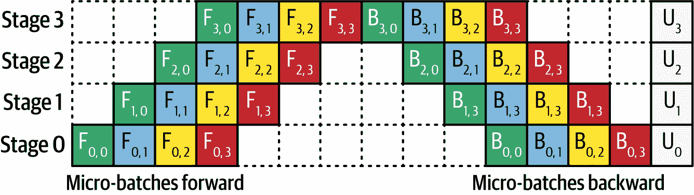

# 第九章\. 规模化：硬件、基础设施和资源管理

部署和管理 LLM 在基础设施和资源管理领域带来了独特的挑战和机遇。正如您在本书中所见，LLM 是计算密集型的，需要大量的硬件、存储和网络资源才能高效运行。无论您是将 LLM 作为基于云的服务利用、在本地数据中心部署预训练模型，还是从头开始训练自己的模型，您的基础设施决策将影响其性能、可扩展性和成本效益。

对于 LLMs（大型语言模型）的有效资源管理涉及优化计算能力、内存和存储。在本章中，我们将探讨 LLM 基础设施的关键组成部分，包括硬件要求和部署策略。我们还将讨论优化资源使用、管理成本和在生产环境中保持可靠性的最佳实践。本章将帮助您了解管理大规模 AI 应用资源所涉及到的权衡。

# 选择正确的方法

选择使用 LLM 的适当方法取决于您想要使用它的应用程序的需求。对于初创公司或小规模应用，直接从云端使用模型可能是最快且最具成本效益的解决方案。对于有特殊需求或高负载的企业，在云基础设施上部署 LLM 可以帮助您在灵活性和可扩展性之间找到适当的平衡。最后，对于有严格数据隐私或延迟要求的组织，本地部署提供了无与伦比的控制和安全，尽管代价是更高的运营复杂性。

通过仔细评估每种方法的权衡，您的组织可以将其 LLM 部署策略与其技术和业务目标对齐，确保这些变革性 AI 技术的有效和高效使用。

无论您选择哪种解决方案，我的建议是始终从第三方 API-based 方法开始；也就是说，首先使用来自云端的模型。我在实际部署中观察到的一个主要问题是确定 LLM 是否是解决特定问题的良好解决方案。使用第三方、基于 API 的方法将允许您在投入大量资源到基础设施之前，在原型中回答这个问题。

# 规模化和资源分配

为了保持基于 LLM 的应用的性能、成本效益和可靠性，您必须有效地管理您的资源。过度分配资源，尤其是那些需求量大的资源，如运行 AI 系统所需的 GPU 和内存带宽，将导致不必要的开支。资源分配不足将使您面临系统崩溃和用户体验不佳的风险。

大多数训练失败源于内存不足而非计算能力不足。我把这个问题称为“冰山问题”，其中可见的尖端是失败，但真正的隐藏问题是内存效率低下。大多数人没有意识到真正的问题在于当次优的内存使用未被注意到且未被充分利用时。因此，人们留下了很多性能上的潜力。如果你正在遇到内存墙，不要急于寻求更多的硬件。当正确使用时，像分片、激活检查点、动态批处理、模型卸载等方法，可以轻松让你的 24 GB 消费级 GPU 表现得像 48 GB 的 A100。

资源分配的两个主要组成部分是*监控*和*自动化部署*。你需要监控以便知道何时资源分配过多或不足。一旦你有了这些信息，你需要能够快速反应。虽然可以忍受手动部署，但随着时间的推移，成本可能会变得难以承受。这尤其适用于你的服务需求变化很大时，这可能发生在你的服务突然成功或扩展到不同地理区域，其使用模式反映了不同的时区。

# 监控

监控使你能够了解应用程序的行为，优化资源使用，并在不同的工作负载下保持高可用性和性能。一个成功的监控方法围绕使用适当的监控工具跟踪关键性能指标（KPIs），然后在需要时开发适当的程序来实施更改。

监控的关键指标包括：

延迟

*延迟*衡量用户查询的响应时间，并显示出它直接影响到用户满意度。你的目标是尽量减少延迟。

吞吐量

*吞吐量*，或单位时间内（通常为每秒）处理请求数量，表明系统处理需求的能力，了解你的系统在高峰负载期间的表现至关重要。

资源利用率指标

*资源利用率指标*，如 CPU、GPU、内存、磁盘 I/O 和网络带宽，提供了关于哪些资源分配得很好，哪些没有的见解。

错误率

监控错误率，包括服务器错误和特定于应用程序的问题，如超过令牌限制或 LLM 安全响应，可以帮助你在问题变成大问题之前识别它们。

成本

监控成本以确保你的应用程序在经济上是可行的，特别是对于资源密集型的 LLM。

云环境为这些指标提供了许多针对各自平台的本地监控工具，如 AWS CloudWatch、Azure Monitor 和 Google Cloud Operations Suite。这些综合工具使你能够跟踪标准和自定义指标，例如特定于模型的如令牌使用或推理时间的数据。

类似于 Datadog、New Relic 和 AppDynamics 这样的应用程序性能监控平台通过可视化应用程序依赖关系，提供了对瓶颈和潜在故障的详细洞察。像 Weights & Biases 和 MLflow 这样的特定平台允许您监控 LLM 行为，跟踪微调迭代，并比较部署。

对于日志记录，像 ELK Stack 或 Fluentd 这样的集中式系统对于捕获详细的应用程序日志、查询具体信息和系统警告非常有价值；像 OpenTelemetry 或 Jaeger 这样的分布式跟踪工具可以让您跨服务跟踪请求，以确定延迟热点。

一个好的监控架构至少应该有三个层级：

客户端层

客户端层允许您捕获用户端性能和满意度指标，通常是通过让用户使用点赞或点踩来对答案进行评分。

应用程序层

应用程序层可以专注于 API 性能，跟踪吞吐量、处理时间和错误率。

基础设施层

基础设施层可以监控承载 LLM 和您的应用程序的底层资源，测量 CPU、GPU、内存、存储和 I/O 性能。

最后，您可以根据所需的粒度将模型视为一个独立的第四层。这对于基于 LLM 的应用程序尤其理想。这个*模型层*可以跟踪推理时间、令牌使用、令牌缓存以及其他模型特定指标，例如困惑度。

实时警报可以帮助自动化问题检测。通过为诸如延迟、资源利用率和错误率等指标设置阈值，当特定指标低于预期水平时，您可以通过电子邮件或短信接收警报。同时，通过自动向您的应用程序发送一些您已知预期答案的请求并测量输出，实施*合成监控*也是一个好主意。

当阈值失败时，您可以设置脚本自动触发；例如，如果当前虚拟机达到某些 CPU 或内存级别的阈值，则启动一个新的虚拟机。您还可以自动运行脚本以减少常见问题（如定期重启服务或根据预期需求上下调整资源）的停机时间。

从监控中获得的见解对于优化您的系统将非常有价值。例如，*自动扩展*机制可以根据工作负载需求动态调整计算资源。*水平扩展*可以通过添加实例来容纳更多请求，而*垂直扩展*则增加现有节点的容量。*缓存*频繁访问的响应可以减少延迟并减轻模型的工作负载，而*批处理*低优先级查询可以提高效率。此外，模型蒸馏和量化（在第五章中讨论）等技术可以优化模型本身，在性能和资源消耗之间取得平衡。

监控不是一个一次性设置，而是一个持续的过程，涉及可观察性和细化。可观察性工具允许您识别工作负载模式，预测资源需求，并分析用户交互的趋势，以细化您的基础设施和模型性能。高级测试技术，如 A/B 测试和影子测试，允许您以受控的方式验证新部署，最小化风险同时引入改进。这些将在下一节中讨论。

# LLM 的 A/B 测试和影子测试

如第七章所述，A/B 测试是评估系统不同版本性能的一种广泛使用的方法。在 LLM 的背景下，A/B 测试涉及部署 LLM 的两个版本——通常被称为“冠军”（现有模型）和“挑战者”（新模型）——以确定在现实世界条件下使用之前描述的指标哪个表现更好。

相比之下，*影子测试*提供了一种更安全、更不侵入的方式来评估新模型，而不会直接影响用户。在这种方法中，挑战者模型在后台运行，通过处理相同的输入（或其中的一部分，以节省成本）来“影子”冠军模型，但不会影响实时应用程序的输出。这允许团队收集性能数据，识别潜在问题，并在将模型提供给用户之前对其进行微调。影子测试特别适用于测试在风险较高或敏感的应用程序中使用的 LLM，例如客户服务或医疗保健，引入有缺陷的模型可能导致重大负面后果。再次强调，您的指标定义得越明确，您就越能准确地看到新模型的表现是否优于现有模型。

一个注意事项：在影子测试中，用户看不到新模型的输出，因此您只能收集他们对现有（冠军）模型的交互或反馈。这使得 A/B 测试非常适合那些用户反馈对于评估性能至关重要的场景，而影子测试则更适合在部署前测试基础设施，确保模型的可靠性和安全性*之前*。

# 自动基础设施配置与管理

部署和管理用于 LLM 的基础设施需要大量的资源，无论是在云架构中还是在本地。自动基础设施配置可以帮助您优化资源利用，确保可扩展性，并通过根据监控信号动态调整您的基础设施以满足模型在训练、微调和推理期间的计算需求来降低运营成本。

## 云架构中的配置与管理

主要的云平台提供了自动基础设施配置和管理工具，包括可扩展的计算实例、GPU 和 TPU 支持、托管存储以及针对 AI 工作负载定制的网络解决方案。像 AWS CloudFormation、Azure 资源管理器（ARM）和 Google Cloud Deployment Manager 这样的工具允许您部署*基础设施即代码*（IaC），并在声明性的 YAML 或 JSON 模板中定义基础设施需求，如产品、版本和功能。这些模板自动化资源配置，以保持多个部署之间的环境一致性。

云架构最显著的优势之一是它们能够根据需求自动扩展资源。像 AWS Auto Scaling、Azure 虚拟机规模集（VMSS）和 Google Cloud Platform（GCP）自动扩展这样的服务可以根据预定义的指标（如 CPU 使用率、内存消耗和 GPU 利用率）动态增加或减少计算实例的数量。将这些工具之一链接到您的监控设置中，真的可以帮助您管理成本和延迟。这种弹性对于 LLM 推理特别有用，因为它会快速消耗昂贵的资源。您还可以使用您的监控指标自动缩减未使用的资源，并在需要时快速扩展。

云提供商还提供了成本节约选项，如 AWS Spot 实例、Azure Spot VM 和 GCP 可抢占 VM，这些选项允许您以较低的价格利用未使用的容量。这些非常适合非关键工作负载，如批处理或分布式 LLM 训练。然而，因为这些实例可能会被中断，所以将它们的配置与您的监控基础设施集成以管理容错性和作业重试是至关重要的。

最后，正如我们之前提到的，基于云的监控工具，如 AWS CloudWatch、Azure Monitor 和 GCP Operations Suite，可以跟踪资源利用率、检测异常并触发自动化操作。您可以将它们与自动化工具（如 AWS Lambda、Azure Functions 或 GCP Cloud Functions）结合使用，以实现*自愈*架构。例如，如果在 LLM 训练作业期间 GPU 实例失败，一个函数可以自动配置一个替换实例，然后重新启动作业。这些工具非常可配置。虽然您可能会使用许多预配置的指标（如 CPU 和内存使用率）作为它们是，但您仍然应该为您的特定用例配置自定义指标。

## 在自有硬件上的配置和管理

对于选择在自有的硬件上部署 LLM 的组织，无论是在本地还是在私有云中，自动配置和管理都带来了独特的挑战和机遇。这些设置通常依赖于虚拟化技术（如 VMware、Proxmox 或 Hyper-V）和容器化平台（如 Kubernetes 或 Docker Swarm）来有效编排资源。

在自有硬件上部署 LLM 通常涉及在“裸金属”服务器和虚拟化环境之间做出选择。裸金属提供更好的性能，非常适合资源密集型任务，如 LLM 训练或微调，尤其是当与高端 GPU 如 NVIDIA A100s 或 H100s 搭配使用时。然而，虚拟化提供了更大的灵活性，允许多个工作负载共享资源。Kubernetes 节点池等工具可以动态地将 GPU 资源分配给 Pod，优化 LLM 工作负载的资源利用率。

就像在云环境中一样，本地部署可以利用 Terraform、Ansible 和 Chef 等 IaC 工具来自动化基础设施配置。这些工具能够确保服务器、网络和存储的一致配置，确保环境间的可重复性。例如，您可以使用 Terraform 定义启用 GPU 的节点，并使用 Ansible 在这些节点上配置机器学习框架，如 PyTorch 或 TensorFlow。

本地部署需要强大的监控来跟踪资源使用和性能。您可以使用 Prometheus 和 Grafana 等开源工具来可视化指标，同时工作负载调度器如 SLURM（简单 Linux 资源管理工具）和 Kubernetes 有助于高效地分配计算资源。对于推理任务，边缘部署也可能从低延迟调度算法中受益，以优先处理实时请求。

本地基础设施的扩展比云中更具挑战性，因为它需要购买和配置额外的硬件。混合方法——结合自有硬件和云资源——可以解决这个问题。例如，您可能使用本地 GPU 训练 LLM，但在高峰需求期间将推理或测试工作负载卸载到云上。然而，混合架构也带来了挑战；例如，您的 LLMOps 工程师需要配置端点以及何时向不同端点发送请求的参数，以及实现监控和自动故障恢复。表 9-1 比较了云和本地管理 LLM 的几个方面。

表 9-1. 云和本地管理的比较

| 方面 | 云架构 | 自有硬件 |
| --- | --- | --- |
| 可扩展性 | 可通过自动扩展工具高度可扩展 | 受硬件可用性限制 |
| 首期成本 | 首期成本较低；按需付费模式 | 硬件采购的首期成本较高 |
| 运营成本 | 根据使用情况变化的可变成本 | 功耗、冷却和维护的固定成本 |
| 性能 | 使用云 GPU 进行训练/推理时性能高 | 使用裸金属进行特定工作负载时性能高 |
| 灵活性 | 资源配置和重新配置简单 | 需要手动或自动重新配置 |
| 控制 | 限于云提供商的提供 | 对硬件和软件堆栈有完全控制 |

## 自动基础设施管理的最佳实践

将云平台的灵活性与自有硬件的控制相结合，使组织能够利用两者的最佳优势。以下是实施时的一些最佳实践：

云爆发

使用这种共同策略，在高峰需求期间，额外的负载由云来处理。

使用自动化管道

使用基础设施即代码（IaC）和持续集成/持续部署（CI/CD）管道来自动化部署和更新。例如，Jenkins 或 GitHub Actions 可以自动化资源分配、LLM 部署和推理任务。

优化成本和性能

无论是在云端还是本地，监控工具和调度算法可以帮助您平衡成本和性能。使用云平台提供的成本模拟器或自有硬件的基准测试来规划您的部署。

设计高可用性和冗余

通过在多个区域（云端）部署资源或使用冗余硬件（本地）来确保关键 LLM 应用程序的容错性。实施自动故障转移机制以最小化停机时间。

## 规模定律与计算最优论证

[计算最优论证](https://oreil.ly/dLHHa)是机器学习模型训练中的一个原则，它解决了模型大小（参数数量）与用于训练的数据量之间的权衡，强调在两者之间找到平衡以优化可用计算能力的使用。

这个原则由 DeepMind 的 Chinchilla 规模定律正式化，这在第五章中讨论，该定律揭示了许多早期的 LLM，如 GPT-3，相对于其大小而言训练不足。这些模型使用了不成比例的计算量来扩展其参数数量，但没有实施相应的训练数据量增加。这种不平衡导致了次优性能，因为这些模型具有大量的参数，但没有足够多的训练数据来找到这些参数的最佳权重。

这里的实际意义是，在分配计算资源以训练一个 LLM 时，您必须平衡模型的大小与训练数据量。这就是计算最优论证发挥作用的地方。例如，与其构建一个庞大的模型但用不充分的数据进行训练，不如创建一个较小的模型并在同一数据集上对其进行更彻底的训练可能更有效地利用资源。

使用计算最优平衡训练模型的主要好处是，与过度庞大且训练不足的模型相比，它们往往需要更少的再训练或微调来完成下游任务。更现代的默认模型，如 GPT-4 和 Claude 及 Gemini 的新版本，都应用了计算最优原则，这使得它们在通用任务上表现更佳，并减少了定制微调的需求。

让我们通过一个具体的例子来分析。

Chinchilla 缩放法则表明，对于计算预算*C*，模型参数数量*N*和它使用的训练数据*D*（以标记为单位）之间的关系是：

$upper C proportional-to upper N \times upper D$

这里，“$proportional-to$”符号表示“成比例于”。

此外：

$upper D proportional-to upper N$

这意味着*D*应该大约线性地与*N*成比例。标记和参数之间的最佳比例在 15 到 25 之间；也就是说，标记的数量应该是参数数量的 15 到 25 倍。

假设你有一个 10²³浮点运算（FLOPs）的计算预算，并且你想训练一个 LLM。让我们探讨该计算预算的两个场景。

### 场景 1：过度优先考虑模型大小

通过在 3000 亿个数据标记上训练一个 2000 亿参数的模型来过度优先考虑模型大小：

$StartLayout 1st Row upper N = 200 \times 10⁹ Baseline 2nd Row upper D = 300 \times 10⁹ EndLayout$

这里，你的*D*/*N*是每参数 1.5 个标记，低于 Chinchilla 缩放法则指定的计算最优区域。

训练所需的计算量与*N × D*成比例，而确切的成比例系数*k*是未知的：

$upper C = k \times upper N \times upper D$

代入*N*和*D*，我们得到：

$upper C = k \times (200 \times 10⁹ Baseline) \times (300 \times 10⁹ Baseline) = k \times 6 \times 10⁴ Baseline \times 10^{18 Baseline} = 6 \times 10^{22}$

这符合 10²³ FLOPS 的计算预算。

### 场景 2：计算最优策略

使用计算最优策略，并训练一个 50 亿参数的小型模型，在 1 万亿（一千亿）个标记上：

$StartLayout 1st Row upper N = 50 \times 10⁹ Baseline 2nd Row upper D = 1,000 \times 10⁹ EndLayout$

这里，你的*D*/*N*是 20。

训练所需的计算量：

$upper C = k \times (50 \times 10⁹ Baseline) \times (1,000 \times 10⁹ Baseline) = k \times 5 \times 10⁴ Baseline \times 10^{18 Baseline} = 5 \times 10^{22}$

不仅这符合 10²³ FLOPS 的计算预算，而且每参数 20 个标记的*D*/*N*也位于计算最优区域内。这一发现表明，使用更多数据训练较小的模型将导致每单位计算的性能更好。

场景 2 是一个更好的解决方案，因为它确保每个参数都有足够的训练数据曝光，减少过拟合并合理利用资源。

# 优化 LLM 基础设施

高效部署和管理 LLM 需要基础设施，当然，但优化它还需要利用该基础设施的软件。为了满足 LLM 训练和推理的需求，编译器；并行和分布式计算；以及 CUDA（Nvidia 的 Compute Unified Device Architecture）、NCCL（NVIDIA Collective Communications Library）、ZeRO（Zero Redundancy Optimizer）、DeepSpeed、TF-Replicator 和 Horovod 等框架等技术发挥着关键作用。优化的另一个关键方面是容错和备份系统。在理想情况下，所有资源都应用于提高性能，但在实践中，一些资源需要用于确保系统可以继续运行（开销成本）。

*编译器* 将高级代码转换为针对特定硬件架构优化的机器指令。对于需要高计算效率的 LLM 工作负载，您需要专门的编译器，如 NVIDIA 的 NVCC（用于 CUDA）、TensorFlow 的 XLA 或 PyTorch 的 TorchScript。这些编译器专注于实现三种类型的优化：内核融合、精确缩放和硬件利用。让我们依次看看每种类型。

## 内核融合

*内核融合* 是一种技术，将多个计算操作组合成一个单独的 GPU 内核，以减少内存流量和执行开销。在深度学习工作流程中，矩阵乘法、逐元素加法和激活等操作通常按顺序发生。没有内核融合，这些操作将涉及单独的内存读写操作，“离开核心”以保存中间结果，然后再次“离开核心”以读取这些中间结果。重复访问全局内存会导致延迟和低效。因此，编译器会识别出合并（或 *融合*）这些操作的机会。融合的好处包括：

减少内存访问

中间结果存储在更快、低延迟的 GPU 寄存器或共享内存中，而不是写回全局内存。

最小化内核启动开销

每次内核启动都有计算开销。融合内核需要更少的启动次数，从而加快执行速度。

提高缓存效率

融合允许相关操作在内存中更有效地共享数据，减少缓存未命中。

例如，一个典型的深度学习评估序列如 `ReLU(Wx + b)`，其中 `W` 和 `b` 是权重和偏差，可以被融合成一个单独的内核，该内核计算矩阵乘法 (`Wx`)，添加偏差 (`+b`)，并应用激活函数 (`ReLU`)，而无需在 GPU 外部全局内存中逐个写入每个中间步骤。

## 精确缩放

深度学习工作负载通常涉及不需要高精度的数值计算。*精度缩放*使模型能够使用 16 位浮点（FP16）或脑浮点（BF16）等低精度格式，而不是传统的 32 位浮点（FP32）格式。编译器通过以下方式帮助：

自动化混合精度训练

类似于 NVIDIA 的 APEX（用于 PyTorch）和 TensorFlow 的混合精度 API 的编译器会自动将某些操作下缩到 FP16，同时保持关键操作（如梯度累积）在 FP32 中。这确保了数值稳定性，同时减少了内存使用并加快了计算速度。

利用专用硬件

现代 GPU（如 NVIDIA 的 A100 或 H100）包括针对低精度优化的张量核心。编译器可以将高级操作转换为特定于这些低精度核心的指令，从而显著加快矩阵乘法和其他张量操作，同时为需要高精度的操作释放高精度核心。

提高内存效率

通过降低精度，模型可以消耗更少的内存，这让你可以使用更大的批量大小或在内存容量较低的硬件上进行训练。

## 硬件利用率

高效的硬件利用率确保 GPU 或其他加速器在其全部潜力下运行，最大化计算吞吐量。现代硬件可以包括专门的单元，如张量核心、矩阵乘法单元和向量处理器。编译器将诸如通用矩阵乘法之类的操作映射到这些专用单元，利用它们的高吞吐量，并为其他任务释放更多通用资源。

*指令级并行性*是 AI 专用编译器优化硬件利用率的另一种方式。它们可以生成在多个级别上利用并行性的代码，包括线程级别（使用数千个 GPU 线程）和向量级别。

*AI 专用编译器*了解现代 GPU 和 AI 服务器中内存的布局，因此它们的内存层次结构特别高效。它们优化代码以有效地使用共享内存、寄存器和缓存，并减少对较慢的全局内存的依赖。

# 针对大型语言模型（LLMs）的并行和分布式计算

大规模 LLMs 需要并行和分布式计算来管理其巨大的计算和内存需求。像*数据并行性*、*模型并行性*和*流水线并行性*等技术将工作负载分配到多个处理器或节点，以有效地使用硬件资源。这些技术的构建块是 CUDA 和 NCCL 框架。

NVIDIA 的 CUDA 是 GPU 加速的基础，提供了高性能并行计算的 API。它允许开发者编写直接利用 GPU 处理能力的代码，这对于 LLM 任务（如矩阵乘法、注意力机制和梯度计算）至关重要。即使是非常小的语言模型也依赖于 CUDA 以实现可接受的性能。

NCCL 通过优化多个 GPU 之间的通信来补充 CUDA。它提供了数据移动的原语，如 `all-reduce`、`all-gather` 和 `broadcast`，确保最小延迟和高带宽。这在分布式训练中尤为重要，因为模型梯度经常需要在 GPU 之间同步。随着模型的增长，它们往往需要多个 GPU，NCCL 提供了允许不同 GPU 通信的 API。

## 数据并行

*数据并行* 涉及将训练数据集分割成块，每个块对应一个设备（如 GPU 或 TPU）。每个设备在训练迭代期间并行处理其自己的块。然后，在每个设备上放置模型的相同副本，该副本计算其数据块的梯度。接下来，使用通信原语如 `all-reduce` 对梯度进行平均并同步到设备，然后将平均梯度应用于更新每个设备上的模型参数。

## 模型并行

*模型并行* 将模型本身分割到多个设备上，使每个设备负责模型的一部分，例如几个层（或操作）。当模型太大而无法适应单个设备时，这很有用。然后，您按顺序通过模型传递输入，根据需要在不同设备之间移动中间输出；这被称为 *正向传递*。接下来，在 *反向传递* 中，您按相反顺序计算每个层的梯度。这有助于同步设备以实现梯度流动。最后，更新参数，要么在每个设备上独立更新，要么通过中央参数服务器更新。

模型并行优化了内存使用，但以吞吐量为代价；当一个设备处理输入时，其他设备处于等待状态。

## 流水线并行

*流水线并行* 也将模型分割，将不同的层分配给不同的设备，类似于模型并行。然而，在流水线并行中，数据批次被分割成更小的块，以便尽可能多的设备在任何给定时间都被占用。这需要额外的通信，但可以减少空闲计算时间。

图 9-1 展示了使用四个设备实现流水线并行并将批次数据分割成四个微批次的示例。

###### 图 9-1\. 实现流水线并行

流水线并行在加速具有较小硬件足迹的模型训练方面非常有效，但过去实现起来很困难。2022 年，Meta 发布了针对 PyTorch 的流水线并行，或称为 [PiPPy](https://oreil.ly/g5EZ3)。PiPPy 已合并到 PyTorch 的主分布中，作为 `torch.distributed.pipelining` 子包，不再需要单独安装。

# 高级框架：ZeRO 和 DeepSpeed

由微软开发的 ZeRO 通过在设备间划分模型状态（如参数、梯度和优化器状态）来最小化训练过程中的内存开销。这使得您能够在不需要具有过多内存容量的 GPU 的情况下，训练具有数十亿甚至数百亿参数的模型。

建立在 ZeRO 之上，DeepSpeed 是一个深度学习优化库，它使训练大型模型更加高效。它提供了混合精度训练、梯度累积和内存优化等功能，显著减少了训练时间和成本。

表 9-2 总结了何时使用所提到的每种技术。

表 9-2. 不同内存优化技术的比较

| 技术 | 它解决的问题 | 它是如何工作的 | 折衷方案 |
| --- | --- | --- | --- |
| 分片 | 模型太大，无法在一个 GPU 上运行 | 将模型权重/层分散到多个 GPU 上 | 同步和通信的复杂性增加 |
| 激活检查点 | 反向传播期间的内存使用量高 | 仅保存关键激活并稍后重新计算其余部分 | 额外的计算时间 |
| 动态批量 | 小请求上的浪费计算 | 飞行中分组输入以最大化 GPU 使用 | 略有响应延迟 |
| 模型卸载 | GPU 无法容纳整个模型 | 将未使用的部分移动到 CPU 或磁盘；需要时再获取 | 由于传输时间而变慢 |
| 混合精度训练 | 激活和权重占用太多空间 | 使用低精度（例如，FP16）而不是 FP32 | 数值精度略有损失（通常可以忽略不计） |
| 量化 | 模型太大，无法部署 | 将权重压缩到 8 位或更低 | 如果不小心，可能会损失精度 |
| 梯度累积 | 批次大小太大，无法使用 GPU | 将一个大批次分成更小的块并累积梯度 | 迭代时间较慢 |
| 零冗余优化器（ZeRO） | GPU 间的冗余优化器状态 | 在设备间划分优化器状态和梯度 | 复杂性和通信开销 |
| 操作融合 | 太多小的中间张量 | 将多个操作组合成一个以减少内存操作 | 需要编译器/工具支持 |
| 分页注意力（用于推理） | 长上下文导致的内存峰值 | 类似虚拟内存的流式键值缓存进出 | 需要智能调度 |

## LLM 应用的备份和故障安全流程

在 LLM 应用中，LLMOps 工程师通常负责管理备份。由于硬件故障、软件问题或甚至恶意活动，故障确实会发生。LLM 工程师可以通过强大的备份和故障安全策略来降低风险，确保连续性和最小化停机时间。

这些活动的名称可能会误导。拥有良好的文档记录和定期测试的恢复策略与拥有良好的备份一样重要。长期从业者有“战争故事”的情况很常见，即备份已经进行了多年但从未测试，而在实际需要时却不起作用。

LLMOps 工程师备份哪些工件将根据模型和应用生命周期的阶段而变化。在开发阶段，最常备份的工件是训练数据和中间模型权重（模型检查点），以及描述训练的基础设施即代码的文件。训练数据和模型检查点往往非常大，而 IaC 文件则相对较小。

随着应用迁移到生产环境，代表生产架构的 IaC 文件应该进行备份，以及用户数据（如查询日志和个人化设置）和性能指标。LLM 依赖于大量数据集，丢失预处理或微调数据可能代价极高。备份可以保护数据免受损坏或意外删除。训练 LLM 也是计算密集型的，因此模型检查点的备份在发生故障或数据损坏的情况下可以发挥重要作用，从而保留进度。此外，许多行业和司法管辖区都有合规标准，要求数据备份以供审计和问责。

## 备份策略类型

LLM 应用的备份策略分为三个基本类别：完全备份、增量备份和差异备份。让我们更详细地考察这些：

完全备份

完全备份在特定时间点捕获 *整个* 数据集或模型。虽然它们需要大量的存储空间，但它们是全面且恢复简单的。

增量备份

*增量备份* 仅存储自上次（完全或增量）备份以来所做的更改，以减少存储需求。要恢复，您需要整个历史数据序列；即使缺少一个数据块也会导致恢复失败。

差异备份

*差异备份* 保存自上次 *完全备份* 以来所做的更改，平衡存储效率和恢复速度。要恢复，您需要最新的完全备份和最新的差异备份。

您选择的备份策略取决于几个因素。高风险应用需要更频繁的备份和冗余，以及更少的停机时间。对于关键应用，恢复需要快速且无故障，因此通常建议进行频繁的完全备份。

数据量也是一个重要因素。增量或差异备份可以帮助最小化 LLM 应用中使用的类似大数据集的存储开销，因为每天制作完整副本会消耗昂贵的时间和存储空间。

在数据变化迅速的易变系统中，例如活跃的微调环境，频繁的备份尤其是个好主意。如果数据量小，这些甚至可以是完全备份。然而，对于相对静态的系统，例如部署的推理模型，备份的频率可以较低（例如，每周一次）。

## 最重要的实践：定期测试恢复

无论您的备份策略如何，定期测试恢复过程都是**必不可少的**。例如，大型备份通常存放在冷存储中，这比热存储便宜得多。*热存储*某种程度上类似于在云上有一个文件夹，您可以立即访问文件。*冷存储*更像是将磁盘存放在仓库中——访问数据需要一段时间，有时长达几天。一个 LLMOps 工程师可能会迅速从英雄变成零，他说：“别担心，我已经备份了所有数据；然而，由于我需要检索数据，生产将中断两周。”

# 结论

根据您是在自定义云基础设施上运行 LLM 还是使用自有硬件，管理 LLM 基础设施和资源需要不同的方法。您的部署策略选择应考虑成本、可扩展性、数据隐私和运营复杂性。无论选择哪种基础设施，LLMOps 工程师都必须监控和评估性能，以确保其部署保持高效和可靠。

有效扩展 LLM 基础设施需要先进的工具，如优化硬件使用的特殊编译器，以及平衡模型大小和训练数据以在给定成本下提高性能的技术。理解和实施并行策略让您能够训练和部署甚至最大的模型。

拥有良好的备份策略并定期测试恢复过程至关重要，以识别潜在的故障点。整合这些最佳实践将帮助您部署具有弹性和高性能、满足客户需求的 AI 驱动应用程序。

# 参考文献

Hoffman, Jordan, 等人. [“训练计算最优的大型语言模型”](https://oreil.ly/dLHHa), arXiv, 2022 年 3 月 29 日。

Mueller, Z. R. [PiPPy](https://oreil.ly/g5EZ3), PyTorch, 九月 2024.
