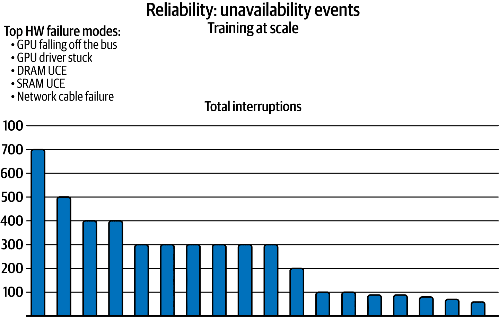
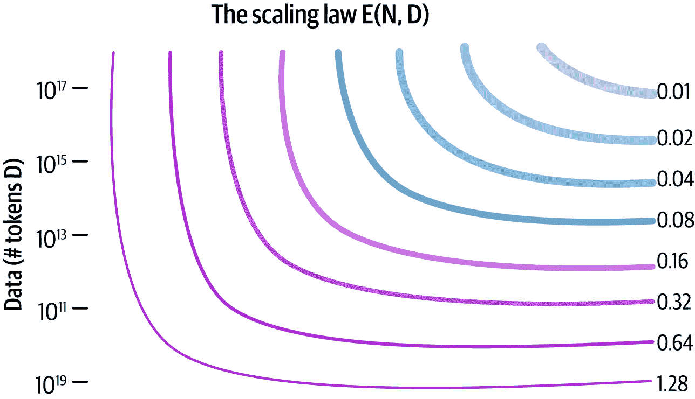

# 第十章\. LLMs 和 LLMOps 的未来

在接下来的十年里，LLMOps、LLMs、NLP 和知识图谱的未来将以我们今天几乎无法想象的方式汇聚。想象一下，AI 系统不再是遥远的工具，而是深深地融入我们生活的每一个方面。即使是今天最受欢迎的 LLMs 也有些笨拙的迭代（[链接](https://oreil.ly/O3IFm)），但在我看来，在不久的将来，它们将被[精炼](https://oreil.ly/yW4T3)到一定程度，其语言理解能力将[与人类直觉相媲美](https://oreil.ly/k8EyH)。这是因为 LLMs 中出现的特性。

目前，用户与 LLMs 的主要交互方式是通过基于文本的聊天，但未来几年，LLMs 不仅会回答问题；它们将参与复杂的解决问题，提供见解，并推动创造力本身的边界。例如，2024 年 9 月，OpenAI 为其 ChatGPT 应用程序发布了高级语音模式，可以检测语音语调——包括讽刺。这项工作的大部分与基础设施堆栈即将到来的创新有关。Meta [最近撰文](https://oreil.ly/16e8R)讨论了在规模训练这些模型时出现的算法和架构之外的问题（见图 10-1）。

随着这些系统成熟为一个无缝、自我维持的基础设施，LLMOps 将成为支撑它们的骨干。不再需要人工干预，训练、微调和部署这些模型的管道将完全自动化，从而加快该领域的进步。LLMOps 工程师将花费更少的时间调试代码，更多的时间完善高级系统策略，包括自动平衡模型训练与计算成本的平台和基础设施设计。

###### 图 10-1\. 可靠性是 LLMOps 的关键目标，但即使是 Meta 也面临着挑战，因为需要在基础设施层面进行更多创新（来源：[Meta 的工程](https://oreil.ly/xlokW)；经许可使用）

这些模型将即时适应，以几乎神奇的速度从现实世界的反馈中学习。这是 AutoML 的主要目标，它是机器学习中的一个活跃研究领域。最重要的是，随着 LLMs 开始生成更高质量的翻译内容，它们可以更容易地将能力扩展到其他语言，甚至是不太常见的语言。另一个令人兴奋的来源（图 10-2）是 LLMs 在利用多模态输入方面变得越来越好。目前，LLMs 处理文本、语音和图像需要几秒钟，在同时语音转文本翻译方面取得了大量[进展](https://oreil.ly/IWfM4)，这是语音到语音翻译的关键步骤。一旦同时语音转文本的质量足够高，现有的文本到语音模型，如 OpenAI Whisper，就可以用于完成语音到语音翻译的管道。

###### 图 10-2\. 巴雷特·索普于 2024 年 9 月 24 日作为 OpenAI 研究副总裁期间发布的[X post](https://oreil.ly/fbw7V)

LLM 的一个局限性在于，它们的核心是依据训练数据和提交的提示生成最可能的下一个单词，但它们似乎甚至不理解简单概念。在一个流行的例子（如图 10-3 所示）中，Meta 的 LLM 可以轻易地告诉汤姆·克鲁斯的母亲是玛丽·李·费弗，但在回答“玛丽·李·费弗的著名演员儿子是谁？”这个问题时遇到了困难。它经常用其他著名演员的名字回答，如马特·达蒙、汤姆·汉克斯和米歇尔·菲佛——提示中的“著名演员”部分优先级更高。

###### 图 10-3\. Meta 的 AI 对关于演员汤姆·克鲁斯及其母亲玛丽·李·费弗的问题的回答，显示了缺乏概念理解

正在研究的一个解决方案是使用包含概念之间关系的知识图谱。*知识图谱*包含相互关联的概念及其关系的表示。例如，维基百科列出了玛丽·李·费弗作为汤姆·克鲁斯的母亲，但他作为她的儿子的事实并没有写下来：这是隐含的。知识图谱[使关系明确](https://oreil.ly/aGwVQ)，创建出能够以几乎人类的方式理解情境的系统。[几乎人类](https://oreil.ly/ILvsK)。

与大型语言模型（LLM）的对话将变得与人类对话难以区分。不再需要与聊天机器人笨拙地交流或处理“机器人”式的回应。个性化技术的进步可以使未来的 LLM 应用在交互过程中结合他们从用户那里学到的多个事实。这种简单版本今天已经存在。例如，ChatGPT 已经学会了一个用户经常询问的编程语言，并默认用该语言提供答案。[最近的研究](https://oreil.ly/n6lZt)提供了为教育、医疗和金融添加个性化的其他几个例子。尽管这些用例目前主要出现在研究论文中，但当它们在所有电子商务应用中成功部署时，LLM 将预测用户需求，情境化交互，甚至预测趋势——所有这些同时，它们会从新的数据流中持续学习。

人们关于 LLM 提出的一个关键担忧与这些模型相关的对齐风险有关；也就是说，如果一个模型能够表现出涌现性并能预测和模仿人类行为，那么我们如何知道它将在长期内继续有用？在研究人员密切监控这些模型的表现时，发展应该暂停吗？我们如何确保模型不是以病态的方式行事，只有在意识到自己正在被测试时才提供无害的答案？[研究人员正在探索这些问题的答案](https://oreil.ly/BAilf)。

作为一位相信对这一未来持有 [斯多葛主义观点](https://oreil.ly/yfbPd) 的人，我的观点是，我们应该拥抱任何使生活更简单、更丰富、更有意义的科技。与所有进步一样，真正的赢家将是那些理解这不仅仅关乎机器，而关乎我们作为人类如何明智地使用它的人。

从 2010 年代中期到 2020 年代中期，LLM 架构的进步呈指数级增长，但未来几年将带来更深刻的转变。这些变化不仅将重新定义 LLM 的结构，还将重新定义它们与数据、人类以及彼此的交互方式。从提高可扩展性到更高效的计算，从结合多个范例的混合架构到涌现的自学习系统，LLM 的未来具有令人叹为观止的潜力。本章探讨了该潜力的几个方面。

# 超越当前边界

今天的 LLM，如 GPT-4，已经达到了令人印象深刻的规模，但它们离极限还远。进入 2030 年代，我们应该期待看到从底层设计时就考虑可扩展性的架构。这不仅仅是增加参数数量的问题；这是关于高效、有针对性的扩展。未来的架构将结合层次化的模型层（也称为 *层次化注意力网络*），其中每一层都针对推理、情感甚至创造力等特定理解领域进行了优化（参见 图 10-4）。

###### 图 10-4\. 在缩放定律中，N 代表数据点的数量，D 代表参数的数量；具有更多数据点的更大模型往往比具有较少数据点的更大模型表现更好（来源：“人工智能缩放原理”由 [Dynomight](https://oreil.ly/uCTJD) 撰写）

而不是创建越来越大的单体模型，我们将看到更多模块化的 LLM，它们可以将任务委托给专门子模型。想象一个架构，其中基础 LLM 理解语言，但调用额外的“专家”模块，这些模块针对法律推理、医学诊断或创意写作等利基任务进行了训练。而不是有一个试图成为所有事物专家的大型基础模型，我们将拥有在不同事物上成为专家的模型：一个医疗保健模型、一个法律模型、一个创意写作模型等。

专门模型可以超越通用模型并使用更少的资源。这在 ChatGPT 中的数学问题和网络搜索中已经发生。研究人员发现[研究人员发现](https://oreil.ly/c1svH)，GPT 在研究生水平的数学测试中表现低于平均水平，所有 GPT 模型都有[知识截止点](https://oreil.ly/pv6sA)，这意味着它们对其截止日期之后的事件一无所知。目前，当 GPT 检测到用户询问其训练截止日期之后发生的事件时，它会将问题外包给另一个名为[SearchGPT](https://oreil.ly/kJtXj)的不同模型，然后使用这些结果在现有的聊天中提供答案。将通用模型与专门模型相结合，可以使 LLMs 在专业领域内更高效、更深入地运行，同时减少计算开销并提高输出精度。

为了支持这种适应性强的庞大系统，分布式计算和并行化的创新将是关键。正如 Evan Morikawa 在[一次采访](https://oreil.ly/bMlsK)中解释的那样，模型需要托管在单个集群上，而不是分散的节点网络中。这种转变将优化训练时间、数据延迟和实时推理，使 LLMs 在处理大规模、实际应用方面效率大大提高。

# 混合架构：将神经网络与符号 AI 结合

LLMs 当前的一个局限性在于它们仅依赖于深度学习，深度学习在模式识别方面表现出色，但在符号推理和逻辑方面存在困难。在许多情况下，科学家们已经发现了模式并将它们编码成符号公式（例如，牛顿的万有引力理论），但神经网络训练的方式不允许它们使用现有的公式——它们必须自己重新发现模式。

LLMs 的未来将涉及混合架构，这些架构将神经网络的优势与符号 AI 方法相结合。这些架构将使模型不仅能够预测句子中的下一个单词，还能够使用已知规则和公式，就像人类一样。

*神经符号学*，或称为“混合”的 AI 架构，将神经网络的直观、模式匹配能力与符号系统的精确、基于规则的推理能力相结合。大型语言模型（LLMs）通过从大量数据集中学习统计规律，在处理文本和生成自然流畅的响应方面表现出色，而符号 AI 可以表示明确的事实、逻辑约束和规则，这使得追踪其推理过程和确保一致性变得容易得多。通过合并这两种方法，我们将开发能够理解人类语言、执行严格的逻辑运算并提供结论解释的系统。

在实践中，这可以以多种方式体现。例如，一种方法是将用户的查询转换为结构化表示——例如逻辑公式——然后依靠符号推理器应用特定领域的规则或约束。这种混合方法还可以帮助提高可解释性——这是当今 LLMs 的关键弱点之一。用户将能够查询模型为何得出特定结论，模型可以引用在答案中使用的符号路径，为决策过程提供更透明的窗口。

## 稀疏和专家混合模型

当今在扩展 LLMs 时最大的瓶颈之一是它们的计算成本。当前的模型在推理时使用所有参数处理每个输入，无论任务的复杂程度或简单程度如何。未来的架构将朝着稀疏模型和专家混合系统发展，其中只有模型参数的子集在特定任务中被激活。

在*稀疏模型*中，只有与特定查询最相关的参数或神经元被激活，这允许在保持高质量结果的同时，大幅减少资源消耗。我们相信，稀疏模型与模块化方法的结合，将引领开发出强大、高效的 LLMs（大型语言模型），它们能够在消费级硬件上运行，同时提供企业级性能。

与之相反，*专家混合（MoE）模型*允许 LLMs 根据输入的要求动态激活专门的“专家”。请求医疗建议的用户将激活模型中与请求帮助写诗的用户不同的神经元子集。这种方法在查询时大幅减少了计算量，同时增加了每个领域的理解深度。这是一种“分而治之”的策略，其中 LLMs 将计算资源集中在最需要的地方。

## 内存增强模型：迈向持久、上下文丰富的 AI

当前的 LLMs 在内存方面运作有限。虽然能够处理几千个标记的上下文，但它们在会话之间保持长期记忆方面存在困难。下一代 LLMs 将通过*内存增强架构*来解决这个问题，这种架构能够在长时间内存储和检索大量数据。这些模型将具有持久性内存层，允许它们回忆起数年前的用户交互或构建随时间演变的综合知识库。

这种持久性记忆也将彻底改变[LLMs 处理个性化任务的方式](https://oreil.ly/tsGoZ)。未来的模型将记住用户的偏好、需求和历史，从而实现更丰富、更细腻的对话和解决方案。然而，这也带来了生产中的挑战，包括处理数据不一致时的意外行为。例如，想象一个既是高级政府官员又是单身父亲的个人，但他没有明确告诉模型这些问题是关于另一个人的。例如，他们问：“我第一次月经到来的迹象是什么？”而不是“我女儿第一次月经到来的迹象是什么？”个性化算法可能会错误地得出结论，认为用户是一个既是高级政府官员又是少女的青少年。

在企业应用中，持久性记忆将是关键，模型将不断从组织数据中学习，构建一个不断增长的见解和专业知识库。

## 可解释和自优化的模型

随着 LLMs 的普及，对可解释性的需求将增加。用户和企业都将要求模型能够解释其推理、减轻偏见并实时适应。未来的 LLM 架构将包括内置的可解释性功能，使用因果学习，其中每个决策或预测都可以通过推理链或概率映射追溯到其根源。

这些模型也将是自优化的。通过强化学习，大型语言模型（LLMs）将根据用户反馈进行学习，微调自己的参数以更好地与期望的结果对齐。随着时间的推移，这些模型将变得更加个性化，不仅适应个人，也适应组织或行业的特定需求。想象一下，一个法律 AI 模型在与一个律师团队互动了几个月后，开始理解该律师事务所特定的法律风格、风险处理方法和首选的法律先例。这些模型将通过迭代反馈进行学习，不断改进，而无需进行大规模的再训练。它们目前正在被探索作为提高运营效率的代理，但许多应用仍待开发。

## 模型间协作、元学习和多模态微调

在未来，没有任何单个 LLM 将独立运行。我们将看到多个模型协作的架构，实时交换数据、见解和策略。

*元学习*也将变得更加突出，因此，LLMs 将不再需要从头开始训练，而是学会如何学习。这意味着它们将能够根据遇到的任务动态调整其架构，并在无需人工干预的情况下自我优化，使用不同的蒸馏技术。这种转变将推动 LLMs 向自我进化的实体发展，减少对持续重新训练和手动更新的需求。总体而言，我们将超越今天模型的粗放式扩展，转向更精细、混合化的架构，这些架构能够以几乎人类的方式推理、学习和适应。

此外，随着 LLMs 越来越多地与多模态数据（文本、图像、音频等）交互，多模态微调技术将变得至关重要。这些方法将使 LLMs 能够整合和处理来自各种模态的信息，增强它们执行需要理解多种数据类型复杂任务的能力。

## RAG

RAG 模型将继续发展，将基于检索的组件与生成模型集成，以提高准确性和相关性。这些混合模型将从大型数据库或知识源检索相关信息，并利用它来生成更明智和情境适当的响应。实时检索机制的进步将使它们能够动态地访问和利用最新信息，以便提供当前和情境相关的响应。这有望提高 RAG 模型在客户支持、知识管理和内容创作等应用中的有效性。

未来的 RAG 系统将更好地与知识图谱和外部数据库集成，使 LLMs 能够利用结构化知识以提供更准确、详细、事实正确和全面的响应——即使是针对复杂查询。

在检索机制方面的创新将侧重于提高效率和可扩展性([高 etal. 2024](https://oreil.ly/EO8IV))。近似最近邻搜索和索引等技术将被优化以处理大规模数据并减少检索过程中的延迟。

总结来说，稀疏模型和模块化框架将使 LLMs 的效率大大提高，而记忆增强模型将为它们的理解带来持久性和深度。LLMs 的未来不仅仅是更大型的模型，而是更智能的模型——能够成长、学习和推理的架构，为 AI 驱动的社会各个方面的创新奠定新的基础。

# LLMOps 的未来

我预计未来十年将为 LLMOps 带来许多创新，包括由该框架指导的基础设施层。任何 Ops 框架的最大贡献之一是它帮助从业者了解他们可以构建哪些工具来自动化和简化整个行业的最佳实践。例如，DevOps 的最大贡献是云服务基础设施的繁荣。对于 MLOps，是数据版本和控制工具。对于 LLMOps，我个人认为最大的繁荣将是资源优化、评估和多模态数据管理工具。

## GPU 技术的进步

GPU 在 LLMOps 中扮演着关键角色，其发展将继续推动模型性能和效率的提升。在未来十年内，GPU 技术的几个新兴趋势将对 LLMOps 产生重大影响。

如 图 10-5 所示，未来 GPU 的未来将看到专为 LLM 训练和推理的独特需求而设计的、高度专业化的 AI 硬件兴起。像 NVIDIA、AMD 和 Intel 这样的公司正在开发下一代 GPU，其架构经过增强，专门针对 AI 工作负载。这包括更多的 GPU 核心、增加的内存带宽以及优化的张量操作，以加速模型训练并减少推理过程中的延迟。

###### 图 10-5\. 预测未来 30 年的 GPU 性能（来源：[Epoch AI](https://oreil.ly/TzddI)，经许可使用）

随着 LLM 体积的增长，对高效的多 GPU 和分布式训练策略的需求将变得更加明显。分布式计算框架的进步，如 NVIDIA 的 NVLink 和 AMD 的 Infinity Fabric，将使跨多个 GPU 和节点的扩展更加无缝。这将提高训练效率，并减少开发和部署大规模模型所需的时间。

随着 LLM 计算需求的增加，能耗成为一个关键问题。未来的 GPU 将专注于提高能效。采用动态电压和频率缩放（DVFS）等技术以及使用先进的冷却解决方案将减轻其环境影响和运营成本。

最后，尽管量子计算仍处于起步阶段，但它为加速 LLM 操作提供了潜在的机会。量子处理器可以补充传统的 GPU，为某些类型的计算提供指数级的加速。研究人员正在探索结合量子计算和经典计算的综合方法，以应对复杂的 LLM 任务。

## 数据管理和效率

正如你在第四章中学到的，有效的数据管理对于训练和部署 LLMs 至关重要。由于 LLMs 需要大量高质量的数据，对数据整理和质量控制的重视程度将不断提高。我们预计自动化数据清理、增强和验证的技术将变得更加复杂，以确保训练数据集的多样性、准确性和代表性。

数据存储和检索方面的创新对于管理这些大规模数据集至关重要。分布式文件系统、对象存储解决方案和高性能数据库将被纳入现有的向量数据库中，以有效地处理数据的规模和复杂性。

随着对数据隐私意识的提高，组织将采用先进的方法来保护用户数据。联邦学习和差分隐私等技术将被整合到数据管理中，允许 LLMs 从去中心化的数据源中学习，而不会损害个人隐私。

[合成生成数据](https://oreil.ly/gJ7J4)将成为现实世界数据的补充，提高训练速度，减少隐私担忧（因为合成数据是机器生成的），并减少对昂贵或稀缺数据的依赖。2024 年底发布的[微软 phi-4 小型语言模型](https://oreil.ly/_DXcC)通过使用一些合成数据，以低成本和少量参数实现了良好的基准。

## 隐私和安全

随着 LLMs 更多地集成到敏感和高风险应用中，隐私和安全将变得至关重要。LLMs 的部署将涉及高级安全措施，以防止攻击并确保数据完整性。将采用诸如模型水印、对抗性训练和安全的多方计算等技术来保护模型免受篡改和滥用。

随着大型语言模型（LLMs）的日益普及，伦理考量将推动制定其使用的指南和最佳实践。像美国[https://oreil.ly/KjaEW]、加州[https://oreil.ly/48e1Z]和欧盟[https://oreil.ly/xV4NL]这样的新法律将激励组织关注透明度、公平性和问责制，实施措施以确保 LLMs 的使用是负责任和道德的。此外，鉴于大规模训练和维护成本，大型 AI 提供商开发遵循大型市场最严格规则集的模型并广泛部署，比针对每套法律要求训练和维护不同的模型更为经济。例如，如果欧盟要求模型只能使用匿名数据，那么在全球范围内训练和维护一个使用匿名数据的模型，而不是两个（一个使用，一个不使用），在经济上更为合理。

## 综合评估框架

我预计将开发新的评估框架，以评估 LLM 在召回率和精确度等标准指标之外的多个维度，包括事实准确性、逻辑准确性和连贯性。这些框架将结合定性和定量措施，以提供模型性能的整体视图。

建立行业基准和标准，理想情况下来自联合国国际电信联盟（ITU）、电气和电子工程师协会标准协会（IEEE SA）和国际标准化组织（ISO）等组织，对于比较不同模型和平台上的 LLM 性能至关重要。标准化的基准将促进公平评估，并使组织在选择或开发 LLM 时能够做出明智的决定。

持续的监控和评估将成为确保 LLM 在长时间内保持高性能的标准做法。持续评估和性能跟踪的技术将有助于在问题出现时识别和解决它们，确保模型保持有效和相关性。

# 如何成为一名成功的 LLMOps 工程师

要成为一名成功的 LLMOps 工程师，你需要采取系统管理员的方法来生产化 LLM。作为直接责任个人（DRIs），工程师必须能够理解、评估和管理风险。

我们的 LLMOps 成熟度模型(第二章)在为不同类型的错误（从软件容错到模型评估错误）进行预算时可能会很有用。你不能监控一切。设定合理的期望，并为不同类型的错误自动化标记和调试。这可能意味着保持错误跟踪，创建相关错误的组，并使用 LLM 代理来解释甚至调试它们。LLMOps 工程师通常充当值班工程师，这需要处理各种问题：硬件、数据质量、隐私和用户错误。这些问题需要迅速处理，通常作为紧急情况。LLM 可以帮助 LLMOps 工程师筛选问题并提供建议解决方案，提高生产力。

如你在第二章中学到的，LLMOps 有四个目标：安全性、可扩展性、鲁棒性和可靠性。在监控推理以进行安全测试、优化模型推理管道、A/B 测试模型发布、管理计算节点和优化运行管道之间进行优先级排序可能是一项艰巨的任务。

根据 LLM 应用中活跃用户数量、开发中的功能以及团队规模，LLMOps 工程师的工作负载可能会有很大差异。

# 结论

LLMOps 的世界不仅关乎尖端技术，还关乎流程和度量。技术、度量、流程共同构成了支持人工智能未来的支柱。

在这本书中，你学习了如何高效地应用、部署和维护 LLMs。我们讨论了数据质量和数据管理的重要性，并探讨了通过微调和提示工程改进 LLMs 的艺术和科学。

我们已经探讨了 RAG 的革命性潜力，以弥合 LLMs 所拥有的通用知识与某些应用所需的新近和/或专业数据之间的差距。我们还讨论了隐私和安全问题，认识到保护我们的数字互动与推进我们的技术前沿一样重要。

然而，在这些进步中，记住我们追求的本质是很重要的。LLMOps 不仅仅是一门技术学科；它关乎确保我们的创造以符合道德、透明和公平的方式服务于人类。

经济学家将 AI 视为极少数[通用技术](https://oreil.ly/H2GYl)之一，与互联网、电力或印刷术处于同一类别。这些通用技术往往被纳入几乎所有的人类活动中，改变进步的轨迹。LLMOps 可以帮助我们充分利用 AI，防止和纠正问题，并加速进步。

未来在我们手中塑造。让我们创造一个反映我们最高愿望和最深价值观的未来。

# 参考文献

Abdin, Marah，等人。[“Phi-4 技术报告”](https://oreil.ly/_DXcC)，arXiv，2024 年 12 月 12 日。

Amodei, Dario. [“机器之爱的恩典：人工智能如何让世界变得更好”](https://oreil.ly/yW4T3), 2024 年 10 月 11 日。

Bolaños Guerra, Bernardo 和 Jorge Luis Morton Gutierrez。[“关于奇点和斯多葛主义：为什么斯多葛主义为导航 AI（人工智能）风险提供了一种有价值的途径”](https://oreil.ly/yfbPd)，*AI 和伦理*，2024 年 8 月。

[加利福尼亚人工智能透明度法案](https://oreil.ly/48e1Z)，Sb-942（2023-2024 年）（实施）。

Chen, Zhuo，等人。[“知识图谱与多模态学习：全面综述”](https://oreil.ly/aGwVQ)，arXiv，2024 年 2 月。

Dynomight。[“人工智能扩展的原理”](https://oreil.ly/uCTJD)，2023 年 7 月。

Eloundou, Tyna，等人。[“GPTs 都是 GPTs：对大型语言模型对劳动力市场影响潜力的早期观察”](https://oreil.ly/H2GYl)，arXiv，2023 年 8 月。

欧盟人工智能法案。[“第 50 条——某些人工智能系统提供者和部署者的透明度义务”](https://oreil.ly/xV4NL)，（实施）。

2024 年联邦人工智能治理和透明度法案，H.R.7532，第 118 届国会（2023-2024 年）（提出）。[*https://oreil.ly/KjaEW*](https://oreil.ly/KjaEW)。

Fountas, Zafeirios，等人。[“无限上下文 LLMs 的人类式情景记忆”](https://oreil.ly/tsGoZ)，arXiv，2024 年 10 月。

Frieder, Simon，等人。[“ChatGPT 的数学能力”](https://oreil.ly/c1svH) arXiv，2023 年 7 月。

Gao, Yunfan，等人。[“大型语言模型的检索增强生成：综述”](https://oreil.ly/EO8IV)，arXiv，2024 年 3 月。

Hagendorff, Thilo, 等人. [“大型语言模型中出现了类似人类的直觉行为和推理偏差，但在 ChatGPT 中消失了”](https://oreil.ly/k8EyH), *自然计算科学* 3 (10): 833–38 (2023).

Hobbhahn, Marius 和 Tamay Besiroglu. [“预测 GPU 性能”](https://oreil.ly/TzddI), Epoch.ai, 2022 年 12 月 1 日.

Huang, Jiaxin, 等人. [“大型语言模型可以自我改进”](https://oreil.ly/F30ZX), arXiv, 2022 年 10 月.

Ji, Jiaming, 等人. [“AI 对齐：全面调查”](https://oreil.ly/BAilf), arXiv, 2025 年 4 月.

Jin, Haolin, 等人. [“从 LLM 到基于 LLM 的软件工程代理：当前、挑战和未来的调查”](https://oreil.ly/Xaf-t), arXiv, 2025 年 4 月.

Lee, Jenya, 等人. [“Meta 如何大规模训练大型语言模型”](https://oreil.ly/16e8R), *Meta 工程博客*，2024 年 6 月 12 日.

Liu, Ruibo, 等人. [“关于语言模型合成数据的最佳实践和经验教训”](https://oreil.ly/gJ7J4), arXiv, 2024 年 8 月.

OpenAI. [SearchGPT 原型](https://oreil.ly/kJtXj), 2024 年 7 月 25 日.

OpenAI 平台. n.d. [模型](https://oreil.ly/pv6sA), 访问日期：2025 年 5 月 21 日.

Orosz, Gergely. [“扩展 ChatGPT：五个现实世界的工程挑战”](https://oreil.ly/bMlsK), *实用工程师*，2024 年 2 月 20 日.

Pan, Shirui 等人. [“统一大型语言模型和知识图谱：路线图”](https://oreil.ly/ILvsK) *IEEE 知识数据工程杂志* 36 (7): 3580–99 (2024).

Papi, Sara, 等人. [“你的实时同声传译系统‘真实’吗？”](https://oreil.ly/IWfM4), arXiv, 2024 年 12 月.

Tu, Shangqing, 等人. [“ChatLog：仔细评估 ChatGPT 随时间演化的过程”](https://oreil.ly/O3IFm), arXiv, 2024 年 6 月.

Zhang, Zhehao, 等人. [“大型语言模型的个性化：调查”](https://oreil.ly/n6lZt), arXiv, 2025 年 5 月.

# 进一步阅读

Hagendorff, Thilo, 等人. [“大型语言模型中的快速思考和慢思考”](https://oreil.ly/AQZbR), *自然计算科学* 3 (10): 833–38 (2023).
