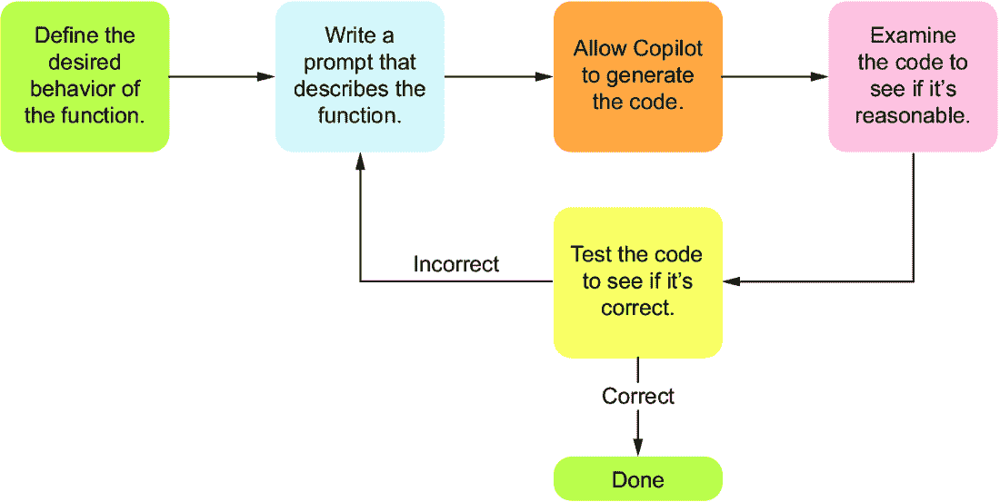

# 第三章：设计函数

### 本章涵盖

+   Python 中的函数及其在软件设计中的作用

+   与 Copilot 交互的标准工作流程

+   使用 Copilot 编写良好函数的示例

+   Copilot 可以解决的合理任务

对于编程新手来说，最难的一个挑战是知道给 Copilot 分配什么合理的任务，以便它能找到好的解决方案。如果你给 Copilot 分配的任务太大，它通常会以非常壮观的方式失败，这可能非常难以修复。那么，什么是一个合理的任务呢？

这个问题对于我们的 Copilot 使用很重要，但它远远超出了这个范围。人类程序员也会遇到复杂性问题。如果经验丰富的软件工程师试图在不将其分解为更小的、更易解决的子部分的情况下编写代码来解决过于复杂的问题，他们通常也会遇到麻烦。对于人类来说，解决方案是使用一种称为“函数”的东西，其任务是执行一个任务。函数帮助我们组织代码，并使其更容易思考并修复任何错误。关于如何编写合理函数有一些经验法则，但本质上，这些规则试图捕捉到编写（1）执行单个任务且（2）不会过于复杂以至于难以正确执行的东西。

对于那些以传统方式学习编程的人来说，没有 Copilot 的帮助，他们可能在接触到函数之前，就已经在 5-10 行长的代码中挣扎于语法问题。在那个阶段，他们通过经验自然地理解到，他们不应该在一个函数中编写超出自己能够测试和调试能力的代码。因为你是学习与 Copilot 合作而不是直接与语法打交道，所以本章的任务是教你关于函数以及什么被认为是合理和不合理的任务来请求 Copilot 在单个函数中解决。

为了帮助你了解函数，我们将在本章提供一些示例。这些示例采用了与 Copilot 交互的核心工作流程——具体来说，是编写提示、从 Copilot 接收代码以及测试该代码是否正确的过程。在 Copilot 生成的函数中，你将开始看到核心编程工具，如循环、条件和列表，我们将在接下来的两章中对其进行扩展。

## 3.1 函数

在我们学习编写函数的细节之前，我们需要了解它们在软件中的目的。函数是帮助完成更大任务的较小任务，反过来，这些任务又帮助解决更大的任务，如此类推。你可能已经对将大任务分解为小任务有很多直觉。让我们用一个例子来具体化这种直觉。

假设你在报纸上找到了一个你想要解决的单词搜索谜题（见图 3.1 中的示例谜题）。在这些类型的谜题中，你需要找到单词列表中的每个单词。单词可以从左到右、从右到左、从上到下或从下到上找到。


##### 图 3.1 示例单词搜索谜题

在高层次上，你的任务是“找到单词搜索中的所有单词。”不幸的是，这个任务的描述本身并没有帮助。它没有告诉我们需要采取哪些步骤来解决问题。

现在尝试花几分钟时间解决这个问题。你是如何开始的？你是如何将整体任务分解，使其更容易实现的？

你可能会这样做，比如说，“好吧，找到每个单词是一个大任务，但一个更小的任务是找到第一个单词（CAT）。让我先从那开始！”这是一个将大任务分解成小任务的例子。因此，为了解决整个谜题，你可以为需要找到的每个单词重复执行这个较小的任务。

现在，我们如何找到一个单独的单词，比如 CAT？甚至这个任务也可以进一步分解，使其更容易完成。例如，我们可以将其分解为四个任务：从左到右搜索 CAT，从右到左搜索 CAT，从上到下搜索 CAT，以及从下到上搜索 CAT。我们不仅使任务越来越简单，而且还将我们的工作组织成逻辑部分。最重要的是，正如我们将在本章中看到的那样，我们将要求 Copilot 编写这些简单任务的代码，并将其最终组装成我们的完整程序。

将一个大问题分解成更小的任务称为*问题分解*，这是软件设计中的一项重要技能，我们在第七章中专门对其进行了讨论。目前，了解何时一个任务太大，以至于不能让 Copilot 完成它是很重要的。让 Copilot 制作一个结合 Wordscapes 和 Wordle 的新视频游戏是完全行不通的。然而，你可以让 Copilot 编写一个对解决更大问题很重要的函数；例如，你可能有一个函数，用于检查玩家提供的单词是否在有效单词列表中。Copilot 可以很好地解决这个问题，而这个函数将帮助 Copilot 更接近解决更大的问题。

### 3.1.1 函数的组成部分

“函数”这个名字的起源可以追溯到数学，在数学中，函数根据输入定义某物的输出。例如，在高中数学中，你可能学习了以下常见的函数写法：

f(*x*) = *x*²

这是一个给定变量*x*的值的函数，并计算该值的平方。因此，当*x*为 6 时，f(*x*)是 36。由于编程函数也有特定输入的预期输出，所以这个名字对编程来说也很合适。

作为程序员，我们也喜欢将函数视为承诺或合同。如果一个名为 `larger` 的函数被告诉我们它接受两个数字并给出这两个数字中较大的一个，我们就相信当我们给这个函数数字 2 和 5 时，它会返回答案 5。我们不需要看到这个函数是如何工作的就能使用它，就像我们不需要知道汽车的工作原理就能使用刹车踏板一样。按下刹车踏板，汽车就会减速。给 `larger` 函数两个数字，它会返回这两个数字中较大的一个。

Python 中的每个函数都有一个 *函数头*（也称为 *函数签名*），它是函数的第一行代码。鉴于它们的普遍性，我们希望阅读和编写函数头。函数头描述了函数的名称和它的输入。在其他一些语言中，函数头有时会包含有关输出外观的信息，但在 Python 中，你必须在代码的其他地方找到它。

在第二章中，我们写了 # 注释来告诉 Copilot 要做什么。如果我们想让 Copilot 生成一个函数，我们可以继续使用那种方法。例如，我们可以使用注释来要求 Copilot 编写一个函数，告诉我们两个数字中哪个更大：

```py
# write a function that returns the larger of two numbers
# input is two numbers
# output is the larger of the two numbers
def larger(num1, num2):          #1
    if num1 > num2:        #2
        return num1        #2
    else:                  #2
        return num2        #2
```

#1 这个函数头定义了一个名为“larger”的函数，它接受两个输入，分别称为 num1 和 num2。

#2 函数体

与上一章的代码一样，我们只是写了注释来提示 Copilot 给我们代码。函数头有三个主要组成部分：`def` 关键字，它告诉 Python 这是一个函数；函数的名称；以及函数的输入。行尾还有一个冒号——一定要包含它，否则代码将不是有效的 Python 代码。单词 `def` 表示它正在创建（定义）一个函数。`def` 之后是函数的名称；这个名字应该尽可能地描述函数的行为。这个函数的名称是 `larger`。如果一个函数很难命名因为它做了很多不同的事情，这通常是一个线索，表明这个任务对于单个函数来说太大（关于这一点稍后还会讨论）。

在函数声明的括号中，你会找到参数。*参数* 是你向函数提供它运行所需信息的方式。一个函数可以有任意数量的参数，有些函数没有参数。这个函数有两个参数，分别命名为 `num1` 和 `num2`；有两个参数是因为它需要知道它正在比较的两个数字。

函数只能有一个输出；在确定函数输出内容时需要查找的关键字是 *return*。`return` 后面跟随的内容即为函数的输出。在这个代码中，`num1` 或 `num2` 将会被返回。函数不一定要返回任何内容（例如，一个将列表打印到屏幕上的函数没有必要返回任何内容），所以如果你没有看到返回语句，这并不一定是一个问题，因为函数可能正在做其他事情（例如与用户交互）而不是返回内容。函数必须要么返回内容，要么不返回内容：它们不能在某些情况下返回内容，在其他情况下不返回内容。

尽管我们使用 # 注释让 Copilot 生成这个函数，但实际上这对 Copilot 来说是一项大量工作。它首先必须正确获取头部，包括确定你需要多少个参数。然后，它必须正确获取函数的实际代码。在这个例子中，Copilot 还提供了函数的代码（也称为函数的主体）。

有一种方法可以提示 Copilot 为函数编写代码，这可能有助于它更准确地生成代码，并可能帮助我们更好地理解我们想要函数做什么。这涉及到编写文档字符串，我们将使用文档字符串来编写本书的大多数函数。

##### 文档字符串解释函数行为

*文档字符串* 是程序员描述 Python 函数的方式。它们跟在函数头部之后，并以三个双引号开始和结束，如即将展示的 `larger` 函数的代码所示。

通过编写头部和文档字符串，你会让 Copilot 更容易地生成正确的代码。在头部，你将决定函数的名称，并提供函数要使用的每个参数的名称。在函数头部之后，你将提供一个文档字符串，告诉 Copilot 函数做什么。然后，就像之前一样，Copilot 将为函数生成代码。因为我们给了 Copilot 函数头部，它将能够从头部学习，并减少出错的可能性。以下是在编写相同的 `larger` 函数时，这种替代方法的样子：

```py
def larger(num1, num2): 
 """ **#1
 **num1 and num2 are two numbers.** #1
 #1
 **Return the larger of the two numbers.** #1
 **"""** #1
    if num1 > num2: #1
        return num1
    else:
        return num2**
```

**#1 函数的文档字符串描述** **注意，我们不仅写了函数头部，还写了文档字符串，Copilot 提供了函数的主体。

### 3.1.2 使用函数

一旦我们有了函数，我们如何使用它？回想一下我们的 f(*x*) = *x*² 类比，我们如何给 *x* 赋予 6 的值，以便它返回 36？让我们看看如何通过使用我们刚刚编写的 `larger` 函数来用代码实现这一点。

使用函数的方法是*调用*它。调用函数意味着在特定参数值上调用函数。这些参数值被称为参数。Python 中的每个值都有一个*类型*，我们需要注意给出正确类型的值。例如，`larger`函数期望两个数字；如果我们提供非数字的输入，它可能不会按预期工作。当我们调用函数时，它会运行其代码并返回结果。我们需要捕获这个结果，以便稍后使用；否则，它将会丢失。要捕获结果，我们使用一个*变量*，它只是一个指向值的名称。

在这里，我们要求 Copilot 调用函数，将结果存储在变量中，然后打印结果：

```py
# call the larger function with the values 3 and 5
# store the result in a variable called result
# then print result
result = larger(3, 5)      #1
print(result)
```

#1 使用值 3 和 5 作为输入调用较大的函数并存储结果

代码正确地调用了`larger`。注意，它将我们要比较的两个值放在了开括号之后。当函数执行完毕后，它返回一个值，我们将该值赋给结果。然后我们打印结果。如果你运行这个程序，你会看到输出 5，因为 5 是我们询问的两个值中较大的一个。

如果你在这里对所有的细节都不舒服，那没关系，但我们希望你能认识到当函数被调用时，如下所示：

```py
larger(3, 5)
```

函数调用的通用格式是

```py
function_name(argument1, argument2, argument3,... )
```

因此，当你看到名称后面紧跟着的括号时，这意味着有一个函数调用。像我们这里这样做函数调用对于与 Copilot 的工作流程非常重要，尤其是在测试函数是否正常工作方面。我们还需要调用函数来完成工作，因为函数在调用之前不会做任何事情。

## 3.2 使用 Copilot 的函数设计周期

让我们向你介绍接下来几章我们将使用的流程。使用 Copilot 设计函数涉及以下步骤周期（见图 3.2）：

1.  确定函数的预期行为。

1.  编写一个尽可能清晰地描述函数的提示。

1.  允许 Copilot 生成代码。

1.  仔细阅读代码，看看它是否合理。

1.  测试代码以查看其是否正确：

    +   如果代码经过多次测试后仍然正确，则继续。

    +   如果代码不正确，则回到步骤 2，并编辑提示。



##### 图 3.2 使用 Copilot 的一般编辑周期。这假设你定义了一个合理的函数。

我们将在下一章学习如何进行第 4 步，但我们确信你已经能够识别出代码明显错误的情况。例如，Copilot 可能只给出注释来填充函数的主体。注释并不做任何事情——它们不是代码——所以一大堆没有其他代码的注释显然不是正确的事情。或者，Copilot 可能只写一行，比如`return` `-1`，或者，我们个人的最爱，`Your` `code` `here`。Copilot 是从我们教授那里学到的，当我们提供学生部分代码并要求他们用“Your code here”来编写其余部分时。这些都是明显错误的，但在下一章中，我们将讨论如何阅读代码，这样你可以更快地发现更复杂的代码错误，也许更重要的是，看到在哪里以及如何修复它。在后面的章节中，我们将继续扩展这个周期，包括有效的调试实践，并继续练习如何改进提示。

## 3.3 使用 Copilot 创建良好函数的示例

在本节中，我们将与 Copilot 一起编写一系列函数。我们认为通过查看具体示例，你会对函数有更深的理解，我们将完全在 Copilot 中编写这些函数，以便帮助你看到我们刚刚描述的功能设计周期。尽管本章的目标还不是帮助你阅读代码，但我们会看到解决方案中的编程特性（有时称为*构造*），这些特性在代码中非常常见（例如，`if`语句，循环），因此当我们看到它们时，我们会指出这些特性。然后，在第四章中，我们将更详细地说明如何阅读这段代码。

我们将要处理的许多函数之间没有关联。例如，我们将从一个关于股票股价的函数开始，然后转向关于强密码的函数。你通常不会将这种不相关的内容存储在同一个 Python 文件中。因为我们只是在探索良好函数的不同示例，所以你可以自由地将所有函数存储在同一个 Python 文件中，也许命名为 function_ch3.py 或 function_practice.py。

### 3.3.1 Dan 的股票选择

Dan 是 AAAPL 这支股票的投资者。他以每股 15 美元的价格购买了 10 股。现在，这些股票每股的价值是 17 美元。Dan 想知道他在股票上赚了多少钱。

记住，我们希望使我们的函数尽可能通用。如果我们的函数唯一能做的就是计算这个特定的 AAAPL 情况，那么它在一般情况下就不会很有用。当然，它现在会帮助 Dan，但当他再次对 AAAPL 的股价感兴趣或他对另一支股票感兴趣时呢？

这里的一个有用的通用函数将接受三个参数，所有这些参数都是数字。第一个参数是购买的股票数量，第二个参数是购买股票时的股价，第三个参数是当前的股价。让我们称这个函数为`money_made`，因为它将确定我们在股票上赚了多少钱或损失了多少钱。一般来说，你希望给你的函数命名为一个动作词或描述函数所做事情的词组。有了这个，我们就有了编写函数头部的足够信息：

```py
def money_made(num_shares, purchase_share_price, current_share_price):
```

现在，我们需要一个文档字符串。在文档字符串中，我们需要通过在句子中使用其名称来解释每个参数的作用。我们还需要包括函数应该做什么。添加我们的文档字符串，以下是提供给 Copilot 的完整提示：

```py
def money_made(num_shares, purchase_share_price, current_share_price):
 """
 num_shares is the number of shares of a stock that we purchased.
 purchase_share_price is the price of each of those shares.
 current_share_price is the current share price.

 Return the amount of money we have earned on the stock.
 """
```

在输入提示后，转到下一行，并按 Tab 键。Copilot 将填充函数的代码。不用担心代码会被缩进：函数的代码应该是缩进的，实际上，如果没有缩进，那将是一个错误！以下是 Copilot 给出的代码：

```py
    return num_shares * (current_share_price - purchase_share_price)
```

这段代码看起来很有道理。在括号内，它计算出当前价格与购买价格之间的差异（这里使用`-`表示减法），然后将其乘以我们所持有的股票数量（这里使用`*`表示乘法）。检查这样的代码是一种有用的技能，我们将在下一章中认真对待它。另一个有用的技能是测试函数。

要测试`money_made`函数，我们可以使用各种输入调用它，并观察每种情况下的输出。我们可以通过让 Copilot 调用函数，然后运行我们的程序来实现这一点，就像我们之前对`larger`函数所做的那样。然后我们可以要求 Copilot 通过使用不同的输入来更改函数调用，然后我们再次运行程序，重复所需的次数。然而，我们发现直接从交互窗口调用函数更容易、更方便。这样，我们可以多次调用函数，而无需通过 Copilot，也不会在我们的程序中添加我们打算删除的东西。

要尝试这种交互式方法，选择/高亮显示函数的所有代码，然后按 Shift-Enter（你可以在 Python 窗口中选择文本，右键单击，然后在 Python 窗口中选择运行选择/行来访问类似的交互会话，但这里的指导是如果你使用 Shift-Enter）。图 3.3 显示了如果你选择函数的文本并按 Shift-Enter 会出现什么情况。


##### 图 3.3 在 VS Code 中运行 Python 的交互会话。注意终端标签页底部的>>>。

在结果窗口的底部，你会看到三个大于号>>>。这被称为*提示符*，你可以在那里输入 Python 代码。（这个提示符与我们与 Copilot 交互时使用的提示符没有关系。）它将立即显示我们输入的代码的结果，这既方便又快捷。

要调用我们的`money_made`函数，我们需要提供三个参数，它们将从左到右分配给参数。我们放第一位的将分配给`num_shares`，放第二位的将分配给`purchase_share_price`，放第三位的将分配给`current_share_price`。

让我们试试！在提示符下，输入以下内容，然后按 Enter（或 Shift-Enter）。不要输入>>>，因为那里已经有了；我们在整本书中都包括它，以便清楚地表明我们在哪里输入。图 3.4 显示了在 Python 提示符下终端运行函数的示例：

```py
>>> money_made(10, 15, 17)
```

你将看到以下输出：

```py
20
```

`20`是正确的吗？嗯，我们买了 10 股，每股上涨了 2 美元（从 15 美元到 17 美元），所以我们确实赚了 20 美元。看起来不错！


##### 图 3.4 在 VS Code 终端的 Python 提示符下调用`money_made`函数

尽管如此，我们还没有完成测试。当你测试一个函数时，你希望以各种方式测试它，而不仅仅是测试一次。一个测试用例只能告诉你，它碰巧在你提供的特定输入值上工作。我们尝试的测试用例越多，每个测试用例都以不同的方式测试函数，我们就越有信心我们的函数是正确的。

我们如何以不同的方式测试这个函数？我们正在寻找某种不同类别的输入。一个不太好的测试方法现在可能是说，“如果我们的股票从 15 美元涨到 18 美元，而不是从 15 美元涨到 17 美元怎么办？”这几乎和之前的测试一样，而且很可能它会正常工作。

一个好主意是测试股票实际*亏损*时会发生什么。我们预计在这种情况下会得到一个负的返回值。而且看起来我们的函数在这个测试类别中工作得很好。这是我们的函数调用和返回给我们的输出：

```py
>>> money_made(10, 17, 15)
-20
```

我们还能进行哪些其他测试？嗯，有时候股票价格根本不会变化。我们预计在这种情况下会是 0。让我们验证一下：

```py
>>> money_made(10, 15, 15)  
0
```

看起来不错！测试是科学和艺术的结合。有多少种事物类别需要测试？这两个调用是否真的属于两个不同的类别？我们是否遗漏了任何类别？通过实践，你会提高你的测试能力，我们将在第六章全部讨论测试。目前来看，我们的`money_made`函数似乎正在正常工作。

函数可以在其代码中使用变量（而不仅仅是它的参数），我们现在想给你展示一个例子，这样当你看到 Copilot 这样做时，你就能准备好了。这是编写我们的`money_made`函数代码的等效方式：

```py
    price_difference = current_share_price - purchase_share_price
    return num_shares * price_difference
```

这段代码可能对你来说更容易阅读：它首先计算出股价的差异，然后将其乘以股票数量。我们鼓励你测试这个版本，以帮助你自己确信它仍然是正确的。

### 3.3.2 Leo 的密码

Leo 正在注册一个新的社交网络网站，名为 ProgrammerBook。他想确保自己的密码是强的。

Leo 对密码强弱的定义很朴素：如果它不是单词*password*也不是单词*qwerty*，那么它就是强的。当然，这些密码很糟糕，但在现实中，我们必须比这个定义做得更好，以确保我们的密码是强的！一个有用的函数将是一个可以接受一个建议的密码并告诉我们它是否强大的函数。

与本章中我们之前的函数不同，我们这里处理的是文本，而不是数字。参数，即要检查的密码，是文本。返回值应该表示某种是/否结果。我们需要新的类型！

Python 中用于文本的类型称为*字符串*。由于我们可以使用字符串来存储我们想要的任何文本，因此可能的字符串数量是无数的。Python 中用于是/否结果的类型称为*布尔型*或*bool*。布尔型只有两个值：`True`或`False`。

好的！我们已经准备好提示 Copilot 了。对于返回布尔值（`True`/`False`）的函数，我们通常将函数命名为`has_x`、`is_x`或类似名称，使用一些表示真/假结果的动词：

```py
def is_strong_password(password):
 """
 A strong password is not the word 'password'
 and is not the word 'qwerty'.
 Return True if the password is a strong password, False if not.
 """
```

作为回应，Copilot 为我们写了以下内容：

```py
    return password != 'password' and password != 'qwerty'
```

仔细看看那段代码。那个`!=`运算符是“不等”运算符，每个不被视为强密码的字符串都用单引号括起来。每次我们需要指定特定的字符串值时，我们都会使用引号。再次提醒，我们将在下一章中更多地讨论如何阅读代码，但到目前为止，我们希望这段代码看起来有点模糊的合理性：它看起来像是在检查密码不是`password`也不是`qwerty`，这符合我们强密码的定义。

现在，让我们通过进行一些测试调用来确保这个函数确实能工作。我们将首先测试那些不是强密码的密码。我们最好为这些密码都返回`False`——我们确实做到了：

```py
>>> is_strong_password('password')        
False      

>>> is_strong_password('qwerty')          
False
```

好的！现在，让我们尝试一个强密码。我们需要在这里看到`True`：

```py
>>> is_strong_password('N3w Y0rk J375')    
True
```

太好了！我们现在看到这个函数有时返回`False`，有时返回`True`，所以至少它不是总是返回`False`。让我们再试一次：

```py
>>> is_strong_password('Leo') 
True
```

好吧，从技术上讲，`True`是正确的，但哇，Leo 这个密码真是太糟糕了。我们真的应该对我们的强密码定义做得更好。让我们改变提示，给出一个更合理的定义，说明一个密码为什么是强的。这是我们的下一个提示和 Copilot 给出的内容：

```py
def is_strong_password(password):
 """
 A strong password has at least one uppercase character,
 at least one number, and at least one special symbol.

 Return True if the password is a strong password, False if not.
 """
    return any(char.isupper() for char in password) and \
             any(char.isdigit() for char in password) and \
             any(not char.isalnum() for char in password)
```

这里出现几次的`for char in password`是 Python 考虑密码中每个字符的一种方式。它启用了一种称为*循环*的功能，这是我们将在第五章学习的关键主题。

当然，有可能你没有从 Copilot 那里得到与我们相同的代码。但根据我们得到的代码，看起来第一部分是在寻找任何大写字母，第二部分是在寻找任何数字，而第三部分是在寻找不是`isalnum`的东西。

也许`isalnum`意味着“是字母数字的”。这包括特殊符号吗？如果是的话，是哪些符号？让我们测试这个函数看看我们做得怎么样：

```py
>>> is_strong_password('Leo')
False

>>> is_strong_password('N3w Y0rk J37$')
True

>>> is_strong_password('N3w Y0rk J375')
True
```

哎呀！我们为那个第三个密码得到了错误的答案。它看起来相当强大，但实际上并不行，因为它缺少一个特殊符号。我们的函数返回了`True`，但这是错误的返回值：它本应该返回`False`。

Copilot 给出的代码是错误的。也许你得到的代码运行得很好，但我们没有这么幸运，而且了解如何识别（就像我们刚才做的那样）代码是错误的并且修复它是很重要的。现在知道为什么它是错误的并不重要，但如果你对我们的提示可能导致的错误行为感到好奇，那是因为我们没有具体说明我们所说的特殊字符是什么，而它给出的代码将空格视为特殊字符。

在这个阶段，当我们开始调试我们的错误代码时，我们有两个选择。一个选择是按 Ctrl-Enter 并查看 Copilot 给出的其他建议。也许其中的一条建议与那个没有工作的特殊符号有所不同？

的确，在我们的电脑上，我们看到这样的选项，包括这个：

```py
    num_upper = 0
    num_num = 0
    num_special = 0
    for char in password:
        if char.isupper():
            num_upper += 1
        elif char.isnumeric():
            num_num += 1
        elif char in '!@#$%^&*':     #1
            num_special += 1
    if num_upper >= 1 and num_num >= 1 and num_special >= 1:
        return True
    else:
        return False
```

#1 特殊符号的具体选择

用`Leo`、`N3w` `Y0rk` `J375`和`N3w` `Y0rk` `J375$`这样的字符串测试这个函数，你应该看到函数运行良好。

我们的第二个选择是进行一些提示工程，这意味着调整我们的提示以影响 Copilot 给出的内容。在我们的原始提示中，我们提到了特殊符号。回想起来，这是模糊的。我们可能指的是更具体的东西，比如标点符号。如果我们具体地在提示中提到标点符号，我们会得到与 Copilot 的这种互动：

```py
def is_strong_password(password):
 """
 A strong password has at least one uppercase character,
 at least one number, and at least one punctuation.

 Return True if the password is a strong password, False if not.
 """
    return any(char.isupper() for char in password) and \
           any(char.isdigit() for char in password) and \
           any(char in string.punctuation for char in password)
```

看起来不错！最后一行是在谈论标点符号，这让人感到希望。让我们在这里测试它：

```py
>>> is_strong_password('Leo')
False

>>> is_strong_password('N3w Y0rk J375')
 Traceback (most recent call last):
  File "<stdin>", line 1, in <module>
  File "ch2.py", line 44, in is_strong_password
    any(char in string.punctuation for char in password)
  File "ch2.py", line 44, in <genexpr>
    any(char in string.punctuation for char in password)
                ^^^^^^
NameError: name 'string' is not defined
```

看看错误信息的底部，你会看到`'string'`没有定义。Copilot 想要使用一个名为`string`的模块，但这是一个在使用之前需要导入的模块。这种“未定义”的结果可能发生在各种与找不到名称相关的错误中，而且很多时候罪魁祸首是一个尚未导入的模块。Python 中有许多模块，但`string`模块是众所周知的。随着你更多地使用 Copilot，你会了解到哪些模块是常用的，这样你就知道要导入它们。你也可以快速进行网络搜索来询问，“string 是 Python 模块吗？”搜索结果会确认它是。我们需要做的是导入这个模块。

注意，这与第二章中 Copilot 为我们生成的代码发生的情况相似。当时，Copilot 正在使用 csv 模块，这是一个与 Python 一起安装的模块。字符串模块也类似地包含在 Python 中；Copilot 只是忘记导入它。正如我们在第二章中讨论的，一些模块确实需要手动安装，但字符串模块不是其中之一。因此，我们不需要安装字符串；我们只需要导入它即可。

##### 导入模块

Python 中有许多有用的模块。在第二章中，Copilot 使用了 csv 模块来简化处理逗号分隔值（CSV）文件。但为了 Python 代码能够利用一个模块，我们必须导入该模块。你可能会问为什么我们没有导入模块就可用，但那将大大增加代码的复杂性和 Python 在幕后运行代码所需的工作。相反，模型是，如果你想使用模块，就包含它们，它们不是默认包含的。

让我们在代码顶部添加`import string`：

```py
import string

def is_strong_password(password):
 """
 A strong password has at least one uppercase character,
 at least one number, and at least one punctuation.

 Return True if the password is a strong password, False if not.
 """
    return any(char.isupper() for char in password) and \
           any(char.isdigit() for char in password) and \
           any(char in string.punctuation for char in password)
```

现在我们处于良好的状态：

```py
>>> is_strong_password('Leo')
False

>>> is_strong_password('N3w Y0rk J375')
False

>>> is_strong_password('N3w Y0rk J375$')
True
```

最后一个是`True`。这是一个强密码，因为它添加了`$`标点符号。

我们希望你现在已经相信了测试的价值。有时候，新程序员不会测试他们的代码。他们假设他们写的代码是正确的，因为它们对他们来说是有意义的。新手程序员和经验丰富的程序员之间一个有趣的不同之处在于，新手程序员经常假设他们的代码是正确的，而经验丰富的程序员则假设他们的代码是错误的，直到经过彻底测试并证明否则。除此之外，我们发现新程序员有时无法很好地进行测试，因为得知代码有错误会令人沮丧。但现在知道总比在别人在严重应用中使用你的代码时才知道要好。通过测试发现错误实际上是一件好事。

### 3.3.3 获取强密码

现在我们有一个函数可以告诉我们密码是否强大，让我们编写一个函数从用户那里获取强密码。它将不断要求用户输入密码，直到用户输入一个强大的密码。这是网站在告诉你“抱歉，你的密码太弱了，请再试一次”时使用的代码。

这样的函数的标题应该是什么样的呢？嗯，它将要求用户输入密码，但我们不会有一个密码参数。实际上，我们根本不会有任何参数，因为该函数不需要任何信息来完成其工作——它只需要提示用户，用户将在键盘上输入密码。当函数完成其工作后，它将返回强密码，因此它将继续以字符串作为输出返回。让我们尝试这个提示：

```py
def get_strong_password():
 """
 Keep asking the user for a password until it’s a strong 
 password, and return that strong password.
 """
```

我们从 Copilot 得到了以下代码作为结果：

```py
    password = input("Enter a strong password: ")
    while not is_strong_password(password):            #1
        password = input("Enter a strong password: ")
    return password
```

#1 它正在调用我们之前定义的 is_strong_password 函数！

这个 `while` 关键字创建了一种另一种循环，只要输入的密码不强，这个循环就会继续。Copilot 也足够聪明，可以调用我们之前的 `is_strong_password` 函数来确定什么算作强密码。正如你将在未来的章节中看到的，以这种方式使用函数作为构建块正是构建大型程序的方法。你经常会注意到 Copilot 调用你之前的函数来解决后续的问题，就像我们在这里观察到的那样。

让我们来测试一下！高亮显示我们两个密码函数的所有代码，然后按 Shift-Enter。我们将调用我们想要测试的函数。然后，尝试输入密码，每次输入后按 Enter。你会注意到它会一直询问，直到你最终提供一个强密码：

```py
>>> get_strong_password()
Enter a strong password: Leo
Enter a strong password: N3w Y0rk J375
Enter a strong password: N3w Y0rk J375$
'N3w Y0rk J375$'
```

注意，当我们最终提供一个强密码时，它就不再询问我们密码了。然后，我们看到它返回的字符串，这确实是我们的强密码。

### 3.3.4 Scrabble 计分

丹最喜欢的桌面游戏之一是 Scrabble。你玩过吗？如果没有，你只需要知道你手里有一些带有字母的方块，你的目标是使用这些字母的任意组合来形成一个单词。你不需要只用你的方块来形成单词——你可以将这些字母附加到板上的现有字母上以形成更长的单词——但我们在这里不会担心这一点。对我们来说，重要的是不同的字母有不同的分数。例如，*a* 只值 1 分，因为 *a* 是如此常见的字母。但 *q* 和 *z* 呢？这些宝贝每个都值 10 分，因为它们很难使用——或者说 *令人困惑* 的使用。是的，这样更好。

要计算一个单词的分数，我们将它的每个字母的分数加起来。例如，*zap* 的分数将是 14。这是因为 *z* 值 10，*a* 值 1，而 *p* 值 3。

丹想要一个函数，给定一个单词，告诉他这个单词值多少分。好吧，所以我们需要一个函数，它接受一个单词（这只是一个参数）。让我们尝试这个提示，其中我们包括了每个字母根据官方 Scrabble 规则的价值：

```py
def num_points(word): 
 """ 
 Each letter is worth the following points: 
 a, e, i, o, u, l, n, s, t, r: 1 point 
 d, g: 2 points 
 b, c, m, p: 3 points 
 f, h, v, w, y: 4 points 
 k: 5 points 
 j, x: 8 points 
 q, z: 10 points 

 word is a word consisting of lowercase characters. 
 Return the sum of points for each letter in word. 
 """
```

对于这个函数，Copilot 不会通过按一次 Tab 键来为我们填写整个函数体。Tab 也可以用来缩进代码，我们在这里也需要这样做，这样 Copilot 才会展示代码。所以，我们不得不按 Tab（有时一次用于缩进，然后再次用于 Copilot），等待代码出现，然后按 Tab 接受该代码，然后再次按 Enter 以展示更多代码，并重复此过程。

##### 要让 Copilot 建议代码，可能需要按 Tab 或 Enter

我们发现，Copilot 有时会在给出建议时暂停，直到你按下键来帮助提示它。如表格 2.1 中提到的，如果你给它评论，Copilot 有时只想给你更多的评论作为建议。再次按下 Enter 键通常可以触发它开始生成代码。有时，按下 Tab 键会导致它继续提供建议。如果 Copilot 没有为你生成代码，请参考表格 2.1。

最后，经过几次这样的操作后，整个代码展开，我们得到以下结果：

```py
    points = 0
    for char in word:
        if char in "aeioulnstr":
            points += 1
        elif char in "dg":
            points += 2
        elif char in "bcmp":
            points += 3
        elif char in "fhvwy":
            points += 4
        elif char == "k":
            points += 5
        elif char in "jx":
            points += 8
        elif char in "qz":
            points += 10
    return points
```

注意，这里列出了所有字母，每个类别应得的分数在下一行。我们将在下一章讨论这种整体决策结构，但简单来说，就是逐个字符遍历单词，对于每个字符，确定它是哪个字母，并为该字母添加相应的分数。

让我们来测试一下，确保我们的代码正在按照我们期望的方式运行。我们知道单词 *zap* 应该值 14 分，确实如此：

```py
>>> num_points('zap')
14
```

让我们再试几个。在每种情况下，手动计算你预期的答案——这样你就可以知道代码是否正确地执行了：

```py
>>> num_points('pack')
12

>>> num_points('quack') 
20
```

编写函数的正确代码有多种方式。如果你按下 Ctrl-Enter 并查看 Copilot 的建议，你可能会看到不同类型的代码。这并不意味着其中一种类型是正确的，而其他类型是错误的。例如，这里是从其他 Copilot 建议中得到的 `num_points` 的另一个解决方案：

```py
    points = {'a': 1, 'e': 1, 'i': 1, 'o': 1, 'u': 1, 'l': 1, 
              'n': 1, 's': 1, 't': 1, 'r': 1,
              'd': 2, 'g': 2,
              'b': 3, 'c': 3, 'm': 3, 'p': 3,
              'f': 4, 'h': 4, 'v': 4, 'w': 4, 'y': 4,
              'k': 5,
              'j': 8, 'x': 8,
              'q': 10, 'z': 10}
    return sum(points[char] for char in word)
```

注意这里，每个字母都单独列出，并附上其对应的分数。这种包含字母和分数的结构称为 *字典*，再次强调，你将在后面的章节中详细了解字典。现在重要的是，Copilot 编写函数代码通常有多种等效的好方法。在继续之前，先尝试用一些测试案例来验证这个方法！

### 3.3.5 最佳单词

让我们继续 Scrabble 主题。假设 Dan 现在有一堆单词可以组成，但他不知道哪个单词能给他带来最多的分数。他应该组成单词 *zap*、*pack* 还是 *quack*？如果有一个函数能接受一堆单词并告诉我们哪个是最好的，那就太好了。

在这样的函数中，我们应该有多少个参数？你的第一反应可能是三个参数，每个参数对应我们选项中的三个单词。但这不会很灵活。毕竟，如果我们想知道 5 个单词、10 个单词或 50 个单词中的最佳单词，怎么办？我们希望我们的函数能够处理我们考虑的任何数量的单词。

技巧是使用一个只有一个（是的，只有一个！）参数的函数，这个参数是一个*单词列表*。就像数字、字符串和字典一样，列表是 Python 支持的一种类型。它非常有用，因为它允许我们将尽可能多的值收集到一个地方。我们可以像这样提示 Copilot 来获取我们想要的函数：

```py
def best_word(word_list):
 """
 word_list is a list of words.

 Return the word worth the most points.
 """
```

Copilot 将如何知道每个单词值是多少？嗯，它可以调用我们在上一节中编写的那个`num_points`函数！这是 Copilot 给出的代码：

```py
    best_word = ""
    best_points = 0
    for word in word_list:
        points = num_points(word)
        if points > best_points:
            best_word = word
            best_points = points
    return best_word
```

我们在测试时需要小心地正确调用这个函数。使用

```py
>>> best_word('zap', 'pack', 'quack')
```

是不会工作的，因为那样传递了三个参数，而不是一个。正确调用它的方法是把单词放在方括号里，就像这样（我们将在下一章中了解更多关于列表的内容）：

```py
>>> best_word(['zap', 'pack', 'quack'])  
'quack'
```

但，像往常一样，你不应该只满足于一个测试用例。这个函数也应该在其他有效但可能奇怪的用例中工作，例如，当我们列表中只有一个单词时：

```py
>>> best_word(['zap'])
'zap'
```

然而，我们不会在一个没有任何单词的列表上测试这个函数。在那个情况下，这样做又有什么意义呢？不管这个函数做什么，在实际上没有正确行为的情况下，很难说它是否做了正确的事情！

## 3.4 函数的好处

现在你已经看到了许多函数，我们希望你在开始了解函数在软件中的应用。我们已经提到，函数在执行问题分解中是至关重要的。除了问题分解之外，函数在软件中还有许多其他价值，包括以下方面：

+   **认知负荷—*你可能之前听说过认知负荷[1]。这是你的大脑在任何给定时间内可以处理的信息量，同时仍然保持有效。如果你被给出四个随机单词并要求重复它们，你可能能够做到。如果你被给出同样的任务，但单词有 20 个，我们大多数人会失败，因为一次处理的信息太多。同样，如果你曾经和家人一起开车旅行并试图优化旅行时间，包括为孩子们停车、午餐休息、洗手间停车、加油站停车、好的酒店位置等等，你可能会有感觉你的头昏脑胀，难以同时管理所有这些限制。当你无法一次处理所有事情的时候，就是你超过了你自己的大脑处理能力的时候。程序员也有同样的问题。如果他们试图一次做太多事情或者在一个代码块中解决一个过于复杂的问题，他们会发现很难正确地做到。函数的设计是为了帮助程序员避免一次做太多工作。*

**避免重复** —*程序员（我们可以说，人类普遍来说）并不热衷于反复解决相同的问题。如果我写了一个函数，可以正确计算圆的面积，那么我就不需要再写那段代码了。这意味着如果我的代码中有两个部分需要计算圆的面积，我会写一个计算圆面积的函数，然后在这两个地方都调用这个函数。***   *改进* **测试** —*与只做一件事情的代码相比，测试做多件事情的代码要困难得多。程序员使用各种测试技术，但一个关键的技术被称为*单元测试*。每个函数都接受一些输入并产生一些输出。例如，对于一个计算圆面积的函数，输入将是圆的半径，输出将是其面积。单元测试会给函数一个输入，然后比较这个输入与期望的结果。对于圆面积函数，我们可能会通过给它不同的输入（例如，一些小的正数，一些大的正数，以及 0）来测试它，并将函数的结果与我们已知是正确的值进行比较。如果函数的答案与我们的预期相符，我们就对代码的正确性有了更高的信心。但如果代码产生了错误，我们检查以找到和修复问题的代码就不会很多。但是，如果一个函数执行多个任务，它会极大地复杂化测试过程，因为你需要测试每个任务以及这些任务之间的交互。***   **提高可靠性** —*当我们作为经验丰富的软件工程师编写代码时，我们知道我们会犯错误。我们也知道 Copilot 会犯错误。如果你想象自己是一位出色的程序员，你写的每一行代码有 95%的可能性是正确的，你认为你能在至少有一行可能不正确之前写多少行代码？答案是只有 14 行。我们认为每行 95%的正确性可能即使是经验丰富的程序员也是一个很高的标准，可能比 Copilot 产生的标准还要高。通过保持任务小，任务可以在 12-20 行代码内解决，我们降低了代码中存在错误的概率。如果与前面提到的良好测试相结合，我们可以更有信心地认为代码是正确的。最后，没有比代码中存在多个相互作用的错误更糟糕的了，随着你写的代码越多，多个错误的概率就越大。我们俩都经历过因为代码中存在多个错误而进行的数小时调试之旅，并且我们都因此变得更加擅长频繁测试短小的代码片段！***   **提高代码可读性** —*在这本书中，我们主要使用 Copilot 从头开始编写代码，但这不是使用 Copilot 的唯一方式。如果你有一个更大的软件项目，你或你的同事都在编辑和使用，Copilot 也可以跳进来帮助编写那个项目的代码。无论是大部分代码是由人类还是由 Copilot 编写，理解代码对每个人来说都是有益的。这样，我们可以更容易地找到错误，确定当我们想要添加新功能时，从哪里开始修改代码，以及从高层次上理解使用我们的整体程序设计实现什么会容易或困难。将任务分解成函数有助于我们理解代码的每一部分在做什么，这样我们可以更好地了解它们是如何一起工作的。它还有助于分配工作责任，确保代码的正确性。*****

**这些好处对程序员来说非常巨大。编程语言并不总是有函数。但在它们有函数之前，程序员们尽力使用其他特性来模仿函数。这些方法很丑陋（如果你感兴趣，可以谷歌搜索“goto 语句”），所有程序员都为现在有了真正的函数而感到高兴。

你可能会问，“我明白这些优势对人类的重要性，但它们是如何影响 Copilot 的？”总的来说，我们认为适用于人类的所有原则也适用于 Copilot，尽管有时原因不同。Copilot 可能没有认知负荷，但当我们要求它解决与人类之前所做类似的问题时，它会表现得更好。因为人类编写函数来解决任务，Copilot 会模仿这一点并编写函数。一旦我们手动或通过 Copilot 编写并测试了一个函数，我们就不想再写一次。知道如何测试你的程序是否正常工作对于人类编写的代码和 Copilot 编写的代码来说同样重要。Copilot 在生成代码时可能会犯错误，所以我们想快速捕捉这些错误，就像我们处理人类编写的代码一样。即使你只处理自己的代码，并且从未让其他人阅读它，你也经常需要多年后回过头来编辑你之前写的代码。我们自己做这件事，可以证明，对于你未来的自己来说，让你的代码可读是非常重要的！

## 3.5 函数的角色

函数在编程中扮演着多种不同的角色。在较高层次上，程序本身就是函数，它们（通常）会调用其他函数。关键的是，所有程序，包括 Python 程序，都起源于一个单一函数（在 Java、C 和 C++等语言中命名为`main`）。Python 的`main`函数本质上是非函数中的第一行代码。但如果我们认为每个程序都从一个单一函数开始，并且试图用一个函数解决一个大问题是一个错误，那么这是如何工作的呢？嗯，`main`会调用其他函数，而这些函数又会调用其他函数，如此类推。代码仍然会在每个函数中（主要）顺序执行，所以它可能从`main`开始，然后移动到另一个函数，依此类推。

例如，让我们使用以下列表中的代码。我们编写这段代码，而不是 Copilot，因为没有人会想编写这段代码来用于任何有用的教学之外的事情。这只是为了演示函数调用是如何工作的。

##### 列表 3.1 展示 Python 如何处理函数调用的代码

```py
def funct1():
    print("there")
    funct2()
    print("friend")
    funct3()
    print("")

def funct2():
    print("my")

def funct3():
    print(".")

def funct4():
    print("well")
print("Hi")      #1
funct1()
print("I'm")
funct4()
funct3()
print("")
print("Bye.")
```

#1 这是程序的开始。在其他语言中，我们将这个称为“main”。

如果我们运行这个程序，输出将会是（我们将在下文中解释原因）：

```py
Hi
there
my
friend
.

I'm
well
.

Bye.
```

在图 3.5 中，我们提供了一个示例 3.1 中代码在计算机中如何被执行的示意图。我们故意提供了一个包含许多函数调用的例子，以便将我们刚刚学到的知识联系起来。再次强调，这不是实际可用的代码；这只是用于学习目的。让我们一起追踪代码执行。在跟随时，你可能更容易参考图 3.5 而不是列表 3.1，但两者都可以。


##### 图 3.5：示例 3.1 中函数执行流程

程序将从 Python 代码中第一个不是函数的第一行开始执行（`print("Hi")`）。尽管 Python 本身没有 `main` 函数，但为了便于解释，我们将函数之后的代码块称为 `main`。代码按顺序执行，除非它遇到告诉它执行其他地方代码的命令。因此，执行 `print("Hi")` 后，它将转到下一行，即调用 `funct1`：`funct1()`。对 `funct1` 的调用改变了代码执行的地点，到该函数的开始，即以下语句：`print("there")`。`funct1` 的下一行调用 `funct2`，因此程序将执行 `funct2` 的第一行：`print("my")`。有趣的是，当 `funct2` 完成时会发生什么。没有更多的代码行可以执行，所以它自动将执行权返回到 `funct1` 中调用 `funct2` 的下一行。（如果函数调用在另一个语句的中间，那个语句将恢复执行，但在这个例子中，函数调用都在单独的一行上。）你可能好奇为什么它会在调用 `funct2` 后转到下一行而不是返回到 `funct2` 的调用处。问题是如果它返回到 `funct2` 的调用处，它将永远陷入调用 `funct2` 的循环中。因此，函数在被调用后总是返回到下一行代码以执行（在这个例子中，是下一行）。

继续这个例子，接下来执行的代码行将打印 `friend` 的那一行。下一行调用 `funct3`，它打印一个点（.）然后返回到调用者。

因此，我们又回到了 `funct1`，在 `print("")` 这一行。打印一段空文本会导致新的一行。现在 `funct1` 已经完成，所以它将执行权传回给 `main` 中调用它的下一行。现在你可能已经明白了这个概念，所以我们稍微快一点进行：

+   `main` 下一步打印 `I'm` 然后调用 `funct4`.

+   `funct4` 打印 `well` 然后返回到 `main`，在那里下一行代码调用 `funct3`。

+   `funct3` 打印一个点（.）然后返回到 `main`。注意，`funct3` 既有 `funct1` 又有 `main` 调用，但这没关系，因为函数记得如何返回到调用它们的函数。实际上，多个函数调用同一个函数是函数被多次调用且具有重用价值的标志。

+   `funct3` 返回到主函数后，它将打印 `""`，这会导致开始新的一行，然后它打印单词 `Bye`。

这是一个很长的例子，但我们提供它是为了让你了解函数是如何执行的，以及程序是如何由定义和调用函数组成的。在任何你使用的软件中，想想它执行的具体任务：程序员可能为每个任务编写了一个或多个函数。在文本编辑器中改变文本为粗体的按钮可能调用一个函数来改变文本为粗体。这个函数可能会改变编辑器对文本的内部理解（编辑器可能以不同于你查看的方式存储你的文本），然后它可能调用另一个函数来更新用户（你）对文本的视图。

我们还希望用这个例子来讨论函数扮演的不同角色。一个**辅助**函数是一个其工作是为了使另一个函数的工作更容易的函数。从某种意义上说，每个不是 `main` 的函数都是一个辅助函数。最好的辅助函数是那些执行其他任务的一些小而定义明确的部分的函数，比如我们在 3.3.2 节中的 `is_strong_password` 函数作为 3.3.3 节中的 `get_strong_password` 函数的辅助函数。

有些函数只是调用了一堆其他函数而没有做任何自己的工作。在我们的例子中没有这样的函数。然而，如果你从 `funct1` 中移除了三个 `print` 语句，它就变成了这种协调函数。其他函数可能调用辅助函数，然后自己做一些工作。`funct1` 是一个很好的例子，它调用其他函数同时也自己做工作。

另一种类型的函数——我们称之为**叶函数**——独立存在，不需要调用其他函数来帮助（除了可能已经包含在 Python 中的函数）。为什么叫叶函数？如果你想象所有的函数调用就像一棵大树，这些函数就是树的叶子，因为它们没有东西输出。在我们的例子中，`funct2`、`funct3` 和 `funct4` 都是叶函数。我们主要关注本章中的叶函数，但你在这里和后面的章节中也会看到其他类型的函数的例子。

## 3.6 函数的合理任务是什么？

没有明确的规则来决定什么是一个好的函数，但有一些直觉和建议我们可以分享。不过，不要误解——识别好的函数是一种需要时间和实践技巧的技能。为了帮助你，我们在 3.3 节中给你提供了一些好的函数的例子。在本节中，我们将概述我们的建议，并提供一些额外的好的和坏的例子来帮助你建立这种直觉。

### 3.6.1 好函数的特性

这里有一些我们认为会帮助你看到什么使一个函数好的指南：

+   *一个明确的任务要执行* — 一个叶函数可能像“计算球体的体积”、“在列表中找到最大的数字”或“检查列表是否包含特定值”这样的功能。非叶函数可以实现更广泛的目标，比如“更新游戏图形”或“收集并净化用户输入”。非叶函数仍然应该有一个特定的目标，但它们的设计是基于它们可能会调用其他函数来实现其目标。

**   **行为定义明确 —*“在列表中找到最大的数字”这个任务是明确定义的。如果你给我一个数字列表并问我最大的数字是什么，你知道你应该做什么。相比之下，“在列表中找到最好的单词”这个任务定义得并不好，如上所述。你需要更多信息：什么是“最好的”单词？是长度最长的，使用最少元音的，还是不与“Leo”或“Dan”共享任何相同字母的？你明白我的意思了；主观任务对计算机来说并不好。相反，我们可以编写一个函数“在列表中找到具有最多字符的单词”，因为预期的结果是明确定义的。通常，程序员无法只通过函数名来包含所有细节，所以他们会在文档字符串中填写细节以阐明其用法。如果你发现自己需要写超过几句话来描述函数的行为，那么这个任务可能超出了一个函数的范围。***   **代码行数少 —*多年来，我们听到了关于函数长度的不同规则，这些规则是由不同的公司风格指南所决定的。我们听到的长度从 12 到 20 行 Python 代码不等，作为最大行数。在这些规则中，行数被用作代码复杂性的代理，这不是一个坏的经验法则。作为程序员，我们两人都应用类似的规则来确保复杂性不会失控。有了 Copilot，我们也可以将其作为指南。如果你要求 Copilot 提供一个函数，并且它给你返回了 50 行代码，那么这个函数名或任务可能不是好的。正如我们之前讨论的，那么多的代码行很可能会有错误。***   **通用价值高于特定用途 —*一个返回列表中大于 1 的值的数量的函数可能只是你程序的一部分的特定需求，但有一种方法可以使它更好。这个函数应该重写为返回列表中大于另一个参数的值的数量。新的函数将适用于你的用例（给函数第二个参数为 1）以及任何除了 1 以外的值。我们努力使函数尽可能简单但功能强大。这就是为什么我们在 3.3.1 节中编写函数是为了适用于任何股票，而不仅仅是 AAAPL。***   **清晰的输入和输出 —*你通常不希望有很多参数。但这并不意味着你不能有很多输入。一个参数可以是一个项目列表，就像我们在 3.3.5 节中的`best_word`函数一样。但这确实意味着你想要找到方法将输入的数量保持在最低。你只能返回一个东西，但再次强调，你可以返回一个列表，这样你就不像看起来那么受限了。但如果你发现自己正在编写一个函数，有时返回一个列表，有时返回一个单一值，有时返回空值，那么这个函数可能不是好的。*****

**### 3.6.2 优秀（及不良）的叶子函数示例**

这里有一些良好的叶子函数的例子（函数以斜体形式位于左侧，该函数的目标在右侧描述）：

+   *计算球体的体积*—给定球体的半径，返回其体积。

+   *找出列表中的最大数字*—给定一个列表，返回最大的值。

+   *检查列表中是否包含特定值*—给定一个列表和一个值，如果列表包含该值则返回 True，如果不包含则返回 False。

+   *打印国际象棋游戏的状态*—给定一个表示游戏棋盘的二维列表，将游戏棋盘输出到屏幕上。

+   *在列表中插入一个值*—给定一个列表、一个新值和列表中的位置，返回一个新列表，该列表是旧列表，新值被插入到所需的位置。

这里有一些不良的叶子函数的例子以及我们为什么认为它们不好：

+   *请求用户的税务信息并返回他们今年应缴的金额*—也许在某些国家这不会太糟糕，但鉴于税务规则的复杂性，我们无法想象在美国或加拿大将其作为一个单一函数！

+   *在列表中识别最大的值并将其从列表中删除*—这看起来可能并不糟糕，但实际上它做了两件事。第一是找到列表中的最大值。第二是从列表中删除一个值。我们建议两个叶子函数，一个用于找到最大值，另一个用于从列表中删除值。然而，如果程序需要频繁执行此任务，这可能会成为一个好的非叶子函数。

+   （思考第二章中的数据集。）*返回数据集中传球超过 4,000 码的四分卫的名字*—这太具体了。毫无疑问，数字 4,000 应该是一个参数。但可能更好的是创建一个函数，该函数接受位置（四分卫、跑卫）、统计数据（传球码数、比赛场次）以及我们关心的截止值（4,000、8,000）作为参数。这个新函数提供了比原始函数多得多的功能，允许用户调用函数来确定不仅传球超过 4,000 码的特定四分卫的名字，例如，跑卫在比赛中得分超过 12 次。

+   *确定史上最佳电影*—这个函数太模糊了。最佳电影是根据什么定义的？应该考虑哪些电影？更好的版本可能是确定用户评分至少达到最低数量的最高评分电影的功能。这个函数可能是一个更大程序的一部分，其中该函数会从电影数据库（例如 IMDB）和最低用户评分作为输入。该函数的输出将是至少有指定评分数量的最高评分电影。

+   *玩使命召唤*—这可能是使命召唤游戏大型代码库中的`main`函数，但它绝对不是一个叶子函数。

总体来说，在本章中，你已经了解了 Python 中的函数以及如何使用 Copilot 来帮助编写它们。你还学习了良好函数的特征以及确保你的函数能够被 Copilot 良好管理的重要性。

本书接下来的步骤都围绕着理解 Copilot 生成的代码是否正确，以及当它不正确时如何修复。在下一章中，我们将首先解释如何阅读 Copilot 生成的代码的基础知识，因为这为我们提供了 Copilot 是否按照我们的预期工作的第一个合理性检查。然后，在后面的章节中，我们将深入探讨如何仔细测试代码，以及当它出错时应该做什么。

## 3.7 练习

1.  审查以下函数描述，并确定每个是否是叶子函数。根据函数执行的任务的复杂性和它们是否可能需要调用额外的自定义函数，提供你的答案的理由。

    1.  *抓取数据。* 给定一个 URL 列表，从每个页面抓取数据，解析内容以提取特定信息，并将提取的数据保存到数据库中。

    1.  *处理客户订单。* 给定客户订单列表，通过检查库存，计算包含折扣和税的总价，更新库存，并生成订单摘要来处理每个订单。

    1.  *在列表中找到最大的数字。* 给定一个列表，返回最大的值。

    1.  *检查列表中是否包含特定值。* 给定一个列表和一个值，如果列表包含该值则返回 `True`，如果不包含则返回 `False`。

    1.  *生成学生成绩单。* 给定学生名单和他们的成绩，计算最终成绩，分配字母等级，确定班级排名，并为每个学生生成格式化的成绩单。

1.  审查本章概述的与 Copilot 一起设计函数的周期。这个周期包括从确定函数的行为到测试生成的代码的步骤。根据一般的编程实践，确定以下哪个步骤**不包括**在本章描述的周期中，但通常是软件开发过程的一部分：

    1.  通过运行单元测试验证生成的代码的逻辑正确性

    1.  在 Copilot 生成后手动编辑函数的代码以简化复杂的逻辑

    1.  对生成的代码进行性能基准测试以确保效率

    1.  咨询文档或外部资源以完善函数的提示

1.  根据提供的问题描述，为 Copilot 编写一个清晰简洁的提示，指定要完成的任务。确保你的提示包括所有必要的细节，例如预期的输入、要执行的处理以及预期的输出：

    1.  在一个宁静的小镇上，有一位谦逊的店主，他时不时地会通过折扣来取悦他的顾客。为了简化这一过程，他寻求创造一个神奇的公式。这个公式将接受他店里任何商品的原始价格和他希望提供的特殊折扣。有了这两条信息，公式就会揭示出顾客在折扣融入原始标签后需要支付的最终价格，这让店主和顾客都对交易的便捷性感到非常满意。

你能想到两个或三个输入示例来验证 Copilot 根据你的提示生成的函数的正确性吗？包括一些场景以确保函数能够正确处理不同类型的输入并计算出正确的输出。

1.  4. 审查函数描述和提供的测试用例，用于计算包含税费和小费的餐点总费用。基于该场景和此类函数的典型要求，你能想到哪些函数无法正确处理的输入？解释为什么处理这种输入对于确保函数在所有潜在用例中的可靠性和正确性是必要的。

    问题描述：创建一个函数，计算餐点的总费用，包括税费和小费。该函数应接受三个输入：餐点的基准价格、税率（百分比）和小费率（百分比）。该函数应计算并返回餐点的总费用。

    测试用例：

    1.  *标准情况*—计算一个$50 餐点的总价格，包含 10%的税费和 15%的小费：

        +   输入：`base_price = 50`, `tax_rate = 10`, `tip_rate = 15`

        +   预期输出：$62.50（计算为$50 + $5 税费 + $7.50 小费）

    1.  *无小费情况*—计算一个$30 餐点的总价格，包含 5%的税费和没有小费：

        +   输入：`base_price = 30`, `tax_rate = 5`, `tip_rate = 0`

        +   预期输出：$31.50（计算为$30 + $1.50 税费 + $0 小费）

    1.  *高税费和小费情况*—计算一个$100 餐点的总价格，包含 20%的税费和 25%的小费：

        +   输入：`base_price = 100`, `tax_rate = 20`, `tip_rate = 25`

        +   预期输出：$145（计算为$100 + $20 税费 + $25 小费）

1.  5. 审查提供给 Copilot 的初始提示和生成的 Python 函数。代码没有满足要求，因为它只将华氏度转换为摄氏度，并且缺乏根据用户指定的模式双向转换的能力。你将如何改进提示以确保生成的代码满足问题描述的全部要求？

```py
*Prompt: Write a Python function to convert temperature between Fahrenheit and Celsius.*

def convert_temperature(temp):
    celsius = (temp - 32) * 5.0/9.0
    return celsius
```

## 摘要

+   问题分解涉及将一个大问题分解成更小的任务。

+   我们在程序中使用函数来进行问题分解。

+   每个函数必须解决一个小的、定义明确的任务。

+   函数头或签名是函数的第一行代码。

+   参数用于向函数提供信息。

+   函数头指示了函数的名称及其参数的名称。

+   我们使用`return`从函数传递值给其调用者。

+   文档字符串使用每个函数参数的名称来描述函数的目的。

+   要让 Copilot 编写一个函数，我们提供函数头和文档字符串。

+   通过为参数提供值（也称为参数）来调用函数，我们让函数执行其工作。

+   为了测试一个函数是否正确，我们用不同类型的输入调用它。

+   变量是一个指向值的名称。

+   每个 Python 值都有一个类型，例如数字、文本（字符串）、真/假值（bool）或值的集合（列表或字典）。

+   提示工程涉及修改 Copilot 的提示，以影响我们得到的代码。

+   我们需要确保导入代码中使用的任何模块（例如，string）。

+   函数减少重复，使测试我们的代码更容易，并降低错误的可能性。

+   单元测试涉及检查函数在多种不同输入下是否按预期执行。

+   辅助函数是一个小型函数，编写它的目的是为了更容易地编写更大的函数。

+   叶函数不调用任何其他函数来完成其工作。******
