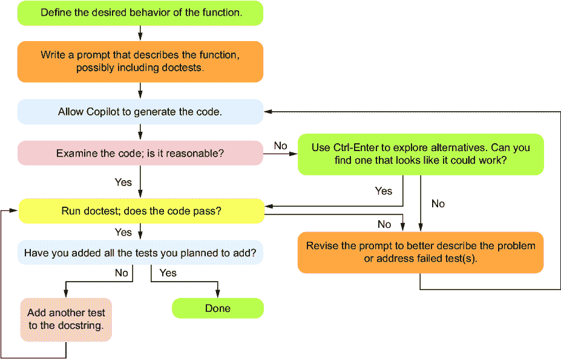

# 第六章：测试与提示工程

### 本章涵盖

+   在第三章中，我们首先开始看到测试 Copilot 生成的代码的重要性。对于任何编写软件的人来说，测试是一项基本技能，因为它能让你对代码的正常运行有信心。在本章中，我们将学习如何彻底测试我们的代码，以及如何通过修改我们的提示来帮助 Copilot 修复不工作的代码。

+   使用封闭盒与开放盒测试

+   通过修改提示来解决 Copilot 的错误

+   通过测试 Copilot 生成的代码的示例

理解测试 Copilot 代码的重要性

测试是一项你需要学会如何独立做好的基本技能，这样你才能检查代码是否正确运行。Copilot 可以生成测试，并且它在生成的测试质量上一直在改进，但我们鼓励你暂时不要使用 Copilot 来生成测试，因为你需要学会自己足够好地做这件事，以便能够验证 Copilot 生成的测试是否合理。这一点在接下来的几章中也将是真实的——问题分解、测试和调试都是在你请求 Copilot 的帮助之前必须学会的技能，因为你需要知道如何自己完成这些任务，才能知道 Copilot 是否在合理地做事。

## 6.1 为什么测试代码至关重要

回到第三章，我们提到你应该测试代码以确保它是正确的。不幸的是，根据我们的经验，初学者似乎对测试有抵触情绪！为什么？我们认为有几个因素在起作用。第一个是有一个被广泛记录的问题，被称为*超级虫*，即人类在刚开始学习编程时，认为计算机可以理解代码的意图并相应地做出反应[1]。因为他们写了代码，代码对他们来说是有意义的，所以他们很难想象代码可能不起作用。第二个问题是在第一个问题的基础上加剧的：如果你认为你的代码是正确的，测试只能给你带来坏消息。如果你不测试，你就无法发现代码是否错误。这就像那句古老的谚语，把头埋在沙子里。

软件工程师与新手程序员采取的方法完全不同。他们非常重视测试，因为代码中的错误可能会给他们的公司带来重大后果。没有人愿意成为导致公司损失大量收入、让黑客获取用户机密数据或导致自动驾驶汽车发生事故的代码编写者。考虑到错误的成本，假设代码是错误的直到证明其正确更有意义。只有经过广泛的测试后，我们才应该相信它正在正确运行。而且，公司不仅仅测试一次代码，他们还保留测试系统，以便每次有人更改代码时，不仅对更改的代码进行测试，而且对更改的代码可能影响的任何代码也进行测试（这被称为回归测试）。

公司对此非常重视，以至于他们经常在编写代码之前编写测试，这个过程被称为测试驱动开发（TDD）。这确保了每个人都同意代码应该或不应该做什么。我们认为你（作为读者）不需要采取这种方法来编写这本书中的程序，但我们在这里提到它，以传达测试的重要性。在编写代码之前考虑测试可以帮助你理解代码应该做什么，这将帮助你编写更好的提示。事实上，你可以在提示中直接包含测试案例！

最后，让我们记住关于 Copilot 我们所知道的事情：它会犯错误。我们不应该对我们从 Copilot 那里得到的任何代码的正确性做出任何假设。所有这些都意味着，在信任 Copilot 给出的任何代码之前，都应该对其进行测试。

## 6.2 封闭盒子和开箱测试

软件工程师通常有两种测试代码的方法。第一种被称为封闭盒测试，这种方法假设你对代码的工作方式一无所知。因此，这种测试涉及改变输入并观察输出。我们经常看到封闭盒测试应用于函数或整个程序。封闭盒测试的优势在于，你不需要查看代码来执行测试，因此可以简单地专注于期望的行为。

测试的第二种方法被称为开箱测试，在这种方法中，我们查看代码以确定错误可能发生的位置。开箱测试的优势在于，通过查看代码的特定结构，我们可能看到代码可能失败的地方，并可以针对该代码设计特定的额外测试。我们将使用封闭盒子和开箱子测试来制定测试案例，以增强我们的测试。封闭盒子和开箱子测试的简要概述见表 6.1。在本节中，让我们看看我们可能如何使用这些方法来测试一些函数。

##### 表 6.1 封闭盒子和开箱测试简要概述

| 封闭盒测试 | 开箱测试 |
| --- | --- |
| 测试需要理解功能规范。测试需要同时理解功能规范和实现该功能的代码。 |
| 测试不需要理解代码的功能。测试应根据代码的编写方式定制。 |
| 测试人员不需要对所测试的代码有技术专长。测试人员需要足够理解代码，以确定哪些测试可能更重要。 |
| 通过改变输入并检查预期结果来测试函数 | 可以像封闭盒测试一样测试函数，但也可以在函数内部进行更细粒度的测试 |

### 6.2.1 封闭盒测试

让我们想象我们正在尝试测试一个函数，该函数接受一个单词（字符串）列表并返回最长的单词。为了更精确，函数签名将是

```py
def longest_word(words):
```

预期输入是一个单词列表。预期输出是列表中最长的单词。如果多个单词字符数相同，则应返回该长度的第一个单词。

##### 测试用例的缩写表示

在编写函数测试时，标准格式是编写函数名及其输入以及期望的结果。例如，调用

```py
>>> longest_word(['a', 'bb', 'ccc'])
'ccc'
```

意味着如果我们用输入列表`['a', 'bb', 'ccc']`调用函数`longest_word`，那么函数返回的值应该是`'ccc'`。

对于我们通常考虑编写测试用例的两个类别：

+   *常见用例—*这些情况包括一些标准输入，你可以想象函数会接收这些输入并得到相应的结果。

+   ***边缘情况—*这些情况是不常见但可能破坏代码的情况。这些输入可能更深入地测试函数的一些规则或包含意外的输入（例如，所有字符串都为空的列表）。**

**回顾一下前一个例子中的`longest_word`函数签名，让我们考虑一些可能用来测试它的测试用例。在本章的后面部分，我们将看到如何实际运行这些测试用例以确定我们的代码是否正确工作。让我们从*常见用例*开始。我们可能希望包括一个只有几个单词的测试，其中一个单词比其他单词长：

```py
>>> longest_word(['cat', 'dog', 'bird']) 
'bird'
```

这里有一个包含更多单词的测试，其中最长的单词出现在列表的其他地方：

```py
>>> longest_word(['happy', 'birthday', 'my', 'cat']) 
'birthday'
```

最后，让我们有一个只有一个单词的测试：

```py
>>> longest_word(['happy']) 
'happy'
```

如果程序适用于这些常见用途，我们的下一步将是考虑一些*边缘情况*。让我们考虑一些边缘情况。

假设我们想要检查函数是否按照我们的描述返回多个相同长度单词中的第一个单词。这个测试可能被认为是常见情况或边缘情况，这取决于你问的是谁：

```py
>>> longest_word(['cat', 'dog', 'me']) 
'cat'
```

如果列表中的所有单词都没有字符怎么办？没有字符的字符串被称为*空字符串*，写作只是一个空的引号对。如果我们只有一串空字符串，那么最长的单词就是空字符串！因此，使用所有空字符串的测试应该只返回一个空字符串：

```py
>>> longest_word(['', ''])
''
```

术语*边缘情况*来源于错误通常发生在执行的“边缘”，意味着第一个或最后一个元素。在许多循环中，错误可能发生在循环开始时（例如，忘记或错误处理列表中的第一个元素）或结束时（例如，忘记最后一个元素或超出列表的末尾并尝试访问一个不存在的元素）。特别是当代码可能需要处理许多元素的循环时，你将希望观察循环的开始和结束处的行为。

##### 不正确的输入测试

另一类测试将测试函数在接收到不正确输入时的响应。在我们的书中我们不会过多地讨论这一点，因为我们假设你正在正确地调用自己的函数，但在实际代码中，这种测试可能是常见的。调用此函数的不正确输入的几个例子可能包括使用值`None`而不是实际的列表来给函数一个不存在的列表（例如，`longest_word(None)`），给函数一个空列表（例如，`longest_word([])`），给函数一个整数列表作为输入（例如，`longest_word([1,2])`），或者提供一个包含空格或超过单个单词的字符串列表（例如，`longest_word(['hi there', 'my', 'friend'])`）。很难说函数在接收到不正确输入时应该做什么，程序员需要决定他们是否关心在更大的代码库中这一点，但在这本书中我们将忽略这一类测试，因为我们假设你会以函数设计的方式来调用自己的函数。

### 6.2.2 我们如何知道要使用哪些测试用例？

在第三章中，我们讨论了良好的测试涉及捕获不同类别的函数调用。找到这些类别的一种方法是通过使用参数类型并改变它们的值。

例如，如果函数接受一个字符串或列表作为参数，那么测试该字符串或列表为空、有一个元素和有多个元素的情况是有意义的。如果我们试图测试多个元素，我们可能会使用四个元素，例如。使用五个或六个元素或更多进行测试可能也没有意义，因为如果我们的代码可以处理四个元素，那么当我们增加到五个时，突然出错的可能性不大。有时，某些测试用例可能对给定的函数没有意义；例如，在列表中没有单词的情况下要求最长的单词是没有意义的，因此我们不会为我们的`longest_word`函数测试空列表。

作为另一个例子，如果一个函数接受两个数字作为参数，那么测试一个数字为零、两个数字都为零、一个数字为负、两个数字都为负以及两个数字都为正的情况可能是有意义的。

另一种寻找类别的方法是思考函数的具体任务。例如，对于我们的`longest_word`函数，它的任务应该是找到最长的单词，因此我们应该测试它在典型情况下是否真的做到了这一点。而且，如果存在多个最长的单词，它应该返回这些单词中的第一个，因此我们应该有一个测试案例，其中列表包含多个最长的单词。

寻找要测试的类别是一种科学与艺术的结合。我们在这里提供了一些经验法则，但什么是有用的测试案例往往取决于正在测试的具体功能。正如经常发生的那样，练习你的测试技能是提高你编写有用测试的能力的最佳方式，这些测试最终有助于你改进代码。

### 6.2.3 开放盒测试

开放盒测试和封闭盒测试之间的主要区别在于，开放盒测试会检查代码以查看是否有额外的测试案例类型需要检查。理论上，封闭盒测试可能足以完全测试函数，但开放盒测试往往能给你更多关于代码可能失败的地方的思路。假设我们要求 Copilot 编写我们的`longest_word`函数，并得到了以下列表中所示的代码。

##### 列表 6.1：查找最长单词的函数（错误！）

```py
def longest_word(words):
 ''' 
 words is a list of words

 return the word from the list with the most characters
 if multiple words are the longest, return the first 
 such word 
 '''
    longest = ""
    for i in range(0,len(words)):
        if len(words[i]) >= len(longest):     #1
            longest = words[i]
    return longest
```

#1 `>=`是错误的。它应该是`>`。

在这个例子中，我们故意在代码中引入了一个错误，以帮助解释开放盒测试的作用。假设你在思考测试案例时，忘记测试当`words`列表中有两个单词都具有最多字符时会发生什么。通过阅读这段代码，你可能会注意到以下`if`语句：

```py
   if len(words[i]) >= len(longest):
        longest = words[i]
```

在阅读`if`语句时，你可能会注意到它将在最近一个元素的长度大于或等于我们迄今为止看到的最长单词时更新单词列表中的最长单词。这是一个错误；它应该是`>`，而不是`>=`，但假设你不确定。这会促使你编写一个像我们之前描述的那样具有多个单词的测试案例：

```py
>>> longest_word(['cat', 'dog', 'me']) 
'cat'
```

这个测试将因为列表 6.1 中的代码而失败，因为它会返回`'dog'`而不是正确的答案`'cat'`。测试失败是宝贵的情报，表明列表 6.1 中的代码是错误的。

正如我们所说的，开箱测试是有用的，因为它会导致遵循代码自身结构的测试用例。例如，如果我们的代码使用了循环，我们将在进行开箱测试时找到那个循环。列表 6.1 中的循环是正确的，但通过看到我们的代码中的循环，我们会提醒自己测试边界情况，以确保它正确地处理了第一个元素、最后一个元素以及空列表。总的来说，了解代码如何处理输入通常可以提供关于程序何时可能出现故障的见解。

## 6.3 如何测试你的代码

有许多好的方法可以测试你的代码，这些方法从你为了检查代码是否对你自己工作而进行的快速测试，到集成到公司回归测试套件中的测试。对于生产代码，Python 程序员通常使用比我们在本章将要展示的更强大、功能更全面的测试工具。其中最常见的是 pytest，这是一个在使用之前需要安装的模块。我们认为 pytest 超出了我们在这里介绍测试核心思想的需要。我们将专注于更轻量级的测试，以帮助你确信 Copilot 生成的代码能够正常工作。我们可以通过在 Python 提示符中进行测试或使用一个名为 doctest 的内置 Python 模块来实现这一点。

### 6.3.1 使用 Python 提示符进行测试

测试的第一种方式是在 Python 提示符中通过交互式窗口进行，就像我们在前面的章节中所做的那样。这种测试的优势在于它可以快速运行，并且你可以根据前一次测试的输出轻松地添加更多测试。我们迄今为止运行的测试是使用 Python 提示符进行测试的例子。例如，

```py
>>> longest_word(['cat', 'dog', 'me']) 
'cat'
```

在运行那个测试时，如果你期望结果是 `'cat'`，你会很高兴看到那个结果。然而，如果测试显示你的代码有误，你现在有机会回去修复它。

修复代码后，你将想要测试新的代码。这就是你可能会在使用 Python 提示符进行测试时出错的地方。当你回来测试你刚刚更改的代码时，你可能会倾向于只运行之前失败的测试用例。然而，在修复代码以正确处理失败的测试用例时，你可能会引入一个错误，导致之前已经通过的测试用例现在失败。你真正想要的是一种方法，不仅可以运行当前的测试，还可以运行所有之前的测试。

### 6.3.2 在你的 Python 文件中进行测试（我们不会这样做）

很有可能会把所有的测试用例都放在你的 Python 程序中（在函数外部，相当于主函数中），这样它们都可以运行。这种解决方案解决了我们刚才描述的 Python 提示问题，但它引入了新的问题。当你想要你的 Python 程序执行它被设计的主要任务而不是仅仅运行测试时会发生什么？你可以删除所有测试，但这样做的目的是在需要时再次运行它们。你可以将它们注释掉，以便将来运行它们，但这也不是一个很干净的办法。我们想要的，然后，是在我们想要的时候运行我们函数的所有测试，但仍然能够运行程序。要做到这一点，可以使用一个名为 doctest 的模块。

### 6.3.3 doctest

doctest 模块是 Python 内置的。使用 doctest 的好处在于，我们只需将测试用例添加到描述函数的文档字符串中。这个增强的文档字符串具有双重作用。首先，我们可以使用 doctest 在需要时运行所有这些测试用例。其次，它有时可以帮助 Copilot 在最初生成更好的代码，或者修复已经编写但不太正常工作的代码。让我们编写一个包含所有测试用例并准备好用 doctest 执行的`longest_word`函数（参见列表 6.2）。

##### 列表 6.2 使用 doctest 测试`longest_word`函数

```py
def longest_word(words): 
 ''' 
 words is a list of words

 return the word from the list with the most characters
 if multiple words are the longest, return the first 
 such word 

 >>> longest_word(['cat', 'dog', 'bird']) #1
 **'bird'** #1
 #1
 **>>> longest_word(['happy', 'birthday', 'my', 'cat'])** #1
 **'birthday'** #1

 **>>> longest_word(['happy'])** #1
 **'happy'** #1
 #1
 **>>> longest_word(['cat', 'dog', 'me'])** #1
 **'cat'** #1
 #1
 **>>> longest_word(['', ''])** #1
 **''** #1
 **'''** #1
    longest = ''                             #2
    for i in range(0,len(words)):            #2
        if len(words[i]) > len(longest):     #2
            longest = words[i]               #2
    return longest                           #2
**import doctest                  ** #3
**doctest.testmod(verbose=True)   ** #3
```

#1 显示 doctest 的测试用例

#2 显示函数的正确代码

#3 调用 doctest 执行测试的代码（在 main 中）

在这段代码中，我们看到文档字符串中提供了我们的测试用例作为 Copilot 的提示。Copilot 生成了正确的代码来实现这个函数。然后我们手动编写了代码的最后两行来执行测试。运行后，我们得到以下列表中的输出。

##### 列表 6.3 列出 6.2 中程序运行时的 doctest 输出

```py
Trying:
    longest_word(['cat', 'dog', 'bird'])  
Expecting:
    'bird'
ok              #1
Trying:
    longest_word(['happy', 'birthday', 'my', 'cat'])
Expecting:
    'birthday'
ok               #2
Trying:
    longest_word(['happy'])
Expecting:
    'happy'
ok             #3
Trying:
    longest_word(['cat', 'dog', 'me'])
Expecting:
    'cat'
ok           #4
Trying:
    longest_word(['', ''])
Expecting:
    ''
ok                   #5
1 items had no tests:          #6
    __main__                   #6
1 items passed all tests:          #7
   5 tests in __main__.longest_word
5 tests in 2 items.
5 passed and 0 failed.     #8
Test passed.
```

#1 `longest_word`函数的第一次测试通过

#2 `longest_word`函数的第二次测试通过

#3 `longest_word`函数的第三次测试通过

#4 `longest_word`函数的第四次测试通过

#5 `longest_word`函数的第五次测试通过

#6 主函数（函数外部）中没有测试。

#7 `longest_word`通过了所有测试。

#8 希望看到的是 0 个失败。

从这个输出中，我们可以看到每个测试都运行了，并且每个测试都通过了。这些测试之所以能运行，是因为我们在列表 6.2 中添加的最后两行：

```py
import doctest
doctest.testmod(verbose=True)
```

在第一行，我们导入了 doctest 模块。这个模块帮助我们通过在运行程序时自动执行测试用例来测试我们的代码。在第二行，我们调用 doctest 模块中的`testmod`函数。这个函数调用告诉 doctest 执行所有测试；参数`verbose=True`告诉 doctest 为我们提供所有测试的结果，无论它们是否通过。如果我们切换到`verbose=False`，它只有在测试用例失败时才会给出输出（`verbose=False`实际上是默认值，所以你可以不带参数调用函数，它将默认不提供输出，除非一个或多个测试失败）。这可以是一个很好的特性，因为我们可以在 doctest 运行时保持其运行，并且只有在测试失败时才看到输出。

在这种情况下，我们的代码通过了所有测试用例。但让我们体验一下当我们的代码没有通过时会发生什么。

如果我们发现一个单词的长度与当前最长的单词相同，我们应该忽略它，因为我们总是希望在有多个单词长度相同时返回第一个最长的单词。这就是为什么在`if`语句中使用`>`（只有当新找到的最长单词确实比当前最长的单词长时才寻找新的最长单词）而不是`>=`是正确做法的原因。

我们可以通过将列表 6.2 中的`>`改为`>=`来中断代码，这将导致它选择最长单词的最后一个单词而不是第一个。让我们将以下行更改为

```py
if len(words[i]) > len(longest):
```

更改为

```py
if len(words[i]) >= len(longest):
```

现在，测试不应该全部通过。此外，让我们将最后一行更改为

```py
doctest.testmod()
```

通过不对`testmod`函数提供任何参数，`verbose`现在被设置为`False`。当我们运行代码时，这是输出：

```py
**********************************************************************
File "c:\Users\leo\Copilot_book\Chapter6\test_longest_word.py", 
line 12, in __main__.longest_word
Failed example:
    longest_word(['cat', 'dog', 'me'])
Expected:
    'cat'
Got:
    'dog'
**********************************************************************        
1 items had failures:
   1 of   5 in __main__.longest_word
***Test Failed*** 1 failures.
```

Doctest 方便地告诉我们哪个测试被执行了，预期的输出是什么，以及函数实际产生了什么。这将捕获错误并允许我们返回去修复错误。

##### Copilot 不会自动运行测试用例

我们经常听到以下问题：为什么 Copilot 在生成代码时不直接包含测试用例？例如，如果我们添加测试用例，如果 Copilot 能够尝试生成函数并且只提供通过那些测试用例的代码，那会很好。不幸的是，在这方面存在一些技术挑战，并且截至写作时，这个功能尚未包含。所以，如果你添加测试用例，它只是改善了 Copilot 的提示，但不能保证 Copilot 的代码建议通过那些测试。

到目前为止，我们已经看到了如何使用 Python 提示符和 doctest 运行我们的测试。现在我们知道如何测试我们的代码了，让我们考虑一下这如何修改我们的代码设计周期。

## 6.4 重新审视使用 Copilot 设计函数的周期

在第三章中，我们在图 3.3 中给出了如何设计函数的早期版本。在那个阶段，我们对检查我们的代码（我们在第四章和第五章中学习了）或如何测试我们的代码（我们现在知道的更多）了解得不多。因此，让我们创建这个周期的新的版本（图 6.1），以反映我们新的理解。



##### 图 6.1 使用 Copilot 的函数设计周期，增加了更多关于测试的内容

这个图比之前复杂一些，但如果我们仔细观察，我们可以看到保留了大部分原始过程。增加或改变的内容包括以下：

+   当我们编写提示时，我们可能将 doctests 作为初始提示的一部分来帮助 Copilot 生成代码。

+   经过第四章和第五章的学习，我们现在可以阅读代码来检查其行为是否正常，因此我们现在有一个额外的步骤来处理 Copilot 的初始代码看起来不正确的情况。如果发生这种情况，我们将使用 Ctrl-Enter 来探索 Copilot 的建议，希望能找到解决方案。如果我们能找到这样的解决方案，我们将选择它并继续前进。如果我们找不到，我们需要修改我们的提示来帮助 Copilot 生成改进的建议。

+   在找到看起来可能正确的代码后，我们将运行 doctest 来查看代码是否通过了我们在提示中包含的 doctests（如果没有包含任何，它将自动通过）。如果 doctest 通过，那么我们可以继续添加测试并检查它们，直到我们满意代码正常工作。如果 doctest 失败，我们需要找出如何修改提示来解决失败的测试。一旦修改了提示，它可能会帮助 Copilot 生成新的代码，可能能够通过我们提供的测试。

使用这个新的工作流程，我们不仅能够确定我们的代码是否正常工作，而且在代码尚未正常工作时也能修复代码。在接下来的章节中，我们将提供更多的工具来帮助我们在代码不正常工作时进行操作，但到目前为止，让我们通过解决一个新的问题并使用这里描述的工作流程测试 Copilot 的解决方案来将这些内容综合起来。

## 6.5 完整测试示例

让我们尝试一个可能需要解决的问题，以帮助学生决定在面对面课程中坐在哪里。虽然我们谈论的是在教室中寻找空座位，但这个问题与尝试在音乐厅、剧院、电影院或办公室布局中找到空座位是相同的。

假设我们有一个教室布局，它是一个二维列表，包含座位行。每个座位要么包含一个空格(`'` `'`)，要么包含一个学生(`'S'`)，分别表示空座位或占用座位。我们将要求 Copilot 创建一个函数来确定我们可以添加最多学生的行，在这个过程中，我们将设计检查代码是否正常工作的测试。

### 6.5.1 寻找我们可以添加到一行中的最多学生数

我们想找出我们可以在教室的单行中添加的最大新学生数。（等价地，我们正在寻找任何一行中的最大空座位数。）为此，让我们从一个有些含糊的提示开始，看看 Copilot 的表现如何。

##### 列表 6.4 我们可以添加到一行中的最大学生数

```py
def most_students(classroom):
 '''
 classroom is a list of lists
 Each ' ' is an empty seat
 Each 'S' is a student
 How many new students can sit in a row? #1
 **'''**
    max_students = 0
    for row in classroom:
        students = 0
        for seat in row:
            if seat == 'S':
                students += 1
            else:
                students = 0
            if students > max_students:
                max_students = students
    return max_students
```

#1 这部分提示有些含糊不清。

为了这个例子，我们的提示不是很清楚。“一行中可以坐多少新学生？”对于一个人类来说是一个合理的起点，但它不是很具体，很容易想象 Copilot 在解释我们的意思时会感到困惑。Copilot 可能会弄不清楚我们是计算每行的学生数还是空座位数，或者它可能会返回教室中可用的总座位数而不是一行的座位数。结果证明，我们的提示让 Copilot 感到困惑，代码并不正确，但在我们深入代码之前，让我们考虑我们应该运行哪些测试。我们已经想出了一套测试案例：

+   一个教室中有一些连续的空座位和一些非连续的空座位，以确保它不仅仅是在计算连续的空座位数量

+   一个没有空座位的教室，以确保在这种情况下返回 0

+   一个行满空座的教室，以确保所有座位都被计算在内，包括第一和最后一个座位（边缘情况）

+   一个有多行且每行空座位数相同的教室，以确保它只返回这些值中的一个（而不是，也许，所有这些行中空座位的总和）

让我们先添加第一个测试案例，并添加 doctest 代码来运行测试，如下所示。

##### 列表 6.5 我们可以添加到一行中的最大学生数

```py
def most_students(classroom):
 '''
 classroom is a list of lists
 Each ' ' is an empty seat
 Each 'S' is a student

 How many new students can sit in a row?

 >>> most_students([['S', ' ', 'S', 'S', 'S', 'S'], \ #1
 **['S', 'S', 'S', 'S', 'S', 'S'], \** 
 **[' ', 'S', ' ', 'S', ' ', ' ']])** 
 **4**
 **'''**
    max_students = 0
    for row in classroom:
        students = 0
        for seat in row:
            if seat == 'S':
                students += 1
            else:
                students = 0
            if students > max_students:
                max_students = students
    return max_students

**import doctest**
**doctest.testmod(verbose=False)**
```

#1 常见情况的 Doctest。在 docstring 测试案例中，如果需要换行，\是必要的。

当我们运行这段代码时，我们得到以下输出（我们手动清理了教室列表的格式，以帮助提高答案的可读性）：

```py
**********************************************************************
Failed example:
    most_students([['S', ' ', 'S', 'S', 'S', 'S'],
                   ['S', 'S', 'S', 'S', 'S', 'S'], 
                   [' ', 'S', ' ', 'S', ' ', ' ']])
Expected:
    4
Got:
    6
**********************************************************************
1 items had failures:
   1 of   1 in __main__.most_students
***Test Failed*** 1 failures.
```

虽然我们希望代码能正常工作，但我们欣赏第一个测试案例发现了错误。最多空座位的行是第三行，有四个座位可用。但 Copilot 的代码错误地告诉我们答案是六个。这很奇怪。即使不阅读代码，你也可能假设它是在计算每行的座位数或每行最多可坐的学生数。我们的测试案例中第二行有一排满的学生，所以很难判断。我们可以做的是将教室改为

```py
 >>> most_students([['S', ' ', 'S', 'S', 'S', 'S'], \ 
 [' ', 'S', 'S', 'S', 'S', 'S'], \ #1
 **[' ', 'S', ' ', 'S', ' ', ' ']])** 
 **4**
```

#1 我们从第二行移除了第一个学生。

因此，现在第二行有五个学生。当我们再次运行代码时，测试再次失败，代码给出的答案是五。看起来代码不仅仅是在告诉我们每行的座位数。它一定是在做与学生们坐的位置有关的事情。我们的下一步是改进提示，确定我们是否能从 Copilot 那里得到更好的代码，但为了完整性，让我们首先在以下列表中解释代码实际上做了什么。

##### 列表 6.6 对 Copilot 错误代码的遍历

```py
 max_students = 0    #1
    for row in classroom:     #2
        students = 0             #3
        for seat in row:           #4
            if seat == 'S':        #5
                students += 1      #5
            else:                        #6
                students = 0             #6
            if students > max_students:     #7
                max_students = students    
    return max_students
```

#1 从 max_students 初始化为 0 开始

#2 对于教室中的每一行

#3 为这一行初始化学生计数器为 0

#4 对于行中的每个座位

#5 如果座位上有学生，增加计数器。

#6 如果有空座位，重置计数器。

#7 检查学生计数器是否比之前看到的更大，如果是，则将其作为新的最大值

你可以从代码描述中看到每行的操作，但从高层次来看，这段代码是在计算每行连续学生的数量。它是通过为每行初始化一个计数器为 0 来做到这一点的，只要它看到座位上有学生，就会增加这个计数器。一旦它看到空座位，它就会重置计数器。内循环末尾的 `if` 语句是跟踪之前看到的东西的最大值的一种相当标准的方式，在这种情况下，它是在跟踪之前看到的连续学生数量的最大值。这根本不是我们想要的，我们糟糕的提示部分要为此负责。然而，关键的部分是，我们的测试让我们知道代码是错误的。（如果你在阅读代码时发现了错误，那也很好！）

### 6.5.2 改进提示以找到更好的解决方案

让我们重写提示，保留测试用例，看看我们是否能在以下列表中做得更好。

##### 列表 6.7 再次尝试找到最大的学生数

```py
def most_students(classroom):
 '''
 classroom is a list of lists #1
 Each ' ' is an empty seat #1
 Each 'S' is a student #1
 #1
 Return the maximum total number of ' ' characters #1
 **In a given row.** 

 **>>> most_students([['S', ' ', 'S', 'S', 'S', 'S'], \**
 **[' ', 'S', 'S', 'S', 'S', 'S'], \**
 **[' ', 'S', ' ', 'S', ' ', ' ']])**
 **4**
 **'''**
    max_seats = 0
    for row in classroom:
        seats = row.count(' ')      #2
        if seats > max_seats:     #3
            max_seats = seats              #3
    return max_seats

**import doctest**
**doctest.testmod(verbose=False)**
```

#1 改进的提示明确表示我们想要任何给定行中 ' ' 字符的最大数量。

#2 count 是一个列表函数，它返回参数在列表中的数量。

#3 代码用于跟踪最大座位数

为了得到这个解决方案，我们必须使用 Ctrl-Enter 遍历可能的 Copilot 解决方案。其中一些解决方案现在计算了 `'` `'` 的连续出现次数，而其他一些，如列表 6.7 中的，通过了 doctest。奇怪的是，我们第一次尝试改进提示时，建议的解决方案是正确的。这再次提醒我们为什么 Copilot 输出的非确定性使得测试如此重要。

让我们花一分钟看看是什么让第二个提示比第一个提示更好。这两个提示都有

```py
def most_students(classroom):
 '''
 classroom is a list of lists
 Each ' ' is an empty seat
 Each 'S' is a student
```

导致我们得到错误答案的提示部分是

```py
How many new students can sit in a row?
```

得到正确答案的提示部分是

```py
Return the maximum total number of ' ' characters in a given row. 
```

你永远无法真正了解像 Copilot 这样的大型语言模型（LLM）为什么会给出这样的答案，但让我们记住，它是被训练去仅根据它所接收到的单词以及训练数据中的单词（即 GitHub 上的大量代码）来预测下一个单词。

第一个提示要求 Copilot 进行一些推断，其中一些做得很好，而有些则不太理想。从某种意义上说，提示是在询问 Copilot 在列表的列表中知道什么是行。幸运的是，这在编程中非常常见，所以在这方面它没有问题。

然后，提示要求 Copilot 进行基本的逻辑步骤，推断出一个空座位是新生可以坐的地方。这正是 Copilot 遇到困难的地方。我们怀疑，因为我们询问的是新生坐在一行，它无法跳跃到意识到“新生”需要计算出你可以添加多少学生，换句话说，有多少空座位。相反，Copilot 专注于提示中的“学生在一行中”的部分，并开始计算每行的学生人数。它也可以使用函数名（诚然，可以更好；例如，`max_empty_seats_per_row`）来思考它需要计算最大学生数。这并不是我们想要的，但我们能理解 Copilot 为什么会犯这个错误。

现在，让我们来谈谈为什么，针对我们模糊的第一个提示，Copilot 决定计算给定行中的连续学生人数。也许在 Copilot 的训练数据中，连续学生人数是一个更常见的模式。也许是因为“坐在一行”可以被解释为“连续地坐”。或者也许是因为当我们编写这个示例时，我们一直在处理另一个要求连续空座位的版本的问题，Copilot 记得那次对话。我们不知道为什么 Copilot 给出了这个答案，但我们知道我们的提示太模糊了。

相比之下，我们的第二个提示在几个方面更为具体。首先，它明确要求最大值。其次，它要求一行中的空位或空座位的数量。这消除了 Copilot 推断空座位意味着新生座位的需求。我们还使用了“总数”和“给定行”来试图让 Copilot 摆脱其当前连续值计数的方法，但这并没有完全奏效。因此，我们最终不得不筛选 Copilot 的答案（使用 Ctrl-Enter），这些答案有时在寻找连续空座位，有时又找到了空座位的数量。

### 6.5.3 测试新解决方案

返回到我们的示例，因为新的代码通过了当前的测试，让我们给它更多的测试以确保它表现正确。在下一个测试中，我们将检查代码在没有任何行有空座位时是否正确返回 0：

```py
    >>> most_students([['S', 'S', 'S'], \
                       ['S', 'S', 'S'], \
                       ['S', 'S', 'S']])
    0
```

下一个测试将确保代码正确地计算单行（这里指第二行）中的所有三个空座位，以避免出现边缘案例问题（例如，未能计算第一个或最后一个元素）。诚然，查看代码，我们可以看到正在使用`count`函数，并且因为这个函数是 Python 内置的，所以我们应该相当有信心这个测试会通过。然而，为了确保安全，测试它仍然是更安全的做法：

```py
    >>> most_students([['S', 'S', 'S'], \
                       [' ', ' ', ' '], \
                       ['S', 'S', 'S']])
    3
```

最后的测试是为了检查 Copilot 是否正确处理了两行具有相同空座位的案例：

```py
    >>> most_students([[' ', ' ', 'S'], \
                       ['S', ' ', ' '], \
                       ['S', 'S', 'S']])
    2
```

在添加了这些测试案例之后，我们再次运行了完整的程序，如下所示列表，所有测试案例都通过了。

##### 列表 6.8 最大学生数量的完整代码和 doctests

```py
def most_students(classroom):
 '''
 classroom is a list of lists
 Each ' ' is an empty seat
 Each 'S' is a student

 Return the maximum total number of ' ' characters in a 
 given row. 

 >>> most_students([['S', ' ', 'S’, 'S', 'S', 'S'], \
 [' ', 'S', 'S', 'S', 'S', 'S'], \
 [' ', 'S', ' ', 'S', ' ', ' ']])
 4
 >>> most_students([['S', 'S', 'S'], \
 ['S', 'S', 'S'], \
 ['S', 'S', 'S']])
 0
 >>> most_students([['S', 'S', 'S'], \
 [' ', ' ', ' '], \
 ['S', 'S', 'S']])
 3
 >>> most_students([[' ', ' ', 'S'], \
 ['S', ' ', ' '], \
 ['S', 'S', 'S']])
 2
 '''
    max_seats = 0
    for row in classroom:
        seats = row.count(' ')
        if seats > max_seats:
            max_seats = seats
    return max_seats

import doctest
doctest.testmod(verbose=False)
```

在这个例子中，我们看到了如何从头到尾编写一个函数来解决一个问题。Copilot 给出了错误的答案，部分原因是难以理解的提示。我们意识到它给出错误答案是因为代码在我们的第一次测试中失败了。然后我们改进了提示，并利用在前两章中学到的代码阅读技巧挑选出一个看起来符合我们需求的解决方案。新的代码通过了我们的初始基本测试，因此我们添加了更多的测试案例来查看代码是否在更多情况下都能工作。在看到它通过这些额外的测试后，我们有更多的证据表明代码是正确的。在这个时候，我们已经测试了常见的案例和边缘案例，所以我们非常自信我们的当前代码是正确的。关于测试，这个例子向我们展示了测试如何帮助我们找到错误，并且给我们更多的信心，相信代码将正常工作。

## 6.6 另一个完整的测试示例：使用文件进行测试

在大多数情况下，你将能够通过向文档字符串添加示例来测试你的代码，就像我们在前面的例子中所做的那样。然而，有时测试可能会更具挑战性。当你需要测试你的代码与某种外部输入进行交互时，这一点是正确的。一个例子是我们需要测试与外部网站交互的代码，但这在高级代码中比本书范围内你将创建的代码更常见。

本书范围内的一个例子是处理文件。当你的输入是一个文件时，你如何编写测试案例？Python 支持在文档字符串内部以这种方式进行，但为了与我们已经完成的内容保持一致，我们不会那样做。相反，我们将使用外部文件来测试我们的代码。让我们通过修改第二章中的 NFL 四分卫（QB）示例来看看如何做到这一点。

我们可以逐行通过一个示例，但由于我们对四分卫的查询仅针对文件的前九列，我们将去掉文件中剩余的列，以便使内容更易于阅读。在去掉剩余的列后，表 6.2 显示了文件的头四行。

##### 表 6.2 NFL 数据集缩略版的头四行

| game_id | player_id | position | player | team | pass_cmp | pass_att | pass_yds | pass_td |
| --- | --- | --- | --- | --- | --- | --- | --- | --- |
| 201909050chi  | RodgAa00  | QB  | Aaron Rodgers  | GNB  | 18  | 30  | 203  | 1  |
| 201909050chi  | JoneAa00  | RB  | Aaron Jones  | GNB  | 0  | 0  | 0  | 0  |
| 201909050chi  | ValdMa00  | WR  | Marquez Valdes-Scantling  | GNB  | 0  | 0  | 0  | 0  |

在本例的剩余部分，我们将假设数据集的每一行只有这九个列，但我们希望想象如何处理整个数据集不会太困难（你只需在每个情况下添加所有额外的列即可）。

假设我们想要创建一个函数，该函数接受数据集的文件名和玩家名称作为输入，然后输出该玩家在数据集中取得的传球总码数。我们假设用户将提供的数据格式与第二章和表 6.2 中描述的 NFL 进攻统计数据文件格式相同。在我们编写提示或函数之前，我们应该如何测试这个？嗯，我们有一些选择：

+   *在更大的数据集中查找测试用例—*一个解决方案是将完整的数据集和多个玩家名称作为输入传递给函数。挑战在于确定我们是否正确。我们可以使用像 Google Sheets 或 Microsoft Excel 这样的软件打开文件，并使用电子表格功能来确定每个玩家的答案。例如，我们可以将文件作为 Excel 中的一个工作表打开，按玩家排序，找到玩家，并使用 Excel 中的求和函数来计算该玩家的所有传球码数。这并不是一个坏解决方案，但它也需要相当多的工作，而且如果你花足够的时间来找到测试答案，你可能已经满足了你的需求，不再需要 Python 代码！换句话说，确定测试用例的答案可能只是给你最初想要的答案，使得代码的价值降低。另一个问题是寻找你可能想要测试的所有边缘情况：你的数据集是否包含你想要测试的所有边缘情况，以便编写可以在以后的数据集上运行的程序？这种方法的另一个缺点是确定当函数执行比在多行中求和值复杂得多的操作时你应该做什么。在那里，确定一些真实测试值的答案可能是一项大量工作。

+   *创建用于测试的人工数据集—*另一个解决方案是创建已知多个可能查询答案的人工数据集。因为数据集是人工的，你可以添加边缘情况来查看代码在这些情况下的表现，而无需在真实数据集中找到这样的罕见示例。（有时真实数据集可能不包括这些边缘情况，但你仍然想要测试它们，以便代码在获取更新或新数据集时表现正确。）

考虑到在人工数据集中创建测试用例的优势，我们将继续采用这种方法。

### 6.6.1 我们应该运行哪些测试？

让我们思考一下我们想要测试的常见情况和边缘情况。对于常见情况，我们想要有一些测试：

+   *球员在数据集的不同行中多次出现（非连续的），包括最后一行。* 这个测试确保代码在返回结果之前遍历了所有球员（即不会错误地假设数据是按球员姓名排序的）。

+   *一个球员在数据集中的连续行中出现。* 这个测试确保没有某种错误导致连续值被跳过。

+   *一个球员在数据集中只出现一次。* 这个测试确保即使只是累加一个值，求和操作也能正确执行。

+   *一个非四分卫球员也可能出现在数据集中。* 为了这一点，我们确保代码包括所有球员，而不仅仅是四分卫。

+   *一个球员在一场比赛中总传球码数为 0。* 这检查确保当球员没有传球码数时，代码的行为是正确的。这是一个常见的测试案例，因为球员可能会受伤并因伤错过比赛。

对于边缘情况，我们还想测试一些其他的事情：

+   *球员不在数据集中。* 这实际上很有趣：在这种情况下，我们希望代码做什么？一个合理的回答是返回他们传球码数为 0。如果我们询问数据集中 2019 年至 2022 年勒布朗·詹姆斯（篮球运动员，不是足球运动员）在 NFL 的传球码数，0 是正确的答案。然而，这可能不是生产代码中最优雅的解决方案。例如，如果我们询问阿隆·罗杰斯（拼写错误为 Aron Rodgers）的传球码数，我们更希望代码告诉我们他不在数据集中，而不是他传球了 0 码数，这可能会在他在这个时间段内两次获得联盟最有价值球员时真正让我们困惑。为了表示名称缺失，我们可能返回一个很大的负值（例如，-9999），或者我们可能使用称为异常的东西，但这些超出了本书的范围。

+   *一个球员在所有比赛中总码数是负数，或者一个球员在单场比赛中码数是负数，以确保代码正确处理负值。* 如果你不懂美式足球，这种情况可能发生，如果球员接球后被对方球员在起点（进攻线）后方擒抱。四分卫在整个比赛中传球码数是负数的情况不太可能发生，但如果他们传球一次导致码数减少（负码数）并且同时受伤，导致他们无法参加剩余的比赛，这种情况是有可能发生的。

现在我们已经有了想要测试的内容，让我们构建一个人工文件来捕捉这些测试用例。我们本可以将这些测试分散到多个文件中，这同样是一个合理的做法，但将它们全部放在一个文件中的优势在于我们可以将所有测试用例集中在一起。表 6.3 是我们构建并保存为 test_file.csv 的文件。

##### 表 6.3 我们用于测试 NFL 传球码数函数的文件

| game_id | player_id | 位置 | 球员 | 球队 | 传球完成数 | 传球尝试数 | 传球码数 | 传球达阵数 |
| --- | --- | --- | --- | --- | --- | --- | --- | --- |
| 201909050chi  | RodgAa00  | QB  | Aaron Rodgers  | GNB  | 20  | 30  | 200  | 1  |
| 201909080crd  | JohnKe06  | RB  | Kerryon Johnson  | DET  | 1  | 1  | 5  | 0  |
| 201909080crd  | PortLe00  | QB  | Leo Porter  | UCSD  | 0  | 1  | 0  | 0  |
| 201909080car  | GoffJa00  | QB  | Jared Goff  | LAR  | 20  | 25  | 200  | 1  |
| 201909050chi  | RodgAa00  | QB  | Aaron Rodgers  | GNB  | 10  | 15  | 150  | 1  |
| 201909050chi  | RodgAa00  | QB  | Aaron Rodgers  | GNB  | 25  | 35  | 300  | 1  |
| 201909080car  | GoffJa00  | QB  | Jared Goff  | LAR  | 1  | 1  | –10  | 0  |
| 201909080crd  | ZingDa00  | QB  | Dan Zingaro  | UT  | 1  | 1  | –10  | 0  |
| 201909050chi  | RodgAa00  | QB  | Aaron Rodgers  | GNB  | 15  | 25  | 150  | 0  |

注意这里的数据完全是虚构的。（这些不是任何球员的真实统计数据，正如你可以从丹和利奥现在神奇地成为 NFL 四分卫这一事实中看出。）我们仍然保留了某些真实球员的名字以及原始数据集中的真实`game_id`和`player_id`。通常，使你的虚构数据尽可能接近真实数据是一个好主意，这样测试才是真实的，并且更有可能代表真实数据可能发生的情况。

让我们看看我们是如何将所有测试用例纳入这个测试文件（表 6.3）的。Aaron Rodgers 在文件中多次出现，既有连续的也有非连续的，并且作为最后一条记录。Jared Goff 也多次出现，我们在一场比赛中给他虚构了-10 码（作为一个精英 NFL 四分卫，我希望他能够接受我们给他虚构的糟糕单场比赛）。我们保留了从真实数据集中来的 Kerryon Johnson 作为跑卫（RB），并给他 5 码传球码数以确保解决方案不会仅过滤四分卫。Kerryon Johnson 在数据中只有一条记录。我们还添加了 Leo Porter 到数据集中，并给他 0 码传球码数（他肯定愿意做任何事情来避免被 NFL 球员擒抱）。我们还添加了 Dan Zingaro，并给他一个完成的传球，但传球码数为-10 码，覆盖了单个球员总码数为负的情况。表 6.4 显示了当我们为每位球员运行查询时，每个球员应该返回的内容。

##### 表 6.4 测试用例中每位球员的传球码数

| 球员 | 测试用例中的传球码数 |
| --- | --- |
| Aaron Rodgers  | 800  |
| Kerryon Johnson  | 5  |
| Leo Porter  | 0  |
| Jared Goff  | 190  |
| Dan Zingaro  | –10  |

### 6.6.2 创建函数

让我们从函数名开始，并在文档字符串中描述问题。这个问题可能足够复杂，以至于我们需要在函数内提供提示来帮助它知道如何打开文件、处理数据和关闭文件，但让我们先尝试描述函数，看看 Copilot 的表现如何。

##### 列表 6.9 查找每个球员总传球码数的函数

```py
def tot_pass_yds_player(input_file, player):     #1
 **"""**
 **input_file is a string that is the name of a file**
 **player is the name of a player**

 **The file is a csv file with a header row**
 **Column 4 is the player's name and column**
 **8 is the number of passing yards for that player**

 **return the total number of passing yards for the player**
 **"""**
    import csv
    with open(input_file, 'r') as csvfile:
        reader = csv.reader(csvfile)
        next(reader)
        total = 0
        for row in reader:
            if row[3] == player:
                total += int(row[7])
        return total
```

#1 我们缩短了函数名。

在查看生成的代码之前，我们想指出，我们没有包括这个示例的测试用例，因为它们可能不会对 Copilot 有所帮助。如果你的测试用例只是打开并使用人工文件，我们建议你在添加测试用例之前让 Copilot 生成代码。每个测试用例将只是一个文件名、一个球员和预期的输出。Copilot 可能无法读取与该文件名对应的文件，并推断出我们正在对第八列求和以获得所需的结果。这意味着给 Copilot 测试用例并不会提高提示的质量。事实上，我们数据的人工性质甚至可能使其困惑（例如，在什么情况下一个真正的 NFL 球员会有负的传球码数总额？）。

现在来看 Copilot 给出的代码，我们可以看到它相当合理，几乎与我们第二章看到的代码相同。鉴于我们阅读它时看起来合理，让我们看看如何测试它。

### 6.6.3 测试函数

为了测试这个函数，我们将扩展文档字符串以包含整个代码块的所有测试用例，如下所示。

##### 列表 6.10 测试查找球员传球码数的函数

```py
def tot_pass_yds_player(input_file, player):
 """
 input_file is a string that is the name of a file
 player is the name of a player

 The file is a csv file with a header row
 Column 4 is the player's name and column
 8 is the number of passing yards for that player

 return the total number of passing yards for the player

 >>> tot_pass_yds_player('test_file.csv’, 'Aaron Rodgers')
 800
 >>> tot_pass_yds_player('test_file.csv', 'Kerryon Johnson')
 5
 >>> tot_pass_yds_player('test_file.csv', 'Leo Porter')
 0
 >>> tot_pass_yds_player('test_file.csv', 'Jared Goff')
 190
 >>> tot_pass_yds_player('test_file.csv', 'Dan Zingaro')
 -10
 >>> tot_pass_yds_player('test_file.csv', 'Tom Brady')
 0 #1
    """
    import csv
    with open(input_file, 'r') as csvfile:
        reader = csv.reader(csvfile)
        next(reader)
        total = 0
        for row in reader:
            if row[3] == player:
                total += int(row[7])
        return total

import doctest
doctest.testmod(verbose=False)
```

#1 为数据集中未出现的球员添加额外的测试用例

我们运行了这段代码，所有的测试用例都通过了。（我们知道所有测试用例都通过了，因为 doctest 没有输出。）我们现在有额外的证据表明代码正在正常工作！

### 6.6.4 doctest 的常见挑战

让我们重写之前的提示，并在第一个测试中添加一个非常微妙的错误，如下所示。

##### 列表 6.11 doctest 中的错误

```py
def tot_pass_yds_player(input_file, player):
 """
 input_file is a string that is the name of a file
 player is the name of a player
 The file is a csv file with a header row
 The 4th Column is the player's name and the 8th column
 is the number of passing yards for that player

 return the total number of passing yards for the player

 >>> tot_pass_yds_player('test_file.csv', 'Aaron Rodgers')
 800 #1
 **>>> tot_pass_yds_player('test_file.csv', 'Kerryon Johnson')**
 **5**
 **>>> tot_pass_yds_player('test_file.csv', 'Leo Porter')**
 **0**
 **>>> tot_pass_yds_player('test_file.csv', 'Jared Goff')**
 **190**
 **>>> tot_pass_yds_player('test_file.csv', 'Dan Zingaro')**
 **-10**
 **>>> tot_pass_yds_player('test_file.csv', 'Tom Brady')**
 **0** 
    """
    import csv
    with open(input_file, 'r') as csvfile:
        reader = csv.reader(csvfile)
        next(reader)
        total = 0
        for row in reader:
            if row[3] == player:
                total += int(row[7])
        return total

import doctest
doctest.testmod(verbose=False)
```

#1 在 800 后面有一个不可见的额外空格。

当我们运行这段代码时，我们收到了以下错误：

```py
Failed example:
    tot_pass_yds_player('test_file.csv', 'Aaron Rodgers')
Expected:
    800 
Got:
    800
```

乍一看，这似乎非常奇怪。测试用例期望得到 800，但它告诉我们失败了。好吧，事实证明我们在编写测试用例时犯了一个错误，写了“800 ”（末尾有一个空格）而不是“800”。这个错误导致 Python 认为空格很重要，并导致测试失败。坏消息是，这真的是一个在使用 doctest 时非常常见的问题！我们犯了这个错误比我们愿意承认的要多。好消息是，通过仅仅找到并删除空格就可以很容易地修复它。如果一个测试失败了，但 doctest 的输出表明它应该通过，那么请检查行尾是否有空格或多余的空格，或者与 doctest 期望的输出相比，你的输出中是否有任何缺失的空格。

由于所有测试用例都通过了，我们可以有信心回到更大的数据集并使用我们刚刚创建的函数。从这个例子中，关键的一点是我们可以，也应该创建人工文件来测试与文件一起工作的函数。再次强调，测试完全是关于获得代码正常工作的信心，你想要确保测试你编写的或由 Copilot 提供的任何代码。

在本章中，我们整体学习了代码测试的重要性、如何测试代码，以及如何在两个详细示例中实施。在我们的示例中，我们编写并测试了函数。但我们是如何决定编写哪些函数来解决更大的问题的呢？嗯，我们通过一个称为问题分解的过程来解决这个问题，我们将在下一章中详细讨论。

## 6.7 练习

1.  给定以下场景，确定是封闭盒测试还是开放盒测试更合适，并解释原因：

    1.  测试员被给出一个函数规范，需要确保该函数在没有查看实现的情况下表现正确。

    1.  测试员需要通过编写针对由理解代码实现揭示的边缘情况的测试来调试函数。

1.  这是一个带有一些测试用例的函数。确定以下哪些是常见用例，哪些是边缘情况：

```py
def calculate_average(numbers):
    if not numbers:
        return 0
    return sum(numbers) / len(numbers)
# Test cases:
calculate_average([1, 2, 3, 4, 5])
calculate_average([10, 20, 30])
calculate_average([])
calculate_average([-1, -2, -3, -4, -5])
calculate_average([1000000, 2000000, 3000000])
calculate_average([3.5, 4.5, 5.5])
calculate_average([1, 2, "a", 4])
calculate_average([0])
```

1.  3. 我们正在构建一个分析网站流量的程序。网站流量以字典列表的形式表示。每个字典有两个键：`"weekday"`（表示一周中某天的字符串）和`"visitors"`（表示该天访问者的整数）。同一周中的某天可以出现在多个字典中。我们的目标是找到访问者数量最多的一天。

这是我们在 AI 代码生成工具中给出的初始提示：

def busiest_day(traffic_data): # traffic_data 是一个字典列表。# 找到最繁忙的一天。

工具生成了以下代码，但它似乎并不完全正确。

```py
def busiest_day(traffic_data):
  most_visitors = 0
  busiest_day = None
  for day in traffic_data:
    if day["visitors"] > most_visitors:
      most_visitors = day["visitors"]
      busiest_day = day["weekday"]
  return busiest_day
```

你能解释为什么以及如何改进提示以获得所需的功能吗？

1.  4. 假设你有一个函数（`find_highest_grossing_book(filename)`），该函数分析图书销售数据并返回关于总收入最高的图书的信息。销售数据存储在一个 CSV 文件中，其中每行代表一次销售。CSV 文件中的列如下：

    1.  `title`—售出图书的标题（字符串）

    1.  `author`—图书的作者（字符串）

    1.  `price`—图书的价格（浮点数）

    1.  `quantity`—特定销售中售出的副本数量（整数）

创建一个包含`find_highest_grossing_book`函数（实现未在此提供）的 Python 脚本。包括一个文档字符串来解释函数的目的，并使用 doctest 模块添加测试用例。

1.  5. 审查提供的`is_palindrome`函数的测试用例。确定哪些测试用例是不正确的，并解释原因。提供正确的测试用例版本。

```py
def is_palindrome(s):
    """
    Return True if string s reads the same forward and backward.
    >>> is_palindrome("racecar")
    True
    >>> is_palindrome("hello")
    False
    >>> is_palindrome("A man, a plan, a canal, Panama")
    True
    >>> is_palindrome("")
    True
    >>> is_palindrome("a")
    True
    >>> is_palindrome("Noon")
    True
    """
    cleaned = ''.join(char.lower() for char in s if char.isalnum())
    return cleaned == cleaned[::-1]
```

1.  6. 分析 `find_max` 函数的测试覆盖率。是否存在现有测试用例未覆盖的场景？如有必要，建议添加额外的测试用例。

```py
def find_max(numbers):
    """ 
    Returns the maximum number from a list.
    >>> find_max([1, 2, 3, 4, 5])
    5
    >>> find_max([-1, -2, -3, -4, -5])
    -1 
    >>> find_max([42])
    42
    >>> find_max([])
    None
    """ 
    if not numbers:
        return None
    max_number = numbers[0]
    for num in numbers:
        if num > max_number:
            max_number = num
    return max_number
```

## 摘要

+   在使用 Copilot 编写软件时，测试是一项关键技能。

+   封闭盒测试和开放盒测试是确保代码正确性的不同方法。在封闭盒测试中，我们根据对问题的了解来制定测试用例；在开放盒测试中，我们还会检查代码本身。

+   Doctest 是 Python 内置的一个模块，它帮助我们测试代码。

+   要使用 doctest，我们需要将测试用例添加到函数的文档字符串描述中。

+   创建人工文件是测试使用文件功能的代码的有效方法。**
